# Action Bar Prompt Audit Report

> [!IMPORTANT]
> This report is auto-generated by [audit_action_prompts.py](file:///c:/Users/trios/.gemini/antigravity/vscode/loveca-copy/tools/audit/audit_action_prompts.py).
> Manual edits to this file will be overwritten next time the script runs.

## Overview
This document serves as a visual audit for all action bar prompts and ability resolution flows in the game. It ensures consistency in localized text across Japanese and English.

## Visualized Components
- **Action Button**: The primary button text appearing on the action bar (e.g., `[Act] Draw 1 (Left)`).
- **Resolution Flowchart**: Mermaid diagram showing the logic path (trun, cost checks, branching).
- **Resolution Details**: Specific labels for modals and choice listings.

---
## LL-PR-004-PR: 愛♡スクリ～ム！
**Original Japanese:**
{{live_start.png|ライブ開始時}}相手に何が好き？と聞く。
回答がチョコミントかストロベリーフレイバーかクッキー＆クリームの場合、自分と相手は手札を1枚控え室に置く。
回答があなたの場合、自分と相手はカードを1枚引く。
回答がそれ以外の場合、ライブ終了時まで、自分と相手のステージにいるメンバーは{{icon_blade.png|ブレード}}を得る。

### Ability 1
**Logic:** `TRIGGER: ON_LIVE_START
EFFECT: SELECT_MODE(1) -> PLAYER
  OPTION: チョコミント/ストロベリー/クッキー＆クリーム | EFFECT: DISCARD_HAND(1) -> PLAYER; DISCARD_HAND(1) -> OPPONENT
  OPTION: あなた | EFFECT: DRAW(1) -> PLAYER; DRAW(1) -> OPPONENT
  OPTION: その他 | EFFECT: ADD_BLADES(1) -> PLAYER; ADD_BLADES(1) -> OPPONENT`

**Resolution Flowchart:**
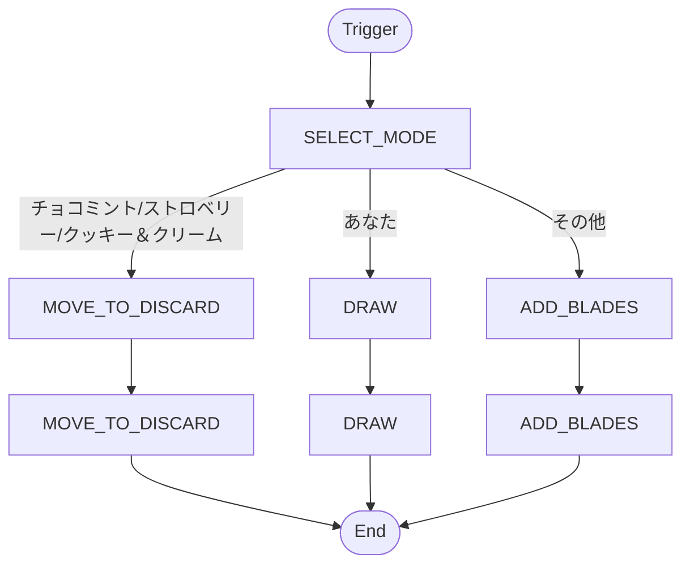

> [!NOTE]
> **Interactive**: This ability contains at least one suspend point (choice/cost).

**Action Button:**
- EN: `[Act] 愛♡スクリ～ム！: [LiveStart] Player Choose3 (Left)`
- JP: `【起動】愛♡スクリ～ム！: 【ライブ進行時】自分択3 (左)`

**Resolution Details (Modal + Buttons):**

#### Choice: SELECT_MODE
- **Modal Header (EN):** `Select a Mode`
- **Modal Header (JP):** `モードを選択してください`
- **Button Labels:**
  - EN: `[Mode] チョコミント/ストロベリー/クッキー＆クリーム ` | JP: `【モード選択】 チョコミント/ストロベリー/クッキー＆クリーム `
  - EN: `[Mode] あなた ` | JP: `【モード選択】 あなた `
  - EN: `[Mode] その他 ` | JP: `【モード選択】 その他 `

---

## LL-bp1-001-R＋: 上原歩夢&澁谷かのん&日野下花帆
**Original Japanese:**
{{toujyou.png|登場}}自分の控え室からメンバーカードを1枚手札に加える。
{{live_start.png|ライブ開始時}}手札の「上原歩夢」と「澁谷かのん」と「日野下花帆」を、好きな組み合わせで合計3枚、控え室に置いてもよい：ライブ終了時まで、「{{jyouji.png|常時}}ライブの合計スコアを＋３する。」を得る。
（手札のこのカードもこの効果で控え室に置ける。）

### Ability 1
**Logic:** `TRIGGER: ON_PLAY
EFFECT: RECOVER_MEMBER(1) -> CARD_HAND

`

**Resolution Flowchart:**
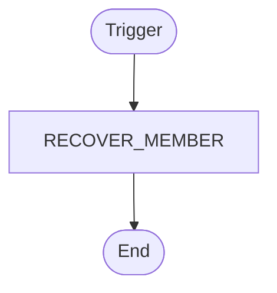

> [!TIP]
> **Automatic**: This ability resolves immediately without user input.

**Action Button:**
- EN: `[Act] 上原歩夢&澁谷かのん&日野下花帆: [OnPlay] RecMem 1 (Left)`
- JP: `【起動】上原歩夢&澁谷かのん&日野下花帆: 【登場時】回収1 (左)`

**Resolution Details (Modal + Buttons):**

#### Choice: SELECT_FROM_DISCARD
- **Modal Header (EN):** `Select from Discard`
- **Modal Header (JP):** `控え室から選択してください`
- **Button Labels:**
  - EN: `[List] Select 渡辺 曜&鬼塚夏美&大沢瑠璃乃 (LL-bp2-001-R＋)` | JP: `【リスト選択】 渡辺 曜&鬼塚夏美&大沢瑠璃乃 (LL-bp2-001-R＋)`

### Ability 2
**Logic:** `TRIGGER: ON_LIVE_START
COST: DISCARD_HAND(3) {FILTER="Ayumu/Kanon/Kaho"} (Optional)
EFFECT: BOOST_SCORE(3) -> SELF`

**Resolution Flowchart:**
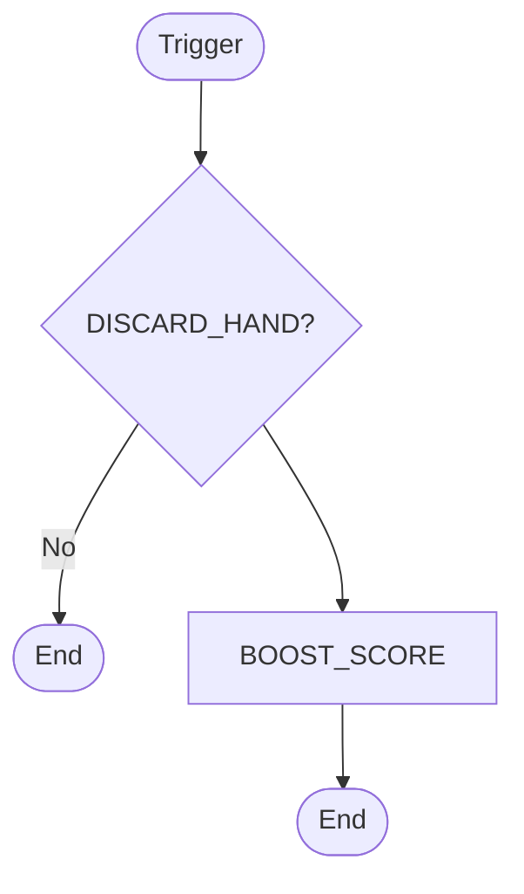

> [!NOTE]
> **Interactive**: This ability contains at least one suspend point (choice/cost).

**Action Button:**
- EN: `[Act] 上原歩夢&澁谷かのん&日野下花帆: [LiveStart] Score+ 3 (Left)`
- JP: `【起動】上原歩夢&澁谷かのん&日野下花帆: 【ライブ進行時】スコア+3 (左)`

**Resolution Details (Modal + Buttons):**

#### Choice: SELECT_FROM_HAND
- **Modal Header (EN):** `Select from Hand`
- **Modal Header (JP):** `手札から選択してください`
- **Button Labels:**
  - EN: `[Hand] Select 上原歩夢&澁谷かのん&日野下花帆 (LL-bp1-001-R＋)` | JP: `【手札選択】 上原歩夢&澁谷かのん&日野下花帆 (LL-bp1-001-R＋)を選択`
  - EN: `[Hand] Select 渡辺 曜&鬼塚夏美&大沢瑠璃乃 (LL-bp2-001-R＋)` | JP: `【手札選択】 渡辺 曜&鬼塚夏美&大沢瑠璃乃 (LL-bp2-001-R＋)を選択`
  - EN: `[End] End Main Phase` | JP: `【終了】メインフェイズを終了する`

---

## LL-bp2-001-R＋: 渡辺 曜&鬼塚夏美&大沢瑠璃乃
**Original Japanese:**
{{jyouji.png|常時}}手札にあるこのメンバーカードのコストは、このカード以外の自分の手札1枚につき、1少なくなる。
{{jyouji.png|常時}}このメンバーはバトンタッチで控え室に置けない。
{{live_start.png|ライブ開始時}}手札の「渡辺曜」と「鬼塚夏美」と「大沢瑠璃乃」を、好きな枚数控え室に置いてもよい：ライブ終了時まで、これによって控え室に置いた枚数1枚につき、{{icon_blade.png|ブレード}}を得る。
（手札のこのカードもこの効果で控え室に置ける。）

### Ability 1
**Logic:** `TRIGGER: CONSTANT
EFFECT: REDUCE_COST(1) {PER_CARD="HAND_OTHER"}

`

**Resolution Flowchart:**
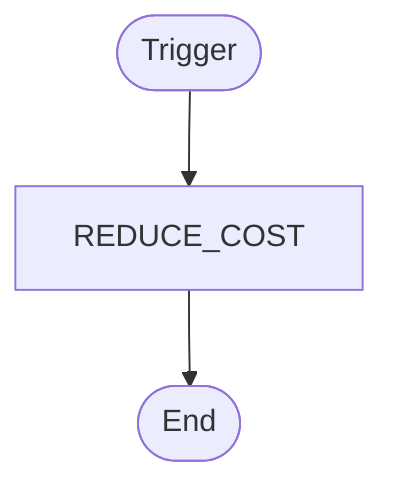

> [!TIP]
> **Automatic**: This ability resolves immediately without user input.

**Action Button:**
- EN: `[Act] 渡辺 曜&鬼塚夏美&大沢瑠璃乃: [Constant] Player Cost- 1 (Left)`
- JP: `【起動】渡辺 曜&鬼塚夏美&大沢瑠璃乃: 【常時】自分コスト-1 (左)`

### Ability 2
**Logic:** `TRIGGER: CONSTANT
EFFECT: PREVENT_BATON_TOUCH(1)

`

**Resolution Flowchart:**
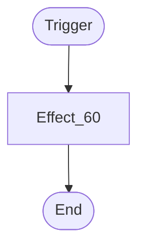

> [!TIP]
> **Automatic**: This ability resolves immediately without user input.

**Action Button:**
- EN: `[Act] 渡辺 曜&鬼塚夏美&大沢瑠璃乃: [Constant] Player Eff60 1 (Left)`
- JP: `【起動】渡辺 曜&鬼塚夏美&大沢瑠璃乃: 【常時】自分Eff601 (左)`

### Ability 3
**Logic:** `TRIGGER: ON_LIVE_START
COST: DISCARD_HAND(X) {FILTER="You/Natsumi/Rurino"}
EFFECT: ADD_BLADES(1) -> PLAYER {PER_CARD="DISCARDED"}`

**Resolution Flowchart:**
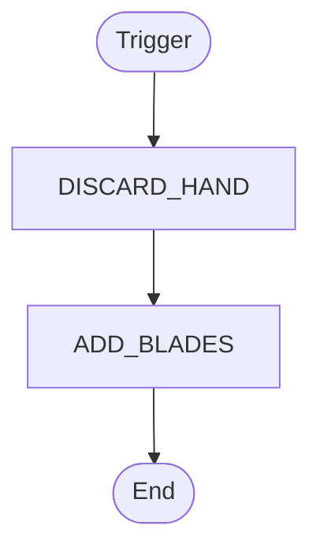

> [!TIP]
> **Automatic**: This ability resolves immediately without user input.

**Action Button:**
- EN: `[Act] 渡辺 曜&鬼塚夏美&大沢瑠璃乃: [LiveStart] Player Blades+ 1 (Left)`
- JP: `【起動】渡辺 曜&鬼塚夏美&大沢瑠璃乃: 【ライブ進行時】自分ブレード+1 (左)`

**Resolution Details (Modal + Buttons):**

#### Choice: SELECT_FROM_HAND
- **Modal Header (EN):** `Select from Hand`
- **Modal Header (JP):** `手札から選択してください`
- **Button Labels:**
  - EN: `[Hand] Select 上原歩夢&澁谷かのん&日野下花帆 (LL-bp1-001-R＋)` | JP: `【手札選択】 上原歩夢&澁谷かのん&日野下花帆 (LL-bp1-001-R＋)を選択`
  - EN: `[Hand] Select 渡辺 曜&鬼塚夏美&大沢瑠璃乃 (LL-bp2-001-R＋)` | JP: `【手札選択】 渡辺 曜&鬼塚夏美&大沢瑠璃乃 (LL-bp2-001-R＋)を選択`

---

## LL-bp3-001-R＋: 園田海未&津島善子&天王寺璃奈
**Original Japanese:**
{{kidou.png|起動}}{{turn1.png|ターン1回}}自分の控え室にある「園田海未」と「津島善子」と「天王寺璃奈」を、合計6枚をシャッフルしてデッキの一番下に置く：エネルギーを6枚までアクティブにする。
{{live_start.png|ライブ開始時}}{{icon_energy.png|E}}{{icon_energy.png|E}}{{icon_energy.png|E}}{{icon_energy.png|E}}{{icon_energy.png|E}}{{icon_energy.png|E}}支払ってもよい：ライブ終了時まで、{{icon_blade.png|ブレード}}{{icon_blade.png|ブレード}}{{icon_blade.png|ブレード}}を得る。

### Ability 1
**Logic:** `TRIGGER: ACTIVATED
COST: MOVE_TO_DECK(6) {FILTER="Umi/Yoshiko/Rina", FROM="DISCARD"}
EFFECT: ACTIVATE_ENERGY(6) -> PLAYER

`

**Resolution Flowchart:**
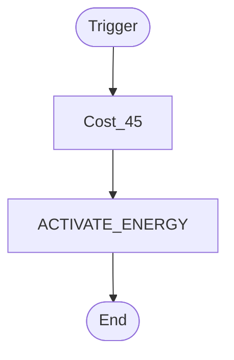

> [!TIP]
> **Automatic**: This ability resolves immediately without user input.

**Action Button:**
- EN: `[Act] 園田海未&津島善子&天王寺璃奈: [Act] Player ActEnergy 6 (Left)`
- JP: `【起動】園田海未&津島善子&天王寺璃奈: 【起動】自分エネ回復6 (左)`

**Resolution Details (Modal + Buttons):**

#### Choice: SELECT_FROM_DISCARD
- **Modal Header (EN):** `Select from Discard`
- **Modal Header (JP):** `控え室から選択してください`
- **Button Labels:**
  - EN: `[List] Select 渡辺 曜&鬼塚夏美&大沢瑠璃乃 (LL-bp2-001-R＋)` | JP: `【リスト選択】 渡辺 曜&鬼塚夏美&大沢瑠璃乃 (LL-bp2-001-R＋)`

### Ability 2
**Logic:** `TRIGGER: ON_LIVE_START
COST: PAY_ENERGY(6)
EFFECT: ADD_BLADES(3) -> PLAYER`

**Resolution Flowchart:**
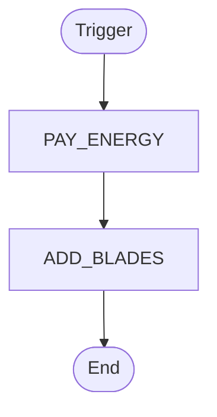

> [!TIP]
> **Automatic**: This ability resolves immediately without user input.

**Action Button:**
- EN: `[Act] 園田海未&津島善子&天王寺璃奈: [LiveStart] Player Blades+ 3 (Left)`
- JP: `【起動】園田海未&津島善子&天王寺璃奈: 【ライブ進行時】自分ブレード+3 (左)`

---

## LL-bp4-001-R＋: 絢瀬絵里&朝香果林&葉月 恋
**Original Japanese:**
{{toujyou.png|登場}}/{{live_start.png|ライブ開始時}}自分のデッキの上からカードを5枚見る。その中から「絢瀬絵里」か「朝香果林」か「葉月恋」のメンバーカードを1枚公開して手札に加えてもよい。残りを控え室に置く。その後、相手のステージにいる、これにより公開したカードのコスト以下で、かつ元々持つ{{icon_blade.png|ブレード}}の数が3つ以下のメンバーをすべてウェイトにする。

### Ability 1
**Logic:** `TRIGGER: ON_PLAY
EFFECT: LOOK_AND_CHOOSE(5) {FILTER="Eri/Karin/Ren"} -> CARD_HAND, DISCARD_REMAINDER
EFFECT: TAP_OPPONENT(99) -> OPPONENT {FILTER="COST_LE_REVEALED, BLADE_LE_3"}

`

**Resolution Flowchart:**
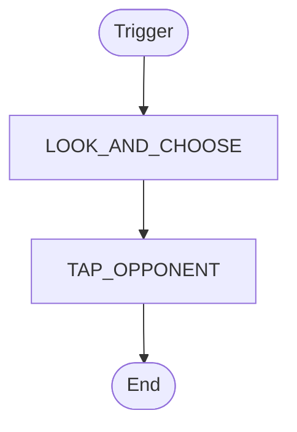

> [!TIP]
> **Automatic**: This ability resolves immediately without user input.

**Action Button:**
- EN: `[Act] 絢瀬絵里&朝香果林&葉月 恋: [OnPlay] Pick5Deck (Eri/Karin/Ren) (Left)`
- JP: `【起動】絢瀬絵里&朝香果林&葉月 恋: 【登場時】5見選(Eri/Karin/Ren) (左)`

**Resolution Details (Modal + Buttons):**

#### Choice: SELECT_FROM_LIST
- **Modal Header (EN):** `Choose an option`
- **Modal Header (JP):** `選択肢を選んでください`
- **Button Labels:**
  - EN: `[List] Select 渡辺 曜&鬼塚夏美&大沢瑠璃乃 (LL-bp2-001-R＋)` | JP: `【リスト選択】 渡辺 曜&鬼塚夏美&大沢瑠璃乃 (LL-bp2-001-R＋)`
  - EN: `[List] Select 園田海未&津島善子&天王寺璃奈 (LL-bp3-001-R＋)` | JP: `【リスト選択】 園田海未&津島善子&天王寺璃奈 (LL-bp3-001-R＋)`

#### Choice: TARGET_OPPONENT_MEMBER
- **Modal Header (EN):** `Select an Opponent Member`
- **Modal Header (JP):** `相手のメンバーを選択してください`
- **Button Labels:**
  - EN: `[Target] Opponent's stage (Left: Empty)` | JP: `【ターゲット】 相手のステージ (左: 空エリア) を選択`
  - EN: `[Target] Opponent's stage (Center: Empty)` | JP: `【ターゲット】 相手のステージ (センター: 空エリア) を選択`
  - EN: `[Target] Opponent's stage (Right: Empty)` | JP: `【ターゲット】 相手のステージ (右: 空エリア) を選択`

### Ability 2
**Logic:** `TRIGGER: ON_LIVE_START
EFFECT: LOOK_AND_CHOOSE(5) {FILTER="Eri/Karin/Ren"} -> CARD_HAND, DISCARD_REMAINDER
EFFECT: TAP_OPPONENT(99) -> OPPONENT {FILTER="COST_LE_REVEALED, BLADE_LE_3"}`

**Resolution Flowchart:**


> [!TIP]
> **Automatic**: This ability resolves immediately without user input.

**Action Button:**
- EN: `[Act] 絢瀬絵里&朝香果林&葉月 恋: [LiveStart] Pick5Deck (Eri/Karin/Ren) (Left)`
- JP: `【起動】絢瀬絵里&朝香果林&葉月 恋: 【ライブ進行時】5見選(Eri/Karin/Ren) (左)`

**Resolution Details (Modal + Buttons):**

#### Choice: SELECT_FROM_LIST
- **Modal Header (EN):** `Choose an option`
- **Modal Header (JP):** `選択肢を選んでください`
- **Button Labels:**
  - EN: `[List] Select 渡辺 曜&鬼塚夏美&大沢瑠璃乃 (LL-bp2-001-R＋)` | JP: `【リスト選択】 渡辺 曜&鬼塚夏美&大沢瑠璃乃 (LL-bp2-001-R＋)`
  - EN: `[List] Select 園田海未&津島善子&天王寺璃奈 (LL-bp3-001-R＋)` | JP: `【リスト選択】 園田海未&津島善子&天王寺璃奈 (LL-bp3-001-R＋)`

#### Choice: TARGET_OPPONENT_MEMBER
- **Modal Header (EN):** `Select an Opponent Member`
- **Modal Header (JP):** `相手のメンバーを選択してください`
- **Button Labels:**
  - EN: `[Target] Opponent's stage (Left: Empty)` | JP: `【ターゲット】 相手のステージ (左: 空エリア) を選択`
  - EN: `[Target] Opponent's stage (Center: Empty)` | JP: `【ターゲット】 相手のステージ (センター: 空エリア) を選択`
  - EN: `[Target] Opponent's stage (Right: Empty)` | JP: `【ターゲット】 相手のステージ (右: 空エリア) を選択`

---

## PL!-PR-001-PR: 高坂穂乃果
**Original Japanese:**
{{jidou.png|自動}}このメンバーがステージから控え室に置かれたとき、メンバー1人をアクティブにしてもよい。

### Ability 1
**Logic:** `TRIGGER: ON_MEMBER_DISCARD
EFFECT: ACTIVATE_MEMBER(1) (Optional) -> SELF`

**Resolution Flowchart:**


> [!TIP]
> **Automatic**: This ability resolves immediately without user input.

**Action Button:**
- EN: `[Act] 高坂穂乃果: Player Eff29 1 (Left)`
- JP: `【起動】高坂穂乃果: 自分Eff291 (左)`

**Resolution Details (Modal + Buttons):**

#### Choice: SELECT_FROM_LIST
- **Modal Header (EN):** `Choose an option`
- **Modal Header (JP):** `選択肢を選んでください`
- **Button Labels:**
  - EN: `[List] Select 渡辺 曜&鬼塚夏美&大沢瑠璃乃 (LL-bp2-001-R＋)` | JP: `【リスト選択】 渡辺 曜&鬼塚夏美&大沢瑠璃乃 (LL-bp2-001-R＋)`
  - EN: `[List] Select 園田海未&津島善子&天王寺璃奈 (LL-bp3-001-R＋)` | JP: `【リスト選択】 園田海未&津島善子&天王寺璃奈 (LL-bp3-001-R＋)`

---

## PL!-PR-002-PR: 絢瀬絵里
**Original Japanese:**
{{jidou.png|自動}}このメンバーがステージから控え室に置かれたとき、メンバー1人をアクティブにしてもよい。

### Ability 1
**Logic:** `TRIGGER: ON_MEMBER_DISCARD
EFFECT: ACTIVATE_MEMBER(1) (Optional) -> SELF`

**Resolution Flowchart:**
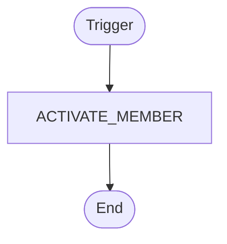

> [!TIP]
> **Automatic**: This ability resolves immediately without user input.

**Action Button:**
- EN: `[Act] 絢瀬絵里: Player Eff29 1 (Left)`
- JP: `【起動】絢瀬絵里: 自分Eff291 (左)`

**Resolution Details (Modal + Buttons):**

#### Choice: SELECT_FROM_LIST
- **Modal Header (EN):** `Choose an option`
- **Modal Header (JP):** `選択肢を選んでください`
- **Button Labels:**
  - EN: `[List] Select 渡辺 曜&鬼塚夏美&大沢瑠璃乃 (LL-bp2-001-R＋)` | JP: `【リスト選択】 渡辺 曜&鬼塚夏美&大沢瑠璃乃 (LL-bp2-001-R＋)`
  - EN: `[List] Select 園田海未&津島善子&天王寺璃奈 (LL-bp3-001-R＋)` | JP: `【リスト選択】 園田海未&津島善子&天王寺璃奈 (LL-bp3-001-R＋)`

---

## PL!-PR-003-PR: 南ことり
**Original Japanese:**
{{kidou.png|起動}}{{turn1.png|ターン1回}}手札を2枚控え室に置く：自分の控え室から必要ハートに{{heart_03.png|heart03}}を3以上含むライブカードを1枚手札に加える。

### Ability 1
**Logic:** `TRIGGER: ACTIVATED
COST: DISCARD_HAND(2)
EFFECT: RECOVER_LIVE(1) {FILTER="HEARTS_GE_3, COLOR_PINK"} -> CARD_HAND`

**Resolution Flowchart:**
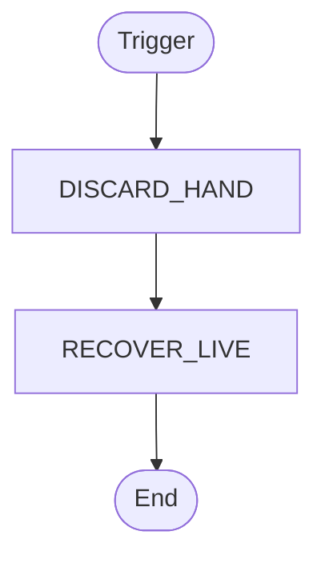

> [!TIP]
> **Automatic**: This ability resolves immediately without user input.

**Action Button:**
- EN: `[Act] 南ことり: [Act] RecLive 1 (Left)`
- JP: `【起動】南ことり: 【起動】ライブ回収1 (左)`

**Resolution Details (Modal + Buttons):**

#### Choice: SELECT_FROM_HAND
- **Modal Header (EN):** `Select from Hand`
- **Modal Header (JP):** `手札から選択してください`
- **Button Labels:**
  - EN: `[Hand] Select 上原歩夢&澁谷かのん&日野下花帆 (LL-bp1-001-R＋)` | JP: `【手札選択】 上原歩夢&澁谷かのん&日野下花帆 (LL-bp1-001-R＋)を選択`
  - EN: `[Hand] Select 渡辺 曜&鬼塚夏美&大沢瑠璃乃 (LL-bp2-001-R＋)` | JP: `【手札選択】 渡辺 曜&鬼塚夏美&大沢瑠璃乃 (LL-bp2-001-R＋)を選択`

---

## PL!-PR-004-PR: 園田海未
**Original Japanese:**
{{kidou.png|起動}}{{turn1.png|ターン1回}}手札を2枚控え室に置く：自分の控え室から必要ハートに{{heart_01.png|heart01}}を3以上含むライブカードを1枚手札に加える。

### Ability 1
**Logic:** `TRIGGER: ACTIVATED
COST: DISCARD_HAND(2)
EFFECT: RECOVER_LIVE(1) {FILTER="HEARTS_GE_3, COLOR_RED"} -> CARD_HAND`

**Resolution Flowchart:**


> [!TIP]
> **Automatic**: This ability resolves immediately without user input.

**Action Button:**
- EN: `[Act] 園田海未: [Act] RecLive 1 (Left)`
- JP: `【起動】園田海未: 【起動】ライブ回収1 (左)`

**Resolution Details (Modal + Buttons):**

#### Choice: SELECT_FROM_HAND
- **Modal Header (EN):** `Select from Hand`
- **Modal Header (JP):** `手札から選択してください`
- **Button Labels:**
  - EN: `[Hand] Select 上原歩夢&澁谷かのん&日野下花帆 (LL-bp1-001-R＋)` | JP: `【手札選択】 上原歩夢&澁谷かのん&日野下花帆 (LL-bp1-001-R＋)を選択`
  - EN: `[Hand] Select 渡辺 曜&鬼塚夏美&大沢瑠璃乃 (LL-bp2-001-R＋)` | JP: `【手札選択】 渡辺 曜&鬼塚夏美&大沢瑠璃乃 (LL-bp2-001-R＋)を選択`

---

## PL!-PR-005-PR: 星空 凛
**Original Japanese:**
{{toujyou.png|登場}}以下から1つを選ぶ。
・カードを1枚引き、手札を1枚控え室に置く。
・相手のステージにいるすべてのコスト2以下のメンバーをウェイトにする。

### Ability 1
**Logic:** `TRIGGER: ON_PLAY
EFFECT: SELECT_MODE(1)
  OPTION: ドロー | EFFECT: DRAW(1); DISCARD_HAND(1)
  OPTION: ウェイト | EFFECT: TAP_MEMBER(99) {FILTER="COST_LE_2", TARGET="OPPONENT"}`

**Resolution Flowchart:**


> [!NOTE]
> **Interactive**: This ability contains at least one suspend point (choice/cost).

**Action Button:**
- EN: `[Act] 星空 凛: [OnPlay] Player Choose2 (Left)`
- JP: `【起動】星空 凛: 【登場時】自分択2 (左)`

**Resolution Details (Modal + Buttons):**

#### Choice: SELECT_MODE
- **Modal Header (EN):** `Select a Mode`
- **Modal Header (JP):** `モードを選択してください`
- **Button Labels:**
  - EN: `[Mode] ドロー ` | JP: `【モード選択】 ドロー `
  - EN: `[Mode] ウェイト ` | JP: `【モード選択】 ウェイト `

---

## PL!-PR-006-PR: 西木野真姫
**Original Japanese:**
{{toujyou.png|登場}}以下から1つを選ぶ。
・カードを1枚引き、手札を1枚控え室に置く。
・相手のステージにいるすべてのコスト2以下のメンバーをウェイトにする。

### Ability 1
**Logic:** `TRIGGER: ON_PLAY
EFFECT: SELECT_MODE(1)
  OPTION: ドロー | EFFECT: DRAW(1); DISCARD_HAND(1)
  OPTION: ウェイト | EFFECT: TAP_MEMBER(99) {FILTER="COST_LE_2", TARGET="OPPONENT"}`

**Resolution Flowchart:**
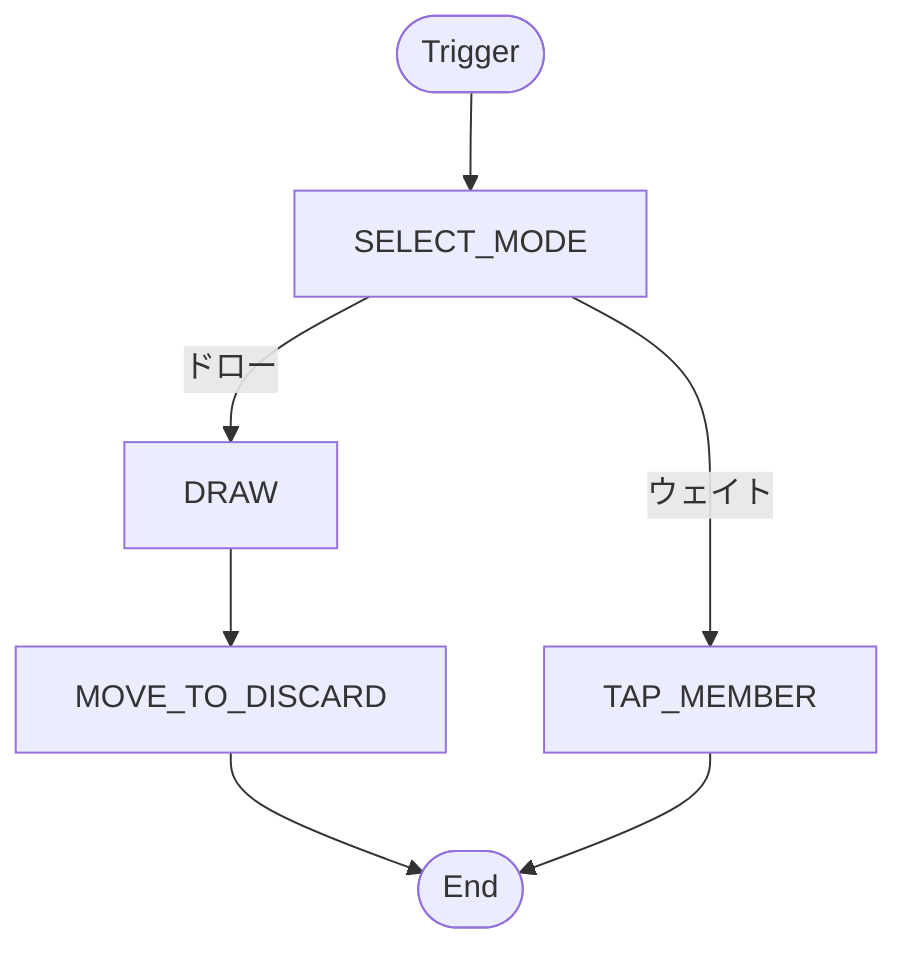

> [!NOTE]
> **Interactive**: This ability contains at least one suspend point (choice/cost).

**Action Button:**
- EN: `[Act] 西木野真姫: [OnPlay] Player Choose2 (Left)`
- JP: `【起動】西木野真姫: 【登場時】自分択2 (左)`

**Resolution Details (Modal + Buttons):**

#### Choice: SELECT_MODE
- **Modal Header (EN):** `Select a Mode`
- **Modal Header (JP):** `モードを選択してください`
- **Button Labels:**
  - EN: `[Mode] ドロー ` | JP: `【モード選択】 ドロー `
  - EN: `[Mode] ウェイト ` | JP: `【モード選択】 ウェイト `

---

## PL!-PR-007-PR: 東條 希
**Original Japanese:**
{{toujyou.png|登場}}/{{live_start.png|ライブ開始時}}このメンバーをウェイトにしてもよい：相手のステージにいるコスト4以下のメンバー1人をウェイトにする。（ウェイト状態のメンバーが持つ{{icon_blade.png|ブレード}}は、エールで公開する枚数を増やさない。）

### Ability 1
**Logic:** `TRIGGER: ON_PLAY
`

**Resolution Flowchart:**
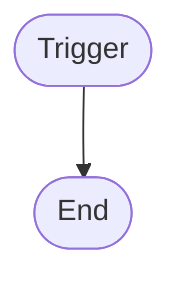

> [!TIP]
> **Automatic**: This ability resolves immediately without user input.

**Action Button:**
- EN: `[Act] 東條 希: [OnPlay] TRIGGER: ON_PLAY... (Left)`
- JP: `【起動】東條 希: 【登場時】TRIGGER: ON_PLAY (左)`

### Ability 2
**Logic:** `TRIGGER: ON_LIVE_START
EFFECT: SELECT_MODE(1) (Optional)
  OPTION: 相手のコスト4以下のメンバー1人をウェイトにする | EFFECT: TAP_OPPONENT(1) {FILTER="COST_LE_4"}`

**Resolution Flowchart:**
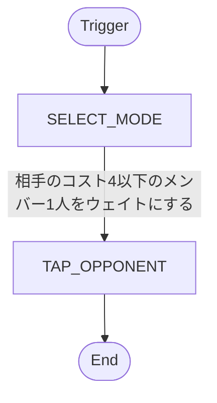

> [!TIP]
> **Automatic**: This ability resolves immediately without user input.

**Action Button:**
- EN: `[Act] 東條 希: [LiveStart] Player Choose1 (Left)`
- JP: `【起動】東條 希: 【ライブ進行時】自分択1 (左)`

**Resolution Details (Modal + Buttons):**

#### Choice: SELECT_MODE
- **Modal Header (EN):** `Select a Mode`
- **Modal Header (JP):** `モードを選択してください`
- **Button Labels:**
  - EN: `[Mode] 相手のコスト4以下のメンバー1人をウェイトにする ` | JP: `【モード選択】 相手のコスト4以下のメンバー1人をウェイトにする `

---

## PL!-PR-008-PR: 小泉花陽
**Original Japanese:**
{{toujyou.png|登場}}以下から1つを選ぶ。
・カードを1枚引き、手札を1枚控え室に置く。
・相手のステージにいるすべてのコスト2以下のメンバーをウェイトにする。

### Ability 1
**Logic:** `TRIGGER: ON_PLAY
EFFECT: SELECT_MODE(1)
  OPTION: ドロー | EFFECT: DRAW(1); DISCARD_HAND(1)
  OPTION: ウェイト | EFFECT: TAP_MEMBER(99) {FILTER="COST_LE_2", TARGET="OPPONENT"}`

**Resolution Flowchart:**


> [!NOTE]
> **Interactive**: This ability contains at least one suspend point (choice/cost).

**Action Button:**
- EN: `[Act] 小泉花陽: [OnPlay] Player Choose2 (Left)`
- JP: `【起動】小泉花陽: 【登場時】自分択2 (左)`

**Resolution Details (Modal + Buttons):**

#### Choice: SELECT_MODE
- **Modal Header (EN):** `Select a Mode`
- **Modal Header (JP):** `モードを選択してください`
- **Button Labels:**
  - EN: `[Mode] ドロー ` | JP: `【モード選択】 ドロー `
  - EN: `[Mode] ウェイト ` | JP: `【モード選択】 ウェイト `

---

## PL!-PR-009-PR: 矢澤にこ
**Original Japanese:**
{{toujyou.png|登場}}/{{live_start.png|ライブ開始時}}このメンバーをウェイトにしてもよい：相手のステージにいるコスト4以下のメンバー1人をウェイトにする。（ウェイト状態のメンバーが持つ{{icon_blade.png|ブレード}}は、エールで公開する枚数を増やさない。）

### Ability 1
**Logic:** `TRIGGER: ON_PLAY
`

**Resolution Flowchart:**


> [!TIP]
> **Automatic**: This ability resolves immediately without user input.

**Action Button:**
- EN: `[Act] 矢澤にこ: [OnPlay] TRIGGER: ON_PLAY... (Left)`
- JP: `【起動】矢澤にこ: 【登場時】TRIGGER: ON_PLAY (左)`

### Ability 2
**Logic:** `TRIGGER: ON_LIVE_START
EFFECT: SELECT_MODE(1) (Optional)
  OPTION: 相手のコスト4以下のメンバー1人をウェイトにする | EFFECT: TAP_OPPONENT(1) {FILTER="COST_LE_4"}`

**Resolution Flowchart:**
```mermaid
graph TD
    Start([Trigger])
    Eff1[SELECT_MODE]
    Eff2[TAP_OPPONENT]
    End([End])
    Start --> Eff1
    Eff1 -- "相手のコスト4以下のメンバー1人をウェイトにする" --> Eff2
    Eff2 --> End
```

> [!TIP]
> **Automatic**: This ability resolves immediately without user input.

**Action Button:**
- EN: `[Act] 矢澤にこ: [LiveStart] Player Choose1 (Left)`
- JP: `【起動】矢澤にこ: 【ライブ進行時】自分択1 (左)`

**Resolution Details (Modal + Buttons):**

#### Choice: SELECT_MODE
- **Modal Header (EN):** `Select a Mode`
- **Modal Header (JP):** `モードを選択してください`
- **Button Labels:**
  - EN: `[Mode] 相手のコスト4以下のメンバー1人をウェイトにする ` | JP: `【モード選択】 相手のコスト4以下のメンバー1人をウェイトにする `

---

## PL!-bp3-001-P: 高坂穂乃果
**Original Japanese:**
{{kidou.png|起動}}{{turn1.png|ターン1回}}このメンバーをウェイトにする：カードを1枚引き、手札を1枚控え室に置く。（ウェイト状態のメンバーが持つ{{icon_blade.png|ブレード}}は、エールで公開する枚数を増やさない。）
{{live_start.png|ライブ開始時}}自分のステージにいるメンバーを1人までアクティブにする。

### Ability 1
**Logic:** `TRIGGER: ACTIVATED (Once per turn)
COST: TAP_MEMBER
EFFECT: DRAW(1); DISCARD_HAND(1)

`

**Resolution Flowchart:**
```mermaid
graph TD
    Start([Trigger])
    Cost1[Cost_20]
    Eff2[DRAW]
    Eff3[MOVE_TO_DISCARD]
    End([End])
    Start --> Cost1
    Cost1 --> Eff2
    Eff2 --> Eff3
    Eff3 --> End
```

> [!NOTE]
> **Interactive**: This ability contains at least one suspend point (choice/cost).

**Action Button:**
- EN: `[Act] 高坂穂乃果: [Act] Player Draw 1 (Left)`
- JP: `【起動】高坂穂乃果: 【起動】自分ドロー1 (左)`

**Resolution Details (Modal + Buttons):**

#### Choice: SELECT_FROM_HAND
- **Modal Header (EN):** `Select from Hand`
- **Modal Header (JP):** `手札から選択してください`
- **Button Labels:**
  - EN: `[Hand] Select 上原歩夢&澁谷かのん&日野下花帆 (LL-bp1-001-R＋)` | JP: `【手札選択】 上原歩夢&澁谷かのん&日野下花帆 (LL-bp1-001-R＋)を選択`
  - EN: `[Hand] Select 渡辺 曜&鬼塚夏美&大沢瑠璃乃 (LL-bp2-001-R＋)` | JP: `【手札選択】 渡辺 曜&鬼塚夏美&大沢瑠璃乃 (LL-bp2-001-R＋)を選択`

### Ability 2
**Logic:** `TRIGGER: ON_LIVE_START
EFFECT: ACTIVATE_MEMBER(1) -> PLAYER`

**Resolution Flowchart:**
```mermaid
graph TD
    Start([Trigger])
    Eff1[ACTIVATE_MEMBER]
    End([End])
    Start --> Eff1
    Eff1 --> End
```

> [!TIP]
> **Automatic**: This ability resolves immediately without user input.

**Action Button:**
- EN: `[Act] 高坂穂乃果: [LiveStart] Player Eff29 1 (Left)`
- JP: `【起動】高坂穂乃果: 【ライブ進行時】自分Eff291 (左)`

**Resolution Details (Modal + Buttons):**

#### Choice: SELECT_FROM_LIST
- **Modal Header (EN):** `Choose an option`
- **Modal Header (JP):** `選択肢を選んでください`
- **Button Labels:**
  - EN: `[List] Select 渡辺 曜&鬼塚夏美&大沢瑠璃乃 (LL-bp2-001-R＋)` | JP: `【リスト選択】 渡辺 曜&鬼塚夏美&大沢瑠璃乃 (LL-bp2-001-R＋)`
  - EN: `[List] Select 園田海未&津島善子&天王寺璃奈 (LL-bp3-001-R＋)` | JP: `【リスト選択】 園田海未&津島善子&天王寺璃奈 (LL-bp3-001-R＋)`

---

## PL!-bp3-001-P: 高坂穂乃果
**Original Japanese:**
{{kidou.png|起動}}{{turn1.png|ターン1回}}このメンバーをウェイトにする：カードを1枚引き、手札を1枚控え室に置く。（ウェイト状態のメンバーが持つ{{icon_blade.png|ブレード}}は、エールで公開する枚数を増やさない。）
{{live_start.png|ライブ開始時}}自分のステージにいるメンバーを1人までアクティブにする。

### Ability 1
**Logic:** `TRIGGER: ACTIVATED (Once per turn)
COST: TAP_MEMBER
EFFECT: DRAW(1); DISCARD_HAND(1)

`

**Resolution Flowchart:**
```mermaid
graph TD
    Start([Trigger])
    Cost1[Cost_20]
    Eff2[DRAW]
    Eff3[MOVE_TO_DISCARD]
    End([End])
    Start --> Cost1
    Cost1 --> Eff2
    Eff2 --> Eff3
    Eff3 --> End
```

> [!NOTE]
> **Interactive**: This ability contains at least one suspend point (choice/cost).

**Action Button:**
- EN: `[Act] 高坂穂乃果: [Act] Player Draw 1 (Left)`
- JP: `【起動】高坂穂乃果: 【起動】自分ドロー1 (左)`

**Resolution Details (Modal + Buttons):**

#### Choice: SELECT_FROM_HAND
- **Modal Header (EN):** `Select from Hand`
- **Modal Header (JP):** `手札から選択してください`
- **Button Labels:**
  - EN: `[Hand] Select 上原歩夢&澁谷かのん&日野下花帆 (LL-bp1-001-R＋)` | JP: `【手札選択】 上原歩夢&澁谷かのん&日野下花帆 (LL-bp1-001-R＋)を選択`
  - EN: `[Hand] Select 渡辺 曜&鬼塚夏美&大沢瑠璃乃 (LL-bp2-001-R＋)` | JP: `【手札選択】 渡辺 曜&鬼塚夏美&大沢瑠璃乃 (LL-bp2-001-R＋)を選択`

### Ability 2
**Logic:** `TRIGGER: ON_LIVE_START
EFFECT: ACTIVATE_MEMBER(1) -> PLAYER`

**Resolution Flowchart:**
```mermaid
graph TD
    Start([Trigger])
    Eff1[ACTIVATE_MEMBER]
    End([End])
    Start --> Eff1
    Eff1 --> End
```

> [!TIP]
> **Automatic**: This ability resolves immediately without user input.

**Action Button:**
- EN: `[Act] 高坂穂乃果: [LiveStart] Player Eff29 1 (Left)`
- JP: `【起動】高坂穂乃果: 【ライブ進行時】自分Eff291 (左)`

**Resolution Details (Modal + Buttons):**

#### Choice: SELECT_FROM_LIST
- **Modal Header (EN):** `Choose an option`
- **Modal Header (JP):** `選択肢を選んでください`
- **Button Labels:**
  - EN: `[List] Select 渡辺 曜&鬼塚夏美&大沢瑠璃乃 (LL-bp2-001-R＋)` | JP: `【リスト選択】 渡辺 曜&鬼塚夏美&大沢瑠璃乃 (LL-bp2-001-R＋)`
  - EN: `[List] Select 園田海未&津島善子&天王寺璃奈 (LL-bp3-001-R＋)` | JP: `【リスト選択】 園田海未&津島善子&天王寺璃奈 (LL-bp3-001-R＋)`

---

## PL!-bp3-001-R: 高坂穂乃果
**Original Japanese:**
{{kidou.png|起動}}{{turn1.png|ターン1回}}このメンバーをウェイトにする：カードを1枚引き、手札を1枚控え室に置く。（ウェイト状態のメンバーが持つ{{icon_blade.png|ブレード}}は、エールで公開する枚数を増やさない。）
{{live_start.png|ライブ開始時}}自分のステージにいるメンバーを1人までアクティブにする。

### Ability 1
**Logic:** `TRIGGER: ACTIVATED (Once per turn)
COST: TAP_MEMBER
EFFECT: DRAW(1); DISCARD_HAND(1)

`

**Resolution Flowchart:**
```mermaid
graph TD
    Start([Trigger])
    Cost1[Cost_20]
    Eff2[DRAW]
    Eff3[MOVE_TO_DISCARD]
    End([End])
    Start --> Cost1
    Cost1 --> Eff2
    Eff2 --> Eff3
    Eff3 --> End
```

> [!NOTE]
> **Interactive**: This ability contains at least one suspend point (choice/cost).

**Action Button:**
- EN: `[Act] 高坂穂乃果: [Act] Player Draw 1 (Left)`
- JP: `【起動】高坂穂乃果: 【起動】自分ドロー1 (左)`

**Resolution Details (Modal + Buttons):**

#### Choice: SELECT_FROM_HAND
- **Modal Header (EN):** `Select from Hand`
- **Modal Header (JP):** `手札から選択してください`
- **Button Labels:**
  - EN: `[Hand] Select 上原歩夢&澁谷かのん&日野下花帆 (LL-bp1-001-R＋)` | JP: `【手札選択】 上原歩夢&澁谷かのん&日野下花帆 (LL-bp1-001-R＋)を選択`
  - EN: `[Hand] Select 渡辺 曜&鬼塚夏美&大沢瑠璃乃 (LL-bp2-001-R＋)` | JP: `【手札選択】 渡辺 曜&鬼塚夏美&大沢瑠璃乃 (LL-bp2-001-R＋)を選択`

### Ability 2
**Logic:** `TRIGGER: ON_LIVE_START
EFFECT: ACTIVATE_MEMBER(1) -> PLAYER`

**Resolution Flowchart:**
```mermaid
graph TD
    Start([Trigger])
    Eff1[ACTIVATE_MEMBER]
    End([End])
    Start --> Eff1
    Eff1 --> End
```

> [!TIP]
> **Automatic**: This ability resolves immediately without user input.

**Action Button:**
- EN: `[Act] 高坂穂乃果: [LiveStart] Player Eff29 1 (Left)`
- JP: `【起動】高坂穂乃果: 【ライブ進行時】自分Eff291 (左)`

**Resolution Details (Modal + Buttons):**

#### Choice: SELECT_FROM_LIST
- **Modal Header (EN):** `Choose an option`
- **Modal Header (JP):** `選択肢を選んでください`
- **Button Labels:**
  - EN: `[List] Select 渡辺 曜&鬼塚夏美&大沢瑠璃乃 (LL-bp2-001-R＋)` | JP: `【リスト選択】 渡辺 曜&鬼塚夏美&大沢瑠璃乃 (LL-bp2-001-R＋)`
  - EN: `[List] Select 園田海未&津島善子&天王寺璃奈 (LL-bp3-001-R＋)` | JP: `【リスト選択】 園田海未&津島善子&天王寺璃奈 (LL-bp3-001-R＋)`

---

## PL!-bp3-001-R: 高坂穂乃果
**Original Japanese:**
{{kidou.png|起動}}{{turn1.png|ターン1回}}このメンバーをウェイトにする：カードを1枚引き、手札を1枚控え室に置く。（ウェイト状態のメンバーが持つ{{icon_blade.png|ブレード}}は、エールで公開する枚数を増やさない。）
{{live_start.png|ライブ開始時}}自分のステージにいるメンバーを1人までアクティブにする。

### Ability 1
**Logic:** `TRIGGER: ACTIVATED (Once per turn)
COST: TAP_MEMBER
EFFECT: DRAW(1); DISCARD_HAND(1)

`

**Resolution Flowchart:**
```mermaid
graph TD
    Start([Trigger])
    Cost1[Cost_20]
    Eff2[DRAW]
    Eff3[MOVE_TO_DISCARD]
    End([End])
    Start --> Cost1
    Cost1 --> Eff2
    Eff2 --> Eff3
    Eff3 --> End
```

> [!NOTE]
> **Interactive**: This ability contains at least one suspend point (choice/cost).

**Action Button:**
- EN: `[Act] 高坂穂乃果: [Act] Player Draw 1 (Left)`
- JP: `【起動】高坂穂乃果: 【起動】自分ドロー1 (左)`

**Resolution Details (Modal + Buttons):**

#### Choice: SELECT_FROM_HAND
- **Modal Header (EN):** `Select from Hand`
- **Modal Header (JP):** `手札から選択してください`
- **Button Labels:**
  - EN: `[Hand] Select 上原歩夢&澁谷かのん&日野下花帆 (LL-bp1-001-R＋)` | JP: `【手札選択】 上原歩夢&澁谷かのん&日野下花帆 (LL-bp1-001-R＋)を選択`
  - EN: `[Hand] Select 渡辺 曜&鬼塚夏美&大沢瑠璃乃 (LL-bp2-001-R＋)` | JP: `【手札選択】 渡辺 曜&鬼塚夏美&大沢瑠璃乃 (LL-bp2-001-R＋)を選択`

### Ability 2
**Logic:** `TRIGGER: ON_LIVE_START
EFFECT: ACTIVATE_MEMBER(1) -> PLAYER`

**Resolution Flowchart:**
```mermaid
graph TD
    Start([Trigger])
    Eff1[ACTIVATE_MEMBER]
    End([End])
    Start --> Eff1
    Eff1 --> End
```

> [!TIP]
> **Automatic**: This ability resolves immediately without user input.

**Action Button:**
- EN: `[Act] 高坂穂乃果: [LiveStart] Player Eff29 1 (Left)`
- JP: `【起動】高坂穂乃果: 【ライブ進行時】自分Eff291 (左)`

**Resolution Details (Modal + Buttons):**

#### Choice: SELECT_FROM_LIST
- **Modal Header (EN):** `Choose an option`
- **Modal Header (JP):** `選択肢を選んでください`
- **Button Labels:**
  - EN: `[List] Select 渡辺 曜&鬼塚夏美&大沢瑠璃乃 (LL-bp2-001-R＋)` | JP: `【リスト選択】 渡辺 曜&鬼塚夏美&大沢瑠璃乃 (LL-bp2-001-R＋)`
  - EN: `[List] Select 園田海未&津島善子&天王寺璃奈 (LL-bp3-001-R＋)` | JP: `【リスト選択】 園田海未&津島善子&天王寺璃奈 (LL-bp3-001-R＋)`

---

## PL!-bp3-002-P: 絢瀬絵里
**Original Japanese:**
{{toujyou.png|登場}}手札を1枚控え室に置いてもよい：相手のステージにいるコスト4以下のメンバーを2人までウェイトにする。（ウェイト状態のメンバーが持つ{{icon_blade.png|ブレード}}は、エールで公開する枚数を増やさない。）
{{jyouji.png|常時}}相手のステージにいるウェイト状態のメンバー1人につき、{{icon_blade.png|ブレード}}を得る。

### Ability 1
**Logic:** `TRIGGER: ON_PLAY
COST: DISCARD_HAND(1) (Optional)
EFFECT: TAP_MEMBER(2) {FILTER="COST_LE_4", TARGET="OPPONENT"}

`

**Resolution Flowchart:**
```mermaid
graph TD
    Start([Trigger])
    Cost1{DISCARD_HAND?}
    Skip2([End])
    Eff3[TAP_MEMBER]
    End([End])
    Start --> Cost1
    Cost1 -- "No" --> Skip2
    Cost1 --> Eff3
    Eff3 --> End
```

> [!NOTE]
> **Interactive**: This ability contains at least one suspend point (choice/cost).

**Action Button:**
- EN: `[Act] 絢瀬絵里: [OnPlay] Player Eff40 2 (COST_LE_4) (Left)`
- JP: `【起動】絢瀬絵里: 【登場時】自分Eff402(COST_LE_4) (左)`

**Resolution Details (Modal + Buttons):**

#### Choice: TARGET_OPPONENT_MEMBER
- **Modal Header (EN):** `Select an Opponent Member`
- **Modal Header (JP):** `相手のメンバーを選択してください`
- **Button Labels:**
  - EN: `[Target] Opponent's stage (Left: Empty)` | JP: `【ターゲット】 相手のステージ (左: 空エリア) を選択`
  - EN: `[Target] Opponent's stage (Center: Empty)` | JP: `【ターゲット】 相手のステージ (センター: 空エリア) を選択`
  - EN: `[Target] Opponent's stage (Right: Empty)` | JP: `【ターゲット】 相手のステージ (右: 空エリア) を選択`
  - EN: `[End] End Main Phase` | JP: `【終了】メインフェイズを終了する`

#### Choice: SELECT_FROM_HAND
- **Modal Header (EN):** `Select from Hand`
- **Modal Header (JP):** `手札から選択してください`
- **Button Labels:**
  - EN: `[Hand] Select 上原歩夢&澁谷かのん&日野下花帆 (LL-bp1-001-R＋)` | JP: `【手札選択】 上原歩夢&澁谷かのん&日野下花帆 (LL-bp1-001-R＋)を選択`
  - EN: `[Hand] Select 渡辺 曜&鬼塚夏美&大沢瑠璃乃 (LL-bp2-001-R＋)` | JP: `【手札選択】 渡辺 曜&鬼塚夏美&大沢瑠璃乃 (LL-bp2-001-R＋)を選択`
  - EN: `[End] End Main Phase` | JP: `【終了】メインフェイズを終了する`

### Ability 2
**Logic:** `TRIGGER: CONSTANT
EFFECT: ADD_BLADES(1) -> PLAYER {PER_CARD="OPPONENT_WAIT"}`

**Resolution Flowchart:**
```mermaid
graph TD
    Start([Trigger])
    Eff1[ADD_BLADES]
    End([End])
    Start --> Eff1
    Eff1 --> End
```

> [!TIP]
> **Automatic**: This ability resolves immediately without user input.

**Action Button:**
- EN: `[Act] 絢瀬絵里: [Constant] Player Blades+ 1 (Left)`
- JP: `【起動】絢瀬絵里: 【常時】自分ブレード+1 (左)`

---

## PL!-bp3-002-P: 絢瀬絵里
**Original Japanese:**
{{toujyou.png|登場}}手札を1枚控え室に置いてもよい：相手のステージにいるコスト4以下のメンバーを2人までウェイトにする。（ウェイト状態のメンバーが持つ{{icon_blade.png|ブレード}}は、エールで公開する枚数を増やさない。）
{{jyouji.png|常時}}相手のステージにいるウェイト状態のメンバー1人につき、{{icon_blade.png|ブレード}}を得る。

### Ability 1
**Logic:** `TRIGGER: ON_PLAY
COST: DISCARD_HAND(1) (Optional)
EFFECT: TAP_MEMBER(2) {FILTER="COST_LE_4", TARGET="OPPONENT"}

`

**Resolution Flowchart:**
```mermaid
graph TD
    Start([Trigger])
    Cost1{DISCARD_HAND?}
    Skip2([End])
    Eff3[TAP_MEMBER]
    End([End])
    Start --> Cost1
    Cost1 -- "No" --> Skip2
    Cost1 --> Eff3
    Eff3 --> End
```

> [!NOTE]
> **Interactive**: This ability contains at least one suspend point (choice/cost).

**Action Button:**
- EN: `[Act] 絢瀬絵里: [OnPlay] Player Eff40 2 (COST_LE_4) (Left)`
- JP: `【起動】絢瀬絵里: 【登場時】自分Eff402(COST_LE_4) (左)`

**Resolution Details (Modal + Buttons):**

#### Choice: TARGET_OPPONENT_MEMBER
- **Modal Header (EN):** `Select an Opponent Member`
- **Modal Header (JP):** `相手のメンバーを選択してください`
- **Button Labels:**
  - EN: `[Target] Opponent's stage (Left: Empty)` | JP: `【ターゲット】 相手のステージ (左: 空エリア) を選択`
  - EN: `[Target] Opponent's stage (Center: Empty)` | JP: `【ターゲット】 相手のステージ (センター: 空エリア) を選択`
  - EN: `[Target] Opponent's stage (Right: Empty)` | JP: `【ターゲット】 相手のステージ (右: 空エリア) を選択`
  - EN: `[End] End Main Phase` | JP: `【終了】メインフェイズを終了する`

#### Choice: SELECT_FROM_HAND
- **Modal Header (EN):** `Select from Hand`
- **Modal Header (JP):** `手札から選択してください`
- **Button Labels:**
  - EN: `[Hand] Select 上原歩夢&澁谷かのん&日野下花帆 (LL-bp1-001-R＋)` | JP: `【手札選択】 上原歩夢&澁谷かのん&日野下花帆 (LL-bp1-001-R＋)を選択`
  - EN: `[Hand] Select 渡辺 曜&鬼塚夏美&大沢瑠璃乃 (LL-bp2-001-R＋)` | JP: `【手札選択】 渡辺 曜&鬼塚夏美&大沢瑠璃乃 (LL-bp2-001-R＋)を選択`
  - EN: `[End] End Main Phase` | JP: `【終了】メインフェイズを終了する`

### Ability 2
**Logic:** `TRIGGER: CONSTANT
EFFECT: ADD_BLADES(1) -> PLAYER {PER_CARD="OPPONENT_WAIT"}`

**Resolution Flowchart:**
```mermaid
graph TD
    Start([Trigger])
    Eff1[ADD_BLADES]
    End([End])
    Start --> Eff1
    Eff1 --> End
```

> [!TIP]
> **Automatic**: This ability resolves immediately without user input.

**Action Button:**
- EN: `[Act] 絢瀬絵里: [Constant] Player Blades+ 1 (Left)`
- JP: `【起動】絢瀬絵里: 【常時】自分ブレード+1 (左)`

---

## PL!-bp3-002-R: 絢瀬絵里
**Original Japanese:**
{{toujyou.png|登場}}手札を1枚控え室に置いてもよい：相手のステージにいるコスト4以下のメンバーを2人までウェイトにする。（ウェイト状態のメンバーが持つ{{icon_blade.png|ブレード}}は、エールで公開する枚数を増やさない。）
{{jyouji.png|常時}}相手のステージにいるウェイト状態のメンバー1人につき、{{icon_blade.png|ブレード}}を得る。

### Ability 1
**Logic:** `TRIGGER: ON_PLAY
COST: DISCARD_HAND(1) (Optional)
EFFECT: TAP_MEMBER(2) {FILTER="COST_LE_4", TARGET="OPPONENT"}

`

**Resolution Flowchart:**
```mermaid
graph TD
    Start([Trigger])
    Cost1{DISCARD_HAND?}
    Skip2([End])
    Eff3[TAP_MEMBER]
    End([End])
    Start --> Cost1
    Cost1 -- "No" --> Skip2
    Cost1 --> Eff3
    Eff3 --> End
```

> [!NOTE]
> **Interactive**: This ability contains at least one suspend point (choice/cost).

**Action Button:**
- EN: `[Act] 絢瀬絵里: [OnPlay] Player Eff40 2 (COST_LE_4) (Left)`
- JP: `【起動】絢瀬絵里: 【登場時】自分Eff402(COST_LE_4) (左)`

**Resolution Details (Modal + Buttons):**

#### Choice: TARGET_OPPONENT_MEMBER
- **Modal Header (EN):** `Select an Opponent Member`
- **Modal Header (JP):** `相手のメンバーを選択してください`
- **Button Labels:**
  - EN: `[Target] Opponent's stage (Left: Empty)` | JP: `【ターゲット】 相手のステージ (左: 空エリア) を選択`
  - EN: `[Target] Opponent's stage (Center: Empty)` | JP: `【ターゲット】 相手のステージ (センター: 空エリア) を選択`
  - EN: `[Target] Opponent's stage (Right: Empty)` | JP: `【ターゲット】 相手のステージ (右: 空エリア) を選択`
  - EN: `[End] End Main Phase` | JP: `【終了】メインフェイズを終了する`

#### Choice: SELECT_FROM_HAND
- **Modal Header (EN):** `Select from Hand`
- **Modal Header (JP):** `手札から選択してください`
- **Button Labels:**
  - EN: `[Hand] Select 上原歩夢&澁谷かのん&日野下花帆 (LL-bp1-001-R＋)` | JP: `【手札選択】 上原歩夢&澁谷かのん&日野下花帆 (LL-bp1-001-R＋)を選択`
  - EN: `[Hand] Select 渡辺 曜&鬼塚夏美&大沢瑠璃乃 (LL-bp2-001-R＋)` | JP: `【手札選択】 渡辺 曜&鬼塚夏美&大沢瑠璃乃 (LL-bp2-001-R＋)を選択`
  - EN: `[End] End Main Phase` | JP: `【終了】メインフェイズを終了する`

### Ability 2
**Logic:** `TRIGGER: CONSTANT
EFFECT: ADD_BLADES(1) -> PLAYER {PER_CARD="OPPONENT_WAIT"}`

**Resolution Flowchart:**
```mermaid
graph TD
    Start([Trigger])
    Eff1[ADD_BLADES]
    End([End])
    Start --> Eff1
    Eff1 --> End
```

> [!TIP]
> **Automatic**: This ability resolves immediately without user input.

**Action Button:**
- EN: `[Act] 絢瀬絵里: [Constant] Player Blades+ 1 (Left)`
- JP: `【起動】絢瀬絵里: 【常時】自分ブレード+1 (左)`

---

## PL!-bp3-002-R: 絢瀬絵里
**Original Japanese:**
{{toujyou.png|登場}}手札を1枚控え室に置いてもよい：相手のステージにいるコスト4以下のメンバーを2人までウェイトにする。（ウェイト状態のメンバーが持つ{{icon_blade.png|ブレード}}は、エールで公開する枚数を増やさない。）
{{jyouji.png|常時}}相手のステージにいるウェイト状態のメンバー1人につき、{{icon_blade.png|ブレード}}を得る。

### Ability 1
**Logic:** `TRIGGER: ON_PLAY
COST: DISCARD_HAND(1) (Optional)
EFFECT: TAP_MEMBER(2) {FILTER="COST_LE_4", TARGET="OPPONENT"}

`

**Resolution Flowchart:**
```mermaid
graph TD
    Start([Trigger])
    Cost1{DISCARD_HAND?}
    Skip2([End])
    Eff3[TAP_MEMBER]
    End([End])
    Start --> Cost1
    Cost1 -- "No" --> Skip2
    Cost1 --> Eff3
    Eff3 --> End
```

> [!NOTE]
> **Interactive**: This ability contains at least one suspend point (choice/cost).

**Action Button:**
- EN: `[Act] 絢瀬絵里: [OnPlay] Player Eff40 2 (COST_LE_4) (Left)`
- JP: `【起動】絢瀬絵里: 【登場時】自分Eff402(COST_LE_4) (左)`

**Resolution Details (Modal + Buttons):**

#### Choice: TARGET_OPPONENT_MEMBER
- **Modal Header (EN):** `Select an Opponent Member`
- **Modal Header (JP):** `相手のメンバーを選択してください`
- **Button Labels:**
  - EN: `[Target] Opponent's stage (Left: Empty)` | JP: `【ターゲット】 相手のステージ (左: 空エリア) を選択`
  - EN: `[Target] Opponent's stage (Center: Empty)` | JP: `【ターゲット】 相手のステージ (センター: 空エリア) を選択`
  - EN: `[Target] Opponent's stage (Right: Empty)` | JP: `【ターゲット】 相手のステージ (右: 空エリア) を選択`
  - EN: `[End] End Main Phase` | JP: `【終了】メインフェイズを終了する`

#### Choice: SELECT_FROM_HAND
- **Modal Header (EN):** `Select from Hand`
- **Modal Header (JP):** `手札から選択してください`
- **Button Labels:**
  - EN: `[Hand] Select 上原歩夢&澁谷かのん&日野下花帆 (LL-bp1-001-R＋)` | JP: `【手札選択】 上原歩夢&澁谷かのん&日野下花帆 (LL-bp1-001-R＋)を選択`
  - EN: `[Hand] Select 渡辺 曜&鬼塚夏美&大沢瑠璃乃 (LL-bp2-001-R＋)` | JP: `【手札選択】 渡辺 曜&鬼塚夏美&大沢瑠璃乃 (LL-bp2-001-R＋)を選択`
  - EN: `[End] End Main Phase` | JP: `【終了】メインフェイズを終了する`

### Ability 2
**Logic:** `TRIGGER: CONSTANT
EFFECT: ADD_BLADES(1) -> PLAYER {PER_CARD="OPPONENT_WAIT"}`

**Resolution Flowchart:**
```mermaid
graph TD
    Start([Trigger])
    Eff1[ADD_BLADES]
    End([End])
    Start --> Eff1
    Eff1 --> End
```

> [!TIP]
> **Automatic**: This ability resolves immediately without user input.

**Action Button:**
- EN: `[Act] 絢瀬絵里: [Constant] Player Blades+ 1 (Left)`
- JP: `【起動】絢瀬絵里: 【常時】自分ブレード+1 (左)`

---

## PL!-bp3-003-P: 南ことり
**Original Japanese:**
{{toujyou.png|登場}}このメンバーをウェイトにしてもよい：自分の控え室から『μ's』のメンバーカードを1枚手札に加える。（ウェイト状態のメンバーが持つ{{icon_blade.png|ブレード}}は、エールで公開する枚数を増やさない。）

### Ability 1
**Logic:** `TRIGGER: ON_PLAY
COST: TAP_MEMBER (Optional)
EFFECT: RECOVER_MEMBER(1) -> CARD_HAND`

**Resolution Flowchart:**
```mermaid
graph TD
    Start([Trigger])
    Cost1{Cost_20?}
    Skip2([End])
    Eff3[RECOVER_MEMBER]
    End([End])
    Start --> Cost1
    Cost1 -- "No" --> Skip2
    Cost1 --> Eff3
    Eff3 --> End
```

> [!NOTE]
> **Interactive**: This ability contains at least one suspend point (choice/cost).

**Action Button:**
- EN: `[Act] 南ことり: [OnPlay] RecMem 1 (Left)`
- JP: `【起動】南ことり: 【登場時】回収1 (左)`

**Resolution Details (Modal + Buttons):**

#### Choice: SELECT_FROM_DISCARD
- **Modal Header (EN):** `Select from Discard`
- **Modal Header (JP):** `控え室から選択してください`
- **Button Labels:**
  - EN: `[List] Select 渡辺 曜&鬼塚夏美&大沢瑠璃乃 (LL-bp2-001-R＋)` | JP: `【リスト選択】 渡辺 曜&鬼塚夏美&大沢瑠璃乃 (LL-bp2-001-R＋)`
  - EN: `[End] End Main Phase` | JP: `【終了】メインフェイズを終了する`

---

## PL!-bp3-003-P: 南ことり
**Original Japanese:**
{{toujyou.png|登場}}このメンバーをウェイトにしてもよい：自分の控え室から『μ's』のメンバーカードを1枚手札に加える。（ウェイト状態のメンバーが持つ{{icon_blade.png|ブレード}}は、エールで公開する枚数を増やさない。）

### Ability 1
**Logic:** `TRIGGER: ON_PLAY
COST: TAP_MEMBER (Optional)
EFFECT: RECOVER_MEMBER(1) -> CARD_HAND`

**Resolution Flowchart:**
```mermaid
graph TD
    Start([Trigger])
    Cost1{Cost_20?}
    Skip2([End])
    Eff3[RECOVER_MEMBER]
    End([End])
    Start --> Cost1
    Cost1 -- "No" --> Skip2
    Cost1 --> Eff3
    Eff3 --> End
```

> [!NOTE]
> **Interactive**: This ability contains at least one suspend point (choice/cost).

**Action Button:**
- EN: `[Act] 南ことり: [OnPlay] RecMem 1 (Left)`
- JP: `【起動】南ことり: 【登場時】回収1 (左)`

**Resolution Details (Modal + Buttons):**

#### Choice: SELECT_FROM_DISCARD
- **Modal Header (EN):** `Select from Discard`
- **Modal Header (JP):** `控え室から選択してください`
- **Button Labels:**
  - EN: `[List] Select 渡辺 曜&鬼塚夏美&大沢瑠璃乃 (LL-bp2-001-R＋)` | JP: `【リスト選択】 渡辺 曜&鬼塚夏美&大沢瑠璃乃 (LL-bp2-001-R＋)`
  - EN: `[End] End Main Phase` | JP: `【終了】メインフェイズを終了する`

---

## PL!-bp3-003-R: 南ことり
**Original Japanese:**
{{toujyou.png|登場}}このメンバーをウェイトにしてもよい：自分の控え室から『μ's』のメンバーカードを1枚手札に加える。（ウェイト状態のメンバーが持つ{{icon_blade.png|ブレード}}は、エールで公開する枚数を増やさない。）

### Ability 1
**Logic:** `TRIGGER: ON_PLAY
COST: TAP_MEMBER (Optional)
EFFECT: RECOVER_MEMBER(1) -> CARD_HAND`

**Resolution Flowchart:**
```mermaid
graph TD
    Start([Trigger])
    Cost1{Cost_20?}
    Skip2([End])
    Eff3[RECOVER_MEMBER]
    End([End])
    Start --> Cost1
    Cost1 -- "No" --> Skip2
    Cost1 --> Eff3
    Eff3 --> End
```

> [!NOTE]
> **Interactive**: This ability contains at least one suspend point (choice/cost).

**Action Button:**
- EN: `[Act] 南ことり: [OnPlay] RecMem 1 (Left)`
- JP: `【起動】南ことり: 【登場時】回収1 (左)`

**Resolution Details (Modal + Buttons):**

#### Choice: SELECT_FROM_DISCARD
- **Modal Header (EN):** `Select from Discard`
- **Modal Header (JP):** `控え室から選択してください`
- **Button Labels:**
  - EN: `[List] Select 渡辺 曜&鬼塚夏美&大沢瑠璃乃 (LL-bp2-001-R＋)` | JP: `【リスト選択】 渡辺 曜&鬼塚夏美&大沢瑠璃乃 (LL-bp2-001-R＋)`
  - EN: `[End] End Main Phase` | JP: `【終了】メインフェイズを終了する`

---

## PL!-bp3-003-R: 南ことり
**Original Japanese:**
{{toujyou.png|登場}}このメンバーをウェイトにしてもよい：自分の控え室から『μ's』のメンバーカードを1枚手札に加える。（ウェイト状態のメンバーが持つ{{icon_blade.png|ブレード}}は、エールで公開する枚数を増やさない。）

### Ability 1
**Logic:** `TRIGGER: ON_PLAY
COST: TAP_MEMBER (Optional)
EFFECT: RECOVER_MEMBER(1) -> CARD_HAND`

**Resolution Flowchart:**
```mermaid
graph TD
    Start([Trigger])
    Cost1{Cost_20?}
    Skip2([End])
    Eff3[RECOVER_MEMBER]
    End([End])
    Start --> Cost1
    Cost1 -- "No" --> Skip2
    Cost1 --> Eff3
    Eff3 --> End
```

> [!NOTE]
> **Interactive**: This ability contains at least one suspend point (choice/cost).

**Action Button:**
- EN: `[Act] 南ことり: [OnPlay] RecMem 1 (Left)`
- JP: `【起動】南ことり: 【登場時】回収1 (左)`

**Resolution Details (Modal + Buttons):**

#### Choice: SELECT_FROM_DISCARD
- **Modal Header (EN):** `Select from Discard`
- **Modal Header (JP):** `控え室から選択してください`
- **Button Labels:**
  - EN: `[List] Select 渡辺 曜&鬼塚夏美&大沢瑠璃乃 (LL-bp2-001-R＋)` | JP: `【リスト選択】 渡辺 曜&鬼塚夏美&大沢瑠璃乃 (LL-bp2-001-R＋)`
  - EN: `[End] End Main Phase` | JP: `【終了】メインフェイズを終了する`

---

## PL!-bp3-004-P: 園田海未
**Original Japanese:**
{{toujyou.png|登場}}自分のステージにいるメンバー1人につき、カードを1枚引く。その後、手札を1枚控え室に置く。
{{live_start.png|ライブ開始時}}自分の成功ライブカード置き場にカードがある場合、手札を1枚控え室に置いてもよい。そうした場合、自分の控え室から『μ's』のライブカードを1枚手札に加える。

### Ability 1
**Logic:** `TRIGGER: ON_PLAY
EFFECT: DRAW(COUNT_STAGE); DISCARD_HAND(1)

`

**Resolution Flowchart:**
```mermaid
graph TD
    Start([Trigger])
    Eff1[DRAW]
    Eff2[MOVE_TO_DISCARD]
    End([End])
    Start --> Eff1
    Eff1 --> Eff2
    Eff2 --> End
```

> [!TIP]
> **Automatic**: This ability resolves immediately without user input.

**Action Button:**
- EN: `[Act] 園田海未: [OnPlay] Player Draw (Left)`
- JP: `【起動】園田海未: 【登場時】自分ドロー (左)`

**Resolution Details (Modal + Buttons):**

#### Choice: SELECT_FROM_HAND
- **Modal Header (EN):** `Select from Hand`
- **Modal Header (JP):** `手札から選択してください`
- **Button Labels:**
  - EN: `[Hand] Select 上原歩夢&澁谷かのん&日野下花帆 (LL-bp1-001-R＋)` | JP: `【手札選択】 上原歩夢&澁谷かのん&日野下花帆 (LL-bp1-001-R＋)を選択`
  - EN: `[Hand] Select 渡辺 曜&鬼塚夏美&大沢瑠璃乃 (LL-bp2-001-R＋)` | JP: `【手札選択】 渡辺 曜&鬼塚夏美&大沢瑠璃乃 (LL-bp2-001-R＋)を選択`

### Ability 2
**Logic:** `TRIGGER: ON_LIVE_START
CONDITION: COUNT_SUCCESS_LIVE {MIN=1}
COST: DISCARD_HAND(1) (Optional)
EFFECT: RECOVER_LIVE(1) {FILTER="GROUP_ID=0"} -> CARD_HAND`

**Resolution Flowchart:**
```mermaid
graph TD
    Start([Trigger])
    Cost1{DISCARD_HAND?}
    Skip2([End])
    Eff3[RECOVER_LIVE]
    End([End])
    Start --> Cost1
    Cost1 -- "No" --> Skip2
    Cost1 --> Eff3
    Eff3 --> End
```

> [!NOTE]
> **Interactive**: This ability contains at least one suspend point (choice/cost).

**Action Button:**
- EN: `[Act] 園田海未: [LiveStart] RecLive 1 (ID=0) (Left)`
- JP: `【起動】園田海未: 【ライブ進行時】ライブ回収1(ID=0) (左)`

**Resolution Details (Modal + Buttons):**

#### Choice: SELECT_FROM_HAND
- **Modal Header (EN):** `Select from Hand`
- **Modal Header (JP):** `手札から選択してください`
- **Button Labels:**
  - EN: `[Hand] Select 上原歩夢&澁谷かのん&日野下花帆 (LL-bp1-001-R＋)` | JP: `【手札選択】 上原歩夢&澁谷かのん&日野下花帆 (LL-bp1-001-R＋)を選択`
  - EN: `[Hand] Select 渡辺 曜&鬼塚夏美&大沢瑠璃乃 (LL-bp2-001-R＋)` | JP: `【手札選択】 渡辺 曜&鬼塚夏美&大沢瑠璃乃 (LL-bp2-001-R＋)を選択`
  - EN: `[End] End Main Phase` | JP: `【終了】メインフェイズを終了する`

---

## PL!-bp3-004-P: 園田海未
**Original Japanese:**
{{toujyou.png|登場}}自分のステージにいるメンバー1人につき、カードを1枚引く。その後、手札を1枚控え室に置く。
{{live_start.png|ライブ開始時}}自分の成功ライブカード置き場にカードがある場合、手札を1枚控え室に置いてもよい。そうした場合、自分の控え室から『μ's』のライブカードを1枚手札に加える。

### Ability 1
**Logic:** `TRIGGER: ON_PLAY
EFFECT: DRAW(COUNT_STAGE); DISCARD_HAND(1)

`

**Resolution Flowchart:**
```mermaid
graph TD
    Start([Trigger])
    Eff1[DRAW]
    Eff2[MOVE_TO_DISCARD]
    End([End])
    Start --> Eff1
    Eff1 --> Eff2
    Eff2 --> End
```

> [!TIP]
> **Automatic**: This ability resolves immediately without user input.

**Action Button:**
- EN: `[Act] 園田海未: [OnPlay] Player Draw (Left)`
- JP: `【起動】園田海未: 【登場時】自分ドロー (左)`

**Resolution Details (Modal + Buttons):**

#### Choice: SELECT_FROM_HAND
- **Modal Header (EN):** `Select from Hand`
- **Modal Header (JP):** `手札から選択してください`
- **Button Labels:**
  - EN: `[Hand] Select 上原歩夢&澁谷かのん&日野下花帆 (LL-bp1-001-R＋)` | JP: `【手札選択】 上原歩夢&澁谷かのん&日野下花帆 (LL-bp1-001-R＋)を選択`
  - EN: `[Hand] Select 渡辺 曜&鬼塚夏美&大沢瑠璃乃 (LL-bp2-001-R＋)` | JP: `【手札選択】 渡辺 曜&鬼塚夏美&大沢瑠璃乃 (LL-bp2-001-R＋)を選択`

### Ability 2
**Logic:** `TRIGGER: ON_LIVE_START
CONDITION: COUNT_SUCCESS_LIVE {MIN=1}
COST: DISCARD_HAND(1) (Optional)
EFFECT: RECOVER_LIVE(1) {FILTER="GROUP_ID=0"} -> CARD_HAND`

**Resolution Flowchart:**
```mermaid
graph TD
    Start([Trigger])
    Cost1{DISCARD_HAND?}
    Skip2([End])
    Eff3[RECOVER_LIVE]
    End([End])
    Start --> Cost1
    Cost1 -- "No" --> Skip2
    Cost1 --> Eff3
    Eff3 --> End
```

> [!NOTE]
> **Interactive**: This ability contains at least one suspend point (choice/cost).

**Action Button:**
- EN: `[Act] 園田海未: [LiveStart] RecLive 1 (ID=0) (Left)`
- JP: `【起動】園田海未: 【ライブ進行時】ライブ回収1(ID=0) (左)`

**Resolution Details (Modal + Buttons):**

#### Choice: SELECT_FROM_HAND
- **Modal Header (EN):** `Select from Hand`
- **Modal Header (JP):** `手札から選択してください`
- **Button Labels:**
  - EN: `[Hand] Select 上原歩夢&澁谷かのん&日野下花帆 (LL-bp1-001-R＋)` | JP: `【手札選択】 上原歩夢&澁谷かのん&日野下花帆 (LL-bp1-001-R＋)を選択`
  - EN: `[Hand] Select 渡辺 曜&鬼塚夏美&大沢瑠璃乃 (LL-bp2-001-R＋)` | JP: `【手札選択】 渡辺 曜&鬼塚夏美&大沢瑠璃乃 (LL-bp2-001-R＋)を選択`
  - EN: `[End] End Main Phase` | JP: `【終了】メインフェイズを終了する`

---

## PL!-bp3-004-P: 園田海未
**Original Japanese:**
{{toujyou.png|登場}}自分のステージにいるメンバー1人につき、カードを1枚引く。その後、手札を1枚控え室に置く。
{{live_start.png|ライブ開始時}}自分の成功ライブカード置き場にカードがある場合、手札を1枚控え室に置いてもよい。そうした場合、自分の控え室から『μ's』のライブカードを1枚手札に加える。

### Ability 1
**Logic:** `TRIGGER: ON_PLAY
EFFECT: DRAW(COUNT_STAGE); DISCARD_HAND(1)

`

**Resolution Flowchart:**
```mermaid
graph TD
    Start([Trigger])
    Eff1[DRAW]
    Eff2[MOVE_TO_DISCARD]
    End([End])
    Start --> Eff1
    Eff1 --> Eff2
    Eff2 --> End
```

> [!TIP]
> **Automatic**: This ability resolves immediately without user input.

**Action Button:**
- EN: `[Act] 園田海未: [OnPlay] Player Draw (Left)`
- JP: `【起動】園田海未: 【登場時】自分ドロー (左)`

**Resolution Details (Modal + Buttons):**

#### Choice: SELECT_FROM_HAND
- **Modal Header (EN):** `Select from Hand`
- **Modal Header (JP):** `手札から選択してください`
- **Button Labels:**
  - EN: `[Hand] Select 上原歩夢&澁谷かのん&日野下花帆 (LL-bp1-001-R＋)` | JP: `【手札選択】 上原歩夢&澁谷かのん&日野下花帆 (LL-bp1-001-R＋)を選択`
  - EN: `[Hand] Select 渡辺 曜&鬼塚夏美&大沢瑠璃乃 (LL-bp2-001-R＋)` | JP: `【手札選択】 渡辺 曜&鬼塚夏美&大沢瑠璃乃 (LL-bp2-001-R＋)を選択`

### Ability 2
**Logic:** `TRIGGER: ON_LIVE_START
CONDITION: COUNT_SUCCESS_LIVE {MIN=1}
COST: DISCARD_HAND(1) (Optional)
EFFECT: RECOVER_LIVE(1) {FILTER="GROUP_ID=0"} -> CARD_HAND`

**Resolution Flowchart:**
```mermaid
graph TD
    Start([Trigger])
    Cost1{DISCARD_HAND?}
    Skip2([End])
    Eff3[RECOVER_LIVE]
    End([End])
    Start --> Cost1
    Cost1 -- "No" --> Skip2
    Cost1 --> Eff3
    Eff3 --> End
```

> [!NOTE]
> **Interactive**: This ability contains at least one suspend point (choice/cost).

**Action Button:**
- EN: `[Act] 園田海未: [LiveStart] RecLive 1 (ID=0) (Left)`
- JP: `【起動】園田海未: 【ライブ進行時】ライブ回収1(ID=0) (左)`

**Resolution Details (Modal + Buttons):**

#### Choice: SELECT_FROM_HAND
- **Modal Header (EN):** `Select from Hand`
- **Modal Header (JP):** `手札から選択してください`
- **Button Labels:**
  - EN: `[Hand] Select 上原歩夢&澁谷かのん&日野下花帆 (LL-bp1-001-R＋)` | JP: `【手札選択】 上原歩夢&澁谷かのん&日野下花帆 (LL-bp1-001-R＋)を選択`
  - EN: `[Hand] Select 渡辺 曜&鬼塚夏美&大沢瑠璃乃 (LL-bp2-001-R＋)` | JP: `【手札選択】 渡辺 曜&鬼塚夏美&大沢瑠璃乃 (LL-bp2-001-R＋)を選択`
  - EN: `[End] End Main Phase` | JP: `【終了】メインフェイズを終了する`

---

## PL!-bp3-004-P: 園田海未
**Original Japanese:**
{{toujyou.png|登場}}自分のステージにいるメンバー1人につき、カードを1枚引く。その後、手札を1枚控え室に置く。
{{live_start.png|ライブ開始時}}自分の成功ライブカード置き場にカードがある場合、手札を1枚控え室に置いてもよい。そうした場合、自分の控え室から『μ's』のライブカードを1枚手札に加える。

### Ability 1
**Logic:** `TRIGGER: ON_PLAY
EFFECT: DRAW(COUNT_STAGE); DISCARD_HAND(1)

`

**Resolution Flowchart:**
```mermaid
graph TD
    Start([Trigger])
    Eff1[DRAW]
    Eff2[MOVE_TO_DISCARD]
    End([End])
    Start --> Eff1
    Eff1 --> Eff2
    Eff2 --> End
```

> [!TIP]
> **Automatic**: This ability resolves immediately without user input.

**Action Button:**
- EN: `[Act] 園田海未: [OnPlay] Player Draw (Left)`
- JP: `【起動】園田海未: 【登場時】自分ドロー (左)`

**Resolution Details (Modal + Buttons):**

#### Choice: SELECT_FROM_HAND
- **Modal Header (EN):** `Select from Hand`
- **Modal Header (JP):** `手札から選択してください`
- **Button Labels:**
  - EN: `[Hand] Select 上原歩夢&澁谷かのん&日野下花帆 (LL-bp1-001-R＋)` | JP: `【手札選択】 上原歩夢&澁谷かのん&日野下花帆 (LL-bp1-001-R＋)を選択`
  - EN: `[Hand] Select 渡辺 曜&鬼塚夏美&大沢瑠璃乃 (LL-bp2-001-R＋)` | JP: `【手札選択】 渡辺 曜&鬼塚夏美&大沢瑠璃乃 (LL-bp2-001-R＋)を選択`

### Ability 2
**Logic:** `TRIGGER: ON_LIVE_START
CONDITION: COUNT_SUCCESS_LIVE {MIN=1}
COST: DISCARD_HAND(1) (Optional)
EFFECT: RECOVER_LIVE(1) {FILTER="GROUP_ID=0"} -> CARD_HAND`

**Resolution Flowchart:**
```mermaid
graph TD
    Start([Trigger])
    Cost1{DISCARD_HAND?}
    Skip2([End])
    Eff3[RECOVER_LIVE]
    End([End])
    Start --> Cost1
    Cost1 -- "No" --> Skip2
    Cost1 --> Eff3
    Eff3 --> End
```

> [!NOTE]
> **Interactive**: This ability contains at least one suspend point (choice/cost).

**Action Button:**
- EN: `[Act] 園田海未: [LiveStart] RecLive 1 (ID=0) (Left)`
- JP: `【起動】園田海未: 【ライブ進行時】ライブ回収1(ID=0) (左)`

**Resolution Details (Modal + Buttons):**

#### Choice: SELECT_FROM_HAND
- **Modal Header (EN):** `Select from Hand`
- **Modal Header (JP):** `手札から選択してください`
- **Button Labels:**
  - EN: `[Hand] Select 上原歩夢&澁谷かのん&日野下花帆 (LL-bp1-001-R＋)` | JP: `【手札選択】 上原歩夢&澁谷かのん&日野下花帆 (LL-bp1-001-R＋)を選択`
  - EN: `[Hand] Select 渡辺 曜&鬼塚夏美&大沢瑠璃乃 (LL-bp2-001-R＋)` | JP: `【手札選択】 渡辺 曜&鬼塚夏美&大沢瑠璃乃 (LL-bp2-001-R＋)を選択`
  - EN: `[End] End Main Phase` | JP: `【終了】メインフェイズを終了する`

---

## PL!-bp3-004-P＋: 園田海未
**Original Japanese:**
{{toujyou.png|登場}}自分のステージにいるメンバー1人につき、カードを1枚引く。その後、手札を1枚控え室に置く。
{{live_start.png|ライブ開始時}}自分の成功ライブカード置き場にカードがある場合、手札を1枚控え室に置いてもよい。そうした場合、自分の控え室から『μ's』のライブカードを1枚手札に加える。

### Ability 1
**Logic:** `TRIGGER: ON_PLAY
EFFECT: DRAW(COUNT_STAGE); DISCARD_HAND(1)

`

**Resolution Flowchart:**
```mermaid
graph TD
    Start([Trigger])
    Eff1[DRAW]
    Eff2[MOVE_TO_DISCARD]
    End([End])
    Start --> Eff1
    Eff1 --> Eff2
    Eff2 --> End
```

> [!TIP]
> **Automatic**: This ability resolves immediately without user input.

**Action Button:**
- EN: `[Act] 園田海未: [OnPlay] Player Draw (Left)`
- JP: `【起動】園田海未: 【登場時】自分ドロー (左)`

**Resolution Details (Modal + Buttons):**

#### Choice: SELECT_FROM_HAND
- **Modal Header (EN):** `Select from Hand`
- **Modal Header (JP):** `手札から選択してください`
- **Button Labels:**
  - EN: `[Hand] Select 上原歩夢&澁谷かのん&日野下花帆 (LL-bp1-001-R＋)` | JP: `【手札選択】 上原歩夢&澁谷かのん&日野下花帆 (LL-bp1-001-R＋)を選択`
  - EN: `[Hand] Select 渡辺 曜&鬼塚夏美&大沢瑠璃乃 (LL-bp2-001-R＋)` | JP: `【手札選択】 渡辺 曜&鬼塚夏美&大沢瑠璃乃 (LL-bp2-001-R＋)を選択`

### Ability 2
**Logic:** `TRIGGER: ON_LIVE_START
CONDITION: COUNT_SUCCESS_LIVE {MIN=1}
COST: DISCARD_HAND(1) (Optional)
EFFECT: RECOVER_LIVE(1) {FILTER="GROUP_ID=0"} -> CARD_HAND`

**Resolution Flowchart:**
```mermaid
graph TD
    Start([Trigger])
    Cost1{DISCARD_HAND?}
    Skip2([End])
    Eff3[RECOVER_LIVE]
    End([End])
    Start --> Cost1
    Cost1 -- "No" --> Skip2
    Cost1 --> Eff3
    Eff3 --> End
```

> [!NOTE]
> **Interactive**: This ability contains at least one suspend point (choice/cost).

**Action Button:**
- EN: `[Act] 園田海未: [LiveStart] RecLive 1 (ID=0) (Left)`
- JP: `【起動】園田海未: 【ライブ進行時】ライブ回収1(ID=0) (左)`

**Resolution Details (Modal + Buttons):**

#### Choice: SELECT_FROM_HAND
- **Modal Header (EN):** `Select from Hand`
- **Modal Header (JP):** `手札から選択してください`
- **Button Labels:**
  - EN: `[Hand] Select 上原歩夢&澁谷かのん&日野下花帆 (LL-bp1-001-R＋)` | JP: `【手札選択】 上原歩夢&澁谷かのん&日野下花帆 (LL-bp1-001-R＋)を選択`
  - EN: `[Hand] Select 渡辺 曜&鬼塚夏美&大沢瑠璃乃 (LL-bp2-001-R＋)` | JP: `【手札選択】 渡辺 曜&鬼塚夏美&大沢瑠璃乃 (LL-bp2-001-R＋)を選択`
  - EN: `[End] End Main Phase` | JP: `【終了】メインフェイズを終了する`

---

## PL!-bp3-004-P＋: 園田海未
**Original Japanese:**
{{toujyou.png|登場}}自分のステージにいるメンバー1人につき、カードを1枚引く。その後、手札を1枚控え室に置く。
{{live_start.png|ライブ開始時}}自分の成功ライブカード置き場にカードがある場合、手札を1枚控え室に置いてもよい。そうした場合、自分の控え室から『μ's』のライブカードを1枚手札に加える。

### Ability 1
**Logic:** `TRIGGER: ON_PLAY
EFFECT: DRAW(COUNT_STAGE); DISCARD_HAND(1)

`

**Resolution Flowchart:**
```mermaid
graph TD
    Start([Trigger])
    Eff1[DRAW]
    Eff2[MOVE_TO_DISCARD]
    End([End])
    Start --> Eff1
    Eff1 --> Eff2
    Eff2 --> End
```

> [!TIP]
> **Automatic**: This ability resolves immediately without user input.

**Action Button:**
- EN: `[Act] 園田海未: [OnPlay] Player Draw (Left)`
- JP: `【起動】園田海未: 【登場時】自分ドロー (左)`

**Resolution Details (Modal + Buttons):**

#### Choice: SELECT_FROM_HAND
- **Modal Header (EN):** `Select from Hand`
- **Modal Header (JP):** `手札から選択してください`
- **Button Labels:**
  - EN: `[Hand] Select 上原歩夢&澁谷かのん&日野下花帆 (LL-bp1-001-R＋)` | JP: `【手札選択】 上原歩夢&澁谷かのん&日野下花帆 (LL-bp1-001-R＋)を選択`
  - EN: `[Hand] Select 渡辺 曜&鬼塚夏美&大沢瑠璃乃 (LL-bp2-001-R＋)` | JP: `【手札選択】 渡辺 曜&鬼塚夏美&大沢瑠璃乃 (LL-bp2-001-R＋)を選択`

### Ability 2
**Logic:** `TRIGGER: ON_LIVE_START
CONDITION: COUNT_SUCCESS_LIVE {MIN=1}
COST: DISCARD_HAND(1) (Optional)
EFFECT: RECOVER_LIVE(1) {FILTER="GROUP_ID=0"} -> CARD_HAND`

**Resolution Flowchart:**
```mermaid
graph TD
    Start([Trigger])
    Cost1{DISCARD_HAND?}
    Skip2([End])
    Eff3[RECOVER_LIVE]
    End([End])
    Start --> Cost1
    Cost1 -- "No" --> Skip2
    Cost1 --> Eff3
    Eff3 --> End
```

> [!NOTE]
> **Interactive**: This ability contains at least one suspend point (choice/cost).

**Action Button:**
- EN: `[Act] 園田海未: [LiveStart] RecLive 1 (ID=0) (Left)`
- JP: `【起動】園田海未: 【ライブ進行時】ライブ回収1(ID=0) (左)`

**Resolution Details (Modal + Buttons):**

#### Choice: SELECT_FROM_HAND
- **Modal Header (EN):** `Select from Hand`
- **Modal Header (JP):** `手札から選択してください`
- **Button Labels:**
  - EN: `[Hand] Select 上原歩夢&澁谷かのん&日野下花帆 (LL-bp1-001-R＋)` | JP: `【手札選択】 上原歩夢&澁谷かのん&日野下花帆 (LL-bp1-001-R＋)を選択`
  - EN: `[Hand] Select 渡辺 曜&鬼塚夏美&大沢瑠璃乃 (LL-bp2-001-R＋)` | JP: `【手札選択】 渡辺 曜&鬼塚夏美&大沢瑠璃乃 (LL-bp2-001-R＋)を選択`
  - EN: `[End] End Main Phase` | JP: `【終了】メインフェイズを終了する`

---

## PL!-bp3-004-P＋: 園田海未
**Original Japanese:**
{{toujyou.png|登場}}自分のステージにいるメンバー1人につき、カードを1枚引く。その後、手札を1枚控え室に置く。
{{live_start.png|ライブ開始時}}自分の成功ライブカード置き場にカードがある場合、手札を1枚控え室に置いてもよい。そうした場合、自分の控え室から『μ's』のライブカードを1枚手札に加える。

### Ability 1
**Logic:** `TRIGGER: ON_PLAY
EFFECT: DRAW(COUNT_STAGE); DISCARD_HAND(1)

`

**Resolution Flowchart:**
```mermaid
graph TD
    Start([Trigger])
    Eff1[DRAW]
    Eff2[MOVE_TO_DISCARD]
    End([End])
    Start --> Eff1
    Eff1 --> Eff2
    Eff2 --> End
```

> [!TIP]
> **Automatic**: This ability resolves immediately without user input.

**Action Button:**
- EN: `[Act] 園田海未: [OnPlay] Player Draw (Left)`
- JP: `【起動】園田海未: 【登場時】自分ドロー (左)`

**Resolution Details (Modal + Buttons):**

#### Choice: SELECT_FROM_HAND
- **Modal Header (EN):** `Select from Hand`
- **Modal Header (JP):** `手札から選択してください`
- **Button Labels:**
  - EN: `[Hand] Select 上原歩夢&澁谷かのん&日野下花帆 (LL-bp1-001-R＋)` | JP: `【手札選択】 上原歩夢&澁谷かのん&日野下花帆 (LL-bp1-001-R＋)を選択`
  - EN: `[Hand] Select 渡辺 曜&鬼塚夏美&大沢瑠璃乃 (LL-bp2-001-R＋)` | JP: `【手札選択】 渡辺 曜&鬼塚夏美&大沢瑠璃乃 (LL-bp2-001-R＋)を選択`

### Ability 2
**Logic:** `TRIGGER: ON_LIVE_START
CONDITION: COUNT_SUCCESS_LIVE {MIN=1}
COST: DISCARD_HAND(1) (Optional)
EFFECT: RECOVER_LIVE(1) {FILTER="GROUP_ID=0"} -> CARD_HAND`

**Resolution Flowchart:**
```mermaid
graph TD
    Start([Trigger])
    Cost1{DISCARD_HAND?}
    Skip2([End])
    Eff3[RECOVER_LIVE]
    End([End])
    Start --> Cost1
    Cost1 -- "No" --> Skip2
    Cost1 --> Eff3
    Eff3 --> End
```

> [!NOTE]
> **Interactive**: This ability contains at least one suspend point (choice/cost).

**Action Button:**
- EN: `[Act] 園田海未: [LiveStart] RecLive 1 (ID=0) (Left)`
- JP: `【起動】園田海未: 【ライブ進行時】ライブ回収1(ID=0) (左)`

**Resolution Details (Modal + Buttons):**

#### Choice: SELECT_FROM_HAND
- **Modal Header (EN):** `Select from Hand`
- **Modal Header (JP):** `手札から選択してください`
- **Button Labels:**
  - EN: `[Hand] Select 上原歩夢&澁谷かのん&日野下花帆 (LL-bp1-001-R＋)` | JP: `【手札選択】 上原歩夢&澁谷かのん&日野下花帆 (LL-bp1-001-R＋)を選択`
  - EN: `[Hand] Select 渡辺 曜&鬼塚夏美&大沢瑠璃乃 (LL-bp2-001-R＋)` | JP: `【手札選択】 渡辺 曜&鬼塚夏美&大沢瑠璃乃 (LL-bp2-001-R＋)を選択`
  - EN: `[End] End Main Phase` | JP: `【終了】メインフェイズを終了する`

---

## PL!-bp3-004-P＋: 園田海未
**Original Japanese:**
{{toujyou.png|登場}}自分のステージにいるメンバー1人につき、カードを1枚引く。その後、手札を1枚控え室に置く。
{{live_start.png|ライブ開始時}}自分の成功ライブカード置き場にカードがある場合、手札を1枚控え室に置いてもよい。そうした場合、自分の控え室から『μ's』のライブカードを1枚手札に加える。

### Ability 1
**Logic:** `TRIGGER: ON_PLAY
EFFECT: DRAW(COUNT_STAGE); DISCARD_HAND(1)

`

**Resolution Flowchart:**
```mermaid
graph TD
    Start([Trigger])
    Eff1[DRAW]
    Eff2[MOVE_TO_DISCARD]
    End([End])
    Start --> Eff1
    Eff1 --> Eff2
    Eff2 --> End
```

> [!TIP]
> **Automatic**: This ability resolves immediately without user input.

**Action Button:**
- EN: `[Act] 園田海未: [OnPlay] Player Draw (Left)`
- JP: `【起動】園田海未: 【登場時】自分ドロー (左)`

**Resolution Details (Modal + Buttons):**

#### Choice: SELECT_FROM_HAND
- **Modal Header (EN):** `Select from Hand`
- **Modal Header (JP):** `手札から選択してください`
- **Button Labels:**
  - EN: `[Hand] Select 上原歩夢&澁谷かのん&日野下花帆 (LL-bp1-001-R＋)` | JP: `【手札選択】 上原歩夢&澁谷かのん&日野下花帆 (LL-bp1-001-R＋)を選択`
  - EN: `[Hand] Select 渡辺 曜&鬼塚夏美&大沢瑠璃乃 (LL-bp2-001-R＋)` | JP: `【手札選択】 渡辺 曜&鬼塚夏美&大沢瑠璃乃 (LL-bp2-001-R＋)を選択`

### Ability 2
**Logic:** `TRIGGER: ON_LIVE_START
CONDITION: COUNT_SUCCESS_LIVE {MIN=1}
COST: DISCARD_HAND(1) (Optional)
EFFECT: RECOVER_LIVE(1) {FILTER="GROUP_ID=0"} -> CARD_HAND`

**Resolution Flowchart:**
```mermaid
graph TD
    Start([Trigger])
    Cost1{DISCARD_HAND?}
    Skip2([End])
    Eff3[RECOVER_LIVE]
    End([End])
    Start --> Cost1
    Cost1 -- "No" --> Skip2
    Cost1 --> Eff3
    Eff3 --> End
```

> [!NOTE]
> **Interactive**: This ability contains at least one suspend point (choice/cost).

**Action Button:**
- EN: `[Act] 園田海未: [LiveStart] RecLive 1 (ID=0) (Left)`
- JP: `【起動】園田海未: 【ライブ進行時】ライブ回収1(ID=0) (左)`

**Resolution Details (Modal + Buttons):**

#### Choice: SELECT_FROM_HAND
- **Modal Header (EN):** `Select from Hand`
- **Modal Header (JP):** `手札から選択してください`
- **Button Labels:**
  - EN: `[Hand] Select 上原歩夢&澁谷かのん&日野下花帆 (LL-bp1-001-R＋)` | JP: `【手札選択】 上原歩夢&澁谷かのん&日野下花帆 (LL-bp1-001-R＋)を選択`
  - EN: `[Hand] Select 渡辺 曜&鬼塚夏美&大沢瑠璃乃 (LL-bp2-001-R＋)` | JP: `【手札選択】 渡辺 曜&鬼塚夏美&大沢瑠璃乃 (LL-bp2-001-R＋)を選択`
  - EN: `[End] End Main Phase` | JP: `【終了】メインフェイズを終了する`

---

## PL!-bp3-004-R＋: 園田海未
**Original Japanese:**
{{toujyou.png|登場}}自分のステージにいるメンバー1人につき、カードを1枚引く。その後、手札を1枚控え室に置く。
{{live_start.png|ライブ開始時}}自分の成功ライブカード置き場にカードがある場合、手札を1枚控え室に置いてもよい。そうした場合、自分の控え室から『μ's』のライブカードを1枚手札に加える。

### Ability 1
**Logic:** `TRIGGER: ON_PLAY
EFFECT: DRAW(COUNT_STAGE); DISCARD_HAND(1)

`

**Resolution Flowchart:**
```mermaid
graph TD
    Start([Trigger])
    Eff1[DRAW]
    Eff2[MOVE_TO_DISCARD]
    End([End])
    Start --> Eff1
    Eff1 --> Eff2
    Eff2 --> End
```

> [!TIP]
> **Automatic**: This ability resolves immediately without user input.

**Action Button:**
- EN: `[Act] 園田海未: [OnPlay] Player Draw (Left)`
- JP: `【起動】園田海未: 【登場時】自分ドロー (左)`

**Resolution Details (Modal + Buttons):**

#### Choice: SELECT_FROM_HAND
- **Modal Header (EN):** `Select from Hand`
- **Modal Header (JP):** `手札から選択してください`
- **Button Labels:**
  - EN: `[Hand] Select 上原歩夢&澁谷かのん&日野下花帆 (LL-bp1-001-R＋)` | JP: `【手札選択】 上原歩夢&澁谷かのん&日野下花帆 (LL-bp1-001-R＋)を選択`
  - EN: `[Hand] Select 渡辺 曜&鬼塚夏美&大沢瑠璃乃 (LL-bp2-001-R＋)` | JP: `【手札選択】 渡辺 曜&鬼塚夏美&大沢瑠璃乃 (LL-bp2-001-R＋)を選択`

### Ability 2
**Logic:** `TRIGGER: ON_LIVE_START
CONDITION: COUNT_SUCCESS_LIVE {MIN=1}
COST: DISCARD_HAND(1) (Optional)
EFFECT: RECOVER_LIVE(1) {FILTER="GROUP_ID=0"} -> CARD_HAND`

**Resolution Flowchart:**
```mermaid
graph TD
    Start([Trigger])
    Cost1{DISCARD_HAND?}
    Skip2([End])
    Eff3[RECOVER_LIVE]
    End([End])
    Start --> Cost1
    Cost1 -- "No" --> Skip2
    Cost1 --> Eff3
    Eff3 --> End
```

> [!NOTE]
> **Interactive**: This ability contains at least one suspend point (choice/cost).

**Action Button:**
- EN: `[Act] 園田海未: [LiveStart] RecLive 1 (ID=0) (Left)`
- JP: `【起動】園田海未: 【ライブ進行時】ライブ回収1(ID=0) (左)`

**Resolution Details (Modal + Buttons):**

#### Choice: SELECT_FROM_HAND
- **Modal Header (EN):** `Select from Hand`
- **Modal Header (JP):** `手札から選択してください`
- **Button Labels:**
  - EN: `[Hand] Select 上原歩夢&澁谷かのん&日野下花帆 (LL-bp1-001-R＋)` | JP: `【手札選択】 上原歩夢&澁谷かのん&日野下花帆 (LL-bp1-001-R＋)を選択`
  - EN: `[Hand] Select 渡辺 曜&鬼塚夏美&大沢瑠璃乃 (LL-bp2-001-R＋)` | JP: `【手札選択】 渡辺 曜&鬼塚夏美&大沢瑠璃乃 (LL-bp2-001-R＋)を選択`
  - EN: `[End] End Main Phase` | JP: `【終了】メインフェイズを終了する`

---

## PL!-bp3-004-R＋: 園田海未
**Original Japanese:**
{{toujyou.png|登場}}自分のステージにいるメンバー1人につき、カードを1枚引く。その後、手札を1枚控え室に置く。
{{live_start.png|ライブ開始時}}自分の成功ライブカード置き場にカードがある場合、手札を1枚控え室に置いてもよい。そうした場合、自分の控え室から『μ's』のライブカードを1枚手札に加える。

### Ability 1
**Logic:** `TRIGGER: ON_PLAY
EFFECT: DRAW(COUNT_STAGE); DISCARD_HAND(1)

`

**Resolution Flowchart:**
```mermaid
graph TD
    Start([Trigger])
    Eff1[DRAW]
    Eff2[MOVE_TO_DISCARD]
    End([End])
    Start --> Eff1
    Eff1 --> Eff2
    Eff2 --> End
```

> [!TIP]
> **Automatic**: This ability resolves immediately without user input.

**Action Button:**
- EN: `[Act] 園田海未: [OnPlay] Player Draw (Left)`
- JP: `【起動】園田海未: 【登場時】自分ドロー (左)`

**Resolution Details (Modal + Buttons):**

#### Choice: SELECT_FROM_HAND
- **Modal Header (EN):** `Select from Hand`
- **Modal Header (JP):** `手札から選択してください`
- **Button Labels:**
  - EN: `[Hand] Select 上原歩夢&澁谷かのん&日野下花帆 (LL-bp1-001-R＋)` | JP: `【手札選択】 上原歩夢&澁谷かのん&日野下花帆 (LL-bp1-001-R＋)を選択`
  - EN: `[Hand] Select 渡辺 曜&鬼塚夏美&大沢瑠璃乃 (LL-bp2-001-R＋)` | JP: `【手札選択】 渡辺 曜&鬼塚夏美&大沢瑠璃乃 (LL-bp2-001-R＋)を選択`

### Ability 2
**Logic:** `TRIGGER: ON_LIVE_START
CONDITION: COUNT_SUCCESS_LIVE {MIN=1}
COST: DISCARD_HAND(1) (Optional)
EFFECT: RECOVER_LIVE(1) {FILTER="GROUP_ID=0"} -> CARD_HAND`

**Resolution Flowchart:**
```mermaid
graph TD
    Start([Trigger])
    Cost1{DISCARD_HAND?}
    Skip2([End])
    Eff3[RECOVER_LIVE]
    End([End])
    Start --> Cost1
    Cost1 -- "No" --> Skip2
    Cost1 --> Eff3
    Eff3 --> End
```

> [!NOTE]
> **Interactive**: This ability contains at least one suspend point (choice/cost).

**Action Button:**
- EN: `[Act] 園田海未: [LiveStart] RecLive 1 (ID=0) (Left)`
- JP: `【起動】園田海未: 【ライブ進行時】ライブ回収1(ID=0) (左)`

**Resolution Details (Modal + Buttons):**

#### Choice: SELECT_FROM_HAND
- **Modal Header (EN):** `Select from Hand`
- **Modal Header (JP):** `手札から選択してください`
- **Button Labels:**
  - EN: `[Hand] Select 上原歩夢&澁谷かのん&日野下花帆 (LL-bp1-001-R＋)` | JP: `【手札選択】 上原歩夢&澁谷かのん&日野下花帆 (LL-bp1-001-R＋)を選択`
  - EN: `[Hand] Select 渡辺 曜&鬼塚夏美&大沢瑠璃乃 (LL-bp2-001-R＋)` | JP: `【手札選択】 渡辺 曜&鬼塚夏美&大沢瑠璃乃 (LL-bp2-001-R＋)を選択`
  - EN: `[End] End Main Phase` | JP: `【終了】メインフェイズを終了する`

---

## PL!-bp3-004-R＋: 園田海未
**Original Japanese:**
{{toujyou.png|登場}}自分のステージにいるメンバー1人につき、カードを1枚引く。その後、手札を1枚控え室に置く。
{{live_start.png|ライブ開始時}}自分の成功ライブカード置き場にカードがある場合、手札を1枚控え室に置いてもよい。そうした場合、自分の控え室から『μ's』のライブカードを1枚手札に加える。

### Ability 1
**Logic:** `TRIGGER: ON_PLAY
EFFECT: DRAW(COUNT_STAGE); DISCARD_HAND(1)

`

**Resolution Flowchart:**
```mermaid
graph TD
    Start([Trigger])
    Eff1[DRAW]
    Eff2[MOVE_TO_DISCARD]
    End([End])
    Start --> Eff1
    Eff1 --> Eff2
    Eff2 --> End
```

> [!TIP]
> **Automatic**: This ability resolves immediately without user input.

**Action Button:**
- EN: `[Act] 園田海未: [OnPlay] Player Draw (Left)`
- JP: `【起動】園田海未: 【登場時】自分ドロー (左)`

**Resolution Details (Modal + Buttons):**

#### Choice: SELECT_FROM_HAND
- **Modal Header (EN):** `Select from Hand`
- **Modal Header (JP):** `手札から選択してください`
- **Button Labels:**
  - EN: `[Hand] Select 上原歩夢&澁谷かのん&日野下花帆 (LL-bp1-001-R＋)` | JP: `【手札選択】 上原歩夢&澁谷かのん&日野下花帆 (LL-bp1-001-R＋)を選択`
  - EN: `[Hand] Select 渡辺 曜&鬼塚夏美&大沢瑠璃乃 (LL-bp2-001-R＋)` | JP: `【手札選択】 渡辺 曜&鬼塚夏美&大沢瑠璃乃 (LL-bp2-001-R＋)を選択`

### Ability 2
**Logic:** `TRIGGER: ON_LIVE_START
CONDITION: COUNT_SUCCESS_LIVE {MIN=1}
COST: DISCARD_HAND(1) (Optional)
EFFECT: RECOVER_LIVE(1) {FILTER="GROUP_ID=0"} -> CARD_HAND`

**Resolution Flowchart:**
```mermaid
graph TD
    Start([Trigger])
    Cost1{DISCARD_HAND?}
    Skip2([End])
    Eff3[RECOVER_LIVE]
    End([End])
    Start --> Cost1
    Cost1 -- "No" --> Skip2
    Cost1 --> Eff3
    Eff3 --> End
```

> [!NOTE]
> **Interactive**: This ability contains at least one suspend point (choice/cost).

**Action Button:**
- EN: `[Act] 園田海未: [LiveStart] RecLive 1 (ID=0) (Left)`
- JP: `【起動】園田海未: 【ライブ進行時】ライブ回収1(ID=0) (左)`

**Resolution Details (Modal + Buttons):**

#### Choice: SELECT_FROM_HAND
- **Modal Header (EN):** `Select from Hand`
- **Modal Header (JP):** `手札から選択してください`
- **Button Labels:**
  - EN: `[Hand] Select 上原歩夢&澁谷かのん&日野下花帆 (LL-bp1-001-R＋)` | JP: `【手札選択】 上原歩夢&澁谷かのん&日野下花帆 (LL-bp1-001-R＋)を選択`
  - EN: `[Hand] Select 渡辺 曜&鬼塚夏美&大沢瑠璃乃 (LL-bp2-001-R＋)` | JP: `【手札選択】 渡辺 曜&鬼塚夏美&大沢瑠璃乃 (LL-bp2-001-R＋)を選択`
  - EN: `[End] End Main Phase` | JP: `【終了】メインフェイズを終了する`

---

## PL!-bp3-004-R＋: 園田海未
**Original Japanese:**
{{toujyou.png|登場}}自分のステージにいるメンバー1人につき、カードを1枚引く。その後、手札を1枚控え室に置く。
{{live_start.png|ライブ開始時}}自分の成功ライブカード置き場にカードがある場合、手札を1枚控え室に置いてもよい。そうした場合、自分の控え室から『μ's』のライブカードを1枚手札に加える。

### Ability 1
**Logic:** `TRIGGER: ON_PLAY
EFFECT: DRAW(COUNT_STAGE); DISCARD_HAND(1)

`

**Resolution Flowchart:**
```mermaid
graph TD
    Start([Trigger])
    Eff1[DRAW]
    Eff2[MOVE_TO_DISCARD]
    End([End])
    Start --> Eff1
    Eff1 --> Eff2
    Eff2 --> End
```

> [!TIP]
> **Automatic**: This ability resolves immediately without user input.

**Action Button:**
- EN: `[Act] 園田海未: [OnPlay] Player Draw (Left)`
- JP: `【起動】園田海未: 【登場時】自分ドロー (左)`

**Resolution Details (Modal + Buttons):**

#### Choice: SELECT_FROM_HAND
- **Modal Header (EN):** `Select from Hand`
- **Modal Header (JP):** `手札から選択してください`
- **Button Labels:**
  - EN: `[Hand] Select 上原歩夢&澁谷かのん&日野下花帆 (LL-bp1-001-R＋)` | JP: `【手札選択】 上原歩夢&澁谷かのん&日野下花帆 (LL-bp1-001-R＋)を選択`
  - EN: `[Hand] Select 渡辺 曜&鬼塚夏美&大沢瑠璃乃 (LL-bp2-001-R＋)` | JP: `【手札選択】 渡辺 曜&鬼塚夏美&大沢瑠璃乃 (LL-bp2-001-R＋)を選択`

### Ability 2
**Logic:** `TRIGGER: ON_LIVE_START
CONDITION: COUNT_SUCCESS_LIVE {MIN=1}
COST: DISCARD_HAND(1) (Optional)
EFFECT: RECOVER_LIVE(1) {FILTER="GROUP_ID=0"} -> CARD_HAND`

**Resolution Flowchart:**
```mermaid
graph TD
    Start([Trigger])
    Cost1{DISCARD_HAND?}
    Skip2([End])
    Eff3[RECOVER_LIVE]
    End([End])
    Start --> Cost1
    Cost1 -- "No" --> Skip2
    Cost1 --> Eff3
    Eff3 --> End
```

> [!NOTE]
> **Interactive**: This ability contains at least one suspend point (choice/cost).

**Action Button:**
- EN: `[Act] 園田海未: [LiveStart] RecLive 1 (ID=0) (Left)`
- JP: `【起動】園田海未: 【ライブ進行時】ライブ回収1(ID=0) (左)`

**Resolution Details (Modal + Buttons):**

#### Choice: SELECT_FROM_HAND
- **Modal Header (EN):** `Select from Hand`
- **Modal Header (JP):** `手札から選択してください`
- **Button Labels:**
  - EN: `[Hand] Select 上原歩夢&澁谷かのん&日野下花帆 (LL-bp1-001-R＋)` | JP: `【手札選択】 上原歩夢&澁谷かのん&日野下花帆 (LL-bp1-001-R＋)を選択`
  - EN: `[Hand] Select 渡辺 曜&鬼塚夏美&大沢瑠璃乃 (LL-bp2-001-R＋)` | JP: `【手札選択】 渡辺 曜&鬼塚夏美&大沢瑠璃乃 (LL-bp2-001-R＋)を選択`
  - EN: `[End] End Main Phase` | JP: `【終了】メインフェイズを終了する`

---

## PL!-bp3-004-SEC: 園田海未
**Original Japanese:**
{{toujyou.png|登場}}自分のステージにいるメンバー1人につき、カードを1枚引く。その後、手札を1枚控え室に置く。
{{live_start.png|ライブ開始時}}自分の成功ライブカード置き場にカードがある場合、手札を1枚控え室に置いてもよい。そうした場合、自分の控え室から『μ's』のライブカードを1枚手札に加える。

### Ability 1
**Logic:** `TRIGGER: ON_PLAY
EFFECT: DRAW(COUNT_STAGE); DISCARD_HAND(1)

`

**Resolution Flowchart:**
```mermaid
graph TD
    Start([Trigger])
    Eff1[DRAW]
    Eff2[MOVE_TO_DISCARD]
    End([End])
    Start --> Eff1
    Eff1 --> Eff2
    Eff2 --> End
```

> [!TIP]
> **Automatic**: This ability resolves immediately without user input.

**Action Button:**
- EN: `[Act] 園田海未: [OnPlay] Player Draw (Left)`
- JP: `【起動】園田海未: 【登場時】自分ドロー (左)`

**Resolution Details (Modal + Buttons):**

#### Choice: SELECT_FROM_HAND
- **Modal Header (EN):** `Select from Hand`
- **Modal Header (JP):** `手札から選択してください`
- **Button Labels:**
  - EN: `[Hand] Select 上原歩夢&澁谷かのん&日野下花帆 (LL-bp1-001-R＋)` | JP: `【手札選択】 上原歩夢&澁谷かのん&日野下花帆 (LL-bp1-001-R＋)を選択`
  - EN: `[Hand] Select 渡辺 曜&鬼塚夏美&大沢瑠璃乃 (LL-bp2-001-R＋)` | JP: `【手札選択】 渡辺 曜&鬼塚夏美&大沢瑠璃乃 (LL-bp2-001-R＋)を選択`

### Ability 2
**Logic:** `TRIGGER: ON_LIVE_START
CONDITION: COUNT_SUCCESS_LIVE {MIN=1}
COST: DISCARD_HAND(1) (Optional)
EFFECT: RECOVER_LIVE(1) {FILTER="GROUP_ID=0"} -> CARD_HAND`

**Resolution Flowchart:**
```mermaid
graph TD
    Start([Trigger])
    Cost1{DISCARD_HAND?}
    Skip2([End])
    Eff3[RECOVER_LIVE]
    End([End])
    Start --> Cost1
    Cost1 -- "No" --> Skip2
    Cost1 --> Eff3
    Eff3 --> End
```

> [!NOTE]
> **Interactive**: This ability contains at least one suspend point (choice/cost).

**Action Button:**
- EN: `[Act] 園田海未: [LiveStart] RecLive 1 (ID=0) (Left)`
- JP: `【起動】園田海未: 【ライブ進行時】ライブ回収1(ID=0) (左)`

**Resolution Details (Modal + Buttons):**

#### Choice: SELECT_FROM_HAND
- **Modal Header (EN):** `Select from Hand`
- **Modal Header (JP):** `手札から選択してください`
- **Button Labels:**
  - EN: `[Hand] Select 上原歩夢&澁谷かのん&日野下花帆 (LL-bp1-001-R＋)` | JP: `【手札選択】 上原歩夢&澁谷かのん&日野下花帆 (LL-bp1-001-R＋)を選択`
  - EN: `[Hand] Select 渡辺 曜&鬼塚夏美&大沢瑠璃乃 (LL-bp2-001-R＋)` | JP: `【手札選択】 渡辺 曜&鬼塚夏美&大沢瑠璃乃 (LL-bp2-001-R＋)を選択`
  - EN: `[End] End Main Phase` | JP: `【終了】メインフェイズを終了する`

---

## PL!-bp3-004-SEC: 園田海未
**Original Japanese:**
{{toujyou.png|登場}}自分のステージにいるメンバー1人につき、カードを1枚引く。その後、手札を1枚控え室に置く。
{{live_start.png|ライブ開始時}}自分の成功ライブカード置き場にカードがある場合、手札を1枚控え室に置いてもよい。そうした場合、自分の控え室から『μ's』のライブカードを1枚手札に加える。

### Ability 1
**Logic:** `TRIGGER: ON_PLAY
EFFECT: DRAW(COUNT_STAGE); DISCARD_HAND(1)

`

**Resolution Flowchart:**
```mermaid
graph TD
    Start([Trigger])
    Eff1[DRAW]
    Eff2[MOVE_TO_DISCARD]
    End([End])
    Start --> Eff1
    Eff1 --> Eff2
    Eff2 --> End
```

> [!TIP]
> **Automatic**: This ability resolves immediately without user input.

**Action Button:**
- EN: `[Act] 園田海未: [OnPlay] Player Draw (Left)`
- JP: `【起動】園田海未: 【登場時】自分ドロー (左)`

**Resolution Details (Modal + Buttons):**

#### Choice: SELECT_FROM_HAND
- **Modal Header (EN):** `Select from Hand`
- **Modal Header (JP):** `手札から選択してください`
- **Button Labels:**
  - EN: `[Hand] Select 上原歩夢&澁谷かのん&日野下花帆 (LL-bp1-001-R＋)` | JP: `【手札選択】 上原歩夢&澁谷かのん&日野下花帆 (LL-bp1-001-R＋)を選択`
  - EN: `[Hand] Select 渡辺 曜&鬼塚夏美&大沢瑠璃乃 (LL-bp2-001-R＋)` | JP: `【手札選択】 渡辺 曜&鬼塚夏美&大沢瑠璃乃 (LL-bp2-001-R＋)を選択`

### Ability 2
**Logic:** `TRIGGER: ON_LIVE_START
CONDITION: COUNT_SUCCESS_LIVE {MIN=1}
COST: DISCARD_HAND(1) (Optional)
EFFECT: RECOVER_LIVE(1) {FILTER="GROUP_ID=0"} -> CARD_HAND`

**Resolution Flowchart:**
```mermaid
graph TD
    Start([Trigger])
    Cost1{DISCARD_HAND?}
    Skip2([End])
    Eff3[RECOVER_LIVE]
    End([End])
    Start --> Cost1
    Cost1 -- "No" --> Skip2
    Cost1 --> Eff3
    Eff3 --> End
```

> [!NOTE]
> **Interactive**: This ability contains at least one suspend point (choice/cost).

**Action Button:**
- EN: `[Act] 園田海未: [LiveStart] RecLive 1 (ID=0) (Left)`
- JP: `【起動】園田海未: 【ライブ進行時】ライブ回収1(ID=0) (左)`

**Resolution Details (Modal + Buttons):**

#### Choice: SELECT_FROM_HAND
- **Modal Header (EN):** `Select from Hand`
- **Modal Header (JP):** `手札から選択してください`
- **Button Labels:**
  - EN: `[Hand] Select 上原歩夢&澁谷かのん&日野下花帆 (LL-bp1-001-R＋)` | JP: `【手札選択】 上原歩夢&澁谷かのん&日野下花帆 (LL-bp1-001-R＋)を選択`
  - EN: `[Hand] Select 渡辺 曜&鬼塚夏美&大沢瑠璃乃 (LL-bp2-001-R＋)` | JP: `【手札選択】 渡辺 曜&鬼塚夏美&大沢瑠璃乃 (LL-bp2-001-R＋)を選択`
  - EN: `[End] End Main Phase` | JP: `【終了】メインフェイズを終了する`

---

## PL!-bp3-004-SEC: 園田海未
**Original Japanese:**
{{toujyou.png|登場}}自分のステージにいるメンバー1人につき、カードを1枚引く。その後、手札を1枚控え室に置く。
{{live_start.png|ライブ開始時}}自分の成功ライブカード置き場にカードがある場合、手札を1枚控え室に置いてもよい。そうした場合、自分の控え室から『μ's』のライブカードを1枚手札に加える。

### Ability 1
**Logic:** `TRIGGER: ON_PLAY
EFFECT: DRAW(COUNT_STAGE); DISCARD_HAND(1)

`

**Resolution Flowchart:**
```mermaid
graph TD
    Start([Trigger])
    Eff1[DRAW]
    Eff2[MOVE_TO_DISCARD]
    End([End])
    Start --> Eff1
    Eff1 --> Eff2
    Eff2 --> End
```

> [!TIP]
> **Automatic**: This ability resolves immediately without user input.

**Action Button:**
- EN: `[Act] 園田海未: [OnPlay] Player Draw (Left)`
- JP: `【起動】園田海未: 【登場時】自分ドロー (左)`

**Resolution Details (Modal + Buttons):**

#### Choice: SELECT_FROM_HAND
- **Modal Header (EN):** `Select from Hand`
- **Modal Header (JP):** `手札から選択してください`
- **Button Labels:**
  - EN: `[Hand] Select 上原歩夢&澁谷かのん&日野下花帆 (LL-bp1-001-R＋)` | JP: `【手札選択】 上原歩夢&澁谷かのん&日野下花帆 (LL-bp1-001-R＋)を選択`
  - EN: `[Hand] Select 渡辺 曜&鬼塚夏美&大沢瑠璃乃 (LL-bp2-001-R＋)` | JP: `【手札選択】 渡辺 曜&鬼塚夏美&大沢瑠璃乃 (LL-bp2-001-R＋)を選択`

### Ability 2
**Logic:** `TRIGGER: ON_LIVE_START
CONDITION: COUNT_SUCCESS_LIVE {MIN=1}
COST: DISCARD_HAND(1) (Optional)
EFFECT: RECOVER_LIVE(1) {FILTER="GROUP_ID=0"} -> CARD_HAND`

**Resolution Flowchart:**
```mermaid
graph TD
    Start([Trigger])
    Cost1{DISCARD_HAND?}
    Skip2([End])
    Eff3[RECOVER_LIVE]
    End([End])
    Start --> Cost1
    Cost1 -- "No" --> Skip2
    Cost1 --> Eff3
    Eff3 --> End
```

> [!NOTE]
> **Interactive**: This ability contains at least one suspend point (choice/cost).

**Action Button:**
- EN: `[Act] 園田海未: [LiveStart] RecLive 1 (ID=0) (Left)`
- JP: `【起動】園田海未: 【ライブ進行時】ライブ回収1(ID=0) (左)`

**Resolution Details (Modal + Buttons):**

#### Choice: SELECT_FROM_HAND
- **Modal Header (EN):** `Select from Hand`
- **Modal Header (JP):** `手札から選択してください`
- **Button Labels:**
  - EN: `[Hand] Select 上原歩夢&澁谷かのん&日野下花帆 (LL-bp1-001-R＋)` | JP: `【手札選択】 上原歩夢&澁谷かのん&日野下花帆 (LL-bp1-001-R＋)を選択`
  - EN: `[Hand] Select 渡辺 曜&鬼塚夏美&大沢瑠璃乃 (LL-bp2-001-R＋)` | JP: `【手札選択】 渡辺 曜&鬼塚夏美&大沢瑠璃乃 (LL-bp2-001-R＋)を選択`
  - EN: `[End] End Main Phase` | JP: `【終了】メインフェイズを終了する`

---

## PL!-bp3-004-SEC: 園田海未
**Original Japanese:**
{{toujyou.png|登場}}自分のステージにいるメンバー1人につき、カードを1枚引く。その後、手札を1枚控え室に置く。
{{live_start.png|ライブ開始時}}自分の成功ライブカード置き場にカードがある場合、手札を1枚控え室に置いてもよい。そうした場合、自分の控え室から『μ's』のライブカードを1枚手札に加える。

### Ability 1
**Logic:** `TRIGGER: ON_PLAY
EFFECT: DRAW(COUNT_STAGE); DISCARD_HAND(1)

`

**Resolution Flowchart:**
```mermaid
graph TD
    Start([Trigger])
    Eff1[DRAW]
    Eff2[MOVE_TO_DISCARD]
    End([End])
    Start --> Eff1
    Eff1 --> Eff2
    Eff2 --> End
```

> [!TIP]
> **Automatic**: This ability resolves immediately without user input.

**Action Button:**
- EN: `[Act] 園田海未: [OnPlay] Player Draw (Left)`
- JP: `【起動】園田海未: 【登場時】自分ドロー (左)`

**Resolution Details (Modal + Buttons):**

#### Choice: SELECT_FROM_HAND
- **Modal Header (EN):** `Select from Hand`
- **Modal Header (JP):** `手札から選択してください`
- **Button Labels:**
  - EN: `[Hand] Select 上原歩夢&澁谷かのん&日野下花帆 (LL-bp1-001-R＋)` | JP: `【手札選択】 上原歩夢&澁谷かのん&日野下花帆 (LL-bp1-001-R＋)を選択`
  - EN: `[Hand] Select 渡辺 曜&鬼塚夏美&大沢瑠璃乃 (LL-bp2-001-R＋)` | JP: `【手札選択】 渡辺 曜&鬼塚夏美&大沢瑠璃乃 (LL-bp2-001-R＋)を選択`

### Ability 2
**Logic:** `TRIGGER: ON_LIVE_START
CONDITION: COUNT_SUCCESS_LIVE {MIN=1}
COST: DISCARD_HAND(1) (Optional)
EFFECT: RECOVER_LIVE(1) {FILTER="GROUP_ID=0"} -> CARD_HAND`

**Resolution Flowchart:**
```mermaid
graph TD
    Start([Trigger])
    Cost1{DISCARD_HAND?}
    Skip2([End])
    Eff3[RECOVER_LIVE]
    End([End])
    Start --> Cost1
    Cost1 -- "No" --> Skip2
    Cost1 --> Eff3
    Eff3 --> End
```

> [!NOTE]
> **Interactive**: This ability contains at least one suspend point (choice/cost).

**Action Button:**
- EN: `[Act] 園田海未: [LiveStart] RecLive 1 (ID=0) (Left)`
- JP: `【起動】園田海未: 【ライブ進行時】ライブ回収1(ID=0) (左)`

**Resolution Details (Modal + Buttons):**

#### Choice: SELECT_FROM_HAND
- **Modal Header (EN):** `Select from Hand`
- **Modal Header (JP):** `手札から選択してください`
- **Button Labels:**
  - EN: `[Hand] Select 上原歩夢&澁谷かのん&日野下花帆 (LL-bp1-001-R＋)` | JP: `【手札選択】 上原歩夢&澁谷かのん&日野下花帆 (LL-bp1-001-R＋)を選択`
  - EN: `[Hand] Select 渡辺 曜&鬼塚夏美&大沢瑠璃乃 (LL-bp2-001-R＋)` | JP: `【手札選択】 渡辺 曜&鬼塚夏美&大沢瑠璃乃 (LL-bp2-001-R＋)を選択`
  - EN: `[End] End Main Phase` | JP: `【終了】メインフェイズを終了する`

---

## PL!-bp3-005-P: 星空 凛
**Original Japanese:**
{{toujyou.png|登場}}自分のステージにいるすべてのメンバーをアクティブにする。

### Ability 1
**Logic:** `TRIGGER: ON_PLAY
EFFECT: ACTIVATE_MEMBER(ALL) -> PLAYER`

**Resolution Flowchart:**
```mermaid
graph TD
    Start([Trigger])
    Eff1[ACTIVATE_MEMBER]
    End([End])
    Start --> Eff1
    Eff1 --> End
```

> [!TIP]
> **Automatic**: This ability resolves immediately without user input.

**Action Button:**
- EN: `[Act] 星空 凛: [OnPlay] Player Eff29 99 (Left)`
- JP: `【起動】星空 凛: 【登場時】自分Eff2999 (左)`

**Resolution Details (Modal + Buttons):**

#### Choice: SELECT_FROM_LIST
- **Modal Header (EN):** `Choose an option`
- **Modal Header (JP):** `選択肢を選んでください`
- **Button Labels:**
  - EN: `[List] Select 渡辺 曜&鬼塚夏美&大沢瑠璃乃 (LL-bp2-001-R＋)` | JP: `【リスト選択】 渡辺 曜&鬼塚夏美&大沢瑠璃乃 (LL-bp2-001-R＋)`
  - EN: `[List] Select 園田海未&津島善子&天王寺璃奈 (LL-bp3-001-R＋)` | JP: `【リスト選択】 園田海未&津島善子&天王寺璃奈 (LL-bp3-001-R＋)`

---

## PL!-bp3-005-P: 星空 凛
**Original Japanese:**
{{toujyou.png|登場}}自分のステージにいるすべてのメンバーをアクティブにする。

### Ability 1
**Logic:** `TRIGGER: ON_PLAY
EFFECT: ACTIVATE_MEMBER(ALL) -> PLAYER`

**Resolution Flowchart:**
```mermaid
graph TD
    Start([Trigger])
    Eff1[ACTIVATE_MEMBER]
    End([End])
    Start --> Eff1
    Eff1 --> End
```

> [!TIP]
> **Automatic**: This ability resolves immediately without user input.

**Action Button:**
- EN: `[Act] 星空 凛: [OnPlay] Player Eff29 99 (Left)`
- JP: `【起動】星空 凛: 【登場時】自分Eff2999 (左)`

**Resolution Details (Modal + Buttons):**

#### Choice: SELECT_FROM_LIST
- **Modal Header (EN):** `Choose an option`
- **Modal Header (JP):** `選択肢を選んでください`
- **Button Labels:**
  - EN: `[List] Select 渡辺 曜&鬼塚夏美&大沢瑠璃乃 (LL-bp2-001-R＋)` | JP: `【リスト選択】 渡辺 曜&鬼塚夏美&大沢瑠璃乃 (LL-bp2-001-R＋)`
  - EN: `[List] Select 園田海未&津島善子&天王寺璃奈 (LL-bp3-001-R＋)` | JP: `【リスト選択】 園田海未&津島善子&天王寺璃奈 (LL-bp3-001-R＋)`

---

## PL!-bp3-005-R: 星空 凛
**Original Japanese:**
{{toujyou.png|登場}}自分のステージにいるすべてのメンバーをアクティブにする。

### Ability 1
**Logic:** `TRIGGER: ON_PLAY
EFFECT: ACTIVATE_MEMBER(ALL) -> PLAYER`

**Resolution Flowchart:**
```mermaid
graph TD
    Start([Trigger])
    Eff1[ACTIVATE_MEMBER]
    End([End])
    Start --> Eff1
    Eff1 --> End
```

> [!TIP]
> **Automatic**: This ability resolves immediately without user input.

**Action Button:**
- EN: `[Act] 星空 凛: [OnPlay] Player Eff29 99 (Left)`
- JP: `【起動】星空 凛: 【登場時】自分Eff2999 (左)`

**Resolution Details (Modal + Buttons):**

#### Choice: SELECT_FROM_LIST
- **Modal Header (EN):** `Choose an option`
- **Modal Header (JP):** `選択肢を選んでください`
- **Button Labels:**
  - EN: `[List] Select 渡辺 曜&鬼塚夏美&大沢瑠璃乃 (LL-bp2-001-R＋)` | JP: `【リスト選択】 渡辺 曜&鬼塚夏美&大沢瑠璃乃 (LL-bp2-001-R＋)`
  - EN: `[List] Select 園田海未&津島善子&天王寺璃奈 (LL-bp3-001-R＋)` | JP: `【リスト選択】 園田海未&津島善子&天王寺璃奈 (LL-bp3-001-R＋)`

---

## PL!-bp3-005-R: 星空 凛
**Original Japanese:**
{{toujyou.png|登場}}自分のステージにいるすべてのメンバーをアクティブにする。

### Ability 1
**Logic:** `TRIGGER: ON_PLAY
EFFECT: ACTIVATE_MEMBER(ALL) -> PLAYER`

**Resolution Flowchart:**
```mermaid
graph TD
    Start([Trigger])
    Eff1[ACTIVATE_MEMBER]
    End([End])
    Start --> Eff1
    Eff1 --> End
```

> [!TIP]
> **Automatic**: This ability resolves immediately without user input.

**Action Button:**
- EN: `[Act] 星空 凛: [OnPlay] Player Eff29 99 (Left)`
- JP: `【起動】星空 凛: 【登場時】自分Eff2999 (左)`

**Resolution Details (Modal + Buttons):**

#### Choice: SELECT_FROM_LIST
- **Modal Header (EN):** `Choose an option`
- **Modal Header (JP):** `選択肢を選んでください`
- **Button Labels:**
  - EN: `[List] Select 渡辺 曜&鬼塚夏美&大沢瑠璃乃 (LL-bp2-001-R＋)` | JP: `【リスト選択】 渡辺 曜&鬼塚夏美&大沢瑠璃乃 (LL-bp2-001-R＋)`
  - EN: `[List] Select 園田海未&津島善子&天王寺璃奈 (LL-bp3-001-R＋)` | JP: `【リスト選択】 園田海未&津島善子&天王寺璃奈 (LL-bp3-001-R＋)`

---

## PL!-bp3-006-P: 西木野真姫
**Original Japanese:**
{{live_start.png|ライブ開始時}}手札を1枚控え室に置いてもよい：ライブ終了時まで、自分の成功ライブカード置き場にあるカード1枚につき、{{icon_blade.png|ブレード}}{{icon_blade.png|ブレード}}を得る。

### Ability 1
**Logic:** `TRIGGER: ON_LIVE_START
COST: DISCARD_HAND(1) (Optional)
EFFECT: BUFF_POWER(2) -> PLAYER {PER_CARD="SUCCESS_LIVE"}`

**Resolution Flowchart:**
```mermaid
graph TD
    Start([Trigger])
    Cost1{DISCARD_HAND?}
    Skip2([End])
    Eff3[BUFF_POWER]
    End([End])
    Start --> Cost1
    Cost1 -- "No" --> Skip2
    Cost1 --> Eff3
    Eff3 --> End
```

> [!NOTE]
> **Interactive**: This ability contains at least one suspend point (choice/cost).

**Action Button:**
- EN: `[Act] 西木野真姫: [LiveStart] Player Power+ 2 (Left)`
- JP: `【起動】西木野真姫: 【ライブ進行時】自分パワー+2 (左)`

**Resolution Details (Modal + Buttons):**

#### Choice: SELECT_FROM_HAND
- **Modal Header (EN):** `Select from Hand`
- **Modal Header (JP):** `手札から選択してください`
- **Button Labels:**
  - EN: `[Hand] Select 上原歩夢&澁谷かのん&日野下花帆 (LL-bp1-001-R＋)` | JP: `【手札選択】 上原歩夢&澁谷かのん&日野下花帆 (LL-bp1-001-R＋)を選択`
  - EN: `[Hand] Select 渡辺 曜&鬼塚夏美&大沢瑠璃乃 (LL-bp2-001-R＋)` | JP: `【手札選択】 渡辺 曜&鬼塚夏美&大沢瑠璃乃 (LL-bp2-001-R＋)を選択`
  - EN: `[End] End Main Phase` | JP: `【終了】メインフェイズを終了する`

---

## PL!-bp3-006-P: 西木野真姫
**Original Japanese:**
{{live_start.png|ライブ開始時}}手札を1枚控え室に置いてもよい：ライブ終了時まで、自分の成功ライブカード置き場にあるカード1枚につき、{{icon_blade.png|ブレード}}{{icon_blade.png|ブレード}}を得る。

### Ability 1
**Logic:** `TRIGGER: ON_LIVE_START
COST: DISCARD_HAND(1) (Optional)
EFFECT: BUFF_POWER(2) -> PLAYER {PER_CARD="SUCCESS_LIVE"}`

**Resolution Flowchart:**
```mermaid
graph TD
    Start([Trigger])
    Cost1{DISCARD_HAND?}
    Skip2([End])
    Eff3[BUFF_POWER]
    End([End])
    Start --> Cost1
    Cost1 -- "No" --> Skip2
    Cost1 --> Eff3
    Eff3 --> End
```

> [!NOTE]
> **Interactive**: This ability contains at least one suspend point (choice/cost).

**Action Button:**
- EN: `[Act] 西木野真姫: [LiveStart] Player Power+ 2 (Left)`
- JP: `【起動】西木野真姫: 【ライブ進行時】自分パワー+2 (左)`

**Resolution Details (Modal + Buttons):**

#### Choice: SELECT_FROM_HAND
- **Modal Header (EN):** `Select from Hand`
- **Modal Header (JP):** `手札から選択してください`
- **Button Labels:**
  - EN: `[Hand] Select 上原歩夢&澁谷かのん&日野下花帆 (LL-bp1-001-R＋)` | JP: `【手札選択】 上原歩夢&澁谷かのん&日野下花帆 (LL-bp1-001-R＋)を選択`
  - EN: `[Hand] Select 渡辺 曜&鬼塚夏美&大沢瑠璃乃 (LL-bp2-001-R＋)` | JP: `【手札選択】 渡辺 曜&鬼塚夏美&大沢瑠璃乃 (LL-bp2-001-R＋)を選択`
  - EN: `[End] End Main Phase` | JP: `【終了】メインフェイズを終了する`

---

## PL!-bp3-006-R: 西木野真姫
**Original Japanese:**
{{live_start.png|ライブ開始時}}手札を1枚控え室に置いてもよい：ライブ終了時まで、自分の成功ライブカード置き場にあるカード1枚につき、{{icon_blade.png|ブレード}}{{icon_blade.png|ブレード}}を得る。

### Ability 1
**Logic:** `TRIGGER: ON_LIVE_START
COST: DISCARD_HAND(1) (Optional)
EFFECT: BUFF_POWER(2) -> PLAYER {PER_CARD="SUCCESS_LIVE"}`

**Resolution Flowchart:**
```mermaid
graph TD
    Start([Trigger])
    Cost1{DISCARD_HAND?}
    Skip2([End])
    Eff3[BUFF_POWER]
    End([End])
    Start --> Cost1
    Cost1 -- "No" --> Skip2
    Cost1 --> Eff3
    Eff3 --> End
```

> [!NOTE]
> **Interactive**: This ability contains at least one suspend point (choice/cost).

**Action Button:**
- EN: `[Act] 西木野真姫: [LiveStart] Player Power+ 2 (Left)`
- JP: `【起動】西木野真姫: 【ライブ進行時】自分パワー+2 (左)`

**Resolution Details (Modal + Buttons):**

#### Choice: SELECT_FROM_HAND
- **Modal Header (EN):** `Select from Hand`
- **Modal Header (JP):** `手札から選択してください`
- **Button Labels:**
  - EN: `[Hand] Select 上原歩夢&澁谷かのん&日野下花帆 (LL-bp1-001-R＋)` | JP: `【手札選択】 上原歩夢&澁谷かのん&日野下花帆 (LL-bp1-001-R＋)を選択`
  - EN: `[Hand] Select 渡辺 曜&鬼塚夏美&大沢瑠璃乃 (LL-bp2-001-R＋)` | JP: `【手札選択】 渡辺 曜&鬼塚夏美&大沢瑠璃乃 (LL-bp2-001-R＋)を選択`
  - EN: `[End] End Main Phase` | JP: `【終了】メインフェイズを終了する`

---

## PL!-bp3-006-R: 西木野真姫
**Original Japanese:**
{{live_start.png|ライブ開始時}}手札を1枚控え室に置いてもよい：ライブ終了時まで、自分の成功ライブカード置き場にあるカード1枚につき、{{icon_blade.png|ブレード}}{{icon_blade.png|ブレード}}を得る。

### Ability 1
**Logic:** `TRIGGER: ON_LIVE_START
COST: DISCARD_HAND(1) (Optional)
EFFECT: BUFF_POWER(2) -> PLAYER {PER_CARD="SUCCESS_LIVE"}`

**Resolution Flowchart:**
```mermaid
graph TD
    Start([Trigger])
    Cost1{DISCARD_HAND?}
    Skip2([End])
    Eff3[BUFF_POWER]
    End([End])
    Start --> Cost1
    Cost1 -- "No" --> Skip2
    Cost1 --> Eff3
    Eff3 --> End
```

> [!NOTE]
> **Interactive**: This ability contains at least one suspend point (choice/cost).

**Action Button:**
- EN: `[Act] 西木野真姫: [LiveStart] Player Power+ 2 (Left)`
- JP: `【起動】西木野真姫: 【ライブ進行時】自分パワー+2 (左)`

**Resolution Details (Modal + Buttons):**

#### Choice: SELECT_FROM_HAND
- **Modal Header (EN):** `Select from Hand`
- **Modal Header (JP):** `手札から選択してください`
- **Button Labels:**
  - EN: `[Hand] Select 上原歩夢&澁谷かのん&日野下花帆 (LL-bp1-001-R＋)` | JP: `【手札選択】 上原歩夢&澁谷かのん&日野下花帆 (LL-bp1-001-R＋)を選択`
  - EN: `[Hand] Select 渡辺 曜&鬼塚夏美&大沢瑠璃乃 (LL-bp2-001-R＋)` | JP: `【手札選択】 渡辺 曜&鬼塚夏美&大沢瑠璃乃 (LL-bp2-001-R＋)を選択`
  - EN: `[End] End Main Phase` | JP: `【終了】メインフェイズを終了する`

---

## PL!-bp3-007-P: 東條 希
**Original Japanese:**
{{live_start.png|ライブ開始時}}手札を2枚控え室に置いてもよい：自分のデッキの上からカードを3枚見る。その中から1枚を手札に加え、1枚をデッキの上に置き、1枚を控え室に置く。

### Ability 1
**Logic:** `TRIGGER: ON_LIVE_START
COST: DISCARD_HAND(2) (Optional)
EFFECT: LOOK_AND_CHOOSE(3) {REMAINDER="DECK_TOP_OR_DISCARD"} -> CARD_HAND`

**Resolution Flowchart:**
```mermaid
graph TD
    Start([Trigger])
    Cost1{DISCARD_HAND?}
    Skip2([End])
    Eff3[LOOK_AND_CHOOSE]
    End([End])
    Start --> Cost1
    Cost1 -- "No" --> Skip2
    Cost1 --> Eff3
    Eff3 --> End
```

> [!NOTE]
> **Interactive**: This ability contains at least one suspend point (choice/cost).

**Action Button:**
- EN: `[Act] 東條 希: [LiveStart] Pick3Deck (Left)`
- JP: `【起動】東條 希: 【ライブ進行時】3見選 (左)`

**Resolution Details (Modal + Buttons):**

#### Choice: SELECT_FROM_LIST
- **Modal Header (EN):** `Choose an option`
- **Modal Header (JP):** `選択肢を選んでください`
- **Button Labels:**
  - EN: `[List] Select 渡辺 曜&鬼塚夏美&大沢瑠璃乃 (LL-bp2-001-R＋)` | JP: `【リスト選択】 渡辺 曜&鬼塚夏美&大沢瑠璃乃 (LL-bp2-001-R＋)`
  - EN: `[List] Select 園田海未&津島善子&天王寺璃奈 (LL-bp3-001-R＋)` | JP: `【リスト選択】 園田海未&津島善子&天王寺璃奈 (LL-bp3-001-R＋)`
  - EN: `[End] End Main Phase` | JP: `【終了】メインフェイズを終了する`

#### Choice: SELECT_FROM_HAND
- **Modal Header (EN):** `Select from Hand`
- **Modal Header (JP):** `手札から選択してください`
- **Button Labels:**
  - EN: `[Hand] Select 上原歩夢&澁谷かのん&日野下花帆 (LL-bp1-001-R＋)` | JP: `【手札選択】 上原歩夢&澁谷かのん&日野下花帆 (LL-bp1-001-R＋)を選択`
  - EN: `[Hand] Select 渡辺 曜&鬼塚夏美&大沢瑠璃乃 (LL-bp2-001-R＋)` | JP: `【手札選択】 渡辺 曜&鬼塚夏美&大沢瑠璃乃 (LL-bp2-001-R＋)を選択`
  - EN: `[End] End Main Phase` | JP: `【終了】メインフェイズを終了する`

---

## PL!-bp3-007-P: 東條 希
**Original Japanese:**
{{live_start.png|ライブ開始時}}手札を2枚控え室に置いてもよい：自分のデッキの上からカードを3枚見る。その中から1枚を手札に加え、1枚をデッキの上に置き、1枚を控え室に置く。

### Ability 1
**Logic:** `TRIGGER: ON_LIVE_START
COST: DISCARD_HAND(2) (Optional)
EFFECT: LOOK_AND_CHOOSE(3) {REMAINDER="DECK_TOP_OR_DISCARD"} -> CARD_HAND`

**Resolution Flowchart:**
```mermaid
graph TD
    Start([Trigger])
    Cost1{DISCARD_HAND?}
    Skip2([End])
    Eff3[LOOK_AND_CHOOSE]
    End([End])
    Start --> Cost1
    Cost1 -- "No" --> Skip2
    Cost1 --> Eff3
    Eff3 --> End
```

> [!NOTE]
> **Interactive**: This ability contains at least one suspend point (choice/cost).

**Action Button:**
- EN: `[Act] 東條 希: [LiveStart] Pick3Deck (Left)`
- JP: `【起動】東條 希: 【ライブ進行時】3見選 (左)`

**Resolution Details (Modal + Buttons):**

#### Choice: SELECT_FROM_LIST
- **Modal Header (EN):** `Choose an option`
- **Modal Header (JP):** `選択肢を選んでください`
- **Button Labels:**
  - EN: `[List] Select 渡辺 曜&鬼塚夏美&大沢瑠璃乃 (LL-bp2-001-R＋)` | JP: `【リスト選択】 渡辺 曜&鬼塚夏美&大沢瑠璃乃 (LL-bp2-001-R＋)`
  - EN: `[List] Select 園田海未&津島善子&天王寺璃奈 (LL-bp3-001-R＋)` | JP: `【リスト選択】 園田海未&津島善子&天王寺璃奈 (LL-bp3-001-R＋)`
  - EN: `[End] End Main Phase` | JP: `【終了】メインフェイズを終了する`

#### Choice: SELECT_FROM_HAND
- **Modal Header (EN):** `Select from Hand`
- **Modal Header (JP):** `手札から選択してください`
- **Button Labels:**
  - EN: `[Hand] Select 上原歩夢&澁谷かのん&日野下花帆 (LL-bp1-001-R＋)` | JP: `【手札選択】 上原歩夢&澁谷かのん&日野下花帆 (LL-bp1-001-R＋)を選択`
  - EN: `[Hand] Select 渡辺 曜&鬼塚夏美&大沢瑠璃乃 (LL-bp2-001-R＋)` | JP: `【手札選択】 渡辺 曜&鬼塚夏美&大沢瑠璃乃 (LL-bp2-001-R＋)を選択`
  - EN: `[End] End Main Phase` | JP: `【終了】メインフェイズを終了する`

---

## PL!-bp3-007-R: 東條 希
**Original Japanese:**
{{live_start.png|ライブ開始時}}手札を2枚控え室に置いてもよい：自分のデッキの上からカードを3枚見る。その中から1枚を手札に加え、1枚をデッキの上に置き、1枚を控え室に置く。

### Ability 1
**Logic:** `TRIGGER: ON_LIVE_START
COST: DISCARD_HAND(2) (Optional)
EFFECT: LOOK_AND_CHOOSE_ORDER(3) -> CARD_HAND, DECK_TOP, DISCARD`

**Resolution Flowchart:**
```mermaid
graph TD
    Start([Trigger])
    Cost1{DISCARD_HAND?}
    Skip2([End])
    Eff3[ORDER_DECK]
    End([End])
    Start --> Cost1
    Cost1 -- "No" --> Skip2
    Cost1 --> Eff3
    Eff3 --> End
```

> [!NOTE]
> **Interactive**: This ability contains at least one suspend point (choice/cost).

**Action Button:**
- EN: `[Act] 東條 希: [LiveStart] SortDeck 3 (Left)`
- JP: `【起動】東條 希: 【ライブ進行時】並べ替え3 (左)`

**Resolution Details (Modal + Buttons):**

#### Choice: SELECT_FROM_HAND
- **Modal Header (EN):** `Select from Hand`
- **Modal Header (JP):** `手札から選択してください`
- **Button Labels:**
  - EN: `[Hand] Select 上原歩夢&澁谷かのん&日野下花帆 (LL-bp1-001-R＋)` | JP: `【手札選択】 上原歩夢&澁谷かのん&日野下花帆 (LL-bp1-001-R＋)を選択`
  - EN: `[Hand] Select 渡辺 曜&鬼塚夏美&大沢瑠璃乃 (LL-bp2-001-R＋)` | JP: `【手札選択】 渡辺 曜&鬼塚夏美&大沢瑠璃乃 (LL-bp2-001-R＋)を選択`
  - EN: `[End] End Main Phase` | JP: `【終了】メインフェイズを終了する`

---

## PL!-bp3-007-R: 東條 希
**Original Japanese:**
{{live_start.png|ライブ開始時}}手札を2枚控え室に置いてもよい：自分のデッキの上からカードを3枚見る。その中から1枚を手札に加え、1枚をデッキの上に置き、1枚を控え室に置く。

### Ability 1
**Logic:** `TRIGGER: ON_LIVE_START
COST: DISCARD_HAND(2) (Optional)
EFFECT: LOOK_AND_CHOOSE_ORDER(3) -> CARD_HAND, DECK_TOP, DISCARD`

**Resolution Flowchart:**
```mermaid
graph TD
    Start([Trigger])
    Cost1{DISCARD_HAND?}
    Skip2([End])
    Eff3[ORDER_DECK]
    End([End])
    Start --> Cost1
    Cost1 -- "No" --> Skip2
    Cost1 --> Eff3
    Eff3 --> End
```

> [!NOTE]
> **Interactive**: This ability contains at least one suspend point (choice/cost).

**Action Button:**
- EN: `[Act] 東條 希: [LiveStart] SortDeck 3 (Left)`
- JP: `【起動】東條 希: 【ライブ進行時】並べ替え3 (左)`

**Resolution Details (Modal + Buttons):**

#### Choice: SELECT_FROM_HAND
- **Modal Header (EN):** `Select from Hand`
- **Modal Header (JP):** `手札から選択してください`
- **Button Labels:**
  - EN: `[Hand] Select 上原歩夢&澁谷かのん&日野下花帆 (LL-bp1-001-R＋)` | JP: `【手札選択】 上原歩夢&澁谷かのん&日野下花帆 (LL-bp1-001-R＋)を選択`
  - EN: `[Hand] Select 渡辺 曜&鬼塚夏美&大沢瑠璃乃 (LL-bp2-001-R＋)` | JP: `【手札選択】 渡辺 曜&鬼塚夏美&大沢瑠璃乃 (LL-bp2-001-R＋)を選択`
  - EN: `[End] End Main Phase` | JP: `【終了】メインフェイズを終了する`

---

## PL!-bp3-008-P: 小泉花陽
**Original Japanese:**
{{kidou.png|起動}}{{turn1.png|ターン1回}}このメンバーをウェイトにする：自分の控え室から『μ's』のライブカードを1枚手札に加える。
{{live_start.png|ライブ開始時}}『μ's』のメンバー1人をウェイトにしてもよい：ライブ終了時まで、{{heart_03.png|heart03}}{{heart_03.png|heart03}}を得る。

### Ability 1
**Logic:** `TRIGGER: ON_LIVE_START
COST: TAP_MEMBER (Optional)
EFFECT: ADD_HEARTS(2) {HEART_TYPE=3}`

**Resolution Flowchart:**
```mermaid
graph TD
    Start([Trigger])
    Cost1{Cost_20?}
    Skip2([End])
    Eff3[ADD_HEARTS]
    End([End])
    Start --> Cost1
    Cost1 -- "No" --> Skip2
    Cost1 --> Eff3
    Eff3 --> End
```

> [!NOTE]
> **Interactive**: This ability contains at least one suspend point (choice/cost).

**Action Button:**
- EN: `[Act] 小泉花陽: [LiveStart] Player Hearts+ 2 (Left)`
- JP: `【起動】小泉花陽: 【ライブ進行時】自分ハート+2 (左)`

---

## PL!-bp3-008-P: 小泉花陽
**Original Japanese:**
{{kidou.png|起動}}{{turn1.png|ターン1回}}このメンバーをウェイトにする：自分の控え室から『μ's』のライブカードを1枚手札に加える。
{{live_start.png|ライブ開始時}}『μ's』のメンバー1人をウェイトにしてもよい：ライブ終了時まで、{{heart_03.png|heart03}}{{heart_03.png|heart03}}を得る。

### Ability 1
**Logic:** `TRIGGER: ON_LIVE_START
COST: TAP_MEMBER (Optional)
EFFECT: ADD_HEARTS(2) {HEART_TYPE=3}`

**Resolution Flowchart:**
```mermaid
graph TD
    Start([Trigger])
    Cost1{Cost_20?}
    Skip2([End])
    Eff3[ADD_HEARTS]
    End([End])
    Start --> Cost1
    Cost1 -- "No" --> Skip2
    Cost1 --> Eff3
    Eff3 --> End
```

> [!NOTE]
> **Interactive**: This ability contains at least one suspend point (choice/cost).

**Action Button:**
- EN: `[Act] 小泉花陽: [LiveStart] Player Hearts+ 2 (Left)`
- JP: `【起動】小泉花陽: 【ライブ進行時】自分ハート+2 (左)`

---

## PL!-bp3-008-P: 小泉花陽
**Original Japanese:**
{{kidou.png|起動}}{{turn1.png|ターン1回}}このメンバーをウェイトにする：自分の控え室から『μ's』のライブカードを1枚手札に加える。
{{live_start.png|ライブ開始時}}『μ's』のメンバー1人をウェイトにしてもよい：ライブ終了時まで、{{heart_03.png|heart03}}{{heart_03.png|heart03}}を得る。

### Ability 1
**Logic:** `TRIGGER: ON_LIVE_START
COST: TAP_MEMBER (Optional)
EFFECT: ADD_HEARTS(2) {HEART_TYPE=3}`

**Resolution Flowchart:**
```mermaid
graph TD
    Start([Trigger])
    Cost1{Cost_20?}
    Skip2([End])
    Eff3[ADD_HEARTS]
    End([End])
    Start --> Cost1
    Cost1 -- "No" --> Skip2
    Cost1 --> Eff3
    Eff3 --> End
```

> [!NOTE]
> **Interactive**: This ability contains at least one suspend point (choice/cost).

**Action Button:**
- EN: `[Act] 小泉花陽: [LiveStart] Player Hearts+ 2 (Left)`
- JP: `【起動】小泉花陽: 【ライブ進行時】自分ハート+2 (左)`

---

## PL!-bp3-008-P: 小泉花陽
**Original Japanese:**
{{kidou.png|起動}}{{turn1.png|ターン1回}}このメンバーをウェイトにする：自分の控え室から『μ's』のライブカードを1枚手札に加える。
{{live_start.png|ライブ開始時}}『μ's』のメンバー1人をウェイトにしてもよい：ライブ終了時まで、{{heart_03.png|heart03}}{{heart_03.png|heart03}}を得る。

### Ability 1
**Logic:** `TRIGGER: ON_LIVE_START
COST: TAP_MEMBER (Optional)
EFFECT: ADD_HEARTS(2) {HEART_TYPE=3}`

**Resolution Flowchart:**
```mermaid
graph TD
    Start([Trigger])
    Cost1{Cost_20?}
    Skip2([End])
    Eff3[ADD_HEARTS]
    End([End])
    Start --> Cost1
    Cost1 -- "No" --> Skip2
    Cost1 --> Eff3
    Eff3 --> End
```

> [!NOTE]
> **Interactive**: This ability contains at least one suspend point (choice/cost).

**Action Button:**
- EN: `[Act] 小泉花陽: [LiveStart] Player Hearts+ 2 (Left)`
- JP: `【起動】小泉花陽: 【ライブ進行時】自分ハート+2 (左)`

---

## PL!-bp3-008-P＋: 小泉花陽
**Original Japanese:**
{{kidou.png|起動}}{{turn1.png|ターン1回}}このメンバーをウェイトにする：自分の控え室から『μ's』のライブカードを1枚手札に加える。
{{live_start.png|ライブ開始時}}『μ's』のメンバー1人をウェイトにしてもよい：ライブ終了時まで、{{heart_03.png|heart03}}{{heart_03.png|heart03}}を得る。

### Ability 1
**Logic:** `TRIGGER: ACTIVATED
COST: MOVE_TO_DISCARD
EFFECT: RECOVER_LIVE(1) -> CARD_HAND

`

**Resolution Flowchart:**
```mermaid
graph TD
    Start([Trigger])
    Cost1[SACRIFICE_SELF]
    Eff2[RECOVER_LIVE]
    End([End])
    Start --> Cost1
    Cost1 --> Eff2
    Eff2 --> End
```

> [!TIP]
> **Automatic**: This ability resolves immediately without user input.

**Action Button:**
- EN: `[Act] 小泉花陽: [Act] RecLive 1 (Left)`
- JP: `【起動】小泉花陽: 【起動】ライブ回収1 (左)`

### Ability 2
**Logic:** `TRIGGER: ON_LIVE_START
COST: TAP_MEMBER(1) {FILTER="GROUP_ID=0"} (Optional)
EFFECT: ADD_HEARTS(2) -> SELF`

**Resolution Flowchart:**
```mermaid
graph TD
    Start([Trigger])
    Cost1{Cost_20?}
    Skip2([End])
    Eff3[ADD_HEARTS]
    End([End])
    Start --> Cost1
    Cost1 -- "No" --> Skip2
    Cost1 --> Eff3
    Eff3 --> End
```

> [!NOTE]
> **Interactive**: This ability contains at least one suspend point (choice/cost).

**Action Button:**
- EN: `[Act] 小泉花陽: [LiveStart] Hearts+ 2 (Left)`
- JP: `【起動】小泉花陽: 【ライブ進行時】ハート+2 (左)`

---

## PL!-bp3-008-P＋: 小泉花陽
**Original Japanese:**
{{kidou.png|起動}}{{turn1.png|ターン1回}}このメンバーをウェイトにする：自分の控え室から『μ's』のライブカードを1枚手札に加える。
{{live_start.png|ライブ開始時}}『μ's』のメンバー1人をウェイトにしてもよい：ライブ終了時まで、{{heart_03.png|heart03}}{{heart_03.png|heart03}}を得る。

### Ability 1
**Logic:** `TRIGGER: ACTIVATED
COST: MOVE_TO_DISCARD
EFFECT: RECOVER_LIVE(1) -> CARD_HAND

`

**Resolution Flowchart:**
```mermaid
graph TD
    Start([Trigger])
    Cost1[SACRIFICE_SELF]
    Eff2[RECOVER_LIVE]
    End([End])
    Start --> Cost1
    Cost1 --> Eff2
    Eff2 --> End
```

> [!TIP]
> **Automatic**: This ability resolves immediately without user input.

**Action Button:**
- EN: `[Act] 小泉花陽: [Act] RecLive 1 (Left)`
- JP: `【起動】小泉花陽: 【起動】ライブ回収1 (左)`

### Ability 2
**Logic:** `TRIGGER: ON_LIVE_START
COST: TAP_MEMBER(1) {FILTER="GROUP_ID=0"} (Optional)
EFFECT: ADD_HEARTS(2) -> SELF`

**Resolution Flowchart:**
```mermaid
graph TD
    Start([Trigger])
    Cost1{Cost_20?}
    Skip2([End])
    Eff3[ADD_HEARTS]
    End([End])
    Start --> Cost1
    Cost1 -- "No" --> Skip2
    Cost1 --> Eff3
    Eff3 --> End
```

> [!NOTE]
> **Interactive**: This ability contains at least one suspend point (choice/cost).

**Action Button:**
- EN: `[Act] 小泉花陽: [LiveStart] Hearts+ 2 (Left)`
- JP: `【起動】小泉花陽: 【ライブ進行時】ハート+2 (左)`

---

## PL!-bp3-008-P＋: 小泉花陽
**Original Japanese:**
{{kidou.png|起動}}{{turn1.png|ターン1回}}このメンバーをウェイトにする：自分の控え室から『μ's』のライブカードを1枚手札に加える。
{{live_start.png|ライブ開始時}}『μ's』のメンバー1人をウェイトにしてもよい：ライブ終了時まで、{{heart_03.png|heart03}}{{heart_03.png|heart03}}を得る。

### Ability 1
**Logic:** `TRIGGER: ACTIVATED
COST: MOVE_TO_DISCARD
EFFECT: RECOVER_LIVE(1) -> CARD_HAND

`

**Resolution Flowchart:**
```mermaid
graph TD
    Start([Trigger])
    Cost1[SACRIFICE_SELF]
    Eff2[RECOVER_LIVE]
    End([End])
    Start --> Cost1
    Cost1 --> Eff2
    Eff2 --> End
```

> [!TIP]
> **Automatic**: This ability resolves immediately without user input.

**Action Button:**
- EN: `[Act] 小泉花陽: [Act] RecLive 1 (Left)`
- JP: `【起動】小泉花陽: 【起動】ライブ回収1 (左)`

### Ability 2
**Logic:** `TRIGGER: ON_LIVE_START
COST: TAP_MEMBER(1) {FILTER="GROUP_ID=0"} (Optional)
EFFECT: ADD_HEARTS(2) -> SELF`

**Resolution Flowchart:**
```mermaid
graph TD
    Start([Trigger])
    Cost1{Cost_20?}
    Skip2([End])
    Eff3[ADD_HEARTS]
    End([End])
    Start --> Cost1
    Cost1 -- "No" --> Skip2
    Cost1 --> Eff3
    Eff3 --> End
```

> [!NOTE]
> **Interactive**: This ability contains at least one suspend point (choice/cost).

**Action Button:**
- EN: `[Act] 小泉花陽: [LiveStart] Hearts+ 2 (Left)`
- JP: `【起動】小泉花陽: 【ライブ進行時】ハート+2 (左)`

---

## PL!-bp3-008-P＋: 小泉花陽
**Original Japanese:**
{{kidou.png|起動}}{{turn1.png|ターン1回}}このメンバーをウェイトにする：自分の控え室から『μ's』のライブカードを1枚手札に加える。
{{live_start.png|ライブ開始時}}『μ's』のメンバー1人をウェイトにしてもよい：ライブ終了時まで、{{heart_03.png|heart03}}{{heart_03.png|heart03}}を得る。

### Ability 1
**Logic:** `TRIGGER: ACTIVATED
COST: MOVE_TO_DISCARD
EFFECT: RECOVER_LIVE(1) -> CARD_HAND

`

**Resolution Flowchart:**
```mermaid
graph TD
    Start([Trigger])
    Cost1[SACRIFICE_SELF]
    Eff2[RECOVER_LIVE]
    End([End])
    Start --> Cost1
    Cost1 --> Eff2
    Eff2 --> End
```

> [!TIP]
> **Automatic**: This ability resolves immediately without user input.

**Action Button:**
- EN: `[Act] 小泉花陽: [Act] RecLive 1 (Left)`
- JP: `【起動】小泉花陽: 【起動】ライブ回収1 (左)`

### Ability 2
**Logic:** `TRIGGER: ON_LIVE_START
COST: TAP_MEMBER(1) {FILTER="GROUP_ID=0"} (Optional)
EFFECT: ADD_HEARTS(2) -> SELF`

**Resolution Flowchart:**
```mermaid
graph TD
    Start([Trigger])
    Cost1{Cost_20?}
    Skip2([End])
    Eff3[ADD_HEARTS]
    End([End])
    Start --> Cost1
    Cost1 -- "No" --> Skip2
    Cost1 --> Eff3
    Eff3 --> End
```

> [!NOTE]
> **Interactive**: This ability contains at least one suspend point (choice/cost).

**Action Button:**
- EN: `[Act] 小泉花陽: [LiveStart] Hearts+ 2 (Left)`
- JP: `【起動】小泉花陽: 【ライブ進行時】ハート+2 (左)`

---

## PL!-bp3-008-R＋: 小泉花陽
**Original Japanese:**
{{kidou.png|起動}}{{turn1.png|ターン1回}}このメンバーをウェイトにする：自分の控え室から『μ's』のライブカードを1枚手札に加える。
{{live_start.png|ライブ開始時}}『μ's』のメンバー1人をウェイトにしてもよい：ライブ終了時まで、{{heart_03.png|heart03}}{{heart_03.png|heart03}}を得る。

### Ability 1
**Logic:** `TRIGGER: ACTIVATED
COST: MOVE_TO_DISCARD
EFFECT: RECOVER_LIVE(1) -> CARD_HAND

`

**Resolution Flowchart:**
```mermaid
graph TD
    Start([Trigger])
    Cost1[SACRIFICE_SELF]
    Eff2[RECOVER_LIVE]
    End([End])
    Start --> Cost1
    Cost1 --> Eff2
    Eff2 --> End
```

> [!TIP]
> **Automatic**: This ability resolves immediately without user input.

**Action Button:**
- EN: `[Act] 小泉花陽: [Act] RecLive 1 (Left)`
- JP: `【起動】小泉花陽: 【起動】ライブ回収1 (左)`

### Ability 2
**Logic:** `TRIGGER: ON_LIVE_START
COST: TAP_MEMBER(1) {FILTER="GROUP_ID=0"} (Optional)
EFFECT: ADD_HEARTS(2) -> SELF`

**Resolution Flowchart:**
```mermaid
graph TD
    Start([Trigger])
    Cost1{Cost_20?}
    Skip2([End])
    Eff3[ADD_HEARTS]
    End([End])
    Start --> Cost1
    Cost1 -- "No" --> Skip2
    Cost1 --> Eff3
    Eff3 --> End
```

> [!NOTE]
> **Interactive**: This ability contains at least one suspend point (choice/cost).

**Action Button:**
- EN: `[Act] 小泉花陽: [LiveStart] Hearts+ 2 (Left)`
- JP: `【起動】小泉花陽: 【ライブ進行時】ハート+2 (左)`

---

## PL!-bp3-008-R＋: 小泉花陽
**Original Japanese:**
{{kidou.png|起動}}{{turn1.png|ターン1回}}このメンバーをウェイトにする：自分の控え室から『μ's』のライブカードを1枚手札に加える。
{{live_start.png|ライブ開始時}}『μ's』のメンバー1人をウェイトにしてもよい：ライブ終了時まで、{{heart_03.png|heart03}}{{heart_03.png|heart03}}を得る。

### Ability 1
**Logic:** `TRIGGER: ACTIVATED
COST: MOVE_TO_DISCARD
EFFECT: RECOVER_LIVE(1) -> CARD_HAND

`

**Resolution Flowchart:**
```mermaid
graph TD
    Start([Trigger])
    Cost1[SACRIFICE_SELF]
    Eff2[RECOVER_LIVE]
    End([End])
    Start --> Cost1
    Cost1 --> Eff2
    Eff2 --> End
```

> [!TIP]
> **Automatic**: This ability resolves immediately without user input.

**Action Button:**
- EN: `[Act] 小泉花陽: [Act] RecLive 1 (Left)`
- JP: `【起動】小泉花陽: 【起動】ライブ回収1 (左)`

### Ability 2
**Logic:** `TRIGGER: ON_LIVE_START
COST: TAP_MEMBER(1) {FILTER="GROUP_ID=0"} (Optional)
EFFECT: ADD_HEARTS(2) -> SELF`

**Resolution Flowchart:**
```mermaid
graph TD
    Start([Trigger])
    Cost1{Cost_20?}
    Skip2([End])
    Eff3[ADD_HEARTS]
    End([End])
    Start --> Cost1
    Cost1 -- "No" --> Skip2
    Cost1 --> Eff3
    Eff3 --> End
```

> [!NOTE]
> **Interactive**: This ability contains at least one suspend point (choice/cost).

**Action Button:**
- EN: `[Act] 小泉花陽: [LiveStart] Hearts+ 2 (Left)`
- JP: `【起動】小泉花陽: 【ライブ進行時】ハート+2 (左)`

---

## PL!-bp3-008-R＋: 小泉花陽
**Original Japanese:**
{{kidou.png|起動}}{{turn1.png|ターン1回}}このメンバーをウェイトにする：自分の控え室から『μ's』のライブカードを1枚手札に加える。
{{live_start.png|ライブ開始時}}『μ's』のメンバー1人をウェイトにしてもよい：ライブ終了時まで、{{heart_03.png|heart03}}{{heart_03.png|heart03}}を得る。

### Ability 1
**Logic:** `TRIGGER: ACTIVATED
COST: MOVE_TO_DISCARD
EFFECT: RECOVER_LIVE(1) -> CARD_HAND

`

**Resolution Flowchart:**
```mermaid
graph TD
    Start([Trigger])
    Cost1[SACRIFICE_SELF]
    Eff2[RECOVER_LIVE]
    End([End])
    Start --> Cost1
    Cost1 --> Eff2
    Eff2 --> End
```

> [!TIP]
> **Automatic**: This ability resolves immediately without user input.

**Action Button:**
- EN: `[Act] 小泉花陽: [Act] RecLive 1 (Left)`
- JP: `【起動】小泉花陽: 【起動】ライブ回収1 (左)`

### Ability 2
**Logic:** `TRIGGER: ON_LIVE_START
COST: TAP_MEMBER(1) {FILTER="GROUP_ID=0"} (Optional)
EFFECT: ADD_HEARTS(2) -> SELF`

**Resolution Flowchart:**
```mermaid
graph TD
    Start([Trigger])
    Cost1{Cost_20?}
    Skip2([End])
    Eff3[ADD_HEARTS]
    End([End])
    Start --> Cost1
    Cost1 -- "No" --> Skip2
    Cost1 --> Eff3
    Eff3 --> End
```

> [!NOTE]
> **Interactive**: This ability contains at least one suspend point (choice/cost).

**Action Button:**
- EN: `[Act] 小泉花陽: [LiveStart] Hearts+ 2 (Left)`
- JP: `【起動】小泉花陽: 【ライブ進行時】ハート+2 (左)`

---

## PL!-bp3-008-R＋: 小泉花陽
**Original Japanese:**
{{kidou.png|起動}}{{turn1.png|ターン1回}}このメンバーをウェイトにする：自分の控え室から『μ's』のライブカードを1枚手札に加える。
{{live_start.png|ライブ開始時}}『μ's』のメンバー1人をウェイトにしてもよい：ライブ終了時まで、{{heart_03.png|heart03}}{{heart_03.png|heart03}}を得る。

### Ability 1
**Logic:** `TRIGGER: ACTIVATED
COST: MOVE_TO_DISCARD
EFFECT: RECOVER_LIVE(1) -> CARD_HAND

`

**Resolution Flowchart:**
```mermaid
graph TD
    Start([Trigger])
    Cost1[SACRIFICE_SELF]
    Eff2[RECOVER_LIVE]
    End([End])
    Start --> Cost1
    Cost1 --> Eff2
    Eff2 --> End
```

> [!TIP]
> **Automatic**: This ability resolves immediately without user input.

**Action Button:**
- EN: `[Act] 小泉花陽: [Act] RecLive 1 (Left)`
- JP: `【起動】小泉花陽: 【起動】ライブ回収1 (左)`

### Ability 2
**Logic:** `TRIGGER: ON_LIVE_START
COST: TAP_MEMBER(1) {FILTER="GROUP_ID=0"} (Optional)
EFFECT: ADD_HEARTS(2) -> SELF`

**Resolution Flowchart:**
```mermaid
graph TD
    Start([Trigger])
    Cost1{Cost_20?}
    Skip2([End])
    Eff3[ADD_HEARTS]
    End([End])
    Start --> Cost1
    Cost1 -- "No" --> Skip2
    Cost1 --> Eff3
    Eff3 --> End
```

> [!NOTE]
> **Interactive**: This ability contains at least one suspend point (choice/cost).

**Action Button:**
- EN: `[Act] 小泉花陽: [LiveStart] Hearts+ 2 (Left)`
- JP: `【起動】小泉花陽: 【ライブ進行時】ハート+2 (左)`

---

## PL!-bp3-008-SEC: 小泉花陽
**Original Japanese:**
{{kidou.png|起動}}{{turn1.png|ターン1回}}このメンバーをウェイトにする：自分の控え室から『μ's』のライブカードを1枚手札に加える。
{{live_start.png|ライブ開始時}}『μ's』のメンバー1人をウェイトにしてもよい：ライブ終了時まで、{{heart_03.png|heart03}}{{heart_03.png|heart03}}を得る。

### Ability 1
**Logic:** `TRIGGER: ACTIVATED
COST: MOVE_TO_DISCARD
EFFECT: RECOVER_LIVE(1) -> CARD_HAND

`

**Resolution Flowchart:**
```mermaid
graph TD
    Start([Trigger])
    Cost1[SACRIFICE_SELF]
    Eff2[RECOVER_LIVE]
    End([End])
    Start --> Cost1
    Cost1 --> Eff2
    Eff2 --> End
```

> [!TIP]
> **Automatic**: This ability resolves immediately without user input.

**Action Button:**
- EN: `[Act] 小泉花陽: [Act] RecLive 1 (Left)`
- JP: `【起動】小泉花陽: 【起動】ライブ回収1 (左)`

### Ability 2
**Logic:** `TRIGGER: ON_LIVE_START
COST: TAP_MEMBER(1) {FILTER="GROUP_ID=0"} (Optional)
EFFECT: ADD_HEARTS(2) -> SELF`

**Resolution Flowchart:**
```mermaid
graph TD
    Start([Trigger])
    Cost1{Cost_20?}
    Skip2([End])
    Eff3[ADD_HEARTS]
    End([End])
    Start --> Cost1
    Cost1 -- "No" --> Skip2
    Cost1 --> Eff3
    Eff3 --> End
```

> [!NOTE]
> **Interactive**: This ability contains at least one suspend point (choice/cost).

**Action Button:**
- EN: `[Act] 小泉花陽: [LiveStart] Hearts+ 2 (Left)`
- JP: `【起動】小泉花陽: 【ライブ進行時】ハート+2 (左)`

---

## PL!-bp3-008-SEC: 小泉花陽
**Original Japanese:**
{{kidou.png|起動}}{{turn1.png|ターン1回}}このメンバーをウェイトにする：自分の控え室から『μ's』のライブカードを1枚手札に加える。
{{live_start.png|ライブ開始時}}『μ's』のメンバー1人をウェイトにしてもよい：ライブ終了時まで、{{heart_03.png|heart03}}{{heart_03.png|heart03}}を得る。

### Ability 1
**Logic:** `TRIGGER: ACTIVATED
COST: MOVE_TO_DISCARD
EFFECT: RECOVER_LIVE(1) -> CARD_HAND

`

**Resolution Flowchart:**
```mermaid
graph TD
    Start([Trigger])
    Cost1[SACRIFICE_SELF]
    Eff2[RECOVER_LIVE]
    End([End])
    Start --> Cost1
    Cost1 --> Eff2
    Eff2 --> End
```

> [!TIP]
> **Automatic**: This ability resolves immediately without user input.

**Action Button:**
- EN: `[Act] 小泉花陽: [Act] RecLive 1 (Left)`
- JP: `【起動】小泉花陽: 【起動】ライブ回収1 (左)`

### Ability 2
**Logic:** `TRIGGER: ON_LIVE_START
COST: TAP_MEMBER(1) {FILTER="GROUP_ID=0"} (Optional)
EFFECT: ADD_HEARTS(2) -> SELF`

**Resolution Flowchart:**
```mermaid
graph TD
    Start([Trigger])
    Cost1{Cost_20?}
    Skip2([End])
    Eff3[ADD_HEARTS]
    End([End])
    Start --> Cost1
    Cost1 -- "No" --> Skip2
    Cost1 --> Eff3
    Eff3 --> End
```

> [!NOTE]
> **Interactive**: This ability contains at least one suspend point (choice/cost).

**Action Button:**
- EN: `[Act] 小泉花陽: [LiveStart] Hearts+ 2 (Left)`
- JP: `【起動】小泉花陽: 【ライブ進行時】ハート+2 (左)`

---

## PL!-bp3-008-SEC: 小泉花陽
**Original Japanese:**
{{kidou.png|起動}}{{turn1.png|ターン1回}}このメンバーをウェイトにする：自分の控え室から『μ's』のライブカードを1枚手札に加える。
{{live_start.png|ライブ開始時}}『μ's』のメンバー1人をウェイトにしてもよい：ライブ終了時まで、{{heart_03.png|heart03}}{{heart_03.png|heart03}}を得る。

### Ability 1
**Logic:** `TRIGGER: ACTIVATED
COST: MOVE_TO_DISCARD
EFFECT: RECOVER_LIVE(1) -> CARD_HAND

`

**Resolution Flowchart:**
```mermaid
graph TD
    Start([Trigger])
    Cost1[SACRIFICE_SELF]
    Eff2[RECOVER_LIVE]
    End([End])
    Start --> Cost1
    Cost1 --> Eff2
    Eff2 --> End
```

> [!TIP]
> **Automatic**: This ability resolves immediately without user input.

**Action Button:**
- EN: `[Act] 小泉花陽: [Act] RecLive 1 (Left)`
- JP: `【起動】小泉花陽: 【起動】ライブ回収1 (左)`

### Ability 2
**Logic:** `TRIGGER: ON_LIVE_START
COST: TAP_MEMBER(1) {FILTER="GROUP_ID=0"} (Optional)
EFFECT: ADD_HEARTS(2) -> SELF`

**Resolution Flowchart:**
```mermaid
graph TD
    Start([Trigger])
    Cost1{Cost_20?}
    Skip2([End])
    Eff3[ADD_HEARTS]
    End([End])
    Start --> Cost1
    Cost1 -- "No" --> Skip2
    Cost1 --> Eff3
    Eff3 --> End
```

> [!NOTE]
> **Interactive**: This ability contains at least one suspend point (choice/cost).

**Action Button:**
- EN: `[Act] 小泉花陽: [LiveStart] Hearts+ 2 (Left)`
- JP: `【起動】小泉花陽: 【ライブ進行時】ハート+2 (左)`

---

## PL!-bp3-008-SEC: 小泉花陽
**Original Japanese:**
{{kidou.png|起動}}{{turn1.png|ターン1回}}このメンバーをウェイトにする：自分の控え室から『μ's』のライブカードを1枚手札に加える。
{{live_start.png|ライブ開始時}}『μ's』のメンバー1人をウェイトにしてもよい：ライブ終了時まで、{{heart_03.png|heart03}}{{heart_03.png|heart03}}を得る。

### Ability 1
**Logic:** `TRIGGER: ACTIVATED
COST: MOVE_TO_DISCARD
EFFECT: RECOVER_LIVE(1) -> CARD_HAND

`

**Resolution Flowchart:**
```mermaid
graph TD
    Start([Trigger])
    Cost1[SACRIFICE_SELF]
    Eff2[RECOVER_LIVE]
    End([End])
    Start --> Cost1
    Cost1 --> Eff2
    Eff2 --> End
```

> [!TIP]
> **Automatic**: This ability resolves immediately without user input.

**Action Button:**
- EN: `[Act] 小泉花陽: [Act] RecLive 1 (Left)`
- JP: `【起動】小泉花陽: 【起動】ライブ回収1 (左)`

### Ability 2
**Logic:** `TRIGGER: ON_LIVE_START
COST: TAP_MEMBER(1) {FILTER="GROUP_ID=0"} (Optional)
EFFECT: ADD_HEARTS(2) -> SELF`

**Resolution Flowchart:**
```mermaid
graph TD
    Start([Trigger])
    Cost1{Cost_20?}
    Skip2([End])
    Eff3[ADD_HEARTS]
    End([End])
    Start --> Cost1
    Cost1 -- "No" --> Skip2
    Cost1 --> Eff3
    Eff3 --> End
```

> [!NOTE]
> **Interactive**: This ability contains at least one suspend point (choice/cost).

**Action Button:**
- EN: `[Act] 小泉花陽: [LiveStart] Hearts+ 2 (Left)`
- JP: `【起動】小泉花陽: 【ライブ進行時】ハート+2 (左)`

---

## PL!-bp3-009-P: 矢澤にこ
**Original Japanese:**
{{toujyou.png|登場}}自分のステージにコスト13以上のメンバーがいる場合、カードを1枚引く。
{{kidou.png|起動}}{{turn1.png|ターン1回}}このメンバーをウェイトにする：{{heart_01.png|heart01}}か{{heart_03.png|heart03}}か{{heart_06.png|heart06}}のうち、1つを選ぶ。ライブ終了時まで、選んだハートを1つ得る。

### Ability 1
**Logic:** `TRIGGER: ON_PLAY
CONDITION: COUNT_STAGE {MIN=1, FILTER="COST_GE=13"}
EFFECT: DRAW(1)

`

**Resolution Flowchart:**
```mermaid
graph TD
    Start([Trigger])
    Eff1[DRAW]
    End([End])
    Start --> Eff1
    Eff1 --> End
```

> [!TIP]
> **Automatic**: This ability resolves immediately without user input.

**Action Button:**
- EN: `[Act] 矢澤にこ: [OnPlay] Player Draw 1 (Left)`
- JP: `【起動】矢澤にこ: 【登場時】自分ドロー1 (左)`

### Ability 2
**Logic:** `TRIGGER: ACTIVATED (Once per turn)
COST: TAP_MEMBER
EFFECT: SELECT_MODE(1)
  OPTION: ピンク | EFFECT: ADD_HEARTS(1) {HEART_TYPE=0}
  OPTION: イエロー | EFFECT: ADD_HEARTS(1) {HEART_TYPE=2}
  OPTION: パープル | EFFECT: ADD_HEARTS(1) {HEART_TYPE=5}`

**Resolution Flowchart:**
```mermaid
graph TD
    Start([Trigger])
    Cost1[Cost_20]
    Eff2[SELECT_MODE]
    Eff3[ADD_HEARTS]
    Eff4[ADD_HEARTS]
    Eff5[ADD_HEARTS]
    End([End])
    Start --> Cost1
    Cost1 --> Eff2
    Eff2 -- "ピンク" --> Eff3
    Eff2 -- "イエロー" --> Eff4
    Eff2 -- "パープル" --> Eff5
    Eff3 --> End
    Eff4 --> End
    Eff5 --> End
```

> [!NOTE]
> **Interactive**: This ability contains at least one suspend point (choice/cost).

**Action Button:**
- EN: `[Act] 矢澤にこ: [Act] Player Choose3 (Left)`
- JP: `【起動】矢澤にこ: 【起動】自分択3 (左)`

**Resolution Details (Modal + Buttons):**

#### Choice: SELECT_MODE
- **Modal Header (EN):** `Select a Mode`
- **Modal Header (JP):** `モードを選択してください`
- **Button Labels:**
  - EN: `[Mode] ピンク ` | JP: `【モード選択】 ピンク `
  - EN: `[Mode] イエロー ` | JP: `【モード選択】 イエロー `
  - EN: `[Mode] パープル ` | JP: `【モード選択】 パープル `

---

## PL!-bp3-009-P: 矢澤にこ
**Original Japanese:**
"{{toujyou.png|登場}}自分のステージにコスト13以上のメンバーがいる場合、カードを1枚引く。
{{kidou.png|起動}}{{turn1.png|ターン1回}}このメンバーをウェイトにする：{{heart_01.png|heart01}}か{{heart_03.png|heart03}}か{{heart_06.png|heart06}}のうち、1つを選ぶ。ライブ終了時まで、選んだハートを1つ得る。"

### Ability 1
**Logic:** `TRIGGER: ON_PLAY
CONDITION: COUNT_STAGE {MIN=1, FILTER="COST_GE=13"}
EFFECT: DRAW(1)

`

**Resolution Flowchart:**
```mermaid
graph TD
    Start([Trigger])
    Eff1[DRAW]
    End([End])
    Start --> Eff1
    Eff1 --> End
```

> [!TIP]
> **Automatic**: This ability resolves immediately without user input.

**Action Button:**
- EN: `[Act] 矢澤にこ: [OnPlay] Player Draw 1 (Left)`
- JP: `【起動】矢澤にこ: 【登場時】自分ドロー1 (左)`

### Ability 2
**Logic:** `TRIGGER: ACTIVATED (Once per turn)
COST: TAP_MEMBER
EFFECT: SELECT_MODE(1)
  OPTION: ピンク | EFFECT: ADD_HEARTS(1) {HEART_TYPE=0}
  OPTION: イエロー | EFFECT: ADD_HEARTS(1) {HEART_TYPE=2}
  OPTION: パープル | EFFECT: ADD_HEARTS(1) {HEART_TYPE=5}`

**Resolution Flowchart:**
```mermaid
graph TD
    Start([Trigger])
    Cost1[Cost_20]
    Eff2[SELECT_MODE]
    Eff3[ADD_HEARTS]
    Eff4[ADD_HEARTS]
    Eff5[ADD_HEARTS]
    End([End])
    Start --> Cost1
    Cost1 --> Eff2
    Eff2 -- "ピンク" --> Eff3
    Eff2 -- "イエロー" --> Eff4
    Eff2 -- "パープル" --> Eff5
    Eff3 --> End
    Eff4 --> End
    Eff5 --> End
```

> [!NOTE]
> **Interactive**: This ability contains at least one suspend point (choice/cost).

**Action Button:**
- EN: `[Act] 矢澤にこ: [Act] Player Choose3 (Left)`
- JP: `【起動】矢澤にこ: 【起動】自分択3 (左)`

**Resolution Details (Modal + Buttons):**

#### Choice: SELECT_MODE
- **Modal Header (EN):** `Select a Mode`
- **Modal Header (JP):** `モードを選択してください`
- **Button Labels:**
  - EN: `[Mode] ピンク ` | JP: `【モード選択】 ピンク `
  - EN: `[Mode] イエロー ` | JP: `【モード選択】 イエロー `
  - EN: `[Mode] パープル ` | JP: `【モード選択】 パープル `

---

## PL!-bp3-009-P: 矢澤にこ
**Original Japanese:**
{{toujyou.png|登場}}自分のステージにコスト13以上のメンバーがいる場合、カードを1枚引く。
{{kidou.png|起動}}{{turn1.png|ターン1回}}このメンバーをウェイトにする：{{heart_01.png|heart01}}か{{heart_03.png|heart03}}か{{heart_06.png|heart06}}のうち、1つを選ぶ。ライブ終了時まで、選んだハートを1つ得る。

### Ability 1
**Logic:** `TRIGGER: ON_PLAY
CONDITION: COUNT_STAGE {MIN=1, FILTER="COST_GE=13"}
EFFECT: DRAW(1)

`

**Resolution Flowchart:**
```mermaid
graph TD
    Start([Trigger])
    Eff1[DRAW]
    End([End])
    Start --> Eff1
    Eff1 --> End
```

> [!TIP]
> **Automatic**: This ability resolves immediately without user input.

**Action Button:**
- EN: `[Act] 矢澤にこ: [OnPlay] Player Draw 1 (Left)`
- JP: `【起動】矢澤にこ: 【登場時】自分ドロー1 (左)`

### Ability 2
**Logic:** `TRIGGER: ACTIVATED (Once per turn)
COST: TAP_MEMBER
EFFECT: SELECT_MODE(1)
  OPTION: ピンク | EFFECT: ADD_HEARTS(1) {HEART_TYPE=0}
  OPTION: イエロー | EFFECT: ADD_HEARTS(1) {HEART_TYPE=2}
  OPTION: パープル | EFFECT: ADD_HEARTS(1) {HEART_TYPE=5}`

**Resolution Flowchart:**
```mermaid
graph TD
    Start([Trigger])
    Cost1[Cost_20]
    Eff2[SELECT_MODE]
    Eff3[ADD_HEARTS]
    Eff4[ADD_HEARTS]
    Eff5[ADD_HEARTS]
    End([End])
    Start --> Cost1
    Cost1 --> Eff2
    Eff2 -- "ピンク" --> Eff3
    Eff2 -- "イエロー" --> Eff4
    Eff2 -- "パープル" --> Eff5
    Eff3 --> End
    Eff4 --> End
    Eff5 --> End
```

> [!NOTE]
> **Interactive**: This ability contains at least one suspend point (choice/cost).

**Action Button:**
- EN: `[Act] 矢澤にこ: [Act] Player Choose3 (Left)`
- JP: `【起動】矢澤にこ: 【起動】自分択3 (左)`

**Resolution Details (Modal + Buttons):**

#### Choice: SELECT_MODE
- **Modal Header (EN):** `Select a Mode`
- **Modal Header (JP):** `モードを選択してください`
- **Button Labels:**
  - EN: `[Mode] ピンク ` | JP: `【モード選択】 ピンク `
  - EN: `[Mode] イエロー ` | JP: `【モード選択】 イエロー `
  - EN: `[Mode] パープル ` | JP: `【モード選択】 パープル `

---

## PL!-bp3-009-P: 矢澤にこ
**Original Japanese:**
"{{toujyou.png|登場}}自分のステージにコスト13以上のメンバーがいる場合、カードを1枚引く。
{{kidou.png|起動}}{{turn1.png|ターン1回}}このメンバーをウェイトにする：{{heart_01.png|heart01}}か{{heart_03.png|heart03}}か{{heart_06.png|heart06}}のうち、1つを選ぶ。ライブ終了時まで、選んだハートを1つ得る。"

### Ability 1
**Logic:** `TRIGGER: ON_PLAY
CONDITION: COUNT_STAGE {MIN=1, FILTER="COST_GE=13"}
EFFECT: DRAW(1)

`

**Resolution Flowchart:**
```mermaid
graph TD
    Start([Trigger])
    Eff1[DRAW]
    End([End])
    Start --> Eff1
    Eff1 --> End
```

> [!TIP]
> **Automatic**: This ability resolves immediately without user input.

**Action Button:**
- EN: `[Act] 矢澤にこ: [OnPlay] Player Draw 1 (Left)`
- JP: `【起動】矢澤にこ: 【登場時】自分ドロー1 (左)`

### Ability 2
**Logic:** `TRIGGER: ACTIVATED (Once per turn)
COST: TAP_MEMBER
EFFECT: SELECT_MODE(1)
  OPTION: ピンク | EFFECT: ADD_HEARTS(1) {HEART_TYPE=0}
  OPTION: イエロー | EFFECT: ADD_HEARTS(1) {HEART_TYPE=2}
  OPTION: パープル | EFFECT: ADD_HEARTS(1) {HEART_TYPE=5}`

**Resolution Flowchart:**
```mermaid
graph TD
    Start([Trigger])
    Cost1[Cost_20]
    Eff2[SELECT_MODE]
    Eff3[ADD_HEARTS]
    Eff4[ADD_HEARTS]
    Eff5[ADD_HEARTS]
    End([End])
    Start --> Cost1
    Cost1 --> Eff2
    Eff2 -- "ピンク" --> Eff3
    Eff2 -- "イエロー" --> Eff4
    Eff2 -- "パープル" --> Eff5
    Eff3 --> End
    Eff4 --> End
    Eff5 --> End
```

> [!NOTE]
> **Interactive**: This ability contains at least one suspend point (choice/cost).

**Action Button:**
- EN: `[Act] 矢澤にこ: [Act] Player Choose3 (Left)`
- JP: `【起動】矢澤にこ: 【起動】自分択3 (左)`

**Resolution Details (Modal + Buttons):**

#### Choice: SELECT_MODE
- **Modal Header (EN):** `Select a Mode`
- **Modal Header (JP):** `モードを選択してください`
- **Button Labels:**
  - EN: `[Mode] ピンク ` | JP: `【モード選択】 ピンク `
  - EN: `[Mode] イエロー ` | JP: `【モード選択】 イエロー `
  - EN: `[Mode] パープル ` | JP: `【モード選択】 パープル `

---

## PL!-bp3-009-P＋: 矢澤にこ
**Original Japanese:**
{{toujyou.png|登場}}自分のステージにコスト13以上のメンバーがいる場合、カードを1枚引く。
{{kidou.png|起動}}{{turn1.png|ターン1回}}このメンバーをウェイトにする：{{heart_01.png|heart01}}か{{heart_03.png|heart03}}か{{heart_06.png|heart06}}のうち、1つを選ぶ。ライブ終了時まで、選んだハートを1つ得る。

### Ability 1
**Logic:** `TRIGGER: ON_PLAY
CONDITION: COUNT_STAGE {MIN=1, FILTER="COST_GE=13"}
EFFECT: DRAW(1)

`

**Resolution Flowchart:**
```mermaid
graph TD
    Start([Trigger])
    Eff1[DRAW]
    End([End])
    Start --> Eff1
    Eff1 --> End
```

> [!TIP]
> **Automatic**: This ability resolves immediately without user input.

**Action Button:**
- EN: `[Act] 矢澤にこ: [OnPlay] Player Draw 1 (Left)`
- JP: `【起動】矢澤にこ: 【登場時】自分ドロー1 (左)`

### Ability 2
**Logic:** `TRIGGER: ACTIVATED (Once per turn)
COST: TAP_MEMBER
EFFECT: SELECT_MODE(1)
  OPTION: ピンク | EFFECT: ADD_HEARTS(1) {HEART_TYPE=0}
  OPTION: イエロー | EFFECT: ADD_HEARTS(1) {HEART_TYPE=2}
  OPTION: パープル | EFFECT: ADD_HEARTS(1) {HEART_TYPE=5}`

**Resolution Flowchart:**
```mermaid
graph TD
    Start([Trigger])
    Cost1[Cost_20]
    Eff2[SELECT_MODE]
    Eff3[ADD_HEARTS]
    Eff4[ADD_HEARTS]
    Eff5[ADD_HEARTS]
    End([End])
    Start --> Cost1
    Cost1 --> Eff2
    Eff2 -- "ピンク" --> Eff3
    Eff2 -- "イエロー" --> Eff4
    Eff2 -- "パープル" --> Eff5
    Eff3 --> End
    Eff4 --> End
    Eff5 --> End
```

> [!NOTE]
> **Interactive**: This ability contains at least one suspend point (choice/cost).

**Action Button:**
- EN: `[Act] 矢澤にこ: [Act] Player Choose3 (Left)`
- JP: `【起動】矢澤にこ: 【起動】自分択3 (左)`

**Resolution Details (Modal + Buttons):**

#### Choice: SELECT_MODE
- **Modal Header (EN):** `Select a Mode`
- **Modal Header (JP):** `モードを選択してください`
- **Button Labels:**
  - EN: `[Mode] ピンク ` | JP: `【モード選択】 ピンク `
  - EN: `[Mode] イエロー ` | JP: `【モード選択】 イエロー `
  - EN: `[Mode] パープル ` | JP: `【モード選択】 パープル `

---

## PL!-bp3-009-P＋: 矢澤にこ
**Original Japanese:**
"{{toujyou.png|登場}}自分のステージにコスト13以上のメンバーがいる場合、カードを1枚引く。
{{kidou.png|起動}}{{turn1.png|ターン1回}}このメンバーをウェイトにする：{{heart_01.png|heart01}}か{{heart_03.png|heart03}}か{{heart_06.png|heart06}}のうち、1つを選ぶ。ライブ終了時まで、選んだハートを1つ得る。"

### Ability 1
**Logic:** `TRIGGER: ON_PLAY
CONDITION: COUNT_STAGE {MIN=1, FILTER="COST_GE=13"}
EFFECT: DRAW(1)

`

**Resolution Flowchart:**
```mermaid
graph TD
    Start([Trigger])
    Eff1[DRAW]
    End([End])
    Start --> Eff1
    Eff1 --> End
```

> [!TIP]
> **Automatic**: This ability resolves immediately without user input.

**Action Button:**
- EN: `[Act] 矢澤にこ: [OnPlay] Player Draw 1 (Left)`
- JP: `【起動】矢澤にこ: 【登場時】自分ドロー1 (左)`

### Ability 2
**Logic:** `TRIGGER: ACTIVATED (Once per turn)
COST: TAP_MEMBER
EFFECT: SELECT_MODE(1)
  OPTION: ピンク | EFFECT: ADD_HEARTS(1) {HEART_TYPE=0}
  OPTION: イエロー | EFFECT: ADD_HEARTS(1) {HEART_TYPE=2}
  OPTION: パープル | EFFECT: ADD_HEARTS(1) {HEART_TYPE=5}`

**Resolution Flowchart:**
```mermaid
graph TD
    Start([Trigger])
    Cost1[Cost_20]
    Eff2[SELECT_MODE]
    Eff3[ADD_HEARTS]
    Eff4[ADD_HEARTS]
    Eff5[ADD_HEARTS]
    End([End])
    Start --> Cost1
    Cost1 --> Eff2
    Eff2 -- "ピンク" --> Eff3
    Eff2 -- "イエロー" --> Eff4
    Eff2 -- "パープル" --> Eff5
    Eff3 --> End
    Eff4 --> End
    Eff5 --> End
```

> [!NOTE]
> **Interactive**: This ability contains at least one suspend point (choice/cost).

**Action Button:**
- EN: `[Act] 矢澤にこ: [Act] Player Choose3 (Left)`
- JP: `【起動】矢澤にこ: 【起動】自分択3 (左)`

**Resolution Details (Modal + Buttons):**

#### Choice: SELECT_MODE
- **Modal Header (EN):** `Select a Mode`
- **Modal Header (JP):** `モードを選択してください`
- **Button Labels:**
  - EN: `[Mode] ピンク ` | JP: `【モード選択】 ピンク `
  - EN: `[Mode] イエロー ` | JP: `【モード選択】 イエロー `
  - EN: `[Mode] パープル ` | JP: `【モード選択】 パープル `

---

## PL!-bp3-009-P＋: 矢澤にこ
**Original Japanese:**
{{toujyou.png|登場}}自分のステージにコスト13以上のメンバーがいる場合、カードを1枚引く。
{{kidou.png|起動}}{{turn1.png|ターン1回}}このメンバーをウェイトにする：{{heart_01.png|heart01}}か{{heart_03.png|heart03}}か{{heart_06.png|heart06}}のうち、1つを選ぶ。ライブ終了時まで、選んだハートを1つ得る。

### Ability 1
**Logic:** `TRIGGER: ON_PLAY
CONDITION: COUNT_STAGE {MIN=1, FILTER="COST_GE=13"}
EFFECT: DRAW(1)

`

**Resolution Flowchart:**
```mermaid
graph TD
    Start([Trigger])
    Eff1[DRAW]
    End([End])
    Start --> Eff1
    Eff1 --> End
```

> [!TIP]
> **Automatic**: This ability resolves immediately without user input.

**Action Button:**
- EN: `[Act] 矢澤にこ: [OnPlay] Player Draw 1 (Left)`
- JP: `【起動】矢澤にこ: 【登場時】自分ドロー1 (左)`

### Ability 2
**Logic:** `TRIGGER: ACTIVATED (Once per turn)
COST: TAP_MEMBER
EFFECT: SELECT_MODE(1)
  OPTION: ピンク | EFFECT: ADD_HEARTS(1) {HEART_TYPE=0}
  OPTION: イエロー | EFFECT: ADD_HEARTS(1) {HEART_TYPE=2}
  OPTION: パープル | EFFECT: ADD_HEARTS(1) {HEART_TYPE=5}`

**Resolution Flowchart:**
```mermaid
graph TD
    Start([Trigger])
    Cost1[Cost_20]
    Eff2[SELECT_MODE]
    Eff3[ADD_HEARTS]
    Eff4[ADD_HEARTS]
    Eff5[ADD_HEARTS]
    End([End])
    Start --> Cost1
    Cost1 --> Eff2
    Eff2 -- "ピンク" --> Eff3
    Eff2 -- "イエロー" --> Eff4
    Eff2 -- "パープル" --> Eff5
    Eff3 --> End
    Eff4 --> End
    Eff5 --> End
```

> [!NOTE]
> **Interactive**: This ability contains at least one suspend point (choice/cost).

**Action Button:**
- EN: `[Act] 矢澤にこ: [Act] Player Choose3 (Left)`
- JP: `【起動】矢澤にこ: 【起動】自分択3 (左)`

**Resolution Details (Modal + Buttons):**

#### Choice: SELECT_MODE
- **Modal Header (EN):** `Select a Mode`
- **Modal Header (JP):** `モードを選択してください`
- **Button Labels:**
  - EN: `[Mode] ピンク ` | JP: `【モード選択】 ピンク `
  - EN: `[Mode] イエロー ` | JP: `【モード選択】 イエロー `
  - EN: `[Mode] パープル ` | JP: `【モード選択】 パープル `

---

## PL!-bp3-009-P＋: 矢澤にこ
**Original Japanese:**
"{{toujyou.png|登場}}自分のステージにコスト13以上のメンバーがいる場合、カードを1枚引く。
{{kidou.png|起動}}{{turn1.png|ターン1回}}このメンバーをウェイトにする：{{heart_01.png|heart01}}か{{heart_03.png|heart03}}か{{heart_06.png|heart06}}のうち、1つを選ぶ。ライブ終了時まで、選んだハートを1つ得る。"

### Ability 1
**Logic:** `TRIGGER: ON_PLAY
CONDITION: COUNT_STAGE {MIN=1, FILTER="COST_GE=13"}
EFFECT: DRAW(1)

`

**Resolution Flowchart:**
```mermaid
graph TD
    Start([Trigger])
    Eff1[DRAW]
    End([End])
    Start --> Eff1
    Eff1 --> End
```

> [!TIP]
> **Automatic**: This ability resolves immediately without user input.

**Action Button:**
- EN: `[Act] 矢澤にこ: [OnPlay] Player Draw 1 (Left)`
- JP: `【起動】矢澤にこ: 【登場時】自分ドロー1 (左)`

### Ability 2
**Logic:** `TRIGGER: ACTIVATED (Once per turn)
COST: TAP_MEMBER
EFFECT: SELECT_MODE(1)
  OPTION: ピンク | EFFECT: ADD_HEARTS(1) {HEART_TYPE=0}
  OPTION: イエロー | EFFECT: ADD_HEARTS(1) {HEART_TYPE=2}
  OPTION: パープル | EFFECT: ADD_HEARTS(1) {HEART_TYPE=5}`

**Resolution Flowchart:**
```mermaid
graph TD
    Start([Trigger])
    Cost1[Cost_20]
    Eff2[SELECT_MODE]
    Eff3[ADD_HEARTS]
    Eff4[ADD_HEARTS]
    Eff5[ADD_HEARTS]
    End([End])
    Start --> Cost1
    Cost1 --> Eff2
    Eff2 -- "ピンク" --> Eff3
    Eff2 -- "イエロー" --> Eff4
    Eff2 -- "パープル" --> Eff5
    Eff3 --> End
    Eff4 --> End
    Eff5 --> End
```

> [!NOTE]
> **Interactive**: This ability contains at least one suspend point (choice/cost).

**Action Button:**
- EN: `[Act] 矢澤にこ: [Act] Player Choose3 (Left)`
- JP: `【起動】矢澤にこ: 【起動】自分択3 (左)`

**Resolution Details (Modal + Buttons):**

#### Choice: SELECT_MODE
- **Modal Header (EN):** `Select a Mode`
- **Modal Header (JP):** `モードを選択してください`
- **Button Labels:**
  - EN: `[Mode] ピンク ` | JP: `【モード選択】 ピンク `
  - EN: `[Mode] イエロー ` | JP: `【モード選択】 イエロー `
  - EN: `[Mode] パープル ` | JP: `【モード選択】 パープル `

---

## PL!-bp3-009-R＋: 矢澤にこ
**Original Japanese:**
{{toujyou.png|登場}}自分のステージにコスト13以上のメンバーがいる場合、カードを1枚引く。
{{kidou.png|起動}}{{turn1.png|ターン1回}}このメンバーをウェイトにする：{{heart_01.png|heart01}}か{{heart_03.png|heart03}}か{{heart_06.png|heart06}}のうち、1つを選ぶ。ライブ終了時まで、選んだハートを1つ得る。

### Ability 1
**Logic:** `TRIGGER: ON_PLAY
CONDITION: COUNT_STAGE {MIN=1, FILTER="COST_GE=13"}
EFFECT: DRAW(1)

`

**Resolution Flowchart:**
```mermaid
graph TD
    Start([Trigger])
    Eff1[DRAW]
    End([End])
    Start --> Eff1
    Eff1 --> End
```

> [!TIP]
> **Automatic**: This ability resolves immediately without user input.

**Action Button:**
- EN: `[Act] 矢澤にこ: [OnPlay] Player Draw 1 (Left)`
- JP: `【起動】矢澤にこ: 【登場時】自分ドロー1 (左)`

### Ability 2
**Logic:** `TRIGGER: ACTIVATED (Once per turn)
COST: TAP_MEMBER
EFFECT: SELECT_MODE(1)
  OPTION: ピンク | EFFECT: ADD_HEARTS(1) {HEART_TYPE=0}
  OPTION: イエロー | EFFECT: ADD_HEARTS(1) {HEART_TYPE=2}
  OPTION: パープル | EFFECT: ADD_HEARTS(1) {HEART_TYPE=5}`

**Resolution Flowchart:**
```mermaid
graph TD
    Start([Trigger])
    Cost1[Cost_20]
    Eff2[SELECT_MODE]
    Eff3[ADD_HEARTS]
    Eff4[ADD_HEARTS]
    Eff5[ADD_HEARTS]
    End([End])
    Start --> Cost1
    Cost1 --> Eff2
    Eff2 -- "ピンク" --> Eff3
    Eff2 -- "イエロー" --> Eff4
    Eff2 -- "パープル" --> Eff5
    Eff3 --> End
    Eff4 --> End
    Eff5 --> End
```

> [!NOTE]
> **Interactive**: This ability contains at least one suspend point (choice/cost).

**Action Button:**
- EN: `[Act] 矢澤にこ: [Act] Player Choose3 (Left)`
- JP: `【起動】矢澤にこ: 【起動】自分択3 (左)`

**Resolution Details (Modal + Buttons):**

#### Choice: SELECT_MODE
- **Modal Header (EN):** `Select a Mode`
- **Modal Header (JP):** `モードを選択してください`
- **Button Labels:**
  - EN: `[Mode] ピンク ` | JP: `【モード選択】 ピンク `
  - EN: `[Mode] イエロー ` | JP: `【モード選択】 イエロー `
  - EN: `[Mode] パープル ` | JP: `【モード選択】 パープル `

---

## PL!-bp3-009-R＋: 矢澤にこ
**Original Japanese:**
"{{toujyou.png|登場}}自分のステージにコスト13以上のメンバーがいる場合、カードを1枚引く。
{{kidou.png|起動}}{{turn1.png|ターン1回}}このメンバーをウェイトにする：{{heart_01.png|heart01}}か{{heart_03.png|heart03}}か{{heart_06.png|heart06}}のうち、1つを選ぶ。ライブ終了時まで、選んだハートを1つ得る。"

### Ability 1
**Logic:** `TRIGGER: ON_PLAY
CONDITION: COUNT_STAGE {MIN=1, FILTER="COST_GE=13"}
EFFECT: DRAW(1)

`

**Resolution Flowchart:**
```mermaid
graph TD
    Start([Trigger])
    Eff1[DRAW]
    End([End])
    Start --> Eff1
    Eff1 --> End
```

> [!TIP]
> **Automatic**: This ability resolves immediately without user input.

**Action Button:**
- EN: `[Act] 矢澤にこ: [OnPlay] Player Draw 1 (Left)`
- JP: `【起動】矢澤にこ: 【登場時】自分ドロー1 (左)`

### Ability 2
**Logic:** `TRIGGER: ACTIVATED (Once per turn)
COST: TAP_MEMBER
EFFECT: SELECT_MODE(1)
  OPTION: ピンク | EFFECT: ADD_HEARTS(1) {HEART_TYPE=0}
  OPTION: イエロー | EFFECT: ADD_HEARTS(1) {HEART_TYPE=2}
  OPTION: パープル | EFFECT: ADD_HEARTS(1) {HEART_TYPE=5}`

**Resolution Flowchart:**
```mermaid
graph TD
    Start([Trigger])
    Cost1[Cost_20]
    Eff2[SELECT_MODE]
    Eff3[ADD_HEARTS]
    Eff4[ADD_HEARTS]
    Eff5[ADD_HEARTS]
    End([End])
    Start --> Cost1
    Cost1 --> Eff2
    Eff2 -- "ピンク" --> Eff3
    Eff2 -- "イエロー" --> Eff4
    Eff2 -- "パープル" --> Eff5
    Eff3 --> End
    Eff4 --> End
    Eff5 --> End
```

> [!NOTE]
> **Interactive**: This ability contains at least one suspend point (choice/cost).

**Action Button:**
- EN: `[Act] 矢澤にこ: [Act] Player Choose3 (Left)`
- JP: `【起動】矢澤にこ: 【起動】自分択3 (左)`

**Resolution Details (Modal + Buttons):**

#### Choice: SELECT_MODE
- **Modal Header (EN):** `Select a Mode`
- **Modal Header (JP):** `モードを選択してください`
- **Button Labels:**
  - EN: `[Mode] ピンク ` | JP: `【モード選択】 ピンク `
  - EN: `[Mode] イエロー ` | JP: `【モード選択】 イエロー `
  - EN: `[Mode] パープル ` | JP: `【モード選択】 パープル `

---

## PL!-bp3-009-R＋: 矢澤にこ
**Original Japanese:**
{{toujyou.png|登場}}自分のステージにコスト13以上のメンバーがいる場合、カードを1枚引く。
{{kidou.png|起動}}{{turn1.png|ターン1回}}このメンバーをウェイトにする：{{heart_01.png|heart01}}か{{heart_03.png|heart03}}か{{heart_06.png|heart06}}のうち、1つを選ぶ。ライブ終了時まで、選んだハートを1つ得る。

### Ability 1
**Logic:** `TRIGGER: ON_PLAY
CONDITION: COUNT_STAGE {MIN=1, FILTER="COST_GE=13"}
EFFECT: DRAW(1)

`

**Resolution Flowchart:**
```mermaid
graph TD
    Start([Trigger])
    Eff1[DRAW]
    End([End])
    Start --> Eff1
    Eff1 --> End
```

> [!TIP]
> **Automatic**: This ability resolves immediately without user input.

**Action Button:**
- EN: `[Act] 矢澤にこ: [OnPlay] Player Draw 1 (Left)`
- JP: `【起動】矢澤にこ: 【登場時】自分ドロー1 (左)`

### Ability 2
**Logic:** `TRIGGER: ACTIVATED (Once per turn)
COST: TAP_MEMBER
EFFECT: SELECT_MODE(1)
  OPTION: ピンク | EFFECT: ADD_HEARTS(1) {HEART_TYPE=0}
  OPTION: イエロー | EFFECT: ADD_HEARTS(1) {HEART_TYPE=2}
  OPTION: パープル | EFFECT: ADD_HEARTS(1) {HEART_TYPE=5}`

**Resolution Flowchart:**
```mermaid
graph TD
    Start([Trigger])
    Cost1[Cost_20]
    Eff2[SELECT_MODE]
    Eff3[ADD_HEARTS]
    Eff4[ADD_HEARTS]
    Eff5[ADD_HEARTS]
    End([End])
    Start --> Cost1
    Cost1 --> Eff2
    Eff2 -- "ピンク" --> Eff3
    Eff2 -- "イエロー" --> Eff4
    Eff2 -- "パープル" --> Eff5
    Eff3 --> End
    Eff4 --> End
    Eff5 --> End
```

> [!NOTE]
> **Interactive**: This ability contains at least one suspend point (choice/cost).

**Action Button:**
- EN: `[Act] 矢澤にこ: [Act] Player Choose3 (Left)`
- JP: `【起動】矢澤にこ: 【起動】自分択3 (左)`

**Resolution Details (Modal + Buttons):**

#### Choice: SELECT_MODE
- **Modal Header (EN):** `Select a Mode`
- **Modal Header (JP):** `モードを選択してください`
- **Button Labels:**
  - EN: `[Mode] ピンク ` | JP: `【モード選択】 ピンク `
  - EN: `[Mode] イエロー ` | JP: `【モード選択】 イエロー `
  - EN: `[Mode] パープル ` | JP: `【モード選択】 パープル `

---

## PL!-bp3-009-R＋: 矢澤にこ
**Original Japanese:**
"{{toujyou.png|登場}}自分のステージにコスト13以上のメンバーがいる場合、カードを1枚引く。
{{kidou.png|起動}}{{turn1.png|ターン1回}}このメンバーをウェイトにする：{{heart_01.png|heart01}}か{{heart_03.png|heart03}}か{{heart_06.png|heart06}}のうち、1つを選ぶ。ライブ終了時まで、選んだハートを1つ得る。"

### Ability 1
**Logic:** `TRIGGER: ON_PLAY
CONDITION: COUNT_STAGE {MIN=1, FILTER="COST_GE=13"}
EFFECT: DRAW(1)

`

**Resolution Flowchart:**
```mermaid
graph TD
    Start([Trigger])
    Eff1[DRAW]
    End([End])
    Start --> Eff1
    Eff1 --> End
```

> [!TIP]
> **Automatic**: This ability resolves immediately without user input.

**Action Button:**
- EN: `[Act] 矢澤にこ: [OnPlay] Player Draw 1 (Left)`
- JP: `【起動】矢澤にこ: 【登場時】自分ドロー1 (左)`

### Ability 2
**Logic:** `TRIGGER: ACTIVATED (Once per turn)
COST: TAP_MEMBER
EFFECT: SELECT_MODE(1)
  OPTION: ピンク | EFFECT: ADD_HEARTS(1) {HEART_TYPE=0}
  OPTION: イエロー | EFFECT: ADD_HEARTS(1) {HEART_TYPE=2}
  OPTION: パープル | EFFECT: ADD_HEARTS(1) {HEART_TYPE=5}`

**Resolution Flowchart:**
```mermaid
graph TD
    Start([Trigger])
    Cost1[Cost_20]
    Eff2[SELECT_MODE]
    Eff3[ADD_HEARTS]
    Eff4[ADD_HEARTS]
    Eff5[ADD_HEARTS]
    End([End])
    Start --> Cost1
    Cost1 --> Eff2
    Eff2 -- "ピンク" --> Eff3
    Eff2 -- "イエロー" --> Eff4
    Eff2 -- "パープル" --> Eff5
    Eff3 --> End
    Eff4 --> End
    Eff5 --> End
```

> [!NOTE]
> **Interactive**: This ability contains at least one suspend point (choice/cost).

**Action Button:**
- EN: `[Act] 矢澤にこ: [Act] Player Choose3 (Left)`
- JP: `【起動】矢澤にこ: 【起動】自分択3 (左)`

**Resolution Details (Modal + Buttons):**

#### Choice: SELECT_MODE
- **Modal Header (EN):** `Select a Mode`
- **Modal Header (JP):** `モードを選択してください`
- **Button Labels:**
  - EN: `[Mode] ピンク ` | JP: `【モード選択】 ピンク `
  - EN: `[Mode] イエロー ` | JP: `【モード選択】 イエロー `
  - EN: `[Mode] パープル ` | JP: `【モード選択】 パープル `

---

## PL!-bp3-009-SEC: 矢澤にこ
**Original Japanese:**
{{toujyou.png|登場}}自分のステージにコスト13以上のメンバーがいる場合、カードを1枚引く。
{{kidou.png|起動}}{{turn1.png|ターン1回}}このメンバーをウェイトにする：{{heart_01.png|heart01}}か{{heart_03.png|heart03}}か{{heart_06.png|heart06}}のうち、1つを選ぶ。ライブ終了時まで、選んだハートを1つ得る。

### Ability 1
**Logic:** `TRIGGER: ON_PLAY
CONDITION: COUNT_STAGE {MIN=1, FILTER="COST_GE=13"}
EFFECT: DRAW(1)

`

**Resolution Flowchart:**
```mermaid
graph TD
    Start([Trigger])
    Eff1[DRAW]
    End([End])
    Start --> Eff1
    Eff1 --> End
```

> [!TIP]
> **Automatic**: This ability resolves immediately without user input.

**Action Button:**
- EN: `[Act] 矢澤にこ: [OnPlay] Player Draw 1 (Left)`
- JP: `【起動】矢澤にこ: 【登場時】自分ドロー1 (左)`

### Ability 2
**Logic:** `TRIGGER: ACTIVATED (Once per turn)
COST: TAP_MEMBER
EFFECT: SELECT_MODE(1)
  OPTION: ピンク | EFFECT: ADD_HEARTS(1) {HEART_TYPE=0}
  OPTION: イエロー | EFFECT: ADD_HEARTS(1) {HEART_TYPE=2}
  OPTION: パープル | EFFECT: ADD_HEARTS(1) {HEART_TYPE=5}`

**Resolution Flowchart:**
```mermaid
graph TD
    Start([Trigger])
    Cost1[Cost_20]
    Eff2[SELECT_MODE]
    Eff3[ADD_HEARTS]
    Eff4[ADD_HEARTS]
    Eff5[ADD_HEARTS]
    End([End])
    Start --> Cost1
    Cost1 --> Eff2
    Eff2 -- "ピンク" --> Eff3
    Eff2 -- "イエロー" --> Eff4
    Eff2 -- "パープル" --> Eff5
    Eff3 --> End
    Eff4 --> End
    Eff5 --> End
```

> [!NOTE]
> **Interactive**: This ability contains at least one suspend point (choice/cost).

**Action Button:**
- EN: `[Act] 矢澤にこ: [Act] Player Choose3 (Left)`
- JP: `【起動】矢澤にこ: 【起動】自分択3 (左)`

**Resolution Details (Modal + Buttons):**

#### Choice: SELECT_MODE
- **Modal Header (EN):** `Select a Mode`
- **Modal Header (JP):** `モードを選択してください`
- **Button Labels:**
  - EN: `[Mode] ピンク ` | JP: `【モード選択】 ピンク `
  - EN: `[Mode] イエロー ` | JP: `【モード選択】 イエロー `
  - EN: `[Mode] パープル ` | JP: `【モード選択】 パープル `

---

## PL!-bp3-009-SEC: 矢澤にこ
**Original Japanese:**
"{{toujyou.png|登場}}自分のステージにコスト13以上のメンバーがいる場合、カードを1枚引く。
{{kidou.png|起動}}{{turn1.png|ターン1回}}このメンバーをウェイトにする：{{heart_01.png|heart01}}か{{heart_03.png|heart03}}か{{heart_06.png|heart06}}のうち、1つを選ぶ。ライブ終了時まで、選んだハートを1つ得る。"

### Ability 1
**Logic:** `TRIGGER: ON_PLAY
CONDITION: COUNT_STAGE {MIN=1, FILTER="COST_GE=13"}
EFFECT: DRAW(1)

`

**Resolution Flowchart:**
```mermaid
graph TD
    Start([Trigger])
    Eff1[DRAW]
    End([End])
    Start --> Eff1
    Eff1 --> End
```

> [!TIP]
> **Automatic**: This ability resolves immediately without user input.

**Action Button:**
- EN: `[Act] 矢澤にこ: [OnPlay] Player Draw 1 (Left)`
- JP: `【起動】矢澤にこ: 【登場時】自分ドロー1 (左)`

### Ability 2
**Logic:** `TRIGGER: ACTIVATED (Once per turn)
COST: TAP_MEMBER
EFFECT: SELECT_MODE(1)
  OPTION: ピンク | EFFECT: ADD_HEARTS(1) {HEART_TYPE=0}
  OPTION: イエロー | EFFECT: ADD_HEARTS(1) {HEART_TYPE=2}
  OPTION: パープル | EFFECT: ADD_HEARTS(1) {HEART_TYPE=5}`

**Resolution Flowchart:**
```mermaid
graph TD
    Start([Trigger])
    Cost1[Cost_20]
    Eff2[SELECT_MODE]
    Eff3[ADD_HEARTS]
    Eff4[ADD_HEARTS]
    Eff5[ADD_HEARTS]
    End([End])
    Start --> Cost1
    Cost1 --> Eff2
    Eff2 -- "ピンク" --> Eff3
    Eff2 -- "イエロー" --> Eff4
    Eff2 -- "パープル" --> Eff5
    Eff3 --> End
    Eff4 --> End
    Eff5 --> End
```

> [!NOTE]
> **Interactive**: This ability contains at least one suspend point (choice/cost).

**Action Button:**
- EN: `[Act] 矢澤にこ: [Act] Player Choose3 (Left)`
- JP: `【起動】矢澤にこ: 【起動】自分択3 (左)`

**Resolution Details (Modal + Buttons):**

#### Choice: SELECT_MODE
- **Modal Header (EN):** `Select a Mode`
- **Modal Header (JP):** `モードを選択してください`
- **Button Labels:**
  - EN: `[Mode] ピンク ` | JP: `【モード選択】 ピンク `
  - EN: `[Mode] イエロー ` | JP: `【モード選択】 イエロー `
  - EN: `[Mode] パープル ` | JP: `【モード選択】 パープル `

---

## PL!-bp3-009-SEC: 矢澤にこ
**Original Japanese:**
{{toujyou.png|登場}}自分のステージにコスト13以上のメンバーがいる場合、カードを1枚引く。
{{kidou.png|起動}}{{turn1.png|ターン1回}}このメンバーをウェイトにする：{{heart_01.png|heart01}}か{{heart_03.png|heart03}}か{{heart_06.png|heart06}}のうち、1つを選ぶ。ライブ終了時まで、選んだハートを1つ得る。

### Ability 1
**Logic:** `TRIGGER: ON_PLAY
CONDITION: COUNT_STAGE {MIN=1, FILTER="COST_GE=13"}
EFFECT: DRAW(1)

`

**Resolution Flowchart:**
```mermaid
graph TD
    Start([Trigger])
    Eff1[DRAW]
    End([End])
    Start --> Eff1
    Eff1 --> End
```

> [!TIP]
> **Automatic**: This ability resolves immediately without user input.

**Action Button:**
- EN: `[Act] 矢澤にこ: [OnPlay] Player Draw 1 (Left)`
- JP: `【起動】矢澤にこ: 【登場時】自分ドロー1 (左)`

### Ability 2
**Logic:** `TRIGGER: ACTIVATED (Once per turn)
COST: TAP_MEMBER
EFFECT: SELECT_MODE(1)
  OPTION: ピンク | EFFECT: ADD_HEARTS(1) {HEART_TYPE=0}
  OPTION: イエロー | EFFECT: ADD_HEARTS(1) {HEART_TYPE=2}
  OPTION: パープル | EFFECT: ADD_HEARTS(1) {HEART_TYPE=5}`

**Resolution Flowchart:**
```mermaid
graph TD
    Start([Trigger])
    Cost1[Cost_20]
    Eff2[SELECT_MODE]
    Eff3[ADD_HEARTS]
    Eff4[ADD_HEARTS]
    Eff5[ADD_HEARTS]
    End([End])
    Start --> Cost1
    Cost1 --> Eff2
    Eff2 -- "ピンク" --> Eff3
    Eff2 -- "イエロー" --> Eff4
    Eff2 -- "パープル" --> Eff5
    Eff3 --> End
    Eff4 --> End
    Eff5 --> End
```

> [!NOTE]
> **Interactive**: This ability contains at least one suspend point (choice/cost).

**Action Button:**
- EN: `[Act] 矢澤にこ: [Act] Player Choose3 (Left)`
- JP: `【起動】矢澤にこ: 【起動】自分択3 (左)`

**Resolution Details (Modal + Buttons):**

#### Choice: SELECT_MODE
- **Modal Header (EN):** `Select a Mode`
- **Modal Header (JP):** `モードを選択してください`
- **Button Labels:**
  - EN: `[Mode] ピンク ` | JP: `【モード選択】 ピンク `
  - EN: `[Mode] イエロー ` | JP: `【モード選択】 イエロー `
  - EN: `[Mode] パープル ` | JP: `【モード選択】 パープル `

---

## PL!-bp3-009-SEC: 矢澤にこ
**Original Japanese:**
"{{toujyou.png|登場}}自分のステージにコスト13以上のメンバーがいる場合、カードを1枚引く。
{{kidou.png|起動}}{{turn1.png|ターン1回}}このメンバーをウェイトにする：{{heart_01.png|heart01}}か{{heart_03.png|heart03}}か{{heart_06.png|heart06}}のうち、1つを選ぶ。ライブ終了時まで、選んだハートを1つ得る。"

### Ability 1
**Logic:** `TRIGGER: ON_PLAY
CONDITION: COUNT_STAGE {MIN=1, FILTER="COST_GE=13"}
EFFECT: DRAW(1)

`

**Resolution Flowchart:**
```mermaid
graph TD
    Start([Trigger])
    Eff1[DRAW]
    End([End])
    Start --> Eff1
    Eff1 --> End
```

> [!TIP]
> **Automatic**: This ability resolves immediately without user input.

**Action Button:**
- EN: `[Act] 矢澤にこ: [OnPlay] Player Draw 1 (Left)`
- JP: `【起動】矢澤にこ: 【登場時】自分ドロー1 (左)`

### Ability 2
**Logic:** `TRIGGER: ACTIVATED (Once per turn)
COST: TAP_MEMBER
EFFECT: SELECT_MODE(1)
  OPTION: ピンク | EFFECT: ADD_HEARTS(1) {HEART_TYPE=0}
  OPTION: イエロー | EFFECT: ADD_HEARTS(1) {HEART_TYPE=2}
  OPTION: パープル | EFFECT: ADD_HEARTS(1) {HEART_TYPE=5}`

**Resolution Flowchart:**
```mermaid
graph TD
    Start([Trigger])
    Cost1[Cost_20]
    Eff2[SELECT_MODE]
    Eff3[ADD_HEARTS]
    Eff4[ADD_HEARTS]
    Eff5[ADD_HEARTS]
    End([End])
    Start --> Cost1
    Cost1 --> Eff2
    Eff2 -- "ピンク" --> Eff3
    Eff2 -- "イエロー" --> Eff4
    Eff2 -- "パープル" --> Eff5
    Eff3 --> End
    Eff4 --> End
    Eff5 --> End
```

> [!NOTE]
> **Interactive**: This ability contains at least one suspend point (choice/cost).

**Action Button:**
- EN: `[Act] 矢澤にこ: [Act] Player Choose3 (Left)`
- JP: `【起動】矢澤にこ: 【起動】自分択3 (左)`

**Resolution Details (Modal + Buttons):**

#### Choice: SELECT_MODE
- **Modal Header (EN):** `Select a Mode`
- **Modal Header (JP):** `モードを選択してください`
- **Button Labels:**
  - EN: `[Mode] ピンク ` | JP: `【モード選択】 ピンク `
  - EN: `[Mode] イエロー ` | JP: `【モード選択】 イエロー `
  - EN: `[Mode] パープル ` | JP: `【モード選択】 パープル `

---

## PL!-bp3-010-N: 高坂穂乃果
**Original Japanese:**
{{toujyou.png|登場}}手札を1枚控え室に置いてもよい：自分のデッキの上からカードを5枚見る。その中からライブカードを1枚公開して手札に加えてもよい。残りを控え室に置く。

### Ability 1
**Logic:** `TRIGGER: ON_PLAY
COST: DISCARD_HAND(1) (Optional)
EFFECT: LOOK_AND_CHOOSE(5) {FILTER="TYPE_LIVE"} -> CARD_HAND, DISCARD_REMAINDER`

**Resolution Flowchart:**
```mermaid
graph TD
    Start([Trigger])
    Cost1{DISCARD_HAND?}
    Skip2([End])
    Eff3[LOOK_AND_CHOOSE]
    End([End])
    Start --> Cost1
    Cost1 -- "No" --> Skip2
    Cost1 --> Eff3
    Eff3 --> End
```

> [!NOTE]
> **Interactive**: This ability contains at least one suspend point (choice/cost).

**Action Button:**
- EN: `[Act] 高坂穂乃果: [OnPlay] Pick5Deck (TYPE_LIVE) (Left)`
- JP: `【起動】高坂穂乃果: 【登場時】5見選(TYPE_LIVE) (左)`

**Resolution Details (Modal + Buttons):**

#### Choice: SELECT_FROM_LIST
- **Modal Header (EN):** `Choose an option`
- **Modal Header (JP):** `選択肢を選んでください`
- **Button Labels:**
  - EN: `[List] Select 渡辺 曜&鬼塚夏美&大沢瑠璃乃 (LL-bp2-001-R＋)` | JP: `【リスト選択】 渡辺 曜&鬼塚夏美&大沢瑠璃乃 (LL-bp2-001-R＋)`
  - EN: `[List] Select 園田海未&津島善子&天王寺璃奈 (LL-bp3-001-R＋)` | JP: `【リスト選択】 園田海未&津島善子&天王寺璃奈 (LL-bp3-001-R＋)`
  - EN: `[End] End Main Phase` | JP: `【終了】メインフェイズを終了する`

#### Choice: SELECT_FROM_HAND
- **Modal Header (EN):** `Select from Hand`
- **Modal Header (JP):** `手札から選択してください`
- **Button Labels:**
  - EN: `[Hand] Select 上原歩夢&澁谷かのん&日野下花帆 (LL-bp1-001-R＋)` | JP: `【手札選択】 上原歩夢&澁谷かのん&日野下花帆 (LL-bp1-001-R＋)を選択`
  - EN: `[Hand] Select 渡辺 曜&鬼塚夏美&大沢瑠璃乃 (LL-bp2-001-R＋)` | JP: `【手札選択】 渡辺 曜&鬼塚夏美&大沢瑠璃乃 (LL-bp2-001-R＋)を選択`
  - EN: `[End] End Main Phase` | JP: `【終了】メインフェイズを終了する`

---

## PL!-bp3-011-N: 絢瀬絵里
**Original Japanese:**
{{live_start.png|ライブ開始時}}{{heart_01.png|heart01}}か{{heart_03.png|heart03}}か{{heart_06.png|heart06}}のうち、1つを選ぶ。ライブ終了時まで、自分の成功ライブカード置き場にあるカード1枚につき、選んだハートを1つ得る。

### Ability 1
**Logic:** `TRIGGER: ON_LIVE_START
EFFECT: SELECT_MODE(1)
  OPTION: ピンク | EFFECT: ADD_HEARTS(1) {HEART_TYPE=0, PER_CARD="SUCCESS_LIVE"}
  OPTION: レッド | EFFECT: ADD_HEARTS(1) {HEART_TYPE=1, PER_CARD="SUCCESS_LIVE"}
  OPTION: イエロー | EFFECT: ADD_HEARTS(1) {HEART_TYPE=2, PER_CARD="SUCCESS_LIVE"}
  OPTION: グリーン | EFFECT: ADD_HEARTS(1) {HEART_TYPE=3, PER_CARD="SUCCESS_LIVE"}
  OPTION: ブルー | EFFECT: ADD_HEARTS(1) {HEART_TYPE=4, PER_CARD="SUCCESS_LIVE"}
  OPTION: パープル | EFFECT: ADD_HEARTS(1) {HEART_TYPE=5, PER_CARD="SUCCESS_LIVE"}`

**Resolution Flowchart:**
```mermaid
graph TD
    Start([Trigger])
    Eff1[SELECT_MODE]
    Eff2[ADD_HEARTS]
    Eff3[ADD_HEARTS]
    Eff4[ADD_HEARTS]
    Eff5[ADD_HEARTS]
    Eff6[ADD_HEARTS]
    Eff7[ADD_HEARTS]
    End([End])
    Start --> Eff1
    Eff1 -- "ピンク" --> Eff2
    Eff1 -- "レッド" --> Eff3
    Eff1 -- "イエロー" --> Eff4
    Eff1 -- "グリーン" --> Eff5
    Eff1 -- "ブルー" --> Eff6
    Eff1 -- "パープル" --> Eff7
    Eff2 --> End
    Eff3 --> End
    Eff4 --> End
    Eff5 --> End
    Eff6 --> End
    Eff7 --> End
```

> [!NOTE]
> **Interactive**: This ability contains at least one suspend point (choice/cost).

**Action Button:**
- EN: `[Act] 絢瀬絵里: [LiveStart] Player Choose6 (Left)`
- JP: `【起動】絢瀬絵里: 【ライブ進行時】自分択6 (左)`

**Resolution Details (Modal + Buttons):**

#### Choice: SELECT_MODE
- **Modal Header (EN):** `Select a Mode`
- **Modal Header (JP):** `モードを選択してください`
- **Button Labels:**
  - EN: `[Mode] ピンク ` | JP: `【モード選択】 ピンク `
  - EN: `[Mode] レッド ` | JP: `【モード選択】 レッド `
  - EN: `[Mode] イエロー ` | JP: `【モード選択】 イエロー `
  - EN: `[Mode] グリーン ` | JP: `【モード選択】 グリーン `
  - EN: `[Mode] ブルー ` | JP: `【モード選択】 ブルー `
  - EN: `[Mode] パープル ` | JP: `【モード選択】 パープル `

---

## PL!-bp3-012-N: 南ことり
**Original Japanese:**
{{live_start.png|ライブ開始時}}{{heart_01.png|heart01}}か{{heart_03.png|heart03}}か{{heart_06.png|heart06}}のうち、1つを選ぶ。ライブ終了時まで、自分の成功ライブカード置き場にあるカード1枚につき、選んだハートを1つ得る。

### Ability 1
**Logic:** `TRIGGER: ON_LIVE_START
EFFECT: SELECT_MODE(1)
  OPTION: ピンク | EFFECT: ADD_HEARTS(1) {HEART_TYPE=0, PER_CARD="SUCCESS_LIVE"}
  OPTION: レッド | EFFECT: ADD_HEARTS(1) {HEART_TYPE=1, PER_CARD="SUCCESS_LIVE"}
  OPTION: イエロー | EFFECT: ADD_HEARTS(1) {HEART_TYPE=2, PER_CARD="SUCCESS_LIVE"}
  OPTION: グリーン | EFFECT: ADD_HEARTS(1) {HEART_TYPE=3, PER_CARD="SUCCESS_LIVE"}
  OPTION: ブルー | EFFECT: ADD_HEARTS(1) {HEART_TYPE=4, PER_CARD="SUCCESS_LIVE"}
  OPTION: パープル | EFFECT: ADD_HEARTS(1) {HEART_TYPE=5, PER_CARD="SUCCESS_LIVE"}`

**Resolution Flowchart:**
```mermaid
graph TD
    Start([Trigger])
    Eff1[SELECT_MODE]
    Eff2[ADD_HEARTS]
    Eff3[ADD_HEARTS]
    Eff4[ADD_HEARTS]
    Eff5[ADD_HEARTS]
    Eff6[ADD_HEARTS]
    Eff7[ADD_HEARTS]
    End([End])
    Start --> Eff1
    Eff1 -- "ピンク" --> Eff2
    Eff1 -- "レッド" --> Eff3
    Eff1 -- "イエロー" --> Eff4
    Eff1 -- "グリーン" --> Eff5
    Eff1 -- "ブルー" --> Eff6
    Eff1 -- "パープル" --> Eff7
    Eff2 --> End
    Eff3 --> End
    Eff4 --> End
    Eff5 --> End
    Eff6 --> End
    Eff7 --> End
```

> [!NOTE]
> **Interactive**: This ability contains at least one suspend point (choice/cost).

**Action Button:**
- EN: `[Act] 南ことり: [LiveStart] Player Choose6 (Left)`
- JP: `【起動】南ことり: 【ライブ進行時】自分択6 (左)`

**Resolution Details (Modal + Buttons):**

#### Choice: SELECT_MODE
- **Modal Header (EN):** `Select a Mode`
- **Modal Header (JP):** `モードを選択してください`
- **Button Labels:**
  - EN: `[Mode] ピンク ` | JP: `【モード選択】 ピンク `
  - EN: `[Mode] レッド ` | JP: `【モード選択】 レッド `
  - EN: `[Mode] イエロー ` | JP: `【モード選択】 イエロー `
  - EN: `[Mode] グリーン ` | JP: `【モード選択】 グリーン `
  - EN: `[Mode] ブルー ` | JP: `【モード選択】 ブルー `
  - EN: `[Mode] パープル ` | JP: `【モード選択】 パープル `

---

## PL!-bp3-012-N: 南ことり
**Original Japanese:**
{{live_start.png|ライブ開始時}}{{heart_01.png|heart01}}か{{heart_03.png|heart03}}か{{heart_06.png|heart06}}のうち、1つを選ぶ。ライブ終了時まで、自分の成功ライブカード置き場にあるカード1枚につき、選んだハートを1つ得る。

### Ability 1
**Logic:** `TRIGGER: ON_LIVE_START
EFFECT: SELECT_MODE(1)
  OPTION: ピンク | EFFECT: ADD_HEARTS(1) {HEART_TYPE=0, PER_CARD="SUCCESS_LIVE"}
  OPTION: レッド | EFFECT: ADD_HEARTS(1) {HEART_TYPE=1, PER_CARD="SUCCESS_LIVE"}
  OPTION: イエロー | EFFECT: ADD_HEARTS(1) {HEART_TYPE=2, PER_CARD="SUCCESS_LIVE"}
  OPTION: グリーン | EFFECT: ADD_HEARTS(1) {HEART_TYPE=3, PER_CARD="SUCCESS_LIVE"}
  OPTION: ブルー | EFFECT: ADD_HEARTS(1) {HEART_TYPE=4, PER_CARD="SUCCESS_LIVE"}
  OPTION: パープル | EFFECT: ADD_HEARTS(1) {HEART_TYPE=5, PER_CARD="SUCCESS_LIVE"}`

**Resolution Flowchart:**
```mermaid
graph TD
    Start([Trigger])
    Eff1[SELECT_MODE]
    Eff2[ADD_HEARTS]
    Eff3[ADD_HEARTS]
    Eff4[ADD_HEARTS]
    Eff5[ADD_HEARTS]
    Eff6[ADD_HEARTS]
    Eff7[ADD_HEARTS]
    End([End])
    Start --> Eff1
    Eff1 -- "ピンク" --> Eff2
    Eff1 -- "レッド" --> Eff3
    Eff1 -- "イエロー" --> Eff4
    Eff1 -- "グリーン" --> Eff5
    Eff1 -- "ブルー" --> Eff6
    Eff1 -- "パープル" --> Eff7
    Eff2 --> End
    Eff3 --> End
    Eff4 --> End
    Eff5 --> End
    Eff6 --> End
    Eff7 --> End
```

> [!NOTE]
> **Interactive**: This ability contains at least one suspend point (choice/cost).

**Action Button:**
- EN: `[Act] 南ことり: [LiveStart] Player Choose6 (Left)`
- JP: `【起動】南ことり: 【ライブ進行時】自分択6 (左)`

**Resolution Details (Modal + Buttons):**

#### Choice: SELECT_MODE
- **Modal Header (EN):** `Select a Mode`
- **Modal Header (JP):** `モードを選択してください`
- **Button Labels:**
  - EN: `[Mode] ピンク ` | JP: `【モード選択】 ピンク `
  - EN: `[Mode] レッド ` | JP: `【モード選択】 レッド `
  - EN: `[Mode] イエロー ` | JP: `【モード選択】 イエロー `
  - EN: `[Mode] グリーン ` | JP: `【モード選択】 グリーン `
  - EN: `[Mode] ブルー ` | JP: `【モード選択】 ブルー `
  - EN: `[Mode] パープル ` | JP: `【モード選択】 パープル `

---

## PL!-bp3-012-PR: 南 ことり
**Original Japanese:**
{{live_start.png|ライブ開始時}}{{heart_01.png|heart01}}か{{heart_03.png|heart03}}か{{heart_06.png|heart06}}のうち、1つを選ぶ。ライブ終了時まで、自分の成功ライブカード置き場にあるカード1枚につき、選んだハートを1つ得る。

### Ability 1
**Logic:** `TRIGGER: ON_LIVE_START
EFFECT: SELECT_MODE(1)
  OPTION: ピンク | EFFECT: ADD_HEARTS(1) {HEART_TYPE=0, PER_CARD="SUCCESS_LIVE"}
  OPTION: レッド | EFFECT: ADD_HEARTS(1) {HEART_TYPE=1, PER_CARD="SUCCESS_LIVE"}
  OPTION: イエロー | EFFECT: ADD_HEARTS(1) {HEART_TYPE=2, PER_CARD="SUCCESS_LIVE"}
  OPTION: グリーン | EFFECT: ADD_HEARTS(1) {HEART_TYPE=3, PER_CARD="SUCCESS_LIVE"}
  OPTION: ブルー | EFFECT: ADD_HEARTS(1) {HEART_TYPE=4, PER_CARD="SUCCESS_LIVE"}
  OPTION: パープル | EFFECT: ADD_HEARTS(1) {HEART_TYPE=5, PER_CARD="SUCCESS_LIVE"}`

**Resolution Flowchart:**
```mermaid
graph TD
    Start([Trigger])
    Eff1[SELECT_MODE]
    Eff2[ADD_HEARTS]
    Eff3[ADD_HEARTS]
    Eff4[ADD_HEARTS]
    Eff5[ADD_HEARTS]
    Eff6[ADD_HEARTS]
    Eff7[ADD_HEARTS]
    End([End])
    Start --> Eff1
    Eff1 -- "ピンク" --> Eff2
    Eff1 -- "レッド" --> Eff3
    Eff1 -- "イエロー" --> Eff4
    Eff1 -- "グリーン" --> Eff5
    Eff1 -- "ブルー" --> Eff6
    Eff1 -- "パープル" --> Eff7
    Eff2 --> End
    Eff3 --> End
    Eff4 --> End
    Eff5 --> End
    Eff6 --> End
    Eff7 --> End
```

> [!NOTE]
> **Interactive**: This ability contains at least one suspend point (choice/cost).

**Action Button:**
- EN: `[Act] 南 ことり: [LiveStart] Player Choose6 (Left)`
- JP: `【起動】南 ことり: 【ライブ進行時】自分択6 (左)`

**Resolution Details (Modal + Buttons):**

#### Choice: SELECT_MODE
- **Modal Header (EN):** `Select a Mode`
- **Modal Header (JP):** `モードを選択してください`
- **Button Labels:**
  - EN: `[Mode] ピンク ` | JP: `【モード選択】 ピンク `
  - EN: `[Mode] レッド ` | JP: `【モード選択】 レッド `
  - EN: `[Mode] イエロー ` | JP: `【モード選択】 イエロー `
  - EN: `[Mode] グリーン ` | JP: `【モード選択】 グリーン `
  - EN: `[Mode] ブルー ` | JP: `【モード選択】 ブルー `
  - EN: `[Mode] パープル ` | JP: `【モード選択】 パープル `

---

## PL!-bp3-012-PR: 南 ことり
**Original Japanese:**
{{live_start.png|ライブ開始時}}{{heart_01.png|heart01}}か{{heart_03.png|heart03}}か{{heart_06.png|heart06}}のうち、1つを選ぶ。ライブ終了時まで、自分の成功ライブカード置き場にあるカード1枚につき、選んだハートを1つ得る。

### Ability 1
**Logic:** `TRIGGER: ON_LIVE_START
EFFECT: SELECT_MODE(1)
  OPTION: ピンク | EFFECT: ADD_HEARTS(1) {HEART_TYPE=0, PER_CARD="SUCCESS_LIVE"}
  OPTION: レッド | EFFECT: ADD_HEARTS(1) {HEART_TYPE=1, PER_CARD="SUCCESS_LIVE"}
  OPTION: イエロー | EFFECT: ADD_HEARTS(1) {HEART_TYPE=2, PER_CARD="SUCCESS_LIVE"}
  OPTION: グリーン | EFFECT: ADD_HEARTS(1) {HEART_TYPE=3, PER_CARD="SUCCESS_LIVE"}
  OPTION: ブルー | EFFECT: ADD_HEARTS(1) {HEART_TYPE=4, PER_CARD="SUCCESS_LIVE"}
  OPTION: パープル | EFFECT: ADD_HEARTS(1) {HEART_TYPE=5, PER_CARD="SUCCESS_LIVE"}`

**Resolution Flowchart:**
```mermaid
graph TD
    Start([Trigger])
    Eff1[SELECT_MODE]
    Eff2[ADD_HEARTS]
    Eff3[ADD_HEARTS]
    Eff4[ADD_HEARTS]
    Eff5[ADD_HEARTS]
    Eff6[ADD_HEARTS]
    Eff7[ADD_HEARTS]
    End([End])
    Start --> Eff1
    Eff1 -- "ピンク" --> Eff2
    Eff1 -- "レッド" --> Eff3
    Eff1 -- "イエロー" --> Eff4
    Eff1 -- "グリーン" --> Eff5
    Eff1 -- "ブルー" --> Eff6
    Eff1 -- "パープル" --> Eff7
    Eff2 --> End
    Eff3 --> End
    Eff4 --> End
    Eff5 --> End
    Eff6 --> End
    Eff7 --> End
```

> [!NOTE]
> **Interactive**: This ability contains at least one suspend point (choice/cost).

**Action Button:**
- EN: `[Act] 南 ことり: [LiveStart] Player Choose6 (Left)`
- JP: `【起動】南 ことり: 【ライブ進行時】自分択6 (左)`

**Resolution Details (Modal + Buttons):**

#### Choice: SELECT_MODE
- **Modal Header (EN):** `Select a Mode`
- **Modal Header (JP):** `モードを選択してください`
- **Button Labels:**
  - EN: `[Mode] ピンク ` | JP: `【モード選択】 ピンク `
  - EN: `[Mode] レッド ` | JP: `【モード選択】 レッド `
  - EN: `[Mode] イエロー ` | JP: `【モード選択】 イエロー `
  - EN: `[Mode] グリーン ` | JP: `【モード選択】 グリーン `
  - EN: `[Mode] ブルー ` | JP: `【モード選択】 ブルー `
  - EN: `[Mode] パープル ` | JP: `【モード選択】 パープル `

---

## PL!-bp3-013-N: 園田海未
**Original Japanese:**
{{live_start.png|ライブ開始時}}{{heart_01.png|heart01}}か{{heart_03.png|heart03}}か{{heart_06.png|heart06}}のうち、1つを選ぶ。ライブ終了時まで、自分の成功ライブカード置き場にあるカード1枚につき、選んだハートを1つ得る。

### Ability 1
**Logic:** `TRIGGER: ON_LIVE_START
EFFECT: SELECT_MODE(1)
  OPTION: ピンク | EFFECT: ADD_HEARTS(1) {HEART_TYPE=0, PER_CARD="SUCCESS_LIVE"}
  OPTION: レッド | EFFECT: ADD_HEARTS(1) {HEART_TYPE=1, PER_CARD="SUCCESS_LIVE"}
  OPTION: イエロー | EFFECT: ADD_HEARTS(1) {HEART_TYPE=2, PER_CARD="SUCCESS_LIVE"}
  OPTION: グリーン | EFFECT: ADD_HEARTS(1) {HEART_TYPE=3, PER_CARD="SUCCESS_LIVE"}
  OPTION: ブルー | EFFECT: ADD_HEARTS(1) {HEART_TYPE=4, PER_CARD="SUCCESS_LIVE"}
  OPTION: パープル | EFFECT: ADD_HEARTS(1) {HEART_TYPE=5, PER_CARD="SUCCESS_LIVE"}`

**Resolution Flowchart:**
```mermaid
graph TD
    Start([Trigger])
    Eff1[SELECT_MODE]
    Eff2[ADD_HEARTS]
    Eff3[ADD_HEARTS]
    Eff4[ADD_HEARTS]
    Eff5[ADD_HEARTS]
    Eff6[ADD_HEARTS]
    Eff7[ADD_HEARTS]
    End([End])
    Start --> Eff1
    Eff1 -- "ピンク" --> Eff2
    Eff1 -- "レッド" --> Eff3
    Eff1 -- "イエロー" --> Eff4
    Eff1 -- "グリーン" --> Eff5
    Eff1 -- "ブルー" --> Eff6
    Eff1 -- "パープル" --> Eff7
    Eff2 --> End
    Eff3 --> End
    Eff4 --> End
    Eff5 --> End
    Eff6 --> End
    Eff7 --> End
```

> [!NOTE]
> **Interactive**: This ability contains at least one suspend point (choice/cost).

**Action Button:**
- EN: `[Act] 園田海未: [LiveStart] Player Choose6 (Left)`
- JP: `【起動】園田海未: 【ライブ進行時】自分択6 (左)`

**Resolution Details (Modal + Buttons):**

#### Choice: SELECT_MODE
- **Modal Header (EN):** `Select a Mode`
- **Modal Header (JP):** `モードを選択してください`
- **Button Labels:**
  - EN: `[Mode] ピンク ` | JP: `【モード選択】 ピンク `
  - EN: `[Mode] レッド ` | JP: `【モード選択】 レッド `
  - EN: `[Mode] イエロー ` | JP: `【モード選択】 イエロー `
  - EN: `[Mode] グリーン ` | JP: `【モード選択】 グリーン `
  - EN: `[Mode] ブルー ` | JP: `【モード選択】 ブルー `
  - EN: `[Mode] パープル ` | JP: `【モード選択】 パープル `

---

## PL!-bp3-014-N: 星空 凛
**Original Japanese:**
{{toujyou.png|登場}}このメンバーをウェイトにしてもよい：自分のデッキの上からカードを2枚見る。その中から好きな枚数を好きな順番でデッキの上に置き、残りを控え室に置く。（ウェイト状態のメンバーが持つ{{icon_blade.png|ブレード}}は、エールで公開する枚数を増やさない。）

### Ability 1
**Logic:** `TRIGGER: ON_PLAY
COST: TAP_MEMBER (Optional)
EFFECT: ORDER_DECK(2) {REMAINDER="DISCARD"}`

**Resolution Flowchart:**
```mermaid
graph TD
    Start([Trigger])
    Cost1{Cost_20?}
    Skip2([End])
    Eff3[ORDER_DECK]
    End([End])
    Start --> Cost1
    Cost1 -- "No" --> Skip2
    Cost1 --> Eff3
    Eff3 --> End
```

> [!NOTE]
> **Interactive**: This ability contains at least one suspend point (choice/cost).

**Action Button:**
- EN: `[Act] 星空 凛: [OnPlay] Player SortDeck 2 (Left)`
- JP: `【起動】星空 凛: 【登場時】自分並べ替え2 (左)`

---

## PL!-bp3-015-N: 西木野真姫
**Original Japanese:**


*No explicit triggers/abilities found in compiled logic.*

---

## PL!-bp3-016-N: 東條 希
**Original Japanese:**


*No explicit triggers/abilities found in compiled logic.*

---

## PL!-bp3-017-N: 小泉花陽
**Original Japanese:**
{{toujyou.png|登場}}このメンバーをウェイトにしてもよい：自分のデッキの上からカードを2枚見る。その中から好きな枚数を好きな順番でデッキの上に置き、残りを控え室に置く。（ウェイト状態のメンバーが持つ{{icon_blade.png|ブレード}}は、エールで公開する枚数を増やさない。）

### Ability 1
**Logic:** `TRIGGER: ON_PLAY
COST: TAP_MEMBER (Optional)
EFFECT: LOOK_AND_CHOOSE_ORDER(2) -> DECK_TOP, DISCARD_REMAINDER`

**Resolution Flowchart:**
```mermaid
graph TD
    Start([Trigger])
    Cost1{Cost_20?}
    Skip2([End])
    Eff3[ORDER_DECK]
    End([End])
    Start --> Cost1
    Cost1 -- "No" --> Skip2
    Cost1 --> Eff3
    Eff3 --> End
```

> [!NOTE]
> **Interactive**: This ability contains at least one suspend point (choice/cost).

**Action Button:**
- EN: `[Act] 小泉花陽: [OnPlay] Player SortDeck 2 (Left)`
- JP: `【起動】小泉花陽: 【登場時】自分並べ替え2 (左)`

---

## PL!-bp3-018-N: 矢澤にこ
**Original Japanese:**
{{toujyou.png|登場}}このメンバーをウェイトにしてもよい：自分のデッキの上からカードを2枚見る。その中から好きな枚数を好きな順番でデッキの上に置き、残りを控え室に置く。（ウェイト状態のメンバーが持つ{{icon_blade.png|ブレード}}は、エールで公開する枚数を増やさない。）

### Ability 1
**Logic:** `TRIGGER: ON_PLAY
COST: TAP_MEMBER (Optional)
EFFECT: LOOK_AND_CHOOSE_ORDER(2) -> DECK_TOP, DISCARD_REMAINDER`

**Resolution Flowchart:**
```mermaid
graph TD
    Start([Trigger])
    Cost1{Cost_20?}
    Skip2([End])
    Eff3[ORDER_DECK]
    End([End])
    Start --> Cost1
    Cost1 -- "No" --> Skip2
    Cost1 --> Eff3
    Eff3 --> End
```

> [!NOTE]
> **Interactive**: This ability contains at least one suspend point (choice/cost).

**Action Button:**
- EN: `[Act] 矢澤にこ: [OnPlay] Player SortDeck 2 (Left)`
- JP: `【起動】矢澤にこ: 【登場時】自分並べ替え2 (左)`

---

## PL!-bp3-019-L: 僕らのLIVE 君とのLIFE
**Original Japanese:**
{{live_start.png|ライブ開始時}}自分のライブ中の『μ's』のカードが2枚以上ある場合、このカードのスコアを＋１する。

### Ability 1
**Logic:** `TRIGGER: ON_LIVE_START
CONDITION: COUNT_SUCCESS_LIVE {GROUP="MUSE", MIN=2}
EFFECT: BOOST_SCORE(1) -> SELF`

**Resolution Flowchart:**
```mermaid
graph TD
    Start([Trigger])
    Eff1[BOOST_SCORE]
    End([End])
    Start --> Eff1
    Eff1 --> End
```

> [!TIP]
> **Automatic**: This ability resolves immediately without user input.

**Action Button:**
- EN: `[Act] 僕らのLIVE 君とのLIFE: [LiveStart] Score+ 1 (Left)`
- JP: `【起動】僕らのLIVE 君とのLIFE: 【ライブ進行時】スコア+1 (左)`

---

## PL!-bp3-020-L: Snow halation
**Original Japanese:**


*No explicit triggers/abilities found in compiled logic.*

---

## PL!-bp3-020-L: Snow halation
**Original Japanese:**


*No explicit triggers/abilities found in compiled logic.*

---

## PL!-bp3-020-L＋: Snow halation
**Original Japanese:**


*No explicit triggers/abilities found in compiled logic.*

---

## PL!-bp3-020-L＋: Snow halation
**Original Japanese:**


*No explicit triggers/abilities found in compiled logic.*

---

## PL!-bp3-021-L: 愛してるばんざーい!
**Original Japanese:**


*No explicit triggers/abilities found in compiled logic.*

---

## PL!-bp3-022-L: ユメノトビラ
**Original Japanese:**
{{live_start.png|ライブ開始時}}自分のデッキの上から、自分と相手のステージにいるメンバー1人につき、1枚公開する。それらの中にあるライブカード1枚につき、このカードのスコアを＋１する。その後、これにより公開したカードを控え室に置く。

### Ability 1
**Logic:** `TRIGGER: ON_LIVE_START
EFFECT: LOOK_AND_CHOOSE(COUNT_MEMBER) {FILTER="TYPE_LIVE", DESTINATION="DISCARD"}
EFFECT: BOOST_SCORE(1) -> SELF {PER_CARD="REVEALED"}`

**Resolution Flowchart:**
```mermaid
graph TD
    Start([Trigger])
    Eff1[LOOK_AND_CHOOSE]
    Eff2[BOOST_SCORE]
    End([End])
    Start --> Eff1
    Eff1 --> Eff2
    Eff2 --> End
```

> [!TIP]
> **Automatic**: This ability resolves immediately without user input.

**Action Button:**
- EN: `[Act] ユメノトビラ: [LiveStart] Player Pick1Deck (TYPE_LIVE) (Left)`
- JP: `【起動】ユメノトビラ: 【ライブ進行時】自分1見選(TYPE_LIVE) (左)`

**Resolution Details (Modal + Buttons):**

#### Choice: SELECT_FROM_LIST
- **Modal Header (EN):** `Choose an option`
- **Modal Header (JP):** `選択肢を選んでください`
- **Button Labels:**
  - EN: `[List] Select 渡辺 曜&鬼塚夏美&大沢瑠璃乃 (LL-bp2-001-R＋)` | JP: `【リスト選択】 渡辺 曜&鬼塚夏美&大沢瑠璃乃 (LL-bp2-001-R＋)`
  - EN: `[List] Select 園田海未&津島善子&天王寺璃奈 (LL-bp3-001-R＋)` | JP: `【リスト選択】 園田海未&津島善子&天王寺璃奈 (LL-bp3-001-R＋)`

---

## PL!-bp3-023-L: ミはμ'sicのミ
**Original Japanese:**
{{live_start.png|ライブ開始時}}自分のステージにいるメンバーが持つ{{icon_blade.png|ブレード}}の合計が10以上の場合、このカードを成功させるための必要ハートは{{heart_00.png|heart0}}{{heart_00.png|heart0}}少なくなる。

### Ability 1
**Logic:** `TRIGGER: ON_LIVE_START
CONDITION: TOTAL_BLADES {MIN=10, AREA="STAGE"}
EFFECT: REDUCE_HEART_REQ(2) -> SELF`

**Resolution Flowchart:**
```mermaid
graph TD
    Start([Trigger])
    Eff1[REDUCE_HEART_REQ]
    End([End])
    Start --> Eff1
    Eff1 --> End
```

> [!TIP]
> **Automatic**: This ability resolves immediately without user input.

**Action Button:**
- EN: `[Act] ミはμ'sicのミ: [LiveStart] Eff36 2 (Left)`
- JP: `【起動】ミはμ'sicのミ: 【ライブ進行時】Eff362 (左)`

---

## PL!-bp3-024-L: 夏色えがおで1,2,Jump!
**Original Japanese:**
{{live_start.png|ライブ開始時}}自分の成功ライブカード置き場にカードがある場合、{{heart_01.png|heart01}}か{{heart_03.png|heart03}}か{{heart_06.png|heart06}}のうち、1つを選ぶ。ライブ終了時まで、自分のステージにいる『μ's』のメンバー1人は、選んだハートを1つ得る。
{{live_start.png|ライブ開始時}}自分の成功ライブカード置き場にカードが2枚以上ある場合、このカードのスコアを＋１する。

### Ability 1
**Logic:** `TRIGGER: ON_LIVE_START
CONDITION: COUNT_SUCCESS_LIVE {MIN=1}
EFFECT: SELECT_MODE(1)
  OPTION: ピンク | EFFECT: ADD_HEARTS(1) {HEART_TYPE=0} -> TARGET_MEMBER
  OPTION: レッド | EFFECT: ADD_HEARTS(1) {HEART_TYPE=1} -> TARGET_MEMBER
  OPTION: イエロー | EFFECT: ADD_HEARTS(1) {HEART_TYPE=2} -> TARGET_MEMBER
  OPTION: グリーン | EFFECT: ADD_HEARTS(1) {HEART_TYPE=3} -> TARGET_MEMBER
  OPTION: ブルー | EFFECT: ADD_HEARTS(1) {HEART_TYPE=4} -> TARGET_MEMBER
  OPTION: パープル | EFFECT: ADD_HEARTS(1) {HEART_TYPE=5} -> TARGET_MEMBER

CONDITION: COUNT_SUCCESS_LIVE {MIN=2}
EFFECT: BOOST_SCORE(1) -> SELF`

**Resolution Flowchart:**
```mermaid
graph TD
    Start([Trigger])
    Eff1[SELECT_MODE]
    Eff2[ADD_HEARTS]
    Eff3[ADD_HEARTS]
    Eff4[ADD_HEARTS]
    Eff5[ADD_HEARTS]
    Eff6[ADD_HEARTS]
    Eff7[ADD_HEARTS]
    End([End])
    Start --> Eff1
    Eff1 -- "ピンク" --> Eff2
    Eff1 -- "レッド" --> Eff3
    Eff1 -- "イエロー" --> Eff4
    Eff1 -- "グリーン" --> Eff5
    Eff1 -- "ブルー" --> Eff6
    Eff1 -- "パープル" --> Eff7
    Eff2 --> End
    Eff3 --> End
    Eff4 --> End
    Eff5 --> End
    Eff6 --> End
    Eff7 --> End
```

> [!NOTE]
> **Interactive**: This ability contains at least one suspend point (choice/cost).

**Action Button:**
- EN: `[Act] 夏色えがおで1,2,Jump!: [LiveStart] Player Choose6 (Left)`
- JP: `【起動】夏色えがおで1,2,Jump!: 【ライブ進行時】自分択6 (左)`

**Resolution Details (Modal + Buttons):**

#### Choice: SELECT_MODE
- **Modal Header (EN):** `Select a Mode`
- **Modal Header (JP):** `モードを選択してください`
- **Button Labels:**
  - EN: `[Mode] ピンク ` | JP: `【モード選択】 ピンク `
  - EN: `[Mode] レッド ` | JP: `【モード選択】 レッド `
  - EN: `[Mode] イエロー ` | JP: `【モード選択】 イエロー `
  - EN: `[Mode] グリーン ` | JP: `【モード選択】 グリーン `
  - EN: `[Mode] ブルー ` | JP: `【モード選択】 ブルー `
  - EN: `[Mode] パープル ` | JP: `【モード選択】 パープル `

---

## PL!-bp3-025-L: タカラモノズ
**Original Japanese:**
{{live_success.png|ライブ成功時}}このターン、自分が余剰ハートを持たない場合、このカードのスコアを＋１する。

### Ability 1
**Logic:** `TRIGGER: ON_LIVE_SUCCESS
CONDITION: NOT HAS_EXCESS_HEART
EFFECT: BOOST_SCORE(1) -> PLAYER`

**Resolution Flowchart:**
```mermaid
graph TD
    Start([Trigger])
    Eff1[BOOST_SCORE]
    End([End])
    Start --> Eff1
    Eff1 --> End
```

> [!TIP]
> **Automatic**: This ability resolves immediately without user input.

**Action Button:**
- EN: `[Act] タカラモノズ: [Success] Player Score+ 1 (Left)`
- JP: `【起動】タカラモノズ: 【ライブ成功時】自分スコア+1 (左)`

---

## PL!-bp3-026-L: Oh,Love&Peace!
**Original Japanese:**
{{live_start.png|ライブ開始時}}手札を2枚控え室に置いてもよい：ライブ終了時まで、自分のステージにいるメンバー1人は、{{icon_blade.png|ブレード}}{{icon_blade.png|ブレード}}{{icon_blade.png|ブレード}}を得る。
{{live_success.png|ライブ成功時}}自分のステージにいるメンバーが持つハートの総数が、相手のステージにいるメンバーが持つハートの総数より多い場合、このカードのスコアを＋１する。

### Ability 1
**Logic:** `TRIGGER: ON_LIVE_START
COST: DISCARD_HAND(2) (Optional)
EFFECT: ADD_BLADES(3) -> PLAYER

`

**Resolution Flowchart:**
```mermaid
graph TD
    Start([Trigger])
    Cost1{DISCARD_HAND?}
    Skip2([End])
    Eff3[ADD_BLADES]
    End([End])
    Start --> Cost1
    Cost1 -- "No" --> Skip2
    Cost1 --> Eff3
    Eff3 --> End
```

> [!NOTE]
> **Interactive**: This ability contains at least one suspend point (choice/cost).

**Action Button:**
- EN: `[Act] Oh,Love&Peace!: [LiveStart] Player Blades+ 3 (Left)`
- JP: `【起動】Oh,Love&Peace!: 【ライブ進行時】自分ブレード+3 (左)`

**Resolution Details (Modal + Buttons):**

#### Choice: SELECT_FROM_HAND
- **Modal Header (EN):** `Select from Hand`
- **Modal Header (JP):** `手札から選択してください`
- **Button Labels:**
  - EN: `[Hand] Select 上原歩夢&澁谷かのん&日野下花帆 (LL-bp1-001-R＋)` | JP: `【手札選択】 上原歩夢&澁谷かのん&日野下花帆 (LL-bp1-001-R＋)を選択`
  - EN: `[Hand] Select 渡辺 曜&鬼塚夏美&大沢瑠璃乃 (LL-bp2-001-R＋)` | JP: `【手札選択】 渡辺 曜&鬼塚夏美&大沢瑠璃乃 (LL-bp2-001-R＋)を選択`
  - EN: `[End] End Main Phase` | JP: `【終了】メインフェイズを終了する`

### Ability 2
**Logic:** `TRIGGER: ON_LIVE_SUCCESS
CONDITION: HEART_LEAD {MIN=1}
EFFECT: BOOST_SCORE(1) -> PLAYER`

**Resolution Flowchart:**
```mermaid
graph TD
    Start([Trigger])
    Eff1[BOOST_SCORE]
    End([End])
    Start --> Eff1
    Eff1 --> End
```

> [!TIP]
> **Automatic**: This ability resolves immediately without user input.

**Action Button:**
- EN: `[Act] Oh,Love&Peace!: [Success] Player Score+ 1 (Left)`
- JP: `【起動】Oh,Love&Peace!: 【ライブ成功時】自分スコア+1 (左)`

---

## PL!-bp4-001-P: 高坂穂乃果
**Original Japanese:**
{{live_start.png|ライブ開始時}}自分のステージにいるメンバーのコストの合計が相手より低い場合、カードを1枚引く。

### Ability 1
**Logic:** `TRIGGER: ON_LIVE_START
CONDITION: COST_LEAD {TARGET="OPPONENT", MODE="REVERSED"}
EFFECT: DRAW(1) -> PLAYER`

**Resolution Flowchart:**
```mermaid
graph TD
    Start([Trigger])
    Eff1[DRAW]
    End([End])
    Start --> Eff1
    Eff1 --> End
```

> [!TIP]
> **Automatic**: This ability resolves immediately without user input.

**Action Button:**
- EN: `[Act] 高坂穂乃果: [LiveStart] Player Draw 1 (Left)`
- JP: `【起動】高坂穂乃果: 【ライブ進行時】自分ドロー1 (左)`

---

## PL!-bp4-001-P: 高坂穂乃果
**Original Japanese:**
{{live_start.png|ライブ開始時}}自分のステージにいるメンバーのコストの合計が相手より低い場合、カードを1枚引く。

### Ability 1
**Logic:** `TRIGGER: ON_LIVE_START
CONDITION: COST_LEAD {TARGET="OPPONENT", MODE="REVERSED"}
EFFECT: DRAW(1) -> PLAYER`

**Resolution Flowchart:**
```mermaid
graph TD
    Start([Trigger])
    Eff1[DRAW]
    End([End])
    Start --> Eff1
    Eff1 --> End
```

> [!TIP]
> **Automatic**: This ability resolves immediately without user input.

**Action Button:**
- EN: `[Act] 高坂穂乃果: [LiveStart] Player Draw 1 (Left)`
- JP: `【起動】高坂穂乃果: 【ライブ進行時】自分ドロー1 (左)`

---

## PL!-bp4-001-R: 高坂穂乃果
**Original Japanese:**
{{live_start.png|ライブ開始時}}自分のステージにいるメンバーのコストの合計が相手より低い場合、カードを1枚引く。

### Ability 1
**Logic:** `TRIGGER: ON_LIVE_START
CONDITION: COST_LEAD {TARGET="OPPONENT", MODE="REVERSED"}
EFFECT: DRAW(1) -> PLAYER`

**Resolution Flowchart:**
```mermaid
graph TD
    Start([Trigger])
    Eff1[DRAW]
    End([End])
    Start --> Eff1
    Eff1 --> End
```

> [!TIP]
> **Automatic**: This ability resolves immediately without user input.

**Action Button:**
- EN: `[Act] 高坂穂乃果: [LiveStart] Player Draw 1 (Left)`
- JP: `【起動】高坂穂乃果: 【ライブ進行時】自分ドロー1 (左)`

---

## PL!-bp4-001-R: 高坂穂乃果
**Original Japanese:**
{{live_start.png|ライブ開始時}}自分のステージにいるメンバーのコストの合計が相手より低い場合、カードを1枚引く。

### Ability 1
**Logic:** `TRIGGER: ON_LIVE_START
CONDITION: COST_LEAD {TARGET="OPPONENT", MODE="REVERSED"}
EFFECT: DRAW(1) -> PLAYER`

**Resolution Flowchart:**
```mermaid
graph TD
    Start([Trigger])
    Eff1[DRAW]
    End([End])
    Start --> Eff1
    Eff1 --> End
```

> [!TIP]
> **Automatic**: This ability resolves immediately without user input.

**Action Button:**
- EN: `[Act] 高坂穂乃果: [LiveStart] Player Draw 1 (Left)`
- JP: `【起動】高坂穂乃果: 【ライブ進行時】自分ドロー1 (左)`

---

## PL!-bp4-002-P: 絢瀬絵里
**Original Japanese:**
{{jyouji.png|常時}}自分のライブ中のライブカードに、{{live_start.png|ライブ開始時}}能力も{{live_success.png|ライブ成功時}}能力も持たないカードがあるかぎり、{{heart_06.png|heart06}}{{heart_06.png|heart06}}を得る。
{{kidou.png|起動}}{{turn1.png|ターン1回}}手札を2枚控え室に置く：自分の控え室から『μ's』のライブカードを1枚手札に加える。この能力は、自分の成功ライブカード置き場にあるカードのスコアの合計が６以上の場合のみ起動できる。

### Ability 1
**Logic:** `TRIGGER: CONSTANT
CONDITION: HAS_LIVE_CARD {MODE="NO_ABILITY"}
EFFECT: ADD_HEARTS(2) {HEART_TYPE=5} -> SELF

`

**Resolution Flowchart:**
```mermaid
graph TD
    Start([Trigger])
    Eff1[ADD_HEARTS]
    End([End])
    Start --> Eff1
    Eff1 --> End
```

> [!TIP]
> **Automatic**: This ability resolves immediately without user input.

**Action Button:**
- EN: `[Act] 絢瀬絵里: [Constant] Hearts+ 2 (Left)`
- JP: `【起動】絢瀬絵里: 【常時】ハート+2 (左)`

### Ability 2
**Logic:** `TRIGGER: ACTIVATED
CONDITION: SCORE_TOTAL {MIN=6}
COST: DISCARD_HAND(2)
EFFECT: RECOVER_LIVE(1) {FILTER="GROUP_ID=0"} -> CARD_HAND`

**Resolution Flowchart:**
```mermaid
graph TD
    Start([Trigger])
    Cost1[DISCARD_HAND]
    Eff2[RECOVER_LIVE]
    End([End])
    Start --> Cost1
    Cost1 --> Eff2
    Eff2 --> End
```

> [!TIP]
> **Automatic**: This ability resolves immediately without user input.

**Action Button:**
- EN: `[Act] 絢瀬絵里: [Act] RecLive 1 (ID=0) (Left)`
- JP: `【起動】絢瀬絵里: 【起動】ライブ回収1(ID=0) (左)`

**Resolution Details (Modal + Buttons):**

#### Choice: SELECT_FROM_HAND
- **Modal Header (EN):** `Select from Hand`
- **Modal Header (JP):** `手札から選択してください`
- **Button Labels:**
  - EN: `[Hand] Select 上原歩夢&澁谷かのん&日野下花帆 (LL-bp1-001-R＋)` | JP: `【手札選択】 上原歩夢&澁谷かのん&日野下花帆 (LL-bp1-001-R＋)を選択`
  - EN: `[Hand] Select 渡辺 曜&鬼塚夏美&大沢瑠璃乃 (LL-bp2-001-R＋)` | JP: `【手札選択】 渡辺 曜&鬼塚夏美&大沢瑠璃乃 (LL-bp2-001-R＋)を選択`

---

## PL!-bp4-002-P: 絢瀬絵里
**Original Japanese:**
{{jyouji.png|常時}}自分のライブ中のライブカードに、{{live_start.png|ライブ開始時}}能力も{{live_success.png|ライブ成功時}}能力も持たないカードがあるかぎり、{{heart_06.png|heart06}}{{heart_06.png|heart06}}を得る。
{{kidou.png|起動}}{{turn1.png|ターン1回}}手札を2枚控え室に置く：自分の控え室から『μ's』のライブカードを1枚手札に加える。この能力は、自分の成功ライブカード置き場にあるカードのスコアの合計が６以上の場合のみ起動できる。

### Ability 1
**Logic:** `TRIGGER: CONSTANT
CONDITION: HAS_LIVE_CARD {MODE="NO_ABILITY"}
EFFECT: ADD_HEARTS(2) {HEART_TYPE=5} -> SELF

`

**Resolution Flowchart:**
```mermaid
graph TD
    Start([Trigger])
    Eff1[ADD_HEARTS]
    End([End])
    Start --> Eff1
    Eff1 --> End
```

> [!TIP]
> **Automatic**: This ability resolves immediately without user input.

**Action Button:**
- EN: `[Act] 絢瀬絵里: [Constant] Hearts+ 2 (Left)`
- JP: `【起動】絢瀬絵里: 【常時】ハート+2 (左)`

### Ability 2
**Logic:** `TRIGGER: ACTIVATED
CONDITION: SCORE_TOTAL {MIN=6}
COST: DISCARD_HAND(2)
EFFECT: RECOVER_LIVE(1) {FILTER="GROUP_ID=0"} -> CARD_HAND`

**Resolution Flowchart:**
```mermaid
graph TD
    Start([Trigger])
    Cost1[DISCARD_HAND]
    Eff2[RECOVER_LIVE]
    End([End])
    Start --> Cost1
    Cost1 --> Eff2
    Eff2 --> End
```

> [!TIP]
> **Automatic**: This ability resolves immediately without user input.

**Action Button:**
- EN: `[Act] 絢瀬絵里: [Act] RecLive 1 (ID=0) (Left)`
- JP: `【起動】絢瀬絵里: 【起動】ライブ回収1(ID=0) (左)`

**Resolution Details (Modal + Buttons):**

#### Choice: SELECT_FROM_HAND
- **Modal Header (EN):** `Select from Hand`
- **Modal Header (JP):** `手札から選択してください`
- **Button Labels:**
  - EN: `[Hand] Select 上原歩夢&澁谷かのん&日野下花帆 (LL-bp1-001-R＋)` | JP: `【手札選択】 上原歩夢&澁谷かのん&日野下花帆 (LL-bp1-001-R＋)を選択`
  - EN: `[Hand] Select 渡辺 曜&鬼塚夏美&大沢瑠璃乃 (LL-bp2-001-R＋)` | JP: `【手札選択】 渡辺 曜&鬼塚夏美&大沢瑠璃乃 (LL-bp2-001-R＋)を選択`

---

## PL!-bp4-002-P: 絢瀬絵里
**Original Japanese:**
{{jyouji.png|常時}}自分のライブ中のライブカードに、{{live_start.png|ライブ開始時}}能力も{{live_success.png|ライブ成功時}}能力も持たないカードがあるかぎり、{{heart_06.png|heart06}}{{heart_06.png|heart06}}を得る。
{{kidou.png|起動}}{{turn1.png|ターン1回}}手札を2枚控え室に置く：自分の控え室から『μ's』のライブカードを1枚手札に加える。この能力は、自分の成功ライブカード置き場にあるカードのスコアの合計が６以上の場合のみ起動できる。

### Ability 1
**Logic:** `TRIGGER: CONSTANT
CONDITION: HAS_LIVE_CARD {MODE="NO_ABILITY"}
EFFECT: ADD_HEARTS(2) {HEART_TYPE=5} -> SELF

`

**Resolution Flowchart:**
```mermaid
graph TD
    Start([Trigger])
    Eff1[ADD_HEARTS]
    End([End])
    Start --> Eff1
    Eff1 --> End
```

> [!TIP]
> **Automatic**: This ability resolves immediately without user input.

**Action Button:**
- EN: `[Act] 絢瀬絵里: [Constant] Hearts+ 2 (Left)`
- JP: `【起動】絢瀬絵里: 【常時】ハート+2 (左)`

### Ability 2
**Logic:** `TRIGGER: ACTIVATED
CONDITION: SCORE_TOTAL {MIN=6}
COST: DISCARD_HAND(2)
EFFECT: RECOVER_LIVE(1) {FILTER="GROUP_ID=0"} -> CARD_HAND`

**Resolution Flowchart:**
```mermaid
graph TD
    Start([Trigger])
    Cost1[DISCARD_HAND]
    Eff2[RECOVER_LIVE]
    End([End])
    Start --> Cost1
    Cost1 --> Eff2
    Eff2 --> End
```

> [!TIP]
> **Automatic**: This ability resolves immediately without user input.

**Action Button:**
- EN: `[Act] 絢瀬絵里: [Act] RecLive 1 (ID=0) (Left)`
- JP: `【起動】絢瀬絵里: 【起動】ライブ回収1(ID=0) (左)`

**Resolution Details (Modal + Buttons):**

#### Choice: SELECT_FROM_HAND
- **Modal Header (EN):** `Select from Hand`
- **Modal Header (JP):** `手札から選択してください`
- **Button Labels:**
  - EN: `[Hand] Select 上原歩夢&澁谷かのん&日野下花帆 (LL-bp1-001-R＋)` | JP: `【手札選択】 上原歩夢&澁谷かのん&日野下花帆 (LL-bp1-001-R＋)を選択`
  - EN: `[Hand] Select 渡辺 曜&鬼塚夏美&大沢瑠璃乃 (LL-bp2-001-R＋)` | JP: `【手札選択】 渡辺 曜&鬼塚夏美&大沢瑠璃乃 (LL-bp2-001-R＋)を選択`

---

## PL!-bp4-002-P: 絢瀬絵里
**Original Japanese:**
{{jyouji.png|常時}}自分のライブ中のライブカードに、{{live_start.png|ライブ開始時}}能力も{{live_success.png|ライブ成功時}}能力も持たないカードがあるかぎり、{{heart_06.png|heart06}}{{heart_06.png|heart06}}を得る。
{{kidou.png|起動}}{{turn1.png|ターン1回}}手札を2枚控え室に置く：自分の控え室から『μ's』のライブカードを1枚手札に加える。この能力は、自分の成功ライブカード置き場にあるカードのスコアの合計が７以上の場合のみ起動できる。

### Ability 1
**Logic:** `TRIGGER: CONSTANT
CONDITION: HAS_LIVE_CARD {MODE="NO_ABILITY"}
EFFECT: ADD_HEARTS(2) {HEART_TYPE=5} -> SELF

`

**Resolution Flowchart:**
```mermaid
graph TD
    Start([Trigger])
    Eff1[ADD_HEARTS]
    End([End])
    Start --> Eff1
    Eff1 --> End
```

> [!TIP]
> **Automatic**: This ability resolves immediately without user input.

**Action Button:**
- EN: `[Act] 絢瀬絵里: [Constant] Hearts+ 2 (Left)`
- JP: `【起動】絢瀬絵里: 【常時】ハート+2 (左)`

### Ability 2
**Logic:** `TRIGGER: ACTIVATED
CONDITION: SCORE_TOTAL {MIN=6}
COST: DISCARD_HAND(2)
EFFECT: RECOVER_LIVE(1) {FILTER="GROUP_ID=0"} -> CARD_HAND`

**Resolution Flowchart:**
```mermaid
graph TD
    Start([Trigger])
    Cost1[DISCARD_HAND]
    Eff2[RECOVER_LIVE]
    End([End])
    Start --> Cost1
    Cost1 --> Eff2
    Eff2 --> End
```

> [!TIP]
> **Automatic**: This ability resolves immediately without user input.

**Action Button:**
- EN: `[Act] 絢瀬絵里: [Act] RecLive 1 (ID=0) (Left)`
- JP: `【起動】絢瀬絵里: 【起動】ライブ回収1(ID=0) (左)`

**Resolution Details (Modal + Buttons):**

#### Choice: SELECT_FROM_HAND
- **Modal Header (EN):** `Select from Hand`
- **Modal Header (JP):** `手札から選択してください`
- **Button Labels:**
  - EN: `[Hand] Select 上原歩夢&澁谷かのん&日野下花帆 (LL-bp1-001-R＋)` | JP: `【手札選択】 上原歩夢&澁谷かのん&日野下花帆 (LL-bp1-001-R＋)を選択`
  - EN: `[Hand] Select 渡辺 曜&鬼塚夏美&大沢瑠璃乃 (LL-bp2-001-R＋)` | JP: `【手札選択】 渡辺 曜&鬼塚夏美&大沢瑠璃乃 (LL-bp2-001-R＋)を選択`

---

## PL!-bp4-002-P＋: 絢瀬絵里
**Original Japanese:**
{{jyouji.png|常時}}自分のライブ中のライブカードに、{{live_start.png|ライブ開始時}}能力も{{live_success.png|ライブ成功時}}能力も持たないカードがあるかぎり、{{heart_06.png|heart06}}{{heart_06.png|heart06}}を得る。
{{kidou.png|起動}}{{turn1.png|ターン1回}}手札を2枚控え室に置く：自分の控え室から『μ's』のライブカードを1枚手札に加える。この能力は、自分の成功ライブカード置き場にあるカードのスコアの合計が６以上の場合のみ起動できる。

### Ability 1
**Logic:** `TRIGGER: CONSTANT
EFFECT: ADD_HEARTS(2) {HEART_TYPE=5} -> SELF

`

**Resolution Flowchart:**
```mermaid
graph TD
    Start([Trigger])
    Eff1[ADD_HEARTS]
    End([End])
    Start --> Eff1
    Eff1 --> End
```

> [!TIP]
> **Automatic**: This ability resolves immediately without user input.

**Action Button:**
- EN: `[Act] 絢瀬絵里: [Constant] Hearts+ 2 (Left)`
- JP: `【起動】絢瀬絵里: 【常時】ハート+2 (左)`

### Ability 2
**Logic:** `TRIGGER: ACTIVATED
COST: DISCARD_HAND(2)
EFFECT: RECOVER_LIVE(1) -> CARD_HAND`

**Resolution Flowchart:**
```mermaid
graph TD
    Start([Trigger])
    Cost1[DISCARD_HAND]
    Eff2[RECOVER_LIVE]
    End([End])
    Start --> Cost1
    Cost1 --> Eff2
    Eff2 --> End
```

> [!TIP]
> **Automatic**: This ability resolves immediately without user input.

**Action Button:**
- EN: `[Act] 絢瀬絵里: [Act] RecLive 1 (Left)`
- JP: `【起動】絢瀬絵里: 【起動】ライブ回収1 (左)`

**Resolution Details (Modal + Buttons):**

#### Choice: SELECT_FROM_HAND
- **Modal Header (EN):** `Select from Hand`
- **Modal Header (JP):** `手札から選択してください`
- **Button Labels:**
  - EN: `[Hand] Select 上原歩夢&澁谷かのん&日野下花帆 (LL-bp1-001-R＋)` | JP: `【手札選択】 上原歩夢&澁谷かのん&日野下花帆 (LL-bp1-001-R＋)を選択`
  - EN: `[Hand] Select 渡辺 曜&鬼塚夏美&大沢瑠璃乃 (LL-bp2-001-R＋)` | JP: `【手札選択】 渡辺 曜&鬼塚夏美&大沢瑠璃乃 (LL-bp2-001-R＋)を選択`

---

## PL!-bp4-002-P＋: 絢瀬絵里
**Original Japanese:**
{{jyouji.png|常時}}自分のライブ中のライブカードに、{{live_start.png|ライブ開始時}}能力も{{live_success.png|ライブ成功時}}能力も持たないカードがあるかぎり、{{heart_06.png|heart06}}{{heart_06.png|heart06}}を得る。
{{kidou.png|起動}}{{turn1.png|ターン1回}}手札を2枚控え室に置く：自分の控え室から『μ's』のライブカードを1枚手札に加える。この能力は、自分の成功ライブカード置き場にあるカードのスコアの合計が６以上の場合のみ起動できる。

### Ability 1
**Logic:** `TRIGGER: CONSTANT
EFFECT: ADD_HEARTS(2) {HEART_TYPE=5} -> SELF

`

**Resolution Flowchart:**
```mermaid
graph TD
    Start([Trigger])
    Eff1[ADD_HEARTS]
    End([End])
    Start --> Eff1
    Eff1 --> End
```

> [!TIP]
> **Automatic**: This ability resolves immediately without user input.

**Action Button:**
- EN: `[Act] 絢瀬絵里: [Constant] Hearts+ 2 (Left)`
- JP: `【起動】絢瀬絵里: 【常時】ハート+2 (左)`

### Ability 2
**Logic:** `TRIGGER: ACTIVATED
COST: DISCARD_HAND(2)
EFFECT: RECOVER_LIVE(1) -> CARD_HAND`

**Resolution Flowchart:**
```mermaid
graph TD
    Start([Trigger])
    Cost1[DISCARD_HAND]
    Eff2[RECOVER_LIVE]
    End([End])
    Start --> Cost1
    Cost1 --> Eff2
    Eff2 --> End
```

> [!TIP]
> **Automatic**: This ability resolves immediately without user input.

**Action Button:**
- EN: `[Act] 絢瀬絵里: [Act] RecLive 1 (Left)`
- JP: `【起動】絢瀬絵里: 【起動】ライブ回収1 (左)`

**Resolution Details (Modal + Buttons):**

#### Choice: SELECT_FROM_HAND
- **Modal Header (EN):** `Select from Hand`
- **Modal Header (JP):** `手札から選択してください`
- **Button Labels:**
  - EN: `[Hand] Select 上原歩夢&澁谷かのん&日野下花帆 (LL-bp1-001-R＋)` | JP: `【手札選択】 上原歩夢&澁谷かのん&日野下花帆 (LL-bp1-001-R＋)を選択`
  - EN: `[Hand] Select 渡辺 曜&鬼塚夏美&大沢瑠璃乃 (LL-bp2-001-R＋)` | JP: `【手札選択】 渡辺 曜&鬼塚夏美&大沢瑠璃乃 (LL-bp2-001-R＋)を選択`

---

## PL!-bp4-002-P＋: 絢瀬絵里
**Original Japanese:**
{{jyouji.png|常時}}自分のライブ中のライブカードに、{{live_start.png|ライブ開始時}}能力も{{live_success.png|ライブ成功時}}能力も持たないカードがあるかぎり、{{heart_06.png|heart06}}{{heart_06.png|heart06}}を得る。
{{kidou.png|起動}}{{turn1.png|ターン1回}}手札を2枚控え室に置く：自分の控え室から『μ's』のライブカードを1枚手札に加える。この能力は、自分の成功ライブカード置き場にあるカードのスコアの合計が６以上の場合のみ起動できる。

### Ability 1
**Logic:** `TRIGGER: CONSTANT
EFFECT: ADD_HEARTS(2) {HEART_TYPE=5} -> SELF

`

**Resolution Flowchart:**
```mermaid
graph TD
    Start([Trigger])
    Eff1[ADD_HEARTS]
    End([End])
    Start --> Eff1
    Eff1 --> End
```

> [!TIP]
> **Automatic**: This ability resolves immediately without user input.

**Action Button:**
- EN: `[Act] 絢瀬絵里: [Constant] Hearts+ 2 (Left)`
- JP: `【起動】絢瀬絵里: 【常時】ハート+2 (左)`

### Ability 2
**Logic:** `TRIGGER: ACTIVATED
COST: DISCARD_HAND(2)
EFFECT: RECOVER_LIVE(1) -> CARD_HAND`

**Resolution Flowchart:**
```mermaid
graph TD
    Start([Trigger])
    Cost1[DISCARD_HAND]
    Eff2[RECOVER_LIVE]
    End([End])
    Start --> Cost1
    Cost1 --> Eff2
    Eff2 --> End
```

> [!TIP]
> **Automatic**: This ability resolves immediately without user input.

**Action Button:**
- EN: `[Act] 絢瀬絵里: [Act] RecLive 1 (Left)`
- JP: `【起動】絢瀬絵里: 【起動】ライブ回収1 (左)`

**Resolution Details (Modal + Buttons):**

#### Choice: SELECT_FROM_HAND
- **Modal Header (EN):** `Select from Hand`
- **Modal Header (JP):** `手札から選択してください`
- **Button Labels:**
  - EN: `[Hand] Select 上原歩夢&澁谷かのん&日野下花帆 (LL-bp1-001-R＋)` | JP: `【手札選択】 上原歩夢&澁谷かのん&日野下花帆 (LL-bp1-001-R＋)を選択`
  - EN: `[Hand] Select 渡辺 曜&鬼塚夏美&大沢瑠璃乃 (LL-bp2-001-R＋)` | JP: `【手札選択】 渡辺 曜&鬼塚夏美&大沢瑠璃乃 (LL-bp2-001-R＋)を選択`

---

## PL!-bp4-002-P＋: 絢瀬絵里
**Original Japanese:**
{{jyouji.png|常時}}自分のライブ中のライブカードに、{{live_start.png|ライブ開始時}}能力も{{live_success.png|ライブ成功時}}能力も持たないカードがあるかぎり、{{heart_06.png|heart06}}{{heart_06.png|heart06}}を得る。
{{kidou.png|起動}}{{turn1.png|ターン1回}}手札を2枚控え室に置く：自分の控え室から『μ's』のライブカードを1枚手札に加える。この能力は、自分の成功ライブカード置き場にあるカードのスコアの合計が７以上の場合のみ起動できる。

### Ability 1
**Logic:** `TRIGGER: CONSTANT
EFFECT: ADD_HEARTS(2) {HEART_TYPE=5} -> SELF

`

**Resolution Flowchart:**
```mermaid
graph TD
    Start([Trigger])
    Eff1[ADD_HEARTS]
    End([End])
    Start --> Eff1
    Eff1 --> End
```

> [!TIP]
> **Automatic**: This ability resolves immediately without user input.

**Action Button:**
- EN: `[Act] 絢瀬絵里: [Constant] Hearts+ 2 (Left)`
- JP: `【起動】絢瀬絵里: 【常時】ハート+2 (左)`

### Ability 2
**Logic:** `TRIGGER: ACTIVATED
COST: DISCARD_HAND(2)
EFFECT: RECOVER_LIVE(1) -> CARD_HAND`

**Resolution Flowchart:**
```mermaid
graph TD
    Start([Trigger])
    Cost1[DISCARD_HAND]
    Eff2[RECOVER_LIVE]
    End([End])
    Start --> Cost1
    Cost1 --> Eff2
    Eff2 --> End
```

> [!TIP]
> **Automatic**: This ability resolves immediately without user input.

**Action Button:**
- EN: `[Act] 絢瀬絵里: [Act] RecLive 1 (Left)`
- JP: `【起動】絢瀬絵里: 【起動】ライブ回収1 (左)`

**Resolution Details (Modal + Buttons):**

#### Choice: SELECT_FROM_HAND
- **Modal Header (EN):** `Select from Hand`
- **Modal Header (JP):** `手札から選択してください`
- **Button Labels:**
  - EN: `[Hand] Select 上原歩夢&澁谷かのん&日野下花帆 (LL-bp1-001-R＋)` | JP: `【手札選択】 上原歩夢&澁谷かのん&日野下花帆 (LL-bp1-001-R＋)を選択`
  - EN: `[Hand] Select 渡辺 曜&鬼塚夏美&大沢瑠璃乃 (LL-bp2-001-R＋)` | JP: `【手札選択】 渡辺 曜&鬼塚夏美&大沢瑠璃乃 (LL-bp2-001-R＋)を選択`

---

## PL!-bp4-002-R＋: 絢瀬絵里
**Original Japanese:**
{{jyouji.png|常時}}自分のライブ中のライブカードに、{{live_start.png|ライブ開始時}}能力も{{live_success.png|ライブ成功時}}能力も持たないカードがあるかぎり、{{heart_06.png|heart06}}{{heart_06.png|heart06}}を得る。
{{kidou.png|起動}}{{turn1.png|ターン1回}}手札を2枚控え室に置く：自分の控え室から『μ's』のライブカードを1枚手札に加える。この能力は、自分の成功ライブカード置き場にあるカードのスコアの合計が６以上の場合のみ起動できる。

### Ability 1
**Logic:** `TRIGGER: CONSTANT
EFFECT: ADD_HEARTS(2) {HEART_TYPE=5} -> SELF

`

**Resolution Flowchart:**
```mermaid
graph TD
    Start([Trigger])
    Eff1[ADD_HEARTS]
    End([End])
    Start --> Eff1
    Eff1 --> End
```

> [!TIP]
> **Automatic**: This ability resolves immediately without user input.

**Action Button:**
- EN: `[Act] 絢瀬絵里: [Constant] Hearts+ 2 (Left)`
- JP: `【起動】絢瀬絵里: 【常時】ハート+2 (左)`

### Ability 2
**Logic:** `TRIGGER: ACTIVATED
COST: DISCARD_HAND(2)
EFFECT: RECOVER_LIVE(1) -> CARD_HAND`

**Resolution Flowchart:**
```mermaid
graph TD
    Start([Trigger])
    Cost1[DISCARD_HAND]
    Eff2[RECOVER_LIVE]
    End([End])
    Start --> Cost1
    Cost1 --> Eff2
    Eff2 --> End
```

> [!TIP]
> **Automatic**: This ability resolves immediately without user input.

**Action Button:**
- EN: `[Act] 絢瀬絵里: [Act] RecLive 1 (Left)`
- JP: `【起動】絢瀬絵里: 【起動】ライブ回収1 (左)`

**Resolution Details (Modal + Buttons):**

#### Choice: SELECT_FROM_HAND
- **Modal Header (EN):** `Select from Hand`
- **Modal Header (JP):** `手札から選択してください`
- **Button Labels:**
  - EN: `[Hand] Select 上原歩夢&澁谷かのん&日野下花帆 (LL-bp1-001-R＋)` | JP: `【手札選択】 上原歩夢&澁谷かのん&日野下花帆 (LL-bp1-001-R＋)を選択`
  - EN: `[Hand] Select 渡辺 曜&鬼塚夏美&大沢瑠璃乃 (LL-bp2-001-R＋)` | JP: `【手札選択】 渡辺 曜&鬼塚夏美&大沢瑠璃乃 (LL-bp2-001-R＋)を選択`

---

## PL!-bp4-002-R＋: 絢瀬絵里
**Original Japanese:**
{{jyouji.png|常時}}自分のライブ中のライブカードに、{{live_start.png|ライブ開始時}}能力も{{live_success.png|ライブ成功時}}能力も持たないカードがあるかぎり、{{heart_06.png|heart06}}{{heart_06.png|heart06}}を得る。
{{kidou.png|起動}}{{turn1.png|ターン1回}}手札を2枚控え室に置く：自分の控え室から『μ's』のライブカードを1枚手札に加える。この能力は、自分の成功ライブカード置き場にあるカードのスコアの合計が６以上の場合のみ起動できる。

### Ability 1
**Logic:** `TRIGGER: CONSTANT
EFFECT: ADD_HEARTS(2) {HEART_TYPE=5} -> SELF

`

**Resolution Flowchart:**
```mermaid
graph TD
    Start([Trigger])
    Eff1[ADD_HEARTS]
    End([End])
    Start --> Eff1
    Eff1 --> End
```

> [!TIP]
> **Automatic**: This ability resolves immediately without user input.

**Action Button:**
- EN: `[Act] 絢瀬絵里: [Constant] Hearts+ 2 (Left)`
- JP: `【起動】絢瀬絵里: 【常時】ハート+2 (左)`

### Ability 2
**Logic:** `TRIGGER: ACTIVATED
COST: DISCARD_HAND(2)
EFFECT: RECOVER_LIVE(1) -> CARD_HAND`

**Resolution Flowchart:**
```mermaid
graph TD
    Start([Trigger])
    Cost1[DISCARD_HAND]
    Eff2[RECOVER_LIVE]
    End([End])
    Start --> Cost1
    Cost1 --> Eff2
    Eff2 --> End
```

> [!TIP]
> **Automatic**: This ability resolves immediately without user input.

**Action Button:**
- EN: `[Act] 絢瀬絵里: [Act] RecLive 1 (Left)`
- JP: `【起動】絢瀬絵里: 【起動】ライブ回収1 (左)`

**Resolution Details (Modal + Buttons):**

#### Choice: SELECT_FROM_HAND
- **Modal Header (EN):** `Select from Hand`
- **Modal Header (JP):** `手札から選択してください`
- **Button Labels:**
  - EN: `[Hand] Select 上原歩夢&澁谷かのん&日野下花帆 (LL-bp1-001-R＋)` | JP: `【手札選択】 上原歩夢&澁谷かのん&日野下花帆 (LL-bp1-001-R＋)を選択`
  - EN: `[Hand] Select 渡辺 曜&鬼塚夏美&大沢瑠璃乃 (LL-bp2-001-R＋)` | JP: `【手札選択】 渡辺 曜&鬼塚夏美&大沢瑠璃乃 (LL-bp2-001-R＋)を選択`

---

## PL!-bp4-002-R＋: 絢瀬絵里
**Original Japanese:**
{{jyouji.png|常時}}自分のライブ中のライブカードに、{{live_start.png|ライブ開始時}}能力も{{live_success.png|ライブ成功時}}能力も持たないカードがあるかぎり、{{heart_06.png|heart06}}{{heart_06.png|heart06}}を得る。
{{kidou.png|起動}}{{turn1.png|ターン1回}}手札を2枚控え室に置く：自分の控え室から『μ's』のライブカードを1枚手札に加える。この能力は、自分の成功ライブカード置き場にあるカードのスコアの合計が６以上の場合のみ起動できる。

### Ability 1
**Logic:** `TRIGGER: CONSTANT
EFFECT: ADD_HEARTS(2) {HEART_TYPE=5} -> SELF

`

**Resolution Flowchart:**
```mermaid
graph TD
    Start([Trigger])
    Eff1[ADD_HEARTS]
    End([End])
    Start --> Eff1
    Eff1 --> End
```

> [!TIP]
> **Automatic**: This ability resolves immediately without user input.

**Action Button:**
- EN: `[Act] 絢瀬絵里: [Constant] Hearts+ 2 (Left)`
- JP: `【起動】絢瀬絵里: 【常時】ハート+2 (左)`

### Ability 2
**Logic:** `TRIGGER: ACTIVATED
COST: DISCARD_HAND(2)
EFFECT: RECOVER_LIVE(1) -> CARD_HAND`

**Resolution Flowchart:**
```mermaid
graph TD
    Start([Trigger])
    Cost1[DISCARD_HAND]
    Eff2[RECOVER_LIVE]
    End([End])
    Start --> Cost1
    Cost1 --> Eff2
    Eff2 --> End
```

> [!TIP]
> **Automatic**: This ability resolves immediately without user input.

**Action Button:**
- EN: `[Act] 絢瀬絵里: [Act] RecLive 1 (Left)`
- JP: `【起動】絢瀬絵里: 【起動】ライブ回収1 (左)`

**Resolution Details (Modal + Buttons):**

#### Choice: SELECT_FROM_HAND
- **Modal Header (EN):** `Select from Hand`
- **Modal Header (JP):** `手札から選択してください`
- **Button Labels:**
  - EN: `[Hand] Select 上原歩夢&澁谷かのん&日野下花帆 (LL-bp1-001-R＋)` | JP: `【手札選択】 上原歩夢&澁谷かのん&日野下花帆 (LL-bp1-001-R＋)を選択`
  - EN: `[Hand] Select 渡辺 曜&鬼塚夏美&大沢瑠璃乃 (LL-bp2-001-R＋)` | JP: `【手札選択】 渡辺 曜&鬼塚夏美&大沢瑠璃乃 (LL-bp2-001-R＋)を選択`

---

## PL!-bp4-002-R＋: 絢瀬絵里
**Original Japanese:**
{{jyouji.png|常時}}自分のライブ中のライブカードに、{{live_start.png|ライブ開始時}}能力も{{live_success.png|ライブ成功時}}能力も持たないカードがあるかぎり、{{heart_06.png|heart06}}{{heart_06.png|heart06}}を得る。
{{kidou.png|起動}}{{turn1.png|ターン1回}}手札を2枚控え室に置く：自分の控え室から『μ's』のライブカードを1枚手札に加える。この能力は、自分の成功ライブカード置き場にあるカードのスコアの合計が７以上の場合のみ起動できる。

### Ability 1
**Logic:** `TRIGGER: CONSTANT
EFFECT: ADD_HEARTS(2) {HEART_TYPE=5} -> SELF

`

**Resolution Flowchart:**
```mermaid
graph TD
    Start([Trigger])
    Eff1[ADD_HEARTS]
    End([End])
    Start --> Eff1
    Eff1 --> End
```

> [!TIP]
> **Automatic**: This ability resolves immediately without user input.

**Action Button:**
- EN: `[Act] 絢瀬絵里: [Constant] Hearts+ 2 (Left)`
- JP: `【起動】絢瀬絵里: 【常時】ハート+2 (左)`

### Ability 2
**Logic:** `TRIGGER: ACTIVATED
COST: DISCARD_HAND(2)
EFFECT: RECOVER_LIVE(1) -> CARD_HAND`

**Resolution Flowchart:**
```mermaid
graph TD
    Start([Trigger])
    Cost1[DISCARD_HAND]
    Eff2[RECOVER_LIVE]
    End([End])
    Start --> Cost1
    Cost1 --> Eff2
    Eff2 --> End
```

> [!TIP]
> **Automatic**: This ability resolves immediately without user input.

**Action Button:**
- EN: `[Act] 絢瀬絵里: [Act] RecLive 1 (Left)`
- JP: `【起動】絢瀬絵里: 【起動】ライブ回収1 (左)`

**Resolution Details (Modal + Buttons):**

#### Choice: SELECT_FROM_HAND
- **Modal Header (EN):** `Select from Hand`
- **Modal Header (JP):** `手札から選択してください`
- **Button Labels:**
  - EN: `[Hand] Select 上原歩夢&澁谷かのん&日野下花帆 (LL-bp1-001-R＋)` | JP: `【手札選択】 上原歩夢&澁谷かのん&日野下花帆 (LL-bp1-001-R＋)を選択`
  - EN: `[Hand] Select 渡辺 曜&鬼塚夏美&大沢瑠璃乃 (LL-bp2-001-R＋)` | JP: `【手札選択】 渡辺 曜&鬼塚夏美&大沢瑠璃乃 (LL-bp2-001-R＋)を選択`

---

## PL!-bp4-002-SEC: 絢瀬絵里
**Original Japanese:**
{{jyouji.png|常時}}自分のライブ中のライブカードに、{{live_start.png|ライブ開始時}}能力も{{live_success.png|ライブ成功時}}能力も持たないカードがあるかぎり、{{heart_06.png|heart06}}{{heart_06.png|heart06}}を得る。
{{kidou.png|起動}}{{turn1.png|ターン1回}}手札を2枚控え室に置く：自分の控え室から『μ's』のライブカードを1枚手札に加える。この能力は、自分の成功ライブカード置き場にあるカードのスコアの合計が６以上の場合のみ起動できる。

### Ability 1
**Logic:** `TRIGGER: CONSTANT
EFFECT: ADD_HEARTS(2) {HEART_TYPE=5} -> SELF

`

**Resolution Flowchart:**
```mermaid
graph TD
    Start([Trigger])
    Eff1[ADD_HEARTS]
    End([End])
    Start --> Eff1
    Eff1 --> End
```

> [!TIP]
> **Automatic**: This ability resolves immediately without user input.

**Action Button:**
- EN: `[Act] 絢瀬絵里: [Constant] Hearts+ 2 (Left)`
- JP: `【起動】絢瀬絵里: 【常時】ハート+2 (左)`

### Ability 2
**Logic:** `TRIGGER: ACTIVATED
COST: DISCARD_HAND(2)
EFFECT: RECOVER_LIVE(1) -> CARD_HAND`

**Resolution Flowchart:**
```mermaid
graph TD
    Start([Trigger])
    Cost1[DISCARD_HAND]
    Eff2[RECOVER_LIVE]
    End([End])
    Start --> Cost1
    Cost1 --> Eff2
    Eff2 --> End
```

> [!TIP]
> **Automatic**: This ability resolves immediately without user input.

**Action Button:**
- EN: `[Act] 絢瀬絵里: [Act] RecLive 1 (Left)`
- JP: `【起動】絢瀬絵里: 【起動】ライブ回収1 (左)`

**Resolution Details (Modal + Buttons):**

#### Choice: SELECT_FROM_HAND
- **Modal Header (EN):** `Select from Hand`
- **Modal Header (JP):** `手札から選択してください`
- **Button Labels:**
  - EN: `[Hand] Select 上原歩夢&澁谷かのん&日野下花帆 (LL-bp1-001-R＋)` | JP: `【手札選択】 上原歩夢&澁谷かのん&日野下花帆 (LL-bp1-001-R＋)を選択`
  - EN: `[Hand] Select 渡辺 曜&鬼塚夏美&大沢瑠璃乃 (LL-bp2-001-R＋)` | JP: `【手札選択】 渡辺 曜&鬼塚夏美&大沢瑠璃乃 (LL-bp2-001-R＋)を選択`

---

## PL!-bp4-002-SEC: 絢瀬絵里
**Original Japanese:**
{{jyouji.png|常時}}自分のライブ中のライブカードに、{{live_start.png|ライブ開始時}}能力も{{live_success.png|ライブ成功時}}能力も持たないカードがあるかぎり、{{heart_06.png|heart06}}{{heart_06.png|heart06}}を得る。
{{kidou.png|起動}}{{turn1.png|ターン1回}}手札を2枚控え室に置く：自分の控え室から『μ's』のライブカードを1枚手札に加える。この能力は、自分の成功ライブカード置き場にあるカードのスコアの合計が６以上の場合のみ起動できる。

### Ability 1
**Logic:** `TRIGGER: CONSTANT
EFFECT: ADD_HEARTS(2) {HEART_TYPE=5} -> SELF

`

**Resolution Flowchart:**
```mermaid
graph TD
    Start([Trigger])
    Eff1[ADD_HEARTS]
    End([End])
    Start --> Eff1
    Eff1 --> End
```

> [!TIP]
> **Automatic**: This ability resolves immediately without user input.

**Action Button:**
- EN: `[Act] 絢瀬絵里: [Constant] Hearts+ 2 (Left)`
- JP: `【起動】絢瀬絵里: 【常時】ハート+2 (左)`

### Ability 2
**Logic:** `TRIGGER: ACTIVATED
COST: DISCARD_HAND(2)
EFFECT: RECOVER_LIVE(1) -> CARD_HAND`

**Resolution Flowchart:**
```mermaid
graph TD
    Start([Trigger])
    Cost1[DISCARD_HAND]
    Eff2[RECOVER_LIVE]
    End([End])
    Start --> Cost1
    Cost1 --> Eff2
    Eff2 --> End
```

> [!TIP]
> **Automatic**: This ability resolves immediately without user input.

**Action Button:**
- EN: `[Act] 絢瀬絵里: [Act] RecLive 1 (Left)`
- JP: `【起動】絢瀬絵里: 【起動】ライブ回収1 (左)`

**Resolution Details (Modal + Buttons):**

#### Choice: SELECT_FROM_HAND
- **Modal Header (EN):** `Select from Hand`
- **Modal Header (JP):** `手札から選択してください`
- **Button Labels:**
  - EN: `[Hand] Select 上原歩夢&澁谷かのん&日野下花帆 (LL-bp1-001-R＋)` | JP: `【手札選択】 上原歩夢&澁谷かのん&日野下花帆 (LL-bp1-001-R＋)を選択`
  - EN: `[Hand] Select 渡辺 曜&鬼塚夏美&大沢瑠璃乃 (LL-bp2-001-R＋)` | JP: `【手札選択】 渡辺 曜&鬼塚夏美&大沢瑠璃乃 (LL-bp2-001-R＋)を選択`

---

## PL!-bp4-002-SEC: 絢瀬絵里
**Original Japanese:**
{{jyouji.png|常時}}自分のライブ中のライブカードに、{{live_start.png|ライブ開始時}}能力も{{live_success.png|ライブ成功時}}能力も持たないカードがあるかぎり、{{heart_06.png|heart06}}{{heart_06.png|heart06}}を得る。
{{kidou.png|起動}}{{turn1.png|ターン1回}}手札を2枚控え室に置く：自分の控え室から『μ's』のライブカードを1枚手札に加える。この能力は、自分の成功ライブカード置き場にあるカードのスコアの合計が６以上の場合のみ起動できる。

### Ability 1
**Logic:** `TRIGGER: CONSTANT
EFFECT: ADD_HEARTS(2) {HEART_TYPE=5} -> SELF

`

**Resolution Flowchart:**
```mermaid
graph TD
    Start([Trigger])
    Eff1[ADD_HEARTS]
    End([End])
    Start --> Eff1
    Eff1 --> End
```

> [!TIP]
> **Automatic**: This ability resolves immediately without user input.

**Action Button:**
- EN: `[Act] 絢瀬絵里: [Constant] Hearts+ 2 (Left)`
- JP: `【起動】絢瀬絵里: 【常時】ハート+2 (左)`

### Ability 2
**Logic:** `TRIGGER: ACTIVATED
COST: DISCARD_HAND(2)
EFFECT: RECOVER_LIVE(1) -> CARD_HAND`

**Resolution Flowchart:**
```mermaid
graph TD
    Start([Trigger])
    Cost1[DISCARD_HAND]
    Eff2[RECOVER_LIVE]
    End([End])
    Start --> Cost1
    Cost1 --> Eff2
    Eff2 --> End
```

> [!TIP]
> **Automatic**: This ability resolves immediately without user input.

**Action Button:**
- EN: `[Act] 絢瀬絵里: [Act] RecLive 1 (Left)`
- JP: `【起動】絢瀬絵里: 【起動】ライブ回収1 (左)`

**Resolution Details (Modal + Buttons):**

#### Choice: SELECT_FROM_HAND
- **Modal Header (EN):** `Select from Hand`
- **Modal Header (JP):** `手札から選択してください`
- **Button Labels:**
  - EN: `[Hand] Select 上原歩夢&澁谷かのん&日野下花帆 (LL-bp1-001-R＋)` | JP: `【手札選択】 上原歩夢&澁谷かのん&日野下花帆 (LL-bp1-001-R＋)を選択`
  - EN: `[Hand] Select 渡辺 曜&鬼塚夏美&大沢瑠璃乃 (LL-bp2-001-R＋)` | JP: `【手札選択】 渡辺 曜&鬼塚夏美&大沢瑠璃乃 (LL-bp2-001-R＋)を選択`

---

## PL!-bp4-002-SEC: 絢瀬絵里
**Original Japanese:**
{{jyouji.png|常時}}自分のライブ中のライブカードに、{{live_start.png|ライブ開始時}}能力も{{live_success.png|ライブ成功時}}能力も持たないカードがあるかぎり、{{heart_06.png|heart06}}{{heart_06.png|heart06}}を得る。
{{kidou.png|起動}}{{turn1.png|ターン1回}}手札を2枚控え室に置く：自分の控え室から『μ's』のライブカードを1枚手札に加える。この能力は、自分の成功ライブカード置き場にあるカードのスコアの合計が７以上の場合のみ起動できる。

### Ability 1
**Logic:** `TRIGGER: CONSTANT
EFFECT: ADD_HEARTS(2) {HEART_TYPE=5} -> SELF

`

**Resolution Flowchart:**
```mermaid
graph TD
    Start([Trigger])
    Eff1[ADD_HEARTS]
    End([End])
    Start --> Eff1
    Eff1 --> End
```

> [!TIP]
> **Automatic**: This ability resolves immediately without user input.

**Action Button:**
- EN: `[Act] 絢瀬絵里: [Constant] Hearts+ 2 (Left)`
- JP: `【起動】絢瀬絵里: 【常時】ハート+2 (左)`

### Ability 2
**Logic:** `TRIGGER: ACTIVATED
COST: DISCARD_HAND(2)
EFFECT: RECOVER_LIVE(1) -> CARD_HAND`

**Resolution Flowchart:**
```mermaid
graph TD
    Start([Trigger])
    Cost1[DISCARD_HAND]
    Eff2[RECOVER_LIVE]
    End([End])
    Start --> Cost1
    Cost1 --> Eff2
    Eff2 --> End
```

> [!TIP]
> **Automatic**: This ability resolves immediately without user input.

**Action Button:**
- EN: `[Act] 絢瀬絵里: [Act] RecLive 1 (Left)`
- JP: `【起動】絢瀬絵里: 【起動】ライブ回収1 (左)`

**Resolution Details (Modal + Buttons):**

#### Choice: SELECT_FROM_HAND
- **Modal Header (EN):** `Select from Hand`
- **Modal Header (JP):** `手札から選択してください`
- **Button Labels:**
  - EN: `[Hand] Select 上原歩夢&澁谷かのん&日野下花帆 (LL-bp1-001-R＋)` | JP: `【手札選択】 上原歩夢&澁谷かのん&日野下花帆 (LL-bp1-001-R＋)を選択`
  - EN: `[Hand] Select 渡辺 曜&鬼塚夏美&大沢瑠璃乃 (LL-bp2-001-R＋)` | JP: `【手札選択】 渡辺 曜&鬼塚夏美&大沢瑠璃乃 (LL-bp2-001-R＋)を選択`

---

## PL!-bp4-003-P: 南 ことり
**Original Japanese:**
{{kidou.png|起動}}このメンバーをステージから控え室に置く：自分の控え室からライブカードを1枚手札に加える。

### Ability 1
**Logic:** `TRIGGER: ACTIVATED
COST: MOVE_TO_DISCARD
EFFECT: RECOVER_LIVE(1) -> CARD_HAND`

**Resolution Flowchart:**
```mermaid
graph TD
    Start([Trigger])
    Cost1[SACRIFICE_SELF]
    Eff2[RECOVER_LIVE]
    End([End])
    Start --> Cost1
    Cost1 --> Eff2
    Eff2 --> End
```

> [!TIP]
> **Automatic**: This ability resolves immediately without user input.

**Action Button:**
- EN: `[Act] 南 ことり: [Act] RecLive 1 (Left)`
- JP: `【起動】南 ことり: 【起動】ライブ回収1 (左)`

---

## PL!-bp4-003-P: 南 ことり
**Original Japanese:**
{{kidou.png|起動}}このメンバーをステージから控え室に置く：自分の控え室からライブカードを1枚手札に加える。

### Ability 1
**Logic:** `TRIGGER: ACTIVATED
COST: MOVE_TO_DISCARD
EFFECT: RECOVER_LIVE(1) -> CARD_HAND`

**Resolution Flowchart:**
```mermaid
graph TD
    Start([Trigger])
    Cost1[SACRIFICE_SELF]
    Eff2[RECOVER_LIVE]
    End([End])
    Start --> Cost1
    Cost1 --> Eff2
    Eff2 --> End
```

> [!TIP]
> **Automatic**: This ability resolves immediately without user input.

**Action Button:**
- EN: `[Act] 南 ことり: [Act] RecLive 1 (Left)`
- JP: `【起動】南 ことり: 【起動】ライブ回収1 (左)`

---

## PL!-bp4-003-R: 南 ことり
**Original Japanese:**
{{kidou.png|起動}}このメンバーをステージから控え室に置く：自分の控え室からライブカードを1枚手札に加える。

### Ability 1
**Logic:** `TRIGGER: ACTIVATED
COST: MOVE_TO_DISCARD
EFFECT: RECOVER_LIVE(1) -> CARD_HAND`

**Resolution Flowchart:**
```mermaid
graph TD
    Start([Trigger])
    Cost1[SACRIFICE_SELF]
    Eff2[RECOVER_LIVE]
    End([End])
    Start --> Cost1
    Cost1 --> Eff2
    Eff2 --> End
```

> [!TIP]
> **Automatic**: This ability resolves immediately without user input.

**Action Button:**
- EN: `[Act] 南 ことり: [Act] RecLive 1 (Left)`
- JP: `【起動】南 ことり: 【起動】ライブ回収1 (左)`

---

## PL!-bp4-003-R: 南 ことり
**Original Japanese:**
{{kidou.png|起動}}このメンバーをステージから控え室に置く：自分の控え室からライブカードを1枚手札に加える。

### Ability 1
**Logic:** `TRIGGER: ACTIVATED
COST: MOVE_TO_DISCARD
EFFECT: RECOVER_LIVE(1) -> CARD_HAND`

**Resolution Flowchart:**
```mermaid
graph TD
    Start([Trigger])
    Cost1[SACRIFICE_SELF]
    Eff2[RECOVER_LIVE]
    End([End])
    Start --> Cost1
    Cost1 --> Eff2
    Eff2 --> End
```

> [!TIP]
> **Automatic**: This ability resolves immediately without user input.

**Action Button:**
- EN: `[Act] 南 ことり: [Act] RecLive 1 (Left)`
- JP: `【起動】南 ことり: 【起動】ライブ回収1 (左)`

---

## PL!-bp4-004-P: 園田海未
**Original Japanese:**
{{toujyou.png|登場}}自分の成功ライブカード置き場にあるカードのスコアの合計が６以上の場合、エネルギーを2枚アクティブにする。

### Ability 1
**Logic:** `TRIGGER: ON_PLAY
CONDITION: SCORE_TOTAL {MIN=6}
EFFECT: ACTIVATE_ENERGY(2) -> PLAYER`

**Resolution Flowchart:**
```mermaid
graph TD
    Start([Trigger])
    Eff1[ACTIVATE_ENERGY]
    End([End])
    Start --> Eff1
    Eff1 --> End
```

> [!TIP]
> **Automatic**: This ability resolves immediately without user input.

**Action Button:**
- EN: `[Act] 園田海未: [OnPlay] Player ActEnergy 2 (Left)`
- JP: `【起動】園田海未: 【登場時】自分エネ回復2 (左)`

---

## PL!-bp4-004-P: 園田海未
**Original Japanese:**
{{toujyou.png|登場}}自分の成功ライブカード置き場にあるカードのスコアの合計が６以上の場合、エネルギーを2枚アクティブにする。

### Ability 1
**Logic:** `TRIGGER: ON_PLAY
CONDITION: SCORE_TOTAL {MIN=6}
EFFECT: ACTIVATE_ENERGY(2) -> PLAYER`

**Resolution Flowchart:**
```mermaid
graph TD
    Start([Trigger])
    Eff1[ACTIVATE_ENERGY]
    End([End])
    Start --> Eff1
    Eff1 --> End
```

> [!TIP]
> **Automatic**: This ability resolves immediately without user input.

**Action Button:**
- EN: `[Act] 園田海未: [OnPlay] Player ActEnergy 2 (Left)`
- JP: `【起動】園田海未: 【登場時】自分エネ回復2 (左)`

---

## PL!-bp4-004-R: 園田海未
**Original Japanese:**
{{toujyou.png|登場}}自分の成功ライブカード置き場にあるカードのスコアの合計が６以上の場合、エネルギーを2枚アクティブにする。

### Ability 1
**Logic:** `TRIGGER: ON_PLAY
CONDITION: SCORE_TOTAL {MIN=6}
EFFECT: ACTIVATE_ENERGY(2) -> PLAYER`

**Resolution Flowchart:**
```mermaid
graph TD
    Start([Trigger])
    Eff1[ACTIVATE_ENERGY]
    End([End])
    Start --> Eff1
    Eff1 --> End
```

> [!TIP]
> **Automatic**: This ability resolves immediately without user input.

**Action Button:**
- EN: `[Act] 園田海未: [OnPlay] Player ActEnergy 2 (Left)`
- JP: `【起動】園田海未: 【登場時】自分エネ回復2 (左)`

---

## PL!-bp4-004-R: 園田海未
**Original Japanese:**
{{toujyou.png|登場}}自分の成功ライブカード置き場にあるカードのスコアの合計が６以上の場合、エネルギーを2枚アクティブにする。

### Ability 1
**Logic:** `TRIGGER: ON_PLAY
CONDITION: SCORE_TOTAL {MIN=6}
EFFECT: ACTIVATE_ENERGY(2) -> PLAYER`

**Resolution Flowchart:**
```mermaid
graph TD
    Start([Trigger])
    Eff1[ACTIVATE_ENERGY]
    End([End])
    Start --> Eff1
    Eff1 --> End
```

> [!TIP]
> **Automatic**: This ability resolves immediately without user input.

**Action Button:**
- EN: `[Act] 園田海未: [OnPlay] Player ActEnergy 2 (Left)`
- JP: `【起動】園田海未: 【登場時】自分エネ回復2 (左)`

---

## PL!-bp4-005-P: 星空 凛
**Original Japanese:**
{{toujyou.png|登場}}自分の控え室からコスト2以下のメンバーカードを1枚手札に加える。
{{jyouji.png|常時}}{{center.png|センター}}ライブの合計スコアを＋１する。
{{live_start.png|ライブ開始時}}自分のステージに{{icon_blade.png|ブレード}}を5つ以上持つ『μ's』のメンバーがいない場合、このメンバーはセンターエリア以外にポジションチェンジする。(このメンバーを今いるエリア以外のエリアに移動させる。そのエリアにメンバーがいる場合、そのメンバーはこのメンバーがいたエリアに移動させる。)

### Ability 1
**Logic:** `TRIGGER: ON_PLAY
EFFECT: RECOVER_MEMBER(1) {FILTER="COST_LE_2"} -> CARD_HAND

`

**Resolution Flowchart:**
```mermaid
graph TD
    Start([Trigger])
    Eff1[RECOVER_MEMBER]
    End([End])
    Start --> Eff1
    Eff1 --> End
```

> [!TIP]
> **Automatic**: This ability resolves immediately without user input.

**Action Button:**
- EN: `[Act] 星空 凛: [OnPlay] RecMem 1 (COST_LE_2) (Left)`
- JP: `【起動】星空 凛: 【登場時】回収1(COST_LE_2) (左)`

**Resolution Details (Modal + Buttons):**

#### Choice: SELECT_FROM_DISCARD
- **Modal Header (EN):** `Select from Discard`
- **Modal Header (JP):** `控え室から選択してください`
- **Button Labels:**
  - EN: `[List] Select 渡辺 曜&鬼塚夏美&大沢瑠璃乃 (LL-bp2-001-R＋)` | JP: `【リスト選択】 渡辺 曜&鬼塚夏美&大沢瑠璃乃 (LL-bp2-001-R＋)`

### Ability 2
**Logic:** `TRIGGER: CONSTANT
EFFECT: BOOST_SCORE(1) -> SELF {MODE="CENTER_ONLY"}

`

**Resolution Flowchart:**
```mermaid
graph TD
    Start([Trigger])
    Eff1[BOOST_SCORE]
    End([End])
    Start --> Eff1
    Eff1 --> End
```

> [!TIP]
> **Automatic**: This ability resolves immediately without user input.

**Action Button:**
- EN: `[Act] 星空 凛: [Constant] Score+ 1 (Left)`
- JP: `【起動】星空 凛: 【常時】スコア+1 (左)`

### Ability 3
**Logic:** `TRIGGER: ON_LIVE_START
CONDITION: IS_CENTER, NOT COUNT_STAGE {FILTER="BLADE_GE_5, GROUP_ID=0"}
EFFECT: MOVE_MEMBER(1) -> PLAYER {MODE="OUT_OF_CENTER"}`

**Resolution Flowchart:**
```mermaid
graph TD
    Start([Trigger])
    Eff1[MOVE_MEMBER]
    End([End])
    Start --> Eff1
    Eff1 --> End
```

> [!TIP]
> **Automatic**: This ability resolves immediately without user input.

**Action Button:**
- EN: `[Act] 星空 凛: [LiveStart] Player Move 1 (Left)`
- JP: `【起動】星空 凛: 【ライブ進行時】自分移動1 (左)`

---

## PL!-bp4-005-P: 星空 凛
**Original Japanese:**
{{toujyou.png|登場}}自分の控え室からコスト2以下のメンバーカードを1枚手札に加える。
{{jyouji.png|常時}}{{center.png|センター}}ライブの合計スコアを＋１する。
{{live_start.png|ライブ開始時}}自分のステージに{{icon_blade.png|ブレード}}を5つ以上持つ『μ's』のメンバーがいない場合、このメンバーはセンターエリア以外にポジションチェンジする。(このメンバーを今いるエリア以外のエリアに移動させる。そのエリアにメンバーがいる場合、そのメンバーはこのメンバーがいたエリアに移動させる。)

### Ability 1
**Logic:** `TRIGGER: ON_PLAY
EFFECT: RECOVER_MEMBER(1) {FILTER="COST_LE_2"} -> CARD_HAND

`

**Resolution Flowchart:**
```mermaid
graph TD
    Start([Trigger])
    Eff1[RECOVER_MEMBER]
    End([End])
    Start --> Eff1
    Eff1 --> End
```

> [!TIP]
> **Automatic**: This ability resolves immediately without user input.

**Action Button:**
- EN: `[Act] 星空 凛: [OnPlay] RecMem 1 (COST_LE_2) (Left)`
- JP: `【起動】星空 凛: 【登場時】回収1(COST_LE_2) (左)`

**Resolution Details (Modal + Buttons):**

#### Choice: SELECT_FROM_DISCARD
- **Modal Header (EN):** `Select from Discard`
- **Modal Header (JP):** `控え室から選択してください`
- **Button Labels:**
  - EN: `[List] Select 渡辺 曜&鬼塚夏美&大沢瑠璃乃 (LL-bp2-001-R＋)` | JP: `【リスト選択】 渡辺 曜&鬼塚夏美&大沢瑠璃乃 (LL-bp2-001-R＋)`

### Ability 2
**Logic:** `TRIGGER: CONSTANT
EFFECT: BOOST_SCORE(1) -> SELF {MODE="CENTER_ONLY"}

`

**Resolution Flowchart:**
```mermaid
graph TD
    Start([Trigger])
    Eff1[BOOST_SCORE]
    End([End])
    Start --> Eff1
    Eff1 --> End
```

> [!TIP]
> **Automatic**: This ability resolves immediately without user input.

**Action Button:**
- EN: `[Act] 星空 凛: [Constant] Score+ 1 (Left)`
- JP: `【起動】星空 凛: 【常時】スコア+1 (左)`

### Ability 3
**Logic:** `TRIGGER: ON_LIVE_START
CONDITION: IS_CENTER, NOT COUNT_STAGE {FILTER="BLADE_GE_5, GROUP_ID=0"}
EFFECT: MOVE_MEMBER(1) -> PLAYER {MODE="OUT_OF_CENTER"}`

**Resolution Flowchart:**
```mermaid
graph TD
    Start([Trigger])
    Eff1[MOVE_MEMBER]
    End([End])
    Start --> Eff1
    Eff1 --> End
```

> [!TIP]
> **Automatic**: This ability resolves immediately without user input.

**Action Button:**
- EN: `[Act] 星空 凛: [LiveStart] Player Move 1 (Left)`
- JP: `【起動】星空 凛: 【ライブ進行時】自分移動1 (左)`

---

## PL!-bp4-005-P: 星空 凛
**Original Japanese:**
{{toujyou.png|登場}}自分の控え室からコスト2以下のメンバーカードを1枚手札に加える。
{{jyouji.png|常時}}{{center.png|センター}}ライブの合計スコアを＋１する。
{{live_start.png|ライブ開始時}}自分のステージに{{icon_blade.png|ブレード}}を5つ以上持つ『μ's』のメンバーがいない場合、このメンバーはセンターエリア以外にポジションチェンジする。(このメンバーを今いるエリア以外のエリアに移動させる。そのエリアにメンバーがいる場合、そのメンバーはこのメンバーがいたエリアに移動させる。)

### Ability 1
**Logic:** `TRIGGER: ON_PLAY
EFFECT: RECOVER_MEMBER(1) {FILTER="COST_LE_2"} -> CARD_HAND

`

**Resolution Flowchart:**
```mermaid
graph TD
    Start([Trigger])
    Eff1[RECOVER_MEMBER]
    End([End])
    Start --> Eff1
    Eff1 --> End
```

> [!TIP]
> **Automatic**: This ability resolves immediately without user input.

**Action Button:**
- EN: `[Act] 星空 凛: [OnPlay] RecMem 1 (COST_LE_2) (Left)`
- JP: `【起動】星空 凛: 【登場時】回収1(COST_LE_2) (左)`

**Resolution Details (Modal + Buttons):**

#### Choice: SELECT_FROM_DISCARD
- **Modal Header (EN):** `Select from Discard`
- **Modal Header (JP):** `控え室から選択してください`
- **Button Labels:**
  - EN: `[List] Select 渡辺 曜&鬼塚夏美&大沢瑠璃乃 (LL-bp2-001-R＋)` | JP: `【リスト選択】 渡辺 曜&鬼塚夏美&大沢瑠璃乃 (LL-bp2-001-R＋)`

### Ability 2
**Logic:** `TRIGGER: CONSTANT
EFFECT: BOOST_SCORE(1) -> SELF {MODE="CENTER_ONLY"}

`

**Resolution Flowchart:**
```mermaid
graph TD
    Start([Trigger])
    Eff1[BOOST_SCORE]
    End([End])
    Start --> Eff1
    Eff1 --> End
```

> [!TIP]
> **Automatic**: This ability resolves immediately without user input.

**Action Button:**
- EN: `[Act] 星空 凛: [Constant] Score+ 1 (Left)`
- JP: `【起動】星空 凛: 【常時】スコア+1 (左)`

### Ability 3
**Logic:** `TRIGGER: ON_LIVE_START
CONDITION: IS_CENTER, NOT COUNT_STAGE {FILTER="BLADE_GE_5, GROUP_ID=0"}
EFFECT: MOVE_MEMBER(1) -> PLAYER {MODE="OUT_OF_CENTER"}`

**Resolution Flowchart:**
```mermaid
graph TD
    Start([Trigger])
    Eff1[MOVE_MEMBER]
    End([End])
    Start --> Eff1
    Eff1 --> End
```

> [!TIP]
> **Automatic**: This ability resolves immediately without user input.

**Action Button:**
- EN: `[Act] 星空 凛: [LiveStart] Player Move 1 (Left)`
- JP: `【起動】星空 凛: 【ライブ進行時】自分移動1 (左)`

---

## PL!-bp4-005-P: 星空 凛
**Original Japanese:**
{{toujyou.png|登場}}自分の控え室からコスト2以下のメンバーカードを1枚手札に加える。
{{jyouji.png|常時}}{{center.png|センター}}ライブの合計スコアを＋１する。
{{live_start.png|ライブ開始時}}自分のステージに{{icon_blade.png|ブレード}}を5つ以上持つ『μ's』のメンバーがいない場合、このメンバーはセンターエリア以外にポジションチェンジする。(このメンバーを今いるエリア以外のエリアに移動させる。そのエリアにメンバーがいる場合、そのメンバーはこのメンバーがいたエリアに移動させる。)

### Ability 1
**Logic:** `TRIGGER: ON_PLAY
EFFECT: RECOVER_MEMBER(1) {FILTER="COST_LE_2"} -> CARD_HAND

`

**Resolution Flowchart:**
```mermaid
graph TD
    Start([Trigger])
    Eff1[RECOVER_MEMBER]
    End([End])
    Start --> Eff1
    Eff1 --> End
```

> [!TIP]
> **Automatic**: This ability resolves immediately without user input.

**Action Button:**
- EN: `[Act] 星空 凛: [OnPlay] RecMem 1 (COST_LE_2) (Left)`
- JP: `【起動】星空 凛: 【登場時】回収1(COST_LE_2) (左)`

**Resolution Details (Modal + Buttons):**

#### Choice: SELECT_FROM_DISCARD
- **Modal Header (EN):** `Select from Discard`
- **Modal Header (JP):** `控え室から選択してください`
- **Button Labels:**
  - EN: `[List] Select 渡辺 曜&鬼塚夏美&大沢瑠璃乃 (LL-bp2-001-R＋)` | JP: `【リスト選択】 渡辺 曜&鬼塚夏美&大沢瑠璃乃 (LL-bp2-001-R＋)`

### Ability 2
**Logic:** `TRIGGER: CONSTANT
EFFECT: BOOST_SCORE(1) -> SELF {MODE="CENTER_ONLY"}

`

**Resolution Flowchart:**
```mermaid
graph TD
    Start([Trigger])
    Eff1[BOOST_SCORE]
    End([End])
    Start --> Eff1
    Eff1 --> End
```

> [!TIP]
> **Automatic**: This ability resolves immediately without user input.

**Action Button:**
- EN: `[Act] 星空 凛: [Constant] Score+ 1 (Left)`
- JP: `【起動】星空 凛: 【常時】スコア+1 (左)`

### Ability 3
**Logic:** `TRIGGER: ON_LIVE_START
CONDITION: IS_CENTER, NOT COUNT_STAGE {FILTER="BLADE_GE_5, GROUP_ID=0"}
EFFECT: MOVE_MEMBER(1) -> PLAYER {MODE="OUT_OF_CENTER"}`

**Resolution Flowchart:**
```mermaid
graph TD
    Start([Trigger])
    Eff1[MOVE_MEMBER]
    End([End])
    Start --> Eff1
    Eff1 --> End
```

> [!TIP]
> **Automatic**: This ability resolves immediately without user input.

**Action Button:**
- EN: `[Act] 星空 凛: [LiveStart] Player Move 1 (Left)`
- JP: `【起動】星空 凛: 【ライブ進行時】自分移動1 (左)`

---

## PL!-bp4-005-P＋: 星空凛
**Original Japanese:**
{{toujyou.png|登場}}自分の控え室からコスト2以下のメンバーカードを1枚手札に加える。
{{jyouji.png|常時}}{{center.png|センター}}ライブの合計スコアを＋１する。
{{live_start.png|ライブ開始時}}自分のステージに{{icon_blade.png|ブレード}}を5つ以上持つ『μ's』のメンバーがいない場合、このメンバーはセンターエリア以外にポジションチェンジする。(このメンバーを今いるエリア以外のエリアに移動させる。そのエリアにメンバーがいる場合、そのメンバーはこのメンバーがいたエリアに移動させる。)

### Ability 1
**Logic:** `TRIGGER: ON_PLAY
EFFECT: RECOVER_MEMBER(1) -> CARD_HAND

`

**Resolution Flowchart:**
```mermaid
graph TD
    Start([Trigger])
    Eff1[RECOVER_MEMBER]
    End([End])
    Start --> Eff1
    Eff1 --> End
```

> [!TIP]
> **Automatic**: This ability resolves immediately without user input.

**Action Button:**
- EN: `[Act] 星空凛: [OnPlay] RecMem 1 (Left)`
- JP: `【起動】星空凛: 【登場時】回収1 (左)`

**Resolution Details (Modal + Buttons):**

#### Choice: SELECT_FROM_DISCARD
- **Modal Header (EN):** `Select from Discard`
- **Modal Header (JP):** `控え室から選択してください`
- **Button Labels:**
  - EN: `[List] Select 渡辺 曜&鬼塚夏美&大沢瑠璃乃 (LL-bp2-001-R＋)` | JP: `【リスト選択】 渡辺 曜&鬼塚夏美&大沢瑠璃乃 (LL-bp2-001-R＋)`

### Ability 2
**Logic:** `TRIGGER: ON_LIVE_START
EFFECT: BOOST_SCORE(1) -> PLAYER

CONDITION: COUNT_BLADES {MIN=5}, IS_CENTER
EFFECT: MOVE_MEMBER(1) -> PLAYER`

**Resolution Flowchart:**
```mermaid
graph TD
    Start([Trigger])
    Eff1[BOOST_SCORE]
    Eff2[MOVE_MEMBER]
    End([End])
    Start --> Eff1
    Eff1 --> Eff2
    Eff2 --> End
```

> [!TIP]
> **Automatic**: This ability resolves immediately without user input.

**Action Button:**
- EN: `[Act] 星空凛: [LiveStart] Player Score+ 1 (Left)`
- JP: `【起動】星空凛: 【ライブ進行時】自分スコア+1 (左)`

---

## PL!-bp4-005-P＋: 星空凛
**Original Japanese:**
{{toujyou.png|登場}}自分の控え室からコスト2以下のメンバーカードを1枚手札に加える。
{{jyouji.png|常時}}{{center.png|センター}}ライブの合計スコアを＋１する。
{{live_start.png|ライブ開始時}}自分のステージに{{icon_blade.png|ブレード}}を5つ以上持つ『μ's』のメンバーがいない場合、このメンバーはセンターエリア以外にポジションチェンジする。(このメンバーを今いるエリア以外のエリアに移動させる。そのエリアにメンバーがいる場合、そのメンバーはこのメンバーがいたエリアに移動させる。)

### Ability 1
**Logic:** `TRIGGER: ON_PLAY
EFFECT: RECOVER_MEMBER(1) -> CARD_HAND

`

**Resolution Flowchart:**
```mermaid
graph TD
    Start([Trigger])
    Eff1[RECOVER_MEMBER]
    End([End])
    Start --> Eff1
    Eff1 --> End
```

> [!TIP]
> **Automatic**: This ability resolves immediately without user input.

**Action Button:**
- EN: `[Act] 星空凛: [OnPlay] RecMem 1 (Left)`
- JP: `【起動】星空凛: 【登場時】回収1 (左)`

**Resolution Details (Modal + Buttons):**

#### Choice: SELECT_FROM_DISCARD
- **Modal Header (EN):** `Select from Discard`
- **Modal Header (JP):** `控え室から選択してください`
- **Button Labels:**
  - EN: `[List] Select 渡辺 曜&鬼塚夏美&大沢瑠璃乃 (LL-bp2-001-R＋)` | JP: `【リスト選択】 渡辺 曜&鬼塚夏美&大沢瑠璃乃 (LL-bp2-001-R＋)`

### Ability 2
**Logic:** `TRIGGER: ON_LIVE_START
EFFECT: BOOST_SCORE(1) -> PLAYER

CONDITION: COUNT_BLADES {MIN=5}, IS_CENTER
EFFECT: MOVE_MEMBER(1) -> PLAYER`

**Resolution Flowchart:**
```mermaid
graph TD
    Start([Trigger])
    Eff1[BOOST_SCORE]
    Eff2[MOVE_MEMBER]
    End([End])
    Start --> Eff1
    Eff1 --> Eff2
    Eff2 --> End
```

> [!TIP]
> **Automatic**: This ability resolves immediately without user input.

**Action Button:**
- EN: `[Act] 星空凛: [LiveStart] Player Score+ 1 (Left)`
- JP: `【起動】星空凛: 【ライブ進行時】自分スコア+1 (左)`

---

## PL!-bp4-005-P＋: 星空凛
**Original Japanese:**
{{toujyou.png|登場}}自分の控え室からコスト2以下のメンバーカードを1枚手札に加える。
{{jyouji.png|常時}}{{center.png|センター}}ライブの合計スコアを＋１する。
{{live_start.png|ライブ開始時}}自分のステージに{{icon_blade.png|ブレード}}を5つ以上持つ『μ's』のメンバーがいない場合、このメンバーはセンターエリア以外にポジションチェンジする。(このメンバーを今いるエリア以外のエリアに移動させる。そのエリアにメンバーがいる場合、そのメンバーはこのメンバーがいたエリアに移動させる。)

### Ability 1
**Logic:** `TRIGGER: ON_PLAY
EFFECT: RECOVER_MEMBER(1) -> CARD_HAND

`

**Resolution Flowchart:**
```mermaid
graph TD
    Start([Trigger])
    Eff1[RECOVER_MEMBER]
    End([End])
    Start --> Eff1
    Eff1 --> End
```

> [!TIP]
> **Automatic**: This ability resolves immediately without user input.

**Action Button:**
- EN: `[Act] 星空凛: [OnPlay] RecMem 1 (Left)`
- JP: `【起動】星空凛: 【登場時】回収1 (左)`

**Resolution Details (Modal + Buttons):**

#### Choice: SELECT_FROM_DISCARD
- **Modal Header (EN):** `Select from Discard`
- **Modal Header (JP):** `控え室から選択してください`
- **Button Labels:**
  - EN: `[List] Select 渡辺 曜&鬼塚夏美&大沢瑠璃乃 (LL-bp2-001-R＋)` | JP: `【リスト選択】 渡辺 曜&鬼塚夏美&大沢瑠璃乃 (LL-bp2-001-R＋)`

### Ability 2
**Logic:** `TRIGGER: ON_LIVE_START
EFFECT: BOOST_SCORE(1) -> PLAYER

CONDITION: COUNT_BLADES {MIN=5}, IS_CENTER
EFFECT: MOVE_MEMBER(1) -> PLAYER`

**Resolution Flowchart:**
```mermaid
graph TD
    Start([Trigger])
    Eff1[BOOST_SCORE]
    Eff2[MOVE_MEMBER]
    End([End])
    Start --> Eff1
    Eff1 --> Eff2
    Eff2 --> End
```

> [!TIP]
> **Automatic**: This ability resolves immediately without user input.

**Action Button:**
- EN: `[Act] 星空凛: [LiveStart] Player Score+ 1 (Left)`
- JP: `【起動】星空凛: 【ライブ進行時】自分スコア+1 (左)`

---

## PL!-bp4-005-P＋: 星空凛
**Original Japanese:**
{{toujyou.png|登場}}自分の控え室からコスト2以下のメンバーカードを1枚手札に加える。
{{jyouji.png|常時}}{{center.png|センター}}ライブの合計スコアを＋１する。
{{live_start.png|ライブ開始時}}自分のステージに{{icon_blade.png|ブレード}}を5つ以上持つ『μ's』のメンバーがいない場合、このメンバーはセンターエリア以外にポジションチェンジする。(このメンバーを今いるエリア以外のエリアに移動させる。そのエリアにメンバーがいる場合、そのメンバーはこのメンバーがいたエリアに移動させる。)

### Ability 1
**Logic:** `TRIGGER: ON_PLAY
EFFECT: RECOVER_MEMBER(1) -> CARD_HAND

`

**Resolution Flowchart:**
```mermaid
graph TD
    Start([Trigger])
    Eff1[RECOVER_MEMBER]
    End([End])
    Start --> Eff1
    Eff1 --> End
```

> [!TIP]
> **Automatic**: This ability resolves immediately without user input.

**Action Button:**
- EN: `[Act] 星空凛: [OnPlay] RecMem 1 (Left)`
- JP: `【起動】星空凛: 【登場時】回収1 (左)`

**Resolution Details (Modal + Buttons):**

#### Choice: SELECT_FROM_DISCARD
- **Modal Header (EN):** `Select from Discard`
- **Modal Header (JP):** `控え室から選択してください`
- **Button Labels:**
  - EN: `[List] Select 渡辺 曜&鬼塚夏美&大沢瑠璃乃 (LL-bp2-001-R＋)` | JP: `【リスト選択】 渡辺 曜&鬼塚夏美&大沢瑠璃乃 (LL-bp2-001-R＋)`

### Ability 2
**Logic:** `TRIGGER: ON_LIVE_START
EFFECT: BOOST_SCORE(1) -> PLAYER

CONDITION: COUNT_BLADES {MIN=5}, IS_CENTER
EFFECT: MOVE_MEMBER(1) -> PLAYER`

**Resolution Flowchart:**
```mermaid
graph TD
    Start([Trigger])
    Eff1[BOOST_SCORE]
    Eff2[MOVE_MEMBER]
    End([End])
    Start --> Eff1
    Eff1 --> Eff2
    Eff2 --> End
```

> [!TIP]
> **Automatic**: This ability resolves immediately without user input.

**Action Button:**
- EN: `[Act] 星空凛: [LiveStart] Player Score+ 1 (Left)`
- JP: `【起動】星空凛: 【ライブ進行時】自分スコア+1 (左)`

---

## PL!-bp4-005-R＋: 星空 凛
**Original Japanese:**
{{toujyou.png|登場}}自分の控え室からコスト2以下のメンバーカードを1枚手札に加える。
{{jyouji.png|常時}}{{center.png|センター}}ライブの合計スコアを＋１する。
{{live_start.png|ライブ開始時}}自分のステージに{{icon_blade.png|ブレード}}を5つ以上持つ『μ's』のメンバーがいない場合、このメンバーはセンターエリア以外にポジションチェンジする。(このメンバーを今いるエリア以外のエリアに移動させる。そのエリアにメンバーがいる場合、そのメンバーはこのメンバーがいたエリアに移動させる。)

### Ability 1
**Logic:** `TRIGGER: ON_PLAY
EFFECT: RECOVER_MEMBER(1) -> CARD_HAND

`

**Resolution Flowchart:**
```mermaid
graph TD
    Start([Trigger])
    Eff1[RECOVER_MEMBER]
    End([End])
    Start --> Eff1
    Eff1 --> End
```

> [!TIP]
> **Automatic**: This ability resolves immediately without user input.

**Action Button:**
- EN: `[Act] 星空 凛: [OnPlay] RecMem 1 (Left)`
- JP: `【起動】星空 凛: 【登場時】回収1 (左)`

**Resolution Details (Modal + Buttons):**

#### Choice: SELECT_FROM_DISCARD
- **Modal Header (EN):** `Select from Discard`
- **Modal Header (JP):** `控え室から選択してください`
- **Button Labels:**
  - EN: `[List] Select 渡辺 曜&鬼塚夏美&大沢瑠璃乃 (LL-bp2-001-R＋)` | JP: `【リスト選択】 渡辺 曜&鬼塚夏美&大沢瑠璃乃 (LL-bp2-001-R＋)`

### Ability 2
**Logic:** `TRIGGER: ON_LIVE_START
EFFECT: BOOST_SCORE(1) -> PLAYER

CONDITION: COUNT_BLADES {MIN=5}, IS_CENTER
EFFECT: MOVE_MEMBER(1) -> PLAYER`

**Resolution Flowchart:**
```mermaid
graph TD
    Start([Trigger])
    Eff1[BOOST_SCORE]
    Eff2[MOVE_MEMBER]
    End([End])
    Start --> Eff1
    Eff1 --> Eff2
    Eff2 --> End
```

> [!TIP]
> **Automatic**: This ability resolves immediately without user input.

**Action Button:**
- EN: `[Act] 星空 凛: [LiveStart] Player Score+ 1 (Left)`
- JP: `【起動】星空 凛: 【ライブ進行時】自分スコア+1 (左)`

---

## PL!-bp4-005-R＋: 星空 凛
**Original Japanese:**
{{toujyou.png|登場}}自分の控え室からコスト2以下のメンバーカードを1枚手札に加える。
{{jyouji.png|常時}}{{center.png|センター}}ライブの合計スコアを＋１する。
{{live_start.png|ライブ開始時}}自分のステージに{{icon_blade.png|ブレード}}を5つ以上持つ『μ's』のメンバーがいない場合、このメンバーはセンターエリア以外にポジションチェンジする。(このメンバーを今いるエリア以外のエリアに移動させる。そのエリアにメンバーがいる場合、そのメンバーはこのメンバーがいたエリアに移動させる。)

### Ability 1
**Logic:** `TRIGGER: ON_PLAY
EFFECT: RECOVER_MEMBER(1) -> CARD_HAND

`

**Resolution Flowchart:**
```mermaid
graph TD
    Start([Trigger])
    Eff1[RECOVER_MEMBER]
    End([End])
    Start --> Eff1
    Eff1 --> End
```

> [!TIP]
> **Automatic**: This ability resolves immediately without user input.

**Action Button:**
- EN: `[Act] 星空 凛: [OnPlay] RecMem 1 (Left)`
- JP: `【起動】星空 凛: 【登場時】回収1 (左)`

**Resolution Details (Modal + Buttons):**

#### Choice: SELECT_FROM_DISCARD
- **Modal Header (EN):** `Select from Discard`
- **Modal Header (JP):** `控え室から選択してください`
- **Button Labels:**
  - EN: `[List] Select 渡辺 曜&鬼塚夏美&大沢瑠璃乃 (LL-bp2-001-R＋)` | JP: `【リスト選択】 渡辺 曜&鬼塚夏美&大沢瑠璃乃 (LL-bp2-001-R＋)`

### Ability 2
**Logic:** `TRIGGER: ON_LIVE_START
EFFECT: BOOST_SCORE(1) -> PLAYER

CONDITION: COUNT_BLADES {MIN=5}, IS_CENTER
EFFECT: MOVE_MEMBER(1) -> PLAYER`

**Resolution Flowchart:**
```mermaid
graph TD
    Start([Trigger])
    Eff1[BOOST_SCORE]
    Eff2[MOVE_MEMBER]
    End([End])
    Start --> Eff1
    Eff1 --> Eff2
    Eff2 --> End
```

> [!TIP]
> **Automatic**: This ability resolves immediately without user input.

**Action Button:**
- EN: `[Act] 星空 凛: [LiveStart] Player Score+ 1 (Left)`
- JP: `【起動】星空 凛: 【ライブ進行時】自分スコア+1 (左)`

---

## PL!-bp4-005-R＋: 星空 凛
**Original Japanese:**
{{toujyou.png|登場}}自分の控え室からコスト2以下のメンバーカードを1枚手札に加える。
{{jyouji.png|常時}}{{center.png|センター}}ライブの合計スコアを＋１する。
{{live_start.png|ライブ開始時}}自分のステージに{{icon_blade.png|ブレード}}を5つ以上持つ『μ's』のメンバーがいない場合、このメンバーはセンターエリア以外にポジションチェンジする。(このメンバーを今いるエリア以外のエリアに移動させる。そのエリアにメンバーがいる場合、そのメンバーはこのメンバーがいたエリアに移動させる。)

### Ability 1
**Logic:** `TRIGGER: ON_PLAY
EFFECT: RECOVER_MEMBER(1) -> CARD_HAND

`

**Resolution Flowchart:**
```mermaid
graph TD
    Start([Trigger])
    Eff1[RECOVER_MEMBER]
    End([End])
    Start --> Eff1
    Eff1 --> End
```

> [!TIP]
> **Automatic**: This ability resolves immediately without user input.

**Action Button:**
- EN: `[Act] 星空 凛: [OnPlay] RecMem 1 (Left)`
- JP: `【起動】星空 凛: 【登場時】回収1 (左)`

**Resolution Details (Modal + Buttons):**

#### Choice: SELECT_FROM_DISCARD
- **Modal Header (EN):** `Select from Discard`
- **Modal Header (JP):** `控え室から選択してください`
- **Button Labels:**
  - EN: `[List] Select 渡辺 曜&鬼塚夏美&大沢瑠璃乃 (LL-bp2-001-R＋)` | JP: `【リスト選択】 渡辺 曜&鬼塚夏美&大沢瑠璃乃 (LL-bp2-001-R＋)`

### Ability 2
**Logic:** `TRIGGER: ON_LIVE_START
EFFECT: BOOST_SCORE(1) -> PLAYER

CONDITION: COUNT_BLADES {MIN=5}, IS_CENTER
EFFECT: MOVE_MEMBER(1) -> PLAYER`

**Resolution Flowchart:**
```mermaid
graph TD
    Start([Trigger])
    Eff1[BOOST_SCORE]
    Eff2[MOVE_MEMBER]
    End([End])
    Start --> Eff1
    Eff1 --> Eff2
    Eff2 --> End
```

> [!TIP]
> **Automatic**: This ability resolves immediately without user input.

**Action Button:**
- EN: `[Act] 星空 凛: [LiveStart] Player Score+ 1 (Left)`
- JP: `【起動】星空 凛: 【ライブ進行時】自分スコア+1 (左)`

---

## PL!-bp4-005-R＋: 星空 凛
**Original Japanese:**
{{toujyou.png|登場}}自分の控え室からコスト2以下のメンバーカードを1枚手札に加える。
{{jyouji.png|常時}}{{center.png|センター}}ライブの合計スコアを＋１する。
{{live_start.png|ライブ開始時}}自分のステージに{{icon_blade.png|ブレード}}を5つ以上持つ『μ's』のメンバーがいない場合、このメンバーはセンターエリア以外にポジションチェンジする。(このメンバーを今いるエリア以外のエリアに移動させる。そのエリアにメンバーがいる場合、そのメンバーはこのメンバーがいたエリアに移動させる。)

### Ability 1
**Logic:** `TRIGGER: ON_PLAY
EFFECT: RECOVER_MEMBER(1) -> CARD_HAND

`

**Resolution Flowchart:**
```mermaid
graph TD
    Start([Trigger])
    Eff1[RECOVER_MEMBER]
    End([End])
    Start --> Eff1
    Eff1 --> End
```

> [!TIP]
> **Automatic**: This ability resolves immediately without user input.

**Action Button:**
- EN: `[Act] 星空 凛: [OnPlay] RecMem 1 (Left)`
- JP: `【起動】星空 凛: 【登場時】回収1 (左)`

**Resolution Details (Modal + Buttons):**

#### Choice: SELECT_FROM_DISCARD
- **Modal Header (EN):** `Select from Discard`
- **Modal Header (JP):** `控え室から選択してください`
- **Button Labels:**
  - EN: `[List] Select 渡辺 曜&鬼塚夏美&大沢瑠璃乃 (LL-bp2-001-R＋)` | JP: `【リスト選択】 渡辺 曜&鬼塚夏美&大沢瑠璃乃 (LL-bp2-001-R＋)`

### Ability 2
**Logic:** `TRIGGER: ON_LIVE_START
EFFECT: BOOST_SCORE(1) -> PLAYER

CONDITION: COUNT_BLADES {MIN=5}, IS_CENTER
EFFECT: MOVE_MEMBER(1) -> PLAYER`

**Resolution Flowchart:**
```mermaid
graph TD
    Start([Trigger])
    Eff1[BOOST_SCORE]
    Eff2[MOVE_MEMBER]
    End([End])
    Start --> Eff1
    Eff1 --> Eff2
    Eff2 --> End
```

> [!TIP]
> **Automatic**: This ability resolves immediately without user input.

**Action Button:**
- EN: `[Act] 星空 凛: [LiveStart] Player Score+ 1 (Left)`
- JP: `【起動】星空 凛: 【ライブ進行時】自分スコア+1 (左)`

---

## PL!-bp4-005-SEC: 星空凛
**Original Japanese:**
{{toujyou.png|登場}}自分の控え室からコスト2以下のメンバーカードを1枚手札に加える。
{{jyouji.png|常時}}{{center.png|センター}}ライブの合計スコアを＋１する。
{{live_start.png|ライブ開始時}}自分のステージに{{icon_blade.png|ブレード}}を5つ以上持つ『μ's』のメンバーがいない場合、このメンバーはセンターエリア以外にポジションチェンジする。(このメンバーを今いるエリア以外のエリアに移動させる。そのエリアにメンバーがいる場合、そのメンバーはこのメンバーがいたエリアに移動させる。)

### Ability 1
**Logic:** `TRIGGER: ON_PLAY
EFFECT: RECOVER_MEMBER(1) -> CARD_HAND

`

**Resolution Flowchart:**
```mermaid
graph TD
    Start([Trigger])
    Eff1[RECOVER_MEMBER]
    End([End])
    Start --> Eff1
    Eff1 --> End
```

> [!TIP]
> **Automatic**: This ability resolves immediately without user input.

**Action Button:**
- EN: `[Act] 星空凛: [OnPlay] RecMem 1 (Left)`
- JP: `【起動】星空凛: 【登場時】回収1 (左)`

**Resolution Details (Modal + Buttons):**

#### Choice: SELECT_FROM_DISCARD
- **Modal Header (EN):** `Select from Discard`
- **Modal Header (JP):** `控え室から選択してください`
- **Button Labels:**
  - EN: `[List] Select 渡辺 曜&鬼塚夏美&大沢瑠璃乃 (LL-bp2-001-R＋)` | JP: `【リスト選択】 渡辺 曜&鬼塚夏美&大沢瑠璃乃 (LL-bp2-001-R＋)`

### Ability 2
**Logic:** `TRIGGER: ON_LIVE_START
EFFECT: BOOST_SCORE(1) -> PLAYER

CONDITION: COUNT_BLADES {MIN=5}, IS_CENTER
EFFECT: MOVE_MEMBER(1) -> PLAYER`

**Resolution Flowchart:**
```mermaid
graph TD
    Start([Trigger])
    Eff1[BOOST_SCORE]
    Eff2[MOVE_MEMBER]
    End([End])
    Start --> Eff1
    Eff1 --> Eff2
    Eff2 --> End
```

> [!TIP]
> **Automatic**: This ability resolves immediately without user input.

**Action Button:**
- EN: `[Act] 星空凛: [LiveStart] Player Score+ 1 (Left)`
- JP: `【起動】星空凛: 【ライブ進行時】自分スコア+1 (左)`

---

## PL!-bp4-005-SEC: 星空凛
**Original Japanese:**
{{toujyou.png|登場}}自分の控え室からコスト2以下のメンバーカードを1枚手札に加える。
{{jyouji.png|常時}}{{center.png|センター}}ライブの合計スコアを＋１する。
{{live_start.png|ライブ開始時}}自分のステージに{{icon_blade.png|ブレード}}を5つ以上持つ『μ's』のメンバーがいない場合、このメンバーはセンターエリア以外にポジションチェンジする。(このメンバーを今いるエリア以外のエリアに移動させる。そのエリアにメンバーがいる場合、そのメンバーはこのメンバーがいたエリアに移動させる。)

### Ability 1
**Logic:** `TRIGGER: ON_PLAY
EFFECT: RECOVER_MEMBER(1) -> CARD_HAND

`

**Resolution Flowchart:**
```mermaid
graph TD
    Start([Trigger])
    Eff1[RECOVER_MEMBER]
    End([End])
    Start --> Eff1
    Eff1 --> End
```

> [!TIP]
> **Automatic**: This ability resolves immediately without user input.

**Action Button:**
- EN: `[Act] 星空凛: [OnPlay] RecMem 1 (Left)`
- JP: `【起動】星空凛: 【登場時】回収1 (左)`

**Resolution Details (Modal + Buttons):**

#### Choice: SELECT_FROM_DISCARD
- **Modal Header (EN):** `Select from Discard`
- **Modal Header (JP):** `控え室から選択してください`
- **Button Labels:**
  - EN: `[List] Select 渡辺 曜&鬼塚夏美&大沢瑠璃乃 (LL-bp2-001-R＋)` | JP: `【リスト選択】 渡辺 曜&鬼塚夏美&大沢瑠璃乃 (LL-bp2-001-R＋)`

### Ability 2
**Logic:** `TRIGGER: ON_LIVE_START
EFFECT: BOOST_SCORE(1) -> PLAYER

CONDITION: COUNT_BLADES {MIN=5}, IS_CENTER
EFFECT: MOVE_MEMBER(1) -> PLAYER`

**Resolution Flowchart:**
```mermaid
graph TD
    Start([Trigger])
    Eff1[BOOST_SCORE]
    Eff2[MOVE_MEMBER]
    End([End])
    Start --> Eff1
    Eff1 --> Eff2
    Eff2 --> End
```

> [!TIP]
> **Automatic**: This ability resolves immediately without user input.

**Action Button:**
- EN: `[Act] 星空凛: [LiveStart] Player Score+ 1 (Left)`
- JP: `【起動】星空凛: 【ライブ進行時】自分スコア+1 (左)`

---

## PL!-bp4-005-SEC: 星空凛
**Original Japanese:**
{{toujyou.png|登場}}自分の控え室からコスト2以下のメンバーカードを1枚手札に加える。
{{jyouji.png|常時}}{{center.png|センター}}ライブの合計スコアを＋１する。
{{live_start.png|ライブ開始時}}自分のステージに{{icon_blade.png|ブレード}}を5つ以上持つ『μ's』のメンバーがいない場合、このメンバーはセンターエリア以外にポジションチェンジする。(このメンバーを今いるエリア以外のエリアに移動させる。そのエリアにメンバーがいる場合、そのメンバーはこのメンバーがいたエリアに移動させる。)

### Ability 1
**Logic:** `TRIGGER: ON_PLAY
EFFECT: RECOVER_MEMBER(1) -> CARD_HAND

`

**Resolution Flowchart:**
```mermaid
graph TD
    Start([Trigger])
    Eff1[RECOVER_MEMBER]
    End([End])
    Start --> Eff1
    Eff1 --> End
```

> [!TIP]
> **Automatic**: This ability resolves immediately without user input.

**Action Button:**
- EN: `[Act] 星空凛: [OnPlay] RecMem 1 (Left)`
- JP: `【起動】星空凛: 【登場時】回収1 (左)`

**Resolution Details (Modal + Buttons):**

#### Choice: SELECT_FROM_DISCARD
- **Modal Header (EN):** `Select from Discard`
- **Modal Header (JP):** `控え室から選択してください`
- **Button Labels:**
  - EN: `[List] Select 渡辺 曜&鬼塚夏美&大沢瑠璃乃 (LL-bp2-001-R＋)` | JP: `【リスト選択】 渡辺 曜&鬼塚夏美&大沢瑠璃乃 (LL-bp2-001-R＋)`

### Ability 2
**Logic:** `TRIGGER: ON_LIVE_START
EFFECT: BOOST_SCORE(1) -> PLAYER

CONDITION: COUNT_BLADES {MIN=5}, IS_CENTER
EFFECT: MOVE_MEMBER(1) -> PLAYER`

**Resolution Flowchart:**
```mermaid
graph TD
    Start([Trigger])
    Eff1[BOOST_SCORE]
    Eff2[MOVE_MEMBER]
    End([End])
    Start --> Eff1
    Eff1 --> Eff2
    Eff2 --> End
```

> [!TIP]
> **Automatic**: This ability resolves immediately without user input.

**Action Button:**
- EN: `[Act] 星空凛: [LiveStart] Player Score+ 1 (Left)`
- JP: `【起動】星空凛: 【ライブ進行時】自分スコア+1 (左)`

---

## PL!-bp4-005-SEC: 星空凛
**Original Japanese:**
{{toujyou.png|登場}}自分の控え室からコスト2以下のメンバーカードを1枚手札に加える。
{{jyouji.png|常時}}{{center.png|センター}}ライブの合計スコアを＋１する。
{{live_start.png|ライブ開始時}}自分のステージに{{icon_blade.png|ブレード}}を5つ以上持つ『μ's』のメンバーがいない場合、このメンバーはセンターエリア以外にポジションチェンジする。(このメンバーを今いるエリア以外のエリアに移動させる。そのエリアにメンバーがいる場合、そのメンバーはこのメンバーがいたエリアに移動させる。)

### Ability 1
**Logic:** `TRIGGER: ON_PLAY
EFFECT: RECOVER_MEMBER(1) -> CARD_HAND

`

**Resolution Flowchart:**
```mermaid
graph TD
    Start([Trigger])
    Eff1[RECOVER_MEMBER]
    End([End])
    Start --> Eff1
    Eff1 --> End
```

> [!TIP]
> **Automatic**: This ability resolves immediately without user input.

**Action Button:**
- EN: `[Act] 星空凛: [OnPlay] RecMem 1 (Left)`
- JP: `【起動】星空凛: 【登場時】回収1 (左)`

**Resolution Details (Modal + Buttons):**

#### Choice: SELECT_FROM_DISCARD
- **Modal Header (EN):** `Select from Discard`
- **Modal Header (JP):** `控え室から選択してください`
- **Button Labels:**
  - EN: `[List] Select 渡辺 曜&鬼塚夏美&大沢瑠璃乃 (LL-bp2-001-R＋)` | JP: `【リスト選択】 渡辺 曜&鬼塚夏美&大沢瑠璃乃 (LL-bp2-001-R＋)`

### Ability 2
**Logic:** `TRIGGER: ON_LIVE_START
EFFECT: BOOST_SCORE(1) -> PLAYER

CONDITION: COUNT_BLADES {MIN=5}, IS_CENTER
EFFECT: MOVE_MEMBER(1) -> PLAYER`

**Resolution Flowchart:**
```mermaid
graph TD
    Start([Trigger])
    Eff1[BOOST_SCORE]
    Eff2[MOVE_MEMBER]
    End([End])
    Start --> Eff1
    Eff1 --> Eff2
    Eff2 --> End
```

> [!TIP]
> **Automatic**: This ability resolves immediately without user input.

**Action Button:**
- EN: `[Act] 星空凛: [LiveStart] Player Score+ 1 (Left)`
- JP: `【起動】星空凛: 【ライブ進行時】自分スコア+1 (左)`

---

## PL!-bp4-006-P: 西木野真姫
**Original Japanese:**
{{toujyou.png|登場}}自分の成功ライブカード置き場にあるカードのスコアの合計が３以上の場合、自分のデッキの上からカードを5枚見る。その中から『μ's』のメンバーカードを1枚公開して手札に加えてもよい。残りを控え室に置く。

### Ability 1
**Logic:** `TRIGGER: ON_PLAY
CONDITION: SCORE_TOTAL {MIN=3}
EFFECT: LOOK_AND_CHOOSE(5) {FILTER="GROUP_ID=0"} -> CARD_HAND, DISCARD_REMAINDER`

**Resolution Flowchart:**
```mermaid
graph TD
    Start([Trigger])
    Eff1[LOOK_AND_CHOOSE]
    End([End])
    Start --> Eff1
    Eff1 --> End
```

> [!TIP]
> **Automatic**: This ability resolves immediately without user input.

**Action Button:**
- EN: `[Act] 西木野真姫: [OnPlay] Pick5Deck (ID=0) (Left)`
- JP: `【起動】西木野真姫: 【登場時】5見選(ID=0) (左)`

**Resolution Details (Modal + Buttons):**

#### Choice: SELECT_FROM_LIST
- **Modal Header (EN):** `Choose an option`
- **Modal Header (JP):** `選択肢を選んでください`
- **Button Labels:**
  - EN: `[List] Select 渡辺 曜&鬼塚夏美&大沢瑠璃乃 (LL-bp2-001-R＋)` | JP: `【リスト選択】 渡辺 曜&鬼塚夏美&大沢瑠璃乃 (LL-bp2-001-R＋)`
  - EN: `[List] Select 園田海未&津島善子&天王寺璃奈 (LL-bp3-001-R＋)` | JP: `【リスト選択】 園田海未&津島善子&天王寺璃奈 (LL-bp3-001-R＋)`

---

## PL!-bp4-006-P: 西木野真姫
**Original Japanese:**
{{toujyou.png|登場}}自分の成功ライブカード置き場にあるカードのスコアの合計が３以上の場合、自分のデッキの上からカードを5枚見る。その中から『μ's』のメンバーカードを1枚公開して手札に加えてもよい。残りを控え室に置く。

### Ability 1
**Logic:** `TRIGGER: ON_PLAY
CONDITION: SCORE_TOTAL {MIN=3}
EFFECT: LOOK_AND_CHOOSE(5) {FILTER="GROUP_ID=0"} -> CARD_HAND, DISCARD_REMAINDER`

**Resolution Flowchart:**
```mermaid
graph TD
    Start([Trigger])
    Eff1[LOOK_AND_CHOOSE]
    End([End])
    Start --> Eff1
    Eff1 --> End
```

> [!TIP]
> **Automatic**: This ability resolves immediately without user input.

**Action Button:**
- EN: `[Act] 西木野真姫: [OnPlay] Pick5Deck (ID=0) (Left)`
- JP: `【起動】西木野真姫: 【登場時】5見選(ID=0) (左)`

**Resolution Details (Modal + Buttons):**

#### Choice: SELECT_FROM_LIST
- **Modal Header (EN):** `Choose an option`
- **Modal Header (JP):** `選択肢を選んでください`
- **Button Labels:**
  - EN: `[List] Select 渡辺 曜&鬼塚夏美&大沢瑠璃乃 (LL-bp2-001-R＋)` | JP: `【リスト選択】 渡辺 曜&鬼塚夏美&大沢瑠璃乃 (LL-bp2-001-R＋)`
  - EN: `[List] Select 園田海未&津島善子&天王寺璃奈 (LL-bp3-001-R＋)` | JP: `【リスト選択】 園田海未&津島善子&天王寺璃奈 (LL-bp3-001-R＋)`

---

## PL!-bp4-006-R: 西木野真姫
**Original Japanese:**
{{toujyou.png|登場}}自分の成功ライブカード置き場にあるカードのスコアの合計が３以上の場合、自分のデッキの上からカードを5枚見る。その中から『μ's』のメンバーカードを1枚公開して手札に加えてもよい。残りを控え室に置く。

### Ability 1
**Logic:** `TRIGGER: ON_PLAY
CONDITION: SCORE_TOTAL {MIN=3}
EFFECT: LOOK_AND_CHOOSE(5) {FILTER="GROUP_ID=0"} -> CARD_HAND, DISCARD_REMAINDER`

**Resolution Flowchart:**
```mermaid
graph TD
    Start([Trigger])
    Eff1[LOOK_AND_CHOOSE]
    End([End])
    Start --> Eff1
    Eff1 --> End
```

> [!TIP]
> **Automatic**: This ability resolves immediately without user input.

**Action Button:**
- EN: `[Act] 西木野真姫: [OnPlay] Pick5Deck (ID=0) (Left)`
- JP: `【起動】西木野真姫: 【登場時】5見選(ID=0) (左)`

**Resolution Details (Modal + Buttons):**

#### Choice: SELECT_FROM_LIST
- **Modal Header (EN):** `Choose an option`
- **Modal Header (JP):** `選択肢を選んでください`
- **Button Labels:**
  - EN: `[List] Select 渡辺 曜&鬼塚夏美&大沢瑠璃乃 (LL-bp2-001-R＋)` | JP: `【リスト選択】 渡辺 曜&鬼塚夏美&大沢瑠璃乃 (LL-bp2-001-R＋)`
  - EN: `[List] Select 園田海未&津島善子&天王寺璃奈 (LL-bp3-001-R＋)` | JP: `【リスト選択】 園田海未&津島善子&天王寺璃奈 (LL-bp3-001-R＋)`

---

## PL!-bp4-006-R: 西木野真姫
**Original Japanese:**
{{toujyou.png|登場}}自分の成功ライブカード置き場にあるカードのスコアの合計が３以上の場合、自分のデッキの上からカードを5枚見る。その中から『μ's』のメンバーカードを1枚公開して手札に加えてもよい。残りを控え室に置く。

### Ability 1
**Logic:** `TRIGGER: ON_PLAY
CONDITION: SCORE_TOTAL {MIN=3}
EFFECT: LOOK_AND_CHOOSE(5) {FILTER="GROUP_ID=0"} -> CARD_HAND, DISCARD_REMAINDER`

**Resolution Flowchart:**
```mermaid
graph TD
    Start([Trigger])
    Eff1[LOOK_AND_CHOOSE]
    End([End])
    Start --> Eff1
    Eff1 --> End
```

> [!TIP]
> **Automatic**: This ability resolves immediately without user input.

**Action Button:**
- EN: `[Act] 西木野真姫: [OnPlay] Pick5Deck (ID=0) (Left)`
- JP: `【起動】西木野真姫: 【登場時】5見選(ID=0) (左)`

**Resolution Details (Modal + Buttons):**

#### Choice: SELECT_FROM_LIST
- **Modal Header (EN):** `Choose an option`
- **Modal Header (JP):** `選択肢を選んでください`
- **Button Labels:**
  - EN: `[List] Select 渡辺 曜&鬼塚夏美&大沢瑠璃乃 (LL-bp2-001-R＋)` | JP: `【リスト選択】 渡辺 曜&鬼塚夏美&大沢瑠璃乃 (LL-bp2-001-R＋)`
  - EN: `[List] Select 園田海未&津島善子&天王寺璃奈 (LL-bp3-001-R＋)` | JP: `【リスト選択】 園田海未&津島善子&天王寺璃奈 (LL-bp3-001-R＋)`

---

## PL!-bp4-007-P: 東條 希
**Original Japanese:**
{{toujyou.png|登場}}自分の成功ライブカード置き場にカードが1枚以上あり、かつスコアの合計が１以下の場合、ライブ終了時まで、「{{jyouji.png|常時}}ライブの合計スコアを＋１する。」を得る。

### Ability 1
**Logic:** `TRIGGER: ON_PLAY
CONDITION: COUNT_SUCCESS_LIVE {MIN=1}, SCORE_LEAD {TARGET="OPPONENT", MODE="REVERSED"}
EFFECT: BOOST_SCORE(1) -> SELF`

**Resolution Flowchart:**
```mermaid
graph TD
    Start([Trigger])
    Eff1[BOOST_SCORE]
    End([End])
    Start --> Eff1
    Eff1 --> End
```

> [!TIP]
> **Automatic**: This ability resolves immediately without user input.

**Action Button:**
- EN: `[Act] 東條 希: [OnPlay] Score+ 1 (Left)`
- JP: `【起動】東條 希: 【登場時】スコア+1 (左)`

---

## PL!-bp4-007-P: 東條 希
**Original Japanese:**
{{toujyou.png|登場}}自分の成功ライブカード置き場にカードが1枚以上あり、かつスコアの合計が１以下の場合、ライブ終了時まで、「{{jyouji.png|常時}}ライブの合計スコアを＋１する。」を得る。

### Ability 1
**Logic:** `TRIGGER: ON_PLAY
CONDITION: COUNT_SUCCESS_LIVE {MIN=1}, SCORE_LEAD {TARGET="OPPONENT", MODE="REVERSED"}
EFFECT: BOOST_SCORE(1) -> SELF`

**Resolution Flowchart:**
```mermaid
graph TD
    Start([Trigger])
    Eff1[BOOST_SCORE]
    End([End])
    Start --> Eff1
    Eff1 --> End
```

> [!TIP]
> **Automatic**: This ability resolves immediately without user input.

**Action Button:**
- EN: `[Act] 東條 希: [OnPlay] Score+ 1 (Left)`
- JP: `【起動】東條 希: 【登場時】スコア+1 (左)`

---

## PL!-bp4-007-R: 東條 希
**Original Japanese:**
{{toujyou.png|登場}}自分の成功ライブカード置き場にカードが1枚以上あり、かつスコアの合計が１以下の場合、ライブ終了時まで、「{{jyouji.png|常時}}ライブの合計スコアを＋１する。」を得る。

### Ability 1
**Logic:** `TRIGGER: ON_PLAY
CONDITION: COUNT_SUCCESS_LIVE {MIN=1}, SCORE_LEAD {TARGET="OPPONENT", MODE="REVERSED"}
EFFECT: BOOST_SCORE(1) -> SELF`

**Resolution Flowchart:**
```mermaid
graph TD
    Start([Trigger])
    Eff1[BOOST_SCORE]
    End([End])
    Start --> Eff1
    Eff1 --> End
```

> [!TIP]
> **Automatic**: This ability resolves immediately without user input.

**Action Button:**
- EN: `[Act] 東條 希: [OnPlay] Score+ 1 (Left)`
- JP: `【起動】東條 希: 【登場時】スコア+1 (左)`

---

## PL!-bp4-007-R: 東條 希
**Original Japanese:**
{{toujyou.png|登場}}自分の成功ライブカード置き場にカードが1枚以上あり、かつスコアの合計が１以下の場合、ライブ終了時まで、「{{jyouji.png|常時}}ライブの合計スコアを＋１する。」を得る。

### Ability 1
**Logic:** `TRIGGER: ON_PLAY
CONDITION: COUNT_SUCCESS_LIVE {MIN=1}, SCORE_LEAD {TARGET="OPPONENT", MODE="REVERSED"}
EFFECT: BOOST_SCORE(1) -> SELF`

**Resolution Flowchart:**
```mermaid
graph TD
    Start([Trigger])
    Eff1[BOOST_SCORE]
    End([End])
    Start --> Eff1
    Eff1 --> End
```

> [!TIP]
> **Automatic**: This ability resolves immediately without user input.

**Action Button:**
- EN: `[Act] 東條 希: [OnPlay] Score+ 1 (Left)`
- JP: `【起動】東條 希: 【登場時】スコア+1 (左)`

---

## PL!-bp4-008-P: 小泉花陽
**Original Japanese:**
{{jyouji.png|常時}}自分の成功ライブカード置き場にあるカードのスコアの合計が６以上であるかぎり、ステージにいるこのメンバーのコストを＋３する。

### Ability 1
**Logic:** `TRIGGER: CONSTANT
CONDITION: SCORE_TOTAL {MIN=6}
EFFECT: INCREASE_COST(3) -> SELF`

**Resolution Flowchart:**
```mermaid
graph TD
    Start([Trigger])
    Eff1[INCREASE_COST]
    End([End])
    Start --> Eff1
    Eff1 --> End
```

> [!TIP]
> **Automatic**: This ability resolves immediately without user input.

**Action Button:**
- EN: `[Act] 小泉花陽: [Constant] Eff52 3 (Left)`
- JP: `【起動】小泉花陽: 【常時】Eff523 (左)`

---

## PL!-bp4-008-P: 小泉花陽
**Original Japanese:**
{{jyouji.png|常時}}自分の成功ライブカード置き場にあるカードのスコアの合計が６以上であるかぎり、ステージにいるこのメンバーのコストを＋３する。

### Ability 1
**Logic:** `TRIGGER: CONSTANT
CONDITION: SCORE_TOTAL {MIN=6}
EFFECT: INCREASE_COST(3) -> SELF`

**Resolution Flowchart:**
```mermaid
graph TD
    Start([Trigger])
    Eff1[INCREASE_COST]
    End([End])
    Start --> Eff1
    Eff1 --> End
```

> [!TIP]
> **Automatic**: This ability resolves immediately without user input.

**Action Button:**
- EN: `[Act] 小泉花陽: [Constant] Eff52 3 (Left)`
- JP: `【起動】小泉花陽: 【常時】Eff523 (左)`

---

## PL!-bp4-008-R: 小泉花陽
**Original Japanese:**
{{jyouji.png|常時}}自分の成功ライブカード置き場にあるカードのスコアの合計が６以上であるかぎり、ステージにいるこのメンバーのコストを＋３する。

### Ability 1
**Logic:** `TRIGGER: CONSTANT
CONDITION: SCORE_TOTAL {MIN=6}
EFFECT: INCREASE_COST(3) -> SELF`

**Resolution Flowchart:**
```mermaid
graph TD
    Start([Trigger])
    Eff1[INCREASE_COST]
    End([End])
    Start --> Eff1
    Eff1 --> End
```

> [!TIP]
> **Automatic**: This ability resolves immediately without user input.

**Action Button:**
- EN: `[Act] 小泉花陽: [Constant] Eff52 3 (Left)`
- JP: `【起動】小泉花陽: 【常時】Eff523 (左)`

---

## PL!-bp4-008-R: 小泉花陽
**Original Japanese:**
{{jyouji.png|常時}}自分の成功ライブカード置き場にあるカードのスコアの合計が６以上であるかぎり、ステージにいるこのメンバーのコストを＋３する。

### Ability 1
**Logic:** `TRIGGER: CONSTANT
CONDITION: SCORE_TOTAL {MIN=6}
EFFECT: INCREASE_COST(3) -> SELF`

**Resolution Flowchart:**
```mermaid
graph TD
    Start([Trigger])
    Eff1[INCREASE_COST]
    End([End])
    Start --> Eff1
    Eff1 --> End
```

> [!TIP]
> **Automatic**: This ability resolves immediately without user input.

**Action Button:**
- EN: `[Act] 小泉花陽: [Constant] Eff52 3 (Left)`
- JP: `【起動】小泉花陽: 【常時】Eff523 (左)`

---

## PL!-bp4-009-P: 矢澤にこ
**Original Japanese:**
{{toujyou.png|登場}}相手は、自身のステージにいるアクティブ状態のメンバー1人をウェイトにする。

### Ability 1
**Logic:** `TRIGGER: ON_PLAY
EFFECT: TAP_OPPONENT(1) -> OPPONENT`

**Resolution Flowchart:**
```mermaid
graph TD
    Start([Trigger])
    Eff1[TAP_OPPONENT]
    End([End])
    Start --> Eff1
    Eff1 --> End
```

> [!TIP]
> **Automatic**: This ability resolves immediately without user input.

**Action Button:**
- EN: `[Act] 矢澤にこ: [OnPlay] Opponent TapOpp 1 (Left)`
- JP: `【起動】矢澤にこ: 【登場時】相手タップ1 (左)`

**Resolution Details (Modal + Buttons):**

#### Choice: TARGET_OPPONENT_MEMBER
- **Modal Header (EN):** `Select an Opponent Member`
- **Modal Header (JP):** `相手のメンバーを選択してください`
- **Button Labels:**
  - EN: `[Target] Opponent's stage (Left: Empty)` | JP: `【ターゲット】 相手のステージ (左: 空エリア) を選択`
  - EN: `[Target] Opponent's stage (Center: Empty)` | JP: `【ターゲット】 相手のステージ (センター: 空エリア) を選択`
  - EN: `[Target] Opponent's stage (Right: Empty)` | JP: `【ターゲット】 相手のステージ (右: 空エリア) を選択`

---

## PL!-bp4-009-P: 矢澤にこ
**Original Japanese:**
{{toujyou.png|登場}}相手は、自身のステージにいるアクティブ状態のメンバー1人をウェイトにする。

### Ability 1
**Logic:** `TRIGGER: ON_PLAY
EFFECT: TAP_OPPONENT(1) -> OPPONENT`

**Resolution Flowchart:**
```mermaid
graph TD
    Start([Trigger])
    Eff1[TAP_OPPONENT]
    End([End])
    Start --> Eff1
    Eff1 --> End
```

> [!TIP]
> **Automatic**: This ability resolves immediately without user input.

**Action Button:**
- EN: `[Act] 矢澤にこ: [OnPlay] Opponent TapOpp 1 (Left)`
- JP: `【起動】矢澤にこ: 【登場時】相手タップ1 (左)`

**Resolution Details (Modal + Buttons):**

#### Choice: TARGET_OPPONENT_MEMBER
- **Modal Header (EN):** `Select an Opponent Member`
- **Modal Header (JP):** `相手のメンバーを選択してください`
- **Button Labels:**
  - EN: `[Target] Opponent's stage (Left: Empty)` | JP: `【ターゲット】 相手のステージ (左: 空エリア) を選択`
  - EN: `[Target] Opponent's stage (Center: Empty)` | JP: `【ターゲット】 相手のステージ (センター: 空エリア) を選択`
  - EN: `[Target] Opponent's stage (Right: Empty)` | JP: `【ターゲット】 相手のステージ (右: 空エリア) を選択`

---

## PL!-bp4-009-R: 矢澤にこ
**Original Japanese:**
{{toujyou.png|登場}}相手は、自身のステージにいるアクティブ状態のメンバー1人をウェイトにする。

### Ability 1
**Logic:** `TRIGGER: ON_PLAY
EFFECT: TAP_OPPONENT(1) -> OPPONENT`

**Resolution Flowchart:**
```mermaid
graph TD
    Start([Trigger])
    Eff1[TAP_OPPONENT]
    End([End])
    Start --> Eff1
    Eff1 --> End
```

> [!TIP]
> **Automatic**: This ability resolves immediately without user input.

**Action Button:**
- EN: `[Act] 矢澤にこ: [OnPlay] Opponent TapOpp 1 (Left)`
- JP: `【起動】矢澤にこ: 【登場時】相手タップ1 (左)`

**Resolution Details (Modal + Buttons):**

#### Choice: TARGET_OPPONENT_MEMBER
- **Modal Header (EN):** `Select an Opponent Member`
- **Modal Header (JP):** `相手のメンバーを選択してください`
- **Button Labels:**
  - EN: `[Target] Opponent's stage (Left: Empty)` | JP: `【ターゲット】 相手のステージ (左: 空エリア) を選択`
  - EN: `[Target] Opponent's stage (Center: Empty)` | JP: `【ターゲット】 相手のステージ (センター: 空エリア) を選択`
  - EN: `[Target] Opponent's stage (Right: Empty)` | JP: `【ターゲット】 相手のステージ (右: 空エリア) を選択`

---

## PL!-bp4-009-R: 矢澤にこ
**Original Japanese:**
{{toujyou.png|登場}}相手は、自身のステージにいるアクティブ状態のメンバー1人をウェイトにする。

### Ability 1
**Logic:** `TRIGGER: ON_PLAY
EFFECT: TAP_OPPONENT(1) -> OPPONENT`

**Resolution Flowchart:**
```mermaid
graph TD
    Start([Trigger])
    Eff1[TAP_OPPONENT]
    End([End])
    Start --> Eff1
    Eff1 --> End
```

> [!TIP]
> **Automatic**: This ability resolves immediately without user input.

**Action Button:**
- EN: `[Act] 矢澤にこ: [OnPlay] Opponent TapOpp 1 (Left)`
- JP: `【起動】矢澤にこ: 【登場時】相手タップ1 (左)`

**Resolution Details (Modal + Buttons):**

#### Choice: TARGET_OPPONENT_MEMBER
- **Modal Header (EN):** `Select an Opponent Member`
- **Modal Header (JP):** `相手のメンバーを選択してください`
- **Button Labels:**
  - EN: `[Target] Opponent's stage (Left: Empty)` | JP: `【ターゲット】 相手のステージ (左: 空エリア) を選択`
  - EN: `[Target] Opponent's stage (Center: Empty)` | JP: `【ターゲット】 相手のステージ (センター: 空エリア) を選択`
  - EN: `[Target] Opponent's stage (Right: Empty)` | JP: `【ターゲット】 相手のステージ (右: 空エリア) を選択`

---

## PL!-bp4-010-N: 高坂穂乃果
**Original Japanese:**
{{live_start.png|ライブ開始時}}{{icon_energy.png|E}}支払ってもよい：ライブ終了時まで、{{icon_blade.png|ブレード}}{{icon_blade.png|ブレード}}を得る。

### Ability 1
**Logic:** `TRIGGER: ON_LIVE_START
COST: PAY_ENERGY(1)
EFFECT: ADD_BLADES(2) -> PLAYER`

**Resolution Flowchart:**
```mermaid
graph TD
    Start([Trigger])
    Cost1[PAY_ENERGY]
    Eff2[ADD_BLADES]
    End([End])
    Start --> Cost1
    Cost1 --> Eff2
    Eff2 --> End
```

> [!TIP]
> **Automatic**: This ability resolves immediately without user input.

**Action Button:**
- EN: `[Act] 高坂穂乃果: [LiveStart] Player Blades+ 2 (Left)`
- JP: `【起動】高坂穂乃果: 【ライブ進行時】自分ブレード+2 (左)`

---

## PL!-bp4-011-N: 絢瀬絵里
**Original Japanese:**
{{live_start.png|ライブ開始時}}このメンバーをウェイトにしてもよい：ライブ終了時まで、自分のセンターエリアにいる『μ's』のメンバーは、{{icon_blade.png|ブレード}}{{icon_blade.png|ブレード}}を得る。

### Ability 1
**Logic:** `TRIGGER: ON_LIVE_START
EFFECT: CHEER_REVEAL(1) (Optional) -> SELF
`

**Resolution Flowchart:**
```mermaid
graph TD
    Start([Trigger])
    Eff1[CHEER_REVEAL]
    End([End])
    Start --> Eff1
    Eff1 --> End
```

> [!TIP]
> **Automatic**: This ability resolves immediately without user input.

**Action Button:**
- EN: `[Act] 絢瀬絵里: [LiveStart] Player Eff28 1 (Left)`
- JP: `【起動】絢瀬絵里: 【ライブ進行時】自分Eff281 (左)`

**Resolution Details (Modal + Buttons):**

#### Choice: SELECT_FROM_LIST
- **Modal Header (EN):** `Choose an option`
- **Modal Header (JP):** `選択肢を選んでください`
- **Button Labels:**
  - EN: `[List] Select 渡辺 曜&鬼塚夏美&大沢瑠璃乃 (LL-bp2-001-R＋)` | JP: `【リスト選択】 渡辺 曜&鬼塚夏美&大沢瑠璃乃 (LL-bp2-001-R＋)`
  - EN: `[List] Select 園田海未&津島善子&天王寺璃奈 (LL-bp3-001-R＋)` | JP: `【リスト選択】 園田海未&津島善子&天王寺璃奈 (LL-bp3-001-R＋)`

### Ability 2
**Logic:** `TRIGGER: ON_REVEAL
EFFECT: ADD_BLADES(2) {TARGET="CENTER", FILTER="GROUP_ID=0"}`

**Resolution Flowchart:**
```mermaid
graph TD
    Start([Trigger])
    Eff1[ADD_BLADES]
    End([End])
    Start --> Eff1
    Eff1 --> End
```

> [!TIP]
> **Automatic**: This ability resolves immediately without user input.

**Action Button:**
- EN: `[Act] 絢瀬絵里: Player Blades+ 2 (ID=0) (Left)`
- JP: `【起動】絢瀬絵里: 自分ブレード+2(ID=0) (左)`

---

## PL!-bp4-012-N: 南 ことり
**Original Japanese:**


*No explicit triggers/abilities found in compiled logic.*

---

## PL!-bp4-013-N: 園田海未
**Original Japanese:**
{{live_start.png|ライブ開始時}}手札を1枚控え室に置いてもよい：ライブ終了時まで、自分のステージにいるこのメンバー以外のメンバー1人は、{{heart_01.png|heart01}}を得る。

### Ability 1
**Logic:** `TRIGGER: ON_LIVE_START
COST: DISCARD_HAND(1) (Optional)
EFFECT: ADD_HEARTS(1) -> OTHER_MEMBER`

**Resolution Flowchart:**
```mermaid
graph TD
    Start([Trigger])
    Cost1{DISCARD_HAND?}
    Skip2([End])
    Eff3[ADD_HEARTS]
    End([End])
    Start --> Cost1
    Cost1 -- "No" --> Skip2
    Cost1 --> Eff3
    Eff3 --> End
```

> [!NOTE]
> **Interactive**: This ability contains at least one suspend point (choice/cost).

**Action Button:**
- EN: `[Act] 園田海未: [LiveStart] Player Hearts+ 1 (Left)`
- JP: `【起動】園田海未: 【ライブ進行時】自分ハート+1 (左)`

**Resolution Details (Modal + Buttons):**

#### Choice: SELECT_FROM_HAND
- **Modal Header (EN):** `Select from Hand`
- **Modal Header (JP):** `手札から選択してください`
- **Button Labels:**
  - EN: `[Hand] Select 上原歩夢&澁谷かのん&日野下花帆 (LL-bp1-001-R＋)` | JP: `【手札選択】 上原歩夢&澁谷かのん&日野下花帆 (LL-bp1-001-R＋)を選択`
  - EN: `[Hand] Select 渡辺 曜&鬼塚夏美&大沢瑠璃乃 (LL-bp2-001-R＋)` | JP: `【手札選択】 渡辺 曜&鬼塚夏美&大沢瑠璃乃 (LL-bp2-001-R＋)を選択`
  - EN: `[End] End Main Phase` | JP: `【終了】メインフェイズを終了する`

---

## PL!-bp4-014-N: 星空 凛
**Original Japanese:**
{{live_start.png|ライブ開始時}}自分のライブ中のライブカードに、{{live_start.png|ライブ開始時}}能力も{{live_success.png|ライブ成功時}}能力も持たないカードがある場合、ライブ終了時まで、自分のステージにいるこのメンバー以外のメンバー1人は、{{icon_blade.png|ブレード}}{{icon_blade.png|ブレード}}を得る。

### Ability 1
**Logic:** `TRIGGER: ON_LIVE_START
CONDITION: HAS_LIVE_CARD {HAS_ABILITY=FALSE}
EFFECT: ADD_BLADES(2) -> OTHER_MEMBER`

**Resolution Flowchart:**
```mermaid
graph TD
    Start([Trigger])
    Eff1[ADD_BLADES]
    End([End])
    Start --> Eff1
    Eff1 --> End
```

> [!TIP]
> **Automatic**: This ability resolves immediately without user input.

**Action Button:**
- EN: `[Act] 星空 凛: [LiveStart] Player Blades+ 2 (Left)`
- JP: `【起動】星空 凛: 【ライブ進行時】自分ブレード+2 (左)`

---

## PL!-bp4-015-N: 西木野真姫
**Original Japanese:**


*No explicit triggers/abilities found in compiled logic.*

---

## PL!-bp4-016-N: 東條 希
**Original Japanese:**
{{toujyou.png|登場}}自分の成功ライブカード置き場にあるカードのスコアの合計が３以上の場合、カードを1枚引く。

### Ability 1
**Logic:** `TRIGGER: ON_PLAY
CONDITION: SCORE_TOTAL {MIN=3}
EFFECT: DRAW(1) -> PLAYER`

**Resolution Flowchart:**
```mermaid
graph TD
    Start([Trigger])
    Eff1[DRAW]
    End([End])
    Start --> Eff1
    Eff1 --> End
```

> [!TIP]
> **Automatic**: This ability resolves immediately without user input.

**Action Button:**
- EN: `[Act] 東條 希: [OnPlay] Player Draw 1 (Left)`
- JP: `【起動】東條 希: 【登場時】自分ドロー1 (左)`

---

## PL!-bp4-017-N: 小泉花陽
**Original Japanese:**
{{live_start.png|ライブ開始時}}このメンバーをウェイトにしてもよい：ライブ終了時まで、自分のセンターエリアにいる『μ's』のメンバーは、{{icon_blade.png|ブレード}}を得る。

### Ability 1
**Logic:** `TRIGGER: ON_LIVE_START
COST: TAP_MEMBER(1) (Optional) -> SELF
EFFECT: ADD_BLADES(1) -> PLAYER {TARGET="CENTER", FILTER="GROUP_ID=0"}`

**Resolution Flowchart:**
```mermaid
graph TD
    Start([Trigger])
    Cost1{Cost_20?}
    Skip2([End])
    Eff3[ADD_BLADES]
    End([End])
    Start --> Cost1
    Cost1 -- "No" --> Skip2
    Cost1 --> Eff3
    Eff3 --> End
```

> [!NOTE]
> **Interactive**: This ability contains at least one suspend point (choice/cost).

**Action Button:**
- EN: `[Act] 小泉花陽: [LiveStart] Player Blades+ 1 (ID=0) (Left)`
- JP: `【起動】小泉花陽: 【ライブ進行時】自分ブレード+1(ID=0) (左)`

---

## PL!-bp4-018-N: 矢澤にこ
**Original Japanese:**
{{jyouji.png|常時}}自分の成功ライブカード置き場にあるカードのスコアの合計が相手より高いかぎり、{{icon_blade.png|ブレード}}{{icon_blade.png|ブレード}}を得る。

### Ability 1
**Logic:** `TRIGGER: CONSTANT
CONDITION: SCORE_LEAD {TARGET="OPPONENT"}
EFFECT: ADD_BLADES(2) -> PLAYER`

**Resolution Flowchart:**
```mermaid
graph TD
    Start([Trigger])
    Eff1[ADD_BLADES]
    End([End])
    Start --> Eff1
    Eff1 --> End
```

> [!TIP]
> **Automatic**: This ability resolves immediately without user input.

**Action Button:**
- EN: `[Act] 矢澤にこ: [Constant] Player Blades+ 2 (Left)`
- JP: `【起動】矢澤にこ: 【常時】自分ブレード+2 (左)`

---

## PL!-bp4-019-L: Angelic Angel
**Original Japanese:**
{{jyouji.png|常時}}このカードが自分の成功ライブカード置き場にあり、かつ自分のステージに『μ's』のメンバーがいるかぎり、自分の成功ライブカード置き場にあるこのカードのスコアを＋５する。

### Ability 1
**Logic:** `TRIGGER: CONSTANT
CONDITION: COUNT_STAGE {MIN=1, FILTER="GROUP_ID=0"}
EFFECT: BOOST_SCORE(5) -> SELF`

**Resolution Flowchart:**
```mermaid
graph TD
    Start([Trigger])
    Eff1[BOOST_SCORE]
    End([End])
    Start --> Eff1
    Eff1 --> End
```

> [!TIP]
> **Automatic**: This ability resolves immediately without user input.

**Action Button:**
- EN: `[Act] Angelic Angel: [Constant] Score+ 5 (Left)`
- JP: `【起動】Angelic Angel: 【常時】スコア+5 (左)`

---

## PL!-bp4-020-L: Love wing bell
**Original Japanese:**
{{live_start.png|ライブ開始時}}自分のステージにいるメンバーが『μ's』のみの場合、自分のステージにいるメンバー1人をポジションチェンジさせてもよい。
{{jyouji.png|常時}}このカードが自分の成功ライブカード置き場にあるかぎり、自分のセンターエリアにいる『μ's』のメンバーは{{icon_blade.png|ブレード}}を得る。

### Ability 1
**Logic:** `TRIGGER: ON_LIVE_START
CONDITION: COUNT_STAGE {ALL=TRUE, FILTER="GROUP_ID=0"}
EFFECT: MOVE_MEMBER(1) -> PLAYER

`

**Resolution Flowchart:**
```mermaid
graph TD
    Start([Trigger])
    Eff1[MOVE_MEMBER]
    End([End])
    Start --> Eff1
    Eff1 --> End
```

> [!TIP]
> **Automatic**: This ability resolves immediately without user input.

**Action Button:**
- EN: `[Act] Love wing bell: [LiveStart] Player Move 1 (Left)`
- JP: `【起動】Love wing bell: 【ライブ進行時】自分移動1 (左)`

### Ability 2
**Logic:** `TRIGGER: CONSTANT
CONDITION: IS_CENTER {FILTER="GROUP_ID=0"}
EFFECT: ADD_BLADES(1) -> PLAYER`

**Resolution Flowchart:**
```mermaid
graph TD
    Start([Trigger])
    Eff1[ADD_BLADES]
    End([End])
    Start --> Eff1
    Eff1 --> End
```

> [!TIP]
> **Automatic**: This ability resolves immediately without user input.

**Action Button:**
- EN: `[Act] Love wing bell: [Constant] Player Blades+ 1 (Left)`
- JP: `【起動】Love wing bell: 【常時】自分ブレード+1 (左)`

---

## PL!-bp4-021-L: ?←HEARTBEAT
**Original Japanese:**
{{live_start.png|ライブ開始時}}自分の成功ライブカード置き場にあるカードのスコアの合計が６以上の場合、このカードを成功させるための必要ハートを{{heart_00.png|heart0}}減らす。スコアの合計が９以上の場合、さらにこのカードのスコアを＋１する。

### Ability 1
**Logic:** `TRIGGER: ON_LIVE_START
CONDITION: SCORE_TOTAL {MIN=6}
EFFECT: REDUCE_HEART_REQ(ALL) -> SELF

CONDITION: SCORE_TOTAL {MIN=9}
EFFECT: BOOST_SCORE(1) -> SELF`

**Resolution Flowchart:**
```mermaid
graph TD
    Start([Trigger])
    Eff1[REDUCE_HEART_REQ]
    Eff2[BOOST_SCORE]
    End([End])
    Start --> Eff1
    Eff1 --> Eff2
    Eff2 --> End
```

> [!TIP]
> **Automatic**: This ability resolves immediately without user input.

**Action Button:**
- EN: `[Act] ?←HEARTBEAT: [LiveStart] Eff36 99 (Left)`
- JP: `【起動】?←HEARTBEAT: 【ライブ進行時】Eff3699 (左)`

---

## PL!-bp4-022-L: No brand girls
**Original Japanese:**
{{live_start.png|ライブ開始時}}自分のセンターエリアに{{icon_blade.png|ブレード}}を9つ以上持つ『μ's』のメンバーがいる場合、このカードのスコアを＋２する。

### Ability 1
**Logic:** `TRIGGER: ON_LIVE_START
CONDITION: COUNT_STAGE {MIN=1, TARGET="CENTER", FILTER="BLADE_GE_9", GROUP_ID=0}
EFFECT: BOOST_SCORE(2) -> SELF`

**Resolution Flowchart:**
```mermaid
graph TD
    Start([Trigger])
    Eff1[BOOST_SCORE]
    End([End])
    Start --> Eff1
    Eff1 --> End
```

> [!TIP]
> **Automatic**: This ability resolves immediately without user input.

**Action Button:**
- EN: `[Act] No brand girls: [LiveStart] Score+ 2 (Left)`
- JP: `【起動】No brand girls: 【ライブ進行時】スコア+2 (左)`

---

## PL!-bp4-023-L: もぎゅっと"love"で接近中！
**Original Japanese:**
{{live_success.png|ライブ成功時}}自分が余剰ハートに{{heart_01.png|heart01}}を1つ以上持つ場合、カードを1枚引く。

### Ability 1
**Logic:** `TRIGGER: ON_LIVE_SUCCESS
CONDITION: HAS_EXCESS_HEART {FILTER="COLOR_PINK"}
EFFECT: DRAW(1) -> PLAYER`

**Resolution Flowchart:**
```mermaid
graph TD
    Start([Trigger])
    Eff1[DRAW]
    End([End])
    Start --> Eff1
    Eff1 --> End
```

> [!TIP]
> **Automatic**: This ability resolves immediately without user input.

**Action Button:**
- EN: `[Act] もぎゅっと"love"で接近中！: [Success] Player Draw 1 (Left)`
- JP: `【起動】もぎゅっと"love"で接近中！: 【ライブ成功時】自分ドロー1 (左)`

---

## PL!-bp4-024-L: 小夜啼鳥恋詩
**Original Japanese:**
{{live_start.png|ライブ開始時}}ライブ終了時まで、自分のステージにいる『μ's』のメンバー1人は、{{icon_blade.png|ブレード}}を得る。

### Ability 1
**Logic:** `TRIGGER: ON_LIVE_START
EFFECT: ADD_BLADES(1) -> PLAYER {FILTER="GROUP_ID=0"}`

**Resolution Flowchart:**
```mermaid
graph TD
    Start([Trigger])
    Eff1[ADD_BLADES]
    End([End])
    Start --> Eff1
    Eff1 --> End
```

> [!TIP]
> **Automatic**: This ability resolves immediately without user input.

**Action Button:**
- EN: `[Act] 小夜啼鳥恋詩: [LiveStart] Player Blades+ 1 (ID=0) (Left)`
- JP: `【起動】小夜啼鳥恋詩: 【ライブ進行時】自分ブレード+1(ID=0) (左)`

---

## PL!-bp4-025-L: 微熱からMystery
**Original Japanese:**


*No explicit triggers/abilities found in compiled logic.*

---

## PL!-bp4-026-L: ダイヤモンドプリンセスの憂鬱
**Original Japanese:**


*No explicit triggers/abilities found in compiled logic.*

---

## PL!-pb1-001-P＋: 高坂穂乃果
**Original Japanese:**
{{kidou.png|起動}}{{center.png|センター}}{{turn1.png|ターン1回}}このメンバーをウェイトにし、手札を1枚控え室に置く：ライブカードかコスト10以上のメンバーカードのどちらか1つを選ぶ。選んだカードが公開されるまで、自分のデッキの一番上からカードを１枚ずつ公開する。そのカードを手札に加え、これにより公開されたほかのすべてのカードを控え室に置く。

### Ability 1
**Logic:** `TRIGGER: ACTIVATED
CONDITION: IS_CENTER, TURN_1
COST: TAP_MEMBER; DISCARD_HAND(1)
EFFECT: SELECT_MODE(1)
  OPTION: ライブカード | EFFECT: REVEAL_UNTIL(TYPE_LIVE) -> CARD_HAND, DISCARD_REMAINDER
  OPTION: コスト10以上 | EFFECT: REVEAL_UNTIL(COST_GE=10, TYPE_MEMBER) -> CARD_HAND, DISCARD_REMAINDER`

**Resolution Flowchart:**
```mermaid
graph TD
    Start([Trigger])
    Cost1[Cost_20]
    Cost2[DISCARD_HAND]
    Eff3[SELECT_MODE]
    Eff4[REVEAL_UNTIL]
    Eff5[REVEAL_UNTIL]
    End([End])
    Start --> Cost1
    Cost1 --> Cost2
    Cost2 --> Eff3
    Eff3 -- "ライブカード" --> Eff4
    Eff3 -- "コスト10以上" --> Eff5
    Eff4 --> End
    Eff5 --> End
```

> [!NOTE]
> **Interactive**: This ability contains at least one suspend point (choice/cost).

**Action Button:**
- EN: `[Act] 高坂穂乃果: [Act] Player Choose2 (Left)`
- JP: `【起動】高坂穂乃果: 【起動】自分択2 (左)`

**Resolution Details (Modal + Buttons):**

#### Choice: SELECT_MODE
- **Modal Header (EN):** `Select a Mode`
- **Modal Header (JP):** `モードを選択してください`
- **Button Labels:**
  - EN: `[Mode] ライブカード ` | JP: `【モード選択】 ライブカード `
  - EN: `[Mode] コスト10以上 ` | JP: `【モード選択】 コスト10以上 `

#### Choice: SELECT_FROM_HAND
- **Modal Header (EN):** `Select from Hand`
- **Modal Header (JP):** `手札から選択してください`
- **Button Labels:**
  - EN: `[Hand] Select 上原歩夢&澁谷かのん&日野下花帆 (LL-bp1-001-R＋)` | JP: `【手札選択】 上原歩夢&澁谷かのん&日野下花帆 (LL-bp1-001-R＋)を選択`
  - EN: `[Hand] Select 渡辺 曜&鬼塚夏美&大沢瑠璃乃 (LL-bp2-001-R＋)` | JP: `【手札選択】 渡辺 曜&鬼塚夏美&大沢瑠璃乃 (LL-bp2-001-R＋)を選択`

---

## PL!-pb1-001-P＋: 高坂穂乃果
**Original Japanese:**
{{kidou.png|起動}}{{center.png|センター}}{{turn1.png|ターン1回}}このメンバーをウェイトにし、手札を1枚控え室に置く：ライブカードかコスト10以上のメンバーカードのどちらか1つを選ぶ。選んだカードが公開されるまで、自分のデッキの一番上からカードを１枚ずつ公開する。そのカードを手札に加え、これにより公開されたほかのすべてのカードを控え室に置く。

### Ability 1
**Logic:** `TRIGGER: ACTIVATED
CONDITION: IS_CENTER, TURN_1
COST: TAP_MEMBER; DISCARD_HAND(1)
EFFECT: SELECT_MODE(1)
  OPTION: ライブカード | EFFECT: REVEAL_UNTIL(TYPE_LIVE) -> CARD_HAND, DISCARD_REMAINDER
  OPTION: コスト10以上 | EFFECT: REVEAL_UNTIL(COST_GE=10, TYPE_MEMBER) -> CARD_HAND, DISCARD_REMAINDER`

**Resolution Flowchart:**
```mermaid
graph TD
    Start([Trigger])
    Cost1[Cost_20]
    Cost2[DISCARD_HAND]
    Eff3[SELECT_MODE]
    Eff4[REVEAL_UNTIL]
    Eff5[REVEAL_UNTIL]
    End([End])
    Start --> Cost1
    Cost1 --> Cost2
    Cost2 --> Eff3
    Eff3 -- "ライブカード" --> Eff4
    Eff3 -- "コスト10以上" --> Eff5
    Eff4 --> End
    Eff5 --> End
```

> [!NOTE]
> **Interactive**: This ability contains at least one suspend point (choice/cost).

**Action Button:**
- EN: `[Act] 高坂穂乃果: [Act] Player Choose2 (Left)`
- JP: `【起動】高坂穂乃果: 【起動】自分択2 (左)`

**Resolution Details (Modal + Buttons):**

#### Choice: SELECT_MODE
- **Modal Header (EN):** `Select a Mode`
- **Modal Header (JP):** `モードを選択してください`
- **Button Labels:**
  - EN: `[Mode] ライブカード ` | JP: `【モード選択】 ライブカード `
  - EN: `[Mode] コスト10以上 ` | JP: `【モード選択】 コスト10以上 `

#### Choice: SELECT_FROM_HAND
- **Modal Header (EN):** `Select from Hand`
- **Modal Header (JP):** `手札から選択してください`
- **Button Labels:**
  - EN: `[Hand] Select 上原歩夢&澁谷かのん&日野下花帆 (LL-bp1-001-R＋)` | JP: `【手札選択】 上原歩夢&澁谷かのん&日野下花帆 (LL-bp1-001-R＋)を選択`
  - EN: `[Hand] Select 渡辺 曜&鬼塚夏美&大沢瑠璃乃 (LL-bp2-001-R＋)` | JP: `【手札選択】 渡辺 曜&鬼塚夏美&大沢瑠璃乃 (LL-bp2-001-R＋)を選択`

---

## PL!-pb1-001-R: 高坂穂乃果
**Original Japanese:**
{{kidou.png|起動}}{{center.png|センター}}{{turn1.png|ターン1回}}このメンバーをウェイトにし、手札を1枚控え室に置く：ライブカードかコスト10以上のメンバーカードのどちらか1つを選ぶ。選んだカードが公開されるまで、自分のデッキの一番上からカードを１枚ずつ公開する。そのカードを手札に加え、これにより公開されたほかのすべてのカードを控え室に置く。

### Ability 1
**Logic:** `TRIGGER: ACTIVATED
CONDITION: IS_CENTER, TURN_1
COST: TAP_MEMBER; DISCARD_HAND(1)
EFFECT: SELECT_MODE(1)
  OPTION: ライブカード | EFFECT: REVEAL_UNTIL(TYPE_LIVE) -> CARD_HAND, DISCARD_REMAINDER
  OPTION: コスト10以上 | EFFECT: REVEAL_UNTIL(COST_GE=10, TYPE_MEMBER) -> CARD_HAND, DISCARD_REMAINDER`

**Resolution Flowchart:**
```mermaid
graph TD
    Start([Trigger])
    Cost1[Cost_20]
    Cost2[DISCARD_HAND]
    Eff3[SELECT_MODE]
    Eff4[REVEAL_UNTIL]
    Eff5[REVEAL_UNTIL]
    End([End])
    Start --> Cost1
    Cost1 --> Cost2
    Cost2 --> Eff3
    Eff3 -- "ライブカード" --> Eff4
    Eff3 -- "コスト10以上" --> Eff5
    Eff4 --> End
    Eff5 --> End
```

> [!NOTE]
> **Interactive**: This ability contains at least one suspend point (choice/cost).

**Action Button:**
- EN: `[Act] 高坂穂乃果: [Act] Player Choose2 (Left)`
- JP: `【起動】高坂穂乃果: 【起動】自分択2 (左)`

**Resolution Details (Modal + Buttons):**

#### Choice: SELECT_MODE
- **Modal Header (EN):** `Select a Mode`
- **Modal Header (JP):** `モードを選択してください`
- **Button Labels:**
  - EN: `[Mode] ライブカード ` | JP: `【モード選択】 ライブカード `
  - EN: `[Mode] コスト10以上 ` | JP: `【モード選択】 コスト10以上 `

#### Choice: SELECT_FROM_HAND
- **Modal Header (EN):** `Select from Hand`
- **Modal Header (JP):** `手札から選択してください`
- **Button Labels:**
  - EN: `[Hand] Select 上原歩夢&澁谷かのん&日野下花帆 (LL-bp1-001-R＋)` | JP: `【手札選択】 上原歩夢&澁谷かのん&日野下花帆 (LL-bp1-001-R＋)を選択`
  - EN: `[Hand] Select 渡辺 曜&鬼塚夏美&大沢瑠璃乃 (LL-bp2-001-R＋)` | JP: `【手札選択】 渡辺 曜&鬼塚夏美&大沢瑠璃乃 (LL-bp2-001-R＋)を選択`

---

## PL!-pb1-001-R: 高坂穂乃果
**Original Japanese:**
{{kidou.png|起動}}{{center.png|センター}}{{turn1.png|ターン1回}}このメンバーをウェイトにし、手札を1枚控え室に置く：ライブカードかコスト10以上のメンバーカードのどちらか1つを選ぶ。選んだカードが公開されるまで、自分のデッキの一番上からカードを１枚ずつ公開する。そのカードを手札に加え、これにより公開されたほかのすべてのカードを控え室に置く。

### Ability 1
**Logic:** `TRIGGER: ACTIVATED
CONDITION: IS_CENTER, TURN_1
COST: TAP_MEMBER; DISCARD_HAND(1)
EFFECT: SELECT_MODE(1)
  OPTION: ライブカード | EFFECT: REVEAL_UNTIL(TYPE_LIVE) -> CARD_HAND, DISCARD_REMAINDER
  OPTION: コスト10以上 | EFFECT: REVEAL_UNTIL(COST_GE=10, TYPE_MEMBER) -> CARD_HAND, DISCARD_REMAINDER`

**Resolution Flowchart:**
```mermaid
graph TD
    Start([Trigger])
    Cost1[Cost_20]
    Cost2[DISCARD_HAND]
    Eff3[SELECT_MODE]
    Eff4[REVEAL_UNTIL]
    Eff5[REVEAL_UNTIL]
    End([End])
    Start --> Cost1
    Cost1 --> Cost2
    Cost2 --> Eff3
    Eff3 -- "ライブカード" --> Eff4
    Eff3 -- "コスト10以上" --> Eff5
    Eff4 --> End
    Eff5 --> End
```

> [!NOTE]
> **Interactive**: This ability contains at least one suspend point (choice/cost).

**Action Button:**
- EN: `[Act] 高坂穂乃果: [Act] Player Choose2 (Left)`
- JP: `【起動】高坂穂乃果: 【起動】自分択2 (左)`

**Resolution Details (Modal + Buttons):**

#### Choice: SELECT_MODE
- **Modal Header (EN):** `Select a Mode`
- **Modal Header (JP):** `モードを選択してください`
- **Button Labels:**
  - EN: `[Mode] ライブカード ` | JP: `【モード選択】 ライブカード `
  - EN: `[Mode] コスト10以上 ` | JP: `【モード選択】 コスト10以上 `

#### Choice: SELECT_FROM_HAND
- **Modal Header (EN):** `Select from Hand`
- **Modal Header (JP):** `手札から選択してください`
- **Button Labels:**
  - EN: `[Hand] Select 上原歩夢&澁谷かのん&日野下花帆 (LL-bp1-001-R＋)` | JP: `【手札選択】 上原歩夢&澁谷かのん&日野下花帆 (LL-bp1-001-R＋)を選択`
  - EN: `[Hand] Select 渡辺 曜&鬼塚夏美&大沢瑠璃乃 (LL-bp2-001-R＋)` | JP: `【手札選択】 渡辺 曜&鬼塚夏美&大沢瑠璃乃 (LL-bp2-001-R＋)を選択`

---

## PL!-pb1-002-P＋: 絢瀬絵里
**Original Japanese:**
{{toujyou.png|登場}}/{{live_start.png|ライブ開始時}}このメンバーをウェイトにしてもよい：自分のステージにいるメンバーが『BiBi』のみの場合、相手のステージにいる元々持つ{{icon_blade.png|ブレード}}の数が3つ以下のメンバー1人をウェイトにする。
{{jyouji.png|常時}}相手のステージにいるウェイト状態のメンバー1人につき、{{heart_06.png|heart06}}を得る。

### Ability 1
**Logic:** `TRIGGER: ON_PLAY
`

**Resolution Flowchart:**
```mermaid
graph TD
    Start([Trigger])
    End([End])
    Start --> End
```

> [!TIP]
> **Automatic**: This ability resolves immediately without user input.

**Action Button:**
- EN: `[Act] 絢瀬絵里: [OnPlay] TRIGGER: ON_PLAY... (Left)`
- JP: `【起動】絢瀬絵里: 【登場時】TRIGGER: ON_PLAY (左)`

### Ability 2
**Logic:** `TRIGGER: ON_LIVE_START
CONDITION: CHECK_GROUP_FILTER {FILTER="UNIT_BIBI_ONLY"}
EFFECT: SELECT_MODE(1) (Optional)
  OPTION: 相手のブレード3以下のメンバー1人をウェイトにする | EFFECT: TAP_OPPONENT(1) {FILTER="BLADE_LE_3"}

`

**Resolution Flowchart:**
```mermaid
graph TD
    Start([Trigger])
    Eff1[SELECT_MODE]
    Eff2[TAP_OPPONENT]
    End([End])
    Start --> Eff1
    Eff1 -- "相手のブレード3以下のメンバー1人をウェイトにする" --> Eff2
    Eff2 --> End
```

> [!TIP]
> **Automatic**: This ability resolves immediately without user input.

**Action Button:**
- EN: `[Act] 絢瀬絵里: [LiveStart] Player Choose1 (Left)`
- JP: `【起動】絢瀬絵里: 【ライブ進行時】自分択1 (左)`

**Resolution Details (Modal + Buttons):**

#### Choice: SELECT_MODE
- **Modal Header (EN):** `Select a Mode`
- **Modal Header (JP):** `モードを選択してください`
- **Button Labels:**
  - EN: `[Mode] 相手のブレード3以下のメンバー1人をウェイトにする ` | JP: `【モード選択】 相手のブレード3以下のメンバー1人をウェイトにする `

### Ability 3
**Logic:** `TRIGGER: CONSTANT
EFFECT: ADD_HEARTS(1) {HEART_TYPE=6, PER_CARD="OPPONENT_WAIT"} -> SELF`

**Resolution Flowchart:**
```mermaid
graph TD
    Start([Trigger])
    Eff1[ADD_HEARTS]
    End([End])
    Start --> Eff1
    Eff1 --> End
```

> [!TIP]
> **Automatic**: This ability resolves immediately without user input.

**Action Button:**
- EN: `[Act] 絢瀬絵里: [Constant] Hearts+ 1 (Left)`
- JP: `【起動】絢瀬絵里: 【常時】ハート+1 (左)`

---

## PL!-pb1-002-P＋: 絢瀬絵里
**Original Japanese:**
{{toujyou.png|登場}}/{{live_start.png|ライブ開始時}}このメンバーをウェイトにしてもよい：自分のステージにいるメンバーが『BiBi』のみの場合、相手のステージにいる元々持つ{{icon_blade.png|ブレード}}の数が3つ以下のメンバー1人をウェイトにする。
{{jyouji.png|常時}}相手のステージにいるウェイト状態のメンバー1人につき、{{heart_06.png|heart06}}を得る。

### Ability 1
**Logic:** `TRIGGER: ON_PLAY
`

**Resolution Flowchart:**
```mermaid
graph TD
    Start([Trigger])
    End([End])
    Start --> End
```

> [!TIP]
> **Automatic**: This ability resolves immediately without user input.

**Action Button:**
- EN: `[Act] 絢瀬絵里: [OnPlay] TRIGGER: ON_PLAY... (Left)`
- JP: `【起動】絢瀬絵里: 【登場時】TRIGGER: ON_PLAY (左)`

### Ability 2
**Logic:** `TRIGGER: ON_LIVE_START
CONDITION: CHECK_GROUP_FILTER {FILTER="UNIT_BIBI_ONLY"}
EFFECT: SELECT_MODE(1) (Optional)
  OPTION: 相手のブレード3以下のメンバー1人をウェイトにする | EFFECT: TAP_OPPONENT(1) {FILTER="BLADE_LE_3"}

`

**Resolution Flowchart:**
```mermaid
graph TD
    Start([Trigger])
    Eff1[SELECT_MODE]
    Eff2[TAP_OPPONENT]
    End([End])
    Start --> Eff1
    Eff1 -- "相手のブレード3以下のメンバー1人をウェイトにする" --> Eff2
    Eff2 --> End
```

> [!TIP]
> **Automatic**: This ability resolves immediately without user input.

**Action Button:**
- EN: `[Act] 絢瀬絵里: [LiveStart] Player Choose1 (Left)`
- JP: `【起動】絢瀬絵里: 【ライブ進行時】自分択1 (左)`

**Resolution Details (Modal + Buttons):**

#### Choice: SELECT_MODE
- **Modal Header (EN):** `Select a Mode`
- **Modal Header (JP):** `モードを選択してください`
- **Button Labels:**
  - EN: `[Mode] 相手のブレード3以下のメンバー1人をウェイトにする ` | JP: `【モード選択】 相手のブレード3以下のメンバー1人をウェイトにする `

### Ability 3
**Logic:** `TRIGGER: CONSTANT
EFFECT: ADD_HEARTS(1) {HEART_TYPE=6, PER_CARD="OPPONENT_WAIT"} -> SELF`

**Resolution Flowchart:**
```mermaid
graph TD
    Start([Trigger])
    Eff1[ADD_HEARTS]
    End([End])
    Start --> Eff1
    Eff1 --> End
```

> [!TIP]
> **Automatic**: This ability resolves immediately without user input.

**Action Button:**
- EN: `[Act] 絢瀬絵里: [Constant] Hearts+ 1 (Left)`
- JP: `【起動】絢瀬絵里: 【常時】ハート+1 (左)`

---

## PL!-pb1-002-R: 絢瀬絵里
**Original Japanese:**
{{toujyou.png|登場}}/{{live_start.png|ライブ開始時}}このメンバーをウェイトにしてもよい：自分のステージにいるメンバーが『BiBi』のみの場合、相手のステージにいる元々持つ{{icon_blade.png|ブレード}}の数が3つ以下のメンバー1人をウェイトにする。
{{jyouji.png|常時}}相手のステージにいるウェイト状態のメンバー1人につき、{{heart_06.png|heart06}}を得る。

### Ability 1
**Logic:** `TRIGGER: ON_PLAY
`

**Resolution Flowchart:**
```mermaid
graph TD
    Start([Trigger])
    End([End])
    Start --> End
```

> [!TIP]
> **Automatic**: This ability resolves immediately without user input.

**Action Button:**
- EN: `[Act] 絢瀬絵里: [OnPlay] TRIGGER: ON_PLAY... (Left)`
- JP: `【起動】絢瀬絵里: 【登場時】TRIGGER: ON_PLAY (左)`

### Ability 2
**Logic:** `TRIGGER: ON_LIVE_START
CONDITION: CHECK_GROUP_FILTER {FILTER="UNIT_BIBI_ONLY"}
EFFECT: SELECT_MODE(1) (Optional)
  OPTION: 相手のブレード3以下のメンバー1人をウェイトにする | EFFECT: TAP_OPPONENT(1) {FILTER="BLADE_LE_3"}

`

**Resolution Flowchart:**
```mermaid
graph TD
    Start([Trigger])
    Eff1[SELECT_MODE]
    Eff2[TAP_OPPONENT]
    End([End])
    Start --> Eff1
    Eff1 -- "相手のブレード3以下のメンバー1人をウェイトにする" --> Eff2
    Eff2 --> End
```

> [!TIP]
> **Automatic**: This ability resolves immediately without user input.

**Action Button:**
- EN: `[Act] 絢瀬絵里: [LiveStart] Player Choose1 (Left)`
- JP: `【起動】絢瀬絵里: 【ライブ進行時】自分択1 (左)`

**Resolution Details (Modal + Buttons):**

#### Choice: SELECT_MODE
- **Modal Header (EN):** `Select a Mode`
- **Modal Header (JP):** `モードを選択してください`
- **Button Labels:**
  - EN: `[Mode] 相手のブレード3以下のメンバー1人をウェイトにする ` | JP: `【モード選択】 相手のブレード3以下のメンバー1人をウェイトにする `

### Ability 3
**Logic:** `TRIGGER: CONSTANT
EFFECT: ADD_HEARTS(1) {HEART_TYPE=6, PER_CARD="OPPONENT_WAIT"} -> SELF`

**Resolution Flowchart:**
```mermaid
graph TD
    Start([Trigger])
    Eff1[ADD_HEARTS]
    End([End])
    Start --> Eff1
    Eff1 --> End
```

> [!TIP]
> **Automatic**: This ability resolves immediately without user input.

**Action Button:**
- EN: `[Act] 絢瀬絵里: [Constant] Hearts+ 1 (Left)`
- JP: `【起動】絢瀬絵里: 【常時】ハート+1 (左)`

---

## PL!-pb1-002-R: 絢瀬絵里
**Original Japanese:**
{{toujyou.png|登場}}/{{live_start.png|ライブ開始時}}このメンバーをウェイトにしてもよい：自分のステージにいるメンバーが『BiBi』のみの場合、相手のステージにいる元々持つ{{icon_blade.png|ブレード}}の数が3つ以下のメンバー1人をウェイトにする。
{{jyouji.png|常時}}相手のステージにいるウェイト状態のメンバー1人につき、{{heart_06.png|heart06}}を得る。

### Ability 1
**Logic:** `TRIGGER: ON_PLAY
`

**Resolution Flowchart:**
```mermaid
graph TD
    Start([Trigger])
    End([End])
    Start --> End
```

> [!TIP]
> **Automatic**: This ability resolves immediately without user input.

**Action Button:**
- EN: `[Act] 絢瀬絵里: [OnPlay] TRIGGER: ON_PLAY... (Left)`
- JP: `【起動】絢瀬絵里: 【登場時】TRIGGER: ON_PLAY (左)`

### Ability 2
**Logic:** `TRIGGER: ON_LIVE_START
CONDITION: CHECK_GROUP_FILTER {FILTER="UNIT_BIBI_ONLY"}
EFFECT: SELECT_MODE(1) (Optional)
  OPTION: 相手のブレード3以下のメンバー1人をウェイトにする | EFFECT: TAP_OPPONENT(1) {FILTER="BLADE_LE_3"}

`

**Resolution Flowchart:**
```mermaid
graph TD
    Start([Trigger])
    Eff1[SELECT_MODE]
    Eff2[TAP_OPPONENT]
    End([End])
    Start --> Eff1
    Eff1 -- "相手のブレード3以下のメンバー1人をウェイトにする" --> Eff2
    Eff2 --> End
```

> [!TIP]
> **Automatic**: This ability resolves immediately without user input.

**Action Button:**
- EN: `[Act] 絢瀬絵里: [LiveStart] Player Choose1 (Left)`
- JP: `【起動】絢瀬絵里: 【ライブ進行時】自分択1 (左)`

**Resolution Details (Modal + Buttons):**

#### Choice: SELECT_MODE
- **Modal Header (EN):** `Select a Mode`
- **Modal Header (JP):** `モードを選択してください`
- **Button Labels:**
  - EN: `[Mode] 相手のブレード3以下のメンバー1人をウェイトにする ` | JP: `【モード選択】 相手のブレード3以下のメンバー1人をウェイトにする `

### Ability 3
**Logic:** `TRIGGER: CONSTANT
EFFECT: ADD_HEARTS(1) {HEART_TYPE=6, PER_CARD="OPPONENT_WAIT"} -> SELF`

**Resolution Flowchart:**
```mermaid
graph TD
    Start([Trigger])
    Eff1[ADD_HEARTS]
    End([End])
    Start --> Eff1
    Eff1 --> End
```

> [!TIP]
> **Automatic**: This ability resolves immediately without user input.

**Action Button:**
- EN: `[Act] 絢瀬絵里: [Constant] Hearts+ 1 (Left)`
- JP: `【起動】絢瀬絵里: 【常時】ハート+1 (左)`

---

## PL!-pb1-003-P＋: 南ことり
**Original Japanese:**
{{toujyou.png|登場}}このメンバーをウェイトにしてもよい：自分のステージにいる『Printemps』のメンバー1人につき、エネルギーを1枚アクティブにする。

### Ability 1
**Logic:** `TRIGGER: ON_PLAY
EFFECT: CHEER_REVEAL(1) (Optional) -> SELF
`

**Resolution Flowchart:**
```mermaid
graph TD
    Start([Trigger])
    Eff1[CHEER_REVEAL]
    End([End])
    Start --> Eff1
    Eff1 --> End
```

> [!TIP]
> **Automatic**: This ability resolves immediately without user input.

**Action Button:**
- EN: `[Act] 南ことり: [OnPlay] Player Eff28 1 (Left)`
- JP: `【起動】南ことり: 【登場時】自分Eff281 (左)`

**Resolution Details (Modal + Buttons):**

#### Choice: SELECT_FROM_LIST
- **Modal Header (EN):** `Choose an option`
- **Modal Header (JP):** `選択肢を選んでください`
- **Button Labels:**
  - EN: `[List] Select 渡辺 曜&鬼塚夏美&大沢瑠璃乃 (LL-bp2-001-R＋)` | JP: `【リスト選択】 渡辺 曜&鬼塚夏美&大沢瑠璃乃 (LL-bp2-001-R＋)`
  - EN: `[List] Select 園田海未&津島善子&天王寺璃奈 (LL-bp3-001-R＋)` | JP: `【リスト選択】 園田海未&津島善子&天王寺璃奈 (LL-bp3-001-R＋)`

### Ability 2
**Logic:** `TRIGGER: ON_REVEAL
EFFECT: ACTIVATE_ENERGY(1) {PER_CARD="UNIT_PRINTEMPS"}`

**Resolution Flowchart:**
```mermaid
graph TD
    Start([Trigger])
    Eff1[ACTIVATE_ENERGY]
    End([End])
    Start --> Eff1
    Eff1 --> End
```

> [!TIP]
> **Automatic**: This ability resolves immediately without user input.

**Action Button:**
- EN: `[Act] 南ことり: Player ActEnergy 1 (Left)`
- JP: `【起動】南ことり: 自分エネ回復1 (左)`

---

## PL!-pb1-003-P＋: 南ことり
**Original Japanese:**
{{toujyou.png|登場}}このメンバーをウェイトにしてもよい：自分のステージにいる『Printemps』のメンバー1人につき、エネルギーを1枚アクティブにする。

### Ability 1
**Logic:** `TRIGGER: ON_PLAY
EFFECT: CHEER_REVEAL(1) (Optional) -> SELF
`

**Resolution Flowchart:**
```mermaid
graph TD
    Start([Trigger])
    Eff1[CHEER_REVEAL]
    End([End])
    Start --> Eff1
    Eff1 --> End
```

> [!TIP]
> **Automatic**: This ability resolves immediately without user input.

**Action Button:**
- EN: `[Act] 南ことり: [OnPlay] Player Eff28 1 (Left)`
- JP: `【起動】南ことり: 【登場時】自分Eff281 (左)`

**Resolution Details (Modal + Buttons):**

#### Choice: SELECT_FROM_LIST
- **Modal Header (EN):** `Choose an option`
- **Modal Header (JP):** `選択肢を選んでください`
- **Button Labels:**
  - EN: `[List] Select 渡辺 曜&鬼塚夏美&大沢瑠璃乃 (LL-bp2-001-R＋)` | JP: `【リスト選択】 渡辺 曜&鬼塚夏美&大沢瑠璃乃 (LL-bp2-001-R＋)`
  - EN: `[List] Select 園田海未&津島善子&天王寺璃奈 (LL-bp3-001-R＋)` | JP: `【リスト選択】 園田海未&津島善子&天王寺璃奈 (LL-bp3-001-R＋)`

### Ability 2
**Logic:** `TRIGGER: ON_REVEAL
EFFECT: ACTIVATE_ENERGY(1) {PER_CARD="UNIT_PRINTEMPS"}`

**Resolution Flowchart:**
```mermaid
graph TD
    Start([Trigger])
    Eff1[ACTIVATE_ENERGY]
    End([End])
    Start --> Eff1
    Eff1 --> End
```

> [!TIP]
> **Automatic**: This ability resolves immediately without user input.

**Action Button:**
- EN: `[Act] 南ことり: Player ActEnergy 1 (Left)`
- JP: `【起動】南ことり: 自分エネ回復1 (左)`

---

## PL!-pb1-003-R: 南ことり
**Original Japanese:**
{{toujyou.png|登場}}このメンバーをウェイトにしてもよい：自分のステージにいる『Printemps』のメンバー1人につき、エネルギーを1枚アクティブにする。

### Ability 1
**Logic:** `TRIGGER: ON_PLAY
EFFECT: CHEER_REVEAL(1) (Optional) -> SELF
`

**Resolution Flowchart:**
```mermaid
graph TD
    Start([Trigger])
    Eff1[CHEER_REVEAL]
    End([End])
    Start --> Eff1
    Eff1 --> End
```

> [!TIP]
> **Automatic**: This ability resolves immediately without user input.

**Action Button:**
- EN: `[Act] 南ことり: [OnPlay] Player Eff28 1 (Left)`
- JP: `【起動】南ことり: 【登場時】自分Eff281 (左)`

**Resolution Details (Modal + Buttons):**

#### Choice: SELECT_FROM_LIST
- **Modal Header (EN):** `Choose an option`
- **Modal Header (JP):** `選択肢を選んでください`
- **Button Labels:**
  - EN: `[List] Select 渡辺 曜&鬼塚夏美&大沢瑠璃乃 (LL-bp2-001-R＋)` | JP: `【リスト選択】 渡辺 曜&鬼塚夏美&大沢瑠璃乃 (LL-bp2-001-R＋)`
  - EN: `[List] Select 園田海未&津島善子&天王寺璃奈 (LL-bp3-001-R＋)` | JP: `【リスト選択】 園田海未&津島善子&天王寺璃奈 (LL-bp3-001-R＋)`

### Ability 2
**Logic:** `TRIGGER: ON_REVEAL
EFFECT: ACTIVATE_ENERGY(1) {PER_CARD="UNIT_PRINTEMPS"}`

**Resolution Flowchart:**
```mermaid
graph TD
    Start([Trigger])
    Eff1[ACTIVATE_ENERGY]
    End([End])
    Start --> Eff1
    Eff1 --> End
```

> [!TIP]
> **Automatic**: This ability resolves immediately without user input.

**Action Button:**
- EN: `[Act] 南ことり: Player ActEnergy 1 (Left)`
- JP: `【起動】南ことり: 自分エネ回復1 (左)`

---

## PL!-pb1-003-R: 南ことり
**Original Japanese:**
{{toujyou.png|登場}}このメンバーをウェイトにしてもよい：自分のステージにいる『Printemps』のメンバー1人につき、エネルギーを1枚アクティブにする。

### Ability 1
**Logic:** `TRIGGER: ON_PLAY
EFFECT: CHEER_REVEAL(1) (Optional) -> SELF
`

**Resolution Flowchart:**
```mermaid
graph TD
    Start([Trigger])
    Eff1[CHEER_REVEAL]
    End([End])
    Start --> Eff1
    Eff1 --> End
```

> [!TIP]
> **Automatic**: This ability resolves immediately without user input.

**Action Button:**
- EN: `[Act] 南ことり: [OnPlay] Player Eff28 1 (Left)`
- JP: `【起動】南ことり: 【登場時】自分Eff281 (左)`

**Resolution Details (Modal + Buttons):**

#### Choice: SELECT_FROM_LIST
- **Modal Header (EN):** `Choose an option`
- **Modal Header (JP):** `選択肢を選んでください`
- **Button Labels:**
  - EN: `[List] Select 渡辺 曜&鬼塚夏美&大沢瑠璃乃 (LL-bp2-001-R＋)` | JP: `【リスト選択】 渡辺 曜&鬼塚夏美&大沢瑠璃乃 (LL-bp2-001-R＋)`
  - EN: `[List] Select 園田海未&津島善子&天王寺璃奈 (LL-bp3-001-R＋)` | JP: `【リスト選択】 園田海未&津島善子&天王寺璃奈 (LL-bp3-001-R＋)`

### Ability 2
**Logic:** `TRIGGER: ON_REVEAL
EFFECT: ACTIVATE_ENERGY(1) {PER_CARD="UNIT_PRINTEMPS"}`

**Resolution Flowchart:**
```mermaid
graph TD
    Start([Trigger])
    Eff1[ACTIVATE_ENERGY]
    End([End])
    Start --> Eff1
    Eff1 --> End
```

> [!TIP]
> **Automatic**: This ability resolves immediately without user input.

**Action Button:**
- EN: `[Act] 南ことり: Player ActEnergy 1 (Left)`
- JP: `【起動】南ことり: 自分エネ回復1 (左)`

---

## PL!-pb1-004-P＋: 園田海未
**Original Japanese:**
{{toujyou.png|登場}}{{center.png|センター}}自分の成功ライブカード置き場に{{icon_score.png|スコア}}を持つ『μ's』のカードが1枚ある場合、ライブ終了時まで、「{{jyouji.png|常時}}ライブの合計スコアを＋１する。」を得る。2枚以上ある場合、代わりに「{{jyouji.png|常時}}ライブの合計スコアを＋２する。」を得る。（この能力はセンターエリアに登場した場合のみ発動する。）

### Ability 1
**Logic:** `TRIGGER: ON_PLAY
CONDITION: IS_CENTER
EFFECT: SELECT_MODE(1) -> PLAYER
  OPTION: 1枚 | CONDITION: COUNT_SUCCESS_LIVE {MIN=1, FILTER="GROUP_ID=0"} | EFFECT: BOOST_SCORE(1) -> PLAYER
  OPTION: 2枚以上 | CONDITION: COUNT_SUCCESS_LIVE {MIN=2, FILTER="GROUP_ID=0"} | EFFECT: BOOST_SCORE(2) -> PLAYER`

**Resolution Flowchart:**
```mermaid
graph TD
    Start([Trigger])
    Eff1[SELECT_MODE]
    Eff2[BOOST_SCORE]
    Eff3[BOOST_SCORE]
    End([End])
    Start --> Eff1
    Eff1 -- "1枚" --> Eff2
    Eff1 -- "2枚以上" --> Eff3
    Eff2 --> End
    Eff3 --> End
```

> [!NOTE]
> **Interactive**: This ability contains at least one suspend point (choice/cost).

**Action Button:**
- EN: `[Act] 園田海未: [OnPlay] Player Choose2 (Left)`
- JP: `【起動】園田海未: 【登場時】自分択2 (左)`

**Resolution Details (Modal + Buttons):**

#### Choice: SELECT_MODE
- **Modal Header (EN):** `Select a Mode`
- **Modal Header (JP):** `モードを選択してください`
- **Button Labels:**
  - EN: `[Mode] 1枚 ` | JP: `【モード選択】 1枚 `
  - EN: `[Mode] 2枚以上 ` | JP: `【モード選択】 2枚以上 `

---

## PL!-pb1-004-P＋: 園田海未
**Original Japanese:**
{{toujyou.png|登場}}{{center.png|センター}}自分の成功ライブカード置き場に{{icon_score.png|スコア}}を持つ『μ's』のカードが1枚ある場合、ライブ終了時まで、「{{jyouji.png|常時}}ライブの合計スコアを＋１する。」を得る。2枚以上ある場合、代わりに「{{jyouji.png|常時}}ライブの合計スコアを＋２する。」を得る。（この能力はセンターエリアに登場した場合のみ発動する。）

### Ability 1
**Logic:** `TRIGGER: ON_PLAY
CONDITION: IS_CENTER
EFFECT: SELECT_MODE(1) -> PLAYER
  OPTION: 1枚 | CONDITION: COUNT_SUCCESS_LIVE {MIN=1, FILTER="GROUP_ID=0"} | EFFECT: BOOST_SCORE(1) -> PLAYER
  OPTION: 2枚以上 | CONDITION: COUNT_SUCCESS_LIVE {MIN=2, FILTER="GROUP_ID=0"} | EFFECT: BOOST_SCORE(2) -> PLAYER`

**Resolution Flowchart:**
```mermaid
graph TD
    Start([Trigger])
    Eff1[SELECT_MODE]
    Eff2[BOOST_SCORE]
    Eff3[BOOST_SCORE]
    End([End])
    Start --> Eff1
    Eff1 -- "1枚" --> Eff2
    Eff1 -- "2枚以上" --> Eff3
    Eff2 --> End
    Eff3 --> End
```

> [!NOTE]
> **Interactive**: This ability contains at least one suspend point (choice/cost).

**Action Button:**
- EN: `[Act] 園田海未: [OnPlay] Player Choose2 (Left)`
- JP: `【起動】園田海未: 【登場時】自分択2 (左)`

**Resolution Details (Modal + Buttons):**

#### Choice: SELECT_MODE
- **Modal Header (EN):** `Select a Mode`
- **Modal Header (JP):** `モードを選択してください`
- **Button Labels:**
  - EN: `[Mode] 1枚 ` | JP: `【モード選択】 1枚 `
  - EN: `[Mode] 2枚以上 ` | JP: `【モード選択】 2枚以上 `

---

## PL!-pb1-004-R: 園田海未
**Original Japanese:**
{{toujyou.png|登場}}{{center.png|センター}}自分の成功ライブカード置き場に{{icon_score.png|スコア}}を持つ『μ's』のカードが1枚ある場合、ライブ終了時まで、「{{jyouji.png|常時}}ライブの合計スコアを＋１する。」を得る。2枚以上ある場合、代わりに「{{jyouji.png|常時}}ライブの合計スコアを＋２する。」を得る。（この能力はセンターエリアに登場した場合のみ発動する。）

### Ability 1
**Logic:** `TRIGGER: ON_PLAY
CONDITION: IS_CENTER
EFFECT: SELECT_MODE(1) -> PLAYER
  OPTION: 1枚 | CONDITION: COUNT_SUCCESS_LIVE {MIN=1, FILTER="GROUP_ID=0"} | EFFECT: BOOST_SCORE(1) -> PLAYER
  OPTION: 2枚以上 | CONDITION: COUNT_SUCCESS_LIVE {MIN=2, FILTER="GROUP_ID=0"} | EFFECT: BOOST_SCORE(2) -> PLAYER`

**Resolution Flowchart:**
```mermaid
graph TD
    Start([Trigger])
    Eff1[SELECT_MODE]
    Eff2[BOOST_SCORE]
    Eff3[BOOST_SCORE]
    End([End])
    Start --> Eff1
    Eff1 -- "1枚" --> Eff2
    Eff1 -- "2枚以上" --> Eff3
    Eff2 --> End
    Eff3 --> End
```

> [!NOTE]
> **Interactive**: This ability contains at least one suspend point (choice/cost).

**Action Button:**
- EN: `[Act] 園田海未: [OnPlay] Player Choose2 (Left)`
- JP: `【起動】園田海未: 【登場時】自分択2 (左)`

**Resolution Details (Modal + Buttons):**

#### Choice: SELECT_MODE
- **Modal Header (EN):** `Select a Mode`
- **Modal Header (JP):** `モードを選択してください`
- **Button Labels:**
  - EN: `[Mode] 1枚 ` | JP: `【モード選択】 1枚 `
  - EN: `[Mode] 2枚以上 ` | JP: `【モード選択】 2枚以上 `

---

## PL!-pb1-004-R: 園田海未
**Original Japanese:**
{{toujyou.png|登場}}{{center.png|センター}}自分の成功ライブカード置き場に{{icon_score.png|スコア}}を持つ『μ's』のカードが1枚ある場合、ライブ終了時まで、「{{jyouji.png|常時}}ライブの合計スコアを＋１する。」を得る。2枚以上ある場合、代わりに「{{jyouji.png|常時}}ライブの合計スコアを＋２する。」を得る。（この能力はセンターエリアに登場した場合のみ発動する。）

### Ability 1
**Logic:** `TRIGGER: ON_PLAY
CONDITION: IS_CENTER
EFFECT: SELECT_MODE(1) -> PLAYER
  OPTION: 1枚 | CONDITION: COUNT_SUCCESS_LIVE {MIN=1, FILTER="GROUP_ID=0"} | EFFECT: BOOST_SCORE(1) -> PLAYER
  OPTION: 2枚以上 | CONDITION: COUNT_SUCCESS_LIVE {MIN=2, FILTER="GROUP_ID=0"} | EFFECT: BOOST_SCORE(2) -> PLAYER`

**Resolution Flowchart:**
```mermaid
graph TD
    Start([Trigger])
    Eff1[SELECT_MODE]
    Eff2[BOOST_SCORE]
    Eff3[BOOST_SCORE]
    End([End])
    Start --> Eff1
    Eff1 -- "1枚" --> Eff2
    Eff1 -- "2枚以上" --> Eff3
    Eff2 --> End
    Eff3 --> End
```

> [!NOTE]
> **Interactive**: This ability contains at least one suspend point (choice/cost).

**Action Button:**
- EN: `[Act] 園田海未: [OnPlay] Player Choose2 (Left)`
- JP: `【起動】園田海未: 【登場時】自分択2 (左)`

**Resolution Details (Modal + Buttons):**

#### Choice: SELECT_MODE
- **Modal Header (EN):** `Select a Mode`
- **Modal Header (JP):** `モードを選択してください`
- **Button Labels:**
  - EN: `[Mode] 1枚 ` | JP: `【モード選択】 1枚 `
  - EN: `[Mode] 2枚以上 ` | JP: `【モード選択】 2枚以上 `

---

## PL!-pb1-005-P＋: 星空 凛
**Original Japanese:**
{{toujyou.png|登場}}自分の成功ライブカード置き場にカードがある場合、カードを1枚引く。

### Ability 1
**Logic:** `TRIGGER: ON_PLAY
CONDITION: COUNT_SUCCESS_LIVE {MIN=1}
EFFECT: DRAW(1) -> PLAYER`

**Resolution Flowchart:**
```mermaid
graph TD
    Start([Trigger])
    Eff1[DRAW]
    End([End])
    Start --> Eff1
    Eff1 --> End
```

> [!TIP]
> **Automatic**: This ability resolves immediately without user input.

**Action Button:**
- EN: `[Act] 星空 凛: [OnPlay] Player Draw 1 (Left)`
- JP: `【起動】星空 凛: 【登場時】自分ドロー1 (左)`

---

## PL!-pb1-005-P＋: 星空 凛
**Original Japanese:**
{{toujyou.png|登場}}自分の成功ライブカード置き場にカードがある場合、カードを1枚引く。

### Ability 1
**Logic:** `TRIGGER: ON_PLAY
CONDITION: COUNT_SUCCESS_LIVE {MIN=1}
EFFECT: DRAW(1) -> PLAYER`

**Resolution Flowchart:**
```mermaid
graph TD
    Start([Trigger])
    Eff1[DRAW]
    End([End])
    Start --> Eff1
    Eff1 --> End
```

> [!TIP]
> **Automatic**: This ability resolves immediately without user input.

**Action Button:**
- EN: `[Act] 星空 凛: [OnPlay] Player Draw 1 (Left)`
- JP: `【起動】星空 凛: 【登場時】自分ドロー1 (左)`

---

## PL!-pb1-005-R: 星空 凛
**Original Japanese:**
{{toujyou.png|登場}}自分の成功ライブカード置き場にカードがある場合、カードを1枚引く。

### Ability 1
**Logic:** `TRIGGER: ON_PLAY
CONDITION: COUNT_SUCCESS_LIVE {MIN=1}
EFFECT: DRAW(1) -> PLAYER`

**Resolution Flowchart:**
```mermaid
graph TD
    Start([Trigger])
    Eff1[DRAW]
    End([End])
    Start --> Eff1
    Eff1 --> End
```

> [!TIP]
> **Automatic**: This ability resolves immediately without user input.

**Action Button:**
- EN: `[Act] 星空 凛: [OnPlay] Player Draw 1 (Left)`
- JP: `【起動】星空 凛: 【登場時】自分ドロー1 (左)`

---

## PL!-pb1-005-R: 星空 凛
**Original Japanese:**
{{toujyou.png|登場}}自分の成功ライブカード置き場にカードがある場合、カードを1枚引く。

### Ability 1
**Logic:** `TRIGGER: ON_PLAY
CONDITION: COUNT_SUCCESS_LIVE {MIN=1}
EFFECT: DRAW(1) -> PLAYER`

**Resolution Flowchart:**
```mermaid
graph TD
    Start([Trigger])
    Eff1[DRAW]
    End([End])
    Start --> Eff1
    Eff1 --> End
```

> [!TIP]
> **Automatic**: This ability resolves immediately without user input.

**Action Button:**
- EN: `[Act] 星空 凛: [OnPlay] Player Draw 1 (Left)`
- JP: `【起動】星空 凛: 【登場時】自分ドロー1 (左)`

---

## PL!-pb1-006-P＋: 西木野真姫
**Original Japanese:**
{{toujyou.png|登場}}自分の控え室から『μ's』のライブカードを1枚までデッキの一番上に置く。その後、相手のステージにウェイト状態のメンバーがいる場合、カードを1枚引く。

### Ability 1
**Logic:** `TRIGGER: ON_PLAY
EFFECT: MOVE_TO_DECK(1) {FILTER="TYPE_LIVE, GROUP_ID=0", FROM="DISCARD"} -> DECK_TOP; DRAW(1) -> PLAYER {CONDITION="OPPONENT_HAS_WAIT"}`

**Resolution Flowchart:**
```mermaid
graph TD
    Start([Trigger])
    Eff1[MOVE_TO_DECK]
    Eff2[DRAW]
    End([End])
    Start --> Eff1
    Eff1 --> Eff2
    Eff2 --> End
```

> [!TIP]
> **Automatic**: This ability resolves immediately without user input.

**Action Button:**
- EN: `[Act] 西木野真姫: [OnPlay] Player Eff18 1 (Left)`
- JP: `【起動】西木野真姫: 【登場時】自分Eff181 (左)`

---

## PL!-pb1-006-P＋: 西木野真姫
**Original Japanese:**
{{toujyou.png|登場}}自分の控え室から『μ's』のライブカードを1枚までデッキの一番上に置く。その後、相手のステージにウェイト状態のメンバーがいる場合、カードを1枚引く。

### Ability 1
**Logic:** `TRIGGER: ON_PLAY
EFFECT: MOVE_TO_DECK(1) {FILTER="TYPE_LIVE, GROUP_ID=0", FROM="DISCARD"} -> DECK_TOP; DRAW(1) -> PLAYER {CONDITION="OPPONENT_HAS_WAIT"}`

**Resolution Flowchart:**
```mermaid
graph TD
    Start([Trigger])
    Eff1[MOVE_TO_DECK]
    Eff2[DRAW]
    End([End])
    Start --> Eff1
    Eff1 --> Eff2
    Eff2 --> End
```

> [!TIP]
> **Automatic**: This ability resolves immediately without user input.

**Action Button:**
- EN: `[Act] 西木野真姫: [OnPlay] Player Eff18 1 (Left)`
- JP: `【起動】西木野真姫: 【登場時】自分Eff181 (左)`

---

## PL!-pb1-006-R: 西木野真姫
**Original Japanese:**
{{toujyou.png|登場}}自分の控え室から『μ's』のライブカードを1枚までデッキの一番上に置く。その後、相手のステージにウェイト状態のメンバーがいる場合、カードを1枚引く。

### Ability 1
**Logic:** `TRIGGER: ON_PLAY
EFFECT: MOVE_TO_DECK(1) {FILTER="TYPE_LIVE, GROUP_ID=0", FROM="DISCARD"} -> DECK_TOP; DRAW(1) -> PLAYER {CONDITION="OPPONENT_HAS_WAIT"}`

**Resolution Flowchart:**
```mermaid
graph TD
    Start([Trigger])
    Eff1[MOVE_TO_DECK]
    Eff2[DRAW]
    End([End])
    Start --> Eff1
    Eff1 --> Eff2
    Eff2 --> End
```

> [!TIP]
> **Automatic**: This ability resolves immediately without user input.

**Action Button:**
- EN: `[Act] 西木野真姫: [OnPlay] Player Eff18 1 (Left)`
- JP: `【起動】西木野真姫: 【登場時】自分Eff181 (左)`

---

## PL!-pb1-006-R: 西木野真姫
**Original Japanese:**
{{toujyou.png|登場}}自分の控え室から『μ's』のライブカードを1枚までデッキの一番上に置く。その後、相手のステージにウェイト状態のメンバーがいる場合、カードを1枚引く。

### Ability 1
**Logic:** `TRIGGER: ON_PLAY
EFFECT: MOVE_TO_DECK(1) {FILTER="TYPE_LIVE, GROUP_ID=0", FROM="DISCARD"} -> DECK_TOP; DRAW(1) -> PLAYER {CONDITION="OPPONENT_HAS_WAIT"}`

**Resolution Flowchart:**
```mermaid
graph TD
    Start([Trigger])
    Eff1[MOVE_TO_DECK]
    Eff2[DRAW]
    End([End])
    Start --> Eff1
    Eff1 --> Eff2
    Eff2 --> End
```

> [!TIP]
> **Automatic**: This ability resolves immediately without user input.

**Action Button:**
- EN: `[Act] 西木野真姫: [OnPlay] Player Eff18 1 (Left)`
- JP: `【起動】西木野真姫: 【登場時】自分Eff181 (左)`

---

## PL!-pb1-007-P＋: 東條 希
**Original Japanese:**
{{kidou.png|起動}}{{turn1.png|ターン1回}}手札を3枚控え室に置く：自分のステージにほかの『lilywhite』のメンバーがいる場合、自分の控え室から『μ's』のライブカードを1枚手札に加える。この能力を起動するためのコストは、自分の成功ライブカード置き場にあるカード1枚につき、控え室に置く手札の数が1枚減る。

### Ability 1
**Logic:** `TRIGGER: ACTIVATED
CONDITION: TURN_1, COUNT_MEMBER {FILTER="UNIT_LILY_WHITE", NOT_SELF, MIN=1}
COST: DISCARD_HAND(VARIABLE) {BASE=3, REDUCE_PER_SUCCESS_LIVE=1, MIN=0}
EFFECT: RECOVER_LIVE(1) {FILTER="GROUP_ID=0"} -> CARD_HAND`

**Resolution Flowchart:**
```mermaid
graph TD
    Start([Trigger])
    Cost1[DISCARD_HAND]
    Eff2[RECOVER_LIVE]
    End([End])
    Start --> Cost1
    Cost1 --> Eff2
    Eff2 --> End
```

> [!TIP]
> **Automatic**: This ability resolves immediately without user input.

**Action Button:**
- EN: `[Act] 東條 希: [Act] RecLive 1 (ID=0) (Left)`
- JP: `【起動】東條 希: 【起動】ライブ回収1(ID=0) (左)`

**Resolution Details (Modal + Buttons):**

#### Choice: SELECT_FROM_HAND
- **Modal Header (EN):** `Select from Hand`
- **Modal Header (JP):** `手札から選択してください`
- **Button Labels:**
  - EN: `[Hand] Select 上原歩夢&澁谷かのん&日野下花帆 (LL-bp1-001-R＋)` | JP: `【手札選択】 上原歩夢&澁谷かのん&日野下花帆 (LL-bp1-001-R＋)を選択`
  - EN: `[Hand] Select 渡辺 曜&鬼塚夏美&大沢瑠璃乃 (LL-bp2-001-R＋)` | JP: `【手札選択】 渡辺 曜&鬼塚夏美&大沢瑠璃乃 (LL-bp2-001-R＋)を選択`

---

## PL!-pb1-007-P＋: 東條 希
**Original Japanese:**
{{kidou.png|起動}}{{turn1.png|ターン1回}}手札を3枚控え室に置く：自分のステージにほかの『lilywhite』のメンバーがいる場合、自分の控え室から『μ's』のライブカードを1枚手札に加える。この能力を起動するためのコストは、自分の成功ライブカード置き場にあるカード1枚につき、控え室に置く手札の数が1枚減る。

### Ability 1
**Logic:** `TRIGGER: ACTIVATED
CONDITION: TURN_1, COUNT_MEMBER {FILTER="UNIT_LILY_WHITE", NOT_SELF, MIN=1}
COST: DISCARD_HAND(VARIABLE) {BASE=3, REDUCE_PER_SUCCESS_LIVE=1, MIN=0}
EFFECT: RECOVER_LIVE(1) {FILTER="GROUP_ID=0"} -> CARD_HAND`

**Resolution Flowchart:**
```mermaid
graph TD
    Start([Trigger])
    Cost1[DISCARD_HAND]
    Eff2[RECOVER_LIVE]
    End([End])
    Start --> Cost1
    Cost1 --> Eff2
    Eff2 --> End
```

> [!TIP]
> **Automatic**: This ability resolves immediately without user input.

**Action Button:**
- EN: `[Act] 東條 希: [Act] RecLive 1 (ID=0) (Left)`
- JP: `【起動】東條 希: 【起動】ライブ回収1(ID=0) (左)`

**Resolution Details (Modal + Buttons):**

#### Choice: SELECT_FROM_HAND
- **Modal Header (EN):** `Select from Hand`
- **Modal Header (JP):** `手札から選択してください`
- **Button Labels:**
  - EN: `[Hand] Select 上原歩夢&澁谷かのん&日野下花帆 (LL-bp1-001-R＋)` | JP: `【手札選択】 上原歩夢&澁谷かのん&日野下花帆 (LL-bp1-001-R＋)を選択`
  - EN: `[Hand] Select 渡辺 曜&鬼塚夏美&大沢瑠璃乃 (LL-bp2-001-R＋)` | JP: `【手札選択】 渡辺 曜&鬼塚夏美&大沢瑠璃乃 (LL-bp2-001-R＋)を選択`

---

## PL!-pb1-007-R: 東條 希
**Original Japanese:**
{{kidou.png|起動}}{{turn1.png|ターン1回}}手札を3枚控え室に置く：自分のステージにほかの『lilywhite』のメンバーがいる場合、自分の控え室から『μ's』のライブカードを1枚手札に加える。この能力を起動するためのコストは、自分の成功ライブカード置き場にあるカード1枚につき、控え室に置く手札の数が1枚減る。

### Ability 1
**Logic:** `TRIGGER: ACTIVATED
CONDITION: TURN_1, COUNT_MEMBER {FILTER="UNIT_LILY_WHITE", NOT_SELF, MIN=1}
COST: DISCARD_HAND(VARIABLE) {BASE=3, REDUCE_PER_SUCCESS_LIVE=1, MIN=0}
EFFECT: RECOVER_LIVE(1) {FILTER="GROUP_ID=0"} -> CARD_HAND`

**Resolution Flowchart:**
```mermaid
graph TD
    Start([Trigger])
    Cost1[DISCARD_HAND]
    Eff2[RECOVER_LIVE]
    End([End])
    Start --> Cost1
    Cost1 --> Eff2
    Eff2 --> End
```

> [!TIP]
> **Automatic**: This ability resolves immediately without user input.

**Action Button:**
- EN: `[Act] 東條 希: [Act] RecLive 1 (ID=0) (Left)`
- JP: `【起動】東條 希: 【起動】ライブ回収1(ID=0) (左)`

**Resolution Details (Modal + Buttons):**

#### Choice: SELECT_FROM_HAND
- **Modal Header (EN):** `Select from Hand`
- **Modal Header (JP):** `手札から選択してください`
- **Button Labels:**
  - EN: `[Hand] Select 上原歩夢&澁谷かのん&日野下花帆 (LL-bp1-001-R＋)` | JP: `【手札選択】 上原歩夢&澁谷かのん&日野下花帆 (LL-bp1-001-R＋)を選択`
  - EN: `[Hand] Select 渡辺 曜&鬼塚夏美&大沢瑠璃乃 (LL-bp2-001-R＋)` | JP: `【手札選択】 渡辺 曜&鬼塚夏美&大沢瑠璃乃 (LL-bp2-001-R＋)を選択`

---

## PL!-pb1-007-R: 東條 希
**Original Japanese:**
{{kidou.png|起動}}{{turn1.png|ターン1回}}手札を3枚控え室に置く：自分のステージにほかの『lilywhite』のメンバーがいる場合、自分の控え室から『μ's』のライブカードを1枚手札に加える。この能力を起動するためのコストは、自分の成功ライブカード置き場にあるカード1枚につき、控え室に置く手札の数が1枚減る。

### Ability 1
**Logic:** `TRIGGER: ACTIVATED
CONDITION: TURN_1, COUNT_MEMBER {FILTER="UNIT_LILY_WHITE", NOT_SELF, MIN=1}
COST: DISCARD_HAND(VARIABLE) {BASE=3, REDUCE_PER_SUCCESS_LIVE=1, MIN=0}
EFFECT: RECOVER_LIVE(1) {FILTER="GROUP_ID=0"} -> CARD_HAND`

**Resolution Flowchart:**
```mermaid
graph TD
    Start([Trigger])
    Cost1[DISCARD_HAND]
    Eff2[RECOVER_LIVE]
    End([End])
    Start --> Cost1
    Cost1 --> Eff2
    Eff2 --> End
```

> [!TIP]
> **Automatic**: This ability resolves immediately without user input.

**Action Button:**
- EN: `[Act] 東條 希: [Act] RecLive 1 (ID=0) (Left)`
- JP: `【起動】東條 希: 【起動】ライブ回収1(ID=0) (左)`

**Resolution Details (Modal + Buttons):**

#### Choice: SELECT_FROM_HAND
- **Modal Header (EN):** `Select from Hand`
- **Modal Header (JP):** `手札から選択してください`
- **Button Labels:**
  - EN: `[Hand] Select 上原歩夢&澁谷かのん&日野下花帆 (LL-bp1-001-R＋)` | JP: `【手札選択】 上原歩夢&澁谷かのん&日野下花帆 (LL-bp1-001-R＋)を選択`
  - EN: `[Hand] Select 渡辺 曜&鬼塚夏美&大沢瑠璃乃 (LL-bp2-001-R＋)` | JP: `【手札選択】 渡辺 曜&鬼塚夏美&大沢瑠璃乃 (LL-bp2-001-R＋)を選択`

---

## PL!-pb1-008-P＋: 小泉花陽
**Original Japanese:**
{{toujyou.png|登場}}メンバーを3人までウェイトにしてもよい：これによりウェイト状態にしたメンバー1人につき、カードを1枚引く。

### Ability 1
**Logic:** `TRIGGER: ON_PLAY
COST: TAP_MEMBER(3) (Optional)
EFFECT: DRAW(1) {PER_CARD="TAPPED"}`

**Resolution Flowchart:**
```mermaid
graph TD
    Start([Trigger])
    Cost1{Cost_20?}
    Skip2([End])
    Eff3[DRAW]
    End([End])
    Start --> Cost1
    Cost1 -- "No" --> Skip2
    Cost1 --> Eff3
    Eff3 --> End
```

> [!NOTE]
> **Interactive**: This ability contains at least one suspend point (choice/cost).

**Action Button:**
- EN: `[Act] 小泉花陽: [OnPlay] Player Draw 1 (Left)`
- JP: `【起動】小泉花陽: 【登場時】自分ドロー1 (左)`

---

## PL!-pb1-008-P＋: 小泉花陽
**Original Japanese:**
{{toujyou.png|登場}}メンバーを3人までウェイトにしてもよい：これによりウェイト状態にしたメンバー1人につき、カードを1枚引く。

### Ability 1
**Logic:** `TRIGGER: ON_PLAY
COST: TAP_MEMBER(3) (Optional)
EFFECT: DRAW(1) {PER_CARD="TAPPED"}`

**Resolution Flowchart:**
```mermaid
graph TD
    Start([Trigger])
    Cost1{Cost_20?}
    Skip2([End])
    Eff3[DRAW]
    End([End])
    Start --> Cost1
    Cost1 -- "No" --> Skip2
    Cost1 --> Eff3
    Eff3 --> End
```

> [!NOTE]
> **Interactive**: This ability contains at least one suspend point (choice/cost).

**Action Button:**
- EN: `[Act] 小泉花陽: [OnPlay] Player Draw 1 (Left)`
- JP: `【起動】小泉花陽: 【登場時】自分ドロー1 (左)`

---

## PL!-pb1-008-R: 小泉花陽
**Original Japanese:**
{{toujyou.png|登場}}メンバーを3人までウェイトにしてもよい：これによりウェイト状態にしたメンバー1人につき、カードを1枚引く。

### Ability 1
**Logic:** `TRIGGER: ON_PLAY
COST: TAP_MEMBER(3) (Optional)
EFFECT: DRAW(1) {PER_CARD="TAPPED"}`

**Resolution Flowchart:**
```mermaid
graph TD
    Start([Trigger])
    Cost1{Cost_20?}
    Skip2([End])
    Eff3[DRAW]
    End([End])
    Start --> Cost1
    Cost1 -- "No" --> Skip2
    Cost1 --> Eff3
    Eff3 --> End
```

> [!NOTE]
> **Interactive**: This ability contains at least one suspend point (choice/cost).

**Action Button:**
- EN: `[Act] 小泉花陽: [OnPlay] Player Draw 1 (Left)`
- JP: `【起動】小泉花陽: 【登場時】自分ドロー1 (左)`

---

## PL!-pb1-008-R: 小泉花陽
**Original Japanese:**
{{toujyou.png|登場}}メンバーを3人までウェイトにしてもよい：これによりウェイト状態にしたメンバー1人につき、カードを1枚引く。

### Ability 1
**Logic:** `TRIGGER: ON_PLAY
COST: TAP_MEMBER(3) (Optional)
EFFECT: DRAW(1) {PER_CARD="TAPPED"}`

**Resolution Flowchart:**
```mermaid
graph TD
    Start([Trigger])
    Cost1{Cost_20?}
    Skip2([End])
    Eff3[DRAW]
    End([End])
    Start --> Cost1
    Cost1 -- "No" --> Skip2
    Cost1 --> Eff3
    Eff3 --> End
```

> [!NOTE]
> **Interactive**: This ability contains at least one suspend point (choice/cost).

**Action Button:**
- EN: `[Act] 小泉花陽: [OnPlay] Player Draw 1 (Left)`
- JP: `【起動】小泉花陽: 【登場時】自分ドロー1 (左)`

---

## PL!-pb1-009-P＋: 矢澤にこ
**Original Japanese:**
{{toujyou.png|登場}}相手のステージにいる元々持つ{{icon_blade.png|ブレード}}の数が1つ以下のメンバー1人をウェイトにする。
{{toujyou.png|登場}}このターン、自分と相手のステージにいるメンバーは、効果によってはアクティブにならない。

### Ability 1
**Logic:** `TRIGGER: ON_PLAY
EFFECT: TAP_OPPONENT(1) -> OPPONENT {FILTER="BLADE_LE_1"}; PREVENT_ACTIVATE(ALL) -> PLAYER; PREVENT_ACTIVATE(ALL) -> OPPONENT`

**Resolution Flowchart:**
```mermaid
graph TD
    Start([Trigger])
    Eff1[TAP_OPPONENT]
    Eff2[PREVENT_ACTIVATE]
    Eff3[PREVENT_ACTIVATE]
    End([End])
    Start --> Eff1
    Eff1 --> Eff2
    Eff2 --> Eff3
    Eff3 --> End
```

> [!NOTE]
> **Interactive**: This ability contains at least one suspend point (choice/cost).

**Action Button:**
- EN: `[Act] 矢澤にこ: [OnPlay] Opponent TapOpp 1 (BLADE_LE_1) (Left)`
- JP: `【起動】矢澤にこ: 【登場時】相手タップ1(BLADE_LE_1) (左)`

**Resolution Details (Modal + Buttons):**

#### Choice: TARGET_OPPONENT_MEMBER
- **Modal Header (EN):** `Select an Opponent Member`
- **Modal Header (JP):** `相手のメンバーを選択してください`
- **Button Labels:**
  - EN: `[Target] Opponent's stage (Left: Empty)` | JP: `【ターゲット】 相手のステージ (左: 空エリア) を選択`
  - EN: `[Target] Opponent's stage (Center: Empty)` | JP: `【ターゲット】 相手のステージ (センター: 空エリア) を選択`
  - EN: `[Target] Opponent's stage (Right: Empty)` | JP: `【ターゲット】 相手のステージ (右: 空エリア) を選択`

---

## PL!-pb1-009-P＋: 矢澤にこ
**Original Japanese:**
{{toujyou.png|登場}}相手のステージにいる元々持つ{{icon_blade.png|ブレード}}の数が1つ以下のメンバー1人をウェイトにする。
{{toujyou.png|登場}}このターン、自分と相手のステージにいるメンバーは、効果によってはアクティブにならない。

### Ability 1
**Logic:** `TRIGGER: ON_PLAY
EFFECT: TAP_OPPONENT(1) -> OPPONENT {FILTER="BLADE_LE_1"}; PREVENT_ACTIVATE(ALL) -> PLAYER; PREVENT_ACTIVATE(ALL) -> OPPONENT`

**Resolution Flowchart:**
```mermaid
graph TD
    Start([Trigger])
    Eff1[TAP_OPPONENT]
    Eff2[PREVENT_ACTIVATE]
    Eff3[PREVENT_ACTIVATE]
    End([End])
    Start --> Eff1
    Eff1 --> Eff2
    Eff2 --> Eff3
    Eff3 --> End
```

> [!NOTE]
> **Interactive**: This ability contains at least one suspend point (choice/cost).

**Action Button:**
- EN: `[Act] 矢澤にこ: [OnPlay] Opponent TapOpp 1 (BLADE_LE_1) (Left)`
- JP: `【起動】矢澤にこ: 【登場時】相手タップ1(BLADE_LE_1) (左)`

**Resolution Details (Modal + Buttons):**

#### Choice: TARGET_OPPONENT_MEMBER
- **Modal Header (EN):** `Select an Opponent Member`
- **Modal Header (JP):** `相手のメンバーを選択してください`
- **Button Labels:**
  - EN: `[Target] Opponent's stage (Left: Empty)` | JP: `【ターゲット】 相手のステージ (左: 空エリア) を選択`
  - EN: `[Target] Opponent's stage (Center: Empty)` | JP: `【ターゲット】 相手のステージ (センター: 空エリア) を選択`
  - EN: `[Target] Opponent's stage (Right: Empty)` | JP: `【ターゲット】 相手のステージ (右: 空エリア) を選択`

---

## PL!-pb1-009-R: 矢澤にこ
**Original Japanese:**
{{toujyou.png|登場}}相手のステージにいる元々持つ{{icon_blade.png|ブレード}}の数が1つ以下のメンバー1人をウェイトにする。
{{toujyou.png|登場}}このターン、自分と相手のステージにいるメンバーは、効果によってはアクティブにならない。

### Ability 1
**Logic:** `TRIGGER: ON_PLAY
EFFECT: TAP_OPPONENT(1) -> OPPONENT {FILTER="BLADE_LE_1"}; PREVENT_ACTIVATE(ALL) -> PLAYER; PREVENT_ACTIVATE(ALL) -> OPPONENT`

**Resolution Flowchart:**
```mermaid
graph TD
    Start([Trigger])
    Eff1[TAP_OPPONENT]
    Eff2[PREVENT_ACTIVATE]
    Eff3[PREVENT_ACTIVATE]
    End([End])
    Start --> Eff1
    Eff1 --> Eff2
    Eff2 --> Eff3
    Eff3 --> End
```

> [!NOTE]
> **Interactive**: This ability contains at least one suspend point (choice/cost).

**Action Button:**
- EN: `[Act] 矢澤にこ: [OnPlay] Opponent TapOpp 1 (BLADE_LE_1) (Left)`
- JP: `【起動】矢澤にこ: 【登場時】相手タップ1(BLADE_LE_1) (左)`

**Resolution Details (Modal + Buttons):**

#### Choice: TARGET_OPPONENT_MEMBER
- **Modal Header (EN):** `Select an Opponent Member`
- **Modal Header (JP):** `相手のメンバーを選択してください`
- **Button Labels:**
  - EN: `[Target] Opponent's stage (Left: Empty)` | JP: `【ターゲット】 相手のステージ (左: 空エリア) を選択`
  - EN: `[Target] Opponent's stage (Center: Empty)` | JP: `【ターゲット】 相手のステージ (センター: 空エリア) を選択`
  - EN: `[Target] Opponent's stage (Right: Empty)` | JP: `【ターゲット】 相手のステージ (右: 空エリア) を選択`

---

## PL!-pb1-009-R: 矢澤にこ
**Original Japanese:**
{{toujyou.png|登場}}相手のステージにいる元々持つ{{icon_blade.png|ブレード}}の数が1つ以下のメンバー1人をウェイトにする。
{{toujyou.png|登場}}このターン、自分と相手のステージにいるメンバーは、効果によってはアクティブにならない。

### Ability 1
**Logic:** `TRIGGER: ON_PLAY
EFFECT: TAP_OPPONENT(1) -> OPPONENT {FILTER="BLADE_LE_1"}; PREVENT_ACTIVATE(ALL) -> PLAYER; PREVENT_ACTIVATE(ALL) -> OPPONENT`

**Resolution Flowchart:**
```mermaid
graph TD
    Start([Trigger])
    Eff1[TAP_OPPONENT]
    Eff2[PREVENT_ACTIVATE]
    Eff3[PREVENT_ACTIVATE]
    End([End])
    Start --> Eff1
    Eff1 --> Eff2
    Eff2 --> Eff3
    Eff3 --> End
```

> [!NOTE]
> **Interactive**: This ability contains at least one suspend point (choice/cost).

**Action Button:**
- EN: `[Act] 矢澤にこ: [OnPlay] Opponent TapOpp 1 (BLADE_LE_1) (Left)`
- JP: `【起動】矢澤にこ: 【登場時】相手タップ1(BLADE_LE_1) (左)`

**Resolution Details (Modal + Buttons):**

#### Choice: TARGET_OPPONENT_MEMBER
- **Modal Header (EN):** `Select an Opponent Member`
- **Modal Header (JP):** `相手のメンバーを選択してください`
- **Button Labels:**
  - EN: `[Target] Opponent's stage (Left: Empty)` | JP: `【ターゲット】 相手のステージ (左: 空エリア) を選択`
  - EN: `[Target] Opponent's stage (Center: Empty)` | JP: `【ターゲット】 相手のステージ (センター: 空エリア) を選択`
  - EN: `[Target] Opponent's stage (Right: Empty)` | JP: `【ターゲット】 相手のステージ (右: 空エリア) を選択`

---

## PL!-pb1-010-P＋: 高坂穂乃果
**Original Japanese:**
{{live_start.png|ライブ開始時}}手札を1枚控え室に置いてもよい：ライブ終了時まで、自分のステージにいるほかのメンバーは{{icon_blade.png|ブレード}}を得る。

### Ability 1
**Logic:** `TRIGGER: ON_LIVE_START
COST: DISCARD_HAND(1) (Optional)
EFFECT: ADD_BLADES(1) -> PLAYER {TARGET="OTHER_MEMBER"}`

**Resolution Flowchart:**
```mermaid
graph TD
    Start([Trigger])
    Cost1{DISCARD_HAND?}
    Skip2([End])
    Eff3[ADD_BLADES]
    End([End])
    Start --> Cost1
    Cost1 -- "No" --> Skip2
    Cost1 --> Eff3
    Eff3 --> End
```

> [!NOTE]
> **Interactive**: This ability contains at least one suspend point (choice/cost).

**Action Button:**
- EN: `[Act] 高坂穂乃果: [LiveStart] Player Blades+ 1 (Left)`
- JP: `【起動】高坂穂乃果: 【ライブ進行時】自分ブレード+1 (左)`

**Resolution Details (Modal + Buttons):**

#### Choice: SELECT_FROM_HAND
- **Modal Header (EN):** `Select from Hand`
- **Modal Header (JP):** `手札から選択してください`
- **Button Labels:**
  - EN: `[Hand] Select 上原歩夢&澁谷かのん&日野下花帆 (LL-bp1-001-R＋)` | JP: `【手札選択】 上原歩夢&澁谷かのん&日野下花帆 (LL-bp1-001-R＋)を選択`
  - EN: `[Hand] Select 渡辺 曜&鬼塚夏美&大沢瑠璃乃 (LL-bp2-001-R＋)` | JP: `【手札選択】 渡辺 曜&鬼塚夏美&大沢瑠璃乃 (LL-bp2-001-R＋)を選択`
  - EN: `[End] End Main Phase` | JP: `【終了】メインフェイズを終了する`

---

## PL!-pb1-010-P＋: 高坂穂乃果
**Original Japanese:**
{{live_start.png|ライブ開始時}}手札を1枚控え室に置いてもよい：ライブ終了時まで、自分のステージにいるほかのメンバーは{{icon_blade.png|ブレード}}を得る。

### Ability 1
**Logic:** `TRIGGER: ON_LIVE_START
COST: DISCARD_HAND(1) (Optional)
EFFECT: ADD_BLADES(1) -> PLAYER {TARGET="OTHER_MEMBER"}`

**Resolution Flowchart:**
```mermaid
graph TD
    Start([Trigger])
    Cost1{DISCARD_HAND?}
    Skip2([End])
    Eff3[ADD_BLADES]
    End([End])
    Start --> Cost1
    Cost1 -- "No" --> Skip2
    Cost1 --> Eff3
    Eff3 --> End
```

> [!NOTE]
> **Interactive**: This ability contains at least one suspend point (choice/cost).

**Action Button:**
- EN: `[Act] 高坂穂乃果: [LiveStart] Player Blades+ 1 (Left)`
- JP: `【起動】高坂穂乃果: 【ライブ進行時】自分ブレード+1 (左)`

**Resolution Details (Modal + Buttons):**

#### Choice: SELECT_FROM_HAND
- **Modal Header (EN):** `Select from Hand`
- **Modal Header (JP):** `手札から選択してください`
- **Button Labels:**
  - EN: `[Hand] Select 上原歩夢&澁谷かのん&日野下花帆 (LL-bp1-001-R＋)` | JP: `【手札選択】 上原歩夢&澁谷かのん&日野下花帆 (LL-bp1-001-R＋)を選択`
  - EN: `[Hand] Select 渡辺 曜&鬼塚夏美&大沢瑠璃乃 (LL-bp2-001-R＋)` | JP: `【手札選択】 渡辺 曜&鬼塚夏美&大沢瑠璃乃 (LL-bp2-001-R＋)を選択`
  - EN: `[End] End Main Phase` | JP: `【終了】メインフェイズを終了する`

---

## PL!-pb1-010-R: 高坂穂乃果
**Original Japanese:**
{{live_start.png|ライブ開始時}}手札を1枚控え室に置いてもよい：ライブ終了時まで、自分のステージにいるほかのメンバーは{{icon_blade.png|ブレード}}を得る。

### Ability 1
**Logic:** `TRIGGER: ON_LIVE_START
COST: DISCARD_HAND(1) (Optional)
EFFECT: ADD_BLADES(1) -> PLAYER {TARGET="OTHER_MEMBER"}`

**Resolution Flowchart:**
```mermaid
graph TD
    Start([Trigger])
    Cost1{DISCARD_HAND?}
    Skip2([End])
    Eff3[ADD_BLADES]
    End([End])
    Start --> Cost1
    Cost1 -- "No" --> Skip2
    Cost1 --> Eff3
    Eff3 --> End
```

> [!NOTE]
> **Interactive**: This ability contains at least one suspend point (choice/cost).

**Action Button:**
- EN: `[Act] 高坂穂乃果: [LiveStart] Player Blades+ 1 (Left)`
- JP: `【起動】高坂穂乃果: 【ライブ進行時】自分ブレード+1 (左)`

**Resolution Details (Modal + Buttons):**

#### Choice: SELECT_FROM_HAND
- **Modal Header (EN):** `Select from Hand`
- **Modal Header (JP):** `手札から選択してください`
- **Button Labels:**
  - EN: `[Hand] Select 上原歩夢&澁谷かのん&日野下花帆 (LL-bp1-001-R＋)` | JP: `【手札選択】 上原歩夢&澁谷かのん&日野下花帆 (LL-bp1-001-R＋)を選択`
  - EN: `[Hand] Select 渡辺 曜&鬼塚夏美&大沢瑠璃乃 (LL-bp2-001-R＋)` | JP: `【手札選択】 渡辺 曜&鬼塚夏美&大沢瑠璃乃 (LL-bp2-001-R＋)を選択`
  - EN: `[End] End Main Phase` | JP: `【終了】メインフェイズを終了する`

---

## PL!-pb1-010-R: 高坂穂乃果
**Original Japanese:**
{{live_start.png|ライブ開始時}}手札を1枚控え室に置いてもよい：ライブ終了時まで、自分のステージにいるほかのメンバーは{{icon_blade.png|ブレード}}を得る。

### Ability 1
**Logic:** `TRIGGER: ON_LIVE_START
COST: DISCARD_HAND(1) (Optional)
EFFECT: ADD_BLADES(1) -> PLAYER {TARGET="OTHER_MEMBER"}`

**Resolution Flowchart:**
```mermaid
graph TD
    Start([Trigger])
    Cost1{DISCARD_HAND?}
    Skip2([End])
    Eff3[ADD_BLADES]
    End([End])
    Start --> Cost1
    Cost1 -- "No" --> Skip2
    Cost1 --> Eff3
    Eff3 --> End
```

> [!NOTE]
> **Interactive**: This ability contains at least one suspend point (choice/cost).

**Action Button:**
- EN: `[Act] 高坂穂乃果: [LiveStart] Player Blades+ 1 (Left)`
- JP: `【起動】高坂穂乃果: 【ライブ進行時】自分ブレード+1 (左)`

**Resolution Details (Modal + Buttons):**

#### Choice: SELECT_FROM_HAND
- **Modal Header (EN):** `Select from Hand`
- **Modal Header (JP):** `手札から選択してください`
- **Button Labels:**
  - EN: `[Hand] Select 上原歩夢&澁谷かのん&日野下花帆 (LL-bp1-001-R＋)` | JP: `【手札選択】 上原歩夢&澁谷かのん&日野下花帆 (LL-bp1-001-R＋)を選択`
  - EN: `[Hand] Select 渡辺 曜&鬼塚夏美&大沢瑠璃乃 (LL-bp2-001-R＋)` | JP: `【手札選択】 渡辺 曜&鬼塚夏美&大沢瑠璃乃 (LL-bp2-001-R＋)を選択`
  - EN: `[End] End Main Phase` | JP: `【終了】メインフェイズを終了する`

---

## PL!-pb1-011-P＋: 絢瀬絵里
**Original Japanese:**
{{toujyou.png|登場}}自分のステージに名前の異なる『BiBi』のメンバーが2人以上いる場合、相手のステージにいるコスト4以下のメンバー1人をウェイトにする。

### Ability 1
**Logic:** `TRIGGER: ON_PLAY
CONDITION: COUNT_GROUP {MIN=2, FILTER="UNIT_BIBI", UNIQUE_NAMES=TRUE}
EFFECT: TAP_OPPONENT(1) -> OPPONENT {FILTER="COST_LE_4"}`

**Resolution Flowchart:**
```mermaid
graph TD
    Start([Trigger])
    Eff1[TAP_OPPONENT]
    End([End])
    Start --> Eff1
    Eff1 --> End
```

> [!TIP]
> **Automatic**: This ability resolves immediately without user input.

**Action Button:**
- EN: `[Act] 絢瀬絵里: [OnPlay] Opponent TapOpp 1 (COST_LE_4) (Left)`
- JP: `【起動】絢瀬絵里: 【登場時】相手タップ1(COST_LE_4) (左)`

**Resolution Details (Modal + Buttons):**

#### Choice: TARGET_OPPONENT_MEMBER
- **Modal Header (EN):** `Select an Opponent Member`
- **Modal Header (JP):** `相手のメンバーを選択してください`
- **Button Labels:**
  - EN: `[Target] Opponent's stage (Left: Empty)` | JP: `【ターゲット】 相手のステージ (左: 空エリア) を選択`
  - EN: `[Target] Opponent's stage (Center: Empty)` | JP: `【ターゲット】 相手のステージ (センター: 空エリア) を選択`
  - EN: `[Target] Opponent's stage (Right: Empty)` | JP: `【ターゲット】 相手のステージ (右: 空エリア) を選択`

---

## PL!-pb1-011-P＋: 絢瀬絵里
**Original Japanese:**
{{toujyou.png|登場}}自分のステージに名前の異なる『BiBi』のメンバーが2人以上いる場合、相手のステージにいるコスト4以下のメンバー1人をウェイトにする。

### Ability 1
**Logic:** `TRIGGER: ON_PLAY
CONDITION: COUNT_GROUP {MIN=2, FILTER="UNIT_BIBI", UNIQUE_NAMES=TRUE}
EFFECT: TAP_OPPONENT(1) -> OPPONENT {FILTER="COST_LE_4"}`

**Resolution Flowchart:**
```mermaid
graph TD
    Start([Trigger])
    Eff1[TAP_OPPONENT]
    End([End])
    Start --> Eff1
    Eff1 --> End
```

> [!TIP]
> **Automatic**: This ability resolves immediately without user input.

**Action Button:**
- EN: `[Act] 絢瀬絵里: [OnPlay] Opponent TapOpp 1 (COST_LE_4) (Left)`
- JP: `【起動】絢瀬絵里: 【登場時】相手タップ1(COST_LE_4) (左)`

**Resolution Details (Modal + Buttons):**

#### Choice: TARGET_OPPONENT_MEMBER
- **Modal Header (EN):** `Select an Opponent Member`
- **Modal Header (JP):** `相手のメンバーを選択してください`
- **Button Labels:**
  - EN: `[Target] Opponent's stage (Left: Empty)` | JP: `【ターゲット】 相手のステージ (左: 空エリア) を選択`
  - EN: `[Target] Opponent's stage (Center: Empty)` | JP: `【ターゲット】 相手のステージ (センター: 空エリア) を選択`
  - EN: `[Target] Opponent's stage (Right: Empty)` | JP: `【ターゲット】 相手のステージ (右: 空エリア) を選択`

---

## PL!-pb1-011-R: 絢瀬絵里
**Original Japanese:**
{{toujyou.png|登場}}自分のステージに名前の異なる『BiBi』のメンバーが2人以上いる場合、相手のステージにいるコスト4以下のメンバー1人をウェイトにする。

### Ability 1
**Logic:** `TRIGGER: ON_PLAY
CONDITION: COUNT_GROUP {MIN=2, FILTER="UNIT_BIBI", UNIQUE_NAMES=TRUE}
EFFECT: TAP_OPPONENT(1) -> OPPONENT {FILTER="COST_LE_4"}`

**Resolution Flowchart:**
```mermaid
graph TD
    Start([Trigger])
    Eff1[TAP_OPPONENT]
    End([End])
    Start --> Eff1
    Eff1 --> End
```

> [!TIP]
> **Automatic**: This ability resolves immediately without user input.

**Action Button:**
- EN: `[Act] 絢瀬絵里: [OnPlay] Opponent TapOpp 1 (COST_LE_4) (Left)`
- JP: `【起動】絢瀬絵里: 【登場時】相手タップ1(COST_LE_4) (左)`

**Resolution Details (Modal + Buttons):**

#### Choice: TARGET_OPPONENT_MEMBER
- **Modal Header (EN):** `Select an Opponent Member`
- **Modal Header (JP):** `相手のメンバーを選択してください`
- **Button Labels:**
  - EN: `[Target] Opponent's stage (Left: Empty)` | JP: `【ターゲット】 相手のステージ (左: 空エリア) を選択`
  - EN: `[Target] Opponent's stage (Center: Empty)` | JP: `【ターゲット】 相手のステージ (センター: 空エリア) を選択`
  - EN: `[Target] Opponent's stage (Right: Empty)` | JP: `【ターゲット】 相手のステージ (右: 空エリア) を選択`

---

## PL!-pb1-011-R: 絢瀬絵里
**Original Japanese:**
{{toujyou.png|登場}}自分のステージに名前の異なる『BiBi』のメンバーが2人以上いる場合、相手のステージにいるコスト4以下のメンバー1人をウェイトにする。

### Ability 1
**Logic:** `TRIGGER: ON_PLAY
CONDITION: COUNT_GROUP {MIN=2, FILTER="UNIT_BIBI", UNIQUE_NAMES=TRUE}
EFFECT: TAP_OPPONENT(1) -> OPPONENT {FILTER="COST_LE_4"}`

**Resolution Flowchart:**
```mermaid
graph TD
    Start([Trigger])
    Eff1[TAP_OPPONENT]
    End([End])
    Start --> Eff1
    Eff1 --> End
```

> [!TIP]
> **Automatic**: This ability resolves immediately without user input.

**Action Button:**
- EN: `[Act] 絢瀬絵里: [OnPlay] Opponent TapOpp 1 (COST_LE_4) (Left)`
- JP: `【起動】絢瀬絵里: 【登場時】相手タップ1(COST_LE_4) (左)`

**Resolution Details (Modal + Buttons):**

#### Choice: TARGET_OPPONENT_MEMBER
- **Modal Header (EN):** `Select an Opponent Member`
- **Modal Header (JP):** `相手のメンバーを選択してください`
- **Button Labels:**
  - EN: `[Target] Opponent's stage (Left: Empty)` | JP: `【ターゲット】 相手のステージ (左: 空エリア) を選択`
  - EN: `[Target] Opponent's stage (Center: Empty)` | JP: `【ターゲット】 相手のステージ (センター: 空エリア) を選択`
  - EN: `[Target] Opponent's stage (Right: Empty)` | JP: `【ターゲット】 相手のステージ (右: 空エリア) を選択`

---

## PL!-pb1-012-P＋: 南ことり
**Original Japanese:**
{{toujyou.png|登場}}自分のステージにいる『Printemps』のメンバーを1人までアクティブにする。

### Ability 1
**Logic:** `TRIGGER: ON_PLAY
EFFECT: ACTIVATE_MEMBER(1) -> PLAYER {FILTER="UNIT_PRINTEMPS"}`

**Resolution Flowchart:**
```mermaid
graph TD
    Start([Trigger])
    Eff1[ACTIVATE_MEMBER]
    End([End])
    Start --> Eff1
    Eff1 --> End
```

> [!TIP]
> **Automatic**: This ability resolves immediately without user input.

**Action Button:**
- EN: `[Act] 南ことり: [OnPlay] Player Eff29 1 (UNIT_PRINTEMPS) (Left)`
- JP: `【起動】南ことり: 【登場時】自分Eff291(UNIT_PRINTEMPS) (左)`

**Resolution Details (Modal + Buttons):**

#### Choice: SELECT_FROM_LIST
- **Modal Header (EN):** `Choose an option`
- **Modal Header (JP):** `選択肢を選んでください`
- **Button Labels:**
  - EN: `[List] Select 渡辺 曜&鬼塚夏美&大沢瑠璃乃 (LL-bp2-001-R＋)` | JP: `【リスト選択】 渡辺 曜&鬼塚夏美&大沢瑠璃乃 (LL-bp2-001-R＋)`
  - EN: `[List] Select 園田海未&津島善子&天王寺璃奈 (LL-bp3-001-R＋)` | JP: `【リスト選択】 園田海未&津島善子&天王寺璃奈 (LL-bp3-001-R＋)`

---

## PL!-pb1-012-P＋: 南ことり
**Original Japanese:**
{{toujyou.png|登場}}自分のステージにいる『Printemps』のメンバーを1人までアクティブにする。

### Ability 1
**Logic:** `TRIGGER: ON_PLAY
EFFECT: ACTIVATE_MEMBER(1) -> PLAYER {FILTER="UNIT_PRINTEMPS"}`

**Resolution Flowchart:**
```mermaid
graph TD
    Start([Trigger])
    Eff1[ACTIVATE_MEMBER]
    End([End])
    Start --> Eff1
    Eff1 --> End
```

> [!TIP]
> **Automatic**: This ability resolves immediately without user input.

**Action Button:**
- EN: `[Act] 南ことり: [OnPlay] Player Eff29 1 (UNIT_PRINTEMPS) (Left)`
- JP: `【起動】南ことり: 【登場時】自分Eff291(UNIT_PRINTEMPS) (左)`

**Resolution Details (Modal + Buttons):**

#### Choice: SELECT_FROM_LIST
- **Modal Header (EN):** `Choose an option`
- **Modal Header (JP):** `選択肢を選んでください`
- **Button Labels:**
  - EN: `[List] Select 渡辺 曜&鬼塚夏美&大沢瑠璃乃 (LL-bp2-001-R＋)` | JP: `【リスト選択】 渡辺 曜&鬼塚夏美&大沢瑠璃乃 (LL-bp2-001-R＋)`
  - EN: `[List] Select 園田海未&津島善子&天王寺璃奈 (LL-bp3-001-R＋)` | JP: `【リスト選択】 園田海未&津島善子&天王寺璃奈 (LL-bp3-001-R＋)`

---

## PL!-pb1-012-R: 南ことり
**Original Japanese:**
{{toujyou.png|登場}}自分のステージにいる『Printemps』のメンバーを1人までアクティブにする。

### Ability 1
**Logic:** `TRIGGER: ON_PLAY
EFFECT: ACTIVATE_MEMBER(1) -> PLAYER {FILTER="UNIT_PRINTEMPS"}`

**Resolution Flowchart:**
```mermaid
graph TD
    Start([Trigger])
    Eff1[ACTIVATE_MEMBER]
    End([End])
    Start --> Eff1
    Eff1 --> End
```

> [!TIP]
> **Automatic**: This ability resolves immediately without user input.

**Action Button:**
- EN: `[Act] 南ことり: [OnPlay] Player Eff29 1 (UNIT_PRINTEMPS) (Left)`
- JP: `【起動】南ことり: 【登場時】自分Eff291(UNIT_PRINTEMPS) (左)`

**Resolution Details (Modal + Buttons):**

#### Choice: SELECT_FROM_LIST
- **Modal Header (EN):** `Choose an option`
- **Modal Header (JP):** `選択肢を選んでください`
- **Button Labels:**
  - EN: `[List] Select 渡辺 曜&鬼塚夏美&大沢瑠璃乃 (LL-bp2-001-R＋)` | JP: `【リスト選択】 渡辺 曜&鬼塚夏美&大沢瑠璃乃 (LL-bp2-001-R＋)`
  - EN: `[List] Select 園田海未&津島善子&天王寺璃奈 (LL-bp3-001-R＋)` | JP: `【リスト選択】 園田海未&津島善子&天王寺璃奈 (LL-bp3-001-R＋)`

---

## PL!-pb1-012-R: 南ことり
**Original Japanese:**
{{toujyou.png|登場}}自分のステージにいる『Printemps』のメンバーを1人までアクティブにする。

### Ability 1
**Logic:** `TRIGGER: ON_PLAY
EFFECT: ACTIVATE_MEMBER(1) -> PLAYER {FILTER="UNIT_PRINTEMPS"}`

**Resolution Flowchart:**
```mermaid
graph TD
    Start([Trigger])
    Eff1[ACTIVATE_MEMBER]
    End([End])
    Start --> Eff1
    Eff1 --> End
```

> [!TIP]
> **Automatic**: This ability resolves immediately without user input.

**Action Button:**
- EN: `[Act] 南ことり: [OnPlay] Player Eff29 1 (UNIT_PRINTEMPS) (Left)`
- JP: `【起動】南ことり: 【登場時】自分Eff291(UNIT_PRINTEMPS) (左)`

**Resolution Details (Modal + Buttons):**

#### Choice: SELECT_FROM_LIST
- **Modal Header (EN):** `Choose an option`
- **Modal Header (JP):** `選択肢を選んでください`
- **Button Labels:**
  - EN: `[List] Select 渡辺 曜&鬼塚夏美&大沢瑠璃乃 (LL-bp2-001-R＋)` | JP: `【リスト選択】 渡辺 曜&鬼塚夏美&大沢瑠璃乃 (LL-bp2-001-R＋)`
  - EN: `[List] Select 園田海未&津島善子&天王寺璃奈 (LL-bp3-001-R＋)` | JP: `【リスト選択】 園田海未&津島善子&天王寺璃奈 (LL-bp3-001-R＋)`

---

## PL!-pb1-013-P＋: 園田海未
**Original Japanese:**
{{kidou.png|起動}}{{turn1.png|ターン1回}}{{icon_energy.png|E}}{{icon_energy.png|E}}：自分の手札を、相手は見ないで1枚選び公開する。これにより公開されたカードがライブカードの場合、ライブ終了時まで、このメンバーは「{{jyouji.png|常時}}ライブの合計スコアを＋１する。」を得る。

### Ability 1
**Logic:** `TRIGGER: ACTIVATED
CONDITION: TURN_1
COST: PAY_ENERGY(2)
EFFECT: REVEAL_CARDS(1) {TARGET="OPPONENT_CHOICE"} -> CARD_HAND
CONDITION: TYPE_LIVE
EFFECT: BOOST_SCORE(1) -> SELF`

**Resolution Flowchart:**
```mermaid
graph TD
    Start([Trigger])
    Cost1[PAY_ENERGY]
    Eff2[REVEAL_CARDS]
    Eff3[BOOST_SCORE]
    End([End])
    Start --> Cost1
    Cost1 --> Eff2
    Eff2 --> Eff3
    Eff3 --> End
```

> [!NOTE]
> **Interactive**: This ability contains at least one suspend point (choice/cost).

**Action Button:**
- EN: `[Act] 園田海未: [Act] Eff26 1 (Left)`
- JP: `【起動】園田海未: 【起動】Eff261 (左)`

---

## PL!-pb1-013-P＋: 園田海未
**Original Japanese:**
{{kidou.png|起動}}{{turn1.png|ターン1回}}{{icon_energy.png|E}}{{icon_energy.png|E}}：自分の手札を、相手は見ないで1枚選び公開する。これにより公開されたカードがライブカードの場合、ライブ終了時まで、このメンバーは「{{jyouji.png|常時}}ライブの合計スコアを＋１する。」を得る。

### Ability 1
**Logic:** `TRIGGER: ACTIVATED
CONDITION: TURN_1
COST: PAY_ENERGY(2)
EFFECT: REVEAL_CARDS(1) {TARGET="OPPONENT_CHOICE"} -> CARD_HAND
CONDITION: TYPE_LIVE
EFFECT: BOOST_SCORE(1) -> SELF`

**Resolution Flowchart:**
```mermaid
graph TD
    Start([Trigger])
    Cost1[PAY_ENERGY]
    Eff2[REVEAL_CARDS]
    Eff3[BOOST_SCORE]
    End([End])
    Start --> Cost1
    Cost1 --> Eff2
    Eff2 --> Eff3
    Eff3 --> End
```

> [!NOTE]
> **Interactive**: This ability contains at least one suspend point (choice/cost).

**Action Button:**
- EN: `[Act] 園田海未: [Act] Eff26 1 (Left)`
- JP: `【起動】園田海未: 【起動】Eff261 (左)`

---

## PL!-pb1-013-R: 園田海未
**Original Japanese:**
{{kidou.png|起動}}{{turn1.png|ターン1回}}{{icon_energy.png|E}}{{icon_energy.png|E}}：自分の手札を、相手は見ないで1枚選び公開する。これにより公開されたカードがライブカードの場合、ライブ終了時まで、このメンバーは「{{jyouji.png|常時}}ライブの合計スコアを＋１する。」を得る。

### Ability 1
**Logic:** `TRIGGER: ACTIVATED
CONDITION: TURN_1
COST: PAY_ENERGY(2)
EFFECT: REVEAL_CARDS(1) {TARGET="OPPONENT_CHOICE"} -> CARD_HAND
CONDITION: TYPE_LIVE
EFFECT: BOOST_SCORE(1) -> SELF`

**Resolution Flowchart:**
```mermaid
graph TD
    Start([Trigger])
    Cost1[PAY_ENERGY]
    Eff2[REVEAL_CARDS]
    Eff3[BOOST_SCORE]
    End([End])
    Start --> Cost1
    Cost1 --> Eff2
    Eff2 --> Eff3
    Eff3 --> End
```

> [!NOTE]
> **Interactive**: This ability contains at least one suspend point (choice/cost).

**Action Button:**
- EN: `[Act] 園田海未: [Act] Eff26 1 (Left)`
- JP: `【起動】園田海未: 【起動】Eff261 (左)`

---

## PL!-pb1-013-R: 園田海未
**Original Japanese:**
{{kidou.png|起動}}{{turn1.png|ターン1回}}{{icon_energy.png|E}}{{icon_energy.png|E}}：自分の手札を、相手は見ないで1枚選び公開する。これにより公開されたカードがライブカードの場合、ライブ終了時まで、このメンバーは「{{jyouji.png|常時}}ライブの合計スコアを＋１する。」を得る。

### Ability 1
**Logic:** `TRIGGER: ACTIVATED
CONDITION: TURN_1
COST: PAY_ENERGY(2)
EFFECT: REVEAL_CARDS(1) {TARGET="OPPONENT_CHOICE"} -> CARD_HAND
CONDITION: TYPE_LIVE
EFFECT: BOOST_SCORE(1) -> SELF`

**Resolution Flowchart:**
```mermaid
graph TD
    Start([Trigger])
    Cost1[PAY_ENERGY]
    Eff2[REVEAL_CARDS]
    Eff3[BOOST_SCORE]
    End([End])
    Start --> Cost1
    Cost1 --> Eff2
    Eff2 --> Eff3
    Eff3 --> End
```

> [!NOTE]
> **Interactive**: This ability contains at least one suspend point (choice/cost).

**Action Button:**
- EN: `[Act] 園田海未: [Act] Eff26 1 (Left)`
- JP: `【起動】園田海未: 【起動】Eff261 (左)`

---

## PL!-pb1-014-P＋: 星空 凛
**Original Japanese:**
{{jyouji.png|常時}}自分の成功ライブカード置き場に『lilywhite』のカードがある場合、手札にあるこのメンバーカードのコストは2減る。

### Ability 1
**Logic:** `TRIGGER: CONSTANT
CONDITION: COUNT_SUCCESS_LIVE {MIN=1, FILTER="UNIT_LILYWHITE"}
EFFECT: REDUCE_COST(2) -> SELF`

**Resolution Flowchart:**
```mermaid
graph TD
    Start([Trigger])
    Eff1[REDUCE_COST]
    End([End])
    Start --> Eff1
    Eff1 --> End
```

> [!TIP]
> **Automatic**: This ability resolves immediately without user input.

**Action Button:**
- EN: `[Act] 星空 凛: [Constant] Cost- 2 (Left)`
- JP: `【起動】星空 凛: 【常時】コスト-2 (左)`

---

## PL!-pb1-014-P＋: 星空 凛
**Original Japanese:**
{{jyouji.png|常時}}自分の成功ライブカード置き場に『lilywhite』のカードがある場合、手札にあるこのメンバーカードのコストは2減る。

### Ability 1
**Logic:** `TRIGGER: CONSTANT
CONDITION: COUNT_SUCCESS_LIVE {MIN=1, FILTER="UNIT_LILYWHITE"}
EFFECT: REDUCE_COST(2) -> SELF`

**Resolution Flowchart:**
```mermaid
graph TD
    Start([Trigger])
    Eff1[REDUCE_COST]
    End([End])
    Start --> Eff1
    Eff1 --> End
```

> [!TIP]
> **Automatic**: This ability resolves immediately without user input.

**Action Button:**
- EN: `[Act] 星空 凛: [Constant] Cost- 2 (Left)`
- JP: `【起動】星空 凛: 【常時】コスト-2 (左)`

---

## PL!-pb1-014-R: 星空 凛
**Original Japanese:**
{{jyouji.png|常時}}自分の成功ライブカード置き場に『lilywhite』のカードがある場合、手札にあるこのメンバーカードのコストは2減る。

### Ability 1
**Logic:** `TRIGGER: CONSTANT
CONDITION: COUNT_SUCCESS_LIVE {MIN=1, FILTER="UNIT_LILYWHITE"}
EFFECT: REDUCE_COST(2) -> SELF`

**Resolution Flowchart:**
```mermaid
graph TD
    Start([Trigger])
    Eff1[REDUCE_COST]
    End([End])
    Start --> Eff1
    Eff1 --> End
```

> [!TIP]
> **Automatic**: This ability resolves immediately without user input.

**Action Button:**
- EN: `[Act] 星空 凛: [Constant] Cost- 2 (Left)`
- JP: `【起動】星空 凛: 【常時】コスト-2 (左)`

---

## PL!-pb1-014-R: 星空 凛
**Original Japanese:**
{{jyouji.png|常時}}自分の成功ライブカード置き場に『lilywhite』のカードがある場合、手札にあるこのメンバーカードのコストは2減る。

### Ability 1
**Logic:** `TRIGGER: CONSTANT
CONDITION: COUNT_SUCCESS_LIVE {MIN=1, FILTER="UNIT_LILYWHITE"}
EFFECT: REDUCE_COST(2) -> SELF`

**Resolution Flowchart:**
```mermaid
graph TD
    Start([Trigger])
    Eff1[REDUCE_COST]
    End([End])
    Start --> Eff1
    Eff1 --> End
```

> [!TIP]
> **Automatic**: This ability resolves immediately without user input.

**Action Button:**
- EN: `[Act] 星空 凛: [Constant] Cost- 2 (Left)`
- JP: `【起動】星空 凛: 【常時】コスト-2 (左)`

---

## PL!-pb1-015-P＋: 西木野真姫
**Original Japanese:**
{{toujyou.png|登場}}/{{live_start.png|ライブ開始時}}{{center.png|センター}}『BiBi』のメンバー1人をウェイトにしてもよい：相手は、自身のステージにいるアクティブ状態のメンバー1人をウェイトにする。（この能力はセンターエリアにいる場合のみ発動する。）
{{jidou.png|自動}}{{turn1.png|ターン1回}}自分のカードの効果によって、相手のステージにいるアクティブ状態のコスト4以下のメンバーがウェイト状態になったとき、カードを1枚引く。

### Ability 1
**Logic:** `TRIGGER: ON_PLAY
CONDITION: IS_CENTER
COST: TAP_MEMBER(1) {FILTER="UNIT_BIBI"} (Optional)
EFFECT: TAP_OPPONENT(1) -> OPPONENT

`

**Resolution Flowchart:**
```mermaid
graph TD
    Start([Trigger])
    Cost1{Cost_20?}
    Skip2([End])
    Eff3[TAP_OPPONENT]
    End([End])
    Start --> Cost1
    Cost1 -- "No" --> Skip2
    Cost1 --> Eff3
    Eff3 --> End
```

> [!NOTE]
> **Interactive**: This ability contains at least one suspend point (choice/cost).

**Action Button:**
- EN: `[Act] 西木野真姫: [OnPlay] Opponent TapOpp 1 (Left)`
- JP: `【起動】西木野真姫: 【登場時】相手タップ1 (左)`

**Resolution Details (Modal + Buttons):**

#### Choice: TARGET_OPPONENT_MEMBER
- **Modal Header (EN):** `Select an Opponent Member`
- **Modal Header (JP):** `相手のメンバーを選択してください`
- **Button Labels:**
  - EN: `[Target] Opponent's stage (Left: Empty)` | JP: `【ターゲット】 相手のステージ (左: 空エリア) を選択`
  - EN: `[Target] Opponent's stage (Center: Empty)` | JP: `【ターゲット】 相手のステージ (センター: 空エリア) を選択`
  - EN: `[Target] Opponent's stage (Right: Empty)` | JP: `【ターゲット】 相手のステージ (右: 空エリア) を選択`
  - EN: `[End] End Main Phase` | JP: `【終了】メインフェイズを終了する`

### Ability 2
**Logic:** `TRIGGER: ON_LIVE_START
CONDITION: IS_CENTER
COST: TAP_MEMBER(1) {FILTER="UNIT_BIBI"} (Optional)
EFFECT: TAP_OPPONENT(1) -> OPPONENT

`

**Resolution Flowchart:**
```mermaid
graph TD
    Start([Trigger])
    Cost1{Cost_20?}
    Skip2([End])
    Eff3[TAP_OPPONENT]
    End([End])
    Start --> Cost1
    Cost1 -- "No" --> Skip2
    Cost1 --> Eff3
    Eff3 --> End
```

> [!NOTE]
> **Interactive**: This ability contains at least one suspend point (choice/cost).

**Action Button:**
- EN: `[Act] 西木野真姫: [LiveStart] Opponent TapOpp 1 (Left)`
- JP: `【起動】西木野真姫: 【ライブ進行時】相手タップ1 (左)`

**Resolution Details (Modal + Buttons):**

#### Choice: TARGET_OPPONENT_MEMBER
- **Modal Header (EN):** `Select an Opponent Member`
- **Modal Header (JP):** `相手のメンバーを選択してください`
- **Button Labels:**
  - EN: `[Target] Opponent's stage (Left: Empty)` | JP: `【ターゲット】 相手のステージ (左: 空エリア) を選択`
  - EN: `[Target] Opponent's stage (Center: Empty)` | JP: `【ターゲット】 相手のステージ (センター: 空エリア) を選択`
  - EN: `[Target] Opponent's stage (Right: Empty)` | JP: `【ターゲット】 相手のステージ (右: 空エリア) を選択`
  - EN: `[End] End Main Phase` | JP: `【終了】メインフェイズを終了する`

### Ability 3
**Logic:** `TRIGGER: ON_OPPONENT_TAP
CONDITION: TURN_1, FILTER="COST_LE_4"
EFFECT: DRAW(1) -> PLAYER`

**Resolution Flowchart:**
```mermaid
graph TD
    Start([Trigger])
    Eff1[DRAW]
    End([End])
    Start --> Eff1
    Eff1 --> End
```

> [!TIP]
> **Automatic**: This ability resolves immediately without user input.

**Action Button:**
- EN: `[Act] 西木野真姫: Player Draw 1 (Left)`
- JP: `【起動】西木野真姫: 自分ドロー1 (左)`

---

## PL!-pb1-015-P＋: 西木野真姫
**Original Japanese:**
{{toujyou.png|登場}}/{{live_start.png|ライブ開始時}}{{center.png|センター}}『BiBi』のメンバー1人をウェイトにしてもよい：相手は、自身のステージにいるアクティブ状態のメンバー1人をウェイトにする。（この能力はセンターエリアにいる場合のみ発動する。）
{{jidou.png|自動}}{{turn1.png|ターン1回}}自分のカードの効果によって、相手のステージにいるアクティブ状態のコスト4以下のメンバーがウェイト状態になったとき、カードを1枚引く。

### Ability 1
**Logic:** `TRIGGER: ON_PLAY
CONDITION: IS_CENTER
COST: TAP_MEMBER(1) {FILTER="UNIT_BIBI"} (Optional)
EFFECT: TAP_OPPONENT(1) -> OPPONENT

`

**Resolution Flowchart:**
```mermaid
graph TD
    Start([Trigger])
    Cost1{Cost_20?}
    Skip2([End])
    Eff3[TAP_OPPONENT]
    End([End])
    Start --> Cost1
    Cost1 -- "No" --> Skip2
    Cost1 --> Eff3
    Eff3 --> End
```

> [!NOTE]
> **Interactive**: This ability contains at least one suspend point (choice/cost).

**Action Button:**
- EN: `[Act] 西木野真姫: [OnPlay] Opponent TapOpp 1 (Left)`
- JP: `【起動】西木野真姫: 【登場時】相手タップ1 (左)`

**Resolution Details (Modal + Buttons):**

#### Choice: TARGET_OPPONENT_MEMBER
- **Modal Header (EN):** `Select an Opponent Member`
- **Modal Header (JP):** `相手のメンバーを選択してください`
- **Button Labels:**
  - EN: `[Target] Opponent's stage (Left: Empty)` | JP: `【ターゲット】 相手のステージ (左: 空エリア) を選択`
  - EN: `[Target] Opponent's stage (Center: Empty)` | JP: `【ターゲット】 相手のステージ (センター: 空エリア) を選択`
  - EN: `[Target] Opponent's stage (Right: Empty)` | JP: `【ターゲット】 相手のステージ (右: 空エリア) を選択`
  - EN: `[End] End Main Phase` | JP: `【終了】メインフェイズを終了する`

### Ability 2
**Logic:** `TRIGGER: ON_LIVE_START
CONDITION: IS_CENTER
COST: TAP_MEMBER(1) {FILTER="UNIT_BIBI"} (Optional)
EFFECT: TAP_OPPONENT(1) -> OPPONENT

`

**Resolution Flowchart:**
```mermaid
graph TD
    Start([Trigger])
    Cost1{Cost_20?}
    Skip2([End])
    Eff3[TAP_OPPONENT]
    End([End])
    Start --> Cost1
    Cost1 -- "No" --> Skip2
    Cost1 --> Eff3
    Eff3 --> End
```

> [!NOTE]
> **Interactive**: This ability contains at least one suspend point (choice/cost).

**Action Button:**
- EN: `[Act] 西木野真姫: [LiveStart] Opponent TapOpp 1 (Left)`
- JP: `【起動】西木野真姫: 【ライブ進行時】相手タップ1 (左)`

**Resolution Details (Modal + Buttons):**

#### Choice: TARGET_OPPONENT_MEMBER
- **Modal Header (EN):** `Select an Opponent Member`
- **Modal Header (JP):** `相手のメンバーを選択してください`
- **Button Labels:**
  - EN: `[Target] Opponent's stage (Left: Empty)` | JP: `【ターゲット】 相手のステージ (左: 空エリア) を選択`
  - EN: `[Target] Opponent's stage (Center: Empty)` | JP: `【ターゲット】 相手のステージ (センター: 空エリア) を選択`
  - EN: `[Target] Opponent's stage (Right: Empty)` | JP: `【ターゲット】 相手のステージ (右: 空エリア) を選択`
  - EN: `[End] End Main Phase` | JP: `【終了】メインフェイズを終了する`

### Ability 3
**Logic:** `TRIGGER: ON_OPPONENT_TAP
CONDITION: TURN_1, FILTER="COST_LE_4"
EFFECT: DRAW(1) -> PLAYER`

**Resolution Flowchart:**
```mermaid
graph TD
    Start([Trigger])
    Eff1[DRAW]
    End([End])
    Start --> Eff1
    Eff1 --> End
```

> [!TIP]
> **Automatic**: This ability resolves immediately without user input.

**Action Button:**
- EN: `[Act] 西木野真姫: Player Draw 1 (Left)`
- JP: `【起動】西木野真姫: 自分ドロー1 (左)`

---

## PL!-pb1-015-R: 西木野真姫
**Original Japanese:**
{{toujyou.png|登場}}/{{live_start.png|ライブ開始時}}{{center.png|センター}}『BiBi』のメンバー1人をウェイトにしてもよい：相手は、自身のステージにいるアクティブ状態のメンバー1人をウェイトにする。（この能力はセンターエリアにいる場合のみ発動する。）
{{jidou.png|自動}}{{turn1.png|ターン1回}}自分のカードの効果によって、相手のステージにいるアクティブ状態のコスト4以下のメンバーがウェイト状態になったとき、カードを1枚引く。

### Ability 1
**Logic:** `TRIGGER: ON_PLAY
CONDITION: IS_CENTER
COST: TAP_MEMBER(1) {FILTER="UNIT_BIBI"} (Optional)
EFFECT: TAP_OPPONENT(1) -> OPPONENT

`

**Resolution Flowchart:**
```mermaid
graph TD
    Start([Trigger])
    Cost1{Cost_20?}
    Skip2([End])
    Eff3[TAP_OPPONENT]
    End([End])
    Start --> Cost1
    Cost1 -- "No" --> Skip2
    Cost1 --> Eff3
    Eff3 --> End
```

> [!NOTE]
> **Interactive**: This ability contains at least one suspend point (choice/cost).

**Action Button:**
- EN: `[Act] 西木野真姫: [OnPlay] Opponent TapOpp 1 (Left)`
- JP: `【起動】西木野真姫: 【登場時】相手タップ1 (左)`

**Resolution Details (Modal + Buttons):**

#### Choice: TARGET_OPPONENT_MEMBER
- **Modal Header (EN):** `Select an Opponent Member`
- **Modal Header (JP):** `相手のメンバーを選択してください`
- **Button Labels:**
  - EN: `[Target] Opponent's stage (Left: Empty)` | JP: `【ターゲット】 相手のステージ (左: 空エリア) を選択`
  - EN: `[Target] Opponent's stage (Center: Empty)` | JP: `【ターゲット】 相手のステージ (センター: 空エリア) を選択`
  - EN: `[Target] Opponent's stage (Right: Empty)` | JP: `【ターゲット】 相手のステージ (右: 空エリア) を選択`
  - EN: `[End] End Main Phase` | JP: `【終了】メインフェイズを終了する`

### Ability 2
**Logic:** `TRIGGER: ON_LIVE_START
CONDITION: IS_CENTER
COST: TAP_MEMBER(1) {FILTER="UNIT_BIBI"} (Optional)
EFFECT: TAP_OPPONENT(1) -> OPPONENT

`

**Resolution Flowchart:**
```mermaid
graph TD
    Start([Trigger])
    Cost1{Cost_20?}
    Skip2([End])
    Eff3[TAP_OPPONENT]
    End([End])
    Start --> Cost1
    Cost1 -- "No" --> Skip2
    Cost1 --> Eff3
    Eff3 --> End
```

> [!NOTE]
> **Interactive**: This ability contains at least one suspend point (choice/cost).

**Action Button:**
- EN: `[Act] 西木野真姫: [LiveStart] Opponent TapOpp 1 (Left)`
- JP: `【起動】西木野真姫: 【ライブ進行時】相手タップ1 (左)`

**Resolution Details (Modal + Buttons):**

#### Choice: TARGET_OPPONENT_MEMBER
- **Modal Header (EN):** `Select an Opponent Member`
- **Modal Header (JP):** `相手のメンバーを選択してください`
- **Button Labels:**
  - EN: `[Target] Opponent's stage (Left: Empty)` | JP: `【ターゲット】 相手のステージ (左: 空エリア) を選択`
  - EN: `[Target] Opponent's stage (Center: Empty)` | JP: `【ターゲット】 相手のステージ (センター: 空エリア) を選択`
  - EN: `[Target] Opponent's stage (Right: Empty)` | JP: `【ターゲット】 相手のステージ (右: 空エリア) を選択`
  - EN: `[End] End Main Phase` | JP: `【終了】メインフェイズを終了する`

### Ability 3
**Logic:** `TRIGGER: ON_OPPONENT_TAP
CONDITION: TURN_1, FILTER="COST_LE_4"
EFFECT: DRAW(1) -> PLAYER`

**Resolution Flowchart:**
```mermaid
graph TD
    Start([Trigger])
    Eff1[DRAW]
    End([End])
    Start --> Eff1
    Eff1 --> End
```

> [!TIP]
> **Automatic**: This ability resolves immediately without user input.

**Action Button:**
- EN: `[Act] 西木野真姫: Player Draw 1 (Left)`
- JP: `【起動】西木野真姫: 自分ドロー1 (左)`

---

## PL!-pb1-015-R: 西木野真姫
**Original Japanese:**
{{toujyou.png|登場}}/{{live_start.png|ライブ開始時}}{{center.png|センター}}『BiBi』のメンバー1人をウェイトにしてもよい：相手は、自身のステージにいるアクティブ状態のメンバー1人をウェイトにする。（この能力はセンターエリアにいる場合のみ発動する。）
{{jidou.png|自動}}{{turn1.png|ターン1回}}自分のカードの効果によって、相手のステージにいるアクティブ状態のコスト4以下のメンバーがウェイト状態になったとき、カードを1枚引く。

### Ability 1
**Logic:** `TRIGGER: ON_PLAY
CONDITION: IS_CENTER
COST: TAP_MEMBER(1) {FILTER="UNIT_BIBI"} (Optional)
EFFECT: TAP_OPPONENT(1) -> OPPONENT

`

**Resolution Flowchart:**
```mermaid
graph TD
    Start([Trigger])
    Cost1{Cost_20?}
    Skip2([End])
    Eff3[TAP_OPPONENT]
    End([End])
    Start --> Cost1
    Cost1 -- "No" --> Skip2
    Cost1 --> Eff3
    Eff3 --> End
```

> [!NOTE]
> **Interactive**: This ability contains at least one suspend point (choice/cost).

**Action Button:**
- EN: `[Act] 西木野真姫: [OnPlay] Opponent TapOpp 1 (Left)`
- JP: `【起動】西木野真姫: 【登場時】相手タップ1 (左)`

**Resolution Details (Modal + Buttons):**

#### Choice: TARGET_OPPONENT_MEMBER
- **Modal Header (EN):** `Select an Opponent Member`
- **Modal Header (JP):** `相手のメンバーを選択してください`
- **Button Labels:**
  - EN: `[Target] Opponent's stage (Left: Empty)` | JP: `【ターゲット】 相手のステージ (左: 空エリア) を選択`
  - EN: `[Target] Opponent's stage (Center: Empty)` | JP: `【ターゲット】 相手のステージ (センター: 空エリア) を選択`
  - EN: `[Target] Opponent's stage (Right: Empty)` | JP: `【ターゲット】 相手のステージ (右: 空エリア) を選択`
  - EN: `[End] End Main Phase` | JP: `【終了】メインフェイズを終了する`

### Ability 2
**Logic:** `TRIGGER: ON_LIVE_START
CONDITION: IS_CENTER
COST: TAP_MEMBER(1) {FILTER="UNIT_BIBI"} (Optional)
EFFECT: TAP_OPPONENT(1) -> OPPONENT

`

**Resolution Flowchart:**
```mermaid
graph TD
    Start([Trigger])
    Cost1{Cost_20?}
    Skip2([End])
    Eff3[TAP_OPPONENT]
    End([End])
    Start --> Cost1
    Cost1 -- "No" --> Skip2
    Cost1 --> Eff3
    Eff3 --> End
```

> [!NOTE]
> **Interactive**: This ability contains at least one suspend point (choice/cost).

**Action Button:**
- EN: `[Act] 西木野真姫: [LiveStart] Opponent TapOpp 1 (Left)`
- JP: `【起動】西木野真姫: 【ライブ進行時】相手タップ1 (左)`

**Resolution Details (Modal + Buttons):**

#### Choice: TARGET_OPPONENT_MEMBER
- **Modal Header (EN):** `Select an Opponent Member`
- **Modal Header (JP):** `相手のメンバーを選択してください`
- **Button Labels:**
  - EN: `[Target] Opponent's stage (Left: Empty)` | JP: `【ターゲット】 相手のステージ (左: 空エリア) を選択`
  - EN: `[Target] Opponent's stage (Center: Empty)` | JP: `【ターゲット】 相手のステージ (センター: 空エリア) を選択`
  - EN: `[Target] Opponent's stage (Right: Empty)` | JP: `【ターゲット】 相手のステージ (右: 空エリア) を選択`
  - EN: `[End] End Main Phase` | JP: `【終了】メインフェイズを終了する`

### Ability 3
**Logic:** `TRIGGER: ON_OPPONENT_TAP
CONDITION: TURN_1, FILTER="COST_LE_4"
EFFECT: DRAW(1) -> PLAYER`

**Resolution Flowchart:**
```mermaid
graph TD
    Start([Trigger])
    Eff1[DRAW]
    End([End])
    Start --> Eff1
    Eff1 --> End
```

> [!TIP]
> **Automatic**: This ability resolves immediately without user input.

**Action Button:**
- EN: `[Act] 西木野真姫: Player Draw 1 (Left)`
- JP: `【起動】西木野真姫: 自分ドロー1 (左)`

---

## PL!-pb1-016-P＋: 東條 希
**Original Japanese:**
{{toujyou.png|登場}}手札を1枚控え室に置いてもよい：自分のデッキの上からカードを4枚見る。その中から『lilywhite』のカードを1枚公開して手札に加えてもよい。残りを控え室に置く。

### Ability 1
**Logic:** `TRIGGER: ON_PLAY
COST: DISCARD_HAND(1) (Optional)
EFFECT: LOOK_AND_CHOOSE(4) {UNIT="lilywhite"} -> CARD_HAND, DISCARD_REMAINDER`

**Resolution Flowchart:**
```mermaid
graph TD
    Start([Trigger])
    Cost1{DISCARD_HAND?}
    Skip2([End])
    Eff3[LOOK_AND_CHOOSE]
    End([End])
    Start --> Cost1
    Cost1 -- "No" --> Skip2
    Cost1 --> Eff3
    Eff3 --> End
```

> [!NOTE]
> **Interactive**: This ability contains at least one suspend point (choice/cost).

**Action Button:**
- EN: `[Act] 東條 希: [OnPlay] Pick4Deck (Left)`
- JP: `【起動】東條 希: 【登場時】4見選 (左)`

**Resolution Details (Modal + Buttons):**

#### Choice: SELECT_FROM_LIST
- **Modal Header (EN):** `Choose an option`
- **Modal Header (JP):** `選択肢を選んでください`
- **Button Labels:**
  - EN: `[List] Select 渡辺 曜&鬼塚夏美&大沢瑠璃乃 (LL-bp2-001-R＋)` | JP: `【リスト選択】 渡辺 曜&鬼塚夏美&大沢瑠璃乃 (LL-bp2-001-R＋)`
  - EN: `[List] Select 園田海未&津島善子&天王寺璃奈 (LL-bp3-001-R＋)` | JP: `【リスト選択】 園田海未&津島善子&天王寺璃奈 (LL-bp3-001-R＋)`
  - EN: `[End] End Main Phase` | JP: `【終了】メインフェイズを終了する`

#### Choice: SELECT_FROM_HAND
- **Modal Header (EN):** `Select from Hand`
- **Modal Header (JP):** `手札から選択してください`
- **Button Labels:**
  - EN: `[Hand] Select 上原歩夢&澁谷かのん&日野下花帆 (LL-bp1-001-R＋)` | JP: `【手札選択】 上原歩夢&澁谷かのん&日野下花帆 (LL-bp1-001-R＋)を選択`
  - EN: `[Hand] Select 渡辺 曜&鬼塚夏美&大沢瑠璃乃 (LL-bp2-001-R＋)` | JP: `【手札選択】 渡辺 曜&鬼塚夏美&大沢瑠璃乃 (LL-bp2-001-R＋)を選択`
  - EN: `[End] End Main Phase` | JP: `【終了】メインフェイズを終了する`

---

## PL!-pb1-016-P＋: 東條 希
**Original Japanese:**
{{toujyou.png|登場}}手札を1枚控え室に置いてもよい：自分のデッキの上からカードを4枚見る。その中から『lilywhite』のカードを1枚公開して手札に加えてもよい。残りを控え室に置く。

### Ability 1
**Logic:** `TRIGGER: ON_PLAY
COST: DISCARD_HAND(1) (Optional)
EFFECT: LOOK_AND_CHOOSE(4) {UNIT="lilywhite"} -> CARD_HAND, DISCARD_REMAINDER`

**Resolution Flowchart:**
```mermaid
graph TD
    Start([Trigger])
    Cost1{DISCARD_HAND?}
    Skip2([End])
    Eff3[LOOK_AND_CHOOSE]
    End([End])
    Start --> Cost1
    Cost1 -- "No" --> Skip2
    Cost1 --> Eff3
    Eff3 --> End
```

> [!NOTE]
> **Interactive**: This ability contains at least one suspend point (choice/cost).

**Action Button:**
- EN: `[Act] 東條 希: [OnPlay] Pick4Deck (Left)`
- JP: `【起動】東條 希: 【登場時】4見選 (左)`

**Resolution Details (Modal + Buttons):**

#### Choice: SELECT_FROM_LIST
- **Modal Header (EN):** `Choose an option`
- **Modal Header (JP):** `選択肢を選んでください`
- **Button Labels:**
  - EN: `[List] Select 渡辺 曜&鬼塚夏美&大沢瑠璃乃 (LL-bp2-001-R＋)` | JP: `【リスト選択】 渡辺 曜&鬼塚夏美&大沢瑠璃乃 (LL-bp2-001-R＋)`
  - EN: `[List] Select 園田海未&津島善子&天王寺璃奈 (LL-bp3-001-R＋)` | JP: `【リスト選択】 園田海未&津島善子&天王寺璃奈 (LL-bp3-001-R＋)`
  - EN: `[End] End Main Phase` | JP: `【終了】メインフェイズを終了する`

#### Choice: SELECT_FROM_HAND
- **Modal Header (EN):** `Select from Hand`
- **Modal Header (JP):** `手札から選択してください`
- **Button Labels:**
  - EN: `[Hand] Select 上原歩夢&澁谷かのん&日野下花帆 (LL-bp1-001-R＋)` | JP: `【手札選択】 上原歩夢&澁谷かのん&日野下花帆 (LL-bp1-001-R＋)を選択`
  - EN: `[Hand] Select 渡辺 曜&鬼塚夏美&大沢瑠璃乃 (LL-bp2-001-R＋)` | JP: `【手札選択】 渡辺 曜&鬼塚夏美&大沢瑠璃乃 (LL-bp2-001-R＋)を選択`
  - EN: `[End] End Main Phase` | JP: `【終了】メインフェイズを終了する`

---

## PL!-pb1-016-R: 東條 希
**Original Japanese:**
{{toujyou.png|登場}}手札を1枚控え室に置いてもよい：自分のデッキの上からカードを4枚見る。その中から『lilywhite』のカードを1枚公開して手札に加えてもよい。残りを控え室に置く。

### Ability 1
**Logic:** `TRIGGER: ON_PLAY
COST: DISCARD_HAND(1) (Optional)
EFFECT: LOOK_AND_CHOOSE(4) {UNIT="lilywhite"} -> CARD_HAND, DISCARD_REMAINDER`

**Resolution Flowchart:**
```mermaid
graph TD
    Start([Trigger])
    Cost1{DISCARD_HAND?}
    Skip2([End])
    Eff3[LOOK_AND_CHOOSE]
    End([End])
    Start --> Cost1
    Cost1 -- "No" --> Skip2
    Cost1 --> Eff3
    Eff3 --> End
```

> [!NOTE]
> **Interactive**: This ability contains at least one suspend point (choice/cost).

**Action Button:**
- EN: `[Act] 東條 希: [OnPlay] Pick4Deck (Left)`
- JP: `【起動】東條 希: 【登場時】4見選 (左)`

**Resolution Details (Modal + Buttons):**

#### Choice: SELECT_FROM_LIST
- **Modal Header (EN):** `Choose an option`
- **Modal Header (JP):** `選択肢を選んでください`
- **Button Labels:**
  - EN: `[List] Select 渡辺 曜&鬼塚夏美&大沢瑠璃乃 (LL-bp2-001-R＋)` | JP: `【リスト選択】 渡辺 曜&鬼塚夏美&大沢瑠璃乃 (LL-bp2-001-R＋)`
  - EN: `[List] Select 園田海未&津島善子&天王寺璃奈 (LL-bp3-001-R＋)` | JP: `【リスト選択】 園田海未&津島善子&天王寺璃奈 (LL-bp3-001-R＋)`
  - EN: `[End] End Main Phase` | JP: `【終了】メインフェイズを終了する`

#### Choice: SELECT_FROM_HAND
- **Modal Header (EN):** `Select from Hand`
- **Modal Header (JP):** `手札から選択してください`
- **Button Labels:**
  - EN: `[Hand] Select 上原歩夢&澁谷かのん&日野下花帆 (LL-bp1-001-R＋)` | JP: `【手札選択】 上原歩夢&澁谷かのん&日野下花帆 (LL-bp1-001-R＋)を選択`
  - EN: `[Hand] Select 渡辺 曜&鬼塚夏美&大沢瑠璃乃 (LL-bp2-001-R＋)` | JP: `【手札選択】 渡辺 曜&鬼塚夏美&大沢瑠璃乃 (LL-bp2-001-R＋)を選択`
  - EN: `[End] End Main Phase` | JP: `【終了】メインフェイズを終了する`

---

## PL!-pb1-016-R: 東條 希
**Original Japanese:**
{{toujyou.png|登場}}手札を1枚控え室に置いてもよい：自分のデッキの上からカードを4枚見る。その中から『lilywhite』のカードを1枚公開して手札に加えてもよい。残りを控え室に置く。

### Ability 1
**Logic:** `TRIGGER: ON_PLAY
COST: DISCARD_HAND(1) (Optional)
EFFECT: LOOK_AND_CHOOSE(4) {UNIT="lilywhite"} -> CARD_HAND, DISCARD_REMAINDER`

**Resolution Flowchart:**
```mermaid
graph TD
    Start([Trigger])
    Cost1{DISCARD_HAND?}
    Skip2([End])
    Eff3[LOOK_AND_CHOOSE]
    End([End])
    Start --> Cost1
    Cost1 -- "No" --> Skip2
    Cost1 --> Eff3
    Eff3 --> End
```

> [!NOTE]
> **Interactive**: This ability contains at least one suspend point (choice/cost).

**Action Button:**
- EN: `[Act] 東條 希: [OnPlay] Pick4Deck (Left)`
- JP: `【起動】東條 希: 【登場時】4見選 (左)`

**Resolution Details (Modal + Buttons):**

#### Choice: SELECT_FROM_LIST
- **Modal Header (EN):** `Choose an option`
- **Modal Header (JP):** `選択肢を選んでください`
- **Button Labels:**
  - EN: `[List] Select 渡辺 曜&鬼塚夏美&大沢瑠璃乃 (LL-bp2-001-R＋)` | JP: `【リスト選択】 渡辺 曜&鬼塚夏美&大沢瑠璃乃 (LL-bp2-001-R＋)`
  - EN: `[List] Select 園田海未&津島善子&天王寺璃奈 (LL-bp3-001-R＋)` | JP: `【リスト選択】 園田海未&津島善子&天王寺璃奈 (LL-bp3-001-R＋)`
  - EN: `[End] End Main Phase` | JP: `【終了】メインフェイズを終了する`

#### Choice: SELECT_FROM_HAND
- **Modal Header (EN):** `Select from Hand`
- **Modal Header (JP):** `手札から選択してください`
- **Button Labels:**
  - EN: `[Hand] Select 上原歩夢&澁谷かのん&日野下花帆 (LL-bp1-001-R＋)` | JP: `【手札選択】 上原歩夢&澁谷かのん&日野下花帆 (LL-bp1-001-R＋)を選択`
  - EN: `[Hand] Select 渡辺 曜&鬼塚夏美&大沢瑠璃乃 (LL-bp2-001-R＋)` | JP: `【手札選択】 渡辺 曜&鬼塚夏美&大沢瑠璃乃 (LL-bp2-001-R＋)を選択`
  - EN: `[End] End Main Phase` | JP: `【終了】メインフェイズを終了する`

---

## PL!-pb1-017-P＋: 小泉花陽
**Original Japanese:**
{{toujyou.png|登場}}このメンバーをウェイトにしてもよい：カードを1枚引く。その後、このメンバーが『Printemps』のメンバーからバトンタッチして登場していないかぎり、手札を1枚控え室に置く。

### Ability 1
**Logic:** `TRIGGER: ON_PLAY
EFFECT: TAP_MEMBER(1) (Optional) -> SELF
CONDITION: SUCCESS
EFFECT: DRAW(1) -> PLAYER; DISCARD_HAND(1) -> PLAYER {CONDITION="!BATON", UNIT="PRINTEMPS"}`

**Resolution Flowchart:**
```mermaid
graph TD
    Start([Trigger])
    Eff1[TAP_MEMBER]
    Eff2[DRAW]
    Eff3[MOVE_TO_DISCARD]
    End([End])
    Start --> Eff1
    Eff1 --> Eff2
    Eff2 --> Eff3
    Eff3 --> End
```

> [!NOTE]
> **Interactive**: This ability contains at least one suspend point (choice/cost).

**Action Button:**
- EN: `[Act] 小泉花陽: [OnPlay] Player Eff40 1 (Left)`
- JP: `【起動】小泉花陽: 【登場時】自分Eff401 (左)`

**Resolution Details (Modal + Buttons):**

#### Choice: TARGET_OPPONENT_MEMBER
- **Modal Header (EN):** `Select an Opponent Member`
- **Modal Header (JP):** `相手のメンバーを選択してください`
- **Button Labels:**
  - EN: `[Target] Opponent's stage (Left: Empty)` | JP: `【ターゲット】 相手のステージ (左: 空エリア) を選択`
  - EN: `[Target] Opponent's stage (Center: Empty)` | JP: `【ターゲット】 相手のステージ (センター: 空エリア) を選択`
  - EN: `[Target] Opponent's stage (Right: Empty)` | JP: `【ターゲット】 相手のステージ (右: 空エリア) を選択`

#### Choice: SELECT_FROM_HAND
- **Modal Header (EN):** `Select from Hand`
- **Modal Header (JP):** `手札から選択してください`
- **Button Labels:**
  - EN: `[Hand] Select 上原歩夢&澁谷かのん&日野下花帆 (LL-bp1-001-R＋)` | JP: `【手札選択】 上原歩夢&澁谷かのん&日野下花帆 (LL-bp1-001-R＋)を選択`
  - EN: `[Hand] Select 渡辺 曜&鬼塚夏美&大沢瑠璃乃 (LL-bp2-001-R＋)` | JP: `【手札選択】 渡辺 曜&鬼塚夏美&大沢瑠璃乃 (LL-bp2-001-R＋)を選択`

---

## PL!-pb1-017-P＋: 小泉花陽
**Original Japanese:**
{{toujyou.png|登場}}このメンバーをウェイトにしてもよい：カードを1枚引く。その後、このメンバーが『Printemps』のメンバーからバトンタッチして登場していないかぎり、手札を1枚控え室に置く。

### Ability 1
**Logic:** `TRIGGER: ON_PLAY
EFFECT: TAP_MEMBER(1) (Optional) -> SELF
CONDITION: SUCCESS
EFFECT: DRAW(1) -> PLAYER; DISCARD_HAND(1) -> PLAYER {CONDITION="!BATON", UNIT="PRINTEMPS"}`

**Resolution Flowchart:**
```mermaid
graph TD
    Start([Trigger])
    Eff1[TAP_MEMBER]
    Eff2[DRAW]
    Eff3[MOVE_TO_DISCARD]
    End([End])
    Start --> Eff1
    Eff1 --> Eff2
    Eff2 --> Eff3
    Eff3 --> End
```

> [!NOTE]
> **Interactive**: This ability contains at least one suspend point (choice/cost).

**Action Button:**
- EN: `[Act] 小泉花陽: [OnPlay] Player Eff40 1 (Left)`
- JP: `【起動】小泉花陽: 【登場時】自分Eff401 (左)`

**Resolution Details (Modal + Buttons):**

#### Choice: TARGET_OPPONENT_MEMBER
- **Modal Header (EN):** `Select an Opponent Member`
- **Modal Header (JP):** `相手のメンバーを選択してください`
- **Button Labels:**
  - EN: `[Target] Opponent's stage (Left: Empty)` | JP: `【ターゲット】 相手のステージ (左: 空エリア) を選択`
  - EN: `[Target] Opponent's stage (Center: Empty)` | JP: `【ターゲット】 相手のステージ (センター: 空エリア) を選択`
  - EN: `[Target] Opponent's stage (Right: Empty)` | JP: `【ターゲット】 相手のステージ (右: 空エリア) を選択`

#### Choice: SELECT_FROM_HAND
- **Modal Header (EN):** `Select from Hand`
- **Modal Header (JP):** `手札から選択してください`
- **Button Labels:**
  - EN: `[Hand] Select 上原歩夢&澁谷かのん&日野下花帆 (LL-bp1-001-R＋)` | JP: `【手札選択】 上原歩夢&澁谷かのん&日野下花帆 (LL-bp1-001-R＋)を選択`
  - EN: `[Hand] Select 渡辺 曜&鬼塚夏美&大沢瑠璃乃 (LL-bp2-001-R＋)` | JP: `【手札選択】 渡辺 曜&鬼塚夏美&大沢瑠璃乃 (LL-bp2-001-R＋)を選択`

---

## PL!-pb1-017-R: 小泉花陽
**Original Japanese:**
{{toujyou.png|登場}}このメンバーをウェイトにしてもよい：カードを1枚引く。その後、このメンバーが『Printemps』のメンバーからバトンタッチして登場していないかぎり、手札を1枚控え室に置く。

### Ability 1
**Logic:** `TRIGGER: ON_PLAY
EFFECT: TAP_MEMBER(1) (Optional) -> SELF
CONDITION: SUCCESS
EFFECT: DRAW(1) -> PLAYER; DISCARD_HAND(1) -> PLAYER {CONDITION="!BATON", UNIT="PRINTEMPS"}`

**Resolution Flowchart:**
```mermaid
graph TD
    Start([Trigger])
    Eff1[TAP_MEMBER]
    Eff2[DRAW]
    Eff3[MOVE_TO_DISCARD]
    End([End])
    Start --> Eff1
    Eff1 --> Eff2
    Eff2 --> Eff3
    Eff3 --> End
```

> [!NOTE]
> **Interactive**: This ability contains at least one suspend point (choice/cost).

**Action Button:**
- EN: `[Act] 小泉花陽: [OnPlay] Player Eff40 1 (Left)`
- JP: `【起動】小泉花陽: 【登場時】自分Eff401 (左)`

**Resolution Details (Modal + Buttons):**

#### Choice: TARGET_OPPONENT_MEMBER
- **Modal Header (EN):** `Select an Opponent Member`
- **Modal Header (JP):** `相手のメンバーを選択してください`
- **Button Labels:**
  - EN: `[Target] Opponent's stage (Left: Empty)` | JP: `【ターゲット】 相手のステージ (左: 空エリア) を選択`
  - EN: `[Target] Opponent's stage (Center: Empty)` | JP: `【ターゲット】 相手のステージ (センター: 空エリア) を選択`
  - EN: `[Target] Opponent's stage (Right: Empty)` | JP: `【ターゲット】 相手のステージ (右: 空エリア) を選択`

#### Choice: SELECT_FROM_HAND
- **Modal Header (EN):** `Select from Hand`
- **Modal Header (JP):** `手札から選択してください`
- **Button Labels:**
  - EN: `[Hand] Select 上原歩夢&澁谷かのん&日野下花帆 (LL-bp1-001-R＋)` | JP: `【手札選択】 上原歩夢&澁谷かのん&日野下花帆 (LL-bp1-001-R＋)を選択`
  - EN: `[Hand] Select 渡辺 曜&鬼塚夏美&大沢瑠璃乃 (LL-bp2-001-R＋)` | JP: `【手札選択】 渡辺 曜&鬼塚夏美&大沢瑠璃乃 (LL-bp2-001-R＋)を選択`

---

## PL!-pb1-017-R: 小泉花陽
**Original Japanese:**
{{toujyou.png|登場}}このメンバーをウェイトにしてもよい：カードを1枚引く。その後、このメンバーが『Printemps』のメンバーからバトンタッチして登場していないかぎり、手札を1枚控え室に置く。

### Ability 1
**Logic:** `TRIGGER: ON_PLAY
EFFECT: TAP_MEMBER(1) (Optional) -> SELF
CONDITION: SUCCESS
EFFECT: DRAW(1) -> PLAYER; DISCARD_HAND(1) -> PLAYER {CONDITION="!BATON", UNIT="PRINTEMPS"}`

**Resolution Flowchart:**
```mermaid
graph TD
    Start([Trigger])
    Eff1[TAP_MEMBER]
    Eff2[DRAW]
    Eff3[MOVE_TO_DISCARD]
    End([End])
    Start --> Eff1
    Eff1 --> Eff2
    Eff2 --> Eff3
    Eff3 --> End
```

> [!NOTE]
> **Interactive**: This ability contains at least one suspend point (choice/cost).

**Action Button:**
- EN: `[Act] 小泉花陽: [OnPlay] Player Eff40 1 (Left)`
- JP: `【起動】小泉花陽: 【登場時】自分Eff401 (左)`

**Resolution Details (Modal + Buttons):**

#### Choice: TARGET_OPPONENT_MEMBER
- **Modal Header (EN):** `Select an Opponent Member`
- **Modal Header (JP):** `相手のメンバーを選択してください`
- **Button Labels:**
  - EN: `[Target] Opponent's stage (Left: Empty)` | JP: `【ターゲット】 相手のステージ (左: 空エリア) を選択`
  - EN: `[Target] Opponent's stage (Center: Empty)` | JP: `【ターゲット】 相手のステージ (センター: 空エリア) を選択`
  - EN: `[Target] Opponent's stage (Right: Empty)` | JP: `【ターゲット】 相手のステージ (右: 空エリア) を選択`

#### Choice: SELECT_FROM_HAND
- **Modal Header (EN):** `Select from Hand`
- **Modal Header (JP):** `手札から選択してください`
- **Button Labels:**
  - EN: `[Hand] Select 上原歩夢&澁谷かのん&日野下花帆 (LL-bp1-001-R＋)` | JP: `【手札選択】 上原歩夢&澁谷かのん&日野下花帆 (LL-bp1-001-R＋)を選択`
  - EN: `[Hand] Select 渡辺 曜&鬼塚夏美&大沢瑠璃乃 (LL-bp2-001-R＋)` | JP: `【手札選択】 渡辺 曜&鬼塚夏美&大沢瑠璃乃 (LL-bp2-001-R＋)を選択`

---

## PL!-pb1-018-P＋: 矢澤にこ
**Original Japanese:**
{{toujyou.png|登場}}自分と相手はそれぞれ、自身の控え室からコスト2以下のメンバーカードを1枚、メンバーのいないエリアにウェイト状態で登場させる。（この効果で登場したメンバーのいるエリアには、このターンにメンバーは登場できない。）

### Ability 1
**Logic:** `TRIGGER: ON_PLAY
EFFECT: SELECT_MEMBER(1) {FILTER="COST_LE_2", ZONE="DISCARD"} -> TARGET; PLAY_MEMBER(TARGET, MODE="WAIT")
EFFECT: SELECT_MEMBER(1) {TARGET="OPPONENT", FILTER="COST_LE_2", ZONE="DISCARD"} -> O_TARGET; PLAY_MEMBER(O_TARGET, MODE="WAIT") -> OPPONENT`

**Resolution Flowchart:**
```mermaid
graph TD
    Start([Trigger])
    Eff1[SELECT_MEMBER]
    Eff2[PLAY_MEMBER_FROM_HAND]
    Eff3[SELECT_MEMBER]
    Eff4[PLAY_MEMBER_FROM_HAND]
    End([End])
    Start --> Eff1
    Eff1 --> Eff2
    Eff2 --> Eff3
    Eff3 --> Eff4
    Eff4 --> End
```

> [!NOTE]
> **Interactive**: This ability contains at least one suspend point (choice/cost).

**Action Button:**
- EN: `[Act] 矢澤にこ: [OnPlay] Player Eff47 1 (COST_LE_2) (Left)`
- JP: `【起動】矢澤にこ: 【登場時】自分Eff471(COST_LE_2) (左)`

---

## PL!-pb1-018-P＋: 矢澤にこ
**Original Japanese:**
{{toujyou.png|登場}}自分と相手はそれぞれ、自身の控え室からコスト2以下のメンバーカードを1枚、メンバーのいないエリアにウェイト状態で登場させる。（この効果で登場したメンバーのいるエリアには、このターンにメンバーは登場できない。）

### Ability 1
**Logic:** `TRIGGER: ON_PLAY
EFFECT: SELECT_MEMBER(1) {FILTER="COST_LE_2", ZONE="DISCARD"} -> TARGET; PLAY_MEMBER(TARGET, MODE="WAIT")
EFFECT: SELECT_MEMBER(1) {TARGET="OPPONENT", FILTER="COST_LE_2", ZONE="DISCARD"} -> O_TARGET; PLAY_MEMBER(O_TARGET, MODE="WAIT") -> OPPONENT`

**Resolution Flowchart:**
```mermaid
graph TD
    Start([Trigger])
    Eff1[SELECT_MEMBER]
    Eff2[PLAY_MEMBER_FROM_HAND]
    Eff3[SELECT_MEMBER]
    Eff4[PLAY_MEMBER_FROM_HAND]
    End([End])
    Start --> Eff1
    Eff1 --> Eff2
    Eff2 --> Eff3
    Eff3 --> Eff4
    Eff4 --> End
```

> [!NOTE]
> **Interactive**: This ability contains at least one suspend point (choice/cost).

**Action Button:**
- EN: `[Act] 矢澤にこ: [OnPlay] Player Eff47 1 (COST_LE_2) (Left)`
- JP: `【起動】矢澤にこ: 【登場時】自分Eff471(COST_LE_2) (左)`

---

## PL!-pb1-018-R: 矢澤にこ
**Original Japanese:**
{{toujyou.png|登場}}自分と相手はそれぞれ、自身の控え室からコスト2以下のメンバーカードを1枚、メンバーのいないエリアにウェイト状態で登場させる。（この効果で登場したメンバーのいるエリアには、このターンにメンバーは登場できない。）

### Ability 1
**Logic:** `TRIGGER: ON_PLAY
EFFECT: SELECT_MEMBER(1) {FILTER="COST_LE_2", ZONE="DISCARD"} -> TARGET; PLAY_MEMBER(TARGET, MODE="WAIT")
EFFECT: SELECT_MEMBER(1) {TARGET="OPPONENT", FILTER="COST_LE_2", ZONE="DISCARD"} -> O_TARGET; PLAY_MEMBER(O_TARGET, MODE="WAIT") -> OPPONENT`

**Resolution Flowchart:**
```mermaid
graph TD
    Start([Trigger])
    Eff1[SELECT_MEMBER]
    Eff2[PLAY_MEMBER_FROM_HAND]
    Eff3[SELECT_MEMBER]
    Eff4[PLAY_MEMBER_FROM_HAND]
    End([End])
    Start --> Eff1
    Eff1 --> Eff2
    Eff2 --> Eff3
    Eff3 --> Eff4
    Eff4 --> End
```

> [!NOTE]
> **Interactive**: This ability contains at least one suspend point (choice/cost).

**Action Button:**
- EN: `[Act] 矢澤にこ: [OnPlay] Player Eff47 1 (COST_LE_2) (Left)`
- JP: `【起動】矢澤にこ: 【登場時】自分Eff471(COST_LE_2) (左)`

---

## PL!-pb1-018-R: 矢澤にこ
**Original Japanese:**
{{toujyou.png|登場}}自分と相手はそれぞれ、自身の控え室からコスト2以下のメンバーカードを1枚、メンバーのいないエリアにウェイト状態で登場させる。（この効果で登場したメンバーのいるエリアには、このターンにメンバーは登場できない。）

### Ability 1
**Logic:** `TRIGGER: ON_PLAY
EFFECT: SELECT_MEMBER(1) {FILTER="COST_LE_2", ZONE="DISCARD"} -> TARGET; PLAY_MEMBER(TARGET, MODE="WAIT")
EFFECT: SELECT_MEMBER(1) {TARGET="OPPONENT", FILTER="COST_LE_2", ZONE="DISCARD"} -> O_TARGET; PLAY_MEMBER(O_TARGET, MODE="WAIT") -> OPPONENT`

**Resolution Flowchart:**
```mermaid
graph TD
    Start([Trigger])
    Eff1[SELECT_MEMBER]
    Eff2[PLAY_MEMBER_FROM_HAND]
    Eff3[SELECT_MEMBER]
    Eff4[PLAY_MEMBER_FROM_HAND]
    End([End])
    Start --> Eff1
    Eff1 --> Eff2
    Eff2 --> Eff3
    Eff3 --> Eff4
    Eff4 --> End
```

> [!NOTE]
> **Interactive**: This ability contains at least one suspend point (choice/cost).

**Action Button:**
- EN: `[Act] 矢澤にこ: [OnPlay] Player Eff47 1 (COST_LE_2) (Left)`
- JP: `【起動】矢澤にこ: 【登場時】自分Eff471(COST_LE_2) (左)`

---

## PL!-pb1-019-N: 高坂穂乃果
**Original Japanese:**
{{kidou.png|起動}}このメンバーをステージから控え室に置く：自分の控え室からメンバーカードを1枚手札に加える。

### Ability 1
**Logic:** `TRIGGER: ACTIVATED
COST: MOVE_TO_DISCARD
EFFECT: RECOVER_MEMBER(1) -> CARD_HAND`

**Resolution Flowchart:**
```mermaid
graph TD
    Start([Trigger])
    Cost1[SACRIFICE_SELF]
    Eff2[RECOVER_MEMBER]
    End([End])
    Start --> Cost1
    Cost1 --> Eff2
    Eff2 --> End
```

> [!TIP]
> **Automatic**: This ability resolves immediately without user input.

**Action Button:**
- EN: `[Act] 高坂穂乃果: [Act] RecMem 1 (Left)`
- JP: `【起動】高坂穂乃果: 【起動】回収1 (左)`

**Resolution Details (Modal + Buttons):**

#### Choice: SELECT_FROM_DISCARD
- **Modal Header (EN):** `Select from Discard`
- **Modal Header (JP):** `控え室から選択してください`
- **Button Labels:**
  - EN: `[List] Select 渡辺 曜&鬼塚夏美&大沢瑠璃乃 (LL-bp2-001-R＋)` | JP: `【リスト選択】 渡辺 曜&鬼塚夏美&大沢瑠璃乃 (LL-bp2-001-R＋)`

---

## PL!-pb1-020-N: 絢瀬絵里
**Original Japanese:**


*No explicit triggers/abilities found in compiled logic.*

---

## PL!-pb1-021-N: 南ことり
**Original Japanese:**


*No explicit triggers/abilities found in compiled logic.*

---

## PL!-pb1-022-N: 園田海未
**Original Japanese:**


*No explicit triggers/abilities found in compiled logic.*

---

## PL!-pb1-023-N: 星空 凛
**Original Japanese:**


*No explicit triggers/abilities found in compiled logic.*

---

## PL!-pb1-024-N: 西木野真姫
**Original Japanese:**
{{kidou.png|起動}}このメンバーをステージから控え室に置く：自分の控え室からライブカードを1枚手札に加える。

### Ability 1
**Logic:** `TRIGGER: ACTIVATED
COST: MOVE_TO_DISCARD
EFFECT: RECOVER_LIVE(1) -> CARD_HAND`

**Resolution Flowchart:**
```mermaid
graph TD
    Start([Trigger])
    Cost1[SACRIFICE_SELF]
    Eff2[RECOVER_LIVE]
    End([End])
    Start --> Cost1
    Cost1 --> Eff2
    Eff2 --> End
```

> [!TIP]
> **Automatic**: This ability resolves immediately without user input.

**Action Button:**
- EN: `[Act] 西木野真姫: [Act] RecLive 1 (Left)`
- JP: `【起動】西木野真姫: 【起動】ライブ回収1 (左)`

---

## PL!-pb1-025-N: 東條 希
**Original Japanese:**
{{kidou.png|起動}}このメンバーをステージから控え室に置く：自分の控え室からメンバーカードを1枚手札に加える。

### Ability 1
**Logic:** `TRIGGER: ACTIVATED
COST: MOVE_TO_DISCARD
EFFECT: RECOVER_MEMBER(1) -> CARD_HAND`

**Resolution Flowchart:**
```mermaid
graph TD
    Start([Trigger])
    Cost1[SACRIFICE_SELF]
    Eff2[RECOVER_MEMBER]
    End([End])
    Start --> Cost1
    Cost1 --> Eff2
    Eff2 --> End
```

> [!TIP]
> **Automatic**: This ability resolves immediately without user input.

**Action Button:**
- EN: `[Act] 東條 希: [Act] RecMem 1 (Left)`
- JP: `【起動】東條 希: 【起動】回収1 (左)`

**Resolution Details (Modal + Buttons):**

#### Choice: SELECT_FROM_DISCARD
- **Modal Header (EN):** `Select from Discard`
- **Modal Header (JP):** `控え室から選択してください`
- **Button Labels:**
  - EN: `[List] Select 渡辺 曜&鬼塚夏美&大沢瑠璃乃 (LL-bp2-001-R＋)` | JP: `【リスト選択】 渡辺 曜&鬼塚夏美&大沢瑠璃乃 (LL-bp2-001-R＋)`

---

## PL!-pb1-026-N: 小泉花陽
**Original Japanese:**


*No explicit triggers/abilities found in compiled logic.*

---

## PL!-pb1-027-N: 矢澤にこ
**Original Japanese:**


*No explicit triggers/abilities found in compiled logic.*

---

## PL!-pb1-028-L: WAO-WAO Powerful day!
**Original Japanese:**
{{live_start.png|ライブ開始時}}自分のステージにいる『Printemps』のメンバーをアクティブにする。これによりウェイト状態のメンバーが3人以上アクティブ状態になったとき、このカードのスコアを＋１する。

### Ability 1
**Logic:** `TRIGGER: ON_LIVE_START
EFFECT: ACTIVATE_MEMBER(ALL) -> PLAYER {FILTER="UNIT_PRINTEMPS"}
CONDITION: COUNT_ACTIVATED {MIN=3}
EFFECT: BOOST_SCORE(1) -> SELF`

**Resolution Flowchart:**
```mermaid
graph TD
    Start([Trigger])
    Eff1[ACTIVATE_MEMBER]
    Eff2[BOOST_SCORE]
    End([End])
    Start --> Eff1
    Eff1 --> Eff2
    Eff2 --> End
```

> [!TIP]
> **Automatic**: This ability resolves immediately without user input.

**Action Button:**
- EN: `[Act] WAO-WAO Powerful day!: [LiveStart] Player Eff29 99 (UNIT_PRINTEMPS) (Left)`
- JP: `【起動】WAO-WAO Powerful day!: 【ライブ進行時】自分Eff2999(UNIT_PRINTEMPS) (左)`

**Resolution Details (Modal + Buttons):**

#### Choice: SELECT_FROM_LIST
- **Modal Header (EN):** `Choose an option`
- **Modal Header (JP):** `選択肢を選んでください`
- **Button Labels:**
  - EN: `[List] Select 渡辺 曜&鬼塚夏美&大沢瑠璃乃 (LL-bp2-001-R＋)` | JP: `【リスト選択】 渡辺 曜&鬼塚夏美&大沢瑠璃乃 (LL-bp2-001-R＋)`
  - EN: `[List] Select 園田海未&津島善子&天王寺璃奈 (LL-bp3-001-R＋)` | JP: `【リスト選択】 園田海未&津島善子&天王寺璃奈 (LL-bp3-001-R＋)`

---

## PL!-pb1-029-L: 知らないLove＊教えてLove
**Original Japanese:**
{{live_start.png|ライブ開始時}}自分の成功ライブカード置き場のカードが0枚で、かつ自分のステージにいるメンバーが『lilywhite』のみの場合、このカードのスコアを＋１する。

### Ability 1
**Logic:** `TRIGGER: ON_LIVE_START
CONDITION: COUNT_SUCCESS_LIVE {MAX=0}, COUNT_STAGE {ALL=TRUE, FILTER="UNIT_LILYWHITE"}
EFFECT: BOOST_SCORE(1) -> SELF`

**Resolution Flowchart:**
```mermaid
graph TD
    Start([Trigger])
    Eff1[BOOST_SCORE]
    End([End])
    Start --> Eff1
    Eff1 --> End
```

> [!TIP]
> **Automatic**: This ability resolves immediately without user input.

**Action Button:**
- EN: `[Act] 知らないLove＊教えてLove: [LiveStart] Score+ 1 (Left)`
- JP: `【起動】知らないLove＊教えてLove: 【ライブ進行時】スコア+1 (左)`

---

## PL!-pb1-030-L: Cutie Panther
**Original Japanese:**
{{live_start.png|ライブ開始時}}相手のステージにウェイト状態のメンバーがいる場合、このカードを成功させるための必要ハートを{{heart_00.png|heart0}}{{heart_00.png|heart0}}減らす。
{{live_success.png|ライブ成功時}}自分のステージに名前の異なる『BiBi』のメンバーが2人以上いる場合、自分の控え室から『BiBi』のメンバーカードを1枚手札に加える。

### Ability 1
**Logic:** `TRIGGER: ON_LIVE_START
CONDITION: OPPONENT_HAS_WAIT
EFFECT: REDUCE_HEART_REQ(2) -> SELF

`

**Resolution Flowchart:**
```mermaid
graph TD
    Start([Trigger])
    Eff1[REDUCE_HEART_REQ]
    End([End])
    Start --> Eff1
    Eff1 --> End
```

> [!TIP]
> **Automatic**: This ability resolves immediately without user input.

**Action Button:**
- EN: `[Act] Cutie Panther: [LiveStart] Eff36 2 (Left)`
- JP: `【起動】Cutie Panther: 【ライブ進行時】Eff362 (左)`

### Ability 2
**Logic:** `TRIGGER: ON_LIVE_SUCCESS
CONDITION: COUNT_GROUP {MIN=2, FILTER="UNIT_BIBI", UNIQUE_NAMES=TRUE}
EFFECT: RECOVER_MEMBER(1) {FILTER="UNIT_BIBI"} -> CARD_HAND`

**Resolution Flowchart:**
```mermaid
graph TD
    Start([Trigger])
    Eff1[RECOVER_MEMBER]
    End([End])
    Start --> Eff1
    Eff1 --> End
```

> [!TIP]
> **Automatic**: This ability resolves immediately without user input.

**Action Button:**
- EN: `[Act] Cutie Panther: [Success] RecMem 1 (UNIT_BIBI) (Left)`
- JP: `【起動】Cutie Panther: 【ライブ成功時】回収1(UNIT_BIBI) (左)`

**Resolution Details (Modal + Buttons):**

#### Choice: SELECT_FROM_DISCARD
- **Modal Header (EN):** `Select from Discard`
- **Modal Header (JP):** `控え室から選択してください`
- **Button Labels:**
  - EN: `[List] Select 渡辺 曜&鬼塚夏美&大沢瑠璃乃 (LL-bp2-001-R＋)` | JP: `【リスト選択】 渡辺 曜&鬼塚夏美&大沢瑠璃乃 (LL-bp2-001-R＋)`

---

## PL!-pb1-031-L: 輝夜の城で踊りたい
**Original Japanese:**
{{live_success.png|ライブ成功時}}手札を1枚控え室に置いてもよい：エールにより公開された自分のカードの中から、『μ's』のメンバーカードを1枚手札に加える。

### Ability 1
**Logic:** `TRIGGER: ON_LIVE_SUCCESS
COST: DISCARD_HAND(1) (Optional)
EFFECT: LOOK_AND_CHOOSE(1) {FILTER="GROUP_ID=0"} -> CARD_HAND`

**Resolution Flowchart:**
```mermaid
graph TD
    Start([Trigger])
    Cost1{DISCARD_HAND?}
    Skip2([End])
    Eff3[LOOK_AND_CHOOSE]
    End([End])
    Start --> Cost1
    Cost1 -- "No" --> Skip2
    Cost1 --> Eff3
    Eff3 --> End
```

> [!NOTE]
> **Interactive**: This ability contains at least one suspend point (choice/cost).

**Action Button:**
- EN: `[Act] 輝夜の城で踊りたい: [Success] Pick1Deck (ID=0) (Left)`
- JP: `【起動】輝夜の城で踊りたい: 【ライブ成功時】1見選(ID=0) (左)`

**Resolution Details (Modal + Buttons):**

#### Choice: SELECT_FROM_LIST
- **Modal Header (EN):** `Choose an option`
- **Modal Header (JP):** `選択肢を選んでください`
- **Button Labels:**
  - EN: `[List] Select 渡辺 曜&鬼塚夏美&大沢瑠璃乃 (LL-bp2-001-R＋)` | JP: `【リスト選択】 渡辺 曜&鬼塚夏美&大沢瑠璃乃 (LL-bp2-001-R＋)`
  - EN: `[List] Select 園田海未&津島善子&天王寺璃奈 (LL-bp3-001-R＋)` | JP: `【リスト選択】 園田海未&津島善子&天王寺璃奈 (LL-bp3-001-R＋)`
  - EN: `[End] End Main Phase` | JP: `【終了】メインフェイズを終了する`

#### Choice: SELECT_FROM_HAND
- **Modal Header (EN):** `Select from Hand`
- **Modal Header (JP):** `手札から選択してください`
- **Button Labels:**
  - EN: `[Hand] Select 上原歩夢&澁谷かのん&日野下花帆 (LL-bp1-001-R＋)` | JP: `【手札選択】 上原歩夢&澁谷かのん&日野下花帆 (LL-bp1-001-R＋)を選択`
  - EN: `[Hand] Select 渡辺 曜&鬼塚夏美&大沢瑠璃乃 (LL-bp2-001-R＋)` | JP: `【手札選択】 渡辺 曜&鬼塚夏美&大沢瑠璃乃 (LL-bp2-001-R＋)を選択`
  - EN: `[End] End Main Phase` | JP: `【終了】メインフェイズを終了する`

---

## PL!-pb1-032-L: SENTIMENTAL StepS
**Original Japanese:**
{{live_success.png|ライブ成功時}}自分の成功ライブカード置き場に『μ's』のカードがある場合、カードを1枚引く。

### Ability 1
**Logic:** `TRIGGER: ON_LIVE_SUCCESS
CONDITION: COUNT_SUCCESS_LIVE {MIN=1, FILTER="GROUP_ID=0"}
EFFECT: DRAW(1) -> PLAYER`

**Resolution Flowchart:**
```mermaid
graph TD
    Start([Trigger])
    Eff1[DRAW]
    End([End])
    Start --> Eff1
    Eff1 --> End
```

> [!TIP]
> **Automatic**: This ability resolves immediately without user input.

**Action Button:**
- EN: `[Act] SENTIMENTAL StepS: [Success] Player Draw 1 (Left)`
- JP: `【起動】SENTIMENTAL StepS: 【ライブ成功時】自分ドロー1 (左)`

---

## PL!-pb1-033-L: KiRa-KiRa Sensation!
**Original Japanese:**


*No explicit triggers/abilities found in compiled logic.*

---

## PL!-sd1-001-SD: 高坂 穂乃果
**Original Japanese:**
{{toujyou.png|登場}}自分の成功ライブカード置き場にカードが2枚以上ある場合、自分の控え室からライブカードを1枚手札に加える。
{{jyouji.png|常時}}自分の成功ライブカード置き場にあるカード1枚につき、{{icon_blade.png|ブレード}}を得る。

### Ability 1
**Logic:** `TRIGGER: ON_PLAY
CONDITION: COUNT_SUCCESS_LIVE {MIN=2}
EFFECT: RECOVER_LIVE(1) -> CARD_HAND

`

**Resolution Flowchart:**
```mermaid
graph TD
    Start([Trigger])
    Eff1[RECOVER_LIVE]
    End([End])
    Start --> Eff1
    Eff1 --> End
```

> [!TIP]
> **Automatic**: This ability resolves immediately without user input.

**Action Button:**
- EN: `[Act] 高坂 穂乃果: [OnPlay] RecLive 1 (Left)`
- JP: `【起動】高坂 穂乃果: 【登場時】ライブ回収1 (左)`

### Ability 2
**Logic:** `TRIGGER: ON_LIVE_START
EFFECT: ADD_BLADES(1) -> SELF`

**Resolution Flowchart:**
```mermaid
graph TD
    Start([Trigger])
    Eff1[ADD_BLADES]
    End([End])
    Start --> Eff1
    Eff1 --> End
```

> [!TIP]
> **Automatic**: This ability resolves immediately without user input.

**Action Button:**
- EN: `[Act] 高坂 穂乃果: [LiveStart] Blades+ 1 (Left)`
- JP: `【起動】高坂 穂乃果: 【ライブ進行時】ブレード+1 (左)`

---

## PL!-sd1-002-SD: 絢瀬 絵里
**Original Japanese:**
{{kidou.png|起動}}このメンバーをステージから控え室に置く：自分の控え室からメンバーカードを1枚手札に加える。

### Ability 1
**Logic:** `TRIGGER: ACTIVATED
COST: MOVE_TO_DISCARD
EFFECT: RECOVER_MEMBER(1) -> CARD_HAND`

**Resolution Flowchart:**
```mermaid
graph TD
    Start([Trigger])
    Cost1[SACRIFICE_SELF]
    Eff2[RECOVER_MEMBER]
    End([End])
    Start --> Cost1
    Cost1 --> Eff2
    Eff2 --> End
```

> [!TIP]
> **Automatic**: This ability resolves immediately without user input.

**Action Button:**
- EN: `[Act] 絢瀬 絵里: [Act] RecMem 1 (Left)`
- JP: `【起動】絢瀬 絵里: 【起動】回収1 (左)`

**Resolution Details (Modal + Buttons):**

#### Choice: SELECT_FROM_DISCARD
- **Modal Header (EN):** `Select from Discard`
- **Modal Header (JP):** `控え室から選択してください`
- **Button Labels:**
  - EN: `[List] Select 渡辺 曜&鬼塚夏美&大沢瑠璃乃 (LL-bp2-001-R＋)` | JP: `【リスト選択】 渡辺 曜&鬼塚夏美&大沢瑠璃乃 (LL-bp2-001-R＋)`

---

## PL!-sd1-003-SD: 南 ことり
**Original Japanese:**
{{toujyou.png|登場}}自分の控え室からコスト4以下の『μ's』のメンバーカードを1枚手札に加える。
{{live_start.png|ライブ開始時}}手札を1枚控え室に置いてもよい：{{heart_01.png|heart01}}か{{heart_03.png|heart03}}か{{heart_06.png|heart06}}のうち、1つを選ぶ。ライブ終了時まで、選んだハートを1つ得る。

### Ability 1
**Logic:** `TRIGGER: ON_PLAY
EFFECT: RECOVER_MEMBER(1) -> CARD_HAND

`

**Resolution Flowchart:**
```mermaid
graph TD
    Start([Trigger])
    Eff1[RECOVER_MEMBER]
    End([End])
    Start --> Eff1
    Eff1 --> End
```

> [!TIP]
> **Automatic**: This ability resolves immediately without user input.

**Action Button:**
- EN: `[Act] 南 ことり: [OnPlay] RecMem 1 (Left)`
- JP: `【起動】南 ことり: 【登場時】回収1 (左)`

**Resolution Details (Modal + Buttons):**

#### Choice: SELECT_FROM_DISCARD
- **Modal Header (EN):** `Select from Discard`
- **Modal Header (JP):** `控え室から選択してください`
- **Button Labels:**
  - EN: `[List] Select 渡辺 曜&鬼塚夏美&大沢瑠璃乃 (LL-bp2-001-R＋)` | JP: `【リスト選択】 渡辺 曜&鬼塚夏美&大沢瑠璃乃 (LL-bp2-001-R＋)`

### Ability 2
**Logic:** `TRIGGER: ON_LIVE_START
COST: DISCARD_HAND(1) (Optional)
EFFECT: COLOR_SELECT(1) -> PLAYER; SELECT_MODE(1) -> PLAYER; ADD_HEARTS(1) -> PLAYER`

**Resolution Flowchart:**
```mermaid
graph TD
    Start([Trigger])
    Cost1{DISCARD_HAND?}
    Skip2([End])
    Eff3[COLOR_SELECT]
    Eff4[SELECT_MODE]
    End([End])
    Start --> Cost1
    Cost1 -- "No" --> Skip2
    Cost1 --> Eff3
    Eff3 --> Eff4
```

> [!NOTE]
> **Interactive**: This ability contains at least one suspend point (choice/cost).

**Action Button:**
- EN: `[Act] 南 ことり: [LiveStart] Player ColorChoice 1 (Left)`
- JP: `【起動】南 ことり: 【ライブ進行時】自分色選択1 (左)`

**Resolution Details (Modal + Buttons):**

#### Choice: SELECT_COLOR
- **Modal Header (EN):** `Select a Color`
- **Modal Header (JP):** `ピースの色を選択してください`
- **Button Labels:**
  - EN: `[Color] Select Red` | JP: `【色選択】 赤`
  - EN: `[Color] Select Blue` | JP: `【色選択】 青`
  - EN: `[Color] Select Green` | JP: `【色選択】 緑`
  - EN: `[Color] Select Yellow` | JP: `【色選択】 黄`
  - EN: `[Color] Select Purple` | JP: `【色選択】 紫`
  - EN: `[Color] Select Pink` | JP: `【色選択】 ピンク`
  - EN: `[End] End Main Phase` | JP: `【終了】メインフェイズを終了する`

#### Choice: SELECT_MODE
- **Modal Header (EN):** `Select a Mode`
- **Modal Header (JP):** `モードを選択してください`
- **Button Labels:**
  - EN: `[Mode] Option A` | JP: `【モード選択】 Option A`
  - EN: `[Mode] Option B` | JP: `【モード選択】 Option B`
  - EN: `[End] End Main Phase` | JP: `【終了】メインフェイズを終了する`

#### Choice: SELECT_FROM_HAND
- **Modal Header (EN):** `Select from Hand`
- **Modal Header (JP):** `手札から選択してください`
- **Button Labels:**
  - EN: `[Hand] Select 上原歩夢&澁谷かのん&日野下花帆 (LL-bp1-001-R＋)` | JP: `【手札選択】 上原歩夢&澁谷かのん&日野下花帆 (LL-bp1-001-R＋)を選択`
  - EN: `[Hand] Select 渡辺 曜&鬼塚夏美&大沢瑠璃乃 (LL-bp2-001-R＋)` | JP: `【手札選択】 渡辺 曜&鬼塚夏美&大沢瑠璃乃 (LL-bp2-001-R＋)を選択`
  - EN: `[End] End Main Phase` | JP: `【終了】メインフェイズを終了する`

---

## PL!-sd1-004-SD: 園田 海未
**Original Japanese:**
{{toujyou.png|登場}}自分のデッキの上からカードを5枚見る。その中から『μ's』のライブカードを1枚公開して手札に加えてもよい。残りを控え室に置く。

### Ability 1
**Logic:** `TRIGGER: ON_PLAY
EFFECT: LOOK_AND_CHOOSE(5) {FILTER="GROUP_ID=0, TYPE_LIVE"} -> CARD_HAND, DISCARD_REMAINDER`

**Resolution Flowchart:**
```mermaid
graph TD
    Start([Trigger])
    Eff1[LOOK_AND_CHOOSE]
    End([End])
    Start --> Eff1
    Eff1 --> End
```

> [!TIP]
> **Automatic**: This ability resolves immediately without user input.

**Action Button:**
- EN: `[Act] 園田 海未: [OnPlay] Pick5Deck (Left)`
- JP: `【起動】園田 海未: 【登場時】5見選 (左)`

**Resolution Details (Modal + Buttons):**

#### Choice: SELECT_FROM_LIST
- **Modal Header (EN):** `Choose an option`
- **Modal Header (JP):** `選択肢を選んでください`
- **Button Labels:**
  - EN: `[List] Select 渡辺 曜&鬼塚夏美&大沢瑠璃乃 (LL-bp2-001-R＋)` | JP: `【リスト選択】 渡辺 曜&鬼塚夏美&大沢瑠璃乃 (LL-bp2-001-R＋)`
  - EN: `[List] Select 園田海未&津島善子&天王寺璃奈 (LL-bp3-001-R＋)` | JP: `【リスト選択】 園田海未&津島善子&天王寺璃奈 (LL-bp3-001-R＋)`

---

## PL!-sd1-005-SD: 星空 凛
**Original Japanese:**
{{kidou.png|起動}}このメンバーをステージから控え室に置く：自分の控え室からライブカードを1枚手札に加える。

### Ability 1
**Logic:** `TRIGGER: ACTIVATED
COST: MOVE_TO_DISCARD
EFFECT: RECOVER_LIVE(1) -> CARD_HAND`

**Resolution Flowchart:**
```mermaid
graph TD
    Start([Trigger])
    Cost1[SACRIFICE_SELF]
    Eff2[RECOVER_LIVE]
    End([End])
    Start --> Cost1
    Cost1 --> Eff2
    Eff2 --> End
```

> [!TIP]
> **Automatic**: This ability resolves immediately without user input.

**Action Button:**
- EN: `[Act] 星空 凛: [Act] RecLive 1 (Left)`
- JP: `【起動】星空 凛: 【起動】ライブ回収1 (左)`

---

## PL!-sd1-006-SD: 西木野 真姫
**Original Japanese:**
{{toujyou.png|登場}}手札のライブカードを1枚公開してもよい：自分の成功ライブカード置き場にあるカードを1枚手札に加える。そうした場合、これにより公開したカードを自分の成功ライブカード置き場に置く。

### Ability 1
**Logic:** `TRIGGER: ON_PLAY
COST: REVEAL_HAND(1) {TYPE_LIVE} (Optional)
EFFECT: SELECT_MEMBER(1) {ZONE="SUCCESS_LIVE"} -> TARGET; RECOVER_MEMBER(TARGET) -> CARD_HAND`

**Resolution Flowchart:**
```mermaid
graph TD
    Start([Trigger])
    Cost1{Cost_9?}
    Skip2([End])
    Eff3[SELECT_MEMBER]
    Eff4[RECOVER_MEMBER]
    End([End])
    Start --> Cost1
    Cost1 -- "No" --> Skip2
    Cost1 --> Eff3
    Eff3 --> Eff4
    Eff4 --> End
```

> [!NOTE]
> **Interactive**: This ability contains at least one suspend point (choice/cost).

**Action Button:**
- EN: `[Act] 西木野 真姫: [OnPlay] Player Eff47 1 (Left)`
- JP: `【起動】西木野 真姫: 【登場時】自分Eff471 (左)`

**Resolution Details (Modal + Buttons):**

#### Choice: SELECT_FROM_DISCARD
- **Modal Header (EN):** `Select from Discard`
- **Modal Header (JP):** `控え室から選択してください`
- **Button Labels:**
  - EN: `[List] Select 渡辺 曜&鬼塚夏美&大沢瑠璃乃 (LL-bp2-001-R＋)` | JP: `【リスト選択】 渡辺 曜&鬼塚夏美&大沢瑠璃乃 (LL-bp2-001-R＋)`
  - EN: `[End] End Main Phase` | JP: `【終了】メインフェイズを終了する`

---

## PL!-sd1-007-SD: 東條 希
**Original Japanese:**
{{toujyou.png|登場}}自分のデッキの上からカードを5枚控え室に置く。それらの中にライブカードがある場合、カードを1枚引く。

### Ability 1
**Logic:** `TRIGGER: ON_PLAY
EFFECT: MOVE_TO_DISCARD(5) {FROM="DECK_TOP"}
CONDITION: HAS_LIVE_CARD {ZONE="DISCARDED_THIS"}
EFFECT: DRAW(1)`

**Resolution Flowchart:**
```mermaid
graph TD
    Start([Trigger])
    Eff1[MOVE_TO_DISCARD]
    Eff2[DRAW]
    End([End])
    Start --> Eff1
    Eff1 --> Eff2
    Eff2 --> End
```

> [!TIP]
> **Automatic**: This ability resolves immediately without user input.

**Action Button:**
- EN: `[Act] 東條 希: [OnPlay] Player ToDiscard 5 (Left)`
- JP: `【起動】東條 希: 【登場時】自分控えに置く5 (左)`

**Resolution Details (Modal + Buttons):**

#### Choice: SELECT_FROM_HAND
- **Modal Header (EN):** `Select from Hand`
- **Modal Header (JP):** `手札から選択してください`
- **Button Labels:**
  - EN: `[Hand] Select 上原歩夢&澁谷かのん&日野下花帆 (LL-bp1-001-R＋)` | JP: `【手札選択】 上原歩夢&澁谷かのん&日野下花帆 (LL-bp1-001-R＋)を選択`
  - EN: `[Hand] Select 渡辺 曜&鬼塚夏美&大沢瑠璃乃 (LL-bp2-001-R＋)` | JP: `【手札選択】 渡辺 曜&鬼塚夏美&大沢瑠璃乃 (LL-bp2-001-R＋)を選択`

---

## PL!-sd1-008-SD: 小泉 花陽
**Original Japanese:**
{{kidou.png|起動}}{{turn1.png|ターン1回}}{{icon_energy.png|E}}{{icon_energy.png|E}}：自分のデッキの上からカードを10枚控え室に置く。

### Ability 1
**Logic:** `TRIGGER: ACTIVATED
CONDITION: TURN_1
COST: PAY_ENERGY(2)
EFFECT: MOVE_TO_DISCARD(10) {FROM="DECK_TOP"}`

**Resolution Flowchart:**
```mermaid
graph TD
    Start([Trigger])
    Cost1[PAY_ENERGY]
    Eff2[MOVE_TO_DISCARD]
    End([End])
    Start --> Cost1
    Cost1 --> Eff2
    Eff2 --> End
```

> [!TIP]
> **Automatic**: This ability resolves immediately without user input.

**Action Button:**
- EN: `[Act] 小泉 花陽: [Act] Player ToDiscard 10 (Left)`
- JP: `【起動】小泉 花陽: 【起動】自分控えに置く10 (左)`

**Resolution Details (Modal + Buttons):**

#### Choice: SELECT_FROM_HAND
- **Modal Header (EN):** `Select from Hand`
- **Modal Header (JP):** `手札から選択してください`
- **Button Labels:**
  - EN: `[Hand] Select 上原歩夢&澁谷かのん&日野下花帆 (LL-bp1-001-R＋)` | JP: `【手札選択】 上原歩夢&澁谷かのん&日野下花帆 (LL-bp1-001-R＋)を選択`
  - EN: `[Hand] Select 渡辺 曜&鬼塚夏美&大沢瑠璃乃 (LL-bp2-001-R＋)` | JP: `【手札選択】 渡辺 曜&鬼塚夏美&大沢瑠璃乃 (LL-bp2-001-R＋)を選択`

---

## PL!-sd1-009-SD: 矢澤 にこ
**Original Japanese:**
{{live_start.png|ライブ開始時}}自分の控え室に『μ's』のカードが25枚以上ある場合、ライブ終了時まで、「{{jyouji.png|常時}}ライブの合計スコアを＋１する。」を得る。

### Ability 1
**Logic:** `TRIGGER: ON_LIVE_START
CONDITION: COUNT_DISCARD {MIN=25, FILTER="GROUP_ID=0"}
EFFECT: BOOST_SCORE(1) -> SELF`

**Resolution Flowchart:**
```mermaid
graph TD
    Start([Trigger])
    Eff1[BOOST_SCORE]
    End([End])
    Start --> Eff1
    Eff1 --> End
```

> [!TIP]
> **Automatic**: This ability resolves immediately without user input.

**Action Button:**
- EN: `[Act] 矢澤 にこ: [LiveStart] Score+ 1 (Left)`
- JP: `【起動】矢澤 にこ: 【ライブ進行時】スコア+1 (左)`

---

## PL!-sd1-010-SD: 高坂 穂乃果
**Original Japanese:**


*No explicit triggers/abilities found in compiled logic.*

---

## PL!-sd1-011-SD: 絢瀬 絵里
**Original Japanese:**
{{toujyou.png|登場}}手札を1枚控え室に置いてもよい：自分のデッキの上からカードを3枚見る。その中から1枚を手札に加え、残りを控え室に置く。

### Ability 1
**Logic:** `TRIGGER: ON_PLAY
COST: DISCARD_HAND(1) (Optional)
EFFECT: LOOK_AND_CHOOSE(3) -> CARD_HAND, DISCARD_REMAINDER`

**Resolution Flowchart:**
```mermaid
graph TD
    Start([Trigger])
    Cost1{DISCARD_HAND?}
    Skip2([End])
    Eff3[LOOK_AND_CHOOSE]
    End([End])
    Start --> Cost1
    Cost1 -- "No" --> Skip2
    Cost1 --> Eff3
    Eff3 --> End
```

> [!NOTE]
> **Interactive**: This ability contains at least one suspend point (choice/cost).

**Action Button:**
- EN: `[Act] 絢瀬 絵里: [OnPlay] Pick3Deck (Left)`
- JP: `【起動】絢瀬 絵里: 【登場時】3見選 (左)`

**Resolution Details (Modal + Buttons):**

#### Choice: SELECT_FROM_LIST
- **Modal Header (EN):** `Choose an option`
- **Modal Header (JP):** `選択肢を選んでください`
- **Button Labels:**
  - EN: `[List] Select 渡辺 曜&鬼塚夏美&大沢瑠璃乃 (LL-bp2-001-R＋)` | JP: `【リスト選択】 渡辺 曜&鬼塚夏美&大沢瑠璃乃 (LL-bp2-001-R＋)`
  - EN: `[List] Select 園田海未&津島善子&天王寺璃奈 (LL-bp3-001-R＋)` | JP: `【リスト選択】 園田海未&津島善子&天王寺璃奈 (LL-bp3-001-R＋)`
  - EN: `[End] End Main Phase` | JP: `【終了】メインフェイズを終了する`

#### Choice: SELECT_FROM_HAND
- **Modal Header (EN):** `Select from Hand`
- **Modal Header (JP):** `手札から選択してください`
- **Button Labels:**
  - EN: `[Hand] Select 上原歩夢&澁谷かのん&日野下花帆 (LL-bp1-001-R＋)` | JP: `【手札選択】 上原歩夢&澁谷かのん&日野下花帆 (LL-bp1-001-R＋)を選択`
  - EN: `[Hand] Select 渡辺 曜&鬼塚夏美&大沢瑠璃乃 (LL-bp2-001-R＋)` | JP: `【手札選択】 渡辺 曜&鬼塚夏美&大沢瑠璃乃 (LL-bp2-001-R＋)を選択`
  - EN: `[End] End Main Phase` | JP: `【終了】メインフェイズを終了する`

---

## PL!-sd1-012-SD: 南 ことり
**Original Japanese:**
{{toujyou.png|登場}}手札を1枚控え室に置いてもよい：自分のデッキの上からカードを3枚見る。その中から1枚を手札に加え、残りを控え室に置く。

### Ability 1
**Logic:** `TRIGGER: ON_PLAY
COST: DISCARD_HAND(1) (Optional)
EFFECT: LOOK_AND_CHOOSE(3) -> CARD_HAND, DISCARD_REMAINDER`

**Resolution Flowchart:**
```mermaid
graph TD
    Start([Trigger])
    Cost1{DISCARD_HAND?}
    Skip2([End])
    Eff3[LOOK_AND_CHOOSE]
    End([End])
    Start --> Cost1
    Cost1 -- "No" --> Skip2
    Cost1 --> Eff3
    Eff3 --> End
```

> [!NOTE]
> **Interactive**: This ability contains at least one suspend point (choice/cost).

**Action Button:**
- EN: `[Act] 南 ことり: [OnPlay] Pick3Deck (Left)`
- JP: `【起動】南 ことり: 【登場時】3見選 (左)`

**Resolution Details (Modal + Buttons):**

#### Choice: SELECT_FROM_LIST
- **Modal Header (EN):** `Choose an option`
- **Modal Header (JP):** `選択肢を選んでください`
- **Button Labels:**
  - EN: `[List] Select 渡辺 曜&鬼塚夏美&大沢瑠璃乃 (LL-bp2-001-R＋)` | JP: `【リスト選択】 渡辺 曜&鬼塚夏美&大沢瑠璃乃 (LL-bp2-001-R＋)`
  - EN: `[List] Select 園田海未&津島善子&天王寺璃奈 (LL-bp3-001-R＋)` | JP: `【リスト選択】 園田海未&津島善子&天王寺璃奈 (LL-bp3-001-R＋)`
  - EN: `[End] End Main Phase` | JP: `【終了】メインフェイズを終了する`

#### Choice: SELECT_FROM_HAND
- **Modal Header (EN):** `Select from Hand`
- **Modal Header (JP):** `手札から選択してください`
- **Button Labels:**
  - EN: `[Hand] Select 上原歩夢&澁谷かのん&日野下花帆 (LL-bp1-001-R＋)` | JP: `【手札選択】 上原歩夢&澁谷かのん&日野下花帆 (LL-bp1-001-R＋)を選択`
  - EN: `[Hand] Select 渡辺 曜&鬼塚夏美&大沢瑠璃乃 (LL-bp2-001-R＋)` | JP: `【手札選択】 渡辺 曜&鬼塚夏美&大沢瑠璃乃 (LL-bp2-001-R＋)を選択`
  - EN: `[End] End Main Phase` | JP: `【終了】メインフェイズを終了する`

---

## PL!-sd1-013-SD: 園田 海未
**Original Japanese:**


*No explicit triggers/abilities found in compiled logic.*

---

## PL!-sd1-014-SD: 星空 凛
**Original Japanese:**


*No explicit triggers/abilities found in compiled logic.*

---

## PL!-sd1-015-SD: 西木野 真姫
**Original Japanese:**
{{toujyou.png|登場}}手札を1枚控え室に置いてもよい：自分のデッキの上からカードを5枚見る。その中からメンバーカードを1枚公開して手札に加えてもよい。残りを控え室に置く。

### Ability 1
**Logic:** `TRIGGER: ON_PLAY
COST: DISCARD_HAND(1) (Optional)
EFFECT: LOOK_AND_CHOOSE(5) {FILTER="TYPE_MEMBER"} -> CARD_HAND, DISCARD_REMAINDER`

**Resolution Flowchart:**
```mermaid
graph TD
    Start([Trigger])
    Cost1{DISCARD_HAND?}
    Skip2([End])
    Eff3[LOOK_AND_CHOOSE]
    End([End])
    Start --> Cost1
    Cost1 -- "No" --> Skip2
    Cost1 --> Eff3
    Eff3 --> End
```

> [!NOTE]
> **Interactive**: This ability contains at least one suspend point (choice/cost).

**Action Button:**
- EN: `[Act] 西木野 真姫: [OnPlay] Pick5Deck (TYPE_MEMBER) (Left)`
- JP: `【起動】西木野 真姫: 【登場時】5見選(TYPE_MEMBER) (左)`

**Resolution Details (Modal + Buttons):**

#### Choice: SELECT_FROM_LIST
- **Modal Header (EN):** `Choose an option`
- **Modal Header (JP):** `選択肢を選んでください`
- **Button Labels:**
  - EN: `[List] Select 渡辺 曜&鬼塚夏美&大沢瑠璃乃 (LL-bp2-001-R＋)` | JP: `【リスト選択】 渡辺 曜&鬼塚夏美&大沢瑠璃乃 (LL-bp2-001-R＋)`
  - EN: `[List] Select 園田海未&津島善子&天王寺璃奈 (LL-bp3-001-R＋)` | JP: `【リスト選択】 園田海未&津島善子&天王寺璃奈 (LL-bp3-001-R＋)`
  - EN: `[End] End Main Phase` | JP: `【終了】メインフェイズを終了する`

#### Choice: SELECT_FROM_HAND
- **Modal Header (EN):** `Select from Hand`
- **Modal Header (JP):** `手札から選択してください`
- **Button Labels:**
  - EN: `[Hand] Select 上原歩夢&澁谷かのん&日野下花帆 (LL-bp1-001-R＋)` | JP: `【手札選択】 上原歩夢&澁谷かのん&日野下花帆 (LL-bp1-001-R＋)を選択`
  - EN: `[Hand] Select 渡辺 曜&鬼塚夏美&大沢瑠璃乃 (LL-bp2-001-R＋)` | JP: `【手札選択】 渡辺 曜&鬼塚夏美&大沢瑠璃乃 (LL-bp2-001-R＋)を選択`
  - EN: `[End] End Main Phase` | JP: `【終了】メインフェイズを終了する`

---

## PL!-sd1-016-SD: 東條 希
**Original Japanese:**
{{toujyou.png|登場}}手札を1枚控え室に置いてもよい：自分のデッキの上からカードを3枚見る。その中から1枚を手札に加え、残りを控え室に置く。

### Ability 1
**Logic:** `TRIGGER: ON_PLAY
COST: DISCARD_HAND(1) (Optional)
EFFECT: LOOK_AND_CHOOSE(3) -> CARD_HAND, DISCARD_REMAINDER`

**Resolution Flowchart:**
```mermaid
graph TD
    Start([Trigger])
    Cost1{DISCARD_HAND?}
    Skip2([End])
    Eff3[LOOK_AND_CHOOSE]
    End([End])
    Start --> Cost1
    Cost1 -- "No" --> Skip2
    Cost1 --> Eff3
    Eff3 --> End
```

> [!NOTE]
> **Interactive**: This ability contains at least one suspend point (choice/cost).

**Action Button:**
- EN: `[Act] 東條 希: [OnPlay] Pick3Deck (Left)`
- JP: `【起動】東條 希: 【登場時】3見選 (左)`

**Resolution Details (Modal + Buttons):**

#### Choice: SELECT_FROM_LIST
- **Modal Header (EN):** `Choose an option`
- **Modal Header (JP):** `選択肢を選んでください`
- **Button Labels:**
  - EN: `[List] Select 渡辺 曜&鬼塚夏美&大沢瑠璃乃 (LL-bp2-001-R＋)` | JP: `【リスト選択】 渡辺 曜&鬼塚夏美&大沢瑠璃乃 (LL-bp2-001-R＋)`
  - EN: `[List] Select 園田海未&津島善子&天王寺璃奈 (LL-bp3-001-R＋)` | JP: `【リスト選択】 園田海未&津島善子&天王寺璃奈 (LL-bp3-001-R＋)`
  - EN: `[End] End Main Phase` | JP: `【終了】メインフェイズを終了する`

#### Choice: SELECT_FROM_HAND
- **Modal Header (EN):** `Select from Hand`
- **Modal Header (JP):** `手札から選択してください`
- **Button Labels:**
  - EN: `[Hand] Select 上原歩夢&澁谷かのん&日野下花帆 (LL-bp1-001-R＋)` | JP: `【手札選択】 上原歩夢&澁谷かのん&日野下花帆 (LL-bp1-001-R＋)を選択`
  - EN: `[Hand] Select 渡辺 曜&鬼塚夏美&大沢瑠璃乃 (LL-bp2-001-R＋)` | JP: `【手札選択】 渡辺 曜&鬼塚夏美&大沢瑠璃乃 (LL-bp2-001-R＋)を選択`
  - EN: `[End] End Main Phase` | JP: `【終了】メインフェイズを終了する`

---

## PL!-sd1-017-SD: 小泉 花陽
**Original Japanese:**


*No explicit triggers/abilities found in compiled logic.*

---

## PL!-sd1-018-SD: 矢澤 にこ
**Original Japanese:**


*No explicit triggers/abilities found in compiled logic.*

---

## PL!-sd1-019-SD: START:DASH!!
**Original Japanese:**
{{live_success.png|ライブ成功時}}自分のデッキの上からカードを3枚見る。その中から好きな枚数を好きな順番でデッキの上に置き、残りを控え室に置く。

### Ability 1
**Logic:** `TRIGGER: ON_LIVE_SUCCESS
EFFECT: LOOK_AND_CHOOSE_ORDER(3) -> DECK_TOP, DISCARD_REMAINDER`

**Resolution Flowchart:**
```mermaid
graph TD
    Start([Trigger])
    Eff1[ORDER_DECK]
    End([End])
    Start --> Eff1
    Eff1 --> End
```

> [!TIP]
> **Automatic**: This ability resolves immediately without user input.

**Action Button:**
- EN: `[Act] START:DASH!!: [Success] Player SortDeck 3 (Left)`
- JP: `【起動】START:DASH!!: 【ライブ成功時】自分並べ替え3 (左)`

---

## PL!-sd1-020-SD: きっと青春が聞こえる
**Original Japanese:**


*No explicit triggers/abilities found in compiled logic.*

---

## PL!-sd1-021-SD: これからのSomeday
**Original Japanese:**


*No explicit triggers/abilities found in compiled logic.*

---

## PL!-sd1-022-SD: 僕らは今のなかで
**Original Japanese:**
{{live_start.png|ライブ開始時}}自分の成功ライブカード置き場にあるカード1枚につき、このカードを成功させるための必要ハートは{{heart_00.png|heart0}}{{heart_00.png|heart0}}少なくなる。

### Ability 1
**Logic:** `TRIGGER: CONSTANT
EFFECT: REDUCE_HEART_REQ(2) -> SELF {COUNT_PER="SUCCESS_LIVES"}`

**Resolution Flowchart:**
```mermaid
graph TD
    Start([Trigger])
    Eff1[REDUCE_HEART_REQ]
    End([End])
    Start --> Eff1
    Eff1 --> End
```

> [!TIP]
> **Automatic**: This ability resolves immediately without user input.

**Action Button:**
- EN: `[Act] 僕らは今のなかで: [Constant] Eff36 2 (Left)`
- JP: `【起動】僕らは今のなかで: 【常時】Eff362 (左)`

---

## PL!HS-PR-001-PR: 日野下花帆
**Original Japanese:**
{{toujyou.png|登場}}手札を1枚控え室に置いてもよい：自分のデッキの上からカードを3枚見る。その中から1枚を手札に加え、残りを控え室に置く。
{{live_start.png|ライブ開始時}}{{icon_energy.png|E}}{{icon_energy.png|E}}支払ってもよい：ライブ終了時まで、{{icon_blade.png|ブレード}}を得る。

### Ability 1
**Logic:** `TRIGGER: ON_PLAY
COST: DISCARD_HAND(1) (Optional)
EFFECT: LOOK_AND_CHOOSE_REVEAL(3) -> CARD_HAND, DISCARD_REMAINDER

`

**Resolution Flowchart:**
```mermaid
graph TD
    Start([Trigger])
    Cost1{DISCARD_HAND?}
    Skip2([End])
    Eff3[LOOK_AND_CHOOSE]
    End([End])
    Start --> Cost1
    Cost1 -- "No" --> Skip2
    Cost1 --> Eff3
    Eff3 --> End
```

> [!NOTE]
> **Interactive**: This ability contains at least one suspend point (choice/cost).

**Action Button:**
- EN: `[Act] 日野下花帆: [OnPlay] Pick3Deck (Left)`
- JP: `【起動】日野下花帆: 【登場時】3見選 (左)`

**Resolution Details (Modal + Buttons):**

#### Choice: SELECT_FROM_LIST
- **Modal Header (EN):** `Choose an option`
- **Modal Header (JP):** `選択肢を選んでください`
- **Button Labels:**
  - EN: `[List] Select 渡辺 曜&鬼塚夏美&大沢瑠璃乃 (LL-bp2-001-R＋)` | JP: `【リスト選択】 渡辺 曜&鬼塚夏美&大沢瑠璃乃 (LL-bp2-001-R＋)`
  - EN: `[List] Select 園田海未&津島善子&天王寺璃奈 (LL-bp3-001-R＋)` | JP: `【リスト選択】 園田海未&津島善子&天王寺璃奈 (LL-bp3-001-R＋)`
  - EN: `[End] End Main Phase` | JP: `【終了】メインフェイズを終了する`

#### Choice: SELECT_FROM_HAND
- **Modal Header (EN):** `Select from Hand`
- **Modal Header (JP):** `手札から選択してください`
- **Button Labels:**
  - EN: `[Hand] Select 上原歩夢&澁谷かのん&日野下花帆 (LL-bp1-001-R＋)` | JP: `【手札選択】 上原歩夢&澁谷かのん&日野下花帆 (LL-bp1-001-R＋)を選択`
  - EN: `[Hand] Select 渡辺 曜&鬼塚夏美&大沢瑠璃乃 (LL-bp2-001-R＋)` | JP: `【手札選択】 渡辺 曜&鬼塚夏美&大沢瑠璃乃 (LL-bp2-001-R＋)を選択`
  - EN: `[End] End Main Phase` | JP: `【終了】メインフェイズを終了する`

### Ability 2
**Logic:** `TRIGGER: ON_LIVE_START
EFFECT: ADD_BLADES(1) -> PLAYER`

**Resolution Flowchart:**
```mermaid
graph TD
    Start([Trigger])
    Eff1[ADD_BLADES]
    End([End])
    Start --> Eff1
    Eff1 --> End
```

> [!TIP]
> **Automatic**: This ability resolves immediately without user input.

**Action Button:**
- EN: `[Act] 日野下花帆: [LiveStart] Player Blades+ 1 (Left)`
- JP: `【起動】日野下花帆: 【ライブ進行時】自分ブレード+1 (左)`

---

## PL!HS-PR-002-PR: 村野さやか
**Original Japanese:**
{{toujyou.png|登場}}手札を1枚控え室に置いてもよい：自分のデッキの上からカードを3枚見る。その中から1枚を手札に加え、残りを控え室に置く。
{{live_start.png|ライブ開始時}}{{icon_energy.png|E}}{{icon_energy.png|E}}支払ってもよい：ライブ終了時まで、{{icon_blade.png|ブレード}}を得る。

### Ability 1
**Logic:** `TRIGGER: ON_PLAY
COST: DISCARD_HAND(1) (Optional)
EFFECT: LOOK_AND_CHOOSE_REVEAL(3) -> CARD_HAND, DISCARD_REMAINDER

`

**Resolution Flowchart:**
```mermaid
graph TD
    Start([Trigger])
    Cost1{DISCARD_HAND?}
    Skip2([End])
    Eff3[LOOK_AND_CHOOSE]
    End([End])
    Start --> Cost1
    Cost1 -- "No" --> Skip2
    Cost1 --> Eff3
    Eff3 --> End
```

> [!NOTE]
> **Interactive**: This ability contains at least one suspend point (choice/cost).

**Action Button:**
- EN: `[Act] 村野さやか: [OnPlay] Pick3Deck (Left)`
- JP: `【起動】村野さやか: 【登場時】3見選 (左)`

**Resolution Details (Modal + Buttons):**

#### Choice: SELECT_FROM_LIST
- **Modal Header (EN):** `Choose an option`
- **Modal Header (JP):** `選択肢を選んでください`
- **Button Labels:**
  - EN: `[List] Select 渡辺 曜&鬼塚夏美&大沢瑠璃乃 (LL-bp2-001-R＋)` | JP: `【リスト選択】 渡辺 曜&鬼塚夏美&大沢瑠璃乃 (LL-bp2-001-R＋)`
  - EN: `[List] Select 園田海未&津島善子&天王寺璃奈 (LL-bp3-001-R＋)` | JP: `【リスト選択】 園田海未&津島善子&天王寺璃奈 (LL-bp3-001-R＋)`
  - EN: `[End] End Main Phase` | JP: `【終了】メインフェイズを終了する`

#### Choice: SELECT_FROM_HAND
- **Modal Header (EN):** `Select from Hand`
- **Modal Header (JP):** `手札から選択してください`
- **Button Labels:**
  - EN: `[Hand] Select 上原歩夢&澁谷かのん&日野下花帆 (LL-bp1-001-R＋)` | JP: `【手札選択】 上原歩夢&澁谷かのん&日野下花帆 (LL-bp1-001-R＋)を選択`
  - EN: `[Hand] Select 渡辺 曜&鬼塚夏美&大沢瑠璃乃 (LL-bp2-001-R＋)` | JP: `【手札選択】 渡辺 曜&鬼塚夏美&大沢瑠璃乃 (LL-bp2-001-R＋)を選択`
  - EN: `[End] End Main Phase` | JP: `【終了】メインフェイズを終了する`

### Ability 2
**Logic:** `TRIGGER: ON_LIVE_START
EFFECT: ADD_BLADES(1) -> PLAYER`

**Resolution Flowchart:**
```mermaid
graph TD
    Start([Trigger])
    Eff1[ADD_BLADES]
    End([End])
    Start --> Eff1
    Eff1 --> End
```

> [!TIP]
> **Automatic**: This ability resolves immediately without user input.

**Action Button:**
- EN: `[Act] 村野さやか: [LiveStart] Player Blades+ 1 (Left)`
- JP: `【起動】村野さやか: 【ライブ進行時】自分ブレード+1 (左)`

---

## PL!HS-PR-003-PR: 乙宗 梢
**Original Japanese:**


*No explicit triggers/abilities found in compiled logic.*

---

## PL!HS-PR-004-PR: 夕霧綴理
**Original Japanese:**


*No explicit triggers/abilities found in compiled logic.*

---

## PL!HS-PR-005-PR: 大沢瑠璃乃
**Original Japanese:**
{{toujyou.png|登場}}手札を1枚控え室に置いてもよい：自分のデッキの上からカードを3枚見る。その中から1枚を手札に加え、残りを控え室に置く。
{{live_start.png|ライブ開始時}}{{icon_energy.png|E}}{{icon_energy.png|E}}支払ってもよい：ライブ終了時まで、{{icon_blade.png|ブレード}}を得る。

### Ability 1
**Logic:** `TRIGGER: ON_PLAY
COST: DISCARD_HAND(1) (Optional)
EFFECT: LOOK_AND_CHOOSE_REVEAL(3) -> CARD_HAND, DISCARD_REMAINDER

`

**Resolution Flowchart:**
```mermaid
graph TD
    Start([Trigger])
    Cost1{DISCARD_HAND?}
    Skip2([End])
    Eff3[LOOK_AND_CHOOSE]
    End([End])
    Start --> Cost1
    Cost1 -- "No" --> Skip2
    Cost1 --> Eff3
    Eff3 --> End
```

> [!NOTE]
> **Interactive**: This ability contains at least one suspend point (choice/cost).

**Action Button:**
- EN: `[Act] 大沢瑠璃乃: [OnPlay] Pick3Deck (Left)`
- JP: `【起動】大沢瑠璃乃: 【登場時】3見選 (左)`

**Resolution Details (Modal + Buttons):**

#### Choice: SELECT_FROM_LIST
- **Modal Header (EN):** `Choose an option`
- **Modal Header (JP):** `選択肢を選んでください`
- **Button Labels:**
  - EN: `[List] Select 渡辺 曜&鬼塚夏美&大沢瑠璃乃 (LL-bp2-001-R＋)` | JP: `【リスト選択】 渡辺 曜&鬼塚夏美&大沢瑠璃乃 (LL-bp2-001-R＋)`
  - EN: `[List] Select 園田海未&津島善子&天王寺璃奈 (LL-bp3-001-R＋)` | JP: `【リスト選択】 園田海未&津島善子&天王寺璃奈 (LL-bp3-001-R＋)`
  - EN: `[End] End Main Phase` | JP: `【終了】メインフェイズを終了する`

#### Choice: SELECT_FROM_HAND
- **Modal Header (EN):** `Select from Hand`
- **Modal Header (JP):** `手札から選択してください`
- **Button Labels:**
  - EN: `[Hand] Select 上原歩夢&澁谷かのん&日野下花帆 (LL-bp1-001-R＋)` | JP: `【手札選択】 上原歩夢&澁谷かのん&日野下花帆 (LL-bp1-001-R＋)を選択`
  - EN: `[Hand] Select 渡辺 曜&鬼塚夏美&大沢瑠璃乃 (LL-bp2-001-R＋)` | JP: `【手札選択】 渡辺 曜&鬼塚夏美&大沢瑠璃乃 (LL-bp2-001-R＋)を選択`
  - EN: `[End] End Main Phase` | JP: `【終了】メインフェイズを終了する`

### Ability 2
**Logic:** `TRIGGER: ON_LIVE_START
EFFECT: ADD_BLADES(1) -> PLAYER`

**Resolution Flowchart:**
```mermaid
graph TD
    Start([Trigger])
    Eff1[ADD_BLADES]
    End([End])
    Start --> Eff1
    Eff1 --> End
```

> [!TIP]
> **Automatic**: This ability resolves immediately without user input.

**Action Button:**
- EN: `[Act] 大沢瑠璃乃: [LiveStart] Player Blades+ 1 (Left)`
- JP: `【起動】大沢瑠璃乃: 【ライブ進行時】自分ブレード+1 (左)`

---

## PL!HS-PR-006-PR: 藤島 慈
**Original Japanese:**


*No explicit triggers/abilities found in compiled logic.*

---

## PL!HS-PR-007-PR: 百生 吟子
**Original Japanese:**


*No explicit triggers/abilities found in compiled logic.*

---

## PL!HS-PR-008-PR: 徒町 小鈴
**Original Japanese:**


*No explicit triggers/abilities found in compiled logic.*

---

## PL!HS-PR-009-PR: 安養寺 姫芽
**Original Japanese:**


*No explicit triggers/abilities found in compiled logic.*

---

## PL!HS-PR-010-PR: Reflection in the mirror
**Original Japanese:**
(必要ハートを確認する時、エールで出た{{icon_b_all.png|ALLブレード}}は任意の色のハートとして扱う。)

### Ability 1
**Logic:** `(必要ハートを確認する時、エールで出た{{icon_b_all.png|ALLブレード}}は任意の色のハートとして扱う。 )`

**Resolution Flowchart:**
```mermaid
graph TD
    Start([Trigger])
    End([End])
    Start --> End
```

> [!TIP]
> **Automatic**: This ability resolves immediately without user input.

**Action Button:**
- EN: `[Act] Reflection in the mirror: [Constant] (必要ハートを確認する時、エールで出た{{icon... (Left)`
- JP: `【起動】Reflection in the mirror: 【常時】(必要ハートを確認する時、エールで出た{{icon (左)`

---

## PL!HS-PR-011-PR: Sparkly Spot
**Original Japanese:**
(必要ハートを確認する時、エールで出た{{icon_b_all.png|ALLブレード}}は任意の色のハートとして扱う。)

### Ability 1
**Logic:** `(必要ハートを確認する時、エールで出た{{icon_b_all.png|ALLブレード}}は任意の色のハートとして扱う。 )`

**Resolution Flowchart:**
```mermaid
graph TD
    Start([Trigger])
    End([End])
    Start --> End
```

> [!TIP]
> **Automatic**: This ability resolves immediately without user input.

**Action Button:**
- EN: `[Act] Sparkly Spot: [Constant] (必要ハートを確認する時、エールで出た{{icon... (Left)`
- JP: `【起動】Sparkly Spot: 【常時】(必要ハートを確認する時、エールで出た{{icon (左)`

---

## PL!HS-PR-012-PR: アイデンティティ
**Original Japanese:**
(必要ハートを確認する時、エールで出た{{icon_b_all.png|ALLブレード}}は任意の色のハートとして扱う。)

### Ability 1
**Logic:** `(必要ハートを確認する時、エールで出た{{icon_b_all.png|ALLブレード}}は任意の色のハートとして扱う。 )`

**Resolution Flowchart:**
```mermaid
graph TD
    Start([Trigger])
    End([End])
    Start --> End
```

> [!TIP]
> **Automatic**: This ability resolves immediately without user input.

**Action Button:**
- EN: `[Act] アイデンティティ: [Constant] (必要ハートを確認する時、エールで出た{{icon... (Left)`
- JP: `【起動】アイデンティティ: 【常時】(必要ハートを確認する時、エールで出た{{icon (左)`

---

## PL!HS-PR-014-PR: 日野下花帆
**Original Japanese:**
{{kidou.png|起動}}このメンバーをステージから控え室に置く：自分の控え室からメンバーカードを1枚手札に加える。

### Ability 1
**Logic:** `TRIGGER: ACTIVATED
COST: MOVE_TO_DISCARD
EFFECT: RECOVER_MEMBER(1) -> CARD_HAND`

**Resolution Flowchart:**
```mermaid
graph TD
    Start([Trigger])
    Cost1[SACRIFICE_SELF]
    Eff2[RECOVER_MEMBER]
    End([End])
    Start --> Cost1
    Cost1 --> Eff2
    Eff2 --> End
```

> [!TIP]
> **Automatic**: This ability resolves immediately without user input.

**Action Button:**
- EN: `[Act] 日野下花帆: [Act] RecMem 1 (Left)`
- JP: `【起動】日野下花帆: 【起動】回収1 (左)`

**Resolution Details (Modal + Buttons):**

#### Choice: SELECT_FROM_DISCARD
- **Modal Header (EN):** `Select from Discard`
- **Modal Header (JP):** `控え室から選択してください`
- **Button Labels:**
  - EN: `[List] Select 渡辺 曜&鬼塚夏美&大沢瑠璃乃 (LL-bp2-001-R＋)` | JP: `【リスト選択】 渡辺 曜&鬼塚夏美&大沢瑠璃乃 (LL-bp2-001-R＋)`

---

## PL!HS-PR-016-PR: 日野下花帆
**Original Japanese:**
{{live_start.png|ライブ開始時}}手札の同じユニット名を持つカード2枚を控え室に置いてもよい：ライブ終了時まで、{{heart_04.png|heart04}}{{heart_04.png|heart04}}{{icon_blade.png|ブレード}}{{icon_blade.png|ブレード}}を得る。

### Ability 1
**Logic:** `TRIGGER: ON_LIVE_START
COST: DISCARD_HAND(2) {FILTER="SAME_UNIT"} (Optional)
EFFECT: ADD_HEARTS(2) {HEART_TYPE=4}; ADD_BLADES(2) -> PLAYER`

**Resolution Flowchart:**
```mermaid
graph TD
    Start([Trigger])
    Cost1{DISCARD_HAND?}
    Skip2([End])
    Eff3[ADD_HEARTS]
    Eff4[ADD_BLADES]
    End([End])
    Start --> Cost1
    Cost1 -- "No" --> Skip2
    Cost1 --> Eff3
    Eff3 --> Eff4
    Eff4 --> End
```

> [!NOTE]
> **Interactive**: This ability contains at least one suspend point (choice/cost).

**Action Button:**
- EN: `[Act] 日野下花帆: [LiveStart] Player Hearts+ 2 (Left)`
- JP: `【起動】日野下花帆: 【ライブ進行時】自分ハート+2 (左)`

**Resolution Details (Modal + Buttons):**

#### Choice: SELECT_FROM_HAND
- **Modal Header (EN):** `Select from Hand`
- **Modal Header (JP):** `手札から選択してください`
- **Button Labels:**
  - EN: `[Hand] Select 上原歩夢&澁谷かのん&日野下花帆 (LL-bp1-001-R＋)` | JP: `【手札選択】 上原歩夢&澁谷かのん&日野下花帆 (LL-bp1-001-R＋)を選択`
  - EN: `[Hand] Select 渡辺 曜&鬼塚夏美&大沢瑠璃乃 (LL-bp2-001-R＋)` | JP: `【手札選択】 渡辺 曜&鬼塚夏美&大沢瑠璃乃 (LL-bp2-001-R＋)を選択`
  - EN: `[End] End Main Phase` | JP: `【終了】メインフェイズを終了する`

---

## PL!HS-PR-017-PR: 村野さやか
**Original Japanese:**
{{live_start.png|ライブ開始時}}手札の同じユニット名を持つカード2枚を控え室に置いてもよい：ライブ終了時まで、{{heart_05.png|heart05}}{{heart_05.png|heart05}}{{icon_blade.png|ブレード}}{{icon_blade.png|ブレード}}を得る。

### Ability 1
**Logic:** `TRIGGER: ON_LIVE_START
COST: DISCARD_HAND(2) {FILTER="SAME_UNIT"} (Optional)
EFFECT: ADD_HEARTS(2) {HEART_TYPE=5}; ADD_BLADES(2) -> PLAYER`

**Resolution Flowchart:**
```mermaid
graph TD
    Start([Trigger])
    Cost1{DISCARD_HAND?}
    Skip2([End])
    Eff3[ADD_HEARTS]
    Eff4[ADD_BLADES]
    End([End])
    Start --> Cost1
    Cost1 -- "No" --> Skip2
    Cost1 --> Eff3
    Eff3 --> Eff4
    Eff4 --> End
```

> [!NOTE]
> **Interactive**: This ability contains at least one suspend point (choice/cost).

**Action Button:**
- EN: `[Act] 村野さやか: [LiveStart] Player Hearts+ 2 (Left)`
- JP: `【起動】村野さやか: 【ライブ進行時】自分ハート+2 (左)`

**Resolution Details (Modal + Buttons):**

#### Choice: SELECT_FROM_HAND
- **Modal Header (EN):** `Select from Hand`
- **Modal Header (JP):** `手札から選択してください`
- **Button Labels:**
  - EN: `[Hand] Select 上原歩夢&澁谷かのん&日野下花帆 (LL-bp1-001-R＋)` | JP: `【手札選択】 上原歩夢&澁谷かのん&日野下花帆 (LL-bp1-001-R＋)を選択`
  - EN: `[Hand] Select 渡辺 曜&鬼塚夏美&大沢瑠璃乃 (LL-bp2-001-R＋)` | JP: `【手札選択】 渡辺 曜&鬼塚夏美&大沢瑠璃乃 (LL-bp2-001-R＋)を選択`
  - EN: `[End] End Main Phase` | JP: `【終了】メインフェイズを終了する`

---

## PL!HS-PR-018-PR: 大沢瑠璃乃
**Original Japanese:**
{{live_start.png|ライブ開始時}}{{icon_energy.png|E}}支払ってもよい：ライブ終了時まで、{{icon_blade.png|ブレード}}{{icon_blade.png|ブレード}}を得る。

### Ability 1
**Logic:** `TRIGGER: ON_LIVE_START
COST: PAY_ENERGY(1) (Optional)
EFFECT: ADD_BLADES(2) -> PLAYER`

**Resolution Flowchart:**
```mermaid
graph TD
    Start([Trigger])
    Cost1{PAY_ENERGY?}
    Skip2([End])
    Eff3[ADD_BLADES]
    End([End])
    Start --> Cost1
    Cost1 -- "No" --> Skip2
    Cost1 --> Eff3
    Eff3 --> End
```

> [!NOTE]
> **Interactive**: This ability contains at least one suspend point (choice/cost).

**Action Button:**
- EN: `[Act] 大沢瑠璃乃: [LiveStart] Player Blades+ 2 (Left)`
- JP: `【起動】大沢瑠璃乃: 【ライブ進行時】自分ブレード+2 (左)`

---

## PL!HS-PR-019-PR: 百生 吟子
**Original Japanese:**
{{toujyou.png|登場}}自分のデッキの上からカードを3枚控え室に置く。それらがすべて{{heart_04.png|heart04}}を持つメンバーカードの場合、ライブ終了時まで、{{heart_04.png|heart04}}を得る。

### Ability 1
**Logic:** `TRIGGER: ON_PLAY
EFFECT: MOVE_TO_DISCARD(3) {FROM="DECK_TOP"}
CONDITION: ALL_MEMBER {FILTER="HEART_PINK", ZONE="DISCARDED_THIS"}
EFFECT: ADD_HEARTS(2) {HEART_TYPE=0} -> SELF`

**Resolution Flowchart:**
```mermaid
graph TD
    Start([Trigger])
    Eff1[MOVE_TO_DISCARD]
    Eff2[ADD_HEARTS]
    End([End])
    Start --> Eff1
    Eff1 --> Eff2
    Eff2 --> End
```

> [!TIP]
> **Automatic**: This ability resolves immediately without user input.

**Action Button:**
- EN: `[Act] 百生 吟子: [OnPlay] Player ToDiscard 3 (Left)`
- JP: `【起動】百生 吟子: 【登場時】自分控えに置く3 (左)`

**Resolution Details (Modal + Buttons):**

#### Choice: SELECT_FROM_HAND
- **Modal Header (EN):** `Select from Hand`
- **Modal Header (JP):** `手札から選択してください`
- **Button Labels:**
  - EN: `[Hand] Select 上原歩夢&澁谷かのん&日野下花帆 (LL-bp1-001-R＋)` | JP: `【手札選択】 上原歩夢&澁谷かのん&日野下花帆 (LL-bp1-001-R＋)を選択`
  - EN: `[Hand] Select 渡辺 曜&鬼塚夏美&大沢瑠璃乃 (LL-bp2-001-R＋)` | JP: `【手札選択】 渡辺 曜&鬼塚夏美&大沢瑠璃乃 (LL-bp2-001-R＋)を選択`

---

## PL!HS-PR-020-PR: 徒町 小鈴
**Original Japanese:**
{{live_start.png|ライブ開始時}}{{icon_energy.png|E}}支払ってもよい：自分の控え室にあるメンバーカード2枚を好きな順番でデッキの一番上に置く。

### Ability 1
**Logic:** `TRIGGER: ON_LIVE_START
COST: PAY_ENERGY(1) (Optional)
EFFECT: MOVE_TO_DECK(2) {FROM="DISCARD", TYPE_MEMBER} -> DECK_TOP`

**Resolution Flowchart:**
```mermaid
graph TD
    Start([Trigger])
    Cost1{PAY_ENERGY?}
    Skip2([End])
    Eff3[MOVE_TO_DECK]
    End([End])
    Start --> Cost1
    Cost1 -- "No" --> Skip2
    Cost1 --> Eff3
    Eff3 --> End
```

> [!NOTE]
> **Interactive**: This ability contains at least one suspend point (choice/cost).

**Action Button:**
- EN: `[Act] 徒町 小鈴: [LiveStart] Player Eff18 2 (Left)`
- JP: `【起動】徒町 小鈴: 【ライブ進行時】自分Eff182 (左)`

---

## PL!HS-PR-021-PR: 安養寺 姫芽
**Original Japanese:**
{{toujyou.png|登場}}自分のデッキの上からカードを3枚控え室に置く。それらがすべて{{heart_01.png|heart01}}を持つメンバーカードの場合、ライブ終了時まで、{{heart_01.png|heart01}}を得る。

### Ability 1
**Logic:** `TRIGGER: ON_PLAY
EFFECT: MOVE_TO_DISCARD(3) {FROM="DECK_TOP"}
CONDITION: ALL_MEMBER {FILTER="HEART_BLUE", ZONE="DISCARDED_THIS"}
EFFECT: ADD_HEARTS(2) {HEART_TYPE=4} -> SELF`

**Resolution Flowchart:**
```mermaid
graph TD
    Start([Trigger])
    Eff1[MOVE_TO_DISCARD]
    Eff2[ADD_HEARTS]
    End([End])
    Start --> Eff1
    Eff1 --> Eff2
    Eff2 --> End
```

> [!TIP]
> **Automatic**: This ability resolves immediately without user input.

**Action Button:**
- EN: `[Act] 安養寺 姫芽: [OnPlay] Player ToDiscard 3 (Left)`
- JP: `【起動】安養寺 姫芽: 【登場時】自分控えに置く3 (左)`

**Resolution Details (Modal + Buttons):**

#### Choice: SELECT_FROM_HAND
- **Modal Header (EN):** `Select from Hand`
- **Modal Header (JP):** `手札から選択してください`
- **Button Labels:**
  - EN: `[Hand] Select 上原歩夢&澁谷かのん&日野下花帆 (LL-bp1-001-R＋)` | JP: `【手札選択】 上原歩夢&澁谷かのん&日野下花帆 (LL-bp1-001-R＋)を選択`
  - EN: `[Hand] Select 渡辺 曜&鬼塚夏美&大沢瑠璃乃 (LL-bp2-001-R＋)` | JP: `【手札選択】 渡辺 曜&鬼塚夏美&大沢瑠璃乃 (LL-bp2-001-R＋)を選択`

---

## PL!HS-PR-022-PR: 桂城 泉
**Original Japanese:**
{{live_start.png|ライブ開始時}}{{icon_energy.png|E}}支払ってもよい：自分の控え室にあるメンバーカード2枚を好きな順番でデッキの一番上に置く。

### Ability 1
**Logic:** `TRIGGER: ON_LIVE_START
COST: PAY_ENERGY(1) (Optional)
EFFECT: MOVE_TO_DECK(2) {FROM="DISCARD", TYPE_MEMBER} -> DECK_TOP`

**Resolution Flowchart:**
```mermaid
graph TD
    Start([Trigger])
    Cost1{PAY_ENERGY?}
    Skip2([End])
    Eff3[MOVE_TO_DECK]
    End([End])
    Start --> Cost1
    Cost1 -- "No" --> Skip2
    Cost1 --> Eff3
    Eff3 --> End
```

> [!NOTE]
> **Interactive**: This ability contains at least one suspend point (choice/cost).

**Action Button:**
- EN: `[Act] 桂城 泉: [LiveStart] Player Eff18 2 (Left)`
- JP: `【起動】桂城 泉: 【ライブ進行時】自分Eff182 (左)`

---

## PL!HS-PR-023-PR: セラス 柳田 リリエンフェルト
**Original Japanese:**
{{live_start.png|ライブ開始時}}{{icon_energy.png|E}}支払ってもよい：ライブ終了時まで、{{icon_blade.png|ブレード}}{{icon_blade.png|ブレード}}を得る。

### Ability 1
**Logic:** `TRIGGER: ON_LIVE_START
COST: PAY_ENERGY(1) (Optional)
EFFECT: ADD_BLADES(2) -> PLAYER`

**Resolution Flowchart:**
```mermaid
graph TD
    Start([Trigger])
    Cost1{PAY_ENERGY?}
    Skip2([End])
    Eff3[ADD_BLADES]
    End([End])
    Start --> Cost1
    Cost1 -- "No" --> Skip2
    Cost1 --> Eff3
    Eff3 --> End
```

> [!NOTE]
> **Interactive**: This ability contains at least one suspend point (choice/cost).

**Action Button:**
- EN: `[Act] セラス 柳田 リリエンフェルト: [LiveStart] Player Blades+ 2 (Left)`
- JP: `【起動】セラス 柳田 リリエンフェルト: 【ライブ進行時】自分ブレード+2 (左)`

---

## PL!HS-bp1-001-P: 日野下花帆
**Original Japanese:**
{{toujyou.png|登場}}エネルギーを2枚アクティブにする。

### Ability 1
**Logic:** `TRIGGER: ON_PLAY
EFFECT: ACTIVATE_ENERGY(2) -> PLAYER`

**Resolution Flowchart:**
```mermaid
graph TD
    Start([Trigger])
    Eff1[ACTIVATE_ENERGY]
    End([End])
    Start --> Eff1
    Eff1 --> End
```

> [!TIP]
> **Automatic**: This ability resolves immediately without user input.

**Action Button:**
- EN: `[Act] 日野下花帆: [OnPlay] Player ActEnergy 2 (Left)`
- JP: `【起動】日野下花帆: 【登場時】自分エネ回復2 (左)`

---

## PL!HS-bp1-001-P: 日野下花帆
**Original Japanese:**
{{toujyou.png|登場}}エネルギーを2枚アクティブにする。

### Ability 1
**Logic:** `TRIGGER: ON_PLAY
EFFECT: ACTIVATE_ENERGY(2) -> PLAYER`

**Resolution Flowchart:**
```mermaid
graph TD
    Start([Trigger])
    Eff1[ACTIVATE_ENERGY]
    End([End])
    Start --> Eff1
    Eff1 --> End
```

> [!TIP]
> **Automatic**: This ability resolves immediately without user input.

**Action Button:**
- EN: `[Act] 日野下花帆: [OnPlay] Player ActEnergy 2 (Left)`
- JP: `【起動】日野下花帆: 【登場時】自分エネ回復2 (左)`

---

## PL!HS-bp1-001-R: 日野下花帆
**Original Japanese:**
{{toujyou.png|登場}}エネルギーを2枚アクティブにする。

### Ability 1
**Logic:** `TRIGGER: ON_PLAY
EFFECT: ACTIVATE_ENERGY(2) -> PLAYER`

**Resolution Flowchart:**
```mermaid
graph TD
    Start([Trigger])
    Eff1[ACTIVATE_ENERGY]
    End([End])
    Start --> Eff1
    Eff1 --> End
```

> [!TIP]
> **Automatic**: This ability resolves immediately without user input.

**Action Button:**
- EN: `[Act] 日野下花帆: [OnPlay] Player ActEnergy 2 (Left)`
- JP: `【起動】日野下花帆: 【登場時】自分エネ回復2 (左)`

---

## PL!HS-bp1-001-R: 日野下花帆
**Original Japanese:**
{{toujyou.png|登場}}エネルギーを2枚アクティブにする。

### Ability 1
**Logic:** `TRIGGER: ON_PLAY
EFFECT: ACTIVATE_ENERGY(2) -> PLAYER`

**Resolution Flowchart:**
```mermaid
graph TD
    Start([Trigger])
    Eff1[ACTIVATE_ENERGY]
    End([End])
    Start --> Eff1
    Eff1 --> End
```

> [!TIP]
> **Automatic**: This ability resolves immediately without user input.

**Action Button:**
- EN: `[Act] 日野下花帆: [OnPlay] Player ActEnergy 2 (Left)`
- JP: `【起動】日野下花帆: 【登場時】自分エネ回復2 (左)`

---

## PL!HS-bp1-002-P: 村野さやか
**Original Japanese:**
{{kidou.png|起動}}{{icon_energy.png|E}}{{icon_energy.png|E}}、このメンバーをステージから控え室に置く：自分の控え室からコスト15以下の『蓮ノ空』のメンバーカードを1枚、このメンバーがいたエリアに登場させる。

### Ability 1
**Logic:** `TRIGGER: ACTIVATED
COST: PAY_ENERGY(2); MOVE_TO_DISCARD
EFFECT: PLAY_MEMBER_FROM_DISCARD(1) {FILTER="Hasunosora, COST_LE_15"} -> SELF_SLOT`

**Resolution Flowchart:**
```mermaid
graph TD
    Start([Trigger])
    Cost1[PAY_ENERGY]
    Cost2[SACRIFICE_SELF]
    Eff3[PLAY_MEMBER_FROM_DISCARD]
    End([End])
    Start --> Cost1
    Cost1 --> Cost2
    Cost2 --> Eff3
    Eff3 --> End
```

> [!NOTE]
> **Interactive**: This ability contains at least one suspend point (choice/cost).

**Action Button:**
- EN: `[Act] 村野さやか: [Act] Player Eff45 1 (Left)`
- JP: `【起動】村野さやか: 【起動】自分Eff451 (左)`

---

## PL!HS-bp1-002-P: 村野さやか
**Original Japanese:**
{{kidou.png|起動}}{{icon_energy.png|E}}{{icon_energy.png|E}}、このメンバーをステージから控え室に置く：自分の控え室からコスト15以下の『蓮ノ空』のメンバーカードを1枚、このメンバーがいたエリアに登場させる。

### Ability 1
**Logic:** `TRIGGER: ACTIVATED
COST: PAY_ENERGY(2); MOVE_TO_DISCARD
EFFECT: PLAY_MEMBER_FROM_DISCARD(1) {FILTER="Hasunosora, COST_LE_15"} -> SELF_SLOT`

**Resolution Flowchart:**
```mermaid
graph TD
    Start([Trigger])
    Cost1[PAY_ENERGY]
    Cost2[SACRIFICE_SELF]
    Eff3[PLAY_MEMBER_FROM_DISCARD]
    End([End])
    Start --> Cost1
    Cost1 --> Cost2
    Cost2 --> Eff3
    Eff3 --> End
```

> [!NOTE]
> **Interactive**: This ability contains at least one suspend point (choice/cost).

**Action Button:**
- EN: `[Act] 村野さやか: [Act] Player Eff45 1 (Left)`
- JP: `【起動】村野さやか: 【起動】自分Eff451 (左)`

---

## PL!HS-bp1-002-R: 村野さやか
**Original Japanese:**
{{kidou.png|起動}}{{icon_energy.png|E}}{{icon_energy.png|E}}、このメンバーをステージから控え室に置く：自分の控え室からコスト15以下の『蓮ノ空』のメンバーカードを1枚、このメンバーがいたエリアに登場させる。

### Ability 1
**Logic:** `TRIGGER: ACTIVATED
COST: PAY_ENERGY(2); MOVE_TO_DISCARD
EFFECT: PLAY_MEMBER_FROM_DISCARD(1) {FILTER="Hasunosora, COST_LE_15"} -> SELF_SLOT`

**Resolution Flowchart:**
```mermaid
graph TD
    Start([Trigger])
    Cost1[PAY_ENERGY]
    Cost2[SACRIFICE_SELF]
    Eff3[PLAY_MEMBER_FROM_DISCARD]
    End([End])
    Start --> Cost1
    Cost1 --> Cost2
    Cost2 --> Eff3
    Eff3 --> End
```

> [!NOTE]
> **Interactive**: This ability contains at least one suspend point (choice/cost).

**Action Button:**
- EN: `[Act] 村野さやか: [Act] Player Eff45 1 (Left)`
- JP: `【起動】村野さやか: 【起動】自分Eff451 (左)`

---

## PL!HS-bp1-002-R: 村野さやか
**Original Japanese:**
{{kidou.png|起動}}{{icon_energy.png|E}}{{icon_energy.png|E}}、このメンバーをステージから控え室に置く：自分の控え室からコスト15以下の『蓮ノ空』のメンバーカードを1枚、このメンバーがいたエリアに登場させる。

### Ability 1
**Logic:** `TRIGGER: ACTIVATED
COST: PAY_ENERGY(2); MOVE_TO_DISCARD
EFFECT: PLAY_MEMBER_FROM_DISCARD(1) {FILTER="Hasunosora, COST_LE_15"} -> SELF_SLOT`

**Resolution Flowchart:**
```mermaid
graph TD
    Start([Trigger])
    Cost1[PAY_ENERGY]
    Cost2[SACRIFICE_SELF]
    Eff3[PLAY_MEMBER_FROM_DISCARD]
    End([End])
    Start --> Cost1
    Cost1 --> Cost2
    Cost2 --> Eff3
    Eff3 --> End
```

> [!NOTE]
> **Interactive**: This ability contains at least one suspend point (choice/cost).

**Action Button:**
- EN: `[Act] 村野さやか: [Act] Player Eff45 1 (Left)`
- JP: `【起動】村野さやか: 【起動】自分Eff451 (左)`

---

## PL!HS-bp1-003-P: 乙宗 梢
**Original Japanese:**
{{jyouji.png|常時}}自分のステージのエリアすべてに『蓮ノ空』のメンバーが登場しており、かつ名前が異なる場合、「{{jyouji.png|常時}}ライブの合計スコアを＋１する。」を得る。
{{kidou.png|起動}}{{turn1.png|ターン1回}}{{icon_energy.png|E}}：自分の控え室から4コスト以下の『蓮ノ空』のメンバーカードを1枚手札に加える。

### Ability 1
**Logic:** `TRIGGER: CONSTANT
CONDITION: COUNT_STAGE {MIN=3, FILTER="GROUP_ID=4, UNIQUE_NAMES=TRUE, ALL_AREAS=TRUE"}
EFFECT: BOOST_SCORE(1) -> SELF

`

**Resolution Flowchart:**
```mermaid
graph TD
    Start([Trigger])
    Eff1[BOOST_SCORE]
    End([End])
    Start --> Eff1
    Eff1 --> End
```

> [!TIP]
> **Automatic**: This ability resolves immediately without user input.

**Action Button:**
- EN: `[Act] 乙宗 梢: [Constant] Score+ 1 (Left)`
- JP: `【起動】乙宗 梢: 【常時】スコア+1 (左)`

### Ability 2
**Logic:** `TRIGGER: ACTIVATED
CONDITION: TURN_1
COST: PAY_ENERGY(1)
EFFECT: RECOVER_MEMBER(1) {FILTER="GROUP_ID=4, COST_LE_4"} -> CARD_HAND`

**Resolution Flowchart:**
```mermaid
graph TD
    Start([Trigger])
    Cost1[PAY_ENERGY]
    Eff2[RECOVER_MEMBER]
    End([End])
    Start --> Cost1
    Cost1 --> Eff2
    Eff2 --> End
```

> [!TIP]
> **Automatic**: This ability resolves immediately without user input.

**Action Button:**
- EN: `[Act] 乙宗 梢: [Act] RecMem 1 (Left)`
- JP: `【起動】乙宗 梢: 【起動】回収1 (左)`

**Resolution Details (Modal + Buttons):**

#### Choice: SELECT_FROM_DISCARD
- **Modal Header (EN):** `Select from Discard`
- **Modal Header (JP):** `控え室から選択してください`
- **Button Labels:**
  - EN: `[List] Select 渡辺 曜&鬼塚夏美&大沢瑠璃乃 (LL-bp2-001-R＋)` | JP: `【リスト選択】 渡辺 曜&鬼塚夏美&大沢瑠璃乃 (LL-bp2-001-R＋)`

---

## PL!HS-bp1-003-P: 乙宗 梢
**Original Japanese:**
{{jyouji.png|常時}}自分のステージのエリアすべてに『蓮ノ空』のメンバーが登場しており、かつ名前が異なる場合、「{{jyouji.png|常時}}ライブの合計スコアを＋１する。」を得る。
{{kidou.png|起動}}{{turn1.png|ターン1回}}{{icon_energy.png|E}}：自分の控え室から4コスト以下の『蓮ノ空』のメンバーカードを1枚手札に加える。

### Ability 1
**Logic:** `TRIGGER: CONSTANT
CONDITION: COUNT_STAGE {MIN=3, FILTER="GROUP_ID=4, UNIQUE_NAMES=TRUE, ALL_AREAS=TRUE"}
EFFECT: BOOST_SCORE(1) -> SELF

`

**Resolution Flowchart:**
```mermaid
graph TD
    Start([Trigger])
    Eff1[BOOST_SCORE]
    End([End])
    Start --> Eff1
    Eff1 --> End
```

> [!TIP]
> **Automatic**: This ability resolves immediately without user input.

**Action Button:**
- EN: `[Act] 乙宗 梢: [Constant] Score+ 1 (Left)`
- JP: `【起動】乙宗 梢: 【常時】スコア+1 (左)`

### Ability 2
**Logic:** `TRIGGER: ACTIVATED
CONDITION: TURN_1
COST: PAY_ENERGY(1)
EFFECT: RECOVER_MEMBER(1) {FILTER="GROUP_ID=4, COST_LE_4"} -> CARD_HAND`

**Resolution Flowchart:**
```mermaid
graph TD
    Start([Trigger])
    Cost1[PAY_ENERGY]
    Eff2[RECOVER_MEMBER]
    End([End])
    Start --> Cost1
    Cost1 --> Eff2
    Eff2 --> End
```

> [!TIP]
> **Automatic**: This ability resolves immediately without user input.

**Action Button:**
- EN: `[Act] 乙宗 梢: [Act] RecMem 1 (Left)`
- JP: `【起動】乙宗 梢: 【起動】回収1 (左)`

**Resolution Details (Modal + Buttons):**

#### Choice: SELECT_FROM_DISCARD
- **Modal Header (EN):** `Select from Discard`
- **Modal Header (JP):** `控え室から選択してください`
- **Button Labels:**
  - EN: `[List] Select 渡辺 曜&鬼塚夏美&大沢瑠璃乃 (LL-bp2-001-R＋)` | JP: `【リスト選択】 渡辺 曜&鬼塚夏美&大沢瑠璃乃 (LL-bp2-001-R＋)`

---

## PL!HS-bp1-003-P: 乙宗 梢
**Original Japanese:**
{{jyouji.png|常時}}自分のステージのエリアすべてに『蓮ノ空』のメンバーが登場しており、かつ名前が異なる場合、「{{jyouji.png|常時}}ライブの合計スコアを＋１する。」を得る。
{{kidou.png|起動}}{{turn1.png|ターン1回}}{{icon_energy.png|E}}：自分の控え室から4コスト以下の『蓮ノ空』のメンバーカードを1枚手札に加える。

### Ability 1
**Logic:** `TRIGGER: CONSTANT
CONDITION: COUNT_STAGE {MIN=3, FILTER="GROUP_ID=4, UNIQUE_NAMES=TRUE, ALL_AREAS=TRUE"}
EFFECT: BOOST_SCORE(1) -> SELF

`

**Resolution Flowchart:**
```mermaid
graph TD
    Start([Trigger])
    Eff1[BOOST_SCORE]
    End([End])
    Start --> Eff1
    Eff1 --> End
```

> [!TIP]
> **Automatic**: This ability resolves immediately without user input.

**Action Button:**
- EN: `[Act] 乙宗 梢: [Constant] Score+ 1 (Left)`
- JP: `【起動】乙宗 梢: 【常時】スコア+1 (左)`

### Ability 2
**Logic:** `TRIGGER: ACTIVATED
CONDITION: TURN_1
COST: PAY_ENERGY(1)
EFFECT: RECOVER_MEMBER(1) {FILTER="GROUP_ID=4, COST_LE_4"} -> CARD_HAND`

**Resolution Flowchart:**
```mermaid
graph TD
    Start([Trigger])
    Cost1[PAY_ENERGY]
    Eff2[RECOVER_MEMBER]
    End([End])
    Start --> Cost1
    Cost1 --> Eff2
    Eff2 --> End
```

> [!TIP]
> **Automatic**: This ability resolves immediately without user input.

**Action Button:**
- EN: `[Act] 乙宗 梢: [Act] RecMem 1 (Left)`
- JP: `【起動】乙宗 梢: 【起動】回収1 (左)`

**Resolution Details (Modal + Buttons):**

#### Choice: SELECT_FROM_DISCARD
- **Modal Header (EN):** `Select from Discard`
- **Modal Header (JP):** `控え室から選択してください`
- **Button Labels:**
  - EN: `[List] Select 渡辺 曜&鬼塚夏美&大沢瑠璃乃 (LL-bp2-001-R＋)` | JP: `【リスト選択】 渡辺 曜&鬼塚夏美&大沢瑠璃乃 (LL-bp2-001-R＋)`

---

## PL!HS-bp1-003-P: 乙宗 梢
**Original Japanese:**
{{jyouji.png|常時}}自分のステージのエリアすべてに『蓮ノ空』のメンバーが登場しており、かつ名前が異なる場合、「{{jyouji.png|常時}}ライブの合計スコアを＋１する。」を得る。
{{kidou.png|起動}}{{turn1.png|ターン1回}}{{icon_energy.png|E}}：自分の控え室から4コスト以下の『蓮ノ空』のメンバーカードを1枚手札に加える。

### Ability 1
**Logic:** `TRIGGER: CONSTANT
CONDITION: COUNT_STAGE {MIN=3, FILTER="GROUP_ID=4, UNIQUE_NAMES=TRUE, ALL_AREAS=TRUE"}
EFFECT: BOOST_SCORE(1) -> SELF

`

**Resolution Flowchart:**
```mermaid
graph TD
    Start([Trigger])
    Eff1[BOOST_SCORE]
    End([End])
    Start --> Eff1
    Eff1 --> End
```

> [!TIP]
> **Automatic**: This ability resolves immediately without user input.

**Action Button:**
- EN: `[Act] 乙宗 梢: [Constant] Score+ 1 (Left)`
- JP: `【起動】乙宗 梢: 【常時】スコア+1 (左)`

### Ability 2
**Logic:** `TRIGGER: ACTIVATED
CONDITION: TURN_1
COST: PAY_ENERGY(1)
EFFECT: RECOVER_MEMBER(1) {FILTER="GROUP_ID=4, COST_LE_4"} -> CARD_HAND`

**Resolution Flowchart:**
```mermaid
graph TD
    Start([Trigger])
    Cost1[PAY_ENERGY]
    Eff2[RECOVER_MEMBER]
    End([End])
    Start --> Cost1
    Cost1 --> Eff2
    Eff2 --> End
```

> [!TIP]
> **Automatic**: This ability resolves immediately without user input.

**Action Button:**
- EN: `[Act] 乙宗 梢: [Act] RecMem 1 (Left)`
- JP: `【起動】乙宗 梢: 【起動】回収1 (左)`

**Resolution Details (Modal + Buttons):**

#### Choice: SELECT_FROM_DISCARD
- **Modal Header (EN):** `Select from Discard`
- **Modal Header (JP):** `控え室から選択してください`
- **Button Labels:**
  - EN: `[List] Select 渡辺 曜&鬼塚夏美&大沢瑠璃乃 (LL-bp2-001-R＋)` | JP: `【リスト選択】 渡辺 曜&鬼塚夏美&大沢瑠璃乃 (LL-bp2-001-R＋)`

---

## PL!HS-bp1-003-P＋: 乙宗 梢
**Original Japanese:**
{{jyouji.png|常時}}自分のステージのエリアすべてに『蓮ノ空』のメンバーが登場しており、かつ名前が異なる場合、「{{jyouji.png|常時}}ライブの合計スコアを＋１する。」を得る。
{{kidou.png|起動}}{{turn1.png|ターン1回}}{{icon_energy.png|E}}：自分の控え室から4コスト以下の『蓮ノ空』のメンバーカードを1枚手札に加える。

### Ability 1
**Logic:** `TRIGGER: CONSTANT
EFFECT: ADD_BLADES(1) -> SELF; BOOST_SCORE(1) -> SELF

`

**Resolution Flowchart:**
```mermaid
graph TD
    Start([Trigger])
    Eff1[ADD_BLADES]
    Eff2[BOOST_SCORE]
    End([End])
    Start --> Eff1
    Eff1 --> Eff2
    Eff2 --> End
```

> [!TIP]
> **Automatic**: This ability resolves immediately without user input.

**Action Button:**
- EN: `[Act] 乙宗 梢: [Constant] Blades+ 1 (Left)`
- JP: `【起動】乙宗 梢: 【常時】ブレード+1 (左)`

### Ability 2
**Logic:** `TRIGGER: ACTIVATED
COST: MOVE_TO_DISCARD
EFFECT: RECOVER_MEMBER(1) -> CARD_HAND`

**Resolution Flowchart:**
```mermaid
graph TD
    Start([Trigger])
    Cost1[SACRIFICE_SELF]
    Eff2[RECOVER_MEMBER]
    End([End])
    Start --> Cost1
    Cost1 --> Eff2
    Eff2 --> End
```

> [!TIP]
> **Automatic**: This ability resolves immediately without user input.

**Action Button:**
- EN: `[Act] 乙宗 梢: [Act] RecMem 1 (Left)`
- JP: `【起動】乙宗 梢: 【起動】回収1 (左)`

**Resolution Details (Modal + Buttons):**

#### Choice: SELECT_FROM_DISCARD
- **Modal Header (EN):** `Select from Discard`
- **Modal Header (JP):** `控え室から選択してください`
- **Button Labels:**
  - EN: `[List] Select 渡辺 曜&鬼塚夏美&大沢瑠璃乃 (LL-bp2-001-R＋)` | JP: `【リスト選択】 渡辺 曜&鬼塚夏美&大沢瑠璃乃 (LL-bp2-001-R＋)`

---

## PL!HS-bp1-003-P＋: 乙宗 梢
**Original Japanese:**
{{jyouji.png|常時}}自分のステージのエリアすべてに『蓮ノ空』のメンバーが登場しており、かつ名前が異なる場合、「{{jyouji.png|常時}}ライブの合計スコアを＋１する。」を得る。
{{kidou.png|起動}}{{turn1.png|ターン1回}}{{icon_energy.png|E}}：自分の控え室から4コスト以下の『蓮ノ空』のメンバーカードを1枚手札に加える。

### Ability 1
**Logic:** `TRIGGER: CONSTANT
EFFECT: ADD_BLADES(1) -> SELF; BOOST_SCORE(1) -> SELF

`

**Resolution Flowchart:**
```mermaid
graph TD
    Start([Trigger])
    Eff1[ADD_BLADES]
    Eff2[BOOST_SCORE]
    End([End])
    Start --> Eff1
    Eff1 --> Eff2
    Eff2 --> End
```

> [!TIP]
> **Automatic**: This ability resolves immediately without user input.

**Action Button:**
- EN: `[Act] 乙宗 梢: [Constant] Blades+ 1 (Left)`
- JP: `【起動】乙宗 梢: 【常時】ブレード+1 (左)`

### Ability 2
**Logic:** `TRIGGER: ACTIVATED
COST: MOVE_TO_DISCARD
EFFECT: RECOVER_MEMBER(1) -> CARD_HAND`

**Resolution Flowchart:**
```mermaid
graph TD
    Start([Trigger])
    Cost1[SACRIFICE_SELF]
    Eff2[RECOVER_MEMBER]
    End([End])
    Start --> Cost1
    Cost1 --> Eff2
    Eff2 --> End
```

> [!TIP]
> **Automatic**: This ability resolves immediately without user input.

**Action Button:**
- EN: `[Act] 乙宗 梢: [Act] RecMem 1 (Left)`
- JP: `【起動】乙宗 梢: 【起動】回収1 (左)`

**Resolution Details (Modal + Buttons):**

#### Choice: SELECT_FROM_DISCARD
- **Modal Header (EN):** `Select from Discard`
- **Modal Header (JP):** `控え室から選択してください`
- **Button Labels:**
  - EN: `[List] Select 渡辺 曜&鬼塚夏美&大沢瑠璃乃 (LL-bp2-001-R＋)` | JP: `【リスト選択】 渡辺 曜&鬼塚夏美&大沢瑠璃乃 (LL-bp2-001-R＋)`

---

## PL!HS-bp1-003-P＋: 乙宗 梢
**Original Japanese:**
{{jyouji.png|常時}}自分のステージのエリアすべてに『蓮ノ空』のメンバーが登場しており、かつ名前が異なる場合、「{{jyouji.png|常時}}ライブの合計スコアを＋１する。」を得る。
{{kidou.png|起動}}{{turn1.png|ターン1回}}{{icon_energy.png|E}}：自分の控え室から4コスト以下の『蓮ノ空』のメンバーカードを1枚手札に加える。

### Ability 1
**Logic:** `TRIGGER: CONSTANT
EFFECT: ADD_BLADES(1) -> SELF; BOOST_SCORE(1) -> SELF

`

**Resolution Flowchart:**
```mermaid
graph TD
    Start([Trigger])
    Eff1[ADD_BLADES]
    Eff2[BOOST_SCORE]
    End([End])
    Start --> Eff1
    Eff1 --> Eff2
    Eff2 --> End
```

> [!TIP]
> **Automatic**: This ability resolves immediately without user input.

**Action Button:**
- EN: `[Act] 乙宗 梢: [Constant] Blades+ 1 (Left)`
- JP: `【起動】乙宗 梢: 【常時】ブレード+1 (左)`

### Ability 2
**Logic:** `TRIGGER: ACTIVATED
COST: MOVE_TO_DISCARD
EFFECT: RECOVER_MEMBER(1) -> CARD_HAND`

**Resolution Flowchart:**
```mermaid
graph TD
    Start([Trigger])
    Cost1[SACRIFICE_SELF]
    Eff2[RECOVER_MEMBER]
    End([End])
    Start --> Cost1
    Cost1 --> Eff2
    Eff2 --> End
```

> [!TIP]
> **Automatic**: This ability resolves immediately without user input.

**Action Button:**
- EN: `[Act] 乙宗 梢: [Act] RecMem 1 (Left)`
- JP: `【起動】乙宗 梢: 【起動】回収1 (左)`

**Resolution Details (Modal + Buttons):**

#### Choice: SELECT_FROM_DISCARD
- **Modal Header (EN):** `Select from Discard`
- **Modal Header (JP):** `控え室から選択してください`
- **Button Labels:**
  - EN: `[List] Select 渡辺 曜&鬼塚夏美&大沢瑠璃乃 (LL-bp2-001-R＋)` | JP: `【リスト選択】 渡辺 曜&鬼塚夏美&大沢瑠璃乃 (LL-bp2-001-R＋)`

---

## PL!HS-bp1-003-P＋: 乙宗 梢
**Original Japanese:**
{{jyouji.png|常時}}自分のステージのエリアすべてに『蓮ノ空』のメンバーが登場しており、かつ名前が異なる場合、「{{jyouji.png|常時}}ライブの合計スコアを＋１する。」を得る。
{{kidou.png|起動}}{{turn1.png|ターン1回}}{{icon_energy.png|E}}：自分の控え室から4コスト以下の『蓮ノ空』のメンバーカードを1枚手札に加える。

### Ability 1
**Logic:** `TRIGGER: CONSTANT
EFFECT: ADD_BLADES(1) -> SELF; BOOST_SCORE(1) -> SELF

`

**Resolution Flowchart:**
```mermaid
graph TD
    Start([Trigger])
    Eff1[ADD_BLADES]
    Eff2[BOOST_SCORE]
    End([End])
    Start --> Eff1
    Eff1 --> Eff2
    Eff2 --> End
```

> [!TIP]
> **Automatic**: This ability resolves immediately without user input.

**Action Button:**
- EN: `[Act] 乙宗 梢: [Constant] Blades+ 1 (Left)`
- JP: `【起動】乙宗 梢: 【常時】ブレード+1 (左)`

### Ability 2
**Logic:** `TRIGGER: ACTIVATED
COST: MOVE_TO_DISCARD
EFFECT: RECOVER_MEMBER(1) -> CARD_HAND`

**Resolution Flowchart:**
```mermaid
graph TD
    Start([Trigger])
    Cost1[SACRIFICE_SELF]
    Eff2[RECOVER_MEMBER]
    End([End])
    Start --> Cost1
    Cost1 --> Eff2
    Eff2 --> End
```

> [!TIP]
> **Automatic**: This ability resolves immediately without user input.

**Action Button:**
- EN: `[Act] 乙宗 梢: [Act] RecMem 1 (Left)`
- JP: `【起動】乙宗 梢: 【起動】回収1 (左)`

**Resolution Details (Modal + Buttons):**

#### Choice: SELECT_FROM_DISCARD
- **Modal Header (EN):** `Select from Discard`
- **Modal Header (JP):** `控え室から選択してください`
- **Button Labels:**
  - EN: `[List] Select 渡辺 曜&鬼塚夏美&大沢瑠璃乃 (LL-bp2-001-R＋)` | JP: `【リスト選択】 渡辺 曜&鬼塚夏美&大沢瑠璃乃 (LL-bp2-001-R＋)`

---

## PL!HS-bp1-003-R＋: 乙宗 梢
**Original Japanese:**
{{jyouji.png|常時}}自分のステージのエリアすべてに『蓮ノ空』のメンバーが登場しており、かつ名前が異なる場合、「{{jyouji.png|常時}}ライブの合計スコアを＋１する。」を得る。
{{kidou.png|起動}}{{turn1.png|ターン1回}}{{icon_energy.png|E}}：自分の控え室から4コスト以下の『蓮ノ空』のメンバーカードを1枚手札に加える。

### Ability 1
**Logic:** `TRIGGER: CONSTANT
EFFECT: ADD_BLADES(1) -> SELF; BOOST_SCORE(1) -> SELF

`

**Resolution Flowchart:**
```mermaid
graph TD
    Start([Trigger])
    Eff1[ADD_BLADES]
    Eff2[BOOST_SCORE]
    End([End])
    Start --> Eff1
    Eff1 --> Eff2
    Eff2 --> End
```

> [!TIP]
> **Automatic**: This ability resolves immediately without user input.

**Action Button:**
- EN: `[Act] 乙宗 梢: [Constant] Blades+ 1 (Left)`
- JP: `【起動】乙宗 梢: 【常時】ブレード+1 (左)`

### Ability 2
**Logic:** `TRIGGER: ACTIVATED
COST: MOVE_TO_DISCARD
EFFECT: RECOVER_MEMBER(1) -> CARD_HAND`

**Resolution Flowchart:**
```mermaid
graph TD
    Start([Trigger])
    Cost1[SACRIFICE_SELF]
    Eff2[RECOVER_MEMBER]
    End([End])
    Start --> Cost1
    Cost1 --> Eff2
    Eff2 --> End
```

> [!TIP]
> **Automatic**: This ability resolves immediately without user input.

**Action Button:**
- EN: `[Act] 乙宗 梢: [Act] RecMem 1 (Left)`
- JP: `【起動】乙宗 梢: 【起動】回収1 (左)`

**Resolution Details (Modal + Buttons):**

#### Choice: SELECT_FROM_DISCARD
- **Modal Header (EN):** `Select from Discard`
- **Modal Header (JP):** `控え室から選択してください`
- **Button Labels:**
  - EN: `[List] Select 渡辺 曜&鬼塚夏美&大沢瑠璃乃 (LL-bp2-001-R＋)` | JP: `【リスト選択】 渡辺 曜&鬼塚夏美&大沢瑠璃乃 (LL-bp2-001-R＋)`

---

## PL!HS-bp1-003-R＋: 乙宗 梢
**Original Japanese:**
{{jyouji.png|常時}}自分のステージのエリアすべてに『蓮ノ空』のメンバーが登場しており、かつ名前が異なる場合、「{{jyouji.png|常時}}ライブの合計スコアを＋１する。」を得る。
{{kidou.png|起動}}{{turn1.png|ターン1回}}{{icon_energy.png|E}}：自分の控え室から4コスト以下の『蓮ノ空』のメンバーカードを1枚手札に加える。

### Ability 1
**Logic:** `TRIGGER: CONSTANT
EFFECT: ADD_BLADES(1) -> SELF; BOOST_SCORE(1) -> SELF

`

**Resolution Flowchart:**
```mermaid
graph TD
    Start([Trigger])
    Eff1[ADD_BLADES]
    Eff2[BOOST_SCORE]
    End([End])
    Start --> Eff1
    Eff1 --> Eff2
    Eff2 --> End
```

> [!TIP]
> **Automatic**: This ability resolves immediately without user input.

**Action Button:**
- EN: `[Act] 乙宗 梢: [Constant] Blades+ 1 (Left)`
- JP: `【起動】乙宗 梢: 【常時】ブレード+1 (左)`

### Ability 2
**Logic:** `TRIGGER: ACTIVATED
COST: MOVE_TO_DISCARD
EFFECT: RECOVER_MEMBER(1) -> CARD_HAND`

**Resolution Flowchart:**
```mermaid
graph TD
    Start([Trigger])
    Cost1[SACRIFICE_SELF]
    Eff2[RECOVER_MEMBER]
    End([End])
    Start --> Cost1
    Cost1 --> Eff2
    Eff2 --> End
```

> [!TIP]
> **Automatic**: This ability resolves immediately without user input.

**Action Button:**
- EN: `[Act] 乙宗 梢: [Act] RecMem 1 (Left)`
- JP: `【起動】乙宗 梢: 【起動】回収1 (左)`

**Resolution Details (Modal + Buttons):**

#### Choice: SELECT_FROM_DISCARD
- **Modal Header (EN):** `Select from Discard`
- **Modal Header (JP):** `控え室から選択してください`
- **Button Labels:**
  - EN: `[List] Select 渡辺 曜&鬼塚夏美&大沢瑠璃乃 (LL-bp2-001-R＋)` | JP: `【リスト選択】 渡辺 曜&鬼塚夏美&大沢瑠璃乃 (LL-bp2-001-R＋)`

---

## PL!HS-bp1-003-R＋: 乙宗 梢
**Original Japanese:**
{{jyouji.png|常時}}自分のステージのエリアすべてに『蓮ノ空』のメンバーが登場しており、かつ名前が異なる場合、「{{jyouji.png|常時}}ライブの合計スコアを＋１する。」を得る。
{{kidou.png|起動}}{{turn1.png|ターン1回}}{{icon_energy.png|E}}：自分の控え室から4コスト以下の『蓮ノ空』のメンバーカードを1枚手札に加える。

### Ability 1
**Logic:** `TRIGGER: CONSTANT
EFFECT: ADD_BLADES(1) -> SELF; BOOST_SCORE(1) -> SELF

`

**Resolution Flowchart:**
```mermaid
graph TD
    Start([Trigger])
    Eff1[ADD_BLADES]
    Eff2[BOOST_SCORE]
    End([End])
    Start --> Eff1
    Eff1 --> Eff2
    Eff2 --> End
```

> [!TIP]
> **Automatic**: This ability resolves immediately without user input.

**Action Button:**
- EN: `[Act] 乙宗 梢: [Constant] Blades+ 1 (Left)`
- JP: `【起動】乙宗 梢: 【常時】ブレード+1 (左)`

### Ability 2
**Logic:** `TRIGGER: ACTIVATED
COST: MOVE_TO_DISCARD
EFFECT: RECOVER_MEMBER(1) -> CARD_HAND`

**Resolution Flowchart:**
```mermaid
graph TD
    Start([Trigger])
    Cost1[SACRIFICE_SELF]
    Eff2[RECOVER_MEMBER]
    End([End])
    Start --> Cost1
    Cost1 --> Eff2
    Eff2 --> End
```

> [!TIP]
> **Automatic**: This ability resolves immediately without user input.

**Action Button:**
- EN: `[Act] 乙宗 梢: [Act] RecMem 1 (Left)`
- JP: `【起動】乙宗 梢: 【起動】回収1 (左)`

**Resolution Details (Modal + Buttons):**

#### Choice: SELECT_FROM_DISCARD
- **Modal Header (EN):** `Select from Discard`
- **Modal Header (JP):** `控え室から選択してください`
- **Button Labels:**
  - EN: `[List] Select 渡辺 曜&鬼塚夏美&大沢瑠璃乃 (LL-bp2-001-R＋)` | JP: `【リスト選択】 渡辺 曜&鬼塚夏美&大沢瑠璃乃 (LL-bp2-001-R＋)`

---

## PL!HS-bp1-003-R＋: 乙宗 梢
**Original Japanese:**
{{jyouji.png|常時}}自分のステージのエリアすべてに『蓮ノ空』のメンバーが登場しており、かつ名前が異なる場合、「{{jyouji.png|常時}}ライブの合計スコアを＋１する。」を得る。
{{kidou.png|起動}}{{turn1.png|ターン1回}}{{icon_energy.png|E}}：自分の控え室から4コスト以下の『蓮ノ空』のメンバーカードを1枚手札に加える。

### Ability 1
**Logic:** `TRIGGER: CONSTANT
EFFECT: ADD_BLADES(1) -> SELF; BOOST_SCORE(1) -> SELF

`

**Resolution Flowchart:**
```mermaid
graph TD
    Start([Trigger])
    Eff1[ADD_BLADES]
    Eff2[BOOST_SCORE]
    End([End])
    Start --> Eff1
    Eff1 --> Eff2
    Eff2 --> End
```

> [!TIP]
> **Automatic**: This ability resolves immediately without user input.

**Action Button:**
- EN: `[Act] 乙宗 梢: [Constant] Blades+ 1 (Left)`
- JP: `【起動】乙宗 梢: 【常時】ブレード+1 (左)`

### Ability 2
**Logic:** `TRIGGER: ACTIVATED
COST: MOVE_TO_DISCARD
EFFECT: RECOVER_MEMBER(1) -> CARD_HAND`

**Resolution Flowchart:**
```mermaid
graph TD
    Start([Trigger])
    Cost1[SACRIFICE_SELF]
    Eff2[RECOVER_MEMBER]
    End([End])
    Start --> Cost1
    Cost1 --> Eff2
    Eff2 --> End
```

> [!TIP]
> **Automatic**: This ability resolves immediately without user input.

**Action Button:**
- EN: `[Act] 乙宗 梢: [Act] RecMem 1 (Left)`
- JP: `【起動】乙宗 梢: 【起動】回収1 (左)`

**Resolution Details (Modal + Buttons):**

#### Choice: SELECT_FROM_DISCARD
- **Modal Header (EN):** `Select from Discard`
- **Modal Header (JP):** `控え室から選択してください`
- **Button Labels:**
  - EN: `[List] Select 渡辺 曜&鬼塚夏美&大沢瑠璃乃 (LL-bp2-001-R＋)` | JP: `【リスト選択】 渡辺 曜&鬼塚夏美&大沢瑠璃乃 (LL-bp2-001-R＋)`

---

## PL!HS-bp1-003-SEC: 乙宗 梢
**Original Japanese:**
{{jyouji.png|常時}}自分のステージのエリアすべてに『蓮ノ空』のメンバーが登場しており、かつ名前が異なる場合、「{{jyouji.png|常時}}ライブの合計スコアを＋１する。」を得る。
{{kidou.png|起動}}{{turn1.png|ターン1回}}{{icon_energy.png|E}}：自分の控え室から4コスト以下の『蓮ノ空』のメンバーカードを1枚手札に加える。

### Ability 1
**Logic:** `TRIGGER: CONSTANT
EFFECT: ADD_BLADES(1) -> SELF; BOOST_SCORE(1) -> SELF

`

**Resolution Flowchart:**
```mermaid
graph TD
    Start([Trigger])
    Eff1[ADD_BLADES]
    Eff2[BOOST_SCORE]
    End([End])
    Start --> Eff1
    Eff1 --> Eff2
    Eff2 --> End
```

> [!TIP]
> **Automatic**: This ability resolves immediately without user input.

**Action Button:**
- EN: `[Act] 乙宗 梢: [Constant] Blades+ 1 (Left)`
- JP: `【起動】乙宗 梢: 【常時】ブレード+1 (左)`

### Ability 2
**Logic:** `TRIGGER: ACTIVATED
COST: MOVE_TO_DISCARD
EFFECT: RECOVER_MEMBER(1) -> CARD_HAND`

**Resolution Flowchart:**
```mermaid
graph TD
    Start([Trigger])
    Cost1[SACRIFICE_SELF]
    Eff2[RECOVER_MEMBER]
    End([End])
    Start --> Cost1
    Cost1 --> Eff2
    Eff2 --> End
```

> [!TIP]
> **Automatic**: This ability resolves immediately without user input.

**Action Button:**
- EN: `[Act] 乙宗 梢: [Act] RecMem 1 (Left)`
- JP: `【起動】乙宗 梢: 【起動】回収1 (左)`

**Resolution Details (Modal + Buttons):**

#### Choice: SELECT_FROM_DISCARD
- **Modal Header (EN):** `Select from Discard`
- **Modal Header (JP):** `控え室から選択してください`
- **Button Labels:**
  - EN: `[List] Select 渡辺 曜&鬼塚夏美&大沢瑠璃乃 (LL-bp2-001-R＋)` | JP: `【リスト選択】 渡辺 曜&鬼塚夏美&大沢瑠璃乃 (LL-bp2-001-R＋)`

---

## PL!HS-bp1-003-SEC: 乙宗 梢
**Original Japanese:**
{{jyouji.png|常時}}自分のステージのエリアすべてに『蓮ノ空』のメンバーが登場しており、かつ名前が異なる場合、「{{jyouji.png|常時}}ライブの合計スコアを＋１する。」を得る。
{{kidou.png|起動}}{{turn1.png|ターン1回}}{{icon_energy.png|E}}：自分の控え室から4コスト以下の『蓮ノ空』のメンバーカードを1枚手札に加える。

### Ability 1
**Logic:** `TRIGGER: CONSTANT
EFFECT: ADD_BLADES(1) -> SELF; BOOST_SCORE(1) -> SELF

`

**Resolution Flowchart:**
```mermaid
graph TD
    Start([Trigger])
    Eff1[ADD_BLADES]
    Eff2[BOOST_SCORE]
    End([End])
    Start --> Eff1
    Eff1 --> Eff2
    Eff2 --> End
```

> [!TIP]
> **Automatic**: This ability resolves immediately without user input.

**Action Button:**
- EN: `[Act] 乙宗 梢: [Constant] Blades+ 1 (Left)`
- JP: `【起動】乙宗 梢: 【常時】ブレード+1 (左)`

### Ability 2
**Logic:** `TRIGGER: ACTIVATED
COST: MOVE_TO_DISCARD
EFFECT: RECOVER_MEMBER(1) -> CARD_HAND`

**Resolution Flowchart:**
```mermaid
graph TD
    Start([Trigger])
    Cost1[SACRIFICE_SELF]
    Eff2[RECOVER_MEMBER]
    End([End])
    Start --> Cost1
    Cost1 --> Eff2
    Eff2 --> End
```

> [!TIP]
> **Automatic**: This ability resolves immediately without user input.

**Action Button:**
- EN: `[Act] 乙宗 梢: [Act] RecMem 1 (Left)`
- JP: `【起動】乙宗 梢: 【起動】回収1 (左)`

**Resolution Details (Modal + Buttons):**

#### Choice: SELECT_FROM_DISCARD
- **Modal Header (EN):** `Select from Discard`
- **Modal Header (JP):** `控え室から選択してください`
- **Button Labels:**
  - EN: `[List] Select 渡辺 曜&鬼塚夏美&大沢瑠璃乃 (LL-bp2-001-R＋)` | JP: `【リスト選択】 渡辺 曜&鬼塚夏美&大沢瑠璃乃 (LL-bp2-001-R＋)`

---

## PL!HS-bp1-003-SEC: 乙宗 梢
**Original Japanese:**
{{jyouji.png|常時}}自分のステージのエリアすべてに『蓮ノ空』のメンバーが登場しており、かつ名前が異なる場合、「{{jyouji.png|常時}}ライブの合計スコアを＋１する。」を得る。
{{kidou.png|起動}}{{turn1.png|ターン1回}}{{icon_energy.png|E}}：自分の控え室から4コスト以下の『蓮ノ空』のメンバーカードを1枚手札に加える。

### Ability 1
**Logic:** `TRIGGER: CONSTANT
EFFECT: ADD_BLADES(1) -> SELF; BOOST_SCORE(1) -> SELF

`

**Resolution Flowchart:**
```mermaid
graph TD
    Start([Trigger])
    Eff1[ADD_BLADES]
    Eff2[BOOST_SCORE]
    End([End])
    Start --> Eff1
    Eff1 --> Eff2
    Eff2 --> End
```

> [!TIP]
> **Automatic**: This ability resolves immediately without user input.

**Action Button:**
- EN: `[Act] 乙宗 梢: [Constant] Blades+ 1 (Left)`
- JP: `【起動】乙宗 梢: 【常時】ブレード+1 (左)`

### Ability 2
**Logic:** `TRIGGER: ACTIVATED
COST: MOVE_TO_DISCARD
EFFECT: RECOVER_MEMBER(1) -> CARD_HAND`

**Resolution Flowchart:**
```mermaid
graph TD
    Start([Trigger])
    Cost1[SACRIFICE_SELF]
    Eff2[RECOVER_MEMBER]
    End([End])
    Start --> Cost1
    Cost1 --> Eff2
    Eff2 --> End
```

> [!TIP]
> **Automatic**: This ability resolves immediately without user input.

**Action Button:**
- EN: `[Act] 乙宗 梢: [Act] RecMem 1 (Left)`
- JP: `【起動】乙宗 梢: 【起動】回収1 (左)`

**Resolution Details (Modal + Buttons):**

#### Choice: SELECT_FROM_DISCARD
- **Modal Header (EN):** `Select from Discard`
- **Modal Header (JP):** `控え室から選択してください`
- **Button Labels:**
  - EN: `[List] Select 渡辺 曜&鬼塚夏美&大沢瑠璃乃 (LL-bp2-001-R＋)` | JP: `【リスト選択】 渡辺 曜&鬼塚夏美&大沢瑠璃乃 (LL-bp2-001-R＋)`

---

## PL!HS-bp1-003-SEC: 乙宗 梢
**Original Japanese:**
{{jyouji.png|常時}}自分のステージのエリアすべてに『蓮ノ空』のメンバーが登場しており、かつ名前が異なる場合、「{{jyouji.png|常時}}ライブの合計スコアを＋１する。」を得る。
{{kidou.png|起動}}{{turn1.png|ターン1回}}{{icon_energy.png|E}}：自分の控え室から4コスト以下の『蓮ノ空』のメンバーカードを1枚手札に加える。

### Ability 1
**Logic:** `TRIGGER: CONSTANT
EFFECT: ADD_BLADES(1) -> SELF; BOOST_SCORE(1) -> SELF

`

**Resolution Flowchart:**
```mermaid
graph TD
    Start([Trigger])
    Eff1[ADD_BLADES]
    Eff2[BOOST_SCORE]
    End([End])
    Start --> Eff1
    Eff1 --> Eff2
    Eff2 --> End
```

> [!TIP]
> **Automatic**: This ability resolves immediately without user input.

**Action Button:**
- EN: `[Act] 乙宗 梢: [Constant] Blades+ 1 (Left)`
- JP: `【起動】乙宗 梢: 【常時】ブレード+1 (左)`

### Ability 2
**Logic:** `TRIGGER: ACTIVATED
COST: MOVE_TO_DISCARD
EFFECT: RECOVER_MEMBER(1) -> CARD_HAND`

**Resolution Flowchart:**
```mermaid
graph TD
    Start([Trigger])
    Cost1[SACRIFICE_SELF]
    Eff2[RECOVER_MEMBER]
    End([End])
    Start --> Cost1
    Cost1 --> Eff2
    Eff2 --> End
```

> [!TIP]
> **Automatic**: This ability resolves immediately without user input.

**Action Button:**
- EN: `[Act] 乙宗 梢: [Act] RecMem 1 (Left)`
- JP: `【起動】乙宗 梢: 【起動】回収1 (左)`

**Resolution Details (Modal + Buttons):**

#### Choice: SELECT_FROM_DISCARD
- **Modal Header (EN):** `Select from Discard`
- **Modal Header (JP):** `控え室から選択してください`
- **Button Labels:**
  - EN: `[List] Select 渡辺 曜&鬼塚夏美&大沢瑠璃乃 (LL-bp2-001-R＋)` | JP: `【リスト選択】 渡辺 曜&鬼塚夏美&大沢瑠璃乃 (LL-bp2-001-R＋)`

---

## PL!HS-bp1-004-P: 夕霧綴理
**Original Japanese:**
{{kidou.png|起動}}{{turn1.png|ターン1回}}{{icon_energy.png|E}}{{icon_energy.png|E}}{{icon_energy.png|E}}：自分の控え室から『蓮ノ空』のライブカードを1枚手札に加える。
{{live_start.png|ライブ開始時}}{{icon_energy.png|E}}支払ってもよい：ライブ終了時まで、自分のライブ中のカード1枚につき、{{icon_blade.png|ブレード}}を得る。

### Ability 1
**Logic:** `TRIGGER: ACTIVATED
CONDITION: TURN_1
COST: PAY_ENERGY(3)
EFFECT: RECOVER_LIVE(1) {FILTER="GROUP_ID=4"} -> CARD_HAND

`

**Resolution Flowchart:**
```mermaid
graph TD
    Start([Trigger])
    Cost1[PAY_ENERGY]
    Eff2[RECOVER_LIVE]
    End([End])
    Start --> Cost1
    Cost1 --> Eff2
    Eff2 --> End
```

> [!TIP]
> **Automatic**: This ability resolves immediately without user input.

**Action Button:**
- EN: `[Act] 夕霧綴理: [Act] RecLive 1 (ID=4) (Left)`
- JP: `【起動】夕霧綴理: 【起動】ライブ回収1(ID=4) (左)`

### Ability 2
**Logic:** `TRIGGER: ON_LIVE_START
COST: PAY_ENERGY(1) (Optional)
EFFECT: ADD_BLADES(1) -> SELF {PER_CARD="STAGE"}`

**Resolution Flowchart:**
```mermaid
graph TD
    Start([Trigger])
    Cost1{PAY_ENERGY?}
    Skip2([End])
    Eff3[ADD_BLADES]
    End([End])
    Start --> Cost1
    Cost1 -- "No" --> Skip2
    Cost1 --> Eff3
    Eff3 --> End
```

> [!NOTE]
> **Interactive**: This ability contains at least one suspend point (choice/cost).

**Action Button:**
- EN: `[Act] 夕霧綴理: [LiveStart] Blades+ 1 (Left)`
- JP: `【起動】夕霧綴理: 【ライブ進行時】ブレード+1 (左)`

---

## PL!HS-bp1-004-P: 夕霧綴理
**Original Japanese:**
{{kidou.png|起動}}{{turn1.png|ターン1回}}{{icon_energy.png|E}}{{icon_energy.png|E}}{{icon_energy.png|E}}：自分の控え室から『蓮ノ空』のライブカードを1枚手札に加える。
{{live_start.png|ライブ開始時}}{{icon_energy.png|E}}支払ってもよい：ライブ終了時まで、自分のライブ中のカード1枚につき、{{icon_blade.png|ブレード}}を得る。

### Ability 1
**Logic:** `TRIGGER: ACTIVATED
CONDITION: TURN_1
COST: PAY_ENERGY(3)
EFFECT: RECOVER_LIVE(1) {FILTER="GROUP_ID=4"} -> CARD_HAND

`

**Resolution Flowchart:**
```mermaid
graph TD
    Start([Trigger])
    Cost1[PAY_ENERGY]
    Eff2[RECOVER_LIVE]
    End([End])
    Start --> Cost1
    Cost1 --> Eff2
    Eff2 --> End
```

> [!TIP]
> **Automatic**: This ability resolves immediately without user input.

**Action Button:**
- EN: `[Act] 夕霧綴理: [Act] RecLive 1 (ID=4) (Left)`
- JP: `【起動】夕霧綴理: 【起動】ライブ回収1(ID=4) (左)`

### Ability 2
**Logic:** `TRIGGER: ON_LIVE_START
COST: PAY_ENERGY(1) (Optional)
EFFECT: ADD_BLADES(1) -> SELF {PER_CARD="STAGE"}`

**Resolution Flowchart:**
```mermaid
graph TD
    Start([Trigger])
    Cost1{PAY_ENERGY?}
    Skip2([End])
    Eff3[ADD_BLADES]
    End([End])
    Start --> Cost1
    Cost1 -- "No" --> Skip2
    Cost1 --> Eff3
    Eff3 --> End
```

> [!NOTE]
> **Interactive**: This ability contains at least one suspend point (choice/cost).

**Action Button:**
- EN: `[Act] 夕霧綴理: [LiveStart] Blades+ 1 (Left)`
- JP: `【起動】夕霧綴理: 【ライブ進行時】ブレード+1 (左)`

---

## PL!HS-bp1-004-P: 夕霧綴理
**Original Japanese:**
{{kidou.png|起動}}{{turn1.png|ターン1回}}{{icon_energy.png|E}}{{icon_energy.png|E}}{{icon_energy.png|E}}：自分の控え室から『蓮ノ空』のライブカードを1枚手札に加える。
{{live_start.png|ライブ開始時}}{{icon_energy.png|E}}支払ってもよい：ライブ終了時まで、自分のライブ中のカード1枚につき、{{icon_blade.png|ブレード}}を得る。

### Ability 1
**Logic:** `TRIGGER: ACTIVATED
CONDITION: TURN_1
COST: PAY_ENERGY(3)
EFFECT: RECOVER_LIVE(1) {FILTER="GROUP_ID=4"} -> CARD_HAND

`

**Resolution Flowchart:**
```mermaid
graph TD
    Start([Trigger])
    Cost1[PAY_ENERGY]
    Eff2[RECOVER_LIVE]
    End([End])
    Start --> Cost1
    Cost1 --> Eff2
    Eff2 --> End
```

> [!TIP]
> **Automatic**: This ability resolves immediately without user input.

**Action Button:**
- EN: `[Act] 夕霧綴理: [Act] RecLive 1 (ID=4) (Left)`
- JP: `【起動】夕霧綴理: 【起動】ライブ回収1(ID=4) (左)`

### Ability 2
**Logic:** `TRIGGER: ON_LIVE_START
COST: PAY_ENERGY(1) (Optional)
EFFECT: ADD_BLADES(1) -> SELF {PER_CARD="STAGE"}`

**Resolution Flowchart:**
```mermaid
graph TD
    Start([Trigger])
    Cost1{PAY_ENERGY?}
    Skip2([End])
    Eff3[ADD_BLADES]
    End([End])
    Start --> Cost1
    Cost1 -- "No" --> Skip2
    Cost1 --> Eff3
    Eff3 --> End
```

> [!NOTE]
> **Interactive**: This ability contains at least one suspend point (choice/cost).

**Action Button:**
- EN: `[Act] 夕霧綴理: [LiveStart] Blades+ 1 (Left)`
- JP: `【起動】夕霧綴理: 【ライブ進行時】ブレード+1 (左)`

---

## PL!HS-bp1-004-P: 夕霧綴理
**Original Japanese:**
{{kidou.png|起動}}{{turn1.png|ターン1回}}{{icon_energy.png|E}}{{icon_energy.png|E}}{{icon_energy.png|E}}：自分の控え室から『蓮ノ空』のライブカードを1枚手札に加える。
{{live_start.png|ライブ開始時}}{{icon_energy.png|E}}支払ってもよい：ライブ終了時まで、自分のライブ中のカード1枚につき、{{icon_blade.png|ブレード}}を得る。

### Ability 1
**Logic:** `TRIGGER: ACTIVATED
CONDITION: TURN_1
COST: PAY_ENERGY(3)
EFFECT: RECOVER_LIVE(1) {FILTER="GROUP_ID=4"} -> CARD_HAND

`

**Resolution Flowchart:**
```mermaid
graph TD
    Start([Trigger])
    Cost1[PAY_ENERGY]
    Eff2[RECOVER_LIVE]
    End([End])
    Start --> Cost1
    Cost1 --> Eff2
    Eff2 --> End
```

> [!TIP]
> **Automatic**: This ability resolves immediately without user input.

**Action Button:**
- EN: `[Act] 夕霧綴理: [Act] RecLive 1 (ID=4) (Left)`
- JP: `【起動】夕霧綴理: 【起動】ライブ回収1(ID=4) (左)`

### Ability 2
**Logic:** `TRIGGER: ON_LIVE_START
COST: PAY_ENERGY(1) (Optional)
EFFECT: ADD_BLADES(1) -> SELF {PER_CARD="STAGE"}`

**Resolution Flowchart:**
```mermaid
graph TD
    Start([Trigger])
    Cost1{PAY_ENERGY?}
    Skip2([End])
    Eff3[ADD_BLADES]
    End([End])
    Start --> Cost1
    Cost1 -- "No" --> Skip2
    Cost1 --> Eff3
    Eff3 --> End
```

> [!NOTE]
> **Interactive**: This ability contains at least one suspend point (choice/cost).

**Action Button:**
- EN: `[Act] 夕霧綴理: [LiveStart] Blades+ 1 (Left)`
- JP: `【起動】夕霧綴理: 【ライブ進行時】ブレード+1 (左)`

---

## PL!HS-bp1-004-P＋: 夕霧綴理
**Original Japanese:**
{{kidou.png|起動}}{{turn1.png|ターン1回}}{{icon_energy.png|E}}{{icon_energy.png|E}}{{icon_energy.png|E}}：自分の控え室から『蓮ノ空』のライブカードを1枚手札に加える。
{{live_start.png|ライブ開始時}}{{icon_energy.png|E}}支払ってもよい：ライブ終了時まで、自分のライブ中のカード1枚につき、{{icon_blade.png|ブレード}}を得る。

### Ability 1
**Logic:** `TRIGGER: ACTIVATED
CONDITION: TURN_1
COST: PAY_ENERGY(3)
EFFECT: RECOVER_LIVE(1) {FILTER="GROUP_ID=4"} -> CARD_HAND

`

**Resolution Flowchart:**
```mermaid
graph TD
    Start([Trigger])
    Cost1[PAY_ENERGY]
    Eff2[RECOVER_LIVE]
    End([End])
    Start --> Cost1
    Cost1 --> Eff2
    Eff2 --> End
```

> [!TIP]
> **Automatic**: This ability resolves immediately without user input.

**Action Button:**
- EN: `[Act] 夕霧綴理: [Act] RecLive 1 (ID=4) (Left)`
- JP: `【起動】夕霧綴理: 【起動】ライブ回収1(ID=4) (左)`

### Ability 2
**Logic:** `TRIGGER: ON_LIVE_START
COST: PAY_ENERGY(1) (Optional)
EFFECT: ADD_BLADES(1) -> SELF {PER_CARD="STAGE"}`

**Resolution Flowchart:**
```mermaid
graph TD
    Start([Trigger])
    Cost1{PAY_ENERGY?}
    Skip2([End])
    Eff3[ADD_BLADES]
    End([End])
    Start --> Cost1
    Cost1 -- "No" --> Skip2
    Cost1 --> Eff3
    Eff3 --> End
```

> [!NOTE]
> **Interactive**: This ability contains at least one suspend point (choice/cost).

**Action Button:**
- EN: `[Act] 夕霧綴理: [LiveStart] Blades+ 1 (Left)`
- JP: `【起動】夕霧綴理: 【ライブ進行時】ブレード+1 (左)`

---

## PL!HS-bp1-004-P＋: 夕霧綴理
**Original Japanese:**
{{kidou.png|起動}}{{turn1.png|ターン1回}}{{icon_energy.png|E}}{{icon_energy.png|E}}{{icon_energy.png|E}}：自分の控え室から『蓮ノ空』のライブカードを1枚手札に加える。
{{live_start.png|ライブ開始時}}{{icon_energy.png|E}}支払ってもよい：ライブ終了時まで、自分のライブ中のカード1枚につき、{{icon_blade.png|ブレード}}を得る。

### Ability 1
**Logic:** `TRIGGER: ACTIVATED
CONDITION: TURN_1
COST: PAY_ENERGY(3)
EFFECT: RECOVER_LIVE(1) {FILTER="GROUP_ID=4"} -> CARD_HAND

`

**Resolution Flowchart:**
```mermaid
graph TD
    Start([Trigger])
    Cost1[PAY_ENERGY]
    Eff2[RECOVER_LIVE]
    End([End])
    Start --> Cost1
    Cost1 --> Eff2
    Eff2 --> End
```

> [!TIP]
> **Automatic**: This ability resolves immediately without user input.

**Action Button:**
- EN: `[Act] 夕霧綴理: [Act] RecLive 1 (ID=4) (Left)`
- JP: `【起動】夕霧綴理: 【起動】ライブ回収1(ID=4) (左)`

### Ability 2
**Logic:** `TRIGGER: ON_LIVE_START
COST: PAY_ENERGY(1) (Optional)
EFFECT: ADD_BLADES(1) -> SELF {PER_CARD="STAGE"}`

**Resolution Flowchart:**
```mermaid
graph TD
    Start([Trigger])
    Cost1{PAY_ENERGY?}
    Skip2([End])
    Eff3[ADD_BLADES]
    End([End])
    Start --> Cost1
    Cost1 -- "No" --> Skip2
    Cost1 --> Eff3
    Eff3 --> End
```

> [!NOTE]
> **Interactive**: This ability contains at least one suspend point (choice/cost).

**Action Button:**
- EN: `[Act] 夕霧綴理: [LiveStart] Blades+ 1 (Left)`
- JP: `【起動】夕霧綴理: 【ライブ進行時】ブレード+1 (左)`

---

## PL!HS-bp1-004-P＋: 夕霧綴理
**Original Japanese:**
{{kidou.png|起動}}{{turn1.png|ターン1回}}{{icon_energy.png|E}}{{icon_energy.png|E}}{{icon_energy.png|E}}：自分の控え室から『蓮ノ空』のライブカードを1枚手札に加える。
{{live_start.png|ライブ開始時}}{{icon_energy.png|E}}支払ってもよい：ライブ終了時まで、自分のライブ中のカード1枚につき、{{icon_blade.png|ブレード}}を得る。

### Ability 1
**Logic:** `TRIGGER: ACTIVATED
CONDITION: TURN_1
COST: PAY_ENERGY(3)
EFFECT: RECOVER_LIVE(1) {FILTER="GROUP_ID=4"} -> CARD_HAND

`

**Resolution Flowchart:**
```mermaid
graph TD
    Start([Trigger])
    Cost1[PAY_ENERGY]
    Eff2[RECOVER_LIVE]
    End([End])
    Start --> Cost1
    Cost1 --> Eff2
    Eff2 --> End
```

> [!TIP]
> **Automatic**: This ability resolves immediately without user input.

**Action Button:**
- EN: `[Act] 夕霧綴理: [Act] RecLive 1 (ID=4) (Left)`
- JP: `【起動】夕霧綴理: 【起動】ライブ回収1(ID=4) (左)`

### Ability 2
**Logic:** `TRIGGER: ON_LIVE_START
COST: PAY_ENERGY(1) (Optional)
EFFECT: ADD_BLADES(1) -> SELF {PER_CARD="STAGE"}`

**Resolution Flowchart:**
```mermaid
graph TD
    Start([Trigger])
    Cost1{PAY_ENERGY?}
    Skip2([End])
    Eff3[ADD_BLADES]
    End([End])
    Start --> Cost1
    Cost1 -- "No" --> Skip2
    Cost1 --> Eff3
    Eff3 --> End
```

> [!NOTE]
> **Interactive**: This ability contains at least one suspend point (choice/cost).

**Action Button:**
- EN: `[Act] 夕霧綴理: [LiveStart] Blades+ 1 (Left)`
- JP: `【起動】夕霧綴理: 【ライブ進行時】ブレード+1 (左)`

---

## PL!HS-bp1-004-P＋: 夕霧綴理
**Original Japanese:**
{{kidou.png|起動}}{{turn1.png|ターン1回}}{{icon_energy.png|E}}{{icon_energy.png|E}}{{icon_energy.png|E}}：自分の控え室から『蓮ノ空』のライブカードを1枚手札に加える。
{{live_start.png|ライブ開始時}}{{icon_energy.png|E}}支払ってもよい：ライブ終了時まで、自分のライブ中のカード1枚につき、{{icon_blade.png|ブレード}}を得る。

### Ability 1
**Logic:** `TRIGGER: ACTIVATED
CONDITION: TURN_1
COST: PAY_ENERGY(3)
EFFECT: RECOVER_LIVE(1) {FILTER="GROUP_ID=4"} -> CARD_HAND

`

**Resolution Flowchart:**
```mermaid
graph TD
    Start([Trigger])
    Cost1[PAY_ENERGY]
    Eff2[RECOVER_LIVE]
    End([End])
    Start --> Cost1
    Cost1 --> Eff2
    Eff2 --> End
```

> [!TIP]
> **Automatic**: This ability resolves immediately without user input.

**Action Button:**
- EN: `[Act] 夕霧綴理: [Act] RecLive 1 (ID=4) (Left)`
- JP: `【起動】夕霧綴理: 【起動】ライブ回収1(ID=4) (左)`

### Ability 2
**Logic:** `TRIGGER: ON_LIVE_START
COST: PAY_ENERGY(1) (Optional)
EFFECT: ADD_BLADES(1) -> SELF {PER_CARD="STAGE"}`

**Resolution Flowchart:**
```mermaid
graph TD
    Start([Trigger])
    Cost1{PAY_ENERGY?}
    Skip2([End])
    Eff3[ADD_BLADES]
    End([End])
    Start --> Cost1
    Cost1 -- "No" --> Skip2
    Cost1 --> Eff3
    Eff3 --> End
```

> [!NOTE]
> **Interactive**: This ability contains at least one suspend point (choice/cost).

**Action Button:**
- EN: `[Act] 夕霧綴理: [LiveStart] Blades+ 1 (Left)`
- JP: `【起動】夕霧綴理: 【ライブ進行時】ブレード+1 (左)`

---

## PL!HS-bp1-004-R＋: 夕霧綴理
**Original Japanese:**
{{kidou.png|起動}}{{turn1.png|ターン1回}}{{icon_energy.png|E}}{{icon_energy.png|E}}{{icon_energy.png|E}}：自分の控え室から『蓮ノ空』のライブカードを1枚手札に加える。
{{live_start.png|ライブ開始時}}{{icon_energy.png|E}}支払ってもよい：ライブ終了時まで、自分のライブ中のカード1枚につき、{{icon_blade.png|ブレード}}を得る。

### Ability 1
**Logic:** `TRIGGER: ACTIVATED
CONDITION: TURN_1
COST: PAY_ENERGY(3)
EFFECT: RECOVER_LIVE(1) {FILTER="GROUP_ID=4"} -> CARD_HAND

`

**Resolution Flowchart:**
```mermaid
graph TD
    Start([Trigger])
    Cost1[PAY_ENERGY]
    Eff2[RECOVER_LIVE]
    End([End])
    Start --> Cost1
    Cost1 --> Eff2
    Eff2 --> End
```

> [!TIP]
> **Automatic**: This ability resolves immediately without user input.

**Action Button:**
- EN: `[Act] 夕霧綴理: [Act] RecLive 1 (ID=4) (Left)`
- JP: `【起動】夕霧綴理: 【起動】ライブ回収1(ID=4) (左)`

### Ability 2
**Logic:** `TRIGGER: ON_LIVE_START
COST: PAY_ENERGY(1) (Optional)
EFFECT: ADD_BLADES(1) -> SELF {PER_CARD="STAGE"}`

**Resolution Flowchart:**
```mermaid
graph TD
    Start([Trigger])
    Cost1{PAY_ENERGY?}
    Skip2([End])
    Eff3[ADD_BLADES]
    End([End])
    Start --> Cost1
    Cost1 -- "No" --> Skip2
    Cost1 --> Eff3
    Eff3 --> End
```

> [!NOTE]
> **Interactive**: This ability contains at least one suspend point (choice/cost).

**Action Button:**
- EN: `[Act] 夕霧綴理: [LiveStart] Blades+ 1 (Left)`
- JP: `【起動】夕霧綴理: 【ライブ進行時】ブレード+1 (左)`

---

## PL!HS-bp1-004-R＋: 夕霧綴理
**Original Japanese:**
{{kidou.png|起動}}{{turn1.png|ターン1回}}{{icon_energy.png|E}}{{icon_energy.png|E}}{{icon_energy.png|E}}：自分の控え室から『蓮ノ空』のライブカードを1枚手札に加える。
{{live_start.png|ライブ開始時}}{{icon_energy.png|E}}支払ってもよい：ライブ終了時まで、自分のライブ中のカード1枚につき、{{icon_blade.png|ブレード}}を得る。

### Ability 1
**Logic:** `TRIGGER: ACTIVATED
CONDITION: TURN_1
COST: PAY_ENERGY(3)
EFFECT: RECOVER_LIVE(1) {FILTER="GROUP_ID=4"} -> CARD_HAND

`

**Resolution Flowchart:**
```mermaid
graph TD
    Start([Trigger])
    Cost1[PAY_ENERGY]
    Eff2[RECOVER_LIVE]
    End([End])
    Start --> Cost1
    Cost1 --> Eff2
    Eff2 --> End
```

> [!TIP]
> **Automatic**: This ability resolves immediately without user input.

**Action Button:**
- EN: `[Act] 夕霧綴理: [Act] RecLive 1 (ID=4) (Left)`
- JP: `【起動】夕霧綴理: 【起動】ライブ回収1(ID=4) (左)`

### Ability 2
**Logic:** `TRIGGER: ON_LIVE_START
COST: PAY_ENERGY(1) (Optional)
EFFECT: ADD_BLADES(1) -> SELF {PER_CARD="STAGE"}`

**Resolution Flowchart:**
```mermaid
graph TD
    Start([Trigger])
    Cost1{PAY_ENERGY?}
    Skip2([End])
    Eff3[ADD_BLADES]
    End([End])
    Start --> Cost1
    Cost1 -- "No" --> Skip2
    Cost1 --> Eff3
    Eff3 --> End
```

> [!NOTE]
> **Interactive**: This ability contains at least one suspend point (choice/cost).

**Action Button:**
- EN: `[Act] 夕霧綴理: [LiveStart] Blades+ 1 (Left)`
- JP: `【起動】夕霧綴理: 【ライブ進行時】ブレード+1 (左)`

---

## PL!HS-bp1-004-R＋: 夕霧綴理
**Original Japanese:**
{{kidou.png|起動}}{{turn1.png|ターン1回}}{{icon_energy.png|E}}{{icon_energy.png|E}}{{icon_energy.png|E}}：自分の控え室から『蓮ノ空』のライブカードを1枚手札に加える。
{{live_start.png|ライブ開始時}}{{icon_energy.png|E}}支払ってもよい：ライブ終了時まで、自分のライブ中のカード1枚につき、{{icon_blade.png|ブレード}}を得る。

### Ability 1
**Logic:** `TRIGGER: ACTIVATED
CONDITION: TURN_1
COST: PAY_ENERGY(3)
EFFECT: RECOVER_LIVE(1) {FILTER="GROUP_ID=4"} -> CARD_HAND

`

**Resolution Flowchart:**
```mermaid
graph TD
    Start([Trigger])
    Cost1[PAY_ENERGY]
    Eff2[RECOVER_LIVE]
    End([End])
    Start --> Cost1
    Cost1 --> Eff2
    Eff2 --> End
```

> [!TIP]
> **Automatic**: This ability resolves immediately without user input.

**Action Button:**
- EN: `[Act] 夕霧綴理: [Act] RecLive 1 (ID=4) (Left)`
- JP: `【起動】夕霧綴理: 【起動】ライブ回収1(ID=4) (左)`

### Ability 2
**Logic:** `TRIGGER: ON_LIVE_START
COST: PAY_ENERGY(1) (Optional)
EFFECT: ADD_BLADES(1) -> SELF {PER_CARD="STAGE"}`

**Resolution Flowchart:**
```mermaid
graph TD
    Start([Trigger])
    Cost1{PAY_ENERGY?}
    Skip2([End])
    Eff3[ADD_BLADES]
    End([End])
    Start --> Cost1
    Cost1 -- "No" --> Skip2
    Cost1 --> Eff3
    Eff3 --> End
```

> [!NOTE]
> **Interactive**: This ability contains at least one suspend point (choice/cost).

**Action Button:**
- EN: `[Act] 夕霧綴理: [LiveStart] Blades+ 1 (Left)`
- JP: `【起動】夕霧綴理: 【ライブ進行時】ブレード+1 (左)`

---

## PL!HS-bp1-004-R＋: 夕霧綴理
**Original Japanese:**
{{kidou.png|起動}}{{turn1.png|ターン1回}}{{icon_energy.png|E}}{{icon_energy.png|E}}{{icon_energy.png|E}}：自分の控え室から『蓮ノ空』のライブカードを1枚手札に加える。
{{live_start.png|ライブ開始時}}{{icon_energy.png|E}}支払ってもよい：ライブ終了時まで、自分のライブ中のカード1枚につき、{{icon_blade.png|ブレード}}を得る。

### Ability 1
**Logic:** `TRIGGER: ACTIVATED
CONDITION: TURN_1
COST: PAY_ENERGY(3)
EFFECT: RECOVER_LIVE(1) {FILTER="GROUP_ID=4"} -> CARD_HAND

`

**Resolution Flowchart:**
```mermaid
graph TD
    Start([Trigger])
    Cost1[PAY_ENERGY]
    Eff2[RECOVER_LIVE]
    End([End])
    Start --> Cost1
    Cost1 --> Eff2
    Eff2 --> End
```

> [!TIP]
> **Automatic**: This ability resolves immediately without user input.

**Action Button:**
- EN: `[Act] 夕霧綴理: [Act] RecLive 1 (ID=4) (Left)`
- JP: `【起動】夕霧綴理: 【起動】ライブ回収1(ID=4) (左)`

### Ability 2
**Logic:** `TRIGGER: ON_LIVE_START
COST: PAY_ENERGY(1) (Optional)
EFFECT: ADD_BLADES(1) -> SELF {PER_CARD="STAGE"}`

**Resolution Flowchart:**
```mermaid
graph TD
    Start([Trigger])
    Cost1{PAY_ENERGY?}
    Skip2([End])
    Eff3[ADD_BLADES]
    End([End])
    Start --> Cost1
    Cost1 -- "No" --> Skip2
    Cost1 --> Eff3
    Eff3 --> End
```

> [!NOTE]
> **Interactive**: This ability contains at least one suspend point (choice/cost).

**Action Button:**
- EN: `[Act] 夕霧綴理: [LiveStart] Blades+ 1 (Left)`
- JP: `【起動】夕霧綴理: 【ライブ進行時】ブレード+1 (左)`

---

## PL!HS-bp1-004-SEC: 夕霧綴理
**Original Japanese:**
{{kidou.png|起動}}{{turn1.png|ターン1回}}{{icon_energy.png|E}}{{icon_energy.png|E}}{{icon_energy.png|E}}：自分の控え室から『蓮ノ空』のライブカードを1枚手札に加える。
{{live_start.png|ライブ開始時}}{{icon_energy.png|E}}支払ってもよい：ライブ終了時まで、自分のライブ中のカード1枚につき、{{icon_blade.png|ブレード}}を得る。

### Ability 1
**Logic:** `TRIGGER: ACTIVATED
CONDITION: TURN_1
COST: PAY_ENERGY(3)
EFFECT: RECOVER_LIVE(1) {FILTER="GROUP_ID=4"} -> CARD_HAND

`

**Resolution Flowchart:**
```mermaid
graph TD
    Start([Trigger])
    Cost1[PAY_ENERGY]
    Eff2[RECOVER_LIVE]
    End([End])
    Start --> Cost1
    Cost1 --> Eff2
    Eff2 --> End
```

> [!TIP]
> **Automatic**: This ability resolves immediately without user input.

**Action Button:**
- EN: `[Act] 夕霧綴理: [Act] RecLive 1 (ID=4) (Left)`
- JP: `【起動】夕霧綴理: 【起動】ライブ回収1(ID=4) (左)`

### Ability 2
**Logic:** `TRIGGER: ON_LIVE_START
COST: PAY_ENERGY(1) (Optional)
EFFECT: ADD_BLADES(1) -> SELF {PER_CARD="STAGE"}`

**Resolution Flowchart:**
```mermaid
graph TD
    Start([Trigger])
    Cost1{PAY_ENERGY?}
    Skip2([End])
    Eff3[ADD_BLADES]
    End([End])
    Start --> Cost1
    Cost1 -- "No" --> Skip2
    Cost1 --> Eff3
    Eff3 --> End
```

> [!NOTE]
> **Interactive**: This ability contains at least one suspend point (choice/cost).

**Action Button:**
- EN: `[Act] 夕霧綴理: [LiveStart] Blades+ 1 (Left)`
- JP: `【起動】夕霧綴理: 【ライブ進行時】ブレード+1 (左)`

---

## PL!HS-bp1-004-SEC: 夕霧綴理
**Original Japanese:**
{{kidou.png|起動}}{{turn1.png|ターン1回}}{{icon_energy.png|E}}{{icon_energy.png|E}}{{icon_energy.png|E}}：自分の控え室から『蓮ノ空』のライブカードを1枚手札に加える。
{{live_start.png|ライブ開始時}}{{icon_energy.png|E}}支払ってもよい：ライブ終了時まで、自分のライブ中のカード1枚につき、{{icon_blade.png|ブレード}}を得る。

### Ability 1
**Logic:** `TRIGGER: ACTIVATED
CONDITION: TURN_1
COST: PAY_ENERGY(3)
EFFECT: RECOVER_LIVE(1) {FILTER="GROUP_ID=4"} -> CARD_HAND

`

**Resolution Flowchart:**
```mermaid
graph TD
    Start([Trigger])
    Cost1[PAY_ENERGY]
    Eff2[RECOVER_LIVE]
    End([End])
    Start --> Cost1
    Cost1 --> Eff2
    Eff2 --> End
```

> [!TIP]
> **Automatic**: This ability resolves immediately without user input.

**Action Button:**
- EN: `[Act] 夕霧綴理: [Act] RecLive 1 (ID=4) (Left)`
- JP: `【起動】夕霧綴理: 【起動】ライブ回収1(ID=4) (左)`

### Ability 2
**Logic:** `TRIGGER: ON_LIVE_START
COST: PAY_ENERGY(1) (Optional)
EFFECT: ADD_BLADES(1) -> SELF {PER_CARD="STAGE"}`

**Resolution Flowchart:**
```mermaid
graph TD
    Start([Trigger])
    Cost1{PAY_ENERGY?}
    Skip2([End])
    Eff3[ADD_BLADES]
    End([End])
    Start --> Cost1
    Cost1 -- "No" --> Skip2
    Cost1 --> Eff3
    Eff3 --> End
```

> [!NOTE]
> **Interactive**: This ability contains at least one suspend point (choice/cost).

**Action Button:**
- EN: `[Act] 夕霧綴理: [LiveStart] Blades+ 1 (Left)`
- JP: `【起動】夕霧綴理: 【ライブ進行時】ブレード+1 (左)`

---

## PL!HS-bp1-004-SEC: 夕霧綴理
**Original Japanese:**
{{kidou.png|起動}}{{turn1.png|ターン1回}}{{icon_energy.png|E}}{{icon_energy.png|E}}{{icon_energy.png|E}}：自分の控え室から『蓮ノ空』のライブカードを1枚手札に加える。
{{live_start.png|ライブ開始時}}{{icon_energy.png|E}}支払ってもよい：ライブ終了時まで、自分のライブ中のカード1枚につき、{{icon_blade.png|ブレード}}を得る。

### Ability 1
**Logic:** `TRIGGER: ACTIVATED
CONDITION: TURN_1
COST: PAY_ENERGY(3)
EFFECT: RECOVER_LIVE(1) {FILTER="GROUP_ID=4"} -> CARD_HAND

`

**Resolution Flowchart:**
```mermaid
graph TD
    Start([Trigger])
    Cost1[PAY_ENERGY]
    Eff2[RECOVER_LIVE]
    End([End])
    Start --> Cost1
    Cost1 --> Eff2
    Eff2 --> End
```

> [!TIP]
> **Automatic**: This ability resolves immediately without user input.

**Action Button:**
- EN: `[Act] 夕霧綴理: [Act] RecLive 1 (ID=4) (Left)`
- JP: `【起動】夕霧綴理: 【起動】ライブ回収1(ID=4) (左)`

### Ability 2
**Logic:** `TRIGGER: ON_LIVE_START
COST: PAY_ENERGY(1) (Optional)
EFFECT: ADD_BLADES(1) -> SELF {PER_CARD="STAGE"}`

**Resolution Flowchart:**
```mermaid
graph TD
    Start([Trigger])
    Cost1{PAY_ENERGY?}
    Skip2([End])
    Eff3[ADD_BLADES]
    End([End])
    Start --> Cost1
    Cost1 -- "No" --> Skip2
    Cost1 --> Eff3
    Eff3 --> End
```

> [!NOTE]
> **Interactive**: This ability contains at least one suspend point (choice/cost).

**Action Button:**
- EN: `[Act] 夕霧綴理: [LiveStart] Blades+ 1 (Left)`
- JP: `【起動】夕霧綴理: 【ライブ進行時】ブレード+1 (左)`

---

## PL!HS-bp1-004-SEC: 夕霧綴理
**Original Japanese:**
{{kidou.png|起動}}{{turn1.png|ターン1回}}{{icon_energy.png|E}}{{icon_energy.png|E}}{{icon_energy.png|E}}：自分の控え室から『蓮ノ空』のライブカードを1枚手札に加える。
{{live_start.png|ライブ開始時}}{{icon_energy.png|E}}支払ってもよい：ライブ終了時まで、自分のライブ中のカード1枚につき、{{icon_blade.png|ブレード}}を得る。

### Ability 1
**Logic:** `TRIGGER: ACTIVATED
CONDITION: TURN_1
COST: PAY_ENERGY(3)
EFFECT: RECOVER_LIVE(1) {FILTER="GROUP_ID=4"} -> CARD_HAND

`

**Resolution Flowchart:**
```mermaid
graph TD
    Start([Trigger])
    Cost1[PAY_ENERGY]
    Eff2[RECOVER_LIVE]
    End([End])
    Start --> Cost1
    Cost1 --> Eff2
    Eff2 --> End
```

> [!TIP]
> **Automatic**: This ability resolves immediately without user input.

**Action Button:**
- EN: `[Act] 夕霧綴理: [Act] RecLive 1 (ID=4) (Left)`
- JP: `【起動】夕霧綴理: 【起動】ライブ回収1(ID=4) (左)`

### Ability 2
**Logic:** `TRIGGER: ON_LIVE_START
COST: PAY_ENERGY(1) (Optional)
EFFECT: ADD_BLADES(1) -> SELF {PER_CARD="STAGE"}`

**Resolution Flowchart:**
```mermaid
graph TD
    Start([Trigger])
    Cost1{PAY_ENERGY?}
    Skip2([End])
    Eff3[ADD_BLADES]
    End([End])
    Start --> Cost1
    Cost1 -- "No" --> Skip2
    Cost1 --> Eff3
    Eff3 --> End
```

> [!NOTE]
> **Interactive**: This ability contains at least one suspend point (choice/cost).

**Action Button:**
- EN: `[Act] 夕霧綴理: [LiveStart] Blades+ 1 (Left)`
- JP: `【起動】夕霧綴理: 【ライブ進行時】ブレード+1 (左)`

---

## PL!HS-bp1-005-P: 大沢瑠璃乃
**Original Japanese:**
{{toujyou.png|登場}}手札を3枚まで控え室に置いてもよい：これにより置いた枚数分カードを引く。

### Ability 1
**Logic:** `TRIGGER: ON_PLAY
COST: DISCARD_HAND(3) (Optional)
EFFECT: DRAW(1) -> PLAYER {PER_CARD="DISCARDED"}`

**Resolution Flowchart:**
```mermaid
graph TD
    Start([Trigger])
    Cost1{DISCARD_HAND?}
    Skip2([End])
    Eff3[DRAW]
    End([End])
    Start --> Cost1
    Cost1 -- "No" --> Skip2
    Cost1 --> Eff3
    Eff3 --> End
```

> [!NOTE]
> **Interactive**: This ability contains at least one suspend point (choice/cost).

**Action Button:**
- EN: `[Act] 大沢瑠璃乃: [OnPlay] Player Draw 1 (Left)`
- JP: `【起動】大沢瑠璃乃: 【登場時】自分ドロー1 (左)`

**Resolution Details (Modal + Buttons):**

#### Choice: SELECT_FROM_HAND
- **Modal Header (EN):** `Select from Hand`
- **Modal Header (JP):** `手札から選択してください`
- **Button Labels:**
  - EN: `[Hand] Select 上原歩夢&澁谷かのん&日野下花帆 (LL-bp1-001-R＋)` | JP: `【手札選択】 上原歩夢&澁谷かのん&日野下花帆 (LL-bp1-001-R＋)を選択`
  - EN: `[Hand] Select 渡辺 曜&鬼塚夏美&大沢瑠璃乃 (LL-bp2-001-R＋)` | JP: `【手札選択】 渡辺 曜&鬼塚夏美&大沢瑠璃乃 (LL-bp2-001-R＋)を選択`
  - EN: `[End] End Main Phase` | JP: `【終了】メインフェイズを終了する`

---

## PL!HS-bp1-005-P: 大沢瑠璃乃
**Original Japanese:**
{{toujyou.png|登場}}手札を3枚まで控え室に置いてもよい：これにより置いた枚数分カードを引く。

### Ability 1
**Logic:** `TRIGGER: ON_PLAY
COST: DISCARD_HAND(3) (Optional)
EFFECT: DRAW(1) -> PLAYER {PER_CARD="DISCARDED"}`

**Resolution Flowchart:**
```mermaid
graph TD
    Start([Trigger])
    Cost1{DISCARD_HAND?}
    Skip2([End])
    Eff3[DRAW]
    End([End])
    Start --> Cost1
    Cost1 -- "No" --> Skip2
    Cost1 --> Eff3
    Eff3 --> End
```

> [!NOTE]
> **Interactive**: This ability contains at least one suspend point (choice/cost).

**Action Button:**
- EN: `[Act] 大沢瑠璃乃: [OnPlay] Player Draw 1 (Left)`
- JP: `【起動】大沢瑠璃乃: 【登場時】自分ドロー1 (左)`

**Resolution Details (Modal + Buttons):**

#### Choice: SELECT_FROM_HAND
- **Modal Header (EN):** `Select from Hand`
- **Modal Header (JP):** `手札から選択してください`
- **Button Labels:**
  - EN: `[Hand] Select 上原歩夢&澁谷かのん&日野下花帆 (LL-bp1-001-R＋)` | JP: `【手札選択】 上原歩夢&澁谷かのん&日野下花帆 (LL-bp1-001-R＋)を選択`
  - EN: `[Hand] Select 渡辺 曜&鬼塚夏美&大沢瑠璃乃 (LL-bp2-001-R＋)` | JP: `【手札選択】 渡辺 曜&鬼塚夏美&大沢瑠璃乃 (LL-bp2-001-R＋)を選択`
  - EN: `[End] End Main Phase` | JP: `【終了】メインフェイズを終了する`

---

## PL!HS-bp1-005-R: 大沢瑠璃乃
**Original Japanese:**
{{toujyou.png|登場}}手札を3枚まで控え室に置いてもよい：これにより置いた枚数分カードを引く。

### Ability 1
**Logic:** `TRIGGER: ON_PLAY
COST: DISCARD_HAND(3) (Optional)
EFFECT: DRAW(1) -> PLAYER {PER_CARD="DISCARDED"}`

**Resolution Flowchart:**
```mermaid
graph TD
    Start([Trigger])
    Cost1{DISCARD_HAND?}
    Skip2([End])
    Eff3[DRAW]
    End([End])
    Start --> Cost1
    Cost1 -- "No" --> Skip2
    Cost1 --> Eff3
    Eff3 --> End
```

> [!NOTE]
> **Interactive**: This ability contains at least one suspend point (choice/cost).

**Action Button:**
- EN: `[Act] 大沢瑠璃乃: [OnPlay] Player Draw 1 (Left)`
- JP: `【起動】大沢瑠璃乃: 【登場時】自分ドロー1 (左)`

**Resolution Details (Modal + Buttons):**

#### Choice: SELECT_FROM_HAND
- **Modal Header (EN):** `Select from Hand`
- **Modal Header (JP):** `手札から選択してください`
- **Button Labels:**
  - EN: `[Hand] Select 上原歩夢&澁谷かのん&日野下花帆 (LL-bp1-001-R＋)` | JP: `【手札選択】 上原歩夢&澁谷かのん&日野下花帆 (LL-bp1-001-R＋)を選択`
  - EN: `[Hand] Select 渡辺 曜&鬼塚夏美&大沢瑠璃乃 (LL-bp2-001-R＋)` | JP: `【手札選択】 渡辺 曜&鬼塚夏美&大沢瑠璃乃 (LL-bp2-001-R＋)を選択`
  - EN: `[End] End Main Phase` | JP: `【終了】メインフェイズを終了する`

---

## PL!HS-bp1-005-R: 大沢瑠璃乃
**Original Japanese:**
{{toujyou.png|登場}}手札を3枚まで控え室に置いてもよい：これにより置いた枚数分カードを引く。

### Ability 1
**Logic:** `TRIGGER: ON_PLAY
COST: DISCARD_HAND(3) (Optional)
EFFECT: DRAW(1) -> PLAYER {PER_CARD="DISCARDED"}`

**Resolution Flowchart:**
```mermaid
graph TD
    Start([Trigger])
    Cost1{DISCARD_HAND?}
    Skip2([End])
    Eff3[DRAW]
    End([End])
    Start --> Cost1
    Cost1 -- "No" --> Skip2
    Cost1 --> Eff3
    Eff3 --> End
```

> [!NOTE]
> **Interactive**: This ability contains at least one suspend point (choice/cost).

**Action Button:**
- EN: `[Act] 大沢瑠璃乃: [OnPlay] Player Draw 1 (Left)`
- JP: `【起動】大沢瑠璃乃: 【登場時】自分ドロー1 (左)`

**Resolution Details (Modal + Buttons):**

#### Choice: SELECT_FROM_HAND
- **Modal Header (EN):** `Select from Hand`
- **Modal Header (JP):** `手札から選択してください`
- **Button Labels:**
  - EN: `[Hand] Select 上原歩夢&澁谷かのん&日野下花帆 (LL-bp1-001-R＋)` | JP: `【手札選択】 上原歩夢&澁谷かのん&日野下花帆 (LL-bp1-001-R＋)を選択`
  - EN: `[Hand] Select 渡辺 曜&鬼塚夏美&大沢瑠璃乃 (LL-bp2-001-R＋)` | JP: `【手札選択】 渡辺 曜&鬼塚夏美&大沢瑠璃乃 (LL-bp2-001-R＋)を選択`
  - EN: `[End] End Main Phase` | JP: `【終了】メインフェイズを終了する`

---

## PL!HS-bp1-006-P: 藤島 慈
**Original Japanese:**
{{toujyou.png|登場}}カードを2枚引き、手札を1枚控え室に置く。
{{live_start.png|ライブ開始時}}手札を1枚控え室に置いてもよい：自分のステージにほかのメンバーがいる場合、好きなハートの色を1つ指定する。ライブ終了時まで、そのハートを1つ得る。

### Ability 1
**Logic:** `TRIGGER: ON_PLAY
EFFECT: DRAW(2) -> PLAYER; DISCARD_HAND(1) -> PLAYER

`

**Resolution Flowchart:**
```mermaid
graph TD
    Start([Trigger])
    Eff1[DRAW]
    Eff2[MOVE_TO_DISCARD]
    End([End])
    Start --> Eff1
    Eff1 --> Eff2
    Eff2 --> End
```

> [!TIP]
> **Automatic**: This ability resolves immediately without user input.

**Action Button:**
- EN: `[Act] 藤島 慈: [OnPlay] Player Draw 2 (Left)`
- JP: `【起動】藤島 慈: 【登場時】自分ドロー2 (左)`

**Resolution Details (Modal + Buttons):**

#### Choice: SELECT_FROM_HAND
- **Modal Header (EN):** `Select from Hand`
- **Modal Header (JP):** `手札から選択してください`
- **Button Labels:**
  - EN: `[Hand] Select 上原歩夢&澁谷かのん&日野下花帆 (LL-bp1-001-R＋)` | JP: `【手札選択】 上原歩夢&澁谷かのん&日野下花帆 (LL-bp1-001-R＋)を選択`
  - EN: `[Hand] Select 渡辺 曜&鬼塚夏美&大沢瑠璃乃 (LL-bp2-001-R＋)` | JP: `【手札選択】 渡辺 曜&鬼塚夏美&大沢瑠璃乃 (LL-bp2-001-R＋)を選択`

### Ability 2
**Logic:** `TRIGGER: ON_LIVE_START
CONDITION: COUNT_STAGE {MIN=1, TARGET="OTHER_MEMBER"}
COST: DISCARD_HAND(1)
EFFECT: COLOR_SELECT(1) -> PLAYER; SELECT_MODE(1) -> PLAYER; ADD_HEARTS(1) -> PLAYER`

**Resolution Flowchart:**
```mermaid
graph TD
    Start([Trigger])
    Cost1[DISCARD_HAND]
    Eff2[COLOR_SELECT]
    Eff3[SELECT_MODE]
    End([End])
    Start --> Cost1
    Cost1 --> Eff2
    Eff2 --> Eff3
```

> [!NOTE]
> **Interactive**: This ability contains at least one suspend point (choice/cost).

**Action Button:**
- EN: `[Act] 藤島 慈: [LiveStart] Player ColorChoice 1 (Left)`
- JP: `【起動】藤島 慈: 【ライブ進行時】自分色選択1 (左)`

**Resolution Details (Modal + Buttons):**

#### Choice: SELECT_COLOR
- **Modal Header (EN):** `Select a Color`
- **Modal Header (JP):** `ピースの色を選択してください`
- **Button Labels:**
  - EN: `[Color] Select Red` | JP: `【色選択】 赤`
  - EN: `[Color] Select Blue` | JP: `【色選択】 青`
  - EN: `[Color] Select Green` | JP: `【色選択】 緑`
  - EN: `[Color] Select Yellow` | JP: `【色選択】 黄`
  - EN: `[Color] Select Purple` | JP: `【色選択】 紫`
  - EN: `[Color] Select Pink` | JP: `【色選択】 ピンク`

#### Choice: SELECT_MODE
- **Modal Header (EN):** `Select a Mode`
- **Modal Header (JP):** `モードを選択してください`
- **Button Labels:**
  - EN: `[Mode] Option A` | JP: `【モード選択】 Option A`
  - EN: `[Mode] Option B` | JP: `【モード選択】 Option B`

#### Choice: SELECT_FROM_HAND
- **Modal Header (EN):** `Select from Hand`
- **Modal Header (JP):** `手札から選択してください`
- **Button Labels:**
  - EN: `[Hand] Select 上原歩夢&澁谷かのん&日野下花帆 (LL-bp1-001-R＋)` | JP: `【手札選択】 上原歩夢&澁谷かのん&日野下花帆 (LL-bp1-001-R＋)を選択`
  - EN: `[Hand] Select 渡辺 曜&鬼塚夏美&大沢瑠璃乃 (LL-bp2-001-R＋)` | JP: `【手札選択】 渡辺 曜&鬼塚夏美&大沢瑠璃乃 (LL-bp2-001-R＋)を選択`

---

## PL!HS-bp1-006-P: 藤島 慈
**Original Japanese:**
{{toujyou.png|登場}}カードを2枚引き、手札を1枚控え室に置く。
{{live_start.png|ライブ開始時}}手札を1枚控え室に置いてもよい：自分のステージにほかのメンバーがいる場合、好きなハートの色を1つ指定する。ライブ終了時まで、そのハートを1つ得る。

### Ability 1
**Logic:** `TRIGGER: ON_PLAY
EFFECT: DRAW(2) -> PLAYER; DISCARD_HAND(1) -> PLAYER

`

**Resolution Flowchart:**
```mermaid
graph TD
    Start([Trigger])
    Eff1[DRAW]
    Eff2[MOVE_TO_DISCARD]
    End([End])
    Start --> Eff1
    Eff1 --> Eff2
    Eff2 --> End
```

> [!TIP]
> **Automatic**: This ability resolves immediately without user input.

**Action Button:**
- EN: `[Act] 藤島 慈: [OnPlay] Player Draw 2 (Left)`
- JP: `【起動】藤島 慈: 【登場時】自分ドロー2 (左)`

**Resolution Details (Modal + Buttons):**

#### Choice: SELECT_FROM_HAND
- **Modal Header (EN):** `Select from Hand`
- **Modal Header (JP):** `手札から選択してください`
- **Button Labels:**
  - EN: `[Hand] Select 上原歩夢&澁谷かのん&日野下花帆 (LL-bp1-001-R＋)` | JP: `【手札選択】 上原歩夢&澁谷かのん&日野下花帆 (LL-bp1-001-R＋)を選択`
  - EN: `[Hand] Select 渡辺 曜&鬼塚夏美&大沢瑠璃乃 (LL-bp2-001-R＋)` | JP: `【手札選択】 渡辺 曜&鬼塚夏美&大沢瑠璃乃 (LL-bp2-001-R＋)を選択`

### Ability 2
**Logic:** `TRIGGER: ON_LIVE_START
CONDITION: COUNT_STAGE {MIN=1, TARGET="OTHER_MEMBER"}
COST: DISCARD_HAND(1)
EFFECT: COLOR_SELECT(1) -> PLAYER; SELECT_MODE(1) -> PLAYER; ADD_HEARTS(1) -> PLAYER`

**Resolution Flowchart:**
```mermaid
graph TD
    Start([Trigger])
    Cost1[DISCARD_HAND]
    Eff2[COLOR_SELECT]
    Eff3[SELECT_MODE]
    End([End])
    Start --> Cost1
    Cost1 --> Eff2
    Eff2 --> Eff3
```

> [!NOTE]
> **Interactive**: This ability contains at least one suspend point (choice/cost).

**Action Button:**
- EN: `[Act] 藤島 慈: [LiveStart] Player ColorChoice 1 (Left)`
- JP: `【起動】藤島 慈: 【ライブ進行時】自分色選択1 (左)`

**Resolution Details (Modal + Buttons):**

#### Choice: SELECT_COLOR
- **Modal Header (EN):** `Select a Color`
- **Modal Header (JP):** `ピースの色を選択してください`
- **Button Labels:**
  - EN: `[Color] Select Red` | JP: `【色選択】 赤`
  - EN: `[Color] Select Blue` | JP: `【色選択】 青`
  - EN: `[Color] Select Green` | JP: `【色選択】 緑`
  - EN: `[Color] Select Yellow` | JP: `【色選択】 黄`
  - EN: `[Color] Select Purple` | JP: `【色選択】 紫`
  - EN: `[Color] Select Pink` | JP: `【色選択】 ピンク`

#### Choice: SELECT_MODE
- **Modal Header (EN):** `Select a Mode`
- **Modal Header (JP):** `モードを選択してください`
- **Button Labels:**
  - EN: `[Mode] Option A` | JP: `【モード選択】 Option A`
  - EN: `[Mode] Option B` | JP: `【モード選択】 Option B`

#### Choice: SELECT_FROM_HAND
- **Modal Header (EN):** `Select from Hand`
- **Modal Header (JP):** `手札から選択してください`
- **Button Labels:**
  - EN: `[Hand] Select 上原歩夢&澁谷かのん&日野下花帆 (LL-bp1-001-R＋)` | JP: `【手札選択】 上原歩夢&澁谷かのん&日野下花帆 (LL-bp1-001-R＋)を選択`
  - EN: `[Hand] Select 渡辺 曜&鬼塚夏美&大沢瑠璃乃 (LL-bp2-001-R＋)` | JP: `【手札選択】 渡辺 曜&鬼塚夏美&大沢瑠璃乃 (LL-bp2-001-R＋)を選択`

---

## PL!HS-bp1-006-P: 藤島 慈
**Original Japanese:**
{{toujyou.png|登場}}カードを2枚引き、手札を1枚控え室に置く。
{{live_start.png|ライブ開始時}}手札を1枚控え室に置いてもよい：自分のステージにほかのメンバーがいる場合、好きなハートの色を1つ指定する。ライブ終了時まで、そのハートを1つ得る。

### Ability 1
**Logic:** `TRIGGER: ON_PLAY
EFFECT: DRAW(2) -> PLAYER; DISCARD_HAND(1) -> PLAYER

`

**Resolution Flowchart:**
```mermaid
graph TD
    Start([Trigger])
    Eff1[DRAW]
    Eff2[MOVE_TO_DISCARD]
    End([End])
    Start --> Eff1
    Eff1 --> Eff2
    Eff2 --> End
```

> [!TIP]
> **Automatic**: This ability resolves immediately without user input.

**Action Button:**
- EN: `[Act] 藤島 慈: [OnPlay] Player Draw 2 (Left)`
- JP: `【起動】藤島 慈: 【登場時】自分ドロー2 (左)`

**Resolution Details (Modal + Buttons):**

#### Choice: SELECT_FROM_HAND
- **Modal Header (EN):** `Select from Hand`
- **Modal Header (JP):** `手札から選択してください`
- **Button Labels:**
  - EN: `[Hand] Select 上原歩夢&澁谷かのん&日野下花帆 (LL-bp1-001-R＋)` | JP: `【手札選択】 上原歩夢&澁谷かのん&日野下花帆 (LL-bp1-001-R＋)を選択`
  - EN: `[Hand] Select 渡辺 曜&鬼塚夏美&大沢瑠璃乃 (LL-bp2-001-R＋)` | JP: `【手札選択】 渡辺 曜&鬼塚夏美&大沢瑠璃乃 (LL-bp2-001-R＋)を選択`

### Ability 2
**Logic:** `TRIGGER: ON_LIVE_START
CONDITION: COUNT_STAGE {MIN=1, TARGET="OTHER_MEMBER"}
COST: DISCARD_HAND(1)
EFFECT: COLOR_SELECT(1) -> PLAYER; SELECT_MODE(1) -> PLAYER; ADD_HEARTS(1) -> PLAYER`

**Resolution Flowchart:**
```mermaid
graph TD
    Start([Trigger])
    Cost1[DISCARD_HAND]
    Eff2[COLOR_SELECT]
    Eff3[SELECT_MODE]
    End([End])
    Start --> Cost1
    Cost1 --> Eff2
    Eff2 --> Eff3
```

> [!NOTE]
> **Interactive**: This ability contains at least one suspend point (choice/cost).

**Action Button:**
- EN: `[Act] 藤島 慈: [LiveStart] Player ColorChoice 1 (Left)`
- JP: `【起動】藤島 慈: 【ライブ進行時】自分色選択1 (左)`

**Resolution Details (Modal + Buttons):**

#### Choice: SELECT_COLOR
- **Modal Header (EN):** `Select a Color`
- **Modal Header (JP):** `ピースの色を選択してください`
- **Button Labels:**
  - EN: `[Color] Select Red` | JP: `【色選択】 赤`
  - EN: `[Color] Select Blue` | JP: `【色選択】 青`
  - EN: `[Color] Select Green` | JP: `【色選択】 緑`
  - EN: `[Color] Select Yellow` | JP: `【色選択】 黄`
  - EN: `[Color] Select Purple` | JP: `【色選択】 紫`
  - EN: `[Color] Select Pink` | JP: `【色選択】 ピンク`

#### Choice: SELECT_MODE
- **Modal Header (EN):** `Select a Mode`
- **Modal Header (JP):** `モードを選択してください`
- **Button Labels:**
  - EN: `[Mode] Option A` | JP: `【モード選択】 Option A`
  - EN: `[Mode] Option B` | JP: `【モード選択】 Option B`

#### Choice: SELECT_FROM_HAND
- **Modal Header (EN):** `Select from Hand`
- **Modal Header (JP):** `手札から選択してください`
- **Button Labels:**
  - EN: `[Hand] Select 上原歩夢&澁谷かのん&日野下花帆 (LL-bp1-001-R＋)` | JP: `【手札選択】 上原歩夢&澁谷かのん&日野下花帆 (LL-bp1-001-R＋)を選択`
  - EN: `[Hand] Select 渡辺 曜&鬼塚夏美&大沢瑠璃乃 (LL-bp2-001-R＋)` | JP: `【手札選択】 渡辺 曜&鬼塚夏美&大沢瑠璃乃 (LL-bp2-001-R＋)を選択`

---

## PL!HS-bp1-006-P: 藤島 慈
**Original Japanese:**
{{toujyou.png|登場}}カードを2枚引き、手札を1枚控え室に置く。
{{live_start.png|ライブ開始時}}手札を1枚控え室に置いてもよい：自分のステージにほかのメンバーがいる場合、好きなハートの色を1つ指定する。ライブ終了時まで、そのハートを1つ得る。

### Ability 1
**Logic:** `TRIGGER: ON_PLAY
EFFECT: DRAW(2) -> PLAYER; DISCARD_HAND(1) -> PLAYER

`

**Resolution Flowchart:**
```mermaid
graph TD
    Start([Trigger])
    Eff1[DRAW]
    Eff2[MOVE_TO_DISCARD]
    End([End])
    Start --> Eff1
    Eff1 --> Eff2
    Eff2 --> End
```

> [!TIP]
> **Automatic**: This ability resolves immediately without user input.

**Action Button:**
- EN: `[Act] 藤島 慈: [OnPlay] Player Draw 2 (Left)`
- JP: `【起動】藤島 慈: 【登場時】自分ドロー2 (左)`

**Resolution Details (Modal + Buttons):**

#### Choice: SELECT_FROM_HAND
- **Modal Header (EN):** `Select from Hand`
- **Modal Header (JP):** `手札から選択してください`
- **Button Labels:**
  - EN: `[Hand] Select 上原歩夢&澁谷かのん&日野下花帆 (LL-bp1-001-R＋)` | JP: `【手札選択】 上原歩夢&澁谷かのん&日野下花帆 (LL-bp1-001-R＋)を選択`
  - EN: `[Hand] Select 渡辺 曜&鬼塚夏美&大沢瑠璃乃 (LL-bp2-001-R＋)` | JP: `【手札選択】 渡辺 曜&鬼塚夏美&大沢瑠璃乃 (LL-bp2-001-R＋)を選択`

### Ability 2
**Logic:** `TRIGGER: ON_LIVE_START
CONDITION: COUNT_STAGE {MIN=1, TARGET="OTHER_MEMBER"}
COST: DISCARD_HAND(1)
EFFECT: COLOR_SELECT(1) -> PLAYER; SELECT_MODE(1) -> PLAYER; ADD_HEARTS(1) -> PLAYER`

**Resolution Flowchart:**
```mermaid
graph TD
    Start([Trigger])
    Cost1[DISCARD_HAND]
    Eff2[COLOR_SELECT]
    Eff3[SELECT_MODE]
    End([End])
    Start --> Cost1
    Cost1 --> Eff2
    Eff2 --> Eff3
```

> [!NOTE]
> **Interactive**: This ability contains at least one suspend point (choice/cost).

**Action Button:**
- EN: `[Act] 藤島 慈: [LiveStart] Player ColorChoice 1 (Left)`
- JP: `【起動】藤島 慈: 【ライブ進行時】自分色選択1 (左)`

**Resolution Details (Modal + Buttons):**

#### Choice: SELECT_COLOR
- **Modal Header (EN):** `Select a Color`
- **Modal Header (JP):** `ピースの色を選択してください`
- **Button Labels:**
  - EN: `[Color] Select Red` | JP: `【色選択】 赤`
  - EN: `[Color] Select Blue` | JP: `【色選択】 青`
  - EN: `[Color] Select Green` | JP: `【色選択】 緑`
  - EN: `[Color] Select Yellow` | JP: `【色選択】 黄`
  - EN: `[Color] Select Purple` | JP: `【色選択】 紫`
  - EN: `[Color] Select Pink` | JP: `【色選択】 ピンク`

#### Choice: SELECT_MODE
- **Modal Header (EN):** `Select a Mode`
- **Modal Header (JP):** `モードを選択してください`
- **Button Labels:**
  - EN: `[Mode] Option A` | JP: `【モード選択】 Option A`
  - EN: `[Mode] Option B` | JP: `【モード選択】 Option B`

#### Choice: SELECT_FROM_HAND
- **Modal Header (EN):** `Select from Hand`
- **Modal Header (JP):** `手札から選択してください`
- **Button Labels:**
  - EN: `[Hand] Select 上原歩夢&澁谷かのん&日野下花帆 (LL-bp1-001-R＋)` | JP: `【手札選択】 上原歩夢&澁谷かのん&日野下花帆 (LL-bp1-001-R＋)を選択`
  - EN: `[Hand] Select 渡辺 曜&鬼塚夏美&大沢瑠璃乃 (LL-bp2-001-R＋)` | JP: `【手札選択】 渡辺 曜&鬼塚夏美&大沢瑠璃乃 (LL-bp2-001-R＋)を選択`

---

## PL!HS-bp1-006-P＋: 藤島 慈
**Original Japanese:**
{{toujyou.png|登場}}カードを2枚引き、手札を1枚控え室に置く。
{{live_start.png|ライブ開始時}}手札を1枚控え室に置いてもよい：自分のステージにほかのメンバーがいる場合、好きなハートの色を1つ指定する。ライブ終了時まで、そのハートを1つ得る。

### Ability 1
**Logic:** `TRIGGER: ON_PLAY
EFFECT: DRAW(2) -> PLAYER; DISCARD_HAND(1) -> PLAYER

`

**Resolution Flowchart:**
```mermaid
graph TD
    Start([Trigger])
    Eff1[DRAW]
    Eff2[MOVE_TO_DISCARD]
    End([End])
    Start --> Eff1
    Eff1 --> Eff2
    Eff2 --> End
```

> [!TIP]
> **Automatic**: This ability resolves immediately without user input.

**Action Button:**
- EN: `[Act] 藤島 慈: [OnPlay] Player Draw 2 (Left)`
- JP: `【起動】藤島 慈: 【登場時】自分ドロー2 (左)`

**Resolution Details (Modal + Buttons):**

#### Choice: SELECT_FROM_HAND
- **Modal Header (EN):** `Select from Hand`
- **Modal Header (JP):** `手札から選択してください`
- **Button Labels:**
  - EN: `[Hand] Select 上原歩夢&澁谷かのん&日野下花帆 (LL-bp1-001-R＋)` | JP: `【手札選択】 上原歩夢&澁谷かのん&日野下花帆 (LL-bp1-001-R＋)を選択`
  - EN: `[Hand] Select 渡辺 曜&鬼塚夏美&大沢瑠璃乃 (LL-bp2-001-R＋)` | JP: `【手札選択】 渡辺 曜&鬼塚夏美&大沢瑠璃乃 (LL-bp2-001-R＋)を選択`

### Ability 2
**Logic:** `TRIGGER: ON_LIVE_START
CONDITION: COUNT_STAGE {MIN=1, TARGET="OTHER_MEMBER"}
COST: DISCARD_HAND(1)
EFFECT: COLOR_SELECT(1) -> PLAYER; SELECT_MODE(1) -> PLAYER; ADD_HEARTS(1) -> PLAYER`

**Resolution Flowchart:**
```mermaid
graph TD
    Start([Trigger])
    Cost1[DISCARD_HAND]
    Eff2[COLOR_SELECT]
    Eff3[SELECT_MODE]
    End([End])
    Start --> Cost1
    Cost1 --> Eff2
    Eff2 --> Eff3
```

> [!NOTE]
> **Interactive**: This ability contains at least one suspend point (choice/cost).

**Action Button:**
- EN: `[Act] 藤島 慈: [LiveStart] Player ColorChoice 1 (Left)`
- JP: `【起動】藤島 慈: 【ライブ進行時】自分色選択1 (左)`

**Resolution Details (Modal + Buttons):**

#### Choice: SELECT_COLOR
- **Modal Header (EN):** `Select a Color`
- **Modal Header (JP):** `ピースの色を選択してください`
- **Button Labels:**
  - EN: `[Color] Select Red` | JP: `【色選択】 赤`
  - EN: `[Color] Select Blue` | JP: `【色選択】 青`
  - EN: `[Color] Select Green` | JP: `【色選択】 緑`
  - EN: `[Color] Select Yellow` | JP: `【色選択】 黄`
  - EN: `[Color] Select Purple` | JP: `【色選択】 紫`
  - EN: `[Color] Select Pink` | JP: `【色選択】 ピンク`

#### Choice: SELECT_MODE
- **Modal Header (EN):** `Select a Mode`
- **Modal Header (JP):** `モードを選択してください`
- **Button Labels:**
  - EN: `[Mode] Option A` | JP: `【モード選択】 Option A`
  - EN: `[Mode] Option B` | JP: `【モード選択】 Option B`

#### Choice: SELECT_FROM_HAND
- **Modal Header (EN):** `Select from Hand`
- **Modal Header (JP):** `手札から選択してください`
- **Button Labels:**
  - EN: `[Hand] Select 上原歩夢&澁谷かのん&日野下花帆 (LL-bp1-001-R＋)` | JP: `【手札選択】 上原歩夢&澁谷かのん&日野下花帆 (LL-bp1-001-R＋)を選択`
  - EN: `[Hand] Select 渡辺 曜&鬼塚夏美&大沢瑠璃乃 (LL-bp2-001-R＋)` | JP: `【手札選択】 渡辺 曜&鬼塚夏美&大沢瑠璃乃 (LL-bp2-001-R＋)を選択`

---

## PL!HS-bp1-006-P＋: 藤島 慈
**Original Japanese:**
{{toujyou.png|登場}}カードを2枚引き、手札を1枚控え室に置く。
{{live_start.png|ライブ開始時}}手札を1枚控え室に置いてもよい：自分のステージにほかのメンバーがいる場合、好きなハートの色を1つ指定する。ライブ終了時まで、そのハートを1つ得る。

### Ability 1
**Logic:** `TRIGGER: ON_PLAY
EFFECT: DRAW(2) -> PLAYER; DISCARD_HAND(1) -> PLAYER

`

**Resolution Flowchart:**
```mermaid
graph TD
    Start([Trigger])
    Eff1[DRAW]
    Eff2[MOVE_TO_DISCARD]
    End([End])
    Start --> Eff1
    Eff1 --> Eff2
    Eff2 --> End
```

> [!TIP]
> **Automatic**: This ability resolves immediately without user input.

**Action Button:**
- EN: `[Act] 藤島 慈: [OnPlay] Player Draw 2 (Left)`
- JP: `【起動】藤島 慈: 【登場時】自分ドロー2 (左)`

**Resolution Details (Modal + Buttons):**

#### Choice: SELECT_FROM_HAND
- **Modal Header (EN):** `Select from Hand`
- **Modal Header (JP):** `手札から選択してください`
- **Button Labels:**
  - EN: `[Hand] Select 上原歩夢&澁谷かのん&日野下花帆 (LL-bp1-001-R＋)` | JP: `【手札選択】 上原歩夢&澁谷かのん&日野下花帆 (LL-bp1-001-R＋)を選択`
  - EN: `[Hand] Select 渡辺 曜&鬼塚夏美&大沢瑠璃乃 (LL-bp2-001-R＋)` | JP: `【手札選択】 渡辺 曜&鬼塚夏美&大沢瑠璃乃 (LL-bp2-001-R＋)を選択`

### Ability 2
**Logic:** `TRIGGER: ON_LIVE_START
CONDITION: COUNT_STAGE {MIN=1, TARGET="OTHER_MEMBER"}
COST: DISCARD_HAND(1)
EFFECT: COLOR_SELECT(1) -> PLAYER; SELECT_MODE(1) -> PLAYER; ADD_HEARTS(1) -> PLAYER`

**Resolution Flowchart:**
```mermaid
graph TD
    Start([Trigger])
    Cost1[DISCARD_HAND]
    Eff2[COLOR_SELECT]
    Eff3[SELECT_MODE]
    End([End])
    Start --> Cost1
    Cost1 --> Eff2
    Eff2 --> Eff3
```

> [!NOTE]
> **Interactive**: This ability contains at least one suspend point (choice/cost).

**Action Button:**
- EN: `[Act] 藤島 慈: [LiveStart] Player ColorChoice 1 (Left)`
- JP: `【起動】藤島 慈: 【ライブ進行時】自分色選択1 (左)`

**Resolution Details (Modal + Buttons):**

#### Choice: SELECT_COLOR
- **Modal Header (EN):** `Select a Color`
- **Modal Header (JP):** `ピースの色を選択してください`
- **Button Labels:**
  - EN: `[Color] Select Red` | JP: `【色選択】 赤`
  - EN: `[Color] Select Blue` | JP: `【色選択】 青`
  - EN: `[Color] Select Green` | JP: `【色選択】 緑`
  - EN: `[Color] Select Yellow` | JP: `【色選択】 黄`
  - EN: `[Color] Select Purple` | JP: `【色選択】 紫`
  - EN: `[Color] Select Pink` | JP: `【色選択】 ピンク`

#### Choice: SELECT_MODE
- **Modal Header (EN):** `Select a Mode`
- **Modal Header (JP):** `モードを選択してください`
- **Button Labels:**
  - EN: `[Mode] Option A` | JP: `【モード選択】 Option A`
  - EN: `[Mode] Option B` | JP: `【モード選択】 Option B`

#### Choice: SELECT_FROM_HAND
- **Modal Header (EN):** `Select from Hand`
- **Modal Header (JP):** `手札から選択してください`
- **Button Labels:**
  - EN: `[Hand] Select 上原歩夢&澁谷かのん&日野下花帆 (LL-bp1-001-R＋)` | JP: `【手札選択】 上原歩夢&澁谷かのん&日野下花帆 (LL-bp1-001-R＋)を選択`
  - EN: `[Hand] Select 渡辺 曜&鬼塚夏美&大沢瑠璃乃 (LL-bp2-001-R＋)` | JP: `【手札選択】 渡辺 曜&鬼塚夏美&大沢瑠璃乃 (LL-bp2-001-R＋)を選択`

---

## PL!HS-bp1-006-P＋: 藤島 慈
**Original Japanese:**
{{toujyou.png|登場}}カードを2枚引き、手札を1枚控え室に置く。
{{live_start.png|ライブ開始時}}手札を1枚控え室に置いてもよい：自分のステージにほかのメンバーがいる場合、好きなハートの色を1つ指定する。ライブ終了時まで、そのハートを1つ得る。

### Ability 1
**Logic:** `TRIGGER: ON_PLAY
EFFECT: DRAW(2) -> PLAYER; DISCARD_HAND(1) -> PLAYER

`

**Resolution Flowchart:**
```mermaid
graph TD
    Start([Trigger])
    Eff1[DRAW]
    Eff2[MOVE_TO_DISCARD]
    End([End])
    Start --> Eff1
    Eff1 --> Eff2
    Eff2 --> End
```

> [!TIP]
> **Automatic**: This ability resolves immediately without user input.

**Action Button:**
- EN: `[Act] 藤島 慈: [OnPlay] Player Draw 2 (Left)`
- JP: `【起動】藤島 慈: 【登場時】自分ドロー2 (左)`

**Resolution Details (Modal + Buttons):**

#### Choice: SELECT_FROM_HAND
- **Modal Header (EN):** `Select from Hand`
- **Modal Header (JP):** `手札から選択してください`
- **Button Labels:**
  - EN: `[Hand] Select 上原歩夢&澁谷かのん&日野下花帆 (LL-bp1-001-R＋)` | JP: `【手札選択】 上原歩夢&澁谷かのん&日野下花帆 (LL-bp1-001-R＋)を選択`
  - EN: `[Hand] Select 渡辺 曜&鬼塚夏美&大沢瑠璃乃 (LL-bp2-001-R＋)` | JP: `【手札選択】 渡辺 曜&鬼塚夏美&大沢瑠璃乃 (LL-bp2-001-R＋)を選択`

### Ability 2
**Logic:** `TRIGGER: ON_LIVE_START
CONDITION: COUNT_STAGE {MIN=1, TARGET="OTHER_MEMBER"}
COST: DISCARD_HAND(1)
EFFECT: COLOR_SELECT(1) -> PLAYER; SELECT_MODE(1) -> PLAYER; ADD_HEARTS(1) -> PLAYER`

**Resolution Flowchart:**
```mermaid
graph TD
    Start([Trigger])
    Cost1[DISCARD_HAND]
    Eff2[COLOR_SELECT]
    Eff3[SELECT_MODE]
    End([End])
    Start --> Cost1
    Cost1 --> Eff2
    Eff2 --> Eff3
```

> [!NOTE]
> **Interactive**: This ability contains at least one suspend point (choice/cost).

**Action Button:**
- EN: `[Act] 藤島 慈: [LiveStart] Player ColorChoice 1 (Left)`
- JP: `【起動】藤島 慈: 【ライブ進行時】自分色選択1 (左)`

**Resolution Details (Modal + Buttons):**

#### Choice: SELECT_COLOR
- **Modal Header (EN):** `Select a Color`
- **Modal Header (JP):** `ピースの色を選択してください`
- **Button Labels:**
  - EN: `[Color] Select Red` | JP: `【色選択】 赤`
  - EN: `[Color] Select Blue` | JP: `【色選択】 青`
  - EN: `[Color] Select Green` | JP: `【色選択】 緑`
  - EN: `[Color] Select Yellow` | JP: `【色選択】 黄`
  - EN: `[Color] Select Purple` | JP: `【色選択】 紫`
  - EN: `[Color] Select Pink` | JP: `【色選択】 ピンク`

#### Choice: SELECT_MODE
- **Modal Header (EN):** `Select a Mode`
- **Modal Header (JP):** `モードを選択してください`
- **Button Labels:**
  - EN: `[Mode] Option A` | JP: `【モード選択】 Option A`
  - EN: `[Mode] Option B` | JP: `【モード選択】 Option B`

#### Choice: SELECT_FROM_HAND
- **Modal Header (EN):** `Select from Hand`
- **Modal Header (JP):** `手札から選択してください`
- **Button Labels:**
  - EN: `[Hand] Select 上原歩夢&澁谷かのん&日野下花帆 (LL-bp1-001-R＋)` | JP: `【手札選択】 上原歩夢&澁谷かのん&日野下花帆 (LL-bp1-001-R＋)を選択`
  - EN: `[Hand] Select 渡辺 曜&鬼塚夏美&大沢瑠璃乃 (LL-bp2-001-R＋)` | JP: `【手札選択】 渡辺 曜&鬼塚夏美&大沢瑠璃乃 (LL-bp2-001-R＋)を選択`

---

## PL!HS-bp1-006-P＋: 藤島 慈
**Original Japanese:**
{{toujyou.png|登場}}カードを2枚引き、手札を1枚控え室に置く。
{{live_start.png|ライブ開始時}}手札を1枚控え室に置いてもよい：自分のステージにほかのメンバーがいる場合、好きなハートの色を1つ指定する。ライブ終了時まで、そのハートを1つ得る。

### Ability 1
**Logic:** `TRIGGER: ON_PLAY
EFFECT: DRAW(2) -> PLAYER; DISCARD_HAND(1) -> PLAYER

`

**Resolution Flowchart:**
```mermaid
graph TD
    Start([Trigger])
    Eff1[DRAW]
    Eff2[MOVE_TO_DISCARD]
    End([End])
    Start --> Eff1
    Eff1 --> Eff2
    Eff2 --> End
```

> [!TIP]
> **Automatic**: This ability resolves immediately without user input.

**Action Button:**
- EN: `[Act] 藤島 慈: [OnPlay] Player Draw 2 (Left)`
- JP: `【起動】藤島 慈: 【登場時】自分ドロー2 (左)`

**Resolution Details (Modal + Buttons):**

#### Choice: SELECT_FROM_HAND
- **Modal Header (EN):** `Select from Hand`
- **Modal Header (JP):** `手札から選択してください`
- **Button Labels:**
  - EN: `[Hand] Select 上原歩夢&澁谷かのん&日野下花帆 (LL-bp1-001-R＋)` | JP: `【手札選択】 上原歩夢&澁谷かのん&日野下花帆 (LL-bp1-001-R＋)を選択`
  - EN: `[Hand] Select 渡辺 曜&鬼塚夏美&大沢瑠璃乃 (LL-bp2-001-R＋)` | JP: `【手札選択】 渡辺 曜&鬼塚夏美&大沢瑠璃乃 (LL-bp2-001-R＋)を選択`

### Ability 2
**Logic:** `TRIGGER: ON_LIVE_START
CONDITION: COUNT_STAGE {MIN=1, TARGET="OTHER_MEMBER"}
COST: DISCARD_HAND(1)
EFFECT: COLOR_SELECT(1) -> PLAYER; SELECT_MODE(1) -> PLAYER; ADD_HEARTS(1) -> PLAYER`

**Resolution Flowchart:**
```mermaid
graph TD
    Start([Trigger])
    Cost1[DISCARD_HAND]
    Eff2[COLOR_SELECT]
    Eff3[SELECT_MODE]
    End([End])
    Start --> Cost1
    Cost1 --> Eff2
    Eff2 --> Eff3
```

> [!NOTE]
> **Interactive**: This ability contains at least one suspend point (choice/cost).

**Action Button:**
- EN: `[Act] 藤島 慈: [LiveStart] Player ColorChoice 1 (Left)`
- JP: `【起動】藤島 慈: 【ライブ進行時】自分色選択1 (左)`

**Resolution Details (Modal + Buttons):**

#### Choice: SELECT_COLOR
- **Modal Header (EN):** `Select a Color`
- **Modal Header (JP):** `ピースの色を選択してください`
- **Button Labels:**
  - EN: `[Color] Select Red` | JP: `【色選択】 赤`
  - EN: `[Color] Select Blue` | JP: `【色選択】 青`
  - EN: `[Color] Select Green` | JP: `【色選択】 緑`
  - EN: `[Color] Select Yellow` | JP: `【色選択】 黄`
  - EN: `[Color] Select Purple` | JP: `【色選択】 紫`
  - EN: `[Color] Select Pink` | JP: `【色選択】 ピンク`

#### Choice: SELECT_MODE
- **Modal Header (EN):** `Select a Mode`
- **Modal Header (JP):** `モードを選択してください`
- **Button Labels:**
  - EN: `[Mode] Option A` | JP: `【モード選択】 Option A`
  - EN: `[Mode] Option B` | JP: `【モード選択】 Option B`

#### Choice: SELECT_FROM_HAND
- **Modal Header (EN):** `Select from Hand`
- **Modal Header (JP):** `手札から選択してください`
- **Button Labels:**
  - EN: `[Hand] Select 上原歩夢&澁谷かのん&日野下花帆 (LL-bp1-001-R＋)` | JP: `【手札選択】 上原歩夢&澁谷かのん&日野下花帆 (LL-bp1-001-R＋)を選択`
  - EN: `[Hand] Select 渡辺 曜&鬼塚夏美&大沢瑠璃乃 (LL-bp2-001-R＋)` | JP: `【手札選択】 渡辺 曜&鬼塚夏美&大沢瑠璃乃 (LL-bp2-001-R＋)を選択`

---

## PL!HS-bp1-006-R＋: 藤島 慈
**Original Japanese:**
{{toujyou.png|登場}}カードを2枚引き、手札を1枚控え室に置く。
{{live_start.png|ライブ開始時}}手札を1枚控え室に置いてもよい：自分のステージにほかのメンバーがいる場合、好きなハートの色を1つ指定する。ライブ終了時まで、そのハートを1つ得る。

### Ability 1
**Logic:** `TRIGGER: ON_PLAY
EFFECT: DRAW(2) -> PLAYER; DISCARD_HAND(1) -> PLAYER

`

**Resolution Flowchart:**
```mermaid
graph TD
    Start([Trigger])
    Eff1[DRAW]
    Eff2[MOVE_TO_DISCARD]
    End([End])
    Start --> Eff1
    Eff1 --> Eff2
    Eff2 --> End
```

> [!TIP]
> **Automatic**: This ability resolves immediately without user input.

**Action Button:**
- EN: `[Act] 藤島 慈: [OnPlay] Player Draw 2 (Left)`
- JP: `【起動】藤島 慈: 【登場時】自分ドロー2 (左)`

**Resolution Details (Modal + Buttons):**

#### Choice: SELECT_FROM_HAND
- **Modal Header (EN):** `Select from Hand`
- **Modal Header (JP):** `手札から選択してください`
- **Button Labels:**
  - EN: `[Hand] Select 上原歩夢&澁谷かのん&日野下花帆 (LL-bp1-001-R＋)` | JP: `【手札選択】 上原歩夢&澁谷かのん&日野下花帆 (LL-bp1-001-R＋)を選択`
  - EN: `[Hand] Select 渡辺 曜&鬼塚夏美&大沢瑠璃乃 (LL-bp2-001-R＋)` | JP: `【手札選択】 渡辺 曜&鬼塚夏美&大沢瑠璃乃 (LL-bp2-001-R＋)を選択`

### Ability 2
**Logic:** `TRIGGER: ON_LIVE_START
CONDITION: COUNT_STAGE {MIN=1, TARGET="OTHER_MEMBER"}
COST: DISCARD_HAND(1)
EFFECT: COLOR_SELECT(1) -> PLAYER; SELECT_MODE(1) -> PLAYER; ADD_HEARTS(1) -> PLAYER`

**Resolution Flowchart:**
```mermaid
graph TD
    Start([Trigger])
    Cost1[DISCARD_HAND]
    Eff2[COLOR_SELECT]
    Eff3[SELECT_MODE]
    End([End])
    Start --> Cost1
    Cost1 --> Eff2
    Eff2 --> Eff3
```

> [!NOTE]
> **Interactive**: This ability contains at least one suspend point (choice/cost).

**Action Button:**
- EN: `[Act] 藤島 慈: [LiveStart] Player ColorChoice 1 (Left)`
- JP: `【起動】藤島 慈: 【ライブ進行時】自分色選択1 (左)`

**Resolution Details (Modal + Buttons):**

#### Choice: SELECT_COLOR
- **Modal Header (EN):** `Select a Color`
- **Modal Header (JP):** `ピースの色を選択してください`
- **Button Labels:**
  - EN: `[Color] Select Red` | JP: `【色選択】 赤`
  - EN: `[Color] Select Blue` | JP: `【色選択】 青`
  - EN: `[Color] Select Green` | JP: `【色選択】 緑`
  - EN: `[Color] Select Yellow` | JP: `【色選択】 黄`
  - EN: `[Color] Select Purple` | JP: `【色選択】 紫`
  - EN: `[Color] Select Pink` | JP: `【色選択】 ピンク`

#### Choice: SELECT_MODE
- **Modal Header (EN):** `Select a Mode`
- **Modal Header (JP):** `モードを選択してください`
- **Button Labels:**
  - EN: `[Mode] Option A` | JP: `【モード選択】 Option A`
  - EN: `[Mode] Option B` | JP: `【モード選択】 Option B`

#### Choice: SELECT_FROM_HAND
- **Modal Header (EN):** `Select from Hand`
- **Modal Header (JP):** `手札から選択してください`
- **Button Labels:**
  - EN: `[Hand] Select 上原歩夢&澁谷かのん&日野下花帆 (LL-bp1-001-R＋)` | JP: `【手札選択】 上原歩夢&澁谷かのん&日野下花帆 (LL-bp1-001-R＋)を選択`
  - EN: `[Hand] Select 渡辺 曜&鬼塚夏美&大沢瑠璃乃 (LL-bp2-001-R＋)` | JP: `【手札選択】 渡辺 曜&鬼塚夏美&大沢瑠璃乃 (LL-bp2-001-R＋)を選択`

---

## PL!HS-bp1-006-R＋: 藤島 慈
**Original Japanese:**
{{toujyou.png|登場}}カードを2枚引き、手札を1枚控え室に置く。
{{live_start.png|ライブ開始時}}手札を1枚控え室に置いてもよい：自分のステージにほかのメンバーがいる場合、好きなハートの色を1つ指定する。ライブ終了時まで、そのハートを1つ得る。

### Ability 1
**Logic:** `TRIGGER: ON_PLAY
EFFECT: DRAW(2) -> PLAYER; DISCARD_HAND(1) -> PLAYER

`

**Resolution Flowchart:**
```mermaid
graph TD
    Start([Trigger])
    Eff1[DRAW]
    Eff2[MOVE_TO_DISCARD]
    End([End])
    Start --> Eff1
    Eff1 --> Eff2
    Eff2 --> End
```

> [!TIP]
> **Automatic**: This ability resolves immediately without user input.

**Action Button:**
- EN: `[Act] 藤島 慈: [OnPlay] Player Draw 2 (Left)`
- JP: `【起動】藤島 慈: 【登場時】自分ドロー2 (左)`

**Resolution Details (Modal + Buttons):**

#### Choice: SELECT_FROM_HAND
- **Modal Header (EN):** `Select from Hand`
- **Modal Header (JP):** `手札から選択してください`
- **Button Labels:**
  - EN: `[Hand] Select 上原歩夢&澁谷かのん&日野下花帆 (LL-bp1-001-R＋)` | JP: `【手札選択】 上原歩夢&澁谷かのん&日野下花帆 (LL-bp1-001-R＋)を選択`
  - EN: `[Hand] Select 渡辺 曜&鬼塚夏美&大沢瑠璃乃 (LL-bp2-001-R＋)` | JP: `【手札選択】 渡辺 曜&鬼塚夏美&大沢瑠璃乃 (LL-bp2-001-R＋)を選択`

### Ability 2
**Logic:** `TRIGGER: ON_LIVE_START
CONDITION: COUNT_STAGE {MIN=1, TARGET="OTHER_MEMBER"}
COST: DISCARD_HAND(1)
EFFECT: COLOR_SELECT(1) -> PLAYER; SELECT_MODE(1) -> PLAYER; ADD_HEARTS(1) -> PLAYER`

**Resolution Flowchart:**
```mermaid
graph TD
    Start([Trigger])
    Cost1[DISCARD_HAND]
    Eff2[COLOR_SELECT]
    Eff3[SELECT_MODE]
    End([End])
    Start --> Cost1
    Cost1 --> Eff2
    Eff2 --> Eff3
```

> [!NOTE]
> **Interactive**: This ability contains at least one suspend point (choice/cost).

**Action Button:**
- EN: `[Act] 藤島 慈: [LiveStart] Player ColorChoice 1 (Left)`
- JP: `【起動】藤島 慈: 【ライブ進行時】自分色選択1 (左)`

**Resolution Details (Modal + Buttons):**

#### Choice: SELECT_COLOR
- **Modal Header (EN):** `Select a Color`
- **Modal Header (JP):** `ピースの色を選択してください`
- **Button Labels:**
  - EN: `[Color] Select Red` | JP: `【色選択】 赤`
  - EN: `[Color] Select Blue` | JP: `【色選択】 青`
  - EN: `[Color] Select Green` | JP: `【色選択】 緑`
  - EN: `[Color] Select Yellow` | JP: `【色選択】 黄`
  - EN: `[Color] Select Purple` | JP: `【色選択】 紫`
  - EN: `[Color] Select Pink` | JP: `【色選択】 ピンク`

#### Choice: SELECT_MODE
- **Modal Header (EN):** `Select a Mode`
- **Modal Header (JP):** `モードを選択してください`
- **Button Labels:**
  - EN: `[Mode] Option A` | JP: `【モード選択】 Option A`
  - EN: `[Mode] Option B` | JP: `【モード選択】 Option B`

#### Choice: SELECT_FROM_HAND
- **Modal Header (EN):** `Select from Hand`
- **Modal Header (JP):** `手札から選択してください`
- **Button Labels:**
  - EN: `[Hand] Select 上原歩夢&澁谷かのん&日野下花帆 (LL-bp1-001-R＋)` | JP: `【手札選択】 上原歩夢&澁谷かのん&日野下花帆 (LL-bp1-001-R＋)を選択`
  - EN: `[Hand] Select 渡辺 曜&鬼塚夏美&大沢瑠璃乃 (LL-bp2-001-R＋)` | JP: `【手札選択】 渡辺 曜&鬼塚夏美&大沢瑠璃乃 (LL-bp2-001-R＋)を選択`

---

## PL!HS-bp1-006-R＋: 藤島 慈
**Original Japanese:**
{{toujyou.png|登場}}カードを2枚引き、手札を1枚控え室に置く。
{{live_start.png|ライブ開始時}}手札を1枚控え室に置いてもよい：自分のステージにほかのメンバーがいる場合、好きなハートの色を1つ指定する。ライブ終了時まで、そのハートを1つ得る。

### Ability 1
**Logic:** `TRIGGER: ON_PLAY
EFFECT: DRAW(2) -> PLAYER; DISCARD_HAND(1) -> PLAYER

`

**Resolution Flowchart:**
```mermaid
graph TD
    Start([Trigger])
    Eff1[DRAW]
    Eff2[MOVE_TO_DISCARD]
    End([End])
    Start --> Eff1
    Eff1 --> Eff2
    Eff2 --> End
```

> [!TIP]
> **Automatic**: This ability resolves immediately without user input.

**Action Button:**
- EN: `[Act] 藤島 慈: [OnPlay] Player Draw 2 (Left)`
- JP: `【起動】藤島 慈: 【登場時】自分ドロー2 (左)`

**Resolution Details (Modal + Buttons):**

#### Choice: SELECT_FROM_HAND
- **Modal Header (EN):** `Select from Hand`
- **Modal Header (JP):** `手札から選択してください`
- **Button Labels:**
  - EN: `[Hand] Select 上原歩夢&澁谷かのん&日野下花帆 (LL-bp1-001-R＋)` | JP: `【手札選択】 上原歩夢&澁谷かのん&日野下花帆 (LL-bp1-001-R＋)を選択`
  - EN: `[Hand] Select 渡辺 曜&鬼塚夏美&大沢瑠璃乃 (LL-bp2-001-R＋)` | JP: `【手札選択】 渡辺 曜&鬼塚夏美&大沢瑠璃乃 (LL-bp2-001-R＋)を選択`

### Ability 2
**Logic:** `TRIGGER: ON_LIVE_START
CONDITION: COUNT_STAGE {MIN=1, TARGET="OTHER_MEMBER"}
COST: DISCARD_HAND(1)
EFFECT: COLOR_SELECT(1) -> PLAYER; SELECT_MODE(1) -> PLAYER; ADD_HEARTS(1) -> PLAYER`

**Resolution Flowchart:**
```mermaid
graph TD
    Start([Trigger])
    Cost1[DISCARD_HAND]
    Eff2[COLOR_SELECT]
    Eff3[SELECT_MODE]
    End([End])
    Start --> Cost1
    Cost1 --> Eff2
    Eff2 --> Eff3
```

> [!NOTE]
> **Interactive**: This ability contains at least one suspend point (choice/cost).

**Action Button:**
- EN: `[Act] 藤島 慈: [LiveStart] Player ColorChoice 1 (Left)`
- JP: `【起動】藤島 慈: 【ライブ進行時】自分色選択1 (左)`

**Resolution Details (Modal + Buttons):**

#### Choice: SELECT_COLOR
- **Modal Header (EN):** `Select a Color`
- **Modal Header (JP):** `ピースの色を選択してください`
- **Button Labels:**
  - EN: `[Color] Select Red` | JP: `【色選択】 赤`
  - EN: `[Color] Select Blue` | JP: `【色選択】 青`
  - EN: `[Color] Select Green` | JP: `【色選択】 緑`
  - EN: `[Color] Select Yellow` | JP: `【色選択】 黄`
  - EN: `[Color] Select Purple` | JP: `【色選択】 紫`
  - EN: `[Color] Select Pink` | JP: `【色選択】 ピンク`

#### Choice: SELECT_MODE
- **Modal Header (EN):** `Select a Mode`
- **Modal Header (JP):** `モードを選択してください`
- **Button Labels:**
  - EN: `[Mode] Option A` | JP: `【モード選択】 Option A`
  - EN: `[Mode] Option B` | JP: `【モード選択】 Option B`

#### Choice: SELECT_FROM_HAND
- **Modal Header (EN):** `Select from Hand`
- **Modal Header (JP):** `手札から選択してください`
- **Button Labels:**
  - EN: `[Hand] Select 上原歩夢&澁谷かのん&日野下花帆 (LL-bp1-001-R＋)` | JP: `【手札選択】 上原歩夢&澁谷かのん&日野下花帆 (LL-bp1-001-R＋)を選択`
  - EN: `[Hand] Select 渡辺 曜&鬼塚夏美&大沢瑠璃乃 (LL-bp2-001-R＋)` | JP: `【手札選択】 渡辺 曜&鬼塚夏美&大沢瑠璃乃 (LL-bp2-001-R＋)を選択`

---

## PL!HS-bp1-006-R＋: 藤島 慈
**Original Japanese:**
{{toujyou.png|登場}}カードを2枚引き、手札を1枚控え室に置く。
{{live_start.png|ライブ開始時}}手札を1枚控え室に置いてもよい：自分のステージにほかのメンバーがいる場合、好きなハートの色を1つ指定する。ライブ終了時まで、そのハートを1つ得る。

### Ability 1
**Logic:** `TRIGGER: ON_PLAY
EFFECT: DRAW(2) -> PLAYER; DISCARD_HAND(1) -> PLAYER

`

**Resolution Flowchart:**
```mermaid
graph TD
    Start([Trigger])
    Eff1[DRAW]
    Eff2[MOVE_TO_DISCARD]
    End([End])
    Start --> Eff1
    Eff1 --> Eff2
    Eff2 --> End
```

> [!TIP]
> **Automatic**: This ability resolves immediately without user input.

**Action Button:**
- EN: `[Act] 藤島 慈: [OnPlay] Player Draw 2 (Left)`
- JP: `【起動】藤島 慈: 【登場時】自分ドロー2 (左)`

**Resolution Details (Modal + Buttons):**

#### Choice: SELECT_FROM_HAND
- **Modal Header (EN):** `Select from Hand`
- **Modal Header (JP):** `手札から選択してください`
- **Button Labels:**
  - EN: `[Hand] Select 上原歩夢&澁谷かのん&日野下花帆 (LL-bp1-001-R＋)` | JP: `【手札選択】 上原歩夢&澁谷かのん&日野下花帆 (LL-bp1-001-R＋)を選択`
  - EN: `[Hand] Select 渡辺 曜&鬼塚夏美&大沢瑠璃乃 (LL-bp2-001-R＋)` | JP: `【手札選択】 渡辺 曜&鬼塚夏美&大沢瑠璃乃 (LL-bp2-001-R＋)を選択`

### Ability 2
**Logic:** `TRIGGER: ON_LIVE_START
CONDITION: COUNT_STAGE {MIN=1, TARGET="OTHER_MEMBER"}
COST: DISCARD_HAND(1)
EFFECT: COLOR_SELECT(1) -> PLAYER; SELECT_MODE(1) -> PLAYER; ADD_HEARTS(1) -> PLAYER`

**Resolution Flowchart:**
```mermaid
graph TD
    Start([Trigger])
    Cost1[DISCARD_HAND]
    Eff2[COLOR_SELECT]
    Eff3[SELECT_MODE]
    End([End])
    Start --> Cost1
    Cost1 --> Eff2
    Eff2 --> Eff3
```

> [!NOTE]
> **Interactive**: This ability contains at least one suspend point (choice/cost).

**Action Button:**
- EN: `[Act] 藤島 慈: [LiveStart] Player ColorChoice 1 (Left)`
- JP: `【起動】藤島 慈: 【ライブ進行時】自分色選択1 (左)`

**Resolution Details (Modal + Buttons):**

#### Choice: SELECT_COLOR
- **Modal Header (EN):** `Select a Color`
- **Modal Header (JP):** `ピースの色を選択してください`
- **Button Labels:**
  - EN: `[Color] Select Red` | JP: `【色選択】 赤`
  - EN: `[Color] Select Blue` | JP: `【色選択】 青`
  - EN: `[Color] Select Green` | JP: `【色選択】 緑`
  - EN: `[Color] Select Yellow` | JP: `【色選択】 黄`
  - EN: `[Color] Select Purple` | JP: `【色選択】 紫`
  - EN: `[Color] Select Pink` | JP: `【色選択】 ピンク`

#### Choice: SELECT_MODE
- **Modal Header (EN):** `Select a Mode`
- **Modal Header (JP):** `モードを選択してください`
- **Button Labels:**
  - EN: `[Mode] Option A` | JP: `【モード選択】 Option A`
  - EN: `[Mode] Option B` | JP: `【モード選択】 Option B`

#### Choice: SELECT_FROM_HAND
- **Modal Header (EN):** `Select from Hand`
- **Modal Header (JP):** `手札から選択してください`
- **Button Labels:**
  - EN: `[Hand] Select 上原歩夢&澁谷かのん&日野下花帆 (LL-bp1-001-R＋)` | JP: `【手札選択】 上原歩夢&澁谷かのん&日野下花帆 (LL-bp1-001-R＋)を選択`
  - EN: `[Hand] Select 渡辺 曜&鬼塚夏美&大沢瑠璃乃 (LL-bp2-001-R＋)` | JP: `【手札選択】 渡辺 曜&鬼塚夏美&大沢瑠璃乃 (LL-bp2-001-R＋)を選択`

---

## PL!HS-bp1-006-SEC: 藤島 慈
**Original Japanese:**
{{toujyou.png|登場}}カードを2枚引き、手札を1枚控え室に置く。
{{live_start.png|ライブ開始時}}手札を1枚控え室に置いてもよい：自分のステージにほかのメンバーがいる場合、好きなハートの色を1つ指定する。ライブ終了時まで、そのハートを1つ得る。

### Ability 1
**Logic:** `TRIGGER: ON_PLAY
EFFECT: DRAW(2) -> PLAYER; DISCARD_HAND(1) -> PLAYER

`

**Resolution Flowchart:**
```mermaid
graph TD
    Start([Trigger])
    Eff1[DRAW]
    Eff2[MOVE_TO_DISCARD]
    End([End])
    Start --> Eff1
    Eff1 --> Eff2
    Eff2 --> End
```

> [!TIP]
> **Automatic**: This ability resolves immediately without user input.

**Action Button:**
- EN: `[Act] 藤島 慈: [OnPlay] Player Draw 2 (Left)`
- JP: `【起動】藤島 慈: 【登場時】自分ドロー2 (左)`

**Resolution Details (Modal + Buttons):**

#### Choice: SELECT_FROM_HAND
- **Modal Header (EN):** `Select from Hand`
- **Modal Header (JP):** `手札から選択してください`
- **Button Labels:**
  - EN: `[Hand] Select 上原歩夢&澁谷かのん&日野下花帆 (LL-bp1-001-R＋)` | JP: `【手札選択】 上原歩夢&澁谷かのん&日野下花帆 (LL-bp1-001-R＋)を選択`
  - EN: `[Hand] Select 渡辺 曜&鬼塚夏美&大沢瑠璃乃 (LL-bp2-001-R＋)` | JP: `【手札選択】 渡辺 曜&鬼塚夏美&大沢瑠璃乃 (LL-bp2-001-R＋)を選択`

### Ability 2
**Logic:** `TRIGGER: ON_LIVE_START
CONDITION: COUNT_STAGE {MIN=1, TARGET="OTHER_MEMBER"}
COST: DISCARD_HAND(1)
EFFECT: COLOR_SELECT(1) -> PLAYER; SELECT_MODE(1) -> PLAYER; ADD_HEARTS(1) -> PLAYER`

**Resolution Flowchart:**
```mermaid
graph TD
    Start([Trigger])
    Cost1[DISCARD_HAND]
    Eff2[COLOR_SELECT]
    Eff3[SELECT_MODE]
    End([End])
    Start --> Cost1
    Cost1 --> Eff2
    Eff2 --> Eff3
```

> [!NOTE]
> **Interactive**: This ability contains at least one suspend point (choice/cost).

**Action Button:**
- EN: `[Act] 藤島 慈: [LiveStart] Player ColorChoice 1 (Left)`
- JP: `【起動】藤島 慈: 【ライブ進行時】自分色選択1 (左)`

**Resolution Details (Modal + Buttons):**

#### Choice: SELECT_COLOR
- **Modal Header (EN):** `Select a Color`
- **Modal Header (JP):** `ピースの色を選択してください`
- **Button Labels:**
  - EN: `[Color] Select Red` | JP: `【色選択】 赤`
  - EN: `[Color] Select Blue` | JP: `【色選択】 青`
  - EN: `[Color] Select Green` | JP: `【色選択】 緑`
  - EN: `[Color] Select Yellow` | JP: `【色選択】 黄`
  - EN: `[Color] Select Purple` | JP: `【色選択】 紫`
  - EN: `[Color] Select Pink` | JP: `【色選択】 ピンク`

#### Choice: SELECT_MODE
- **Modal Header (EN):** `Select a Mode`
- **Modal Header (JP):** `モードを選択してください`
- **Button Labels:**
  - EN: `[Mode] Option A` | JP: `【モード選択】 Option A`
  - EN: `[Mode] Option B` | JP: `【モード選択】 Option B`

#### Choice: SELECT_FROM_HAND
- **Modal Header (EN):** `Select from Hand`
- **Modal Header (JP):** `手札から選択してください`
- **Button Labels:**
  - EN: `[Hand] Select 上原歩夢&澁谷かのん&日野下花帆 (LL-bp1-001-R＋)` | JP: `【手札選択】 上原歩夢&澁谷かのん&日野下花帆 (LL-bp1-001-R＋)を選択`
  - EN: `[Hand] Select 渡辺 曜&鬼塚夏美&大沢瑠璃乃 (LL-bp2-001-R＋)` | JP: `【手札選択】 渡辺 曜&鬼塚夏美&大沢瑠璃乃 (LL-bp2-001-R＋)を選択`

---

## PL!HS-bp1-006-SEC: 藤島 慈
**Original Japanese:**
{{toujyou.png|登場}}カードを2枚引き、手札を1枚控え室に置く。
{{live_start.png|ライブ開始時}}手札を1枚控え室に置いてもよい：自分のステージにほかのメンバーがいる場合、好きなハートの色を1つ指定する。ライブ終了時まで、そのハートを1つ得る。

### Ability 1
**Logic:** `TRIGGER: ON_PLAY
EFFECT: DRAW(2) -> PLAYER; DISCARD_HAND(1) -> PLAYER

`

**Resolution Flowchart:**
```mermaid
graph TD
    Start([Trigger])
    Eff1[DRAW]
    Eff2[MOVE_TO_DISCARD]
    End([End])
    Start --> Eff1
    Eff1 --> Eff2
    Eff2 --> End
```

> [!TIP]
> **Automatic**: This ability resolves immediately without user input.

**Action Button:**
- EN: `[Act] 藤島 慈: [OnPlay] Player Draw 2 (Left)`
- JP: `【起動】藤島 慈: 【登場時】自分ドロー2 (左)`

**Resolution Details (Modal + Buttons):**

#### Choice: SELECT_FROM_HAND
- **Modal Header (EN):** `Select from Hand`
- **Modal Header (JP):** `手札から選択してください`
- **Button Labels:**
  - EN: `[Hand] Select 上原歩夢&澁谷かのん&日野下花帆 (LL-bp1-001-R＋)` | JP: `【手札選択】 上原歩夢&澁谷かのん&日野下花帆 (LL-bp1-001-R＋)を選択`
  - EN: `[Hand] Select 渡辺 曜&鬼塚夏美&大沢瑠璃乃 (LL-bp2-001-R＋)` | JP: `【手札選択】 渡辺 曜&鬼塚夏美&大沢瑠璃乃 (LL-bp2-001-R＋)を選択`

### Ability 2
**Logic:** `TRIGGER: ON_LIVE_START
CONDITION: COUNT_STAGE {MIN=1, TARGET="OTHER_MEMBER"}
COST: DISCARD_HAND(1)
EFFECT: COLOR_SELECT(1) -> PLAYER; SELECT_MODE(1) -> PLAYER; ADD_HEARTS(1) -> PLAYER`

**Resolution Flowchart:**
```mermaid
graph TD
    Start([Trigger])
    Cost1[DISCARD_HAND]
    Eff2[COLOR_SELECT]
    Eff3[SELECT_MODE]
    End([End])
    Start --> Cost1
    Cost1 --> Eff2
    Eff2 --> Eff3
```

> [!NOTE]
> **Interactive**: This ability contains at least one suspend point (choice/cost).

**Action Button:**
- EN: `[Act] 藤島 慈: [LiveStart] Player ColorChoice 1 (Left)`
- JP: `【起動】藤島 慈: 【ライブ進行時】自分色選択1 (左)`

**Resolution Details (Modal + Buttons):**

#### Choice: SELECT_COLOR
- **Modal Header (EN):** `Select a Color`
- **Modal Header (JP):** `ピースの色を選択してください`
- **Button Labels:**
  - EN: `[Color] Select Red` | JP: `【色選択】 赤`
  - EN: `[Color] Select Blue` | JP: `【色選択】 青`
  - EN: `[Color] Select Green` | JP: `【色選択】 緑`
  - EN: `[Color] Select Yellow` | JP: `【色選択】 黄`
  - EN: `[Color] Select Purple` | JP: `【色選択】 紫`
  - EN: `[Color] Select Pink` | JP: `【色選択】 ピンク`

#### Choice: SELECT_MODE
- **Modal Header (EN):** `Select a Mode`
- **Modal Header (JP):** `モードを選択してください`
- **Button Labels:**
  - EN: `[Mode] Option A` | JP: `【モード選択】 Option A`
  - EN: `[Mode] Option B` | JP: `【モード選択】 Option B`

#### Choice: SELECT_FROM_HAND
- **Modal Header (EN):** `Select from Hand`
- **Modal Header (JP):** `手札から選択してください`
- **Button Labels:**
  - EN: `[Hand] Select 上原歩夢&澁谷かのん&日野下花帆 (LL-bp1-001-R＋)` | JP: `【手札選択】 上原歩夢&澁谷かのん&日野下花帆 (LL-bp1-001-R＋)を選択`
  - EN: `[Hand] Select 渡辺 曜&鬼塚夏美&大沢瑠璃乃 (LL-bp2-001-R＋)` | JP: `【手札選択】 渡辺 曜&鬼塚夏美&大沢瑠璃乃 (LL-bp2-001-R＋)を選択`

---

## PL!HS-bp1-006-SEC: 藤島 慈
**Original Japanese:**
{{toujyou.png|登場}}カードを2枚引き、手札を1枚控え室に置く。
{{live_start.png|ライブ開始時}}手札を1枚控え室に置いてもよい：自分のステージにほかのメンバーがいる場合、好きなハートの色を1つ指定する。ライブ終了時まで、そのハートを1つ得る。

### Ability 1
**Logic:** `TRIGGER: ON_PLAY
EFFECT: DRAW(2) -> PLAYER; DISCARD_HAND(1) -> PLAYER

`

**Resolution Flowchart:**
```mermaid
graph TD
    Start([Trigger])
    Eff1[DRAW]
    Eff2[MOVE_TO_DISCARD]
    End([End])
    Start --> Eff1
    Eff1 --> Eff2
    Eff2 --> End
```

> [!TIP]
> **Automatic**: This ability resolves immediately without user input.

**Action Button:**
- EN: `[Act] 藤島 慈: [OnPlay] Player Draw 2 (Left)`
- JP: `【起動】藤島 慈: 【登場時】自分ドロー2 (左)`

**Resolution Details (Modal + Buttons):**

#### Choice: SELECT_FROM_HAND
- **Modal Header (EN):** `Select from Hand`
- **Modal Header (JP):** `手札から選択してください`
- **Button Labels:**
  - EN: `[Hand] Select 上原歩夢&澁谷かのん&日野下花帆 (LL-bp1-001-R＋)` | JP: `【手札選択】 上原歩夢&澁谷かのん&日野下花帆 (LL-bp1-001-R＋)を選択`
  - EN: `[Hand] Select 渡辺 曜&鬼塚夏美&大沢瑠璃乃 (LL-bp2-001-R＋)` | JP: `【手札選択】 渡辺 曜&鬼塚夏美&大沢瑠璃乃 (LL-bp2-001-R＋)を選択`

### Ability 2
**Logic:** `TRIGGER: ON_LIVE_START
CONDITION: COUNT_STAGE {MIN=1, TARGET="OTHER_MEMBER"}
COST: DISCARD_HAND(1)
EFFECT: COLOR_SELECT(1) -> PLAYER; SELECT_MODE(1) -> PLAYER; ADD_HEARTS(1) -> PLAYER`

**Resolution Flowchart:**
```mermaid
graph TD
    Start([Trigger])
    Cost1[DISCARD_HAND]
    Eff2[COLOR_SELECT]
    Eff3[SELECT_MODE]
    End([End])
    Start --> Cost1
    Cost1 --> Eff2
    Eff2 --> Eff3
```

> [!NOTE]
> **Interactive**: This ability contains at least one suspend point (choice/cost).

**Action Button:**
- EN: `[Act] 藤島 慈: [LiveStart] Player ColorChoice 1 (Left)`
- JP: `【起動】藤島 慈: 【ライブ進行時】自分色選択1 (左)`

**Resolution Details (Modal + Buttons):**

#### Choice: SELECT_COLOR
- **Modal Header (EN):** `Select a Color`
- **Modal Header (JP):** `ピースの色を選択してください`
- **Button Labels:**
  - EN: `[Color] Select Red` | JP: `【色選択】 赤`
  - EN: `[Color] Select Blue` | JP: `【色選択】 青`
  - EN: `[Color] Select Green` | JP: `【色選択】 緑`
  - EN: `[Color] Select Yellow` | JP: `【色選択】 黄`
  - EN: `[Color] Select Purple` | JP: `【色選択】 紫`
  - EN: `[Color] Select Pink` | JP: `【色選択】 ピンク`

#### Choice: SELECT_MODE
- **Modal Header (EN):** `Select a Mode`
- **Modal Header (JP):** `モードを選択してください`
- **Button Labels:**
  - EN: `[Mode] Option A` | JP: `【モード選択】 Option A`
  - EN: `[Mode] Option B` | JP: `【モード選択】 Option B`

#### Choice: SELECT_FROM_HAND
- **Modal Header (EN):** `Select from Hand`
- **Modal Header (JP):** `手札から選択してください`
- **Button Labels:**
  - EN: `[Hand] Select 上原歩夢&澁谷かのん&日野下花帆 (LL-bp1-001-R＋)` | JP: `【手札選択】 上原歩夢&澁谷かのん&日野下花帆 (LL-bp1-001-R＋)を選択`
  - EN: `[Hand] Select 渡辺 曜&鬼塚夏美&大沢瑠璃乃 (LL-bp2-001-R＋)` | JP: `【手札選択】 渡辺 曜&鬼塚夏美&大沢瑠璃乃 (LL-bp2-001-R＋)を選択`

---

## PL!HS-bp1-006-SEC: 藤島 慈
**Original Japanese:**
{{toujyou.png|登場}}カードを2枚引き、手札を1枚控え室に置く。
{{live_start.png|ライブ開始時}}手札を1枚控え室に置いてもよい：自分のステージにほかのメンバーがいる場合、好きなハートの色を1つ指定する。ライブ終了時まで、そのハートを1つ得る。

### Ability 1
**Logic:** `TRIGGER: ON_PLAY
EFFECT: DRAW(2) -> PLAYER; DISCARD_HAND(1) -> PLAYER

`

**Resolution Flowchart:**
```mermaid
graph TD
    Start([Trigger])
    Eff1[DRAW]
    Eff2[MOVE_TO_DISCARD]
    End([End])
    Start --> Eff1
    Eff1 --> Eff2
    Eff2 --> End
```

> [!TIP]
> **Automatic**: This ability resolves immediately without user input.

**Action Button:**
- EN: `[Act] 藤島 慈: [OnPlay] Player Draw 2 (Left)`
- JP: `【起動】藤島 慈: 【登場時】自分ドロー2 (左)`

**Resolution Details (Modal + Buttons):**

#### Choice: SELECT_FROM_HAND
- **Modal Header (EN):** `Select from Hand`
- **Modal Header (JP):** `手札から選択してください`
- **Button Labels:**
  - EN: `[Hand] Select 上原歩夢&澁谷かのん&日野下花帆 (LL-bp1-001-R＋)` | JP: `【手札選択】 上原歩夢&澁谷かのん&日野下花帆 (LL-bp1-001-R＋)を選択`
  - EN: `[Hand] Select 渡辺 曜&鬼塚夏美&大沢瑠璃乃 (LL-bp2-001-R＋)` | JP: `【手札選択】 渡辺 曜&鬼塚夏美&大沢瑠璃乃 (LL-bp2-001-R＋)を選択`

### Ability 2
**Logic:** `TRIGGER: ON_LIVE_START
CONDITION: COUNT_STAGE {MIN=1, TARGET="OTHER_MEMBER"}
COST: DISCARD_HAND(1)
EFFECT: COLOR_SELECT(1) -> PLAYER; SELECT_MODE(1) -> PLAYER; ADD_HEARTS(1) -> PLAYER`

**Resolution Flowchart:**
```mermaid
graph TD
    Start([Trigger])
    Cost1[DISCARD_HAND]
    Eff2[COLOR_SELECT]
    Eff3[SELECT_MODE]
    End([End])
    Start --> Cost1
    Cost1 --> Eff2
    Eff2 --> Eff3
```

> [!NOTE]
> **Interactive**: This ability contains at least one suspend point (choice/cost).

**Action Button:**
- EN: `[Act] 藤島 慈: [LiveStart] Player ColorChoice 1 (Left)`
- JP: `【起動】藤島 慈: 【ライブ進行時】自分色選択1 (左)`

**Resolution Details (Modal + Buttons):**

#### Choice: SELECT_COLOR
- **Modal Header (EN):** `Select a Color`
- **Modal Header (JP):** `ピースの色を選択してください`
- **Button Labels:**
  - EN: `[Color] Select Red` | JP: `【色選択】 赤`
  - EN: `[Color] Select Blue` | JP: `【色選択】 青`
  - EN: `[Color] Select Green` | JP: `【色選択】 緑`
  - EN: `[Color] Select Yellow` | JP: `【色選択】 黄`
  - EN: `[Color] Select Purple` | JP: `【色選択】 紫`
  - EN: `[Color] Select Pink` | JP: `【色選択】 ピンク`

#### Choice: SELECT_MODE
- **Modal Header (EN):** `Select a Mode`
- **Modal Header (JP):** `モードを選択してください`
- **Button Labels:**
  - EN: `[Mode] Option A` | JP: `【モード選択】 Option A`
  - EN: `[Mode] Option B` | JP: `【モード選択】 Option B`

#### Choice: SELECT_FROM_HAND
- **Modal Header (EN):** `Select from Hand`
- **Modal Header (JP):** `手札から選択してください`
- **Button Labels:**
  - EN: `[Hand] Select 上原歩夢&澁谷かのん&日野下花帆 (LL-bp1-001-R＋)` | JP: `【手札選択】 上原歩夢&澁谷かのん&日野下花帆 (LL-bp1-001-R＋)を選択`
  - EN: `[Hand] Select 渡辺 曜&鬼塚夏美&大沢瑠璃乃 (LL-bp2-001-R＋)` | JP: `【手札選択】 渡辺 曜&鬼塚夏美&大沢瑠璃乃 (LL-bp2-001-R＋)を選択`

---

## PL!HS-bp1-007-P: 百生 吟子
**Original Japanese:**
{{kidou.png|起動}}{{turn1.png|ターン1回}}{{icon_energy.png|E}}{{icon_energy.png|E}}：カードを1枚引く。

### Ability 1
**Logic:** `TRIGGER: ACTIVATED
CONDITION: TURN_1
COST: PAY_ENERGY(2)
EFFECT: DRAW(1) -> PLAYER`

**Resolution Flowchart:**
```mermaid
graph TD
    Start([Trigger])
    Cost1[PAY_ENERGY]
    Eff2[DRAW]
    End([End])
    Start --> Cost1
    Cost1 --> Eff2
    Eff2 --> End
```

> [!TIP]
> **Automatic**: This ability resolves immediately without user input.

**Action Button:**
- EN: `[Act] 百生 吟子: [Act] Player Draw 1 (Left)`
- JP: `【起動】百生 吟子: 【起動】自分ドロー1 (左)`

---

## PL!HS-bp1-007-P: 百生 吟子
**Original Japanese:**
{{kidou.png|起動}}{{turn1.png|ターン1回}}{{icon_energy.png|E}}{{icon_energy.png|E}}：カードを1枚引く。

### Ability 1
**Logic:** `TRIGGER: ACTIVATED
CONDITION: TURN_1
COST: PAY_ENERGY(2)
EFFECT: DRAW(1) -> PLAYER`

**Resolution Flowchart:**
```mermaid
graph TD
    Start([Trigger])
    Cost1[PAY_ENERGY]
    Eff2[DRAW]
    End([End])
    Start --> Cost1
    Cost1 --> Eff2
    Eff2 --> End
```

> [!TIP]
> **Automatic**: This ability resolves immediately without user input.

**Action Button:**
- EN: `[Act] 百生 吟子: [Act] Player Draw 1 (Left)`
- JP: `【起動】百生 吟子: 【起動】自分ドロー1 (左)`

---

## PL!HS-bp1-007-R: 百生 吟子
**Original Japanese:**
{{kidou.png|起動}}{{turn1.png|ターン1回}}{{icon_energy.png|E}}{{icon_energy.png|E}}：カードを1枚引く。

### Ability 1
**Logic:** `TRIGGER: ACTIVATED
CONDITION: TURN_1
COST: PAY_ENERGY(2)
EFFECT: DRAW(1) -> PLAYER`

**Resolution Flowchart:**
```mermaid
graph TD
    Start([Trigger])
    Cost1[PAY_ENERGY]
    Eff2[DRAW]
    End([End])
    Start --> Cost1
    Cost1 --> Eff2
    Eff2 --> End
```

> [!TIP]
> **Automatic**: This ability resolves immediately without user input.

**Action Button:**
- EN: `[Act] 百生 吟子: [Act] Player Draw 1 (Left)`
- JP: `【起動】百生 吟子: 【起動】自分ドロー1 (左)`

---

## PL!HS-bp1-007-R: 百生 吟子
**Original Japanese:**
{{kidou.png|起動}}{{turn1.png|ターン1回}}{{icon_energy.png|E}}{{icon_energy.png|E}}：カードを1枚引く。

### Ability 1
**Logic:** `TRIGGER: ACTIVATED
CONDITION: TURN_1
COST: PAY_ENERGY(2)
EFFECT: DRAW(1) -> PLAYER`

**Resolution Flowchart:**
```mermaid
graph TD
    Start([Trigger])
    Cost1[PAY_ENERGY]
    Eff2[DRAW]
    End([End])
    Start --> Cost1
    Cost1 --> Eff2
    Eff2 --> End
```

> [!TIP]
> **Automatic**: This ability resolves immediately without user input.

**Action Button:**
- EN: `[Act] 百生 吟子: [Act] Player Draw 1 (Left)`
- JP: `【起動】百生 吟子: 【起動】自分ドロー1 (左)`

---

## PL!HS-bp1-008-P: 徒町 小鈴
**Original Japanese:**
{{toujyou.png|登場}}自分のデッキの上からカードを3枚控え室に置く。それらがすべてメンバーカードの場合、カードを1枚引く。

### Ability 1
**Logic:** `TRIGGER: ON_PLAY
EFFECT: MOVE_TO_DISCARD(3) {FROM="DECK_TOP"}
CONDITION: ALL_MEMBER {ZONE="DISCARDED_THIS"}
EFFECT: DRAW(1)`

**Resolution Flowchart:**
```mermaid
graph TD
    Start([Trigger])
    Eff1[MOVE_TO_DISCARD]
    Eff2[DRAW]
    End([End])
    Start --> Eff1
    Eff1 --> Eff2
    Eff2 --> End
```

> [!TIP]
> **Automatic**: This ability resolves immediately without user input.

**Action Button:**
- EN: `[Act] 徒町 小鈴: [OnPlay] Player ToDiscard 3 (Left)`
- JP: `【起動】徒町 小鈴: 【登場時】自分控えに置く3 (左)`

**Resolution Details (Modal + Buttons):**

#### Choice: SELECT_FROM_HAND
- **Modal Header (EN):** `Select from Hand`
- **Modal Header (JP):** `手札から選択してください`
- **Button Labels:**
  - EN: `[Hand] Select 上原歩夢&澁谷かのん&日野下花帆 (LL-bp1-001-R＋)` | JP: `【手札選択】 上原歩夢&澁谷かのん&日野下花帆 (LL-bp1-001-R＋)を選択`
  - EN: `[Hand] Select 渡辺 曜&鬼塚夏美&大沢瑠璃乃 (LL-bp2-001-R＋)` | JP: `【手札選択】 渡辺 曜&鬼塚夏美&大沢瑠璃乃 (LL-bp2-001-R＋)を選択`

---

## PL!HS-bp1-008-P: 徒町 小鈴
**Original Japanese:**
{{toujyou.png|登場}}自分のデッキの上からカードを3枚控え室に置く。それらがすべてメンバーカードの場合、カードを1枚引く。

### Ability 1
**Logic:** `TRIGGER: ON_PLAY
EFFECT: MOVE_TO_DISCARD(3) {FROM="DECK_TOP"}
CONDITION: ALL_MEMBER {ZONE="DISCARDED_THIS"}
EFFECT: DRAW(1)`

**Resolution Flowchart:**
```mermaid
graph TD
    Start([Trigger])
    Eff1[MOVE_TO_DISCARD]
    Eff2[DRAW]
    End([End])
    Start --> Eff1
    Eff1 --> Eff2
    Eff2 --> End
```

> [!TIP]
> **Automatic**: This ability resolves immediately without user input.

**Action Button:**
- EN: `[Act] 徒町 小鈴: [OnPlay] Player ToDiscard 3 (Left)`
- JP: `【起動】徒町 小鈴: 【登場時】自分控えに置く3 (左)`

**Resolution Details (Modal + Buttons):**

#### Choice: SELECT_FROM_HAND
- **Modal Header (EN):** `Select from Hand`
- **Modal Header (JP):** `手札から選択してください`
- **Button Labels:**
  - EN: `[Hand] Select 上原歩夢&澁谷かのん&日野下花帆 (LL-bp1-001-R＋)` | JP: `【手札選択】 上原歩夢&澁谷かのん&日野下花帆 (LL-bp1-001-R＋)を選択`
  - EN: `[Hand] Select 渡辺 曜&鬼塚夏美&大沢瑠璃乃 (LL-bp2-001-R＋)` | JP: `【手札選択】 渡辺 曜&鬼塚夏美&大沢瑠璃乃 (LL-bp2-001-R＋)を選択`

---

## PL!HS-bp1-008-R: 徒町 小鈴
**Original Japanese:**
{{toujyou.png|登場}}自分のデッキの上からカードを3枚控え室に置く。それらがすべてメンバーカードの場合、カードを1枚引く。

### Ability 1
**Logic:** `TRIGGER: ON_PLAY
EFFECT: MOVE_TO_DISCARD(3) {FROM="DECK_TOP"}
CONDITION: ALL_MEMBER {ZONE="DISCARDED_THIS"}
EFFECT: DRAW(1)`

**Resolution Flowchart:**
```mermaid
graph TD
    Start([Trigger])
    Eff1[MOVE_TO_DISCARD]
    Eff2[DRAW]
    End([End])
    Start --> Eff1
    Eff1 --> Eff2
    Eff2 --> End
```

> [!TIP]
> **Automatic**: This ability resolves immediately without user input.

**Action Button:**
- EN: `[Act] 徒町 小鈴: [OnPlay] Player ToDiscard 3 (Left)`
- JP: `【起動】徒町 小鈴: 【登場時】自分控えに置く3 (左)`

**Resolution Details (Modal + Buttons):**

#### Choice: SELECT_FROM_HAND
- **Modal Header (EN):** `Select from Hand`
- **Modal Header (JP):** `手札から選択してください`
- **Button Labels:**
  - EN: `[Hand] Select 上原歩夢&澁谷かのん&日野下花帆 (LL-bp1-001-R＋)` | JP: `【手札選択】 上原歩夢&澁谷かのん&日野下花帆 (LL-bp1-001-R＋)を選択`
  - EN: `[Hand] Select 渡辺 曜&鬼塚夏美&大沢瑠璃乃 (LL-bp2-001-R＋)` | JP: `【手札選択】 渡辺 曜&鬼塚夏美&大沢瑠璃乃 (LL-bp2-001-R＋)を選択`

---

## PL!HS-bp1-008-R: 徒町 小鈴
**Original Japanese:**
{{toujyou.png|登場}}自分のデッキの上からカードを3枚控え室に置く。それらがすべてメンバーカードの場合、カードを1枚引く。

### Ability 1
**Logic:** `TRIGGER: ON_PLAY
EFFECT: MOVE_TO_DISCARD(3) {FROM="DECK_TOP"}
CONDITION: ALL_MEMBER {ZONE="DISCARDED_THIS"}
EFFECT: DRAW(1)`

**Resolution Flowchart:**
```mermaid
graph TD
    Start([Trigger])
    Eff1[MOVE_TO_DISCARD]
    Eff2[DRAW]
    End([End])
    Start --> Eff1
    Eff1 --> Eff2
    Eff2 --> End
```

> [!TIP]
> **Automatic**: This ability resolves immediately without user input.

**Action Button:**
- EN: `[Act] 徒町 小鈴: [OnPlay] Player ToDiscard 3 (Left)`
- JP: `【起動】徒町 小鈴: 【登場時】自分控えに置く3 (左)`

**Resolution Details (Modal + Buttons):**

#### Choice: SELECT_FROM_HAND
- **Modal Header (EN):** `Select from Hand`
- **Modal Header (JP):** `手札から選択してください`
- **Button Labels:**
  - EN: `[Hand] Select 上原歩夢&澁谷かのん&日野下花帆 (LL-bp1-001-R＋)` | JP: `【手札選択】 上原歩夢&澁谷かのん&日野下花帆 (LL-bp1-001-R＋)を選択`
  - EN: `[Hand] Select 渡辺 曜&鬼塚夏美&大沢瑠璃乃 (LL-bp2-001-R＋)` | JP: `【手札選択】 渡辺 曜&鬼塚夏美&大沢瑠璃乃 (LL-bp2-001-R＋)を選択`

---

## PL!HS-bp1-009-P: 安養寺 姫芽
**Original Japanese:**
{{toujyou.png|登場}}手札を1枚控え室に置いてもよい：自分のデッキの上からカードを5枚見る。その中から『みらくらぱーく！』のカードを1枚公開して手札に加えてもよい。残りを控え室に置く。

### Ability 1
**Logic:** `TRIGGER: ON_PLAY
COST: DISCARD_HAND(1) (Optional)
EFFECT: LOOK_AND_CHOOSE(5) {UNIT="Mirakura"} -> CARD_HAND, DISCARD_REMAINDER`

**Resolution Flowchart:**
```mermaid
graph TD
    Start([Trigger])
    Cost1{DISCARD_HAND?}
    Skip2([End])
    Eff3[LOOK_AND_CHOOSE]
    End([End])
    Start --> Cost1
    Cost1 -- "No" --> Skip2
    Cost1 --> Eff3
    Eff3 --> End
```

> [!NOTE]
> **Interactive**: This ability contains at least one suspend point (choice/cost).

**Action Button:**
- EN: `[Act] 安養寺 姫芽: [OnPlay] Pick5Deck (Left)`
- JP: `【起動】安養寺 姫芽: 【登場時】5見選 (左)`

**Resolution Details (Modal + Buttons):**

#### Choice: SELECT_FROM_LIST
- **Modal Header (EN):** `Choose an option`
- **Modal Header (JP):** `選択肢を選んでください`
- **Button Labels:**
  - EN: `[List] Select 渡辺 曜&鬼塚夏美&大沢瑠璃乃 (LL-bp2-001-R＋)` | JP: `【リスト選択】 渡辺 曜&鬼塚夏美&大沢瑠璃乃 (LL-bp2-001-R＋)`
  - EN: `[List] Select 園田海未&津島善子&天王寺璃奈 (LL-bp3-001-R＋)` | JP: `【リスト選択】 園田海未&津島善子&天王寺璃奈 (LL-bp3-001-R＋)`
  - EN: `[End] End Main Phase` | JP: `【終了】メインフェイズを終了する`

#### Choice: SELECT_FROM_HAND
- **Modal Header (EN):** `Select from Hand`
- **Modal Header (JP):** `手札から選択してください`
- **Button Labels:**
  - EN: `[Hand] Select 上原歩夢&澁谷かのん&日野下花帆 (LL-bp1-001-R＋)` | JP: `【手札選択】 上原歩夢&澁谷かのん&日野下花帆 (LL-bp1-001-R＋)を選択`
  - EN: `[Hand] Select 渡辺 曜&鬼塚夏美&大沢瑠璃乃 (LL-bp2-001-R＋)` | JP: `【手札選択】 渡辺 曜&鬼塚夏美&大沢瑠璃乃 (LL-bp2-001-R＋)を選択`
  - EN: `[End] End Main Phase` | JP: `【終了】メインフェイズを終了する`

---

## PL!HS-bp1-009-P: 安養寺 姫芽
**Original Japanese:**
{{toujyou.png|登場}}手札を1枚控え室に置いてもよい：自分のデッキの上からカードを5枚見る。その中から『みらくらぱーく！』のカードを1枚公開して手札に加えてもよい。残りを控え室に置く。

### Ability 1
**Logic:** `TRIGGER: ON_PLAY
COST: DISCARD_HAND(1) (Optional)
EFFECT: LOOK_AND_CHOOSE(5) {UNIT="Mirakura"} -> CARD_HAND, DISCARD_REMAINDER`

**Resolution Flowchart:**
```mermaid
graph TD
    Start([Trigger])
    Cost1{DISCARD_HAND?}
    Skip2([End])
    Eff3[LOOK_AND_CHOOSE]
    End([End])
    Start --> Cost1
    Cost1 -- "No" --> Skip2
    Cost1 --> Eff3
    Eff3 --> End
```

> [!NOTE]
> **Interactive**: This ability contains at least one suspend point (choice/cost).

**Action Button:**
- EN: `[Act] 安養寺 姫芽: [OnPlay] Pick5Deck (Left)`
- JP: `【起動】安養寺 姫芽: 【登場時】5見選 (左)`

**Resolution Details (Modal + Buttons):**

#### Choice: SELECT_FROM_LIST
- **Modal Header (EN):** `Choose an option`
- **Modal Header (JP):** `選択肢を選んでください`
- **Button Labels:**
  - EN: `[List] Select 渡辺 曜&鬼塚夏美&大沢瑠璃乃 (LL-bp2-001-R＋)` | JP: `【リスト選択】 渡辺 曜&鬼塚夏美&大沢瑠璃乃 (LL-bp2-001-R＋)`
  - EN: `[List] Select 園田海未&津島善子&天王寺璃奈 (LL-bp3-001-R＋)` | JP: `【リスト選択】 園田海未&津島善子&天王寺璃奈 (LL-bp3-001-R＋)`
  - EN: `[End] End Main Phase` | JP: `【終了】メインフェイズを終了する`

#### Choice: SELECT_FROM_HAND
- **Modal Header (EN):** `Select from Hand`
- **Modal Header (JP):** `手札から選択してください`
- **Button Labels:**
  - EN: `[Hand] Select 上原歩夢&澁谷かのん&日野下花帆 (LL-bp1-001-R＋)` | JP: `【手札選択】 上原歩夢&澁谷かのん&日野下花帆 (LL-bp1-001-R＋)を選択`
  - EN: `[Hand] Select 渡辺 曜&鬼塚夏美&大沢瑠璃乃 (LL-bp2-001-R＋)` | JP: `【手札選択】 渡辺 曜&鬼塚夏美&大沢瑠璃乃 (LL-bp2-001-R＋)を選択`
  - EN: `[End] End Main Phase` | JP: `【終了】メインフェイズを終了する`

---

## PL!HS-bp1-009-R: 安養寺 姫芽
**Original Japanese:**
{{toujyou.png|登場}}手札を1枚控え室に置いてもよい：自分のデッキの上からカードを5枚見る。その中から『みらくらぱーく！』のカードを1枚公開して手札に加えてもよい。残りを控え室に置く。

### Ability 1
**Logic:** `TRIGGER: ON_PLAY
COST: DISCARD_HAND(1) (Optional)
EFFECT: LOOK_AND_CHOOSE(5) {UNIT="Mirakura"} -> CARD_HAND, DISCARD_REMAINDER`

**Resolution Flowchart:**
```mermaid
graph TD
    Start([Trigger])
    Cost1{DISCARD_HAND?}
    Skip2([End])
    Eff3[LOOK_AND_CHOOSE]
    End([End])
    Start --> Cost1
    Cost1 -- "No" --> Skip2
    Cost1 --> Eff3
    Eff3 --> End
```

> [!NOTE]
> **Interactive**: This ability contains at least one suspend point (choice/cost).

**Action Button:**
- EN: `[Act] 安養寺 姫芽: [OnPlay] Pick5Deck (Left)`
- JP: `【起動】安養寺 姫芽: 【登場時】5見選 (左)`

**Resolution Details (Modal + Buttons):**

#### Choice: SELECT_FROM_LIST
- **Modal Header (EN):** `Choose an option`
- **Modal Header (JP):** `選択肢を選んでください`
- **Button Labels:**
  - EN: `[List] Select 渡辺 曜&鬼塚夏美&大沢瑠璃乃 (LL-bp2-001-R＋)` | JP: `【リスト選択】 渡辺 曜&鬼塚夏美&大沢瑠璃乃 (LL-bp2-001-R＋)`
  - EN: `[List] Select 園田海未&津島善子&天王寺璃奈 (LL-bp3-001-R＋)` | JP: `【リスト選択】 園田海未&津島善子&天王寺璃奈 (LL-bp3-001-R＋)`
  - EN: `[End] End Main Phase` | JP: `【終了】メインフェイズを終了する`

#### Choice: SELECT_FROM_HAND
- **Modal Header (EN):** `Select from Hand`
- **Modal Header (JP):** `手札から選択してください`
- **Button Labels:**
  - EN: `[Hand] Select 上原歩夢&澁谷かのん&日野下花帆 (LL-bp1-001-R＋)` | JP: `【手札選択】 上原歩夢&澁谷かのん&日野下花帆 (LL-bp1-001-R＋)を選択`
  - EN: `[Hand] Select 渡辺 曜&鬼塚夏美&大沢瑠璃乃 (LL-bp2-001-R＋)` | JP: `【手札選択】 渡辺 曜&鬼塚夏美&大沢瑠璃乃 (LL-bp2-001-R＋)を選択`
  - EN: `[End] End Main Phase` | JP: `【終了】メインフェイズを終了する`

---

## PL!HS-bp1-009-R: 安養寺 姫芽
**Original Japanese:**
{{toujyou.png|登場}}手札を1枚控え室に置いてもよい：自分のデッキの上からカードを5枚見る。その中から『みらくらぱーく！』のカードを1枚公開して手札に加えてもよい。残りを控え室に置く。

### Ability 1
**Logic:** `TRIGGER: ON_PLAY
COST: DISCARD_HAND(1) (Optional)
EFFECT: LOOK_AND_CHOOSE(5) {UNIT="Mirakura"} -> CARD_HAND, DISCARD_REMAINDER`

**Resolution Flowchart:**
```mermaid
graph TD
    Start([Trigger])
    Cost1{DISCARD_HAND?}
    Skip2([End])
    Eff3[LOOK_AND_CHOOSE]
    End([End])
    Start --> Cost1
    Cost1 -- "No" --> Skip2
    Cost1 --> Eff3
    Eff3 --> End
```

> [!NOTE]
> **Interactive**: This ability contains at least one suspend point (choice/cost).

**Action Button:**
- EN: `[Act] 安養寺 姫芽: [OnPlay] Pick5Deck (Left)`
- JP: `【起動】安養寺 姫芽: 【登場時】5見選 (左)`

**Resolution Details (Modal + Buttons):**

#### Choice: SELECT_FROM_LIST
- **Modal Header (EN):** `Choose an option`
- **Modal Header (JP):** `選択肢を選んでください`
- **Button Labels:**
  - EN: `[List] Select 渡辺 曜&鬼塚夏美&大沢瑠璃乃 (LL-bp2-001-R＋)` | JP: `【リスト選択】 渡辺 曜&鬼塚夏美&大沢瑠璃乃 (LL-bp2-001-R＋)`
  - EN: `[List] Select 園田海未&津島善子&天王寺璃奈 (LL-bp3-001-R＋)` | JP: `【リスト選択】 園田海未&津島善子&天王寺璃奈 (LL-bp3-001-R＋)`
  - EN: `[End] End Main Phase` | JP: `【終了】メインフェイズを終了する`

#### Choice: SELECT_FROM_HAND
- **Modal Header (EN):** `Select from Hand`
- **Modal Header (JP):** `手札から選択してください`
- **Button Labels:**
  - EN: `[Hand] Select 上原歩夢&澁谷かのん&日野下花帆 (LL-bp1-001-R＋)` | JP: `【手札選択】 上原歩夢&澁谷かのん&日野下花帆 (LL-bp1-001-R＋)を選択`
  - EN: `[Hand] Select 渡辺 曜&鬼塚夏美&大沢瑠璃乃 (LL-bp2-001-R＋)` | JP: `【手札選択】 渡辺 曜&鬼塚夏美&大沢瑠璃乃 (LL-bp2-001-R＋)を選択`
  - EN: `[End] End Main Phase` | JP: `【終了】メインフェイズを終了する`

---

## PL!HS-bp1-010-N: 日野下花帆
**Original Japanese:**
{{toujyou.png|登場}}カードを1枚引き、手札を1枚控え室に置く。

### Ability 1
**Logic:** `TRIGGER: ON_PLAY
EFFECT: DRAW(1) -> PLAYER; DISCARD_HAND(1) -> PLAYER`

**Resolution Flowchart:**
```mermaid
graph TD
    Start([Trigger])
    Eff1[DRAW]
    Eff2[MOVE_TO_DISCARD]
    End([End])
    Start --> Eff1
    Eff1 --> Eff2
    Eff2 --> End
```

> [!TIP]
> **Automatic**: This ability resolves immediately without user input.

**Action Button:**
- EN: `[Act] 日野下花帆: [OnPlay] Player Draw 1 (Left)`
- JP: `【起動】日野下花帆: 【登場時】自分ドロー1 (左)`

**Resolution Details (Modal + Buttons):**

#### Choice: SELECT_FROM_HAND
- **Modal Header (EN):** `Select from Hand`
- **Modal Header (JP):** `手札から選択してください`
- **Button Labels:**
  - EN: `[Hand] Select 上原歩夢&澁谷かのん&日野下花帆 (LL-bp1-001-R＋)` | JP: `【手札選択】 上原歩夢&澁谷かのん&日野下花帆 (LL-bp1-001-R＋)を選択`
  - EN: `[Hand] Select 渡辺 曜&鬼塚夏美&大沢瑠璃乃 (LL-bp2-001-R＋)` | JP: `【手札選択】 渡辺 曜&鬼塚夏美&大沢瑠璃乃 (LL-bp2-001-R＋)を選択`

---

## PL!HS-bp1-011-N: 村野さやか
**Original Japanese:**
{{toujyou.png|登場}}手札を1枚控え室に置いてもよい：自分のデッキの上からカードを5枚見る。その中からライブカードを1枚公開して手札に加えてもよい。残りを控え室に置く。

### Ability 1
**Logic:** `TRIGGER: ON_PLAY
COST: DISCARD_HAND(1) (Optional)
EFFECT: LOOK_AND_CHOOSE(5) {TYPE="live"} -> CARD_HAND, DISCARD_REMAINDER`

**Resolution Flowchart:**
```mermaid
graph TD
    Start([Trigger])
    Cost1{DISCARD_HAND?}
    Skip2([End])
    Eff3[LOOK_AND_CHOOSE]
    End([End])
    Start --> Cost1
    Cost1 -- "No" --> Skip2
    Cost1 --> Eff3
    Eff3 --> End
```

> [!NOTE]
> **Interactive**: This ability contains at least one suspend point (choice/cost).

**Action Button:**
- EN: `[Act] 村野さやか: [OnPlay] Pick5Deck (Left)`
- JP: `【起動】村野さやか: 【登場時】5見選 (左)`

**Resolution Details (Modal + Buttons):**

#### Choice: SELECT_FROM_LIST
- **Modal Header (EN):** `Choose an option`
- **Modal Header (JP):** `選択肢を選んでください`
- **Button Labels:**
  - EN: `[List] Select 渡辺 曜&鬼塚夏美&大沢瑠璃乃 (LL-bp2-001-R＋)` | JP: `【リスト選択】 渡辺 曜&鬼塚夏美&大沢瑠璃乃 (LL-bp2-001-R＋)`
  - EN: `[List] Select 園田海未&津島善子&天王寺璃奈 (LL-bp3-001-R＋)` | JP: `【リスト選択】 園田海未&津島善子&天王寺璃奈 (LL-bp3-001-R＋)`
  - EN: `[End] End Main Phase` | JP: `【終了】メインフェイズを終了する`

#### Choice: SELECT_FROM_HAND
- **Modal Header (EN):** `Select from Hand`
- **Modal Header (JP):** `手札から選択してください`
- **Button Labels:**
  - EN: `[Hand] Select 上原歩夢&澁谷かのん&日野下花帆 (LL-bp1-001-R＋)` | JP: `【手札選択】 上原歩夢&澁谷かのん&日野下花帆 (LL-bp1-001-R＋)を選択`
  - EN: `[Hand] Select 渡辺 曜&鬼塚夏美&大沢瑠璃乃 (LL-bp2-001-R＋)` | JP: `【手札選択】 渡辺 曜&鬼塚夏美&大沢瑠璃乃 (LL-bp2-001-R＋)を選択`
  - EN: `[End] End Main Phase` | JP: `【終了】メインフェイズを終了する`

---

## PL!HS-bp1-012-N: 乙宗 梢
**Original Japanese:**


*No explicit triggers/abilities found in compiled logic.*

---

## PL!HS-bp1-012-N: 乙宗 梢
**Original Japanese:**


*No explicit triggers/abilities found in compiled logic.*

---

## PL!HS-bp1-012-PR: 乙宗 梢
**Original Japanese:**


*No explicit triggers/abilities found in compiled logic.*

---

## PL!HS-bp1-012-PR: 乙宗 梢
**Original Japanese:**


*No explicit triggers/abilities found in compiled logic.*

---

## PL!HS-bp1-013-N: 夕霧綴理
**Original Japanese:**


*No explicit triggers/abilities found in compiled logic.*

---

## PL!HS-bp1-014-N: 大沢瑠璃乃
**Original Japanese:**
{{toujyou.png|登場}}カードを1枚引き、手札を1枚控え室に置く。

### Ability 1
**Logic:** `TRIGGER: ON_PLAY
EFFECT: DRAW(1) -> PLAYER; DISCARD_HAND(1) -> PLAYER`

**Resolution Flowchart:**
```mermaid
graph TD
    Start([Trigger])
    Eff1[DRAW]
    Eff2[MOVE_TO_DISCARD]
    End([End])
    Start --> Eff1
    Eff1 --> Eff2
    Eff2 --> End
```

> [!TIP]
> **Automatic**: This ability resolves immediately without user input.

**Action Button:**
- EN: `[Act] 大沢瑠璃乃: [OnPlay] Player Draw 1 (Left)`
- JP: `【起動】大沢瑠璃乃: 【登場時】自分ドロー1 (左)`

**Resolution Details (Modal + Buttons):**

#### Choice: SELECT_FROM_HAND
- **Modal Header (EN):** `Select from Hand`
- **Modal Header (JP):** `手札から選択してください`
- **Button Labels:**
  - EN: `[Hand] Select 上原歩夢&澁谷かのん&日野下花帆 (LL-bp1-001-R＋)` | JP: `【手札選択】 上原歩夢&澁谷かのん&日野下花帆 (LL-bp1-001-R＋)を選択`
  - EN: `[Hand] Select 渡辺 曜&鬼塚夏美&大沢瑠璃乃 (LL-bp2-001-R＋)` | JP: `【手札選択】 渡辺 曜&鬼塚夏美&大沢瑠璃乃 (LL-bp2-001-R＋)を選択`

---

## PL!HS-bp1-015-N: 藤島 慈
**Original Japanese:**


*No explicit triggers/abilities found in compiled logic.*

---

## PL!HS-bp1-016-N: 百生 吟子
**Original Japanese:**


*No explicit triggers/abilities found in compiled logic.*

---

## PL!HS-bp1-017-N: 徒町 小鈴
**Original Japanese:**


*No explicit triggers/abilities found in compiled logic.*

---

## PL!HS-bp1-018-N: 安養寺 姫芽
**Original Japanese:**


*No explicit triggers/abilities found in compiled logic.*

---

## PL!HS-bp1-019-L: Dream Believers
**Original Japanese:**
(エールで出た{{icon_score.png|スコア}}1つにつき、成功したライブのスコアの合計に1を加算する。)

### Ability 1
**Logic:** `(エールで出た{{icon_score.png|スコア}}1つにつき、成功したライブのスコアの合計に1を加算する。 )`

**Resolution Flowchart:**
```mermaid
graph TD
    Start([Trigger])
    End([End])
    Start --> End
```

> [!TIP]
> **Automatic**: This ability resolves immediately without user input.

**Action Button:**
- EN: `[Act] Dream Believers: [Constant] (エールで出た{{icon_score.png|ス... (Left)`
- JP: `【起動】Dream Believers: 【常時】(エールで出た{{icon_score.png|ス (左)`

---

## PL!HS-bp1-020-L: 365 Days
**Original Japanese:**
(必要ハートを確認する時、エールで出た{{icon_b_all.png|ALLブレード}}は任意の色のハートとして扱う。)

### Ability 1
**Logic:** `(必要ハートを確認する時、エールで出た{{icon_b_all.png|ALLブレード}}は任意の色のハートとして扱う。 )`

**Resolution Flowchart:**
```mermaid
graph TD
    Start([Trigger])
    End([End])
    Start --> End
```

> [!TIP]
> **Automatic**: This ability resolves immediately without user input.

**Action Button:**
- EN: `[Act] 365 Days: [Constant] (必要ハートを確認する時、エールで出た{{icon... (Left)`
- JP: `【起動】365 Days: 【常時】(必要ハートを確認する時、エールで出た{{icon (左)`

---

## PL!HS-bp1-021-L: Holiday∞Holiday
**Original Japanese:**
{{live_success.png|ライブ成功時}}エールにより公開された自分のカードの中から、『蓮ノ空』のライブカードを1枚手札に加える。

(必要ハートを確認する時、エールで出た{{icon_b_all.png|ALLブレード}}は任意の色のハートとして扱う。)

### Ability 1
**Logic:** `TRIGGER: ON_LIVE_SUCCESS
EFFECT: LOOK_AND_CHOOSE(1) {FILTER="GROUP_ID=4, TYPE_LIVE"} -> CARD_HAND`

**Resolution Flowchart:**
```mermaid
graph TD
    Start([Trigger])
    Eff1[LOOK_AND_CHOOSE]
    End([End])
    Start --> Eff1
    Eff1 --> End
```

> [!TIP]
> **Automatic**: This ability resolves immediately without user input.

**Action Button:**
- EN: `[Act] Holiday∞Holiday: [Success] Pick1Deck (Left)`
- JP: `【起動】Holiday∞Holiday: 【ライブ成功時】1見選 (左)`

**Resolution Details (Modal + Buttons):**

#### Choice: SELECT_FROM_LIST
- **Modal Header (EN):** `Choose an option`
- **Modal Header (JP):** `選択肢を選んでください`
- **Button Labels:**
  - EN: `[List] Select 渡辺 曜&鬼塚夏美&大沢瑠璃乃 (LL-bp2-001-R＋)` | JP: `【リスト選択】 渡辺 曜&鬼塚夏美&大沢瑠璃乃 (LL-bp2-001-R＋)`
  - EN: `[List] Select 園田海未&津島善子&天王寺璃奈 (LL-bp3-001-R＋)` | JP: `【リスト選択】 園田海未&津島善子&天王寺璃奈 (LL-bp3-001-R＋)`

---

## PL!HS-bp1-022-L: AWOKE
**Original Japanese:**
{{live_success.png|ライブ成功時}}エールにより公開された自分のカードの中に『蓮ノ空』のメンバーカードが10枚以上ある場合、このカードのスコアを＋１する。

(エールをすべて行った後、エールで出た{{icon_draw.png|ドロー}}1つにつき、カードを1枚引く。)

### Ability 1
**Logic:** `TRIGGER: ON_LIVE_SUCCESS
CONDITION: COUNT_REVEALED {MIN=10, FILTER="GROUP_ID=4, TYPE_MEMBER"}
EFFECT: BOOST_SCORE(1) -> SELF`

**Resolution Flowchart:**
```mermaid
graph TD
    Start([Trigger])
    Eff1[BOOST_SCORE]
    End([End])
    Start --> Eff1
    Eff1 --> End
```

> [!TIP]
> **Automatic**: This ability resolves immediately without user input.

**Action Button:**
- EN: `[Act] AWOKE: [Success] Score+ 1 (Left)`
- JP: `【起動】AWOKE: 【ライブ成功時】スコア+1 (左)`

---

## PL!HS-bp1-023-L: ド！ド！ド！
**Original Japanese:**
{{live_success.png|ライブ成功時}}ライブの合計スコアが相手より高く、かつ自分のステージに『蓮ノ空』のメンバーがいる場合、自分のエネルギーデッキから、エネルギーカードを1枚ウェイト状態で置く。

(必要ハートを確認する時、エールで出た{{icon_b_all.png|ALLブレード}}は任意の色のハートとして扱う。)

### Ability 1
**Logic:** `TRIGGER: ON_LIVE_SUCCESS
CONDITION: SCORE_LEAD {TARGET="OPPONENT"}, COUNT_STAGE {MIN=1, FILTER="GROUP_ID=4"}
EFFECT: ACTIVATE_ENERGY(1, MODE="WAIT")`

**Resolution Flowchart:**
```mermaid
graph TD
    Start([Trigger])
    Eff1[ACTIVATE_ENERGY]
    End([End])
    Start --> Eff1
    Eff1 --> End
```

> [!TIP]
> **Automatic**: This ability resolves immediately without user input.

**Action Button:**
- EN: `[Act] ド！ド！ド！: [Success] Player ActEnergy 1 (Left)`
- JP: `【起動】ド！ド！ド！: 【ライブ成功時】自分エネ回復1 (左)`

---

## PL!HS-bp2-001-P: 日野下花帆
**Original Japanese:**
{{kidou.png|起動}}{{turn1.png|ターン1回}}{{icon_energy.png|E}}{{icon_energy.png|E}}：自分の控え室からスコア3以下の『蓮ノ空』のライブカードを1枚手札に加える。

### Ability 1
**Logic:** `TRIGGER: ACTIVATED
CONDITION: TURN_1
COST: PAY_ENERGY(2)
EFFECT: RECOVER_LIVE(1) {FILTER="GROUP_ID=4, SCORE_LE=3"} -> CARD_HAND`

**Resolution Flowchart:**
```mermaid
graph TD
    Start([Trigger])
    Cost1[PAY_ENERGY]
    Eff2[RECOVER_LIVE]
    End([End])
    Start --> Cost1
    Cost1 --> Eff2
    Eff2 --> End
```

> [!TIP]
> **Automatic**: This ability resolves immediately without user input.

**Action Button:**
- EN: `[Act] 日野下花帆: [Act] RecLive 1 (Left)`
- JP: `【起動】日野下花帆: 【起動】ライブ回収1 (左)`

---

## PL!HS-bp2-001-P: 日野下花帆
**Original Japanese:**
{{kidou.png|起動}}{{turn1.png|ターン1回}}{{icon_energy.png|E}}{{icon_energy.png|E}}：自分の控え室からスコア3以下の『蓮ノ空』のライブカードを1枚手札に加える。

### Ability 1
**Logic:** `TRIGGER: ACTIVATED
CONDITION: TURN_1
COST: PAY_ENERGY(2)
EFFECT: RECOVER_LIVE(1) {FILTER="GROUP_ID=4, SCORE_LE=3"} -> CARD_HAND`

**Resolution Flowchart:**
```mermaid
graph TD
    Start([Trigger])
    Cost1[PAY_ENERGY]
    Eff2[RECOVER_LIVE]
    End([End])
    Start --> Cost1
    Cost1 --> Eff2
    Eff2 --> End
```

> [!TIP]
> **Automatic**: This ability resolves immediately without user input.

**Action Button:**
- EN: `[Act] 日野下花帆: [Act] RecLive 1 (Left)`
- JP: `【起動】日野下花帆: 【起動】ライブ回収1 (左)`

---

## PL!HS-bp2-001-R: 日野下花帆
**Original Japanese:**
{{kidou.png|起動}}{{turn1.png|ターン1回}}{{icon_energy.png|E}}{{icon_energy.png|E}}：自分の控え室からスコア3以下の『蓮ノ空』のライブカードを1枚手札に加える。

### Ability 1
**Logic:** `TRIGGER: ACTIVATED
COST: MOVE_TO_DISCARD
EFFECT: RECOVER_LIVE(1) -> CARD_HAND`

**Resolution Flowchart:**
```mermaid
graph TD
    Start([Trigger])
    Cost1[SACRIFICE_SELF]
    Eff2[RECOVER_LIVE]
    End([End])
    Start --> Cost1
    Cost1 --> Eff2
    Eff2 --> End
```

> [!TIP]
> **Automatic**: This ability resolves immediately without user input.

**Action Button:**
- EN: `[Act] 日野下花帆: [Act] RecLive 1 (Left)`
- JP: `【起動】日野下花帆: 【起動】ライブ回収1 (左)`

---

## PL!HS-bp2-001-R: 日野下花帆
**Original Japanese:**
{{kidou.png|起動}}{{turn1.png|ターン1回}}{{icon_energy.png|E}}{{icon_energy.png|E}}：自分の控え室からスコア3以下の『蓮ノ空』のライブカードを1枚手札に加える。

### Ability 1
**Logic:** `TRIGGER: ACTIVATED
COST: MOVE_TO_DISCARD
EFFECT: RECOVER_LIVE(1) -> CARD_HAND`

**Resolution Flowchart:**
```mermaid
graph TD
    Start([Trigger])
    Cost1[SACRIFICE_SELF]
    Eff2[RECOVER_LIVE]
    End([End])
    Start --> Cost1
    Cost1 --> Eff2
    Eff2 --> End
```

> [!TIP]
> **Automatic**: This ability resolves immediately without user input.

**Action Button:**
- EN: `[Act] 日野下花帆: [Act] RecLive 1 (Left)`
- JP: `【起動】日野下花帆: 【起動】ライブ回収1 (左)`

---

## PL!HS-bp2-002-P: 村野さやか
**Original Japanese:**
{{toujyou.png|登場}}自分の控え室からコスト2以下のメンバーカードを2枚まで手札に加える。
{{jyouji.png|常時}}自分のステージに、このメンバーよりコストの大きいメンバーがいる場合、{{icon_blade.png|ブレード}}{{icon_blade.png|ブレード}}{{icon_blade.png|ブレード}}を得る。

### Ability 1
**Logic:** `TRIGGER: ON_PLAY
EFFECT: RECOVER_MEMBER(2) {FILTER="COST_LE_2"} -> CARD_HAND

`

**Resolution Flowchart:**
```mermaid
graph TD
    Start([Trigger])
    Eff1[RECOVER_MEMBER]
    End([End])
    Start --> Eff1
    Eff1 --> End
```

> [!TIP]
> **Automatic**: This ability resolves immediately without user input.

**Action Button:**
- EN: `[Act] 村野さやか: [OnPlay] RecMem 2 (COST_LE_2) (Left)`
- JP: `【起動】村野さやか: 【登場時】回収2(COST_LE_2) (左)`

**Resolution Details (Modal + Buttons):**

#### Choice: SELECT_FROM_DISCARD
- **Modal Header (EN):** `Select from Discard`
- **Modal Header (JP):** `控え室から選択してください`
- **Button Labels:**
  - EN: `[List] Select 渡辺 曜&鬼塚夏美&大沢瑠璃乃 (LL-bp2-001-R＋)` | JP: `【リスト選択】 渡辺 曜&鬼塚夏美&大沢瑠璃乃 (LL-bp2-001-R＋)`

### Ability 2
**Logic:** `TRIGGER: CONSTANT
CONDITION: HAS_MEMBER {FILTER="COST_GT_SELF", TARGET="OTHER"}
EFFECT: ADD_BLADES(3) -> SELF`

**Resolution Flowchart:**
```mermaid
graph TD
    Start([Trigger])
    Eff1[ADD_BLADES]
    End([End])
    Start --> Eff1
    Eff1 --> End
```

> [!TIP]
> **Automatic**: This ability resolves immediately without user input.

**Action Button:**
- EN: `[Act] 村野さやか: [Constant] Blades+ 3 (Left)`
- JP: `【起動】村野さやか: 【常時】ブレード+3 (左)`

---

## PL!HS-bp2-002-P: 村野さやか
**Original Japanese:**
{{toujyou.png|登場}}自分の控え室からコスト2以下のメンバーカードを2枚まで手札に加える。
{{jyouji.png|常時}}自分のステージに、このメンバーよりコストの大きいメンバーがいる場合、{{icon_blade.png|ブレード}}{{icon_blade.png|ブレード}}{{icon_blade.png|ブレード}}を得る。

### Ability 1
**Logic:** `TRIGGER: ON_PLAY
EFFECT: RECOVER_MEMBER(2) {FILTER="COST_LE_2"} -> CARD_HAND

`

**Resolution Flowchart:**
```mermaid
graph TD
    Start([Trigger])
    Eff1[RECOVER_MEMBER]
    End([End])
    Start --> Eff1
    Eff1 --> End
```

> [!TIP]
> **Automatic**: This ability resolves immediately without user input.

**Action Button:**
- EN: `[Act] 村野さやか: [OnPlay] RecMem 2 (COST_LE_2) (Left)`
- JP: `【起動】村野さやか: 【登場時】回収2(COST_LE_2) (左)`

**Resolution Details (Modal + Buttons):**

#### Choice: SELECT_FROM_DISCARD
- **Modal Header (EN):** `Select from Discard`
- **Modal Header (JP):** `控え室から選択してください`
- **Button Labels:**
  - EN: `[List] Select 渡辺 曜&鬼塚夏美&大沢瑠璃乃 (LL-bp2-001-R＋)` | JP: `【リスト選択】 渡辺 曜&鬼塚夏美&大沢瑠璃乃 (LL-bp2-001-R＋)`

### Ability 2
**Logic:** `TRIGGER: CONSTANT
CONDITION: HAS_MEMBER {FILTER="COST_GT_SELF", TARGET="OTHER"}
EFFECT: ADD_BLADES(3) -> SELF`

**Resolution Flowchart:**
```mermaid
graph TD
    Start([Trigger])
    Eff1[ADD_BLADES]
    End([End])
    Start --> Eff1
    Eff1 --> End
```

> [!TIP]
> **Automatic**: This ability resolves immediately without user input.

**Action Button:**
- EN: `[Act] 村野さやか: [Constant] Blades+ 3 (Left)`
- JP: `【起動】村野さやか: 【常時】ブレード+3 (左)`

---

## PL!HS-bp2-002-P: 村野さやか
**Original Japanese:**
{{toujyou.png|登場}}自分の控え室からコスト2以下のメンバーカードを2枚まで手札に加える。
{{jyouji.png|常時}}自分のステージに、このメンバーよりコストの大きいメンバーがいる場合、{{icon_blade.png|ブレード}}{{icon_blade.png|ブレード}}{{icon_blade.png|ブレード}}を得る。

### Ability 1
**Logic:** `TRIGGER: ON_PLAY
EFFECT: RECOVER_MEMBER(2) {FILTER="COST_LE_2"} -> CARD_HAND

`

**Resolution Flowchart:**
```mermaid
graph TD
    Start([Trigger])
    Eff1[RECOVER_MEMBER]
    End([End])
    Start --> Eff1
    Eff1 --> End
```

> [!TIP]
> **Automatic**: This ability resolves immediately without user input.

**Action Button:**
- EN: `[Act] 村野さやか: [OnPlay] RecMem 2 (COST_LE_2) (Left)`
- JP: `【起動】村野さやか: 【登場時】回収2(COST_LE_2) (左)`

**Resolution Details (Modal + Buttons):**

#### Choice: SELECT_FROM_DISCARD
- **Modal Header (EN):** `Select from Discard`
- **Modal Header (JP):** `控え室から選択してください`
- **Button Labels:**
  - EN: `[List] Select 渡辺 曜&鬼塚夏美&大沢瑠璃乃 (LL-bp2-001-R＋)` | JP: `【リスト選択】 渡辺 曜&鬼塚夏美&大沢瑠璃乃 (LL-bp2-001-R＋)`

### Ability 2
**Logic:** `TRIGGER: CONSTANT
CONDITION: HAS_MEMBER {FILTER="COST_GT_SELF", TARGET="OTHER"}
EFFECT: ADD_BLADES(3) -> SELF`

**Resolution Flowchart:**
```mermaid
graph TD
    Start([Trigger])
    Eff1[ADD_BLADES]
    End([End])
    Start --> Eff1
    Eff1 --> End
```

> [!TIP]
> **Automatic**: This ability resolves immediately without user input.

**Action Button:**
- EN: `[Act] 村野さやか: [Constant] Blades+ 3 (Left)`
- JP: `【起動】村野さやか: 【常時】ブレード+3 (左)`

---

## PL!HS-bp2-002-P: 村野さやか
**Original Japanese:**
{{toujyou.png|登場}}自分の控え室からコスト2以下のメンバーカードを2枚まで手札に加える。
{{jyouji.png|常時}}自分のステージに、このメンバーよりコストの大きいメンバーがいる場合、{{icon_blade.png|ブレード}}{{icon_blade.png|ブレード}}{{icon_blade.png|ブレード}}を得る。

### Ability 1
**Logic:** `TRIGGER: ON_PLAY
EFFECT: RECOVER_MEMBER(2) {FILTER="COST_LE_2"} -> CARD_HAND

`

**Resolution Flowchart:**
```mermaid
graph TD
    Start([Trigger])
    Eff1[RECOVER_MEMBER]
    End([End])
    Start --> Eff1
    Eff1 --> End
```

> [!TIP]
> **Automatic**: This ability resolves immediately without user input.

**Action Button:**
- EN: `[Act] 村野さやか: [OnPlay] RecMem 2 (COST_LE_2) (Left)`
- JP: `【起動】村野さやか: 【登場時】回収2(COST_LE_2) (左)`

**Resolution Details (Modal + Buttons):**

#### Choice: SELECT_FROM_DISCARD
- **Modal Header (EN):** `Select from Discard`
- **Modal Header (JP):** `控え室から選択してください`
- **Button Labels:**
  - EN: `[List] Select 渡辺 曜&鬼塚夏美&大沢瑠璃乃 (LL-bp2-001-R＋)` | JP: `【リスト選択】 渡辺 曜&鬼塚夏美&大沢瑠璃乃 (LL-bp2-001-R＋)`

### Ability 2
**Logic:** `TRIGGER: CONSTANT
CONDITION: HAS_MEMBER {FILTER="COST_GT_SELF", TARGET="OTHER"}
EFFECT: ADD_BLADES(3) -> SELF`

**Resolution Flowchart:**
```mermaid
graph TD
    Start([Trigger])
    Eff1[ADD_BLADES]
    End([End])
    Start --> Eff1
    Eff1 --> End
```

> [!TIP]
> **Automatic**: This ability resolves immediately without user input.

**Action Button:**
- EN: `[Act] 村野さやか: [Constant] Blades+ 3 (Left)`
- JP: `【起動】村野さやか: 【常時】ブレード+3 (左)`

---

## PL!HS-bp2-002-P＋: 村野さやか
**Original Japanese:**
{{toujyou.png|登場}}自分の控え室からコスト2以下のメンバーカードを2枚まで手札に加える。
{{jyouji.png|常時}}自分のステージに、このメンバーよりコストの大きいメンバーがいる場合、{{icon_blade.png|ブレード}}{{icon_blade.png|ブレード}}{{icon_blade.png|ブレード}}を得る。

### Ability 1
**Logic:** `TRIGGER: ON_PLAY
EFFECT: RECOVER_MEMBER(2) {FILTER="COST_LE_2"} -> CARD_HAND

`

**Resolution Flowchart:**
```mermaid
graph TD
    Start([Trigger])
    Eff1[RECOVER_MEMBER]
    End([End])
    Start --> Eff1
    Eff1 --> End
```

> [!TIP]
> **Automatic**: This ability resolves immediately without user input.

**Action Button:**
- EN: `[Act] 村野さやか: [OnPlay] RecMem 2 (COST_LE_2) (Left)`
- JP: `【起動】村野さやか: 【登場時】回収2(COST_LE_2) (左)`

**Resolution Details (Modal + Buttons):**

#### Choice: SELECT_FROM_DISCARD
- **Modal Header (EN):** `Select from Discard`
- **Modal Header (JP):** `控え室から選択してください`
- **Button Labels:**
  - EN: `[List] Select 渡辺 曜&鬼塚夏美&大沢瑠璃乃 (LL-bp2-001-R＋)` | JP: `【リスト選択】 渡辺 曜&鬼塚夏美&大沢瑠璃乃 (LL-bp2-001-R＋)`

### Ability 2
**Logic:** `TRIGGER: CONSTANT
CONDITION: HAS_MEMBER {FILTER="COST_GT_SELF", TARGET="OTHER"}
EFFECT: ADD_BLADES(3) -> SELF`

**Resolution Flowchart:**
```mermaid
graph TD
    Start([Trigger])
    Eff1[ADD_BLADES]
    End([End])
    Start --> Eff1
    Eff1 --> End
```

> [!TIP]
> **Automatic**: This ability resolves immediately without user input.

**Action Button:**
- EN: `[Act] 村野さやか: [Constant] Blades+ 3 (Left)`
- JP: `【起動】村野さやか: 【常時】ブレード+3 (左)`

---

## PL!HS-bp2-002-P＋: 村野さやか
**Original Japanese:**
{{toujyou.png|登場}}自分の控え室からコスト2以下のメンバーカードを2枚まで手札に加える。
{{jyouji.png|常時}}自分のステージに、このメンバーよりコストの大きいメンバーがいる場合、{{icon_blade.png|ブレード}}{{icon_blade.png|ブレード}}{{icon_blade.png|ブレード}}を得る。

### Ability 1
**Logic:** `TRIGGER: ON_PLAY
EFFECT: RECOVER_MEMBER(2) {FILTER="COST_LE_2"} -> CARD_HAND

`

**Resolution Flowchart:**
```mermaid
graph TD
    Start([Trigger])
    Eff1[RECOVER_MEMBER]
    End([End])
    Start --> Eff1
    Eff1 --> End
```

> [!TIP]
> **Automatic**: This ability resolves immediately without user input.

**Action Button:**
- EN: `[Act] 村野さやか: [OnPlay] RecMem 2 (COST_LE_2) (Left)`
- JP: `【起動】村野さやか: 【登場時】回収2(COST_LE_2) (左)`

**Resolution Details (Modal + Buttons):**

#### Choice: SELECT_FROM_DISCARD
- **Modal Header (EN):** `Select from Discard`
- **Modal Header (JP):** `控え室から選択してください`
- **Button Labels:**
  - EN: `[List] Select 渡辺 曜&鬼塚夏美&大沢瑠璃乃 (LL-bp2-001-R＋)` | JP: `【リスト選択】 渡辺 曜&鬼塚夏美&大沢瑠璃乃 (LL-bp2-001-R＋)`

### Ability 2
**Logic:** `TRIGGER: CONSTANT
CONDITION: HAS_MEMBER {FILTER="COST_GT_SELF", TARGET="OTHER"}
EFFECT: ADD_BLADES(3) -> SELF`

**Resolution Flowchart:**
```mermaid
graph TD
    Start([Trigger])
    Eff1[ADD_BLADES]
    End([End])
    Start --> Eff1
    Eff1 --> End
```

> [!TIP]
> **Automatic**: This ability resolves immediately without user input.

**Action Button:**
- EN: `[Act] 村野さやか: [Constant] Blades+ 3 (Left)`
- JP: `【起動】村野さやか: 【常時】ブレード+3 (左)`

---

## PL!HS-bp2-002-P＋: 村野さやか
**Original Japanese:**
{{toujyou.png|登場}}自分の控え室からコスト2以下のメンバーカードを2枚まで手札に加える。
{{jyouji.png|常時}}自分のステージに、このメンバーよりコストの大きいメンバーがいる場合、{{icon_blade.png|ブレード}}{{icon_blade.png|ブレード}}{{icon_blade.png|ブレード}}を得る。

### Ability 1
**Logic:** `TRIGGER: ON_PLAY
EFFECT: RECOVER_MEMBER(2) {FILTER="COST_LE_2"} -> CARD_HAND

`

**Resolution Flowchart:**
```mermaid
graph TD
    Start([Trigger])
    Eff1[RECOVER_MEMBER]
    End([End])
    Start --> Eff1
    Eff1 --> End
```

> [!TIP]
> **Automatic**: This ability resolves immediately without user input.

**Action Button:**
- EN: `[Act] 村野さやか: [OnPlay] RecMem 2 (COST_LE_2) (Left)`
- JP: `【起動】村野さやか: 【登場時】回収2(COST_LE_2) (左)`

**Resolution Details (Modal + Buttons):**

#### Choice: SELECT_FROM_DISCARD
- **Modal Header (EN):** `Select from Discard`
- **Modal Header (JP):** `控え室から選択してください`
- **Button Labels:**
  - EN: `[List] Select 渡辺 曜&鬼塚夏美&大沢瑠璃乃 (LL-bp2-001-R＋)` | JP: `【リスト選択】 渡辺 曜&鬼塚夏美&大沢瑠璃乃 (LL-bp2-001-R＋)`

### Ability 2
**Logic:** `TRIGGER: CONSTANT
CONDITION: HAS_MEMBER {FILTER="COST_GT_SELF", TARGET="OTHER"}
EFFECT: ADD_BLADES(3) -> SELF`

**Resolution Flowchart:**
```mermaid
graph TD
    Start([Trigger])
    Eff1[ADD_BLADES]
    End([End])
    Start --> Eff1
    Eff1 --> End
```

> [!TIP]
> **Automatic**: This ability resolves immediately without user input.

**Action Button:**
- EN: `[Act] 村野さやか: [Constant] Blades+ 3 (Left)`
- JP: `【起動】村野さやか: 【常時】ブレード+3 (左)`

---

## PL!HS-bp2-002-P＋: 村野さやか
**Original Japanese:**
{{toujyou.png|登場}}自分の控え室からコスト2以下のメンバーカードを2枚まで手札に加える。
{{jyouji.png|常時}}自分のステージに、このメンバーよりコストの大きいメンバーがいる場合、{{icon_blade.png|ブレード}}{{icon_blade.png|ブレード}}{{icon_blade.png|ブレード}}を得る。

### Ability 1
**Logic:** `TRIGGER: ON_PLAY
EFFECT: RECOVER_MEMBER(2) {FILTER="COST_LE_2"} -> CARD_HAND

`

**Resolution Flowchart:**
```mermaid
graph TD
    Start([Trigger])
    Eff1[RECOVER_MEMBER]
    End([End])
    Start --> Eff1
    Eff1 --> End
```

> [!TIP]
> **Automatic**: This ability resolves immediately without user input.

**Action Button:**
- EN: `[Act] 村野さやか: [OnPlay] RecMem 2 (COST_LE_2) (Left)`
- JP: `【起動】村野さやか: 【登場時】回収2(COST_LE_2) (左)`

**Resolution Details (Modal + Buttons):**

#### Choice: SELECT_FROM_DISCARD
- **Modal Header (EN):** `Select from Discard`
- **Modal Header (JP):** `控え室から選択してください`
- **Button Labels:**
  - EN: `[List] Select 渡辺 曜&鬼塚夏美&大沢瑠璃乃 (LL-bp2-001-R＋)` | JP: `【リスト選択】 渡辺 曜&鬼塚夏美&大沢瑠璃乃 (LL-bp2-001-R＋)`

### Ability 2
**Logic:** `TRIGGER: CONSTANT
CONDITION: HAS_MEMBER {FILTER="COST_GT_SELF", TARGET="OTHER"}
EFFECT: ADD_BLADES(3) -> SELF`

**Resolution Flowchart:**
```mermaid
graph TD
    Start([Trigger])
    Eff1[ADD_BLADES]
    End([End])
    Start --> Eff1
    Eff1 --> End
```

> [!TIP]
> **Automatic**: This ability resolves immediately without user input.

**Action Button:**
- EN: `[Act] 村野さやか: [Constant] Blades+ 3 (Left)`
- JP: `【起動】村野さやか: 【常時】ブレード+3 (左)`

---

## PL!HS-bp2-002-R＋: 村野さやか
**Original Japanese:**
{{toujyou.png|登場}}自分の控え室からコスト2以下のメンバーカードを2枚まで手札に加える。
{{jyouji.png|常時}}自分のステージに、このメンバーよりコストの大きいメンバーがいる場合、{{icon_blade.png|ブレード}}{{icon_blade.png|ブレード}}{{icon_blade.png|ブレード}}を得る。

### Ability 1
**Logic:** `TRIGGER: ON_PLAY
EFFECT: RECOVER_MEMBER(2) {FILTER="COST_LE_2"} -> CARD_HAND

`

**Resolution Flowchart:**
```mermaid
graph TD
    Start([Trigger])
    Eff1[RECOVER_MEMBER]
    End([End])
    Start --> Eff1
    Eff1 --> End
```

> [!TIP]
> **Automatic**: This ability resolves immediately without user input.

**Action Button:**
- EN: `[Act] 村野さやか: [OnPlay] RecMem 2 (COST_LE_2) (Left)`
- JP: `【起動】村野さやか: 【登場時】回収2(COST_LE_2) (左)`

**Resolution Details (Modal + Buttons):**

#### Choice: SELECT_FROM_DISCARD
- **Modal Header (EN):** `Select from Discard`
- **Modal Header (JP):** `控え室から選択してください`
- **Button Labels:**
  - EN: `[List] Select 渡辺 曜&鬼塚夏美&大沢瑠璃乃 (LL-bp2-001-R＋)` | JP: `【リスト選択】 渡辺 曜&鬼塚夏美&大沢瑠璃乃 (LL-bp2-001-R＋)`

### Ability 2
**Logic:** `TRIGGER: CONSTANT
CONDITION: HAS_MEMBER {FILTER="COST_GT_SELF", TARGET="OTHER"}
EFFECT: ADD_BLADES(3) -> SELF`

**Resolution Flowchart:**
```mermaid
graph TD
    Start([Trigger])
    Eff1[ADD_BLADES]
    End([End])
    Start --> Eff1
    Eff1 --> End
```

> [!TIP]
> **Automatic**: This ability resolves immediately without user input.

**Action Button:**
- EN: `[Act] 村野さやか: [Constant] Blades+ 3 (Left)`
- JP: `【起動】村野さやか: 【常時】ブレード+3 (左)`

---

## PL!HS-bp2-002-R＋: 村野さやか
**Original Japanese:**
{{toujyou.png|登場}}自分の控え室からコスト2以下のメンバーカードを2枚まで手札に加える。
{{jyouji.png|常時}}自分のステージに、このメンバーよりコストの大きいメンバーがいる場合、{{icon_blade.png|ブレード}}{{icon_blade.png|ブレード}}{{icon_blade.png|ブレード}}を得る。

### Ability 1
**Logic:** `TRIGGER: ON_PLAY
EFFECT: RECOVER_MEMBER(2) {FILTER="COST_LE_2"} -> CARD_HAND

`

**Resolution Flowchart:**
```mermaid
graph TD
    Start([Trigger])
    Eff1[RECOVER_MEMBER]
    End([End])
    Start --> Eff1
    Eff1 --> End
```

> [!TIP]
> **Automatic**: This ability resolves immediately without user input.

**Action Button:**
- EN: `[Act] 村野さやか: [OnPlay] RecMem 2 (COST_LE_2) (Left)`
- JP: `【起動】村野さやか: 【登場時】回収2(COST_LE_2) (左)`

**Resolution Details (Modal + Buttons):**

#### Choice: SELECT_FROM_DISCARD
- **Modal Header (EN):** `Select from Discard`
- **Modal Header (JP):** `控え室から選択してください`
- **Button Labels:**
  - EN: `[List] Select 渡辺 曜&鬼塚夏美&大沢瑠璃乃 (LL-bp2-001-R＋)` | JP: `【リスト選択】 渡辺 曜&鬼塚夏美&大沢瑠璃乃 (LL-bp2-001-R＋)`

### Ability 2
**Logic:** `TRIGGER: CONSTANT
CONDITION: HAS_MEMBER {FILTER="COST_GT_SELF", TARGET="OTHER"}
EFFECT: ADD_BLADES(3) -> SELF`

**Resolution Flowchart:**
```mermaid
graph TD
    Start([Trigger])
    Eff1[ADD_BLADES]
    End([End])
    Start --> Eff1
    Eff1 --> End
```

> [!TIP]
> **Automatic**: This ability resolves immediately without user input.

**Action Button:**
- EN: `[Act] 村野さやか: [Constant] Blades+ 3 (Left)`
- JP: `【起動】村野さやか: 【常時】ブレード+3 (左)`

---

## PL!HS-bp2-002-R＋: 村野さやか
**Original Japanese:**
{{toujyou.png|登場}}自分の控え室からコスト2以下のメンバーカードを2枚まで手札に加える。
{{jyouji.png|常時}}自分のステージに、このメンバーよりコストの大きいメンバーがいる場合、{{icon_blade.png|ブレード}}{{icon_blade.png|ブレード}}{{icon_blade.png|ブレード}}を得る。

### Ability 1
**Logic:** `TRIGGER: ON_PLAY
EFFECT: RECOVER_MEMBER(2) {FILTER="COST_LE_2"} -> CARD_HAND

`

**Resolution Flowchart:**
```mermaid
graph TD
    Start([Trigger])
    Eff1[RECOVER_MEMBER]
    End([End])
    Start --> Eff1
    Eff1 --> End
```

> [!TIP]
> **Automatic**: This ability resolves immediately without user input.

**Action Button:**
- EN: `[Act] 村野さやか: [OnPlay] RecMem 2 (COST_LE_2) (Left)`
- JP: `【起動】村野さやか: 【登場時】回収2(COST_LE_2) (左)`

**Resolution Details (Modal + Buttons):**

#### Choice: SELECT_FROM_DISCARD
- **Modal Header (EN):** `Select from Discard`
- **Modal Header (JP):** `控え室から選択してください`
- **Button Labels:**
  - EN: `[List] Select 渡辺 曜&鬼塚夏美&大沢瑠璃乃 (LL-bp2-001-R＋)` | JP: `【リスト選択】 渡辺 曜&鬼塚夏美&大沢瑠璃乃 (LL-bp2-001-R＋)`

### Ability 2
**Logic:** `TRIGGER: CONSTANT
CONDITION: HAS_MEMBER {FILTER="COST_GT_SELF", TARGET="OTHER"}
EFFECT: ADD_BLADES(3) -> SELF`

**Resolution Flowchart:**
```mermaid
graph TD
    Start([Trigger])
    Eff1[ADD_BLADES]
    End([End])
    Start --> Eff1
    Eff1 --> End
```

> [!TIP]
> **Automatic**: This ability resolves immediately without user input.

**Action Button:**
- EN: `[Act] 村野さやか: [Constant] Blades+ 3 (Left)`
- JP: `【起動】村野さやか: 【常時】ブレード+3 (左)`

---

## PL!HS-bp2-002-R＋: 村野さやか
**Original Japanese:**
{{toujyou.png|登場}}自分の控え室からコスト2以下のメンバーカードを2枚まで手札に加える。
{{jyouji.png|常時}}自分のステージに、このメンバーよりコストの大きいメンバーがいる場合、{{icon_blade.png|ブレード}}{{icon_blade.png|ブレード}}{{icon_blade.png|ブレード}}を得る。

### Ability 1
**Logic:** `TRIGGER: ON_PLAY
EFFECT: RECOVER_MEMBER(2) {FILTER="COST_LE_2"} -> CARD_HAND

`

**Resolution Flowchart:**
```mermaid
graph TD
    Start([Trigger])
    Eff1[RECOVER_MEMBER]
    End([End])
    Start --> Eff1
    Eff1 --> End
```

> [!TIP]
> **Automatic**: This ability resolves immediately without user input.

**Action Button:**
- EN: `[Act] 村野さやか: [OnPlay] RecMem 2 (COST_LE_2) (Left)`
- JP: `【起動】村野さやか: 【登場時】回収2(COST_LE_2) (左)`

**Resolution Details (Modal + Buttons):**

#### Choice: SELECT_FROM_DISCARD
- **Modal Header (EN):** `Select from Discard`
- **Modal Header (JP):** `控え室から選択してください`
- **Button Labels:**
  - EN: `[List] Select 渡辺 曜&鬼塚夏美&大沢瑠璃乃 (LL-bp2-001-R＋)` | JP: `【リスト選択】 渡辺 曜&鬼塚夏美&大沢瑠璃乃 (LL-bp2-001-R＋)`

### Ability 2
**Logic:** `TRIGGER: CONSTANT
CONDITION: HAS_MEMBER {FILTER="COST_GT_SELF", TARGET="OTHER"}
EFFECT: ADD_BLADES(3) -> SELF`

**Resolution Flowchart:**
```mermaid
graph TD
    Start([Trigger])
    Eff1[ADD_BLADES]
    End([End])
    Start --> Eff1
    Eff1 --> End
```

> [!TIP]
> **Automatic**: This ability resolves immediately without user input.

**Action Button:**
- EN: `[Act] 村野さやか: [Constant] Blades+ 3 (Left)`
- JP: `【起動】村野さやか: 【常時】ブレード+3 (左)`

---

## PL!HS-bp2-002-SEC: 村野さやか
**Original Japanese:**
{{toujyou.png|登場}}自分の控え室からコスト2以下のメンバーカードを2枚まで手札に加える。
{{jyouji.png|常時}}自分のステージに、このメンバーよりコストの大きいメンバーがいる場合、{{icon_blade.png|ブレード}}{{icon_blade.png|ブレード}}{{icon_blade.png|ブレード}}を得る。

### Ability 1
**Logic:** `TRIGGER: ON_PLAY
EFFECT: RECOVER_MEMBER(2) {FILTER="COST_LE_2"} -> CARD_HAND

`

**Resolution Flowchart:**
```mermaid
graph TD
    Start([Trigger])
    Eff1[RECOVER_MEMBER]
    End([End])
    Start --> Eff1
    Eff1 --> End
```

> [!TIP]
> **Automatic**: This ability resolves immediately without user input.

**Action Button:**
- EN: `[Act] 村野さやか: [OnPlay] RecMem 2 (COST_LE_2) (Left)`
- JP: `【起動】村野さやか: 【登場時】回収2(COST_LE_2) (左)`

**Resolution Details (Modal + Buttons):**

#### Choice: SELECT_FROM_DISCARD
- **Modal Header (EN):** `Select from Discard`
- **Modal Header (JP):** `控え室から選択してください`
- **Button Labels:**
  - EN: `[List] Select 渡辺 曜&鬼塚夏美&大沢瑠璃乃 (LL-bp2-001-R＋)` | JP: `【リスト選択】 渡辺 曜&鬼塚夏美&大沢瑠璃乃 (LL-bp2-001-R＋)`

### Ability 2
**Logic:** `TRIGGER: CONSTANT
CONDITION: HAS_MEMBER {FILTER="COST_GT_SELF", TARGET="OTHER"}
EFFECT: ADD_BLADES(3) -> SELF`

**Resolution Flowchart:**
```mermaid
graph TD
    Start([Trigger])
    Eff1[ADD_BLADES]
    End([End])
    Start --> Eff1
    Eff1 --> End
```

> [!TIP]
> **Automatic**: This ability resolves immediately without user input.

**Action Button:**
- EN: `[Act] 村野さやか: [Constant] Blades+ 3 (Left)`
- JP: `【起動】村野さやか: 【常時】ブレード+3 (左)`

---

## PL!HS-bp2-002-SEC: 村野さやか
**Original Japanese:**
{{toujyou.png|登場}}自分の控え室からコスト2以下のメンバーカードを2枚まで手札に加える。
{{jyouji.png|常時}}自分のステージに、このメンバーよりコストの大きいメンバーがいる場合、{{icon_blade.png|ブレード}}{{icon_blade.png|ブレード}}{{icon_blade.png|ブレード}}を得る。

### Ability 1
**Logic:** `TRIGGER: ON_PLAY
EFFECT: RECOVER_MEMBER(2) {FILTER="COST_LE_2"} -> CARD_HAND

`

**Resolution Flowchart:**
```mermaid
graph TD
    Start([Trigger])
    Eff1[RECOVER_MEMBER]
    End([End])
    Start --> Eff1
    Eff1 --> End
```

> [!TIP]
> **Automatic**: This ability resolves immediately without user input.

**Action Button:**
- EN: `[Act] 村野さやか: [OnPlay] RecMem 2 (COST_LE_2) (Left)`
- JP: `【起動】村野さやか: 【登場時】回収2(COST_LE_2) (左)`

**Resolution Details (Modal + Buttons):**

#### Choice: SELECT_FROM_DISCARD
- **Modal Header (EN):** `Select from Discard`
- **Modal Header (JP):** `控え室から選択してください`
- **Button Labels:**
  - EN: `[List] Select 渡辺 曜&鬼塚夏美&大沢瑠璃乃 (LL-bp2-001-R＋)` | JP: `【リスト選択】 渡辺 曜&鬼塚夏美&大沢瑠璃乃 (LL-bp2-001-R＋)`

### Ability 2
**Logic:** `TRIGGER: CONSTANT
CONDITION: HAS_MEMBER {FILTER="COST_GT_SELF", TARGET="OTHER"}
EFFECT: ADD_BLADES(3) -> SELF`

**Resolution Flowchart:**
```mermaid
graph TD
    Start([Trigger])
    Eff1[ADD_BLADES]
    End([End])
    Start --> Eff1
    Eff1 --> End
```

> [!TIP]
> **Automatic**: This ability resolves immediately without user input.

**Action Button:**
- EN: `[Act] 村野さやか: [Constant] Blades+ 3 (Left)`
- JP: `【起動】村野さやか: 【常時】ブレード+3 (左)`

---

## PL!HS-bp2-002-SEC: 村野さやか
**Original Japanese:**
{{toujyou.png|登場}}自分の控え室からコスト2以下のメンバーカードを2枚まで手札に加える。
{{jyouji.png|常時}}自分のステージに、このメンバーよりコストの大きいメンバーがいる場合、{{icon_blade.png|ブレード}}{{icon_blade.png|ブレード}}{{icon_blade.png|ブレード}}を得る。

### Ability 1
**Logic:** `TRIGGER: ON_PLAY
EFFECT: RECOVER_MEMBER(2) {FILTER="COST_LE_2"} -> CARD_HAND

`

**Resolution Flowchart:**
```mermaid
graph TD
    Start([Trigger])
    Eff1[RECOVER_MEMBER]
    End([End])
    Start --> Eff1
    Eff1 --> End
```

> [!TIP]
> **Automatic**: This ability resolves immediately without user input.

**Action Button:**
- EN: `[Act] 村野さやか: [OnPlay] RecMem 2 (COST_LE_2) (Left)`
- JP: `【起動】村野さやか: 【登場時】回収2(COST_LE_2) (左)`

**Resolution Details (Modal + Buttons):**

#### Choice: SELECT_FROM_DISCARD
- **Modal Header (EN):** `Select from Discard`
- **Modal Header (JP):** `控え室から選択してください`
- **Button Labels:**
  - EN: `[List] Select 渡辺 曜&鬼塚夏美&大沢瑠璃乃 (LL-bp2-001-R＋)` | JP: `【リスト選択】 渡辺 曜&鬼塚夏美&大沢瑠璃乃 (LL-bp2-001-R＋)`

### Ability 2
**Logic:** `TRIGGER: CONSTANT
CONDITION: HAS_MEMBER {FILTER="COST_GT_SELF", TARGET="OTHER"}
EFFECT: ADD_BLADES(3) -> SELF`

**Resolution Flowchart:**
```mermaid
graph TD
    Start([Trigger])
    Eff1[ADD_BLADES]
    End([End])
    Start --> Eff1
    Eff1 --> End
```

> [!TIP]
> **Automatic**: This ability resolves immediately without user input.

**Action Button:**
- EN: `[Act] 村野さやか: [Constant] Blades+ 3 (Left)`
- JP: `【起動】村野さやか: 【常時】ブレード+3 (左)`

---

## PL!HS-bp2-002-SEC: 村野さやか
**Original Japanese:**
{{toujyou.png|登場}}自分の控え室からコスト2以下のメンバーカードを2枚まで手札に加える。
{{jyouji.png|常時}}自分のステージに、このメンバーよりコストの大きいメンバーがいる場合、{{icon_blade.png|ブレード}}{{icon_blade.png|ブレード}}{{icon_blade.png|ブレード}}を得る。

### Ability 1
**Logic:** `TRIGGER: ON_PLAY
EFFECT: RECOVER_MEMBER(2) {FILTER="COST_LE_2"} -> CARD_HAND

`

**Resolution Flowchart:**
```mermaid
graph TD
    Start([Trigger])
    Eff1[RECOVER_MEMBER]
    End([End])
    Start --> Eff1
    Eff1 --> End
```

> [!TIP]
> **Automatic**: This ability resolves immediately without user input.

**Action Button:**
- EN: `[Act] 村野さやか: [OnPlay] RecMem 2 (COST_LE_2) (Left)`
- JP: `【起動】村野さやか: 【登場時】回収2(COST_LE_2) (左)`

**Resolution Details (Modal + Buttons):**

#### Choice: SELECT_FROM_DISCARD
- **Modal Header (EN):** `Select from Discard`
- **Modal Header (JP):** `控え室から選択してください`
- **Button Labels:**
  - EN: `[List] Select 渡辺 曜&鬼塚夏美&大沢瑠璃乃 (LL-bp2-001-R＋)` | JP: `【リスト選択】 渡辺 曜&鬼塚夏美&大沢瑠璃乃 (LL-bp2-001-R＋)`

### Ability 2
**Logic:** `TRIGGER: CONSTANT
CONDITION: HAS_MEMBER {FILTER="COST_GT_SELF", TARGET="OTHER"}
EFFECT: ADD_BLADES(3) -> SELF`

**Resolution Flowchart:**
```mermaid
graph TD
    Start([Trigger])
    Eff1[ADD_BLADES]
    End([End])
    Start --> Eff1
    Eff1 --> End
```

> [!TIP]
> **Automatic**: This ability resolves immediately without user input.

**Action Button:**
- EN: `[Act] 村野さやか: [Constant] Blades+ 3 (Left)`
- JP: `【起動】村野さやか: 【常時】ブレード+3 (左)`

---

## PL!HS-bp2-003-P: 乙宗 梢
**Original Japanese:**
{{live_start.png|ライブ開始時}}手札を1枚控え室に置いてもよい：自分のデッキの上からカードを3枚見る。その中から好きな枚数を好きな順番でデッキの上に置き、残りを控え室に置く。

### Ability 1
**Logic:** `TRIGGER: ON_LIVE_START
COST: DISCARD_HAND(1) (Optional)
EFFECT: LOOK_AND_CHOOSE_ORDER(3) -> DECK_TOP`

**Resolution Flowchart:**
```mermaid
graph TD
    Start([Trigger])
    Cost1{DISCARD_HAND?}
    Skip2([End])
    Eff3[ORDER_DECK]
    End([End])
    Start --> Cost1
    Cost1 -- "No" --> Skip2
    Cost1 --> Eff3
    Eff3 --> End
```

> [!NOTE]
> **Interactive**: This ability contains at least one suspend point (choice/cost).

**Action Button:**
- EN: `[Act] 乙宗 梢: [LiveStart] Player SortDeck 3 (Left)`
- JP: `【起動】乙宗 梢: 【ライブ進行時】自分並べ替え3 (左)`

**Resolution Details (Modal + Buttons):**

#### Choice: SELECT_FROM_HAND
- **Modal Header (EN):** `Select from Hand`
- **Modal Header (JP):** `手札から選択してください`
- **Button Labels:**
  - EN: `[Hand] Select 上原歩夢&澁谷かのん&日野下花帆 (LL-bp1-001-R＋)` | JP: `【手札選択】 上原歩夢&澁谷かのん&日野下花帆 (LL-bp1-001-R＋)を選択`
  - EN: `[Hand] Select 渡辺 曜&鬼塚夏美&大沢瑠璃乃 (LL-bp2-001-R＋)` | JP: `【手札選択】 渡辺 曜&鬼塚夏美&大沢瑠璃乃 (LL-bp2-001-R＋)を選択`
  - EN: `[End] End Main Phase` | JP: `【終了】メインフェイズを終了する`

---

## PL!HS-bp2-003-P: 乙宗 梢
**Original Japanese:**
{{live_start.png|ライブ開始時}}手札を1枚控え室に置いてもよい：自分のデッキの上からカードを3枚見る。その中から好きな枚数を好きな順番でデッキの上に置き、残りを控え室に置く。

### Ability 1
**Logic:** `TRIGGER: ON_LIVE_START
COST: DISCARD_HAND(1) (Optional)
EFFECT: LOOK_AND_CHOOSE_ORDER(3) -> DECK_TOP`

**Resolution Flowchart:**
```mermaid
graph TD
    Start([Trigger])
    Cost1{DISCARD_HAND?}
    Skip2([End])
    Eff3[ORDER_DECK]
    End([End])
    Start --> Cost1
    Cost1 -- "No" --> Skip2
    Cost1 --> Eff3
    Eff3 --> End
```

> [!NOTE]
> **Interactive**: This ability contains at least one suspend point (choice/cost).

**Action Button:**
- EN: `[Act] 乙宗 梢: [LiveStart] Player SortDeck 3 (Left)`
- JP: `【起動】乙宗 梢: 【ライブ進行時】自分並べ替え3 (左)`

**Resolution Details (Modal + Buttons):**

#### Choice: SELECT_FROM_HAND
- **Modal Header (EN):** `Select from Hand`
- **Modal Header (JP):** `手札から選択してください`
- **Button Labels:**
  - EN: `[Hand] Select 上原歩夢&澁谷かのん&日野下花帆 (LL-bp1-001-R＋)` | JP: `【手札選択】 上原歩夢&澁谷かのん&日野下花帆 (LL-bp1-001-R＋)を選択`
  - EN: `[Hand] Select 渡辺 曜&鬼塚夏美&大沢瑠璃乃 (LL-bp2-001-R＋)` | JP: `【手札選択】 渡辺 曜&鬼塚夏美&大沢瑠璃乃 (LL-bp2-001-R＋)を選択`
  - EN: `[End] End Main Phase` | JP: `【終了】メインフェイズを終了する`

---

## PL!HS-bp2-003-R: 乙宗 梢
**Original Japanese:**
{{live_start.png|ライブ開始時}}手札を1枚控え室に置いてもよい：自分のデッキの上からカードを3枚見る。その中から好きな枚数を好きな順番でデッキの上に置き、残りを控え室に置く。

### Ability 1
**Logic:** `TRIGGER: ON_LIVE_START
COST: DISCARD_HAND(1) (Optional)
EFFECT: LOOK_AND_CHOOSE_ORDER(3) -> DECK_TOP`

**Resolution Flowchart:**
```mermaid
graph TD
    Start([Trigger])
    Cost1{DISCARD_HAND?}
    Skip2([End])
    Eff3[ORDER_DECK]
    End([End])
    Start --> Cost1
    Cost1 -- "No" --> Skip2
    Cost1 --> Eff3
    Eff3 --> End
```

> [!NOTE]
> **Interactive**: This ability contains at least one suspend point (choice/cost).

**Action Button:**
- EN: `[Act] 乙宗 梢: [LiveStart] Player SortDeck 3 (Left)`
- JP: `【起動】乙宗 梢: 【ライブ進行時】自分並べ替え3 (左)`

**Resolution Details (Modal + Buttons):**

#### Choice: SELECT_FROM_HAND
- **Modal Header (EN):** `Select from Hand`
- **Modal Header (JP):** `手札から選択してください`
- **Button Labels:**
  - EN: `[Hand] Select 上原歩夢&澁谷かのん&日野下花帆 (LL-bp1-001-R＋)` | JP: `【手札選択】 上原歩夢&澁谷かのん&日野下花帆 (LL-bp1-001-R＋)を選択`
  - EN: `[Hand] Select 渡辺 曜&鬼塚夏美&大沢瑠璃乃 (LL-bp2-001-R＋)` | JP: `【手札選択】 渡辺 曜&鬼塚夏美&大沢瑠璃乃 (LL-bp2-001-R＋)を選択`
  - EN: `[End] End Main Phase` | JP: `【終了】メインフェイズを終了する`

---

## PL!HS-bp2-003-R: 乙宗 梢
**Original Japanese:**
{{live_start.png|ライブ開始時}}手札を1枚控え室に置いてもよい：自分のデッキの上からカードを3枚見る。その中から好きな枚数を好きな順番でデッキの上に置き、残りを控え室に置く。

### Ability 1
**Logic:** `TRIGGER: ON_LIVE_START
COST: DISCARD_HAND(1) (Optional)
EFFECT: LOOK_AND_CHOOSE_ORDER(3) -> DECK_TOP`

**Resolution Flowchart:**
```mermaid
graph TD
    Start([Trigger])
    Cost1{DISCARD_HAND?}
    Skip2([End])
    Eff3[ORDER_DECK]
    End([End])
    Start --> Cost1
    Cost1 -- "No" --> Skip2
    Cost1 --> Eff3
    Eff3 --> End
```

> [!NOTE]
> **Interactive**: This ability contains at least one suspend point (choice/cost).

**Action Button:**
- EN: `[Act] 乙宗 梢: [LiveStart] Player SortDeck 3 (Left)`
- JP: `【起動】乙宗 梢: 【ライブ進行時】自分並べ替え3 (左)`

**Resolution Details (Modal + Buttons):**

#### Choice: SELECT_FROM_HAND
- **Modal Header (EN):** `Select from Hand`
- **Modal Header (JP):** `手札から選択してください`
- **Button Labels:**
  - EN: `[Hand] Select 上原歩夢&澁谷かのん&日野下花帆 (LL-bp1-001-R＋)` | JP: `【手札選択】 上原歩夢&澁谷かのん&日野下花帆 (LL-bp1-001-R＋)を選択`
  - EN: `[Hand] Select 渡辺 曜&鬼塚夏美&大沢瑠璃乃 (LL-bp2-001-R＋)` | JP: `【手札選択】 渡辺 曜&鬼塚夏美&大沢瑠璃乃 (LL-bp2-001-R＋)を選択`
  - EN: `[End] End Main Phase` | JP: `【終了】メインフェイズを終了する`

---

## PL!HS-bp2-004-P: 夕霧綴理
**Original Japanese:**
{{kidou.png|起動}}このメンバーをステージから控え室に置く：自分の控え室からライブカードを1枚手札に加える。

### Ability 1
**Logic:** `TRIGGER: ACTIVATED
COST: MOVE_TO_DISCARD
EFFECT: RECOVER_LIVE(1) -> CARD_HAND`

**Resolution Flowchart:**
```mermaid
graph TD
    Start([Trigger])
    Cost1[SACRIFICE_SELF]
    Eff2[RECOVER_LIVE]
    End([End])
    Start --> Cost1
    Cost1 --> Eff2
    Eff2 --> End
```

> [!TIP]
> **Automatic**: This ability resolves immediately without user input.

**Action Button:**
- EN: `[Act] 夕霧綴理: [Act] RecLive 1 (Left)`
- JP: `【起動】夕霧綴理: 【起動】ライブ回収1 (左)`

---

## PL!HS-bp2-004-P: 夕霧綴理
**Original Japanese:**
{{kidou.png|起動}}このメンバーをステージから控え室に置く：自分の控え室からライブカードを1枚手札に加える。

### Ability 1
**Logic:** `TRIGGER: ACTIVATED
COST: MOVE_TO_DISCARD
EFFECT: RECOVER_LIVE(1) -> CARD_HAND`

**Resolution Flowchart:**
```mermaid
graph TD
    Start([Trigger])
    Cost1[SACRIFICE_SELF]
    Eff2[RECOVER_LIVE]
    End([End])
    Start --> Cost1
    Cost1 --> Eff2
    Eff2 --> End
```

> [!TIP]
> **Automatic**: This ability resolves immediately without user input.

**Action Button:**
- EN: `[Act] 夕霧綴理: [Act] RecLive 1 (Left)`
- JP: `【起動】夕霧綴理: 【起動】ライブ回収1 (左)`

---

## PL!HS-bp2-004-R: 夕霧綴理
**Original Japanese:**
{{kidou.png|起動}}このメンバーをステージから控え室に置く：自分の控え室からライブカードを1枚手札に加える。

### Ability 1
**Logic:** `TRIGGER: ACTIVATED
COST: MOVE_TO_DISCARD
EFFECT: RECOVER_LIVE(1) -> CARD_HAND`

**Resolution Flowchart:**
```mermaid
graph TD
    Start([Trigger])
    Cost1[SACRIFICE_SELF]
    Eff2[RECOVER_LIVE]
    End([End])
    Start --> Cost1
    Cost1 --> Eff2
    Eff2 --> End
```

> [!TIP]
> **Automatic**: This ability resolves immediately without user input.

**Action Button:**
- EN: `[Act] 夕霧綴理: [Act] RecLive 1 (Left)`
- JP: `【起動】夕霧綴理: 【起動】ライブ回収1 (左)`

---

## PL!HS-bp2-004-R: 夕霧綴理
**Original Japanese:**
{{kidou.png|起動}}このメンバーをステージから控え室に置く：自分の控え室からライブカードを1枚手札に加える。

### Ability 1
**Logic:** `TRIGGER: ACTIVATED
COST: MOVE_TO_DISCARD
EFFECT: RECOVER_LIVE(1) -> CARD_HAND`

**Resolution Flowchart:**
```mermaid
graph TD
    Start([Trigger])
    Cost1[SACRIFICE_SELF]
    Eff2[RECOVER_LIVE]
    End([End])
    Start --> Cost1
    Cost1 --> Eff2
    Eff2 --> End
```

> [!TIP]
> **Automatic**: This ability resolves immediately without user input.

**Action Button:**
- EN: `[Act] 夕霧綴理: [Act] RecLive 1 (Left)`
- JP: `【起動】夕霧綴理: 【起動】ライブ回収1 (左)`

---

## PL!HS-bp2-005-P: 大沢瑠璃乃
**Original Japanese:**
{{toujyou.png|登場}}手札を1枚控え室に置いてもよい：自分のステージにほかのメンバーがいる場合、自分の控え室から『みらくらぱーく！』のカードを1枚手札に加える。
{{live_start.png|ライブ開始時}}{{icon_energy.png|E}}支払ってもよい：自分のステージのエリアすべてにメンバーが登場している場合、ライブ終了時まで、{{icon_blade.png|ブレード}}{{icon_blade.png|ブレード}}を得る。

### Ability 1
**Logic:** `TRIGGER: ON_PLAY
COST: DISCARD_HAND(1) (Optional)
CONDITION: COUNT_STAGE {MIN=1, TARGET="OTHER_MEMBER"}
EFFECT: RECOVER_MEMBER(1) {FILTER="UNIT_MIRAKURA"} -> CARD_HAND

`

**Resolution Flowchart:**
```mermaid
graph TD
    Start([Trigger])
    Cost1{DISCARD_HAND?}
    Skip2([End])
    Eff3[RECOVER_MEMBER]
    End([End])
    Start --> Cost1
    Cost1 -- "No" --> Skip2
    Cost1 --> Eff3
    Eff3 --> End
```

> [!NOTE]
> **Interactive**: This ability contains at least one suspend point (choice/cost).

**Action Button:**
- EN: `[Act] 大沢瑠璃乃: [OnPlay] RecMem 1 (UNIT_MIRAKURA) (Left)`
- JP: `【起動】大沢瑠璃乃: 【登場時】回収1(UNIT_MIRAKURA) (左)`

**Resolution Details (Modal + Buttons):**

#### Choice: SELECT_FROM_DISCARD
- **Modal Header (EN):** `Select from Discard`
- **Modal Header (JP):** `控え室から選択してください`
- **Button Labels:**
  - EN: `[List] Select 渡辺 曜&鬼塚夏美&大沢瑠璃乃 (LL-bp2-001-R＋)` | JP: `【リスト選択】 渡辺 曜&鬼塚夏美&大沢瑠璃乃 (LL-bp2-001-R＋)`
  - EN: `[End] End Main Phase` | JP: `【終了】メインフェイズを終了する`

#### Choice: SELECT_FROM_HAND
- **Modal Header (EN):** `Select from Hand`
- **Modal Header (JP):** `手札から選択してください`
- **Button Labels:**
  - EN: `[Hand] Select 上原歩夢&澁谷かのん&日野下花帆 (LL-bp1-001-R＋)` | JP: `【手札選択】 上原歩夢&澁谷かのん&日野下花帆 (LL-bp1-001-R＋)を選択`
  - EN: `[Hand] Select 渡辺 曜&鬼塚夏美&大沢瑠璃乃 (LL-bp2-001-R＋)` | JP: `【手札選択】 渡辺 曜&鬼塚夏美&大沢瑠璃乃 (LL-bp2-001-R＋)を選択`
  - EN: `[End] End Main Phase` | JP: `【終了】メインフェイズを終了する`

### Ability 2
**Logic:** `TRIGGER: ON_LIVE_START
COST: PAY_ENERGY(1)
CONDITION: COUNT_STAGE {ALL_AREAS=TRUE}
EFFECT: ADD_BLADES(2) -> PLAYER`

**Resolution Flowchart:**
```mermaid
graph TD
    Start([Trigger])
    Cost1[PAY_ENERGY]
    Eff2[ADD_BLADES]
    End([End])
    Start --> Cost1
    Cost1 --> Eff2
    Eff2 --> End
```

> [!TIP]
> **Automatic**: This ability resolves immediately without user input.

**Action Button:**
- EN: `[Act] 大沢瑠璃乃: [LiveStart] Player Blades+ 2 (Left)`
- JP: `【起動】大沢瑠璃乃: 【ライブ進行時】自分ブレード+2 (左)`

---

## PL!HS-bp2-005-P: 大沢瑠璃乃
**Original Japanese:**
{{toujyou.png|登場}}手札を1枚控え室に置いてもよい：自分のステージにほかのメンバーがいる場合、自分の控え室から『みらくらぱーく！』のカードを1枚手札に加える。
{{live_start.png|ライブ開始時}}{{icon_energy.png|E}}支払ってもよい：自分のステージのエリアすべてにメンバーが登場している場合、ライブ終了時まで、{{icon_blade.png|ブレード}}{{icon_blade.png|ブレード}}を得る。

### Ability 1
**Logic:** `TRIGGER: ON_PLAY
COST: DISCARD_HAND(1) (Optional)
CONDITION: COUNT_STAGE {MIN=1, TARGET="OTHER_MEMBER"}
EFFECT: RECOVER_MEMBER(1) {FILTER="UNIT_MIRAKURA"} -> CARD_HAND

`

**Resolution Flowchart:**
```mermaid
graph TD
    Start([Trigger])
    Cost1{DISCARD_HAND?}
    Skip2([End])
    Eff3[RECOVER_MEMBER]
    End([End])
    Start --> Cost1
    Cost1 -- "No" --> Skip2
    Cost1 --> Eff3
    Eff3 --> End
```

> [!NOTE]
> **Interactive**: This ability contains at least one suspend point (choice/cost).

**Action Button:**
- EN: `[Act] 大沢瑠璃乃: [OnPlay] RecMem 1 (UNIT_MIRAKURA) (Left)`
- JP: `【起動】大沢瑠璃乃: 【登場時】回収1(UNIT_MIRAKURA) (左)`

**Resolution Details (Modal + Buttons):**

#### Choice: SELECT_FROM_DISCARD
- **Modal Header (EN):** `Select from Discard`
- **Modal Header (JP):** `控え室から選択してください`
- **Button Labels:**
  - EN: `[List] Select 渡辺 曜&鬼塚夏美&大沢瑠璃乃 (LL-bp2-001-R＋)` | JP: `【リスト選択】 渡辺 曜&鬼塚夏美&大沢瑠璃乃 (LL-bp2-001-R＋)`
  - EN: `[End] End Main Phase` | JP: `【終了】メインフェイズを終了する`

#### Choice: SELECT_FROM_HAND
- **Modal Header (EN):** `Select from Hand`
- **Modal Header (JP):** `手札から選択してください`
- **Button Labels:**
  - EN: `[Hand] Select 上原歩夢&澁谷かのん&日野下花帆 (LL-bp1-001-R＋)` | JP: `【手札選択】 上原歩夢&澁谷かのん&日野下花帆 (LL-bp1-001-R＋)を選択`
  - EN: `[Hand] Select 渡辺 曜&鬼塚夏美&大沢瑠璃乃 (LL-bp2-001-R＋)` | JP: `【手札選択】 渡辺 曜&鬼塚夏美&大沢瑠璃乃 (LL-bp2-001-R＋)を選択`
  - EN: `[End] End Main Phase` | JP: `【終了】メインフェイズを終了する`

### Ability 2
**Logic:** `TRIGGER: ON_LIVE_START
COST: PAY_ENERGY(1)
CONDITION: COUNT_STAGE {ALL_AREAS=TRUE}
EFFECT: ADD_BLADES(2) -> PLAYER`

**Resolution Flowchart:**
```mermaid
graph TD
    Start([Trigger])
    Cost1[PAY_ENERGY]
    Eff2[ADD_BLADES]
    End([End])
    Start --> Cost1
    Cost1 --> Eff2
    Eff2 --> End
```

> [!TIP]
> **Automatic**: This ability resolves immediately without user input.

**Action Button:**
- EN: `[Act] 大沢瑠璃乃: [LiveStart] Player Blades+ 2 (Left)`
- JP: `【起動】大沢瑠璃乃: 【ライブ進行時】自分ブレード+2 (左)`

---

## PL!HS-bp2-005-P: 大沢瑠璃乃
**Original Japanese:**
{{toujyou.png|登場}}手札を1枚控え室に置いてもよい：自分のステージにほかのメンバーがいる場合、自分の控え室から『みらくらぱーく！』のカードを1枚手札に加える。
{{live_start.png|ライブ開始時}}{{icon_energy.png|E}}支払ってもよい：自分のステージのエリアすべてにメンバーが登場している場合、ライブ終了時まで、{{icon_blade.png|ブレード}}{{icon_blade.png|ブレード}}を得る。

### Ability 1
**Logic:** `TRIGGER: ON_PLAY
COST: DISCARD_HAND(1) (Optional)
CONDITION: COUNT_STAGE {MIN=1, TARGET="OTHER_MEMBER"}
EFFECT: RECOVER_MEMBER(1) {FILTER="UNIT_MIRAKURA"} -> CARD_HAND

`

**Resolution Flowchart:**
```mermaid
graph TD
    Start([Trigger])
    Cost1{DISCARD_HAND?}
    Skip2([End])
    Eff3[RECOVER_MEMBER]
    End([End])
    Start --> Cost1
    Cost1 -- "No" --> Skip2
    Cost1 --> Eff3
    Eff3 --> End
```

> [!NOTE]
> **Interactive**: This ability contains at least one suspend point (choice/cost).

**Action Button:**
- EN: `[Act] 大沢瑠璃乃: [OnPlay] RecMem 1 (UNIT_MIRAKURA) (Left)`
- JP: `【起動】大沢瑠璃乃: 【登場時】回収1(UNIT_MIRAKURA) (左)`

**Resolution Details (Modal + Buttons):**

#### Choice: SELECT_FROM_DISCARD
- **Modal Header (EN):** `Select from Discard`
- **Modal Header (JP):** `控え室から選択してください`
- **Button Labels:**
  - EN: `[List] Select 渡辺 曜&鬼塚夏美&大沢瑠璃乃 (LL-bp2-001-R＋)` | JP: `【リスト選択】 渡辺 曜&鬼塚夏美&大沢瑠璃乃 (LL-bp2-001-R＋)`
  - EN: `[End] End Main Phase` | JP: `【終了】メインフェイズを終了する`

#### Choice: SELECT_FROM_HAND
- **Modal Header (EN):** `Select from Hand`
- **Modal Header (JP):** `手札から選択してください`
- **Button Labels:**
  - EN: `[Hand] Select 上原歩夢&澁谷かのん&日野下花帆 (LL-bp1-001-R＋)` | JP: `【手札選択】 上原歩夢&澁谷かのん&日野下花帆 (LL-bp1-001-R＋)を選択`
  - EN: `[Hand] Select 渡辺 曜&鬼塚夏美&大沢瑠璃乃 (LL-bp2-001-R＋)` | JP: `【手札選択】 渡辺 曜&鬼塚夏美&大沢瑠璃乃 (LL-bp2-001-R＋)を選択`
  - EN: `[End] End Main Phase` | JP: `【終了】メインフェイズを終了する`

### Ability 2
**Logic:** `TRIGGER: ON_LIVE_START
COST: PAY_ENERGY(1)
CONDITION: COUNT_STAGE {ALL_AREAS=TRUE}
EFFECT: ADD_BLADES(2) -> PLAYER`

**Resolution Flowchart:**
```mermaid
graph TD
    Start([Trigger])
    Cost1[PAY_ENERGY]
    Eff2[ADD_BLADES]
    End([End])
    Start --> Cost1
    Cost1 --> Eff2
    Eff2 --> End
```

> [!TIP]
> **Automatic**: This ability resolves immediately without user input.

**Action Button:**
- EN: `[Act] 大沢瑠璃乃: [LiveStart] Player Blades+ 2 (Left)`
- JP: `【起動】大沢瑠璃乃: 【ライブ進行時】自分ブレード+2 (左)`

---

## PL!HS-bp2-005-P: 大沢瑠璃乃
**Original Japanese:**
{{toujyou.png|登場}}手札を1枚控え室に置いてもよい：自分のステージにほかのメンバーがいる場合、自分の控え室から『みらくらぱーく！』のカードを1枚手札に加える。
{{live_start.png|ライブ開始時}}{{icon_energy.png|E}}支払ってもよい：自分のステージのエリアすべてにメンバーが登場している場合、ライブ終了時まで、{{icon_blade.png|ブレード}}{{icon_blade.png|ブレード}}を得る。

### Ability 1
**Logic:** `TRIGGER: ON_PLAY
COST: DISCARD_HAND(1) (Optional)
CONDITION: COUNT_STAGE {MIN=1, TARGET="OTHER_MEMBER"}
EFFECT: RECOVER_MEMBER(1) {FILTER="UNIT_MIRAKURA"} -> CARD_HAND

`

**Resolution Flowchart:**
```mermaid
graph TD
    Start([Trigger])
    Cost1{DISCARD_HAND?}
    Skip2([End])
    Eff3[RECOVER_MEMBER]
    End([End])
    Start --> Cost1
    Cost1 -- "No" --> Skip2
    Cost1 --> Eff3
    Eff3 --> End
```

> [!NOTE]
> **Interactive**: This ability contains at least one suspend point (choice/cost).

**Action Button:**
- EN: `[Act] 大沢瑠璃乃: [OnPlay] RecMem 1 (UNIT_MIRAKURA) (Left)`
- JP: `【起動】大沢瑠璃乃: 【登場時】回収1(UNIT_MIRAKURA) (左)`

**Resolution Details (Modal + Buttons):**

#### Choice: SELECT_FROM_DISCARD
- **Modal Header (EN):** `Select from Discard`
- **Modal Header (JP):** `控え室から選択してください`
- **Button Labels:**
  - EN: `[List] Select 渡辺 曜&鬼塚夏美&大沢瑠璃乃 (LL-bp2-001-R＋)` | JP: `【リスト選択】 渡辺 曜&鬼塚夏美&大沢瑠璃乃 (LL-bp2-001-R＋)`
  - EN: `[End] End Main Phase` | JP: `【終了】メインフェイズを終了する`

#### Choice: SELECT_FROM_HAND
- **Modal Header (EN):** `Select from Hand`
- **Modal Header (JP):** `手札から選択してください`
- **Button Labels:**
  - EN: `[Hand] Select 上原歩夢&澁谷かのん&日野下花帆 (LL-bp1-001-R＋)` | JP: `【手札選択】 上原歩夢&澁谷かのん&日野下花帆 (LL-bp1-001-R＋)を選択`
  - EN: `[Hand] Select 渡辺 曜&鬼塚夏美&大沢瑠璃乃 (LL-bp2-001-R＋)` | JP: `【手札選択】 渡辺 曜&鬼塚夏美&大沢瑠璃乃 (LL-bp2-001-R＋)を選択`
  - EN: `[End] End Main Phase` | JP: `【終了】メインフェイズを終了する`

### Ability 2
**Logic:** `TRIGGER: ON_LIVE_START
COST: PAY_ENERGY(1)
CONDITION: COUNT_STAGE {ALL_AREAS=TRUE}
EFFECT: ADD_BLADES(2) -> PLAYER`

**Resolution Flowchart:**
```mermaid
graph TD
    Start([Trigger])
    Cost1[PAY_ENERGY]
    Eff2[ADD_BLADES]
    End([End])
    Start --> Cost1
    Cost1 --> Eff2
    Eff2 --> End
```

> [!TIP]
> **Automatic**: This ability resolves immediately without user input.

**Action Button:**
- EN: `[Act] 大沢瑠璃乃: [LiveStart] Player Blades+ 2 (Left)`
- JP: `【起動】大沢瑠璃乃: 【ライブ進行時】自分ブレード+2 (左)`

---

## PL!HS-bp2-005-P＋: 大沢瑠璃乃
**Original Japanese:**
{{toujyou.png|登場}}手札を1枚控え室に置いてもよい：自分のステージにほかのメンバーがいる場合、自分の控え室から『みらくらぱーく！』のカードを1枚手札に加える。
{{live_start.png|ライブ開始時}}{{icon_energy.png|E}}支払ってもよい：自分のステージのエリアすべてにメンバーが登場している場合、ライブ終了時まで、{{icon_blade.png|ブレード}}{{icon_blade.png|ブレード}}を得る。

### Ability 1
**Logic:** `TRIGGER: ON_PLAY
COST: DISCARD_HAND(1) (Optional)
CONDITION: COUNT_STAGE {MIN=1, TARGET="OTHER_MEMBER"}
EFFECT: RECOVER_MEMBER(1) {FILTER="UNIT_MIRAKURA"} -> CARD_HAND

`

**Resolution Flowchart:**
```mermaid
graph TD
    Start([Trigger])
    Cost1{DISCARD_HAND?}
    Skip2([End])
    Eff3[RECOVER_MEMBER]
    End([End])
    Start --> Cost1
    Cost1 -- "No" --> Skip2
    Cost1 --> Eff3
    Eff3 --> End
```

> [!NOTE]
> **Interactive**: This ability contains at least one suspend point (choice/cost).

**Action Button:**
- EN: `[Act] 大沢瑠璃乃: [OnPlay] RecMem 1 (UNIT_MIRAKURA) (Left)`
- JP: `【起動】大沢瑠璃乃: 【登場時】回収1(UNIT_MIRAKURA) (左)`

**Resolution Details (Modal + Buttons):**

#### Choice: SELECT_FROM_DISCARD
- **Modal Header (EN):** `Select from Discard`
- **Modal Header (JP):** `控え室から選択してください`
- **Button Labels:**
  - EN: `[List] Select 渡辺 曜&鬼塚夏美&大沢瑠璃乃 (LL-bp2-001-R＋)` | JP: `【リスト選択】 渡辺 曜&鬼塚夏美&大沢瑠璃乃 (LL-bp2-001-R＋)`
  - EN: `[End] End Main Phase` | JP: `【終了】メインフェイズを終了する`

#### Choice: SELECT_FROM_HAND
- **Modal Header (EN):** `Select from Hand`
- **Modal Header (JP):** `手札から選択してください`
- **Button Labels:**
  - EN: `[Hand] Select 上原歩夢&澁谷かのん&日野下花帆 (LL-bp1-001-R＋)` | JP: `【手札選択】 上原歩夢&澁谷かのん&日野下花帆 (LL-bp1-001-R＋)を選択`
  - EN: `[Hand] Select 渡辺 曜&鬼塚夏美&大沢瑠璃乃 (LL-bp2-001-R＋)` | JP: `【手札選択】 渡辺 曜&鬼塚夏美&大沢瑠璃乃 (LL-bp2-001-R＋)を選択`
  - EN: `[End] End Main Phase` | JP: `【終了】メインフェイズを終了する`

### Ability 2
**Logic:** `TRIGGER: ON_LIVE_START
COST: PAY_ENERGY(1)
CONDITION: COUNT_STAGE {ALL_AREAS=TRUE}
EFFECT: ADD_BLADES(2) -> PLAYER`

**Resolution Flowchart:**
```mermaid
graph TD
    Start([Trigger])
    Cost1[PAY_ENERGY]
    Eff2[ADD_BLADES]
    End([End])
    Start --> Cost1
    Cost1 --> Eff2
    Eff2 --> End
```

> [!TIP]
> **Automatic**: This ability resolves immediately without user input.

**Action Button:**
- EN: `[Act] 大沢瑠璃乃: [LiveStart] Player Blades+ 2 (Left)`
- JP: `【起動】大沢瑠璃乃: 【ライブ進行時】自分ブレード+2 (左)`

---

## PL!HS-bp2-005-P＋: 大沢瑠璃乃
**Original Japanese:**
{{toujyou.png|登場}}手札を1枚控え室に置いてもよい：自分のステージにほかのメンバーがいる場合、自分の控え室から『みらくらぱーく！』のカードを1枚手札に加える。
{{live_start.png|ライブ開始時}}{{icon_energy.png|E}}支払ってもよい：自分のステージのエリアすべてにメンバーが登場している場合、ライブ終了時まで、{{icon_blade.png|ブレード}}{{icon_blade.png|ブレード}}を得る。

### Ability 1
**Logic:** `TRIGGER: ON_PLAY
COST: DISCARD_HAND(1) (Optional)
CONDITION: COUNT_STAGE {MIN=1, TARGET="OTHER_MEMBER"}
EFFECT: RECOVER_MEMBER(1) {FILTER="UNIT_MIRAKURA"} -> CARD_HAND

`

**Resolution Flowchart:**
```mermaid
graph TD
    Start([Trigger])
    Cost1{DISCARD_HAND?}
    Skip2([End])
    Eff3[RECOVER_MEMBER]
    End([End])
    Start --> Cost1
    Cost1 -- "No" --> Skip2
    Cost1 --> Eff3
    Eff3 --> End
```

> [!NOTE]
> **Interactive**: This ability contains at least one suspend point (choice/cost).

**Action Button:**
- EN: `[Act] 大沢瑠璃乃: [OnPlay] RecMem 1 (UNIT_MIRAKURA) (Left)`
- JP: `【起動】大沢瑠璃乃: 【登場時】回収1(UNIT_MIRAKURA) (左)`

**Resolution Details (Modal + Buttons):**

#### Choice: SELECT_FROM_DISCARD
- **Modal Header (EN):** `Select from Discard`
- **Modal Header (JP):** `控え室から選択してください`
- **Button Labels:**
  - EN: `[List] Select 渡辺 曜&鬼塚夏美&大沢瑠璃乃 (LL-bp2-001-R＋)` | JP: `【リスト選択】 渡辺 曜&鬼塚夏美&大沢瑠璃乃 (LL-bp2-001-R＋)`
  - EN: `[End] End Main Phase` | JP: `【終了】メインフェイズを終了する`

#### Choice: SELECT_FROM_HAND
- **Modal Header (EN):** `Select from Hand`
- **Modal Header (JP):** `手札から選択してください`
- **Button Labels:**
  - EN: `[Hand] Select 上原歩夢&澁谷かのん&日野下花帆 (LL-bp1-001-R＋)` | JP: `【手札選択】 上原歩夢&澁谷かのん&日野下花帆 (LL-bp1-001-R＋)を選択`
  - EN: `[Hand] Select 渡辺 曜&鬼塚夏美&大沢瑠璃乃 (LL-bp2-001-R＋)` | JP: `【手札選択】 渡辺 曜&鬼塚夏美&大沢瑠璃乃 (LL-bp2-001-R＋)を選択`
  - EN: `[End] End Main Phase` | JP: `【終了】メインフェイズを終了する`

### Ability 2
**Logic:** `TRIGGER: ON_LIVE_START
COST: PAY_ENERGY(1)
CONDITION: COUNT_STAGE {ALL_AREAS=TRUE}
EFFECT: ADD_BLADES(2) -> PLAYER`

**Resolution Flowchart:**
```mermaid
graph TD
    Start([Trigger])
    Cost1[PAY_ENERGY]
    Eff2[ADD_BLADES]
    End([End])
    Start --> Cost1
    Cost1 --> Eff2
    Eff2 --> End
```

> [!TIP]
> **Automatic**: This ability resolves immediately without user input.

**Action Button:**
- EN: `[Act] 大沢瑠璃乃: [LiveStart] Player Blades+ 2 (Left)`
- JP: `【起動】大沢瑠璃乃: 【ライブ進行時】自分ブレード+2 (左)`

---

## PL!HS-bp2-005-P＋: 大沢瑠璃乃
**Original Japanese:**
{{toujyou.png|登場}}手札を1枚控え室に置いてもよい：自分のステージにほかのメンバーがいる場合、自分の控え室から『みらくらぱーく！』のカードを1枚手札に加える。
{{live_start.png|ライブ開始時}}{{icon_energy.png|E}}支払ってもよい：自分のステージのエリアすべてにメンバーが登場している場合、ライブ終了時まで、{{icon_blade.png|ブレード}}{{icon_blade.png|ブレード}}を得る。

### Ability 1
**Logic:** `TRIGGER: ON_PLAY
COST: DISCARD_HAND(1) (Optional)
CONDITION: COUNT_STAGE {MIN=1, TARGET="OTHER_MEMBER"}
EFFECT: RECOVER_MEMBER(1) {FILTER="UNIT_MIRAKURA"} -> CARD_HAND

`

**Resolution Flowchart:**
```mermaid
graph TD
    Start([Trigger])
    Cost1{DISCARD_HAND?}
    Skip2([End])
    Eff3[RECOVER_MEMBER]
    End([End])
    Start --> Cost1
    Cost1 -- "No" --> Skip2
    Cost1 --> Eff3
    Eff3 --> End
```

> [!NOTE]
> **Interactive**: This ability contains at least one suspend point (choice/cost).

**Action Button:**
- EN: `[Act] 大沢瑠璃乃: [OnPlay] RecMem 1 (UNIT_MIRAKURA) (Left)`
- JP: `【起動】大沢瑠璃乃: 【登場時】回収1(UNIT_MIRAKURA) (左)`

**Resolution Details (Modal + Buttons):**

#### Choice: SELECT_FROM_DISCARD
- **Modal Header (EN):** `Select from Discard`
- **Modal Header (JP):** `控え室から選択してください`
- **Button Labels:**
  - EN: `[List] Select 渡辺 曜&鬼塚夏美&大沢瑠璃乃 (LL-bp2-001-R＋)` | JP: `【リスト選択】 渡辺 曜&鬼塚夏美&大沢瑠璃乃 (LL-bp2-001-R＋)`
  - EN: `[End] End Main Phase` | JP: `【終了】メインフェイズを終了する`

#### Choice: SELECT_FROM_HAND
- **Modal Header (EN):** `Select from Hand`
- **Modal Header (JP):** `手札から選択してください`
- **Button Labels:**
  - EN: `[Hand] Select 上原歩夢&澁谷かのん&日野下花帆 (LL-bp1-001-R＋)` | JP: `【手札選択】 上原歩夢&澁谷かのん&日野下花帆 (LL-bp1-001-R＋)を選択`
  - EN: `[Hand] Select 渡辺 曜&鬼塚夏美&大沢瑠璃乃 (LL-bp2-001-R＋)` | JP: `【手札選択】 渡辺 曜&鬼塚夏美&大沢瑠璃乃 (LL-bp2-001-R＋)を選択`
  - EN: `[End] End Main Phase` | JP: `【終了】メインフェイズを終了する`

### Ability 2
**Logic:** `TRIGGER: ON_LIVE_START
COST: PAY_ENERGY(1)
CONDITION: COUNT_STAGE {ALL_AREAS=TRUE}
EFFECT: ADD_BLADES(2) -> PLAYER`

**Resolution Flowchart:**
```mermaid
graph TD
    Start([Trigger])
    Cost1[PAY_ENERGY]
    Eff2[ADD_BLADES]
    End([End])
    Start --> Cost1
    Cost1 --> Eff2
    Eff2 --> End
```

> [!TIP]
> **Automatic**: This ability resolves immediately without user input.

**Action Button:**
- EN: `[Act] 大沢瑠璃乃: [LiveStart] Player Blades+ 2 (Left)`
- JP: `【起動】大沢瑠璃乃: 【ライブ進行時】自分ブレード+2 (左)`

---

## PL!HS-bp2-005-P＋: 大沢瑠璃乃
**Original Japanese:**
{{toujyou.png|登場}}手札を1枚控え室に置いてもよい：自分のステージにほかのメンバーがいる場合、自分の控え室から『みらくらぱーく！』のカードを1枚手札に加える。
{{live_start.png|ライブ開始時}}{{icon_energy.png|E}}支払ってもよい：自分のステージのエリアすべてにメンバーが登場している場合、ライブ終了時まで、{{icon_blade.png|ブレード}}{{icon_blade.png|ブレード}}を得る。

### Ability 1
**Logic:** `TRIGGER: ON_PLAY
COST: DISCARD_HAND(1) (Optional)
CONDITION: COUNT_STAGE {MIN=1, TARGET="OTHER_MEMBER"}
EFFECT: RECOVER_MEMBER(1) {FILTER="UNIT_MIRAKURA"} -> CARD_HAND

`

**Resolution Flowchart:**
```mermaid
graph TD
    Start([Trigger])
    Cost1{DISCARD_HAND?}
    Skip2([End])
    Eff3[RECOVER_MEMBER]
    End([End])
    Start --> Cost1
    Cost1 -- "No" --> Skip2
    Cost1 --> Eff3
    Eff3 --> End
```

> [!NOTE]
> **Interactive**: This ability contains at least one suspend point (choice/cost).

**Action Button:**
- EN: `[Act] 大沢瑠璃乃: [OnPlay] RecMem 1 (UNIT_MIRAKURA) (Left)`
- JP: `【起動】大沢瑠璃乃: 【登場時】回収1(UNIT_MIRAKURA) (左)`

**Resolution Details (Modal + Buttons):**

#### Choice: SELECT_FROM_DISCARD
- **Modal Header (EN):** `Select from Discard`
- **Modal Header (JP):** `控え室から選択してください`
- **Button Labels:**
  - EN: `[List] Select 渡辺 曜&鬼塚夏美&大沢瑠璃乃 (LL-bp2-001-R＋)` | JP: `【リスト選択】 渡辺 曜&鬼塚夏美&大沢瑠璃乃 (LL-bp2-001-R＋)`
  - EN: `[End] End Main Phase` | JP: `【終了】メインフェイズを終了する`

#### Choice: SELECT_FROM_HAND
- **Modal Header (EN):** `Select from Hand`
- **Modal Header (JP):** `手札から選択してください`
- **Button Labels:**
  - EN: `[Hand] Select 上原歩夢&澁谷かのん&日野下花帆 (LL-bp1-001-R＋)` | JP: `【手札選択】 上原歩夢&澁谷かのん&日野下花帆 (LL-bp1-001-R＋)を選択`
  - EN: `[Hand] Select 渡辺 曜&鬼塚夏美&大沢瑠璃乃 (LL-bp2-001-R＋)` | JP: `【手札選択】 渡辺 曜&鬼塚夏美&大沢瑠璃乃 (LL-bp2-001-R＋)を選択`
  - EN: `[End] End Main Phase` | JP: `【終了】メインフェイズを終了する`

### Ability 2
**Logic:** `TRIGGER: ON_LIVE_START
COST: PAY_ENERGY(1)
CONDITION: COUNT_STAGE {ALL_AREAS=TRUE}
EFFECT: ADD_BLADES(2) -> PLAYER`

**Resolution Flowchart:**
```mermaid
graph TD
    Start([Trigger])
    Cost1[PAY_ENERGY]
    Eff2[ADD_BLADES]
    End([End])
    Start --> Cost1
    Cost1 --> Eff2
    Eff2 --> End
```

> [!TIP]
> **Automatic**: This ability resolves immediately without user input.

**Action Button:**
- EN: `[Act] 大沢瑠璃乃: [LiveStart] Player Blades+ 2 (Left)`
- JP: `【起動】大沢瑠璃乃: 【ライブ進行時】自分ブレード+2 (左)`

---

## PL!HS-bp2-005-R＋: 大沢瑠璃乃
**Original Japanese:**
{{toujyou.png|登場}}手札を1枚控え室に置いてもよい：自分のステージにほかのメンバーがいる場合、自分の控え室から『みらくらぱーく！』のカードを1枚手札に加える。
{{live_start.png|ライブ開始時}}{{icon_energy.png|E}}支払ってもよい：自分のステージのエリアすべてにメンバーが登場している場合、ライブ終了時まで、{{icon_blade.png|ブレード}}{{icon_blade.png|ブレード}}を得る。

### Ability 1
**Logic:** `TRIGGER: ON_PLAY
COST: DISCARD_HAND(1) (Optional)
CONDITION: COUNT_STAGE {MIN=1, TARGET="OTHER_MEMBER"}
EFFECT: RECOVER_MEMBER(1) {FILTER="UNIT_MIRAKURA"} -> CARD_HAND

`

**Resolution Flowchart:**
```mermaid
graph TD
    Start([Trigger])
    Cost1{DISCARD_HAND?}
    Skip2([End])
    Eff3[RECOVER_MEMBER]
    End([End])
    Start --> Cost1
    Cost1 -- "No" --> Skip2
    Cost1 --> Eff3
    Eff3 --> End
```

> [!NOTE]
> **Interactive**: This ability contains at least one suspend point (choice/cost).

**Action Button:**
- EN: `[Act] 大沢瑠璃乃: [OnPlay] RecMem 1 (UNIT_MIRAKURA) (Left)`
- JP: `【起動】大沢瑠璃乃: 【登場時】回収1(UNIT_MIRAKURA) (左)`

**Resolution Details (Modal + Buttons):**

#### Choice: SELECT_FROM_DISCARD
- **Modal Header (EN):** `Select from Discard`
- **Modal Header (JP):** `控え室から選択してください`
- **Button Labels:**
  - EN: `[List] Select 渡辺 曜&鬼塚夏美&大沢瑠璃乃 (LL-bp2-001-R＋)` | JP: `【リスト選択】 渡辺 曜&鬼塚夏美&大沢瑠璃乃 (LL-bp2-001-R＋)`
  - EN: `[End] End Main Phase` | JP: `【終了】メインフェイズを終了する`

#### Choice: SELECT_FROM_HAND
- **Modal Header (EN):** `Select from Hand`
- **Modal Header (JP):** `手札から選択してください`
- **Button Labels:**
  - EN: `[Hand] Select 上原歩夢&澁谷かのん&日野下花帆 (LL-bp1-001-R＋)` | JP: `【手札選択】 上原歩夢&澁谷かのん&日野下花帆 (LL-bp1-001-R＋)を選択`
  - EN: `[Hand] Select 渡辺 曜&鬼塚夏美&大沢瑠璃乃 (LL-bp2-001-R＋)` | JP: `【手札選択】 渡辺 曜&鬼塚夏美&大沢瑠璃乃 (LL-bp2-001-R＋)を選択`
  - EN: `[End] End Main Phase` | JP: `【終了】メインフェイズを終了する`

### Ability 2
**Logic:** `TRIGGER: ON_LIVE_START
COST: PAY_ENERGY(1)
CONDITION: COUNT_STAGE {ALL_AREAS=TRUE}
EFFECT: ADD_BLADES(2) -> PLAYER`

**Resolution Flowchart:**
```mermaid
graph TD
    Start([Trigger])
    Cost1[PAY_ENERGY]
    Eff2[ADD_BLADES]
    End([End])
    Start --> Cost1
    Cost1 --> Eff2
    Eff2 --> End
```

> [!TIP]
> **Automatic**: This ability resolves immediately without user input.

**Action Button:**
- EN: `[Act] 大沢瑠璃乃: [LiveStart] Player Blades+ 2 (Left)`
- JP: `【起動】大沢瑠璃乃: 【ライブ進行時】自分ブレード+2 (左)`

---

## PL!HS-bp2-005-R＋: 大沢瑠璃乃
**Original Japanese:**
{{toujyou.png|登場}}手札を1枚控え室に置いてもよい：自分のステージにほかのメンバーがいる場合、自分の控え室から『みらくらぱーく！』のカードを1枚手札に加える。
{{live_start.png|ライブ開始時}}{{icon_energy.png|E}}支払ってもよい：自分のステージのエリアすべてにメンバーが登場している場合、ライブ終了時まで、{{icon_blade.png|ブレード}}{{icon_blade.png|ブレード}}を得る。

### Ability 1
**Logic:** `TRIGGER: ON_PLAY
COST: DISCARD_HAND(1) (Optional)
CONDITION: COUNT_STAGE {MIN=1, TARGET="OTHER_MEMBER"}
EFFECT: RECOVER_MEMBER(1) {FILTER="UNIT_MIRAKURA"} -> CARD_HAND

`

**Resolution Flowchart:**
```mermaid
graph TD
    Start([Trigger])
    Cost1{DISCARD_HAND?}
    Skip2([End])
    Eff3[RECOVER_MEMBER]
    End([End])
    Start --> Cost1
    Cost1 -- "No" --> Skip2
    Cost1 --> Eff3
    Eff3 --> End
```

> [!NOTE]
> **Interactive**: This ability contains at least one suspend point (choice/cost).

**Action Button:**
- EN: `[Act] 大沢瑠璃乃: [OnPlay] RecMem 1 (UNIT_MIRAKURA) (Left)`
- JP: `【起動】大沢瑠璃乃: 【登場時】回収1(UNIT_MIRAKURA) (左)`

**Resolution Details (Modal + Buttons):**

#### Choice: SELECT_FROM_DISCARD
- **Modal Header (EN):** `Select from Discard`
- **Modal Header (JP):** `控え室から選択してください`
- **Button Labels:**
  - EN: `[List] Select 渡辺 曜&鬼塚夏美&大沢瑠璃乃 (LL-bp2-001-R＋)` | JP: `【リスト選択】 渡辺 曜&鬼塚夏美&大沢瑠璃乃 (LL-bp2-001-R＋)`
  - EN: `[End] End Main Phase` | JP: `【終了】メインフェイズを終了する`

#### Choice: SELECT_FROM_HAND
- **Modal Header (EN):** `Select from Hand`
- **Modal Header (JP):** `手札から選択してください`
- **Button Labels:**
  - EN: `[Hand] Select 上原歩夢&澁谷かのん&日野下花帆 (LL-bp1-001-R＋)` | JP: `【手札選択】 上原歩夢&澁谷かのん&日野下花帆 (LL-bp1-001-R＋)を選択`
  - EN: `[Hand] Select 渡辺 曜&鬼塚夏美&大沢瑠璃乃 (LL-bp2-001-R＋)` | JP: `【手札選択】 渡辺 曜&鬼塚夏美&大沢瑠璃乃 (LL-bp2-001-R＋)を選択`
  - EN: `[End] End Main Phase` | JP: `【終了】メインフェイズを終了する`

### Ability 2
**Logic:** `TRIGGER: ON_LIVE_START
COST: PAY_ENERGY(1)
CONDITION: COUNT_STAGE {ALL_AREAS=TRUE}
EFFECT: ADD_BLADES(2) -> PLAYER`

**Resolution Flowchart:**
```mermaid
graph TD
    Start([Trigger])
    Cost1[PAY_ENERGY]
    Eff2[ADD_BLADES]
    End([End])
    Start --> Cost1
    Cost1 --> Eff2
    Eff2 --> End
```

> [!TIP]
> **Automatic**: This ability resolves immediately without user input.

**Action Button:**
- EN: `[Act] 大沢瑠璃乃: [LiveStart] Player Blades+ 2 (Left)`
- JP: `【起動】大沢瑠璃乃: 【ライブ進行時】自分ブレード+2 (左)`

---

## PL!HS-bp2-005-R＋: 大沢瑠璃乃
**Original Japanese:**
{{toujyou.png|登場}}手札を1枚控え室に置いてもよい：自分のステージにほかのメンバーがいる場合、自分の控え室から『みらくらぱーく！』のカードを1枚手札に加える。
{{live_start.png|ライブ開始時}}{{icon_energy.png|E}}支払ってもよい：自分のステージのエリアすべてにメンバーが登場している場合、ライブ終了時まで、{{icon_blade.png|ブレード}}{{icon_blade.png|ブレード}}を得る。

### Ability 1
**Logic:** `TRIGGER: ON_PLAY
COST: DISCARD_HAND(1) (Optional)
CONDITION: COUNT_STAGE {MIN=1, TARGET="OTHER_MEMBER"}
EFFECT: RECOVER_MEMBER(1) {FILTER="UNIT_MIRAKURA"} -> CARD_HAND

`

**Resolution Flowchart:**
```mermaid
graph TD
    Start([Trigger])
    Cost1{DISCARD_HAND?}
    Skip2([End])
    Eff3[RECOVER_MEMBER]
    End([End])
    Start --> Cost1
    Cost1 -- "No" --> Skip2
    Cost1 --> Eff3
    Eff3 --> End
```

> [!NOTE]
> **Interactive**: This ability contains at least one suspend point (choice/cost).

**Action Button:**
- EN: `[Act] 大沢瑠璃乃: [OnPlay] RecMem 1 (UNIT_MIRAKURA) (Left)`
- JP: `【起動】大沢瑠璃乃: 【登場時】回収1(UNIT_MIRAKURA) (左)`

**Resolution Details (Modal + Buttons):**

#### Choice: SELECT_FROM_DISCARD
- **Modal Header (EN):** `Select from Discard`
- **Modal Header (JP):** `控え室から選択してください`
- **Button Labels:**
  - EN: `[List] Select 渡辺 曜&鬼塚夏美&大沢瑠璃乃 (LL-bp2-001-R＋)` | JP: `【リスト選択】 渡辺 曜&鬼塚夏美&大沢瑠璃乃 (LL-bp2-001-R＋)`
  - EN: `[End] End Main Phase` | JP: `【終了】メインフェイズを終了する`

#### Choice: SELECT_FROM_HAND
- **Modal Header (EN):** `Select from Hand`
- **Modal Header (JP):** `手札から選択してください`
- **Button Labels:**
  - EN: `[Hand] Select 上原歩夢&澁谷かのん&日野下花帆 (LL-bp1-001-R＋)` | JP: `【手札選択】 上原歩夢&澁谷かのん&日野下花帆 (LL-bp1-001-R＋)を選択`
  - EN: `[Hand] Select 渡辺 曜&鬼塚夏美&大沢瑠璃乃 (LL-bp2-001-R＋)` | JP: `【手札選択】 渡辺 曜&鬼塚夏美&大沢瑠璃乃 (LL-bp2-001-R＋)を選択`
  - EN: `[End] End Main Phase` | JP: `【終了】メインフェイズを終了する`

### Ability 2
**Logic:** `TRIGGER: ON_LIVE_START
COST: PAY_ENERGY(1)
CONDITION: COUNT_STAGE {ALL_AREAS=TRUE}
EFFECT: ADD_BLADES(2) -> PLAYER`

**Resolution Flowchart:**
```mermaid
graph TD
    Start([Trigger])
    Cost1[PAY_ENERGY]
    Eff2[ADD_BLADES]
    End([End])
    Start --> Cost1
    Cost1 --> Eff2
    Eff2 --> End
```

> [!TIP]
> **Automatic**: This ability resolves immediately without user input.

**Action Button:**
- EN: `[Act] 大沢瑠璃乃: [LiveStart] Player Blades+ 2 (Left)`
- JP: `【起動】大沢瑠璃乃: 【ライブ進行時】自分ブレード+2 (左)`

---

## PL!HS-bp2-005-R＋: 大沢瑠璃乃
**Original Japanese:**
{{toujyou.png|登場}}手札を1枚控え室に置いてもよい：自分のステージにほかのメンバーがいる場合、自分の控え室から『みらくらぱーく！』のカードを1枚手札に加える。
{{live_start.png|ライブ開始時}}{{icon_energy.png|E}}支払ってもよい：自分のステージのエリアすべてにメンバーが登場している場合、ライブ終了時まで、{{icon_blade.png|ブレード}}{{icon_blade.png|ブレード}}を得る。

### Ability 1
**Logic:** `TRIGGER: ON_PLAY
COST: DISCARD_HAND(1) (Optional)
CONDITION: COUNT_STAGE {MIN=1, TARGET="OTHER_MEMBER"}
EFFECT: RECOVER_MEMBER(1) {FILTER="UNIT_MIRAKURA"} -> CARD_HAND

`

**Resolution Flowchart:**
```mermaid
graph TD
    Start([Trigger])
    Cost1{DISCARD_HAND?}
    Skip2([End])
    Eff3[RECOVER_MEMBER]
    End([End])
    Start --> Cost1
    Cost1 -- "No" --> Skip2
    Cost1 --> Eff3
    Eff3 --> End
```

> [!NOTE]
> **Interactive**: This ability contains at least one suspend point (choice/cost).

**Action Button:**
- EN: `[Act] 大沢瑠璃乃: [OnPlay] RecMem 1 (UNIT_MIRAKURA) (Left)`
- JP: `【起動】大沢瑠璃乃: 【登場時】回収1(UNIT_MIRAKURA) (左)`

**Resolution Details (Modal + Buttons):**

#### Choice: SELECT_FROM_DISCARD
- **Modal Header (EN):** `Select from Discard`
- **Modal Header (JP):** `控え室から選択してください`
- **Button Labels:**
  - EN: `[List] Select 渡辺 曜&鬼塚夏美&大沢瑠璃乃 (LL-bp2-001-R＋)` | JP: `【リスト選択】 渡辺 曜&鬼塚夏美&大沢瑠璃乃 (LL-bp2-001-R＋)`
  - EN: `[End] End Main Phase` | JP: `【終了】メインフェイズを終了する`

#### Choice: SELECT_FROM_HAND
- **Modal Header (EN):** `Select from Hand`
- **Modal Header (JP):** `手札から選択してください`
- **Button Labels:**
  - EN: `[Hand] Select 上原歩夢&澁谷かのん&日野下花帆 (LL-bp1-001-R＋)` | JP: `【手札選択】 上原歩夢&澁谷かのん&日野下花帆 (LL-bp1-001-R＋)を選択`
  - EN: `[Hand] Select 渡辺 曜&鬼塚夏美&大沢瑠璃乃 (LL-bp2-001-R＋)` | JP: `【手札選択】 渡辺 曜&鬼塚夏美&大沢瑠璃乃 (LL-bp2-001-R＋)を選択`
  - EN: `[End] End Main Phase` | JP: `【終了】メインフェイズを終了する`

### Ability 2
**Logic:** `TRIGGER: ON_LIVE_START
COST: PAY_ENERGY(1)
CONDITION: COUNT_STAGE {ALL_AREAS=TRUE}
EFFECT: ADD_BLADES(2) -> PLAYER`

**Resolution Flowchart:**
```mermaid
graph TD
    Start([Trigger])
    Cost1[PAY_ENERGY]
    Eff2[ADD_BLADES]
    End([End])
    Start --> Cost1
    Cost1 --> Eff2
    Eff2 --> End
```

> [!TIP]
> **Automatic**: This ability resolves immediately without user input.

**Action Button:**
- EN: `[Act] 大沢瑠璃乃: [LiveStart] Player Blades+ 2 (Left)`
- JP: `【起動】大沢瑠璃乃: 【ライブ進行時】自分ブレード+2 (左)`

---

## PL!HS-bp2-005-SEC: 大沢瑠璃乃
**Original Japanese:**
{{toujyou.png|登場}}手札を1枚控え室に置いてもよい：自分のステージにほかのメンバーがいる場合、自分の控え室から『みらくらぱーく！』のカードを1枚手札に加える。
{{live_start.png|ライブ開始時}}{{icon_energy.png|E}}支払ってもよい：自分のステージのエリアすべてにメンバーが登場している場合、ライブ終了時まで、{{icon_blade.png|ブレード}}{{icon_blade.png|ブレード}}を得る。

### Ability 1
**Logic:** `TRIGGER: ON_PLAY
COST: DISCARD_HAND(1) (Optional)
CONDITION: COUNT_STAGE {MIN=1, TARGET="OTHER_MEMBER"}
EFFECT: RECOVER_MEMBER(1) {FILTER="UNIT_MIRAKURA"} -> CARD_HAND

`

**Resolution Flowchart:**
```mermaid
graph TD
    Start([Trigger])
    Cost1{DISCARD_HAND?}
    Skip2([End])
    Eff3[RECOVER_MEMBER]
    End([End])
    Start --> Cost1
    Cost1 -- "No" --> Skip2
    Cost1 --> Eff3
    Eff3 --> End
```

> [!NOTE]
> **Interactive**: This ability contains at least one suspend point (choice/cost).

**Action Button:**
- EN: `[Act] 大沢瑠璃乃: [OnPlay] RecMem 1 (UNIT_MIRAKURA) (Left)`
- JP: `【起動】大沢瑠璃乃: 【登場時】回収1(UNIT_MIRAKURA) (左)`

**Resolution Details (Modal + Buttons):**

#### Choice: SELECT_FROM_DISCARD
- **Modal Header (EN):** `Select from Discard`
- **Modal Header (JP):** `控え室から選択してください`
- **Button Labels:**
  - EN: `[List] Select 渡辺 曜&鬼塚夏美&大沢瑠璃乃 (LL-bp2-001-R＋)` | JP: `【リスト選択】 渡辺 曜&鬼塚夏美&大沢瑠璃乃 (LL-bp2-001-R＋)`
  - EN: `[End] End Main Phase` | JP: `【終了】メインフェイズを終了する`

#### Choice: SELECT_FROM_HAND
- **Modal Header (EN):** `Select from Hand`
- **Modal Header (JP):** `手札から選択してください`
- **Button Labels:**
  - EN: `[Hand] Select 上原歩夢&澁谷かのん&日野下花帆 (LL-bp1-001-R＋)` | JP: `【手札選択】 上原歩夢&澁谷かのん&日野下花帆 (LL-bp1-001-R＋)を選択`
  - EN: `[Hand] Select 渡辺 曜&鬼塚夏美&大沢瑠璃乃 (LL-bp2-001-R＋)` | JP: `【手札選択】 渡辺 曜&鬼塚夏美&大沢瑠璃乃 (LL-bp2-001-R＋)を選択`
  - EN: `[End] End Main Phase` | JP: `【終了】メインフェイズを終了する`

### Ability 2
**Logic:** `TRIGGER: ON_LIVE_START
COST: PAY_ENERGY(1)
CONDITION: COUNT_STAGE {ALL_AREAS=TRUE}
EFFECT: ADD_BLADES(2) -> PLAYER`

**Resolution Flowchart:**
```mermaid
graph TD
    Start([Trigger])
    Cost1[PAY_ENERGY]
    Eff2[ADD_BLADES]
    End([End])
    Start --> Cost1
    Cost1 --> Eff2
    Eff2 --> End
```

> [!TIP]
> **Automatic**: This ability resolves immediately without user input.

**Action Button:**
- EN: `[Act] 大沢瑠璃乃: [LiveStart] Player Blades+ 2 (Left)`
- JP: `【起動】大沢瑠璃乃: 【ライブ進行時】自分ブレード+2 (左)`

---

## PL!HS-bp2-005-SEC: 大沢瑠璃乃
**Original Japanese:**
{{toujyou.png|登場}}手札を1枚控え室に置いてもよい：自分のステージにほかのメンバーがいる場合、自分の控え室から『みらくらぱーく！』のカードを1枚手札に加える。
{{live_start.png|ライブ開始時}}{{icon_energy.png|E}}支払ってもよい：自分のステージのエリアすべてにメンバーが登場している場合、ライブ終了時まで、{{icon_blade.png|ブレード}}{{icon_blade.png|ブレード}}を得る。

### Ability 1
**Logic:** `TRIGGER: ON_PLAY
COST: DISCARD_HAND(1) (Optional)
CONDITION: COUNT_STAGE {MIN=1, TARGET="OTHER_MEMBER"}
EFFECT: RECOVER_MEMBER(1) {FILTER="UNIT_MIRAKURA"} -> CARD_HAND

`

**Resolution Flowchart:**
```mermaid
graph TD
    Start([Trigger])
    Cost1{DISCARD_HAND?}
    Skip2([End])
    Eff3[RECOVER_MEMBER]
    End([End])
    Start --> Cost1
    Cost1 -- "No" --> Skip2
    Cost1 --> Eff3
    Eff3 --> End
```

> [!NOTE]
> **Interactive**: This ability contains at least one suspend point (choice/cost).

**Action Button:**
- EN: `[Act] 大沢瑠璃乃: [OnPlay] RecMem 1 (UNIT_MIRAKURA) (Left)`
- JP: `【起動】大沢瑠璃乃: 【登場時】回収1(UNIT_MIRAKURA) (左)`

**Resolution Details (Modal + Buttons):**

#### Choice: SELECT_FROM_DISCARD
- **Modal Header (EN):** `Select from Discard`
- **Modal Header (JP):** `控え室から選択してください`
- **Button Labels:**
  - EN: `[List] Select 渡辺 曜&鬼塚夏美&大沢瑠璃乃 (LL-bp2-001-R＋)` | JP: `【リスト選択】 渡辺 曜&鬼塚夏美&大沢瑠璃乃 (LL-bp2-001-R＋)`
  - EN: `[End] End Main Phase` | JP: `【終了】メインフェイズを終了する`

#### Choice: SELECT_FROM_HAND
- **Modal Header (EN):** `Select from Hand`
- **Modal Header (JP):** `手札から選択してください`
- **Button Labels:**
  - EN: `[Hand] Select 上原歩夢&澁谷かのん&日野下花帆 (LL-bp1-001-R＋)` | JP: `【手札選択】 上原歩夢&澁谷かのん&日野下花帆 (LL-bp1-001-R＋)を選択`
  - EN: `[Hand] Select 渡辺 曜&鬼塚夏美&大沢瑠璃乃 (LL-bp2-001-R＋)` | JP: `【手札選択】 渡辺 曜&鬼塚夏美&大沢瑠璃乃 (LL-bp2-001-R＋)を選択`
  - EN: `[End] End Main Phase` | JP: `【終了】メインフェイズを終了する`

### Ability 2
**Logic:** `TRIGGER: ON_LIVE_START
COST: PAY_ENERGY(1)
CONDITION: COUNT_STAGE {ALL_AREAS=TRUE}
EFFECT: ADD_BLADES(2) -> PLAYER`

**Resolution Flowchart:**
```mermaid
graph TD
    Start([Trigger])
    Cost1[PAY_ENERGY]
    Eff2[ADD_BLADES]
    End([End])
    Start --> Cost1
    Cost1 --> Eff2
    Eff2 --> End
```

> [!TIP]
> **Automatic**: This ability resolves immediately without user input.

**Action Button:**
- EN: `[Act] 大沢瑠璃乃: [LiveStart] Player Blades+ 2 (Left)`
- JP: `【起動】大沢瑠璃乃: 【ライブ進行時】自分ブレード+2 (左)`

---

## PL!HS-bp2-005-SEC: 大沢瑠璃乃
**Original Japanese:**
{{toujyou.png|登場}}手札を1枚控え室に置いてもよい：自分のステージにほかのメンバーがいる場合、自分の控え室から『みらくらぱーく！』のカードを1枚手札に加える。
{{live_start.png|ライブ開始時}}{{icon_energy.png|E}}支払ってもよい：自分のステージのエリアすべてにメンバーが登場している場合、ライブ終了時まで、{{icon_blade.png|ブレード}}{{icon_blade.png|ブレード}}を得る。

### Ability 1
**Logic:** `TRIGGER: ON_PLAY
COST: DISCARD_HAND(1) (Optional)
CONDITION: COUNT_STAGE {MIN=1, TARGET="OTHER_MEMBER"}
EFFECT: RECOVER_MEMBER(1) {FILTER="UNIT_MIRAKURA"} -> CARD_HAND

`

**Resolution Flowchart:**
```mermaid
graph TD
    Start([Trigger])
    Cost1{DISCARD_HAND?}
    Skip2([End])
    Eff3[RECOVER_MEMBER]
    End([End])
    Start --> Cost1
    Cost1 -- "No" --> Skip2
    Cost1 --> Eff3
    Eff3 --> End
```

> [!NOTE]
> **Interactive**: This ability contains at least one suspend point (choice/cost).

**Action Button:**
- EN: `[Act] 大沢瑠璃乃: [OnPlay] RecMem 1 (UNIT_MIRAKURA) (Left)`
- JP: `【起動】大沢瑠璃乃: 【登場時】回収1(UNIT_MIRAKURA) (左)`

**Resolution Details (Modal + Buttons):**

#### Choice: SELECT_FROM_DISCARD
- **Modal Header (EN):** `Select from Discard`
- **Modal Header (JP):** `控え室から選択してください`
- **Button Labels:**
  - EN: `[List] Select 渡辺 曜&鬼塚夏美&大沢瑠璃乃 (LL-bp2-001-R＋)` | JP: `【リスト選択】 渡辺 曜&鬼塚夏美&大沢瑠璃乃 (LL-bp2-001-R＋)`
  - EN: `[End] End Main Phase` | JP: `【終了】メインフェイズを終了する`

#### Choice: SELECT_FROM_HAND
- **Modal Header (EN):** `Select from Hand`
- **Modal Header (JP):** `手札から選択してください`
- **Button Labels:**
  - EN: `[Hand] Select 上原歩夢&澁谷かのん&日野下花帆 (LL-bp1-001-R＋)` | JP: `【手札選択】 上原歩夢&澁谷かのん&日野下花帆 (LL-bp1-001-R＋)を選択`
  - EN: `[Hand] Select 渡辺 曜&鬼塚夏美&大沢瑠璃乃 (LL-bp2-001-R＋)` | JP: `【手札選択】 渡辺 曜&鬼塚夏美&大沢瑠璃乃 (LL-bp2-001-R＋)を選択`
  - EN: `[End] End Main Phase` | JP: `【終了】メインフェイズを終了する`

### Ability 2
**Logic:** `TRIGGER: ON_LIVE_START
COST: PAY_ENERGY(1)
CONDITION: COUNT_STAGE {ALL_AREAS=TRUE}
EFFECT: ADD_BLADES(2) -> PLAYER`

**Resolution Flowchart:**
```mermaid
graph TD
    Start([Trigger])
    Cost1[PAY_ENERGY]
    Eff2[ADD_BLADES]
    End([End])
    Start --> Cost1
    Cost1 --> Eff2
    Eff2 --> End
```

> [!TIP]
> **Automatic**: This ability resolves immediately without user input.

**Action Button:**
- EN: `[Act] 大沢瑠璃乃: [LiveStart] Player Blades+ 2 (Left)`
- JP: `【起動】大沢瑠璃乃: 【ライブ進行時】自分ブレード+2 (左)`

---

## PL!HS-bp2-005-SEC: 大沢瑠璃乃
**Original Japanese:**
{{toujyou.png|登場}}手札を1枚控え室に置いてもよい：自分のステージにほかのメンバーがいる場合、自分の控え室から『みらくらぱーく！』のカードを1枚手札に加える。
{{live_start.png|ライブ開始時}}{{icon_energy.png|E}}支払ってもよい：自分のステージのエリアすべてにメンバーが登場している場合、ライブ終了時まで、{{icon_blade.png|ブレード}}{{icon_blade.png|ブレード}}を得る。

### Ability 1
**Logic:** `TRIGGER: ON_PLAY
COST: DISCARD_HAND(1) (Optional)
CONDITION: COUNT_STAGE {MIN=1, TARGET="OTHER_MEMBER"}
EFFECT: RECOVER_MEMBER(1) {FILTER="UNIT_MIRAKURA"} -> CARD_HAND

`

**Resolution Flowchart:**
```mermaid
graph TD
    Start([Trigger])
    Cost1{DISCARD_HAND?}
    Skip2([End])
    Eff3[RECOVER_MEMBER]
    End([End])
    Start --> Cost1
    Cost1 -- "No" --> Skip2
    Cost1 --> Eff3
    Eff3 --> End
```

> [!NOTE]
> **Interactive**: This ability contains at least one suspend point (choice/cost).

**Action Button:**
- EN: `[Act] 大沢瑠璃乃: [OnPlay] RecMem 1 (UNIT_MIRAKURA) (Left)`
- JP: `【起動】大沢瑠璃乃: 【登場時】回収1(UNIT_MIRAKURA) (左)`

**Resolution Details (Modal + Buttons):**

#### Choice: SELECT_FROM_DISCARD
- **Modal Header (EN):** `Select from Discard`
- **Modal Header (JP):** `控え室から選択してください`
- **Button Labels:**
  - EN: `[List] Select 渡辺 曜&鬼塚夏美&大沢瑠璃乃 (LL-bp2-001-R＋)` | JP: `【リスト選択】 渡辺 曜&鬼塚夏美&大沢瑠璃乃 (LL-bp2-001-R＋)`
  - EN: `[End] End Main Phase` | JP: `【終了】メインフェイズを終了する`

#### Choice: SELECT_FROM_HAND
- **Modal Header (EN):** `Select from Hand`
- **Modal Header (JP):** `手札から選択してください`
- **Button Labels:**
  - EN: `[Hand] Select 上原歩夢&澁谷かのん&日野下花帆 (LL-bp1-001-R＋)` | JP: `【手札選択】 上原歩夢&澁谷かのん&日野下花帆 (LL-bp1-001-R＋)を選択`
  - EN: `[Hand] Select 渡辺 曜&鬼塚夏美&大沢瑠璃乃 (LL-bp2-001-R＋)` | JP: `【手札選択】 渡辺 曜&鬼塚夏美&大沢瑠璃乃 (LL-bp2-001-R＋)を選択`
  - EN: `[End] End Main Phase` | JP: `【終了】メインフェイズを終了する`

### Ability 2
**Logic:** `TRIGGER: ON_LIVE_START
COST: PAY_ENERGY(1)
CONDITION: COUNT_STAGE {ALL_AREAS=TRUE}
EFFECT: ADD_BLADES(2) -> PLAYER`

**Resolution Flowchart:**
```mermaid
graph TD
    Start([Trigger])
    Cost1[PAY_ENERGY]
    Eff2[ADD_BLADES]
    End([End])
    Start --> Cost1
    Cost1 --> Eff2
    Eff2 --> End
```

> [!TIP]
> **Automatic**: This ability resolves immediately without user input.

**Action Button:**
- EN: `[Act] 大沢瑠璃乃: [LiveStart] Player Blades+ 2 (Left)`
- JP: `【起動】大沢瑠璃乃: 【ライブ進行時】自分ブレード+2 (左)`

---

## PL!HS-bp2-006-P: 藤島 慈
**Original Japanese:**
{{toujyou.png|登場}}自分のステージにいるメンバーを、それぞれ好きなエリアに移動させてもよい。
{{jyouji.png|常時}}自分のステージにいるほかの『みらくらぱーく！』のメンバー1人につき、{{icon_blade.png|ブレード}}を得る。

### Ability 1
**Logic:** `TRIGGER: ON_PLAY
EFFECT: MOVE_MEMBER(ALL) -> PLAYER

`

**Resolution Flowchart:**
```mermaid
graph TD
    Start([Trigger])
    Eff1[MOVE_MEMBER]
    End([End])
    Start --> Eff1
    Eff1 --> End
```

> [!TIP]
> **Automatic**: This ability resolves immediately without user input.

**Action Button:**
- EN: `[Act] 藤島 慈: [OnPlay] Player Move 99 (Left)`
- JP: `【起動】藤島 慈: 【登場時】自分移動99 (左)`

### Ability 2
**Logic:** `TRIGGER: CONSTANT
EFFECT: ADD_BLADES(1) -> PLAYER {PER_CARD="OTHER_UNIT_MIRAKURA"}`

**Resolution Flowchart:**
```mermaid
graph TD
    Start([Trigger])
    Eff1[ADD_BLADES]
    End([End])
    Start --> Eff1
    Eff1 --> End
```

> [!TIP]
> **Automatic**: This ability resolves immediately without user input.

**Action Button:**
- EN: `[Act] 藤島 慈: [Constant] Player Blades+ 1 (Left)`
- JP: `【起動】藤島 慈: 【常時】自分ブレード+1 (左)`

---

## PL!HS-bp2-006-P: 藤島 慈
**Original Japanese:**
{{toujyou.png|登場}}自分のステージにいるメンバーを、それぞれ好きなエリアに移動させてもよい。
{{jyouji.png|常時}}自分のステージにいるほかの『みらくらぱーく！』のメンバー1人につき、{{icon_blade.png|ブレード}}を得る。

### Ability 1
**Logic:** `TRIGGER: ON_PLAY
EFFECT: MOVE_MEMBER(ALL) -> PLAYER

`

**Resolution Flowchart:**
```mermaid
graph TD
    Start([Trigger])
    Eff1[MOVE_MEMBER]
    End([End])
    Start --> Eff1
    Eff1 --> End
```

> [!TIP]
> **Automatic**: This ability resolves immediately without user input.

**Action Button:**
- EN: `[Act] 藤島 慈: [OnPlay] Player Move 99 (Left)`
- JP: `【起動】藤島 慈: 【登場時】自分移動99 (左)`

### Ability 2
**Logic:** `TRIGGER: CONSTANT
EFFECT: ADD_BLADES(1) -> PLAYER {PER_CARD="OTHER_UNIT_MIRAKURA"}`

**Resolution Flowchart:**
```mermaid
graph TD
    Start([Trigger])
    Eff1[ADD_BLADES]
    End([End])
    Start --> Eff1
    Eff1 --> End
```

> [!TIP]
> **Automatic**: This ability resolves immediately without user input.

**Action Button:**
- EN: `[Act] 藤島 慈: [Constant] Player Blades+ 1 (Left)`
- JP: `【起動】藤島 慈: 【常時】自分ブレード+1 (左)`

---

## PL!HS-bp2-006-R: 藤島 慈
**Original Japanese:**
{{toujyou.png|登場}}自分のステージにいるメンバーを、それぞれ好きなエリアに移動させてもよい。
{{jyouji.png|常時}}自分のステージにいるほかの『みらくらぱーく！』のメンバー1人につき、{{icon_blade.png|ブレード}}を得る。

### Ability 1
**Logic:** `TRIGGER: ON_PLAY
EFFECT: MOVE_MEMBER(ALL) -> PLAYER

`

**Resolution Flowchart:**
```mermaid
graph TD
    Start([Trigger])
    Eff1[MOVE_MEMBER]
    End([End])
    Start --> Eff1
    Eff1 --> End
```

> [!TIP]
> **Automatic**: This ability resolves immediately without user input.

**Action Button:**
- EN: `[Act] 藤島 慈: [OnPlay] Player Move 99 (Left)`
- JP: `【起動】藤島 慈: 【登場時】自分移動99 (左)`

### Ability 2
**Logic:** `TRIGGER: CONSTANT
EFFECT: ADD_BLADES(1) -> PLAYER {PER_CARD="OTHER_UNIT_MIRAKURA"}`

**Resolution Flowchart:**
```mermaid
graph TD
    Start([Trigger])
    Eff1[ADD_BLADES]
    End([End])
    Start --> Eff1
    Eff1 --> End
```

> [!TIP]
> **Automatic**: This ability resolves immediately without user input.

**Action Button:**
- EN: `[Act] 藤島 慈: [Constant] Player Blades+ 1 (Left)`
- JP: `【起動】藤島 慈: 【常時】自分ブレード+1 (左)`

---

## PL!HS-bp2-006-R: 藤島 慈
**Original Japanese:**
{{toujyou.png|登場}}自分のステージにいるメンバーを、それぞれ好きなエリアに移動させてもよい。
{{jyouji.png|常時}}自分のステージにいるほかの『みらくらぱーく！』のメンバー1人につき、{{icon_blade.png|ブレード}}を得る。

### Ability 1
**Logic:** `TRIGGER: ON_PLAY
EFFECT: MOVE_MEMBER(ALL) -> PLAYER

`

**Resolution Flowchart:**
```mermaid
graph TD
    Start([Trigger])
    Eff1[MOVE_MEMBER]
    End([End])
    Start --> Eff1
    Eff1 --> End
```

> [!TIP]
> **Automatic**: This ability resolves immediately without user input.

**Action Button:**
- EN: `[Act] 藤島 慈: [OnPlay] Player Move 99 (Left)`
- JP: `【起動】藤島 慈: 【登場時】自分移動99 (左)`

### Ability 2
**Logic:** `TRIGGER: CONSTANT
EFFECT: ADD_BLADES(1) -> PLAYER {PER_CARD="OTHER_UNIT_MIRAKURA"}`

**Resolution Flowchart:**
```mermaid
graph TD
    Start([Trigger])
    Eff1[ADD_BLADES]
    End([End])
    Start --> Eff1
    Eff1 --> End
```

> [!TIP]
> **Automatic**: This ability resolves immediately without user input.

**Action Button:**
- EN: `[Act] 藤島 慈: [Constant] Player Blades+ 1 (Left)`
- JP: `【起動】藤島 慈: 【常時】自分ブレード+1 (左)`

---

## PL!HS-bp2-007-P: 百生 吟子
**Original Japanese:**
{{toujyou.png|登場}}このメンバーよりコストが低い『スリーズブーケ』のメンバーからバトンタッチして登場した場合、自分の控え室から『蓮ノ空』のライブカードを1枚手札に加える。
{{live_start.png|ライブ開始時}}手札を1枚控え室に置いてもよい：これにより控え室に置いたカードがメンバーカードの場合、控え室に置いたカードと同じ名前を持つメンバー1人は、ライブ終了時まで、{{heart_04.png|heart04}}{{icon_blade.png|ブレード}}を得る。

### Ability 1
**Logic:** `TRIGGER: ON_PLAY
CONDITION: BATON_PASS {UNIT="スリーズブーケ", COST_LT=SELF}
EFFECT: RECOVER_LIVE(1) {FILTER="GROUP_ID=4"} -> CARD_HAND

`

**Resolution Flowchart:**
```mermaid
graph TD
    Start([Trigger])
    Eff1[RECOVER_LIVE]
    End([End])
    Start --> Eff1
    Eff1 --> End
```

> [!TIP]
> **Automatic**: This ability resolves immediately without user input.

**Action Button:**
- EN: `[Act] 百生 吟子: [OnPlay] RecLive 1 (ID=4) (Left)`
- JP: `【起動】百生 吟子: 【登場時】ライブ回収1(ID=4) (左)`

### Ability 2
**Logic:** `TRIGGER: ON_LIVE_START
COST: DISCARD_HAND(1) (Optional)
EFFECT: SELECT_MEMBER(1) {ZONE="STAGE", SAME_NAME_AS="DISCARDED"} -> TARGET; ADD_HEARTS(1) {HEART_TYPE=3, TARGET="TARGET", DURATION="UNTIL_LIVE_END"}; ADD_BLADES(1) -> TARGET {DURATION="UNTIL_LIVE_END"}`

**Resolution Flowchart:**
```mermaid
graph TD
    Start([Trigger])
    Cost1{DISCARD_HAND?}
    Skip2([End])
    Eff3[SELECT_MEMBER]
    Eff4[ADD_HEARTS]
    Eff5[ADD_BLADES]
    End([End])
    Start --> Cost1
    Cost1 -- "No" --> Skip2
    Cost1 --> Eff3
    Eff3 --> Eff4
    Eff4 --> Eff5
    Eff5 --> End
```

> [!NOTE]
> **Interactive**: This ability contains at least one suspend point (choice/cost).

**Action Button:**
- EN: `[Act] 百生 吟子: [LiveStart] Player Eff47 1 (Left)`
- JP: `【起動】百生 吟子: 【ライブ進行時】自分Eff471 (左)`

**Resolution Details (Modal + Buttons):**

#### Choice: SELECT_FROM_HAND
- **Modal Header (EN):** `Select from Hand`
- **Modal Header (JP):** `手札から選択してください`
- **Button Labels:**
  - EN: `[Hand] Select 上原歩夢&澁谷かのん&日野下花帆 (LL-bp1-001-R＋)` | JP: `【手札選択】 上原歩夢&澁谷かのん&日野下花帆 (LL-bp1-001-R＋)を選択`
  - EN: `[Hand] Select 渡辺 曜&鬼塚夏美&大沢瑠璃乃 (LL-bp2-001-R＋)` | JP: `【手札選択】 渡辺 曜&鬼塚夏美&大沢瑠璃乃 (LL-bp2-001-R＋)を選択`
  - EN: `[End] End Main Phase` | JP: `【終了】メインフェイズを終了する`

---

## PL!HS-bp2-007-P: 百生 吟子
**Original Japanese:**
{{toujyou.png|登場}}このメンバーよりコストが低い『スリーズブーケ』のメンバーからバトンタッチして登場した場合、自分の控え室から『蓮ノ空』のライブカードを1枚手札に加える。
{{live_start.png|ライブ開始時}}手札を1枚控え室に置いてもよい：これにより控え室に置いたカードがメンバーカードの場合、控え室に置いたカードと同じ名前を持つメンバー1人は、ライブ終了時まで、{{heart_04.png|heart04}}{{icon_blade.png|ブレード}}を得る。

### Ability 1
**Logic:** `TRIGGER: ON_PLAY
CONDITION: BATON_PASS {UNIT="スリーズブーケ", COST_LT=SELF}
EFFECT: RECOVER_LIVE(1) {FILTER="GROUP_ID=4"} -> CARD_HAND

`

**Resolution Flowchart:**
```mermaid
graph TD
    Start([Trigger])
    Eff1[RECOVER_LIVE]
    End([End])
    Start --> Eff1
    Eff1 --> End
```

> [!TIP]
> **Automatic**: This ability resolves immediately without user input.

**Action Button:**
- EN: `[Act] 百生 吟子: [OnPlay] RecLive 1 (ID=4) (Left)`
- JP: `【起動】百生 吟子: 【登場時】ライブ回収1(ID=4) (左)`

### Ability 2
**Logic:** `TRIGGER: ON_LIVE_START
COST: DISCARD_HAND(1) (Optional)
EFFECT: SELECT_MEMBER(1) {ZONE="STAGE", SAME_NAME_AS="DISCARDED"} -> TARGET; ADD_HEARTS(1) {HEART_TYPE=3, TARGET="TARGET", DURATION="UNTIL_LIVE_END"}; ADD_BLADES(1) -> TARGET {DURATION="UNTIL_LIVE_END"}`

**Resolution Flowchart:**
```mermaid
graph TD
    Start([Trigger])
    Cost1{DISCARD_HAND?}
    Skip2([End])
    Eff3[SELECT_MEMBER]
    Eff4[ADD_HEARTS]
    Eff5[ADD_BLADES]
    End([End])
    Start --> Cost1
    Cost1 -- "No" --> Skip2
    Cost1 --> Eff3
    Eff3 --> Eff4
    Eff4 --> Eff5
    Eff5 --> End
```

> [!NOTE]
> **Interactive**: This ability contains at least one suspend point (choice/cost).

**Action Button:**
- EN: `[Act] 百生 吟子: [LiveStart] Player Eff47 1 (Left)`
- JP: `【起動】百生 吟子: 【ライブ進行時】自分Eff471 (左)`

**Resolution Details (Modal + Buttons):**

#### Choice: SELECT_FROM_HAND
- **Modal Header (EN):** `Select from Hand`
- **Modal Header (JP):** `手札から選択してください`
- **Button Labels:**
  - EN: `[Hand] Select 上原歩夢&澁谷かのん&日野下花帆 (LL-bp1-001-R＋)` | JP: `【手札選択】 上原歩夢&澁谷かのん&日野下花帆 (LL-bp1-001-R＋)を選択`
  - EN: `[Hand] Select 渡辺 曜&鬼塚夏美&大沢瑠璃乃 (LL-bp2-001-R＋)` | JP: `【手札選択】 渡辺 曜&鬼塚夏美&大沢瑠璃乃 (LL-bp2-001-R＋)を選択`
  - EN: `[End] End Main Phase` | JP: `【終了】メインフェイズを終了する`

---

## PL!HS-bp2-007-P: 百生 吟子
**Original Japanese:**
{{toujyou.png|登場}}このメンバーよりコストが低い『スリーズブーケ』のメンバーからバトンタッチして登場した場合、自分の控え室から『蓮ノ空』のライブカードを1枚手札に加える。
{{live_start.png|ライブ開始時}}手札を1枚控え室に置いてもよい：これにより控え室に置いたカードがメンバーカードの場合、控え室に置いたカードと同じ名前を持つメンバー1人は、ライブ終了時まで、{{heart_04.png|heart04}}{{icon_blade.png|ブレード}}を得る。

### Ability 1
**Logic:** `TRIGGER: ON_PLAY
CONDITION: BATON_PASS {UNIT="スリーズブーケ", COST_LT=SELF}
EFFECT: RECOVER_LIVE(1) {FILTER="GROUP_ID=4"} -> CARD_HAND

`

**Resolution Flowchart:**
```mermaid
graph TD
    Start([Trigger])
    Eff1[RECOVER_LIVE]
    End([End])
    Start --> Eff1
    Eff1 --> End
```

> [!TIP]
> **Automatic**: This ability resolves immediately without user input.

**Action Button:**
- EN: `[Act] 百生 吟子: [OnPlay] RecLive 1 (ID=4) (Left)`
- JP: `【起動】百生 吟子: 【登場時】ライブ回収1(ID=4) (左)`

### Ability 2
**Logic:** `TRIGGER: ON_LIVE_START
COST: DISCARD_HAND(1) (Optional)
EFFECT: SELECT_MEMBER(1) {ZONE="STAGE", SAME_NAME_AS="DISCARDED"} -> TARGET; ADD_HEARTS(1) {HEART_TYPE=3, TARGET="TARGET", DURATION="UNTIL_LIVE_END"}; ADD_BLADES(1) -> TARGET {DURATION="UNTIL_LIVE_END"}`

**Resolution Flowchart:**
```mermaid
graph TD
    Start([Trigger])
    Cost1{DISCARD_HAND?}
    Skip2([End])
    Eff3[SELECT_MEMBER]
    Eff4[ADD_HEARTS]
    Eff5[ADD_BLADES]
    End([End])
    Start --> Cost1
    Cost1 -- "No" --> Skip2
    Cost1 --> Eff3
    Eff3 --> Eff4
    Eff4 --> Eff5
    Eff5 --> End
```

> [!NOTE]
> **Interactive**: This ability contains at least one suspend point (choice/cost).

**Action Button:**
- EN: `[Act] 百生 吟子: [LiveStart] Player Eff47 1 (Left)`
- JP: `【起動】百生 吟子: 【ライブ進行時】自分Eff471 (左)`

**Resolution Details (Modal + Buttons):**

#### Choice: SELECT_FROM_HAND
- **Modal Header (EN):** `Select from Hand`
- **Modal Header (JP):** `手札から選択してください`
- **Button Labels:**
  - EN: `[Hand] Select 上原歩夢&澁谷かのん&日野下花帆 (LL-bp1-001-R＋)` | JP: `【手札選択】 上原歩夢&澁谷かのん&日野下花帆 (LL-bp1-001-R＋)を選択`
  - EN: `[Hand] Select 渡辺 曜&鬼塚夏美&大沢瑠璃乃 (LL-bp2-001-R＋)` | JP: `【手札選択】 渡辺 曜&鬼塚夏美&大沢瑠璃乃 (LL-bp2-001-R＋)を選択`
  - EN: `[End] End Main Phase` | JP: `【終了】メインフェイズを終了する`

---

## PL!HS-bp2-007-P: 百生 吟子
**Original Japanese:**
{{toujyou.png|登場}}このメンバーよりコストが低い『スリーズブーケ』のメンバーからバトンタッチして登場した場合、自分の控え室から『蓮ノ空』のライブカードを1枚手札に加える。
{{live_start.png|ライブ開始時}}手札を1枚控え室に置いてもよい：これにより控え室に置いたカードがメンバーカードの場合、控え室に置いたカードと同じ名前を持つメンバー1人は、ライブ終了時まで、{{heart_04.png|heart04}}{{icon_blade.png|ブレード}}を得る。

### Ability 1
**Logic:** `TRIGGER: ON_PLAY
CONDITION: BATON_PASS {UNIT="スリーズブーケ", COST_LT=SELF}
EFFECT: RECOVER_LIVE(1) {FILTER="GROUP_ID=4"} -> CARD_HAND

`

**Resolution Flowchart:**
```mermaid
graph TD
    Start([Trigger])
    Eff1[RECOVER_LIVE]
    End([End])
    Start --> Eff1
    Eff1 --> End
```

> [!TIP]
> **Automatic**: This ability resolves immediately without user input.

**Action Button:**
- EN: `[Act] 百生 吟子: [OnPlay] RecLive 1 (ID=4) (Left)`
- JP: `【起動】百生 吟子: 【登場時】ライブ回収1(ID=4) (左)`

### Ability 2
**Logic:** `TRIGGER: ON_LIVE_START
COST: DISCARD_HAND(1) (Optional)
EFFECT: SELECT_MEMBER(1) {ZONE="STAGE", SAME_NAME_AS="DISCARDED"} -> TARGET; ADD_HEARTS(1) {HEART_TYPE=3, TARGET="TARGET", DURATION="UNTIL_LIVE_END"}; ADD_BLADES(1) -> TARGET {DURATION="UNTIL_LIVE_END"}`

**Resolution Flowchart:**
```mermaid
graph TD
    Start([Trigger])
    Cost1{DISCARD_HAND?}
    Skip2([End])
    Eff3[SELECT_MEMBER]
    Eff4[ADD_HEARTS]
    Eff5[ADD_BLADES]
    End([End])
    Start --> Cost1
    Cost1 -- "No" --> Skip2
    Cost1 --> Eff3
    Eff3 --> Eff4
    Eff4 --> Eff5
    Eff5 --> End
```

> [!NOTE]
> **Interactive**: This ability contains at least one suspend point (choice/cost).

**Action Button:**
- EN: `[Act] 百生 吟子: [LiveStart] Player Eff47 1 (Left)`
- JP: `【起動】百生 吟子: 【ライブ進行時】自分Eff471 (左)`

**Resolution Details (Modal + Buttons):**

#### Choice: SELECT_FROM_HAND
- **Modal Header (EN):** `Select from Hand`
- **Modal Header (JP):** `手札から選択してください`
- **Button Labels:**
  - EN: `[Hand] Select 上原歩夢&澁谷かのん&日野下花帆 (LL-bp1-001-R＋)` | JP: `【手札選択】 上原歩夢&澁谷かのん&日野下花帆 (LL-bp1-001-R＋)を選択`
  - EN: `[Hand] Select 渡辺 曜&鬼塚夏美&大沢瑠璃乃 (LL-bp2-001-R＋)` | JP: `【手札選択】 渡辺 曜&鬼塚夏美&大沢瑠璃乃 (LL-bp2-001-R＋)を選択`
  - EN: `[End] End Main Phase` | JP: `【終了】メインフェイズを終了する`

---

## PL!HS-bp2-007-P＋: 百生 吟子
**Original Japanese:**
{{toujyou.png|登場}}このメンバーよりコストが低い『スリーズブーケ』のメンバーからバトンタッチして登場した場合、自分の控え室から『蓮ノ空』のライブカードを1枚手札に加える。
{{live_start.png|ライブ開始時}}手札を1枚控え室に置いてもよい：これにより控え室に置いたカードがメンバーカードの場合、控え室に置いたカードと同じ名前を持つメンバー1人は、ライブ終了時まで、{{heart_04.png|heart04}}{{icon_blade.png|ブレード}}を得る。

### Ability 1
**Logic:** `TRIGGER: ON_PLAY
CONDITION: BATON_PASS {UNIT="スリーズブーケ", COST_LT=SELF}
EFFECT: RECOVER_LIVE(1) {FILTER="GROUP_ID=4"} -> CARD_HAND

`

**Resolution Flowchart:**
```mermaid
graph TD
    Start([Trigger])
    Eff1[RECOVER_LIVE]
    End([End])
    Start --> Eff1
    Eff1 --> End
```

> [!TIP]
> **Automatic**: This ability resolves immediately without user input.

**Action Button:**
- EN: `[Act] 百生 吟子: [OnPlay] RecLive 1 (ID=4) (Left)`
- JP: `【起動】百生 吟子: 【登場時】ライブ回収1(ID=4) (左)`

### Ability 2
**Logic:** `TRIGGER: ON_LIVE_START
COST: DISCARD_HAND(1) (Optional)
EFFECT: SELECT_MEMBER(1) {ZONE="STAGE", SAME_NAME_AS="DISCARDED"} -> TARGET; ADD_HEARTS(1) {HEART_TYPE=3, TARGET="TARGET", DURATION="UNTIL_LIVE_END"}; ADD_BLADES(1) -> TARGET {DURATION="UNTIL_LIVE_END"}`

**Resolution Flowchart:**
```mermaid
graph TD
    Start([Trigger])
    Cost1{DISCARD_HAND?}
    Skip2([End])
    Eff3[SELECT_MEMBER]
    Eff4[ADD_HEARTS]
    Eff5[ADD_BLADES]
    End([End])
    Start --> Cost1
    Cost1 -- "No" --> Skip2
    Cost1 --> Eff3
    Eff3 --> Eff4
    Eff4 --> Eff5
    Eff5 --> End
```

> [!NOTE]
> **Interactive**: This ability contains at least one suspend point (choice/cost).

**Action Button:**
- EN: `[Act] 百生 吟子: [LiveStart] Player Eff47 1 (Left)`
- JP: `【起動】百生 吟子: 【ライブ進行時】自分Eff471 (左)`

**Resolution Details (Modal + Buttons):**

#### Choice: SELECT_FROM_HAND
- **Modal Header (EN):** `Select from Hand`
- **Modal Header (JP):** `手札から選択してください`
- **Button Labels:**
  - EN: `[Hand] Select 上原歩夢&澁谷かのん&日野下花帆 (LL-bp1-001-R＋)` | JP: `【手札選択】 上原歩夢&澁谷かのん&日野下花帆 (LL-bp1-001-R＋)を選択`
  - EN: `[Hand] Select 渡辺 曜&鬼塚夏美&大沢瑠璃乃 (LL-bp2-001-R＋)` | JP: `【手札選択】 渡辺 曜&鬼塚夏美&大沢瑠璃乃 (LL-bp2-001-R＋)を選択`
  - EN: `[End] End Main Phase` | JP: `【終了】メインフェイズを終了する`

---

## PL!HS-bp2-007-P＋: 百生 吟子
**Original Japanese:**
{{toujyou.png|登場}}このメンバーよりコストが低い『スリーズブーケ』のメンバーからバトンタッチして登場した場合、自分の控え室から『蓮ノ空』のライブカードを1枚手札に加える。
{{live_start.png|ライブ開始時}}手札を1枚控え室に置いてもよい：これにより控え室に置いたカードがメンバーカードの場合、控え室に置いたカードと同じ名前を持つメンバー1人は、ライブ終了時まで、{{heart_04.png|heart04}}{{icon_blade.png|ブレード}}を得る。

### Ability 1
**Logic:** `TRIGGER: ON_PLAY
CONDITION: BATON_PASS {UNIT="スリーズブーケ", COST_LT=SELF}
EFFECT: RECOVER_LIVE(1) {FILTER="GROUP_ID=4"} -> CARD_HAND

`

**Resolution Flowchart:**
```mermaid
graph TD
    Start([Trigger])
    Eff1[RECOVER_LIVE]
    End([End])
    Start --> Eff1
    Eff1 --> End
```

> [!TIP]
> **Automatic**: This ability resolves immediately without user input.

**Action Button:**
- EN: `[Act] 百生 吟子: [OnPlay] RecLive 1 (ID=4) (Left)`
- JP: `【起動】百生 吟子: 【登場時】ライブ回収1(ID=4) (左)`

### Ability 2
**Logic:** `TRIGGER: ON_LIVE_START
COST: DISCARD_HAND(1) (Optional)
EFFECT: SELECT_MEMBER(1) {ZONE="STAGE", SAME_NAME_AS="DISCARDED"} -> TARGET; ADD_HEARTS(1) {HEART_TYPE=3, TARGET="TARGET", DURATION="UNTIL_LIVE_END"}; ADD_BLADES(1) -> TARGET {DURATION="UNTIL_LIVE_END"}`

**Resolution Flowchart:**
```mermaid
graph TD
    Start([Trigger])
    Cost1{DISCARD_HAND?}
    Skip2([End])
    Eff3[SELECT_MEMBER]
    Eff4[ADD_HEARTS]
    Eff5[ADD_BLADES]
    End([End])
    Start --> Cost1
    Cost1 -- "No" --> Skip2
    Cost1 --> Eff3
    Eff3 --> Eff4
    Eff4 --> Eff5
    Eff5 --> End
```

> [!NOTE]
> **Interactive**: This ability contains at least one suspend point (choice/cost).

**Action Button:**
- EN: `[Act] 百生 吟子: [LiveStart] Player Eff47 1 (Left)`
- JP: `【起動】百生 吟子: 【ライブ進行時】自分Eff471 (左)`

**Resolution Details (Modal + Buttons):**

#### Choice: SELECT_FROM_HAND
- **Modal Header (EN):** `Select from Hand`
- **Modal Header (JP):** `手札から選択してください`
- **Button Labels:**
  - EN: `[Hand] Select 上原歩夢&澁谷かのん&日野下花帆 (LL-bp1-001-R＋)` | JP: `【手札選択】 上原歩夢&澁谷かのん&日野下花帆 (LL-bp1-001-R＋)を選択`
  - EN: `[Hand] Select 渡辺 曜&鬼塚夏美&大沢瑠璃乃 (LL-bp2-001-R＋)` | JP: `【手札選択】 渡辺 曜&鬼塚夏美&大沢瑠璃乃 (LL-bp2-001-R＋)を選択`
  - EN: `[End] End Main Phase` | JP: `【終了】メインフェイズを終了する`

---

## PL!HS-bp2-007-P＋: 百生 吟子
**Original Japanese:**
{{toujyou.png|登場}}このメンバーよりコストが低い『スリーズブーケ』のメンバーからバトンタッチして登場した場合、自分の控え室から『蓮ノ空』のライブカードを1枚手札に加える。
{{live_start.png|ライブ開始時}}手札を1枚控え室に置いてもよい：これにより控え室に置いたカードがメンバーカードの場合、控え室に置いたカードと同じ名前を持つメンバー1人は、ライブ終了時まで、{{heart_04.png|heart04}}{{icon_blade.png|ブレード}}を得る。

### Ability 1
**Logic:** `TRIGGER: ON_PLAY
CONDITION: BATON_PASS {UNIT="スリーズブーケ", COST_LT=SELF}
EFFECT: RECOVER_LIVE(1) {FILTER="GROUP_ID=4"} -> CARD_HAND

`

**Resolution Flowchart:**
```mermaid
graph TD
    Start([Trigger])
    Eff1[RECOVER_LIVE]
    End([End])
    Start --> Eff1
    Eff1 --> End
```

> [!TIP]
> **Automatic**: This ability resolves immediately without user input.

**Action Button:**
- EN: `[Act] 百生 吟子: [OnPlay] RecLive 1 (ID=4) (Left)`
- JP: `【起動】百生 吟子: 【登場時】ライブ回収1(ID=4) (左)`

### Ability 2
**Logic:** `TRIGGER: ON_LIVE_START
COST: DISCARD_HAND(1) (Optional)
EFFECT: SELECT_MEMBER(1) {ZONE="STAGE", SAME_NAME_AS="DISCARDED"} -> TARGET; ADD_HEARTS(1) {HEART_TYPE=3, TARGET="TARGET", DURATION="UNTIL_LIVE_END"}; ADD_BLADES(1) -> TARGET {DURATION="UNTIL_LIVE_END"}`

**Resolution Flowchart:**
```mermaid
graph TD
    Start([Trigger])
    Cost1{DISCARD_HAND?}
    Skip2([End])
    Eff3[SELECT_MEMBER]
    Eff4[ADD_HEARTS]
    Eff5[ADD_BLADES]
    End([End])
    Start --> Cost1
    Cost1 -- "No" --> Skip2
    Cost1 --> Eff3
    Eff3 --> Eff4
    Eff4 --> Eff5
    Eff5 --> End
```

> [!NOTE]
> **Interactive**: This ability contains at least one suspend point (choice/cost).

**Action Button:**
- EN: `[Act] 百生 吟子: [LiveStart] Player Eff47 1 (Left)`
- JP: `【起動】百生 吟子: 【ライブ進行時】自分Eff471 (左)`

**Resolution Details (Modal + Buttons):**

#### Choice: SELECT_FROM_HAND
- **Modal Header (EN):** `Select from Hand`
- **Modal Header (JP):** `手札から選択してください`
- **Button Labels:**
  - EN: `[Hand] Select 上原歩夢&澁谷かのん&日野下花帆 (LL-bp1-001-R＋)` | JP: `【手札選択】 上原歩夢&澁谷かのん&日野下花帆 (LL-bp1-001-R＋)を選択`
  - EN: `[Hand] Select 渡辺 曜&鬼塚夏美&大沢瑠璃乃 (LL-bp2-001-R＋)` | JP: `【手札選択】 渡辺 曜&鬼塚夏美&大沢瑠璃乃 (LL-bp2-001-R＋)を選択`
  - EN: `[End] End Main Phase` | JP: `【終了】メインフェイズを終了する`

---

## PL!HS-bp2-007-P＋: 百生 吟子
**Original Japanese:**
{{toujyou.png|登場}}このメンバーよりコストが低い『スリーズブーケ』のメンバーからバトンタッチして登場した場合、自分の控え室から『蓮ノ空』のライブカードを1枚手札に加える。
{{live_start.png|ライブ開始時}}手札を1枚控え室に置いてもよい：これにより控え室に置いたカードがメンバーカードの場合、控え室に置いたカードと同じ名前を持つメンバー1人は、ライブ終了時まで、{{heart_04.png|heart04}}{{icon_blade.png|ブレード}}を得る。

### Ability 1
**Logic:** `TRIGGER: ON_PLAY
CONDITION: BATON_PASS {UNIT="スリーズブーケ", COST_LT=SELF}
EFFECT: RECOVER_LIVE(1) {FILTER="GROUP_ID=4"} -> CARD_HAND

`

**Resolution Flowchart:**
```mermaid
graph TD
    Start([Trigger])
    Eff1[RECOVER_LIVE]
    End([End])
    Start --> Eff1
    Eff1 --> End
```

> [!TIP]
> **Automatic**: This ability resolves immediately without user input.

**Action Button:**
- EN: `[Act] 百生 吟子: [OnPlay] RecLive 1 (ID=4) (Left)`
- JP: `【起動】百生 吟子: 【登場時】ライブ回収1(ID=4) (左)`

### Ability 2
**Logic:** `TRIGGER: ON_LIVE_START
COST: DISCARD_HAND(1) (Optional)
EFFECT: SELECT_MEMBER(1) {ZONE="STAGE", SAME_NAME_AS="DISCARDED"} -> TARGET; ADD_HEARTS(1) {HEART_TYPE=3, TARGET="TARGET", DURATION="UNTIL_LIVE_END"}; ADD_BLADES(1) -> TARGET {DURATION="UNTIL_LIVE_END"}`

**Resolution Flowchart:**
```mermaid
graph TD
    Start([Trigger])
    Cost1{DISCARD_HAND?}
    Skip2([End])
    Eff3[SELECT_MEMBER]
    Eff4[ADD_HEARTS]
    Eff5[ADD_BLADES]
    End([End])
    Start --> Cost1
    Cost1 -- "No" --> Skip2
    Cost1 --> Eff3
    Eff3 --> Eff4
    Eff4 --> Eff5
    Eff5 --> End
```

> [!NOTE]
> **Interactive**: This ability contains at least one suspend point (choice/cost).

**Action Button:**
- EN: `[Act] 百生 吟子: [LiveStart] Player Eff47 1 (Left)`
- JP: `【起動】百生 吟子: 【ライブ進行時】自分Eff471 (左)`

**Resolution Details (Modal + Buttons):**

#### Choice: SELECT_FROM_HAND
- **Modal Header (EN):** `Select from Hand`
- **Modal Header (JP):** `手札から選択してください`
- **Button Labels:**
  - EN: `[Hand] Select 上原歩夢&澁谷かのん&日野下花帆 (LL-bp1-001-R＋)` | JP: `【手札選択】 上原歩夢&澁谷かのん&日野下花帆 (LL-bp1-001-R＋)を選択`
  - EN: `[Hand] Select 渡辺 曜&鬼塚夏美&大沢瑠璃乃 (LL-bp2-001-R＋)` | JP: `【手札選択】 渡辺 曜&鬼塚夏美&大沢瑠璃乃 (LL-bp2-001-R＋)を選択`
  - EN: `[End] End Main Phase` | JP: `【終了】メインフェイズを終了する`

---

## PL!HS-bp2-007-R＋: 百生 吟子
**Original Japanese:**
{{toujyou.png|登場}}このメンバーよりコストが低い『スリーズブーケ』のメンバーからバトンタッチして登場した場合、自分の控え室から『蓮ノ空』のライブカードを1枚手札に加える。
{{live_start.png|ライブ開始時}}手札を1枚控え室に置いてもよい：これにより控え室に置いたカードがメンバーカードの場合、控え室に置いたカードと同じ名前を持つメンバー1人は、ライブ終了時まで、{{heart_04.png|heart04}}{{icon_blade.png|ブレード}}を得る。

### Ability 1
**Logic:** `TRIGGER: ON_PLAY
CONDITION: BATON_PASS {UNIT="スリーズブーケ", COST_LT=SELF}
EFFECT: RECOVER_LIVE(1) {FILTER="GROUP_ID=4"} -> CARD_HAND

`

**Resolution Flowchart:**
```mermaid
graph TD
    Start([Trigger])
    Eff1[RECOVER_LIVE]
    End([End])
    Start --> Eff1
    Eff1 --> End
```

> [!TIP]
> **Automatic**: This ability resolves immediately without user input.

**Action Button:**
- EN: `[Act] 百生 吟子: [OnPlay] RecLive 1 (ID=4) (Left)`
- JP: `【起動】百生 吟子: 【登場時】ライブ回収1(ID=4) (左)`

### Ability 2
**Logic:** `TRIGGER: ON_LIVE_START
COST: DISCARD_HAND(1) (Optional)
EFFECT: SELECT_MEMBER(1) {ZONE="STAGE", SAME_NAME_AS="DISCARDED"} -> TARGET; ADD_HEARTS(1) {HEART_TYPE=3, TARGET="TARGET", DURATION="UNTIL_LIVE_END"}; ADD_BLADES(1) -> TARGET {DURATION="UNTIL_LIVE_END"}`

**Resolution Flowchart:**
```mermaid
graph TD
    Start([Trigger])
    Cost1{DISCARD_HAND?}
    Skip2([End])
    Eff3[SELECT_MEMBER]
    Eff4[ADD_HEARTS]
    Eff5[ADD_BLADES]
    End([End])
    Start --> Cost1
    Cost1 -- "No" --> Skip2
    Cost1 --> Eff3
    Eff3 --> Eff4
    Eff4 --> Eff5
    Eff5 --> End
```

> [!NOTE]
> **Interactive**: This ability contains at least one suspend point (choice/cost).

**Action Button:**
- EN: `[Act] 百生 吟子: [LiveStart] Player Eff47 1 (Left)`
- JP: `【起動】百生 吟子: 【ライブ進行時】自分Eff471 (左)`

**Resolution Details (Modal + Buttons):**

#### Choice: SELECT_FROM_HAND
- **Modal Header (EN):** `Select from Hand`
- **Modal Header (JP):** `手札から選択してください`
- **Button Labels:**
  - EN: `[Hand] Select 上原歩夢&澁谷かのん&日野下花帆 (LL-bp1-001-R＋)` | JP: `【手札選択】 上原歩夢&澁谷かのん&日野下花帆 (LL-bp1-001-R＋)を選択`
  - EN: `[Hand] Select 渡辺 曜&鬼塚夏美&大沢瑠璃乃 (LL-bp2-001-R＋)` | JP: `【手札選択】 渡辺 曜&鬼塚夏美&大沢瑠璃乃 (LL-bp2-001-R＋)を選択`
  - EN: `[End] End Main Phase` | JP: `【終了】メインフェイズを終了する`

---

## PL!HS-bp2-007-R＋: 百生 吟子
**Original Japanese:**
{{toujyou.png|登場}}このメンバーよりコストが低い『スリーズブーケ』のメンバーからバトンタッチして登場した場合、自分の控え室から『蓮ノ空』のライブカードを1枚手札に加える。
{{live_start.png|ライブ開始時}}手札を1枚控え室に置いてもよい：これにより控え室に置いたカードがメンバーカードの場合、控え室に置いたカードと同じ名前を持つメンバー1人は、ライブ終了時まで、{{heart_04.png|heart04}}{{icon_blade.png|ブレード}}を得る。

### Ability 1
**Logic:** `TRIGGER: ON_PLAY
CONDITION: BATON_PASS {UNIT="スリーズブーケ", COST_LT=SELF}
EFFECT: RECOVER_LIVE(1) {FILTER="GROUP_ID=4"} -> CARD_HAND

`

**Resolution Flowchart:**
```mermaid
graph TD
    Start([Trigger])
    Eff1[RECOVER_LIVE]
    End([End])
    Start --> Eff1
    Eff1 --> End
```

> [!TIP]
> **Automatic**: This ability resolves immediately without user input.

**Action Button:**
- EN: `[Act] 百生 吟子: [OnPlay] RecLive 1 (ID=4) (Left)`
- JP: `【起動】百生 吟子: 【登場時】ライブ回収1(ID=4) (左)`

### Ability 2
**Logic:** `TRIGGER: ON_LIVE_START
COST: DISCARD_HAND(1) (Optional)
EFFECT: SELECT_MEMBER(1) {ZONE="STAGE", SAME_NAME_AS="DISCARDED"} -> TARGET; ADD_HEARTS(1) {HEART_TYPE=3, TARGET="TARGET", DURATION="UNTIL_LIVE_END"}; ADD_BLADES(1) -> TARGET {DURATION="UNTIL_LIVE_END"}`

**Resolution Flowchart:**
```mermaid
graph TD
    Start([Trigger])
    Cost1{DISCARD_HAND?}
    Skip2([End])
    Eff3[SELECT_MEMBER]
    Eff4[ADD_HEARTS]
    Eff5[ADD_BLADES]
    End([End])
    Start --> Cost1
    Cost1 -- "No" --> Skip2
    Cost1 --> Eff3
    Eff3 --> Eff4
    Eff4 --> Eff5
    Eff5 --> End
```

> [!NOTE]
> **Interactive**: This ability contains at least one suspend point (choice/cost).

**Action Button:**
- EN: `[Act] 百生 吟子: [LiveStart] Player Eff47 1 (Left)`
- JP: `【起動】百生 吟子: 【ライブ進行時】自分Eff471 (左)`

**Resolution Details (Modal + Buttons):**

#### Choice: SELECT_FROM_HAND
- **Modal Header (EN):** `Select from Hand`
- **Modal Header (JP):** `手札から選択してください`
- **Button Labels:**
  - EN: `[Hand] Select 上原歩夢&澁谷かのん&日野下花帆 (LL-bp1-001-R＋)` | JP: `【手札選択】 上原歩夢&澁谷かのん&日野下花帆 (LL-bp1-001-R＋)を選択`
  - EN: `[Hand] Select 渡辺 曜&鬼塚夏美&大沢瑠璃乃 (LL-bp2-001-R＋)` | JP: `【手札選択】 渡辺 曜&鬼塚夏美&大沢瑠璃乃 (LL-bp2-001-R＋)を選択`
  - EN: `[End] End Main Phase` | JP: `【終了】メインフェイズを終了する`

---

## PL!HS-bp2-007-R＋: 百生 吟子
**Original Japanese:**
{{toujyou.png|登場}}このメンバーよりコストが低い『スリーズブーケ』のメンバーからバトンタッチして登場した場合、自分の控え室から『蓮ノ空』のライブカードを1枚手札に加える。
{{live_start.png|ライブ開始時}}手札を1枚控え室に置いてもよい：これにより控え室に置いたカードがメンバーカードの場合、控え室に置いたカードと同じ名前を持つメンバー1人は、ライブ終了時まで、{{heart_04.png|heart04}}{{icon_blade.png|ブレード}}を得る。

### Ability 1
**Logic:** `TRIGGER: ON_PLAY
CONDITION: BATON_PASS {UNIT="スリーズブーケ", COST_LT=SELF}
EFFECT: RECOVER_LIVE(1) {FILTER="GROUP_ID=4"} -> CARD_HAND

`

**Resolution Flowchart:**
```mermaid
graph TD
    Start([Trigger])
    Eff1[RECOVER_LIVE]
    End([End])
    Start --> Eff1
    Eff1 --> End
```

> [!TIP]
> **Automatic**: This ability resolves immediately without user input.

**Action Button:**
- EN: `[Act] 百生 吟子: [OnPlay] RecLive 1 (ID=4) (Left)`
- JP: `【起動】百生 吟子: 【登場時】ライブ回収1(ID=4) (左)`

### Ability 2
**Logic:** `TRIGGER: ON_LIVE_START
COST: DISCARD_HAND(1) (Optional)
EFFECT: SELECT_MEMBER(1) {ZONE="STAGE", SAME_NAME_AS="DISCARDED"} -> TARGET; ADD_HEARTS(1) {HEART_TYPE=3, TARGET="TARGET", DURATION="UNTIL_LIVE_END"}; ADD_BLADES(1) -> TARGET {DURATION="UNTIL_LIVE_END"}`

**Resolution Flowchart:**
```mermaid
graph TD
    Start([Trigger])
    Cost1{DISCARD_HAND?}
    Skip2([End])
    Eff3[SELECT_MEMBER]
    Eff4[ADD_HEARTS]
    Eff5[ADD_BLADES]
    End([End])
    Start --> Cost1
    Cost1 -- "No" --> Skip2
    Cost1 --> Eff3
    Eff3 --> Eff4
    Eff4 --> Eff5
    Eff5 --> End
```

> [!NOTE]
> **Interactive**: This ability contains at least one suspend point (choice/cost).

**Action Button:**
- EN: `[Act] 百生 吟子: [LiveStart] Player Eff47 1 (Left)`
- JP: `【起動】百生 吟子: 【ライブ進行時】自分Eff471 (左)`

**Resolution Details (Modal + Buttons):**

#### Choice: SELECT_FROM_HAND
- **Modal Header (EN):** `Select from Hand`
- **Modal Header (JP):** `手札から選択してください`
- **Button Labels:**
  - EN: `[Hand] Select 上原歩夢&澁谷かのん&日野下花帆 (LL-bp1-001-R＋)` | JP: `【手札選択】 上原歩夢&澁谷かのん&日野下花帆 (LL-bp1-001-R＋)を選択`
  - EN: `[Hand] Select 渡辺 曜&鬼塚夏美&大沢瑠璃乃 (LL-bp2-001-R＋)` | JP: `【手札選択】 渡辺 曜&鬼塚夏美&大沢瑠璃乃 (LL-bp2-001-R＋)を選択`
  - EN: `[End] End Main Phase` | JP: `【終了】メインフェイズを終了する`

---

## PL!HS-bp2-007-R＋: 百生 吟子
**Original Japanese:**
{{toujyou.png|登場}}このメンバーよりコストが低い『スリーズブーケ』のメンバーからバトンタッチして登場した場合、自分の控え室から『蓮ノ空』のライブカードを1枚手札に加える。
{{live_start.png|ライブ開始時}}手札を1枚控え室に置いてもよい：これにより控え室に置いたカードがメンバーカードの場合、控え室に置いたカードと同じ名前を持つメンバー1人は、ライブ終了時まで、{{heart_04.png|heart04}}{{icon_blade.png|ブレード}}を得る。

### Ability 1
**Logic:** `TRIGGER: ON_PLAY
CONDITION: BATON_PASS {UNIT="スリーズブーケ", COST_LT=SELF}
EFFECT: RECOVER_LIVE(1) {FILTER="GROUP_ID=4"} -> CARD_HAND

`

**Resolution Flowchart:**
```mermaid
graph TD
    Start([Trigger])
    Eff1[RECOVER_LIVE]
    End([End])
    Start --> Eff1
    Eff1 --> End
```

> [!TIP]
> **Automatic**: This ability resolves immediately without user input.

**Action Button:**
- EN: `[Act] 百生 吟子: [OnPlay] RecLive 1 (ID=4) (Left)`
- JP: `【起動】百生 吟子: 【登場時】ライブ回収1(ID=4) (左)`

### Ability 2
**Logic:** `TRIGGER: ON_LIVE_START
COST: DISCARD_HAND(1) (Optional)
EFFECT: SELECT_MEMBER(1) {ZONE="STAGE", SAME_NAME_AS="DISCARDED"} -> TARGET; ADD_HEARTS(1) {HEART_TYPE=3, TARGET="TARGET", DURATION="UNTIL_LIVE_END"}; ADD_BLADES(1) -> TARGET {DURATION="UNTIL_LIVE_END"}`

**Resolution Flowchart:**
```mermaid
graph TD
    Start([Trigger])
    Cost1{DISCARD_HAND?}
    Skip2([End])
    Eff3[SELECT_MEMBER]
    Eff4[ADD_HEARTS]
    Eff5[ADD_BLADES]
    End([End])
    Start --> Cost1
    Cost1 -- "No" --> Skip2
    Cost1 --> Eff3
    Eff3 --> Eff4
    Eff4 --> Eff5
    Eff5 --> End
```

> [!NOTE]
> **Interactive**: This ability contains at least one suspend point (choice/cost).

**Action Button:**
- EN: `[Act] 百生 吟子: [LiveStart] Player Eff47 1 (Left)`
- JP: `【起動】百生 吟子: 【ライブ進行時】自分Eff471 (左)`

**Resolution Details (Modal + Buttons):**

#### Choice: SELECT_FROM_HAND
- **Modal Header (EN):** `Select from Hand`
- **Modal Header (JP):** `手札から選択してください`
- **Button Labels:**
  - EN: `[Hand] Select 上原歩夢&澁谷かのん&日野下花帆 (LL-bp1-001-R＋)` | JP: `【手札選択】 上原歩夢&澁谷かのん&日野下花帆 (LL-bp1-001-R＋)を選択`
  - EN: `[Hand] Select 渡辺 曜&鬼塚夏美&大沢瑠璃乃 (LL-bp2-001-R＋)` | JP: `【手札選択】 渡辺 曜&鬼塚夏美&大沢瑠璃乃 (LL-bp2-001-R＋)を選択`
  - EN: `[End] End Main Phase` | JP: `【終了】メインフェイズを終了する`

---

## PL!HS-bp2-007-SEC: 百生 吟子
**Original Japanese:**
{{toujyou.png|登場}}このメンバーよりコストが低い『スリーズブーケ』のメンバーからバトンタッチして登場した場合、自分の控え室から『蓮ノ空』のライブカードを1枚手札に加える。
{{live_start.png|ライブ開始時}}手札を1枚控え室に置いてもよい：これにより控え室に置いたカードがメンバーカードの場合、控え室に置いたカードと同じ名前を持つメンバー1人は、ライブ終了時まで、{{heart_04.png|heart04}}{{icon_blade.png|ブレード}}を得る。

### Ability 1
**Logic:** `TRIGGER: ON_PLAY
CONDITION: BATON_PASS {UNIT="スリーズブーケ", COST_LT=SELF}
EFFECT: RECOVER_LIVE(1) {FILTER="GROUP_ID=4"} -> CARD_HAND

`

**Resolution Flowchart:**
```mermaid
graph TD
    Start([Trigger])
    Eff1[RECOVER_LIVE]
    End([End])
    Start --> Eff1
    Eff1 --> End
```

> [!TIP]
> **Automatic**: This ability resolves immediately without user input.

**Action Button:**
- EN: `[Act] 百生 吟子: [OnPlay] RecLive 1 (ID=4) (Left)`
- JP: `【起動】百生 吟子: 【登場時】ライブ回収1(ID=4) (左)`

### Ability 2
**Logic:** `TRIGGER: ON_LIVE_START
COST: DISCARD_HAND(1) (Optional)
EFFECT: SELECT_MEMBER(1) {ZONE="STAGE", SAME_NAME_AS="DISCARDED"} -> TARGET; ADD_HEARTS(1) {HEART_TYPE=3, TARGET="TARGET", DURATION="UNTIL_LIVE_END"}; ADD_BLADES(1) -> TARGET {DURATION="UNTIL_LIVE_END"}`

**Resolution Flowchart:**
```mermaid
graph TD
    Start([Trigger])
    Cost1{DISCARD_HAND?}
    Skip2([End])
    Eff3[SELECT_MEMBER]
    Eff4[ADD_HEARTS]
    Eff5[ADD_BLADES]
    End([End])
    Start --> Cost1
    Cost1 -- "No" --> Skip2
    Cost1 --> Eff3
    Eff3 --> Eff4
    Eff4 --> Eff5
    Eff5 --> End
```

> [!NOTE]
> **Interactive**: This ability contains at least one suspend point (choice/cost).

**Action Button:**
- EN: `[Act] 百生 吟子: [LiveStart] Player Eff47 1 (Left)`
- JP: `【起動】百生 吟子: 【ライブ進行時】自分Eff471 (左)`

**Resolution Details (Modal + Buttons):**

#### Choice: SELECT_FROM_HAND
- **Modal Header (EN):** `Select from Hand`
- **Modal Header (JP):** `手札から選択してください`
- **Button Labels:**
  - EN: `[Hand] Select 上原歩夢&澁谷かのん&日野下花帆 (LL-bp1-001-R＋)` | JP: `【手札選択】 上原歩夢&澁谷かのん&日野下花帆 (LL-bp1-001-R＋)を選択`
  - EN: `[Hand] Select 渡辺 曜&鬼塚夏美&大沢瑠璃乃 (LL-bp2-001-R＋)` | JP: `【手札選択】 渡辺 曜&鬼塚夏美&大沢瑠璃乃 (LL-bp2-001-R＋)を選択`
  - EN: `[End] End Main Phase` | JP: `【終了】メインフェイズを終了する`

---

## PL!HS-bp2-007-SEC: 百生 吟子
**Original Japanese:**
{{toujyou.png|登場}}このメンバーよりコストが低い『スリーズブーケ』のメンバーからバトンタッチして登場した場合、自分の控え室から『蓮ノ空』のライブカードを1枚手札に加える。
{{live_start.png|ライブ開始時}}手札を1枚控え室に置いてもよい：これにより控え室に置いたカードがメンバーカードの場合、控え室に置いたカードと同じ名前を持つメンバー1人は、ライブ終了時まで、{{heart_04.png|heart04}}{{icon_blade.png|ブレード}}を得る。

### Ability 1
**Logic:** `TRIGGER: ON_PLAY
CONDITION: BATON_PASS {UNIT="スリーズブーケ", COST_LT=SELF}
EFFECT: RECOVER_LIVE(1) {FILTER="GROUP_ID=4"} -> CARD_HAND

`

**Resolution Flowchart:**
```mermaid
graph TD
    Start([Trigger])
    Eff1[RECOVER_LIVE]
    End([End])
    Start --> Eff1
    Eff1 --> End
```

> [!TIP]
> **Automatic**: This ability resolves immediately without user input.

**Action Button:**
- EN: `[Act] 百生 吟子: [OnPlay] RecLive 1 (ID=4) (Left)`
- JP: `【起動】百生 吟子: 【登場時】ライブ回収1(ID=4) (左)`

### Ability 2
**Logic:** `TRIGGER: ON_LIVE_START
COST: DISCARD_HAND(1) (Optional)
EFFECT: SELECT_MEMBER(1) {ZONE="STAGE", SAME_NAME_AS="DISCARDED"} -> TARGET; ADD_HEARTS(1) {HEART_TYPE=3, TARGET="TARGET", DURATION="UNTIL_LIVE_END"}; ADD_BLADES(1) -> TARGET {DURATION="UNTIL_LIVE_END"}`

**Resolution Flowchart:**
```mermaid
graph TD
    Start([Trigger])
    Cost1{DISCARD_HAND?}
    Skip2([End])
    Eff3[SELECT_MEMBER]
    Eff4[ADD_HEARTS]
    Eff5[ADD_BLADES]
    End([End])
    Start --> Cost1
    Cost1 -- "No" --> Skip2
    Cost1 --> Eff3
    Eff3 --> Eff4
    Eff4 --> Eff5
    Eff5 --> End
```

> [!NOTE]
> **Interactive**: This ability contains at least one suspend point (choice/cost).

**Action Button:**
- EN: `[Act] 百生 吟子: [LiveStart] Player Eff47 1 (Left)`
- JP: `【起動】百生 吟子: 【ライブ進行時】自分Eff471 (左)`

**Resolution Details (Modal + Buttons):**

#### Choice: SELECT_FROM_HAND
- **Modal Header (EN):** `Select from Hand`
- **Modal Header (JP):** `手札から選択してください`
- **Button Labels:**
  - EN: `[Hand] Select 上原歩夢&澁谷かのん&日野下花帆 (LL-bp1-001-R＋)` | JP: `【手札選択】 上原歩夢&澁谷かのん&日野下花帆 (LL-bp1-001-R＋)を選択`
  - EN: `[Hand] Select 渡辺 曜&鬼塚夏美&大沢瑠璃乃 (LL-bp2-001-R＋)` | JP: `【手札選択】 渡辺 曜&鬼塚夏美&大沢瑠璃乃 (LL-bp2-001-R＋)を選択`
  - EN: `[End] End Main Phase` | JP: `【終了】メインフェイズを終了する`

---

## PL!HS-bp2-007-SEC: 百生 吟子
**Original Japanese:**
{{toujyou.png|登場}}このメンバーよりコストが低い『スリーズブーケ』のメンバーからバトンタッチして登場した場合、自分の控え室から『蓮ノ空』のライブカードを1枚手札に加える。
{{live_start.png|ライブ開始時}}手札を1枚控え室に置いてもよい：これにより控え室に置いたカードがメンバーカードの場合、控え室に置いたカードと同じ名前を持つメンバー1人は、ライブ終了時まで、{{heart_04.png|heart04}}{{icon_blade.png|ブレード}}を得る。

### Ability 1
**Logic:** `TRIGGER: ON_PLAY
CONDITION: BATON_PASS {UNIT="スリーズブーケ", COST_LT=SELF}
EFFECT: RECOVER_LIVE(1) {FILTER="GROUP_ID=4"} -> CARD_HAND

`

**Resolution Flowchart:**
```mermaid
graph TD
    Start([Trigger])
    Eff1[RECOVER_LIVE]
    End([End])
    Start --> Eff1
    Eff1 --> End
```

> [!TIP]
> **Automatic**: This ability resolves immediately without user input.

**Action Button:**
- EN: `[Act] 百生 吟子: [OnPlay] RecLive 1 (ID=4) (Left)`
- JP: `【起動】百生 吟子: 【登場時】ライブ回収1(ID=4) (左)`

### Ability 2
**Logic:** `TRIGGER: ON_LIVE_START
COST: DISCARD_HAND(1) (Optional)
EFFECT: SELECT_MEMBER(1) {ZONE="STAGE", SAME_NAME_AS="DISCARDED"} -> TARGET; ADD_HEARTS(1) {HEART_TYPE=3, TARGET="TARGET", DURATION="UNTIL_LIVE_END"}; ADD_BLADES(1) -> TARGET {DURATION="UNTIL_LIVE_END"}`

**Resolution Flowchart:**
```mermaid
graph TD
    Start([Trigger])
    Cost1{DISCARD_HAND?}
    Skip2([End])
    Eff3[SELECT_MEMBER]
    Eff4[ADD_HEARTS]
    Eff5[ADD_BLADES]
    End([End])
    Start --> Cost1
    Cost1 -- "No" --> Skip2
    Cost1 --> Eff3
    Eff3 --> Eff4
    Eff4 --> Eff5
    Eff5 --> End
```

> [!NOTE]
> **Interactive**: This ability contains at least one suspend point (choice/cost).

**Action Button:**
- EN: `[Act] 百生 吟子: [LiveStart] Player Eff47 1 (Left)`
- JP: `【起動】百生 吟子: 【ライブ進行時】自分Eff471 (左)`

**Resolution Details (Modal + Buttons):**

#### Choice: SELECT_FROM_HAND
- **Modal Header (EN):** `Select from Hand`
- **Modal Header (JP):** `手札から選択してください`
- **Button Labels:**
  - EN: `[Hand] Select 上原歩夢&澁谷かのん&日野下花帆 (LL-bp1-001-R＋)` | JP: `【手札選択】 上原歩夢&澁谷かのん&日野下花帆 (LL-bp1-001-R＋)を選択`
  - EN: `[Hand] Select 渡辺 曜&鬼塚夏美&大沢瑠璃乃 (LL-bp2-001-R＋)` | JP: `【手札選択】 渡辺 曜&鬼塚夏美&大沢瑠璃乃 (LL-bp2-001-R＋)を選択`
  - EN: `[End] End Main Phase` | JP: `【終了】メインフェイズを終了する`

---

## PL!HS-bp2-007-SEC: 百生 吟子
**Original Japanese:**
{{toujyou.png|登場}}このメンバーよりコストが低い『スリーズブーケ』のメンバーからバトンタッチして登場した場合、自分の控え室から『蓮ノ空』のライブカードを1枚手札に加える。
{{live_start.png|ライブ開始時}}手札を1枚控え室に置いてもよい：これにより控え室に置いたカードがメンバーカードの場合、控え室に置いたカードと同じ名前を持つメンバー1人は、ライブ終了時まで、{{heart_04.png|heart04}}{{icon_blade.png|ブレード}}を得る。

### Ability 1
**Logic:** `TRIGGER: ON_PLAY
CONDITION: BATON_PASS {UNIT="スリーズブーケ", COST_LT=SELF}
EFFECT: RECOVER_LIVE(1) {FILTER="GROUP_ID=4"} -> CARD_HAND

`

**Resolution Flowchart:**
```mermaid
graph TD
    Start([Trigger])
    Eff1[RECOVER_LIVE]
    End([End])
    Start --> Eff1
    Eff1 --> End
```

> [!TIP]
> **Automatic**: This ability resolves immediately without user input.

**Action Button:**
- EN: `[Act] 百生 吟子: [OnPlay] RecLive 1 (ID=4) (Left)`
- JP: `【起動】百生 吟子: 【登場時】ライブ回収1(ID=4) (左)`

### Ability 2
**Logic:** `TRIGGER: ON_LIVE_START
COST: DISCARD_HAND(1) (Optional)
EFFECT: SELECT_MEMBER(1) {ZONE="STAGE", SAME_NAME_AS="DISCARDED"} -> TARGET; ADD_HEARTS(1) {HEART_TYPE=3, TARGET="TARGET", DURATION="UNTIL_LIVE_END"}; ADD_BLADES(1) -> TARGET {DURATION="UNTIL_LIVE_END"}`

**Resolution Flowchart:**
```mermaid
graph TD
    Start([Trigger])
    Cost1{DISCARD_HAND?}
    Skip2([End])
    Eff3[SELECT_MEMBER]
    Eff4[ADD_HEARTS]
    Eff5[ADD_BLADES]
    End([End])
    Start --> Cost1
    Cost1 -- "No" --> Skip2
    Cost1 --> Eff3
    Eff3 --> Eff4
    Eff4 --> Eff5
    Eff5 --> End
```

> [!NOTE]
> **Interactive**: This ability contains at least one suspend point (choice/cost).

**Action Button:**
- EN: `[Act] 百生 吟子: [LiveStart] Player Eff47 1 (Left)`
- JP: `【起動】百生 吟子: 【ライブ進行時】自分Eff471 (左)`

**Resolution Details (Modal + Buttons):**

#### Choice: SELECT_FROM_HAND
- **Modal Header (EN):** `Select from Hand`
- **Modal Header (JP):** `手札から選択してください`
- **Button Labels:**
  - EN: `[Hand] Select 上原歩夢&澁谷かのん&日野下花帆 (LL-bp1-001-R＋)` | JP: `【手札選択】 上原歩夢&澁谷かのん&日野下花帆 (LL-bp1-001-R＋)を選択`
  - EN: `[Hand] Select 渡辺 曜&鬼塚夏美&大沢瑠璃乃 (LL-bp2-001-R＋)` | JP: `【手札選択】 渡辺 曜&鬼塚夏美&大沢瑠璃乃 (LL-bp2-001-R＋)を選択`
  - EN: `[End] End Main Phase` | JP: `【終了】メインフェイズを終了する`

---

## PL!HS-bp2-008-P: 徒町 小鈴
**Original Japanese:**
{{toujyou.png|登場}}このメンバーよりコストが低い『DOLLCHESTRA』のメンバーからバトンタッチして登場した場合、ライブ終了時まで、{{icon_blade.png|ブレード}}{{icon_blade.png|ブレード}}を得る。

### Ability 1
**Logic:** `TRIGGER: ON_PLAY
CONDITION: BATON {UNIT="DOLLCHESTRA", FILTER="COST_LT_SELF"}
EFFECT: ADD_BLADES(2) -> PLAYER`

**Resolution Flowchart:**
```mermaid
graph TD
    Start([Trigger])
    Eff1[ADD_BLADES]
    End([End])
    Start --> Eff1
    Eff1 --> End
```

> [!TIP]
> **Automatic**: This ability resolves immediately without user input.

**Action Button:**
- EN: `[Act] 徒町 小鈴: [OnPlay] Player Blades+ 2 (Left)`
- JP: `【起動】徒町 小鈴: 【登場時】自分ブレード+2 (左)`

---

## PL!HS-bp2-008-P: 徒町 小鈴
**Original Japanese:**
{{toujyou.png|登場}}このメンバーよりコストが低い『DOLLCHESTRA』のメンバーからバトンタッチして登場した場合、ライブ終了時まで、{{icon_blade.png|ブレード}}{{icon_blade.png|ブレード}}を得る。

### Ability 1
**Logic:** `TRIGGER: ON_PLAY
CONDITION: BATON {UNIT="DOLLCHESTRA", FILTER="COST_LT_SELF"}
EFFECT: ADD_BLADES(2) -> PLAYER`

**Resolution Flowchart:**
```mermaid
graph TD
    Start([Trigger])
    Eff1[ADD_BLADES]
    End([End])
    Start --> Eff1
    Eff1 --> End
```

> [!TIP]
> **Automatic**: This ability resolves immediately without user input.

**Action Button:**
- EN: `[Act] 徒町 小鈴: [OnPlay] Player Blades+ 2 (Left)`
- JP: `【起動】徒町 小鈴: 【登場時】自分ブレード+2 (左)`

---

## PL!HS-bp2-008-R: 徒町 小鈴
**Original Japanese:**
{{toujyou.png|登場}}このメンバーよりコストが低い『DOLLCHESTRA』のメンバーからバトンタッチして登場した場合、ライブ終了時まで、{{icon_blade.png|ブレード}}{{icon_blade.png|ブレード}}を得る。

### Ability 1
**Logic:** `TRIGGER: ON_PLAY
CONDITION: BATON {UNIT="DOLLCHESTRA", FILTER="COST_LT_SELF"}
EFFECT: ADD_BLADES(2) -> PLAYER`

**Resolution Flowchart:**
```mermaid
graph TD
    Start([Trigger])
    Eff1[ADD_BLADES]
    End([End])
    Start --> Eff1
    Eff1 --> End
```

> [!TIP]
> **Automatic**: This ability resolves immediately without user input.

**Action Button:**
- EN: `[Act] 徒町 小鈴: [OnPlay] Player Blades+ 2 (Left)`
- JP: `【起動】徒町 小鈴: 【登場時】自分ブレード+2 (左)`

---

## PL!HS-bp2-008-R: 徒町 小鈴
**Original Japanese:**
{{toujyou.png|登場}}このメンバーよりコストが低い『DOLLCHESTRA』のメンバーからバトンタッチして登場した場合、ライブ終了時まで、{{icon_blade.png|ブレード}}{{icon_blade.png|ブレード}}を得る。

### Ability 1
**Logic:** `TRIGGER: ON_PLAY
CONDITION: BATON {UNIT="DOLLCHESTRA", FILTER="COST_LT_SELF"}
EFFECT: ADD_BLADES(2) -> PLAYER`

**Resolution Flowchart:**
```mermaid
graph TD
    Start([Trigger])
    Eff1[ADD_BLADES]
    End([End])
    Start --> Eff1
    Eff1 --> End
```

> [!TIP]
> **Automatic**: This ability resolves immediately without user input.

**Action Button:**
- EN: `[Act] 徒町 小鈴: [OnPlay] Player Blades+ 2 (Left)`
- JP: `【起動】徒町 小鈴: 【登場時】自分ブレード+2 (左)`

---

## PL!HS-bp2-009-P: 安養寺 姫芽
**Original Japanese:**
{{toujyou.png|登場}}{{icon_energy.png|E}}支払ってもよい：このメンバーよりコストが低い『みらくらぱーく！』のメンバーからバトンタッチして登場した場合、ライブ終了時まで、{{heart_01.png|heart01}}{{heart_01.png|heart01}}を得る。

### Ability 1
**Logic:** `TRIGGER: ON_PLAY
COST: PAY_ENERGY(1) (Optional)
CONDITION: BATON {UNIT="MIRAKURA", FILTER="COST_LT_SELF"}
EFFECT: ADD_HEARTS(2) {HEART_TYPE=1}`

**Resolution Flowchart:**
```mermaid
graph TD
    Start([Trigger])
    Cost1{PAY_ENERGY?}
    Skip2([End])
    Eff3[ADD_HEARTS]
    End([End])
    Start --> Cost1
    Cost1 -- "No" --> Skip2
    Cost1 --> Eff3
    Eff3 --> End
```

> [!NOTE]
> **Interactive**: This ability contains at least one suspend point (choice/cost).

**Action Button:**
- EN: `[Act] 安養寺 姫芽: [OnPlay] Player Hearts+ 2 (Left)`
- JP: `【起動】安養寺 姫芽: 【登場時】自分ハート+2 (左)`

---

## PL!HS-bp2-009-P: 安養寺 姫芽
**Original Japanese:**
{{toujyou.png|登場}}{{icon_energy.png|E}}支払ってもよい：このメンバーよりコストが低い『みらくらぱーく！』のメンバーからバトンタッチして登場した場合、ライブ終了時まで、{{heart_01.png|heart01}}{{heart_01.png|heart01}}を得る。

### Ability 1
**Logic:** `TRIGGER: ON_PLAY
COST: PAY_ENERGY(1) (Optional)
CONDITION: BATON {UNIT="MIRAKURA", FILTER="COST_LT_SELF"}
EFFECT: ADD_HEARTS(2) {HEART_TYPE=1}`

**Resolution Flowchart:**
```mermaid
graph TD
    Start([Trigger])
    Cost1{PAY_ENERGY?}
    Skip2([End])
    Eff3[ADD_HEARTS]
    End([End])
    Start --> Cost1
    Cost1 -- "No" --> Skip2
    Cost1 --> Eff3
    Eff3 --> End
```

> [!NOTE]
> **Interactive**: This ability contains at least one suspend point (choice/cost).

**Action Button:**
- EN: `[Act] 安養寺 姫芽: [OnPlay] Player Hearts+ 2 (Left)`
- JP: `【起動】安養寺 姫芽: 【登場時】自分ハート+2 (左)`

---

## PL!HS-bp2-009-R: 安養寺 姫芽
**Original Japanese:**
{{toujyou.png|登場}}{{icon_energy.png|E}}支払ってもよい：このメンバーよりコストが低い『みらくらぱーく！』のメンバーからバトンタッチして登場した場合、ライブ終了時まで、{{heart_01.png|heart01}}{{heart_01.png|heart01}}を得る。

### Ability 1
**Logic:** `TRIGGER: ON_PLAY
COST: PAY_ENERGY(1) (Optional)
CONDITION: BATON {UNIT="MIRAKURA", FILTER="COST_LT_SELF"}
EFFECT: ADD_HEARTS(2) {HEART_TYPE=1}`

**Resolution Flowchart:**
```mermaid
graph TD
    Start([Trigger])
    Cost1{PAY_ENERGY?}
    Skip2([End])
    Eff3[ADD_HEARTS]
    End([End])
    Start --> Cost1
    Cost1 -- "No" --> Skip2
    Cost1 --> Eff3
    Eff3 --> End
```

> [!NOTE]
> **Interactive**: This ability contains at least one suspend point (choice/cost).

**Action Button:**
- EN: `[Act] 安養寺 姫芽: [OnPlay] Player Hearts+ 2 (Left)`
- JP: `【起動】安養寺 姫芽: 【登場時】自分ハート+2 (左)`

---

## PL!HS-bp2-009-R: 安養寺 姫芽
**Original Japanese:**
{{toujyou.png|登場}}{{icon_energy.png|E}}支払ってもよい：このメンバーよりコストが低い『みらくらぱーく！』のメンバーからバトンタッチして登場した場合、ライブ終了時まで、{{heart_01.png|heart01}}{{heart_01.png|heart01}}を得る。

### Ability 1
**Logic:** `TRIGGER: ON_PLAY
COST: PAY_ENERGY(1) (Optional)
CONDITION: BATON {UNIT="MIRAKURA", FILTER="COST_LT_SELF"}
EFFECT: ADD_HEARTS(2) {HEART_TYPE=1}`

**Resolution Flowchart:**
```mermaid
graph TD
    Start([Trigger])
    Cost1{PAY_ENERGY?}
    Skip2([End])
    Eff3[ADD_HEARTS]
    End([End])
    Start --> Cost1
    Cost1 -- "No" --> Skip2
    Cost1 --> Eff3
    Eff3 --> End
```

> [!NOTE]
> **Interactive**: This ability contains at least one suspend point (choice/cost).

**Action Button:**
- EN: `[Act] 安養寺 姫芽: [OnPlay] Player Hearts+ 2 (Left)`
- JP: `【起動】安養寺 姫芽: 【登場時】自分ハート+2 (左)`

---

## PL!HS-bp2-010-N: 日野下花帆
**Original Japanese:**
{{toujyou.png|登場}}手札を1枚控え室に置いてもよい：自分のデッキの上からカードを5枚見る。その中からメンバーカードを1枚公開して手札に加えてもよい。残りを控え室に置く。

### Ability 1
**Logic:** `TRIGGER: ON_PLAY
COST: DISCARD_HAND(1) (Optional)
EFFECT: LOOK_AND_CHOOSE_REVEAL(3) -> CARD_HAND, DISCARD_REMAINDER`

**Resolution Flowchart:**
```mermaid
graph TD
    Start([Trigger])
    Cost1{DISCARD_HAND?}
    Skip2([End])
    Eff3[LOOK_AND_CHOOSE]
    End([End])
    Start --> Cost1
    Cost1 -- "No" --> Skip2
    Cost1 --> Eff3
    Eff3 --> End
```

> [!NOTE]
> **Interactive**: This ability contains at least one suspend point (choice/cost).

**Action Button:**
- EN: `[Act] 日野下花帆: [OnPlay] Pick3Deck (Left)`
- JP: `【起動】日野下花帆: 【登場時】3見選 (左)`

**Resolution Details (Modal + Buttons):**

#### Choice: SELECT_FROM_LIST
- **Modal Header (EN):** `Choose an option`
- **Modal Header (JP):** `選択肢を選んでください`
- **Button Labels:**
  - EN: `[List] Select 渡辺 曜&鬼塚夏美&大沢瑠璃乃 (LL-bp2-001-R＋)` | JP: `【リスト選択】 渡辺 曜&鬼塚夏美&大沢瑠璃乃 (LL-bp2-001-R＋)`
  - EN: `[List] Select 園田海未&津島善子&天王寺璃奈 (LL-bp3-001-R＋)` | JP: `【リスト選択】 園田海未&津島善子&天王寺璃奈 (LL-bp3-001-R＋)`
  - EN: `[End] End Main Phase` | JP: `【終了】メインフェイズを終了する`

#### Choice: SELECT_FROM_HAND
- **Modal Header (EN):** `Select from Hand`
- **Modal Header (JP):** `手札から選択してください`
- **Button Labels:**
  - EN: `[Hand] Select 上原歩夢&澁谷かのん&日野下花帆 (LL-bp1-001-R＋)` | JP: `【手札選択】 上原歩夢&澁谷かのん&日野下花帆 (LL-bp1-001-R＋)を選択`
  - EN: `[Hand] Select 渡辺 曜&鬼塚夏美&大沢瑠璃乃 (LL-bp2-001-R＋)` | JP: `【手札選択】 渡辺 曜&鬼塚夏美&大沢瑠璃乃 (LL-bp2-001-R＋)を選択`
  - EN: `[End] End Main Phase` | JP: `【終了】メインフェイズを終了する`

---

## PL!HS-bp2-011-N: 村野さやか
**Original Japanese:**
{{toujyou.png|登場}}デッキの上からカードを5枚控え室に置く。

### Ability 1
**Logic:** `TRIGGER: ON_PLAY
EFFECT: MOVE_TO_DISCARD(5) {FROM="DECK_TOP"}`

**Resolution Flowchart:**
```mermaid
graph TD
    Start([Trigger])
    Eff1[MOVE_TO_DISCARD]
    End([End])
    Start --> Eff1
    Eff1 --> End
```

> [!TIP]
> **Automatic**: This ability resolves immediately without user input.

**Action Button:**
- EN: `[Act] 村野さやか: [OnPlay] Player ToDiscard 5 (Left)`
- JP: `【起動】村野さやか: 【登場時】自分控えに置く5 (左)`

**Resolution Details (Modal + Buttons):**

#### Choice: SELECT_FROM_HAND
- **Modal Header (EN):** `Select from Hand`
- **Modal Header (JP):** `手札から選択してください`
- **Button Labels:**
  - EN: `[Hand] Select 上原歩夢&澁谷かのん&日野下花帆 (LL-bp1-001-R＋)` | JP: `【手札選択】 上原歩夢&澁谷かのん&日野下花帆 (LL-bp1-001-R＋)を選択`
  - EN: `[Hand] Select 渡辺 曜&鬼塚夏美&大沢瑠璃乃 (LL-bp2-001-R＋)` | JP: `【手札選択】 渡辺 曜&鬼塚夏美&大沢瑠璃乃 (LL-bp2-001-R＋)を選択`

---

## PL!HS-bp2-011-N: 村野さやか
**Original Japanese:**
{{toujyou.png|登場}}デッキの上からカードを5枚控え室に置く。

### Ability 1
**Logic:** `TRIGGER: ON_PLAY
EFFECT: MOVE_TO_DISCARD(5) {FROM="DECK_TOP"}`

**Resolution Flowchart:**
```mermaid
graph TD
    Start([Trigger])
    Eff1[MOVE_TO_DISCARD]
    End([End])
    Start --> Eff1
    Eff1 --> End
```

> [!TIP]
> **Automatic**: This ability resolves immediately without user input.

**Action Button:**
- EN: `[Act] 村野さやか: [OnPlay] Player ToDiscard 5 (Left)`
- JP: `【起動】村野さやか: 【登場時】自分控えに置く5 (左)`

**Resolution Details (Modal + Buttons):**

#### Choice: SELECT_FROM_HAND
- **Modal Header (EN):** `Select from Hand`
- **Modal Header (JP):** `手札から選択してください`
- **Button Labels:**
  - EN: `[Hand] Select 上原歩夢&澁谷かのん&日野下花帆 (LL-bp1-001-R＋)` | JP: `【手札選択】 上原歩夢&澁谷かのん&日野下花帆 (LL-bp1-001-R＋)を選択`
  - EN: `[Hand] Select 渡辺 曜&鬼塚夏美&大沢瑠璃乃 (LL-bp2-001-R＋)` | JP: `【手札選択】 渡辺 曜&鬼塚夏美&大沢瑠璃乃 (LL-bp2-001-R＋)を選択`

---

## PL!HS-bp2-011-PR: 村野さやか
**Original Japanese:**
{{toujyou.png|登場}}デッキの上からカードを5枚控え室に置く。

### Ability 1
**Logic:** `TRIGGER: ON_PLAY
EFFECT: MOVE_TO_DISCARD(5) {FROM="DECK_TOP"}`

**Resolution Flowchart:**
```mermaid
graph TD
    Start([Trigger])
    Eff1[MOVE_TO_DISCARD]
    End([End])
    Start --> Eff1
    Eff1 --> End
```

> [!TIP]
> **Automatic**: This ability resolves immediately without user input.

**Action Button:**
- EN: `[Act] 村野さやか: [OnPlay] Player ToDiscard 5 (Left)`
- JP: `【起動】村野さやか: 【登場時】自分控えに置く5 (左)`

**Resolution Details (Modal + Buttons):**

#### Choice: SELECT_FROM_HAND
- **Modal Header (EN):** `Select from Hand`
- **Modal Header (JP):** `手札から選択してください`
- **Button Labels:**
  - EN: `[Hand] Select 上原歩夢&澁谷かのん&日野下花帆 (LL-bp1-001-R＋)` | JP: `【手札選択】 上原歩夢&澁谷かのん&日野下花帆 (LL-bp1-001-R＋)を選択`
  - EN: `[Hand] Select 渡辺 曜&鬼塚夏美&大沢瑠璃乃 (LL-bp2-001-R＋)` | JP: `【手札選択】 渡辺 曜&鬼塚夏美&大沢瑠璃乃 (LL-bp2-001-R＋)を選択`

---

## PL!HS-bp2-011-PR: 村野さやか
**Original Japanese:**
{{toujyou.png|登場}}デッキの上からカードを5枚控え室に置く。

### Ability 1
**Logic:** `TRIGGER: ON_PLAY
EFFECT: MOVE_TO_DISCARD(5) {FROM="DECK_TOP"}`

**Resolution Flowchart:**
```mermaid
graph TD
    Start([Trigger])
    Eff1[MOVE_TO_DISCARD]
    End([End])
    Start --> Eff1
    Eff1 --> End
```

> [!TIP]
> **Automatic**: This ability resolves immediately without user input.

**Action Button:**
- EN: `[Act] 村野さやか: [OnPlay] Player ToDiscard 5 (Left)`
- JP: `【起動】村野さやか: 【登場時】自分控えに置く5 (左)`

**Resolution Details (Modal + Buttons):**

#### Choice: SELECT_FROM_HAND
- **Modal Header (EN):** `Select from Hand`
- **Modal Header (JP):** `手札から選択してください`
- **Button Labels:**
  - EN: `[Hand] Select 上原歩夢&澁谷かのん&日野下花帆 (LL-bp1-001-R＋)` | JP: `【手札選択】 上原歩夢&澁谷かのん&日野下花帆 (LL-bp1-001-R＋)を選択`
  - EN: `[Hand] Select 渡辺 曜&鬼塚夏美&大沢瑠璃乃 (LL-bp2-001-R＋)` | JP: `【手札選択】 渡辺 曜&鬼塚夏美&大沢瑠璃乃 (LL-bp2-001-R＋)を選択`

---

## PL!HS-bp2-012-N: 乙宗 梢
**Original Japanese:**
{{jidou.png|自動}}このメンバーがステージから控え室に置かれたとき、自分のデッキの上からカードを5枚見る。その中からメンバーカードを1枚公開して手札に加えてもよい。残りを控え室に置く。

### Ability 1
**Logic:** `TRIGGER: ON_MEMBER_DISCARD
EFFECT: LOOK_AND_CHOOSE(5) {FILTER="TYPE_MEMBER"} -> CARD_HAND, DISCARD_REMAINDER`

**Resolution Flowchart:**
```mermaid
graph TD
    Start([Trigger])
    Eff1[LOOK_AND_CHOOSE]
    End([End])
    Start --> Eff1
    Eff1 --> End
```

> [!TIP]
> **Automatic**: This ability resolves immediately without user input.

**Action Button:**
- EN: `[Act] 乙宗 梢: Pick5Deck (TYPE_MEMBER) (Left)`
- JP: `【起動】乙宗 梢: 5見選(TYPE_MEMBER) (左)`

**Resolution Details (Modal + Buttons):**

#### Choice: SELECT_FROM_LIST
- **Modal Header (EN):** `Choose an option`
- **Modal Header (JP):** `選択肢を選んでください`
- **Button Labels:**
  - EN: `[List] Select 渡辺 曜&鬼塚夏美&大沢瑠璃乃 (LL-bp2-001-R＋)` | JP: `【リスト選択】 渡辺 曜&鬼塚夏美&大沢瑠璃乃 (LL-bp2-001-R＋)`
  - EN: `[List] Select 園田海未&津島善子&天王寺璃奈 (LL-bp3-001-R＋)` | JP: `【リスト選択】 園田海未&津島善子&天王寺璃奈 (LL-bp3-001-R＋)`

---

## PL!HS-bp2-013-N: 夕霧綴理
**Original Japanese:**
{{jidou.png|自動}}このメンバーがステージから控え室に置かれたとき、自分のデッキの上からカードを5枚見る。その中からライブカードを1枚公開して手札に加えてもよい。残りを控え室に置く。

### Ability 1
**Logic:** `TRIGGER: ON_MEMBER_DISCARD
EFFECT: LOOK_AND_CHOOSE(5) {FILTER="TYPE_LIVE"} -> CARD_HAND, DISCARD_REMAINDER`

**Resolution Flowchart:**
```mermaid
graph TD
    Start([Trigger])
    Eff1[LOOK_AND_CHOOSE]
    End([End])
    Start --> Eff1
    Eff1 --> End
```

> [!TIP]
> **Automatic**: This ability resolves immediately without user input.

**Action Button:**
- EN: `[Act] 夕霧綴理: Pick5Deck (TYPE_LIVE) (Left)`
- JP: `【起動】夕霧綴理: 5見選(TYPE_LIVE) (左)`

**Resolution Details (Modal + Buttons):**

#### Choice: SELECT_FROM_LIST
- **Modal Header (EN):** `Choose an option`
- **Modal Header (JP):** `選択肢を選んでください`
- **Button Labels:**
  - EN: `[List] Select 渡辺 曜&鬼塚夏美&大沢瑠璃乃 (LL-bp2-001-R＋)` | JP: `【リスト選択】 渡辺 曜&鬼塚夏美&大沢瑠璃乃 (LL-bp2-001-R＋)`
  - EN: `[List] Select 園田海未&津島善子&天王寺璃奈 (LL-bp3-001-R＋)` | JP: `【リスト選択】 園田海未&津島善子&天王寺璃奈 (LL-bp3-001-R＋)`

---

## PL!HS-bp2-014-N: 大沢瑠璃乃
**Original Japanese:**
{{toujyou.png|登場}}カードを1枚引く。ライブ終了時まで、自分はライブできない。

### Ability 1
**Logic:** `TRIGGER: ON_PLAY
EFFECT: DRAW(1) -> PLAYER; RESTRICTION(ALL) -> PLAYER`

**Resolution Flowchart:**
```mermaid
graph TD
    Start([Trigger])
    Eff1[DRAW]
    Eff2[RESTRICTION]
    End([End])
    Start --> Eff1
    Eff1 --> Eff2
    Eff2 --> End
```

> [!TIP]
> **Automatic**: This ability resolves immediately without user input.

**Action Button:**
- EN: `[Act] 大沢瑠璃乃: [OnPlay] Player Draw 1 (Left)`
- JP: `【起動】大沢瑠璃乃: 【登場時】自分ドロー1 (左)`

---

## PL!HS-bp2-015-N: 藤島 慈
**Original Japanese:**
{{jidou.png|自動}}このメンバーがステージから控え室に置かれたとき、カードを2枚引き、手札を1枚控え室に置く。

### Ability 1
**Logic:** `TRIGGER: ON_MEMBER_DISCARD
EFFECT: DRAW(2) -> PLAYER; DISCARD_HAND(1) -> PLAYER`

**Resolution Flowchart:**
```mermaid
graph TD
    Start([Trigger])
    Eff1[DRAW]
    Eff2[MOVE_TO_DISCARD]
    End([End])
    Start --> Eff1
    Eff1 --> Eff2
    Eff2 --> End
```

> [!TIP]
> **Automatic**: This ability resolves immediately without user input.

**Action Button:**
- EN: `[Act] 藤島 慈: Player Draw 2 (Left)`
- JP: `【起動】藤島 慈: 自分ドロー2 (左)`

**Resolution Details (Modal + Buttons):**

#### Choice: SELECT_FROM_HAND
- **Modal Header (EN):** `Select from Hand`
- **Modal Header (JP):** `手札から選択してください`
- **Button Labels:**
  - EN: `[Hand] Select 上原歩夢&澁谷かのん&日野下花帆 (LL-bp1-001-R＋)` | JP: `【手札選択】 上原歩夢&澁谷かのん&日野下花帆 (LL-bp1-001-R＋)を選択`
  - EN: `[Hand] Select 渡辺 曜&鬼塚夏美&大沢瑠璃乃 (LL-bp2-001-R＋)` | JP: `【手札選択】 渡辺 曜&鬼塚夏美&大沢瑠璃乃 (LL-bp2-001-R＋)を選択`

---

## PL!HS-bp2-016-N: 百生 吟子
**Original Japanese:**
{{toujyou.png|登場}}自分のデッキの上からカードを2枚見る。その中から好きな枚数を好きな順番でデッキの上に置き、残りを控え室に置く。

### Ability 1
**Logic:** `TRIGGER: ON_PLAY
EFFECT: LOOK_AND_CHOOSE_ORDER(2) -> DECK_TOP`

**Resolution Flowchart:**
```mermaid
graph TD
    Start([Trigger])
    Eff1[ORDER_DECK]
    End([End])
    Start --> Eff1
    Eff1 --> End
```

> [!TIP]
> **Automatic**: This ability resolves immediately without user input.

**Action Button:**
- EN: `[Act] 百生 吟子: [OnPlay] Player SortDeck 2 (Left)`
- JP: `【起動】百生 吟子: 【登場時】自分並べ替え2 (左)`

---

## PL!HS-bp2-017-N: 徒町 小鈴
**Original Japanese:**
{{toujyou.png|登場}}自分の控え室にカードが10枚以上ある場合、カードを1枚引く。

### Ability 1
**Logic:** `TRIGGER: ON_PLAY
CONDITION: COUNT_DISCARD {MIN=10}
EFFECT: DRAW(1) -> PLAYER`

**Resolution Flowchart:**
```mermaid
graph TD
    Start([Trigger])
    Eff1[DRAW]
    End([End])
    Start --> Eff1
    Eff1 --> End
```

> [!TIP]
> **Automatic**: This ability resolves immediately without user input.

**Action Button:**
- EN: `[Act] 徒町 小鈴: [OnPlay] Player Draw 1 (Left)`
- JP: `【起動】徒町 小鈴: 【登場時】自分ドロー1 (左)`

---

## PL!HS-bp2-018-N: 安養寺 姫芽
**Original Japanese:**
{{toujyou.png|登場}}自分のメインフェイズの場合、{{icon_energy.png|E}}{{icon_energy.png|E}}支払ってもよい：自分の控え室からライブカードを1枚、表向きでライブカード置き場に置く。次のライブカードセットフェイズで自分がライブカード置き場に置けるカード枚数の上限が1枚減る。

### Ability 1
**Logic:** `TRIGGER: ACTIVATED
CONDITION: IS_MAIN_PHASE
COST: PAY_ENERGY(2)
EFFECT: PLAY_LIVE_FROM_DISCARD(1) -> LIVE_ZONE
EFFECT: REDUCE_LIVE_SET_LIMIT(1) {TARGET="NEXT_LIVE_SET"}`

**Resolution Flowchart:**
```mermaid
graph TD
    Start([Trigger])
    Cost1[PAY_ENERGY]
    Eff2[PLAY_LIVE_FROM_DISCARD]
    Eff3[REDUCE_LIVE_SET_LIMIT]
    End([End])
    Start --> Cost1
    Cost1 --> Eff2
    Eff2 --> Eff3
    Eff3 --> End
```

> [!NOTE]
> **Interactive**: This ability contains at least one suspend point (choice/cost).

**Action Button:**
- EN: `[Act] 安養寺 姫芽: [Act] Player Eff58 1 (Left)`
- JP: `【起動】安養寺 姫芽: 【起動】自分Eff581 (左)`

---

## PL!HS-bp2-019-L: Bloom the smile, Bloom the dream!
**Original Japanese:**
{{live_start.png|ライブ開始時}}自分のステージに『蓮ノ空』のメンバーがいる場合、このカードを成功させるための必要ハートは、{{heart_01.png|heart01}}{{heart_01.png|heart01}}{{heart_00.png|heart0}}か、{{heart_04.png|heart04}}{{heart_04.png|heart04}}{{heart_00.png|heart0}}か、{{heart_05.png|heart05}}{{heart_05.png|heart05}}{{heart_00.png|heart0}}のうち、選んだ1つにしてもよい。

### Ability 1
**Logic:** `TRIGGER: ON_LIVE_START
CONDITION: COUNT_STAGE {MIN=1, FILTER="GROUP_ID=4"}
EFFECT: SELECT_MODE(1) (Optional)
  OPTION: ピンク×2 | EFFECT: SET_HEART_COST("0/0/0/0/0/0") {ADD="PINK/PINK/ANY"}
  OPTION: グリーン×2 | EFFECT: SET_HEART_COST("0/0/0/0/0/0") {ADD="GREEN/GREEN/ANY"}
  OPTION: ブルー×2 | EFFECT: SET_HEART_COST("0/0/0/0/0/0") {ADD="BLUE/BLUE/ANY"}`

**Resolution Flowchart:**
```mermaid
graph TD
    Start([Trigger])
    Eff1[SELECT_MODE]
    Eff2[Effect_82]
    Eff3[Effect_82]
    Eff4[Effect_82]
    End([End])
    Start --> Eff1
    Eff1 -- "ピンク×2" --> Eff2
    Eff1 -- "グリーン×2" --> Eff3
    Eff1 -- "ブルー×2" --> Eff4
    Eff2 --> End
    Eff3 --> End
    Eff4 --> End
```

> [!NOTE]
> **Interactive**: This ability contains at least one suspend point (choice/cost).

**Action Button:**
- EN: `[Act] Bloom the smile, Bloom the dream!: [LiveStart] Player Choose3 (Left)`
- JP: `【起動】Bloom the smile, Bloom the dream!: 【ライブ進行時】自分択3 (左)`

**Resolution Details (Modal + Buttons):**

#### Choice: SELECT_MODE
- **Modal Header (EN):** `Select a Mode`
- **Modal Header (JP):** `モードを選択してください`
- **Button Labels:**
  - EN: `[Mode] ピンク×2 ` | JP: `【モード選択】 ピンク×2 `
  - EN: `[Mode] グリーン×2 ` | JP: `【モード選択】 グリーン×2 `
  - EN: `[Mode] ブルー×2 ` | JP: `【モード選択】 ブルー×2 `

---

## PL!HS-bp2-020-L: Link to the FUTURE
**Original Japanese:**
{{jyouji.png|常時}}すべての領域にあるこのカードは『スリーズブーケ』、『DOLLCHESTRA』、『みらくらぱーく！』として扱う。
{{live_start.png|ライブ開始時}}自分のステージにいる名前の異なる『蓮ノ空』のメンバー1人につき、このカードのスコアを＋２する。

### Ability 1
**Logic:** `TRIGGER: CONSTANT
EFFECT: ADD_TAG("UNIT_CERISE/UNIT_DOLL/UNIT_MIRAKURA") -> SELF

`

**Resolution Flowchart:**
```mermaid
graph TD
    Start([Trigger])
    Eff1[META_RULE]
    End([End])
    Start --> Eff1
    Eff1 --> End
```

> [!TIP]
> **Automatic**: This ability resolves immediately without user input.

**Action Button:**
- EN: `[Act] Link to the FUTURE: [Constant] Eff16 1 (Left)`
- JP: `【起動】Link to the FUTURE: 【常時】Eff161 (左)`

### Ability 2
**Logic:** `TRIGGER: ON_LIVE_START
EFFECT: BOOST_SCORE(2) -> SELF {PER_CARD="STAGE", FILTER="UNIT_HASU, UNIQUE_NAMES"}`

**Resolution Flowchart:**
```mermaid
graph TD
    Start([Trigger])
    Eff1[BOOST_SCORE]
    End([End])
    Start --> Eff1
    Eff1 --> End
```

> [!TIP]
> **Automatic**: This ability resolves immediately without user input.

**Action Button:**
- EN: `[Act] Link to the FUTURE: [LiveStart] Score+ 2 (Left)`
- JP: `【起動】Link to the FUTURE: 【ライブ進行時】スコア+2 (左)`

---

## PL!HS-bp2-021-L: 眩耀夜行
**Original Japanese:**
{{live_start.png|ライブ開始時}}自分のステージに、このターン中にバトンタッチして登場した『蓮ノ空』のメンバーが2人以上いる場合、このカードを成功させるための必要ハートを{{heart_04.png|heart04}}減らす。

### Ability 1
**Logic:** `TRIGGER: ON_LIVE_START
CONDITION: COUNT_STAGE {MIN=2, FILTER="UNIT_HASU, BATON_TOUCHED"}
EFFECT: REDUCE_HEART_REQ(1) {HEART_TYPE=4} -> SELF`

**Resolution Flowchart:**
```mermaid
graph TD
    Start([Trigger])
    Eff1[REDUCE_HEART_REQ]
    End([End])
    Start --> Eff1
    Eff1 --> End
```

> [!TIP]
> **Automatic**: This ability resolves immediately without user input.

**Action Button:**
- EN: `[Act] 眩耀夜行: [LiveStart] Eff36 1 (Left)`
- JP: `【起動】眩耀夜行: 【ライブ進行時】Eff361 (左)`

---

## PL!HS-bp2-022-L: アオクハルカ
**Original Japanese:**
{{live_start.png|ライブ開始時}}自分の控え室に『スリーズブーケ』のライブカードが3枚以上ある場合、このカードのスコアを＋１する。

### Ability 1
**Logic:** `TRIGGER: ON_LIVE_START
CONDITION: COUNT_DISCARD {MIN=3, FILTER="UNIT_CERISE, TYPE_LIVE"}
EFFECT: BOOST_SCORE(1) -> SELF`

**Resolution Flowchart:**
```mermaid
graph TD
    Start([Trigger])
    Eff1[BOOST_SCORE]
    End([End])
    Start --> Eff1
    Eff1 --> End
```

> [!TIP]
> **Automatic**: This ability resolves immediately without user input.

**Action Button:**
- EN: `[Act] アオクハルカ: [LiveStart] Score+ 1 (Left)`
- JP: `【起動】アオクハルカ: 【ライブ進行時】スコア+1 (左)`

---

## PL!HS-bp2-023-L: Mirage Voyage
**Original Japanese:**
{{live_start.png|ライブ開始時}}自分のステージに、このターン中にバトンタッチして登場した『蓮ノ空』のメンバーが2人以上いる場合、このカードを成功させるための必要ハートを{{heart_05.png|heart05}}減らす。

### Ability 1
**Logic:** `TRIGGER: ON_LIVE_START
CONDITION: COUNT_STAGE {MIN=2, FILTER="UNIT_HASU, BATON_TOUCHED"}
EFFECT: REDUCE_HEART_REQ(1) {HEART_TYPE=5} -> SELF`

**Resolution Flowchart:**
```mermaid
graph TD
    Start([Trigger])
    Eff1[REDUCE_HEART_REQ]
    End([End])
    Start --> Eff1
    Eff1 --> End
```

> [!TIP]
> **Automatic**: This ability resolves immediately without user input.

**Action Button:**
- EN: `[Act] Mirage Voyage: [LiveStart] Eff36 1 (Left)`
- JP: `【起動】Mirage Voyage: 【ライブ進行時】Eff361 (左)`

---

## PL!HS-bp2-024-L: レディバグ
**Original Japanese:**
{{live_start.png|ライブ開始時}}自分のステージに「徒町小鈴」が登場しており、かつ「徒町小鈴」よりコストの大きい「村野さやか」が登場している場合、このカードを成功させるための必要ハートを{{heart_00.png|heart0}}{{heart_00.png|heart0}}{{heart_00.png|heart0}}減らす。

### Ability 1
**Logic:** `TRIGGER: ON_LIVE_START
CONDITION: HAS_MEMBER {NAME="Kosuzu"}, HAS_MEMBER {NAME="Sayaka", COST_GT="Kosuzu"}
EFFECT: REDUCE_HEART_REQ(3) {HEART_TYPE=0} -> SELF`

**Resolution Flowchart:**
```mermaid
graph TD
    Start([Trigger])
    Eff1[REDUCE_HEART_REQ]
    End([End])
    Start --> Eff1
    Eff1 --> End
```

> [!TIP]
> **Automatic**: This ability resolves immediately without user input.

**Action Button:**
- EN: `[Act] レディバグ: [LiveStart] Eff36 3 (Left)`
- JP: `【起動】レディバグ: 【ライブ進行時】Eff363 (左)`

---

## PL!HS-bp2-025-L: ココン東西
**Original Japanese:**
{{live_start.png|ライブ開始時}}自分のステージに、このターン中にバトンタッチして登場した『蓮ノ空』のメンバーが2人以上いる場合、このカードを成功させるための必要ハートを{{heart_01.png|heart01}}減らす。

### Ability 1
**Logic:** `TRIGGER: ON_LIVE_START
CONDITION: COUNT_STAGE {MIN=2, FILTER="UNIT_HASU, BATON_TOUCHED"}
EFFECT: REDUCE_HEART_REQ(1) {HEART_TYPE=1} -> SELF`

**Resolution Flowchart:**
```mermaid
graph TD
    Start([Trigger])
    Eff1[REDUCE_HEART_REQ]
    End([End])
    Start --> Eff1
    Eff1 --> End
```

> [!TIP]
> **Automatic**: This ability resolves immediately without user input.

**Action Button:**
- EN: `[Act] ココン東西: [LiveStart] Eff36 1 (Left)`
- JP: `【起動】ココン東西: 【ライブ進行時】Eff361 (左)`

---

## PL!HS-bp2-026-L: みらくりえーしょん
**Original Japanese:**
{{live_start.png|ライブ開始時}}自分のステージの右サイドエリアに「大沢瑠璃乃」が、左サイドエリアに「安養寺姫芽」が、センターエリアに「藤島慈」がそれぞれ登場している場合、このカードのスコアを＋２する。

### Ability 1
**Logic:** `TRIGGER: ON_LIVE_START
CONDITION: MEMBER_AT_SLOT {NAME="Rurino", SLOT="RIGHT"}, MEMBER_AT_SLOT {NAME="Hime", SLOT="LEFT"}, MEMBER_AT_SLOT {NAME="Megu", SLOT="CENTER"}
EFFECT: BOOST_SCORE(2) -> SELF`

**Resolution Flowchart:**
```mermaid
graph TD
    Start([Trigger])
    Eff1[BOOST_SCORE]
    End([End])
    Start --> Eff1
    Eff1 --> End
```

> [!TIP]
> **Automatic**: This ability resolves immediately without user input.

**Action Button:**
- EN: `[Act] みらくりえーしょん: [LiveStart] Score+ 2 (Left)`
- JP: `【起動】みらくりえーしょん: 【ライブ進行時】スコア+2 (左)`

---

## PL!N-PR-003-PR: 上原歩夢
**Original Japanese:**
{{kidou.png|起動}}{{turn1.png|ターン1回}}手札をすべて公開する：自分のステージにほかのメンバーがおり、かつこれにより公開した手札の中にライブカードがない場合、自分のデッキの上からカードを5枚見る。その中からライブカードを1枚公開して手札に加えてもよい。残りを控え室に置く。

### Ability 1
**Logic:** `TRIGGER: ACTIVATED
CONDITION: TURN_1, COUNT_STAGE {MIN=1, TARGET="OTHER_MEMBER"}
COST: REVEAL_HAND(ALL) (Optional)
CONDITION: COUNT_HAND {MIN=0, FILTER="TYPE_LIVE", ZONE="REVEALED"} {MATCH_COUNT=0}
EFFECT: LOOK_AND_CHOOSE(5) {FILTER="TYPE_LIVE"} -> CARD_HAND, DISCARD_REMAINDER`

**Resolution Flowchart:**
```mermaid
graph TD
    Start([Trigger])
    Cost1{Cost_9?}
    Skip2([End])
    Eff3[LOOK_AND_CHOOSE]
    End([End])
    Start --> Cost1
    Cost1 -- "No" --> Skip2
    Cost1 --> Eff3
    Eff3 --> End
```

> [!NOTE]
> **Interactive**: This ability contains at least one suspend point (choice/cost).

**Action Button:**
- EN: `[Act] 上原歩夢: [Act] Pick5Deck (TYPE_LIVE) (Left)`
- JP: `【起動】上原歩夢: 【起動】5見選(TYPE_LIVE) (左)`

**Resolution Details (Modal + Buttons):**

#### Choice: SELECT_FROM_LIST
- **Modal Header (EN):** `Choose an option`
- **Modal Header (JP):** `選択肢を選んでください`
- **Button Labels:**
  - EN: `[List] Select 渡辺 曜&鬼塚夏美&大沢瑠璃乃 (LL-bp2-001-R＋)` | JP: `【リスト選択】 渡辺 曜&鬼塚夏美&大沢瑠璃乃 (LL-bp2-001-R＋)`
  - EN: `[List] Select 園田海未&津島善子&天王寺璃奈 (LL-bp3-001-R＋)` | JP: `【リスト選択】 園田海未&津島善子&天王寺璃奈 (LL-bp3-001-R＋)`
  - EN: `[End] End Main Phase` | JP: `【終了】メインフェイズを終了する`

---

## PL!N-PR-004-PR: 中須かすみ
**Original Japanese:**
{{toujyou.png|登場}}手札を1枚控え室に置いてもよい：自分のデッキの上からカードを3枚見る。その中から1枚を手札に加え、残りを控え室に置く。

### Ability 1
**Logic:** `TRIGGER: ON_PLAY
COST: DISCARD_HAND(1) (Optional)
EFFECT: LOOK_AND_CHOOSE(3) -> CARD_HAND, DISCARD_REMAINDER`

**Resolution Flowchart:**
```mermaid
graph TD
    Start([Trigger])
    Cost1{DISCARD_HAND?}
    Skip2([End])
    Eff3[LOOK_AND_CHOOSE]
    End([End])
    Start --> Cost1
    Cost1 -- "No" --> Skip2
    Cost1 --> Eff3
    Eff3 --> End
```

> [!NOTE]
> **Interactive**: This ability contains at least one suspend point (choice/cost).

**Action Button:**
- EN: `[Act] 中須かすみ: [OnPlay] Pick3Deck (Left)`
- JP: `【起動】中須かすみ: 【登場時】3見選 (左)`

**Resolution Details (Modal + Buttons):**

#### Choice: SELECT_FROM_LIST
- **Modal Header (EN):** `Choose an option`
- **Modal Header (JP):** `選択肢を選んでください`
- **Button Labels:**
  - EN: `[List] Select 渡辺 曜&鬼塚夏美&大沢瑠璃乃 (LL-bp2-001-R＋)` | JP: `【リスト選択】 渡辺 曜&鬼塚夏美&大沢瑠璃乃 (LL-bp2-001-R＋)`
  - EN: `[List] Select 園田海未&津島善子&天王寺璃奈 (LL-bp3-001-R＋)` | JP: `【リスト選択】 園田海未&津島善子&天王寺璃奈 (LL-bp3-001-R＋)`
  - EN: `[End] End Main Phase` | JP: `【終了】メインフェイズを終了する`

#### Choice: SELECT_FROM_HAND
- **Modal Header (EN):** `Select from Hand`
- **Modal Header (JP):** `手札から選択してください`
- **Button Labels:**
  - EN: `[Hand] Select 上原歩夢&澁谷かのん&日野下花帆 (LL-bp1-001-R＋)` | JP: `【手札選択】 上原歩夢&澁谷かのん&日野下花帆 (LL-bp1-001-R＋)を選択`
  - EN: `[Hand] Select 渡辺 曜&鬼塚夏美&大沢瑠璃乃 (LL-bp2-001-R＋)` | JP: `【手札選択】 渡辺 曜&鬼塚夏美&大沢瑠璃乃 (LL-bp2-001-R＋)を選択`
  - EN: `[End] End Main Phase` | JP: `【終了】メインフェイズを終了する`

---

## PL!N-PR-005-PR: 桜坂しずく
**Original Japanese:**
{{toujyou.png|登場}}カードを2枚引き、手札を2枚控え室に置く。

### Ability 1
**Logic:** `TRIGGER: ON_PLAY
EFFECT: DRAW(2) -> PLAYER; DISCARD_HAND(2) -> PLAYER`

**Resolution Flowchart:**
```mermaid
graph TD
    Start([Trigger])
    Eff1[DRAW]
    Eff2[MOVE_TO_DISCARD]
    End([End])
    Start --> Eff1
    Eff1 --> Eff2
    Eff2 --> End
```

> [!TIP]
> **Automatic**: This ability resolves immediately without user input.

**Action Button:**
- EN: `[Act] 桜坂しずく: [OnPlay] Player Draw 2 (Left)`
- JP: `【起動】桜坂しずく: 【登場時】自分ドロー2 (左)`

**Resolution Details (Modal + Buttons):**

#### Choice: SELECT_FROM_HAND
- **Modal Header (EN):** `Select from Hand`
- **Modal Header (JP):** `手札から選択してください`
- **Button Labels:**
  - EN: `[Hand] Select 上原歩夢&澁谷かのん&日野下花帆 (LL-bp1-001-R＋)` | JP: `【手札選択】 上原歩夢&澁谷かのん&日野下花帆 (LL-bp1-001-R＋)を選択`
  - EN: `[Hand] Select 渡辺 曜&鬼塚夏美&大沢瑠璃乃 (LL-bp2-001-R＋)` | JP: `【手札選択】 渡辺 曜&鬼塚夏美&大沢瑠璃乃 (LL-bp2-001-R＋)を選択`

---

## PL!N-PR-006-PR: 朝香果林
**Original Japanese:**
{{toujyou.png|登場}}手札を1枚控え室に置いてもよい：自分のデッキの上からカードを3枚見る。その中から1枚を手札に加え、残りを控え室に置く。

### Ability 1
**Logic:** `TRIGGER: ON_PLAY
COST: DISCARD_HAND(1) (Optional)
EFFECT: LOOK_AND_CHOOSE(3) -> CARD_HAND, DISCARD_REMAINDER`

**Resolution Flowchart:**
```mermaid
graph TD
    Start([Trigger])
    Cost1{DISCARD_HAND?}
    Skip2([End])
    Eff3[LOOK_AND_CHOOSE]
    End([End])
    Start --> Cost1
    Cost1 -- "No" --> Skip2
    Cost1 --> Eff3
    Eff3 --> End
```

> [!NOTE]
> **Interactive**: This ability contains at least one suspend point (choice/cost).

**Action Button:**
- EN: `[Act] 朝香果林: [OnPlay] Pick3Deck (Left)`
- JP: `【起動】朝香果林: 【登場時】3見選 (左)`

**Resolution Details (Modal + Buttons):**

#### Choice: SELECT_FROM_LIST
- **Modal Header (EN):** `Choose an option`
- **Modal Header (JP):** `選択肢を選んでください`
- **Button Labels:**
  - EN: `[List] Select 渡辺 曜&鬼塚夏美&大沢瑠璃乃 (LL-bp2-001-R＋)` | JP: `【リスト選択】 渡辺 曜&鬼塚夏美&大沢瑠璃乃 (LL-bp2-001-R＋)`
  - EN: `[List] Select 園田海未&津島善子&天王寺璃奈 (LL-bp3-001-R＋)` | JP: `【リスト選択】 園田海未&津島善子&天王寺璃奈 (LL-bp3-001-R＋)`
  - EN: `[End] End Main Phase` | JP: `【終了】メインフェイズを終了する`

#### Choice: SELECT_FROM_HAND
- **Modal Header (EN):** `Select from Hand`
- **Modal Header (JP):** `手札から選択してください`
- **Button Labels:**
  - EN: `[Hand] Select 上原歩夢&澁谷かのん&日野下花帆 (LL-bp1-001-R＋)` | JP: `【手札選択】 上原歩夢&澁谷かのん&日野下花帆 (LL-bp1-001-R＋)を選択`
  - EN: `[Hand] Select 渡辺 曜&鬼塚夏美&大沢瑠璃乃 (LL-bp2-001-R＋)` | JP: `【手札選択】 渡辺 曜&鬼塚夏美&大沢瑠璃乃 (LL-bp2-001-R＋)を選択`
  - EN: `[End] End Main Phase` | JP: `【終了】メインフェイズを終了する`

---

## PL!N-PR-007-PR: 宮下 愛
**Original Japanese:**
{{toujyou.png|登場}}カードを2枚引き、手札を2枚控え室に置く。

### Ability 1
**Logic:** `TRIGGER: ON_PLAY
EFFECT: DRAW(2) -> PLAYER; DISCARD_HAND(2) -> PLAYER`

**Resolution Flowchart:**
```mermaid
graph TD
    Start([Trigger])
    Eff1[DRAW]
    Eff2[MOVE_TO_DISCARD]
    End([End])
    Start --> Eff1
    Eff1 --> Eff2
    Eff2 --> End
```

> [!TIP]
> **Automatic**: This ability resolves immediately without user input.

**Action Button:**
- EN: `[Act] 宮下 愛: [OnPlay] Player Draw 2 (Left)`
- JP: `【起動】宮下 愛: 【登場時】自分ドロー2 (左)`

**Resolution Details (Modal + Buttons):**

#### Choice: SELECT_FROM_HAND
- **Modal Header (EN):** `Select from Hand`
- **Modal Header (JP):** `手札から選択してください`
- **Button Labels:**
  - EN: `[Hand] Select 上原歩夢&澁谷かのん&日野下花帆 (LL-bp1-001-R＋)` | JP: `【手札選択】 上原歩夢&澁谷かのん&日野下花帆 (LL-bp1-001-R＋)を選択`
  - EN: `[Hand] Select 渡辺 曜&鬼塚夏美&大沢瑠璃乃 (LL-bp2-001-R＋)` | JP: `【手札選択】 渡辺 曜&鬼塚夏美&大沢瑠璃乃 (LL-bp2-001-R＋)を選択`

---

## PL!N-PR-008-PR: 近江彼方
**Original Japanese:**
{{kidou.png|起動}}{{turn1.png|ターン1回}}手札をすべて公開する：自分のステージにほかのメンバーがおり、かつこれにより公開した手札の中にライブカードがない場合、自分のデッキの上からカードを5枚見る。その中からライブカードを1枚公開して手札に加えてもよい。残りを控え室に置く。

### Ability 1
**Logic:** `TRIGGER: ACTIVATED
CONDITION: TURN_1, COUNT_STAGE {MIN=1, TARGET="OTHER_MEMBER"}
COST: REVEAL_HAND(ALL) (Optional)
CONDITION: COUNT_HAND {MIN=0, FILTER="TYPE_LIVE", ZONE="REVEALED"} {MATCH_COUNT=0}
EFFECT: LOOK_AND_CHOOSE(5) {FILTER="TYPE_LIVE"} -> CARD_HAND, DISCARD_REMAINDER`

**Resolution Flowchart:**
```mermaid
graph TD
    Start([Trigger])
    Cost1{Cost_9?}
    Skip2([End])
    Eff3[LOOK_AND_CHOOSE]
    End([End])
    Start --> Cost1
    Cost1 -- "No" --> Skip2
    Cost1 --> Eff3
    Eff3 --> End
```

> [!NOTE]
> **Interactive**: This ability contains at least one suspend point (choice/cost).

**Action Button:**
- EN: `[Act] 近江彼方: [Act] Pick5Deck (TYPE_LIVE) (Left)`
- JP: `【起動】近江彼方: 【起動】5見選(TYPE_LIVE) (左)`

**Resolution Details (Modal + Buttons):**

#### Choice: SELECT_FROM_LIST
- **Modal Header (EN):** `Choose an option`
- **Modal Header (JP):** `選択肢を選んでください`
- **Button Labels:**
  - EN: `[List] Select 渡辺 曜&鬼塚夏美&大沢瑠璃乃 (LL-bp2-001-R＋)` | JP: `【リスト選択】 渡辺 曜&鬼塚夏美&大沢瑠璃乃 (LL-bp2-001-R＋)`
  - EN: `[List] Select 園田海未&津島善子&天王寺璃奈 (LL-bp3-001-R＋)` | JP: `【リスト選択】 園田海未&津島善子&天王寺璃奈 (LL-bp3-001-R＋)`
  - EN: `[End] End Main Phase` | JP: `【終了】メインフェイズを終了する`

---

## PL!N-PR-009-PR: 優木せつ菜
**Original Japanese:**
{{kidou.png|起動}}このメンバーをステージから控え室に置く：自分の控え室からライブカードを1枚手札に加える。

### Ability 1
**Logic:** `TRIGGER: ACTIVATED
COST: MOVE_TO_DISCARD
EFFECT: RECOVER_LIVE(1) -> CARD_HAND`

**Resolution Flowchart:**
```mermaid
graph TD
    Start([Trigger])
    Cost1[SACRIFICE_SELF]
    Eff2[RECOVER_LIVE]
    End([End])
    Start --> Cost1
    Cost1 --> Eff2
    Eff2 --> End
```

> [!TIP]
> **Automatic**: This ability resolves immediately without user input.

**Action Button:**
- EN: `[Act] 優木せつ菜: [Act] RecLive 1 (Left)`
- JP: `【起動】優木せつ菜: 【起動】ライブ回収1 (左)`

---

## PL!N-PR-010-PR: エマ・ヴェルデ
**Original Japanese:**
{{kidou.png|起動}}{{turn1.png|ターン1回}}手札をすべて公開する：自分のステージにほかのメンバーがおり、かつこれにより公開した手札の中にライブカードがない場合、自分のデッキの上からカードを5枚見る。その中からライブカードを1枚公開して手札に加えてもよい。残りを控え室に置く。

### Ability 1
**Logic:** `TRIGGER: ACTIVATED
CONDITION: TURN_1, COUNT_STAGE {MIN=1, TARGET="OTHER_MEMBER"}
COST: REVEAL_HAND(ALL) (Optional)
CONDITION: COUNT_HAND {MIN=0, FILTER="TYPE_LIVE", ZONE="REVEALED"} {MATCH_COUNT=0}
EFFECT: LOOK_AND_CHOOSE(5) {FILTER="TYPE_LIVE"} -> CARD_HAND, DISCARD_REMAINDER`

**Resolution Flowchart:**
```mermaid
graph TD
    Start([Trigger])
    Cost1{Cost_9?}
    Skip2([End])
    Eff3[LOOK_AND_CHOOSE]
    End([End])
    Start --> Cost1
    Cost1 -- "No" --> Skip2
    Cost1 --> Eff3
    Eff3 --> End
```

> [!NOTE]
> **Interactive**: This ability contains at least one suspend point (choice/cost).

**Action Button:**
- EN: `[Act] エマ・ヴェルデ: [Act] Pick5Deck (TYPE_LIVE) (Left)`
- JP: `【起動】エマ・ヴェルデ: 【起動】5見選(TYPE_LIVE) (左)`

**Resolution Details (Modal + Buttons):**

#### Choice: SELECT_FROM_LIST
- **Modal Header (EN):** `Choose an option`
- **Modal Header (JP):** `選択肢を選んでください`
- **Button Labels:**
  - EN: `[List] Select 渡辺 曜&鬼塚夏美&大沢瑠璃乃 (LL-bp2-001-R＋)` | JP: `【リスト選択】 渡辺 曜&鬼塚夏美&大沢瑠璃乃 (LL-bp2-001-R＋)`
  - EN: `[List] Select 園田海未&津島善子&天王寺璃奈 (LL-bp3-001-R＋)` | JP: `【リスト選択】 園田海未&津島善子&天王寺璃奈 (LL-bp3-001-R＋)`
  - EN: `[End] End Main Phase` | JP: `【終了】メインフェイズを終了する`

---

## PL!N-PR-011-PR: 天王寺璃奈
**Original Japanese:**
{{toujyou.png|登場}}カードを2枚引き、手札を2枚控え室に置く。

### Ability 1
**Logic:** `TRIGGER: ON_PLAY
EFFECT: DRAW(2) -> PLAYER; DISCARD_HAND(2) -> PLAYER`

**Resolution Flowchart:**
```mermaid
graph TD
    Start([Trigger])
    Eff1[DRAW]
    Eff2[MOVE_TO_DISCARD]
    End([End])
    Start --> Eff1
    Eff1 --> Eff2
    Eff2 --> End
```

> [!TIP]
> **Automatic**: This ability resolves immediately without user input.

**Action Button:**
- EN: `[Act] 天王寺璃奈: [OnPlay] Player Draw 2 (Left)`
- JP: `【起動】天王寺璃奈: 【登場時】自分ドロー2 (左)`

**Resolution Details (Modal + Buttons):**

#### Choice: SELECT_FROM_HAND
- **Modal Header (EN):** `Select from Hand`
- **Modal Header (JP):** `手札から選択してください`
- **Button Labels:**
  - EN: `[Hand] Select 上原歩夢&澁谷かのん&日野下花帆 (LL-bp1-001-R＋)` | JP: `【手札選択】 上原歩夢&澁谷かのん&日野下花帆 (LL-bp1-001-R＋)を選択`
  - EN: `[Hand] Select 渡辺 曜&鬼塚夏美&大沢瑠璃乃 (LL-bp2-001-R＋)` | JP: `【手札選択】 渡辺 曜&鬼塚夏美&大沢瑠璃乃 (LL-bp2-001-R＋)を選択`

---

## PL!N-PR-012-PR: 三船栞子
**Original Japanese:**
{{kidou.png|起動}}このメンバーをステージから控え室に置く：自分の控え室からライブカードを1枚手札に加える。

### Ability 1
**Logic:** `TRIGGER: ACTIVATED
COST: MOVE_TO_DISCARD
EFFECT: RECOVER_LIVE(1) -> CARD_HAND`

**Resolution Flowchart:**
```mermaid
graph TD
    Start([Trigger])
    Cost1[SACRIFICE_SELF]
    Eff2[RECOVER_LIVE]
    End([End])
    Start --> Cost1
    Cost1 --> Eff2
    Eff2 --> End
```

> [!TIP]
> **Automatic**: This ability resolves immediately without user input.

**Action Button:**
- EN: `[Act] 三船栞子: [Act] RecLive 1 (Left)`
- JP: `【起動】三船栞子: 【起動】ライブ回収1 (左)`

---

## PL!N-PR-013-PR: ミア・テイラー
**Original Japanese:**
{{toujyou.png|登場}}手札を1枚控え室に置いてもよい：自分のデッキの上からカードを3枚見る。その中から1枚を手札に加え、残りを控え室に置く。

### Ability 1
**Logic:** `TRIGGER: ON_PLAY
COST: DISCARD_HAND(1) (Optional)
EFFECT: LOOK_AND_CHOOSE_REVEAL(3) -> CARD_HAND, DISCARD_REMAINDER`

**Resolution Flowchart:**
```mermaid
graph TD
    Start([Trigger])
    Cost1{DISCARD_HAND?}
    Skip2([End])
    Eff3[LOOK_AND_CHOOSE]
    End([End])
    Start --> Cost1
    Cost1 -- "No" --> Skip2
    Cost1 --> Eff3
    Eff3 --> End
```

> [!NOTE]
> **Interactive**: This ability contains at least one suspend point (choice/cost).

**Action Button:**
- EN: `[Act] ミア・テイラー: [OnPlay] Pick3Deck (Left)`
- JP: `【起動】ミア・テイラー: 【登場時】3見選 (左)`

**Resolution Details (Modal + Buttons):**

#### Choice: SELECT_FROM_LIST
- **Modal Header (EN):** `Choose an option`
- **Modal Header (JP):** `選択肢を選んでください`
- **Button Labels:**
  - EN: `[List] Select 渡辺 曜&鬼塚夏美&大沢瑠璃乃 (LL-bp2-001-R＋)` | JP: `【リスト選択】 渡辺 曜&鬼塚夏美&大沢瑠璃乃 (LL-bp2-001-R＋)`
  - EN: `[List] Select 園田海未&津島善子&天王寺璃奈 (LL-bp3-001-R＋)` | JP: `【リスト選択】 園田海未&津島善子&天王寺璃奈 (LL-bp3-001-R＋)`
  - EN: `[End] End Main Phase` | JP: `【終了】メインフェイズを終了する`

#### Choice: SELECT_FROM_HAND
- **Modal Header (EN):** `Select from Hand`
- **Modal Header (JP):** `手札から選択してください`
- **Button Labels:**
  - EN: `[Hand] Select 上原歩夢&澁谷かのん&日野下花帆 (LL-bp1-001-R＋)` | JP: `【手札選択】 上原歩夢&澁谷かのん&日野下花帆 (LL-bp1-001-R＋)を選択`
  - EN: `[Hand] Select 渡辺 曜&鬼塚夏美&大沢瑠璃乃 (LL-bp2-001-R＋)` | JP: `【手札選択】 渡辺 曜&鬼塚夏美&大沢瑠璃乃 (LL-bp2-001-R＋)を選択`
  - EN: `[End] End Main Phase` | JP: `【終了】メインフェイズを終了する`

---

## PL!N-PR-014-PR: 鐘 嵐珠
**Original Japanese:**
{{kidou.png|起動}}このメンバーをステージから控え室に置く：自分の控え室からライブカードを1枚手札に加える。

### Ability 1
**Logic:** `TRIGGER: ACTIVATED
COST: MOVE_TO_DISCARD
EFFECT: RECOVER_LIVE(1) -> CARD_HAND`

**Resolution Flowchart:**
```mermaid
graph TD
    Start([Trigger])
    Cost1[SACRIFICE_SELF]
    Eff2[RECOVER_LIVE]
    End([End])
    Start --> Cost1
    Cost1 --> Eff2
    Eff2 --> End
```

> [!TIP]
> **Automatic**: This ability resolves immediately without user input.

**Action Button:**
- EN: `[Act] 鐘 嵐珠: [Act] RecLive 1 (Left)`
- JP: `【起動】鐘 嵐珠: 【起動】ライブ回収1 (左)`

---

## PL!N-bp1-001-P: 上原歩夢
**Original Japanese:**
{{live_start.png|ライブ開始時}}{{icon_energy.png|E}}支払ってもよい：ライブ終了時まで、{{icon_blade.png|ブレード}}を得る。

### Ability 1
**Logic:** `TRIGGER: ON_LIVE_START
COST: PAY_ENERGY(1) (Optional)
EFFECT: ADD_BLADES(1) -> PLAYER`

**Resolution Flowchart:**
```mermaid
graph TD
    Start([Trigger])
    Cost1{PAY_ENERGY?}
    Skip2([End])
    Eff3[ADD_BLADES]
    End([End])
    Start --> Cost1
    Cost1 -- "No" --> Skip2
    Cost1 --> Eff3
    Eff3 --> End
```

> [!NOTE]
> **Interactive**: This ability contains at least one suspend point (choice/cost).

**Action Button:**
- EN: `[Act] 上原歩夢: [LiveStart] Player Blades+ 1 (Left)`
- JP: `【起動】上原歩夢: 【ライブ進行時】自分ブレード+1 (左)`

---

## PL!N-bp1-001-P: 上原歩夢
**Original Japanese:**
{{live_start.png|ライブ開始時}}{{icon_energy.png|E}}支払ってもよい：ライブ終了時まで、{{icon_blade.png|ブレード}}を得る。

### Ability 1
**Logic:** `TRIGGER: ON_LIVE_START
COST: PAY_ENERGY(1) (Optional)
EFFECT: ADD_BLADES(1) -> PLAYER`

**Resolution Flowchart:**
```mermaid
graph TD
    Start([Trigger])
    Cost1{PAY_ENERGY?}
    Skip2([End])
    Eff3[ADD_BLADES]
    End([End])
    Start --> Cost1
    Cost1 -- "No" --> Skip2
    Cost1 --> Eff3
    Eff3 --> End
```

> [!NOTE]
> **Interactive**: This ability contains at least one suspend point (choice/cost).

**Action Button:**
- EN: `[Act] 上原歩夢: [LiveStart] Player Blades+ 1 (Left)`
- JP: `【起動】上原歩夢: 【ライブ進行時】自分ブレード+1 (左)`

---

## PL!N-bp1-001-R: 上原歩夢
**Original Japanese:**
{{live_start.png|ライブ開始時}}{{icon_energy.png|E}}支払ってもよい：ライブ終了時まで、{{icon_blade.png|ブレード}}を得る。

### Ability 1
**Logic:** `TRIGGER: ON_LIVE_START
COST: PAY_ENERGY(1) (Optional)
EFFECT: ADD_BLADES(1) -> PLAYER`

**Resolution Flowchart:**
```mermaid
graph TD
    Start([Trigger])
    Cost1{PAY_ENERGY?}
    Skip2([End])
    Eff3[ADD_BLADES]
    End([End])
    Start --> Cost1
    Cost1 -- "No" --> Skip2
    Cost1 --> Eff3
    Eff3 --> End
```

> [!NOTE]
> **Interactive**: This ability contains at least one suspend point (choice/cost).

**Action Button:**
- EN: `[Act] 上原歩夢: [LiveStart] Player Blades+ 1 (Left)`
- JP: `【起動】上原歩夢: 【ライブ進行時】自分ブレード+1 (左)`

---

## PL!N-bp1-001-R: 上原歩夢
**Original Japanese:**
{{live_start.png|ライブ開始時}}{{icon_energy.png|E}}支払ってもよい：ライブ終了時まで、{{icon_blade.png|ブレード}}を得る。

### Ability 1
**Logic:** `TRIGGER: ON_LIVE_START
COST: PAY_ENERGY(1) (Optional)
EFFECT: ADD_BLADES(1) -> PLAYER`

**Resolution Flowchart:**
```mermaid
graph TD
    Start([Trigger])
    Cost1{PAY_ENERGY?}
    Skip2([End])
    Eff3[ADD_BLADES]
    End([End])
    Start --> Cost1
    Cost1 -- "No" --> Skip2
    Cost1 --> Eff3
    Eff3 --> End
```

> [!NOTE]
> **Interactive**: This ability contains at least one suspend point (choice/cost).

**Action Button:**
- EN: `[Act] 上原歩夢: [LiveStart] Player Blades+ 1 (Left)`
- JP: `【起動】上原歩夢: 【ライブ進行時】自分ブレード+1 (左)`

---

## PL!N-bp1-002-P: 中須かすみ
**Original Japanese:**
{{toujyou.png|登場}}自分のデッキの上からカードを3枚見る。その中から好きな枚数を好きな順番でデッキの上に置き、残りを控え室に置く。
{{kidou.png|起動}}{{icon_energy.png|E}}{{icon_energy.png|E}}手札を1枚控え室に置く：このカードを控え室からステージに登場させる。この能力は、このカードが控え室にある場合のみ起動できる。

### Ability 1
**Logic:** `TRIGGER: ON_PLAY
EFFECT: LOOK_AND_CHOOSE_ORDER(3) {REMAINDER="DISCARD"}

`

**Resolution Flowchart:**
```mermaid
graph TD
    Start([Trigger])
    Eff1[ORDER_DECK]
    End([End])
    Start --> Eff1
    Eff1 --> End
```

> [!TIP]
> **Automatic**: This ability resolves immediately without user input.

**Action Button:**
- EN: `[Act] 中須かすみ: [OnPlay] Player SortDeck 3 (Left)`
- JP: `【起動】中須かすみ: 【登場時】自分並べ替え3 (左)`

### Ability 2
**Logic:** `TRIGGER: ACTIVATED
CONDITION: CHECK_IS_IN_DISCARD
COST: PAY_ENERGY(2); DISCARD_HAND(1)
EFFECT: PLAY_MEMBER_FROM_DISCARD(1) -> SELF`

**Resolution Flowchart:**
```mermaid
graph TD
    Start([Trigger])
    Cost1[PAY_ENERGY]
    Cost2[DISCARD_HAND]
    Eff3[PLAY_MEMBER_FROM_DISCARD]
    End([End])
    Start --> Cost1
    Cost1 --> Cost2
    Cost2 --> Eff3
    Eff3 --> End
```

> [!NOTE]
> **Interactive**: This ability contains at least one suspend point (choice/cost).

**Action Button:**
- EN: `[Act] 中須かすみ: [Act] Eff45 1 (Left)`
- JP: `【起動】中須かすみ: 【起動】Eff451 (左)`

**Resolution Details (Modal + Buttons):**

#### Choice: SELECT_FROM_HAND
- **Modal Header (EN):** `Select from Hand`
- **Modal Header (JP):** `手札から選択してください`
- **Button Labels:**
  - EN: `[Hand] Select 上原歩夢&澁谷かのん&日野下花帆 (LL-bp1-001-R＋)` | JP: `【手札選択】 上原歩夢&澁谷かのん&日野下花帆 (LL-bp1-001-R＋)を選択`
  - EN: `[Hand] Select 渡辺 曜&鬼塚夏美&大沢瑠璃乃 (LL-bp2-001-R＋)` | JP: `【手札選択】 渡辺 曜&鬼塚夏美&大沢瑠璃乃 (LL-bp2-001-R＋)を選択`

---

## PL!N-bp1-002-P: 中須かすみ
**Original Japanese:**
{{toujyou.png|登場}}自分のデッキの上からカードを3枚見る。その中から好きな枚数を好きな順番でデッキの上に置き、残りを控え室に置く。
{{kidou.png|起動}}{{icon_energy.png|E}}{{icon_energy.png|E}}手札を1枚控え室に置く：このカードを控え室からステージに登場させる。この能力は、このカードが控え室にある場合のみ起動できる。

### Ability 1
**Logic:** `TRIGGER: ON_PLAY
EFFECT: LOOK_AND_CHOOSE_ORDER(3) {REMAINDER="DISCARD"}

`

**Resolution Flowchart:**
```mermaid
graph TD
    Start([Trigger])
    Eff1[ORDER_DECK]
    End([End])
    Start --> Eff1
    Eff1 --> End
```

> [!TIP]
> **Automatic**: This ability resolves immediately without user input.

**Action Button:**
- EN: `[Act] 中須かすみ: [OnPlay] Player SortDeck 3 (Left)`
- JP: `【起動】中須かすみ: 【登場時】自分並べ替え3 (左)`

### Ability 2
**Logic:** `TRIGGER: ACTIVATED
CONDITION: CHECK_IS_IN_DISCARD
COST: PAY_ENERGY(2); DISCARD_HAND(1)
EFFECT: PLAY_MEMBER_FROM_DISCARD(1) -> SELF`

**Resolution Flowchart:**
```mermaid
graph TD
    Start([Trigger])
    Cost1[PAY_ENERGY]
    Cost2[DISCARD_HAND]
    Eff3[PLAY_MEMBER_FROM_DISCARD]
    End([End])
    Start --> Cost1
    Cost1 --> Cost2
    Cost2 --> Eff3
    Eff3 --> End
```

> [!NOTE]
> **Interactive**: This ability contains at least one suspend point (choice/cost).

**Action Button:**
- EN: `[Act] 中須かすみ: [Act] Eff45 1 (Left)`
- JP: `【起動】中須かすみ: 【起動】Eff451 (左)`

**Resolution Details (Modal + Buttons):**

#### Choice: SELECT_FROM_HAND
- **Modal Header (EN):** `Select from Hand`
- **Modal Header (JP):** `手札から選択してください`
- **Button Labels:**
  - EN: `[Hand] Select 上原歩夢&澁谷かのん&日野下花帆 (LL-bp1-001-R＋)` | JP: `【手札選択】 上原歩夢&澁谷かのん&日野下花帆 (LL-bp1-001-R＋)を選択`
  - EN: `[Hand] Select 渡辺 曜&鬼塚夏美&大沢瑠璃乃 (LL-bp2-001-R＋)` | JP: `【手札選択】 渡辺 曜&鬼塚夏美&大沢瑠璃乃 (LL-bp2-001-R＋)を選択`

---

## PL!N-bp1-002-P: 中須かすみ
**Original Japanese:**
{{toujyou.png|登場}}自分のデッキの上からカードを3枚見る。その中から好きな枚数を好きな順番でデッキの上に置き、残りを控え室に置く。
{{kidou.png|起動}}{{icon_energy.png|E}}{{icon_energy.png|E}}手札を1枚控え室に置く：このカードを控え室からステージに登場させる。この能力は、このカードが控え室にある場合のみ起動できる。

### Ability 1
**Logic:** `TRIGGER: ON_PLAY
EFFECT: LOOK_AND_CHOOSE_ORDER(3) {REMAINDER="DISCARD"}

`

**Resolution Flowchart:**
```mermaid
graph TD
    Start([Trigger])
    Eff1[ORDER_DECK]
    End([End])
    Start --> Eff1
    Eff1 --> End
```

> [!TIP]
> **Automatic**: This ability resolves immediately without user input.

**Action Button:**
- EN: `[Act] 中須かすみ: [OnPlay] Player SortDeck 3 (Left)`
- JP: `【起動】中須かすみ: 【登場時】自分並べ替え3 (左)`

### Ability 2
**Logic:** `TRIGGER: ACTIVATED
CONDITION: CHECK_IS_IN_DISCARD
COST: PAY_ENERGY(2); DISCARD_HAND(1)
EFFECT: PLAY_MEMBER_FROM_DISCARD(1) -> SELF`

**Resolution Flowchart:**
```mermaid
graph TD
    Start([Trigger])
    Cost1[PAY_ENERGY]
    Cost2[DISCARD_HAND]
    Eff3[PLAY_MEMBER_FROM_DISCARD]
    End([End])
    Start --> Cost1
    Cost1 --> Cost2
    Cost2 --> Eff3
    Eff3 --> End
```

> [!NOTE]
> **Interactive**: This ability contains at least one suspend point (choice/cost).

**Action Button:**
- EN: `[Act] 中須かすみ: [Act] Eff45 1 (Left)`
- JP: `【起動】中須かすみ: 【起動】Eff451 (左)`

**Resolution Details (Modal + Buttons):**

#### Choice: SELECT_FROM_HAND
- **Modal Header (EN):** `Select from Hand`
- **Modal Header (JP):** `手札から選択してください`
- **Button Labels:**
  - EN: `[Hand] Select 上原歩夢&澁谷かのん&日野下花帆 (LL-bp1-001-R＋)` | JP: `【手札選択】 上原歩夢&澁谷かのん&日野下花帆 (LL-bp1-001-R＋)を選択`
  - EN: `[Hand] Select 渡辺 曜&鬼塚夏美&大沢瑠璃乃 (LL-bp2-001-R＋)` | JP: `【手札選択】 渡辺 曜&鬼塚夏美&大沢瑠璃乃 (LL-bp2-001-R＋)を選択`

---

## PL!N-bp1-002-P: 中須かすみ
**Original Japanese:**
{{toujyou.png|登場}}自分のデッキの上からカードを3枚見る。その中から好きな枚数を好きな順番でデッキの上に置き、残りを控え室に置く。
{{kidou.png|起動}}{{icon_energy.png|E}}{{icon_energy.png|E}}手札を1枚控え室に置く：このカードを控え室からステージに登場させる。この能力は、このカードが控え室にある場合のみ起動できる。

### Ability 1
**Logic:** `TRIGGER: ON_PLAY
EFFECT: LOOK_AND_CHOOSE_ORDER(3) {REMAINDER="DISCARD"}

`

**Resolution Flowchart:**
```mermaid
graph TD
    Start([Trigger])
    Eff1[ORDER_DECK]
    End([End])
    Start --> Eff1
    Eff1 --> End
```

> [!TIP]
> **Automatic**: This ability resolves immediately without user input.

**Action Button:**
- EN: `[Act] 中須かすみ: [OnPlay] Player SortDeck 3 (Left)`
- JP: `【起動】中須かすみ: 【登場時】自分並べ替え3 (左)`

### Ability 2
**Logic:** `TRIGGER: ACTIVATED
CONDITION: CHECK_IS_IN_DISCARD
COST: PAY_ENERGY(2); DISCARD_HAND(1)
EFFECT: PLAY_MEMBER_FROM_DISCARD(1) -> SELF`

**Resolution Flowchart:**
```mermaid
graph TD
    Start([Trigger])
    Cost1[PAY_ENERGY]
    Cost2[DISCARD_HAND]
    Eff3[PLAY_MEMBER_FROM_DISCARD]
    End([End])
    Start --> Cost1
    Cost1 --> Cost2
    Cost2 --> Eff3
    Eff3 --> End
```

> [!NOTE]
> **Interactive**: This ability contains at least one suspend point (choice/cost).

**Action Button:**
- EN: `[Act] 中須かすみ: [Act] Eff45 1 (Left)`
- JP: `【起動】中須かすみ: 【起動】Eff451 (左)`

**Resolution Details (Modal + Buttons):**

#### Choice: SELECT_FROM_HAND
- **Modal Header (EN):** `Select from Hand`
- **Modal Header (JP):** `手札から選択してください`
- **Button Labels:**
  - EN: `[Hand] Select 上原歩夢&澁谷かのん&日野下花帆 (LL-bp1-001-R＋)` | JP: `【手札選択】 上原歩夢&澁谷かのん&日野下花帆 (LL-bp1-001-R＋)を選択`
  - EN: `[Hand] Select 渡辺 曜&鬼塚夏美&大沢瑠璃乃 (LL-bp2-001-R＋)` | JP: `【手札選択】 渡辺 曜&鬼塚夏美&大沢瑠璃乃 (LL-bp2-001-R＋)を選択`

---

## PL!N-bp1-002-P＋: 中須かすみ
**Original Japanese:**
{{toujyou.png|登場}}自分のデッキの上からカードを3枚見る。その中から好きな枚数を好きな順番でデッキの上に置き、残りを控え室に置く。
{{kidou.png|起動}}{{icon_energy.png|E}}{{icon_energy.png|E}}手札を1枚控え室に置く：このカードを控え室からステージに登場させる。この能力は、このカードが控え室にある場合のみ起動できる。

### Ability 1
**Logic:** `TRIGGER: ON_PLAY
EFFECT: LOOK_AND_CHOOSE_ORDER(3) {REMAINDER="DISCARD"}

`

**Resolution Flowchart:**
```mermaid
graph TD
    Start([Trigger])
    Eff1[ORDER_DECK]
    End([End])
    Start --> Eff1
    Eff1 --> End
```

> [!TIP]
> **Automatic**: This ability resolves immediately without user input.

**Action Button:**
- EN: `[Act] 中須かすみ: [OnPlay] Player SortDeck 3 (Left)`
- JP: `【起動】中須かすみ: 【登場時】自分並べ替え3 (左)`

### Ability 2
**Logic:** `TRIGGER: ACTIVATED
CONDITION: CHECK_IS_IN_DISCARD
COST: PAY_ENERGY(2); DISCARD_HAND(1)
EFFECT: PLAY_MEMBER_FROM_DISCARD(1) -> SELF`

**Resolution Flowchart:**
```mermaid
graph TD
    Start([Trigger])
    Cost1[PAY_ENERGY]
    Cost2[DISCARD_HAND]
    Eff3[PLAY_MEMBER_FROM_DISCARD]
    End([End])
    Start --> Cost1
    Cost1 --> Cost2
    Cost2 --> Eff3
    Eff3 --> End
```

> [!NOTE]
> **Interactive**: This ability contains at least one suspend point (choice/cost).

**Action Button:**
- EN: `[Act] 中須かすみ: [Act] Eff45 1 (Left)`
- JP: `【起動】中須かすみ: 【起動】Eff451 (左)`

**Resolution Details (Modal + Buttons):**

#### Choice: SELECT_FROM_HAND
- **Modal Header (EN):** `Select from Hand`
- **Modal Header (JP):** `手札から選択してください`
- **Button Labels:**
  - EN: `[Hand] Select 上原歩夢&澁谷かのん&日野下花帆 (LL-bp1-001-R＋)` | JP: `【手札選択】 上原歩夢&澁谷かのん&日野下花帆 (LL-bp1-001-R＋)を選択`
  - EN: `[Hand] Select 渡辺 曜&鬼塚夏美&大沢瑠璃乃 (LL-bp2-001-R＋)` | JP: `【手札選択】 渡辺 曜&鬼塚夏美&大沢瑠璃乃 (LL-bp2-001-R＋)を選択`

---

## PL!N-bp1-002-P＋: 中須かすみ
**Original Japanese:**
{{toujyou.png|登場}}自分のデッキの上からカードを3枚見る。その中から好きな枚数を好きな順番でデッキの上に置き、残りを控え室に置く。
{{kidou.png|起動}}{{icon_energy.png|E}}{{icon_energy.png|E}}手札を1枚控え室に置く：このカードを控え室からステージに登場させる。この能力は、このカードが控え室にある場合のみ起動できる。

### Ability 1
**Logic:** `TRIGGER: ON_PLAY
EFFECT: LOOK_AND_CHOOSE_ORDER(3) {REMAINDER="DISCARD"}

`

**Resolution Flowchart:**
```mermaid
graph TD
    Start([Trigger])
    Eff1[ORDER_DECK]
    End([End])
    Start --> Eff1
    Eff1 --> End
```

> [!TIP]
> **Automatic**: This ability resolves immediately without user input.

**Action Button:**
- EN: `[Act] 中須かすみ: [OnPlay] Player SortDeck 3 (Left)`
- JP: `【起動】中須かすみ: 【登場時】自分並べ替え3 (左)`

### Ability 2
**Logic:** `TRIGGER: ACTIVATED
CONDITION: CHECK_IS_IN_DISCARD
COST: PAY_ENERGY(2); DISCARD_HAND(1)
EFFECT: PLAY_MEMBER_FROM_DISCARD(1) -> SELF`

**Resolution Flowchart:**
```mermaid
graph TD
    Start([Trigger])
    Cost1[PAY_ENERGY]
    Cost2[DISCARD_HAND]
    Eff3[PLAY_MEMBER_FROM_DISCARD]
    End([End])
    Start --> Cost1
    Cost1 --> Cost2
    Cost2 --> Eff3
    Eff3 --> End
```

> [!NOTE]
> **Interactive**: This ability contains at least one suspend point (choice/cost).

**Action Button:**
- EN: `[Act] 中須かすみ: [Act] Eff45 1 (Left)`
- JP: `【起動】中須かすみ: 【起動】Eff451 (左)`

**Resolution Details (Modal + Buttons):**

#### Choice: SELECT_FROM_HAND
- **Modal Header (EN):** `Select from Hand`
- **Modal Header (JP):** `手札から選択してください`
- **Button Labels:**
  - EN: `[Hand] Select 上原歩夢&澁谷かのん&日野下花帆 (LL-bp1-001-R＋)` | JP: `【手札選択】 上原歩夢&澁谷かのん&日野下花帆 (LL-bp1-001-R＋)を選択`
  - EN: `[Hand] Select 渡辺 曜&鬼塚夏美&大沢瑠璃乃 (LL-bp2-001-R＋)` | JP: `【手札選択】 渡辺 曜&鬼塚夏美&大沢瑠璃乃 (LL-bp2-001-R＋)を選択`

---

## PL!N-bp1-002-P＋: 中須かすみ
**Original Japanese:**
{{toujyou.png|登場}}自分のデッキの上からカードを3枚見る。その中から好きな枚数を好きな順番でデッキの上に置き、残りを控え室に置く。
{{kidou.png|起動}}{{icon_energy.png|E}}{{icon_energy.png|E}}手札を1枚控え室に置く：このカードを控え室からステージに登場させる。この能力は、このカードが控え室にある場合のみ起動できる。

### Ability 1
**Logic:** `TRIGGER: ON_PLAY
EFFECT: LOOK_AND_CHOOSE_ORDER(3) {REMAINDER="DISCARD"}

`

**Resolution Flowchart:**
```mermaid
graph TD
    Start([Trigger])
    Eff1[ORDER_DECK]
    End([End])
    Start --> Eff1
    Eff1 --> End
```

> [!TIP]
> **Automatic**: This ability resolves immediately without user input.

**Action Button:**
- EN: `[Act] 中須かすみ: [OnPlay] Player SortDeck 3 (Left)`
- JP: `【起動】中須かすみ: 【登場時】自分並べ替え3 (左)`

### Ability 2
**Logic:** `TRIGGER: ACTIVATED
CONDITION: CHECK_IS_IN_DISCARD
COST: PAY_ENERGY(2); DISCARD_HAND(1)
EFFECT: PLAY_MEMBER_FROM_DISCARD(1) -> SELF`

**Resolution Flowchart:**
```mermaid
graph TD
    Start([Trigger])
    Cost1[PAY_ENERGY]
    Cost2[DISCARD_HAND]
    Eff3[PLAY_MEMBER_FROM_DISCARD]
    End([End])
    Start --> Cost1
    Cost1 --> Cost2
    Cost2 --> Eff3
    Eff3 --> End
```

> [!NOTE]
> **Interactive**: This ability contains at least one suspend point (choice/cost).

**Action Button:**
- EN: `[Act] 中須かすみ: [Act] Eff45 1 (Left)`
- JP: `【起動】中須かすみ: 【起動】Eff451 (左)`

**Resolution Details (Modal + Buttons):**

#### Choice: SELECT_FROM_HAND
- **Modal Header (EN):** `Select from Hand`
- **Modal Header (JP):** `手札から選択してください`
- **Button Labels:**
  - EN: `[Hand] Select 上原歩夢&澁谷かのん&日野下花帆 (LL-bp1-001-R＋)` | JP: `【手札選択】 上原歩夢&澁谷かのん&日野下花帆 (LL-bp1-001-R＋)を選択`
  - EN: `[Hand] Select 渡辺 曜&鬼塚夏美&大沢瑠璃乃 (LL-bp2-001-R＋)` | JP: `【手札選択】 渡辺 曜&鬼塚夏美&大沢瑠璃乃 (LL-bp2-001-R＋)を選択`

---

## PL!N-bp1-002-P＋: 中須かすみ
**Original Japanese:**
{{toujyou.png|登場}}自分のデッキの上からカードを3枚見る。その中から好きな枚数を好きな順番でデッキの上に置き、残りを控え室に置く。
{{kidou.png|起動}}{{icon_energy.png|E}}{{icon_energy.png|E}}手札を1枚控え室に置く：このカードを控え室からステージに登場させる。この能力は、このカードが控え室にある場合のみ起動できる。

### Ability 1
**Logic:** `TRIGGER: ON_PLAY
EFFECT: LOOK_AND_CHOOSE_ORDER(3) {REMAINDER="DISCARD"}

`

**Resolution Flowchart:**
```mermaid
graph TD
    Start([Trigger])
    Eff1[ORDER_DECK]
    End([End])
    Start --> Eff1
    Eff1 --> End
```

> [!TIP]
> **Automatic**: This ability resolves immediately without user input.

**Action Button:**
- EN: `[Act] 中須かすみ: [OnPlay] Player SortDeck 3 (Left)`
- JP: `【起動】中須かすみ: 【登場時】自分並べ替え3 (左)`

### Ability 2
**Logic:** `TRIGGER: ACTIVATED
CONDITION: CHECK_IS_IN_DISCARD
COST: PAY_ENERGY(2); DISCARD_HAND(1)
EFFECT: PLAY_MEMBER_FROM_DISCARD(1) -> SELF`

**Resolution Flowchart:**
```mermaid
graph TD
    Start([Trigger])
    Cost1[PAY_ENERGY]
    Cost2[DISCARD_HAND]
    Eff3[PLAY_MEMBER_FROM_DISCARD]
    End([End])
    Start --> Cost1
    Cost1 --> Cost2
    Cost2 --> Eff3
    Eff3 --> End
```

> [!NOTE]
> **Interactive**: This ability contains at least one suspend point (choice/cost).

**Action Button:**
- EN: `[Act] 中須かすみ: [Act] Eff45 1 (Left)`
- JP: `【起動】中須かすみ: 【起動】Eff451 (左)`

**Resolution Details (Modal + Buttons):**

#### Choice: SELECT_FROM_HAND
- **Modal Header (EN):** `Select from Hand`
- **Modal Header (JP):** `手札から選択してください`
- **Button Labels:**
  - EN: `[Hand] Select 上原歩夢&澁谷かのん&日野下花帆 (LL-bp1-001-R＋)` | JP: `【手札選択】 上原歩夢&澁谷かのん&日野下花帆 (LL-bp1-001-R＋)を選択`
  - EN: `[Hand] Select 渡辺 曜&鬼塚夏美&大沢瑠璃乃 (LL-bp2-001-R＋)` | JP: `【手札選択】 渡辺 曜&鬼塚夏美&大沢瑠璃乃 (LL-bp2-001-R＋)を選択`

---

## PL!N-bp1-002-R＋: 中須かすみ
**Original Japanese:**
{{toujyou.png|登場}}自分のデッキの上からカードを3枚見る。その中から好きな枚数を好きな順番でデッキの上に置き、残りを控え室に置く。
{{kidou.png|起動}}{{icon_energy.png|E}}{{icon_energy.png|E}}手札を1枚控え室に置く：このカードを控え室からステージに登場させる。この能力は、このカードが控え室にある場合のみ起動できる。

### Ability 1
**Logic:** `TRIGGER: ON_PLAY
EFFECT: LOOK_AND_CHOOSE_ORDER(3) {REMAINDER="DISCARD"}

`

**Resolution Flowchart:**
```mermaid
graph TD
    Start([Trigger])
    Eff1[ORDER_DECK]
    End([End])
    Start --> Eff1
    Eff1 --> End
```

> [!TIP]
> **Automatic**: This ability resolves immediately without user input.

**Action Button:**
- EN: `[Act] 中須かすみ: [OnPlay] Player SortDeck 3 (Left)`
- JP: `【起動】中須かすみ: 【登場時】自分並べ替え3 (左)`

### Ability 2
**Logic:** `TRIGGER: ACTIVATED
CONDITION: CHECK_IS_IN_DISCARD
COST: PAY_ENERGY(2); DISCARD_HAND(1)
EFFECT: PLAY_MEMBER_FROM_DISCARD(1) -> SELF`

**Resolution Flowchart:**
```mermaid
graph TD
    Start([Trigger])
    Cost1[PAY_ENERGY]
    Cost2[DISCARD_HAND]
    Eff3[PLAY_MEMBER_FROM_DISCARD]
    End([End])
    Start --> Cost1
    Cost1 --> Cost2
    Cost2 --> Eff3
    Eff3 --> End
```

> [!NOTE]
> **Interactive**: This ability contains at least one suspend point (choice/cost).

**Action Button:**
- EN: `[Act] 中須かすみ: [Act] Eff45 1 (Left)`
- JP: `【起動】中須かすみ: 【起動】Eff451 (左)`

**Resolution Details (Modal + Buttons):**

#### Choice: SELECT_FROM_HAND
- **Modal Header (EN):** `Select from Hand`
- **Modal Header (JP):** `手札から選択してください`
- **Button Labels:**
  - EN: `[Hand] Select 上原歩夢&澁谷かのん&日野下花帆 (LL-bp1-001-R＋)` | JP: `【手札選択】 上原歩夢&澁谷かのん&日野下花帆 (LL-bp1-001-R＋)を選択`
  - EN: `[Hand] Select 渡辺 曜&鬼塚夏美&大沢瑠璃乃 (LL-bp2-001-R＋)` | JP: `【手札選択】 渡辺 曜&鬼塚夏美&大沢瑠璃乃 (LL-bp2-001-R＋)を選択`

---

## PL!N-bp1-002-R＋: 中須かすみ
**Original Japanese:**
{{toujyou.png|登場}}自分のデッキの上からカードを3枚見る。その中から好きな枚数を好きな順番でデッキの上に置き、残りを控え室に置く。
{{kidou.png|起動}}{{icon_energy.png|E}}{{icon_energy.png|E}}手札を1枚控え室に置く：このカードを控え室からステージに登場させる。この能力は、このカードが控え室にある場合のみ起動できる。

### Ability 1
**Logic:** `TRIGGER: ON_PLAY
EFFECT: LOOK_AND_CHOOSE_ORDER(3) {REMAINDER="DISCARD"}

`

**Resolution Flowchart:**
```mermaid
graph TD
    Start([Trigger])
    Eff1[ORDER_DECK]
    End([End])
    Start --> Eff1
    Eff1 --> End
```

> [!TIP]
> **Automatic**: This ability resolves immediately without user input.

**Action Button:**
- EN: `[Act] 中須かすみ: [OnPlay] Player SortDeck 3 (Left)`
- JP: `【起動】中須かすみ: 【登場時】自分並べ替え3 (左)`

### Ability 2
**Logic:** `TRIGGER: ACTIVATED
CONDITION: CHECK_IS_IN_DISCARD
COST: PAY_ENERGY(2); DISCARD_HAND(1)
EFFECT: PLAY_MEMBER_FROM_DISCARD(1) -> SELF`

**Resolution Flowchart:**
```mermaid
graph TD
    Start([Trigger])
    Cost1[PAY_ENERGY]
    Cost2[DISCARD_HAND]
    Eff3[PLAY_MEMBER_FROM_DISCARD]
    End([End])
    Start --> Cost1
    Cost1 --> Cost2
    Cost2 --> Eff3
    Eff3 --> End
```

> [!NOTE]
> **Interactive**: This ability contains at least one suspend point (choice/cost).

**Action Button:**
- EN: `[Act] 中須かすみ: [Act] Eff45 1 (Left)`
- JP: `【起動】中須かすみ: 【起動】Eff451 (左)`

**Resolution Details (Modal + Buttons):**

#### Choice: SELECT_FROM_HAND
- **Modal Header (EN):** `Select from Hand`
- **Modal Header (JP):** `手札から選択してください`
- **Button Labels:**
  - EN: `[Hand] Select 上原歩夢&澁谷かのん&日野下花帆 (LL-bp1-001-R＋)` | JP: `【手札選択】 上原歩夢&澁谷かのん&日野下花帆 (LL-bp1-001-R＋)を選択`
  - EN: `[Hand] Select 渡辺 曜&鬼塚夏美&大沢瑠璃乃 (LL-bp2-001-R＋)` | JP: `【手札選択】 渡辺 曜&鬼塚夏美&大沢瑠璃乃 (LL-bp2-001-R＋)を選択`

---

## PL!N-bp1-002-R＋: 中須かすみ
**Original Japanese:**
{{toujyou.png|登場}}自分のデッキの上からカードを3枚見る。その中から好きな枚数を好きな順番でデッキの上に置き、残りを控え室に置く。
{{kidou.png|起動}}{{icon_energy.png|E}}{{icon_energy.png|E}}手札を1枚控え室に置く：このカードを控え室からステージに登場させる。この能力は、このカードが控え室にある場合のみ起動できる。

### Ability 1
**Logic:** `TRIGGER: ON_PLAY
EFFECT: LOOK_AND_CHOOSE_ORDER(3) {REMAINDER="DISCARD"}

`

**Resolution Flowchart:**
```mermaid
graph TD
    Start([Trigger])
    Eff1[ORDER_DECK]
    End([End])
    Start --> Eff1
    Eff1 --> End
```

> [!TIP]
> **Automatic**: This ability resolves immediately without user input.

**Action Button:**
- EN: `[Act] 中須かすみ: [OnPlay] Player SortDeck 3 (Left)`
- JP: `【起動】中須かすみ: 【登場時】自分並べ替え3 (左)`

### Ability 2
**Logic:** `TRIGGER: ACTIVATED
CONDITION: CHECK_IS_IN_DISCARD
COST: PAY_ENERGY(2); DISCARD_HAND(1)
EFFECT: PLAY_MEMBER_FROM_DISCARD(1) -> SELF`

**Resolution Flowchart:**
```mermaid
graph TD
    Start([Trigger])
    Cost1[PAY_ENERGY]
    Cost2[DISCARD_HAND]
    Eff3[PLAY_MEMBER_FROM_DISCARD]
    End([End])
    Start --> Cost1
    Cost1 --> Cost2
    Cost2 --> Eff3
    Eff3 --> End
```

> [!NOTE]
> **Interactive**: This ability contains at least one suspend point (choice/cost).

**Action Button:**
- EN: `[Act] 中須かすみ: [Act] Eff45 1 (Left)`
- JP: `【起動】中須かすみ: 【起動】Eff451 (左)`

**Resolution Details (Modal + Buttons):**

#### Choice: SELECT_FROM_HAND
- **Modal Header (EN):** `Select from Hand`
- **Modal Header (JP):** `手札から選択してください`
- **Button Labels:**
  - EN: `[Hand] Select 上原歩夢&澁谷かのん&日野下花帆 (LL-bp1-001-R＋)` | JP: `【手札選択】 上原歩夢&澁谷かのん&日野下花帆 (LL-bp1-001-R＋)を選択`
  - EN: `[Hand] Select 渡辺 曜&鬼塚夏美&大沢瑠璃乃 (LL-bp2-001-R＋)` | JP: `【手札選択】 渡辺 曜&鬼塚夏美&大沢瑠璃乃 (LL-bp2-001-R＋)を選択`

---

## PL!N-bp1-002-R＋: 中須かすみ
**Original Japanese:**
{{toujyou.png|登場}}自分のデッキの上からカードを3枚見る。その中から好きな枚数を好きな順番でデッキの上に置き、残りを控え室に置く。
{{kidou.png|起動}}{{icon_energy.png|E}}{{icon_energy.png|E}}手札を1枚控え室に置く：このカードを控え室からステージに登場させる。この能力は、このカードが控え室にある場合のみ起動できる。

### Ability 1
**Logic:** `TRIGGER: ON_PLAY
EFFECT: LOOK_AND_CHOOSE_ORDER(3) {REMAINDER="DISCARD"}

`

**Resolution Flowchart:**
```mermaid
graph TD
    Start([Trigger])
    Eff1[ORDER_DECK]
    End([End])
    Start --> Eff1
    Eff1 --> End
```

> [!TIP]
> **Automatic**: This ability resolves immediately without user input.

**Action Button:**
- EN: `[Act] 中須かすみ: [OnPlay] Player SortDeck 3 (Left)`
- JP: `【起動】中須かすみ: 【登場時】自分並べ替え3 (左)`

### Ability 2
**Logic:** `TRIGGER: ACTIVATED
CONDITION: CHECK_IS_IN_DISCARD
COST: PAY_ENERGY(2); DISCARD_HAND(1)
EFFECT: PLAY_MEMBER_FROM_DISCARD(1) -> SELF`

**Resolution Flowchart:**
```mermaid
graph TD
    Start([Trigger])
    Cost1[PAY_ENERGY]
    Cost2[DISCARD_HAND]
    Eff3[PLAY_MEMBER_FROM_DISCARD]
    End([End])
    Start --> Cost1
    Cost1 --> Cost2
    Cost2 --> Eff3
    Eff3 --> End
```

> [!NOTE]
> **Interactive**: This ability contains at least one suspend point (choice/cost).

**Action Button:**
- EN: `[Act] 中須かすみ: [Act] Eff45 1 (Left)`
- JP: `【起動】中須かすみ: 【起動】Eff451 (左)`

**Resolution Details (Modal + Buttons):**

#### Choice: SELECT_FROM_HAND
- **Modal Header (EN):** `Select from Hand`
- **Modal Header (JP):** `手札から選択してください`
- **Button Labels:**
  - EN: `[Hand] Select 上原歩夢&澁谷かのん&日野下花帆 (LL-bp1-001-R＋)` | JP: `【手札選択】 上原歩夢&澁谷かのん&日野下花帆 (LL-bp1-001-R＋)を選択`
  - EN: `[Hand] Select 渡辺 曜&鬼塚夏美&大沢瑠璃乃 (LL-bp2-001-R＋)` | JP: `【手札選択】 渡辺 曜&鬼塚夏美&大沢瑠璃乃 (LL-bp2-001-R＋)を選択`

---

## PL!N-bp1-002-SEC: 中須かすみ
**Original Japanese:**
{{toujyou.png|登場}}自分のデッキの上からカードを3枚見る。その中から好きな枚数を好きな順番でデッキの上に置き、残りを控え室に置く。
{{kidou.png|起動}}{{icon_energy.png|E}}{{icon_energy.png|E}}手札を1枚控え室に置く：このカードを控え室からステージに登場させる。この能力は、このカードが控え室にある場合のみ起動できる。

### Ability 1
**Logic:** `TRIGGER: ON_PLAY
EFFECT: LOOK_AND_CHOOSE_ORDER(3) {REMAINDER="DISCARD"}

`

**Resolution Flowchart:**
```mermaid
graph TD
    Start([Trigger])
    Eff1[ORDER_DECK]
    End([End])
    Start --> Eff1
    Eff1 --> End
```

> [!TIP]
> **Automatic**: This ability resolves immediately without user input.

**Action Button:**
- EN: `[Act] 中須かすみ: [OnPlay] Player SortDeck 3 (Left)`
- JP: `【起動】中須かすみ: 【登場時】自分並べ替え3 (左)`

### Ability 2
**Logic:** `TRIGGER: ACTIVATED
CONDITION: CHECK_IS_IN_DISCARD
COST: PAY_ENERGY(2); DISCARD_HAND(1)
EFFECT: PLAY_MEMBER_FROM_DISCARD(1) -> SELF`

**Resolution Flowchart:**
```mermaid
graph TD
    Start([Trigger])
    Cost1[PAY_ENERGY]
    Cost2[DISCARD_HAND]
    Eff3[PLAY_MEMBER_FROM_DISCARD]
    End([End])
    Start --> Cost1
    Cost1 --> Cost2
    Cost2 --> Eff3
    Eff3 --> End
```

> [!NOTE]
> **Interactive**: This ability contains at least one suspend point (choice/cost).

**Action Button:**
- EN: `[Act] 中須かすみ: [Act] Eff45 1 (Left)`
- JP: `【起動】中須かすみ: 【起動】Eff451 (左)`

**Resolution Details (Modal + Buttons):**

#### Choice: SELECT_FROM_HAND
- **Modal Header (EN):** `Select from Hand`
- **Modal Header (JP):** `手札から選択してください`
- **Button Labels:**
  - EN: `[Hand] Select 上原歩夢&澁谷かのん&日野下花帆 (LL-bp1-001-R＋)` | JP: `【手札選択】 上原歩夢&澁谷かのん&日野下花帆 (LL-bp1-001-R＋)を選択`
  - EN: `[Hand] Select 渡辺 曜&鬼塚夏美&大沢瑠璃乃 (LL-bp2-001-R＋)` | JP: `【手札選択】 渡辺 曜&鬼塚夏美&大沢瑠璃乃 (LL-bp2-001-R＋)を選択`

---

## PL!N-bp1-002-SEC: 中須かすみ
**Original Japanese:**
{{toujyou.png|登場}}自分のデッキの上からカードを3枚見る。その中から好きな枚数を好きな順番でデッキの上に置き、残りを控え室に置く。
{{kidou.png|起動}}{{icon_energy.png|E}}{{icon_energy.png|E}}手札を1枚控え室に置く：このカードを控え室からステージに登場させる。この能力は、このカードが控え室にある場合のみ起動できる。

### Ability 1
**Logic:** `TRIGGER: ON_PLAY
EFFECT: LOOK_AND_CHOOSE_ORDER(3) {REMAINDER="DISCARD"}

`

**Resolution Flowchart:**
```mermaid
graph TD
    Start([Trigger])
    Eff1[ORDER_DECK]
    End([End])
    Start --> Eff1
    Eff1 --> End
```

> [!TIP]
> **Automatic**: This ability resolves immediately without user input.

**Action Button:**
- EN: `[Act] 中須かすみ: [OnPlay] Player SortDeck 3 (Left)`
- JP: `【起動】中須かすみ: 【登場時】自分並べ替え3 (左)`

### Ability 2
**Logic:** `TRIGGER: ACTIVATED
CONDITION: CHECK_IS_IN_DISCARD
COST: PAY_ENERGY(2); DISCARD_HAND(1)
EFFECT: PLAY_MEMBER_FROM_DISCARD(1) -> SELF`

**Resolution Flowchart:**
```mermaid
graph TD
    Start([Trigger])
    Cost1[PAY_ENERGY]
    Cost2[DISCARD_HAND]
    Eff3[PLAY_MEMBER_FROM_DISCARD]
    End([End])
    Start --> Cost1
    Cost1 --> Cost2
    Cost2 --> Eff3
    Eff3 --> End
```

> [!NOTE]
> **Interactive**: This ability contains at least one suspend point (choice/cost).

**Action Button:**
- EN: `[Act] 中須かすみ: [Act] Eff45 1 (Left)`
- JP: `【起動】中須かすみ: 【起動】Eff451 (左)`

**Resolution Details (Modal + Buttons):**

#### Choice: SELECT_FROM_HAND
- **Modal Header (EN):** `Select from Hand`
- **Modal Header (JP):** `手札から選択してください`
- **Button Labels:**
  - EN: `[Hand] Select 上原歩夢&澁谷かのん&日野下花帆 (LL-bp1-001-R＋)` | JP: `【手札選択】 上原歩夢&澁谷かのん&日野下花帆 (LL-bp1-001-R＋)を選択`
  - EN: `[Hand] Select 渡辺 曜&鬼塚夏美&大沢瑠璃乃 (LL-bp2-001-R＋)` | JP: `【手札選択】 渡辺 曜&鬼塚夏美&大沢瑠璃乃 (LL-bp2-001-R＋)を選択`

---

## PL!N-bp1-002-SEC: 中須かすみ
**Original Japanese:**
{{toujyou.png|登場}}自分のデッキの上からカードを3枚見る。その中から好きな枚数を好きな順番でデッキの上に置き、残りを控え室に置く。
{{kidou.png|起動}}{{icon_energy.png|E}}{{icon_energy.png|E}}手札を1枚控え室に置く：このカードを控え室からステージに登場させる。この能力は、このカードが控え室にある場合のみ起動できる。

### Ability 1
**Logic:** `TRIGGER: ON_PLAY
EFFECT: LOOK_AND_CHOOSE_ORDER(3) {REMAINDER="DISCARD"}

`

**Resolution Flowchart:**
```mermaid
graph TD
    Start([Trigger])
    Eff1[ORDER_DECK]
    End([End])
    Start --> Eff1
    Eff1 --> End
```

> [!TIP]
> **Automatic**: This ability resolves immediately without user input.

**Action Button:**
- EN: `[Act] 中須かすみ: [OnPlay] Player SortDeck 3 (Left)`
- JP: `【起動】中須かすみ: 【登場時】自分並べ替え3 (左)`

### Ability 2
**Logic:** `TRIGGER: ACTIVATED
CONDITION: CHECK_IS_IN_DISCARD
COST: PAY_ENERGY(2); DISCARD_HAND(1)
EFFECT: PLAY_MEMBER_FROM_DISCARD(1) -> SELF`

**Resolution Flowchart:**
```mermaid
graph TD
    Start([Trigger])
    Cost1[PAY_ENERGY]
    Cost2[DISCARD_HAND]
    Eff3[PLAY_MEMBER_FROM_DISCARD]
    End([End])
    Start --> Cost1
    Cost1 --> Cost2
    Cost2 --> Eff3
    Eff3 --> End
```

> [!NOTE]
> **Interactive**: This ability contains at least one suspend point (choice/cost).

**Action Button:**
- EN: `[Act] 中須かすみ: [Act] Eff45 1 (Left)`
- JP: `【起動】中須かすみ: 【起動】Eff451 (左)`

**Resolution Details (Modal + Buttons):**

#### Choice: SELECT_FROM_HAND
- **Modal Header (EN):** `Select from Hand`
- **Modal Header (JP):** `手札から選択してください`
- **Button Labels:**
  - EN: `[Hand] Select 上原歩夢&澁谷かのん&日野下花帆 (LL-bp1-001-R＋)` | JP: `【手札選択】 上原歩夢&澁谷かのん&日野下花帆 (LL-bp1-001-R＋)を選択`
  - EN: `[Hand] Select 渡辺 曜&鬼塚夏美&大沢瑠璃乃 (LL-bp2-001-R＋)` | JP: `【手札選択】 渡辺 曜&鬼塚夏美&大沢瑠璃乃 (LL-bp2-001-R＋)を選択`

---

## PL!N-bp1-002-SEC: 中須かすみ
**Original Japanese:**
{{toujyou.png|登場}}自分のデッキの上からカードを3枚見る。その中から好きな枚数を好きな順番でデッキの上に置き、残りを控え室に置く。
{{kidou.png|起動}}{{icon_energy.png|E}}{{icon_energy.png|E}}手札を1枚控え室に置く：このカードを控え室からステージに登場させる。この能力は、このカードが控え室にある場合のみ起動できる。

### Ability 1
**Logic:** `TRIGGER: ON_PLAY
EFFECT: LOOK_AND_CHOOSE_ORDER(3) {REMAINDER="DISCARD"}

`

**Resolution Flowchart:**
```mermaid
graph TD
    Start([Trigger])
    Eff1[ORDER_DECK]
    End([End])
    Start --> Eff1
    Eff1 --> End
```

> [!TIP]
> **Automatic**: This ability resolves immediately without user input.

**Action Button:**
- EN: `[Act] 中須かすみ: [OnPlay] Player SortDeck 3 (Left)`
- JP: `【起動】中須かすみ: 【登場時】自分並べ替え3 (左)`

### Ability 2
**Logic:** `TRIGGER: ACTIVATED
CONDITION: CHECK_IS_IN_DISCARD
COST: PAY_ENERGY(2); DISCARD_HAND(1)
EFFECT: PLAY_MEMBER_FROM_DISCARD(1) -> SELF`

**Resolution Flowchart:**
```mermaid
graph TD
    Start([Trigger])
    Cost1[PAY_ENERGY]
    Cost2[DISCARD_HAND]
    Eff3[PLAY_MEMBER_FROM_DISCARD]
    End([End])
    Start --> Cost1
    Cost1 --> Cost2
    Cost2 --> Eff3
    Eff3 --> End
```

> [!NOTE]
> **Interactive**: This ability contains at least one suspend point (choice/cost).

**Action Button:**
- EN: `[Act] 中須かすみ: [Act] Eff45 1 (Left)`
- JP: `【起動】中須かすみ: 【起動】Eff451 (左)`

**Resolution Details (Modal + Buttons):**

#### Choice: SELECT_FROM_HAND
- **Modal Header (EN):** `Select from Hand`
- **Modal Header (JP):** `手札から選択してください`
- **Button Labels:**
  - EN: `[Hand] Select 上原歩夢&澁谷かのん&日野下花帆 (LL-bp1-001-R＋)` | JP: `【手札選択】 上原歩夢&澁谷かのん&日野下花帆 (LL-bp1-001-R＋)を選択`
  - EN: `[Hand] Select 渡辺 曜&鬼塚夏美&大沢瑠璃乃 (LL-bp2-001-R＋)` | JP: `【手札選択】 渡辺 曜&鬼塚夏美&大沢瑠璃乃 (LL-bp2-001-R＋)を選択`

---

## PL!N-bp1-003-P: 桜坂しずく
**Original Japanese:**
{{toujyou.png|登場}}手札を1枚控え室に置いてもよい：自分の控え室から『虹ヶ咲』のライブカードを1枚手札に加える。
{{live_start.png|ライブ開始時}}{{icon_energy.png|E}}支払ってもよい：好きなハートの色を1つ指定する。ライブ終了時まで、そのハートを1つ得る。

### Ability 1
**Logic:** `TRIGGER: ON_PLAY
COST: DISCARD_HAND(1) (Optional)
EFFECT: RECOVER_LIVE(1) {FILTER="GROUP_ID=2"} -> CARD_HAND

`

**Resolution Flowchart:**
```mermaid
graph TD
    Start([Trigger])
    Cost1{DISCARD_HAND?}
    Skip2([End])
    Eff3[RECOVER_LIVE]
    End([End])
    Start --> Cost1
    Cost1 -- "No" --> Skip2
    Cost1 --> Eff3
    Eff3 --> End
```

> [!NOTE]
> **Interactive**: This ability contains at least one suspend point (choice/cost).

**Action Button:**
- EN: `[Act] 桜坂しずく: [OnPlay] RecLive 1 (ID=2) (Left)`
- JP: `【起動】桜坂しずく: 【登場時】ライブ回収1(ID=2) (左)`

**Resolution Details (Modal + Buttons):**

#### Choice: SELECT_FROM_HAND
- **Modal Header (EN):** `Select from Hand`
- **Modal Header (JP):** `手札から選択してください`
- **Button Labels:**
  - EN: `[Hand] Select 上原歩夢&澁谷かのん&日野下花帆 (LL-bp1-001-R＋)` | JP: `【手札選択】 上原歩夢&澁谷かのん&日野下花帆 (LL-bp1-001-R＋)を選択`
  - EN: `[Hand] Select 渡辺 曜&鬼塚夏美&大沢瑠璃乃 (LL-bp2-001-R＋)` | JP: `【手札選択】 渡辺 曜&鬼塚夏美&大沢瑠璃乃 (LL-bp2-001-R＋)を選択`
  - EN: `[End] End Main Phase` | JP: `【終了】メインフェイズを終了する`

### Ability 2
**Logic:** `TRIGGER: ON_LIVE_START
COST: PAY_ENERGY(1)
EFFECT: COLOR_SELECT(1) -> PLAYER; ADD_HEARTS(1) -> PLAYER`

**Resolution Flowchart:**
```mermaid
graph TD
    Start([Trigger])
    Cost1[PAY_ENERGY]
    Eff2[COLOR_SELECT]
    Eff3[ADD_HEARTS]
    End([End])
    Start --> Cost1
    Cost1 --> Eff2
    Eff2 --> Eff3
    Eff3 --> End
```

> [!NOTE]
> **Interactive**: This ability contains at least one suspend point (choice/cost).

**Action Button:**
- EN: `[Act] 桜坂しずく: [LiveStart] Player ColorChoice 1 (Left)`
- JP: `【起動】桜坂しずく: 【ライブ進行時】自分色選択1 (左)`

**Resolution Details (Modal + Buttons):**

#### Choice: SELECT_COLOR
- **Modal Header (EN):** `Select a Color`
- **Modal Header (JP):** `ピースの色を選択してください`
- **Button Labels:**
  - EN: `[Color] Select Red` | JP: `【色選択】 赤`
  - EN: `[Color] Select Blue` | JP: `【色選択】 青`
  - EN: `[Color] Select Green` | JP: `【色選択】 緑`
  - EN: `[Color] Select Yellow` | JP: `【色選択】 黄`
  - EN: `[Color] Select Purple` | JP: `【色選択】 紫`
  - EN: `[Color] Select Pink` | JP: `【色選択】 ピンク`

---

## PL!N-bp1-003-P: 桜坂しずく
**Original Japanese:**
{{toujyou.png|登場}}手札を1枚控え室に置いてもよい：自分の控え室から『虹ヶ咲』のライブカードを1枚手札に加える。
{{live_start.png|ライブ開始時}}{{icon_energy.png|E}}支払ってもよい：好きなハートの色を1つ指定する。ライブ終了時まで、そのハートを1つ得る。

### Ability 1
**Logic:** `TRIGGER: ON_PLAY
COST: DISCARD_HAND(1) (Optional)
EFFECT: RECOVER_LIVE(1) {FILTER="GROUP_ID=2"} -> CARD_HAND

`

**Resolution Flowchart:**
```mermaid
graph TD
    Start([Trigger])
    Cost1{DISCARD_HAND?}
    Skip2([End])
    Eff3[RECOVER_LIVE]
    End([End])
    Start --> Cost1
    Cost1 -- "No" --> Skip2
    Cost1 --> Eff3
    Eff3 --> End
```

> [!NOTE]
> **Interactive**: This ability contains at least one suspend point (choice/cost).

**Action Button:**
- EN: `[Act] 桜坂しずく: [OnPlay] RecLive 1 (ID=2) (Left)`
- JP: `【起動】桜坂しずく: 【登場時】ライブ回収1(ID=2) (左)`

**Resolution Details (Modal + Buttons):**

#### Choice: SELECT_FROM_HAND
- **Modal Header (EN):** `Select from Hand`
- **Modal Header (JP):** `手札から選択してください`
- **Button Labels:**
  - EN: `[Hand] Select 上原歩夢&澁谷かのん&日野下花帆 (LL-bp1-001-R＋)` | JP: `【手札選択】 上原歩夢&澁谷かのん&日野下花帆 (LL-bp1-001-R＋)を選択`
  - EN: `[Hand] Select 渡辺 曜&鬼塚夏美&大沢瑠璃乃 (LL-bp2-001-R＋)` | JP: `【手札選択】 渡辺 曜&鬼塚夏美&大沢瑠璃乃 (LL-bp2-001-R＋)を選択`
  - EN: `[End] End Main Phase` | JP: `【終了】メインフェイズを終了する`

### Ability 2
**Logic:** `TRIGGER: ON_LIVE_START
COST: PAY_ENERGY(1)
EFFECT: COLOR_SELECT(1) -> PLAYER; ADD_HEARTS(1) -> PLAYER`

**Resolution Flowchart:**
```mermaid
graph TD
    Start([Trigger])
    Cost1[PAY_ENERGY]
    Eff2[COLOR_SELECT]
    Eff3[ADD_HEARTS]
    End([End])
    Start --> Cost1
    Cost1 --> Eff2
    Eff2 --> Eff3
    Eff3 --> End
```

> [!NOTE]
> **Interactive**: This ability contains at least one suspend point (choice/cost).

**Action Button:**
- EN: `[Act] 桜坂しずく: [LiveStart] Player ColorChoice 1 (Left)`
- JP: `【起動】桜坂しずく: 【ライブ進行時】自分色選択1 (左)`

**Resolution Details (Modal + Buttons):**

#### Choice: SELECT_COLOR
- **Modal Header (EN):** `Select a Color`
- **Modal Header (JP):** `ピースの色を選択してください`
- **Button Labels:**
  - EN: `[Color] Select Red` | JP: `【色選択】 赤`
  - EN: `[Color] Select Blue` | JP: `【色選択】 青`
  - EN: `[Color] Select Green` | JP: `【色選択】 緑`
  - EN: `[Color] Select Yellow` | JP: `【色選択】 黄`
  - EN: `[Color] Select Purple` | JP: `【色選択】 紫`
  - EN: `[Color] Select Pink` | JP: `【色選択】 ピンク`

---

## PL!N-bp1-003-P: 桜坂しずく
**Original Japanese:**
{{toujyou.png|登場}}手札を1枚控え室に置いてもよい：自分の控え室から『虹ヶ咲』のライブカードを1枚手札に加える。
{{live_start.png|ライブ開始時}}{{icon_energy.png|E}}支払ってもよい：好きなハートの色を1つ指定する。ライブ終了時まで、そのハートを1つ得る。

### Ability 1
**Logic:** `TRIGGER: ON_PLAY
COST: DISCARD_HAND(1) (Optional)
EFFECT: RECOVER_LIVE(1) {FILTER="GROUP_ID=2"} -> CARD_HAND

`

**Resolution Flowchart:**
```mermaid
graph TD
    Start([Trigger])
    Cost1{DISCARD_HAND?}
    Skip2([End])
    Eff3[RECOVER_LIVE]
    End([End])
    Start --> Cost1
    Cost1 -- "No" --> Skip2
    Cost1 --> Eff3
    Eff3 --> End
```

> [!NOTE]
> **Interactive**: This ability contains at least one suspend point (choice/cost).

**Action Button:**
- EN: `[Act] 桜坂しずく: [OnPlay] RecLive 1 (ID=2) (Left)`
- JP: `【起動】桜坂しずく: 【登場時】ライブ回収1(ID=2) (左)`

**Resolution Details (Modal + Buttons):**

#### Choice: SELECT_FROM_HAND
- **Modal Header (EN):** `Select from Hand`
- **Modal Header (JP):** `手札から選択してください`
- **Button Labels:**
  - EN: `[Hand] Select 上原歩夢&澁谷かのん&日野下花帆 (LL-bp1-001-R＋)` | JP: `【手札選択】 上原歩夢&澁谷かのん&日野下花帆 (LL-bp1-001-R＋)を選択`
  - EN: `[Hand] Select 渡辺 曜&鬼塚夏美&大沢瑠璃乃 (LL-bp2-001-R＋)` | JP: `【手札選択】 渡辺 曜&鬼塚夏美&大沢瑠璃乃 (LL-bp2-001-R＋)を選択`
  - EN: `[End] End Main Phase` | JP: `【終了】メインフェイズを終了する`

### Ability 2
**Logic:** `TRIGGER: ON_LIVE_START
COST: PAY_ENERGY(1)
EFFECT: COLOR_SELECT(1) -> PLAYER; ADD_HEARTS(1) -> PLAYER`

**Resolution Flowchart:**
```mermaid
graph TD
    Start([Trigger])
    Cost1[PAY_ENERGY]
    Eff2[COLOR_SELECT]
    Eff3[ADD_HEARTS]
    End([End])
    Start --> Cost1
    Cost1 --> Eff2
    Eff2 --> Eff3
    Eff3 --> End
```

> [!NOTE]
> **Interactive**: This ability contains at least one suspend point (choice/cost).

**Action Button:**
- EN: `[Act] 桜坂しずく: [LiveStart] Player ColorChoice 1 (Left)`
- JP: `【起動】桜坂しずく: 【ライブ進行時】自分色選択1 (左)`

**Resolution Details (Modal + Buttons):**

#### Choice: SELECT_COLOR
- **Modal Header (EN):** `Select a Color`
- **Modal Header (JP):** `ピースの色を選択してください`
- **Button Labels:**
  - EN: `[Color] Select Red` | JP: `【色選択】 赤`
  - EN: `[Color] Select Blue` | JP: `【色選択】 青`
  - EN: `[Color] Select Green` | JP: `【色選択】 緑`
  - EN: `[Color] Select Yellow` | JP: `【色選択】 黄`
  - EN: `[Color] Select Purple` | JP: `【色選択】 紫`
  - EN: `[Color] Select Pink` | JP: `【色選択】 ピンク`

---

## PL!N-bp1-003-P: 桜坂しずく
**Original Japanese:**
{{toujyou.png|登場}}手札を1枚控え室に置いてもよい：自分の控え室から『虹ヶ咲』のライブカードを1枚手札に加える。
{{live_start.png|ライブ開始時}}{{icon_energy.png|E}}支払ってもよい：好きなハートの色を1つ指定する。ライブ終了時まで、そのハートを1つ得る。

### Ability 1
**Logic:** `TRIGGER: ON_PLAY
COST: DISCARD_HAND(1) (Optional)
EFFECT: RECOVER_LIVE(1) {FILTER="GROUP_ID=2"} -> CARD_HAND

`

**Resolution Flowchart:**
```mermaid
graph TD
    Start([Trigger])
    Cost1{DISCARD_HAND?}
    Skip2([End])
    Eff3[RECOVER_LIVE]
    End([End])
    Start --> Cost1
    Cost1 -- "No" --> Skip2
    Cost1 --> Eff3
    Eff3 --> End
```

> [!NOTE]
> **Interactive**: This ability contains at least one suspend point (choice/cost).

**Action Button:**
- EN: `[Act] 桜坂しずく: [OnPlay] RecLive 1 (ID=2) (Left)`
- JP: `【起動】桜坂しずく: 【登場時】ライブ回収1(ID=2) (左)`

**Resolution Details (Modal + Buttons):**

#### Choice: SELECT_FROM_HAND
- **Modal Header (EN):** `Select from Hand`
- **Modal Header (JP):** `手札から選択してください`
- **Button Labels:**
  - EN: `[Hand] Select 上原歩夢&澁谷かのん&日野下花帆 (LL-bp1-001-R＋)` | JP: `【手札選択】 上原歩夢&澁谷かのん&日野下花帆 (LL-bp1-001-R＋)を選択`
  - EN: `[Hand] Select 渡辺 曜&鬼塚夏美&大沢瑠璃乃 (LL-bp2-001-R＋)` | JP: `【手札選択】 渡辺 曜&鬼塚夏美&大沢瑠璃乃 (LL-bp2-001-R＋)を選択`
  - EN: `[End] End Main Phase` | JP: `【終了】メインフェイズを終了する`

### Ability 2
**Logic:** `TRIGGER: ON_LIVE_START
COST: PAY_ENERGY(1)
EFFECT: COLOR_SELECT(1) -> PLAYER; ADD_HEARTS(1) -> PLAYER`

**Resolution Flowchart:**
```mermaid
graph TD
    Start([Trigger])
    Cost1[PAY_ENERGY]
    Eff2[COLOR_SELECT]
    Eff3[ADD_HEARTS]
    End([End])
    Start --> Cost1
    Cost1 --> Eff2
    Eff2 --> Eff3
    Eff3 --> End
```

> [!NOTE]
> **Interactive**: This ability contains at least one suspend point (choice/cost).

**Action Button:**
- EN: `[Act] 桜坂しずく: [LiveStart] Player ColorChoice 1 (Left)`
- JP: `【起動】桜坂しずく: 【ライブ進行時】自分色選択1 (左)`

**Resolution Details (Modal + Buttons):**

#### Choice: SELECT_COLOR
- **Modal Header (EN):** `Select a Color`
- **Modal Header (JP):** `ピースの色を選択してください`
- **Button Labels:**
  - EN: `[Color] Select Red` | JP: `【色選択】 赤`
  - EN: `[Color] Select Blue` | JP: `【色選択】 青`
  - EN: `[Color] Select Green` | JP: `【色選択】 緑`
  - EN: `[Color] Select Yellow` | JP: `【色選択】 黄`
  - EN: `[Color] Select Purple` | JP: `【色選択】 紫`
  - EN: `[Color] Select Pink` | JP: `【色選択】 ピンク`

---

## PL!N-bp1-003-P＋: 桜坂しずく
**Original Japanese:**
{{toujyou.png|登場}}手札を1枚控え室に置いてもよい：自分の控え室から『虹ヶ咲』のライブカードを1枚手札に加える。
{{live_start.png|ライブ開始時}}{{icon_energy.png|E}}支払ってもよい：好きなハートの色を1つ指定する。ライブ終了時まで、そのハートを1つ得る。

### Ability 1
**Logic:** `TRIGGER: ON_PLAY
COST: DISCARD_HAND(1) (Optional)
EFFECT: RECOVER_LIVE(1) -> CARD_HAND

`

**Resolution Flowchart:**
```mermaid
graph TD
    Start([Trigger])
    Cost1{DISCARD_HAND?}
    Skip2([End])
    Eff3[RECOVER_LIVE]
    End([End])
    Start --> Cost1
    Cost1 -- "No" --> Skip2
    Cost1 --> Eff3
    Eff3 --> End
```

> [!NOTE]
> **Interactive**: This ability contains at least one suspend point (choice/cost).

**Action Button:**
- EN: `[Act] 桜坂しずく: [OnPlay] RecLive 1 (Left)`
- JP: `【起動】桜坂しずく: 【登場時】ライブ回収1 (左)`

**Resolution Details (Modal + Buttons):**

#### Choice: SELECT_FROM_HAND
- **Modal Header (EN):** `Select from Hand`
- **Modal Header (JP):** `手札から選択してください`
- **Button Labels:**
  - EN: `[Hand] Select 上原歩夢&澁谷かのん&日野下花帆 (LL-bp1-001-R＋)` | JP: `【手札選択】 上原歩夢&澁谷かのん&日野下花帆 (LL-bp1-001-R＋)を選択`
  - EN: `[Hand] Select 渡辺 曜&鬼塚夏美&大沢瑠璃乃 (LL-bp2-001-R＋)` | JP: `【手札選択】 渡辺 曜&鬼塚夏美&大沢瑠璃乃 (LL-bp2-001-R＋)を選択`
  - EN: `[End] End Main Phase` | JP: `【終了】メインフェイズを終了する`

### Ability 2
**Logic:** `TRIGGER: ON_LIVE_START
EFFECT: COLOR_SELECT(1) -> PLAYER; ADD_HEARTS(1) -> PLAYER`

**Resolution Flowchart:**
```mermaid
graph TD
    Start([Trigger])
    Eff1[COLOR_SELECT]
    Eff2[ADD_HEARTS]
    End([End])
    Start --> Eff1
    Eff1 --> Eff2
    Eff2 --> End
```

> [!TIP]
> **Automatic**: This ability resolves immediately without user input.

**Action Button:**
- EN: `[Act] 桜坂しずく: [LiveStart] Player ColorChoice 1 (Left)`
- JP: `【起動】桜坂しずく: 【ライブ進行時】自分色選択1 (左)`

**Resolution Details (Modal + Buttons):**

#### Choice: SELECT_COLOR
- **Modal Header (EN):** `Select a Color`
- **Modal Header (JP):** `ピースの色を選択してください`
- **Button Labels:**
  - EN: `[Color] Select Red` | JP: `【色選択】 赤`
  - EN: `[Color] Select Blue` | JP: `【色選択】 青`
  - EN: `[Color] Select Green` | JP: `【色選択】 緑`
  - EN: `[Color] Select Yellow` | JP: `【色選択】 黄`
  - EN: `[Color] Select Purple` | JP: `【色選択】 紫`
  - EN: `[Color] Select Pink` | JP: `【色選択】 ピンク`

---

## PL!N-bp1-003-P＋: 桜坂しずく
**Original Japanese:**
{{toujyou.png|登場}}手札を1枚控え室に置いてもよい：自分の控え室から『虹ヶ咲』のライブカードを1枚手札に加える。
{{live_start.png|ライブ開始時}}{{icon_energy.png|E}}支払ってもよい：好きなハートの色を1つ指定する。ライブ終了時まで、そのハートを1つ得る。

### Ability 1
**Logic:** `TRIGGER: ON_PLAY
COST: DISCARD_HAND(1) (Optional)
EFFECT: RECOVER_LIVE(1) -> CARD_HAND

`

**Resolution Flowchart:**
```mermaid
graph TD
    Start([Trigger])
    Cost1{DISCARD_HAND?}
    Skip2([End])
    Eff3[RECOVER_LIVE]
    End([End])
    Start --> Cost1
    Cost1 -- "No" --> Skip2
    Cost1 --> Eff3
    Eff3 --> End
```

> [!NOTE]
> **Interactive**: This ability contains at least one suspend point (choice/cost).

**Action Button:**
- EN: `[Act] 桜坂しずく: [OnPlay] RecLive 1 (Left)`
- JP: `【起動】桜坂しずく: 【登場時】ライブ回収1 (左)`

**Resolution Details (Modal + Buttons):**

#### Choice: SELECT_FROM_HAND
- **Modal Header (EN):** `Select from Hand`
- **Modal Header (JP):** `手札から選択してください`
- **Button Labels:**
  - EN: `[Hand] Select 上原歩夢&澁谷かのん&日野下花帆 (LL-bp1-001-R＋)` | JP: `【手札選択】 上原歩夢&澁谷かのん&日野下花帆 (LL-bp1-001-R＋)を選択`
  - EN: `[Hand] Select 渡辺 曜&鬼塚夏美&大沢瑠璃乃 (LL-bp2-001-R＋)` | JP: `【手札選択】 渡辺 曜&鬼塚夏美&大沢瑠璃乃 (LL-bp2-001-R＋)を選択`
  - EN: `[End] End Main Phase` | JP: `【終了】メインフェイズを終了する`

### Ability 2
**Logic:** `TRIGGER: ON_LIVE_START
EFFECT: COLOR_SELECT(1) -> PLAYER; ADD_HEARTS(1) -> PLAYER`

**Resolution Flowchart:**
```mermaid
graph TD
    Start([Trigger])
    Eff1[COLOR_SELECT]
    Eff2[ADD_HEARTS]
    End([End])
    Start --> Eff1
    Eff1 --> Eff2
    Eff2 --> End
```

> [!TIP]
> **Automatic**: This ability resolves immediately without user input.

**Action Button:**
- EN: `[Act] 桜坂しずく: [LiveStart] Player ColorChoice 1 (Left)`
- JP: `【起動】桜坂しずく: 【ライブ進行時】自分色選択1 (左)`

**Resolution Details (Modal + Buttons):**

#### Choice: SELECT_COLOR
- **Modal Header (EN):** `Select a Color`
- **Modal Header (JP):** `ピースの色を選択してください`
- **Button Labels:**
  - EN: `[Color] Select Red` | JP: `【色選択】 赤`
  - EN: `[Color] Select Blue` | JP: `【色選択】 青`
  - EN: `[Color] Select Green` | JP: `【色選択】 緑`
  - EN: `[Color] Select Yellow` | JP: `【色選択】 黄`
  - EN: `[Color] Select Purple` | JP: `【色選択】 紫`
  - EN: `[Color] Select Pink` | JP: `【色選択】 ピンク`

---

## PL!N-bp1-003-P＋: 桜坂しずく
**Original Japanese:**
{{toujyou.png|登場}}手札を1枚控え室に置いてもよい：自分の控え室から『虹ヶ咲』のライブカードを1枚手札に加える。
{{live_start.png|ライブ開始時}}{{icon_energy.png|E}}支払ってもよい：好きなハートの色を1つ指定する。ライブ終了時まで、そのハートを1つ得る。

### Ability 1
**Logic:** `TRIGGER: ON_PLAY
COST: DISCARD_HAND(1) (Optional)
EFFECT: RECOVER_LIVE(1) -> CARD_HAND

`

**Resolution Flowchart:**
```mermaid
graph TD
    Start([Trigger])
    Cost1{DISCARD_HAND?}
    Skip2([End])
    Eff3[RECOVER_LIVE]
    End([End])
    Start --> Cost1
    Cost1 -- "No" --> Skip2
    Cost1 --> Eff3
    Eff3 --> End
```

> [!NOTE]
> **Interactive**: This ability contains at least one suspend point (choice/cost).

**Action Button:**
- EN: `[Act] 桜坂しずく: [OnPlay] RecLive 1 (Left)`
- JP: `【起動】桜坂しずく: 【登場時】ライブ回収1 (左)`

**Resolution Details (Modal + Buttons):**

#### Choice: SELECT_FROM_HAND
- **Modal Header (EN):** `Select from Hand`
- **Modal Header (JP):** `手札から選択してください`
- **Button Labels:**
  - EN: `[Hand] Select 上原歩夢&澁谷かのん&日野下花帆 (LL-bp1-001-R＋)` | JP: `【手札選択】 上原歩夢&澁谷かのん&日野下花帆 (LL-bp1-001-R＋)を選択`
  - EN: `[Hand] Select 渡辺 曜&鬼塚夏美&大沢瑠璃乃 (LL-bp2-001-R＋)` | JP: `【手札選択】 渡辺 曜&鬼塚夏美&大沢瑠璃乃 (LL-bp2-001-R＋)を選択`
  - EN: `[End] End Main Phase` | JP: `【終了】メインフェイズを終了する`

### Ability 2
**Logic:** `TRIGGER: ON_LIVE_START
EFFECT: COLOR_SELECT(1) -> PLAYER; ADD_HEARTS(1) -> PLAYER`

**Resolution Flowchart:**
```mermaid
graph TD
    Start([Trigger])
    Eff1[COLOR_SELECT]
    Eff2[ADD_HEARTS]
    End([End])
    Start --> Eff1
    Eff1 --> Eff2
    Eff2 --> End
```

> [!TIP]
> **Automatic**: This ability resolves immediately without user input.

**Action Button:**
- EN: `[Act] 桜坂しずく: [LiveStart] Player ColorChoice 1 (Left)`
- JP: `【起動】桜坂しずく: 【ライブ進行時】自分色選択1 (左)`

**Resolution Details (Modal + Buttons):**

#### Choice: SELECT_COLOR
- **Modal Header (EN):** `Select a Color`
- **Modal Header (JP):** `ピースの色を選択してください`
- **Button Labels:**
  - EN: `[Color] Select Red` | JP: `【色選択】 赤`
  - EN: `[Color] Select Blue` | JP: `【色選択】 青`
  - EN: `[Color] Select Green` | JP: `【色選択】 緑`
  - EN: `[Color] Select Yellow` | JP: `【色選択】 黄`
  - EN: `[Color] Select Purple` | JP: `【色選択】 紫`
  - EN: `[Color] Select Pink` | JP: `【色選択】 ピンク`

---

## PL!N-bp1-003-P＋: 桜坂しずく
**Original Japanese:**
{{toujyou.png|登場}}手札を1枚控え室に置いてもよい：自分の控え室から『虹ヶ咲』のライブカードを1枚手札に加える。
{{live_start.png|ライブ開始時}}{{icon_energy.png|E}}支払ってもよい：好きなハートの色を1つ指定する。ライブ終了時まで、そのハートを1つ得る。

### Ability 1
**Logic:** `TRIGGER: ON_PLAY
COST: DISCARD_HAND(1) (Optional)
EFFECT: RECOVER_LIVE(1) -> CARD_HAND

`

**Resolution Flowchart:**
```mermaid
graph TD
    Start([Trigger])
    Cost1{DISCARD_HAND?}
    Skip2([End])
    Eff3[RECOVER_LIVE]
    End([End])
    Start --> Cost1
    Cost1 -- "No" --> Skip2
    Cost1 --> Eff3
    Eff3 --> End
```

> [!NOTE]
> **Interactive**: This ability contains at least one suspend point (choice/cost).

**Action Button:**
- EN: `[Act] 桜坂しずく: [OnPlay] RecLive 1 (Left)`
- JP: `【起動】桜坂しずく: 【登場時】ライブ回収1 (左)`

**Resolution Details (Modal + Buttons):**

#### Choice: SELECT_FROM_HAND
- **Modal Header (EN):** `Select from Hand`
- **Modal Header (JP):** `手札から選択してください`
- **Button Labels:**
  - EN: `[Hand] Select 上原歩夢&澁谷かのん&日野下花帆 (LL-bp1-001-R＋)` | JP: `【手札選択】 上原歩夢&澁谷かのん&日野下花帆 (LL-bp1-001-R＋)を選択`
  - EN: `[Hand] Select 渡辺 曜&鬼塚夏美&大沢瑠璃乃 (LL-bp2-001-R＋)` | JP: `【手札選択】 渡辺 曜&鬼塚夏美&大沢瑠璃乃 (LL-bp2-001-R＋)を選択`
  - EN: `[End] End Main Phase` | JP: `【終了】メインフェイズを終了する`

### Ability 2
**Logic:** `TRIGGER: ON_LIVE_START
EFFECT: COLOR_SELECT(1) -> PLAYER; ADD_HEARTS(1) -> PLAYER`

**Resolution Flowchart:**
```mermaid
graph TD
    Start([Trigger])
    Eff1[COLOR_SELECT]
    Eff2[ADD_HEARTS]
    End([End])
    Start --> Eff1
    Eff1 --> Eff2
    Eff2 --> End
```

> [!TIP]
> **Automatic**: This ability resolves immediately without user input.

**Action Button:**
- EN: `[Act] 桜坂しずく: [LiveStart] Player ColorChoice 1 (Left)`
- JP: `【起動】桜坂しずく: 【ライブ進行時】自分色選択1 (左)`

**Resolution Details (Modal + Buttons):**

#### Choice: SELECT_COLOR
- **Modal Header (EN):** `Select a Color`
- **Modal Header (JP):** `ピースの色を選択してください`
- **Button Labels:**
  - EN: `[Color] Select Red` | JP: `【色選択】 赤`
  - EN: `[Color] Select Blue` | JP: `【色選択】 青`
  - EN: `[Color] Select Green` | JP: `【色選択】 緑`
  - EN: `[Color] Select Yellow` | JP: `【色選択】 黄`
  - EN: `[Color] Select Purple` | JP: `【色選択】 紫`
  - EN: `[Color] Select Pink` | JP: `【色選択】 ピンク`

---

## PL!N-bp1-003-R＋: 桜坂しずく
**Original Japanese:**
{{toujyou.png|登場}}手札を1枚控え室に置いてもよい：自分の控え室から『虹ヶ咲』のライブカードを1枚手札に加える。
{{live_start.png|ライブ開始時}}{{icon_energy.png|E}}支払ってもよい：好きなハートの色を1つ指定する。ライブ終了時まで、そのハートを1つ得る。

### Ability 1
**Logic:** `TRIGGER: ON_PLAY
COST: DISCARD_HAND(1) (Optional)
EFFECT: RECOVER_LIVE(1) -> CARD_HAND

`

**Resolution Flowchart:**
```mermaid
graph TD
    Start([Trigger])
    Cost1{DISCARD_HAND?}
    Skip2([End])
    Eff3[RECOVER_LIVE]
    End([End])
    Start --> Cost1
    Cost1 -- "No" --> Skip2
    Cost1 --> Eff3
    Eff3 --> End
```

> [!NOTE]
> **Interactive**: This ability contains at least one suspend point (choice/cost).

**Action Button:**
- EN: `[Act] 桜坂しずく: [OnPlay] RecLive 1 (Left)`
- JP: `【起動】桜坂しずく: 【登場時】ライブ回収1 (左)`

**Resolution Details (Modal + Buttons):**

#### Choice: SELECT_FROM_HAND
- **Modal Header (EN):** `Select from Hand`
- **Modal Header (JP):** `手札から選択してください`
- **Button Labels:**
  - EN: `[Hand] Select 上原歩夢&澁谷かのん&日野下花帆 (LL-bp1-001-R＋)` | JP: `【手札選択】 上原歩夢&澁谷かのん&日野下花帆 (LL-bp1-001-R＋)を選択`
  - EN: `[Hand] Select 渡辺 曜&鬼塚夏美&大沢瑠璃乃 (LL-bp2-001-R＋)` | JP: `【手札選択】 渡辺 曜&鬼塚夏美&大沢瑠璃乃 (LL-bp2-001-R＋)を選択`
  - EN: `[End] End Main Phase` | JP: `【終了】メインフェイズを終了する`

### Ability 2
**Logic:** `TRIGGER: ON_LIVE_START
EFFECT: COLOR_SELECT(1) -> PLAYER; ADD_HEARTS(1) -> PLAYER`

**Resolution Flowchart:**
```mermaid
graph TD
    Start([Trigger])
    Eff1[COLOR_SELECT]
    Eff2[ADD_HEARTS]
    End([End])
    Start --> Eff1
    Eff1 --> Eff2
    Eff2 --> End
```

> [!TIP]
> **Automatic**: This ability resolves immediately without user input.

**Action Button:**
- EN: `[Act] 桜坂しずく: [LiveStart] Player ColorChoice 1 (Left)`
- JP: `【起動】桜坂しずく: 【ライブ進行時】自分色選択1 (左)`

**Resolution Details (Modal + Buttons):**

#### Choice: SELECT_COLOR
- **Modal Header (EN):** `Select a Color`
- **Modal Header (JP):** `ピースの色を選択してください`
- **Button Labels:**
  - EN: `[Color] Select Red` | JP: `【色選択】 赤`
  - EN: `[Color] Select Blue` | JP: `【色選択】 青`
  - EN: `[Color] Select Green` | JP: `【色選択】 緑`
  - EN: `[Color] Select Yellow` | JP: `【色選択】 黄`
  - EN: `[Color] Select Purple` | JP: `【色選択】 紫`
  - EN: `[Color] Select Pink` | JP: `【色選択】 ピンク`

---

## PL!N-bp1-003-R＋: 桜坂しずく
**Original Japanese:**
{{toujyou.png|登場}}手札を1枚控え室に置いてもよい：自分の控え室から『虹ヶ咲』のライブカードを1枚手札に加える。
{{live_start.png|ライブ開始時}}{{icon_energy.png|E}}支払ってもよい：好きなハートの色を1つ指定する。ライブ終了時まで、そのハートを1つ得る。

### Ability 1
**Logic:** `TRIGGER: ON_PLAY
COST: DISCARD_HAND(1) (Optional)
EFFECT: RECOVER_LIVE(1) -> CARD_HAND

`

**Resolution Flowchart:**
```mermaid
graph TD
    Start([Trigger])
    Cost1{DISCARD_HAND?}
    Skip2([End])
    Eff3[RECOVER_LIVE]
    End([End])
    Start --> Cost1
    Cost1 -- "No" --> Skip2
    Cost1 --> Eff3
    Eff3 --> End
```

> [!NOTE]
> **Interactive**: This ability contains at least one suspend point (choice/cost).

**Action Button:**
- EN: `[Act] 桜坂しずく: [OnPlay] RecLive 1 (Left)`
- JP: `【起動】桜坂しずく: 【登場時】ライブ回収1 (左)`

**Resolution Details (Modal + Buttons):**

#### Choice: SELECT_FROM_HAND
- **Modal Header (EN):** `Select from Hand`
- **Modal Header (JP):** `手札から選択してください`
- **Button Labels:**
  - EN: `[Hand] Select 上原歩夢&澁谷かのん&日野下花帆 (LL-bp1-001-R＋)` | JP: `【手札選択】 上原歩夢&澁谷かのん&日野下花帆 (LL-bp1-001-R＋)を選択`
  - EN: `[Hand] Select 渡辺 曜&鬼塚夏美&大沢瑠璃乃 (LL-bp2-001-R＋)` | JP: `【手札選択】 渡辺 曜&鬼塚夏美&大沢瑠璃乃 (LL-bp2-001-R＋)を選択`
  - EN: `[End] End Main Phase` | JP: `【終了】メインフェイズを終了する`

### Ability 2
**Logic:** `TRIGGER: ON_LIVE_START
EFFECT: COLOR_SELECT(1) -> PLAYER; ADD_HEARTS(1) -> PLAYER`

**Resolution Flowchart:**
```mermaid
graph TD
    Start([Trigger])
    Eff1[COLOR_SELECT]
    Eff2[ADD_HEARTS]
    End([End])
    Start --> Eff1
    Eff1 --> Eff2
    Eff2 --> End
```

> [!TIP]
> **Automatic**: This ability resolves immediately without user input.

**Action Button:**
- EN: `[Act] 桜坂しずく: [LiveStart] Player ColorChoice 1 (Left)`
- JP: `【起動】桜坂しずく: 【ライブ進行時】自分色選択1 (左)`

**Resolution Details (Modal + Buttons):**

#### Choice: SELECT_COLOR
- **Modal Header (EN):** `Select a Color`
- **Modal Header (JP):** `ピースの色を選択してください`
- **Button Labels:**
  - EN: `[Color] Select Red` | JP: `【色選択】 赤`
  - EN: `[Color] Select Blue` | JP: `【色選択】 青`
  - EN: `[Color] Select Green` | JP: `【色選択】 緑`
  - EN: `[Color] Select Yellow` | JP: `【色選択】 黄`
  - EN: `[Color] Select Purple` | JP: `【色選択】 紫`
  - EN: `[Color] Select Pink` | JP: `【色選択】 ピンク`

---

## PL!N-bp1-003-R＋: 桜坂しずく
**Original Japanese:**
{{toujyou.png|登場}}手札を1枚控え室に置いてもよい：自分の控え室から『虹ヶ咲』のライブカードを1枚手札に加える。
{{live_start.png|ライブ開始時}}{{icon_energy.png|E}}支払ってもよい：好きなハートの色を1つ指定する。ライブ終了時まで、そのハートを1つ得る。

### Ability 1
**Logic:** `TRIGGER: ON_PLAY
COST: DISCARD_HAND(1) (Optional)
EFFECT: RECOVER_LIVE(1) -> CARD_HAND

`

**Resolution Flowchart:**
```mermaid
graph TD
    Start([Trigger])
    Cost1{DISCARD_HAND?}
    Skip2([End])
    Eff3[RECOVER_LIVE]
    End([End])
    Start --> Cost1
    Cost1 -- "No" --> Skip2
    Cost1 --> Eff3
    Eff3 --> End
```

> [!NOTE]
> **Interactive**: This ability contains at least one suspend point (choice/cost).

**Action Button:**
- EN: `[Act] 桜坂しずく: [OnPlay] RecLive 1 (Left)`
- JP: `【起動】桜坂しずく: 【登場時】ライブ回収1 (左)`

**Resolution Details (Modal + Buttons):**

#### Choice: SELECT_FROM_HAND
- **Modal Header (EN):** `Select from Hand`
- **Modal Header (JP):** `手札から選択してください`
- **Button Labels:**
  - EN: `[Hand] Select 上原歩夢&澁谷かのん&日野下花帆 (LL-bp1-001-R＋)` | JP: `【手札選択】 上原歩夢&澁谷かのん&日野下花帆 (LL-bp1-001-R＋)を選択`
  - EN: `[Hand] Select 渡辺 曜&鬼塚夏美&大沢瑠璃乃 (LL-bp2-001-R＋)` | JP: `【手札選択】 渡辺 曜&鬼塚夏美&大沢瑠璃乃 (LL-bp2-001-R＋)を選択`
  - EN: `[End] End Main Phase` | JP: `【終了】メインフェイズを終了する`

### Ability 2
**Logic:** `TRIGGER: ON_LIVE_START
EFFECT: COLOR_SELECT(1) -> PLAYER; ADD_HEARTS(1) -> PLAYER`

**Resolution Flowchart:**
```mermaid
graph TD
    Start([Trigger])
    Eff1[COLOR_SELECT]
    Eff2[ADD_HEARTS]
    End([End])
    Start --> Eff1
    Eff1 --> Eff2
    Eff2 --> End
```

> [!TIP]
> **Automatic**: This ability resolves immediately without user input.

**Action Button:**
- EN: `[Act] 桜坂しずく: [LiveStart] Player ColorChoice 1 (Left)`
- JP: `【起動】桜坂しずく: 【ライブ進行時】自分色選択1 (左)`

**Resolution Details (Modal + Buttons):**

#### Choice: SELECT_COLOR
- **Modal Header (EN):** `Select a Color`
- **Modal Header (JP):** `ピースの色を選択してください`
- **Button Labels:**
  - EN: `[Color] Select Red` | JP: `【色選択】 赤`
  - EN: `[Color] Select Blue` | JP: `【色選択】 青`
  - EN: `[Color] Select Green` | JP: `【色選択】 緑`
  - EN: `[Color] Select Yellow` | JP: `【色選択】 黄`
  - EN: `[Color] Select Purple` | JP: `【色選択】 紫`
  - EN: `[Color] Select Pink` | JP: `【色選択】 ピンク`

---

## PL!N-bp1-003-R＋: 桜坂しずく
**Original Japanese:**
{{toujyou.png|登場}}手札を1枚控え室に置いてもよい：自分の控え室から『虹ヶ咲』のライブカードを1枚手札に加える。
{{live_start.png|ライブ開始時}}{{icon_energy.png|E}}支払ってもよい：好きなハートの色を1つ指定する。ライブ終了時まで、そのハートを1つ得る。

### Ability 1
**Logic:** `TRIGGER: ON_PLAY
COST: DISCARD_HAND(1) (Optional)
EFFECT: RECOVER_LIVE(1) -> CARD_HAND

`

**Resolution Flowchart:**
```mermaid
graph TD
    Start([Trigger])
    Cost1{DISCARD_HAND?}
    Skip2([End])
    Eff3[RECOVER_LIVE]
    End([End])
    Start --> Cost1
    Cost1 -- "No" --> Skip2
    Cost1 --> Eff3
    Eff3 --> End
```

> [!NOTE]
> **Interactive**: This ability contains at least one suspend point (choice/cost).

**Action Button:**
- EN: `[Act] 桜坂しずく: [OnPlay] RecLive 1 (Left)`
- JP: `【起動】桜坂しずく: 【登場時】ライブ回収1 (左)`

**Resolution Details (Modal + Buttons):**

#### Choice: SELECT_FROM_HAND
- **Modal Header (EN):** `Select from Hand`
- **Modal Header (JP):** `手札から選択してください`
- **Button Labels:**
  - EN: `[Hand] Select 上原歩夢&澁谷かのん&日野下花帆 (LL-bp1-001-R＋)` | JP: `【手札選択】 上原歩夢&澁谷かのん&日野下花帆 (LL-bp1-001-R＋)を選択`
  - EN: `[Hand] Select 渡辺 曜&鬼塚夏美&大沢瑠璃乃 (LL-bp2-001-R＋)` | JP: `【手札選択】 渡辺 曜&鬼塚夏美&大沢瑠璃乃 (LL-bp2-001-R＋)を選択`
  - EN: `[End] End Main Phase` | JP: `【終了】メインフェイズを終了する`

### Ability 2
**Logic:** `TRIGGER: ON_LIVE_START
EFFECT: COLOR_SELECT(1) -> PLAYER; ADD_HEARTS(1) -> PLAYER`

**Resolution Flowchart:**
```mermaid
graph TD
    Start([Trigger])
    Eff1[COLOR_SELECT]
    Eff2[ADD_HEARTS]
    End([End])
    Start --> Eff1
    Eff1 --> Eff2
    Eff2 --> End
```

> [!TIP]
> **Automatic**: This ability resolves immediately without user input.

**Action Button:**
- EN: `[Act] 桜坂しずく: [LiveStart] Player ColorChoice 1 (Left)`
- JP: `【起動】桜坂しずく: 【ライブ進行時】自分色選択1 (左)`

**Resolution Details (Modal + Buttons):**

#### Choice: SELECT_COLOR
- **Modal Header (EN):** `Select a Color`
- **Modal Header (JP):** `ピースの色を選択してください`
- **Button Labels:**
  - EN: `[Color] Select Red` | JP: `【色選択】 赤`
  - EN: `[Color] Select Blue` | JP: `【色選択】 青`
  - EN: `[Color] Select Green` | JP: `【色選択】 緑`
  - EN: `[Color] Select Yellow` | JP: `【色選択】 黄`
  - EN: `[Color] Select Purple` | JP: `【色選択】 紫`
  - EN: `[Color] Select Pink` | JP: `【色選択】 ピンク`

---

## PL!N-bp1-003-SEC: 桜坂しずく
**Original Japanese:**
{{toujyou.png|登場}}手札を1枚控え室に置いてもよい：自分の控え室から『虹ヶ咲』のライブカードを1枚手札に加える。
{{live_start.png|ライブ開始時}}{{icon_energy.png|E}}支払ってもよい：好きなハートの色を1つ指定する。ライブ終了時まで、そのハートを1つ得る。

### Ability 1
**Logic:** `TRIGGER: ON_PLAY
COST: DISCARD_HAND(1) (Optional)
EFFECT: RECOVER_LIVE(1) -> CARD_HAND

`

**Resolution Flowchart:**
```mermaid
graph TD
    Start([Trigger])
    Cost1{DISCARD_HAND?}
    Skip2([End])
    Eff3[RECOVER_LIVE]
    End([End])
    Start --> Cost1
    Cost1 -- "No" --> Skip2
    Cost1 --> Eff3
    Eff3 --> End
```

> [!NOTE]
> **Interactive**: This ability contains at least one suspend point (choice/cost).

**Action Button:**
- EN: `[Act] 桜坂しずく: [OnPlay] RecLive 1 (Left)`
- JP: `【起動】桜坂しずく: 【登場時】ライブ回収1 (左)`

**Resolution Details (Modal + Buttons):**

#### Choice: SELECT_FROM_HAND
- **Modal Header (EN):** `Select from Hand`
- **Modal Header (JP):** `手札から選択してください`
- **Button Labels:**
  - EN: `[Hand] Select 上原歩夢&澁谷かのん&日野下花帆 (LL-bp1-001-R＋)` | JP: `【手札選択】 上原歩夢&澁谷かのん&日野下花帆 (LL-bp1-001-R＋)を選択`
  - EN: `[Hand] Select 渡辺 曜&鬼塚夏美&大沢瑠璃乃 (LL-bp2-001-R＋)` | JP: `【手札選択】 渡辺 曜&鬼塚夏美&大沢瑠璃乃 (LL-bp2-001-R＋)を選択`
  - EN: `[End] End Main Phase` | JP: `【終了】メインフェイズを終了する`

### Ability 2
**Logic:** `TRIGGER: ON_LIVE_START
EFFECT: COLOR_SELECT(1) -> PLAYER; ADD_HEARTS(1) -> PLAYER`

**Resolution Flowchart:**
```mermaid
graph TD
    Start([Trigger])
    Eff1[COLOR_SELECT]
    Eff2[ADD_HEARTS]
    End([End])
    Start --> Eff1
    Eff1 --> Eff2
    Eff2 --> End
```

> [!TIP]
> **Automatic**: This ability resolves immediately without user input.

**Action Button:**
- EN: `[Act] 桜坂しずく: [LiveStart] Player ColorChoice 1 (Left)`
- JP: `【起動】桜坂しずく: 【ライブ進行時】自分色選択1 (左)`

**Resolution Details (Modal + Buttons):**

#### Choice: SELECT_COLOR
- **Modal Header (EN):** `Select a Color`
- **Modal Header (JP):** `ピースの色を選択してください`
- **Button Labels:**
  - EN: `[Color] Select Red` | JP: `【色選択】 赤`
  - EN: `[Color] Select Blue` | JP: `【色選択】 青`
  - EN: `[Color] Select Green` | JP: `【色選択】 緑`
  - EN: `[Color] Select Yellow` | JP: `【色選択】 黄`
  - EN: `[Color] Select Purple` | JP: `【色選択】 紫`
  - EN: `[Color] Select Pink` | JP: `【色選択】 ピンク`

---

## PL!N-bp1-003-SEC: 桜坂しずく
**Original Japanese:**
{{toujyou.png|登場}}手札を1枚控え室に置いてもよい：自分の控え室から『虹ヶ咲』のライブカードを1枚手札に加える。
{{live_start.png|ライブ開始時}}{{icon_energy.png|E}}支払ってもよい：好きなハートの色を1つ指定する。ライブ終了時まで、そのハートを1つ得る。

### Ability 1
**Logic:** `TRIGGER: ON_PLAY
COST: DISCARD_HAND(1) (Optional)
EFFECT: RECOVER_LIVE(1) -> CARD_HAND

`

**Resolution Flowchart:**
```mermaid
graph TD
    Start([Trigger])
    Cost1{DISCARD_HAND?}
    Skip2([End])
    Eff3[RECOVER_LIVE]
    End([End])
    Start --> Cost1
    Cost1 -- "No" --> Skip2
    Cost1 --> Eff3
    Eff3 --> End
```

> [!NOTE]
> **Interactive**: This ability contains at least one suspend point (choice/cost).

**Action Button:**
- EN: `[Act] 桜坂しずく: [OnPlay] RecLive 1 (Left)`
- JP: `【起動】桜坂しずく: 【登場時】ライブ回収1 (左)`

**Resolution Details (Modal + Buttons):**

#### Choice: SELECT_FROM_HAND
- **Modal Header (EN):** `Select from Hand`
- **Modal Header (JP):** `手札から選択してください`
- **Button Labels:**
  - EN: `[Hand] Select 上原歩夢&澁谷かのん&日野下花帆 (LL-bp1-001-R＋)` | JP: `【手札選択】 上原歩夢&澁谷かのん&日野下花帆 (LL-bp1-001-R＋)を選択`
  - EN: `[Hand] Select 渡辺 曜&鬼塚夏美&大沢瑠璃乃 (LL-bp2-001-R＋)` | JP: `【手札選択】 渡辺 曜&鬼塚夏美&大沢瑠璃乃 (LL-bp2-001-R＋)を選択`
  - EN: `[End] End Main Phase` | JP: `【終了】メインフェイズを終了する`

### Ability 2
**Logic:** `TRIGGER: ON_LIVE_START
EFFECT: COLOR_SELECT(1) -> PLAYER; ADD_HEARTS(1) -> PLAYER`

**Resolution Flowchart:**
```mermaid
graph TD
    Start([Trigger])
    Eff1[COLOR_SELECT]
    Eff2[ADD_HEARTS]
    End([End])
    Start --> Eff1
    Eff1 --> Eff2
    Eff2 --> End
```

> [!TIP]
> **Automatic**: This ability resolves immediately without user input.

**Action Button:**
- EN: `[Act] 桜坂しずく: [LiveStart] Player ColorChoice 1 (Left)`
- JP: `【起動】桜坂しずく: 【ライブ進行時】自分色選択1 (左)`

**Resolution Details (Modal + Buttons):**

#### Choice: SELECT_COLOR
- **Modal Header (EN):** `Select a Color`
- **Modal Header (JP):** `ピースの色を選択してください`
- **Button Labels:**
  - EN: `[Color] Select Red` | JP: `【色選択】 赤`
  - EN: `[Color] Select Blue` | JP: `【色選択】 青`
  - EN: `[Color] Select Green` | JP: `【色選択】 緑`
  - EN: `[Color] Select Yellow` | JP: `【色選択】 黄`
  - EN: `[Color] Select Purple` | JP: `【色選択】 紫`
  - EN: `[Color] Select Pink` | JP: `【色選択】 ピンク`

---

## PL!N-bp1-003-SEC: 桜坂しずく
**Original Japanese:**
{{toujyou.png|登場}}手札を1枚控え室に置いてもよい：自分の控え室から『虹ヶ咲』のライブカードを1枚手札に加える。
{{live_start.png|ライブ開始時}}{{icon_energy.png|E}}支払ってもよい：好きなハートの色を1つ指定する。ライブ終了時まで、そのハートを1つ得る。

### Ability 1
**Logic:** `TRIGGER: ON_PLAY
COST: DISCARD_HAND(1) (Optional)
EFFECT: RECOVER_LIVE(1) -> CARD_HAND

`

**Resolution Flowchart:**
```mermaid
graph TD
    Start([Trigger])
    Cost1{DISCARD_HAND?}
    Skip2([End])
    Eff3[RECOVER_LIVE]
    End([End])
    Start --> Cost1
    Cost1 -- "No" --> Skip2
    Cost1 --> Eff3
    Eff3 --> End
```

> [!NOTE]
> **Interactive**: This ability contains at least one suspend point (choice/cost).

**Action Button:**
- EN: `[Act] 桜坂しずく: [OnPlay] RecLive 1 (Left)`
- JP: `【起動】桜坂しずく: 【登場時】ライブ回収1 (左)`

**Resolution Details (Modal + Buttons):**

#### Choice: SELECT_FROM_HAND
- **Modal Header (EN):** `Select from Hand`
- **Modal Header (JP):** `手札から選択してください`
- **Button Labels:**
  - EN: `[Hand] Select 上原歩夢&澁谷かのん&日野下花帆 (LL-bp1-001-R＋)` | JP: `【手札選択】 上原歩夢&澁谷かのん&日野下花帆 (LL-bp1-001-R＋)を選択`
  - EN: `[Hand] Select 渡辺 曜&鬼塚夏美&大沢瑠璃乃 (LL-bp2-001-R＋)` | JP: `【手札選択】 渡辺 曜&鬼塚夏美&大沢瑠璃乃 (LL-bp2-001-R＋)を選択`
  - EN: `[End] End Main Phase` | JP: `【終了】メインフェイズを終了する`

### Ability 2
**Logic:** `TRIGGER: ON_LIVE_START
EFFECT: COLOR_SELECT(1) -> PLAYER; ADD_HEARTS(1) -> PLAYER`

**Resolution Flowchart:**
```mermaid
graph TD
    Start([Trigger])
    Eff1[COLOR_SELECT]
    Eff2[ADD_HEARTS]
    End([End])
    Start --> Eff1
    Eff1 --> Eff2
    Eff2 --> End
```

> [!TIP]
> **Automatic**: This ability resolves immediately without user input.

**Action Button:**
- EN: `[Act] 桜坂しずく: [LiveStart] Player ColorChoice 1 (Left)`
- JP: `【起動】桜坂しずく: 【ライブ進行時】自分色選択1 (左)`

**Resolution Details (Modal + Buttons):**

#### Choice: SELECT_COLOR
- **Modal Header (EN):** `Select a Color`
- **Modal Header (JP):** `ピースの色を選択してください`
- **Button Labels:**
  - EN: `[Color] Select Red` | JP: `【色選択】 赤`
  - EN: `[Color] Select Blue` | JP: `【色選択】 青`
  - EN: `[Color] Select Green` | JP: `【色選択】 緑`
  - EN: `[Color] Select Yellow` | JP: `【色選択】 黄`
  - EN: `[Color] Select Purple` | JP: `【色選択】 紫`
  - EN: `[Color] Select Pink` | JP: `【色選択】 ピンク`

---

## PL!N-bp1-003-SEC: 桜坂しずく
**Original Japanese:**
{{toujyou.png|登場}}手札を1枚控え室に置いてもよい：自分の控え室から『虹ヶ咲』のライブカードを1枚手札に加える。
{{live_start.png|ライブ開始時}}{{icon_energy.png|E}}支払ってもよい：好きなハートの色を1つ指定する。ライブ終了時まで、そのハートを1つ得る。

### Ability 1
**Logic:** `TRIGGER: ON_PLAY
COST: DISCARD_HAND(1) (Optional)
EFFECT: RECOVER_LIVE(1) -> CARD_HAND

`

**Resolution Flowchart:**
```mermaid
graph TD
    Start([Trigger])
    Cost1{DISCARD_HAND?}
    Skip2([End])
    Eff3[RECOVER_LIVE]
    End([End])
    Start --> Cost1
    Cost1 -- "No" --> Skip2
    Cost1 --> Eff3
    Eff3 --> End
```

> [!NOTE]
> **Interactive**: This ability contains at least one suspend point (choice/cost).

**Action Button:**
- EN: `[Act] 桜坂しずく: [OnPlay] RecLive 1 (Left)`
- JP: `【起動】桜坂しずく: 【登場時】ライブ回収1 (左)`

**Resolution Details (Modal + Buttons):**

#### Choice: SELECT_FROM_HAND
- **Modal Header (EN):** `Select from Hand`
- **Modal Header (JP):** `手札から選択してください`
- **Button Labels:**
  - EN: `[Hand] Select 上原歩夢&澁谷かのん&日野下花帆 (LL-bp1-001-R＋)` | JP: `【手札選択】 上原歩夢&澁谷かのん&日野下花帆 (LL-bp1-001-R＋)を選択`
  - EN: `[Hand] Select 渡辺 曜&鬼塚夏美&大沢瑠璃乃 (LL-bp2-001-R＋)` | JP: `【手札選択】 渡辺 曜&鬼塚夏美&大沢瑠璃乃 (LL-bp2-001-R＋)を選択`
  - EN: `[End] End Main Phase` | JP: `【終了】メインフェイズを終了する`

### Ability 2
**Logic:** `TRIGGER: ON_LIVE_START
EFFECT: COLOR_SELECT(1) -> PLAYER; ADD_HEARTS(1) -> PLAYER`

**Resolution Flowchart:**
```mermaid
graph TD
    Start([Trigger])
    Eff1[COLOR_SELECT]
    Eff2[ADD_HEARTS]
    End([End])
    Start --> Eff1
    Eff1 --> Eff2
    Eff2 --> End
```

> [!TIP]
> **Automatic**: This ability resolves immediately without user input.

**Action Button:**
- EN: `[Act] 桜坂しずく: [LiveStart] Player ColorChoice 1 (Left)`
- JP: `【起動】桜坂しずく: 【ライブ進行時】自分色選択1 (左)`

**Resolution Details (Modal + Buttons):**

#### Choice: SELECT_COLOR
- **Modal Header (EN):** `Select a Color`
- **Modal Header (JP):** `ピースの色を選択してください`
- **Button Labels:**
  - EN: `[Color] Select Red` | JP: `【色選択】 赤`
  - EN: `[Color] Select Blue` | JP: `【色選択】 青`
  - EN: `[Color] Select Green` | JP: `【色選択】 緑`
  - EN: `[Color] Select Yellow` | JP: `【色選択】 黄`
  - EN: `[Color] Select Purple` | JP: `【色選択】 紫`
  - EN: `[Color] Select Pink` | JP: `【色選択】 ピンク`

---

## PL!N-bp1-004-P: 朝香果林
**Original Japanese:**
{{toujyou.png|登場}}自分のステージにほかの『虹ヶ咲』のメンバーがいる場合、エネルギーを1枚アクティブにする。

### Ability 1
**Logic:** `TRIGGER: ON_PLAY
CONDITION: COUNT_STAGE {MIN=1, TARGET="OTHER_MEMBER", FILTER="GROUP_ID=2"}
EFFECT: ACTIVATE_ENERGY(1) -> PLAYER`

**Resolution Flowchart:**
```mermaid
graph TD
    Start([Trigger])
    Eff1[ACTIVATE_ENERGY]
    End([End])
    Start --> Eff1
    Eff1 --> End
```

> [!TIP]
> **Automatic**: This ability resolves immediately without user input.

**Action Button:**
- EN: `[Act] 朝香果林: [OnPlay] Player ActEnergy 1 (Left)`
- JP: `【起動】朝香果林: 【登場時】自分エネ回復1 (左)`

---

## PL!N-bp1-004-P: 朝香果林
**Original Japanese:**
{{toujyou.png|登場}}自分のステージにほかの『虹ヶ咲』のメンバーがいる場合、エネルギーを1枚アクティブにする。

### Ability 1
**Logic:** `TRIGGER: ON_PLAY
CONDITION: COUNT_STAGE {MIN=1, TARGET="OTHER_MEMBER", FILTER="GROUP_ID=2"}
EFFECT: ACTIVATE_ENERGY(1) -> PLAYER`

**Resolution Flowchart:**
```mermaid
graph TD
    Start([Trigger])
    Eff1[ACTIVATE_ENERGY]
    End([End])
    Start --> Eff1
    Eff1 --> End
```

> [!TIP]
> **Automatic**: This ability resolves immediately without user input.

**Action Button:**
- EN: `[Act] 朝香果林: [OnPlay] Player ActEnergy 1 (Left)`
- JP: `【起動】朝香果林: 【登場時】自分エネ回復1 (左)`

---

## PL!N-bp1-004-R: 朝香果林
**Original Japanese:**
{{toujyou.png|登場}}自分のステージにほかの『虹ヶ咲』のメンバーがいる場合、エネルギーを1枚アクティブにする。

### Ability 1
**Logic:** `TRIGGER: ON_PLAY
CONDITION: COUNT_STAGE {MIN=1, TARGET="OTHER_MEMBER", FILTER="GROUP_ID=2"}
EFFECT: ACTIVATE_ENERGY(1) -> PLAYER`

**Resolution Flowchart:**
```mermaid
graph TD
    Start([Trigger])
    Eff1[ACTIVATE_ENERGY]
    End([End])
    Start --> Eff1
    Eff1 --> End
```

> [!TIP]
> **Automatic**: This ability resolves immediately without user input.

**Action Button:**
- EN: `[Act] 朝香果林: [OnPlay] Player ActEnergy 1 (Left)`
- JP: `【起動】朝香果林: 【登場時】自分エネ回復1 (左)`

---

## PL!N-bp1-004-R: 朝香果林
**Original Japanese:**
{{toujyou.png|登場}}自分のステージにほかの『虹ヶ咲』のメンバーがいる場合、エネルギーを1枚アクティブにする。

### Ability 1
**Logic:** `TRIGGER: ON_PLAY
CONDITION: COUNT_STAGE {MIN=1, TARGET="OTHER_MEMBER", FILTER="GROUP_ID=2"}
EFFECT: ACTIVATE_ENERGY(1) -> PLAYER`

**Resolution Flowchart:**
```mermaid
graph TD
    Start([Trigger])
    Eff1[ACTIVATE_ENERGY]
    End([End])
    Start --> Eff1
    Eff1 --> End
```

> [!TIP]
> **Automatic**: This ability resolves immediately without user input.

**Action Button:**
- EN: `[Act] 朝香果林: [OnPlay] Player ActEnergy 1 (Left)`
- JP: `【起動】朝香果林: 【登場時】自分エネ回復1 (左)`

---

## PL!N-bp1-005-P: 宮下 愛
**Original Japanese:**
{{live_start.png|ライブ開始時}}手札を1枚控え室に置いてもよい：ライブ終了時まで、{{icon_blade.png|ブレード}}を得る。

### Ability 1
**Logic:** `TRIGGER: ON_LIVE_START
COST: DISCARD_HAND(1) (Optional)
EFFECT: ADD_BLADES(1) -> PLAYER`

**Resolution Flowchart:**
```mermaid
graph TD
    Start([Trigger])
    Cost1{DISCARD_HAND?}
    Skip2([End])
    Eff3[ADD_BLADES]
    End([End])
    Start --> Cost1
    Cost1 -- "No" --> Skip2
    Cost1 --> Eff3
    Eff3 --> End
```

> [!NOTE]
> **Interactive**: This ability contains at least one suspend point (choice/cost).

**Action Button:**
- EN: `[Act] 宮下 愛: [LiveStart] Player Blades+ 1 (Left)`
- JP: `【起動】宮下 愛: 【ライブ進行時】自分ブレード+1 (左)`

**Resolution Details (Modal + Buttons):**

#### Choice: SELECT_FROM_HAND
- **Modal Header (EN):** `Select from Hand`
- **Modal Header (JP):** `手札から選択してください`
- **Button Labels:**
  - EN: `[Hand] Select 上原歩夢&澁谷かのん&日野下花帆 (LL-bp1-001-R＋)` | JP: `【手札選択】 上原歩夢&澁谷かのん&日野下花帆 (LL-bp1-001-R＋)を選択`
  - EN: `[Hand] Select 渡辺 曜&鬼塚夏美&大沢瑠璃乃 (LL-bp2-001-R＋)` | JP: `【手札選択】 渡辺 曜&鬼塚夏美&大沢瑠璃乃 (LL-bp2-001-R＋)を選択`
  - EN: `[End] End Main Phase` | JP: `【終了】メインフェイズを終了する`

---

## PL!N-bp1-005-P: 宮下 愛
**Original Japanese:**
{{live_start.png|ライブ開始時}}手札を1枚控え室に置いてもよい：ライブ終了時まで、{{icon_blade.png|ブレード}}を得る。

### Ability 1
**Logic:** `TRIGGER: ON_LIVE_START
COST: DISCARD_HAND(1) (Optional)
EFFECT: ADD_BLADES(1) -> PLAYER`

**Resolution Flowchart:**
```mermaid
graph TD
    Start([Trigger])
    Cost1{DISCARD_HAND?}
    Skip2([End])
    Eff3[ADD_BLADES]
    End([End])
    Start --> Cost1
    Cost1 -- "No" --> Skip2
    Cost1 --> Eff3
    Eff3 --> End
```

> [!NOTE]
> **Interactive**: This ability contains at least one suspend point (choice/cost).

**Action Button:**
- EN: `[Act] 宮下 愛: [LiveStart] Player Blades+ 1 (Left)`
- JP: `【起動】宮下 愛: 【ライブ進行時】自分ブレード+1 (左)`

**Resolution Details (Modal + Buttons):**

#### Choice: SELECT_FROM_HAND
- **Modal Header (EN):** `Select from Hand`
- **Modal Header (JP):** `手札から選択してください`
- **Button Labels:**
  - EN: `[Hand] Select 上原歩夢&澁谷かのん&日野下花帆 (LL-bp1-001-R＋)` | JP: `【手札選択】 上原歩夢&澁谷かのん&日野下花帆 (LL-bp1-001-R＋)を選択`
  - EN: `[Hand] Select 渡辺 曜&鬼塚夏美&大沢瑠璃乃 (LL-bp2-001-R＋)` | JP: `【手札選択】 渡辺 曜&鬼塚夏美&大沢瑠璃乃 (LL-bp2-001-R＋)を選択`
  - EN: `[End] End Main Phase` | JP: `【終了】メインフェイズを終了する`

---

## PL!N-bp1-005-R: 宮下 愛
**Original Japanese:**
{{live_start.png|ライブ開始時}}手札を1枚控え室に置いてもよい：ライブ終了時まで、{{icon_blade.png|ブレード}}を得る。

### Ability 1
**Logic:** `TRIGGER: ON_LIVE_START
COST: DISCARD_HAND(1) (Optional)
EFFECT: ADD_BLADES(1) -> PLAYER`

**Resolution Flowchart:**
```mermaid
graph TD
    Start([Trigger])
    Cost1{DISCARD_HAND?}
    Skip2([End])
    Eff3[ADD_BLADES]
    End([End])
    Start --> Cost1
    Cost1 -- "No" --> Skip2
    Cost1 --> Eff3
    Eff3 --> End
```

> [!NOTE]
> **Interactive**: This ability contains at least one suspend point (choice/cost).

**Action Button:**
- EN: `[Act] 宮下 愛: [LiveStart] Player Blades+ 1 (Left)`
- JP: `【起動】宮下 愛: 【ライブ進行時】自分ブレード+1 (左)`

**Resolution Details (Modal + Buttons):**

#### Choice: SELECT_FROM_HAND
- **Modal Header (EN):** `Select from Hand`
- **Modal Header (JP):** `手札から選択してください`
- **Button Labels:**
  - EN: `[Hand] Select 上原歩夢&澁谷かのん&日野下花帆 (LL-bp1-001-R＋)` | JP: `【手札選択】 上原歩夢&澁谷かのん&日野下花帆 (LL-bp1-001-R＋)を選択`
  - EN: `[Hand] Select 渡辺 曜&鬼塚夏美&大沢瑠璃乃 (LL-bp2-001-R＋)` | JP: `【手札選択】 渡辺 曜&鬼塚夏美&大沢瑠璃乃 (LL-bp2-001-R＋)を選択`
  - EN: `[End] End Main Phase` | JP: `【終了】メインフェイズを終了する`

---

## PL!N-bp1-005-R: 宮下 愛
**Original Japanese:**
{{live_start.png|ライブ開始時}}手札を1枚控え室に置いてもよい：ライブ終了時まで、{{icon_blade.png|ブレード}}を得る。

### Ability 1
**Logic:** `TRIGGER: ON_LIVE_START
COST: DISCARD_HAND(1) (Optional)
EFFECT: ADD_BLADES(1) -> PLAYER`

**Resolution Flowchart:**
```mermaid
graph TD
    Start([Trigger])
    Cost1{DISCARD_HAND?}
    Skip2([End])
    Eff3[ADD_BLADES]
    End([End])
    Start --> Cost1
    Cost1 -- "No" --> Skip2
    Cost1 --> Eff3
    Eff3 --> End
```

> [!NOTE]
> **Interactive**: This ability contains at least one suspend point (choice/cost).

**Action Button:**
- EN: `[Act] 宮下 愛: [LiveStart] Player Blades+ 1 (Left)`
- JP: `【起動】宮下 愛: 【ライブ進行時】自分ブレード+1 (左)`

**Resolution Details (Modal + Buttons):**

#### Choice: SELECT_FROM_HAND
- **Modal Header (EN):** `Select from Hand`
- **Modal Header (JP):** `手札から選択してください`
- **Button Labels:**
  - EN: `[Hand] Select 上原歩夢&澁谷かのん&日野下花帆 (LL-bp1-001-R＋)` | JP: `【手札選択】 上原歩夢&澁谷かのん&日野下花帆 (LL-bp1-001-R＋)を選択`
  - EN: `[Hand] Select 渡辺 曜&鬼塚夏美&大沢瑠璃乃 (LL-bp2-001-R＋)` | JP: `【手札選択】 渡辺 曜&鬼塚夏美&大沢瑠璃乃 (LL-bp2-001-R＋)を選択`
  - EN: `[End] End Main Phase` | JP: `【終了】メインフェイズを終了する`

---

## PL!N-bp1-006-P: 近江彼方
**Original Japanese:**
{{kidou.png|起動}}{{turn1.png|ターン1回}}手札を1枚控え室に置く：このターン、自分のステージに『虹ヶ咲』のメンバーが登場している場合、エネルギーを2枚アクティブにする。
{{kidou.png|起動}}{{turn1.png|ターン1回}}{{icon_energy.png|E}}{{icon_energy.png|E}}：カードを1枚引く。

### Ability 1
**Logic:** `TRIGGER: ACTIVATED
CONDITION: TURN_1
COST: DISCARD_HAND(1)
CONDITION: COUNT_PLAYED_THIS_TURN {MIN=1, FILTER="GROUP_ID=2"}
EFFECT: ACTIVATE_ENERGY(2) -> PLAYER

`

**Resolution Flowchart:**
```mermaid
graph TD
    Start([Trigger])
    Cost1[DISCARD_HAND]
    Eff2[ACTIVATE_ENERGY]
    End([End])
    Start --> Cost1
    Cost1 --> Eff2
    Eff2 --> End
```

> [!TIP]
> **Automatic**: This ability resolves immediately without user input.

**Action Button:**
- EN: `[Act] 近江彼方: [Act] Player ActEnergy 2 (Left)`
- JP: `【起動】近江彼方: 【起動】自分エネ回復2 (左)`

**Resolution Details (Modal + Buttons):**

#### Choice: SELECT_FROM_HAND
- **Modal Header (EN):** `Select from Hand`
- **Modal Header (JP):** `手札から選択してください`
- **Button Labels:**
  - EN: `[Hand] Select 上原歩夢&澁谷かのん&日野下花帆 (LL-bp1-001-R＋)` | JP: `【手札選択】 上原歩夢&澁谷かのん&日野下花帆 (LL-bp1-001-R＋)を選択`
  - EN: `[Hand] Select 渡辺 曜&鬼塚夏美&大沢瑠璃乃 (LL-bp2-001-R＋)` | JP: `【手札選択】 渡辺 曜&鬼塚夏美&大沢瑠璃乃 (LL-bp2-001-R＋)を選択`

### Ability 2
**Logic:** `TRIGGER: ACTIVATED
CONDITION: TURN_1
COST: PAY_ENERGY(2)
EFFECT: DRAW(1) -> PLAYER`

**Resolution Flowchart:**
```mermaid
graph TD
    Start([Trigger])
    Cost1[PAY_ENERGY]
    Eff2[DRAW]
    End([End])
    Start --> Cost1
    Cost1 --> Eff2
    Eff2 --> End
```

> [!TIP]
> **Automatic**: This ability resolves immediately without user input.

**Action Button:**
- EN: `[Act] 近江彼方: [Act] Player Draw 1 (Left)`
- JP: `【起動】近江彼方: 【起動】自分ドロー1 (左)`

---

## PL!N-bp1-006-P: 近江彼方
**Original Japanese:**
{{kidou.png|起動}}{{turn1.png|ターン1回}}手札を1枚控え室に置く：このターン、自分のステージに『虹ヶ咲』のメンバーが登場している場合、エネルギーを2枚アクティブにする。
{{kidou.png|起動}}{{turn1.png|ターン1回}}{{icon_energy.png|E}}{{icon_energy.png|E}}：カードを1枚引く。

### Ability 1
**Logic:** `TRIGGER: ACTIVATED
CONDITION: TURN_1
COST: DISCARD_HAND(1)
CONDITION: COUNT_PLAYED_THIS_TURN {MIN=1, FILTER="GROUP_ID=2"}
EFFECT: ACTIVATE_ENERGY(2) -> PLAYER

`

**Resolution Flowchart:**
```mermaid
graph TD
    Start([Trigger])
    Cost1[DISCARD_HAND]
    Eff2[ACTIVATE_ENERGY]
    End([End])
    Start --> Cost1
    Cost1 --> Eff2
    Eff2 --> End
```

> [!TIP]
> **Automatic**: This ability resolves immediately without user input.

**Action Button:**
- EN: `[Act] 近江彼方: [Act] Player ActEnergy 2 (Left)`
- JP: `【起動】近江彼方: 【起動】自分エネ回復2 (左)`

**Resolution Details (Modal + Buttons):**

#### Choice: SELECT_FROM_HAND
- **Modal Header (EN):** `Select from Hand`
- **Modal Header (JP):** `手札から選択してください`
- **Button Labels:**
  - EN: `[Hand] Select 上原歩夢&澁谷かのん&日野下花帆 (LL-bp1-001-R＋)` | JP: `【手札選択】 上原歩夢&澁谷かのん&日野下花帆 (LL-bp1-001-R＋)を選択`
  - EN: `[Hand] Select 渡辺 曜&鬼塚夏美&大沢瑠璃乃 (LL-bp2-001-R＋)` | JP: `【手札選択】 渡辺 曜&鬼塚夏美&大沢瑠璃乃 (LL-bp2-001-R＋)を選択`

### Ability 2
**Logic:** `TRIGGER: ACTIVATED
CONDITION: TURN_1
COST: PAY_ENERGY(2)
EFFECT: DRAW(1) -> PLAYER`

**Resolution Flowchart:**
```mermaid
graph TD
    Start([Trigger])
    Cost1[PAY_ENERGY]
    Eff2[DRAW]
    End([End])
    Start --> Cost1
    Cost1 --> Eff2
    Eff2 --> End
```

> [!TIP]
> **Automatic**: This ability resolves immediately without user input.

**Action Button:**
- EN: `[Act] 近江彼方: [Act] Player Draw 1 (Left)`
- JP: `【起動】近江彼方: 【起動】自分ドロー1 (左)`

---

## PL!N-bp1-006-P: 近江彼方
**Original Japanese:**
{{kidou.png|起動}}{{turn1.png|ターン1回}}手札を1枚控え室に置く：このターン、自分のステージに『虹ヶ咲』のメンバーが登場している場合、エネルギーを2枚アクティブにする。
{{kidou.png|起動}}{{turn1.png|ターン1回}}{{icon_energy.png|E}}{{icon_energy.png|E}}：カードを1枚引く。

### Ability 1
**Logic:** `TRIGGER: ACTIVATED
CONDITION: TURN_1
COST: DISCARD_HAND(1)
CONDITION: COUNT_PLAYED_THIS_TURN {MIN=1, FILTER="GROUP_ID=2"}
EFFECT: ACTIVATE_ENERGY(2) -> PLAYER

`

**Resolution Flowchart:**
```mermaid
graph TD
    Start([Trigger])
    Cost1[DISCARD_HAND]
    Eff2[ACTIVATE_ENERGY]
    End([End])
    Start --> Cost1
    Cost1 --> Eff2
    Eff2 --> End
```

> [!TIP]
> **Automatic**: This ability resolves immediately without user input.

**Action Button:**
- EN: `[Act] 近江彼方: [Act] Player ActEnergy 2 (Left)`
- JP: `【起動】近江彼方: 【起動】自分エネ回復2 (左)`

**Resolution Details (Modal + Buttons):**

#### Choice: SELECT_FROM_HAND
- **Modal Header (EN):** `Select from Hand`
- **Modal Header (JP):** `手札から選択してください`
- **Button Labels:**
  - EN: `[Hand] Select 上原歩夢&澁谷かのん&日野下花帆 (LL-bp1-001-R＋)` | JP: `【手札選択】 上原歩夢&澁谷かのん&日野下花帆 (LL-bp1-001-R＋)を選択`
  - EN: `[Hand] Select 渡辺 曜&鬼塚夏美&大沢瑠璃乃 (LL-bp2-001-R＋)` | JP: `【手札選択】 渡辺 曜&鬼塚夏美&大沢瑠璃乃 (LL-bp2-001-R＋)を選択`

### Ability 2
**Logic:** `TRIGGER: ACTIVATED
CONDITION: TURN_1
COST: PAY_ENERGY(2)
EFFECT: DRAW(1) -> PLAYER`

**Resolution Flowchart:**
```mermaid
graph TD
    Start([Trigger])
    Cost1[PAY_ENERGY]
    Eff2[DRAW]
    End([End])
    Start --> Cost1
    Cost1 --> Eff2
    Eff2 --> End
```

> [!TIP]
> **Automatic**: This ability resolves immediately without user input.

**Action Button:**
- EN: `[Act] 近江彼方: [Act] Player Draw 1 (Left)`
- JP: `【起動】近江彼方: 【起動】自分ドロー1 (左)`

---

## PL!N-bp1-006-P: 近江彼方
**Original Japanese:**
{{kidou.png|起動}}{{turn1.png|ターン1回}}手札を1枚控え室に置く：このターン、自分のステージに『虹ヶ咲』のメンバーが登場している場合、エネルギーを2枚アクティブにする。
{{kidou.png|起動}}{{turn1.png|ターン1回}}{{icon_energy.png|E}}{{icon_energy.png|E}}：カードを1枚引く。

### Ability 1
**Logic:** `TRIGGER: ACTIVATED
CONDITION: TURN_1
COST: DISCARD_HAND(1)
CONDITION: COUNT_PLAYED_THIS_TURN {MIN=1, FILTER="GROUP_ID=2"}
EFFECT: ACTIVATE_ENERGY(2) -> PLAYER

`

**Resolution Flowchart:**
```mermaid
graph TD
    Start([Trigger])
    Cost1[DISCARD_HAND]
    Eff2[ACTIVATE_ENERGY]
    End([End])
    Start --> Cost1
    Cost1 --> Eff2
    Eff2 --> End
```

> [!TIP]
> **Automatic**: This ability resolves immediately without user input.

**Action Button:**
- EN: `[Act] 近江彼方: [Act] Player ActEnergy 2 (Left)`
- JP: `【起動】近江彼方: 【起動】自分エネ回復2 (左)`

**Resolution Details (Modal + Buttons):**

#### Choice: SELECT_FROM_HAND
- **Modal Header (EN):** `Select from Hand`
- **Modal Header (JP):** `手札から選択してください`
- **Button Labels:**
  - EN: `[Hand] Select 上原歩夢&澁谷かのん&日野下花帆 (LL-bp1-001-R＋)` | JP: `【手札選択】 上原歩夢&澁谷かのん&日野下花帆 (LL-bp1-001-R＋)を選択`
  - EN: `[Hand] Select 渡辺 曜&鬼塚夏美&大沢瑠璃乃 (LL-bp2-001-R＋)` | JP: `【手札選択】 渡辺 曜&鬼塚夏美&大沢瑠璃乃 (LL-bp2-001-R＋)を選択`

### Ability 2
**Logic:** `TRIGGER: ACTIVATED
CONDITION: TURN_1
COST: PAY_ENERGY(2)
EFFECT: DRAW(1) -> PLAYER`

**Resolution Flowchart:**
```mermaid
graph TD
    Start([Trigger])
    Cost1[PAY_ENERGY]
    Eff2[DRAW]
    End([End])
    Start --> Cost1
    Cost1 --> Eff2
    Eff2 --> End
```

> [!TIP]
> **Automatic**: This ability resolves immediately without user input.

**Action Button:**
- EN: `[Act] 近江彼方: [Act] Player Draw 1 (Left)`
- JP: `【起動】近江彼方: 【起動】自分ドロー1 (左)`

---

## PL!N-bp1-006-P＋: 近江彼方
**Original Japanese:**
{{kidou.png|起動}}{{turn1.png|ターン1回}}手札を1枚控え室に置く：このターン、自分のステージに『虹ヶ咲』のメンバーが登場している場合、エネルギーを2枚アクティブにする。
{{kidou.png|起動}}{{turn1.png|ターン1回}}{{icon_energy.png|E}}{{icon_energy.png|E}}：カードを1枚引く。

### Ability 1
**Logic:** `TRIGGER: ACTIVATED
CONDITION: TURN_1
COST: DISCARD_HAND(1)
CONDITION: COUNT_PLAYED_THIS_TURN {MIN=1, FILTER="GROUP_ID=2"}
EFFECT: ACTIVATE_ENERGY(2) -> PLAYER

`

**Resolution Flowchart:**
```mermaid
graph TD
    Start([Trigger])
    Cost1[DISCARD_HAND]
    Eff2[ACTIVATE_ENERGY]
    End([End])
    Start --> Cost1
    Cost1 --> Eff2
    Eff2 --> End
```

> [!TIP]
> **Automatic**: This ability resolves immediately without user input.

**Action Button:**
- EN: `[Act] 近江彼方: [Act] Player ActEnergy 2 (Left)`
- JP: `【起動】近江彼方: 【起動】自分エネ回復2 (左)`

**Resolution Details (Modal + Buttons):**

#### Choice: SELECT_FROM_HAND
- **Modal Header (EN):** `Select from Hand`
- **Modal Header (JP):** `手札から選択してください`
- **Button Labels:**
  - EN: `[Hand] Select 上原歩夢&澁谷かのん&日野下花帆 (LL-bp1-001-R＋)` | JP: `【手札選択】 上原歩夢&澁谷かのん&日野下花帆 (LL-bp1-001-R＋)を選択`
  - EN: `[Hand] Select 渡辺 曜&鬼塚夏美&大沢瑠璃乃 (LL-bp2-001-R＋)` | JP: `【手札選択】 渡辺 曜&鬼塚夏美&大沢瑠璃乃 (LL-bp2-001-R＋)を選択`

### Ability 2
**Logic:** `TRIGGER: ACTIVATED
CONDITION: TURN_1
COST: PAY_ENERGY(2)
EFFECT: DRAW(1) -> PLAYER`

**Resolution Flowchart:**
```mermaid
graph TD
    Start([Trigger])
    Cost1[PAY_ENERGY]
    Eff2[DRAW]
    End([End])
    Start --> Cost1
    Cost1 --> Eff2
    Eff2 --> End
```

> [!TIP]
> **Automatic**: This ability resolves immediately without user input.

**Action Button:**
- EN: `[Act] 近江彼方: [Act] Player Draw 1 (Left)`
- JP: `【起動】近江彼方: 【起動】自分ドロー1 (左)`

---

## PL!N-bp1-006-P＋: 近江彼方
**Original Japanese:**
{{kidou.png|起動}}{{turn1.png|ターン1回}}手札を1枚控え室に置く：このターン、自分のステージに『虹ヶ咲』のメンバーが登場している場合、エネルギーを2枚アクティブにする。
{{kidou.png|起動}}{{turn1.png|ターン1回}}{{icon_energy.png|E}}{{icon_energy.png|E}}：カードを1枚引く。

### Ability 1
**Logic:** `TRIGGER: ACTIVATED
CONDITION: TURN_1
COST: DISCARD_HAND(1)
CONDITION: COUNT_PLAYED_THIS_TURN {MIN=1, FILTER="GROUP_ID=2"}
EFFECT: ACTIVATE_ENERGY(2) -> PLAYER

`

**Resolution Flowchart:**
```mermaid
graph TD
    Start([Trigger])
    Cost1[DISCARD_HAND]
    Eff2[ACTIVATE_ENERGY]
    End([End])
    Start --> Cost1
    Cost1 --> Eff2
    Eff2 --> End
```

> [!TIP]
> **Automatic**: This ability resolves immediately without user input.

**Action Button:**
- EN: `[Act] 近江彼方: [Act] Player ActEnergy 2 (Left)`
- JP: `【起動】近江彼方: 【起動】自分エネ回復2 (左)`

**Resolution Details (Modal + Buttons):**

#### Choice: SELECT_FROM_HAND
- **Modal Header (EN):** `Select from Hand`
- **Modal Header (JP):** `手札から選択してください`
- **Button Labels:**
  - EN: `[Hand] Select 上原歩夢&澁谷かのん&日野下花帆 (LL-bp1-001-R＋)` | JP: `【手札選択】 上原歩夢&澁谷かのん&日野下花帆 (LL-bp1-001-R＋)を選択`
  - EN: `[Hand] Select 渡辺 曜&鬼塚夏美&大沢瑠璃乃 (LL-bp2-001-R＋)` | JP: `【手札選択】 渡辺 曜&鬼塚夏美&大沢瑠璃乃 (LL-bp2-001-R＋)を選択`

### Ability 2
**Logic:** `TRIGGER: ACTIVATED
CONDITION: TURN_1
COST: PAY_ENERGY(2)
EFFECT: DRAW(1) -> PLAYER`

**Resolution Flowchart:**
```mermaid
graph TD
    Start([Trigger])
    Cost1[PAY_ENERGY]
    Eff2[DRAW]
    End([End])
    Start --> Cost1
    Cost1 --> Eff2
    Eff2 --> End
```

> [!TIP]
> **Automatic**: This ability resolves immediately without user input.

**Action Button:**
- EN: `[Act] 近江彼方: [Act] Player Draw 1 (Left)`
- JP: `【起動】近江彼方: 【起動】自分ドロー1 (左)`

---

## PL!N-bp1-006-P＋: 近江彼方
**Original Japanese:**
{{kidou.png|起動}}{{turn1.png|ターン1回}}手札を1枚控え室に置く：このターン、自分のステージに『虹ヶ咲』のメンバーが登場している場合、エネルギーを2枚アクティブにする。
{{kidou.png|起動}}{{turn1.png|ターン1回}}{{icon_energy.png|E}}{{icon_energy.png|E}}：カードを1枚引く。

### Ability 1
**Logic:** `TRIGGER: ACTIVATED
CONDITION: TURN_1
COST: DISCARD_HAND(1)
CONDITION: COUNT_PLAYED_THIS_TURN {MIN=1, FILTER="GROUP_ID=2"}
EFFECT: ACTIVATE_ENERGY(2) -> PLAYER

`

**Resolution Flowchart:**
```mermaid
graph TD
    Start([Trigger])
    Cost1[DISCARD_HAND]
    Eff2[ACTIVATE_ENERGY]
    End([End])
    Start --> Cost1
    Cost1 --> Eff2
    Eff2 --> End
```

> [!TIP]
> **Automatic**: This ability resolves immediately without user input.

**Action Button:**
- EN: `[Act] 近江彼方: [Act] Player ActEnergy 2 (Left)`
- JP: `【起動】近江彼方: 【起動】自分エネ回復2 (左)`

**Resolution Details (Modal + Buttons):**

#### Choice: SELECT_FROM_HAND
- **Modal Header (EN):** `Select from Hand`
- **Modal Header (JP):** `手札から選択してください`
- **Button Labels:**
  - EN: `[Hand] Select 上原歩夢&澁谷かのん&日野下花帆 (LL-bp1-001-R＋)` | JP: `【手札選択】 上原歩夢&澁谷かのん&日野下花帆 (LL-bp1-001-R＋)を選択`
  - EN: `[Hand] Select 渡辺 曜&鬼塚夏美&大沢瑠璃乃 (LL-bp2-001-R＋)` | JP: `【手札選択】 渡辺 曜&鬼塚夏美&大沢瑠璃乃 (LL-bp2-001-R＋)を選択`

### Ability 2
**Logic:** `TRIGGER: ACTIVATED
CONDITION: TURN_1
COST: PAY_ENERGY(2)
EFFECT: DRAW(1) -> PLAYER`

**Resolution Flowchart:**
```mermaid
graph TD
    Start([Trigger])
    Cost1[PAY_ENERGY]
    Eff2[DRAW]
    End([End])
    Start --> Cost1
    Cost1 --> Eff2
    Eff2 --> End
```

> [!TIP]
> **Automatic**: This ability resolves immediately without user input.

**Action Button:**
- EN: `[Act] 近江彼方: [Act] Player Draw 1 (Left)`
- JP: `【起動】近江彼方: 【起動】自分ドロー1 (左)`

---

## PL!N-bp1-006-P＋: 近江彼方
**Original Japanese:**
{{kidou.png|起動}}{{turn1.png|ターン1回}}手札を1枚控え室に置く：このターン、自分のステージに『虹ヶ咲』のメンバーが登場している場合、エネルギーを2枚アクティブにする。
{{kidou.png|起動}}{{turn1.png|ターン1回}}{{icon_energy.png|E}}{{icon_energy.png|E}}：カードを1枚引く。

### Ability 1
**Logic:** `TRIGGER: ACTIVATED
CONDITION: TURN_1
COST: DISCARD_HAND(1)
CONDITION: COUNT_PLAYED_THIS_TURN {MIN=1, FILTER="GROUP_ID=2"}
EFFECT: ACTIVATE_ENERGY(2) -> PLAYER

`

**Resolution Flowchart:**
```mermaid
graph TD
    Start([Trigger])
    Cost1[DISCARD_HAND]
    Eff2[ACTIVATE_ENERGY]
    End([End])
    Start --> Cost1
    Cost1 --> Eff2
    Eff2 --> End
```

> [!TIP]
> **Automatic**: This ability resolves immediately without user input.

**Action Button:**
- EN: `[Act] 近江彼方: [Act] Player ActEnergy 2 (Left)`
- JP: `【起動】近江彼方: 【起動】自分エネ回復2 (左)`

**Resolution Details (Modal + Buttons):**

#### Choice: SELECT_FROM_HAND
- **Modal Header (EN):** `Select from Hand`
- **Modal Header (JP):** `手札から選択してください`
- **Button Labels:**
  - EN: `[Hand] Select 上原歩夢&澁谷かのん&日野下花帆 (LL-bp1-001-R＋)` | JP: `【手札選択】 上原歩夢&澁谷かのん&日野下花帆 (LL-bp1-001-R＋)を選択`
  - EN: `[Hand] Select 渡辺 曜&鬼塚夏美&大沢瑠璃乃 (LL-bp2-001-R＋)` | JP: `【手札選択】 渡辺 曜&鬼塚夏美&大沢瑠璃乃 (LL-bp2-001-R＋)を選択`

### Ability 2
**Logic:** `TRIGGER: ACTIVATED
CONDITION: TURN_1
COST: PAY_ENERGY(2)
EFFECT: DRAW(1) -> PLAYER`

**Resolution Flowchart:**
```mermaid
graph TD
    Start([Trigger])
    Cost1[PAY_ENERGY]
    Eff2[DRAW]
    End([End])
    Start --> Cost1
    Cost1 --> Eff2
    Eff2 --> End
```

> [!TIP]
> **Automatic**: This ability resolves immediately without user input.

**Action Button:**
- EN: `[Act] 近江彼方: [Act] Player Draw 1 (Left)`
- JP: `【起動】近江彼方: 【起動】自分ドロー1 (左)`

---

## PL!N-bp1-006-R＋: 近江彼方
**Original Japanese:**
{{kidou.png|起動}}{{turn1.png|ターン1回}}手札を1枚控え室に置く：このターン、自分のステージに『虹ヶ咲』のメンバーが登場している場合、エネルギーを2枚アクティブにする。
{{kidou.png|起動}}{{turn1.png|ターン1回}}{{icon_energy.png|E}}{{icon_energy.png|E}}：カードを1枚引く。

### Ability 1
**Logic:** `TRIGGER: ACTIVATED
CONDITION: TURN_1
COST: DISCARD_HAND(1)
CONDITION: COUNT_PLAYED_THIS_TURN {MIN=1, FILTER="GROUP_ID=2"}
EFFECT: ACTIVATE_ENERGY(2) -> PLAYER

`

**Resolution Flowchart:**
```mermaid
graph TD
    Start([Trigger])
    Cost1[DISCARD_HAND]
    Eff2[ACTIVATE_ENERGY]
    End([End])
    Start --> Cost1
    Cost1 --> Eff2
    Eff2 --> End
```

> [!TIP]
> **Automatic**: This ability resolves immediately without user input.

**Action Button:**
- EN: `[Act] 近江彼方: [Act] Player ActEnergy 2 (Left)`
- JP: `【起動】近江彼方: 【起動】自分エネ回復2 (左)`

**Resolution Details (Modal + Buttons):**

#### Choice: SELECT_FROM_HAND
- **Modal Header (EN):** `Select from Hand`
- **Modal Header (JP):** `手札から選択してください`
- **Button Labels:**
  - EN: `[Hand] Select 上原歩夢&澁谷かのん&日野下花帆 (LL-bp1-001-R＋)` | JP: `【手札選択】 上原歩夢&澁谷かのん&日野下花帆 (LL-bp1-001-R＋)を選択`
  - EN: `[Hand] Select 渡辺 曜&鬼塚夏美&大沢瑠璃乃 (LL-bp2-001-R＋)` | JP: `【手札選択】 渡辺 曜&鬼塚夏美&大沢瑠璃乃 (LL-bp2-001-R＋)を選択`

### Ability 2
**Logic:** `TRIGGER: ACTIVATED
CONDITION: TURN_1
COST: PAY_ENERGY(2)
EFFECT: DRAW(1) -> PLAYER`

**Resolution Flowchart:**
```mermaid
graph TD
    Start([Trigger])
    Cost1[PAY_ENERGY]
    Eff2[DRAW]
    End([End])
    Start --> Cost1
    Cost1 --> Eff2
    Eff2 --> End
```

> [!TIP]
> **Automatic**: This ability resolves immediately without user input.

**Action Button:**
- EN: `[Act] 近江彼方: [Act] Player Draw 1 (Left)`
- JP: `【起動】近江彼方: 【起動】自分ドロー1 (左)`

---

## PL!N-bp1-006-R＋: 近江彼方
**Original Japanese:**
{{kidou.png|起動}}{{turn1.png|ターン1回}}手札を1枚控え室に置く：このターン、自分のステージに『虹ヶ咲』のメンバーが登場している場合、エネルギーを2枚アクティブにする。
{{kidou.png|起動}}{{turn1.png|ターン1回}}{{icon_energy.png|E}}{{icon_energy.png|E}}：カードを1枚引く。

### Ability 1
**Logic:** `TRIGGER: ACTIVATED
CONDITION: TURN_1
COST: DISCARD_HAND(1)
CONDITION: COUNT_PLAYED_THIS_TURN {MIN=1, FILTER="GROUP_ID=2"}
EFFECT: ACTIVATE_ENERGY(2) -> PLAYER

`

**Resolution Flowchart:**
```mermaid
graph TD
    Start([Trigger])
    Cost1[DISCARD_HAND]
    Eff2[ACTIVATE_ENERGY]
    End([End])
    Start --> Cost1
    Cost1 --> Eff2
    Eff2 --> End
```

> [!TIP]
> **Automatic**: This ability resolves immediately without user input.

**Action Button:**
- EN: `[Act] 近江彼方: [Act] Player ActEnergy 2 (Left)`
- JP: `【起動】近江彼方: 【起動】自分エネ回復2 (左)`

**Resolution Details (Modal + Buttons):**

#### Choice: SELECT_FROM_HAND
- **Modal Header (EN):** `Select from Hand`
- **Modal Header (JP):** `手札から選択してください`
- **Button Labels:**
  - EN: `[Hand] Select 上原歩夢&澁谷かのん&日野下花帆 (LL-bp1-001-R＋)` | JP: `【手札選択】 上原歩夢&澁谷かのん&日野下花帆 (LL-bp1-001-R＋)を選択`
  - EN: `[Hand] Select 渡辺 曜&鬼塚夏美&大沢瑠璃乃 (LL-bp2-001-R＋)` | JP: `【手札選択】 渡辺 曜&鬼塚夏美&大沢瑠璃乃 (LL-bp2-001-R＋)を選択`

### Ability 2
**Logic:** `TRIGGER: ACTIVATED
CONDITION: TURN_1
COST: PAY_ENERGY(2)
EFFECT: DRAW(1) -> PLAYER`

**Resolution Flowchart:**
```mermaid
graph TD
    Start([Trigger])
    Cost1[PAY_ENERGY]
    Eff2[DRAW]
    End([End])
    Start --> Cost1
    Cost1 --> Eff2
    Eff2 --> End
```

> [!TIP]
> **Automatic**: This ability resolves immediately without user input.

**Action Button:**
- EN: `[Act] 近江彼方: [Act] Player Draw 1 (Left)`
- JP: `【起動】近江彼方: 【起動】自分ドロー1 (左)`

---

## PL!N-bp1-006-R＋: 近江彼方
**Original Japanese:**
{{kidou.png|起動}}{{turn1.png|ターン1回}}手札を1枚控え室に置く：このターン、自分のステージに『虹ヶ咲』のメンバーが登場している場合、エネルギーを2枚アクティブにする。
{{kidou.png|起動}}{{turn1.png|ターン1回}}{{icon_energy.png|E}}{{icon_energy.png|E}}：カードを1枚引く。

### Ability 1
**Logic:** `TRIGGER: ACTIVATED
CONDITION: TURN_1
COST: DISCARD_HAND(1)
CONDITION: COUNT_PLAYED_THIS_TURN {MIN=1, FILTER="GROUP_ID=2"}
EFFECT: ACTIVATE_ENERGY(2) -> PLAYER

`

**Resolution Flowchart:**
```mermaid
graph TD
    Start([Trigger])
    Cost1[DISCARD_HAND]
    Eff2[ACTIVATE_ENERGY]
    End([End])
    Start --> Cost1
    Cost1 --> Eff2
    Eff2 --> End
```

> [!TIP]
> **Automatic**: This ability resolves immediately without user input.

**Action Button:**
- EN: `[Act] 近江彼方: [Act] Player ActEnergy 2 (Left)`
- JP: `【起動】近江彼方: 【起動】自分エネ回復2 (左)`

**Resolution Details (Modal + Buttons):**

#### Choice: SELECT_FROM_HAND
- **Modal Header (EN):** `Select from Hand`
- **Modal Header (JP):** `手札から選択してください`
- **Button Labels:**
  - EN: `[Hand] Select 上原歩夢&澁谷かのん&日野下花帆 (LL-bp1-001-R＋)` | JP: `【手札選択】 上原歩夢&澁谷かのん&日野下花帆 (LL-bp1-001-R＋)を選択`
  - EN: `[Hand] Select 渡辺 曜&鬼塚夏美&大沢瑠璃乃 (LL-bp2-001-R＋)` | JP: `【手札選択】 渡辺 曜&鬼塚夏美&大沢瑠璃乃 (LL-bp2-001-R＋)を選択`

### Ability 2
**Logic:** `TRIGGER: ACTIVATED
CONDITION: TURN_1
COST: PAY_ENERGY(2)
EFFECT: DRAW(1) -> PLAYER`

**Resolution Flowchart:**
```mermaid
graph TD
    Start([Trigger])
    Cost1[PAY_ENERGY]
    Eff2[DRAW]
    End([End])
    Start --> Cost1
    Cost1 --> Eff2
    Eff2 --> End
```

> [!TIP]
> **Automatic**: This ability resolves immediately without user input.

**Action Button:**
- EN: `[Act] 近江彼方: [Act] Player Draw 1 (Left)`
- JP: `【起動】近江彼方: 【起動】自分ドロー1 (左)`

---

## PL!N-bp1-006-R＋: 近江彼方
**Original Japanese:**
{{kidou.png|起動}}{{turn1.png|ターン1回}}手札を1枚控え室に置く：このターン、自分のステージに『虹ヶ咲』のメンバーが登場している場合、エネルギーを2枚アクティブにする。
{{kidou.png|起動}}{{turn1.png|ターン1回}}{{icon_energy.png|E}}{{icon_energy.png|E}}：カードを1枚引く。

### Ability 1
**Logic:** `TRIGGER: ACTIVATED
CONDITION: TURN_1
COST: DISCARD_HAND(1)
CONDITION: COUNT_PLAYED_THIS_TURN {MIN=1, FILTER="GROUP_ID=2"}
EFFECT: ACTIVATE_ENERGY(2) -> PLAYER

`

**Resolution Flowchart:**
```mermaid
graph TD
    Start([Trigger])
    Cost1[DISCARD_HAND]
    Eff2[ACTIVATE_ENERGY]
    End([End])
    Start --> Cost1
    Cost1 --> Eff2
    Eff2 --> End
```

> [!TIP]
> **Automatic**: This ability resolves immediately without user input.

**Action Button:**
- EN: `[Act] 近江彼方: [Act] Player ActEnergy 2 (Left)`
- JP: `【起動】近江彼方: 【起動】自分エネ回復2 (左)`

**Resolution Details (Modal + Buttons):**

#### Choice: SELECT_FROM_HAND
- **Modal Header (EN):** `Select from Hand`
- **Modal Header (JP):** `手札から選択してください`
- **Button Labels:**
  - EN: `[Hand] Select 上原歩夢&澁谷かのん&日野下花帆 (LL-bp1-001-R＋)` | JP: `【手札選択】 上原歩夢&澁谷かのん&日野下花帆 (LL-bp1-001-R＋)を選択`
  - EN: `[Hand] Select 渡辺 曜&鬼塚夏美&大沢瑠璃乃 (LL-bp2-001-R＋)` | JP: `【手札選択】 渡辺 曜&鬼塚夏美&大沢瑠璃乃 (LL-bp2-001-R＋)を選択`

### Ability 2
**Logic:** `TRIGGER: ACTIVATED
CONDITION: TURN_1
COST: PAY_ENERGY(2)
EFFECT: DRAW(1) -> PLAYER`

**Resolution Flowchart:**
```mermaid
graph TD
    Start([Trigger])
    Cost1[PAY_ENERGY]
    Eff2[DRAW]
    End([End])
    Start --> Cost1
    Cost1 --> Eff2
    Eff2 --> End
```

> [!TIP]
> **Automatic**: This ability resolves immediately without user input.

**Action Button:**
- EN: `[Act] 近江彼方: [Act] Player Draw 1 (Left)`
- JP: `【起動】近江彼方: 【起動】自分ドロー1 (左)`

---

## PL!N-bp1-006-SEC: 近江彼方
**Original Japanese:**
{{kidou.png|起動}}{{turn1.png|ターン1回}}手札を1枚控え室に置く：このターン、自分のステージに『虹ヶ咲』のメンバーが登場している場合、エネルギーを2枚アクティブにする。
{{kidou.png|起動}}{{turn1.png|ターン1回}}{{icon_energy.png|E}}{{icon_energy.png|E}}：カードを1枚引く。

### Ability 1
**Logic:** `TRIGGER: ACTIVATED
CONDITION: TURN_1
COST: DISCARD_HAND(1)
CONDITION: COUNT_PLAYED_THIS_TURN {MIN=1, FILTER="GROUP_ID=2"}
EFFECT: ACTIVATE_ENERGY(2) -> PLAYER

`

**Resolution Flowchart:**
```mermaid
graph TD
    Start([Trigger])
    Cost1[DISCARD_HAND]
    Eff2[ACTIVATE_ENERGY]
    End([End])
    Start --> Cost1
    Cost1 --> Eff2
    Eff2 --> End
```

> [!TIP]
> **Automatic**: This ability resolves immediately without user input.

**Action Button:**
- EN: `[Act] 近江彼方: [Act] Player ActEnergy 2 (Left)`
- JP: `【起動】近江彼方: 【起動】自分エネ回復2 (左)`

**Resolution Details (Modal + Buttons):**

#### Choice: SELECT_FROM_HAND
- **Modal Header (EN):** `Select from Hand`
- **Modal Header (JP):** `手札から選択してください`
- **Button Labels:**
  - EN: `[Hand] Select 上原歩夢&澁谷かのん&日野下花帆 (LL-bp1-001-R＋)` | JP: `【手札選択】 上原歩夢&澁谷かのん&日野下花帆 (LL-bp1-001-R＋)を選択`
  - EN: `[Hand] Select 渡辺 曜&鬼塚夏美&大沢瑠璃乃 (LL-bp2-001-R＋)` | JP: `【手札選択】 渡辺 曜&鬼塚夏美&大沢瑠璃乃 (LL-bp2-001-R＋)を選択`

### Ability 2
**Logic:** `TRIGGER: ACTIVATED
CONDITION: TURN_1
COST: PAY_ENERGY(2)
EFFECT: DRAW(1) -> PLAYER`

**Resolution Flowchart:**
```mermaid
graph TD
    Start([Trigger])
    Cost1[PAY_ENERGY]
    Eff2[DRAW]
    End([End])
    Start --> Cost1
    Cost1 --> Eff2
    Eff2 --> End
```

> [!TIP]
> **Automatic**: This ability resolves immediately without user input.

**Action Button:**
- EN: `[Act] 近江彼方: [Act] Player Draw 1 (Left)`
- JP: `【起動】近江彼方: 【起動】自分ドロー1 (左)`

---

## PL!N-bp1-006-SEC: 近江彼方
**Original Japanese:**
{{kidou.png|起動}}{{turn1.png|ターン1回}}手札を1枚控え室に置く：このターン、自分のステージに『虹ヶ咲』のメンバーが登場している場合、エネルギーを2枚アクティブにする。
{{kidou.png|起動}}{{turn1.png|ターン1回}}{{icon_energy.png|E}}{{icon_energy.png|E}}：カードを1枚引く。

### Ability 1
**Logic:** `TRIGGER: ACTIVATED
CONDITION: TURN_1
COST: DISCARD_HAND(1)
CONDITION: COUNT_PLAYED_THIS_TURN {MIN=1, FILTER="GROUP_ID=2"}
EFFECT: ACTIVATE_ENERGY(2) -> PLAYER

`

**Resolution Flowchart:**
```mermaid
graph TD
    Start([Trigger])
    Cost1[DISCARD_HAND]
    Eff2[ACTIVATE_ENERGY]
    End([End])
    Start --> Cost1
    Cost1 --> Eff2
    Eff2 --> End
```

> [!TIP]
> **Automatic**: This ability resolves immediately without user input.

**Action Button:**
- EN: `[Act] 近江彼方: [Act] Player ActEnergy 2 (Left)`
- JP: `【起動】近江彼方: 【起動】自分エネ回復2 (左)`

**Resolution Details (Modal + Buttons):**

#### Choice: SELECT_FROM_HAND
- **Modal Header (EN):** `Select from Hand`
- **Modal Header (JP):** `手札から選択してください`
- **Button Labels:**
  - EN: `[Hand] Select 上原歩夢&澁谷かのん&日野下花帆 (LL-bp1-001-R＋)` | JP: `【手札選択】 上原歩夢&澁谷かのん&日野下花帆 (LL-bp1-001-R＋)を選択`
  - EN: `[Hand] Select 渡辺 曜&鬼塚夏美&大沢瑠璃乃 (LL-bp2-001-R＋)` | JP: `【手札選択】 渡辺 曜&鬼塚夏美&大沢瑠璃乃 (LL-bp2-001-R＋)を選択`

### Ability 2
**Logic:** `TRIGGER: ACTIVATED
CONDITION: TURN_1
COST: PAY_ENERGY(2)
EFFECT: DRAW(1) -> PLAYER`

**Resolution Flowchart:**
```mermaid
graph TD
    Start([Trigger])
    Cost1[PAY_ENERGY]
    Eff2[DRAW]
    End([End])
    Start --> Cost1
    Cost1 --> Eff2
    Eff2 --> End
```

> [!TIP]
> **Automatic**: This ability resolves immediately without user input.

**Action Button:**
- EN: `[Act] 近江彼方: [Act] Player Draw 1 (Left)`
- JP: `【起動】近江彼方: 【起動】自分ドロー1 (左)`

---

## PL!N-bp1-006-SEC: 近江彼方
**Original Japanese:**
{{kidou.png|起動}}{{turn1.png|ターン1回}}手札を1枚控え室に置く：このターン、自分のステージに『虹ヶ咲』のメンバーが登場している場合、エネルギーを2枚アクティブにする。
{{kidou.png|起動}}{{turn1.png|ターン1回}}{{icon_energy.png|E}}{{icon_energy.png|E}}：カードを1枚引く。

### Ability 1
**Logic:** `TRIGGER: ACTIVATED
CONDITION: TURN_1
COST: DISCARD_HAND(1)
CONDITION: COUNT_PLAYED_THIS_TURN {MIN=1, FILTER="GROUP_ID=2"}
EFFECT: ACTIVATE_ENERGY(2) -> PLAYER

`

**Resolution Flowchart:**
```mermaid
graph TD
    Start([Trigger])
    Cost1[DISCARD_HAND]
    Eff2[ACTIVATE_ENERGY]
    End([End])
    Start --> Cost1
    Cost1 --> Eff2
    Eff2 --> End
```

> [!TIP]
> **Automatic**: This ability resolves immediately without user input.

**Action Button:**
- EN: `[Act] 近江彼方: [Act] Player ActEnergy 2 (Left)`
- JP: `【起動】近江彼方: 【起動】自分エネ回復2 (左)`

**Resolution Details (Modal + Buttons):**

#### Choice: SELECT_FROM_HAND
- **Modal Header (EN):** `Select from Hand`
- **Modal Header (JP):** `手札から選択してください`
- **Button Labels:**
  - EN: `[Hand] Select 上原歩夢&澁谷かのん&日野下花帆 (LL-bp1-001-R＋)` | JP: `【手札選択】 上原歩夢&澁谷かのん&日野下花帆 (LL-bp1-001-R＋)を選択`
  - EN: `[Hand] Select 渡辺 曜&鬼塚夏美&大沢瑠璃乃 (LL-bp2-001-R＋)` | JP: `【手札選択】 渡辺 曜&鬼塚夏美&大沢瑠璃乃 (LL-bp2-001-R＋)を選択`

### Ability 2
**Logic:** `TRIGGER: ACTIVATED
CONDITION: TURN_1
COST: PAY_ENERGY(2)
EFFECT: DRAW(1) -> PLAYER`

**Resolution Flowchart:**
```mermaid
graph TD
    Start([Trigger])
    Cost1[PAY_ENERGY]
    Eff2[DRAW]
    End([End])
    Start --> Cost1
    Cost1 --> Eff2
    Eff2 --> End
```

> [!TIP]
> **Automatic**: This ability resolves immediately without user input.

**Action Button:**
- EN: `[Act] 近江彼方: [Act] Player Draw 1 (Left)`
- JP: `【起動】近江彼方: 【起動】自分ドロー1 (左)`

---

## PL!N-bp1-006-SEC: 近江彼方
**Original Japanese:**
{{kidou.png|起動}}{{turn1.png|ターン1回}}手札を1枚控え室に置く：このターン、自分のステージに『虹ヶ咲』のメンバーが登場している場合、エネルギーを2枚アクティブにする。
{{kidou.png|起動}}{{turn1.png|ターン1回}}{{icon_energy.png|E}}{{icon_energy.png|E}}：カードを1枚引く。

### Ability 1
**Logic:** `TRIGGER: ACTIVATED
CONDITION: TURN_1
COST: DISCARD_HAND(1)
CONDITION: COUNT_PLAYED_THIS_TURN {MIN=1, FILTER="GROUP_ID=2"}
EFFECT: ACTIVATE_ENERGY(2) -> PLAYER

`

**Resolution Flowchart:**
```mermaid
graph TD
    Start([Trigger])
    Cost1[DISCARD_HAND]
    Eff2[ACTIVATE_ENERGY]
    End([End])
    Start --> Cost1
    Cost1 --> Eff2
    Eff2 --> End
```

> [!TIP]
> **Automatic**: This ability resolves immediately without user input.

**Action Button:**
- EN: `[Act] 近江彼方: [Act] Player ActEnergy 2 (Left)`
- JP: `【起動】近江彼方: 【起動】自分エネ回復2 (左)`

**Resolution Details (Modal + Buttons):**

#### Choice: SELECT_FROM_HAND
- **Modal Header (EN):** `Select from Hand`
- **Modal Header (JP):** `手札から選択してください`
- **Button Labels:**
  - EN: `[Hand] Select 上原歩夢&澁谷かのん&日野下花帆 (LL-bp1-001-R＋)` | JP: `【手札選択】 上原歩夢&澁谷かのん&日野下花帆 (LL-bp1-001-R＋)を選択`
  - EN: `[Hand] Select 渡辺 曜&鬼塚夏美&大沢瑠璃乃 (LL-bp2-001-R＋)` | JP: `【手札選択】 渡辺 曜&鬼塚夏美&大沢瑠璃乃 (LL-bp2-001-R＋)を選択`

### Ability 2
**Logic:** `TRIGGER: ACTIVATED
CONDITION: TURN_1
COST: PAY_ENERGY(2)
EFFECT: DRAW(1) -> PLAYER`

**Resolution Flowchart:**
```mermaid
graph TD
    Start([Trigger])
    Cost1[PAY_ENERGY]
    Eff2[DRAW]
    End([End])
    Start --> Cost1
    Cost1 --> Eff2
    Eff2 --> End
```

> [!TIP]
> **Automatic**: This ability resolves immediately without user input.

**Action Button:**
- EN: `[Act] 近江彼方: [Act] Player Draw 1 (Left)`
- JP: `【起動】近江彼方: 【起動】自分ドロー1 (左)`

---

## PL!N-bp1-007-P: 優木せつ菜
**Original Japanese:**
{{toujyou.png|登場}}手札を1枚控え室に置いてもよい：自分のデッキの上からカードを3枚見る。その中から1枚を手札に加え、残りを控え室に置く。

### Ability 1
**Logic:** `TRIGGER: ON_PLAY
COST: DISCARD_HAND(1) (Optional)
EFFECT: LOOK_AND_CHOOSE_REVEAL(3) -> CARD_HAND, DISCARD_REMAINDER`

**Resolution Flowchart:**
```mermaid
graph TD
    Start([Trigger])
    Cost1{DISCARD_HAND?}
    Skip2([End])
    Eff3[LOOK_AND_CHOOSE]
    End([End])
    Start --> Cost1
    Cost1 -- "No" --> Skip2
    Cost1 --> Eff3
    Eff3 --> End
```

> [!NOTE]
> **Interactive**: This ability contains at least one suspend point (choice/cost).

**Action Button:**
- EN: `[Act] 優木せつ菜: [OnPlay] Pick3Deck (Left)`
- JP: `【起動】優木せつ菜: 【登場時】3見選 (左)`

**Resolution Details (Modal + Buttons):**

#### Choice: SELECT_FROM_LIST
- **Modal Header (EN):** `Choose an option`
- **Modal Header (JP):** `選択肢を選んでください`
- **Button Labels:**
  - EN: `[List] Select 渡辺 曜&鬼塚夏美&大沢瑠璃乃 (LL-bp2-001-R＋)` | JP: `【リスト選択】 渡辺 曜&鬼塚夏美&大沢瑠璃乃 (LL-bp2-001-R＋)`
  - EN: `[List] Select 園田海未&津島善子&天王寺璃奈 (LL-bp3-001-R＋)` | JP: `【リスト選択】 園田海未&津島善子&天王寺璃奈 (LL-bp3-001-R＋)`
  - EN: `[End] End Main Phase` | JP: `【終了】メインフェイズを終了する`

#### Choice: SELECT_FROM_HAND
- **Modal Header (EN):** `Select from Hand`
- **Modal Header (JP):** `手札から選択してください`
- **Button Labels:**
  - EN: `[Hand] Select 上原歩夢&澁谷かのん&日野下花帆 (LL-bp1-001-R＋)` | JP: `【手札選択】 上原歩夢&澁谷かのん&日野下花帆 (LL-bp1-001-R＋)を選択`
  - EN: `[Hand] Select 渡辺 曜&鬼塚夏美&大沢瑠璃乃 (LL-bp2-001-R＋)` | JP: `【手札選択】 渡辺 曜&鬼塚夏美&大沢瑠璃乃 (LL-bp2-001-R＋)を選択`
  - EN: `[End] End Main Phase` | JP: `【終了】メインフェイズを終了する`

---

## PL!N-bp1-007-P: 優木せつ菜
**Original Japanese:**
{{toujyou.png|登場}}手札を1枚控え室に置いてもよい：自分のデッキの上からカードを3枚見る。その中から1枚を手札に加え、残りを控え室に置く。

### Ability 1
**Logic:** `TRIGGER: ON_PLAY
COST: DISCARD_HAND(1) (Optional)
EFFECT: LOOK_AND_CHOOSE_REVEAL(3) -> CARD_HAND, DISCARD_REMAINDER`

**Resolution Flowchart:**
```mermaid
graph TD
    Start([Trigger])
    Cost1{DISCARD_HAND?}
    Skip2([End])
    Eff3[LOOK_AND_CHOOSE]
    End([End])
    Start --> Cost1
    Cost1 -- "No" --> Skip2
    Cost1 --> Eff3
    Eff3 --> End
```

> [!NOTE]
> **Interactive**: This ability contains at least one suspend point (choice/cost).

**Action Button:**
- EN: `[Act] 優木せつ菜: [OnPlay] Pick3Deck (Left)`
- JP: `【起動】優木せつ菜: 【登場時】3見選 (左)`

**Resolution Details (Modal + Buttons):**

#### Choice: SELECT_FROM_LIST
- **Modal Header (EN):** `Choose an option`
- **Modal Header (JP):** `選択肢を選んでください`
- **Button Labels:**
  - EN: `[List] Select 渡辺 曜&鬼塚夏美&大沢瑠璃乃 (LL-bp2-001-R＋)` | JP: `【リスト選択】 渡辺 曜&鬼塚夏美&大沢瑠璃乃 (LL-bp2-001-R＋)`
  - EN: `[List] Select 園田海未&津島善子&天王寺璃奈 (LL-bp3-001-R＋)` | JP: `【リスト選択】 園田海未&津島善子&天王寺璃奈 (LL-bp3-001-R＋)`
  - EN: `[End] End Main Phase` | JP: `【終了】メインフェイズを終了する`

#### Choice: SELECT_FROM_HAND
- **Modal Header (EN):** `Select from Hand`
- **Modal Header (JP):** `手札から選択してください`
- **Button Labels:**
  - EN: `[Hand] Select 上原歩夢&澁谷かのん&日野下花帆 (LL-bp1-001-R＋)` | JP: `【手札選択】 上原歩夢&澁谷かのん&日野下花帆 (LL-bp1-001-R＋)を選択`
  - EN: `[Hand] Select 渡辺 曜&鬼塚夏美&大沢瑠璃乃 (LL-bp2-001-R＋)` | JP: `【手札選択】 渡辺 曜&鬼塚夏美&大沢瑠璃乃 (LL-bp2-001-R＋)を選択`
  - EN: `[End] End Main Phase` | JP: `【終了】メインフェイズを終了する`

---

## PL!N-bp1-007-R: 優木せつ菜
**Original Japanese:**
{{toujyou.png|登場}}手札を1枚控え室に置いてもよい：自分のデッキの上からカードを3枚見る。その中から1枚を手札に加え、残りを控え室に置く。

### Ability 1
**Logic:** `TRIGGER: ON_PLAY
COST: DISCARD_HAND(1) (Optional)
EFFECT: LOOK_AND_CHOOSE_REVEAL(3) -> CARD_HAND, DISCARD_REMAINDER`

**Resolution Flowchart:**
```mermaid
graph TD
    Start([Trigger])
    Cost1{DISCARD_HAND?}
    Skip2([End])
    Eff3[LOOK_AND_CHOOSE]
    End([End])
    Start --> Cost1
    Cost1 -- "No" --> Skip2
    Cost1 --> Eff3
    Eff3 --> End
```

> [!NOTE]
> **Interactive**: This ability contains at least one suspend point (choice/cost).

**Action Button:**
- EN: `[Act] 優木せつ菜: [OnPlay] Pick3Deck (Left)`
- JP: `【起動】優木せつ菜: 【登場時】3見選 (左)`

**Resolution Details (Modal + Buttons):**

#### Choice: SELECT_FROM_LIST
- **Modal Header (EN):** `Choose an option`
- **Modal Header (JP):** `選択肢を選んでください`
- **Button Labels:**
  - EN: `[List] Select 渡辺 曜&鬼塚夏美&大沢瑠璃乃 (LL-bp2-001-R＋)` | JP: `【リスト選択】 渡辺 曜&鬼塚夏美&大沢瑠璃乃 (LL-bp2-001-R＋)`
  - EN: `[List] Select 園田海未&津島善子&天王寺璃奈 (LL-bp3-001-R＋)` | JP: `【リスト選択】 園田海未&津島善子&天王寺璃奈 (LL-bp3-001-R＋)`
  - EN: `[End] End Main Phase` | JP: `【終了】メインフェイズを終了する`

#### Choice: SELECT_FROM_HAND
- **Modal Header (EN):** `Select from Hand`
- **Modal Header (JP):** `手札から選択してください`
- **Button Labels:**
  - EN: `[Hand] Select 上原歩夢&澁谷かのん&日野下花帆 (LL-bp1-001-R＋)` | JP: `【手札選択】 上原歩夢&澁谷かのん&日野下花帆 (LL-bp1-001-R＋)を選択`
  - EN: `[Hand] Select 渡辺 曜&鬼塚夏美&大沢瑠璃乃 (LL-bp2-001-R＋)` | JP: `【手札選択】 渡辺 曜&鬼塚夏美&大沢瑠璃乃 (LL-bp2-001-R＋)を選択`
  - EN: `[End] End Main Phase` | JP: `【終了】メインフェイズを終了する`

---

## PL!N-bp1-007-R: 優木せつ菜
**Original Japanese:**
{{toujyou.png|登場}}手札を1枚控え室に置いてもよい：自分のデッキの上からカードを3枚見る。その中から1枚を手札に加え、残りを控え室に置く。

### Ability 1
**Logic:** `TRIGGER: ON_PLAY
COST: DISCARD_HAND(1) (Optional)
EFFECT: LOOK_AND_CHOOSE_REVEAL(3) -> CARD_HAND, DISCARD_REMAINDER`

**Resolution Flowchart:**
```mermaid
graph TD
    Start([Trigger])
    Cost1{DISCARD_HAND?}
    Skip2([End])
    Eff3[LOOK_AND_CHOOSE]
    End([End])
    Start --> Cost1
    Cost1 -- "No" --> Skip2
    Cost1 --> Eff3
    Eff3 --> End
```

> [!NOTE]
> **Interactive**: This ability contains at least one suspend point (choice/cost).

**Action Button:**
- EN: `[Act] 優木せつ菜: [OnPlay] Pick3Deck (Left)`
- JP: `【起動】優木せつ菜: 【登場時】3見選 (左)`

**Resolution Details (Modal + Buttons):**

#### Choice: SELECT_FROM_LIST
- **Modal Header (EN):** `Choose an option`
- **Modal Header (JP):** `選択肢を選んでください`
- **Button Labels:**
  - EN: `[List] Select 渡辺 曜&鬼塚夏美&大沢瑠璃乃 (LL-bp2-001-R＋)` | JP: `【リスト選択】 渡辺 曜&鬼塚夏美&大沢瑠璃乃 (LL-bp2-001-R＋)`
  - EN: `[List] Select 園田海未&津島善子&天王寺璃奈 (LL-bp3-001-R＋)` | JP: `【リスト選択】 園田海未&津島善子&天王寺璃奈 (LL-bp3-001-R＋)`
  - EN: `[End] End Main Phase` | JP: `【終了】メインフェイズを終了する`

#### Choice: SELECT_FROM_HAND
- **Modal Header (EN):** `Select from Hand`
- **Modal Header (JP):** `手札から選択してください`
- **Button Labels:**
  - EN: `[Hand] Select 上原歩夢&澁谷かのん&日野下花帆 (LL-bp1-001-R＋)` | JP: `【手札選択】 上原歩夢&澁谷かのん&日野下花帆 (LL-bp1-001-R＋)を選択`
  - EN: `[Hand] Select 渡辺 曜&鬼塚夏美&大沢瑠璃乃 (LL-bp2-001-R＋)` | JP: `【手札選択】 渡辺 曜&鬼塚夏美&大沢瑠璃乃 (LL-bp2-001-R＋)を選択`
  - EN: `[End] End Main Phase` | JP: `【終了】メインフェイズを終了する`

---

## PL!N-bp1-008-P: エマ・ヴェルデ
**Original Japanese:**
{{kidou.png|起動}}{{turn1.png|ターン1回}}手札のメンバーカードを1枚控え室に置く：自分の控え室から、これにより控え室に置いたメンバーカードより、コストの低いメンバーカードを1枚手札に加える。

### Ability 1
**Logic:** `TRIGGER: ACTIVATED
CONDITION: TURN_1
COST: DISCARD_HAND(1) {TYPE_MEMBER} -> TARGET_MEMBER
EFFECT: RECOVER_MEMBER(1) {FILTER="COST_LT_TARGET", FROM="DISCARD"} -> CARD_HAND`

**Resolution Flowchart:**
```mermaid
graph TD
    Start([Trigger])
    Cost1[DISCARD_HAND]
    Eff2[RECOVER_MEMBER]
    End([End])
    Start --> Cost1
    Cost1 --> Eff2
    Eff2 --> End
```

> [!TIP]
> **Automatic**: This ability resolves immediately without user input.

**Action Button:**
- EN: `[Act] エマ・ヴェルデ: [Act] RecMem 1 (COST_LT_TARGET) (Left)`
- JP: `【起動】エマ・ヴェルデ: 【起動】回収1(COST_LT_TARGET) (左)`

**Resolution Details (Modal + Buttons):**

#### Choice: SELECT_FROM_DISCARD
- **Modal Header (EN):** `Select from Discard`
- **Modal Header (JP):** `控え室から選択してください`
- **Button Labels:**
  - EN: `[List] Select 渡辺 曜&鬼塚夏美&大沢瑠璃乃 (LL-bp2-001-R＋)` | JP: `【リスト選択】 渡辺 曜&鬼塚夏美&大沢瑠璃乃 (LL-bp2-001-R＋)`

#### Choice: SELECT_FROM_HAND
- **Modal Header (EN):** `Select from Hand`
- **Modal Header (JP):** `手札から選択してください`
- **Button Labels:**
  - EN: `[Hand] Select 上原歩夢&澁谷かのん&日野下花帆 (LL-bp1-001-R＋)` | JP: `【手札選択】 上原歩夢&澁谷かのん&日野下花帆 (LL-bp1-001-R＋)を選択`
  - EN: `[Hand] Select 渡辺 曜&鬼塚夏美&大沢瑠璃乃 (LL-bp2-001-R＋)` | JP: `【手札選択】 渡辺 曜&鬼塚夏美&大沢瑠璃乃 (LL-bp2-001-R＋)を選択`

---

## PL!N-bp1-008-P: エマ・ヴェルデ
**Original Japanese:**
{{kidou.png|起動}}{{turn1.png|ターン1回}}手札のメンバーカードを1枚控え室に置く：自分の控え室から、これにより控え室に置いたメンバーカードより、コストの低いメンバーカードを1枚手札に加える。

### Ability 1
**Logic:** `TRIGGER: ACTIVATED
CONDITION: TURN_1
COST: DISCARD_HAND(1) {TYPE_MEMBER} -> TARGET_MEMBER
EFFECT: RECOVER_MEMBER(1) {FILTER="COST_LT_TARGET", FROM="DISCARD"} -> CARD_HAND`

**Resolution Flowchart:**
```mermaid
graph TD
    Start([Trigger])
    Cost1[DISCARD_HAND]
    Eff2[RECOVER_MEMBER]
    End([End])
    Start --> Cost1
    Cost1 --> Eff2
    Eff2 --> End
```

> [!TIP]
> **Automatic**: This ability resolves immediately without user input.

**Action Button:**
- EN: `[Act] エマ・ヴェルデ: [Act] RecMem 1 (COST_LT_TARGET) (Left)`
- JP: `【起動】エマ・ヴェルデ: 【起動】回収1(COST_LT_TARGET) (左)`

**Resolution Details (Modal + Buttons):**

#### Choice: SELECT_FROM_DISCARD
- **Modal Header (EN):** `Select from Discard`
- **Modal Header (JP):** `控え室から選択してください`
- **Button Labels:**
  - EN: `[List] Select 渡辺 曜&鬼塚夏美&大沢瑠璃乃 (LL-bp2-001-R＋)` | JP: `【リスト選択】 渡辺 曜&鬼塚夏美&大沢瑠璃乃 (LL-bp2-001-R＋)`

#### Choice: SELECT_FROM_HAND
- **Modal Header (EN):** `Select from Hand`
- **Modal Header (JP):** `手札から選択してください`
- **Button Labels:**
  - EN: `[Hand] Select 上原歩夢&澁谷かのん&日野下花帆 (LL-bp1-001-R＋)` | JP: `【手札選択】 上原歩夢&澁谷かのん&日野下花帆 (LL-bp1-001-R＋)を選択`
  - EN: `[Hand] Select 渡辺 曜&鬼塚夏美&大沢瑠璃乃 (LL-bp2-001-R＋)` | JP: `【手札選択】 渡辺 曜&鬼塚夏美&大沢瑠璃乃 (LL-bp2-001-R＋)を選択`

---

## PL!N-bp1-008-R: エマ・ヴェルデ
**Original Japanese:**
{{kidou.png|起動}}{{turn1.png|ターン1回}}手札のメンバーカードを1枚控え室に置く：自分の控え室から、これにより控え室に置いたメンバーカードより、コストの低いメンバーカードを1枚手札に加える。

### Ability 1
**Logic:** `TRIGGER: ACTIVATED
CONDITION: TURN_1
COST: DISCARD_HAND(1) {TYPE_MEMBER} -> TARGET_MEMBER
EFFECT: RECOVER_MEMBER(1) {FILTER="COST_LT_TARGET", FROM="DISCARD"} -> CARD_HAND`

**Resolution Flowchart:**
```mermaid
graph TD
    Start([Trigger])
    Cost1[DISCARD_HAND]
    Eff2[RECOVER_MEMBER]
    End([End])
    Start --> Cost1
    Cost1 --> Eff2
    Eff2 --> End
```

> [!TIP]
> **Automatic**: This ability resolves immediately without user input.

**Action Button:**
- EN: `[Act] エマ・ヴェルデ: [Act] RecMem 1 (COST_LT_TARGET) (Left)`
- JP: `【起動】エマ・ヴェルデ: 【起動】回収1(COST_LT_TARGET) (左)`

**Resolution Details (Modal + Buttons):**

#### Choice: SELECT_FROM_DISCARD
- **Modal Header (EN):** `Select from Discard`
- **Modal Header (JP):** `控え室から選択してください`
- **Button Labels:**
  - EN: `[List] Select 渡辺 曜&鬼塚夏美&大沢瑠璃乃 (LL-bp2-001-R＋)` | JP: `【リスト選択】 渡辺 曜&鬼塚夏美&大沢瑠璃乃 (LL-bp2-001-R＋)`

#### Choice: SELECT_FROM_HAND
- **Modal Header (EN):** `Select from Hand`
- **Modal Header (JP):** `手札から選択してください`
- **Button Labels:**
  - EN: `[Hand] Select 上原歩夢&澁谷かのん&日野下花帆 (LL-bp1-001-R＋)` | JP: `【手札選択】 上原歩夢&澁谷かのん&日野下花帆 (LL-bp1-001-R＋)を選択`
  - EN: `[Hand] Select 渡辺 曜&鬼塚夏美&大沢瑠璃乃 (LL-bp2-001-R＋)` | JP: `【手札選択】 渡辺 曜&鬼塚夏美&大沢瑠璃乃 (LL-bp2-001-R＋)を選択`

---

## PL!N-bp1-008-R: エマ・ヴェルデ
**Original Japanese:**
{{kidou.png|起動}}{{turn1.png|ターン1回}}手札のメンバーカードを1枚控え室に置く：自分の控え室から、これにより控え室に置いたメンバーカードより、コストの低いメンバーカードを1枚手札に加える。

### Ability 1
**Logic:** `TRIGGER: ACTIVATED
CONDITION: TURN_1
COST: DISCARD_HAND(1) {TYPE_MEMBER} -> TARGET_MEMBER
EFFECT: RECOVER_MEMBER(1) {FILTER="COST_LT_TARGET", FROM="DISCARD"} -> CARD_HAND`

**Resolution Flowchart:**
```mermaid
graph TD
    Start([Trigger])
    Cost1[DISCARD_HAND]
    Eff2[RECOVER_MEMBER]
    End([End])
    Start --> Cost1
    Cost1 --> Eff2
    Eff2 --> End
```

> [!TIP]
> **Automatic**: This ability resolves immediately without user input.

**Action Button:**
- EN: `[Act] エマ・ヴェルデ: [Act] RecMem 1 (COST_LT_TARGET) (Left)`
- JP: `【起動】エマ・ヴェルデ: 【起動】回収1(COST_LT_TARGET) (左)`

**Resolution Details (Modal + Buttons):**

#### Choice: SELECT_FROM_DISCARD
- **Modal Header (EN):** `Select from Discard`
- **Modal Header (JP):** `控え室から選択してください`
- **Button Labels:**
  - EN: `[List] Select 渡辺 曜&鬼塚夏美&大沢瑠璃乃 (LL-bp2-001-R＋)` | JP: `【リスト選択】 渡辺 曜&鬼塚夏美&大沢瑠璃乃 (LL-bp2-001-R＋)`

#### Choice: SELECT_FROM_HAND
- **Modal Header (EN):** `Select from Hand`
- **Modal Header (JP):** `手札から選択してください`
- **Button Labels:**
  - EN: `[Hand] Select 上原歩夢&澁谷かのん&日野下花帆 (LL-bp1-001-R＋)` | JP: `【手札選択】 上原歩夢&澁谷かのん&日野下花帆 (LL-bp1-001-R＋)を選択`
  - EN: `[Hand] Select 渡辺 曜&鬼塚夏美&大沢瑠璃乃 (LL-bp2-001-R＋)` | JP: `【手札選択】 渡辺 曜&鬼塚夏美&大沢瑠璃乃 (LL-bp2-001-R＋)を選択`

---

## PL!N-bp1-009-P: 天王寺璃奈
**Original Japanese:**
{{toujyou.png|登場}}手札を1枚控え室に置いてもよい：自分のデッキの上からカードを2枚控え室に置く。その後、自分の控え室からメンバーカードを1枚手札に加える。

### Ability 1
**Logic:** `TRIGGER: ON_PLAY
COST: DISCARD_HAND(1) (Optional)
EFFECT: MOVE_TO_DISCARD(2) {FROM="DECK_TOP"}; RECOVER_MEMBER(1) -> CARD_HAND`

**Resolution Flowchart:**
```mermaid
graph TD
    Start([Trigger])
    Cost1{DISCARD_HAND?}
    Skip2([End])
    Eff3[MOVE_TO_DISCARD]
    Eff4[RECOVER_MEMBER]
    End([End])
    Start --> Cost1
    Cost1 -- "No" --> Skip2
    Cost1 --> Eff3
    Eff3 --> Eff4
    Eff4 --> End
```

> [!NOTE]
> **Interactive**: This ability contains at least one suspend point (choice/cost).

**Action Button:**
- EN: `[Act] 天王寺璃奈: [OnPlay] Player ToDiscard 2 (Left)`
- JP: `【起動】天王寺璃奈: 【登場時】自分控えに置く2 (左)`

**Resolution Details (Modal + Buttons):**

#### Choice: SELECT_FROM_HAND
- **Modal Header (EN):** `Select from Hand`
- **Modal Header (JP):** `手札から選択してください`
- **Button Labels:**
  - EN: `[Hand] Select 上原歩夢&澁谷かのん&日野下花帆 (LL-bp1-001-R＋)` | JP: `【手札選択】 上原歩夢&澁谷かのん&日野下花帆 (LL-bp1-001-R＋)を選択`
  - EN: `[Hand] Select 渡辺 曜&鬼塚夏美&大沢瑠璃乃 (LL-bp2-001-R＋)` | JP: `【手札選択】 渡辺 曜&鬼塚夏美&大沢瑠璃乃 (LL-bp2-001-R＋)を選択`
  - EN: `[End] End Main Phase` | JP: `【終了】メインフェイズを終了する`

#### Choice: SELECT_FROM_DISCARD
- **Modal Header (EN):** `Select from Discard`
- **Modal Header (JP):** `控え室から選択してください`
- **Button Labels:**
  - EN: `[List] Select 渡辺 曜&鬼塚夏美&大沢瑠璃乃 (LL-bp2-001-R＋)` | JP: `【リスト選択】 渡辺 曜&鬼塚夏美&大沢瑠璃乃 (LL-bp2-001-R＋)`
  - EN: `[End] End Main Phase` | JP: `【終了】メインフェイズを終了する`

---

## PL!N-bp1-009-P: 天王寺璃奈
**Original Japanese:**
{{toujyou.png|登場}}手札を1枚控え室に置いてもよい：自分のデッキの上からカードを2枚控え室に置く。その後、自分の控え室からメンバーカードを1枚手札に加える。

### Ability 1
**Logic:** `TRIGGER: ON_PLAY
COST: DISCARD_HAND(1) (Optional)
EFFECT: MOVE_TO_DISCARD(2) {FROM="DECK_TOP"}; RECOVER_MEMBER(1) -> CARD_HAND`

**Resolution Flowchart:**
```mermaid
graph TD
    Start([Trigger])
    Cost1{DISCARD_HAND?}
    Skip2([End])
    Eff3[MOVE_TO_DISCARD]
    Eff4[RECOVER_MEMBER]
    End([End])
    Start --> Cost1
    Cost1 -- "No" --> Skip2
    Cost1 --> Eff3
    Eff3 --> Eff4
    Eff4 --> End
```

> [!NOTE]
> **Interactive**: This ability contains at least one suspend point (choice/cost).

**Action Button:**
- EN: `[Act] 天王寺璃奈: [OnPlay] Player ToDiscard 2 (Left)`
- JP: `【起動】天王寺璃奈: 【登場時】自分控えに置く2 (左)`

**Resolution Details (Modal + Buttons):**

#### Choice: SELECT_FROM_HAND
- **Modal Header (EN):** `Select from Hand`
- **Modal Header (JP):** `手札から選択してください`
- **Button Labels:**
  - EN: `[Hand] Select 上原歩夢&澁谷かのん&日野下花帆 (LL-bp1-001-R＋)` | JP: `【手札選択】 上原歩夢&澁谷かのん&日野下花帆 (LL-bp1-001-R＋)を選択`
  - EN: `[Hand] Select 渡辺 曜&鬼塚夏美&大沢瑠璃乃 (LL-bp2-001-R＋)` | JP: `【手札選択】 渡辺 曜&鬼塚夏美&大沢瑠璃乃 (LL-bp2-001-R＋)を選択`
  - EN: `[End] End Main Phase` | JP: `【終了】メインフェイズを終了する`

#### Choice: SELECT_FROM_DISCARD
- **Modal Header (EN):** `Select from Discard`
- **Modal Header (JP):** `控え室から選択してください`
- **Button Labels:**
  - EN: `[List] Select 渡辺 曜&鬼塚夏美&大沢瑠璃乃 (LL-bp2-001-R＋)` | JP: `【リスト選択】 渡辺 曜&鬼塚夏美&大沢瑠璃乃 (LL-bp2-001-R＋)`
  - EN: `[End] End Main Phase` | JP: `【終了】メインフェイズを終了する`

---

## PL!N-bp1-009-R: 天王寺璃奈
**Original Japanese:**
{{toujyou.png|登場}}手札を1枚控え室に置いてもよい：自分のデッキの上からカードを2枚控え室に置く。その後、自分の控え室からメンバーカードを1枚手札に加える。

### Ability 1
**Logic:** `TRIGGER: ON_PLAY
COST: DISCARD_HAND(1) (Optional)
EFFECT: LOOK_AND_CHOOSE_REVEAL(3) -> CARD_HAND, DISCARD_REMAINDER

`

**Resolution Flowchart:**
```mermaid
graph TD
    Start([Trigger])
    Cost1{DISCARD_HAND?}
    Skip2([End])
    Eff3[LOOK_AND_CHOOSE]
    End([End])
    Start --> Cost1
    Cost1 -- "No" --> Skip2
    Cost1 --> Eff3
    Eff3 --> End
```

> [!NOTE]
> **Interactive**: This ability contains at least one suspend point (choice/cost).

**Action Button:**
- EN: `[Act] 天王寺璃奈: [OnPlay] Pick3Deck (Left)`
- JP: `【起動】天王寺璃奈: 【登場時】3見選 (左)`

**Resolution Details (Modal + Buttons):**

#### Choice: SELECT_FROM_LIST
- **Modal Header (EN):** `Choose an option`
- **Modal Header (JP):** `選択肢を選んでください`
- **Button Labels:**
  - EN: `[List] Select 渡辺 曜&鬼塚夏美&大沢瑠璃乃 (LL-bp2-001-R＋)` | JP: `【リスト選択】 渡辺 曜&鬼塚夏美&大沢瑠璃乃 (LL-bp2-001-R＋)`
  - EN: `[List] Select 園田海未&津島善子&天王寺璃奈 (LL-bp3-001-R＋)` | JP: `【リスト選択】 園田海未&津島善子&天王寺璃奈 (LL-bp3-001-R＋)`
  - EN: `[End] End Main Phase` | JP: `【終了】メインフェイズを終了する`

#### Choice: SELECT_FROM_HAND
- **Modal Header (EN):** `Select from Hand`
- **Modal Header (JP):** `手札から選択してください`
- **Button Labels:**
  - EN: `[Hand] Select 上原歩夢&澁谷かのん&日野下花帆 (LL-bp1-001-R＋)` | JP: `【手札選択】 上原歩夢&澁谷かのん&日野下花帆 (LL-bp1-001-R＋)を選択`
  - EN: `[Hand] Select 渡辺 曜&鬼塚夏美&大沢瑠璃乃 (LL-bp2-001-R＋)` | JP: `【手札選択】 渡辺 曜&鬼塚夏美&大沢瑠璃乃 (LL-bp2-001-R＋)を選択`
  - EN: `[End] End Main Phase` | JP: `【終了】メインフェイズを終了する`

### Ability 2
**Logic:** `TRIGGER: ON_LIVE_START
EFFECT: RECOVER_MEMBER(1) -> CARD_HAND`

**Resolution Flowchart:**
```mermaid
graph TD
    Start([Trigger])
    Eff1[RECOVER_MEMBER]
    End([End])
    Start --> Eff1
    Eff1 --> End
```

> [!TIP]
> **Automatic**: This ability resolves immediately without user input.

**Action Button:**
- EN: `[Act] 天王寺璃奈: [LiveStart] RecMem 1 (Left)`
- JP: `【起動】天王寺璃奈: 【ライブ進行時】回収1 (左)`

**Resolution Details (Modal + Buttons):**

#### Choice: SELECT_FROM_DISCARD
- **Modal Header (EN):** `Select from Discard`
- **Modal Header (JP):** `控え室から選択してください`
- **Button Labels:**
  - EN: `[List] Select 渡辺 曜&鬼塚夏美&大沢瑠璃乃 (LL-bp2-001-R＋)` | JP: `【リスト選択】 渡辺 曜&鬼塚夏美&大沢瑠璃乃 (LL-bp2-001-R＋)`

---

## PL!N-bp1-009-R: 天王寺璃奈
**Original Japanese:**
{{toujyou.png|登場}}手札を1枚控え室に置いてもよい：自分のデッキの上からカードを2枚控え室に置く。その後、自分の控え室からメンバーカードを1枚手札に加える。

### Ability 1
**Logic:** `TRIGGER: ON_PLAY
COST: DISCARD_HAND(1) (Optional)
EFFECT: LOOK_AND_CHOOSE_REVEAL(3) -> CARD_HAND, DISCARD_REMAINDER

`

**Resolution Flowchart:**
```mermaid
graph TD
    Start([Trigger])
    Cost1{DISCARD_HAND?}
    Skip2([End])
    Eff3[LOOK_AND_CHOOSE]
    End([End])
    Start --> Cost1
    Cost1 -- "No" --> Skip2
    Cost1 --> Eff3
    Eff3 --> End
```

> [!NOTE]
> **Interactive**: This ability contains at least one suspend point (choice/cost).

**Action Button:**
- EN: `[Act] 天王寺璃奈: [OnPlay] Pick3Deck (Left)`
- JP: `【起動】天王寺璃奈: 【登場時】3見選 (左)`

**Resolution Details (Modal + Buttons):**

#### Choice: SELECT_FROM_LIST
- **Modal Header (EN):** `Choose an option`
- **Modal Header (JP):** `選択肢を選んでください`
- **Button Labels:**
  - EN: `[List] Select 渡辺 曜&鬼塚夏美&大沢瑠璃乃 (LL-bp2-001-R＋)` | JP: `【リスト選択】 渡辺 曜&鬼塚夏美&大沢瑠璃乃 (LL-bp2-001-R＋)`
  - EN: `[List] Select 園田海未&津島善子&天王寺璃奈 (LL-bp3-001-R＋)` | JP: `【リスト選択】 園田海未&津島善子&天王寺璃奈 (LL-bp3-001-R＋)`
  - EN: `[End] End Main Phase` | JP: `【終了】メインフェイズを終了する`

#### Choice: SELECT_FROM_HAND
- **Modal Header (EN):** `Select from Hand`
- **Modal Header (JP):** `手札から選択してください`
- **Button Labels:**
  - EN: `[Hand] Select 上原歩夢&澁谷かのん&日野下花帆 (LL-bp1-001-R＋)` | JP: `【手札選択】 上原歩夢&澁谷かのん&日野下花帆 (LL-bp1-001-R＋)を選択`
  - EN: `[Hand] Select 渡辺 曜&鬼塚夏美&大沢瑠璃乃 (LL-bp2-001-R＋)` | JP: `【手札選択】 渡辺 曜&鬼塚夏美&大沢瑠璃乃 (LL-bp2-001-R＋)を選択`
  - EN: `[End] End Main Phase` | JP: `【終了】メインフェイズを終了する`

### Ability 2
**Logic:** `TRIGGER: ON_LIVE_START
EFFECT: RECOVER_MEMBER(1) -> CARD_HAND`

**Resolution Flowchart:**
```mermaid
graph TD
    Start([Trigger])
    Eff1[RECOVER_MEMBER]
    End([End])
    Start --> Eff1
    Eff1 --> End
```

> [!TIP]
> **Automatic**: This ability resolves immediately without user input.

**Action Button:**
- EN: `[Act] 天王寺璃奈: [LiveStart] RecMem 1 (Left)`
- JP: `【起動】天王寺璃奈: 【ライブ進行時】回収1 (左)`

**Resolution Details (Modal + Buttons):**

#### Choice: SELECT_FROM_DISCARD
- **Modal Header (EN):** `Select from Discard`
- **Modal Header (JP):** `控え室から選択してください`
- **Button Labels:**
  - EN: `[List] Select 渡辺 曜&鬼塚夏美&大沢瑠璃乃 (LL-bp2-001-R＋)` | JP: `【リスト選択】 渡辺 曜&鬼塚夏美&大沢瑠璃乃 (LL-bp2-001-R＋)`

---

## PL!N-bp1-010-P: 三船栞子
**Original Japanese:**
{{toujyou.png|登場}}手札を1枚控え室に置いてもよい：自分のデッキの上からカードを3枚見る。その中から1枚を手札に加え、残りを控え室に置く。

### Ability 1
**Logic:** `TRIGGER: ON_PLAY
COST: DISCARD_HAND(1) (Optional)
EFFECT: LOOK_AND_CHOOSE(3) -> CARD_HAND, DISCARD_REMAINDER`

**Resolution Flowchart:**
```mermaid
graph TD
    Start([Trigger])
    Cost1{DISCARD_HAND?}
    Skip2([End])
    Eff3[LOOK_AND_CHOOSE]
    End([End])
    Start --> Cost1
    Cost1 -- "No" --> Skip2
    Cost1 --> Eff3
    Eff3 --> End
```

> [!NOTE]
> **Interactive**: This ability contains at least one suspend point (choice/cost).

**Action Button:**
- EN: `[Act] 三船栞子: [OnPlay] Pick3Deck (Left)`
- JP: `【起動】三船栞子: 【登場時】3見選 (左)`

**Resolution Details (Modal + Buttons):**

#### Choice: SELECT_FROM_LIST
- **Modal Header (EN):** `Choose an option`
- **Modal Header (JP):** `選択肢を選んでください`
- **Button Labels:**
  - EN: `[List] Select 渡辺 曜&鬼塚夏美&大沢瑠璃乃 (LL-bp2-001-R＋)` | JP: `【リスト選択】 渡辺 曜&鬼塚夏美&大沢瑠璃乃 (LL-bp2-001-R＋)`
  - EN: `[List] Select 園田海未&津島善子&天王寺璃奈 (LL-bp3-001-R＋)` | JP: `【リスト選択】 園田海未&津島善子&天王寺璃奈 (LL-bp3-001-R＋)`
  - EN: `[End] End Main Phase` | JP: `【終了】メインフェイズを終了する`

#### Choice: SELECT_FROM_HAND
- **Modal Header (EN):** `Select from Hand`
- **Modal Header (JP):** `手札から選択してください`
- **Button Labels:**
  - EN: `[Hand] Select 上原歩夢&澁谷かのん&日野下花帆 (LL-bp1-001-R＋)` | JP: `【手札選択】 上原歩夢&澁谷かのん&日野下花帆 (LL-bp1-001-R＋)を選択`
  - EN: `[Hand] Select 渡辺 曜&鬼塚夏美&大沢瑠璃乃 (LL-bp2-001-R＋)` | JP: `【手札選択】 渡辺 曜&鬼塚夏美&大沢瑠璃乃 (LL-bp2-001-R＋)を選択`
  - EN: `[End] End Main Phase` | JP: `【終了】メインフェイズを終了する`

---

## PL!N-bp1-010-P: 三船栞子
**Original Japanese:**
{{toujyou.png|登場}}手札を1枚控え室に置いてもよい：自分のデッキの上からカードを3枚見る。その中から1枚を手札に加え、残りを控え室に置く。

### Ability 1
**Logic:** `TRIGGER: ON_PLAY
COST: DISCARD_HAND(1) (Optional)
EFFECT: LOOK_AND_CHOOSE(3) -> CARD_HAND, DISCARD_REMAINDER`

**Resolution Flowchart:**
```mermaid
graph TD
    Start([Trigger])
    Cost1{DISCARD_HAND?}
    Skip2([End])
    Eff3[LOOK_AND_CHOOSE]
    End([End])
    Start --> Cost1
    Cost1 -- "No" --> Skip2
    Cost1 --> Eff3
    Eff3 --> End
```

> [!NOTE]
> **Interactive**: This ability contains at least one suspend point (choice/cost).

**Action Button:**
- EN: `[Act] 三船栞子: [OnPlay] Pick3Deck (Left)`
- JP: `【起動】三船栞子: 【登場時】3見選 (左)`

**Resolution Details (Modal + Buttons):**

#### Choice: SELECT_FROM_LIST
- **Modal Header (EN):** `Choose an option`
- **Modal Header (JP):** `選択肢を選んでください`
- **Button Labels:**
  - EN: `[List] Select 渡辺 曜&鬼塚夏美&大沢瑠璃乃 (LL-bp2-001-R＋)` | JP: `【リスト選択】 渡辺 曜&鬼塚夏美&大沢瑠璃乃 (LL-bp2-001-R＋)`
  - EN: `[List] Select 園田海未&津島善子&天王寺璃奈 (LL-bp3-001-R＋)` | JP: `【リスト選択】 園田海未&津島善子&天王寺璃奈 (LL-bp3-001-R＋)`
  - EN: `[End] End Main Phase` | JP: `【終了】メインフェイズを終了する`

#### Choice: SELECT_FROM_HAND
- **Modal Header (EN):** `Select from Hand`
- **Modal Header (JP):** `手札から選択してください`
- **Button Labels:**
  - EN: `[Hand] Select 上原歩夢&澁谷かのん&日野下花帆 (LL-bp1-001-R＋)` | JP: `【手札選択】 上原歩夢&澁谷かのん&日野下花帆 (LL-bp1-001-R＋)を選択`
  - EN: `[Hand] Select 渡辺 曜&鬼塚夏美&大沢瑠璃乃 (LL-bp2-001-R＋)` | JP: `【手札選択】 渡辺 曜&鬼塚夏美&大沢瑠璃乃 (LL-bp2-001-R＋)を選択`
  - EN: `[End] End Main Phase` | JP: `【終了】メインフェイズを終了する`

---

## PL!N-bp1-010-R: 三船栞子
**Original Japanese:**
{{toujyou.png|登場}}手札を1枚控え室に置いてもよい：自分のデッキの上からカードを3枚見る。その中から1枚を手札に加え、残りを控え室に置く。

### Ability 1
**Logic:** `TRIGGER: ON_PLAY
COST: DISCARD_HAND(1) (Optional)
EFFECT: LOOK_AND_CHOOSE(3) -> CARD_HAND, DISCARD_REMAINDER`

**Resolution Flowchart:**
```mermaid
graph TD
    Start([Trigger])
    Cost1{DISCARD_HAND?}
    Skip2([End])
    Eff3[LOOK_AND_CHOOSE]
    End([End])
    Start --> Cost1
    Cost1 -- "No" --> Skip2
    Cost1 --> Eff3
    Eff3 --> End
```

> [!NOTE]
> **Interactive**: This ability contains at least one suspend point (choice/cost).

**Action Button:**
- EN: `[Act] 三船栞子: [OnPlay] Pick3Deck (Left)`
- JP: `【起動】三船栞子: 【登場時】3見選 (左)`

**Resolution Details (Modal + Buttons):**

#### Choice: SELECT_FROM_LIST
- **Modal Header (EN):** `Choose an option`
- **Modal Header (JP):** `選択肢を選んでください`
- **Button Labels:**
  - EN: `[List] Select 渡辺 曜&鬼塚夏美&大沢瑠璃乃 (LL-bp2-001-R＋)` | JP: `【リスト選択】 渡辺 曜&鬼塚夏美&大沢瑠璃乃 (LL-bp2-001-R＋)`
  - EN: `[List] Select 園田海未&津島善子&天王寺璃奈 (LL-bp3-001-R＋)` | JP: `【リスト選択】 園田海未&津島善子&天王寺璃奈 (LL-bp3-001-R＋)`
  - EN: `[End] End Main Phase` | JP: `【終了】メインフェイズを終了する`

#### Choice: SELECT_FROM_HAND
- **Modal Header (EN):** `Select from Hand`
- **Modal Header (JP):** `手札から選択してください`
- **Button Labels:**
  - EN: `[Hand] Select 上原歩夢&澁谷かのん&日野下花帆 (LL-bp1-001-R＋)` | JP: `【手札選択】 上原歩夢&澁谷かのん&日野下花帆 (LL-bp1-001-R＋)を選択`
  - EN: `[Hand] Select 渡辺 曜&鬼塚夏美&大沢瑠璃乃 (LL-bp2-001-R＋)` | JP: `【手札選択】 渡辺 曜&鬼塚夏美&大沢瑠璃乃 (LL-bp2-001-R＋)を選択`
  - EN: `[End] End Main Phase` | JP: `【終了】メインフェイズを終了する`

---

## PL!N-bp1-010-R: 三船栞子
**Original Japanese:**
{{toujyou.png|登場}}手札を1枚控え室に置いてもよい：自分のデッキの上からカードを3枚見る。その中から1枚を手札に加え、残りを控え室に置く。

### Ability 1
**Logic:** `TRIGGER: ON_PLAY
COST: DISCARD_HAND(1) (Optional)
EFFECT: LOOK_AND_CHOOSE(3) -> CARD_HAND, DISCARD_REMAINDER`

**Resolution Flowchart:**
```mermaid
graph TD
    Start([Trigger])
    Cost1{DISCARD_HAND?}
    Skip2([End])
    Eff3[LOOK_AND_CHOOSE]
    End([End])
    Start --> Cost1
    Cost1 -- "No" --> Skip2
    Cost1 --> Eff3
    Eff3 --> End
```

> [!NOTE]
> **Interactive**: This ability contains at least one suspend point (choice/cost).

**Action Button:**
- EN: `[Act] 三船栞子: [OnPlay] Pick3Deck (Left)`
- JP: `【起動】三船栞子: 【登場時】3見選 (左)`

**Resolution Details (Modal + Buttons):**

#### Choice: SELECT_FROM_LIST
- **Modal Header (EN):** `Choose an option`
- **Modal Header (JP):** `選択肢を選んでください`
- **Button Labels:**
  - EN: `[List] Select 渡辺 曜&鬼塚夏美&大沢瑠璃乃 (LL-bp2-001-R＋)` | JP: `【リスト選択】 渡辺 曜&鬼塚夏美&大沢瑠璃乃 (LL-bp2-001-R＋)`
  - EN: `[List] Select 園田海未&津島善子&天王寺璃奈 (LL-bp3-001-R＋)` | JP: `【リスト選択】 園田海未&津島善子&天王寺璃奈 (LL-bp3-001-R＋)`
  - EN: `[End] End Main Phase` | JP: `【終了】メインフェイズを終了する`

#### Choice: SELECT_FROM_HAND
- **Modal Header (EN):** `Select from Hand`
- **Modal Header (JP):** `手札から選択してください`
- **Button Labels:**
  - EN: `[Hand] Select 上原歩夢&澁谷かのん&日野下花帆 (LL-bp1-001-R＋)` | JP: `【手札選択】 上原歩夢&澁谷かのん&日野下花帆 (LL-bp1-001-R＋)を選択`
  - EN: `[Hand] Select 渡辺 曜&鬼塚夏美&大沢瑠璃乃 (LL-bp2-001-R＋)` | JP: `【手札選択】 渡辺 曜&鬼塚夏美&大沢瑠璃乃 (LL-bp2-001-R＋)を選択`
  - EN: `[End] End Main Phase` | JP: `【終了】メインフェイズを終了する`

---

## PL!N-bp1-011-P: ミア・テイラー
**Original Japanese:**
{{toujyou.png|登場}}手札を1枚控え室に置いてもよい：ライブカードが公開されるまで、自分のデッキの一番上のカードを公開し続ける。そのライブカードを手札に加え、これにより公開されたほかのすべてのカードを控え室に置く。

### Ability 1
**Logic:** `TRIGGER: ON_PLAY
COST: DISCARD_HAND(1) (Optional)
EFFECT: REVEAL_UNTIL(TYPE_LIVE) -> CARD_HAND`

**Resolution Flowchart:**
```mermaid
graph TD
    Start([Trigger])
    Cost1{DISCARD_HAND?}
    Skip2([End])
    Eff3[REVEAL_UNTIL]
    End([End])
    Start --> Cost1
    Cost1 -- "No" --> Skip2
    Cost1 --> Eff3
    Eff3 --> End
```

> [!NOTE]
> **Interactive**: This ability contains at least one suspend point (choice/cost).

**Action Button:**
- EN: `[Act] ミア・テイラー: [OnPlay] Eff51 (Left)`
- JP: `【起動】ミア・テイラー: 【登場時】Eff51 (左)`

**Resolution Details (Modal + Buttons):**

#### Choice: SELECT_FROM_HAND
- **Modal Header (EN):** `Select from Hand`
- **Modal Header (JP):** `手札から選択してください`
- **Button Labels:**
  - EN: `[Hand] Select 上原歩夢&澁谷かのん&日野下花帆 (LL-bp1-001-R＋)` | JP: `【手札選択】 上原歩夢&澁谷かのん&日野下花帆 (LL-bp1-001-R＋)を選択`
  - EN: `[Hand] Select 渡辺 曜&鬼塚夏美&大沢瑠璃乃 (LL-bp2-001-R＋)` | JP: `【手札選択】 渡辺 曜&鬼塚夏美&大沢瑠璃乃 (LL-bp2-001-R＋)を選択`
  - EN: `[End] End Main Phase` | JP: `【終了】メインフェイズを終了する`

---

## PL!N-bp1-011-P: ミア・テイラー
**Original Japanese:**
{{toujyou.png|登場}}手札を1枚控え室に置いてもよい：ライブカードが公開されるまで、自分のデッキの一番上のカードを公開し続ける。そのライブカードを手札に加え、これにより公開されたほかのすべてのカードを控え室に置く。

### Ability 1
**Logic:** `TRIGGER: ON_PLAY
COST: DISCARD_HAND(1) (Optional)
EFFECT: REVEAL_UNTIL(TYPE_LIVE) -> CARD_HAND`

**Resolution Flowchart:**
```mermaid
graph TD
    Start([Trigger])
    Cost1{DISCARD_HAND?}
    Skip2([End])
    Eff3[REVEAL_UNTIL]
    End([End])
    Start --> Cost1
    Cost1 -- "No" --> Skip2
    Cost1 --> Eff3
    Eff3 --> End
```

> [!NOTE]
> **Interactive**: This ability contains at least one suspend point (choice/cost).

**Action Button:**
- EN: `[Act] ミア・テイラー: [OnPlay] Eff51 (Left)`
- JP: `【起動】ミア・テイラー: 【登場時】Eff51 (左)`

**Resolution Details (Modal + Buttons):**

#### Choice: SELECT_FROM_HAND
- **Modal Header (EN):** `Select from Hand`
- **Modal Header (JP):** `手札から選択してください`
- **Button Labels:**
  - EN: `[Hand] Select 上原歩夢&澁谷かのん&日野下花帆 (LL-bp1-001-R＋)` | JP: `【手札選択】 上原歩夢&澁谷かのん&日野下花帆 (LL-bp1-001-R＋)を選択`
  - EN: `[Hand] Select 渡辺 曜&鬼塚夏美&大沢瑠璃乃 (LL-bp2-001-R＋)` | JP: `【手札選択】 渡辺 曜&鬼塚夏美&大沢瑠璃乃 (LL-bp2-001-R＋)を選択`
  - EN: `[End] End Main Phase` | JP: `【終了】メインフェイズを終了する`

---

## PL!N-bp1-011-R: ミア・テイラー
**Original Japanese:**
{{toujyou.png|登場}}手札を1枚控え室に置いてもよい：ライブカードが公開されるまで、自分のデッキの一番上のカードを公開し続ける。そのライブカードを手札に加え、これにより公開されたほかのすべてのカードを控え室に置く。

### Ability 1
**Logic:** `TRIGGER: ON_PLAY
COST: DISCARD_HAND(1) (Optional)
EFFECT: REVEAL_UNTIL(TYPE_LIVE) -> CARD_HAND`

**Resolution Flowchart:**
```mermaid
graph TD
    Start([Trigger])
    Cost1{DISCARD_HAND?}
    Skip2([End])
    Eff3[REVEAL_UNTIL]
    End([End])
    Start --> Cost1
    Cost1 -- "No" --> Skip2
    Cost1 --> Eff3
    Eff3 --> End
```

> [!NOTE]
> **Interactive**: This ability contains at least one suspend point (choice/cost).

**Action Button:**
- EN: `[Act] ミア・テイラー: [OnPlay] Eff51 (Left)`
- JP: `【起動】ミア・テイラー: 【登場時】Eff51 (左)`

**Resolution Details (Modal + Buttons):**

#### Choice: SELECT_FROM_HAND
- **Modal Header (EN):** `Select from Hand`
- **Modal Header (JP):** `手札から選択してください`
- **Button Labels:**
  - EN: `[Hand] Select 上原歩夢&澁谷かのん&日野下花帆 (LL-bp1-001-R＋)` | JP: `【手札選択】 上原歩夢&澁谷かのん&日野下花帆 (LL-bp1-001-R＋)を選択`
  - EN: `[Hand] Select 渡辺 曜&鬼塚夏美&大沢瑠璃乃 (LL-bp2-001-R＋)` | JP: `【手札選択】 渡辺 曜&鬼塚夏美&大沢瑠璃乃 (LL-bp2-001-R＋)を選択`
  - EN: `[End] End Main Phase` | JP: `【終了】メインフェイズを終了する`

---

## PL!N-bp1-011-R: ミア・テイラー
**Original Japanese:**
{{toujyou.png|登場}}手札を1枚控え室に置いてもよい：ライブカードが公開されるまで、自分のデッキの一番上のカードを公開し続ける。そのライブカードを手札に加え、これにより公開されたほかのすべてのカードを控え室に置く。

### Ability 1
**Logic:** `TRIGGER: ON_PLAY
COST: DISCARD_HAND(1) (Optional)
EFFECT: REVEAL_UNTIL(TYPE_LIVE) -> CARD_HAND`

**Resolution Flowchart:**
```mermaid
graph TD
    Start([Trigger])
    Cost1{DISCARD_HAND?}
    Skip2([End])
    Eff3[REVEAL_UNTIL]
    End([End])
    Start --> Cost1
    Cost1 -- "No" --> Skip2
    Cost1 --> Eff3
    Eff3 --> End
```

> [!NOTE]
> **Interactive**: This ability contains at least one suspend point (choice/cost).

**Action Button:**
- EN: `[Act] ミア・テイラー: [OnPlay] Eff51 (Left)`
- JP: `【起動】ミア・テイラー: 【登場時】Eff51 (左)`

**Resolution Details (Modal + Buttons):**

#### Choice: SELECT_FROM_HAND
- **Modal Header (EN):** `Select from Hand`
- **Modal Header (JP):** `手札から選択してください`
- **Button Labels:**
  - EN: `[Hand] Select 上原歩夢&澁谷かのん&日野下花帆 (LL-bp1-001-R＋)` | JP: `【手札選択】 上原歩夢&澁谷かのん&日野下花帆 (LL-bp1-001-R＋)を選択`
  - EN: `[Hand] Select 渡辺 曜&鬼塚夏美&大沢瑠璃乃 (LL-bp2-001-R＋)` | JP: `【手札選択】 渡辺 曜&鬼塚夏美&大沢瑠璃乃 (LL-bp2-001-R＋)を選択`
  - EN: `[End] End Main Phase` | JP: `【終了】メインフェイズを終了する`

---

## PL!N-bp1-012-P: 鐘 嵐珠
**Original Japanese:**
{{jyouji.png|常時}}自分のライブ中のカードが3枚以上あり、その中に『虹ヶ咲』のライブカードを1枚以上含む場合、{{icon_all.png|ハート}}{{icon_all.png|ハート}}{{icon_blade.png|ブレード}}{{icon_blade.png|ブレード}}を得る。
{{kidou.png|起動}}{{turn1.png|ターン1回}}{{icon_energy.png|E}}{{icon_energy.png|E}}{{icon_energy.png|E}}：自分の控え室からライブカードを1枚手札に加える。

### Ability 1
**Logic:** `TRIGGER: CONSTANT
CONDITION: COUNT_LIVE_ZONE {MIN=3}, HAS_MEMBER {GROUP_ID=2, NOT_SELF}
EFFECT: ADD_BLADES(1) -> SELF

`

**Resolution Flowchart:**
```mermaid
graph TD
    Start([Trigger])
    Eff1[ADD_BLADES]
    End([End])
    Start --> Eff1
    Eff1 --> End
```

> [!TIP]
> **Automatic**: This ability resolves immediately without user input.

**Action Button:**
- EN: `[Act] 鐘 嵐珠: [Constant] Blades+ 1 (Left)`
- JP: `【起動】鐘 嵐珠: 【常時】ブレード+1 (左)`

### Ability 2
**Logic:** `TRIGGER: ACTIVATED
COST: PAY_ENERGY(3)
EFFECT: RECOVER_LIVE(1) -> CARD_HAND`

**Resolution Flowchart:**
```mermaid
graph TD
    Start([Trigger])
    Cost1[PAY_ENERGY]
    Eff2[RECOVER_LIVE]
    End([End])
    Start --> Cost1
    Cost1 --> Eff2
    Eff2 --> End
```

> [!TIP]
> **Automatic**: This ability resolves immediately without user input.

**Action Button:**
- EN: `[Act] 鐘 嵐珠: [Act] RecLive 1 (Left)`
- JP: `【起動】鐘 嵐珠: 【起動】ライブ回収1 (左)`

---

## PL!N-bp1-012-P: 鐘 嵐珠
**Original Japanese:**
{{jyouji.png|常時}}自分のライブ中のカードが3枚以上あり、その中に『虹ヶ咲』のライブカードを1枚以上含む場合、{{icon_all.png|ハート}}{{icon_all.png|ハート}}{{icon_blade.png|ブレード}}{{icon_blade.png|ブレード}}を得る。
{{kidou.png|起動}}{{turn1.png|ターン1回}}{{icon_energy.png|E}}{{icon_energy.png|E}}{{icon_energy.png|E}}：自分の控え室からライブカードを1枚手札に加える。

### Ability 1
**Logic:** `TRIGGER: CONSTANT
CONDITION: COUNT_LIVE_ZONE {MIN=3}, HAS_MEMBER {GROUP_ID=2, NOT_SELF}
EFFECT: ADD_BLADES(1) -> SELF

`

**Resolution Flowchart:**
```mermaid
graph TD
    Start([Trigger])
    Eff1[ADD_BLADES]
    End([End])
    Start --> Eff1
    Eff1 --> End
```

> [!TIP]
> **Automatic**: This ability resolves immediately without user input.

**Action Button:**
- EN: `[Act] 鐘 嵐珠: [Constant] Blades+ 1 (Left)`
- JP: `【起動】鐘 嵐珠: 【常時】ブレード+1 (左)`

### Ability 2
**Logic:** `TRIGGER: ACTIVATED
COST: PAY_ENERGY(3)
EFFECT: RECOVER_LIVE(1) -> CARD_HAND`

**Resolution Flowchart:**
```mermaid
graph TD
    Start([Trigger])
    Cost1[PAY_ENERGY]
    Eff2[RECOVER_LIVE]
    End([End])
    Start --> Cost1
    Cost1 --> Eff2
    Eff2 --> End
```

> [!TIP]
> **Automatic**: This ability resolves immediately without user input.

**Action Button:**
- EN: `[Act] 鐘 嵐珠: [Act] RecLive 1 (Left)`
- JP: `【起動】鐘 嵐珠: 【起動】ライブ回収1 (左)`

---

## PL!N-bp1-012-P: 鐘 嵐珠
**Original Japanese:**
{{jyouji.png|常時}}自分のライブ中のカードが3枚以上あり、その中に『虹ヶ咲』のライブカードを1枚以上含む場合、{{icon_all.png|ハート}}{{icon_all.png|ハート}}{{icon_blade.png|ブレード}}{{icon_blade.png|ブレード}}を得る。
{{kidou.png|起動}}{{turn1.png|ターン1回}}{{icon_energy.png|E}}{{icon_energy.png|E}}{{icon_energy.png|E}}：自分の控え室からライブカードを1枚手札に加える。

### Ability 1
**Logic:** `TRIGGER: CONSTANT
CONDITION: COUNT_LIVE_ZONE {MIN=3}, HAS_MEMBER {GROUP_ID=2, NOT_SELF}
EFFECT: ADD_BLADES(1) -> SELF

`

**Resolution Flowchart:**
```mermaid
graph TD
    Start([Trigger])
    Eff1[ADD_BLADES]
    End([End])
    Start --> Eff1
    Eff1 --> End
```

> [!TIP]
> **Automatic**: This ability resolves immediately without user input.

**Action Button:**
- EN: `[Act] 鐘 嵐珠: [Constant] Blades+ 1 (Left)`
- JP: `【起動】鐘 嵐珠: 【常時】ブレード+1 (左)`

### Ability 2
**Logic:** `TRIGGER: ACTIVATED
COST: PAY_ENERGY(3)
EFFECT: RECOVER_LIVE(1) -> CARD_HAND`

**Resolution Flowchart:**
```mermaid
graph TD
    Start([Trigger])
    Cost1[PAY_ENERGY]
    Eff2[RECOVER_LIVE]
    End([End])
    Start --> Cost1
    Cost1 --> Eff2
    Eff2 --> End
```

> [!TIP]
> **Automatic**: This ability resolves immediately without user input.

**Action Button:**
- EN: `[Act] 鐘 嵐珠: [Act] RecLive 1 (Left)`
- JP: `【起動】鐘 嵐珠: 【起動】ライブ回収1 (左)`

---

## PL!N-bp1-012-P: 鐘 嵐珠
**Original Japanese:**
{{jyouji.png|常時}}自分のライブ中のカードが3枚以上あり、その中に『虹ヶ咲』のライブカードを1枚以上含む場合、{{icon_all.png|ハート}}{{icon_all.png|ハート}}{{icon_blade.png|ブレード}}{{icon_blade.png|ブレード}}を得る。
{{kidou.png|起動}}{{turn1.png|ターン1回}}{{icon_energy.png|E}}{{icon_energy.png|E}}{{icon_energy.png|E}}：自分の控え室からライブカードを1枚手札に加える。

### Ability 1
**Logic:** `TRIGGER: CONSTANT
CONDITION: COUNT_LIVE_ZONE {MIN=3}, HAS_MEMBER {GROUP_ID=2, NOT_SELF}
EFFECT: ADD_BLADES(1) -> SELF

`

**Resolution Flowchart:**
```mermaid
graph TD
    Start([Trigger])
    Eff1[ADD_BLADES]
    End([End])
    Start --> Eff1
    Eff1 --> End
```

> [!TIP]
> **Automatic**: This ability resolves immediately without user input.

**Action Button:**
- EN: `[Act] 鐘 嵐珠: [Constant] Blades+ 1 (Left)`
- JP: `【起動】鐘 嵐珠: 【常時】ブレード+1 (左)`

### Ability 2
**Logic:** `TRIGGER: ACTIVATED
COST: PAY_ENERGY(3)
EFFECT: RECOVER_LIVE(1) -> CARD_HAND`

**Resolution Flowchart:**
```mermaid
graph TD
    Start([Trigger])
    Cost1[PAY_ENERGY]
    Eff2[RECOVER_LIVE]
    End([End])
    Start --> Cost1
    Cost1 --> Eff2
    Eff2 --> End
```

> [!TIP]
> **Automatic**: This ability resolves immediately without user input.

**Action Button:**
- EN: `[Act] 鐘 嵐珠: [Act] RecLive 1 (Left)`
- JP: `【起動】鐘 嵐珠: 【起動】ライブ回収1 (左)`

---

## PL!N-bp1-012-P＋: 鐘 嵐珠
**Original Japanese:**
{{jyouji.png|常時}}自分のライブ中のカードが3枚以上あり、その中に『虹ヶ咲』のライブカードを1枚以上含む場合、{{icon_all.png|ハート}}{{icon_all.png|ハート}}{{icon_blade.png|ブレード}}{{icon_blade.png|ブレード}}を得る。
{{kidou.png|起動}}{{turn1.png|ターン1回}}{{icon_energy.png|E}}{{icon_energy.png|E}}{{icon_energy.png|E}}：自分の控え室からライブカードを1枚手札に加える。

### Ability 1
**Logic:** `TRIGGER: CONSTANT
CONDITION: COUNT_LIVE_ZONE {MIN=3}, HAS_MEMBER {GROUP_ID=2, NOT_SELF}
EFFECT: ADD_BLADES(1) -> SELF

`

**Resolution Flowchart:**
```mermaid
graph TD
    Start([Trigger])
    Eff1[ADD_BLADES]
    End([End])
    Start --> Eff1
    Eff1 --> End
```

> [!TIP]
> **Automatic**: This ability resolves immediately without user input.

**Action Button:**
- EN: `[Act] 鐘 嵐珠: [Constant] Blades+ 1 (Left)`
- JP: `【起動】鐘 嵐珠: 【常時】ブレード+1 (左)`

### Ability 2
**Logic:** `TRIGGER: ACTIVATED
COST: MOVE_TO_DISCARD
EFFECT: RECOVER_LIVE(1) -> CARD_HAND`

**Resolution Flowchart:**
```mermaid
graph TD
    Start([Trigger])
    Cost1[SACRIFICE_SELF]
    Eff2[RECOVER_LIVE]
    End([End])
    Start --> Cost1
    Cost1 --> Eff2
    Eff2 --> End
```

> [!TIP]
> **Automatic**: This ability resolves immediately without user input.

**Action Button:**
- EN: `[Act] 鐘 嵐珠: [Act] RecLive 1 (Left)`
- JP: `【起動】鐘 嵐珠: 【起動】ライブ回収1 (左)`

---

## PL!N-bp1-012-P＋: 鐘 嵐珠
**Original Japanese:**
{{jyouji.png|常時}}自分のライブ中のカードが3枚以上あり、その中に『虹ヶ咲』のライブカードを1枚以上含む場合、{{icon_all.png|ハート}}{{icon_all.png|ハート}}{{icon_blade.png|ブレード}}{{icon_blade.png|ブレード}}を得る。
{{kidou.png|起動}}{{turn1.png|ターン1回}}{{icon_energy.png|E}}{{icon_energy.png|E}}{{icon_energy.png|E}}：自分の控え室からライブカードを1枚手札に加える。

### Ability 1
**Logic:** `TRIGGER: CONSTANT
CONDITION: COUNT_LIVE_ZONE {MIN=3}, HAS_MEMBER {GROUP_ID=2, NOT_SELF}
EFFECT: ADD_BLADES(1) -> SELF

`

**Resolution Flowchart:**
```mermaid
graph TD
    Start([Trigger])
    Eff1[ADD_BLADES]
    End([End])
    Start --> Eff1
    Eff1 --> End
```

> [!TIP]
> **Automatic**: This ability resolves immediately without user input.

**Action Button:**
- EN: `[Act] 鐘 嵐珠: [Constant] Blades+ 1 (Left)`
- JP: `【起動】鐘 嵐珠: 【常時】ブレード+1 (左)`

### Ability 2
**Logic:** `TRIGGER: ACTIVATED
COST: MOVE_TO_DISCARD
EFFECT: RECOVER_LIVE(1) -> CARD_HAND`

**Resolution Flowchart:**
```mermaid
graph TD
    Start([Trigger])
    Cost1[SACRIFICE_SELF]
    Eff2[RECOVER_LIVE]
    End([End])
    Start --> Cost1
    Cost1 --> Eff2
    Eff2 --> End
```

> [!TIP]
> **Automatic**: This ability resolves immediately without user input.

**Action Button:**
- EN: `[Act] 鐘 嵐珠: [Act] RecLive 1 (Left)`
- JP: `【起動】鐘 嵐珠: 【起動】ライブ回収1 (左)`

---

## PL!N-bp1-012-P＋: 鐘 嵐珠
**Original Japanese:**
{{jyouji.png|常時}}自分のライブ中のカードが3枚以上あり、その中に『虹ヶ咲』のライブカードを1枚以上含む場合、{{icon_all.png|ハート}}{{icon_all.png|ハート}}{{icon_blade.png|ブレード}}{{icon_blade.png|ブレード}}を得る。
{{kidou.png|起動}}{{turn1.png|ターン1回}}{{icon_energy.png|E}}{{icon_energy.png|E}}{{icon_energy.png|E}}：自分の控え室からライブカードを1枚手札に加える。

### Ability 1
**Logic:** `TRIGGER: CONSTANT
CONDITION: COUNT_LIVE_ZONE {MIN=3}, HAS_MEMBER {GROUP_ID=2, NOT_SELF}
EFFECT: ADD_BLADES(1) -> SELF

`

**Resolution Flowchart:**
```mermaid
graph TD
    Start([Trigger])
    Eff1[ADD_BLADES]
    End([End])
    Start --> Eff1
    Eff1 --> End
```

> [!TIP]
> **Automatic**: This ability resolves immediately without user input.

**Action Button:**
- EN: `[Act] 鐘 嵐珠: [Constant] Blades+ 1 (Left)`
- JP: `【起動】鐘 嵐珠: 【常時】ブレード+1 (左)`

### Ability 2
**Logic:** `TRIGGER: ACTIVATED
COST: MOVE_TO_DISCARD
EFFECT: RECOVER_LIVE(1) -> CARD_HAND`

**Resolution Flowchart:**
```mermaid
graph TD
    Start([Trigger])
    Cost1[SACRIFICE_SELF]
    Eff2[RECOVER_LIVE]
    End([End])
    Start --> Cost1
    Cost1 --> Eff2
    Eff2 --> End
```

> [!TIP]
> **Automatic**: This ability resolves immediately without user input.

**Action Button:**
- EN: `[Act] 鐘 嵐珠: [Act] RecLive 1 (Left)`
- JP: `【起動】鐘 嵐珠: 【起動】ライブ回収1 (左)`

---

## PL!N-bp1-012-P＋: 鐘 嵐珠
**Original Japanese:**
{{jyouji.png|常時}}自分のライブ中のカードが3枚以上あり、その中に『虹ヶ咲』のライブカードを1枚以上含む場合、{{icon_all.png|ハート}}{{icon_all.png|ハート}}{{icon_blade.png|ブレード}}{{icon_blade.png|ブレード}}を得る。
{{kidou.png|起動}}{{turn1.png|ターン1回}}{{icon_energy.png|E}}{{icon_energy.png|E}}{{icon_energy.png|E}}：自分の控え室からライブカードを1枚手札に加える。

### Ability 1
**Logic:** `TRIGGER: CONSTANT
CONDITION: COUNT_LIVE_ZONE {MIN=3}, HAS_MEMBER {GROUP_ID=2, NOT_SELF}
EFFECT: ADD_BLADES(1) -> SELF

`

**Resolution Flowchart:**
```mermaid
graph TD
    Start([Trigger])
    Eff1[ADD_BLADES]
    End([End])
    Start --> Eff1
    Eff1 --> End
```

> [!TIP]
> **Automatic**: This ability resolves immediately without user input.

**Action Button:**
- EN: `[Act] 鐘 嵐珠: [Constant] Blades+ 1 (Left)`
- JP: `【起動】鐘 嵐珠: 【常時】ブレード+1 (左)`

### Ability 2
**Logic:** `TRIGGER: ACTIVATED
COST: MOVE_TO_DISCARD
EFFECT: RECOVER_LIVE(1) -> CARD_HAND`

**Resolution Flowchart:**
```mermaid
graph TD
    Start([Trigger])
    Cost1[SACRIFICE_SELF]
    Eff2[RECOVER_LIVE]
    End([End])
    Start --> Cost1
    Cost1 --> Eff2
    Eff2 --> End
```

> [!TIP]
> **Automatic**: This ability resolves immediately without user input.

**Action Button:**
- EN: `[Act] 鐘 嵐珠: [Act] RecLive 1 (Left)`
- JP: `【起動】鐘 嵐珠: 【起動】ライブ回収1 (左)`

---

## PL!N-bp1-012-R＋: 鐘 嵐珠
**Original Japanese:**
{{jyouji.png|常時}}自分のライブ中のカードが3枚以上あり、その中に『虹ヶ咲』のライブカードを1枚以上含む場合、{{icon_all.png|ハート}}{{icon_all.png|ハート}}{{icon_blade.png|ブレード}}{{icon_blade.png|ブレード}}を得る。
{{kidou.png|起動}}{{turn1.png|ターン1回}}{{icon_energy.png|E}}{{icon_energy.png|E}}{{icon_energy.png|E}}：自分の控え室からライブカードを1枚手札に加える。

### Ability 1
**Logic:** `TRIGGER: CONSTANT
CONDITION: COUNT_LIVE_ZONE {MIN=3}, HAS_MEMBER {GROUP_ID=2, NOT_SELF}
EFFECT: ADD_BLADES(1) -> SELF

`

**Resolution Flowchart:**
```mermaid
graph TD
    Start([Trigger])
    Eff1[ADD_BLADES]
    End([End])
    Start --> Eff1
    Eff1 --> End
```

> [!TIP]
> **Automatic**: This ability resolves immediately without user input.

**Action Button:**
- EN: `[Act] 鐘 嵐珠: [Constant] Blades+ 1 (Left)`
- JP: `【起動】鐘 嵐珠: 【常時】ブレード+1 (左)`

### Ability 2
**Logic:** `TRIGGER: ACTIVATED
COST: MOVE_TO_DISCARD
EFFECT: RECOVER_LIVE(1) -> CARD_HAND`

**Resolution Flowchart:**
```mermaid
graph TD
    Start([Trigger])
    Cost1[SACRIFICE_SELF]
    Eff2[RECOVER_LIVE]
    End([End])
    Start --> Cost1
    Cost1 --> Eff2
    Eff2 --> End
```

> [!TIP]
> **Automatic**: This ability resolves immediately without user input.

**Action Button:**
- EN: `[Act] 鐘 嵐珠: [Act] RecLive 1 (Left)`
- JP: `【起動】鐘 嵐珠: 【起動】ライブ回収1 (左)`

---

## PL!N-bp1-012-R＋: 鐘 嵐珠
**Original Japanese:**
{{jyouji.png|常時}}自分のライブ中のカードが3枚以上あり、その中に『虹ヶ咲』のライブカードを1枚以上含む場合、{{icon_all.png|ハート}}{{icon_all.png|ハート}}{{icon_blade.png|ブレード}}{{icon_blade.png|ブレード}}を得る。
{{kidou.png|起動}}{{turn1.png|ターン1回}}{{icon_energy.png|E}}{{icon_energy.png|E}}{{icon_energy.png|E}}：自分の控え室からライブカードを1枚手札に加える。

### Ability 1
**Logic:** `TRIGGER: CONSTANT
CONDITION: COUNT_LIVE_ZONE {MIN=3}, HAS_MEMBER {GROUP_ID=2, NOT_SELF}
EFFECT: ADD_BLADES(1) -> SELF

`

**Resolution Flowchart:**
```mermaid
graph TD
    Start([Trigger])
    Eff1[ADD_BLADES]
    End([End])
    Start --> Eff1
    Eff1 --> End
```

> [!TIP]
> **Automatic**: This ability resolves immediately without user input.

**Action Button:**
- EN: `[Act] 鐘 嵐珠: [Constant] Blades+ 1 (Left)`
- JP: `【起動】鐘 嵐珠: 【常時】ブレード+1 (左)`

### Ability 2
**Logic:** `TRIGGER: ACTIVATED
COST: MOVE_TO_DISCARD
EFFECT: RECOVER_LIVE(1) -> CARD_HAND`

**Resolution Flowchart:**
```mermaid
graph TD
    Start([Trigger])
    Cost1[SACRIFICE_SELF]
    Eff2[RECOVER_LIVE]
    End([End])
    Start --> Cost1
    Cost1 --> Eff2
    Eff2 --> End
```

> [!TIP]
> **Automatic**: This ability resolves immediately without user input.

**Action Button:**
- EN: `[Act] 鐘 嵐珠: [Act] RecLive 1 (Left)`
- JP: `【起動】鐘 嵐珠: 【起動】ライブ回収1 (左)`

---

## PL!N-bp1-012-R＋: 鐘 嵐珠
**Original Japanese:**
{{jyouji.png|常時}}自分のライブ中のカードが3枚以上あり、その中に『虹ヶ咲』のライブカードを1枚以上含む場合、{{icon_all.png|ハート}}{{icon_all.png|ハート}}{{icon_blade.png|ブレード}}{{icon_blade.png|ブレード}}を得る。
{{kidou.png|起動}}{{turn1.png|ターン1回}}{{icon_energy.png|E}}{{icon_energy.png|E}}{{icon_energy.png|E}}：自分の控え室からライブカードを1枚手札に加える。

### Ability 1
**Logic:** `TRIGGER: CONSTANT
CONDITION: COUNT_LIVE_ZONE {MIN=3}, HAS_MEMBER {GROUP_ID=2, NOT_SELF}
EFFECT: ADD_BLADES(1) -> SELF

`

**Resolution Flowchart:**
```mermaid
graph TD
    Start([Trigger])
    Eff1[ADD_BLADES]
    End([End])
    Start --> Eff1
    Eff1 --> End
```

> [!TIP]
> **Automatic**: This ability resolves immediately without user input.

**Action Button:**
- EN: `[Act] 鐘 嵐珠: [Constant] Blades+ 1 (Left)`
- JP: `【起動】鐘 嵐珠: 【常時】ブレード+1 (左)`

### Ability 2
**Logic:** `TRIGGER: ACTIVATED
COST: MOVE_TO_DISCARD
EFFECT: RECOVER_LIVE(1) -> CARD_HAND`

**Resolution Flowchart:**
```mermaid
graph TD
    Start([Trigger])
    Cost1[SACRIFICE_SELF]
    Eff2[RECOVER_LIVE]
    End([End])
    Start --> Cost1
    Cost1 --> Eff2
    Eff2 --> End
```

> [!TIP]
> **Automatic**: This ability resolves immediately without user input.

**Action Button:**
- EN: `[Act] 鐘 嵐珠: [Act] RecLive 1 (Left)`
- JP: `【起動】鐘 嵐珠: 【起動】ライブ回収1 (左)`

---

## PL!N-bp1-012-R＋: 鐘 嵐珠
**Original Japanese:**
{{jyouji.png|常時}}自分のライブ中のカードが3枚以上あり、その中に『虹ヶ咲』のライブカードを1枚以上含む場合、{{icon_all.png|ハート}}{{icon_all.png|ハート}}{{icon_blade.png|ブレード}}{{icon_blade.png|ブレード}}を得る。
{{kidou.png|起動}}{{turn1.png|ターン1回}}{{icon_energy.png|E}}{{icon_energy.png|E}}{{icon_energy.png|E}}：自分の控え室からライブカードを1枚手札に加える。

### Ability 1
**Logic:** `TRIGGER: CONSTANT
CONDITION: COUNT_LIVE_ZONE {MIN=3}, HAS_MEMBER {GROUP_ID=2, NOT_SELF}
EFFECT: ADD_BLADES(1) -> SELF

`

**Resolution Flowchart:**
```mermaid
graph TD
    Start([Trigger])
    Eff1[ADD_BLADES]
    End([End])
    Start --> Eff1
    Eff1 --> End
```

> [!TIP]
> **Automatic**: This ability resolves immediately without user input.

**Action Button:**
- EN: `[Act] 鐘 嵐珠: [Constant] Blades+ 1 (Left)`
- JP: `【起動】鐘 嵐珠: 【常時】ブレード+1 (左)`

### Ability 2
**Logic:** `TRIGGER: ACTIVATED
COST: MOVE_TO_DISCARD
EFFECT: RECOVER_LIVE(1) -> CARD_HAND`

**Resolution Flowchart:**
```mermaid
graph TD
    Start([Trigger])
    Cost1[SACRIFICE_SELF]
    Eff2[RECOVER_LIVE]
    End([End])
    Start --> Cost1
    Cost1 --> Eff2
    Eff2 --> End
```

> [!TIP]
> **Automatic**: This ability resolves immediately without user input.

**Action Button:**
- EN: `[Act] 鐘 嵐珠: [Act] RecLive 1 (Left)`
- JP: `【起動】鐘 嵐珠: 【起動】ライブ回収1 (左)`

---

## PL!N-bp1-012-SEC: 鐘 嵐珠
**Original Japanese:**
{{jyouji.png|常時}}自分のライブ中のカードが3枚以上あり、その中に『虹ヶ咲』のライブカードを1枚以上含む場合、{{icon_all.png|ハート}}{{icon_all.png|ハート}}{{icon_blade.png|ブレード}}{{icon_blade.png|ブレード}}を得る。
{{kidou.png|起動}}{{turn1.png|ターン1回}}{{icon_energy.png|E}}{{icon_energy.png|E}}{{icon_energy.png|E}}：自分の控え室からライブカードを1枚手札に加える。

### Ability 1
**Logic:** `TRIGGER: CONSTANT
CONDITION: COUNT_LIVE_ZONE {MIN=3}, HAS_MEMBER {GROUP_ID=2, NOT_SELF}
EFFECT: ADD_BLADES(1) -> SELF

`

**Resolution Flowchart:**
```mermaid
graph TD
    Start([Trigger])
    Eff1[ADD_BLADES]
    End([End])
    Start --> Eff1
    Eff1 --> End
```

> [!TIP]
> **Automatic**: This ability resolves immediately without user input.

**Action Button:**
- EN: `[Act] 鐘 嵐珠: [Constant] Blades+ 1 (Left)`
- JP: `【起動】鐘 嵐珠: 【常時】ブレード+1 (左)`

### Ability 2
**Logic:** `TRIGGER: ACTIVATED
COST: MOVE_TO_DISCARD
EFFECT: RECOVER_LIVE(1) -> CARD_HAND`

**Resolution Flowchart:**
```mermaid
graph TD
    Start([Trigger])
    Cost1[SACRIFICE_SELF]
    Eff2[RECOVER_LIVE]
    End([End])
    Start --> Cost1
    Cost1 --> Eff2
    Eff2 --> End
```

> [!TIP]
> **Automatic**: This ability resolves immediately without user input.

**Action Button:**
- EN: `[Act] 鐘 嵐珠: [Act] RecLive 1 (Left)`
- JP: `【起動】鐘 嵐珠: 【起動】ライブ回収1 (左)`

---

## PL!N-bp1-012-SEC: 鐘 嵐珠
**Original Japanese:**
{{jyouji.png|常時}}自分のライブ中のカードが3枚以上あり、その中に『虹ヶ咲』のライブカードを1枚以上含む場合、{{icon_all.png|ハート}}{{icon_all.png|ハート}}{{icon_blade.png|ブレード}}{{icon_blade.png|ブレード}}を得る。
{{kidou.png|起動}}{{turn1.png|ターン1回}}{{icon_energy.png|E}}{{icon_energy.png|E}}{{icon_energy.png|E}}：自分の控え室からライブカードを1枚手札に加える。

### Ability 1
**Logic:** `TRIGGER: CONSTANT
CONDITION: COUNT_LIVE_ZONE {MIN=3}, HAS_MEMBER {GROUP_ID=2, NOT_SELF}
EFFECT: ADD_BLADES(1) -> SELF

`

**Resolution Flowchart:**
```mermaid
graph TD
    Start([Trigger])
    Eff1[ADD_BLADES]
    End([End])
    Start --> Eff1
    Eff1 --> End
```

> [!TIP]
> **Automatic**: This ability resolves immediately without user input.

**Action Button:**
- EN: `[Act] 鐘 嵐珠: [Constant] Blades+ 1 (Left)`
- JP: `【起動】鐘 嵐珠: 【常時】ブレード+1 (左)`

### Ability 2
**Logic:** `TRIGGER: ACTIVATED
COST: MOVE_TO_DISCARD
EFFECT: RECOVER_LIVE(1) -> CARD_HAND`

**Resolution Flowchart:**
```mermaid
graph TD
    Start([Trigger])
    Cost1[SACRIFICE_SELF]
    Eff2[RECOVER_LIVE]
    End([End])
    Start --> Cost1
    Cost1 --> Eff2
    Eff2 --> End
```

> [!TIP]
> **Automatic**: This ability resolves immediately without user input.

**Action Button:**
- EN: `[Act] 鐘 嵐珠: [Act] RecLive 1 (Left)`
- JP: `【起動】鐘 嵐珠: 【起動】ライブ回収1 (左)`

---

## PL!N-bp1-012-SEC: 鐘 嵐珠
**Original Japanese:**
{{jyouji.png|常時}}自分のライブ中のカードが3枚以上あり、その中に『虹ヶ咲』のライブカードを1枚以上含む場合、{{icon_all.png|ハート}}{{icon_all.png|ハート}}{{icon_blade.png|ブレード}}{{icon_blade.png|ブレード}}を得る。
{{kidou.png|起動}}{{turn1.png|ターン1回}}{{icon_energy.png|E}}{{icon_energy.png|E}}{{icon_energy.png|E}}：自分の控え室からライブカードを1枚手札に加える。

### Ability 1
**Logic:** `TRIGGER: CONSTANT
CONDITION: COUNT_LIVE_ZONE {MIN=3}, HAS_MEMBER {GROUP_ID=2, NOT_SELF}
EFFECT: ADD_BLADES(1) -> SELF

`

**Resolution Flowchart:**
```mermaid
graph TD
    Start([Trigger])
    Eff1[ADD_BLADES]
    End([End])
    Start --> Eff1
    Eff1 --> End
```

> [!TIP]
> **Automatic**: This ability resolves immediately without user input.

**Action Button:**
- EN: `[Act] 鐘 嵐珠: [Constant] Blades+ 1 (Left)`
- JP: `【起動】鐘 嵐珠: 【常時】ブレード+1 (左)`

### Ability 2
**Logic:** `TRIGGER: ACTIVATED
COST: MOVE_TO_DISCARD
EFFECT: RECOVER_LIVE(1) -> CARD_HAND`

**Resolution Flowchart:**
```mermaid
graph TD
    Start([Trigger])
    Cost1[SACRIFICE_SELF]
    Eff2[RECOVER_LIVE]
    End([End])
    Start --> Cost1
    Cost1 --> Eff2
    Eff2 --> End
```

> [!TIP]
> **Automatic**: This ability resolves immediately without user input.

**Action Button:**
- EN: `[Act] 鐘 嵐珠: [Act] RecLive 1 (Left)`
- JP: `【起動】鐘 嵐珠: 【起動】ライブ回収1 (左)`

---

## PL!N-bp1-012-SEC: 鐘 嵐珠
**Original Japanese:**
{{jyouji.png|常時}}自分のライブ中のカードが3枚以上あり、その中に『虹ヶ咲』のライブカードを1枚以上含む場合、{{icon_all.png|ハート}}{{icon_all.png|ハート}}{{icon_blade.png|ブレード}}{{icon_blade.png|ブレード}}を得る。
{{kidou.png|起動}}{{turn1.png|ターン1回}}{{icon_energy.png|E}}{{icon_energy.png|E}}{{icon_energy.png|E}}：自分の控え室からライブカードを1枚手札に加える。

### Ability 1
**Logic:** `TRIGGER: CONSTANT
CONDITION: COUNT_LIVE_ZONE {MIN=3}, HAS_MEMBER {GROUP_ID=2, NOT_SELF}
EFFECT: ADD_BLADES(1) -> SELF

`

**Resolution Flowchart:**
```mermaid
graph TD
    Start([Trigger])
    Eff1[ADD_BLADES]
    End([End])
    Start --> Eff1
    Eff1 --> End
```

> [!TIP]
> **Automatic**: This ability resolves immediately without user input.

**Action Button:**
- EN: `[Act] 鐘 嵐珠: [Constant] Blades+ 1 (Left)`
- JP: `【起動】鐘 嵐珠: 【常時】ブレード+1 (左)`

### Ability 2
**Logic:** `TRIGGER: ACTIVATED
COST: MOVE_TO_DISCARD
EFFECT: RECOVER_LIVE(1) -> CARD_HAND`

**Resolution Flowchart:**
```mermaid
graph TD
    Start([Trigger])
    Cost1[SACRIFICE_SELF]
    Eff2[RECOVER_LIVE]
    End([End])
    Start --> Cost1
    Cost1 --> Eff2
    Eff2 --> End
```

> [!TIP]
> **Automatic**: This ability resolves immediately without user input.

**Action Button:**
- EN: `[Act] 鐘 嵐珠: [Act] RecLive 1 (Left)`
- JP: `【起動】鐘 嵐珠: 【起動】ライブ回収1 (左)`

---

## PL!N-bp1-013-N: 上原歩夢
**Original Japanese:**


*No explicit triggers/abilities found in compiled logic.*

---

## PL!N-bp1-014-N: 中須かすみ
**Original Japanese:**
{{toujyou.png|登場}}カードを1枚引き、手札を1枚控え室に置く。

### Ability 1
**Logic:** `TRIGGER: ON_PLAY
EFFECT: DRAW(1) -> PLAYER; DISCARD_HAND(1) -> PLAYER`

**Resolution Flowchart:**
```mermaid
graph TD
    Start([Trigger])
    Eff1[DRAW]
    Eff2[MOVE_TO_DISCARD]
    End([End])
    Start --> Eff1
    Eff1 --> Eff2
    Eff2 --> End
```

> [!TIP]
> **Automatic**: This ability resolves immediately without user input.

**Action Button:**
- EN: `[Act] 中須かすみ: [OnPlay] Player Draw 1 (Left)`
- JP: `【起動】中須かすみ: 【登場時】自分ドロー1 (左)`

**Resolution Details (Modal + Buttons):**

#### Choice: SELECT_FROM_HAND
- **Modal Header (EN):** `Select from Hand`
- **Modal Header (JP):** `手札から選択してください`
- **Button Labels:**
  - EN: `[Hand] Select 上原歩夢&澁谷かのん&日野下花帆 (LL-bp1-001-R＋)` | JP: `【手札選択】 上原歩夢&澁谷かのん&日野下花帆 (LL-bp1-001-R＋)を選択`
  - EN: `[Hand] Select 渡辺 曜&鬼塚夏美&大沢瑠璃乃 (LL-bp2-001-R＋)` | JP: `【手札選択】 渡辺 曜&鬼塚夏美&大沢瑠璃乃 (LL-bp2-001-R＋)を選択`

---

## PL!N-bp1-015-N: 桜坂しずく
**Original Japanese:**
{{toujyou.png|登場}}カードを1枚引き、手札を1枚控え室に置く。

### Ability 1
**Logic:** `TRIGGER: ON_PLAY
EFFECT: DRAW(1) -> PLAYER; DISCARD_HAND(1) -> PLAYER`

**Resolution Flowchart:**
```mermaid
graph TD
    Start([Trigger])
    Eff1[DRAW]
    Eff2[MOVE_TO_DISCARD]
    End([End])
    Start --> Eff1
    Eff1 --> Eff2
    Eff2 --> End
```

> [!TIP]
> **Automatic**: This ability resolves immediately without user input.

**Action Button:**
- EN: `[Act] 桜坂しずく: [OnPlay] Player Draw 1 (Left)`
- JP: `【起動】桜坂しずく: 【登場時】自分ドロー1 (左)`

**Resolution Details (Modal + Buttons):**

#### Choice: SELECT_FROM_HAND
- **Modal Header (EN):** `Select from Hand`
- **Modal Header (JP):** `手札から選択してください`
- **Button Labels:**
  - EN: `[Hand] Select 上原歩夢&澁谷かのん&日野下花帆 (LL-bp1-001-R＋)` | JP: `【手札選択】 上原歩夢&澁谷かのん&日野下花帆 (LL-bp1-001-R＋)を選択`
  - EN: `[Hand] Select 渡辺 曜&鬼塚夏美&大沢瑠璃乃 (LL-bp2-001-R＋)` | JP: `【手札選択】 渡辺 曜&鬼塚夏美&大沢瑠璃乃 (LL-bp2-001-R＋)を選択`

---

## PL!N-bp1-016-N: 朝香果林
**Original Japanese:**


*No explicit triggers/abilities found in compiled logic.*

---

## PL!N-bp1-017-N: 宮下 愛
**Original Japanese:**


*No explicit triggers/abilities found in compiled logic.*

---

## PL!N-bp1-018-N: 近江彼方
**Original Japanese:**


*No explicit triggers/abilities found in compiled logic.*

---

## PL!N-bp1-019-N: 優木せつ菜
**Original Japanese:**
{{toujyou.png|登場}}カードを1枚引き、手札を1枚控え室に置く。

### Ability 1
**Logic:** `TRIGGER: ON_PLAY
EFFECT: DRAW(1); DISCARD_HAND(1)`

**Resolution Flowchart:**
```mermaid
graph TD
    Start([Trigger])
    Eff1[DRAW]
    Eff2[MOVE_TO_DISCARD]
    End([End])
    Start --> Eff1
    Eff1 --> Eff2
    Eff2 --> End
```

> [!TIP]
> **Automatic**: This ability resolves immediately without user input.

**Action Button:**
- EN: `[Act] 優木せつ菜: [OnPlay] Player Draw 1 (Left)`
- JP: `【起動】優木せつ菜: 【登場時】自分ドロー1 (左)`

**Resolution Details (Modal + Buttons):**

#### Choice: SELECT_FROM_HAND
- **Modal Header (EN):** `Select from Hand`
- **Modal Header (JP):** `手札から選択してください`
- **Button Labels:**
  - EN: `[Hand] Select 上原歩夢&澁谷かのん&日野下花帆 (LL-bp1-001-R＋)` | JP: `【手札選択】 上原歩夢&澁谷かのん&日野下花帆 (LL-bp1-001-R＋)を選択`
  - EN: `[Hand] Select 渡辺 曜&鬼塚夏美&大沢瑠璃乃 (LL-bp2-001-R＋)` | JP: `【手札選択】 渡辺 曜&鬼塚夏美&大沢瑠璃乃 (LL-bp2-001-R＋)を選択`

---

## PL!N-bp1-019-N: 優木せつ菜
**Original Japanese:**
{{toujyou.png|登場}}カードを1枚引き、手札を1枚控え室に置く。

### Ability 1
**Logic:** `TRIGGER: ON_PLAY
EFFECT: DRAW(1); DISCARD_HAND(1)`

**Resolution Flowchart:**
```mermaid
graph TD
    Start([Trigger])
    Eff1[DRAW]
    Eff2[MOVE_TO_DISCARD]
    End([End])
    Start --> Eff1
    Eff1 --> Eff2
    Eff2 --> End
```

> [!TIP]
> **Automatic**: This ability resolves immediately without user input.

**Action Button:**
- EN: `[Act] 優木せつ菜: [OnPlay] Player Draw 1 (Left)`
- JP: `【起動】優木せつ菜: 【登場時】自分ドロー1 (左)`

**Resolution Details (Modal + Buttons):**

#### Choice: SELECT_FROM_HAND
- **Modal Header (EN):** `Select from Hand`
- **Modal Header (JP):** `手札から選択してください`
- **Button Labels:**
  - EN: `[Hand] Select 上原歩夢&澁谷かのん&日野下花帆 (LL-bp1-001-R＋)` | JP: `【手札選択】 上原歩夢&澁谷かのん&日野下花帆 (LL-bp1-001-R＋)を選択`
  - EN: `[Hand] Select 渡辺 曜&鬼塚夏美&大沢瑠璃乃 (LL-bp2-001-R＋)` | JP: `【手札選択】 渡辺 曜&鬼塚夏美&大沢瑠璃乃 (LL-bp2-001-R＋)を選択`

---

## PL!N-bp1-019-PR: 優木せつ菜
**Original Japanese:**
{{toujyou.png|登場}}カードを1枚引き、手札を1枚控え室に置く。

### Ability 1
**Logic:** `TRIGGER: ON_PLAY
EFFECT: DRAW(1); DISCARD_HAND(1)`

**Resolution Flowchart:**
```mermaid
graph TD
    Start([Trigger])
    Eff1[DRAW]
    Eff2[MOVE_TO_DISCARD]
    End([End])
    Start --> Eff1
    Eff1 --> Eff2
    Eff2 --> End
```

> [!TIP]
> **Automatic**: This ability resolves immediately without user input.

**Action Button:**
- EN: `[Act] 優木せつ菜: [OnPlay] Player Draw 1 (Left)`
- JP: `【起動】優木せつ菜: 【登場時】自分ドロー1 (左)`

**Resolution Details (Modal + Buttons):**

#### Choice: SELECT_FROM_HAND
- **Modal Header (EN):** `Select from Hand`
- **Modal Header (JP):** `手札から選択してください`
- **Button Labels:**
  - EN: `[Hand] Select 上原歩夢&澁谷かのん&日野下花帆 (LL-bp1-001-R＋)` | JP: `【手札選択】 上原歩夢&澁谷かのん&日野下花帆 (LL-bp1-001-R＋)を選択`
  - EN: `[Hand] Select 渡辺 曜&鬼塚夏美&大沢瑠璃乃 (LL-bp2-001-R＋)` | JP: `【手札選択】 渡辺 曜&鬼塚夏美&大沢瑠璃乃 (LL-bp2-001-R＋)を選択`

---

## PL!N-bp1-019-PR: 優木せつ菜
**Original Japanese:**
{{toujyou.png|登場}}カードを1枚引き、手札を1枚控え室に置く。

### Ability 1
**Logic:** `TRIGGER: ON_PLAY
EFFECT: DRAW(1); DISCARD_HAND(1)`

**Resolution Flowchart:**
```mermaid
graph TD
    Start([Trigger])
    Eff1[DRAW]
    Eff2[MOVE_TO_DISCARD]
    End([End])
    Start --> Eff1
    Eff1 --> Eff2
    Eff2 --> End
```

> [!TIP]
> **Automatic**: This ability resolves immediately without user input.

**Action Button:**
- EN: `[Act] 優木せつ菜: [OnPlay] Player Draw 1 (Left)`
- JP: `【起動】優木せつ菜: 【登場時】自分ドロー1 (左)`

**Resolution Details (Modal + Buttons):**

#### Choice: SELECT_FROM_HAND
- **Modal Header (EN):** `Select from Hand`
- **Modal Header (JP):** `手札から選択してください`
- **Button Labels:**
  - EN: `[Hand] Select 上原歩夢&澁谷かのん&日野下花帆 (LL-bp1-001-R＋)` | JP: `【手札選択】 上原歩夢&澁谷かのん&日野下花帆 (LL-bp1-001-R＋)を選択`
  - EN: `[Hand] Select 渡辺 曜&鬼塚夏美&大沢瑠璃乃 (LL-bp2-001-R＋)` | JP: `【手札選択】 渡辺 曜&鬼塚夏美&大沢瑠璃乃 (LL-bp2-001-R＋)を選択`

---

## PL!N-bp1-020-N: エマ・ヴェルデ
**Original Japanese:**


*No explicit triggers/abilities found in compiled logic.*

---

## PL!N-bp1-021-N: 天王寺璃奈
**Original Japanese:**


*No explicit triggers/abilities found in compiled logic.*

---

## PL!N-bp1-022-N: 三船栞子
**Original Japanese:**


*No explicit triggers/abilities found in compiled logic.*

---

## PL!N-bp1-023-N: ミア・テイラー
**Original Japanese:**


*No explicit triggers/abilities found in compiled logic.*

---

## PL!N-bp1-024-N: 鐘 嵐珠
**Original Japanese:**


*No explicit triggers/abilities found in compiled logic.*

---

## PL!N-bp1-025-L: 虹色Passions！
**Original Japanese:**
(必要ハートを確認する時、エールで出た{{icon_b_all.png|ALLブレード}}は任意の色のハートとして扱う。)

### Ability 1
**Logic:** `(必要ハートを確認する時、エールで出た{{icon_b_all.png|ALLブレード}}は任意の色のハートとして扱う。 )`

**Resolution Flowchart:**
```mermaid
graph TD
    Start([Trigger])
    End([End])
    Start --> End
```

> [!TIP]
> **Automatic**: This ability resolves immediately without user input.

**Action Button:**
- EN: `[Act] 虹色Passions！: [Constant] (必要ハートを確認する時、エールで出た{{icon... (Left)`
- JP: `【起動】虹色Passions！: 【常時】(必要ハートを確認する時、エールで出た{{icon (左)`

---

## PL!N-bp1-026-L: Poppin' Up!
**Original Japanese:**
{{live_success.png|ライブ成功時}}ライブの合計スコアが相手より高い場合、エールにより公開された自分のカードの中から、『虹ヶ咲』のカードを1枚手札に加える。

(必要ハートを確認する時、エールで出た{{icon_b_all.png|ALLブレード}}は任意の色のハートとして扱う。)

### Ability 1
**Logic:** `TRIGGER: ON_LIVE_SUCCESS
CONDITION: SCORE_LEAD {TARGET="OPPONENT", MODE="REVERSED"}
EFFECT: ORDER_DECK(3) {REMAINDER="DECK_ANY"}`

**Resolution Flowchart:**
```mermaid
graph TD
    Start([Trigger])
    Eff1[ORDER_DECK]
    End([End])
    Start --> Eff1
    Eff1 --> End
```

> [!TIP]
> **Automatic**: This ability resolves immediately without user input.

**Action Button:**
- EN: `[Act] Poppin' Up!: [Success] Player SortDeck 3 (Left)`
- JP: `【起動】Poppin' Up!: 【ライブ成功時】自分並べ替え3 (左)`

---

## PL!N-bp1-027-L: Solitude Rain
**Original Japanese:**
{{live_start.png|ライブ開始時}}自分のステージにいる『虹ヶ咲』のメンバーが持つ{{heart_01.png|heart01}}、{{heart_04.png|heart04}}、{{heart_05.png|heart05}}、{{heart_02.png|heart02}}、{{heart_03.png|heart03}}、{{heart_06.png|heart06}}のうち1色につき、このカードのスコアを＋１する。

(エールをすべて行った後、エールで出た{{icon_draw.png|ドロー}}1つにつき、カードを1枚引く。)

### Ability 1
**Logic:** `TRIGGER: ON_LIVE_START
EFFECT: BOOST_SCORE(1) -> SELF {PER_CARD="UNIQUE_HEART_COLORS", FILTER="GROUP_ID=2"}`

**Resolution Flowchart:**
```mermaid
graph TD
    Start([Trigger])
    Eff1[BOOST_SCORE]
    End([End])
    Start --> Eff1
    Eff1 --> End
```

> [!TIP]
> **Automatic**: This ability resolves immediately without user input.

**Action Button:**
- EN: `[Act] Solitude Rain: [LiveStart] Score+ 1 (ID=2) (Left)`
- JP: `【起動】Solitude Rain: 【ライブ進行時】スコア+1(ID=2) (左)`

---

## PL!N-bp1-028-L: Butterfly
**Original Japanese:**
{{live_start.png|ライブ開始時}}{{icon_energy.png|E}}{{icon_energy.png|E}}支払ってもよい：自分のステージに『虹ヶ咲』のメンバーがいる場合、このカードのスコアを＋１する。

(エールをすべて行った後、エールで出た{{icon_draw.png|ドロー}}1つにつき、カードを1枚引く。)

### Ability 1
**Logic:** `TRIGGER: ON_LIVE_START
COST: PAY_ENERGY(2) (Optional)
CONDITION: COUNT_STAGE {MIN=1, FILTER="GROUP_ID=2"}
EFFECT: BOOST_SCORE(1) -> SELF`

**Resolution Flowchart:**
```mermaid
graph TD
    Start([Trigger])
    Cost1{PAY_ENERGY?}
    Skip2([End])
    Eff3[BOOST_SCORE]
    End([End])
    Start --> Cost1
    Cost1 -- "No" --> Skip2
    Cost1 --> Eff3
    Eff3 --> End
```

> [!NOTE]
> **Interactive**: This ability contains at least one suspend point (choice/cost).

**Action Button:**
- EN: `[Act] Butterfly: [LiveStart] Score+ 1 (Left)`
- JP: `【起動】Butterfly: 【ライブ進行時】スコア+1 (左)`

---

## PL!N-bp1-029-L: Eutopia
**Original Japanese:**
{{live_start.png|ライブ開始時}}自分のライブ中のカードが3枚以上ある場合、このカードのスコアを＋２する。

(エールをすべて行った後、エールで出た{{icon_draw.png|ドロー}}1つにつき、カードを1枚引く。)

### Ability 1
**Logic:** `TRIGGER: ON_LIVE_START
CONDITION: COUNT_LIVE {MIN=3}
EFFECT: BOOST_SCORE(2) -> SELF`

**Resolution Flowchart:**
```mermaid
graph TD
    Start([Trigger])
    Eff1[BOOST_SCORE]
    End([End])
    Start --> Eff1
    Eff1 --> End
```

> [!TIP]
> **Automatic**: This ability resolves immediately without user input.

**Action Button:**
- EN: `[Act] Eutopia: [LiveStart] Score+ 2 (Left)`
- JP: `【起動】Eutopia: 【ライブ進行時】スコア+2 (左)`

---

## PL!N-bp3-001-P: 上原歩夢
**Original Japanese:**
{{live_start.png|ライブ開始時}}自分のエネルギー置き場にあるエネルギー1枚をこのメンバーの下に置いてもよい。そうした場合、カードを1枚引き、ライブ終了時まで、自分のステージにいるメンバーは{{icon_blade.png|ブレード}}{{icon_blade.png|ブレード}}を得る。（メンバーの下に置かれているエネルギーカードではコストを支払えない。メンバーがステージから離れたとき、下に置かれているエネルギーカードはエネルギーデッキに置く。）

### Ability 1
**Logic:** `TRIGGER: ON_LIVE_START
COST: ENERGY_CHARGE(1) (Optional)
EFFECT: DRAW(1); ADD_BLADES(2) -> SELF`

**Resolution Flowchart:**
```mermaid
graph TD
    Start([Trigger])
    Cost1{Cost_0?}
    Skip2([End])
    Eff3[DRAW]
    Eff4[ADD_BLADES]
    End([End])
    Start --> Cost1
    Cost1 -- "No" --> Skip2
    Cost1 --> Eff3
    Eff3 --> Eff4
    Eff4 --> End
```

> [!NOTE]
> **Interactive**: This ability contains at least one suspend point (choice/cost).

**Action Button:**
- EN: `[Act] 上原歩夢: [LiveStart] Player Draw 1 (Left)`
- JP: `【起動】上原歩夢: 【ライブ進行時】自分ドロー1 (左)`

---

## PL!N-bp3-001-P: 上原歩夢
**Original Japanese:**
{{live_start.png|ライブ開始時}}自分のエネルギー置き場にあるエネルギー1枚をこのメンバーの下に置いてもよい。そうした場合、カードを1枚引き、ライブ終了時まで、自分のステージにいるメンバーは{{icon_blade.png|ブレード}}{{icon_blade.png|ブレード}}を得る。（メンバーの下に置かれているエネルギーカードではコストを支払えない。メンバーがステージから離れたとき、下に置かれているエネルギーカードはエネルギーデッキに置く。）

### Ability 1
**Logic:** `TRIGGER: ON_LIVE_START
COST: ENERGY_CHARGE(1) (Optional)
EFFECT: DRAW(1); ADD_BLADES(2) -> SELF`

**Resolution Flowchart:**
```mermaid
graph TD
    Start([Trigger])
    Cost1{Cost_0?}
    Skip2([End])
    Eff3[DRAW]
    Eff4[ADD_BLADES]
    End([End])
    Start --> Cost1
    Cost1 -- "No" --> Skip2
    Cost1 --> Eff3
    Eff3 --> Eff4
    Eff4 --> End
```

> [!NOTE]
> **Interactive**: This ability contains at least one suspend point (choice/cost).

**Action Button:**
- EN: `[Act] 上原歩夢: [LiveStart] Player Draw 1 (Left)`
- JP: `【起動】上原歩夢: 【ライブ進行時】自分ドロー1 (左)`

---

## PL!N-bp3-001-P: 上原歩夢
**Original Japanese:**
{{live_start.png|ライブ開始時}}自分のエネルギー置き場にあるエネルギー1枚をこのメンバーの下に置いてもよい。そうした場合、カードを1枚引き、ライブ終了時まで、自分のステージにいるメンバーは{{icon_blade.png|ブレード}}{{icon_blade.png|ブレード}}を得る。（メンバーの下に置かれているエネルギーカードではコストを支払えない。メンバーがステージから離れたとき、下に置かれているエネルギーカードはエネルギーデッキに置く。）

### Ability 1
**Logic:** `TRIGGER: ON_LIVE_START
COST: ENERGY_CHARGE(1) (Optional)
EFFECT: DRAW(1); ADD_BLADES(2) -> SELF`

**Resolution Flowchart:**
```mermaid
graph TD
    Start([Trigger])
    Cost1{Cost_0?}
    Skip2([End])
    Eff3[DRAW]
    Eff4[ADD_BLADES]
    End([End])
    Start --> Cost1
    Cost1 -- "No" --> Skip2
    Cost1 --> Eff3
    Eff3 --> Eff4
    Eff4 --> End
```

> [!NOTE]
> **Interactive**: This ability contains at least one suspend point (choice/cost).

**Action Button:**
- EN: `[Act] 上原歩夢: [LiveStart] Player Draw 1 (Left)`
- JP: `【起動】上原歩夢: 【ライブ進行時】自分ドロー1 (左)`

---

## PL!N-bp3-001-P: 上原歩夢
**Original Japanese:**
{{live_start.png|ライブ開始時}}自分のエネルギー置き場にあるエネルギー1枚をこのメンバーの下に置いてもよい。そうした場合、カードを1枚引き、ライブ終了時まで、自分のステージにいるメンバーは{{icon_blade.png|ブレード}}{{icon_blade.png|ブレード}}を得る。（メンバーの下に置かれているエネルギーカードではコストを支払えない。メンバーがステージから離れたとき、下に置かれているエネルギーカードはエネルギーデッキに置く。）

### Ability 1
**Logic:** `TRIGGER: ON_LIVE_START
COST: ENERGY_CHARGE(1) (Optional)
EFFECT: DRAW(1); ADD_BLADES(2) -> SELF`

**Resolution Flowchart:**
```mermaid
graph TD
    Start([Trigger])
    Cost1{Cost_0?}
    Skip2([End])
    Eff3[DRAW]
    Eff4[ADD_BLADES]
    End([End])
    Start --> Cost1
    Cost1 -- "No" --> Skip2
    Cost1 --> Eff3
    Eff3 --> Eff4
    Eff4 --> End
```

> [!NOTE]
> **Interactive**: This ability contains at least one suspend point (choice/cost).

**Action Button:**
- EN: `[Act] 上原歩夢: [LiveStart] Player Draw 1 (Left)`
- JP: `【起動】上原歩夢: 【ライブ進行時】自分ドロー1 (左)`

---

## PL!N-bp3-001-P＋: 上原歩夢
**Original Japanese:**
{{live_start.png|ライブ開始時}}自分のエネルギー置き場にあるエネルギー1枚をこのメンバーの下に置いてもよい。そうした場合、カードを1枚引き、ライブ終了時まで、自分のステージにいるメンバーは{{icon_blade.png|ブレード}}{{icon_blade.png|ブレード}}を得る。（メンバーの下に置かれているエネルギーカードではコストを支払えない。メンバーがステージから離れたとき、下に置かれているエネルギーカードはエネルギーデッキに置く。）

### Ability 1
**Logic:** `TRIGGER: ON_LIVE_START
COST: ENERGY_CHARGE(1) (Optional)
EFFECT: DRAW(1); ADD_BLADES(2) -> SELF`

**Resolution Flowchart:**
```mermaid
graph TD
    Start([Trigger])
    Cost1{Cost_0?}
    Skip2([End])
    Eff3[DRAW]
    Eff4[ADD_BLADES]
    End([End])
    Start --> Cost1
    Cost1 -- "No" --> Skip2
    Cost1 --> Eff3
    Eff3 --> Eff4
    Eff4 --> End
```

> [!NOTE]
> **Interactive**: This ability contains at least one suspend point (choice/cost).

**Action Button:**
- EN: `[Act] 上原歩夢: [LiveStart] Player Draw 1 (Left)`
- JP: `【起動】上原歩夢: 【ライブ進行時】自分ドロー1 (左)`

---

## PL!N-bp3-001-P＋: 上原歩夢
**Original Japanese:**
{{live_start.png|ライブ開始時}}自分のエネルギー置き場にあるエネルギー1枚をこのメンバーの下に置いてもよい。そうした場合、カードを1枚引き、ライブ終了時まで、自分のステージにいるメンバーは{{icon_blade.png|ブレード}}{{icon_blade.png|ブレード}}を得る。（メンバーの下に置かれているエネルギーカードではコストを支払えない。メンバーがステージから離れたとき、下に置かれているエネルギーカードはエネルギーデッキに置く。）

### Ability 1
**Logic:** `TRIGGER: ON_LIVE_START
COST: ENERGY_CHARGE(1) (Optional)
EFFECT: DRAW(1); ADD_BLADES(2) -> SELF`

**Resolution Flowchart:**
```mermaid
graph TD
    Start([Trigger])
    Cost1{Cost_0?}
    Skip2([End])
    Eff3[DRAW]
    Eff4[ADD_BLADES]
    End([End])
    Start --> Cost1
    Cost1 -- "No" --> Skip2
    Cost1 --> Eff3
    Eff3 --> Eff4
    Eff4 --> End
```

> [!NOTE]
> **Interactive**: This ability contains at least one suspend point (choice/cost).

**Action Button:**
- EN: `[Act] 上原歩夢: [LiveStart] Player Draw 1 (Left)`
- JP: `【起動】上原歩夢: 【ライブ進行時】自分ドロー1 (左)`

---

## PL!N-bp3-001-P＋: 上原歩夢
**Original Japanese:**
{{live_start.png|ライブ開始時}}自分のエネルギー置き場にあるエネルギー1枚をこのメンバーの下に置いてもよい。そうした場合、カードを1枚引き、ライブ終了時まで、自分のステージにいるメンバーは{{icon_blade.png|ブレード}}{{icon_blade.png|ブレード}}を得る。（メンバーの下に置かれているエネルギーカードではコストを支払えない。メンバーがステージから離れたとき、下に置かれているエネルギーカードはエネルギーデッキに置く。）

### Ability 1
**Logic:** `TRIGGER: ON_LIVE_START
COST: ENERGY_CHARGE(1) (Optional)
EFFECT: DRAW(1); ADD_BLADES(2) -> SELF`

**Resolution Flowchart:**
```mermaid
graph TD
    Start([Trigger])
    Cost1{Cost_0?}
    Skip2([End])
    Eff3[DRAW]
    Eff4[ADD_BLADES]
    End([End])
    Start --> Cost1
    Cost1 -- "No" --> Skip2
    Cost1 --> Eff3
    Eff3 --> Eff4
    Eff4 --> End
```

> [!NOTE]
> **Interactive**: This ability contains at least one suspend point (choice/cost).

**Action Button:**
- EN: `[Act] 上原歩夢: [LiveStart] Player Draw 1 (Left)`
- JP: `【起動】上原歩夢: 【ライブ進行時】自分ドロー1 (左)`

---

## PL!N-bp3-001-P＋: 上原歩夢
**Original Japanese:**
{{live_start.png|ライブ開始時}}自分のエネルギー置き場にあるエネルギー1枚をこのメンバーの下に置いてもよい。そうした場合、カードを1枚引き、ライブ終了時まで、自分のステージにいるメンバーは{{icon_blade.png|ブレード}}{{icon_blade.png|ブレード}}を得る。（メンバーの下に置かれているエネルギーカードではコストを支払えない。メンバーがステージから離れたとき、下に置かれているエネルギーカードはエネルギーデッキに置く。）

### Ability 1
**Logic:** `TRIGGER: ON_LIVE_START
COST: ENERGY_CHARGE(1) (Optional)
EFFECT: DRAW(1); ADD_BLADES(2) -> SELF`

**Resolution Flowchart:**
```mermaid
graph TD
    Start([Trigger])
    Cost1{Cost_0?}
    Skip2([End])
    Eff3[DRAW]
    Eff4[ADD_BLADES]
    End([End])
    Start --> Cost1
    Cost1 -- "No" --> Skip2
    Cost1 --> Eff3
    Eff3 --> Eff4
    Eff4 --> End
```

> [!NOTE]
> **Interactive**: This ability contains at least one suspend point (choice/cost).

**Action Button:**
- EN: `[Act] 上原歩夢: [LiveStart] Player Draw 1 (Left)`
- JP: `【起動】上原歩夢: 【ライブ進行時】自分ドロー1 (左)`

---

## PL!N-bp3-001-R＋: 上原歩夢
**Original Japanese:**
{{live_start.png|ライブ開始時}}自分のエネルギー置き場にあるエネルギー1枚をこのメンバーの下に置いてもよい。そうした場合、カードを1枚引き、ライブ終了時まで、自分のステージにいるメンバーは{{icon_blade.png|ブレード}}{{icon_blade.png|ブレード}}を得る。（メンバーの下に置かれているエネルギーカードではコストを支払えない。メンバーがステージから離れたとき、下に置かれているエネルギーカードはエネルギーデッキに置く。）

### Ability 1
**Logic:** `TRIGGER: ON_LIVE_START
COST: ENERGY_CHARGE(1) (Optional)
EFFECT: DRAW(1); ADD_BLADES(2) -> SELF`

**Resolution Flowchart:**
```mermaid
graph TD
    Start([Trigger])
    Cost1{Cost_0?}
    Skip2([End])
    Eff3[DRAW]
    Eff4[ADD_BLADES]
    End([End])
    Start --> Cost1
    Cost1 -- "No" --> Skip2
    Cost1 --> Eff3
    Eff3 --> Eff4
    Eff4 --> End
```

> [!NOTE]
> **Interactive**: This ability contains at least one suspend point (choice/cost).

**Action Button:**
- EN: `[Act] 上原歩夢: [LiveStart] Player Draw 1 (Left)`
- JP: `【起動】上原歩夢: 【ライブ進行時】自分ドロー1 (左)`

---

## PL!N-bp3-001-R＋: 上原歩夢
**Original Japanese:**
{{live_start.png|ライブ開始時}}自分のエネルギー置き場にあるエネルギー1枚をこのメンバーの下に置いてもよい。そうした場合、カードを1枚引き、ライブ終了時まで、自分のステージにいるメンバーは{{icon_blade.png|ブレード}}{{icon_blade.png|ブレード}}を得る。（メンバーの下に置かれているエネルギーカードではコストを支払えない。メンバーがステージから離れたとき、下に置かれているエネルギーカードはエネルギーデッキに置く。）

### Ability 1
**Logic:** `TRIGGER: ON_LIVE_START
COST: ENERGY_CHARGE(1) (Optional)
EFFECT: DRAW(1); ADD_BLADES(2) -> SELF`

**Resolution Flowchart:**
```mermaid
graph TD
    Start([Trigger])
    Cost1{Cost_0?}
    Skip2([End])
    Eff3[DRAW]
    Eff4[ADD_BLADES]
    End([End])
    Start --> Cost1
    Cost1 -- "No" --> Skip2
    Cost1 --> Eff3
    Eff3 --> Eff4
    Eff4 --> End
```

> [!NOTE]
> **Interactive**: This ability contains at least one suspend point (choice/cost).

**Action Button:**
- EN: `[Act] 上原歩夢: [LiveStart] Player Draw 1 (Left)`
- JP: `【起動】上原歩夢: 【ライブ進行時】自分ドロー1 (左)`

---

## PL!N-bp3-001-R＋: 上原歩夢
**Original Japanese:**
{{live_start.png|ライブ開始時}}自分のエネルギー置き場にあるエネルギー1枚をこのメンバーの下に置いてもよい。そうした場合、カードを1枚引き、ライブ終了時まで、自分のステージにいるメンバーは{{icon_blade.png|ブレード}}{{icon_blade.png|ブレード}}を得る。（メンバーの下に置かれているエネルギーカードではコストを支払えない。メンバーがステージから離れたとき、下に置かれているエネルギーカードはエネルギーデッキに置く。）

### Ability 1
**Logic:** `TRIGGER: ON_LIVE_START
COST: ENERGY_CHARGE(1) (Optional)
EFFECT: DRAW(1); ADD_BLADES(2) -> SELF`

**Resolution Flowchart:**
```mermaid
graph TD
    Start([Trigger])
    Cost1{Cost_0?}
    Skip2([End])
    Eff3[DRAW]
    Eff4[ADD_BLADES]
    End([End])
    Start --> Cost1
    Cost1 -- "No" --> Skip2
    Cost1 --> Eff3
    Eff3 --> Eff4
    Eff4 --> End
```

> [!NOTE]
> **Interactive**: This ability contains at least one suspend point (choice/cost).

**Action Button:**
- EN: `[Act] 上原歩夢: [LiveStart] Player Draw 1 (Left)`
- JP: `【起動】上原歩夢: 【ライブ進行時】自分ドロー1 (左)`

---

## PL!N-bp3-001-R＋: 上原歩夢
**Original Japanese:**
{{live_start.png|ライブ開始時}}自分のエネルギー置き場にあるエネルギー1枚をこのメンバーの下に置いてもよい。そうした場合、カードを1枚引き、ライブ終了時まで、自分のステージにいるメンバーは{{icon_blade.png|ブレード}}{{icon_blade.png|ブレード}}を得る。（メンバーの下に置かれているエネルギーカードではコストを支払えない。メンバーがステージから離れたとき、下に置かれているエネルギーカードはエネルギーデッキに置く。）

### Ability 1
**Logic:** `TRIGGER: ON_LIVE_START
COST: ENERGY_CHARGE(1) (Optional)
EFFECT: DRAW(1); ADD_BLADES(2) -> SELF`

**Resolution Flowchart:**
```mermaid
graph TD
    Start([Trigger])
    Cost1{Cost_0?}
    Skip2([End])
    Eff3[DRAW]
    Eff4[ADD_BLADES]
    End([End])
    Start --> Cost1
    Cost1 -- "No" --> Skip2
    Cost1 --> Eff3
    Eff3 --> Eff4
    Eff4 --> End
```

> [!NOTE]
> **Interactive**: This ability contains at least one suspend point (choice/cost).

**Action Button:**
- EN: `[Act] 上原歩夢: [LiveStart] Player Draw 1 (Left)`
- JP: `【起動】上原歩夢: 【ライブ進行時】自分ドロー1 (左)`

---

## PL!N-bp3-001-SEC: 上原歩夢
**Original Japanese:**
{{live_start.png|ライブ開始時}}自分のエネルギー置き場にあるエネルギー1枚をこのメンバーの下に置いてもよい。そうした場合、カードを1枚引き、ライブ終了時まで、自分のステージにいるメンバーは{{icon_blade.png|ブレード}}{{icon_blade.png|ブレード}}を得る。（メンバーの下に置かれているエネルギーカードではコストを支払えない。メンバーがステージから離れたとき、下に置かれているエネルギーカードはエネルギーデッキに置く。）

### Ability 1
**Logic:** `TRIGGER: ON_LIVE_START
COST: ENERGY_CHARGE(1) (Optional)
EFFECT: DRAW(1); ADD_BLADES(2) -> SELF`

**Resolution Flowchart:**
```mermaid
graph TD
    Start([Trigger])
    Cost1{Cost_0?}
    Skip2([End])
    Eff3[DRAW]
    Eff4[ADD_BLADES]
    End([End])
    Start --> Cost1
    Cost1 -- "No" --> Skip2
    Cost1 --> Eff3
    Eff3 --> Eff4
    Eff4 --> End
```

> [!NOTE]
> **Interactive**: This ability contains at least one suspend point (choice/cost).

**Action Button:**
- EN: `[Act] 上原歩夢: [LiveStart] Player Draw 1 (Left)`
- JP: `【起動】上原歩夢: 【ライブ進行時】自分ドロー1 (左)`

---

## PL!N-bp3-001-SEC: 上原歩夢
**Original Japanese:**
{{live_start.png|ライブ開始時}}自分のエネルギー置き場にあるエネルギー1枚をこのメンバーの下に置いてもよい。そうした場合、カードを1枚引き、ライブ終了時まで、自分のステージにいるメンバーは{{icon_blade.png|ブレード}}{{icon_blade.png|ブレード}}を得る。（メンバーの下に置かれているエネルギーカードではコストを支払えない。メンバーがステージから離れたとき、下に置かれているエネルギーカードはエネルギーデッキに置く。）

### Ability 1
**Logic:** `TRIGGER: ON_LIVE_START
COST: ENERGY_CHARGE(1) (Optional)
EFFECT: DRAW(1); ADD_BLADES(2) -> SELF`

**Resolution Flowchart:**
```mermaid
graph TD
    Start([Trigger])
    Cost1{Cost_0?}
    Skip2([End])
    Eff3[DRAW]
    Eff4[ADD_BLADES]
    End([End])
    Start --> Cost1
    Cost1 -- "No" --> Skip2
    Cost1 --> Eff3
    Eff3 --> Eff4
    Eff4 --> End
```

> [!NOTE]
> **Interactive**: This ability contains at least one suspend point (choice/cost).

**Action Button:**
- EN: `[Act] 上原歩夢: [LiveStart] Player Draw 1 (Left)`
- JP: `【起動】上原歩夢: 【ライブ進行時】自分ドロー1 (左)`

---

## PL!N-bp3-001-SEC: 上原歩夢
**Original Japanese:**
{{live_start.png|ライブ開始時}}自分のエネルギー置き場にあるエネルギー1枚をこのメンバーの下に置いてもよい。そうした場合、カードを1枚引き、ライブ終了時まで、自分のステージにいるメンバーは{{icon_blade.png|ブレード}}{{icon_blade.png|ブレード}}を得る。（メンバーの下に置かれているエネルギーカードではコストを支払えない。メンバーがステージから離れたとき、下に置かれているエネルギーカードはエネルギーデッキに置く。）

### Ability 1
**Logic:** `TRIGGER: ON_LIVE_START
COST: ENERGY_CHARGE(1) (Optional)
EFFECT: DRAW(1); ADD_BLADES(2) -> SELF`

**Resolution Flowchart:**
```mermaid
graph TD
    Start([Trigger])
    Cost1{Cost_0?}
    Skip2([End])
    Eff3[DRAW]
    Eff4[ADD_BLADES]
    End([End])
    Start --> Cost1
    Cost1 -- "No" --> Skip2
    Cost1 --> Eff3
    Eff3 --> Eff4
    Eff4 --> End
```

> [!NOTE]
> **Interactive**: This ability contains at least one suspend point (choice/cost).

**Action Button:**
- EN: `[Act] 上原歩夢: [LiveStart] Player Draw 1 (Left)`
- JP: `【起動】上原歩夢: 【ライブ進行時】自分ドロー1 (左)`

---

## PL!N-bp3-001-SEC: 上原歩夢
**Original Japanese:**
{{live_start.png|ライブ開始時}}自分のエネルギー置き場にあるエネルギー1枚をこのメンバーの下に置いてもよい。そうした場合、カードを1枚引き、ライブ終了時まで、自分のステージにいるメンバーは{{icon_blade.png|ブレード}}{{icon_blade.png|ブレード}}を得る。（メンバーの下に置かれているエネルギーカードではコストを支払えない。メンバーがステージから離れたとき、下に置かれているエネルギーカードはエネルギーデッキに置く。）

### Ability 1
**Logic:** `TRIGGER: ON_LIVE_START
COST: ENERGY_CHARGE(1) (Optional)
EFFECT: DRAW(1); ADD_BLADES(2) -> SELF`

**Resolution Flowchart:**
```mermaid
graph TD
    Start([Trigger])
    Cost1{Cost_0?}
    Skip2([End])
    Eff3[DRAW]
    Eff4[ADD_BLADES]
    End([End])
    Start --> Cost1
    Cost1 -- "No" --> Skip2
    Cost1 --> Eff3
    Eff3 --> Eff4
    Eff4 --> End
```

> [!NOTE]
> **Interactive**: This ability contains at least one suspend point (choice/cost).

**Action Button:**
- EN: `[Act] 上原歩夢: [LiveStart] Player Draw 1 (Left)`
- JP: `【起動】上原歩夢: 【ライブ進行時】自分ドロー1 (左)`

---

## PL!N-bp3-002-P: 中須かすみ
**Original Japanese:**
{{live_start.png|ライブ開始時}}手札を1枚控え室に置いてもよい：好きなハートの色を1つ指定する。ライブ終了時まで、自分のステージにいるこのメンバー以外の『虹ヶ咲』のメンバー1人は、そのハートを1つ得る。

### Ability 1
**Logic:** `TRIGGER: ON_LIVE_START
COST: DISCARD_HAND(1)
EFFECT: COLOR_SELECT(1) -> PLAYER; SELECT_MODE(1) -> PLAYER; ADD_HEARTS(1) -> PLAYER {TARGET="OTHER_MEMBER"}`

**Resolution Flowchart:**
```mermaid
graph TD
    Start([Trigger])
    Cost1[DISCARD_HAND]
    Eff2[COLOR_SELECT]
    Eff3[SELECT_MODE]
    End([End])
    Start --> Cost1
    Cost1 --> Eff2
    Eff2 --> Eff3
```

> [!NOTE]
> **Interactive**: This ability contains at least one suspend point (choice/cost).

**Action Button:**
- EN: `[Act] 中須かすみ: [LiveStart] Player ColorChoice 1 (Left)`
- JP: `【起動】中須かすみ: 【ライブ進行時】自分色選択1 (左)`

**Resolution Details (Modal + Buttons):**

#### Choice: SELECT_COLOR
- **Modal Header (EN):** `Select a Color`
- **Modal Header (JP):** `ピースの色を選択してください`
- **Button Labels:**
  - EN: `[Color] Select Red` | JP: `【色選択】 赤`
  - EN: `[Color] Select Blue` | JP: `【色選択】 青`
  - EN: `[Color] Select Green` | JP: `【色選択】 緑`
  - EN: `[Color] Select Yellow` | JP: `【色選択】 黄`
  - EN: `[Color] Select Purple` | JP: `【色選択】 紫`
  - EN: `[Color] Select Pink` | JP: `【色選択】 ピンク`

#### Choice: SELECT_MODE
- **Modal Header (EN):** `Select a Mode`
- **Modal Header (JP):** `モードを選択してください`
- **Button Labels:**
  - EN: `[Mode] Option A` | JP: `【モード選択】 Option A`
  - EN: `[Mode] Option B` | JP: `【モード選択】 Option B`

#### Choice: SELECT_FROM_HAND
- **Modal Header (EN):** `Select from Hand`
- **Modal Header (JP):** `手札から選択してください`
- **Button Labels:**
  - EN: `[Hand] Select 上原歩夢&澁谷かのん&日野下花帆 (LL-bp1-001-R＋)` | JP: `【手札選択】 上原歩夢&澁谷かのん&日野下花帆 (LL-bp1-001-R＋)を選択`
  - EN: `[Hand] Select 渡辺 曜&鬼塚夏美&大沢瑠璃乃 (LL-bp2-001-R＋)` | JP: `【手札選択】 渡辺 曜&鬼塚夏美&大沢瑠璃乃 (LL-bp2-001-R＋)を選択`

---

## PL!N-bp3-002-P: 中須かすみ
**Original Japanese:**
{{live_start.png|ライブ開始時}}手札を1枚控え室に置いてもよい：好きなハートの色を1つ指定する。ライブ終了時まで、自分のステージにいるこのメンバー以外の『虹ヶ咲』のメンバー1人は、そのハートを1つ得る。

### Ability 1
**Logic:** `TRIGGER: ON_LIVE_START
COST: DISCARD_HAND(1)
EFFECT: COLOR_SELECT(1) -> PLAYER; SELECT_MODE(1) -> PLAYER; ADD_HEARTS(1) -> PLAYER {TARGET="OTHER_MEMBER"}`

**Resolution Flowchart:**
```mermaid
graph TD
    Start([Trigger])
    Cost1[DISCARD_HAND]
    Eff2[COLOR_SELECT]
    Eff3[SELECT_MODE]
    End([End])
    Start --> Cost1
    Cost1 --> Eff2
    Eff2 --> Eff3
```

> [!NOTE]
> **Interactive**: This ability contains at least one suspend point (choice/cost).

**Action Button:**
- EN: `[Act] 中須かすみ: [LiveStart] Player ColorChoice 1 (Left)`
- JP: `【起動】中須かすみ: 【ライブ進行時】自分色選択1 (左)`

**Resolution Details (Modal + Buttons):**

#### Choice: SELECT_COLOR
- **Modal Header (EN):** `Select a Color`
- **Modal Header (JP):** `ピースの色を選択してください`
- **Button Labels:**
  - EN: `[Color] Select Red` | JP: `【色選択】 赤`
  - EN: `[Color] Select Blue` | JP: `【色選択】 青`
  - EN: `[Color] Select Green` | JP: `【色選択】 緑`
  - EN: `[Color] Select Yellow` | JP: `【色選択】 黄`
  - EN: `[Color] Select Purple` | JP: `【色選択】 紫`
  - EN: `[Color] Select Pink` | JP: `【色選択】 ピンク`

#### Choice: SELECT_MODE
- **Modal Header (EN):** `Select a Mode`
- **Modal Header (JP):** `モードを選択してください`
- **Button Labels:**
  - EN: `[Mode] Option A` | JP: `【モード選択】 Option A`
  - EN: `[Mode] Option B` | JP: `【モード選択】 Option B`

#### Choice: SELECT_FROM_HAND
- **Modal Header (EN):** `Select from Hand`
- **Modal Header (JP):** `手札から選択してください`
- **Button Labels:**
  - EN: `[Hand] Select 上原歩夢&澁谷かのん&日野下花帆 (LL-bp1-001-R＋)` | JP: `【手札選択】 上原歩夢&澁谷かのん&日野下花帆 (LL-bp1-001-R＋)を選択`
  - EN: `[Hand] Select 渡辺 曜&鬼塚夏美&大沢瑠璃乃 (LL-bp2-001-R＋)` | JP: `【手札選択】 渡辺 曜&鬼塚夏美&大沢瑠璃乃 (LL-bp2-001-R＋)を選択`

---

## PL!N-bp3-002-R: 中須かすみ
**Original Japanese:**
{{live_start.png|ライブ開始時}}手札を1枚控え室に置いてもよい：好きなハートの色を1つ指定する。ライブ終了時まで、自分のステージにいるこのメンバー以外の『虹ヶ咲』のメンバー1人は、そのハートを1つ得る。

### Ability 1
**Logic:** `TRIGGER: ON_LIVE_START
COST: DISCARD_HAND(1)
EFFECT: COLOR_SELECT(1) -> PLAYER; SELECT_MODE(1) -> PLAYER; ADD_HEARTS(1) -> PLAYER {TARGET="OTHER_MEMBER"}`

**Resolution Flowchart:**
```mermaid
graph TD
    Start([Trigger])
    Cost1[DISCARD_HAND]
    Eff2[COLOR_SELECT]
    Eff3[SELECT_MODE]
    End([End])
    Start --> Cost1
    Cost1 --> Eff2
    Eff2 --> Eff3
```

> [!NOTE]
> **Interactive**: This ability contains at least one suspend point (choice/cost).

**Action Button:**
- EN: `[Act] 中須かすみ: [LiveStart] Player ColorChoice 1 (Left)`
- JP: `【起動】中須かすみ: 【ライブ進行時】自分色選択1 (左)`

**Resolution Details (Modal + Buttons):**

#### Choice: SELECT_COLOR
- **Modal Header (EN):** `Select a Color`
- **Modal Header (JP):** `ピースの色を選択してください`
- **Button Labels:**
  - EN: `[Color] Select Red` | JP: `【色選択】 赤`
  - EN: `[Color] Select Blue` | JP: `【色選択】 青`
  - EN: `[Color] Select Green` | JP: `【色選択】 緑`
  - EN: `[Color] Select Yellow` | JP: `【色選択】 黄`
  - EN: `[Color] Select Purple` | JP: `【色選択】 紫`
  - EN: `[Color] Select Pink` | JP: `【色選択】 ピンク`

#### Choice: SELECT_MODE
- **Modal Header (EN):** `Select a Mode`
- **Modal Header (JP):** `モードを選択してください`
- **Button Labels:**
  - EN: `[Mode] Option A` | JP: `【モード選択】 Option A`
  - EN: `[Mode] Option B` | JP: `【モード選択】 Option B`

#### Choice: SELECT_FROM_HAND
- **Modal Header (EN):** `Select from Hand`
- **Modal Header (JP):** `手札から選択してください`
- **Button Labels:**
  - EN: `[Hand] Select 上原歩夢&澁谷かのん&日野下花帆 (LL-bp1-001-R＋)` | JP: `【手札選択】 上原歩夢&澁谷かのん&日野下花帆 (LL-bp1-001-R＋)を選択`
  - EN: `[Hand] Select 渡辺 曜&鬼塚夏美&大沢瑠璃乃 (LL-bp2-001-R＋)` | JP: `【手札選択】 渡辺 曜&鬼塚夏美&大沢瑠璃乃 (LL-bp2-001-R＋)を選択`

---

## PL!N-bp3-002-R: 中須かすみ
**Original Japanese:**
{{live_start.png|ライブ開始時}}手札を1枚控え室に置いてもよい：好きなハートの色を1つ指定する。ライブ終了時まで、自分のステージにいるこのメンバー以外の『虹ヶ咲』のメンバー1人は、そのハートを1つ得る。

### Ability 1
**Logic:** `TRIGGER: ON_LIVE_START
COST: DISCARD_HAND(1)
EFFECT: COLOR_SELECT(1) -> PLAYER; SELECT_MODE(1) -> PLAYER; ADD_HEARTS(1) -> PLAYER {TARGET="OTHER_MEMBER"}`

**Resolution Flowchart:**
```mermaid
graph TD
    Start([Trigger])
    Cost1[DISCARD_HAND]
    Eff2[COLOR_SELECT]
    Eff3[SELECT_MODE]
    End([End])
    Start --> Cost1
    Cost1 --> Eff2
    Eff2 --> Eff3
```

> [!NOTE]
> **Interactive**: This ability contains at least one suspend point (choice/cost).

**Action Button:**
- EN: `[Act] 中須かすみ: [LiveStart] Player ColorChoice 1 (Left)`
- JP: `【起動】中須かすみ: 【ライブ進行時】自分色選択1 (左)`

**Resolution Details (Modal + Buttons):**

#### Choice: SELECT_COLOR
- **Modal Header (EN):** `Select a Color`
- **Modal Header (JP):** `ピースの色を選択してください`
- **Button Labels:**
  - EN: `[Color] Select Red` | JP: `【色選択】 赤`
  - EN: `[Color] Select Blue` | JP: `【色選択】 青`
  - EN: `[Color] Select Green` | JP: `【色選択】 緑`
  - EN: `[Color] Select Yellow` | JP: `【色選択】 黄`
  - EN: `[Color] Select Purple` | JP: `【色選択】 紫`
  - EN: `[Color] Select Pink` | JP: `【色選択】 ピンク`

#### Choice: SELECT_MODE
- **Modal Header (EN):** `Select a Mode`
- **Modal Header (JP):** `モードを選択してください`
- **Button Labels:**
  - EN: `[Mode] Option A` | JP: `【モード選択】 Option A`
  - EN: `[Mode] Option B` | JP: `【モード選択】 Option B`

#### Choice: SELECT_FROM_HAND
- **Modal Header (EN):** `Select from Hand`
- **Modal Header (JP):** `手札から選択してください`
- **Button Labels:**
  - EN: `[Hand] Select 上原歩夢&澁谷かのん&日野下花帆 (LL-bp1-001-R＋)` | JP: `【手札選択】 上原歩夢&澁谷かのん&日野下花帆 (LL-bp1-001-R＋)を選択`
  - EN: `[Hand] Select 渡辺 曜&鬼塚夏美&大沢瑠璃乃 (LL-bp2-001-R＋)` | JP: `【手札選択】 渡辺 曜&鬼塚夏美&大沢瑠璃乃 (LL-bp2-001-R＋)を選択`

---

## PL!N-bp3-003-P: 桜坂しずく
**Original Japanese:**
{{toujyou.png|登場}}自分の控え室にあるコスト4以下の『虹ヶ咲』のメンバーカードを1枚選ぶ。そのカードの{{toujyou.png|登場}}能力1つを発動させる。
（{{toujyou.png|登場}}能力がコストを持つ場合、支払って発動させる。）

### Ability 1
**Logic:** `TRIGGER: ON_PLAY
EFFECT: TRIGGER_REMOTE(1) {FILTER="GROUP_ID=3, TYPE_MEMBER, COST_LE_4", FROM="DISCARD"}`

**Resolution Flowchart:**
```mermaid
graph TD
    Start([Trigger])
    Eff1[TRIGGER_REMOTE]
    End([End])
    Start --> Eff1
    Eff1 --> End
```

> [!TIP]
> **Automatic**: This ability resolves immediately without user input.

**Action Button:**
- EN: `[Act] 桜坂しずく: [OnPlay] Player Eff35 1 (Left)`
- JP: `【起動】桜坂しずく: 【登場時】自分Eff351 (左)`

---

## PL!N-bp3-003-P: 桜坂しずく
**Original Japanese:**
{{toujyou.png|登場}}自分の控え室にあるコスト4以下の『虹ヶ咲』のメンバーカードを1枚選ぶ。そのカードの{{toujyou.png|登場}}能力1つを発動させる。
（{{toujyou.png|登場}}能力がコストを持つ場合、支払って発動させる。）

### Ability 1
**Logic:** `TRIGGER: ON_PLAY
EFFECT: TRIGGER_REMOTE(1) {FILTER="GROUP_ID=3, TYPE_MEMBER, COST_LE_4", FROM="DISCARD"}`

**Resolution Flowchart:**
```mermaid
graph TD
    Start([Trigger])
    Eff1[TRIGGER_REMOTE]
    End([End])
    Start --> Eff1
    Eff1 --> End
```

> [!TIP]
> **Automatic**: This ability resolves immediately without user input.

**Action Button:**
- EN: `[Act] 桜坂しずく: [OnPlay] Player Eff35 1 (Left)`
- JP: `【起動】桜坂しずく: 【登場時】自分Eff351 (左)`

---

## PL!N-bp3-003-R: 桜坂しずく
**Original Japanese:**
{{toujyou.png|登場}}自分の控え室にあるコスト4以下の『虹ヶ咲』のメンバーカードを1枚選ぶ。そのカードの{{toujyou.png|登場}}能力1つを発動させる。
（{{toujyou.png|登場}}能力がコストを持つ場合、支払って発動させる。）

### Ability 1
**Logic:** `TRIGGER: ON_PLAY
EFFECT: TRIGGER_REMOTE(1) {FILTER="GROUP_ID=3, TYPE_MEMBER, COST_LE_4", FROM="DISCARD"}`

**Resolution Flowchart:**
```mermaid
graph TD
    Start([Trigger])
    Eff1[TRIGGER_REMOTE]
    End([End])
    Start --> Eff1
    Eff1 --> End
```

> [!TIP]
> **Automatic**: This ability resolves immediately without user input.

**Action Button:**
- EN: `[Act] 桜坂しずく: [OnPlay] Player Eff35 1 (Left)`
- JP: `【起動】桜坂しずく: 【登場時】自分Eff351 (左)`

---

## PL!N-bp3-003-R: 桜坂しずく
**Original Japanese:**
{{toujyou.png|登場}}自分の控え室にあるコスト4以下の『虹ヶ咲』のメンバーカードを1枚選ぶ。そのカードの{{toujyou.png|登場}}能力1つを発動させる。
（{{toujyou.png|登場}}能力がコストを持つ場合、支払って発動させる。）

### Ability 1
**Logic:** `TRIGGER: ON_PLAY
EFFECT: TRIGGER_REMOTE(1) {FILTER="GROUP_ID=3, TYPE_MEMBER, COST_LE_4", FROM="DISCARD"}`

**Resolution Flowchart:**
```mermaid
graph TD
    Start([Trigger])
    Eff1[TRIGGER_REMOTE]
    End([End])
    Start --> Eff1
    Eff1 --> End
```

> [!TIP]
> **Automatic**: This ability resolves immediately without user input.

**Action Button:**
- EN: `[Act] 桜坂しずく: [OnPlay] Player Eff35 1 (Left)`
- JP: `【起動】桜坂しずく: 【登場時】自分Eff351 (左)`

---

## PL!N-bp3-004-P: 朝香果林
**Original Japanese:**
{{kidou.png|起動}}{{turn1.png|ターン1回}}このメンバーをウェイトにし、手札を1枚控え室に置く：自分の控え室から『虹ヶ咲』のライブカードを1枚手札に加える。

### Ability 1
**Logic:** `TRIGGER: ACTIVATED
CONDITION: TURN_1
COST: TAP_MEMBER; DISCARD_HAND(1)
EFFECT: RECOVER_LIVE(1) {FILTER="GROUP_ID=2"} -> CARD_HAND`

**Resolution Flowchart:**
```mermaid
graph TD
    Start([Trigger])
    Cost1[Cost_20]
    Cost2[DISCARD_HAND]
    Eff3[RECOVER_LIVE]
    End([End])
    Start --> Cost1
    Cost1 --> Cost2
    Cost2 --> Eff3
    Eff3 --> End
```

> [!NOTE]
> **Interactive**: This ability contains at least one suspend point (choice/cost).

**Action Button:**
- EN: `[Act] 朝香果林: [Act] RecLive 1 (ID=2) (Left)`
- JP: `【起動】朝香果林: 【起動】ライブ回収1(ID=2) (左)`

**Resolution Details (Modal + Buttons):**

#### Choice: SELECT_FROM_HAND
- **Modal Header (EN):** `Select from Hand`
- **Modal Header (JP):** `手札から選択してください`
- **Button Labels:**
  - EN: `[Hand] Select 上原歩夢&澁谷かのん&日野下花帆 (LL-bp1-001-R＋)` | JP: `【手札選択】 上原歩夢&澁谷かのん&日野下花帆 (LL-bp1-001-R＋)を選択`
  - EN: `[Hand] Select 渡辺 曜&鬼塚夏美&大沢瑠璃乃 (LL-bp2-001-R＋)` | JP: `【手札選択】 渡辺 曜&鬼塚夏美&大沢瑠璃乃 (LL-bp2-001-R＋)を選択`

---

## PL!N-bp3-004-P: 朝香果林
**Original Japanese:**
{{kidou.png|起動}}{{turn1.png|ターン1回}}このメンバーをウェイトにし、手札を1枚控え室に置く：自分の控え室から『虹ヶ咲』のライブカードを1枚手札に加える。

### Ability 1
**Logic:** `TRIGGER: ACTIVATED
CONDITION: TURN_1
COST: TAP_MEMBER; DISCARD_HAND(1)
EFFECT: RECOVER_LIVE(1) {FILTER="GROUP_ID=2"} -> CARD_HAND`

**Resolution Flowchart:**
```mermaid
graph TD
    Start([Trigger])
    Cost1[Cost_20]
    Cost2[DISCARD_HAND]
    Eff3[RECOVER_LIVE]
    End([End])
    Start --> Cost1
    Cost1 --> Cost2
    Cost2 --> Eff3
    Eff3 --> End
```

> [!NOTE]
> **Interactive**: This ability contains at least one suspend point (choice/cost).

**Action Button:**
- EN: `[Act] 朝香果林: [Act] RecLive 1 (ID=2) (Left)`
- JP: `【起動】朝香果林: 【起動】ライブ回収1(ID=2) (左)`

**Resolution Details (Modal + Buttons):**

#### Choice: SELECT_FROM_HAND
- **Modal Header (EN):** `Select from Hand`
- **Modal Header (JP):** `手札から選択してください`
- **Button Labels:**
  - EN: `[Hand] Select 上原歩夢&澁谷かのん&日野下花帆 (LL-bp1-001-R＋)` | JP: `【手札選択】 上原歩夢&澁谷かのん&日野下花帆 (LL-bp1-001-R＋)を選択`
  - EN: `[Hand] Select 渡辺 曜&鬼塚夏美&大沢瑠璃乃 (LL-bp2-001-R＋)` | JP: `【手札選択】 渡辺 曜&鬼塚夏美&大沢瑠璃乃 (LL-bp2-001-R＋)を選択`

---

## PL!N-bp3-004-R: 朝香果林
**Original Japanese:**
{{kidou.png|起動}}{{turn1.png|ターン1回}}このメンバーをウェイトにし、手札を1枚控え室に置く：自分の控え室から『虹ヶ咲』のライブカードを1枚手札に加える。

### Ability 1
**Logic:** `TRIGGER: ACTIVATED
CONDITION: TURN_1
COST: TAP_MEMBER; DISCARD_HAND(1)
EFFECT: RECOVER_LIVE(1) {FILTER="GROUP_ID=2"} -> CARD_HAND`

**Resolution Flowchart:**
```mermaid
graph TD
    Start([Trigger])
    Cost1[Cost_20]
    Cost2[DISCARD_HAND]
    Eff3[RECOVER_LIVE]
    End([End])
    Start --> Cost1
    Cost1 --> Cost2
    Cost2 --> Eff3
    Eff3 --> End
```

> [!NOTE]
> **Interactive**: This ability contains at least one suspend point (choice/cost).

**Action Button:**
- EN: `[Act] 朝香果林: [Act] RecLive 1 (ID=2) (Left)`
- JP: `【起動】朝香果林: 【起動】ライブ回収1(ID=2) (左)`

**Resolution Details (Modal + Buttons):**

#### Choice: SELECT_FROM_HAND
- **Modal Header (EN):** `Select from Hand`
- **Modal Header (JP):** `手札から選択してください`
- **Button Labels:**
  - EN: `[Hand] Select 上原歩夢&澁谷かのん&日野下花帆 (LL-bp1-001-R＋)` | JP: `【手札選択】 上原歩夢&澁谷かのん&日野下花帆 (LL-bp1-001-R＋)を選択`
  - EN: `[Hand] Select 渡辺 曜&鬼塚夏美&大沢瑠璃乃 (LL-bp2-001-R＋)` | JP: `【手札選択】 渡辺 曜&鬼塚夏美&大沢瑠璃乃 (LL-bp2-001-R＋)を選択`

---

## PL!N-bp3-004-R: 朝香果林
**Original Japanese:**
{{kidou.png|起動}}{{turn1.png|ターン1回}}このメンバーをウェイトにし、手札を1枚控え室に置く：自分の控え室から『虹ヶ咲』のライブカードを1枚手札に加える。

### Ability 1
**Logic:** `TRIGGER: ACTIVATED
CONDITION: TURN_1
COST: TAP_MEMBER; DISCARD_HAND(1)
EFFECT: RECOVER_LIVE(1) {FILTER="GROUP_ID=2"} -> CARD_HAND`

**Resolution Flowchart:**
```mermaid
graph TD
    Start([Trigger])
    Cost1[Cost_20]
    Cost2[DISCARD_HAND]
    Eff3[RECOVER_LIVE]
    End([End])
    Start --> Cost1
    Cost1 --> Cost2
    Cost2 --> Eff3
    Eff3 --> End
```

> [!NOTE]
> **Interactive**: This ability contains at least one suspend point (choice/cost).

**Action Button:**
- EN: `[Act] 朝香果林: [Act] RecLive 1 (ID=2) (Left)`
- JP: `【起動】朝香果林: 【起動】ライブ回収1(ID=2) (左)`

**Resolution Details (Modal + Buttons):**

#### Choice: SELECT_FROM_HAND
- **Modal Header (EN):** `Select from Hand`
- **Modal Header (JP):** `手札から選択してください`
- **Button Labels:**
  - EN: `[Hand] Select 上原歩夢&澁谷かのん&日野下花帆 (LL-bp1-001-R＋)` | JP: `【手札選択】 上原歩夢&澁谷かのん&日野下花帆 (LL-bp1-001-R＋)を選択`
  - EN: `[Hand] Select 渡辺 曜&鬼塚夏美&大沢瑠璃乃 (LL-bp2-001-R＋)` | JP: `【手札選択】 渡辺 曜&鬼塚夏美&大沢瑠璃乃 (LL-bp2-001-R＋)を選択`

---

## PL!N-bp3-005-P: 宮下 愛
**Original Japanese:**
{{jidou.png|自動}}このターン、自分のステージにメンバーが3回登場したとき、手札が5枚になるまでカードを引く。
{{live_start.png|ライブ開始時}}このターン、自分のステージにメンバーが2回以上登場している場合、ライブ終了時まで、「{{jyouji.png|常時}}ライブの合計スコアを＋１する。」を得る。

### Ability 1
**Logic:** `TRIGGER: ON_STAGE_ENTRY
CONDITION: COUNT_PLAYED_THIS_TURN {MIN=3}
EFFECT: DRAW_UNTIL(5)

`

**Resolution Flowchart:**
```mermaid
graph TD
    Start([Trigger])
    Eff1[DRAW_UNTIL]
    End([End])
    Start --> Eff1
    Eff1 --> End
```

> [!TIP]
> **Automatic**: This ability resolves immediately without user input.

**Action Button:**
- EN: `[Act] 宮下 愛: [OnPlay] Player DrawTo5 (Left)`
- JP: `【起動】宮下 愛: 【登場時】自分手札5枚まで引く (左)`

### Ability 2
**Logic:** `TRIGGER: ON_LIVE_START
CONDITION: COUNT_PLAYED_THIS_TURN {MIN=2}
EFFECT: BOOST_SCORE(1) -> PLAYER`

**Resolution Flowchart:**
```mermaid
graph TD
    Start([Trigger])
    Eff1[BOOST_SCORE]
    End([End])
    Start --> Eff1
    Eff1 --> End
```

> [!TIP]
> **Automatic**: This ability resolves immediately without user input.

**Action Button:**
- EN: `[Act] 宮下 愛: [LiveStart] Player Score+ 1 (Left)`
- JP: `【起動】宮下 愛: 【ライブ進行時】自分スコア+1 (左)`

---

## PL!N-bp3-005-P: 宮下 愛
**Original Japanese:**
"{{jidou.png|自動}}このターン、自分のステージにメンバーが3回登場したとき、手札が5枚になるまでカードを引く。
{{live_start.png|ライブ開始時}}このターン、自分のステージにメンバーが2回以上登場している場合、ライブ終了時まで、「{{jyouji.png|常時}}ライブの合計スコアを＋１する。」を得る。"

### Ability 1
**Logic:** `TRIGGER: ON_STAGE_ENTRY
CONDITION: COUNT_PLAYED_THIS_TURN {MIN=3}
EFFECT: DRAW_UNTIL(5)

`

**Resolution Flowchart:**
```mermaid
graph TD
    Start([Trigger])
    Eff1[DRAW_UNTIL]
    End([End])
    Start --> Eff1
    Eff1 --> End
```

> [!TIP]
> **Automatic**: This ability resolves immediately without user input.

**Action Button:**
- EN: `[Act] 宮下 愛: [OnPlay] Player DrawTo5 (Left)`
- JP: `【起動】宮下 愛: 【登場時】自分手札5枚まで引く (左)`

### Ability 2
**Logic:** `TRIGGER: ON_LIVE_START
CONDITION: COUNT_PLAYED_THIS_TURN {MIN=2}
EFFECT: BOOST_SCORE(1) -> PLAYER`

**Resolution Flowchart:**
```mermaid
graph TD
    Start([Trigger])
    Eff1[BOOST_SCORE]
    End([End])
    Start --> Eff1
    Eff1 --> End
```

> [!TIP]
> **Automatic**: This ability resolves immediately without user input.

**Action Button:**
- EN: `[Act] 宮下 愛: [LiveStart] Player Score+ 1 (Left)`
- JP: `【起動】宮下 愛: 【ライブ進行時】自分スコア+1 (左)`

---

## PL!N-bp3-005-P: 宮下 愛
**Original Japanese:**
{{jidou.png|自動}}このターン、自分のステージにメンバーが3回登場したとき、手札が5枚になるまでカードを引く。
{{live_start.png|ライブ開始時}}このターン、自分のステージにメンバーが2回以上登場している場合、ライブ終了時まで、「{{jyouji.png|常時}}ライブの合計スコアを＋１する。」を得る。

### Ability 1
**Logic:** `TRIGGER: ON_STAGE_ENTRY
CONDITION: COUNT_PLAYED_THIS_TURN {MIN=3}
EFFECT: DRAW_UNTIL(5)

`

**Resolution Flowchart:**
```mermaid
graph TD
    Start([Trigger])
    Eff1[DRAW_UNTIL]
    End([End])
    Start --> Eff1
    Eff1 --> End
```

> [!TIP]
> **Automatic**: This ability resolves immediately without user input.

**Action Button:**
- EN: `[Act] 宮下 愛: [OnPlay] Player DrawTo5 (Left)`
- JP: `【起動】宮下 愛: 【登場時】自分手札5枚まで引く (左)`

### Ability 2
**Logic:** `TRIGGER: ON_LIVE_START
CONDITION: COUNT_PLAYED_THIS_TURN {MIN=2}
EFFECT: BOOST_SCORE(1) -> PLAYER`

**Resolution Flowchart:**
```mermaid
graph TD
    Start([Trigger])
    Eff1[BOOST_SCORE]
    End([End])
    Start --> Eff1
    Eff1 --> End
```

> [!TIP]
> **Automatic**: This ability resolves immediately without user input.

**Action Button:**
- EN: `[Act] 宮下 愛: [LiveStart] Player Score+ 1 (Left)`
- JP: `【起動】宮下 愛: 【ライブ進行時】自分スコア+1 (左)`

---

## PL!N-bp3-005-P: 宮下 愛
**Original Japanese:**
"{{jidou.png|自動}}このターン、自分のステージにメンバーが3回登場したとき、手札が5枚になるまでカードを引く。
{{live_start.png|ライブ開始時}}このターン、自分のステージにメンバーが2回以上登場している場合、ライブ終了時まで、「{{jyouji.png|常時}}ライブの合計スコアを＋１する。」を得る。"

### Ability 1
**Logic:** `TRIGGER: ON_STAGE_ENTRY
CONDITION: COUNT_PLAYED_THIS_TURN {MIN=3}
EFFECT: DRAW_UNTIL(5)

`

**Resolution Flowchart:**
```mermaid
graph TD
    Start([Trigger])
    Eff1[DRAW_UNTIL]
    End([End])
    Start --> Eff1
    Eff1 --> End
```

> [!TIP]
> **Automatic**: This ability resolves immediately without user input.

**Action Button:**
- EN: `[Act] 宮下 愛: [OnPlay] Player DrawTo5 (Left)`
- JP: `【起動】宮下 愛: 【登場時】自分手札5枚まで引く (左)`

### Ability 2
**Logic:** `TRIGGER: ON_LIVE_START
CONDITION: COUNT_PLAYED_THIS_TURN {MIN=2}
EFFECT: BOOST_SCORE(1) -> PLAYER`

**Resolution Flowchart:**
```mermaid
graph TD
    Start([Trigger])
    Eff1[BOOST_SCORE]
    End([End])
    Start --> Eff1
    Eff1 --> End
```

> [!TIP]
> **Automatic**: This ability resolves immediately without user input.

**Action Button:**
- EN: `[Act] 宮下 愛: [LiveStart] Player Score+ 1 (Left)`
- JP: `【起動】宮下 愛: 【ライブ進行時】自分スコア+1 (左)`

---

## PL!N-bp3-005-P＋: 宮下 愛
**Original Japanese:**
{{jidou.png|自動}}このターン、自分のステージにメンバーが3回登場したとき、手札が5枚になるまでカードを引く。
{{live_start.png|ライブ開始時}}このターン、自分のステージにメンバーが2回以上登場している場合、ライブ終了時まで、「{{jyouji.png|常時}}ライブの合計スコアを＋１する。」を得る。

### Ability 1
**Logic:** `TRIGGER: ON_STAGE_ENTRY
CONDITION: COUNT_PLAYED_THIS_TURN {MIN=3}
EFFECT: DRAW_UNTIL(5)

`

**Resolution Flowchart:**
```mermaid
graph TD
    Start([Trigger])
    Eff1[DRAW_UNTIL]
    End([End])
    Start --> Eff1
    Eff1 --> End
```

> [!TIP]
> **Automatic**: This ability resolves immediately without user input.

**Action Button:**
- EN: `[Act] 宮下 愛: [OnPlay] Player DrawTo5 (Left)`
- JP: `【起動】宮下 愛: 【登場時】自分手札5枚まで引く (左)`

### Ability 2
**Logic:** `TRIGGER: ON_LIVE_START
CONDITION: COUNT_PLAYED_THIS_TURN {MIN=2}
EFFECT: BOOST_SCORE(1) -> PLAYER`

**Resolution Flowchart:**
```mermaid
graph TD
    Start([Trigger])
    Eff1[BOOST_SCORE]
    End([End])
    Start --> Eff1
    Eff1 --> End
```

> [!TIP]
> **Automatic**: This ability resolves immediately without user input.

**Action Button:**
- EN: `[Act] 宮下 愛: [LiveStart] Player Score+ 1 (Left)`
- JP: `【起動】宮下 愛: 【ライブ進行時】自分スコア+1 (左)`

---

## PL!N-bp3-005-P＋: 宮下 愛
**Original Japanese:**
"{{jidou.png|自動}}このターン、自分のステージにメンバーが3回登場したとき、手札が5枚になるまでカードを引く。
{{live_start.png|ライブ開始時}}このターン、自分のステージにメンバーが2回以上登場している場合、ライブ終了時まで、「{{jyouji.png|常時}}ライブの合計スコアを＋１する。」を得る。"

### Ability 1
**Logic:** `TRIGGER: ON_STAGE_ENTRY
CONDITION: COUNT_PLAYED_THIS_TURN {MIN=3}
EFFECT: DRAW_UNTIL(5)

`

**Resolution Flowchart:**
```mermaid
graph TD
    Start([Trigger])
    Eff1[DRAW_UNTIL]
    End([End])
    Start --> Eff1
    Eff1 --> End
```

> [!TIP]
> **Automatic**: This ability resolves immediately without user input.

**Action Button:**
- EN: `[Act] 宮下 愛: [OnPlay] Player DrawTo5 (Left)`
- JP: `【起動】宮下 愛: 【登場時】自分手札5枚まで引く (左)`

### Ability 2
**Logic:** `TRIGGER: ON_LIVE_START
CONDITION: COUNT_PLAYED_THIS_TURN {MIN=2}
EFFECT: BOOST_SCORE(1) -> PLAYER`

**Resolution Flowchart:**
```mermaid
graph TD
    Start([Trigger])
    Eff1[BOOST_SCORE]
    End([End])
    Start --> Eff1
    Eff1 --> End
```

> [!TIP]
> **Automatic**: This ability resolves immediately without user input.

**Action Button:**
- EN: `[Act] 宮下 愛: [LiveStart] Player Score+ 1 (Left)`
- JP: `【起動】宮下 愛: 【ライブ進行時】自分スコア+1 (左)`

---

## PL!N-bp3-005-P＋: 宮下 愛
**Original Japanese:**
{{jidou.png|自動}}このターン、自分のステージにメンバーが3回登場したとき、手札が5枚になるまでカードを引く。
{{live_start.png|ライブ開始時}}このターン、自分のステージにメンバーが2回以上登場している場合、ライブ終了時まで、「{{jyouji.png|常時}}ライブの合計スコアを＋１する。」を得る。

### Ability 1
**Logic:** `TRIGGER: ON_STAGE_ENTRY
CONDITION: COUNT_PLAYED_THIS_TURN {MIN=3}
EFFECT: DRAW_UNTIL(5)

`

**Resolution Flowchart:**
```mermaid
graph TD
    Start([Trigger])
    Eff1[DRAW_UNTIL]
    End([End])
    Start --> Eff1
    Eff1 --> End
```

> [!TIP]
> **Automatic**: This ability resolves immediately without user input.

**Action Button:**
- EN: `[Act] 宮下 愛: [OnPlay] Player DrawTo5 (Left)`
- JP: `【起動】宮下 愛: 【登場時】自分手札5枚まで引く (左)`

### Ability 2
**Logic:** `TRIGGER: ON_LIVE_START
CONDITION: COUNT_PLAYED_THIS_TURN {MIN=2}
EFFECT: BOOST_SCORE(1) -> PLAYER`

**Resolution Flowchart:**
```mermaid
graph TD
    Start([Trigger])
    Eff1[BOOST_SCORE]
    End([End])
    Start --> Eff1
    Eff1 --> End
```

> [!TIP]
> **Automatic**: This ability resolves immediately without user input.

**Action Button:**
- EN: `[Act] 宮下 愛: [LiveStart] Player Score+ 1 (Left)`
- JP: `【起動】宮下 愛: 【ライブ進行時】自分スコア+1 (左)`

---

## PL!N-bp3-005-P＋: 宮下 愛
**Original Japanese:**
"{{jidou.png|自動}}このターン、自分のステージにメンバーが3回登場したとき、手札が5枚になるまでカードを引く。
{{live_start.png|ライブ開始時}}このターン、自分のステージにメンバーが2回以上登場している場合、ライブ終了時まで、「{{jyouji.png|常時}}ライブの合計スコアを＋１する。」を得る。"

### Ability 1
**Logic:** `TRIGGER: ON_STAGE_ENTRY
CONDITION: COUNT_PLAYED_THIS_TURN {MIN=3}
EFFECT: DRAW_UNTIL(5)

`

**Resolution Flowchart:**
```mermaid
graph TD
    Start([Trigger])
    Eff1[DRAW_UNTIL]
    End([End])
    Start --> Eff1
    Eff1 --> End
```

> [!TIP]
> **Automatic**: This ability resolves immediately without user input.

**Action Button:**
- EN: `[Act] 宮下 愛: [OnPlay] Player DrawTo5 (Left)`
- JP: `【起動】宮下 愛: 【登場時】自分手札5枚まで引く (左)`

### Ability 2
**Logic:** `TRIGGER: ON_LIVE_START
CONDITION: COUNT_PLAYED_THIS_TURN {MIN=2}
EFFECT: BOOST_SCORE(1) -> PLAYER`

**Resolution Flowchart:**
```mermaid
graph TD
    Start([Trigger])
    Eff1[BOOST_SCORE]
    End([End])
    Start --> Eff1
    Eff1 --> End
```

> [!TIP]
> **Automatic**: This ability resolves immediately without user input.

**Action Button:**
- EN: `[Act] 宮下 愛: [LiveStart] Player Score+ 1 (Left)`
- JP: `【起動】宮下 愛: 【ライブ進行時】自分スコア+1 (左)`

---

## PL!N-bp3-005-R＋: 宮下 愛
**Original Japanese:**
{{jidou.png|自動}}このターン、自分のステージにメンバーが3回登場したとき、手札が5枚になるまでカードを引く。
{{live_start.png|ライブ開始時}}このターン、自分のステージにメンバーが2回以上登場している場合、ライブ終了時まで、「{{jyouji.png|常時}}ライブの合計スコアを＋１する。」を得る。

### Ability 1
**Logic:** `TRIGGER: ON_STAGE_ENTRY
CONDITION: COUNT_PLAYED_THIS_TURN {MIN=3}
EFFECT: DRAW_UNTIL(5)

`

**Resolution Flowchart:**
```mermaid
graph TD
    Start([Trigger])
    Eff1[DRAW_UNTIL]
    End([End])
    Start --> Eff1
    Eff1 --> End
```

> [!TIP]
> **Automatic**: This ability resolves immediately without user input.

**Action Button:**
- EN: `[Act] 宮下 愛: [OnPlay] Player DrawTo5 (Left)`
- JP: `【起動】宮下 愛: 【登場時】自分手札5枚まで引く (左)`

### Ability 2
**Logic:** `TRIGGER: ON_LIVE_START
CONDITION: COUNT_PLAYED_THIS_TURN {MIN=2}
EFFECT: BOOST_SCORE(1) -> PLAYER`

**Resolution Flowchart:**
```mermaid
graph TD
    Start([Trigger])
    Eff1[BOOST_SCORE]
    End([End])
    Start --> Eff1
    Eff1 --> End
```

> [!TIP]
> **Automatic**: This ability resolves immediately without user input.

**Action Button:**
- EN: `[Act] 宮下 愛: [LiveStart] Player Score+ 1 (Left)`
- JP: `【起動】宮下 愛: 【ライブ進行時】自分スコア+1 (左)`

---

## PL!N-bp3-005-R＋: 宮下 愛
**Original Japanese:**
"{{jidou.png|自動}}このターン、自分のステージにメンバーが3回登場したとき、手札が5枚になるまでカードを引く。
{{live_start.png|ライブ開始時}}このターン、自分のステージにメンバーが2回以上登場している場合、ライブ終了時まで、「{{jyouji.png|常時}}ライブの合計スコアを＋１する。」を得る。"

### Ability 1
**Logic:** `TRIGGER: ON_STAGE_ENTRY
CONDITION: COUNT_PLAYED_THIS_TURN {MIN=3}
EFFECT: DRAW_UNTIL(5)

`

**Resolution Flowchart:**
```mermaid
graph TD
    Start([Trigger])
    Eff1[DRAW_UNTIL]
    End([End])
    Start --> Eff1
    Eff1 --> End
```

> [!TIP]
> **Automatic**: This ability resolves immediately without user input.

**Action Button:**
- EN: `[Act] 宮下 愛: [OnPlay] Player DrawTo5 (Left)`
- JP: `【起動】宮下 愛: 【登場時】自分手札5枚まで引く (左)`

### Ability 2
**Logic:** `TRIGGER: ON_LIVE_START
CONDITION: COUNT_PLAYED_THIS_TURN {MIN=2}
EFFECT: BOOST_SCORE(1) -> PLAYER`

**Resolution Flowchart:**
```mermaid
graph TD
    Start([Trigger])
    Eff1[BOOST_SCORE]
    End([End])
    Start --> Eff1
    Eff1 --> End
```

> [!TIP]
> **Automatic**: This ability resolves immediately without user input.

**Action Button:**
- EN: `[Act] 宮下 愛: [LiveStart] Player Score+ 1 (Left)`
- JP: `【起動】宮下 愛: 【ライブ進行時】自分スコア+1 (左)`

---

## PL!N-bp3-005-R＋: 宮下 愛
**Original Japanese:**
{{jidou.png|自動}}このターン、自分のステージにメンバーが3回登場したとき、手札が5枚になるまでカードを引く。
{{live_start.png|ライブ開始時}}このターン、自分のステージにメンバーが2回以上登場している場合、ライブ終了時まで、「{{jyouji.png|常時}}ライブの合計スコアを＋１する。」を得る。

### Ability 1
**Logic:** `TRIGGER: ON_STAGE_ENTRY
CONDITION: COUNT_PLAYED_THIS_TURN {MIN=3}
EFFECT: DRAW_UNTIL(5)

`

**Resolution Flowchart:**
```mermaid
graph TD
    Start([Trigger])
    Eff1[DRAW_UNTIL]
    End([End])
    Start --> Eff1
    Eff1 --> End
```

> [!TIP]
> **Automatic**: This ability resolves immediately without user input.

**Action Button:**
- EN: `[Act] 宮下 愛: [OnPlay] Player DrawTo5 (Left)`
- JP: `【起動】宮下 愛: 【登場時】自分手札5枚まで引く (左)`

### Ability 2
**Logic:** `TRIGGER: ON_LIVE_START
CONDITION: COUNT_PLAYED_THIS_TURN {MIN=2}
EFFECT: BOOST_SCORE(1) -> PLAYER`

**Resolution Flowchart:**
```mermaid
graph TD
    Start([Trigger])
    Eff1[BOOST_SCORE]
    End([End])
    Start --> Eff1
    Eff1 --> End
```

> [!TIP]
> **Automatic**: This ability resolves immediately without user input.

**Action Button:**
- EN: `[Act] 宮下 愛: [LiveStart] Player Score+ 1 (Left)`
- JP: `【起動】宮下 愛: 【ライブ進行時】自分スコア+1 (左)`

---

## PL!N-bp3-005-R＋: 宮下 愛
**Original Japanese:**
"{{jidou.png|自動}}このターン、自分のステージにメンバーが3回登場したとき、手札が5枚になるまでカードを引く。
{{live_start.png|ライブ開始時}}このターン、自分のステージにメンバーが2回以上登場している場合、ライブ終了時まで、「{{jyouji.png|常時}}ライブの合計スコアを＋１する。」を得る。"

### Ability 1
**Logic:** `TRIGGER: ON_STAGE_ENTRY
CONDITION: COUNT_PLAYED_THIS_TURN {MIN=3}
EFFECT: DRAW_UNTIL(5)

`

**Resolution Flowchart:**
```mermaid
graph TD
    Start([Trigger])
    Eff1[DRAW_UNTIL]
    End([End])
    Start --> Eff1
    Eff1 --> End
```

> [!TIP]
> **Automatic**: This ability resolves immediately without user input.

**Action Button:**
- EN: `[Act] 宮下 愛: [OnPlay] Player DrawTo5 (Left)`
- JP: `【起動】宮下 愛: 【登場時】自分手札5枚まで引く (左)`

### Ability 2
**Logic:** `TRIGGER: ON_LIVE_START
CONDITION: COUNT_PLAYED_THIS_TURN {MIN=2}
EFFECT: BOOST_SCORE(1) -> PLAYER`

**Resolution Flowchart:**
```mermaid
graph TD
    Start([Trigger])
    Eff1[BOOST_SCORE]
    End([End])
    Start --> Eff1
    Eff1 --> End
```

> [!TIP]
> **Automatic**: This ability resolves immediately without user input.

**Action Button:**
- EN: `[Act] 宮下 愛: [LiveStart] Player Score+ 1 (Left)`
- JP: `【起動】宮下 愛: 【ライブ進行時】自分スコア+1 (左)`

---

## PL!N-bp3-005-SEC: 宮下 愛
**Original Japanese:**
{{jidou.png|自動}}このターン、自分のステージにメンバーが3回登場したとき、手札が5枚になるまでカードを引く。
{{live_start.png|ライブ開始時}}このターン、自分のステージにメンバーが2回以上登場している場合、ライブ終了時まで、「{{jyouji.png|常時}}ライブの合計スコアを＋１する。」を得る。

### Ability 1
**Logic:** `TRIGGER: ON_STAGE_ENTRY
CONDITION: COUNT_PLAYED_THIS_TURN {MIN=3}
EFFECT: DRAW_UNTIL(5)

`

**Resolution Flowchart:**
```mermaid
graph TD
    Start([Trigger])
    Eff1[DRAW_UNTIL]
    End([End])
    Start --> Eff1
    Eff1 --> End
```

> [!TIP]
> **Automatic**: This ability resolves immediately without user input.

**Action Button:**
- EN: `[Act] 宮下 愛: [OnPlay] Player DrawTo5 (Left)`
- JP: `【起動】宮下 愛: 【登場時】自分手札5枚まで引く (左)`

### Ability 2
**Logic:** `TRIGGER: ON_LIVE_START
CONDITION: COUNT_PLAYED_THIS_TURN {MIN=2}
EFFECT: BOOST_SCORE(1) -> PLAYER`

**Resolution Flowchart:**
```mermaid
graph TD
    Start([Trigger])
    Eff1[BOOST_SCORE]
    End([End])
    Start --> Eff1
    Eff1 --> End
```

> [!TIP]
> **Automatic**: This ability resolves immediately without user input.

**Action Button:**
- EN: `[Act] 宮下 愛: [LiveStart] Player Score+ 1 (Left)`
- JP: `【起動】宮下 愛: 【ライブ進行時】自分スコア+1 (左)`

---

## PL!N-bp3-005-SEC: 宮下 愛
**Original Japanese:**
"{{jidou.png|自動}}このターン、自分のステージにメンバーが3回登場したとき、手札が5枚になるまでカードを引く。
{{live_start.png|ライブ開始時}}このターン、自分のステージにメンバーが2回以上登場している場合、ライブ終了時まで、「{{jyouji.png|常時}}ライブの合計スコアを＋１する。」を得る。"

### Ability 1
**Logic:** `TRIGGER: ON_STAGE_ENTRY
CONDITION: COUNT_PLAYED_THIS_TURN {MIN=3}
EFFECT: DRAW_UNTIL(5)

`

**Resolution Flowchart:**
```mermaid
graph TD
    Start([Trigger])
    Eff1[DRAW_UNTIL]
    End([End])
    Start --> Eff1
    Eff1 --> End
```

> [!TIP]
> **Automatic**: This ability resolves immediately without user input.

**Action Button:**
- EN: `[Act] 宮下 愛: [OnPlay] Player DrawTo5 (Left)`
- JP: `【起動】宮下 愛: 【登場時】自分手札5枚まで引く (左)`

### Ability 2
**Logic:** `TRIGGER: ON_LIVE_START
CONDITION: COUNT_PLAYED_THIS_TURN {MIN=2}
EFFECT: BOOST_SCORE(1) -> PLAYER`

**Resolution Flowchart:**
```mermaid
graph TD
    Start([Trigger])
    Eff1[BOOST_SCORE]
    End([End])
    Start --> Eff1
    Eff1 --> End
```

> [!TIP]
> **Automatic**: This ability resolves immediately without user input.

**Action Button:**
- EN: `[Act] 宮下 愛: [LiveStart] Player Score+ 1 (Left)`
- JP: `【起動】宮下 愛: 【ライブ進行時】自分スコア+1 (左)`

---

## PL!N-bp3-005-SEC: 宮下 愛
**Original Japanese:**
{{jidou.png|自動}}このターン、自分のステージにメンバーが3回登場したとき、手札が5枚になるまでカードを引く。
{{live_start.png|ライブ開始時}}このターン、自分のステージにメンバーが2回以上登場している場合、ライブ終了時まで、「{{jyouji.png|常時}}ライブの合計スコアを＋１する。」を得る。

### Ability 1
**Logic:** `TRIGGER: ON_STAGE_ENTRY
CONDITION: COUNT_PLAYED_THIS_TURN {MIN=3}
EFFECT: DRAW_UNTIL(5)

`

**Resolution Flowchart:**
```mermaid
graph TD
    Start([Trigger])
    Eff1[DRAW_UNTIL]
    End([End])
    Start --> Eff1
    Eff1 --> End
```

> [!TIP]
> **Automatic**: This ability resolves immediately without user input.

**Action Button:**
- EN: `[Act] 宮下 愛: [OnPlay] Player DrawTo5 (Left)`
- JP: `【起動】宮下 愛: 【登場時】自分手札5枚まで引く (左)`

### Ability 2
**Logic:** `TRIGGER: ON_LIVE_START
CONDITION: COUNT_PLAYED_THIS_TURN {MIN=2}
EFFECT: BOOST_SCORE(1) -> PLAYER`

**Resolution Flowchart:**
```mermaid
graph TD
    Start([Trigger])
    Eff1[BOOST_SCORE]
    End([End])
    Start --> Eff1
    Eff1 --> End
```

> [!TIP]
> **Automatic**: This ability resolves immediately without user input.

**Action Button:**
- EN: `[Act] 宮下 愛: [LiveStart] Player Score+ 1 (Left)`
- JP: `【起動】宮下 愛: 【ライブ進行時】自分スコア+1 (左)`

---

## PL!N-bp3-005-SEC: 宮下 愛
**Original Japanese:**
"{{jidou.png|自動}}このターン、自分のステージにメンバーが3回登場したとき、手札が5枚になるまでカードを引く。
{{live_start.png|ライブ開始時}}このターン、自分のステージにメンバーが2回以上登場している場合、ライブ終了時まで、「{{jyouji.png|常時}}ライブの合計スコアを＋１する。」を得る。"

### Ability 1
**Logic:** `TRIGGER: ON_STAGE_ENTRY
CONDITION: COUNT_PLAYED_THIS_TURN {MIN=3}
EFFECT: DRAW_UNTIL(5)

`

**Resolution Flowchart:**
```mermaid
graph TD
    Start([Trigger])
    Eff1[DRAW_UNTIL]
    End([End])
    Start --> Eff1
    Eff1 --> End
```

> [!TIP]
> **Automatic**: This ability resolves immediately without user input.

**Action Button:**
- EN: `[Act] 宮下 愛: [OnPlay] Player DrawTo5 (Left)`
- JP: `【起動】宮下 愛: 【登場時】自分手札5枚まで引く (左)`

### Ability 2
**Logic:** `TRIGGER: ON_LIVE_START
CONDITION: COUNT_PLAYED_THIS_TURN {MIN=2}
EFFECT: BOOST_SCORE(1) -> PLAYER`

**Resolution Flowchart:**
```mermaid
graph TD
    Start([Trigger])
    Eff1[BOOST_SCORE]
    End([End])
    Start --> Eff1
    Eff1 --> End
```

> [!TIP]
> **Automatic**: This ability resolves immediately without user input.

**Action Button:**
- EN: `[Act] 宮下 愛: [LiveStart] Player Score+ 1 (Left)`
- JP: `【起動】宮下 愛: 【ライブ進行時】自分スコア+1 (左)`

---

## PL!N-bp3-006-P: 近江彼方
**Original Japanese:**
{{toujyou.png|登場}}このメンバーをウェイトにする。（ウェイト状態のメンバーが持つ{{icon_blade.png|ブレード}}は、エールで公開する枚数を増やさない。）

### Ability 1
**Logic:** `TRIGGER: ON_PLAY
EFFECT: TAP_MEMBER`

**Resolution Flowchart:**
```mermaid
graph TD
    Start([Trigger])
    Eff1[TAP_MEMBER]
    End([End])
    Start --> Eff1
    Eff1 --> End
```

> [!TIP]
> **Automatic**: This ability resolves immediately without user input.

**Action Button:**
- EN: `[Act] 近江彼方: [OnPlay] Player Eff40 1 (Left)`
- JP: `【起動】近江彼方: 【登場時】自分Eff401 (左)`

**Resolution Details (Modal + Buttons):**

#### Choice: TARGET_OPPONENT_MEMBER
- **Modal Header (EN):** `Select an Opponent Member`
- **Modal Header (JP):** `相手のメンバーを選択してください`
- **Button Labels:**
  - EN: `[Target] Opponent's stage (Left: Empty)` | JP: `【ターゲット】 相手のステージ (左: 空エリア) を選択`
  - EN: `[Target] Opponent's stage (Center: Empty)` | JP: `【ターゲット】 相手のステージ (センター: 空エリア) を選択`
  - EN: `[Target] Opponent's stage (Right: Empty)` | JP: `【ターゲット】 相手のステージ (右: 空エリア) を選択`

---

## PL!N-bp3-006-P: 近江彼方
**Original Japanese:**
{{toujyou.png|登場}}このメンバーをウェイトにする。（ウェイト状態のメンバーが持つ{{icon_blade.png|ブレード}}は、エールで公開する枚数を増やさない。）

### Ability 1
**Logic:** `TRIGGER: ON_PLAY
EFFECT: TAP_MEMBER`

**Resolution Flowchart:**
```mermaid
graph TD
    Start([Trigger])
    Eff1[TAP_MEMBER]
    End([End])
    Start --> Eff1
    Eff1 --> End
```

> [!TIP]
> **Automatic**: This ability resolves immediately without user input.

**Action Button:**
- EN: `[Act] 近江彼方: [OnPlay] Player Eff40 1 (Left)`
- JP: `【起動】近江彼方: 【登場時】自分Eff401 (左)`

**Resolution Details (Modal + Buttons):**

#### Choice: TARGET_OPPONENT_MEMBER
- **Modal Header (EN):** `Select an Opponent Member`
- **Modal Header (JP):** `相手のメンバーを選択してください`
- **Button Labels:**
  - EN: `[Target] Opponent's stage (Left: Empty)` | JP: `【ターゲット】 相手のステージ (左: 空エリア) を選択`
  - EN: `[Target] Opponent's stage (Center: Empty)` | JP: `【ターゲット】 相手のステージ (センター: 空エリア) を選択`
  - EN: `[Target] Opponent's stage (Right: Empty)` | JP: `【ターゲット】 相手のステージ (右: 空エリア) を選択`

---

## PL!N-bp3-006-R: 近江彼方
**Original Japanese:**
{{toujyou.png|登場}}このメンバーをウェイトにする。（ウェイト状態のメンバーが持つ{{icon_blade.png|ブレード}}は、エールで公開する枚数を増やさない。）

### Ability 1
**Logic:** `TRIGGER: ON_PLAY
EFFECT: TAP_MEMBER`

**Resolution Flowchart:**
```mermaid
graph TD
    Start([Trigger])
    Eff1[TAP_MEMBER]
    End([End])
    Start --> Eff1
    Eff1 --> End
```

> [!TIP]
> **Automatic**: This ability resolves immediately without user input.

**Action Button:**
- EN: `[Act] 近江彼方: [OnPlay] Player Eff40 1 (Left)`
- JP: `【起動】近江彼方: 【登場時】自分Eff401 (左)`

**Resolution Details (Modal + Buttons):**

#### Choice: TARGET_OPPONENT_MEMBER
- **Modal Header (EN):** `Select an Opponent Member`
- **Modal Header (JP):** `相手のメンバーを選択してください`
- **Button Labels:**
  - EN: `[Target] Opponent's stage (Left: Empty)` | JP: `【ターゲット】 相手のステージ (左: 空エリア) を選択`
  - EN: `[Target] Opponent's stage (Center: Empty)` | JP: `【ターゲット】 相手のステージ (センター: 空エリア) を選択`
  - EN: `[Target] Opponent's stage (Right: Empty)` | JP: `【ターゲット】 相手のステージ (右: 空エリア) を選択`

---

## PL!N-bp3-006-R: 近江彼方
**Original Japanese:**
{{toujyou.png|登場}}このメンバーをウェイトにする。（ウェイト状態のメンバーが持つ{{icon_blade.png|ブレード}}は、エールで公開する枚数を増やさない。）

### Ability 1
**Logic:** `TRIGGER: ON_PLAY
EFFECT: TAP_MEMBER`

**Resolution Flowchart:**
```mermaid
graph TD
    Start([Trigger])
    Eff1[TAP_MEMBER]
    End([End])
    Start --> Eff1
    Eff1 --> End
```

> [!TIP]
> **Automatic**: This ability resolves immediately without user input.

**Action Button:**
- EN: `[Act] 近江彼方: [OnPlay] Player Eff40 1 (Left)`
- JP: `【起動】近江彼方: 【登場時】自分Eff401 (左)`

**Resolution Details (Modal + Buttons):**

#### Choice: TARGET_OPPONENT_MEMBER
- **Modal Header (EN):** `Select an Opponent Member`
- **Modal Header (JP):** `相手のメンバーを選択してください`
- **Button Labels:**
  - EN: `[Target] Opponent's stage (Left: Empty)` | JP: `【ターゲット】 相手のステージ (左: 空エリア) を選択`
  - EN: `[Target] Opponent's stage (Center: Empty)` | JP: `【ターゲット】 相手のステージ (センター: 空エリア) を選択`
  - EN: `[Target] Opponent's stage (Right: Empty)` | JP: `【ターゲット】 相手のステージ (右: 空エリア) を選択`

---

## PL!N-bp3-007-P: 優木せつ菜
**Original Japanese:**
{{kidou.png|起動}}{{icon_energy.png|E}}{{icon_energy.png|E}}このメンバーをステージから控え室に置く：自分の手札からコスト13以下の「優木せつ菜」のメンバーカードを1枚、このメンバーがいたエリアに登場させる。その後、自分のエネルギー置き場にあるエネルギー1枚をそのメンバーの下に置く。（メンバーの下に置かれているエネルギーカードではコストを支払えない。メンバーがステージから離れたとき、下に置かれているエネルギーカードはエネルギーデッキに置く。）

### Ability 1
**Logic:** `TRIGGER: ACTIVATED
COST: PAY_ENERGY(2); MOVE_TO_DISCARD
EFFECT: SELECT_MEMBER(1) {FILTER="NAME_SETSUNA, COST_LE_13", ZONE="HAND"} -> TARGET; PLAY_MEMBER_FROM_HAND(TARGET, ZONE="SAME_SLOT", MODE="WAIT"); ENERGY_CHARGE(1) -> TARGET`

**Resolution Flowchart:**
```mermaid
graph TD
    Start([Trigger])
    Cost1[PAY_ENERGY]
    Cost2[SACRIFICE_SELF]
    Eff3[SELECT_MEMBER]
    Eff4[PLAY_MEMBER_FROM_HAND]
    Eff5[ENERGY_CHARGE]
    End([End])
    Start --> Cost1
    Cost1 --> Cost2
    Cost2 --> Eff3
    Eff3 --> Eff4
    Eff4 --> Eff5
    Eff5 --> End
```

> [!NOTE]
> **Interactive**: This ability contains at least one suspend point (choice/cost).

**Action Button:**
- EN: `[Act] 優木せつ菜: [Act] Player Eff47 1 (Left)`
- JP: `【起動】優木せつ菜: 【起動】自分Eff471 (左)`

---

## PL!N-bp3-007-P: 優木せつ菜
**Original Japanese:**
{{kidou.png|起動}}{{icon_energy.png|E}}{{icon_energy.png|E}}このメンバーをステージから控え室に置く：自分の手札からコスト13以下の「優木せつ菜」のメンバーカードを1枚、このメンバーがいたエリアに登場させる。その後、自分のエネルギー置き場にあるエネルギー1枚をそのメンバーの下に置く。（メンバーの下に置かれているエネルギーカードではコストを支払えない。メンバーがステージから離れたとき、下に置かれているエネルギーカードはエネルギーデッキに置く。）

### Ability 1
**Logic:** `TRIGGER: ACTIVATED
COST: PAY_ENERGY(2); MOVE_TO_DISCARD
EFFECT: SELECT_MEMBER(1) {FILTER="NAME_SETSUNA, COST_LE_13", ZONE="HAND"} -> TARGET; PLAY_MEMBER_FROM_HAND(TARGET, ZONE="SAME_SLOT", MODE="WAIT"); ENERGY_CHARGE(1) -> TARGET`

**Resolution Flowchart:**
```mermaid
graph TD
    Start([Trigger])
    Cost1[PAY_ENERGY]
    Cost2[SACRIFICE_SELF]
    Eff3[SELECT_MEMBER]
    Eff4[PLAY_MEMBER_FROM_HAND]
    Eff5[ENERGY_CHARGE]
    End([End])
    Start --> Cost1
    Cost1 --> Cost2
    Cost2 --> Eff3
    Eff3 --> Eff4
    Eff4 --> Eff5
    Eff5 --> End
```

> [!NOTE]
> **Interactive**: This ability contains at least one suspend point (choice/cost).

**Action Button:**
- EN: `[Act] 優木せつ菜: [Act] Player Eff47 1 (Left)`
- JP: `【起動】優木せつ菜: 【起動】自分Eff471 (左)`

---

## PL!N-bp3-007-R: 優木せつ菜
**Original Japanese:**
{{kidou.png|起動}}{{icon_energy.png|E}}{{icon_energy.png|E}}このメンバーをステージから控え室に置く：自分の手札からコスト13以下の「優木せつ菜」のメンバーカードを1枚、このメンバーがいたエリアに登場させる。その後、自分のエネルギー置き場にあるエネルギー1枚をそのメンバーの下に置く。（メンバーの下に置かれているエネルギーカードではコストを支払えない。メンバーがステージから離れたとき、下に置かれているエネルギーカードはエネルギーデッキに置く。）

### Ability 1
**Logic:** `TRIGGER: ACTIVATED
COST: PAY_ENERGY(2); MOVE_TO_DISCARD
EFFECT: SELECT_MEMBER(1) {FILTER="NAME_SETSUNA, COST_LE_13", ZONE="HAND"} -> TARGET; PLAY_MEMBER_FROM_HAND(TARGET, ZONE="SAME_SLOT", MODE="WAIT"); ENERGY_CHARGE(1) -> TARGET`

**Resolution Flowchart:**
```mermaid
graph TD
    Start([Trigger])
    Cost1[PAY_ENERGY]
    Cost2[SACRIFICE_SELF]
    Eff3[SELECT_MEMBER]
    Eff4[PLAY_MEMBER_FROM_HAND]
    Eff5[ENERGY_CHARGE]
    End([End])
    Start --> Cost1
    Cost1 --> Cost2
    Cost2 --> Eff3
    Eff3 --> Eff4
    Eff4 --> Eff5
    Eff5 --> End
```

> [!NOTE]
> **Interactive**: This ability contains at least one suspend point (choice/cost).

**Action Button:**
- EN: `[Act] 優木せつ菜: [Act] Player Eff47 1 (Left)`
- JP: `【起動】優木せつ菜: 【起動】自分Eff471 (左)`

---

## PL!N-bp3-007-R: 優木せつ菜
**Original Japanese:**
{{kidou.png|起動}}{{icon_energy.png|E}}{{icon_energy.png|E}}このメンバーをステージから控え室に置く：自分の手札からコスト13以下の「優木せつ菜」のメンバーカードを1枚、このメンバーがいたエリアに登場させる。その後、自分のエネルギー置き場にあるエネルギー1枚をそのメンバーの下に置く。（メンバーの下に置かれているエネルギーカードではコストを支払えない。メンバーがステージから離れたとき、下に置かれているエネルギーカードはエネルギーデッキに置く。）

### Ability 1
**Logic:** `TRIGGER: ACTIVATED
COST: PAY_ENERGY(2); MOVE_TO_DISCARD
EFFECT: SELECT_MEMBER(1) {FILTER="NAME_SETSUNA, COST_LE_13", ZONE="HAND"} -> TARGET; PLAY_MEMBER_FROM_HAND(TARGET, ZONE="SAME_SLOT", MODE="WAIT"); ENERGY_CHARGE(1) -> TARGET`

**Resolution Flowchart:**
```mermaid
graph TD
    Start([Trigger])
    Cost1[PAY_ENERGY]
    Cost2[SACRIFICE_SELF]
    Eff3[SELECT_MEMBER]
    Eff4[PLAY_MEMBER_FROM_HAND]
    Eff5[ENERGY_CHARGE]
    End([End])
    Start --> Cost1
    Cost1 --> Cost2
    Cost2 --> Eff3
    Eff3 --> Eff4
    Eff4 --> Eff5
    Eff5 --> End
```

> [!NOTE]
> **Interactive**: This ability contains at least one suspend point (choice/cost).

**Action Button:**
- EN: `[Act] 優木せつ菜: [Act] Player Eff47 1 (Left)`
- JP: `【起動】優木せつ菜: 【起動】自分Eff471 (左)`

---

## PL!N-bp3-008-P: エマ・ヴェルデ
**Original Japanese:**
{{kidou.png|起動}}{{turn1.png|ターン1回}}このメンバー以外の『虹ヶ咲』のメンバー1人をウェイトにする：カードを1枚引く。
{{live_start.png|ライブ開始時}}手札を2枚控え室に置いてもよい：自分のステージにいるこのメンバー以外のウェイト状態のメンバー1人をアクティブにする。そうした場合、ライブ終了時まで、これによりアクティブにしたメンバーと、このメンバーは、それぞれ{{heart_04.png|heart04}}を得る。

### Ability 1
**Logic:** `TRIGGER: ACTIVATED
CONDITION: TURN_1
COST: TAP_MEMBER(1) {FILTER="GROUP_ID=3", TARGET="OTHER_MEMBER"}
EFFECT: DRAW(1) -> PLAYER

`

**Resolution Flowchart:**
```mermaid
graph TD
    Start([Trigger])
    Cost1[Cost_20]
    Eff2[DRAW]
    End([End])
    Start --> Cost1
    Cost1 --> Eff2
    Eff2 --> End
```

> [!TIP]
> **Automatic**: This ability resolves immediately without user input.

**Action Button:**
- EN: `[Act] エマ・ヴェルデ: [Act] Player Draw 1 (Left)`
- JP: `【起動】エマ・ヴェルデ: 【起動】自分ドロー1 (左)`

### Ability 2
**Logic:** `TRIGGER: ON_LIVE_START
COST: DISCARD_HAND(2)
EFFECT: ACTIVATE_MEMBER(1) {FILTER="TAPPED", TARGET="OTHER_MEMBER"}; ADD_HEARTS(1) {HEART_TYPE=4, TARGET="ACTIVATE_AND_SELF"}`

**Resolution Flowchart:**
```mermaid
graph TD
    Start([Trigger])
    Cost1[DISCARD_HAND]
    Eff2[ACTIVATE_MEMBER]
    Eff3[ADD_HEARTS]
    End([End])
    Start --> Cost1
    Cost1 --> Eff2
    Eff2 --> Eff3
    Eff3 --> End
```

> [!NOTE]
> **Interactive**: This ability contains at least one suspend point (choice/cost).

**Action Button:**
- EN: `[Act] エマ・ヴェルデ: [LiveStart] Player Eff29 1 (TAPPED) (Left)`
- JP: `【起動】エマ・ヴェルデ: 【ライブ進行時】自分Eff291(TAPPED) (左)`

**Resolution Details (Modal + Buttons):**

#### Choice: SELECT_FROM_LIST
- **Modal Header (EN):** `Choose an option`
- **Modal Header (JP):** `選択肢を選んでください`
- **Button Labels:**
  - EN: `[List] Select 渡辺 曜&鬼塚夏美&大沢瑠璃乃 (LL-bp2-001-R＋)` | JP: `【リスト選択】 渡辺 曜&鬼塚夏美&大沢瑠璃乃 (LL-bp2-001-R＋)`
  - EN: `[List] Select 園田海未&津島善子&天王寺璃奈 (LL-bp3-001-R＋)` | JP: `【リスト選択】 園田海未&津島善子&天王寺璃奈 (LL-bp3-001-R＋)`

#### Choice: SELECT_FROM_HAND
- **Modal Header (EN):** `Select from Hand`
- **Modal Header (JP):** `手札から選択してください`
- **Button Labels:**
  - EN: `[Hand] Select 上原歩夢&澁谷かのん&日野下花帆 (LL-bp1-001-R＋)` | JP: `【手札選択】 上原歩夢&澁谷かのん&日野下花帆 (LL-bp1-001-R＋)を選択`
  - EN: `[Hand] Select 渡辺 曜&鬼塚夏美&大沢瑠璃乃 (LL-bp2-001-R＋)` | JP: `【手札選択】 渡辺 曜&鬼塚夏美&大沢瑠璃乃 (LL-bp2-001-R＋)を選択`

---

## PL!N-bp3-008-P: エマ・ヴェルデ
**Original Japanese:**
"{{kidou.png|起動}}{{turn1.png|ターン1回}}このメンバー以外の『虹ヶ咲』のメンバー1人をウェイトにする：カードを1枚引く。
{{live_start.png|ライブ開始時}}手札を2枚控え室に置いてもよい：自分のステージにいるこのメンバー以外のウェイト状態のメンバー1人をアクティブにする。そうした場合、ライブ終了時まで、これによりアクティブにしたメンバーと、このメンバーは、それぞれ{{heart_04.png|heart04}}を得る。"

### Ability 1
**Logic:** `TRIGGER: ACTIVATED
CONDITION: TURN_1
COST: TAP_MEMBER(1) {FILTER="GROUP_ID=3", TARGET="OTHER_MEMBER"}
EFFECT: DRAW(1) -> PLAYER

`

**Resolution Flowchart:**
```mermaid
graph TD
    Start([Trigger])
    Cost1[Cost_20]
    Eff2[DRAW]
    End([End])
    Start --> Cost1
    Cost1 --> Eff2
    Eff2 --> End
```

> [!TIP]
> **Automatic**: This ability resolves immediately without user input.

**Action Button:**
- EN: `[Act] エマ・ヴェルデ: [Act] Player Draw 1 (Left)`
- JP: `【起動】エマ・ヴェルデ: 【起動】自分ドロー1 (左)`

### Ability 2
**Logic:** `TRIGGER: ON_LIVE_START
COST: DISCARD_HAND(2)
EFFECT: ACTIVATE_MEMBER(1) {FILTER="TAPPED", TARGET="OTHER_MEMBER"}; ADD_HEARTS(1) {HEART_TYPE=4, TARGET="ACTIVATE_AND_SELF"}`

**Resolution Flowchart:**
```mermaid
graph TD
    Start([Trigger])
    Cost1[DISCARD_HAND]
    Eff2[ACTIVATE_MEMBER]
    Eff3[ADD_HEARTS]
    End([End])
    Start --> Cost1
    Cost1 --> Eff2
    Eff2 --> Eff3
    Eff3 --> End
```

> [!NOTE]
> **Interactive**: This ability contains at least one suspend point (choice/cost).

**Action Button:**
- EN: `[Act] エマ・ヴェルデ: [LiveStart] Player Eff29 1 (TAPPED) (Left)`
- JP: `【起動】エマ・ヴェルデ: 【ライブ進行時】自分Eff291(TAPPED) (左)`

**Resolution Details (Modal + Buttons):**

#### Choice: SELECT_FROM_LIST
- **Modal Header (EN):** `Choose an option`
- **Modal Header (JP):** `選択肢を選んでください`
- **Button Labels:**
  - EN: `[List] Select 渡辺 曜&鬼塚夏美&大沢瑠璃乃 (LL-bp2-001-R＋)` | JP: `【リスト選択】 渡辺 曜&鬼塚夏美&大沢瑠璃乃 (LL-bp2-001-R＋)`
  - EN: `[List] Select 園田海未&津島善子&天王寺璃奈 (LL-bp3-001-R＋)` | JP: `【リスト選択】 園田海未&津島善子&天王寺璃奈 (LL-bp3-001-R＋)`

#### Choice: SELECT_FROM_HAND
- **Modal Header (EN):** `Select from Hand`
- **Modal Header (JP):** `手札から選択してください`
- **Button Labels:**
  - EN: `[Hand] Select 上原歩夢&澁谷かのん&日野下花帆 (LL-bp1-001-R＋)` | JP: `【手札選択】 上原歩夢&澁谷かのん&日野下花帆 (LL-bp1-001-R＋)を選択`
  - EN: `[Hand] Select 渡辺 曜&鬼塚夏美&大沢瑠璃乃 (LL-bp2-001-R＋)` | JP: `【手札選択】 渡辺 曜&鬼塚夏美&大沢瑠璃乃 (LL-bp2-001-R＋)を選択`

---

## PL!N-bp3-008-P: エマ・ヴェルデ
**Original Japanese:**
{{kidou.png|起動}}{{turn1.png|ターン1回}}このメンバー以外の『虹ヶ咲』のメンバー1人をウェイトにする：カードを1枚引く。
{{live_start.png|ライブ開始時}}手札を2枚控え室に置いてもよい：自分のステージにいるこのメンバー以外のウェイト状態のメンバー1人をアクティブにする。そうした場合、ライブ終了時まで、これによりアクティブにしたメンバーと、このメンバーは、それぞれ{{heart_04.png|heart04}}を得る。

### Ability 1
**Logic:** `TRIGGER: ACTIVATED
CONDITION: TURN_1
COST: TAP_MEMBER(1) {FILTER="GROUP_ID=3", TARGET="OTHER_MEMBER"}
EFFECT: DRAW(1) -> PLAYER

`

**Resolution Flowchart:**
```mermaid
graph TD
    Start([Trigger])
    Cost1[Cost_20]
    Eff2[DRAW]
    End([End])
    Start --> Cost1
    Cost1 --> Eff2
    Eff2 --> End
```

> [!TIP]
> **Automatic**: This ability resolves immediately without user input.

**Action Button:**
- EN: `[Act] エマ・ヴェルデ: [Act] Player Draw 1 (Left)`
- JP: `【起動】エマ・ヴェルデ: 【起動】自分ドロー1 (左)`

### Ability 2
**Logic:** `TRIGGER: ON_LIVE_START
COST: DISCARD_HAND(2)
EFFECT: ACTIVATE_MEMBER(1) {FILTER="TAPPED", TARGET="OTHER_MEMBER"}; ADD_HEARTS(1) {HEART_TYPE=4, TARGET="ACTIVATE_AND_SELF"}`

**Resolution Flowchart:**
```mermaid
graph TD
    Start([Trigger])
    Cost1[DISCARD_HAND]
    Eff2[ACTIVATE_MEMBER]
    Eff3[ADD_HEARTS]
    End([End])
    Start --> Cost1
    Cost1 --> Eff2
    Eff2 --> Eff3
    Eff3 --> End
```

> [!NOTE]
> **Interactive**: This ability contains at least one suspend point (choice/cost).

**Action Button:**
- EN: `[Act] エマ・ヴェルデ: [LiveStart] Player Eff29 1 (TAPPED) (Left)`
- JP: `【起動】エマ・ヴェルデ: 【ライブ進行時】自分Eff291(TAPPED) (左)`

**Resolution Details (Modal + Buttons):**

#### Choice: SELECT_FROM_LIST
- **Modal Header (EN):** `Choose an option`
- **Modal Header (JP):** `選択肢を選んでください`
- **Button Labels:**
  - EN: `[List] Select 渡辺 曜&鬼塚夏美&大沢瑠璃乃 (LL-bp2-001-R＋)` | JP: `【リスト選択】 渡辺 曜&鬼塚夏美&大沢瑠璃乃 (LL-bp2-001-R＋)`
  - EN: `[List] Select 園田海未&津島善子&天王寺璃奈 (LL-bp3-001-R＋)` | JP: `【リスト選択】 園田海未&津島善子&天王寺璃奈 (LL-bp3-001-R＋)`

#### Choice: SELECT_FROM_HAND
- **Modal Header (EN):** `Select from Hand`
- **Modal Header (JP):** `手札から選択してください`
- **Button Labels:**
  - EN: `[Hand] Select 上原歩夢&澁谷かのん&日野下花帆 (LL-bp1-001-R＋)` | JP: `【手札選択】 上原歩夢&澁谷かのん&日野下花帆 (LL-bp1-001-R＋)を選択`
  - EN: `[Hand] Select 渡辺 曜&鬼塚夏美&大沢瑠璃乃 (LL-bp2-001-R＋)` | JP: `【手札選択】 渡辺 曜&鬼塚夏美&大沢瑠璃乃 (LL-bp2-001-R＋)を選択`

---

## PL!N-bp3-008-P: エマ・ヴェルデ
**Original Japanese:**
"{{kidou.png|起動}}{{turn1.png|ターン1回}}このメンバー以外の『虹ヶ咲』のメンバー1人をウェイトにする：カードを1枚引く。
{{live_start.png|ライブ開始時}}手札を2枚控え室に置いてもよい：自分のステージにいるこのメンバー以外のウェイト状態のメンバー1人をアクティブにする。そうした場合、ライブ終了時まで、これによりアクティブにしたメンバーと、このメンバーは、それぞれ{{heart_04.png|heart04}}を得る。"

### Ability 1
**Logic:** `TRIGGER: ACTIVATED
CONDITION: TURN_1
COST: TAP_MEMBER(1) {FILTER="GROUP_ID=3", TARGET="OTHER_MEMBER"}
EFFECT: DRAW(1) -> PLAYER

`

**Resolution Flowchart:**
```mermaid
graph TD
    Start([Trigger])
    Cost1[Cost_20]
    Eff2[DRAW]
    End([End])
    Start --> Cost1
    Cost1 --> Eff2
    Eff2 --> End
```

> [!TIP]
> **Automatic**: This ability resolves immediately without user input.

**Action Button:**
- EN: `[Act] エマ・ヴェルデ: [Act] Player Draw 1 (Left)`
- JP: `【起動】エマ・ヴェルデ: 【起動】自分ドロー1 (左)`

### Ability 2
**Logic:** `TRIGGER: ON_LIVE_START
COST: DISCARD_HAND(2)
EFFECT: ACTIVATE_MEMBER(1) {FILTER="TAPPED", TARGET="OTHER_MEMBER"}; ADD_HEARTS(1) {HEART_TYPE=4, TARGET="ACTIVATE_AND_SELF"}`

**Resolution Flowchart:**
```mermaid
graph TD
    Start([Trigger])
    Cost1[DISCARD_HAND]
    Eff2[ACTIVATE_MEMBER]
    Eff3[ADD_HEARTS]
    End([End])
    Start --> Cost1
    Cost1 --> Eff2
    Eff2 --> Eff3
    Eff3 --> End
```

> [!NOTE]
> **Interactive**: This ability contains at least one suspend point (choice/cost).

**Action Button:**
- EN: `[Act] エマ・ヴェルデ: [LiveStart] Player Eff29 1 (TAPPED) (Left)`
- JP: `【起動】エマ・ヴェルデ: 【ライブ進行時】自分Eff291(TAPPED) (左)`

**Resolution Details (Modal + Buttons):**

#### Choice: SELECT_FROM_LIST
- **Modal Header (EN):** `Choose an option`
- **Modal Header (JP):** `選択肢を選んでください`
- **Button Labels:**
  - EN: `[List] Select 渡辺 曜&鬼塚夏美&大沢瑠璃乃 (LL-bp2-001-R＋)` | JP: `【リスト選択】 渡辺 曜&鬼塚夏美&大沢瑠璃乃 (LL-bp2-001-R＋)`
  - EN: `[List] Select 園田海未&津島善子&天王寺璃奈 (LL-bp3-001-R＋)` | JP: `【リスト選択】 園田海未&津島善子&天王寺璃奈 (LL-bp3-001-R＋)`

#### Choice: SELECT_FROM_HAND
- **Modal Header (EN):** `Select from Hand`
- **Modal Header (JP):** `手札から選択してください`
- **Button Labels:**
  - EN: `[Hand] Select 上原歩夢&澁谷かのん&日野下花帆 (LL-bp1-001-R＋)` | JP: `【手札選択】 上原歩夢&澁谷かのん&日野下花帆 (LL-bp1-001-R＋)を選択`
  - EN: `[Hand] Select 渡辺 曜&鬼塚夏美&大沢瑠璃乃 (LL-bp2-001-R＋)` | JP: `【手札選択】 渡辺 曜&鬼塚夏美&大沢瑠璃乃 (LL-bp2-001-R＋)を選択`

---

## PL!N-bp3-008-P＋: エマ・ヴェルデ
**Original Japanese:**
{{kidou.png|起動}}{{turn1.png|ターン1回}}このメンバー以外の『虹ヶ咲』のメンバー1人をウェイトにする：カードを1枚引く。
{{live_start.png|ライブ開始時}}手札を2枚控え室に置いてもよい：自分のステージにいるこのメンバー以外のウェイト状態のメンバー1人をアクティブにする。そうした場合、ライブ終了時まで、これによりアクティブにしたメンバーと、このメンバーは、それぞれ{{heart_04.png|heart04}}を得る。

### Ability 1
**Logic:** `TRIGGER: ACTIVATED
CONDITION: TURN_1
COST: TAP_MEMBER(1) {FILTER="GROUP_ID=3", TARGET="OTHER_MEMBER"}
EFFECT: DRAW(1) -> PLAYER

`

**Resolution Flowchart:**
```mermaid
graph TD
    Start([Trigger])
    Cost1[Cost_20]
    Eff2[DRAW]
    End([End])
    Start --> Cost1
    Cost1 --> Eff2
    Eff2 --> End
```

> [!TIP]
> **Automatic**: This ability resolves immediately without user input.

**Action Button:**
- EN: `[Act] エマ・ヴェルデ: [Act] Player Draw 1 (Left)`
- JP: `【起動】エマ・ヴェルデ: 【起動】自分ドロー1 (左)`

### Ability 2
**Logic:** `TRIGGER: ON_LIVE_START
COST: DISCARD_HAND(2)
EFFECT: ACTIVATE_MEMBER(1) {FILTER="TAPPED", TARGET="OTHER_MEMBER"}; ADD_HEARTS(1) {HEART_TYPE=4, TARGET="ACTIVATE_AND_SELF"}`

**Resolution Flowchart:**
```mermaid
graph TD
    Start([Trigger])
    Cost1[DISCARD_HAND]
    Eff2[ACTIVATE_MEMBER]
    Eff3[ADD_HEARTS]
    End([End])
    Start --> Cost1
    Cost1 --> Eff2
    Eff2 --> Eff3
    Eff3 --> End
```

> [!NOTE]
> **Interactive**: This ability contains at least one suspend point (choice/cost).

**Action Button:**
- EN: `[Act] エマ・ヴェルデ: [LiveStart] Player Eff29 1 (TAPPED) (Left)`
- JP: `【起動】エマ・ヴェルデ: 【ライブ進行時】自分Eff291(TAPPED) (左)`

**Resolution Details (Modal + Buttons):**

#### Choice: SELECT_FROM_LIST
- **Modal Header (EN):** `Choose an option`
- **Modal Header (JP):** `選択肢を選んでください`
- **Button Labels:**
  - EN: `[List] Select 渡辺 曜&鬼塚夏美&大沢瑠璃乃 (LL-bp2-001-R＋)` | JP: `【リスト選択】 渡辺 曜&鬼塚夏美&大沢瑠璃乃 (LL-bp2-001-R＋)`
  - EN: `[List] Select 園田海未&津島善子&天王寺璃奈 (LL-bp3-001-R＋)` | JP: `【リスト選択】 園田海未&津島善子&天王寺璃奈 (LL-bp3-001-R＋)`

#### Choice: SELECT_FROM_HAND
- **Modal Header (EN):** `Select from Hand`
- **Modal Header (JP):** `手札から選択してください`
- **Button Labels:**
  - EN: `[Hand] Select 上原歩夢&澁谷かのん&日野下花帆 (LL-bp1-001-R＋)` | JP: `【手札選択】 上原歩夢&澁谷かのん&日野下花帆 (LL-bp1-001-R＋)を選択`
  - EN: `[Hand] Select 渡辺 曜&鬼塚夏美&大沢瑠璃乃 (LL-bp2-001-R＋)` | JP: `【手札選択】 渡辺 曜&鬼塚夏美&大沢瑠璃乃 (LL-bp2-001-R＋)を選択`

---

## PL!N-bp3-008-P＋: エマ・ヴェルデ
**Original Japanese:**
"{{kidou.png|起動}}{{turn1.png|ターン1回}}このメンバー以外の『虹ヶ咲』のメンバー1人をウェイトにする：カードを1枚引く。
{{live_start.png|ライブ開始時}}手札を2枚控え室に置いてもよい：自分のステージにいるこのメンバー以外のウェイト状態のメンバー1人をアクティブにする。そうした場合、ライブ終了時まで、これによりアクティブにしたメンバーと、このメンバーは、それぞれ{{heart_04.png|heart04}}を得る。"

### Ability 1
**Logic:** `TRIGGER: ACTIVATED
CONDITION: TURN_1
COST: TAP_MEMBER(1) {FILTER="GROUP_ID=3", TARGET="OTHER_MEMBER"}
EFFECT: DRAW(1) -> PLAYER

`

**Resolution Flowchart:**
```mermaid
graph TD
    Start([Trigger])
    Cost1[Cost_20]
    Eff2[DRAW]
    End([End])
    Start --> Cost1
    Cost1 --> Eff2
    Eff2 --> End
```

> [!TIP]
> **Automatic**: This ability resolves immediately without user input.

**Action Button:**
- EN: `[Act] エマ・ヴェルデ: [Act] Player Draw 1 (Left)`
- JP: `【起動】エマ・ヴェルデ: 【起動】自分ドロー1 (左)`

### Ability 2
**Logic:** `TRIGGER: ON_LIVE_START
COST: DISCARD_HAND(2)
EFFECT: ACTIVATE_MEMBER(1) {FILTER="TAPPED", TARGET="OTHER_MEMBER"}; ADD_HEARTS(1) {HEART_TYPE=4, TARGET="ACTIVATE_AND_SELF"}`

**Resolution Flowchart:**
```mermaid
graph TD
    Start([Trigger])
    Cost1[DISCARD_HAND]
    Eff2[ACTIVATE_MEMBER]
    Eff3[ADD_HEARTS]
    End([End])
    Start --> Cost1
    Cost1 --> Eff2
    Eff2 --> Eff3
    Eff3 --> End
```

> [!NOTE]
> **Interactive**: This ability contains at least one suspend point (choice/cost).

**Action Button:**
- EN: `[Act] エマ・ヴェルデ: [LiveStart] Player Eff29 1 (TAPPED) (Left)`
- JP: `【起動】エマ・ヴェルデ: 【ライブ進行時】自分Eff291(TAPPED) (左)`

**Resolution Details (Modal + Buttons):**

#### Choice: SELECT_FROM_LIST
- **Modal Header (EN):** `Choose an option`
- **Modal Header (JP):** `選択肢を選んでください`
- **Button Labels:**
  - EN: `[List] Select 渡辺 曜&鬼塚夏美&大沢瑠璃乃 (LL-bp2-001-R＋)` | JP: `【リスト選択】 渡辺 曜&鬼塚夏美&大沢瑠璃乃 (LL-bp2-001-R＋)`
  - EN: `[List] Select 園田海未&津島善子&天王寺璃奈 (LL-bp3-001-R＋)` | JP: `【リスト選択】 園田海未&津島善子&天王寺璃奈 (LL-bp3-001-R＋)`

#### Choice: SELECT_FROM_HAND
- **Modal Header (EN):** `Select from Hand`
- **Modal Header (JP):** `手札から選択してください`
- **Button Labels:**
  - EN: `[Hand] Select 上原歩夢&澁谷かのん&日野下花帆 (LL-bp1-001-R＋)` | JP: `【手札選択】 上原歩夢&澁谷かのん&日野下花帆 (LL-bp1-001-R＋)を選択`
  - EN: `[Hand] Select 渡辺 曜&鬼塚夏美&大沢瑠璃乃 (LL-bp2-001-R＋)` | JP: `【手札選択】 渡辺 曜&鬼塚夏美&大沢瑠璃乃 (LL-bp2-001-R＋)を選択`

---

## PL!N-bp3-008-P＋: エマ・ヴェルデ
**Original Japanese:**
{{kidou.png|起動}}{{turn1.png|ターン1回}}このメンバー以外の『虹ヶ咲』のメンバー1人をウェイトにする：カードを1枚引く。
{{live_start.png|ライブ開始時}}手札を2枚控え室に置いてもよい：自分のステージにいるこのメンバー以外のウェイト状態のメンバー1人をアクティブにする。そうした場合、ライブ終了時まで、これによりアクティブにしたメンバーと、このメンバーは、それぞれ{{heart_04.png|heart04}}を得る。

### Ability 1
**Logic:** `TRIGGER: ACTIVATED
CONDITION: TURN_1
COST: TAP_MEMBER(1) {FILTER="GROUP_ID=3", TARGET="OTHER_MEMBER"}
EFFECT: DRAW(1) -> PLAYER

`

**Resolution Flowchart:**
```mermaid
graph TD
    Start([Trigger])
    Cost1[Cost_20]
    Eff2[DRAW]
    End([End])
    Start --> Cost1
    Cost1 --> Eff2
    Eff2 --> End
```

> [!TIP]
> **Automatic**: This ability resolves immediately without user input.

**Action Button:**
- EN: `[Act] エマ・ヴェルデ: [Act] Player Draw 1 (Left)`
- JP: `【起動】エマ・ヴェルデ: 【起動】自分ドロー1 (左)`

### Ability 2
**Logic:** `TRIGGER: ON_LIVE_START
COST: DISCARD_HAND(2)
EFFECT: ACTIVATE_MEMBER(1) {FILTER="TAPPED", TARGET="OTHER_MEMBER"}; ADD_HEARTS(1) {HEART_TYPE=4, TARGET="ACTIVATE_AND_SELF"}`

**Resolution Flowchart:**
```mermaid
graph TD
    Start([Trigger])
    Cost1[DISCARD_HAND]
    Eff2[ACTIVATE_MEMBER]
    Eff3[ADD_HEARTS]
    End([End])
    Start --> Cost1
    Cost1 --> Eff2
    Eff2 --> Eff3
    Eff3 --> End
```

> [!NOTE]
> **Interactive**: This ability contains at least one suspend point (choice/cost).

**Action Button:**
- EN: `[Act] エマ・ヴェルデ: [LiveStart] Player Eff29 1 (TAPPED) (Left)`
- JP: `【起動】エマ・ヴェルデ: 【ライブ進行時】自分Eff291(TAPPED) (左)`

**Resolution Details (Modal + Buttons):**

#### Choice: SELECT_FROM_LIST
- **Modal Header (EN):** `Choose an option`
- **Modal Header (JP):** `選択肢を選んでください`
- **Button Labels:**
  - EN: `[List] Select 渡辺 曜&鬼塚夏美&大沢瑠璃乃 (LL-bp2-001-R＋)` | JP: `【リスト選択】 渡辺 曜&鬼塚夏美&大沢瑠璃乃 (LL-bp2-001-R＋)`
  - EN: `[List] Select 園田海未&津島善子&天王寺璃奈 (LL-bp3-001-R＋)` | JP: `【リスト選択】 園田海未&津島善子&天王寺璃奈 (LL-bp3-001-R＋)`

#### Choice: SELECT_FROM_HAND
- **Modal Header (EN):** `Select from Hand`
- **Modal Header (JP):** `手札から選択してください`
- **Button Labels:**
  - EN: `[Hand] Select 上原歩夢&澁谷かのん&日野下花帆 (LL-bp1-001-R＋)` | JP: `【手札選択】 上原歩夢&澁谷かのん&日野下花帆 (LL-bp1-001-R＋)を選択`
  - EN: `[Hand] Select 渡辺 曜&鬼塚夏美&大沢瑠璃乃 (LL-bp2-001-R＋)` | JP: `【手札選択】 渡辺 曜&鬼塚夏美&大沢瑠璃乃 (LL-bp2-001-R＋)を選択`

---

## PL!N-bp3-008-P＋: エマ・ヴェルデ
**Original Japanese:**
"{{kidou.png|起動}}{{turn1.png|ターン1回}}このメンバー以外の『虹ヶ咲』のメンバー1人をウェイトにする：カードを1枚引く。
{{live_start.png|ライブ開始時}}手札を2枚控え室に置いてもよい：自分のステージにいるこのメンバー以外のウェイト状態のメンバー1人をアクティブにする。そうした場合、ライブ終了時まで、これによりアクティブにしたメンバーと、このメンバーは、それぞれ{{heart_04.png|heart04}}を得る。"

### Ability 1
**Logic:** `TRIGGER: ACTIVATED
CONDITION: TURN_1
COST: TAP_MEMBER(1) {FILTER="GROUP_ID=3", TARGET="OTHER_MEMBER"}
EFFECT: DRAW(1) -> PLAYER

`

**Resolution Flowchart:**
```mermaid
graph TD
    Start([Trigger])
    Cost1[Cost_20]
    Eff2[DRAW]
    End([End])
    Start --> Cost1
    Cost1 --> Eff2
    Eff2 --> End
```

> [!TIP]
> **Automatic**: This ability resolves immediately without user input.

**Action Button:**
- EN: `[Act] エマ・ヴェルデ: [Act] Player Draw 1 (Left)`
- JP: `【起動】エマ・ヴェルデ: 【起動】自分ドロー1 (左)`

### Ability 2
**Logic:** `TRIGGER: ON_LIVE_START
COST: DISCARD_HAND(2)
EFFECT: ACTIVATE_MEMBER(1) {FILTER="TAPPED", TARGET="OTHER_MEMBER"}; ADD_HEARTS(1) {HEART_TYPE=4, TARGET="ACTIVATE_AND_SELF"}`

**Resolution Flowchart:**
```mermaid
graph TD
    Start([Trigger])
    Cost1[DISCARD_HAND]
    Eff2[ACTIVATE_MEMBER]
    Eff3[ADD_HEARTS]
    End([End])
    Start --> Cost1
    Cost1 --> Eff2
    Eff2 --> Eff3
    Eff3 --> End
```

> [!NOTE]
> **Interactive**: This ability contains at least one suspend point (choice/cost).

**Action Button:**
- EN: `[Act] エマ・ヴェルデ: [LiveStart] Player Eff29 1 (TAPPED) (Left)`
- JP: `【起動】エマ・ヴェルデ: 【ライブ進行時】自分Eff291(TAPPED) (左)`

**Resolution Details (Modal + Buttons):**

#### Choice: SELECT_FROM_LIST
- **Modal Header (EN):** `Choose an option`
- **Modal Header (JP):** `選択肢を選んでください`
- **Button Labels:**
  - EN: `[List] Select 渡辺 曜&鬼塚夏美&大沢瑠璃乃 (LL-bp2-001-R＋)` | JP: `【リスト選択】 渡辺 曜&鬼塚夏美&大沢瑠璃乃 (LL-bp2-001-R＋)`
  - EN: `[List] Select 園田海未&津島善子&天王寺璃奈 (LL-bp3-001-R＋)` | JP: `【リスト選択】 園田海未&津島善子&天王寺璃奈 (LL-bp3-001-R＋)`

#### Choice: SELECT_FROM_HAND
- **Modal Header (EN):** `Select from Hand`
- **Modal Header (JP):** `手札から選択してください`
- **Button Labels:**
  - EN: `[Hand] Select 上原歩夢&澁谷かのん&日野下花帆 (LL-bp1-001-R＋)` | JP: `【手札選択】 上原歩夢&澁谷かのん&日野下花帆 (LL-bp1-001-R＋)を選択`
  - EN: `[Hand] Select 渡辺 曜&鬼塚夏美&大沢瑠璃乃 (LL-bp2-001-R＋)` | JP: `【手札選択】 渡辺 曜&鬼塚夏美&大沢瑠璃乃 (LL-bp2-001-R＋)を選択`

---

## PL!N-bp3-008-R＋: エマ・ヴェルデ
**Original Japanese:**
{{kidou.png|起動}}{{turn1.png|ターン1回}}このメンバー以外の『虹ヶ咲』のメンバー1人をウェイトにする：カードを1枚引く。
{{live_start.png|ライブ開始時}}手札を2枚控え室に置いてもよい：自分のステージにいるこのメンバー以外のウェイト状態のメンバー1人をアクティブにする。そうした場合、ライブ終了時まで、これによりアクティブにしたメンバーと、このメンバーは、それぞれ{{heart_04.png|heart04}}を得る。

### Ability 1
**Logic:** `TRIGGER: ACTIVATED
CONDITION: TURN_1
COST: TAP_MEMBER(1) {FILTER="GROUP_ID=3", TARGET="OTHER_MEMBER"}
EFFECT: DRAW(1) -> PLAYER

`

**Resolution Flowchart:**
```mermaid
graph TD
    Start([Trigger])
    Cost1[Cost_20]
    Eff2[DRAW]
    End([End])
    Start --> Cost1
    Cost1 --> Eff2
    Eff2 --> End
```

> [!TIP]
> **Automatic**: This ability resolves immediately without user input.

**Action Button:**
- EN: `[Act] エマ・ヴェルデ: [Act] Player Draw 1 (Left)`
- JP: `【起動】エマ・ヴェルデ: 【起動】自分ドロー1 (左)`

### Ability 2
**Logic:** `TRIGGER: ON_LIVE_START
COST: DISCARD_HAND(2)
EFFECT: ACTIVATE_MEMBER(1) {FILTER="TAPPED", TARGET="OTHER_MEMBER"}; ADD_HEARTS(1) {HEART_TYPE=4, TARGET="ACTIVATE_AND_SELF"}`

**Resolution Flowchart:**
```mermaid
graph TD
    Start([Trigger])
    Cost1[DISCARD_HAND]
    Eff2[ACTIVATE_MEMBER]
    Eff3[ADD_HEARTS]
    End([End])
    Start --> Cost1
    Cost1 --> Eff2
    Eff2 --> Eff3
    Eff3 --> End
```

> [!NOTE]
> **Interactive**: This ability contains at least one suspend point (choice/cost).

**Action Button:**
- EN: `[Act] エマ・ヴェルデ: [LiveStart] Player Eff29 1 (TAPPED) (Left)`
- JP: `【起動】エマ・ヴェルデ: 【ライブ進行時】自分Eff291(TAPPED) (左)`

**Resolution Details (Modal + Buttons):**

#### Choice: SELECT_FROM_LIST
- **Modal Header (EN):** `Choose an option`
- **Modal Header (JP):** `選択肢を選んでください`
- **Button Labels:**
  - EN: `[List] Select 渡辺 曜&鬼塚夏美&大沢瑠璃乃 (LL-bp2-001-R＋)` | JP: `【リスト選択】 渡辺 曜&鬼塚夏美&大沢瑠璃乃 (LL-bp2-001-R＋)`
  - EN: `[List] Select 園田海未&津島善子&天王寺璃奈 (LL-bp3-001-R＋)` | JP: `【リスト選択】 園田海未&津島善子&天王寺璃奈 (LL-bp3-001-R＋)`

#### Choice: SELECT_FROM_HAND
- **Modal Header (EN):** `Select from Hand`
- **Modal Header (JP):** `手札から選択してください`
- **Button Labels:**
  - EN: `[Hand] Select 上原歩夢&澁谷かのん&日野下花帆 (LL-bp1-001-R＋)` | JP: `【手札選択】 上原歩夢&澁谷かのん&日野下花帆 (LL-bp1-001-R＋)を選択`
  - EN: `[Hand] Select 渡辺 曜&鬼塚夏美&大沢瑠璃乃 (LL-bp2-001-R＋)` | JP: `【手札選択】 渡辺 曜&鬼塚夏美&大沢瑠璃乃 (LL-bp2-001-R＋)を選択`

---

## PL!N-bp3-008-R＋: エマ・ヴェルデ
**Original Japanese:**
"{{kidou.png|起動}}{{turn1.png|ターン1回}}このメンバー以外の『虹ヶ咲』のメンバー1人をウェイトにする：カードを1枚引く。
{{live_start.png|ライブ開始時}}手札を2枚控え室に置いてもよい：自分のステージにいるこのメンバー以外のウェイト状態のメンバー1人をアクティブにする。そうした場合、ライブ終了時まで、これによりアクティブにしたメンバーと、このメンバーは、それぞれ{{heart_04.png|heart04}}を得る。"

### Ability 1
**Logic:** `TRIGGER: ACTIVATED
CONDITION: TURN_1
COST: TAP_MEMBER(1) {FILTER="GROUP_ID=3", TARGET="OTHER_MEMBER"}
EFFECT: DRAW(1) -> PLAYER

`

**Resolution Flowchart:**
```mermaid
graph TD
    Start([Trigger])
    Cost1[Cost_20]
    Eff2[DRAW]
    End([End])
    Start --> Cost1
    Cost1 --> Eff2
    Eff2 --> End
```

> [!TIP]
> **Automatic**: This ability resolves immediately without user input.

**Action Button:**
- EN: `[Act] エマ・ヴェルデ: [Act] Player Draw 1 (Left)`
- JP: `【起動】エマ・ヴェルデ: 【起動】自分ドロー1 (左)`

### Ability 2
**Logic:** `TRIGGER: ON_LIVE_START
COST: DISCARD_HAND(2)
EFFECT: ACTIVATE_MEMBER(1) {FILTER="TAPPED", TARGET="OTHER_MEMBER"}; ADD_HEARTS(1) {HEART_TYPE=4, TARGET="ACTIVATE_AND_SELF"}`

**Resolution Flowchart:**
```mermaid
graph TD
    Start([Trigger])
    Cost1[DISCARD_HAND]
    Eff2[ACTIVATE_MEMBER]
    Eff3[ADD_HEARTS]
    End([End])
    Start --> Cost1
    Cost1 --> Eff2
    Eff2 --> Eff3
    Eff3 --> End
```

> [!NOTE]
> **Interactive**: This ability contains at least one suspend point (choice/cost).

**Action Button:**
- EN: `[Act] エマ・ヴェルデ: [LiveStart] Player Eff29 1 (TAPPED) (Left)`
- JP: `【起動】エマ・ヴェルデ: 【ライブ進行時】自分Eff291(TAPPED) (左)`

**Resolution Details (Modal + Buttons):**

#### Choice: SELECT_FROM_LIST
- **Modal Header (EN):** `Choose an option`
- **Modal Header (JP):** `選択肢を選んでください`
- **Button Labels:**
  - EN: `[List] Select 渡辺 曜&鬼塚夏美&大沢瑠璃乃 (LL-bp2-001-R＋)` | JP: `【リスト選択】 渡辺 曜&鬼塚夏美&大沢瑠璃乃 (LL-bp2-001-R＋)`
  - EN: `[List] Select 園田海未&津島善子&天王寺璃奈 (LL-bp3-001-R＋)` | JP: `【リスト選択】 園田海未&津島善子&天王寺璃奈 (LL-bp3-001-R＋)`

#### Choice: SELECT_FROM_HAND
- **Modal Header (EN):** `Select from Hand`
- **Modal Header (JP):** `手札から選択してください`
- **Button Labels:**
  - EN: `[Hand] Select 上原歩夢&澁谷かのん&日野下花帆 (LL-bp1-001-R＋)` | JP: `【手札選択】 上原歩夢&澁谷かのん&日野下花帆 (LL-bp1-001-R＋)を選択`
  - EN: `[Hand] Select 渡辺 曜&鬼塚夏美&大沢瑠璃乃 (LL-bp2-001-R＋)` | JP: `【手札選択】 渡辺 曜&鬼塚夏美&大沢瑠璃乃 (LL-bp2-001-R＋)を選択`

---

## PL!N-bp3-008-R＋: エマ・ヴェルデ
**Original Japanese:**
{{kidou.png|起動}}{{turn1.png|ターン1回}}このメンバー以外の『虹ヶ咲』のメンバー1人をウェイトにする：カードを1枚引く。
{{live_start.png|ライブ開始時}}手札を2枚控え室に置いてもよい：自分のステージにいるこのメンバー以外のウェイト状態のメンバー1人をアクティブにする。そうした場合、ライブ終了時まで、これによりアクティブにしたメンバーと、このメンバーは、それぞれ{{heart_04.png|heart04}}を得る。

### Ability 1
**Logic:** `TRIGGER: ACTIVATED
CONDITION: TURN_1
COST: TAP_MEMBER(1) {FILTER="GROUP_ID=3", TARGET="OTHER_MEMBER"}
EFFECT: DRAW(1) -> PLAYER

`

**Resolution Flowchart:**
```mermaid
graph TD
    Start([Trigger])
    Cost1[Cost_20]
    Eff2[DRAW]
    End([End])
    Start --> Cost1
    Cost1 --> Eff2
    Eff2 --> End
```

> [!TIP]
> **Automatic**: This ability resolves immediately without user input.

**Action Button:**
- EN: `[Act] エマ・ヴェルデ: [Act] Player Draw 1 (Left)`
- JP: `【起動】エマ・ヴェルデ: 【起動】自分ドロー1 (左)`

### Ability 2
**Logic:** `TRIGGER: ON_LIVE_START
COST: DISCARD_HAND(2)
EFFECT: ACTIVATE_MEMBER(1) {FILTER="TAPPED", TARGET="OTHER_MEMBER"}; ADD_HEARTS(1) {HEART_TYPE=4, TARGET="ACTIVATE_AND_SELF"}`

**Resolution Flowchart:**
```mermaid
graph TD
    Start([Trigger])
    Cost1[DISCARD_HAND]
    Eff2[ACTIVATE_MEMBER]
    Eff3[ADD_HEARTS]
    End([End])
    Start --> Cost1
    Cost1 --> Eff2
    Eff2 --> Eff3
    Eff3 --> End
```

> [!NOTE]
> **Interactive**: This ability contains at least one suspend point (choice/cost).

**Action Button:**
- EN: `[Act] エマ・ヴェルデ: [LiveStart] Player Eff29 1 (TAPPED) (Left)`
- JP: `【起動】エマ・ヴェルデ: 【ライブ進行時】自分Eff291(TAPPED) (左)`

**Resolution Details (Modal + Buttons):**

#### Choice: SELECT_FROM_LIST
- **Modal Header (EN):** `Choose an option`
- **Modal Header (JP):** `選択肢を選んでください`
- **Button Labels:**
  - EN: `[List] Select 渡辺 曜&鬼塚夏美&大沢瑠璃乃 (LL-bp2-001-R＋)` | JP: `【リスト選択】 渡辺 曜&鬼塚夏美&大沢瑠璃乃 (LL-bp2-001-R＋)`
  - EN: `[List] Select 園田海未&津島善子&天王寺璃奈 (LL-bp3-001-R＋)` | JP: `【リスト選択】 園田海未&津島善子&天王寺璃奈 (LL-bp3-001-R＋)`

#### Choice: SELECT_FROM_HAND
- **Modal Header (EN):** `Select from Hand`
- **Modal Header (JP):** `手札から選択してください`
- **Button Labels:**
  - EN: `[Hand] Select 上原歩夢&澁谷かのん&日野下花帆 (LL-bp1-001-R＋)` | JP: `【手札選択】 上原歩夢&澁谷かのん&日野下花帆 (LL-bp1-001-R＋)を選択`
  - EN: `[Hand] Select 渡辺 曜&鬼塚夏美&大沢瑠璃乃 (LL-bp2-001-R＋)` | JP: `【手札選択】 渡辺 曜&鬼塚夏美&大沢瑠璃乃 (LL-bp2-001-R＋)を選択`

---

## PL!N-bp3-008-R＋: エマ・ヴェルデ
**Original Japanese:**
"{{kidou.png|起動}}{{turn1.png|ターン1回}}このメンバー以外の『虹ヶ咲』のメンバー1人をウェイトにする：カードを1枚引く。
{{live_start.png|ライブ開始時}}手札を2枚控え室に置いてもよい：自分のステージにいるこのメンバー以外のウェイト状態のメンバー1人をアクティブにする。そうした場合、ライブ終了時まで、これによりアクティブにしたメンバーと、このメンバーは、それぞれ{{heart_04.png|heart04}}を得る。"

### Ability 1
**Logic:** `TRIGGER: ACTIVATED
CONDITION: TURN_1
COST: TAP_MEMBER(1) {FILTER="GROUP_ID=3", TARGET="OTHER_MEMBER"}
EFFECT: DRAW(1) -> PLAYER

`

**Resolution Flowchart:**
```mermaid
graph TD
    Start([Trigger])
    Cost1[Cost_20]
    Eff2[DRAW]
    End([End])
    Start --> Cost1
    Cost1 --> Eff2
    Eff2 --> End
```

> [!TIP]
> **Automatic**: This ability resolves immediately without user input.

**Action Button:**
- EN: `[Act] エマ・ヴェルデ: [Act] Player Draw 1 (Left)`
- JP: `【起動】エマ・ヴェルデ: 【起動】自分ドロー1 (左)`

### Ability 2
**Logic:** `TRIGGER: ON_LIVE_START
COST: DISCARD_HAND(2)
EFFECT: ACTIVATE_MEMBER(1) {FILTER="TAPPED", TARGET="OTHER_MEMBER"}; ADD_HEARTS(1) {HEART_TYPE=4, TARGET="ACTIVATE_AND_SELF"}`

**Resolution Flowchart:**
```mermaid
graph TD
    Start([Trigger])
    Cost1[DISCARD_HAND]
    Eff2[ACTIVATE_MEMBER]
    Eff3[ADD_HEARTS]
    End([End])
    Start --> Cost1
    Cost1 --> Eff2
    Eff2 --> Eff3
    Eff3 --> End
```

> [!NOTE]
> **Interactive**: This ability contains at least one suspend point (choice/cost).

**Action Button:**
- EN: `[Act] エマ・ヴェルデ: [LiveStart] Player Eff29 1 (TAPPED) (Left)`
- JP: `【起動】エマ・ヴェルデ: 【ライブ進行時】自分Eff291(TAPPED) (左)`

**Resolution Details (Modal + Buttons):**

#### Choice: SELECT_FROM_LIST
- **Modal Header (EN):** `Choose an option`
- **Modal Header (JP):** `選択肢を選んでください`
- **Button Labels:**
  - EN: `[List] Select 渡辺 曜&鬼塚夏美&大沢瑠璃乃 (LL-bp2-001-R＋)` | JP: `【リスト選択】 渡辺 曜&鬼塚夏美&大沢瑠璃乃 (LL-bp2-001-R＋)`
  - EN: `[List] Select 園田海未&津島善子&天王寺璃奈 (LL-bp3-001-R＋)` | JP: `【リスト選択】 園田海未&津島善子&天王寺璃奈 (LL-bp3-001-R＋)`

#### Choice: SELECT_FROM_HAND
- **Modal Header (EN):** `Select from Hand`
- **Modal Header (JP):** `手札から選択してください`
- **Button Labels:**
  - EN: `[Hand] Select 上原歩夢&澁谷かのん&日野下花帆 (LL-bp1-001-R＋)` | JP: `【手札選択】 上原歩夢&澁谷かのん&日野下花帆 (LL-bp1-001-R＋)を選択`
  - EN: `[Hand] Select 渡辺 曜&鬼塚夏美&大沢瑠璃乃 (LL-bp2-001-R＋)` | JP: `【手札選択】 渡辺 曜&鬼塚夏美&大沢瑠璃乃 (LL-bp2-001-R＋)を選択`

---

## PL!N-bp3-008-SEC: エマ・ヴェルデ
**Original Japanese:**
{{kidou.png|起動}}{{turn1.png|ターン1回}}このメンバー以外の『虹ヶ咲』のメンバー1人をウェイトにする：カードを1枚引く。
{{live_start.png|ライブ開始時}}手札を2枚控え室に置いてもよい：自分のステージにいるこのメンバー以外のウェイト状態のメンバー1人をアクティブにする。そうした場合、ライブ終了時まで、これによりアクティブにしたメンバーと、このメンバーは、それぞれ{{heart_04.png|heart04}}を得る。

### Ability 1
**Logic:** `TRIGGER: ACTIVATED
CONDITION: TURN_1
COST: TAP_MEMBER(1) {FILTER="GROUP_ID=3", TARGET="OTHER_MEMBER"}
EFFECT: DRAW(1) -> PLAYER

`

**Resolution Flowchart:**
```mermaid
graph TD
    Start([Trigger])
    Cost1[Cost_20]
    Eff2[DRAW]
    End([End])
    Start --> Cost1
    Cost1 --> Eff2
    Eff2 --> End
```

> [!TIP]
> **Automatic**: This ability resolves immediately without user input.

**Action Button:**
- EN: `[Act] エマ・ヴェルデ: [Act] Player Draw 1 (Left)`
- JP: `【起動】エマ・ヴェルデ: 【起動】自分ドロー1 (左)`

### Ability 2
**Logic:** `TRIGGER: ON_LIVE_START
COST: DISCARD_HAND(2)
EFFECT: ACTIVATE_MEMBER(1) {FILTER="TAPPED", TARGET="OTHER_MEMBER"}; ADD_HEARTS(1) {HEART_TYPE=4, TARGET="ACTIVATE_AND_SELF"}`

**Resolution Flowchart:**
```mermaid
graph TD
    Start([Trigger])
    Cost1[DISCARD_HAND]
    Eff2[ACTIVATE_MEMBER]
    Eff3[ADD_HEARTS]
    End([End])
    Start --> Cost1
    Cost1 --> Eff2
    Eff2 --> Eff3
    Eff3 --> End
```

> [!NOTE]
> **Interactive**: This ability contains at least one suspend point (choice/cost).

**Action Button:**
- EN: `[Act] エマ・ヴェルデ: [LiveStart] Player Eff29 1 (TAPPED) (Left)`
- JP: `【起動】エマ・ヴェルデ: 【ライブ進行時】自分Eff291(TAPPED) (左)`

**Resolution Details (Modal + Buttons):**

#### Choice: SELECT_FROM_LIST
- **Modal Header (EN):** `Choose an option`
- **Modal Header (JP):** `選択肢を選んでください`
- **Button Labels:**
  - EN: `[List] Select 渡辺 曜&鬼塚夏美&大沢瑠璃乃 (LL-bp2-001-R＋)` | JP: `【リスト選択】 渡辺 曜&鬼塚夏美&大沢瑠璃乃 (LL-bp2-001-R＋)`
  - EN: `[List] Select 園田海未&津島善子&天王寺璃奈 (LL-bp3-001-R＋)` | JP: `【リスト選択】 園田海未&津島善子&天王寺璃奈 (LL-bp3-001-R＋)`

#### Choice: SELECT_FROM_HAND
- **Modal Header (EN):** `Select from Hand`
- **Modal Header (JP):** `手札から選択してください`
- **Button Labels:**
  - EN: `[Hand] Select 上原歩夢&澁谷かのん&日野下花帆 (LL-bp1-001-R＋)` | JP: `【手札選択】 上原歩夢&澁谷かのん&日野下花帆 (LL-bp1-001-R＋)を選択`
  - EN: `[Hand] Select 渡辺 曜&鬼塚夏美&大沢瑠璃乃 (LL-bp2-001-R＋)` | JP: `【手札選択】 渡辺 曜&鬼塚夏美&大沢瑠璃乃 (LL-bp2-001-R＋)を選択`

---

## PL!N-bp3-008-SEC: エマ・ヴェルデ
**Original Japanese:**
"{{kidou.png|起動}}{{turn1.png|ターン1回}}このメンバー以外の『虹ヶ咲』のメンバー1人をウェイトにする：カードを1枚引く。
{{live_start.png|ライブ開始時}}手札を2枚控え室に置いてもよい：自分のステージにいるこのメンバー以外のウェイト状態のメンバー1人をアクティブにする。そうした場合、ライブ終了時まで、これによりアクティブにしたメンバーと、このメンバーは、それぞれ{{heart_04.png|heart04}}を得る。"

### Ability 1
**Logic:** `TRIGGER: ACTIVATED
CONDITION: TURN_1
COST: TAP_MEMBER(1) {FILTER="GROUP_ID=3", TARGET="OTHER_MEMBER"}
EFFECT: DRAW(1) -> PLAYER

`

**Resolution Flowchart:**
```mermaid
graph TD
    Start([Trigger])
    Cost1[Cost_20]
    Eff2[DRAW]
    End([End])
    Start --> Cost1
    Cost1 --> Eff2
    Eff2 --> End
```

> [!TIP]
> **Automatic**: This ability resolves immediately without user input.

**Action Button:**
- EN: `[Act] エマ・ヴェルデ: [Act] Player Draw 1 (Left)`
- JP: `【起動】エマ・ヴェルデ: 【起動】自分ドロー1 (左)`

### Ability 2
**Logic:** `TRIGGER: ON_LIVE_START
COST: DISCARD_HAND(2)
EFFECT: ACTIVATE_MEMBER(1) {FILTER="TAPPED", TARGET="OTHER_MEMBER"}; ADD_HEARTS(1) {HEART_TYPE=4, TARGET="ACTIVATE_AND_SELF"}`

**Resolution Flowchart:**
```mermaid
graph TD
    Start([Trigger])
    Cost1[DISCARD_HAND]
    Eff2[ACTIVATE_MEMBER]
    Eff3[ADD_HEARTS]
    End([End])
    Start --> Cost1
    Cost1 --> Eff2
    Eff2 --> Eff3
    Eff3 --> End
```

> [!NOTE]
> **Interactive**: This ability contains at least one suspend point (choice/cost).

**Action Button:**
- EN: `[Act] エマ・ヴェルデ: [LiveStart] Player Eff29 1 (TAPPED) (Left)`
- JP: `【起動】エマ・ヴェルデ: 【ライブ進行時】自分Eff291(TAPPED) (左)`

**Resolution Details (Modal + Buttons):**

#### Choice: SELECT_FROM_LIST
- **Modal Header (EN):** `Choose an option`
- **Modal Header (JP):** `選択肢を選んでください`
- **Button Labels:**
  - EN: `[List] Select 渡辺 曜&鬼塚夏美&大沢瑠璃乃 (LL-bp2-001-R＋)` | JP: `【リスト選択】 渡辺 曜&鬼塚夏美&大沢瑠璃乃 (LL-bp2-001-R＋)`
  - EN: `[List] Select 園田海未&津島善子&天王寺璃奈 (LL-bp3-001-R＋)` | JP: `【リスト選択】 園田海未&津島善子&天王寺璃奈 (LL-bp3-001-R＋)`

#### Choice: SELECT_FROM_HAND
- **Modal Header (EN):** `Select from Hand`
- **Modal Header (JP):** `手札から選択してください`
- **Button Labels:**
  - EN: `[Hand] Select 上原歩夢&澁谷かのん&日野下花帆 (LL-bp1-001-R＋)` | JP: `【手札選択】 上原歩夢&澁谷かのん&日野下花帆 (LL-bp1-001-R＋)を選択`
  - EN: `[Hand] Select 渡辺 曜&鬼塚夏美&大沢瑠璃乃 (LL-bp2-001-R＋)` | JP: `【手札選択】 渡辺 曜&鬼塚夏美&大沢瑠璃乃 (LL-bp2-001-R＋)を選択`

---

## PL!N-bp3-008-SEC: エマ・ヴェルデ
**Original Japanese:**
{{kidou.png|起動}}{{turn1.png|ターン1回}}このメンバー以外の『虹ヶ咲』のメンバー1人をウェイトにする：カードを1枚引く。
{{live_start.png|ライブ開始時}}手札を2枚控え室に置いてもよい：自分のステージにいるこのメンバー以外のウェイト状態のメンバー1人をアクティブにする。そうした場合、ライブ終了時まで、これによりアクティブにしたメンバーと、このメンバーは、それぞれ{{heart_04.png|heart04}}を得る。

### Ability 1
**Logic:** `TRIGGER: ACTIVATED
CONDITION: TURN_1
COST: TAP_MEMBER(1) {FILTER="GROUP_ID=3", TARGET="OTHER_MEMBER"}
EFFECT: DRAW(1) -> PLAYER

`

**Resolution Flowchart:**
```mermaid
graph TD
    Start([Trigger])
    Cost1[Cost_20]
    Eff2[DRAW]
    End([End])
    Start --> Cost1
    Cost1 --> Eff2
    Eff2 --> End
```

> [!TIP]
> **Automatic**: This ability resolves immediately without user input.

**Action Button:**
- EN: `[Act] エマ・ヴェルデ: [Act] Player Draw 1 (Left)`
- JP: `【起動】エマ・ヴェルデ: 【起動】自分ドロー1 (左)`

### Ability 2
**Logic:** `TRIGGER: ON_LIVE_START
COST: DISCARD_HAND(2)
EFFECT: ACTIVATE_MEMBER(1) {FILTER="TAPPED", TARGET="OTHER_MEMBER"}; ADD_HEARTS(1) {HEART_TYPE=4, TARGET="ACTIVATE_AND_SELF"}`

**Resolution Flowchart:**
```mermaid
graph TD
    Start([Trigger])
    Cost1[DISCARD_HAND]
    Eff2[ACTIVATE_MEMBER]
    Eff3[ADD_HEARTS]
    End([End])
    Start --> Cost1
    Cost1 --> Eff2
    Eff2 --> Eff3
    Eff3 --> End
```

> [!NOTE]
> **Interactive**: This ability contains at least one suspend point (choice/cost).

**Action Button:**
- EN: `[Act] エマ・ヴェルデ: [LiveStart] Player Eff29 1 (TAPPED) (Left)`
- JP: `【起動】エマ・ヴェルデ: 【ライブ進行時】自分Eff291(TAPPED) (左)`

**Resolution Details (Modal + Buttons):**

#### Choice: SELECT_FROM_LIST
- **Modal Header (EN):** `Choose an option`
- **Modal Header (JP):** `選択肢を選んでください`
- **Button Labels:**
  - EN: `[List] Select 渡辺 曜&鬼塚夏美&大沢瑠璃乃 (LL-bp2-001-R＋)` | JP: `【リスト選択】 渡辺 曜&鬼塚夏美&大沢瑠璃乃 (LL-bp2-001-R＋)`
  - EN: `[List] Select 園田海未&津島善子&天王寺璃奈 (LL-bp3-001-R＋)` | JP: `【リスト選択】 園田海未&津島善子&天王寺璃奈 (LL-bp3-001-R＋)`

#### Choice: SELECT_FROM_HAND
- **Modal Header (EN):** `Select from Hand`
- **Modal Header (JP):** `手札から選択してください`
- **Button Labels:**
  - EN: `[Hand] Select 上原歩夢&澁谷かのん&日野下花帆 (LL-bp1-001-R＋)` | JP: `【手札選択】 上原歩夢&澁谷かのん&日野下花帆 (LL-bp1-001-R＋)を選択`
  - EN: `[Hand] Select 渡辺 曜&鬼塚夏美&大沢瑠璃乃 (LL-bp2-001-R＋)` | JP: `【手札選択】 渡辺 曜&鬼塚夏美&大沢瑠璃乃 (LL-bp2-001-R＋)を選択`

---

## PL!N-bp3-008-SEC: エマ・ヴェルデ
**Original Japanese:**
"{{kidou.png|起動}}{{turn1.png|ターン1回}}このメンバー以外の『虹ヶ咲』のメンバー1人をウェイトにする：カードを1枚引く。
{{live_start.png|ライブ開始時}}手札を2枚控え室に置いてもよい：自分のステージにいるこのメンバー以外のウェイト状態のメンバー1人をアクティブにする。そうした場合、ライブ終了時まで、これによりアクティブにしたメンバーと、このメンバーは、それぞれ{{heart_04.png|heart04}}を得る。"

### Ability 1
**Logic:** `TRIGGER: ACTIVATED
CONDITION: TURN_1
COST: TAP_MEMBER(1) {FILTER="GROUP_ID=3", TARGET="OTHER_MEMBER"}
EFFECT: DRAW(1) -> PLAYER

`

**Resolution Flowchart:**
```mermaid
graph TD
    Start([Trigger])
    Cost1[Cost_20]
    Eff2[DRAW]
    End([End])
    Start --> Cost1
    Cost1 --> Eff2
    Eff2 --> End
```

> [!TIP]
> **Automatic**: This ability resolves immediately without user input.

**Action Button:**
- EN: `[Act] エマ・ヴェルデ: [Act] Player Draw 1 (Left)`
- JP: `【起動】エマ・ヴェルデ: 【起動】自分ドロー1 (左)`

### Ability 2
**Logic:** `TRIGGER: ON_LIVE_START
COST: DISCARD_HAND(2)
EFFECT: ACTIVATE_MEMBER(1) {FILTER="TAPPED", TARGET="OTHER_MEMBER"}; ADD_HEARTS(1) {HEART_TYPE=4, TARGET="ACTIVATE_AND_SELF"}`

**Resolution Flowchart:**
```mermaid
graph TD
    Start([Trigger])
    Cost1[DISCARD_HAND]
    Eff2[ACTIVATE_MEMBER]
    Eff3[ADD_HEARTS]
    End([End])
    Start --> Cost1
    Cost1 --> Eff2
    Eff2 --> Eff3
    Eff3 --> End
```

> [!NOTE]
> **Interactive**: This ability contains at least one suspend point (choice/cost).

**Action Button:**
- EN: `[Act] エマ・ヴェルデ: [LiveStart] Player Eff29 1 (TAPPED) (Left)`
- JP: `【起動】エマ・ヴェルデ: 【ライブ進行時】自分Eff291(TAPPED) (左)`

**Resolution Details (Modal + Buttons):**

#### Choice: SELECT_FROM_LIST
- **Modal Header (EN):** `Choose an option`
- **Modal Header (JP):** `選択肢を選んでください`
- **Button Labels:**
  - EN: `[List] Select 渡辺 曜&鬼塚夏美&大沢瑠璃乃 (LL-bp2-001-R＋)` | JP: `【リスト選択】 渡辺 曜&鬼塚夏美&大沢瑠璃乃 (LL-bp2-001-R＋)`
  - EN: `[List] Select 園田海未&津島善子&天王寺璃奈 (LL-bp3-001-R＋)` | JP: `【リスト選択】 園田海未&津島善子&天王寺璃奈 (LL-bp3-001-R＋)`

#### Choice: SELECT_FROM_HAND
- **Modal Header (EN):** `Select from Hand`
- **Modal Header (JP):** `手札から選択してください`
- **Button Labels:**
  - EN: `[Hand] Select 上原歩夢&澁谷かのん&日野下花帆 (LL-bp1-001-R＋)` | JP: `【手札選択】 上原歩夢&澁谷かのん&日野下花帆 (LL-bp1-001-R＋)を選択`
  - EN: `[Hand] Select 渡辺 曜&鬼塚夏美&大沢瑠璃乃 (LL-bp2-001-R＋)` | JP: `【手札選択】 渡辺 曜&鬼塚夏美&大沢瑠璃乃 (LL-bp2-001-R＋)を選択`

---

## PL!N-bp3-009-P: 天王寺璃奈
**Original Japanese:**
{{live_start.png|ライブ開始時}}控え室にあるメンバーカード2枚を好きな順番でデッキの一番下に置いてもよい：それらのカードのコストの合計が、6の場合、カードを1枚引く。合計が8の場合、ライブ終了時まで、{{icon_all.png|ハート}}を得る。合計が25の場合、ライブ終了時まで、「{{jyouji.png|常時}}ライブの合計スコアを＋１する。」を得る。

### Ability 1
**Logic:** `TRIGGER: ON_LIVE_START
COST: MOVE_TO_DECK(2) {FILTER="TYPE_MEMBER", FROM="DISCARD", TO="DECK_BOTTOM"}
EFFECT: SELECT_MODE(1) -> PLAYER
  OPTION: 合計6 | CONDITION: SUM_COST {EQUALS=6} | EFFECT: DRAW(1) -> PLAYER
  OPTION: 合計8 | CONDITION: SUM_COST {EQUALS=8} | EFFECT: ADD_HEARTS(1) {HEART_TYPE=0}
  OPTION: 合計25 | CONDITION: SUM_COST {EQUALS=25} | EFFECT: BOOST_SCORE(1) -> PLAYER`

**Resolution Flowchart:**
```mermaid
graph TD
    Start([Trigger])
    Cost1[Cost_45]
    Eff2[SELECT_MODE]
    Eff3[DRAW]
    Eff4[ADD_HEARTS]
    Eff5[BOOST_SCORE]
    End([End])
    Start --> Cost1
    Cost1 --> Eff2
    Eff2 -- "合計6" --> Eff3
    Eff2 -- "合計8" --> Eff4
    Eff2 -- "合計25" --> Eff5
    Eff3 --> End
    Eff4 --> End
    Eff5 --> End
```

> [!NOTE]
> **Interactive**: This ability contains at least one suspend point (choice/cost).

**Action Button:**
- EN: `[Act] 天王寺璃奈: [LiveStart] Player Choose3 (Left)`
- JP: `【起動】天王寺璃奈: 【ライブ進行時】自分択3 (左)`

**Resolution Details (Modal + Buttons):**

#### Choice: SELECT_MODE
- **Modal Header (EN):** `Select a Mode`
- **Modal Header (JP):** `モードを選択してください`
- **Button Labels:**
  - EN: `[Mode] 合計6 ` | JP: `【モード選択】 合計6 `
  - EN: `[Mode] 合計8 ` | JP: `【モード選択】 合計8 `
  - EN: `[Mode] 合計25 ` | JP: `【モード選択】 合計25 `

#### Choice: SELECT_FROM_DISCARD
- **Modal Header (EN):** `Select from Discard`
- **Modal Header (JP):** `控え室から選択してください`
- **Button Labels:**
  - EN: `[List] Select 渡辺 曜&鬼塚夏美&大沢瑠璃乃 (LL-bp2-001-R＋)` | JP: `【リスト選択】 渡辺 曜&鬼塚夏美&大沢瑠璃乃 (LL-bp2-001-R＋)`

---

## PL!N-bp3-009-P: 天王寺璃奈
**Original Japanese:**
{{live_start.png|ライブ開始時}}控え室にあるメンバーカード2枚を好きな順番でデッキの一番下に置いてもよい：それらのカードのコストの合計が、6の場合、カードを1枚引く。合計が8の場合、ライブ終了時まで、{{icon_all.png|ハート}}を得る。合計が25の場合、ライブ終了時まで、「{{jyouji.png|常時}}ライブの合計スコアを＋１する。」を得る。

### Ability 1
**Logic:** `TRIGGER: ON_LIVE_START
COST: MOVE_TO_DECK(2) {FILTER="TYPE_MEMBER", FROM="DISCARD", TO="DECK_BOTTOM"}
EFFECT: SELECT_MODE(1) -> PLAYER
  OPTION: 合計6 | CONDITION: SUM_COST {EQUALS=6} | EFFECT: DRAW(1) -> PLAYER
  OPTION: 合計8 | CONDITION: SUM_COST {EQUALS=8} | EFFECT: ADD_HEARTS(1) {HEART_TYPE=0}
  OPTION: 合計25 | CONDITION: SUM_COST {EQUALS=25} | EFFECT: BOOST_SCORE(1) -> PLAYER`

**Resolution Flowchart:**
```mermaid
graph TD
    Start([Trigger])
    Cost1[Cost_45]
    Eff2[SELECT_MODE]
    Eff3[DRAW]
    Eff4[ADD_HEARTS]
    Eff5[BOOST_SCORE]
    End([End])
    Start --> Cost1
    Cost1 --> Eff2
    Eff2 -- "合計6" --> Eff3
    Eff2 -- "合計8" --> Eff4
    Eff2 -- "合計25" --> Eff5
    Eff3 --> End
    Eff4 --> End
    Eff5 --> End
```

> [!NOTE]
> **Interactive**: This ability contains at least one suspend point (choice/cost).

**Action Button:**
- EN: `[Act] 天王寺璃奈: [LiveStart] Player Choose3 (Left)`
- JP: `【起動】天王寺璃奈: 【ライブ進行時】自分択3 (左)`

**Resolution Details (Modal + Buttons):**

#### Choice: SELECT_MODE
- **Modal Header (EN):** `Select a Mode`
- **Modal Header (JP):** `モードを選択してください`
- **Button Labels:**
  - EN: `[Mode] 合計6 ` | JP: `【モード選択】 合計6 `
  - EN: `[Mode] 合計8 ` | JP: `【モード選択】 合計8 `
  - EN: `[Mode] 合計25 ` | JP: `【モード選択】 合計25 `

#### Choice: SELECT_FROM_DISCARD
- **Modal Header (EN):** `Select from Discard`
- **Modal Header (JP):** `控え室から選択してください`
- **Button Labels:**
  - EN: `[List] Select 渡辺 曜&鬼塚夏美&大沢瑠璃乃 (LL-bp2-001-R＋)` | JP: `【リスト選択】 渡辺 曜&鬼塚夏美&大沢瑠璃乃 (LL-bp2-001-R＋)`

---

## PL!N-bp3-009-P: 天王寺璃奈
**Original Japanese:**
{{live_start.png|ライブ開始時}}控え室にあるメンバーカード2枚を好きな順番でデッキの一番下に置いてもよい：それらのカードのコストの合計が、6の場合、カードを1枚引く。合計が8の場合、ライブ終了時まで、{{icon_all.png|ハート}}を得る。合計が25の場合、ライブ終了時まで、「{{jyouji.png|常時}}ライブの合計スコアを＋１する。」を得る。

### Ability 1
**Logic:** `TRIGGER: ON_LIVE_START
COST: MOVE_TO_DECK(2) {FILTER="TYPE_MEMBER", FROM="DISCARD", TO="DECK_BOTTOM"}
EFFECT: SELECT_MODE(1) -> PLAYER
  OPTION: 合計6 | CONDITION: SUM_COST {EQUALS=6} | EFFECT: DRAW(1) -> PLAYER
  OPTION: 合計8 | CONDITION: SUM_COST {EQUALS=8} | EFFECT: ADD_HEARTS(1) {HEART_TYPE=0}
  OPTION: 合計25 | CONDITION: SUM_COST {EQUALS=25} | EFFECT: BOOST_SCORE(1) -> PLAYER`

**Resolution Flowchart:**
```mermaid
graph TD
    Start([Trigger])
    Cost1[Cost_45]
    Eff2[SELECT_MODE]
    Eff3[DRAW]
    Eff4[ADD_HEARTS]
    Eff5[BOOST_SCORE]
    End([End])
    Start --> Cost1
    Cost1 --> Eff2
    Eff2 -- "合計6" --> Eff3
    Eff2 -- "合計8" --> Eff4
    Eff2 -- "合計25" --> Eff5
    Eff3 --> End
    Eff4 --> End
    Eff5 --> End
```

> [!NOTE]
> **Interactive**: This ability contains at least one suspend point (choice/cost).

**Action Button:**
- EN: `[Act] 天王寺璃奈: [LiveStart] Player Choose3 (Left)`
- JP: `【起動】天王寺璃奈: 【ライブ進行時】自分択3 (左)`

**Resolution Details (Modal + Buttons):**

#### Choice: SELECT_MODE
- **Modal Header (EN):** `Select a Mode`
- **Modal Header (JP):** `モードを選択してください`
- **Button Labels:**
  - EN: `[Mode] 合計6 ` | JP: `【モード選択】 合計6 `
  - EN: `[Mode] 合計8 ` | JP: `【モード選択】 合計8 `
  - EN: `[Mode] 合計25 ` | JP: `【モード選択】 合計25 `

#### Choice: SELECT_FROM_DISCARD
- **Modal Header (EN):** `Select from Discard`
- **Modal Header (JP):** `控え室から選択してください`
- **Button Labels:**
  - EN: `[List] Select 渡辺 曜&鬼塚夏美&大沢瑠璃乃 (LL-bp2-001-R＋)` | JP: `【リスト選択】 渡辺 曜&鬼塚夏美&大沢瑠璃乃 (LL-bp2-001-R＋)`

---

## PL!N-bp3-009-P: 天王寺璃奈
**Original Japanese:**
{{live_start.png|ライブ開始時}}控え室にあるメンバーカード2枚を好きな順番でデッキの一番下に置いてもよい：それらのカードのコストの合計が、6の場合、カードを1枚引く。合計が8の場合、ライブ終了時まで、{{icon_all.png|ハート}}を得る。合計が25の場合、ライブ終了時まで、「{{jyouji.png|常時}}ライブの合計スコアを＋１する。」を得る。

### Ability 1
**Logic:** `TRIGGER: ON_LIVE_START
COST: MOVE_TO_DECK(2) {FILTER="TYPE_MEMBER", FROM="DISCARD", TO="DECK_BOTTOM"}
EFFECT: SELECT_MODE(1) -> PLAYER
  OPTION: 合計6 | CONDITION: SUM_COST {EQUALS=6} | EFFECT: DRAW(1) -> PLAYER
  OPTION: 合計8 | CONDITION: SUM_COST {EQUALS=8} | EFFECT: ADD_HEARTS(1) {HEART_TYPE=0}
  OPTION: 合計25 | CONDITION: SUM_COST {EQUALS=25} | EFFECT: BOOST_SCORE(1) -> PLAYER`

**Resolution Flowchart:**
```mermaid
graph TD
    Start([Trigger])
    Cost1[Cost_45]
    Eff2[SELECT_MODE]
    Eff3[DRAW]
    Eff4[ADD_HEARTS]
    Eff5[BOOST_SCORE]
    End([End])
    Start --> Cost1
    Cost1 --> Eff2
    Eff2 -- "合計6" --> Eff3
    Eff2 -- "合計8" --> Eff4
    Eff2 -- "合計25" --> Eff5
    Eff3 --> End
    Eff4 --> End
    Eff5 --> End
```

> [!NOTE]
> **Interactive**: This ability contains at least one suspend point (choice/cost).

**Action Button:**
- EN: `[Act] 天王寺璃奈: [LiveStart] Player Choose3 (Left)`
- JP: `【起動】天王寺璃奈: 【ライブ進行時】自分択3 (左)`

**Resolution Details (Modal + Buttons):**

#### Choice: SELECT_MODE
- **Modal Header (EN):** `Select a Mode`
- **Modal Header (JP):** `モードを選択してください`
- **Button Labels:**
  - EN: `[Mode] 合計6 ` | JP: `【モード選択】 合計6 `
  - EN: `[Mode] 合計8 ` | JP: `【モード選択】 合計8 `
  - EN: `[Mode] 合計25 ` | JP: `【モード選択】 合計25 `

#### Choice: SELECT_FROM_DISCARD
- **Modal Header (EN):** `Select from Discard`
- **Modal Header (JP):** `控え室から選択してください`
- **Button Labels:**
  - EN: `[List] Select 渡辺 曜&鬼塚夏美&大沢瑠璃乃 (LL-bp2-001-R＋)` | JP: `【リスト選択】 渡辺 曜&鬼塚夏美&大沢瑠璃乃 (LL-bp2-001-R＋)`

---

## PL!N-bp3-009-P＋: 天王寺璃奈
**Original Japanese:**
{{live_start.png|ライブ開始時}}控え室にあるメンバーカード2枚を好きな順番でデッキの一番下に置いてもよい：それらのカードのコストの合計が、6の場合、カードを1枚引く。合計が8の場合、ライブ終了時まで、{{icon_all.png|ハート}}を得る。合計が25の場合、ライブ終了時まで、「{{jyouji.png|常時}}ライブの合計スコアを＋１する。」を得る。

### Ability 1
**Logic:** `TRIGGER: ON_LIVE_START
COST: MOVE_TO_DECK(2) {FILTER="TYPE_MEMBER", FROM="DISCARD", TO="DECK_BOTTOM"}
EFFECT: SELECT_MODE(1) -> PLAYER
  OPTION: 合計6 | CONDITION: SUM_COST {EQUALS=6} | EFFECT: DRAW(1) -> PLAYER
  OPTION: 合計8 | CONDITION: SUM_COST {EQUALS=8} | EFFECT: ADD_HEARTS(1) {HEART_TYPE=0}
  OPTION: 合計25 | CONDITION: SUM_COST {EQUALS=25} | EFFECT: BOOST_SCORE(1) -> PLAYER`

**Resolution Flowchart:**
```mermaid
graph TD
    Start([Trigger])
    Cost1[Cost_45]
    Eff2[SELECT_MODE]
    Eff3[DRAW]
    Eff4[ADD_HEARTS]
    Eff5[BOOST_SCORE]
    End([End])
    Start --> Cost1
    Cost1 --> Eff2
    Eff2 -- "合計6" --> Eff3
    Eff2 -- "合計8" --> Eff4
    Eff2 -- "合計25" --> Eff5
    Eff3 --> End
    Eff4 --> End
    Eff5 --> End
```

> [!NOTE]
> **Interactive**: This ability contains at least one suspend point (choice/cost).

**Action Button:**
- EN: `[Act] 天王寺璃奈: [LiveStart] Player Choose3 (Left)`
- JP: `【起動】天王寺璃奈: 【ライブ進行時】自分択3 (左)`

**Resolution Details (Modal + Buttons):**

#### Choice: SELECT_MODE
- **Modal Header (EN):** `Select a Mode`
- **Modal Header (JP):** `モードを選択してください`
- **Button Labels:**
  - EN: `[Mode] 合計6 ` | JP: `【モード選択】 合計6 `
  - EN: `[Mode] 合計8 ` | JP: `【モード選択】 合計8 `
  - EN: `[Mode] 合計25 ` | JP: `【モード選択】 合計25 `

#### Choice: SELECT_FROM_DISCARD
- **Modal Header (EN):** `Select from Discard`
- **Modal Header (JP):** `控え室から選択してください`
- **Button Labels:**
  - EN: `[List] Select 渡辺 曜&鬼塚夏美&大沢瑠璃乃 (LL-bp2-001-R＋)` | JP: `【リスト選択】 渡辺 曜&鬼塚夏美&大沢瑠璃乃 (LL-bp2-001-R＋)`

---

## PL!N-bp3-009-P＋: 天王寺璃奈
**Original Japanese:**
{{live_start.png|ライブ開始時}}控え室にあるメンバーカード2枚を好きな順番でデッキの一番下に置いてもよい：それらのカードのコストの合計が、6の場合、カードを1枚引く。合計が8の場合、ライブ終了時まで、{{icon_all.png|ハート}}を得る。合計が25の場合、ライブ終了時まで、「{{jyouji.png|常時}}ライブの合計スコアを＋１する。」を得る。

### Ability 1
**Logic:** `TRIGGER: ON_LIVE_START
COST: MOVE_TO_DECK(2) {FILTER="TYPE_MEMBER", FROM="DISCARD", TO="DECK_BOTTOM"}
EFFECT: SELECT_MODE(1) -> PLAYER
  OPTION: 合計6 | CONDITION: SUM_COST {EQUALS=6} | EFFECT: DRAW(1) -> PLAYER
  OPTION: 合計8 | CONDITION: SUM_COST {EQUALS=8} | EFFECT: ADD_HEARTS(1) {HEART_TYPE=0}
  OPTION: 合計25 | CONDITION: SUM_COST {EQUALS=25} | EFFECT: BOOST_SCORE(1) -> PLAYER`

**Resolution Flowchart:**
```mermaid
graph TD
    Start([Trigger])
    Cost1[Cost_45]
    Eff2[SELECT_MODE]
    Eff3[DRAW]
    Eff4[ADD_HEARTS]
    Eff5[BOOST_SCORE]
    End([End])
    Start --> Cost1
    Cost1 --> Eff2
    Eff2 -- "合計6" --> Eff3
    Eff2 -- "合計8" --> Eff4
    Eff2 -- "合計25" --> Eff5
    Eff3 --> End
    Eff4 --> End
    Eff5 --> End
```

> [!NOTE]
> **Interactive**: This ability contains at least one suspend point (choice/cost).

**Action Button:**
- EN: `[Act] 天王寺璃奈: [LiveStart] Player Choose3 (Left)`
- JP: `【起動】天王寺璃奈: 【ライブ進行時】自分択3 (左)`

**Resolution Details (Modal + Buttons):**

#### Choice: SELECT_MODE
- **Modal Header (EN):** `Select a Mode`
- **Modal Header (JP):** `モードを選択してください`
- **Button Labels:**
  - EN: `[Mode] 合計6 ` | JP: `【モード選択】 合計6 `
  - EN: `[Mode] 合計8 ` | JP: `【モード選択】 合計8 `
  - EN: `[Mode] 合計25 ` | JP: `【モード選択】 合計25 `

#### Choice: SELECT_FROM_DISCARD
- **Modal Header (EN):** `Select from Discard`
- **Modal Header (JP):** `控え室から選択してください`
- **Button Labels:**
  - EN: `[List] Select 渡辺 曜&鬼塚夏美&大沢瑠璃乃 (LL-bp2-001-R＋)` | JP: `【リスト選択】 渡辺 曜&鬼塚夏美&大沢瑠璃乃 (LL-bp2-001-R＋)`

---

## PL!N-bp3-009-P＋: 天王寺璃奈
**Original Japanese:**
{{live_start.png|ライブ開始時}}控え室にあるメンバーカード2枚を好きな順番でデッキの一番下に置いてもよい：それらのカードのコストの合計が、6の場合、カードを1枚引く。合計が8の場合、ライブ終了時まで、{{icon_all.png|ハート}}を得る。合計が25の場合、ライブ終了時まで、「{{jyouji.png|常時}}ライブの合計スコアを＋１する。」を得る。

### Ability 1
**Logic:** `TRIGGER: ON_LIVE_START
COST: MOVE_TO_DECK(2) {FILTER="TYPE_MEMBER", FROM="DISCARD", TO="DECK_BOTTOM"}
EFFECT: SELECT_MODE(1) -> PLAYER
  OPTION: 合計6 | CONDITION: SUM_COST {EQUALS=6} | EFFECT: DRAW(1) -> PLAYER
  OPTION: 合計8 | CONDITION: SUM_COST {EQUALS=8} | EFFECT: ADD_HEARTS(1) {HEART_TYPE=0}
  OPTION: 合計25 | CONDITION: SUM_COST {EQUALS=25} | EFFECT: BOOST_SCORE(1) -> PLAYER`

**Resolution Flowchart:**
```mermaid
graph TD
    Start([Trigger])
    Cost1[Cost_45]
    Eff2[SELECT_MODE]
    Eff3[DRAW]
    Eff4[ADD_HEARTS]
    Eff5[BOOST_SCORE]
    End([End])
    Start --> Cost1
    Cost1 --> Eff2
    Eff2 -- "合計6" --> Eff3
    Eff2 -- "合計8" --> Eff4
    Eff2 -- "合計25" --> Eff5
    Eff3 --> End
    Eff4 --> End
    Eff5 --> End
```

> [!NOTE]
> **Interactive**: This ability contains at least one suspend point (choice/cost).

**Action Button:**
- EN: `[Act] 天王寺璃奈: [LiveStart] Player Choose3 (Left)`
- JP: `【起動】天王寺璃奈: 【ライブ進行時】自分択3 (左)`

**Resolution Details (Modal + Buttons):**

#### Choice: SELECT_MODE
- **Modal Header (EN):** `Select a Mode`
- **Modal Header (JP):** `モードを選択してください`
- **Button Labels:**
  - EN: `[Mode] 合計6 ` | JP: `【モード選択】 合計6 `
  - EN: `[Mode] 合計8 ` | JP: `【モード選択】 合計8 `
  - EN: `[Mode] 合計25 ` | JP: `【モード選択】 合計25 `

#### Choice: SELECT_FROM_DISCARD
- **Modal Header (EN):** `Select from Discard`
- **Modal Header (JP):** `控え室から選択してください`
- **Button Labels:**
  - EN: `[List] Select 渡辺 曜&鬼塚夏美&大沢瑠璃乃 (LL-bp2-001-R＋)` | JP: `【リスト選択】 渡辺 曜&鬼塚夏美&大沢瑠璃乃 (LL-bp2-001-R＋)`

---

## PL!N-bp3-009-P＋: 天王寺璃奈
**Original Japanese:**
{{live_start.png|ライブ開始時}}控え室にあるメンバーカード2枚を好きな順番でデッキの一番下に置いてもよい：それらのカードのコストの合計が、6の場合、カードを1枚引く。合計が8の場合、ライブ終了時まで、{{icon_all.png|ハート}}を得る。合計が25の場合、ライブ終了時まで、「{{jyouji.png|常時}}ライブの合計スコアを＋１する。」を得る。

### Ability 1
**Logic:** `TRIGGER: ON_LIVE_START
COST: MOVE_TO_DECK(2) {FILTER="TYPE_MEMBER", FROM="DISCARD", TO="DECK_BOTTOM"}
EFFECT: SELECT_MODE(1) -> PLAYER
  OPTION: 合計6 | CONDITION: SUM_COST {EQUALS=6} | EFFECT: DRAW(1) -> PLAYER
  OPTION: 合計8 | CONDITION: SUM_COST {EQUALS=8} | EFFECT: ADD_HEARTS(1) {HEART_TYPE=0}
  OPTION: 合計25 | CONDITION: SUM_COST {EQUALS=25} | EFFECT: BOOST_SCORE(1) -> PLAYER`

**Resolution Flowchart:**
```mermaid
graph TD
    Start([Trigger])
    Cost1[Cost_45]
    Eff2[SELECT_MODE]
    Eff3[DRAW]
    Eff4[ADD_HEARTS]
    Eff5[BOOST_SCORE]
    End([End])
    Start --> Cost1
    Cost1 --> Eff2
    Eff2 -- "合計6" --> Eff3
    Eff2 -- "合計8" --> Eff4
    Eff2 -- "合計25" --> Eff5
    Eff3 --> End
    Eff4 --> End
    Eff5 --> End
```

> [!NOTE]
> **Interactive**: This ability contains at least one suspend point (choice/cost).

**Action Button:**
- EN: `[Act] 天王寺璃奈: [LiveStart] Player Choose3 (Left)`
- JP: `【起動】天王寺璃奈: 【ライブ進行時】自分択3 (左)`

**Resolution Details (Modal + Buttons):**

#### Choice: SELECT_MODE
- **Modal Header (EN):** `Select a Mode`
- **Modal Header (JP):** `モードを選択してください`
- **Button Labels:**
  - EN: `[Mode] 合計6 ` | JP: `【モード選択】 合計6 `
  - EN: `[Mode] 合計8 ` | JP: `【モード選択】 合計8 `
  - EN: `[Mode] 合計25 ` | JP: `【モード選択】 合計25 `

#### Choice: SELECT_FROM_DISCARD
- **Modal Header (EN):** `Select from Discard`
- **Modal Header (JP):** `控え室から選択してください`
- **Button Labels:**
  - EN: `[List] Select 渡辺 曜&鬼塚夏美&大沢瑠璃乃 (LL-bp2-001-R＋)` | JP: `【リスト選択】 渡辺 曜&鬼塚夏美&大沢瑠璃乃 (LL-bp2-001-R＋)`

---

## PL!N-bp3-009-R＋: 天王寺璃奈
**Original Japanese:**
{{live_start.png|ライブ開始時}}控え室にあるメンバーカード2枚を好きな順番でデッキの一番下に置いてもよい：それらのカードのコストの合計が、6の場合、カードを1枚引く。合計が8の場合、ライブ終了時まで、{{icon_all.png|ハート}}を得る。合計が25の場合、ライブ終了時まで、「{{jyouji.png|常時}}ライブの合計スコアを＋１する。」を得る。

### Ability 1
**Logic:** `TRIGGER: ON_LIVE_START
COST: MOVE_TO_DECK(2) {FILTER="TYPE_MEMBER", FROM="DISCARD", TO="DECK_BOTTOM"}
EFFECT: SELECT_MODE(1) -> PLAYER
  OPTION: 合計6 | CONDITION: SUM_COST {EQUALS=6} | EFFECT: DRAW(1) -> PLAYER
  OPTION: 合計8 | CONDITION: SUM_COST {EQUALS=8} | EFFECT: ADD_HEARTS(1) {HEART_TYPE=0}
  OPTION: 合計25 | CONDITION: SUM_COST {EQUALS=25} | EFFECT: BOOST_SCORE(1) -> PLAYER`

**Resolution Flowchart:**
```mermaid
graph TD
    Start([Trigger])
    Cost1[Cost_45]
    Eff2[SELECT_MODE]
    Eff3[DRAW]
    Eff4[ADD_HEARTS]
    Eff5[BOOST_SCORE]
    End([End])
    Start --> Cost1
    Cost1 --> Eff2
    Eff2 -- "合計6" --> Eff3
    Eff2 -- "合計8" --> Eff4
    Eff2 -- "合計25" --> Eff5
    Eff3 --> End
    Eff4 --> End
    Eff5 --> End
```

> [!NOTE]
> **Interactive**: This ability contains at least one suspend point (choice/cost).

**Action Button:**
- EN: `[Act] 天王寺璃奈: [LiveStart] Player Choose3 (Left)`
- JP: `【起動】天王寺璃奈: 【ライブ進行時】自分択3 (左)`

**Resolution Details (Modal + Buttons):**

#### Choice: SELECT_MODE
- **Modal Header (EN):** `Select a Mode`
- **Modal Header (JP):** `モードを選択してください`
- **Button Labels:**
  - EN: `[Mode] 合計6 ` | JP: `【モード選択】 合計6 `
  - EN: `[Mode] 合計8 ` | JP: `【モード選択】 合計8 `
  - EN: `[Mode] 合計25 ` | JP: `【モード選択】 合計25 `

#### Choice: SELECT_FROM_DISCARD
- **Modal Header (EN):** `Select from Discard`
- **Modal Header (JP):** `控え室から選択してください`
- **Button Labels:**
  - EN: `[List] Select 渡辺 曜&鬼塚夏美&大沢瑠璃乃 (LL-bp2-001-R＋)` | JP: `【リスト選択】 渡辺 曜&鬼塚夏美&大沢瑠璃乃 (LL-bp2-001-R＋)`

---

## PL!N-bp3-009-R＋: 天王寺璃奈
**Original Japanese:**
{{live_start.png|ライブ開始時}}控え室にあるメンバーカード2枚を好きな順番でデッキの一番下に置いてもよい：それらのカードのコストの合計が、6の場合、カードを1枚引く。合計が8の場合、ライブ終了時まで、{{icon_all.png|ハート}}を得る。合計が25の場合、ライブ終了時まで、「{{jyouji.png|常時}}ライブの合計スコアを＋１する。」を得る。

### Ability 1
**Logic:** `TRIGGER: ON_LIVE_START
COST: MOVE_TO_DECK(2) {FILTER="TYPE_MEMBER", FROM="DISCARD", TO="DECK_BOTTOM"}
EFFECT: SELECT_MODE(1) -> PLAYER
  OPTION: 合計6 | CONDITION: SUM_COST {EQUALS=6} | EFFECT: DRAW(1) -> PLAYER
  OPTION: 合計8 | CONDITION: SUM_COST {EQUALS=8} | EFFECT: ADD_HEARTS(1) {HEART_TYPE=0}
  OPTION: 合計25 | CONDITION: SUM_COST {EQUALS=25} | EFFECT: BOOST_SCORE(1) -> PLAYER`

**Resolution Flowchart:**
```mermaid
graph TD
    Start([Trigger])
    Cost1[Cost_45]
    Eff2[SELECT_MODE]
    Eff3[DRAW]
    Eff4[ADD_HEARTS]
    Eff5[BOOST_SCORE]
    End([End])
    Start --> Cost1
    Cost1 --> Eff2
    Eff2 -- "合計6" --> Eff3
    Eff2 -- "合計8" --> Eff4
    Eff2 -- "合計25" --> Eff5
    Eff3 --> End
    Eff4 --> End
    Eff5 --> End
```

> [!NOTE]
> **Interactive**: This ability contains at least one suspend point (choice/cost).

**Action Button:**
- EN: `[Act] 天王寺璃奈: [LiveStart] Player Choose3 (Left)`
- JP: `【起動】天王寺璃奈: 【ライブ進行時】自分択3 (左)`

**Resolution Details (Modal + Buttons):**

#### Choice: SELECT_MODE
- **Modal Header (EN):** `Select a Mode`
- **Modal Header (JP):** `モードを選択してください`
- **Button Labels:**
  - EN: `[Mode] 合計6 ` | JP: `【モード選択】 合計6 `
  - EN: `[Mode] 合計8 ` | JP: `【モード選択】 合計8 `
  - EN: `[Mode] 合計25 ` | JP: `【モード選択】 合計25 `

#### Choice: SELECT_FROM_DISCARD
- **Modal Header (EN):** `Select from Discard`
- **Modal Header (JP):** `控え室から選択してください`
- **Button Labels:**
  - EN: `[List] Select 渡辺 曜&鬼塚夏美&大沢瑠璃乃 (LL-bp2-001-R＋)` | JP: `【リスト選択】 渡辺 曜&鬼塚夏美&大沢瑠璃乃 (LL-bp2-001-R＋)`

---

## PL!N-bp3-009-R＋: 天王寺璃奈
**Original Japanese:**
{{live_start.png|ライブ開始時}}控え室にあるメンバーカード2枚を好きな順番でデッキの一番下に置いてもよい：それらのカードのコストの合計が、6の場合、カードを1枚引く。合計が8の場合、ライブ終了時まで、{{icon_all.png|ハート}}を得る。合計が25の場合、ライブ終了時まで、「{{jyouji.png|常時}}ライブの合計スコアを＋１する。」を得る。

### Ability 1
**Logic:** `TRIGGER: ON_LIVE_START
COST: MOVE_TO_DECK(2) {FILTER="TYPE_MEMBER", FROM="DISCARD", TO="DECK_BOTTOM"}
EFFECT: SELECT_MODE(1) -> PLAYER
  OPTION: 合計6 | CONDITION: SUM_COST {EQUALS=6} | EFFECT: DRAW(1) -> PLAYER
  OPTION: 合計8 | CONDITION: SUM_COST {EQUALS=8} | EFFECT: ADD_HEARTS(1) {HEART_TYPE=0}
  OPTION: 合計25 | CONDITION: SUM_COST {EQUALS=25} | EFFECT: BOOST_SCORE(1) -> PLAYER`

**Resolution Flowchart:**
```mermaid
graph TD
    Start([Trigger])
    Cost1[Cost_45]
    Eff2[SELECT_MODE]
    Eff3[DRAW]
    Eff4[ADD_HEARTS]
    Eff5[BOOST_SCORE]
    End([End])
    Start --> Cost1
    Cost1 --> Eff2
    Eff2 -- "合計6" --> Eff3
    Eff2 -- "合計8" --> Eff4
    Eff2 -- "合計25" --> Eff5
    Eff3 --> End
    Eff4 --> End
    Eff5 --> End
```

> [!NOTE]
> **Interactive**: This ability contains at least one suspend point (choice/cost).

**Action Button:**
- EN: `[Act] 天王寺璃奈: [LiveStart] Player Choose3 (Left)`
- JP: `【起動】天王寺璃奈: 【ライブ進行時】自分択3 (左)`

**Resolution Details (Modal + Buttons):**

#### Choice: SELECT_MODE
- **Modal Header (EN):** `Select a Mode`
- **Modal Header (JP):** `モードを選択してください`
- **Button Labels:**
  - EN: `[Mode] 合計6 ` | JP: `【モード選択】 合計6 `
  - EN: `[Mode] 合計8 ` | JP: `【モード選択】 合計8 `
  - EN: `[Mode] 合計25 ` | JP: `【モード選択】 合計25 `

#### Choice: SELECT_FROM_DISCARD
- **Modal Header (EN):** `Select from Discard`
- **Modal Header (JP):** `控え室から選択してください`
- **Button Labels:**
  - EN: `[List] Select 渡辺 曜&鬼塚夏美&大沢瑠璃乃 (LL-bp2-001-R＋)` | JP: `【リスト選択】 渡辺 曜&鬼塚夏美&大沢瑠璃乃 (LL-bp2-001-R＋)`

---

## PL!N-bp3-009-R＋: 天王寺璃奈
**Original Japanese:**
{{live_start.png|ライブ開始時}}控え室にあるメンバーカード2枚を好きな順番でデッキの一番下に置いてもよい：それらのカードのコストの合計が、6の場合、カードを1枚引く。合計が8の場合、ライブ終了時まで、{{icon_all.png|ハート}}を得る。合計が25の場合、ライブ終了時まで、「{{jyouji.png|常時}}ライブの合計スコアを＋１する。」を得る。

### Ability 1
**Logic:** `TRIGGER: ON_LIVE_START
COST: MOVE_TO_DECK(2) {FILTER="TYPE_MEMBER", FROM="DISCARD", TO="DECK_BOTTOM"}
EFFECT: SELECT_MODE(1) -> PLAYER
  OPTION: 合計6 | CONDITION: SUM_COST {EQUALS=6} | EFFECT: DRAW(1) -> PLAYER
  OPTION: 合計8 | CONDITION: SUM_COST {EQUALS=8} | EFFECT: ADD_HEARTS(1) {HEART_TYPE=0}
  OPTION: 合計25 | CONDITION: SUM_COST {EQUALS=25} | EFFECT: BOOST_SCORE(1) -> PLAYER`

**Resolution Flowchart:**
```mermaid
graph TD
    Start([Trigger])
    Cost1[Cost_45]
    Eff2[SELECT_MODE]
    Eff3[DRAW]
    Eff4[ADD_HEARTS]
    Eff5[BOOST_SCORE]
    End([End])
    Start --> Cost1
    Cost1 --> Eff2
    Eff2 -- "合計6" --> Eff3
    Eff2 -- "合計8" --> Eff4
    Eff2 -- "合計25" --> Eff5
    Eff3 --> End
    Eff4 --> End
    Eff5 --> End
```

> [!NOTE]
> **Interactive**: This ability contains at least one suspend point (choice/cost).

**Action Button:**
- EN: `[Act] 天王寺璃奈: [LiveStart] Player Choose3 (Left)`
- JP: `【起動】天王寺璃奈: 【ライブ進行時】自分択3 (左)`

**Resolution Details (Modal + Buttons):**

#### Choice: SELECT_MODE
- **Modal Header (EN):** `Select a Mode`
- **Modal Header (JP):** `モードを選択してください`
- **Button Labels:**
  - EN: `[Mode] 合計6 ` | JP: `【モード選択】 合計6 `
  - EN: `[Mode] 合計8 ` | JP: `【モード選択】 合計8 `
  - EN: `[Mode] 合計25 ` | JP: `【モード選択】 合計25 `

#### Choice: SELECT_FROM_DISCARD
- **Modal Header (EN):** `Select from Discard`
- **Modal Header (JP):** `控え室から選択してください`
- **Button Labels:**
  - EN: `[List] Select 渡辺 曜&鬼塚夏美&大沢瑠璃乃 (LL-bp2-001-R＋)` | JP: `【リスト選択】 渡辺 曜&鬼塚夏美&大沢瑠璃乃 (LL-bp2-001-R＋)`

---

## PL!N-bp3-009-SEC: 天王寺璃奈
**Original Japanese:**
{{live_start.png|ライブ開始時}}控え室にあるメンバーカード2枚を好きな順番でデッキの一番下に置いてもよい：それらのカードのコストの合計が、6の場合、カードを1枚引く。合計が8の場合、ライブ終了時まで、{{icon_all.png|ハート}}を得る。合計が25の場合、ライブ終了時まで、「{{jyouji.png|常時}}ライブの合計スコアを＋１する。」を得る。

### Ability 1
**Logic:** `TRIGGER: ON_LIVE_START
COST: MOVE_TO_DECK(2) {FILTER="TYPE_MEMBER", FROM="DISCARD", TO="DECK_BOTTOM"}
EFFECT: SELECT_MODE(1) -> PLAYER
  OPTION: 合計6 | CONDITION: SUM_COST {EQUALS=6} | EFFECT: DRAW(1) -> PLAYER
  OPTION: 合計8 | CONDITION: SUM_COST {EQUALS=8} | EFFECT: ADD_HEARTS(1) {HEART_TYPE=0}
  OPTION: 合計25 | CONDITION: SUM_COST {EQUALS=25} | EFFECT: BOOST_SCORE(1) -> PLAYER`

**Resolution Flowchart:**
```mermaid
graph TD
    Start([Trigger])
    Cost1[Cost_45]
    Eff2[SELECT_MODE]
    Eff3[DRAW]
    Eff4[ADD_HEARTS]
    Eff5[BOOST_SCORE]
    End([End])
    Start --> Cost1
    Cost1 --> Eff2
    Eff2 -- "合計6" --> Eff3
    Eff2 -- "合計8" --> Eff4
    Eff2 -- "合計25" --> Eff5
    Eff3 --> End
    Eff4 --> End
    Eff5 --> End
```

> [!NOTE]
> **Interactive**: This ability contains at least one suspend point (choice/cost).

**Action Button:**
- EN: `[Act] 天王寺璃奈: [LiveStart] Player Choose3 (Left)`
- JP: `【起動】天王寺璃奈: 【ライブ進行時】自分択3 (左)`

**Resolution Details (Modal + Buttons):**

#### Choice: SELECT_MODE
- **Modal Header (EN):** `Select a Mode`
- **Modal Header (JP):** `モードを選択してください`
- **Button Labels:**
  - EN: `[Mode] 合計6 ` | JP: `【モード選択】 合計6 `
  - EN: `[Mode] 合計8 ` | JP: `【モード選択】 合計8 `
  - EN: `[Mode] 合計25 ` | JP: `【モード選択】 合計25 `

#### Choice: SELECT_FROM_DISCARD
- **Modal Header (EN):** `Select from Discard`
- **Modal Header (JP):** `控え室から選択してください`
- **Button Labels:**
  - EN: `[List] Select 渡辺 曜&鬼塚夏美&大沢瑠璃乃 (LL-bp2-001-R＋)` | JP: `【リスト選択】 渡辺 曜&鬼塚夏美&大沢瑠璃乃 (LL-bp2-001-R＋)`

---

## PL!N-bp3-009-SEC: 天王寺璃奈
**Original Japanese:**
{{live_start.png|ライブ開始時}}控え室にあるメンバーカード2枚を好きな順番でデッキの一番下に置いてもよい：それらのカードのコストの合計が、6の場合、カードを1枚引く。合計が8の場合、ライブ終了時まで、{{icon_all.png|ハート}}を得る。合計が25の場合、ライブ終了時まで、「{{jyouji.png|常時}}ライブの合計スコアを＋１する。」を得る。

### Ability 1
**Logic:** `TRIGGER: ON_LIVE_START
COST: MOVE_TO_DECK(2) {FILTER="TYPE_MEMBER", FROM="DISCARD", TO="DECK_BOTTOM"}
EFFECT: SELECT_MODE(1) -> PLAYER
  OPTION: 合計6 | CONDITION: SUM_COST {EQUALS=6} | EFFECT: DRAW(1) -> PLAYER
  OPTION: 合計8 | CONDITION: SUM_COST {EQUALS=8} | EFFECT: ADD_HEARTS(1) {HEART_TYPE=0}
  OPTION: 合計25 | CONDITION: SUM_COST {EQUALS=25} | EFFECT: BOOST_SCORE(1) -> PLAYER`

**Resolution Flowchart:**
```mermaid
graph TD
    Start([Trigger])
    Cost1[Cost_45]
    Eff2[SELECT_MODE]
    Eff3[DRAW]
    Eff4[ADD_HEARTS]
    Eff5[BOOST_SCORE]
    End([End])
    Start --> Cost1
    Cost1 --> Eff2
    Eff2 -- "合計6" --> Eff3
    Eff2 -- "合計8" --> Eff4
    Eff2 -- "合計25" --> Eff5
    Eff3 --> End
    Eff4 --> End
    Eff5 --> End
```

> [!NOTE]
> **Interactive**: This ability contains at least one suspend point (choice/cost).

**Action Button:**
- EN: `[Act] 天王寺璃奈: [LiveStart] Player Choose3 (Left)`
- JP: `【起動】天王寺璃奈: 【ライブ進行時】自分択3 (左)`

**Resolution Details (Modal + Buttons):**

#### Choice: SELECT_MODE
- **Modal Header (EN):** `Select a Mode`
- **Modal Header (JP):** `モードを選択してください`
- **Button Labels:**
  - EN: `[Mode] 合計6 ` | JP: `【モード選択】 合計6 `
  - EN: `[Mode] 合計8 ` | JP: `【モード選択】 合計8 `
  - EN: `[Mode] 合計25 ` | JP: `【モード選択】 合計25 `

#### Choice: SELECT_FROM_DISCARD
- **Modal Header (EN):** `Select from Discard`
- **Modal Header (JP):** `控え室から選択してください`
- **Button Labels:**
  - EN: `[List] Select 渡辺 曜&鬼塚夏美&大沢瑠璃乃 (LL-bp2-001-R＋)` | JP: `【リスト選択】 渡辺 曜&鬼塚夏美&大沢瑠璃乃 (LL-bp2-001-R＋)`

---

## PL!N-bp3-009-SEC: 天王寺璃奈
**Original Japanese:**
{{live_start.png|ライブ開始時}}控え室にあるメンバーカード2枚を好きな順番でデッキの一番下に置いてもよい：それらのカードのコストの合計が、6の場合、カードを1枚引く。合計が8の場合、ライブ終了時まで、{{icon_all.png|ハート}}を得る。合計が25の場合、ライブ終了時まで、「{{jyouji.png|常時}}ライブの合計スコアを＋１する。」を得る。

### Ability 1
**Logic:** `TRIGGER: ON_LIVE_START
COST: MOVE_TO_DECK(2) {FILTER="TYPE_MEMBER", FROM="DISCARD", TO="DECK_BOTTOM"}
EFFECT: SELECT_MODE(1) -> PLAYER
  OPTION: 合計6 | CONDITION: SUM_COST {EQUALS=6} | EFFECT: DRAW(1) -> PLAYER
  OPTION: 合計8 | CONDITION: SUM_COST {EQUALS=8} | EFFECT: ADD_HEARTS(1) {HEART_TYPE=0}
  OPTION: 合計25 | CONDITION: SUM_COST {EQUALS=25} | EFFECT: BOOST_SCORE(1) -> PLAYER`

**Resolution Flowchart:**
```mermaid
graph TD
    Start([Trigger])
    Cost1[Cost_45]
    Eff2[SELECT_MODE]
    Eff3[DRAW]
    Eff4[ADD_HEARTS]
    Eff5[BOOST_SCORE]
    End([End])
    Start --> Cost1
    Cost1 --> Eff2
    Eff2 -- "合計6" --> Eff3
    Eff2 -- "合計8" --> Eff4
    Eff2 -- "合計25" --> Eff5
    Eff3 --> End
    Eff4 --> End
    Eff5 --> End
```

> [!NOTE]
> **Interactive**: This ability contains at least one suspend point (choice/cost).

**Action Button:**
- EN: `[Act] 天王寺璃奈: [LiveStart] Player Choose3 (Left)`
- JP: `【起動】天王寺璃奈: 【ライブ進行時】自分択3 (左)`

**Resolution Details (Modal + Buttons):**

#### Choice: SELECT_MODE
- **Modal Header (EN):** `Select a Mode`
- **Modal Header (JP):** `モードを選択してください`
- **Button Labels:**
  - EN: `[Mode] 合計6 ` | JP: `【モード選択】 合計6 `
  - EN: `[Mode] 合計8 ` | JP: `【モード選択】 合計8 `
  - EN: `[Mode] 合計25 ` | JP: `【モード選択】 合計25 `

#### Choice: SELECT_FROM_DISCARD
- **Modal Header (EN):** `Select from Discard`
- **Modal Header (JP):** `控え室から選択してください`
- **Button Labels:**
  - EN: `[List] Select 渡辺 曜&鬼塚夏美&大沢瑠璃乃 (LL-bp2-001-R＋)` | JP: `【リスト選択】 渡辺 曜&鬼塚夏美&大沢瑠璃乃 (LL-bp2-001-R＋)`

---

## PL!N-bp3-009-SEC: 天王寺璃奈
**Original Japanese:**
{{live_start.png|ライブ開始時}}控え室にあるメンバーカード2枚を好きな順番でデッキの一番下に置いてもよい：それらのカードのコストの合計が、6の場合、カードを1枚引く。合計が8の場合、ライブ終了時まで、{{icon_all.png|ハート}}を得る。合計が25の場合、ライブ終了時まで、「{{jyouji.png|常時}}ライブの合計スコアを＋１する。」を得る。

### Ability 1
**Logic:** `TRIGGER: ON_LIVE_START
COST: MOVE_TO_DECK(2) {FILTER="TYPE_MEMBER", FROM="DISCARD", TO="DECK_BOTTOM"}
EFFECT: SELECT_MODE(1) -> PLAYER
  OPTION: 合計6 | CONDITION: SUM_COST {EQUALS=6} | EFFECT: DRAW(1) -> PLAYER
  OPTION: 合計8 | CONDITION: SUM_COST {EQUALS=8} | EFFECT: ADD_HEARTS(1) {HEART_TYPE=0}
  OPTION: 合計25 | CONDITION: SUM_COST {EQUALS=25} | EFFECT: BOOST_SCORE(1) -> PLAYER`

**Resolution Flowchart:**
```mermaid
graph TD
    Start([Trigger])
    Cost1[Cost_45]
    Eff2[SELECT_MODE]
    Eff3[DRAW]
    Eff4[ADD_HEARTS]
    Eff5[BOOST_SCORE]
    End([End])
    Start --> Cost1
    Cost1 --> Eff2
    Eff2 -- "合計6" --> Eff3
    Eff2 -- "合計8" --> Eff4
    Eff2 -- "合計25" --> Eff5
    Eff3 --> End
    Eff4 --> End
    Eff5 --> End
```

> [!NOTE]
> **Interactive**: This ability contains at least one suspend point (choice/cost).

**Action Button:**
- EN: `[Act] 天王寺璃奈: [LiveStart] Player Choose3 (Left)`
- JP: `【起動】天王寺璃奈: 【ライブ進行時】自分択3 (左)`

**Resolution Details (Modal + Buttons):**

#### Choice: SELECT_MODE
- **Modal Header (EN):** `Select a Mode`
- **Modal Header (JP):** `モードを選択してください`
- **Button Labels:**
  - EN: `[Mode] 合計6 ` | JP: `【モード選択】 合計6 `
  - EN: `[Mode] 合計8 ` | JP: `【モード選択】 合計8 `
  - EN: `[Mode] 合計25 ` | JP: `【モード選択】 合計25 `

#### Choice: SELECT_FROM_DISCARD
- **Modal Header (EN):** `Select from Discard`
- **Modal Header (JP):** `控え室から選択してください`
- **Button Labels:**
  - EN: `[List] Select 渡辺 曜&鬼塚夏美&大沢瑠璃乃 (LL-bp2-001-R＋)` | JP: `【リスト選択】 渡辺 曜&鬼塚夏美&大沢瑠璃乃 (LL-bp2-001-R＋)`

---

## PL!N-bp3-010-P: 三船栞子
**Original Japanese:**
{{live_start.png|ライブ開始時}}自分か相手を選ぶ。自分は、そのプレイヤーの控え室にあるメンバーカードを2枚まで、好きな順番でデッキの一番下に置く。

### Ability 1
**Logic:** `TRIGGER: ON_LIVE_START
EFFECT: SELECT_PLAYER(1) -> TARGET_PLAYER; MOVE_TO_DECK(2) {FILTER="TYPE_MEMBER", FROM="DISCARD", TO="DECK_BOTTOM", PLAYER="TARGET_PLAYER"}`

**Resolution Flowchart:**
```mermaid
graph TD
    Start([Trigger])
    Eff1[SELECT_PLAYER]
    Eff2[MOVE_TO_DECK]
    End([End])
    Start --> Eff1
    Eff1 --> Eff2
    Eff2 --> End
```

> [!TIP]
> **Automatic**: This ability resolves immediately without user input.

**Action Button:**
- EN: `[Act] 三船栞子: [LiveStart] Player Eff49 1 (Left)`
- JP: `【起動】三船栞子: 【ライブ進行時】自分Eff491 (左)`

---

## PL!N-bp3-010-P: 三船栞子
**Original Japanese:**
{{live_start.png|ライブ開始時}}自分か相手を選ぶ。自分は、そのプレイヤーの控え室にあるメンバーカードを2枚まで、好きな順番でデッキの一番下に置く。

### Ability 1
**Logic:** `TRIGGER: ON_LIVE_START
EFFECT: SELECT_PLAYER(1) -> TARGET_PLAYER; MOVE_TO_DECK(2) {FILTER="TYPE_MEMBER", FROM="DISCARD", TO="DECK_BOTTOM", PLAYER="TARGET_PLAYER"}`

**Resolution Flowchart:**
```mermaid
graph TD
    Start([Trigger])
    Eff1[SELECT_PLAYER]
    Eff2[MOVE_TO_DECK]
    End([End])
    Start --> Eff1
    Eff1 --> Eff2
    Eff2 --> End
```

> [!TIP]
> **Automatic**: This ability resolves immediately without user input.

**Action Button:**
- EN: `[Act] 三船栞子: [LiveStart] Player Eff49 1 (Left)`
- JP: `【起動】三船栞子: 【ライブ進行時】自分Eff491 (左)`

---

## PL!N-bp3-010-R: 三船栞子
**Original Japanese:**
{{live_start.png|ライブ開始時}}自分か相手を選ぶ。自分は、そのプレイヤーの控え室にあるメンバーカードを2枚まで、好きな順番でデッキの一番下に置く。

### Ability 1
**Logic:** `TRIGGER: ON_LIVE_START
EFFECT: SELECT_PLAYER(1) -> TARGET_PLAYER; MOVE_TO_DECK(2) {FILTER="TYPE_MEMBER", FROM="DISCARD", TO="DECK_BOTTOM", PLAYER="TARGET_PLAYER"}`

**Resolution Flowchart:**
```mermaid
graph TD
    Start([Trigger])
    Eff1[SELECT_PLAYER]
    Eff2[MOVE_TO_DECK]
    End([End])
    Start --> Eff1
    Eff1 --> Eff2
    Eff2 --> End
```

> [!TIP]
> **Automatic**: This ability resolves immediately without user input.

**Action Button:**
- EN: `[Act] 三船栞子: [LiveStart] Player Eff49 1 (Left)`
- JP: `【起動】三船栞子: 【ライブ進行時】自分Eff491 (左)`

---

## PL!N-bp3-010-R: 三船栞子
**Original Japanese:**
{{live_start.png|ライブ開始時}}自分か相手を選ぶ。自分は、そのプレイヤーの控え室にあるメンバーカードを2枚まで、好きな順番でデッキの一番下に置く。

### Ability 1
**Logic:** `TRIGGER: ON_LIVE_START
EFFECT: SELECT_PLAYER(1) -> TARGET_PLAYER; MOVE_TO_DECK(2) {FILTER="TYPE_MEMBER", FROM="DISCARD", TO="DECK_BOTTOM", PLAYER="TARGET_PLAYER"}`

**Resolution Flowchart:**
```mermaid
graph TD
    Start([Trigger])
    Eff1[SELECT_PLAYER]
    Eff2[MOVE_TO_DECK]
    End([End])
    Start --> Eff1
    Eff1 --> Eff2
    Eff2 --> End
```

> [!TIP]
> **Automatic**: This ability resolves immediately without user input.

**Action Button:**
- EN: `[Act] 三船栞子: [LiveStart] Player Eff49 1 (Left)`
- JP: `【起動】三船栞子: 【ライブ進行時】自分Eff491 (左)`

---

## PL!N-bp3-011-P: ミア・テイラー
**Original Japanese:**
{{toujyou.png|登場}}相手のステージにいる「ミア・テイラー」以外のメンバーを1人選ぶ。そのメンバーが持つハートと、このメンバーが持つハートの中に同じ色のハートがある場合、ライブ終了時まで、{{icon_blade.png|ブレード}}を得る。それぞれのメンバーのコストが同じ場合、元々の{{icon_blade.png|ブレード}}の数が同じ場合についても同じことを行う。

### Ability 1
**Logic:** `TRIGGER: ON_PLAY
EFFECT: SELECT_MEMBER(1) {TARGET="OPPONENT", FILTER="NOT_NAME=Mia"} -> TARGET_MEMBER
CONDITION: MATCH_HEART {TARGET="TARGET_MEMBER"}
EFFECT: ADD_BLADES(1) -> PLAYER
CONDITION: MATCH_COST {TARGET="TARGET_MEMBER"}
EFFECT: ADD_BLADES(1) -> PLAYER
CONDITION: MATCH_BASE_BLADE {TARGET="TARGET_MEMBER"}
EFFECT: ADD_BLADES(1) -> PLAYER`

**Resolution Flowchart:**
```mermaid
graph TD
    Start([Trigger])
    Eff1[SELECT_MEMBER]
    Eff2[ADD_BLADES]
    Eff3[ADD_BLADES]
    Eff4[ADD_BLADES]
    End([End])
    Start --> Eff1
    Eff1 --> Eff2
    Eff2 --> Eff3
    Eff3 --> Eff4
    Eff4 --> End
```

> [!NOTE]
> **Interactive**: This ability contains at least one suspend point (choice/cost).

**Action Button:**
- EN: `[Act] ミア・テイラー: [OnPlay] Player Eff47 1 (NOT_NAME=Mia) (Left)`
- JP: `【起動】ミア・テイラー: 【登場時】自分Eff471(NOT_NAME=Mia) (左)`

---

## PL!N-bp3-011-P: ミア・テイラー
**Original Japanese:**
{{toujyou.png|登場}}相手のステージにいる「ミア・テイラー」以外のメンバーを1人選ぶ。そのメンバーが持つハートと、このメンバーが持つハートの中に同じ色のハートがある場合、ライブ終了時まで、{{icon_blade.png|ブレード}}を得る。それぞれのメンバーのコストが同じ場合、元々の{{icon_blade.png|ブレード}}の数が同じ場合についても同じことを行う。

### Ability 1
**Logic:** `TRIGGER: ON_PLAY
EFFECT: SELECT_MEMBER(1) {TARGET="OPPONENT", FILTER="NOT_NAME=Mia"} -> TARGET_MEMBER
CONDITION: MATCH_HEART {TARGET="TARGET_MEMBER"}
EFFECT: ADD_BLADES(1) -> PLAYER
CONDITION: MATCH_COST {TARGET="TARGET_MEMBER"}
EFFECT: ADD_BLADES(1) -> PLAYER
CONDITION: MATCH_BASE_BLADE {TARGET="TARGET_MEMBER"}
EFFECT: ADD_BLADES(1) -> PLAYER`

**Resolution Flowchart:**
```mermaid
graph TD
    Start([Trigger])
    Eff1[SELECT_MEMBER]
    Eff2[ADD_BLADES]
    Eff3[ADD_BLADES]
    Eff4[ADD_BLADES]
    End([End])
    Start --> Eff1
    Eff1 --> Eff2
    Eff2 --> Eff3
    Eff3 --> Eff4
    Eff4 --> End
```

> [!NOTE]
> **Interactive**: This ability contains at least one suspend point (choice/cost).

**Action Button:**
- EN: `[Act] ミア・テイラー: [OnPlay] Player Eff47 1 (NOT_NAME=Mia) (Left)`
- JP: `【起動】ミア・テイラー: 【登場時】自分Eff471(NOT_NAME=Mia) (左)`

---

## PL!N-bp3-011-R: ミア・テイラー
**Original Japanese:**
{{toujyou.png|登場}}相手のステージにいる「ミア・テイラー」以外のメンバーを1人選ぶ。そのメンバーが持つハートと、このメンバーが持つハートの中に同じ色のハートがある場合、ライブ終了時まで、{{icon_blade.png|ブレード}}を得る。それぞれのメンバーのコストが同じ場合、元々の{{icon_blade.png|ブレード}}の数が同じ場合についても同じことを行う。

### Ability 1
**Logic:** `TRIGGER: ON_PLAY
EFFECT: SELECT_MEMBER(1) {TARGET="OPPONENT", FILTER="NOT_NAME=Mia"} -> TARGET_MEMBER
CONDITION: MATCH_HEART {TARGET="TARGET_MEMBER"}
EFFECT: ADD_BLADES(1) -> PLAYER
CONDITION: MATCH_COST {TARGET="TARGET_MEMBER"}
EFFECT: ADD_BLADES(1) -> PLAYER
CONDITION: MATCH_BASE_BLADE {TARGET="TARGET_MEMBER"}
EFFECT: ADD_BLADES(1) -> PLAYER`

**Resolution Flowchart:**
```mermaid
graph TD
    Start([Trigger])
    Eff1[SELECT_MEMBER]
    Eff2[ADD_BLADES]
    Eff3[ADD_BLADES]
    Eff4[ADD_BLADES]
    End([End])
    Start --> Eff1
    Eff1 --> Eff2
    Eff2 --> Eff3
    Eff3 --> Eff4
    Eff4 --> End
```

> [!NOTE]
> **Interactive**: This ability contains at least one suspend point (choice/cost).

**Action Button:**
- EN: `[Act] ミア・テイラー: [OnPlay] Player Eff47 1 (NOT_NAME=Mia) (Left)`
- JP: `【起動】ミア・テイラー: 【登場時】自分Eff471(NOT_NAME=Mia) (左)`

---

## PL!N-bp3-011-R: ミア・テイラー
**Original Japanese:**
{{toujyou.png|登場}}相手のステージにいる「ミア・テイラー」以外のメンバーを1人選ぶ。そのメンバーが持つハートと、このメンバーが持つハートの中に同じ色のハートがある場合、ライブ終了時まで、{{icon_blade.png|ブレード}}を得る。それぞれのメンバーのコストが同じ場合、元々の{{icon_blade.png|ブレード}}の数が同じ場合についても同じことを行う。

### Ability 1
**Logic:** `TRIGGER: ON_PLAY
EFFECT: SELECT_MEMBER(1) {TARGET="OPPONENT", FILTER="NOT_NAME=Mia"} -> TARGET_MEMBER
CONDITION: MATCH_HEART {TARGET="TARGET_MEMBER"}
EFFECT: ADD_BLADES(1) -> PLAYER
CONDITION: MATCH_COST {TARGET="TARGET_MEMBER"}
EFFECT: ADD_BLADES(1) -> PLAYER
CONDITION: MATCH_BASE_BLADE {TARGET="TARGET_MEMBER"}
EFFECT: ADD_BLADES(1) -> PLAYER`

**Resolution Flowchart:**
```mermaid
graph TD
    Start([Trigger])
    Eff1[SELECT_MEMBER]
    Eff2[ADD_BLADES]
    Eff3[ADD_BLADES]
    Eff4[ADD_BLADES]
    End([End])
    Start --> Eff1
    Eff1 --> Eff2
    Eff2 --> Eff3
    Eff3 --> Eff4
    Eff4 --> End
```

> [!NOTE]
> **Interactive**: This ability contains at least one suspend point (choice/cost).

**Action Button:**
- EN: `[Act] ミア・テイラー: [OnPlay] Player Eff47 1 (NOT_NAME=Mia) (Left)`
- JP: `【起動】ミア・テイラー: 【登場時】自分Eff471(NOT_NAME=Mia) (左)`

---

## PL!N-bp3-012-P: 鐘 嵐珠
**Original Japanese:**
{{toujyou.png|登場}}手札を1枚控え室に置いてもよい：自分のデッキの上からカードを4枚見る。その中から『虹ヶ咲』のカードを1枚公開して手札に加えてもよい。残りを控え室に置く。

### Ability 1
**Logic:** `TRIGGER: ON_PLAY
COST: DISCARD_HAND(1) (Optional)
EFFECT: LOOK_AND_CHOOSE(4) {FILTER="GROUP_ID=2"} -> CARD_HAND, DISCARD_REMAINDER`

**Resolution Flowchart:**
```mermaid
graph TD
    Start([Trigger])
    Cost1{DISCARD_HAND?}
    Skip2([End])
    Eff3[LOOK_AND_CHOOSE]
    End([End])
    Start --> Cost1
    Cost1 -- "No" --> Skip2
    Cost1 --> Eff3
    Eff3 --> End
```

> [!NOTE]
> **Interactive**: This ability contains at least one suspend point (choice/cost).

**Action Button:**
- EN: `[Act] 鐘 嵐珠: [OnPlay] Pick4Deck (ID=2) (Left)`
- JP: `【起動】鐘 嵐珠: 【登場時】4見選(ID=2) (左)`

**Resolution Details (Modal + Buttons):**

#### Choice: SELECT_FROM_LIST
- **Modal Header (EN):** `Choose an option`
- **Modal Header (JP):** `選択肢を選んでください`
- **Button Labels:**
  - EN: `[List] Select 渡辺 曜&鬼塚夏美&大沢瑠璃乃 (LL-bp2-001-R＋)` | JP: `【リスト選択】 渡辺 曜&鬼塚夏美&大沢瑠璃乃 (LL-bp2-001-R＋)`
  - EN: `[List] Select 園田海未&津島善子&天王寺璃奈 (LL-bp3-001-R＋)` | JP: `【リスト選択】 園田海未&津島善子&天王寺璃奈 (LL-bp3-001-R＋)`
  - EN: `[End] End Main Phase` | JP: `【終了】メインフェイズを終了する`

#### Choice: SELECT_FROM_HAND
- **Modal Header (EN):** `Select from Hand`
- **Modal Header (JP):** `手札から選択してください`
- **Button Labels:**
  - EN: `[Hand] Select 上原歩夢&澁谷かのん&日野下花帆 (LL-bp1-001-R＋)` | JP: `【手札選択】 上原歩夢&澁谷かのん&日野下花帆 (LL-bp1-001-R＋)を選択`
  - EN: `[Hand] Select 渡辺 曜&鬼塚夏美&大沢瑠璃乃 (LL-bp2-001-R＋)` | JP: `【手札選択】 渡辺 曜&鬼塚夏美&大沢瑠璃乃 (LL-bp2-001-R＋)を選択`
  - EN: `[End] End Main Phase` | JP: `【終了】メインフェイズを終了する`

---

## PL!N-bp3-012-P: 鐘 嵐珠
**Original Japanese:**
{{toujyou.png|登場}}手札を1枚控え室に置いてもよい：自分のデッキの上からカードを4枚見る。その中から『虹ヶ咲』のカードを1枚公開して手札に加えてもよい。残りを控え室に置く。

### Ability 1
**Logic:** `TRIGGER: ON_PLAY
COST: DISCARD_HAND(1) (Optional)
EFFECT: LOOK_AND_CHOOSE(4) {FILTER="GROUP_ID=2"} -> CARD_HAND, DISCARD_REMAINDER`

**Resolution Flowchart:**
```mermaid
graph TD
    Start([Trigger])
    Cost1{DISCARD_HAND?}
    Skip2([End])
    Eff3[LOOK_AND_CHOOSE]
    End([End])
    Start --> Cost1
    Cost1 -- "No" --> Skip2
    Cost1 --> Eff3
    Eff3 --> End
```

> [!NOTE]
> **Interactive**: This ability contains at least one suspend point (choice/cost).

**Action Button:**
- EN: `[Act] 鐘 嵐珠: [OnPlay] Pick4Deck (ID=2) (Left)`
- JP: `【起動】鐘 嵐珠: 【登場時】4見選(ID=2) (左)`

**Resolution Details (Modal + Buttons):**

#### Choice: SELECT_FROM_LIST
- **Modal Header (EN):** `Choose an option`
- **Modal Header (JP):** `選択肢を選んでください`
- **Button Labels:**
  - EN: `[List] Select 渡辺 曜&鬼塚夏美&大沢瑠璃乃 (LL-bp2-001-R＋)` | JP: `【リスト選択】 渡辺 曜&鬼塚夏美&大沢瑠璃乃 (LL-bp2-001-R＋)`
  - EN: `[List] Select 園田海未&津島善子&天王寺璃奈 (LL-bp3-001-R＋)` | JP: `【リスト選択】 園田海未&津島善子&天王寺璃奈 (LL-bp3-001-R＋)`
  - EN: `[End] End Main Phase` | JP: `【終了】メインフェイズを終了する`

#### Choice: SELECT_FROM_HAND
- **Modal Header (EN):** `Select from Hand`
- **Modal Header (JP):** `手札から選択してください`
- **Button Labels:**
  - EN: `[Hand] Select 上原歩夢&澁谷かのん&日野下花帆 (LL-bp1-001-R＋)` | JP: `【手札選択】 上原歩夢&澁谷かのん&日野下花帆 (LL-bp1-001-R＋)を選択`
  - EN: `[Hand] Select 渡辺 曜&鬼塚夏美&大沢瑠璃乃 (LL-bp2-001-R＋)` | JP: `【手札選択】 渡辺 曜&鬼塚夏美&大沢瑠璃乃 (LL-bp2-001-R＋)を選択`
  - EN: `[End] End Main Phase` | JP: `【終了】メインフェイズを終了する`

---

## PL!N-bp3-012-R: 鐘 嵐珠
**Original Japanese:**
{{toujyou.png|登場}}手札を1枚控え室に置いてもよい：自分のデッキの上からカードを4枚見る。その中から『虹ヶ咲』のカードを1枚公開して手札に加えてもよい。残りを控え室に置く。

### Ability 1
**Logic:** `TRIGGER: ON_PLAY
COST: DISCARD_HAND(1) (Optional)
EFFECT: LOOK_AND_CHOOSE(4) {FILTER="GROUP_ID=2"} -> CARD_HAND, DISCARD_REMAINDER`

**Resolution Flowchart:**
```mermaid
graph TD
    Start([Trigger])
    Cost1{DISCARD_HAND?}
    Skip2([End])
    Eff3[LOOK_AND_CHOOSE]
    End([End])
    Start --> Cost1
    Cost1 -- "No" --> Skip2
    Cost1 --> Eff3
    Eff3 --> End
```

> [!NOTE]
> **Interactive**: This ability contains at least one suspend point (choice/cost).

**Action Button:**
- EN: `[Act] 鐘 嵐珠: [OnPlay] Pick4Deck (ID=2) (Left)`
- JP: `【起動】鐘 嵐珠: 【登場時】4見選(ID=2) (左)`

**Resolution Details (Modal + Buttons):**

#### Choice: SELECT_FROM_LIST
- **Modal Header (EN):** `Choose an option`
- **Modal Header (JP):** `選択肢を選んでください`
- **Button Labels:**
  - EN: `[List] Select 渡辺 曜&鬼塚夏美&大沢瑠璃乃 (LL-bp2-001-R＋)` | JP: `【リスト選択】 渡辺 曜&鬼塚夏美&大沢瑠璃乃 (LL-bp2-001-R＋)`
  - EN: `[List] Select 園田海未&津島善子&天王寺璃奈 (LL-bp3-001-R＋)` | JP: `【リスト選択】 園田海未&津島善子&天王寺璃奈 (LL-bp3-001-R＋)`
  - EN: `[End] End Main Phase` | JP: `【終了】メインフェイズを終了する`

#### Choice: SELECT_FROM_HAND
- **Modal Header (EN):** `Select from Hand`
- **Modal Header (JP):** `手札から選択してください`
- **Button Labels:**
  - EN: `[Hand] Select 上原歩夢&澁谷かのん&日野下花帆 (LL-bp1-001-R＋)` | JP: `【手札選択】 上原歩夢&澁谷かのん&日野下花帆 (LL-bp1-001-R＋)を選択`
  - EN: `[Hand] Select 渡辺 曜&鬼塚夏美&大沢瑠璃乃 (LL-bp2-001-R＋)` | JP: `【手札選択】 渡辺 曜&鬼塚夏美&大沢瑠璃乃 (LL-bp2-001-R＋)を選択`
  - EN: `[End] End Main Phase` | JP: `【終了】メインフェイズを終了する`

---

## PL!N-bp3-012-R: 鐘 嵐珠
**Original Japanese:**
{{toujyou.png|登場}}手札を1枚控え室に置いてもよい：自分のデッキの上からカードを4枚見る。その中から『虹ヶ咲』のカードを1枚公開して手札に加えてもよい。残りを控え室に置く。

### Ability 1
**Logic:** `TRIGGER: ON_PLAY
COST: DISCARD_HAND(1) (Optional)
EFFECT: LOOK_AND_CHOOSE(4) {FILTER="GROUP_ID=2"} -> CARD_HAND, DISCARD_REMAINDER`

**Resolution Flowchart:**
```mermaid
graph TD
    Start([Trigger])
    Cost1{DISCARD_HAND?}
    Skip2([End])
    Eff3[LOOK_AND_CHOOSE]
    End([End])
    Start --> Cost1
    Cost1 -- "No" --> Skip2
    Cost1 --> Eff3
    Eff3 --> End
```

> [!NOTE]
> **Interactive**: This ability contains at least one suspend point (choice/cost).

**Action Button:**
- EN: `[Act] 鐘 嵐珠: [OnPlay] Pick4Deck (ID=2) (Left)`
- JP: `【起動】鐘 嵐珠: 【登場時】4見選(ID=2) (左)`

**Resolution Details (Modal + Buttons):**

#### Choice: SELECT_FROM_LIST
- **Modal Header (EN):** `Choose an option`
- **Modal Header (JP):** `選択肢を選んでください`
- **Button Labels:**
  - EN: `[List] Select 渡辺 曜&鬼塚夏美&大沢瑠璃乃 (LL-bp2-001-R＋)` | JP: `【リスト選択】 渡辺 曜&鬼塚夏美&大沢瑠璃乃 (LL-bp2-001-R＋)`
  - EN: `[List] Select 園田海未&津島善子&天王寺璃奈 (LL-bp3-001-R＋)` | JP: `【リスト選択】 園田海未&津島善子&天王寺璃奈 (LL-bp3-001-R＋)`
  - EN: `[End] End Main Phase` | JP: `【終了】メインフェイズを終了する`

#### Choice: SELECT_FROM_HAND
- **Modal Header (EN):** `Select from Hand`
- **Modal Header (JP):** `手札から選択してください`
- **Button Labels:**
  - EN: `[Hand] Select 上原歩夢&澁谷かのん&日野下花帆 (LL-bp1-001-R＋)` | JP: `【手札選択】 上原歩夢&澁谷かのん&日野下花帆 (LL-bp1-001-R＋)を選択`
  - EN: `[Hand] Select 渡辺 曜&鬼塚夏美&大沢瑠璃乃 (LL-bp2-001-R＋)` | JP: `【手札選択】 渡辺 曜&鬼塚夏美&大沢瑠璃乃 (LL-bp2-001-R＋)を選択`
  - EN: `[End] End Main Phase` | JP: `【終了】メインフェイズを終了する`

---

## PL!N-bp3-013-N: 上原歩夢
**Original Japanese:**
{{toujyou.png|登場}}自分のエネルギー置き場にあるエネルギー1枚をこのメンバーの下に置いてもよい。そうした場合、カードを2枚引く。（メンバーの下に置かれているエネルギーカードではコストを支払えない。メンバーがステージから離れたとき、下に置かれているエネルギーカードはエネルギーデッキに置く。）

### Ability 1
**Logic:** `TRIGGER: ON_PLAY
COST: ENERGY_CHARGE(1)
EFFECT: DRAW(2) -> PLAYER`

**Resolution Flowchart:**
```mermaid
graph TD
    Start([Trigger])
    Cost1[Cost_0]
    Eff2[DRAW]
    End([End])
    Start --> Cost1
    Cost1 --> Eff2
    Eff2 --> End
```

> [!TIP]
> **Automatic**: This ability resolves immediately without user input.

**Action Button:**
- EN: `[Act] 上原歩夢: [OnPlay] Player Draw 2 (Left)`
- JP: `【起動】上原歩夢: 【登場時】自分ドロー2 (左)`

---

## PL!N-bp3-014-N: 中須かすみ
**Original Japanese:**
{{live_start.png|ライブ開始時}}{{heart_01.png|heart01}}か{{heart_03.png|heart03}}か{{heart_04.png|heart04}}のうち1つを選ぶ。ライブ終了時まで、このメンバーが元々持つハートは選んだハートになる。

### Ability 1
**Logic:** `TRIGGER: ON_LIVE_START
EFFECT: COLOR_SELECT(1) {FILTER="COLOR_PINK/COLOR_GREEN/COLOR_RED"} -> PLAYER; TRANSFORM_HEART(1) -> SELF`

**Resolution Flowchart:**
```mermaid
graph TD
    Start([Trigger])
    Eff1[COLOR_SELECT]
    Eff2[TRANSFORM_HEART]
    End([End])
    Start --> Eff1
    Eff1 --> Eff2
    Eff2 --> End
```

> [!TIP]
> **Automatic**: This ability resolves immediately without user input.

**Action Button:**
- EN: `[Act] 中須かすみ: [LiveStart] Player ColorChoice 1 (PINK/GREEN/RED) (Left)`
- JP: `【起動】中須かすみ: 【ライブ進行時】自分色選択1(PINK/GREEN/RED) (左)`

**Resolution Details (Modal + Buttons):**

#### Choice: SELECT_COLOR
- **Modal Header (EN):** `Select a Color`
- **Modal Header (JP):** `ピースの色を選択してください`
- **Button Labels:**
  - EN: `[Color] Select Red` | JP: `【色選択】 赤`
  - EN: `[Color] Select Blue` | JP: `【色選択】 青`
  - EN: `[Color] Select Green` | JP: `【色選択】 緑`
  - EN: `[Color] Select Yellow` | JP: `【色選択】 黄`
  - EN: `[Color] Select Purple` | JP: `【色選択】 紫`
  - EN: `[Color] Select Pink` | JP: `【色選択】 ピンク`

---

## PL!N-bp3-015-N: 桜坂しずく
**Original Japanese:**
{{live_start.png|ライブ開始時}}{{heart_02.png|heart02}}か{{heart_05.png|heart05}}か{{heart_06.png|heart06}}のうち1つを選ぶ。ライブ終了時まで、このメンバーが元々持つハートは選んだハートになる。

### Ability 1
**Logic:** `TRIGGER: ON_LIVE_START
EFFECT: COLOR_SELECT(1) {FILTER="COLOR_BLUE/COLOR_YELLOW/COLOR_PURPLE"} -> PLAYER; TRANSFORM_HEART(1) -> SELF`

**Resolution Flowchart:**
```mermaid
graph TD
    Start([Trigger])
    Eff1[COLOR_SELECT]
    Eff2[TRANSFORM_HEART]
    End([End])
    Start --> Eff1
    Eff1 --> Eff2
    Eff2 --> End
```

> [!TIP]
> **Automatic**: This ability resolves immediately without user input.

**Action Button:**
- EN: `[Act] 桜坂しずく: [LiveStart] Player ColorChoice 1 (Left)`
- JP: `【起動】桜坂しずく: 【ライブ進行時】自分色選択1 (左)`

**Resolution Details (Modal + Buttons):**

#### Choice: SELECT_COLOR
- **Modal Header (EN):** `Select a Color`
- **Modal Header (JP):** `ピースの色を選択してください`
- **Button Labels:**
  - EN: `[Color] Select Red` | JP: `【色選択】 赤`
  - EN: `[Color] Select Blue` | JP: `【色選択】 青`
  - EN: `[Color] Select Green` | JP: `【色選択】 緑`
  - EN: `[Color] Select Yellow` | JP: `【色選択】 黄`
  - EN: `[Color] Select Purple` | JP: `【色選択】 紫`
  - EN: `[Color] Select Pink` | JP: `【色選択】 ピンク`

---

## PL!N-bp3-016-N: 朝香果林
**Original Japanese:**


*No explicit triggers/abilities found in compiled logic.*

---

## PL!N-bp3-017-N: 宮下 愛
**Original Japanese:**
{{toujyou.png|登場}}/{{live_start.png|ライブ開始時}}このメンバーをウェイトにしてもよい：相手のステージにいるコスト4以下のメンバー1人をウェイトにする。（ウェイト状態のメンバーが持つ{{icon_blade.png|ブレード}}は、エールで公開する枚数を増やさない。）

### Ability 1
**Logic:** `TRIGGER: ON_PLAY
`

**Resolution Flowchart:**
```mermaid
graph TD
    Start([Trigger])
    End([End])
    Start --> End
```

> [!TIP]
> **Automatic**: This ability resolves immediately without user input.

**Action Button:**
- EN: `[Act] 宮下 愛: [OnPlay] TRIGGER: ON_PLAY... (Left)`
- JP: `【起動】宮下 愛: 【登場時】TRIGGER: ON_PLAY (左)`

### Ability 2
**Logic:** `TRIGGER: ON_LIVE_START
EFFECT: CHEER_REVEAL(1) (Optional) -> SELF
`

**Resolution Flowchart:**
```mermaid
graph TD
    Start([Trigger])
    Eff1[CHEER_REVEAL]
    End([End])
    Start --> Eff1
    Eff1 --> End
```

> [!TIP]
> **Automatic**: This ability resolves immediately without user input.

**Action Button:**
- EN: `[Act] 宮下 愛: [LiveStart] Player Eff28 1 (Left)`
- JP: `【起動】宮下 愛: 【ライブ進行時】自分Eff281 (左)`

**Resolution Details (Modal + Buttons):**

#### Choice: SELECT_FROM_LIST
- **Modal Header (EN):** `Choose an option`
- **Modal Header (JP):** `選択肢を選んでください`
- **Button Labels:**
  - EN: `[List] Select 渡辺 曜&鬼塚夏美&大沢瑠璃乃 (LL-bp2-001-R＋)` | JP: `【リスト選択】 渡辺 曜&鬼塚夏美&大沢瑠璃乃 (LL-bp2-001-R＋)`
  - EN: `[List] Select 園田海未&津島善子&天王寺璃奈 (LL-bp3-001-R＋)` | JP: `【リスト選択】 園田海未&津島善子&天王寺璃奈 (LL-bp3-001-R＋)`

### Ability 3
**Logic:** `TRIGGER: ON_REVEAL
EFFECT: TAP_MEMBER(99) {TARGET="OPPONENT", FILTER="COST_LE_4"}`

**Resolution Flowchart:**
```mermaid
graph TD
    Start([Trigger])
    Eff1[TAP_MEMBER]
    End([End])
    Start --> Eff1
    Eff1 --> End
```

> [!TIP]
> **Automatic**: This ability resolves immediately without user input.

**Action Button:**
- EN: `[Act] 宮下 愛: Player Eff40 99 (COST_LE_4) (Left)`
- JP: `【起動】宮下 愛: 自分Eff4099(COST_LE_4) (左)`

**Resolution Details (Modal + Buttons):**

#### Choice: TARGET_OPPONENT_MEMBER
- **Modal Header (EN):** `Select an Opponent Member`
- **Modal Header (JP):** `相手のメンバーを選択してください`
- **Button Labels:**
  - EN: `[Target] Opponent's stage (Left: Empty)` | JP: `【ターゲット】 相手のステージ (左: 空エリア) を選択`
  - EN: `[Target] Opponent's stage (Center: Empty)` | JP: `【ターゲット】 相手のステージ (センター: 空エリア) を選択`
  - EN: `[Target] Opponent's stage (Right: Empty)` | JP: `【ターゲット】 相手のステージ (右: 空エリア) を選択`

---

## PL!N-bp3-018-N: 近江彼方
**Original Japanese:**


*No explicit triggers/abilities found in compiled logic.*

---

## PL!N-bp3-019-N: 優木せつ菜
**Original Japanese:**


*No explicit triggers/abilities found in compiled logic.*

---

## PL!N-bp3-020-N: エマ・ヴェルデ
**Original Japanese:**


*No explicit triggers/abilities found in compiled logic.*

---

## PL!N-bp3-021-N: 天王寺璃奈
**Original Japanese:**


*No explicit triggers/abilities found in compiled logic.*

---

## PL!N-bp3-022-N: 三船栞子
**Original Japanese:**
{{toujyou.png|登場}}このメンバーをウェイトにしてもよい：自分のデッキの上からカードを2枚見る。その中から好きな枚数を好きな順番でデッキの上に置き、残りを控え室に置く。（ウェイト状態のメンバーが持つ{{icon_blade.png|ブレード}}は、エールで公開する枚数を増やさない。）

### Ability 1
**Logic:** `TRIGGER: ON_PLAY
COST: TAP_MEMBER(1) -> SELF (Optional)
EFFECT: ORDER_DECK(2) -> DECK_TOP`

**Resolution Flowchart:**
```mermaid
graph TD
    Start([Trigger])
    Cost1{Cost_20?}
    Skip2([End])
    Eff3[ORDER_DECK]
    End([End])
    Start --> Cost1
    Cost1 -- "No" --> Skip2
    Cost1 --> Eff3
    Eff3 --> End
```

> [!NOTE]
> **Interactive**: This ability contains at least one suspend point (choice/cost).

**Action Button:**
- EN: `[Act] 三船栞子: [OnPlay] Player SortDeck 2 (Left)`
- JP: `【起動】三船栞子: 【登場時】自分並べ替え2 (左)`

---

## PL!N-bp3-023-N: ミア・テイラー
**Original Japanese:**
{{toujyou.png|登場}}/{{live_start.png|ライブ開始時}}このメンバーをウェイトにしてもよい：相手のステージにいるコスト4以下のメンバー1人をウェイトにする。（ウェイト状態のメンバーが持つ{{icon_blade.png|ブレード}}は、エールで公開する枚数を増やさない。）

### Ability 1
**Logic:** `TRIGGER: ON_PLAY
`

**Resolution Flowchart:**
```mermaid
graph TD
    Start([Trigger])
    End([End])
    Start --> End
```

> [!TIP]
> **Automatic**: This ability resolves immediately without user input.

**Action Button:**
- EN: `[Act] ミア・テイラー: [OnPlay] TRIGGER: ON_PLAY... (Left)`
- JP: `【起動】ミア・テイラー: 【登場時】TRIGGER: ON_PLAY (左)`

### Ability 2
**Logic:** `TRIGGER: ON_LIVE_START
EFFECT: CHEER_REVEAL(1) (Optional) -> SELF
`

**Resolution Flowchart:**
```mermaid
graph TD
    Start([Trigger])
    Eff1[CHEER_REVEAL]
    End([End])
    Start --> Eff1
    Eff1 --> End
```

> [!TIP]
> **Automatic**: This ability resolves immediately without user input.

**Action Button:**
- EN: `[Act] ミア・テイラー: [LiveStart] Player Eff28 1 (Left)`
- JP: `【起動】ミア・テイラー: 【ライブ進行時】自分Eff281 (左)`

**Resolution Details (Modal + Buttons):**

#### Choice: SELECT_FROM_LIST
- **Modal Header (EN):** `Choose an option`
- **Modal Header (JP):** `選択肢を選んでください`
- **Button Labels:**
  - EN: `[List] Select 渡辺 曜&鬼塚夏美&大沢瑠璃乃 (LL-bp2-001-R＋)` | JP: `【リスト選択】 渡辺 曜&鬼塚夏美&大沢瑠璃乃 (LL-bp2-001-R＋)`
  - EN: `[List] Select 園田海未&津島善子&天王寺璃奈 (LL-bp3-001-R＋)` | JP: `【リスト選択】 園田海未&津島善子&天王寺璃奈 (LL-bp3-001-R＋)`

### Ability 3
**Logic:** `TRIGGER: ON_REVEAL
EFFECT: TAP_MEMBER(99) {TARGET="OPPONENT", FILTER="COST_LE_4"}`

**Resolution Flowchart:**
```mermaid
graph TD
    Start([Trigger])
    Eff1[TAP_MEMBER]
    End([End])
    Start --> Eff1
    Eff1 --> End
```

> [!TIP]
> **Automatic**: This ability resolves immediately without user input.

**Action Button:**
- EN: `[Act] ミア・テイラー: Player Eff40 99 (COST_LE_4) (Left)`
- JP: `【起動】ミア・テイラー: 自分Eff4099(COST_LE_4) (左)`

**Resolution Details (Modal + Buttons):**

#### Choice: TARGET_OPPONENT_MEMBER
- **Modal Header (EN):** `Select an Opponent Member`
- **Modal Header (JP):** `相手のメンバーを選択してください`
- **Button Labels:**
  - EN: `[Target] Opponent's stage (Left: Empty)` | JP: `【ターゲット】 相手のステージ (左: 空エリア) を選択`
  - EN: `[Target] Opponent's stage (Center: Empty)` | JP: `【ターゲット】 相手のステージ (センター: 空エリア) を選択`
  - EN: `[Target] Opponent's stage (Right: Empty)` | JP: `【ターゲット】 相手のステージ (右: 空エリア) を選択`

---

## PL!N-bp3-024-N: 鐘 嵐珠
**Original Japanese:**
{{toujyou.png|登場}}カードを2枚引き、手札を2枚控え室に置く。

### Ability 1
**Logic:** `TRIGGER: ON_PLAY
EFFECT: DRAW(2) -> PLAYER; DISCARD_HAND(2) -> PLAYER`

**Resolution Flowchart:**
```mermaid
graph TD
    Start([Trigger])
    Eff1[DRAW]
    Eff2[MOVE_TO_DISCARD]
    End([End])
    Start --> Eff1
    Eff1 --> Eff2
    Eff2 --> End
```

> [!TIP]
> **Automatic**: This ability resolves immediately without user input.

**Action Button:**
- EN: `[Act] 鐘 嵐珠: [OnPlay] Player Draw 2 (Left)`
- JP: `【起動】鐘 嵐珠: 【登場時】自分ドロー2 (左)`

**Resolution Details (Modal + Buttons):**

#### Choice: SELECT_FROM_HAND
- **Modal Header (EN):** `Select from Hand`
- **Modal Header (JP):** `手札から選択してください`
- **Button Labels:**
  - EN: `[Hand] Select 上原歩夢&澁谷かのん&日野下花帆 (LL-bp1-001-R＋)` | JP: `【手札選択】 上原歩夢&澁谷かのん&日野下花帆 (LL-bp1-001-R＋)を選択`
  - EN: `[Hand] Select 渡辺 曜&鬼塚夏美&大沢瑠璃乃 (LL-bp2-001-R＋)` | JP: `【手札選択】 渡辺 曜&鬼塚夏美&大沢瑠璃乃 (LL-bp2-001-R＋)を選択`

---

## PL!N-bp3-025-L: Awakening Promise
**Original Japanese:**
{{live_start.png|ライブ開始時}}自分のステージにいるメンバー1人の下にあるエネルギーカードを、好きな枚数エネルギーデッキに置いてもよい。そうした場合、ライブ終了時まで、そのメンバーは、これによって置いたエネルギーカード1枚につき、［赤ハート］［赤ハート］［赤ハート］を得る。

### Ability 1
**Logic:** `TRIGGER: ON_LIVE_START
COST: REMOVE_ENERGY_FROM_MEMBER(X) -> SELF
EFFECT: ADD_HEARTS(3) {HEART_TYPE=1, PER_CARD="ENERGY_REMOVED"} -> PLAYER`

**Resolution Flowchart:**
```mermaid
graph TD
    Start([Trigger])
    Cost1[Cost_0]
    Eff2[ADD_HEARTS]
    End([End])
    Start --> Cost1
    Cost1 --> Eff2
    Eff2 --> End
```

> [!TIP]
> **Automatic**: This ability resolves immediately without user input.

**Action Button:**
- EN: `[Act] Awakening Promise: [LiveStart] Player Hearts+ 3 (Left)`
- JP: `【起動】Awakening Promise: 【ライブ進行時】自分ハート+3 (左)`

---

## PL!N-bp3-026-L: サイコーハート
**Original Japanese:**
{{live_start.png|ライブ開始時}}自分の成功ライブカード置き場にスコアが１か５のカードがある場合、このカードのスコアを＋１する。それらが両方ある場合、代わりにスコアを＋２する。

### Ability 1
**Logic:** `TRIGGER: ON_LIVE_START
CONDITION: HAS_SUCCESS_LIVE {SCORE=1}
EFFECT: BOOST_SCORE(1) -> SELF
CONDITION: HAS_SUCCESS_LIVE {SCORE=5}
EFFECT: BOOST_SCORE(1) -> SELF`

**Resolution Flowchart:**
```mermaid
graph TD
    Start([Trigger])
    Eff1[BOOST_SCORE]
    Eff2[BOOST_SCORE]
    End([End])
    Start --> Eff1
    Eff1 --> Eff2
    Eff2 --> End
```

> [!TIP]
> **Automatic**: This ability resolves immediately without user input.

**Action Button:**
- EN: `[Act] サイコーハート: [LiveStart] Score+ 1 (Left)`
- JP: `【起動】サイコーハート: 【ライブ進行時】スコア+1 (左)`

---

## PL!N-bp3-027-L: La Bella Patria
**Original Japanese:**
{{live_success.png|ライブ成功時}}このターン、自分が余剰ハートに{{heart_04.png|heart04}}を1つ以上持っており、かつ自分のステージに『虹ヶ咲』のメンバーがいる場合、自分のエネルギーデッキから、エネルギーカードを1枚ウェイト状態で置く。

### Ability 1
**Logic:** `TRIGGER: ON_LIVE_SUCCESS
CONDITION: HAS_REMAINING_HEART {HEART_TYPE=4}
CONDITION: COUNT_STAGE {MIN=1, FILTER="GROUP_ID=2"}
EFFECT: ACTIVATE_ENERGY(1, MODE="WAIT") -> PLAYER`

**Resolution Flowchart:**
```mermaid
graph TD
    Start([Trigger])
    Eff1[ACTIVATE_ENERGY]
    End([End])
    Start --> Eff1
    Eff1 --> End
```

> [!TIP]
> **Automatic**: This ability resolves immediately without user input.

**Action Button:**
- EN: `[Act] La Bella Patria: [Success] Player ActEnergy 1 (Left)`
- JP: `【起動】La Bella Patria: 【ライブ成功時】自分エネ回復1 (左)`

---

## PL!N-bp3-028-L: ツナガルコネクト
**Original Japanese:**
{{live_start.png|ライブ開始時}}自分のステージにいる『虹ヶ咲』のメンバー1人につき、自分のデッキの上からカードを1枚見る。その中から1枚までをデッキの上に置き、残りを控え室に置く。その後、自分のデッキの一番上のカードを1枚公開する。これによりライブカードを公開した場合、このカードのスコアを＋１する。

### Ability 1
**Logic:** `TRIGGER: ON_LIVE_START
EFFECT: LOOK_AND_CHOOSE_ORDER(X) {PER_CARD="STAGE", FILTER="GROUP_ID=2"} -> DECK_TOP; REVEAL_CARDS(1) {FROM="DECK_TOP"}
CONDITION: TYPE_LIVE {ZONE="REVEALED_THIS"}
EFFECT: BOOST_SCORE(1) -> SELF`

**Resolution Flowchart:**
```mermaid
graph TD
    Start([Trigger])
    Eff1[ORDER_DECK]
    Eff2[REVEAL_CARDS]
    Eff3[BOOST_SCORE]
    End([End])
    Start --> Eff1
    Eff1 --> Eff2
    Eff2 --> Eff3
    Eff3 --> End
```

> [!NOTE]
> **Interactive**: This ability contains at least one suspend point (choice/cost).

**Action Button:**
- EN: `[Act] ツナガルコネクト: [LiveStart] Player SortDeck 1 (ID=2) (Left)`
- JP: `【起動】ツナガルコネクト: 【ライブ進行時】自分並べ替え1(ID=2) (左)`

---

## PL!N-bp3-029-L: 未来ハーモニー
**Original Japanese:**


*No explicit triggers/abilities found in compiled logic.*

---

## PL!N-bp3-030-L: Love U my friends
**Original Japanese:**
{{live_success.png|ライブ成功時}}エールにより公開された自分のカードの中に{{icon_b_all.png|ALLブレード}}を持つカードが1枚以上ある場合、このカードのスコアを＋１する。

### Ability 1
**Logic:** `TRIGGER: ON_LIVE_SUCCESS
CONDITION: COUNT_YELL_REVEALED {MIN=1, FILTER="HAS_ALL_BLADE"}
EFFECT: BOOST_SCORE(1) -> SELF`

**Resolution Flowchart:**
```mermaid
graph TD
    Start([Trigger])
    Eff1[BOOST_SCORE]
    End([End])
    Start --> Eff1
    Eff1 --> End
```

> [!TIP]
> **Automatic**: This ability resolves immediately without user input.

**Action Button:**
- EN: `[Act] Love U my friends: [Success] Score+ 1 (Left)`
- JP: `【起動】Love U my friends: 【ライブ成功時】スコア+1 (左)`

---

## PL!N-bp3-031-L: MONSTER GIRLS
**Original Japanese:**
{{live_success.png|ライブ成功時}}自分のステージにいるウェイト状態のメンバー1人につき、このカードのスコアを＋１する。

### Ability 1
**Logic:** `TRIGGER: ON_LIVE_SUCCESS
EFFECT: BOOST_SCORE(1) -> SELF {PER_CARD="STAGE", FILTER="TAPPED"}`

**Resolution Flowchart:**
```mermaid
graph TD
    Start([Trigger])
    Eff1[BOOST_SCORE]
    End([End])
    Start --> Eff1
    Eff1 --> End
```

> [!TIP]
> **Automatic**: This ability resolves immediately without user input.

**Action Button:**
- EN: `[Act] MONSTER GIRLS: [Success] Score+ 1 (TAPPED) (Left)`
- JP: `【起動】MONSTER GIRLS: 【ライブ成功時】スコア+1(TAPPED) (左)`

---

## PL!N-bp3-032-L: THE SECRET NiGHT
**Original Japanese:**


*No explicit triggers/abilities found in compiled logic.*

---

## PL!N-bp4-001-P: 上原歩夢
**Original Japanese:**
{{live_success.png|ライブ成功時}}自分のエネルギーが相手より少ない場合、自分のエネルギーデッキから、エネルギーカードを1枚ウェイト状態で置く。

### Ability 1
**Logic:** `TRIGGER: ON_LIVE_SUCCESS
CONDITION: ENERGY_LAGGING
EFFECT: ACTIVATE_ENERGY(1, MODE="WAIT") -> PLAYER`

**Resolution Flowchart:**
```mermaid
graph TD
    Start([Trigger])
    Eff1[ACTIVATE_ENERGY]
    End([End])
    Start --> Eff1
    Eff1 --> End
```

> [!TIP]
> **Automatic**: This ability resolves immediately without user input.

**Action Button:**
- EN: `[Act] 上原歩夢: [Success] Player ActEnergy 1 (Left)`
- JP: `【起動】上原歩夢: 【ライブ成功時】自分エネ回復1 (左)`

---

## PL!N-bp4-001-P: 上原歩夢
**Original Japanese:**
{{live_success.png|ライブ成功時}}自分のエネルギーが相手より少ない場合、自分のエネルギーデッキから、エネルギーカードを1枚ウェイト状態で置く。

### Ability 1
**Logic:** `TRIGGER: ON_LIVE_SUCCESS
CONDITION: ENERGY_LAGGING
EFFECT: ACTIVATE_ENERGY(1, MODE="WAIT") -> PLAYER`

**Resolution Flowchart:**
```mermaid
graph TD
    Start([Trigger])
    Eff1[ACTIVATE_ENERGY]
    End([End])
    Start --> Eff1
    Eff1 --> End
```

> [!TIP]
> **Automatic**: This ability resolves immediately without user input.

**Action Button:**
- EN: `[Act] 上原歩夢: [Success] Player ActEnergy 1 (Left)`
- JP: `【起動】上原歩夢: 【ライブ成功時】自分エネ回復1 (左)`

---

## PL!N-bp4-001-R: 上原歩夢
**Original Japanese:**
{{live_success.png|ライブ成功時}}自分のエネルギーが相手より少ない場合、自分のエネルギーデッキから、エネルギーカードを1枚ウェイト状態で置く。

### Ability 1
**Logic:** `TRIGGER: ON_LIVE_SUCCESS
CONDITION: ENERGY_LAGGING
EFFECT: ACTIVATE_ENERGY(1, MODE="WAIT") -> PLAYER`

**Resolution Flowchart:**
```mermaid
graph TD
    Start([Trigger])
    Eff1[ACTIVATE_ENERGY]
    End([End])
    Start --> Eff1
    Eff1 --> End
```

> [!TIP]
> **Automatic**: This ability resolves immediately without user input.

**Action Button:**
- EN: `[Act] 上原歩夢: [Success] Player ActEnergy 1 (Left)`
- JP: `【起動】上原歩夢: 【ライブ成功時】自分エネ回復1 (左)`

---

## PL!N-bp4-001-R: 上原歩夢
**Original Japanese:**
{{live_success.png|ライブ成功時}}自分のエネルギーが相手より少ない場合、自分のエネルギーデッキから、エネルギーカードを1枚ウェイト状態で置く。

### Ability 1
**Logic:** `TRIGGER: ON_LIVE_SUCCESS
CONDITION: ENERGY_LAGGING
EFFECT: ACTIVATE_ENERGY(1, MODE="WAIT") -> PLAYER`

**Resolution Flowchart:**
```mermaid
graph TD
    Start([Trigger])
    Eff1[ACTIVATE_ENERGY]
    End([End])
    Start --> Eff1
    Eff1 --> End
```

> [!TIP]
> **Automatic**: This ability resolves immediately without user input.

**Action Button:**
- EN: `[Act] 上原歩夢: [Success] Player ActEnergy 1 (Left)`
- JP: `【起動】上原歩夢: 【ライブ成功時】自分エネ回復1 (左)`

---

## PL!N-bp4-002-P: 中須かすみ
**Original Japanese:**
{{live_start.png|ライブ開始時}}自分か相手を選ぶ。自分は、そのプレイヤーのデッキの一番上のカードを見る。自分はそのカードを控え室に置いてもよい。

### Ability 1
**Logic:** `TRIGGER: ON_LIVE_START
EFFECT: SELECT_PLAYER(1) -> TARGET; LOOK_AND_CHOOSE(1) {FROM="DECK_TOP", PLAYER="TARGET"} -> DECK_TOP, DISCARD`

**Resolution Flowchart:**
```mermaid
graph TD
    Start([Trigger])
    Eff1[SELECT_PLAYER]
    Eff2[LOOK_AND_CHOOSE]
    End([End])
    Start --> Eff1
    Eff1 --> Eff2
    Eff2 --> End
```

> [!TIP]
> **Automatic**: This ability resolves immediately without user input.

**Action Button:**
- EN: `[Act] 中須かすみ: [LiveStart] Player Eff49 1 (Left)`
- JP: `【起動】中須かすみ: 【ライブ進行時】自分Eff491 (左)`

**Resolution Details (Modal + Buttons):**

#### Choice: SELECT_FROM_LIST
- **Modal Header (EN):** `Choose an option`
- **Modal Header (JP):** `選択肢を選んでください`
- **Button Labels:**
  - EN: `[List] Select 渡辺 曜&鬼塚夏美&大沢瑠璃乃 (LL-bp2-001-R＋)` | JP: `【リスト選択】 渡辺 曜&鬼塚夏美&大沢瑠璃乃 (LL-bp2-001-R＋)`
  - EN: `[List] Select 園田海未&津島善子&天王寺璃奈 (LL-bp3-001-R＋)` | JP: `【リスト選択】 園田海未&津島善子&天王寺璃奈 (LL-bp3-001-R＋)`

---

## PL!N-bp4-002-P: 中須かすみ
**Original Japanese:**
{{live_start.png|ライブ開始時}}自分か相手を選ぶ。自分は、そのプレイヤーのデッキの一番上のカードを見る。自分はそのカードを控え室に置いてもよい。

### Ability 1
**Logic:** `TRIGGER: ON_LIVE_START
EFFECT: SELECT_PLAYER(1) -> TARGET; LOOK_AND_CHOOSE(1) {FROM="DECK_TOP", PLAYER="TARGET"} -> DECK_TOP, DISCARD`

**Resolution Flowchart:**
```mermaid
graph TD
    Start([Trigger])
    Eff1[SELECT_PLAYER]
    Eff2[LOOK_AND_CHOOSE]
    End([End])
    Start --> Eff1
    Eff1 --> Eff2
    Eff2 --> End
```

> [!TIP]
> **Automatic**: This ability resolves immediately without user input.

**Action Button:**
- EN: `[Act] 中須かすみ: [LiveStart] Player Eff49 1 (Left)`
- JP: `【起動】中須かすみ: 【ライブ進行時】自分Eff491 (左)`

**Resolution Details (Modal + Buttons):**

#### Choice: SELECT_FROM_LIST
- **Modal Header (EN):** `Choose an option`
- **Modal Header (JP):** `選択肢を選んでください`
- **Button Labels:**
  - EN: `[List] Select 渡辺 曜&鬼塚夏美&大沢瑠璃乃 (LL-bp2-001-R＋)` | JP: `【リスト選択】 渡辺 曜&鬼塚夏美&大沢瑠璃乃 (LL-bp2-001-R＋)`
  - EN: `[List] Select 園田海未&津島善子&天王寺璃奈 (LL-bp3-001-R＋)` | JP: `【リスト選択】 園田海未&津島善子&天王寺璃奈 (LL-bp3-001-R＋)`

---

## PL!N-bp4-002-R: 中須かすみ
**Original Japanese:**
{{live_start.png|ライブ開始時}}自分か相手を選ぶ。自分は、そのプレイヤーのデッキの一番上のカードを見る。自分はそのカードを控え室に置いてもよい。

### Ability 1
**Logic:** `TRIGGER: ON_LIVE_START
EFFECT: SELECT_PLAYER(1) -> TARGET; LOOK_AND_CHOOSE(1) {FROM="DECK_TOP", PLAYER="TARGET"} -> DECK_TOP, DISCARD`

**Resolution Flowchart:**
```mermaid
graph TD
    Start([Trigger])
    Eff1[SELECT_PLAYER]
    Eff2[LOOK_AND_CHOOSE]
    End([End])
    Start --> Eff1
    Eff1 --> Eff2
    Eff2 --> End
```

> [!TIP]
> **Automatic**: This ability resolves immediately without user input.

**Action Button:**
- EN: `[Act] 中須かすみ: [LiveStart] Player Eff49 1 (Left)`
- JP: `【起動】中須かすみ: 【ライブ進行時】自分Eff491 (左)`

**Resolution Details (Modal + Buttons):**

#### Choice: SELECT_FROM_LIST
- **Modal Header (EN):** `Choose an option`
- **Modal Header (JP):** `選択肢を選んでください`
- **Button Labels:**
  - EN: `[List] Select 渡辺 曜&鬼塚夏美&大沢瑠璃乃 (LL-bp2-001-R＋)` | JP: `【リスト選択】 渡辺 曜&鬼塚夏美&大沢瑠璃乃 (LL-bp2-001-R＋)`
  - EN: `[List] Select 園田海未&津島善子&天王寺璃奈 (LL-bp3-001-R＋)` | JP: `【リスト選択】 園田海未&津島善子&天王寺璃奈 (LL-bp3-001-R＋)`

---

## PL!N-bp4-002-R: 中須かすみ
**Original Japanese:**
{{live_start.png|ライブ開始時}}自分か相手を選ぶ。自分は、そのプレイヤーのデッキの一番上のカードを見る。自分はそのカードを控え室に置いてもよい。

### Ability 1
**Logic:** `TRIGGER: ON_LIVE_START
EFFECT: SELECT_PLAYER(1) -> TARGET; LOOK_AND_CHOOSE(1) {FROM="DECK_TOP", PLAYER="TARGET"} -> DECK_TOP, DISCARD`

**Resolution Flowchart:**
```mermaid
graph TD
    Start([Trigger])
    Eff1[SELECT_PLAYER]
    Eff2[LOOK_AND_CHOOSE]
    End([End])
    Start --> Eff1
    Eff1 --> Eff2
    Eff2 --> End
```

> [!TIP]
> **Automatic**: This ability resolves immediately without user input.

**Action Button:**
- EN: `[Act] 中須かすみ: [LiveStart] Player Eff49 1 (Left)`
- JP: `【起動】中須かすみ: 【ライブ進行時】自分Eff491 (左)`

**Resolution Details (Modal + Buttons):**

#### Choice: SELECT_FROM_LIST
- **Modal Header (EN):** `Choose an option`
- **Modal Header (JP):** `選択肢を選んでください`
- **Button Labels:**
  - EN: `[List] Select 渡辺 曜&鬼塚夏美&大沢瑠璃乃 (LL-bp2-001-R＋)` | JP: `【リスト選択】 渡辺 曜&鬼塚夏美&大沢瑠璃乃 (LL-bp2-001-R＋)`
  - EN: `[List] Select 園田海未&津島善子&天王寺璃奈 (LL-bp3-001-R＋)` | JP: `【リスト選択】 園田海未&津島善子&天王寺璃奈 (LL-bp3-001-R＋)`

---

## PL!N-bp4-003-P: 桜坂しずく
**Original Japanese:**
{{live_success.png|ライブ成功時}}ライブの合計スコアが相手より高い場合、カードを1枚引く。

### Ability 1
**Logic:** `TRIGGER: ON_LIVE_SUCCESS
CONDITION: SCORE_LEAD {TARGET="OPPONENT"}
EFFECT: DRAW(1) -> PLAYER`

**Resolution Flowchart:**
```mermaid
graph TD
    Start([Trigger])
    Eff1[DRAW]
    End([End])
    Start --> Eff1
    Eff1 --> End
```

> [!TIP]
> **Automatic**: This ability resolves immediately without user input.

**Action Button:**
- EN: `[Act] 桜坂しずく: [Success] Player Draw 1 (Left)`
- JP: `【起動】桜坂しずく: 【ライブ成功時】自分ドロー1 (左)`

---

## PL!N-bp4-003-P: 桜坂しずく
**Original Japanese:**
{{live_success.png|ライブ成功時}}ライブの合計スコアが相手より高い場合、カードを1枚引く。

### Ability 1
**Logic:** `TRIGGER: ON_LIVE_SUCCESS
CONDITION: SCORE_LEAD {TARGET="OPPONENT"}
EFFECT: DRAW(1) -> PLAYER`

**Resolution Flowchart:**
```mermaid
graph TD
    Start([Trigger])
    Eff1[DRAW]
    End([End])
    Start --> Eff1
    Eff1 --> End
```

> [!TIP]
> **Automatic**: This ability resolves immediately without user input.

**Action Button:**
- EN: `[Act] 桜坂しずく: [Success] Player Draw 1 (Left)`
- JP: `【起動】桜坂しずく: 【ライブ成功時】自分ドロー1 (左)`

---

## PL!N-bp4-003-R: 桜坂しずく
**Original Japanese:**
{{live_success.png|ライブ成功時}}ライブの合計スコアが相手より高い場合、カードを1枚引く。

### Ability 1
**Logic:** `TRIGGER: ON_LIVE_SUCCESS
CONDITION: SCORE_LEAD {TARGET="OPPONENT"}
EFFECT: DRAW(1) -> PLAYER`

**Resolution Flowchart:**
```mermaid
graph TD
    Start([Trigger])
    Eff1[DRAW]
    End([End])
    Start --> Eff1
    Eff1 --> End
```

> [!TIP]
> **Automatic**: This ability resolves immediately without user input.

**Action Button:**
- EN: `[Act] 桜坂しずく: [Success] Player Draw 1 (Left)`
- JP: `【起動】桜坂しずく: 【ライブ成功時】自分ドロー1 (左)`

---

## PL!N-bp4-003-R: 桜坂しずく
**Original Japanese:**
{{live_success.png|ライブ成功時}}ライブの合計スコアが相手より高い場合、カードを1枚引く。

### Ability 1
**Logic:** `TRIGGER: ON_LIVE_SUCCESS
CONDITION: SCORE_LEAD {TARGET="OPPONENT"}
EFFECT: DRAW(1) -> PLAYER`

**Resolution Flowchart:**
```mermaid
graph TD
    Start([Trigger])
    Eff1[DRAW]
    End([End])
    Start --> Eff1
    Eff1 --> End
```

> [!TIP]
> **Automatic**: This ability resolves immediately without user input.

**Action Button:**
- EN: `[Act] 桜坂しずく: [Success] Player Draw 1 (Left)`
- JP: `【起動】桜坂しずく: 【ライブ成功時】自分ドロー1 (左)`

---

## PL!N-bp4-004-P: 朝香果林
**Original Japanese:**
{{live_start.png|ライブ開始時}}カードを1枚引く。相手のステージにいるコスト9以下のメンバーを1人までウェイトにする。
{{live_start.png|ライブ開始時}}相手のステージにいるウェイト状態のメンバーの数まで、自分の控え室にある『虹ヶ咲』のメンバーカードを選ぶ。それらを好きな順番でデッキの上に置く。

### Ability 1
**Logic:** `TRIGGER: ON_LIVE_START
EFFECT: DRAW(1) -> PLAYER; TAP_OPPONENT(1) {FILTER="COST_LE_9"}
EFFECT: ORDER_DECK(X) {PER_CARD="OPPONENT_STAGE", FILTER="TAPPED", FROM="DISCARD", TARGET_FILTER="GROUP_ID=2"}`

**Resolution Flowchart:**
```mermaid
graph TD
    Start([Trigger])
    Eff1[DRAW]
    Eff2[TAP_OPPONENT]
    Eff3[ORDER_DECK]
    End([End])
    Start --> Eff1
    Eff1 --> Eff2
    Eff2 --> Eff3
    Eff3 --> End
```

> [!NOTE]
> **Interactive**: This ability contains at least one suspend point (choice/cost).

**Action Button:**
- EN: `[Act] 朝香果林: [LiveStart] Player Draw 1 (Left)`
- JP: `【起動】朝香果林: 【ライブ進行時】自分ドロー1 (左)`

**Resolution Details (Modal + Buttons):**

#### Choice: TARGET_OPPONENT_MEMBER
- **Modal Header (EN):** `Select an Opponent Member`
- **Modal Header (JP):** `相手のメンバーを選択してください`
- **Button Labels:**
  - EN: `[Target] Opponent's stage (Left: Empty)` | JP: `【ターゲット】 相手のステージ (左: 空エリア) を選択`
  - EN: `[Target] Opponent's stage (Center: Empty)` | JP: `【ターゲット】 相手のステージ (センター: 空エリア) を選択`
  - EN: `[Target] Opponent's stage (Right: Empty)` | JP: `【ターゲット】 相手のステージ (右: 空エリア) を選択`

---

## PL!N-bp4-004-P: 朝香果林
**Original Japanese:**
{{live_start.png|ライブ開始時}}カードを1枚引く。相手のステージにいるコスト9以下のメンバーを1人までウェイトにする。
{{live_start.png|ライブ開始時}}相手のステージにいるウェイト状態のメンバーの数まで、自分の控え室にある『虹ヶ咲』のメンバーカードを選ぶ。それらを好きな順番でデッキの上に置く。

### Ability 1
**Logic:** `TRIGGER: ON_LIVE_START
EFFECT: DRAW(1) -> PLAYER; TAP_OPPONENT(1) {FILTER="COST_LE_9"}
EFFECT: ORDER_DECK(X) {PER_CARD="OPPONENT_STAGE", FILTER="TAPPED", FROM="DISCARD", TARGET_FILTER="GROUP_ID=2"}`

**Resolution Flowchart:**
```mermaid
graph TD
    Start([Trigger])
    Eff1[DRAW]
    Eff2[TAP_OPPONENT]
    Eff3[ORDER_DECK]
    End([End])
    Start --> Eff1
    Eff1 --> Eff2
    Eff2 --> Eff3
    Eff3 --> End
```

> [!NOTE]
> **Interactive**: This ability contains at least one suspend point (choice/cost).

**Action Button:**
- EN: `[Act] 朝香果林: [LiveStart] Player Draw 1 (Left)`
- JP: `【起動】朝香果林: 【ライブ進行時】自分ドロー1 (左)`

**Resolution Details (Modal + Buttons):**

#### Choice: TARGET_OPPONENT_MEMBER
- **Modal Header (EN):** `Select an Opponent Member`
- **Modal Header (JP):** `相手のメンバーを選択してください`
- **Button Labels:**
  - EN: `[Target] Opponent's stage (Left: Empty)` | JP: `【ターゲット】 相手のステージ (左: 空エリア) を選択`
  - EN: `[Target] Opponent's stage (Center: Empty)` | JP: `【ターゲット】 相手のステージ (センター: 空エリア) を選択`
  - EN: `[Target] Opponent's stage (Right: Empty)` | JP: `【ターゲット】 相手のステージ (右: 空エリア) を選択`

---

## PL!N-bp4-004-P: 朝香果林
**Original Japanese:**
{{live_start.png|ライブ開始時}}カードを1枚引く。相手のステージにいるコスト9以下のメンバーを1人までウェイトにする。
{{live_start.png|ライブ開始時}}相手のステージにいるウェイト状態のメンバーの数まで、自分の控え室にある『虹ヶ咲』のメンバーカードを選ぶ。それらを好きな順番でデッキの上に置く。

### Ability 1
**Logic:** `TRIGGER: ON_LIVE_START
EFFECT: DRAW(1) -> PLAYER; TAP_OPPONENT(1) {FILTER="COST_LE_9"}
EFFECT: ORDER_DECK(X) {PER_CARD="OPPONENT_STAGE", FILTER="TAPPED", FROM="DISCARD", TARGET_FILTER="GROUP_ID=2"}`

**Resolution Flowchart:**
```mermaid
graph TD
    Start([Trigger])
    Eff1[DRAW]
    Eff2[TAP_OPPONENT]
    Eff3[ORDER_DECK]
    End([End])
    Start --> Eff1
    Eff1 --> Eff2
    Eff2 --> Eff3
    Eff3 --> End
```

> [!NOTE]
> **Interactive**: This ability contains at least one suspend point (choice/cost).

**Action Button:**
- EN: `[Act] 朝香果林: [LiveStart] Player Draw 1 (Left)`
- JP: `【起動】朝香果林: 【ライブ進行時】自分ドロー1 (左)`

**Resolution Details (Modal + Buttons):**

#### Choice: TARGET_OPPONENT_MEMBER
- **Modal Header (EN):** `Select an Opponent Member`
- **Modal Header (JP):** `相手のメンバーを選択してください`
- **Button Labels:**
  - EN: `[Target] Opponent's stage (Left: Empty)` | JP: `【ターゲット】 相手のステージ (左: 空エリア) を選択`
  - EN: `[Target] Opponent's stage (Center: Empty)` | JP: `【ターゲット】 相手のステージ (センター: 空エリア) を選択`
  - EN: `[Target] Opponent's stage (Right: Empty)` | JP: `【ターゲット】 相手のステージ (右: 空エリア) を選択`

---

## PL!N-bp4-004-P: 朝香果林
**Original Japanese:**
{{live_start.png|ライブ開始時}}カードを1枚引く。相手のステージにいるコスト9以下のメンバーを1人までウェイトにする。
{{live_start.png|ライブ開始時}}相手のステージにいるウェイト状態のメンバーの数まで、自分の控え室にある『虹ヶ咲』のメンバーカードを選ぶ。それらを好きな順番でデッキの上に置く。

### Ability 1
**Logic:** `TRIGGER: ON_LIVE_START
EFFECT: DRAW(1) -> PLAYER; TAP_OPPONENT(1) {FILTER="COST_LE_9"}
EFFECT: ORDER_DECK(X) {PER_CARD="OPPONENT_STAGE", FILTER="TAPPED", FROM="DISCARD", TARGET_FILTER="GROUP_ID=2"}`

**Resolution Flowchart:**
```mermaid
graph TD
    Start([Trigger])
    Eff1[DRAW]
    Eff2[TAP_OPPONENT]
    Eff3[ORDER_DECK]
    End([End])
    Start --> Eff1
    Eff1 --> Eff2
    Eff2 --> Eff3
    Eff3 --> End
```

> [!NOTE]
> **Interactive**: This ability contains at least one suspend point (choice/cost).

**Action Button:**
- EN: `[Act] 朝香果林: [LiveStart] Player Draw 1 (Left)`
- JP: `【起動】朝香果林: 【ライブ進行時】自分ドロー1 (左)`

**Resolution Details (Modal + Buttons):**

#### Choice: TARGET_OPPONENT_MEMBER
- **Modal Header (EN):** `Select an Opponent Member`
- **Modal Header (JP):** `相手のメンバーを選択してください`
- **Button Labels:**
  - EN: `[Target] Opponent's stage (Left: Empty)` | JP: `【ターゲット】 相手のステージ (左: 空エリア) を選択`
  - EN: `[Target] Opponent's stage (Center: Empty)` | JP: `【ターゲット】 相手のステージ (センター: 空エリア) を選択`
  - EN: `[Target] Opponent's stage (Right: Empty)` | JP: `【ターゲット】 相手のステージ (右: 空エリア) を選択`

---

## PL!N-bp4-004-P＋: 朝香果林
**Original Japanese:**
{{live_start.png|ライブ開始時}}カードを1枚引く。相手のステージにいるコスト9以下のメンバーを1人までウェイトにする。
{{live_start.png|ライブ開始時}}相手のステージにいるウェイト状態のメンバーの数まで、自分の控え室にある『虹ヶ咲』のメンバーカードを選ぶ。それらを好きな順番でデッキの上に置く。

### Ability 1
**Logic:** `TRIGGER: ON_LIVE_START
EFFECT: DRAW(1) -> PLAYER; TAP_OPPONENT(1) {FILTER="COST_LE_9"}
EFFECT: ORDER_DECK(X) {PER_CARD="OPPONENT_STAGE", FILTER="TAPPED", FROM="DISCARD", TARGET_FILTER="GROUP_ID=2"}`

**Resolution Flowchart:**
```mermaid
graph TD
    Start([Trigger])
    Eff1[DRAW]
    Eff2[TAP_OPPONENT]
    Eff3[ORDER_DECK]
    End([End])
    Start --> Eff1
    Eff1 --> Eff2
    Eff2 --> Eff3
    Eff3 --> End
```

> [!NOTE]
> **Interactive**: This ability contains at least one suspend point (choice/cost).

**Action Button:**
- EN: `[Act] 朝香果林: [LiveStart] Player Draw 1 (Left)`
- JP: `【起動】朝香果林: 【ライブ進行時】自分ドロー1 (左)`

**Resolution Details (Modal + Buttons):**

#### Choice: TARGET_OPPONENT_MEMBER
- **Modal Header (EN):** `Select an Opponent Member`
- **Modal Header (JP):** `相手のメンバーを選択してください`
- **Button Labels:**
  - EN: `[Target] Opponent's stage (Left: Empty)` | JP: `【ターゲット】 相手のステージ (左: 空エリア) を選択`
  - EN: `[Target] Opponent's stage (Center: Empty)` | JP: `【ターゲット】 相手のステージ (センター: 空エリア) を選択`
  - EN: `[Target] Opponent's stage (Right: Empty)` | JP: `【ターゲット】 相手のステージ (右: 空エリア) を選択`

---

## PL!N-bp4-004-P＋: 朝香果林
**Original Japanese:**
{{live_start.png|ライブ開始時}}カードを1枚引く。相手のステージにいるコスト9以下のメンバーを1人までウェイトにする。
{{live_start.png|ライブ開始時}}相手のステージにいるウェイト状態のメンバーの数まで、自分の控え室にある『虹ヶ咲』のメンバーカードを選ぶ。それらを好きな順番でデッキの上に置く。

### Ability 1
**Logic:** `TRIGGER: ON_LIVE_START
EFFECT: DRAW(1) -> PLAYER; TAP_OPPONENT(1) {FILTER="COST_LE_9"}
EFFECT: ORDER_DECK(X) {PER_CARD="OPPONENT_STAGE", FILTER="TAPPED", FROM="DISCARD", TARGET_FILTER="GROUP_ID=2"}`

**Resolution Flowchart:**
```mermaid
graph TD
    Start([Trigger])
    Eff1[DRAW]
    Eff2[TAP_OPPONENT]
    Eff3[ORDER_DECK]
    End([End])
    Start --> Eff1
    Eff1 --> Eff2
    Eff2 --> Eff3
    Eff3 --> End
```

> [!NOTE]
> **Interactive**: This ability contains at least one suspend point (choice/cost).

**Action Button:**
- EN: `[Act] 朝香果林: [LiveStart] Player Draw 1 (Left)`
- JP: `【起動】朝香果林: 【ライブ進行時】自分ドロー1 (左)`

**Resolution Details (Modal + Buttons):**

#### Choice: TARGET_OPPONENT_MEMBER
- **Modal Header (EN):** `Select an Opponent Member`
- **Modal Header (JP):** `相手のメンバーを選択してください`
- **Button Labels:**
  - EN: `[Target] Opponent's stage (Left: Empty)` | JP: `【ターゲット】 相手のステージ (左: 空エリア) を選択`
  - EN: `[Target] Opponent's stage (Center: Empty)` | JP: `【ターゲット】 相手のステージ (センター: 空エリア) を選択`
  - EN: `[Target] Opponent's stage (Right: Empty)` | JP: `【ターゲット】 相手のステージ (右: 空エリア) を選択`

---

## PL!N-bp4-004-P＋: 朝香果林
**Original Japanese:**
{{live_start.png|ライブ開始時}}カードを1枚引く。相手のステージにいるコスト9以下のメンバーを1人までウェイトにする。
{{live_start.png|ライブ開始時}}相手のステージにいるウェイト状態のメンバーの数まで、自分の控え室にある『虹ヶ咲』のメンバーカードを選ぶ。それらを好きな順番でデッキの上に置く。

### Ability 1
**Logic:** `TRIGGER: ON_LIVE_START
EFFECT: DRAW(1) -> PLAYER; TAP_OPPONENT(1) {FILTER="COST_LE_9"}
EFFECT: ORDER_DECK(X) {PER_CARD="OPPONENT_STAGE", FILTER="TAPPED", FROM="DISCARD", TARGET_FILTER="GROUP_ID=2"}`

**Resolution Flowchart:**
```mermaid
graph TD
    Start([Trigger])
    Eff1[DRAW]
    Eff2[TAP_OPPONENT]
    Eff3[ORDER_DECK]
    End([End])
    Start --> Eff1
    Eff1 --> Eff2
    Eff2 --> Eff3
    Eff3 --> End
```

> [!NOTE]
> **Interactive**: This ability contains at least one suspend point (choice/cost).

**Action Button:**
- EN: `[Act] 朝香果林: [LiveStart] Player Draw 1 (Left)`
- JP: `【起動】朝香果林: 【ライブ進行時】自分ドロー1 (左)`

**Resolution Details (Modal + Buttons):**

#### Choice: TARGET_OPPONENT_MEMBER
- **Modal Header (EN):** `Select an Opponent Member`
- **Modal Header (JP):** `相手のメンバーを選択してください`
- **Button Labels:**
  - EN: `[Target] Opponent's stage (Left: Empty)` | JP: `【ターゲット】 相手のステージ (左: 空エリア) を選択`
  - EN: `[Target] Opponent's stage (Center: Empty)` | JP: `【ターゲット】 相手のステージ (センター: 空エリア) を選択`
  - EN: `[Target] Opponent's stage (Right: Empty)` | JP: `【ターゲット】 相手のステージ (右: 空エリア) を選択`

---

## PL!N-bp4-004-P＋: 朝香果林
**Original Japanese:**
{{live_start.png|ライブ開始時}}カードを1枚引く。相手のステージにいるコスト9以下のメンバーを1人までウェイトにする。
{{live_start.png|ライブ開始時}}相手のステージにいるウェイト状態のメンバーの数まで、自分の控え室にある『虹ヶ咲』のメンバーカードを選ぶ。それらを好きな順番でデッキの上に置く。

### Ability 1
**Logic:** `TRIGGER: ON_LIVE_START
EFFECT: DRAW(1) -> PLAYER; TAP_OPPONENT(1) {FILTER="COST_LE_9"}
EFFECT: ORDER_DECK(X) {PER_CARD="OPPONENT_STAGE", FILTER="TAPPED", FROM="DISCARD", TARGET_FILTER="GROUP_ID=2"}`

**Resolution Flowchart:**
```mermaid
graph TD
    Start([Trigger])
    Eff1[DRAW]
    Eff2[TAP_OPPONENT]
    Eff3[ORDER_DECK]
    End([End])
    Start --> Eff1
    Eff1 --> Eff2
    Eff2 --> Eff3
    Eff3 --> End
```

> [!NOTE]
> **Interactive**: This ability contains at least one suspend point (choice/cost).

**Action Button:**
- EN: `[Act] 朝香果林: [LiveStart] Player Draw 1 (Left)`
- JP: `【起動】朝香果林: 【ライブ進行時】自分ドロー1 (左)`

**Resolution Details (Modal + Buttons):**

#### Choice: TARGET_OPPONENT_MEMBER
- **Modal Header (EN):** `Select an Opponent Member`
- **Modal Header (JP):** `相手のメンバーを選択してください`
- **Button Labels:**
  - EN: `[Target] Opponent's stage (Left: Empty)` | JP: `【ターゲット】 相手のステージ (左: 空エリア) を選択`
  - EN: `[Target] Opponent's stage (Center: Empty)` | JP: `【ターゲット】 相手のステージ (センター: 空エリア) を選択`
  - EN: `[Target] Opponent's stage (Right: Empty)` | JP: `【ターゲット】 相手のステージ (右: 空エリア) を選択`

---

## PL!N-bp4-004-R＋: 朝香果林
**Original Japanese:**
{{live_start.png|ライブ開始時}}カードを1枚引く。相手のステージにいるコスト9以下のメンバーを1人までウェイトにする。
{{live_start.png|ライブ開始時}}相手のステージにいるウェイト状態のメンバーの数まで、自分の控え室にある『虹ヶ咲』のメンバーカードを選ぶ。それらを好きな順番でデッキの上に置く。

### Ability 1
**Logic:** `TRIGGER: ON_LIVE_START
EFFECT: DRAW(1) -> PLAYER; TAP_OPPONENT(1) {FILTER="COST_LE_9"}
EFFECT: ORDER_DECK(X) {PER_CARD="OPPONENT_STAGE", FILTER="TAPPED", FROM="DISCARD", TARGET_FILTER="GROUP_ID=2"}`

**Resolution Flowchart:**
```mermaid
graph TD
    Start([Trigger])
    Eff1[DRAW]
    Eff2[TAP_OPPONENT]
    Eff3[ORDER_DECK]
    End([End])
    Start --> Eff1
    Eff1 --> Eff2
    Eff2 --> Eff3
    Eff3 --> End
```

> [!NOTE]
> **Interactive**: This ability contains at least one suspend point (choice/cost).

**Action Button:**
- EN: `[Act] 朝香果林: [LiveStart] Player Draw 1 (Left)`
- JP: `【起動】朝香果林: 【ライブ進行時】自分ドロー1 (左)`

**Resolution Details (Modal + Buttons):**

#### Choice: TARGET_OPPONENT_MEMBER
- **Modal Header (EN):** `Select an Opponent Member`
- **Modal Header (JP):** `相手のメンバーを選択してください`
- **Button Labels:**
  - EN: `[Target] Opponent's stage (Left: Empty)` | JP: `【ターゲット】 相手のステージ (左: 空エリア) を選択`
  - EN: `[Target] Opponent's stage (Center: Empty)` | JP: `【ターゲット】 相手のステージ (センター: 空エリア) を選択`
  - EN: `[Target] Opponent's stage (Right: Empty)` | JP: `【ターゲット】 相手のステージ (右: 空エリア) を選択`

---

## PL!N-bp4-004-R＋: 朝香果林
**Original Japanese:**
{{live_start.png|ライブ開始時}}カードを1枚引く。相手のステージにいるコスト9以下のメンバーを1人までウェイトにする。
{{live_start.png|ライブ開始時}}相手のステージにいるウェイト状態のメンバーの数まで、自分の控え室にある『虹ヶ咲』のメンバーカードを選ぶ。それらを好きな順番でデッキの上に置く。

### Ability 1
**Logic:** `TRIGGER: ON_LIVE_START
EFFECT: DRAW(1) -> PLAYER; TAP_OPPONENT(1) {FILTER="COST_LE_9"}
EFFECT: ORDER_DECK(X) {PER_CARD="OPPONENT_STAGE", FILTER="TAPPED", FROM="DISCARD", TARGET_FILTER="GROUP_ID=2"}`

**Resolution Flowchart:**
```mermaid
graph TD
    Start([Trigger])
    Eff1[DRAW]
    Eff2[TAP_OPPONENT]
    Eff3[ORDER_DECK]
    End([End])
    Start --> Eff1
    Eff1 --> Eff2
    Eff2 --> Eff3
    Eff3 --> End
```

> [!NOTE]
> **Interactive**: This ability contains at least one suspend point (choice/cost).

**Action Button:**
- EN: `[Act] 朝香果林: [LiveStart] Player Draw 1 (Left)`
- JP: `【起動】朝香果林: 【ライブ進行時】自分ドロー1 (左)`

**Resolution Details (Modal + Buttons):**

#### Choice: TARGET_OPPONENT_MEMBER
- **Modal Header (EN):** `Select an Opponent Member`
- **Modal Header (JP):** `相手のメンバーを選択してください`
- **Button Labels:**
  - EN: `[Target] Opponent's stage (Left: Empty)` | JP: `【ターゲット】 相手のステージ (左: 空エリア) を選択`
  - EN: `[Target] Opponent's stage (Center: Empty)` | JP: `【ターゲット】 相手のステージ (センター: 空エリア) を選択`
  - EN: `[Target] Opponent's stage (Right: Empty)` | JP: `【ターゲット】 相手のステージ (右: 空エリア) を選択`

---

## PL!N-bp4-004-R＋: 朝香果林
**Original Japanese:**
{{live_start.png|ライブ開始時}}カードを1枚引く。相手のステージにいるコスト9以下のメンバーを1人までウェイトにする。
{{live_start.png|ライブ開始時}}相手のステージにいるウェイト状態のメンバーの数まで、自分の控え室にある『虹ヶ咲』のメンバーカードを選ぶ。それらを好きな順番でデッキの上に置く。

### Ability 1
**Logic:** `TRIGGER: ON_LIVE_START
EFFECT: DRAW(1) -> PLAYER; TAP_OPPONENT(1) {FILTER="COST_LE_9"}
EFFECT: ORDER_DECK(X) {PER_CARD="OPPONENT_STAGE", FILTER="TAPPED", FROM="DISCARD", TARGET_FILTER="GROUP_ID=2"}`

**Resolution Flowchart:**
```mermaid
graph TD
    Start([Trigger])
    Eff1[DRAW]
    Eff2[TAP_OPPONENT]
    Eff3[ORDER_DECK]
    End([End])
    Start --> Eff1
    Eff1 --> Eff2
    Eff2 --> Eff3
    Eff3 --> End
```

> [!NOTE]
> **Interactive**: This ability contains at least one suspend point (choice/cost).

**Action Button:**
- EN: `[Act] 朝香果林: [LiveStart] Player Draw 1 (Left)`
- JP: `【起動】朝香果林: 【ライブ進行時】自分ドロー1 (左)`

**Resolution Details (Modal + Buttons):**

#### Choice: TARGET_OPPONENT_MEMBER
- **Modal Header (EN):** `Select an Opponent Member`
- **Modal Header (JP):** `相手のメンバーを選択してください`
- **Button Labels:**
  - EN: `[Target] Opponent's stage (Left: Empty)` | JP: `【ターゲット】 相手のステージ (左: 空エリア) を選択`
  - EN: `[Target] Opponent's stage (Center: Empty)` | JP: `【ターゲット】 相手のステージ (センター: 空エリア) を選択`
  - EN: `[Target] Opponent's stage (Right: Empty)` | JP: `【ターゲット】 相手のステージ (右: 空エリア) を選択`

---

## PL!N-bp4-004-R＋: 朝香果林
**Original Japanese:**
{{live_start.png|ライブ開始時}}カードを1枚引く。相手のステージにいるコスト9以下のメンバーを1人までウェイトにする。
{{live_start.png|ライブ開始時}}相手のステージにいるウェイト状態のメンバーの数まで、自分の控え室にある『虹ヶ咲』のメンバーカードを選ぶ。それらを好きな順番でデッキの上に置く。

### Ability 1
**Logic:** `TRIGGER: ON_LIVE_START
EFFECT: DRAW(1) -> PLAYER; TAP_OPPONENT(1) {FILTER="COST_LE_9"}
EFFECT: ORDER_DECK(X) {PER_CARD="OPPONENT_STAGE", FILTER="TAPPED", FROM="DISCARD", TARGET_FILTER="GROUP_ID=2"}`

**Resolution Flowchart:**
```mermaid
graph TD
    Start([Trigger])
    Eff1[DRAW]
    Eff2[TAP_OPPONENT]
    Eff3[ORDER_DECK]
    End([End])
    Start --> Eff1
    Eff1 --> Eff2
    Eff2 --> Eff3
    Eff3 --> End
```

> [!NOTE]
> **Interactive**: This ability contains at least one suspend point (choice/cost).

**Action Button:**
- EN: `[Act] 朝香果林: [LiveStart] Player Draw 1 (Left)`
- JP: `【起動】朝香果林: 【ライブ進行時】自分ドロー1 (左)`

**Resolution Details (Modal + Buttons):**

#### Choice: TARGET_OPPONENT_MEMBER
- **Modal Header (EN):** `Select an Opponent Member`
- **Modal Header (JP):** `相手のメンバーを選択してください`
- **Button Labels:**
  - EN: `[Target] Opponent's stage (Left: Empty)` | JP: `【ターゲット】 相手のステージ (左: 空エリア) を選択`
  - EN: `[Target] Opponent's stage (Center: Empty)` | JP: `【ターゲット】 相手のステージ (センター: 空エリア) を選択`
  - EN: `[Target] Opponent's stage (Right: Empty)` | JP: `【ターゲット】 相手のステージ (右: 空エリア) を選択`

---

## PL!N-bp4-004-SEC: 朝香果林
**Original Japanese:**
{{live_start.png|ライブ開始時}}カードを1枚引く。相手のステージにいるコスト9以下のメンバーを1人までウェイトにする。
{{live_start.png|ライブ開始時}}相手のステージにいるウェイト状態のメンバーの数まで、自分の控え室にある『虹ヶ咲』のメンバーカードを選ぶ。それらを好きな順番でデッキの上に置く。

### Ability 1
**Logic:** `TRIGGER: ON_LIVE_START
EFFECT: DRAW(1) -> PLAYER; TAP_OPPONENT(1) {FILTER="COST_LE_9"}
EFFECT: ORDER_DECK(X) {PER_CARD="OPPONENT_STAGE", FILTER="TAPPED", FROM="DISCARD", TARGET_FILTER="GROUP_ID=2"}`

**Resolution Flowchart:**
```mermaid
graph TD
    Start([Trigger])
    Eff1[DRAW]
    Eff2[TAP_OPPONENT]
    Eff3[ORDER_DECK]
    End([End])
    Start --> Eff1
    Eff1 --> Eff2
    Eff2 --> Eff3
    Eff3 --> End
```

> [!NOTE]
> **Interactive**: This ability contains at least one suspend point (choice/cost).

**Action Button:**
- EN: `[Act] 朝香果林: [LiveStart] Player Draw 1 (Left)`
- JP: `【起動】朝香果林: 【ライブ進行時】自分ドロー1 (左)`

**Resolution Details (Modal + Buttons):**

#### Choice: TARGET_OPPONENT_MEMBER
- **Modal Header (EN):** `Select an Opponent Member`
- **Modal Header (JP):** `相手のメンバーを選択してください`
- **Button Labels:**
  - EN: `[Target] Opponent's stage (Left: Empty)` | JP: `【ターゲット】 相手のステージ (左: 空エリア) を選択`
  - EN: `[Target] Opponent's stage (Center: Empty)` | JP: `【ターゲット】 相手のステージ (センター: 空エリア) を選択`
  - EN: `[Target] Opponent's stage (Right: Empty)` | JP: `【ターゲット】 相手のステージ (右: 空エリア) を選択`

---

## PL!N-bp4-004-SEC: 朝香果林
**Original Japanese:**
{{live_start.png|ライブ開始時}}カードを1枚引く。相手のステージにいるコスト9以下のメンバーを1人までウェイトにする。
{{live_start.png|ライブ開始時}}相手のステージにいるウェイト状態のメンバーの数まで、自分の控え室にある『虹ヶ咲』のメンバーカードを選ぶ。それらを好きな順番でデッキの上に置く。

### Ability 1
**Logic:** `TRIGGER: ON_LIVE_START
EFFECT: DRAW(1) -> PLAYER; TAP_OPPONENT(1) {FILTER="COST_LE_9"}
EFFECT: ORDER_DECK(X) {PER_CARD="OPPONENT_STAGE", FILTER="TAPPED", FROM="DISCARD", TARGET_FILTER="GROUP_ID=2"}`

**Resolution Flowchart:**
```mermaid
graph TD
    Start([Trigger])
    Eff1[DRAW]
    Eff2[TAP_OPPONENT]
    Eff3[ORDER_DECK]
    End([End])
    Start --> Eff1
    Eff1 --> Eff2
    Eff2 --> Eff3
    Eff3 --> End
```

> [!NOTE]
> **Interactive**: This ability contains at least one suspend point (choice/cost).

**Action Button:**
- EN: `[Act] 朝香果林: [LiveStart] Player Draw 1 (Left)`
- JP: `【起動】朝香果林: 【ライブ進行時】自分ドロー1 (左)`

**Resolution Details (Modal + Buttons):**

#### Choice: TARGET_OPPONENT_MEMBER
- **Modal Header (EN):** `Select an Opponent Member`
- **Modal Header (JP):** `相手のメンバーを選択してください`
- **Button Labels:**
  - EN: `[Target] Opponent's stage (Left: Empty)` | JP: `【ターゲット】 相手のステージ (左: 空エリア) を選択`
  - EN: `[Target] Opponent's stage (Center: Empty)` | JP: `【ターゲット】 相手のステージ (センター: 空エリア) を選択`
  - EN: `[Target] Opponent's stage (Right: Empty)` | JP: `【ターゲット】 相手のステージ (右: 空エリア) を選択`

---

## PL!N-bp4-004-SEC: 朝香果林
**Original Japanese:**
{{live_start.png|ライブ開始時}}カードを1枚引く。相手のステージにいるコスト9以下のメンバーを1人までウェイトにする。
{{live_start.png|ライブ開始時}}相手のステージにいるウェイト状態のメンバーの数まで、自分の控え室にある『虹ヶ咲』のメンバーカードを選ぶ。それらを好きな順番でデッキの上に置く。

### Ability 1
**Logic:** `TRIGGER: ON_LIVE_START
EFFECT: DRAW(1) -> PLAYER; TAP_OPPONENT(1) {FILTER="COST_LE_9"}
EFFECT: ORDER_DECK(X) {PER_CARD="OPPONENT_STAGE", FILTER="TAPPED", FROM="DISCARD", TARGET_FILTER="GROUP_ID=2"}`

**Resolution Flowchart:**
```mermaid
graph TD
    Start([Trigger])
    Eff1[DRAW]
    Eff2[TAP_OPPONENT]
    Eff3[ORDER_DECK]
    End([End])
    Start --> Eff1
    Eff1 --> Eff2
    Eff2 --> Eff3
    Eff3 --> End
```

> [!NOTE]
> **Interactive**: This ability contains at least one suspend point (choice/cost).

**Action Button:**
- EN: `[Act] 朝香果林: [LiveStart] Player Draw 1 (Left)`
- JP: `【起動】朝香果林: 【ライブ進行時】自分ドロー1 (左)`

**Resolution Details (Modal + Buttons):**

#### Choice: TARGET_OPPONENT_MEMBER
- **Modal Header (EN):** `Select an Opponent Member`
- **Modal Header (JP):** `相手のメンバーを選択してください`
- **Button Labels:**
  - EN: `[Target] Opponent's stage (Left: Empty)` | JP: `【ターゲット】 相手のステージ (左: 空エリア) を選択`
  - EN: `[Target] Opponent's stage (Center: Empty)` | JP: `【ターゲット】 相手のステージ (センター: 空エリア) を選択`
  - EN: `[Target] Opponent's stage (Right: Empty)` | JP: `【ターゲット】 相手のステージ (右: 空エリア) を選択`

---

## PL!N-bp4-004-SEC: 朝香果林
**Original Japanese:**
{{live_start.png|ライブ開始時}}カードを1枚引く。相手のステージにいるコスト9以下のメンバーを1人までウェイトにする。
{{live_start.png|ライブ開始時}}相手のステージにいるウェイト状態のメンバーの数まで、自分の控え室にある『虹ヶ咲』のメンバーカードを選ぶ。それらを好きな順番でデッキの上に置く。

### Ability 1
**Logic:** `TRIGGER: ON_LIVE_START
EFFECT: DRAW(1) -> PLAYER; TAP_OPPONENT(1) {FILTER="COST_LE_9"}
EFFECT: ORDER_DECK(X) {PER_CARD="OPPONENT_STAGE", FILTER="TAPPED", FROM="DISCARD", TARGET_FILTER="GROUP_ID=2"}`

**Resolution Flowchart:**
```mermaid
graph TD
    Start([Trigger])
    Eff1[DRAW]
    Eff2[TAP_OPPONENT]
    Eff3[ORDER_DECK]
    End([End])
    Start --> Eff1
    Eff1 --> Eff2
    Eff2 --> Eff3
    Eff3 --> End
```

> [!NOTE]
> **Interactive**: This ability contains at least one suspend point (choice/cost).

**Action Button:**
- EN: `[Act] 朝香果林: [LiveStart] Player Draw 1 (Left)`
- JP: `【起動】朝香果林: 【ライブ進行時】自分ドロー1 (左)`

**Resolution Details (Modal + Buttons):**

#### Choice: TARGET_OPPONENT_MEMBER
- **Modal Header (EN):** `Select an Opponent Member`
- **Modal Header (JP):** `相手のメンバーを選択してください`
- **Button Labels:**
  - EN: `[Target] Opponent's stage (Left: Empty)` | JP: `【ターゲット】 相手のステージ (左: 空エリア) を選択`
  - EN: `[Target] Opponent's stage (Center: Empty)` | JP: `【ターゲット】 相手のステージ (センター: 空エリア) を選択`
  - EN: `[Target] Opponent's stage (Right: Empty)` | JP: `【ターゲット】 相手のステージ (右: 空エリア) を選択`

---

## PL!N-bp4-005-P: 宮下 愛
**Original Japanese:**
{{toujyou.png|登場}}手札を1枚控え室に置いてもよい：相手のステージにいるコスト4以下のメンバーを2人までウェイトにする。（ウェイト状態のメンバーが持つ{{icon_blade.png|ブレード}}は、エールで公開する枚数を増やさない。）

### Ability 1
**Logic:** `TRIGGER: ON_PLAY
COST: DISCARD_HAND(1) (Optional)
EFFECT: TAP_OPPONENT(2) {FILTER="COST_LE_4"}`

**Resolution Flowchart:**
```mermaid
graph TD
    Start([Trigger])
    Cost1{DISCARD_HAND?}
    Skip2([End])
    Eff3[TAP_OPPONENT]
    End([End])
    Start --> Cost1
    Cost1 -- "No" --> Skip2
    Cost1 --> Eff3
    Eff3 --> End
```

> [!NOTE]
> **Interactive**: This ability contains at least one suspend point (choice/cost).

**Action Button:**
- EN: `[Act] 宮下 愛: [OnPlay] Player TapOpp 2 (COST_LE_4) (Left)`
- JP: `【起動】宮下 愛: 【登場時】自分タップ2(COST_LE_4) (左)`

**Resolution Details (Modal + Buttons):**

#### Choice: TARGET_OPPONENT_MEMBER
- **Modal Header (EN):** `Select an Opponent Member`
- **Modal Header (JP):** `相手のメンバーを選択してください`
- **Button Labels:**
  - EN: `[Target] Opponent's stage (Left: Empty)` | JP: `【ターゲット】 相手のステージ (左: 空エリア) を選択`
  - EN: `[Target] Opponent's stage (Center: Empty)` | JP: `【ターゲット】 相手のステージ (センター: 空エリア) を選択`
  - EN: `[Target] Opponent's stage (Right: Empty)` | JP: `【ターゲット】 相手のステージ (右: 空エリア) を選択`
  - EN: `[End] End Main Phase` | JP: `【終了】メインフェイズを終了する`

#### Choice: SELECT_FROM_HAND
- **Modal Header (EN):** `Select from Hand`
- **Modal Header (JP):** `手札から選択してください`
- **Button Labels:**
  - EN: `[Hand] Select 上原歩夢&澁谷かのん&日野下花帆 (LL-bp1-001-R＋)` | JP: `【手札選択】 上原歩夢&澁谷かのん&日野下花帆 (LL-bp1-001-R＋)を選択`
  - EN: `[Hand] Select 渡辺 曜&鬼塚夏美&大沢瑠璃乃 (LL-bp2-001-R＋)` | JP: `【手札選択】 渡辺 曜&鬼塚夏美&大沢瑠璃乃 (LL-bp2-001-R＋)を選択`
  - EN: `[End] End Main Phase` | JP: `【終了】メインフェイズを終了する`

---

## PL!N-bp4-005-P: 宮下 愛
**Original Japanese:**
{{toujyou.png|登場}}手札を1枚控え室に置いてもよい：相手のステージにいるコスト4以下のメンバーを2人までウェイトにする。（ウェイト状態のメンバーが持つ{{icon_blade.png|ブレード}}は、エールで公開する枚数を増やさない。）

### Ability 1
**Logic:** `TRIGGER: ON_PLAY
COST: DISCARD_HAND(1) (Optional)
EFFECT: TAP_OPPONENT(2) {FILTER="COST_LE_4"}`

**Resolution Flowchart:**
```mermaid
graph TD
    Start([Trigger])
    Cost1{DISCARD_HAND?}
    Skip2([End])
    Eff3[TAP_OPPONENT]
    End([End])
    Start --> Cost1
    Cost1 -- "No" --> Skip2
    Cost1 --> Eff3
    Eff3 --> End
```

> [!NOTE]
> **Interactive**: This ability contains at least one suspend point (choice/cost).

**Action Button:**
- EN: `[Act] 宮下 愛: [OnPlay] Player TapOpp 2 (COST_LE_4) (Left)`
- JP: `【起動】宮下 愛: 【登場時】自分タップ2(COST_LE_4) (左)`

**Resolution Details (Modal + Buttons):**

#### Choice: TARGET_OPPONENT_MEMBER
- **Modal Header (EN):** `Select an Opponent Member`
- **Modal Header (JP):** `相手のメンバーを選択してください`
- **Button Labels:**
  - EN: `[Target] Opponent's stage (Left: Empty)` | JP: `【ターゲット】 相手のステージ (左: 空エリア) を選択`
  - EN: `[Target] Opponent's stage (Center: Empty)` | JP: `【ターゲット】 相手のステージ (センター: 空エリア) を選択`
  - EN: `[Target] Opponent's stage (Right: Empty)` | JP: `【ターゲット】 相手のステージ (右: 空エリア) を選択`
  - EN: `[End] End Main Phase` | JP: `【終了】メインフェイズを終了する`

#### Choice: SELECT_FROM_HAND
- **Modal Header (EN):** `Select from Hand`
- **Modal Header (JP):** `手札から選択してください`
- **Button Labels:**
  - EN: `[Hand] Select 上原歩夢&澁谷かのん&日野下花帆 (LL-bp1-001-R＋)` | JP: `【手札選択】 上原歩夢&澁谷かのん&日野下花帆 (LL-bp1-001-R＋)を選択`
  - EN: `[Hand] Select 渡辺 曜&鬼塚夏美&大沢瑠璃乃 (LL-bp2-001-R＋)` | JP: `【手札選択】 渡辺 曜&鬼塚夏美&大沢瑠璃乃 (LL-bp2-001-R＋)を選択`
  - EN: `[End] End Main Phase` | JP: `【終了】メインフェイズを終了する`

---

## PL!N-bp4-005-R: 宮下 愛
**Original Japanese:**
{{toujyou.png|登場}}手札を1枚控え室に置いてもよい：相手のステージにいるコスト4以下のメンバーを2人までウェイトにする。（ウェイト状態のメンバーが持つ{{icon_blade.png|ブレード}}は、エールで公開する枚数を増やさない。）

### Ability 1
**Logic:** `TRIGGER: ON_PLAY
COST: DISCARD_HAND(1) (Optional)
EFFECT: TAP_OPPONENT(2) {FILTER="COST_LE_4"}`

**Resolution Flowchart:**
```mermaid
graph TD
    Start([Trigger])
    Cost1{DISCARD_HAND?}
    Skip2([End])
    Eff3[TAP_OPPONENT]
    End([End])
    Start --> Cost1
    Cost1 -- "No" --> Skip2
    Cost1 --> Eff3
    Eff3 --> End
```

> [!NOTE]
> **Interactive**: This ability contains at least one suspend point (choice/cost).

**Action Button:**
- EN: `[Act] 宮下 愛: [OnPlay] Player TapOpp 2 (COST_LE_4) (Left)`
- JP: `【起動】宮下 愛: 【登場時】自分タップ2(COST_LE_4) (左)`

**Resolution Details (Modal + Buttons):**

#### Choice: TARGET_OPPONENT_MEMBER
- **Modal Header (EN):** `Select an Opponent Member`
- **Modal Header (JP):** `相手のメンバーを選択してください`
- **Button Labels:**
  - EN: `[Target] Opponent's stage (Left: Empty)` | JP: `【ターゲット】 相手のステージ (左: 空エリア) を選択`
  - EN: `[Target] Opponent's stage (Center: Empty)` | JP: `【ターゲット】 相手のステージ (センター: 空エリア) を選択`
  - EN: `[Target] Opponent's stage (Right: Empty)` | JP: `【ターゲット】 相手のステージ (右: 空エリア) を選択`
  - EN: `[End] End Main Phase` | JP: `【終了】メインフェイズを終了する`

#### Choice: SELECT_FROM_HAND
- **Modal Header (EN):** `Select from Hand`
- **Modal Header (JP):** `手札から選択してください`
- **Button Labels:**
  - EN: `[Hand] Select 上原歩夢&澁谷かのん&日野下花帆 (LL-bp1-001-R＋)` | JP: `【手札選択】 上原歩夢&澁谷かのん&日野下花帆 (LL-bp1-001-R＋)を選択`
  - EN: `[Hand] Select 渡辺 曜&鬼塚夏美&大沢瑠璃乃 (LL-bp2-001-R＋)` | JP: `【手札選択】 渡辺 曜&鬼塚夏美&大沢瑠璃乃 (LL-bp2-001-R＋)を選択`
  - EN: `[End] End Main Phase` | JP: `【終了】メインフェイズを終了する`

---

## PL!N-bp4-005-R: 宮下 愛
**Original Japanese:**
{{toujyou.png|登場}}手札を1枚控え室に置いてもよい：相手のステージにいるコスト4以下のメンバーを2人までウェイトにする。（ウェイト状態のメンバーが持つ{{icon_blade.png|ブレード}}は、エールで公開する枚数を増やさない。）

### Ability 1
**Logic:** `TRIGGER: ON_PLAY
COST: DISCARD_HAND(1) (Optional)
EFFECT: TAP_OPPONENT(2) {FILTER="COST_LE_4"}`

**Resolution Flowchart:**
```mermaid
graph TD
    Start([Trigger])
    Cost1{DISCARD_HAND?}
    Skip2([End])
    Eff3[TAP_OPPONENT]
    End([End])
    Start --> Cost1
    Cost1 -- "No" --> Skip2
    Cost1 --> Eff3
    Eff3 --> End
```

> [!NOTE]
> **Interactive**: This ability contains at least one suspend point (choice/cost).

**Action Button:**
- EN: `[Act] 宮下 愛: [OnPlay] Player TapOpp 2 (COST_LE_4) (Left)`
- JP: `【起動】宮下 愛: 【登場時】自分タップ2(COST_LE_4) (左)`

**Resolution Details (Modal + Buttons):**

#### Choice: TARGET_OPPONENT_MEMBER
- **Modal Header (EN):** `Select an Opponent Member`
- **Modal Header (JP):** `相手のメンバーを選択してください`
- **Button Labels:**
  - EN: `[Target] Opponent's stage (Left: Empty)` | JP: `【ターゲット】 相手のステージ (左: 空エリア) を選択`
  - EN: `[Target] Opponent's stage (Center: Empty)` | JP: `【ターゲット】 相手のステージ (センター: 空エリア) を選択`
  - EN: `[Target] Opponent's stage (Right: Empty)` | JP: `【ターゲット】 相手のステージ (右: 空エリア) を選択`
  - EN: `[End] End Main Phase` | JP: `【終了】メインフェイズを終了する`

#### Choice: SELECT_FROM_HAND
- **Modal Header (EN):** `Select from Hand`
- **Modal Header (JP):** `手札から選択してください`
- **Button Labels:**
  - EN: `[Hand] Select 上原歩夢&澁谷かのん&日野下花帆 (LL-bp1-001-R＋)` | JP: `【手札選択】 上原歩夢&澁谷かのん&日野下花帆 (LL-bp1-001-R＋)を選択`
  - EN: `[Hand] Select 渡辺 曜&鬼塚夏美&大沢瑠璃乃 (LL-bp2-001-R＋)` | JP: `【手札選択】 渡辺 曜&鬼塚夏美&大沢瑠璃乃 (LL-bp2-001-R＋)を選択`
  - EN: `[End] End Main Phase` | JP: `【終了】メインフェイズを終了する`

---

## PL!N-bp4-006-P: 近江彼方
**Original Japanese:**
{{toujyou.png|登場}}{{icon_energy.png|E}}{{icon_energy.png|E}}支払ってもよい：自分の手札からコスト4以下の『虹ヶ咲』のメンバーカードを1枚ステージに登場させる。これにより登場したメンバーがブレードハートを持つ場合、このメンバーをウェイトにする。

### Ability 1
**Logic:** `TRIGGER: ON_PLAY
COST: PAY_ENERGY(2) (Optional)
EFFECT: PLAY_MEMBER_FROM_HAND(1) {FILTER="GROUP_ID=3, COST_LE_4"}; TAP_MEMBER(1) {TARGET="PLAYED", CONDITION="HAS_BLADE_HEART"}`

**Resolution Flowchart:**
```mermaid
graph TD
    Start([Trigger])
    Cost1{PAY_ENERGY?}
    Skip2([End])
    Eff3[PLAY_MEMBER_FROM_HAND]
    Eff4[TAP_MEMBER]
    End([End])
    Start --> Cost1
    Cost1 -- "No" --> Skip2
    Cost1 --> Eff3
    Eff3 --> Eff4
    Eff4 --> End
```

> [!NOTE]
> **Interactive**: This ability contains at least one suspend point (choice/cost).

**Action Button:**
- EN: `[Act] 近江彼方: [OnPlay] Player Eff39 1 (Left)`
- JP: `【起動】近江彼方: 【登場時】自分Eff391 (左)`

**Resolution Details (Modal + Buttons):**

#### Choice: TARGET_OPPONENT_MEMBER
- **Modal Header (EN):** `Select an Opponent Member`
- **Modal Header (JP):** `相手のメンバーを選択してください`
- **Button Labels:**
  - EN: `[Target] Opponent's stage (Left: Empty)` | JP: `【ターゲット】 相手のステージ (左: 空エリア) を選択`
  - EN: `[Target] Opponent's stage (Center: Empty)` | JP: `【ターゲット】 相手のステージ (センター: 空エリア) を選択`
  - EN: `[Target] Opponent's stage (Right: Empty)` | JP: `【ターゲット】 相手のステージ (右: 空エリア) を選択`
  - EN: `[End] End Main Phase` | JP: `【終了】メインフェイズを終了する`

---

## PL!N-bp4-006-P: 近江彼方
**Original Japanese:**
{{toujyou.png|登場}}{{icon_energy.png|E}}{{icon_energy.png|E}}支払ってもよい：自分の手札からコスト4以下の『虹ヶ咲』のメンバーカードを1枚ステージに登場させる。これにより登場したメンバーがブレードハートを持つ場合、このメンバーをウェイトにする。

### Ability 1
**Logic:** `TRIGGER: ON_PLAY
COST: PAY_ENERGY(2) (Optional)
EFFECT: PLAY_MEMBER_FROM_HAND(1) {FILTER="GROUP_ID=3, COST_LE_4"}; TAP_MEMBER(1) {TARGET="PLAYED", CONDITION="HAS_BLADE_HEART"}`

**Resolution Flowchart:**
```mermaid
graph TD
    Start([Trigger])
    Cost1{PAY_ENERGY?}
    Skip2([End])
    Eff3[PLAY_MEMBER_FROM_HAND]
    Eff4[TAP_MEMBER]
    End([End])
    Start --> Cost1
    Cost1 -- "No" --> Skip2
    Cost1 --> Eff3
    Eff3 --> Eff4
    Eff4 --> End
```

> [!NOTE]
> **Interactive**: This ability contains at least one suspend point (choice/cost).

**Action Button:**
- EN: `[Act] 近江彼方: [OnPlay] Player Eff39 1 (Left)`
- JP: `【起動】近江彼方: 【登場時】自分Eff391 (左)`

**Resolution Details (Modal + Buttons):**

#### Choice: TARGET_OPPONENT_MEMBER
- **Modal Header (EN):** `Select an Opponent Member`
- **Modal Header (JP):** `相手のメンバーを選択してください`
- **Button Labels:**
  - EN: `[Target] Opponent's stage (Left: Empty)` | JP: `【ターゲット】 相手のステージ (左: 空エリア) を選択`
  - EN: `[Target] Opponent's stage (Center: Empty)` | JP: `【ターゲット】 相手のステージ (センター: 空エリア) を選択`
  - EN: `[Target] Opponent's stage (Right: Empty)` | JP: `【ターゲット】 相手のステージ (右: 空エリア) を選択`
  - EN: `[End] End Main Phase` | JP: `【終了】メインフェイズを終了する`

---

## PL!N-bp4-006-R: 近江彼方
**Original Japanese:**
{{toujyou.png|登場}}{{icon_energy.png|E}}{{icon_energy.png|E}}支払ってもよい：自分の手札からコスト4以下の『虹ヶ咲』のメンバーカードを1枚ステージに登場させる。これにより登場したメンバーがブレードハートを持つ場合、このメンバーをウェイトにする。

### Ability 1
**Logic:** `TRIGGER: ON_PLAY
COST: PAY_ENERGY(2) (Optional)
EFFECT: PLAY_MEMBER_FROM_HAND(1) {FILTER="GROUP_ID=3, COST_LE_4"}; TAP_MEMBER(1) {TARGET="PLAYED", CONDITION="HAS_BLADE_HEART"}`

**Resolution Flowchart:**
```mermaid
graph TD
    Start([Trigger])
    Cost1{PAY_ENERGY?}
    Skip2([End])
    Eff3[PLAY_MEMBER_FROM_HAND]
    Eff4[TAP_MEMBER]
    End([End])
    Start --> Cost1
    Cost1 -- "No" --> Skip2
    Cost1 --> Eff3
    Eff3 --> Eff4
    Eff4 --> End
```

> [!NOTE]
> **Interactive**: This ability contains at least one suspend point (choice/cost).

**Action Button:**
- EN: `[Act] 近江彼方: [OnPlay] Player Eff39 1 (Left)`
- JP: `【起動】近江彼方: 【登場時】自分Eff391 (左)`

**Resolution Details (Modal + Buttons):**

#### Choice: TARGET_OPPONENT_MEMBER
- **Modal Header (EN):** `Select an Opponent Member`
- **Modal Header (JP):** `相手のメンバーを選択してください`
- **Button Labels:**
  - EN: `[Target] Opponent's stage (Left: Empty)` | JP: `【ターゲット】 相手のステージ (左: 空エリア) を選択`
  - EN: `[Target] Opponent's stage (Center: Empty)` | JP: `【ターゲット】 相手のステージ (センター: 空エリア) を選択`
  - EN: `[Target] Opponent's stage (Right: Empty)` | JP: `【ターゲット】 相手のステージ (右: 空エリア) を選択`
  - EN: `[End] End Main Phase` | JP: `【終了】メインフェイズを終了する`

---

## PL!N-bp4-006-R: 近江彼方
**Original Japanese:**
{{toujyou.png|登場}}{{icon_energy.png|E}}{{icon_energy.png|E}}支払ってもよい：自分の手札からコスト4以下の『虹ヶ咲』のメンバーカードを1枚ステージに登場させる。これにより登場したメンバーがブレードハートを持つ場合、このメンバーをウェイトにする。

### Ability 1
**Logic:** `TRIGGER: ON_PLAY
COST: PAY_ENERGY(2) (Optional)
EFFECT: PLAY_MEMBER_FROM_HAND(1) {FILTER="GROUP_ID=3, COST_LE_4"}; TAP_MEMBER(1) {TARGET="PLAYED", CONDITION="HAS_BLADE_HEART"}`

**Resolution Flowchart:**
```mermaid
graph TD
    Start([Trigger])
    Cost1{PAY_ENERGY?}
    Skip2([End])
    Eff3[PLAY_MEMBER_FROM_HAND]
    Eff4[TAP_MEMBER]
    End([End])
    Start --> Cost1
    Cost1 -- "No" --> Skip2
    Cost1 --> Eff3
    Eff3 --> Eff4
    Eff4 --> End
```

> [!NOTE]
> **Interactive**: This ability contains at least one suspend point (choice/cost).

**Action Button:**
- EN: `[Act] 近江彼方: [OnPlay] Player Eff39 1 (Left)`
- JP: `【起動】近江彼方: 【登場時】自分Eff391 (左)`

**Resolution Details (Modal + Buttons):**

#### Choice: TARGET_OPPONENT_MEMBER
- **Modal Header (EN):** `Select an Opponent Member`
- **Modal Header (JP):** `相手のメンバーを選択してください`
- **Button Labels:**
  - EN: `[Target] Opponent's stage (Left: Empty)` | JP: `【ターゲット】 相手のステージ (左: 空エリア) を選択`
  - EN: `[Target] Opponent's stage (Center: Empty)` | JP: `【ターゲット】 相手のステージ (センター: 空エリア) を選択`
  - EN: `[Target] Opponent's stage (Right: Empty)` | JP: `【ターゲット】 相手のステージ (右: 空エリア) を選択`
  - EN: `[End] End Main Phase` | JP: `【終了】メインフェイズを終了する`

---

## PL!N-bp4-007-P: 優木せつ菜
**Original Japanese:**
{{toujyou.png|登場}}自分と相手はそれぞれ、自身の控え室からライブカードを1枚手札に加える。
{{jyouji.png|常時}}自分と相手のエネルギーの合計が15枚以上あるかぎり、{{heart_02.png|heart02}}{{heart_02.png|heart02}}を得る。
{{live_success.png|ライブ成功時}}自分と相手はそれぞれ、自身のエネルギーデッキから、エネルギーカードを1枚ウェイト状態で置く。

### Ability 1
**Logic:** `TRIGGER: ON_PLAY
EFFECT: RECOVER_LIVE(1) -> PLAYER; RECOVER_LIVE(1) -> OPPONENT

`

**Resolution Flowchart:**
```mermaid
graph TD
    Start([Trigger])
    Eff1[RECOVER_LIVE]
    Eff2[RECOVER_LIVE]
    End([End])
    Start --> Eff1
    Eff1 --> Eff2
    Eff2 --> End
```

> [!TIP]
> **Automatic**: This ability resolves immediately without user input.

**Action Button:**
- EN: `[Act] 優木せつ菜: [OnPlay] Player RecLive 1 (Left)`
- JP: `【起動】優木せつ菜: 【登場時】自分ライブ回収1 (左)`

### Ability 2
**Logic:** `TRIGGER: CONSTANT
CONDITION: SUM_ENERGY {MIN=15, TARGET="BOTH"}
EFFECT: ADD_HEARTS(2) {HEART_TYPE=2}

`

**Resolution Flowchart:**
```mermaid
graph TD
    Start([Trigger])
    Eff1[ADD_HEARTS]
    End([End])
    Start --> Eff1
    Eff1 --> End
```

> [!TIP]
> **Automatic**: This ability resolves immediately without user input.

**Action Button:**
- EN: `[Act] 優木せつ菜: [Constant] Player Hearts+ 2 (Left)`
- JP: `【起動】優木せつ菜: 【常時】自分ハート+2 (左)`

### Ability 3
**Logic:** `TRIGGER: ON_LIVE_SUCCESS
EFFECT: ACTIVATE_ENERGY(1, MODE="WAIT") -> PLAYER; ACTIVATE_ENERGY(1, MODE="WAIT") -> OPPONENT`

**Resolution Flowchart:**
```mermaid
graph TD
    Start([Trigger])
    Eff1[ACTIVATE_ENERGY]
    Eff2[ACTIVATE_ENERGY]
    End([End])
    Start --> Eff1
    Eff1 --> Eff2
    Eff2 --> End
```

> [!TIP]
> **Automatic**: This ability resolves immediately without user input.

**Action Button:**
- EN: `[Act] 優木せつ菜: [Success] Player ActEnergy 1 (Left)`
- JP: `【起動】優木せつ菜: 【ライブ成功時】自分エネ回復1 (左)`

---

## PL!N-bp4-007-P: 優木せつ菜
**Original Japanese:**
{{toujyou.png|登場}}自分と相手はそれぞれ、自身の控え室からライブカードを1枚手札に加える。
{{jyouji.png|常時}}自分と相手のエネルギーの合計が15枚以上あるかぎり、{{heart_02.png|heart02}}{{heart_02.png|heart02}}を得る。
{{live_success.png|ライブ成功時}}自分と相手はそれぞれ、自身のエネルギーデッキから、エネルギーカードを1枚ウェイト状態で置く。

### Ability 1
**Logic:** `TRIGGER: ON_PLAY
EFFECT: RECOVER_LIVE(1) -> PLAYER; RECOVER_LIVE(1) -> OPPONENT

`

**Resolution Flowchart:**
```mermaid
graph TD
    Start([Trigger])
    Eff1[RECOVER_LIVE]
    Eff2[RECOVER_LIVE]
    End([End])
    Start --> Eff1
    Eff1 --> Eff2
    Eff2 --> End
```

> [!TIP]
> **Automatic**: This ability resolves immediately without user input.

**Action Button:**
- EN: `[Act] 優木せつ菜: [OnPlay] Player RecLive 1 (Left)`
- JP: `【起動】優木せつ菜: 【登場時】自分ライブ回収1 (左)`

### Ability 2
**Logic:** `TRIGGER: CONSTANT
CONDITION: SUM_ENERGY {MIN=15, TARGET="BOTH"}
EFFECT: ADD_HEARTS(2) {HEART_TYPE=2}

`

**Resolution Flowchart:**
```mermaid
graph TD
    Start([Trigger])
    Eff1[ADD_HEARTS]
    End([End])
    Start --> Eff1
    Eff1 --> End
```

> [!TIP]
> **Automatic**: This ability resolves immediately without user input.

**Action Button:**
- EN: `[Act] 優木せつ菜: [Constant] Player Hearts+ 2 (Left)`
- JP: `【起動】優木せつ菜: 【常時】自分ハート+2 (左)`

### Ability 3
**Logic:** `TRIGGER: ON_LIVE_SUCCESS
EFFECT: ACTIVATE_ENERGY(1, MODE="WAIT") -> PLAYER; ACTIVATE_ENERGY(1, MODE="WAIT") -> OPPONENT`

**Resolution Flowchart:**
```mermaid
graph TD
    Start([Trigger])
    Eff1[ACTIVATE_ENERGY]
    Eff2[ACTIVATE_ENERGY]
    End([End])
    Start --> Eff1
    Eff1 --> Eff2
    Eff2 --> End
```

> [!TIP]
> **Automatic**: This ability resolves immediately without user input.

**Action Button:**
- EN: `[Act] 優木せつ菜: [Success] Player ActEnergy 1 (Left)`
- JP: `【起動】優木せつ菜: 【ライブ成功時】自分エネ回復1 (左)`

---

## PL!N-bp4-007-P: 優木せつ菜
**Original Japanese:**
{{toujyou.png|登場}}自分と相手はそれぞれ、自身の控え室からライブカードを1枚手札に加える。
{{jyouji.png|常時}}自分と相手のエネルギーの合計が15枚以上あるかぎり、{{heart_02.png|heart02}}{{heart_02.png|heart02}}を得る。
{{live_success.png|ライブ成功時}}自分と相手はそれぞれ、自身のエネルギーデッキから、エネルギーカードを1枚ウェイト状態で置く。

### Ability 1
**Logic:** `TRIGGER: ON_PLAY
EFFECT: RECOVER_LIVE(1) -> PLAYER; RECOVER_LIVE(1) -> OPPONENT

`

**Resolution Flowchart:**
```mermaid
graph TD
    Start([Trigger])
    Eff1[RECOVER_LIVE]
    Eff2[RECOVER_LIVE]
    End([End])
    Start --> Eff1
    Eff1 --> Eff2
    Eff2 --> End
```

> [!TIP]
> **Automatic**: This ability resolves immediately without user input.

**Action Button:**
- EN: `[Act] 優木せつ菜: [OnPlay] Player RecLive 1 (Left)`
- JP: `【起動】優木せつ菜: 【登場時】自分ライブ回収1 (左)`

### Ability 2
**Logic:** `TRIGGER: CONSTANT
CONDITION: SUM_ENERGY {MIN=15, TARGET="BOTH"}
EFFECT: ADD_HEARTS(2) {HEART_TYPE=2}

`

**Resolution Flowchart:**
```mermaid
graph TD
    Start([Trigger])
    Eff1[ADD_HEARTS]
    End([End])
    Start --> Eff1
    Eff1 --> End
```

> [!TIP]
> **Automatic**: This ability resolves immediately without user input.

**Action Button:**
- EN: `[Act] 優木せつ菜: [Constant] Player Hearts+ 2 (Left)`
- JP: `【起動】優木せつ菜: 【常時】自分ハート+2 (左)`

### Ability 3
**Logic:** `TRIGGER: ON_LIVE_SUCCESS
EFFECT: ACTIVATE_ENERGY(1, MODE="WAIT") -> PLAYER; ACTIVATE_ENERGY(1, MODE="WAIT") -> OPPONENT`

**Resolution Flowchart:**
```mermaid
graph TD
    Start([Trigger])
    Eff1[ACTIVATE_ENERGY]
    Eff2[ACTIVATE_ENERGY]
    End([End])
    Start --> Eff1
    Eff1 --> Eff2
    Eff2 --> End
```

> [!TIP]
> **Automatic**: This ability resolves immediately without user input.

**Action Button:**
- EN: `[Act] 優木せつ菜: [Success] Player ActEnergy 1 (Left)`
- JP: `【起動】優木せつ菜: 【ライブ成功時】自分エネ回復1 (左)`

---

## PL!N-bp4-007-P: 優木せつ菜
**Original Japanese:**
{{toujyou.png|登場}}自分と相手はそれぞれ、自身の控え室からライブカードを1枚手札に加える。
{{jyouji.png|常時}}自分と相手のエネルギーの合計が15枚以上あるかぎり、{{heart_02.png|heart02}}{{heart_02.png|heart02}}を得る。
{{live_success.png|ライブ成功時}}自分と相手はそれぞれ、自身のエネルギーデッキから、エネルギーカードを1枚ウェイト状態で置く。

### Ability 1
**Logic:** `TRIGGER: ON_PLAY
EFFECT: RECOVER_LIVE(1) -> PLAYER; RECOVER_LIVE(1) -> OPPONENT

`

**Resolution Flowchart:**
```mermaid
graph TD
    Start([Trigger])
    Eff1[RECOVER_LIVE]
    Eff2[RECOVER_LIVE]
    End([End])
    Start --> Eff1
    Eff1 --> Eff2
    Eff2 --> End
```

> [!TIP]
> **Automatic**: This ability resolves immediately without user input.

**Action Button:**
- EN: `[Act] 優木せつ菜: [OnPlay] Player RecLive 1 (Left)`
- JP: `【起動】優木せつ菜: 【登場時】自分ライブ回収1 (左)`

### Ability 2
**Logic:** `TRIGGER: CONSTANT
CONDITION: SUM_ENERGY {MIN=15, TARGET="BOTH"}
EFFECT: ADD_HEARTS(2) {HEART_TYPE=2}

`

**Resolution Flowchart:**
```mermaid
graph TD
    Start([Trigger])
    Eff1[ADD_HEARTS]
    End([End])
    Start --> Eff1
    Eff1 --> End
```

> [!TIP]
> **Automatic**: This ability resolves immediately without user input.

**Action Button:**
- EN: `[Act] 優木せつ菜: [Constant] Player Hearts+ 2 (Left)`
- JP: `【起動】優木せつ菜: 【常時】自分ハート+2 (左)`

### Ability 3
**Logic:** `TRIGGER: ON_LIVE_SUCCESS
EFFECT: ACTIVATE_ENERGY(1, MODE="WAIT") -> PLAYER; ACTIVATE_ENERGY(1, MODE="WAIT") -> OPPONENT`

**Resolution Flowchart:**
```mermaid
graph TD
    Start([Trigger])
    Eff1[ACTIVATE_ENERGY]
    Eff2[ACTIVATE_ENERGY]
    End([End])
    Start --> Eff1
    Eff1 --> Eff2
    Eff2 --> End
```

> [!TIP]
> **Automatic**: This ability resolves immediately without user input.

**Action Button:**
- EN: `[Act] 優木せつ菜: [Success] Player ActEnergy 1 (Left)`
- JP: `【起動】優木せつ菜: 【ライブ成功時】自分エネ回復1 (左)`

---

## PL!N-bp4-007-P＋: 優木せつ菜
**Original Japanese:**
{{toujyou.png|登場}}自分と相手はそれぞれ、自身の控え室からライブカードを1枚手札に加える。
{{jyouji.png|常時}}自分と相手のエネルギーの合計が15枚以上あるかぎり、{{heart_02.png|heart02}}{{heart_02.png|heart02}}を得る。
{{live_success.png|ライブ成功時}}自分と相手はそれぞれ、自身のエネルギーデッキから、エネルギーカードを1枚ウェイト状態で置く。

### Ability 1
**Logic:** `TRIGGER: ON_PLAY
EFFECT: RECOVER_LIVE(1) -> PLAYER; RECOVER_LIVE(1) -> OPPONENT

`

**Resolution Flowchart:**
```mermaid
graph TD
    Start([Trigger])
    Eff1[RECOVER_LIVE]
    Eff2[RECOVER_LIVE]
    End([End])
    Start --> Eff1
    Eff1 --> Eff2
    Eff2 --> End
```

> [!TIP]
> **Automatic**: This ability resolves immediately without user input.

**Action Button:**
- EN: `[Act] 優木せつ菜: [OnPlay] Player RecLive 1 (Left)`
- JP: `【起動】優木せつ菜: 【登場時】自分ライブ回収1 (左)`

### Ability 2
**Logic:** `TRIGGER: CONSTANT
CONDITION: SUM_ENERGY {MIN=15, TARGET="BOTH"}
EFFECT: ADD_HEARTS(2) {HEART_TYPE=2}

`

**Resolution Flowchart:**
```mermaid
graph TD
    Start([Trigger])
    Eff1[ADD_HEARTS]
    End([End])
    Start --> Eff1
    Eff1 --> End
```

> [!TIP]
> **Automatic**: This ability resolves immediately without user input.

**Action Button:**
- EN: `[Act] 優木せつ菜: [Constant] Player Hearts+ 2 (Left)`
- JP: `【起動】優木せつ菜: 【常時】自分ハート+2 (左)`

### Ability 3
**Logic:** `TRIGGER: ON_LIVE_SUCCESS
EFFECT: ACTIVATE_ENERGY(1, MODE="WAIT") -> PLAYER; ACTIVATE_ENERGY(1, MODE="WAIT") -> OPPONENT`

**Resolution Flowchart:**
```mermaid
graph TD
    Start([Trigger])
    Eff1[ACTIVATE_ENERGY]
    Eff2[ACTIVATE_ENERGY]
    End([End])
    Start --> Eff1
    Eff1 --> Eff2
    Eff2 --> End
```

> [!TIP]
> **Automatic**: This ability resolves immediately without user input.

**Action Button:**
- EN: `[Act] 優木せつ菜: [Success] Player ActEnergy 1 (Left)`
- JP: `【起動】優木せつ菜: 【ライブ成功時】自分エネ回復1 (左)`

---

## PL!N-bp4-007-P＋: 優木せつ菜
**Original Japanese:**
{{toujyou.png|登場}}自分と相手はそれぞれ、自身の控え室からライブカードを1枚手札に加える。
{{jyouji.png|常時}}自分と相手のエネルギーの合計が15枚以上あるかぎり、{{heart_02.png|heart02}}{{heart_02.png|heart02}}を得る。
{{live_success.png|ライブ成功時}}自分と相手はそれぞれ、自身のエネルギーデッキから、エネルギーカードを1枚ウェイト状態で置く。

### Ability 1
**Logic:** `TRIGGER: ON_PLAY
EFFECT: RECOVER_LIVE(1) -> PLAYER; RECOVER_LIVE(1) -> OPPONENT

`

**Resolution Flowchart:**
```mermaid
graph TD
    Start([Trigger])
    Eff1[RECOVER_LIVE]
    Eff2[RECOVER_LIVE]
    End([End])
    Start --> Eff1
    Eff1 --> Eff2
    Eff2 --> End
```

> [!TIP]
> **Automatic**: This ability resolves immediately without user input.

**Action Button:**
- EN: `[Act] 優木せつ菜: [OnPlay] Player RecLive 1 (Left)`
- JP: `【起動】優木せつ菜: 【登場時】自分ライブ回収1 (左)`

### Ability 2
**Logic:** `TRIGGER: CONSTANT
CONDITION: SUM_ENERGY {MIN=15, TARGET="BOTH"}
EFFECT: ADD_HEARTS(2) {HEART_TYPE=2}

`

**Resolution Flowchart:**
```mermaid
graph TD
    Start([Trigger])
    Eff1[ADD_HEARTS]
    End([End])
    Start --> Eff1
    Eff1 --> End
```

> [!TIP]
> **Automatic**: This ability resolves immediately without user input.

**Action Button:**
- EN: `[Act] 優木せつ菜: [Constant] Player Hearts+ 2 (Left)`
- JP: `【起動】優木せつ菜: 【常時】自分ハート+2 (左)`

### Ability 3
**Logic:** `TRIGGER: ON_LIVE_SUCCESS
EFFECT: ACTIVATE_ENERGY(1, MODE="WAIT") -> PLAYER; ACTIVATE_ENERGY(1, MODE="WAIT") -> OPPONENT`

**Resolution Flowchart:**
```mermaid
graph TD
    Start([Trigger])
    Eff1[ACTIVATE_ENERGY]
    Eff2[ACTIVATE_ENERGY]
    End([End])
    Start --> Eff1
    Eff1 --> Eff2
    Eff2 --> End
```

> [!TIP]
> **Automatic**: This ability resolves immediately without user input.

**Action Button:**
- EN: `[Act] 優木せつ菜: [Success] Player ActEnergy 1 (Left)`
- JP: `【起動】優木せつ菜: 【ライブ成功時】自分エネ回復1 (左)`

---

## PL!N-bp4-007-P＋: 優木せつ菜
**Original Japanese:**
{{toujyou.png|登場}}自分と相手はそれぞれ、自身の控え室からライブカードを1枚手札に加える。
{{jyouji.png|常時}}自分と相手のエネルギーの合計が15枚以上あるかぎり、{{heart_02.png|heart02}}{{heart_02.png|heart02}}を得る。
{{live_success.png|ライブ成功時}}自分と相手はそれぞれ、自身のエネルギーデッキから、エネルギーカードを1枚ウェイト状態で置く。

### Ability 1
**Logic:** `TRIGGER: ON_PLAY
EFFECT: RECOVER_LIVE(1) -> PLAYER; RECOVER_LIVE(1) -> OPPONENT

`

**Resolution Flowchart:**
```mermaid
graph TD
    Start([Trigger])
    Eff1[RECOVER_LIVE]
    Eff2[RECOVER_LIVE]
    End([End])
    Start --> Eff1
    Eff1 --> Eff2
    Eff2 --> End
```

> [!TIP]
> **Automatic**: This ability resolves immediately without user input.

**Action Button:**
- EN: `[Act] 優木せつ菜: [OnPlay] Player RecLive 1 (Left)`
- JP: `【起動】優木せつ菜: 【登場時】自分ライブ回収1 (左)`

### Ability 2
**Logic:** `TRIGGER: CONSTANT
CONDITION: SUM_ENERGY {MIN=15, TARGET="BOTH"}
EFFECT: ADD_HEARTS(2) {HEART_TYPE=2}

`

**Resolution Flowchart:**
```mermaid
graph TD
    Start([Trigger])
    Eff1[ADD_HEARTS]
    End([End])
    Start --> Eff1
    Eff1 --> End
```

> [!TIP]
> **Automatic**: This ability resolves immediately without user input.

**Action Button:**
- EN: `[Act] 優木せつ菜: [Constant] Player Hearts+ 2 (Left)`
- JP: `【起動】優木せつ菜: 【常時】自分ハート+2 (左)`

### Ability 3
**Logic:** `TRIGGER: ON_LIVE_SUCCESS
EFFECT: ACTIVATE_ENERGY(1, MODE="WAIT") -> PLAYER; ACTIVATE_ENERGY(1, MODE="WAIT") -> OPPONENT`

**Resolution Flowchart:**
```mermaid
graph TD
    Start([Trigger])
    Eff1[ACTIVATE_ENERGY]
    Eff2[ACTIVATE_ENERGY]
    End([End])
    Start --> Eff1
    Eff1 --> Eff2
    Eff2 --> End
```

> [!TIP]
> **Automatic**: This ability resolves immediately without user input.

**Action Button:**
- EN: `[Act] 優木せつ菜: [Success] Player ActEnergy 1 (Left)`
- JP: `【起動】優木せつ菜: 【ライブ成功時】自分エネ回復1 (左)`

---

## PL!N-bp4-007-P＋: 優木せつ菜
**Original Japanese:**
{{toujyou.png|登場}}自分と相手はそれぞれ、自身の控え室からライブカードを1枚手札に加える。
{{jyouji.png|常時}}自分と相手のエネルギーの合計が15枚以上あるかぎり、{{heart_02.png|heart02}}{{heart_02.png|heart02}}を得る。
{{live_success.png|ライブ成功時}}自分と相手はそれぞれ、自身のエネルギーデッキから、エネルギーカードを1枚ウェイト状態で置く。

### Ability 1
**Logic:** `TRIGGER: ON_PLAY
EFFECT: RECOVER_LIVE(1) -> PLAYER; RECOVER_LIVE(1) -> OPPONENT

`

**Resolution Flowchart:**
```mermaid
graph TD
    Start([Trigger])
    Eff1[RECOVER_LIVE]
    Eff2[RECOVER_LIVE]
    End([End])
    Start --> Eff1
    Eff1 --> Eff2
    Eff2 --> End
```

> [!TIP]
> **Automatic**: This ability resolves immediately without user input.

**Action Button:**
- EN: `[Act] 優木せつ菜: [OnPlay] Player RecLive 1 (Left)`
- JP: `【起動】優木せつ菜: 【登場時】自分ライブ回収1 (左)`

### Ability 2
**Logic:** `TRIGGER: CONSTANT
CONDITION: SUM_ENERGY {MIN=15, TARGET="BOTH"}
EFFECT: ADD_HEARTS(2) {HEART_TYPE=2}

`

**Resolution Flowchart:**
```mermaid
graph TD
    Start([Trigger])
    Eff1[ADD_HEARTS]
    End([End])
    Start --> Eff1
    Eff1 --> End
```

> [!TIP]
> **Automatic**: This ability resolves immediately without user input.

**Action Button:**
- EN: `[Act] 優木せつ菜: [Constant] Player Hearts+ 2 (Left)`
- JP: `【起動】優木せつ菜: 【常時】自分ハート+2 (左)`

### Ability 3
**Logic:** `TRIGGER: ON_LIVE_SUCCESS
EFFECT: ACTIVATE_ENERGY(1, MODE="WAIT") -> PLAYER; ACTIVATE_ENERGY(1, MODE="WAIT") -> OPPONENT`

**Resolution Flowchart:**
```mermaid
graph TD
    Start([Trigger])
    Eff1[ACTIVATE_ENERGY]
    Eff2[ACTIVATE_ENERGY]
    End([End])
    Start --> Eff1
    Eff1 --> Eff2
    Eff2 --> End
```

> [!TIP]
> **Automatic**: This ability resolves immediately without user input.

**Action Button:**
- EN: `[Act] 優木せつ菜: [Success] Player ActEnergy 1 (Left)`
- JP: `【起動】優木せつ菜: 【ライブ成功時】自分エネ回復1 (左)`

---

## PL!N-bp4-007-R＋: 優木せつ菜
**Original Japanese:**
{{toujyou.png|登場}}自分と相手はそれぞれ、自身の控え室からライブカードを1枚手札に加える。
{{jyouji.png|常時}}自分と相手のエネルギーの合計が15枚以上あるかぎり、{{heart_02.png|heart02}}{{heart_02.png|heart02}}を得る。
{{live_success.png|ライブ成功時}}自分と相手はそれぞれ、自身のエネルギーデッキから、エネルギーカードを1枚ウェイト状態で置く。

### Ability 1
**Logic:** `TRIGGER: ON_PLAY
EFFECT: RECOVER_LIVE(1) -> PLAYER; RECOVER_LIVE(1) -> OPPONENT

`

**Resolution Flowchart:**
```mermaid
graph TD
    Start([Trigger])
    Eff1[RECOVER_LIVE]
    Eff2[RECOVER_LIVE]
    End([End])
    Start --> Eff1
    Eff1 --> Eff2
    Eff2 --> End
```

> [!TIP]
> **Automatic**: This ability resolves immediately without user input.

**Action Button:**
- EN: `[Act] 優木せつ菜: [OnPlay] Player RecLive 1 (Left)`
- JP: `【起動】優木せつ菜: 【登場時】自分ライブ回収1 (左)`

### Ability 2
**Logic:** `TRIGGER: CONSTANT
CONDITION: SUM_ENERGY {MIN=15, TARGET="BOTH"}
EFFECT: ADD_HEARTS(2) {HEART_TYPE=2}

`

**Resolution Flowchart:**
```mermaid
graph TD
    Start([Trigger])
    Eff1[ADD_HEARTS]
    End([End])
    Start --> Eff1
    Eff1 --> End
```

> [!TIP]
> **Automatic**: This ability resolves immediately without user input.

**Action Button:**
- EN: `[Act] 優木せつ菜: [Constant] Player Hearts+ 2 (Left)`
- JP: `【起動】優木せつ菜: 【常時】自分ハート+2 (左)`

### Ability 3
**Logic:** `TRIGGER: ON_LIVE_SUCCESS
EFFECT: ACTIVATE_ENERGY(1, MODE="WAIT") -> PLAYER; ACTIVATE_ENERGY(1, MODE="WAIT") -> OPPONENT`

**Resolution Flowchart:**
```mermaid
graph TD
    Start([Trigger])
    Eff1[ACTIVATE_ENERGY]
    Eff2[ACTIVATE_ENERGY]
    End([End])
    Start --> Eff1
    Eff1 --> Eff2
    Eff2 --> End
```

> [!TIP]
> **Automatic**: This ability resolves immediately without user input.

**Action Button:**
- EN: `[Act] 優木せつ菜: [Success] Player ActEnergy 1 (Left)`
- JP: `【起動】優木せつ菜: 【ライブ成功時】自分エネ回復1 (左)`

---

## PL!N-bp4-007-R＋: 優木せつ菜
**Original Japanese:**
{{toujyou.png|登場}}自分と相手はそれぞれ、自身の控え室からライブカードを1枚手札に加える。
{{jyouji.png|常時}}自分と相手のエネルギーの合計が15枚以上あるかぎり、{{heart_02.png|heart02}}{{heart_02.png|heart02}}を得る。
{{live_success.png|ライブ成功時}}自分と相手はそれぞれ、自身のエネルギーデッキから、エネルギーカードを1枚ウェイト状態で置く。

### Ability 1
**Logic:** `TRIGGER: ON_PLAY
EFFECT: RECOVER_LIVE(1) -> PLAYER; RECOVER_LIVE(1) -> OPPONENT

`

**Resolution Flowchart:**
```mermaid
graph TD
    Start([Trigger])
    Eff1[RECOVER_LIVE]
    Eff2[RECOVER_LIVE]
    End([End])
    Start --> Eff1
    Eff1 --> Eff2
    Eff2 --> End
```

> [!TIP]
> **Automatic**: This ability resolves immediately without user input.

**Action Button:**
- EN: `[Act] 優木せつ菜: [OnPlay] Player RecLive 1 (Left)`
- JP: `【起動】優木せつ菜: 【登場時】自分ライブ回収1 (左)`

### Ability 2
**Logic:** `TRIGGER: CONSTANT
CONDITION: SUM_ENERGY {MIN=15, TARGET="BOTH"}
EFFECT: ADD_HEARTS(2) {HEART_TYPE=2}

`

**Resolution Flowchart:**
```mermaid
graph TD
    Start([Trigger])
    Eff1[ADD_HEARTS]
    End([End])
    Start --> Eff1
    Eff1 --> End
```

> [!TIP]
> **Automatic**: This ability resolves immediately without user input.

**Action Button:**
- EN: `[Act] 優木せつ菜: [Constant] Player Hearts+ 2 (Left)`
- JP: `【起動】優木せつ菜: 【常時】自分ハート+2 (左)`

### Ability 3
**Logic:** `TRIGGER: ON_LIVE_SUCCESS
EFFECT: ACTIVATE_ENERGY(1, MODE="WAIT") -> PLAYER; ACTIVATE_ENERGY(1, MODE="WAIT") -> OPPONENT`

**Resolution Flowchart:**
```mermaid
graph TD
    Start([Trigger])
    Eff1[ACTIVATE_ENERGY]
    Eff2[ACTIVATE_ENERGY]
    End([End])
    Start --> Eff1
    Eff1 --> Eff2
    Eff2 --> End
```

> [!TIP]
> **Automatic**: This ability resolves immediately without user input.

**Action Button:**
- EN: `[Act] 優木せつ菜: [Success] Player ActEnergy 1 (Left)`
- JP: `【起動】優木せつ菜: 【ライブ成功時】自分エネ回復1 (左)`

---

## PL!N-bp4-007-R＋: 優木せつ菜
**Original Japanese:**
{{toujyou.png|登場}}自分と相手はそれぞれ、自身の控え室からライブカードを1枚手札に加える。
{{jyouji.png|常時}}自分と相手のエネルギーの合計が15枚以上あるかぎり、{{heart_02.png|heart02}}{{heart_02.png|heart02}}を得る。
{{live_success.png|ライブ成功時}}自分と相手はそれぞれ、自身のエネルギーデッキから、エネルギーカードを1枚ウェイト状態で置く。

### Ability 1
**Logic:** `TRIGGER: ON_PLAY
EFFECT: RECOVER_LIVE(1) -> PLAYER; RECOVER_LIVE(1) -> OPPONENT

`

**Resolution Flowchart:**
```mermaid
graph TD
    Start([Trigger])
    Eff1[RECOVER_LIVE]
    Eff2[RECOVER_LIVE]
    End([End])
    Start --> Eff1
    Eff1 --> Eff2
    Eff2 --> End
```

> [!TIP]
> **Automatic**: This ability resolves immediately without user input.

**Action Button:**
- EN: `[Act] 優木せつ菜: [OnPlay] Player RecLive 1 (Left)`
- JP: `【起動】優木せつ菜: 【登場時】自分ライブ回収1 (左)`

### Ability 2
**Logic:** `TRIGGER: CONSTANT
CONDITION: SUM_ENERGY {MIN=15, TARGET="BOTH"}
EFFECT: ADD_HEARTS(2) {HEART_TYPE=2}

`

**Resolution Flowchart:**
```mermaid
graph TD
    Start([Trigger])
    Eff1[ADD_HEARTS]
    End([End])
    Start --> Eff1
    Eff1 --> End
```

> [!TIP]
> **Automatic**: This ability resolves immediately without user input.

**Action Button:**
- EN: `[Act] 優木せつ菜: [Constant] Player Hearts+ 2 (Left)`
- JP: `【起動】優木せつ菜: 【常時】自分ハート+2 (左)`

### Ability 3
**Logic:** `TRIGGER: ON_LIVE_SUCCESS
EFFECT: ACTIVATE_ENERGY(1, MODE="WAIT") -> PLAYER; ACTIVATE_ENERGY(1, MODE="WAIT") -> OPPONENT`

**Resolution Flowchart:**
```mermaid
graph TD
    Start([Trigger])
    Eff1[ACTIVATE_ENERGY]
    Eff2[ACTIVATE_ENERGY]
    End([End])
    Start --> Eff1
    Eff1 --> Eff2
    Eff2 --> End
```

> [!TIP]
> **Automatic**: This ability resolves immediately without user input.

**Action Button:**
- EN: `[Act] 優木せつ菜: [Success] Player ActEnergy 1 (Left)`
- JP: `【起動】優木せつ菜: 【ライブ成功時】自分エネ回復1 (左)`

---

## PL!N-bp4-007-R＋: 優木せつ菜
**Original Japanese:**
{{toujyou.png|登場}}自分と相手はそれぞれ、自身の控え室からライブカードを1枚手札に加える。
{{jyouji.png|常時}}自分と相手のエネルギーの合計が15枚以上あるかぎり、{{heart_02.png|heart02}}{{heart_02.png|heart02}}を得る。
{{live_success.png|ライブ成功時}}自分と相手はそれぞれ、自身のエネルギーデッキから、エネルギーカードを1枚ウェイト状態で置く。

### Ability 1
**Logic:** `TRIGGER: ON_PLAY
EFFECT: RECOVER_LIVE(1) -> PLAYER; RECOVER_LIVE(1) -> OPPONENT

`

**Resolution Flowchart:**
```mermaid
graph TD
    Start([Trigger])
    Eff1[RECOVER_LIVE]
    Eff2[RECOVER_LIVE]
    End([End])
    Start --> Eff1
    Eff1 --> Eff2
    Eff2 --> End
```

> [!TIP]
> **Automatic**: This ability resolves immediately without user input.

**Action Button:**
- EN: `[Act] 優木せつ菜: [OnPlay] Player RecLive 1 (Left)`
- JP: `【起動】優木せつ菜: 【登場時】自分ライブ回収1 (左)`

### Ability 2
**Logic:** `TRIGGER: CONSTANT
CONDITION: SUM_ENERGY {MIN=15, TARGET="BOTH"}
EFFECT: ADD_HEARTS(2) {HEART_TYPE=2}

`

**Resolution Flowchart:**
```mermaid
graph TD
    Start([Trigger])
    Eff1[ADD_HEARTS]
    End([End])
    Start --> Eff1
    Eff1 --> End
```

> [!TIP]
> **Automatic**: This ability resolves immediately without user input.

**Action Button:**
- EN: `[Act] 優木せつ菜: [Constant] Player Hearts+ 2 (Left)`
- JP: `【起動】優木せつ菜: 【常時】自分ハート+2 (左)`

### Ability 3
**Logic:** `TRIGGER: ON_LIVE_SUCCESS
EFFECT: ACTIVATE_ENERGY(1, MODE="WAIT") -> PLAYER; ACTIVATE_ENERGY(1, MODE="WAIT") -> OPPONENT`

**Resolution Flowchart:**
```mermaid
graph TD
    Start([Trigger])
    Eff1[ACTIVATE_ENERGY]
    Eff2[ACTIVATE_ENERGY]
    End([End])
    Start --> Eff1
    Eff1 --> Eff2
    Eff2 --> End
```

> [!TIP]
> **Automatic**: This ability resolves immediately without user input.

**Action Button:**
- EN: `[Act] 優木せつ菜: [Success] Player ActEnergy 1 (Left)`
- JP: `【起動】優木せつ菜: 【ライブ成功時】自分エネ回復1 (左)`

---

## PL!N-bp4-007-SEC: 優木せつ菜
**Original Japanese:**
{{toujyou.png|登場}}自分と相手はそれぞれ、自身の控え室からライブカードを1枚手札に加える。
{{jyouji.png|常時}}自分と相手のエネルギーの合計が15枚以上あるかぎり、{{heart_02.png|heart02}}{{heart_02.png|heart02}}を得る。
{{live_success.png|ライブ成功時}}自分と相手はそれぞれ、自身のエネルギーデッキから、エネルギーカードを1枚ウェイト状態で置く。

### Ability 1
**Logic:** `TRIGGER: ON_PLAY
EFFECT: RECOVER_LIVE(1) -> PLAYER; RECOVER_LIVE(1) -> OPPONENT

`

**Resolution Flowchart:**
```mermaid
graph TD
    Start([Trigger])
    Eff1[RECOVER_LIVE]
    Eff2[RECOVER_LIVE]
    End([End])
    Start --> Eff1
    Eff1 --> Eff2
    Eff2 --> End
```

> [!TIP]
> **Automatic**: This ability resolves immediately without user input.

**Action Button:**
- EN: `[Act] 優木せつ菜: [OnPlay] Player RecLive 1 (Left)`
- JP: `【起動】優木せつ菜: 【登場時】自分ライブ回収1 (左)`

### Ability 2
**Logic:** `TRIGGER: CONSTANT
CONDITION: SUM_ENERGY {MIN=15, TARGET="BOTH"}
EFFECT: ADD_HEARTS(2) {HEART_TYPE=2}

`

**Resolution Flowchart:**
```mermaid
graph TD
    Start([Trigger])
    Eff1[ADD_HEARTS]
    End([End])
    Start --> Eff1
    Eff1 --> End
```

> [!TIP]
> **Automatic**: This ability resolves immediately without user input.

**Action Button:**
- EN: `[Act] 優木せつ菜: [Constant] Player Hearts+ 2 (Left)`
- JP: `【起動】優木せつ菜: 【常時】自分ハート+2 (左)`

### Ability 3
**Logic:** `TRIGGER: ON_LIVE_SUCCESS
EFFECT: ACTIVATE_ENERGY(1, MODE="WAIT") -> PLAYER; ACTIVATE_ENERGY(1, MODE="WAIT") -> OPPONENT`

**Resolution Flowchart:**
```mermaid
graph TD
    Start([Trigger])
    Eff1[ACTIVATE_ENERGY]
    Eff2[ACTIVATE_ENERGY]
    End([End])
    Start --> Eff1
    Eff1 --> Eff2
    Eff2 --> End
```

> [!TIP]
> **Automatic**: This ability resolves immediately without user input.

**Action Button:**
- EN: `[Act] 優木せつ菜: [Success] Player ActEnergy 1 (Left)`
- JP: `【起動】優木せつ菜: 【ライブ成功時】自分エネ回復1 (左)`

---

## PL!N-bp4-007-SEC: 優木せつ菜
**Original Japanese:**
{{toujyou.png|登場}}自分と相手はそれぞれ、自身の控え室からライブカードを1枚手札に加える。
{{jyouji.png|常時}}自分と相手のエネルギーの合計が15枚以上あるかぎり、{{heart_02.png|heart02}}{{heart_02.png|heart02}}を得る。
{{live_success.png|ライブ成功時}}自分と相手はそれぞれ、自身のエネルギーデッキから、エネルギーカードを1枚ウェイト状態で置く。

### Ability 1
**Logic:** `TRIGGER: ON_PLAY
EFFECT: RECOVER_LIVE(1) -> PLAYER; RECOVER_LIVE(1) -> OPPONENT

`

**Resolution Flowchart:**
```mermaid
graph TD
    Start([Trigger])
    Eff1[RECOVER_LIVE]
    Eff2[RECOVER_LIVE]
    End([End])
    Start --> Eff1
    Eff1 --> Eff2
    Eff2 --> End
```

> [!TIP]
> **Automatic**: This ability resolves immediately without user input.

**Action Button:**
- EN: `[Act] 優木せつ菜: [OnPlay] Player RecLive 1 (Left)`
- JP: `【起動】優木せつ菜: 【登場時】自分ライブ回収1 (左)`

### Ability 2
**Logic:** `TRIGGER: CONSTANT
CONDITION: SUM_ENERGY {MIN=15, TARGET="BOTH"}
EFFECT: ADD_HEARTS(2) {HEART_TYPE=2}

`

**Resolution Flowchart:**
```mermaid
graph TD
    Start([Trigger])
    Eff1[ADD_HEARTS]
    End([End])
    Start --> Eff1
    Eff1 --> End
```

> [!TIP]
> **Automatic**: This ability resolves immediately without user input.

**Action Button:**
- EN: `[Act] 優木せつ菜: [Constant] Player Hearts+ 2 (Left)`
- JP: `【起動】優木せつ菜: 【常時】自分ハート+2 (左)`

### Ability 3
**Logic:** `TRIGGER: ON_LIVE_SUCCESS
EFFECT: ACTIVATE_ENERGY(1, MODE="WAIT") -> PLAYER; ACTIVATE_ENERGY(1, MODE="WAIT") -> OPPONENT`

**Resolution Flowchart:**
```mermaid
graph TD
    Start([Trigger])
    Eff1[ACTIVATE_ENERGY]
    Eff2[ACTIVATE_ENERGY]
    End([End])
    Start --> Eff1
    Eff1 --> Eff2
    Eff2 --> End
```

> [!TIP]
> **Automatic**: This ability resolves immediately without user input.

**Action Button:**
- EN: `[Act] 優木せつ菜: [Success] Player ActEnergy 1 (Left)`
- JP: `【起動】優木せつ菜: 【ライブ成功時】自分エネ回復1 (左)`

---

## PL!N-bp4-007-SEC: 優木せつ菜
**Original Japanese:**
{{toujyou.png|登場}}自分と相手はそれぞれ、自身の控え室からライブカードを1枚手札に加える。
{{jyouji.png|常時}}自分と相手のエネルギーの合計が15枚以上あるかぎり、{{heart_02.png|heart02}}{{heart_02.png|heart02}}を得る。
{{live_success.png|ライブ成功時}}自分と相手はそれぞれ、自身のエネルギーデッキから、エネルギーカードを1枚ウェイト状態で置く。

### Ability 1
**Logic:** `TRIGGER: ON_PLAY
EFFECT: RECOVER_LIVE(1) -> PLAYER; RECOVER_LIVE(1) -> OPPONENT

`

**Resolution Flowchart:**
```mermaid
graph TD
    Start([Trigger])
    Eff1[RECOVER_LIVE]
    Eff2[RECOVER_LIVE]
    End([End])
    Start --> Eff1
    Eff1 --> Eff2
    Eff2 --> End
```

> [!TIP]
> **Automatic**: This ability resolves immediately without user input.

**Action Button:**
- EN: `[Act] 優木せつ菜: [OnPlay] Player RecLive 1 (Left)`
- JP: `【起動】優木せつ菜: 【登場時】自分ライブ回収1 (左)`

### Ability 2
**Logic:** `TRIGGER: CONSTANT
CONDITION: SUM_ENERGY {MIN=15, TARGET="BOTH"}
EFFECT: ADD_HEARTS(2) {HEART_TYPE=2}

`

**Resolution Flowchart:**
```mermaid
graph TD
    Start([Trigger])
    Eff1[ADD_HEARTS]
    End([End])
    Start --> Eff1
    Eff1 --> End
```

> [!TIP]
> **Automatic**: This ability resolves immediately without user input.

**Action Button:**
- EN: `[Act] 優木せつ菜: [Constant] Player Hearts+ 2 (Left)`
- JP: `【起動】優木せつ菜: 【常時】自分ハート+2 (左)`

### Ability 3
**Logic:** `TRIGGER: ON_LIVE_SUCCESS
EFFECT: ACTIVATE_ENERGY(1, MODE="WAIT") -> PLAYER; ACTIVATE_ENERGY(1, MODE="WAIT") -> OPPONENT`

**Resolution Flowchart:**
```mermaid
graph TD
    Start([Trigger])
    Eff1[ACTIVATE_ENERGY]
    Eff2[ACTIVATE_ENERGY]
    End([End])
    Start --> Eff1
    Eff1 --> Eff2
    Eff2 --> End
```

> [!TIP]
> **Automatic**: This ability resolves immediately without user input.

**Action Button:**
- EN: `[Act] 優木せつ菜: [Success] Player ActEnergy 1 (Left)`
- JP: `【起動】優木せつ菜: 【ライブ成功時】自分エネ回復1 (左)`

---

## PL!N-bp4-007-SEC: 優木せつ菜
**Original Japanese:**
{{toujyou.png|登場}}自分と相手はそれぞれ、自身の控え室からライブカードを1枚手札に加える。
{{jyouji.png|常時}}自分と相手のエネルギーの合計が15枚以上あるかぎり、{{heart_02.png|heart02}}{{heart_02.png|heart02}}を得る。
{{live_success.png|ライブ成功時}}自分と相手はそれぞれ、自身のエネルギーデッキから、エネルギーカードを1枚ウェイト状態で置く。

### Ability 1
**Logic:** `TRIGGER: ON_PLAY
EFFECT: RECOVER_LIVE(1) -> PLAYER; RECOVER_LIVE(1) -> OPPONENT

`

**Resolution Flowchart:**
```mermaid
graph TD
    Start([Trigger])
    Eff1[RECOVER_LIVE]
    Eff2[RECOVER_LIVE]
    End([End])
    Start --> Eff1
    Eff1 --> Eff2
    Eff2 --> End
```

> [!TIP]
> **Automatic**: This ability resolves immediately without user input.

**Action Button:**
- EN: `[Act] 優木せつ菜: [OnPlay] Player RecLive 1 (Left)`
- JP: `【起動】優木せつ菜: 【登場時】自分ライブ回収1 (左)`

### Ability 2
**Logic:** `TRIGGER: CONSTANT
CONDITION: SUM_ENERGY {MIN=15, TARGET="BOTH"}
EFFECT: ADD_HEARTS(2) {HEART_TYPE=2}

`

**Resolution Flowchart:**
```mermaid
graph TD
    Start([Trigger])
    Eff1[ADD_HEARTS]
    End([End])
    Start --> Eff1
    Eff1 --> End
```

> [!TIP]
> **Automatic**: This ability resolves immediately without user input.

**Action Button:**
- EN: `[Act] 優木せつ菜: [Constant] Player Hearts+ 2 (Left)`
- JP: `【起動】優木せつ菜: 【常時】自分ハート+2 (左)`

### Ability 3
**Logic:** `TRIGGER: ON_LIVE_SUCCESS
EFFECT: ACTIVATE_ENERGY(1, MODE="WAIT") -> PLAYER; ACTIVATE_ENERGY(1, MODE="WAIT") -> OPPONENT`

**Resolution Flowchart:**
```mermaid
graph TD
    Start([Trigger])
    Eff1[ACTIVATE_ENERGY]
    Eff2[ACTIVATE_ENERGY]
    End([End])
    Start --> Eff1
    Eff1 --> Eff2
    Eff2 --> End
```

> [!TIP]
> **Automatic**: This ability resolves immediately without user input.

**Action Button:**
- EN: `[Act] 優木せつ菜: [Success] Player ActEnergy 1 (Left)`
- JP: `【起動】優木せつ菜: 【ライブ成功時】自分エネ回復1 (左)`

---

## PL!N-bp4-008-P: エマ・ヴェルデ
**Original Japanese:**
{{kidou.png|起動}}{{turn1.png|ターン1回}}手札を1枚控え室に置く：エネルギー1枚か『虹ヶ咲』のメンバー1人をアクティブにする。

### Ability 1
**Logic:** `TRIGGER: ACTIVATED
CONDITION: TURN_1
COST: DISCARD_HAND(1)
EFFECT: SELECT_MODE(1) -> PLAYER
  OPTION: エネルギー | EFFECT: ACTIVATE_ENERGY(1) -> PLAYER
  OPTION: メンバー | EFFECT: ACTIVATE_MEMBER(1) {FILTER="GROUP_ID=2"} -> PLAYER`

**Resolution Flowchart:**
```mermaid
graph TD
    Start([Trigger])
    Cost1[DISCARD_HAND]
    Eff2[SELECT_MODE]
    Eff3[ACTIVATE_ENERGY]
    Eff4[ACTIVATE_MEMBER]
    End([End])
    Start --> Cost1
    Cost1 --> Eff2
    Eff2 -- "エネルギー" --> Eff3
    Eff2 -- "メンバー" --> Eff4
    Eff3 --> End
    Eff4 --> End
```

> [!NOTE]
> **Interactive**: This ability contains at least one suspend point (choice/cost).

**Action Button:**
- EN: `[Act] エマ・ヴェルデ: [Act] Player Choose2 (Left)`
- JP: `【起動】エマ・ヴェルデ: 【起動】自分択2 (左)`

**Resolution Details (Modal + Buttons):**

#### Choice: SELECT_MODE
- **Modal Header (EN):** `Select a Mode`
- **Modal Header (JP):** `モードを選択してください`
- **Button Labels:**
  - EN: `[Mode] エネルギー ` | JP: `【モード選択】 エネルギー `
  - EN: `[Mode] メンバー ` | JP: `【モード選択】 メンバー `

#### Choice: SELECT_FROM_HAND
- **Modal Header (EN):** `Select from Hand`
- **Modal Header (JP):** `手札から選択してください`
- **Button Labels:**
  - EN: `[Hand] Select 上原歩夢&澁谷かのん&日野下花帆 (LL-bp1-001-R＋)` | JP: `【手札選択】 上原歩夢&澁谷かのん&日野下花帆 (LL-bp1-001-R＋)を選択`
  - EN: `[Hand] Select 渡辺 曜&鬼塚夏美&大沢瑠璃乃 (LL-bp2-001-R＋)` | JP: `【手札選択】 渡辺 曜&鬼塚夏美&大沢瑠璃乃 (LL-bp2-001-R＋)を選択`

---

## PL!N-bp4-008-P: エマ・ヴェルデ
**Original Japanese:**
{{kidou.png|起動}}{{turn1.png|ターン1回}}手札を1枚控え室に置く：エネルギー1枚か『虹ヶ咲』のメンバー1人をアクティブにする。

### Ability 1
**Logic:** `TRIGGER: ACTIVATED
CONDITION: TURN_1
COST: DISCARD_HAND(1)
EFFECT: SELECT_MODE(1) -> PLAYER
  OPTION: エネルギー | EFFECT: ACTIVATE_ENERGY(1) -> PLAYER
  OPTION: メンバー | EFFECT: ACTIVATE_MEMBER(1) {FILTER="GROUP_ID=2"} -> PLAYER`

**Resolution Flowchart:**
```mermaid
graph TD
    Start([Trigger])
    Cost1[DISCARD_HAND]
    Eff2[SELECT_MODE]
    Eff3[ACTIVATE_ENERGY]
    Eff4[ACTIVATE_MEMBER]
    End([End])
    Start --> Cost1
    Cost1 --> Eff2
    Eff2 -- "エネルギー" --> Eff3
    Eff2 -- "メンバー" --> Eff4
    Eff3 --> End
    Eff4 --> End
```

> [!NOTE]
> **Interactive**: This ability contains at least one suspend point (choice/cost).

**Action Button:**
- EN: `[Act] エマ・ヴェルデ: [Act] Player Choose2 (Left)`
- JP: `【起動】エマ・ヴェルデ: 【起動】自分択2 (左)`

**Resolution Details (Modal + Buttons):**

#### Choice: SELECT_MODE
- **Modal Header (EN):** `Select a Mode`
- **Modal Header (JP):** `モードを選択してください`
- **Button Labels:**
  - EN: `[Mode] エネルギー ` | JP: `【モード選択】 エネルギー `
  - EN: `[Mode] メンバー ` | JP: `【モード選択】 メンバー `

#### Choice: SELECT_FROM_HAND
- **Modal Header (EN):** `Select from Hand`
- **Modal Header (JP):** `手札から選択してください`
- **Button Labels:**
  - EN: `[Hand] Select 上原歩夢&澁谷かのん&日野下花帆 (LL-bp1-001-R＋)` | JP: `【手札選択】 上原歩夢&澁谷かのん&日野下花帆 (LL-bp1-001-R＋)を選択`
  - EN: `[Hand] Select 渡辺 曜&鬼塚夏美&大沢瑠璃乃 (LL-bp2-001-R＋)` | JP: `【手札選択】 渡辺 曜&鬼塚夏美&大沢瑠璃乃 (LL-bp2-001-R＋)を選択`

---

## PL!N-bp4-008-R: エマ・ヴェルデ
**Original Japanese:**
{{kidou.png|起動}}{{turn1.png|ターン1回}}手札を1枚控え室に置く：エネルギー1枚か『虹ヶ咲』のメンバー1人をアクティブにする。

### Ability 1
**Logic:** `TRIGGER: ACTIVATED
CONDITION: TURN_1
COST: DISCARD_HAND(1)
EFFECT: SELECT_MODE(1) -> PLAYER
  OPTION: エネルギー | EFFECT: ACTIVATE_ENERGY(1) -> PLAYER
  OPTION: メンバー | EFFECT: ACTIVATE_MEMBER(1) {FILTER="GROUP_ID=2"} -> PLAYER`

**Resolution Flowchart:**
```mermaid
graph TD
    Start([Trigger])
    Cost1[DISCARD_HAND]
    Eff2[SELECT_MODE]
    Eff3[ACTIVATE_ENERGY]
    Eff4[ACTIVATE_MEMBER]
    End([End])
    Start --> Cost1
    Cost1 --> Eff2
    Eff2 -- "エネルギー" --> Eff3
    Eff2 -- "メンバー" --> Eff4
    Eff3 --> End
    Eff4 --> End
```

> [!NOTE]
> **Interactive**: This ability contains at least one suspend point (choice/cost).

**Action Button:**
- EN: `[Act] エマ・ヴェルデ: [Act] Player Choose2 (Left)`
- JP: `【起動】エマ・ヴェルデ: 【起動】自分択2 (左)`

**Resolution Details (Modal + Buttons):**

#### Choice: SELECT_MODE
- **Modal Header (EN):** `Select a Mode`
- **Modal Header (JP):** `モードを選択してください`
- **Button Labels:**
  - EN: `[Mode] エネルギー ` | JP: `【モード選択】 エネルギー `
  - EN: `[Mode] メンバー ` | JP: `【モード選択】 メンバー `

#### Choice: SELECT_FROM_HAND
- **Modal Header (EN):** `Select from Hand`
- **Modal Header (JP):** `手札から選択してください`
- **Button Labels:**
  - EN: `[Hand] Select 上原歩夢&澁谷かのん&日野下花帆 (LL-bp1-001-R＋)` | JP: `【手札選択】 上原歩夢&澁谷かのん&日野下花帆 (LL-bp1-001-R＋)を選択`
  - EN: `[Hand] Select 渡辺 曜&鬼塚夏美&大沢瑠璃乃 (LL-bp2-001-R＋)` | JP: `【手札選択】 渡辺 曜&鬼塚夏美&大沢瑠璃乃 (LL-bp2-001-R＋)を選択`

---

## PL!N-bp4-008-R: エマ・ヴェルデ
**Original Japanese:**
{{kidou.png|起動}}{{turn1.png|ターン1回}}手札を1枚控え室に置く：エネルギー1枚か『虹ヶ咲』のメンバー1人をアクティブにする。

### Ability 1
**Logic:** `TRIGGER: ACTIVATED
CONDITION: TURN_1
COST: DISCARD_HAND(1)
EFFECT: SELECT_MODE(1) -> PLAYER
  OPTION: エネルギー | EFFECT: ACTIVATE_ENERGY(1) -> PLAYER
  OPTION: メンバー | EFFECT: ACTIVATE_MEMBER(1) {FILTER="GROUP_ID=2"} -> PLAYER`

**Resolution Flowchart:**
```mermaid
graph TD
    Start([Trigger])
    Cost1[DISCARD_HAND]
    Eff2[SELECT_MODE]
    Eff3[ACTIVATE_ENERGY]
    Eff4[ACTIVATE_MEMBER]
    End([End])
    Start --> Cost1
    Cost1 --> Eff2
    Eff2 -- "エネルギー" --> Eff3
    Eff2 -- "メンバー" --> Eff4
    Eff3 --> End
    Eff4 --> End
```

> [!NOTE]
> **Interactive**: This ability contains at least one suspend point (choice/cost).

**Action Button:**
- EN: `[Act] エマ・ヴェルデ: [Act] Player Choose2 (Left)`
- JP: `【起動】エマ・ヴェルデ: 【起動】自分択2 (左)`

**Resolution Details (Modal + Buttons):**

#### Choice: SELECT_MODE
- **Modal Header (EN):** `Select a Mode`
- **Modal Header (JP):** `モードを選択してください`
- **Button Labels:**
  - EN: `[Mode] エネルギー ` | JP: `【モード選択】 エネルギー `
  - EN: `[Mode] メンバー ` | JP: `【モード選択】 メンバー `

#### Choice: SELECT_FROM_HAND
- **Modal Header (EN):** `Select from Hand`
- **Modal Header (JP):** `手札から選択してください`
- **Button Labels:**
  - EN: `[Hand] Select 上原歩夢&澁谷かのん&日野下花帆 (LL-bp1-001-R＋)` | JP: `【手札選択】 上原歩夢&澁谷かのん&日野下花帆 (LL-bp1-001-R＋)を選択`
  - EN: `[Hand] Select 渡辺 曜&鬼塚夏美&大沢瑠璃乃 (LL-bp2-001-R＋)` | JP: `【手札選択】 渡辺 曜&鬼塚夏美&大沢瑠璃乃 (LL-bp2-001-R＋)を選択`

---

## PL!N-bp4-009-P: 天王寺璃奈
**Original Japanese:**
{{live_start.png|ライブ開始時}}自分のステージにいるメンバーのコストの合計が相手より低い場合、カードを2枚引き、自分の手札を1枚デッキの一番上に置く。

### Ability 1
**Logic:** `TRIGGER: ON_LIVE_START
CONDITION: SUM_COST {TARGET="PLAYER", STAGE=TRUE, LESS_THAN="OPPONENT"}
EFFECT: DRAW(2) -> PLAYER; MOVE_TO_DECK(1) {FROM="HAND", TO="DECK_TOP"}`

**Resolution Flowchart:**
```mermaid
graph TD
    Start([Trigger])
    Eff1[DRAW]
    Eff2[MOVE_TO_DECK]
    End([End])
    Start --> Eff1
    Eff1 --> Eff2
    Eff2 --> End
```

> [!TIP]
> **Automatic**: This ability resolves immediately without user input.

**Action Button:**
- EN: `[Act] 天王寺璃奈: [LiveStart] Player Draw 2 (Left)`
- JP: `【起動】天王寺璃奈: 【ライブ進行時】自分ドロー2 (左)`

---

## PL!N-bp4-009-P: 天王寺璃奈
**Original Japanese:**
{{live_start.png|ライブ開始時}}自分のステージにいるメンバーのコストの合計が相手より低い場合、カードを2枚引き、自分の手札を1枚デッキの一番上に置く。

### Ability 1
**Logic:** `TRIGGER: ON_LIVE_START
CONDITION: SUM_COST {TARGET="PLAYER", STAGE=TRUE, LESS_THAN="OPPONENT"}
EFFECT: DRAW(2) -> PLAYER; MOVE_TO_DECK(1) {FROM="HAND", TO="DECK_TOP"}`

**Resolution Flowchart:**
```mermaid
graph TD
    Start([Trigger])
    Eff1[DRAW]
    Eff2[MOVE_TO_DECK]
    End([End])
    Start --> Eff1
    Eff1 --> Eff2
    Eff2 --> End
```

> [!TIP]
> **Automatic**: This ability resolves immediately without user input.

**Action Button:**
- EN: `[Act] 天王寺璃奈: [LiveStart] Player Draw 2 (Left)`
- JP: `【起動】天王寺璃奈: 【ライブ進行時】自分ドロー2 (左)`

---

## PL!N-bp4-009-R: 天王寺璃奈
**Original Japanese:**
{{live_start.png|ライブ開始時}}自分のステージにいるメンバーのコストの合計が相手より低い場合、カードを2枚引き、自分の手札を1枚デッキの一番上に置く。

### Ability 1
**Logic:** `TRIGGER: ON_LIVE_START
CONDITION: SUM_COST {TARGET="PLAYER", STAGE=TRUE, LESS_THAN="OPPONENT"}
EFFECT: DRAW(2) -> PLAYER; MOVE_TO_DECK(1) {FROM="HAND", TO="DECK_TOP"}`

**Resolution Flowchart:**
```mermaid
graph TD
    Start([Trigger])
    Eff1[DRAW]
    Eff2[MOVE_TO_DECK]
    End([End])
    Start --> Eff1
    Eff1 --> Eff2
    Eff2 --> End
```

> [!TIP]
> **Automatic**: This ability resolves immediately without user input.

**Action Button:**
- EN: `[Act] 天王寺璃奈: [LiveStart] Player Draw 2 (Left)`
- JP: `【起動】天王寺璃奈: 【ライブ進行時】自分ドロー2 (左)`

---

## PL!N-bp4-009-R: 天王寺璃奈
**Original Japanese:**
{{live_start.png|ライブ開始時}}自分のステージにいるメンバーのコストの合計が相手より低い場合、カードを2枚引き、自分の手札を1枚デッキの一番上に置く。

### Ability 1
**Logic:** `TRIGGER: ON_LIVE_START
CONDITION: SUM_COST {TARGET="PLAYER", STAGE=TRUE, LESS_THAN="OPPONENT"}
EFFECT: DRAW(2) -> PLAYER; MOVE_TO_DECK(1) {FROM="HAND", TO="DECK_TOP"}`

**Resolution Flowchart:**
```mermaid
graph TD
    Start([Trigger])
    Eff1[DRAW]
    Eff2[MOVE_TO_DECK]
    End([End])
    Start --> Eff1
    Eff1 --> Eff2
    Eff2 --> End
```

> [!TIP]
> **Automatic**: This ability resolves immediately without user input.

**Action Button:**
- EN: `[Act] 天王寺璃奈: [LiveStart] Player Draw 2 (Left)`
- JP: `【起動】天王寺璃奈: 【ライブ進行時】自分ドロー2 (左)`

---

## PL!N-bp4-010-P: 三船栞子
**Original Japanese:**
{{toujyou.png|登場}}自分の成功ライブカード置き場にある『虹ヶ咲』のライブカードを1枚控え室に置いてもよい。そうした場合、自分の控え室にある『虹ヶ咲』のライブカードを1枚成功ライブカード置き場に置く。
{{live_start.png|ライブ開始時}}自分のライブ中の『虹ヶ咲』のライブカードを1枚選ぶ。それと同じカード名のカードが自分の成功ライブカード置き場にある場合、ライブ終了時まで、{{heart_04.png|heart04}}を得る。

### Ability 1
**Logic:** `TRIGGER: ON_PLAY
COST: DISCARD_SUCCESS_LIVE(1) {FILTER="GROUP_ID=3"} (Optional)
EFFECT: MOVE_SUCCESS(1) {FILTER="GROUP_ID=3, FROM="DISCARD"}

TRIGGER: ON_LIVE_START
EFFECT: SELECT_LIVE(1) {FILTER="GROUP_ID=2, ZONE="SUCCESS"}
CONDITION: SUCCESS
EFFECT: ADD_HEARTS(1) {HEART_TYPE=4} -> SELF`

**Resolution Flowchart:**
```mermaid
graph TD
    Start([Trigger])
    Cost1{Cost_50?}
    Skip2([End])
    Eff3[META_RULE]
    Eff4[SELECT_LIVE]
    Eff5[ADD_HEARTS]
    End([End])
    Start --> Cost1
    Cost1 -- "No" --> Skip2
    Cost1 --> Eff3
    Eff3 --> Eff4
    Eff4 --> Eff5
    Eff5 --> End
```

> [!NOTE]
> **Interactive**: This ability contains at least one suspend point (choice/cost).

**Action Button:**
- EN: `[Act] 三船栞子: [LiveStart] Player Eff16 1 (Left)`
- JP: `【起動】三船栞子: 【ライブ進行時】自分Eff161 (左)`

---

## PL!N-bp4-010-P: 三船栞子
**Original Japanese:**
{{toujyou.png|登場}}自分の成功ライブカード置き場にある『虹ヶ咲』のライブカードを1枚控え室に置いてもよい。そうした場合、自分の控え室にある『虹ヶ咲』のライブカードを1枚成功ライブカード置き場に置く。
{{live_start.png|ライブ開始時}}自分のライブ中の『虹ヶ咲』のライブカードを1枚選ぶ。それと同じカード名のカードが自分の成功ライブカード置き場にある場合、ライブ終了時まで、{{heart_04.png|heart04}}を得る。

### Ability 1
**Logic:** `TRIGGER: ON_PLAY
COST: DISCARD_SUCCESS_LIVE(1) {FILTER="GROUP_ID=3"} (Optional)
EFFECT: MOVE_SUCCESS(1) {FILTER="GROUP_ID=3, FROM="DISCARD"}

TRIGGER: ON_LIVE_START
EFFECT: SELECT_LIVE(1) {FILTER="GROUP_ID=2, ZONE="SUCCESS"}
CONDITION: SUCCESS
EFFECT: ADD_HEARTS(1) {HEART_TYPE=4} -> SELF`

**Resolution Flowchart:**
```mermaid
graph TD
    Start([Trigger])
    Cost1{Cost_50?}
    Skip2([End])
    Eff3[META_RULE]
    Eff4[SELECT_LIVE]
    Eff5[ADD_HEARTS]
    End([End])
    Start --> Cost1
    Cost1 -- "No" --> Skip2
    Cost1 --> Eff3
    Eff3 --> Eff4
    Eff4 --> Eff5
    Eff5 --> End
```

> [!NOTE]
> **Interactive**: This ability contains at least one suspend point (choice/cost).

**Action Button:**
- EN: `[Act] 三船栞子: [LiveStart] Player Eff16 1 (Left)`
- JP: `【起動】三船栞子: 【ライブ進行時】自分Eff161 (左)`

---

## PL!N-bp4-010-P: 三船栞子
**Original Japanese:**
{{toujyou.png|登場}}自分の成功ライブカード置き場にある『虹ヶ咲』のライブカードを1枚控え室に置いてもよい。そうした場合、自分の控え室にある『虹ヶ咲』のライブカードを1枚成功ライブカード置き場に置く。
{{live_start.png|ライブ開始時}}自分のライブ中の『虹ヶ咲』のライブカードを1枚選ぶ。それと同じカード名のカードが自分の成功ライブカード置き場にある場合、ライブ終了時まで、{{heart_04.png|heart04}}を得る。

### Ability 1
**Logic:** `TRIGGER: ON_PLAY
COST: DISCARD_SUCCESS_LIVE(1) {FILTER="GROUP_ID=3"} (Optional)
EFFECT: MOVE_SUCCESS(1) {FILTER="GROUP_ID=3, FROM="DISCARD"}

TRIGGER: ON_LIVE_START
EFFECT: SELECT_LIVE(1) {FILTER="GROUP_ID=2, ZONE="SUCCESS"}
CONDITION: SUCCESS
EFFECT: ADD_HEARTS(1) {HEART_TYPE=4} -> SELF`

**Resolution Flowchart:**
```mermaid
graph TD
    Start([Trigger])
    Cost1{Cost_50?}
    Skip2([End])
    Eff3[META_RULE]
    Eff4[SELECT_LIVE]
    Eff5[ADD_HEARTS]
    End([End])
    Start --> Cost1
    Cost1 -- "No" --> Skip2
    Cost1 --> Eff3
    Eff3 --> Eff4
    Eff4 --> Eff5
    Eff5 --> End
```

> [!NOTE]
> **Interactive**: This ability contains at least one suspend point (choice/cost).

**Action Button:**
- EN: `[Act] 三船栞子: [LiveStart] Player Eff16 1 (Left)`
- JP: `【起動】三船栞子: 【ライブ進行時】自分Eff161 (左)`

---

## PL!N-bp4-010-P: 三船栞子
**Original Japanese:**
{{toujyou.png|登場}}自分の成功ライブカード置き場にある『虹ヶ咲』のライブカードを1枚控え室に置いてもよい。そうした場合、自分の控え室にある『虹ヶ咲』のライブカードを1枚成功ライブカード置き場に置く。
{{live_start.png|ライブ開始時}}自分のライブ中の『虹ヶ咲』のライブカードを1枚選ぶ。それと同じカード名のカードが自分の成功ライブカード置き場にある場合、ライブ終了時まで、{{heart_04.png|heart04}}を得る。

### Ability 1
**Logic:** `TRIGGER: ON_PLAY
COST: DISCARD_SUCCESS_LIVE(1) {FILTER="GROUP_ID=3"} (Optional)
EFFECT: MOVE_SUCCESS(1) {FILTER="GROUP_ID=3, FROM="DISCARD"}

TRIGGER: ON_LIVE_START
EFFECT: SELECT_LIVE(1) {FILTER="GROUP_ID=2, ZONE="SUCCESS"}
CONDITION: SUCCESS
EFFECT: ADD_HEARTS(1) {HEART_TYPE=4} -> SELF`

**Resolution Flowchart:**
```mermaid
graph TD
    Start([Trigger])
    Cost1{Cost_50?}
    Skip2([End])
    Eff3[META_RULE]
    Eff4[SELECT_LIVE]
    Eff5[ADD_HEARTS]
    End([End])
    Start --> Cost1
    Cost1 -- "No" --> Skip2
    Cost1 --> Eff3
    Eff3 --> Eff4
    Eff4 --> Eff5
    Eff5 --> End
```

> [!NOTE]
> **Interactive**: This ability contains at least one suspend point (choice/cost).

**Action Button:**
- EN: `[Act] 三船栞子: [LiveStart] Player Eff16 1 (Left)`
- JP: `【起動】三船栞子: 【ライブ進行時】自分Eff161 (左)`

---

## PL!N-bp4-010-P＋: 三船栞子
**Original Japanese:**
{{toujyou.png|登場}}自分の成功ライブカード置き場にある『虹ヶ咲』のライブカードを1枚控え室に置いてもよい。そうした場合、自分の控え室にある『虹ヶ咲』のライブカードを1枚成功ライブカード置き場に置く。
{{live_start.png|ライブ開始時}}自分のライブ中の『虹ヶ咲』のライブカードを1枚選ぶ。それと同じカード名のカードが自分の成功ライブカード置き場にある場合、ライブ終了時まで、{{heart_04.png|heart04}}を得る。

### Ability 1
**Logic:** `TRIGGER: ON_PLAY
COST: DISCARD_SUCCESS_LIVE(1) {FILTER="GROUP_ID=3"} (Optional)
EFFECT: MOVE_SUCCESS(1) {FILTER="GROUP_ID=3, FROM="DISCARD"}

TRIGGER: ON_LIVE_START
EFFECT: SELECT_LIVE(1) {FILTER="GROUP_ID=2, ZONE="SUCCESS"}
CONDITION: SUCCESS
EFFECT: ADD_HEARTS(1) {HEART_TYPE=4} -> SELF`

**Resolution Flowchart:**
```mermaid
graph TD
    Start([Trigger])
    Cost1{Cost_50?}
    Skip2([End])
    Eff3[META_RULE]
    Eff4[SELECT_LIVE]
    Eff5[ADD_HEARTS]
    End([End])
    Start --> Cost1
    Cost1 -- "No" --> Skip2
    Cost1 --> Eff3
    Eff3 --> Eff4
    Eff4 --> Eff5
    Eff5 --> End
```

> [!NOTE]
> **Interactive**: This ability contains at least one suspend point (choice/cost).

**Action Button:**
- EN: `[Act] 三船栞子: [LiveStart] Player Eff16 1 (Left)`
- JP: `【起動】三船栞子: 【ライブ進行時】自分Eff161 (左)`

---

## PL!N-bp4-010-P＋: 三船栞子
**Original Japanese:**
{{toujyou.png|登場}}自分の成功ライブカード置き場にある『虹ヶ咲』のライブカードを1枚控え室に置いてもよい。そうした場合、自分の控え室にある『虹ヶ咲』のライブカードを1枚成功ライブカード置き場に置く。
{{live_start.png|ライブ開始時}}自分のライブ中の『虹ヶ咲』のライブカードを1枚選ぶ。それと同じカード名のカードが自分の成功ライブカード置き場にある場合、ライブ終了時まで、{{heart_04.png|heart04}}を得る。

### Ability 1
**Logic:** `TRIGGER: ON_PLAY
COST: DISCARD_SUCCESS_LIVE(1) {FILTER="GROUP_ID=3"} (Optional)
EFFECT: MOVE_SUCCESS(1) {FILTER="GROUP_ID=3, FROM="DISCARD"}

TRIGGER: ON_LIVE_START
EFFECT: SELECT_LIVE(1) {FILTER="GROUP_ID=2, ZONE="SUCCESS"}
CONDITION: SUCCESS
EFFECT: ADD_HEARTS(1) {HEART_TYPE=4} -> SELF`

**Resolution Flowchart:**
```mermaid
graph TD
    Start([Trigger])
    Cost1{Cost_50?}
    Skip2([End])
    Eff3[META_RULE]
    Eff4[SELECT_LIVE]
    Eff5[ADD_HEARTS]
    End([End])
    Start --> Cost1
    Cost1 -- "No" --> Skip2
    Cost1 --> Eff3
    Eff3 --> Eff4
    Eff4 --> Eff5
    Eff5 --> End
```

> [!NOTE]
> **Interactive**: This ability contains at least one suspend point (choice/cost).

**Action Button:**
- EN: `[Act] 三船栞子: [LiveStart] Player Eff16 1 (Left)`
- JP: `【起動】三船栞子: 【ライブ進行時】自分Eff161 (左)`

---

## PL!N-bp4-010-P＋: 三船栞子
**Original Japanese:**
{{toujyou.png|登場}}自分の成功ライブカード置き場にある『虹ヶ咲』のライブカードを1枚控え室に置いてもよい。そうした場合、自分の控え室にある『虹ヶ咲』のライブカードを1枚成功ライブカード置き場に置く。
{{live_start.png|ライブ開始時}}自分のライブ中の『虹ヶ咲』のライブカードを1枚選ぶ。それと同じカード名のカードが自分の成功ライブカード置き場にある場合、ライブ終了時まで、{{heart_04.png|heart04}}を得る。

### Ability 1
**Logic:** `TRIGGER: ON_PLAY
COST: DISCARD_SUCCESS_LIVE(1) {FILTER="GROUP_ID=3"} (Optional)
EFFECT: MOVE_SUCCESS(1) {FILTER="GROUP_ID=3, FROM="DISCARD"}

TRIGGER: ON_LIVE_START
EFFECT: SELECT_LIVE(1) {FILTER="GROUP_ID=2, ZONE="SUCCESS"}
CONDITION: SUCCESS
EFFECT: ADD_HEARTS(1) {HEART_TYPE=4} -> SELF`

**Resolution Flowchart:**
```mermaid
graph TD
    Start([Trigger])
    Cost1{Cost_50?}
    Skip2([End])
    Eff3[META_RULE]
    Eff4[SELECT_LIVE]
    Eff5[ADD_HEARTS]
    End([End])
    Start --> Cost1
    Cost1 -- "No" --> Skip2
    Cost1 --> Eff3
    Eff3 --> Eff4
    Eff4 --> Eff5
    Eff5 --> End
```

> [!NOTE]
> **Interactive**: This ability contains at least one suspend point (choice/cost).

**Action Button:**
- EN: `[Act] 三船栞子: [LiveStart] Player Eff16 1 (Left)`
- JP: `【起動】三船栞子: 【ライブ進行時】自分Eff161 (左)`

---

## PL!N-bp4-010-P＋: 三船栞子
**Original Japanese:**
{{toujyou.png|登場}}自分の成功ライブカード置き場にある『虹ヶ咲』のライブカードを1枚控え室に置いてもよい。そうした場合、自分の控え室にある『虹ヶ咲』のライブカードを1枚成功ライブカード置き場に置く。
{{live_start.png|ライブ開始時}}自分のライブ中の『虹ヶ咲』のライブカードを1枚選ぶ。それと同じカード名のカードが自分の成功ライブカード置き場にある場合、ライブ終了時まで、{{heart_04.png|heart04}}を得る。

### Ability 1
**Logic:** `TRIGGER: ON_PLAY
COST: DISCARD_SUCCESS_LIVE(1) {FILTER="GROUP_ID=3"} (Optional)
EFFECT: MOVE_SUCCESS(1) {FILTER="GROUP_ID=3, FROM="DISCARD"}

TRIGGER: ON_LIVE_START
EFFECT: SELECT_LIVE(1) {FILTER="GROUP_ID=2, ZONE="SUCCESS"}
CONDITION: SUCCESS
EFFECT: ADD_HEARTS(1) {HEART_TYPE=4} -> SELF`

**Resolution Flowchart:**
```mermaid
graph TD
    Start([Trigger])
    Cost1{Cost_50?}
    Skip2([End])
    Eff3[META_RULE]
    Eff4[SELECT_LIVE]
    Eff5[ADD_HEARTS]
    End([End])
    Start --> Cost1
    Cost1 -- "No" --> Skip2
    Cost1 --> Eff3
    Eff3 --> Eff4
    Eff4 --> Eff5
    Eff5 --> End
```

> [!NOTE]
> **Interactive**: This ability contains at least one suspend point (choice/cost).

**Action Button:**
- EN: `[Act] 三船栞子: [LiveStart] Player Eff16 1 (Left)`
- JP: `【起動】三船栞子: 【ライブ進行時】自分Eff161 (左)`

---

## PL!N-bp4-010-R＋: 三船栞子
**Original Japanese:**
{{toujyou.png|登場}}自分の成功ライブカード置き場にある『虹ヶ咲』のライブカードを1枚控え室に置いてもよい。そうした場合、自分の控え室にある『虹ヶ咲』のライブカードを1枚成功ライブカード置き場に置く。
{{live_start.png|ライブ開始時}}自分のライブ中の『虹ヶ咲』のライブカードを1枚選ぶ。それと同じカード名のカードが自分の成功ライブカード置き場にある場合、ライブ終了時まで、{{heart_04.png|heart04}}を得る。

### Ability 1
**Logic:** `TRIGGER: ON_PLAY
COST: DISCARD_SUCCESS_LIVE(1) {FILTER="GROUP_ID=3"} (Optional)
EFFECT: MOVE_SUCCESS(1) {FILTER="GROUP_ID=3, FROM="DISCARD"}

TRIGGER: ON_LIVE_START
EFFECT: SELECT_LIVE(1) {FILTER="GROUP_ID=2, ZONE="SUCCESS"}
CONDITION: SUCCESS
EFFECT: ADD_HEARTS(1) {HEART_TYPE=4} -> SELF`

**Resolution Flowchart:**
```mermaid
graph TD
    Start([Trigger])
    Cost1{Cost_50?}
    Skip2([End])
    Eff3[META_RULE]
    Eff4[SELECT_LIVE]
    Eff5[ADD_HEARTS]
    End([End])
    Start --> Cost1
    Cost1 -- "No" --> Skip2
    Cost1 --> Eff3
    Eff3 --> Eff4
    Eff4 --> Eff5
    Eff5 --> End
```

> [!NOTE]
> **Interactive**: This ability contains at least one suspend point (choice/cost).

**Action Button:**
- EN: `[Act] 三船栞子: [LiveStart] Player Eff16 1 (Left)`
- JP: `【起動】三船栞子: 【ライブ進行時】自分Eff161 (左)`

---

## PL!N-bp4-010-R＋: 三船栞子
**Original Japanese:**
{{toujyou.png|登場}}自分の成功ライブカード置き場にある『虹ヶ咲』のライブカードを1枚控え室に置いてもよい。そうした場合、自分の控え室にある『虹ヶ咲』のライブカードを1枚成功ライブカード置き場に置く。
{{live_start.png|ライブ開始時}}自分のライブ中の『虹ヶ咲』のライブカードを1枚選ぶ。それと同じカード名のカードが自分の成功ライブカード置き場にある場合、ライブ終了時まで、{{heart_04.png|heart04}}を得る。

### Ability 1
**Logic:** `TRIGGER: ON_PLAY
COST: DISCARD_SUCCESS_LIVE(1) {FILTER="GROUP_ID=3"} (Optional)
EFFECT: MOVE_SUCCESS(1) {FILTER="GROUP_ID=3, FROM="DISCARD"}

TRIGGER: ON_LIVE_START
EFFECT: SELECT_LIVE(1) {FILTER="GROUP_ID=2, ZONE="SUCCESS"}
CONDITION: SUCCESS
EFFECT: ADD_HEARTS(1) {HEART_TYPE=4} -> SELF`

**Resolution Flowchart:**
```mermaid
graph TD
    Start([Trigger])
    Cost1{Cost_50?}
    Skip2([End])
    Eff3[META_RULE]
    Eff4[SELECT_LIVE]
    Eff5[ADD_HEARTS]
    End([End])
    Start --> Cost1
    Cost1 -- "No" --> Skip2
    Cost1 --> Eff3
    Eff3 --> Eff4
    Eff4 --> Eff5
    Eff5 --> End
```

> [!NOTE]
> **Interactive**: This ability contains at least one suspend point (choice/cost).

**Action Button:**
- EN: `[Act] 三船栞子: [LiveStart] Player Eff16 1 (Left)`
- JP: `【起動】三船栞子: 【ライブ進行時】自分Eff161 (左)`

---

## PL!N-bp4-010-R＋: 三船栞子
**Original Japanese:**
{{toujyou.png|登場}}自分の成功ライブカード置き場にある『虹ヶ咲』のライブカードを1枚控え室に置いてもよい。そうした場合、自分の控え室にある『虹ヶ咲』のライブカードを1枚成功ライブカード置き場に置く。
{{live_start.png|ライブ開始時}}自分のライブ中の『虹ヶ咲』のライブカードを1枚選ぶ。それと同じカード名のカードが自分の成功ライブカード置き場にある場合、ライブ終了時まで、{{heart_04.png|heart04}}を得る。

### Ability 1
**Logic:** `TRIGGER: ON_PLAY
COST: DISCARD_SUCCESS_LIVE(1) {FILTER="GROUP_ID=3"} (Optional)
EFFECT: MOVE_SUCCESS(1) {FILTER="GROUP_ID=3, FROM="DISCARD"}

TRIGGER: ON_LIVE_START
EFFECT: SELECT_LIVE(1) {FILTER="GROUP_ID=2, ZONE="SUCCESS"}
CONDITION: SUCCESS
EFFECT: ADD_HEARTS(1) {HEART_TYPE=4} -> SELF`

**Resolution Flowchart:**
```mermaid
graph TD
    Start([Trigger])
    Cost1{Cost_50?}
    Skip2([End])
    Eff3[META_RULE]
    Eff4[SELECT_LIVE]
    Eff5[ADD_HEARTS]
    End([End])
    Start --> Cost1
    Cost1 -- "No" --> Skip2
    Cost1 --> Eff3
    Eff3 --> Eff4
    Eff4 --> Eff5
    Eff5 --> End
```

> [!NOTE]
> **Interactive**: This ability contains at least one suspend point (choice/cost).

**Action Button:**
- EN: `[Act] 三船栞子: [LiveStart] Player Eff16 1 (Left)`
- JP: `【起動】三船栞子: 【ライブ進行時】自分Eff161 (左)`

---

## PL!N-bp4-010-R＋: 三船栞子
**Original Japanese:**
{{toujyou.png|登場}}自分の成功ライブカード置き場にある『虹ヶ咲』のライブカードを1枚控え室に置いてもよい。そうした場合、自分の控え室にある『虹ヶ咲』のライブカードを1枚成功ライブカード置き場に置く。
{{live_start.png|ライブ開始時}}自分のライブ中の『虹ヶ咲』のライブカードを1枚選ぶ。それと同じカード名のカードが自分の成功ライブカード置き場にある場合、ライブ終了時まで、{{heart_04.png|heart04}}を得る。

### Ability 1
**Logic:** `TRIGGER: ON_PLAY
COST: DISCARD_SUCCESS_LIVE(1) {FILTER="GROUP_ID=3"} (Optional)
EFFECT: MOVE_SUCCESS(1) {FILTER="GROUP_ID=3, FROM="DISCARD"}

TRIGGER: ON_LIVE_START
EFFECT: SELECT_LIVE(1) {FILTER="GROUP_ID=2, ZONE="SUCCESS"}
CONDITION: SUCCESS
EFFECT: ADD_HEARTS(1) {HEART_TYPE=4} -> SELF`

**Resolution Flowchart:**
```mermaid
graph TD
    Start([Trigger])
    Cost1{Cost_50?}
    Skip2([End])
    Eff3[META_RULE]
    Eff4[SELECT_LIVE]
    Eff5[ADD_HEARTS]
    End([End])
    Start --> Cost1
    Cost1 -- "No" --> Skip2
    Cost1 --> Eff3
    Eff3 --> Eff4
    Eff4 --> Eff5
    Eff5 --> End
```

> [!NOTE]
> **Interactive**: This ability contains at least one suspend point (choice/cost).

**Action Button:**
- EN: `[Act] 三船栞子: [LiveStart] Player Eff16 1 (Left)`
- JP: `【起動】三船栞子: 【ライブ進行時】自分Eff161 (左)`

---

## PL!N-bp4-010-SEC: 三船栞子
**Original Japanese:**
{{toujyou.png|登場}}自分の成功ライブカード置き場にある『虹ヶ咲』のライブカードを1枚控え室に置いてもよい。そうした場合、自分の控え室にある『虹ヶ咲』のライブカードを1枚成功ライブカード置き場に置く。
{{live_start.png|ライブ開始時}}自分のライブ中の『虹ヶ咲』のライブカードを1枚選ぶ。それと同じカード名のカードが自分の成功ライブカード置き場にある場合、ライブ終了時まで、{{heart_04.png|heart04}}を得る。

### Ability 1
**Logic:** `TRIGGER: ON_PLAY
COST: DISCARD_SUCCESS_LIVE(1) {FILTER="GROUP_ID=3"} (Optional)
EFFECT: MOVE_SUCCESS(1) {FILTER="GROUP_ID=3, FROM="DISCARD"}

TRIGGER: ON_LIVE_START
EFFECT: SELECT_LIVE(1) {FILTER="GROUP_ID=2, ZONE="SUCCESS"}
CONDITION: SUCCESS
EFFECT: ADD_HEARTS(1) {HEART_TYPE=4} -> SELF`

**Resolution Flowchart:**
```mermaid
graph TD
    Start([Trigger])
    Cost1{Cost_50?}
    Skip2([End])
    Eff3[META_RULE]
    Eff4[SELECT_LIVE]
    Eff5[ADD_HEARTS]
    End([End])
    Start --> Cost1
    Cost1 -- "No" --> Skip2
    Cost1 --> Eff3
    Eff3 --> Eff4
    Eff4 --> Eff5
    Eff5 --> End
```

> [!NOTE]
> **Interactive**: This ability contains at least one suspend point (choice/cost).

**Action Button:**
- EN: `[Act] 三船栞子: [LiveStart] Player Eff16 1 (Left)`
- JP: `【起動】三船栞子: 【ライブ進行時】自分Eff161 (左)`

---

## PL!N-bp4-010-SEC: 三船栞子
**Original Japanese:**
{{toujyou.png|登場}}自分の成功ライブカード置き場にある『虹ヶ咲』のライブカードを1枚控え室に置いてもよい。そうした場合、自分の控え室にある『虹ヶ咲』のライブカードを1枚成功ライブカード置き場に置く。
{{live_start.png|ライブ開始時}}自分のライブ中の『虹ヶ咲』のライブカードを1枚選ぶ。それと同じカード名のカードが自分の成功ライブカード置き場にある場合、ライブ終了時まで、{{heart_04.png|heart04}}を得る。

### Ability 1
**Logic:** `TRIGGER: ON_PLAY
COST: DISCARD_SUCCESS_LIVE(1) {FILTER="GROUP_ID=3"} (Optional)
EFFECT: MOVE_SUCCESS(1) {FILTER="GROUP_ID=3, FROM="DISCARD"}

TRIGGER: ON_LIVE_START
EFFECT: SELECT_LIVE(1) {FILTER="GROUP_ID=2, ZONE="SUCCESS"}
CONDITION: SUCCESS
EFFECT: ADD_HEARTS(1) {HEART_TYPE=4} -> SELF`

**Resolution Flowchart:**
```mermaid
graph TD
    Start([Trigger])
    Cost1{Cost_50?}
    Skip2([End])
    Eff3[META_RULE]
    Eff4[SELECT_LIVE]
    Eff5[ADD_HEARTS]
    End([End])
    Start --> Cost1
    Cost1 -- "No" --> Skip2
    Cost1 --> Eff3
    Eff3 --> Eff4
    Eff4 --> Eff5
    Eff5 --> End
```

> [!NOTE]
> **Interactive**: This ability contains at least one suspend point (choice/cost).

**Action Button:**
- EN: `[Act] 三船栞子: [LiveStart] Player Eff16 1 (Left)`
- JP: `【起動】三船栞子: 【ライブ進行時】自分Eff161 (左)`

---

## PL!N-bp4-010-SEC: 三船栞子
**Original Japanese:**
{{toujyou.png|登場}}自分の成功ライブカード置き場にある『虹ヶ咲』のライブカードを1枚控え室に置いてもよい。そうした場合、自分の控え室にある『虹ヶ咲』のライブカードを1枚成功ライブカード置き場に置く。
{{live_start.png|ライブ開始時}}自分のライブ中の『虹ヶ咲』のライブカードを1枚選ぶ。それと同じカード名のカードが自分の成功ライブカード置き場にある場合、ライブ終了時まで、{{heart_04.png|heart04}}を得る。

### Ability 1
**Logic:** `TRIGGER: ON_PLAY
COST: DISCARD_SUCCESS_LIVE(1) {FILTER="GROUP_ID=3"} (Optional)
EFFECT: MOVE_SUCCESS(1) {FILTER="GROUP_ID=3, FROM="DISCARD"}

TRIGGER: ON_LIVE_START
EFFECT: SELECT_LIVE(1) {FILTER="GROUP_ID=2, ZONE="SUCCESS"}
CONDITION: SUCCESS
EFFECT: ADD_HEARTS(1) {HEART_TYPE=4} -> SELF`

**Resolution Flowchart:**
```mermaid
graph TD
    Start([Trigger])
    Cost1{Cost_50?}
    Skip2([End])
    Eff3[META_RULE]
    Eff4[SELECT_LIVE]
    Eff5[ADD_HEARTS]
    End([End])
    Start --> Cost1
    Cost1 -- "No" --> Skip2
    Cost1 --> Eff3
    Eff3 --> Eff4
    Eff4 --> Eff5
    Eff5 --> End
```

> [!NOTE]
> **Interactive**: This ability contains at least one suspend point (choice/cost).

**Action Button:**
- EN: `[Act] 三船栞子: [LiveStart] Player Eff16 1 (Left)`
- JP: `【起動】三船栞子: 【ライブ進行時】自分Eff161 (左)`

---

## PL!N-bp4-010-SEC: 三船栞子
**Original Japanese:**
{{toujyou.png|登場}}自分の成功ライブカード置き場にある『虹ヶ咲』のライブカードを1枚控え室に置いてもよい。そうした場合、自分の控え室にある『虹ヶ咲』のライブカードを1枚成功ライブカード置き場に置く。
{{live_start.png|ライブ開始時}}自分のライブ中の『虹ヶ咲』のライブカードを1枚選ぶ。それと同じカード名のカードが自分の成功ライブカード置き場にある場合、ライブ終了時まで、{{heart_04.png|heart04}}を得る。

### Ability 1
**Logic:** `TRIGGER: ON_PLAY
COST: DISCARD_SUCCESS_LIVE(1) {FILTER="GROUP_ID=3"} (Optional)
EFFECT: MOVE_SUCCESS(1) {FILTER="GROUP_ID=3, FROM="DISCARD"}

TRIGGER: ON_LIVE_START
EFFECT: SELECT_LIVE(1) {FILTER="GROUP_ID=2, ZONE="SUCCESS"}
CONDITION: SUCCESS
EFFECT: ADD_HEARTS(1) {HEART_TYPE=4} -> SELF`

**Resolution Flowchart:**
```mermaid
graph TD
    Start([Trigger])
    Cost1{Cost_50?}
    Skip2([End])
    Eff3[META_RULE]
    Eff4[SELECT_LIVE]
    Eff5[ADD_HEARTS]
    End([End])
    Start --> Cost1
    Cost1 -- "No" --> Skip2
    Cost1 --> Eff3
    Eff3 --> Eff4
    Eff4 --> Eff5
    Eff5 --> End
```

> [!NOTE]
> **Interactive**: This ability contains at least one suspend point (choice/cost).

**Action Button:**
- EN: `[Act] 三船栞子: [LiveStart] Player Eff16 1 (Left)`
- JP: `【起動】三船栞子: 【ライブ進行時】自分Eff161 (左)`

---

## PL!N-bp4-011-P: ミア・テイラー
**Original Japanese:**
{{live_start.png|ライブ開始時}}手札のライブカードを1枚控え室に置いてもよい：好きなハートの色を1つ指定する。ライブ終了時まで、そのハートを1つ得る。
{{live_success.png|ライブ成功時}}自分のデッキの上からカードを5枚控え室に置く。その後、自分の控え室にカード名の異なる『虹ヶ咲』のライブカードが3枚以上ある場合、自分の控え室から『虹ヶ咲』のライブカードを1枚手札に加える。

### Ability 1
**Logic:** `TRIGGER: ON_LIVE_START
COST: DISCARD_HAND(1) {FILTER="TYPE_LIVE"} (Optional)
EFFECT: COLOR_SELECT(1) -> PLAYER; ADD_HEARTS(1) -> PLAYER

`

**Resolution Flowchart:**
```mermaid
graph TD
    Start([Trigger])
    Cost1{DISCARD_HAND?}
    Skip2([End])
    Eff3[COLOR_SELECT]
    Eff4[ADD_HEARTS]
    End([End])
    Start --> Cost1
    Cost1 -- "No" --> Skip2
    Cost1 --> Eff3
    Eff3 --> Eff4
    Eff4 --> End
```

> [!NOTE]
> **Interactive**: This ability contains at least one suspend point (choice/cost).

**Action Button:**
- EN: `[Act] ミア・テイラー: [LiveStart] Player ColorChoice 1 (Left)`
- JP: `【起動】ミア・テイラー: 【ライブ進行時】自分色選択1 (左)`

**Resolution Details (Modal + Buttons):**

#### Choice: SELECT_COLOR
- **Modal Header (EN):** `Select a Color`
- **Modal Header (JP):** `ピースの色を選択してください`
- **Button Labels:**
  - EN: `[Color] Select Red` | JP: `【色選択】 赤`
  - EN: `[Color] Select Blue` | JP: `【色選択】 青`
  - EN: `[Color] Select Green` | JP: `【色選択】 緑`
  - EN: `[Color] Select Yellow` | JP: `【色選択】 黄`
  - EN: `[Color] Select Purple` | JP: `【色選択】 紫`
  - EN: `[Color] Select Pink` | JP: `【色選択】 ピンク`
  - EN: `[End] End Main Phase` | JP: `【終了】メインフェイズを終了する`

#### Choice: SELECT_FROM_HAND
- **Modal Header (EN):** `Select from Hand`
- **Modal Header (JP):** `手札から選択してください`
- **Button Labels:**
  - EN: `[Hand] Select 上原歩夢&澁谷かのん&日野下花帆 (LL-bp1-001-R＋)` | JP: `【手札選択】 上原歩夢&澁谷かのん&日野下花帆 (LL-bp1-001-R＋)を選択`
  - EN: `[Hand] Select 渡辺 曜&鬼塚夏美&大沢瑠璃乃 (LL-bp2-001-R＋)` | JP: `【手札選択】 渡辺 曜&鬼塚夏美&大沢瑠璃乃 (LL-bp2-001-R＋)を選択`
  - EN: `[End] End Main Phase` | JP: `【終了】メインフェイズを終了する`

### Ability 2
**Logic:** `TRIGGER: ON_LIVE_SUCCESS
EFFECT: MOVE_TO_DISCARD(5) {FROM="DECK_TOP"}
CONDITION: COUNT_DISCARD {MIN=3, FILTER="TYPE_LIVE", UNIQUE_NAMES}
EFFECT: RECOVER_LIVE(1) -> CARD_HAND`

**Resolution Flowchart:**
```mermaid
graph TD
    Start([Trigger])
    Eff1[MOVE_TO_DISCARD]
    Eff2[RECOVER_LIVE]
    End([End])
    Start --> Eff1
    Eff1 --> Eff2
    Eff2 --> End
```

> [!TIP]
> **Automatic**: This ability resolves immediately without user input.

**Action Button:**
- EN: `[Act] ミア・テイラー: [Success] Player ToDiscard 5 (Left)`
- JP: `【起動】ミア・テイラー: 【ライブ成功時】自分控えに置く5 (左)`

**Resolution Details (Modal + Buttons):**

#### Choice: SELECT_FROM_HAND
- **Modal Header (EN):** `Select from Hand`
- **Modal Header (JP):** `手札から選択してください`
- **Button Labels:**
  - EN: `[Hand] Select 上原歩夢&澁谷かのん&日野下花帆 (LL-bp1-001-R＋)` | JP: `【手札選択】 上原歩夢&澁谷かのん&日野下花帆 (LL-bp1-001-R＋)を選択`
  - EN: `[Hand] Select 渡辺 曜&鬼塚夏美&大沢瑠璃乃 (LL-bp2-001-R＋)` | JP: `【手札選択】 渡辺 曜&鬼塚夏美&大沢瑠璃乃 (LL-bp2-001-R＋)を選択`

---

## PL!N-bp4-011-P: ミア・テイラー
**Original Japanese:**
{{live_start.png|ライブ開始時}}手札のライブカードを1枚控え室に置いてもよい：好きなハートの色を1つ指定する。ライブ終了時まで、そのハートを1つ得る。
{{live_success.png|ライブ成功時}}自分のデッキの上からカードを5枚控え室に置く。その後、自分の控え室にカード名の異なる『虹ヶ咲』のライブカードが3枚以上ある場合、自分の控え室から『虹ヶ咲』のライブカードを1枚手札に加える。

### Ability 1
**Logic:** `TRIGGER: ON_LIVE_START
COST: DISCARD_HAND(1) {FILTER="TYPE_LIVE"} (Optional)
EFFECT: COLOR_SELECT(1) -> PLAYER; ADD_HEARTS(1) -> PLAYER

`

**Resolution Flowchart:**
```mermaid
graph TD
    Start([Trigger])
    Cost1{DISCARD_HAND?}
    Skip2([End])
    Eff3[COLOR_SELECT]
    Eff4[ADD_HEARTS]
    End([End])
    Start --> Cost1
    Cost1 -- "No" --> Skip2
    Cost1 --> Eff3
    Eff3 --> Eff4
    Eff4 --> End
```

> [!NOTE]
> **Interactive**: This ability contains at least one suspend point (choice/cost).

**Action Button:**
- EN: `[Act] ミア・テイラー: [LiveStart] Player ColorChoice 1 (Left)`
- JP: `【起動】ミア・テイラー: 【ライブ進行時】自分色選択1 (左)`

**Resolution Details (Modal + Buttons):**

#### Choice: SELECT_COLOR
- **Modal Header (EN):** `Select a Color`
- **Modal Header (JP):** `ピースの色を選択してください`
- **Button Labels:**
  - EN: `[Color] Select Red` | JP: `【色選択】 赤`
  - EN: `[Color] Select Blue` | JP: `【色選択】 青`
  - EN: `[Color] Select Green` | JP: `【色選択】 緑`
  - EN: `[Color] Select Yellow` | JP: `【色選択】 黄`
  - EN: `[Color] Select Purple` | JP: `【色選択】 紫`
  - EN: `[Color] Select Pink` | JP: `【色選択】 ピンク`
  - EN: `[End] End Main Phase` | JP: `【終了】メインフェイズを終了する`

#### Choice: SELECT_FROM_HAND
- **Modal Header (EN):** `Select from Hand`
- **Modal Header (JP):** `手札から選択してください`
- **Button Labels:**
  - EN: `[Hand] Select 上原歩夢&澁谷かのん&日野下花帆 (LL-bp1-001-R＋)` | JP: `【手札選択】 上原歩夢&澁谷かのん&日野下花帆 (LL-bp1-001-R＋)を選択`
  - EN: `[Hand] Select 渡辺 曜&鬼塚夏美&大沢瑠璃乃 (LL-bp2-001-R＋)` | JP: `【手札選択】 渡辺 曜&鬼塚夏美&大沢瑠璃乃 (LL-bp2-001-R＋)を選択`
  - EN: `[End] End Main Phase` | JP: `【終了】メインフェイズを終了する`

### Ability 2
**Logic:** `TRIGGER: ON_LIVE_SUCCESS
EFFECT: MOVE_TO_DISCARD(5) {FROM="DECK_TOP"}
CONDITION: COUNT_DISCARD {MIN=3, FILTER="TYPE_LIVE", UNIQUE_NAMES}
EFFECT: RECOVER_LIVE(1) -> CARD_HAND`

**Resolution Flowchart:**
```mermaid
graph TD
    Start([Trigger])
    Eff1[MOVE_TO_DISCARD]
    Eff2[RECOVER_LIVE]
    End([End])
    Start --> Eff1
    Eff1 --> Eff2
    Eff2 --> End
```

> [!TIP]
> **Automatic**: This ability resolves immediately without user input.

**Action Button:**
- EN: `[Act] ミア・テイラー: [Success] Player ToDiscard 5 (Left)`
- JP: `【起動】ミア・テイラー: 【ライブ成功時】自分控えに置く5 (左)`

**Resolution Details (Modal + Buttons):**

#### Choice: SELECT_FROM_HAND
- **Modal Header (EN):** `Select from Hand`
- **Modal Header (JP):** `手札から選択してください`
- **Button Labels:**
  - EN: `[Hand] Select 上原歩夢&澁谷かのん&日野下花帆 (LL-bp1-001-R＋)` | JP: `【手札選択】 上原歩夢&澁谷かのん&日野下花帆 (LL-bp1-001-R＋)を選択`
  - EN: `[Hand] Select 渡辺 曜&鬼塚夏美&大沢瑠璃乃 (LL-bp2-001-R＋)` | JP: `【手札選択】 渡辺 曜&鬼塚夏美&大沢瑠璃乃 (LL-bp2-001-R＋)を選択`

---

## PL!N-bp4-011-P: ミア・テイラー
**Original Japanese:**
{{live_start.png|ライブ開始時}}手札のライブカードを1枚控え室に置いてもよい：好きなハートの色を1つ指定する。ライブ終了時まで、そのハートを1つ得る。
{{live_success.png|ライブ成功時}}自分のデッキの上からカードを5枚控え室に置く。その後、自分の控え室にカード名の異なる『虹ヶ咲』のライブカードが3枚以上ある場合、自分の控え室から『虹ヶ咲』のライブカードを1枚手札に加える。

### Ability 1
**Logic:** `TRIGGER: ON_LIVE_START
COST: DISCARD_HAND(1) {FILTER="TYPE_LIVE"} (Optional)
EFFECT: COLOR_SELECT(1) -> PLAYER; ADD_HEARTS(1) -> PLAYER

`

**Resolution Flowchart:**
```mermaid
graph TD
    Start([Trigger])
    Cost1{DISCARD_HAND?}
    Skip2([End])
    Eff3[COLOR_SELECT]
    Eff4[ADD_HEARTS]
    End([End])
    Start --> Cost1
    Cost1 -- "No" --> Skip2
    Cost1 --> Eff3
    Eff3 --> Eff4
    Eff4 --> End
```

> [!NOTE]
> **Interactive**: This ability contains at least one suspend point (choice/cost).

**Action Button:**
- EN: `[Act] ミア・テイラー: [LiveStart] Player ColorChoice 1 (Left)`
- JP: `【起動】ミア・テイラー: 【ライブ進行時】自分色選択1 (左)`

**Resolution Details (Modal + Buttons):**

#### Choice: SELECT_COLOR
- **Modal Header (EN):** `Select a Color`
- **Modal Header (JP):** `ピースの色を選択してください`
- **Button Labels:**
  - EN: `[Color] Select Red` | JP: `【色選択】 赤`
  - EN: `[Color] Select Blue` | JP: `【色選択】 青`
  - EN: `[Color] Select Green` | JP: `【色選択】 緑`
  - EN: `[Color] Select Yellow` | JP: `【色選択】 黄`
  - EN: `[Color] Select Purple` | JP: `【色選択】 紫`
  - EN: `[Color] Select Pink` | JP: `【色選択】 ピンク`
  - EN: `[End] End Main Phase` | JP: `【終了】メインフェイズを終了する`

#### Choice: SELECT_FROM_HAND
- **Modal Header (EN):** `Select from Hand`
- **Modal Header (JP):** `手札から選択してください`
- **Button Labels:**
  - EN: `[Hand] Select 上原歩夢&澁谷かのん&日野下花帆 (LL-bp1-001-R＋)` | JP: `【手札選択】 上原歩夢&澁谷かのん&日野下花帆 (LL-bp1-001-R＋)を選択`
  - EN: `[Hand] Select 渡辺 曜&鬼塚夏美&大沢瑠璃乃 (LL-bp2-001-R＋)` | JP: `【手札選択】 渡辺 曜&鬼塚夏美&大沢瑠璃乃 (LL-bp2-001-R＋)を選択`
  - EN: `[End] End Main Phase` | JP: `【終了】メインフェイズを終了する`

### Ability 2
**Logic:** `TRIGGER: ON_LIVE_SUCCESS
EFFECT: MOVE_TO_DISCARD(5) {FROM="DECK_TOP"}
CONDITION: COUNT_DISCARD {MIN=3, FILTER="TYPE_LIVE", UNIQUE_NAMES}
EFFECT: RECOVER_LIVE(1) -> CARD_HAND`

**Resolution Flowchart:**
```mermaid
graph TD
    Start([Trigger])
    Eff1[MOVE_TO_DISCARD]
    Eff2[RECOVER_LIVE]
    End([End])
    Start --> Eff1
    Eff1 --> Eff2
    Eff2 --> End
```

> [!TIP]
> **Automatic**: This ability resolves immediately without user input.

**Action Button:**
- EN: `[Act] ミア・テイラー: [Success] Player ToDiscard 5 (Left)`
- JP: `【起動】ミア・テイラー: 【ライブ成功時】自分控えに置く5 (左)`

**Resolution Details (Modal + Buttons):**

#### Choice: SELECT_FROM_HAND
- **Modal Header (EN):** `Select from Hand`
- **Modal Header (JP):** `手札から選択してください`
- **Button Labels:**
  - EN: `[Hand] Select 上原歩夢&澁谷かのん&日野下花帆 (LL-bp1-001-R＋)` | JP: `【手札選択】 上原歩夢&澁谷かのん&日野下花帆 (LL-bp1-001-R＋)を選択`
  - EN: `[Hand] Select 渡辺 曜&鬼塚夏美&大沢瑠璃乃 (LL-bp2-001-R＋)` | JP: `【手札選択】 渡辺 曜&鬼塚夏美&大沢瑠璃乃 (LL-bp2-001-R＋)を選択`

---

## PL!N-bp4-011-P: ミア・テイラー
**Original Japanese:**
{{live_start.png|ライブ開始時}}手札のライブカードを1枚控え室に置いてもよい：好きなハートの色を1つ指定する。ライブ終了時まで、そのハートを1つ得る。
{{live_success.png|ライブ成功時}}自分のデッキの上からカードを5枚控え室に置く。その後、自分の控え室にカード名の異なる『虹ヶ咲』のライブカードが3枚以上ある場合、自分の控え室から『虹ヶ咲』のライブカードを1枚手札に加える。

### Ability 1
**Logic:** `TRIGGER: ON_LIVE_START
COST: DISCARD_HAND(1) {FILTER="TYPE_LIVE"} (Optional)
EFFECT: COLOR_SELECT(1) -> PLAYER; ADD_HEARTS(1) -> PLAYER

`

**Resolution Flowchart:**
```mermaid
graph TD
    Start([Trigger])
    Cost1{DISCARD_HAND?}
    Skip2([End])
    Eff3[COLOR_SELECT]
    Eff4[ADD_HEARTS]
    End([End])
    Start --> Cost1
    Cost1 -- "No" --> Skip2
    Cost1 --> Eff3
    Eff3 --> Eff4
    Eff4 --> End
```

> [!NOTE]
> **Interactive**: This ability contains at least one suspend point (choice/cost).

**Action Button:**
- EN: `[Act] ミア・テイラー: [LiveStart] Player ColorChoice 1 (Left)`
- JP: `【起動】ミア・テイラー: 【ライブ進行時】自分色選択1 (左)`

**Resolution Details (Modal + Buttons):**

#### Choice: SELECT_COLOR
- **Modal Header (EN):** `Select a Color`
- **Modal Header (JP):** `ピースの色を選択してください`
- **Button Labels:**
  - EN: `[Color] Select Red` | JP: `【色選択】 赤`
  - EN: `[Color] Select Blue` | JP: `【色選択】 青`
  - EN: `[Color] Select Green` | JP: `【色選択】 緑`
  - EN: `[Color] Select Yellow` | JP: `【色選択】 黄`
  - EN: `[Color] Select Purple` | JP: `【色選択】 紫`
  - EN: `[Color] Select Pink` | JP: `【色選択】 ピンク`
  - EN: `[End] End Main Phase` | JP: `【終了】メインフェイズを終了する`

#### Choice: SELECT_FROM_HAND
- **Modal Header (EN):** `Select from Hand`
- **Modal Header (JP):** `手札から選択してください`
- **Button Labels:**
  - EN: `[Hand] Select 上原歩夢&澁谷かのん&日野下花帆 (LL-bp1-001-R＋)` | JP: `【手札選択】 上原歩夢&澁谷かのん&日野下花帆 (LL-bp1-001-R＋)を選択`
  - EN: `[Hand] Select 渡辺 曜&鬼塚夏美&大沢瑠璃乃 (LL-bp2-001-R＋)` | JP: `【手札選択】 渡辺 曜&鬼塚夏美&大沢瑠璃乃 (LL-bp2-001-R＋)を選択`
  - EN: `[End] End Main Phase` | JP: `【終了】メインフェイズを終了する`

### Ability 2
**Logic:** `TRIGGER: ON_LIVE_SUCCESS
EFFECT: MOVE_TO_DISCARD(5) {FROM="DECK_TOP"}
CONDITION: COUNT_DISCARD {MIN=3, FILTER="TYPE_LIVE", UNIQUE_NAMES}
EFFECT: RECOVER_LIVE(1) -> CARD_HAND`

**Resolution Flowchart:**
```mermaid
graph TD
    Start([Trigger])
    Eff1[MOVE_TO_DISCARD]
    Eff2[RECOVER_LIVE]
    End([End])
    Start --> Eff1
    Eff1 --> Eff2
    Eff2 --> End
```

> [!TIP]
> **Automatic**: This ability resolves immediately without user input.

**Action Button:**
- EN: `[Act] ミア・テイラー: [Success] Player ToDiscard 5 (Left)`
- JP: `【起動】ミア・テイラー: 【ライブ成功時】自分控えに置く5 (左)`

**Resolution Details (Modal + Buttons):**

#### Choice: SELECT_FROM_HAND
- **Modal Header (EN):** `Select from Hand`
- **Modal Header (JP):** `手札から選択してください`
- **Button Labels:**
  - EN: `[Hand] Select 上原歩夢&澁谷かのん&日野下花帆 (LL-bp1-001-R＋)` | JP: `【手札選択】 上原歩夢&澁谷かのん&日野下花帆 (LL-bp1-001-R＋)を選択`
  - EN: `[Hand] Select 渡辺 曜&鬼塚夏美&大沢瑠璃乃 (LL-bp2-001-R＋)` | JP: `【手札選択】 渡辺 曜&鬼塚夏美&大沢瑠璃乃 (LL-bp2-001-R＋)を選択`

---

## PL!N-bp4-011-P＋: ミア・テイラー
**Original Japanese:**
{{live_start.png|ライブ開始時}}手札のライブカードを1枚控え室に置いてもよい：好きなハートの色を1つ指定する。ライブ終了時まで、そのハートを1つ得る。
{{live_success.png|ライブ成功時}}自分のデッキの上からカードを5枚控え室に置く。その後、自分の控え室にカード名の異なる『虹ヶ咲』のライブカードが3枚以上ある場合、自分の控え室から『虹ヶ咲』のライブカードを1枚手札に加える。

### Ability 1
**Logic:** `TRIGGER: ON_LIVE_START
COST: DISCARD_HAND(1) {FILTER="TYPE_LIVE"} (Optional)
EFFECT: COLOR_SELECT(1) -> PLAYER; ADD_HEARTS(1) -> PLAYER

`

**Resolution Flowchart:**
```mermaid
graph TD
    Start([Trigger])
    Cost1{DISCARD_HAND?}
    Skip2([End])
    Eff3[COLOR_SELECT]
    Eff4[ADD_HEARTS]
    End([End])
    Start --> Cost1
    Cost1 -- "No" --> Skip2
    Cost1 --> Eff3
    Eff3 --> Eff4
    Eff4 --> End
```

> [!NOTE]
> **Interactive**: This ability contains at least one suspend point (choice/cost).

**Action Button:**
- EN: `[Act] ミア・テイラー: [LiveStart] Player ColorChoice 1 (Left)`
- JP: `【起動】ミア・テイラー: 【ライブ進行時】自分色選択1 (左)`

**Resolution Details (Modal + Buttons):**

#### Choice: SELECT_COLOR
- **Modal Header (EN):** `Select a Color`
- **Modal Header (JP):** `ピースの色を選択してください`
- **Button Labels:**
  - EN: `[Color] Select Red` | JP: `【色選択】 赤`
  - EN: `[Color] Select Blue` | JP: `【色選択】 青`
  - EN: `[Color] Select Green` | JP: `【色選択】 緑`
  - EN: `[Color] Select Yellow` | JP: `【色選択】 黄`
  - EN: `[Color] Select Purple` | JP: `【色選択】 紫`
  - EN: `[Color] Select Pink` | JP: `【色選択】 ピンク`
  - EN: `[End] End Main Phase` | JP: `【終了】メインフェイズを終了する`

#### Choice: SELECT_FROM_HAND
- **Modal Header (EN):** `Select from Hand`
- **Modal Header (JP):** `手札から選択してください`
- **Button Labels:**
  - EN: `[Hand] Select 上原歩夢&澁谷かのん&日野下花帆 (LL-bp1-001-R＋)` | JP: `【手札選択】 上原歩夢&澁谷かのん&日野下花帆 (LL-bp1-001-R＋)を選択`
  - EN: `[Hand] Select 渡辺 曜&鬼塚夏美&大沢瑠璃乃 (LL-bp2-001-R＋)` | JP: `【手札選択】 渡辺 曜&鬼塚夏美&大沢瑠璃乃 (LL-bp2-001-R＋)を選択`
  - EN: `[End] End Main Phase` | JP: `【終了】メインフェイズを終了する`

### Ability 2
**Logic:** `TRIGGER: ON_LIVE_SUCCESS
EFFECT: MOVE_TO_DISCARD(5) {FROM="DECK_TOP"}
CONDITION: COUNT_DISCARD {MIN=3, FILTER="TYPE_LIVE", UNIQUE_NAMES}
EFFECT: RECOVER_LIVE(1) -> CARD_HAND`

**Resolution Flowchart:**
```mermaid
graph TD
    Start([Trigger])
    Eff1[MOVE_TO_DISCARD]
    Eff2[RECOVER_LIVE]
    End([End])
    Start --> Eff1
    Eff1 --> Eff2
    Eff2 --> End
```

> [!TIP]
> **Automatic**: This ability resolves immediately without user input.

**Action Button:**
- EN: `[Act] ミア・テイラー: [Success] Player ToDiscard 5 (Left)`
- JP: `【起動】ミア・テイラー: 【ライブ成功時】自分控えに置く5 (左)`

**Resolution Details (Modal + Buttons):**

#### Choice: SELECT_FROM_HAND
- **Modal Header (EN):** `Select from Hand`
- **Modal Header (JP):** `手札から選択してください`
- **Button Labels:**
  - EN: `[Hand] Select 上原歩夢&澁谷かのん&日野下花帆 (LL-bp1-001-R＋)` | JP: `【手札選択】 上原歩夢&澁谷かのん&日野下花帆 (LL-bp1-001-R＋)を選択`
  - EN: `[Hand] Select 渡辺 曜&鬼塚夏美&大沢瑠璃乃 (LL-bp2-001-R＋)` | JP: `【手札選択】 渡辺 曜&鬼塚夏美&大沢瑠璃乃 (LL-bp2-001-R＋)を選択`

---

## PL!N-bp4-011-P＋: ミア・テイラー
**Original Japanese:**
{{live_start.png|ライブ開始時}}手札のライブカードを1枚控え室に置いてもよい：好きなハートの色を1つ指定する。ライブ終了時まで、そのハートを1つ得る。
{{live_success.png|ライブ成功時}}自分のデッキの上からカードを5枚控え室に置く。その後、自分の控え室にカード名の異なる『虹ヶ咲』のライブカードが3枚以上ある場合、自分の控え室から『虹ヶ咲』のライブカードを1枚手札に加える。

### Ability 1
**Logic:** `TRIGGER: ON_LIVE_START
COST: DISCARD_HAND(1) {FILTER="TYPE_LIVE"} (Optional)
EFFECT: COLOR_SELECT(1) -> PLAYER; ADD_HEARTS(1) -> PLAYER

`

**Resolution Flowchart:**
```mermaid
graph TD
    Start([Trigger])
    Cost1{DISCARD_HAND?}
    Skip2([End])
    Eff3[COLOR_SELECT]
    Eff4[ADD_HEARTS]
    End([End])
    Start --> Cost1
    Cost1 -- "No" --> Skip2
    Cost1 --> Eff3
    Eff3 --> Eff4
    Eff4 --> End
```

> [!NOTE]
> **Interactive**: This ability contains at least one suspend point (choice/cost).

**Action Button:**
- EN: `[Act] ミア・テイラー: [LiveStart] Player ColorChoice 1 (Left)`
- JP: `【起動】ミア・テイラー: 【ライブ進行時】自分色選択1 (左)`

**Resolution Details (Modal + Buttons):**

#### Choice: SELECT_COLOR
- **Modal Header (EN):** `Select a Color`
- **Modal Header (JP):** `ピースの色を選択してください`
- **Button Labels:**
  - EN: `[Color] Select Red` | JP: `【色選択】 赤`
  - EN: `[Color] Select Blue` | JP: `【色選択】 青`
  - EN: `[Color] Select Green` | JP: `【色選択】 緑`
  - EN: `[Color] Select Yellow` | JP: `【色選択】 黄`
  - EN: `[Color] Select Purple` | JP: `【色選択】 紫`
  - EN: `[Color] Select Pink` | JP: `【色選択】 ピンク`
  - EN: `[End] End Main Phase` | JP: `【終了】メインフェイズを終了する`

#### Choice: SELECT_FROM_HAND
- **Modal Header (EN):** `Select from Hand`
- **Modal Header (JP):** `手札から選択してください`
- **Button Labels:**
  - EN: `[Hand] Select 上原歩夢&澁谷かのん&日野下花帆 (LL-bp1-001-R＋)` | JP: `【手札選択】 上原歩夢&澁谷かのん&日野下花帆 (LL-bp1-001-R＋)を選択`
  - EN: `[Hand] Select 渡辺 曜&鬼塚夏美&大沢瑠璃乃 (LL-bp2-001-R＋)` | JP: `【手札選択】 渡辺 曜&鬼塚夏美&大沢瑠璃乃 (LL-bp2-001-R＋)を選択`
  - EN: `[End] End Main Phase` | JP: `【終了】メインフェイズを終了する`

### Ability 2
**Logic:** `TRIGGER: ON_LIVE_SUCCESS
EFFECT: MOVE_TO_DISCARD(5) {FROM="DECK_TOP"}
CONDITION: COUNT_DISCARD {MIN=3, FILTER="TYPE_LIVE", UNIQUE_NAMES}
EFFECT: RECOVER_LIVE(1) -> CARD_HAND`

**Resolution Flowchart:**
```mermaid
graph TD
    Start([Trigger])
    Eff1[MOVE_TO_DISCARD]
    Eff2[RECOVER_LIVE]
    End([End])
    Start --> Eff1
    Eff1 --> Eff2
    Eff2 --> End
```

> [!TIP]
> **Automatic**: This ability resolves immediately without user input.

**Action Button:**
- EN: `[Act] ミア・テイラー: [Success] Player ToDiscard 5 (Left)`
- JP: `【起動】ミア・テイラー: 【ライブ成功時】自分控えに置く5 (左)`

**Resolution Details (Modal + Buttons):**

#### Choice: SELECT_FROM_HAND
- **Modal Header (EN):** `Select from Hand`
- **Modal Header (JP):** `手札から選択してください`
- **Button Labels:**
  - EN: `[Hand] Select 上原歩夢&澁谷かのん&日野下花帆 (LL-bp1-001-R＋)` | JP: `【手札選択】 上原歩夢&澁谷かのん&日野下花帆 (LL-bp1-001-R＋)を選択`
  - EN: `[Hand] Select 渡辺 曜&鬼塚夏美&大沢瑠璃乃 (LL-bp2-001-R＋)` | JP: `【手札選択】 渡辺 曜&鬼塚夏美&大沢瑠璃乃 (LL-bp2-001-R＋)を選択`

---

## PL!N-bp4-011-P＋: ミア・テイラー
**Original Japanese:**
{{live_start.png|ライブ開始時}}手札のライブカードを1枚控え室に置いてもよい：好きなハートの色を1つ指定する。ライブ終了時まで、そのハートを1つ得る。
{{live_success.png|ライブ成功時}}自分のデッキの上からカードを5枚控え室に置く。その後、自分の控え室にカード名の異なる『虹ヶ咲』のライブカードが3枚以上ある場合、自分の控え室から『虹ヶ咲』のライブカードを1枚手札に加える。

### Ability 1
**Logic:** `TRIGGER: ON_LIVE_START
COST: DISCARD_HAND(1) {FILTER="TYPE_LIVE"} (Optional)
EFFECT: COLOR_SELECT(1) -> PLAYER; ADD_HEARTS(1) -> PLAYER

`

**Resolution Flowchart:**
```mermaid
graph TD
    Start([Trigger])
    Cost1{DISCARD_HAND?}
    Skip2([End])
    Eff3[COLOR_SELECT]
    Eff4[ADD_HEARTS]
    End([End])
    Start --> Cost1
    Cost1 -- "No" --> Skip2
    Cost1 --> Eff3
    Eff3 --> Eff4
    Eff4 --> End
```

> [!NOTE]
> **Interactive**: This ability contains at least one suspend point (choice/cost).

**Action Button:**
- EN: `[Act] ミア・テイラー: [LiveStart] Player ColorChoice 1 (Left)`
- JP: `【起動】ミア・テイラー: 【ライブ進行時】自分色選択1 (左)`

**Resolution Details (Modal + Buttons):**

#### Choice: SELECT_COLOR
- **Modal Header (EN):** `Select a Color`
- **Modal Header (JP):** `ピースの色を選択してください`
- **Button Labels:**
  - EN: `[Color] Select Red` | JP: `【色選択】 赤`
  - EN: `[Color] Select Blue` | JP: `【色選択】 青`
  - EN: `[Color] Select Green` | JP: `【色選択】 緑`
  - EN: `[Color] Select Yellow` | JP: `【色選択】 黄`
  - EN: `[Color] Select Purple` | JP: `【色選択】 紫`
  - EN: `[Color] Select Pink` | JP: `【色選択】 ピンク`
  - EN: `[End] End Main Phase` | JP: `【終了】メインフェイズを終了する`

#### Choice: SELECT_FROM_HAND
- **Modal Header (EN):** `Select from Hand`
- **Modal Header (JP):** `手札から選択してください`
- **Button Labels:**
  - EN: `[Hand] Select 上原歩夢&澁谷かのん&日野下花帆 (LL-bp1-001-R＋)` | JP: `【手札選択】 上原歩夢&澁谷かのん&日野下花帆 (LL-bp1-001-R＋)を選択`
  - EN: `[Hand] Select 渡辺 曜&鬼塚夏美&大沢瑠璃乃 (LL-bp2-001-R＋)` | JP: `【手札選択】 渡辺 曜&鬼塚夏美&大沢瑠璃乃 (LL-bp2-001-R＋)を選択`
  - EN: `[End] End Main Phase` | JP: `【終了】メインフェイズを終了する`

### Ability 2
**Logic:** `TRIGGER: ON_LIVE_SUCCESS
EFFECT: MOVE_TO_DISCARD(5) {FROM="DECK_TOP"}
CONDITION: COUNT_DISCARD {MIN=3, FILTER="TYPE_LIVE", UNIQUE_NAMES}
EFFECT: RECOVER_LIVE(1) -> CARD_HAND`

**Resolution Flowchart:**
```mermaid
graph TD
    Start([Trigger])
    Eff1[MOVE_TO_DISCARD]
    Eff2[RECOVER_LIVE]
    End([End])
    Start --> Eff1
    Eff1 --> Eff2
    Eff2 --> End
```

> [!TIP]
> **Automatic**: This ability resolves immediately without user input.

**Action Button:**
- EN: `[Act] ミア・テイラー: [Success] Player ToDiscard 5 (Left)`
- JP: `【起動】ミア・テイラー: 【ライブ成功時】自分控えに置く5 (左)`

**Resolution Details (Modal + Buttons):**

#### Choice: SELECT_FROM_HAND
- **Modal Header (EN):** `Select from Hand`
- **Modal Header (JP):** `手札から選択してください`
- **Button Labels:**
  - EN: `[Hand] Select 上原歩夢&澁谷かのん&日野下花帆 (LL-bp1-001-R＋)` | JP: `【手札選択】 上原歩夢&澁谷かのん&日野下花帆 (LL-bp1-001-R＋)を選択`
  - EN: `[Hand] Select 渡辺 曜&鬼塚夏美&大沢瑠璃乃 (LL-bp2-001-R＋)` | JP: `【手札選択】 渡辺 曜&鬼塚夏美&大沢瑠璃乃 (LL-bp2-001-R＋)を選択`

---

## PL!N-bp4-011-P＋: ミア・テイラー
**Original Japanese:**
{{live_start.png|ライブ開始時}}手札のライブカードを1枚控え室に置いてもよい：好きなハートの色を1つ指定する。ライブ終了時まで、そのハートを1つ得る。
{{live_success.png|ライブ成功時}}自分のデッキの上からカードを5枚控え室に置く。その後、自分の控え室にカード名の異なる『虹ヶ咲』のライブカードが3枚以上ある場合、自分の控え室から『虹ヶ咲』のライブカードを1枚手札に加える。

### Ability 1
**Logic:** `TRIGGER: ON_LIVE_START
COST: DISCARD_HAND(1) {FILTER="TYPE_LIVE"} (Optional)
EFFECT: COLOR_SELECT(1) -> PLAYER; ADD_HEARTS(1) -> PLAYER

`

**Resolution Flowchart:**
```mermaid
graph TD
    Start([Trigger])
    Cost1{DISCARD_HAND?}
    Skip2([End])
    Eff3[COLOR_SELECT]
    Eff4[ADD_HEARTS]
    End([End])
    Start --> Cost1
    Cost1 -- "No" --> Skip2
    Cost1 --> Eff3
    Eff3 --> Eff4
    Eff4 --> End
```

> [!NOTE]
> **Interactive**: This ability contains at least one suspend point (choice/cost).

**Action Button:**
- EN: `[Act] ミア・テイラー: [LiveStart] Player ColorChoice 1 (Left)`
- JP: `【起動】ミア・テイラー: 【ライブ進行時】自分色選択1 (左)`

**Resolution Details (Modal + Buttons):**

#### Choice: SELECT_COLOR
- **Modal Header (EN):** `Select a Color`
- **Modal Header (JP):** `ピースの色を選択してください`
- **Button Labels:**
  - EN: `[Color] Select Red` | JP: `【色選択】 赤`
  - EN: `[Color] Select Blue` | JP: `【色選択】 青`
  - EN: `[Color] Select Green` | JP: `【色選択】 緑`
  - EN: `[Color] Select Yellow` | JP: `【色選択】 黄`
  - EN: `[Color] Select Purple` | JP: `【色選択】 紫`
  - EN: `[Color] Select Pink` | JP: `【色選択】 ピンク`
  - EN: `[End] End Main Phase` | JP: `【終了】メインフェイズを終了する`

#### Choice: SELECT_FROM_HAND
- **Modal Header (EN):** `Select from Hand`
- **Modal Header (JP):** `手札から選択してください`
- **Button Labels:**
  - EN: `[Hand] Select 上原歩夢&澁谷かのん&日野下花帆 (LL-bp1-001-R＋)` | JP: `【手札選択】 上原歩夢&澁谷かのん&日野下花帆 (LL-bp1-001-R＋)を選択`
  - EN: `[Hand] Select 渡辺 曜&鬼塚夏美&大沢瑠璃乃 (LL-bp2-001-R＋)` | JP: `【手札選択】 渡辺 曜&鬼塚夏美&大沢瑠璃乃 (LL-bp2-001-R＋)を選択`
  - EN: `[End] End Main Phase` | JP: `【終了】メインフェイズを終了する`

### Ability 2
**Logic:** `TRIGGER: ON_LIVE_SUCCESS
EFFECT: MOVE_TO_DISCARD(5) {FROM="DECK_TOP"}
CONDITION: COUNT_DISCARD {MIN=3, FILTER="TYPE_LIVE", UNIQUE_NAMES}
EFFECT: RECOVER_LIVE(1) -> CARD_HAND`

**Resolution Flowchart:**
```mermaid
graph TD
    Start([Trigger])
    Eff1[MOVE_TO_DISCARD]
    Eff2[RECOVER_LIVE]
    End([End])
    Start --> Eff1
    Eff1 --> Eff2
    Eff2 --> End
```

> [!TIP]
> **Automatic**: This ability resolves immediately without user input.

**Action Button:**
- EN: `[Act] ミア・テイラー: [Success] Player ToDiscard 5 (Left)`
- JP: `【起動】ミア・テイラー: 【ライブ成功時】自分控えに置く5 (左)`

**Resolution Details (Modal + Buttons):**

#### Choice: SELECT_FROM_HAND
- **Modal Header (EN):** `Select from Hand`
- **Modal Header (JP):** `手札から選択してください`
- **Button Labels:**
  - EN: `[Hand] Select 上原歩夢&澁谷かのん&日野下花帆 (LL-bp1-001-R＋)` | JP: `【手札選択】 上原歩夢&澁谷かのん&日野下花帆 (LL-bp1-001-R＋)を選択`
  - EN: `[Hand] Select 渡辺 曜&鬼塚夏美&大沢瑠璃乃 (LL-bp2-001-R＋)` | JP: `【手札選択】 渡辺 曜&鬼塚夏美&大沢瑠璃乃 (LL-bp2-001-R＋)を選択`

---

## PL!N-bp4-011-R＋: ミア・テイラー
**Original Japanese:**
{{live_start.png|ライブ開始時}}手札のライブカードを1枚控え室に置いてもよい：好きなハートの色を1つ指定する。ライブ終了時まで、そのハートを1つ得る。
{{live_success.png|ライブ成功時}}自分のデッキの上からカードを5枚控え室に置く。その後、自分の控え室にカード名の異なる『虹ヶ咲』のライブカードが3枚以上ある場合、自分の控え室から『虹ヶ咲』のライブカードを1枚手札に加える。

### Ability 1
**Logic:** `TRIGGER: ON_LIVE_START
COST: DISCARD_HAND(1) {FILTER="TYPE_LIVE"} (Optional)
EFFECT: COLOR_SELECT(1) -> PLAYER; ADD_HEARTS(1) -> PLAYER

`

**Resolution Flowchart:**
```mermaid
graph TD
    Start([Trigger])
    Cost1{DISCARD_HAND?}
    Skip2([End])
    Eff3[COLOR_SELECT]
    Eff4[ADD_HEARTS]
    End([End])
    Start --> Cost1
    Cost1 -- "No" --> Skip2
    Cost1 --> Eff3
    Eff3 --> Eff4
    Eff4 --> End
```

> [!NOTE]
> **Interactive**: This ability contains at least one suspend point (choice/cost).

**Action Button:**
- EN: `[Act] ミア・テイラー: [LiveStart] Player ColorChoice 1 (Left)`
- JP: `【起動】ミア・テイラー: 【ライブ進行時】自分色選択1 (左)`

**Resolution Details (Modal + Buttons):**

#### Choice: SELECT_COLOR
- **Modal Header (EN):** `Select a Color`
- **Modal Header (JP):** `ピースの色を選択してください`
- **Button Labels:**
  - EN: `[Color] Select Red` | JP: `【色選択】 赤`
  - EN: `[Color] Select Blue` | JP: `【色選択】 青`
  - EN: `[Color] Select Green` | JP: `【色選択】 緑`
  - EN: `[Color] Select Yellow` | JP: `【色選択】 黄`
  - EN: `[Color] Select Purple` | JP: `【色選択】 紫`
  - EN: `[Color] Select Pink` | JP: `【色選択】 ピンク`
  - EN: `[End] End Main Phase` | JP: `【終了】メインフェイズを終了する`

#### Choice: SELECT_FROM_HAND
- **Modal Header (EN):** `Select from Hand`
- **Modal Header (JP):** `手札から選択してください`
- **Button Labels:**
  - EN: `[Hand] Select 上原歩夢&澁谷かのん&日野下花帆 (LL-bp1-001-R＋)` | JP: `【手札選択】 上原歩夢&澁谷かのん&日野下花帆 (LL-bp1-001-R＋)を選択`
  - EN: `[Hand] Select 渡辺 曜&鬼塚夏美&大沢瑠璃乃 (LL-bp2-001-R＋)` | JP: `【手札選択】 渡辺 曜&鬼塚夏美&大沢瑠璃乃 (LL-bp2-001-R＋)を選択`
  - EN: `[End] End Main Phase` | JP: `【終了】メインフェイズを終了する`

### Ability 2
**Logic:** `TRIGGER: ON_LIVE_SUCCESS
EFFECT: MOVE_TO_DISCARD(5) {FROM="DECK_TOP"}
CONDITION: COUNT_DISCARD {MIN=3, FILTER="TYPE_LIVE", UNIQUE_NAMES}
EFFECT: RECOVER_LIVE(1) -> CARD_HAND`

**Resolution Flowchart:**
```mermaid
graph TD
    Start([Trigger])
    Eff1[MOVE_TO_DISCARD]
    Eff2[RECOVER_LIVE]
    End([End])
    Start --> Eff1
    Eff1 --> Eff2
    Eff2 --> End
```

> [!TIP]
> **Automatic**: This ability resolves immediately without user input.

**Action Button:**
- EN: `[Act] ミア・テイラー: [Success] Player ToDiscard 5 (Left)`
- JP: `【起動】ミア・テイラー: 【ライブ成功時】自分控えに置く5 (左)`

**Resolution Details (Modal + Buttons):**

#### Choice: SELECT_FROM_HAND
- **Modal Header (EN):** `Select from Hand`
- **Modal Header (JP):** `手札から選択してください`
- **Button Labels:**
  - EN: `[Hand] Select 上原歩夢&澁谷かのん&日野下花帆 (LL-bp1-001-R＋)` | JP: `【手札選択】 上原歩夢&澁谷かのん&日野下花帆 (LL-bp1-001-R＋)を選択`
  - EN: `[Hand] Select 渡辺 曜&鬼塚夏美&大沢瑠璃乃 (LL-bp2-001-R＋)` | JP: `【手札選択】 渡辺 曜&鬼塚夏美&大沢瑠璃乃 (LL-bp2-001-R＋)を選択`

---

## PL!N-bp4-011-R＋: ミア・テイラー
**Original Japanese:**
{{live_start.png|ライブ開始時}}手札のライブカードを1枚控え室に置いてもよい：好きなハートの色を1つ指定する。ライブ終了時まで、そのハートを1つ得る。
{{live_success.png|ライブ成功時}}自分のデッキの上からカードを5枚控え室に置く。その後、自分の控え室にカード名の異なる『虹ヶ咲』のライブカードが3枚以上ある場合、自分の控え室から『虹ヶ咲』のライブカードを1枚手札に加える。

### Ability 1
**Logic:** `TRIGGER: ON_LIVE_START
COST: DISCARD_HAND(1) {FILTER="TYPE_LIVE"} (Optional)
EFFECT: COLOR_SELECT(1) -> PLAYER; ADD_HEARTS(1) -> PLAYER

`

**Resolution Flowchart:**
```mermaid
graph TD
    Start([Trigger])
    Cost1{DISCARD_HAND?}
    Skip2([End])
    Eff3[COLOR_SELECT]
    Eff4[ADD_HEARTS]
    End([End])
    Start --> Cost1
    Cost1 -- "No" --> Skip2
    Cost1 --> Eff3
    Eff3 --> Eff4
    Eff4 --> End
```

> [!NOTE]
> **Interactive**: This ability contains at least one suspend point (choice/cost).

**Action Button:**
- EN: `[Act] ミア・テイラー: [LiveStart] Player ColorChoice 1 (Left)`
- JP: `【起動】ミア・テイラー: 【ライブ進行時】自分色選択1 (左)`

**Resolution Details (Modal + Buttons):**

#### Choice: SELECT_COLOR
- **Modal Header (EN):** `Select a Color`
- **Modal Header (JP):** `ピースの色を選択してください`
- **Button Labels:**
  - EN: `[Color] Select Red` | JP: `【色選択】 赤`
  - EN: `[Color] Select Blue` | JP: `【色選択】 青`
  - EN: `[Color] Select Green` | JP: `【色選択】 緑`
  - EN: `[Color] Select Yellow` | JP: `【色選択】 黄`
  - EN: `[Color] Select Purple` | JP: `【色選択】 紫`
  - EN: `[Color] Select Pink` | JP: `【色選択】 ピンク`
  - EN: `[End] End Main Phase` | JP: `【終了】メインフェイズを終了する`

#### Choice: SELECT_FROM_HAND
- **Modal Header (EN):** `Select from Hand`
- **Modal Header (JP):** `手札から選択してください`
- **Button Labels:**
  - EN: `[Hand] Select 上原歩夢&澁谷かのん&日野下花帆 (LL-bp1-001-R＋)` | JP: `【手札選択】 上原歩夢&澁谷かのん&日野下花帆 (LL-bp1-001-R＋)を選択`
  - EN: `[Hand] Select 渡辺 曜&鬼塚夏美&大沢瑠璃乃 (LL-bp2-001-R＋)` | JP: `【手札選択】 渡辺 曜&鬼塚夏美&大沢瑠璃乃 (LL-bp2-001-R＋)を選択`
  - EN: `[End] End Main Phase` | JP: `【終了】メインフェイズを終了する`

### Ability 2
**Logic:** `TRIGGER: ON_LIVE_SUCCESS
EFFECT: MOVE_TO_DISCARD(5) {FROM="DECK_TOP"}
CONDITION: COUNT_DISCARD {MIN=3, FILTER="TYPE_LIVE", UNIQUE_NAMES}
EFFECT: RECOVER_LIVE(1) -> CARD_HAND`

**Resolution Flowchart:**
```mermaid
graph TD
    Start([Trigger])
    Eff1[MOVE_TO_DISCARD]
    Eff2[RECOVER_LIVE]
    End([End])
    Start --> Eff1
    Eff1 --> Eff2
    Eff2 --> End
```

> [!TIP]
> **Automatic**: This ability resolves immediately without user input.

**Action Button:**
- EN: `[Act] ミア・テイラー: [Success] Player ToDiscard 5 (Left)`
- JP: `【起動】ミア・テイラー: 【ライブ成功時】自分控えに置く5 (左)`

**Resolution Details (Modal + Buttons):**

#### Choice: SELECT_FROM_HAND
- **Modal Header (EN):** `Select from Hand`
- **Modal Header (JP):** `手札から選択してください`
- **Button Labels:**
  - EN: `[Hand] Select 上原歩夢&澁谷かのん&日野下花帆 (LL-bp1-001-R＋)` | JP: `【手札選択】 上原歩夢&澁谷かのん&日野下花帆 (LL-bp1-001-R＋)を選択`
  - EN: `[Hand] Select 渡辺 曜&鬼塚夏美&大沢瑠璃乃 (LL-bp2-001-R＋)` | JP: `【手札選択】 渡辺 曜&鬼塚夏美&大沢瑠璃乃 (LL-bp2-001-R＋)を選択`

---

## PL!N-bp4-011-R＋: ミア・テイラー
**Original Japanese:**
{{live_start.png|ライブ開始時}}手札のライブカードを1枚控え室に置いてもよい：好きなハートの色を1つ指定する。ライブ終了時まで、そのハートを1つ得る。
{{live_success.png|ライブ成功時}}自分のデッキの上からカードを5枚控え室に置く。その後、自分の控え室にカード名の異なる『虹ヶ咲』のライブカードが3枚以上ある場合、自分の控え室から『虹ヶ咲』のライブカードを1枚手札に加える。

### Ability 1
**Logic:** `TRIGGER: ON_LIVE_START
COST: DISCARD_HAND(1) {FILTER="TYPE_LIVE"} (Optional)
EFFECT: COLOR_SELECT(1) -> PLAYER; ADD_HEARTS(1) -> PLAYER

`

**Resolution Flowchart:**
```mermaid
graph TD
    Start([Trigger])
    Cost1{DISCARD_HAND?}
    Skip2([End])
    Eff3[COLOR_SELECT]
    Eff4[ADD_HEARTS]
    End([End])
    Start --> Cost1
    Cost1 -- "No" --> Skip2
    Cost1 --> Eff3
    Eff3 --> Eff4
    Eff4 --> End
```

> [!NOTE]
> **Interactive**: This ability contains at least one suspend point (choice/cost).

**Action Button:**
- EN: `[Act] ミア・テイラー: [LiveStart] Player ColorChoice 1 (Left)`
- JP: `【起動】ミア・テイラー: 【ライブ進行時】自分色選択1 (左)`

**Resolution Details (Modal + Buttons):**

#### Choice: SELECT_COLOR
- **Modal Header (EN):** `Select a Color`
- **Modal Header (JP):** `ピースの色を選択してください`
- **Button Labels:**
  - EN: `[Color] Select Red` | JP: `【色選択】 赤`
  - EN: `[Color] Select Blue` | JP: `【色選択】 青`
  - EN: `[Color] Select Green` | JP: `【色選択】 緑`
  - EN: `[Color] Select Yellow` | JP: `【色選択】 黄`
  - EN: `[Color] Select Purple` | JP: `【色選択】 紫`
  - EN: `[Color] Select Pink` | JP: `【色選択】 ピンク`
  - EN: `[End] End Main Phase` | JP: `【終了】メインフェイズを終了する`

#### Choice: SELECT_FROM_HAND
- **Modal Header (EN):** `Select from Hand`
- **Modal Header (JP):** `手札から選択してください`
- **Button Labels:**
  - EN: `[Hand] Select 上原歩夢&澁谷かのん&日野下花帆 (LL-bp1-001-R＋)` | JP: `【手札選択】 上原歩夢&澁谷かのん&日野下花帆 (LL-bp1-001-R＋)を選択`
  - EN: `[Hand] Select 渡辺 曜&鬼塚夏美&大沢瑠璃乃 (LL-bp2-001-R＋)` | JP: `【手札選択】 渡辺 曜&鬼塚夏美&大沢瑠璃乃 (LL-bp2-001-R＋)を選択`
  - EN: `[End] End Main Phase` | JP: `【終了】メインフェイズを終了する`

### Ability 2
**Logic:** `TRIGGER: ON_LIVE_SUCCESS
EFFECT: MOVE_TO_DISCARD(5) {FROM="DECK_TOP"}
CONDITION: COUNT_DISCARD {MIN=3, FILTER="TYPE_LIVE", UNIQUE_NAMES}
EFFECT: RECOVER_LIVE(1) -> CARD_HAND`

**Resolution Flowchart:**
```mermaid
graph TD
    Start([Trigger])
    Eff1[MOVE_TO_DISCARD]
    Eff2[RECOVER_LIVE]
    End([End])
    Start --> Eff1
    Eff1 --> Eff2
    Eff2 --> End
```

> [!TIP]
> **Automatic**: This ability resolves immediately without user input.

**Action Button:**
- EN: `[Act] ミア・テイラー: [Success] Player ToDiscard 5 (Left)`
- JP: `【起動】ミア・テイラー: 【ライブ成功時】自分控えに置く5 (左)`

**Resolution Details (Modal + Buttons):**

#### Choice: SELECT_FROM_HAND
- **Modal Header (EN):** `Select from Hand`
- **Modal Header (JP):** `手札から選択してください`
- **Button Labels:**
  - EN: `[Hand] Select 上原歩夢&澁谷かのん&日野下花帆 (LL-bp1-001-R＋)` | JP: `【手札選択】 上原歩夢&澁谷かのん&日野下花帆 (LL-bp1-001-R＋)を選択`
  - EN: `[Hand] Select 渡辺 曜&鬼塚夏美&大沢瑠璃乃 (LL-bp2-001-R＋)` | JP: `【手札選択】 渡辺 曜&鬼塚夏美&大沢瑠璃乃 (LL-bp2-001-R＋)を選択`

---

## PL!N-bp4-011-R＋: ミア・テイラー
**Original Japanese:**
{{live_start.png|ライブ開始時}}手札のライブカードを1枚控え室に置いてもよい：好きなハートの色を1つ指定する。ライブ終了時まで、そのハートを1つ得る。
{{live_success.png|ライブ成功時}}自分のデッキの上からカードを5枚控え室に置く。その後、自分の控え室にカード名の異なる『虹ヶ咲』のライブカードが3枚以上ある場合、自分の控え室から『虹ヶ咲』のライブカードを1枚手札に加える。

### Ability 1
**Logic:** `TRIGGER: ON_LIVE_START
COST: DISCARD_HAND(1) {FILTER="TYPE_LIVE"} (Optional)
EFFECT: COLOR_SELECT(1) -> PLAYER; ADD_HEARTS(1) -> PLAYER

`

**Resolution Flowchart:**
```mermaid
graph TD
    Start([Trigger])
    Cost1{DISCARD_HAND?}
    Skip2([End])
    Eff3[COLOR_SELECT]
    Eff4[ADD_HEARTS]
    End([End])
    Start --> Cost1
    Cost1 -- "No" --> Skip2
    Cost1 --> Eff3
    Eff3 --> Eff4
    Eff4 --> End
```

> [!NOTE]
> **Interactive**: This ability contains at least one suspend point (choice/cost).

**Action Button:**
- EN: `[Act] ミア・テイラー: [LiveStart] Player ColorChoice 1 (Left)`
- JP: `【起動】ミア・テイラー: 【ライブ進行時】自分色選択1 (左)`

**Resolution Details (Modal + Buttons):**

#### Choice: SELECT_COLOR
- **Modal Header (EN):** `Select a Color`
- **Modal Header (JP):** `ピースの色を選択してください`
- **Button Labels:**
  - EN: `[Color] Select Red` | JP: `【色選択】 赤`
  - EN: `[Color] Select Blue` | JP: `【色選択】 青`
  - EN: `[Color] Select Green` | JP: `【色選択】 緑`
  - EN: `[Color] Select Yellow` | JP: `【色選択】 黄`
  - EN: `[Color] Select Purple` | JP: `【色選択】 紫`
  - EN: `[Color] Select Pink` | JP: `【色選択】 ピンク`
  - EN: `[End] End Main Phase` | JP: `【終了】メインフェイズを終了する`

#### Choice: SELECT_FROM_HAND
- **Modal Header (EN):** `Select from Hand`
- **Modal Header (JP):** `手札から選択してください`
- **Button Labels:**
  - EN: `[Hand] Select 上原歩夢&澁谷かのん&日野下花帆 (LL-bp1-001-R＋)` | JP: `【手札選択】 上原歩夢&澁谷かのん&日野下花帆 (LL-bp1-001-R＋)を選択`
  - EN: `[Hand] Select 渡辺 曜&鬼塚夏美&大沢瑠璃乃 (LL-bp2-001-R＋)` | JP: `【手札選択】 渡辺 曜&鬼塚夏美&大沢瑠璃乃 (LL-bp2-001-R＋)を選択`
  - EN: `[End] End Main Phase` | JP: `【終了】メインフェイズを終了する`

### Ability 2
**Logic:** `TRIGGER: ON_LIVE_SUCCESS
EFFECT: MOVE_TO_DISCARD(5) {FROM="DECK_TOP"}
CONDITION: COUNT_DISCARD {MIN=3, FILTER="TYPE_LIVE", UNIQUE_NAMES}
EFFECT: RECOVER_LIVE(1) -> CARD_HAND`

**Resolution Flowchart:**
```mermaid
graph TD
    Start([Trigger])
    Eff1[MOVE_TO_DISCARD]
    Eff2[RECOVER_LIVE]
    End([End])
    Start --> Eff1
    Eff1 --> Eff2
    Eff2 --> End
```

> [!TIP]
> **Automatic**: This ability resolves immediately without user input.

**Action Button:**
- EN: `[Act] ミア・テイラー: [Success] Player ToDiscard 5 (Left)`
- JP: `【起動】ミア・テイラー: 【ライブ成功時】自分控えに置く5 (左)`

**Resolution Details (Modal + Buttons):**

#### Choice: SELECT_FROM_HAND
- **Modal Header (EN):** `Select from Hand`
- **Modal Header (JP):** `手札から選択してください`
- **Button Labels:**
  - EN: `[Hand] Select 上原歩夢&澁谷かのん&日野下花帆 (LL-bp1-001-R＋)` | JP: `【手札選択】 上原歩夢&澁谷かのん&日野下花帆 (LL-bp1-001-R＋)を選択`
  - EN: `[Hand] Select 渡辺 曜&鬼塚夏美&大沢瑠璃乃 (LL-bp2-001-R＋)` | JP: `【手札選択】 渡辺 曜&鬼塚夏美&大沢瑠璃乃 (LL-bp2-001-R＋)を選択`

---

## PL!N-bp4-011-SEC: ミア・テイラー
**Original Japanese:**
{{live_start.png|ライブ開始時}}手札のライブカードを1枚控え室に置いてもよい：好きなハートの色を1つ指定する。ライブ終了時まで、そのハートを1つ得る。
{{live_success.png|ライブ成功時}}自分のデッキの上からカードを5枚控え室に置く。その後、自分の控え室にカード名の異なる『虹ヶ咲』のライブカードが3枚以上ある場合、自分の控え室から『虹ヶ咲』のライブカードを1枚手札に加える。

### Ability 1
**Logic:** `TRIGGER: ON_LIVE_START
COST: DISCARD_HAND(1) {FILTER="TYPE_LIVE"} (Optional)
EFFECT: COLOR_SELECT(1) -> PLAYER; ADD_HEARTS(1) -> PLAYER

`

**Resolution Flowchart:**
```mermaid
graph TD
    Start([Trigger])
    Cost1{DISCARD_HAND?}
    Skip2([End])
    Eff3[COLOR_SELECT]
    Eff4[ADD_HEARTS]
    End([End])
    Start --> Cost1
    Cost1 -- "No" --> Skip2
    Cost1 --> Eff3
    Eff3 --> Eff4
    Eff4 --> End
```

> [!NOTE]
> **Interactive**: This ability contains at least one suspend point (choice/cost).

**Action Button:**
- EN: `[Act] ミア・テイラー: [LiveStart] Player ColorChoice 1 (Left)`
- JP: `【起動】ミア・テイラー: 【ライブ進行時】自分色選択1 (左)`

**Resolution Details (Modal + Buttons):**

#### Choice: SELECT_COLOR
- **Modal Header (EN):** `Select a Color`
- **Modal Header (JP):** `ピースの色を選択してください`
- **Button Labels:**
  - EN: `[Color] Select Red` | JP: `【色選択】 赤`
  - EN: `[Color] Select Blue` | JP: `【色選択】 青`
  - EN: `[Color] Select Green` | JP: `【色選択】 緑`
  - EN: `[Color] Select Yellow` | JP: `【色選択】 黄`
  - EN: `[Color] Select Purple` | JP: `【色選択】 紫`
  - EN: `[Color] Select Pink` | JP: `【色選択】 ピンク`
  - EN: `[End] End Main Phase` | JP: `【終了】メインフェイズを終了する`

#### Choice: SELECT_FROM_HAND
- **Modal Header (EN):** `Select from Hand`
- **Modal Header (JP):** `手札から選択してください`
- **Button Labels:**
  - EN: `[Hand] Select 上原歩夢&澁谷かのん&日野下花帆 (LL-bp1-001-R＋)` | JP: `【手札選択】 上原歩夢&澁谷かのん&日野下花帆 (LL-bp1-001-R＋)を選択`
  - EN: `[Hand] Select 渡辺 曜&鬼塚夏美&大沢瑠璃乃 (LL-bp2-001-R＋)` | JP: `【手札選択】 渡辺 曜&鬼塚夏美&大沢瑠璃乃 (LL-bp2-001-R＋)を選択`
  - EN: `[End] End Main Phase` | JP: `【終了】メインフェイズを終了する`

### Ability 2
**Logic:** `TRIGGER: ON_LIVE_SUCCESS
EFFECT: MOVE_TO_DISCARD(5) {FROM="DECK_TOP"}
CONDITION: COUNT_DISCARD {MIN=3, FILTER="TYPE_LIVE", UNIQUE_NAMES}
EFFECT: RECOVER_LIVE(1) -> CARD_HAND`

**Resolution Flowchart:**
```mermaid
graph TD
    Start([Trigger])
    Eff1[MOVE_TO_DISCARD]
    Eff2[RECOVER_LIVE]
    End([End])
    Start --> Eff1
    Eff1 --> Eff2
    Eff2 --> End
```

> [!TIP]
> **Automatic**: This ability resolves immediately without user input.

**Action Button:**
- EN: `[Act] ミア・テイラー: [Success] Player ToDiscard 5 (Left)`
- JP: `【起動】ミア・テイラー: 【ライブ成功時】自分控えに置く5 (左)`

**Resolution Details (Modal + Buttons):**

#### Choice: SELECT_FROM_HAND
- **Modal Header (EN):** `Select from Hand`
- **Modal Header (JP):** `手札から選択してください`
- **Button Labels:**
  - EN: `[Hand] Select 上原歩夢&澁谷かのん&日野下花帆 (LL-bp1-001-R＋)` | JP: `【手札選択】 上原歩夢&澁谷かのん&日野下花帆 (LL-bp1-001-R＋)を選択`
  - EN: `[Hand] Select 渡辺 曜&鬼塚夏美&大沢瑠璃乃 (LL-bp2-001-R＋)` | JP: `【手札選択】 渡辺 曜&鬼塚夏美&大沢瑠璃乃 (LL-bp2-001-R＋)を選択`

---

## PL!N-bp4-011-SEC: ミア・テイラー
**Original Japanese:**
{{live_start.png|ライブ開始時}}手札のライブカードを1枚控え室に置いてもよい：好きなハートの色を1つ指定する。ライブ終了時まで、そのハートを1つ得る。
{{live_success.png|ライブ成功時}}自分のデッキの上からカードを5枚控え室に置く。その後、自分の控え室にカード名の異なる『虹ヶ咲』のライブカードが3枚以上ある場合、自分の控え室から『虹ヶ咲』のライブカードを1枚手札に加える。

### Ability 1
**Logic:** `TRIGGER: ON_LIVE_START
COST: DISCARD_HAND(1) {FILTER="TYPE_LIVE"} (Optional)
EFFECT: COLOR_SELECT(1) -> PLAYER; ADD_HEARTS(1) -> PLAYER

`

**Resolution Flowchart:**
```mermaid
graph TD
    Start([Trigger])
    Cost1{DISCARD_HAND?}
    Skip2([End])
    Eff3[COLOR_SELECT]
    Eff4[ADD_HEARTS]
    End([End])
    Start --> Cost1
    Cost1 -- "No" --> Skip2
    Cost1 --> Eff3
    Eff3 --> Eff4
    Eff4 --> End
```

> [!NOTE]
> **Interactive**: This ability contains at least one suspend point (choice/cost).

**Action Button:**
- EN: `[Act] ミア・テイラー: [LiveStart] Player ColorChoice 1 (Left)`
- JP: `【起動】ミア・テイラー: 【ライブ進行時】自分色選択1 (左)`

**Resolution Details (Modal + Buttons):**

#### Choice: SELECT_COLOR
- **Modal Header (EN):** `Select a Color`
- **Modal Header (JP):** `ピースの色を選択してください`
- **Button Labels:**
  - EN: `[Color] Select Red` | JP: `【色選択】 赤`
  - EN: `[Color] Select Blue` | JP: `【色選択】 青`
  - EN: `[Color] Select Green` | JP: `【色選択】 緑`
  - EN: `[Color] Select Yellow` | JP: `【色選択】 黄`
  - EN: `[Color] Select Purple` | JP: `【色選択】 紫`
  - EN: `[Color] Select Pink` | JP: `【色選択】 ピンク`
  - EN: `[End] End Main Phase` | JP: `【終了】メインフェイズを終了する`

#### Choice: SELECT_FROM_HAND
- **Modal Header (EN):** `Select from Hand`
- **Modal Header (JP):** `手札から選択してください`
- **Button Labels:**
  - EN: `[Hand] Select 上原歩夢&澁谷かのん&日野下花帆 (LL-bp1-001-R＋)` | JP: `【手札選択】 上原歩夢&澁谷かのん&日野下花帆 (LL-bp1-001-R＋)を選択`
  - EN: `[Hand] Select 渡辺 曜&鬼塚夏美&大沢瑠璃乃 (LL-bp2-001-R＋)` | JP: `【手札選択】 渡辺 曜&鬼塚夏美&大沢瑠璃乃 (LL-bp2-001-R＋)を選択`
  - EN: `[End] End Main Phase` | JP: `【終了】メインフェイズを終了する`

### Ability 2
**Logic:** `TRIGGER: ON_LIVE_SUCCESS
EFFECT: MOVE_TO_DISCARD(5) {FROM="DECK_TOP"}
CONDITION: COUNT_DISCARD {MIN=3, FILTER="TYPE_LIVE", UNIQUE_NAMES}
EFFECT: RECOVER_LIVE(1) -> CARD_HAND`

**Resolution Flowchart:**
```mermaid
graph TD
    Start([Trigger])
    Eff1[MOVE_TO_DISCARD]
    Eff2[RECOVER_LIVE]
    End([End])
    Start --> Eff1
    Eff1 --> Eff2
    Eff2 --> End
```

> [!TIP]
> **Automatic**: This ability resolves immediately without user input.

**Action Button:**
- EN: `[Act] ミア・テイラー: [Success] Player ToDiscard 5 (Left)`
- JP: `【起動】ミア・テイラー: 【ライブ成功時】自分控えに置く5 (左)`

**Resolution Details (Modal + Buttons):**

#### Choice: SELECT_FROM_HAND
- **Modal Header (EN):** `Select from Hand`
- **Modal Header (JP):** `手札から選択してください`
- **Button Labels:**
  - EN: `[Hand] Select 上原歩夢&澁谷かのん&日野下花帆 (LL-bp1-001-R＋)` | JP: `【手札選択】 上原歩夢&澁谷かのん&日野下花帆 (LL-bp1-001-R＋)を選択`
  - EN: `[Hand] Select 渡辺 曜&鬼塚夏美&大沢瑠璃乃 (LL-bp2-001-R＋)` | JP: `【手札選択】 渡辺 曜&鬼塚夏美&大沢瑠璃乃 (LL-bp2-001-R＋)を選択`

---

## PL!N-bp4-011-SEC: ミア・テイラー
**Original Japanese:**
{{live_start.png|ライブ開始時}}手札のライブカードを1枚控え室に置いてもよい：好きなハートの色を1つ指定する。ライブ終了時まで、そのハートを1つ得る。
{{live_success.png|ライブ成功時}}自分のデッキの上からカードを5枚控え室に置く。その後、自分の控え室にカード名の異なる『虹ヶ咲』のライブカードが3枚以上ある場合、自分の控え室から『虹ヶ咲』のライブカードを1枚手札に加える。

### Ability 1
**Logic:** `TRIGGER: ON_LIVE_START
COST: DISCARD_HAND(1) {FILTER="TYPE_LIVE"} (Optional)
EFFECT: COLOR_SELECT(1) -> PLAYER; ADD_HEARTS(1) -> PLAYER

`

**Resolution Flowchart:**
```mermaid
graph TD
    Start([Trigger])
    Cost1{DISCARD_HAND?}
    Skip2([End])
    Eff3[COLOR_SELECT]
    Eff4[ADD_HEARTS]
    End([End])
    Start --> Cost1
    Cost1 -- "No" --> Skip2
    Cost1 --> Eff3
    Eff3 --> Eff4
    Eff4 --> End
```

> [!NOTE]
> **Interactive**: This ability contains at least one suspend point (choice/cost).

**Action Button:**
- EN: `[Act] ミア・テイラー: [LiveStart] Player ColorChoice 1 (Left)`
- JP: `【起動】ミア・テイラー: 【ライブ進行時】自分色選択1 (左)`

**Resolution Details (Modal + Buttons):**

#### Choice: SELECT_COLOR
- **Modal Header (EN):** `Select a Color`
- **Modal Header (JP):** `ピースの色を選択してください`
- **Button Labels:**
  - EN: `[Color] Select Red` | JP: `【色選択】 赤`
  - EN: `[Color] Select Blue` | JP: `【色選択】 青`
  - EN: `[Color] Select Green` | JP: `【色選択】 緑`
  - EN: `[Color] Select Yellow` | JP: `【色選択】 黄`
  - EN: `[Color] Select Purple` | JP: `【色選択】 紫`
  - EN: `[Color] Select Pink` | JP: `【色選択】 ピンク`
  - EN: `[End] End Main Phase` | JP: `【終了】メインフェイズを終了する`

#### Choice: SELECT_FROM_HAND
- **Modal Header (EN):** `Select from Hand`
- **Modal Header (JP):** `手札から選択してください`
- **Button Labels:**
  - EN: `[Hand] Select 上原歩夢&澁谷かのん&日野下花帆 (LL-bp1-001-R＋)` | JP: `【手札選択】 上原歩夢&澁谷かのん&日野下花帆 (LL-bp1-001-R＋)を選択`
  - EN: `[Hand] Select 渡辺 曜&鬼塚夏美&大沢瑠璃乃 (LL-bp2-001-R＋)` | JP: `【手札選択】 渡辺 曜&鬼塚夏美&大沢瑠璃乃 (LL-bp2-001-R＋)を選択`
  - EN: `[End] End Main Phase` | JP: `【終了】メインフェイズを終了する`

### Ability 2
**Logic:** `TRIGGER: ON_LIVE_SUCCESS
EFFECT: MOVE_TO_DISCARD(5) {FROM="DECK_TOP"}
CONDITION: COUNT_DISCARD {MIN=3, FILTER="TYPE_LIVE", UNIQUE_NAMES}
EFFECT: RECOVER_LIVE(1) -> CARD_HAND`

**Resolution Flowchart:**
```mermaid
graph TD
    Start([Trigger])
    Eff1[MOVE_TO_DISCARD]
    Eff2[RECOVER_LIVE]
    End([End])
    Start --> Eff1
    Eff1 --> Eff2
    Eff2 --> End
```

> [!TIP]
> **Automatic**: This ability resolves immediately without user input.

**Action Button:**
- EN: `[Act] ミア・テイラー: [Success] Player ToDiscard 5 (Left)`
- JP: `【起動】ミア・テイラー: 【ライブ成功時】自分控えに置く5 (左)`

**Resolution Details (Modal + Buttons):**

#### Choice: SELECT_FROM_HAND
- **Modal Header (EN):** `Select from Hand`
- **Modal Header (JP):** `手札から選択してください`
- **Button Labels:**
  - EN: `[Hand] Select 上原歩夢&澁谷かのん&日野下花帆 (LL-bp1-001-R＋)` | JP: `【手札選択】 上原歩夢&澁谷かのん&日野下花帆 (LL-bp1-001-R＋)を選択`
  - EN: `[Hand] Select 渡辺 曜&鬼塚夏美&大沢瑠璃乃 (LL-bp2-001-R＋)` | JP: `【手札選択】 渡辺 曜&鬼塚夏美&大沢瑠璃乃 (LL-bp2-001-R＋)を選択`

---

## PL!N-bp4-011-SEC: ミア・テイラー
**Original Japanese:**
{{live_start.png|ライブ開始時}}手札のライブカードを1枚控え室に置いてもよい：好きなハートの色を1つ指定する。ライブ終了時まで、そのハートを1つ得る。
{{live_success.png|ライブ成功時}}自分のデッキの上からカードを5枚控え室に置く。その後、自分の控え室にカード名の異なる『虹ヶ咲』のライブカードが3枚以上ある場合、自分の控え室から『虹ヶ咲』のライブカードを1枚手札に加える。

### Ability 1
**Logic:** `TRIGGER: ON_LIVE_START
COST: DISCARD_HAND(1) {FILTER="TYPE_LIVE"} (Optional)
EFFECT: COLOR_SELECT(1) -> PLAYER; ADD_HEARTS(1) -> PLAYER

`

**Resolution Flowchart:**
```mermaid
graph TD
    Start([Trigger])
    Cost1{DISCARD_HAND?}
    Skip2([End])
    Eff3[COLOR_SELECT]
    Eff4[ADD_HEARTS]
    End([End])
    Start --> Cost1
    Cost1 -- "No" --> Skip2
    Cost1 --> Eff3
    Eff3 --> Eff4
    Eff4 --> End
```

> [!NOTE]
> **Interactive**: This ability contains at least one suspend point (choice/cost).

**Action Button:**
- EN: `[Act] ミア・テイラー: [LiveStart] Player ColorChoice 1 (Left)`
- JP: `【起動】ミア・テイラー: 【ライブ進行時】自分色選択1 (左)`

**Resolution Details (Modal + Buttons):**

#### Choice: SELECT_COLOR
- **Modal Header (EN):** `Select a Color`
- **Modal Header (JP):** `ピースの色を選択してください`
- **Button Labels:**
  - EN: `[Color] Select Red` | JP: `【色選択】 赤`
  - EN: `[Color] Select Blue` | JP: `【色選択】 青`
  - EN: `[Color] Select Green` | JP: `【色選択】 緑`
  - EN: `[Color] Select Yellow` | JP: `【色選択】 黄`
  - EN: `[Color] Select Purple` | JP: `【色選択】 紫`
  - EN: `[Color] Select Pink` | JP: `【色選択】 ピンク`
  - EN: `[End] End Main Phase` | JP: `【終了】メインフェイズを終了する`

#### Choice: SELECT_FROM_HAND
- **Modal Header (EN):** `Select from Hand`
- **Modal Header (JP):** `手札から選択してください`
- **Button Labels:**
  - EN: `[Hand] Select 上原歩夢&澁谷かのん&日野下花帆 (LL-bp1-001-R＋)` | JP: `【手札選択】 上原歩夢&澁谷かのん&日野下花帆 (LL-bp1-001-R＋)を選択`
  - EN: `[Hand] Select 渡辺 曜&鬼塚夏美&大沢瑠璃乃 (LL-bp2-001-R＋)` | JP: `【手札選択】 渡辺 曜&鬼塚夏美&大沢瑠璃乃 (LL-bp2-001-R＋)を選択`
  - EN: `[End] End Main Phase` | JP: `【終了】メインフェイズを終了する`

### Ability 2
**Logic:** `TRIGGER: ON_LIVE_SUCCESS
EFFECT: MOVE_TO_DISCARD(5) {FROM="DECK_TOP"}
CONDITION: COUNT_DISCARD {MIN=3, FILTER="TYPE_LIVE", UNIQUE_NAMES}
EFFECT: RECOVER_LIVE(1) -> CARD_HAND`

**Resolution Flowchart:**
```mermaid
graph TD
    Start([Trigger])
    Eff1[MOVE_TO_DISCARD]
    Eff2[RECOVER_LIVE]
    End([End])
    Start --> Eff1
    Eff1 --> Eff2
    Eff2 --> End
```

> [!TIP]
> **Automatic**: This ability resolves immediately without user input.

**Action Button:**
- EN: `[Act] ミア・テイラー: [Success] Player ToDiscard 5 (Left)`
- JP: `【起動】ミア・テイラー: 【ライブ成功時】自分控えに置く5 (左)`

**Resolution Details (Modal + Buttons):**

#### Choice: SELECT_FROM_HAND
- **Modal Header (EN):** `Select from Hand`
- **Modal Header (JP):** `手札から選択してください`
- **Button Labels:**
  - EN: `[Hand] Select 上原歩夢&澁谷かのん&日野下花帆 (LL-bp1-001-R＋)` | JP: `【手札選択】 上原歩夢&澁谷かのん&日野下花帆 (LL-bp1-001-R＋)を選択`
  - EN: `[Hand] Select 渡辺 曜&鬼塚夏美&大沢瑠璃乃 (LL-bp2-001-R＋)` | JP: `【手札選択】 渡辺 曜&鬼塚夏美&大沢瑠璃乃 (LL-bp2-001-R＋)を選択`

---

## PL!N-bp4-012-P: 鐘 嵐珠
**Original Japanese:**
{{jyouji.png|常時}}相手の成功ライブカード置き場にあるカードのスコアの合計が６以上であるかぎり、ライブの合計スコアを＋１する。

### Ability 1
**Logic:** `TRIGGER: CONSTANT
CONDITION: SUM_SCORE {TARGET="OPPONENT", SUCCESS_PILE=TRUE, MIN=6}
EFFECT: BOOST_SCORE(1) -> PLAYER`

**Resolution Flowchart:**
```mermaid
graph TD
    Start([Trigger])
    Eff1[BOOST_SCORE]
    End([End])
    Start --> Eff1
    Eff1 --> End
```

> [!TIP]
> **Automatic**: This ability resolves immediately without user input.

**Action Button:**
- EN: `[Act] 鐘 嵐珠: [Constant] Player Score+ 1 (Left)`
- JP: `【起動】鐘 嵐珠: 【常時】自分スコア+1 (左)`

---

## PL!N-bp4-012-P: 鐘 嵐珠
**Original Japanese:**
{{jyouji.png|常時}}相手の成功ライブカード置き場にあるカードのスコアの合計が６以上であるかぎり、ライブの合計スコアを＋１する。

### Ability 1
**Logic:** `TRIGGER: CONSTANT
CONDITION: SUM_SCORE {TARGET="OPPONENT", SUCCESS_PILE=TRUE, MIN=6}
EFFECT: BOOST_SCORE(1) -> PLAYER`

**Resolution Flowchart:**
```mermaid
graph TD
    Start([Trigger])
    Eff1[BOOST_SCORE]
    End([End])
    Start --> Eff1
    Eff1 --> End
```

> [!TIP]
> **Automatic**: This ability resolves immediately without user input.

**Action Button:**
- EN: `[Act] 鐘 嵐珠: [Constant] Player Score+ 1 (Left)`
- JP: `【起動】鐘 嵐珠: 【常時】自分スコア+1 (左)`

---

## PL!N-bp4-012-R: 鐘 嵐珠
**Original Japanese:**
{{jyouji.png|常時}}相手の成功ライブカード置き場にあるカードのスコアの合計が６以上であるかぎり、ライブの合計スコアを＋１する。

### Ability 1
**Logic:** `TRIGGER: CONSTANT
CONDITION: SUM_SCORE {TARGET="OPPONENT", SUCCESS_PILE=TRUE, MIN=6}
EFFECT: BOOST_SCORE(1) -> PLAYER`

**Resolution Flowchart:**
```mermaid
graph TD
    Start([Trigger])
    Eff1[BOOST_SCORE]
    End([End])
    Start --> Eff1
    Eff1 --> End
```

> [!TIP]
> **Automatic**: This ability resolves immediately without user input.

**Action Button:**
- EN: `[Act] 鐘 嵐珠: [Constant] Player Score+ 1 (Left)`
- JP: `【起動】鐘 嵐珠: 【常時】自分スコア+1 (左)`

---

## PL!N-bp4-012-R: 鐘 嵐珠
**Original Japanese:**
{{jyouji.png|常時}}相手の成功ライブカード置き場にあるカードのスコアの合計が６以上であるかぎり、ライブの合計スコアを＋１する。

### Ability 1
**Logic:** `TRIGGER: CONSTANT
CONDITION: SUM_SCORE {TARGET="OPPONENT", SUCCESS_PILE=TRUE, MIN=6}
EFFECT: BOOST_SCORE(1) -> PLAYER`

**Resolution Flowchart:**
```mermaid
graph TD
    Start([Trigger])
    Eff1[BOOST_SCORE]
    End([End])
    Start --> Eff1
    Eff1 --> End
```

> [!TIP]
> **Automatic**: This ability resolves immediately without user input.

**Action Button:**
- EN: `[Act] 鐘 嵐珠: [Constant] Player Score+ 1 (Left)`
- JP: `【起動】鐘 嵐珠: 【常時】自分スコア+1 (左)`

---

## PL!N-bp4-013-N: 上原歩夢
**Original Japanese:**
{{live_start.png|ライブ開始時}}{{icon_energy.png|E}}支払ってもよい：ライブ終了時まで、{{icon_blade.png|ブレード}}{{icon_blade.png|ブレード}}を得る。

### Ability 1
**Logic:** `TRIGGER: ON_LIVE_START
COST: PAY_ENERGY(1) (Optional)
EFFECT: ADD_BLADES(2) -> PLAYER`

**Resolution Flowchart:**
```mermaid
graph TD
    Start([Trigger])
    Cost1{PAY_ENERGY?}
    Skip2([End])
    Eff3[ADD_BLADES]
    End([End])
    Start --> Cost1
    Cost1 -- "No" --> Skip2
    Cost1 --> Eff3
    Eff3 --> End
```

> [!NOTE]
> **Interactive**: This ability contains at least one suspend point (choice/cost).

**Action Button:**
- EN: `[Act] 上原歩夢: [LiveStart] Player Blades+ 2 (Left)`
- JP: `【起動】上原歩夢: 【ライブ進行時】自分ブレード+2 (左)`

---

## PL!N-bp4-014-N: 中須かすみ
**Original Japanese:**


*No explicit triggers/abilities found in compiled logic.*

---

## PL!N-bp4-015-N: 桜坂しずく
**Original Japanese:**


*No explicit triggers/abilities found in compiled logic.*

---

## PL!N-bp4-016-N: 朝香果林
**Original Japanese:**
{{toujyou.png|登場}}このメンバーをウェイトにしてもよい：自分のデッキの上からカードを2枚見る。その中から好きな枚数を好きな順番でデッキの上に置き、残りを控え室に置く。（ウェイト状態のメンバーが持つ{{icon_blade.png|ブレード}}は、エールで公開する枚数を増やさない。）

### Ability 1
**Logic:** `TRIGGER: ON_PLAY
COST: TAP_MEMBER(1) -> SELF (Optional)
EFFECT: ORDER_DECK(2) -> DECK_TOP`

**Resolution Flowchart:**
```mermaid
graph TD
    Start([Trigger])
    Cost1{Cost_20?}
    Skip2([End])
    Eff3[ORDER_DECK]
    End([End])
    Start --> Cost1
    Cost1 -- "No" --> Skip2
    Cost1 --> Eff3
    Eff3 --> End
```

> [!NOTE]
> **Interactive**: This ability contains at least one suspend point (choice/cost).

**Action Button:**
- EN: `[Act] 朝香果林: [OnPlay] Player SortDeck 2 (Left)`
- JP: `【起動】朝香果林: 【登場時】自分並べ替え2 (左)`

---

## PL!N-bp4-017-N: 宮下 愛
**Original Japanese:**
{{kidou.png|起動}}このメンバーをステージから控え室に置く：自分の控え室からメンバーカードを1枚手札に加える。

### Ability 1
**Logic:** `TRIGGER: ACTIVATED
COST: MOVE_TO_DISCARD
EFFECT: RECOVER_MEMBER(1) {FILTER="GROUP_ID=2"} -> CARD_HAND`

**Resolution Flowchart:**
```mermaid
graph TD
    Start([Trigger])
    Cost1[SACRIFICE_SELF]
    Eff2[RECOVER_MEMBER]
    End([End])
    Start --> Cost1
    Cost1 --> Eff2
    Eff2 --> End
```

> [!TIP]
> **Automatic**: This ability resolves immediately without user input.

**Action Button:**
- EN: `[Act] 宮下 愛: [Act] RecMem 1 (ID=2) (Left)`
- JP: `【起動】宮下 愛: 【起動】回収1(ID=2) (左)`

**Resolution Details (Modal + Buttons):**

#### Choice: SELECT_FROM_DISCARD
- **Modal Header (EN):** `Select from Discard`
- **Modal Header (JP):** `控え室から選択してください`
- **Button Labels:**
  - EN: `[List] Select 渡辺 曜&鬼塚夏美&大沢瑠璃乃 (LL-bp2-001-R＋)` | JP: `【リスト選択】 渡辺 曜&鬼塚夏美&大沢瑠璃乃 (LL-bp2-001-R＋)`

---

## PL!N-bp4-018-N: 近江彼方
**Original Japanese:**
{{jidou.png|自動}}{{turn1.png|ターン1回}}自分のメインフェイズの間、このメンバーがアクティブ状態からウェイト状態になったとき、カードを1枚引き、手札を1枚控え室に置く。

### Ability 1
**Logic:** `TRIGGER: CONSTANT
CONDITION: SCORE_LEAD {TARGET="OPPONENT"}
EFFECT: BOOST_SCORE(2) -> PLAYER`

**Resolution Flowchart:**
```mermaid
graph TD
    Start([Trigger])
    Eff1[BOOST_SCORE]
    End([End])
    Start --> Eff1
    Eff1 --> End
```

> [!TIP]
> **Automatic**: This ability resolves immediately without user input.

**Action Button:**
- EN: `[Act] 近江彼方: [Constant] Player Score+ 2 (Left)`
- JP: `【起動】近江彼方: 【常時】自分スコア+2 (左)`

---

## PL!N-bp4-019-N: 優木せつ菜
**Original Japanese:**


*No explicit triggers/abilities found in compiled logic.*

---

## PL!N-bp4-020-N: エマ・ヴェルデ
**Original Japanese:**
{{kidou.png|起動}}このメンバーをステージから控え室に置く：自分の控え室からメンバーカードを1枚手札に加える。

### Ability 1
**Logic:** `TRIGGER: ACTIVATED
COST: MOVE_TO_DISCARD
EFFECT: RECOVER_MEMBER(1) {FILTER="GROUP_ID=2"} -> CARD_HAND`

**Resolution Flowchart:**
```mermaid
graph TD
    Start([Trigger])
    Cost1[SACRIFICE_SELF]
    Eff2[RECOVER_MEMBER]
    End([End])
    Start --> Cost1
    Cost1 --> Eff2
    Eff2 --> End
```

> [!TIP]
> **Automatic**: This ability resolves immediately without user input.

**Action Button:**
- EN: `[Act] エマ・ヴェルデ: [Act] RecMem 1 (ID=2) (Left)`
- JP: `【起動】エマ・ヴェルデ: 【起動】回収1(ID=2) (左)`

**Resolution Details (Modal + Buttons):**

#### Choice: SELECT_FROM_DISCARD
- **Modal Header (EN):** `Select from Discard`
- **Modal Header (JP):** `控え室から選択してください`
- **Button Labels:**
  - EN: `[List] Select 渡辺 曜&鬼塚夏美&大沢瑠璃乃 (LL-bp2-001-R＋)` | JP: `【リスト選択】 渡辺 曜&鬼塚夏美&大沢瑠璃乃 (LL-bp2-001-R＋)`

---

## PL!N-bp4-021-N: 天王寺璃奈
**Original Japanese:**
{{toujyou.png|登場}}自分の控え室にあるカード1枚をデッキの一番上に置いてもよい。

### Ability 1
**Logic:** `TRIGGER: ON_PLAY
EFFECT: MOVE_TO_DECK(1) {FROM="DISCARD", TO="DECK_TOP"}`

**Resolution Flowchart:**
```mermaid
graph TD
    Start([Trigger])
    Eff1[MOVE_TO_DECK]
    End([End])
    Start --> Eff1
    Eff1 --> End
```

> [!TIP]
> **Automatic**: This ability resolves immediately without user input.

**Action Button:**
- EN: `[Act] 天王寺璃奈: [OnPlay] Player Eff18 1 (Left)`
- JP: `【起動】天王寺璃奈: 【登場時】自分Eff181 (左)`

---

## PL!N-bp4-022-N: 三船栞子
**Original Japanese:**


*No explicit triggers/abilities found in compiled logic.*

---

## PL!N-bp4-023-N: ミア・テイラー
**Original Japanese:**
{{toujyou.png|登場}}『虹ヶ咲」のメンバー1人をウェイトにしてもよい：カードを1枚引き、手札を1枚控え室に置く。

### Ability 1
**Logic:** `TRIGGER: ON_PLAY
COST: TAP_MEMBER(1) {FILTER="GROUP_ID=2"} (Optional)
EFFECT: DRAW(1) -> PLAYER; DISCARD_HAND(1) -> PLAYER`

**Resolution Flowchart:**
```mermaid
graph TD
    Start([Trigger])
    Cost1{Cost_20?}
    Skip2([End])
    Eff3[DRAW]
    Eff4[MOVE_TO_DISCARD]
    End([End])
    Start --> Cost1
    Cost1 -- "No" --> Skip2
    Cost1 --> Eff3
    Eff3 --> Eff4
    Eff4 --> End
```

> [!NOTE]
> **Interactive**: This ability contains at least one suspend point (choice/cost).

**Action Button:**
- EN: `[Act] ミア・テイラー: [OnPlay] Player Draw 1 (Left)`
- JP: `【起動】ミア・テイラー: 【登場時】自分ドロー1 (左)`

**Resolution Details (Modal + Buttons):**

#### Choice: SELECT_FROM_HAND
- **Modal Header (EN):** `Select from Hand`
- **Modal Header (JP):** `手札から選択してください`
- **Button Labels:**
  - EN: `[Hand] Select 上原歩夢&澁谷かのん&日野下花帆 (LL-bp1-001-R＋)` | JP: `【手札選択】 上原歩夢&澁谷かのん&日野下花帆 (LL-bp1-001-R＋)を選択`
  - EN: `[Hand] Select 渡辺 曜&鬼塚夏美&大沢瑠璃乃 (LL-bp2-001-R＋)` | JP: `【手札選択】 渡辺 曜&鬼塚夏美&大沢瑠璃乃 (LL-bp2-001-R＋)を選択`
  - EN: `[End] End Main Phase` | JP: `【終了】メインフェイズを終了する`

---

## PL!N-bp4-024-N: 鐘 嵐珠
**Original Japanese:**


*No explicit triggers/abilities found in compiled logic.*

---

## PL!N-bp4-025-L: VIVID WORLD
**Original Japanese:**
{{live_start.png|ライブ開始時}}ライブ終了時まで、エールによって公開される自分のカードが持つ[桃ブレード]、[赤ブレード]、[黄ブレード]、[緑ブレード]、[紫ブレード]、{{icon_b_all.png|ALLブレード}}は、すべて[青ブレード]になる。
{{live_success.png|ライブ成功時}}エールにより公開された自分の『虹ヶ咲』のメンバーカードが持つハートの中に{{heart_01.png|heart01}}、{{heart_02.png|heart02}}、{{heart_03.png|heart03}}、{{heart_04.png|heart04}}、{{heart_05.png|heart05}}、{{heart_06.png|heart06}}がある場合、このカードのスコアを＋１する。

### Ability 1
**Logic:** `TRIGGER: ON_LIVE_START
EFFECT: TRANSFORM_COLOR(ALL) -> COLOR_BLUE

`

**Resolution Flowchart:**
```mermaid
graph TD
    Start([Trigger])
    Eff1[TRANSFORM_COLOR]
    End([End])
    Start --> Eff1
    Eff1 --> End
```

> [!TIP]
> **Automatic**: This ability resolves immediately without user input.

**Action Button:**
- EN: `[Act] VIVID WORLD: [LiveStart] Player Eff25 99 (Left)`
- JP: `【起動】VIVID WORLD: 【ライブ進行時】自分Eff2599 (左)`

### Ability 2
**Logic:** `TRIGGER: ON_LIVE_SUCCESS
CONDITION: COUNT_YELL_REVEALED {MIN=1, FILTER="GROUP_ID=3, HAS_HEART_TYPE=1-6"}
EFFECT: BOOST_SCORE(1) -> SELF`

**Resolution Flowchart:**
```mermaid
graph TD
    Start([Trigger])
    Eff1[BOOST_SCORE]
    End([End])
    Start --> Eff1
    Eff1 --> End
```

> [!TIP]
> **Automatic**: This ability resolves immediately without user input.

**Action Button:**
- EN: `[Act] VIVID WORLD: [Success] Score+ 1 (Left)`
- JP: `【起動】VIVID WORLD: 【ライブ成功時】スコア+1 (左)`

---

## PL!N-bp4-026-L: DIVE!
**Original Japanese:**
{{jidou.png|自動}}自分のメインフェイズにこのカードが控え室から手札に加えられたとき、自分の手札からカード名が「DIVE!」のライブカード1枚を表向きでライブカード置き場に置いてもよい。そうした場合、次のライブカードセットフェイズで自分がライブカード置き場に置けるカード枚数の上限が1枚減る。
{{jidou.png|自動}}このカードが表向きでライブカード置き場に置かれたとき、ライブ終了時まで、自分のステージにいる『虹ヶ咲』のメンバー1人は、{{icon_blade.png|ブレード}}{{icon_blade.png|ブレード}}を得る。

### Ability 1
**Logic:** `TRIGGER: ON_POSITION_CHANGE (From Discard to Hand)
CONDITION: MAIN_PHASE
EFFECT: SELECT_MODE(1) (Optional)
  OPTION: 「DIVE!」をパフォームする | EFFECT: PLAY_LIVE_FROM_HAND(1) {FILTER="NAME=DIVE!"}; REDUCE_LIVE_SET_LIMIT(1) {NEXT_TURN=TRUE}

`

**Resolution Flowchart:**
```mermaid
graph TD
    Start([Trigger])
    Eff1[SELECT_MODE]
    Eff2[META_RULE]
    Eff3[REDUCE_LIVE_SET_LIMIT]
    End([End])
    Start --> Eff1
    Eff1 -- "「DIVE!」をパフォームする" --> Eff2
    Eff2 --> Eff3
    Eff3 --> End
```

> [!NOTE]
> **Interactive**: This ability contains at least one suspend point (choice/cost).

**Action Button:**
- EN: `[Act] DIVE!: Player Choose1 (Left)`
- JP: `【起動】DIVE!: 自分択1 (左)`

**Resolution Details (Modal + Buttons):**

#### Choice: SELECT_MODE
- **Modal Header (EN):** `Select a Mode`
- **Modal Header (JP):** `モードを選択してください`
- **Button Labels:**
  - EN: `[Mode] 「DIVE!」をパフォームする ` | JP: `【モード選択】 「DIVE!」をパフォームする `

### Ability 2
**Logic:** `TRIGGER: ON_PLAY
EFFECT: SELECT_MEMBER(1) {FILTER="GROUP_ID=3"} -> TARGET; ADD_BLADES(2) -> TARGET`

**Resolution Flowchart:**
```mermaid
graph TD
    Start([Trigger])
    Eff1[SELECT_MEMBER]
    Eff2[ADD_BLADES]
    End([End])
    Start --> Eff1
    Eff1 --> Eff2
    Eff2 --> End
```

> [!TIP]
> **Automatic**: This ability resolves immediately without user input.

**Action Button:**
- EN: `[Act] DIVE!: [OnPlay] Player Eff47 1 (ID=3) (Left)`
- JP: `【起動】DIVE!: 【登場時】自分Eff471(ID=3) (左)`

---

## PL!N-bp4-027-L: EMOTION
**Original Japanese:**
{{live_start.png|ライブ開始時}}自分の成功ライブカード置き場にあるカード名が「EMOTION」のカード1枚につき、このカードのスコアを＋２し、成功させるための必要ハートを{{heart_00.png|heart0}}{{heart_00.png|heart0}}{{heart_00.png|heart0}}増やす。

### Ability 1
**Logic:** `TRIGGER: ON_LIVE_START
EFFECT: BOOST_SCORE(2) -> SELF {PER_CARD="SUCCESS_LIVE", FILTER="NAME=EMOTION"}
EFFECT: INCREASE_HEART_COST(3) {HEART_TYPE=0} -> SELF {PER_CARD="SUCCESS_LIVE", FILTER="NAME=EMOTION"}`

**Resolution Flowchart:**
```mermaid
graph TD
    Start([Trigger])
    Eff1[BOOST_SCORE]
    Eff2[INCREASE_HEART_COST]
    End([End])
    Start --> Eff1
    Eff1 --> Eff2
    Eff2 --> End
```

> [!TIP]
> **Automatic**: This ability resolves immediately without user input.

**Action Button:**
- EN: `[Act] EMOTION: [LiveStart] Score+ 2 (NAME=EMOTION) (Left)`
- JP: `【起動】EMOTION: 【ライブ進行時】スコア+2(NAME=EMOTION) (左)`

---

## PL!N-bp4-028-L: stars we chase
**Original Japanese:**
{{live_start.png|ライブ開始時}}自分の控え室にカード名の異なる『虹ヶ咲』のライブカードが4枚以上ある場合、このカードのスコアを＋１する。6枚以上ある場合、代わりにスコアを＋２する。

### Ability 1
**Logic:** `TRIGGER: ON_LIVE_START
CONDITION: COUNT_DISCARD {MIN=4, FILTER="GROUP_ID=3, TYPE_LIVE, UNIQUE_NAMES"}
EFFECT: BOOST_SCORE(1) -> SELF
CONDITION: COUNT_DISCARD {MIN=6, FILTER="GROUP_ID=3, TYPE_LIVE, UNIQUE_NAMES"}
EFFECT: BOOST_SCORE(2) -> SELF`

**Resolution Flowchart:**
```mermaid
graph TD
    Start([Trigger])
    Eff1[BOOST_SCORE]
    Eff2[BOOST_SCORE]
    End([End])
    Start --> Eff1
    Eff1 --> Eff2
    Eff2 --> End
```

> [!TIP]
> **Automatic**: This ability resolves immediately without user input.

**Action Button:**
- EN: `[Act] stars we chase: [LiveStart] Score+ 1 (Left)`
- JP: `【起動】stars we chase: 【ライブ進行時】スコア+1 (左)`

---

## PL!N-bp4-029-L: Rise Up High!
**Original Japanese:**
{{live_start.png|ライブ開始時}}このゲームの1ターン目のライブフェイズの場合、このカードのスコアを＋１し、ライブ終了時まで、自分のステージにいる『虹ヶ咲』のメンバー1人は、{{icon_blade.png|ブレード}}を得る。

### Ability 1
**Logic:** `TRIGGER: ON_LIVE_START
CONDITION: TURN_1
EFFECT: BOOST_SCORE(1) -> SELF; ADD_BLADES(1) -> PLAYER {FILTER="GROUP_ID=3", TARGET="MEMBER"}`

**Resolution Flowchart:**
```mermaid
graph TD
    Start([Trigger])
    Eff1[BOOST_SCORE]
    Eff2[ADD_BLADES]
    End([End])
    Start --> Eff1
    Eff1 --> Eff2
    Eff2 --> End
```

> [!TIP]
> **Automatic**: This ability resolves immediately without user input.

**Action Button:**
- EN: `[Act] Rise Up High!: [LiveStart] Score+ 1 (Left)`
- JP: `【起動】Rise Up High!: 【ライブ進行時】スコア+1 (左)`

---

## PL!N-bp4-030-L: Daydream Mermaid
**Original Japanese:**
{{live_success.png|ライブ成功時}}以下から1つを選ぶ。自分の成功ライブカード置き場に『虹ヶ咲』のカードがある場合、代わりに1つ以上を選ぶ。
・自分のエネルギーデッキから、エネルギーカードを1枚ウェイト状態で置く。
・自分の控え室からメンバーカードを1枚手札に加える。

### Ability 1
**Logic:** `TRIGGER: ON_LIVE_SUCCESS
EFFECT: SELECT_MODE(1) -> PLAYER
  OPTION: エネルギー | EFFECT: ACTIVATE_ENERGY(1, MODE="WAIT") -> PLAYER
  OPTION: メンバー | EFFECT: RECOVER_MEMBER(1) -> CARD_HAND
CONDITION: HAS_SUCCESS_LIVE {FILTER="GROUP_ID=2"}
EFFECT: SELECT_MODE(ALL) -> PLAYER`

**Resolution Flowchart:**
```mermaid
graph TD
    Start([Trigger])
    Eff1[SELECT_MODE]
    Eff2[ACTIVATE_ENERGY]
    Eff3[RECOVER_MEMBER]
    End([End])
    Start --> Eff1
    Eff1 -- "エネルギー" --> Eff2
    Eff1 -- "メンバー" --> Eff3
    Eff2 --> End
    Eff3 --> End
```

> [!NOTE]
> **Interactive**: This ability contains at least one suspend point (choice/cost).

**Action Button:**
- EN: `[Act] Daydream Mermaid: [Success] Player Choose2 (Left)`
- JP: `【起動】Daydream Mermaid: 【ライブ成功時】自分択2 (左)`

**Resolution Details (Modal + Buttons):**

#### Choice: SELECT_MODE
- **Modal Header (EN):** `Select a Mode`
- **Modal Header (JP):** `モードを選択してください`
- **Button Labels:**
  - EN: `[Mode] エネルギー ` | JP: `【モード選択】 エネルギー `
  - EN: `[Mode] メンバー ` | JP: `【モード選択】 メンバー `

---

## PL!N-bp4-031-L: NEO SKY, NEO MAP!
**Original Japanese:**
{{live_start.png|ライブ開始時}}自分のステージのエリアすべてに『虹ヶ咲』のメンバーがいて、かつそれらのコストの合計が20以上の場合、カードを3枚引き、自分の手札を3枚好きな順番でデッキの上に置く。

### Ability 1
**Logic:** `TRIGGER: ON_LIVE_START
CONDITION: COUNT_MEMBER(3), SUM_COST(20)
EFFECT: DRAW(3); MOVE_TO_DECK(3) {TO="DECK_TOP"}`

**Resolution Flowchart:**
```mermaid
graph TD
    Start([Trigger])
    Eff1[DRAW]
    Eff2[MOVE_TO_DECK]
    End([End])
    Start --> Eff1
    Eff1 --> Eff2
    Eff2 --> End
```

> [!TIP]
> **Automatic**: This ability resolves immediately without user input.

**Action Button:**
- EN: `[Act] NEO SKY, NEO MAP!: [LiveStart] Player Draw 3 (Left)`
- JP: `【起動】NEO SKY, NEO MAP!: 【ライブ進行時】自分ドロー3 (左)`

---

## PL!N-bp4-032-L: Blue!
**Original Japanese:**


*No explicit triggers/abilities found in compiled logic.*

---

## PL!N-bp4-032-L: Blue!
**Original Japanese:**


*No explicit triggers/abilities found in compiled logic.*

---

## PL!N-bp4-032-L＋: Blue!
**Original Japanese:**


*No explicit triggers/abilities found in compiled logic.*

---

## PL!N-bp4-032-L＋: Blue!
**Original Japanese:**


*No explicit triggers/abilities found in compiled logic.*

---

## PL!N-pb1-001-P＋: 上原歩夢
**Original Japanese:**
{{toujyou.png|登場}}手札を1枚控え室に置いてもよい：自分のステージにこのメンバー以外のコスト11のメンバーがいる場合、自分の控え室から『虹ヶ咲』のライブカードを1枚手札に加える。
{{jyouji.png|常時}}自分のライブ中のライブカードが2枚以上あるかぎり、{{icon_blade.png|ブレード}}{{icon_blade.png|ブレード}}を得る。

### Ability 1
**Logic:** `TRIGGER: ON_PLAY
COST: DISCARD_HAND(1) (Optional)
CONDITION: COUNT_STAGE {MIN=1, TARGET="OTHER_MEMBER", FILTER="COST=11"}
EFFECT: RECOVER_LIVE(1) {FILTER="GROUP_ID=2"} -> CARD_HAND

`

**Resolution Flowchart:**
```mermaid
graph TD
    Start([Trigger])
    Cost1{DISCARD_HAND?}
    Skip2([End])
    Eff3[RECOVER_LIVE]
    End([End])
    Start --> Cost1
    Cost1 -- "No" --> Skip2
    Cost1 --> Eff3
    Eff3 --> End
```

> [!NOTE]
> **Interactive**: This ability contains at least one suspend point (choice/cost).

**Action Button:**
- EN: `[Act] 上原歩夢: [OnPlay] RecLive 1 (ID=2) (Left)`
- JP: `【起動】上原歩夢: 【登場時】ライブ回収1(ID=2) (左)`

**Resolution Details (Modal + Buttons):**

#### Choice: SELECT_FROM_HAND
- **Modal Header (EN):** `Select from Hand`
- **Modal Header (JP):** `手札から選択してください`
- **Button Labels:**
  - EN: `[Hand] Select 上原歩夢&澁谷かのん&日野下花帆 (LL-bp1-001-R＋)` | JP: `【手札選択】 上原歩夢&澁谷かのん&日野下花帆 (LL-bp1-001-R＋)を選択`
  - EN: `[Hand] Select 渡辺 曜&鬼塚夏美&大沢瑠璃乃 (LL-bp2-001-R＋)` | JP: `【手札選択】 渡辺 曜&鬼塚夏美&大沢瑠璃乃 (LL-bp2-001-R＋)を選択`
  - EN: `[End] End Main Phase` | JP: `【終了】メインフェイズを終了する`

### Ability 2
**Logic:** `TRIGGER: CONSTANT
CONDITION: COUNT_LIVE_ZONE {MIN=2}
EFFECT: ADD_BLADES(2) -> PLAYER`

**Resolution Flowchart:**
```mermaid
graph TD
    Start([Trigger])
    Eff1[ADD_BLADES]
    End([End])
    Start --> Eff1
    Eff1 --> End
```

> [!TIP]
> **Automatic**: This ability resolves immediately without user input.

**Action Button:**
- EN: `[Act] 上原歩夢: [Constant] Player Blades+ 2 (Left)`
- JP: `【起動】上原歩夢: 【常時】自分ブレード+2 (左)`

---

## PL!N-pb1-001-P＋: 上原歩夢
**Original Japanese:**
{{toujyou.png|登場}}手札を1枚控え室に置いてもよい：自分のステージにこのメンバー以外のコスト11のメンバーがいる場合、自分の控え室から『虹ヶ咲』のライブカードを1枚手札に加える。
{{jyouji.png|常時}}自分のライブ中のライブカードが2枚以上あるかぎり、{{icon_blade.png|ブレード}}{{icon_blade.png|ブレード}}を得る。

### Ability 1
**Logic:** `TRIGGER: ON_PLAY
COST: DISCARD_HAND(1) (Optional)
CONDITION: COUNT_STAGE {MIN=1, TARGET="OTHER_MEMBER", FILTER="COST=11"}
EFFECT: RECOVER_LIVE(1) {FILTER="GROUP_ID=2"} -> CARD_HAND

`

**Resolution Flowchart:**
```mermaid
graph TD
    Start([Trigger])
    Cost1{DISCARD_HAND?}
    Skip2([End])
    Eff3[RECOVER_LIVE]
    End([End])
    Start --> Cost1
    Cost1 -- "No" --> Skip2
    Cost1 --> Eff3
    Eff3 --> End
```

> [!NOTE]
> **Interactive**: This ability contains at least one suspend point (choice/cost).

**Action Button:**
- EN: `[Act] 上原歩夢: [OnPlay] RecLive 1 (ID=2) (Left)`
- JP: `【起動】上原歩夢: 【登場時】ライブ回収1(ID=2) (左)`

**Resolution Details (Modal + Buttons):**

#### Choice: SELECT_FROM_HAND
- **Modal Header (EN):** `Select from Hand`
- **Modal Header (JP):** `手札から選択してください`
- **Button Labels:**
  - EN: `[Hand] Select 上原歩夢&澁谷かのん&日野下花帆 (LL-bp1-001-R＋)` | JP: `【手札選択】 上原歩夢&澁谷かのん&日野下花帆 (LL-bp1-001-R＋)を選択`
  - EN: `[Hand] Select 渡辺 曜&鬼塚夏美&大沢瑠璃乃 (LL-bp2-001-R＋)` | JP: `【手札選択】 渡辺 曜&鬼塚夏美&大沢瑠璃乃 (LL-bp2-001-R＋)を選択`
  - EN: `[End] End Main Phase` | JP: `【終了】メインフェイズを終了する`

### Ability 2
**Logic:** `TRIGGER: CONSTANT
CONDITION: COUNT_LIVE_ZONE {MIN=2}
EFFECT: ADD_BLADES(2) -> PLAYER`

**Resolution Flowchart:**
```mermaid
graph TD
    Start([Trigger])
    Eff1[ADD_BLADES]
    End([End])
    Start --> Eff1
    Eff1 --> End
```

> [!TIP]
> **Automatic**: This ability resolves immediately without user input.

**Action Button:**
- EN: `[Act] 上原歩夢: [Constant] Player Blades+ 2 (Left)`
- JP: `【起動】上原歩夢: 【常時】自分ブレード+2 (左)`

---

## PL!N-pb1-001-R: 上原歩夢
**Original Japanese:**
{{toujyou.png|登場}}手札を1枚控え室に置いてもよい：自分のステージにこのメンバー以外のコスト11のメンバーがいる場合、自分の控え室から『虹ヶ咲』のライブカードを1枚手札に加える。
{{jyouji.png|常時}}自分のライブ中のライブカードが2枚以上あるかぎり、{{icon_blade.png|ブレード}}{{icon_blade.png|ブレード}}を得る。

### Ability 1
**Logic:** `TRIGGER: ON_PLAY
COST: DISCARD_HAND(1) (Optional)
CONDITION: COUNT_STAGE {MIN=1, TARGET="OTHER_MEMBER", FILTER="COST=11"}
EFFECT: RECOVER_LIVE(1) {FILTER="GROUP_ID=2"} -> CARD_HAND

`

**Resolution Flowchart:**
```mermaid
graph TD
    Start([Trigger])
    Cost1{DISCARD_HAND?}
    Skip2([End])
    Eff3[RECOVER_LIVE]
    End([End])
    Start --> Cost1
    Cost1 -- "No" --> Skip2
    Cost1 --> Eff3
    Eff3 --> End
```

> [!NOTE]
> **Interactive**: This ability contains at least one suspend point (choice/cost).

**Action Button:**
- EN: `[Act] 上原歩夢: [OnPlay] RecLive 1 (ID=2) (Left)`
- JP: `【起動】上原歩夢: 【登場時】ライブ回収1(ID=2) (左)`

**Resolution Details (Modal + Buttons):**

#### Choice: SELECT_FROM_HAND
- **Modal Header (EN):** `Select from Hand`
- **Modal Header (JP):** `手札から選択してください`
- **Button Labels:**
  - EN: `[Hand] Select 上原歩夢&澁谷かのん&日野下花帆 (LL-bp1-001-R＋)` | JP: `【手札選択】 上原歩夢&澁谷かのん&日野下花帆 (LL-bp1-001-R＋)を選択`
  - EN: `[Hand] Select 渡辺 曜&鬼塚夏美&大沢瑠璃乃 (LL-bp2-001-R＋)` | JP: `【手札選択】 渡辺 曜&鬼塚夏美&大沢瑠璃乃 (LL-bp2-001-R＋)を選択`
  - EN: `[End] End Main Phase` | JP: `【終了】メインフェイズを終了する`

### Ability 2
**Logic:** `TRIGGER: CONSTANT
CONDITION: COUNT_LIVE_ZONE {MIN=2}
EFFECT: ADD_BLADES(2) -> PLAYER`

**Resolution Flowchart:**
```mermaid
graph TD
    Start([Trigger])
    Eff1[ADD_BLADES]
    End([End])
    Start --> Eff1
    Eff1 --> End
```

> [!TIP]
> **Automatic**: This ability resolves immediately without user input.

**Action Button:**
- EN: `[Act] 上原歩夢: [Constant] Player Blades+ 2 (Left)`
- JP: `【起動】上原歩夢: 【常時】自分ブレード+2 (左)`

---

## PL!N-pb1-001-R: 上原歩夢
**Original Japanese:**
{{toujyou.png|登場}}手札を1枚控え室に置いてもよい：自分のステージにこのメンバー以外のコスト11のメンバーがいる場合、自分の控え室から『虹ヶ咲』のライブカードを1枚手札に加える。
{{jyouji.png|常時}}自分のライブ中のライブカードが2枚以上あるかぎり、{{icon_blade.png|ブレード}}{{icon_blade.png|ブレード}}を得る。

### Ability 1
**Logic:** `TRIGGER: ON_PLAY
COST: DISCARD_HAND(1) (Optional)
CONDITION: COUNT_STAGE {MIN=1, TARGET="OTHER_MEMBER", FILTER="COST=11"}
EFFECT: RECOVER_LIVE(1) {FILTER="GROUP_ID=2"} -> CARD_HAND

`

**Resolution Flowchart:**
```mermaid
graph TD
    Start([Trigger])
    Cost1{DISCARD_HAND?}
    Skip2([End])
    Eff3[RECOVER_LIVE]
    End([End])
    Start --> Cost1
    Cost1 -- "No" --> Skip2
    Cost1 --> Eff3
    Eff3 --> End
```

> [!NOTE]
> **Interactive**: This ability contains at least one suspend point (choice/cost).

**Action Button:**
- EN: `[Act] 上原歩夢: [OnPlay] RecLive 1 (ID=2) (Left)`
- JP: `【起動】上原歩夢: 【登場時】ライブ回収1(ID=2) (左)`

**Resolution Details (Modal + Buttons):**

#### Choice: SELECT_FROM_HAND
- **Modal Header (EN):** `Select from Hand`
- **Modal Header (JP):** `手札から選択してください`
- **Button Labels:**
  - EN: `[Hand] Select 上原歩夢&澁谷かのん&日野下花帆 (LL-bp1-001-R＋)` | JP: `【手札選択】 上原歩夢&澁谷かのん&日野下花帆 (LL-bp1-001-R＋)を選択`
  - EN: `[Hand] Select 渡辺 曜&鬼塚夏美&大沢瑠璃乃 (LL-bp2-001-R＋)` | JP: `【手札選択】 渡辺 曜&鬼塚夏美&大沢瑠璃乃 (LL-bp2-001-R＋)を選択`
  - EN: `[End] End Main Phase` | JP: `【終了】メインフェイズを終了する`

### Ability 2
**Logic:** `TRIGGER: CONSTANT
CONDITION: COUNT_LIVE_ZONE {MIN=2}
EFFECT: ADD_BLADES(2) -> PLAYER`

**Resolution Flowchart:**
```mermaid
graph TD
    Start([Trigger])
    Eff1[ADD_BLADES]
    End([End])
    Start --> Eff1
    Eff1 --> End
```

> [!TIP]
> **Automatic**: This ability resolves immediately without user input.

**Action Button:**
- EN: `[Act] 上原歩夢: [Constant] Player Blades+ 2 (Left)`
- JP: `【起動】上原歩夢: 【常時】自分ブレード+2 (左)`

---

## PL!N-pb1-002-P＋: 中須かすみ
**Original Japanese:**
{{toujyou.png|登場}}自分のエネルギー置き場にあるエネルギー2枚をこのメンバーの下に置いてもよい。
{{jyouji.png|常時}}このメンバーの下にエネルギーカードが2枚以上置かれているかぎり、ライブの合計スコアを＋１する。
(メンバーがステージから離れたとき、下に置かれているエネルギーカードはエネルギーデッキに戻す。)

### Ability 1
**Logic:** `TRIGGER: ON_PLAY
COST: ENERGY_CHARGE(2) -> SELF (Optional)

`

**Resolution Flowchart:**
```mermaid
graph TD
    Start([Trigger])
    Cost1{Cost_0?}
    Skip2([End])
    End([End])
    Start --> Cost1
    Cost1 -- "No" --> Skip2
    Cost1 --> End
```

> [!TIP]
> **Automatic**: This ability resolves immediately without user input.

**Action Button:**
- EN: `[Act] 中須かすみ: [OnPlay] TRIGGER: ON_PLAY... (Left)`
- JP: `【起動】中須かすみ: 【登場時】TRIGGER: ON_PLAY (左)`

### Ability 2
**Logic:** `TRIGGER: CONSTANT
CONDITION: COUNT_CHARGED_ENERGY {MIN=2}
EFFECT: BOOST_SCORE(1) -> PLAYER`

**Resolution Flowchart:**
```mermaid
graph TD
    Start([Trigger])
    Eff1[BOOST_SCORE]
    End([End])
    Start --> Eff1
    Eff1 --> End
```

> [!TIP]
> **Automatic**: This ability resolves immediately without user input.

**Action Button:**
- EN: `[Act] 中須かすみ: [Constant] Player Score+ 1 (Left)`
- JP: `【起動】中須かすみ: 【常時】自分スコア+1 (左)`

---

## PL!N-pb1-002-P＋: 中須かすみ
**Original Japanese:**
{{toujyou.png|登場}}自分のエネルギー置き場にあるエネルギー2枚をこのメンバーの下に置いてもよい。
{{jyouji.png|常時}}このメンバーの下にエネルギーカードが2枚以上置かれているかぎり、ライブの合計スコアを＋１する。
(メンバーがステージから離れたとき、下に置かれているエネルギーカードはエネルギーデッキに戻す。)

### Ability 1
**Logic:** `TRIGGER: ON_PLAY
COST: ENERGY_CHARGE(2) -> SELF (Optional)

`

**Resolution Flowchart:**
```mermaid
graph TD
    Start([Trigger])
    Cost1{Cost_0?}
    Skip2([End])
    End([End])
    Start --> Cost1
    Cost1 -- "No" --> Skip2
    Cost1 --> End
```

> [!TIP]
> **Automatic**: This ability resolves immediately without user input.

**Action Button:**
- EN: `[Act] 中須かすみ: [OnPlay] TRIGGER: ON_PLAY... (Left)`
- JP: `【起動】中須かすみ: 【登場時】TRIGGER: ON_PLAY (左)`

### Ability 2
**Logic:** `TRIGGER: CONSTANT
CONDITION: COUNT_CHARGED_ENERGY {MIN=2}
EFFECT: BOOST_SCORE(1) -> PLAYER`

**Resolution Flowchart:**
```mermaid
graph TD
    Start([Trigger])
    Eff1[BOOST_SCORE]
    End([End])
    Start --> Eff1
    Eff1 --> End
```

> [!TIP]
> **Automatic**: This ability resolves immediately without user input.

**Action Button:**
- EN: `[Act] 中須かすみ: [Constant] Player Score+ 1 (Left)`
- JP: `【起動】中須かすみ: 【常時】自分スコア+1 (左)`

---

## PL!N-pb1-002-R: 中須かすみ
**Original Japanese:**
{{toujyou.png|登場}}自分のエネルギー置き場にあるエネルギー2枚をこのメンバーの下に置いてもよい。
{{jyouji.png|常時}}このメンバーの下にエネルギーカードが2枚以上置かれているかぎり、ライブの合計スコアを＋１する。
(メンバーがステージから離れたとき、下に置かれているエネルギーカードはエネルギーデッキに戻す。)

### Ability 1
**Logic:** `TRIGGER: ON_PLAY
COST: ENERGY_CHARGE(2) -> SELF (Optional)

`

**Resolution Flowchart:**
```mermaid
graph TD
    Start([Trigger])
    Cost1{Cost_0?}
    Skip2([End])
    End([End])
    Start --> Cost1
    Cost1 -- "No" --> Skip2
    Cost1 --> End
```

> [!TIP]
> **Automatic**: This ability resolves immediately without user input.

**Action Button:**
- EN: `[Act] 中須かすみ: [OnPlay] TRIGGER: ON_PLAY... (Left)`
- JP: `【起動】中須かすみ: 【登場時】TRIGGER: ON_PLAY (左)`

### Ability 2
**Logic:** `TRIGGER: CONSTANT
CONDITION: COUNT_CHARGED_ENERGY {MIN=2}
EFFECT: BOOST_SCORE(1) -> PLAYER`

**Resolution Flowchart:**
```mermaid
graph TD
    Start([Trigger])
    Eff1[BOOST_SCORE]
    End([End])
    Start --> Eff1
    Eff1 --> End
```

> [!TIP]
> **Automatic**: This ability resolves immediately without user input.

**Action Button:**
- EN: `[Act] 中須かすみ: [Constant] Player Score+ 1 (Left)`
- JP: `【起動】中須かすみ: 【常時】自分スコア+1 (左)`

---

## PL!N-pb1-002-R: 中須かすみ
**Original Japanese:**
{{toujyou.png|登場}}自分のエネルギー置き場にあるエネルギー2枚をこのメンバーの下に置いてもよい。
{{jyouji.png|常時}}このメンバーの下にエネルギーカードが2枚以上置かれているかぎり、ライブの合計スコアを＋１する。
(メンバーがステージから離れたとき、下に置かれているエネルギーカードはエネルギーデッキに戻す。)

### Ability 1
**Logic:** `TRIGGER: ON_PLAY
COST: ENERGY_CHARGE(2) -> SELF (Optional)

`

**Resolution Flowchart:**
```mermaid
graph TD
    Start([Trigger])
    Cost1{Cost_0?}
    Skip2([End])
    End([End])
    Start --> Cost1
    Cost1 -- "No" --> Skip2
    Cost1 --> End
```

> [!TIP]
> **Automatic**: This ability resolves immediately without user input.

**Action Button:**
- EN: `[Act] 中須かすみ: [OnPlay] TRIGGER: ON_PLAY... (Left)`
- JP: `【起動】中須かすみ: 【登場時】TRIGGER: ON_PLAY (左)`

### Ability 2
**Logic:** `TRIGGER: CONSTANT
CONDITION: COUNT_CHARGED_ENERGY {MIN=2}
EFFECT: BOOST_SCORE(1) -> PLAYER`

**Resolution Flowchart:**
```mermaid
graph TD
    Start([Trigger])
    Eff1[BOOST_SCORE]
    End([End])
    Start --> Eff1
    Eff1 --> End
```

> [!TIP]
> **Automatic**: This ability resolves immediately without user input.

**Action Button:**
- EN: `[Act] 中須かすみ: [Constant] Player Score+ 1 (Left)`
- JP: `【起動】中須かすみ: 【常時】自分スコア+1 (左)`

---

## PL!N-pb1-003-P＋: 桜坂しずく
**Original Japanese:**
{{kidou.png|起動}}{{icon_energy.png|E}}{{icon_energy.png|E}}このカードを手札から控え室に置く：カードを1枚引き、ライブ終了時まで、自分のステージにいる『虹ヶ咲』のメンバー1人は{{icon_blade.png|ブレード}}を得る。この能力は、このカードが手札にある場合のみ起動できる。

### Ability 1
**Logic:** `TRIGGER: ACTIVATED (From Hand)
COST: DISCARD_SELF
EFFECT: DRAW(1); SELECT_MEMBER(1) {TARGET="PLAYER", FILTER="GROUP_ID=3"} -> TARGET; ADD_BLADES(1) -> TARGET`

**Resolution Flowchart:**
```mermaid
graph TD
    Start([Trigger])
    Cost1[Cost_0]
    Eff2[DRAW]
    Eff3[SELECT_MEMBER]
    Eff4[ADD_BLADES]
    End([End])
    Start --> Cost1
    Cost1 --> Eff2
    Eff2 --> Eff3
    Eff3 --> Eff4
    Eff4 --> End
```

> [!NOTE]
> **Interactive**: This ability contains at least one suspend point (choice/cost).

**Action Button:**
- EN: `[Act] 桜坂しずく: [Act] Player Draw 1 (Left)`
- JP: `【起動】桜坂しずく: 【起動】自分ドロー1 (左)`

---

## PL!N-pb1-003-P＋: 桜坂しずく
**Original Japanese:**
{{kidou.png|起動}}{{icon_energy.png|E}}{{icon_energy.png|E}}このカードを手札から控え室に置く：カードを1枚引き、ライブ終了時まで、自分のステージにいる『虹ヶ咲』のメンバー1人は{{icon_blade.png|ブレード}}を得る。この能力は、このカードが手札にある場合のみ起動できる。

### Ability 1
**Logic:** `TRIGGER: ACTIVATED (From Hand)
COST: DISCARD_SELF
EFFECT: DRAW(1); SELECT_MEMBER(1) {TARGET="PLAYER", FILTER="GROUP_ID=3"} -> TARGET; ADD_BLADES(1) -> TARGET`

**Resolution Flowchart:**
```mermaid
graph TD
    Start([Trigger])
    Cost1[Cost_0]
    Eff2[DRAW]
    Eff3[SELECT_MEMBER]
    Eff4[ADD_BLADES]
    End([End])
    Start --> Cost1
    Cost1 --> Eff2
    Eff2 --> Eff3
    Eff3 --> Eff4
    Eff4 --> End
```

> [!NOTE]
> **Interactive**: This ability contains at least one suspend point (choice/cost).

**Action Button:**
- EN: `[Act] 桜坂しずく: [Act] Player Draw 1 (Left)`
- JP: `【起動】桜坂しずく: 【起動】自分ドロー1 (左)`

---

## PL!N-pb1-003-R: 桜坂しずく
**Original Japanese:**
{{kidou.png|起動}}{{icon_energy.png|E}}{{icon_energy.png|E}}このカードを手札から控え室に置く：カードを1枚引き、ライブ終了時まで、自分のステージにいる『虹ヶ咲』のメンバー1人は{{icon_blade.png|ブレード}}を得る。この能力は、このカードが手札にある場合のみ起動できる。

### Ability 1
**Logic:** `TRIGGER: ACTIVATED (From Hand)
COST: DISCARD_SELF
EFFECT: DRAW(1); SELECT_MEMBER(1) {TARGET="PLAYER", FILTER="GROUP_ID=3"} -> TARGET; ADD_BLADES(1) -> TARGET`

**Resolution Flowchart:**
```mermaid
graph TD
    Start([Trigger])
    Cost1[Cost_0]
    Eff2[DRAW]
    Eff3[SELECT_MEMBER]
    Eff4[ADD_BLADES]
    End([End])
    Start --> Cost1
    Cost1 --> Eff2
    Eff2 --> Eff3
    Eff3 --> Eff4
    Eff4 --> End
```

> [!NOTE]
> **Interactive**: This ability contains at least one suspend point (choice/cost).

**Action Button:**
- EN: `[Act] 桜坂しずく: [Act] Player Draw 1 (Left)`
- JP: `【起動】桜坂しずく: 【起動】自分ドロー1 (左)`

---

## PL!N-pb1-003-R: 桜坂しずく
**Original Japanese:**
{{kidou.png|起動}}{{icon_energy.png|E}}{{icon_energy.png|E}}このカードを手札から控え室に置く：カードを1枚引き、ライブ終了時まで、自分のステージにいる『虹ヶ咲』のメンバー1人は{{icon_blade.png|ブレード}}を得る。この能力は、このカードが手札にある場合のみ起動できる。

### Ability 1
**Logic:** `TRIGGER: ACTIVATED (From Hand)
COST: DISCARD_SELF
EFFECT: DRAW(1); SELECT_MEMBER(1) {TARGET="PLAYER", FILTER="GROUP_ID=3"} -> TARGET; ADD_BLADES(1) -> TARGET`

**Resolution Flowchart:**
```mermaid
graph TD
    Start([Trigger])
    Cost1[Cost_0]
    Eff2[DRAW]
    Eff3[SELECT_MEMBER]
    Eff4[ADD_BLADES]
    End([End])
    Start --> Cost1
    Cost1 --> Eff2
    Eff2 --> Eff3
    Eff3 --> Eff4
    Eff4 --> End
```

> [!NOTE]
> **Interactive**: This ability contains at least one suspend point (choice/cost).

**Action Button:**
- EN: `[Act] 桜坂しずく: [Act] Player Draw 1 (Left)`
- JP: `【起動】桜坂しずく: 【起動】自分ドロー1 (左)`

---

## PL!N-pb1-004-P＋: 朝香果林
**Original Japanese:**
{{jyouji.png|常時}}このターンにこのメンバーが移動していないかぎり、{{icon_blade.png|ブレード}}{{icon_blade.png|ブレード}}を得る。
{{live_start.png|ライブ開始時}}自分のデッキの一番上のカードを公開する。公開したカードがコスト9以下のメンバーカードの場合、公開したカードを手札に加え、このメンバーはポジションチェンジする。それ以外の場合、公開したカードを控え室に置く。

### Ability 1
**Logic:** `TRIGGER: CONSTANT
CONDITION: NOT MOVED_THIS_TURN
EFFECT: ADD_BLADES(2) -> PLAYER

`

**Resolution Flowchart:**
```mermaid
graph TD
    Start([Trigger])
    Eff1[ADD_BLADES]
    End([End])
    Start --> Eff1
    Eff1 --> End
```

> [!TIP]
> **Automatic**: This ability resolves immediately without user input.

**Action Button:**
- EN: `[Act] 朝香果林: [Constant] Player Blades+ 2 (Left)`
- JP: `【起動】朝香果林: 【常時】自分ブレード+2 (左)`

### Ability 2
**Logic:** `TRIGGER: ON_LIVE_START
EFFECT: REVEAL_CARDS(1) {FROM="DECK_TOP"}
CONDITION: TYPE_MEMBER {ZONE="REVEALED"}, COST_LE_9 {ZONE="REVEALED"}
EFFECT: MOVE_TO_HAND {FROM="REVEALED"}, POSITION_CHANGE -> SELF
CONDITION: NOT MATCH_PREVIOUS
EFFECT: MOVE_TO_DISCARD {FROM="REVEALED"}`

**Resolution Flowchart:**
```mermaid
graph TD
    Start([Trigger])
    Eff1[REVEAL_CARDS]
    Eff2[ADD_TO_HAND]
    Eff3[MOVE_TO_DISCARD]
    End([End])
    Start --> Eff1
    Eff1 --> Eff2
    Eff2 --> Eff3
    Eff3 --> End
```

> [!NOTE]
> **Interactive**: This ability contains at least one suspend point (choice/cost).

**Action Button:**
- EN: `[Act] 朝香果林: [LiveStart] Player Eff26 1 (Left)`
- JP: `【起動】朝香果林: 【ライブ進行時】自分Eff261 (左)`

**Resolution Details (Modal + Buttons):**

#### Choice: SELECT_FROM_LIST
- **Modal Header (EN):** `Choose an option`
- **Modal Header (JP):** `選択肢を選んでください`
- **Button Labels:**
  - EN: `[List] Select 渡辺 曜&鬼塚夏美&大沢瑠璃乃 (LL-bp2-001-R＋)` | JP: `【リスト選択】 渡辺 曜&鬼塚夏美&大沢瑠璃乃 (LL-bp2-001-R＋)`
  - EN: `[List] Select 園田海未&津島善子&天王寺璃奈 (LL-bp3-001-R＋)` | JP: `【リスト選択】 園田海未&津島善子&天王寺璃奈 (LL-bp3-001-R＋)`

#### Choice: SELECT_FROM_HAND
- **Modal Header (EN):** `Select from Hand`
- **Modal Header (JP):** `手札から選択してください`
- **Button Labels:**
  - EN: `[Hand] Select 上原歩夢&澁谷かのん&日野下花帆 (LL-bp1-001-R＋)` | JP: `【手札選択】 上原歩夢&澁谷かのん&日野下花帆 (LL-bp1-001-R＋)を選択`
  - EN: `[Hand] Select 渡辺 曜&鬼塚夏美&大沢瑠璃乃 (LL-bp2-001-R＋)` | JP: `【手札選択】 渡辺 曜&鬼塚夏美&大沢瑠璃乃 (LL-bp2-001-R＋)を選択`

---

## PL!N-pb1-004-P＋: 朝香果林
**Original Japanese:**
{{jyouji.png|常時}}このターンにこのメンバーが移動していないかぎり、{{icon_blade.png|ブレード}}{{icon_blade.png|ブレード}}を得る。
{{live_start.png|ライブ開始時}}自分のデッキの一番上のカードを公開する。公開したカードがコスト9以下のメンバーカードの場合、公開したカードを手札に加え、このメンバーはポジションチェンジする。それ以外の場合、公開したカードを控え室に置く。

### Ability 1
**Logic:** `TRIGGER: CONSTANT
CONDITION: NOT MOVED_THIS_TURN
EFFECT: ADD_BLADES(2) -> PLAYER

`

**Resolution Flowchart:**
```mermaid
graph TD
    Start([Trigger])
    Eff1[ADD_BLADES]
    End([End])
    Start --> Eff1
    Eff1 --> End
```

> [!TIP]
> **Automatic**: This ability resolves immediately without user input.

**Action Button:**
- EN: `[Act] 朝香果林: [Constant] Player Blades+ 2 (Left)`
- JP: `【起動】朝香果林: 【常時】自分ブレード+2 (左)`

### Ability 2
**Logic:** `TRIGGER: ON_LIVE_START
EFFECT: REVEAL_CARDS(1) {FROM="DECK_TOP"}
CONDITION: TYPE_MEMBER {ZONE="REVEALED"}, COST_LE_9 {ZONE="REVEALED"}
EFFECT: MOVE_TO_HAND {FROM="REVEALED"}, POSITION_CHANGE -> SELF
CONDITION: NOT MATCH_PREVIOUS
EFFECT: MOVE_TO_DISCARD {FROM="REVEALED"}`

**Resolution Flowchart:**
```mermaid
graph TD
    Start([Trigger])
    Eff1[REVEAL_CARDS]
    Eff2[ADD_TO_HAND]
    Eff3[MOVE_TO_DISCARD]
    End([End])
    Start --> Eff1
    Eff1 --> Eff2
    Eff2 --> Eff3
    Eff3 --> End
```

> [!NOTE]
> **Interactive**: This ability contains at least one suspend point (choice/cost).

**Action Button:**
- EN: `[Act] 朝香果林: [LiveStart] Player Eff26 1 (Left)`
- JP: `【起動】朝香果林: 【ライブ進行時】自分Eff261 (左)`

**Resolution Details (Modal + Buttons):**

#### Choice: SELECT_FROM_LIST
- **Modal Header (EN):** `Choose an option`
- **Modal Header (JP):** `選択肢を選んでください`
- **Button Labels:**
  - EN: `[List] Select 渡辺 曜&鬼塚夏美&大沢瑠璃乃 (LL-bp2-001-R＋)` | JP: `【リスト選択】 渡辺 曜&鬼塚夏美&大沢瑠璃乃 (LL-bp2-001-R＋)`
  - EN: `[List] Select 園田海未&津島善子&天王寺璃奈 (LL-bp3-001-R＋)` | JP: `【リスト選択】 園田海未&津島善子&天王寺璃奈 (LL-bp3-001-R＋)`

#### Choice: SELECT_FROM_HAND
- **Modal Header (EN):** `Select from Hand`
- **Modal Header (JP):** `手札から選択してください`
- **Button Labels:**
  - EN: `[Hand] Select 上原歩夢&澁谷かのん&日野下花帆 (LL-bp1-001-R＋)` | JP: `【手札選択】 上原歩夢&澁谷かのん&日野下花帆 (LL-bp1-001-R＋)を選択`
  - EN: `[Hand] Select 渡辺 曜&鬼塚夏美&大沢瑠璃乃 (LL-bp2-001-R＋)` | JP: `【手札選択】 渡辺 曜&鬼塚夏美&大沢瑠璃乃 (LL-bp2-001-R＋)を選択`

---

## PL!N-pb1-004-R: 朝香果林
**Original Japanese:**
{{jyouji.png|常時}}このターンにこのメンバーが移動していないかぎり、{{icon_blade.png|ブレード}}{{icon_blade.png|ブレード}}を得る。
{{live_start.png|ライブ開始時}}自分のデッキの一番上のカードを公開する。公開したカードがコスト9以下のメンバーカードの場合、公開したカードを手札に加え、このメンバーはポジションチェンジする。それ以外の場合、公開したカードを控え室に置く。

### Ability 1
**Logic:** `TRIGGER: CONSTANT
CONDITION: NOT MOVED_THIS_TURN
EFFECT: ADD_BLADES(2) -> PLAYER

`

**Resolution Flowchart:**
```mermaid
graph TD
    Start([Trigger])
    Eff1[ADD_BLADES]
    End([End])
    Start --> Eff1
    Eff1 --> End
```

> [!TIP]
> **Automatic**: This ability resolves immediately without user input.

**Action Button:**
- EN: `[Act] 朝香果林: [Constant] Player Blades+ 2 (Left)`
- JP: `【起動】朝香果林: 【常時】自分ブレード+2 (左)`

### Ability 2
**Logic:** `TRIGGER: ON_LIVE_START
EFFECT: REVEAL_CARDS(1) {FROM="DECK_TOP"}
CONDITION: TYPE_MEMBER {ZONE="REVEALED"}, COST_LE_9 {ZONE="REVEALED"}
EFFECT: MOVE_TO_HAND {FROM="REVEALED"}, POSITION_CHANGE -> SELF
CONDITION: NOT MATCH_PREVIOUS
EFFECT: MOVE_TO_DISCARD {FROM="REVEALED"}`

**Resolution Flowchart:**
```mermaid
graph TD
    Start([Trigger])
    Eff1[REVEAL_CARDS]
    Eff2[ADD_TO_HAND]
    Eff3[MOVE_TO_DISCARD]
    End([End])
    Start --> Eff1
    Eff1 --> Eff2
    Eff2 --> Eff3
    Eff3 --> End
```

> [!NOTE]
> **Interactive**: This ability contains at least one suspend point (choice/cost).

**Action Button:**
- EN: `[Act] 朝香果林: [LiveStart] Player Eff26 1 (Left)`
- JP: `【起動】朝香果林: 【ライブ進行時】自分Eff261 (左)`

**Resolution Details (Modal + Buttons):**

#### Choice: SELECT_FROM_LIST
- **Modal Header (EN):** `Choose an option`
- **Modal Header (JP):** `選択肢を選んでください`
- **Button Labels:**
  - EN: `[List] Select 渡辺 曜&鬼塚夏美&大沢瑠璃乃 (LL-bp2-001-R＋)` | JP: `【リスト選択】 渡辺 曜&鬼塚夏美&大沢瑠璃乃 (LL-bp2-001-R＋)`
  - EN: `[List] Select 園田海未&津島善子&天王寺璃奈 (LL-bp3-001-R＋)` | JP: `【リスト選択】 園田海未&津島善子&天王寺璃奈 (LL-bp3-001-R＋)`

#### Choice: SELECT_FROM_HAND
- **Modal Header (EN):** `Select from Hand`
- **Modal Header (JP):** `手札から選択してください`
- **Button Labels:**
  - EN: `[Hand] Select 上原歩夢&澁谷かのん&日野下花帆 (LL-bp1-001-R＋)` | JP: `【手札選択】 上原歩夢&澁谷かのん&日野下花帆 (LL-bp1-001-R＋)を選択`
  - EN: `[Hand] Select 渡辺 曜&鬼塚夏美&大沢瑠璃乃 (LL-bp2-001-R＋)` | JP: `【手札選択】 渡辺 曜&鬼塚夏美&大沢瑠璃乃 (LL-bp2-001-R＋)を選択`

---

## PL!N-pb1-004-R: 朝香果林
**Original Japanese:**
{{jyouji.png|常時}}このターンにこのメンバーが移動していないかぎり、{{icon_blade.png|ブレード}}{{icon_blade.png|ブレード}}を得る。
{{live_start.png|ライブ開始時}}自分のデッキの一番上のカードを公開する。公開したカードがコスト9以下のメンバーカードの場合、公開したカードを手札に加え、このメンバーはポジションチェンジする。それ以外の場合、公開したカードを控え室に置く。

### Ability 1
**Logic:** `TRIGGER: CONSTANT
CONDITION: NOT MOVED_THIS_TURN
EFFECT: ADD_BLADES(2) -> PLAYER

`

**Resolution Flowchart:**
```mermaid
graph TD
    Start([Trigger])
    Eff1[ADD_BLADES]
    End([End])
    Start --> Eff1
    Eff1 --> End
```

> [!TIP]
> **Automatic**: This ability resolves immediately without user input.

**Action Button:**
- EN: `[Act] 朝香果林: [Constant] Player Blades+ 2 (Left)`
- JP: `【起動】朝香果林: 【常時】自分ブレード+2 (左)`

### Ability 2
**Logic:** `TRIGGER: ON_LIVE_START
EFFECT: REVEAL_CARDS(1) {FROM="DECK_TOP"}
CONDITION: TYPE_MEMBER {ZONE="REVEALED"}, COST_LE_9 {ZONE="REVEALED"}
EFFECT: MOVE_TO_HAND {FROM="REVEALED"}, POSITION_CHANGE -> SELF
CONDITION: NOT MATCH_PREVIOUS
EFFECT: MOVE_TO_DISCARD {FROM="REVEALED"}`

**Resolution Flowchart:**
```mermaid
graph TD
    Start([Trigger])
    Eff1[REVEAL_CARDS]
    Eff2[ADD_TO_HAND]
    Eff3[MOVE_TO_DISCARD]
    End([End])
    Start --> Eff1
    Eff1 --> Eff2
    Eff2 --> Eff3
    Eff3 --> End
```

> [!NOTE]
> **Interactive**: This ability contains at least one suspend point (choice/cost).

**Action Button:**
- EN: `[Act] 朝香果林: [LiveStart] Player Eff26 1 (Left)`
- JP: `【起動】朝香果林: 【ライブ進行時】自分Eff261 (左)`

**Resolution Details (Modal + Buttons):**

#### Choice: SELECT_FROM_LIST
- **Modal Header (EN):** `Choose an option`
- **Modal Header (JP):** `選択肢を選んでください`
- **Button Labels:**
  - EN: `[List] Select 渡辺 曜&鬼塚夏美&大沢瑠璃乃 (LL-bp2-001-R＋)` | JP: `【リスト選択】 渡辺 曜&鬼塚夏美&大沢瑠璃乃 (LL-bp2-001-R＋)`
  - EN: `[List] Select 園田海未&津島善子&天王寺璃奈 (LL-bp3-001-R＋)` | JP: `【リスト選択】 園田海未&津島善子&天王寺璃奈 (LL-bp3-001-R＋)`

#### Choice: SELECT_FROM_HAND
- **Modal Header (EN):** `Select from Hand`
- **Modal Header (JP):** `手札から選択してください`
- **Button Labels:**
  - EN: `[Hand] Select 上原歩夢&澁谷かのん&日野下花帆 (LL-bp1-001-R＋)` | JP: `【手札選択】 上原歩夢&澁谷かのん&日野下花帆 (LL-bp1-001-R＋)を選択`
  - EN: `[Hand] Select 渡辺 曜&鬼塚夏美&大沢瑠璃乃 (LL-bp2-001-R＋)` | JP: `【手札選択】 渡辺 曜&鬼塚夏美&大沢瑠璃乃 (LL-bp2-001-R＋)を選択`

---

## PL!N-pb1-005-P＋: 宮下 愛
**Original Japanese:**
{{jidou.png|自動}}{{turn1.png|ターン1回}}自分のステージにコスト10のメンバーが登場したとき、カードを1枚引く。

### Ability 1
**Logic:** `TRIGGER: ON_STAGE_ENTRY
CONDITION: TURN_1, FILTER="COST=10"
EFFECT: DRAW(1) -> PLAYER`

**Resolution Flowchart:**
```mermaid
graph TD
    Start([Trigger])
    Eff1[DRAW]
    End([End])
    Start --> Eff1
    Eff1 --> End
```

> [!TIP]
> **Automatic**: This ability resolves immediately without user input.

**Action Button:**
- EN: `[Act] 宮下 愛: [OnPlay] Player Draw 1 (Left)`
- JP: `【起動】宮下 愛: 【登場時】自分ドロー1 (左)`

---

## PL!N-pb1-005-P＋: 宮下 愛
**Original Japanese:**
{{jidou.png|自動}}{{turn1.png|ターン1回}}自分のステージにコスト10のメンバーが登場したとき、カードを1枚引く。

### Ability 1
**Logic:** `TRIGGER: ON_STAGE_ENTRY
CONDITION: TURN_1, FILTER="COST=10"
EFFECT: DRAW(1) -> PLAYER`

**Resolution Flowchart:**
```mermaid
graph TD
    Start([Trigger])
    Eff1[DRAW]
    End([End])
    Start --> Eff1
    Eff1 --> End
```

> [!TIP]
> **Automatic**: This ability resolves immediately without user input.

**Action Button:**
- EN: `[Act] 宮下 愛: [OnPlay] Player Draw 1 (Left)`
- JP: `【起動】宮下 愛: 【登場時】自分ドロー1 (左)`

---

## PL!N-pb1-005-R: 宮下 愛
**Original Japanese:**
{{jidou.png|自動}}{{turn1.png|ターン1回}}自分のステージにコスト10のメンバーが登場したとき、カードを1枚引く。

### Ability 1
**Logic:** `TRIGGER: ON_STAGE_ENTRY
CONDITION: TURN_1, FILTER="COST=10"
EFFECT: DRAW(1) -> PLAYER`

**Resolution Flowchart:**
```mermaid
graph TD
    Start([Trigger])
    Eff1[DRAW]
    End([End])
    Start --> Eff1
    Eff1 --> End
```

> [!TIP]
> **Automatic**: This ability resolves immediately without user input.

**Action Button:**
- EN: `[Act] 宮下 愛: [OnPlay] Player Draw 1 (Left)`
- JP: `【起動】宮下 愛: 【登場時】自分ドロー1 (左)`

---

## PL!N-pb1-005-R: 宮下 愛
**Original Japanese:**
{{jidou.png|自動}}{{turn1.png|ターン1回}}自分のステージにコスト10のメンバーが登場したとき、カードを1枚引く。

### Ability 1
**Logic:** `TRIGGER: ON_STAGE_ENTRY
CONDITION: TURN_1, FILTER="COST=10"
EFFECT: DRAW(1) -> PLAYER`

**Resolution Flowchart:**
```mermaid
graph TD
    Start([Trigger])
    Eff1[DRAW]
    End([End])
    Start --> Eff1
    Eff1 --> End
```

> [!TIP]
> **Automatic**: This ability resolves immediately without user input.

**Action Button:**
- EN: `[Act] 宮下 愛: [OnPlay] Player Draw 1 (Left)`
- JP: `【起動】宮下 愛: 【登場時】自分ドロー1 (左)`

---

## PL!N-pb1-006-P＋: 近江彼方
**Original Japanese:**
{{kidou.png|起動}}このメンバーをウェイトにする：エネルギーを1枚アクティブにする。

### Ability 1
**Logic:** `TRIGGER: ON_PLAY
COST: MOVE_TO_DECK(1) {FILTER="TYPE_ANY", FROM="DISCARD", TO="DECK_TOP"}
CONDITION: OPPONENT_HAS_WAIT
EFFECT: DRAW(1) -> PLAYER`

**Resolution Flowchart:**
```mermaid
graph TD
    Start([Trigger])
    Cost1[Cost_45]
    Eff2[DRAW]
    End([End])
    Start --> Cost1
    Cost1 --> Eff2
    Eff2 --> End
```

> [!TIP]
> **Automatic**: This ability resolves immediately without user input.

**Action Button:**
- EN: `[Act] 近江彼方: [OnPlay] Player Draw 1 (Left)`
- JP: `【起動】近江彼方: 【登場時】自分ドロー1 (左)`

**Resolution Details (Modal + Buttons):**

#### Choice: SELECT_FROM_DISCARD
- **Modal Header (EN):** `Select from Discard`
- **Modal Header (JP):** `控え室から選択してください`
- **Button Labels:**
  - EN: `[List] Select 渡辺 曜&鬼塚夏美&大沢瑠璃乃 (LL-bp2-001-R＋)` | JP: `【リスト選択】 渡辺 曜&鬼塚夏美&大沢瑠璃乃 (LL-bp2-001-R＋)`

---

## PL!N-pb1-006-P＋: 近江彼方
**Original Japanese:**
{{kidou.png|起動}}このメンバーをウェイトにする：エネルギーを1枚アクティブにする。

### Ability 1
**Logic:** `TRIGGER: ON_PLAY
COST: MOVE_TO_DECK(1) {FILTER="TYPE_ANY", FROM="DISCARD", TO="DECK_TOP"}
CONDITION: OPPONENT_HAS_WAIT
EFFECT: DRAW(1) -> PLAYER`

**Resolution Flowchart:**
```mermaid
graph TD
    Start([Trigger])
    Cost1[Cost_45]
    Eff2[DRAW]
    End([End])
    Start --> Cost1
    Cost1 --> Eff2
    Eff2 --> End
```

> [!TIP]
> **Automatic**: This ability resolves immediately without user input.

**Action Button:**
- EN: `[Act] 近江彼方: [OnPlay] Player Draw 1 (Left)`
- JP: `【起動】近江彼方: 【登場時】自分ドロー1 (左)`

**Resolution Details (Modal + Buttons):**

#### Choice: SELECT_FROM_DISCARD
- **Modal Header (EN):** `Select from Discard`
- **Modal Header (JP):** `控え室から選択してください`
- **Button Labels:**
  - EN: `[List] Select 渡辺 曜&鬼塚夏美&大沢瑠璃乃 (LL-bp2-001-R＋)` | JP: `【リスト選択】 渡辺 曜&鬼塚夏美&大沢瑠璃乃 (LL-bp2-001-R＋)`

---

## PL!N-pb1-006-R: 近江彼方
**Original Japanese:**
{{kidou.png|起動}}このメンバーをウェイトにする：エネルギーを1枚アクティブにする。

### Ability 1
**Logic:** `TRIGGER: ON_PLAY
COST: MOVE_TO_DECK(1) {FILTER="TYPE_ANY", FROM="DISCARD", TO="DECK_TOP"}
CONDITION: OPPONENT_HAS_WAIT
EFFECT: DRAW(1) -> PLAYER`

**Resolution Flowchart:**
```mermaid
graph TD
    Start([Trigger])
    Cost1[Cost_45]
    Eff2[DRAW]
    End([End])
    Start --> Cost1
    Cost1 --> Eff2
    Eff2 --> End
```

> [!TIP]
> **Automatic**: This ability resolves immediately without user input.

**Action Button:**
- EN: `[Act] 近江彼方: [OnPlay] Player Draw 1 (Left)`
- JP: `【起動】近江彼方: 【登場時】自分ドロー1 (左)`

**Resolution Details (Modal + Buttons):**

#### Choice: SELECT_FROM_DISCARD
- **Modal Header (EN):** `Select from Discard`
- **Modal Header (JP):** `控え室から選択してください`
- **Button Labels:**
  - EN: `[List] Select 渡辺 曜&鬼塚夏美&大沢瑠璃乃 (LL-bp2-001-R＋)` | JP: `【リスト選択】 渡辺 曜&鬼塚夏美&大沢瑠璃乃 (LL-bp2-001-R＋)`

---

## PL!N-pb1-006-R: 近江彼方
**Original Japanese:**
{{kidou.png|起動}}このメンバーをウェイトにする：エネルギーを1枚アクティブにする。

### Ability 1
**Logic:** `TRIGGER: ON_PLAY
COST: MOVE_TO_DECK(1) {FILTER="TYPE_ANY", FROM="DISCARD", TO="DECK_TOP"}
CONDITION: OPPONENT_HAS_WAIT
EFFECT: DRAW(1) -> PLAYER`

**Resolution Flowchart:**
```mermaid
graph TD
    Start([Trigger])
    Cost1[Cost_45]
    Eff2[DRAW]
    End([End])
    Start --> Cost1
    Cost1 --> Eff2
    Eff2 --> End
```

> [!TIP]
> **Automatic**: This ability resolves immediately without user input.

**Action Button:**
- EN: `[Act] 近江彼方: [OnPlay] Player Draw 1 (Left)`
- JP: `【起動】近江彼方: 【登場時】自分ドロー1 (左)`

**Resolution Details (Modal + Buttons):**

#### Choice: SELECT_FROM_DISCARD
- **Modal Header (EN):** `Select from Discard`
- **Modal Header (JP):** `控え室から選択してください`
- **Button Labels:**
  - EN: `[List] Select 渡辺 曜&鬼塚夏美&大沢瑠璃乃 (LL-bp2-001-R＋)` | JP: `【リスト選択】 渡辺 曜&鬼塚夏美&大沢瑠璃乃 (LL-bp2-001-R＋)`

---

## PL!N-pb1-007-P＋: 優木せつ菜
**Original Japanese:**
{{jyouji.png|常時}}自分のライブ中のライブカードの必要ハートの中に{{heart_01.png|heart01}}、{{heart_02.png|heart02}}、{{heart_03.png|heart03}}、{{heart_04.png|heart04}}、{{heart_05.png|heart05}}、{{heart_06.png|heart06}}がそれぞれ1以上含まれるかぎり、{{icon_all.png|ハート}}を得る。

### Ability 1
**Logic:** `TRIGGER: CONSTANT
CONDITION: HAS_LIVE_HEART_COLORS {LIST="1,2,3,4,5,6"}
EFFECT: ADD_HEARTS(1) {HEART_TYPE=0}`

**Resolution Flowchart:**
```mermaid
graph TD
    Start([Trigger])
    Eff1[ADD_HEARTS]
    End([End])
    Start --> Eff1
    Eff1 --> End
```

> [!TIP]
> **Automatic**: This ability resolves immediately without user input.

**Action Button:**
- EN: `[Act] 優木せつ菜: [Constant] Player Hearts+ 1 (Left)`
- JP: `【起動】優木せつ菜: 【常時】自分ハート+1 (左)`

---

## PL!N-pb1-007-P＋: 優木せつ菜
**Original Japanese:**
{{jyouji.png|常時}}自分のライブ中のライブカードの必要ハートの中に{{heart_01.png|heart01}}、{{heart_02.png|heart02}}、{{heart_03.png|heart03}}、{{heart_04.png|heart04}}、{{heart_05.png|heart05}}、{{heart_06.png|heart06}}がそれぞれ1以上含まれるかぎり、{{icon_all.png|ハート}}を得る。

### Ability 1
**Logic:** `TRIGGER: CONSTANT
CONDITION: HAS_LIVE_HEART_COLORS {LIST="1,2,3,4,5,6"}
EFFECT: ADD_HEARTS(1) {HEART_TYPE=0}`

**Resolution Flowchart:**
```mermaid
graph TD
    Start([Trigger])
    Eff1[ADD_HEARTS]
    End([End])
    Start --> Eff1
    Eff1 --> End
```

> [!TIP]
> **Automatic**: This ability resolves immediately without user input.

**Action Button:**
- EN: `[Act] 優木せつ菜: [Constant] Player Hearts+ 1 (Left)`
- JP: `【起動】優木せつ菜: 【常時】自分ハート+1 (左)`

---

## PL!N-pb1-007-R: 優木せつ菜
**Original Japanese:**
{{jyouji.png|常時}}自分のライブ中のライブカードの必要ハートの中に{{heart_01.png|heart01}}、{{heart_02.png|heart02}}、{{heart_03.png|heart03}}、{{heart_04.png|heart04}}、{{heart_05.png|heart05}}、{{heart_06.png|heart06}}がそれぞれ1以上含まれるかぎり、{{icon_all.png|ハート}}を得る。

### Ability 1
**Logic:** `TRIGGER: CONSTANT
CONDITION: HAS_LIVE_HEART_COLORS {LIST="1,2,3,4,5,6"}
EFFECT: ADD_HEARTS(1) {HEART_TYPE=0}`

**Resolution Flowchart:**
```mermaid
graph TD
    Start([Trigger])
    Eff1[ADD_HEARTS]
    End([End])
    Start --> Eff1
    Eff1 --> End
```

> [!TIP]
> **Automatic**: This ability resolves immediately without user input.

**Action Button:**
- EN: `[Act] 優木せつ菜: [Constant] Player Hearts+ 1 (Left)`
- JP: `【起動】優木せつ菜: 【常時】自分ハート+1 (左)`

---

## PL!N-pb1-007-R: 優木せつ菜
**Original Japanese:**
{{jyouji.png|常時}}自分のライブ中のライブカードの必要ハートの中に{{heart_01.png|heart01}}、{{heart_02.png|heart02}}、{{heart_03.png|heart03}}、{{heart_04.png|heart04}}、{{heart_05.png|heart05}}、{{heart_06.png|heart06}}がそれぞれ1以上含まれるかぎり、{{icon_all.png|ハート}}を得る。

### Ability 1
**Logic:** `TRIGGER: CONSTANT
CONDITION: HAS_LIVE_HEART_COLORS {LIST="1,2,3,4,5,6"}
EFFECT: ADD_HEARTS(1) {HEART_TYPE=0}`

**Resolution Flowchart:**
```mermaid
graph TD
    Start([Trigger])
    Eff1[ADD_HEARTS]
    End([End])
    Start --> Eff1
    Eff1 --> End
```

> [!TIP]
> **Automatic**: This ability resolves immediately without user input.

**Action Button:**
- EN: `[Act] 優木せつ菜: [Constant] Player Hearts+ 1 (Left)`
- JP: `【起動】優木せつ菜: 【常時】自分ハート+1 (左)`

---

## PL!N-pb1-008-P＋: エマ・ヴェルデ
**Original Japanese:**
{{jyouji.png|常時}}自分のステージにウェイト状態の『虹ヶ咲』のメンバーがいるかぎり、手札にあるこのメンバーカードのコストは2減る。
{{toujyou.png|登場}}自分のステージにいるメンバー1人か、エネルギーを2枚アクティブにする。

### Ability 1
**Logic:** `TRIGGER: CONSTANT
CONDITION: COUNT_STAGE {MIN=1, FILTER="GROUP_ID=3, TAPPED"}
EFFECT: REDUCE_COST(2) -> SELF

`

**Resolution Flowchart:**
```mermaid
graph TD
    Start([Trigger])
    Eff1[REDUCE_COST]
    End([End])
    Start --> Eff1
    Eff1 --> End
```

> [!TIP]
> **Automatic**: This ability resolves immediately without user input.

**Action Button:**
- EN: `[Act] エマ・ヴェルデ: [Constant] Cost- 2 (Left)`
- JP: `【起動】エマ・ヴェルデ: 【常時】コスト-2 (左)`

### Ability 2
**Logic:** `TRIGGER: ON_PLAY
EFFECT: SELECT_MODE(1) -> PLAYER
  OPTION: メンバー | EFFECT: ACTIVATE_MEMBER(1) -> PLAYER
  OPTION: エネルギー | EFFECT: ACTIVATE_ENERGY(2) -> PLAYER`

**Resolution Flowchart:**
```mermaid
graph TD
    Start([Trigger])
    Eff1[SELECT_MODE]
    Eff2[ACTIVATE_MEMBER]
    Eff3[ACTIVATE_ENERGY]
    End([End])
    Start --> Eff1
    Eff1 -- "メンバー" --> Eff2
    Eff1 -- "エネルギー" --> Eff3
    Eff2 --> End
    Eff3 --> End
```

> [!NOTE]
> **Interactive**: This ability contains at least one suspend point (choice/cost).

**Action Button:**
- EN: `[Act] エマ・ヴェルデ: [OnPlay] Player Choose2 (Left)`
- JP: `【起動】エマ・ヴェルデ: 【登場時】自分択2 (左)`

**Resolution Details (Modal + Buttons):**

#### Choice: SELECT_MODE
- **Modal Header (EN):** `Select a Mode`
- **Modal Header (JP):** `モードを選択してください`
- **Button Labels:**
  - EN: `[Mode] メンバー ` | JP: `【モード選択】 メンバー `
  - EN: `[Mode] エネルギー ` | JP: `【モード選択】 エネルギー `

---

## PL!N-pb1-008-P＋: エマ・ヴェルデ
**Original Japanese:**
{{jyouji.png|常時}}自分のステージにウェイト状態の『虹ヶ咲』のメンバーがいるかぎり、手札にあるこのメンバーカードのコストは2減る。
{{toujyou.png|登場}}自分のステージにいるメンバー1人か、エネルギーを2枚アクティブにする。

### Ability 1
**Logic:** `TRIGGER: CONSTANT
CONDITION: COUNT_STAGE {MIN=1, FILTER="GROUP_ID=3, TAPPED"}
EFFECT: REDUCE_COST(2) -> SELF

`

**Resolution Flowchart:**
```mermaid
graph TD
    Start([Trigger])
    Eff1[REDUCE_COST]
    End([End])
    Start --> Eff1
    Eff1 --> End
```

> [!TIP]
> **Automatic**: This ability resolves immediately without user input.

**Action Button:**
- EN: `[Act] エマ・ヴェルデ: [Constant] Cost- 2 (Left)`
- JP: `【起動】エマ・ヴェルデ: 【常時】コスト-2 (左)`

### Ability 2
**Logic:** `TRIGGER: ON_PLAY
EFFECT: SELECT_MODE(1) -> PLAYER
  OPTION: メンバー | EFFECT: ACTIVATE_MEMBER(1) -> PLAYER
  OPTION: エネルギー | EFFECT: ACTIVATE_ENERGY(2) -> PLAYER`

**Resolution Flowchart:**
```mermaid
graph TD
    Start([Trigger])
    Eff1[SELECT_MODE]
    Eff2[ACTIVATE_MEMBER]
    Eff3[ACTIVATE_ENERGY]
    End([End])
    Start --> Eff1
    Eff1 -- "メンバー" --> Eff2
    Eff1 -- "エネルギー" --> Eff3
    Eff2 --> End
    Eff3 --> End
```

> [!NOTE]
> **Interactive**: This ability contains at least one suspend point (choice/cost).

**Action Button:**
- EN: `[Act] エマ・ヴェルデ: [OnPlay] Player Choose2 (Left)`
- JP: `【起動】エマ・ヴェルデ: 【登場時】自分択2 (左)`

**Resolution Details (Modal + Buttons):**

#### Choice: SELECT_MODE
- **Modal Header (EN):** `Select a Mode`
- **Modal Header (JP):** `モードを選択してください`
- **Button Labels:**
  - EN: `[Mode] メンバー ` | JP: `【モード選択】 メンバー `
  - EN: `[Mode] エネルギー ` | JP: `【モード選択】 エネルギー `

---

## PL!N-pb1-008-R: エマ・ヴェルデ
**Original Japanese:**
{{jyouji.png|常時}}自分のステージにウェイト状態の『虹ヶ咲』のメンバーがいるかぎり、手札にあるこのメンバーカードのコストは2減る。
{{toujyou.png|登場}}自分のステージにいるメンバー1人か、エネルギーを2枚アクティブにする。

### Ability 1
**Logic:** `TRIGGER: CONSTANT
CONDITION: COUNT_STAGE {MIN=1, FILTER="GROUP_ID=3, TAPPED"}
EFFECT: REDUCE_COST(2) -> SELF

`

**Resolution Flowchart:**
```mermaid
graph TD
    Start([Trigger])
    Eff1[REDUCE_COST]
    End([End])
    Start --> Eff1
    Eff1 --> End
```

> [!TIP]
> **Automatic**: This ability resolves immediately without user input.

**Action Button:**
- EN: `[Act] エマ・ヴェルデ: [Constant] Cost- 2 (Left)`
- JP: `【起動】エマ・ヴェルデ: 【常時】コスト-2 (左)`

### Ability 2
**Logic:** `TRIGGER: ON_PLAY
EFFECT: SELECT_MODE(1) -> PLAYER
  OPTION: メンバー | EFFECT: ACTIVATE_MEMBER(1) -> PLAYER
  OPTION: エネルギー | EFFECT: ACTIVATE_ENERGY(2) -> PLAYER`

**Resolution Flowchart:**
```mermaid
graph TD
    Start([Trigger])
    Eff1[SELECT_MODE]
    Eff2[ACTIVATE_MEMBER]
    Eff3[ACTIVATE_ENERGY]
    End([End])
    Start --> Eff1
    Eff1 -- "メンバー" --> Eff2
    Eff1 -- "エネルギー" --> Eff3
    Eff2 --> End
    Eff3 --> End
```

> [!NOTE]
> **Interactive**: This ability contains at least one suspend point (choice/cost).

**Action Button:**
- EN: `[Act] エマ・ヴェルデ: [OnPlay] Player Choose2 (Left)`
- JP: `【起動】エマ・ヴェルデ: 【登場時】自分択2 (左)`

**Resolution Details (Modal + Buttons):**

#### Choice: SELECT_MODE
- **Modal Header (EN):** `Select a Mode`
- **Modal Header (JP):** `モードを選択してください`
- **Button Labels:**
  - EN: `[Mode] メンバー ` | JP: `【モード選択】 メンバー `
  - EN: `[Mode] エネルギー ` | JP: `【モード選択】 エネルギー `

---

## PL!N-pb1-008-R: エマ・ヴェルデ
**Original Japanese:**
{{jyouji.png|常時}}自分のステージにウェイト状態の『虹ヶ咲』のメンバーがいるかぎり、手札にあるこのメンバーカードのコストは2減る。
{{toujyou.png|登場}}自分のステージにいるメンバー1人か、エネルギーを2枚アクティブにする。

### Ability 1
**Logic:** `TRIGGER: CONSTANT
CONDITION: COUNT_STAGE {MIN=1, FILTER="GROUP_ID=3, TAPPED"}
EFFECT: REDUCE_COST(2) -> SELF

`

**Resolution Flowchart:**
```mermaid
graph TD
    Start([Trigger])
    Eff1[REDUCE_COST]
    End([End])
    Start --> Eff1
    Eff1 --> End
```

> [!TIP]
> **Automatic**: This ability resolves immediately without user input.

**Action Button:**
- EN: `[Act] エマ・ヴェルデ: [Constant] Cost- 2 (Left)`
- JP: `【起動】エマ・ヴェルデ: 【常時】コスト-2 (左)`

### Ability 2
**Logic:** `TRIGGER: ON_PLAY
EFFECT: SELECT_MODE(1) -> PLAYER
  OPTION: メンバー | EFFECT: ACTIVATE_MEMBER(1) -> PLAYER
  OPTION: エネルギー | EFFECT: ACTIVATE_ENERGY(2) -> PLAYER`

**Resolution Flowchart:**
```mermaid
graph TD
    Start([Trigger])
    Eff1[SELECT_MODE]
    Eff2[ACTIVATE_MEMBER]
    Eff3[ACTIVATE_ENERGY]
    End([End])
    Start --> Eff1
    Eff1 -- "メンバー" --> Eff2
    Eff1 -- "エネルギー" --> Eff3
    Eff2 --> End
    Eff3 --> End
```

> [!NOTE]
> **Interactive**: This ability contains at least one suspend point (choice/cost).

**Action Button:**
- EN: `[Act] エマ・ヴェルデ: [OnPlay] Player Choose2 (Left)`
- JP: `【起動】エマ・ヴェルデ: 【登場時】自分択2 (左)`

**Resolution Details (Modal + Buttons):**

#### Choice: SELECT_MODE
- **Modal Header (EN):** `Select a Mode`
- **Modal Header (JP):** `モードを選択してください`
- **Button Labels:**
  - EN: `[Mode] メンバー ` | JP: `【モード選択】 メンバー `
  - EN: `[Mode] エネルギー ` | JP: `【モード選択】 エネルギー `

---

## PL!N-pb1-009-P＋: 天王寺璃奈
**Original Japanese:**
{{live_start.png|ライブ開始時}}このターン、ブレードハートを持たないメンバーカードが自分のライブカード置き場から控え室に置かれている場合、カードを1枚引き、ライブ終了時まで、{{heart_03.png|heart03}}{{heart_05.png|heart05}}{{heart_06.png|heart06}}を得る。

### Ability 1
**Logic:** `TRIGGER: ON_LIVE_START
CONDITION: COUNT_DISCARDED_THIS_TURN {MIN=1, FILTER="TYPE_MEMBER, NOT_HAS_BLADE_HEART", FROM="LIVE_AREA"}
EFFECT: DRAW(1) -> PLAYER; ADD_HEARTS(3) {HEART_COLORS="3,5,6"}`

**Resolution Flowchart:**
```mermaid
graph TD
    Start([Trigger])
    Eff1[DRAW]
    Eff2[ADD_HEARTS]
    End([End])
    Start --> Eff1
    Eff1 --> Eff2
    Eff2 --> End
```

> [!TIP]
> **Automatic**: This ability resolves immediately without user input.

**Action Button:**
- EN: `[Act] 天王寺璃奈: [LiveStart] Player Draw 1 (Left)`
- JP: `【起動】天王寺璃奈: 【ライブ進行時】自分ドロー1 (左)`

---

## PL!N-pb1-009-P＋: 天王寺璃奈
**Original Japanese:**
{{live_start.png|ライブ開始時}}このターン、ブレードハートを持たないメンバーカードが自分のライブカード置き場から控え室に置かれている場合、カードを1枚引き、ライブ終了時まで、{{heart_03.png|heart03}}{{heart_05.png|heart05}}{{heart_06.png|heart06}}を得る。

### Ability 1
**Logic:** `TRIGGER: ON_LIVE_START
CONDITION: COUNT_DISCARDED_THIS_TURN {MIN=1, FILTER="TYPE_MEMBER, NOT_HAS_BLADE_HEART", FROM="LIVE_AREA"}
EFFECT: DRAW(1) -> PLAYER; ADD_HEARTS(3) {HEART_COLORS="3,5,6"}`

**Resolution Flowchart:**
```mermaid
graph TD
    Start([Trigger])
    Eff1[DRAW]
    Eff2[ADD_HEARTS]
    End([End])
    Start --> Eff1
    Eff1 --> Eff2
    Eff2 --> End
```

> [!TIP]
> **Automatic**: This ability resolves immediately without user input.

**Action Button:**
- EN: `[Act] 天王寺璃奈: [LiveStart] Player Draw 1 (Left)`
- JP: `【起動】天王寺璃奈: 【ライブ進行時】自分ドロー1 (左)`

---

## PL!N-pb1-009-R: 天王寺璃奈
**Original Japanese:**
{{live_start.png|ライブ開始時}}このターン、ブレードハートを持たないメンバーカードが自分のライブカード置き場から控え室に置かれている場合、カードを1枚引き、ライブ終了時まで、{{heart_03.png|heart03}}{{heart_05.png|heart05}}{{heart_06.png|heart06}}を得る。

### Ability 1
**Logic:** `TRIGGER: ON_LIVE_START
CONDITION: COUNT_DISCARDED_THIS_TURN {MIN=1, FILTER="TYPE_MEMBER, NOT_HAS_BLADE_HEART", FROM="LIVE_AREA"}
EFFECT: DRAW(1) -> PLAYER; ADD_HEARTS(3) {HEART_COLORS="3,5,6"}`

**Resolution Flowchart:**
```mermaid
graph TD
    Start([Trigger])
    Eff1[DRAW]
    Eff2[ADD_HEARTS]
    End([End])
    Start --> Eff1
    Eff1 --> Eff2
    Eff2 --> End
```

> [!TIP]
> **Automatic**: This ability resolves immediately without user input.

**Action Button:**
- EN: `[Act] 天王寺璃奈: [LiveStart] Player Draw 1 (Left)`
- JP: `【起動】天王寺璃奈: 【ライブ進行時】自分ドロー1 (左)`

---

## PL!N-pb1-009-R: 天王寺璃奈
**Original Japanese:**
{{live_start.png|ライブ開始時}}このターン、ブレードハートを持たないメンバーカードが自分のライブカード置き場から控え室に置かれている場合、カードを1枚引き、ライブ終了時まで、{{heart_03.png|heart03}}{{heart_05.png|heart05}}{{heart_06.png|heart06}}を得る。

### Ability 1
**Logic:** `TRIGGER: ON_LIVE_START
CONDITION: COUNT_DISCARDED_THIS_TURN {MIN=1, FILTER="TYPE_MEMBER, NOT_HAS_BLADE_HEART", FROM="LIVE_AREA"}
EFFECT: DRAW(1) -> PLAYER; ADD_HEARTS(3) {HEART_COLORS="3,5,6"}`

**Resolution Flowchart:**
```mermaid
graph TD
    Start([Trigger])
    Eff1[DRAW]
    Eff2[ADD_HEARTS]
    End([End])
    Start --> Eff1
    Eff1 --> Eff2
    Eff2 --> End
```

> [!TIP]
> **Automatic**: This ability resolves immediately without user input.

**Action Button:**
- EN: `[Act] 天王寺璃奈: [LiveStart] Player Draw 1 (Left)`
- JP: `【起動】天王寺璃奈: 【ライブ進行時】自分ドロー1 (左)`

---

## PL!N-pb1-010-P＋: 三船栞子
**Original Japanese:**
{{toujyou.png|登場}}以下から1つを選ぶ。
・エネルギーを1枚アクティブにする。
・自分の控え室にある『虹ヶ咲』のライブカードを2枚まで好きな順番でデッキの上に置く。

### Ability 1
**Logic:** `TRIGGER: ON_PLAY
EFFECT: SELECT_MODE(1)
  OPTION: エネルギー | EFFECT: ACTIVATE_ENERGY(1)
  OPTION: デッキ | EFFECT: MOVE_TO_DECK(2) {FROM="DISCARD", TO="DECK_TOP", FILTER="GROUP_ID=3, TYPE_LIVE"}`

**Resolution Flowchart:**
```mermaid
graph TD
    Start([Trigger])
    Eff1[SELECT_MODE]
    Eff2[ACTIVATE_ENERGY]
    Eff3[MOVE_TO_DECK]
    End([End])
    Start --> Eff1
    Eff1 -- "エネルギー" --> Eff2
    Eff1 -- "デッキ" --> Eff3
    Eff2 --> End
    Eff3 --> End
```

> [!NOTE]
> **Interactive**: This ability contains at least one suspend point (choice/cost).

**Action Button:**
- EN: `[Act] 三船栞子: [OnPlay] Player Choose2 (Left)`
- JP: `【起動】三船栞子: 【登場時】自分択2 (左)`

**Resolution Details (Modal + Buttons):**

#### Choice: SELECT_MODE
- **Modal Header (EN):** `Select a Mode`
- **Modal Header (JP):** `モードを選択してください`
- **Button Labels:**
  - EN: `[Mode] エネルギー ` | JP: `【モード選択】 エネルギー `
  - EN: `[Mode] デッキ ` | JP: `【モード選択】 デッキ `

---

## PL!N-pb1-010-P＋: 三船栞子
**Original Japanese:**
{{toujyou.png|登場}}以下から1つを選ぶ。
・エネルギーを1枚アクティブにする。
・自分の控え室にある『虹ヶ咲』のライブカードを2枚まで好きな順番でデッキの上に置く。

### Ability 1
**Logic:** `TRIGGER: ON_PLAY
EFFECT: SELECT_MODE(1)
  OPTION: エネルギー | EFFECT: ACTIVATE_ENERGY(1)
  OPTION: デッキ | EFFECT: MOVE_TO_DECK(2) {FROM="DISCARD", TO="DECK_TOP", FILTER="GROUP_ID=3, TYPE_LIVE"}`

**Resolution Flowchart:**
```mermaid
graph TD
    Start([Trigger])
    Eff1[SELECT_MODE]
    Eff2[ACTIVATE_ENERGY]
    Eff3[MOVE_TO_DECK]
    End([End])
    Start --> Eff1
    Eff1 -- "エネルギー" --> Eff2
    Eff1 -- "デッキ" --> Eff3
    Eff2 --> End
    Eff3 --> End
```

> [!NOTE]
> **Interactive**: This ability contains at least one suspend point (choice/cost).

**Action Button:**
- EN: `[Act] 三船栞子: [OnPlay] Player Choose2 (Left)`
- JP: `【起動】三船栞子: 【登場時】自分択2 (左)`

**Resolution Details (Modal + Buttons):**

#### Choice: SELECT_MODE
- **Modal Header (EN):** `Select a Mode`
- **Modal Header (JP):** `モードを選択してください`
- **Button Labels:**
  - EN: `[Mode] エネルギー ` | JP: `【モード選択】 エネルギー `
  - EN: `[Mode] デッキ ` | JP: `【モード選択】 デッキ `

---

## PL!N-pb1-010-R: 三船栞子
**Original Japanese:**
{{toujyou.png|登場}}以下から1つを選ぶ。
・エネルギーを1枚アクティブにする。
・自分の控え室にある『虹ヶ咲』のライブカードを2枚まで好きな順番でデッキの上に置く。

### Ability 1
**Logic:** `TRIGGER: ON_PLAY
EFFECT: SELECT_MODE(1)
  OPTION: エネルギー | EFFECT: ACTIVATE_ENERGY(1)
  OPTION: デッキ | EFFECT: MOVE_TO_DECK(2) {FROM="DISCARD", TO="DECK_TOP", FILTER="GROUP_ID=3, TYPE_LIVE"}`

**Resolution Flowchart:**
```mermaid
graph TD
    Start([Trigger])
    Eff1[SELECT_MODE]
    Eff2[ACTIVATE_ENERGY]
    Eff3[MOVE_TO_DECK]
    End([End])
    Start --> Eff1
    Eff1 -- "エネルギー" --> Eff2
    Eff1 -- "デッキ" --> Eff3
    Eff2 --> End
    Eff3 --> End
```

> [!NOTE]
> **Interactive**: This ability contains at least one suspend point (choice/cost).

**Action Button:**
- EN: `[Act] 三船栞子: [OnPlay] Player Choose2 (Left)`
- JP: `【起動】三船栞子: 【登場時】自分択2 (左)`

**Resolution Details (Modal + Buttons):**

#### Choice: SELECT_MODE
- **Modal Header (EN):** `Select a Mode`
- **Modal Header (JP):** `モードを選択してください`
- **Button Labels:**
  - EN: `[Mode] エネルギー ` | JP: `【モード選択】 エネルギー `
  - EN: `[Mode] デッキ ` | JP: `【モード選択】 デッキ `

---

## PL!N-pb1-010-R: 三船栞子
**Original Japanese:**
{{toujyou.png|登場}}以下から1つを選ぶ。
・エネルギーを1枚アクティブにする。
・自分の控え室にある『虹ヶ咲』のライブカードを2枚まで好きな順番でデッキの上に置く。

### Ability 1
**Logic:** `TRIGGER: ON_PLAY
EFFECT: SELECT_MODE(1)
  OPTION: エネルギー | EFFECT: ACTIVATE_ENERGY(1)
  OPTION: デッキ | EFFECT: MOVE_TO_DECK(2) {FROM="DISCARD", TO="DECK_TOP", FILTER="GROUP_ID=3, TYPE_LIVE"}`

**Resolution Flowchart:**
```mermaid
graph TD
    Start([Trigger])
    Eff1[SELECT_MODE]
    Eff2[ACTIVATE_ENERGY]
    Eff3[MOVE_TO_DECK]
    End([End])
    Start --> Eff1
    Eff1 -- "エネルギー" --> Eff2
    Eff1 -- "デッキ" --> Eff3
    Eff2 --> End
    Eff3 --> End
```

> [!NOTE]
> **Interactive**: This ability contains at least one suspend point (choice/cost).

**Action Button:**
- EN: `[Act] 三船栞子: [OnPlay] Player Choose2 (Left)`
- JP: `【起動】三船栞子: 【登場時】自分択2 (左)`

**Resolution Details (Modal + Buttons):**

#### Choice: SELECT_MODE
- **Modal Header (EN):** `Select a Mode`
- **Modal Header (JP):** `モードを選択してください`
- **Button Labels:**
  - EN: `[Mode] エネルギー ` | JP: `【モード選択】 エネルギー `
  - EN: `[Mode] デッキ ` | JP: `【モード選択】 デッキ `

---

## PL!N-pb1-011-P＋: ミア・テイラー
**Original Japanese:**
{{jyouji.png|常時}}このメンバーの下にあるエネルギーカード1枚につき、{{icon_blade.png|ブレード}}を得る。
{{kidou.png|起動}}{{turn1.png|ターン1回}}自分のエネルギー置き場にあるエネルギー1枚をこのメンバーの下に置く：自分の控え室から『虹ヶ咲』のライブカードを1枚手札に加える。
(メンバーがステージから離れたとき、下に置かれているエネルギーカードはエネルギーデッキに戻す。)

### Ability 1
**Logic:** `TRIGGER: CONSTANT
EFFECT: ADD_BLADES(1) {PER_CARD="CHARGED_ENERGY"} -> SELF

`

**Resolution Flowchart:**
```mermaid
graph TD
    Start([Trigger])
    Eff1[ADD_BLADES]
    End([End])
    Start --> Eff1
    Eff1 --> End
```

> [!TIP]
> **Automatic**: This ability resolves immediately without user input.

**Action Button:**
- EN: `[Act] ミア・テイラー: [Constant] Blades+ 1 (Left)`
- JP: `【起動】ミア・テイラー: 【常時】ブレード+1 (左)`

### Ability 2
**Logic:** `TRIGGER: ACTIVATED
CONDITION: TURN_1
COST: ENERGY_CHARGE(1)
EFFECT: RECOVER_LIVE(1) {FILTER="GROUP_ID=2"} -> CARD_HAND`

**Resolution Flowchart:**
```mermaid
graph TD
    Start([Trigger])
    Cost1[Cost_0]
    Eff2[RECOVER_LIVE]
    End([End])
    Start --> Cost1
    Cost1 --> Eff2
    Eff2 --> End
```

> [!TIP]
> **Automatic**: This ability resolves immediately without user input.

**Action Button:**
- EN: `[Act] ミア・テイラー: [Act] RecLive 1 (ID=2) (Left)`
- JP: `【起動】ミア・テイラー: 【起動】ライブ回収1(ID=2) (左)`

---

## PL!N-pb1-011-P＋: ミア・テイラー
**Original Japanese:**
{{jyouji.png|常時}}このメンバーの下にあるエネルギーカード1枚につき、{{icon_blade.png|ブレード}}を得る。
{{kidou.png|起動}}{{turn1.png|ターン1回}}自分のエネルギー置き場にあるエネルギー1枚をこのメンバーの下に置く：自分の控え室から『虹ヶ咲』のライブカードを1枚手札に加える。
(メンバーがステージから離れたとき、下に置かれているエネルギーカードはエネルギーデッキに戻す。)

### Ability 1
**Logic:** `TRIGGER: CONSTANT
EFFECT: ADD_BLADES(1) {PER_CARD="CHARGED_ENERGY"} -> SELF

`

**Resolution Flowchart:**
```mermaid
graph TD
    Start([Trigger])
    Eff1[ADD_BLADES]
    End([End])
    Start --> Eff1
    Eff1 --> End
```

> [!TIP]
> **Automatic**: This ability resolves immediately without user input.

**Action Button:**
- EN: `[Act] ミア・テイラー: [Constant] Blades+ 1 (Left)`
- JP: `【起動】ミア・テイラー: 【常時】ブレード+1 (左)`

### Ability 2
**Logic:** `TRIGGER: ACTIVATED
CONDITION: TURN_1
COST: ENERGY_CHARGE(1)
EFFECT: RECOVER_LIVE(1) {FILTER="GROUP_ID=2"} -> CARD_HAND`

**Resolution Flowchart:**
```mermaid
graph TD
    Start([Trigger])
    Cost1[Cost_0]
    Eff2[RECOVER_LIVE]
    End([End])
    Start --> Cost1
    Cost1 --> Eff2
    Eff2 --> End
```

> [!TIP]
> **Automatic**: This ability resolves immediately without user input.

**Action Button:**
- EN: `[Act] ミア・テイラー: [Act] RecLive 1 (ID=2) (Left)`
- JP: `【起動】ミア・テイラー: 【起動】ライブ回収1(ID=2) (左)`

---

## PL!N-pb1-011-R: ミア・テイラー
**Original Japanese:**
{{jyouji.png|常時}}このメンバーの下にあるエネルギーカード1枚につき、{{icon_blade.png|ブレード}}を得る。
{{kidou.png|起動}}{{turn1.png|ターン1回}}自分のエネルギー置き場にあるエネルギー1枚をこのメンバーの下に置く：自分の控え室から『虹ヶ咲』のライブカードを1枚手札に加える。
(メンバーがステージから離れたとき、下に置かれているエネルギーカードはエネルギーデッキに戻す。)

### Ability 1
**Logic:** `TRIGGER: CONSTANT
EFFECT: ADD_BLADES(1) {PER_CARD="CHARGED_ENERGY"} -> SELF

`

**Resolution Flowchart:**
```mermaid
graph TD
    Start([Trigger])
    Eff1[ADD_BLADES]
    End([End])
    Start --> Eff1
    Eff1 --> End
```

> [!TIP]
> **Automatic**: This ability resolves immediately without user input.

**Action Button:**
- EN: `[Act] ミア・テイラー: [Constant] Blades+ 1 (Left)`
- JP: `【起動】ミア・テイラー: 【常時】ブレード+1 (左)`

### Ability 2
**Logic:** `TRIGGER: ACTIVATED
CONDITION: TURN_1
COST: ENERGY_CHARGE(1)
EFFECT: RECOVER_LIVE(1) {FILTER="GROUP_ID=2"} -> CARD_HAND`

**Resolution Flowchart:**
```mermaid
graph TD
    Start([Trigger])
    Cost1[Cost_0]
    Eff2[RECOVER_LIVE]
    End([End])
    Start --> Cost1
    Cost1 --> Eff2
    Eff2 --> End
```

> [!TIP]
> **Automatic**: This ability resolves immediately without user input.

**Action Button:**
- EN: `[Act] ミア・テイラー: [Act] RecLive 1 (ID=2) (Left)`
- JP: `【起動】ミア・テイラー: 【起動】ライブ回収1(ID=2) (左)`

---

## PL!N-pb1-011-R: ミア・テイラー
**Original Japanese:**
{{jyouji.png|常時}}このメンバーの下にあるエネルギーカード1枚につき、{{icon_blade.png|ブレード}}を得る。
{{kidou.png|起動}}{{turn1.png|ターン1回}}自分のエネルギー置き場にあるエネルギー1枚をこのメンバーの下に置く：自分の控え室から『虹ヶ咲』のライブカードを1枚手札に加える。
(メンバーがステージから離れたとき、下に置かれているエネルギーカードはエネルギーデッキに戻す。)

### Ability 1
**Logic:** `TRIGGER: CONSTANT
EFFECT: ADD_BLADES(1) {PER_CARD="CHARGED_ENERGY"} -> SELF

`

**Resolution Flowchart:**
```mermaid
graph TD
    Start([Trigger])
    Eff1[ADD_BLADES]
    End([End])
    Start --> Eff1
    Eff1 --> End
```

> [!TIP]
> **Automatic**: This ability resolves immediately without user input.

**Action Button:**
- EN: `[Act] ミア・テイラー: [Constant] Blades+ 1 (Left)`
- JP: `【起動】ミア・テイラー: 【常時】ブレード+1 (左)`

### Ability 2
**Logic:** `TRIGGER: ACTIVATED
CONDITION: TURN_1
COST: ENERGY_CHARGE(1)
EFFECT: RECOVER_LIVE(1) {FILTER="GROUP_ID=2"} -> CARD_HAND`

**Resolution Flowchart:**
```mermaid
graph TD
    Start([Trigger])
    Cost1[Cost_0]
    Eff2[RECOVER_LIVE]
    End([End])
    Start --> Cost1
    Cost1 --> Eff2
    Eff2 --> End
```

> [!TIP]
> **Automatic**: This ability resolves immediately without user input.

**Action Button:**
- EN: `[Act] ミア・テイラー: [Act] RecLive 1 (ID=2) (Left)`
- JP: `【起動】ミア・テイラー: 【起動】ライブ回収1(ID=2) (左)`

---

## PL!N-pb1-012-P＋: 鐘 嵐珠
**Original Japanese:**
{{jidou.png|自動}}{{turn1.png|ターン1回}}自分のステージにこのメンバー以外のコスト11のメンバーが登場したとき、自分のエネルギーデッキから、エネルギーカードを1枚ウェイト状態で置く。
{{live_success.png|ライブ成功時}}エールにより公開された自分のカードの中から、『虹ヶ咲』のメンバーカードを1枚手札に加える。

### Ability 1
**Logic:** `TRIGGER: ON_STAGE_ENTRY
CONDITION: TURN_1, COUNT_STAGE {MIN=1, TARGET="OTHER_MEMBER", FILTER="COST=11"}
EFFECT: ACTIVATE_ENERGY(1, MODE="WAIT") -> PLAYER

`

**Resolution Flowchart:**
```mermaid
graph TD
    Start([Trigger])
    Eff1[ACTIVATE_ENERGY]
    End([End])
    Start --> Eff1
    Eff1 --> End
```

> [!TIP]
> **Automatic**: This ability resolves immediately without user input.

**Action Button:**
- EN: `[Act] 鐘 嵐珠: [OnPlay] Player ActEnergy 1 (Left)`
- JP: `【起動】鐘 嵐珠: 【登場時】自分エネ回復1 (左)`

### Ability 2
**Logic:** `TRIGGER: ON_LIVE_SUCCESS
EFFECT: RECOVER_MEMBER(1) {FILTER="GROUP_ID=2", ZONE="YELL_REVEALED"} -> CARD_HAND`

**Resolution Flowchart:**
```mermaid
graph TD
    Start([Trigger])
    Eff1[RECOVER_MEMBER]
    End([End])
    Start --> Eff1
    Eff1 --> End
```

> [!TIP]
> **Automatic**: This ability resolves immediately without user input.

**Action Button:**
- EN: `[Act] 鐘 嵐珠: [Success] RecMem 1 (ID=2) (Left)`
- JP: `【起動】鐘 嵐珠: 【ライブ成功時】回収1(ID=2) (左)`

**Resolution Details (Modal + Buttons):**

#### Choice: SELECT_FROM_DISCARD
- **Modal Header (EN):** `Select from Discard`
- **Modal Header (JP):** `控え室から選択してください`
- **Button Labels:**
  - EN: `[List] Select 渡辺 曜&鬼塚夏美&大沢瑠璃乃 (LL-bp2-001-R＋)` | JP: `【リスト選択】 渡辺 曜&鬼塚夏美&大沢瑠璃乃 (LL-bp2-001-R＋)`

---

## PL!N-pb1-012-P＋: 鐘 嵐珠
**Original Japanese:**
{{jidou.png|自動}}{{turn1.png|ターン1回}}自分のステージにこのメンバー以外のコスト11のメンバーが登場したとき、自分のエネルギーデッキから、エネルギーカードを1枚ウェイト状態で置く。
{{live_success.png|ライブ成功時}}エールにより公開された自分のカードの中から、『虹ヶ咲』のメンバーカードを1枚手札に加える。

### Ability 1
**Logic:** `TRIGGER: ON_STAGE_ENTRY
CONDITION: TURN_1, COUNT_STAGE {MIN=1, TARGET="OTHER_MEMBER", FILTER="COST=11"}
EFFECT: ACTIVATE_ENERGY(1, MODE="WAIT") -> PLAYER

`

**Resolution Flowchart:**
```mermaid
graph TD
    Start([Trigger])
    Eff1[ACTIVATE_ENERGY]
    End([End])
    Start --> Eff1
    Eff1 --> End
```

> [!TIP]
> **Automatic**: This ability resolves immediately without user input.

**Action Button:**
- EN: `[Act] 鐘 嵐珠: [OnPlay] Player ActEnergy 1 (Left)`
- JP: `【起動】鐘 嵐珠: 【登場時】自分エネ回復1 (左)`

### Ability 2
**Logic:** `TRIGGER: ON_LIVE_SUCCESS
EFFECT: RECOVER_MEMBER(1) {FILTER="GROUP_ID=2", ZONE="YELL_REVEALED"} -> CARD_HAND`

**Resolution Flowchart:**
```mermaid
graph TD
    Start([Trigger])
    Eff1[RECOVER_MEMBER]
    End([End])
    Start --> Eff1
    Eff1 --> End
```

> [!TIP]
> **Automatic**: This ability resolves immediately without user input.

**Action Button:**
- EN: `[Act] 鐘 嵐珠: [Success] RecMem 1 (ID=2) (Left)`
- JP: `【起動】鐘 嵐珠: 【ライブ成功時】回収1(ID=2) (左)`

**Resolution Details (Modal + Buttons):**

#### Choice: SELECT_FROM_DISCARD
- **Modal Header (EN):** `Select from Discard`
- **Modal Header (JP):** `控え室から選択してください`
- **Button Labels:**
  - EN: `[List] Select 渡辺 曜&鬼塚夏美&大沢瑠璃乃 (LL-bp2-001-R＋)` | JP: `【リスト選択】 渡辺 曜&鬼塚夏美&大沢瑠璃乃 (LL-bp2-001-R＋)`

---

## PL!N-pb1-012-R: 鐘 嵐珠
**Original Japanese:**
{{jidou.png|自動}}{{turn1.png|ターン1回}}自分のステージにこのメンバー以外のコスト11のメンバーが登場したとき、自分のエネルギーデッキから、エネルギーカードを1枚ウェイト状態で置く。
{{live_success.png|ライブ成功時}}エールにより公開された自分のカードの中から、『虹ヶ咲』のメンバーカードを1枚手札に加える。

### Ability 1
**Logic:** `TRIGGER: ON_STAGE_ENTRY
CONDITION: TURN_1, COUNT_STAGE {MIN=1, TARGET="OTHER_MEMBER", FILTER="COST=11"}
EFFECT: ACTIVATE_ENERGY(1, MODE="WAIT") -> PLAYER

`

**Resolution Flowchart:**
```mermaid
graph TD
    Start([Trigger])
    Eff1[ACTIVATE_ENERGY]
    End([End])
    Start --> Eff1
    Eff1 --> End
```

> [!TIP]
> **Automatic**: This ability resolves immediately without user input.

**Action Button:**
- EN: `[Act] 鐘 嵐珠: [OnPlay] Player ActEnergy 1 (Left)`
- JP: `【起動】鐘 嵐珠: 【登場時】自分エネ回復1 (左)`

### Ability 2
**Logic:** `TRIGGER: ON_LIVE_SUCCESS
EFFECT: RECOVER_MEMBER(1) {FILTER="GROUP_ID=2", ZONE="YELL_REVEALED"} -> CARD_HAND`

**Resolution Flowchart:**
```mermaid
graph TD
    Start([Trigger])
    Eff1[RECOVER_MEMBER]
    End([End])
    Start --> Eff1
    Eff1 --> End
```

> [!TIP]
> **Automatic**: This ability resolves immediately without user input.

**Action Button:**
- EN: `[Act] 鐘 嵐珠: [Success] RecMem 1 (ID=2) (Left)`
- JP: `【起動】鐘 嵐珠: 【ライブ成功時】回収1(ID=2) (左)`

**Resolution Details (Modal + Buttons):**

#### Choice: SELECT_FROM_DISCARD
- **Modal Header (EN):** `Select from Discard`
- **Modal Header (JP):** `控え室から選択してください`
- **Button Labels:**
  - EN: `[List] Select 渡辺 曜&鬼塚夏美&大沢瑠璃乃 (LL-bp2-001-R＋)` | JP: `【リスト選択】 渡辺 曜&鬼塚夏美&大沢瑠璃乃 (LL-bp2-001-R＋)`

---

## PL!N-pb1-012-R: 鐘 嵐珠
**Original Japanese:**
{{jidou.png|自動}}{{turn1.png|ターン1回}}自分のステージにこのメンバー以外のコスト11のメンバーが登場したとき、自分のエネルギーデッキから、エネルギーカードを1枚ウェイト状態で置く。
{{live_success.png|ライブ成功時}}エールにより公開された自分のカードの中から、『虹ヶ咲』のメンバーカードを1枚手札に加える。

### Ability 1
**Logic:** `TRIGGER: ON_STAGE_ENTRY
CONDITION: TURN_1, COUNT_STAGE {MIN=1, TARGET="OTHER_MEMBER", FILTER="COST=11"}
EFFECT: ACTIVATE_ENERGY(1, MODE="WAIT") -> PLAYER

`

**Resolution Flowchart:**
```mermaid
graph TD
    Start([Trigger])
    Eff1[ACTIVATE_ENERGY]
    End([End])
    Start --> Eff1
    Eff1 --> End
```

> [!TIP]
> **Automatic**: This ability resolves immediately without user input.

**Action Button:**
- EN: `[Act] 鐘 嵐珠: [OnPlay] Player ActEnergy 1 (Left)`
- JP: `【起動】鐘 嵐珠: 【登場時】自分エネ回復1 (左)`

### Ability 2
**Logic:** `TRIGGER: ON_LIVE_SUCCESS
EFFECT: RECOVER_MEMBER(1) {FILTER="GROUP_ID=2", ZONE="YELL_REVEALED"} -> CARD_HAND`

**Resolution Flowchart:**
```mermaid
graph TD
    Start([Trigger])
    Eff1[RECOVER_MEMBER]
    End([End])
    Start --> Eff1
    Eff1 --> End
```

> [!TIP]
> **Automatic**: This ability resolves immediately without user input.

**Action Button:**
- EN: `[Act] 鐘 嵐珠: [Success] RecMem 1 (ID=2) (Left)`
- JP: `【起動】鐘 嵐珠: 【ライブ成功時】回収1(ID=2) (左)`

**Resolution Details (Modal + Buttons):**

#### Choice: SELECT_FROM_DISCARD
- **Modal Header (EN):** `Select from Discard`
- **Modal Header (JP):** `控え室から選択してください`
- **Button Labels:**
  - EN: `[List] Select 渡辺 曜&鬼塚夏美&大沢瑠璃乃 (LL-bp2-001-R＋)` | JP: `【リスト選択】 渡辺 曜&鬼塚夏美&大沢瑠璃乃 (LL-bp2-001-R＋)`

---

## PL!N-pb1-013-P＋: 上原歩夢
**Original Japanese:**
{{toujyou.png|登場}}{{icon_energy.png|E}}{{icon_energy.png|E}}支払ってもよい：手札からコスト4以下の「上原歩夢」のメンバーカードを1枚ステージに登場させる。

### Ability 1
**Logic:** `TRIGGER: ON_PLAY
COST: PAY_ENERGY(2) (Optional)
EFFECT: SELECT_MEMBER(1) {FILTER="NAME=上原步梦, COST_LE_4", ZONE="HAND"} -> TARGET; PLAY_MEMBER(TARGET)`

**Resolution Flowchart:**
```mermaid
graph TD
    Start([Trigger])
    Cost1{PAY_ENERGY?}
    Skip2([End])
    Eff3[SELECT_MEMBER]
    Eff4[PLAY_MEMBER_FROM_HAND]
    End([End])
    Start --> Cost1
    Cost1 -- "No" --> Skip2
    Cost1 --> Eff3
    Eff3 --> Eff4
    Eff4 --> End
```

> [!NOTE]
> **Interactive**: This ability contains at least one suspend point (choice/cost).

**Action Button:**
- EN: `[Act] 上原歩夢: [OnPlay] Player Eff47 1 (Left)`
- JP: `【起動】上原歩夢: 【登場時】自分Eff471 (左)`

---

## PL!N-pb1-013-P＋: 上原歩夢
**Original Japanese:**
{{toujyou.png|登場}}{{icon_energy.png|E}}{{icon_energy.png|E}}支払ってもよい：手札からコスト4以下の「上原歩夢」のメンバーカードを1枚ステージに登場させる。

### Ability 1
**Logic:** `TRIGGER: ON_PLAY
COST: PAY_ENERGY(2) (Optional)
EFFECT: SELECT_MEMBER(1) {FILTER="NAME=上原步梦, COST_LE_4", ZONE="HAND"} -> TARGET; PLAY_MEMBER(TARGET)`

**Resolution Flowchart:**
```mermaid
graph TD
    Start([Trigger])
    Cost1{PAY_ENERGY?}
    Skip2([End])
    Eff3[SELECT_MEMBER]
    Eff4[PLAY_MEMBER_FROM_HAND]
    End([End])
    Start --> Cost1
    Cost1 -- "No" --> Skip2
    Cost1 --> Eff3
    Eff3 --> Eff4
    Eff4 --> End
```

> [!NOTE]
> **Interactive**: This ability contains at least one suspend point (choice/cost).

**Action Button:**
- EN: `[Act] 上原歩夢: [OnPlay] Player Eff47 1 (Left)`
- JP: `【起動】上原歩夢: 【登場時】自分Eff471 (左)`

---

## PL!N-pb1-013-R: 上原歩夢
**Original Japanese:**
{{toujyou.png|登場}}{{icon_energy.png|E}}{{icon_energy.png|E}}支払ってもよい：手札からコスト4以下の「上原歩夢」のメンバーカードを1枚ステージに登場させる。

### Ability 1
**Logic:** `TRIGGER: ON_PLAY
COST: PAY_ENERGY(2) (Optional)
EFFECT: SELECT_MEMBER(1) {FILTER="NAME=上原步梦, COST_LE_4", ZONE="HAND"} -> TARGET; PLAY_MEMBER(TARGET)`

**Resolution Flowchart:**
```mermaid
graph TD
    Start([Trigger])
    Cost1{PAY_ENERGY?}
    Skip2([End])
    Eff3[SELECT_MEMBER]
    Eff4[PLAY_MEMBER_FROM_HAND]
    End([End])
    Start --> Cost1
    Cost1 -- "No" --> Skip2
    Cost1 --> Eff3
    Eff3 --> Eff4
    Eff4 --> End
```

> [!NOTE]
> **Interactive**: This ability contains at least one suspend point (choice/cost).

**Action Button:**
- EN: `[Act] 上原歩夢: [OnPlay] Player Eff47 1 (Left)`
- JP: `【起動】上原歩夢: 【登場時】自分Eff471 (左)`

---

## PL!N-pb1-013-R: 上原歩夢
**Original Japanese:**
{{toujyou.png|登場}}{{icon_energy.png|E}}{{icon_energy.png|E}}支払ってもよい：手札からコスト4以下の「上原歩夢」のメンバーカードを1枚ステージに登場させる。

### Ability 1
**Logic:** `TRIGGER: ON_PLAY
COST: PAY_ENERGY(2) (Optional)
EFFECT: SELECT_MEMBER(1) {FILTER="NAME=上原步梦, COST_LE_4", ZONE="HAND"} -> TARGET; PLAY_MEMBER(TARGET)`

**Resolution Flowchart:**
```mermaid
graph TD
    Start([Trigger])
    Cost1{PAY_ENERGY?}
    Skip2([End])
    Eff3[SELECT_MEMBER]
    Eff4[PLAY_MEMBER_FROM_HAND]
    End([End])
    Start --> Cost1
    Cost1 -- "No" --> Skip2
    Cost1 --> Eff3
    Eff3 --> Eff4
    Eff4 --> End
```

> [!NOTE]
> **Interactive**: This ability contains at least one suspend point (choice/cost).

**Action Button:**
- EN: `[Act] 上原歩夢: [OnPlay] Player Eff47 1 (Left)`
- JP: `【起動】上原歩夢: 【登場時】自分Eff471 (左)`

---

## PL!N-pb1-014-P＋: 中須かすみ
**Original Japanese:**
{{toujyou.png|登場}}「中須かすみ」からバトンタッチして登場した場合、カードを2枚引き、手札を1枚控え室に置く。

### Ability 1
**Logic:** `TRIGGER: ON_PLAY
CONDITION: BATON_FROM_NAME {NAME=中须霞}
EFFECT: DRAW(2) -> PLAYER; DISCARD_HAND(1) -> PLAYER`

**Resolution Flowchart:**
```mermaid
graph TD
    Start([Trigger])
    Eff1[DRAW]
    Eff2[MOVE_TO_DISCARD]
    End([End])
    Start --> Eff1
    Eff1 --> Eff2
    Eff2 --> End
```

> [!TIP]
> **Automatic**: This ability resolves immediately without user input.

**Action Button:**
- EN: `[Act] 中須かすみ: [OnPlay] Player Draw 2 (Left)`
- JP: `【起動】中須かすみ: 【登場時】自分ドロー2 (左)`

**Resolution Details (Modal + Buttons):**

#### Choice: SELECT_FROM_HAND
- **Modal Header (EN):** `Select from Hand`
- **Modal Header (JP):** `手札から選択してください`
- **Button Labels:**
  - EN: `[Hand] Select 上原歩夢&澁谷かのん&日野下花帆 (LL-bp1-001-R＋)` | JP: `【手札選択】 上原歩夢&澁谷かのん&日野下花帆 (LL-bp1-001-R＋)を選択`
  - EN: `[Hand] Select 渡辺 曜&鬼塚夏美&大沢瑠璃乃 (LL-bp2-001-R＋)` | JP: `【手札選択】 渡辺 曜&鬼塚夏美&大沢瑠璃乃 (LL-bp2-001-R＋)を選択`

---

## PL!N-pb1-014-P＋: 中須かすみ
**Original Japanese:**
{{toujyou.png|登場}}「中須かすみ」からバトンタッチして登場した場合、カードを2枚引き、手札を1枚控え室に置く。

### Ability 1
**Logic:** `TRIGGER: ON_PLAY
CONDITION: BATON_FROM_NAME {NAME=中须霞}
EFFECT: DRAW(2) -> PLAYER; DISCARD_HAND(1) -> PLAYER`

**Resolution Flowchart:**
```mermaid
graph TD
    Start([Trigger])
    Eff1[DRAW]
    Eff2[MOVE_TO_DISCARD]
    End([End])
    Start --> Eff1
    Eff1 --> Eff2
    Eff2 --> End
```

> [!TIP]
> **Automatic**: This ability resolves immediately without user input.

**Action Button:**
- EN: `[Act] 中須かすみ: [OnPlay] Player Draw 2 (Left)`
- JP: `【起動】中須かすみ: 【登場時】自分ドロー2 (左)`

**Resolution Details (Modal + Buttons):**

#### Choice: SELECT_FROM_HAND
- **Modal Header (EN):** `Select from Hand`
- **Modal Header (JP):** `手札から選択してください`
- **Button Labels:**
  - EN: `[Hand] Select 上原歩夢&澁谷かのん&日野下花帆 (LL-bp1-001-R＋)` | JP: `【手札選択】 上原歩夢&澁谷かのん&日野下花帆 (LL-bp1-001-R＋)を選択`
  - EN: `[Hand] Select 渡辺 曜&鬼塚夏美&大沢瑠璃乃 (LL-bp2-001-R＋)` | JP: `【手札選択】 渡辺 曜&鬼塚夏美&大沢瑠璃乃 (LL-bp2-001-R＋)を選択`

---

## PL!N-pb1-014-R: 中須かすみ
**Original Japanese:**
{{toujyou.png|登場}}「中須かすみ」からバトンタッチして登場した場合、カードを2枚引き、手札を1枚控え室に置く。

### Ability 1
**Logic:** `TRIGGER: ON_PLAY
CONDITION: BATON_FROM_NAME {NAME=中须霞}
EFFECT: DRAW(2) -> PLAYER; DISCARD_HAND(1) -> PLAYER`

**Resolution Flowchart:**
```mermaid
graph TD
    Start([Trigger])
    Eff1[DRAW]
    Eff2[MOVE_TO_DISCARD]
    End([End])
    Start --> Eff1
    Eff1 --> Eff2
    Eff2 --> End
```

> [!TIP]
> **Automatic**: This ability resolves immediately without user input.

**Action Button:**
- EN: `[Act] 中須かすみ: [OnPlay] Player Draw 2 (Left)`
- JP: `【起動】中須かすみ: 【登場時】自分ドロー2 (左)`

**Resolution Details (Modal + Buttons):**

#### Choice: SELECT_FROM_HAND
- **Modal Header (EN):** `Select from Hand`
- **Modal Header (JP):** `手札から選択してください`
- **Button Labels:**
  - EN: `[Hand] Select 上原歩夢&澁谷かのん&日野下花帆 (LL-bp1-001-R＋)` | JP: `【手札選択】 上原歩夢&澁谷かのん&日野下花帆 (LL-bp1-001-R＋)を選択`
  - EN: `[Hand] Select 渡辺 曜&鬼塚夏美&大沢瑠璃乃 (LL-bp2-001-R＋)` | JP: `【手札選択】 渡辺 曜&鬼塚夏美&大沢瑠璃乃 (LL-bp2-001-R＋)を選択`

---

## PL!N-pb1-014-R: 中須かすみ
**Original Japanese:**
{{toujyou.png|登場}}「中須かすみ」からバトンタッチして登場した場合、カードを2枚引き、手札を1枚控え室に置く。

### Ability 1
**Logic:** `TRIGGER: ON_PLAY
CONDITION: BATON_FROM_NAME {NAME=中须霞}
EFFECT: DRAW(2) -> PLAYER; DISCARD_HAND(1) -> PLAYER`

**Resolution Flowchart:**
```mermaid
graph TD
    Start([Trigger])
    Eff1[DRAW]
    Eff2[MOVE_TO_DISCARD]
    End([End])
    Start --> Eff1
    Eff1 --> Eff2
    Eff2 --> End
```

> [!TIP]
> **Automatic**: This ability resolves immediately without user input.

**Action Button:**
- EN: `[Act] 中須かすみ: [OnPlay] Player Draw 2 (Left)`
- JP: `【起動】中須かすみ: 【登場時】自分ドロー2 (左)`

**Resolution Details (Modal + Buttons):**

#### Choice: SELECT_FROM_HAND
- **Modal Header (EN):** `Select from Hand`
- **Modal Header (JP):** `手札から選択してください`
- **Button Labels:**
  - EN: `[Hand] Select 上原歩夢&澁谷かのん&日野下花帆 (LL-bp1-001-R＋)` | JP: `【手札選択】 上原歩夢&澁谷かのん&日野下花帆 (LL-bp1-001-R＋)を選択`
  - EN: `[Hand] Select 渡辺 曜&鬼塚夏美&大沢瑠璃乃 (LL-bp2-001-R＋)` | JP: `【手札選択】 渡辺 曜&鬼塚夏美&大沢瑠璃乃 (LL-bp2-001-R＋)を選択`

---

## PL!N-pb1-015-P＋: 桜坂しずく
**Original Japanese:**
{{toujyou.png|登場}}{{icon_energy.png|E}}{{icon_energy.png|E}}支払ってもよい：手札からコスト4以下の「桜坂しずく」のメンバーカードを1枚ステージに登場させる。

### Ability 1
**Logic:** `TRIGGER: ON_PLAY
COST: PAY_ENERGY(2) (Optional)
EFFECT: SELECT_MEMBER(1) {FILTER="NAME=樱坂雫, COST_LE_4", ZONE="HAND"} -> TARGET; PLAY_MEMBER(TARGET)`

**Resolution Flowchart:**
```mermaid
graph TD
    Start([Trigger])
    Cost1{PAY_ENERGY?}
    Skip2([End])
    Eff3[SELECT_MEMBER]
    Eff4[PLAY_MEMBER_FROM_HAND]
    End([End])
    Start --> Cost1
    Cost1 -- "No" --> Skip2
    Cost1 --> Eff3
    Eff3 --> Eff4
    Eff4 --> End
```

> [!NOTE]
> **Interactive**: This ability contains at least one suspend point (choice/cost).

**Action Button:**
- EN: `[Act] 桜坂しずく: [OnPlay] Player Eff47 1 (Left)`
- JP: `【起動】桜坂しずく: 【登場時】自分Eff471 (左)`

---

## PL!N-pb1-015-P＋: 桜坂しずく
**Original Japanese:**
{{toujyou.png|登場}}{{icon_energy.png|E}}{{icon_energy.png|E}}支払ってもよい：手札からコスト4以下の「桜坂しずく」のメンバーカードを1枚ステージに登場させる。

### Ability 1
**Logic:** `TRIGGER: ON_PLAY
COST: PAY_ENERGY(2) (Optional)
EFFECT: SELECT_MEMBER(1) {FILTER="NAME=樱坂雫, COST_LE_4", ZONE="HAND"} -> TARGET; PLAY_MEMBER(TARGET)`

**Resolution Flowchart:**
```mermaid
graph TD
    Start([Trigger])
    Cost1{PAY_ENERGY?}
    Skip2([End])
    Eff3[SELECT_MEMBER]
    Eff4[PLAY_MEMBER_FROM_HAND]
    End([End])
    Start --> Cost1
    Cost1 -- "No" --> Skip2
    Cost1 --> Eff3
    Eff3 --> Eff4
    Eff4 --> End
```

> [!NOTE]
> **Interactive**: This ability contains at least one suspend point (choice/cost).

**Action Button:**
- EN: `[Act] 桜坂しずく: [OnPlay] Player Eff47 1 (Left)`
- JP: `【起動】桜坂しずく: 【登場時】自分Eff471 (左)`

---

## PL!N-pb1-015-R: 桜坂しずく
**Original Japanese:**
{{toujyou.png|登場}}{{icon_energy.png|E}}{{icon_energy.png|E}}支払ってもよい：手札からコスト4以下の「桜坂しずく」のメンバーカードを1枚ステージに登場させる。

### Ability 1
**Logic:** `TRIGGER: ON_PLAY
COST: PAY_ENERGY(2) (Optional)
EFFECT: SELECT_MEMBER(1) {FILTER="NAME=樱坂雫, COST_LE_4", ZONE="HAND"} -> TARGET; PLAY_MEMBER(TARGET)`

**Resolution Flowchart:**
```mermaid
graph TD
    Start([Trigger])
    Cost1{PAY_ENERGY?}
    Skip2([End])
    Eff3[SELECT_MEMBER]
    Eff4[PLAY_MEMBER_FROM_HAND]
    End([End])
    Start --> Cost1
    Cost1 -- "No" --> Skip2
    Cost1 --> Eff3
    Eff3 --> Eff4
    Eff4 --> End
```

> [!NOTE]
> **Interactive**: This ability contains at least one suspend point (choice/cost).

**Action Button:**
- EN: `[Act] 桜坂しずく: [OnPlay] Player Eff47 1 (Left)`
- JP: `【起動】桜坂しずく: 【登場時】自分Eff471 (左)`

---

## PL!N-pb1-015-R: 桜坂しずく
**Original Japanese:**
{{toujyou.png|登場}}{{icon_energy.png|E}}{{icon_energy.png|E}}支払ってもよい：手札からコスト4以下の「桜坂しずく」のメンバーカードを1枚ステージに登場させる。

### Ability 1
**Logic:** `TRIGGER: ON_PLAY
COST: PAY_ENERGY(2) (Optional)
EFFECT: SELECT_MEMBER(1) {FILTER="NAME=樱坂雫, COST_LE_4", ZONE="HAND"} -> TARGET; PLAY_MEMBER(TARGET)`

**Resolution Flowchart:**
```mermaid
graph TD
    Start([Trigger])
    Cost1{PAY_ENERGY?}
    Skip2([End])
    Eff3[SELECT_MEMBER]
    Eff4[PLAY_MEMBER_FROM_HAND]
    End([End])
    Start --> Cost1
    Cost1 -- "No" --> Skip2
    Cost1 --> Eff3
    Eff3 --> Eff4
    Eff4 --> End
```

> [!NOTE]
> **Interactive**: This ability contains at least one suspend point (choice/cost).

**Action Button:**
- EN: `[Act] 桜坂しずく: [OnPlay] Player Eff47 1 (Left)`
- JP: `【起動】桜坂しずく: 【登場時】自分Eff471 (左)`

---

## PL!N-pb1-016-P＋: 朝香果林
**Original Japanese:**
{{toujyou.png|登場}}自分のデッキの上からカードを2枚見る。その中から「朝香果林」のメンバーカードを1枚公開して手札に加えてもよい。残りを控え室に置く。

### Ability 1
**Logic:** `TRIGGER: ON_PLAY
EFFECT: LOOK_AND_CHOOSE_REVEAL(2) {FILTER="NAME=朝香果林"} -> CARD_HAND, DISCARD_REMAINDER`

**Resolution Flowchart:**
```mermaid
graph TD
    Start([Trigger])
    Eff1[LOOK_AND_CHOOSE]
    End([End])
    Start --> Eff1
    Eff1 --> End
```

> [!TIP]
> **Automatic**: This ability resolves immediately without user input.

**Action Button:**
- EN: `[Act] 朝香果林: [OnPlay] Pick2Deck (NAME=朝香果林) (Left)`
- JP: `【起動】朝香果林: 【登場時】2見選(NAME=朝香果林) (左)`

**Resolution Details (Modal + Buttons):**

#### Choice: SELECT_FROM_LIST
- **Modal Header (EN):** `Choose an option`
- **Modal Header (JP):** `選択肢を選んでください`
- **Button Labels:**
  - EN: `[List] Select 渡辺 曜&鬼塚夏美&大沢瑠璃乃 (LL-bp2-001-R＋)` | JP: `【リスト選択】 渡辺 曜&鬼塚夏美&大沢瑠璃乃 (LL-bp2-001-R＋)`
  - EN: `[List] Select 園田海未&津島善子&天王寺璃奈 (LL-bp3-001-R＋)` | JP: `【リスト選択】 園田海未&津島善子&天王寺璃奈 (LL-bp3-001-R＋)`

---

## PL!N-pb1-016-P＋: 朝香果林
**Original Japanese:**
{{toujyou.png|登場}}自分のデッキの上からカードを2枚見る。その中から「朝香果林」のメンバーカードを1枚公開して手札に加えてもよい。残りを控え室に置く。

### Ability 1
**Logic:** `TRIGGER: ON_PLAY
EFFECT: LOOK_AND_CHOOSE_REVEAL(2) {FILTER="NAME=朝香果林"} -> CARD_HAND, DISCARD_REMAINDER`

**Resolution Flowchart:**
```mermaid
graph TD
    Start([Trigger])
    Eff1[LOOK_AND_CHOOSE]
    End([End])
    Start --> Eff1
    Eff1 --> End
```

> [!TIP]
> **Automatic**: This ability resolves immediately without user input.

**Action Button:**
- EN: `[Act] 朝香果林: [OnPlay] Pick2Deck (NAME=朝香果林) (Left)`
- JP: `【起動】朝香果林: 【登場時】2見選(NAME=朝香果林) (左)`

**Resolution Details (Modal + Buttons):**

#### Choice: SELECT_FROM_LIST
- **Modal Header (EN):** `Choose an option`
- **Modal Header (JP):** `選択肢を選んでください`
- **Button Labels:**
  - EN: `[List] Select 渡辺 曜&鬼塚夏美&大沢瑠璃乃 (LL-bp2-001-R＋)` | JP: `【リスト選択】 渡辺 曜&鬼塚夏美&大沢瑠璃乃 (LL-bp2-001-R＋)`
  - EN: `[List] Select 園田海未&津島善子&天王寺璃奈 (LL-bp3-001-R＋)` | JP: `【リスト選択】 園田海未&津島善子&天王寺璃奈 (LL-bp3-001-R＋)`

---

## PL!N-pb1-016-R: 朝香果林
**Original Japanese:**
{{toujyou.png|登場}}自分のデッキの上からカードを2枚見る。その中から「朝香果林」のメンバーカードを1枚公開して手札に加えてもよい。残りを控え室に置く。

### Ability 1
**Logic:** `TRIGGER: ON_PLAY
EFFECT: LOOK_AND_CHOOSE_REVEAL(2) {FILTER="NAME=朝香果林"} -> CARD_HAND, DISCARD_REMAINDER`

**Resolution Flowchart:**
```mermaid
graph TD
    Start([Trigger])
    Eff1[LOOK_AND_CHOOSE]
    End([End])
    Start --> Eff1
    Eff1 --> End
```

> [!TIP]
> **Automatic**: This ability resolves immediately without user input.

**Action Button:**
- EN: `[Act] 朝香果林: [OnPlay] Pick2Deck (NAME=朝香果林) (Left)`
- JP: `【起動】朝香果林: 【登場時】2見選(NAME=朝香果林) (左)`

**Resolution Details (Modal + Buttons):**

#### Choice: SELECT_FROM_LIST
- **Modal Header (EN):** `Choose an option`
- **Modal Header (JP):** `選択肢を選んでください`
- **Button Labels:**
  - EN: `[List] Select 渡辺 曜&鬼塚夏美&大沢瑠璃乃 (LL-bp2-001-R＋)` | JP: `【リスト選択】 渡辺 曜&鬼塚夏美&大沢瑠璃乃 (LL-bp2-001-R＋)`
  - EN: `[List] Select 園田海未&津島善子&天王寺璃奈 (LL-bp3-001-R＋)` | JP: `【リスト選択】 園田海未&津島善子&天王寺璃奈 (LL-bp3-001-R＋)`

---

## PL!N-pb1-016-R: 朝香果林
**Original Japanese:**
{{toujyou.png|登場}}自分のデッキの上からカードを2枚見る。その中から「朝香果林」のメンバーカードを1枚公開して手札に加えてもよい。残りを控え室に置く。

### Ability 1
**Logic:** `TRIGGER: ON_PLAY
EFFECT: LOOK_AND_CHOOSE_REVEAL(2) {FILTER="NAME=朝香果林"} -> CARD_HAND, DISCARD_REMAINDER`

**Resolution Flowchart:**
```mermaid
graph TD
    Start([Trigger])
    Eff1[LOOK_AND_CHOOSE]
    End([End])
    Start --> Eff1
    Eff1 --> End
```

> [!TIP]
> **Automatic**: This ability resolves immediately without user input.

**Action Button:**
- EN: `[Act] 朝香果林: [OnPlay] Pick2Deck (NAME=朝香果林) (Left)`
- JP: `【起動】朝香果林: 【登場時】2見選(NAME=朝香果林) (左)`

**Resolution Details (Modal + Buttons):**

#### Choice: SELECT_FROM_LIST
- **Modal Header (EN):** `Choose an option`
- **Modal Header (JP):** `選択肢を選んでください`
- **Button Labels:**
  - EN: `[List] Select 渡辺 曜&鬼塚夏美&大沢瑠璃乃 (LL-bp2-001-R＋)` | JP: `【リスト選択】 渡辺 曜&鬼塚夏美&大沢瑠璃乃 (LL-bp2-001-R＋)`
  - EN: `[List] Select 園田海未&津島善子&天王寺璃奈 (LL-bp3-001-R＋)` | JP: `【リスト選択】 園田海未&津島善子&天王寺璃奈 (LL-bp3-001-R＋)`

---

## PL!N-pb1-017-P＋: 宮下 愛
**Original Japanese:**
{{toujyou.png|登場}}{{icon_energy.png|E}}{{icon_energy.png|E}}支払ってもよい：手札からコスト4以下の「宮下愛」のメンバーカードを1枚ステージに登場させる。

### Ability 1
**Logic:** `TRIGGER: ON_PLAY
COST: PAY_ENERGY(2) (Optional)
EFFECT: SELECT_MEMBER(1) {FILTER="NAME=宫下爱, COST_LE_4", ZONE="HAND"} -> TARGET; PLAY_MEMBER(TARGET)`

**Resolution Flowchart:**
```mermaid
graph TD
    Start([Trigger])
    Cost1{PAY_ENERGY?}
    Skip2([End])
    Eff3[SELECT_MEMBER]
    Eff4[PLAY_MEMBER_FROM_HAND]
    End([End])
    Start --> Cost1
    Cost1 -- "No" --> Skip2
    Cost1 --> Eff3
    Eff3 --> Eff4
    Eff4 --> End
```

> [!NOTE]
> **Interactive**: This ability contains at least one suspend point (choice/cost).

**Action Button:**
- EN: `[Act] 宮下 愛: [OnPlay] Player Eff47 1 (Left)`
- JP: `【起動】宮下 愛: 【登場時】自分Eff471 (左)`

---

## PL!N-pb1-017-P＋: 宮下 愛
**Original Japanese:**
{{toujyou.png|登場}}{{icon_energy.png|E}}{{icon_energy.png|E}}支払ってもよい：手札からコスト4以下の「宮下愛」のメンバーカードを1枚ステージに登場させる。

### Ability 1
**Logic:** `TRIGGER: ON_PLAY
COST: PAY_ENERGY(2) (Optional)
EFFECT: SELECT_MEMBER(1) {FILTER="NAME=宫下爱, COST_LE_4", ZONE="HAND"} -> TARGET; PLAY_MEMBER(TARGET)`

**Resolution Flowchart:**
```mermaid
graph TD
    Start([Trigger])
    Cost1{PAY_ENERGY?}
    Skip2([End])
    Eff3[SELECT_MEMBER]
    Eff4[PLAY_MEMBER_FROM_HAND]
    End([End])
    Start --> Cost1
    Cost1 -- "No" --> Skip2
    Cost1 --> Eff3
    Eff3 --> Eff4
    Eff4 --> End
```

> [!NOTE]
> **Interactive**: This ability contains at least one suspend point (choice/cost).

**Action Button:**
- EN: `[Act] 宮下 愛: [OnPlay] Player Eff47 1 (Left)`
- JP: `【起動】宮下 愛: 【登場時】自分Eff471 (左)`

---

## PL!N-pb1-017-R: 宮下 愛
**Original Japanese:**
{{toujyou.png|登場}}{{icon_energy.png|E}}{{icon_energy.png|E}}支払ってもよい：手札からコスト4以下の「宮下愛」のメンバーカードを1枚ステージに登場させる。

### Ability 1
**Logic:** `TRIGGER: ON_PLAY
COST: PAY_ENERGY(2) (Optional)
EFFECT: SELECT_MEMBER(1) {FILTER="NAME=宫下爱, COST_LE_4", ZONE="HAND"} -> TARGET; PLAY_MEMBER(TARGET)`

**Resolution Flowchart:**
```mermaid
graph TD
    Start([Trigger])
    Cost1{PAY_ENERGY?}
    Skip2([End])
    Eff3[SELECT_MEMBER]
    Eff4[PLAY_MEMBER_FROM_HAND]
    End([End])
    Start --> Cost1
    Cost1 -- "No" --> Skip2
    Cost1 --> Eff3
    Eff3 --> Eff4
    Eff4 --> End
```

> [!NOTE]
> **Interactive**: This ability contains at least one suspend point (choice/cost).

**Action Button:**
- EN: `[Act] 宮下 愛: [OnPlay] Player Eff47 1 (Left)`
- JP: `【起動】宮下 愛: 【登場時】自分Eff471 (左)`

---

## PL!N-pb1-017-R: 宮下 愛
**Original Japanese:**
{{toujyou.png|登場}}{{icon_energy.png|E}}{{icon_energy.png|E}}支払ってもよい：手札からコスト4以下の「宮下愛」のメンバーカードを1枚ステージに登場させる。

### Ability 1
**Logic:** `TRIGGER: ON_PLAY
COST: PAY_ENERGY(2) (Optional)
EFFECT: SELECT_MEMBER(1) {FILTER="NAME=宫下爱, COST_LE_4", ZONE="HAND"} -> TARGET; PLAY_MEMBER(TARGET)`

**Resolution Flowchart:**
```mermaid
graph TD
    Start([Trigger])
    Cost1{PAY_ENERGY?}
    Skip2([End])
    Eff3[SELECT_MEMBER]
    Eff4[PLAY_MEMBER_FROM_HAND]
    End([End])
    Start --> Cost1
    Cost1 -- "No" --> Skip2
    Cost1 --> Eff3
    Eff3 --> Eff4
    Eff4 --> End
```

> [!NOTE]
> **Interactive**: This ability contains at least one suspend point (choice/cost).

**Action Button:**
- EN: `[Act] 宮下 愛: [OnPlay] Player Eff47 1 (Left)`
- JP: `【起動】宮下 愛: 【登場時】自分Eff471 (左)`

---

## PL!N-pb1-018-P＋: 近江彼方
**Original Japanese:**
{{toujyou.png|登場}}自分のデッキの上からカードを2枚見る。その中から「近江彼方」のメンバーカードを1枚公開して手札に加えてもよい。残りを控え室に置く。

### Ability 1
**Logic:** `TRIGGER: ON_PLAY
EFFECT: LOOK_AND_CHOOSE_REVEAL(2) {FILTER="NAME=近江彼方"} -> CARD_HAND, DISCARD_REMAINDER`

**Resolution Flowchart:**
```mermaid
graph TD
    Start([Trigger])
    Eff1[LOOK_AND_CHOOSE]
    End([End])
    Start --> Eff1
    Eff1 --> End
```

> [!TIP]
> **Automatic**: This ability resolves immediately without user input.

**Action Button:**
- EN: `[Act] 近江彼方: [OnPlay] Pick2Deck (NAME=近江彼方) (Left)`
- JP: `【起動】近江彼方: 【登場時】2見選(NAME=近江彼方) (左)`

**Resolution Details (Modal + Buttons):**

#### Choice: SELECT_FROM_LIST
- **Modal Header (EN):** `Choose an option`
- **Modal Header (JP):** `選択肢を選んでください`
- **Button Labels:**
  - EN: `[List] Select 渡辺 曜&鬼塚夏美&大沢瑠璃乃 (LL-bp2-001-R＋)` | JP: `【リスト選択】 渡辺 曜&鬼塚夏美&大沢瑠璃乃 (LL-bp2-001-R＋)`
  - EN: `[List] Select 園田海未&津島善子&天王寺璃奈 (LL-bp3-001-R＋)` | JP: `【リスト選択】 園田海未&津島善子&天王寺璃奈 (LL-bp3-001-R＋)`

---

## PL!N-pb1-018-P＋: 近江彼方
**Original Japanese:**
{{toujyou.png|登場}}自分のデッキの上からカードを2枚見る。その中から「近江彼方」のメンバーカードを1枚公開して手札に加えてもよい。残りを控え室に置く。

### Ability 1
**Logic:** `TRIGGER: ON_PLAY
EFFECT: LOOK_AND_CHOOSE_REVEAL(2) {FILTER="NAME=近江彼方"} -> CARD_HAND, DISCARD_REMAINDER`

**Resolution Flowchart:**
```mermaid
graph TD
    Start([Trigger])
    Eff1[LOOK_AND_CHOOSE]
    End([End])
    Start --> Eff1
    Eff1 --> End
```

> [!TIP]
> **Automatic**: This ability resolves immediately without user input.

**Action Button:**
- EN: `[Act] 近江彼方: [OnPlay] Pick2Deck (NAME=近江彼方) (Left)`
- JP: `【起動】近江彼方: 【登場時】2見選(NAME=近江彼方) (左)`

**Resolution Details (Modal + Buttons):**

#### Choice: SELECT_FROM_LIST
- **Modal Header (EN):** `Choose an option`
- **Modal Header (JP):** `選択肢を選んでください`
- **Button Labels:**
  - EN: `[List] Select 渡辺 曜&鬼塚夏美&大沢瑠璃乃 (LL-bp2-001-R＋)` | JP: `【リスト選択】 渡辺 曜&鬼塚夏美&大沢瑠璃乃 (LL-bp2-001-R＋)`
  - EN: `[List] Select 園田海未&津島善子&天王寺璃奈 (LL-bp3-001-R＋)` | JP: `【リスト選択】 園田海未&津島善子&天王寺璃奈 (LL-bp3-001-R＋)`

---

## PL!N-pb1-018-R: 近江彼方
**Original Japanese:**
{{toujyou.png|登場}}自分のデッキの上からカードを2枚見る。その中から「近江彼方」のメンバーカードを1枚公開して手札に加えてもよい。残りを控え室に置く。

### Ability 1
**Logic:** `TRIGGER: ON_PLAY
EFFECT: LOOK_AND_CHOOSE_REVEAL(2) {FILTER="NAME=近江彼方"} -> CARD_HAND, DISCARD_REMAINDER`

**Resolution Flowchart:**
```mermaid
graph TD
    Start([Trigger])
    Eff1[LOOK_AND_CHOOSE]
    End([End])
    Start --> Eff1
    Eff1 --> End
```

> [!TIP]
> **Automatic**: This ability resolves immediately without user input.

**Action Button:**
- EN: `[Act] 近江彼方: [OnPlay] Pick2Deck (NAME=近江彼方) (Left)`
- JP: `【起動】近江彼方: 【登場時】2見選(NAME=近江彼方) (左)`

**Resolution Details (Modal + Buttons):**

#### Choice: SELECT_FROM_LIST
- **Modal Header (EN):** `Choose an option`
- **Modal Header (JP):** `選択肢を選んでください`
- **Button Labels:**
  - EN: `[List] Select 渡辺 曜&鬼塚夏美&大沢瑠璃乃 (LL-bp2-001-R＋)` | JP: `【リスト選択】 渡辺 曜&鬼塚夏美&大沢瑠璃乃 (LL-bp2-001-R＋)`
  - EN: `[List] Select 園田海未&津島善子&天王寺璃奈 (LL-bp3-001-R＋)` | JP: `【リスト選択】 園田海未&津島善子&天王寺璃奈 (LL-bp3-001-R＋)`

---

## PL!N-pb1-018-R: 近江彼方
**Original Japanese:**
{{toujyou.png|登場}}自分のデッキの上からカードを2枚見る。その中から「近江彼方」のメンバーカードを1枚公開して手札に加えてもよい。残りを控え室に置く。

### Ability 1
**Logic:** `TRIGGER: ON_PLAY
EFFECT: LOOK_AND_CHOOSE_REVEAL(2) {FILTER="NAME=近江彼方"} -> CARD_HAND, DISCARD_REMAINDER`

**Resolution Flowchart:**
```mermaid
graph TD
    Start([Trigger])
    Eff1[LOOK_AND_CHOOSE]
    End([End])
    Start --> Eff1
    Eff1 --> End
```

> [!TIP]
> **Automatic**: This ability resolves immediately without user input.

**Action Button:**
- EN: `[Act] 近江彼方: [OnPlay] Pick2Deck (NAME=近江彼方) (Left)`
- JP: `【起動】近江彼方: 【登場時】2見選(NAME=近江彼方) (左)`

**Resolution Details (Modal + Buttons):**

#### Choice: SELECT_FROM_LIST
- **Modal Header (EN):** `Choose an option`
- **Modal Header (JP):** `選択肢を選んでください`
- **Button Labels:**
  - EN: `[List] Select 渡辺 曜&鬼塚夏美&大沢瑠璃乃 (LL-bp2-001-R＋)` | JP: `【リスト選択】 渡辺 曜&鬼塚夏美&大沢瑠璃乃 (LL-bp2-001-R＋)`
  - EN: `[List] Select 園田海未&津島善子&天王寺璃奈 (LL-bp3-001-R＋)` | JP: `【リスト選択】 園田海未&津島善子&天王寺璃奈 (LL-bp3-001-R＋)`

---

## PL!N-pb1-019-P＋: 優木せつ菜
**Original Japanese:**
{{toujyou.png|登場}}「優木せつ菜」からバトンタッチして登場した場合、カードを2枚引き、手札を2枚控え室に置く。

### Ability 1
**Logic:** `TRIGGER: ON_PLAY
CONDITION: BATON_FROM_NAME {NAME=优木雪菜}
EFFECT: DRAW(2) -> PLAYER; DISCARD_HAND(2) -> PLAYER`

**Resolution Flowchart:**
```mermaid
graph TD
    Start([Trigger])
    Eff1[DRAW]
    Eff2[MOVE_TO_DISCARD]
    End([End])
    Start --> Eff1
    Eff1 --> Eff2
    Eff2 --> End
```

> [!TIP]
> **Automatic**: This ability resolves immediately without user input.

**Action Button:**
- EN: `[Act] 優木せつ菜: [OnPlay] Player Draw 2 (Left)`
- JP: `【起動】優木せつ菜: 【登場時】自分ドロー2 (左)`

**Resolution Details (Modal + Buttons):**

#### Choice: SELECT_FROM_HAND
- **Modal Header (EN):** `Select from Hand`
- **Modal Header (JP):** `手札から選択してください`
- **Button Labels:**
  - EN: `[Hand] Select 上原歩夢&澁谷かのん&日野下花帆 (LL-bp1-001-R＋)` | JP: `【手札選択】 上原歩夢&澁谷かのん&日野下花帆 (LL-bp1-001-R＋)を選択`
  - EN: `[Hand] Select 渡辺 曜&鬼塚夏美&大沢瑠璃乃 (LL-bp2-001-R＋)` | JP: `【手札選択】 渡辺 曜&鬼塚夏美&大沢瑠璃乃 (LL-bp2-001-R＋)を選択`

---

## PL!N-pb1-019-P＋: 優木せつ菜
**Original Japanese:**
{{toujyou.png|登場}}「優木せつ菜」からバトンタッチして登場した場合、カードを2枚引き、手札を2枚控え室に置く。

### Ability 1
**Logic:** `TRIGGER: ON_PLAY
CONDITION: BATON_FROM_NAME {NAME=优木雪菜}
EFFECT: DRAW(2) -> PLAYER; DISCARD_HAND(2) -> PLAYER`

**Resolution Flowchart:**
```mermaid
graph TD
    Start([Trigger])
    Eff1[DRAW]
    Eff2[MOVE_TO_DISCARD]
    End([End])
    Start --> Eff1
    Eff1 --> Eff2
    Eff2 --> End
```

> [!TIP]
> **Automatic**: This ability resolves immediately without user input.

**Action Button:**
- EN: `[Act] 優木せつ菜: [OnPlay] Player Draw 2 (Left)`
- JP: `【起動】優木せつ菜: 【登場時】自分ドロー2 (左)`

**Resolution Details (Modal + Buttons):**

#### Choice: SELECT_FROM_HAND
- **Modal Header (EN):** `Select from Hand`
- **Modal Header (JP):** `手札から選択してください`
- **Button Labels:**
  - EN: `[Hand] Select 上原歩夢&澁谷かのん&日野下花帆 (LL-bp1-001-R＋)` | JP: `【手札選択】 上原歩夢&澁谷かのん&日野下花帆 (LL-bp1-001-R＋)を選択`
  - EN: `[Hand] Select 渡辺 曜&鬼塚夏美&大沢瑠璃乃 (LL-bp2-001-R＋)` | JP: `【手札選択】 渡辺 曜&鬼塚夏美&大沢瑠璃乃 (LL-bp2-001-R＋)を選択`

---

## PL!N-pb1-019-R: 優木せつ菜
**Original Japanese:**
{{toujyou.png|登場}}「優木せつ菜」からバトンタッチして登場した場合、カードを2枚引き、手札を2枚控え室に置く。

### Ability 1
**Logic:** `TRIGGER: ON_PLAY
CONDITION: BATON_FROM_NAME {NAME=优木雪菜}
EFFECT: DRAW(2) -> PLAYER; DISCARD_HAND(2) -> PLAYER`

**Resolution Flowchart:**
```mermaid
graph TD
    Start([Trigger])
    Eff1[DRAW]
    Eff2[MOVE_TO_DISCARD]
    End([End])
    Start --> Eff1
    Eff1 --> Eff2
    Eff2 --> End
```

> [!TIP]
> **Automatic**: This ability resolves immediately without user input.

**Action Button:**
- EN: `[Act] 優木せつ菜: [OnPlay] Player Draw 2 (Left)`
- JP: `【起動】優木せつ菜: 【登場時】自分ドロー2 (左)`

**Resolution Details (Modal + Buttons):**

#### Choice: SELECT_FROM_HAND
- **Modal Header (EN):** `Select from Hand`
- **Modal Header (JP):** `手札から選択してください`
- **Button Labels:**
  - EN: `[Hand] Select 上原歩夢&澁谷かのん&日野下花帆 (LL-bp1-001-R＋)` | JP: `【手札選択】 上原歩夢&澁谷かのん&日野下花帆 (LL-bp1-001-R＋)を選択`
  - EN: `[Hand] Select 渡辺 曜&鬼塚夏美&大沢瑠璃乃 (LL-bp2-001-R＋)` | JP: `【手札選択】 渡辺 曜&鬼塚夏美&大沢瑠璃乃 (LL-bp2-001-R＋)を選択`

---

## PL!N-pb1-019-R: 優木せつ菜
**Original Japanese:**
{{toujyou.png|登場}}「優木せつ菜」からバトンタッチして登場した場合、カードを2枚引き、手札を2枚控え室に置く。

### Ability 1
**Logic:** `TRIGGER: ON_PLAY
CONDITION: BATON_FROM_NAME {NAME=优木雪菜}
EFFECT: DRAW(2) -> PLAYER; DISCARD_HAND(2) -> PLAYER`

**Resolution Flowchart:**
```mermaid
graph TD
    Start([Trigger])
    Eff1[DRAW]
    Eff2[MOVE_TO_DISCARD]
    End([End])
    Start --> Eff1
    Eff1 --> Eff2
    Eff2 --> End
```

> [!TIP]
> **Automatic**: This ability resolves immediately without user input.

**Action Button:**
- EN: `[Act] 優木せつ菜: [OnPlay] Player Draw 2 (Left)`
- JP: `【起動】優木せつ菜: 【登場時】自分ドロー2 (左)`

**Resolution Details (Modal + Buttons):**

#### Choice: SELECT_FROM_HAND
- **Modal Header (EN):** `Select from Hand`
- **Modal Header (JP):** `手札から選択してください`
- **Button Labels:**
  - EN: `[Hand] Select 上原歩夢&澁谷かのん&日野下花帆 (LL-bp1-001-R＋)` | JP: `【手札選択】 上原歩夢&澁谷かのん&日野下花帆 (LL-bp1-001-R＋)を選択`
  - EN: `[Hand] Select 渡辺 曜&鬼塚夏美&大沢瑠璃乃 (LL-bp2-001-R＋)` | JP: `【手札選択】 渡辺 曜&鬼塚夏美&大沢瑠璃乃 (LL-bp2-001-R＋)を選択`

---

## PL!N-pb1-020-P＋: エマ・ヴェルデ
**Original Japanese:**
{{toujyou.png|登場}}「エマ・ヴェルデ」からバトンタッチして登場した場合、カードを2枚引き、手札を2枚控え室に置く。

### Ability 1
**Logic:** `TRIGGER: ON_PLAY
CONDITION: BATON_FROM_NAME {NAME=艾玛·维爾德}
EFFECT: DRAW(2) -> PLAYER; DISCARD_HAND(2) -> PLAYER`

**Resolution Flowchart:**
```mermaid
graph TD
    Start([Trigger])
    Eff1[DRAW]
    Eff2[MOVE_TO_DISCARD]
    End([End])
    Start --> Eff1
    Eff1 --> Eff2
    Eff2 --> End
```

> [!TIP]
> **Automatic**: This ability resolves immediately without user input.

**Action Button:**
- EN: `[Act] エマ・ヴェルデ: [OnPlay] Player Draw 2 (Left)`
- JP: `【起動】エマ・ヴェルデ: 【登場時】自分ドロー2 (左)`

**Resolution Details (Modal + Buttons):**

#### Choice: SELECT_FROM_HAND
- **Modal Header (EN):** `Select from Hand`
- **Modal Header (JP):** `手札から選択してください`
- **Button Labels:**
  - EN: `[Hand] Select 上原歩夢&澁谷かのん&日野下花帆 (LL-bp1-001-R＋)` | JP: `【手札選択】 上原歩夢&澁谷かのん&日野下花帆 (LL-bp1-001-R＋)を選択`
  - EN: `[Hand] Select 渡辺 曜&鬼塚夏美&大沢瑠璃乃 (LL-bp2-001-R＋)` | JP: `【手札選択】 渡辺 曜&鬼塚夏美&大沢瑠璃乃 (LL-bp2-001-R＋)を選択`

---

## PL!N-pb1-020-P＋: エマ・ヴェルデ
**Original Japanese:**
{{toujyou.png|登場}}「エマ・ヴェルデ」からバトンタッチして登場した場合、カードを2枚引き、手札を2枚控え室に置く。

### Ability 1
**Logic:** `TRIGGER: ON_PLAY
CONDITION: BATON_FROM_NAME {NAME=艾玛·维爾德}
EFFECT: DRAW(2) -> PLAYER; DISCARD_HAND(2) -> PLAYER`

**Resolution Flowchart:**
```mermaid
graph TD
    Start([Trigger])
    Eff1[DRAW]
    Eff2[MOVE_TO_DISCARD]
    End([End])
    Start --> Eff1
    Eff1 --> Eff2
    Eff2 --> End
```

> [!TIP]
> **Automatic**: This ability resolves immediately without user input.

**Action Button:**
- EN: `[Act] エマ・ヴェルデ: [OnPlay] Player Draw 2 (Left)`
- JP: `【起動】エマ・ヴェルデ: 【登場時】自分ドロー2 (左)`

**Resolution Details (Modal + Buttons):**

#### Choice: SELECT_FROM_HAND
- **Modal Header (EN):** `Select from Hand`
- **Modal Header (JP):** `手札から選択してください`
- **Button Labels:**
  - EN: `[Hand] Select 上原歩夢&澁谷かのん&日野下花帆 (LL-bp1-001-R＋)` | JP: `【手札選択】 上原歩夢&澁谷かのん&日野下花帆 (LL-bp1-001-R＋)を選択`
  - EN: `[Hand] Select 渡辺 曜&鬼塚夏美&大沢瑠璃乃 (LL-bp2-001-R＋)` | JP: `【手札選択】 渡辺 曜&鬼塚夏美&大沢瑠璃乃 (LL-bp2-001-R＋)を選択`

---

## PL!N-pb1-020-R: エマ・ヴェルデ
**Original Japanese:**
{{toujyou.png|登場}}「エマ・ヴェルデ」からバトンタッチして登場した場合、カードを2枚引き、手札を2枚控え室に置く。

### Ability 1
**Logic:** `TRIGGER: ON_PLAY
CONDITION: BATON_FROM_NAME {NAME=艾玛·维爾德}
EFFECT: DRAW(2) -> PLAYER; DISCARD_HAND(2) -> PLAYER`

**Resolution Flowchart:**
```mermaid
graph TD
    Start([Trigger])
    Eff1[DRAW]
    Eff2[MOVE_TO_DISCARD]
    End([End])
    Start --> Eff1
    Eff1 --> Eff2
    Eff2 --> End
```

> [!TIP]
> **Automatic**: This ability resolves immediately without user input.

**Action Button:**
- EN: `[Act] エマ・ヴェルデ: [OnPlay] Player Draw 2 (Left)`
- JP: `【起動】エマ・ヴェルデ: 【登場時】自分ドロー2 (左)`

**Resolution Details (Modal + Buttons):**

#### Choice: SELECT_FROM_HAND
- **Modal Header (EN):** `Select from Hand`
- **Modal Header (JP):** `手札から選択してください`
- **Button Labels:**
  - EN: `[Hand] Select 上原歩夢&澁谷かのん&日野下花帆 (LL-bp1-001-R＋)` | JP: `【手札選択】 上原歩夢&澁谷かのん&日野下花帆 (LL-bp1-001-R＋)を選択`
  - EN: `[Hand] Select 渡辺 曜&鬼塚夏美&大沢瑠璃乃 (LL-bp2-001-R＋)` | JP: `【手札選択】 渡辺 曜&鬼塚夏美&大沢瑠璃乃 (LL-bp2-001-R＋)を選択`

---

## PL!N-pb1-020-R: エマ・ヴェルデ
**Original Japanese:**
{{toujyou.png|登場}}「エマ・ヴェルデ」からバトンタッチして登場した場合、カードを2枚引き、手札を2枚控え室に置く。

### Ability 1
**Logic:** `TRIGGER: ON_PLAY
CONDITION: BATON_FROM_NAME {NAME=艾玛·维爾德}
EFFECT: DRAW(2) -> PLAYER; DISCARD_HAND(2) -> PLAYER`

**Resolution Flowchart:**
```mermaid
graph TD
    Start([Trigger])
    Eff1[DRAW]
    Eff2[MOVE_TO_DISCARD]
    End([End])
    Start --> Eff1
    Eff1 --> Eff2
    Eff2 --> End
```

> [!TIP]
> **Automatic**: This ability resolves immediately without user input.

**Action Button:**
- EN: `[Act] エマ・ヴェルデ: [OnPlay] Player Draw 2 (Left)`
- JP: `【起動】エマ・ヴェルデ: 【登場時】自分ドロー2 (左)`

**Resolution Details (Modal + Buttons):**

#### Choice: SELECT_FROM_HAND
- **Modal Header (EN):** `Select from Hand`
- **Modal Header (JP):** `手札から選択してください`
- **Button Labels:**
  - EN: `[Hand] Select 上原歩夢&澁谷かのん&日野下花帆 (LL-bp1-001-R＋)` | JP: `【手札選択】 上原歩夢&澁谷かのん&日野下花帆 (LL-bp1-001-R＋)を選択`
  - EN: `[Hand] Select 渡辺 曜&鬼塚夏美&大沢瑠璃乃 (LL-bp2-001-R＋)` | JP: `【手札選択】 渡辺 曜&鬼塚夏美&大沢瑠璃乃 (LL-bp2-001-R＋)を選択`

---

## PL!N-pb1-021-P＋: 天王寺璃奈
**Original Japanese:**
{{toujyou.png|登場}}自分のデッキの上からカードを2枚見る。その中から「天王寺璃奈」のメンバーカードを1枚公開して手札に加えてもよい。残りを控え室に置く。

### Ability 1
**Logic:** `TRIGGER: ON_PLAY
EFFECT: LOOK_AND_CHOOSE_REVEAL(2) {FILTER="NAME=天王寺璃奈"} -> CARD_HAND, DISCARD_REMAINDER`

**Resolution Flowchart:**
```mermaid
graph TD
    Start([Trigger])
    Eff1[LOOK_AND_CHOOSE]
    End([End])
    Start --> Eff1
    Eff1 --> End
```

> [!TIP]
> **Automatic**: This ability resolves immediately without user input.

**Action Button:**
- EN: `[Act] 天王寺璃奈: [OnPlay] Pick2Deck (NAME=天王寺璃奈) (Left)`
- JP: `【起動】天王寺璃奈: 【登場時】2見選(NAME=天王寺璃奈) (左)`

**Resolution Details (Modal + Buttons):**

#### Choice: SELECT_FROM_LIST
- **Modal Header (EN):** `Choose an option`
- **Modal Header (JP):** `選択肢を選んでください`
- **Button Labels:**
  - EN: `[List] Select 渡辺 曜&鬼塚夏美&大沢瑠璃乃 (LL-bp2-001-R＋)` | JP: `【リスト選択】 渡辺 曜&鬼塚夏美&大沢瑠璃乃 (LL-bp2-001-R＋)`
  - EN: `[List] Select 園田海未&津島善子&天王寺璃奈 (LL-bp3-001-R＋)` | JP: `【リスト選択】 園田海未&津島善子&天王寺璃奈 (LL-bp3-001-R＋)`

---

## PL!N-pb1-021-P＋: 天王寺璃奈
**Original Japanese:**
{{toujyou.png|登場}}自分のデッキの上からカードを2枚見る。その中から「天王寺璃奈」のメンバーカードを1枚公開して手札に加えてもよい。残りを控え室に置く。

### Ability 1
**Logic:** `TRIGGER: ON_PLAY
EFFECT: LOOK_AND_CHOOSE_REVEAL(2) {FILTER="NAME=天王寺璃奈"} -> CARD_HAND, DISCARD_REMAINDER`

**Resolution Flowchart:**
```mermaid
graph TD
    Start([Trigger])
    Eff1[LOOK_AND_CHOOSE]
    End([End])
    Start --> Eff1
    Eff1 --> End
```

> [!TIP]
> **Automatic**: This ability resolves immediately without user input.

**Action Button:**
- EN: `[Act] 天王寺璃奈: [OnPlay] Pick2Deck (NAME=天王寺璃奈) (Left)`
- JP: `【起動】天王寺璃奈: 【登場時】2見選(NAME=天王寺璃奈) (左)`

**Resolution Details (Modal + Buttons):**

#### Choice: SELECT_FROM_LIST
- **Modal Header (EN):** `Choose an option`
- **Modal Header (JP):** `選択肢を選んでください`
- **Button Labels:**
  - EN: `[List] Select 渡辺 曜&鬼塚夏美&大沢瑠璃乃 (LL-bp2-001-R＋)` | JP: `【リスト選択】 渡辺 曜&鬼塚夏美&大沢瑠璃乃 (LL-bp2-001-R＋)`
  - EN: `[List] Select 園田海未&津島善子&天王寺璃奈 (LL-bp3-001-R＋)` | JP: `【リスト選択】 園田海未&津島善子&天王寺璃奈 (LL-bp3-001-R＋)`

---

## PL!N-pb1-021-R: 天王寺璃奈
**Original Japanese:**
{{toujyou.png|登場}}自分のデッキの上からカードを2枚見る。その中から「天王寺璃奈」のメンバーカードを1枚公開して手札に加えてもよい。残りを控え室に置く。

### Ability 1
**Logic:** `TRIGGER: ON_PLAY
EFFECT: LOOK_AND_CHOOSE_REVEAL(2) {FILTER="NAME=天王寺璃奈"} -> CARD_HAND, DISCARD_REMAINDER`

**Resolution Flowchart:**
```mermaid
graph TD
    Start([Trigger])
    Eff1[LOOK_AND_CHOOSE]
    End([End])
    Start --> Eff1
    Eff1 --> End
```

> [!TIP]
> **Automatic**: This ability resolves immediately without user input.

**Action Button:**
- EN: `[Act] 天王寺璃奈: [OnPlay] Pick2Deck (NAME=天王寺璃奈) (Left)`
- JP: `【起動】天王寺璃奈: 【登場時】2見選(NAME=天王寺璃奈) (左)`

**Resolution Details (Modal + Buttons):**

#### Choice: SELECT_FROM_LIST
- **Modal Header (EN):** `Choose an option`
- **Modal Header (JP):** `選択肢を選んでください`
- **Button Labels:**
  - EN: `[List] Select 渡辺 曜&鬼塚夏美&大沢瑠璃乃 (LL-bp2-001-R＋)` | JP: `【リスト選択】 渡辺 曜&鬼塚夏美&大沢瑠璃乃 (LL-bp2-001-R＋)`
  - EN: `[List] Select 園田海未&津島善子&天王寺璃奈 (LL-bp3-001-R＋)` | JP: `【リスト選択】 園田海未&津島善子&天王寺璃奈 (LL-bp3-001-R＋)`

---

## PL!N-pb1-021-R: 天王寺璃奈
**Original Japanese:**
{{toujyou.png|登場}}自分のデッキの上からカードを2枚見る。その中から「天王寺璃奈」のメンバーカードを1枚公開して手札に加えてもよい。残りを控え室に置く。

### Ability 1
**Logic:** `TRIGGER: ON_PLAY
EFFECT: LOOK_AND_CHOOSE_REVEAL(2) {FILTER="NAME=天王寺璃奈"} -> CARD_HAND, DISCARD_REMAINDER`

**Resolution Flowchart:**
```mermaid
graph TD
    Start([Trigger])
    Eff1[LOOK_AND_CHOOSE]
    End([End])
    Start --> Eff1
    Eff1 --> End
```

> [!TIP]
> **Automatic**: This ability resolves immediately without user input.

**Action Button:**
- EN: `[Act] 天王寺璃奈: [OnPlay] Pick2Deck (NAME=天王寺璃奈) (Left)`
- JP: `【起動】天王寺璃奈: 【登場時】2見選(NAME=天王寺璃奈) (左)`

**Resolution Details (Modal + Buttons):**

#### Choice: SELECT_FROM_LIST
- **Modal Header (EN):** `Choose an option`
- **Modal Header (JP):** `選択肢を選んでください`
- **Button Labels:**
  - EN: `[List] Select 渡辺 曜&鬼塚夏美&大沢瑠璃乃 (LL-bp2-001-R＋)` | JP: `【リスト選択】 渡辺 曜&鬼塚夏美&大沢瑠璃乃 (LL-bp2-001-R＋)`
  - EN: `[List] Select 園田海未&津島善子&天王寺璃奈 (LL-bp3-001-R＋)` | JP: `【リスト選択】 園田海未&津島善子&天王寺璃奈 (LL-bp3-001-R＋)`

---

## PL!N-pb1-022-P＋: 三船栞子
**Original Japanese:**
{{toujyou.png|登場}}「三船栞子」からバトンタッチして登場した場合、カードを2枚引き、手札を1枚控え室に置く。

### Ability 1
**Logic:** `TRIGGER: ON_PLAY
CONDITION: BATON_FROM_NAME {NAME=三船栞子}
EFFECT: DRAW(2) -> PLAYER; DISCARD_HAND(1) -> PLAYER`

**Resolution Flowchart:**
```mermaid
graph TD
    Start([Trigger])
    Eff1[DRAW]
    Eff2[MOVE_TO_DISCARD]
    End([End])
    Start --> Eff1
    Eff1 --> Eff2
    Eff2 --> End
```

> [!TIP]
> **Automatic**: This ability resolves immediately without user input.

**Action Button:**
- EN: `[Act] 三船栞子: [OnPlay] Player Draw 2 (Left)`
- JP: `【起動】三船栞子: 【登場時】自分ドロー2 (左)`

**Resolution Details (Modal + Buttons):**

#### Choice: SELECT_FROM_HAND
- **Modal Header (EN):** `Select from Hand`
- **Modal Header (JP):** `手札から選択してください`
- **Button Labels:**
  - EN: `[Hand] Select 上原歩夢&澁谷かのん&日野下花帆 (LL-bp1-001-R＋)` | JP: `【手札選択】 上原歩夢&澁谷かのん&日野下花帆 (LL-bp1-001-R＋)を選択`
  - EN: `[Hand] Select 渡辺 曜&鬼塚夏美&大沢瑠璃乃 (LL-bp2-001-R＋)` | JP: `【手札選択】 渡辺 曜&鬼塚夏美&大沢瑠璃乃 (LL-bp2-001-R＋)を選択`

---

## PL!N-pb1-022-P＋: 三船栞子
**Original Japanese:**
{{toujyou.png|登場}}「三船栞子」からバトンタッチして登場した場合、カードを2枚引き、手札を1枚控え室に置く。

### Ability 1
**Logic:** `TRIGGER: ON_PLAY
CONDITION: BATON_FROM_NAME {NAME=三船栞子}
EFFECT: DRAW(2) -> PLAYER; DISCARD_HAND(1) -> PLAYER`

**Resolution Flowchart:**
```mermaid
graph TD
    Start([Trigger])
    Eff1[DRAW]
    Eff2[MOVE_TO_DISCARD]
    End([End])
    Start --> Eff1
    Eff1 --> Eff2
    Eff2 --> End
```

> [!TIP]
> **Automatic**: This ability resolves immediately without user input.

**Action Button:**
- EN: `[Act] 三船栞子: [OnPlay] Player Draw 2 (Left)`
- JP: `【起動】三船栞子: 【登場時】自分ドロー2 (左)`

**Resolution Details (Modal + Buttons):**

#### Choice: SELECT_FROM_HAND
- **Modal Header (EN):** `Select from Hand`
- **Modal Header (JP):** `手札から選択してください`
- **Button Labels:**
  - EN: `[Hand] Select 上原歩夢&澁谷かのん&日野下花帆 (LL-bp1-001-R＋)` | JP: `【手札選択】 上原歩夢&澁谷かのん&日野下花帆 (LL-bp1-001-R＋)を選択`
  - EN: `[Hand] Select 渡辺 曜&鬼塚夏美&大沢瑠璃乃 (LL-bp2-001-R＋)` | JP: `【手札選択】 渡辺 曜&鬼塚夏美&大沢瑠璃乃 (LL-bp2-001-R＋)を選択`

---

## PL!N-pb1-022-R: 三船栞子
**Original Japanese:**
{{toujyou.png|登場}}「三船栞子」からバトンタッチして登場した場合、カードを2枚引き、手札を1枚控え室に置く。

### Ability 1
**Logic:** `TRIGGER: ON_PLAY
CONDITION: BATON_FROM_NAME {NAME=三船栞子}
EFFECT: DRAW(2) -> PLAYER; DISCARD_HAND(1) -> PLAYER`

**Resolution Flowchart:**
```mermaid
graph TD
    Start([Trigger])
    Eff1[DRAW]
    Eff2[MOVE_TO_DISCARD]
    End([End])
    Start --> Eff1
    Eff1 --> Eff2
    Eff2 --> End
```

> [!TIP]
> **Automatic**: This ability resolves immediately without user input.

**Action Button:**
- EN: `[Act] 三船栞子: [OnPlay] Player Draw 2 (Left)`
- JP: `【起動】三船栞子: 【登場時】自分ドロー2 (左)`

**Resolution Details (Modal + Buttons):**

#### Choice: SELECT_FROM_HAND
- **Modal Header (EN):** `Select from Hand`
- **Modal Header (JP):** `手札から選択してください`
- **Button Labels:**
  - EN: `[Hand] Select 上原歩夢&澁谷かのん&日野下花帆 (LL-bp1-001-R＋)` | JP: `【手札選択】 上原歩夢&澁谷かのん&日野下花帆 (LL-bp1-001-R＋)を選択`
  - EN: `[Hand] Select 渡辺 曜&鬼塚夏美&大沢瑠璃乃 (LL-bp2-001-R＋)` | JP: `【手札選択】 渡辺 曜&鬼塚夏美&大沢瑠璃乃 (LL-bp2-001-R＋)を選択`

---

## PL!N-pb1-022-R: 三船栞子
**Original Japanese:**
{{toujyou.png|登場}}「三船栞子」からバトンタッチして登場した場合、カードを2枚引き、手札を1枚控え室に置く。

### Ability 1
**Logic:** `TRIGGER: ON_PLAY
CONDITION: BATON_FROM_NAME {NAME=三船栞子}
EFFECT: DRAW(2) -> PLAYER; DISCARD_HAND(1) -> PLAYER`

**Resolution Flowchart:**
```mermaid
graph TD
    Start([Trigger])
    Eff1[DRAW]
    Eff2[MOVE_TO_DISCARD]
    End([End])
    Start --> Eff1
    Eff1 --> Eff2
    Eff2 --> End
```

> [!TIP]
> **Automatic**: This ability resolves immediately without user input.

**Action Button:**
- EN: `[Act] 三船栞子: [OnPlay] Player Draw 2 (Left)`
- JP: `【起動】三船栞子: 【登場時】自分ドロー2 (左)`

**Resolution Details (Modal + Buttons):**

#### Choice: SELECT_FROM_HAND
- **Modal Header (EN):** `Select from Hand`
- **Modal Header (JP):** `手札から選択してください`
- **Button Labels:**
  - EN: `[Hand] Select 上原歩夢&澁谷かのん&日野下花帆 (LL-bp1-001-R＋)` | JP: `【手札選択】 上原歩夢&澁谷かのん&日野下花帆 (LL-bp1-001-R＋)を選択`
  - EN: `[Hand] Select 渡辺 曜&鬼塚夏美&大沢瑠璃乃 (LL-bp2-001-R＋)` | JP: `【手札選択】 渡辺 曜&鬼塚夏美&大沢瑠璃乃 (LL-bp2-001-R＋)を選択`

---

## PL!N-pb1-023-P＋: ミア・テイラー
**Original Japanese:**
{{toujyou.png|登場}}{{icon_energy.png|E}}{{icon_energy.png|E}}支払ってもよい：手札からコスト4以下の「ミア・テイラー」のメンバーカードを1枚ステージに登場させる。

### Ability 1
**Logic:** `TRIGGER: ON_PLAY
COST: PAY_ENERGY(2) (Optional)
EFFECT: SELECT_MEMBER(1) {FILTER="NAME=ミア·テイラー, COST_LE_4", ZONE="HAND"} -> TARGET; PLAY_MEMBER(TARGET)`

**Resolution Flowchart:**
```mermaid
graph TD
    Start([Trigger])
    Cost1{PAY_ENERGY?}
    Skip2([End])
    Eff3[SELECT_MEMBER]
    Eff4[PLAY_MEMBER_FROM_HAND]
    End([End])
    Start --> Cost1
    Cost1 -- "No" --> Skip2
    Cost1 --> Eff3
    Eff3 --> Eff4
    Eff4 --> End
```

> [!NOTE]
> **Interactive**: This ability contains at least one suspend point (choice/cost).

**Action Button:**
- EN: `[Act] ミア・テイラー: [OnPlay] Player Eff47 1 (Left)`
- JP: `【起動】ミア・テイラー: 【登場時】自分Eff471 (左)`

---

## PL!N-pb1-023-P＋: ミア・テイラー
**Original Japanese:**
{{toujyou.png|登場}}{{icon_energy.png|E}}{{icon_energy.png|E}}支払ってもよい：手札からコスト4以下の「ミア・テイラー」のメンバーカードを1枚ステージに登場させる。

### Ability 1
**Logic:** `TRIGGER: ON_PLAY
COST: PAY_ENERGY(2) (Optional)
EFFECT: SELECT_MEMBER(1) {FILTER="NAME=ミア·テイラー, COST_LE_4", ZONE="HAND"} -> TARGET; PLAY_MEMBER(TARGET)`

**Resolution Flowchart:**
```mermaid
graph TD
    Start([Trigger])
    Cost1{PAY_ENERGY?}
    Skip2([End])
    Eff3[SELECT_MEMBER]
    Eff4[PLAY_MEMBER_FROM_HAND]
    End([End])
    Start --> Cost1
    Cost1 -- "No" --> Skip2
    Cost1 --> Eff3
    Eff3 --> Eff4
    Eff4 --> End
```

> [!NOTE]
> **Interactive**: This ability contains at least one suspend point (choice/cost).

**Action Button:**
- EN: `[Act] ミア・テイラー: [OnPlay] Player Eff47 1 (Left)`
- JP: `【起動】ミア・テイラー: 【登場時】自分Eff471 (左)`

---

## PL!N-pb1-023-R: ミア・テイラー
**Original Japanese:**
{{toujyou.png|登場}}{{icon_energy.png|E}}{{icon_energy.png|E}}支払ってもよい：手札からコスト4以下の「ミア・テイラー」のメンバーカードを1枚ステージに登場させる。

### Ability 1
**Logic:** `TRIGGER: ON_PLAY
COST: PAY_ENERGY(2) (Optional)
EFFECT: SELECT_MEMBER(1) {FILTER="NAME=ミア·テイラー, COST_LE_4", ZONE="HAND"} -> TARGET; PLAY_MEMBER(TARGET)`

**Resolution Flowchart:**
```mermaid
graph TD
    Start([Trigger])
    Cost1{PAY_ENERGY?}
    Skip2([End])
    Eff3[SELECT_MEMBER]
    Eff4[PLAY_MEMBER_FROM_HAND]
    End([End])
    Start --> Cost1
    Cost1 -- "No" --> Skip2
    Cost1 --> Eff3
    Eff3 --> Eff4
    Eff4 --> End
```

> [!NOTE]
> **Interactive**: This ability contains at least one suspend point (choice/cost).

**Action Button:**
- EN: `[Act] ミア・テイラー: [OnPlay] Player Eff47 1 (Left)`
- JP: `【起動】ミア・テイラー: 【登場時】自分Eff471 (左)`

---

## PL!N-pb1-023-R: ミア・テイラー
**Original Japanese:**
{{toujyou.png|登場}}{{icon_energy.png|E}}{{icon_energy.png|E}}支払ってもよい：手札からコスト4以下の「ミア・テイラー」のメンバーカードを1枚ステージに登場させる。

### Ability 1
**Logic:** `TRIGGER: ON_PLAY
COST: PAY_ENERGY(2) (Optional)
EFFECT: SELECT_MEMBER(1) {FILTER="NAME=ミア·テイラー, COST_LE_4", ZONE="HAND"} -> TARGET; PLAY_MEMBER(TARGET)`

**Resolution Flowchart:**
```mermaid
graph TD
    Start([Trigger])
    Cost1{PAY_ENERGY?}
    Skip2([End])
    Eff3[SELECT_MEMBER]
    Eff4[PLAY_MEMBER_FROM_HAND]
    End([End])
    Start --> Cost1
    Cost1 -- "No" --> Skip2
    Cost1 --> Eff3
    Eff3 --> Eff4
    Eff4 --> End
```

> [!NOTE]
> **Interactive**: This ability contains at least one suspend point (choice/cost).

**Action Button:**
- EN: `[Act] ミア・テイラー: [OnPlay] Player Eff47 1 (Left)`
- JP: `【起動】ミア・テイラー: 【登場時】自分Eff471 (左)`

---

## PL!N-pb1-024-P＋: 鐘 嵐珠
**Original Japanese:**
{{toujyou.png|登場}}自分のデッキの上からカードを2枚見る。その中から「鐘嵐珠」のメンバーカードを1枚公開して手札に加えてもよい。残りを控え室に置く。

### Ability 1
**Logic:** `TRIGGER: ON_PLAY
EFFECT: LOOK_AND_CHOOSE_REVEAL(2) {FILTER="NAME=鐘嵐珠"} -> CARD_HAND, DISCARD_REMAINDER`

**Resolution Flowchart:**
```mermaid
graph TD
    Start([Trigger])
    Eff1[LOOK_AND_CHOOSE]
    End([End])
    Start --> Eff1
    Eff1 --> End
```

> [!TIP]
> **Automatic**: This ability resolves immediately without user input.

**Action Button:**
- EN: `[Act] 鐘 嵐珠: [OnPlay] Pick2Deck (NAME=鐘嵐珠) (Left)`
- JP: `【起動】鐘 嵐珠: 【登場時】2見選(NAME=鐘嵐珠) (左)`

**Resolution Details (Modal + Buttons):**

#### Choice: SELECT_FROM_LIST
- **Modal Header (EN):** `Choose an option`
- **Modal Header (JP):** `選択肢を選んでください`
- **Button Labels:**
  - EN: `[List] Select 渡辺 曜&鬼塚夏美&大沢瑠璃乃 (LL-bp2-001-R＋)` | JP: `【リスト選択】 渡辺 曜&鬼塚夏美&大沢瑠璃乃 (LL-bp2-001-R＋)`
  - EN: `[List] Select 園田海未&津島善子&天王寺璃奈 (LL-bp3-001-R＋)` | JP: `【リスト選択】 園田海未&津島善子&天王寺璃奈 (LL-bp3-001-R＋)`

---

## PL!N-pb1-024-P＋: 鐘 嵐珠
**Original Japanese:**
{{toujyou.png|登場}}自分のデッキの上からカードを2枚見る。その中から「鐘嵐珠」のメンバーカードを1枚公開して手札に加えてもよい。残りを控え室に置く。

### Ability 1
**Logic:** `TRIGGER: ON_PLAY
EFFECT: LOOK_AND_CHOOSE_REVEAL(2) {FILTER="NAME=鐘嵐珠"} -> CARD_HAND, DISCARD_REMAINDER`

**Resolution Flowchart:**
```mermaid
graph TD
    Start([Trigger])
    Eff1[LOOK_AND_CHOOSE]
    End([End])
    Start --> Eff1
    Eff1 --> End
```

> [!TIP]
> **Automatic**: This ability resolves immediately without user input.

**Action Button:**
- EN: `[Act] 鐘 嵐珠: [OnPlay] Pick2Deck (NAME=鐘嵐珠) (Left)`
- JP: `【起動】鐘 嵐珠: 【登場時】2見選(NAME=鐘嵐珠) (左)`

**Resolution Details (Modal + Buttons):**

#### Choice: SELECT_FROM_LIST
- **Modal Header (EN):** `Choose an option`
- **Modal Header (JP):** `選択肢を選んでください`
- **Button Labels:**
  - EN: `[List] Select 渡辺 曜&鬼塚夏美&大沢瑠璃乃 (LL-bp2-001-R＋)` | JP: `【リスト選択】 渡辺 曜&鬼塚夏美&大沢瑠璃乃 (LL-bp2-001-R＋)`
  - EN: `[List] Select 園田海未&津島善子&天王寺璃奈 (LL-bp3-001-R＋)` | JP: `【リスト選択】 園田海未&津島善子&天王寺璃奈 (LL-bp3-001-R＋)`

---

## PL!N-pb1-024-R: 鐘 嵐珠
**Original Japanese:**
{{toujyou.png|登場}}自分のデッキの上からカードを2枚見る。その中から「鐘嵐珠」のメンバーカードを1枚公開して手札に加えてもよい。残りを控え室に置く。

### Ability 1
**Logic:** `TRIGGER: ON_PLAY
EFFECT: LOOK_AND_CHOOSE_REVEAL(2) {FILTER="NAME=鐘嵐珠"} -> CARD_HAND, DISCARD_REMAINDER`

**Resolution Flowchart:**
```mermaid
graph TD
    Start([Trigger])
    Eff1[LOOK_AND_CHOOSE]
    End([End])
    Start --> Eff1
    Eff1 --> End
```

> [!TIP]
> **Automatic**: This ability resolves immediately without user input.

**Action Button:**
- EN: `[Act] 鐘 嵐珠: [OnPlay] Pick2Deck (NAME=鐘嵐珠) (Left)`
- JP: `【起動】鐘 嵐珠: 【登場時】2見選(NAME=鐘嵐珠) (左)`

**Resolution Details (Modal + Buttons):**

#### Choice: SELECT_FROM_LIST
- **Modal Header (EN):** `Choose an option`
- **Modal Header (JP):** `選択肢を選んでください`
- **Button Labels:**
  - EN: `[List] Select 渡辺 曜&鬼塚夏美&大沢瑠璃乃 (LL-bp2-001-R＋)` | JP: `【リスト選択】 渡辺 曜&鬼塚夏美&大沢瑠璃乃 (LL-bp2-001-R＋)`
  - EN: `[List] Select 園田海未&津島善子&天王寺璃奈 (LL-bp3-001-R＋)` | JP: `【リスト選択】 園田海未&津島善子&天王寺璃奈 (LL-bp3-001-R＋)`

---

## PL!N-pb1-024-R: 鐘 嵐珠
**Original Japanese:**
{{toujyou.png|登場}}自分のデッキの上からカードを2枚見る。その中から「鐘嵐珠」のメンバーカードを1枚公開して手札に加えてもよい。残りを控え室に置く。

### Ability 1
**Logic:** `TRIGGER: ON_PLAY
EFFECT: LOOK_AND_CHOOSE_REVEAL(2) {FILTER="NAME=鐘嵐珠"} -> CARD_HAND, DISCARD_REMAINDER`

**Resolution Flowchart:**
```mermaid
graph TD
    Start([Trigger])
    Eff1[LOOK_AND_CHOOSE]
    End([End])
    Start --> Eff1
    Eff1 --> End
```

> [!TIP]
> **Automatic**: This ability resolves immediately without user input.

**Action Button:**
- EN: `[Act] 鐘 嵐珠: [OnPlay] Pick2Deck (NAME=鐘嵐珠) (Left)`
- JP: `【起動】鐘 嵐珠: 【登場時】2見選(NAME=鐘嵐珠) (左)`

**Resolution Details (Modal + Buttons):**

#### Choice: SELECT_FROM_LIST
- **Modal Header (EN):** `Choose an option`
- **Modal Header (JP):** `選択肢を選んでください`
- **Button Labels:**
  - EN: `[List] Select 渡辺 曜&鬼塚夏美&大沢瑠璃乃 (LL-bp2-001-R＋)` | JP: `【リスト選択】 渡辺 曜&鬼塚夏美&大沢瑠璃乃 (LL-bp2-001-R＋)`
  - EN: `[List] Select 園田海未&津島善子&天王寺璃奈 (LL-bp3-001-R＋)` | JP: `【リスト選択】 園田海未&津島善子&天王寺璃奈 (LL-bp3-001-R＋)`

---

## PL!N-pb1-025-N: 上原歩夢
**Original Japanese:**


*No explicit triggers/abilities found in compiled logic.*

---

## PL!N-pb1-026-N: 中須かすみ
**Original Japanese:**


*No explicit triggers/abilities found in compiled logic.*

---

## PL!N-pb1-027-N: 桜坂しずく
**Original Japanese:**


*No explicit triggers/abilities found in compiled logic.*

---

## PL!N-pb1-028-N: 朝香果林
**Original Japanese:**
{{toujyou.png|登場}}手札を1枚控え室に置いてもよい：自分のデッキの上からカードを2枚見る。その中から1枚を手札に加え、残りを控え室に置く。

### Ability 1
**Logic:** `TRIGGER: ON_PLAY
COST: DISCARD_HAND(1) (Optional)
EFFECT: LOOK_AND_CHOOSE_REVEAL(2) -> CARD_HAND, DISCARD_REMAINDER`

**Resolution Flowchart:**
```mermaid
graph TD
    Start([Trigger])
    Cost1{DISCARD_HAND?}
    Skip2([End])
    Eff3[LOOK_AND_CHOOSE]
    End([End])
    Start --> Cost1
    Cost1 -- "No" --> Skip2
    Cost1 --> Eff3
    Eff3 --> End
```

> [!NOTE]
> **Interactive**: This ability contains at least one suspend point (choice/cost).

**Action Button:**
- EN: `[Act] 朝香果林: [OnPlay] Pick2Deck (Left)`
- JP: `【起動】朝香果林: 【登場時】2見選 (左)`

**Resolution Details (Modal + Buttons):**

#### Choice: SELECT_FROM_LIST
- **Modal Header (EN):** `Choose an option`
- **Modal Header (JP):** `選択肢を選んでください`
- **Button Labels:**
  - EN: `[List] Select 渡辺 曜&鬼塚夏美&大沢瑠璃乃 (LL-bp2-001-R＋)` | JP: `【リスト選択】 渡辺 曜&鬼塚夏美&大沢瑠璃乃 (LL-bp2-001-R＋)`
  - EN: `[List] Select 園田海未&津島善子&天王寺璃奈 (LL-bp3-001-R＋)` | JP: `【リスト選択】 園田海未&津島善子&天王寺璃奈 (LL-bp3-001-R＋)`
  - EN: `[End] End Main Phase` | JP: `【終了】メインフェイズを終了する`

#### Choice: SELECT_FROM_HAND
- **Modal Header (EN):** `Select from Hand`
- **Modal Header (JP):** `手札から選択してください`
- **Button Labels:**
  - EN: `[Hand] Select 上原歩夢&澁谷かのん&日野下花帆 (LL-bp1-001-R＋)` | JP: `【手札選択】 上原歩夢&澁谷かのん&日野下花帆 (LL-bp1-001-R＋)を選択`
  - EN: `[Hand] Select 渡辺 曜&鬼塚夏美&大沢瑠璃乃 (LL-bp2-001-R＋)` | JP: `【手札選択】 渡辺 曜&鬼塚夏美&大沢瑠璃乃 (LL-bp2-001-R＋)を選択`
  - EN: `[End] End Main Phase` | JP: `【終了】メインフェイズを終了する`

---

## PL!N-pb1-029-N: 宮下 愛
**Original Japanese:**


*No explicit triggers/abilities found in compiled logic.*

---

## PL!N-pb1-030-N: 近江彼方
**Original Japanese:**


*No explicit triggers/abilities found in compiled logic.*

---

## PL!N-pb1-031-N: 優木せつ菜
**Original Japanese:**


*No explicit triggers/abilities found in compiled logic.*

---

## PL!N-pb1-032-N: エマ・ヴェルデ
**Original Japanese:**


*No explicit triggers/abilities found in compiled logic.*

---

## PL!N-pb1-033-N: 天王寺璃奈
**Original Japanese:**


*No explicit triggers/abilities found in compiled logic.*

---

## PL!N-pb1-034-N: 三船栞子
**Original Japanese:**
{{live_start.png|ライブ開始時}}{{heart_03.png|heart03}}か{{heart_04.png|heart04}}か{{heart_05.png|heart05}}のうち1つを選ぶ。ライブ終了時まで、このメンバーが元々持つハートは選んだハートになる。

### Ability 1
**Logic:** `TRIGGER: ON_LIVE_START
EFFECT: COLOR_SELECT(1) {FILTER="COLOR_YELLOW/COLOR_GREEN/COLOR_BLUE"} -> PLAYER; TRANSFORM_HEART(1) -> SELF`

**Resolution Flowchart:**
```mermaid
graph TD
    Start([Trigger])
    Eff1[COLOR_SELECT]
    Eff2[TRANSFORM_HEART]
    End([End])
    Start --> Eff1
    Eff1 --> Eff2
    Eff2 --> End
```

> [!TIP]
> **Automatic**: This ability resolves immediately without user input.

**Action Button:**
- EN: `[Act] 三船栞子: [LiveStart] Player ColorChoice 1 (Left)`
- JP: `【起動】三船栞子: 【ライブ進行時】自分色選択1 (左)`

**Resolution Details (Modal + Buttons):**

#### Choice: SELECT_COLOR
- **Modal Header (EN):** `Select a Color`
- **Modal Header (JP):** `ピースの色を選択してください`
- **Button Labels:**
  - EN: `[Color] Select Red` | JP: `【色選択】 赤`
  - EN: `[Color] Select Blue` | JP: `【色選択】 青`
  - EN: `[Color] Select Green` | JP: `【色選択】 緑`
  - EN: `[Color] Select Yellow` | JP: `【色選択】 黄`
  - EN: `[Color] Select Purple` | JP: `【色選択】 紫`
  - EN: `[Color] Select Pink` | JP: `【色選択】 ピンク`

---

## PL!N-pb1-035-N: ミア・テイラー
**Original Japanese:**
{{toujyou.png|登場}}手札を1枚控え室に置いてもよい：自分のデッキの上からカードを2枚見る。その中から1枚を手札に加え、残りを控え室に置く。

### Ability 1
**Logic:** `TRIGGER: ON_PLAY
COST: DISCARD_HAND(1) (Optional)
EFFECT: LOOK_AND_CHOOSE_REVEAL(2) -> CARD_HAND, DISCARD_REMAINDER`

**Resolution Flowchart:**
```mermaid
graph TD
    Start([Trigger])
    Cost1{DISCARD_HAND?}
    Skip2([End])
    Eff3[LOOK_AND_CHOOSE]
    End([End])
    Start --> Cost1
    Cost1 -- "No" --> Skip2
    Cost1 --> Eff3
    Eff3 --> End
```

> [!NOTE]
> **Interactive**: This ability contains at least one suspend point (choice/cost).

**Action Button:**
- EN: `[Act] ミア・テイラー: [OnPlay] Pick2Deck (Left)`
- JP: `【起動】ミア・テイラー: 【登場時】2見選 (左)`

**Resolution Details (Modal + Buttons):**

#### Choice: SELECT_FROM_LIST
- **Modal Header (EN):** `Choose an option`
- **Modal Header (JP):** `選択肢を選んでください`
- **Button Labels:**
  - EN: `[List] Select 渡辺 曜&鬼塚夏美&大沢瑠璃乃 (LL-bp2-001-R＋)` | JP: `【リスト選択】 渡辺 曜&鬼塚夏美&大沢瑠璃乃 (LL-bp2-001-R＋)`
  - EN: `[List] Select 園田海未&津島善子&天王寺璃奈 (LL-bp3-001-R＋)` | JP: `【リスト選択】 園田海未&津島善子&天王寺璃奈 (LL-bp3-001-R＋)`
  - EN: `[End] End Main Phase` | JP: `【終了】メインフェイズを終了する`

#### Choice: SELECT_FROM_HAND
- **Modal Header (EN):** `Select from Hand`
- **Modal Header (JP):** `手札から選択してください`
- **Button Labels:**
  - EN: `[Hand] Select 上原歩夢&澁谷かのん&日野下花帆 (LL-bp1-001-R＋)` | JP: `【手札選択】 上原歩夢&澁谷かのん&日野下花帆 (LL-bp1-001-R＋)を選択`
  - EN: `[Hand] Select 渡辺 曜&鬼塚夏美&大沢瑠璃乃 (LL-bp2-001-R＋)` | JP: `【手札選択】 渡辺 曜&鬼塚夏美&大沢瑠璃乃 (LL-bp2-001-R＋)を選択`
  - EN: `[End] End Main Phase` | JP: `【終了】メインフェイズを終了する`

---

## PL!N-pb1-036-N: 鐘 嵐珠
**Original Japanese:**
{{live_start.png|ライブ開始時}}{{heart_01.png|heart01}}か{{heart_02.png|heart02}}か{{heart_06.png|heart06}}のうち1つを選ぶ。ライブ終了時まで、このメンバーが元々持つハートは選んだハートになる。

### Ability 1
**Logic:** `TRIGGER: ON_LIVE_START
EFFECT: COLOR_SELECT(1) {FILTER="COLOR_PINK/COLOR_RED/COLOR_PURPLE"}
CONDITION: SUCCESS
EFFECT: TRANSFORM_HEART(1) -> SELF`

**Resolution Flowchart:**
```mermaid
graph TD
    Start([Trigger])
    Eff1[COLOR_SELECT]
    Eff2[TRANSFORM_HEART]
    End([End])
    Start --> Eff1
    Eff1 --> Eff2
    Eff2 --> End
```

> [!TIP]
> **Automatic**: This ability resolves immediately without user input.

**Action Button:**
- EN: `[Act] 鐘 嵐珠: [LiveStart] Player ColorChoice 1 (Left)`
- JP: `【起動】鐘 嵐珠: 【ライブ進行時】自分色選択1 (左)`

**Resolution Details (Modal + Buttons):**

#### Choice: SELECT_COLOR
- **Modal Header (EN):** `Select a Color`
- **Modal Header (JP):** `ピースの色を選択してください`
- **Button Labels:**
  - EN: `[Color] Select Red` | JP: `【色選択】 赤`
  - EN: `[Color] Select Blue` | JP: `【色選択】 青`
  - EN: `[Color] Select Green` | JP: `【色選択】 緑`
  - EN: `[Color] Select Yellow` | JP: `【色選択】 黄`
  - EN: `[Color] Select Purple` | JP: `【色選択】 紫`
  - EN: `[Color] Select Pink` | JP: `【色選択】 ピンク`

---

## PL!N-pb1-037-L: Cara Tesoro
**Original Japanese:**
{{live_start.png|ライブ開始時}}このターン、自分の『虹ヶ咲』のカードの効果によってウェイト状態の自分のエネルギーをアクティブにしていた場合、このカードのスコアを＋１する。さらに、自分の『虹ヶ咲』のカードの効果によって自分のステージにいるウェイト状態のメンバーもアクティブにしていた場合、代わりにスコアを＋２する。

### Ability 1
**Logic:** `TRIGGER: ON_LIVE_START
CONDITION: DID_ACTIVATE_ENERGY_THIS_TURN
EFFECT: BOOST_SCORE(1) -> SELF
CONDITION: DID_ACTIVATE_MEMBER_THIS_TURN
EFFECT: BOOST_SCORE(2) -> SELF`

**Resolution Flowchart:**
```mermaid
graph TD
    Start([Trigger])
    Eff1[BOOST_SCORE]
    Eff2[BOOST_SCORE]
    End([End])
    Start --> Eff1
    Eff1 --> Eff2
    Eff2 --> End
```

> [!TIP]
> **Automatic**: This ability resolves immediately without user input.

**Action Button:**
- EN: `[Act] Cara Tesoro: [LiveStart] Score+ 1 (Left)`
- JP: `【起動】Cara Tesoro: 【ライブ進行時】スコア+1 (左)`

---

## PL!N-pb1-038-L: PHOENIX
**Original Japanese:**
{{live_start.png|ライブ開始時}}自分の成功ライブカード置き場かライブ中のライブカードの中に、必要ハートに含まれる{{heart_01.png|heart01}}が4の『虹ヶ咲』のライブカードがある場合、このカードのスコアを＋１する。

### Ability 1
**Logic:** `TRIGGER: ON_LIVE_START
CONDITION: SUCCESS_LIVES_CONTAINS {FILTER="Nijigasaki, PINK=4"}
EFFECT: BOOST_SCORE(1) -> SELF`

**Resolution Flowchart:**
```mermaid
graph TD
    Start([Trigger])
    Eff1[BOOST_SCORE]
    End([End])
    Start --> Eff1
    Eff1 --> End
```

> [!TIP]
> **Automatic**: This ability resolves immediately without user input.

**Action Button:**
- EN: `[Act] PHOENIX: [LiveStart] Score+ 1 (Left)`
- JP: `【起動】PHOENIX: 【ライブ進行時】スコア+1 (左)`

---

## PL!N-pb1-039-L: Stellar Stream
**Original Japanese:**
{{live_start.png|ライブ開始時}}自分の成功ライブカード置き場かライブ中のライブカードの中に、必要ハートに含まれる{{heart_01.png|heart01}}が3の『虹ヶ咲』のライブカードがある場合、ライブ終了時まで、自分のステージにいる{{heart_06.png|heart06}}を持つ『虹ヶ咲』のメンバー1人は{{heart_06.png|heart06}}{{heart_06.png|heart06}}{{heart_06.png|heart06}}{{heart_06.png|heart06}}を得る。

### Ability 1
**Logic:** `TRIGGER: ON_LIVE_START
CONDITION: SUCCESS_LIVES_CONTAINS {FILTER="Nijigasaki, PINK=3"}
EFFECT: SELECT_MEMBER(1) {FILTER="Nijigasaki, HEART_PURPLE_GE_1"} -> TARGET; ADD_HEARTS(5) {HEART_TYPE="PURPLE"} -> TARGET {DURATION="UNTIL_LIVE_END"}`

**Resolution Flowchart:**
```mermaid
graph TD
    Start([Trigger])
    Eff1[SELECT_MEMBER]
    Eff2[ADD_HEARTS]
    End([End])
    Start --> Eff1
    Eff1 --> Eff2
    Eff2 --> End
```

> [!TIP]
> **Automatic**: This ability resolves immediately without user input.

**Action Button:**
- EN: `[Act] Stellar Stream: [LiveStart] Player Eff47 1 (Left)`
- JP: `【起動】Stellar Stream: 【ライブ進行時】自分Eff471 (左)`

---

## PL!N-pb1-040-L: どこにいても君は君
**Original Japanese:**


*No explicit triggers/abilities found in compiled logic.*

---

## PL!N-pb1-041-L: PASTEL
**Original Japanese:**


*No explicit triggers/abilities found in compiled logic.*

---

## PL!N-pb1-041-L: PASTEL
**Original Japanese:**


*No explicit triggers/abilities found in compiled logic.*

---

## PL!N-pb1-041-L＋: PASTEL
**Original Japanese:**


*No explicit triggers/abilities found in compiled logic.*

---

## PL!N-pb1-041-L＋: PASTEL
**Original Japanese:**


*No explicit triggers/abilities found in compiled logic.*

---

## PL!N-pb1-042-L: Eternalize Love!!
**Original Japanese:**
{{live_start.png|ライブ開始時}}自分のステージに同じ名前の『虹ヶ咲』のメンバーが2人以上いる場合、このカードを成功させるための必要ハートを{{heart_00.png|heart0}}{{heart_00.png|heart0}}{{heart_00.png|heart0}}減らす。

### Ability 1
**Logic:** `TRIGGER: ON_LIVE_START
CONDITION: COUNT_STAGE {MIN=2, SAME_NAME=TRUE, FILTER="Nijigasaki"}
EFFECT: REDUCE_HEART_REQ(3) -> SELF`

**Resolution Flowchart:**
```mermaid
graph TD
    Start([Trigger])
    Eff1[REDUCE_HEART_REQ]
    End([End])
    Start --> Eff1
    Eff1 --> End
```

> [!TIP]
> **Automatic**: This ability resolves immediately without user input.

**Action Button:**
- EN: `[Act] Eternalize Love!!: [LiveStart] Eff36 3 (Left)`
- JP: `【起動】Eternalize Love!!: 【ライブ進行時】Eff363 (左)`

---

## PL!N-sd1-001-SD: 上原歩夢
**Original Japanese:**
{{toujyou.png|登場}}自分のデッキの上からカードを5枚見る。その中から『虹ヶ咲』のライブカードを1枚まで公開して手札に加えてもよい。残りを控え室に置く。
{{live_start.png|ライブ開始時}}{{icon_energy.png|E}}支払ってもよい：ライブ終了時まで、自分のステージにいるほかの『虹ヶ咲』のメンバーは{{icon_blade.png|ブレード}}を得る。

### Ability 1
**Logic:** `TRIGGER: ON_PLAY
EFFECT: LOOK_AND_CHOOSE_REVEAL(5) {FILTER="TYPE_LIVE"} -> CARD_HAND, DISCARD_REMAINDER

`

**Resolution Flowchart:**
```mermaid
graph TD
    Start([Trigger])
    Eff1[LOOK_AND_CHOOSE]
    End([End])
    Start --> Eff1
    Eff1 --> End
```

> [!TIP]
> **Automatic**: This ability resolves immediately without user input.

**Action Button:**
- EN: `[Act] 上原歩夢: [OnPlay] Pick5Deck (TYPE_LIVE) (Left)`
- JP: `【起動】上原歩夢: 【登場時】5見選(TYPE_LIVE) (左)`

**Resolution Details (Modal + Buttons):**

#### Choice: SELECT_FROM_LIST
- **Modal Header (EN):** `Choose an option`
- **Modal Header (JP):** `選択肢を選んでください`
- **Button Labels:**
  - EN: `[List] Select 渡辺 曜&鬼塚夏美&大沢瑠璃乃 (LL-bp2-001-R＋)` | JP: `【リスト選択】 渡辺 曜&鬼塚夏美&大沢瑠璃乃 (LL-bp2-001-R＋)`
  - EN: `[List] Select 園田海未&津島善子&天王寺璃奈 (LL-bp3-001-R＋)` | JP: `【リスト選択】 園田海未&津島善子&天王寺璃奈 (LL-bp3-001-R＋)`

### Ability 2
**Logic:** `TRIGGER: ON_LIVE_START
EFFECT: SELECT_MEMBER(1) {FILTER="GROUP_ID=2", NOT_SELF} -> TARGET; ADD_BLADES(1) -> TARGET`

**Resolution Flowchart:**
```mermaid
graph TD
    Start([Trigger])
    Eff1[SELECT_MEMBER]
    Eff2[ADD_BLADES]
    End([End])
    Start --> Eff1
    Eff1 --> Eff2
    Eff2 --> End
```

> [!TIP]
> **Automatic**: This ability resolves immediately without user input.

**Action Button:**
- EN: `[Act] 上原歩夢: [LiveStart] Player Eff47 1 (ID=2) (Left)`
- JP: `【起動】上原歩夢: 【ライブ進行時】自分Eff471(ID=2) (左)`

---

## PL!N-sd1-002-SD: 中須かすみ
**Original Japanese:**
{{toujyou.png|登場}}手札を1枚控え室に置いてもよい：自分のデッキの上からカードを3枚見る。その中から1枚を手札に加え、残りを控え室に置く。

### Ability 1
**Logic:** `TRIGGER: ON_PLAY
COST: DISCARD_HAND(1) (Optional)
EFFECT: LOOK_AND_CHOOSE_REVEAL(3) -> CARD_HAND, DISCARD_REMAINDER`

**Resolution Flowchart:**
```mermaid
graph TD
    Start([Trigger])
    Cost1{DISCARD_HAND?}
    Skip2([End])
    Eff3[LOOK_AND_CHOOSE]
    End([End])
    Start --> Cost1
    Cost1 -- "No" --> Skip2
    Cost1 --> Eff3
    Eff3 --> End
```

> [!NOTE]
> **Interactive**: This ability contains at least one suspend point (choice/cost).

**Action Button:**
- EN: `[Act] 中須かすみ: [OnPlay] Pick3Deck (Left)`
- JP: `【起動】中須かすみ: 【登場時】3見選 (左)`

**Resolution Details (Modal + Buttons):**

#### Choice: SELECT_FROM_LIST
- **Modal Header (EN):** `Choose an option`
- **Modal Header (JP):** `選択肢を選んでください`
- **Button Labels:**
  - EN: `[List] Select 渡辺 曜&鬼塚夏美&大沢瑠璃乃 (LL-bp2-001-R＋)` | JP: `【リスト選択】 渡辺 曜&鬼塚夏美&大沢瑠璃乃 (LL-bp2-001-R＋)`
  - EN: `[List] Select 園田海未&津島善子&天王寺璃奈 (LL-bp3-001-R＋)` | JP: `【リスト選択】 園田海未&津島善子&天王寺璃奈 (LL-bp3-001-R＋)`
  - EN: `[End] End Main Phase` | JP: `【終了】メインフェイズを終了する`

#### Choice: SELECT_FROM_HAND
- **Modal Header (EN):** `Select from Hand`
- **Modal Header (JP):** `手札から選択してください`
- **Button Labels:**
  - EN: `[Hand] Select 上原歩夢&澁谷かのん&日野下花帆 (LL-bp1-001-R＋)` | JP: `【手札選択】 上原歩夢&澁谷かのん&日野下花帆 (LL-bp1-001-R＋)を選択`
  - EN: `[Hand] Select 渡辺 曜&鬼塚夏美&大沢瑠璃乃 (LL-bp2-001-R＋)` | JP: `【手札選択】 渡辺 曜&鬼塚夏美&大沢瑠璃乃 (LL-bp2-001-R＋)を選択`
  - EN: `[End] End Main Phase` | JP: `【終了】メインフェイズを終了する`

---

## PL!N-sd1-003-SD: 桜坂しずく
**Original Japanese:**
{{toujyou.png|登場}}手札を1枚控え室に置いてもよい：自分のデッキの上からカードを3枚見る。その中から1枚を手札に加え、残りを控え室に置く。

### Ability 1
**Logic:** `TRIGGER: ON_PLAY
COST: DISCARD_HAND(1) (Optional)
EFFECT: LOOK_AND_CHOOSE_REVEAL(3) -> CARD_HAND, DISCARD_REMAINDER`

**Resolution Flowchart:**
```mermaid
graph TD
    Start([Trigger])
    Cost1{DISCARD_HAND?}
    Skip2([End])
    Eff3[LOOK_AND_CHOOSE]
    End([End])
    Start --> Cost1
    Cost1 -- "No" --> Skip2
    Cost1 --> Eff3
    Eff3 --> End
```

> [!NOTE]
> **Interactive**: This ability contains at least one suspend point (choice/cost).

**Action Button:**
- EN: `[Act] 桜坂しずく: [OnPlay] Pick3Deck (Left)`
- JP: `【起動】桜坂しずく: 【登場時】3見選 (左)`

**Resolution Details (Modal + Buttons):**

#### Choice: SELECT_FROM_LIST
- **Modal Header (EN):** `Choose an option`
- **Modal Header (JP):** `選択肢を選んでください`
- **Button Labels:**
  - EN: `[List] Select 渡辺 曜&鬼塚夏美&大沢瑠璃乃 (LL-bp2-001-R＋)` | JP: `【リスト選択】 渡辺 曜&鬼塚夏美&大沢瑠璃乃 (LL-bp2-001-R＋)`
  - EN: `[List] Select 園田海未&津島善子&天王寺璃奈 (LL-bp3-001-R＋)` | JP: `【リスト選択】 園田海未&津島善子&天王寺璃奈 (LL-bp3-001-R＋)`
  - EN: `[End] End Main Phase` | JP: `【終了】メインフェイズを終了する`

#### Choice: SELECT_FROM_HAND
- **Modal Header (EN):** `Select from Hand`
- **Modal Header (JP):** `手札から選択してください`
- **Button Labels:**
  - EN: `[Hand] Select 上原歩夢&澁谷かのん&日野下花帆 (LL-bp1-001-R＋)` | JP: `【手札選択】 上原歩夢&澁谷かのん&日野下花帆 (LL-bp1-001-R＋)を選択`
  - EN: `[Hand] Select 渡辺 曜&鬼塚夏美&大沢瑠璃乃 (LL-bp2-001-R＋)` | JP: `【手札選択】 渡辺 曜&鬼塚夏美&大沢瑠璃乃 (LL-bp2-001-R＋)を選択`
  - EN: `[End] End Main Phase` | JP: `【終了】メインフェイズを終了する`

---

## PL!N-sd1-004-SD: 朝香果林
**Original Japanese:**
{{live_start.png|ライブ開始時}}手札を1枚控え室に置いてもよい：ライブ終了時まで、{{icon_blade.png|ブレード}}{{icon_blade.png|ブレード}}を得る。

### Ability 1
**Logic:** `TRIGGER: ON_LIVE_START
COST: DISCARD_HAND(1) (Optional)
EFFECT: ADD_BLADES(2) -> PLAYER`

**Resolution Flowchart:**
```mermaid
graph TD
    Start([Trigger])
    Cost1{DISCARD_HAND?}
    Skip2([End])
    Eff3[ADD_BLADES]
    End([End])
    Start --> Cost1
    Cost1 -- "No" --> Skip2
    Cost1 --> Eff3
    Eff3 --> End
```

> [!NOTE]
> **Interactive**: This ability contains at least one suspend point (choice/cost).

**Action Button:**
- EN: `[Act] 朝香果林: [LiveStart] Player Blades+ 2 (Left)`
- JP: `【起動】朝香果林: 【ライブ進行時】自分ブレード+2 (左)`

**Resolution Details (Modal + Buttons):**

#### Choice: SELECT_FROM_HAND
- **Modal Header (EN):** `Select from Hand`
- **Modal Header (JP):** `手札から選択してください`
- **Button Labels:**
  - EN: `[Hand] Select 上原歩夢&澁谷かのん&日野下花帆 (LL-bp1-001-R＋)` | JP: `【手札選択】 上原歩夢&澁谷かのん&日野下花帆 (LL-bp1-001-R＋)を選択`
  - EN: `[Hand] Select 渡辺 曜&鬼塚夏美&大沢瑠璃乃 (LL-bp2-001-R＋)` | JP: `【手札選択】 渡辺 曜&鬼塚夏美&大沢瑠璃乃 (LL-bp2-001-R＋)を選択`
  - EN: `[End] End Main Phase` | JP: `【終了】メインフェイズを終了する`

---

## PL!N-sd1-005-SD: 宮下 愛
**Original Japanese:**
{{kidou.png|起動}}{{turn1.png|ターン1回}}手札を2枚控え室に置く：自分の控え室から『虹ヶ咲』のメンバーカードを1枚手札に加える。

### Ability 1
**Logic:** `TRIGGER: ACTIVATED
COST: DISCARD_HAND(2)
EFFECT: RECOVER_MEMBER(1) -> CARD_HAND`

**Resolution Flowchart:**
```mermaid
graph TD
    Start([Trigger])
    Cost1[DISCARD_HAND]
    Eff2[RECOVER_MEMBER]
    End([End])
    Start --> Cost1
    Cost1 --> Eff2
    Eff2 --> End
```

> [!TIP]
> **Automatic**: This ability resolves immediately without user input.

**Action Button:**
- EN: `[Act] 宮下 愛: [Act] RecMem 1 (Left)`
- JP: `【起動】宮下 愛: 【起動】回収1 (左)`

**Resolution Details (Modal + Buttons):**

#### Choice: SELECT_FROM_DISCARD
- **Modal Header (EN):** `Select from Discard`
- **Modal Header (JP):** `控え室から選択してください`
- **Button Labels:**
  - EN: `[List] Select 渡辺 曜&鬼塚夏美&大沢瑠璃乃 (LL-bp2-001-R＋)` | JP: `【リスト選択】 渡辺 曜&鬼塚夏美&大沢瑠璃乃 (LL-bp2-001-R＋)`

#### Choice: SELECT_FROM_HAND
- **Modal Header (EN):** `Select from Hand`
- **Modal Header (JP):** `手札から選択してください`
- **Button Labels:**
  - EN: `[Hand] Select 上原歩夢&澁谷かのん&日野下花帆 (LL-bp1-001-R＋)` | JP: `【手札選択】 上原歩夢&澁谷かのん&日野下花帆 (LL-bp1-001-R＋)を選択`
  - EN: `[Hand] Select 渡辺 曜&鬼塚夏美&大沢瑠璃乃 (LL-bp2-001-R＋)` | JP: `【手札選択】 渡辺 曜&鬼塚夏美&大沢瑠璃乃 (LL-bp2-001-R＋)を選択`

---

## PL!N-sd1-006-SD: 近江彼方
**Original Japanese:**
{{kidou.png|起動}}このメンバーをステージから控え室に置く：自分の控え室からメンバーカードを1枚手札に加える。

### Ability 1
**Logic:** `TRIGGER: ACTIVATED
COST: MOVE_TO_DISCARD
EFFECT: RECOVER_MEMBER(1) -> CARD_HAND`

**Resolution Flowchart:**
```mermaid
graph TD
    Start([Trigger])
    Cost1[SACRIFICE_SELF]
    Eff2[RECOVER_MEMBER]
    End([End])
    Start --> Cost1
    Cost1 --> Eff2
    Eff2 --> End
```

> [!TIP]
> **Automatic**: This ability resolves immediately without user input.

**Action Button:**
- EN: `[Act] 近江彼方: [Act] RecMem 1 (Left)`
- JP: `【起動】近江彼方: 【起動】回収1 (左)`

**Resolution Details (Modal + Buttons):**

#### Choice: SELECT_FROM_DISCARD
- **Modal Header (EN):** `Select from Discard`
- **Modal Header (JP):** `控え室から選択してください`
- **Button Labels:**
  - EN: `[List] Select 渡辺 曜&鬼塚夏美&大沢瑠璃乃 (LL-bp2-001-R＋)` | JP: `【リスト選択】 渡辺 曜&鬼塚夏美&大沢瑠璃乃 (LL-bp2-001-R＋)`

---

## PL!N-sd1-007-SD: 優木せつ菜
**Original Japanese:**
{{kidou.png|起動}}{{turn1.png|ターン1回}}手札を2枚控え室に置く：自分の控え室から『虹ヶ咲』のライブカードを1枚手札に加える。

### Ability 1
**Logic:** `TRIGGER: ACTIVATED
COST: DISCARD_HAND(2)
EFFECT: RECOVER_LIVE(1) -> CARD_HAND`

**Resolution Flowchart:**
```mermaid
graph TD
    Start([Trigger])
    Cost1[DISCARD_HAND]
    Eff2[RECOVER_LIVE]
    End([End])
    Start --> Cost1
    Cost1 --> Eff2
    Eff2 --> End
```

> [!TIP]
> **Automatic**: This ability resolves immediately without user input.

**Action Button:**
- EN: `[Act] 優木せつ菜: [Act] RecLive 1 (Left)`
- JP: `【起動】優木せつ菜: 【起動】ライブ回収1 (左)`

**Resolution Details (Modal + Buttons):**

#### Choice: SELECT_FROM_HAND
- **Modal Header (EN):** `Select from Hand`
- **Modal Header (JP):** `手札から選択してください`
- **Button Labels:**
  - EN: `[Hand] Select 上原歩夢&澁谷かのん&日野下花帆 (LL-bp1-001-R＋)` | JP: `【手札選択】 上原歩夢&澁谷かのん&日野下花帆 (LL-bp1-001-R＋)を選択`
  - EN: `[Hand] Select 渡辺 曜&鬼塚夏美&大沢瑠璃乃 (LL-bp2-001-R＋)` | JP: `【手札選択】 渡辺 曜&鬼塚夏美&大沢瑠璃乃 (LL-bp2-001-R＋)を選択`

---

## PL!N-sd1-008-SD: エマ・ヴェルデ
**Original Japanese:**
{{toujyou.png|登場}}エネルギーを2枚アクティブにする。

### Ability 1
**Logic:** `TRIGGER: ON_PLAY
EFFECT: ACTIVATE_ENERGY(2) -> PLAYER`

**Resolution Flowchart:**
```mermaid
graph TD
    Start([Trigger])
    Eff1[ACTIVATE_ENERGY]
    End([End])
    Start --> Eff1
    Eff1 --> End
```

> [!TIP]
> **Automatic**: This ability resolves immediately without user input.

**Action Button:**
- EN: `[Act] エマ・ヴェルデ: [OnPlay] Player ActEnergy 2 (Left)`
- JP: `【起動】エマ・ヴェルデ: 【登場時】自分エネ回復2 (左)`

---

## PL!N-sd1-009-SD: 天王寺璃奈
**Original Japanese:**
{{kidou.png|起動}}{{turn1.png|ターン1回}}{{icon_energy.png|E}}{{icon_energy.png|E}}手札を1枚控え室に置く：自分の控え室から『虹ヶ咲』のライブカードを1枚手札に加える。

### Ability 1
**Logic:** `TRIGGER: ACTIVATED
COST: DISCARD_HAND(1)
EFFECT: RECOVER_LIVE(1) -> CARD_HAND`

**Resolution Flowchart:**
```mermaid
graph TD
    Start([Trigger])
    Cost1[DISCARD_HAND]
    Eff2[RECOVER_LIVE]
    End([End])
    Start --> Cost1
    Cost1 --> Eff2
    Eff2 --> End
```

> [!TIP]
> **Automatic**: This ability resolves immediately without user input.

**Action Button:**
- EN: `[Act] 天王寺璃奈: [Act] RecLive 1 (Left)`
- JP: `【起動】天王寺璃奈: 【起動】ライブ回収1 (左)`

**Resolution Details (Modal + Buttons):**

#### Choice: SELECT_FROM_HAND
- **Modal Header (EN):** `Select from Hand`
- **Modal Header (JP):** `手札から選択してください`
- **Button Labels:**
  - EN: `[Hand] Select 上原歩夢&澁谷かのん&日野下花帆 (LL-bp1-001-R＋)` | JP: `【手札選択】 上原歩夢&澁谷かのん&日野下花帆 (LL-bp1-001-R＋)を選択`
  - EN: `[Hand] Select 渡辺 曜&鬼塚夏美&大沢瑠璃乃 (LL-bp2-001-R＋)` | JP: `【手札選択】 渡辺 曜&鬼塚夏美&大沢瑠璃乃 (LL-bp2-001-R＋)を選択`

---

## PL!N-sd1-010-SD: 三船栞子
**Original Japanese:**
{{toujyou.png|登場}}カードを2枚引き、手札を1枚控え室に置く。
{{live_start.png|ライブ開始時}}{{icon_energy.png|E}}{{icon_energy.png|E}}支払ってもよい：ライブ終了時まで、{{heart_04.png|heart04}}を得る。

### Ability 1
**Logic:** `TRIGGER: ON_PLAY
EFFECT: DRAW(2) -> PLAYER; DISCARD_HAND(1)

`

**Resolution Flowchart:**
```mermaid
graph TD
    Start([Trigger])
    Eff1[DRAW]
    Eff2[MOVE_TO_DISCARD]
    End([End])
    Start --> Eff1
    Eff1 --> Eff2
    Eff2 --> End
```

> [!TIP]
> **Automatic**: This ability resolves immediately without user input.

**Action Button:**
- EN: `[Act] 三船栞子: [OnPlay] Player Draw 2 (Left)`
- JP: `【起動】三船栞子: 【登場時】自分ドロー2 (左)`

**Resolution Details (Modal + Buttons):**

#### Choice: SELECT_FROM_HAND
- **Modal Header (EN):** `Select from Hand`
- **Modal Header (JP):** `手札から選択してください`
- **Button Labels:**
  - EN: `[Hand] Select 上原歩夢&澁谷かのん&日野下花帆 (LL-bp1-001-R＋)` | JP: `【手札選択】 上原歩夢&澁谷かのん&日野下花帆 (LL-bp1-001-R＋)を選択`
  - EN: `[Hand] Select 渡辺 曜&鬼塚夏美&大沢瑠璃乃 (LL-bp2-001-R＋)` | JP: `【手札選択】 渡辺 曜&鬼塚夏美&大沢瑠璃乃 (LL-bp2-001-R＋)を選択`

### Ability 2
**Logic:** `TRIGGER: ON_LIVE_START
COST: PAY_ENERGY(2) (Optional)
EFFECT: ADD_HEARTS(1) {HEART_TYPE=3} -> SELF`

**Resolution Flowchart:**
```mermaid
graph TD
    Start([Trigger])
    Cost1{PAY_ENERGY?}
    Skip2([End])
    Eff3[ADD_HEARTS]
    End([End])
    Start --> Cost1
    Cost1 -- "No" --> Skip2
    Cost1 --> Eff3
    Eff3 --> End
```

> [!NOTE]
> **Interactive**: This ability contains at least one suspend point (choice/cost).

**Action Button:**
- EN: `[Act] 三船栞子: [LiveStart] Hearts+ 1 (Left)`
- JP: `【起動】三船栞子: 【ライブ進行時】ハート+1 (左)`

---

## PL!N-sd1-011-SD: ミア・テイラー
**Original Japanese:**
{{kidou.png|起動}}このメンバーをステージから控え室に置く：自分の控え室からライブカードを1枚手札に加える。

### Ability 1
**Logic:** `TRIGGER: ACTIVATED
COST: MOVE_TO_DISCARD
EFFECT: RECOVER_LIVE(1) -> CARD_HAND`

**Resolution Flowchart:**
```mermaid
graph TD
    Start([Trigger])
    Cost1[SACRIFICE_SELF]
    Eff2[RECOVER_LIVE]
    End([End])
    Start --> Cost1
    Cost1 --> Eff2
    Eff2 --> End
```

> [!TIP]
> **Automatic**: This ability resolves immediately without user input.

**Action Button:**
- EN: `[Act] ミア・テイラー: [Act] RecLive 1 (Left)`
- JP: `【起動】ミア・テイラー: 【起動】ライブ回収1 (左)`

---

## PL!N-sd1-012-SD: 鐘 嵐珠
**Original Japanese:**


*No explicit triggers/abilities found in compiled logic.*

---

## PL!N-sd1-013-SD: 上原歩夢
**Original Japanese:**
{{toujyou.png|登場}}カードを1枚引き、手札を1枚控え室に置く。

### Ability 1
**Logic:** `TRIGGER: ON_PLAY
EFFECT: DRAW(1); DISCARD_HAND(1)`

**Resolution Flowchart:**
```mermaid
graph TD
    Start([Trigger])
    Eff1[DRAW]
    Eff2[MOVE_TO_DISCARD]
    End([End])
    Start --> Eff1
    Eff1 --> Eff2
    Eff2 --> End
```

> [!TIP]
> **Automatic**: This ability resolves immediately without user input.

**Action Button:**
- EN: `[Act] 上原歩夢: [OnPlay] Player Draw 1 (Left)`
- JP: `【起動】上原歩夢: 【登場時】自分ドロー1 (左)`

**Resolution Details (Modal + Buttons):**

#### Choice: SELECT_FROM_HAND
- **Modal Header (EN):** `Select from Hand`
- **Modal Header (JP):** `手札から選択してください`
- **Button Labels:**
  - EN: `[Hand] Select 上原歩夢&澁谷かのん&日野下花帆 (LL-bp1-001-R＋)` | JP: `【手札選択】 上原歩夢&澁谷かのん&日野下花帆 (LL-bp1-001-R＋)を選択`
  - EN: `[Hand] Select 渡辺 曜&鬼塚夏美&大沢瑠璃乃 (LL-bp2-001-R＋)` | JP: `【手札選択】 渡辺 曜&鬼塚夏美&大沢瑠璃乃 (LL-bp2-001-R＋)を選択`

---

## PL!N-sd1-014-SD: 中須かすみ
**Original Japanese:**


*No explicit triggers/abilities found in compiled logic.*

---

## PL!N-sd1-015-SD: 桜坂しずく
**Original Japanese:**


*No explicit triggers/abilities found in compiled logic.*

---

## PL!N-sd1-016-SD: 朝香果林
**Original Japanese:**


*No explicit triggers/abilities found in compiled logic.*

---

## PL!N-sd1-017-SD: 宮下 愛
**Original Japanese:**


*No explicit triggers/abilities found in compiled logic.*

---

## PL!N-sd1-018-SD: 近江彼方
**Original Japanese:**


*No explicit triggers/abilities found in compiled logic.*

---

## PL!N-sd1-019-SD: 優木せつ菜
**Original Japanese:**


*No explicit triggers/abilities found in compiled logic.*

---

## PL!N-sd1-020-SD: エマ・ヴェルデ
**Original Japanese:**


*No explicit triggers/abilities found in compiled logic.*

---

## PL!N-sd1-021-SD: 天王寺璃奈
**Original Japanese:**
{{toujyou.png|登場}}カードを1枚引き、手札を1枚控え室に置く。

### Ability 1
**Logic:** `TRIGGER: ON_PLAY
EFFECT: DRAW(1); DISCARD_HAND(1)`

**Resolution Flowchart:**
```mermaid
graph TD
    Start([Trigger])
    Eff1[DRAW]
    Eff2[MOVE_TO_DISCARD]
    End([End])
    Start --> Eff1
    Eff1 --> Eff2
    Eff2 --> End
```

> [!TIP]
> **Automatic**: This ability resolves immediately without user input.

**Action Button:**
- EN: `[Act] 天王寺璃奈: [OnPlay] Player Draw 1 (Left)`
- JP: `【起動】天王寺璃奈: 【登場時】自分ドロー1 (左)`

**Resolution Details (Modal + Buttons):**

#### Choice: SELECT_FROM_HAND
- **Modal Header (EN):** `Select from Hand`
- **Modal Header (JP):** `手札から選択してください`
- **Button Labels:**
  - EN: `[Hand] Select 上原歩夢&澁谷かのん&日野下花帆 (LL-bp1-001-R＋)` | JP: `【手札選択】 上原歩夢&澁谷かのん&日野下花帆 (LL-bp1-001-R＋)を選択`
  - EN: `[Hand] Select 渡辺 曜&鬼塚夏美&大沢瑠璃乃 (LL-bp2-001-R＋)` | JP: `【手札選択】 渡辺 曜&鬼塚夏美&大沢瑠璃乃 (LL-bp2-001-R＋)を選択`

---

## PL!N-sd1-022-SD: 三船栞子
**Original Japanese:**
{{toujyou.png|登場}}カードを1枚引き、手札を1枚控え室に置く。

### Ability 1
**Logic:** `TRIGGER: ON_PLAY
EFFECT: DRAW(1); DISCARD_HAND(1)`

**Resolution Flowchart:**
```mermaid
graph TD
    Start([Trigger])
    Eff1[DRAW]
    Eff2[MOVE_TO_DISCARD]
    End([End])
    Start --> Eff1
    Eff1 --> Eff2
    Eff2 --> End
```

> [!TIP]
> **Automatic**: This ability resolves immediately without user input.

**Action Button:**
- EN: `[Act] 三船栞子: [OnPlay] Player Draw 1 (Left)`
- JP: `【起動】三船栞子: 【登場時】自分ドロー1 (左)`

**Resolution Details (Modal + Buttons):**

#### Choice: SELECT_FROM_HAND
- **Modal Header (EN):** `Select from Hand`
- **Modal Header (JP):** `手札から選択してください`
- **Button Labels:**
  - EN: `[Hand] Select 上原歩夢&澁谷かのん&日野下花帆 (LL-bp1-001-R＋)` | JP: `【手札選択】 上原歩夢&澁谷かのん&日野下花帆 (LL-bp1-001-R＋)を選択`
  - EN: `[Hand] Select 渡辺 曜&鬼塚夏美&大沢瑠璃乃 (LL-bp2-001-R＋)` | JP: `【手札選択】 渡辺 曜&鬼塚夏美&大沢瑠璃乃 (LL-bp2-001-R＋)を選択`

---

## PL!N-sd1-023-SD: ミア・テイラー
**Original Japanese:**


*No explicit triggers/abilities found in compiled logic.*

---

## PL!N-sd1-024-SD: 鐘 嵐珠
**Original Japanese:**


*No explicit triggers/abilities found in compiled logic.*

---

## PL!N-sd1-025-SD: Colorful Dreams! Colorful Smiles!
**Original Japanese:**
(エールで出た{{icon_score.png|スコア}}1つにつき、成功したライブのスコアの合計に1を加算する。)

### Ability 1
**Logic:** `(エールで出た{{icon_score.png|スコア}}1つにつき、成功したライブのスコアの合計に1を加算する。 )`

**Resolution Flowchart:**
```mermaid
graph TD
    Start([Trigger])
    End([End])
    Start --> End
```

> [!TIP]
> **Automatic**: This ability resolves immediately without user input.

**Action Button:**
- EN: `[Act] Colorful Dreams! Colorful Smiles!: [Constant] (エールで出た{{icon_score.png|ス... (Left)`
- JP: `【起動】Colorful Dreams! Colorful Smiles!: 【常時】(エールで出た{{icon_score.png|ス (左)`

---

## PL!N-sd1-026-SD: 夢が僕らの太陽さ
**Original Japanese:**
(必要ハートを確認する時、エールで出た{{icon_b_all.png|ALLブレード}}は任意の色のハートとして扱う。)

### Ability 1
**Logic:** `(必要ハートを確認する時、エールで出た{{icon_b_all.png|ALLブレード}}は任意の色のハートとして扱う。 )`

**Resolution Flowchart:**
```mermaid
graph TD
    Start([Trigger])
    End([End])
    Start --> End
```

> [!TIP]
> **Automatic**: This ability resolves immediately without user input.

**Action Button:**
- EN: `[Act] 夢が僕らの太陽さ: [Constant] (必要ハートを確認する時、エールで出た{{icon... (Left)`
- JP: `【起動】夢が僕らの太陽さ: 【常時】(必要ハートを確認する時、エールで出た{{icon (左)`

---

## PL!N-sd1-027-SD: Just Believe!!!
**Original Japanese:**
(必要ハートを確認する時、エールで出た{{icon_b_all.png|ALLブレード}}は任意の色のハートとして扱う。)

### Ability 1
**Logic:** `(必要ハートを確認する時、エールで出た{{icon_b_all.png|ALLブレード}}は任意の色のハートとして扱う。 )`

**Resolution Flowchart:**
```mermaid
graph TD
    Start([Trigger])
    End([End])
    Start --> End
```

> [!TIP]
> **Automatic**: This ability resolves immediately without user input.

**Action Button:**
- EN: `[Act] Just Believe!!!: [Constant] (必要ハートを確認する時、エールで出た{{icon... (Left)`
- JP: `【起動】Just Believe!!!: 【常時】(必要ハートを確認する時、エールで出た{{icon (左)`

---

## PL!N-sd1-028-SD: Dream with You
**Original Japanese:**
{{live_start.png|ライブ開始時}}自分のステージにいるメンバーが持つ{{icon_blade.png|ブレード}}の合計が10以上の場合、このカードのスコアを＋１する。

(エールをすべて行った後、エールで出た{{icon_draw.png|ドロー}}1つにつき、カードを1枚引く。)

### Ability 1
**Logic:** `TRIGGER: ON_LIVE_START
CONDITION: TOTAL_BLADES {MIN=10, AREA="STAGE"}
EFFECT: BOOST_SCORE(1) -> SELF`

**Resolution Flowchart:**
```mermaid
graph TD
    Start([Trigger])
    Eff1[BOOST_SCORE]
    End([End])
    Start --> Eff1
    Eff1 --> End
```

> [!TIP]
> **Automatic**: This ability resolves immediately without user input.

**Action Button:**
- EN: `[Act] Dream with You: [LiveStart] Score+ 1 (Left)`
- JP: `【起動】Dream with You: 【ライブ進行時】スコア+1 (左)`

---

## PL!S-PR-013-PR: 高海千歌
**Original Japanese:**
{{toujyou.png|登場}}手札を1枚控え室に置いてもよい：自分のデッキの上からカードを3枚見る。その中から1枚を手札に加え、残りを控え室に置く。{{live_start.png|ライブ開始時}}{{icon_energy.png|E}}{{icon_energy.png|E}}支払ってもよい：ライブ終了時まで、{{icon_blade.png|ブレード}}{{icon_blade.png|ブレード}}を得る。

### Ability 1
**Logic:** `TRIGGER: ON_PLAY
COST: DISCARD_HAND(1) (Optional)
EFFECT: LOOK_AND_CHOOSE(3) -> CARD_HAND, DISCARD_REMAINDER

`

**Resolution Flowchart:**
```mermaid
graph TD
    Start([Trigger])
    Cost1{DISCARD_HAND?}
    Skip2([End])
    Eff3[LOOK_AND_CHOOSE]
    End([End])
    Start --> Cost1
    Cost1 -- "No" --> Skip2
    Cost1 --> Eff3
    Eff3 --> End
```

> [!NOTE]
> **Interactive**: This ability contains at least one suspend point (choice/cost).

**Action Button:**
- EN: `[Act] 高海千歌: [OnPlay] Pick3Deck (Left)`
- JP: `【起動】高海千歌: 【登場時】3見選 (左)`

**Resolution Details (Modal + Buttons):**

#### Choice: SELECT_FROM_LIST
- **Modal Header (EN):** `Choose an option`
- **Modal Header (JP):** `選択肢を選んでください`
- **Button Labels:**
  - EN: `[List] Select 渡辺 曜&鬼塚夏美&大沢瑠璃乃 (LL-bp2-001-R＋)` | JP: `【リスト選択】 渡辺 曜&鬼塚夏美&大沢瑠璃乃 (LL-bp2-001-R＋)`
  - EN: `[List] Select 園田海未&津島善子&天王寺璃奈 (LL-bp3-001-R＋)` | JP: `【リスト選択】 園田海未&津島善子&天王寺璃奈 (LL-bp3-001-R＋)`
  - EN: `[End] End Main Phase` | JP: `【終了】メインフェイズを終了する`

#### Choice: SELECT_FROM_HAND
- **Modal Header (EN):** `Select from Hand`
- **Modal Header (JP):** `手札から選択してください`
- **Button Labels:**
  - EN: `[Hand] Select 上原歩夢&澁谷かのん&日野下花帆 (LL-bp1-001-R＋)` | JP: `【手札選択】 上原歩夢&澁谷かのん&日野下花帆 (LL-bp1-001-R＋)を選択`
  - EN: `[Hand] Select 渡辺 曜&鬼塚夏美&大沢瑠璃乃 (LL-bp2-001-R＋)` | JP: `【手札選択】 渡辺 曜&鬼塚夏美&大沢瑠璃乃 (LL-bp2-001-R＋)を選択`
  - EN: `[End] End Main Phase` | JP: `【終了】メインフェイズを終了する`

### Ability 2
**Logic:** `TRIGGER: ON_LIVE_START
COST: PAY_ENERGY(2) (Optional)
EFFECT: ADD_BLADES(2) -> PLAYER`

**Resolution Flowchart:**
```mermaid
graph TD
    Start([Trigger])
    Cost1{PAY_ENERGY?}
    Skip2([End])
    Eff3[ADD_BLADES]
    End([End])
    Start --> Cost1
    Cost1 -- "No" --> Skip2
    Cost1 --> Eff3
    Eff3 --> End
```

> [!NOTE]
> **Interactive**: This ability contains at least one suspend point (choice/cost).

**Action Button:**
- EN: `[Act] 高海千歌: [LiveStart] Player Blades+ 2 (Left)`
- JP: `【起動】高海千歌: 【ライブ進行時】自分ブレード+2 (左)`

---

## PL!S-PR-014-PR: 桜内梨子
**Original Japanese:**


*No explicit triggers/abilities found in compiled logic.*

---

## PL!S-PR-015-PR: 松浦果南
**Original Japanese:**


*No explicit triggers/abilities found in compiled logic.*

---

## PL!S-PR-016-PR: 黒澤ダイヤ
**Original Japanese:**
{{toujyou.png|登場}}ライブ終了時まで、{{icon_blade.png|ブレード}}を得る。

### Ability 1
**Logic:** `TRIGGER: ON_PLAY
EFFECT: ADD_BLADES(1) -> SELF {DURATION="UNTIL_LIVE_END"}`

**Resolution Flowchart:**
```mermaid
graph TD
    Start([Trigger])
    Eff1[ADD_BLADES]
    End([End])
    Start --> Eff1
    Eff1 --> End
```

> [!TIP]
> **Automatic**: This ability resolves immediately without user input.

**Action Button:**
- EN: `[Act] 黒澤ダイヤ: [OnPlay] Blades+ 1 (Left)`
- JP: `【起動】黒澤ダイヤ: 【登場時】ブレード+1 (左)`

---

## PL!S-PR-017-PR: 渡辺 曜
**Original Japanese:**


*No explicit triggers/abilities found in compiled logic.*

---

## PL!S-PR-018-PR: 津島善子
**Original Japanese:**


*No explicit triggers/abilities found in compiled logic.*

---

## PL!S-PR-019-PR: 国木田花丸
**Original Japanese:**
{{toujyou.png|登場}}手札を1枚控え室に置いてもよい：自分のデッキの上からカードを3枚見る。その中から1枚を手札に加え、残りを控え室に置く。{{live_start.png|ライブ開始時}}{{icon_energy.png|E}}{{icon_energy.png|E}}支払ってもよい：ライブ終了時まで、{{icon_blade.png|ブレード}}{{icon_blade.png|ブレード}}を得る。

### Ability 1
**Logic:** `TRIGGER: ON_PLAY
COST: DISCARD_HAND(1) (Optional)
EFFECT: LOOK_AND_CHOOSE(3) -> CARD_HAND, DISCARD_REMAINDER

`

**Resolution Flowchart:**
```mermaid
graph TD
    Start([Trigger])
    Cost1{DISCARD_HAND?}
    Skip2([End])
    Eff3[LOOK_AND_CHOOSE]
    End([End])
    Start --> Cost1
    Cost1 -- "No" --> Skip2
    Cost1 --> Eff3
    Eff3 --> End
```

> [!NOTE]
> **Interactive**: This ability contains at least one suspend point (choice/cost).

**Action Button:**
- EN: `[Act] 国木田花丸: [OnPlay] Pick3Deck (Left)`
- JP: `【起動】国木田花丸: 【登場時】3見選 (左)`

**Resolution Details (Modal + Buttons):**

#### Choice: SELECT_FROM_LIST
- **Modal Header (EN):** `Choose an option`
- **Modal Header (JP):** `選択肢を選んでください`
- **Button Labels:**
  - EN: `[List] Select 渡辺 曜&鬼塚夏美&大沢瑠璃乃 (LL-bp2-001-R＋)` | JP: `【リスト選択】 渡辺 曜&鬼塚夏美&大沢瑠璃乃 (LL-bp2-001-R＋)`
  - EN: `[List] Select 園田海未&津島善子&天王寺璃奈 (LL-bp3-001-R＋)` | JP: `【リスト選択】 園田海未&津島善子&天王寺璃奈 (LL-bp3-001-R＋)`
  - EN: `[End] End Main Phase` | JP: `【終了】メインフェイズを終了する`

#### Choice: SELECT_FROM_HAND
- **Modal Header (EN):** `Select from Hand`
- **Modal Header (JP):** `手札から選択してください`
- **Button Labels:**
  - EN: `[Hand] Select 上原歩夢&澁谷かのん&日野下花帆 (LL-bp1-001-R＋)` | JP: `【手札選択】 上原歩夢&澁谷かのん&日野下花帆 (LL-bp1-001-R＋)を選択`
  - EN: `[Hand] Select 渡辺 曜&鬼塚夏美&大沢瑠璃乃 (LL-bp2-001-R＋)` | JP: `【手札選択】 渡辺 曜&鬼塚夏美&大沢瑠璃乃 (LL-bp2-001-R＋)を選択`
  - EN: `[End] End Main Phase` | JP: `【終了】メインフェイズを終了する`

### Ability 2
**Logic:** `TRIGGER: ON_LIVE_START
COST: PAY_ENERGY(2) (Optional)
EFFECT: ADD_BLADES(2) -> PLAYER`

**Resolution Flowchart:**
```mermaid
graph TD
    Start([Trigger])
    Cost1{PAY_ENERGY?}
    Skip2([End])
    Eff3[ADD_BLADES]
    End([End])
    Start --> Cost1
    Cost1 -- "No" --> Skip2
    Cost1 --> Eff3
    Eff3 --> End
```

> [!NOTE]
> **Interactive**: This ability contains at least one suspend point (choice/cost).

**Action Button:**
- EN: `[Act] 国木田花丸: [LiveStart] Player Blades+ 2 (Left)`
- JP: `【起動】国木田花丸: 【ライブ進行時】自分ブレード+2 (左)`

---

## PL!S-PR-020-PR: 小原鞠莉
**Original Japanese:**
{{toujyou.png|登場}}ライブ終了時まで、{{icon_blade.png|ブレード}}を得る。

### Ability 1
**Logic:** `TRIGGER: ON_PLAY
EFFECT: ADD_BLADES(1) -> SELF {DURATION="UNTIL_LIVE_END"}`

**Resolution Flowchart:**
```mermaid
graph TD
    Start([Trigger])
    Eff1[ADD_BLADES]
    End([End])
    Start --> Eff1
    Eff1 --> End
```

> [!TIP]
> **Automatic**: This ability resolves immediately without user input.

**Action Button:**
- EN: `[Act] 小原鞠莉: [OnPlay] Blades+ 1 (Left)`
- JP: `【起動】小原鞠莉: 【登場時】ブレード+1 (左)`

---

## PL!S-PR-021-PR: 黒澤ルビィ
**Original Japanese:**
{{toujyou.png|登場}}ライブ終了時まで、{{icon_blade.png|ブレード}}を得る。

### Ability 1
**Logic:** `TRIGGER: ON_PLAY
EFFECT: ADD_BLADES(1) -> SELF {DURATION="UNTIL_LIVE_END"}`

**Resolution Flowchart:**
```mermaid
graph TD
    Start([Trigger])
    Eff1[ADD_BLADES]
    End([End])
    Start --> Eff1
    Eff1 --> End
```

> [!TIP]
> **Automatic**: This ability resolves immediately without user input.

**Action Button:**
- EN: `[Act] 黒澤ルビィ: [OnPlay] Blades+ 1 (Left)`
- JP: `【起動】黒澤ルビィ: 【登場時】ブレード+1 (左)`

---

## PL!S-PR-022-PR: HAPPY PARTY TRAIN
**Original Japanese:**


*No explicit triggers/abilities found in compiled logic.*

---

## PL!S-PR-023-PR: 恋になりたいAQUARIUM
**Original Japanese:**


*No explicit triggers/abilities found in compiled logic.*

---

## PL!S-PR-024-PR: 勇気はどこに?君の胸に!
**Original Japanese:**


*No explicit triggers/abilities found in compiled logic.*

---

## PL!S-PR-025-PR: 高海千歌
**Original Japanese:**
{{kidou.png|起動}}このメンバーをステージから控え室に置く：自分の控え室からメンバーカードを1枚手札に加える。

### Ability 1
**Logic:** `TRIGGER: ACTIVATED
COST: MOVE_TO_DISCARD
EFFECT: RECOVER_MEMBER(1) -> CARD_HAND`

**Resolution Flowchart:**
```mermaid
graph TD
    Start([Trigger])
    Cost1[SACRIFICE_SELF]
    Eff2[RECOVER_MEMBER]
    End([End])
    Start --> Cost1
    Cost1 --> Eff2
    Eff2 --> End
```

> [!TIP]
> **Automatic**: This ability resolves immediately without user input.

**Action Button:**
- EN: `[Act] 高海千歌: [Act] RecMem 1 (Left)`
- JP: `【起動】高海千歌: 【起動】回収1 (左)`

**Resolution Details (Modal + Buttons):**

#### Choice: SELECT_FROM_DISCARD
- **Modal Header (EN):** `Select from Discard`
- **Modal Header (JP):** `控え室から選択してください`
- **Button Labels:**
  - EN: `[List] Select 渡辺 曜&鬼塚夏美&大沢瑠璃乃 (LL-bp2-001-R＋)` | JP: `【リスト選択】 渡辺 曜&鬼塚夏美&大沢瑠璃乃 (LL-bp2-001-R＋)`

---

## PL!S-PR-026-PR: 桜内梨子
**Original Japanese:**
{{kidou.png|起動}}このメンバーをステージから控え室に置く：自分の控え室からライブカードを1枚手札に加える。

### Ability 1
**Logic:** `TRIGGER: ACTIVATED
COST: MOVE_TO_DISCARD
EFFECT: RECOVER_LIVE(1) -> CARD_HAND`

**Resolution Flowchart:**
```mermaid
graph TD
    Start([Trigger])
    Cost1[SACRIFICE_SELF]
    Eff2[RECOVER_LIVE]
    End([End])
    Start --> Cost1
    Cost1 --> Eff2
    Eff2 --> End
```

> [!TIP]
> **Automatic**: This ability resolves immediately without user input.

**Action Button:**
- EN: `[Act] 桜内梨子: [Act] RecLive 1 (Left)`
- JP: `【起動】桜内梨子: 【起動】ライブ回収1 (左)`

---

## PL!S-PR-027-PR: 松浦果南
**Original Japanese:**
{{kidou.png|起動}}このメンバーをステージから控え室に置く：自分の控え室からメンバーカードを1枚手札に加える。

### Ability 1
**Logic:** `TRIGGER: ACTIVATED
COST: MOVE_TO_DISCARD
EFFECT: RECOVER_MEMBER(1) -> CARD_HAND`

**Resolution Flowchart:**
```mermaid
graph TD
    Start([Trigger])
    Cost1[SACRIFICE_SELF]
    Eff2[RECOVER_MEMBER]
    End([End])
    Start --> Cost1
    Cost1 --> Eff2
    Eff2 --> End
```

> [!TIP]
> **Automatic**: This ability resolves immediately without user input.

**Action Button:**
- EN: `[Act] 松浦果南: [Act] RecMem 1 (Left)`
- JP: `【起動】松浦果南: 【起動】回収1 (左)`

**Resolution Details (Modal + Buttons):**

#### Choice: SELECT_FROM_DISCARD
- **Modal Header (EN):** `Select from Discard`
- **Modal Header (JP):** `控え室から選択してください`
- **Button Labels:**
  - EN: `[List] Select 渡辺 曜&鬼塚夏美&大沢瑠璃乃 (LL-bp2-001-R＋)` | JP: `【リスト選択】 渡辺 曜&鬼塚夏美&大沢瑠璃乃 (LL-bp2-001-R＋)`

---

## PL!S-PR-028-PR: 黒澤ダイヤ
**Original Japanese:**
{{toujyou.png|登場}}自分のデッキの上からカードを3枚見る。その中から好きな枚数を好きな順番でデッキの上に置き、残りを控え室に置く。

### Ability 1
**Logic:** `TRIGGER: ON_PLAY
EFFECT: ORDER_DECK(3) {REMAINDER="DISCARD"}`

**Resolution Flowchart:**
```mermaid
graph TD
    Start([Trigger])
    Eff1[ORDER_DECK]
    End([End])
    Start --> Eff1
    Eff1 --> End
```

> [!TIP]
> **Automatic**: This ability resolves immediately without user input.

**Action Button:**
- EN: `[Act] 黒澤ダイヤ: [OnPlay] Player SortDeck 3 (Left)`
- JP: `【起動】黒澤ダイヤ: 【登場時】自分並べ替え3 (左)`

---

## PL!S-PR-029-PR: 渡辺 曜
**Original Japanese:**
{{jyouji.png|常時}}自分か相手のステージにコスト13以上のメンバーがいる場合、{{icon_blade.png|ブレード}}{{icon_blade.png|ブレード}}を得る。

### Ability 1
**Logic:** `TRIGGER: CONSTANT
CONDITION: COUNT_STAGE {MIN=1, FILTER="COST_GE_13", AREA="ANY_STAGE"}
EFFECT: ADD_BLADES(2) -> SELF`

**Resolution Flowchart:**
```mermaid
graph TD
    Start([Trigger])
    Eff1[ADD_BLADES]
    End([End])
    Start --> Eff1
    Eff1 --> End
```

> [!TIP]
> **Automatic**: This ability resolves immediately without user input.

**Action Button:**
- EN: `[Act] 渡辺 曜: [Constant] Blades+ 2 (Left)`
- JP: `【起動】渡辺 曜: 【常時】ブレード+2 (左)`

---

## PL!S-PR-030-PR: 津島善子
**Original Japanese:**
{{jyouji.png|常時}}自分か相手のステージにコスト13以上のメンバーがいる場合、{{icon_blade.png|ブレード}}{{icon_blade.png|ブレード}}を得る。

### Ability 1
**Logic:** `TRIGGER: CONSTANT
CONDITION: COUNT_STAGE {MIN=1, FILTER="COST_GE_13", AREA="ANY_STAGE"}
EFFECT: ADD_BLADES(2) -> SELF`

**Resolution Flowchart:**
```mermaid
graph TD
    Start([Trigger])
    Eff1[ADD_BLADES]
    End([End])
    Start --> Eff1
    Eff1 --> End
```

> [!TIP]
> **Automatic**: This ability resolves immediately without user input.

**Action Button:**
- EN: `[Act] 津島善子: [Constant] Blades+ 2 (Left)`
- JP: `【起動】津島善子: 【常時】ブレード+2 (左)`

---

## PL!S-PR-031-PR: 国木田花丸
**Original Japanese:**
{{jyouji.png|常時}}自分か相手のステージにコスト13以上のメンバーがいる場合、{{icon_blade.png|ブレード}}{{icon_blade.png|ブレード}}を得る。

### Ability 1
**Logic:** `TRIGGER: CONSTANT
CONDITION: COUNT_STAGE {MIN=1, FILTER="COST_GE_13", AREA="ANY_STAGE"}
EFFECT: ADD_BLADES(2) -> SELF`

**Resolution Flowchart:**
```mermaid
graph TD
    Start([Trigger])
    Eff1[ADD_BLADES]
    End([End])
    Start --> Eff1
    Eff1 --> End
```

> [!TIP]
> **Automatic**: This ability resolves immediately without user input.

**Action Button:**
- EN: `[Act] 国木田花丸: [Constant] Blades+ 2 (Left)`
- JP: `【起動】国木田花丸: 【常時】ブレード+2 (左)`

---

## PL!S-PR-032-PR: 小原鞠莉
**Original Japanese:**
{{toujyou.png|登場}}自分のデッキの上からカードを3枚見る。その中から好きな枚数を好きな順番でデッキの上に置き、残りを控え室に置く。

### Ability 1
**Logic:** `TRIGGER: ON_PLAY
EFFECT: ORDER_DECK(3) {REMAINDER="DISCARD"}`

**Resolution Flowchart:**
```mermaid
graph TD
    Start([Trigger])
    Eff1[ORDER_DECK]
    End([End])
    Start --> Eff1
    Eff1 --> End
```

> [!TIP]
> **Automatic**: This ability resolves immediately without user input.

**Action Button:**
- EN: `[Act] 小原鞠莉: [OnPlay] Player SortDeck 3 (Left)`
- JP: `【起動】小原鞠莉: 【登場時】自分並べ替え3 (左)`

---

## PL!S-PR-033-PR: 黒澤ルビィ
**Original Japanese:**
{{toujyou.png|登場}}自分のデッキの上からカードを3枚見る。その中から好きな枚数を好きな順番でデッキの上に置き、残りを控え室に置く。

### Ability 1
**Logic:** `TRIGGER: ON_PLAY
EFFECT: ORDER_DECK(3) {REMAINDER="DISCARD"}`

**Resolution Flowchart:**
```mermaid
graph TD
    Start([Trigger])
    Eff1[ORDER_DECK]
    End([End])
    Start --> Eff1
    Eff1 --> End
```

> [!TIP]
> **Automatic**: This ability resolves immediately without user input.

**Action Button:**
- EN: `[Act] 黒澤ルビィ: [OnPlay] Player SortDeck 3 (Left)`
- JP: `【起動】黒澤ルビィ: 【登場時】自分並べ替え3 (左)`

---

## PL!S-bp2-001-P: 高海千歌
**Original Japanese:**
{{jyouji.png|常時}}自分の成功ライブカード置き場のカードが0枚で、かつ相手の成功ライブカード置き場にカードが1枚以上ある場合、{{icon_blade.png|ブレード}}{{icon_blade.png|ブレード}}{{icon_blade.png|ブレード}}を得る。

### Ability 1
**Logic:** `TRIGGER: CONSTANT
CONDITION: COUNT_SUCCESS_LIVES {COUNT=0, PLAYER=0}; COUNT_SUCCESS_LIVES {MIN=1, PLAYER=1}
EFFECT: ADD_BLADES(3) -> SELF`

**Resolution Flowchart:**
```mermaid
graph TD
    Start([Trigger])
    Eff1[ADD_BLADES]
    End([End])
    Start --> Eff1
    Eff1 --> End
```

> [!TIP]
> **Automatic**: This ability resolves immediately without user input.

**Action Button:**
- EN: `[Act] 高海千歌: [Constant] Blades+ 3 (Left)`
- JP: `【起動】高海千歌: 【常時】ブレード+3 (左)`

---

## PL!S-bp2-001-P: 高海千歌
**Original Japanese:**
{{jyouji.png|常時}}自分の成功ライブカード置き場のカードが0枚で、かつ相手の成功ライブカード置き場にカードが1枚以上ある場合、{{icon_blade.png|ブレード}}{{icon_blade.png|ブレード}}{{icon_blade.png|ブレード}}を得る。

### Ability 1
**Logic:** `TRIGGER: CONSTANT
CONDITION: COUNT_SUCCESS_LIVES {COUNT=0, PLAYER=0}; COUNT_SUCCESS_LIVES {MIN=1, PLAYER=1}
EFFECT: ADD_BLADES(3) -> SELF`

**Resolution Flowchart:**
```mermaid
graph TD
    Start([Trigger])
    Eff1[ADD_BLADES]
    End([End])
    Start --> Eff1
    Eff1 --> End
```

> [!TIP]
> **Automatic**: This ability resolves immediately without user input.

**Action Button:**
- EN: `[Act] 高海千歌: [Constant] Blades+ 3 (Left)`
- JP: `【起動】高海千歌: 【常時】ブレード+3 (左)`

---

## PL!S-bp2-001-R: 高海千歌
**Original Japanese:**
{{jyouji.png|常時}}自分の成功ライブカード置き場のカードが0枚で、かつ相手の成功ライブカード置き場にカードが1枚以上ある場合、{{icon_blade.png|ブレード}}{{icon_blade.png|ブレード}}{{icon_blade.png|ブレード}}を得る。

### Ability 1
**Logic:** `TRIGGER: CONSTANT
CONDITION: COUNT_SUCCESS_LIVES {COUNT=0, PLAYER=0}; COUNT_SUCCESS_LIVES {MIN=1, PLAYER=1}
EFFECT: ADD_BLADES(3) -> SELF`

**Resolution Flowchart:**
```mermaid
graph TD
    Start([Trigger])
    Eff1[ADD_BLADES]
    End([End])
    Start --> Eff1
    Eff1 --> End
```

> [!TIP]
> **Automatic**: This ability resolves immediately without user input.

**Action Button:**
- EN: `[Act] 高海千歌: [Constant] Blades+ 3 (Left)`
- JP: `【起動】高海千歌: 【常時】ブレード+3 (左)`

---

## PL!S-bp2-001-R: 高海千歌
**Original Japanese:**
{{jyouji.png|常時}}自分の成功ライブカード置き場のカードが0枚で、かつ相手の成功ライブカード置き場にカードが1枚以上ある場合、{{icon_blade.png|ブレード}}{{icon_blade.png|ブレード}}{{icon_blade.png|ブレード}}を得る。

### Ability 1
**Logic:** `TRIGGER: CONSTANT
CONDITION: COUNT_SUCCESS_LIVES {COUNT=0, PLAYER=0}; COUNT_SUCCESS_LIVES {MIN=1, PLAYER=1}
EFFECT: ADD_BLADES(3) -> SELF`

**Resolution Flowchart:**
```mermaid
graph TD
    Start([Trigger])
    Eff1[ADD_BLADES]
    End([End])
    Start --> Eff1
    Eff1 --> End
```

> [!TIP]
> **Automatic**: This ability resolves immediately without user input.

**Action Button:**
- EN: `[Act] 高海千歌: [Constant] Blades+ 3 (Left)`
- JP: `【起動】高海千歌: 【常時】ブレード+3 (左)`

---

## PL!S-bp2-002-P: 桜内梨子
**Original Japanese:**
{{jidou.png|自動}}このメンバーがステージから控え室に置かれたとき、手札を1枚控え室に置いてもよい。そうした場合、自分の控え室から『Aqours』のライブカードを1枚手札に加える。

### Ability 1
**Logic:** `TRIGGER: ON_REMOVE
COST: DISCARD_HAND(1) (Optional)
EFFECT: RECOVER_LIVE(1) {FILTER="GROUP_ID=1"} -> CARD_HAND`

**Resolution Flowchart:**
```mermaid
graph TD
    Start([Trigger])
    Cost1{DISCARD_HAND?}
    Skip2([End])
    Eff3[RECOVER_LIVE]
    End([End])
    Start --> Cost1
    Cost1 -- "No" --> Skip2
    Cost1 --> Eff3
    Eff3 --> End
```

> [!NOTE]
> **Interactive**: This ability contains at least one suspend point (choice/cost).

**Action Button:**
- EN: `[Act] 桜内梨子: RecLive 1 (ID=1) (Left)`
- JP: `【起動】桜内梨子: ライブ回収1(ID=1) (左)`

**Resolution Details (Modal + Buttons):**

#### Choice: SELECT_FROM_HAND
- **Modal Header (EN):** `Select from Hand`
- **Modal Header (JP):** `手札から選択してください`
- **Button Labels:**
  - EN: `[Hand] Select 上原歩夢&澁谷かのん&日野下花帆 (LL-bp1-001-R＋)` | JP: `【手札選択】 上原歩夢&澁谷かのん&日野下花帆 (LL-bp1-001-R＋)を選択`
  - EN: `[Hand] Select 渡辺 曜&鬼塚夏美&大沢瑠璃乃 (LL-bp2-001-R＋)` | JP: `【手札選択】 渡辺 曜&鬼塚夏美&大沢瑠璃乃 (LL-bp2-001-R＋)を選択`
  - EN: `[End] End Main Phase` | JP: `【終了】メインフェイズを終了する`

---

## PL!S-bp2-002-P: 桜内梨子
**Original Japanese:**
{{jidou.png|自動}}このメンバーがステージから控え室に置かれたとき、手札を1枚控え室に置いてもよい。そうした場合、自分の控え室から『Aqours』のライブカードを1枚手札に加える。

### Ability 1
**Logic:** `TRIGGER: ON_REMOVE
COST: DISCARD_HAND(1) (Optional)
EFFECT: RECOVER_LIVE(1) {FILTER="GROUP_ID=1"} -> CARD_HAND`

**Resolution Flowchart:**
```mermaid
graph TD
    Start([Trigger])
    Cost1{DISCARD_HAND?}
    Skip2([End])
    Eff3[RECOVER_LIVE]
    End([End])
    Start --> Cost1
    Cost1 -- "No" --> Skip2
    Cost1 --> Eff3
    Eff3 --> End
```

> [!NOTE]
> **Interactive**: This ability contains at least one suspend point (choice/cost).

**Action Button:**
- EN: `[Act] 桜内梨子: RecLive 1 (ID=1) (Left)`
- JP: `【起動】桜内梨子: ライブ回収1(ID=1) (左)`

**Resolution Details (Modal + Buttons):**

#### Choice: SELECT_FROM_HAND
- **Modal Header (EN):** `Select from Hand`
- **Modal Header (JP):** `手札から選択してください`
- **Button Labels:**
  - EN: `[Hand] Select 上原歩夢&澁谷かのん&日野下花帆 (LL-bp1-001-R＋)` | JP: `【手札選択】 上原歩夢&澁谷かのん&日野下花帆 (LL-bp1-001-R＋)を選択`
  - EN: `[Hand] Select 渡辺 曜&鬼塚夏美&大沢瑠璃乃 (LL-bp2-001-R＋)` | JP: `【手札選択】 渡辺 曜&鬼塚夏美&大沢瑠璃乃 (LL-bp2-001-R＋)を選択`
  - EN: `[End] End Main Phase` | JP: `【終了】メインフェイズを終了する`

---

## PL!S-bp2-002-R: 桜内梨子
**Original Japanese:**
{{jidou.png|自動}}このメンバーがステージから控え室に置かれたとき、手札を1枚控え室に置いてもよい。そうした場合、自分の控え室から『Aqours』のライブカードを1枚手札に加える。

### Ability 1
**Logic:** `TRIGGER: ON_REMOVE
COST: DISCARD_HAND(1) (Optional)
EFFECT: RECOVER_LIVE(1) {FILTER="GROUP_ID=1"} -> CARD_HAND`

**Resolution Flowchart:**
```mermaid
graph TD
    Start([Trigger])
    Cost1{DISCARD_HAND?}
    Skip2([End])
    Eff3[RECOVER_LIVE]
    End([End])
    Start --> Cost1
    Cost1 -- "No" --> Skip2
    Cost1 --> Eff3
    Eff3 --> End
```

> [!NOTE]
> **Interactive**: This ability contains at least one suspend point (choice/cost).

**Action Button:**
- EN: `[Act] 桜内梨子: RecLive 1 (ID=1) (Left)`
- JP: `【起動】桜内梨子: ライブ回収1(ID=1) (左)`

**Resolution Details (Modal + Buttons):**

#### Choice: SELECT_FROM_HAND
- **Modal Header (EN):** `Select from Hand`
- **Modal Header (JP):** `手札から選択してください`
- **Button Labels:**
  - EN: `[Hand] Select 上原歩夢&澁谷かのん&日野下花帆 (LL-bp1-001-R＋)` | JP: `【手札選択】 上原歩夢&澁谷かのん&日野下花帆 (LL-bp1-001-R＋)を選択`
  - EN: `[Hand] Select 渡辺 曜&鬼塚夏美&大沢瑠璃乃 (LL-bp2-001-R＋)` | JP: `【手札選択】 渡辺 曜&鬼塚夏美&大沢瑠璃乃 (LL-bp2-001-R＋)を選択`
  - EN: `[End] End Main Phase` | JP: `【終了】メインフェイズを終了する`

---

## PL!S-bp2-002-R: 桜内梨子
**Original Japanese:**
{{jidou.png|自動}}このメンバーがステージから控え室に置かれたとき、手札を1枚控え室に置いてもよい。そうした場合、自分の控え室から『Aqours』のライブカードを1枚手札に加える。

### Ability 1
**Logic:** `TRIGGER: ON_REMOVE
COST: DISCARD_HAND(1) (Optional)
EFFECT: RECOVER_LIVE(1) {FILTER="GROUP_ID=1"} -> CARD_HAND`

**Resolution Flowchart:**
```mermaid
graph TD
    Start([Trigger])
    Cost1{DISCARD_HAND?}
    Skip2([End])
    Eff3[RECOVER_LIVE]
    End([End])
    Start --> Cost1
    Cost1 -- "No" --> Skip2
    Cost1 --> Eff3
    Eff3 --> End
```

> [!NOTE]
> **Interactive**: This ability contains at least one suspend point (choice/cost).

**Action Button:**
- EN: `[Act] 桜内梨子: RecLive 1 (ID=1) (Left)`
- JP: `【起動】桜内梨子: ライブ回収1(ID=1) (左)`

**Resolution Details (Modal + Buttons):**

#### Choice: SELECT_FROM_HAND
- **Modal Header (EN):** `Select from Hand`
- **Modal Header (JP):** `手札から選択してください`
- **Button Labels:**
  - EN: `[Hand] Select 上原歩夢&澁谷かのん&日野下花帆 (LL-bp1-001-R＋)` | JP: `【手札選択】 上原歩夢&澁谷かのん&日野下花帆 (LL-bp1-001-R＋)を選択`
  - EN: `[Hand] Select 渡辺 曜&鬼塚夏美&大沢瑠璃乃 (LL-bp2-001-R＋)` | JP: `【手札選択】 渡辺 曜&鬼塚夏美&大沢瑠璃乃 (LL-bp2-001-R＋)を選択`
  - EN: `[End] End Main Phase` | JP: `【終了】メインフェイズを終了する`

---

## PL!S-bp2-003-P: 松浦果南
**Original Japanese:**
{{jidou.png|自動}}［ターン1回］エールにより公開された自分のカードの中にライブカードが1枚以上あるとき、ライブ終了時まで、［緑ハート］を得る。

### Ability 1
**Logic:** `TRIGGER: ON_REVEAL (Once per turn)
CONDITION: REVEALED_CONTAINS {TYPE_LIVE}
EFFECT: ADD_HEARTS(1) {HEART_TYPE="GREEN"} -> SELF {DURATION="UNTIL_LIVE_END"}`

**Resolution Flowchart:**
```mermaid
graph TD
    Start([Trigger])
    Eff1[ADD_HEARTS]
    End([End])
    Start --> Eff1
    Eff1 --> End
```

> [!TIP]
> **Automatic**: This ability resolves immediately without user input.

**Action Button:**
- EN: `[Act] 松浦果南: Hearts+ 1 (Left)`
- JP: `【起動】松浦果南: ハート+1 (左)`

---

## PL!S-bp2-003-P: 松浦果南
**Original Japanese:**
{{jidou.png|自動}}［ターン1回］エールにより公開された自分のカードの中にライブカードが1枚以上あるとき、ライブ終了時まで、［緑ハート］を得る。

### Ability 1
**Logic:** `TRIGGER: ON_REVEAL (Once per turn)
CONDITION: REVEALED_CONTAINS {TYPE_LIVE}
EFFECT: ADD_HEARTS(1) {HEART_TYPE="GREEN"} -> SELF {DURATION="UNTIL_LIVE_END"}`

**Resolution Flowchart:**
```mermaid
graph TD
    Start([Trigger])
    Eff1[ADD_HEARTS]
    End([End])
    Start --> Eff1
    Eff1 --> End
```

> [!TIP]
> **Automatic**: This ability resolves immediately without user input.

**Action Button:**
- EN: `[Act] 松浦果南: Hearts+ 1 (Left)`
- JP: `【起動】松浦果南: ハート+1 (左)`

---

## PL!S-bp2-003-R: 松浦果南
**Original Japanese:**
{{jidou.png|自動}}［ターン1回］エールにより公開された自分のカードの中にライブカードが1枚以上あるとき、ライブ終了時まで、［緑ハート］を得る。

### Ability 1
**Logic:** `TRIGGER: ON_REVEAL (Once per turn)
CONDITION: REVEALED_CONTAINS {TYPE_LIVE}
EFFECT: ADD_HEARTS(1) {HEART_TYPE="GREEN"} -> SELF {DURATION="UNTIL_LIVE_END"}`

**Resolution Flowchart:**
```mermaid
graph TD
    Start([Trigger])
    Eff1[ADD_HEARTS]
    End([End])
    Start --> Eff1
    Eff1 --> End
```

> [!TIP]
> **Automatic**: This ability resolves immediately without user input.

**Action Button:**
- EN: `[Act] 松浦果南: Hearts+ 1 (Left)`
- JP: `【起動】松浦果南: ハート+1 (左)`

---

## PL!S-bp2-003-R: 松浦果南
**Original Japanese:**
{{jidou.png|自動}}［ターン1回］エールにより公開された自分のカードの中にライブカードが1枚以上あるとき、ライブ終了時まで、［緑ハート］を得る。

### Ability 1
**Logic:** `TRIGGER: ON_REVEAL (Once per turn)
CONDITION: REVEALED_CONTAINS {TYPE_LIVE}
EFFECT: ADD_HEARTS(1) {HEART_TYPE="GREEN"} -> SELF {DURATION="UNTIL_LIVE_END"}`

**Resolution Flowchart:**
```mermaid
graph TD
    Start([Trigger])
    Eff1[ADD_HEARTS]
    End([End])
    Start --> Eff1
    Eff1 --> End
```

> [!TIP]
> **Automatic**: This ability resolves immediately without user input.

**Action Button:**
- EN: `[Act] 松浦果南: Hearts+ 1 (Left)`
- JP: `【起動】松浦果南: ハート+1 (左)`

---

## PL!S-bp2-004-P: 黒澤ダイヤ
**Original Japanese:**
{{jidou.png|自動}}［ターン1回］エールにより公開された自分のカードの中にライブカードがないとき、それらのカードをすべて控え室に置いてもよい。これにより1枚以上のカードが控え室に置かれた場合、そのエールで得たブレードハートを失い、もう一度エールを行う。

### Ability 1
**Logic:** `TRIGGER: ON_REVEAL (Once per turn)
CONDITION: NOT REVEALED_CONTAINS {TYPE_LIVE}
EFFECT: ACTION_YELL_MULLIGAN`

**Resolution Flowchart:**
```mermaid
graph TD
    Start([Trigger])
    Eff1[META_RULE]
    End([End])
    Start --> Eff1
    Eff1 --> End
```

> [!TIP]
> **Automatic**: This ability resolves immediately without user input.

**Action Button:**
- EN: `[Act] 黒澤ダイヤ: Player Eff16 1 (Left)`
- JP: `【起動】黒澤ダイヤ: 自分Eff161 (左)`

---

## PL!S-bp2-004-P: 黒澤ダイヤ
**Original Japanese:**
{{jidou.png|自動}}［ターン1回］エールにより公開された自分のカードの中にライブカードがないとき、それらのカードをすべて控え室に置いてもよい。これにより1枚以上のカードが控え室に置かれた場合、そのエールで得たブレードハートを失い、もう一度エールを行う。

### Ability 1
**Logic:** `TRIGGER: ON_REVEAL (Once per turn)
CONDITION: NOT REVEALED_CONTAINS {TYPE_LIVE}
EFFECT: ACTION_YELL_MULLIGAN`

**Resolution Flowchart:**
```mermaid
graph TD
    Start([Trigger])
    Eff1[META_RULE]
    End([End])
    Start --> Eff1
    Eff1 --> End
```

> [!TIP]
> **Automatic**: This ability resolves immediately without user input.

**Action Button:**
- EN: `[Act] 黒澤ダイヤ: Player Eff16 1 (Left)`
- JP: `【起動】黒澤ダイヤ: 自分Eff161 (左)`

---

## PL!S-bp2-004-R: 黒澤ダイヤ
**Original Japanese:**
{{jidou.png|自動}}［ターン1回］エールにより公開された自分のカードの中にライブカードがないとき、それらのカードをすべて控え室に置いてもよい。これにより1枚以上のカードが控え室に置かれた場合、そのエールで得たブレードハートを失い、もう一度エールを行う。

### Ability 1
**Logic:** `TRIGGER: ON_REVEAL (Once per turn)
CONDITION: NOT REVEALED_CONTAINS {TYPE_LIVE}
EFFECT: ACTION_YELL_MULLIGAN`

**Resolution Flowchart:**
```mermaid
graph TD
    Start([Trigger])
    Eff1[META_RULE]
    End([End])
    Start --> Eff1
    Eff1 --> End
```

> [!TIP]
> **Automatic**: This ability resolves immediately without user input.

**Action Button:**
- EN: `[Act] 黒澤ダイヤ: Player Eff16 1 (Left)`
- JP: `【起動】黒澤ダイヤ: 自分Eff161 (左)`

---

## PL!S-bp2-004-R: 黒澤ダイヤ
**Original Japanese:**
{{jidou.png|自動}}［ターン1回］エールにより公開された自分のカードの中にライブカードがないとき、それらのカードをすべて控え室に置いてもよい。これにより1枚以上のカードが控え室に置かれた場合、そのエールで得たブレードハートを失い、もう一度エールを行う。

### Ability 1
**Logic:** `TRIGGER: ON_REVEAL (Once per turn)
CONDITION: NOT REVEALED_CONTAINS {TYPE_LIVE}
EFFECT: ACTION_YELL_MULLIGAN`

**Resolution Flowchart:**
```mermaid
graph TD
    Start([Trigger])
    Eff1[META_RULE]
    End([End])
    Start --> Eff1
    Eff1 --> End
```

> [!TIP]
> **Automatic**: This ability resolves immediately without user input.

**Action Button:**
- EN: `[Act] 黒澤ダイヤ: Player Eff16 1 (Left)`
- JP: `【起動】黒澤ダイヤ: 自分Eff161 (左)`

---

## PL!S-bp2-005-P: 渡辺 曜
**Original Japanese:**
{{toujyou.png|登場}}手札を1枚控え室に置いてもよい：自分のデッキの上からカードを7枚見る。その中から{{heart_02.png|heart02}}か{{heart_04.png|heart04}}か{{heart_05.png|heart05}}を持つメンバーカードを3枚まで公開して手札に加えてもよい。残りを控え室に置く。

### Ability 1
**Logic:** `TRIGGER: ON_PLAY
COST: DISCARD_HAND(1) (Optional)
EFFECT: LOOK_AND_CHOOSE(7) {MAX=3, FILTER="GROUP_ID=1, TYPE_MEMBER, COLOR_RED/COLOR_YELLOW/COLOR_GREEN"} -> CARD_HAND, DISCARD_REMAINDER`

**Resolution Flowchart:**
```mermaid
graph TD
    Start([Trigger])
    Cost1{DISCARD_HAND?}
    Skip2([End])
    Eff3[LOOK_AND_CHOOSE]
    End([End])
    Start --> Cost1
    Cost1 -- "No" --> Skip2
    Cost1 --> Eff3
    Eff3 --> End
```

> [!NOTE]
> **Interactive**: This ability contains at least one suspend point (choice/cost).

**Action Button:**
- EN: `[Act] 渡辺 曜: [OnPlay] Pick7Deck (Left)`
- JP: `【起動】渡辺 曜: 【登場時】7見選 (左)`

**Resolution Details (Modal + Buttons):**

#### Choice: SELECT_FROM_LIST
- **Modal Header (EN):** `Choose an option`
- **Modal Header (JP):** `選択肢を選んでください`
- **Button Labels:**
  - EN: `[List] Select 渡辺 曜&鬼塚夏美&大沢瑠璃乃 (LL-bp2-001-R＋)` | JP: `【リスト選択】 渡辺 曜&鬼塚夏美&大沢瑠璃乃 (LL-bp2-001-R＋)`
  - EN: `[List] Select 園田海未&津島善子&天王寺璃奈 (LL-bp3-001-R＋)` | JP: `【リスト選択】 園田海未&津島善子&天王寺璃奈 (LL-bp3-001-R＋)`
  - EN: `[End] End Main Phase` | JP: `【終了】メインフェイズを終了する`

#### Choice: SELECT_FROM_HAND
- **Modal Header (EN):** `Select from Hand`
- **Modal Header (JP):** `手札から選択してください`
- **Button Labels:**
  - EN: `[Hand] Select 上原歩夢&澁谷かのん&日野下花帆 (LL-bp1-001-R＋)` | JP: `【手札選択】 上原歩夢&澁谷かのん&日野下花帆 (LL-bp1-001-R＋)を選択`
  - EN: `[Hand] Select 渡辺 曜&鬼塚夏美&大沢瑠璃乃 (LL-bp2-001-R＋)` | JP: `【手札選択】 渡辺 曜&鬼塚夏美&大沢瑠璃乃 (LL-bp2-001-R＋)を選択`
  - EN: `[End] End Main Phase` | JP: `【終了】メインフェイズを終了する`

---

## PL!S-bp2-005-P: 渡辺 曜
**Original Japanese:**
{{toujyou.png|登場}}手札を1枚控え室に置いてもよい：自分のデッキの上からカードを7枚見る。その中から{{heart_02.png|heart02}}か{{heart_04.png|heart04}}か{{heart_05.png|heart05}}を持つメンバーカードを3枚まで公開して手札に加えてもよい。残りを控え室に置く。

### Ability 1
**Logic:** `TRIGGER: ON_PLAY
COST: DISCARD_HAND(1) (Optional)
EFFECT: LOOK_AND_CHOOSE(7) {MAX=3, FILTER="GROUP_ID=1, TYPE_MEMBER, COLOR_RED/COLOR_YELLOW/COLOR_GREEN"} -> CARD_HAND, DISCARD_REMAINDER`

**Resolution Flowchart:**
```mermaid
graph TD
    Start([Trigger])
    Cost1{DISCARD_HAND?}
    Skip2([End])
    Eff3[LOOK_AND_CHOOSE]
    End([End])
    Start --> Cost1
    Cost1 -- "No" --> Skip2
    Cost1 --> Eff3
    Eff3 --> End
```

> [!NOTE]
> **Interactive**: This ability contains at least one suspend point (choice/cost).

**Action Button:**
- EN: `[Act] 渡辺 曜: [OnPlay] Pick7Deck (Left)`
- JP: `【起動】渡辺 曜: 【登場時】7見選 (左)`

**Resolution Details (Modal + Buttons):**

#### Choice: SELECT_FROM_LIST
- **Modal Header (EN):** `Choose an option`
- **Modal Header (JP):** `選択肢を選んでください`
- **Button Labels:**
  - EN: `[List] Select 渡辺 曜&鬼塚夏美&大沢瑠璃乃 (LL-bp2-001-R＋)` | JP: `【リスト選択】 渡辺 曜&鬼塚夏美&大沢瑠璃乃 (LL-bp2-001-R＋)`
  - EN: `[List] Select 園田海未&津島善子&天王寺璃奈 (LL-bp3-001-R＋)` | JP: `【リスト選択】 園田海未&津島善子&天王寺璃奈 (LL-bp3-001-R＋)`
  - EN: `[End] End Main Phase` | JP: `【終了】メインフェイズを終了する`

#### Choice: SELECT_FROM_HAND
- **Modal Header (EN):** `Select from Hand`
- **Modal Header (JP):** `手札から選択してください`
- **Button Labels:**
  - EN: `[Hand] Select 上原歩夢&澁谷かのん&日野下花帆 (LL-bp1-001-R＋)` | JP: `【手札選択】 上原歩夢&澁谷かのん&日野下花帆 (LL-bp1-001-R＋)を選択`
  - EN: `[Hand] Select 渡辺 曜&鬼塚夏美&大沢瑠璃乃 (LL-bp2-001-R＋)` | JP: `【手札選択】 渡辺 曜&鬼塚夏美&大沢瑠璃乃 (LL-bp2-001-R＋)を選択`
  - EN: `[End] End Main Phase` | JP: `【終了】メインフェイズを終了する`

---

## PL!S-bp2-005-P: 渡辺 曜
**Original Japanese:**
{{toujyou.png|登場}}手札を1枚控え室に置いてもよい：自分のデッキの上からカードを7枚見る。その中から{{heart_02.png|heart02}}か{{heart_04.png|heart04}}か{{heart_05.png|heart05}}を持つメンバーカードを3枚まで公開して手札に加えてもよい。残りを控え室に置く。

### Ability 1
**Logic:** `TRIGGER: ON_PLAY
COST: DISCARD_HAND(1) (Optional)
EFFECT: LOOK_AND_CHOOSE(7) {MAX=3, FILTER="GROUP_ID=1, TYPE_MEMBER, COLOR_RED/COLOR_YELLOW/COLOR_GREEN"} -> CARD_HAND, DISCARD_REMAINDER`

**Resolution Flowchart:**
```mermaid
graph TD
    Start([Trigger])
    Cost1{DISCARD_HAND?}
    Skip2([End])
    Eff3[LOOK_AND_CHOOSE]
    End([End])
    Start --> Cost1
    Cost1 -- "No" --> Skip2
    Cost1 --> Eff3
    Eff3 --> End
```

> [!NOTE]
> **Interactive**: This ability contains at least one suspend point (choice/cost).

**Action Button:**
- EN: `[Act] 渡辺 曜: [OnPlay] Pick7Deck (Left)`
- JP: `【起動】渡辺 曜: 【登場時】7見選 (左)`

**Resolution Details (Modal + Buttons):**

#### Choice: SELECT_FROM_LIST
- **Modal Header (EN):** `Choose an option`
- **Modal Header (JP):** `選択肢を選んでください`
- **Button Labels:**
  - EN: `[List] Select 渡辺 曜&鬼塚夏美&大沢瑠璃乃 (LL-bp2-001-R＋)` | JP: `【リスト選択】 渡辺 曜&鬼塚夏美&大沢瑠璃乃 (LL-bp2-001-R＋)`
  - EN: `[List] Select 園田海未&津島善子&天王寺璃奈 (LL-bp3-001-R＋)` | JP: `【リスト選択】 園田海未&津島善子&天王寺璃奈 (LL-bp3-001-R＋)`
  - EN: `[End] End Main Phase` | JP: `【終了】メインフェイズを終了する`

#### Choice: SELECT_FROM_HAND
- **Modal Header (EN):** `Select from Hand`
- **Modal Header (JP):** `手札から選択してください`
- **Button Labels:**
  - EN: `[Hand] Select 上原歩夢&澁谷かのん&日野下花帆 (LL-bp1-001-R＋)` | JP: `【手札選択】 上原歩夢&澁谷かのん&日野下花帆 (LL-bp1-001-R＋)を選択`
  - EN: `[Hand] Select 渡辺 曜&鬼塚夏美&大沢瑠璃乃 (LL-bp2-001-R＋)` | JP: `【手札選択】 渡辺 曜&鬼塚夏美&大沢瑠璃乃 (LL-bp2-001-R＋)を選択`
  - EN: `[End] End Main Phase` | JP: `【終了】メインフェイズを終了する`

---

## PL!S-bp2-005-P: 渡辺 曜
**Original Japanese:**
{{toujyou.png|登場}}手札を1枚控え室に置いてもよい：自分のデッキの上からカードを7枚見る。その中から{{heart_02.png|heart02}}か{{heart_04.png|heart04}}か{{heart_05.png|heart05}}を持つメンバーカードを3枚まで公開して手札に加えてもよい。残りを控え室に置く。

### Ability 1
**Logic:** `TRIGGER: ON_PLAY
COST: DISCARD_HAND(1) (Optional)
EFFECT: LOOK_AND_CHOOSE(7) {MAX=3, FILTER="GROUP_ID=1, TYPE_MEMBER, COLOR_RED/COLOR_YELLOW/COLOR_GREEN"} -> CARD_HAND, DISCARD_REMAINDER`

**Resolution Flowchart:**
```mermaid
graph TD
    Start([Trigger])
    Cost1{DISCARD_HAND?}
    Skip2([End])
    Eff3[LOOK_AND_CHOOSE]
    End([End])
    Start --> Cost1
    Cost1 -- "No" --> Skip2
    Cost1 --> Eff3
    Eff3 --> End
```

> [!NOTE]
> **Interactive**: This ability contains at least one suspend point (choice/cost).

**Action Button:**
- EN: `[Act] 渡辺 曜: [OnPlay] Pick7Deck (Left)`
- JP: `【起動】渡辺 曜: 【登場時】7見選 (左)`

**Resolution Details (Modal + Buttons):**

#### Choice: SELECT_FROM_LIST
- **Modal Header (EN):** `Choose an option`
- **Modal Header (JP):** `選択肢を選んでください`
- **Button Labels:**
  - EN: `[List] Select 渡辺 曜&鬼塚夏美&大沢瑠璃乃 (LL-bp2-001-R＋)` | JP: `【リスト選択】 渡辺 曜&鬼塚夏美&大沢瑠璃乃 (LL-bp2-001-R＋)`
  - EN: `[List] Select 園田海未&津島善子&天王寺璃奈 (LL-bp3-001-R＋)` | JP: `【リスト選択】 園田海未&津島善子&天王寺璃奈 (LL-bp3-001-R＋)`
  - EN: `[End] End Main Phase` | JP: `【終了】メインフェイズを終了する`

#### Choice: SELECT_FROM_HAND
- **Modal Header (EN):** `Select from Hand`
- **Modal Header (JP):** `手札から選択してください`
- **Button Labels:**
  - EN: `[Hand] Select 上原歩夢&澁谷かのん&日野下花帆 (LL-bp1-001-R＋)` | JP: `【手札選択】 上原歩夢&澁谷かのん&日野下花帆 (LL-bp1-001-R＋)を選択`
  - EN: `[Hand] Select 渡辺 曜&鬼塚夏美&大沢瑠璃乃 (LL-bp2-001-R＋)` | JP: `【手札選択】 渡辺 曜&鬼塚夏美&大沢瑠璃乃 (LL-bp2-001-R＋)を選択`
  - EN: `[End] End Main Phase` | JP: `【終了】メインフェイズを終了する`

---

## PL!S-bp2-005-P＋: 渡辺 曜
**Original Japanese:**
{{toujyou.png|登場}}手札を1枚控え室に置いてもよい：自分のデッキの上からカードを7枚見る。その中から{{heart_02.png|heart02}}か{{heart_04.png|heart04}}か{{heart_05.png|heart05}}を持つメンバーカードを3枚まで公開して手札に加えてもよい。残りを控え室に置く。

### Ability 1
**Logic:** `TRIGGER: ON_PLAY
COST: DISCARD_HAND(1) (Optional)
EFFECT: LOOK_AND_CHOOSE(7) {MAX=3, FILTER="GROUP_ID=1, TYPE_MEMBER, COLOR_RED/COLOR_YELLOW/COLOR_GREEN"} -> CARD_HAND, DISCARD_REMAINDER`

**Resolution Flowchart:**
```mermaid
graph TD
    Start([Trigger])
    Cost1{DISCARD_HAND?}
    Skip2([End])
    Eff3[LOOK_AND_CHOOSE]
    End([End])
    Start --> Cost1
    Cost1 -- "No" --> Skip2
    Cost1 --> Eff3
    Eff3 --> End
```

> [!NOTE]
> **Interactive**: This ability contains at least one suspend point (choice/cost).

**Action Button:**
- EN: `[Act] 渡辺 曜: [OnPlay] Pick7Deck (Left)`
- JP: `【起動】渡辺 曜: 【登場時】7見選 (左)`

**Resolution Details (Modal + Buttons):**

#### Choice: SELECT_FROM_LIST
- **Modal Header (EN):** `Choose an option`
- **Modal Header (JP):** `選択肢を選んでください`
- **Button Labels:**
  - EN: `[List] Select 渡辺 曜&鬼塚夏美&大沢瑠璃乃 (LL-bp2-001-R＋)` | JP: `【リスト選択】 渡辺 曜&鬼塚夏美&大沢瑠璃乃 (LL-bp2-001-R＋)`
  - EN: `[List] Select 園田海未&津島善子&天王寺璃奈 (LL-bp3-001-R＋)` | JP: `【リスト選択】 園田海未&津島善子&天王寺璃奈 (LL-bp3-001-R＋)`
  - EN: `[End] End Main Phase` | JP: `【終了】メインフェイズを終了する`

#### Choice: SELECT_FROM_HAND
- **Modal Header (EN):** `Select from Hand`
- **Modal Header (JP):** `手札から選択してください`
- **Button Labels:**
  - EN: `[Hand] Select 上原歩夢&澁谷かのん&日野下花帆 (LL-bp1-001-R＋)` | JP: `【手札選択】 上原歩夢&澁谷かのん&日野下花帆 (LL-bp1-001-R＋)を選択`
  - EN: `[Hand] Select 渡辺 曜&鬼塚夏美&大沢瑠璃乃 (LL-bp2-001-R＋)` | JP: `【手札選択】 渡辺 曜&鬼塚夏美&大沢瑠璃乃 (LL-bp2-001-R＋)を選択`
  - EN: `[End] End Main Phase` | JP: `【終了】メインフェイズを終了する`

---

## PL!S-bp2-005-P＋: 渡辺 曜
**Original Japanese:**
{{toujyou.png|登場}}手札を1枚控え室に置いてもよい：自分のデッキの上からカードを7枚見る。その中から{{heart_02.png|heart02}}か{{heart_04.png|heart04}}か{{heart_05.png|heart05}}を持つメンバーカードを3枚まで公開して手札に加えてもよい。残りを控え室に置く。

### Ability 1
**Logic:** `TRIGGER: ON_PLAY
COST: DISCARD_HAND(1) (Optional)
EFFECT: LOOK_AND_CHOOSE(7) {MAX=3, FILTER="GROUP_ID=1, TYPE_MEMBER, COLOR_RED/COLOR_YELLOW/COLOR_GREEN"} -> CARD_HAND, DISCARD_REMAINDER`

**Resolution Flowchart:**
```mermaid
graph TD
    Start([Trigger])
    Cost1{DISCARD_HAND?}
    Skip2([End])
    Eff3[LOOK_AND_CHOOSE]
    End([End])
    Start --> Cost1
    Cost1 -- "No" --> Skip2
    Cost1 --> Eff3
    Eff3 --> End
```

> [!NOTE]
> **Interactive**: This ability contains at least one suspend point (choice/cost).

**Action Button:**
- EN: `[Act] 渡辺 曜: [OnPlay] Pick7Deck (Left)`
- JP: `【起動】渡辺 曜: 【登場時】7見選 (左)`

**Resolution Details (Modal + Buttons):**

#### Choice: SELECT_FROM_LIST
- **Modal Header (EN):** `Choose an option`
- **Modal Header (JP):** `選択肢を選んでください`
- **Button Labels:**
  - EN: `[List] Select 渡辺 曜&鬼塚夏美&大沢瑠璃乃 (LL-bp2-001-R＋)` | JP: `【リスト選択】 渡辺 曜&鬼塚夏美&大沢瑠璃乃 (LL-bp2-001-R＋)`
  - EN: `[List] Select 園田海未&津島善子&天王寺璃奈 (LL-bp3-001-R＋)` | JP: `【リスト選択】 園田海未&津島善子&天王寺璃奈 (LL-bp3-001-R＋)`
  - EN: `[End] End Main Phase` | JP: `【終了】メインフェイズを終了する`

#### Choice: SELECT_FROM_HAND
- **Modal Header (EN):** `Select from Hand`
- **Modal Header (JP):** `手札から選択してください`
- **Button Labels:**
  - EN: `[Hand] Select 上原歩夢&澁谷かのん&日野下花帆 (LL-bp1-001-R＋)` | JP: `【手札選択】 上原歩夢&澁谷かのん&日野下花帆 (LL-bp1-001-R＋)を選択`
  - EN: `[Hand] Select 渡辺 曜&鬼塚夏美&大沢瑠璃乃 (LL-bp2-001-R＋)` | JP: `【手札選択】 渡辺 曜&鬼塚夏美&大沢瑠璃乃 (LL-bp2-001-R＋)を選択`
  - EN: `[End] End Main Phase` | JP: `【終了】メインフェイズを終了する`

---

## PL!S-bp2-005-P＋: 渡辺 曜
**Original Japanese:**
{{toujyou.png|登場}}手札を1枚控え室に置いてもよい：自分のデッキの上からカードを7枚見る。その中から{{heart_02.png|heart02}}か{{heart_04.png|heart04}}か{{heart_05.png|heart05}}を持つメンバーカードを3枚まで公開して手札に加えてもよい。残りを控え室に置く。

### Ability 1
**Logic:** `TRIGGER: ON_PLAY
COST: DISCARD_HAND(1) (Optional)
EFFECT: LOOK_AND_CHOOSE(7) {MAX=3, FILTER="GROUP_ID=1, TYPE_MEMBER, COLOR_RED/COLOR_YELLOW/COLOR_GREEN"} -> CARD_HAND, DISCARD_REMAINDER`

**Resolution Flowchart:**
```mermaid
graph TD
    Start([Trigger])
    Cost1{DISCARD_HAND?}
    Skip2([End])
    Eff3[LOOK_AND_CHOOSE]
    End([End])
    Start --> Cost1
    Cost1 -- "No" --> Skip2
    Cost1 --> Eff3
    Eff3 --> End
```

> [!NOTE]
> **Interactive**: This ability contains at least one suspend point (choice/cost).

**Action Button:**
- EN: `[Act] 渡辺 曜: [OnPlay] Pick7Deck (Left)`
- JP: `【起動】渡辺 曜: 【登場時】7見選 (左)`

**Resolution Details (Modal + Buttons):**

#### Choice: SELECT_FROM_LIST
- **Modal Header (EN):** `Choose an option`
- **Modal Header (JP):** `選択肢を選んでください`
- **Button Labels:**
  - EN: `[List] Select 渡辺 曜&鬼塚夏美&大沢瑠璃乃 (LL-bp2-001-R＋)` | JP: `【リスト選択】 渡辺 曜&鬼塚夏美&大沢瑠璃乃 (LL-bp2-001-R＋)`
  - EN: `[List] Select 園田海未&津島善子&天王寺璃奈 (LL-bp3-001-R＋)` | JP: `【リスト選択】 園田海未&津島善子&天王寺璃奈 (LL-bp3-001-R＋)`
  - EN: `[End] End Main Phase` | JP: `【終了】メインフェイズを終了する`

#### Choice: SELECT_FROM_HAND
- **Modal Header (EN):** `Select from Hand`
- **Modal Header (JP):** `手札から選択してください`
- **Button Labels:**
  - EN: `[Hand] Select 上原歩夢&澁谷かのん&日野下花帆 (LL-bp1-001-R＋)` | JP: `【手札選択】 上原歩夢&澁谷かのん&日野下花帆 (LL-bp1-001-R＋)を選択`
  - EN: `[Hand] Select 渡辺 曜&鬼塚夏美&大沢瑠璃乃 (LL-bp2-001-R＋)` | JP: `【手札選択】 渡辺 曜&鬼塚夏美&大沢瑠璃乃 (LL-bp2-001-R＋)を選択`
  - EN: `[End] End Main Phase` | JP: `【終了】メインフェイズを終了する`

---

## PL!S-bp2-005-P＋: 渡辺 曜
**Original Japanese:**
{{toujyou.png|登場}}手札を1枚控え室に置いてもよい：自分のデッキの上からカードを7枚見る。その中から{{heart_02.png|heart02}}か{{heart_04.png|heart04}}か{{heart_05.png|heart05}}を持つメンバーカードを3枚まで公開して手札に加えてもよい。残りを控え室に置く。

### Ability 1
**Logic:** `TRIGGER: ON_PLAY
COST: DISCARD_HAND(1) (Optional)
EFFECT: LOOK_AND_CHOOSE(7) {MAX=3, FILTER="GROUP_ID=1, TYPE_MEMBER, COLOR_RED/COLOR_YELLOW/COLOR_GREEN"} -> CARD_HAND, DISCARD_REMAINDER`

**Resolution Flowchart:**
```mermaid
graph TD
    Start([Trigger])
    Cost1{DISCARD_HAND?}
    Skip2([End])
    Eff3[LOOK_AND_CHOOSE]
    End([End])
    Start --> Cost1
    Cost1 -- "No" --> Skip2
    Cost1 --> Eff3
    Eff3 --> End
```

> [!NOTE]
> **Interactive**: This ability contains at least one suspend point (choice/cost).

**Action Button:**
- EN: `[Act] 渡辺 曜: [OnPlay] Pick7Deck (Left)`
- JP: `【起動】渡辺 曜: 【登場時】7見選 (左)`

**Resolution Details (Modal + Buttons):**

#### Choice: SELECT_FROM_LIST
- **Modal Header (EN):** `Choose an option`
- **Modal Header (JP):** `選択肢を選んでください`
- **Button Labels:**
  - EN: `[List] Select 渡辺 曜&鬼塚夏美&大沢瑠璃乃 (LL-bp2-001-R＋)` | JP: `【リスト選択】 渡辺 曜&鬼塚夏美&大沢瑠璃乃 (LL-bp2-001-R＋)`
  - EN: `[List] Select 園田海未&津島善子&天王寺璃奈 (LL-bp3-001-R＋)` | JP: `【リスト選択】 園田海未&津島善子&天王寺璃奈 (LL-bp3-001-R＋)`
  - EN: `[End] End Main Phase` | JP: `【終了】メインフェイズを終了する`

#### Choice: SELECT_FROM_HAND
- **Modal Header (EN):** `Select from Hand`
- **Modal Header (JP):** `手札から選択してください`
- **Button Labels:**
  - EN: `[Hand] Select 上原歩夢&澁谷かのん&日野下花帆 (LL-bp1-001-R＋)` | JP: `【手札選択】 上原歩夢&澁谷かのん&日野下花帆 (LL-bp1-001-R＋)を選択`
  - EN: `[Hand] Select 渡辺 曜&鬼塚夏美&大沢瑠璃乃 (LL-bp2-001-R＋)` | JP: `【手札選択】 渡辺 曜&鬼塚夏美&大沢瑠璃乃 (LL-bp2-001-R＋)を選択`
  - EN: `[End] End Main Phase` | JP: `【終了】メインフェイズを終了する`

---

## PL!S-bp2-005-R＋: 渡辺 曜
**Original Japanese:**
{{toujyou.png|登場}}手札を1枚控え室に置いてもよい：自分のデッキの上からカードを7枚見る。その中から{{heart_02.png|heart02}}か{{heart_04.png|heart04}}か{{heart_05.png|heart05}}を持つメンバーカードを3枚まで公開して手札に加えてもよい。残りを控え室に置く。

### Ability 1
**Logic:** `TRIGGER: ON_PLAY
COST: DISCARD_HAND(1) (Optional)
EFFECT: LOOK_AND_CHOOSE(7) {MAX=3, FILTER="GROUP_ID=1, TYPE_MEMBER, COLOR_RED/COLOR_YELLOW/COLOR_GREEN"} -> CARD_HAND, DISCARD_REMAINDER`

**Resolution Flowchart:**
```mermaid
graph TD
    Start([Trigger])
    Cost1{DISCARD_HAND?}
    Skip2([End])
    Eff3[LOOK_AND_CHOOSE]
    End([End])
    Start --> Cost1
    Cost1 -- "No" --> Skip2
    Cost1 --> Eff3
    Eff3 --> End
```

> [!NOTE]
> **Interactive**: This ability contains at least one suspend point (choice/cost).

**Action Button:**
- EN: `[Act] 渡辺 曜: [OnPlay] Pick7Deck (Left)`
- JP: `【起動】渡辺 曜: 【登場時】7見選 (左)`

**Resolution Details (Modal + Buttons):**

#### Choice: SELECT_FROM_LIST
- **Modal Header (EN):** `Choose an option`
- **Modal Header (JP):** `選択肢を選んでください`
- **Button Labels:**
  - EN: `[List] Select 渡辺 曜&鬼塚夏美&大沢瑠璃乃 (LL-bp2-001-R＋)` | JP: `【リスト選択】 渡辺 曜&鬼塚夏美&大沢瑠璃乃 (LL-bp2-001-R＋)`
  - EN: `[List] Select 園田海未&津島善子&天王寺璃奈 (LL-bp3-001-R＋)` | JP: `【リスト選択】 園田海未&津島善子&天王寺璃奈 (LL-bp3-001-R＋)`
  - EN: `[End] End Main Phase` | JP: `【終了】メインフェイズを終了する`

#### Choice: SELECT_FROM_HAND
- **Modal Header (EN):** `Select from Hand`
- **Modal Header (JP):** `手札から選択してください`
- **Button Labels:**
  - EN: `[Hand] Select 上原歩夢&澁谷かのん&日野下花帆 (LL-bp1-001-R＋)` | JP: `【手札選択】 上原歩夢&澁谷かのん&日野下花帆 (LL-bp1-001-R＋)を選択`
  - EN: `[Hand] Select 渡辺 曜&鬼塚夏美&大沢瑠璃乃 (LL-bp2-001-R＋)` | JP: `【手札選択】 渡辺 曜&鬼塚夏美&大沢瑠璃乃 (LL-bp2-001-R＋)を選択`
  - EN: `[End] End Main Phase` | JP: `【終了】メインフェイズを終了する`

---

## PL!S-bp2-005-R＋: 渡辺 曜
**Original Japanese:**
{{toujyou.png|登場}}手札を1枚控え室に置いてもよい：自分のデッキの上からカードを7枚見る。その中から{{heart_02.png|heart02}}か{{heart_04.png|heart04}}か{{heart_05.png|heart05}}を持つメンバーカードを3枚まで公開して手札に加えてもよい。残りを控え室に置く。

### Ability 1
**Logic:** `TRIGGER: ON_PLAY
COST: DISCARD_HAND(1) (Optional)
EFFECT: LOOK_AND_CHOOSE(7) {MAX=3, FILTER="GROUP_ID=1, TYPE_MEMBER, COLOR_RED/COLOR_YELLOW/COLOR_GREEN"} -> CARD_HAND, DISCARD_REMAINDER`

**Resolution Flowchart:**
```mermaid
graph TD
    Start([Trigger])
    Cost1{DISCARD_HAND?}
    Skip2([End])
    Eff3[LOOK_AND_CHOOSE]
    End([End])
    Start --> Cost1
    Cost1 -- "No" --> Skip2
    Cost1 --> Eff3
    Eff3 --> End
```

> [!NOTE]
> **Interactive**: This ability contains at least one suspend point (choice/cost).

**Action Button:**
- EN: `[Act] 渡辺 曜: [OnPlay] Pick7Deck (Left)`
- JP: `【起動】渡辺 曜: 【登場時】7見選 (左)`

**Resolution Details (Modal + Buttons):**

#### Choice: SELECT_FROM_LIST
- **Modal Header (EN):** `Choose an option`
- **Modal Header (JP):** `選択肢を選んでください`
- **Button Labels:**
  - EN: `[List] Select 渡辺 曜&鬼塚夏美&大沢瑠璃乃 (LL-bp2-001-R＋)` | JP: `【リスト選択】 渡辺 曜&鬼塚夏美&大沢瑠璃乃 (LL-bp2-001-R＋)`
  - EN: `[List] Select 園田海未&津島善子&天王寺璃奈 (LL-bp3-001-R＋)` | JP: `【リスト選択】 園田海未&津島善子&天王寺璃奈 (LL-bp3-001-R＋)`
  - EN: `[End] End Main Phase` | JP: `【終了】メインフェイズを終了する`

#### Choice: SELECT_FROM_HAND
- **Modal Header (EN):** `Select from Hand`
- **Modal Header (JP):** `手札から選択してください`
- **Button Labels:**
  - EN: `[Hand] Select 上原歩夢&澁谷かのん&日野下花帆 (LL-bp1-001-R＋)` | JP: `【手札選択】 上原歩夢&澁谷かのん&日野下花帆 (LL-bp1-001-R＋)を選択`
  - EN: `[Hand] Select 渡辺 曜&鬼塚夏美&大沢瑠璃乃 (LL-bp2-001-R＋)` | JP: `【手札選択】 渡辺 曜&鬼塚夏美&大沢瑠璃乃 (LL-bp2-001-R＋)を選択`
  - EN: `[End] End Main Phase` | JP: `【終了】メインフェイズを終了する`

---

## PL!S-bp2-005-R＋: 渡辺 曜
**Original Japanese:**
{{toujyou.png|登場}}手札を1枚控え室に置いてもよい：自分のデッキの上からカードを7枚見る。その中から{{heart_02.png|heart02}}か{{heart_04.png|heart04}}か{{heart_05.png|heart05}}を持つメンバーカードを3枚まで公開して手札に加えてもよい。残りを控え室に置く。

### Ability 1
**Logic:** `TRIGGER: ON_PLAY
COST: DISCARD_HAND(1) (Optional)
EFFECT: LOOK_AND_CHOOSE(7) {MAX=3, FILTER="GROUP_ID=1, TYPE_MEMBER, COLOR_RED/COLOR_YELLOW/COLOR_GREEN"} -> CARD_HAND, DISCARD_REMAINDER`

**Resolution Flowchart:**
```mermaid
graph TD
    Start([Trigger])
    Cost1{DISCARD_HAND?}
    Skip2([End])
    Eff3[LOOK_AND_CHOOSE]
    End([End])
    Start --> Cost1
    Cost1 -- "No" --> Skip2
    Cost1 --> Eff3
    Eff3 --> End
```

> [!NOTE]
> **Interactive**: This ability contains at least one suspend point (choice/cost).

**Action Button:**
- EN: `[Act] 渡辺 曜: [OnPlay] Pick7Deck (Left)`
- JP: `【起動】渡辺 曜: 【登場時】7見選 (左)`

**Resolution Details (Modal + Buttons):**

#### Choice: SELECT_FROM_LIST
- **Modal Header (EN):** `Choose an option`
- **Modal Header (JP):** `選択肢を選んでください`
- **Button Labels:**
  - EN: `[List] Select 渡辺 曜&鬼塚夏美&大沢瑠璃乃 (LL-bp2-001-R＋)` | JP: `【リスト選択】 渡辺 曜&鬼塚夏美&大沢瑠璃乃 (LL-bp2-001-R＋)`
  - EN: `[List] Select 園田海未&津島善子&天王寺璃奈 (LL-bp3-001-R＋)` | JP: `【リスト選択】 園田海未&津島善子&天王寺璃奈 (LL-bp3-001-R＋)`
  - EN: `[End] End Main Phase` | JP: `【終了】メインフェイズを終了する`

#### Choice: SELECT_FROM_HAND
- **Modal Header (EN):** `Select from Hand`
- **Modal Header (JP):** `手札から選択してください`
- **Button Labels:**
  - EN: `[Hand] Select 上原歩夢&澁谷かのん&日野下花帆 (LL-bp1-001-R＋)` | JP: `【手札選択】 上原歩夢&澁谷かのん&日野下花帆 (LL-bp1-001-R＋)を選択`
  - EN: `[Hand] Select 渡辺 曜&鬼塚夏美&大沢瑠璃乃 (LL-bp2-001-R＋)` | JP: `【手札選択】 渡辺 曜&鬼塚夏美&大沢瑠璃乃 (LL-bp2-001-R＋)を選択`
  - EN: `[End] End Main Phase` | JP: `【終了】メインフェイズを終了する`

---

## PL!S-bp2-005-R＋: 渡辺 曜
**Original Japanese:**
{{toujyou.png|登場}}手札を1枚控え室に置いてもよい：自分のデッキの上からカードを7枚見る。その中から{{heart_02.png|heart02}}か{{heart_04.png|heart04}}か{{heart_05.png|heart05}}を持つメンバーカードを3枚まで公開して手札に加えてもよい。残りを控え室に置く。

### Ability 1
**Logic:** `TRIGGER: ON_PLAY
COST: DISCARD_HAND(1) (Optional)
EFFECT: LOOK_AND_CHOOSE(7) {MAX=3, FILTER="GROUP_ID=1, TYPE_MEMBER, COLOR_RED/COLOR_YELLOW/COLOR_GREEN"} -> CARD_HAND, DISCARD_REMAINDER`

**Resolution Flowchart:**
```mermaid
graph TD
    Start([Trigger])
    Cost1{DISCARD_HAND?}
    Skip2([End])
    Eff3[LOOK_AND_CHOOSE]
    End([End])
    Start --> Cost1
    Cost1 -- "No" --> Skip2
    Cost1 --> Eff3
    Eff3 --> End
```

> [!NOTE]
> **Interactive**: This ability contains at least one suspend point (choice/cost).

**Action Button:**
- EN: `[Act] 渡辺 曜: [OnPlay] Pick7Deck (Left)`
- JP: `【起動】渡辺 曜: 【登場時】7見選 (左)`

**Resolution Details (Modal + Buttons):**

#### Choice: SELECT_FROM_LIST
- **Modal Header (EN):** `Choose an option`
- **Modal Header (JP):** `選択肢を選んでください`
- **Button Labels:**
  - EN: `[List] Select 渡辺 曜&鬼塚夏美&大沢瑠璃乃 (LL-bp2-001-R＋)` | JP: `【リスト選択】 渡辺 曜&鬼塚夏美&大沢瑠璃乃 (LL-bp2-001-R＋)`
  - EN: `[List] Select 園田海未&津島善子&天王寺璃奈 (LL-bp3-001-R＋)` | JP: `【リスト選択】 園田海未&津島善子&天王寺璃奈 (LL-bp3-001-R＋)`
  - EN: `[End] End Main Phase` | JP: `【終了】メインフェイズを終了する`

#### Choice: SELECT_FROM_HAND
- **Modal Header (EN):** `Select from Hand`
- **Modal Header (JP):** `手札から選択してください`
- **Button Labels:**
  - EN: `[Hand] Select 上原歩夢&澁谷かのん&日野下花帆 (LL-bp1-001-R＋)` | JP: `【手札選択】 上原歩夢&澁谷かのん&日野下花帆 (LL-bp1-001-R＋)を選択`
  - EN: `[Hand] Select 渡辺 曜&鬼塚夏美&大沢瑠璃乃 (LL-bp2-001-R＋)` | JP: `【手札選択】 渡辺 曜&鬼塚夏美&大沢瑠璃乃 (LL-bp2-001-R＋)を選択`
  - EN: `[End] End Main Phase` | JP: `【終了】メインフェイズを終了する`

---

## PL!S-bp2-005-SEC: 渡辺 曜
**Original Japanese:**
{{toujyou.png|登場}}手札を1枚控え室に置いてもよい：自分のデッキの上からカードを7枚見る。その中から{{heart_02.png|heart02}}か{{heart_04.png|heart04}}か{{heart_05.png|heart05}}を持つメンバーカードを3枚まで公開して手札に加えてもよい。残りを控え室に置く。

### Ability 1
**Logic:** `TRIGGER: ON_PLAY
COST: DISCARD_HAND(1) (Optional)
EFFECT: LOOK_AND_CHOOSE(7) {MAX=3, FILTER="GROUP_ID=1, TYPE_MEMBER, COLOR_RED/COLOR_YELLOW/COLOR_GREEN"} -> CARD_HAND, DISCARD_REMAINDER`

**Resolution Flowchart:**
```mermaid
graph TD
    Start([Trigger])
    Cost1{DISCARD_HAND?}
    Skip2([End])
    Eff3[LOOK_AND_CHOOSE]
    End([End])
    Start --> Cost1
    Cost1 -- "No" --> Skip2
    Cost1 --> Eff3
    Eff3 --> End
```

> [!NOTE]
> **Interactive**: This ability contains at least one suspend point (choice/cost).

**Action Button:**
- EN: `[Act] 渡辺 曜: [OnPlay] Pick7Deck (Left)`
- JP: `【起動】渡辺 曜: 【登場時】7見選 (左)`

**Resolution Details (Modal + Buttons):**

#### Choice: SELECT_FROM_LIST
- **Modal Header (EN):** `Choose an option`
- **Modal Header (JP):** `選択肢を選んでください`
- **Button Labels:**
  - EN: `[List] Select 渡辺 曜&鬼塚夏美&大沢瑠璃乃 (LL-bp2-001-R＋)` | JP: `【リスト選択】 渡辺 曜&鬼塚夏美&大沢瑠璃乃 (LL-bp2-001-R＋)`
  - EN: `[List] Select 園田海未&津島善子&天王寺璃奈 (LL-bp3-001-R＋)` | JP: `【リスト選択】 園田海未&津島善子&天王寺璃奈 (LL-bp3-001-R＋)`
  - EN: `[End] End Main Phase` | JP: `【終了】メインフェイズを終了する`

#### Choice: SELECT_FROM_HAND
- **Modal Header (EN):** `Select from Hand`
- **Modal Header (JP):** `手札から選択してください`
- **Button Labels:**
  - EN: `[Hand] Select 上原歩夢&澁谷かのん&日野下花帆 (LL-bp1-001-R＋)` | JP: `【手札選択】 上原歩夢&澁谷かのん&日野下花帆 (LL-bp1-001-R＋)を選択`
  - EN: `[Hand] Select 渡辺 曜&鬼塚夏美&大沢瑠璃乃 (LL-bp2-001-R＋)` | JP: `【手札選択】 渡辺 曜&鬼塚夏美&大沢瑠璃乃 (LL-bp2-001-R＋)を選択`
  - EN: `[End] End Main Phase` | JP: `【終了】メインフェイズを終了する`

---

## PL!S-bp2-005-SEC: 渡辺 曜
**Original Japanese:**
{{toujyou.png|登場}}手札を1枚控え室に置いてもよい：自分のデッキの上からカードを7枚見る。その中から{{heart_02.png|heart02}}か{{heart_04.png|heart04}}か{{heart_05.png|heart05}}を持つメンバーカードを3枚まで公開して手札に加えてもよい。残りを控え室に置く。

### Ability 1
**Logic:** `TRIGGER: ON_PLAY
COST: DISCARD_HAND(1) (Optional)
EFFECT: LOOK_AND_CHOOSE(7) {MAX=3, FILTER="GROUP_ID=1, TYPE_MEMBER, COLOR_RED/COLOR_YELLOW/COLOR_GREEN"} -> CARD_HAND, DISCARD_REMAINDER`

**Resolution Flowchart:**
```mermaid
graph TD
    Start([Trigger])
    Cost1{DISCARD_HAND?}
    Skip2([End])
    Eff3[LOOK_AND_CHOOSE]
    End([End])
    Start --> Cost1
    Cost1 -- "No" --> Skip2
    Cost1 --> Eff3
    Eff3 --> End
```

> [!NOTE]
> **Interactive**: This ability contains at least one suspend point (choice/cost).

**Action Button:**
- EN: `[Act] 渡辺 曜: [OnPlay] Pick7Deck (Left)`
- JP: `【起動】渡辺 曜: 【登場時】7見選 (左)`

**Resolution Details (Modal + Buttons):**

#### Choice: SELECT_FROM_LIST
- **Modal Header (EN):** `Choose an option`
- **Modal Header (JP):** `選択肢を選んでください`
- **Button Labels:**
  - EN: `[List] Select 渡辺 曜&鬼塚夏美&大沢瑠璃乃 (LL-bp2-001-R＋)` | JP: `【リスト選択】 渡辺 曜&鬼塚夏美&大沢瑠璃乃 (LL-bp2-001-R＋)`
  - EN: `[List] Select 園田海未&津島善子&天王寺璃奈 (LL-bp3-001-R＋)` | JP: `【リスト選択】 園田海未&津島善子&天王寺璃奈 (LL-bp3-001-R＋)`
  - EN: `[End] End Main Phase` | JP: `【終了】メインフェイズを終了する`

#### Choice: SELECT_FROM_HAND
- **Modal Header (EN):** `Select from Hand`
- **Modal Header (JP):** `手札から選択してください`
- **Button Labels:**
  - EN: `[Hand] Select 上原歩夢&澁谷かのん&日野下花帆 (LL-bp1-001-R＋)` | JP: `【手札選択】 上原歩夢&澁谷かのん&日野下花帆 (LL-bp1-001-R＋)を選択`
  - EN: `[Hand] Select 渡辺 曜&鬼塚夏美&大沢瑠璃乃 (LL-bp2-001-R＋)` | JP: `【手札選択】 渡辺 曜&鬼塚夏美&大沢瑠璃乃 (LL-bp2-001-R＋)を選択`
  - EN: `[End] End Main Phase` | JP: `【終了】メインフェイズを終了する`

---

## PL!S-bp2-005-SEC: 渡辺 曜
**Original Japanese:**
{{toujyou.png|登場}}手札を1枚控え室に置いてもよい：自分のデッキの上からカードを7枚見る。その中から{{heart_02.png|heart02}}か{{heart_04.png|heart04}}か{{heart_05.png|heart05}}を持つメンバーカードを3枚まで公開して手札に加えてもよい。残りを控え室に置く。

### Ability 1
**Logic:** `TRIGGER: ON_PLAY
COST: DISCARD_HAND(1) (Optional)
EFFECT: LOOK_AND_CHOOSE(7) {MAX=3, FILTER="GROUP_ID=1, TYPE_MEMBER, COLOR_RED/COLOR_YELLOW/COLOR_GREEN"} -> CARD_HAND, DISCARD_REMAINDER`

**Resolution Flowchart:**
```mermaid
graph TD
    Start([Trigger])
    Cost1{DISCARD_HAND?}
    Skip2([End])
    Eff3[LOOK_AND_CHOOSE]
    End([End])
    Start --> Cost1
    Cost1 -- "No" --> Skip2
    Cost1 --> Eff3
    Eff3 --> End
```

> [!NOTE]
> **Interactive**: This ability contains at least one suspend point (choice/cost).

**Action Button:**
- EN: `[Act] 渡辺 曜: [OnPlay] Pick7Deck (Left)`
- JP: `【起動】渡辺 曜: 【登場時】7見選 (左)`

**Resolution Details (Modal + Buttons):**

#### Choice: SELECT_FROM_LIST
- **Modal Header (EN):** `Choose an option`
- **Modal Header (JP):** `選択肢を選んでください`
- **Button Labels:**
  - EN: `[List] Select 渡辺 曜&鬼塚夏美&大沢瑠璃乃 (LL-bp2-001-R＋)` | JP: `【リスト選択】 渡辺 曜&鬼塚夏美&大沢瑠璃乃 (LL-bp2-001-R＋)`
  - EN: `[List] Select 園田海未&津島善子&天王寺璃奈 (LL-bp3-001-R＋)` | JP: `【リスト選択】 園田海未&津島善子&天王寺璃奈 (LL-bp3-001-R＋)`
  - EN: `[End] End Main Phase` | JP: `【終了】メインフェイズを終了する`

#### Choice: SELECT_FROM_HAND
- **Modal Header (EN):** `Select from Hand`
- **Modal Header (JP):** `手札から選択してください`
- **Button Labels:**
  - EN: `[Hand] Select 上原歩夢&澁谷かのん&日野下花帆 (LL-bp1-001-R＋)` | JP: `【手札選択】 上原歩夢&澁谷かのん&日野下花帆 (LL-bp1-001-R＋)を選択`
  - EN: `[Hand] Select 渡辺 曜&鬼塚夏美&大沢瑠璃乃 (LL-bp2-001-R＋)` | JP: `【手札選択】 渡辺 曜&鬼塚夏美&大沢瑠璃乃 (LL-bp2-001-R＋)を選択`
  - EN: `[End] End Main Phase` | JP: `【終了】メインフェイズを終了する`

---

## PL!S-bp2-005-SEC: 渡辺 曜
**Original Japanese:**
{{toujyou.png|登場}}手札を1枚控え室に置いてもよい：自分のデッキの上からカードを7枚見る。その中から{{heart_02.png|heart02}}か{{heart_04.png|heart04}}か{{heart_05.png|heart05}}を持つメンバーカードを3枚まで公開して手札に加えてもよい。残りを控え室に置く。

### Ability 1
**Logic:** `TRIGGER: ON_PLAY
COST: DISCARD_HAND(1) (Optional)
EFFECT: LOOK_AND_CHOOSE(7) {MAX=3, FILTER="GROUP_ID=1, TYPE_MEMBER, COLOR_RED/COLOR_YELLOW/COLOR_GREEN"} -> CARD_HAND, DISCARD_REMAINDER`

**Resolution Flowchart:**
```mermaid
graph TD
    Start([Trigger])
    Cost1{DISCARD_HAND?}
    Skip2([End])
    Eff3[LOOK_AND_CHOOSE]
    End([End])
    Start --> Cost1
    Cost1 -- "No" --> Skip2
    Cost1 --> Eff3
    Eff3 --> End
```

> [!NOTE]
> **Interactive**: This ability contains at least one suspend point (choice/cost).

**Action Button:**
- EN: `[Act] 渡辺 曜: [OnPlay] Pick7Deck (Left)`
- JP: `【起動】渡辺 曜: 【登場時】7見選 (左)`

**Resolution Details (Modal + Buttons):**

#### Choice: SELECT_FROM_LIST
- **Modal Header (EN):** `Choose an option`
- **Modal Header (JP):** `選択肢を選んでください`
- **Button Labels:**
  - EN: `[List] Select 渡辺 曜&鬼塚夏美&大沢瑠璃乃 (LL-bp2-001-R＋)` | JP: `【リスト選択】 渡辺 曜&鬼塚夏美&大沢瑠璃乃 (LL-bp2-001-R＋)`
  - EN: `[List] Select 園田海未&津島善子&天王寺璃奈 (LL-bp3-001-R＋)` | JP: `【リスト選択】 園田海未&津島善子&天王寺璃奈 (LL-bp3-001-R＋)`
  - EN: `[End] End Main Phase` | JP: `【終了】メインフェイズを終了する`

#### Choice: SELECT_FROM_HAND
- **Modal Header (EN):** `Select from Hand`
- **Modal Header (JP):** `手札から選択してください`
- **Button Labels:**
  - EN: `[Hand] Select 上原歩夢&澁谷かのん&日野下花帆 (LL-bp1-001-R＋)` | JP: `【手札選択】 上原歩夢&澁谷かのん&日野下花帆 (LL-bp1-001-R＋)を選択`
  - EN: `[Hand] Select 渡辺 曜&鬼塚夏美&大沢瑠璃乃 (LL-bp2-001-R＋)` | JP: `【手札選択】 渡辺 曜&鬼塚夏美&大沢瑠璃乃 (LL-bp2-001-R＋)を選択`
  - EN: `[End] End Main Phase` | JP: `【終了】メインフェイズを終了する`

---

## PL!S-bp2-006-P: 津島善子
**Original Japanese:**
{{toujyou.png|登場}}{{icon_energy.png|E}}{{icon_energy.png|E}}{{icon_energy.png|E}}{{icon_energy.png|E}}支払ってもよい：自分の控え室から、コストの合計が4以下になるようにメンバーカードを2枚までステージに登場させる。

### Ability 1
**Logic:** `TRIGGER: ON_PLAY
COST: PAY_ENERGY(4) (Optional)
EFFECT: PLAY_MEMBER_FROM_DISCARD(2) {TOTAL_COST_LE=4}`

**Resolution Flowchart:**
```mermaid
graph TD
    Start([Trigger])
    Cost1{PAY_ENERGY?}
    Skip2([End])
    Eff3[PLAY_MEMBER_FROM_DISCARD]
    End([End])
    Start --> Cost1
    Cost1 -- "No" --> Skip2
    Cost1 --> Eff3
    Eff3 --> End
```

> [!NOTE]
> **Interactive**: This ability contains at least one suspend point (choice/cost).

**Action Button:**
- EN: `[Act] 津島善子: [OnPlay] Player Eff45 2 (Left)`
- JP: `【起動】津島善子: 【登場時】自分Eff452 (左)`

---

## PL!S-bp2-006-P: 津島善子
**Original Japanese:**
{{toujyou.png|登場}}{{icon_energy.png|E}}{{icon_energy.png|E}}{{icon_energy.png|E}}{{icon_energy.png|E}}支払ってもよい：自分の控え室から、コストの合計が4以下になるようにメンバーカードを2枚までステージに登場させる。

### Ability 1
**Logic:** `TRIGGER: ON_PLAY
COST: PAY_ENERGY(4) (Optional)
EFFECT: PLAY_MEMBER_FROM_DISCARD(2) {TOTAL_COST_LE=4}`

**Resolution Flowchart:**
```mermaid
graph TD
    Start([Trigger])
    Cost1{PAY_ENERGY?}
    Skip2([End])
    Eff3[PLAY_MEMBER_FROM_DISCARD]
    End([End])
    Start --> Cost1
    Cost1 -- "No" --> Skip2
    Cost1 --> Eff3
    Eff3 --> End
```

> [!NOTE]
> **Interactive**: This ability contains at least one suspend point (choice/cost).

**Action Button:**
- EN: `[Act] 津島善子: [OnPlay] Player Eff45 2 (Left)`
- JP: `【起動】津島善子: 【登場時】自分Eff452 (左)`

---

## PL!S-bp2-006-R: 津島善子
**Original Japanese:**
{{toujyou.png|登場}}{{icon_energy.png|E}}{{icon_energy.png|E}}{{icon_energy.png|E}}{{icon_energy.png|E}}支払ってもよい：自分の控え室から、コストの合計が4以下になるようにメンバーカードを2枚までステージに登場させる。

### Ability 1
**Logic:** `TRIGGER: ON_PLAY
COST: PAY_ENERGY(4) (Optional)
EFFECT: PLAY_MEMBER_FROM_DISCARD(2) {TOTAL_COST_LE=4}`

**Resolution Flowchart:**
```mermaid
graph TD
    Start([Trigger])
    Cost1{PAY_ENERGY?}
    Skip2([End])
    Eff3[PLAY_MEMBER_FROM_DISCARD]
    End([End])
    Start --> Cost1
    Cost1 -- "No" --> Skip2
    Cost1 --> Eff3
    Eff3 --> End
```

> [!NOTE]
> **Interactive**: This ability contains at least one suspend point (choice/cost).

**Action Button:**
- EN: `[Act] 津島善子: [OnPlay] Player Eff45 2 (Left)`
- JP: `【起動】津島善子: 【登場時】自分Eff452 (左)`

---

## PL!S-bp2-006-R: 津島善子
**Original Japanese:**
{{toujyou.png|登場}}{{icon_energy.png|E}}{{icon_energy.png|E}}{{icon_energy.png|E}}{{icon_energy.png|E}}支払ってもよい：自分の控え室から、コストの合計が4以下になるようにメンバーカードを2枚までステージに登場させる。

### Ability 1
**Logic:** `TRIGGER: ON_PLAY
COST: PAY_ENERGY(4) (Optional)
EFFECT: PLAY_MEMBER_FROM_DISCARD(2) {TOTAL_COST_LE=4}`

**Resolution Flowchart:**
```mermaid
graph TD
    Start([Trigger])
    Cost1{PAY_ENERGY?}
    Skip2([End])
    Eff3[PLAY_MEMBER_FROM_DISCARD]
    End([End])
    Start --> Cost1
    Cost1 -- "No" --> Skip2
    Cost1 --> Eff3
    Eff3 --> End
```

> [!NOTE]
> **Interactive**: This ability contains at least one suspend point (choice/cost).

**Action Button:**
- EN: `[Act] 津島善子: [OnPlay] Player Eff45 2 (Left)`
- JP: `【起動】津島善子: 【登場時】自分Eff452 (左)`

---

## PL!S-bp2-007-P: 国木田花丸
**Original Japanese:**
{{jidou.png|自動}}［ターン1回］エールにより公開された自分のカードの中にライブカードが1枚以上あるとき、自分の手札が7枚以下の場合、カードを1枚引く。
{{live_start.png|ライブ開始時}}手札のライブカードを1枚公開し、デッキの一番下に置いてもよい：自分のデッキの上からカードを2枚見る。その中から好きな枚数を好きな順番でデッキの上に置き、残りを控え室に置く。

### Ability 1
**Logic:** `TRIGGER: ON_PLAY
EFFECT: DRAW(1)

`

**Resolution Flowchart:**
```mermaid
graph TD
    Start([Trigger])
    Eff1[DRAW]
    End([End])
    Start --> Eff1
    Eff1 --> End
```

> [!TIP]
> **Automatic**: This ability resolves immediately without user input.

**Action Button:**
- EN: `[Act] 国木田花丸: [OnPlay] Player Draw 1 (Left)`
- JP: `【起動】国木田花丸: 【登場時】自分ドロー1 (左)`

### Ability 2
**Logic:** `TRIGGER: ON_LIVE_START
EFFECT: SELECT_MEMBER(2) {ZONE="DISCARD"} -> TARGETS; MOVE_TO_DECK(TARGETS, TO="DECK_TOP")`

**Resolution Flowchart:**
```mermaid
graph TD
    Start([Trigger])
    Eff1[SELECT_MEMBER]
    Eff2[MOVE_TO_DECK]
    End([End])
    Start --> Eff1
    Eff1 --> Eff2
    Eff2 --> End
```

> [!TIP]
> **Automatic**: This ability resolves immediately without user input.

**Action Button:**
- EN: `[Act] 国木田花丸: [LiveStart] Player Eff47 2 (Left)`
- JP: `【起動】国木田花丸: 【ライブ進行時】自分Eff472 (左)`

---

## PL!S-bp2-007-P: 国木田花丸
**Original Japanese:**
{{jidou.png|自動}}［ターン1回］エールにより公開された自分のカードの中にライブカードが1枚以上あるとき、自分の手札が7枚以下の場合、カードを1枚引く。
{{live_start.png|ライブ開始時}}手札のライブカードを1枚公開し、デッキの一番下に置いてもよい：自分のデッキの上からカードを2枚見る。その中から好きな枚数を好きな順番でデッキの上に置き、残りを控え室に置く。

### Ability 1
**Logic:** `TRIGGER: ON_PLAY
EFFECT: DRAW(1)

`

**Resolution Flowchart:**
```mermaid
graph TD
    Start([Trigger])
    Eff1[DRAW]
    End([End])
    Start --> Eff1
    Eff1 --> End
```

> [!TIP]
> **Automatic**: This ability resolves immediately without user input.

**Action Button:**
- EN: `[Act] 国木田花丸: [OnPlay] Player Draw 1 (Left)`
- JP: `【起動】国木田花丸: 【登場時】自分ドロー1 (左)`

### Ability 2
**Logic:** `TRIGGER: ON_LIVE_START
EFFECT: SELECT_MEMBER(2) {ZONE="DISCARD"} -> TARGETS; MOVE_TO_DECK(TARGETS, TO="DECK_TOP")`

**Resolution Flowchart:**
```mermaid
graph TD
    Start([Trigger])
    Eff1[SELECT_MEMBER]
    Eff2[MOVE_TO_DECK]
    End([End])
    Start --> Eff1
    Eff1 --> Eff2
    Eff2 --> End
```

> [!TIP]
> **Automatic**: This ability resolves immediately without user input.

**Action Button:**
- EN: `[Act] 国木田花丸: [LiveStart] Player Eff47 2 (Left)`
- JP: `【起動】国木田花丸: 【ライブ進行時】自分Eff472 (左)`

---

## PL!S-bp2-007-P: 国木田花丸
**Original Japanese:**
{{jidou.png|自動}}［ターン1回］エールにより公開された自分のカードの中にライブカードが1枚以上あるとき、自分の手札が7枚以下の場合、カードを1枚引く。
{{live_start.png|ライブ開始時}}手札のライブカードを1枚公開し、デッキの一番下に置いてもよい：自分のデッキの上からカードを2枚見る。その中から好きな枚数を好きな順番でデッキの上に置き、残りを控え室に置く。

### Ability 1
**Logic:** `TRIGGER: ON_PLAY
EFFECT: DRAW(1)

`

**Resolution Flowchart:**
```mermaid
graph TD
    Start([Trigger])
    Eff1[DRAW]
    End([End])
    Start --> Eff1
    Eff1 --> End
```

> [!TIP]
> **Automatic**: This ability resolves immediately without user input.

**Action Button:**
- EN: `[Act] 国木田花丸: [OnPlay] Player Draw 1 (Left)`
- JP: `【起動】国木田花丸: 【登場時】自分ドロー1 (左)`

### Ability 2
**Logic:** `TRIGGER: ON_LIVE_START
EFFECT: SELECT_MEMBER(2) {ZONE="DISCARD"} -> TARGETS; MOVE_TO_DECK(TARGETS, TO="DECK_TOP")`

**Resolution Flowchart:**
```mermaid
graph TD
    Start([Trigger])
    Eff1[SELECT_MEMBER]
    Eff2[MOVE_TO_DECK]
    End([End])
    Start --> Eff1
    Eff1 --> Eff2
    Eff2 --> End
```

> [!TIP]
> **Automatic**: This ability resolves immediately without user input.

**Action Button:**
- EN: `[Act] 国木田花丸: [LiveStart] Player Eff47 2 (Left)`
- JP: `【起動】国木田花丸: 【ライブ進行時】自分Eff472 (左)`

---

## PL!S-bp2-007-P: 国木田花丸
**Original Japanese:**
{{jidou.png|自動}}［ターン1回］エールにより公開された自分のカードの中にライブカードが1枚以上あるとき、自分の手札が7枚以下の場合、カードを1枚引く。
{{live_start.png|ライブ開始時}}手札のライブカードを1枚公開し、デッキの一番下に置いてもよい：自分のデッキの上からカードを2枚見る。その中から好きな枚数を好きな順番でデッキの上に置き、残りを控え室に置く。

### Ability 1
**Logic:** `TRIGGER: ON_PLAY
EFFECT: DRAW(1)

`

**Resolution Flowchart:**
```mermaid
graph TD
    Start([Trigger])
    Eff1[DRAW]
    End([End])
    Start --> Eff1
    Eff1 --> End
```

> [!TIP]
> **Automatic**: This ability resolves immediately without user input.

**Action Button:**
- EN: `[Act] 国木田花丸: [OnPlay] Player Draw 1 (Left)`
- JP: `【起動】国木田花丸: 【登場時】自分ドロー1 (左)`

### Ability 2
**Logic:** `TRIGGER: ON_LIVE_START
EFFECT: SELECT_MEMBER(2) {ZONE="DISCARD"} -> TARGETS; MOVE_TO_DECK(TARGETS, TO="DECK_TOP")`

**Resolution Flowchart:**
```mermaid
graph TD
    Start([Trigger])
    Eff1[SELECT_MEMBER]
    Eff2[MOVE_TO_DECK]
    End([End])
    Start --> Eff1
    Eff1 --> Eff2
    Eff2 --> End
```

> [!TIP]
> **Automatic**: This ability resolves immediately without user input.

**Action Button:**
- EN: `[Act] 国木田花丸: [LiveStart] Player Eff47 2 (Left)`
- JP: `【起動】国木田花丸: 【ライブ進行時】自分Eff472 (左)`

---

## PL!S-bp2-007-P＋: 国木田花丸
**Original Japanese:**
{{jidou.png|自動}}［ターン1回］エールにより公開された自分のカードの中にライブカードが1枚以上あるとき、自分の手札が7枚以下の場合、カードを1枚引く。
{{live_start.png|ライブ開始時}}手札のライブカードを1枚公開し、デッキの一番下に置いてもよい：自分のデッキの上からカードを2枚見る。その中から好きな枚数を好きな順番でデッキの上に置き、残りを控え室に置く。

### Ability 1
**Logic:** `TRIGGER: ON_REVEAL (Once per turn)
CONDITION: HAS_TYPE_LIVE {ZONE="REVEALED"}, COUNT_HAND {LE=7}
EFFECT: DRAW(1)

`

**Resolution Flowchart:**
```mermaid
graph TD
    Start([Trigger])
    Eff1[DRAW]
    End([End])
    Start --> Eff1
    Eff1 --> End
```

> [!TIP]
> **Automatic**: This ability resolves immediately without user input.

**Action Button:**
- EN: `[Act] 国木田花丸: Player Draw 1 (Left)`
- JP: `【起動】国木田花丸: 自分ドロー1 (左)`

### Ability 2
**Logic:** `TRIGGER: ON_LIVE_START
COST: MOVE_TO_DECK(1) {FROM="HAND", TYPE_LIVE, TO="DECK_BOTTOM"} (Optional)
EFFECT: ORDER_DECK(2) {REMAINDER="DISCARD"}`

**Resolution Flowchart:**
```mermaid
graph TD
    Start([Trigger])
    Cost1{Cost_30?}
    Skip2([End])
    Eff3[ORDER_DECK]
    End([End])
    Start --> Cost1
    Cost1 -- "No" --> Skip2
    Cost1 --> Eff3
    Eff3 --> End
```

> [!NOTE]
> **Interactive**: This ability contains at least one suspend point (choice/cost).

**Action Button:**
- EN: `[Act] 国木田花丸: [LiveStart] Player SortDeck 2 (Left)`
- JP: `【起動】国木田花丸: 【ライブ進行時】自分並べ替え2 (左)`

---

## PL!S-bp2-007-P＋: 国木田花丸
**Original Japanese:**
{{jidou.png|自動}}［ターン1回］エールにより公開された自分のカードの中にライブカードが1枚以上あるとき、自分の手札が7枚以下の場合、カードを1枚引く。
{{live_start.png|ライブ開始時}}手札のライブカードを1枚公開し、デッキの一番下に置いてもよい：自分のデッキの上からカードを2枚見る。その中から好きな枚数を好きな順番でデッキの上に置き、残りを控え室に置く。

### Ability 1
**Logic:** `TRIGGER: ON_REVEAL (Once per turn)
CONDITION: HAS_TYPE_LIVE {ZONE="REVEALED"}, COUNT_HAND {LE=7}
EFFECT: DRAW(1)

`

**Resolution Flowchart:**
```mermaid
graph TD
    Start([Trigger])
    Eff1[DRAW]
    End([End])
    Start --> Eff1
    Eff1 --> End
```

> [!TIP]
> **Automatic**: This ability resolves immediately without user input.

**Action Button:**
- EN: `[Act] 国木田花丸: Player Draw 1 (Left)`
- JP: `【起動】国木田花丸: 自分ドロー1 (左)`

### Ability 2
**Logic:** `TRIGGER: ON_LIVE_START
COST: MOVE_TO_DECK(1) {FROM="HAND", TYPE_LIVE, TO="DECK_BOTTOM"} (Optional)
EFFECT: ORDER_DECK(2) {REMAINDER="DISCARD"}`

**Resolution Flowchart:**
```mermaid
graph TD
    Start([Trigger])
    Cost1{Cost_30?}
    Skip2([End])
    Eff3[ORDER_DECK]
    End([End])
    Start --> Cost1
    Cost1 -- "No" --> Skip2
    Cost1 --> Eff3
    Eff3 --> End
```

> [!NOTE]
> **Interactive**: This ability contains at least one suspend point (choice/cost).

**Action Button:**
- EN: `[Act] 国木田花丸: [LiveStart] Player SortDeck 2 (Left)`
- JP: `【起動】国木田花丸: 【ライブ進行時】自分並べ替え2 (左)`

---

## PL!S-bp2-007-P＋: 国木田花丸
**Original Japanese:**
{{jidou.png|自動}}［ターン1回］エールにより公開された自分のカードの中にライブカードが1枚以上あるとき、自分の手札が7枚以下の場合、カードを1枚引く。
{{live_start.png|ライブ開始時}}手札のライブカードを1枚公開し、デッキの一番下に置いてもよい：自分のデッキの上からカードを2枚見る。その中から好きな枚数を好きな順番でデッキの上に置き、残りを控え室に置く。

### Ability 1
**Logic:** `TRIGGER: ON_REVEAL (Once per turn)
CONDITION: HAS_TYPE_LIVE {ZONE="REVEALED"}, COUNT_HAND {LE=7}
EFFECT: DRAW(1)

`

**Resolution Flowchart:**
```mermaid
graph TD
    Start([Trigger])
    Eff1[DRAW]
    End([End])
    Start --> Eff1
    Eff1 --> End
```

> [!TIP]
> **Automatic**: This ability resolves immediately without user input.

**Action Button:**
- EN: `[Act] 国木田花丸: Player Draw 1 (Left)`
- JP: `【起動】国木田花丸: 自分ドロー1 (左)`

### Ability 2
**Logic:** `TRIGGER: ON_LIVE_START
COST: MOVE_TO_DECK(1) {FROM="HAND", TYPE_LIVE, TO="DECK_BOTTOM"} (Optional)
EFFECT: ORDER_DECK(2) {REMAINDER="DISCARD"}`

**Resolution Flowchart:**
```mermaid
graph TD
    Start([Trigger])
    Cost1{Cost_30?}
    Skip2([End])
    Eff3[ORDER_DECK]
    End([End])
    Start --> Cost1
    Cost1 -- "No" --> Skip2
    Cost1 --> Eff3
    Eff3 --> End
```

> [!NOTE]
> **Interactive**: This ability contains at least one suspend point (choice/cost).

**Action Button:**
- EN: `[Act] 国木田花丸: [LiveStart] Player SortDeck 2 (Left)`
- JP: `【起動】国木田花丸: 【ライブ進行時】自分並べ替え2 (左)`

---

## PL!S-bp2-007-P＋: 国木田花丸
**Original Japanese:**
{{jidou.png|自動}}［ターン1回］エールにより公開された自分のカードの中にライブカードが1枚以上あるとき、自分の手札が7枚以下の場合、カードを1枚引く。
{{live_start.png|ライブ開始時}}手札のライブカードを1枚公開し、デッキの一番下に置いてもよい：自分のデッキの上からカードを2枚見る。その中から好きな枚数を好きな順番でデッキの上に置き、残りを控え室に置く。

### Ability 1
**Logic:** `TRIGGER: ON_REVEAL (Once per turn)
CONDITION: HAS_TYPE_LIVE {ZONE="REVEALED"}, COUNT_HAND {LE=7}
EFFECT: DRAW(1)

`

**Resolution Flowchart:**
```mermaid
graph TD
    Start([Trigger])
    Eff1[DRAW]
    End([End])
    Start --> Eff1
    Eff1 --> End
```

> [!TIP]
> **Automatic**: This ability resolves immediately without user input.

**Action Button:**
- EN: `[Act] 国木田花丸: Player Draw 1 (Left)`
- JP: `【起動】国木田花丸: 自分ドロー1 (左)`

### Ability 2
**Logic:** `TRIGGER: ON_LIVE_START
COST: MOVE_TO_DECK(1) {FROM="HAND", TYPE_LIVE, TO="DECK_BOTTOM"} (Optional)
EFFECT: ORDER_DECK(2) {REMAINDER="DISCARD"}`

**Resolution Flowchart:**
```mermaid
graph TD
    Start([Trigger])
    Cost1{Cost_30?}
    Skip2([End])
    Eff3[ORDER_DECK]
    End([End])
    Start --> Cost1
    Cost1 -- "No" --> Skip2
    Cost1 --> Eff3
    Eff3 --> End
```

> [!NOTE]
> **Interactive**: This ability contains at least one suspend point (choice/cost).

**Action Button:**
- EN: `[Act] 国木田花丸: [LiveStart] Player SortDeck 2 (Left)`
- JP: `【起動】国木田花丸: 【ライブ進行時】自分並べ替え2 (左)`

---

## PL!S-bp2-007-R＋: 国木田花丸
**Original Japanese:**
{{jidou.png|自動}}［ターン1回］エールにより公開された自分のカードの中にライブカードが1枚以上あるとき、自分の手札が7枚以下の場合、カードを1枚引く。
{{live_start.png|ライブ開始時}}手札のライブカードを1枚公開し、デッキの一番下に置いてもよい：自分のデッキの上からカードを2枚見る。その中から好きな枚数を好きな順番でデッキの上に置き、残りを控え室に置く。

### Ability 1
**Logic:** `TRIGGER: ON_REVEAL (Once per turn)
CONDITION: HAS_TYPE_LIVE {ZONE="REVEALED"}, COUNT_HAND {LE=7}
EFFECT: DRAW(1)

`

**Resolution Flowchart:**
```mermaid
graph TD
    Start([Trigger])
    Eff1[DRAW]
    End([End])
    Start --> Eff1
    Eff1 --> End
```

> [!TIP]
> **Automatic**: This ability resolves immediately without user input.

**Action Button:**
- EN: `[Act] 国木田花丸: Player Draw 1 (Left)`
- JP: `【起動】国木田花丸: 自分ドロー1 (左)`

### Ability 2
**Logic:** `TRIGGER: ON_LIVE_START
COST: MOVE_TO_DECK(1) {FROM="HAND", TYPE_LIVE, TO="DECK_BOTTOM"} (Optional)
EFFECT: ORDER_DECK(2) {REMAINDER="DISCARD"}`

**Resolution Flowchart:**
```mermaid
graph TD
    Start([Trigger])
    Cost1{Cost_30?}
    Skip2([End])
    Eff3[ORDER_DECK]
    End([End])
    Start --> Cost1
    Cost1 -- "No" --> Skip2
    Cost1 --> Eff3
    Eff3 --> End
```

> [!NOTE]
> **Interactive**: This ability contains at least one suspend point (choice/cost).

**Action Button:**
- EN: `[Act] 国木田花丸: [LiveStart] Player SortDeck 2 (Left)`
- JP: `【起動】国木田花丸: 【ライブ進行時】自分並べ替え2 (左)`

---

## PL!S-bp2-007-R＋: 国木田花丸
**Original Japanese:**
{{jidou.png|自動}}［ターン1回］エールにより公開された自分のカードの中にライブカードが1枚以上あるとき、自分の手札が7枚以下の場合、カードを1枚引く。
{{live_start.png|ライブ開始時}}手札のライブカードを1枚公開し、デッキの一番下に置いてもよい：自分のデッキの上からカードを2枚見る。その中から好きな枚数を好きな順番でデッキの上に置き、残りを控え室に置く。

### Ability 1
**Logic:** `TRIGGER: ON_REVEAL (Once per turn)
CONDITION: HAS_TYPE_LIVE {ZONE="REVEALED"}, COUNT_HAND {LE=7}
EFFECT: DRAW(1)

`

**Resolution Flowchart:**
```mermaid
graph TD
    Start([Trigger])
    Eff1[DRAW]
    End([End])
    Start --> Eff1
    Eff1 --> End
```

> [!TIP]
> **Automatic**: This ability resolves immediately without user input.

**Action Button:**
- EN: `[Act] 国木田花丸: Player Draw 1 (Left)`
- JP: `【起動】国木田花丸: 自分ドロー1 (左)`

### Ability 2
**Logic:** `TRIGGER: ON_LIVE_START
COST: MOVE_TO_DECK(1) {FROM="HAND", TYPE_LIVE, TO="DECK_BOTTOM"} (Optional)
EFFECT: ORDER_DECK(2) {REMAINDER="DISCARD"}`

**Resolution Flowchart:**
```mermaid
graph TD
    Start([Trigger])
    Cost1{Cost_30?}
    Skip2([End])
    Eff3[ORDER_DECK]
    End([End])
    Start --> Cost1
    Cost1 -- "No" --> Skip2
    Cost1 --> Eff3
    Eff3 --> End
```

> [!NOTE]
> **Interactive**: This ability contains at least one suspend point (choice/cost).

**Action Button:**
- EN: `[Act] 国木田花丸: [LiveStart] Player SortDeck 2 (Left)`
- JP: `【起動】国木田花丸: 【ライブ進行時】自分並べ替え2 (左)`

---

## PL!S-bp2-007-R＋: 国木田花丸
**Original Japanese:**
{{jidou.png|自動}}［ターン1回］エールにより公開された自分のカードの中にライブカードが1枚以上あるとき、自分の手札が7枚以下の場合、カードを1枚引く。
{{live_start.png|ライブ開始時}}手札のライブカードを1枚公開し、デッキの一番下に置いてもよい：自分のデッキの上からカードを2枚見る。その中から好きな枚数を好きな順番でデッキの上に置き、残りを控え室に置く。

### Ability 1
**Logic:** `TRIGGER: ON_REVEAL (Once per turn)
CONDITION: HAS_TYPE_LIVE {ZONE="REVEALED"}, COUNT_HAND {LE=7}
EFFECT: DRAW(1)

`

**Resolution Flowchart:**
```mermaid
graph TD
    Start([Trigger])
    Eff1[DRAW]
    End([End])
    Start --> Eff1
    Eff1 --> End
```

> [!TIP]
> **Automatic**: This ability resolves immediately without user input.

**Action Button:**
- EN: `[Act] 国木田花丸: Player Draw 1 (Left)`
- JP: `【起動】国木田花丸: 自分ドロー1 (左)`

### Ability 2
**Logic:** `TRIGGER: ON_LIVE_START
COST: MOVE_TO_DECK(1) {FROM="HAND", TYPE_LIVE, TO="DECK_BOTTOM"} (Optional)
EFFECT: ORDER_DECK(2) {REMAINDER="DISCARD"}`

**Resolution Flowchart:**
```mermaid
graph TD
    Start([Trigger])
    Cost1{Cost_30?}
    Skip2([End])
    Eff3[ORDER_DECK]
    End([End])
    Start --> Cost1
    Cost1 -- "No" --> Skip2
    Cost1 --> Eff3
    Eff3 --> End
```

> [!NOTE]
> **Interactive**: This ability contains at least one suspend point (choice/cost).

**Action Button:**
- EN: `[Act] 国木田花丸: [LiveStart] Player SortDeck 2 (Left)`
- JP: `【起動】国木田花丸: 【ライブ進行時】自分並べ替え2 (左)`

---

## PL!S-bp2-007-R＋: 国木田花丸
**Original Japanese:**
{{jidou.png|自動}}［ターン1回］エールにより公開された自分のカードの中にライブカードが1枚以上あるとき、自分の手札が7枚以下の場合、カードを1枚引く。
{{live_start.png|ライブ開始時}}手札のライブカードを1枚公開し、デッキの一番下に置いてもよい：自分のデッキの上からカードを2枚見る。その中から好きな枚数を好きな順番でデッキの上に置き、残りを控え室に置く。

### Ability 1
**Logic:** `TRIGGER: ON_REVEAL (Once per turn)
CONDITION: HAS_TYPE_LIVE {ZONE="REVEALED"}, COUNT_HAND {LE=7}
EFFECT: DRAW(1)

`

**Resolution Flowchart:**
```mermaid
graph TD
    Start([Trigger])
    Eff1[DRAW]
    End([End])
    Start --> Eff1
    Eff1 --> End
```

> [!TIP]
> **Automatic**: This ability resolves immediately without user input.

**Action Button:**
- EN: `[Act] 国木田花丸: Player Draw 1 (Left)`
- JP: `【起動】国木田花丸: 自分ドロー1 (左)`

### Ability 2
**Logic:** `TRIGGER: ON_LIVE_START
COST: MOVE_TO_DECK(1) {FROM="HAND", TYPE_LIVE, TO="DECK_BOTTOM"} (Optional)
EFFECT: ORDER_DECK(2) {REMAINDER="DISCARD"}`

**Resolution Flowchart:**
```mermaid
graph TD
    Start([Trigger])
    Cost1{Cost_30?}
    Skip2([End])
    Eff3[ORDER_DECK]
    End([End])
    Start --> Cost1
    Cost1 -- "No" --> Skip2
    Cost1 --> Eff3
    Eff3 --> End
```

> [!NOTE]
> **Interactive**: This ability contains at least one suspend point (choice/cost).

**Action Button:**
- EN: `[Act] 国木田花丸: [LiveStart] Player SortDeck 2 (Left)`
- JP: `【起動】国木田花丸: 【ライブ進行時】自分並べ替え2 (左)`

---

## PL!S-bp2-007-SEC: 国木田花丸
**Original Japanese:**
{{jidou.png|自動}}［ターン1回］エールにより公開された自分のカードの中にライブカードが1枚以上あるとき、自分の手札が7枚以下の場合、カードを1枚引く。
{{live_start.png|ライブ開始時}}手札のライブカードを1枚公開し、デッキの一番下に置いてもよい：自分のデッキの上からカードを2枚見る。その中から好きな枚数を好きな順番でデッキの上に置き、残りを控え室に置く。

### Ability 1
**Logic:** `TRIGGER: ON_REVEAL (Once per turn)
CONDITION: HAS_TYPE_LIVE {ZONE="REVEALED"}, COUNT_HAND {LE=7}
EFFECT: DRAW(1)

`

**Resolution Flowchart:**
```mermaid
graph TD
    Start([Trigger])
    Eff1[DRAW]
    End([End])
    Start --> Eff1
    Eff1 --> End
```

> [!TIP]
> **Automatic**: This ability resolves immediately without user input.

**Action Button:**
- EN: `[Act] 国木田花丸: Player Draw 1 (Left)`
- JP: `【起動】国木田花丸: 自分ドロー1 (左)`

### Ability 2
**Logic:** `TRIGGER: ON_LIVE_START
COST: MOVE_TO_DECK(1) {FROM="HAND", TYPE_LIVE, TO="DECK_BOTTOM"} (Optional)
EFFECT: ORDER_DECK(2) {REMAINDER="DISCARD"}`

**Resolution Flowchart:**
```mermaid
graph TD
    Start([Trigger])
    Cost1{Cost_30?}
    Skip2([End])
    Eff3[ORDER_DECK]
    End([End])
    Start --> Cost1
    Cost1 -- "No" --> Skip2
    Cost1 --> Eff3
    Eff3 --> End
```

> [!NOTE]
> **Interactive**: This ability contains at least one suspend point (choice/cost).

**Action Button:**
- EN: `[Act] 国木田花丸: [LiveStart] Player SortDeck 2 (Left)`
- JP: `【起動】国木田花丸: 【ライブ進行時】自分並べ替え2 (左)`

---

## PL!S-bp2-007-SEC: 国木田花丸
**Original Japanese:**
{{jidou.png|自動}}［ターン1回］エールにより公開された自分のカードの中にライブカードが1枚以上あるとき、自分の手札が7枚以下の場合、カードを1枚引く。
{{live_start.png|ライブ開始時}}手札のライブカードを1枚公開し、デッキの一番下に置いてもよい：自分のデッキの上からカードを2枚見る。その中から好きな枚数を好きな順番でデッキの上に置き、残りを控え室に置く。

### Ability 1
**Logic:** `TRIGGER: ON_REVEAL (Once per turn)
CONDITION: HAS_TYPE_LIVE {ZONE="REVEALED"}, COUNT_HAND {LE=7}
EFFECT: DRAW(1)

`

**Resolution Flowchart:**
```mermaid
graph TD
    Start([Trigger])
    Eff1[DRAW]
    End([End])
    Start --> Eff1
    Eff1 --> End
```

> [!TIP]
> **Automatic**: This ability resolves immediately without user input.

**Action Button:**
- EN: `[Act] 国木田花丸: Player Draw 1 (Left)`
- JP: `【起動】国木田花丸: 自分ドロー1 (左)`

### Ability 2
**Logic:** `TRIGGER: ON_LIVE_START
COST: MOVE_TO_DECK(1) {FROM="HAND", TYPE_LIVE, TO="DECK_BOTTOM"} (Optional)
EFFECT: ORDER_DECK(2) {REMAINDER="DISCARD"}`

**Resolution Flowchart:**
```mermaid
graph TD
    Start([Trigger])
    Cost1{Cost_30?}
    Skip2([End])
    Eff3[ORDER_DECK]
    End([End])
    Start --> Cost1
    Cost1 -- "No" --> Skip2
    Cost1 --> Eff3
    Eff3 --> End
```

> [!NOTE]
> **Interactive**: This ability contains at least one suspend point (choice/cost).

**Action Button:**
- EN: `[Act] 国木田花丸: [LiveStart] Player SortDeck 2 (Left)`
- JP: `【起動】国木田花丸: 【ライブ進行時】自分並べ替え2 (左)`

---

## PL!S-bp2-007-SEC: 国木田花丸
**Original Japanese:**
{{jidou.png|自動}}［ターン1回］エールにより公開された自分のカードの中にライブカードが1枚以上あるとき、自分の手札が7枚以下の場合、カードを1枚引く。
{{live_start.png|ライブ開始時}}手札のライブカードを1枚公開し、デッキの一番下に置いてもよい：自分のデッキの上からカードを2枚見る。その中から好きな枚数を好きな順番でデッキの上に置き、残りを控え室に置く。

### Ability 1
**Logic:** `TRIGGER: ON_REVEAL (Once per turn)
CONDITION: HAS_TYPE_LIVE {ZONE="REVEALED"}, COUNT_HAND {LE=7}
EFFECT: DRAW(1)

`

**Resolution Flowchart:**
```mermaid
graph TD
    Start([Trigger])
    Eff1[DRAW]
    End([End])
    Start --> Eff1
    Eff1 --> End
```

> [!TIP]
> **Automatic**: This ability resolves immediately without user input.

**Action Button:**
- EN: `[Act] 国木田花丸: Player Draw 1 (Left)`
- JP: `【起動】国木田花丸: 自分ドロー1 (左)`

### Ability 2
**Logic:** `TRIGGER: ON_LIVE_START
COST: MOVE_TO_DECK(1) {FROM="HAND", TYPE_LIVE, TO="DECK_BOTTOM"} (Optional)
EFFECT: ORDER_DECK(2) {REMAINDER="DISCARD"}`

**Resolution Flowchart:**
```mermaid
graph TD
    Start([Trigger])
    Cost1{Cost_30?}
    Skip2([End])
    Eff3[ORDER_DECK]
    End([End])
    Start --> Cost1
    Cost1 -- "No" --> Skip2
    Cost1 --> Eff3
    Eff3 --> End
```

> [!NOTE]
> **Interactive**: This ability contains at least one suspend point (choice/cost).

**Action Button:**
- EN: `[Act] 国木田花丸: [LiveStart] Player SortDeck 2 (Left)`
- JP: `【起動】国木田花丸: 【ライブ進行時】自分並べ替え2 (左)`

---

## PL!S-bp2-007-SEC: 国木田花丸
**Original Japanese:**
{{jidou.png|自動}}［ターン1回］エールにより公開された自分のカードの中にライブカードが1枚以上あるとき、自分の手札が7枚以下の場合、カードを1枚引く。
{{live_start.png|ライブ開始時}}手札のライブカードを1枚公開し、デッキの一番下に置いてもよい：自分のデッキの上からカードを2枚見る。その中から好きな枚数を好きな順番でデッキの上に置き、残りを控え室に置く。

### Ability 1
**Logic:** `TRIGGER: ON_REVEAL (Once per turn)
CONDITION: HAS_TYPE_LIVE {ZONE="REVEALED"}, COUNT_HAND {LE=7}
EFFECT: DRAW(1)

`

**Resolution Flowchart:**
```mermaid
graph TD
    Start([Trigger])
    Eff1[DRAW]
    End([End])
    Start --> Eff1
    Eff1 --> End
```

> [!TIP]
> **Automatic**: This ability resolves immediately without user input.

**Action Button:**
- EN: `[Act] 国木田花丸: Player Draw 1 (Left)`
- JP: `【起動】国木田花丸: 自分ドロー1 (左)`

### Ability 2
**Logic:** `TRIGGER: ON_LIVE_START
COST: MOVE_TO_DECK(1) {FROM="HAND", TYPE_LIVE, TO="DECK_BOTTOM"} (Optional)
EFFECT: ORDER_DECK(2) {REMAINDER="DISCARD"}`

**Resolution Flowchart:**
```mermaid
graph TD
    Start([Trigger])
    Cost1{Cost_30?}
    Skip2([End])
    Eff3[ORDER_DECK]
    End([End])
    Start --> Cost1
    Cost1 -- "No" --> Skip2
    Cost1 --> Eff3
    Eff3 --> End
```

> [!NOTE]
> **Interactive**: This ability contains at least one suspend point (choice/cost).

**Action Button:**
- EN: `[Act] 国木田花丸: [LiveStart] Player SortDeck 2 (Left)`
- JP: `【起動】国木田花丸: 【ライブ進行時】自分並べ替え2 (左)`

---

## PL!S-bp2-008-P: 小原鞠莉
**Original Japanese:**
{{toujyou.png|登場}}自分の控え室からライブカードを1枚までデッキの一番下に置く。
{{jyouji.png|常時}}自分のステージのエリアすべてに『Aqours』のメンバーが登場しており、かつ名前が異なる場合、「{{live_success.png|ライブ成功時}}エールにより公開された自分のカードの中にライブカードが1枚以上ある場合、ライブの合計スコアを＋１する。ライブカードが3枚以上ある場合、代わりに合計スコアを＋２する。」を得る。

### Ability 1
**Logic:** `TRIGGER: ON_PLAY
EFFECT: MOVE_TO_DECK(1) {FROM="DISCARD", TYPE_LIVE} -> DECK_BOTTOM

`

**Resolution Flowchart:**
```mermaid
graph TD
    Start([Trigger])
    Eff1[MOVE_TO_DECK]
    End([End])
    Start --> Eff1
    Eff1 --> End
```

> [!TIP]
> **Automatic**: This ability resolves immediately without user input.

**Action Button:**
- EN: `[Act] 小原鞠莉: [OnPlay] Player Eff18 1 (Left)`
- JP: `【起動】小原鞠莉: 【登場時】自分Eff181 (左)`

### Ability 2
**Logic:** `TRIGGER: ON_LIVE_SUCCESS
CONDITION: COUNT_STAGE {MIN=3, AREA="STAGE", FILTER="Aqours", UNIQUE_NAME=TRUE}
EFFECT: BOOST_SCORE(1) {CONDITION="REVEALED_COUNT {MIN=1, TYPE_LIVE}"}; BOOST_SCORE(2) {CONDITION="REVEALED_COUNT {MIN=3, TYPE_LIVE}"}`

**Resolution Flowchart:**
```mermaid
graph TD
    Start([Trigger])
    Eff1[BOOST_SCORE]
    Eff2[BOOST_SCORE]
    End([End])
    Start --> Eff1
    Eff1 --> Eff2
    Eff2 --> End
```

> [!TIP]
> **Automatic**: This ability resolves immediately without user input.

**Action Button:**
- EN: `[Act] 小原鞠莉: [Success] Player Score+ 1 (Left)`
- JP: `【起動】小原鞠莉: 【ライブ成功時】自分スコア+1 (左)`

---

## PL!S-bp2-008-P: 小原鞠莉
**Original Japanese:**
{{toujyou.png|登場}}自分の控え室からライブカードを1枚までデッキの一番下に置く。
{{jyouji.png|常時}}自分のステージのエリアすべてに『Aqours』のメンバーが登場しており、かつ名前が異なる場合、「{{live_success.png|ライブ成功時}}エールにより公開された自分のカードの中にライブカードが1枚以上ある場合、ライブの合計スコアを＋１する。ライブカードが3枚以上ある場合、代わりに合計スコアを＋２する。」を得る。

### Ability 1
**Logic:** `TRIGGER: ON_PLAY
EFFECT: MOVE_TO_DECK(1) {FROM="DISCARD", TYPE_LIVE} -> DECK_BOTTOM

`

**Resolution Flowchart:**
```mermaid
graph TD
    Start([Trigger])
    Eff1[MOVE_TO_DECK]
    End([End])
    Start --> Eff1
    Eff1 --> End
```

> [!TIP]
> **Automatic**: This ability resolves immediately without user input.

**Action Button:**
- EN: `[Act] 小原鞠莉: [OnPlay] Player Eff18 1 (Left)`
- JP: `【起動】小原鞠莉: 【登場時】自分Eff181 (左)`

### Ability 2
**Logic:** `TRIGGER: ON_LIVE_SUCCESS
CONDITION: COUNT_STAGE {MIN=3, AREA="STAGE", FILTER="Aqours", UNIQUE_NAME=TRUE}
EFFECT: BOOST_SCORE(1) {CONDITION="REVEALED_COUNT {MIN=1, TYPE_LIVE}"}; BOOST_SCORE(2) {CONDITION="REVEALED_COUNT {MIN=3, TYPE_LIVE}"}`

**Resolution Flowchart:**
```mermaid
graph TD
    Start([Trigger])
    Eff1[BOOST_SCORE]
    Eff2[BOOST_SCORE]
    End([End])
    Start --> Eff1
    Eff1 --> Eff2
    Eff2 --> End
```

> [!TIP]
> **Automatic**: This ability resolves immediately without user input.

**Action Button:**
- EN: `[Act] 小原鞠莉: [Success] Player Score+ 1 (Left)`
- JP: `【起動】小原鞠莉: 【ライブ成功時】自分スコア+1 (左)`

---

## PL!S-bp2-008-P: 小原鞠莉
**Original Japanese:**
{{toujyou.png|登場}}自分の控え室からライブカードを1枚までデッキの一番下に置く。
{{jyouji.png|常時}}自分のステージのエリアすべてに『Aqours』のメンバーが登場しており、かつ名前が異なる場合、「{{live_success.png|ライブ成功時}}エールにより公開された自分のカードの中にライブカードが1枚以上ある場合、ライブの合計スコアを＋１する。ライブカードが3枚以上ある場合、代わりに合計スコアを＋２する。」を得る。

### Ability 1
**Logic:** `TRIGGER: ON_PLAY
EFFECT: MOVE_TO_DECK(1) {FROM="DISCARD", TYPE_LIVE} -> DECK_BOTTOM

`

**Resolution Flowchart:**
```mermaid
graph TD
    Start([Trigger])
    Eff1[MOVE_TO_DECK]
    End([End])
    Start --> Eff1
    Eff1 --> End
```

> [!TIP]
> **Automatic**: This ability resolves immediately without user input.

**Action Button:**
- EN: `[Act] 小原鞠莉: [OnPlay] Player Eff18 1 (Left)`
- JP: `【起動】小原鞠莉: 【登場時】自分Eff181 (左)`

### Ability 2
**Logic:** `TRIGGER: ON_LIVE_SUCCESS
CONDITION: COUNT_STAGE {MIN=3, AREA="STAGE", FILTER="Aqours", UNIQUE_NAME=TRUE}
EFFECT: BOOST_SCORE(1) {CONDITION="REVEALED_COUNT {MIN=1, TYPE_LIVE}"}; BOOST_SCORE(2) {CONDITION="REVEALED_COUNT {MIN=3, TYPE_LIVE}"}`

**Resolution Flowchart:**
```mermaid
graph TD
    Start([Trigger])
    Eff1[BOOST_SCORE]
    Eff2[BOOST_SCORE]
    End([End])
    Start --> Eff1
    Eff1 --> Eff2
    Eff2 --> End
```

> [!TIP]
> **Automatic**: This ability resolves immediately without user input.

**Action Button:**
- EN: `[Act] 小原鞠莉: [Success] Player Score+ 1 (Left)`
- JP: `【起動】小原鞠莉: 【ライブ成功時】自分スコア+1 (左)`

---

## PL!S-bp2-008-P: 小原鞠莉
**Original Japanese:**
{{toujyou.png|登場}}自分の控え室からライブカードを1枚までデッキの一番下に置く。
{{jyouji.png|常時}}自分のステージのエリアすべてに『Aqours』のメンバーが登場しており、かつ名前が異なる場合、「{{live_success.png|ライブ成功時}}エールにより公開された自分のカードの中にライブカードが1枚以上ある場合、ライブの合計スコアを＋１する。ライブカードが3枚以上ある場合、代わりに合計スコアを＋２する。」を得る。

### Ability 1
**Logic:** `TRIGGER: ON_PLAY
EFFECT: MOVE_TO_DECK(1) {FROM="DISCARD", TYPE_LIVE} -> DECK_BOTTOM

`

**Resolution Flowchart:**
```mermaid
graph TD
    Start([Trigger])
    Eff1[MOVE_TO_DECK]
    End([End])
    Start --> Eff1
    Eff1 --> End
```

> [!TIP]
> **Automatic**: This ability resolves immediately without user input.

**Action Button:**
- EN: `[Act] 小原鞠莉: [OnPlay] Player Eff18 1 (Left)`
- JP: `【起動】小原鞠莉: 【登場時】自分Eff181 (左)`

### Ability 2
**Logic:** `TRIGGER: ON_LIVE_SUCCESS
CONDITION: COUNT_STAGE {MIN=3, AREA="STAGE", FILTER="Aqours", UNIQUE_NAME=TRUE}
EFFECT: BOOST_SCORE(1) {CONDITION="REVEALED_COUNT {MIN=1, TYPE_LIVE}"}; BOOST_SCORE(2) {CONDITION="REVEALED_COUNT {MIN=3, TYPE_LIVE}"}`

**Resolution Flowchart:**
```mermaid
graph TD
    Start([Trigger])
    Eff1[BOOST_SCORE]
    Eff2[BOOST_SCORE]
    End([End])
    Start --> Eff1
    Eff1 --> Eff2
    Eff2 --> End
```

> [!TIP]
> **Automatic**: This ability resolves immediately without user input.

**Action Button:**
- EN: `[Act] 小原鞠莉: [Success] Player Score+ 1 (Left)`
- JP: `【起動】小原鞠莉: 【ライブ成功時】自分スコア+1 (左)`

---

## PL!S-bp2-008-P＋: 小原鞠莉
**Original Japanese:**
{{toujyou.png|登場}}自分の控え室からライブカードを1枚までデッキの一番下に置く。
{{jyouji.png|常時}}自分のステージのエリアすべてに『Aqours』のメンバーが登場しており、かつ名前が異なる場合、「{{live_success.png|ライブ成功時}}エールにより公開された自分のカードの中にライブカードが1枚以上ある場合、ライブの合計スコアを＋１する。ライブカードが3枚以上ある場合、代わりに合計スコアを＋２する。」を得る。

### Ability 1
**Logic:** `TRIGGER: ON_PLAY
EFFECT: MOVE_TO_DECK(1) {FROM="DISCARD", TYPE_LIVE} -> DECK_BOTTOM

`

**Resolution Flowchart:**
```mermaid
graph TD
    Start([Trigger])
    Eff1[MOVE_TO_DECK]
    End([End])
    Start --> Eff1
    Eff1 --> End
```

> [!TIP]
> **Automatic**: This ability resolves immediately without user input.

**Action Button:**
- EN: `[Act] 小原鞠莉: [OnPlay] Player Eff18 1 (Left)`
- JP: `【起動】小原鞠莉: 【登場時】自分Eff181 (左)`

### Ability 2
**Logic:** `TRIGGER: ON_LIVE_SUCCESS
CONDITION: COUNT_STAGE {MIN=3, AREA="STAGE", FILTER="Aqours", UNIQUE_NAME=TRUE}
EFFECT: BOOST_SCORE(1) {CONDITION="REVEALED_COUNT {MIN=1, TYPE_LIVE}"}; BOOST_SCORE(2) {CONDITION="REVEALED_COUNT {MIN=3, TYPE_LIVE}"}`

**Resolution Flowchart:**
```mermaid
graph TD
    Start([Trigger])
    Eff1[BOOST_SCORE]
    Eff2[BOOST_SCORE]
    End([End])
    Start --> Eff1
    Eff1 --> Eff2
    Eff2 --> End
```

> [!TIP]
> **Automatic**: This ability resolves immediately without user input.

**Action Button:**
- EN: `[Act] 小原鞠莉: [Success] Player Score+ 1 (Left)`
- JP: `【起動】小原鞠莉: 【ライブ成功時】自分スコア+1 (左)`

---

## PL!S-bp2-008-P＋: 小原鞠莉
**Original Japanese:**
{{toujyou.png|登場}}自分の控え室からライブカードを1枚までデッキの一番下に置く。
{{jyouji.png|常時}}自分のステージのエリアすべてに『Aqours』のメンバーが登場しており、かつ名前が異なる場合、「{{live_success.png|ライブ成功時}}エールにより公開された自分のカードの中にライブカードが1枚以上ある場合、ライブの合計スコアを＋１する。ライブカードが3枚以上ある場合、代わりに合計スコアを＋２する。」を得る。

### Ability 1
**Logic:** `TRIGGER: ON_PLAY
EFFECT: MOVE_TO_DECK(1) {FROM="DISCARD", TYPE_LIVE} -> DECK_BOTTOM

`

**Resolution Flowchart:**
```mermaid
graph TD
    Start([Trigger])
    Eff1[MOVE_TO_DECK]
    End([End])
    Start --> Eff1
    Eff1 --> End
```

> [!TIP]
> **Automatic**: This ability resolves immediately without user input.

**Action Button:**
- EN: `[Act] 小原鞠莉: [OnPlay] Player Eff18 1 (Left)`
- JP: `【起動】小原鞠莉: 【登場時】自分Eff181 (左)`

### Ability 2
**Logic:** `TRIGGER: ON_LIVE_SUCCESS
CONDITION: COUNT_STAGE {MIN=3, AREA="STAGE", FILTER="Aqours", UNIQUE_NAME=TRUE}
EFFECT: BOOST_SCORE(1) {CONDITION="REVEALED_COUNT {MIN=1, TYPE_LIVE}"}; BOOST_SCORE(2) {CONDITION="REVEALED_COUNT {MIN=3, TYPE_LIVE}"}`

**Resolution Flowchart:**
```mermaid
graph TD
    Start([Trigger])
    Eff1[BOOST_SCORE]
    Eff2[BOOST_SCORE]
    End([End])
    Start --> Eff1
    Eff1 --> Eff2
    Eff2 --> End
```

> [!TIP]
> **Automatic**: This ability resolves immediately without user input.

**Action Button:**
- EN: `[Act] 小原鞠莉: [Success] Player Score+ 1 (Left)`
- JP: `【起動】小原鞠莉: 【ライブ成功時】自分スコア+1 (左)`

---

## PL!S-bp2-008-P＋: 小原鞠莉
**Original Japanese:**
{{toujyou.png|登場}}自分の控え室からライブカードを1枚までデッキの一番下に置く。
{{jyouji.png|常時}}自分のステージのエリアすべてに『Aqours』のメンバーが登場しており、かつ名前が異なる場合、「{{live_success.png|ライブ成功時}}エールにより公開された自分のカードの中にライブカードが1枚以上ある場合、ライブの合計スコアを＋１する。ライブカードが3枚以上ある場合、代わりに合計スコアを＋２する。」を得る。

### Ability 1
**Logic:** `TRIGGER: ON_PLAY
EFFECT: MOVE_TO_DECK(1) {FROM="DISCARD", TYPE_LIVE} -> DECK_BOTTOM

`

**Resolution Flowchart:**
```mermaid
graph TD
    Start([Trigger])
    Eff1[MOVE_TO_DECK]
    End([End])
    Start --> Eff1
    Eff1 --> End
```

> [!TIP]
> **Automatic**: This ability resolves immediately without user input.

**Action Button:**
- EN: `[Act] 小原鞠莉: [OnPlay] Player Eff18 1 (Left)`
- JP: `【起動】小原鞠莉: 【登場時】自分Eff181 (左)`

### Ability 2
**Logic:** `TRIGGER: ON_LIVE_SUCCESS
CONDITION: COUNT_STAGE {MIN=3, AREA="STAGE", FILTER="Aqours", UNIQUE_NAME=TRUE}
EFFECT: BOOST_SCORE(1) {CONDITION="REVEALED_COUNT {MIN=1, TYPE_LIVE}"}; BOOST_SCORE(2) {CONDITION="REVEALED_COUNT {MIN=3, TYPE_LIVE}"}`

**Resolution Flowchart:**
```mermaid
graph TD
    Start([Trigger])
    Eff1[BOOST_SCORE]
    Eff2[BOOST_SCORE]
    End([End])
    Start --> Eff1
    Eff1 --> Eff2
    Eff2 --> End
```

> [!TIP]
> **Automatic**: This ability resolves immediately without user input.

**Action Button:**
- EN: `[Act] 小原鞠莉: [Success] Player Score+ 1 (Left)`
- JP: `【起動】小原鞠莉: 【ライブ成功時】自分スコア+1 (左)`

---

## PL!S-bp2-008-P＋: 小原鞠莉
**Original Japanese:**
{{toujyou.png|登場}}自分の控え室からライブカードを1枚までデッキの一番下に置く。
{{jyouji.png|常時}}自分のステージのエリアすべてに『Aqours』のメンバーが登場しており、かつ名前が異なる場合、「{{live_success.png|ライブ成功時}}エールにより公開された自分のカードの中にライブカードが1枚以上ある場合、ライブの合計スコアを＋１する。ライブカードが3枚以上ある場合、代わりに合計スコアを＋２する。」を得る。

### Ability 1
**Logic:** `TRIGGER: ON_PLAY
EFFECT: MOVE_TO_DECK(1) {FROM="DISCARD", TYPE_LIVE} -> DECK_BOTTOM

`

**Resolution Flowchart:**
```mermaid
graph TD
    Start([Trigger])
    Eff1[MOVE_TO_DECK]
    End([End])
    Start --> Eff1
    Eff1 --> End
```

> [!TIP]
> **Automatic**: This ability resolves immediately without user input.

**Action Button:**
- EN: `[Act] 小原鞠莉: [OnPlay] Player Eff18 1 (Left)`
- JP: `【起動】小原鞠莉: 【登場時】自分Eff181 (左)`

### Ability 2
**Logic:** `TRIGGER: ON_LIVE_SUCCESS
CONDITION: COUNT_STAGE {MIN=3, AREA="STAGE", FILTER="Aqours", UNIQUE_NAME=TRUE}
EFFECT: BOOST_SCORE(1) {CONDITION="REVEALED_COUNT {MIN=1, TYPE_LIVE}"}; BOOST_SCORE(2) {CONDITION="REVEALED_COUNT {MIN=3, TYPE_LIVE}"}`

**Resolution Flowchart:**
```mermaid
graph TD
    Start([Trigger])
    Eff1[BOOST_SCORE]
    Eff2[BOOST_SCORE]
    End([End])
    Start --> Eff1
    Eff1 --> Eff2
    Eff2 --> End
```

> [!TIP]
> **Automatic**: This ability resolves immediately without user input.

**Action Button:**
- EN: `[Act] 小原鞠莉: [Success] Player Score+ 1 (Left)`
- JP: `【起動】小原鞠莉: 【ライブ成功時】自分スコア+1 (左)`

---

## PL!S-bp2-008-R＋: 小原鞠莉
**Original Japanese:**
{{toujyou.png|登場}}自分の控え室からライブカードを1枚までデッキの一番下に置く。
{{jyouji.png|常時}}自分のステージのエリアすべてに『Aqours』のメンバーが登場しており、かつ名前が異なる場合、「{{live_success.png|ライブ成功時}}エールにより公開された自分のカードの中にライブカードが1枚以上ある場合、ライブの合計スコアを＋１する。ライブカードが3枚以上ある場合、代わりに合計スコアを＋２する。」を得る。

### Ability 1
**Logic:** `TRIGGER: ON_PLAY
EFFECT: MOVE_TO_DECK(1) {FROM="DISCARD", TYPE_LIVE} -> DECK_BOTTOM

`

**Resolution Flowchart:**
```mermaid
graph TD
    Start([Trigger])
    Eff1[MOVE_TO_DECK]
    End([End])
    Start --> Eff1
    Eff1 --> End
```

> [!TIP]
> **Automatic**: This ability resolves immediately without user input.

**Action Button:**
- EN: `[Act] 小原鞠莉: [OnPlay] Player Eff18 1 (Left)`
- JP: `【起動】小原鞠莉: 【登場時】自分Eff181 (左)`

### Ability 2
**Logic:** `TRIGGER: ON_LIVE_SUCCESS
CONDITION: COUNT_STAGE {MIN=3, AREA="STAGE", FILTER="Aqours", UNIQUE_NAME=TRUE}
EFFECT: BOOST_SCORE(1) {CONDITION="REVEALED_COUNT {MIN=1, TYPE_LIVE}"}; BOOST_SCORE(2) {CONDITION="REVEALED_COUNT {MIN=3, TYPE_LIVE}"}`

**Resolution Flowchart:**
```mermaid
graph TD
    Start([Trigger])
    Eff1[BOOST_SCORE]
    Eff2[BOOST_SCORE]
    End([End])
    Start --> Eff1
    Eff1 --> Eff2
    Eff2 --> End
```

> [!TIP]
> **Automatic**: This ability resolves immediately without user input.

**Action Button:**
- EN: `[Act] 小原鞠莉: [Success] Player Score+ 1 (Left)`
- JP: `【起動】小原鞠莉: 【ライブ成功時】自分スコア+1 (左)`

---

## PL!S-bp2-008-R＋: 小原鞠莉
**Original Japanese:**
{{toujyou.png|登場}}自分の控え室からライブカードを1枚までデッキの一番下に置く。
{{jyouji.png|常時}}自分のステージのエリアすべてに『Aqours』のメンバーが登場しており、かつ名前が異なる場合、「{{live_success.png|ライブ成功時}}エールにより公開された自分のカードの中にライブカードが1枚以上ある場合、ライブの合計スコアを＋１する。ライブカードが3枚以上ある場合、代わりに合計スコアを＋２する。」を得る。

### Ability 1
**Logic:** `TRIGGER: ON_PLAY
EFFECT: MOVE_TO_DECK(1) {FROM="DISCARD", TYPE_LIVE} -> DECK_BOTTOM

`

**Resolution Flowchart:**
```mermaid
graph TD
    Start([Trigger])
    Eff1[MOVE_TO_DECK]
    End([End])
    Start --> Eff1
    Eff1 --> End
```

> [!TIP]
> **Automatic**: This ability resolves immediately without user input.

**Action Button:**
- EN: `[Act] 小原鞠莉: [OnPlay] Player Eff18 1 (Left)`
- JP: `【起動】小原鞠莉: 【登場時】自分Eff181 (左)`

### Ability 2
**Logic:** `TRIGGER: ON_LIVE_SUCCESS
CONDITION: COUNT_STAGE {MIN=3, AREA="STAGE", FILTER="Aqours", UNIQUE_NAME=TRUE}
EFFECT: BOOST_SCORE(1) {CONDITION="REVEALED_COUNT {MIN=1, TYPE_LIVE}"}; BOOST_SCORE(2) {CONDITION="REVEALED_COUNT {MIN=3, TYPE_LIVE}"}`

**Resolution Flowchart:**
```mermaid
graph TD
    Start([Trigger])
    Eff1[BOOST_SCORE]
    Eff2[BOOST_SCORE]
    End([End])
    Start --> Eff1
    Eff1 --> Eff2
    Eff2 --> End
```

> [!TIP]
> **Automatic**: This ability resolves immediately without user input.

**Action Button:**
- EN: `[Act] 小原鞠莉: [Success] Player Score+ 1 (Left)`
- JP: `【起動】小原鞠莉: 【ライブ成功時】自分スコア+1 (左)`

---

## PL!S-bp2-008-R＋: 小原鞠莉
**Original Japanese:**
{{toujyou.png|登場}}自分の控え室からライブカードを1枚までデッキの一番下に置く。
{{jyouji.png|常時}}自分のステージのエリアすべてに『Aqours』のメンバーが登場しており、かつ名前が異なる場合、「{{live_success.png|ライブ成功時}}エールにより公開された自分のカードの中にライブカードが1枚以上ある場合、ライブの合計スコアを＋１する。ライブカードが3枚以上ある場合、代わりに合計スコアを＋２する。」を得る。

### Ability 1
**Logic:** `TRIGGER: ON_PLAY
EFFECT: MOVE_TO_DECK(1) {FROM="DISCARD", TYPE_LIVE} -> DECK_BOTTOM

`

**Resolution Flowchart:**
```mermaid
graph TD
    Start([Trigger])
    Eff1[MOVE_TO_DECK]
    End([End])
    Start --> Eff1
    Eff1 --> End
```

> [!TIP]
> **Automatic**: This ability resolves immediately without user input.

**Action Button:**
- EN: `[Act] 小原鞠莉: [OnPlay] Player Eff18 1 (Left)`
- JP: `【起動】小原鞠莉: 【登場時】自分Eff181 (左)`

### Ability 2
**Logic:** `TRIGGER: ON_LIVE_SUCCESS
CONDITION: COUNT_STAGE {MIN=3, AREA="STAGE", FILTER="Aqours", UNIQUE_NAME=TRUE}
EFFECT: BOOST_SCORE(1) {CONDITION="REVEALED_COUNT {MIN=1, TYPE_LIVE}"}; BOOST_SCORE(2) {CONDITION="REVEALED_COUNT {MIN=3, TYPE_LIVE}"}`

**Resolution Flowchart:**
```mermaid
graph TD
    Start([Trigger])
    Eff1[BOOST_SCORE]
    Eff2[BOOST_SCORE]
    End([End])
    Start --> Eff1
    Eff1 --> Eff2
    Eff2 --> End
```

> [!TIP]
> **Automatic**: This ability resolves immediately without user input.

**Action Button:**
- EN: `[Act] 小原鞠莉: [Success] Player Score+ 1 (Left)`
- JP: `【起動】小原鞠莉: 【ライブ成功時】自分スコア+1 (左)`

---

## PL!S-bp2-008-R＋: 小原鞠莉
**Original Japanese:**
{{toujyou.png|登場}}自分の控え室からライブカードを1枚までデッキの一番下に置く。
{{jyouji.png|常時}}自分のステージのエリアすべてに『Aqours』のメンバーが登場しており、かつ名前が異なる場合、「{{live_success.png|ライブ成功時}}エールにより公開された自分のカードの中にライブカードが1枚以上ある場合、ライブの合計スコアを＋１する。ライブカードが3枚以上ある場合、代わりに合計スコアを＋２する。」を得る。

### Ability 1
**Logic:** `TRIGGER: ON_PLAY
EFFECT: MOVE_TO_DECK(1) {FROM="DISCARD", TYPE_LIVE} -> DECK_BOTTOM

`

**Resolution Flowchart:**
```mermaid
graph TD
    Start([Trigger])
    Eff1[MOVE_TO_DECK]
    End([End])
    Start --> Eff1
    Eff1 --> End
```

> [!TIP]
> **Automatic**: This ability resolves immediately without user input.

**Action Button:**
- EN: `[Act] 小原鞠莉: [OnPlay] Player Eff18 1 (Left)`
- JP: `【起動】小原鞠莉: 【登場時】自分Eff181 (左)`

### Ability 2
**Logic:** `TRIGGER: ON_LIVE_SUCCESS
CONDITION: COUNT_STAGE {MIN=3, AREA="STAGE", FILTER="Aqours", UNIQUE_NAME=TRUE}
EFFECT: BOOST_SCORE(1) {CONDITION="REVEALED_COUNT {MIN=1, TYPE_LIVE}"}; BOOST_SCORE(2) {CONDITION="REVEALED_COUNT {MIN=3, TYPE_LIVE}"}`

**Resolution Flowchart:**
```mermaid
graph TD
    Start([Trigger])
    Eff1[BOOST_SCORE]
    Eff2[BOOST_SCORE]
    End([End])
    Start --> Eff1
    Eff1 --> Eff2
    Eff2 --> End
```

> [!TIP]
> **Automatic**: This ability resolves immediately without user input.

**Action Button:**
- EN: `[Act] 小原鞠莉: [Success] Player Score+ 1 (Left)`
- JP: `【起動】小原鞠莉: 【ライブ成功時】自分スコア+1 (左)`

---

## PL!S-bp2-008-SEC: 小原鞠莉
**Original Japanese:**
{{toujyou.png|登場}}自分の控え室からライブカードを1枚までデッキの一番下に置く。
{{jyouji.png|常時}}自分のステージのエリアすべてに『Aqours』のメンバーが登場しており、かつ名前が異なる場合、「{{live_success.png|ライブ成功時}}エールにより公開された自分のカードの中にライブカードが1枚以上ある場合、ライブの合計スコアを＋１する。ライブカードが3枚以上ある場合、代わりに合計スコアを＋２する。」を得る。

### Ability 1
**Logic:** `TRIGGER: ON_PLAY
EFFECT: MOVE_TO_DECK(1) {FROM="DISCARD", TYPE_LIVE} -> DECK_BOTTOM

`

**Resolution Flowchart:**
```mermaid
graph TD
    Start([Trigger])
    Eff1[MOVE_TO_DECK]
    End([End])
    Start --> Eff1
    Eff1 --> End
```

> [!TIP]
> **Automatic**: This ability resolves immediately without user input.

**Action Button:**
- EN: `[Act] 小原鞠莉: [OnPlay] Player Eff18 1 (Left)`
- JP: `【起動】小原鞠莉: 【登場時】自分Eff181 (左)`

### Ability 2
**Logic:** `TRIGGER: ON_LIVE_SUCCESS
CONDITION: COUNT_STAGE {MIN=3, AREA="STAGE", FILTER="Aqours", UNIQUE_NAME=TRUE}
EFFECT: BOOST_SCORE(1) {CONDITION="REVEALED_COUNT {MIN=1, TYPE_LIVE}"}; BOOST_SCORE(2) {CONDITION="REVEALED_COUNT {MIN=3, TYPE_LIVE}"}`

**Resolution Flowchart:**
```mermaid
graph TD
    Start([Trigger])
    Eff1[BOOST_SCORE]
    Eff2[BOOST_SCORE]
    End([End])
    Start --> Eff1
    Eff1 --> Eff2
    Eff2 --> End
```

> [!TIP]
> **Automatic**: This ability resolves immediately without user input.

**Action Button:**
- EN: `[Act] 小原鞠莉: [Success] Player Score+ 1 (Left)`
- JP: `【起動】小原鞠莉: 【ライブ成功時】自分スコア+1 (左)`

---

## PL!S-bp2-008-SEC: 小原鞠莉
**Original Japanese:**
{{toujyou.png|登場}}自分の控え室からライブカードを1枚までデッキの一番下に置く。
{{jyouji.png|常時}}自分のステージのエリアすべてに『Aqours』のメンバーが登場しており、かつ名前が異なる場合、「{{live_success.png|ライブ成功時}}エールにより公開された自分のカードの中にライブカードが1枚以上ある場合、ライブの合計スコアを＋１する。ライブカードが3枚以上ある場合、代わりに合計スコアを＋２する。」を得る。

### Ability 1
**Logic:** `TRIGGER: ON_PLAY
EFFECT: MOVE_TO_DECK(1) {FROM="DISCARD", TYPE_LIVE} -> DECK_BOTTOM

`

**Resolution Flowchart:**
```mermaid
graph TD
    Start([Trigger])
    Eff1[MOVE_TO_DECK]
    End([End])
    Start --> Eff1
    Eff1 --> End
```

> [!TIP]
> **Automatic**: This ability resolves immediately without user input.

**Action Button:**
- EN: `[Act] 小原鞠莉: [OnPlay] Player Eff18 1 (Left)`
- JP: `【起動】小原鞠莉: 【登場時】自分Eff181 (左)`

### Ability 2
**Logic:** `TRIGGER: ON_LIVE_SUCCESS
CONDITION: COUNT_STAGE {MIN=3, AREA="STAGE", FILTER="Aqours", UNIQUE_NAME=TRUE}
EFFECT: BOOST_SCORE(1) {CONDITION="REVEALED_COUNT {MIN=1, TYPE_LIVE}"}; BOOST_SCORE(2) {CONDITION="REVEALED_COUNT {MIN=3, TYPE_LIVE}"}`

**Resolution Flowchart:**
```mermaid
graph TD
    Start([Trigger])
    Eff1[BOOST_SCORE]
    Eff2[BOOST_SCORE]
    End([End])
    Start --> Eff1
    Eff1 --> Eff2
    Eff2 --> End
```

> [!TIP]
> **Automatic**: This ability resolves immediately without user input.

**Action Button:**
- EN: `[Act] 小原鞠莉: [Success] Player Score+ 1 (Left)`
- JP: `【起動】小原鞠莉: 【ライブ成功時】自分スコア+1 (左)`

---

## PL!S-bp2-008-SEC: 小原鞠莉
**Original Japanese:**
{{toujyou.png|登場}}自分の控え室からライブカードを1枚までデッキの一番下に置く。
{{jyouji.png|常時}}自分のステージのエリアすべてに『Aqours』のメンバーが登場しており、かつ名前が異なる場合、「{{live_success.png|ライブ成功時}}エールにより公開された自分のカードの中にライブカードが1枚以上ある場合、ライブの合計スコアを＋１する。ライブカードが3枚以上ある場合、代わりに合計スコアを＋２する。」を得る。

### Ability 1
**Logic:** `TRIGGER: ON_PLAY
EFFECT: MOVE_TO_DECK(1) {FROM="DISCARD", TYPE_LIVE} -> DECK_BOTTOM

`

**Resolution Flowchart:**
```mermaid
graph TD
    Start([Trigger])
    Eff1[MOVE_TO_DECK]
    End([End])
    Start --> Eff1
    Eff1 --> End
```

> [!TIP]
> **Automatic**: This ability resolves immediately without user input.

**Action Button:**
- EN: `[Act] 小原鞠莉: [OnPlay] Player Eff18 1 (Left)`
- JP: `【起動】小原鞠莉: 【登場時】自分Eff181 (左)`

### Ability 2
**Logic:** `TRIGGER: ON_LIVE_SUCCESS
CONDITION: COUNT_STAGE {MIN=3, AREA="STAGE", FILTER="Aqours", UNIQUE_NAME=TRUE}
EFFECT: BOOST_SCORE(1) {CONDITION="REVEALED_COUNT {MIN=1, TYPE_LIVE}"}; BOOST_SCORE(2) {CONDITION="REVEALED_COUNT {MIN=3, TYPE_LIVE}"}`

**Resolution Flowchart:**
```mermaid
graph TD
    Start([Trigger])
    Eff1[BOOST_SCORE]
    Eff2[BOOST_SCORE]
    End([End])
    Start --> Eff1
    Eff1 --> Eff2
    Eff2 --> End
```

> [!TIP]
> **Automatic**: This ability resolves immediately without user input.

**Action Button:**
- EN: `[Act] 小原鞠莉: [Success] Player Score+ 1 (Left)`
- JP: `【起動】小原鞠莉: 【ライブ成功時】自分スコア+1 (左)`

---

## PL!S-bp2-008-SEC: 小原鞠莉
**Original Japanese:**
{{toujyou.png|登場}}自分の控え室からライブカードを1枚までデッキの一番下に置く。
{{jyouji.png|常時}}自分のステージのエリアすべてに『Aqours』のメンバーが登場しており、かつ名前が異なる場合、「{{live_success.png|ライブ成功時}}エールにより公開された自分のカードの中にライブカードが1枚以上ある場合、ライブの合計スコアを＋１する。ライブカードが3枚以上ある場合、代わりに合計スコアを＋２する。」を得る。

### Ability 1
**Logic:** `TRIGGER: ON_PLAY
EFFECT: MOVE_TO_DECK(1) {FROM="DISCARD", TYPE_LIVE} -> DECK_BOTTOM

`

**Resolution Flowchart:**
```mermaid
graph TD
    Start([Trigger])
    Eff1[MOVE_TO_DECK]
    End([End])
    Start --> Eff1
    Eff1 --> End
```

> [!TIP]
> **Automatic**: This ability resolves immediately without user input.

**Action Button:**
- EN: `[Act] 小原鞠莉: [OnPlay] Player Eff18 1 (Left)`
- JP: `【起動】小原鞠莉: 【登場時】自分Eff181 (左)`

### Ability 2
**Logic:** `TRIGGER: ON_LIVE_SUCCESS
CONDITION: COUNT_STAGE {MIN=3, AREA="STAGE", FILTER="Aqours", UNIQUE_NAME=TRUE}
EFFECT: BOOST_SCORE(1) {CONDITION="REVEALED_COUNT {MIN=1, TYPE_LIVE}"}; BOOST_SCORE(2) {CONDITION="REVEALED_COUNT {MIN=3, TYPE_LIVE}"}`

**Resolution Flowchart:**
```mermaid
graph TD
    Start([Trigger])
    Eff1[BOOST_SCORE]
    Eff2[BOOST_SCORE]
    End([End])
    Start --> Eff1
    Eff1 --> Eff2
    Eff2 --> End
```

> [!TIP]
> **Automatic**: This ability resolves immediately without user input.

**Action Button:**
- EN: `[Act] 小原鞠莉: [Success] Player Score+ 1 (Left)`
- JP: `【起動】小原鞠莉: 【ライブ成功時】自分スコア+1 (左)`

---

## PL!S-bp2-009-P: 黒澤ルビィ
**Original Japanese:**
{{kidou.png|起動}}このメンバーをステージから控え室に置く：自分の控え室からライブカードを1枚手札に加える。

### Ability 1
**Logic:** `TRIGGER: ACTIVATED
COST: MOVE_TO_DISCARD
EFFECT: RECOVER_LIVE(1) -> CARD_HAND`

**Resolution Flowchart:**
```mermaid
graph TD
    Start([Trigger])
    Cost1[SACRIFICE_SELF]
    Eff2[RECOVER_LIVE]
    End([End])
    Start --> Cost1
    Cost1 --> Eff2
    Eff2 --> End
```

> [!TIP]
> **Automatic**: This ability resolves immediately without user input.

**Action Button:**
- EN: `[Act] 黒澤ルビィ: [Act] RecLive 1 (Left)`
- JP: `【起動】黒澤ルビィ: 【起動】ライブ回収1 (左)`

---

## PL!S-bp2-009-P: 黒澤ルビィ
**Original Japanese:**
{{kidou.png|起動}}このメンバーをステージから控え室に置く：自分の控え室からライブカードを1枚手札に加える。

### Ability 1
**Logic:** `TRIGGER: ACTIVATED
COST: MOVE_TO_DISCARD
EFFECT: RECOVER_LIVE(1) -> CARD_HAND`

**Resolution Flowchart:**
```mermaid
graph TD
    Start([Trigger])
    Cost1[SACRIFICE_SELF]
    Eff2[RECOVER_LIVE]
    End([End])
    Start --> Cost1
    Cost1 --> Eff2
    Eff2 --> End
```

> [!TIP]
> **Automatic**: This ability resolves immediately without user input.

**Action Button:**
- EN: `[Act] 黒澤ルビィ: [Act] RecLive 1 (Left)`
- JP: `【起動】黒澤ルビィ: 【起動】ライブ回収1 (左)`

---

## PL!S-bp2-009-R: 黒澤ルビィ
**Original Japanese:**
{{kidou.png|起動}}このメンバーをステージから控え室に置く：自分の控え室からライブカードを1枚手札に加える。

### Ability 1
**Logic:** `TRIGGER: ACTIVATED
COST: MOVE_TO_DISCARD
EFFECT: RECOVER_LIVE(1) -> CARD_HAND`

**Resolution Flowchart:**
```mermaid
graph TD
    Start([Trigger])
    Cost1[SACRIFICE_SELF]
    Eff2[RECOVER_LIVE]
    End([End])
    Start --> Cost1
    Cost1 --> Eff2
    Eff2 --> End
```

> [!TIP]
> **Automatic**: This ability resolves immediately without user input.

**Action Button:**
- EN: `[Act] 黒澤ルビィ: [Act] RecLive 1 (Left)`
- JP: `【起動】黒澤ルビィ: 【起動】ライブ回収1 (左)`

---

## PL!S-bp2-009-R: 黒澤ルビィ
**Original Japanese:**
{{kidou.png|起動}}このメンバーをステージから控え室に置く：自分の控え室からライブカードを1枚手札に加える。

### Ability 1
**Logic:** `TRIGGER: ACTIVATED
COST: MOVE_TO_DISCARD
EFFECT: RECOVER_LIVE(1) -> CARD_HAND`

**Resolution Flowchart:**
```mermaid
graph TD
    Start([Trigger])
    Cost1[SACRIFICE_SELF]
    Eff2[RECOVER_LIVE]
    End([End])
    Start --> Cost1
    Cost1 --> Eff2
    Eff2 --> End
```

> [!TIP]
> **Automatic**: This ability resolves immediately without user input.

**Action Button:**
- EN: `[Act] 黒澤ルビィ: [Act] RecLive 1 (Left)`
- JP: `【起動】黒澤ルビィ: 【起動】ライブ回収1 (左)`

---

## PL!S-bp2-010-N: 高海千歌
**Original Japanese:**
{{toujyou.png|登場}}カードを2枚引き、手札を2枚控え室に置く。

### Ability 1
**Logic:** `TRIGGER: ON_PLAY
EFFECT: DRAW(2); DISCARD_HAND(2)`

**Resolution Flowchart:**
```mermaid
graph TD
    Start([Trigger])
    Eff1[DRAW]
    Eff2[MOVE_TO_DISCARD]
    End([End])
    Start --> Eff1
    Eff1 --> Eff2
    Eff2 --> End
```

> [!TIP]
> **Automatic**: This ability resolves immediately without user input.

**Action Button:**
- EN: `[Act] 高海千歌: [OnPlay] Player Draw 2 (Left)`
- JP: `【起動】高海千歌: 【登場時】自分ドロー2 (左)`

**Resolution Details (Modal + Buttons):**

#### Choice: SELECT_FROM_HAND
- **Modal Header (EN):** `Select from Hand`
- **Modal Header (JP):** `手札から選択してください`
- **Button Labels:**
  - EN: `[Hand] Select 上原歩夢&澁谷かのん&日野下花帆 (LL-bp1-001-R＋)` | JP: `【手札選択】 上原歩夢&澁谷かのん&日野下花帆 (LL-bp1-001-R＋)を選択`
  - EN: `[Hand] Select 渡辺 曜&鬼塚夏美&大沢瑠璃乃 (LL-bp2-001-R＋)` | JP: `【手札選択】 渡辺 曜&鬼塚夏美&大沢瑠璃乃 (LL-bp2-001-R＋)を選択`

---

## PL!S-bp2-011-N: 桜内梨子
**Original Japanese:**


*No explicit triggers/abilities found in compiled logic.*

---

## PL!S-bp2-012-N: 松浦果南
**Original Japanese:**


*No explicit triggers/abilities found in compiled logic.*

---

## PL!S-bp2-013-N: 黒澤ダイヤ
**Original Japanese:**


*No explicit triggers/abilities found in compiled logic.*

---

## PL!S-bp2-014-N: 渡辺 曜
**Original Japanese:**


*No explicit triggers/abilities found in compiled logic.*

---

## PL!S-bp2-015-N: 津島善子
**Original Japanese:**


*No explicit triggers/abilities found in compiled logic.*

---

## PL!S-bp2-016-N: 国木田花丸
**Original Japanese:**
{{kidou.png|起動}}このメンバーをステージから控え室に置く：自分の控え室からメンバーカードを1枚手札に加える。

### Ability 1
**Logic:** `TRIGGER: ACTIVATED
COST: MOVE_TO_DISCARD
EFFECT: RECOVER_MEMBER(1) -> CARD_HAND`

**Resolution Flowchart:**
```mermaid
graph TD
    Start([Trigger])
    Cost1[SACRIFICE_SELF]
    Eff2[RECOVER_MEMBER]
    End([End])
    Start --> Cost1
    Cost1 --> Eff2
    Eff2 --> End
```

> [!TIP]
> **Automatic**: This ability resolves immediately without user input.

**Action Button:**
- EN: `[Act] 国木田花丸: [Act] RecMem 1 (Left)`
- JP: `【起動】国木田花丸: 【起動】回収1 (左)`

**Resolution Details (Modal + Buttons):**

#### Choice: SELECT_FROM_DISCARD
- **Modal Header (EN):** `Select from Discard`
- **Modal Header (JP):** `控え室から選択してください`
- **Button Labels:**
  - EN: `[List] Select 渡辺 曜&鬼塚夏美&大沢瑠璃乃 (LL-bp2-001-R＋)` | JP: `【リスト選択】 渡辺 曜&鬼塚夏美&大沢瑠璃乃 (LL-bp2-001-R＋)`

---

## PL!S-bp2-017-N: 小原鞠莉
**Original Japanese:**


*No explicit triggers/abilities found in compiled logic.*

---

## PL!S-bp2-018-N: 黒澤ルビィ
**Original Japanese:**


*No explicit triggers/abilities found in compiled logic.*

---

## PL!S-bp2-019-L: WATER BLUE NEW WORLD
**Original Japanese:**


*No explicit triggers/abilities found in compiled logic.*

---

## PL!S-bp2-020-L: DREAMY COLOR
**Original Japanese:**


*No explicit triggers/abilities found in compiled logic.*

---

## PL!S-bp2-021-L: 未体験HORIZON
**Original Japanese:**
{{live_success.png|ライブ成功時}}エールにより公開された自分のカードの中から、ライブカードを1枚までデッキの一番下に置く。

### Ability 1
**Logic:** `TRIGGER: ON_LIVE_SUCCESS
EFFECT: MOVE_TO_DECK(1) {ZONE="YELL_REVEALED", TYPE_LIVE, TO="DECK_BOTTOM"}`

**Resolution Flowchart:**
```mermaid
graph TD
    Start([Trigger])
    Eff1[MOVE_TO_DECK]
    End([End])
    Start --> Eff1
    Eff1 --> End
```

> [!TIP]
> **Automatic**: This ability resolves immediately without user input.

**Action Button:**
- EN: `[Act] 未体験HORIZON: [Success] Player Eff18 1 (Left)`
- JP: `【起動】未体験HORIZON: 【ライブ成功時】自分Eff181 (左)`

---

## PL!S-bp2-022-L: 未熟DREAMER
**Original Japanese:**
{{live_success.png|ライブ成功時}}このターン、自分のデッキがリフレッシュしていた場合、このカードのスコアを＋２する。

### Ability 1
**Logic:** `TRIGGER: ON_LIVE_SUCCESS
CONDITION: DECK_REFRESHED_THIS_TURN
EFFECT: BOOST_SCORE(2) -> SELF`

**Resolution Flowchart:**
```mermaid
graph TD
    Start([Trigger])
    Eff1[BOOST_SCORE]
    End([End])
    Start --> Eff1
    Eff1 --> End
```

> [!TIP]
> **Automatic**: This ability resolves immediately without user input.

**Action Button:**
- EN: `[Act] 未熟DREAMER: [Success] Score+ 2 (Left)`
- JP: `【起動】未熟DREAMER: 【ライブ成功時】スコア+2 (左)`

---

## PL!S-bp2-023-L: MY舞☆TONIGHT
**Original Japanese:**
{{live_start.png|ライブ開始時}}自分のライブカード置き場に「MY舞☆TONIGHT」以外の『Aqours』のライブカードがある場合、ライブ終了時まで、自分のステージのメンバーは{{icon_blade.png|ブレード}}を得る。

### Ability 1
**Logic:** `TRIGGER: ON_LIVE_START
CONDITION: COUNT_LIVE {MIN=1, FILTER="GROUP_ID=1, NOT_NAME=MY舞☆TONIGHT"}
EFFECT: ADD_BLADES(1) -> PLAYER {TARGET="MEMBER"}`

**Resolution Flowchart:**
```mermaid
graph TD
    Start([Trigger])
    Eff1[ADD_BLADES]
    End([End])
    Start --> Eff1
    Eff1 --> End
```

> [!TIP]
> **Automatic**: This ability resolves immediately without user input.

**Action Button:**
- EN: `[Act] MY舞☆TONIGHT: [LiveStart] Player Blades+ 1 (Left)`
- JP: `【起動】MY舞☆TONIGHT: 【ライブ進行時】自分ブレード+1 (左)`

---

## PL!S-bp2-024-L: 君のこころは輝いてるかい？
**Original Japanese:**
{{jyouji.png|常時}}このカードは成功ライブカード置き場に置くことができない。
{{live_success.png|ライブ成功時}}カードを2枚引き、手札を1枚控え室に置く。

### Ability 1
**Logic:** `TRIGGER: CONSTANT
EFFECT: PREVENT_SET_TO_SUCCESS_PILE -> SELF

`

**Resolution Flowchart:**
```mermaid
graph TD
    Start([Trigger])
    Eff1[Effect_80]
    End([End])
    Start --> Eff1
    Eff1 --> End
```

> [!TIP]
> **Automatic**: This ability resolves immediately without user input.

**Action Button:**
- EN: `[Act] 君のこころは輝いてるかい？: [Constant] Eff80 1 (Left)`
- JP: `【起動】君のこころは輝いてるかい？: 【常時】Eff801 (左)`

### Ability 2
**Logic:** `TRIGGER: ON_LIVE_SUCCESS
EFFECT: DRAW(2) -> PLAYER; MOVE_TO_DISCARD(1) -> CARD_HAND`

**Resolution Flowchart:**
```mermaid
graph TD
    Start([Trigger])
    Eff1[DRAW]
    Eff2[MOVE_TO_DISCARD]
    End([End])
    Start --> Eff1
    Eff1 --> Eff2
    Eff2 --> End
```

> [!TIP]
> **Automatic**: This ability resolves immediately without user input.

**Action Button:**
- EN: `[Act] 君のこころは輝いてるかい？: [Success] Player Draw 2 (Left)`
- JP: `【起動】君のこころは輝いてるかい？: 【ライブ成功時】自分ドロー2 (左)`

**Resolution Details (Modal + Buttons):**

#### Choice: SELECT_FROM_HAND
- **Modal Header (EN):** `Select from Hand`
- **Modal Header (JP):** `手札から選択してください`
- **Button Labels:**
  - EN: `[Hand] Select 上原歩夢&澁谷かのん&日野下花帆 (LL-bp1-001-R＋)` | JP: `【手札選択】 上原歩夢&澁谷かのん&日野下花帆 (LL-bp1-001-R＋)を選択`
  - EN: `[Hand] Select 渡辺 曜&鬼塚夏美&大沢瑠璃乃 (LL-bp2-001-R＋)` | JP: `【手札選択】 渡辺 曜&鬼塚夏美&大沢瑠璃乃 (LL-bp2-001-R＋)を選択`

---

## PL!S-bp2-025-L: 青空Jumping Heart
**Original Japanese:**
{{live_start.png|ライブ開始時}}自分の成功ライブカード置き場にカードが2枚以上ある場合、ライブ終了時まで、自分のステージにいるメンバー1人は、{{icon_blade.png|ブレード}}{{icon_blade.png|ブレード}}を得る。

### Ability 1
**Logic:** `TRIGGER: ON_LIVE_SUCCESS
CONDITION: COUNT_SUCCESS_LIVE {MIN=2}
EFFECT: SELECT_MEMBER(1) -> TARGET_MEMBER; ADD_BLADES(2) -> PLAYER {TARGET="TARGET_MEMBER"}`

**Resolution Flowchart:**
```mermaid
graph TD
    Start([Trigger])
    Eff1[SELECT_MEMBER]
    Eff2[ADD_BLADES]
    End([End])
    Start --> Eff1
    Eff1 --> Eff2
    Eff2 --> End
```

> [!TIP]
> **Automatic**: This ability resolves immediately without user input.

**Action Button:**
- EN: `[Act] 青空Jumping Heart: [Success] Player Eff47 1 (Left)`
- JP: `【起動】青空Jumping Heart: 【ライブ成功時】自分Eff471 (左)`

---

## PL!S-bp2-026-L: ユメ語るよりユメ歌おう
**Original Japanese:**


*No explicit triggers/abilities found in compiled logic.*

---

## PL!S-bp3-001-P: 高海千歌
**Original Japanese:**
{{kidou.png|起動}}{{center.png|センター}}{{turn1.png|ターン1回}}メンバー1人をウェイトにする：ライブ終了時まで、これによってウェイト状態になったメンバーは、「{{jyouji.png|常時}}ライブの合計スコアを＋１する。」を得る。（この能力はセンターエリアに登場している場合のみ起動できる。）

### Ability 1
**Logic:** `TRIGGER: ACTIVATED
CONDITION: IS_CENTER, TURN_1
COST: TAP_MEMBER(1) -> TARGET_MEMBER
EFFECT: GRANT_ABILITY(TARGET_MEMBER, "TRIGGER: CONSTANT\nEFFECT: BOOST_SCORE(1) -> PLAYER")`

**Resolution Flowchart:**
```mermaid
graph TD
    Start([Trigger])
    Cost1[Cost_20]
    Eff2[GRANT_ABILITY]
    End([End])
    Start --> Cost1
    Cost1 --> Eff2
    Eff2 --> End
```

> [!TIP]
> **Automatic**: This ability resolves immediately without user input.

**Action Button:**
- EN: `[Act] 高海千歌: [Act] Eff42 1 (Left)`
- JP: `【起動】高海千歌: 【起動】Eff421 (左)`

### Ability 2
**Logic:** `TRIGGER: CONSTANT\n BOOST_SCORE(1) -> PLAYER`

**Resolution Flowchart:**
```mermaid
graph TD
    Start([Trigger])
    End([End])
    Start --> End
```

> [!TIP]
> **Automatic**: This ability resolves immediately without user input.

**Action Button:**
- EN: `[Act] 高海千歌:  TRIGGER: CONSTANT\n BOOST... (Left)`
- JP: `【起動】高海千歌: TRIGGER: CONSTANT\n BOOST (左)`

---

## PL!S-bp3-001-P: 高海千歌
**Original Japanese:**
{{kidou.png|起動}}{{center.png|センター}}{{turn1.png|ターン1回}}メンバー1人をウェイトにする：ライブ終了時まで、これによってウェイト状態になったメンバーは、「{{jyouji.png|常時}}ライブの合計スコアを＋１する。」を得る。（この能力はセンターエリアに登場している場合のみ起動できる。）

### Ability 1
**Logic:** `TRIGGER: ACTIVATED
CONDITION: IS_CENTER, TURN_1
COST: TAP_MEMBER(1) -> TARGET_MEMBER
EFFECT: GRANT_ABILITY(TARGET_MEMBER, "TRIGGER: CONSTANT\nEFFECT: BOOST_SCORE(1) -> PLAYER")`

**Resolution Flowchart:**
```mermaid
graph TD
    Start([Trigger])
    Cost1[Cost_20]
    Eff2[GRANT_ABILITY]
    End([End])
    Start --> Cost1
    Cost1 --> Eff2
    Eff2 --> End
```

> [!TIP]
> **Automatic**: This ability resolves immediately without user input.

**Action Button:**
- EN: `[Act] 高海千歌: [Act] Eff42 1 (Left)`
- JP: `【起動】高海千歌: 【起動】Eff421 (左)`

### Ability 2
**Logic:** `TRIGGER: CONSTANT\n BOOST_SCORE(1) -> PLAYER`

**Resolution Flowchart:**
```mermaid
graph TD
    Start([Trigger])
    End([End])
    Start --> End
```

> [!TIP]
> **Automatic**: This ability resolves immediately without user input.

**Action Button:**
- EN: `[Act] 高海千歌:  TRIGGER: CONSTANT\n BOOST... (Left)`
- JP: `【起動】高海千歌: TRIGGER: CONSTANT\n BOOST (左)`

---

## PL!S-bp3-001-P: 高海千歌
**Original Japanese:**
{{kidou.png|起動}}{{center.png|センター}}{{turn1.png|ターン1回}}メンバー1人をウェイトにする：ライブ終了時まで、これによってウェイト状態になったメンバーは、「{{jyouji.png|常時}}ライブの合計スコアを＋１する。」を得る。（この能力はセンターエリアに登場している場合のみ起動できる。）

### Ability 1
**Logic:** `TRIGGER: ACTIVATED
CONDITION: IS_CENTER, TURN_1
COST: TAP_MEMBER(1) -> TARGET_MEMBER
EFFECT: GRANT_ABILITY(TARGET_MEMBER, "TRIGGER: CONSTANT\nEFFECT: BOOST_SCORE(1) -> PLAYER")`

**Resolution Flowchart:**
```mermaid
graph TD
    Start([Trigger])
    Cost1[Cost_20]
    Eff2[GRANT_ABILITY]
    End([End])
    Start --> Cost1
    Cost1 --> Eff2
    Eff2 --> End
```

> [!TIP]
> **Automatic**: This ability resolves immediately without user input.

**Action Button:**
- EN: `[Act] 高海千歌: [Act] Eff42 1 (Left)`
- JP: `【起動】高海千歌: 【起動】Eff421 (左)`

### Ability 2
**Logic:** `TRIGGER: CONSTANT\n BOOST_SCORE(1) -> PLAYER`

**Resolution Flowchart:**
```mermaid
graph TD
    Start([Trigger])
    End([End])
    Start --> End
```

> [!TIP]
> **Automatic**: This ability resolves immediately without user input.

**Action Button:**
- EN: `[Act] 高海千歌:  TRIGGER: CONSTANT\n BOOST... (Left)`
- JP: `【起動】高海千歌: TRIGGER: CONSTANT\n BOOST (左)`

---

## PL!S-bp3-001-P: 高海千歌
**Original Japanese:**
{{kidou.png|起動}}{{center.png|センター}}{{turn1.png|ターン1回}}メンバー1人をウェイトにする：ライブ終了時まで、これによってウェイト状態になったメンバーは、「{{jyouji.png|常時}}ライブの合計スコアを＋１する。」を得る。（この能力はセンターエリアに登場している場合のみ起動できる。）

### Ability 1
**Logic:** `TRIGGER: ACTIVATED
CONDITION: IS_CENTER, TURN_1
COST: TAP_MEMBER(1) -> TARGET_MEMBER
EFFECT: GRANT_ABILITY(TARGET_MEMBER, "TRIGGER: CONSTANT\nEFFECT: BOOST_SCORE(1) -> PLAYER")`

**Resolution Flowchart:**
```mermaid
graph TD
    Start([Trigger])
    Cost1[Cost_20]
    Eff2[GRANT_ABILITY]
    End([End])
    Start --> Cost1
    Cost1 --> Eff2
    Eff2 --> End
```

> [!TIP]
> **Automatic**: This ability resolves immediately without user input.

**Action Button:**
- EN: `[Act] 高海千歌: [Act] Eff42 1 (Left)`
- JP: `【起動】高海千歌: 【起動】Eff421 (左)`

### Ability 2
**Logic:** `TRIGGER: CONSTANT\n BOOST_SCORE(1) -> PLAYER`

**Resolution Flowchart:**
```mermaid
graph TD
    Start([Trigger])
    End([End])
    Start --> End
```

> [!TIP]
> **Automatic**: This ability resolves immediately without user input.

**Action Button:**
- EN: `[Act] 高海千歌:  TRIGGER: CONSTANT\n BOOST... (Left)`
- JP: `【起動】高海千歌: TRIGGER: CONSTANT\n BOOST (左)`

---

## PL!S-bp3-001-P＋: 高海千歌
**Original Japanese:**
{{kidou.png|起動}}{{center.png|センター}}{{turn1.png|ターン1回}}メンバー1人をウェイトにする：ライブ終了時まで、これによってウェイト状態になったメンバーは、「{{jyouji.png|常時}}ライブの合計スコアを＋１する。」を得る。（この能力はセンターエリアに登場している場合のみ起動できる。）

### Ability 1
**Logic:** `TRIGGER: ACTIVATED
CONDITION: IS_CENTER, TURN_1
COST: TAP_MEMBER(1) -> TARGET_MEMBER
EFFECT: GRANT_ABILITY(TARGET_MEMBER, "TRIGGER: CONSTANT\nEFFECT: BOOST_SCORE(1) -> PLAYER")`

**Resolution Flowchart:**
```mermaid
graph TD
    Start([Trigger])
    Cost1[Cost_20]
    Eff2[GRANT_ABILITY]
    End([End])
    Start --> Cost1
    Cost1 --> Eff2
    Eff2 --> End
```

> [!TIP]
> **Automatic**: This ability resolves immediately without user input.

**Action Button:**
- EN: `[Act] 高海千歌: [Act] Eff42 1 (Left)`
- JP: `【起動】高海千歌: 【起動】Eff421 (左)`

### Ability 2
**Logic:** `TRIGGER: CONSTANT\n BOOST_SCORE(1) -> PLAYER`

**Resolution Flowchart:**
```mermaid
graph TD
    Start([Trigger])
    End([End])
    Start --> End
```

> [!TIP]
> **Automatic**: This ability resolves immediately without user input.

**Action Button:**
- EN: `[Act] 高海千歌:  TRIGGER: CONSTANT\n BOOST... (Left)`
- JP: `【起動】高海千歌: TRIGGER: CONSTANT\n BOOST (左)`

---

## PL!S-bp3-001-P＋: 高海千歌
**Original Japanese:**
{{kidou.png|起動}}{{center.png|センター}}{{turn1.png|ターン1回}}メンバー1人をウェイトにする：ライブ終了時まで、これによってウェイト状態になったメンバーは、「{{jyouji.png|常時}}ライブの合計スコアを＋１する。」を得る。（この能力はセンターエリアに登場している場合のみ起動できる。）

### Ability 1
**Logic:** `TRIGGER: ACTIVATED
CONDITION: IS_CENTER, TURN_1
COST: TAP_MEMBER(1) -> TARGET_MEMBER
EFFECT: GRANT_ABILITY(TARGET_MEMBER, "TRIGGER: CONSTANT\nEFFECT: BOOST_SCORE(1) -> PLAYER")`

**Resolution Flowchart:**
```mermaid
graph TD
    Start([Trigger])
    Cost1[Cost_20]
    Eff2[GRANT_ABILITY]
    End([End])
    Start --> Cost1
    Cost1 --> Eff2
    Eff2 --> End
```

> [!TIP]
> **Automatic**: This ability resolves immediately without user input.

**Action Button:**
- EN: `[Act] 高海千歌: [Act] Eff42 1 (Left)`
- JP: `【起動】高海千歌: 【起動】Eff421 (左)`

### Ability 2
**Logic:** `TRIGGER: CONSTANT\n BOOST_SCORE(1) -> PLAYER`

**Resolution Flowchart:**
```mermaid
graph TD
    Start([Trigger])
    End([End])
    Start --> End
```

> [!TIP]
> **Automatic**: This ability resolves immediately without user input.

**Action Button:**
- EN: `[Act] 高海千歌:  TRIGGER: CONSTANT\n BOOST... (Left)`
- JP: `【起動】高海千歌: TRIGGER: CONSTANT\n BOOST (左)`

---

## PL!S-bp3-001-P＋: 高海千歌
**Original Japanese:**
{{kidou.png|起動}}{{center.png|センター}}{{turn1.png|ターン1回}}メンバー1人をウェイトにする：ライブ終了時まで、これによってウェイト状態になったメンバーは、「{{jyouji.png|常時}}ライブの合計スコアを＋１する。」を得る。（この能力はセンターエリアに登場している場合のみ起動できる。）

### Ability 1
**Logic:** `TRIGGER: ACTIVATED
CONDITION: IS_CENTER, TURN_1
COST: TAP_MEMBER(1) -> TARGET_MEMBER
EFFECT: GRANT_ABILITY(TARGET_MEMBER, "TRIGGER: CONSTANT\nEFFECT: BOOST_SCORE(1) -> PLAYER")`

**Resolution Flowchart:**
```mermaid
graph TD
    Start([Trigger])
    Cost1[Cost_20]
    Eff2[GRANT_ABILITY]
    End([End])
    Start --> Cost1
    Cost1 --> Eff2
    Eff2 --> End
```

> [!TIP]
> **Automatic**: This ability resolves immediately without user input.

**Action Button:**
- EN: `[Act] 高海千歌: [Act] Eff42 1 (Left)`
- JP: `【起動】高海千歌: 【起動】Eff421 (左)`

### Ability 2
**Logic:** `TRIGGER: CONSTANT\n BOOST_SCORE(1) -> PLAYER`

**Resolution Flowchart:**
```mermaid
graph TD
    Start([Trigger])
    End([End])
    Start --> End
```

> [!TIP]
> **Automatic**: This ability resolves immediately without user input.

**Action Button:**
- EN: `[Act] 高海千歌:  TRIGGER: CONSTANT\n BOOST... (Left)`
- JP: `【起動】高海千歌: TRIGGER: CONSTANT\n BOOST (左)`

---

## PL!S-bp3-001-P＋: 高海千歌
**Original Japanese:**
{{kidou.png|起動}}{{center.png|センター}}{{turn1.png|ターン1回}}メンバー1人をウェイトにする：ライブ終了時まで、これによってウェイト状態になったメンバーは、「{{jyouji.png|常時}}ライブの合計スコアを＋１する。」を得る。（この能力はセンターエリアに登場している場合のみ起動できる。）

### Ability 1
**Logic:** `TRIGGER: ACTIVATED
CONDITION: IS_CENTER, TURN_1
COST: TAP_MEMBER(1) -> TARGET_MEMBER
EFFECT: GRANT_ABILITY(TARGET_MEMBER, "TRIGGER: CONSTANT\nEFFECT: BOOST_SCORE(1) -> PLAYER")`

**Resolution Flowchart:**
```mermaid
graph TD
    Start([Trigger])
    Cost1[Cost_20]
    Eff2[GRANT_ABILITY]
    End([End])
    Start --> Cost1
    Cost1 --> Eff2
    Eff2 --> End
```

> [!TIP]
> **Automatic**: This ability resolves immediately without user input.

**Action Button:**
- EN: `[Act] 高海千歌: [Act] Eff42 1 (Left)`
- JP: `【起動】高海千歌: 【起動】Eff421 (左)`

### Ability 2
**Logic:** `TRIGGER: CONSTANT\n BOOST_SCORE(1) -> PLAYER`

**Resolution Flowchart:**
```mermaid
graph TD
    Start([Trigger])
    End([End])
    Start --> End
```

> [!TIP]
> **Automatic**: This ability resolves immediately without user input.

**Action Button:**
- EN: `[Act] 高海千歌:  TRIGGER: CONSTANT\n BOOST... (Left)`
- JP: `【起動】高海千歌: TRIGGER: CONSTANT\n BOOST (左)`

---

## PL!S-bp3-001-R＋: 高海千歌
**Original Japanese:**
{{kidou.png|起動}}{{center.png|センター}}{{turn1.png|ターン1回}}メンバー1人をウェイトにする：ライブ終了時まで、これによってウェイト状態になったメンバーは、「{{jyouji.png|常時}}ライブの合計スコアを＋１する。」を得る。（この能力はセンターエリアに登場している場合のみ起動できる。）

### Ability 1
**Logic:** `TRIGGER: ACTIVATED
CONDITION: IS_CENTER, TURN_1
COST: TAP_MEMBER(1) -> TARGET_MEMBER
EFFECT: GRANT_ABILITY(TARGET_MEMBER, "TRIGGER: CONSTANT\nEFFECT: BOOST_SCORE(1) -> PLAYER")`

**Resolution Flowchart:**
```mermaid
graph TD
    Start([Trigger])
    Cost1[Cost_20]
    Eff2[GRANT_ABILITY]
    End([End])
    Start --> Cost1
    Cost1 --> Eff2
    Eff2 --> End
```

> [!TIP]
> **Automatic**: This ability resolves immediately without user input.

**Action Button:**
- EN: `[Act] 高海千歌: [Act] Eff42 1 (Left)`
- JP: `【起動】高海千歌: 【起動】Eff421 (左)`

### Ability 2
**Logic:** `TRIGGER: CONSTANT\n BOOST_SCORE(1) -> PLAYER`

**Resolution Flowchart:**
```mermaid
graph TD
    Start([Trigger])
    End([End])
    Start --> End
```

> [!TIP]
> **Automatic**: This ability resolves immediately without user input.

**Action Button:**
- EN: `[Act] 高海千歌:  TRIGGER: CONSTANT\n BOOST... (Left)`
- JP: `【起動】高海千歌: TRIGGER: CONSTANT\n BOOST (左)`

---

## PL!S-bp3-001-R＋: 高海千歌
**Original Japanese:**
{{kidou.png|起動}}{{center.png|センター}}{{turn1.png|ターン1回}}メンバー1人をウェイトにする：ライブ終了時まで、これによってウェイト状態になったメンバーは、「{{jyouji.png|常時}}ライブの合計スコアを＋１する。」を得る。（この能力はセンターエリアに登場している場合のみ起動できる。）

### Ability 1
**Logic:** `TRIGGER: ACTIVATED
CONDITION: IS_CENTER, TURN_1
COST: TAP_MEMBER(1) -> TARGET_MEMBER
EFFECT: GRANT_ABILITY(TARGET_MEMBER, "TRIGGER: CONSTANT\nEFFECT: BOOST_SCORE(1) -> PLAYER")`

**Resolution Flowchart:**
```mermaid
graph TD
    Start([Trigger])
    Cost1[Cost_20]
    Eff2[GRANT_ABILITY]
    End([End])
    Start --> Cost1
    Cost1 --> Eff2
    Eff2 --> End
```

> [!TIP]
> **Automatic**: This ability resolves immediately without user input.

**Action Button:**
- EN: `[Act] 高海千歌: [Act] Eff42 1 (Left)`
- JP: `【起動】高海千歌: 【起動】Eff421 (左)`

### Ability 2
**Logic:** `TRIGGER: CONSTANT\n BOOST_SCORE(1) -> PLAYER`

**Resolution Flowchart:**
```mermaid
graph TD
    Start([Trigger])
    End([End])
    Start --> End
```

> [!TIP]
> **Automatic**: This ability resolves immediately without user input.

**Action Button:**
- EN: `[Act] 高海千歌:  TRIGGER: CONSTANT\n BOOST... (Left)`
- JP: `【起動】高海千歌: TRIGGER: CONSTANT\n BOOST (左)`

---

## PL!S-bp3-001-R＋: 高海千歌
**Original Japanese:**
{{kidou.png|起動}}{{center.png|センター}}{{turn1.png|ターン1回}}メンバー1人をウェイトにする：ライブ終了時まで、これによってウェイト状態になったメンバーは、「{{jyouji.png|常時}}ライブの合計スコアを＋１する。」を得る。（この能力はセンターエリアに登場している場合のみ起動できる。）

### Ability 1
**Logic:** `TRIGGER: ACTIVATED
CONDITION: IS_CENTER, TURN_1
COST: TAP_MEMBER(1) -> TARGET_MEMBER
EFFECT: GRANT_ABILITY(TARGET_MEMBER, "TRIGGER: CONSTANT\nEFFECT: BOOST_SCORE(1) -> PLAYER")`

**Resolution Flowchart:**
```mermaid
graph TD
    Start([Trigger])
    Cost1[Cost_20]
    Eff2[GRANT_ABILITY]
    End([End])
    Start --> Cost1
    Cost1 --> Eff2
    Eff2 --> End
```

> [!TIP]
> **Automatic**: This ability resolves immediately without user input.

**Action Button:**
- EN: `[Act] 高海千歌: [Act] Eff42 1 (Left)`
- JP: `【起動】高海千歌: 【起動】Eff421 (左)`

### Ability 2
**Logic:** `TRIGGER: CONSTANT\n BOOST_SCORE(1) -> PLAYER`

**Resolution Flowchart:**
```mermaid
graph TD
    Start([Trigger])
    End([End])
    Start --> End
```

> [!TIP]
> **Automatic**: This ability resolves immediately without user input.

**Action Button:**
- EN: `[Act] 高海千歌:  TRIGGER: CONSTANT\n BOOST... (Left)`
- JP: `【起動】高海千歌: TRIGGER: CONSTANT\n BOOST (左)`

---

## PL!S-bp3-001-R＋: 高海千歌
**Original Japanese:**
{{kidou.png|起動}}{{center.png|センター}}{{turn1.png|ターン1回}}メンバー1人をウェイトにする：ライブ終了時まで、これによってウェイト状態になったメンバーは、「{{jyouji.png|常時}}ライブの合計スコアを＋１する。」を得る。（この能力はセンターエリアに登場している場合のみ起動できる。）

### Ability 1
**Logic:** `TRIGGER: ACTIVATED
CONDITION: IS_CENTER, TURN_1
COST: TAP_MEMBER(1) -> TARGET_MEMBER
EFFECT: GRANT_ABILITY(TARGET_MEMBER, "TRIGGER: CONSTANT\nEFFECT: BOOST_SCORE(1) -> PLAYER")`

**Resolution Flowchart:**
```mermaid
graph TD
    Start([Trigger])
    Cost1[Cost_20]
    Eff2[GRANT_ABILITY]
    End([End])
    Start --> Cost1
    Cost1 --> Eff2
    Eff2 --> End
```

> [!TIP]
> **Automatic**: This ability resolves immediately without user input.

**Action Button:**
- EN: `[Act] 高海千歌: [Act] Eff42 1 (Left)`
- JP: `【起動】高海千歌: 【起動】Eff421 (左)`

### Ability 2
**Logic:** `TRIGGER: CONSTANT\n BOOST_SCORE(1) -> PLAYER`

**Resolution Flowchart:**
```mermaid
graph TD
    Start([Trigger])
    End([End])
    Start --> End
```

> [!TIP]
> **Automatic**: This ability resolves immediately without user input.

**Action Button:**
- EN: `[Act] 高海千歌:  TRIGGER: CONSTANT\n BOOST... (Left)`
- JP: `【起動】高海千歌: TRIGGER: CONSTANT\n BOOST (左)`

---

## PL!S-bp3-001-SEC: 高海千歌
**Original Japanese:**
{{kidou.png|起動}}{{center.png|センター}}{{turn1.png|ターン1回}}メンバー1人をウェイトにする：ライブ終了時まで、これによってウェイト状態になったメンバーは、「{{jyouji.png|常時}}ライブの合計スコアを＋１する。」を得る。（この能力はセンターエリアに登場している場合のみ起動できる。）

### Ability 1
**Logic:** `TRIGGER: ACTIVATED
CONDITION: IS_CENTER, TURN_1
COST: TAP_MEMBER(1) -> TARGET_MEMBER
EFFECT: GRANT_ABILITY(TARGET_MEMBER, "TRIGGER: CONSTANT\nEFFECT: BOOST_SCORE(1) -> PLAYER")`

**Resolution Flowchart:**
```mermaid
graph TD
    Start([Trigger])
    Cost1[Cost_20]
    Eff2[GRANT_ABILITY]
    End([End])
    Start --> Cost1
    Cost1 --> Eff2
    Eff2 --> End
```

> [!TIP]
> **Automatic**: This ability resolves immediately without user input.

**Action Button:**
- EN: `[Act] 高海千歌: [Act] Eff42 1 (Left)`
- JP: `【起動】高海千歌: 【起動】Eff421 (左)`

### Ability 2
**Logic:** `TRIGGER: CONSTANT\n BOOST_SCORE(1) -> PLAYER`

**Resolution Flowchart:**
```mermaid
graph TD
    Start([Trigger])
    End([End])
    Start --> End
```

> [!TIP]
> **Automatic**: This ability resolves immediately without user input.

**Action Button:**
- EN: `[Act] 高海千歌:  TRIGGER: CONSTANT\n BOOST... (Left)`
- JP: `【起動】高海千歌: TRIGGER: CONSTANT\n BOOST (左)`

---

## PL!S-bp3-001-SEC: 高海千歌
**Original Japanese:**
{{kidou.png|起動}}{{center.png|センター}}{{turn1.png|ターン1回}}メンバー1人をウェイトにする：ライブ終了時まで、これによってウェイト状態になったメンバーは、「{{jyouji.png|常時}}ライブの合計スコアを＋１する。」を得る。（この能力はセンターエリアに登場している場合のみ起動できる。）

### Ability 1
**Logic:** `TRIGGER: ACTIVATED
CONDITION: IS_CENTER, TURN_1
COST: TAP_MEMBER(1) -> TARGET_MEMBER
EFFECT: GRANT_ABILITY(TARGET_MEMBER, "TRIGGER: CONSTANT\nEFFECT: BOOST_SCORE(1) -> PLAYER")`

**Resolution Flowchart:**
```mermaid
graph TD
    Start([Trigger])
    Cost1[Cost_20]
    Eff2[GRANT_ABILITY]
    End([End])
    Start --> Cost1
    Cost1 --> Eff2
    Eff2 --> End
```

> [!TIP]
> **Automatic**: This ability resolves immediately without user input.

**Action Button:**
- EN: `[Act] 高海千歌: [Act] Eff42 1 (Left)`
- JP: `【起動】高海千歌: 【起動】Eff421 (左)`

### Ability 2
**Logic:** `TRIGGER: CONSTANT\n BOOST_SCORE(1) -> PLAYER`

**Resolution Flowchart:**
```mermaid
graph TD
    Start([Trigger])
    End([End])
    Start --> End
```

> [!TIP]
> **Automatic**: This ability resolves immediately without user input.

**Action Button:**
- EN: `[Act] 高海千歌:  TRIGGER: CONSTANT\n BOOST... (Left)`
- JP: `【起動】高海千歌: TRIGGER: CONSTANT\n BOOST (左)`

---

## PL!S-bp3-001-SEC: 高海千歌
**Original Japanese:**
{{kidou.png|起動}}{{center.png|センター}}{{turn1.png|ターン1回}}メンバー1人をウェイトにする：ライブ終了時まで、これによってウェイト状態になったメンバーは、「{{jyouji.png|常時}}ライブの合計スコアを＋１する。」を得る。（この能力はセンターエリアに登場している場合のみ起動できる。）

### Ability 1
**Logic:** `TRIGGER: ACTIVATED
CONDITION: IS_CENTER, TURN_1
COST: TAP_MEMBER(1) -> TARGET_MEMBER
EFFECT: GRANT_ABILITY(TARGET_MEMBER, "TRIGGER: CONSTANT\nEFFECT: BOOST_SCORE(1) -> PLAYER")`

**Resolution Flowchart:**
```mermaid
graph TD
    Start([Trigger])
    Cost1[Cost_20]
    Eff2[GRANT_ABILITY]
    End([End])
    Start --> Cost1
    Cost1 --> Eff2
    Eff2 --> End
```

> [!TIP]
> **Automatic**: This ability resolves immediately without user input.

**Action Button:**
- EN: `[Act] 高海千歌: [Act] Eff42 1 (Left)`
- JP: `【起動】高海千歌: 【起動】Eff421 (左)`

### Ability 2
**Logic:** `TRIGGER: CONSTANT\n BOOST_SCORE(1) -> PLAYER`

**Resolution Flowchart:**
```mermaid
graph TD
    Start([Trigger])
    End([End])
    Start --> End
```

> [!TIP]
> **Automatic**: This ability resolves immediately without user input.

**Action Button:**
- EN: `[Act] 高海千歌:  TRIGGER: CONSTANT\n BOOST... (Left)`
- JP: `【起動】高海千歌: TRIGGER: CONSTANT\n BOOST (左)`

---

## PL!S-bp3-001-SEC: 高海千歌
**Original Japanese:**
{{kidou.png|起動}}{{center.png|センター}}{{turn1.png|ターン1回}}メンバー1人をウェイトにする：ライブ終了時まで、これによってウェイト状態になったメンバーは、「{{jyouji.png|常時}}ライブの合計スコアを＋１する。」を得る。（この能力はセンターエリアに登場している場合のみ起動できる。）

### Ability 1
**Logic:** `TRIGGER: ACTIVATED
CONDITION: IS_CENTER, TURN_1
COST: TAP_MEMBER(1) -> TARGET_MEMBER
EFFECT: GRANT_ABILITY(TARGET_MEMBER, "TRIGGER: CONSTANT\nEFFECT: BOOST_SCORE(1) -> PLAYER")`

**Resolution Flowchart:**
```mermaid
graph TD
    Start([Trigger])
    Cost1[Cost_20]
    Eff2[GRANT_ABILITY]
    End([End])
    Start --> Cost1
    Cost1 --> Eff2
    Eff2 --> End
```

> [!TIP]
> **Automatic**: This ability resolves immediately without user input.

**Action Button:**
- EN: `[Act] 高海千歌: [Act] Eff42 1 (Left)`
- JP: `【起動】高海千歌: 【起動】Eff421 (左)`

### Ability 2
**Logic:** `TRIGGER: CONSTANT\n BOOST_SCORE(1) -> PLAYER`

**Resolution Flowchart:**
```mermaid
graph TD
    Start([Trigger])
    End([End])
    Start --> End
```

> [!TIP]
> **Automatic**: This ability resolves immediately without user input.

**Action Button:**
- EN: `[Act] 高海千歌:  TRIGGER: CONSTANT\n BOOST... (Left)`
- JP: `【起動】高海千歌: TRIGGER: CONSTANT\n BOOST (左)`

---

## PL!S-bp3-002-P: 桜内梨子
**Original Japanese:**
{{live_success.png|ライブ成功時}}ライブの合計スコアが相手より高い場合、このカードを手札に加えてもよい。この能力は、このカードが自分のエールによって公開されている場合のみ発動する。

### Ability 1
**Logic:** `TRIGGER: ON_LIVE_SUCCESS
CONDITION: SCORE_LEAD {TARGET="PLAYER"}, ZONE="YELL_REVEALED"
EFFECT: RECOVER_LIVE(1) {ZONE="YELL_REVEALED"} -> CARD_HAND`

**Resolution Flowchart:**
```mermaid
graph TD
    Start([Trigger])
    Eff1[RECOVER_LIVE]
    End([End])
    Start --> Eff1
    Eff1 --> End
```

> [!TIP]
> **Automatic**: This ability resolves immediately without user input.

**Action Button:**
- EN: `[Act] 桜内梨子: [Success] RecLive 1 (Left)`
- JP: `【起動】桜内梨子: 【ライブ成功時】ライブ回収1 (左)`

---

## PL!S-bp3-002-P: 桜内梨子
**Original Japanese:**
{{live_success.png|ライブ成功時}}ライブの合計スコアが相手より高い場合、このカードを手札に加えてもよい。この能力は、このカードが自分のエールによって公開されている場合のみ発動する。

### Ability 1
**Logic:** `TRIGGER: ON_LIVE_SUCCESS
CONDITION: SCORE_LEAD {TARGET="PLAYER"}, ZONE="YELL_REVEALED"
EFFECT: RECOVER_LIVE(1) {ZONE="YELL_REVEALED"} -> CARD_HAND`

**Resolution Flowchart:**
```mermaid
graph TD
    Start([Trigger])
    Eff1[RECOVER_LIVE]
    End([End])
    Start --> Eff1
    Eff1 --> End
```

> [!TIP]
> **Automatic**: This ability resolves immediately without user input.

**Action Button:**
- EN: `[Act] 桜内梨子: [Success] RecLive 1 (Left)`
- JP: `【起動】桜内梨子: 【ライブ成功時】ライブ回収1 (左)`

---

## PL!S-bp3-002-R: 桜内梨子
**Original Japanese:**
{{live_success.png|ライブ成功時}}ライブの合計スコアが相手より高い場合、このカードを手札に加えてもよい。この能力は、このカードが自分のエールによって公開されている場合のみ発動する。

### Ability 1
**Logic:** `TRIGGER: ON_LIVE_SUCCESS
CONDITION: SCORE_LEAD {TARGET="PLAYER"}, ZONE="YELL_REVEALED"
EFFECT: RECOVER_LIVE(1) {ZONE="YELL_REVEALED"} -> CARD_HAND`

**Resolution Flowchart:**
```mermaid
graph TD
    Start([Trigger])
    Eff1[RECOVER_LIVE]
    End([End])
    Start --> Eff1
    Eff1 --> End
```

> [!TIP]
> **Automatic**: This ability resolves immediately without user input.

**Action Button:**
- EN: `[Act] 桜内梨子: [Success] RecLive 1 (Left)`
- JP: `【起動】桜内梨子: 【ライブ成功時】ライブ回収1 (左)`

---

## PL!S-bp3-002-R: 桜内梨子
**Original Japanese:**
{{live_success.png|ライブ成功時}}ライブの合計スコアが相手より高い場合、このカードを手札に加えてもよい。この能力は、このカードが自分のエールによって公開されている場合のみ発動する。

### Ability 1
**Logic:** `TRIGGER: ON_LIVE_SUCCESS
CONDITION: SCORE_LEAD {TARGET="PLAYER"}, ZONE="YELL_REVEALED"
EFFECT: RECOVER_LIVE(1) {ZONE="YELL_REVEALED"} -> CARD_HAND`

**Resolution Flowchart:**
```mermaid
graph TD
    Start([Trigger])
    Eff1[RECOVER_LIVE]
    End([End])
    Start --> Eff1
    Eff1 --> End
```

> [!TIP]
> **Automatic**: This ability resolves immediately without user input.

**Action Button:**
- EN: `[Act] 桜内梨子: [Success] RecLive 1 (Left)`
- JP: `【起動】桜内梨子: 【ライブ成功時】ライブ回収1 (左)`

---

## PL!S-bp3-003-P: 松浦果南
**Original Japanese:**
{{toujyou.png|登場}}手札のライブカードを1枚控え室に置いてもよい：カードを3枚引く。
{{live_start.png|ライブ開始時}}手札を2枚まで控え室に置いてもよい：ライブ終了時まで、これによって控え室に置いたカード1枚につき、{{icon_blade.png|ブレード}}{{icon_blade.png|ブレード}}を得る。

### Ability 1
**Logic:** `TRIGGER: ON_PLAY
COST: DISCARD_HAND(1) {TYPE_LIVE}
EFFECT: DRAW(3) -> PLAYER

`

**Resolution Flowchart:**
```mermaid
graph TD
    Start([Trigger])
    Cost1[DISCARD_HAND]
    Eff2[DRAW]
    End([End])
    Start --> Cost1
    Cost1 --> Eff2
    Eff2 --> End
```

> [!TIP]
> **Automatic**: This ability resolves immediately without user input.

**Action Button:**
- EN: `[Act] 松浦果南: [OnPlay] Player Draw 3 (Left)`
- JP: `【起動】松浦果南: 【登場時】自分ドロー3 (左)`

**Resolution Details (Modal + Buttons):**

#### Choice: SELECT_FROM_HAND
- **Modal Header (EN):** `Select from Hand`
- **Modal Header (JP):** `手札から選択してください`
- **Button Labels:**
  - EN: `[Hand] Select 上原歩夢&澁谷かのん&日野下花帆 (LL-bp1-001-R＋)` | JP: `【手札選択】 上原歩夢&澁谷かのん&日野下花帆 (LL-bp1-001-R＋)を選択`
  - EN: `[Hand] Select 渡辺 曜&鬼塚夏美&大沢瑠璃乃 (LL-bp2-001-R＋)` | JP: `【手札選択】 渡辺 曜&鬼塚夏美&大沢瑠璃乃 (LL-bp2-001-R＋)を選択`

### Ability 2
**Logic:** `TRIGGER: ON_LIVE_START
COST: DISCARD_HAND(X) {MAX=2}
EFFECT: ADD_BLADES(2) -> PLAYER {PER_CARD="DISCARDED"}`

**Resolution Flowchart:**
```mermaid
graph TD
    Start([Trigger])
    Cost1[DISCARD_HAND]
    Eff2[ADD_BLADES]
    End([End])
    Start --> Cost1
    Cost1 --> Eff2
    Eff2 --> End
```

> [!TIP]
> **Automatic**: This ability resolves immediately without user input.

**Action Button:**
- EN: `[Act] 松浦果南: [LiveStart] Player Blades+ 2 (Left)`
- JP: `【起動】松浦果南: 【ライブ進行時】自分ブレード+2 (左)`

**Resolution Details (Modal + Buttons):**

#### Choice: SELECT_FROM_HAND
- **Modal Header (EN):** `Select from Hand`
- **Modal Header (JP):** `手札から選択してください`
- **Button Labels:**
  - EN: `[Hand] Select 上原歩夢&澁谷かのん&日野下花帆 (LL-bp1-001-R＋)` | JP: `【手札選択】 上原歩夢&澁谷かのん&日野下花帆 (LL-bp1-001-R＋)を選択`
  - EN: `[Hand] Select 渡辺 曜&鬼塚夏美&大沢瑠璃乃 (LL-bp2-001-R＋)` | JP: `【手札選択】 渡辺 曜&鬼塚夏美&大沢瑠璃乃 (LL-bp2-001-R＋)を選択`

---

## PL!S-bp3-003-P: 松浦果南
**Original Japanese:**
"{{toujyou.png|登場}}手札のライブカードを1枚控え室に置いてもよい：カードを3枚引く。
{{live_start.png|ライブ開始時}}手札を2枚まで控え室に置いてもよい：ライブ終了時まで、これによって控え室に置いたカード1枚につき、{{icon_blade.png|ブレード}}{{icon_blade.png|ブレード}}を得る。"

### Ability 1
**Logic:** `TRIGGER: ON_PLAY
COST: DISCARD_HAND(1) {TYPE_LIVE}
EFFECT: DRAW(3) -> PLAYER

`

**Resolution Flowchart:**
```mermaid
graph TD
    Start([Trigger])
    Cost1[DISCARD_HAND]
    Eff2[DRAW]
    End([End])
    Start --> Cost1
    Cost1 --> Eff2
    Eff2 --> End
```

> [!TIP]
> **Automatic**: This ability resolves immediately without user input.

**Action Button:**
- EN: `[Act] 松浦果南: [OnPlay] Player Draw 3 (Left)`
- JP: `【起動】松浦果南: 【登場時】自分ドロー3 (左)`

**Resolution Details (Modal + Buttons):**

#### Choice: SELECT_FROM_HAND
- **Modal Header (EN):** `Select from Hand`
- **Modal Header (JP):** `手札から選択してください`
- **Button Labels:**
  - EN: `[Hand] Select 上原歩夢&澁谷かのん&日野下花帆 (LL-bp1-001-R＋)` | JP: `【手札選択】 上原歩夢&澁谷かのん&日野下花帆 (LL-bp1-001-R＋)を選択`
  - EN: `[Hand] Select 渡辺 曜&鬼塚夏美&大沢瑠璃乃 (LL-bp2-001-R＋)` | JP: `【手札選択】 渡辺 曜&鬼塚夏美&大沢瑠璃乃 (LL-bp2-001-R＋)を選択`

### Ability 2
**Logic:** `TRIGGER: ON_LIVE_START
COST: DISCARD_HAND(X) {MAX=2}
EFFECT: ADD_BLADES(2) -> PLAYER {PER_CARD="DISCARDED"}`

**Resolution Flowchart:**
```mermaid
graph TD
    Start([Trigger])
    Cost1[DISCARD_HAND]
    Eff2[ADD_BLADES]
    End([End])
    Start --> Cost1
    Cost1 --> Eff2
    Eff2 --> End
```

> [!TIP]
> **Automatic**: This ability resolves immediately without user input.

**Action Button:**
- EN: `[Act] 松浦果南: [LiveStart] Player Blades+ 2 (Left)`
- JP: `【起動】松浦果南: 【ライブ進行時】自分ブレード+2 (左)`

**Resolution Details (Modal + Buttons):**

#### Choice: SELECT_FROM_HAND
- **Modal Header (EN):** `Select from Hand`
- **Modal Header (JP):** `手札から選択してください`
- **Button Labels:**
  - EN: `[Hand] Select 上原歩夢&澁谷かのん&日野下花帆 (LL-bp1-001-R＋)` | JP: `【手札選択】 上原歩夢&澁谷かのん&日野下花帆 (LL-bp1-001-R＋)を選択`
  - EN: `[Hand] Select 渡辺 曜&鬼塚夏美&大沢瑠璃乃 (LL-bp2-001-R＋)` | JP: `【手札選択】 渡辺 曜&鬼塚夏美&大沢瑠璃乃 (LL-bp2-001-R＋)を選択`

---

## PL!S-bp3-003-P: 松浦果南
**Original Japanese:**
{{toujyou.png|登場}}手札のライブカードを1枚控え室に置いてもよい：カードを3枚引く。
{{live_start.png|ライブ開始時}}手札を2枚まで控え室に置いてもよい：ライブ終了時まで、これによって控え室に置いたカード1枚につき、{{icon_blade.png|ブレード}}{{icon_blade.png|ブレード}}を得る。

### Ability 1
**Logic:** `TRIGGER: ON_PLAY
COST: DISCARD_HAND(1) {TYPE_LIVE}
EFFECT: DRAW(3) -> PLAYER

`

**Resolution Flowchart:**
```mermaid
graph TD
    Start([Trigger])
    Cost1[DISCARD_HAND]
    Eff2[DRAW]
    End([End])
    Start --> Cost1
    Cost1 --> Eff2
    Eff2 --> End
```

> [!TIP]
> **Automatic**: This ability resolves immediately without user input.

**Action Button:**
- EN: `[Act] 松浦果南: [OnPlay] Player Draw 3 (Left)`
- JP: `【起動】松浦果南: 【登場時】自分ドロー3 (左)`

**Resolution Details (Modal + Buttons):**

#### Choice: SELECT_FROM_HAND
- **Modal Header (EN):** `Select from Hand`
- **Modal Header (JP):** `手札から選択してください`
- **Button Labels:**
  - EN: `[Hand] Select 上原歩夢&澁谷かのん&日野下花帆 (LL-bp1-001-R＋)` | JP: `【手札選択】 上原歩夢&澁谷かのん&日野下花帆 (LL-bp1-001-R＋)を選択`
  - EN: `[Hand] Select 渡辺 曜&鬼塚夏美&大沢瑠璃乃 (LL-bp2-001-R＋)` | JP: `【手札選択】 渡辺 曜&鬼塚夏美&大沢瑠璃乃 (LL-bp2-001-R＋)を選択`

### Ability 2
**Logic:** `TRIGGER: ON_LIVE_START
COST: DISCARD_HAND(X) {MAX=2}
EFFECT: ADD_BLADES(2) -> PLAYER {PER_CARD="DISCARDED"}`

**Resolution Flowchart:**
```mermaid
graph TD
    Start([Trigger])
    Cost1[DISCARD_HAND]
    Eff2[ADD_BLADES]
    End([End])
    Start --> Cost1
    Cost1 --> Eff2
    Eff2 --> End
```

> [!TIP]
> **Automatic**: This ability resolves immediately without user input.

**Action Button:**
- EN: `[Act] 松浦果南: [LiveStart] Player Blades+ 2 (Left)`
- JP: `【起動】松浦果南: 【ライブ進行時】自分ブレード+2 (左)`

**Resolution Details (Modal + Buttons):**

#### Choice: SELECT_FROM_HAND
- **Modal Header (EN):** `Select from Hand`
- **Modal Header (JP):** `手札から選択してください`
- **Button Labels:**
  - EN: `[Hand] Select 上原歩夢&澁谷かのん&日野下花帆 (LL-bp1-001-R＋)` | JP: `【手札選択】 上原歩夢&澁谷かのん&日野下花帆 (LL-bp1-001-R＋)を選択`
  - EN: `[Hand] Select 渡辺 曜&鬼塚夏美&大沢瑠璃乃 (LL-bp2-001-R＋)` | JP: `【手札選択】 渡辺 曜&鬼塚夏美&大沢瑠璃乃 (LL-bp2-001-R＋)を選択`

---

## PL!S-bp3-003-P: 松浦果南
**Original Japanese:**
"{{toujyou.png|登場}}手札のライブカードを1枚控え室に置いてもよい：カードを3枚引く。
{{live_start.png|ライブ開始時}}手札を2枚まで控え室に置いてもよい：ライブ終了時まで、これによって控え室に置いたカード1枚につき、{{icon_blade.png|ブレード}}{{icon_blade.png|ブレード}}を得る。"

### Ability 1
**Logic:** `TRIGGER: ON_PLAY
COST: DISCARD_HAND(1) {TYPE_LIVE}
EFFECT: DRAW(3) -> PLAYER

`

**Resolution Flowchart:**
```mermaid
graph TD
    Start([Trigger])
    Cost1[DISCARD_HAND]
    Eff2[DRAW]
    End([End])
    Start --> Cost1
    Cost1 --> Eff2
    Eff2 --> End
```

> [!TIP]
> **Automatic**: This ability resolves immediately without user input.

**Action Button:**
- EN: `[Act] 松浦果南: [OnPlay] Player Draw 3 (Left)`
- JP: `【起動】松浦果南: 【登場時】自分ドロー3 (左)`

**Resolution Details (Modal + Buttons):**

#### Choice: SELECT_FROM_HAND
- **Modal Header (EN):** `Select from Hand`
- **Modal Header (JP):** `手札から選択してください`
- **Button Labels:**
  - EN: `[Hand] Select 上原歩夢&澁谷かのん&日野下花帆 (LL-bp1-001-R＋)` | JP: `【手札選択】 上原歩夢&澁谷かのん&日野下花帆 (LL-bp1-001-R＋)を選択`
  - EN: `[Hand] Select 渡辺 曜&鬼塚夏美&大沢瑠璃乃 (LL-bp2-001-R＋)` | JP: `【手札選択】 渡辺 曜&鬼塚夏美&大沢瑠璃乃 (LL-bp2-001-R＋)を選択`

### Ability 2
**Logic:** `TRIGGER: ON_LIVE_START
COST: DISCARD_HAND(X) {MAX=2}
EFFECT: ADD_BLADES(2) -> PLAYER {PER_CARD="DISCARDED"}`

**Resolution Flowchart:**
```mermaid
graph TD
    Start([Trigger])
    Cost1[DISCARD_HAND]
    Eff2[ADD_BLADES]
    End([End])
    Start --> Cost1
    Cost1 --> Eff2
    Eff2 --> End
```

> [!TIP]
> **Automatic**: This ability resolves immediately without user input.

**Action Button:**
- EN: `[Act] 松浦果南: [LiveStart] Player Blades+ 2 (Left)`
- JP: `【起動】松浦果南: 【ライブ進行時】自分ブレード+2 (左)`

**Resolution Details (Modal + Buttons):**

#### Choice: SELECT_FROM_HAND
- **Modal Header (EN):** `Select from Hand`
- **Modal Header (JP):** `手札から選択してください`
- **Button Labels:**
  - EN: `[Hand] Select 上原歩夢&澁谷かのん&日野下花帆 (LL-bp1-001-R＋)` | JP: `【手札選択】 上原歩夢&澁谷かのん&日野下花帆 (LL-bp1-001-R＋)を選択`
  - EN: `[Hand] Select 渡辺 曜&鬼塚夏美&大沢瑠璃乃 (LL-bp2-001-R＋)` | JP: `【手札選択】 渡辺 曜&鬼塚夏美&大沢瑠璃乃 (LL-bp2-001-R＋)を選択`

---

## PL!S-bp3-003-P＋: 松浦果南
**Original Japanese:**
{{toujyou.png|登場}}手札のライブカードを1枚控え室に置いてもよい：カードを3枚引く。
{{live_start.png|ライブ開始時}}手札を2枚まで控え室に置いてもよい：ライブ終了時まで、これによって控え室に置いたカード1枚につき、{{icon_blade.png|ブレード}}{{icon_blade.png|ブレード}}を得る。

### Ability 1
**Logic:** `TRIGGER: ON_PLAY
COST: DISCARD_HAND(1) {TYPE_LIVE} (Optional)
EFFECT: DRAW(3) -> PLAYER

`

**Resolution Flowchart:**
```mermaid
graph TD
    Start([Trigger])
    Cost1{DISCARD_HAND?}
    Skip2([End])
    Eff3[DRAW]
    End([End])
    Start --> Cost1
    Cost1 -- "No" --> Skip2
    Cost1 --> Eff3
    Eff3 --> End
```

> [!NOTE]
> **Interactive**: This ability contains at least one suspend point (choice/cost).

**Action Button:**
- EN: `[Act] 松浦果南: [OnPlay] Player Draw 3 (Left)`
- JP: `【起動】松浦果南: 【登場時】自分ドロー3 (左)`

**Resolution Details (Modal + Buttons):**

#### Choice: SELECT_FROM_HAND
- **Modal Header (EN):** `Select from Hand`
- **Modal Header (JP):** `手札から選択してください`
- **Button Labels:**
  - EN: `[Hand] Select 上原歩夢&澁谷かのん&日野下花帆 (LL-bp1-001-R＋)` | JP: `【手札選択】 上原歩夢&澁谷かのん&日野下花帆 (LL-bp1-001-R＋)を選択`
  - EN: `[Hand] Select 渡辺 曜&鬼塚夏美&大沢瑠璃乃 (LL-bp2-001-R＋)` | JP: `【手札選択】 渡辺 曜&鬼塚夏美&大沢瑠璃乃 (LL-bp2-001-R＋)を選択`
  - EN: `[End] End Main Phase` | JP: `【終了】メインフェイズを終了する`

### Ability 2
**Logic:** `TRIGGER: ON_LIVE_START
COST: DISCARD_HAND(X) {MAX=2} (Optional)
EFFECT: ADD_BLADES(2) -> PLAYER {PER_CARD="DISCARDED"}`

**Resolution Flowchart:**
```mermaid
graph TD
    Start([Trigger])
    Cost1{DISCARD_HAND?}
    Skip2([End])
    Eff3[ADD_BLADES]
    End([End])
    Start --> Cost1
    Cost1 -- "No" --> Skip2
    Cost1 --> Eff3
    Eff3 --> End
```

> [!NOTE]
> **Interactive**: This ability contains at least one suspend point (choice/cost).

**Action Button:**
- EN: `[Act] 松浦果南: [LiveStart] Player Blades+ 2 (Left)`
- JP: `【起動】松浦果南: 【ライブ進行時】自分ブレード+2 (左)`

**Resolution Details (Modal + Buttons):**

#### Choice: SELECT_FROM_HAND
- **Modal Header (EN):** `Select from Hand`
- **Modal Header (JP):** `手札から選択してください`
- **Button Labels:**
  - EN: `[Hand] Select 上原歩夢&澁谷かのん&日野下花帆 (LL-bp1-001-R＋)` | JP: `【手札選択】 上原歩夢&澁谷かのん&日野下花帆 (LL-bp1-001-R＋)を選択`
  - EN: `[Hand] Select 渡辺 曜&鬼塚夏美&大沢瑠璃乃 (LL-bp2-001-R＋)` | JP: `【手札選択】 渡辺 曜&鬼塚夏美&大沢瑠璃乃 (LL-bp2-001-R＋)を選択`
  - EN: `[End] End Main Phase` | JP: `【終了】メインフェイズを終了する`

---

## PL!S-bp3-003-P＋: 松浦果南
**Original Japanese:**
"{{toujyou.png|登場}}手札のライブカードを1枚控え室に置いてもよい：カードを3枚引く。
{{live_start.png|ライブ開始時}}手札を2枚まで控え室に置いてもよい：ライブ終了時まで、これによって控え室に置いたカード1枚につき、{{icon_blade.png|ブレード}}{{icon_blade.png|ブレード}}を得る。"

### Ability 1
**Logic:** `TRIGGER: ON_PLAY
COST: DISCARD_HAND(1) {TYPE_LIVE} (Optional)
EFFECT: DRAW(3) -> PLAYER

`

**Resolution Flowchart:**
```mermaid
graph TD
    Start([Trigger])
    Cost1{DISCARD_HAND?}
    Skip2([End])
    Eff3[DRAW]
    End([End])
    Start --> Cost1
    Cost1 -- "No" --> Skip2
    Cost1 --> Eff3
    Eff3 --> End
```

> [!NOTE]
> **Interactive**: This ability contains at least one suspend point (choice/cost).

**Action Button:**
- EN: `[Act] 松浦果南: [OnPlay] Player Draw 3 (Left)`
- JP: `【起動】松浦果南: 【登場時】自分ドロー3 (左)`

**Resolution Details (Modal + Buttons):**

#### Choice: SELECT_FROM_HAND
- **Modal Header (EN):** `Select from Hand`
- **Modal Header (JP):** `手札から選択してください`
- **Button Labels:**
  - EN: `[Hand] Select 上原歩夢&澁谷かのん&日野下花帆 (LL-bp1-001-R＋)` | JP: `【手札選択】 上原歩夢&澁谷かのん&日野下花帆 (LL-bp1-001-R＋)を選択`
  - EN: `[Hand] Select 渡辺 曜&鬼塚夏美&大沢瑠璃乃 (LL-bp2-001-R＋)` | JP: `【手札選択】 渡辺 曜&鬼塚夏美&大沢瑠璃乃 (LL-bp2-001-R＋)を選択`
  - EN: `[End] End Main Phase` | JP: `【終了】メインフェイズを終了する`

### Ability 2
**Logic:** `TRIGGER: ON_LIVE_START
COST: DISCARD_HAND(X) {MAX=2} (Optional)
EFFECT: ADD_BLADES(2) -> PLAYER {PER_CARD="DISCARDED"}`

**Resolution Flowchart:**
```mermaid
graph TD
    Start([Trigger])
    Cost1{DISCARD_HAND?}
    Skip2([End])
    Eff3[ADD_BLADES]
    End([End])
    Start --> Cost1
    Cost1 -- "No" --> Skip2
    Cost1 --> Eff3
    Eff3 --> End
```

> [!NOTE]
> **Interactive**: This ability contains at least one suspend point (choice/cost).

**Action Button:**
- EN: `[Act] 松浦果南: [LiveStart] Player Blades+ 2 (Left)`
- JP: `【起動】松浦果南: 【ライブ進行時】自分ブレード+2 (左)`

**Resolution Details (Modal + Buttons):**

#### Choice: SELECT_FROM_HAND
- **Modal Header (EN):** `Select from Hand`
- **Modal Header (JP):** `手札から選択してください`
- **Button Labels:**
  - EN: `[Hand] Select 上原歩夢&澁谷かのん&日野下花帆 (LL-bp1-001-R＋)` | JP: `【手札選択】 上原歩夢&澁谷かのん&日野下花帆 (LL-bp1-001-R＋)を選択`
  - EN: `[Hand] Select 渡辺 曜&鬼塚夏美&大沢瑠璃乃 (LL-bp2-001-R＋)` | JP: `【手札選択】 渡辺 曜&鬼塚夏美&大沢瑠璃乃 (LL-bp2-001-R＋)を選択`
  - EN: `[End] End Main Phase` | JP: `【終了】メインフェイズを終了する`

---

## PL!S-bp3-003-P＋: 松浦果南
**Original Japanese:**
{{toujyou.png|登場}}手札のライブカードを1枚控え室に置いてもよい：カードを3枚引く。
{{live_start.png|ライブ開始時}}手札を2枚まで控え室に置いてもよい：ライブ終了時まで、これによって控え室に置いたカード1枚につき、{{icon_blade.png|ブレード}}{{icon_blade.png|ブレード}}を得る。

### Ability 1
**Logic:** `TRIGGER: ON_PLAY
COST: DISCARD_HAND(1) {TYPE_LIVE} (Optional)
EFFECT: DRAW(3) -> PLAYER

`

**Resolution Flowchart:**
```mermaid
graph TD
    Start([Trigger])
    Cost1{DISCARD_HAND?}
    Skip2([End])
    Eff3[DRAW]
    End([End])
    Start --> Cost1
    Cost1 -- "No" --> Skip2
    Cost1 --> Eff3
    Eff3 --> End
```

> [!NOTE]
> **Interactive**: This ability contains at least one suspend point (choice/cost).

**Action Button:**
- EN: `[Act] 松浦果南: [OnPlay] Player Draw 3 (Left)`
- JP: `【起動】松浦果南: 【登場時】自分ドロー3 (左)`

**Resolution Details (Modal + Buttons):**

#### Choice: SELECT_FROM_HAND
- **Modal Header (EN):** `Select from Hand`
- **Modal Header (JP):** `手札から選択してください`
- **Button Labels:**
  - EN: `[Hand] Select 上原歩夢&澁谷かのん&日野下花帆 (LL-bp1-001-R＋)` | JP: `【手札選択】 上原歩夢&澁谷かのん&日野下花帆 (LL-bp1-001-R＋)を選択`
  - EN: `[Hand] Select 渡辺 曜&鬼塚夏美&大沢瑠璃乃 (LL-bp2-001-R＋)` | JP: `【手札選択】 渡辺 曜&鬼塚夏美&大沢瑠璃乃 (LL-bp2-001-R＋)を選択`
  - EN: `[End] End Main Phase` | JP: `【終了】メインフェイズを終了する`

### Ability 2
**Logic:** `TRIGGER: ON_LIVE_START
COST: DISCARD_HAND(X) {MAX=2} (Optional)
EFFECT: ADD_BLADES(2) -> PLAYER {PER_CARD="DISCARDED"}`

**Resolution Flowchart:**
```mermaid
graph TD
    Start([Trigger])
    Cost1{DISCARD_HAND?}
    Skip2([End])
    Eff3[ADD_BLADES]
    End([End])
    Start --> Cost1
    Cost1 -- "No" --> Skip2
    Cost1 --> Eff3
    Eff3 --> End
```

> [!NOTE]
> **Interactive**: This ability contains at least one suspend point (choice/cost).

**Action Button:**
- EN: `[Act] 松浦果南: [LiveStart] Player Blades+ 2 (Left)`
- JP: `【起動】松浦果南: 【ライブ進行時】自分ブレード+2 (左)`

**Resolution Details (Modal + Buttons):**

#### Choice: SELECT_FROM_HAND
- **Modal Header (EN):** `Select from Hand`
- **Modal Header (JP):** `手札から選択してください`
- **Button Labels:**
  - EN: `[Hand] Select 上原歩夢&澁谷かのん&日野下花帆 (LL-bp1-001-R＋)` | JP: `【手札選択】 上原歩夢&澁谷かのん&日野下花帆 (LL-bp1-001-R＋)を選択`
  - EN: `[Hand] Select 渡辺 曜&鬼塚夏美&大沢瑠璃乃 (LL-bp2-001-R＋)` | JP: `【手札選択】 渡辺 曜&鬼塚夏美&大沢瑠璃乃 (LL-bp2-001-R＋)を選択`
  - EN: `[End] End Main Phase` | JP: `【終了】メインフェイズを終了する`

---

## PL!S-bp3-003-P＋: 松浦果南
**Original Japanese:**
"{{toujyou.png|登場}}手札のライブカードを1枚控え室に置いてもよい：カードを3枚引く。
{{live_start.png|ライブ開始時}}手札を2枚まで控え室に置いてもよい：ライブ終了時まで、これによって控え室に置いたカード1枚につき、{{icon_blade.png|ブレード}}{{icon_blade.png|ブレード}}を得る。"

### Ability 1
**Logic:** `TRIGGER: ON_PLAY
COST: DISCARD_HAND(1) {TYPE_LIVE} (Optional)
EFFECT: DRAW(3) -> PLAYER

`

**Resolution Flowchart:**
```mermaid
graph TD
    Start([Trigger])
    Cost1{DISCARD_HAND?}
    Skip2([End])
    Eff3[DRAW]
    End([End])
    Start --> Cost1
    Cost1 -- "No" --> Skip2
    Cost1 --> Eff3
    Eff3 --> End
```

> [!NOTE]
> **Interactive**: This ability contains at least one suspend point (choice/cost).

**Action Button:**
- EN: `[Act] 松浦果南: [OnPlay] Player Draw 3 (Left)`
- JP: `【起動】松浦果南: 【登場時】自分ドロー3 (左)`

**Resolution Details (Modal + Buttons):**

#### Choice: SELECT_FROM_HAND
- **Modal Header (EN):** `Select from Hand`
- **Modal Header (JP):** `手札から選択してください`
- **Button Labels:**
  - EN: `[Hand] Select 上原歩夢&澁谷かのん&日野下花帆 (LL-bp1-001-R＋)` | JP: `【手札選択】 上原歩夢&澁谷かのん&日野下花帆 (LL-bp1-001-R＋)を選択`
  - EN: `[Hand] Select 渡辺 曜&鬼塚夏美&大沢瑠璃乃 (LL-bp2-001-R＋)` | JP: `【手札選択】 渡辺 曜&鬼塚夏美&大沢瑠璃乃 (LL-bp2-001-R＋)を選択`
  - EN: `[End] End Main Phase` | JP: `【終了】メインフェイズを終了する`

### Ability 2
**Logic:** `TRIGGER: ON_LIVE_START
COST: DISCARD_HAND(X) {MAX=2} (Optional)
EFFECT: ADD_BLADES(2) -> PLAYER {PER_CARD="DISCARDED"}`

**Resolution Flowchart:**
```mermaid
graph TD
    Start([Trigger])
    Cost1{DISCARD_HAND?}
    Skip2([End])
    Eff3[ADD_BLADES]
    End([End])
    Start --> Cost1
    Cost1 -- "No" --> Skip2
    Cost1 --> Eff3
    Eff3 --> End
```

> [!NOTE]
> **Interactive**: This ability contains at least one suspend point (choice/cost).

**Action Button:**
- EN: `[Act] 松浦果南: [LiveStart] Player Blades+ 2 (Left)`
- JP: `【起動】松浦果南: 【ライブ進行時】自分ブレード+2 (左)`

**Resolution Details (Modal + Buttons):**

#### Choice: SELECT_FROM_HAND
- **Modal Header (EN):** `Select from Hand`
- **Modal Header (JP):** `手札から選択してください`
- **Button Labels:**
  - EN: `[Hand] Select 上原歩夢&澁谷かのん&日野下花帆 (LL-bp1-001-R＋)` | JP: `【手札選択】 上原歩夢&澁谷かのん&日野下花帆 (LL-bp1-001-R＋)を選択`
  - EN: `[Hand] Select 渡辺 曜&鬼塚夏美&大沢瑠璃乃 (LL-bp2-001-R＋)` | JP: `【手札選択】 渡辺 曜&鬼塚夏美&大沢瑠璃乃 (LL-bp2-001-R＋)を選択`
  - EN: `[End] End Main Phase` | JP: `【終了】メインフェイズを終了する`

---

## PL!S-bp3-003-R＋: 松浦果南
**Original Japanese:**
{{toujyou.png|登場}}手札のライブカードを1枚控え室に置いてもよい：カードを3枚引く。
{{live_start.png|ライブ開始時}}手札を2枚まで控え室に置いてもよい：ライブ終了時まで、これによって控え室に置いたカード1枚につき、{{icon_blade.png|ブレード}}{{icon_blade.png|ブレード}}を得る。

### Ability 1
**Logic:** `TRIGGER: ON_PLAY
COST: DISCARD_HAND(1) {TYPE_LIVE} (Optional)
EFFECT: DRAW(3) -> PLAYER

`

**Resolution Flowchart:**
```mermaid
graph TD
    Start([Trigger])
    Cost1{DISCARD_HAND?}
    Skip2([End])
    Eff3[DRAW]
    End([End])
    Start --> Cost1
    Cost1 -- "No" --> Skip2
    Cost1 --> Eff3
    Eff3 --> End
```

> [!NOTE]
> **Interactive**: This ability contains at least one suspend point (choice/cost).

**Action Button:**
- EN: `[Act] 松浦果南: [OnPlay] Player Draw 3 (Left)`
- JP: `【起動】松浦果南: 【登場時】自分ドロー3 (左)`

**Resolution Details (Modal + Buttons):**

#### Choice: SELECT_FROM_HAND
- **Modal Header (EN):** `Select from Hand`
- **Modal Header (JP):** `手札から選択してください`
- **Button Labels:**
  - EN: `[Hand] Select 上原歩夢&澁谷かのん&日野下花帆 (LL-bp1-001-R＋)` | JP: `【手札選択】 上原歩夢&澁谷かのん&日野下花帆 (LL-bp1-001-R＋)を選択`
  - EN: `[Hand] Select 渡辺 曜&鬼塚夏美&大沢瑠璃乃 (LL-bp2-001-R＋)` | JP: `【手札選択】 渡辺 曜&鬼塚夏美&大沢瑠璃乃 (LL-bp2-001-R＋)を選択`
  - EN: `[End] End Main Phase` | JP: `【終了】メインフェイズを終了する`

### Ability 2
**Logic:** `TRIGGER: ON_LIVE_START
COST: DISCARD_HAND(X) {MAX=2} (Optional)
EFFECT: ADD_BLADES(2) -> PLAYER {PER_CARD="DISCARDED"}`

**Resolution Flowchart:**
```mermaid
graph TD
    Start([Trigger])
    Cost1{DISCARD_HAND?}
    Skip2([End])
    Eff3[ADD_BLADES]
    End([End])
    Start --> Cost1
    Cost1 -- "No" --> Skip2
    Cost1 --> Eff3
    Eff3 --> End
```

> [!NOTE]
> **Interactive**: This ability contains at least one suspend point (choice/cost).

**Action Button:**
- EN: `[Act] 松浦果南: [LiveStart] Player Blades+ 2 (Left)`
- JP: `【起動】松浦果南: 【ライブ進行時】自分ブレード+2 (左)`

**Resolution Details (Modal + Buttons):**

#### Choice: SELECT_FROM_HAND
- **Modal Header (EN):** `Select from Hand`
- **Modal Header (JP):** `手札から選択してください`
- **Button Labels:**
  - EN: `[Hand] Select 上原歩夢&澁谷かのん&日野下花帆 (LL-bp1-001-R＋)` | JP: `【手札選択】 上原歩夢&澁谷かのん&日野下花帆 (LL-bp1-001-R＋)を選択`
  - EN: `[Hand] Select 渡辺 曜&鬼塚夏美&大沢瑠璃乃 (LL-bp2-001-R＋)` | JP: `【手札選択】 渡辺 曜&鬼塚夏美&大沢瑠璃乃 (LL-bp2-001-R＋)を選択`
  - EN: `[End] End Main Phase` | JP: `【終了】メインフェイズを終了する`

---

## PL!S-bp3-003-R＋: 松浦果南
**Original Japanese:**
"{{toujyou.png|登場}}手札のライブカードを1枚控え室に置いてもよい：カードを3枚引く。
{{live_start.png|ライブ開始時}}手札を2枚まで控え室に置いてもよい：ライブ終了時まで、これによって控え室に置いたカード1枚につき、{{icon_blade.png|ブレード}}{{icon_blade.png|ブレード}}を得る。"

### Ability 1
**Logic:** `TRIGGER: ON_PLAY
COST: DISCARD_HAND(1) {TYPE_LIVE} (Optional)
EFFECT: DRAW(3) -> PLAYER

`

**Resolution Flowchart:**
```mermaid
graph TD
    Start([Trigger])
    Cost1{DISCARD_HAND?}
    Skip2([End])
    Eff3[DRAW]
    End([End])
    Start --> Cost1
    Cost1 -- "No" --> Skip2
    Cost1 --> Eff3
    Eff3 --> End
```

> [!NOTE]
> **Interactive**: This ability contains at least one suspend point (choice/cost).

**Action Button:**
- EN: `[Act] 松浦果南: [OnPlay] Player Draw 3 (Left)`
- JP: `【起動】松浦果南: 【登場時】自分ドロー3 (左)`

**Resolution Details (Modal + Buttons):**

#### Choice: SELECT_FROM_HAND
- **Modal Header (EN):** `Select from Hand`
- **Modal Header (JP):** `手札から選択してください`
- **Button Labels:**
  - EN: `[Hand] Select 上原歩夢&澁谷かのん&日野下花帆 (LL-bp1-001-R＋)` | JP: `【手札選択】 上原歩夢&澁谷かのん&日野下花帆 (LL-bp1-001-R＋)を選択`
  - EN: `[Hand] Select 渡辺 曜&鬼塚夏美&大沢瑠璃乃 (LL-bp2-001-R＋)` | JP: `【手札選択】 渡辺 曜&鬼塚夏美&大沢瑠璃乃 (LL-bp2-001-R＋)を選択`
  - EN: `[End] End Main Phase` | JP: `【終了】メインフェイズを終了する`

### Ability 2
**Logic:** `TRIGGER: ON_LIVE_START
COST: DISCARD_HAND(X) {MAX=2} (Optional)
EFFECT: ADD_BLADES(2) -> PLAYER {PER_CARD="DISCARDED"}`

**Resolution Flowchart:**
```mermaid
graph TD
    Start([Trigger])
    Cost1{DISCARD_HAND?}
    Skip2([End])
    Eff3[ADD_BLADES]
    End([End])
    Start --> Cost1
    Cost1 -- "No" --> Skip2
    Cost1 --> Eff3
    Eff3 --> End
```

> [!NOTE]
> **Interactive**: This ability contains at least one suspend point (choice/cost).

**Action Button:**
- EN: `[Act] 松浦果南: [LiveStart] Player Blades+ 2 (Left)`
- JP: `【起動】松浦果南: 【ライブ進行時】自分ブレード+2 (左)`

**Resolution Details (Modal + Buttons):**

#### Choice: SELECT_FROM_HAND
- **Modal Header (EN):** `Select from Hand`
- **Modal Header (JP):** `手札から選択してください`
- **Button Labels:**
  - EN: `[Hand] Select 上原歩夢&澁谷かのん&日野下花帆 (LL-bp1-001-R＋)` | JP: `【手札選択】 上原歩夢&澁谷かのん&日野下花帆 (LL-bp1-001-R＋)を選択`
  - EN: `[Hand] Select 渡辺 曜&鬼塚夏美&大沢瑠璃乃 (LL-bp2-001-R＋)` | JP: `【手札選択】 渡辺 曜&鬼塚夏美&大沢瑠璃乃 (LL-bp2-001-R＋)を選択`
  - EN: `[End] End Main Phase` | JP: `【終了】メインフェイズを終了する`

---

## PL!S-bp3-003-R＋: 松浦果南
**Original Japanese:**
{{toujyou.png|登場}}手札のライブカードを1枚控え室に置いてもよい：カードを3枚引く。
{{live_start.png|ライブ開始時}}手札を2枚まで控え室に置いてもよい：ライブ終了時まで、これによって控え室に置いたカード1枚につき、{{icon_blade.png|ブレード}}{{icon_blade.png|ブレード}}を得る。

### Ability 1
**Logic:** `TRIGGER: ON_PLAY
COST: DISCARD_HAND(1) {TYPE_LIVE} (Optional)
EFFECT: DRAW(3) -> PLAYER

`

**Resolution Flowchart:**
```mermaid
graph TD
    Start([Trigger])
    Cost1{DISCARD_HAND?}
    Skip2([End])
    Eff3[DRAW]
    End([End])
    Start --> Cost1
    Cost1 -- "No" --> Skip2
    Cost1 --> Eff3
    Eff3 --> End
```

> [!NOTE]
> **Interactive**: This ability contains at least one suspend point (choice/cost).

**Action Button:**
- EN: `[Act] 松浦果南: [OnPlay] Player Draw 3 (Left)`
- JP: `【起動】松浦果南: 【登場時】自分ドロー3 (左)`

**Resolution Details (Modal + Buttons):**

#### Choice: SELECT_FROM_HAND
- **Modal Header (EN):** `Select from Hand`
- **Modal Header (JP):** `手札から選択してください`
- **Button Labels:**
  - EN: `[Hand] Select 上原歩夢&澁谷かのん&日野下花帆 (LL-bp1-001-R＋)` | JP: `【手札選択】 上原歩夢&澁谷かのん&日野下花帆 (LL-bp1-001-R＋)を選択`
  - EN: `[Hand] Select 渡辺 曜&鬼塚夏美&大沢瑠璃乃 (LL-bp2-001-R＋)` | JP: `【手札選択】 渡辺 曜&鬼塚夏美&大沢瑠璃乃 (LL-bp2-001-R＋)を選択`
  - EN: `[End] End Main Phase` | JP: `【終了】メインフェイズを終了する`

### Ability 2
**Logic:** `TRIGGER: ON_LIVE_START
COST: DISCARD_HAND(X) {MAX=2} (Optional)
EFFECT: ADD_BLADES(2) -> PLAYER {PER_CARD="DISCARDED"}`

**Resolution Flowchart:**
```mermaid
graph TD
    Start([Trigger])
    Cost1{DISCARD_HAND?}
    Skip2([End])
    Eff3[ADD_BLADES]
    End([End])
    Start --> Cost1
    Cost1 -- "No" --> Skip2
    Cost1 --> Eff3
    Eff3 --> End
```

> [!NOTE]
> **Interactive**: This ability contains at least one suspend point (choice/cost).

**Action Button:**
- EN: `[Act] 松浦果南: [LiveStart] Player Blades+ 2 (Left)`
- JP: `【起動】松浦果南: 【ライブ進行時】自分ブレード+2 (左)`

**Resolution Details (Modal + Buttons):**

#### Choice: SELECT_FROM_HAND
- **Modal Header (EN):** `Select from Hand`
- **Modal Header (JP):** `手札から選択してください`
- **Button Labels:**
  - EN: `[Hand] Select 上原歩夢&澁谷かのん&日野下花帆 (LL-bp1-001-R＋)` | JP: `【手札選択】 上原歩夢&澁谷かのん&日野下花帆 (LL-bp1-001-R＋)を選択`
  - EN: `[Hand] Select 渡辺 曜&鬼塚夏美&大沢瑠璃乃 (LL-bp2-001-R＋)` | JP: `【手札選択】 渡辺 曜&鬼塚夏美&大沢瑠璃乃 (LL-bp2-001-R＋)を選択`
  - EN: `[End] End Main Phase` | JP: `【終了】メインフェイズを終了する`

---

## PL!S-bp3-003-R＋: 松浦果南
**Original Japanese:**
"{{toujyou.png|登場}}手札のライブカードを1枚控え室に置いてもよい：カードを3枚引く。
{{live_start.png|ライブ開始時}}手札を2枚まで控え室に置いてもよい：ライブ終了時まで、これによって控え室に置いたカード1枚につき、{{icon_blade.png|ブレード}}{{icon_blade.png|ブレード}}を得る。"

### Ability 1
**Logic:** `TRIGGER: ON_PLAY
COST: DISCARD_HAND(1) {TYPE_LIVE} (Optional)
EFFECT: DRAW(3) -> PLAYER

`

**Resolution Flowchart:**
```mermaid
graph TD
    Start([Trigger])
    Cost1{DISCARD_HAND?}
    Skip2([End])
    Eff3[DRAW]
    End([End])
    Start --> Cost1
    Cost1 -- "No" --> Skip2
    Cost1 --> Eff3
    Eff3 --> End
```

> [!NOTE]
> **Interactive**: This ability contains at least one suspend point (choice/cost).

**Action Button:**
- EN: `[Act] 松浦果南: [OnPlay] Player Draw 3 (Left)`
- JP: `【起動】松浦果南: 【登場時】自分ドロー3 (左)`

**Resolution Details (Modal + Buttons):**

#### Choice: SELECT_FROM_HAND
- **Modal Header (EN):** `Select from Hand`
- **Modal Header (JP):** `手札から選択してください`
- **Button Labels:**
  - EN: `[Hand] Select 上原歩夢&澁谷かのん&日野下花帆 (LL-bp1-001-R＋)` | JP: `【手札選択】 上原歩夢&澁谷かのん&日野下花帆 (LL-bp1-001-R＋)を選択`
  - EN: `[Hand] Select 渡辺 曜&鬼塚夏美&大沢瑠璃乃 (LL-bp2-001-R＋)` | JP: `【手札選択】 渡辺 曜&鬼塚夏美&大沢瑠璃乃 (LL-bp2-001-R＋)を選択`
  - EN: `[End] End Main Phase` | JP: `【終了】メインフェイズを終了する`

### Ability 2
**Logic:** `TRIGGER: ON_LIVE_START
COST: DISCARD_HAND(X) {MAX=2} (Optional)
EFFECT: ADD_BLADES(2) -> PLAYER {PER_CARD="DISCARDED"}`

**Resolution Flowchart:**
```mermaid
graph TD
    Start([Trigger])
    Cost1{DISCARD_HAND?}
    Skip2([End])
    Eff3[ADD_BLADES]
    End([End])
    Start --> Cost1
    Cost1 -- "No" --> Skip2
    Cost1 --> Eff3
    Eff3 --> End
```

> [!NOTE]
> **Interactive**: This ability contains at least one suspend point (choice/cost).

**Action Button:**
- EN: `[Act] 松浦果南: [LiveStart] Player Blades+ 2 (Left)`
- JP: `【起動】松浦果南: 【ライブ進行時】自分ブレード+2 (左)`

**Resolution Details (Modal + Buttons):**

#### Choice: SELECT_FROM_HAND
- **Modal Header (EN):** `Select from Hand`
- **Modal Header (JP):** `手札から選択してください`
- **Button Labels:**
  - EN: `[Hand] Select 上原歩夢&澁谷かのん&日野下花帆 (LL-bp1-001-R＋)` | JP: `【手札選択】 上原歩夢&澁谷かのん&日野下花帆 (LL-bp1-001-R＋)を選択`
  - EN: `[Hand] Select 渡辺 曜&鬼塚夏美&大沢瑠璃乃 (LL-bp2-001-R＋)` | JP: `【手札選択】 渡辺 曜&鬼塚夏美&大沢瑠璃乃 (LL-bp2-001-R＋)を選択`
  - EN: `[End] End Main Phase` | JP: `【終了】メインフェイズを終了する`

---

## PL!S-bp3-003-SEC: 松浦果南
**Original Japanese:**
{{toujyou.png|登場}}手札のライブカードを1枚控え室に置いてもよい：カードを3枚引く。
{{live_start.png|ライブ開始時}}手札を2枚まで控え室に置いてもよい：ライブ終了時まで、これによって控え室に置いたカード1枚につき、{{icon_blade.png|ブレード}}{{icon_blade.png|ブレード}}を得る。

### Ability 1
**Logic:** `TRIGGER: ON_PLAY
COST: DISCARD_HAND(1) {TYPE_LIVE} (Optional)
EFFECT: DRAW(3) -> PLAYER

`

**Resolution Flowchart:**
```mermaid
graph TD
    Start([Trigger])
    Cost1{DISCARD_HAND?}
    Skip2([End])
    Eff3[DRAW]
    End([End])
    Start --> Cost1
    Cost1 -- "No" --> Skip2
    Cost1 --> Eff3
    Eff3 --> End
```

> [!NOTE]
> **Interactive**: This ability contains at least one suspend point (choice/cost).

**Action Button:**
- EN: `[Act] 松浦果南: [OnPlay] Player Draw 3 (Left)`
- JP: `【起動】松浦果南: 【登場時】自分ドロー3 (左)`

**Resolution Details (Modal + Buttons):**

#### Choice: SELECT_FROM_HAND
- **Modal Header (EN):** `Select from Hand`
- **Modal Header (JP):** `手札から選択してください`
- **Button Labels:**
  - EN: `[Hand] Select 上原歩夢&澁谷かのん&日野下花帆 (LL-bp1-001-R＋)` | JP: `【手札選択】 上原歩夢&澁谷かのん&日野下花帆 (LL-bp1-001-R＋)を選択`
  - EN: `[Hand] Select 渡辺 曜&鬼塚夏美&大沢瑠璃乃 (LL-bp2-001-R＋)` | JP: `【手札選択】 渡辺 曜&鬼塚夏美&大沢瑠璃乃 (LL-bp2-001-R＋)を選択`
  - EN: `[End] End Main Phase` | JP: `【終了】メインフェイズを終了する`

### Ability 2
**Logic:** `TRIGGER: ON_LIVE_START
COST: DISCARD_HAND(X) {MAX=2} (Optional)
EFFECT: ADD_BLADES(2) -> PLAYER {PER_CARD="DISCARDED"}`

**Resolution Flowchart:**
```mermaid
graph TD
    Start([Trigger])
    Cost1{DISCARD_HAND?}
    Skip2([End])
    Eff3[ADD_BLADES]
    End([End])
    Start --> Cost1
    Cost1 -- "No" --> Skip2
    Cost1 --> Eff3
    Eff3 --> End
```

> [!NOTE]
> **Interactive**: This ability contains at least one suspend point (choice/cost).

**Action Button:**
- EN: `[Act] 松浦果南: [LiveStart] Player Blades+ 2 (Left)`
- JP: `【起動】松浦果南: 【ライブ進行時】自分ブレード+2 (左)`

**Resolution Details (Modal + Buttons):**

#### Choice: SELECT_FROM_HAND
- **Modal Header (EN):** `Select from Hand`
- **Modal Header (JP):** `手札から選択してください`
- **Button Labels:**
  - EN: `[Hand] Select 上原歩夢&澁谷かのん&日野下花帆 (LL-bp1-001-R＋)` | JP: `【手札選択】 上原歩夢&澁谷かのん&日野下花帆 (LL-bp1-001-R＋)を選択`
  - EN: `[Hand] Select 渡辺 曜&鬼塚夏美&大沢瑠璃乃 (LL-bp2-001-R＋)` | JP: `【手札選択】 渡辺 曜&鬼塚夏美&大沢瑠璃乃 (LL-bp2-001-R＋)を選択`
  - EN: `[End] End Main Phase` | JP: `【終了】メインフェイズを終了する`

---

## PL!S-bp3-003-SEC: 松浦果南
**Original Japanese:**
"{{toujyou.png|登場}}手札のライブカードを1枚控え室に置いてもよい：カードを3枚引く。
{{live_start.png|ライブ開始時}}手札を2枚まで控え室に置いてもよい：ライブ終了時まで、これによって控え室に置いたカード1枚につき、{{icon_blade.png|ブレード}}{{icon_blade.png|ブレード}}を得る。"

### Ability 1
**Logic:** `TRIGGER: ON_PLAY
COST: DISCARD_HAND(1) {TYPE_LIVE} (Optional)
EFFECT: DRAW(3) -> PLAYER

`

**Resolution Flowchart:**
```mermaid
graph TD
    Start([Trigger])
    Cost1{DISCARD_HAND?}
    Skip2([End])
    Eff3[DRAW]
    End([End])
    Start --> Cost1
    Cost1 -- "No" --> Skip2
    Cost1 --> Eff3
    Eff3 --> End
```

> [!NOTE]
> **Interactive**: This ability contains at least one suspend point (choice/cost).

**Action Button:**
- EN: `[Act] 松浦果南: [OnPlay] Player Draw 3 (Left)`
- JP: `【起動】松浦果南: 【登場時】自分ドロー3 (左)`

**Resolution Details (Modal + Buttons):**

#### Choice: SELECT_FROM_HAND
- **Modal Header (EN):** `Select from Hand`
- **Modal Header (JP):** `手札から選択してください`
- **Button Labels:**
  - EN: `[Hand] Select 上原歩夢&澁谷かのん&日野下花帆 (LL-bp1-001-R＋)` | JP: `【手札選択】 上原歩夢&澁谷かのん&日野下花帆 (LL-bp1-001-R＋)を選択`
  - EN: `[Hand] Select 渡辺 曜&鬼塚夏美&大沢瑠璃乃 (LL-bp2-001-R＋)` | JP: `【手札選択】 渡辺 曜&鬼塚夏美&大沢瑠璃乃 (LL-bp2-001-R＋)を選択`
  - EN: `[End] End Main Phase` | JP: `【終了】メインフェイズを終了する`

### Ability 2
**Logic:** `TRIGGER: ON_LIVE_START
COST: DISCARD_HAND(X) {MAX=2} (Optional)
EFFECT: ADD_BLADES(2) -> PLAYER {PER_CARD="DISCARDED"}`

**Resolution Flowchart:**
```mermaid
graph TD
    Start([Trigger])
    Cost1{DISCARD_HAND?}
    Skip2([End])
    Eff3[ADD_BLADES]
    End([End])
    Start --> Cost1
    Cost1 -- "No" --> Skip2
    Cost1 --> Eff3
    Eff3 --> End
```

> [!NOTE]
> **Interactive**: This ability contains at least one suspend point (choice/cost).

**Action Button:**
- EN: `[Act] 松浦果南: [LiveStart] Player Blades+ 2 (Left)`
- JP: `【起動】松浦果南: 【ライブ進行時】自分ブレード+2 (左)`

**Resolution Details (Modal + Buttons):**

#### Choice: SELECT_FROM_HAND
- **Modal Header (EN):** `Select from Hand`
- **Modal Header (JP):** `手札から選択してください`
- **Button Labels:**
  - EN: `[Hand] Select 上原歩夢&澁谷かのん&日野下花帆 (LL-bp1-001-R＋)` | JP: `【手札選択】 上原歩夢&澁谷かのん&日野下花帆 (LL-bp1-001-R＋)を選択`
  - EN: `[Hand] Select 渡辺 曜&鬼塚夏美&大沢瑠璃乃 (LL-bp2-001-R＋)` | JP: `【手札選択】 渡辺 曜&鬼塚夏美&大沢瑠璃乃 (LL-bp2-001-R＋)を選択`
  - EN: `[End] End Main Phase` | JP: `【終了】メインフェイズを終了する`

---

## PL!S-bp3-003-SEC: 松浦果南
**Original Japanese:**
{{toujyou.png|登場}}手札のライブカードを1枚控え室に置いてもよい：カードを3枚引く。
{{live_start.png|ライブ開始時}}手札を2枚まで控え室に置いてもよい：ライブ終了時まで、これによって控え室に置いたカード1枚につき、{{icon_blade.png|ブレード}}{{icon_blade.png|ブレード}}を得る。

### Ability 1
**Logic:** `TRIGGER: ON_PLAY
COST: DISCARD_HAND(1) {TYPE_LIVE} (Optional)
EFFECT: DRAW(3) -> PLAYER

`

**Resolution Flowchart:**
```mermaid
graph TD
    Start([Trigger])
    Cost1{DISCARD_HAND?}
    Skip2([End])
    Eff3[DRAW]
    End([End])
    Start --> Cost1
    Cost1 -- "No" --> Skip2
    Cost1 --> Eff3
    Eff3 --> End
```

> [!NOTE]
> **Interactive**: This ability contains at least one suspend point (choice/cost).

**Action Button:**
- EN: `[Act] 松浦果南: [OnPlay] Player Draw 3 (Left)`
- JP: `【起動】松浦果南: 【登場時】自分ドロー3 (左)`

**Resolution Details (Modal + Buttons):**

#### Choice: SELECT_FROM_HAND
- **Modal Header (EN):** `Select from Hand`
- **Modal Header (JP):** `手札から選択してください`
- **Button Labels:**
  - EN: `[Hand] Select 上原歩夢&澁谷かのん&日野下花帆 (LL-bp1-001-R＋)` | JP: `【手札選択】 上原歩夢&澁谷かのん&日野下花帆 (LL-bp1-001-R＋)を選択`
  - EN: `[Hand] Select 渡辺 曜&鬼塚夏美&大沢瑠璃乃 (LL-bp2-001-R＋)` | JP: `【手札選択】 渡辺 曜&鬼塚夏美&大沢瑠璃乃 (LL-bp2-001-R＋)を選択`
  - EN: `[End] End Main Phase` | JP: `【終了】メインフェイズを終了する`

### Ability 2
**Logic:** `TRIGGER: ON_LIVE_START
COST: DISCARD_HAND(X) {MAX=2} (Optional)
EFFECT: ADD_BLADES(2) -> PLAYER {PER_CARD="DISCARDED"}`

**Resolution Flowchart:**
```mermaid
graph TD
    Start([Trigger])
    Cost1{DISCARD_HAND?}
    Skip2([End])
    Eff3[ADD_BLADES]
    End([End])
    Start --> Cost1
    Cost1 -- "No" --> Skip2
    Cost1 --> Eff3
    Eff3 --> End
```

> [!NOTE]
> **Interactive**: This ability contains at least one suspend point (choice/cost).

**Action Button:**
- EN: `[Act] 松浦果南: [LiveStart] Player Blades+ 2 (Left)`
- JP: `【起動】松浦果南: 【ライブ進行時】自分ブレード+2 (左)`

**Resolution Details (Modal + Buttons):**

#### Choice: SELECT_FROM_HAND
- **Modal Header (EN):** `Select from Hand`
- **Modal Header (JP):** `手札から選択してください`
- **Button Labels:**
  - EN: `[Hand] Select 上原歩夢&澁谷かのん&日野下花帆 (LL-bp1-001-R＋)` | JP: `【手札選択】 上原歩夢&澁谷かのん&日野下花帆 (LL-bp1-001-R＋)を選択`
  - EN: `[Hand] Select 渡辺 曜&鬼塚夏美&大沢瑠璃乃 (LL-bp2-001-R＋)` | JP: `【手札選択】 渡辺 曜&鬼塚夏美&大沢瑠璃乃 (LL-bp2-001-R＋)を選択`
  - EN: `[End] End Main Phase` | JP: `【終了】メインフェイズを終了する`

---

## PL!S-bp3-003-SEC: 松浦果南
**Original Japanese:**
"{{toujyou.png|登場}}手札のライブカードを1枚控え室に置いてもよい：カードを3枚引く。
{{live_start.png|ライブ開始時}}手札を2枚まで控え室に置いてもよい：ライブ終了時まで、これによって控え室に置いたカード1枚につき、{{icon_blade.png|ブレード}}{{icon_blade.png|ブレード}}を得る。"

### Ability 1
**Logic:** `TRIGGER: ON_PLAY
COST: DISCARD_HAND(1) {TYPE_LIVE} (Optional)
EFFECT: DRAW(3) -> PLAYER

`

**Resolution Flowchart:**
```mermaid
graph TD
    Start([Trigger])
    Cost1{DISCARD_HAND?}
    Skip2([End])
    Eff3[DRAW]
    End([End])
    Start --> Cost1
    Cost1 -- "No" --> Skip2
    Cost1 --> Eff3
    Eff3 --> End
```

> [!NOTE]
> **Interactive**: This ability contains at least one suspend point (choice/cost).

**Action Button:**
- EN: `[Act] 松浦果南: [OnPlay] Player Draw 3 (Left)`
- JP: `【起動】松浦果南: 【登場時】自分ドロー3 (左)`

**Resolution Details (Modal + Buttons):**

#### Choice: SELECT_FROM_HAND
- **Modal Header (EN):** `Select from Hand`
- **Modal Header (JP):** `手札から選択してください`
- **Button Labels:**
  - EN: `[Hand] Select 上原歩夢&澁谷かのん&日野下花帆 (LL-bp1-001-R＋)` | JP: `【手札選択】 上原歩夢&澁谷かのん&日野下花帆 (LL-bp1-001-R＋)を選択`
  - EN: `[Hand] Select 渡辺 曜&鬼塚夏美&大沢瑠璃乃 (LL-bp2-001-R＋)` | JP: `【手札選択】 渡辺 曜&鬼塚夏美&大沢瑠璃乃 (LL-bp2-001-R＋)を選択`
  - EN: `[End] End Main Phase` | JP: `【終了】メインフェイズを終了する`

### Ability 2
**Logic:** `TRIGGER: ON_LIVE_START
COST: DISCARD_HAND(X) {MAX=2} (Optional)
EFFECT: ADD_BLADES(2) -> PLAYER {PER_CARD="DISCARDED"}`

**Resolution Flowchart:**
```mermaid
graph TD
    Start([Trigger])
    Cost1{DISCARD_HAND?}
    Skip2([End])
    Eff3[ADD_BLADES]
    End([End])
    Start --> Cost1
    Cost1 -- "No" --> Skip2
    Cost1 --> Eff3
    Eff3 --> End
```

> [!NOTE]
> **Interactive**: This ability contains at least one suspend point (choice/cost).

**Action Button:**
- EN: `[Act] 松浦果南: [LiveStart] Player Blades+ 2 (Left)`
- JP: `【起動】松浦果南: 【ライブ進行時】自分ブレード+2 (左)`

**Resolution Details (Modal + Buttons):**

#### Choice: SELECT_FROM_HAND
- **Modal Header (EN):** `Select from Hand`
- **Modal Header (JP):** `手札から選択してください`
- **Button Labels:**
  - EN: `[Hand] Select 上原歩夢&澁谷かのん&日野下花帆 (LL-bp1-001-R＋)` | JP: `【手札選択】 上原歩夢&澁谷かのん&日野下花帆 (LL-bp1-001-R＋)を選択`
  - EN: `[Hand] Select 渡辺 曜&鬼塚夏美&大沢瑠璃乃 (LL-bp2-001-R＋)` | JP: `【手札選択】 渡辺 曜&鬼塚夏美&大沢瑠璃乃 (LL-bp2-001-R＋)を選択`
  - EN: `[End] End Main Phase` | JP: `【終了】メインフェイズを終了する`

---

## PL!S-bp3-004-P: 黒澤ダイヤ
**Original Japanese:**
{{toujyou.png|登場}}手札を1枚控え室に置いてもよい：自分のデッキの上からカードを4枚見る。その中からメンバーカードを1枚公開して手札に加えてもよい。残りを控え室に置く。

### Ability 1
**Logic:** `TRIGGER: ON_PLAY
COST: DISCARD_HAND(1) (Optional)
EFFECT: LOOK_AND_CHOOSE(4) {FILTER="TYPE_MEMBER"} -> CARD_HAND, DISCARD_REMAINDER`

**Resolution Flowchart:**
```mermaid
graph TD
    Start([Trigger])
    Cost1{DISCARD_HAND?}
    Skip2([End])
    Eff3[LOOK_AND_CHOOSE]
    End([End])
    Start --> Cost1
    Cost1 -- "No" --> Skip2
    Cost1 --> Eff3
    Eff3 --> End
```

> [!NOTE]
> **Interactive**: This ability contains at least one suspend point (choice/cost).

**Action Button:**
- EN: `[Act] 黒澤ダイヤ: [OnPlay] Pick4Deck (TYPE_MEMBER) (Left)`
- JP: `【起動】黒澤ダイヤ: 【登場時】4見選(TYPE_MEMBER) (左)`

**Resolution Details (Modal + Buttons):**

#### Choice: SELECT_FROM_LIST
- **Modal Header (EN):** `Choose an option`
- **Modal Header (JP):** `選択肢を選んでください`
- **Button Labels:**
  - EN: `[List] Select 渡辺 曜&鬼塚夏美&大沢瑠璃乃 (LL-bp2-001-R＋)` | JP: `【リスト選択】 渡辺 曜&鬼塚夏美&大沢瑠璃乃 (LL-bp2-001-R＋)`
  - EN: `[List] Select 園田海未&津島善子&天王寺璃奈 (LL-bp3-001-R＋)` | JP: `【リスト選択】 園田海未&津島善子&天王寺璃奈 (LL-bp3-001-R＋)`
  - EN: `[End] End Main Phase` | JP: `【終了】メインフェイズを終了する`

#### Choice: SELECT_FROM_HAND
- **Modal Header (EN):** `Select from Hand`
- **Modal Header (JP):** `手札から選択してください`
- **Button Labels:**
  - EN: `[Hand] Select 上原歩夢&澁谷かのん&日野下花帆 (LL-bp1-001-R＋)` | JP: `【手札選択】 上原歩夢&澁谷かのん&日野下花帆 (LL-bp1-001-R＋)を選択`
  - EN: `[Hand] Select 渡辺 曜&鬼塚夏美&大沢瑠璃乃 (LL-bp2-001-R＋)` | JP: `【手札選択】 渡辺 曜&鬼塚夏美&大沢瑠璃乃 (LL-bp2-001-R＋)を選択`
  - EN: `[End] End Main Phase` | JP: `【終了】メインフェイズを終了する`

---

## PL!S-bp3-004-P: 黒澤ダイヤ
**Original Japanese:**
{{toujyou.png|登場}}手札を1枚控え室に置いてもよい：自分のデッキの上からカードを4枚見る。その中からメンバーカードを1枚公開して手札に加えてもよい。残りを控え室に置く。

### Ability 1
**Logic:** `TRIGGER: ON_PLAY
COST: DISCARD_HAND(1) (Optional)
EFFECT: LOOK_AND_CHOOSE(4) {FILTER="TYPE_MEMBER"} -> CARD_HAND, DISCARD_REMAINDER`

**Resolution Flowchart:**
```mermaid
graph TD
    Start([Trigger])
    Cost1{DISCARD_HAND?}
    Skip2([End])
    Eff3[LOOK_AND_CHOOSE]
    End([End])
    Start --> Cost1
    Cost1 -- "No" --> Skip2
    Cost1 --> Eff3
    Eff3 --> End
```

> [!NOTE]
> **Interactive**: This ability contains at least one suspend point (choice/cost).

**Action Button:**
- EN: `[Act] 黒澤ダイヤ: [OnPlay] Pick4Deck (TYPE_MEMBER) (Left)`
- JP: `【起動】黒澤ダイヤ: 【登場時】4見選(TYPE_MEMBER) (左)`

**Resolution Details (Modal + Buttons):**

#### Choice: SELECT_FROM_LIST
- **Modal Header (EN):** `Choose an option`
- **Modal Header (JP):** `選択肢を選んでください`
- **Button Labels:**
  - EN: `[List] Select 渡辺 曜&鬼塚夏美&大沢瑠璃乃 (LL-bp2-001-R＋)` | JP: `【リスト選択】 渡辺 曜&鬼塚夏美&大沢瑠璃乃 (LL-bp2-001-R＋)`
  - EN: `[List] Select 園田海未&津島善子&天王寺璃奈 (LL-bp3-001-R＋)` | JP: `【リスト選択】 園田海未&津島善子&天王寺璃奈 (LL-bp3-001-R＋)`
  - EN: `[End] End Main Phase` | JP: `【終了】メインフェイズを終了する`

#### Choice: SELECT_FROM_HAND
- **Modal Header (EN):** `Select from Hand`
- **Modal Header (JP):** `手札から選択してください`
- **Button Labels:**
  - EN: `[Hand] Select 上原歩夢&澁谷かのん&日野下花帆 (LL-bp1-001-R＋)` | JP: `【手札選択】 上原歩夢&澁谷かのん&日野下花帆 (LL-bp1-001-R＋)を選択`
  - EN: `[Hand] Select 渡辺 曜&鬼塚夏美&大沢瑠璃乃 (LL-bp2-001-R＋)` | JP: `【手札選択】 渡辺 曜&鬼塚夏美&大沢瑠璃乃 (LL-bp2-001-R＋)を選択`
  - EN: `[End] End Main Phase` | JP: `【終了】メインフェイズを終了する`

---

## PL!S-bp3-004-R: 黒澤ダイヤ
**Original Japanese:**
{{toujyou.png|登場}}手札を1枚控え室に置いてもよい：自分のデッキの上からカードを4枚見る。その中からメンバーカードを1枚公開して手札に加えてもよい。残りを控え室に置く。

### Ability 1
**Logic:** `TRIGGER: ON_PLAY
COST: DISCARD_HAND(1) (Optional)
EFFECT: LOOK_AND_CHOOSE(4) {FILTER="TYPE_MEMBER"} -> CARD_HAND, DISCARD_REMAINDER`

**Resolution Flowchart:**
```mermaid
graph TD
    Start([Trigger])
    Cost1{DISCARD_HAND?}
    Skip2([End])
    Eff3[LOOK_AND_CHOOSE]
    End([End])
    Start --> Cost1
    Cost1 -- "No" --> Skip2
    Cost1 --> Eff3
    Eff3 --> End
```

> [!NOTE]
> **Interactive**: This ability contains at least one suspend point (choice/cost).

**Action Button:**
- EN: `[Act] 黒澤ダイヤ: [OnPlay] Pick4Deck (TYPE_MEMBER) (Left)`
- JP: `【起動】黒澤ダイヤ: 【登場時】4見選(TYPE_MEMBER) (左)`

**Resolution Details (Modal + Buttons):**

#### Choice: SELECT_FROM_LIST
- **Modal Header (EN):** `Choose an option`
- **Modal Header (JP):** `選択肢を選んでください`
- **Button Labels:**
  - EN: `[List] Select 渡辺 曜&鬼塚夏美&大沢瑠璃乃 (LL-bp2-001-R＋)` | JP: `【リスト選択】 渡辺 曜&鬼塚夏美&大沢瑠璃乃 (LL-bp2-001-R＋)`
  - EN: `[List] Select 園田海未&津島善子&天王寺璃奈 (LL-bp3-001-R＋)` | JP: `【リスト選択】 園田海未&津島善子&天王寺璃奈 (LL-bp3-001-R＋)`
  - EN: `[End] End Main Phase` | JP: `【終了】メインフェイズを終了する`

#### Choice: SELECT_FROM_HAND
- **Modal Header (EN):** `Select from Hand`
- **Modal Header (JP):** `手札から選択してください`
- **Button Labels:**
  - EN: `[Hand] Select 上原歩夢&澁谷かのん&日野下花帆 (LL-bp1-001-R＋)` | JP: `【手札選択】 上原歩夢&澁谷かのん&日野下花帆 (LL-bp1-001-R＋)を選択`
  - EN: `[Hand] Select 渡辺 曜&鬼塚夏美&大沢瑠璃乃 (LL-bp2-001-R＋)` | JP: `【手札選択】 渡辺 曜&鬼塚夏美&大沢瑠璃乃 (LL-bp2-001-R＋)を選択`
  - EN: `[End] End Main Phase` | JP: `【終了】メインフェイズを終了する`

---

## PL!S-bp3-004-R: 黒澤ダイヤ
**Original Japanese:**
{{toujyou.png|登場}}手札を1枚控え室に置いてもよい：自分のデッキの上からカードを4枚見る。その中からメンバーカードを1枚公開して手札に加えてもよい。残りを控え室に置く。

### Ability 1
**Logic:** `TRIGGER: ON_PLAY
COST: DISCARD_HAND(1) (Optional)
EFFECT: LOOK_AND_CHOOSE(4) {FILTER="TYPE_MEMBER"} -> CARD_HAND, DISCARD_REMAINDER`

**Resolution Flowchart:**
```mermaid
graph TD
    Start([Trigger])
    Cost1{DISCARD_HAND?}
    Skip2([End])
    Eff3[LOOK_AND_CHOOSE]
    End([End])
    Start --> Cost1
    Cost1 -- "No" --> Skip2
    Cost1 --> Eff3
    Eff3 --> End
```

> [!NOTE]
> **Interactive**: This ability contains at least one suspend point (choice/cost).

**Action Button:**
- EN: `[Act] 黒澤ダイヤ: [OnPlay] Pick4Deck (TYPE_MEMBER) (Left)`
- JP: `【起動】黒澤ダイヤ: 【登場時】4見選(TYPE_MEMBER) (左)`

**Resolution Details (Modal + Buttons):**

#### Choice: SELECT_FROM_LIST
- **Modal Header (EN):** `Choose an option`
- **Modal Header (JP):** `選択肢を選んでください`
- **Button Labels:**
  - EN: `[List] Select 渡辺 曜&鬼塚夏美&大沢瑠璃乃 (LL-bp2-001-R＋)` | JP: `【リスト選択】 渡辺 曜&鬼塚夏美&大沢瑠璃乃 (LL-bp2-001-R＋)`
  - EN: `[List] Select 園田海未&津島善子&天王寺璃奈 (LL-bp3-001-R＋)` | JP: `【リスト選択】 園田海未&津島善子&天王寺璃奈 (LL-bp3-001-R＋)`
  - EN: `[End] End Main Phase` | JP: `【終了】メインフェイズを終了する`

#### Choice: SELECT_FROM_HAND
- **Modal Header (EN):** `Select from Hand`
- **Modal Header (JP):** `手札から選択してください`
- **Button Labels:**
  - EN: `[Hand] Select 上原歩夢&澁谷かのん&日野下花帆 (LL-bp1-001-R＋)` | JP: `【手札選択】 上原歩夢&澁谷かのん&日野下花帆 (LL-bp1-001-R＋)を選択`
  - EN: `[Hand] Select 渡辺 曜&鬼塚夏美&大沢瑠璃乃 (LL-bp2-001-R＋)` | JP: `【手札選択】 渡辺 曜&鬼塚夏美&大沢瑠璃乃 (LL-bp2-001-R＋)を選択`
  - EN: `[End] End Main Phase` | JP: `【終了】メインフェイズを終了する`

---

## PL!S-bp3-005-P: 渡辺 曜
**Original Japanese:**
{{live_success.png|ライブ成功時}}エールにより公開された自分のカードの枚数が、相手がエールによって公開したカードの枚数より少ない場合、カードを1枚引く。

### Ability 1
**Logic:** `TRIGGER: ON_LIVE_SUCCESS
CONDITION: YELL_COUNT {LESS_THAN="OPPONENT"}
EFFECT: DRAW(1) -> PLAYER`

**Resolution Flowchart:**
```mermaid
graph TD
    Start([Trigger])
    Eff1[DRAW]
    End([End])
    Start --> Eff1
    Eff1 --> End
```

> [!TIP]
> **Automatic**: This ability resolves immediately without user input.

**Action Button:**
- EN: `[Act] 渡辺 曜: [Success] Player Draw 1 (Left)`
- JP: `【起動】渡辺 曜: 【ライブ成功時】自分ドロー1 (左)`

---

## PL!S-bp3-005-P: 渡辺 曜
**Original Japanese:**
{{live_success.png|ライブ成功時}}エールにより公開された自分のカードの枚数が、相手がエールによって公開したカードの枚数より少ない場合、カードを1枚引く。

### Ability 1
**Logic:** `TRIGGER: ON_LIVE_SUCCESS
CONDITION: YELL_COUNT {LESS_THAN="OPPONENT"}
EFFECT: DRAW(1) -> PLAYER`

**Resolution Flowchart:**
```mermaid
graph TD
    Start([Trigger])
    Eff1[DRAW]
    End([End])
    Start --> Eff1
    Eff1 --> End
```

> [!TIP]
> **Automatic**: This ability resolves immediately without user input.

**Action Button:**
- EN: `[Act] 渡辺 曜: [Success] Player Draw 1 (Left)`
- JP: `【起動】渡辺 曜: 【ライブ成功時】自分ドロー1 (左)`

---

## PL!S-bp3-005-R: 渡辺 曜
**Original Japanese:**
{{live_success.png|ライブ成功時}}エールにより公開された自分のカードの枚数が、相手がエールによって公開したカードの枚数より少ない場合、カードを1枚引く。

### Ability 1
**Logic:** `TRIGGER: ON_LIVE_SUCCESS
CONDITION: YELL_COUNT {LESS_THAN="OPPONENT"}
EFFECT: DRAW(1) -> PLAYER`

**Resolution Flowchart:**
```mermaid
graph TD
    Start([Trigger])
    Eff1[DRAW]
    End([End])
    Start --> Eff1
    Eff1 --> End
```

> [!TIP]
> **Automatic**: This ability resolves immediately without user input.

**Action Button:**
- EN: `[Act] 渡辺 曜: [Success] Player Draw 1 (Left)`
- JP: `【起動】渡辺 曜: 【ライブ成功時】自分ドロー1 (左)`

---

## PL!S-bp3-005-R: 渡辺 曜
**Original Japanese:**
{{live_success.png|ライブ成功時}}エールにより公開された自分のカードの枚数が、相手がエールによって公開したカードの枚数より少ない場合、カードを1枚引く。

### Ability 1
**Logic:** `TRIGGER: ON_LIVE_SUCCESS
CONDITION: YELL_COUNT {LESS_THAN="OPPONENT"}
EFFECT: DRAW(1) -> PLAYER`

**Resolution Flowchart:**
```mermaid
graph TD
    Start([Trigger])
    Eff1[DRAW]
    End([End])
    Start --> Eff1
    Eff1 --> End
```

> [!TIP]
> **Automatic**: This ability resolves immediately without user input.

**Action Button:**
- EN: `[Act] 渡辺 曜: [Success] Player Draw 1 (Left)`
- JP: `【起動】渡辺 曜: 【ライブ成功時】自分ドロー1 (左)`

---

## PL!S-bp3-006-P: 津島善子
**Original Japanese:**
{{kidou.png|起動}}{{center.png|センター}}{{turn1.png|ターン1回}}このメンバーをウェイトにし、手札を1枚控え室に置く：このメンバー以外の『Aqours』のメンバー1人を自分のステージから控え室に置く。そうした場合、自分の控え室から、そのメンバーのコストに2を足した数に等しいコストの『Aqours』のメンバーカードを1枚、そのメンバーがいたエリアに登場させる。（この能力はセンターエリアに登場している場合のみ起動できる。）

### Ability 1
**Logic:** `TRIGGER: ACTIVATED
CONDITION: IS_CENTER, TURN_1
COST: TAP_MEMBER; DISCARD_HAND(1)
EFFECT: SELECT_MEMBER(1) {TARGET="OTHER_MEMBER", FILTER="GROUP_ID=1"} -> TARGET; MOVE_TO_DISCARD(TARGET); PLAY_MEMBER_FROM_DISCARD(1) {FILTER="GROUP_ID=1, COST_EQ_TARGET_PLUS_2"}`

**Resolution Flowchart:**
```mermaid
graph TD
    Start([Trigger])
    Cost1[Cost_20]
    Cost2[DISCARD_HAND]
    Eff3[SELECT_MEMBER]
    Eff4[MOVE_TO_DISCARD]
    Eff5[PLAY_MEMBER_FROM_DISCARD]
    End([End])
    Start --> Cost1
    Cost1 --> Cost2
    Cost2 --> Eff3
    Eff3 --> Eff4
    Eff4 --> Eff5
    Eff5 --> End
```

> [!NOTE]
> **Interactive**: This ability contains at least one suspend point (choice/cost).

**Action Button:**
- EN: `[Act] 津島善子: [Act] Player Eff47 1 (ID=1) (Left)`
- JP: `【起動】津島善子: 【起動】自分Eff471(ID=1) (左)`

**Resolution Details (Modal + Buttons):**

#### Choice: SELECT_FROM_HAND
- **Modal Header (EN):** `Select from Hand`
- **Modal Header (JP):** `手札から選択してください`
- **Button Labels:**
  - EN: `[Hand] Select 上原歩夢&澁谷かのん&日野下花帆 (LL-bp1-001-R＋)` | JP: `【手札選択】 上原歩夢&澁谷かのん&日野下花帆 (LL-bp1-001-R＋)を選択`
  - EN: `[Hand] Select 渡辺 曜&鬼塚夏美&大沢瑠璃乃 (LL-bp2-001-R＋)` | JP: `【手札選択】 渡辺 曜&鬼塚夏美&大沢瑠璃乃 (LL-bp2-001-R＋)を選択`

---

## PL!S-bp3-006-P: 津島善子
**Original Japanese:**
{{kidou.png|起動}}{{center.png|センター}}{{turn1.png|ターン1回}}このメンバーをウェイトにし、手札を1枚控え室に置く：このメンバー以外の『Aqours』のメンバー1人を自分のステージから控え室に置く。そうした場合、自分の控え室から、そのメンバーのコストに2を足した数に等しいコストの『Aqours』のメンバーカードを1枚、そのメンバーがいたエリアに登場させる。（この能力はセンターエリアに登場している場合のみ起動できる。）

### Ability 1
**Logic:** `TRIGGER: ACTIVATED
CONDITION: IS_CENTER, TURN_1
COST: TAP_MEMBER; DISCARD_HAND(1)
EFFECT: SELECT_MEMBER(1) {TARGET="OTHER_MEMBER", FILTER="GROUP_ID=1"} -> TARGET; MOVE_TO_DISCARD(TARGET); PLAY_MEMBER_FROM_DISCARD(1) {FILTER="GROUP_ID=1, COST_EQ_TARGET_PLUS_2"}`

**Resolution Flowchart:**
```mermaid
graph TD
    Start([Trigger])
    Cost1[Cost_20]
    Cost2[DISCARD_HAND]
    Eff3[SELECT_MEMBER]
    Eff4[MOVE_TO_DISCARD]
    Eff5[PLAY_MEMBER_FROM_DISCARD]
    End([End])
    Start --> Cost1
    Cost1 --> Cost2
    Cost2 --> Eff3
    Eff3 --> Eff4
    Eff4 --> Eff5
    Eff5 --> End
```

> [!NOTE]
> **Interactive**: This ability contains at least one suspend point (choice/cost).

**Action Button:**
- EN: `[Act] 津島善子: [Act] Player Eff47 1 (ID=1) (Left)`
- JP: `【起動】津島善子: 【起動】自分Eff471(ID=1) (左)`

**Resolution Details (Modal + Buttons):**

#### Choice: SELECT_FROM_HAND
- **Modal Header (EN):** `Select from Hand`
- **Modal Header (JP):** `手札から選択してください`
- **Button Labels:**
  - EN: `[Hand] Select 上原歩夢&澁谷かのん&日野下花帆 (LL-bp1-001-R＋)` | JP: `【手札選択】 上原歩夢&澁谷かのん&日野下花帆 (LL-bp1-001-R＋)を選択`
  - EN: `[Hand] Select 渡辺 曜&鬼塚夏美&大沢瑠璃乃 (LL-bp2-001-R＋)` | JP: `【手札選択】 渡辺 曜&鬼塚夏美&大沢瑠璃乃 (LL-bp2-001-R＋)を選択`

---

## PL!S-bp3-006-P: 津島善子
**Original Japanese:**
{{kidou.png|起動}}{{center.png|センター}}{{turn1.png|ターン1回}}このメンバーをウェイトにし、手札を1枚控え室に置く：このメンバー以外の『Aqours』のメンバー1人を自分のステージから控え室に置く。そうした場合、自分の控え室から、そのメンバーのコストに2を足した数に等しいコストの『Aqours』のメンバーカードを1枚、そのメンバーがいたエリアに登場させる。（この能力はセンターエリアに登場している場合のみ起動できる。）

### Ability 1
**Logic:** `TRIGGER: ACTIVATED
CONDITION: IS_CENTER, TURN_1
COST: TAP_MEMBER; DISCARD_HAND(1)
EFFECT: SELECT_MEMBER(1) {TARGET="OTHER_MEMBER", FILTER="GROUP_ID=1"} -> TARGET; MOVE_TO_DISCARD(TARGET); PLAY_MEMBER_FROM_DISCARD(1) {FILTER="GROUP_ID=1, COST_EQ_TARGET_PLUS_2"}`

**Resolution Flowchart:**
```mermaid
graph TD
    Start([Trigger])
    Cost1[Cost_20]
    Cost2[DISCARD_HAND]
    Eff3[SELECT_MEMBER]
    Eff4[MOVE_TO_DISCARD]
    Eff5[PLAY_MEMBER_FROM_DISCARD]
    End([End])
    Start --> Cost1
    Cost1 --> Cost2
    Cost2 --> Eff3
    Eff3 --> Eff4
    Eff4 --> Eff5
    Eff5 --> End
```

> [!NOTE]
> **Interactive**: This ability contains at least one suspend point (choice/cost).

**Action Button:**
- EN: `[Act] 津島善子: [Act] Player Eff47 1 (ID=1) (Left)`
- JP: `【起動】津島善子: 【起動】自分Eff471(ID=1) (左)`

**Resolution Details (Modal + Buttons):**

#### Choice: SELECT_FROM_HAND
- **Modal Header (EN):** `Select from Hand`
- **Modal Header (JP):** `手札から選択してください`
- **Button Labels:**
  - EN: `[Hand] Select 上原歩夢&澁谷かのん&日野下花帆 (LL-bp1-001-R＋)` | JP: `【手札選択】 上原歩夢&澁谷かのん&日野下花帆 (LL-bp1-001-R＋)を選択`
  - EN: `[Hand] Select 渡辺 曜&鬼塚夏美&大沢瑠璃乃 (LL-bp2-001-R＋)` | JP: `【手札選択】 渡辺 曜&鬼塚夏美&大沢瑠璃乃 (LL-bp2-001-R＋)を選択`

---

## PL!S-bp3-006-P: 津島善子
**Original Japanese:**
{{kidou.png|起動}}{{center.png|センター}}{{turn1.png|ターン1回}}このメンバーをウェイトにし、手札を1枚控え室に置く：このメンバー以外の『Aqours』のメンバー1人を自分のステージから控え室に置く。そうした場合、自分の控え室から、そのメンバーのコストに2を足した数に等しいコストの『Aqours』のメンバーカードを1枚、そのメンバーがいたエリアに登場させる。（この能力はセンターエリアに登場している場合のみ起動できる。）

### Ability 1
**Logic:** `TRIGGER: ACTIVATED
CONDITION: IS_CENTER, TURN_1
COST: TAP_MEMBER; DISCARD_HAND(1)
EFFECT: SELECT_MEMBER(1) {TARGET="OTHER_MEMBER", FILTER="GROUP_ID=1"} -> TARGET; MOVE_TO_DISCARD(TARGET); PLAY_MEMBER_FROM_DISCARD(1) {FILTER="GROUP_ID=1, COST_EQ_TARGET_PLUS_2"}`

**Resolution Flowchart:**
```mermaid
graph TD
    Start([Trigger])
    Cost1[Cost_20]
    Cost2[DISCARD_HAND]
    Eff3[SELECT_MEMBER]
    Eff4[MOVE_TO_DISCARD]
    Eff5[PLAY_MEMBER_FROM_DISCARD]
    End([End])
    Start --> Cost1
    Cost1 --> Cost2
    Cost2 --> Eff3
    Eff3 --> Eff4
    Eff4 --> Eff5
    Eff5 --> End
```

> [!NOTE]
> **Interactive**: This ability contains at least one suspend point (choice/cost).

**Action Button:**
- EN: `[Act] 津島善子: [Act] Player Eff47 1 (ID=1) (Left)`
- JP: `【起動】津島善子: 【起動】自分Eff471(ID=1) (左)`

**Resolution Details (Modal + Buttons):**

#### Choice: SELECT_FROM_HAND
- **Modal Header (EN):** `Select from Hand`
- **Modal Header (JP):** `手札から選択してください`
- **Button Labels:**
  - EN: `[Hand] Select 上原歩夢&澁谷かのん&日野下花帆 (LL-bp1-001-R＋)` | JP: `【手札選択】 上原歩夢&澁谷かのん&日野下花帆 (LL-bp1-001-R＋)を選択`
  - EN: `[Hand] Select 渡辺 曜&鬼塚夏美&大沢瑠璃乃 (LL-bp2-001-R＋)` | JP: `【手札選択】 渡辺 曜&鬼塚夏美&大沢瑠璃乃 (LL-bp2-001-R＋)を選択`

---

## PL!S-bp3-006-P＋: 津島善子
**Original Japanese:**
{{kidou.png|起動}}{{center.png|センター}}{{turn1.png|ターン1回}}このメンバーをウェイトにし、手札を1枚控え室に置く：このメンバー以外の『Aqours』のメンバー1人を自分のステージから控え室に置く。そうした場合、自分の控え室から、そのメンバーのコストに2を足した数に等しいコストの『Aqours』のメンバーカードを1枚、そのメンバーがいたエリアに登場させる。（この能力はセンターエリアに登場している場合のみ起動できる。）

### Ability 1
**Logic:** `TRIGGER: ACTIVATED
CONDITION: IS_CENTER, TURN_1
COST: TAP_MEMBER; DISCARD_HAND(1)
EFFECT: SELECT_MEMBER(1) {TARGET="OTHER_MEMBER", FILTER="GROUP_ID=1"} -> TARGET; MOVE_TO_DISCARD(TARGET); PLAY_MEMBER_FROM_DISCARD(1) {FILTER="GROUP_ID=1, COST_EQ_TARGET_PLUS_2"}`

**Resolution Flowchart:**
```mermaid
graph TD
    Start([Trigger])
    Cost1[Cost_20]
    Cost2[DISCARD_HAND]
    Eff3[SELECT_MEMBER]
    Eff4[MOVE_TO_DISCARD]
    Eff5[PLAY_MEMBER_FROM_DISCARD]
    End([End])
    Start --> Cost1
    Cost1 --> Cost2
    Cost2 --> Eff3
    Eff3 --> Eff4
    Eff4 --> Eff5
    Eff5 --> End
```

> [!NOTE]
> **Interactive**: This ability contains at least one suspend point (choice/cost).

**Action Button:**
- EN: `[Act] 津島善子: [Act] Player Eff47 1 (ID=1) (Left)`
- JP: `【起動】津島善子: 【起動】自分Eff471(ID=1) (左)`

**Resolution Details (Modal + Buttons):**

#### Choice: SELECT_FROM_HAND
- **Modal Header (EN):** `Select from Hand`
- **Modal Header (JP):** `手札から選択してください`
- **Button Labels:**
  - EN: `[Hand] Select 上原歩夢&澁谷かのん&日野下花帆 (LL-bp1-001-R＋)` | JP: `【手札選択】 上原歩夢&澁谷かのん&日野下花帆 (LL-bp1-001-R＋)を選択`
  - EN: `[Hand] Select 渡辺 曜&鬼塚夏美&大沢瑠璃乃 (LL-bp2-001-R＋)` | JP: `【手札選択】 渡辺 曜&鬼塚夏美&大沢瑠璃乃 (LL-bp2-001-R＋)を選択`

---

## PL!S-bp3-006-P＋: 津島善子
**Original Japanese:**
{{kidou.png|起動}}{{center.png|センター}}{{turn1.png|ターン1回}}このメンバーをウェイトにし、手札を1枚控え室に置く：このメンバー以外の『Aqours』のメンバー1人を自分のステージから控え室に置く。そうした場合、自分の控え室から、そのメンバーのコストに2を足した数に等しいコストの『Aqours』のメンバーカードを1枚、そのメンバーがいたエリアに登場させる。（この能力はセンターエリアに登場している場合のみ起動できる。）

### Ability 1
**Logic:** `TRIGGER: ACTIVATED
CONDITION: IS_CENTER, TURN_1
COST: TAP_MEMBER; DISCARD_HAND(1)
EFFECT: SELECT_MEMBER(1) {TARGET="OTHER_MEMBER", FILTER="GROUP_ID=1"} -> TARGET; MOVE_TO_DISCARD(TARGET); PLAY_MEMBER_FROM_DISCARD(1) {FILTER="GROUP_ID=1, COST_EQ_TARGET_PLUS_2"}`

**Resolution Flowchart:**
```mermaid
graph TD
    Start([Trigger])
    Cost1[Cost_20]
    Cost2[DISCARD_HAND]
    Eff3[SELECT_MEMBER]
    Eff4[MOVE_TO_DISCARD]
    Eff5[PLAY_MEMBER_FROM_DISCARD]
    End([End])
    Start --> Cost1
    Cost1 --> Cost2
    Cost2 --> Eff3
    Eff3 --> Eff4
    Eff4 --> Eff5
    Eff5 --> End
```

> [!NOTE]
> **Interactive**: This ability contains at least one suspend point (choice/cost).

**Action Button:**
- EN: `[Act] 津島善子: [Act] Player Eff47 1 (ID=1) (Left)`
- JP: `【起動】津島善子: 【起動】自分Eff471(ID=1) (左)`

**Resolution Details (Modal + Buttons):**

#### Choice: SELECT_FROM_HAND
- **Modal Header (EN):** `Select from Hand`
- **Modal Header (JP):** `手札から選択してください`
- **Button Labels:**
  - EN: `[Hand] Select 上原歩夢&澁谷かのん&日野下花帆 (LL-bp1-001-R＋)` | JP: `【手札選択】 上原歩夢&澁谷かのん&日野下花帆 (LL-bp1-001-R＋)を選択`
  - EN: `[Hand] Select 渡辺 曜&鬼塚夏美&大沢瑠璃乃 (LL-bp2-001-R＋)` | JP: `【手札選択】 渡辺 曜&鬼塚夏美&大沢瑠璃乃 (LL-bp2-001-R＋)を選択`

---

## PL!S-bp3-006-P＋: 津島善子
**Original Japanese:**
{{kidou.png|起動}}{{center.png|センター}}{{turn1.png|ターン1回}}このメンバーをウェイトにし、手札を1枚控え室に置く：このメンバー以外の『Aqours』のメンバー1人を自分のステージから控え室に置く。そうした場合、自分の控え室から、そのメンバーのコストに2を足した数に等しいコストの『Aqours』のメンバーカードを1枚、そのメンバーがいたエリアに登場させる。（この能力はセンターエリアに登場している場合のみ起動できる。）

### Ability 1
**Logic:** `TRIGGER: ACTIVATED
CONDITION: IS_CENTER, TURN_1
COST: TAP_MEMBER; DISCARD_HAND(1)
EFFECT: SELECT_MEMBER(1) {TARGET="OTHER_MEMBER", FILTER="GROUP_ID=1"} -> TARGET; MOVE_TO_DISCARD(TARGET); PLAY_MEMBER_FROM_DISCARD(1) {FILTER="GROUP_ID=1, COST_EQ_TARGET_PLUS_2"}`

**Resolution Flowchart:**
```mermaid
graph TD
    Start([Trigger])
    Cost1[Cost_20]
    Cost2[DISCARD_HAND]
    Eff3[SELECT_MEMBER]
    Eff4[MOVE_TO_DISCARD]
    Eff5[PLAY_MEMBER_FROM_DISCARD]
    End([End])
    Start --> Cost1
    Cost1 --> Cost2
    Cost2 --> Eff3
    Eff3 --> Eff4
    Eff4 --> Eff5
    Eff5 --> End
```

> [!NOTE]
> **Interactive**: This ability contains at least one suspend point (choice/cost).

**Action Button:**
- EN: `[Act] 津島善子: [Act] Player Eff47 1 (ID=1) (Left)`
- JP: `【起動】津島善子: 【起動】自分Eff471(ID=1) (左)`

**Resolution Details (Modal + Buttons):**

#### Choice: SELECT_FROM_HAND
- **Modal Header (EN):** `Select from Hand`
- **Modal Header (JP):** `手札から選択してください`
- **Button Labels:**
  - EN: `[Hand] Select 上原歩夢&澁谷かのん&日野下花帆 (LL-bp1-001-R＋)` | JP: `【手札選択】 上原歩夢&澁谷かのん&日野下花帆 (LL-bp1-001-R＋)を選択`
  - EN: `[Hand] Select 渡辺 曜&鬼塚夏美&大沢瑠璃乃 (LL-bp2-001-R＋)` | JP: `【手札選択】 渡辺 曜&鬼塚夏美&大沢瑠璃乃 (LL-bp2-001-R＋)を選択`

---

## PL!S-bp3-006-P＋: 津島善子
**Original Japanese:**
{{kidou.png|起動}}{{center.png|センター}}{{turn1.png|ターン1回}}このメンバーをウェイトにし、手札を1枚控え室に置く：このメンバー以外の『Aqours』のメンバー1人を自分のステージから控え室に置く。そうした場合、自分の控え室から、そのメンバーのコストに2を足した数に等しいコストの『Aqours』のメンバーカードを1枚、そのメンバーがいたエリアに登場させる。（この能力はセンターエリアに登場している場合のみ起動できる。）

### Ability 1
**Logic:** `TRIGGER: ACTIVATED
CONDITION: IS_CENTER, TURN_1
COST: TAP_MEMBER; DISCARD_HAND(1)
EFFECT: SELECT_MEMBER(1) {TARGET="OTHER_MEMBER", FILTER="GROUP_ID=1"} -> TARGET; MOVE_TO_DISCARD(TARGET); PLAY_MEMBER_FROM_DISCARD(1) {FILTER="GROUP_ID=1, COST_EQ_TARGET_PLUS_2"}`

**Resolution Flowchart:**
```mermaid
graph TD
    Start([Trigger])
    Cost1[Cost_20]
    Cost2[DISCARD_HAND]
    Eff3[SELECT_MEMBER]
    Eff4[MOVE_TO_DISCARD]
    Eff5[PLAY_MEMBER_FROM_DISCARD]
    End([End])
    Start --> Cost1
    Cost1 --> Cost2
    Cost2 --> Eff3
    Eff3 --> Eff4
    Eff4 --> Eff5
    Eff5 --> End
```

> [!NOTE]
> **Interactive**: This ability contains at least one suspend point (choice/cost).

**Action Button:**
- EN: `[Act] 津島善子: [Act] Player Eff47 1 (ID=1) (Left)`
- JP: `【起動】津島善子: 【起動】自分Eff471(ID=1) (左)`

**Resolution Details (Modal + Buttons):**

#### Choice: SELECT_FROM_HAND
- **Modal Header (EN):** `Select from Hand`
- **Modal Header (JP):** `手札から選択してください`
- **Button Labels:**
  - EN: `[Hand] Select 上原歩夢&澁谷かのん&日野下花帆 (LL-bp1-001-R＋)` | JP: `【手札選択】 上原歩夢&澁谷かのん&日野下花帆 (LL-bp1-001-R＋)を選択`
  - EN: `[Hand] Select 渡辺 曜&鬼塚夏美&大沢瑠璃乃 (LL-bp2-001-R＋)` | JP: `【手札選択】 渡辺 曜&鬼塚夏美&大沢瑠璃乃 (LL-bp2-001-R＋)を選択`

---

## PL!S-bp3-006-R＋: 津島善子
**Original Japanese:**
{{kidou.png|起動}}{{center.png|センター}}{{turn1.png|ターン1回}}このメンバーをウェイトにし、手札を1枚控え室に置く：このメンバー以外の『Aqours』のメンバー1人を自分のステージから控え室に置く。そうした場合、自分の控え室から、そのメンバーのコストに2を足した数に等しいコストの『Aqours』のメンバーカードを1枚、そのメンバーがいたエリアに登場させる。（この能力はセンターエリアに登場している場合のみ起動できる。）

### Ability 1
**Logic:** `TRIGGER: ACTIVATED
CONDITION: IS_CENTER, TURN_1
COST: TAP_MEMBER; DISCARD_HAND(1)
EFFECT: SELECT_MEMBER(1) {TARGET="OTHER_MEMBER", FILTER="GROUP_ID=1"} -> TARGET; MOVE_TO_DISCARD(TARGET); PLAY_MEMBER_FROM_DISCARD(1) {FILTER="GROUP_ID=1, COST_EQ_TARGET_PLUS_2"}`

**Resolution Flowchart:**
```mermaid
graph TD
    Start([Trigger])
    Cost1[Cost_20]
    Cost2[DISCARD_HAND]
    Eff3[SELECT_MEMBER]
    Eff4[MOVE_TO_DISCARD]
    Eff5[PLAY_MEMBER_FROM_DISCARD]
    End([End])
    Start --> Cost1
    Cost1 --> Cost2
    Cost2 --> Eff3
    Eff3 --> Eff4
    Eff4 --> Eff5
    Eff5 --> End
```

> [!NOTE]
> **Interactive**: This ability contains at least one suspend point (choice/cost).

**Action Button:**
- EN: `[Act] 津島善子: [Act] Player Eff47 1 (ID=1) (Left)`
- JP: `【起動】津島善子: 【起動】自分Eff471(ID=1) (左)`

**Resolution Details (Modal + Buttons):**

#### Choice: SELECT_FROM_HAND
- **Modal Header (EN):** `Select from Hand`
- **Modal Header (JP):** `手札から選択してください`
- **Button Labels:**
  - EN: `[Hand] Select 上原歩夢&澁谷かのん&日野下花帆 (LL-bp1-001-R＋)` | JP: `【手札選択】 上原歩夢&澁谷かのん&日野下花帆 (LL-bp1-001-R＋)を選択`
  - EN: `[Hand] Select 渡辺 曜&鬼塚夏美&大沢瑠璃乃 (LL-bp2-001-R＋)` | JP: `【手札選択】 渡辺 曜&鬼塚夏美&大沢瑠璃乃 (LL-bp2-001-R＋)を選択`

---

## PL!S-bp3-006-R＋: 津島善子
**Original Japanese:**
{{kidou.png|起動}}{{center.png|センター}}{{turn1.png|ターン1回}}このメンバーをウェイトにし、手札を1枚控え室に置く：このメンバー以外の『Aqours』のメンバー1人を自分のステージから控え室に置く。そうした場合、自分の控え室から、そのメンバーのコストに2を足した数に等しいコストの『Aqours』のメンバーカードを1枚、そのメンバーがいたエリアに登場させる。（この能力はセンターエリアに登場している場合のみ起動できる。）

### Ability 1
**Logic:** `TRIGGER: ACTIVATED
CONDITION: IS_CENTER, TURN_1
COST: TAP_MEMBER; DISCARD_HAND(1)
EFFECT: SELECT_MEMBER(1) {TARGET="OTHER_MEMBER", FILTER="GROUP_ID=1"} -> TARGET; MOVE_TO_DISCARD(TARGET); PLAY_MEMBER_FROM_DISCARD(1) {FILTER="GROUP_ID=1, COST_EQ_TARGET_PLUS_2"}`

**Resolution Flowchart:**
```mermaid
graph TD
    Start([Trigger])
    Cost1[Cost_20]
    Cost2[DISCARD_HAND]
    Eff3[SELECT_MEMBER]
    Eff4[MOVE_TO_DISCARD]
    Eff5[PLAY_MEMBER_FROM_DISCARD]
    End([End])
    Start --> Cost1
    Cost1 --> Cost2
    Cost2 --> Eff3
    Eff3 --> Eff4
    Eff4 --> Eff5
    Eff5 --> End
```

> [!NOTE]
> **Interactive**: This ability contains at least one suspend point (choice/cost).

**Action Button:**
- EN: `[Act] 津島善子: [Act] Player Eff47 1 (ID=1) (Left)`
- JP: `【起動】津島善子: 【起動】自分Eff471(ID=1) (左)`

**Resolution Details (Modal + Buttons):**

#### Choice: SELECT_FROM_HAND
- **Modal Header (EN):** `Select from Hand`
- **Modal Header (JP):** `手札から選択してください`
- **Button Labels:**
  - EN: `[Hand] Select 上原歩夢&澁谷かのん&日野下花帆 (LL-bp1-001-R＋)` | JP: `【手札選択】 上原歩夢&澁谷かのん&日野下花帆 (LL-bp1-001-R＋)を選択`
  - EN: `[Hand] Select 渡辺 曜&鬼塚夏美&大沢瑠璃乃 (LL-bp2-001-R＋)` | JP: `【手札選択】 渡辺 曜&鬼塚夏美&大沢瑠璃乃 (LL-bp2-001-R＋)を選択`

---

## PL!S-bp3-006-R＋: 津島善子
**Original Japanese:**
{{kidou.png|起動}}{{center.png|センター}}{{turn1.png|ターン1回}}このメンバーをウェイトにし、手札を1枚控え室に置く：このメンバー以外の『Aqours』のメンバー1人を自分のステージから控え室に置く。そうした場合、自分の控え室から、そのメンバーのコストに2を足した数に等しいコストの『Aqours』のメンバーカードを1枚、そのメンバーがいたエリアに登場させる。（この能力はセンターエリアに登場している場合のみ起動できる。）

### Ability 1
**Logic:** `TRIGGER: ACTIVATED
CONDITION: IS_CENTER, TURN_1
COST: TAP_MEMBER; DISCARD_HAND(1)
EFFECT: SELECT_MEMBER(1) {TARGET="OTHER_MEMBER", FILTER="GROUP_ID=1"} -> TARGET; MOVE_TO_DISCARD(TARGET); PLAY_MEMBER_FROM_DISCARD(1) {FILTER="GROUP_ID=1, COST_EQ_TARGET_PLUS_2"}`

**Resolution Flowchart:**
```mermaid
graph TD
    Start([Trigger])
    Cost1[Cost_20]
    Cost2[DISCARD_HAND]
    Eff3[SELECT_MEMBER]
    Eff4[MOVE_TO_DISCARD]
    Eff5[PLAY_MEMBER_FROM_DISCARD]
    End([End])
    Start --> Cost1
    Cost1 --> Cost2
    Cost2 --> Eff3
    Eff3 --> Eff4
    Eff4 --> Eff5
    Eff5 --> End
```

> [!NOTE]
> **Interactive**: This ability contains at least one suspend point (choice/cost).

**Action Button:**
- EN: `[Act] 津島善子: [Act] Player Eff47 1 (ID=1) (Left)`
- JP: `【起動】津島善子: 【起動】自分Eff471(ID=1) (左)`

**Resolution Details (Modal + Buttons):**

#### Choice: SELECT_FROM_HAND
- **Modal Header (EN):** `Select from Hand`
- **Modal Header (JP):** `手札から選択してください`
- **Button Labels:**
  - EN: `[Hand] Select 上原歩夢&澁谷かのん&日野下花帆 (LL-bp1-001-R＋)` | JP: `【手札選択】 上原歩夢&澁谷かのん&日野下花帆 (LL-bp1-001-R＋)を選択`
  - EN: `[Hand] Select 渡辺 曜&鬼塚夏美&大沢瑠璃乃 (LL-bp2-001-R＋)` | JP: `【手札選択】 渡辺 曜&鬼塚夏美&大沢瑠璃乃 (LL-bp2-001-R＋)を選択`

---

## PL!S-bp3-006-R＋: 津島善子
**Original Japanese:**
{{kidou.png|起動}}{{center.png|センター}}{{turn1.png|ターン1回}}このメンバーをウェイトにし、手札を1枚控え室に置く：このメンバー以外の『Aqours』のメンバー1人を自分のステージから控え室に置く。そうした場合、自分の控え室から、そのメンバーのコストに2を足した数に等しいコストの『Aqours』のメンバーカードを1枚、そのメンバーがいたエリアに登場させる。（この能力はセンターエリアに登場している場合のみ起動できる。）

### Ability 1
**Logic:** `TRIGGER: ACTIVATED
CONDITION: IS_CENTER, TURN_1
COST: TAP_MEMBER; DISCARD_HAND(1)
EFFECT: SELECT_MEMBER(1) {TARGET="OTHER_MEMBER", FILTER="GROUP_ID=1"} -> TARGET; MOVE_TO_DISCARD(TARGET); PLAY_MEMBER_FROM_DISCARD(1) {FILTER="GROUP_ID=1, COST_EQ_TARGET_PLUS_2"}`

**Resolution Flowchart:**
```mermaid
graph TD
    Start([Trigger])
    Cost1[Cost_20]
    Cost2[DISCARD_HAND]
    Eff3[SELECT_MEMBER]
    Eff4[MOVE_TO_DISCARD]
    Eff5[PLAY_MEMBER_FROM_DISCARD]
    End([End])
    Start --> Cost1
    Cost1 --> Cost2
    Cost2 --> Eff3
    Eff3 --> Eff4
    Eff4 --> Eff5
    Eff5 --> End
```

> [!NOTE]
> **Interactive**: This ability contains at least one suspend point (choice/cost).

**Action Button:**
- EN: `[Act] 津島善子: [Act] Player Eff47 1 (ID=1) (Left)`
- JP: `【起動】津島善子: 【起動】自分Eff471(ID=1) (左)`

**Resolution Details (Modal + Buttons):**

#### Choice: SELECT_FROM_HAND
- **Modal Header (EN):** `Select from Hand`
- **Modal Header (JP):** `手札から選択してください`
- **Button Labels:**
  - EN: `[Hand] Select 上原歩夢&澁谷かのん&日野下花帆 (LL-bp1-001-R＋)` | JP: `【手札選択】 上原歩夢&澁谷かのん&日野下花帆 (LL-bp1-001-R＋)を選択`
  - EN: `[Hand] Select 渡辺 曜&鬼塚夏美&大沢瑠璃乃 (LL-bp2-001-R＋)` | JP: `【手札選択】 渡辺 曜&鬼塚夏美&大沢瑠璃乃 (LL-bp2-001-R＋)を選択`

---

## PL!S-bp3-006-SEC: 津島善子
**Original Japanese:**
{{kidou.png|起動}}{{center.png|センター}}{{turn1.png|ターン1回}}このメンバーをウェイトにし、手札を1枚控え室に置く：このメンバー以外の『Aqours』のメンバー1人を自分のステージから控え室に置く。そうした場合、自分の控え室から、そのメンバーのコストに2を足した数に等しいコストの『Aqours』のメンバーカードを1枚、そのメンバーがいたエリアに登場させる。（この能力はセンターエリアに登場している場合のみ起動できる。）

### Ability 1
**Logic:** `TRIGGER: ACTIVATED
CONDITION: IS_CENTER, TURN_1
COST: TAP_MEMBER; DISCARD_HAND(1)
EFFECT: SELECT_MEMBER(1) {TARGET="OTHER_MEMBER", FILTER="GROUP_ID=1"} -> TARGET; MOVE_TO_DISCARD(TARGET); PLAY_MEMBER_FROM_DISCARD(1) {FILTER="GROUP_ID=1, COST_EQ_TARGET_PLUS_2"}`

**Resolution Flowchart:**
```mermaid
graph TD
    Start([Trigger])
    Cost1[Cost_20]
    Cost2[DISCARD_HAND]
    Eff3[SELECT_MEMBER]
    Eff4[MOVE_TO_DISCARD]
    Eff5[PLAY_MEMBER_FROM_DISCARD]
    End([End])
    Start --> Cost1
    Cost1 --> Cost2
    Cost2 --> Eff3
    Eff3 --> Eff4
    Eff4 --> Eff5
    Eff5 --> End
```

> [!NOTE]
> **Interactive**: This ability contains at least one suspend point (choice/cost).

**Action Button:**
- EN: `[Act] 津島善子: [Act] Player Eff47 1 (ID=1) (Left)`
- JP: `【起動】津島善子: 【起動】自分Eff471(ID=1) (左)`

**Resolution Details (Modal + Buttons):**

#### Choice: SELECT_FROM_HAND
- **Modal Header (EN):** `Select from Hand`
- **Modal Header (JP):** `手札から選択してください`
- **Button Labels:**
  - EN: `[Hand] Select 上原歩夢&澁谷かのん&日野下花帆 (LL-bp1-001-R＋)` | JP: `【手札選択】 上原歩夢&澁谷かのん&日野下花帆 (LL-bp1-001-R＋)を選択`
  - EN: `[Hand] Select 渡辺 曜&鬼塚夏美&大沢瑠璃乃 (LL-bp2-001-R＋)` | JP: `【手札選択】 渡辺 曜&鬼塚夏美&大沢瑠璃乃 (LL-bp2-001-R＋)を選択`

---

## PL!S-bp3-006-SEC: 津島善子
**Original Japanese:**
{{kidou.png|起動}}{{center.png|センター}}{{turn1.png|ターン1回}}このメンバーをウェイトにし、手札を1枚控え室に置く：このメンバー以外の『Aqours』のメンバー1人を自分のステージから控え室に置く。そうした場合、自分の控え室から、そのメンバーのコストに2を足した数に等しいコストの『Aqours』のメンバーカードを1枚、そのメンバーがいたエリアに登場させる。（この能力はセンターエリアに登場している場合のみ起動できる。）

### Ability 1
**Logic:** `TRIGGER: ACTIVATED
CONDITION: IS_CENTER, TURN_1
COST: TAP_MEMBER; DISCARD_HAND(1)
EFFECT: SELECT_MEMBER(1) {TARGET="OTHER_MEMBER", FILTER="GROUP_ID=1"} -> TARGET; MOVE_TO_DISCARD(TARGET); PLAY_MEMBER_FROM_DISCARD(1) {FILTER="GROUP_ID=1, COST_EQ_TARGET_PLUS_2"}`

**Resolution Flowchart:**
```mermaid
graph TD
    Start([Trigger])
    Cost1[Cost_20]
    Cost2[DISCARD_HAND]
    Eff3[SELECT_MEMBER]
    Eff4[MOVE_TO_DISCARD]
    Eff5[PLAY_MEMBER_FROM_DISCARD]
    End([End])
    Start --> Cost1
    Cost1 --> Cost2
    Cost2 --> Eff3
    Eff3 --> Eff4
    Eff4 --> Eff5
    Eff5 --> End
```

> [!NOTE]
> **Interactive**: This ability contains at least one suspend point (choice/cost).

**Action Button:**
- EN: `[Act] 津島善子: [Act] Player Eff47 1 (ID=1) (Left)`
- JP: `【起動】津島善子: 【起動】自分Eff471(ID=1) (左)`

**Resolution Details (Modal + Buttons):**

#### Choice: SELECT_FROM_HAND
- **Modal Header (EN):** `Select from Hand`
- **Modal Header (JP):** `手札から選択してください`
- **Button Labels:**
  - EN: `[Hand] Select 上原歩夢&澁谷かのん&日野下花帆 (LL-bp1-001-R＋)` | JP: `【手札選択】 上原歩夢&澁谷かのん&日野下花帆 (LL-bp1-001-R＋)を選択`
  - EN: `[Hand] Select 渡辺 曜&鬼塚夏美&大沢瑠璃乃 (LL-bp2-001-R＋)` | JP: `【手札選択】 渡辺 曜&鬼塚夏美&大沢瑠璃乃 (LL-bp2-001-R＋)を選択`

---

## PL!S-bp3-006-SEC: 津島善子
**Original Japanese:**
{{kidou.png|起動}}{{center.png|センター}}{{turn1.png|ターン1回}}このメンバーをウェイトにし、手札を1枚控え室に置く：このメンバー以外の『Aqours』のメンバー1人を自分のステージから控え室に置く。そうした場合、自分の控え室から、そのメンバーのコストに2を足した数に等しいコストの『Aqours』のメンバーカードを1枚、そのメンバーがいたエリアに登場させる。（この能力はセンターエリアに登場している場合のみ起動できる。）

### Ability 1
**Logic:** `TRIGGER: ACTIVATED
CONDITION: IS_CENTER, TURN_1
COST: TAP_MEMBER; DISCARD_HAND(1)
EFFECT: SELECT_MEMBER(1) {TARGET="OTHER_MEMBER", FILTER="GROUP_ID=1"} -> TARGET; MOVE_TO_DISCARD(TARGET); PLAY_MEMBER_FROM_DISCARD(1) {FILTER="GROUP_ID=1, COST_EQ_TARGET_PLUS_2"}`

**Resolution Flowchart:**
```mermaid
graph TD
    Start([Trigger])
    Cost1[Cost_20]
    Cost2[DISCARD_HAND]
    Eff3[SELECT_MEMBER]
    Eff4[MOVE_TO_DISCARD]
    Eff5[PLAY_MEMBER_FROM_DISCARD]
    End([End])
    Start --> Cost1
    Cost1 --> Cost2
    Cost2 --> Eff3
    Eff3 --> Eff4
    Eff4 --> Eff5
    Eff5 --> End
```

> [!NOTE]
> **Interactive**: This ability contains at least one suspend point (choice/cost).

**Action Button:**
- EN: `[Act] 津島善子: [Act] Player Eff47 1 (ID=1) (Left)`
- JP: `【起動】津島善子: 【起動】自分Eff471(ID=1) (左)`

**Resolution Details (Modal + Buttons):**

#### Choice: SELECT_FROM_HAND
- **Modal Header (EN):** `Select from Hand`
- **Modal Header (JP):** `手札から選択してください`
- **Button Labels:**
  - EN: `[Hand] Select 上原歩夢&澁谷かのん&日野下花帆 (LL-bp1-001-R＋)` | JP: `【手札選択】 上原歩夢&澁谷かのん&日野下花帆 (LL-bp1-001-R＋)を選択`
  - EN: `[Hand] Select 渡辺 曜&鬼塚夏美&大沢瑠璃乃 (LL-bp2-001-R＋)` | JP: `【手札選択】 渡辺 曜&鬼塚夏美&大沢瑠璃乃 (LL-bp2-001-R＋)を選択`

---

## PL!S-bp3-006-SEC: 津島善子
**Original Japanese:**
{{kidou.png|起動}}{{center.png|センター}}{{turn1.png|ターン1回}}このメンバーをウェイトにし、手札を1枚控え室に置く：このメンバー以外の『Aqours』のメンバー1人を自分のステージから控え室に置く。そうした場合、自分の控え室から、そのメンバーのコストに2を足した数に等しいコストの『Aqours』のメンバーカードを1枚、そのメンバーがいたエリアに登場させる。（この能力はセンターエリアに登場している場合のみ起動できる。）

### Ability 1
**Logic:** `TRIGGER: ACTIVATED
CONDITION: IS_CENTER, TURN_1
COST: TAP_MEMBER; DISCARD_HAND(1)
EFFECT: SELECT_MEMBER(1) {TARGET="OTHER_MEMBER", FILTER="GROUP_ID=1"} -> TARGET; MOVE_TO_DISCARD(TARGET); PLAY_MEMBER_FROM_DISCARD(1) {FILTER="GROUP_ID=1, COST_EQ_TARGET_PLUS_2"}`

**Resolution Flowchart:**
```mermaid
graph TD
    Start([Trigger])
    Cost1[Cost_20]
    Cost2[DISCARD_HAND]
    Eff3[SELECT_MEMBER]
    Eff4[MOVE_TO_DISCARD]
    Eff5[PLAY_MEMBER_FROM_DISCARD]
    End([End])
    Start --> Cost1
    Cost1 --> Cost2
    Cost2 --> Eff3
    Eff3 --> Eff4
    Eff4 --> Eff5
    Eff5 --> End
```

> [!NOTE]
> **Interactive**: This ability contains at least one suspend point (choice/cost).

**Action Button:**
- EN: `[Act] 津島善子: [Act] Player Eff47 1 (ID=1) (Left)`
- JP: `【起動】津島善子: 【起動】自分Eff471(ID=1) (左)`

**Resolution Details (Modal + Buttons):**

#### Choice: SELECT_FROM_HAND
- **Modal Header (EN):** `Select from Hand`
- **Modal Header (JP):** `手札から選択してください`
- **Button Labels:**
  - EN: `[Hand] Select 上原歩夢&澁谷かのん&日野下花帆 (LL-bp1-001-R＋)` | JP: `【手札選択】 上原歩夢&澁谷かのん&日野下花帆 (LL-bp1-001-R＋)を選択`
  - EN: `[Hand] Select 渡辺 曜&鬼塚夏美&大沢瑠璃乃 (LL-bp2-001-R＋)` | JP: `【手札選択】 渡辺 曜&鬼塚夏美&大沢瑠璃乃 (LL-bp2-001-R＋)を選択`

---

## PL!S-bp3-007-P: 国木田花丸
**Original Japanese:**
{{kidou.png|起動}}{{turn1.png|ターン1回}}{{icon_energy.png|E}}：自分か相手を選ぶ。自分は、そのプレイヤーの控え室にあるライブカードを1枚、そのプレイヤーのデッキの一番下に置く。そうした場合、自分はカードを1枚引く。

### Ability 1
**Logic:** `TRIGGER: ACTIVATED
CONDITION: TURN_1
COST: PAY_ENERGY(1)
EFFECT: SELECT_PLAYER(1) -> TARGET; MOVE_TO_DECK(1) {FILTER="TYPE_LIVE", FROM="DISCARD", TO="DECK_BOTTOM", PLAYER="TARGET"}
EFFECT: DRAW(1)`

**Resolution Flowchart:**
```mermaid
graph TD
    Start([Trigger])
    Cost1[PAY_ENERGY]
    Eff2[SELECT_PLAYER]
    Eff3[MOVE_TO_DECK]
    Eff4[DRAW]
    End([End])
    Start --> Cost1
    Cost1 --> Eff2
    Eff2 --> Eff3
    Eff3 --> Eff4
    Eff4 --> End
```

> [!NOTE]
> **Interactive**: This ability contains at least one suspend point (choice/cost).

**Action Button:**
- EN: `[Act] 国木田花丸: [Act] Player Eff49 1 (Left)`
- JP: `【起動】国木田花丸: 【起動】自分Eff491 (左)`

---

## PL!S-bp3-007-P: 国木田花丸
**Original Japanese:**
{{kidou.png|起動}}{{turn1.png|ターン1回}}{{icon_energy.png|E}}：自分か相手を選ぶ。自分は、そのプレイヤーの控え室にあるライブカードを1枚、そのプレイヤーのデッキの一番下に置く。そうした場合、自分はカードを1枚引く。

### Ability 1
**Logic:** `TRIGGER: ACTIVATED
CONDITION: TURN_1
COST: PAY_ENERGY(1)
EFFECT: SELECT_PLAYER(1) -> TARGET; MOVE_TO_DECK(1) {FILTER="TYPE_LIVE", FROM="DISCARD", TO="DECK_BOTTOM", PLAYER="TARGET"}
EFFECT: DRAW(1)`

**Resolution Flowchart:**
```mermaid
graph TD
    Start([Trigger])
    Cost1[PAY_ENERGY]
    Eff2[SELECT_PLAYER]
    Eff3[MOVE_TO_DECK]
    Eff4[DRAW]
    End([End])
    Start --> Cost1
    Cost1 --> Eff2
    Eff2 --> Eff3
    Eff3 --> Eff4
    Eff4 --> End
```

> [!NOTE]
> **Interactive**: This ability contains at least one suspend point (choice/cost).

**Action Button:**
- EN: `[Act] 国木田花丸: [Act] Player Eff49 1 (Left)`
- JP: `【起動】国木田花丸: 【起動】自分Eff491 (左)`

---

## PL!S-bp3-007-R: 国木田花丸
**Original Japanese:**
{{kidou.png|起動}}{{turn1.png|ターン1回}}{{icon_energy.png|E}}：自分か相手を選ぶ。自分は、そのプレイヤーの控え室にあるライブカードを1枚、そのプレイヤーのデッキの一番下に置く。そうした場合、自分はカードを1枚引く。

### Ability 1
**Logic:** `TRIGGER: ACTIVATED
CONDITION: TURN_1
COST: PAY_ENERGY(1)
EFFECT: SELECT_PLAYER(1) -> TARGET; MOVE_TO_DECK(1) {FILTER="TYPE_LIVE", FROM="DISCARD", TO="DECK_BOTTOM", PLAYER="TARGET"}
EFFECT: DRAW(1)`

**Resolution Flowchart:**
```mermaid
graph TD
    Start([Trigger])
    Cost1[PAY_ENERGY]
    Eff2[SELECT_PLAYER]
    Eff3[MOVE_TO_DECK]
    Eff4[DRAW]
    End([End])
    Start --> Cost1
    Cost1 --> Eff2
    Eff2 --> Eff3
    Eff3 --> Eff4
    Eff4 --> End
```

> [!NOTE]
> **Interactive**: This ability contains at least one suspend point (choice/cost).

**Action Button:**
- EN: `[Act] 国木田花丸: [Act] Player Eff49 1 (Left)`
- JP: `【起動】国木田花丸: 【起動】自分Eff491 (左)`

---

## PL!S-bp3-007-R: 国木田花丸
**Original Japanese:**
{{kidou.png|起動}}{{turn1.png|ターン1回}}{{icon_energy.png|E}}：自分か相手を選ぶ。自分は、そのプレイヤーの控え室にあるライブカードを1枚、そのプレイヤーのデッキの一番下に置く。そうした場合、自分はカードを1枚引く。

### Ability 1
**Logic:** `TRIGGER: ACTIVATED
CONDITION: TURN_1
COST: PAY_ENERGY(1)
EFFECT: SELECT_PLAYER(1) -> TARGET; MOVE_TO_DECK(1) {FILTER="TYPE_LIVE", FROM="DISCARD", TO="DECK_BOTTOM", PLAYER="TARGET"}
EFFECT: DRAW(1)`

**Resolution Flowchart:**
```mermaid
graph TD
    Start([Trigger])
    Cost1[PAY_ENERGY]
    Eff2[SELECT_PLAYER]
    Eff3[MOVE_TO_DECK]
    Eff4[DRAW]
    End([End])
    Start --> Cost1
    Cost1 --> Eff2
    Eff2 --> Eff3
    Eff3 --> Eff4
    Eff4 --> End
```

> [!NOTE]
> **Interactive**: This ability contains at least one suspend point (choice/cost).

**Action Button:**
- EN: `[Act] 国木田花丸: [Act] Player Eff49 1 (Left)`
- JP: `【起動】国木田花丸: 【起動】自分Eff491 (左)`

---

## PL!S-bp3-008-P: 小原鞠莉
**Original Japanese:**
{{kidou.png|起動}}このメンバーをステージから控え室に置く：自分の控え室からライブカードを1枚手札に加える。それがスコア6以上の『Aqours』のライブカードの場合、エネルギーを4枚アクティブにする。

### Ability 1
**Logic:** `TRIGGER: ACTIVATED
COST: MOVE_TO_DISCARD
EFFECT: RECOVER_LIVE(1) -> CARD_HAND
CONDITION: MATCH_RECOVERED {SCORE_GE=6, GROUP_ID=1}
EFFECT: ACTIVATE_ENERGY(4) -> PLAYER`

**Resolution Flowchart:**
```mermaid
graph TD
    Start([Trigger])
    Cost1[SACRIFICE_SELF]
    Eff2[RECOVER_LIVE]
    Eff3[ACTIVATE_ENERGY]
    End([End])
    Start --> Cost1
    Cost1 --> Eff2
    Eff2 --> Eff3
    Eff3 --> End
```

> [!NOTE]
> **Interactive**: This ability contains at least one suspend point (choice/cost).

**Action Button:**
- EN: `[Act] 小原鞠莉: [Act] RecLive 1 (Left)`
- JP: `【起動】小原鞠莉: 【起動】ライブ回収1 (左)`

---

## PL!S-bp3-008-P: 小原鞠莉
**Original Japanese:**
{{kidou.png|起動}}このメンバーをステージから控え室に置く：自分の控え室からライブカードを1枚手札に加える。それがスコア6以上の『Aqours』のライブカードの場合、エネルギーを4枚アクティブにする。

### Ability 1
**Logic:** `TRIGGER: ACTIVATED
COST: MOVE_TO_DISCARD
EFFECT: RECOVER_LIVE(1) -> CARD_HAND
CONDITION: MATCH_RECOVERED {SCORE_GE=6, GROUP_ID=1}
EFFECT: ACTIVATE_ENERGY(4) -> PLAYER`

**Resolution Flowchart:**
```mermaid
graph TD
    Start([Trigger])
    Cost1[SACRIFICE_SELF]
    Eff2[RECOVER_LIVE]
    Eff3[ACTIVATE_ENERGY]
    End([End])
    Start --> Cost1
    Cost1 --> Eff2
    Eff2 --> Eff3
    Eff3 --> End
```

> [!NOTE]
> **Interactive**: This ability contains at least one suspend point (choice/cost).

**Action Button:**
- EN: `[Act] 小原鞠莉: [Act] RecLive 1 (Left)`
- JP: `【起動】小原鞠莉: 【起動】ライブ回収1 (左)`

---

## PL!S-bp3-008-R: 小原鞠莉
**Original Japanese:**
{{kidou.png|起動}}このメンバーをステージから控え室に置く：自分の控え室からライブカードを1枚手札に加える。それがスコア6以上の『Aqours』のライブカードの場合、エネルギーを4枚アクティブにする。

### Ability 1
**Logic:** `TRIGGER: ACTIVATED
COST: MOVE_TO_DISCARD
EFFECT: RECOVER_LIVE(1) -> CARD_HAND
CONDITION: MATCH_RECOVERED {SCORE_GE=6, GROUP_ID=1}
EFFECT: ACTIVATE_ENERGY(4) -> PLAYER`

**Resolution Flowchart:**
```mermaid
graph TD
    Start([Trigger])
    Cost1[SACRIFICE_SELF]
    Eff2[RECOVER_LIVE]
    Eff3[ACTIVATE_ENERGY]
    End([End])
    Start --> Cost1
    Cost1 --> Eff2
    Eff2 --> Eff3
    Eff3 --> End
```

> [!NOTE]
> **Interactive**: This ability contains at least one suspend point (choice/cost).

**Action Button:**
- EN: `[Act] 小原鞠莉: [Act] RecLive 1 (Left)`
- JP: `【起動】小原鞠莉: 【起動】ライブ回収1 (左)`

---

## PL!S-bp3-008-R: 小原鞠莉
**Original Japanese:**
{{kidou.png|起動}}このメンバーをステージから控え室に置く：自分の控え室からライブカードを1枚手札に加える。それがスコア6以上の『Aqours』のライブカードの場合、エネルギーを4枚アクティブにする。

### Ability 1
**Logic:** `TRIGGER: ACTIVATED
COST: MOVE_TO_DISCARD
EFFECT: RECOVER_LIVE(1) -> CARD_HAND
CONDITION: MATCH_RECOVERED {SCORE_GE=6, GROUP_ID=1}
EFFECT: ACTIVATE_ENERGY(4) -> PLAYER`

**Resolution Flowchart:**
```mermaid
graph TD
    Start([Trigger])
    Cost1[SACRIFICE_SELF]
    Eff2[RECOVER_LIVE]
    Eff3[ACTIVATE_ENERGY]
    End([End])
    Start --> Cost1
    Cost1 --> Eff2
    Eff2 --> Eff3
    Eff3 --> End
```

> [!NOTE]
> **Interactive**: This ability contains at least one suspend point (choice/cost).

**Action Button:**
- EN: `[Act] 小原鞠莉: [Act] RecLive 1 (Left)`
- JP: `【起動】小原鞠莉: 【起動】ライブ回収1 (左)`

---

## PL!S-bp3-009-P: 黒澤ルビィ
**Original Japanese:**
{{toujyou.png|登場}}手札を1枚控え室に置いてもよい：自分のデッキの上からカードを6枚見る。その中から『Aqours』のメンバーカードを1枚公開して手札に加えてもよい。残りを控え室に置く。

### Ability 1
**Logic:** `TRIGGER: ON_PLAY
COST: DISCARD_HAND(1) (Optional)
EFFECT: LOOK_AND_CHOOSE(6) {FILTER="GROUP_ID=1, TYPE_MEMBER"} -> CARD_HAND, DISCARD_REMAINDER`

**Resolution Flowchart:**
```mermaid
graph TD
    Start([Trigger])
    Cost1{DISCARD_HAND?}
    Skip2([End])
    Eff3[LOOK_AND_CHOOSE]
    End([End])
    Start --> Cost1
    Cost1 -- "No" --> Skip2
    Cost1 --> Eff3
    Eff3 --> End
```

> [!NOTE]
> **Interactive**: This ability contains at least one suspend point (choice/cost).

**Action Button:**
- EN: `[Act] 黒澤ルビィ: [OnPlay] Pick6Deck (Left)`
- JP: `【起動】黒澤ルビィ: 【登場時】6見選 (左)`

**Resolution Details (Modal + Buttons):**

#### Choice: SELECT_FROM_LIST
- **Modal Header (EN):** `Choose an option`
- **Modal Header (JP):** `選択肢を選んでください`
- **Button Labels:**
  - EN: `[List] Select 渡辺 曜&鬼塚夏美&大沢瑠璃乃 (LL-bp2-001-R＋)` | JP: `【リスト選択】 渡辺 曜&鬼塚夏美&大沢瑠璃乃 (LL-bp2-001-R＋)`
  - EN: `[List] Select 園田海未&津島善子&天王寺璃奈 (LL-bp3-001-R＋)` | JP: `【リスト選択】 園田海未&津島善子&天王寺璃奈 (LL-bp3-001-R＋)`
  - EN: `[End] End Main Phase` | JP: `【終了】メインフェイズを終了する`

#### Choice: SELECT_FROM_HAND
- **Modal Header (EN):** `Select from Hand`
- **Modal Header (JP):** `手札から選択してください`
- **Button Labels:**
  - EN: `[Hand] Select 上原歩夢&澁谷かのん&日野下花帆 (LL-bp1-001-R＋)` | JP: `【手札選択】 上原歩夢&澁谷かのん&日野下花帆 (LL-bp1-001-R＋)を選択`
  - EN: `[Hand] Select 渡辺 曜&鬼塚夏美&大沢瑠璃乃 (LL-bp2-001-R＋)` | JP: `【手札選択】 渡辺 曜&鬼塚夏美&大沢瑠璃乃 (LL-bp2-001-R＋)を選択`
  - EN: `[End] End Main Phase` | JP: `【終了】メインフェイズを終了する`

---

## PL!S-bp3-009-P: 黒澤ルビィ
**Original Japanese:**
{{toujyou.png|登場}}手札を1枚控え室に置いてもよい：自分のデッキの上からカードを6枚見る。その中から『Aqours』のメンバーカードを1枚公開して手札に加えてもよい。残りを控え室に置く。

### Ability 1
**Logic:** `TRIGGER: ON_PLAY
COST: DISCARD_HAND(1) (Optional)
EFFECT: LOOK_AND_CHOOSE(6) {FILTER="GROUP_ID=1, TYPE_MEMBER"} -> CARD_HAND, DISCARD_REMAINDER`

**Resolution Flowchart:**
```mermaid
graph TD
    Start([Trigger])
    Cost1{DISCARD_HAND?}
    Skip2([End])
    Eff3[LOOK_AND_CHOOSE]
    End([End])
    Start --> Cost1
    Cost1 -- "No" --> Skip2
    Cost1 --> Eff3
    Eff3 --> End
```

> [!NOTE]
> **Interactive**: This ability contains at least one suspend point (choice/cost).

**Action Button:**
- EN: `[Act] 黒澤ルビィ: [OnPlay] Pick6Deck (Left)`
- JP: `【起動】黒澤ルビィ: 【登場時】6見選 (左)`

**Resolution Details (Modal + Buttons):**

#### Choice: SELECT_FROM_LIST
- **Modal Header (EN):** `Choose an option`
- **Modal Header (JP):** `選択肢を選んでください`
- **Button Labels:**
  - EN: `[List] Select 渡辺 曜&鬼塚夏美&大沢瑠璃乃 (LL-bp2-001-R＋)` | JP: `【リスト選択】 渡辺 曜&鬼塚夏美&大沢瑠璃乃 (LL-bp2-001-R＋)`
  - EN: `[List] Select 園田海未&津島善子&天王寺璃奈 (LL-bp3-001-R＋)` | JP: `【リスト選択】 園田海未&津島善子&天王寺璃奈 (LL-bp3-001-R＋)`
  - EN: `[End] End Main Phase` | JP: `【終了】メインフェイズを終了する`

#### Choice: SELECT_FROM_HAND
- **Modal Header (EN):** `Select from Hand`
- **Modal Header (JP):** `手札から選択してください`
- **Button Labels:**
  - EN: `[Hand] Select 上原歩夢&澁谷かのん&日野下花帆 (LL-bp1-001-R＋)` | JP: `【手札選択】 上原歩夢&澁谷かのん&日野下花帆 (LL-bp1-001-R＋)を選択`
  - EN: `[Hand] Select 渡辺 曜&鬼塚夏美&大沢瑠璃乃 (LL-bp2-001-R＋)` | JP: `【手札選択】 渡辺 曜&鬼塚夏美&大沢瑠璃乃 (LL-bp2-001-R＋)を選択`
  - EN: `[End] End Main Phase` | JP: `【終了】メインフェイズを終了する`

---

## PL!S-bp3-009-R: 黒澤ルビィ
**Original Japanese:**
{{toujyou.png|登場}}手札を1枚控え室に置いてもよい：自分のデッキの上からカードを6枚見る。その中から『Aqours』のメンバーカードを1枚公開して手札に加えてもよい。残りを控え室に置く。

### Ability 1
**Logic:** `TRIGGER: ON_PLAY
COST: DISCARD_HAND(1) (Optional)
EFFECT: LOOK_AND_CHOOSE(6) {FILTER="GROUP_ID=1, TYPE_MEMBER"} -> CARD_HAND, DISCARD_REMAINDER`

**Resolution Flowchart:**
```mermaid
graph TD
    Start([Trigger])
    Cost1{DISCARD_HAND?}
    Skip2([End])
    Eff3[LOOK_AND_CHOOSE]
    End([End])
    Start --> Cost1
    Cost1 -- "No" --> Skip2
    Cost1 --> Eff3
    Eff3 --> End
```

> [!NOTE]
> **Interactive**: This ability contains at least one suspend point (choice/cost).

**Action Button:**
- EN: `[Act] 黒澤ルビィ: [OnPlay] Pick6Deck (Left)`
- JP: `【起動】黒澤ルビィ: 【登場時】6見選 (左)`

**Resolution Details (Modal + Buttons):**

#### Choice: SELECT_FROM_LIST
- **Modal Header (EN):** `Choose an option`
- **Modal Header (JP):** `選択肢を選んでください`
- **Button Labels:**
  - EN: `[List] Select 渡辺 曜&鬼塚夏美&大沢瑠璃乃 (LL-bp2-001-R＋)` | JP: `【リスト選択】 渡辺 曜&鬼塚夏美&大沢瑠璃乃 (LL-bp2-001-R＋)`
  - EN: `[List] Select 園田海未&津島善子&天王寺璃奈 (LL-bp3-001-R＋)` | JP: `【リスト選択】 園田海未&津島善子&天王寺璃奈 (LL-bp3-001-R＋)`
  - EN: `[End] End Main Phase` | JP: `【終了】メインフェイズを終了する`

#### Choice: SELECT_FROM_HAND
- **Modal Header (EN):** `Select from Hand`
- **Modal Header (JP):** `手札から選択してください`
- **Button Labels:**
  - EN: `[Hand] Select 上原歩夢&澁谷かのん&日野下花帆 (LL-bp1-001-R＋)` | JP: `【手札選択】 上原歩夢&澁谷かのん&日野下花帆 (LL-bp1-001-R＋)を選択`
  - EN: `[Hand] Select 渡辺 曜&鬼塚夏美&大沢瑠璃乃 (LL-bp2-001-R＋)` | JP: `【手札選択】 渡辺 曜&鬼塚夏美&大沢瑠璃乃 (LL-bp2-001-R＋)を選択`
  - EN: `[End] End Main Phase` | JP: `【終了】メインフェイズを終了する`

---

## PL!S-bp3-009-R: 黒澤ルビィ
**Original Japanese:**
{{toujyou.png|登場}}手札を1枚控え室に置いてもよい：自分のデッキの上からカードを6枚見る。その中から『Aqours』のメンバーカードを1枚公開して手札に加えてもよい。残りを控え室に置く。

### Ability 1
**Logic:** `TRIGGER: ON_PLAY
COST: DISCARD_HAND(1) (Optional)
EFFECT: LOOK_AND_CHOOSE(6) {FILTER="GROUP_ID=1, TYPE_MEMBER"} -> CARD_HAND, DISCARD_REMAINDER`

**Resolution Flowchart:**
```mermaid
graph TD
    Start([Trigger])
    Cost1{DISCARD_HAND?}
    Skip2([End])
    Eff3[LOOK_AND_CHOOSE]
    End([End])
    Start --> Cost1
    Cost1 -- "No" --> Skip2
    Cost1 --> Eff3
    Eff3 --> End
```

> [!NOTE]
> **Interactive**: This ability contains at least one suspend point (choice/cost).

**Action Button:**
- EN: `[Act] 黒澤ルビィ: [OnPlay] Pick6Deck (Left)`
- JP: `【起動】黒澤ルビィ: 【登場時】6見選 (左)`

**Resolution Details (Modal + Buttons):**

#### Choice: SELECT_FROM_LIST
- **Modal Header (EN):** `Choose an option`
- **Modal Header (JP):** `選択肢を選んでください`
- **Button Labels:**
  - EN: `[List] Select 渡辺 曜&鬼塚夏美&大沢瑠璃乃 (LL-bp2-001-R＋)` | JP: `【リスト選択】 渡辺 曜&鬼塚夏美&大沢瑠璃乃 (LL-bp2-001-R＋)`
  - EN: `[List] Select 園田海未&津島善子&天王寺璃奈 (LL-bp3-001-R＋)` | JP: `【リスト選択】 園田海未&津島善子&天王寺璃奈 (LL-bp3-001-R＋)`
  - EN: `[End] End Main Phase` | JP: `【終了】メインフェイズを終了する`

#### Choice: SELECT_FROM_HAND
- **Modal Header (EN):** `Select from Hand`
- **Modal Header (JP):** `手札から選択してください`
- **Button Labels:**
  - EN: `[Hand] Select 上原歩夢&澁谷かのん&日野下花帆 (LL-bp1-001-R＋)` | JP: `【手札選択】 上原歩夢&澁谷かのん&日野下花帆 (LL-bp1-001-R＋)を選択`
  - EN: `[Hand] Select 渡辺 曜&鬼塚夏美&大沢瑠璃乃 (LL-bp2-001-R＋)` | JP: `【手札選択】 渡辺 曜&鬼塚夏美&大沢瑠璃乃 (LL-bp2-001-R＋)を選択`
  - EN: `[End] End Main Phase` | JP: `【終了】メインフェイズを終了する`

---

## PL!S-bp3-010-N: 高海千歌
**Original Japanese:**
{{toujyou.png|登場}}自分のステージにいるメンバーを1人までアクティブにする。

### Ability 1
**Logic:** `TRIGGER: ON_PLAY
EFFECT: ACTIVATE_MEMBER(1) -> PLAYER`

**Resolution Flowchart:**
```mermaid
graph TD
    Start([Trigger])
    Eff1[ACTIVATE_MEMBER]
    End([End])
    Start --> Eff1
    Eff1 --> End
```

> [!TIP]
> **Automatic**: This ability resolves immediately without user input.

**Action Button:**
- EN: `[Act] 高海千歌: [OnPlay] Player Eff29 1 (Left)`
- JP: `【起動】高海千歌: 【登場時】自分Eff291 (左)`

**Resolution Details (Modal + Buttons):**

#### Choice: SELECT_FROM_LIST
- **Modal Header (EN):** `Choose an option`
- **Modal Header (JP):** `選択肢を選んでください`
- **Button Labels:**
  - EN: `[List] Select 渡辺 曜&鬼塚夏美&大沢瑠璃乃 (LL-bp2-001-R＋)` | JP: `【リスト選択】 渡辺 曜&鬼塚夏美&大沢瑠璃乃 (LL-bp2-001-R＋)`
  - EN: `[List] Select 園田海未&津島善子&天王寺璃奈 (LL-bp3-001-R＋)` | JP: `【リスト選択】 園田海未&津島善子&天王寺璃奈 (LL-bp3-001-R＋)`

---

## PL!S-bp3-011-N: 桜内梨子
**Original Japanese:**
{{toujyou.png|登場}}自分のステージにいるメンバーを1人までアクティブにする。

### Ability 1
**Logic:** `TRIGGER: ON_PLAY
EFFECT: ACTIVATE_MEMBER(1) -> PLAYER`

**Resolution Flowchart:**
```mermaid
graph TD
    Start([Trigger])
    Eff1[ACTIVATE_MEMBER]
    End([End])
    Start --> Eff1
    Eff1 --> End
```

> [!TIP]
> **Automatic**: This ability resolves immediately without user input.

**Action Button:**
- EN: `[Act] 桜内梨子: [OnPlay] Player Eff29 1 (Left)`
- JP: `【起動】桜内梨子: 【登場時】自分Eff291 (左)`

**Resolution Details (Modal + Buttons):**

#### Choice: SELECT_FROM_LIST
- **Modal Header (EN):** `Choose an option`
- **Modal Header (JP):** `選択肢を選んでください`
- **Button Labels:**
  - EN: `[List] Select 渡辺 曜&鬼塚夏美&大沢瑠璃乃 (LL-bp2-001-R＋)` | JP: `【リスト選択】 渡辺 曜&鬼塚夏美&大沢瑠璃乃 (LL-bp2-001-R＋)`
  - EN: `[List] Select 園田海未&津島善子&天王寺璃奈 (LL-bp3-001-R＋)` | JP: `【リスト選択】 園田海未&津島善子&天王寺璃奈 (LL-bp3-001-R＋)`

---

## PL!S-bp3-012-N: 松浦果南
**Original Japanese:**
{{toujyou.png|登場}}/{{live_start.png|ライブ開始時}}このメンバーをウェイトにしてもよい：相手のステージにいるコスト4以下のメンバー1人をウェイトにする。（ウェイト状態のメンバーが持つ{{icon_blade.png|ブレード}}は、エールで公開する枚数を増やさない。）

### Ability 1
**Logic:** `TRIGGER: ON_PLAY
COST: TAP_MEMBER (Optional)
EFFECT: TAP_OPPONENT(1) -> OPPONENT {FILTER="COST_LE_4"}

`

**Resolution Flowchart:**
```mermaid
graph TD
    Start([Trigger])
    Cost1{Cost_20?}
    Skip2([End])
    Eff3[TAP_OPPONENT]
    End([End])
    Start --> Cost1
    Cost1 -- "No" --> Skip2
    Cost1 --> Eff3
    Eff3 --> End
```

> [!NOTE]
> **Interactive**: This ability contains at least one suspend point (choice/cost).

**Action Button:**
- EN: `[Act] 松浦果南: [OnPlay] Opponent TapOpp 1 (COST_LE_4) (Left)`
- JP: `【起動】松浦果南: 【登場時】相手タップ1(COST_LE_4) (左)`

**Resolution Details (Modal + Buttons):**

#### Choice: TARGET_OPPONENT_MEMBER
- **Modal Header (EN):** `Select an Opponent Member`
- **Modal Header (JP):** `相手のメンバーを選択してください`
- **Button Labels:**
  - EN: `[Target] Opponent's stage (Left: Empty)` | JP: `【ターゲット】 相手のステージ (左: 空エリア) を選択`
  - EN: `[Target] Opponent's stage (Center: Empty)` | JP: `【ターゲット】 相手のステージ (センター: 空エリア) を選択`
  - EN: `[Target] Opponent's stage (Right: Empty)` | JP: `【ターゲット】 相手のステージ (右: 空エリア) を選択`
  - EN: `[End] End Main Phase` | JP: `【終了】メインフェイズを終了する`

### Ability 2
**Logic:** `TRIGGER: ON_LIVE_START
COST: TAP_MEMBER (Optional)
EFFECT: TAP_OPPONENT(1) -> OPPONENT {FILTER="COST_LE_4"}`

**Resolution Flowchart:**
```mermaid
graph TD
    Start([Trigger])
    Cost1{Cost_20?}
    Skip2([End])
    Eff3[TAP_OPPONENT]
    End([End])
    Start --> Cost1
    Cost1 -- "No" --> Skip2
    Cost1 --> Eff3
    Eff3 --> End
```

> [!NOTE]
> **Interactive**: This ability contains at least one suspend point (choice/cost).

**Action Button:**
- EN: `[Act] 松浦果南: [LiveStart] Opponent TapOpp 1 (COST_LE_4) (Left)`
- JP: `【起動】松浦果南: 【ライブ進行時】相手タップ1(COST_LE_4) (左)`

**Resolution Details (Modal + Buttons):**

#### Choice: TARGET_OPPONENT_MEMBER
- **Modal Header (EN):** `Select an Opponent Member`
- **Modal Header (JP):** `相手のメンバーを選択してください`
- **Button Labels:**
  - EN: `[Target] Opponent's stage (Left: Empty)` | JP: `【ターゲット】 相手のステージ (左: 空エリア) を選択`
  - EN: `[Target] Opponent's stage (Center: Empty)` | JP: `【ターゲット】 相手のステージ (センター: 空エリア) を選択`
  - EN: `[Target] Opponent's stage (Right: Empty)` | JP: `【ターゲット】 相手のステージ (右: 空エリア) を選択`
  - EN: `[End] End Main Phase` | JP: `【終了】メインフェイズを終了する`

---

## PL!S-bp3-013-N: 黒澤ダイヤ
**Original Japanese:**


*No explicit triggers/abilities found in compiled logic.*

---

## PL!S-bp3-014-N: 渡辺 曜
**Original Japanese:**


*No explicit triggers/abilities found in compiled logic.*

---

## PL!S-bp3-015-N: 津島善子
**Original Japanese:**


*No explicit triggers/abilities found in compiled logic.*

---

## PL!S-bp3-016-N: 国木田花丸
**Original Japanese:**
{{jyouji.png|常時}}自分の成功ライブカード置き場にあるカード1枚につき、ステージにいるこのメンバーのコストを＋１する。

### Ability 1
**Logic:** `TRIGGER: CONSTANT
EFFECT: REDUCE_COST(-1) -> SELF {PER_CARD="SUCCESS_LIVE"}`

**Resolution Flowchart:**
```mermaid
graph TD
    Start([Trigger])
    Eff1[REDUCE_COST]
    End([End])
    Start --> Eff1
    Eff1 --> End
```

> [!TIP]
> **Automatic**: This ability resolves immediately without user input.

**Action Button:**
- EN: `[Act] 国木田花丸: [Constant] Cost- (Left)`
- JP: `【起動】国木田花丸: 【常時】コスト- (左)`

---

## PL!S-bp3-017-N: 小原鞠莉
**Original Japanese:**
{{toujyou.png|登場}}/{{live_start.png|ライブ開始時}}このメンバーをウェイトにしてもよい：相手のステージにいるコスト4以下のメンバー1人をウェイトにする。（ウェイト状態のメンバーが持つ{{icon_blade.png|ブレード}}は、エールで公開する枚数を増やさない。）

### Ability 1
**Logic:** `TRIGGER: ON_PLAY
`

**Resolution Flowchart:**
```mermaid
graph TD
    Start([Trigger])
    End([End])
    Start --> End
```

> [!TIP]
> **Automatic**: This ability resolves immediately without user input.

**Action Button:**
- EN: `[Act] 小原鞠莉: [OnPlay] TRIGGER: ON_PLAY... (Left)`
- JP: `【起動】小原鞠莉: 【登場時】TRIGGER: ON_PLAY (左)`

### Ability 2
**Logic:** `TRIGGER: ON_LIVE_START
COST: TAP_MEMBER(1) (Optional) -> SELF
EFFECT: TAP_OPPONENT(1) {FILTER="COST_LE_4"}`

**Resolution Flowchart:**
```mermaid
graph TD
    Start([Trigger])
    Cost1{Cost_20?}
    Skip2([End])
    Eff3[TAP_OPPONENT]
    End([End])
    Start --> Cost1
    Cost1 -- "No" --> Skip2
    Cost1 --> Eff3
    Eff3 --> End
```

> [!NOTE]
> **Interactive**: This ability contains at least one suspend point (choice/cost).

**Action Button:**
- EN: `[Act] 小原鞠莉: [LiveStart] Player TapOpp 1 (COST_LE_4) (Left)`
- JP: `【起動】小原鞠莉: 【ライブ進行時】自分タップ1(COST_LE_4) (左)`

**Resolution Details (Modal + Buttons):**

#### Choice: TARGET_OPPONENT_MEMBER
- **Modal Header (EN):** `Select an Opponent Member`
- **Modal Header (JP):** `相手のメンバーを選択してください`
- **Button Labels:**
  - EN: `[Target] Opponent's stage (Left: Empty)` | JP: `【ターゲット】 相手のステージ (左: 空エリア) を選択`
  - EN: `[Target] Opponent's stage (Center: Empty)` | JP: `【ターゲット】 相手のステージ (センター: 空エリア) を選択`
  - EN: `[Target] Opponent's stage (Right: Empty)` | JP: `【ターゲット】 相手のステージ (右: 空エリア) を選択`
  - EN: `[End] End Main Phase` | JP: `【終了】メインフェイズを終了する`

---

## PL!S-bp3-018-N: 黒澤ルビィ
**Original Japanese:**


*No explicit triggers/abilities found in compiled logic.*

---

## PL!S-bp3-019-L: MIRACLE WAVE
**Original Japanese:**
{{live_success.png|ライブ成功時}}このターン、エールにより公開された自分のカードの中にブレードハートを持たないカードが0枚の場合か、または自分が余剰ハートを2つ以上持っている場合、このカードのスコアは４になる。

### Ability 1
**Logic:** `TRIGGER: ON_LIVE_SUCCESS
CONDITION: COUNT_YELL_REVEALED {MIN=0, FILTER="NOT_HAS_BLADE_HEART"}
CONDITION: EXTRA_HEARTS {MIN=2}
EFFECT: SET_SCORE(4) -> SELF {MODE="OR"}`

**Resolution Flowchart:**
```mermaid
graph TD
    Start([Trigger])
    Eff1[SET_SCORE]
    End([End])
    Start --> Eff1
    Eff1 --> End
```

> [!TIP]
> **Automatic**: This ability resolves immediately without user input.

**Action Button:**
- EN: `[Act] MIRACLE WAVE: [Success] Eff23 4 (Left)`
- JP: `【起動】MIRACLE WAVE: 【ライブ成功時】Eff234 (左)`

---

## PL!S-bp3-020-L: ダイスキだったらダイジョウブ！
**Original Japanese:**
{{jidou.png|自動}}［ターン1回］エールにより自分のカードを1枚以上公開したとき、それらのカードの中にブレードハートを持つカードが2枚以下の場合、それらのカードをすべて控え室に置いてもよい。そのエールで得たブレードハートを失い、もう一度エールを行う。

### Ability 1
**Logic:** `TRIGGER: ON_REVEAL
CONDITION: TURN_1, COUNT_YELL_REVEALED {MAX=2, FILTER="HAS_BLADE_HEART"}
EFFECT: MOVE_TO_DISCARD(ALL) {ZONE="YELL_REVEALED"}; RESET_YELL_HEARTS; TRIGGER_YELL_AGAIN`

**Resolution Flowchart:**
```mermaid
graph TD
    Start([Trigger])
    Eff1[MOVE_TO_DISCARD]
    Eff2[META_RULE]
    Eff3[META_RULE]
    End([End])
    Start --> Eff1
    Eff1 --> Eff2
    Eff2 --> Eff3
    Eff3 --> End
```

> [!NOTE]
> **Interactive**: This ability contains at least one suspend point (choice/cost).

**Action Button:**
- EN: `[Act] ダイスキだったらダイジョウブ！: Player ToDiscard 99 (Left)`
- JP: `【起動】ダイスキだったらダイジョウブ！: 自分控えに置く99 (左)`

**Resolution Details (Modal + Buttons):**

#### Choice: SELECT_FROM_HAND
- **Modal Header (EN):** `Select from Hand`
- **Modal Header (JP):** `手札から選択してください`
- **Button Labels:**
  - EN: `[Hand] Select 上原歩夢&澁谷かのん&日野下花帆 (LL-bp1-001-R＋)` | JP: `【手札選択】 上原歩夢&澁谷かのん&日野下花帆 (LL-bp1-001-R＋)を選択`
  - EN: `[Hand] Select 渡辺 曜&鬼塚夏美&大沢瑠璃乃 (LL-bp2-001-R＋)` | JP: `【手札選択】 渡辺 曜&鬼塚夏美&大沢瑠璃乃 (LL-bp2-001-R＋)を選択`

---

## PL!S-bp3-021-L: 想いよひとつになれ
**Original Japanese:**
{{live_start.png|ライブ開始時}}自分の控え室にあるメンバーカード1枚をデッキの一番上に置いてもよい。そうした場合、ライブ終了時まで、自分のステージにいるメンバー1人は、{{icon_blade.png|ブレード}}を得る。

### Ability 1
**Logic:** `TRIGGER: ON_LIVE_START
COST: MOVE_TO_DECK(1) {FROM="DISCARD", TO="DECK_TOP", TYPE_MEMBER}
EFFECT: SELECT_MEMBER(1) -> TARGET_MEMBER; ADD_BLADES(1) -> PLAYER {TARGET="TARGET_MEMBER"}`

**Resolution Flowchart:**
```mermaid
graph TD
    Start([Trigger])
    Cost1[Cost_45]
    Eff2[SELECT_MEMBER]
    Eff3[ADD_BLADES]
    End([End])
    Start --> Cost1
    Cost1 --> Eff2
    Eff2 --> Eff3
    Eff3 --> End
```

> [!NOTE]
> **Interactive**: This ability contains at least one suspend point (choice/cost).

**Action Button:**
- EN: `[Act] 想いよひとつになれ: [LiveStart] Player Eff47 1 (Left)`
- JP: `【起動】想いよひとつになれ: 【ライブ進行時】自分Eff471 (左)`

**Resolution Details (Modal + Buttons):**

#### Choice: SELECT_FROM_DISCARD
- **Modal Header (EN):** `Select from Discard`
- **Modal Header (JP):** `控え室から選択してください`
- **Button Labels:**
  - EN: `[List] Select 渡辺 曜&鬼塚夏美&大沢瑠璃乃 (LL-bp2-001-R＋)` | JP: `【リスト選択】 渡辺 曜&鬼塚夏美&大沢瑠璃乃 (LL-bp2-001-R＋)`

---

## PL!S-bp3-022-L: Fantastic Departure!
**Original Japanese:**


*No explicit triggers/abilities found in compiled logic.*

---

## PL!S-bp3-023-L: KOKORO Magic “A to Z”
**Original Japanese:**


*No explicit triggers/abilities found in compiled logic.*

---

## PL!S-bp3-024-L: Deep Resonance
**Original Japanese:**
{{live_start.png|ライブ開始時}}自分のステージのセンターエリアにコスト9以上の『Aqours』のメンバーがいる場合、以下から1つを選ぶ。
・ライブ終了時まで、自分のステージにいるメンバー1人は、{{icon_blade.png|ブレード}}{{icon_blade.png|ブレード}}を得る。
・相手のステージにいるコスト4以下のメンバー1人をウェイトにする。

### Ability 1
**Logic:** `TRIGGER: ON_LIVE_START
CONDITION: HAS_MEMBER {FILTER="GROUP_ID=1, COST_GE=9", AREA="CENTER"}
EFFECT: SELECT_MODE(1)
  OPTION: ブレード | EFFECT: SELECT_MEMBER(1) -> TARGET; ADD_BLADES(2) -> TARGET
  OPTION: ウェイト | EFFECT: TAP_MEMBER(1) {TARGET="OPPONENT", FILTER="COST_LE_4"}`

**Resolution Flowchart:**
```mermaid
graph TD
    Start([Trigger])
    Eff1[SELECT_MODE]
    Eff2[SELECT_MEMBER]
    Eff3[ADD_BLADES]
    Eff4[TAP_MEMBER]
    End([End])
    Start --> Eff1
    Eff1 -- "ブレード" --> Eff2
    Eff2 --> Eff3
    Eff1 -- "ウェイト" --> Eff4
    Eff3 --> End
    Eff4 --> End
```

> [!NOTE]
> **Interactive**: This ability contains at least one suspend point (choice/cost).

**Action Button:**
- EN: `[Act] Deep Resonance: [LiveStart] Player Choose2 (Left)`
- JP: `【起動】Deep Resonance: 【ライブ進行時】自分択2 (左)`

**Resolution Details (Modal + Buttons):**

#### Choice: SELECT_MODE
- **Modal Header (EN):** `Select a Mode`
- **Modal Header (JP):** `モードを選択してください`
- **Button Labels:**
  - EN: `[Mode] ブレード ` | JP: `【モード選択】 ブレード `
  - EN: `[Mode] ウェイト ` | JP: `【モード選択】 ウェイト `

---

## PL!S-bp3-025-L: SUKI for you, DREAM for you!
**Original Japanese:**
{{live_start.png|ライブ開始時}}自分のステージにいる『Aqours』のメンバー1人を選ぶ。そのメンバーが持つ{{icon_blade.png|ブレード}}が6つ以上の場合、このカードのスコアを＋１する。

### Ability 1
**Logic:** `TRIGGER: ON_LIVE_START
EFFECT: SELECT_MEMBER(1) {FILTER="GROUP_ID=1"}
CONDITION: BLADES {MIN=6}
EFFECT: BOOST_SCORE(1) -> SELF`

**Resolution Flowchart:**
```mermaid
graph TD
    Start([Trigger])
    Eff1[SELECT_MEMBER]
    Eff2[BOOST_SCORE]
    End([End])
    Start --> Eff1
    Eff1 --> Eff2
    Eff2 --> End
```

> [!TIP]
> **Automatic**: This ability resolves immediately without user input.

**Action Button:**
- EN: `[Act] SUKI for you, DREAM for you!: [LiveStart] Player Eff47 1 (ID=1) (Left)`
- JP: `【起動】SUKI for you, DREAM for you!: 【ライブ進行時】自分Eff471(ID=1) (左)`

---

## PL!S-pb1-001-P＋: 高海千歌
**Original Japanese:**
{{toujyou.png|登場}}相手の手札の枚数が自分より2枚以上多い場合、自分の控え室からライブカードを1枚手札に加える。

### Ability 1
**Logic:** `TRIGGER: ON_PLAY
CONDITION: HAND_SIZE_DIFF {TARGET="OPPONENT", MIN=2}
EFFECT: RECOVER_LIVE(1) -> CARD_HAND`

**Resolution Flowchart:**
```mermaid
graph TD
    Start([Trigger])
    Eff1[RECOVER_LIVE]
    End([End])
    Start --> Eff1
    Eff1 --> End
```

> [!TIP]
> **Automatic**: This ability resolves immediately without user input.

**Action Button:**
- EN: `[Act] 高海千歌: [OnPlay] RecLive 1 (Left)`
- JP: `【起動】高海千歌: 【登場時】ライブ回収1 (左)`

---

## PL!S-pb1-001-P＋: 高海千歌
**Original Japanese:**
{{toujyou.png|登場}}相手の手札の枚数が自分より2枚以上多い場合、自分の控え室からライブカードを1枚手札に加える。

### Ability 1
**Logic:** `TRIGGER: ON_PLAY
CONDITION: HAND_SIZE_DIFF {TARGET="OPPONENT", MIN=2}
EFFECT: RECOVER_LIVE(1) -> CARD_HAND`

**Resolution Flowchart:**
```mermaid
graph TD
    Start([Trigger])
    Eff1[RECOVER_LIVE]
    End([End])
    Start --> Eff1
    Eff1 --> End
```

> [!TIP]
> **Automatic**: This ability resolves immediately without user input.

**Action Button:**
- EN: `[Act] 高海千歌: [OnPlay] RecLive 1 (Left)`
- JP: `【起動】高海千歌: 【登場時】ライブ回収1 (左)`

---

## PL!S-pb1-001-R: 高海千歌
**Original Japanese:**
{{toujyou.png|登場}}相手の手札の枚数が自分より2枚以上多い場合、自分の控え室からライブカードを1枚手札に加える。

### Ability 1
**Logic:** `TRIGGER: ON_PLAY
CONDITION: HAND_SIZE_DIFF {TARGET="OPPONENT", MIN=2}
EFFECT: RECOVER_LIVE(1) -> CARD_HAND`

**Resolution Flowchart:**
```mermaid
graph TD
    Start([Trigger])
    Eff1[RECOVER_LIVE]
    End([End])
    Start --> Eff1
    Eff1 --> End
```

> [!TIP]
> **Automatic**: This ability resolves immediately without user input.

**Action Button:**
- EN: `[Act] 高海千歌: [OnPlay] RecLive 1 (Left)`
- JP: `【起動】高海千歌: 【登場時】ライブ回収1 (左)`

---

## PL!S-pb1-001-R: 高海千歌
**Original Japanese:**
{{toujyou.png|登場}}相手の手札の枚数が自分より2枚以上多い場合、自分の控え室からライブカードを1枚手札に加える。

### Ability 1
**Logic:** `TRIGGER: ON_PLAY
CONDITION: HAND_SIZE_DIFF {TARGET="OPPONENT", MIN=2}
EFFECT: RECOVER_LIVE(1) -> CARD_HAND`

**Resolution Flowchart:**
```mermaid
graph TD
    Start([Trigger])
    Eff1[RECOVER_LIVE]
    End([End])
    Start --> Eff1
    Eff1 --> End
```

> [!TIP]
> **Automatic**: This ability resolves immediately without user input.

**Action Button:**
- EN: `[Act] 高海千歌: [OnPlay] RecLive 1 (Left)`
- JP: `【起動】高海千歌: 【登場時】ライブ回収1 (左)`

---

## PL!S-pb1-002-P＋: 桜内梨子
**Original Japanese:**
{{toujyou.png|登場}}相手は手札からライブカードを1枚控え室に置いてもよい。そうしなかった場合、ライブ終了時まで、「{{jyouji.png|常時}}ライブの合計スコアを＋１する。」を得る。

### Ability 1
**Logic:** `TRIGGER: ON_PLAY
EFFECT: OPPONENT_CHOICE
  OPTION: ディスカード | COST: DISCARD_HAND(1) {TYPE_LIVE, TARGET="OPPONENT"}
  OPTION: スコア増加 | EFFECT: GRANT_ABILITY(SELF, "TRIGGER: CONSTANT\nEFFECT: BOOST_SCORE(1) -> PLAYER")`

**Resolution Flowchart:**
```mermaid
graph TD
    Start([Trigger])
    Eff1[OPPONENT_CHOOSE]
    End([End])
    Start --> Eff1
    Eff1 --> End
```

> [!TIP]
> **Automatic**: This ability resolves immediately without user input.

**Action Button:**
- EN: `[Act] 桜内梨子: [OnPlay] Player Eff57 1 (Left)`
- JP: `【起動】桜内梨子: 【登場時】自分Eff571 (左)`

---

## PL!S-pb1-002-P＋: 桜内梨子
**Original Japanese:**
{{toujyou.png|登場}}相手は手札からライブカードを1枚控え室に置いてもよい。そうしなかった場合、ライブ終了時まで、「{{jyouji.png|常時}}ライブの合計スコアを＋１する。」を得る。

### Ability 1
**Logic:** `TRIGGER: ON_PLAY
EFFECT: OPPONENT_CHOICE
  OPTION: ディスカード | COST: DISCARD_HAND(1) {TYPE_LIVE, TARGET="OPPONENT"}
  OPTION: スコア増加 | EFFECT: GRANT_ABILITY(SELF, "TRIGGER: CONSTANT\nEFFECT: BOOST_SCORE(1) -> PLAYER")`

**Resolution Flowchart:**
```mermaid
graph TD
    Start([Trigger])
    Eff1[OPPONENT_CHOOSE]
    End([End])
    Start --> Eff1
    Eff1 --> End
```

> [!TIP]
> **Automatic**: This ability resolves immediately without user input.

**Action Button:**
- EN: `[Act] 桜内梨子: [OnPlay] Player Eff57 1 (Left)`
- JP: `【起動】桜内梨子: 【登場時】自分Eff571 (左)`

---

## PL!S-pb1-002-R: 桜内梨子
**Original Japanese:**
{{toujyou.png|登場}}相手は手札からライブカードを1枚控え室に置いてもよい。そうしなかった場合、ライブ終了時まで、「{{jyouji.png|常時}}ライブの合計スコアを＋１する。」を得る。

### Ability 1
**Logic:** `TRIGGER: ON_PLAY
EFFECT: OPPONENT_CHOICE
  OPTION: ディスカード | COST: DISCARD_HAND(1) {TYPE_LIVE, TARGET="OPPONENT"}
  OPTION: スコア増加 | EFFECT: GRANT_ABILITY(SELF, "TRIGGER: CONSTANT\nEFFECT: BOOST_SCORE(1) -> PLAYER")`

**Resolution Flowchart:**
```mermaid
graph TD
    Start([Trigger])
    Eff1[OPPONENT_CHOOSE]
    End([End])
    Start --> Eff1
    Eff1 --> End
```

> [!TIP]
> **Automatic**: This ability resolves immediately without user input.

**Action Button:**
- EN: `[Act] 桜内梨子: [OnPlay] Player Eff57 1 (Left)`
- JP: `【起動】桜内梨子: 【登場時】自分Eff571 (左)`

---

## PL!S-pb1-002-R: 桜内梨子
**Original Japanese:**
{{toujyou.png|登場}}相手は手札からライブカードを1枚控え室に置いてもよい。そうしなかった場合、ライブ終了時まで、「{{jyouji.png|常時}}ライブの合計スコアを＋１する。」を得る。

### Ability 1
**Logic:** `TRIGGER: ON_PLAY
EFFECT: OPPONENT_CHOICE
  OPTION: ディスカード | COST: DISCARD_HAND(1) {TYPE_LIVE, TARGET="OPPONENT"}
  OPTION: スコア増加 | EFFECT: GRANT_ABILITY(SELF, "TRIGGER: CONSTANT\nEFFECT: BOOST_SCORE(1) -> PLAYER")`

**Resolution Flowchart:**
```mermaid
graph TD
    Start([Trigger])
    Eff1[OPPONENT_CHOOSE]
    End([End])
    Start --> Eff1
    Eff1 --> End
```

> [!TIP]
> **Automatic**: This ability resolves immediately without user input.

**Action Button:**
- EN: `[Act] 桜内梨子: [OnPlay] Player Eff57 1 (Left)`
- JP: `【起動】桜内梨子: 【登場時】自分Eff571 (左)`

---

## PL!S-pb1-003-P＋: 松浦果南
**Original Japanese:**
{{live_start.png|ライブ開始時}}{{icon_energy.png|E}}{{icon_energy.png|E}}支払ってもよい：ライブ終了時まで、このメンバーが元々持つハートはすべて{{heart_04.png|heart04}}になる。{{live_success.png|ライブ成功時}}エールにより公開された自分のカードの中から、ライブカードを1枚手札に加える。

### Ability 1
**Logic:** `TRIGGER: ON_LIVE_START
COST: PAY_ENERGY(2) (Optional)
EFFECT: TRANSFORM_HEART(ALL) -> COLOR_GREEN

`

**Resolution Flowchart:**
```mermaid
graph TD
    Start([Trigger])
    Cost1{PAY_ENERGY?}
    Skip2([End])
    Eff3[TRANSFORM_HEART]
    End([End])
    Start --> Cost1
    Cost1 -- "No" --> Skip2
    Cost1 --> Eff3
    Eff3 --> End
```

> [!NOTE]
> **Interactive**: This ability contains at least one suspend point (choice/cost).

**Action Button:**
- EN: `[Act] 松浦果南: [LiveStart] Player Eff55 99 (Left)`
- JP: `【起動】松浦果南: 【ライブ進行時】自分Eff5599 (左)`

### Ability 2
**Logic:** `TRIGGER: ON_LIVE_SUCCESS
EFFECT: RECOVER_LIVE(1) {ZONE="YELL_REVEALED"} -> CARD_HAND`

**Resolution Flowchart:**
```mermaid
graph TD
    Start([Trigger])
    Eff1[RECOVER_LIVE]
    End([End])
    Start --> Eff1
    Eff1 --> End
```

> [!TIP]
> **Automatic**: This ability resolves immediately without user input.

**Action Button:**
- EN: `[Act] 松浦果南: [Success] RecLive 1 (Left)`
- JP: `【起動】松浦果南: 【ライブ成功時】ライブ回収1 (左)`

---

## PL!S-pb1-003-P＋: 松浦果南
**Original Japanese:**
{{live_start.png|ライブ開始時}}{{icon_energy.png|E}}{{icon_energy.png|E}}支払ってもよい：ライブ終了時まで、このメンバーが元々持つハートはすべて{{heart_04.png|heart04}}になる。{{live_success.png|ライブ成功時}}エールにより公開された自分のカードの中から、ライブカードを1枚手札に加える。

### Ability 1
**Logic:** `TRIGGER: ON_LIVE_START
COST: PAY_ENERGY(2) (Optional)
EFFECT: TRANSFORM_HEART(ALL) -> COLOR_GREEN

`

**Resolution Flowchart:**
```mermaid
graph TD
    Start([Trigger])
    Cost1{PAY_ENERGY?}
    Skip2([End])
    Eff3[TRANSFORM_HEART]
    End([End])
    Start --> Cost1
    Cost1 -- "No" --> Skip2
    Cost1 --> Eff3
    Eff3 --> End
```

> [!NOTE]
> **Interactive**: This ability contains at least one suspend point (choice/cost).

**Action Button:**
- EN: `[Act] 松浦果南: [LiveStart] Player Eff55 99 (Left)`
- JP: `【起動】松浦果南: 【ライブ進行時】自分Eff5599 (左)`

### Ability 2
**Logic:** `TRIGGER: ON_LIVE_SUCCESS
EFFECT: RECOVER_LIVE(1) {ZONE="YELL_REVEALED"} -> CARD_HAND`

**Resolution Flowchart:**
```mermaid
graph TD
    Start([Trigger])
    Eff1[RECOVER_LIVE]
    End([End])
    Start --> Eff1
    Eff1 --> End
```

> [!TIP]
> **Automatic**: This ability resolves immediately without user input.

**Action Button:**
- EN: `[Act] 松浦果南: [Success] RecLive 1 (Left)`
- JP: `【起動】松浦果南: 【ライブ成功時】ライブ回収1 (左)`

---

## PL!S-pb1-003-R: 松浦果南
**Original Japanese:**
{{live_start.png|ライブ開始時}}{{icon_energy.png|E}}{{icon_energy.png|E}}支払ってもよい：ライブ終了時まで、このメンバーが元々持つハートはすべて{{heart_04.png|heart04}}になる。{{live_success.png|ライブ成功時}}エールにより公開された自分のカードの中から、ライブカードを1枚手札に加える。

### Ability 1
**Logic:** `TRIGGER: ON_LIVE_START
COST: PAY_ENERGY(2) (Optional)
EFFECT: TRANSFORM_HEART(ALL) -> COLOR_GREEN

`

**Resolution Flowchart:**
```mermaid
graph TD
    Start([Trigger])
    Cost1{PAY_ENERGY?}
    Skip2([End])
    Eff3[TRANSFORM_HEART]
    End([End])
    Start --> Cost1
    Cost1 -- "No" --> Skip2
    Cost1 --> Eff3
    Eff3 --> End
```

> [!NOTE]
> **Interactive**: This ability contains at least one suspend point (choice/cost).

**Action Button:**
- EN: `[Act] 松浦果南: [LiveStart] Player Eff55 99 (Left)`
- JP: `【起動】松浦果南: 【ライブ進行時】自分Eff5599 (左)`

### Ability 2
**Logic:** `TRIGGER: ON_LIVE_SUCCESS
EFFECT: RECOVER_LIVE(1) {ZONE="YELL_REVEALED"} -> CARD_HAND`

**Resolution Flowchart:**
```mermaid
graph TD
    Start([Trigger])
    Eff1[RECOVER_LIVE]
    End([End])
    Start --> Eff1
    Eff1 --> End
```

> [!TIP]
> **Automatic**: This ability resolves immediately without user input.

**Action Button:**
- EN: `[Act] 松浦果南: [Success] RecLive 1 (Left)`
- JP: `【起動】松浦果南: 【ライブ成功時】ライブ回収1 (左)`

---

## PL!S-pb1-003-R: 松浦果南
**Original Japanese:**
{{live_start.png|ライブ開始時}}{{icon_energy.png|E}}{{icon_energy.png|E}}支払ってもよい：ライブ終了時まで、このメンバーが元々持つハートはすべて{{heart_04.png|heart04}}になる。{{live_success.png|ライブ成功時}}エールにより公開された自分のカードの中から、ライブカードを1枚手札に加える。

### Ability 1
**Logic:** `TRIGGER: ON_LIVE_START
COST: PAY_ENERGY(2) (Optional)
EFFECT: TRANSFORM_HEART(ALL) -> COLOR_GREEN

`

**Resolution Flowchart:**
```mermaid
graph TD
    Start([Trigger])
    Cost1{PAY_ENERGY?}
    Skip2([End])
    Eff3[TRANSFORM_HEART]
    End([End])
    Start --> Cost1
    Cost1 -- "No" --> Skip2
    Cost1 --> Eff3
    Eff3 --> End
```

> [!NOTE]
> **Interactive**: This ability contains at least one suspend point (choice/cost).

**Action Button:**
- EN: `[Act] 松浦果南: [LiveStart] Player Eff55 99 (Left)`
- JP: `【起動】松浦果南: 【ライブ進行時】自分Eff5599 (左)`

### Ability 2
**Logic:** `TRIGGER: ON_LIVE_SUCCESS
EFFECT: RECOVER_LIVE(1) {ZONE="YELL_REVEALED"} -> CARD_HAND`

**Resolution Flowchart:**
```mermaid
graph TD
    Start([Trigger])
    Eff1[RECOVER_LIVE]
    End([End])
    Start --> Eff1
    Eff1 --> End
```

> [!TIP]
> **Automatic**: This ability resolves immediately without user input.

**Action Button:**
- EN: `[Act] 松浦果南: [Success] RecLive 1 (Left)`
- JP: `【起動】松浦果南: 【ライブ成功時】ライブ回収1 (左)`

---

## PL!S-pb1-004-P＋: 黒澤ダイヤ
**Original Japanese:**
{{kidou.png|起動}}このメンバーをステージから控え室に置く：自分の控え室からライブカードを1枚手札に加える。

### Ability 1
**Logic:** `TRIGGER: ACTIVATED
COST: MOVE_TO_DISCARD
EFFECT: RECOVER_LIVE(1) -> CARD_HAND`

**Resolution Flowchart:**
```mermaid
graph TD
    Start([Trigger])
    Cost1[SACRIFICE_SELF]
    Eff2[RECOVER_LIVE]
    End([End])
    Start --> Cost1
    Cost1 --> Eff2
    Eff2 --> End
```

> [!TIP]
> **Automatic**: This ability resolves immediately without user input.

**Action Button:**
- EN: `[Act] 黒澤ダイヤ: [Act] RecLive 1 (Left)`
- JP: `【起動】黒澤ダイヤ: 【起動】ライブ回収1 (左)`

---

## PL!S-pb1-004-P＋: 黒澤ダイヤ
**Original Japanese:**
{{kidou.png|起動}}このメンバーをステージから控え室に置く：自分の控え室からライブカードを1枚手札に加える。

### Ability 1
**Logic:** `TRIGGER: ACTIVATED
COST: MOVE_TO_DISCARD
EFFECT: RECOVER_LIVE(1) -> CARD_HAND`

**Resolution Flowchart:**
```mermaid
graph TD
    Start([Trigger])
    Cost1[SACRIFICE_SELF]
    Eff2[RECOVER_LIVE]
    End([End])
    Start --> Cost1
    Cost1 --> Eff2
    Eff2 --> End
```

> [!TIP]
> **Automatic**: This ability resolves immediately without user input.

**Action Button:**
- EN: `[Act] 黒澤ダイヤ: [Act] RecLive 1 (Left)`
- JP: `【起動】黒澤ダイヤ: 【起動】ライブ回収1 (左)`

---

## PL!S-pb1-004-R: 黒澤ダイヤ
**Original Japanese:**
{{kidou.png|起動}}このメンバーをステージから控え室に置く：自分の控え室からライブカードを1枚手札に加える。

### Ability 1
**Logic:** `TRIGGER: ACTIVATED
COST: MOVE_TO_DISCARD
EFFECT: RECOVER_LIVE(1) -> CARD_HAND`

**Resolution Flowchart:**
```mermaid
graph TD
    Start([Trigger])
    Cost1[SACRIFICE_SELF]
    Eff2[RECOVER_LIVE]
    End([End])
    Start --> Cost1
    Cost1 --> Eff2
    Eff2 --> End
```

> [!TIP]
> **Automatic**: This ability resolves immediately without user input.

**Action Button:**
- EN: `[Act] 黒澤ダイヤ: [Act] RecLive 1 (Left)`
- JP: `【起動】黒澤ダイヤ: 【起動】ライブ回収1 (左)`

---

## PL!S-pb1-004-R: 黒澤ダイヤ
**Original Japanese:**
{{kidou.png|起動}}このメンバーをステージから控え室に置く：自分の控え室からライブカードを1枚手札に加える。

### Ability 1
**Logic:** `TRIGGER: ACTIVATED
COST: MOVE_TO_DISCARD
EFFECT: RECOVER_LIVE(1) -> CARD_HAND`

**Resolution Flowchart:**
```mermaid
graph TD
    Start([Trigger])
    Cost1[SACRIFICE_SELF]
    Eff2[RECOVER_LIVE]
    End([End])
    Start --> Cost1
    Cost1 --> Eff2
    Eff2 --> End
```

> [!TIP]
> **Automatic**: This ability resolves immediately without user input.

**Action Button:**
- EN: `[Act] 黒澤ダイヤ: [Act] RecLive 1 (Left)`
- JP: `【起動】黒澤ダイヤ: 【起動】ライブ回収1 (左)`

---

## PL!S-pb1-005-P＋: 渡辺 曜
**Original Japanese:**
{{jyouji.png|常時}}相手のエネルギーが自分より多い場合、{{icon_blade.png|ブレード}}{{icon_blade.png|ブレード}}{{icon_blade.png|ブレード}}を得る。

### Ability 1
**Logic:** `TRIGGER: CONSTANT
CONDITION: ENERGY_LAGGING
EFFECT: ADD_BLADES(3) -> PLAYER`

**Resolution Flowchart:**
```mermaid
graph TD
    Start([Trigger])
    Eff1[ADD_BLADES]
    End([End])
    Start --> Eff1
    Eff1 --> End
```

> [!TIP]
> **Automatic**: This ability resolves immediately without user input.

**Action Button:**
- EN: `[Act] 渡辺 曜: [Constant] Player Blades+ 3 (Left)`
- JP: `【起動】渡辺 曜: 【常時】自分ブレード+3 (左)`

---

## PL!S-pb1-005-P＋: 渡辺 曜
**Original Japanese:**
{{jyouji.png|常時}}相手のエネルギーが自分より多い場合、{{icon_blade.png|ブレード}}{{icon_blade.png|ブレード}}{{icon_blade.png|ブレード}}を得る。

### Ability 1
**Logic:** `TRIGGER: CONSTANT
CONDITION: ENERGY_LAGGING
EFFECT: ADD_BLADES(3) -> PLAYER`

**Resolution Flowchart:**
```mermaid
graph TD
    Start([Trigger])
    Eff1[ADD_BLADES]
    End([End])
    Start --> Eff1
    Eff1 --> End
```

> [!TIP]
> **Automatic**: This ability resolves immediately without user input.

**Action Button:**
- EN: `[Act] 渡辺 曜: [Constant] Player Blades+ 3 (Left)`
- JP: `【起動】渡辺 曜: 【常時】自分ブレード+3 (左)`

---

## PL!S-pb1-005-R: 渡辺 曜
**Original Japanese:**
{{jyouji.png|常時}}相手のエネルギーが自分より多い場合、{{icon_blade.png|ブレード}}{{icon_blade.png|ブレード}}{{icon_blade.png|ブレード}}を得る。

### Ability 1
**Logic:** `TRIGGER: CONSTANT
CONDITION: ENERGY_LAGGING
EFFECT: ADD_BLADES(3) -> PLAYER`

**Resolution Flowchart:**
```mermaid
graph TD
    Start([Trigger])
    Eff1[ADD_BLADES]
    End([End])
    Start --> Eff1
    Eff1 --> End
```

> [!TIP]
> **Automatic**: This ability resolves immediately without user input.

**Action Button:**
- EN: `[Act] 渡辺 曜: [Constant] Player Blades+ 3 (Left)`
- JP: `【起動】渡辺 曜: 【常時】自分ブレード+3 (左)`

---

## PL!S-pb1-005-R: 渡辺 曜
**Original Japanese:**
{{jyouji.png|常時}}相手のエネルギーが自分より多い場合、{{icon_blade.png|ブレード}}{{icon_blade.png|ブレード}}{{icon_blade.png|ブレード}}を得る。

### Ability 1
**Logic:** `TRIGGER: CONSTANT
CONDITION: ENERGY_LAGGING
EFFECT: ADD_BLADES(3) -> PLAYER`

**Resolution Flowchart:**
```mermaid
graph TD
    Start([Trigger])
    Eff1[ADD_BLADES]
    End([End])
    Start --> Eff1
    Eff1 --> End
```

> [!TIP]
> **Automatic**: This ability resolves immediately without user input.

**Action Button:**
- EN: `[Act] 渡辺 曜: [Constant] Player Blades+ 3 (Left)`
- JP: `【起動】渡辺 曜: 【常時】自分ブレード+3 (左)`

---

## PL!S-pb1-006-P＋: 津島善子
**Original Japanese:**
{{kidou.png|起動}}{{turn1.png|ターン1回}}手札のライブカードを1枚公開する：相手は手札を1枚控え室に置いてもよい。そうしなかった場合、ライブ終了時まで、{{icon_blade.png|ブレード}}{{icon_blade.png|ブレード}}{{icon_blade.png|ブレード}}{{icon_blade.png|ブレード}}を得る。

### Ability 1
**Logic:** `TRIGGER: ACTIVATED
CONDITION: TURN_1
COST: REVEAL_HAND(1) {TYPE_LIVE} (Optional)
EFFECT: OPPONENT_CHOICE
  OPTION: ディスカード | COST: DISCARD_HAND(1) {TARGET="OPPONENT"}
  OPTION: ブレード追加 | EFFECT: ADD_BLADES(4) -> PLAYER`

**Resolution Flowchart:**
```mermaid
graph TD
    Start([Trigger])
    Cost1{Cost_9?}
    Skip2([End])
    Eff3[OPPONENT_CHOOSE]
    End([End])
    Start --> Cost1
    Cost1 -- "No" --> Skip2
    Cost1 --> Eff3
    Eff3 --> End
```

> [!NOTE]
> **Interactive**: This ability contains at least one suspend point (choice/cost).

**Action Button:**
- EN: `[Act] 津島善子: [Act] Player Eff57 1 (Left)`
- JP: `【起動】津島善子: 【起動】自分Eff571 (左)`

---

## PL!S-pb1-006-P＋: 津島善子
**Original Japanese:**
{{kidou.png|起動}}{{turn1.png|ターン1回}}手札のライブカードを1枚公開する：相手は手札を1枚控え室に置いてもよい。そうしなかった場合、ライブ終了時まで、{{icon_blade.png|ブレード}}{{icon_blade.png|ブレード}}{{icon_blade.png|ブレード}}{{icon_blade.png|ブレード}}を得る。

### Ability 1
**Logic:** `TRIGGER: ACTIVATED
CONDITION: TURN_1
COST: REVEAL_HAND(1) {TYPE_LIVE} (Optional)
EFFECT: OPPONENT_CHOICE
  OPTION: ディスカード | COST: DISCARD_HAND(1) {TARGET="OPPONENT"}
  OPTION: ブレード追加 | EFFECT: ADD_BLADES(4) -> PLAYER`

**Resolution Flowchart:**
```mermaid
graph TD
    Start([Trigger])
    Cost1{Cost_9?}
    Skip2([End])
    Eff3[OPPONENT_CHOOSE]
    End([End])
    Start --> Cost1
    Cost1 -- "No" --> Skip2
    Cost1 --> Eff3
    Eff3 --> End
```

> [!NOTE]
> **Interactive**: This ability contains at least one suspend point (choice/cost).

**Action Button:**
- EN: `[Act] 津島善子: [Act] Player Eff57 1 (Left)`
- JP: `【起動】津島善子: 【起動】自分Eff571 (左)`

---

## PL!S-pb1-006-R: 津島善子
**Original Japanese:**
{{kidou.png|起動}}{{turn1.png|ターン1回}}手札のライブカードを1枚公開する：相手は手札を1枚控え室に置いてもよい。そうしなかった場合、ライブ終了時まで、{{icon_blade.png|ブレード}}{{icon_blade.png|ブレード}}{{icon_blade.png|ブレード}}{{icon_blade.png|ブレード}}を得る。

### Ability 1
**Logic:** `TRIGGER: ACTIVATED
CONDITION: TURN_1
COST: REVEAL_HAND(1) {TYPE_LIVE} (Optional)
EFFECT: OPPONENT_CHOICE
  OPTION: ディスカード | COST: DISCARD_HAND(1) {TARGET="OPPONENT"}
  OPTION: ブレード追加 | EFFECT: ADD_BLADES(4) -> PLAYER`

**Resolution Flowchart:**
```mermaid
graph TD
    Start([Trigger])
    Cost1{Cost_9?}
    Skip2([End])
    Eff3[OPPONENT_CHOOSE]
    End([End])
    Start --> Cost1
    Cost1 -- "No" --> Skip2
    Cost1 --> Eff3
    Eff3 --> End
```

> [!NOTE]
> **Interactive**: This ability contains at least one suspend point (choice/cost).

**Action Button:**
- EN: `[Act] 津島善子: [Act] Player Eff57 1 (Left)`
- JP: `【起動】津島善子: 【起動】自分Eff571 (左)`

---

## PL!S-pb1-006-R: 津島善子
**Original Japanese:**
{{kidou.png|起動}}{{turn1.png|ターン1回}}手札のライブカードを1枚公開する：相手は手札を1枚控え室に置いてもよい。そうしなかった場合、ライブ終了時まで、{{icon_blade.png|ブレード}}{{icon_blade.png|ブレード}}{{icon_blade.png|ブレード}}{{icon_blade.png|ブレード}}を得る。

### Ability 1
**Logic:** `TRIGGER: ACTIVATED
CONDITION: TURN_1
COST: REVEAL_HAND(1) {TYPE_LIVE} (Optional)
EFFECT: OPPONENT_CHOICE
  OPTION: ディスカード | COST: DISCARD_HAND(1) {TARGET="OPPONENT"}
  OPTION: ブレード追加 | EFFECT: ADD_BLADES(4) -> PLAYER`

**Resolution Flowchart:**
```mermaid
graph TD
    Start([Trigger])
    Cost1{Cost_9?}
    Skip2([End])
    Eff3[OPPONENT_CHOOSE]
    End([End])
    Start --> Cost1
    Cost1 -- "No" --> Skip2
    Cost1 --> Eff3
    Eff3 --> End
```

> [!NOTE]
> **Interactive**: This ability contains at least one suspend point (choice/cost).

**Action Button:**
- EN: `[Act] 津島善子: [Act] Player Eff57 1 (Left)`
- JP: `【起動】津島善子: 【起動】自分Eff571 (左)`

---

## PL!S-pb1-007-P＋: 国木田花丸
**Original Japanese:**
{{live_success.png|ライブ成功時}}エールにより公開された自分のカードの中にライブカードが1枚以上あるとき、自分のエネルギーデッキから、エネルギーカードを1枚ウェイト状態で置く。

### Ability 1
**Logic:** `TRIGGER: ON_LIVE_SUCCESS
CONDITION: COUNT_YELL_REVEALED {MIN=1, TYPE_LIVE}
EFFECT: ENERGY_CHARGE(1, MODE="WAIT") -> PLAYER`

**Resolution Flowchart:**
```mermaid
graph TD
    Start([Trigger])
    Eff1[ENERGY_CHARGE]
    End([End])
    Start --> Eff1
    Eff1 --> End
```

> [!TIP]
> **Automatic**: This ability resolves immediately without user input.

**Action Button:**
- EN: `[Act] 国木田花丸: [Success] Player Energy+ 1 (Left)`
- JP: `【起動】国木田花丸: 【ライブ成功時】自分エネチャージ1 (左)`

---

## PL!S-pb1-007-P＋: 国木田花丸
**Original Japanese:**
{{live_success.png|ライブ成功時}}エールにより公開された自分のカードの中にライブカードが1枚以上あるとき、自分のエネルギーデッキから、エネルギーカードを1枚ウェイト状態で置く。

### Ability 1
**Logic:** `TRIGGER: ON_LIVE_SUCCESS
CONDITION: COUNT_YELL_REVEALED {MIN=1, TYPE_LIVE}
EFFECT: ENERGY_CHARGE(1, MODE="WAIT") -> PLAYER`

**Resolution Flowchart:**
```mermaid
graph TD
    Start([Trigger])
    Eff1[ENERGY_CHARGE]
    End([End])
    Start --> Eff1
    Eff1 --> End
```

> [!TIP]
> **Automatic**: This ability resolves immediately without user input.

**Action Button:**
- EN: `[Act] 国木田花丸: [Success] Player Energy+ 1 (Left)`
- JP: `【起動】国木田花丸: 【ライブ成功時】自分エネチャージ1 (左)`

---

## PL!S-pb1-007-R: 国木田花丸
**Original Japanese:**
{{live_success.png|ライブ成功時}}エールにより公開された自分のカードの中にライブカードが1枚以上あるとき、自分のエネルギーデッキから、エネルギーカードを1枚ウェイト状態で置く。

### Ability 1
**Logic:** `TRIGGER: ON_LIVE_SUCCESS
CONDITION: COUNT_YELL_REVEALED {MIN=1, TYPE_LIVE}
EFFECT: ENERGY_CHARGE(1, MODE="WAIT") -> PLAYER`

**Resolution Flowchart:**
```mermaid
graph TD
    Start([Trigger])
    Eff1[ENERGY_CHARGE]
    End([End])
    Start --> Eff1
    Eff1 --> End
```

> [!TIP]
> **Automatic**: This ability resolves immediately without user input.

**Action Button:**
- EN: `[Act] 国木田花丸: [Success] Player Energy+ 1 (Left)`
- JP: `【起動】国木田花丸: 【ライブ成功時】自分エネチャージ1 (左)`

---

## PL!S-pb1-007-R: 国木田花丸
**Original Japanese:**
{{live_success.png|ライブ成功時}}エールにより公開された自分のカードの中にライブカードが1枚以上あるとき、自分のエネルギーデッキから、エネルギーカードを1枚ウェイト状態で置く。

### Ability 1
**Logic:** `TRIGGER: ON_LIVE_SUCCESS
CONDITION: COUNT_YELL_REVEALED {MIN=1, TYPE_LIVE}
EFFECT: ENERGY_CHARGE(1, MODE="WAIT") -> PLAYER`

**Resolution Flowchart:**
```mermaid
graph TD
    Start([Trigger])
    Eff1[ENERGY_CHARGE]
    End([End])
    Start --> Eff1
    Eff1 --> End
```

> [!TIP]
> **Automatic**: This ability resolves immediately without user input.

**Action Button:**
- EN: `[Act] 国木田花丸: [Success] Player Energy+ 1 (Left)`
- JP: `【起動】国木田花丸: 【ライブ成功時】自分エネチャージ1 (左)`

---

## PL!S-pb1-008-P＋: 小原鞠莉
**Original Japanese:**
{{live_start.png|ライブ開始時}}自分か相手を選ぶ。自分は、そのプレイヤーのデッキの上からカードを2枚見る。その中から好きな枚数を好きな順番でデッキの上に置き、残りを控え室に置く。

### Ability 1
**Logic:** `TRIGGER: ON_LIVE_START
EFFECT: SELECT_PLAYER(1) -> TARGET; LOOK_AND_CHOOSE(2) {FROM="DECK_TOP", PLAYER="TARGET", REMAINDER="DECK_TOP_ORDERED"} -> CARD_HAND, DISCARD`

**Resolution Flowchart:**
```mermaid
graph TD
    Start([Trigger])
    Eff1[SELECT_PLAYER]
    Eff2[LOOK_AND_CHOOSE]
    End([End])
    Start --> Eff1
    Eff1 --> Eff2
    Eff2 --> End
```

> [!TIP]
> **Automatic**: This ability resolves immediately without user input.

**Action Button:**
- EN: `[Act] 小原鞠莉: [LiveStart] Player Eff49 1 (Left)`
- JP: `【起動】小原鞠莉: 【ライブ進行時】自分Eff491 (左)`

**Resolution Details (Modal + Buttons):**

#### Choice: SELECT_FROM_LIST
- **Modal Header (EN):** `Choose an option`
- **Modal Header (JP):** `選択肢を選んでください`
- **Button Labels:**
  - EN: `[List] Select 渡辺 曜&鬼塚夏美&大沢瑠璃乃 (LL-bp2-001-R＋)` | JP: `【リスト選択】 渡辺 曜&鬼塚夏美&大沢瑠璃乃 (LL-bp2-001-R＋)`
  - EN: `[List] Select 園田海未&津島善子&天王寺璃奈 (LL-bp3-001-R＋)` | JP: `【リスト選択】 園田海未&津島善子&天王寺璃奈 (LL-bp3-001-R＋)`

---

## PL!S-pb1-008-P＋: 小原鞠莉
**Original Japanese:**
{{live_start.png|ライブ開始時}}自分か相手を選ぶ。自分は、そのプレイヤーのデッキの上からカードを2枚見る。その中から好きな枚数を好きな順番でデッキの上に置き、残りを控え室に置く。

### Ability 1
**Logic:** `TRIGGER: ON_LIVE_START
EFFECT: SELECT_PLAYER(1) -> TARGET; LOOK_AND_CHOOSE(2) {FROM="DECK_TOP", PLAYER="TARGET", REMAINDER="DECK_TOP_ORDERED"} -> CARD_HAND, DISCARD`

**Resolution Flowchart:**
```mermaid
graph TD
    Start([Trigger])
    Eff1[SELECT_PLAYER]
    Eff2[LOOK_AND_CHOOSE]
    End([End])
    Start --> Eff1
    Eff1 --> Eff2
    Eff2 --> End
```

> [!TIP]
> **Automatic**: This ability resolves immediately without user input.

**Action Button:**
- EN: `[Act] 小原鞠莉: [LiveStart] Player Eff49 1 (Left)`
- JP: `【起動】小原鞠莉: 【ライブ進行時】自分Eff491 (左)`

**Resolution Details (Modal + Buttons):**

#### Choice: SELECT_FROM_LIST
- **Modal Header (EN):** `Choose an option`
- **Modal Header (JP):** `選択肢を選んでください`
- **Button Labels:**
  - EN: `[List] Select 渡辺 曜&鬼塚夏美&大沢瑠璃乃 (LL-bp2-001-R＋)` | JP: `【リスト選択】 渡辺 曜&鬼塚夏美&大沢瑠璃乃 (LL-bp2-001-R＋)`
  - EN: `[List] Select 園田海未&津島善子&天王寺璃奈 (LL-bp3-001-R＋)` | JP: `【リスト選択】 園田海未&津島善子&天王寺璃奈 (LL-bp3-001-R＋)`

---

## PL!S-pb1-008-R: 小原鞠莉
**Original Japanese:**
{{live_start.png|ライブ開始時}}自分か相手を選ぶ。自分は、そのプレイヤーのデッキの上からカードを2枚見る。その中から好きな枚数を好きな順番でデッキの上に置き、残りを控え室に置く。

### Ability 1
**Logic:** `TRIGGER: ON_LIVE_START
EFFECT: SELECT_PLAYER(1) -> TARGET; LOOK_AND_CHOOSE(2) {FROM="DECK_TOP", PLAYER="TARGET", REMAINDER="DECK_TOP_ORDERED"} -> CARD_HAND, DISCARD`

**Resolution Flowchart:**
```mermaid
graph TD
    Start([Trigger])
    Eff1[SELECT_PLAYER]
    Eff2[LOOK_AND_CHOOSE]
    End([End])
    Start --> Eff1
    Eff1 --> Eff2
    Eff2 --> End
```

> [!TIP]
> **Automatic**: This ability resolves immediately without user input.

**Action Button:**
- EN: `[Act] 小原鞠莉: [LiveStart] Player Eff49 1 (Left)`
- JP: `【起動】小原鞠莉: 【ライブ進行時】自分Eff491 (左)`

**Resolution Details (Modal + Buttons):**

#### Choice: SELECT_FROM_LIST
- **Modal Header (EN):** `Choose an option`
- **Modal Header (JP):** `選択肢を選んでください`
- **Button Labels:**
  - EN: `[List] Select 渡辺 曜&鬼塚夏美&大沢瑠璃乃 (LL-bp2-001-R＋)` | JP: `【リスト選択】 渡辺 曜&鬼塚夏美&大沢瑠璃乃 (LL-bp2-001-R＋)`
  - EN: `[List] Select 園田海未&津島善子&天王寺璃奈 (LL-bp3-001-R＋)` | JP: `【リスト選択】 園田海未&津島善子&天王寺璃奈 (LL-bp3-001-R＋)`

---

## PL!S-pb1-008-R: 小原鞠莉
**Original Japanese:**
{{live_start.png|ライブ開始時}}自分か相手を選ぶ。自分は、そのプレイヤーのデッキの上からカードを2枚見る。その中から好きな枚数を好きな順番でデッキの上に置き、残りを控え室に置く。

### Ability 1
**Logic:** `TRIGGER: ON_LIVE_START
EFFECT: SELECT_PLAYER(1) -> TARGET; LOOK_AND_CHOOSE(2) {FROM="DECK_TOP", PLAYER="TARGET", REMAINDER="DECK_TOP_ORDERED"} -> CARD_HAND, DISCARD`

**Resolution Flowchart:**
```mermaid
graph TD
    Start([Trigger])
    Eff1[SELECT_PLAYER]
    Eff2[LOOK_AND_CHOOSE]
    End([End])
    Start --> Eff1
    Eff1 --> Eff2
    Eff2 --> End
```

> [!TIP]
> **Automatic**: This ability resolves immediately without user input.

**Action Button:**
- EN: `[Act] 小原鞠莉: [LiveStart] Player Eff49 1 (Left)`
- JP: `【起動】小原鞠莉: 【ライブ進行時】自分Eff491 (左)`

**Resolution Details (Modal + Buttons):**

#### Choice: SELECT_FROM_LIST
- **Modal Header (EN):** `Choose an option`
- **Modal Header (JP):** `選択肢を選んでください`
- **Button Labels:**
  - EN: `[List] Select 渡辺 曜&鬼塚夏美&大沢瑠璃乃 (LL-bp2-001-R＋)` | JP: `【リスト選択】 渡辺 曜&鬼塚夏美&大沢瑠璃乃 (LL-bp2-001-R＋)`
  - EN: `[List] Select 園田海未&津島善子&天王寺璃奈 (LL-bp3-001-R＋)` | JP: `【リスト選択】 園田海未&津島善子&天王寺璃奈 (LL-bp3-001-R＋)`

---

## PL!S-pb1-009-P＋: 黒澤ルビィ
**Original Japanese:**
{{jyouji.png|常時}}自分と相手の成功ライブカード置き場にカードが合計3枚以上ある場合、{{icon_blade.png|ブレード}}{{icon_blade.png|ブレード}}{{icon_blade.png|ブレード}}を得る。

### Ability 1
**Logic:** `TRIGGER: CONSTANT
CONDITION: SUM_SUCCESS_LIVE {TARGET="BOTH", MIN=3}
EFFECT: ADD_BLADES(3) -> PLAYER`

**Resolution Flowchart:**
```mermaid
graph TD
    Start([Trigger])
    Eff1[ADD_BLADES]
    End([End])
    Start --> Eff1
    Eff1 --> End
```

> [!TIP]
> **Automatic**: This ability resolves immediately without user input.

**Action Button:**
- EN: `[Act] 黒澤ルビィ: [Constant] Player Blades+ 3 (Left)`
- JP: `【起動】黒澤ルビィ: 【常時】自分ブレード+3 (左)`

---

## PL!S-pb1-009-P＋: 黒澤ルビィ
**Original Japanese:**
{{jyouji.png|常時}}自分と相手の成功ライブカード置き場にカードが合計3枚以上ある場合、{{icon_blade.png|ブレード}}{{icon_blade.png|ブレード}}{{icon_blade.png|ブレード}}を得る。

### Ability 1
**Logic:** `TRIGGER: CONSTANT
CONDITION: SUM_SUCCESS_LIVE {TARGET="BOTH", MIN=3}
EFFECT: ADD_BLADES(3) -> PLAYER`

**Resolution Flowchart:**
```mermaid
graph TD
    Start([Trigger])
    Eff1[ADD_BLADES]
    End([End])
    Start --> Eff1
    Eff1 --> End
```

> [!TIP]
> **Automatic**: This ability resolves immediately without user input.

**Action Button:**
- EN: `[Act] 黒澤ルビィ: [Constant] Player Blades+ 3 (Left)`
- JP: `【起動】黒澤ルビィ: 【常時】自分ブレード+3 (左)`

---

## PL!S-pb1-009-R: 黒澤ルビィ
**Original Japanese:**
{{jyouji.png|常時}}自分と相手の成功ライブカード置き場にカードが合計3枚以上ある場合、{{icon_blade.png|ブレード}}{{icon_blade.png|ブレード}}{{icon_blade.png|ブレード}}を得る。

### Ability 1
**Logic:** `TRIGGER: CONSTANT
CONDITION: SUM_SUCCESS_LIVE {TARGET="BOTH", MIN=3}
EFFECT: ADD_BLADES(3) -> PLAYER`

**Resolution Flowchart:**
```mermaid
graph TD
    Start([Trigger])
    Eff1[ADD_BLADES]
    End([End])
    Start --> Eff1
    Eff1 --> End
```

> [!TIP]
> **Automatic**: This ability resolves immediately without user input.

**Action Button:**
- EN: `[Act] 黒澤ルビィ: [Constant] Player Blades+ 3 (Left)`
- JP: `【起動】黒澤ルビィ: 【常時】自分ブレード+3 (左)`

---

## PL!S-pb1-009-R: 黒澤ルビィ
**Original Japanese:**
{{jyouji.png|常時}}自分と相手の成功ライブカード置き場にカードが合計3枚以上ある場合、{{icon_blade.png|ブレード}}{{icon_blade.png|ブレード}}{{icon_blade.png|ブレード}}を得る。

### Ability 1
**Logic:** `TRIGGER: CONSTANT
CONDITION: SUM_SUCCESS_LIVE {TARGET="BOTH", MIN=3}
EFFECT: ADD_BLADES(3) -> PLAYER`

**Resolution Flowchart:**
```mermaid
graph TD
    Start([Trigger])
    Eff1[ADD_BLADES]
    End([End])
    Start --> Eff1
    Eff1 --> End
```

> [!TIP]
> **Automatic**: This ability resolves immediately without user input.

**Action Button:**
- EN: `[Act] 黒澤ルビィ: [Constant] Player Blades+ 3 (Left)`
- JP: `【起動】黒澤ルビィ: 【常時】自分ブレード+3 (左)`

---

## PL!S-pb1-010-N: 高海千歌
**Original Japanese:**


*No explicit triggers/abilities found in compiled logic.*

---

## PL!S-pb1-011-N: 桜内梨子
**Original Japanese:**


*No explicit triggers/abilities found in compiled logic.*

---

## PL!S-pb1-012-N: 松浦果南
**Original Japanese:**


*No explicit triggers/abilities found in compiled logic.*

---

## PL!S-pb1-013-N: 黒澤ダイヤ
**Original Japanese:**
{{toujyou.png|登場}}手札を1枚控え室に置いてもよい：自分のデッキの上からカードを4枚見る。その中からハートに{{heart_04.png|heart04}}を2個以上持つメンバーカードか、必要ハートに{{heart_04.png|heart04}}を2以上含むライブカードを1枚公開して手札に加えてもよい。残りを控え室に置く。

### Ability 1
**Logic:** `TRIGGER: ON_PLAY
COST: DISCARD_HAND(1) (Optional)
EFFECT: LOOK_AND_CHOOSE(4) {FILTER="SUM_HEARTS{HEART_TYPE=4, MIN=2}"} -> CARD_HAND, DISCARD_REMAINDER`

**Resolution Flowchart:**
```mermaid
graph TD
    Start([Trigger])
    Cost1{DISCARD_HAND?}
    Skip2([End])
    Eff3[LOOK_AND_CHOOSE]
    End([End])
    Start --> Cost1
    Cost1 -- "No" --> Skip2
    Cost1 --> Eff3
    Eff3 --> End
```

> [!NOTE]
> **Interactive**: This ability contains at least one suspend point (choice/cost).

**Action Button:**
- EN: `[Act] 黒澤ダイヤ: [OnPlay] Player Pick4Deck (Left)`
- JP: `【起動】黒澤ダイヤ: 【登場時】自分4見選 (左)`

**Resolution Details (Modal + Buttons):**

#### Choice: SELECT_FROM_LIST
- **Modal Header (EN):** `Choose an option`
- **Modal Header (JP):** `選択肢を選んでください`
- **Button Labels:**
  - EN: `[List] Select 渡辺 曜&鬼塚夏美&大沢瑠璃乃 (LL-bp2-001-R＋)` | JP: `【リスト選択】 渡辺 曜&鬼塚夏美&大沢瑠璃乃 (LL-bp2-001-R＋)`
  - EN: `[List] Select 園田海未&津島善子&天王寺璃奈 (LL-bp3-001-R＋)` | JP: `【リスト選択】 園田海未&津島善子&天王寺璃奈 (LL-bp3-001-R＋)`
  - EN: `[End] End Main Phase` | JP: `【終了】メインフェイズを終了する`

#### Choice: SELECT_FROM_HAND
- **Modal Header (EN):** `Select from Hand`
- **Modal Header (JP):** `手札から選択してください`
- **Button Labels:**
  - EN: `[Hand] Select 上原歩夢&澁谷かのん&日野下花帆 (LL-bp1-001-R＋)` | JP: `【手札選択】 上原歩夢&澁谷かのん&日野下花帆 (LL-bp1-001-R＋)を選択`
  - EN: `[Hand] Select 渡辺 曜&鬼塚夏美&大沢瑠璃乃 (LL-bp2-001-R＋)` | JP: `【手札選択】 渡辺 曜&鬼塚夏美&大沢瑠璃乃 (LL-bp2-001-R＋)を選択`
  - EN: `[End] End Main Phase` | JP: `【終了】メインフェイズを終了する`

---

## PL!S-pb1-014-N: 渡辺 曜
**Original Japanese:**
{{toujyou.png|登場}}手札を1枚控え室に置いてもよい：自分のデッキの上からカードを4枚見る。その中からハートに{{heart_02.png|heart02}}を2個以上持つメンバーカードか、必要ハートに{{heart_02.png|heart02}}を2以上含むライブカードを1枚公開して手札に加えてもよい。残りを控え室に置く。

### Ability 1
**Logic:** `TRIGGER: ON_PLAY
COST: DISCARD_HAND(1) (Optional)
EFFECT: LOOK_AND_CHOOSE(4) {FILTER="SUM_HEARTS{HEART_TYPE=2, MIN=2}"} -> CARD_HAND, DISCARD_REMAINDER`

**Resolution Flowchart:**
```mermaid
graph TD
    Start([Trigger])
    Cost1{DISCARD_HAND?}
    Skip2([End])
    Eff3[LOOK_AND_CHOOSE]
    End([End])
    Start --> Cost1
    Cost1 -- "No" --> Skip2
    Cost1 --> Eff3
    Eff3 --> End
```

> [!NOTE]
> **Interactive**: This ability contains at least one suspend point (choice/cost).

**Action Button:**
- EN: `[Act] 渡辺 曜: [OnPlay] Player Pick4Deck (Left)`
- JP: `【起動】渡辺 曜: 【登場時】自分4見選 (左)`

**Resolution Details (Modal + Buttons):**

#### Choice: SELECT_FROM_LIST
- **Modal Header (EN):** `Choose an option`
- **Modal Header (JP):** `選択肢を選んでください`
- **Button Labels:**
  - EN: `[List] Select 渡辺 曜&鬼塚夏美&大沢瑠璃乃 (LL-bp2-001-R＋)` | JP: `【リスト選択】 渡辺 曜&鬼塚夏美&大沢瑠璃乃 (LL-bp2-001-R＋)`
  - EN: `[List] Select 園田海未&津島善子&天王寺璃奈 (LL-bp3-001-R＋)` | JP: `【リスト選択】 園田海未&津島善子&天王寺璃奈 (LL-bp3-001-R＋)`
  - EN: `[End] End Main Phase` | JP: `【終了】メインフェイズを終了する`

#### Choice: SELECT_FROM_HAND
- **Modal Header (EN):** `Select from Hand`
- **Modal Header (JP):** `手札から選択してください`
- **Button Labels:**
  - EN: `[Hand] Select 上原歩夢&澁谷かのん&日野下花帆 (LL-bp1-001-R＋)` | JP: `【手札選択】 上原歩夢&澁谷かのん&日野下花帆 (LL-bp1-001-R＋)を選択`
  - EN: `[Hand] Select 渡辺 曜&鬼塚夏美&大沢瑠璃乃 (LL-bp2-001-R＋)` | JP: `【手札選択】 渡辺 曜&鬼塚夏美&大沢瑠璃乃 (LL-bp2-001-R＋)を選択`
  - EN: `[End] End Main Phase` | JP: `【終了】メインフェイズを終了する`

---

## PL!S-pb1-015-N: 津島善子
**Original Japanese:**
{{toujyou.png|登場}}手札を1枚控え室に置いてもよい：自分のデッキの上からカードを4枚見る。その中からハートに{{heart_05.png|heart05}}を2個以上持つメンバーカードか、必要ハートに{{heart_05.png|heart05}}を2以上含むライブカードを1枚公開して手札に加えてもよい。残りを控え室に置く。

### Ability 1
**Logic:** `TRIGGER: ON_PLAY
COST: DISCARD_HAND(1) (Optional)
EFFECT: LOOK_AND_CHOOSE(4) {FILTER="SUM_HEARTS{HEART_TYPE=5, MIN=2}"} -> CARD_HAND, DISCARD_REMAINDER`

**Resolution Flowchart:**
```mermaid
graph TD
    Start([Trigger])
    Cost1{DISCARD_HAND?}
    Skip2([End])
    Eff3[LOOK_AND_CHOOSE]
    End([End])
    Start --> Cost1
    Cost1 -- "No" --> Skip2
    Cost1 --> Eff3
    Eff3 --> End
```

> [!NOTE]
> **Interactive**: This ability contains at least one suspend point (choice/cost).

**Action Button:**
- EN: `[Act] 津島善子: [OnPlay] Player Pick4Deck (Left)`
- JP: `【起動】津島善子: 【登場時】自分4見選 (左)`

**Resolution Details (Modal + Buttons):**

#### Choice: SELECT_FROM_LIST
- **Modal Header (EN):** `Choose an option`
- **Modal Header (JP):** `選択肢を選んでください`
- **Button Labels:**
  - EN: `[List] Select 渡辺 曜&鬼塚夏美&大沢瑠璃乃 (LL-bp2-001-R＋)` | JP: `【リスト選択】 渡辺 曜&鬼塚夏美&大沢瑠璃乃 (LL-bp2-001-R＋)`
  - EN: `[List] Select 園田海未&津島善子&天王寺璃奈 (LL-bp3-001-R＋)` | JP: `【リスト選択】 園田海未&津島善子&天王寺璃奈 (LL-bp3-001-R＋)`
  - EN: `[End] End Main Phase` | JP: `【終了】メインフェイズを終了する`

#### Choice: SELECT_FROM_HAND
- **Modal Header (EN):** `Select from Hand`
- **Modal Header (JP):** `手札から選択してください`
- **Button Labels:**
  - EN: `[Hand] Select 上原歩夢&澁谷かのん&日野下花帆 (LL-bp1-001-R＋)` | JP: `【手札選択】 上原歩夢&澁谷かのん&日野下花帆 (LL-bp1-001-R＋)を選択`
  - EN: `[Hand] Select 渡辺 曜&鬼塚夏美&大沢瑠璃乃 (LL-bp2-001-R＋)` | JP: `【手札選択】 渡辺 曜&鬼塚夏美&大沢瑠璃乃 (LL-bp2-001-R＋)を選択`
  - EN: `[End] End Main Phase` | JP: `【終了】メインフェイズを終了する`

---

## PL!S-pb1-016-N: 国木田花丸
**Original Japanese:**
{{live_start.png|ライブ開始時}}{{icon_energy.png|E}}支払ってもよい：ライブ終了時まで、{{icon_blade.png|ブレード}}{{icon_blade.png|ブレード}}を得る。

### Ability 1
**Logic:** `TRIGGER: ON_LIVE_START
COST: PAY_ENERGY(1) (Optional)
EFFECT: ADD_BLADES(2) -> PLAYER`

**Resolution Flowchart:**
```mermaid
graph TD
    Start([Trigger])
    Cost1{PAY_ENERGY?}
    Skip2([End])
    Eff3[ADD_BLADES]
    End([End])
    Start --> Cost1
    Cost1 -- "No" --> Skip2
    Cost1 --> Eff3
    Eff3 --> End
```

> [!NOTE]
> **Interactive**: This ability contains at least one suspend point (choice/cost).

**Action Button:**
- EN: `[Act] 国木田花丸: [LiveStart] Player Blades+ 2 (Left)`
- JP: `【起動】国木田花丸: 【ライブ進行時】自分ブレード+2 (左)`

---

## PL!S-pb1-017-N: 小原鞠莉
**Original Japanese:**
{{live_start.png|ライブ開始時}}{{icon_energy.png|E}}支払ってもよい：ライブ終了時まで、{{icon_blade.png|ブレード}}{{icon_blade.png|ブレード}}を得る。

### Ability 1
**Logic:** `TRIGGER: ON_LIVE_START
COST: PAY_ENERGY(1) (Optional)
EFFECT: ADD_BLADES(2) -> PLAYER`

**Resolution Flowchart:**
```mermaid
graph TD
    Start([Trigger])
    Cost1{PAY_ENERGY?}
    Skip2([End])
    Eff3[ADD_BLADES]
    End([End])
    Start --> Cost1
    Cost1 -- "No" --> Skip2
    Cost1 --> Eff3
    Eff3 --> End
```

> [!NOTE]
> **Interactive**: This ability contains at least one suspend point (choice/cost).

**Action Button:**
- EN: `[Act] 小原鞠莉: [LiveStart] Player Blades+ 2 (Left)`
- JP: `【起動】小原鞠莉: 【ライブ進行時】自分ブレード+2 (左)`

---

## PL!S-pb1-018-N: 黒澤ルビィ
**Original Japanese:**
{{live_start.png|ライブ開始時}}{{icon_energy.png|E}}支払ってもよい：ライブ終了時まで、{{icon_blade.png|ブレード}}{{icon_blade.png|ブレード}}を得る。

### Ability 1
**Logic:** `TRIGGER: ON_LIVE_START
COST: PAY_ENERGY(1) (Optional)
EFFECT: ADD_BLADES(2) -> PLAYER`

**Resolution Flowchart:**
```mermaid
graph TD
    Start([Trigger])
    Cost1{PAY_ENERGY?}
    Skip2([End])
    Eff3[ADD_BLADES]
    End([End])
    Start --> Cost1
    Cost1 -- "No" --> Skip2
    Cost1 --> Eff3
    Eff3 --> End
```

> [!NOTE]
> **Interactive**: This ability contains at least one suspend point (choice/cost).

**Action Button:**
- EN: `[Act] 黒澤ルビィ: [LiveStart] Player Blades+ 2 (Left)`
- JP: `【起動】黒澤ルビィ: 【ライブ進行時】自分ブレード+2 (左)`

---

## PL!S-pb1-019-L: 元気全開DAY！DAY！DAY！
**Original Japanese:**
{{live_start.png|ライブ開始時}}自分のステージにいる『Aqours』のメンバーが持つハートに、{{heart_02.png|heart02}}が合計6個以上ある場合、このカードの{{live_success.png|ライブ成功時}}能力を無効にする。{{live_success.png|ライブ成功時}}相手は、エネルギーデッキからエネルギーカードを1枚ウェイト状態で置く。

### Ability 1
**Logic:** `TRIGGER: ON_LIVE_START
CONDITION: SUM_HEARTS {FILTER="GROUP_ID=1, HEART_TYPE=2", MIN=6}
EFFECT: NEGATE_EFFECT(SELF, TRIGGER="ON_LIVE_SUCCESS")

`

**Resolution Flowchart:**
```mermaid
graph TD
    Start([Trigger])
    Eff1[NEGATE_EFFECT]
    End([End])
    Start --> Eff1
    Eff1 --> End
```

> [!TIP]
> **Automatic**: This ability resolves immediately without user input.

**Action Button:**
- EN: `[Act] 元気全開DAY！DAY！DAY！: [LiveStart] Player Eff14 1 (Left)`
- JP: `【起動】元気全開DAY！DAY！DAY！: 【ライブ進行時】自分Eff141 (左)`

### Ability 2
**Logic:** `TRIGGER: ON_LIVE_SUCCESS
EFFECT: ENERGY_CHARGE(1, MODE="WAIT", TARGET="OPPONENT") -> OPPONENT`

**Resolution Flowchart:**
```mermaid
graph TD
    Start([Trigger])
    Eff1[ENERGY_CHARGE]
    End([End])
    Start --> Eff1
    Eff1 --> End
```

> [!TIP]
> **Automatic**: This ability resolves immediately without user input.

**Action Button:**
- EN: `[Act] 元気全開DAY！DAY！DAY！: [Success] Opponent Energy+ 1 (Left)`
- JP: `【起動】元気全開DAY！DAY！DAY！: 【ライブ成功時】相手エネチャージ1 (左)`

---

## PL!S-pb1-020-L: トリコリコPLEASE!!
**Original Japanese:**
{{live_start.png|ライブ開始時}}自分のステージにいる『Aqours』のメンバーが持つハートに、{{heart_04.png|heart04}}が合計10個以上ある場合、このカードのスコアを＋２する。

### Ability 1
**Logic:** `TRIGGER: ON_LIVE_START
CONDITION: SUM_HEARTS {FILTER="GROUP_ID=1, HEART_TYPE=4", MIN=10}
EFFECT: BOOST_SCORE(2) -> SELF`

**Resolution Flowchart:**
```mermaid
graph TD
    Start([Trigger])
    Eff1[BOOST_SCORE]
    End([End])
    Start --> Eff1
    Eff1 --> End
```

> [!TIP]
> **Automatic**: This ability resolves immediately without user input.

**Action Button:**
- EN: `[Act] トリコリコPLEASE!!: [LiveStart] Score+ 2 (Left)`
- JP: `【起動】トリコリコPLEASE!!: 【ライブ進行時】スコア+2 (左)`

---

## PL!S-pb1-021-L: Strawberry Trapper
**Original Japanese:**
{{live_success.png|ライブ成功時}}自分のステージにいる『Aqours』のメンバーが持つハートに、{{heart_05.png|heart05}}が合計4個以上あり、このターン、相手が余剰のハートを持たずにライブを成功させていた場合、このカードのスコアを＋２する。

### Ability 1
**Logic:** `TRIGGER: ON_LIVE_SUCCESS
CONDITION: SUM_HEARTS {FILTER="GROUP_ID=1, HEART_TYPE=5", MIN=4}, OPPONENT_EXTRA_HEARTS(0)
EFFECT: BOOST_SCORE(2) -> SELF`

**Resolution Flowchart:**
```mermaid
graph TD
    Start([Trigger])
    Eff1[BOOST_SCORE]
    End([End])
    Start --> Eff1
    Eff1 --> End
```

> [!TIP]
> **Automatic**: This ability resolves immediately without user input.

**Action Button:**
- EN: `[Act] Strawberry Trapper: [Success] Score+ 2 (Left)`
- JP: `【起動】Strawberry Trapper: 【ライブ成功時】スコア+2 (左)`

---

## PL!S-pb1-022-L: 逃走迷走メビウスループ
**Original Japanese:**
{{live_success.png|ライブ成功時}}このターン、ライブに勝利するプレイヤーを決定するとき、自分と相手のライブの合計スコアが同じ場合、ライブ終了時まで、自分と相手は成功ライブカード置き場にカードを置くことができない。

### Ability 1
**Logic:** `TRIGGER: ON_LIVE_SUCCESS
CONDITION: SCORE_EQUAL_OPPONENT
EFFECT: PREVENT_SET_TO_SUCCESS_PILE {TARGET="BOTH"}`

**Resolution Flowchart:**
```mermaid
graph TD
    Start([Trigger])
    Eff1[Effect_80]
    End([End])
    Start --> Eff1
    Eff1 --> End
```

> [!TIP]
> **Automatic**: This ability resolves immediately without user input.

**Action Button:**
- EN: `[Act] 逃走迷走メビウスループ: [Success] Player Eff80 1 (Left)`
- JP: `【起動】逃走迷走メビウスループ: 【ライブ成功時】自分Eff801 (左)`

---

## PL!S-pb1-022-L: 逃走迷走メビウスループ
**Original Japanese:**
{{live_success.png|ライブ成功時}}このターン、ライブに勝利するプレイヤーを決定するとき、自分と相手のライブの合計スコアが同じ場合、ライブ終了時まで、自分と相手は成功ライブカード置き場にカードを置くことができない。

### Ability 1
**Logic:** `TRIGGER: ON_LIVE_SUCCESS
CONDITION: SCORE_EQUAL_OPPONENT
EFFECT: PREVENT_SET_TO_SUCCESS_PILE {TARGET="BOTH"}`

**Resolution Flowchart:**
```mermaid
graph TD
    Start([Trigger])
    Eff1[Effect_80]
    End([End])
    Start --> Eff1
    Eff1 --> End
```

> [!TIP]
> **Automatic**: This ability resolves immediately without user input.

**Action Button:**
- EN: `[Act] 逃走迷走メビウスループ: [Success] Player Eff80 1 (Left)`
- JP: `【起動】逃走迷走メビウスループ: 【ライブ成功時】自分Eff801 (左)`

---

## PL!S-pb1-022-L＋: 逃走迷走メビウスループ
**Original Japanese:**
{{live_success.png|ライブ成功時}}このターン、ライブに勝利するプレイヤーを決定するとき、自分と相手のライブの合計スコアが同じ場合、ライブ終了時まで、自分と相手は成功ライブカード置き場にカードを置くことができない。

### Ability 1
**Logic:** `TRIGGER: ON_LIVE_SUCCESS
CONDITION: SCORE_EQUAL_OPPONENT
EFFECT: PREVENT_SET_TO_SUCCESS_PILE {TARGET="BOTH"}`

**Resolution Flowchart:**
```mermaid
graph TD
    Start([Trigger])
    Eff1[Effect_80]
    End([End])
    Start --> Eff1
    Eff1 --> End
```

> [!TIP]
> **Automatic**: This ability resolves immediately without user input.

**Action Button:**
- EN: `[Act] 逃走迷走メビウスループ: [Success] Player Eff80 1 (Left)`
- JP: `【起動】逃走迷走メビウスループ: 【ライブ成功時】自分Eff801 (左)`

---

## PL!S-pb1-022-L＋: 逃走迷走メビウスループ
**Original Japanese:**
{{live_success.png|ライブ成功時}}このターン、ライブに勝利するプレイヤーを決定するとき、自分と相手のライブの合計スコアが同じ場合、ライブ終了時まで、自分と相手は成功ライブカード置き場にカードを置くことができない。

### Ability 1
**Logic:** `TRIGGER: ON_LIVE_SUCCESS
CONDITION: SCORE_EQUAL_OPPONENT
EFFECT: PREVENT_SET_TO_SUCCESS_PILE {TARGET="BOTH"}`

**Resolution Flowchart:**
```mermaid
graph TD
    Start([Trigger])
    Eff1[Effect_80]
    End([End])
    Start --> Eff1
    Eff1 --> End
```

> [!TIP]
> **Automatic**: This ability resolves immediately without user input.

**Action Button:**
- EN: `[Act] 逃走迷走メビウスループ: [Success] Player Eff80 1 (Left)`
- JP: `【起動】逃走迷走メビウスループ: 【ライブ成功時】自分Eff801 (左)`

---

## PL!S-pb1-023-L: Next SPARKLING!!
**Original Japanese:**


*No explicit triggers/abilities found in compiled logic.*

---

## PL!S-pb1-023-L: Next SPARKLING!!
**Original Japanese:**


*No explicit triggers/abilities found in compiled logic.*

---

## PL!S-pb1-023-L＋: Next SPARKLING!!
**Original Japanese:**


*No explicit triggers/abilities found in compiled logic.*

---

## PL!S-pb1-023-L＋: Next SPARKLING!!
**Original Japanese:**


*No explicit triggers/abilities found in compiled logic.*

---

## PL!S-pb1-024-L: 僕らの走ってきた道は・・・
**Original Japanese:**
{{live_success.png|ライブ成功時}}カードを2枚引き、手札を2枚控え室に置く。

### Ability 1
**Logic:** `TRIGGER: ON_LIVE_SUCCESS
EFFECT: DRAW(2) -> PLAYER; DISCARD_HAND(2) -> PLAYER`

**Resolution Flowchart:**
```mermaid
graph TD
    Start([Trigger])
    Eff1[DRAW]
    Eff2[MOVE_TO_DISCARD]
    End([End])
    Start --> Eff1
    Eff1 --> Eff2
    Eff2 --> End
```

> [!TIP]
> **Automatic**: This ability resolves immediately without user input.

**Action Button:**
- EN: `[Act] 僕らの走ってきた道は・・・: [Success] Player Draw 2 (Left)`
- JP: `【起動】僕らの走ってきた道は・・・: 【ライブ成功時】自分ドロー2 (左)`

**Resolution Details (Modal + Buttons):**

#### Choice: SELECT_FROM_HAND
- **Modal Header (EN):** `Select from Hand`
- **Modal Header (JP):** `手札から選択してください`
- **Button Labels:**
  - EN: `[Hand] Select 上原歩夢&澁谷かのん&日野下花帆 (LL-bp1-001-R＋)` | JP: `【手札選択】 上原歩夢&澁谷かのん&日野下花帆 (LL-bp1-001-R＋)を選択`
  - EN: `[Hand] Select 渡辺 曜&鬼塚夏美&大沢瑠璃乃 (LL-bp2-001-R＋)` | JP: `【手札選択】 渡辺 曜&鬼塚夏美&大沢瑠璃乃 (LL-bp2-001-R＋)を選択`

---

## PL!SP-PR-003-PR: 澁谷かのん
**Original Japanese:**
{{toujyou.png|登場}}自分のエネルギーが7枚以上ある場合、カードを1枚引く。

### Ability 1
**Logic:** `TRIGGER: ON_PLAY
CONDITION: SUM_ENERGY {MIN=7}
EFFECT: DRAW(1) -> PLAYER`

**Resolution Flowchart:**
```mermaid
graph TD
    Start([Trigger])
    Eff1[DRAW]
    End([End])
    Start --> Eff1
    Eff1 --> End
```

> [!TIP]
> **Automatic**: This ability resolves immediately without user input.

**Action Button:**
- EN: `[Act] 澁谷かのん: [OnPlay] Player Draw 1 (Left)`
- JP: `【起動】澁谷かのん: 【登場時】自分ドロー1 (左)`

---

## PL!SP-PR-004-PR: 唐 可可
**Original Japanese:**
{{toujyou.png|登場}}手札を1枚控え室に置いてもよい：自分のエネルギーデッキから、エネルギーカードを1枚ウェイト状態で置く。

### Ability 1
**Logic:** `TRIGGER: ON_PLAY
COST: DISCARD_HAND(1) (Optional)
EFFECT: ENERGY_CHARGE(1, MODE="WAIT") -> PLAYER`

**Resolution Flowchart:**
```mermaid
graph TD
    Start([Trigger])
    Cost1{DISCARD_HAND?}
    Skip2([End])
    Eff3[ENERGY_CHARGE]
    End([End])
    Start --> Cost1
    Cost1 -- "No" --> Skip2
    Cost1 --> Eff3
    Eff3 --> End
```

> [!NOTE]
> **Interactive**: This ability contains at least one suspend point (choice/cost).

**Action Button:**
- EN: `[Act] 唐 可可: [OnPlay] Player Energy+ 1 (Left)`
- JP: `【起動】唐 可可: 【登場時】自分エネチャージ1 (左)`

**Resolution Details (Modal + Buttons):**

#### Choice: SELECT_FROM_HAND
- **Modal Header (EN):** `Select from Hand`
- **Modal Header (JP):** `手札から選択してください`
- **Button Labels:**
  - EN: `[Hand] Select 上原歩夢&澁谷かのん&日野下花帆 (LL-bp1-001-R＋)` | JP: `【手札選択】 上原歩夢&澁谷かのん&日野下花帆 (LL-bp1-001-R＋)を選択`
  - EN: `[Hand] Select 渡辺 曜&鬼塚夏美&大沢瑠璃乃 (LL-bp2-001-R＋)` | JP: `【手札選択】 渡辺 曜&鬼塚夏美&大沢瑠璃乃 (LL-bp2-001-R＋)を選択`
  - EN: `[End] End Main Phase` | JP: `【終了】メインフェイズを終了する`

---

## PL!SP-PR-005-PR: 嵐 千砂都
**Original Japanese:**


*No explicit triggers/abilities found in compiled logic.*

---

## PL!SP-PR-006-PR: 平安名すみれ
**Original Japanese:**
{{toujyou.png|登場}}手札を1枚控え室に置いてもよい：自分のエネルギーデッキから、エネルギーカードを1枚ウェイト状態で置く。

### Ability 1
**Logic:** `TRIGGER: ON_PLAY
COST: DISCARD_HAND(1) (Optional)
EFFECT: ENERGY_CHARGE(1, MODE="WAIT") -> PLAYER`

**Resolution Flowchart:**
```mermaid
graph TD
    Start([Trigger])
    Cost1{DISCARD_HAND?}
    Skip2([End])
    Eff3[ENERGY_CHARGE]
    End([End])
    Start --> Cost1
    Cost1 -- "No" --> Skip2
    Cost1 --> Eff3
    Eff3 --> End
```

> [!NOTE]
> **Interactive**: This ability contains at least one suspend point (choice/cost).

**Action Button:**
- EN: `[Act] 平安名すみれ: [OnPlay] Player Energy+ 1 (Left)`
- JP: `【起動】平安名すみれ: 【登場時】自分エネチャージ1 (左)`

**Resolution Details (Modal + Buttons):**

#### Choice: SELECT_FROM_HAND
- **Modal Header (EN):** `Select from Hand`
- **Modal Header (JP):** `手札から選択してください`
- **Button Labels:**
  - EN: `[Hand] Select 上原歩夢&澁谷かのん&日野下花帆 (LL-bp1-001-R＋)` | JP: `【手札選択】 上原歩夢&澁谷かのん&日野下花帆 (LL-bp1-001-R＋)を選択`
  - EN: `[Hand] Select 渡辺 曜&鬼塚夏美&大沢瑠璃乃 (LL-bp2-001-R＋)` | JP: `【手札選択】 渡辺 曜&鬼塚夏美&大沢瑠璃乃 (LL-bp2-001-R＋)を選択`
  - EN: `[End] End Main Phase` | JP: `【終了】メインフェイズを終了する`

---

## PL!SP-PR-007-PR: 葉月 恋
**Original Japanese:**
{{toujyou.png|登場}}自分のエネルギーが7枚以上ある場合、カードを1枚引く。

### Ability 1
**Logic:** `TRIGGER: ON_PLAY
CONDITION: SUM_ENERGY {MIN=7}
EFFECT: DRAW(1) -> PLAYER`

**Resolution Flowchart:**
```mermaid
graph TD
    Start([Trigger])
    Eff1[DRAW]
    End([End])
    Start --> Eff1
    Eff1 --> End
```

> [!TIP]
> **Automatic**: This ability resolves immediately without user input.

**Action Button:**
- EN: `[Act] 葉月 恋: [OnPlay] Player Draw 1 (Left)`
- JP: `【起動】葉月 恋: 【登場時】自分ドロー1 (左)`

---

## PL!SP-PR-008-PR: 桜小路きな子
**Original Japanese:**


*No explicit triggers/abilities found in compiled logic.*

---

## PL!SP-PR-009-PR: 米女メイ
**Original Japanese:**
{{live_start.png|ライブ開始時}}手札を1枚控え室に置いてもよい：ライブ終了時まで、{{icon_blade.png|ブレード}}を得る。これによりライブカードを控え室に置いた場合、さらにカードを1枚引く。

### Ability 1
**Logic:** `TRIGGER: ON_LIVE_START
COST: DISCARD_HAND(1) (Optional)
EFFECT: ADD_BLADES(1) -> PLAYER
CONDITION: HAS_TYPE_LIVE {ZONE="DISCARDED_THIS"}
EFFECT: DRAW(1) -> PLAYER`

**Resolution Flowchart:**
```mermaid
graph TD
    Start([Trigger])
    Cost1{DISCARD_HAND?}
    Skip2([End])
    Eff3[ADD_BLADES]
    Eff4[DRAW]
    End([End])
    Start --> Cost1
    Cost1 -- "No" --> Skip2
    Cost1 --> Eff3
    Eff3 --> Eff4
    Eff4 --> End
```

> [!NOTE]
> **Interactive**: This ability contains at least one suspend point (choice/cost).

**Action Button:**
- EN: `[Act] 米女メイ: [LiveStart] Player Blades+ 1 (Left)`
- JP: `【起動】米女メイ: 【ライブ進行時】自分ブレード+1 (左)`

**Resolution Details (Modal + Buttons):**

#### Choice: SELECT_FROM_HAND
- **Modal Header (EN):** `Select from Hand`
- **Modal Header (JP):** `手札から選択してください`
- **Button Labels:**
  - EN: `[Hand] Select 上原歩夢&澁谷かのん&日野下花帆 (LL-bp1-001-R＋)` | JP: `【手札選択】 上原歩夢&澁谷かのん&日野下花帆 (LL-bp1-001-R＋)を選択`
  - EN: `[Hand] Select 渡辺 曜&鬼塚夏美&大沢瑠璃乃 (LL-bp2-001-R＋)` | JP: `【手札選択】 渡辺 曜&鬼塚夏美&大沢瑠璃乃 (LL-bp2-001-R＋)を選択`
  - EN: `[End] End Main Phase` | JP: `【終了】メインフェイズを終了する`

---

## PL!SP-PR-010-PR: 若菜四季
**Original Japanese:**
{{toujyou.png|登場}}自分のエネルギーが7枚以上ある場合、カードを1枚引く。

### Ability 1
**Logic:** `TRIGGER: ON_PLAY
CONDITION: SUM_ENERGY {MIN=7}
EFFECT: DRAW(1) -> PLAYER`

**Resolution Flowchart:**
```mermaid
graph TD
    Start([Trigger])
    Eff1[DRAW]
    End([End])
    Start --> Eff1
    Eff1 --> End
```

> [!TIP]
> **Automatic**: This ability resolves immediately without user input.

**Action Button:**
- EN: `[Act] 若菜四季: [OnPlay] Player Draw 1 (Left)`
- JP: `【起動】若菜四季: 【登場時】自分ドロー1 (左)`

---

## PL!SP-PR-011-PR: 鬼塚夏美
**Original Japanese:**
{{live_start.png|ライブ開始時}}手札を1枚控え室に置いてもよい：ライブ終了時まで、{{icon_blade.png|ブレード}}を得る。これによりライブカードを控え室に置いた場合、さらにカードを1枚引く。

### Ability 1
**Logic:** `TRIGGER: ON_LIVE_START
COST: DISCARD_HAND(1) (Optional)
EFFECT: ADD_BLADES(1) -> PLAYER
CONDITION: HAS_TYPE_LIVE {ZONE="DISCARDED_THIS"}
EFFECT: DRAW(1) -> PLAYER`

**Resolution Flowchart:**
```mermaid
graph TD
    Start([Trigger])
    Cost1{DISCARD_HAND?}
    Skip2([End])
    Eff3[ADD_BLADES]
    Eff4[DRAW]
    End([End])
    Start --> Cost1
    Cost1 -- "No" --> Skip2
    Cost1 --> Eff3
    Eff3 --> Eff4
    Eff4 --> End
```

> [!NOTE]
> **Interactive**: This ability contains at least one suspend point (choice/cost).

**Action Button:**
- EN: `[Act] 鬼塚夏美: [LiveStart] Player Blades+ 1 (Left)`
- JP: `【起動】鬼塚夏美: 【ライブ進行時】自分ブレード+1 (左)`

**Resolution Details (Modal + Buttons):**

#### Choice: SELECT_FROM_HAND
- **Modal Header (EN):** `Select from Hand`
- **Modal Header (JP):** `手札から選択してください`
- **Button Labels:**
  - EN: `[Hand] Select 上原歩夢&澁谷かのん&日野下花帆 (LL-bp1-001-R＋)` | JP: `【手札選択】 上原歩夢&澁谷かのん&日野下花帆 (LL-bp1-001-R＋)を選択`
  - EN: `[Hand] Select 渡辺 曜&鬼塚夏美&大沢瑠璃乃 (LL-bp2-001-R＋)` | JP: `【手札選択】 渡辺 曜&鬼塚夏美&大沢瑠璃乃 (LL-bp2-001-R＋)を選択`
  - EN: `[End] End Main Phase` | JP: `【終了】メインフェイズを終了する`

---

## PL!SP-PR-012-PR: ウィーン・マルガレーテ
**Original Japanese:**
{{live_start.png|ライブ開始時}}手札を1枚控え室に置いてもよい：ライブ終了時まで、{{icon_blade.png|ブレード}}を得る。これによりライブカードを控え室に置いた場合、さらにカードを1枚引く。

### Ability 1
**Logic:** `TRIGGER: ON_LIVE_START
COST: DISCARD_HAND(1) (Optional)
EFFECT: ADD_BLADES(1) -> PLAYER
CONDITION: HAS_TYPE_LIVE {ZONE="DISCARDED_THIS"}
EFFECT: DRAW(1) -> PLAYER`

**Resolution Flowchart:**
```mermaid
graph TD
    Start([Trigger])
    Cost1{DISCARD_HAND?}
    Skip2([End])
    Eff3[ADD_BLADES]
    Eff4[DRAW]
    End([End])
    Start --> Cost1
    Cost1 -- "No" --> Skip2
    Cost1 --> Eff3
    Eff3 --> Eff4
    Eff4 --> End
```

> [!NOTE]
> **Interactive**: This ability contains at least one suspend point (choice/cost).

**Action Button:**
- EN: `[Act] ウィーン・マルガレーテ: [LiveStart] Player Blades+ 1 (Left)`
- JP: `【起動】ウィーン・マルガレーテ: 【ライブ進行時】自分ブレード+1 (左)`

**Resolution Details (Modal + Buttons):**

#### Choice: SELECT_FROM_HAND
- **Modal Header (EN):** `Select from Hand`
- **Modal Header (JP):** `手札から選択してください`
- **Button Labels:**
  - EN: `[Hand] Select 上原歩夢&澁谷かのん&日野下花帆 (LL-bp1-001-R＋)` | JP: `【手札選択】 上原歩夢&澁谷かのん&日野下花帆 (LL-bp1-001-R＋)を選択`
  - EN: `[Hand] Select 渡辺 曜&鬼塚夏美&大沢瑠璃乃 (LL-bp2-001-R＋)` | JP: `【手札選択】 渡辺 曜&鬼塚夏美&大沢瑠璃乃 (LL-bp2-001-R＋)を選択`
  - EN: `[End] End Main Phase` | JP: `【終了】メインフェイズを終了する`

---

## PL!SP-PR-013-PR: 鬼塚冬毬
**Original Japanese:**
{{toujyou.png|登場}}手札を1枚控え室に置いてもよい：自分のエネルギーデッキから、エネルギーカードを1枚ウェイト状態で置く。

### Ability 1
**Logic:** `TRIGGER: ON_PLAY
COST: DISCARD_HAND(1) (Optional)
EFFECT: ENERGY_CHARGE(1, MODE="WAIT") -> PLAYER`

**Resolution Flowchart:**
```mermaid
graph TD
    Start([Trigger])
    Cost1{DISCARD_HAND?}
    Skip2([End])
    Eff3[ENERGY_CHARGE]
    End([End])
    Start --> Cost1
    Cost1 -- "No" --> Skip2
    Cost1 --> Eff3
    Eff3 --> End
```

> [!NOTE]
> **Interactive**: This ability contains at least one suspend point (choice/cost).

**Action Button:**
- EN: `[Act] 鬼塚冬毬: [OnPlay] Player Energy+ 1 (Left)`
- JP: `【起動】鬼塚冬毬: 【登場時】自分エネチャージ1 (左)`

**Resolution Details (Modal + Buttons):**

#### Choice: SELECT_FROM_HAND
- **Modal Header (EN):** `Select from Hand`
- **Modal Header (JP):** `手札から選択してください`
- **Button Labels:**
  - EN: `[Hand] Select 上原歩夢&澁谷かのん&日野下花帆 (LL-bp1-001-R＋)` | JP: `【手札選択】 上原歩夢&澁谷かのん&日野下花帆 (LL-bp1-001-R＋)を選択`
  - EN: `[Hand] Select 渡辺 曜&鬼塚夏美&大沢瑠璃乃 (LL-bp2-001-R＋)` | JP: `【手札選択】 渡辺 曜&鬼塚夏美&大沢瑠璃乃 (LL-bp2-001-R＋)を選択`
  - EN: `[End] End Main Phase` | JP: `【終了】メインフェイズを終了する`

---

## PL!SP-bp1-001-P: 澁谷かのん
**Original Japanese:**
{{jyouji.png|常時}}自分のステージにほかのメンバーがいない場合、自分はライブできない。

### Ability 1
**Logic:** `TRIGGER: CONSTANT
CONDITION: COUNT_STAGE {MAX=0, TARGET="OTHER_MEMBER"}
EFFECT: PREVENT_LIVE -> PLAYER`

**Resolution Flowchart:**
```mermaid
graph TD
    Start([Trigger])
    Eff1[RESTRICTION]
    End([End])
    Start --> Eff1
    Eff1 --> End
```

> [!TIP]
> **Automatic**: This ability resolves immediately without user input.

**Action Button:**
- EN: `[Act] 澁谷かのん: [Constant] Player Eff21 1 (Left)`
- JP: `【起動】澁谷かのん: 【常時】自分Eff211 (左)`

---

## PL!SP-bp1-001-P: 澁谷かのん
**Original Japanese:**
{{jyouji.png|常時}}自分のステージにほかのメンバーがいない場合、自分はライブできない。

### Ability 1
**Logic:** `TRIGGER: CONSTANT
CONDITION: COUNT_STAGE {MAX=0, TARGET="OTHER_MEMBER"}
EFFECT: PREVENT_LIVE -> PLAYER`

**Resolution Flowchart:**
```mermaid
graph TD
    Start([Trigger])
    Eff1[RESTRICTION]
    End([End])
    Start --> Eff1
    Eff1 --> End
```

> [!TIP]
> **Automatic**: This ability resolves immediately without user input.

**Action Button:**
- EN: `[Act] 澁谷かのん: [Constant] Player Eff21 1 (Left)`
- JP: `【起動】澁谷かのん: 【常時】自分Eff211 (左)`

---

## PL!SP-bp1-001-R: 澁谷かのん
**Original Japanese:**
{{jyouji.png|常時}}自分のステージにほかのメンバーがいない場合、自分はライブできない。

### Ability 1
**Logic:** `TRIGGER: CONSTANT
CONDITION: COUNT_STAGE {MAX=0, TARGET="OTHER_MEMBER"}
EFFECT: PREVENT_LIVE -> PLAYER`

**Resolution Flowchart:**
```mermaid
graph TD
    Start([Trigger])
    Eff1[RESTRICTION]
    End([End])
    Start --> Eff1
    Eff1 --> End
```

> [!TIP]
> **Automatic**: This ability resolves immediately without user input.

**Action Button:**
- EN: `[Act] 澁谷かのん: [Constant] Player Eff21 1 (Left)`
- JP: `【起動】澁谷かのん: 【常時】自分Eff211 (左)`

---

## PL!SP-bp1-001-R: 澁谷かのん
**Original Japanese:**
{{jyouji.png|常時}}自分のステージにほかのメンバーがいない場合、自分はライブできない。

### Ability 1
**Logic:** `TRIGGER: CONSTANT
CONDITION: COUNT_STAGE {MAX=0, TARGET="OTHER_MEMBER"}
EFFECT: PREVENT_LIVE -> PLAYER`

**Resolution Flowchart:**
```mermaid
graph TD
    Start([Trigger])
    Eff1[RESTRICTION]
    End([End])
    Start --> Eff1
    Eff1 --> End
```

> [!TIP]
> **Automatic**: This ability resolves immediately without user input.

**Action Button:**
- EN: `[Act] 澁谷かのん: [Constant] Player Eff21 1 (Left)`
- JP: `【起動】澁谷かのん: 【常時】自分Eff211 (左)`

---

## PL!SP-bp1-002-P: 唐 可可
**Original Japanese:**
{{toujyou.png|登場}}{{icon_energy.png|E}}{{icon_energy.png|E}}支払ってもよい：ステージの左サイドエリアに登場しているなら、カードを2枚引く。

### Ability 1
**Logic:** `TRIGGER: ON_PLAY
CONDITION: AREA="LEFT_SIDE"
COST: PAY_ENERGY(2) (Optional)
EFFECT: DRAW(2) -> PLAYER`

**Resolution Flowchart:**
```mermaid
graph TD
    Start([Trigger])
    Cost1{PAY_ENERGY?}
    Skip2([End])
    Eff3[DRAW]
    End([End])
    Start --> Cost1
    Cost1 -- "No" --> Skip2
    Cost1 --> Eff3
    Eff3 --> End
```

> [!NOTE]
> **Interactive**: This ability contains at least one suspend point (choice/cost).

**Action Button:**
- EN: `[Act] 唐 可可: [OnPlay] Player Draw 2 (Left)`
- JP: `【起動】唐 可可: 【登場時】自分ドロー2 (左)`

---

## PL!SP-bp1-002-P: 唐 可可
**Original Japanese:**
{{toujyou.png|登場}}{{icon_energy.png|E}}{{icon_energy.png|E}}支払ってもよい：ステージの左サイドエリアに登場しているなら、カードを2枚引く。

### Ability 1
**Logic:** `TRIGGER: ON_PLAY
CONDITION: AREA="LEFT_SIDE"
COST: PAY_ENERGY(2) (Optional)
EFFECT: DRAW(2) -> PLAYER`

**Resolution Flowchart:**
```mermaid
graph TD
    Start([Trigger])
    Cost1{PAY_ENERGY?}
    Skip2([End])
    Eff3[DRAW]
    End([End])
    Start --> Cost1
    Cost1 -- "No" --> Skip2
    Cost1 --> Eff3
    Eff3 --> End
```

> [!NOTE]
> **Interactive**: This ability contains at least one suspend point (choice/cost).

**Action Button:**
- EN: `[Act] 唐 可可: [OnPlay] Player Draw 2 (Left)`
- JP: `【起動】唐 可可: 【登場時】自分ドロー2 (左)`

---

## PL!SP-bp1-002-P: 唐 可可
**Original Japanese:**
{{toujyou.png|登場}}{{icon_energy.png|E}}{{icon_energy.png|E}}支払ってもよい：ステージの左サイドエリアに登場しているなら、カードを2枚引く。

### Ability 1
**Logic:** `TRIGGER: ON_PLAY
CONDITION: AREA="LEFT_SIDE"
COST: PAY_ENERGY(2) (Optional)
EFFECT: DRAW(2) -> PLAYER`

**Resolution Flowchart:**
```mermaid
graph TD
    Start([Trigger])
    Cost1{PAY_ENERGY?}
    Skip2([End])
    Eff3[DRAW]
    End([End])
    Start --> Cost1
    Cost1 -- "No" --> Skip2
    Cost1 --> Eff3
    Eff3 --> End
```

> [!NOTE]
> **Interactive**: This ability contains at least one suspend point (choice/cost).

**Action Button:**
- EN: `[Act] 唐 可可: [OnPlay] Player Draw 2 (Left)`
- JP: `【起動】唐 可可: 【登場時】自分ドロー2 (左)`

---

## PL!SP-bp1-002-P: 唐 可可
**Original Japanese:**
{{toujyou.png|登場}}{{icon_energy.png|E}}{{icon_energy.png|E}}支払ってもよい：ステージの左サイドエリアに登場しているなら、カードを2枚引く。

### Ability 1
**Logic:** `TRIGGER: ON_PLAY
CONDITION: AREA="LEFT_SIDE"
COST: PAY_ENERGY(2) (Optional)
EFFECT: DRAW(2) -> PLAYER`

**Resolution Flowchart:**
```mermaid
graph TD
    Start([Trigger])
    Cost1{PAY_ENERGY?}
    Skip2([End])
    Eff3[DRAW]
    End([End])
    Start --> Cost1
    Cost1 -- "No" --> Skip2
    Cost1 --> Eff3
    Eff3 --> End
```

> [!NOTE]
> **Interactive**: This ability contains at least one suspend point (choice/cost).

**Action Button:**
- EN: `[Act] 唐 可可: [OnPlay] Player Draw 2 (Left)`
- JP: `【起動】唐 可可: 【登場時】自分ドロー2 (左)`

---

## PL!SP-bp1-002-P＋: 唐 可可
**Original Japanese:**
{{toujyou.png|登場}}{{icon_energy.png|E}}{{icon_energy.png|E}}支払ってもよい：ステージの左サイドエリアに登場しているなら、カードを2枚引く。

### Ability 1
**Logic:** `TRIGGER: ON_PLAY
CONDITION: AREA="LEFT_SIDE"
COST: PAY_ENERGY(2) (Optional)
EFFECT: DRAW(2) -> PLAYER`

**Resolution Flowchart:**
```mermaid
graph TD
    Start([Trigger])
    Cost1{PAY_ENERGY?}
    Skip2([End])
    Eff3[DRAW]
    End([End])
    Start --> Cost1
    Cost1 -- "No" --> Skip2
    Cost1 --> Eff3
    Eff3 --> End
```

> [!NOTE]
> **Interactive**: This ability contains at least one suspend point (choice/cost).

**Action Button:**
- EN: `[Act] 唐 可可: [OnPlay] Player Draw 2 (Left)`
- JP: `【起動】唐 可可: 【登場時】自分ドロー2 (左)`

---

## PL!SP-bp1-002-P＋: 唐 可可
**Original Japanese:**
{{toujyou.png|登場}}{{icon_energy.png|E}}{{icon_energy.png|E}}支払ってもよい：ステージの左サイドエリアに登場しているなら、カードを2枚引く。

### Ability 1
**Logic:** `TRIGGER: ON_PLAY
CONDITION: AREA="LEFT_SIDE"
COST: PAY_ENERGY(2) (Optional)
EFFECT: DRAW(2) -> PLAYER`

**Resolution Flowchart:**
```mermaid
graph TD
    Start([Trigger])
    Cost1{PAY_ENERGY?}
    Skip2([End])
    Eff3[DRAW]
    End([End])
    Start --> Cost1
    Cost1 -- "No" --> Skip2
    Cost1 --> Eff3
    Eff3 --> End
```

> [!NOTE]
> **Interactive**: This ability contains at least one suspend point (choice/cost).

**Action Button:**
- EN: `[Act] 唐 可可: [OnPlay] Player Draw 2 (Left)`
- JP: `【起動】唐 可可: 【登場時】自分ドロー2 (左)`

---

## PL!SP-bp1-002-P＋: 唐 可可
**Original Japanese:**
{{toujyou.png|登場}}{{icon_energy.png|E}}{{icon_energy.png|E}}支払ってもよい：ステージの左サイドエリアに登場しているなら、カードを2枚引く。

### Ability 1
**Logic:** `TRIGGER: ON_PLAY
CONDITION: AREA="LEFT_SIDE"
COST: PAY_ENERGY(2) (Optional)
EFFECT: DRAW(2) -> PLAYER`

**Resolution Flowchart:**
```mermaid
graph TD
    Start([Trigger])
    Cost1{PAY_ENERGY?}
    Skip2([End])
    Eff3[DRAW]
    End([End])
    Start --> Cost1
    Cost1 -- "No" --> Skip2
    Cost1 --> Eff3
    Eff3 --> End
```

> [!NOTE]
> **Interactive**: This ability contains at least one suspend point (choice/cost).

**Action Button:**
- EN: `[Act] 唐 可可: [OnPlay] Player Draw 2 (Left)`
- JP: `【起動】唐 可可: 【登場時】自分ドロー2 (左)`

---

## PL!SP-bp1-002-P＋: 唐 可可
**Original Japanese:**
{{toujyou.png|登場}}{{icon_energy.png|E}}{{icon_energy.png|E}}支払ってもよい：ステージの左サイドエリアに登場しているなら、カードを2枚引く。

### Ability 1
**Logic:** `TRIGGER: ON_PLAY
CONDITION: AREA="LEFT_SIDE"
COST: PAY_ENERGY(2) (Optional)
EFFECT: DRAW(2) -> PLAYER`

**Resolution Flowchart:**
```mermaid
graph TD
    Start([Trigger])
    Cost1{PAY_ENERGY?}
    Skip2([End])
    Eff3[DRAW]
    End([End])
    Start --> Cost1
    Cost1 -- "No" --> Skip2
    Cost1 --> Eff3
    Eff3 --> End
```

> [!NOTE]
> **Interactive**: This ability contains at least one suspend point (choice/cost).

**Action Button:**
- EN: `[Act] 唐 可可: [OnPlay] Player Draw 2 (Left)`
- JP: `【起動】唐 可可: 【登場時】自分ドロー2 (左)`

---

## PL!SP-bp1-002-R＋: 唐 可可
**Original Japanese:**
{{toujyou.png|登場}}{{icon_energy.png|E}}{{icon_energy.png|E}}支払ってもよい：ステージの左サイドエリアに登場しているなら、カードを2枚引く。

### Ability 1
**Logic:** `TRIGGER: ON_PLAY
CONDITION: AREA="LEFT_SIDE"
COST: PAY_ENERGY(2) (Optional)
EFFECT: DRAW(2) -> PLAYER`

**Resolution Flowchart:**
```mermaid
graph TD
    Start([Trigger])
    Cost1{PAY_ENERGY?}
    Skip2([End])
    Eff3[DRAW]
    End([End])
    Start --> Cost1
    Cost1 -- "No" --> Skip2
    Cost1 --> Eff3
    Eff3 --> End
```

> [!NOTE]
> **Interactive**: This ability contains at least one suspend point (choice/cost).

**Action Button:**
- EN: `[Act] 唐 可可: [OnPlay] Player Draw 2 (Left)`
- JP: `【起動】唐 可可: 【登場時】自分ドロー2 (左)`

---

## PL!SP-bp1-002-R＋: 唐 可可
**Original Japanese:**
{{toujyou.png|登場}}{{icon_energy.png|E}}{{icon_energy.png|E}}支払ってもよい：ステージの左サイドエリアに登場しているなら、カードを2枚引く。

### Ability 1
**Logic:** `TRIGGER: ON_PLAY
CONDITION: AREA="LEFT_SIDE"
COST: PAY_ENERGY(2) (Optional)
EFFECT: DRAW(2) -> PLAYER`

**Resolution Flowchart:**
```mermaid
graph TD
    Start([Trigger])
    Cost1{PAY_ENERGY?}
    Skip2([End])
    Eff3[DRAW]
    End([End])
    Start --> Cost1
    Cost1 -- "No" --> Skip2
    Cost1 --> Eff3
    Eff3 --> End
```

> [!NOTE]
> **Interactive**: This ability contains at least one suspend point (choice/cost).

**Action Button:**
- EN: `[Act] 唐 可可: [OnPlay] Player Draw 2 (Left)`
- JP: `【起動】唐 可可: 【登場時】自分ドロー2 (左)`

---

## PL!SP-bp1-002-R＋: 唐 可可
**Original Japanese:**
{{toujyou.png|登場}}{{icon_energy.png|E}}{{icon_energy.png|E}}支払ってもよい：ステージの左サイドエリアに登場しているなら、カードを2枚引く。

### Ability 1
**Logic:** `TRIGGER: ON_PLAY
CONDITION: AREA="LEFT_SIDE"
COST: PAY_ENERGY(2) (Optional)
EFFECT: DRAW(2) -> PLAYER`

**Resolution Flowchart:**
```mermaid
graph TD
    Start([Trigger])
    Cost1{PAY_ENERGY?}
    Skip2([End])
    Eff3[DRAW]
    End([End])
    Start --> Cost1
    Cost1 -- "No" --> Skip2
    Cost1 --> Eff3
    Eff3 --> End
```

> [!NOTE]
> **Interactive**: This ability contains at least one suspend point (choice/cost).

**Action Button:**
- EN: `[Act] 唐 可可: [OnPlay] Player Draw 2 (Left)`
- JP: `【起動】唐 可可: 【登場時】自分ドロー2 (左)`

---

## PL!SP-bp1-002-R＋: 唐 可可
**Original Japanese:**
{{toujyou.png|登場}}{{icon_energy.png|E}}{{icon_energy.png|E}}支払ってもよい：ステージの左サイドエリアに登場しているなら、カードを2枚引く。

### Ability 1
**Logic:** `TRIGGER: ON_PLAY
CONDITION: AREA="LEFT_SIDE"
COST: PAY_ENERGY(2) (Optional)
EFFECT: DRAW(2) -> PLAYER`

**Resolution Flowchart:**
```mermaid
graph TD
    Start([Trigger])
    Cost1{PAY_ENERGY?}
    Skip2([End])
    Eff3[DRAW]
    End([End])
    Start --> Cost1
    Cost1 -- "No" --> Skip2
    Cost1 --> Eff3
    Eff3 --> End
```

> [!NOTE]
> **Interactive**: This ability contains at least one suspend point (choice/cost).

**Action Button:**
- EN: `[Act] 唐 可可: [OnPlay] Player Draw 2 (Left)`
- JP: `【起動】唐 可可: 【登場時】自分ドロー2 (左)`

---

## PL!SP-bp1-002-SEC: 唐 可可
**Original Japanese:**
{{toujyou.png|登場}}{{icon_energy.png|E}}{{icon_energy.png|E}}支払ってもよい：ステージの左サイドエリアに登場しているなら、カードを2枚引く。

### Ability 1
**Logic:** `TRIGGER: ON_PLAY
CONDITION: AREA="LEFT_SIDE"
COST: PAY_ENERGY(2) (Optional)
EFFECT: DRAW(2) -> PLAYER`

**Resolution Flowchart:**
```mermaid
graph TD
    Start([Trigger])
    Cost1{PAY_ENERGY?}
    Skip2([End])
    Eff3[DRAW]
    End([End])
    Start --> Cost1
    Cost1 -- "No" --> Skip2
    Cost1 --> Eff3
    Eff3 --> End
```

> [!NOTE]
> **Interactive**: This ability contains at least one suspend point (choice/cost).

**Action Button:**
- EN: `[Act] 唐 可可: [OnPlay] Player Draw 2 (Left)`
- JP: `【起動】唐 可可: 【登場時】自分ドロー2 (左)`

---

## PL!SP-bp1-002-SEC: 唐 可可
**Original Japanese:**
{{toujyou.png|登場}}{{icon_energy.png|E}}{{icon_energy.png|E}}支払ってもよい：ステージの左サイドエリアに登場しているなら、カードを2枚引く。

### Ability 1
**Logic:** `TRIGGER: ON_PLAY
CONDITION: AREA="LEFT_SIDE"
COST: PAY_ENERGY(2) (Optional)
EFFECT: DRAW(2) -> PLAYER`

**Resolution Flowchart:**
```mermaid
graph TD
    Start([Trigger])
    Cost1{PAY_ENERGY?}
    Skip2([End])
    Eff3[DRAW]
    End([End])
    Start --> Cost1
    Cost1 -- "No" --> Skip2
    Cost1 --> Eff3
    Eff3 --> End
```

> [!NOTE]
> **Interactive**: This ability contains at least one suspend point (choice/cost).

**Action Button:**
- EN: `[Act] 唐 可可: [OnPlay] Player Draw 2 (Left)`
- JP: `【起動】唐 可可: 【登場時】自分ドロー2 (左)`

---

## PL!SP-bp1-002-SEC: 唐 可可
**Original Japanese:**
{{toujyou.png|登場}}{{icon_energy.png|E}}{{icon_energy.png|E}}支払ってもよい：ステージの左サイドエリアに登場しているなら、カードを2枚引く。

### Ability 1
**Logic:** `TRIGGER: ON_PLAY
CONDITION: AREA="LEFT_SIDE"
COST: PAY_ENERGY(2) (Optional)
EFFECT: DRAW(2) -> PLAYER`

**Resolution Flowchart:**
```mermaid
graph TD
    Start([Trigger])
    Cost1{PAY_ENERGY?}
    Skip2([End])
    Eff3[DRAW]
    End([End])
    Start --> Cost1
    Cost1 -- "No" --> Skip2
    Cost1 --> Eff3
    Eff3 --> End
```

> [!NOTE]
> **Interactive**: This ability contains at least one suspend point (choice/cost).

**Action Button:**
- EN: `[Act] 唐 可可: [OnPlay] Player Draw 2 (Left)`
- JP: `【起動】唐 可可: 【登場時】自分ドロー2 (左)`

---

## PL!SP-bp1-002-SEC: 唐 可可
**Original Japanese:**
{{toujyou.png|登場}}{{icon_energy.png|E}}{{icon_energy.png|E}}支払ってもよい：ステージの左サイドエリアに登場しているなら、カードを2枚引く。

### Ability 1
**Logic:** `TRIGGER: ON_PLAY
CONDITION: AREA="LEFT_SIDE"
COST: PAY_ENERGY(2) (Optional)
EFFECT: DRAW(2) -> PLAYER`

**Resolution Flowchart:**
```mermaid
graph TD
    Start([Trigger])
    Cost1{PAY_ENERGY?}
    Skip2([End])
    Eff3[DRAW]
    End([End])
    Start --> Cost1
    Cost1 -- "No" --> Skip2
    Cost1 --> Eff3
    Eff3 --> End
```

> [!NOTE]
> **Interactive**: This ability contains at least one suspend point (choice/cost).

**Action Button:**
- EN: `[Act] 唐 可可: [OnPlay] Player Draw 2 (Left)`
- JP: `【起動】唐 可可: 【登場時】自分ドロー2 (左)`

---

## PL!SP-bp1-003-P: 嵐 千砂都
**Original Japanese:**
{{kidou.png|起動}}{{turn1.png|ターン1回}}手札にあるメンバーカードを好きな枚数公開する：公開したカードのコストの合計が、10、20、30、40、50のいずれかの場合、ライブ終了時まで、「{{jyouji.png|常時}}ライブの合計スコアを＋１する。」を得る。

### Ability 1
**Logic:** `TRIGGER: ACTIVATED
CONDITION: TURN_1
COST: REVEAL_HAND(X) {SUM_COST_IN=[10,20,30,40,50]}
EFFECT: GRANT_ABILITY(SELF, "TRIGGER: CONSTANT\nEFFECT: BOOST_SCORE(1) -> PLAYER")`

**Resolution Flowchart:**
```mermaid
graph TD
    Start([Trigger])
    Cost1[Cost_9]
    Eff2[GRANT_ABILITY]
    End([End])
    Start --> Cost1
    Cost1 --> Eff2
    Eff2 --> End
```

> [!TIP]
> **Automatic**: This ability resolves immediately without user input.

**Action Button:**
- EN: `[Act] 嵐 千砂都: [Act] Player Eff42 1 (Left)`
- JP: `【起動】嵐 千砂都: 【起動】自分Eff421 (左)`

### Ability 2
**Logic:** `TRIGGER: CONSTANT\n BOOST_SCORE(1) -> PLAYER`

**Resolution Flowchart:**
```mermaid
graph TD
    Start([Trigger])
    End([End])
    Start --> End
```

> [!TIP]
> **Automatic**: This ability resolves immediately without user input.

**Action Button:**
- EN: `[Act] 嵐 千砂都:  TRIGGER: CONSTANT\n BOOST... (Left)`
- JP: `【起動】嵐 千砂都: TRIGGER: CONSTANT\n BOOST (左)`

---

## PL!SP-bp1-003-P: 嵐 千砂都
**Original Japanese:**
{{kidou.png|起動}}{{turn1.png|ターン1回}}手札にあるメンバーカードを好きな枚数公開する：公開したカードのコストの合計が、10、20、30、40、50のいずれかの場合、ライブ終了時まで、「{{jyouji.png|常時}}ライブの合計スコアを＋１する。」を得る。

### Ability 1
**Logic:** `TRIGGER: ACTIVATED
CONDITION: TURN_1
COST: REVEAL_HAND(X) {SUM_COST_IN=[10,20,30,40,50]}
EFFECT: GRANT_ABILITY(SELF, "TRIGGER: CONSTANT\nEFFECT: BOOST_SCORE(1) -> PLAYER")`

**Resolution Flowchart:**
```mermaid
graph TD
    Start([Trigger])
    Cost1[Cost_9]
    Eff2[GRANT_ABILITY]
    End([End])
    Start --> Cost1
    Cost1 --> Eff2
    Eff2 --> End
```

> [!TIP]
> **Automatic**: This ability resolves immediately without user input.

**Action Button:**
- EN: `[Act] 嵐 千砂都: [Act] Player Eff42 1 (Left)`
- JP: `【起動】嵐 千砂都: 【起動】自分Eff421 (左)`

### Ability 2
**Logic:** `TRIGGER: CONSTANT\n BOOST_SCORE(1) -> PLAYER`

**Resolution Flowchart:**
```mermaid
graph TD
    Start([Trigger])
    End([End])
    Start --> End
```

> [!TIP]
> **Automatic**: This ability resolves immediately without user input.

**Action Button:**
- EN: `[Act] 嵐 千砂都:  TRIGGER: CONSTANT\n BOOST... (Left)`
- JP: `【起動】嵐 千砂都: TRIGGER: CONSTANT\n BOOST (左)`

---

## PL!SP-bp1-003-P: 嵐 千砂都
**Original Japanese:**
{{kidou.png|起動}}{{turn1.png|ターン1回}}手札にあるメンバーカードを好きな枚数公開する：公開したカードのコストの合計が、10、20、30、40、50のいずれかの場合、ライブ終了時まで、「{{jyouji.png|常時}}ライブの合計スコアを＋１する。」を得る。

### Ability 1
**Logic:** `TRIGGER: ACTIVATED
CONDITION: TURN_1
COST: REVEAL_HAND(X) {SUM_COST_IN=[10,20,30,40,50]}
EFFECT: GRANT_ABILITY(SELF, "TRIGGER: CONSTANT\nEFFECT: BOOST_SCORE(1) -> PLAYER")`

**Resolution Flowchart:**
```mermaid
graph TD
    Start([Trigger])
    Cost1[Cost_9]
    Eff2[GRANT_ABILITY]
    End([End])
    Start --> Cost1
    Cost1 --> Eff2
    Eff2 --> End
```

> [!TIP]
> **Automatic**: This ability resolves immediately without user input.

**Action Button:**
- EN: `[Act] 嵐 千砂都: [Act] Player Eff42 1 (Left)`
- JP: `【起動】嵐 千砂都: 【起動】自分Eff421 (左)`

### Ability 2
**Logic:** `TRIGGER: CONSTANT\n BOOST_SCORE(1) -> PLAYER`

**Resolution Flowchart:**
```mermaid
graph TD
    Start([Trigger])
    End([End])
    Start --> End
```

> [!TIP]
> **Automatic**: This ability resolves immediately without user input.

**Action Button:**
- EN: `[Act] 嵐 千砂都:  TRIGGER: CONSTANT\n BOOST... (Left)`
- JP: `【起動】嵐 千砂都: TRIGGER: CONSTANT\n BOOST (左)`

---

## PL!SP-bp1-003-P: 嵐 千砂都
**Original Japanese:**
{{kidou.png|起動}}{{turn1.png|ターン1回}}手札にあるメンバーカードを好きな枚数公開する：公開したカードのコストの合計が、10、20、30、40、50のいずれかの場合、ライブ終了時まで、「{{jyouji.png|常時}}ライブの合計スコアを＋１する。」を得る。

### Ability 1
**Logic:** `TRIGGER: ACTIVATED
CONDITION: TURN_1
COST: REVEAL_HAND(X) {SUM_COST_IN=[10,20,30,40,50]}
EFFECT: GRANT_ABILITY(SELF, "TRIGGER: CONSTANT\nEFFECT: BOOST_SCORE(1) -> PLAYER")`

**Resolution Flowchart:**
```mermaid
graph TD
    Start([Trigger])
    Cost1[Cost_9]
    Eff2[GRANT_ABILITY]
    End([End])
    Start --> Cost1
    Cost1 --> Eff2
    Eff2 --> End
```

> [!TIP]
> **Automatic**: This ability resolves immediately without user input.

**Action Button:**
- EN: `[Act] 嵐 千砂都: [Act] Player Eff42 1 (Left)`
- JP: `【起動】嵐 千砂都: 【起動】自分Eff421 (左)`

### Ability 2
**Logic:** `TRIGGER: CONSTANT\n BOOST_SCORE(1) -> PLAYER`

**Resolution Flowchart:**
```mermaid
graph TD
    Start([Trigger])
    End([End])
    Start --> End
```

> [!TIP]
> **Automatic**: This ability resolves immediately without user input.

**Action Button:**
- EN: `[Act] 嵐 千砂都:  TRIGGER: CONSTANT\n BOOST... (Left)`
- JP: `【起動】嵐 千砂都: TRIGGER: CONSTANT\n BOOST (左)`

---

## PL!SP-bp1-003-P＋: 嵐 千砂都
**Original Japanese:**
{{kidou.png|起動}}{{turn1.png|ターン1回}}手札にあるメンバーカードを好きな枚数公開する：公開したカードのコストの合計が、10、20、30、40、50のいずれかの場合、ライブ終了時まで、「{{jyouji.png|常時}}ライブの合計スコアを＋１する。」を得る。

### Ability 1
**Logic:** `TRIGGER: ACTIVATED
CONDITION: TURN_1
COST: REVEAL_HAND(X) {SUM_COST_IN=[10,20,30,40,50]}
EFFECT: GRANT_ABILITY(SELF, "TRIGGER: CONSTANT\nEFFECT: BOOST_SCORE(1) -> PLAYER")`

**Resolution Flowchart:**
```mermaid
graph TD
    Start([Trigger])
    Cost1[Cost_9]
    Eff2[GRANT_ABILITY]
    End([End])
    Start --> Cost1
    Cost1 --> Eff2
    Eff2 --> End
```

> [!TIP]
> **Automatic**: This ability resolves immediately without user input.

**Action Button:**
- EN: `[Act] 嵐 千砂都: [Act] Player Eff42 1 (Left)`
- JP: `【起動】嵐 千砂都: 【起動】自分Eff421 (左)`

### Ability 2
**Logic:** `TRIGGER: CONSTANT\n BOOST_SCORE(1) -> PLAYER`

**Resolution Flowchart:**
```mermaid
graph TD
    Start([Trigger])
    End([End])
    Start --> End
```

> [!TIP]
> **Automatic**: This ability resolves immediately without user input.

**Action Button:**
- EN: `[Act] 嵐 千砂都:  TRIGGER: CONSTANT\n BOOST... (Left)`
- JP: `【起動】嵐 千砂都: TRIGGER: CONSTANT\n BOOST (左)`

---

## PL!SP-bp1-003-P＋: 嵐 千砂都
**Original Japanese:**
{{kidou.png|起動}}{{turn1.png|ターン1回}}手札にあるメンバーカードを好きな枚数公開する：公開したカードのコストの合計が、10、20、30、40、50のいずれかの場合、ライブ終了時まで、「{{jyouji.png|常時}}ライブの合計スコアを＋１する。」を得る。

### Ability 1
**Logic:** `TRIGGER: ACTIVATED
CONDITION: TURN_1
COST: REVEAL_HAND(X) {SUM_COST_IN=[10,20,30,40,50]}
EFFECT: GRANT_ABILITY(SELF, "TRIGGER: CONSTANT\nEFFECT: BOOST_SCORE(1) -> PLAYER")`

**Resolution Flowchart:**
```mermaid
graph TD
    Start([Trigger])
    Cost1[Cost_9]
    Eff2[GRANT_ABILITY]
    End([End])
    Start --> Cost1
    Cost1 --> Eff2
    Eff2 --> End
```

> [!TIP]
> **Automatic**: This ability resolves immediately without user input.

**Action Button:**
- EN: `[Act] 嵐 千砂都: [Act] Player Eff42 1 (Left)`
- JP: `【起動】嵐 千砂都: 【起動】自分Eff421 (左)`

### Ability 2
**Logic:** `TRIGGER: CONSTANT\n BOOST_SCORE(1) -> PLAYER`

**Resolution Flowchart:**
```mermaid
graph TD
    Start([Trigger])
    End([End])
    Start --> End
```

> [!TIP]
> **Automatic**: This ability resolves immediately without user input.

**Action Button:**
- EN: `[Act] 嵐 千砂都:  TRIGGER: CONSTANT\n BOOST... (Left)`
- JP: `【起動】嵐 千砂都: TRIGGER: CONSTANT\n BOOST (左)`

---

## PL!SP-bp1-003-P＋: 嵐 千砂都
**Original Japanese:**
{{kidou.png|起動}}{{turn1.png|ターン1回}}手札にあるメンバーカードを好きな枚数公開する：公開したカードのコストの合計が、10、20、30、40、50のいずれかの場合、ライブ終了時まで、「{{jyouji.png|常時}}ライブの合計スコアを＋１する。」を得る。

### Ability 1
**Logic:** `TRIGGER: ACTIVATED
CONDITION: TURN_1
COST: REVEAL_HAND(X) {SUM_COST_IN=[10,20,30,40,50]}
EFFECT: GRANT_ABILITY(SELF, "TRIGGER: CONSTANT\nEFFECT: BOOST_SCORE(1) -> PLAYER")`

**Resolution Flowchart:**
```mermaid
graph TD
    Start([Trigger])
    Cost1[Cost_9]
    Eff2[GRANT_ABILITY]
    End([End])
    Start --> Cost1
    Cost1 --> Eff2
    Eff2 --> End
```

> [!TIP]
> **Automatic**: This ability resolves immediately without user input.

**Action Button:**
- EN: `[Act] 嵐 千砂都: [Act] Player Eff42 1 (Left)`
- JP: `【起動】嵐 千砂都: 【起動】自分Eff421 (左)`

### Ability 2
**Logic:** `TRIGGER: CONSTANT\n BOOST_SCORE(1) -> PLAYER`

**Resolution Flowchart:**
```mermaid
graph TD
    Start([Trigger])
    End([End])
    Start --> End
```

> [!TIP]
> **Automatic**: This ability resolves immediately without user input.

**Action Button:**
- EN: `[Act] 嵐 千砂都:  TRIGGER: CONSTANT\n BOOST... (Left)`
- JP: `【起動】嵐 千砂都: TRIGGER: CONSTANT\n BOOST (左)`

---

## PL!SP-bp1-003-P＋: 嵐 千砂都
**Original Japanese:**
{{kidou.png|起動}}{{turn1.png|ターン1回}}手札にあるメンバーカードを好きな枚数公開する：公開したカードのコストの合計が、10、20、30、40、50のいずれかの場合、ライブ終了時まで、「{{jyouji.png|常時}}ライブの合計スコアを＋１する。」を得る。

### Ability 1
**Logic:** `TRIGGER: ACTIVATED
CONDITION: TURN_1
COST: REVEAL_HAND(X) {SUM_COST_IN=[10,20,30,40,50]}
EFFECT: GRANT_ABILITY(SELF, "TRIGGER: CONSTANT\nEFFECT: BOOST_SCORE(1) -> PLAYER")`

**Resolution Flowchart:**
```mermaid
graph TD
    Start([Trigger])
    Cost1[Cost_9]
    Eff2[GRANT_ABILITY]
    End([End])
    Start --> Cost1
    Cost1 --> Eff2
    Eff2 --> End
```

> [!TIP]
> **Automatic**: This ability resolves immediately without user input.

**Action Button:**
- EN: `[Act] 嵐 千砂都: [Act] Player Eff42 1 (Left)`
- JP: `【起動】嵐 千砂都: 【起動】自分Eff421 (左)`

### Ability 2
**Logic:** `TRIGGER: CONSTANT\n BOOST_SCORE(1) -> PLAYER`

**Resolution Flowchart:**
```mermaid
graph TD
    Start([Trigger])
    End([End])
    Start --> End
```

> [!TIP]
> **Automatic**: This ability resolves immediately without user input.

**Action Button:**
- EN: `[Act] 嵐 千砂都:  TRIGGER: CONSTANT\n BOOST... (Left)`
- JP: `【起動】嵐 千砂都: TRIGGER: CONSTANT\n BOOST (左)`

---

## PL!SP-bp1-003-R＋: 嵐 千砂都
**Original Japanese:**
{{kidou.png|起動}}{{turn1.png|ターン1回}}手札にあるメンバーカードを好きな枚数公開する：公開したカードのコストの合計が、10、20、30、40、50のいずれかの場合、ライブ終了時まで、「{{jyouji.png|常時}}ライブの合計スコアを＋１する。」を得る。

### Ability 1
**Logic:** `TRIGGER: ACTIVATED
CONDITION: TURN_1
COST: REVEAL_HAND(X) {SUM_COST_IN=[10,20,30,40,50]}
EFFECT: GRANT_ABILITY(SELF, "TRIGGER: CONSTANT\nEFFECT: BOOST_SCORE(1) -> PLAYER")`

**Resolution Flowchart:**
```mermaid
graph TD
    Start([Trigger])
    Cost1[Cost_9]
    Eff2[GRANT_ABILITY]
    End([End])
    Start --> Cost1
    Cost1 --> Eff2
    Eff2 --> End
```

> [!TIP]
> **Automatic**: This ability resolves immediately without user input.

**Action Button:**
- EN: `[Act] 嵐 千砂都: [Act] Player Eff42 1 (Left)`
- JP: `【起動】嵐 千砂都: 【起動】自分Eff421 (左)`

### Ability 2
**Logic:** `TRIGGER: CONSTANT\n BOOST_SCORE(1) -> PLAYER`

**Resolution Flowchart:**
```mermaid
graph TD
    Start([Trigger])
    End([End])
    Start --> End
```

> [!TIP]
> **Automatic**: This ability resolves immediately without user input.

**Action Button:**
- EN: `[Act] 嵐 千砂都:  TRIGGER: CONSTANT\n BOOST... (Left)`
- JP: `【起動】嵐 千砂都: TRIGGER: CONSTANT\n BOOST (左)`

---

## PL!SP-bp1-003-R＋: 嵐 千砂都
**Original Japanese:**
{{kidou.png|起動}}{{turn1.png|ターン1回}}手札にあるメンバーカードを好きな枚数公開する：公開したカードのコストの合計が、10、20、30、40、50のいずれかの場合、ライブ終了時まで、「{{jyouji.png|常時}}ライブの合計スコアを＋１する。」を得る。

### Ability 1
**Logic:** `TRIGGER: ACTIVATED
CONDITION: TURN_1
COST: REVEAL_HAND(X) {SUM_COST_IN=[10,20,30,40,50]}
EFFECT: GRANT_ABILITY(SELF, "TRIGGER: CONSTANT\nEFFECT: BOOST_SCORE(1) -> PLAYER")`

**Resolution Flowchart:**
```mermaid
graph TD
    Start([Trigger])
    Cost1[Cost_9]
    Eff2[GRANT_ABILITY]
    End([End])
    Start --> Cost1
    Cost1 --> Eff2
    Eff2 --> End
```

> [!TIP]
> **Automatic**: This ability resolves immediately without user input.

**Action Button:**
- EN: `[Act] 嵐 千砂都: [Act] Player Eff42 1 (Left)`
- JP: `【起動】嵐 千砂都: 【起動】自分Eff421 (左)`

### Ability 2
**Logic:** `TRIGGER: CONSTANT\n BOOST_SCORE(1) -> PLAYER`

**Resolution Flowchart:**
```mermaid
graph TD
    Start([Trigger])
    End([End])
    Start --> End
```

> [!TIP]
> **Automatic**: This ability resolves immediately without user input.

**Action Button:**
- EN: `[Act] 嵐 千砂都:  TRIGGER: CONSTANT\n BOOST... (Left)`
- JP: `【起動】嵐 千砂都: TRIGGER: CONSTANT\n BOOST (左)`

---

## PL!SP-bp1-003-R＋: 嵐 千砂都
**Original Japanese:**
{{kidou.png|起動}}{{turn1.png|ターン1回}}手札にあるメンバーカードを好きな枚数公開する：公開したカードのコストの合計が、10、20、30、40、50のいずれかの場合、ライブ終了時まで、「{{jyouji.png|常時}}ライブの合計スコアを＋１する。」を得る。

### Ability 1
**Logic:** `TRIGGER: ACTIVATED
CONDITION: TURN_1
COST: REVEAL_HAND(X) {SUM_COST_IN=[10,20,30,40,50]}
EFFECT: GRANT_ABILITY(SELF, "TRIGGER: CONSTANT\nEFFECT: BOOST_SCORE(1) -> PLAYER")`

**Resolution Flowchart:**
```mermaid
graph TD
    Start([Trigger])
    Cost1[Cost_9]
    Eff2[GRANT_ABILITY]
    End([End])
    Start --> Cost1
    Cost1 --> Eff2
    Eff2 --> End
```

> [!TIP]
> **Automatic**: This ability resolves immediately without user input.

**Action Button:**
- EN: `[Act] 嵐 千砂都: [Act] Player Eff42 1 (Left)`
- JP: `【起動】嵐 千砂都: 【起動】自分Eff421 (左)`

### Ability 2
**Logic:** `TRIGGER: CONSTANT\n BOOST_SCORE(1) -> PLAYER`

**Resolution Flowchart:**
```mermaid
graph TD
    Start([Trigger])
    End([End])
    Start --> End
```

> [!TIP]
> **Automatic**: This ability resolves immediately without user input.

**Action Button:**
- EN: `[Act] 嵐 千砂都:  TRIGGER: CONSTANT\n BOOST... (Left)`
- JP: `【起動】嵐 千砂都: TRIGGER: CONSTANT\n BOOST (左)`

---

## PL!SP-bp1-003-R＋: 嵐 千砂都
**Original Japanese:**
{{kidou.png|起動}}{{turn1.png|ターン1回}}手札にあるメンバーカードを好きな枚数公開する：公開したカードのコストの合計が、10、20、30、40、50のいずれかの場合、ライブ終了時まで、「{{jyouji.png|常時}}ライブの合計スコアを＋１する。」を得る。

### Ability 1
**Logic:** `TRIGGER: ACTIVATED
CONDITION: TURN_1
COST: REVEAL_HAND(X) {SUM_COST_IN=[10,20,30,40,50]}
EFFECT: GRANT_ABILITY(SELF, "TRIGGER: CONSTANT\nEFFECT: BOOST_SCORE(1) -> PLAYER")`

**Resolution Flowchart:**
```mermaid
graph TD
    Start([Trigger])
    Cost1[Cost_9]
    Eff2[GRANT_ABILITY]
    End([End])
    Start --> Cost1
    Cost1 --> Eff2
    Eff2 --> End
```

> [!TIP]
> **Automatic**: This ability resolves immediately without user input.

**Action Button:**
- EN: `[Act] 嵐 千砂都: [Act] Player Eff42 1 (Left)`
- JP: `【起動】嵐 千砂都: 【起動】自分Eff421 (左)`

### Ability 2
**Logic:** `TRIGGER: CONSTANT\n BOOST_SCORE(1) -> PLAYER`

**Resolution Flowchart:**
```mermaid
graph TD
    Start([Trigger])
    End([End])
    Start --> End
```

> [!TIP]
> **Automatic**: This ability resolves immediately without user input.

**Action Button:**
- EN: `[Act] 嵐 千砂都:  TRIGGER: CONSTANT\n BOOST... (Left)`
- JP: `【起動】嵐 千砂都: TRIGGER: CONSTANT\n BOOST (左)`

---

## PL!SP-bp1-003-SEC: 嵐 千砂都
**Original Japanese:**
{{kidou.png|起動}}{{turn1.png|ターン1回}}手札にあるメンバーカードを好きな枚数公開する：公開したカードのコストの合計が、10、20、30、40、50のいずれかの場合、ライブ終了時まで、「{{jyouji.png|常時}}ライブの合計スコアを＋１する。」を得る。

### Ability 1
**Logic:** `TRIGGER: ACTIVATED
CONDITION: TURN_1
COST: REVEAL_HAND(X) {SUM_COST_IN=[10,20,30,40,50]}
EFFECT: GRANT_ABILITY(SELF, "TRIGGER: CONSTANT\nEFFECT: BOOST_SCORE(1) -> PLAYER")`

**Resolution Flowchart:**
```mermaid
graph TD
    Start([Trigger])
    Cost1[Cost_9]
    Eff2[GRANT_ABILITY]
    End([End])
    Start --> Cost1
    Cost1 --> Eff2
    Eff2 --> End
```

> [!TIP]
> **Automatic**: This ability resolves immediately without user input.

**Action Button:**
- EN: `[Act] 嵐 千砂都: [Act] Player Eff42 1 (Left)`
- JP: `【起動】嵐 千砂都: 【起動】自分Eff421 (左)`

### Ability 2
**Logic:** `TRIGGER: CONSTANT\n BOOST_SCORE(1) -> PLAYER`

**Resolution Flowchart:**
```mermaid
graph TD
    Start([Trigger])
    End([End])
    Start --> End
```

> [!TIP]
> **Automatic**: This ability resolves immediately without user input.

**Action Button:**
- EN: `[Act] 嵐 千砂都:  TRIGGER: CONSTANT\n BOOST... (Left)`
- JP: `【起動】嵐 千砂都: TRIGGER: CONSTANT\n BOOST (左)`

---

## PL!SP-bp1-003-SEC: 嵐 千砂都
**Original Japanese:**
{{kidou.png|起動}}{{turn1.png|ターン1回}}手札にあるメンバーカードを好きな枚数公開する：公開したカードのコストの合計が、10、20、30、40、50のいずれかの場合、ライブ終了時まで、「{{jyouji.png|常時}}ライブの合計スコアを＋１する。」を得る。

### Ability 1
**Logic:** `TRIGGER: ACTIVATED
CONDITION: TURN_1
COST: REVEAL_HAND(X) {SUM_COST_IN=[10,20,30,40,50]}
EFFECT: GRANT_ABILITY(SELF, "TRIGGER: CONSTANT\nEFFECT: BOOST_SCORE(1) -> PLAYER")`

**Resolution Flowchart:**
```mermaid
graph TD
    Start([Trigger])
    Cost1[Cost_9]
    Eff2[GRANT_ABILITY]
    End([End])
    Start --> Cost1
    Cost1 --> Eff2
    Eff2 --> End
```

> [!TIP]
> **Automatic**: This ability resolves immediately without user input.

**Action Button:**
- EN: `[Act] 嵐 千砂都: [Act] Player Eff42 1 (Left)`
- JP: `【起動】嵐 千砂都: 【起動】自分Eff421 (左)`

### Ability 2
**Logic:** `TRIGGER: CONSTANT\n BOOST_SCORE(1) -> PLAYER`

**Resolution Flowchart:**
```mermaid
graph TD
    Start([Trigger])
    End([End])
    Start --> End
```

> [!TIP]
> **Automatic**: This ability resolves immediately without user input.

**Action Button:**
- EN: `[Act] 嵐 千砂都:  TRIGGER: CONSTANT\n BOOST... (Left)`
- JP: `【起動】嵐 千砂都: TRIGGER: CONSTANT\n BOOST (左)`

---

## PL!SP-bp1-003-SEC: 嵐 千砂都
**Original Japanese:**
{{kidou.png|起動}}{{turn1.png|ターン1回}}手札にあるメンバーカードを好きな枚数公開する：公開したカードのコストの合計が、10、20、30、40、50のいずれかの場合、ライブ終了時まで、「{{jyouji.png|常時}}ライブの合計スコアを＋１する。」を得る。

### Ability 1
**Logic:** `TRIGGER: ACTIVATED
CONDITION: TURN_1
COST: REVEAL_HAND(X) {SUM_COST_IN=[10,20,30,40,50]}
EFFECT: GRANT_ABILITY(SELF, "TRIGGER: CONSTANT\nEFFECT: BOOST_SCORE(1) -> PLAYER")`

**Resolution Flowchart:**
```mermaid
graph TD
    Start([Trigger])
    Cost1[Cost_9]
    Eff2[GRANT_ABILITY]
    End([End])
    Start --> Cost1
    Cost1 --> Eff2
    Eff2 --> End
```

> [!TIP]
> **Automatic**: This ability resolves immediately without user input.

**Action Button:**
- EN: `[Act] 嵐 千砂都: [Act] Player Eff42 1 (Left)`
- JP: `【起動】嵐 千砂都: 【起動】自分Eff421 (左)`

### Ability 2
**Logic:** `TRIGGER: CONSTANT\n BOOST_SCORE(1) -> PLAYER`

**Resolution Flowchart:**
```mermaid
graph TD
    Start([Trigger])
    End([End])
    Start --> End
```

> [!TIP]
> **Automatic**: This ability resolves immediately without user input.

**Action Button:**
- EN: `[Act] 嵐 千砂都:  TRIGGER: CONSTANT\n BOOST... (Left)`
- JP: `【起動】嵐 千砂都: TRIGGER: CONSTANT\n BOOST (左)`

---

## PL!SP-bp1-003-SEC: 嵐 千砂都
**Original Japanese:**
{{kidou.png|起動}}{{turn1.png|ターン1回}}手札にあるメンバーカードを好きな枚数公開する：公開したカードのコストの合計が、10、20、30、40、50のいずれかの場合、ライブ終了時まで、「{{jyouji.png|常時}}ライブの合計スコアを＋１する。」を得る。

### Ability 1
**Logic:** `TRIGGER: ACTIVATED
CONDITION: TURN_1
COST: REVEAL_HAND(X) {SUM_COST_IN=[10,20,30,40,50]}
EFFECT: GRANT_ABILITY(SELF, "TRIGGER: CONSTANT\nEFFECT: BOOST_SCORE(1) -> PLAYER")`

**Resolution Flowchart:**
```mermaid
graph TD
    Start([Trigger])
    Cost1[Cost_9]
    Eff2[GRANT_ABILITY]
    End([End])
    Start --> Cost1
    Cost1 --> Eff2
    Eff2 --> End
```

> [!TIP]
> **Automatic**: This ability resolves immediately without user input.

**Action Button:**
- EN: `[Act] 嵐 千砂都: [Act] Player Eff42 1 (Left)`
- JP: `【起動】嵐 千砂都: 【起動】自分Eff421 (左)`

### Ability 2
**Logic:** `TRIGGER: CONSTANT\n BOOST_SCORE(1) -> PLAYER`

**Resolution Flowchart:**
```mermaid
graph TD
    Start([Trigger])
    End([End])
    Start --> End
```

> [!TIP]
> **Automatic**: This ability resolves immediately without user input.

**Action Button:**
- EN: `[Act] 嵐 千砂都:  TRIGGER: CONSTANT\n BOOST... (Left)`
- JP: `【起動】嵐 千砂都: TRIGGER: CONSTANT\n BOOST (左)`

---

## PL!SP-bp1-004-P: 平安名すみれ
**Original Japanese:**
{{jyouji.png|常時}}ステージのセンターエリアにいる場合、{{icon_blade.png|ブレード}}{{icon_blade.png|ブレード}}{{icon_blade.png|ブレード}}{{icon_blade.png|ブレード}}{{icon_blade.png|ブレード}}を得る。

### Ability 1
**Logic:** `TRIGGER: CONSTANT
CONDITION: AREA="CENTER"
EFFECT: ADD_BLADES(5) -> PLAYER`

**Resolution Flowchart:**
```mermaid
graph TD
    Start([Trigger])
    Eff1[ADD_BLADES]
    End([End])
    Start --> Eff1
    Eff1 --> End
```

> [!TIP]
> **Automatic**: This ability resolves immediately without user input.

**Action Button:**
- EN: `[Act] 平安名すみれ: [Constant] Player Blades+ 5 (Left)`
- JP: `【起動】平安名すみれ: 【常時】自分ブレード+5 (左)`

---

## PL!SP-bp1-004-P: 平安名すみれ
**Original Japanese:**
{{jyouji.png|常時}}ステージのセンターエリアにいる場合、{{icon_blade.png|ブレード}}{{icon_blade.png|ブレード}}{{icon_blade.png|ブレード}}{{icon_blade.png|ブレード}}{{icon_blade.png|ブレード}}を得る。

### Ability 1
**Logic:** `TRIGGER: CONSTANT
CONDITION: AREA="CENTER"
EFFECT: ADD_BLADES(5) -> PLAYER`

**Resolution Flowchart:**
```mermaid
graph TD
    Start([Trigger])
    Eff1[ADD_BLADES]
    End([End])
    Start --> Eff1
    Eff1 --> End
```

> [!TIP]
> **Automatic**: This ability resolves immediately without user input.

**Action Button:**
- EN: `[Act] 平安名すみれ: [Constant] Player Blades+ 5 (Left)`
- JP: `【起動】平安名すみれ: 【常時】自分ブレード+5 (左)`

---

## PL!SP-bp1-004-R: 平安名すみれ
**Original Japanese:**
{{jyouji.png|常時}}ステージのセンターエリアにいる場合、{{icon_blade.png|ブレード}}{{icon_blade.png|ブレード}}{{icon_blade.png|ブレード}}{{icon_blade.png|ブレード}}{{icon_blade.png|ブレード}}を得る。

### Ability 1
**Logic:** `TRIGGER: CONSTANT
CONDITION: AREA="CENTER"
EFFECT: ADD_BLADES(5) -> PLAYER`

**Resolution Flowchart:**
```mermaid
graph TD
    Start([Trigger])
    Eff1[ADD_BLADES]
    End([End])
    Start --> Eff1
    Eff1 --> End
```

> [!TIP]
> **Automatic**: This ability resolves immediately without user input.

**Action Button:**
- EN: `[Act] 平安名すみれ: [Constant] Player Blades+ 5 (Left)`
- JP: `【起動】平安名すみれ: 【常時】自分ブレード+5 (左)`

---

## PL!SP-bp1-004-R: 平安名すみれ
**Original Japanese:**
{{jyouji.png|常時}}ステージのセンターエリアにいる場合、{{icon_blade.png|ブレード}}{{icon_blade.png|ブレード}}{{icon_blade.png|ブレード}}{{icon_blade.png|ブレード}}{{icon_blade.png|ブレード}}を得る。

### Ability 1
**Logic:** `TRIGGER: CONSTANT
CONDITION: AREA="CENTER"
EFFECT: ADD_BLADES(5) -> PLAYER`

**Resolution Flowchart:**
```mermaid
graph TD
    Start([Trigger])
    Eff1[ADD_BLADES]
    End([End])
    Start --> Eff1
    Eff1 --> End
```

> [!TIP]
> **Automatic**: This ability resolves immediately without user input.

**Action Button:**
- EN: `[Act] 平安名すみれ: [Constant] Player Blades+ 5 (Left)`
- JP: `【起動】平安名すみれ: 【常時】自分ブレード+5 (左)`

---

## PL!SP-bp1-005-P: 葉月 恋
**Original Japanese:**
{{toujyou.png|登場}}手札を1枚控え室に置いてもよい：自分のデッキの上からカードを5枚見る。その中から『Liella!』のカードを1枚まで公開して手札に加えてもよい。残りを控え室に置く。

### Ability 1
**Logic:** `TRIGGER: ON_PLAY
COST: DISCARD_HAND(1)
EFFECT: LOOK_AND_CHOOSE(5) {FILTER="GROUP_ID=3"} -> CARD_HAND, DISCARD_REMAINDER`

**Resolution Flowchart:**
```mermaid
graph TD
    Start([Trigger])
    Cost1[DISCARD_HAND]
    Eff2[LOOK_AND_CHOOSE]
    End([End])
    Start --> Cost1
    Cost1 --> Eff2
    Eff2 --> End
```

> [!TIP]
> **Automatic**: This ability resolves immediately without user input.

**Action Button:**
- EN: `[Act] 葉月 恋: [OnPlay] Pick5Deck (ID=3) (Left)`
- JP: `【起動】葉月 恋: 【登場時】5見選(ID=3) (左)`

**Resolution Details (Modal + Buttons):**

#### Choice: SELECT_FROM_LIST
- **Modal Header (EN):** `Choose an option`
- **Modal Header (JP):** `選択肢を選んでください`
- **Button Labels:**
  - EN: `[List] Select 渡辺 曜&鬼塚夏美&大沢瑠璃乃 (LL-bp2-001-R＋)` | JP: `【リスト選択】 渡辺 曜&鬼塚夏美&大沢瑠璃乃 (LL-bp2-001-R＋)`
  - EN: `[List] Select 園田海未&津島善子&天王寺璃奈 (LL-bp3-001-R＋)` | JP: `【リスト選択】 園田海未&津島善子&天王寺璃奈 (LL-bp3-001-R＋)`

#### Choice: SELECT_FROM_HAND
- **Modal Header (EN):** `Select from Hand`
- **Modal Header (JP):** `手札から選択してください`
- **Button Labels:**
  - EN: `[Hand] Select 上原歩夢&澁谷かのん&日野下花帆 (LL-bp1-001-R＋)` | JP: `【手札選択】 上原歩夢&澁谷かのん&日野下花帆 (LL-bp1-001-R＋)を選択`
  - EN: `[Hand] Select 渡辺 曜&鬼塚夏美&大沢瑠璃乃 (LL-bp2-001-R＋)` | JP: `【手札選択】 渡辺 曜&鬼塚夏美&大沢瑠璃乃 (LL-bp2-001-R＋)を選択`

---

## PL!SP-bp1-005-P: 葉月 恋
**Original Japanese:**
{{toujyou.png|登場}}手札を1枚控え室に置いてもよい：自分のデッキの上からカードを5枚見る。その中から『Liella!』のカードを1枚まで公開して手札に加えてもよい。残りを控え室に置く。

### Ability 1
**Logic:** `TRIGGER: ON_PLAY
COST: DISCARD_HAND(1)
EFFECT: LOOK_AND_CHOOSE(5) {FILTER="GROUP_ID=3"} -> CARD_HAND, DISCARD_REMAINDER`

**Resolution Flowchart:**
```mermaid
graph TD
    Start([Trigger])
    Cost1[DISCARD_HAND]
    Eff2[LOOK_AND_CHOOSE]
    End([End])
    Start --> Cost1
    Cost1 --> Eff2
    Eff2 --> End
```

> [!TIP]
> **Automatic**: This ability resolves immediately without user input.

**Action Button:**
- EN: `[Act] 葉月 恋: [OnPlay] Pick5Deck (ID=3) (Left)`
- JP: `【起動】葉月 恋: 【登場時】5見選(ID=3) (左)`

**Resolution Details (Modal + Buttons):**

#### Choice: SELECT_FROM_LIST
- **Modal Header (EN):** `Choose an option`
- **Modal Header (JP):** `選択肢を選んでください`
- **Button Labels:**
  - EN: `[List] Select 渡辺 曜&鬼塚夏美&大沢瑠璃乃 (LL-bp2-001-R＋)` | JP: `【リスト選択】 渡辺 曜&鬼塚夏美&大沢瑠璃乃 (LL-bp2-001-R＋)`
  - EN: `[List] Select 園田海未&津島善子&天王寺璃奈 (LL-bp3-001-R＋)` | JP: `【リスト選択】 園田海未&津島善子&天王寺璃奈 (LL-bp3-001-R＋)`

#### Choice: SELECT_FROM_HAND
- **Modal Header (EN):** `Select from Hand`
- **Modal Header (JP):** `手札から選択してください`
- **Button Labels:**
  - EN: `[Hand] Select 上原歩夢&澁谷かのん&日野下花帆 (LL-bp1-001-R＋)` | JP: `【手札選択】 上原歩夢&澁谷かのん&日野下花帆 (LL-bp1-001-R＋)を選択`
  - EN: `[Hand] Select 渡辺 曜&鬼塚夏美&大沢瑠璃乃 (LL-bp2-001-R＋)` | JP: `【手札選択】 渡辺 曜&鬼塚夏美&大沢瑠璃乃 (LL-bp2-001-R＋)を選択`

---

## PL!SP-bp1-005-R: 葉月 恋
**Original Japanese:**
{{toujyou.png|登場}}手札を1枚控え室に置いてもよい：自分のデッキの上からカードを5枚見る。その中から『Liella!』のカードを1枚まで公開して手札に加えてもよい。残りを控え室に置く。

### Ability 1
**Logic:** `TRIGGER: ON_PLAY
COST: DISCARD_HAND(1)
EFFECT: LOOK_AND_CHOOSE(5) {FILTER="GROUP_ID=3"} -> CARD_HAND, DISCARD_REMAINDER`

**Resolution Flowchart:**
```mermaid
graph TD
    Start([Trigger])
    Cost1[DISCARD_HAND]
    Eff2[LOOK_AND_CHOOSE]
    End([End])
    Start --> Cost1
    Cost1 --> Eff2
    Eff2 --> End
```

> [!TIP]
> **Automatic**: This ability resolves immediately without user input.

**Action Button:**
- EN: `[Act] 葉月 恋: [OnPlay] Pick5Deck (ID=3) (Left)`
- JP: `【起動】葉月 恋: 【登場時】5見選(ID=3) (左)`

**Resolution Details (Modal + Buttons):**

#### Choice: SELECT_FROM_LIST
- **Modal Header (EN):** `Choose an option`
- **Modal Header (JP):** `選択肢を選んでください`
- **Button Labels:**
  - EN: `[List] Select 渡辺 曜&鬼塚夏美&大沢瑠璃乃 (LL-bp2-001-R＋)` | JP: `【リスト選択】 渡辺 曜&鬼塚夏美&大沢瑠璃乃 (LL-bp2-001-R＋)`
  - EN: `[List] Select 園田海未&津島善子&天王寺璃奈 (LL-bp3-001-R＋)` | JP: `【リスト選択】 園田海未&津島善子&天王寺璃奈 (LL-bp3-001-R＋)`

#### Choice: SELECT_FROM_HAND
- **Modal Header (EN):** `Select from Hand`
- **Modal Header (JP):** `手札から選択してください`
- **Button Labels:**
  - EN: `[Hand] Select 上原歩夢&澁谷かのん&日野下花帆 (LL-bp1-001-R＋)` | JP: `【手札選択】 上原歩夢&澁谷かのん&日野下花帆 (LL-bp1-001-R＋)を選択`
  - EN: `[Hand] Select 渡辺 曜&鬼塚夏美&大沢瑠璃乃 (LL-bp2-001-R＋)` | JP: `【手札選択】 渡辺 曜&鬼塚夏美&大沢瑠璃乃 (LL-bp2-001-R＋)を選択`

---

## PL!SP-bp1-005-R: 葉月 恋
**Original Japanese:**
{{toujyou.png|登場}}手札を1枚控え室に置いてもよい：自分のデッキの上からカードを5枚見る。その中から『Liella!』のカードを1枚まで公開して手札に加えてもよい。残りを控え室に置く。

### Ability 1
**Logic:** `TRIGGER: ON_PLAY
COST: DISCARD_HAND(1)
EFFECT: LOOK_AND_CHOOSE(5) {FILTER="GROUP_ID=3"} -> CARD_HAND, DISCARD_REMAINDER`

**Resolution Flowchart:**
```mermaid
graph TD
    Start([Trigger])
    Cost1[DISCARD_HAND]
    Eff2[LOOK_AND_CHOOSE]
    End([End])
    Start --> Cost1
    Cost1 --> Eff2
    Eff2 --> End
```

> [!TIP]
> **Automatic**: This ability resolves immediately without user input.

**Action Button:**
- EN: `[Act] 葉月 恋: [OnPlay] Pick5Deck (ID=3) (Left)`
- JP: `【起動】葉月 恋: 【登場時】5見選(ID=3) (左)`

**Resolution Details (Modal + Buttons):**

#### Choice: SELECT_FROM_LIST
- **Modal Header (EN):** `Choose an option`
- **Modal Header (JP):** `選択肢を選んでください`
- **Button Labels:**
  - EN: `[List] Select 渡辺 曜&鬼塚夏美&大沢瑠璃乃 (LL-bp2-001-R＋)` | JP: `【リスト選択】 渡辺 曜&鬼塚夏美&大沢瑠璃乃 (LL-bp2-001-R＋)`
  - EN: `[List] Select 園田海未&津島善子&天王寺璃奈 (LL-bp3-001-R＋)` | JP: `【リスト選択】 園田海未&津島善子&天王寺璃奈 (LL-bp3-001-R＋)`

#### Choice: SELECT_FROM_HAND
- **Modal Header (EN):** `Select from Hand`
- **Modal Header (JP):** `手札から選択してください`
- **Button Labels:**
  - EN: `[Hand] Select 上原歩夢&澁谷かのん&日野下花帆 (LL-bp1-001-R＋)` | JP: `【手札選択】 上原歩夢&澁谷かのん&日野下花帆 (LL-bp1-001-R＋)を選択`
  - EN: `[Hand] Select 渡辺 曜&鬼塚夏美&大沢瑠璃乃 (LL-bp2-001-R＋)` | JP: `【手札選択】 渡辺 曜&鬼塚夏美&大沢瑠璃乃 (LL-bp2-001-R＋)を選択`

---

## PL!SP-bp1-006-P: 桜小路きな子
**Original Japanese:**
{{live_start.png|ライブ開始時}}{{icon_energy.png|E}}支払ってもよい：ライブ終了時まで、{{icon_blade.png|ブレード}}{{icon_blade.png|ブレード}}を得る。

### Ability 1
**Logic:** `TRIGGER: ON_LIVE_START
COST: PAY_ENERGY(1) (Optional)
EFFECT: ADD_BLADES(2) -> PLAYER`

**Resolution Flowchart:**
```mermaid
graph TD
    Start([Trigger])
    Cost1{PAY_ENERGY?}
    Skip2([End])
    Eff3[ADD_BLADES]
    End([End])
    Start --> Cost1
    Cost1 -- "No" --> Skip2
    Cost1 --> Eff3
    Eff3 --> End
```

> [!NOTE]
> **Interactive**: This ability contains at least one suspend point (choice/cost).

**Action Button:**
- EN: `[Act] 桜小路きな子: [LiveStart] Player Blades+ 2 (Left)`
- JP: `【起動】桜小路きな子: 【ライブ進行時】自分ブレード+2 (左)`

---

## PL!SP-bp1-006-P: 桜小路きな子
**Original Japanese:**
{{live_start.png|ライブ開始時}}{{icon_energy.png|E}}支払ってもよい：ライブ終了時まで、{{icon_blade.png|ブレード}}{{icon_blade.png|ブレード}}を得る。

### Ability 1
**Logic:** `TRIGGER: ON_LIVE_START
COST: PAY_ENERGY(1) (Optional)
EFFECT: ADD_BLADES(2) -> PLAYER`

**Resolution Flowchart:**
```mermaid
graph TD
    Start([Trigger])
    Cost1{PAY_ENERGY?}
    Skip2([End])
    Eff3[ADD_BLADES]
    End([End])
    Start --> Cost1
    Cost1 -- "No" --> Skip2
    Cost1 --> Eff3
    Eff3 --> End
```

> [!NOTE]
> **Interactive**: This ability contains at least one suspend point (choice/cost).

**Action Button:**
- EN: `[Act] 桜小路きな子: [LiveStart] Player Blades+ 2 (Left)`
- JP: `【起動】桜小路きな子: 【ライブ進行時】自分ブレード+2 (左)`

---

## PL!SP-bp1-006-R: 桜小路きな子
**Original Japanese:**
{{live_start.png|ライブ開始時}}{{icon_energy.png|E}}支払ってもよい：ライブ終了時まで、{{icon_blade.png|ブレード}}{{icon_blade.png|ブレード}}を得る。

### Ability 1
**Logic:** `TRIGGER: ON_LIVE_START
COST: PAY_ENERGY(1) (Optional)
EFFECT: ADD_BLADES(2) -> PLAYER`

**Resolution Flowchart:**
```mermaid
graph TD
    Start([Trigger])
    Cost1{PAY_ENERGY?}
    Skip2([End])
    Eff3[ADD_BLADES]
    End([End])
    Start --> Cost1
    Cost1 -- "No" --> Skip2
    Cost1 --> Eff3
    Eff3 --> End
```

> [!NOTE]
> **Interactive**: This ability contains at least one suspend point (choice/cost).

**Action Button:**
- EN: `[Act] 桜小路きな子: [LiveStart] Player Blades+ 2 (Left)`
- JP: `【起動】桜小路きな子: 【ライブ進行時】自分ブレード+2 (左)`

---

## PL!SP-bp1-006-R: 桜小路きな子
**Original Japanese:**
{{live_start.png|ライブ開始時}}{{icon_energy.png|E}}支払ってもよい：ライブ終了時まで、{{icon_blade.png|ブレード}}{{icon_blade.png|ブレード}}を得る。

### Ability 1
**Logic:** `TRIGGER: ON_LIVE_START
COST: PAY_ENERGY(1) (Optional)
EFFECT: ADD_BLADES(2) -> PLAYER`

**Resolution Flowchart:**
```mermaid
graph TD
    Start([Trigger])
    Cost1{PAY_ENERGY?}
    Skip2([End])
    Eff3[ADD_BLADES]
    End([End])
    Start --> Cost1
    Cost1 -- "No" --> Skip2
    Cost1 --> Eff3
    Eff3 --> End
```

> [!NOTE]
> **Interactive**: This ability contains at least one suspend point (choice/cost).

**Action Button:**
- EN: `[Act] 桜小路きな子: [LiveStart] Player Blades+ 2 (Left)`
- JP: `【起動】桜小路きな子: 【ライブ進行時】自分ブレード+2 (左)`

---

## PL!SP-bp1-007-P: 米女メイ
**Original Japanese:**
{{toujyou.png|登場}}自分のエネルギーが11枚以上ある場合、自分の控え室からライブカードを1枚手札に加える。

### Ability 1
**Logic:** `TRIGGER: ON_PLAY
CONDITION: COUNT_ENERGY {MIN=11}
EFFECT: RECOVER_LIVE(1) -> CARD_HAND`

**Resolution Flowchart:**
```mermaid
graph TD
    Start([Trigger])
    Eff1[RECOVER_LIVE]
    End([End])
    Start --> Eff1
    Eff1 --> End
```

> [!TIP]
> **Automatic**: This ability resolves immediately without user input.

**Action Button:**
- EN: `[Act] 米女メイ: [OnPlay] RecLive 1 (Left)`
- JP: `【起動】米女メイ: 【登場時】ライブ回収1 (左)`

---

## PL!SP-bp1-007-P: 米女メイ
**Original Japanese:**
{{toujyou.png|登場}}自分のエネルギーが11枚以上ある場合、自分の控え室からライブカードを1枚手札に加える。

### Ability 1
**Logic:** `TRIGGER: ON_PLAY
CONDITION: COUNT_ENERGY {MIN=11}
EFFECT: RECOVER_LIVE(1) -> CARD_HAND`

**Resolution Flowchart:**
```mermaid
graph TD
    Start([Trigger])
    Eff1[RECOVER_LIVE]
    End([End])
    Start --> Eff1
    Eff1 --> End
```

> [!TIP]
> **Automatic**: This ability resolves immediately without user input.

**Action Button:**
- EN: `[Act] 米女メイ: [OnPlay] RecLive 1 (Left)`
- JP: `【起動】米女メイ: 【登場時】ライブ回収1 (左)`

---

## PL!SP-bp1-007-P: 米女メイ
**Original Japanese:**
{{toujyou.png|登場}}自分のエネルギーが11枚以上ある場合、自分の控え室からライブカードを1枚手札に加える。

### Ability 1
**Logic:** `TRIGGER: ON_PLAY
CONDITION: COUNT_ENERGY {MIN=11}
EFFECT: RECOVER_LIVE(1) -> CARD_HAND`

**Resolution Flowchart:**
```mermaid
graph TD
    Start([Trigger])
    Eff1[RECOVER_LIVE]
    End([End])
    Start --> Eff1
    Eff1 --> End
```

> [!TIP]
> **Automatic**: This ability resolves immediately without user input.

**Action Button:**
- EN: `[Act] 米女メイ: [OnPlay] RecLive 1 (Left)`
- JP: `【起動】米女メイ: 【登場時】ライブ回収1 (左)`

---

## PL!SP-bp1-007-P: 米女メイ
**Original Japanese:**
{{toujyou.png|登場}}自分のエネルギーが11枚以上ある場合、自分の控え室からライブカードを1枚手札に加える。

### Ability 1
**Logic:** `TRIGGER: ON_PLAY
CONDITION: COUNT_ENERGY {MIN=11}
EFFECT: RECOVER_LIVE(1) -> CARD_HAND`

**Resolution Flowchart:**
```mermaid
graph TD
    Start([Trigger])
    Eff1[RECOVER_LIVE]
    End([End])
    Start --> Eff1
    Eff1 --> End
```

> [!TIP]
> **Automatic**: This ability resolves immediately without user input.

**Action Button:**
- EN: `[Act] 米女メイ: [OnPlay] RecLive 1 (Left)`
- JP: `【起動】米女メイ: 【登場時】ライブ回収1 (左)`

---

## PL!SP-bp1-007-P＋: 米女メイ
**Original Japanese:**
{{toujyou.png|登場}}自分のエネルギーが11枚以上ある場合、自分の控え室からライブカードを1枚手札に加える。

### Ability 1
**Logic:** `TRIGGER: ON_PLAY
CONDITION: COUNT_ENERGY {MIN=11}
EFFECT: RECOVER_LIVE(1) -> CARD_HAND`

**Resolution Flowchart:**
```mermaid
graph TD
    Start([Trigger])
    Eff1[RECOVER_LIVE]
    End([End])
    Start --> Eff1
    Eff1 --> End
```

> [!TIP]
> **Automatic**: This ability resolves immediately without user input.

**Action Button:**
- EN: `[Act] 米女メイ: [OnPlay] RecLive 1 (Left)`
- JP: `【起動】米女メイ: 【登場時】ライブ回収1 (左)`

---

## PL!SP-bp1-007-P＋: 米女メイ
**Original Japanese:**
{{toujyou.png|登場}}自分のエネルギーが11枚以上ある場合、自分の控え室からライブカードを1枚手札に加える。

### Ability 1
**Logic:** `TRIGGER: ON_PLAY
CONDITION: COUNT_ENERGY {MIN=11}
EFFECT: RECOVER_LIVE(1) -> CARD_HAND`

**Resolution Flowchart:**
```mermaid
graph TD
    Start([Trigger])
    Eff1[RECOVER_LIVE]
    End([End])
    Start --> Eff1
    Eff1 --> End
```

> [!TIP]
> **Automatic**: This ability resolves immediately without user input.

**Action Button:**
- EN: `[Act] 米女メイ: [OnPlay] RecLive 1 (Left)`
- JP: `【起動】米女メイ: 【登場時】ライブ回収1 (左)`

---

## PL!SP-bp1-007-P＋: 米女メイ
**Original Japanese:**
{{toujyou.png|登場}}自分のエネルギーが11枚以上ある場合、自分の控え室からライブカードを1枚手札に加える。

### Ability 1
**Logic:** `TRIGGER: ON_PLAY
CONDITION: COUNT_ENERGY {MIN=11}
EFFECT: RECOVER_LIVE(1) -> CARD_HAND`

**Resolution Flowchart:**
```mermaid
graph TD
    Start([Trigger])
    Eff1[RECOVER_LIVE]
    End([End])
    Start --> Eff1
    Eff1 --> End
```

> [!TIP]
> **Automatic**: This ability resolves immediately without user input.

**Action Button:**
- EN: `[Act] 米女メイ: [OnPlay] RecLive 1 (Left)`
- JP: `【起動】米女メイ: 【登場時】ライブ回収1 (左)`

---

## PL!SP-bp1-007-P＋: 米女メイ
**Original Japanese:**
{{toujyou.png|登場}}自分のエネルギーが11枚以上ある場合、自分の控え室からライブカードを1枚手札に加える。

### Ability 1
**Logic:** `TRIGGER: ON_PLAY
CONDITION: COUNT_ENERGY {MIN=11}
EFFECT: RECOVER_LIVE(1) -> CARD_HAND`

**Resolution Flowchart:**
```mermaid
graph TD
    Start([Trigger])
    Eff1[RECOVER_LIVE]
    End([End])
    Start --> Eff1
    Eff1 --> End
```

> [!TIP]
> **Automatic**: This ability resolves immediately without user input.

**Action Button:**
- EN: `[Act] 米女メイ: [OnPlay] RecLive 1 (Left)`
- JP: `【起動】米女メイ: 【登場時】ライブ回収1 (左)`

---

## PL!SP-bp1-007-R＋: 米女メイ
**Original Japanese:**
{{toujyou.png|登場}}自分のエネルギーが11枚以上ある場合、自分の控え室からライブカードを1枚手札に加える。

### Ability 1
**Logic:** `TRIGGER: ON_PLAY
CONDITION: COUNT_ENERGY {MIN=11}
EFFECT: RECOVER_LIVE(1) -> CARD_HAND`

**Resolution Flowchart:**
```mermaid
graph TD
    Start([Trigger])
    Eff1[RECOVER_LIVE]
    End([End])
    Start --> Eff1
    Eff1 --> End
```

> [!TIP]
> **Automatic**: This ability resolves immediately without user input.

**Action Button:**
- EN: `[Act] 米女メイ: [OnPlay] RecLive 1 (Left)`
- JP: `【起動】米女メイ: 【登場時】ライブ回収1 (左)`

---

## PL!SP-bp1-007-R＋: 米女メイ
**Original Japanese:**
{{toujyou.png|登場}}自分のエネルギーが11枚以上ある場合、自分の控え室からライブカードを1枚手札に加える。

### Ability 1
**Logic:** `TRIGGER: ON_PLAY
CONDITION: COUNT_ENERGY {MIN=11}
EFFECT: RECOVER_LIVE(1) -> CARD_HAND`

**Resolution Flowchart:**
```mermaid
graph TD
    Start([Trigger])
    Eff1[RECOVER_LIVE]
    End([End])
    Start --> Eff1
    Eff1 --> End
```

> [!TIP]
> **Automatic**: This ability resolves immediately without user input.

**Action Button:**
- EN: `[Act] 米女メイ: [OnPlay] RecLive 1 (Left)`
- JP: `【起動】米女メイ: 【登場時】ライブ回収1 (左)`

---

## PL!SP-bp1-007-R＋: 米女メイ
**Original Japanese:**
{{toujyou.png|登場}}自分のエネルギーが11枚以上ある場合、自分の控え室からライブカードを1枚手札に加える。

### Ability 1
**Logic:** `TRIGGER: ON_PLAY
CONDITION: COUNT_ENERGY {MIN=11}
EFFECT: RECOVER_LIVE(1) -> CARD_HAND`

**Resolution Flowchart:**
```mermaid
graph TD
    Start([Trigger])
    Eff1[RECOVER_LIVE]
    End([End])
    Start --> Eff1
    Eff1 --> End
```

> [!TIP]
> **Automatic**: This ability resolves immediately without user input.

**Action Button:**
- EN: `[Act] 米女メイ: [OnPlay] RecLive 1 (Left)`
- JP: `【起動】米女メイ: 【登場時】ライブ回収1 (左)`

---

## PL!SP-bp1-007-R＋: 米女メイ
**Original Japanese:**
{{toujyou.png|登場}}自分のエネルギーが11枚以上ある場合、自分の控え室からライブカードを1枚手札に加える。

### Ability 1
**Logic:** `TRIGGER: ON_PLAY
CONDITION: COUNT_ENERGY {MIN=11}
EFFECT: RECOVER_LIVE(1) -> CARD_HAND`

**Resolution Flowchart:**
```mermaid
graph TD
    Start([Trigger])
    Eff1[RECOVER_LIVE]
    End([End])
    Start --> Eff1
    Eff1 --> End
```

> [!TIP]
> **Automatic**: This ability resolves immediately without user input.

**Action Button:**
- EN: `[Act] 米女メイ: [OnPlay] RecLive 1 (Left)`
- JP: `【起動】米女メイ: 【登場時】ライブ回収1 (左)`

---

## PL!SP-bp1-007-SEC: 米女メイ
**Original Japanese:**
{{toujyou.png|登場}}自分のエネルギーが11枚以上ある場合、自分の控え室からライブカードを1枚手札に加える。

### Ability 1
**Logic:** `TRIGGER: ON_PLAY
CONDITION: COUNT_ENERGY {MIN=11}
EFFECT: RECOVER_LIVE(1) -> CARD_HAND`

**Resolution Flowchart:**
```mermaid
graph TD
    Start([Trigger])
    Eff1[RECOVER_LIVE]
    End([End])
    Start --> Eff1
    Eff1 --> End
```

> [!TIP]
> **Automatic**: This ability resolves immediately without user input.

**Action Button:**
- EN: `[Act] 米女メイ: [OnPlay] RecLive 1 (Left)`
- JP: `【起動】米女メイ: 【登場時】ライブ回収1 (左)`

---

## PL!SP-bp1-007-SEC: 米女メイ
**Original Japanese:**
{{toujyou.png|登場}}自分のエネルギーが11枚以上ある場合、自分の控え室からライブカードを1枚手札に加える。

### Ability 1
**Logic:** `TRIGGER: ON_PLAY
CONDITION: COUNT_ENERGY {MIN=11}
EFFECT: RECOVER_LIVE(1) -> CARD_HAND`

**Resolution Flowchart:**
```mermaid
graph TD
    Start([Trigger])
    Eff1[RECOVER_LIVE]
    End([End])
    Start --> Eff1
    Eff1 --> End
```

> [!TIP]
> **Automatic**: This ability resolves immediately without user input.

**Action Button:**
- EN: `[Act] 米女メイ: [OnPlay] RecLive 1 (Left)`
- JP: `【起動】米女メイ: 【登場時】ライブ回収1 (左)`

---

## PL!SP-bp1-007-SEC: 米女メイ
**Original Japanese:**
{{toujyou.png|登場}}自分のエネルギーが11枚以上ある場合、自分の控え室からライブカードを1枚手札に加える。

### Ability 1
**Logic:** `TRIGGER: ON_PLAY
CONDITION: COUNT_ENERGY {MIN=11}
EFFECT: RECOVER_LIVE(1) -> CARD_HAND`

**Resolution Flowchart:**
```mermaid
graph TD
    Start([Trigger])
    Eff1[RECOVER_LIVE]
    End([End])
    Start --> Eff1
    Eff1 --> End
```

> [!TIP]
> **Automatic**: This ability resolves immediately without user input.

**Action Button:**
- EN: `[Act] 米女メイ: [OnPlay] RecLive 1 (Left)`
- JP: `【起動】米女メイ: 【登場時】ライブ回収1 (左)`

---

## PL!SP-bp1-007-SEC: 米女メイ
**Original Japanese:**
{{toujyou.png|登場}}自分のエネルギーが11枚以上ある場合、自分の控え室からライブカードを1枚手札に加える。

### Ability 1
**Logic:** `TRIGGER: ON_PLAY
CONDITION: COUNT_ENERGY {MIN=11}
EFFECT: RECOVER_LIVE(1) -> CARD_HAND`

**Resolution Flowchart:**
```mermaid
graph TD
    Start([Trigger])
    Eff1[RECOVER_LIVE]
    End([End])
    Start --> Eff1
    Eff1 --> End
```

> [!TIP]
> **Automatic**: This ability resolves immediately without user input.

**Action Button:**
- EN: `[Act] 米女メイ: [OnPlay] RecLive 1 (Left)`
- JP: `【起動】米女メイ: 【登場時】ライブ回収1 (左)`

---

## PL!SP-bp1-008-P: 若菜四季
**Original Japanese:**
{{toujyou.png|登場}}カードを1枚引く。自分のステージに「米女メイ」がいる場合、さらにカードを1枚引く。

### Ability 1
**Logic:** `TRIGGER: ON_PLAY
EFFECT: DRAW(1) -> PLAYER
CONDITION: HAS_MEMBER {NAME=米女メイ}
EFFECT: DRAW(1) -> PLAYER`

**Resolution Flowchart:**
```mermaid
graph TD
    Start([Trigger])
    Eff1[DRAW]
    Eff2[DRAW]
    End([End])
    Start --> Eff1
    Eff1 --> Eff2
    Eff2 --> End
```

> [!TIP]
> **Automatic**: This ability resolves immediately without user input.

**Action Button:**
- EN: `[Act] 若菜四季: [OnPlay] Player Draw 1 (Left)`
- JP: `【起動】若菜四季: 【登場時】自分ドロー1 (左)`

---

## PL!SP-bp1-008-P: 若菜四季
**Original Japanese:**
{{toujyou.png|登場}}カードを1枚引く。自分のステージに「米女メイ」がいる場合、さらにカードを1枚引く。

### Ability 1
**Logic:** `TRIGGER: ON_PLAY
EFFECT: DRAW(1) -> PLAYER
CONDITION: HAS_MEMBER {NAME=米女メイ}
EFFECT: DRAW(1) -> PLAYER`

**Resolution Flowchart:**
```mermaid
graph TD
    Start([Trigger])
    Eff1[DRAW]
    Eff2[DRAW]
    End([End])
    Start --> Eff1
    Eff1 --> Eff2
    Eff2 --> End
```

> [!TIP]
> **Automatic**: This ability resolves immediately without user input.

**Action Button:**
- EN: `[Act] 若菜四季: [OnPlay] Player Draw 1 (Left)`
- JP: `【起動】若菜四季: 【登場時】自分ドロー1 (左)`

---

## PL!SP-bp1-008-R: 若菜四季
**Original Japanese:**
{{toujyou.png|登場}}カードを1枚引く。自分のステージに「米女メイ」がいる場合、さらにカードを1枚引く。

### Ability 1
**Logic:** `TRIGGER: ON_PLAY
EFFECT: DRAW(1) -> PLAYER
CONDITION: HAS_MEMBER {NAME=米女メイ}
EFFECT: DRAW(1) -> PLAYER`

**Resolution Flowchart:**
```mermaid
graph TD
    Start([Trigger])
    Eff1[DRAW]
    Eff2[DRAW]
    End([End])
    Start --> Eff1
    Eff1 --> Eff2
    Eff2 --> End
```

> [!TIP]
> **Automatic**: This ability resolves immediately without user input.

**Action Button:**
- EN: `[Act] 若菜四季: [OnPlay] Player Draw 1 (Left)`
- JP: `【起動】若菜四季: 【登場時】自分ドロー1 (左)`

---

## PL!SP-bp1-008-R: 若菜四季
**Original Japanese:**
{{toujyou.png|登場}}カードを1枚引く。自分のステージに「米女メイ」がいる場合、さらにカードを1枚引く。

### Ability 1
**Logic:** `TRIGGER: ON_PLAY
EFFECT: DRAW(1) -> PLAYER
CONDITION: HAS_MEMBER {NAME=米女メイ}
EFFECT: DRAW(1) -> PLAYER`

**Resolution Flowchart:**
```mermaid
graph TD
    Start([Trigger])
    Eff1[DRAW]
    Eff2[DRAW]
    End([End])
    Start --> Eff1
    Eff1 --> Eff2
    Eff2 --> End
```

> [!TIP]
> **Automatic**: This ability resolves immediately without user input.

**Action Button:**
- EN: `[Act] 若菜四季: [OnPlay] Player Draw 1 (Left)`
- JP: `【起動】若菜四季: 【登場時】自分ドロー1 (左)`

---

## PL!SP-bp1-009-P: 鬼塚夏美
**Original Japanese:**
{{kidou.png|起動}}{{turn1.png|ターン1回}}{{icon_energy.png|E}}：カードを1枚引き、手札を1枚控え室に置く。

### Ability 1
**Logic:** `TRIGGER: ACTIVATED
CONDITION: TURN_1
COST: PAY_ENERGY(1)
EFFECT: DRAW(1) -> PLAYER; DISCARD_HAND(1) -> PLAYER`

**Resolution Flowchart:**
```mermaid
graph TD
    Start([Trigger])
    Cost1[PAY_ENERGY]
    Eff2[DRAW]
    Eff3[MOVE_TO_DISCARD]
    End([End])
    Start --> Cost1
    Cost1 --> Eff2
    Eff2 --> Eff3
    Eff3 --> End
```

> [!NOTE]
> **Interactive**: This ability contains at least one suspend point (choice/cost).

**Action Button:**
- EN: `[Act] 鬼塚夏美: [Act] Player Draw 1 (Left)`
- JP: `【起動】鬼塚夏美: 【起動】自分ドロー1 (左)`

**Resolution Details (Modal + Buttons):**

#### Choice: SELECT_FROM_HAND
- **Modal Header (EN):** `Select from Hand`
- **Modal Header (JP):** `手札から選択してください`
- **Button Labels:**
  - EN: `[Hand] Select 上原歩夢&澁谷かのん&日野下花帆 (LL-bp1-001-R＋)` | JP: `【手札選択】 上原歩夢&澁谷かのん&日野下花帆 (LL-bp1-001-R＋)を選択`
  - EN: `[Hand] Select 渡辺 曜&鬼塚夏美&大沢瑠璃乃 (LL-bp2-001-R＋)` | JP: `【手札選択】 渡辺 曜&鬼塚夏美&大沢瑠璃乃 (LL-bp2-001-R＋)を選択`

---

## PL!SP-bp1-009-P: 鬼塚夏美
**Original Japanese:**
{{kidou.png|起動}}{{turn1.png|ターン1回}}{{icon_energy.png|E}}：カードを1枚引き、手札を1枚控え室に置く。

### Ability 1
**Logic:** `TRIGGER: ACTIVATED
CONDITION: TURN_1
COST: PAY_ENERGY(1)
EFFECT: DRAW(1) -> PLAYER; DISCARD_HAND(1) -> PLAYER`

**Resolution Flowchart:**
```mermaid
graph TD
    Start([Trigger])
    Cost1[PAY_ENERGY]
    Eff2[DRAW]
    Eff3[MOVE_TO_DISCARD]
    End([End])
    Start --> Cost1
    Cost1 --> Eff2
    Eff2 --> Eff3
    Eff3 --> End
```

> [!NOTE]
> **Interactive**: This ability contains at least one suspend point (choice/cost).

**Action Button:**
- EN: `[Act] 鬼塚夏美: [Act] Player Draw 1 (Left)`
- JP: `【起動】鬼塚夏美: 【起動】自分ドロー1 (左)`

**Resolution Details (Modal + Buttons):**

#### Choice: SELECT_FROM_HAND
- **Modal Header (EN):** `Select from Hand`
- **Modal Header (JP):** `手札から選択してください`
- **Button Labels:**
  - EN: `[Hand] Select 上原歩夢&澁谷かのん&日野下花帆 (LL-bp1-001-R＋)` | JP: `【手札選択】 上原歩夢&澁谷かのん&日野下花帆 (LL-bp1-001-R＋)を選択`
  - EN: `[Hand] Select 渡辺 曜&鬼塚夏美&大沢瑠璃乃 (LL-bp2-001-R＋)` | JP: `【手札選択】 渡辺 曜&鬼塚夏美&大沢瑠璃乃 (LL-bp2-001-R＋)を選択`

---

## PL!SP-bp1-009-R: 鬼塚夏美
**Original Japanese:**
{{kidou.png|起動}}{{turn1.png|ターン1回}}{{icon_energy.png|E}}：カードを1枚引き、手札を1枚控え室に置く。

### Ability 1
**Logic:** `TRIGGER: ACTIVATED
CONDITION: TURN_1
COST: PAY_ENERGY(1)
EFFECT: DRAW(1) -> PLAYER; DISCARD_HAND(1) -> PLAYER`

**Resolution Flowchart:**
```mermaid
graph TD
    Start([Trigger])
    Cost1[PAY_ENERGY]
    Eff2[DRAW]
    Eff3[MOVE_TO_DISCARD]
    End([End])
    Start --> Cost1
    Cost1 --> Eff2
    Eff2 --> Eff3
    Eff3 --> End
```

> [!NOTE]
> **Interactive**: This ability contains at least one suspend point (choice/cost).

**Action Button:**
- EN: `[Act] 鬼塚夏美: [Act] Player Draw 1 (Left)`
- JP: `【起動】鬼塚夏美: 【起動】自分ドロー1 (左)`

**Resolution Details (Modal + Buttons):**

#### Choice: SELECT_FROM_HAND
- **Modal Header (EN):** `Select from Hand`
- **Modal Header (JP):** `手札から選択してください`
- **Button Labels:**
  - EN: `[Hand] Select 上原歩夢&澁谷かのん&日野下花帆 (LL-bp1-001-R＋)` | JP: `【手札選択】 上原歩夢&澁谷かのん&日野下花帆 (LL-bp1-001-R＋)を選択`
  - EN: `[Hand] Select 渡辺 曜&鬼塚夏美&大沢瑠璃乃 (LL-bp2-001-R＋)` | JP: `【手札選択】 渡辺 曜&鬼塚夏美&大沢瑠璃乃 (LL-bp2-001-R＋)を選択`

---

## PL!SP-bp1-009-R: 鬼塚夏美
**Original Japanese:**
{{kidou.png|起動}}{{turn1.png|ターン1回}}{{icon_energy.png|E}}：カードを1枚引き、手札を1枚控え室に置く。

### Ability 1
**Logic:** `TRIGGER: ACTIVATED
CONDITION: TURN_1
COST: PAY_ENERGY(1)
EFFECT: DRAW(1) -> PLAYER; DISCARD_HAND(1) -> PLAYER`

**Resolution Flowchart:**
```mermaid
graph TD
    Start([Trigger])
    Cost1[PAY_ENERGY]
    Eff2[DRAW]
    Eff3[MOVE_TO_DISCARD]
    End([End])
    Start --> Cost1
    Cost1 --> Eff2
    Eff2 --> Eff3
    Eff3 --> End
```

> [!NOTE]
> **Interactive**: This ability contains at least one suspend point (choice/cost).

**Action Button:**
- EN: `[Act] 鬼塚夏美: [Act] Player Draw 1 (Left)`
- JP: `【起動】鬼塚夏美: 【起動】自分ドロー1 (左)`

**Resolution Details (Modal + Buttons):**

#### Choice: SELECT_FROM_HAND
- **Modal Header (EN):** `Select from Hand`
- **Modal Header (JP):** `手札から選択してください`
- **Button Labels:**
  - EN: `[Hand] Select 上原歩夢&澁谷かのん&日野下花帆 (LL-bp1-001-R＋)` | JP: `【手札選択】 上原歩夢&澁谷かのん&日野下花帆 (LL-bp1-001-R＋)を選択`
  - EN: `[Hand] Select 渡辺 曜&鬼塚夏美&大沢瑠璃乃 (LL-bp2-001-R＋)` | JP: `【手札選択】 渡辺 曜&鬼塚夏美&大沢瑠璃乃 (LL-bp2-001-R＋)を選択`

---

## PL!SP-bp1-010-P: ウィーン・マルガレーテ
**Original Japanese:**
{{kidou.png|起動}}{{turn1.png|ターン1回}}{{icon_energy.png|E}}{{icon_energy.png|E}}手札を1枚控え室に置く：自分のデッキの上からカードを5枚見る。その中から『Liella!』のカードを1枚公開して手札に加えてもよい。残りを控え室に置く。

### Ability 1
**Logic:** `TRIGGER: ACTIVATED
CONDITION: TURN_1
COST: PAY_ENERGY(2); DISCARD_HAND(1) (Optional)
EFFECT: LOOK_AND_CHOOSE(5) {FILTER="GROUP_ID=3"} -> CARD_HAND, DISCARD_REMAINDER`

**Resolution Flowchart:**
```mermaid
graph TD
    Start([Trigger])
    Cost1[PAY_ENERGY]
    Cost2{DISCARD_HAND?}
    Skip3([End])
    Eff4[LOOK_AND_CHOOSE]
    End([End])
    Start --> Cost1
    Cost1 --> Cost2
    Cost2 -- "No" --> Skip3
    Cost2 --> Eff4
    Eff4 --> End
```

> [!NOTE]
> **Interactive**: This ability contains at least one suspend point (choice/cost).

**Action Button:**
- EN: `[Act] ウィーン・マルガレーテ: [Act] Pick5Deck (ID=3) (Left)`
- JP: `【起動】ウィーン・マルガレーテ: 【起動】5見選(ID=3) (左)`

**Resolution Details (Modal + Buttons):**

#### Choice: SELECT_FROM_LIST
- **Modal Header (EN):** `Choose an option`
- **Modal Header (JP):** `選択肢を選んでください`
- **Button Labels:**
  - EN: `[List] Select 渡辺 曜&鬼塚夏美&大沢瑠璃乃 (LL-bp2-001-R＋)` | JP: `【リスト選択】 渡辺 曜&鬼塚夏美&大沢瑠璃乃 (LL-bp2-001-R＋)`
  - EN: `[List] Select 園田海未&津島善子&天王寺璃奈 (LL-bp3-001-R＋)` | JP: `【リスト選択】 園田海未&津島善子&天王寺璃奈 (LL-bp3-001-R＋)`
  - EN: `[End] End Main Phase` | JP: `【終了】メインフェイズを終了する`

#### Choice: SELECT_FROM_HAND
- **Modal Header (EN):** `Select from Hand`
- **Modal Header (JP):** `手札から選択してください`
- **Button Labels:**
  - EN: `[Hand] Select 上原歩夢&澁谷かのん&日野下花帆 (LL-bp1-001-R＋)` | JP: `【手札選択】 上原歩夢&澁谷かのん&日野下花帆 (LL-bp1-001-R＋)を選択`
  - EN: `[Hand] Select 渡辺 曜&鬼塚夏美&大沢瑠璃乃 (LL-bp2-001-R＋)` | JP: `【手札選択】 渡辺 曜&鬼塚夏美&大沢瑠璃乃 (LL-bp2-001-R＋)を選択`
  - EN: `[End] End Main Phase` | JP: `【終了】メインフェイズを終了する`

---

## PL!SP-bp1-010-P: ウィーン・マルガレーテ
**Original Japanese:**
{{kidou.png|起動}}{{turn1.png|ターン1回}}{{icon_energy.png|E}}{{icon_energy.png|E}}手札を1枚控え室に置く：自分のデッキの上からカードを5枚見る。その中から『Liella!』のカードを1枚公開して手札に加えてもよい。残りを控え室に置く。

### Ability 1
**Logic:** `TRIGGER: ACTIVATED
CONDITION: TURN_1
COST: PAY_ENERGY(2); DISCARD_HAND(1) (Optional)
EFFECT: LOOK_AND_CHOOSE(5) {FILTER="GROUP_ID=3"} -> CARD_HAND, DISCARD_REMAINDER`

**Resolution Flowchart:**
```mermaid
graph TD
    Start([Trigger])
    Cost1[PAY_ENERGY]
    Cost2{DISCARD_HAND?}
    Skip3([End])
    Eff4[LOOK_AND_CHOOSE]
    End([End])
    Start --> Cost1
    Cost1 --> Cost2
    Cost2 -- "No" --> Skip3
    Cost2 --> Eff4
    Eff4 --> End
```

> [!NOTE]
> **Interactive**: This ability contains at least one suspend point (choice/cost).

**Action Button:**
- EN: `[Act] ウィーン・マルガレーテ: [Act] Pick5Deck (ID=3) (Left)`
- JP: `【起動】ウィーン・マルガレーテ: 【起動】5見選(ID=3) (左)`

**Resolution Details (Modal + Buttons):**

#### Choice: SELECT_FROM_LIST
- **Modal Header (EN):** `Choose an option`
- **Modal Header (JP):** `選択肢を選んでください`
- **Button Labels:**
  - EN: `[List] Select 渡辺 曜&鬼塚夏美&大沢瑠璃乃 (LL-bp2-001-R＋)` | JP: `【リスト選択】 渡辺 曜&鬼塚夏美&大沢瑠璃乃 (LL-bp2-001-R＋)`
  - EN: `[List] Select 園田海未&津島善子&天王寺璃奈 (LL-bp3-001-R＋)` | JP: `【リスト選択】 園田海未&津島善子&天王寺璃奈 (LL-bp3-001-R＋)`
  - EN: `[End] End Main Phase` | JP: `【終了】メインフェイズを終了する`

#### Choice: SELECT_FROM_HAND
- **Modal Header (EN):** `Select from Hand`
- **Modal Header (JP):** `手札から選択してください`
- **Button Labels:**
  - EN: `[Hand] Select 上原歩夢&澁谷かのん&日野下花帆 (LL-bp1-001-R＋)` | JP: `【手札選択】 上原歩夢&澁谷かのん&日野下花帆 (LL-bp1-001-R＋)を選択`
  - EN: `[Hand] Select 渡辺 曜&鬼塚夏美&大沢瑠璃乃 (LL-bp2-001-R＋)` | JP: `【手札選択】 渡辺 曜&鬼塚夏美&大沢瑠璃乃 (LL-bp2-001-R＋)を選択`
  - EN: `[End] End Main Phase` | JP: `【終了】メインフェイズを終了する`

---

## PL!SP-bp1-010-R: ウィーン・マルガレーテ
**Original Japanese:**
{{kidou.png|起動}}{{turn1.png|ターン1回}}{{icon_energy.png|E}}{{icon_energy.png|E}}手札を1枚控え室に置く：自分のデッキの上からカードを5枚見る。その中から『Liella!』のカードを1枚公開して手札に加えてもよい。残りを控え室に置く。

### Ability 1
**Logic:** `TRIGGER: ACTIVATED
CONDITION: TURN_1
COST: PAY_ENERGY(2); DISCARD_HAND(1) (Optional)
EFFECT: LOOK_AND_CHOOSE(5) {FILTER="GROUP_ID=3"} -> CARD_HAND, DISCARD_REMAINDER`

**Resolution Flowchart:**
```mermaid
graph TD
    Start([Trigger])
    Cost1[PAY_ENERGY]
    Cost2{DISCARD_HAND?}
    Skip3([End])
    Eff4[LOOK_AND_CHOOSE]
    End([End])
    Start --> Cost1
    Cost1 --> Cost2
    Cost2 -- "No" --> Skip3
    Cost2 --> Eff4
    Eff4 --> End
```

> [!NOTE]
> **Interactive**: This ability contains at least one suspend point (choice/cost).

**Action Button:**
- EN: `[Act] ウィーン・マルガレーテ: [Act] Pick5Deck (ID=3) (Left)`
- JP: `【起動】ウィーン・マルガレーテ: 【起動】5見選(ID=3) (左)`

**Resolution Details (Modal + Buttons):**

#### Choice: SELECT_FROM_LIST
- **Modal Header (EN):** `Choose an option`
- **Modal Header (JP):** `選択肢を選んでください`
- **Button Labels:**
  - EN: `[List] Select 渡辺 曜&鬼塚夏美&大沢瑠璃乃 (LL-bp2-001-R＋)` | JP: `【リスト選択】 渡辺 曜&鬼塚夏美&大沢瑠璃乃 (LL-bp2-001-R＋)`
  - EN: `[List] Select 園田海未&津島善子&天王寺璃奈 (LL-bp3-001-R＋)` | JP: `【リスト選択】 園田海未&津島善子&天王寺璃奈 (LL-bp3-001-R＋)`
  - EN: `[End] End Main Phase` | JP: `【終了】メインフェイズを終了する`

#### Choice: SELECT_FROM_HAND
- **Modal Header (EN):** `Select from Hand`
- **Modal Header (JP):** `手札から選択してください`
- **Button Labels:**
  - EN: `[Hand] Select 上原歩夢&澁谷かのん&日野下花帆 (LL-bp1-001-R＋)` | JP: `【手札選択】 上原歩夢&澁谷かのん&日野下花帆 (LL-bp1-001-R＋)を選択`
  - EN: `[Hand] Select 渡辺 曜&鬼塚夏美&大沢瑠璃乃 (LL-bp2-001-R＋)` | JP: `【手札選択】 渡辺 曜&鬼塚夏美&大沢瑠璃乃 (LL-bp2-001-R＋)を選択`
  - EN: `[End] End Main Phase` | JP: `【終了】メインフェイズを終了する`

---

## PL!SP-bp1-010-R: ウィーン・マルガレーテ
**Original Japanese:**
{{kidou.png|起動}}{{turn1.png|ターン1回}}{{icon_energy.png|E}}{{icon_energy.png|E}}手札を1枚控え室に置く：自分のデッキの上からカードを5枚見る。その中から『Liella!』のカードを1枚公開して手札に加えてもよい。残りを控え室に置く。

### Ability 1
**Logic:** `TRIGGER: ACTIVATED
CONDITION: TURN_1
COST: PAY_ENERGY(2); DISCARD_HAND(1) (Optional)
EFFECT: LOOK_AND_CHOOSE(5) {FILTER="GROUP_ID=3"} -> CARD_HAND, DISCARD_REMAINDER`

**Resolution Flowchart:**
```mermaid
graph TD
    Start([Trigger])
    Cost1[PAY_ENERGY]
    Cost2{DISCARD_HAND?}
    Skip3([End])
    Eff4[LOOK_AND_CHOOSE]
    End([End])
    Start --> Cost1
    Cost1 --> Cost2
    Cost2 -- "No" --> Skip3
    Cost2 --> Eff4
    Eff4 --> End
```

> [!NOTE]
> **Interactive**: This ability contains at least one suspend point (choice/cost).

**Action Button:**
- EN: `[Act] ウィーン・マルガレーテ: [Act] Pick5Deck (ID=3) (Left)`
- JP: `【起動】ウィーン・マルガレーテ: 【起動】5見選(ID=3) (左)`

**Resolution Details (Modal + Buttons):**

#### Choice: SELECT_FROM_LIST
- **Modal Header (EN):** `Choose an option`
- **Modal Header (JP):** `選択肢を選んでください`
- **Button Labels:**
  - EN: `[List] Select 渡辺 曜&鬼塚夏美&大沢瑠璃乃 (LL-bp2-001-R＋)` | JP: `【リスト選択】 渡辺 曜&鬼塚夏美&大沢瑠璃乃 (LL-bp2-001-R＋)`
  - EN: `[List] Select 園田海未&津島善子&天王寺璃奈 (LL-bp3-001-R＋)` | JP: `【リスト選択】 園田海未&津島善子&天王寺璃奈 (LL-bp3-001-R＋)`
  - EN: `[End] End Main Phase` | JP: `【終了】メインフェイズを終了する`

#### Choice: SELECT_FROM_HAND
- **Modal Header (EN):** `Select from Hand`
- **Modal Header (JP):** `手札から選択してください`
- **Button Labels:**
  - EN: `[Hand] Select 上原歩夢&澁谷かのん&日野下花帆 (LL-bp1-001-R＋)` | JP: `【手札選択】 上原歩夢&澁谷かのん&日野下花帆 (LL-bp1-001-R＋)を選択`
  - EN: `[Hand] Select 渡辺 曜&鬼塚夏美&大沢瑠璃乃 (LL-bp2-001-R＋)` | JP: `【手札選択】 渡辺 曜&鬼塚夏美&大沢瑠璃乃 (LL-bp2-001-R＋)を選択`
  - EN: `[End] End Main Phase` | JP: `【終了】メインフェイズを終了する`

---

## PL!SP-bp1-011-P: 鬼塚冬毬
**Original Japanese:**
{{kidou.png|起動}}このメンバーをステージから控え室に置く：自分の控え室からライブカードを1枚手札に加える。

### Ability 1
**Logic:** `TRIGGER: ACTIVATED
COST: MOVE_TO_DISCARD
EFFECT: RECOVER_LIVE(1) -> CARD_HAND`

**Resolution Flowchart:**
```mermaid
graph TD
    Start([Trigger])
    Cost1[SACRIFICE_SELF]
    Eff2[RECOVER_LIVE]
    End([End])
    Start --> Cost1
    Cost1 --> Eff2
    Eff2 --> End
```

> [!TIP]
> **Automatic**: This ability resolves immediately without user input.

**Action Button:**
- EN: `[Act] 鬼塚冬毬: [Act] RecLive 1 (Left)`
- JP: `【起動】鬼塚冬毬: 【起動】ライブ回収1 (左)`

---

## PL!SP-bp1-011-P: 鬼塚冬毬
**Original Japanese:**
{{kidou.png|起動}}このメンバーをステージから控え室に置く：自分の控え室からライブカードを1枚手札に加える。

### Ability 1
**Logic:** `TRIGGER: ACTIVATED
COST: MOVE_TO_DISCARD
EFFECT: RECOVER_LIVE(1) -> CARD_HAND`

**Resolution Flowchart:**
```mermaid
graph TD
    Start([Trigger])
    Cost1[SACRIFICE_SELF]
    Eff2[RECOVER_LIVE]
    End([End])
    Start --> Cost1
    Cost1 --> Eff2
    Eff2 --> End
```

> [!TIP]
> **Automatic**: This ability resolves immediately without user input.

**Action Button:**
- EN: `[Act] 鬼塚冬毬: [Act] RecLive 1 (Left)`
- JP: `【起動】鬼塚冬毬: 【起動】ライブ回収1 (左)`

---

## PL!SP-bp1-011-R: 鬼塚冬毬
**Original Japanese:**
{{kidou.png|起動}}このメンバーをステージから控え室に置く：自分の控え室からライブカードを1枚手札に加える。

### Ability 1
**Logic:** `TRIGGER: ACTIVATED
COST: MOVE_TO_DISCARD
EFFECT: RECOVER_LIVE(1) -> CARD_HAND`

**Resolution Flowchart:**
```mermaid
graph TD
    Start([Trigger])
    Cost1[SACRIFICE_SELF]
    Eff2[RECOVER_LIVE]
    End([End])
    Start --> Cost1
    Cost1 --> Eff2
    Eff2 --> End
```

> [!TIP]
> **Automatic**: This ability resolves immediately without user input.

**Action Button:**
- EN: `[Act] 鬼塚冬毬: [Act] RecLive 1 (Left)`
- JP: `【起動】鬼塚冬毬: 【起動】ライブ回収1 (左)`

---

## PL!SP-bp1-011-R: 鬼塚冬毬
**Original Japanese:**
{{kidou.png|起動}}このメンバーをステージから控え室に置く：自分の控え室からライブカードを1枚手札に加える。

### Ability 1
**Logic:** `TRIGGER: ACTIVATED
COST: MOVE_TO_DISCARD
EFFECT: RECOVER_LIVE(1) -> CARD_HAND`

**Resolution Flowchart:**
```mermaid
graph TD
    Start([Trigger])
    Cost1[SACRIFICE_SELF]
    Eff2[RECOVER_LIVE]
    End([End])
    Start --> Cost1
    Cost1 --> Eff2
    Eff2 --> End
```

> [!TIP]
> **Automatic**: This ability resolves immediately without user input.

**Action Button:**
- EN: `[Act] 鬼塚冬毬: [Act] RecLive 1 (Left)`
- JP: `【起動】鬼塚冬毬: 【起動】ライブ回収1 (左)`

---

## PL!SP-bp1-012-N: 澁谷かのん
**Original Japanese:**
{{toujyou.png|登場}}{{icon_energy.png|E}}支払ってもよい：自分のデッキの上からカードを3枚見る。その中から1枚を手札に加え、残りを控え室に置く。

### Ability 1
**Logic:** `TRIGGER: ON_PLAY
COST: PAY_ENERGY(1) (Optional)
EFFECT: LOOK_AND_CHOOSE(3) -> CARD_HAND, DISCARD_REMAINDER`

**Resolution Flowchart:**
```mermaid
graph TD
    Start([Trigger])
    Cost1{PAY_ENERGY?}
    Skip2([End])
    Eff3[LOOK_AND_CHOOSE]
    End([End])
    Start --> Cost1
    Cost1 -- "No" --> Skip2
    Cost1 --> Eff3
    Eff3 --> End
```

> [!NOTE]
> **Interactive**: This ability contains at least one suspend point (choice/cost).

**Action Button:**
- EN: `[Act] 澁谷かのん: [OnPlay] Pick3Deck (Left)`
- JP: `【起動】澁谷かのん: 【登場時】3見選 (左)`

**Resolution Details (Modal + Buttons):**

#### Choice: SELECT_FROM_LIST
- **Modal Header (EN):** `Choose an option`
- **Modal Header (JP):** `選択肢を選んでください`
- **Button Labels:**
  - EN: `[List] Select 渡辺 曜&鬼塚夏美&大沢瑠璃乃 (LL-bp2-001-R＋)` | JP: `【リスト選択】 渡辺 曜&鬼塚夏美&大沢瑠璃乃 (LL-bp2-001-R＋)`
  - EN: `[List] Select 園田海未&津島善子&天王寺璃奈 (LL-bp3-001-R＋)` | JP: `【リスト選択】 園田海未&津島善子&天王寺璃奈 (LL-bp3-001-R＋)`
  - EN: `[End] End Main Phase` | JP: `【終了】メインフェイズを終了する`

---

## PL!SP-bp1-013-N: 唐 可可
**Original Japanese:**


*No explicit triggers/abilities found in compiled logic.*

---

## PL!SP-bp1-013-N: 唐 可可
**Original Japanese:**


*No explicit triggers/abilities found in compiled logic.*

---

## PL!SP-bp1-013-PR: 唐 可可
**Original Japanese:**


*No explicit triggers/abilities found in compiled logic.*

---

## PL!SP-bp1-013-PR: 唐 可可
**Original Japanese:**


*No explicit triggers/abilities found in compiled logic.*

---

## PL!SP-bp1-014-N: 嵐 千砂都
**Original Japanese:**


*No explicit triggers/abilities found in compiled logic.*

---

## PL!SP-bp1-015-N: 平安名すみれ
**Original Japanese:**


*No explicit triggers/abilities found in compiled logic.*

---

## PL!SP-bp1-016-N: 葉月 恋
**Original Japanese:**


*No explicit triggers/abilities found in compiled logic.*

---

## PL!SP-bp1-017-N: 桜小路きな子
**Original Japanese:**


*No explicit triggers/abilities found in compiled logic.*

---

## PL!SP-bp1-018-N: 米女メイ
**Original Japanese:**


*No explicit triggers/abilities found in compiled logic.*

---

## PL!SP-bp1-019-N: 若菜四季
**Original Japanese:**


*No explicit triggers/abilities found in compiled logic.*

---

## PL!SP-bp1-020-N: 鬼塚夏美
**Original Japanese:**


*No explicit triggers/abilities found in compiled logic.*

---

## PL!SP-bp1-021-N: ウィーン・マルガレーテ
**Original Japanese:**
{{toujyou.png|登場}}手札を1枚控え室に置いてもよい：自分のエネルギーデッキから、エネルギーカードを1枚ウェイト状態で置く。

### Ability 1
**Logic:** `TRIGGER: ON_PLAY
COST: DISCARD_HAND(1) (Optional)
EFFECT: ENERGY_CHARGE(1, MODE="WAIT") -> PLAYER`

**Resolution Flowchart:**
```mermaid
graph TD
    Start([Trigger])
    Cost1{DISCARD_HAND?}
    Skip2([End])
    Eff3[ENERGY_CHARGE]
    End([End])
    Start --> Cost1
    Cost1 -- "No" --> Skip2
    Cost1 --> Eff3
    Eff3 --> End
```

> [!NOTE]
> **Interactive**: This ability contains at least one suspend point (choice/cost).

**Action Button:**
- EN: `[Act] ウィーン・マルガレーテ: [OnPlay] Player Energy+ 1 (Left)`
- JP: `【起動】ウィーン・マルガレーテ: 【登場時】自分エネチャージ1 (左)`

**Resolution Details (Modal + Buttons):**

#### Choice: SELECT_FROM_HAND
- **Modal Header (EN):** `Select from Hand`
- **Modal Header (JP):** `手札から選択してください`
- **Button Labels:**
  - EN: `[Hand] Select 上原歩夢&澁谷かのん&日野下花帆 (LL-bp1-001-R＋)` | JP: `【手札選択】 上原歩夢&澁谷かのん&日野下花帆 (LL-bp1-001-R＋)を選択`
  - EN: `[Hand] Select 渡辺 曜&鬼塚夏美&大沢瑠璃乃 (LL-bp2-001-R＋)` | JP: `【手札選択】 渡辺 曜&鬼塚夏美&大沢瑠璃乃 (LL-bp2-001-R＋)を選択`
  - EN: `[End] End Main Phase` | JP: `【終了】メインフェイズを終了する`

---

## PL!SP-bp1-022-N: 鬼塚冬毬
**Original Japanese:**


*No explicit triggers/abilities found in compiled logic.*

---

## PL!SP-bp1-023-L: START!! True dreams
**Original Japanese:**
{{live_success.png|ライブ成功時}}ライブの合計スコアが相手より高い場合、自分のエネルギーデッキから、エネルギーカードを1枚ウェイト状態で置く。

(エールで出た{{icon_score.png|スコア}}1つにつき、成功したライブのスコアの合計に1を加算する。)

### Ability 1
**Logic:** `TRIGGER: ON_LIVE_SUCCESS
CONDITION: SCORE_LEAD {TARGET="PLAYER"}
EFFECT: ENERGY_CHARGE(1, MODE="WAIT") -> PLAYER`

**Resolution Flowchart:**
```mermaid
graph TD
    Start([Trigger])
    Eff1[ENERGY_CHARGE]
    End([End])
    Start --> Eff1
    Eff1 --> End
```

> [!TIP]
> **Automatic**: This ability resolves immediately without user input.

**Action Button:**
- EN: `[Act] START!! True dreams: [Success] Player Energy+ 1 (Left)`
- JP: `【起動】START!! True dreams: 【ライブ成功時】自分エネチャージ1 (左)`

---

## PL!SP-bp1-024-L: Tiny Stars
**Original Japanese:**
{{live_start.png|ライブ開始時}}ライブ終了時まで、自分のステージにいる「澁谷かのん」1人は{{heart_05.png|heart05}}{{icon_blade.png|ブレード}}を、「唐可可」1人は{{heart_01.png|heart01}}{{icon_blade.png|ブレード}}を得る。
{{live_success.png|ライブ成功時}}自分のステージに「澁谷かのん」と「唐可可」がいる場合、カードを1枚引く。

(必要ハートを確認する時、エールで出た{{icon_b_all.png|ALLブレード}}は任意の色のハートとして扱う。)

### Ability 1
**Logic:** `TRIGGER: ON_LIVE_START
EFFECT: SELECT_MEMBER(1) {NAME="澁谷かのん", ZONE="STAGE"} -> TARGET_1; ADD_HEARTS(1) {HEART_TYPE=4, TARGET="TARGET_1", DURATION="UNTIL_LIVE_END"}; ADD_BLADES(1) -> TARGET_1 {DURATION="UNTIL_LIVE_END"}
EFFECT: SELECT_MEMBER(1) {NAME="唐可可", ZONE="STAGE"} -> TARGET_2; ADD_HEARTS(1) {HEART_TYPE=0, TARGET="TARGET_2", DURATION="UNTIL_LIVE_END"}; ADD_BLADES(1) -> TARGET_2 {DURATION="UNTIL_LIVE_END"}
EFFECT: META_RULE {TYPE="ALL_BLADE_AS_ANY_HEART"} -> PLAYER

`

**Resolution Flowchart:**
```mermaid
graph TD
    Start([Trigger])
    Eff1[SELECT_MEMBER]
    Eff2[ADD_HEARTS]
    Eff3[ADD_BLADES]
    Eff4[SELECT_MEMBER]
    Eff5[ADD_HEARTS]
    Eff6[ADD_BLADES]
    Eff7[META_RULE]
    End([End])
    Start --> Eff1
    Eff1 --> Eff2
    Eff2 --> Eff3
    Eff3 --> Eff4
    Eff4 --> Eff5
    Eff5 --> Eff6
    Eff6 --> Eff7
    Eff7 --> End
```

> [!NOTE]
> **Interactive**: This ability contains at least one suspend point (choice/cost).

**Action Button:**
- EN: `[Act] Tiny Stars: [LiveStart] Player Eff47 1 (Left)`
- JP: `【起動】Tiny Stars: 【ライブ進行時】自分Eff471 (左)`

### Ability 2
**Logic:** `TRIGGER: ON_LIVE_SUCCESS
CONDITION: HAS_MEMBER {NAME="澁谷かのん"}, HAS_MEMBER {NAME="唐可可"}
EFFECT: DRAW(1) -> PLAYER`

**Resolution Flowchart:**
```mermaid
graph TD
    Start([Trigger])
    Eff1[DRAW]
    End([End])
    Start --> Eff1
    Eff1 --> End
```

> [!TIP]
> **Automatic**: This ability resolves immediately without user input.

**Action Button:**
- EN: `[Act] Tiny Stars: [Success] Player Draw 1 (Left)`
- JP: `【起動】Tiny Stars: 【ライブ成功時】自分ドロー1 (左)`

---

## PL!SP-bp1-025-L: Starlight Prologue
**Original Japanese:**
(必要ハートを確認する時、エールで出た{{icon_b_all.png|ALLブレード}}は任意の色のハートとして扱う。)

### Ability 1
**Logic:** `TRIGGER: ON_LIVE_START
EFFECT: REDUCE_HEART_REQ(X) -> SELF {PER_CARD="STAGED_OR_MOVED_THIS_TURN", FILTER="5yncri5e!"}`

**Resolution Flowchart:**
```mermaid
graph TD
    Start([Trigger])
    Eff1[REDUCE_HEART_REQ]
    End([End])
    Start --> Eff1
    Eff1 --> End
```

> [!TIP]
> **Automatic**: This ability resolves immediately without user input.

**Action Button:**
- EN: `[Act] Starlight Prologue: [LiveStart] Eff36 1 (5yncri5e!) (Left)`
- JP: `【起動】Starlight Prologue: 【ライブ進行時】Eff361(5yncri5e!) (左)`

---

## PL!SP-bp1-025-L: Starlight Prologue
**Original Japanese:**


### Ability 1
**Logic:** `TRIGGER: ON_LIVE_START
EFFECT: REDUCE_HEART_REQ(X) -> SELF {PER_CARD="STAGED_OR_MOVED_THIS_TURN", FILTER="5yncri5e!"}`

**Resolution Flowchart:**
```mermaid
graph TD
    Start([Trigger])
    Eff1[REDUCE_HEART_REQ]
    End([End])
    Start --> Eff1
    Eff1 --> End
```

> [!TIP]
> **Automatic**: This ability resolves immediately without user input.

**Action Button:**
- EN: `[Act] Starlight Prologue: [LiveStart] Eff36 1 (5yncri5e!) (Left)`
- JP: `【起動】Starlight Prologue: 【ライブ進行時】Eff361(5yncri5e!) (左)`

---

## PL!SP-bp1-025-L＋: Starlight Prologue
**Original Japanese:**
(必要ハートを確認する時、エールで出た{{icon_b_all.png|ALLブレード}}は任意の色のハートとして扱う。)

### Ability 1
**Logic:** `(必要ハートを確認する時、エールで出た{{icon_b_all.png|ALLブレード}}は任意の色のハートとして扱う。 )`

**Resolution Flowchart:**
```mermaid
graph TD
    Start([Trigger])
    End([End])
    Start --> End
```

> [!TIP]
> **Automatic**: This ability resolves immediately without user input.

**Action Button:**
- EN: `[Act] Starlight Prologue: [Constant] (必要ハートを確認する時、エールで出た{{icon... (Left)`
- JP: `【起動】Starlight Prologue: 【常時】(必要ハートを確認する時、エールで出た{{icon (左)`

---

## PL!SP-bp1-025-L＋: Starlight Prologue
**Original Japanese:**


*No explicit triggers/abilities found in compiled logic.*

---

## PL!SP-bp1-026-L: 未来予報ハレルヤ！
**Original Japanese:**
{{live_start.png|ライブ開始時}}自分の、ステージと控え室に名前の異なる『Liella!』のメンバーが5人以上いる場合、このカードを使用するためのコストは{{heart_02.png|heart02}}{{heart_02.png|heart02}}{{heart_03.png|heart03}}{{heart_03.png|heart03}}{{heart_06.png|heart06}}{{heart_06.png|heart06}}になる。

(必要ハートを確認する時、エールで出た{{icon_b_all.png|ALLブレード}}は任意の色のハートとして扱う。)

### Ability 1
**Logic:** `TRIGGER: ON_LIVE_START
CONDITION: COUNT_UNIQUE_NAMES {MIN=5, FILTER="GROUP_ID=3", AREA="STAGE_OR_DISCARD"}
EFFECT: SET_HEART_REQ {HEART_LIST=[2,2,3,3,6,6]} -> SELF
EFFECT: META_RULE {TYPE="ALL_BLADE_AS_ANY_HEART"} -> PLAYER`

**Resolution Flowchart:**
```mermaid
graph TD
    Start([Trigger])
    Eff1[META_RULE]
    Eff2[META_RULE]
    End([End])
    Start --> Eff1
    Eff1 --> Eff2
    Eff2 --> End
```

> [!TIP]
> **Automatic**: This ability resolves immediately without user input.

**Action Button:**
- EN: `[Act] 未来予報ハレルヤ！: [LiveStart] Eff16 1 (Left)`
- JP: `【起動】未来予報ハレルヤ！: 【ライブ進行時】Eff161 (左)`

---

## PL!SP-bp1-027-L: Sing！Shine！Smile！
**Original Japanese:**
{{live_start.png|ライブ開始時}}自分のエネルギーが12枚以上ある場合、このカードのスコアを＋１する。

(エールをすべて行った後、エールで出た{{icon_draw.png|ドロー}}1つにつき、カードを1枚引く。)

### Ability 1
**Logic:** `TRIGGER: ON_LIVE_START
CONDITION: SUM_ENERGY {MIN=12}
EFFECT: BOOST_SCORE(1) -> SELF`

**Resolution Flowchart:**
```mermaid
graph TD
    Start([Trigger])
    Eff1[BOOST_SCORE]
    End([End])
    Start --> Eff1
    Eff1 --> End
```

> [!TIP]
> **Automatic**: This ability resolves immediately without user input.

**Action Button:**
- EN: `[Act] Sing！Shine！Smile！: [LiveStart] Score+ 1 (Left)`
- JP: `【起動】Sing！Shine！Smile！: 【ライブ進行時】スコア+1 (左)`

---

## PL!SP-bp2-001-P: 澁谷かのん
**Original Japanese:**
{{toujyou.png|登場}}自分のステージにいる『Liella!』のメンバー1人のすべての{{live_start.png|ライブ開始時}}能力を、ライブ終了時まで、無効にしてもよい。これにより無効にした場合、自分の控え室から『Liella!』のカードを1枚手札に加える。

### Ability 1
**Logic:** `TRIGGER: ON_PLAY
EFFECT: SELECT_MEMBER(1) {FILTER="GROUP_ID=3"} (Optional) -> TARGET_MEMBER; NEGATE_EFFECT(TARGET_MEMBER, TRIGGER="ON_LIVE_START")
CONDITION: EFFECT_NEGATED_THIS_TURN
EFFECT: RECOVER_MEMBER(1) {FILTER="GROUP_ID=3", FROM="DISCARD"} -> CARD_HAND`

**Resolution Flowchart:**
```mermaid
graph TD
    Start([Trigger])
    Eff1[SELECT_MEMBER]
    Eff2[NEGATE_EFFECT]
    Eff3[RECOVER_MEMBER]
    End([End])
    Start --> Eff1
    Eff1 --> Eff2
    Eff2 --> Eff3
    Eff3 --> End
```

> [!NOTE]
> **Interactive**: This ability contains at least one suspend point (choice/cost).

**Action Button:**
- EN: `[Act] 澁谷かのん: [OnPlay] Player Eff47 1 (ID=3) (Left)`
- JP: `【起動】澁谷かのん: 【登場時】自分Eff471(ID=3) (左)`

**Resolution Details (Modal + Buttons):**

#### Choice: SELECT_FROM_DISCARD
- **Modal Header (EN):** `Select from Discard`
- **Modal Header (JP):** `控え室から選択してください`
- **Button Labels:**
  - EN: `[List] Select 渡辺 曜&鬼塚夏美&大沢瑠璃乃 (LL-bp2-001-R＋)` | JP: `【リスト選択】 渡辺 曜&鬼塚夏美&大沢瑠璃乃 (LL-bp2-001-R＋)`

---

## PL!SP-bp2-001-P: 澁谷かのん
**Original Japanese:**
{{toujyou.png|登場}}自分のステージにいる『Liella!』のメンバー1人のすべての{{live_start.png|ライブ開始時}}能力を、ライブ終了時まで、無効にしてもよい。これにより無効にした場合、自分の控え室から『Liella!』のカードを1枚手札に加える。

### Ability 1
**Logic:** `TRIGGER: ON_PLAY
EFFECT: SELECT_MEMBER(1) {FILTER="GROUP_ID=3"} (Optional) -> TARGET_MEMBER; NEGATE_EFFECT(TARGET_MEMBER, TRIGGER="ON_LIVE_START")
CONDITION: EFFECT_NEGATED_THIS_TURN
EFFECT: RECOVER_MEMBER(1) {FILTER="GROUP_ID=3", FROM="DISCARD"} -> CARD_HAND`

**Resolution Flowchart:**
```mermaid
graph TD
    Start([Trigger])
    Eff1[SELECT_MEMBER]
    Eff2[NEGATE_EFFECT]
    Eff3[RECOVER_MEMBER]
    End([End])
    Start --> Eff1
    Eff1 --> Eff2
    Eff2 --> Eff3
    Eff3 --> End
```

> [!NOTE]
> **Interactive**: This ability contains at least one suspend point (choice/cost).

**Action Button:**
- EN: `[Act] 澁谷かのん: [OnPlay] Player Eff47 1 (ID=3) (Left)`
- JP: `【起動】澁谷かのん: 【登場時】自分Eff471(ID=3) (左)`

**Resolution Details (Modal + Buttons):**

#### Choice: SELECT_FROM_DISCARD
- **Modal Header (EN):** `Select from Discard`
- **Modal Header (JP):** `控え室から選択してください`
- **Button Labels:**
  - EN: `[List] Select 渡辺 曜&鬼塚夏美&大沢瑠璃乃 (LL-bp2-001-R＋)` | JP: `【リスト選択】 渡辺 曜&鬼塚夏美&大沢瑠璃乃 (LL-bp2-001-R＋)`

---

## PL!SP-bp2-001-P: 澁谷かのん
**Original Japanese:**
{{toujyou.png|登場}}自分のステージにいる『Liella!』のメンバー1人のすべての{{live_start.png|ライブ開始時}}能力を、ライブ終了時まで、無効にしてもよい。これにより無効にした場合、自分の控え室から『Liella!』のカードを1枚手札に加える。

### Ability 1
**Logic:** `TRIGGER: ON_PLAY
EFFECT: SELECT_MEMBER(1) {FILTER="GROUP_ID=3"} (Optional) -> TARGET_MEMBER; NEGATE_EFFECT(TARGET_MEMBER, TRIGGER="ON_LIVE_START")
CONDITION: EFFECT_NEGATED_THIS_TURN
EFFECT: RECOVER_MEMBER(1) {FILTER="GROUP_ID=3", FROM="DISCARD"} -> CARD_HAND`

**Resolution Flowchart:**
```mermaid
graph TD
    Start([Trigger])
    Eff1[SELECT_MEMBER]
    Eff2[NEGATE_EFFECT]
    Eff3[RECOVER_MEMBER]
    End([End])
    Start --> Eff1
    Eff1 --> Eff2
    Eff2 --> Eff3
    Eff3 --> End
```

> [!NOTE]
> **Interactive**: This ability contains at least one suspend point (choice/cost).

**Action Button:**
- EN: `[Act] 澁谷かのん: [OnPlay] Player Eff47 1 (ID=3) (Left)`
- JP: `【起動】澁谷かのん: 【登場時】自分Eff471(ID=3) (左)`

**Resolution Details (Modal + Buttons):**

#### Choice: SELECT_FROM_DISCARD
- **Modal Header (EN):** `Select from Discard`
- **Modal Header (JP):** `控え室から選択してください`
- **Button Labels:**
  - EN: `[List] Select 渡辺 曜&鬼塚夏美&大沢瑠璃乃 (LL-bp2-001-R＋)` | JP: `【リスト選択】 渡辺 曜&鬼塚夏美&大沢瑠璃乃 (LL-bp2-001-R＋)`

---

## PL!SP-bp2-001-P: 澁谷かのん
**Original Japanese:**
{{toujyou.png|登場}}自分のステージにいる『Liella!』のメンバー1人のすべての{{live_start.png|ライブ開始時}}能力を、ライブ終了時まで、無効にしてもよい。これにより無効にした場合、自分の控え室から『Liella!』のカードを1枚手札に加える。

### Ability 1
**Logic:** `TRIGGER: ON_PLAY
EFFECT: SELECT_MEMBER(1) {FILTER="GROUP_ID=3"} (Optional) -> TARGET_MEMBER; NEGATE_EFFECT(TARGET_MEMBER, TRIGGER="ON_LIVE_START")
CONDITION: EFFECT_NEGATED_THIS_TURN
EFFECT: RECOVER_MEMBER(1) {FILTER="GROUP_ID=3", FROM="DISCARD"} -> CARD_HAND`

**Resolution Flowchart:**
```mermaid
graph TD
    Start([Trigger])
    Eff1[SELECT_MEMBER]
    Eff2[NEGATE_EFFECT]
    Eff3[RECOVER_MEMBER]
    End([End])
    Start --> Eff1
    Eff1 --> Eff2
    Eff2 --> Eff3
    Eff3 --> End
```

> [!NOTE]
> **Interactive**: This ability contains at least one suspend point (choice/cost).

**Action Button:**
- EN: `[Act] 澁谷かのん: [OnPlay] Player Eff47 1 (ID=3) (Left)`
- JP: `【起動】澁谷かのん: 【登場時】自分Eff471(ID=3) (左)`

**Resolution Details (Modal + Buttons):**

#### Choice: SELECT_FROM_DISCARD
- **Modal Header (EN):** `Select from Discard`
- **Modal Header (JP):** `控え室から選択してください`
- **Button Labels:**
  - EN: `[List] Select 渡辺 曜&鬼塚夏美&大沢瑠璃乃 (LL-bp2-001-R＋)` | JP: `【リスト選択】 渡辺 曜&鬼塚夏美&大沢瑠璃乃 (LL-bp2-001-R＋)`

---

## PL!SP-bp2-001-P＋: 澁谷かのん
**Original Japanese:**
{{toujyou.png|登場}}自分のステージにいる『Liella!』のメンバー1人のすべての{{live_start.png|ライブ開始時}}能力を、ライブ終了時まで、無効にしてもよい。これにより無効にした場合、自分の控え室から『Liella!』のカードを1枚手札に加える。

### Ability 1
**Logic:** `TRIGGER: ON_PLAY
EFFECT: SELECT_MEMBER(1) {FILTER="GROUP_ID=3"} (Optional) -> TARGET_MEMBER; NEGATE_EFFECT(TARGET_MEMBER, TRIGGER="ON_LIVE_START")
CONDITION: EFFECT_NEGATED_THIS_TURN
EFFECT: RECOVER_MEMBER(1) {FILTER="GROUP_ID=3", FROM="DISCARD"} -> CARD_HAND`

**Resolution Flowchart:**
```mermaid
graph TD
    Start([Trigger])
    Eff1[SELECT_MEMBER]
    Eff2[NEGATE_EFFECT]
    Eff3[RECOVER_MEMBER]
    End([End])
    Start --> Eff1
    Eff1 --> Eff2
    Eff2 --> Eff3
    Eff3 --> End
```

> [!NOTE]
> **Interactive**: This ability contains at least one suspend point (choice/cost).

**Action Button:**
- EN: `[Act] 澁谷かのん: [OnPlay] Player Eff47 1 (ID=3) (Left)`
- JP: `【起動】澁谷かのん: 【登場時】自分Eff471(ID=3) (左)`

**Resolution Details (Modal + Buttons):**

#### Choice: SELECT_FROM_DISCARD
- **Modal Header (EN):** `Select from Discard`
- **Modal Header (JP):** `控え室から選択してください`
- **Button Labels:**
  - EN: `[List] Select 渡辺 曜&鬼塚夏美&大沢瑠璃乃 (LL-bp2-001-R＋)` | JP: `【リスト選択】 渡辺 曜&鬼塚夏美&大沢瑠璃乃 (LL-bp2-001-R＋)`

---

## PL!SP-bp2-001-P＋: 澁谷かのん
**Original Japanese:**
{{toujyou.png|登場}}自分のステージにいる『Liella!』のメンバー1人のすべての{{live_start.png|ライブ開始時}}能力を、ライブ終了時まで、無効にしてもよい。これにより無効にした場合、自分の控え室から『Liella!』のカードを1枚手札に加える。

### Ability 1
**Logic:** `TRIGGER: ON_PLAY
EFFECT: SELECT_MEMBER(1) {FILTER="GROUP_ID=3"} (Optional) -> TARGET_MEMBER; NEGATE_EFFECT(TARGET_MEMBER, TRIGGER="ON_LIVE_START")
CONDITION: EFFECT_NEGATED_THIS_TURN
EFFECT: RECOVER_MEMBER(1) {FILTER="GROUP_ID=3", FROM="DISCARD"} -> CARD_HAND`

**Resolution Flowchart:**
```mermaid
graph TD
    Start([Trigger])
    Eff1[SELECT_MEMBER]
    Eff2[NEGATE_EFFECT]
    Eff3[RECOVER_MEMBER]
    End([End])
    Start --> Eff1
    Eff1 --> Eff2
    Eff2 --> Eff3
    Eff3 --> End
```

> [!NOTE]
> **Interactive**: This ability contains at least one suspend point (choice/cost).

**Action Button:**
- EN: `[Act] 澁谷かのん: [OnPlay] Player Eff47 1 (ID=3) (Left)`
- JP: `【起動】澁谷かのん: 【登場時】自分Eff471(ID=3) (左)`

**Resolution Details (Modal + Buttons):**

#### Choice: SELECT_FROM_DISCARD
- **Modal Header (EN):** `Select from Discard`
- **Modal Header (JP):** `控え室から選択してください`
- **Button Labels:**
  - EN: `[List] Select 渡辺 曜&鬼塚夏美&大沢瑠璃乃 (LL-bp2-001-R＋)` | JP: `【リスト選択】 渡辺 曜&鬼塚夏美&大沢瑠璃乃 (LL-bp2-001-R＋)`

---

## PL!SP-bp2-001-P＋: 澁谷かのん
**Original Japanese:**
{{toujyou.png|登場}}自分のステージにいる『Liella!』のメンバー1人のすべての{{live_start.png|ライブ開始時}}能力を、ライブ終了時まで、無効にしてもよい。これにより無効にした場合、自分の控え室から『Liella!』のカードを1枚手札に加える。

### Ability 1
**Logic:** `TRIGGER: ON_PLAY
EFFECT: SELECT_MEMBER(1) {FILTER="GROUP_ID=3"} (Optional) -> TARGET_MEMBER; NEGATE_EFFECT(TARGET_MEMBER, TRIGGER="ON_LIVE_START")
CONDITION: EFFECT_NEGATED_THIS_TURN
EFFECT: RECOVER_MEMBER(1) {FILTER="GROUP_ID=3", FROM="DISCARD"} -> CARD_HAND`

**Resolution Flowchart:**
```mermaid
graph TD
    Start([Trigger])
    Eff1[SELECT_MEMBER]
    Eff2[NEGATE_EFFECT]
    Eff3[RECOVER_MEMBER]
    End([End])
    Start --> Eff1
    Eff1 --> Eff2
    Eff2 --> Eff3
    Eff3 --> End
```

> [!NOTE]
> **Interactive**: This ability contains at least one suspend point (choice/cost).

**Action Button:**
- EN: `[Act] 澁谷かのん: [OnPlay] Player Eff47 1 (ID=3) (Left)`
- JP: `【起動】澁谷かのん: 【登場時】自分Eff471(ID=3) (左)`

**Resolution Details (Modal + Buttons):**

#### Choice: SELECT_FROM_DISCARD
- **Modal Header (EN):** `Select from Discard`
- **Modal Header (JP):** `控え室から選択してください`
- **Button Labels:**
  - EN: `[List] Select 渡辺 曜&鬼塚夏美&大沢瑠璃乃 (LL-bp2-001-R＋)` | JP: `【リスト選択】 渡辺 曜&鬼塚夏美&大沢瑠璃乃 (LL-bp2-001-R＋)`

---

## PL!SP-bp2-001-P＋: 澁谷かのん
**Original Japanese:**
{{toujyou.png|登場}}自分のステージにいる『Liella!』のメンバー1人のすべての{{live_start.png|ライブ開始時}}能力を、ライブ終了時まで、無効にしてもよい。これにより無効にした場合、自分の控え室から『Liella!』のカードを1枚手札に加える。

### Ability 1
**Logic:** `TRIGGER: ON_PLAY
EFFECT: SELECT_MEMBER(1) {FILTER="GROUP_ID=3"} (Optional) -> TARGET_MEMBER; NEGATE_EFFECT(TARGET_MEMBER, TRIGGER="ON_LIVE_START")
CONDITION: EFFECT_NEGATED_THIS_TURN
EFFECT: RECOVER_MEMBER(1) {FILTER="GROUP_ID=3", FROM="DISCARD"} -> CARD_HAND`

**Resolution Flowchart:**
```mermaid
graph TD
    Start([Trigger])
    Eff1[SELECT_MEMBER]
    Eff2[NEGATE_EFFECT]
    Eff3[RECOVER_MEMBER]
    End([End])
    Start --> Eff1
    Eff1 --> Eff2
    Eff2 --> Eff3
    Eff3 --> End
```

> [!NOTE]
> **Interactive**: This ability contains at least one suspend point (choice/cost).

**Action Button:**
- EN: `[Act] 澁谷かのん: [OnPlay] Player Eff47 1 (ID=3) (Left)`
- JP: `【起動】澁谷かのん: 【登場時】自分Eff471(ID=3) (左)`

**Resolution Details (Modal + Buttons):**

#### Choice: SELECT_FROM_DISCARD
- **Modal Header (EN):** `Select from Discard`
- **Modal Header (JP):** `控え室から選択してください`
- **Button Labels:**
  - EN: `[List] Select 渡辺 曜&鬼塚夏美&大沢瑠璃乃 (LL-bp2-001-R＋)` | JP: `【リスト選択】 渡辺 曜&鬼塚夏美&大沢瑠璃乃 (LL-bp2-001-R＋)`

---

## PL!SP-bp2-001-R＋: 澁谷かのん
**Original Japanese:**
{{toujyou.png|登場}}自分のステージにいる『Liella!』のメンバー1人のすべての{{live_start.png|ライブ開始時}}能力を、ライブ終了時まで、無効にしてもよい。これにより無効にした場合、自分の控え室から『Liella!』のカードを1枚手札に加える。

### Ability 1
**Logic:** `TRIGGER: ON_PLAY
EFFECT: SELECT_MEMBER(1) {FILTER="GROUP_ID=3"} (Optional) -> TARGET_MEMBER; NEGATE_EFFECT(TARGET_MEMBER, TRIGGER="ON_LIVE_START")
CONDITION: EFFECT_NEGATED_THIS_TURN
EFFECT: RECOVER_MEMBER(1) {FILTER="GROUP_ID=3", FROM="DISCARD"} -> CARD_HAND`

**Resolution Flowchart:**
```mermaid
graph TD
    Start([Trigger])
    Eff1[SELECT_MEMBER]
    Eff2[NEGATE_EFFECT]
    Eff3[RECOVER_MEMBER]
    End([End])
    Start --> Eff1
    Eff1 --> Eff2
    Eff2 --> Eff3
    Eff3 --> End
```

> [!NOTE]
> **Interactive**: This ability contains at least one suspend point (choice/cost).

**Action Button:**
- EN: `[Act] 澁谷かのん: [OnPlay] Player Eff47 1 (ID=3) (Left)`
- JP: `【起動】澁谷かのん: 【登場時】自分Eff471(ID=3) (左)`

**Resolution Details (Modal + Buttons):**

#### Choice: SELECT_FROM_DISCARD
- **Modal Header (EN):** `Select from Discard`
- **Modal Header (JP):** `控え室から選択してください`
- **Button Labels:**
  - EN: `[List] Select 渡辺 曜&鬼塚夏美&大沢瑠璃乃 (LL-bp2-001-R＋)` | JP: `【リスト選択】 渡辺 曜&鬼塚夏美&大沢瑠璃乃 (LL-bp2-001-R＋)`

---

## PL!SP-bp2-001-R＋: 澁谷かのん
**Original Japanese:**
{{toujyou.png|登場}}自分のステージにいる『Liella!』のメンバー1人のすべての{{live_start.png|ライブ開始時}}能力を、ライブ終了時まで、無効にしてもよい。これにより無効にした場合、自分の控え室から『Liella!』のカードを1枚手札に加える。

### Ability 1
**Logic:** `TRIGGER: ON_PLAY
EFFECT: SELECT_MEMBER(1) {FILTER="GROUP_ID=3"} (Optional) -> TARGET_MEMBER; NEGATE_EFFECT(TARGET_MEMBER, TRIGGER="ON_LIVE_START")
CONDITION: EFFECT_NEGATED_THIS_TURN
EFFECT: RECOVER_MEMBER(1) {FILTER="GROUP_ID=3", FROM="DISCARD"} -> CARD_HAND`

**Resolution Flowchart:**
```mermaid
graph TD
    Start([Trigger])
    Eff1[SELECT_MEMBER]
    Eff2[NEGATE_EFFECT]
    Eff3[RECOVER_MEMBER]
    End([End])
    Start --> Eff1
    Eff1 --> Eff2
    Eff2 --> Eff3
    Eff3 --> End
```

> [!NOTE]
> **Interactive**: This ability contains at least one suspend point (choice/cost).

**Action Button:**
- EN: `[Act] 澁谷かのん: [OnPlay] Player Eff47 1 (ID=3) (Left)`
- JP: `【起動】澁谷かのん: 【登場時】自分Eff471(ID=3) (左)`

**Resolution Details (Modal + Buttons):**

#### Choice: SELECT_FROM_DISCARD
- **Modal Header (EN):** `Select from Discard`
- **Modal Header (JP):** `控え室から選択してください`
- **Button Labels:**
  - EN: `[List] Select 渡辺 曜&鬼塚夏美&大沢瑠璃乃 (LL-bp2-001-R＋)` | JP: `【リスト選択】 渡辺 曜&鬼塚夏美&大沢瑠璃乃 (LL-bp2-001-R＋)`

---

## PL!SP-bp2-001-R＋: 澁谷かのん
**Original Japanese:**
{{toujyou.png|登場}}自分のステージにいる『Liella!』のメンバー1人のすべての{{live_start.png|ライブ開始時}}能力を、ライブ終了時まで、無効にしてもよい。これにより無効にした場合、自分の控え室から『Liella!』のカードを1枚手札に加える。

### Ability 1
**Logic:** `TRIGGER: ON_PLAY
EFFECT: SELECT_MEMBER(1) {FILTER="GROUP_ID=3"} (Optional) -> TARGET_MEMBER; NEGATE_EFFECT(TARGET_MEMBER, TRIGGER="ON_LIVE_START")
CONDITION: EFFECT_NEGATED_THIS_TURN
EFFECT: RECOVER_MEMBER(1) {FILTER="GROUP_ID=3", FROM="DISCARD"} -> CARD_HAND`

**Resolution Flowchart:**
```mermaid
graph TD
    Start([Trigger])
    Eff1[SELECT_MEMBER]
    Eff2[NEGATE_EFFECT]
    Eff3[RECOVER_MEMBER]
    End([End])
    Start --> Eff1
    Eff1 --> Eff2
    Eff2 --> Eff3
    Eff3 --> End
```

> [!NOTE]
> **Interactive**: This ability contains at least one suspend point (choice/cost).

**Action Button:**
- EN: `[Act] 澁谷かのん: [OnPlay] Player Eff47 1 (ID=3) (Left)`
- JP: `【起動】澁谷かのん: 【登場時】自分Eff471(ID=3) (左)`

**Resolution Details (Modal + Buttons):**

#### Choice: SELECT_FROM_DISCARD
- **Modal Header (EN):** `Select from Discard`
- **Modal Header (JP):** `控え室から選択してください`
- **Button Labels:**
  - EN: `[List] Select 渡辺 曜&鬼塚夏美&大沢瑠璃乃 (LL-bp2-001-R＋)` | JP: `【リスト選択】 渡辺 曜&鬼塚夏美&大沢瑠璃乃 (LL-bp2-001-R＋)`

---

## PL!SP-bp2-001-R＋: 澁谷かのん
**Original Japanese:**
{{toujyou.png|登場}}自分のステージにいる『Liella!』のメンバー1人のすべての{{live_start.png|ライブ開始時}}能力を、ライブ終了時まで、無効にしてもよい。これにより無効にした場合、自分の控え室から『Liella!』のカードを1枚手札に加える。

### Ability 1
**Logic:** `TRIGGER: ON_PLAY
EFFECT: SELECT_MEMBER(1) {FILTER="GROUP_ID=3"} (Optional) -> TARGET_MEMBER; NEGATE_EFFECT(TARGET_MEMBER, TRIGGER="ON_LIVE_START")
CONDITION: EFFECT_NEGATED_THIS_TURN
EFFECT: RECOVER_MEMBER(1) {FILTER="GROUP_ID=3", FROM="DISCARD"} -> CARD_HAND`

**Resolution Flowchart:**
```mermaid
graph TD
    Start([Trigger])
    Eff1[SELECT_MEMBER]
    Eff2[NEGATE_EFFECT]
    Eff3[RECOVER_MEMBER]
    End([End])
    Start --> Eff1
    Eff1 --> Eff2
    Eff2 --> Eff3
    Eff3 --> End
```

> [!NOTE]
> **Interactive**: This ability contains at least one suspend point (choice/cost).

**Action Button:**
- EN: `[Act] 澁谷かのん: [OnPlay] Player Eff47 1 (ID=3) (Left)`
- JP: `【起動】澁谷かのん: 【登場時】自分Eff471(ID=3) (左)`

**Resolution Details (Modal + Buttons):**

#### Choice: SELECT_FROM_DISCARD
- **Modal Header (EN):** `Select from Discard`
- **Modal Header (JP):** `控え室から選択してください`
- **Button Labels:**
  - EN: `[List] Select 渡辺 曜&鬼塚夏美&大沢瑠璃乃 (LL-bp2-001-R＋)` | JP: `【リスト選択】 渡辺 曜&鬼塚夏美&大沢瑠璃乃 (LL-bp2-001-R＋)`

---

## PL!SP-bp2-001-SEC: 澁谷かのん
**Original Japanese:**
{{toujyou.png|登場}}自分のステージにいる『Liella!』のメンバー1人のすべての{{live_start.png|ライブ開始時}}能力を、ライブ終了時まで、無効にしてもよい。これにより無効にした場合、自分の控え室から『Liella!』のカードを1枚手札に加える。

### Ability 1
**Logic:** `TRIGGER: ON_PLAY
EFFECT: SELECT_MEMBER(1) {FILTER="GROUP_ID=3"} (Optional) -> TARGET_MEMBER; NEGATE_EFFECT(TARGET_MEMBER, TRIGGER="ON_LIVE_START")
CONDITION: EFFECT_NEGATED_THIS_TURN
EFFECT: RECOVER_MEMBER(1) {FILTER="GROUP_ID=3", FROM="DISCARD"} -> CARD_HAND`

**Resolution Flowchart:**
```mermaid
graph TD
    Start([Trigger])
    Eff1[SELECT_MEMBER]
    Eff2[NEGATE_EFFECT]
    Eff3[RECOVER_MEMBER]
    End([End])
    Start --> Eff1
    Eff1 --> Eff2
    Eff2 --> Eff3
    Eff3 --> End
```

> [!NOTE]
> **Interactive**: This ability contains at least one suspend point (choice/cost).

**Action Button:**
- EN: `[Act] 澁谷かのん: [OnPlay] Player Eff47 1 (ID=3) (Left)`
- JP: `【起動】澁谷かのん: 【登場時】自分Eff471(ID=3) (左)`

**Resolution Details (Modal + Buttons):**

#### Choice: SELECT_FROM_DISCARD
- **Modal Header (EN):** `Select from Discard`
- **Modal Header (JP):** `控え室から選択してください`
- **Button Labels:**
  - EN: `[List] Select 渡辺 曜&鬼塚夏美&大沢瑠璃乃 (LL-bp2-001-R＋)` | JP: `【リスト選択】 渡辺 曜&鬼塚夏美&大沢瑠璃乃 (LL-bp2-001-R＋)`

---

## PL!SP-bp2-001-SEC: 澁谷かのん
**Original Japanese:**
{{toujyou.png|登場}}自分のステージにいる『Liella!』のメンバー1人のすべての{{live_start.png|ライブ開始時}}能力を、ライブ終了時まで、無効にしてもよい。これにより無効にした場合、自分の控え室から『Liella!』のカードを1枚手札に加える。

### Ability 1
**Logic:** `TRIGGER: ON_PLAY
EFFECT: SELECT_MEMBER(1) {FILTER="GROUP_ID=3"} (Optional) -> TARGET_MEMBER; NEGATE_EFFECT(TARGET_MEMBER, TRIGGER="ON_LIVE_START")
CONDITION: EFFECT_NEGATED_THIS_TURN
EFFECT: RECOVER_MEMBER(1) {FILTER="GROUP_ID=3", FROM="DISCARD"} -> CARD_HAND`

**Resolution Flowchart:**
```mermaid
graph TD
    Start([Trigger])
    Eff1[SELECT_MEMBER]
    Eff2[NEGATE_EFFECT]
    Eff3[RECOVER_MEMBER]
    End([End])
    Start --> Eff1
    Eff1 --> Eff2
    Eff2 --> Eff3
    Eff3 --> End
```

> [!NOTE]
> **Interactive**: This ability contains at least one suspend point (choice/cost).

**Action Button:**
- EN: `[Act] 澁谷かのん: [OnPlay] Player Eff47 1 (ID=3) (Left)`
- JP: `【起動】澁谷かのん: 【登場時】自分Eff471(ID=3) (左)`

**Resolution Details (Modal + Buttons):**

#### Choice: SELECT_FROM_DISCARD
- **Modal Header (EN):** `Select from Discard`
- **Modal Header (JP):** `控え室から選択してください`
- **Button Labels:**
  - EN: `[List] Select 渡辺 曜&鬼塚夏美&大沢瑠璃乃 (LL-bp2-001-R＋)` | JP: `【リスト選択】 渡辺 曜&鬼塚夏美&大沢瑠璃乃 (LL-bp2-001-R＋)`

---

## PL!SP-bp2-001-SEC: 澁谷かのん
**Original Japanese:**
{{toujyou.png|登場}}自分のステージにいる『Liella!』のメンバー1人のすべての{{live_start.png|ライブ開始時}}能力を、ライブ終了時まで、無効にしてもよい。これにより無効にした場合、自分の控え室から『Liella!』のカードを1枚手札に加える。

### Ability 1
**Logic:** `TRIGGER: ON_PLAY
EFFECT: SELECT_MEMBER(1) {FILTER="GROUP_ID=3"} (Optional) -> TARGET_MEMBER; NEGATE_EFFECT(TARGET_MEMBER, TRIGGER="ON_LIVE_START")
CONDITION: EFFECT_NEGATED_THIS_TURN
EFFECT: RECOVER_MEMBER(1) {FILTER="GROUP_ID=3", FROM="DISCARD"} -> CARD_HAND`

**Resolution Flowchart:**
```mermaid
graph TD
    Start([Trigger])
    Eff1[SELECT_MEMBER]
    Eff2[NEGATE_EFFECT]
    Eff3[RECOVER_MEMBER]
    End([End])
    Start --> Eff1
    Eff1 --> Eff2
    Eff2 --> Eff3
    Eff3 --> End
```

> [!NOTE]
> **Interactive**: This ability contains at least one suspend point (choice/cost).

**Action Button:**
- EN: `[Act] 澁谷かのん: [OnPlay] Player Eff47 1 (ID=3) (Left)`
- JP: `【起動】澁谷かのん: 【登場時】自分Eff471(ID=3) (左)`

**Resolution Details (Modal + Buttons):**

#### Choice: SELECT_FROM_DISCARD
- **Modal Header (EN):** `Select from Discard`
- **Modal Header (JP):** `控え室から選択してください`
- **Button Labels:**
  - EN: `[List] Select 渡辺 曜&鬼塚夏美&大沢瑠璃乃 (LL-bp2-001-R＋)` | JP: `【リスト選択】 渡辺 曜&鬼塚夏美&大沢瑠璃乃 (LL-bp2-001-R＋)`

---

## PL!SP-bp2-001-SEC: 澁谷かのん
**Original Japanese:**
{{toujyou.png|登場}}自分のステージにいる『Liella!』のメンバー1人のすべての{{live_start.png|ライブ開始時}}能力を、ライブ終了時まで、無効にしてもよい。これにより無効にした場合、自分の控え室から『Liella!』のカードを1枚手札に加える。

### Ability 1
**Logic:** `TRIGGER: ON_PLAY
EFFECT: SELECT_MEMBER(1) {FILTER="GROUP_ID=3"} (Optional) -> TARGET_MEMBER; NEGATE_EFFECT(TARGET_MEMBER, TRIGGER="ON_LIVE_START")
CONDITION: EFFECT_NEGATED_THIS_TURN
EFFECT: RECOVER_MEMBER(1) {FILTER="GROUP_ID=3", FROM="DISCARD"} -> CARD_HAND`

**Resolution Flowchart:**
```mermaid
graph TD
    Start([Trigger])
    Eff1[SELECT_MEMBER]
    Eff2[NEGATE_EFFECT]
    Eff3[RECOVER_MEMBER]
    End([End])
    Start --> Eff1
    Eff1 --> Eff2
    Eff2 --> Eff3
    Eff3 --> End
```

> [!NOTE]
> **Interactive**: This ability contains at least one suspend point (choice/cost).

**Action Button:**
- EN: `[Act] 澁谷かのん: [OnPlay] Player Eff47 1 (ID=3) (Left)`
- JP: `【起動】澁谷かのん: 【登場時】自分Eff471(ID=3) (左)`

**Resolution Details (Modal + Buttons):**

#### Choice: SELECT_FROM_DISCARD
- **Modal Header (EN):** `Select from Discard`
- **Modal Header (JP):** `控え室から選択してください`
- **Button Labels:**
  - EN: `[List] Select 渡辺 曜&鬼塚夏美&大沢瑠璃乃 (LL-bp2-001-R＋)` | JP: `【リスト選択】 渡辺 曜&鬼塚夏美&大沢瑠璃乃 (LL-bp2-001-R＋)`

---

## PL!SP-bp2-002-P: 唐 可可
**Original Japanese:**
{{toujyou.png|登場}}自分のデッキの上からカードを3枚見る。その中からコスト11以上のカードを1枚公開して手札に加えてもよい。残りを控え室に置く。

### Ability 1
**Logic:** `TRIGGER: ON_PLAY
EFFECT: LOOK_AND_CHOOSE_REVEAL(3) {FILTER="COST_GE=11"} -> CARD_HAND, DISCARD_REMAINDER (Optional)`

**Resolution Flowchart:**
```mermaid
graph TD
    Start([Trigger])
    Eff1[LOOK_AND_CHOOSE]
    End([End])
    Start --> Eff1
    Eff1 --> End
```

> [!TIP]
> **Automatic**: This ability resolves immediately without user input.

**Action Button:**
- EN: `[Act] 唐 可可: [OnPlay] Pick3Deck (COST_GE=11) (Left)`
- JP: `【起動】唐 可可: 【登場時】3見選(COST_GE=11) (左)`

**Resolution Details (Modal + Buttons):**

#### Choice: SELECT_FROM_LIST
- **Modal Header (EN):** `Choose an option`
- **Modal Header (JP):** `選択肢を選んでください`
- **Button Labels:**
  - EN: `[List] Select 渡辺 曜&鬼塚夏美&大沢瑠璃乃 (LL-bp2-001-R＋)` | JP: `【リスト選択】 渡辺 曜&鬼塚夏美&大沢瑠璃乃 (LL-bp2-001-R＋)`
  - EN: `[List] Select 園田海未&津島善子&天王寺璃奈 (LL-bp3-001-R＋)` | JP: `【リスト選択】 園田海未&津島善子&天王寺璃奈 (LL-bp3-001-R＋)`

---

## PL!SP-bp2-002-P: 唐 可可
**Original Japanese:**
{{toujyou.png|登場}}自分のデッキの上からカードを3枚見る。その中からコスト11以上のカードを1枚公開して手札に加えてもよい。残りを控え室に置く。

### Ability 1
**Logic:** `TRIGGER: ON_PLAY
EFFECT: LOOK_AND_CHOOSE_REVEAL(3) {FILTER="COST_GE=11"} -> CARD_HAND, DISCARD_REMAINDER (Optional)`

**Resolution Flowchart:**
```mermaid
graph TD
    Start([Trigger])
    Eff1[LOOK_AND_CHOOSE]
    End([End])
    Start --> Eff1
    Eff1 --> End
```

> [!TIP]
> **Automatic**: This ability resolves immediately without user input.

**Action Button:**
- EN: `[Act] 唐 可可: [OnPlay] Pick3Deck (COST_GE=11) (Left)`
- JP: `【起動】唐 可可: 【登場時】3見選(COST_GE=11) (左)`

**Resolution Details (Modal + Buttons):**

#### Choice: SELECT_FROM_LIST
- **Modal Header (EN):** `Choose an option`
- **Modal Header (JP):** `選択肢を選んでください`
- **Button Labels:**
  - EN: `[List] Select 渡辺 曜&鬼塚夏美&大沢瑠璃乃 (LL-bp2-001-R＋)` | JP: `【リスト選択】 渡辺 曜&鬼塚夏美&大沢瑠璃乃 (LL-bp2-001-R＋)`
  - EN: `[List] Select 園田海未&津島善子&天王寺璃奈 (LL-bp3-001-R＋)` | JP: `【リスト選択】 園田海未&津島善子&天王寺璃奈 (LL-bp3-001-R＋)`

---

## PL!SP-bp2-002-R: 唐 可可
**Original Japanese:**
{{toujyou.png|登場}}自分のデッキの上からカードを3枚見る。その中からコスト11以上のカードを1枚公開して手札に加えてもよい。残りを控え室に置く。

### Ability 1
**Logic:** `TRIGGER: ON_PLAY
EFFECT: LOOK_AND_CHOOSE_REVEAL(3) {FILTER="COST_GE=11"} -> CARD_HAND, DISCARD_REMAINDER (Optional)`

**Resolution Flowchart:**
```mermaid
graph TD
    Start([Trigger])
    Eff1[LOOK_AND_CHOOSE]
    End([End])
    Start --> Eff1
    Eff1 --> End
```

> [!TIP]
> **Automatic**: This ability resolves immediately without user input.

**Action Button:**
- EN: `[Act] 唐 可可: [OnPlay] Pick3Deck (COST_GE=11) (Left)`
- JP: `【起動】唐 可可: 【登場時】3見選(COST_GE=11) (左)`

**Resolution Details (Modal + Buttons):**

#### Choice: SELECT_FROM_LIST
- **Modal Header (EN):** `Choose an option`
- **Modal Header (JP):** `選択肢を選んでください`
- **Button Labels:**
  - EN: `[List] Select 渡辺 曜&鬼塚夏美&大沢瑠璃乃 (LL-bp2-001-R＋)` | JP: `【リスト選択】 渡辺 曜&鬼塚夏美&大沢瑠璃乃 (LL-bp2-001-R＋)`
  - EN: `[List] Select 園田海未&津島善子&天王寺璃奈 (LL-bp3-001-R＋)` | JP: `【リスト選択】 園田海未&津島善子&天王寺璃奈 (LL-bp3-001-R＋)`

---

## PL!SP-bp2-002-R: 唐 可可
**Original Japanese:**
{{toujyou.png|登場}}自分のデッキの上からカードを3枚見る。その中からコスト11以上のカードを1枚公開して手札に加えてもよい。残りを控え室に置く。

### Ability 1
**Logic:** `TRIGGER: ON_PLAY
EFFECT: LOOK_AND_CHOOSE_REVEAL(3) {FILTER="COST_GE=11"} -> CARD_HAND, DISCARD_REMAINDER (Optional)`

**Resolution Flowchart:**
```mermaid
graph TD
    Start([Trigger])
    Eff1[LOOK_AND_CHOOSE]
    End([End])
    Start --> Eff1
    Eff1 --> End
```

> [!TIP]
> **Automatic**: This ability resolves immediately without user input.

**Action Button:**
- EN: `[Act] 唐 可可: [OnPlay] Pick3Deck (COST_GE=11) (Left)`
- JP: `【起動】唐 可可: 【登場時】3見選(COST_GE=11) (左)`

**Resolution Details (Modal + Buttons):**

#### Choice: SELECT_FROM_LIST
- **Modal Header (EN):** `Choose an option`
- **Modal Header (JP):** `選択肢を選んでください`
- **Button Labels:**
  - EN: `[List] Select 渡辺 曜&鬼塚夏美&大沢瑠璃乃 (LL-bp2-001-R＋)` | JP: `【リスト選択】 渡辺 曜&鬼塚夏美&大沢瑠璃乃 (LL-bp2-001-R＋)`
  - EN: `[List] Select 園田海未&津島善子&天王寺璃奈 (LL-bp3-001-R＋)` | JP: `【リスト選択】 園田海未&津島善子&天王寺璃奈 (LL-bp3-001-R＋)`

---

## PL!SP-bp2-003-P: 嵐 千砂都
**Original Japanese:**
{{jidou.png|自動}}{{turn1.png|ターン1回}}このメンバーがエリアを移動したとき、自分のエネルギーデッキから、エネルギーカードを1枚ウェイト状態で置く。

### Ability 1
**Logic:** `TRIGGER: ON_POSITION_CHANGE
CONDITION: TURN_1
EFFECT: ENERGY_CHARGE(1, MODE="WAIT") -> PLAYER`

**Resolution Flowchart:**
```mermaid
graph TD
    Start([Trigger])
    Eff1[ENERGY_CHARGE]
    End([End])
    Start --> Eff1
    Eff1 --> End
```

> [!TIP]
> **Automatic**: This ability resolves immediately without user input.

**Action Button:**
- EN: `[Act] 嵐 千砂都: Player Energy+ 1 (Left)`
- JP: `【起動】嵐 千砂都: 自分エネチャージ1 (左)`

---

## PL!SP-bp2-003-P: 嵐 千砂都
**Original Japanese:**
{{jidou.png|自動}}{{turn1.png|ターン1回}}このメンバーがエリアを移動したとき、自分のエネルギーデッキから、エネルギーカードを1枚ウェイト状態で置く。

### Ability 1
**Logic:** `TRIGGER: ON_POSITION_CHANGE
CONDITION: TURN_1
EFFECT: ENERGY_CHARGE(1, MODE="WAIT") -> PLAYER`

**Resolution Flowchart:**
```mermaid
graph TD
    Start([Trigger])
    Eff1[ENERGY_CHARGE]
    End([End])
    Start --> Eff1
    Eff1 --> End
```

> [!TIP]
> **Automatic**: This ability resolves immediately without user input.

**Action Button:**
- EN: `[Act] 嵐 千砂都: Player Energy+ 1 (Left)`
- JP: `【起動】嵐 千砂都: 自分エネチャージ1 (左)`

---

## PL!SP-bp2-003-R: 嵐 千砂都
**Original Japanese:**
{{jidou.png|自動}}{{turn1.png|ターン1回}}このメンバーがエリアを移動したとき、自分のエネルギーデッキから、エネルギーカードを1枚ウェイト状態で置く。

### Ability 1
**Logic:** `TRIGGER: ON_POSITION_CHANGE
CONDITION: TURN_1
EFFECT: ENERGY_CHARGE(1, MODE="WAIT") -> PLAYER`

**Resolution Flowchart:**
```mermaid
graph TD
    Start([Trigger])
    Eff1[ENERGY_CHARGE]
    End([End])
    Start --> Eff1
    Eff1 --> End
```

> [!TIP]
> **Automatic**: This ability resolves immediately without user input.

**Action Button:**
- EN: `[Act] 嵐 千砂都: Player Energy+ 1 (Left)`
- JP: `【起動】嵐 千砂都: 自分エネチャージ1 (左)`

---

## PL!SP-bp2-003-R: 嵐 千砂都
**Original Japanese:**
{{jidou.png|自動}}{{turn1.png|ターン1回}}このメンバーがエリアを移動したとき、自分のエネルギーデッキから、エネルギーカードを1枚ウェイト状態で置く。

### Ability 1
**Logic:** `TRIGGER: ON_POSITION_CHANGE
CONDITION: TURN_1
EFFECT: ENERGY_CHARGE(1, MODE="WAIT") -> PLAYER`

**Resolution Flowchart:**
```mermaid
graph TD
    Start([Trigger])
    Eff1[ENERGY_CHARGE]
    End([End])
    Start --> Eff1
    Eff1 --> End
```

> [!TIP]
> **Automatic**: This ability resolves immediately without user input.

**Action Button:**
- EN: `[Act] 嵐 千砂都: Player Energy+ 1 (Left)`
- JP: `【起動】嵐 千砂都: 自分エネチャージ1 (左)`

---

## PL!SP-bp2-004-P: 平安名すみれ
**Original Japanese:**
{{jyouji.png|常時}}自分のステージにいるメンバーのうち、センターエリアにいるメンバーが最も大きいコストを持つ場合、{{heart_03.png|heart03}}を得る。

### Ability 1
**Logic:** `TRIGGER: CONSTANT
CONDITION: IS_CENTER, HIGHEST_COST_ON_STAGE
EFFECT: ADD_HEARTS(1) {HEART_TYPE=3}`

**Resolution Flowchart:**
```mermaid
graph TD
    Start([Trigger])
    Eff1[ADD_HEARTS]
    End([End])
    Start --> Eff1
    Eff1 --> End
```

> [!TIP]
> **Automatic**: This ability resolves immediately without user input.

**Action Button:**
- EN: `[Act] 平安名すみれ: [Constant] Player Hearts+ 1 (Left)`
- JP: `【起動】平安名すみれ: 【常時】自分ハート+1 (左)`

---

## PL!SP-bp2-004-P: 平安名すみれ
**Original Japanese:**
{{jyouji.png|常時}}自分のステージにいるメンバーのうち、センターエリアにいるメンバーが最も大きいコストを持つ場合、{{heart_03.png|heart03}}を得る。

### Ability 1
**Logic:** `TRIGGER: CONSTANT
CONDITION: IS_CENTER, HIGHEST_COST_ON_STAGE
EFFECT: ADD_HEARTS(1) {HEART_TYPE=3}`

**Resolution Flowchart:**
```mermaid
graph TD
    Start([Trigger])
    Eff1[ADD_HEARTS]
    End([End])
    Start --> Eff1
    Eff1 --> End
```

> [!TIP]
> **Automatic**: This ability resolves immediately without user input.

**Action Button:**
- EN: `[Act] 平安名すみれ: [Constant] Player Hearts+ 1 (Left)`
- JP: `【起動】平安名すみれ: 【常時】自分ハート+1 (左)`

---

## PL!SP-bp2-004-R: 平安名すみれ
**Original Japanese:**
{{jyouji.png|常時}}自分のステージにいるメンバーのうち、センターエリアにいるメンバーが最も大きいコストを持つ場合、{{heart_03.png|heart03}}を得る。

### Ability 1
**Logic:** `TRIGGER: CONSTANT
CONDITION: IS_CENTER, HIGHEST_COST_ON_STAGE
EFFECT: ADD_HEARTS(1) {HEART_TYPE=3}`

**Resolution Flowchart:**
```mermaid
graph TD
    Start([Trigger])
    Eff1[ADD_HEARTS]
    End([End])
    Start --> Eff1
    Eff1 --> End
```

> [!TIP]
> **Automatic**: This ability resolves immediately without user input.

**Action Button:**
- EN: `[Act] 平安名すみれ: [Constant] Player Hearts+ 1 (Left)`
- JP: `【起動】平安名すみれ: 【常時】自分ハート+1 (左)`

---

## PL!SP-bp2-004-R: 平安名すみれ
**Original Japanese:**
{{jyouji.png|常時}}自分のステージにいるメンバーのうち、センターエリアにいるメンバーが最も大きいコストを持つ場合、{{heart_03.png|heart03}}を得る。

### Ability 1
**Logic:** `TRIGGER: CONSTANT
CONDITION: IS_CENTER, HIGHEST_COST_ON_STAGE
EFFECT: ADD_HEARTS(1) {HEART_TYPE=3}`

**Resolution Flowchart:**
```mermaid
graph TD
    Start([Trigger])
    Eff1[ADD_HEARTS]
    End([End])
    Start --> Eff1
    Eff1 --> End
```

> [!TIP]
> **Automatic**: This ability resolves immediately without user input.

**Action Button:**
- EN: `[Act] 平安名すみれ: [Constant] Player Hearts+ 1 (Left)`
- JP: `【起動】平安名すみれ: 【常時】自分ハート+1 (左)`

---

## PL!SP-bp2-005-P: 葉月 恋
**Original Japanese:**
{{toujyou.png|登場}}{{icon_energy.png|E}}{{icon_energy.png|E}}支払ってもよい：自分のデッキの上からカードを7枚見る。その中から『Liella!』のカードを1枚公開して手札に加えてもよい。残りを控え室に置く。

### Ability 1
**Logic:** `TRIGGER: ON_PLAY
COST: PAY_ENERGY(2) (Optional)
EFFECT: LOOK_AND_CHOOSE(7) {FILTER="GROUP_ID=3"} -> CARD_HAND, DISCARD_REMAINDER`

**Resolution Flowchart:**
```mermaid
graph TD
    Start([Trigger])
    Cost1{PAY_ENERGY?}
    Skip2([End])
    Eff3[LOOK_AND_CHOOSE]
    End([End])
    Start --> Cost1
    Cost1 -- "No" --> Skip2
    Cost1 --> Eff3
    Eff3 --> End
```

> [!NOTE]
> **Interactive**: This ability contains at least one suspend point (choice/cost).

**Action Button:**
- EN: `[Act] 葉月 恋: [OnPlay] Pick7Deck (ID=3) (Left)`
- JP: `【起動】葉月 恋: 【登場時】7見選(ID=3) (左)`

**Resolution Details (Modal + Buttons):**

#### Choice: SELECT_FROM_LIST
- **Modal Header (EN):** `Choose an option`
- **Modal Header (JP):** `選択肢を選んでください`
- **Button Labels:**
  - EN: `[List] Select 渡辺 曜&鬼塚夏美&大沢瑠璃乃 (LL-bp2-001-R＋)` | JP: `【リスト選択】 渡辺 曜&鬼塚夏美&大沢瑠璃乃 (LL-bp2-001-R＋)`
  - EN: `[List] Select 園田海未&津島善子&天王寺璃奈 (LL-bp3-001-R＋)` | JP: `【リスト選択】 園田海未&津島善子&天王寺璃奈 (LL-bp3-001-R＋)`
  - EN: `[End] End Main Phase` | JP: `【終了】メインフェイズを終了する`

---

## PL!SP-bp2-005-P: 葉月 恋
**Original Japanese:**
{{toujyou.png|登場}}{{icon_energy.png|E}}{{icon_energy.png|E}}支払ってもよい：自分のデッキの上からカードを7枚見る。その中から『Liella!』のカードを1枚公開して手札に加えてもよい。残りを控え室に置く。

### Ability 1
**Logic:** `TRIGGER: ON_PLAY
COST: PAY_ENERGY(2) (Optional)
EFFECT: LOOK_AND_CHOOSE(7) {FILTER="GROUP_ID=3"} -> CARD_HAND, DISCARD_REMAINDER`

**Resolution Flowchart:**
```mermaid
graph TD
    Start([Trigger])
    Cost1{PAY_ENERGY?}
    Skip2([End])
    Eff3[LOOK_AND_CHOOSE]
    End([End])
    Start --> Cost1
    Cost1 -- "No" --> Skip2
    Cost1 --> Eff3
    Eff3 --> End
```

> [!NOTE]
> **Interactive**: This ability contains at least one suspend point (choice/cost).

**Action Button:**
- EN: `[Act] 葉月 恋: [OnPlay] Pick7Deck (ID=3) (Left)`
- JP: `【起動】葉月 恋: 【登場時】7見選(ID=3) (左)`

**Resolution Details (Modal + Buttons):**

#### Choice: SELECT_FROM_LIST
- **Modal Header (EN):** `Choose an option`
- **Modal Header (JP):** `選択肢を選んでください`
- **Button Labels:**
  - EN: `[List] Select 渡辺 曜&鬼塚夏美&大沢瑠璃乃 (LL-bp2-001-R＋)` | JP: `【リスト選択】 渡辺 曜&鬼塚夏美&大沢瑠璃乃 (LL-bp2-001-R＋)`
  - EN: `[List] Select 園田海未&津島善子&天王寺璃奈 (LL-bp3-001-R＋)` | JP: `【リスト選択】 園田海未&津島善子&天王寺璃奈 (LL-bp3-001-R＋)`
  - EN: `[End] End Main Phase` | JP: `【終了】メインフェイズを終了する`

---

## PL!SP-bp2-005-R: 葉月 恋
**Original Japanese:**
{{toujyou.png|登場}}{{icon_energy.png|E}}{{icon_energy.png|E}}支払ってもよい：自分のデッキの上からカードを7枚見る。その中から『Liella!』のカードを1枚公開して手札に加えてもよい。残りを控え室に置く。

### Ability 1
**Logic:** `TRIGGER: ON_PLAY
COST: PAY_ENERGY(2) (Optional)
EFFECT: LOOK_AND_CHOOSE(7) {FILTER="GROUP_ID=3"} -> CARD_HAND, DISCARD_REMAINDER`

**Resolution Flowchart:**
```mermaid
graph TD
    Start([Trigger])
    Cost1{PAY_ENERGY?}
    Skip2([End])
    Eff3[LOOK_AND_CHOOSE]
    End([End])
    Start --> Cost1
    Cost1 -- "No" --> Skip2
    Cost1 --> Eff3
    Eff3 --> End
```

> [!NOTE]
> **Interactive**: This ability contains at least one suspend point (choice/cost).

**Action Button:**
- EN: `[Act] 葉月 恋: [OnPlay] Pick7Deck (ID=3) (Left)`
- JP: `【起動】葉月 恋: 【登場時】7見選(ID=3) (左)`

**Resolution Details (Modal + Buttons):**

#### Choice: SELECT_FROM_LIST
- **Modal Header (EN):** `Choose an option`
- **Modal Header (JP):** `選択肢を選んでください`
- **Button Labels:**
  - EN: `[List] Select 渡辺 曜&鬼塚夏美&大沢瑠璃乃 (LL-bp2-001-R＋)` | JP: `【リスト選択】 渡辺 曜&鬼塚夏美&大沢瑠璃乃 (LL-bp2-001-R＋)`
  - EN: `[List] Select 園田海未&津島善子&天王寺璃奈 (LL-bp3-001-R＋)` | JP: `【リスト選択】 園田海未&津島善子&天王寺璃奈 (LL-bp3-001-R＋)`
  - EN: `[End] End Main Phase` | JP: `【終了】メインフェイズを終了する`

---

## PL!SP-bp2-005-R: 葉月 恋
**Original Japanese:**
{{toujyou.png|登場}}{{icon_energy.png|E}}{{icon_energy.png|E}}支払ってもよい：自分のデッキの上からカードを7枚見る。その中から『Liella!』のカードを1枚公開して手札に加えてもよい。残りを控え室に置く。

### Ability 1
**Logic:** `TRIGGER: ON_PLAY
COST: PAY_ENERGY(2) (Optional)
EFFECT: LOOK_AND_CHOOSE(7) {FILTER="GROUP_ID=3"} -> CARD_HAND, DISCARD_REMAINDER`

**Resolution Flowchart:**
```mermaid
graph TD
    Start([Trigger])
    Cost1{PAY_ENERGY?}
    Skip2([End])
    Eff3[LOOK_AND_CHOOSE]
    End([End])
    Start --> Cost1
    Cost1 -- "No" --> Skip2
    Cost1 --> Eff3
    Eff3 --> End
```

> [!NOTE]
> **Interactive**: This ability contains at least one suspend point (choice/cost).

**Action Button:**
- EN: `[Act] 葉月 恋: [OnPlay] Pick7Deck (ID=3) (Left)`
- JP: `【起動】葉月 恋: 【登場時】7見選(ID=3) (左)`

**Resolution Details (Modal + Buttons):**

#### Choice: SELECT_FROM_LIST
- **Modal Header (EN):** `Choose an option`
- **Modal Header (JP):** `選択肢を選んでください`
- **Button Labels:**
  - EN: `[List] Select 渡辺 曜&鬼塚夏美&大沢瑠璃乃 (LL-bp2-001-R＋)` | JP: `【リスト選択】 渡辺 曜&鬼塚夏美&大沢瑠璃乃 (LL-bp2-001-R＋)`
  - EN: `[List] Select 園田海未&津島善子&天王寺璃奈 (LL-bp3-001-R＋)` | JP: `【リスト選択】 園田海未&津島善子&天王寺璃奈 (LL-bp3-001-R＋)`
  - EN: `[End] End Main Phase` | JP: `【終了】メインフェイズを終了する`

---

## PL!SP-bp2-006-P: 桜小路きな子
**Original Japanese:**
{{toujyou.png|登場}}バトンタッチして登場した場合、このバトンタッチで控え室に置かれた『Liella!』のメンバーカードを1枚手札に加える。
{{kidou.png|起動}}{{turn1.png|ターン1回}}手札のコスト4以下の『Liella!』のメンバーカードを1枚控え室に置く：これにより控え室に置いたメンバーカードの{{toujyou.png|登場}}能力1つを発動させる。
({{toujyou.png|登場}}能力がコストを持つ場合、支払って発動させる。)

### Ability 1
**Logic:** `TRIGGER: ON_PLAY
CONDITION: BATON_TOUCH
EFFECT: RECOVER_MEMBER(1) {ZONE="BATON_REPLACED", FILTER="GROUP_ID=3"} -> CARD_HAND

`

**Resolution Flowchart:**
```mermaid
graph TD
    Start([Trigger])
    Eff1[RECOVER_MEMBER]
    End([End])
    Start --> Eff1
    Eff1 --> End
```

> [!TIP]
> **Automatic**: This ability resolves immediately without user input.

**Action Button:**
- EN: `[Act] 桜小路きな子: [OnPlay] RecMem 1 (ID=3) (Left)`
- JP: `【起動】桜小路きな子: 【登場時】回収1(ID=3) (左)`

**Resolution Details (Modal + Buttons):**

#### Choice: SELECT_FROM_DISCARD
- **Modal Header (EN):** `Select from Discard`
- **Modal Header (JP):** `控え室から選択してください`
- **Button Labels:**
  - EN: `[List] Select 渡辺 曜&鬼塚夏美&大沢瑠璃乃 (LL-bp2-001-R＋)` | JP: `【リスト選択】 渡辺 曜&鬼塚夏美&大沢瑠璃乃 (LL-bp2-001-R＋)`

### Ability 2
**Logic:** `TRIGGER: ACTIVATED
CONDITION: TURN_1
COST: DISCARD_HAND(1) {FILTER="GROUP_ID=3, COST_LE=4"} -> TARGET_MEMBER
EFFECT: TRIGGER_REMOTE(TARGET_MEMBER, TRIGGER="ON_PLAY")`

**Resolution Flowchart:**
```mermaid
graph TD
    Start([Trigger])
    Cost1[DISCARD_HAND]
    Eff2[TRIGGER_REMOTE]
    End([End])
    Start --> Cost1
    Cost1 --> Eff2
    Eff2 --> End
```

> [!TIP]
> **Automatic**: This ability resolves immediately without user input.

**Action Button:**
- EN: `[Act] 桜小路きな子: [Act] Player Eff35 1 (Left)`
- JP: `【起動】桜小路きな子: 【起動】自分Eff351 (左)`

**Resolution Details (Modal + Buttons):**

#### Choice: SELECT_FROM_HAND
- **Modal Header (EN):** `Select from Hand`
- **Modal Header (JP):** `手札から選択してください`
- **Button Labels:**
  - EN: `[Hand] Select 上原歩夢&澁谷かのん&日野下花帆 (LL-bp1-001-R＋)` | JP: `【手札選択】 上原歩夢&澁谷かのん&日野下花帆 (LL-bp1-001-R＋)を選択`
  - EN: `[Hand] Select 渡辺 曜&鬼塚夏美&大沢瑠璃乃 (LL-bp2-001-R＋)` | JP: `【手札選択】 渡辺 曜&鬼塚夏美&大沢瑠璃乃 (LL-bp2-001-R＋)を選択`

---

## PL!SP-bp2-006-P: 桜小路きな子
**Original Japanese:**
{{toujyou.png|登場}}バトンタッチして登場した場合、このバトンタッチで控え室に置かれた『Liella!』のメンバーカードを1枚手札に加える。
{{kidou.png|起動}}{{turn1.png|ターン1回}}手札のコスト4以下の『Liella!』のメンバーカードを1枚控え室に置く：これにより控え室に置いたメンバーカードの{{toujyou.png|登場}}能力1つを発動させる。
({{toujyou.png|登場}}能力がコストを持つ場合、支払って発動させる。)

### Ability 1
**Logic:** `TRIGGER: ON_PLAY
CONDITION: BATON_TOUCH
EFFECT: RECOVER_MEMBER(1) {ZONE="BATON_REPLACED", FILTER="GROUP_ID=3"} -> CARD_HAND

`

**Resolution Flowchart:**
```mermaid
graph TD
    Start([Trigger])
    Eff1[RECOVER_MEMBER]
    End([End])
    Start --> Eff1
    Eff1 --> End
```

> [!TIP]
> **Automatic**: This ability resolves immediately without user input.

**Action Button:**
- EN: `[Act] 桜小路きな子: [OnPlay] RecMem 1 (ID=3) (Left)`
- JP: `【起動】桜小路きな子: 【登場時】回収1(ID=3) (左)`

**Resolution Details (Modal + Buttons):**

#### Choice: SELECT_FROM_DISCARD
- **Modal Header (EN):** `Select from Discard`
- **Modal Header (JP):** `控え室から選択してください`
- **Button Labels:**
  - EN: `[List] Select 渡辺 曜&鬼塚夏美&大沢瑠璃乃 (LL-bp2-001-R＋)` | JP: `【リスト選択】 渡辺 曜&鬼塚夏美&大沢瑠璃乃 (LL-bp2-001-R＋)`

### Ability 2
**Logic:** `TRIGGER: ACTIVATED
CONDITION: TURN_1
COST: DISCARD_HAND(1) {FILTER="GROUP_ID=3, COST_LE=4"} -> TARGET_MEMBER
EFFECT: TRIGGER_REMOTE(TARGET_MEMBER, TRIGGER="ON_PLAY")`

**Resolution Flowchart:**
```mermaid
graph TD
    Start([Trigger])
    Cost1[DISCARD_HAND]
    Eff2[TRIGGER_REMOTE]
    End([End])
    Start --> Cost1
    Cost1 --> Eff2
    Eff2 --> End
```

> [!TIP]
> **Automatic**: This ability resolves immediately without user input.

**Action Button:**
- EN: `[Act] 桜小路きな子: [Act] Player Eff35 1 (Left)`
- JP: `【起動】桜小路きな子: 【起動】自分Eff351 (左)`

**Resolution Details (Modal + Buttons):**

#### Choice: SELECT_FROM_HAND
- **Modal Header (EN):** `Select from Hand`
- **Modal Header (JP):** `手札から選択してください`
- **Button Labels:**
  - EN: `[Hand] Select 上原歩夢&澁谷かのん&日野下花帆 (LL-bp1-001-R＋)` | JP: `【手札選択】 上原歩夢&澁谷かのん&日野下花帆 (LL-bp1-001-R＋)を選択`
  - EN: `[Hand] Select 渡辺 曜&鬼塚夏美&大沢瑠璃乃 (LL-bp2-001-R＋)` | JP: `【手札選択】 渡辺 曜&鬼塚夏美&大沢瑠璃乃 (LL-bp2-001-R＋)を選択`

---

## PL!SP-bp2-006-P: 桜小路きな子
**Original Japanese:**
{{toujyou.png|登場}}バトンタッチして登場した場合、このバトンタッチで控え室に置かれた『Liella!』のメンバーカードを1枚手札に加える。
{{kidou.png|起動}}{{turn1.png|ターン1回}}手札のコスト4以下の『Liella!』のメンバーカードを1枚控え室に置く：これにより控え室に置いたメンバーカードの{{toujyou.png|登場}}能力1つを発動させる。
({{toujyou.png|登場}}能力がコストを持つ場合、支払って発動させる。)

### Ability 1
**Logic:** `TRIGGER: ON_PLAY
CONDITION: BATON_TOUCH
EFFECT: RECOVER_MEMBER(1) {ZONE="BATON_REPLACED", FILTER="GROUP_ID=3"} -> CARD_HAND

`

**Resolution Flowchart:**
```mermaid
graph TD
    Start([Trigger])
    Eff1[RECOVER_MEMBER]
    End([End])
    Start --> Eff1
    Eff1 --> End
```

> [!TIP]
> **Automatic**: This ability resolves immediately without user input.

**Action Button:**
- EN: `[Act] 桜小路きな子: [OnPlay] RecMem 1 (ID=3) (Left)`
- JP: `【起動】桜小路きな子: 【登場時】回収1(ID=3) (左)`

**Resolution Details (Modal + Buttons):**

#### Choice: SELECT_FROM_DISCARD
- **Modal Header (EN):** `Select from Discard`
- **Modal Header (JP):** `控え室から選択してください`
- **Button Labels:**
  - EN: `[List] Select 渡辺 曜&鬼塚夏美&大沢瑠璃乃 (LL-bp2-001-R＋)` | JP: `【リスト選択】 渡辺 曜&鬼塚夏美&大沢瑠璃乃 (LL-bp2-001-R＋)`

### Ability 2
**Logic:** `TRIGGER: ACTIVATED
CONDITION: TURN_1
COST: DISCARD_HAND(1) {FILTER="GROUP_ID=3, COST_LE=4"} -> TARGET_MEMBER
EFFECT: TRIGGER_REMOTE(TARGET_MEMBER, TRIGGER="ON_PLAY")`

**Resolution Flowchart:**
```mermaid
graph TD
    Start([Trigger])
    Cost1[DISCARD_HAND]
    Eff2[TRIGGER_REMOTE]
    End([End])
    Start --> Cost1
    Cost1 --> Eff2
    Eff2 --> End
```

> [!TIP]
> **Automatic**: This ability resolves immediately without user input.

**Action Button:**
- EN: `[Act] 桜小路きな子: [Act] Player Eff35 1 (Left)`
- JP: `【起動】桜小路きな子: 【起動】自分Eff351 (左)`

**Resolution Details (Modal + Buttons):**

#### Choice: SELECT_FROM_HAND
- **Modal Header (EN):** `Select from Hand`
- **Modal Header (JP):** `手札から選択してください`
- **Button Labels:**
  - EN: `[Hand] Select 上原歩夢&澁谷かのん&日野下花帆 (LL-bp1-001-R＋)` | JP: `【手札選択】 上原歩夢&澁谷かのん&日野下花帆 (LL-bp1-001-R＋)を選択`
  - EN: `[Hand] Select 渡辺 曜&鬼塚夏美&大沢瑠璃乃 (LL-bp2-001-R＋)` | JP: `【手札選択】 渡辺 曜&鬼塚夏美&大沢瑠璃乃 (LL-bp2-001-R＋)を選択`

---

## PL!SP-bp2-006-P: 桜小路きな子
**Original Japanese:**
{{toujyou.png|登場}}バトンタッチして登場した場合、このバトンタッチで控え室に置かれた『Liella!』のメンバーカードを1枚手札に加える。
{{kidou.png|起動}}{{turn1.png|ターン1回}}手札のコスト4以下の『Liella!』のメンバーカードを1枚控え室に置く：これにより控え室に置いたメンバーカードの{{toujyou.png|登場}}能力1つを発動させる。
({{toujyou.png|登場}}能力がコストを持つ場合、支払って発動させる。)

### Ability 1
**Logic:** `TRIGGER: ON_PLAY
CONDITION: BATON_TOUCH
EFFECT: RECOVER_MEMBER(1) {ZONE="BATON_REPLACED", FILTER="GROUP_ID=3"} -> CARD_HAND

`

**Resolution Flowchart:**
```mermaid
graph TD
    Start([Trigger])
    Eff1[RECOVER_MEMBER]
    End([End])
    Start --> Eff1
    Eff1 --> End
```

> [!TIP]
> **Automatic**: This ability resolves immediately without user input.

**Action Button:**
- EN: `[Act] 桜小路きな子: [OnPlay] RecMem 1 (ID=3) (Left)`
- JP: `【起動】桜小路きな子: 【登場時】回収1(ID=3) (左)`

**Resolution Details (Modal + Buttons):**

#### Choice: SELECT_FROM_DISCARD
- **Modal Header (EN):** `Select from Discard`
- **Modal Header (JP):** `控え室から選択してください`
- **Button Labels:**
  - EN: `[List] Select 渡辺 曜&鬼塚夏美&大沢瑠璃乃 (LL-bp2-001-R＋)` | JP: `【リスト選択】 渡辺 曜&鬼塚夏美&大沢瑠璃乃 (LL-bp2-001-R＋)`

### Ability 2
**Logic:** `TRIGGER: ACTIVATED
CONDITION: TURN_1
COST: DISCARD_HAND(1) {FILTER="GROUP_ID=3, COST_LE=4"} -> TARGET_MEMBER
EFFECT: TRIGGER_REMOTE(TARGET_MEMBER, TRIGGER="ON_PLAY")`

**Resolution Flowchart:**
```mermaid
graph TD
    Start([Trigger])
    Cost1[DISCARD_HAND]
    Eff2[TRIGGER_REMOTE]
    End([End])
    Start --> Cost1
    Cost1 --> Eff2
    Eff2 --> End
```

> [!TIP]
> **Automatic**: This ability resolves immediately without user input.

**Action Button:**
- EN: `[Act] 桜小路きな子: [Act] Player Eff35 1 (Left)`
- JP: `【起動】桜小路きな子: 【起動】自分Eff351 (左)`

**Resolution Details (Modal + Buttons):**

#### Choice: SELECT_FROM_HAND
- **Modal Header (EN):** `Select from Hand`
- **Modal Header (JP):** `手札から選択してください`
- **Button Labels:**
  - EN: `[Hand] Select 上原歩夢&澁谷かのん&日野下花帆 (LL-bp1-001-R＋)` | JP: `【手札選択】 上原歩夢&澁谷かのん&日野下花帆 (LL-bp1-001-R＋)を選択`
  - EN: `[Hand] Select 渡辺 曜&鬼塚夏美&大沢瑠璃乃 (LL-bp2-001-R＋)` | JP: `【手札選択】 渡辺 曜&鬼塚夏美&大沢瑠璃乃 (LL-bp2-001-R＋)を選択`

---

## PL!SP-bp2-006-P＋: 桜小路きな子
**Original Japanese:**
{{toujyou.png|登場}}バトンタッチして登場した場合、このバトンタッチで控え室に置かれた『Liella!』のメンバーカードを1枚手札に加える。
{{kidou.png|起動}}{{turn1.png|ターン1回}}手札のコスト4以下の『Liella!』のメンバーカードを1枚控え室に置く：これにより控え室に置いたメンバーカードの{{toujyou.png|登場}}能力1つを発動させる。
({{toujyou.png|登場}}能力がコストを持つ場合、支払って発動させる。)

### Ability 1
**Logic:** `TRIGGER: ON_PLAY
CONDITION: BATON_TOUCH
EFFECT: RECOVER_MEMBER(1) {ZONE="BATON_REPLACED", FILTER="GROUP_ID=3"} -> CARD_HAND

`

**Resolution Flowchart:**
```mermaid
graph TD
    Start([Trigger])
    Eff1[RECOVER_MEMBER]
    End([End])
    Start --> Eff1
    Eff1 --> End
```

> [!TIP]
> **Automatic**: This ability resolves immediately without user input.

**Action Button:**
- EN: `[Act] 桜小路きな子: [OnPlay] RecMem 1 (ID=3) (Left)`
- JP: `【起動】桜小路きな子: 【登場時】回収1(ID=3) (左)`

**Resolution Details (Modal + Buttons):**

#### Choice: SELECT_FROM_DISCARD
- **Modal Header (EN):** `Select from Discard`
- **Modal Header (JP):** `控え室から選択してください`
- **Button Labels:**
  - EN: `[List] Select 渡辺 曜&鬼塚夏美&大沢瑠璃乃 (LL-bp2-001-R＋)` | JP: `【リスト選択】 渡辺 曜&鬼塚夏美&大沢瑠璃乃 (LL-bp2-001-R＋)`

### Ability 2
**Logic:** `TRIGGER: ACTIVATED
CONDITION: TURN_1
COST: DISCARD_HAND(1) {FILTER="GROUP_ID=3, COST_LE=4"} -> TARGET_MEMBER
EFFECT: TRIGGER_REMOTE(TARGET_MEMBER, TRIGGER="ON_PLAY")`

**Resolution Flowchart:**
```mermaid
graph TD
    Start([Trigger])
    Cost1[DISCARD_HAND]
    Eff2[TRIGGER_REMOTE]
    End([End])
    Start --> Cost1
    Cost1 --> Eff2
    Eff2 --> End
```

> [!TIP]
> **Automatic**: This ability resolves immediately without user input.

**Action Button:**
- EN: `[Act] 桜小路きな子: [Act] Player Eff35 1 (Left)`
- JP: `【起動】桜小路きな子: 【起動】自分Eff351 (左)`

**Resolution Details (Modal + Buttons):**

#### Choice: SELECT_FROM_HAND
- **Modal Header (EN):** `Select from Hand`
- **Modal Header (JP):** `手札から選択してください`
- **Button Labels:**
  - EN: `[Hand] Select 上原歩夢&澁谷かのん&日野下花帆 (LL-bp1-001-R＋)` | JP: `【手札選択】 上原歩夢&澁谷かのん&日野下花帆 (LL-bp1-001-R＋)を選択`
  - EN: `[Hand] Select 渡辺 曜&鬼塚夏美&大沢瑠璃乃 (LL-bp2-001-R＋)` | JP: `【手札選択】 渡辺 曜&鬼塚夏美&大沢瑠璃乃 (LL-bp2-001-R＋)を選択`

---

## PL!SP-bp2-006-P＋: 桜小路きな子
**Original Japanese:**
{{toujyou.png|登場}}バトンタッチして登場した場合、このバトンタッチで控え室に置かれた『Liella!』のメンバーカードを1枚手札に加える。
{{kidou.png|起動}}{{turn1.png|ターン1回}}手札のコスト4以下の『Liella!』のメンバーカードを1枚控え室に置く：これにより控え室に置いたメンバーカードの{{toujyou.png|登場}}能力1つを発動させる。
({{toujyou.png|登場}}能力がコストを持つ場合、支払って発動させる。)

### Ability 1
**Logic:** `TRIGGER: ON_PLAY
CONDITION: BATON_TOUCH
EFFECT: RECOVER_MEMBER(1) {ZONE="BATON_REPLACED", FILTER="GROUP_ID=3"} -> CARD_HAND

`

**Resolution Flowchart:**
```mermaid
graph TD
    Start([Trigger])
    Eff1[RECOVER_MEMBER]
    End([End])
    Start --> Eff1
    Eff1 --> End
```

> [!TIP]
> **Automatic**: This ability resolves immediately without user input.

**Action Button:**
- EN: `[Act] 桜小路きな子: [OnPlay] RecMem 1 (ID=3) (Left)`
- JP: `【起動】桜小路きな子: 【登場時】回収1(ID=3) (左)`

**Resolution Details (Modal + Buttons):**

#### Choice: SELECT_FROM_DISCARD
- **Modal Header (EN):** `Select from Discard`
- **Modal Header (JP):** `控え室から選択してください`
- **Button Labels:**
  - EN: `[List] Select 渡辺 曜&鬼塚夏美&大沢瑠璃乃 (LL-bp2-001-R＋)` | JP: `【リスト選択】 渡辺 曜&鬼塚夏美&大沢瑠璃乃 (LL-bp2-001-R＋)`

### Ability 2
**Logic:** `TRIGGER: ACTIVATED
CONDITION: TURN_1
COST: DISCARD_HAND(1) {FILTER="GROUP_ID=3, COST_LE=4"} -> TARGET_MEMBER
EFFECT: TRIGGER_REMOTE(TARGET_MEMBER, TRIGGER="ON_PLAY")`

**Resolution Flowchart:**
```mermaid
graph TD
    Start([Trigger])
    Cost1[DISCARD_HAND]
    Eff2[TRIGGER_REMOTE]
    End([End])
    Start --> Cost1
    Cost1 --> Eff2
    Eff2 --> End
```

> [!TIP]
> **Automatic**: This ability resolves immediately without user input.

**Action Button:**
- EN: `[Act] 桜小路きな子: [Act] Player Eff35 1 (Left)`
- JP: `【起動】桜小路きな子: 【起動】自分Eff351 (左)`

**Resolution Details (Modal + Buttons):**

#### Choice: SELECT_FROM_HAND
- **Modal Header (EN):** `Select from Hand`
- **Modal Header (JP):** `手札から選択してください`
- **Button Labels:**
  - EN: `[Hand] Select 上原歩夢&澁谷かのん&日野下花帆 (LL-bp1-001-R＋)` | JP: `【手札選択】 上原歩夢&澁谷かのん&日野下花帆 (LL-bp1-001-R＋)を選択`
  - EN: `[Hand] Select 渡辺 曜&鬼塚夏美&大沢瑠璃乃 (LL-bp2-001-R＋)` | JP: `【手札選択】 渡辺 曜&鬼塚夏美&大沢瑠璃乃 (LL-bp2-001-R＋)を選択`

---

## PL!SP-bp2-006-P＋: 桜小路きな子
**Original Japanese:**
{{toujyou.png|登場}}バトンタッチして登場した場合、このバトンタッチで控え室に置かれた『Liella!』のメンバーカードを1枚手札に加える。
{{kidou.png|起動}}{{turn1.png|ターン1回}}手札のコスト4以下の『Liella!』のメンバーカードを1枚控え室に置く：これにより控え室に置いたメンバーカードの{{toujyou.png|登場}}能力1つを発動させる。
({{toujyou.png|登場}}能力がコストを持つ場合、支払って発動させる。)

### Ability 1
**Logic:** `TRIGGER: ON_PLAY
CONDITION: BATON_TOUCH
EFFECT: RECOVER_MEMBER(1) {ZONE="BATON_REPLACED", FILTER="GROUP_ID=3"} -> CARD_HAND

`

**Resolution Flowchart:**
```mermaid
graph TD
    Start([Trigger])
    Eff1[RECOVER_MEMBER]
    End([End])
    Start --> Eff1
    Eff1 --> End
```

> [!TIP]
> **Automatic**: This ability resolves immediately without user input.

**Action Button:**
- EN: `[Act] 桜小路きな子: [OnPlay] RecMem 1 (ID=3) (Left)`
- JP: `【起動】桜小路きな子: 【登場時】回収1(ID=3) (左)`

**Resolution Details (Modal + Buttons):**

#### Choice: SELECT_FROM_DISCARD
- **Modal Header (EN):** `Select from Discard`
- **Modal Header (JP):** `控え室から選択してください`
- **Button Labels:**
  - EN: `[List] Select 渡辺 曜&鬼塚夏美&大沢瑠璃乃 (LL-bp2-001-R＋)` | JP: `【リスト選択】 渡辺 曜&鬼塚夏美&大沢瑠璃乃 (LL-bp2-001-R＋)`

### Ability 2
**Logic:** `TRIGGER: ACTIVATED
CONDITION: TURN_1
COST: DISCARD_HAND(1) {FILTER="GROUP_ID=3, COST_LE=4"} -> TARGET_MEMBER
EFFECT: TRIGGER_REMOTE(TARGET_MEMBER, TRIGGER="ON_PLAY")`

**Resolution Flowchart:**
```mermaid
graph TD
    Start([Trigger])
    Cost1[DISCARD_HAND]
    Eff2[TRIGGER_REMOTE]
    End([End])
    Start --> Cost1
    Cost1 --> Eff2
    Eff2 --> End
```

> [!TIP]
> **Automatic**: This ability resolves immediately without user input.

**Action Button:**
- EN: `[Act] 桜小路きな子: [Act] Player Eff35 1 (Left)`
- JP: `【起動】桜小路きな子: 【起動】自分Eff351 (左)`

**Resolution Details (Modal + Buttons):**

#### Choice: SELECT_FROM_HAND
- **Modal Header (EN):** `Select from Hand`
- **Modal Header (JP):** `手札から選択してください`
- **Button Labels:**
  - EN: `[Hand] Select 上原歩夢&澁谷かのん&日野下花帆 (LL-bp1-001-R＋)` | JP: `【手札選択】 上原歩夢&澁谷かのん&日野下花帆 (LL-bp1-001-R＋)を選択`
  - EN: `[Hand] Select 渡辺 曜&鬼塚夏美&大沢瑠璃乃 (LL-bp2-001-R＋)` | JP: `【手札選択】 渡辺 曜&鬼塚夏美&大沢瑠璃乃 (LL-bp2-001-R＋)を選択`

---

## PL!SP-bp2-006-P＋: 桜小路きな子
**Original Japanese:**
{{toujyou.png|登場}}バトンタッチして登場した場合、このバトンタッチで控え室に置かれた『Liella!』のメンバーカードを1枚手札に加える。
{{kidou.png|起動}}{{turn1.png|ターン1回}}手札のコスト4以下の『Liella!』のメンバーカードを1枚控え室に置く：これにより控え室に置いたメンバーカードの{{toujyou.png|登場}}能力1つを発動させる。
({{toujyou.png|登場}}能力がコストを持つ場合、支払って発動させる。)

### Ability 1
**Logic:** `TRIGGER: ON_PLAY
CONDITION: BATON_TOUCH
EFFECT: RECOVER_MEMBER(1) {ZONE="BATON_REPLACED", FILTER="GROUP_ID=3"} -> CARD_HAND

`

**Resolution Flowchart:**
```mermaid
graph TD
    Start([Trigger])
    Eff1[RECOVER_MEMBER]
    End([End])
    Start --> Eff1
    Eff1 --> End
```

> [!TIP]
> **Automatic**: This ability resolves immediately without user input.

**Action Button:**
- EN: `[Act] 桜小路きな子: [OnPlay] RecMem 1 (ID=3) (Left)`
- JP: `【起動】桜小路きな子: 【登場時】回収1(ID=3) (左)`

**Resolution Details (Modal + Buttons):**

#### Choice: SELECT_FROM_DISCARD
- **Modal Header (EN):** `Select from Discard`
- **Modal Header (JP):** `控え室から選択してください`
- **Button Labels:**
  - EN: `[List] Select 渡辺 曜&鬼塚夏美&大沢瑠璃乃 (LL-bp2-001-R＋)` | JP: `【リスト選択】 渡辺 曜&鬼塚夏美&大沢瑠璃乃 (LL-bp2-001-R＋)`

### Ability 2
**Logic:** `TRIGGER: ACTIVATED
CONDITION: TURN_1
COST: DISCARD_HAND(1) {FILTER="GROUP_ID=3, COST_LE=4"} -> TARGET_MEMBER
EFFECT: TRIGGER_REMOTE(TARGET_MEMBER, TRIGGER="ON_PLAY")`

**Resolution Flowchart:**
```mermaid
graph TD
    Start([Trigger])
    Cost1[DISCARD_HAND]
    Eff2[TRIGGER_REMOTE]
    End([End])
    Start --> Cost1
    Cost1 --> Eff2
    Eff2 --> End
```

> [!TIP]
> **Automatic**: This ability resolves immediately without user input.

**Action Button:**
- EN: `[Act] 桜小路きな子: [Act] Player Eff35 1 (Left)`
- JP: `【起動】桜小路きな子: 【起動】自分Eff351 (左)`

**Resolution Details (Modal + Buttons):**

#### Choice: SELECT_FROM_HAND
- **Modal Header (EN):** `Select from Hand`
- **Modal Header (JP):** `手札から選択してください`
- **Button Labels:**
  - EN: `[Hand] Select 上原歩夢&澁谷かのん&日野下花帆 (LL-bp1-001-R＋)` | JP: `【手札選択】 上原歩夢&澁谷かのん&日野下花帆 (LL-bp1-001-R＋)を選択`
  - EN: `[Hand] Select 渡辺 曜&鬼塚夏美&大沢瑠璃乃 (LL-bp2-001-R＋)` | JP: `【手札選択】 渡辺 曜&鬼塚夏美&大沢瑠璃乃 (LL-bp2-001-R＋)を選択`

---

## PL!SP-bp2-006-R＋: 桜小路きな子
**Original Japanese:**
{{toujyou.png|登場}}バトンタッチして登場した場合、このバトンタッチで控え室に置かれた『Liella!』のメンバーカードを1枚手札に加える。
{{kidou.png|起動}}{{turn1.png|ターン1回}}手札のコスト4以下の『Liella!』のメンバーカードを1枚控え室に置く：これにより控え室に置いたメンバーカードの{{toujyou.png|登場}}能力1つを発動させる。
({{toujyou.png|登場}}能力がコストを持つ場合、支払って発動させる。)

### Ability 1
**Logic:** `TRIGGER: ON_PLAY
CONDITION: BATON_TOUCH
EFFECT: RECOVER_MEMBER(1) {ZONE="BATON_REPLACED", FILTER="GROUP_ID=3"} -> CARD_HAND

`

**Resolution Flowchart:**
```mermaid
graph TD
    Start([Trigger])
    Eff1[RECOVER_MEMBER]
    End([End])
    Start --> Eff1
    Eff1 --> End
```

> [!TIP]
> **Automatic**: This ability resolves immediately without user input.

**Action Button:**
- EN: `[Act] 桜小路きな子: [OnPlay] RecMem 1 (ID=3) (Left)`
- JP: `【起動】桜小路きな子: 【登場時】回収1(ID=3) (左)`

**Resolution Details (Modal + Buttons):**

#### Choice: SELECT_FROM_DISCARD
- **Modal Header (EN):** `Select from Discard`
- **Modal Header (JP):** `控え室から選択してください`
- **Button Labels:**
  - EN: `[List] Select 渡辺 曜&鬼塚夏美&大沢瑠璃乃 (LL-bp2-001-R＋)` | JP: `【リスト選択】 渡辺 曜&鬼塚夏美&大沢瑠璃乃 (LL-bp2-001-R＋)`

### Ability 2
**Logic:** `TRIGGER: ACTIVATED
CONDITION: TURN_1
COST: DISCARD_HAND(1) {FILTER="GROUP_ID=3, COST_LE=4"} -> TARGET_MEMBER
EFFECT: TRIGGER_REMOTE(TARGET_MEMBER, TRIGGER="ON_PLAY")`

**Resolution Flowchart:**
```mermaid
graph TD
    Start([Trigger])
    Cost1[DISCARD_HAND]
    Eff2[TRIGGER_REMOTE]
    End([End])
    Start --> Cost1
    Cost1 --> Eff2
    Eff2 --> End
```

> [!TIP]
> **Automatic**: This ability resolves immediately without user input.

**Action Button:**
- EN: `[Act] 桜小路きな子: [Act] Player Eff35 1 (Left)`
- JP: `【起動】桜小路きな子: 【起動】自分Eff351 (左)`

**Resolution Details (Modal + Buttons):**

#### Choice: SELECT_FROM_HAND
- **Modal Header (EN):** `Select from Hand`
- **Modal Header (JP):** `手札から選択してください`
- **Button Labels:**
  - EN: `[Hand] Select 上原歩夢&澁谷かのん&日野下花帆 (LL-bp1-001-R＋)` | JP: `【手札選択】 上原歩夢&澁谷かのん&日野下花帆 (LL-bp1-001-R＋)を選択`
  - EN: `[Hand] Select 渡辺 曜&鬼塚夏美&大沢瑠璃乃 (LL-bp2-001-R＋)` | JP: `【手札選択】 渡辺 曜&鬼塚夏美&大沢瑠璃乃 (LL-bp2-001-R＋)を選択`

---

## PL!SP-bp2-006-R＋: 桜小路きな子
**Original Japanese:**
{{toujyou.png|登場}}バトンタッチして登場した場合、このバトンタッチで控え室に置かれた『Liella!』のメンバーカードを1枚手札に加える。
{{kidou.png|起動}}{{turn1.png|ターン1回}}手札のコスト4以下の『Liella!』のメンバーカードを1枚控え室に置く：これにより控え室に置いたメンバーカードの{{toujyou.png|登場}}能力1つを発動させる。
({{toujyou.png|登場}}能力がコストを持つ場合、支払って発動させる。)

### Ability 1
**Logic:** `TRIGGER: ON_PLAY
CONDITION: BATON_TOUCH
EFFECT: RECOVER_MEMBER(1) {ZONE="BATON_REPLACED", FILTER="GROUP_ID=3"} -> CARD_HAND

`

**Resolution Flowchart:**
```mermaid
graph TD
    Start([Trigger])
    Eff1[RECOVER_MEMBER]
    End([End])
    Start --> Eff1
    Eff1 --> End
```

> [!TIP]
> **Automatic**: This ability resolves immediately without user input.

**Action Button:**
- EN: `[Act] 桜小路きな子: [OnPlay] RecMem 1 (ID=3) (Left)`
- JP: `【起動】桜小路きな子: 【登場時】回収1(ID=3) (左)`

**Resolution Details (Modal + Buttons):**

#### Choice: SELECT_FROM_DISCARD
- **Modal Header (EN):** `Select from Discard`
- **Modal Header (JP):** `控え室から選択してください`
- **Button Labels:**
  - EN: `[List] Select 渡辺 曜&鬼塚夏美&大沢瑠璃乃 (LL-bp2-001-R＋)` | JP: `【リスト選択】 渡辺 曜&鬼塚夏美&大沢瑠璃乃 (LL-bp2-001-R＋)`

### Ability 2
**Logic:** `TRIGGER: ACTIVATED
CONDITION: TURN_1
COST: DISCARD_HAND(1) {FILTER="GROUP_ID=3, COST_LE=4"} -> TARGET_MEMBER
EFFECT: TRIGGER_REMOTE(TARGET_MEMBER, TRIGGER="ON_PLAY")`

**Resolution Flowchart:**
```mermaid
graph TD
    Start([Trigger])
    Cost1[DISCARD_HAND]
    Eff2[TRIGGER_REMOTE]
    End([End])
    Start --> Cost1
    Cost1 --> Eff2
    Eff2 --> End
```

> [!TIP]
> **Automatic**: This ability resolves immediately without user input.

**Action Button:**
- EN: `[Act] 桜小路きな子: [Act] Player Eff35 1 (Left)`
- JP: `【起動】桜小路きな子: 【起動】自分Eff351 (左)`

**Resolution Details (Modal + Buttons):**

#### Choice: SELECT_FROM_HAND
- **Modal Header (EN):** `Select from Hand`
- **Modal Header (JP):** `手札から選択してください`
- **Button Labels:**
  - EN: `[Hand] Select 上原歩夢&澁谷かのん&日野下花帆 (LL-bp1-001-R＋)` | JP: `【手札選択】 上原歩夢&澁谷かのん&日野下花帆 (LL-bp1-001-R＋)を選択`
  - EN: `[Hand] Select 渡辺 曜&鬼塚夏美&大沢瑠璃乃 (LL-bp2-001-R＋)` | JP: `【手札選択】 渡辺 曜&鬼塚夏美&大沢瑠璃乃 (LL-bp2-001-R＋)を選択`

---

## PL!SP-bp2-006-R＋: 桜小路きな子
**Original Japanese:**
{{toujyou.png|登場}}バトンタッチして登場した場合、このバトンタッチで控え室に置かれた『Liella!』のメンバーカードを1枚手札に加える。
{{kidou.png|起動}}{{turn1.png|ターン1回}}手札のコスト4以下の『Liella!』のメンバーカードを1枚控え室に置く：これにより控え室に置いたメンバーカードの{{toujyou.png|登場}}能力1つを発動させる。
({{toujyou.png|登場}}能力がコストを持つ場合、支払って発動させる。)

### Ability 1
**Logic:** `TRIGGER: ON_PLAY
CONDITION: BATON_TOUCH
EFFECT: RECOVER_MEMBER(1) {ZONE="BATON_REPLACED", FILTER="GROUP_ID=3"} -> CARD_HAND

`

**Resolution Flowchart:**
```mermaid
graph TD
    Start([Trigger])
    Eff1[RECOVER_MEMBER]
    End([End])
    Start --> Eff1
    Eff1 --> End
```

> [!TIP]
> **Automatic**: This ability resolves immediately without user input.

**Action Button:**
- EN: `[Act] 桜小路きな子: [OnPlay] RecMem 1 (ID=3) (Left)`
- JP: `【起動】桜小路きな子: 【登場時】回収1(ID=3) (左)`

**Resolution Details (Modal + Buttons):**

#### Choice: SELECT_FROM_DISCARD
- **Modal Header (EN):** `Select from Discard`
- **Modal Header (JP):** `控え室から選択してください`
- **Button Labels:**
  - EN: `[List] Select 渡辺 曜&鬼塚夏美&大沢瑠璃乃 (LL-bp2-001-R＋)` | JP: `【リスト選択】 渡辺 曜&鬼塚夏美&大沢瑠璃乃 (LL-bp2-001-R＋)`

### Ability 2
**Logic:** `TRIGGER: ACTIVATED
CONDITION: TURN_1
COST: DISCARD_HAND(1) {FILTER="GROUP_ID=3, COST_LE=4"} -> TARGET_MEMBER
EFFECT: TRIGGER_REMOTE(TARGET_MEMBER, TRIGGER="ON_PLAY")`

**Resolution Flowchart:**
```mermaid
graph TD
    Start([Trigger])
    Cost1[DISCARD_HAND]
    Eff2[TRIGGER_REMOTE]
    End([End])
    Start --> Cost1
    Cost1 --> Eff2
    Eff2 --> End
```

> [!TIP]
> **Automatic**: This ability resolves immediately without user input.

**Action Button:**
- EN: `[Act] 桜小路きな子: [Act] Player Eff35 1 (Left)`
- JP: `【起動】桜小路きな子: 【起動】自分Eff351 (左)`

**Resolution Details (Modal + Buttons):**

#### Choice: SELECT_FROM_HAND
- **Modal Header (EN):** `Select from Hand`
- **Modal Header (JP):** `手札から選択してください`
- **Button Labels:**
  - EN: `[Hand] Select 上原歩夢&澁谷かのん&日野下花帆 (LL-bp1-001-R＋)` | JP: `【手札選択】 上原歩夢&澁谷かのん&日野下花帆 (LL-bp1-001-R＋)を選択`
  - EN: `[Hand] Select 渡辺 曜&鬼塚夏美&大沢瑠璃乃 (LL-bp2-001-R＋)` | JP: `【手札選択】 渡辺 曜&鬼塚夏美&大沢瑠璃乃 (LL-bp2-001-R＋)を選択`

---

## PL!SP-bp2-006-R＋: 桜小路きな子
**Original Japanese:**
{{toujyou.png|登場}}バトンタッチして登場した場合、このバトンタッチで控え室に置かれた『Liella!』のメンバーカードを1枚手札に加える。
{{kidou.png|起動}}{{turn1.png|ターン1回}}手札のコスト4以下の『Liella!』のメンバーカードを1枚控え室に置く：これにより控え室に置いたメンバーカードの{{toujyou.png|登場}}能力1つを発動させる。
({{toujyou.png|登場}}能力がコストを持つ場合、支払って発動させる。)

### Ability 1
**Logic:** `TRIGGER: ON_PLAY
CONDITION: BATON_TOUCH
EFFECT: RECOVER_MEMBER(1) {ZONE="BATON_REPLACED", FILTER="GROUP_ID=3"} -> CARD_HAND

`

**Resolution Flowchart:**
```mermaid
graph TD
    Start([Trigger])
    Eff1[RECOVER_MEMBER]
    End([End])
    Start --> Eff1
    Eff1 --> End
```

> [!TIP]
> **Automatic**: This ability resolves immediately without user input.

**Action Button:**
- EN: `[Act] 桜小路きな子: [OnPlay] RecMem 1 (ID=3) (Left)`
- JP: `【起動】桜小路きな子: 【登場時】回収1(ID=3) (左)`

**Resolution Details (Modal + Buttons):**

#### Choice: SELECT_FROM_DISCARD
- **Modal Header (EN):** `Select from Discard`
- **Modal Header (JP):** `控え室から選択してください`
- **Button Labels:**
  - EN: `[List] Select 渡辺 曜&鬼塚夏美&大沢瑠璃乃 (LL-bp2-001-R＋)` | JP: `【リスト選択】 渡辺 曜&鬼塚夏美&大沢瑠璃乃 (LL-bp2-001-R＋)`

### Ability 2
**Logic:** `TRIGGER: ACTIVATED
CONDITION: TURN_1
COST: DISCARD_HAND(1) {FILTER="GROUP_ID=3, COST_LE=4"} -> TARGET_MEMBER
EFFECT: TRIGGER_REMOTE(TARGET_MEMBER, TRIGGER="ON_PLAY")`

**Resolution Flowchart:**
```mermaid
graph TD
    Start([Trigger])
    Cost1[DISCARD_HAND]
    Eff2[TRIGGER_REMOTE]
    End([End])
    Start --> Cost1
    Cost1 --> Eff2
    Eff2 --> End
```

> [!TIP]
> **Automatic**: This ability resolves immediately without user input.

**Action Button:**
- EN: `[Act] 桜小路きな子: [Act] Player Eff35 1 (Left)`
- JP: `【起動】桜小路きな子: 【起動】自分Eff351 (左)`

**Resolution Details (Modal + Buttons):**

#### Choice: SELECT_FROM_HAND
- **Modal Header (EN):** `Select from Hand`
- **Modal Header (JP):** `手札から選択してください`
- **Button Labels:**
  - EN: `[Hand] Select 上原歩夢&澁谷かのん&日野下花帆 (LL-bp1-001-R＋)` | JP: `【手札選択】 上原歩夢&澁谷かのん&日野下花帆 (LL-bp1-001-R＋)を選択`
  - EN: `[Hand] Select 渡辺 曜&鬼塚夏美&大沢瑠璃乃 (LL-bp2-001-R＋)` | JP: `【手札選択】 渡辺 曜&鬼塚夏美&大沢瑠璃乃 (LL-bp2-001-R＋)を選択`

---

## PL!SP-bp2-006-SEC: 桜小路きな子
**Original Japanese:**
{{toujyou.png|登場}}バトンタッチして登場した場合、このバトンタッチで控え室に置かれた『Liella!』のメンバーカードを1枚手札に加える。
{{kidou.png|起動}}{{turn1.png|ターン1回}}手札のコスト4以下の『Liella!』のメンバーカードを1枚控え室に置く：これにより控え室に置いたメンバーカードの{{toujyou.png|登場}}能力1つを発動させる。
({{toujyou.png|登場}}能力がコストを持つ場合、支払って発動させる。)

### Ability 1
**Logic:** `TRIGGER: ON_PLAY
CONDITION: BATON_TOUCH
EFFECT: RECOVER_MEMBER(1) {ZONE="BATON_REPLACED", FILTER="GROUP_ID=3"} -> CARD_HAND

`

**Resolution Flowchart:**
```mermaid
graph TD
    Start([Trigger])
    Eff1[RECOVER_MEMBER]
    End([End])
    Start --> Eff1
    Eff1 --> End
```

> [!TIP]
> **Automatic**: This ability resolves immediately without user input.

**Action Button:**
- EN: `[Act] 桜小路きな子: [OnPlay] RecMem 1 (ID=3) (Left)`
- JP: `【起動】桜小路きな子: 【登場時】回収1(ID=3) (左)`

**Resolution Details (Modal + Buttons):**

#### Choice: SELECT_FROM_DISCARD
- **Modal Header (EN):** `Select from Discard`
- **Modal Header (JP):** `控え室から選択してください`
- **Button Labels:**
  - EN: `[List] Select 渡辺 曜&鬼塚夏美&大沢瑠璃乃 (LL-bp2-001-R＋)` | JP: `【リスト選択】 渡辺 曜&鬼塚夏美&大沢瑠璃乃 (LL-bp2-001-R＋)`

### Ability 2
**Logic:** `TRIGGER: ACTIVATED
CONDITION: TURN_1
COST: DISCARD_HAND(1) {FILTER="GROUP_ID=3, COST_LE=4"} -> TARGET_MEMBER
EFFECT: TRIGGER_REMOTE(TARGET_MEMBER, TRIGGER="ON_PLAY")`

**Resolution Flowchart:**
```mermaid
graph TD
    Start([Trigger])
    Cost1[DISCARD_HAND]
    Eff2[TRIGGER_REMOTE]
    End([End])
    Start --> Cost1
    Cost1 --> Eff2
    Eff2 --> End
```

> [!TIP]
> **Automatic**: This ability resolves immediately without user input.

**Action Button:**
- EN: `[Act] 桜小路きな子: [Act] Player Eff35 1 (Left)`
- JP: `【起動】桜小路きな子: 【起動】自分Eff351 (左)`

**Resolution Details (Modal + Buttons):**

#### Choice: SELECT_FROM_HAND
- **Modal Header (EN):** `Select from Hand`
- **Modal Header (JP):** `手札から選択してください`
- **Button Labels:**
  - EN: `[Hand] Select 上原歩夢&澁谷かのん&日野下花帆 (LL-bp1-001-R＋)` | JP: `【手札選択】 上原歩夢&澁谷かのん&日野下花帆 (LL-bp1-001-R＋)を選択`
  - EN: `[Hand] Select 渡辺 曜&鬼塚夏美&大沢瑠璃乃 (LL-bp2-001-R＋)` | JP: `【手札選択】 渡辺 曜&鬼塚夏美&大沢瑠璃乃 (LL-bp2-001-R＋)を選択`

---

## PL!SP-bp2-006-SEC: 桜小路きな子
**Original Japanese:**
{{toujyou.png|登場}}バトンタッチして登場した場合、このバトンタッチで控え室に置かれた『Liella!』のメンバーカードを1枚手札に加える。
{{kidou.png|起動}}{{turn1.png|ターン1回}}手札のコスト4以下の『Liella!』のメンバーカードを1枚控え室に置く：これにより控え室に置いたメンバーカードの{{toujyou.png|登場}}能力1つを発動させる。
({{toujyou.png|登場}}能力がコストを持つ場合、支払って発動させる。)

### Ability 1
**Logic:** `TRIGGER: ON_PLAY
CONDITION: BATON_TOUCH
EFFECT: RECOVER_MEMBER(1) {ZONE="BATON_REPLACED", FILTER="GROUP_ID=3"} -> CARD_HAND

`

**Resolution Flowchart:**
```mermaid
graph TD
    Start([Trigger])
    Eff1[RECOVER_MEMBER]
    End([End])
    Start --> Eff1
    Eff1 --> End
```

> [!TIP]
> **Automatic**: This ability resolves immediately without user input.

**Action Button:**
- EN: `[Act] 桜小路きな子: [OnPlay] RecMem 1 (ID=3) (Left)`
- JP: `【起動】桜小路きな子: 【登場時】回収1(ID=3) (左)`

**Resolution Details (Modal + Buttons):**

#### Choice: SELECT_FROM_DISCARD
- **Modal Header (EN):** `Select from Discard`
- **Modal Header (JP):** `控え室から選択してください`
- **Button Labels:**
  - EN: `[List] Select 渡辺 曜&鬼塚夏美&大沢瑠璃乃 (LL-bp2-001-R＋)` | JP: `【リスト選択】 渡辺 曜&鬼塚夏美&大沢瑠璃乃 (LL-bp2-001-R＋)`

### Ability 2
**Logic:** `TRIGGER: ACTIVATED
CONDITION: TURN_1
COST: DISCARD_HAND(1) {FILTER="GROUP_ID=3, COST_LE=4"} -> TARGET_MEMBER
EFFECT: TRIGGER_REMOTE(TARGET_MEMBER, TRIGGER="ON_PLAY")`

**Resolution Flowchart:**
```mermaid
graph TD
    Start([Trigger])
    Cost1[DISCARD_HAND]
    Eff2[TRIGGER_REMOTE]
    End([End])
    Start --> Cost1
    Cost1 --> Eff2
    Eff2 --> End
```

> [!TIP]
> **Automatic**: This ability resolves immediately without user input.

**Action Button:**
- EN: `[Act] 桜小路きな子: [Act] Player Eff35 1 (Left)`
- JP: `【起動】桜小路きな子: 【起動】自分Eff351 (左)`

**Resolution Details (Modal + Buttons):**

#### Choice: SELECT_FROM_HAND
- **Modal Header (EN):** `Select from Hand`
- **Modal Header (JP):** `手札から選択してください`
- **Button Labels:**
  - EN: `[Hand] Select 上原歩夢&澁谷かのん&日野下花帆 (LL-bp1-001-R＋)` | JP: `【手札選択】 上原歩夢&澁谷かのん&日野下花帆 (LL-bp1-001-R＋)を選択`
  - EN: `[Hand] Select 渡辺 曜&鬼塚夏美&大沢瑠璃乃 (LL-bp2-001-R＋)` | JP: `【手札選択】 渡辺 曜&鬼塚夏美&大沢瑠璃乃 (LL-bp2-001-R＋)を選択`

---

## PL!SP-bp2-006-SEC: 桜小路きな子
**Original Japanese:**
{{toujyou.png|登場}}バトンタッチして登場した場合、このバトンタッチで控え室に置かれた『Liella!』のメンバーカードを1枚手札に加える。
{{kidou.png|起動}}{{turn1.png|ターン1回}}手札のコスト4以下の『Liella!』のメンバーカードを1枚控え室に置く：これにより控え室に置いたメンバーカードの{{toujyou.png|登場}}能力1つを発動させる。
({{toujyou.png|登場}}能力がコストを持つ場合、支払って発動させる。)

### Ability 1
**Logic:** `TRIGGER: ON_PLAY
CONDITION: BATON_TOUCH
EFFECT: RECOVER_MEMBER(1) {ZONE="BATON_REPLACED", FILTER="GROUP_ID=3"} -> CARD_HAND

`

**Resolution Flowchart:**
```mermaid
graph TD
    Start([Trigger])
    Eff1[RECOVER_MEMBER]
    End([End])
    Start --> Eff1
    Eff1 --> End
```

> [!TIP]
> **Automatic**: This ability resolves immediately without user input.

**Action Button:**
- EN: `[Act] 桜小路きな子: [OnPlay] RecMem 1 (ID=3) (Left)`
- JP: `【起動】桜小路きな子: 【登場時】回収1(ID=3) (左)`

**Resolution Details (Modal + Buttons):**

#### Choice: SELECT_FROM_DISCARD
- **Modal Header (EN):** `Select from Discard`
- **Modal Header (JP):** `控え室から選択してください`
- **Button Labels:**
  - EN: `[List] Select 渡辺 曜&鬼塚夏美&大沢瑠璃乃 (LL-bp2-001-R＋)` | JP: `【リスト選択】 渡辺 曜&鬼塚夏美&大沢瑠璃乃 (LL-bp2-001-R＋)`

### Ability 2
**Logic:** `TRIGGER: ACTIVATED
CONDITION: TURN_1
COST: DISCARD_HAND(1) {FILTER="GROUP_ID=3, COST_LE=4"} -> TARGET_MEMBER
EFFECT: TRIGGER_REMOTE(TARGET_MEMBER, TRIGGER="ON_PLAY")`

**Resolution Flowchart:**
```mermaid
graph TD
    Start([Trigger])
    Cost1[DISCARD_HAND]
    Eff2[TRIGGER_REMOTE]
    End([End])
    Start --> Cost1
    Cost1 --> Eff2
    Eff2 --> End
```

> [!TIP]
> **Automatic**: This ability resolves immediately without user input.

**Action Button:**
- EN: `[Act] 桜小路きな子: [Act] Player Eff35 1 (Left)`
- JP: `【起動】桜小路きな子: 【起動】自分Eff351 (左)`

**Resolution Details (Modal + Buttons):**

#### Choice: SELECT_FROM_HAND
- **Modal Header (EN):** `Select from Hand`
- **Modal Header (JP):** `手札から選択してください`
- **Button Labels:**
  - EN: `[Hand] Select 上原歩夢&澁谷かのん&日野下花帆 (LL-bp1-001-R＋)` | JP: `【手札選択】 上原歩夢&澁谷かのん&日野下花帆 (LL-bp1-001-R＋)を選択`
  - EN: `[Hand] Select 渡辺 曜&鬼塚夏美&大沢瑠璃乃 (LL-bp2-001-R＋)` | JP: `【手札選択】 渡辺 曜&鬼塚夏美&大沢瑠璃乃 (LL-bp2-001-R＋)を選択`

---

## PL!SP-bp2-006-SEC: 桜小路きな子
**Original Japanese:**
{{toujyou.png|登場}}バトンタッチして登場した場合、このバトンタッチで控え室に置かれた『Liella!』のメンバーカードを1枚手札に加える。
{{kidou.png|起動}}{{turn1.png|ターン1回}}手札のコスト4以下の『Liella!』のメンバーカードを1枚控え室に置く：これにより控え室に置いたメンバーカードの{{toujyou.png|登場}}能力1つを発動させる。
({{toujyou.png|登場}}能力がコストを持つ場合、支払って発動させる。)

### Ability 1
**Logic:** `TRIGGER: ON_PLAY
CONDITION: BATON_TOUCH
EFFECT: RECOVER_MEMBER(1) {ZONE="BATON_REPLACED", FILTER="GROUP_ID=3"} -> CARD_HAND

`

**Resolution Flowchart:**
```mermaid
graph TD
    Start([Trigger])
    Eff1[RECOVER_MEMBER]
    End([End])
    Start --> Eff1
    Eff1 --> End
```

> [!TIP]
> **Automatic**: This ability resolves immediately without user input.

**Action Button:**
- EN: `[Act] 桜小路きな子: [OnPlay] RecMem 1 (ID=3) (Left)`
- JP: `【起動】桜小路きな子: 【登場時】回収1(ID=3) (左)`

**Resolution Details (Modal + Buttons):**

#### Choice: SELECT_FROM_DISCARD
- **Modal Header (EN):** `Select from Discard`
- **Modal Header (JP):** `控え室から選択してください`
- **Button Labels:**
  - EN: `[List] Select 渡辺 曜&鬼塚夏美&大沢瑠璃乃 (LL-bp2-001-R＋)` | JP: `【リスト選択】 渡辺 曜&鬼塚夏美&大沢瑠璃乃 (LL-bp2-001-R＋)`

### Ability 2
**Logic:** `TRIGGER: ACTIVATED
CONDITION: TURN_1
COST: DISCARD_HAND(1) {FILTER="GROUP_ID=3, COST_LE=4"} -> TARGET_MEMBER
EFFECT: TRIGGER_REMOTE(TARGET_MEMBER, TRIGGER="ON_PLAY")`

**Resolution Flowchart:**
```mermaid
graph TD
    Start([Trigger])
    Cost1[DISCARD_HAND]
    Eff2[TRIGGER_REMOTE]
    End([End])
    Start --> Cost1
    Cost1 --> Eff2
    Eff2 --> End
```

> [!TIP]
> **Automatic**: This ability resolves immediately without user input.

**Action Button:**
- EN: `[Act] 桜小路きな子: [Act] Player Eff35 1 (Left)`
- JP: `【起動】桜小路きな子: 【起動】自分Eff351 (左)`

**Resolution Details (Modal + Buttons):**

#### Choice: SELECT_FROM_HAND
- **Modal Header (EN):** `Select from Hand`
- **Modal Header (JP):** `手札から選択してください`
- **Button Labels:**
  - EN: `[Hand] Select 上原歩夢&澁谷かのん&日野下花帆 (LL-bp1-001-R＋)` | JP: `【手札選択】 上原歩夢&澁谷かのん&日野下花帆 (LL-bp1-001-R＋)を選択`
  - EN: `[Hand] Select 渡辺 曜&鬼塚夏美&大沢瑠璃乃 (LL-bp2-001-R＋)` | JP: `【手札選択】 渡辺 曜&鬼塚夏美&大沢瑠璃乃 (LL-bp2-001-R＋)を選択`

---

## PL!SP-bp2-007-P: 米女メイ
**Original Japanese:**
{{toujyou.png|登場}}手札を1枚控え室に置いてもよい：自分のデッキの上からカードを5枚見る。その中から『Liella!』のメンバーカードを1枚公開して手札に加えてもよい。残りを控え室に置く。

### Ability 1
**Logic:** `TRIGGER: ON_PLAY
COST: DISCARD_HAND(1) (Optional)
EFFECT: LOOK_AND_CHOOSE(5) {FILTER="GROUP_ID=3, TYPE_MEMBER"} -> CARD_HAND, DISCARD_REMAINDER`

**Resolution Flowchart:**
```mermaid
graph TD
    Start([Trigger])
    Cost1{DISCARD_HAND?}
    Skip2([End])
    Eff3[LOOK_AND_CHOOSE]
    End([End])
    Start --> Cost1
    Cost1 -- "No" --> Skip2
    Cost1 --> Eff3
    Eff3 --> End
```

> [!NOTE]
> **Interactive**: This ability contains at least one suspend point (choice/cost).

**Action Button:**
- EN: `[Act] 米女メイ: [OnPlay] Pick5Deck (Left)`
- JP: `【起動】米女メイ: 【登場時】5見選 (左)`

**Resolution Details (Modal + Buttons):**

#### Choice: SELECT_FROM_LIST
- **Modal Header (EN):** `Choose an option`
- **Modal Header (JP):** `選択肢を選んでください`
- **Button Labels:**
  - EN: `[List] Select 渡辺 曜&鬼塚夏美&大沢瑠璃乃 (LL-bp2-001-R＋)` | JP: `【リスト選択】 渡辺 曜&鬼塚夏美&大沢瑠璃乃 (LL-bp2-001-R＋)`
  - EN: `[List] Select 園田海未&津島善子&天王寺璃奈 (LL-bp3-001-R＋)` | JP: `【リスト選択】 園田海未&津島善子&天王寺璃奈 (LL-bp3-001-R＋)`
  - EN: `[End] End Main Phase` | JP: `【終了】メインフェイズを終了する`

#### Choice: SELECT_FROM_HAND
- **Modal Header (EN):** `Select from Hand`
- **Modal Header (JP):** `手札から選択してください`
- **Button Labels:**
  - EN: `[Hand] Select 上原歩夢&澁谷かのん&日野下花帆 (LL-bp1-001-R＋)` | JP: `【手札選択】 上原歩夢&澁谷かのん&日野下花帆 (LL-bp1-001-R＋)を選択`
  - EN: `[Hand] Select 渡辺 曜&鬼塚夏美&大沢瑠璃乃 (LL-bp2-001-R＋)` | JP: `【手札選択】 渡辺 曜&鬼塚夏美&大沢瑠璃乃 (LL-bp2-001-R＋)を選択`
  - EN: `[End] End Main Phase` | JP: `【終了】メインフェイズを終了する`

---

## PL!SP-bp2-007-P: 米女メイ
**Original Japanese:**
{{toujyou.png|登場}}手札を1枚控え室に置いてもよい：自分のデッキの上からカードを5枚見る。その中から『Liella!』のメンバーカードを1枚公開して手札に加えてもよい。残りを控え室に置く。

### Ability 1
**Logic:** `TRIGGER: ON_PLAY
COST: DISCARD_HAND(1) (Optional)
EFFECT: LOOK_AND_CHOOSE(5) {FILTER="GROUP_ID=3, TYPE_MEMBER"} -> CARD_HAND, DISCARD_REMAINDER`

**Resolution Flowchart:**
```mermaid
graph TD
    Start([Trigger])
    Cost1{DISCARD_HAND?}
    Skip2([End])
    Eff3[LOOK_AND_CHOOSE]
    End([End])
    Start --> Cost1
    Cost1 -- "No" --> Skip2
    Cost1 --> Eff3
    Eff3 --> End
```

> [!NOTE]
> **Interactive**: This ability contains at least one suspend point (choice/cost).

**Action Button:**
- EN: `[Act] 米女メイ: [OnPlay] Pick5Deck (Left)`
- JP: `【起動】米女メイ: 【登場時】5見選 (左)`

**Resolution Details (Modal + Buttons):**

#### Choice: SELECT_FROM_LIST
- **Modal Header (EN):** `Choose an option`
- **Modal Header (JP):** `選択肢を選んでください`
- **Button Labels:**
  - EN: `[List] Select 渡辺 曜&鬼塚夏美&大沢瑠璃乃 (LL-bp2-001-R＋)` | JP: `【リスト選択】 渡辺 曜&鬼塚夏美&大沢瑠璃乃 (LL-bp2-001-R＋)`
  - EN: `[List] Select 園田海未&津島善子&天王寺璃奈 (LL-bp3-001-R＋)` | JP: `【リスト選択】 園田海未&津島善子&天王寺璃奈 (LL-bp3-001-R＋)`
  - EN: `[End] End Main Phase` | JP: `【終了】メインフェイズを終了する`

#### Choice: SELECT_FROM_HAND
- **Modal Header (EN):** `Select from Hand`
- **Modal Header (JP):** `手札から選択してください`
- **Button Labels:**
  - EN: `[Hand] Select 上原歩夢&澁谷かのん&日野下花帆 (LL-bp1-001-R＋)` | JP: `【手札選択】 上原歩夢&澁谷かのん&日野下花帆 (LL-bp1-001-R＋)を選択`
  - EN: `[Hand] Select 渡辺 曜&鬼塚夏美&大沢瑠璃乃 (LL-bp2-001-R＋)` | JP: `【手札選択】 渡辺 曜&鬼塚夏美&大沢瑠璃乃 (LL-bp2-001-R＋)を選択`
  - EN: `[End] End Main Phase` | JP: `【終了】メインフェイズを終了する`

---

## PL!SP-bp2-007-R: 米女メイ
**Original Japanese:**
{{toujyou.png|登場}}手札を1枚控え室に置いてもよい：自分のデッキの上からカードを5枚見る。その中から『Liella!』のメンバーカードを1枚公開して手札に加えてもよい。残りを控え室に置く。

### Ability 1
**Logic:** `TRIGGER: ON_PLAY
COST: DISCARD_HAND(1) (Optional)
EFFECT: LOOK_AND_CHOOSE(5) {FILTER="GROUP_ID=3, TYPE_MEMBER"} -> CARD_HAND, DISCARD_REMAINDER`

**Resolution Flowchart:**
```mermaid
graph TD
    Start([Trigger])
    Cost1{DISCARD_HAND?}
    Skip2([End])
    Eff3[LOOK_AND_CHOOSE]
    End([End])
    Start --> Cost1
    Cost1 -- "No" --> Skip2
    Cost1 --> Eff3
    Eff3 --> End
```

> [!NOTE]
> **Interactive**: This ability contains at least one suspend point (choice/cost).

**Action Button:**
- EN: `[Act] 米女メイ: [OnPlay] Pick5Deck (Left)`
- JP: `【起動】米女メイ: 【登場時】5見選 (左)`

**Resolution Details (Modal + Buttons):**

#### Choice: SELECT_FROM_LIST
- **Modal Header (EN):** `Choose an option`
- **Modal Header (JP):** `選択肢を選んでください`
- **Button Labels:**
  - EN: `[List] Select 渡辺 曜&鬼塚夏美&大沢瑠璃乃 (LL-bp2-001-R＋)` | JP: `【リスト選択】 渡辺 曜&鬼塚夏美&大沢瑠璃乃 (LL-bp2-001-R＋)`
  - EN: `[List] Select 園田海未&津島善子&天王寺璃奈 (LL-bp3-001-R＋)` | JP: `【リスト選択】 園田海未&津島善子&天王寺璃奈 (LL-bp3-001-R＋)`
  - EN: `[End] End Main Phase` | JP: `【終了】メインフェイズを終了する`

#### Choice: SELECT_FROM_HAND
- **Modal Header (EN):** `Select from Hand`
- **Modal Header (JP):** `手札から選択してください`
- **Button Labels:**
  - EN: `[Hand] Select 上原歩夢&澁谷かのん&日野下花帆 (LL-bp1-001-R＋)` | JP: `【手札選択】 上原歩夢&澁谷かのん&日野下花帆 (LL-bp1-001-R＋)を選択`
  - EN: `[Hand] Select 渡辺 曜&鬼塚夏美&大沢瑠璃乃 (LL-bp2-001-R＋)` | JP: `【手札選択】 渡辺 曜&鬼塚夏美&大沢瑠璃乃 (LL-bp2-001-R＋)を選択`
  - EN: `[End] End Main Phase` | JP: `【終了】メインフェイズを終了する`

---

## PL!SP-bp2-007-R: 米女メイ
**Original Japanese:**
{{toujyou.png|登場}}手札を1枚控え室に置いてもよい：自分のデッキの上からカードを5枚見る。その中から『Liella!』のメンバーカードを1枚公開して手札に加えてもよい。残りを控え室に置く。

### Ability 1
**Logic:** `TRIGGER: ON_PLAY
COST: DISCARD_HAND(1) (Optional)
EFFECT: LOOK_AND_CHOOSE(5) {FILTER="GROUP_ID=3, TYPE_MEMBER"} -> CARD_HAND, DISCARD_REMAINDER`

**Resolution Flowchart:**
```mermaid
graph TD
    Start([Trigger])
    Cost1{DISCARD_HAND?}
    Skip2([End])
    Eff3[LOOK_AND_CHOOSE]
    End([End])
    Start --> Cost1
    Cost1 -- "No" --> Skip2
    Cost1 --> Eff3
    Eff3 --> End
```

> [!NOTE]
> **Interactive**: This ability contains at least one suspend point (choice/cost).

**Action Button:**
- EN: `[Act] 米女メイ: [OnPlay] Pick5Deck (Left)`
- JP: `【起動】米女メイ: 【登場時】5見選 (左)`

**Resolution Details (Modal + Buttons):**

#### Choice: SELECT_FROM_LIST
- **Modal Header (EN):** `Choose an option`
- **Modal Header (JP):** `選択肢を選んでください`
- **Button Labels:**
  - EN: `[List] Select 渡辺 曜&鬼塚夏美&大沢瑠璃乃 (LL-bp2-001-R＋)` | JP: `【リスト選択】 渡辺 曜&鬼塚夏美&大沢瑠璃乃 (LL-bp2-001-R＋)`
  - EN: `[List] Select 園田海未&津島善子&天王寺璃奈 (LL-bp3-001-R＋)` | JP: `【リスト選択】 園田海未&津島善子&天王寺璃奈 (LL-bp3-001-R＋)`
  - EN: `[End] End Main Phase` | JP: `【終了】メインフェイズを終了する`

#### Choice: SELECT_FROM_HAND
- **Modal Header (EN):** `Select from Hand`
- **Modal Header (JP):** `手札から選択してください`
- **Button Labels:**
  - EN: `[Hand] Select 上原歩夢&澁谷かのん&日野下花帆 (LL-bp1-001-R＋)` | JP: `【手札選択】 上原歩夢&澁谷かのん&日野下花帆 (LL-bp1-001-R＋)を選択`
  - EN: `[Hand] Select 渡辺 曜&鬼塚夏美&大沢瑠璃乃 (LL-bp2-001-R＋)` | JP: `【手札選択】 渡辺 曜&鬼塚夏美&大沢瑠璃乃 (LL-bp2-001-R＋)を選択`
  - EN: `[End] End Main Phase` | JP: `【終了】メインフェイズを終了する`

---

## PL!SP-bp2-008-P: 若菜四季
**Original Japanese:**
{{kidou.png|起動}}{{turn1.png|ターン1回}}{{icon_energy.png|E}}：このメンバーがいるエリアとは別の自分のエリア1つを選ぶ。このメンバーをそのエリアに移動する。選んだエリアにメンバーがいる場合、そのメンバーは、このメンバーがいたエリアに移動させる。

### Ability 1
**Logic:** `TRIGGER: ACTIVATED
CONDITION: TURN_1
COST: PAY_ENERGY(1)
EFFECT: SWAP_AREA(SELF) -> TARGET_AREA`

**Resolution Flowchart:**
```mermaid
graph TD
    Start([Trigger])
    Cost1[PAY_ENERGY]
    Eff2[SWAP_AREA]
    End([End])
    Start --> Cost1
    Cost1 --> Eff2
    Eff2 --> End
```

> [!TIP]
> **Automatic**: This ability resolves immediately without user input.

**Action Button:**
- EN: `[Act] 若菜四季: [Act] Player Eff54 1 (Left)`
- JP: `【起動】若菜四季: 【起動】自分Eff541 (左)`

---

## PL!SP-bp2-008-P: 若菜四季
**Original Japanese:**
{{kidou.png|起動}}{{turn1.png|ターン1回}}{{icon_energy.png|E}}：このメンバーがいるエリアとは別の自分のエリア1つを選ぶ。このメンバーをそのエリアに移動する。選んだエリアにメンバーがいる場合、そのメンバーは、このメンバーがいたエリアに移動させる。

### Ability 1
**Logic:** `TRIGGER: ACTIVATED
CONDITION: TURN_1
COST: PAY_ENERGY(1)
EFFECT: SWAP_AREA(SELF) -> TARGET_AREA`

**Resolution Flowchart:**
```mermaid
graph TD
    Start([Trigger])
    Cost1[PAY_ENERGY]
    Eff2[SWAP_AREA]
    End([End])
    Start --> Cost1
    Cost1 --> Eff2
    Eff2 --> End
```

> [!TIP]
> **Automatic**: This ability resolves immediately without user input.

**Action Button:**
- EN: `[Act] 若菜四季: [Act] Player Eff54 1 (Left)`
- JP: `【起動】若菜四季: 【起動】自分Eff541 (左)`

---

## PL!SP-bp2-008-R: 若菜四季
**Original Japanese:**
{{kidou.png|起動}}{{turn1.png|ターン1回}}{{icon_energy.png|E}}：このメンバーがいるエリアとは別の自分のエリア1つを選ぶ。このメンバーをそのエリアに移動する。選んだエリアにメンバーがいる場合、そのメンバーは、このメンバーがいたエリアに移動させる。

### Ability 1
**Logic:** `TRIGGER: ACTIVATED
CONDITION: TURN_1
COST: PAY_ENERGY(1)
EFFECT: SWAP_AREA(SELF) -> TARGET_AREA`

**Resolution Flowchart:**
```mermaid
graph TD
    Start([Trigger])
    Cost1[PAY_ENERGY]
    Eff2[SWAP_AREA]
    End([End])
    Start --> Cost1
    Cost1 --> Eff2
    Eff2 --> End
```

> [!TIP]
> **Automatic**: This ability resolves immediately without user input.

**Action Button:**
- EN: `[Act] 若菜四季: [Act] Player Eff54 1 (Left)`
- JP: `【起動】若菜四季: 【起動】自分Eff541 (左)`

---

## PL!SP-bp2-008-R: 若菜四季
**Original Japanese:**
{{kidou.png|起動}}{{turn1.png|ターン1回}}{{icon_energy.png|E}}：このメンバーがいるエリアとは別の自分のエリア1つを選ぶ。このメンバーをそのエリアに移動する。選んだエリアにメンバーがいる場合、そのメンバーは、このメンバーがいたエリアに移動させる。

### Ability 1
**Logic:** `TRIGGER: ACTIVATED
CONDITION: TURN_1
COST: PAY_ENERGY(1)
EFFECT: SWAP_AREA(SELF) -> TARGET_AREA`

**Resolution Flowchart:**
```mermaid
graph TD
    Start([Trigger])
    Cost1[PAY_ENERGY]
    Eff2[SWAP_AREA]
    End([End])
    Start --> Cost1
    Cost1 --> Eff2
    Eff2 --> End
```

> [!TIP]
> **Automatic**: This ability resolves immediately without user input.

**Action Button:**
- EN: `[Act] 若菜四季: [Act] Player Eff54 1 (Left)`
- JP: `【起動】若菜四季: 【起動】自分Eff541 (左)`

---

## PL!SP-bp2-009-P: 鬼塚夏美
**Original Japanese:**
{{live_start.png|ライブ開始時}}ライブ終了時まで、自分の手札2枚につき、{{icon_blade.png|ブレード}}を得る。
{{live_success.png|ライブ成功時}}カードを2枚引き、手札を1枚控え室に置く。

### Ability 1
**Logic:** `TRIGGER: ON_LIVE_START
EFFECT: ADD_BLADES(1) {PER_HAND=2} -> PLAYER

`

**Resolution Flowchart:**
```mermaid
graph TD
    Start([Trigger])
    Eff1[ADD_BLADES]
    End([End])
    Start --> Eff1
    Eff1 --> End
```

> [!TIP]
> **Automatic**: This ability resolves immediately without user input.

**Action Button:**
- EN: `[Act] 鬼塚夏美: [LiveStart] Player Blades+ 1 (Left)`
- JP: `【起動】鬼塚夏美: 【ライブ進行時】自分ブレード+1 (左)`

### Ability 2
**Logic:** `TRIGGER: ON_LIVE_SUCCESS
EFFECT: DRAW(2) -> PLAYER; DISCARD_HAND(1) -> PLAYER`

**Resolution Flowchart:**
```mermaid
graph TD
    Start([Trigger])
    Eff1[DRAW]
    Eff2[MOVE_TO_DISCARD]
    End([End])
    Start --> Eff1
    Eff1 --> Eff2
    Eff2 --> End
```

> [!TIP]
> **Automatic**: This ability resolves immediately without user input.

**Action Button:**
- EN: `[Act] 鬼塚夏美: [Success] Player Draw 2 (Left)`
- JP: `【起動】鬼塚夏美: 【ライブ成功時】自分ドロー2 (左)`

**Resolution Details (Modal + Buttons):**

#### Choice: SELECT_FROM_HAND
- **Modal Header (EN):** `Select from Hand`
- **Modal Header (JP):** `手札から選択してください`
- **Button Labels:**
  - EN: `[Hand] Select 上原歩夢&澁谷かのん&日野下花帆 (LL-bp1-001-R＋)` | JP: `【手札選択】 上原歩夢&澁谷かのん&日野下花帆 (LL-bp1-001-R＋)を選択`
  - EN: `[Hand] Select 渡辺 曜&鬼塚夏美&大沢瑠璃乃 (LL-bp2-001-R＋)` | JP: `【手札選択】 渡辺 曜&鬼塚夏美&大沢瑠璃乃 (LL-bp2-001-R＋)を選択`

---

## PL!SP-bp2-009-P: 鬼塚夏美
**Original Japanese:**
{{live_start.png|ライブ開始時}}ライブ終了時まで、自分の手札2枚につき、{{icon_blade.png|ブレード}}を得る。
{{live_success.png|ライブ成功時}}カードを2枚引き、手札を1枚控え室に置く。

### Ability 1
**Logic:** `TRIGGER: ON_LIVE_START
EFFECT: ADD_BLADES(1) {PER_HAND=2} -> PLAYER

`

**Resolution Flowchart:**
```mermaid
graph TD
    Start([Trigger])
    Eff1[ADD_BLADES]
    End([End])
    Start --> Eff1
    Eff1 --> End
```

> [!TIP]
> **Automatic**: This ability resolves immediately without user input.

**Action Button:**
- EN: `[Act] 鬼塚夏美: [LiveStart] Player Blades+ 1 (Left)`
- JP: `【起動】鬼塚夏美: 【ライブ進行時】自分ブレード+1 (左)`

### Ability 2
**Logic:** `TRIGGER: ON_LIVE_SUCCESS
EFFECT: DRAW(2) -> PLAYER; DISCARD_HAND(1) -> PLAYER`

**Resolution Flowchart:**
```mermaid
graph TD
    Start([Trigger])
    Eff1[DRAW]
    Eff2[MOVE_TO_DISCARD]
    End([End])
    Start --> Eff1
    Eff1 --> Eff2
    Eff2 --> End
```

> [!TIP]
> **Automatic**: This ability resolves immediately without user input.

**Action Button:**
- EN: `[Act] 鬼塚夏美: [Success] Player Draw 2 (Left)`
- JP: `【起動】鬼塚夏美: 【ライブ成功時】自分ドロー2 (左)`

**Resolution Details (Modal + Buttons):**

#### Choice: SELECT_FROM_HAND
- **Modal Header (EN):** `Select from Hand`
- **Modal Header (JP):** `手札から選択してください`
- **Button Labels:**
  - EN: `[Hand] Select 上原歩夢&澁谷かのん&日野下花帆 (LL-bp1-001-R＋)` | JP: `【手札選択】 上原歩夢&澁谷かのん&日野下花帆 (LL-bp1-001-R＋)を選択`
  - EN: `[Hand] Select 渡辺 曜&鬼塚夏美&大沢瑠璃乃 (LL-bp2-001-R＋)` | JP: `【手札選択】 渡辺 曜&鬼塚夏美&大沢瑠璃乃 (LL-bp2-001-R＋)を選択`

---

## PL!SP-bp2-009-P: 鬼塚夏美
**Original Japanese:**
{{live_start.png|ライブ開始時}}ライブ終了時まで、自分の手札2枚につき、{{icon_blade.png|ブレード}}を得る。
{{live_success.png|ライブ成功時}}カードを2枚引き、手札を1枚控え室に置く。

### Ability 1
**Logic:** `TRIGGER: ON_LIVE_START
EFFECT: ADD_BLADES(1) {PER_HAND=2} -> PLAYER

`

**Resolution Flowchart:**
```mermaid
graph TD
    Start([Trigger])
    Eff1[ADD_BLADES]
    End([End])
    Start --> Eff1
    Eff1 --> End
```

> [!TIP]
> **Automatic**: This ability resolves immediately without user input.

**Action Button:**
- EN: `[Act] 鬼塚夏美: [LiveStart] Player Blades+ 1 (Left)`
- JP: `【起動】鬼塚夏美: 【ライブ進行時】自分ブレード+1 (左)`

### Ability 2
**Logic:** `TRIGGER: ON_LIVE_SUCCESS
EFFECT: DRAW(2) -> PLAYER; DISCARD_HAND(1) -> PLAYER`

**Resolution Flowchart:**
```mermaid
graph TD
    Start([Trigger])
    Eff1[DRAW]
    Eff2[MOVE_TO_DISCARD]
    End([End])
    Start --> Eff1
    Eff1 --> Eff2
    Eff2 --> End
```

> [!TIP]
> **Automatic**: This ability resolves immediately without user input.

**Action Button:**
- EN: `[Act] 鬼塚夏美: [Success] Player Draw 2 (Left)`
- JP: `【起動】鬼塚夏美: 【ライブ成功時】自分ドロー2 (左)`

**Resolution Details (Modal + Buttons):**

#### Choice: SELECT_FROM_HAND
- **Modal Header (EN):** `Select from Hand`
- **Modal Header (JP):** `手札から選択してください`
- **Button Labels:**
  - EN: `[Hand] Select 上原歩夢&澁谷かのん&日野下花帆 (LL-bp1-001-R＋)` | JP: `【手札選択】 上原歩夢&澁谷かのん&日野下花帆 (LL-bp1-001-R＋)を選択`
  - EN: `[Hand] Select 渡辺 曜&鬼塚夏美&大沢瑠璃乃 (LL-bp2-001-R＋)` | JP: `【手札選択】 渡辺 曜&鬼塚夏美&大沢瑠璃乃 (LL-bp2-001-R＋)を選択`

---

## PL!SP-bp2-009-P: 鬼塚夏美
**Original Japanese:**
{{live_start.png|ライブ開始時}}ライブ終了時まで、自分の手札2枚につき、{{icon_blade.png|ブレード}}を得る。
{{live_success.png|ライブ成功時}}カードを2枚引き、手札を1枚控え室に置く。

### Ability 1
**Logic:** `TRIGGER: ON_LIVE_START
EFFECT: ADD_BLADES(1) {PER_HAND=2} -> PLAYER

`

**Resolution Flowchart:**
```mermaid
graph TD
    Start([Trigger])
    Eff1[ADD_BLADES]
    End([End])
    Start --> Eff1
    Eff1 --> End
```

> [!TIP]
> **Automatic**: This ability resolves immediately without user input.

**Action Button:**
- EN: `[Act] 鬼塚夏美: [LiveStart] Player Blades+ 1 (Left)`
- JP: `【起動】鬼塚夏美: 【ライブ進行時】自分ブレード+1 (左)`

### Ability 2
**Logic:** `TRIGGER: ON_LIVE_SUCCESS
EFFECT: DRAW(2) -> PLAYER; DISCARD_HAND(1) -> PLAYER`

**Resolution Flowchart:**
```mermaid
graph TD
    Start([Trigger])
    Eff1[DRAW]
    Eff2[MOVE_TO_DISCARD]
    End([End])
    Start --> Eff1
    Eff1 --> Eff2
    Eff2 --> End
```

> [!TIP]
> **Automatic**: This ability resolves immediately without user input.

**Action Button:**
- EN: `[Act] 鬼塚夏美: [Success] Player Draw 2 (Left)`
- JP: `【起動】鬼塚夏美: 【ライブ成功時】自分ドロー2 (左)`

**Resolution Details (Modal + Buttons):**

#### Choice: SELECT_FROM_HAND
- **Modal Header (EN):** `Select from Hand`
- **Modal Header (JP):** `手札から選択してください`
- **Button Labels:**
  - EN: `[Hand] Select 上原歩夢&澁谷かのん&日野下花帆 (LL-bp1-001-R＋)` | JP: `【手札選択】 上原歩夢&澁谷かのん&日野下花帆 (LL-bp1-001-R＋)を選択`
  - EN: `[Hand] Select 渡辺 曜&鬼塚夏美&大沢瑠璃乃 (LL-bp2-001-R＋)` | JP: `【手札選択】 渡辺 曜&鬼塚夏美&大沢瑠璃乃 (LL-bp2-001-R＋)を選択`

---

## PL!SP-bp2-009-P＋: 鬼塚夏美
**Original Japanese:**
{{live_start.png|ライブ開始時}}ライブ終了時まで、自分の手札2枚につき、{{icon_blade.png|ブレード}}を得る。
{{live_success.png|ライブ成功時}}カードを2枚引き、手札を1枚控え室に置く。

### Ability 1
**Logic:** `TRIGGER: ON_LIVE_START
EFFECT: ADD_BLADES(1) {PER_HAND=2} -> PLAYER

`

**Resolution Flowchart:**
```mermaid
graph TD
    Start([Trigger])
    Eff1[ADD_BLADES]
    End([End])
    Start --> Eff1
    Eff1 --> End
```

> [!TIP]
> **Automatic**: This ability resolves immediately without user input.

**Action Button:**
- EN: `[Act] 鬼塚夏美: [LiveStart] Player Blades+ 1 (Left)`
- JP: `【起動】鬼塚夏美: 【ライブ進行時】自分ブレード+1 (左)`

### Ability 2
**Logic:** `TRIGGER: ON_LIVE_SUCCESS
EFFECT: DRAW(2) -> PLAYER; DISCARD_HAND(1) -> PLAYER`

**Resolution Flowchart:**
```mermaid
graph TD
    Start([Trigger])
    Eff1[DRAW]
    Eff2[MOVE_TO_DISCARD]
    End([End])
    Start --> Eff1
    Eff1 --> Eff2
    Eff2 --> End
```

> [!TIP]
> **Automatic**: This ability resolves immediately without user input.

**Action Button:**
- EN: `[Act] 鬼塚夏美: [Success] Player Draw 2 (Left)`
- JP: `【起動】鬼塚夏美: 【ライブ成功時】自分ドロー2 (左)`

**Resolution Details (Modal + Buttons):**

#### Choice: SELECT_FROM_HAND
- **Modal Header (EN):** `Select from Hand`
- **Modal Header (JP):** `手札から選択してください`
- **Button Labels:**
  - EN: `[Hand] Select 上原歩夢&澁谷かのん&日野下花帆 (LL-bp1-001-R＋)` | JP: `【手札選択】 上原歩夢&澁谷かのん&日野下花帆 (LL-bp1-001-R＋)を選択`
  - EN: `[Hand] Select 渡辺 曜&鬼塚夏美&大沢瑠璃乃 (LL-bp2-001-R＋)` | JP: `【手札選択】 渡辺 曜&鬼塚夏美&大沢瑠璃乃 (LL-bp2-001-R＋)を選択`

---

## PL!SP-bp2-009-P＋: 鬼塚夏美
**Original Japanese:**
{{live_start.png|ライブ開始時}}ライブ終了時まで、自分の手札2枚につき、{{icon_blade.png|ブレード}}を得る。
{{live_success.png|ライブ成功時}}カードを2枚引き、手札を1枚控え室に置く。

### Ability 1
**Logic:** `TRIGGER: ON_LIVE_START
EFFECT: ADD_BLADES(1) {PER_HAND=2} -> PLAYER

`

**Resolution Flowchart:**
```mermaid
graph TD
    Start([Trigger])
    Eff1[ADD_BLADES]
    End([End])
    Start --> Eff1
    Eff1 --> End
```

> [!TIP]
> **Automatic**: This ability resolves immediately without user input.

**Action Button:**
- EN: `[Act] 鬼塚夏美: [LiveStart] Player Blades+ 1 (Left)`
- JP: `【起動】鬼塚夏美: 【ライブ進行時】自分ブレード+1 (左)`

### Ability 2
**Logic:** `TRIGGER: ON_LIVE_SUCCESS
EFFECT: DRAW(2) -> PLAYER; DISCARD_HAND(1) -> PLAYER`

**Resolution Flowchart:**
```mermaid
graph TD
    Start([Trigger])
    Eff1[DRAW]
    Eff2[MOVE_TO_DISCARD]
    End([End])
    Start --> Eff1
    Eff1 --> Eff2
    Eff2 --> End
```

> [!TIP]
> **Automatic**: This ability resolves immediately without user input.

**Action Button:**
- EN: `[Act] 鬼塚夏美: [Success] Player Draw 2 (Left)`
- JP: `【起動】鬼塚夏美: 【ライブ成功時】自分ドロー2 (左)`

**Resolution Details (Modal + Buttons):**

#### Choice: SELECT_FROM_HAND
- **Modal Header (EN):** `Select from Hand`
- **Modal Header (JP):** `手札から選択してください`
- **Button Labels:**
  - EN: `[Hand] Select 上原歩夢&澁谷かのん&日野下花帆 (LL-bp1-001-R＋)` | JP: `【手札選択】 上原歩夢&澁谷かのん&日野下花帆 (LL-bp1-001-R＋)を選択`
  - EN: `[Hand] Select 渡辺 曜&鬼塚夏美&大沢瑠璃乃 (LL-bp2-001-R＋)` | JP: `【手札選択】 渡辺 曜&鬼塚夏美&大沢瑠璃乃 (LL-bp2-001-R＋)を選択`

---

## PL!SP-bp2-009-P＋: 鬼塚夏美
**Original Japanese:**
{{live_start.png|ライブ開始時}}ライブ終了時まで、自分の手札2枚につき、{{icon_blade.png|ブレード}}を得る。
{{live_success.png|ライブ成功時}}カードを2枚引き、手札を1枚控え室に置く。

### Ability 1
**Logic:** `TRIGGER: ON_LIVE_START
EFFECT: ADD_BLADES(1) {PER_HAND=2} -> PLAYER

`

**Resolution Flowchart:**
```mermaid
graph TD
    Start([Trigger])
    Eff1[ADD_BLADES]
    End([End])
    Start --> Eff1
    Eff1 --> End
```

> [!TIP]
> **Automatic**: This ability resolves immediately without user input.

**Action Button:**
- EN: `[Act] 鬼塚夏美: [LiveStart] Player Blades+ 1 (Left)`
- JP: `【起動】鬼塚夏美: 【ライブ進行時】自分ブレード+1 (左)`

### Ability 2
**Logic:** `TRIGGER: ON_LIVE_SUCCESS
EFFECT: DRAW(2) -> PLAYER; DISCARD_HAND(1) -> PLAYER`

**Resolution Flowchart:**
```mermaid
graph TD
    Start([Trigger])
    Eff1[DRAW]
    Eff2[MOVE_TO_DISCARD]
    End([End])
    Start --> Eff1
    Eff1 --> Eff2
    Eff2 --> End
```

> [!TIP]
> **Automatic**: This ability resolves immediately without user input.

**Action Button:**
- EN: `[Act] 鬼塚夏美: [Success] Player Draw 2 (Left)`
- JP: `【起動】鬼塚夏美: 【ライブ成功時】自分ドロー2 (左)`

**Resolution Details (Modal + Buttons):**

#### Choice: SELECT_FROM_HAND
- **Modal Header (EN):** `Select from Hand`
- **Modal Header (JP):** `手札から選択してください`
- **Button Labels:**
  - EN: `[Hand] Select 上原歩夢&澁谷かのん&日野下花帆 (LL-bp1-001-R＋)` | JP: `【手札選択】 上原歩夢&澁谷かのん&日野下花帆 (LL-bp1-001-R＋)を選択`
  - EN: `[Hand] Select 渡辺 曜&鬼塚夏美&大沢瑠璃乃 (LL-bp2-001-R＋)` | JP: `【手札選択】 渡辺 曜&鬼塚夏美&大沢瑠璃乃 (LL-bp2-001-R＋)を選択`

---

## PL!SP-bp2-009-P＋: 鬼塚夏美
**Original Japanese:**
{{live_start.png|ライブ開始時}}ライブ終了時まで、自分の手札2枚につき、{{icon_blade.png|ブレード}}を得る。
{{live_success.png|ライブ成功時}}カードを2枚引き、手札を1枚控え室に置く。

### Ability 1
**Logic:** `TRIGGER: ON_LIVE_START
EFFECT: ADD_BLADES(1) {PER_HAND=2} -> PLAYER

`

**Resolution Flowchart:**
```mermaid
graph TD
    Start([Trigger])
    Eff1[ADD_BLADES]
    End([End])
    Start --> Eff1
    Eff1 --> End
```

> [!TIP]
> **Automatic**: This ability resolves immediately without user input.

**Action Button:**
- EN: `[Act] 鬼塚夏美: [LiveStart] Player Blades+ 1 (Left)`
- JP: `【起動】鬼塚夏美: 【ライブ進行時】自分ブレード+1 (左)`

### Ability 2
**Logic:** `TRIGGER: ON_LIVE_SUCCESS
EFFECT: DRAW(2) -> PLAYER; DISCARD_HAND(1) -> PLAYER`

**Resolution Flowchart:**
```mermaid
graph TD
    Start([Trigger])
    Eff1[DRAW]
    Eff2[MOVE_TO_DISCARD]
    End([End])
    Start --> Eff1
    Eff1 --> Eff2
    Eff2 --> End
```

> [!TIP]
> **Automatic**: This ability resolves immediately without user input.

**Action Button:**
- EN: `[Act] 鬼塚夏美: [Success] Player Draw 2 (Left)`
- JP: `【起動】鬼塚夏美: 【ライブ成功時】自分ドロー2 (左)`

**Resolution Details (Modal + Buttons):**

#### Choice: SELECT_FROM_HAND
- **Modal Header (EN):** `Select from Hand`
- **Modal Header (JP):** `手札から選択してください`
- **Button Labels:**
  - EN: `[Hand] Select 上原歩夢&澁谷かのん&日野下花帆 (LL-bp1-001-R＋)` | JP: `【手札選択】 上原歩夢&澁谷かのん&日野下花帆 (LL-bp1-001-R＋)を選択`
  - EN: `[Hand] Select 渡辺 曜&鬼塚夏美&大沢瑠璃乃 (LL-bp2-001-R＋)` | JP: `【手札選択】 渡辺 曜&鬼塚夏美&大沢瑠璃乃 (LL-bp2-001-R＋)を選択`

---

## PL!SP-bp2-009-R＋: 鬼塚夏美
**Original Japanese:**
{{live_start.png|ライブ開始時}}ライブ終了時まで、自分の手札2枚につき、{{icon_blade.png|ブレード}}を得る。
{{live_success.png|ライブ成功時}}カードを2枚引き、手札を1枚控え室に置く。

### Ability 1
**Logic:** `TRIGGER: ON_LIVE_START
EFFECT: ADD_BLADES(1) {PER_HAND=2} -> PLAYER

`

**Resolution Flowchart:**
```mermaid
graph TD
    Start([Trigger])
    Eff1[ADD_BLADES]
    End([End])
    Start --> Eff1
    Eff1 --> End
```

> [!TIP]
> **Automatic**: This ability resolves immediately without user input.

**Action Button:**
- EN: `[Act] 鬼塚夏美: [LiveStart] Player Blades+ 1 (Left)`
- JP: `【起動】鬼塚夏美: 【ライブ進行時】自分ブレード+1 (左)`

### Ability 2
**Logic:** `TRIGGER: ON_LIVE_SUCCESS
EFFECT: DRAW(2) -> PLAYER; DISCARD_HAND(1) -> PLAYER`

**Resolution Flowchart:**
```mermaid
graph TD
    Start([Trigger])
    Eff1[DRAW]
    Eff2[MOVE_TO_DISCARD]
    End([End])
    Start --> Eff1
    Eff1 --> Eff2
    Eff2 --> End
```

> [!TIP]
> **Automatic**: This ability resolves immediately without user input.

**Action Button:**
- EN: `[Act] 鬼塚夏美: [Success] Player Draw 2 (Left)`
- JP: `【起動】鬼塚夏美: 【ライブ成功時】自分ドロー2 (左)`

**Resolution Details (Modal + Buttons):**

#### Choice: SELECT_FROM_HAND
- **Modal Header (EN):** `Select from Hand`
- **Modal Header (JP):** `手札から選択してください`
- **Button Labels:**
  - EN: `[Hand] Select 上原歩夢&澁谷かのん&日野下花帆 (LL-bp1-001-R＋)` | JP: `【手札選択】 上原歩夢&澁谷かのん&日野下花帆 (LL-bp1-001-R＋)を選択`
  - EN: `[Hand] Select 渡辺 曜&鬼塚夏美&大沢瑠璃乃 (LL-bp2-001-R＋)` | JP: `【手札選択】 渡辺 曜&鬼塚夏美&大沢瑠璃乃 (LL-bp2-001-R＋)を選択`

---

## PL!SP-bp2-009-R＋: 鬼塚夏美
**Original Japanese:**
{{live_start.png|ライブ開始時}}ライブ終了時まで、自分の手札2枚につき、{{icon_blade.png|ブレード}}を得る。
{{live_success.png|ライブ成功時}}カードを2枚引き、手札を1枚控え室に置く。

### Ability 1
**Logic:** `TRIGGER: ON_LIVE_START
EFFECT: ADD_BLADES(1) {PER_HAND=2} -> PLAYER

`

**Resolution Flowchart:**
```mermaid
graph TD
    Start([Trigger])
    Eff1[ADD_BLADES]
    End([End])
    Start --> Eff1
    Eff1 --> End
```

> [!TIP]
> **Automatic**: This ability resolves immediately without user input.

**Action Button:**
- EN: `[Act] 鬼塚夏美: [LiveStart] Player Blades+ 1 (Left)`
- JP: `【起動】鬼塚夏美: 【ライブ進行時】自分ブレード+1 (左)`

### Ability 2
**Logic:** `TRIGGER: ON_LIVE_SUCCESS
EFFECT: DRAW(2) -> PLAYER; DISCARD_HAND(1) -> PLAYER`

**Resolution Flowchart:**
```mermaid
graph TD
    Start([Trigger])
    Eff1[DRAW]
    Eff2[MOVE_TO_DISCARD]
    End([End])
    Start --> Eff1
    Eff1 --> Eff2
    Eff2 --> End
```

> [!TIP]
> **Automatic**: This ability resolves immediately without user input.

**Action Button:**
- EN: `[Act] 鬼塚夏美: [Success] Player Draw 2 (Left)`
- JP: `【起動】鬼塚夏美: 【ライブ成功時】自分ドロー2 (左)`

**Resolution Details (Modal + Buttons):**

#### Choice: SELECT_FROM_HAND
- **Modal Header (EN):** `Select from Hand`
- **Modal Header (JP):** `手札から選択してください`
- **Button Labels:**
  - EN: `[Hand] Select 上原歩夢&澁谷かのん&日野下花帆 (LL-bp1-001-R＋)` | JP: `【手札選択】 上原歩夢&澁谷かのん&日野下花帆 (LL-bp1-001-R＋)を選択`
  - EN: `[Hand] Select 渡辺 曜&鬼塚夏美&大沢瑠璃乃 (LL-bp2-001-R＋)` | JP: `【手札選択】 渡辺 曜&鬼塚夏美&大沢瑠璃乃 (LL-bp2-001-R＋)を選択`

---

## PL!SP-bp2-009-R＋: 鬼塚夏美
**Original Japanese:**
{{live_start.png|ライブ開始時}}ライブ終了時まで、自分の手札2枚につき、{{icon_blade.png|ブレード}}を得る。
{{live_success.png|ライブ成功時}}カードを2枚引き、手札を1枚控え室に置く。

### Ability 1
**Logic:** `TRIGGER: ON_LIVE_START
EFFECT: ADD_BLADES(1) {PER_HAND=2} -> PLAYER

`

**Resolution Flowchart:**
```mermaid
graph TD
    Start([Trigger])
    Eff1[ADD_BLADES]
    End([End])
    Start --> Eff1
    Eff1 --> End
```

> [!TIP]
> **Automatic**: This ability resolves immediately without user input.

**Action Button:**
- EN: `[Act] 鬼塚夏美: [LiveStart] Player Blades+ 1 (Left)`
- JP: `【起動】鬼塚夏美: 【ライブ進行時】自分ブレード+1 (左)`

### Ability 2
**Logic:** `TRIGGER: ON_LIVE_SUCCESS
EFFECT: DRAW(2) -> PLAYER; DISCARD_HAND(1) -> PLAYER`

**Resolution Flowchart:**
```mermaid
graph TD
    Start([Trigger])
    Eff1[DRAW]
    Eff2[MOVE_TO_DISCARD]
    End([End])
    Start --> Eff1
    Eff1 --> Eff2
    Eff2 --> End
```

> [!TIP]
> **Automatic**: This ability resolves immediately without user input.

**Action Button:**
- EN: `[Act] 鬼塚夏美: [Success] Player Draw 2 (Left)`
- JP: `【起動】鬼塚夏美: 【ライブ成功時】自分ドロー2 (左)`

**Resolution Details (Modal + Buttons):**

#### Choice: SELECT_FROM_HAND
- **Modal Header (EN):** `Select from Hand`
- **Modal Header (JP):** `手札から選択してください`
- **Button Labels:**
  - EN: `[Hand] Select 上原歩夢&澁谷かのん&日野下花帆 (LL-bp1-001-R＋)` | JP: `【手札選択】 上原歩夢&澁谷かのん&日野下花帆 (LL-bp1-001-R＋)を選択`
  - EN: `[Hand] Select 渡辺 曜&鬼塚夏美&大沢瑠璃乃 (LL-bp2-001-R＋)` | JP: `【手札選択】 渡辺 曜&鬼塚夏美&大沢瑠璃乃 (LL-bp2-001-R＋)を選択`

---

## PL!SP-bp2-009-R＋: 鬼塚夏美
**Original Japanese:**
{{live_start.png|ライブ開始時}}ライブ終了時まで、自分の手札2枚につき、{{icon_blade.png|ブレード}}を得る。
{{live_success.png|ライブ成功時}}カードを2枚引き、手札を1枚控え室に置く。

### Ability 1
**Logic:** `TRIGGER: ON_LIVE_START
EFFECT: ADD_BLADES(1) {PER_HAND=2} -> PLAYER

`

**Resolution Flowchart:**
```mermaid
graph TD
    Start([Trigger])
    Eff1[ADD_BLADES]
    End([End])
    Start --> Eff1
    Eff1 --> End
```

> [!TIP]
> **Automatic**: This ability resolves immediately without user input.

**Action Button:**
- EN: `[Act] 鬼塚夏美: [LiveStart] Player Blades+ 1 (Left)`
- JP: `【起動】鬼塚夏美: 【ライブ進行時】自分ブレード+1 (左)`

### Ability 2
**Logic:** `TRIGGER: ON_LIVE_SUCCESS
EFFECT: DRAW(2) -> PLAYER; DISCARD_HAND(1) -> PLAYER`

**Resolution Flowchart:**
```mermaid
graph TD
    Start([Trigger])
    Eff1[DRAW]
    Eff2[MOVE_TO_DISCARD]
    End([End])
    Start --> Eff1
    Eff1 --> Eff2
    Eff2 --> End
```

> [!TIP]
> **Automatic**: This ability resolves immediately without user input.

**Action Button:**
- EN: `[Act] 鬼塚夏美: [Success] Player Draw 2 (Left)`
- JP: `【起動】鬼塚夏美: 【ライブ成功時】自分ドロー2 (左)`

**Resolution Details (Modal + Buttons):**

#### Choice: SELECT_FROM_HAND
- **Modal Header (EN):** `Select from Hand`
- **Modal Header (JP):** `手札から選択してください`
- **Button Labels:**
  - EN: `[Hand] Select 上原歩夢&澁谷かのん&日野下花帆 (LL-bp1-001-R＋)` | JP: `【手札選択】 上原歩夢&澁谷かのん&日野下花帆 (LL-bp1-001-R＋)を選択`
  - EN: `[Hand] Select 渡辺 曜&鬼塚夏美&大沢瑠璃乃 (LL-bp2-001-R＋)` | JP: `【手札選択】 渡辺 曜&鬼塚夏美&大沢瑠璃乃 (LL-bp2-001-R＋)を選択`

---

## PL!SP-bp2-009-SEC: 鬼塚夏美
**Original Japanese:**
{{live_start.png|ライブ開始時}}ライブ終了時まで、自分の手札2枚につき、{{icon_blade.png|ブレード}}を得る。
{{live_success.png|ライブ成功時}}カードを2枚引き、手札を1枚控え室に置く。

### Ability 1
**Logic:** `TRIGGER: ON_LIVE_START
EFFECT: ADD_BLADES(1) {PER_HAND=2} -> PLAYER

`

**Resolution Flowchart:**
```mermaid
graph TD
    Start([Trigger])
    Eff1[ADD_BLADES]
    End([End])
    Start --> Eff1
    Eff1 --> End
```

> [!TIP]
> **Automatic**: This ability resolves immediately without user input.

**Action Button:**
- EN: `[Act] 鬼塚夏美: [LiveStart] Player Blades+ 1 (Left)`
- JP: `【起動】鬼塚夏美: 【ライブ進行時】自分ブレード+1 (左)`

### Ability 2
**Logic:** `TRIGGER: ON_LIVE_SUCCESS
EFFECT: DRAW(2) -> PLAYER; DISCARD_HAND(1) -> PLAYER`

**Resolution Flowchart:**
```mermaid
graph TD
    Start([Trigger])
    Eff1[DRAW]
    Eff2[MOVE_TO_DISCARD]
    End([End])
    Start --> Eff1
    Eff1 --> Eff2
    Eff2 --> End
```

> [!TIP]
> **Automatic**: This ability resolves immediately without user input.

**Action Button:**
- EN: `[Act] 鬼塚夏美: [Success] Player Draw 2 (Left)`
- JP: `【起動】鬼塚夏美: 【ライブ成功時】自分ドロー2 (左)`

**Resolution Details (Modal + Buttons):**

#### Choice: SELECT_FROM_HAND
- **Modal Header (EN):** `Select from Hand`
- **Modal Header (JP):** `手札から選択してください`
- **Button Labels:**
  - EN: `[Hand] Select 上原歩夢&澁谷かのん&日野下花帆 (LL-bp1-001-R＋)` | JP: `【手札選択】 上原歩夢&澁谷かのん&日野下花帆 (LL-bp1-001-R＋)を選択`
  - EN: `[Hand] Select 渡辺 曜&鬼塚夏美&大沢瑠璃乃 (LL-bp2-001-R＋)` | JP: `【手札選択】 渡辺 曜&鬼塚夏美&大沢瑠璃乃 (LL-bp2-001-R＋)を選択`

---

## PL!SP-bp2-009-SEC: 鬼塚夏美
**Original Japanese:**
{{live_start.png|ライブ開始時}}ライブ終了時まで、自分の手札2枚につき、{{icon_blade.png|ブレード}}を得る。
{{live_success.png|ライブ成功時}}カードを2枚引き、手札を1枚控え室に置く。

### Ability 1
**Logic:** `TRIGGER: ON_LIVE_START
EFFECT: ADD_BLADES(1) {PER_HAND=2} -> PLAYER

`

**Resolution Flowchart:**
```mermaid
graph TD
    Start([Trigger])
    Eff1[ADD_BLADES]
    End([End])
    Start --> Eff1
    Eff1 --> End
```

> [!TIP]
> **Automatic**: This ability resolves immediately without user input.

**Action Button:**
- EN: `[Act] 鬼塚夏美: [LiveStart] Player Blades+ 1 (Left)`
- JP: `【起動】鬼塚夏美: 【ライブ進行時】自分ブレード+1 (左)`

### Ability 2
**Logic:** `TRIGGER: ON_LIVE_SUCCESS
EFFECT: DRAW(2) -> PLAYER; DISCARD_HAND(1) -> PLAYER`

**Resolution Flowchart:**
```mermaid
graph TD
    Start([Trigger])
    Eff1[DRAW]
    Eff2[MOVE_TO_DISCARD]
    End([End])
    Start --> Eff1
    Eff1 --> Eff2
    Eff2 --> End
```

> [!TIP]
> **Automatic**: This ability resolves immediately without user input.

**Action Button:**
- EN: `[Act] 鬼塚夏美: [Success] Player Draw 2 (Left)`
- JP: `【起動】鬼塚夏美: 【ライブ成功時】自分ドロー2 (左)`

**Resolution Details (Modal + Buttons):**

#### Choice: SELECT_FROM_HAND
- **Modal Header (EN):** `Select from Hand`
- **Modal Header (JP):** `手札から選択してください`
- **Button Labels:**
  - EN: `[Hand] Select 上原歩夢&澁谷かのん&日野下花帆 (LL-bp1-001-R＋)` | JP: `【手札選択】 上原歩夢&澁谷かのん&日野下花帆 (LL-bp1-001-R＋)を選択`
  - EN: `[Hand] Select 渡辺 曜&鬼塚夏美&大沢瑠璃乃 (LL-bp2-001-R＋)` | JP: `【手札選択】 渡辺 曜&鬼塚夏美&大沢瑠璃乃 (LL-bp2-001-R＋)を選択`

---

## PL!SP-bp2-009-SEC: 鬼塚夏美
**Original Japanese:**
{{live_start.png|ライブ開始時}}ライブ終了時まで、自分の手札2枚につき、{{icon_blade.png|ブレード}}を得る。
{{live_success.png|ライブ成功時}}カードを2枚引き、手札を1枚控え室に置く。

### Ability 1
**Logic:** `TRIGGER: ON_LIVE_START
EFFECT: ADD_BLADES(1) {PER_HAND=2} -> PLAYER

`

**Resolution Flowchart:**
```mermaid
graph TD
    Start([Trigger])
    Eff1[ADD_BLADES]
    End([End])
    Start --> Eff1
    Eff1 --> End
```

> [!TIP]
> **Automatic**: This ability resolves immediately without user input.

**Action Button:**
- EN: `[Act] 鬼塚夏美: [LiveStart] Player Blades+ 1 (Left)`
- JP: `【起動】鬼塚夏美: 【ライブ進行時】自分ブレード+1 (左)`

### Ability 2
**Logic:** `TRIGGER: ON_LIVE_SUCCESS
EFFECT: DRAW(2) -> PLAYER; DISCARD_HAND(1) -> PLAYER`

**Resolution Flowchart:**
```mermaid
graph TD
    Start([Trigger])
    Eff1[DRAW]
    Eff2[MOVE_TO_DISCARD]
    End([End])
    Start --> Eff1
    Eff1 --> Eff2
    Eff2 --> End
```

> [!TIP]
> **Automatic**: This ability resolves immediately without user input.

**Action Button:**
- EN: `[Act] 鬼塚夏美: [Success] Player Draw 2 (Left)`
- JP: `【起動】鬼塚夏美: 【ライブ成功時】自分ドロー2 (左)`

**Resolution Details (Modal + Buttons):**

#### Choice: SELECT_FROM_HAND
- **Modal Header (EN):** `Select from Hand`
- **Modal Header (JP):** `手札から選択してください`
- **Button Labels:**
  - EN: `[Hand] Select 上原歩夢&澁谷かのん&日野下花帆 (LL-bp1-001-R＋)` | JP: `【手札選択】 上原歩夢&澁谷かのん&日野下花帆 (LL-bp1-001-R＋)を選択`
  - EN: `[Hand] Select 渡辺 曜&鬼塚夏美&大沢瑠璃乃 (LL-bp2-001-R＋)` | JP: `【手札選択】 渡辺 曜&鬼塚夏美&大沢瑠璃乃 (LL-bp2-001-R＋)を選択`

---

## PL!SP-bp2-009-SEC: 鬼塚夏美
**Original Japanese:**
{{live_start.png|ライブ開始時}}ライブ終了時まで、自分の手札2枚につき、{{icon_blade.png|ブレード}}を得る。
{{live_success.png|ライブ成功時}}カードを2枚引き、手札を1枚控え室に置く。

### Ability 1
**Logic:** `TRIGGER: ON_LIVE_START
EFFECT: ADD_BLADES(1) {PER_HAND=2} -> PLAYER

`

**Resolution Flowchart:**
```mermaid
graph TD
    Start([Trigger])
    Eff1[ADD_BLADES]
    End([End])
    Start --> Eff1
    Eff1 --> End
```

> [!TIP]
> **Automatic**: This ability resolves immediately without user input.

**Action Button:**
- EN: `[Act] 鬼塚夏美: [LiveStart] Player Blades+ 1 (Left)`
- JP: `【起動】鬼塚夏美: 【ライブ進行時】自分ブレード+1 (左)`

### Ability 2
**Logic:** `TRIGGER: ON_LIVE_SUCCESS
EFFECT: DRAW(2) -> PLAYER; DISCARD_HAND(1) -> PLAYER`

**Resolution Flowchart:**
```mermaid
graph TD
    Start([Trigger])
    Eff1[DRAW]
    Eff2[MOVE_TO_DISCARD]
    End([End])
    Start --> Eff1
    Eff1 --> Eff2
    Eff2 --> End
```

> [!TIP]
> **Automatic**: This ability resolves immediately without user input.

**Action Button:**
- EN: `[Act] 鬼塚夏美: [Success] Player Draw 2 (Left)`
- JP: `【起動】鬼塚夏美: 【ライブ成功時】自分ドロー2 (左)`

**Resolution Details (Modal + Buttons):**

#### Choice: SELECT_FROM_HAND
- **Modal Header (EN):** `Select from Hand`
- **Modal Header (JP):** `手札から選択してください`
- **Button Labels:**
  - EN: `[Hand] Select 上原歩夢&澁谷かのん&日野下花帆 (LL-bp1-001-R＋)` | JP: `【手札選択】 上原歩夢&澁谷かのん&日野下花帆 (LL-bp1-001-R＋)を選択`
  - EN: `[Hand] Select 渡辺 曜&鬼塚夏美&大沢瑠璃乃 (LL-bp2-001-R＋)` | JP: `【手札選択】 渡辺 曜&鬼塚夏美&大沢瑠璃乃 (LL-bp2-001-R＋)を選択`

---

## PL!SP-bp2-010-P: ウィーン・マルガレーテ
**Original Japanese:**
{{jyouji.png|常時}}相手のライブカード置き場にあるすべてのライブカードは、成功させるための必要ハートが{{heart_00.png|heart0}}多くなる。
{{live_start.png|ライブ開始時}}自分のステージにこのメンバー以外のメンバーが1人以上いる場合、ライブ終了時まで、エールによって公開される自分のカードの枚数が8枚減る。

### Ability 1
**Logic:** `TRIGGER: CONSTANT
EFFECT: INCREASE_HEART_COST(1) {HEART_TYPE=0, TARGET="OPPONENT_LIVE"}

`

**Resolution Flowchart:**
```mermaid
graph TD
    Start([Trigger])
    Eff1[INCREASE_HEART_COST]
    End([End])
    Start --> Eff1
    Eff1 --> End
```

> [!TIP]
> **Automatic**: This ability resolves immediately without user input.

**Action Button:**
- EN: `[Act] ウィーン・マルガレーテ: [Constant] Player Eff43 1 (Left)`
- JP: `【起動】ウィーン・マルガレーテ: 【常時】自分Eff431 (左)`

### Ability 2
**Logic:** `TRIGGER: ON_LIVE_START
CONDITION: COUNT_STAGE {MIN=1, TARGET="OTHER_MEMBER"}
EFFECT: REDUCE_YELL_COUNT(8) -> PLAYER`

**Resolution Flowchart:**
```mermaid
graph TD
    Start([Trigger])
    Eff1[REDUCE_YELL_COUNT]
    End([End])
    Start --> Eff1
    Eff1 --> End
```

> [!TIP]
> **Automatic**: This ability resolves immediately without user input.

**Action Button:**
- EN: `[Act] ウィーン・マルガレーテ: [LiveStart] Player Yell- 8 (Left)`
- JP: `【起動】ウィーン・マルガレーテ: 【ライブ進行時】自分エール減8 (左)`

---

## PL!SP-bp2-010-P: ウィーン・マルガレーテ
**Original Japanese:**
{{jyouji.png|常時}}相手のライブカード置き場にあるすべてのライブカードは、成功させるための必要ハートが{{heart_00.png|heart0}}多くなる。
{{live_start.png|ライブ開始時}}自分のステージにこのメンバー以外のメンバーが1人以上いる場合、ライブ終了時まで、エールによって公開される自分のカードの枚数が8枚減る。

### Ability 1
**Logic:** `TRIGGER: CONSTANT
EFFECT: INCREASE_HEART_COST(1) {HEART_TYPE=0, TARGET="OPPONENT_LIVE"}

`

**Resolution Flowchart:**
```mermaid
graph TD
    Start([Trigger])
    Eff1[INCREASE_HEART_COST]
    End([End])
    Start --> Eff1
    Eff1 --> End
```

> [!TIP]
> **Automatic**: This ability resolves immediately without user input.

**Action Button:**
- EN: `[Act] ウィーン・マルガレーテ: [Constant] Player Eff43 1 (Left)`
- JP: `【起動】ウィーン・マルガレーテ: 【常時】自分Eff431 (左)`

### Ability 2
**Logic:** `TRIGGER: ON_LIVE_START
CONDITION: COUNT_STAGE {MIN=1, TARGET="OTHER_MEMBER"}
EFFECT: REDUCE_YELL_COUNT(8) -> PLAYER`

**Resolution Flowchart:**
```mermaid
graph TD
    Start([Trigger])
    Eff1[REDUCE_YELL_COUNT]
    End([End])
    Start --> Eff1
    Eff1 --> End
```

> [!TIP]
> **Automatic**: This ability resolves immediately without user input.

**Action Button:**
- EN: `[Act] ウィーン・マルガレーテ: [LiveStart] Player Yell- 8 (Left)`
- JP: `【起動】ウィーン・マルガレーテ: 【ライブ進行時】自分エール減8 (左)`

---

## PL!SP-bp2-010-P: ウィーン・マルガレーテ
**Original Japanese:**
{{jyouji.png|常時}}相手のライブカード置き場にあるすべてのライブカードは、成功させるための必要ハートが{{heart_00.png|heart0}}多くなる。
{{live_start.png|ライブ開始時}}自分のステージにこのメンバー以外のメンバーが1人以上いる場合、ライブ終了時まで、エールによって公開される自分のカードの枚数が8枚減る。

### Ability 1
**Logic:** `TRIGGER: CONSTANT
EFFECT: INCREASE_HEART_COST(1) {HEART_TYPE=0, TARGET="OPPONENT_LIVE"}

`

**Resolution Flowchart:**
```mermaid
graph TD
    Start([Trigger])
    Eff1[INCREASE_HEART_COST]
    End([End])
    Start --> Eff1
    Eff1 --> End
```

> [!TIP]
> **Automatic**: This ability resolves immediately without user input.

**Action Button:**
- EN: `[Act] ウィーン・マルガレーテ: [Constant] Player Eff43 1 (Left)`
- JP: `【起動】ウィーン・マルガレーテ: 【常時】自分Eff431 (左)`

### Ability 2
**Logic:** `TRIGGER: ON_LIVE_START
CONDITION: COUNT_STAGE {MIN=1, TARGET="OTHER_MEMBER"}
EFFECT: REDUCE_YELL_COUNT(8) -> PLAYER`

**Resolution Flowchart:**
```mermaid
graph TD
    Start([Trigger])
    Eff1[REDUCE_YELL_COUNT]
    End([End])
    Start --> Eff1
    Eff1 --> End
```

> [!TIP]
> **Automatic**: This ability resolves immediately without user input.

**Action Button:**
- EN: `[Act] ウィーン・マルガレーテ: [LiveStart] Player Yell- 8 (Left)`
- JP: `【起動】ウィーン・マルガレーテ: 【ライブ進行時】自分エール減8 (左)`

---

## PL!SP-bp2-010-P: ウィーン・マルガレーテ
**Original Japanese:**
{{jyouji.png|常時}}相手のライブカード置き場にあるすべてのライブカードは、成功させるための必要ハートが{{heart_00.png|heart0}}多くなる。
{{live_start.png|ライブ開始時}}自分のステージにこのメンバー以外のメンバーが1人以上いる場合、ライブ終了時まで、エールによって公開される自分のカードの枚数が8枚減る。

### Ability 1
**Logic:** `TRIGGER: CONSTANT
EFFECT: INCREASE_HEART_COST(1) {HEART_TYPE=0, TARGET="OPPONENT_LIVE"}

`

**Resolution Flowchart:**
```mermaid
graph TD
    Start([Trigger])
    Eff1[INCREASE_HEART_COST]
    End([End])
    Start --> Eff1
    Eff1 --> End
```

> [!TIP]
> **Automatic**: This ability resolves immediately without user input.

**Action Button:**
- EN: `[Act] ウィーン・マルガレーテ: [Constant] Player Eff43 1 (Left)`
- JP: `【起動】ウィーン・マルガレーテ: 【常時】自分Eff431 (左)`

### Ability 2
**Logic:** `TRIGGER: ON_LIVE_START
CONDITION: COUNT_STAGE {MIN=1, TARGET="OTHER_MEMBER"}
EFFECT: REDUCE_YELL_COUNT(8) -> PLAYER`

**Resolution Flowchart:**
```mermaid
graph TD
    Start([Trigger])
    Eff1[REDUCE_YELL_COUNT]
    End([End])
    Start --> Eff1
    Eff1 --> End
```

> [!TIP]
> **Automatic**: This ability resolves immediately without user input.

**Action Button:**
- EN: `[Act] ウィーン・マルガレーテ: [LiveStart] Player Yell- 8 (Left)`
- JP: `【起動】ウィーン・マルガレーテ: 【ライブ進行時】自分エール減8 (左)`

---

## PL!SP-bp2-010-P＋: ウィーン・マルガレーテ
**Original Japanese:**
{{jyouji.png|常時}}相手のライブカード置き場にあるすべてのライブカードは、成功させるための必要ハートが{{heart_00.png|heart0}}多くなる。
{{live_start.png|ライブ開始時}}自分のステージにこのメンバー以外のメンバーが1人以上いる場合、ライブ終了時まで、エールによって公開される自分のカードの枚数が8枚減る。

### Ability 1
**Logic:** `TRIGGER: CONSTANT
EFFECT: INCREASE_HEART_COST(1) {HEART_TYPE=0, TARGET="OPPONENT_LIVE"}

`

**Resolution Flowchart:**
```mermaid
graph TD
    Start([Trigger])
    Eff1[INCREASE_HEART_COST]
    End([End])
    Start --> Eff1
    Eff1 --> End
```

> [!TIP]
> **Automatic**: This ability resolves immediately without user input.

**Action Button:**
- EN: `[Act] ウィーン・マルガレーテ: [Constant] Player Eff43 1 (Left)`
- JP: `【起動】ウィーン・マルガレーテ: 【常時】自分Eff431 (左)`

### Ability 2
**Logic:** `TRIGGER: ON_LIVE_START
CONDITION: COUNT_STAGE {MIN=1, TARGET="OTHER_MEMBER"}
EFFECT: REDUCE_YELL_COUNT(8) -> PLAYER`

**Resolution Flowchart:**
```mermaid
graph TD
    Start([Trigger])
    Eff1[REDUCE_YELL_COUNT]
    End([End])
    Start --> Eff1
    Eff1 --> End
```

> [!TIP]
> **Automatic**: This ability resolves immediately without user input.

**Action Button:**
- EN: `[Act] ウィーン・マルガレーテ: [LiveStart] Player Yell- 8 (Left)`
- JP: `【起動】ウィーン・マルガレーテ: 【ライブ進行時】自分エール減8 (左)`

---

## PL!SP-bp2-010-P＋: ウィーン・マルガレーテ
**Original Japanese:**
{{jyouji.png|常時}}相手のライブカード置き場にあるすべてのライブカードは、成功させるための必要ハートが{{heart_00.png|heart0}}多くなる。
{{live_start.png|ライブ開始時}}自分のステージにこのメンバー以外のメンバーが1人以上いる場合、ライブ終了時まで、エールによって公開される自分のカードの枚数が8枚減る。

### Ability 1
**Logic:** `TRIGGER: CONSTANT
EFFECT: INCREASE_HEART_COST(1) {HEART_TYPE=0, TARGET="OPPONENT_LIVE"}

`

**Resolution Flowchart:**
```mermaid
graph TD
    Start([Trigger])
    Eff1[INCREASE_HEART_COST]
    End([End])
    Start --> Eff1
    Eff1 --> End
```

> [!TIP]
> **Automatic**: This ability resolves immediately without user input.

**Action Button:**
- EN: `[Act] ウィーン・マルガレーテ: [Constant] Player Eff43 1 (Left)`
- JP: `【起動】ウィーン・マルガレーテ: 【常時】自分Eff431 (左)`

### Ability 2
**Logic:** `TRIGGER: ON_LIVE_START
CONDITION: COUNT_STAGE {MIN=1, TARGET="OTHER_MEMBER"}
EFFECT: REDUCE_YELL_COUNT(8) -> PLAYER`

**Resolution Flowchart:**
```mermaid
graph TD
    Start([Trigger])
    Eff1[REDUCE_YELL_COUNT]
    End([End])
    Start --> Eff1
    Eff1 --> End
```

> [!TIP]
> **Automatic**: This ability resolves immediately without user input.

**Action Button:**
- EN: `[Act] ウィーン・マルガレーテ: [LiveStart] Player Yell- 8 (Left)`
- JP: `【起動】ウィーン・マルガレーテ: 【ライブ進行時】自分エール減8 (左)`

---

## PL!SP-bp2-010-P＋: ウィーン・マルガレーテ
**Original Japanese:**
{{jyouji.png|常時}}相手のライブカード置き場にあるすべてのライブカードは、成功させるための必要ハートが{{heart_00.png|heart0}}多くなる。
{{live_start.png|ライブ開始時}}自分のステージにこのメンバー以外のメンバーが1人以上いる場合、ライブ終了時まで、エールによって公開される自分のカードの枚数が8枚減る。

### Ability 1
**Logic:** `TRIGGER: CONSTANT
EFFECT: INCREASE_HEART_COST(1) {HEART_TYPE=0, TARGET="OPPONENT_LIVE"}

`

**Resolution Flowchart:**
```mermaid
graph TD
    Start([Trigger])
    Eff1[INCREASE_HEART_COST]
    End([End])
    Start --> Eff1
    Eff1 --> End
```

> [!TIP]
> **Automatic**: This ability resolves immediately without user input.

**Action Button:**
- EN: `[Act] ウィーン・マルガレーテ: [Constant] Player Eff43 1 (Left)`
- JP: `【起動】ウィーン・マルガレーテ: 【常時】自分Eff431 (左)`

### Ability 2
**Logic:** `TRIGGER: ON_LIVE_START
CONDITION: COUNT_STAGE {MIN=1, TARGET="OTHER_MEMBER"}
EFFECT: REDUCE_YELL_COUNT(8) -> PLAYER`

**Resolution Flowchart:**
```mermaid
graph TD
    Start([Trigger])
    Eff1[REDUCE_YELL_COUNT]
    End([End])
    Start --> Eff1
    Eff1 --> End
```

> [!TIP]
> **Automatic**: This ability resolves immediately without user input.

**Action Button:**
- EN: `[Act] ウィーン・マルガレーテ: [LiveStart] Player Yell- 8 (Left)`
- JP: `【起動】ウィーン・マルガレーテ: 【ライブ進行時】自分エール減8 (左)`

---

## PL!SP-bp2-010-P＋: ウィーン・マルガレーテ
**Original Japanese:**
{{jyouji.png|常時}}相手のライブカード置き場にあるすべてのライブカードは、成功させるための必要ハートが{{heart_00.png|heart0}}多くなる。
{{live_start.png|ライブ開始時}}自分のステージにこのメンバー以外のメンバーが1人以上いる場合、ライブ終了時まで、エールによって公開される自分のカードの枚数が8枚減る。

### Ability 1
**Logic:** `TRIGGER: CONSTANT
EFFECT: INCREASE_HEART_COST(1) {HEART_TYPE=0, TARGET="OPPONENT_LIVE"}

`

**Resolution Flowchart:**
```mermaid
graph TD
    Start([Trigger])
    Eff1[INCREASE_HEART_COST]
    End([End])
    Start --> Eff1
    Eff1 --> End
```

> [!TIP]
> **Automatic**: This ability resolves immediately without user input.

**Action Button:**
- EN: `[Act] ウィーン・マルガレーテ: [Constant] Player Eff43 1 (Left)`
- JP: `【起動】ウィーン・マルガレーテ: 【常時】自分Eff431 (左)`

### Ability 2
**Logic:** `TRIGGER: ON_LIVE_START
CONDITION: COUNT_STAGE {MIN=1, TARGET="OTHER_MEMBER"}
EFFECT: REDUCE_YELL_COUNT(8) -> PLAYER`

**Resolution Flowchart:**
```mermaid
graph TD
    Start([Trigger])
    Eff1[REDUCE_YELL_COUNT]
    End([End])
    Start --> Eff1
    Eff1 --> End
```

> [!TIP]
> **Automatic**: This ability resolves immediately without user input.

**Action Button:**
- EN: `[Act] ウィーン・マルガレーテ: [LiveStart] Player Yell- 8 (Left)`
- JP: `【起動】ウィーン・マルガレーテ: 【ライブ進行時】自分エール減8 (左)`

---

## PL!SP-bp2-010-R＋: ウィーン・マルガレーテ
**Original Japanese:**
{{jyouji.png|常時}}相手のライブカード置き場にあるすべてのライブカードは、成功させるための必要ハートが{{heart_00.png|heart0}}多くなる。
{{live_start.png|ライブ開始時}}自分のステージにこのメンバー以外のメンバーが1人以上いる場合、ライブ終了時まで、エールによって公開される自分のカードの枚数が8枚減る。

### Ability 1
**Logic:** `TRIGGER: CONSTANT
EFFECT: INCREASE_HEART_COST(1) {HEART_TYPE=0, TARGET="OPPONENT_LIVE"}

`

**Resolution Flowchart:**
```mermaid
graph TD
    Start([Trigger])
    Eff1[INCREASE_HEART_COST]
    End([End])
    Start --> Eff1
    Eff1 --> End
```

> [!TIP]
> **Automatic**: This ability resolves immediately without user input.

**Action Button:**
- EN: `[Act] ウィーン・マルガレーテ: [Constant] Player Eff43 1 (Left)`
- JP: `【起動】ウィーン・マルガレーテ: 【常時】自分Eff431 (左)`

### Ability 2
**Logic:** `TRIGGER: ON_LIVE_START
CONDITION: COUNT_STAGE {MIN=1, TARGET="OTHER_MEMBER"}
EFFECT: REDUCE_YELL_COUNT(8) -> PLAYER`

**Resolution Flowchart:**
```mermaid
graph TD
    Start([Trigger])
    Eff1[REDUCE_YELL_COUNT]
    End([End])
    Start --> Eff1
    Eff1 --> End
```

> [!TIP]
> **Automatic**: This ability resolves immediately without user input.

**Action Button:**
- EN: `[Act] ウィーン・マルガレーテ: [LiveStart] Player Yell- 8 (Left)`
- JP: `【起動】ウィーン・マルガレーテ: 【ライブ進行時】自分エール減8 (左)`

---

## PL!SP-bp2-010-R＋: ウィーン・マルガレーテ
**Original Japanese:**
{{jyouji.png|常時}}相手のライブカード置き場にあるすべてのライブカードは、成功させるための必要ハートが{{heart_00.png|heart0}}多くなる。
{{live_start.png|ライブ開始時}}自分のステージにこのメンバー以外のメンバーが1人以上いる場合、ライブ終了時まで、エールによって公開される自分のカードの枚数が8枚減る。

### Ability 1
**Logic:** `TRIGGER: CONSTANT
EFFECT: INCREASE_HEART_COST(1) {HEART_TYPE=0, TARGET="OPPONENT_LIVE"}

`

**Resolution Flowchart:**
```mermaid
graph TD
    Start([Trigger])
    Eff1[INCREASE_HEART_COST]
    End([End])
    Start --> Eff1
    Eff1 --> End
```

> [!TIP]
> **Automatic**: This ability resolves immediately without user input.

**Action Button:**
- EN: `[Act] ウィーン・マルガレーテ: [Constant] Player Eff43 1 (Left)`
- JP: `【起動】ウィーン・マルガレーテ: 【常時】自分Eff431 (左)`

### Ability 2
**Logic:** `TRIGGER: ON_LIVE_START
CONDITION: COUNT_STAGE {MIN=1, TARGET="OTHER_MEMBER"}
EFFECT: REDUCE_YELL_COUNT(8) -> PLAYER`

**Resolution Flowchart:**
```mermaid
graph TD
    Start([Trigger])
    Eff1[REDUCE_YELL_COUNT]
    End([End])
    Start --> Eff1
    Eff1 --> End
```

> [!TIP]
> **Automatic**: This ability resolves immediately without user input.

**Action Button:**
- EN: `[Act] ウィーン・マルガレーテ: [LiveStart] Player Yell- 8 (Left)`
- JP: `【起動】ウィーン・マルガレーテ: 【ライブ進行時】自分エール減8 (左)`

---

## PL!SP-bp2-010-R＋: ウィーン・マルガレーテ
**Original Japanese:**
{{jyouji.png|常時}}相手のライブカード置き場にあるすべてのライブカードは、成功させるための必要ハートが{{heart_00.png|heart0}}多くなる。
{{live_start.png|ライブ開始時}}自分のステージにこのメンバー以外のメンバーが1人以上いる場合、ライブ終了時まで、エールによって公開される自分のカードの枚数が8枚減る。

### Ability 1
**Logic:** `TRIGGER: CONSTANT
EFFECT: INCREASE_HEART_COST(1) {HEART_TYPE=0, TARGET="OPPONENT_LIVE"}

`

**Resolution Flowchart:**
```mermaid
graph TD
    Start([Trigger])
    Eff1[INCREASE_HEART_COST]
    End([End])
    Start --> Eff1
    Eff1 --> End
```

> [!TIP]
> **Automatic**: This ability resolves immediately without user input.

**Action Button:**
- EN: `[Act] ウィーン・マルガレーテ: [Constant] Player Eff43 1 (Left)`
- JP: `【起動】ウィーン・マルガレーテ: 【常時】自分Eff431 (左)`

### Ability 2
**Logic:** `TRIGGER: ON_LIVE_START
CONDITION: COUNT_STAGE {MIN=1, TARGET="OTHER_MEMBER"}
EFFECT: REDUCE_YELL_COUNT(8) -> PLAYER`

**Resolution Flowchart:**
```mermaid
graph TD
    Start([Trigger])
    Eff1[REDUCE_YELL_COUNT]
    End([End])
    Start --> Eff1
    Eff1 --> End
```

> [!TIP]
> **Automatic**: This ability resolves immediately without user input.

**Action Button:**
- EN: `[Act] ウィーン・マルガレーテ: [LiveStart] Player Yell- 8 (Left)`
- JP: `【起動】ウィーン・マルガレーテ: 【ライブ進行時】自分エール減8 (左)`

---

## PL!SP-bp2-010-R＋: ウィーン・マルガレーテ
**Original Japanese:**
{{jyouji.png|常時}}相手のライブカード置き場にあるすべてのライブカードは、成功させるための必要ハートが{{heart_00.png|heart0}}多くなる。
{{live_start.png|ライブ開始時}}自分のステージにこのメンバー以外のメンバーが1人以上いる場合、ライブ終了時まで、エールによって公開される自分のカードの枚数が8枚減る。

### Ability 1
**Logic:** `TRIGGER: CONSTANT
EFFECT: INCREASE_HEART_COST(1) {HEART_TYPE=0, TARGET="OPPONENT_LIVE"}

`

**Resolution Flowchart:**
```mermaid
graph TD
    Start([Trigger])
    Eff1[INCREASE_HEART_COST]
    End([End])
    Start --> Eff1
    Eff1 --> End
```

> [!TIP]
> **Automatic**: This ability resolves immediately without user input.

**Action Button:**
- EN: `[Act] ウィーン・マルガレーテ: [Constant] Player Eff43 1 (Left)`
- JP: `【起動】ウィーン・マルガレーテ: 【常時】自分Eff431 (左)`

### Ability 2
**Logic:** `TRIGGER: ON_LIVE_START
CONDITION: COUNT_STAGE {MIN=1, TARGET="OTHER_MEMBER"}
EFFECT: REDUCE_YELL_COUNT(8) -> PLAYER`

**Resolution Flowchart:**
```mermaid
graph TD
    Start([Trigger])
    Eff1[REDUCE_YELL_COUNT]
    End([End])
    Start --> Eff1
    Eff1 --> End
```

> [!TIP]
> **Automatic**: This ability resolves immediately without user input.

**Action Button:**
- EN: `[Act] ウィーン・マルガレーテ: [LiveStart] Player Yell- 8 (Left)`
- JP: `【起動】ウィーン・マルガレーテ: 【ライブ進行時】自分エール減8 (左)`

---

## PL!SP-bp2-010-SEC: ウィーン・マルガレーテ
**Original Japanese:**
{{jyouji.png|常時}}相手のライブカード置き場にあるすべてのライブカードは、成功させるための必要ハートが{{heart_00.png|heart0}}多くなる。
{{live_start.png|ライブ開始時}}自分のステージにこのメンバー以外のメンバーが1人以上いる場合、ライブ終了時まで、エールによって公開される自分のカードの枚数が8枚減る。

### Ability 1
**Logic:** `TRIGGER: CONSTANT
EFFECT: INCREASE_HEART_COST(1) {HEART_TYPE=0, TARGET="OPPONENT_LIVE"}

`

**Resolution Flowchart:**
```mermaid
graph TD
    Start([Trigger])
    Eff1[INCREASE_HEART_COST]
    End([End])
    Start --> Eff1
    Eff1 --> End
```

> [!TIP]
> **Automatic**: This ability resolves immediately without user input.

**Action Button:**
- EN: `[Act] ウィーン・マルガレーテ: [Constant] Player Eff43 1 (Left)`
- JP: `【起動】ウィーン・マルガレーテ: 【常時】自分Eff431 (左)`

### Ability 2
**Logic:** `TRIGGER: ON_LIVE_START
CONDITION: COUNT_STAGE {MIN=1, TARGET="OTHER_MEMBER"}
EFFECT: REDUCE_YELL_COUNT(8) -> PLAYER`

**Resolution Flowchart:**
```mermaid
graph TD
    Start([Trigger])
    Eff1[REDUCE_YELL_COUNT]
    End([End])
    Start --> Eff1
    Eff1 --> End
```

> [!TIP]
> **Automatic**: This ability resolves immediately without user input.

**Action Button:**
- EN: `[Act] ウィーン・マルガレーテ: [LiveStart] Player Yell- 8 (Left)`
- JP: `【起動】ウィーン・マルガレーテ: 【ライブ進行時】自分エール減8 (左)`

---

## PL!SP-bp2-010-SEC: ウィーン・マルガレーテ
**Original Japanese:**
{{jyouji.png|常時}}相手のライブカード置き場にあるすべてのライブカードは、成功させるための必要ハートが{{heart_00.png|heart0}}多くなる。
{{live_start.png|ライブ開始時}}自分のステージにこのメンバー以外のメンバーが1人以上いる場合、ライブ終了時まで、エールによって公開される自分のカードの枚数が8枚減る。

### Ability 1
**Logic:** `TRIGGER: CONSTANT
EFFECT: INCREASE_HEART_COST(1) {HEART_TYPE=0, TARGET="OPPONENT_LIVE"}

`

**Resolution Flowchart:**
```mermaid
graph TD
    Start([Trigger])
    Eff1[INCREASE_HEART_COST]
    End([End])
    Start --> Eff1
    Eff1 --> End
```

> [!TIP]
> **Automatic**: This ability resolves immediately without user input.

**Action Button:**
- EN: `[Act] ウィーン・マルガレーテ: [Constant] Player Eff43 1 (Left)`
- JP: `【起動】ウィーン・マルガレーテ: 【常時】自分Eff431 (左)`

### Ability 2
**Logic:** `TRIGGER: ON_LIVE_START
CONDITION: COUNT_STAGE {MIN=1, TARGET="OTHER_MEMBER"}
EFFECT: REDUCE_YELL_COUNT(8) -> PLAYER`

**Resolution Flowchart:**
```mermaid
graph TD
    Start([Trigger])
    Eff1[REDUCE_YELL_COUNT]
    End([End])
    Start --> Eff1
    Eff1 --> End
```

> [!TIP]
> **Automatic**: This ability resolves immediately without user input.

**Action Button:**
- EN: `[Act] ウィーン・マルガレーテ: [LiveStart] Player Yell- 8 (Left)`
- JP: `【起動】ウィーン・マルガレーテ: 【ライブ進行時】自分エール減8 (左)`

---

## PL!SP-bp2-010-SEC: ウィーン・マルガレーテ
**Original Japanese:**
{{jyouji.png|常時}}相手のライブカード置き場にあるすべてのライブカードは、成功させるための必要ハートが{{heart_00.png|heart0}}多くなる。
{{live_start.png|ライブ開始時}}自分のステージにこのメンバー以外のメンバーが1人以上いる場合、ライブ終了時まで、エールによって公開される自分のカードの枚数が8枚減る。

### Ability 1
**Logic:** `TRIGGER: CONSTANT
EFFECT: INCREASE_HEART_COST(1) {HEART_TYPE=0, TARGET="OPPONENT_LIVE"}

`

**Resolution Flowchart:**
```mermaid
graph TD
    Start([Trigger])
    Eff1[INCREASE_HEART_COST]
    End([End])
    Start --> Eff1
    Eff1 --> End
```

> [!TIP]
> **Automatic**: This ability resolves immediately without user input.

**Action Button:**
- EN: `[Act] ウィーン・マルガレーテ: [Constant] Player Eff43 1 (Left)`
- JP: `【起動】ウィーン・マルガレーテ: 【常時】自分Eff431 (左)`

### Ability 2
**Logic:** `TRIGGER: ON_LIVE_START
CONDITION: COUNT_STAGE {MIN=1, TARGET="OTHER_MEMBER"}
EFFECT: REDUCE_YELL_COUNT(8) -> PLAYER`

**Resolution Flowchart:**
```mermaid
graph TD
    Start([Trigger])
    Eff1[REDUCE_YELL_COUNT]
    End([End])
    Start --> Eff1
    Eff1 --> End
```

> [!TIP]
> **Automatic**: This ability resolves immediately without user input.

**Action Button:**
- EN: `[Act] ウィーン・マルガレーテ: [LiveStart] Player Yell- 8 (Left)`
- JP: `【起動】ウィーン・マルガレーテ: 【ライブ進行時】自分エール減8 (左)`

---

## PL!SP-bp2-010-SEC: ウィーン・マルガレーテ
**Original Japanese:**
{{jyouji.png|常時}}相手のライブカード置き場にあるすべてのライブカードは、成功させるための必要ハートが{{heart_00.png|heart0}}多くなる。
{{live_start.png|ライブ開始時}}自分のステージにこのメンバー以外のメンバーが1人以上いる場合、ライブ終了時まで、エールによって公開される自分のカードの枚数が8枚減る。

### Ability 1
**Logic:** `TRIGGER: CONSTANT
EFFECT: INCREASE_HEART_COST(1) {HEART_TYPE=0, TARGET="OPPONENT_LIVE"}

`

**Resolution Flowchart:**
```mermaid
graph TD
    Start([Trigger])
    Eff1[INCREASE_HEART_COST]
    End([End])
    Start --> Eff1
    Eff1 --> End
```

> [!TIP]
> **Automatic**: This ability resolves immediately without user input.

**Action Button:**
- EN: `[Act] ウィーン・マルガレーテ: [Constant] Player Eff43 1 (Left)`
- JP: `【起動】ウィーン・マルガレーテ: 【常時】自分Eff431 (左)`

### Ability 2
**Logic:** `TRIGGER: ON_LIVE_START
CONDITION: COUNT_STAGE {MIN=1, TARGET="OTHER_MEMBER"}
EFFECT: REDUCE_YELL_COUNT(8) -> PLAYER`

**Resolution Flowchart:**
```mermaid
graph TD
    Start([Trigger])
    Eff1[REDUCE_YELL_COUNT]
    End([End])
    Start --> Eff1
    Eff1 --> End
```

> [!TIP]
> **Automatic**: This ability resolves immediately without user input.

**Action Button:**
- EN: `[Act] ウィーン・マルガレーテ: [LiveStart] Player Yell- 8 (Left)`
- JP: `【起動】ウィーン・マルガレーテ: 【ライブ進行時】自分エール減8 (左)`

---

## PL!SP-bp2-011-P: 鬼塚冬毬
**Original Japanese:**
{{toujyou.png|登場}}自分の控え室にある、カード名の異なるライブカードを2枚選ぶ。そうした場合、相手はそれらのカードのうち1枚を選ぶ。これにより相手に選ばれたカードを自分の手札に加える。

### Ability 1
**Logic:** `TRIGGER: ON_PLAY
EFFECT: SELECT_CARDS(2) {FROM="DISCARD", TYPE_LIVE, UNIQUE_NAMES} -> OPTIONS; OPPONENT_CHOOSE(OPTIONS) -> TARGET; ADD_TO_HAND(TARGET)`

**Resolution Flowchart:**
```mermaid
graph TD
    Start([Trigger])
    Eff1[SELECT_CARDS]
    Eff2[OPPONENT_CHOOSE]
    Eff3[ADD_TO_HAND]
    End([End])
    Start --> Eff1
    Eff1 --> Eff2
    Eff2 --> Eff3
    Eff3 --> End
```

> [!NOTE]
> **Interactive**: This ability contains at least one suspend point (choice/cost).

**Action Button:**
- EN: `[Act] 鬼塚冬毬: [OnPlay] Player Eff56 2 (Left)`
- JP: `【起動】鬼塚冬毬: 【登場時】自分Eff562 (左)`

**Resolution Details (Modal + Buttons):**

#### Choice: SELECT_FROM_LIST
- **Modal Header (EN):** `Choose an option`
- **Modal Header (JP):** `選択肢を選んでください`
- **Button Labels:**
  - EN: `[List] Select 渡辺 曜&鬼塚夏美&大沢瑠璃乃 (LL-bp2-001-R＋)` | JP: `【リスト選択】 渡辺 曜&鬼塚夏美&大沢瑠璃乃 (LL-bp2-001-R＋)`
  - EN: `[List] Select 園田海未&津島善子&天王寺璃奈 (LL-bp3-001-R＋)` | JP: `【リスト選択】 園田海未&津島善子&天王寺璃奈 (LL-bp3-001-R＋)`

---

## PL!SP-bp2-011-P: 鬼塚冬毬
**Original Japanese:**
{{toujyou.png|登場}}自分の控え室にある、カード名の異なるライブカードを2枚選ぶ。そうした場合、相手はそれらのカードのうち1枚を選ぶ。これにより相手に選ばれたカードを自分の手札に加える。

### Ability 1
**Logic:** `TRIGGER: ON_PLAY
EFFECT: SELECT_CARDS(2) {FROM="DISCARD", TYPE_LIVE, UNIQUE_NAMES} -> OPTIONS; OPPONENT_CHOOSE(OPTIONS) -> TARGET; ADD_TO_HAND(TARGET)`

**Resolution Flowchart:**
```mermaid
graph TD
    Start([Trigger])
    Eff1[SELECT_CARDS]
    Eff2[OPPONENT_CHOOSE]
    Eff3[ADD_TO_HAND]
    End([End])
    Start --> Eff1
    Eff1 --> Eff2
    Eff2 --> Eff3
    Eff3 --> End
```

> [!NOTE]
> **Interactive**: This ability contains at least one suspend point (choice/cost).

**Action Button:**
- EN: `[Act] 鬼塚冬毬: [OnPlay] Player Eff56 2 (Left)`
- JP: `【起動】鬼塚冬毬: 【登場時】自分Eff562 (左)`

**Resolution Details (Modal + Buttons):**

#### Choice: SELECT_FROM_LIST
- **Modal Header (EN):** `Choose an option`
- **Modal Header (JP):** `選択肢を選んでください`
- **Button Labels:**
  - EN: `[List] Select 渡辺 曜&鬼塚夏美&大沢瑠璃乃 (LL-bp2-001-R＋)` | JP: `【リスト選択】 渡辺 曜&鬼塚夏美&大沢瑠璃乃 (LL-bp2-001-R＋)`
  - EN: `[List] Select 園田海未&津島善子&天王寺璃奈 (LL-bp3-001-R＋)` | JP: `【リスト選択】 園田海未&津島善子&天王寺璃奈 (LL-bp3-001-R＋)`

---

## PL!SP-bp2-011-R: 鬼塚冬毬
**Original Japanese:**
{{toujyou.png|登場}}自分の控え室にある、カード名の異なるライブカードを2枚選ぶ。そうした場合、相手はそれらのカードのうち1枚を選ぶ。これにより相手に選ばれたカードを自分の手札に加える。

### Ability 1
**Logic:** `TRIGGER: ON_PLAY
EFFECT: SELECT_CARDS(2) {FROM="DISCARD", TYPE_LIVE, UNIQUE_NAMES} -> OPTIONS; OPPONENT_CHOOSE(OPTIONS) -> TARGET; ADD_TO_HAND(TARGET)`

**Resolution Flowchart:**
```mermaid
graph TD
    Start([Trigger])
    Eff1[SELECT_CARDS]
    Eff2[OPPONENT_CHOOSE]
    Eff3[ADD_TO_HAND]
    End([End])
    Start --> Eff1
    Eff1 --> Eff2
    Eff2 --> Eff3
    Eff3 --> End
```

> [!NOTE]
> **Interactive**: This ability contains at least one suspend point (choice/cost).

**Action Button:**
- EN: `[Act] 鬼塚冬毬: [OnPlay] Player Eff56 2 (Left)`
- JP: `【起動】鬼塚冬毬: 【登場時】自分Eff562 (左)`

**Resolution Details (Modal + Buttons):**

#### Choice: SELECT_FROM_LIST
- **Modal Header (EN):** `Choose an option`
- **Modal Header (JP):** `選択肢を選んでください`
- **Button Labels:**
  - EN: `[List] Select 渡辺 曜&鬼塚夏美&大沢瑠璃乃 (LL-bp2-001-R＋)` | JP: `【リスト選択】 渡辺 曜&鬼塚夏美&大沢瑠璃乃 (LL-bp2-001-R＋)`
  - EN: `[List] Select 園田海未&津島善子&天王寺璃奈 (LL-bp3-001-R＋)` | JP: `【リスト選択】 園田海未&津島善子&天王寺璃奈 (LL-bp3-001-R＋)`

---

## PL!SP-bp2-011-R: 鬼塚冬毬
**Original Japanese:**
{{toujyou.png|登場}}自分の控え室にある、カード名の異なるライブカードを2枚選ぶ。そうした場合、相手はそれらのカードのうち1枚を選ぶ。これにより相手に選ばれたカードを自分の手札に加える。

### Ability 1
**Logic:** `TRIGGER: ON_PLAY
EFFECT: SELECT_CARDS(2) {FROM="DISCARD", TYPE_LIVE, UNIQUE_NAMES} -> OPTIONS; OPPONENT_CHOOSE(OPTIONS) -> TARGET; ADD_TO_HAND(TARGET)`

**Resolution Flowchart:**
```mermaid
graph TD
    Start([Trigger])
    Eff1[SELECT_CARDS]
    Eff2[OPPONENT_CHOOSE]
    Eff3[ADD_TO_HAND]
    End([End])
    Start --> Eff1
    Eff1 --> Eff2
    Eff2 --> Eff3
    Eff3 --> End
```

> [!NOTE]
> **Interactive**: This ability contains at least one suspend point (choice/cost).

**Action Button:**
- EN: `[Act] 鬼塚冬毬: [OnPlay] Player Eff56 2 (Left)`
- JP: `【起動】鬼塚冬毬: 【登場時】自分Eff562 (左)`

**Resolution Details (Modal + Buttons):**

#### Choice: SELECT_FROM_LIST
- **Modal Header (EN):** `Choose an option`
- **Modal Header (JP):** `選択肢を選んでください`
- **Button Labels:**
  - EN: `[List] Select 渡辺 曜&鬼塚夏美&大沢瑠璃乃 (LL-bp2-001-R＋)` | JP: `【リスト選択】 渡辺 曜&鬼塚夏美&大沢瑠璃乃 (LL-bp2-001-R＋)`
  - EN: `[List] Select 園田海未&津島善子&天王寺璃奈 (LL-bp3-001-R＋)` | JP: `【リスト選択】 園田海未&津島善子&天王寺璃奈 (LL-bp3-001-R＋)`

---

## PL!SP-bp2-012-N: 澁谷かのん
**Original Japanese:**


*No explicit triggers/abilities found in compiled logic.*

---

## PL!SP-bp2-013-N: 唐 可可
**Original Japanese:**
{{toujyou.png|登場}}自分の控え室からカードを1枚までデッキの一番上に置く。

### Ability 1
**Logic:** `TRIGGER: ON_PLAY
EFFECT: MOVE_TO_DECK(1) {FROM="DISCARD", TO="DECK_TOP", Optional}`

**Resolution Flowchart:**
```mermaid
graph TD
    Start([Trigger])
    Eff1[MOVE_TO_DECK]
    End([End])
    Start --> Eff1
    Eff1 --> End
```

> [!TIP]
> **Automatic**: This ability resolves immediately without user input.

**Action Button:**
- EN: `[Act] 唐 可可: [OnPlay] Player Eff18 1 (Left)`
- JP: `【起動】唐 可可: 【登場時】自分Eff181 (左)`

---

## PL!SP-bp2-014-N: 嵐 千砂都
**Original Japanese:**
{{toujyou.png|登場}}自分の控え室からカードを1枚までデッキの一番上に置く。

### Ability 1
**Logic:** `TRIGGER: ON_PLAY
EFFECT: MOVE_TO_DECK(1) {FROM="DISCARD", TO="DECK_TOP", Optional}`

**Resolution Flowchart:**
```mermaid
graph TD
    Start([Trigger])
    Eff1[MOVE_TO_DECK]
    End([End])
    Start --> Eff1
    Eff1 --> End
```

> [!TIP]
> **Automatic**: This ability resolves immediately without user input.

**Action Button:**
- EN: `[Act] 嵐 千砂都: [OnPlay] Player Eff18 1 (Left)`
- JP: `【起動】嵐 千砂都: 【登場時】自分Eff181 (左)`

---

## PL!SP-bp2-015-N: 平安名すみれ
**Original Japanese:**
{{jidou.png|自動}}{{turn1.png|ターン1回}}エールにより公開された自分のカードの中にブレードハートを持つカードがないとき、ライブ終了時まで、{{heart_06.png|heart06}}を得る。

### Ability 1
**Logic:** `TRIGGER: ON_REVEAL
CONDITION: TURN_1, COUNT_YELL_REVEALED {MAX=0, FILTER="HAS_BLADE_HEART"}
EFFECT: ADD_HEARTS(1) {HEART_TYPE=6} -> SELF`

**Resolution Flowchart:**
```mermaid
graph TD
    Start([Trigger])
    Eff1[ADD_HEARTS]
    End([End])
    Start --> Eff1
    Eff1 --> End
```

> [!TIP]
> **Automatic**: This ability resolves immediately without user input.

**Action Button:**
- EN: `[Act] 平安名すみれ: Hearts+ 1 (Left)`
- JP: `【起動】平安名すみれ: ハート+1 (左)`

---

## PL!SP-bp2-016-N: 葉月 恋
**Original Japanese:**


*No explicit triggers/abilities found in compiled logic.*

---

## PL!SP-bp2-017-N: 桜小路きな子
**Original Japanese:**


*No explicit triggers/abilities found in compiled logic.*

---

## PL!SP-bp2-018-N: 米女メイ
**Original Japanese:**
{{toujyou.png|登場}}自分の控え室からカードを1枚までデッキの一番上に置く。

### Ability 1
**Logic:** `TRIGGER: ON_PLAY
EFFECT: MOVE_TO_DECK(1) {FROM="DISCARD", TO="DECK_TOP"}`

**Resolution Flowchart:**
```mermaid
graph TD
    Start([Trigger])
    Eff1[MOVE_TO_DECK]
    End([End])
    Start --> Eff1
    Eff1 --> End
```

> [!TIP]
> **Automatic**: This ability resolves immediately without user input.

**Action Button:**
- EN: `[Act] 米女メイ: [OnPlay] Player Eff18 1 (Left)`
- JP: `【起動】米女メイ: 【登場時】自分Eff181 (左)`

---

## PL!SP-bp2-019-N: 若菜四季
**Original Japanese:**
{{live_start.png|ライブ開始時}}{{icon_energy.png|E}}支払ってもよい：ライブ終了時まで、{{icon_blade.png|ブレード}}{{icon_blade.png|ブレード}}を得る。

### Ability 1
**Logic:** `TRIGGER: ON_LIVE_START
COST: PAY_ENERGY(1) (Optional)
EFFECT: ADD_BLADES(2) -> PLAYER`

**Resolution Flowchart:**
```mermaid
graph TD
    Start([Trigger])
    Cost1{PAY_ENERGY?}
    Skip2([End])
    Eff3[ADD_BLADES]
    End([End])
    Start --> Cost1
    Cost1 -- "No" --> Skip2
    Cost1 --> Eff3
    Eff3 --> End
```

> [!NOTE]
> **Interactive**: This ability contains at least one suspend point (choice/cost).

**Action Button:**
- EN: `[Act] 若菜四季: [LiveStart] Player Blades+ 2 (Left)`
- JP: `【起動】若菜四季: 【ライブ進行時】自分ブレード+2 (左)`

---

## PL!SP-bp2-020-N: 鬼塚夏美
**Original Japanese:**
{{jidou.png|自動}}{{turn1.png|ターン1回}}エールにより公開された自分のカードの中にブレードハートを持つカードがないとき、ライブ終了時まで、{{heart_02.png|heart02}}を得る。

### Ability 1
**Logic:** `TRIGGER: ON_REVEAL
CONDITION: TURN_1, COUNT_YELL_REVEALED {MAX=0, FILTER="HAS_BLADE_HEART"}
EFFECT: ADD_HEARTS(1) {HEART_TYPE=2} -> SELF`

**Resolution Flowchart:**
```mermaid
graph TD
    Start([Trigger])
    Eff1[ADD_HEARTS]
    End([End])
    Start --> Eff1
    Eff1 --> End
```

> [!TIP]
> **Automatic**: This ability resolves immediately without user input.

**Action Button:**
- EN: `[Act] 鬼塚夏美: Hearts+ 1 (Left)`
- JP: `【起動】鬼塚夏美: ハート+1 (左)`

---

## PL!SP-bp2-021-N: ウィーン・マルガレーテ
**Original Japanese:**
{{jidou.png|自動}}{{turn1.png|ターン1回}}エールにより公開された自分のカードの中にブレードハートを持つカードがないとき、ライブ終了時まで、{{heart_03.png|heart03}}を得る。

### Ability 1
**Logic:** `TRIGGER: ON_REVEAL
CONDITION: TURN_1, COUNT_YELL_REVEALED {MAX=0, FILTER="HAS_BLADE_HEART"}
EFFECT: ADD_HEARTS(1) {HEART_TYPE=3} -> SELF`

**Resolution Flowchart:**
```mermaid
graph TD
    Start([Trigger])
    Eff1[ADD_HEARTS]
    End([End])
    Start --> Eff1
    Eff1 --> End
```

> [!TIP]
> **Automatic**: This ability resolves immediately without user input.

**Action Button:**
- EN: `[Act] ウィーン・マルガレーテ: Hearts+ 1 (Left)`
- JP: `【起動】ウィーン・マルガレーテ: ハート+1 (左)`

---

## PL!SP-bp2-022-N: 鬼塚冬毬
**Original Japanese:**
{{live_start.png|ライブ開始時}}{{icon_energy.png|E}}支払ってもよい：ライブ終了時まで、{{icon_blade.png|ブレード}}{{icon_blade.png|ブレード}}を得る。

### Ability 1
**Logic:** `TRIGGER: ON_LIVE_START
COST: PAY_ENERGY(1) (Optional)
EFFECT: ADD_BLADES(2) -> PLAYER`

**Resolution Flowchart:**
```mermaid
graph TD
    Start([Trigger])
    Cost1{PAY_ENERGY?}
    Skip2([End])
    Eff3[ADD_BLADES]
    End([End])
    Start --> Cost1
    Cost1 -- "No" --> Skip2
    Cost1 --> Eff3
    Eff3 --> End
```

> [!NOTE]
> **Interactive**: This ability contains at least one suspend point (choice/cost).

**Action Button:**
- EN: `[Act] 鬼塚冬毬: [LiveStart] Player Blades+ 2 (Left)`
- JP: `【起動】鬼塚冬毬: 【ライブ進行時】自分ブレード+2 (左)`

---

## PL!SP-bp2-023-L: Go!! リスタート
**Original Japanese:**
{{live_start.png|ライブ開始時}}自分の成功ライブカード置き場のカード枚数が相手より少ない場合、このカードのスコアを＋１する。

### Ability 1
**Logic:** `TRIGGER: ON_LIVE_START
CONDITION: COUNT_SUCCESS_LIVE {TARGET="PLAYER", LESS_THAN="OPPONENT"}
EFFECT: BOOST_SCORE(1) -> SELF`

**Resolution Flowchart:**
```mermaid
graph TD
    Start([Trigger])
    Eff1[BOOST_SCORE]
    End([End])
    Start --> Eff1
    Eff1 --> End
```

> [!TIP]
> **Automatic**: This ability resolves immediately without user input.

**Action Button:**
- EN: `[Act] Go!! リスタート: [LiveStart] Score+ 1 (Left)`
- JP: `【起動】Go!! リスタート: 【ライブ進行時】スコア+1 (左)`

---

## PL!SP-bp2-024-L: ビタミンSUMMER！
**Original Japanese:**
{{live_success.png|ライブ成功時}}自分の手札の枚数が相手より多い場合、このカードのスコアを＋１する。

### Ability 1
**Logic:** `TRIGGER: ON_LIVE_SUCCESS
CONDITION: HAND_SIZE {TARGET="PLAYER", GREATER_THAN="OPPONENT"}
EFFECT: BOOST_SCORE(1) -> SELF`

**Resolution Flowchart:**
```mermaid
graph TD
    Start([Trigger])
    Eff1[BOOST_SCORE]
    End([End])
    Start --> Eff1
    Eff1 --> End
```

> [!TIP]
> **Automatic**: This ability resolves immediately without user input.

**Action Button:**
- EN: `[Act] ビタミンSUMMER！: [Success] Score+ 1 (Left)`
- JP: `【起動】ビタミンSUMMER！: 【ライブ成功時】スコア+1 (左)`

---

## PL!SP-bp2-025-L: Bubble Rise
**Original Japanese:**
{{live_success.png|ライブ成功時}}自分のステージに「澁谷かのん」、「ウィーン・マルガレーテ」、「鬼塚冬毬」のうち、名前の異なるメンバーが2人以上いる場合、エールにより公開された自分のカードの中から、カードを1枚手札に加える。

### Ability 1
**Logic:** `TRIGGER: ON_LIVE_SUCCESS
CONDITION: COUNT_UNIQUE_NAMES {MIN=2, FILTER="NAME_IN=['澁谷かのん', 'ウィーン·マルガレーテ', '鬼塚冬毬']", AREA="STAGE"}
EFFECT: RECOVER_MEMBER(1) {ZONE="YELL_REVEALED"} -> CARD_HAND`

**Resolution Flowchart:**
```mermaid
graph TD
    Start([Trigger])
    Eff1[RECOVER_MEMBER]
    End([End])
    Start --> Eff1
    Eff1 --> End
```

> [!TIP]
> **Automatic**: This ability resolves immediately without user input.

**Action Button:**
- EN: `[Act] Bubble Rise: [Success] RecMem 1 (Left)`
- JP: `【起動】Bubble Rise: 【ライブ成功時】回収1 (左)`

**Resolution Details (Modal + Buttons):**

#### Choice: SELECT_FROM_DISCARD
- **Modal Header (EN):** `Select from Discard`
- **Modal Header (JP):** `控え室から選択してください`
- **Button Labels:**
  - EN: `[List] Select 渡辺 曜&鬼塚夏美&大沢瑠璃乃 (LL-bp2-001-R＋)` | JP: `【リスト選択】 渡辺 曜&鬼塚夏美&大沢瑠璃乃 (LL-bp2-001-R＋)`

---

## PL!SP-bp2-026-L: 笑顔のPromise
**Original Japanese:**


*No explicit triggers/abilities found in compiled logic.*

---

## PL!SP-bp2-027-L: UNIVERSE!!
**Original Japanese:**


*No explicit triggers/abilities found in compiled logic.*

---

## PL!SP-bp4-001-P: 澁谷かのん
**Original Japanese:**
{{toujyou.png|登場}}自分のステージにいるメンバーが『Liella!』のみで、かつ自分のエネルギーが7枚以上ある場合、自分のエネルギーデッキから、エネルギーカードを1枚ウェイト状態で置く。

### Ability 1
**Logic:** `TRIGGER: ON_PLAY
CONDITION: ALL_MEMBER {FILTER="GROUP_ID=3"}, SUM_ENERGY {MIN=7}
EFFECT: ENERGY_CHARGE(1, MODE="WAIT") -> PLAYER`

**Resolution Flowchart:**
```mermaid
graph TD
    Start([Trigger])
    Eff1[ENERGY_CHARGE]
    End([End])
    Start --> Eff1
    Eff1 --> End
```

> [!TIP]
> **Automatic**: This ability resolves immediately without user input.

**Action Button:**
- EN: `[Act] 澁谷かのん: [OnPlay] Player Energy+ 1 (Left)`
- JP: `【起動】澁谷かのん: 【登場時】自分エネチャージ1 (左)`

---

## PL!SP-bp4-001-P: 澁谷かのん
**Original Japanese:**
{{toujyou.png|登場}}自分のステージにいるメンバーが『Liella!』のみで、かつ自分のエネルギーが7枚以上ある場合、自分のエネルギーデッキから、エネルギーカードを1枚ウェイト状態で置く。

### Ability 1
**Logic:** `TRIGGER: ON_PLAY
CONDITION: ALL_MEMBER {FILTER="GROUP_ID=3"}, SUM_ENERGY {MIN=7}
EFFECT: ENERGY_CHARGE(1, MODE="WAIT") -> PLAYER`

**Resolution Flowchart:**
```mermaid
graph TD
    Start([Trigger])
    Eff1[ENERGY_CHARGE]
    End([End])
    Start --> Eff1
    Eff1 --> End
```

> [!TIP]
> **Automatic**: This ability resolves immediately without user input.

**Action Button:**
- EN: `[Act] 澁谷かのん: [OnPlay] Player Energy+ 1 (Left)`
- JP: `【起動】澁谷かのん: 【登場時】自分エネチャージ1 (左)`

---

## PL!SP-bp4-001-R: 澁谷かのん
**Original Japanese:**
{{toujyou.png|登場}}自分のステージにいるメンバーが『Liella!』のみで、かつ自分のエネルギーが7枚以上ある場合、自分のエネルギーデッキから、エネルギーカードを1枚ウェイト状態で置く。

### Ability 1
**Logic:** `TRIGGER: ON_PLAY
CONDITION: ALL_MEMBER {FILTER="GROUP_ID=3"}, SUM_ENERGY {MIN=7}
EFFECT: ENERGY_CHARGE(1, MODE="WAIT") -> PLAYER`

**Resolution Flowchart:**
```mermaid
graph TD
    Start([Trigger])
    Eff1[ENERGY_CHARGE]
    End([End])
    Start --> Eff1
    Eff1 --> End
```

> [!TIP]
> **Automatic**: This ability resolves immediately without user input.

**Action Button:**
- EN: `[Act] 澁谷かのん: [OnPlay] Player Energy+ 1 (Left)`
- JP: `【起動】澁谷かのん: 【登場時】自分エネチャージ1 (左)`

---

## PL!SP-bp4-001-R: 澁谷かのん
**Original Japanese:**
{{toujyou.png|登場}}自分のステージにいるメンバーが『Liella!』のみで、かつ自分のエネルギーが7枚以上ある場合、自分のエネルギーデッキから、エネルギーカードを1枚ウェイト状態で置く。

### Ability 1
**Logic:** `TRIGGER: ON_PLAY
CONDITION: ALL_MEMBER {FILTER="GROUP_ID=3"}, SUM_ENERGY {MIN=7}
EFFECT: ENERGY_CHARGE(1, MODE="WAIT") -> PLAYER`

**Resolution Flowchart:**
```mermaid
graph TD
    Start([Trigger])
    Eff1[ENERGY_CHARGE]
    End([End])
    Start --> Eff1
    Eff1 --> End
```

> [!TIP]
> **Automatic**: This ability resolves immediately without user input.

**Action Button:**
- EN: `[Act] 澁谷かのん: [OnPlay] Player Energy+ 1 (Left)`
- JP: `【起動】澁谷かのん: 【登場時】自分エネチャージ1 (左)`

---

## PL!SP-bp4-002-P: 唐 可可
**Original Japanese:**
{{toujyou.png|登場}}このメンバーをウェイトにしてもよい：自分のデッキの上からカードを4枚見る。その中から必要ハートの合計が8以上の『Liella!』のライブカードを1枚公開して手札に加えてもよい。残りを控え室に置く。

### Ability 1
**Logic:** `TRIGGER: ON_PLAY
COST: TAP_MEMBER (Optional)
EFFECT: LOOK_AND_CHOOSE(4) {FILTER="SUM_HEART_TOTAL_GE=8, GROUP_ID=3, TYPE_LIVE"} -> CARD_HAND, DISCARD_REMAINDER`

**Resolution Flowchart:**
```mermaid
graph TD
    Start([Trigger])
    Cost1{Cost_20?}
    Skip2([End])
    Eff3[LOOK_AND_CHOOSE]
    End([End])
    Start --> Cost1
    Cost1 -- "No" --> Skip2
    Cost1 --> Eff3
    Eff3 --> End
```

> [!NOTE]
> **Interactive**: This ability contains at least one suspend point (choice/cost).

**Action Button:**
- EN: `[Act] 唐 可可: [OnPlay] Pick4Deck (Left)`
- JP: `【起動】唐 可可: 【登場時】4見選 (左)`

**Resolution Details (Modal + Buttons):**

#### Choice: SELECT_FROM_LIST
- **Modal Header (EN):** `Choose an option`
- **Modal Header (JP):** `選択肢を選んでください`
- **Button Labels:**
  - EN: `[List] Select 渡辺 曜&鬼塚夏美&大沢瑠璃乃 (LL-bp2-001-R＋)` | JP: `【リスト選択】 渡辺 曜&鬼塚夏美&大沢瑠璃乃 (LL-bp2-001-R＋)`
  - EN: `[List] Select 園田海未&津島善子&天王寺璃奈 (LL-bp3-001-R＋)` | JP: `【リスト選択】 園田海未&津島善子&天王寺璃奈 (LL-bp3-001-R＋)`
  - EN: `[End] End Main Phase` | JP: `【終了】メインフェイズを終了する`

---

## PL!SP-bp4-002-P: 唐 可可
**Original Japanese:**
{{toujyou.png|登場}}このメンバーをウェイトにしてもよい：自分のデッキの上からカードを4枚見る。その中から必要ハートの合計が8以上の『Liella!』のライブカードを1枚公開して手札に加えてもよい。残りを控え室に置く。

### Ability 1
**Logic:** `TRIGGER: ON_PLAY
COST: TAP_MEMBER (Optional)
EFFECT: LOOK_AND_CHOOSE(4) {FILTER="SUM_HEART_TOTAL_GE=8, GROUP_ID=3, TYPE_LIVE"} -> CARD_HAND, DISCARD_REMAINDER`

**Resolution Flowchart:**
```mermaid
graph TD
    Start([Trigger])
    Cost1{Cost_20?}
    Skip2([End])
    Eff3[LOOK_AND_CHOOSE]
    End([End])
    Start --> Cost1
    Cost1 -- "No" --> Skip2
    Cost1 --> Eff3
    Eff3 --> End
```

> [!NOTE]
> **Interactive**: This ability contains at least one suspend point (choice/cost).

**Action Button:**
- EN: `[Act] 唐 可可: [OnPlay] Pick4Deck (Left)`
- JP: `【起動】唐 可可: 【登場時】4見選 (左)`

**Resolution Details (Modal + Buttons):**

#### Choice: SELECT_FROM_LIST
- **Modal Header (EN):** `Choose an option`
- **Modal Header (JP):** `選択肢を選んでください`
- **Button Labels:**
  - EN: `[List] Select 渡辺 曜&鬼塚夏美&大沢瑠璃乃 (LL-bp2-001-R＋)` | JP: `【リスト選択】 渡辺 曜&鬼塚夏美&大沢瑠璃乃 (LL-bp2-001-R＋)`
  - EN: `[List] Select 園田海未&津島善子&天王寺璃奈 (LL-bp3-001-R＋)` | JP: `【リスト選択】 園田海未&津島善子&天王寺璃奈 (LL-bp3-001-R＋)`
  - EN: `[End] End Main Phase` | JP: `【終了】メインフェイズを終了する`

---

## PL!SP-bp4-002-R: 唐 可可
**Original Japanese:**
{{toujyou.png|登場}}このメンバーをウェイトにしてもよい：自分のデッキの上からカードを4枚見る。その中から必要ハートの合計が8以上の『Liella!』のライブカードを1枚公開して手札に加えてもよい。残りを控え室に置く。

### Ability 1
**Logic:** `TRIGGER: ON_PLAY
COST: TAP_MEMBER (Optional)
EFFECT: LOOK_AND_CHOOSE(4) {FILTER="SUM_HEART_TOTAL_GE=8, GROUP_ID=3, TYPE_LIVE"} -> CARD_HAND, DISCARD_REMAINDER`

**Resolution Flowchart:**
```mermaid
graph TD
    Start([Trigger])
    Cost1{Cost_20?}
    Skip2([End])
    Eff3[LOOK_AND_CHOOSE]
    End([End])
    Start --> Cost1
    Cost1 -- "No" --> Skip2
    Cost1 --> Eff3
    Eff3 --> End
```

> [!NOTE]
> **Interactive**: This ability contains at least one suspend point (choice/cost).

**Action Button:**
- EN: `[Act] 唐 可可: [OnPlay] Pick4Deck (Left)`
- JP: `【起動】唐 可可: 【登場時】4見選 (左)`

**Resolution Details (Modal + Buttons):**

#### Choice: SELECT_FROM_LIST
- **Modal Header (EN):** `Choose an option`
- **Modal Header (JP):** `選択肢を選んでください`
- **Button Labels:**
  - EN: `[List] Select 渡辺 曜&鬼塚夏美&大沢瑠璃乃 (LL-bp2-001-R＋)` | JP: `【リスト選択】 渡辺 曜&鬼塚夏美&大沢瑠璃乃 (LL-bp2-001-R＋)`
  - EN: `[List] Select 園田海未&津島善子&天王寺璃奈 (LL-bp3-001-R＋)` | JP: `【リスト選択】 園田海未&津島善子&天王寺璃奈 (LL-bp3-001-R＋)`
  - EN: `[End] End Main Phase` | JP: `【終了】メインフェイズを終了する`

---

## PL!SP-bp4-002-R: 唐 可可
**Original Japanese:**
{{toujyou.png|登場}}このメンバーをウェイトにしてもよい：自分のデッキの上からカードを4枚見る。その中から必要ハートの合計が8以上の『Liella!』のライブカードを1枚公開して手札に加えてもよい。残りを控え室に置く。

### Ability 1
**Logic:** `TRIGGER: ON_PLAY
COST: TAP_MEMBER (Optional)
EFFECT: LOOK_AND_CHOOSE(4) {FILTER="SUM_HEART_TOTAL_GE=8, GROUP_ID=3, TYPE_LIVE"} -> CARD_HAND, DISCARD_REMAINDER`

**Resolution Flowchart:**
```mermaid
graph TD
    Start([Trigger])
    Cost1{Cost_20?}
    Skip2([End])
    Eff3[LOOK_AND_CHOOSE]
    End([End])
    Start --> Cost1
    Cost1 -- "No" --> Skip2
    Cost1 --> Eff3
    Eff3 --> End
```

> [!NOTE]
> **Interactive**: This ability contains at least one suspend point (choice/cost).

**Action Button:**
- EN: `[Act] 唐 可可: [OnPlay] Pick4Deck (Left)`
- JP: `【起動】唐 可可: 【登場時】4見選 (左)`

**Resolution Details (Modal + Buttons):**

#### Choice: SELECT_FROM_LIST
- **Modal Header (EN):** `Choose an option`
- **Modal Header (JP):** `選択肢を選んでください`
- **Button Labels:**
  - EN: `[List] Select 渡辺 曜&鬼塚夏美&大沢瑠璃乃 (LL-bp2-001-R＋)` | JP: `【リスト選択】 渡辺 曜&鬼塚夏美&大沢瑠璃乃 (LL-bp2-001-R＋)`
  - EN: `[List] Select 園田海未&津島善子&天王寺璃奈 (LL-bp3-001-R＋)` | JP: `【リスト選択】 園田海未&津島善子&天王寺璃奈 (LL-bp3-001-R＋)`
  - EN: `[End] End Main Phase` | JP: `【終了】メインフェイズを終了する`

---

## PL!SP-bp4-003-P: 嵐 千砂都
**Original Japanese:**
{{toujyou.png|登場}}【左サイド】【右サイド】カードを2枚引き、手札を2枚控え室に置く。（この能力は左サイドエリアか右サイドエリアに登場した場合のみ発動する。）
{{jyouji.png|常時}}{{center.png|センター}}{{icon_blade.png|ブレード}}{{icon_blade.png|ブレード}}を得る。

### Ability 1
**Logic:** `TRIGGER: ON_PLAY
CONDITION: AREA_IN=["LEFT_SIDE", "RIGHT_SIDE"]
EFFECT: DRAW(2) -> PLAYER; DISCARD_HAND(2) -> PLAYER

`

**Resolution Flowchart:**
```mermaid
graph TD
    Start([Trigger])
    Eff1[DRAW]
    Eff2[MOVE_TO_DISCARD]
    End([End])
    Start --> Eff1
    Eff1 --> Eff2
    Eff2 --> End
```

> [!TIP]
> **Automatic**: This ability resolves immediately without user input.

**Action Button:**
- EN: `[Act] 嵐 千砂都: [OnPlay] Player Draw 2 (Left)`
- JP: `【起動】嵐 千砂都: 【登場時】自分ドロー2 (左)`

**Resolution Details (Modal + Buttons):**

#### Choice: SELECT_FROM_HAND
- **Modal Header (EN):** `Select from Hand`
- **Modal Header (JP):** `手札から選択してください`
- **Button Labels:**
  - EN: `[Hand] Select 上原歩夢&澁谷かのん&日野下花帆 (LL-bp1-001-R＋)` | JP: `【手札選択】 上原歩夢&澁谷かのん&日野下花帆 (LL-bp1-001-R＋)を選択`
  - EN: `[Hand] Select 渡辺 曜&鬼塚夏美&大沢瑠璃乃 (LL-bp2-001-R＋)` | JP: `【手札選択】 渡辺 曜&鬼塚夏美&大沢瑠璃乃 (LL-bp2-001-R＋)を選択`

### Ability 2
**Logic:** `TRIGGER: CONSTANT
CONDITION: AREA="CENTER"
EFFECT: ADD_BLADES(2) -> PLAYER`

**Resolution Flowchart:**
```mermaid
graph TD
    Start([Trigger])
    Eff1[ADD_BLADES]
    End([End])
    Start --> Eff1
    Eff1 --> End
```

> [!TIP]
> **Automatic**: This ability resolves immediately without user input.

**Action Button:**
- EN: `[Act] 嵐 千砂都: [Constant] Player Blades+ 2 (Left)`
- JP: `【起動】嵐 千砂都: 【常時】自分ブレード+2 (左)`

---

## PL!SP-bp4-003-P: 嵐 千砂都
**Original Japanese:**
{{toujyou.png|登場}}【左サイド】【右サイド】カードを2枚引き、手札を2枚控え室に置く。（この能力は左サイドエリアか右サイドエリアに登場した場合のみ発動する。）
{{jyouji.png|常時}}{{center.png|センター}}{{icon_blade.png|ブレード}}{{icon_blade.png|ブレード}}を得る。

### Ability 1
**Logic:** `TRIGGER: ON_PLAY
CONDITION: AREA_IN=["LEFT_SIDE", "RIGHT_SIDE"]
EFFECT: DRAW(2) -> PLAYER; DISCARD_HAND(2) -> PLAYER

`

**Resolution Flowchart:**
```mermaid
graph TD
    Start([Trigger])
    Eff1[DRAW]
    Eff2[MOVE_TO_DISCARD]
    End([End])
    Start --> Eff1
    Eff1 --> Eff2
    Eff2 --> End
```

> [!TIP]
> **Automatic**: This ability resolves immediately without user input.

**Action Button:**
- EN: `[Act] 嵐 千砂都: [OnPlay] Player Draw 2 (Left)`
- JP: `【起動】嵐 千砂都: 【登場時】自分ドロー2 (左)`

**Resolution Details (Modal + Buttons):**

#### Choice: SELECT_FROM_HAND
- **Modal Header (EN):** `Select from Hand`
- **Modal Header (JP):** `手札から選択してください`
- **Button Labels:**
  - EN: `[Hand] Select 上原歩夢&澁谷かのん&日野下花帆 (LL-bp1-001-R＋)` | JP: `【手札選択】 上原歩夢&澁谷かのん&日野下花帆 (LL-bp1-001-R＋)を選択`
  - EN: `[Hand] Select 渡辺 曜&鬼塚夏美&大沢瑠璃乃 (LL-bp2-001-R＋)` | JP: `【手札選択】 渡辺 曜&鬼塚夏美&大沢瑠璃乃 (LL-bp2-001-R＋)を選択`

### Ability 2
**Logic:** `TRIGGER: CONSTANT
CONDITION: AREA="CENTER"
EFFECT: ADD_BLADES(2) -> PLAYER`

**Resolution Flowchart:**
```mermaid
graph TD
    Start([Trigger])
    Eff1[ADD_BLADES]
    End([End])
    Start --> Eff1
    Eff1 --> End
```

> [!TIP]
> **Automatic**: This ability resolves immediately without user input.

**Action Button:**
- EN: `[Act] 嵐 千砂都: [Constant] Player Blades+ 2 (Left)`
- JP: `【起動】嵐 千砂都: 【常時】自分ブレード+2 (左)`

---

## PL!SP-bp4-003-R: 嵐 千砂都
**Original Japanese:**
{{toujyou.png|登場}}【左サイド】【右サイド】カードを2枚引き、手札を2枚控え室に置く。（この能力は左サイドエリアか右サイドエリアに登場した場合のみ発動する。）
{{jyouji.png|常時}}{{center.png|センター}}{{icon_blade.png|ブレード}}{{icon_blade.png|ブレード}}を得る。

### Ability 1
**Logic:** `TRIGGER: ON_PLAY
CONDITION: AREA_IN=["LEFT_SIDE", "RIGHT_SIDE"]
EFFECT: DRAW(2) -> PLAYER; DISCARD_HAND(2) -> PLAYER

`

**Resolution Flowchart:**
```mermaid
graph TD
    Start([Trigger])
    Eff1[DRAW]
    Eff2[MOVE_TO_DISCARD]
    End([End])
    Start --> Eff1
    Eff1 --> Eff2
    Eff2 --> End
```

> [!TIP]
> **Automatic**: This ability resolves immediately without user input.

**Action Button:**
- EN: `[Act] 嵐 千砂都: [OnPlay] Player Draw 2 (Left)`
- JP: `【起動】嵐 千砂都: 【登場時】自分ドロー2 (左)`

**Resolution Details (Modal + Buttons):**

#### Choice: SELECT_FROM_HAND
- **Modal Header (EN):** `Select from Hand`
- **Modal Header (JP):** `手札から選択してください`
- **Button Labels:**
  - EN: `[Hand] Select 上原歩夢&澁谷かのん&日野下花帆 (LL-bp1-001-R＋)` | JP: `【手札選択】 上原歩夢&澁谷かのん&日野下花帆 (LL-bp1-001-R＋)を選択`
  - EN: `[Hand] Select 渡辺 曜&鬼塚夏美&大沢瑠璃乃 (LL-bp2-001-R＋)` | JP: `【手札選択】 渡辺 曜&鬼塚夏美&大沢瑠璃乃 (LL-bp2-001-R＋)を選択`

### Ability 2
**Logic:** `TRIGGER: CONSTANT
CONDITION: AREA="CENTER"
EFFECT: ADD_BLADES(2) -> PLAYER`

**Resolution Flowchart:**
```mermaid
graph TD
    Start([Trigger])
    Eff1[ADD_BLADES]
    End([End])
    Start --> Eff1
    Eff1 --> End
```

> [!TIP]
> **Automatic**: This ability resolves immediately without user input.

**Action Button:**
- EN: `[Act] 嵐 千砂都: [Constant] Player Blades+ 2 (Left)`
- JP: `【起動】嵐 千砂都: 【常時】自分ブレード+2 (左)`

---

## PL!SP-bp4-003-R: 嵐 千砂都
**Original Japanese:**
{{toujyou.png|登場}}【左サイド】【右サイド】カードを2枚引き、手札を2枚控え室に置く。（この能力は左サイドエリアか右サイドエリアに登場した場合のみ発動する。）
{{jyouji.png|常時}}{{center.png|センター}}{{icon_blade.png|ブレード}}{{icon_blade.png|ブレード}}を得る。

### Ability 1
**Logic:** `TRIGGER: ON_PLAY
CONDITION: AREA_IN=["LEFT_SIDE", "RIGHT_SIDE"]
EFFECT: DRAW(2) -> PLAYER; DISCARD_HAND(2) -> PLAYER

`

**Resolution Flowchart:**
```mermaid
graph TD
    Start([Trigger])
    Eff1[DRAW]
    Eff2[MOVE_TO_DISCARD]
    End([End])
    Start --> Eff1
    Eff1 --> Eff2
    Eff2 --> End
```

> [!TIP]
> **Automatic**: This ability resolves immediately without user input.

**Action Button:**
- EN: `[Act] 嵐 千砂都: [OnPlay] Player Draw 2 (Left)`
- JP: `【起動】嵐 千砂都: 【登場時】自分ドロー2 (左)`

**Resolution Details (Modal + Buttons):**

#### Choice: SELECT_FROM_HAND
- **Modal Header (EN):** `Select from Hand`
- **Modal Header (JP):** `手札から選択してください`
- **Button Labels:**
  - EN: `[Hand] Select 上原歩夢&澁谷かのん&日野下花帆 (LL-bp1-001-R＋)` | JP: `【手札選択】 上原歩夢&澁谷かのん&日野下花帆 (LL-bp1-001-R＋)を選択`
  - EN: `[Hand] Select 渡辺 曜&鬼塚夏美&大沢瑠璃乃 (LL-bp2-001-R＋)` | JP: `【手札選択】 渡辺 曜&鬼塚夏美&大沢瑠璃乃 (LL-bp2-001-R＋)を選択`

### Ability 2
**Logic:** `TRIGGER: CONSTANT
CONDITION: AREA="CENTER"
EFFECT: ADD_BLADES(2) -> PLAYER`

**Resolution Flowchart:**
```mermaid
graph TD
    Start([Trigger])
    Eff1[ADD_BLADES]
    End([End])
    Start --> Eff1
    Eff1 --> End
```

> [!TIP]
> **Automatic**: This ability resolves immediately without user input.

**Action Button:**
- EN: `[Act] 嵐 千砂都: [Constant] Player Blades+ 2 (Left)`
- JP: `【起動】嵐 千砂都: 【常時】自分ブレード+2 (左)`

---

## PL!SP-bp4-004-P: 平安名すみれ
**Original Japanese:**
{{jyouji.png|常時}}このカードのプレイに際し、2人のメンバーとバトンタッチしてもよい。
{{toujyou.png|登場}}{{center.png|センター}}『Liella!』のメンバー2人からバトンタッチして登場している場合、カードを2枚引き、自分の控え室にあるコスト4以下の『Liella!』のメンバーカード1枚を自分のステージのメンバーのいないエリアに登場させる。

### Ability 1
**Logic:** `TRIGGER: CONSTANT
EFFECT: BATON_TOUCH_MOD(2) (Optional) -> SELF

`

**Resolution Flowchart:**
```mermaid
graph TD
    Start([Trigger])
    Eff1[BATON_TOUCH_MOD]
    End([End])
    Start --> Eff1
    Eff1 --> End
```

> [!TIP]
> **Automatic**: This ability resolves immediately without user input.

**Action Button:**
- EN: `[Act] 平安名すみれ: [Constant] Player Eff22 2 (Left)`
- JP: `【起動】平安名すみれ: 【常時】自分Eff222 (左)`

### Ability 2
**Logic:** `TRIGGER: ON_PLAY
CONDITION: AREA="CENTER", BATON_COUNT(2) {FILTER="GROUP_ID=3"}
EFFECT: DRAW(2) -> PLAYER; PLAY_MEMBER_FROM_DISCARD(1) {FILTER="GROUP_ID=3, COST_LE=4"}`

**Resolution Flowchart:**
```mermaid
graph TD
    Start([Trigger])
    Eff1[DRAW]
    Eff2[PLAY_MEMBER_FROM_DISCARD]
    End([End])
    Start --> Eff1
    Eff1 --> Eff2
    Eff2 --> End
```

> [!TIP]
> **Automatic**: This ability resolves immediately without user input.

**Action Button:**
- EN: `[Act] 平安名すみれ: [OnPlay] Player Draw 2 (Left)`
- JP: `【起動】平安名すみれ: 【登場時】自分ドロー2 (左)`

---

## PL!SP-bp4-004-P: 平安名すみれ
**Original Japanese:**
{{jyouji.png|常時}}このカードのプレイに際し、2人のメンバーとバトンタッチしてもよい。
{{toujyou.png|登場}}{{center.png|センター}}『Liella!』のメンバー2人からバトンタッチして登場している場合、カードを2枚引き、自分の控え室にあるコスト4以下の『Liella!』のメンバーカード1枚を自分のステージのメンバーのいないエリアに登場させる。

### Ability 1
**Logic:** `TRIGGER: CONSTANT
EFFECT: BATON_TOUCH_MOD(2) (Optional) -> SELF

`

**Resolution Flowchart:**
```mermaid
graph TD
    Start([Trigger])
    Eff1[BATON_TOUCH_MOD]
    End([End])
    Start --> Eff1
    Eff1 --> End
```

> [!TIP]
> **Automatic**: This ability resolves immediately without user input.

**Action Button:**
- EN: `[Act] 平安名すみれ: [Constant] Player Eff22 2 (Left)`
- JP: `【起動】平安名すみれ: 【常時】自分Eff222 (左)`

### Ability 2
**Logic:** `TRIGGER: ON_PLAY
CONDITION: AREA="CENTER", BATON_COUNT(2) {FILTER="GROUP_ID=3"}
EFFECT: DRAW(2) -> PLAYER; PLAY_MEMBER_FROM_DISCARD(1) {FILTER="GROUP_ID=3, COST_LE=4"}`

**Resolution Flowchart:**
```mermaid
graph TD
    Start([Trigger])
    Eff1[DRAW]
    Eff2[PLAY_MEMBER_FROM_DISCARD]
    End([End])
    Start --> Eff1
    Eff1 --> Eff2
    Eff2 --> End
```

> [!TIP]
> **Automatic**: This ability resolves immediately without user input.

**Action Button:**
- EN: `[Act] 平安名すみれ: [OnPlay] Player Draw 2 (Left)`
- JP: `【起動】平安名すみれ: 【登場時】自分ドロー2 (左)`

---

## PL!SP-bp4-004-P: 平安名すみれ
**Original Japanese:**
{{jyouji.png|常時}}このカードのプレイに際し、2人のメンバーとバトンタッチしてもよい。
{{toujyou.png|登場}}{{center.png|センター}}『Liella!』のメンバー2人からバトンタッチして登場している場合、カードを2枚引き、自分の控え室にあるコスト4以下の『Liella!』のメンバーカード1枚を自分のステージのメンバーのいないエリアに登場させる。

### Ability 1
**Logic:** `TRIGGER: CONSTANT
EFFECT: BATON_TOUCH_MOD(2) (Optional) -> SELF

`

**Resolution Flowchart:**
```mermaid
graph TD
    Start([Trigger])
    Eff1[BATON_TOUCH_MOD]
    End([End])
    Start --> Eff1
    Eff1 --> End
```

> [!TIP]
> **Automatic**: This ability resolves immediately without user input.

**Action Button:**
- EN: `[Act] 平安名すみれ: [Constant] Player Eff22 2 (Left)`
- JP: `【起動】平安名すみれ: 【常時】自分Eff222 (左)`

### Ability 2
**Logic:** `TRIGGER: ON_PLAY
CONDITION: AREA="CENTER", BATON_COUNT(2) {FILTER="GROUP_ID=3"}
EFFECT: DRAW(2) -> PLAYER; PLAY_MEMBER_FROM_DISCARD(1) {FILTER="GROUP_ID=3, COST_LE=4"}`

**Resolution Flowchart:**
```mermaid
graph TD
    Start([Trigger])
    Eff1[DRAW]
    Eff2[PLAY_MEMBER_FROM_DISCARD]
    End([End])
    Start --> Eff1
    Eff1 --> Eff2
    Eff2 --> End
```

> [!TIP]
> **Automatic**: This ability resolves immediately without user input.

**Action Button:**
- EN: `[Act] 平安名すみれ: [OnPlay] Player Draw 2 (Left)`
- JP: `【起動】平安名すみれ: 【登場時】自分ドロー2 (左)`

---

## PL!SP-bp4-004-P: 平安名すみれ
**Original Japanese:**
{{jyouji.png|常時}}このカードのプレイに際し、2人のメンバーとバトンタッチしてもよい。
{{toujyou.png|登場}}{{center.png|センター}}『Liella!』のメンバー2人からバトンタッチして登場している場合、カードを2枚引き、自分の控え室にあるコスト4以下の『Liella!』のメンバーカード1枚を自分のステージのメンバーのいないエリアに登場させる。

### Ability 1
**Logic:** `TRIGGER: CONSTANT
EFFECT: BATON_TOUCH_MOD(2) (Optional) -> SELF

`

**Resolution Flowchart:**
```mermaid
graph TD
    Start([Trigger])
    Eff1[BATON_TOUCH_MOD]
    End([End])
    Start --> Eff1
    Eff1 --> End
```

> [!TIP]
> **Automatic**: This ability resolves immediately without user input.

**Action Button:**
- EN: `[Act] 平安名すみれ: [Constant] Player Eff22 2 (Left)`
- JP: `【起動】平安名すみれ: 【常時】自分Eff222 (左)`

### Ability 2
**Logic:** `TRIGGER: ON_PLAY
CONDITION: AREA="CENTER", BATON_COUNT(2) {FILTER="GROUP_ID=3"}
EFFECT: DRAW(2) -> PLAYER; PLAY_MEMBER_FROM_DISCARD(1) {FILTER="GROUP_ID=3, COST_LE=4"}`

**Resolution Flowchart:**
```mermaid
graph TD
    Start([Trigger])
    Eff1[DRAW]
    Eff2[PLAY_MEMBER_FROM_DISCARD]
    End([End])
    Start --> Eff1
    Eff1 --> Eff2
    Eff2 --> End
```

> [!TIP]
> **Automatic**: This ability resolves immediately without user input.

**Action Button:**
- EN: `[Act] 平安名すみれ: [OnPlay] Player Draw 2 (Left)`
- JP: `【起動】平安名すみれ: 【登場時】自分ドロー2 (左)`

---

## PL!SP-bp4-004-P＋: 平安名すみれ
**Original Japanese:**
{{jyouji.png|常時}}このカードのプレイに際し、2人のメンバーとバトンタッチしてもよい。
{{toujyou.png|登場}}{{center.png|センター}}『Liella!』のメンバー2人からバトンタッチして登場している場合、カードを2枚引き、自分の控え室にあるコスト4以下の『Liella!』のメンバーカード1枚を自分のステージのメンバーのいないエリアに登場させる。

### Ability 1
**Logic:** `TRIGGER: CONSTANT
EFFECT: BATON_TOUCH_MOD(2) (Optional) -> SELF

`

**Resolution Flowchart:**
```mermaid
graph TD
    Start([Trigger])
    Eff1[BATON_TOUCH_MOD]
    End([End])
    Start --> Eff1
    Eff1 --> End
```

> [!TIP]
> **Automatic**: This ability resolves immediately without user input.

**Action Button:**
- EN: `[Act] 平安名すみれ: [Constant] Player Eff22 2 (Left)`
- JP: `【起動】平安名すみれ: 【常時】自分Eff222 (左)`

### Ability 2
**Logic:** `TRIGGER: ON_PLAY
CONDITION: AREA="CENTER", BATON_COUNT(2) {FILTER="GROUP_ID=3"}
EFFECT: DRAW(2) -> PLAYER; PLAY_MEMBER_FROM_DISCARD(1) {FILTER="GROUP_ID=3, COST_LE=4"}`

**Resolution Flowchart:**
```mermaid
graph TD
    Start([Trigger])
    Eff1[DRAW]
    Eff2[PLAY_MEMBER_FROM_DISCARD]
    End([End])
    Start --> Eff1
    Eff1 --> Eff2
    Eff2 --> End
```

> [!TIP]
> **Automatic**: This ability resolves immediately without user input.

**Action Button:**
- EN: `[Act] 平安名すみれ: [OnPlay] Player Draw 2 (Left)`
- JP: `【起動】平安名すみれ: 【登場時】自分ドロー2 (左)`

---

## PL!SP-bp4-004-P＋: 平安名すみれ
**Original Japanese:**
{{jyouji.png|常時}}このカードのプレイに際し、2人のメンバーとバトンタッチしてもよい。
{{toujyou.png|登場}}{{center.png|センター}}『Liella!』のメンバー2人からバトンタッチして登場している場合、カードを2枚引き、自分の控え室にあるコスト4以下の『Liella!』のメンバーカード1枚を自分のステージのメンバーのいないエリアに登場させる。

### Ability 1
**Logic:** `TRIGGER: CONSTANT
EFFECT: BATON_TOUCH_MOD(2) (Optional) -> SELF

`

**Resolution Flowchart:**
```mermaid
graph TD
    Start([Trigger])
    Eff1[BATON_TOUCH_MOD]
    End([End])
    Start --> Eff1
    Eff1 --> End
```

> [!TIP]
> **Automatic**: This ability resolves immediately without user input.

**Action Button:**
- EN: `[Act] 平安名すみれ: [Constant] Player Eff22 2 (Left)`
- JP: `【起動】平安名すみれ: 【常時】自分Eff222 (左)`

### Ability 2
**Logic:** `TRIGGER: ON_PLAY
CONDITION: AREA="CENTER", BATON_COUNT(2) {FILTER="GROUP_ID=3"}
EFFECT: DRAW(2) -> PLAYER; PLAY_MEMBER_FROM_DISCARD(1) {FILTER="GROUP_ID=3, COST_LE=4"}`

**Resolution Flowchart:**
```mermaid
graph TD
    Start([Trigger])
    Eff1[DRAW]
    Eff2[PLAY_MEMBER_FROM_DISCARD]
    End([End])
    Start --> Eff1
    Eff1 --> Eff2
    Eff2 --> End
```

> [!TIP]
> **Automatic**: This ability resolves immediately without user input.

**Action Button:**
- EN: `[Act] 平安名すみれ: [OnPlay] Player Draw 2 (Left)`
- JP: `【起動】平安名すみれ: 【登場時】自分ドロー2 (左)`

---

## PL!SP-bp4-004-P＋: 平安名すみれ
**Original Japanese:**
{{jyouji.png|常時}}このカードのプレイに際し、2人のメンバーとバトンタッチしてもよい。
{{toujyou.png|登場}}{{center.png|センター}}『Liella!』のメンバー2人からバトンタッチして登場している場合、カードを2枚引き、自分の控え室にあるコスト4以下の『Liella!』のメンバーカード1枚を自分のステージのメンバーのいないエリアに登場させる。

### Ability 1
**Logic:** `TRIGGER: CONSTANT
EFFECT: BATON_TOUCH_MOD(2) (Optional) -> SELF

`

**Resolution Flowchart:**
```mermaid
graph TD
    Start([Trigger])
    Eff1[BATON_TOUCH_MOD]
    End([End])
    Start --> Eff1
    Eff1 --> End
```

> [!TIP]
> **Automatic**: This ability resolves immediately without user input.

**Action Button:**
- EN: `[Act] 平安名すみれ: [Constant] Player Eff22 2 (Left)`
- JP: `【起動】平安名すみれ: 【常時】自分Eff222 (左)`

### Ability 2
**Logic:** `TRIGGER: ON_PLAY
CONDITION: AREA="CENTER", BATON_COUNT(2) {FILTER="GROUP_ID=3"}
EFFECT: DRAW(2) -> PLAYER; PLAY_MEMBER_FROM_DISCARD(1) {FILTER="GROUP_ID=3, COST_LE=4"}`

**Resolution Flowchart:**
```mermaid
graph TD
    Start([Trigger])
    Eff1[DRAW]
    Eff2[PLAY_MEMBER_FROM_DISCARD]
    End([End])
    Start --> Eff1
    Eff1 --> Eff2
    Eff2 --> End
```

> [!TIP]
> **Automatic**: This ability resolves immediately without user input.

**Action Button:**
- EN: `[Act] 平安名すみれ: [OnPlay] Player Draw 2 (Left)`
- JP: `【起動】平安名すみれ: 【登場時】自分ドロー2 (左)`

---

## PL!SP-bp4-004-P＋: 平安名すみれ
**Original Japanese:**
{{jyouji.png|常時}}このカードのプレイに際し、2人のメンバーとバトンタッチしてもよい。
{{toujyou.png|登場}}{{center.png|センター}}『Liella!』のメンバー2人からバトンタッチして登場している場合、カードを2枚引き、自分の控え室にあるコスト4以下の『Liella!』のメンバーカード1枚を自分のステージのメンバーのいないエリアに登場させる。

### Ability 1
**Logic:** `TRIGGER: CONSTANT
EFFECT: BATON_TOUCH_MOD(2) (Optional) -> SELF

`

**Resolution Flowchart:**
```mermaid
graph TD
    Start([Trigger])
    Eff1[BATON_TOUCH_MOD]
    End([End])
    Start --> Eff1
    Eff1 --> End
```

> [!TIP]
> **Automatic**: This ability resolves immediately without user input.

**Action Button:**
- EN: `[Act] 平安名すみれ: [Constant] Player Eff22 2 (Left)`
- JP: `【起動】平安名すみれ: 【常時】自分Eff222 (左)`

### Ability 2
**Logic:** `TRIGGER: ON_PLAY
CONDITION: AREA="CENTER", BATON_COUNT(2) {FILTER="GROUP_ID=3"}
EFFECT: DRAW(2) -> PLAYER; PLAY_MEMBER_FROM_DISCARD(1) {FILTER="GROUP_ID=3, COST_LE=4"}`

**Resolution Flowchart:**
```mermaid
graph TD
    Start([Trigger])
    Eff1[DRAW]
    Eff2[PLAY_MEMBER_FROM_DISCARD]
    End([End])
    Start --> Eff1
    Eff1 --> Eff2
    Eff2 --> End
```

> [!TIP]
> **Automatic**: This ability resolves immediately without user input.

**Action Button:**
- EN: `[Act] 平安名すみれ: [OnPlay] Player Draw 2 (Left)`
- JP: `【起動】平安名すみれ: 【登場時】自分ドロー2 (左)`

---

## PL!SP-bp4-004-R＋: 平安名すみれ
**Original Japanese:**
{{jyouji.png|常時}}このカードのプレイに際し、2人のメンバーとバトンタッチしてもよい。
{{toujyou.png|登場}}{{center.png|センター}}『Liella!』のメンバー2人からバトンタッチして登場している場合、カードを2枚引き、自分の控え室にあるコスト4以下の『Liella!』のメンバーカード1枚を自分のステージのメンバーのいないエリアに登場させる。

### Ability 1
**Logic:** `TRIGGER: CONSTANT
EFFECT: BATON_TOUCH_MOD(2) (Optional) -> SELF

`

**Resolution Flowchart:**
```mermaid
graph TD
    Start([Trigger])
    Eff1[BATON_TOUCH_MOD]
    End([End])
    Start --> Eff1
    Eff1 --> End
```

> [!TIP]
> **Automatic**: This ability resolves immediately without user input.

**Action Button:**
- EN: `[Act] 平安名すみれ: [Constant] Player Eff22 2 (Left)`
- JP: `【起動】平安名すみれ: 【常時】自分Eff222 (左)`

### Ability 2
**Logic:** `TRIGGER: ON_PLAY
CONDITION: AREA="CENTER", BATON_COUNT(2) {FILTER="GROUP_ID=3"}
EFFECT: DRAW(2) -> PLAYER; PLAY_MEMBER_FROM_DISCARD(1) {FILTER="GROUP_ID=3, COST_LE=4"}`

**Resolution Flowchart:**
```mermaid
graph TD
    Start([Trigger])
    Eff1[DRAW]
    Eff2[PLAY_MEMBER_FROM_DISCARD]
    End([End])
    Start --> Eff1
    Eff1 --> Eff2
    Eff2 --> End
```

> [!TIP]
> **Automatic**: This ability resolves immediately without user input.

**Action Button:**
- EN: `[Act] 平安名すみれ: [OnPlay] Player Draw 2 (Left)`
- JP: `【起動】平安名すみれ: 【登場時】自分ドロー2 (左)`

---

## PL!SP-bp4-004-R＋: 平安名すみれ
**Original Japanese:**
{{jyouji.png|常時}}このカードのプレイに際し、2人のメンバーとバトンタッチしてもよい。
{{toujyou.png|登場}}{{center.png|センター}}『Liella!』のメンバー2人からバトンタッチして登場している場合、カードを2枚引き、自分の控え室にあるコスト4以下の『Liella!』のメンバーカード1枚を自分のステージのメンバーのいないエリアに登場させる。

### Ability 1
**Logic:** `TRIGGER: CONSTANT
EFFECT: BATON_TOUCH_MOD(2) (Optional) -> SELF

`

**Resolution Flowchart:**
```mermaid
graph TD
    Start([Trigger])
    Eff1[BATON_TOUCH_MOD]
    End([End])
    Start --> Eff1
    Eff1 --> End
```

> [!TIP]
> **Automatic**: This ability resolves immediately without user input.

**Action Button:**
- EN: `[Act] 平安名すみれ: [Constant] Player Eff22 2 (Left)`
- JP: `【起動】平安名すみれ: 【常時】自分Eff222 (左)`

### Ability 2
**Logic:** `TRIGGER: ON_PLAY
CONDITION: AREA="CENTER", BATON_COUNT(2) {FILTER="GROUP_ID=3"}
EFFECT: DRAW(2) -> PLAYER; PLAY_MEMBER_FROM_DISCARD(1) {FILTER="GROUP_ID=3, COST_LE=4"}`

**Resolution Flowchart:**
```mermaid
graph TD
    Start([Trigger])
    Eff1[DRAW]
    Eff2[PLAY_MEMBER_FROM_DISCARD]
    End([End])
    Start --> Eff1
    Eff1 --> Eff2
    Eff2 --> End
```

> [!TIP]
> **Automatic**: This ability resolves immediately without user input.

**Action Button:**
- EN: `[Act] 平安名すみれ: [OnPlay] Player Draw 2 (Left)`
- JP: `【起動】平安名すみれ: 【登場時】自分ドロー2 (左)`

---

## PL!SP-bp4-004-R＋: 平安名すみれ
**Original Japanese:**
{{jyouji.png|常時}}このカードのプレイに際し、2人のメンバーとバトンタッチしてもよい。
{{toujyou.png|登場}}{{center.png|センター}}『Liella!』のメンバー2人からバトンタッチして登場している場合、カードを2枚引き、自分の控え室にあるコスト4以下の『Liella!』のメンバーカード1枚を自分のステージのメンバーのいないエリアに登場させる。

### Ability 1
**Logic:** `TRIGGER: CONSTANT
EFFECT: BATON_TOUCH_MOD(2) (Optional) -> SELF

`

**Resolution Flowchart:**
```mermaid
graph TD
    Start([Trigger])
    Eff1[BATON_TOUCH_MOD]
    End([End])
    Start --> Eff1
    Eff1 --> End
```

> [!TIP]
> **Automatic**: This ability resolves immediately without user input.

**Action Button:**
- EN: `[Act] 平安名すみれ: [Constant] Player Eff22 2 (Left)`
- JP: `【起動】平安名すみれ: 【常時】自分Eff222 (左)`

### Ability 2
**Logic:** `TRIGGER: ON_PLAY
CONDITION: AREA="CENTER", BATON_COUNT(2) {FILTER="GROUP_ID=3"}
EFFECT: DRAW(2) -> PLAYER; PLAY_MEMBER_FROM_DISCARD(1) {FILTER="GROUP_ID=3, COST_LE=4"}`

**Resolution Flowchart:**
```mermaid
graph TD
    Start([Trigger])
    Eff1[DRAW]
    Eff2[PLAY_MEMBER_FROM_DISCARD]
    End([End])
    Start --> Eff1
    Eff1 --> Eff2
    Eff2 --> End
```

> [!TIP]
> **Automatic**: This ability resolves immediately without user input.

**Action Button:**
- EN: `[Act] 平安名すみれ: [OnPlay] Player Draw 2 (Left)`
- JP: `【起動】平安名すみれ: 【登場時】自分ドロー2 (左)`

---

## PL!SP-bp4-004-R＋: 平安名すみれ
**Original Japanese:**
{{jyouji.png|常時}}このカードのプレイに際し、2人のメンバーとバトンタッチしてもよい。
{{toujyou.png|登場}}{{center.png|センター}}『Liella!』のメンバー2人からバトンタッチして登場している場合、カードを2枚引き、自分の控え室にあるコスト4以下の『Liella!』のメンバーカード1枚を自分のステージのメンバーのいないエリアに登場させる。

### Ability 1
**Logic:** `TRIGGER: CONSTANT
EFFECT: BATON_TOUCH_MOD(2) (Optional) -> SELF

`

**Resolution Flowchart:**
```mermaid
graph TD
    Start([Trigger])
    Eff1[BATON_TOUCH_MOD]
    End([End])
    Start --> Eff1
    Eff1 --> End
```

> [!TIP]
> **Automatic**: This ability resolves immediately without user input.

**Action Button:**
- EN: `[Act] 平安名すみれ: [Constant] Player Eff22 2 (Left)`
- JP: `【起動】平安名すみれ: 【常時】自分Eff222 (左)`

### Ability 2
**Logic:** `TRIGGER: ON_PLAY
CONDITION: AREA="CENTER", BATON_COUNT(2) {FILTER="GROUP_ID=3"}
EFFECT: DRAW(2) -> PLAYER; PLAY_MEMBER_FROM_DISCARD(1) {FILTER="GROUP_ID=3, COST_LE=4"}`

**Resolution Flowchart:**
```mermaid
graph TD
    Start([Trigger])
    Eff1[DRAW]
    Eff2[PLAY_MEMBER_FROM_DISCARD]
    End([End])
    Start --> Eff1
    Eff1 --> Eff2
    Eff2 --> End
```

> [!TIP]
> **Automatic**: This ability resolves immediately without user input.

**Action Button:**
- EN: `[Act] 平安名すみれ: [OnPlay] Player Draw 2 (Left)`
- JP: `【起動】平安名すみれ: 【登場時】自分ドロー2 (左)`

---

## PL!SP-bp4-004-SEC: 平安名すみれ
**Original Japanese:**
{{jyouji.png|常時}}このカードのプレイに際し、2人のメンバーとバトンタッチしてもよい。
{{toujyou.png|登場}}{{center.png|センター}}『Liella!』のメンバー2人からバトンタッチして登場している場合、カードを2枚引き、自分の控え室にあるコスト4以下の『Liella!』のメンバーカード1枚を自分のステージのメンバーのいないエリアに登場させる。

### Ability 1
**Logic:** `TRIGGER: CONSTANT
EFFECT: BATON_TOUCH_MOD(2) (Optional) -> SELF

`

**Resolution Flowchart:**
```mermaid
graph TD
    Start([Trigger])
    Eff1[BATON_TOUCH_MOD]
    End([End])
    Start --> Eff1
    Eff1 --> End
```

> [!TIP]
> **Automatic**: This ability resolves immediately without user input.

**Action Button:**
- EN: `[Act] 平安名すみれ: [Constant] Player Eff22 2 (Left)`
- JP: `【起動】平安名すみれ: 【常時】自分Eff222 (左)`

### Ability 2
**Logic:** `TRIGGER: ON_PLAY
CONDITION: AREA="CENTER", BATON_COUNT(2) {FILTER="GROUP_ID=3"}
EFFECT: DRAW(2) -> PLAYER; PLAY_MEMBER_FROM_DISCARD(1) {FILTER="GROUP_ID=3, COST_LE=4"}`

**Resolution Flowchart:**
```mermaid
graph TD
    Start([Trigger])
    Eff1[DRAW]
    Eff2[PLAY_MEMBER_FROM_DISCARD]
    End([End])
    Start --> Eff1
    Eff1 --> Eff2
    Eff2 --> End
```

> [!TIP]
> **Automatic**: This ability resolves immediately without user input.

**Action Button:**
- EN: `[Act] 平安名すみれ: [OnPlay] Player Draw 2 (Left)`
- JP: `【起動】平安名すみれ: 【登場時】自分ドロー2 (左)`

---

## PL!SP-bp4-004-SEC: 平安名すみれ
**Original Japanese:**
{{jyouji.png|常時}}このカードのプレイに際し、2人のメンバーとバトンタッチしてもよい。
{{toujyou.png|登場}}{{center.png|センター}}『Liella!』のメンバー2人からバトンタッチして登場している場合、カードを2枚引き、自分の控え室にあるコスト4以下の『Liella!』のメンバーカード1枚を自分のステージのメンバーのいないエリアに登場させる。

### Ability 1
**Logic:** `TRIGGER: CONSTANT
EFFECT: BATON_TOUCH_MOD(2) (Optional) -> SELF

`

**Resolution Flowchart:**
```mermaid
graph TD
    Start([Trigger])
    Eff1[BATON_TOUCH_MOD]
    End([End])
    Start --> Eff1
    Eff1 --> End
```

> [!TIP]
> **Automatic**: This ability resolves immediately without user input.

**Action Button:**
- EN: `[Act] 平安名すみれ: [Constant] Player Eff22 2 (Left)`
- JP: `【起動】平安名すみれ: 【常時】自分Eff222 (左)`

### Ability 2
**Logic:** `TRIGGER: ON_PLAY
CONDITION: AREA="CENTER", BATON_COUNT(2) {FILTER="GROUP_ID=3"}
EFFECT: DRAW(2) -> PLAYER; PLAY_MEMBER_FROM_DISCARD(1) {FILTER="GROUP_ID=3, COST_LE=4"}`

**Resolution Flowchart:**
```mermaid
graph TD
    Start([Trigger])
    Eff1[DRAW]
    Eff2[PLAY_MEMBER_FROM_DISCARD]
    End([End])
    Start --> Eff1
    Eff1 --> Eff2
    Eff2 --> End
```

> [!TIP]
> **Automatic**: This ability resolves immediately without user input.

**Action Button:**
- EN: `[Act] 平安名すみれ: [OnPlay] Player Draw 2 (Left)`
- JP: `【起動】平安名すみれ: 【登場時】自分ドロー2 (左)`

---

## PL!SP-bp4-004-SEC: 平安名すみれ
**Original Japanese:**
{{jyouji.png|常時}}このカードのプレイに際し、2人のメンバーとバトンタッチしてもよい。
{{toujyou.png|登場}}{{center.png|センター}}『Liella!』のメンバー2人からバトンタッチして登場している場合、カードを2枚引き、自分の控え室にあるコスト4以下の『Liella!』のメンバーカード1枚を自分のステージのメンバーのいないエリアに登場させる。

### Ability 1
**Logic:** `TRIGGER: CONSTANT
EFFECT: BATON_TOUCH_MOD(2) (Optional) -> SELF

`

**Resolution Flowchart:**
```mermaid
graph TD
    Start([Trigger])
    Eff1[BATON_TOUCH_MOD]
    End([End])
    Start --> Eff1
    Eff1 --> End
```

> [!TIP]
> **Automatic**: This ability resolves immediately without user input.

**Action Button:**
- EN: `[Act] 平安名すみれ: [Constant] Player Eff22 2 (Left)`
- JP: `【起動】平安名すみれ: 【常時】自分Eff222 (左)`

### Ability 2
**Logic:** `TRIGGER: ON_PLAY
CONDITION: AREA="CENTER", BATON_COUNT(2) {FILTER="GROUP_ID=3"}
EFFECT: DRAW(2) -> PLAYER; PLAY_MEMBER_FROM_DISCARD(1) {FILTER="GROUP_ID=3, COST_LE=4"}`

**Resolution Flowchart:**
```mermaid
graph TD
    Start([Trigger])
    Eff1[DRAW]
    Eff2[PLAY_MEMBER_FROM_DISCARD]
    End([End])
    Start --> Eff1
    Eff1 --> Eff2
    Eff2 --> End
```

> [!TIP]
> **Automatic**: This ability resolves immediately without user input.

**Action Button:**
- EN: `[Act] 平安名すみれ: [OnPlay] Player Draw 2 (Left)`
- JP: `【起動】平安名すみれ: 【登場時】自分ドロー2 (左)`

---

## PL!SP-bp4-004-SEC: 平安名すみれ
**Original Japanese:**
{{jyouji.png|常時}}このカードのプレイに際し、2人のメンバーとバトンタッチしてもよい。
{{toujyou.png|登場}}{{center.png|センター}}『Liella!』のメンバー2人からバトンタッチして登場している場合、カードを2枚引き、自分の控え室にあるコスト4以下の『Liella!』のメンバーカード1枚を自分のステージのメンバーのいないエリアに登場させる。

### Ability 1
**Logic:** `TRIGGER: CONSTANT
EFFECT: BATON_TOUCH_MOD(2) (Optional) -> SELF

`

**Resolution Flowchart:**
```mermaid
graph TD
    Start([Trigger])
    Eff1[BATON_TOUCH_MOD]
    End([End])
    Start --> Eff1
    Eff1 --> End
```

> [!TIP]
> **Automatic**: This ability resolves immediately without user input.

**Action Button:**
- EN: `[Act] 平安名すみれ: [Constant] Player Eff22 2 (Left)`
- JP: `【起動】平安名すみれ: 【常時】自分Eff222 (左)`

### Ability 2
**Logic:** `TRIGGER: ON_PLAY
CONDITION: AREA="CENTER", BATON_COUNT(2) {FILTER="GROUP_ID=3"}
EFFECT: DRAW(2) -> PLAYER; PLAY_MEMBER_FROM_DISCARD(1) {FILTER="GROUP_ID=3, COST_LE=4"}`

**Resolution Flowchart:**
```mermaid
graph TD
    Start([Trigger])
    Eff1[DRAW]
    Eff2[PLAY_MEMBER_FROM_DISCARD]
    End([End])
    Start --> Eff1
    Eff1 --> Eff2
    Eff2 --> End
```

> [!TIP]
> **Automatic**: This ability resolves immediately without user input.

**Action Button:**
- EN: `[Act] 平安名すみれ: [OnPlay] Player Draw 2 (Left)`
- JP: `【起動】平安名すみれ: 【登場時】自分ドロー2 (左)`

---

## PL!SP-bp4-005-P: 葉月 恋
**Original Japanese:**
{{toujyou.png|登場}}『Liella!』のメンバーからバトンタッチして登場しており、かつ自分のエネルギーが7枚以上ある場合、自分のエネルギーデッキから、エネルギーカードを2枚ウェイト状態で置く。
{{jyouji.png|常時}}自分のエネルギーが10枚以上あるかぎり、{{icon_blade.png|ブレード}}{{icon_blade.png|ブレード}}{{icon_blade.png|ブレード}}を得る。

### Ability 1
**Logic:** `TRIGGER: ON_PLAY
CONDITION: BATON_TOUCH {FILTER="GROUP_ID=3"}, SUM_ENERGY {MIN=7}
EFFECT: ENERGY_CHARGE(2, MODE="WAIT") -> PLAYER

`

**Resolution Flowchart:**
```mermaid
graph TD
    Start([Trigger])
    Eff1[ENERGY_CHARGE]
    End([End])
    Start --> Eff1
    Eff1 --> End
```

> [!TIP]
> **Automatic**: This ability resolves immediately without user input.

**Action Button:**
- EN: `[Act] 葉月 恋: [OnPlay] Player Energy+ 1 (Left)`
- JP: `【起動】葉月 恋: 【登場時】自分エネチャージ1 (左)`

### Ability 2
**Logic:** `TRIGGER: CONSTANT
CONDITION: SUM_ENERGY {MIN=10}
EFFECT: ADD_BLADES(3) -> PLAYER`

**Resolution Flowchart:**
```mermaid
graph TD
    Start([Trigger])
    Eff1[ADD_BLADES]
    End([End])
    Start --> Eff1
    Eff1 --> End
```

> [!TIP]
> **Automatic**: This ability resolves immediately without user input.

**Action Button:**
- EN: `[Act] 葉月 恋: [Constant] Player Blades+ 3 (Left)`
- JP: `【起動】葉月 恋: 【常時】自分ブレード+3 (左)`

---

## PL!SP-bp4-005-P: 葉月 恋
**Original Japanese:**
{{toujyou.png|登場}}『Liella!』のメンバーからバトンタッチして登場しており、かつ自分のエネルギーが7枚以上ある場合、自分のエネルギーデッキから、エネルギーカードを2枚ウェイト状態で置く。
{{jyouji.png|常時}}自分のエネルギーが10枚以上あるかぎり、{{icon_blade.png|ブレード}}{{icon_blade.png|ブレード}}{{icon_blade.png|ブレード}}を得る。

### Ability 1
**Logic:** `TRIGGER: ON_PLAY
CONDITION: BATON_TOUCH {FILTER="GROUP_ID=3"}, SUM_ENERGY {MIN=7}
EFFECT: ENERGY_CHARGE(2, MODE="WAIT") -> PLAYER

`

**Resolution Flowchart:**
```mermaid
graph TD
    Start([Trigger])
    Eff1[ENERGY_CHARGE]
    End([End])
    Start --> Eff1
    Eff1 --> End
```

> [!TIP]
> **Automatic**: This ability resolves immediately without user input.

**Action Button:**
- EN: `[Act] 葉月 恋: [OnPlay] Player Energy+ 1 (Left)`
- JP: `【起動】葉月 恋: 【登場時】自分エネチャージ1 (左)`

### Ability 2
**Logic:** `TRIGGER: CONSTANT
CONDITION: SUM_ENERGY {MIN=10}
EFFECT: ADD_BLADES(3) -> PLAYER`

**Resolution Flowchart:**
```mermaid
graph TD
    Start([Trigger])
    Eff1[ADD_BLADES]
    End([End])
    Start --> Eff1
    Eff1 --> End
```

> [!TIP]
> **Automatic**: This ability resolves immediately without user input.

**Action Button:**
- EN: `[Act] 葉月 恋: [Constant] Player Blades+ 3 (Left)`
- JP: `【起動】葉月 恋: 【常時】自分ブレード+3 (左)`

---

## PL!SP-bp4-005-P: 葉月 恋
**Original Japanese:**
{{toujyou.png|登場}}『Liella!』のメンバーからバトンタッチして登場しており、かつ自分のエネルギーが7枚以上ある場合、自分のエネルギーデッキから、エネルギーカードを2枚ウェイト状態で置く。
{{jyouji.png|常時}}自分のエネルギーが10枚以上あるかぎり、{{icon_blade.png|ブレード}}{{icon_blade.png|ブレード}}{{icon_blade.png|ブレード}}を得る。

### Ability 1
**Logic:** `TRIGGER: ON_PLAY
CONDITION: BATON_TOUCH {FILTER="GROUP_ID=3"}, SUM_ENERGY {MIN=7}
EFFECT: ENERGY_CHARGE(2, MODE="WAIT") -> PLAYER

`

**Resolution Flowchart:**
```mermaid
graph TD
    Start([Trigger])
    Eff1[ENERGY_CHARGE]
    End([End])
    Start --> Eff1
    Eff1 --> End
```

> [!TIP]
> **Automatic**: This ability resolves immediately without user input.

**Action Button:**
- EN: `[Act] 葉月 恋: [OnPlay] Player Energy+ 1 (Left)`
- JP: `【起動】葉月 恋: 【登場時】自分エネチャージ1 (左)`

### Ability 2
**Logic:** `TRIGGER: CONSTANT
CONDITION: SUM_ENERGY {MIN=10}
EFFECT: ADD_BLADES(3) -> PLAYER`

**Resolution Flowchart:**
```mermaid
graph TD
    Start([Trigger])
    Eff1[ADD_BLADES]
    End([End])
    Start --> Eff1
    Eff1 --> End
```

> [!TIP]
> **Automatic**: This ability resolves immediately without user input.

**Action Button:**
- EN: `[Act] 葉月 恋: [Constant] Player Blades+ 3 (Left)`
- JP: `【起動】葉月 恋: 【常時】自分ブレード+3 (左)`

---

## PL!SP-bp4-005-P: 葉月 恋
**Original Japanese:**
{{toujyou.png|登場}}『Liella!』のメンバーからバトンタッチして登場しており、かつ自分のエネルギーが7枚以上ある場合、自分のエネルギーデッキから、エネルギーカードを2枚ウェイト状態で置く。
{{jyouji.png|常時}}自分のエネルギーが10枚以上あるかぎり、{{icon_blade.png|ブレード}}{{icon_blade.png|ブレード}}{{icon_blade.png|ブレード}}を得る。

### Ability 1
**Logic:** `TRIGGER: ON_PLAY
CONDITION: BATON_TOUCH {FILTER="GROUP_ID=3"}, SUM_ENERGY {MIN=7}
EFFECT: ENERGY_CHARGE(2, MODE="WAIT") -> PLAYER

`

**Resolution Flowchart:**
```mermaid
graph TD
    Start([Trigger])
    Eff1[ENERGY_CHARGE]
    End([End])
    Start --> Eff1
    Eff1 --> End
```

> [!TIP]
> **Automatic**: This ability resolves immediately without user input.

**Action Button:**
- EN: `[Act] 葉月 恋: [OnPlay] Player Energy+ 1 (Left)`
- JP: `【起動】葉月 恋: 【登場時】自分エネチャージ1 (左)`

### Ability 2
**Logic:** `TRIGGER: CONSTANT
CONDITION: SUM_ENERGY {MIN=10}
EFFECT: ADD_BLADES(3) -> PLAYER`

**Resolution Flowchart:**
```mermaid
graph TD
    Start([Trigger])
    Eff1[ADD_BLADES]
    End([End])
    Start --> Eff1
    Eff1 --> End
```

> [!TIP]
> **Automatic**: This ability resolves immediately without user input.

**Action Button:**
- EN: `[Act] 葉月 恋: [Constant] Player Blades+ 3 (Left)`
- JP: `【起動】葉月 恋: 【常時】自分ブレード+3 (左)`

---

## PL!SP-bp4-005-P＋: 葉月 恋
**Original Japanese:**
{{toujyou.png|登場}}『Liella!』のメンバーからバトンタッチして登場しており、かつ自分のエネルギーが7枚以上ある場合、自分のエネルギーデッキから、エネルギーカードを2枚ウェイト状態で置く。
{{jyouji.png|常時}}自分のエネルギーが10枚以上あるかぎり、{{icon_blade.png|ブレード}}{{icon_blade.png|ブレード}}{{icon_blade.png|ブレード}}を得る。

### Ability 1
**Logic:** `TRIGGER: ON_PLAY
CONDITION: BATON_TOUCH {FILTER="GROUP_ID=3"}, SUM_ENERGY {MIN=7}
EFFECT: ENERGY_CHARGE(2, MODE="WAIT") -> PLAYER

`

**Resolution Flowchart:**
```mermaid
graph TD
    Start([Trigger])
    Eff1[ENERGY_CHARGE]
    End([End])
    Start --> Eff1
    Eff1 --> End
```

> [!TIP]
> **Automatic**: This ability resolves immediately without user input.

**Action Button:**
- EN: `[Act] 葉月 恋: [OnPlay] Player Energy+ 1 (Left)`
- JP: `【起動】葉月 恋: 【登場時】自分エネチャージ1 (左)`

### Ability 2
**Logic:** `TRIGGER: CONSTANT
CONDITION: SUM_ENERGY {MIN=10}
EFFECT: ADD_BLADES(3) -> PLAYER`

**Resolution Flowchart:**
```mermaid
graph TD
    Start([Trigger])
    Eff1[ADD_BLADES]
    End([End])
    Start --> Eff1
    Eff1 --> End
```

> [!TIP]
> **Automatic**: This ability resolves immediately without user input.

**Action Button:**
- EN: `[Act] 葉月 恋: [Constant] Player Blades+ 3 (Left)`
- JP: `【起動】葉月 恋: 【常時】自分ブレード+3 (左)`

---

## PL!SP-bp4-005-P＋: 葉月 恋
**Original Japanese:**
{{toujyou.png|登場}}『Liella!』のメンバーからバトンタッチして登場しており、かつ自分のエネルギーが7枚以上ある場合、自分のエネルギーデッキから、エネルギーカードを2枚ウェイト状態で置く。
{{jyouji.png|常時}}自分のエネルギーが10枚以上あるかぎり、{{icon_blade.png|ブレード}}{{icon_blade.png|ブレード}}{{icon_blade.png|ブレード}}を得る。

### Ability 1
**Logic:** `TRIGGER: ON_PLAY
CONDITION: BATON_TOUCH {FILTER="GROUP_ID=3"}, SUM_ENERGY {MIN=7}
EFFECT: ENERGY_CHARGE(2, MODE="WAIT") -> PLAYER

`

**Resolution Flowchart:**
```mermaid
graph TD
    Start([Trigger])
    Eff1[ENERGY_CHARGE]
    End([End])
    Start --> Eff1
    Eff1 --> End
```

> [!TIP]
> **Automatic**: This ability resolves immediately without user input.

**Action Button:**
- EN: `[Act] 葉月 恋: [OnPlay] Player Energy+ 1 (Left)`
- JP: `【起動】葉月 恋: 【登場時】自分エネチャージ1 (左)`

### Ability 2
**Logic:** `TRIGGER: CONSTANT
CONDITION: SUM_ENERGY {MIN=10}
EFFECT: ADD_BLADES(3) -> PLAYER`

**Resolution Flowchart:**
```mermaid
graph TD
    Start([Trigger])
    Eff1[ADD_BLADES]
    End([End])
    Start --> Eff1
    Eff1 --> End
```

> [!TIP]
> **Automatic**: This ability resolves immediately without user input.

**Action Button:**
- EN: `[Act] 葉月 恋: [Constant] Player Blades+ 3 (Left)`
- JP: `【起動】葉月 恋: 【常時】自分ブレード+3 (左)`

---

## PL!SP-bp4-005-P＋: 葉月 恋
**Original Japanese:**
{{toujyou.png|登場}}『Liella!』のメンバーからバトンタッチして登場しており、かつ自分のエネルギーが7枚以上ある場合、自分のエネルギーデッキから、エネルギーカードを2枚ウェイト状態で置く。
{{jyouji.png|常時}}自分のエネルギーが10枚以上あるかぎり、{{icon_blade.png|ブレード}}{{icon_blade.png|ブレード}}{{icon_blade.png|ブレード}}を得る。

### Ability 1
**Logic:** `TRIGGER: ON_PLAY
CONDITION: BATON_TOUCH {FILTER="GROUP_ID=3"}, SUM_ENERGY {MIN=7}
EFFECT: ENERGY_CHARGE(2, MODE="WAIT") -> PLAYER

`

**Resolution Flowchart:**
```mermaid
graph TD
    Start([Trigger])
    Eff1[ENERGY_CHARGE]
    End([End])
    Start --> Eff1
    Eff1 --> End
```

> [!TIP]
> **Automatic**: This ability resolves immediately without user input.

**Action Button:**
- EN: `[Act] 葉月 恋: [OnPlay] Player Energy+ 1 (Left)`
- JP: `【起動】葉月 恋: 【登場時】自分エネチャージ1 (左)`

### Ability 2
**Logic:** `TRIGGER: CONSTANT
CONDITION: SUM_ENERGY {MIN=10}
EFFECT: ADD_BLADES(3) -> PLAYER`

**Resolution Flowchart:**
```mermaid
graph TD
    Start([Trigger])
    Eff1[ADD_BLADES]
    End([End])
    Start --> Eff1
    Eff1 --> End
```

> [!TIP]
> **Automatic**: This ability resolves immediately without user input.

**Action Button:**
- EN: `[Act] 葉月 恋: [Constant] Player Blades+ 3 (Left)`
- JP: `【起動】葉月 恋: 【常時】自分ブレード+3 (左)`

---

## PL!SP-bp4-005-P＋: 葉月 恋
**Original Japanese:**
{{toujyou.png|登場}}『Liella!』のメンバーからバトンタッチして登場しており、かつ自分のエネルギーが7枚以上ある場合、自分のエネルギーデッキから、エネルギーカードを2枚ウェイト状態で置く。
{{jyouji.png|常時}}自分のエネルギーが10枚以上あるかぎり、{{icon_blade.png|ブレード}}{{icon_blade.png|ブレード}}{{icon_blade.png|ブレード}}を得る。

### Ability 1
**Logic:** `TRIGGER: ON_PLAY
CONDITION: BATON_TOUCH {FILTER="GROUP_ID=3"}, SUM_ENERGY {MIN=7}
EFFECT: ENERGY_CHARGE(2, MODE="WAIT") -> PLAYER

`

**Resolution Flowchart:**
```mermaid
graph TD
    Start([Trigger])
    Eff1[ENERGY_CHARGE]
    End([End])
    Start --> Eff1
    Eff1 --> End
```

> [!TIP]
> **Automatic**: This ability resolves immediately without user input.

**Action Button:**
- EN: `[Act] 葉月 恋: [OnPlay] Player Energy+ 1 (Left)`
- JP: `【起動】葉月 恋: 【登場時】自分エネチャージ1 (左)`

### Ability 2
**Logic:** `TRIGGER: CONSTANT
CONDITION: SUM_ENERGY {MIN=10}
EFFECT: ADD_BLADES(3) -> PLAYER`

**Resolution Flowchart:**
```mermaid
graph TD
    Start([Trigger])
    Eff1[ADD_BLADES]
    End([End])
    Start --> Eff1
    Eff1 --> End
```

> [!TIP]
> **Automatic**: This ability resolves immediately without user input.

**Action Button:**
- EN: `[Act] 葉月 恋: [Constant] Player Blades+ 3 (Left)`
- JP: `【起動】葉月 恋: 【常時】自分ブレード+3 (左)`

---

## PL!SP-bp4-005-R＋: 葉月 恋
**Original Japanese:**
{{toujyou.png|登場}}『Liella!』のメンバーからバトンタッチして登場しており、かつ自分のエネルギーが7枚以上ある場合、自分のエネルギーデッキから、エネルギーカードを2枚ウェイト状態で置く。
{{jyouji.png|常時}}自分のエネルギーが10枚以上あるかぎり、{{icon_blade.png|ブレード}}{{icon_blade.png|ブレード}}{{icon_blade.png|ブレード}}を得る。

### Ability 1
**Logic:** `TRIGGER: ON_PLAY
CONDITION: BATON_TOUCH {FILTER="GROUP_ID=3"}, SUM_ENERGY {MIN=7}
EFFECT: ENERGY_CHARGE(2, MODE="WAIT") -> PLAYER

`

**Resolution Flowchart:**
```mermaid
graph TD
    Start([Trigger])
    Eff1[ENERGY_CHARGE]
    End([End])
    Start --> Eff1
    Eff1 --> End
```

> [!TIP]
> **Automatic**: This ability resolves immediately without user input.

**Action Button:**
- EN: `[Act] 葉月 恋: [OnPlay] Player Energy+ 1 (Left)`
- JP: `【起動】葉月 恋: 【登場時】自分エネチャージ1 (左)`

### Ability 2
**Logic:** `TRIGGER: CONSTANT
CONDITION: SUM_ENERGY {MIN=10}
EFFECT: ADD_BLADES(3) -> PLAYER`

**Resolution Flowchart:**
```mermaid
graph TD
    Start([Trigger])
    Eff1[ADD_BLADES]
    End([End])
    Start --> Eff1
    Eff1 --> End
```

> [!TIP]
> **Automatic**: This ability resolves immediately without user input.

**Action Button:**
- EN: `[Act] 葉月 恋: [Constant] Player Blades+ 3 (Left)`
- JP: `【起動】葉月 恋: 【常時】自分ブレード+3 (左)`

---

## PL!SP-bp4-005-R＋: 葉月 恋
**Original Japanese:**
{{toujyou.png|登場}}『Liella!』のメンバーからバトンタッチして登場しており、かつ自分のエネルギーが7枚以上ある場合、自分のエネルギーデッキから、エネルギーカードを2枚ウェイト状態で置く。
{{jyouji.png|常時}}自分のエネルギーが10枚以上あるかぎり、{{icon_blade.png|ブレード}}{{icon_blade.png|ブレード}}{{icon_blade.png|ブレード}}を得る。

### Ability 1
**Logic:** `TRIGGER: ON_PLAY
CONDITION: BATON_TOUCH {FILTER="GROUP_ID=3"}, SUM_ENERGY {MIN=7}
EFFECT: ENERGY_CHARGE(2, MODE="WAIT") -> PLAYER

`

**Resolution Flowchart:**
```mermaid
graph TD
    Start([Trigger])
    Eff1[ENERGY_CHARGE]
    End([End])
    Start --> Eff1
    Eff1 --> End
```

> [!TIP]
> **Automatic**: This ability resolves immediately without user input.

**Action Button:**
- EN: `[Act] 葉月 恋: [OnPlay] Player Energy+ 1 (Left)`
- JP: `【起動】葉月 恋: 【登場時】自分エネチャージ1 (左)`

### Ability 2
**Logic:** `TRIGGER: CONSTANT
CONDITION: SUM_ENERGY {MIN=10}
EFFECT: ADD_BLADES(3) -> PLAYER`

**Resolution Flowchart:**
```mermaid
graph TD
    Start([Trigger])
    Eff1[ADD_BLADES]
    End([End])
    Start --> Eff1
    Eff1 --> End
```

> [!TIP]
> **Automatic**: This ability resolves immediately without user input.

**Action Button:**
- EN: `[Act] 葉月 恋: [Constant] Player Blades+ 3 (Left)`
- JP: `【起動】葉月 恋: 【常時】自分ブレード+3 (左)`

---

## PL!SP-bp4-005-R＋: 葉月 恋
**Original Japanese:**
{{toujyou.png|登場}}『Liella!』のメンバーからバトンタッチして登場しており、かつ自分のエネルギーが7枚以上ある場合、自分のエネルギーデッキから、エネルギーカードを2枚ウェイト状態で置く。
{{jyouji.png|常時}}自分のエネルギーが10枚以上あるかぎり、{{icon_blade.png|ブレード}}{{icon_blade.png|ブレード}}{{icon_blade.png|ブレード}}を得る。

### Ability 1
**Logic:** `TRIGGER: ON_PLAY
CONDITION: BATON_TOUCH {FILTER="GROUP_ID=3"}, SUM_ENERGY {MIN=7}
EFFECT: ENERGY_CHARGE(2, MODE="WAIT") -> PLAYER

`

**Resolution Flowchart:**
```mermaid
graph TD
    Start([Trigger])
    Eff1[ENERGY_CHARGE]
    End([End])
    Start --> Eff1
    Eff1 --> End
```

> [!TIP]
> **Automatic**: This ability resolves immediately without user input.

**Action Button:**
- EN: `[Act] 葉月 恋: [OnPlay] Player Energy+ 1 (Left)`
- JP: `【起動】葉月 恋: 【登場時】自分エネチャージ1 (左)`

### Ability 2
**Logic:** `TRIGGER: CONSTANT
CONDITION: SUM_ENERGY {MIN=10}
EFFECT: ADD_BLADES(3) -> PLAYER`

**Resolution Flowchart:**
```mermaid
graph TD
    Start([Trigger])
    Eff1[ADD_BLADES]
    End([End])
    Start --> Eff1
    Eff1 --> End
```

> [!TIP]
> **Automatic**: This ability resolves immediately without user input.

**Action Button:**
- EN: `[Act] 葉月 恋: [Constant] Player Blades+ 3 (Left)`
- JP: `【起動】葉月 恋: 【常時】自分ブレード+3 (左)`

---

## PL!SP-bp4-005-R＋: 葉月 恋
**Original Japanese:**
{{toujyou.png|登場}}『Liella!』のメンバーからバトンタッチして登場しており、かつ自分のエネルギーが7枚以上ある場合、自分のエネルギーデッキから、エネルギーカードを2枚ウェイト状態で置く。
{{jyouji.png|常時}}自分のエネルギーが10枚以上あるかぎり、{{icon_blade.png|ブレード}}{{icon_blade.png|ブレード}}{{icon_blade.png|ブレード}}を得る。

### Ability 1
**Logic:** `TRIGGER: ON_PLAY
CONDITION: BATON_TOUCH {FILTER="GROUP_ID=3"}, SUM_ENERGY {MIN=7}
EFFECT: ENERGY_CHARGE(2, MODE="WAIT") -> PLAYER

`

**Resolution Flowchart:**
```mermaid
graph TD
    Start([Trigger])
    Eff1[ENERGY_CHARGE]
    End([End])
    Start --> Eff1
    Eff1 --> End
```

> [!TIP]
> **Automatic**: This ability resolves immediately without user input.

**Action Button:**
- EN: `[Act] 葉月 恋: [OnPlay] Player Energy+ 1 (Left)`
- JP: `【起動】葉月 恋: 【登場時】自分エネチャージ1 (左)`

### Ability 2
**Logic:** `TRIGGER: CONSTANT
CONDITION: SUM_ENERGY {MIN=10}
EFFECT: ADD_BLADES(3) -> PLAYER`

**Resolution Flowchart:**
```mermaid
graph TD
    Start([Trigger])
    Eff1[ADD_BLADES]
    End([End])
    Start --> Eff1
    Eff1 --> End
```

> [!TIP]
> **Automatic**: This ability resolves immediately without user input.

**Action Button:**
- EN: `[Act] 葉月 恋: [Constant] Player Blades+ 3 (Left)`
- JP: `【起動】葉月 恋: 【常時】自分ブレード+3 (左)`

---

## PL!SP-bp4-005-SEC: 葉月 恋
**Original Japanese:**
{{toujyou.png|登場}}『Liella!』のメンバーからバトンタッチして登場しており、かつ自分のエネルギーが7枚以上ある場合、自分のエネルギーデッキから、エネルギーカードを2枚ウェイト状態で置く。
{{jyouji.png|常時}}自分のエネルギーが10枚以上あるかぎり、{{icon_blade.png|ブレード}}{{icon_blade.png|ブレード}}{{icon_blade.png|ブレード}}を得る。

### Ability 1
**Logic:** `TRIGGER: ON_PLAY
CONDITION: BATON_TOUCH {FILTER="GROUP_ID=3"}, SUM_ENERGY {MIN=7}
EFFECT: ENERGY_CHARGE(2, MODE="WAIT") -> PLAYER

`

**Resolution Flowchart:**
```mermaid
graph TD
    Start([Trigger])
    Eff1[ENERGY_CHARGE]
    End([End])
    Start --> Eff1
    Eff1 --> End
```

> [!TIP]
> **Automatic**: This ability resolves immediately without user input.

**Action Button:**
- EN: `[Act] 葉月 恋: [OnPlay] Player Energy+ 1 (Left)`
- JP: `【起動】葉月 恋: 【登場時】自分エネチャージ1 (左)`

### Ability 2
**Logic:** `TRIGGER: CONSTANT
CONDITION: SUM_ENERGY {MIN=10}
EFFECT: ADD_BLADES(3) -> PLAYER`

**Resolution Flowchart:**
```mermaid
graph TD
    Start([Trigger])
    Eff1[ADD_BLADES]
    End([End])
    Start --> Eff1
    Eff1 --> End
```

> [!TIP]
> **Automatic**: This ability resolves immediately without user input.

**Action Button:**
- EN: `[Act] 葉月 恋: [Constant] Player Blades+ 3 (Left)`
- JP: `【起動】葉月 恋: 【常時】自分ブレード+3 (左)`

---

## PL!SP-bp4-005-SEC: 葉月 恋
**Original Japanese:**
{{toujyou.png|登場}}『Liella!』のメンバーからバトンタッチして登場しており、かつ自分のエネルギーが7枚以上ある場合、自分のエネルギーデッキから、エネルギーカードを2枚ウェイト状態で置く。
{{jyouji.png|常時}}自分のエネルギーが10枚以上あるかぎり、{{icon_blade.png|ブレード}}{{icon_blade.png|ブレード}}{{icon_blade.png|ブレード}}を得る。

### Ability 1
**Logic:** `TRIGGER: ON_PLAY
CONDITION: BATON_TOUCH {FILTER="GROUP_ID=3"}, SUM_ENERGY {MIN=7}
EFFECT: ENERGY_CHARGE(2, MODE="WAIT") -> PLAYER

`

**Resolution Flowchart:**
```mermaid
graph TD
    Start([Trigger])
    Eff1[ENERGY_CHARGE]
    End([End])
    Start --> Eff1
    Eff1 --> End
```

> [!TIP]
> **Automatic**: This ability resolves immediately without user input.

**Action Button:**
- EN: `[Act] 葉月 恋: [OnPlay] Player Energy+ 1 (Left)`
- JP: `【起動】葉月 恋: 【登場時】自分エネチャージ1 (左)`

### Ability 2
**Logic:** `TRIGGER: CONSTANT
CONDITION: SUM_ENERGY {MIN=10}
EFFECT: ADD_BLADES(3) -> PLAYER`

**Resolution Flowchart:**
```mermaid
graph TD
    Start([Trigger])
    Eff1[ADD_BLADES]
    End([End])
    Start --> Eff1
    Eff1 --> End
```

> [!TIP]
> **Automatic**: This ability resolves immediately without user input.

**Action Button:**
- EN: `[Act] 葉月 恋: [Constant] Player Blades+ 3 (Left)`
- JP: `【起動】葉月 恋: 【常時】自分ブレード+3 (左)`

---

## PL!SP-bp4-005-SEC: 葉月 恋
**Original Japanese:**
{{toujyou.png|登場}}『Liella!』のメンバーからバトンタッチして登場しており、かつ自分のエネルギーが7枚以上ある場合、自分のエネルギーデッキから、エネルギーカードを2枚ウェイト状態で置く。
{{jyouji.png|常時}}自分のエネルギーが10枚以上あるかぎり、{{icon_blade.png|ブレード}}{{icon_blade.png|ブレード}}{{icon_blade.png|ブレード}}を得る。

### Ability 1
**Logic:** `TRIGGER: ON_PLAY
CONDITION: BATON_TOUCH {FILTER="GROUP_ID=3"}, SUM_ENERGY {MIN=7}
EFFECT: ENERGY_CHARGE(2, MODE="WAIT") -> PLAYER

`

**Resolution Flowchart:**
```mermaid
graph TD
    Start([Trigger])
    Eff1[ENERGY_CHARGE]
    End([End])
    Start --> Eff1
    Eff1 --> End
```

> [!TIP]
> **Automatic**: This ability resolves immediately without user input.

**Action Button:**
- EN: `[Act] 葉月 恋: [OnPlay] Player Energy+ 1 (Left)`
- JP: `【起動】葉月 恋: 【登場時】自分エネチャージ1 (左)`

### Ability 2
**Logic:** `TRIGGER: CONSTANT
CONDITION: SUM_ENERGY {MIN=10}
EFFECT: ADD_BLADES(3) -> PLAYER`

**Resolution Flowchart:**
```mermaid
graph TD
    Start([Trigger])
    Eff1[ADD_BLADES]
    End([End])
    Start --> Eff1
    Eff1 --> End
```

> [!TIP]
> **Automatic**: This ability resolves immediately without user input.

**Action Button:**
- EN: `[Act] 葉月 恋: [Constant] Player Blades+ 3 (Left)`
- JP: `【起動】葉月 恋: 【常時】自分ブレード+3 (左)`

---

## PL!SP-bp4-005-SEC: 葉月 恋
**Original Japanese:**
{{toujyou.png|登場}}『Liella!』のメンバーからバトンタッチして登場しており、かつ自分のエネルギーが7枚以上ある場合、自分のエネルギーデッキから、エネルギーカードを2枚ウェイト状態で置く。
{{jyouji.png|常時}}自分のエネルギーが10枚以上あるかぎり、{{icon_blade.png|ブレード}}{{icon_blade.png|ブレード}}{{icon_blade.png|ブレード}}を得る。

### Ability 1
**Logic:** `TRIGGER: ON_PLAY
CONDITION: BATON_TOUCH {FILTER="GROUP_ID=3"}, SUM_ENERGY {MIN=7}
EFFECT: ENERGY_CHARGE(2, MODE="WAIT") -> PLAYER

`

**Resolution Flowchart:**
```mermaid
graph TD
    Start([Trigger])
    Eff1[ENERGY_CHARGE]
    End([End])
    Start --> Eff1
    Eff1 --> End
```

> [!TIP]
> **Automatic**: This ability resolves immediately without user input.

**Action Button:**
- EN: `[Act] 葉月 恋: [OnPlay] Player Energy+ 1 (Left)`
- JP: `【起動】葉月 恋: 【登場時】自分エネチャージ1 (左)`

### Ability 2
**Logic:** `TRIGGER: CONSTANT
CONDITION: SUM_ENERGY {MIN=10}
EFFECT: ADD_BLADES(3) -> PLAYER`

**Resolution Flowchart:**
```mermaid
graph TD
    Start([Trigger])
    Eff1[ADD_BLADES]
    End([End])
    Start --> Eff1
    Eff1 --> End
```

> [!TIP]
> **Automatic**: This ability resolves immediately without user input.

**Action Button:**
- EN: `[Act] 葉月 恋: [Constant] Player Blades+ 3 (Left)`
- JP: `【起動】葉月 恋: 【常時】自分ブレード+3 (左)`

---

## PL!SP-bp4-006-P: 桜小路きな子
**Original Japanese:**
{{live_success.png|ライブ成功時}}エールにより公開された自分のカードの中に、名前が異なる『Liella!』のメンバーカードが3枚以上ある場合、エールにより公開された自分のカードの中から『Liella!』のライブカードを1枚手札に加える。

### Ability 1
**Logic:** `TRIGGER: ON_LIVE_SUCCESS
CONDITION: COUNT_YELL_REVEALED {MIN=3, FILTER="GROUP_ID=3, UNIQUE_NAMES"}
EFFECT: RECOVER_LIVE(1) {ZONE="YELL_REVEALED", FILTER="GROUP_ID=3"} -> CARD_HAND`

**Resolution Flowchart:**
```mermaid
graph TD
    Start([Trigger])
    Eff1[RECOVER_LIVE]
    End([End])
    Start --> Eff1
    Eff1 --> End
```

> [!TIP]
> **Automatic**: This ability resolves immediately without user input.

**Action Button:**
- EN: `[Act] 桜小路きな子: [Success] RecLive 1 (ID=3) (Left)`
- JP: `【起動】桜小路きな子: 【ライブ成功時】ライブ回収1(ID=3) (左)`

---

## PL!SP-bp4-006-P: 桜小路きな子
**Original Japanese:**
{{live_success.png|ライブ成功時}}エールにより公開された自分のカードの中に、名前が異なる『Liella!』のメンバーカードが3枚以上ある場合、エールにより公開された自分のカードの中から『Liella!』のライブカードを1枚手札に加える。

### Ability 1
**Logic:** `TRIGGER: ON_LIVE_SUCCESS
CONDITION: COUNT_YELL_REVEALED {MIN=3, FILTER="GROUP_ID=3, UNIQUE_NAMES"}
EFFECT: RECOVER_LIVE(1) {ZONE="YELL_REVEALED", FILTER="GROUP_ID=3"} -> CARD_HAND`

**Resolution Flowchart:**
```mermaid
graph TD
    Start([Trigger])
    Eff1[RECOVER_LIVE]
    End([End])
    Start --> Eff1
    Eff1 --> End
```

> [!TIP]
> **Automatic**: This ability resolves immediately without user input.

**Action Button:**
- EN: `[Act] 桜小路きな子: [Success] RecLive 1 (ID=3) (Left)`
- JP: `【起動】桜小路きな子: 【ライブ成功時】ライブ回収1(ID=3) (左)`

---

## PL!SP-bp4-006-R: 桜小路きな子
**Original Japanese:**
{{live_success.png|ライブ成功時}}エールにより公開された自分のカードの中に、名前が異なる『Liella!』のメンバーカードが3枚以上ある場合、エールにより公開された自分のカードの中から『Liella!』のライブカードを1枚手札に加える。

### Ability 1
**Logic:** `TRIGGER: ON_LIVE_SUCCESS
CONDITION: COUNT_YELL_REVEALED {MIN=3, FILTER="GROUP_ID=3, UNIQUE_NAMES"}
EFFECT: RECOVER_LIVE(1) {ZONE="YELL_REVEALED", FILTER="GROUP_ID=3"} -> CARD_HAND`

**Resolution Flowchart:**
```mermaid
graph TD
    Start([Trigger])
    Eff1[RECOVER_LIVE]
    End([End])
    Start --> Eff1
    Eff1 --> End
```

> [!TIP]
> **Automatic**: This ability resolves immediately without user input.

**Action Button:**
- EN: `[Act] 桜小路きな子: [Success] RecLive 1 (ID=3) (Left)`
- JP: `【起動】桜小路きな子: 【ライブ成功時】ライブ回収1(ID=3) (左)`

---

## PL!SP-bp4-006-R: 桜小路きな子
**Original Japanese:**
{{live_success.png|ライブ成功時}}エールにより公開された自分のカードの中に、名前が異なる『Liella!』のメンバーカードが3枚以上ある場合、エールにより公開された自分のカードの中から『Liella!』のライブカードを1枚手札に加える。

### Ability 1
**Logic:** `TRIGGER: ON_LIVE_SUCCESS
CONDITION: COUNT_YELL_REVEALED {MIN=3, FILTER="GROUP_ID=3, UNIQUE_NAMES"}
EFFECT: RECOVER_LIVE(1) {ZONE="YELL_REVEALED", FILTER="GROUP_ID=3"} -> CARD_HAND`

**Resolution Flowchart:**
```mermaid
graph TD
    Start([Trigger])
    Eff1[RECOVER_LIVE]
    End([End])
    Start --> Eff1
    Eff1 --> End
```

> [!TIP]
> **Automatic**: This ability resolves immediately without user input.

**Action Button:**
- EN: `[Act] 桜小路きな子: [Success] RecLive 1 (ID=3) (Left)`
- JP: `【起動】桜小路きな子: 【ライブ成功時】ライブ回収1(ID=3) (左)`

---

## PL!SP-bp4-007-P: 米女メイ
**Original Japanese:**
{{jidou.png|自動}}{{turn1.png|ターン1回}}このメンバーがエリアを移動したとき、自分の控え室から、スコア3以下の『Liella!』のライブカードを1枚手札に加える。

### Ability 1
**Logic:** `TRIGGER: ON_POSITION_CHANGE
CONDITION: TURN_1
EFFECT: RECOVER_LIVE(1) {FILTER="GROUP_ID=3, SCORE_LE=3"} -> CARD_HAND`

**Resolution Flowchart:**
```mermaid
graph TD
    Start([Trigger])
    Eff1[RECOVER_LIVE]
    End([End])
    Start --> Eff1
    Eff1 --> End
```

> [!TIP]
> **Automatic**: This ability resolves immediately without user input.

**Action Button:**
- EN: `[Act] 米女メイ: RecLive 1 (Left)`
- JP: `【起動】米女メイ: ライブ回収1 (左)`

---

## PL!SP-bp4-007-P: 米女メイ
**Original Japanese:**
{{jidou.png|自動}}{{turn1.png|ターン1回}}このメンバーがエリアを移動したとき、自分の控え室から、スコア3以下の『Liella!』のライブカードを1枚手札に加える。

### Ability 1
**Logic:** `TRIGGER: ON_POSITION_CHANGE
CONDITION: TURN_1
EFFECT: RECOVER_LIVE(1) {FILTER="GROUP_ID=3, SCORE_LE=3"} -> CARD_HAND`

**Resolution Flowchart:**
```mermaid
graph TD
    Start([Trigger])
    Eff1[RECOVER_LIVE]
    End([End])
    Start --> Eff1
    Eff1 --> End
```

> [!TIP]
> **Automatic**: This ability resolves immediately without user input.

**Action Button:**
- EN: `[Act] 米女メイ: RecLive 1 (Left)`
- JP: `【起動】米女メイ: ライブ回収1 (左)`

---

## PL!SP-bp4-007-R: 米女メイ
**Original Japanese:**
{{jidou.png|自動}}{{turn1.png|ターン1回}}このメンバーがエリアを移動したとき、自分の控え室から、スコア3以下の『Liella!』のライブカードを1枚手札に加える。

### Ability 1
**Logic:** `TRIGGER: ON_POSITION_CHANGE
CONDITION: TURN_1
EFFECT: RECOVER_LIVE(1) {FILTER="GROUP_ID=3, SCORE_LE=3"} -> CARD_HAND`

**Resolution Flowchart:**
```mermaid
graph TD
    Start([Trigger])
    Eff1[RECOVER_LIVE]
    End([End])
    Start --> Eff1
    Eff1 --> End
```

> [!TIP]
> **Automatic**: This ability resolves immediately without user input.

**Action Button:**
- EN: `[Act] 米女メイ: RecLive 1 (Left)`
- JP: `【起動】米女メイ: ライブ回収1 (左)`

---

## PL!SP-bp4-007-R: 米女メイ
**Original Japanese:**
{{jidou.png|自動}}{{turn1.png|ターン1回}}このメンバーがエリアを移動したとき、自分の控え室から、スコア3以下の『Liella!』のライブカードを1枚手札に加える。

### Ability 1
**Logic:** `TRIGGER: ON_POSITION_CHANGE
CONDITION: TURN_1
EFFECT: RECOVER_LIVE(1) {FILTER="GROUP_ID=3, SCORE_LE=3"} -> CARD_HAND`

**Resolution Flowchart:**
```mermaid
graph TD
    Start([Trigger])
    Eff1[RECOVER_LIVE]
    End([End])
    Start --> Eff1
    Eff1 --> End
```

> [!TIP]
> **Automatic**: This ability resolves immediately without user input.

**Action Button:**
- EN: `[Act] 米女メイ: RecLive 1 (Left)`
- JP: `【起動】米女メイ: ライブ回収1 (左)`

---

## PL!SP-bp4-008-P: 若菜四季
**Original Japanese:**
{{toujyou.png|登場}}【左サイド】カードを2枚引き、手札を1枚控え室に置く。
{{toujyou.png|登場}}【右サイド】エネルギーを2枚アクティブにする。
{{live_start.png|ライブ開始時}}このメンバーをポジションチェンジしてもよい。(このメンバーを今いるエリア以外のエリアに移動させる。そのエリアにメンバーがいる場合、そのメンバーはこのメンバーがいたエリアに移動させる。)

### Ability 1
**Logic:** `TRIGGER: ON_PLAY
CONDITION: AREA="LEFT_SIDE"
EFFECT: DRAW(2) -> PLAYER; DISCARD_HAND(1) -> PLAYER

`

**Resolution Flowchart:**
```mermaid
graph TD
    Start([Trigger])
    Eff1[DRAW]
    Eff2[MOVE_TO_DISCARD]
    End([End])
    Start --> Eff1
    Eff1 --> Eff2
    Eff2 --> End
```

> [!TIP]
> **Automatic**: This ability resolves immediately without user input.

**Action Button:**
- EN: `[Act] 若菜四季: [OnPlay] Player Draw 2 (Left)`
- JP: `【起動】若菜四季: 【登場時】自分ドロー2 (左)`

**Resolution Details (Modal + Buttons):**

#### Choice: SELECT_FROM_HAND
- **Modal Header (EN):** `Select from Hand`
- **Modal Header (JP):** `手札から選択してください`
- **Button Labels:**
  - EN: `[Hand] Select 上原歩夢&澁谷かのん&日野下花帆 (LL-bp1-001-R＋)` | JP: `【手札選択】 上原歩夢&澁谷かのん&日野下花帆 (LL-bp1-001-R＋)を選択`
  - EN: `[Hand] Select 渡辺 曜&鬼塚夏美&大沢瑠璃乃 (LL-bp2-001-R＋)` | JP: `【手札選択】 渡辺 曜&鬼塚夏美&大沢瑠璃乃 (LL-bp2-001-R＋)を選択`

### Ability 2
**Logic:** `TRIGGER: ON_PLAY
CONDITION: AREA="RIGHT_SIDE"
EFFECT: ACTIVATE_ENERGY(2) -> PLAYER

`

**Resolution Flowchart:**
```mermaid
graph TD
    Start([Trigger])
    Eff1[ACTIVATE_ENERGY]
    End([End])
    Start --> Eff1
    Eff1 --> End
```

> [!TIP]
> **Automatic**: This ability resolves immediately without user input.

**Action Button:**
- EN: `[Act] 若菜四季: [OnPlay] Player ActEnergy 2 (Left)`
- JP: `【起動】若菜四季: 【登場時】自分エネ回復2 (左)`

### Ability 3
**Logic:** `TRIGGER: ON_LIVE_START
EFFECT: POSITION_CHANGE (Optional) -> SELF`

**Resolution Flowchart:**
```mermaid
graph TD
    Start([Trigger])
    Eff1[MOVE_MEMBER]
    End([End])
    Start --> Eff1
    Eff1 --> End
```

> [!TIP]
> **Automatic**: This ability resolves immediately without user input.

**Action Button:**
- EN: `[Act] 若菜四季: [LiveStart] Player Move 1 (Left)`
- JP: `【起動】若菜四季: 【ライブ進行時】自分移動1 (左)`

---

## PL!SP-bp4-008-P: 若菜四季
**Original Japanese:**
{{toujyou.png|登場}}【左サイド】カードを2枚引き、手札を1枚控え室に置く。
{{toujyou.png|登場}}【右サイド】エネルギーを2枚アクティブにする。
{{live_start.png|ライブ開始時}}このメンバーをポジションチェンジしてもよい。(このメンバーを今いるエリア以外のエリアに移動させる。そのエリアにメンバーがいる場合、そのメンバーはこのメンバーがいたエリアに移動させる。)

### Ability 1
**Logic:** `TRIGGER: ON_PLAY
CONDITION: AREA="LEFT_SIDE"
EFFECT: DRAW(2) -> PLAYER; DISCARD_HAND(1) -> PLAYER

`

**Resolution Flowchart:**
```mermaid
graph TD
    Start([Trigger])
    Eff1[DRAW]
    Eff2[MOVE_TO_DISCARD]
    End([End])
    Start --> Eff1
    Eff1 --> Eff2
    Eff2 --> End
```

> [!TIP]
> **Automatic**: This ability resolves immediately without user input.

**Action Button:**
- EN: `[Act] 若菜四季: [OnPlay] Player Draw 2 (Left)`
- JP: `【起動】若菜四季: 【登場時】自分ドロー2 (左)`

**Resolution Details (Modal + Buttons):**

#### Choice: SELECT_FROM_HAND
- **Modal Header (EN):** `Select from Hand`
- **Modal Header (JP):** `手札から選択してください`
- **Button Labels:**
  - EN: `[Hand] Select 上原歩夢&澁谷かのん&日野下花帆 (LL-bp1-001-R＋)` | JP: `【手札選択】 上原歩夢&澁谷かのん&日野下花帆 (LL-bp1-001-R＋)を選択`
  - EN: `[Hand] Select 渡辺 曜&鬼塚夏美&大沢瑠璃乃 (LL-bp2-001-R＋)` | JP: `【手札選択】 渡辺 曜&鬼塚夏美&大沢瑠璃乃 (LL-bp2-001-R＋)を選択`

### Ability 2
**Logic:** `TRIGGER: ON_PLAY
CONDITION: AREA="RIGHT_SIDE"
EFFECT: ACTIVATE_ENERGY(2) -> PLAYER

`

**Resolution Flowchart:**
```mermaid
graph TD
    Start([Trigger])
    Eff1[ACTIVATE_ENERGY]
    End([End])
    Start --> Eff1
    Eff1 --> End
```

> [!TIP]
> **Automatic**: This ability resolves immediately without user input.

**Action Button:**
- EN: `[Act] 若菜四季: [OnPlay] Player ActEnergy 2 (Left)`
- JP: `【起動】若菜四季: 【登場時】自分エネ回復2 (左)`

### Ability 3
**Logic:** `TRIGGER: ON_LIVE_START
EFFECT: POSITION_CHANGE (Optional) -> SELF`

**Resolution Flowchart:**
```mermaid
graph TD
    Start([Trigger])
    Eff1[MOVE_MEMBER]
    End([End])
    Start --> Eff1
    Eff1 --> End
```

> [!TIP]
> **Automatic**: This ability resolves immediately without user input.

**Action Button:**
- EN: `[Act] 若菜四季: [LiveStart] Player Move 1 (Left)`
- JP: `【起動】若菜四季: 【ライブ進行時】自分移動1 (左)`

---

## PL!SP-bp4-008-P: 若菜四季
**Original Japanese:**
{{toujyou.png|登場}}【左サイド】カードを2枚引き、手札を1枚控え室に置く。
{{toujyou.png|登場}}【右サイド】エネルギーを2枚アクティブにする。
{{live_start.png|ライブ開始時}}このメンバーをポジションチェンジしてもよい。(このメンバーを今いるエリア以外のエリアに移動させる。そのエリアにメンバーがいる場合、そのメンバーはこのメンバーがいたエリアに移動させる。)

### Ability 1
**Logic:** `TRIGGER: ON_PLAY
CONDITION: AREA="LEFT_SIDE"
EFFECT: DRAW(2) -> PLAYER; DISCARD_HAND(1) -> PLAYER

`

**Resolution Flowchart:**
```mermaid
graph TD
    Start([Trigger])
    Eff1[DRAW]
    Eff2[MOVE_TO_DISCARD]
    End([End])
    Start --> Eff1
    Eff1 --> Eff2
    Eff2 --> End
```

> [!TIP]
> **Automatic**: This ability resolves immediately without user input.

**Action Button:**
- EN: `[Act] 若菜四季: [OnPlay] Player Draw 2 (Left)`
- JP: `【起動】若菜四季: 【登場時】自分ドロー2 (左)`

**Resolution Details (Modal + Buttons):**

#### Choice: SELECT_FROM_HAND
- **Modal Header (EN):** `Select from Hand`
- **Modal Header (JP):** `手札から選択してください`
- **Button Labels:**
  - EN: `[Hand] Select 上原歩夢&澁谷かのん&日野下花帆 (LL-bp1-001-R＋)` | JP: `【手札選択】 上原歩夢&澁谷かのん&日野下花帆 (LL-bp1-001-R＋)を選択`
  - EN: `[Hand] Select 渡辺 曜&鬼塚夏美&大沢瑠璃乃 (LL-bp2-001-R＋)` | JP: `【手札選択】 渡辺 曜&鬼塚夏美&大沢瑠璃乃 (LL-bp2-001-R＋)を選択`

### Ability 2
**Logic:** `TRIGGER: ON_PLAY
CONDITION: AREA="RIGHT_SIDE"
EFFECT: ACTIVATE_ENERGY(2) -> PLAYER

`

**Resolution Flowchart:**
```mermaid
graph TD
    Start([Trigger])
    Eff1[ACTIVATE_ENERGY]
    End([End])
    Start --> Eff1
    Eff1 --> End
```

> [!TIP]
> **Automatic**: This ability resolves immediately without user input.

**Action Button:**
- EN: `[Act] 若菜四季: [OnPlay] Player ActEnergy 2 (Left)`
- JP: `【起動】若菜四季: 【登場時】自分エネ回復2 (左)`

### Ability 3
**Logic:** `TRIGGER: ON_LIVE_START
EFFECT: POSITION_CHANGE (Optional) -> SELF`

**Resolution Flowchart:**
```mermaid
graph TD
    Start([Trigger])
    Eff1[MOVE_MEMBER]
    End([End])
    Start --> Eff1
    Eff1 --> End
```

> [!TIP]
> **Automatic**: This ability resolves immediately without user input.

**Action Button:**
- EN: `[Act] 若菜四季: [LiveStart] Player Move 1 (Left)`
- JP: `【起動】若菜四季: 【ライブ進行時】自分移動1 (左)`

---

## PL!SP-bp4-008-P: 若菜四季
**Original Japanese:**
{{toujyou.png|登場}}【左サイド】カードを2枚引き、手札を1枚控え室に置く。
{{toujyou.png|登場}}【右サイド】エネルギーを2枚アクティブにする。
{{live_start.png|ライブ開始時}}このメンバーをポジションチェンジしてもよい。(このメンバーを今いるエリア以外のエリアに移動させる。そのエリアにメンバーがいる場合、そのメンバーはこのメンバーがいたエリアに移動させる。)

### Ability 1
**Logic:** `TRIGGER: ON_PLAY
CONDITION: AREA="LEFT_SIDE"
EFFECT: DRAW(2) -> PLAYER; DISCARD_HAND(1) -> PLAYER

`

**Resolution Flowchart:**
```mermaid
graph TD
    Start([Trigger])
    Eff1[DRAW]
    Eff2[MOVE_TO_DISCARD]
    End([End])
    Start --> Eff1
    Eff1 --> Eff2
    Eff2 --> End
```

> [!TIP]
> **Automatic**: This ability resolves immediately without user input.

**Action Button:**
- EN: `[Act] 若菜四季: [OnPlay] Player Draw 2 (Left)`
- JP: `【起動】若菜四季: 【登場時】自分ドロー2 (左)`

**Resolution Details (Modal + Buttons):**

#### Choice: SELECT_FROM_HAND
- **Modal Header (EN):** `Select from Hand`
- **Modal Header (JP):** `手札から選択してください`
- **Button Labels:**
  - EN: `[Hand] Select 上原歩夢&澁谷かのん&日野下花帆 (LL-bp1-001-R＋)` | JP: `【手札選択】 上原歩夢&澁谷かのん&日野下花帆 (LL-bp1-001-R＋)を選択`
  - EN: `[Hand] Select 渡辺 曜&鬼塚夏美&大沢瑠璃乃 (LL-bp2-001-R＋)` | JP: `【手札選択】 渡辺 曜&鬼塚夏美&大沢瑠璃乃 (LL-bp2-001-R＋)を選択`

### Ability 2
**Logic:** `TRIGGER: ON_PLAY
CONDITION: AREA="RIGHT_SIDE"
EFFECT: ACTIVATE_ENERGY(2) -> PLAYER

`

**Resolution Flowchart:**
```mermaid
graph TD
    Start([Trigger])
    Eff1[ACTIVATE_ENERGY]
    End([End])
    Start --> Eff1
    Eff1 --> End
```

> [!TIP]
> **Automatic**: This ability resolves immediately without user input.

**Action Button:**
- EN: `[Act] 若菜四季: [OnPlay] Player ActEnergy 2 (Left)`
- JP: `【起動】若菜四季: 【登場時】自分エネ回復2 (左)`

### Ability 3
**Logic:** `TRIGGER: ON_LIVE_START
EFFECT: POSITION_CHANGE (Optional) -> SELF`

**Resolution Flowchart:**
```mermaid
graph TD
    Start([Trigger])
    Eff1[MOVE_MEMBER]
    End([End])
    Start --> Eff1
    Eff1 --> End
```

> [!TIP]
> **Automatic**: This ability resolves immediately without user input.

**Action Button:**
- EN: `[Act] 若菜四季: [LiveStart] Player Move 1 (Left)`
- JP: `【起動】若菜四季: 【ライブ進行時】自分移動1 (左)`

---

## PL!SP-bp4-008-P＋: 若菜四季
**Original Japanese:**
{{toujyou.png|登場}}【左サイド】カードを2枚引き、手札を1枚控え室に置く。
{{toujyou.png|登場}}【右サイド】エネルギーを2枚アクティブにする。
{{live_start.png|ライブ開始時}}このメンバーをポジションチェンジしてもよい。(このメンバーを今いるエリア以外のエリアに移動させる。そのエリアにメンバーがいる場合、そのメンバーはこのメンバーがいたエリアに移動させる。)

### Ability 1
**Logic:** `TRIGGER: ON_PLAY
CONDITION: AREA="LEFT_SIDE"
EFFECT: DRAW(2) -> PLAYER; DISCARD_HAND(1) -> PLAYER

`

**Resolution Flowchart:**
```mermaid
graph TD
    Start([Trigger])
    Eff1[DRAW]
    Eff2[MOVE_TO_DISCARD]
    End([End])
    Start --> Eff1
    Eff1 --> Eff2
    Eff2 --> End
```

> [!TIP]
> **Automatic**: This ability resolves immediately without user input.

**Action Button:**
- EN: `[Act] 若菜四季: [OnPlay] Player Draw 2 (Left)`
- JP: `【起動】若菜四季: 【登場時】自分ドロー2 (左)`

**Resolution Details (Modal + Buttons):**

#### Choice: SELECT_FROM_HAND
- **Modal Header (EN):** `Select from Hand`
- **Modal Header (JP):** `手札から選択してください`
- **Button Labels:**
  - EN: `[Hand] Select 上原歩夢&澁谷かのん&日野下花帆 (LL-bp1-001-R＋)` | JP: `【手札選択】 上原歩夢&澁谷かのん&日野下花帆 (LL-bp1-001-R＋)を選択`
  - EN: `[Hand] Select 渡辺 曜&鬼塚夏美&大沢瑠璃乃 (LL-bp2-001-R＋)` | JP: `【手札選択】 渡辺 曜&鬼塚夏美&大沢瑠璃乃 (LL-bp2-001-R＋)を選択`

### Ability 2
**Logic:** `TRIGGER: ON_PLAY
CONDITION: AREA="RIGHT_SIDE"
EFFECT: ACTIVATE_ENERGY(2) -> PLAYER

`

**Resolution Flowchart:**
```mermaid
graph TD
    Start([Trigger])
    Eff1[ACTIVATE_ENERGY]
    End([End])
    Start --> Eff1
    Eff1 --> End
```

> [!TIP]
> **Automatic**: This ability resolves immediately without user input.

**Action Button:**
- EN: `[Act] 若菜四季: [OnPlay] Player ActEnergy 2 (Left)`
- JP: `【起動】若菜四季: 【登場時】自分エネ回復2 (左)`

### Ability 3
**Logic:** `TRIGGER: ON_LIVE_START
EFFECT: POSITION_CHANGE (Optional) -> SELF`

**Resolution Flowchart:**
```mermaid
graph TD
    Start([Trigger])
    Eff1[MOVE_MEMBER]
    End([End])
    Start --> Eff1
    Eff1 --> End
```

> [!TIP]
> **Automatic**: This ability resolves immediately without user input.

**Action Button:**
- EN: `[Act] 若菜四季: [LiveStart] Player Move 1 (Left)`
- JP: `【起動】若菜四季: 【ライブ進行時】自分移動1 (左)`

---

## PL!SP-bp4-008-P＋: 若菜四季
**Original Japanese:**
{{toujyou.png|登場}}【左サイド】カードを2枚引き、手札を1枚控え室に置く。
{{toujyou.png|登場}}【右サイド】エネルギーを2枚アクティブにする。
{{live_start.png|ライブ開始時}}このメンバーをポジションチェンジしてもよい。(このメンバーを今いるエリア以外のエリアに移動させる。そのエリアにメンバーがいる場合、そのメンバーはこのメンバーがいたエリアに移動させる。)

### Ability 1
**Logic:** `TRIGGER: ON_PLAY
CONDITION: AREA="LEFT_SIDE"
EFFECT: DRAW(2) -> PLAYER; DISCARD_HAND(1) -> PLAYER

`

**Resolution Flowchart:**
```mermaid
graph TD
    Start([Trigger])
    Eff1[DRAW]
    Eff2[MOVE_TO_DISCARD]
    End([End])
    Start --> Eff1
    Eff1 --> Eff2
    Eff2 --> End
```

> [!TIP]
> **Automatic**: This ability resolves immediately without user input.

**Action Button:**
- EN: `[Act] 若菜四季: [OnPlay] Player Draw 2 (Left)`
- JP: `【起動】若菜四季: 【登場時】自分ドロー2 (左)`

**Resolution Details (Modal + Buttons):**

#### Choice: SELECT_FROM_HAND
- **Modal Header (EN):** `Select from Hand`
- **Modal Header (JP):** `手札から選択してください`
- **Button Labels:**
  - EN: `[Hand] Select 上原歩夢&澁谷かのん&日野下花帆 (LL-bp1-001-R＋)` | JP: `【手札選択】 上原歩夢&澁谷かのん&日野下花帆 (LL-bp1-001-R＋)を選択`
  - EN: `[Hand] Select 渡辺 曜&鬼塚夏美&大沢瑠璃乃 (LL-bp2-001-R＋)` | JP: `【手札選択】 渡辺 曜&鬼塚夏美&大沢瑠璃乃 (LL-bp2-001-R＋)を選択`

### Ability 2
**Logic:** `TRIGGER: ON_PLAY
CONDITION: AREA="RIGHT_SIDE"
EFFECT: ACTIVATE_ENERGY(2) -> PLAYER

`

**Resolution Flowchart:**
```mermaid
graph TD
    Start([Trigger])
    Eff1[ACTIVATE_ENERGY]
    End([End])
    Start --> Eff1
    Eff1 --> End
```

> [!TIP]
> **Automatic**: This ability resolves immediately without user input.

**Action Button:**
- EN: `[Act] 若菜四季: [OnPlay] Player ActEnergy 2 (Left)`
- JP: `【起動】若菜四季: 【登場時】自分エネ回復2 (左)`

### Ability 3
**Logic:** `TRIGGER: ON_LIVE_START
EFFECT: POSITION_CHANGE (Optional) -> SELF`

**Resolution Flowchart:**
```mermaid
graph TD
    Start([Trigger])
    Eff1[MOVE_MEMBER]
    End([End])
    Start --> Eff1
    Eff1 --> End
```

> [!TIP]
> **Automatic**: This ability resolves immediately without user input.

**Action Button:**
- EN: `[Act] 若菜四季: [LiveStart] Player Move 1 (Left)`
- JP: `【起動】若菜四季: 【ライブ進行時】自分移動1 (左)`

---

## PL!SP-bp4-008-P＋: 若菜四季
**Original Japanese:**
{{toujyou.png|登場}}【左サイド】カードを2枚引き、手札を1枚控え室に置く。
{{toujyou.png|登場}}【右サイド】エネルギーを2枚アクティブにする。
{{live_start.png|ライブ開始時}}このメンバーをポジションチェンジしてもよい。(このメンバーを今いるエリア以外のエリアに移動させる。そのエリアにメンバーがいる場合、そのメンバーはこのメンバーがいたエリアに移動させる。)

### Ability 1
**Logic:** `TRIGGER: ON_PLAY
CONDITION: AREA="LEFT_SIDE"
EFFECT: DRAW(2) -> PLAYER; DISCARD_HAND(1) -> PLAYER

`

**Resolution Flowchart:**
```mermaid
graph TD
    Start([Trigger])
    Eff1[DRAW]
    Eff2[MOVE_TO_DISCARD]
    End([End])
    Start --> Eff1
    Eff1 --> Eff2
    Eff2 --> End
```

> [!TIP]
> **Automatic**: This ability resolves immediately without user input.

**Action Button:**
- EN: `[Act] 若菜四季: [OnPlay] Player Draw 2 (Left)`
- JP: `【起動】若菜四季: 【登場時】自分ドロー2 (左)`

**Resolution Details (Modal + Buttons):**

#### Choice: SELECT_FROM_HAND
- **Modal Header (EN):** `Select from Hand`
- **Modal Header (JP):** `手札から選択してください`
- **Button Labels:**
  - EN: `[Hand] Select 上原歩夢&澁谷かのん&日野下花帆 (LL-bp1-001-R＋)` | JP: `【手札選択】 上原歩夢&澁谷かのん&日野下花帆 (LL-bp1-001-R＋)を選択`
  - EN: `[Hand] Select 渡辺 曜&鬼塚夏美&大沢瑠璃乃 (LL-bp2-001-R＋)` | JP: `【手札選択】 渡辺 曜&鬼塚夏美&大沢瑠璃乃 (LL-bp2-001-R＋)を選択`

### Ability 2
**Logic:** `TRIGGER: ON_PLAY
CONDITION: AREA="RIGHT_SIDE"
EFFECT: ACTIVATE_ENERGY(2) -> PLAYER

`

**Resolution Flowchart:**
```mermaid
graph TD
    Start([Trigger])
    Eff1[ACTIVATE_ENERGY]
    End([End])
    Start --> Eff1
    Eff1 --> End
```

> [!TIP]
> **Automatic**: This ability resolves immediately without user input.

**Action Button:**
- EN: `[Act] 若菜四季: [OnPlay] Player ActEnergy 2 (Left)`
- JP: `【起動】若菜四季: 【登場時】自分エネ回復2 (左)`

### Ability 3
**Logic:** `TRIGGER: ON_LIVE_START
EFFECT: POSITION_CHANGE (Optional) -> SELF`

**Resolution Flowchart:**
```mermaid
graph TD
    Start([Trigger])
    Eff1[MOVE_MEMBER]
    End([End])
    Start --> Eff1
    Eff1 --> End
```

> [!TIP]
> **Automatic**: This ability resolves immediately without user input.

**Action Button:**
- EN: `[Act] 若菜四季: [LiveStart] Player Move 1 (Left)`
- JP: `【起動】若菜四季: 【ライブ進行時】自分移動1 (左)`

---

## PL!SP-bp4-008-P＋: 若菜四季
**Original Japanese:**
{{toujyou.png|登場}}【左サイド】カードを2枚引き、手札を1枚控え室に置く。
{{toujyou.png|登場}}【右サイド】エネルギーを2枚アクティブにする。
{{live_start.png|ライブ開始時}}このメンバーをポジションチェンジしてもよい。(このメンバーを今いるエリア以外のエリアに移動させる。そのエリアにメンバーがいる場合、そのメンバーはこのメンバーがいたエリアに移動させる。)

### Ability 1
**Logic:** `TRIGGER: ON_PLAY
CONDITION: AREA="LEFT_SIDE"
EFFECT: DRAW(2) -> PLAYER; DISCARD_HAND(1) -> PLAYER

`

**Resolution Flowchart:**
```mermaid
graph TD
    Start([Trigger])
    Eff1[DRAW]
    Eff2[MOVE_TO_DISCARD]
    End([End])
    Start --> Eff1
    Eff1 --> Eff2
    Eff2 --> End
```

> [!TIP]
> **Automatic**: This ability resolves immediately without user input.

**Action Button:**
- EN: `[Act] 若菜四季: [OnPlay] Player Draw 2 (Left)`
- JP: `【起動】若菜四季: 【登場時】自分ドロー2 (左)`

**Resolution Details (Modal + Buttons):**

#### Choice: SELECT_FROM_HAND
- **Modal Header (EN):** `Select from Hand`
- **Modal Header (JP):** `手札から選択してください`
- **Button Labels:**
  - EN: `[Hand] Select 上原歩夢&澁谷かのん&日野下花帆 (LL-bp1-001-R＋)` | JP: `【手札選択】 上原歩夢&澁谷かのん&日野下花帆 (LL-bp1-001-R＋)を選択`
  - EN: `[Hand] Select 渡辺 曜&鬼塚夏美&大沢瑠璃乃 (LL-bp2-001-R＋)` | JP: `【手札選択】 渡辺 曜&鬼塚夏美&大沢瑠璃乃 (LL-bp2-001-R＋)を選択`

### Ability 2
**Logic:** `TRIGGER: ON_PLAY
CONDITION: AREA="RIGHT_SIDE"
EFFECT: ACTIVATE_ENERGY(2) -> PLAYER

`

**Resolution Flowchart:**
```mermaid
graph TD
    Start([Trigger])
    Eff1[ACTIVATE_ENERGY]
    End([End])
    Start --> Eff1
    Eff1 --> End
```

> [!TIP]
> **Automatic**: This ability resolves immediately without user input.

**Action Button:**
- EN: `[Act] 若菜四季: [OnPlay] Player ActEnergy 2 (Left)`
- JP: `【起動】若菜四季: 【登場時】自分エネ回復2 (左)`

### Ability 3
**Logic:** `TRIGGER: ON_LIVE_START
EFFECT: POSITION_CHANGE (Optional) -> SELF`

**Resolution Flowchart:**
```mermaid
graph TD
    Start([Trigger])
    Eff1[MOVE_MEMBER]
    End([End])
    Start --> Eff1
    Eff1 --> End
```

> [!TIP]
> **Automatic**: This ability resolves immediately without user input.

**Action Button:**
- EN: `[Act] 若菜四季: [LiveStart] Player Move 1 (Left)`
- JP: `【起動】若菜四季: 【ライブ進行時】自分移動1 (左)`

---

## PL!SP-bp4-008-R＋: 若菜四季
**Original Japanese:**
{{toujyou.png|登場}}【左サイド】カードを2枚引き、手札を1枚控え室に置く。
{{toujyou.png|登場}}【右サイド】エネルギーを2枚アクティブにする。
{{live_start.png|ライブ開始時}}このメンバーをポジションチェンジしてもよい。(このメンバーを今いるエリア以外のエリアに移動させる。そのエリアにメンバーがいる場合、そのメンバーはこのメンバーがいたエリアに移動させる。)

### Ability 1
**Logic:** `TRIGGER: ON_PLAY
CONDITION: AREA="LEFT_SIDE"
EFFECT: DRAW(2) -> PLAYER; DISCARD_HAND(1) -> PLAYER

`

**Resolution Flowchart:**
```mermaid
graph TD
    Start([Trigger])
    Eff1[DRAW]
    Eff2[MOVE_TO_DISCARD]
    End([End])
    Start --> Eff1
    Eff1 --> Eff2
    Eff2 --> End
```

> [!TIP]
> **Automatic**: This ability resolves immediately without user input.

**Action Button:**
- EN: `[Act] 若菜四季: [OnPlay] Player Draw 2 (Left)`
- JP: `【起動】若菜四季: 【登場時】自分ドロー2 (左)`

**Resolution Details (Modal + Buttons):**

#### Choice: SELECT_FROM_HAND
- **Modal Header (EN):** `Select from Hand`
- **Modal Header (JP):** `手札から選択してください`
- **Button Labels:**
  - EN: `[Hand] Select 上原歩夢&澁谷かのん&日野下花帆 (LL-bp1-001-R＋)` | JP: `【手札選択】 上原歩夢&澁谷かのん&日野下花帆 (LL-bp1-001-R＋)を選択`
  - EN: `[Hand] Select 渡辺 曜&鬼塚夏美&大沢瑠璃乃 (LL-bp2-001-R＋)` | JP: `【手札選択】 渡辺 曜&鬼塚夏美&大沢瑠璃乃 (LL-bp2-001-R＋)を選択`

### Ability 2
**Logic:** `TRIGGER: ON_PLAY
CONDITION: AREA="RIGHT_SIDE"
EFFECT: ACTIVATE_ENERGY(2) -> PLAYER

`

**Resolution Flowchart:**
```mermaid
graph TD
    Start([Trigger])
    Eff1[ACTIVATE_ENERGY]
    End([End])
    Start --> Eff1
    Eff1 --> End
```

> [!TIP]
> **Automatic**: This ability resolves immediately without user input.

**Action Button:**
- EN: `[Act] 若菜四季: [OnPlay] Player ActEnergy 2 (Left)`
- JP: `【起動】若菜四季: 【登場時】自分エネ回復2 (左)`

### Ability 3
**Logic:** `TRIGGER: ON_LIVE_START
EFFECT: POSITION_CHANGE (Optional) -> SELF`

**Resolution Flowchart:**
```mermaid
graph TD
    Start([Trigger])
    Eff1[MOVE_MEMBER]
    End([End])
    Start --> Eff1
    Eff1 --> End
```

> [!TIP]
> **Automatic**: This ability resolves immediately without user input.

**Action Button:**
- EN: `[Act] 若菜四季: [LiveStart] Player Move 1 (Left)`
- JP: `【起動】若菜四季: 【ライブ進行時】自分移動1 (左)`

---

## PL!SP-bp4-008-R＋: 若菜四季
**Original Japanese:**
{{toujyou.png|登場}}【左サイド】カードを2枚引き、手札を1枚控え室に置く。
{{toujyou.png|登場}}【右サイド】エネルギーを2枚アクティブにする。
{{live_start.png|ライブ開始時}}このメンバーをポジションチェンジしてもよい。(このメンバーを今いるエリア以外のエリアに移動させる。そのエリアにメンバーがいる場合、そのメンバーはこのメンバーがいたエリアに移動させる。)

### Ability 1
**Logic:** `TRIGGER: ON_PLAY
CONDITION: AREA="LEFT_SIDE"
EFFECT: DRAW(2) -> PLAYER; DISCARD_HAND(1) -> PLAYER

`

**Resolution Flowchart:**
```mermaid
graph TD
    Start([Trigger])
    Eff1[DRAW]
    Eff2[MOVE_TO_DISCARD]
    End([End])
    Start --> Eff1
    Eff1 --> Eff2
    Eff2 --> End
```

> [!TIP]
> **Automatic**: This ability resolves immediately without user input.

**Action Button:**
- EN: `[Act] 若菜四季: [OnPlay] Player Draw 2 (Left)`
- JP: `【起動】若菜四季: 【登場時】自分ドロー2 (左)`

**Resolution Details (Modal + Buttons):**

#### Choice: SELECT_FROM_HAND
- **Modal Header (EN):** `Select from Hand`
- **Modal Header (JP):** `手札から選択してください`
- **Button Labels:**
  - EN: `[Hand] Select 上原歩夢&澁谷かのん&日野下花帆 (LL-bp1-001-R＋)` | JP: `【手札選択】 上原歩夢&澁谷かのん&日野下花帆 (LL-bp1-001-R＋)を選択`
  - EN: `[Hand] Select 渡辺 曜&鬼塚夏美&大沢瑠璃乃 (LL-bp2-001-R＋)` | JP: `【手札選択】 渡辺 曜&鬼塚夏美&大沢瑠璃乃 (LL-bp2-001-R＋)を選択`

### Ability 2
**Logic:** `TRIGGER: ON_PLAY
CONDITION: AREA="RIGHT_SIDE"
EFFECT: ACTIVATE_ENERGY(2) -> PLAYER

`

**Resolution Flowchart:**
```mermaid
graph TD
    Start([Trigger])
    Eff1[ACTIVATE_ENERGY]
    End([End])
    Start --> Eff1
    Eff1 --> End
```

> [!TIP]
> **Automatic**: This ability resolves immediately without user input.

**Action Button:**
- EN: `[Act] 若菜四季: [OnPlay] Player ActEnergy 2 (Left)`
- JP: `【起動】若菜四季: 【登場時】自分エネ回復2 (左)`

### Ability 3
**Logic:** `TRIGGER: ON_LIVE_START
EFFECT: POSITION_CHANGE (Optional) -> SELF`

**Resolution Flowchart:**
```mermaid
graph TD
    Start([Trigger])
    Eff1[MOVE_MEMBER]
    End([End])
    Start --> Eff1
    Eff1 --> End
```

> [!TIP]
> **Automatic**: This ability resolves immediately without user input.

**Action Button:**
- EN: `[Act] 若菜四季: [LiveStart] Player Move 1 (Left)`
- JP: `【起動】若菜四季: 【ライブ進行時】自分移動1 (左)`

---

## PL!SP-bp4-008-R＋: 若菜四季
**Original Japanese:**
{{toujyou.png|登場}}【左サイド】カードを2枚引き、手札を1枚控え室に置く。
{{toujyou.png|登場}}【右サイド】エネルギーを2枚アクティブにする。
{{live_start.png|ライブ開始時}}このメンバーをポジションチェンジしてもよい。(このメンバーを今いるエリア以外のエリアに移動させる。そのエリアにメンバーがいる場合、そのメンバーはこのメンバーがいたエリアに移動させる。)

### Ability 1
**Logic:** `TRIGGER: ON_PLAY
CONDITION: AREA="LEFT_SIDE"
EFFECT: DRAW(2) -> PLAYER; DISCARD_HAND(1) -> PLAYER

`

**Resolution Flowchart:**
```mermaid
graph TD
    Start([Trigger])
    Eff1[DRAW]
    Eff2[MOVE_TO_DISCARD]
    End([End])
    Start --> Eff1
    Eff1 --> Eff2
    Eff2 --> End
```

> [!TIP]
> **Automatic**: This ability resolves immediately without user input.

**Action Button:**
- EN: `[Act] 若菜四季: [OnPlay] Player Draw 2 (Left)`
- JP: `【起動】若菜四季: 【登場時】自分ドロー2 (左)`

**Resolution Details (Modal + Buttons):**

#### Choice: SELECT_FROM_HAND
- **Modal Header (EN):** `Select from Hand`
- **Modal Header (JP):** `手札から選択してください`
- **Button Labels:**
  - EN: `[Hand] Select 上原歩夢&澁谷かのん&日野下花帆 (LL-bp1-001-R＋)` | JP: `【手札選択】 上原歩夢&澁谷かのん&日野下花帆 (LL-bp1-001-R＋)を選択`
  - EN: `[Hand] Select 渡辺 曜&鬼塚夏美&大沢瑠璃乃 (LL-bp2-001-R＋)` | JP: `【手札選択】 渡辺 曜&鬼塚夏美&大沢瑠璃乃 (LL-bp2-001-R＋)を選択`

### Ability 2
**Logic:** `TRIGGER: ON_PLAY
CONDITION: AREA="RIGHT_SIDE"
EFFECT: ACTIVATE_ENERGY(2) -> PLAYER

`

**Resolution Flowchart:**
```mermaid
graph TD
    Start([Trigger])
    Eff1[ACTIVATE_ENERGY]
    End([End])
    Start --> Eff1
    Eff1 --> End
```

> [!TIP]
> **Automatic**: This ability resolves immediately without user input.

**Action Button:**
- EN: `[Act] 若菜四季: [OnPlay] Player ActEnergy 2 (Left)`
- JP: `【起動】若菜四季: 【登場時】自分エネ回復2 (左)`

### Ability 3
**Logic:** `TRIGGER: ON_LIVE_START
EFFECT: POSITION_CHANGE (Optional) -> SELF`

**Resolution Flowchart:**
```mermaid
graph TD
    Start([Trigger])
    Eff1[MOVE_MEMBER]
    End([End])
    Start --> Eff1
    Eff1 --> End
```

> [!TIP]
> **Automatic**: This ability resolves immediately without user input.

**Action Button:**
- EN: `[Act] 若菜四季: [LiveStart] Player Move 1 (Left)`
- JP: `【起動】若菜四季: 【ライブ進行時】自分移動1 (左)`

---

## PL!SP-bp4-008-R＋: 若菜四季
**Original Japanese:**
{{toujyou.png|登場}}【左サイド】カードを2枚引き、手札を1枚控え室に置く。
{{toujyou.png|登場}}【右サイド】エネルギーを2枚アクティブにする。
{{live_start.png|ライブ開始時}}このメンバーをポジションチェンジしてもよい。(このメンバーを今いるエリア以外のエリアに移動させる。そのエリアにメンバーがいる場合、そのメンバーはこのメンバーがいたエリアに移動させる。)

### Ability 1
**Logic:** `TRIGGER: ON_PLAY
CONDITION: AREA="LEFT_SIDE"
EFFECT: DRAW(2) -> PLAYER; DISCARD_HAND(1) -> PLAYER

`

**Resolution Flowchart:**
```mermaid
graph TD
    Start([Trigger])
    Eff1[DRAW]
    Eff2[MOVE_TO_DISCARD]
    End([End])
    Start --> Eff1
    Eff1 --> Eff2
    Eff2 --> End
```

> [!TIP]
> **Automatic**: This ability resolves immediately without user input.

**Action Button:**
- EN: `[Act] 若菜四季: [OnPlay] Player Draw 2 (Left)`
- JP: `【起動】若菜四季: 【登場時】自分ドロー2 (左)`

**Resolution Details (Modal + Buttons):**

#### Choice: SELECT_FROM_HAND
- **Modal Header (EN):** `Select from Hand`
- **Modal Header (JP):** `手札から選択してください`
- **Button Labels:**
  - EN: `[Hand] Select 上原歩夢&澁谷かのん&日野下花帆 (LL-bp1-001-R＋)` | JP: `【手札選択】 上原歩夢&澁谷かのん&日野下花帆 (LL-bp1-001-R＋)を選択`
  - EN: `[Hand] Select 渡辺 曜&鬼塚夏美&大沢瑠璃乃 (LL-bp2-001-R＋)` | JP: `【手札選択】 渡辺 曜&鬼塚夏美&大沢瑠璃乃 (LL-bp2-001-R＋)を選択`

### Ability 2
**Logic:** `TRIGGER: ON_PLAY
CONDITION: AREA="RIGHT_SIDE"
EFFECT: ACTIVATE_ENERGY(2) -> PLAYER

`

**Resolution Flowchart:**
```mermaid
graph TD
    Start([Trigger])
    Eff1[ACTIVATE_ENERGY]
    End([End])
    Start --> Eff1
    Eff1 --> End
```

> [!TIP]
> **Automatic**: This ability resolves immediately without user input.

**Action Button:**
- EN: `[Act] 若菜四季: [OnPlay] Player ActEnergy 2 (Left)`
- JP: `【起動】若菜四季: 【登場時】自分エネ回復2 (左)`

### Ability 3
**Logic:** `TRIGGER: ON_LIVE_START
EFFECT: POSITION_CHANGE (Optional) -> SELF`

**Resolution Flowchart:**
```mermaid
graph TD
    Start([Trigger])
    Eff1[MOVE_MEMBER]
    End([End])
    Start --> Eff1
    Eff1 --> End
```

> [!TIP]
> **Automatic**: This ability resolves immediately without user input.

**Action Button:**
- EN: `[Act] 若菜四季: [LiveStart] Player Move 1 (Left)`
- JP: `【起動】若菜四季: 【ライブ進行時】自分移動1 (左)`

---

## PL!SP-bp4-008-SEC: 若菜四季
**Original Japanese:**
{{toujyou.png|登場}}【左サイド】カードを2枚引き、手札を1枚控え室に置く。
{{toujyou.png|登場}}【右サイド】エネルギーを2枚アクティブにする。
{{live_start.png|ライブ開始時}}このメンバーをポジションチェンジしてもよい。(このメンバーを今いるエリア以外のエリアに移動させる。そのエリアにメンバーがいる場合、そのメンバーはこのメンバーがいたエリアに移動させる。)

### Ability 1
**Logic:** `TRIGGER: ON_PLAY
CONDITION: AREA="LEFT_SIDE"
EFFECT: DRAW(2) -> PLAYER; DISCARD_HAND(1) -> PLAYER

`

**Resolution Flowchart:**
```mermaid
graph TD
    Start([Trigger])
    Eff1[DRAW]
    Eff2[MOVE_TO_DISCARD]
    End([End])
    Start --> Eff1
    Eff1 --> Eff2
    Eff2 --> End
```

> [!TIP]
> **Automatic**: This ability resolves immediately without user input.

**Action Button:**
- EN: `[Act] 若菜四季: [OnPlay] Player Draw 2 (Left)`
- JP: `【起動】若菜四季: 【登場時】自分ドロー2 (左)`

**Resolution Details (Modal + Buttons):**

#### Choice: SELECT_FROM_HAND
- **Modal Header (EN):** `Select from Hand`
- **Modal Header (JP):** `手札から選択してください`
- **Button Labels:**
  - EN: `[Hand] Select 上原歩夢&澁谷かのん&日野下花帆 (LL-bp1-001-R＋)` | JP: `【手札選択】 上原歩夢&澁谷かのん&日野下花帆 (LL-bp1-001-R＋)を選択`
  - EN: `[Hand] Select 渡辺 曜&鬼塚夏美&大沢瑠璃乃 (LL-bp2-001-R＋)` | JP: `【手札選択】 渡辺 曜&鬼塚夏美&大沢瑠璃乃 (LL-bp2-001-R＋)を選択`

### Ability 2
**Logic:** `TRIGGER: ON_PLAY
CONDITION: AREA="RIGHT_SIDE"
EFFECT: ACTIVATE_ENERGY(2) -> PLAYER

`

**Resolution Flowchart:**
```mermaid
graph TD
    Start([Trigger])
    Eff1[ACTIVATE_ENERGY]
    End([End])
    Start --> Eff1
    Eff1 --> End
```

> [!TIP]
> **Automatic**: This ability resolves immediately without user input.

**Action Button:**
- EN: `[Act] 若菜四季: [OnPlay] Player ActEnergy 2 (Left)`
- JP: `【起動】若菜四季: 【登場時】自分エネ回復2 (左)`

### Ability 3
**Logic:** `TRIGGER: ON_LIVE_START
EFFECT: POSITION_CHANGE (Optional) -> SELF`

**Resolution Flowchart:**
```mermaid
graph TD
    Start([Trigger])
    Eff1[MOVE_MEMBER]
    End([End])
    Start --> Eff1
    Eff1 --> End
```

> [!TIP]
> **Automatic**: This ability resolves immediately without user input.

**Action Button:**
- EN: `[Act] 若菜四季: [LiveStart] Player Move 1 (Left)`
- JP: `【起動】若菜四季: 【ライブ進行時】自分移動1 (左)`

---

## PL!SP-bp4-008-SEC: 若菜四季
**Original Japanese:**
{{toujyou.png|登場}}【左サイド】カードを2枚引き、手札を1枚控え室に置く。
{{toujyou.png|登場}}【右サイド】エネルギーを2枚アクティブにする。
{{live_start.png|ライブ開始時}}このメンバーをポジションチェンジしてもよい。(このメンバーを今いるエリア以外のエリアに移動させる。そのエリアにメンバーがいる場合、そのメンバーはこのメンバーがいたエリアに移動させる。)

### Ability 1
**Logic:** `TRIGGER: ON_PLAY
CONDITION: AREA="LEFT_SIDE"
EFFECT: DRAW(2) -> PLAYER; DISCARD_HAND(1) -> PLAYER

`

**Resolution Flowchart:**
```mermaid
graph TD
    Start([Trigger])
    Eff1[DRAW]
    Eff2[MOVE_TO_DISCARD]
    End([End])
    Start --> Eff1
    Eff1 --> Eff2
    Eff2 --> End
```

> [!TIP]
> **Automatic**: This ability resolves immediately without user input.

**Action Button:**
- EN: `[Act] 若菜四季: [OnPlay] Player Draw 2 (Left)`
- JP: `【起動】若菜四季: 【登場時】自分ドロー2 (左)`

**Resolution Details (Modal + Buttons):**

#### Choice: SELECT_FROM_HAND
- **Modal Header (EN):** `Select from Hand`
- **Modal Header (JP):** `手札から選択してください`
- **Button Labels:**
  - EN: `[Hand] Select 上原歩夢&澁谷かのん&日野下花帆 (LL-bp1-001-R＋)` | JP: `【手札選択】 上原歩夢&澁谷かのん&日野下花帆 (LL-bp1-001-R＋)を選択`
  - EN: `[Hand] Select 渡辺 曜&鬼塚夏美&大沢瑠璃乃 (LL-bp2-001-R＋)` | JP: `【手札選択】 渡辺 曜&鬼塚夏美&大沢瑠璃乃 (LL-bp2-001-R＋)を選択`

### Ability 2
**Logic:** `TRIGGER: ON_PLAY
CONDITION: AREA="RIGHT_SIDE"
EFFECT: ACTIVATE_ENERGY(2) -> PLAYER

`

**Resolution Flowchart:**
```mermaid
graph TD
    Start([Trigger])
    Eff1[ACTIVATE_ENERGY]
    End([End])
    Start --> Eff1
    Eff1 --> End
```

> [!TIP]
> **Automatic**: This ability resolves immediately without user input.

**Action Button:**
- EN: `[Act] 若菜四季: [OnPlay] Player ActEnergy 2 (Left)`
- JP: `【起動】若菜四季: 【登場時】自分エネ回復2 (左)`

### Ability 3
**Logic:** `TRIGGER: ON_LIVE_START
EFFECT: POSITION_CHANGE (Optional) -> SELF`

**Resolution Flowchart:**
```mermaid
graph TD
    Start([Trigger])
    Eff1[MOVE_MEMBER]
    End([End])
    Start --> Eff1
    Eff1 --> End
```

> [!TIP]
> **Automatic**: This ability resolves immediately without user input.

**Action Button:**
- EN: `[Act] 若菜四季: [LiveStart] Player Move 1 (Left)`
- JP: `【起動】若菜四季: 【ライブ進行時】自分移動1 (左)`

---

## PL!SP-bp4-008-SEC: 若菜四季
**Original Japanese:**
{{toujyou.png|登場}}【左サイド】カードを2枚引き、手札を1枚控え室に置く。
{{toujyou.png|登場}}【右サイド】エネルギーを2枚アクティブにする。
{{live_start.png|ライブ開始時}}このメンバーをポジションチェンジしてもよい。(このメンバーを今いるエリア以外のエリアに移動させる。そのエリアにメンバーがいる場合、そのメンバーはこのメンバーがいたエリアに移動させる。)

### Ability 1
**Logic:** `TRIGGER: ON_PLAY
CONDITION: AREA="LEFT_SIDE"
EFFECT: DRAW(2) -> PLAYER; DISCARD_HAND(1) -> PLAYER

`

**Resolution Flowchart:**
```mermaid
graph TD
    Start([Trigger])
    Eff1[DRAW]
    Eff2[MOVE_TO_DISCARD]
    End([End])
    Start --> Eff1
    Eff1 --> Eff2
    Eff2 --> End
```

> [!TIP]
> **Automatic**: This ability resolves immediately without user input.

**Action Button:**
- EN: `[Act] 若菜四季: [OnPlay] Player Draw 2 (Left)`
- JP: `【起動】若菜四季: 【登場時】自分ドロー2 (左)`

**Resolution Details (Modal + Buttons):**

#### Choice: SELECT_FROM_HAND
- **Modal Header (EN):** `Select from Hand`
- **Modal Header (JP):** `手札から選択してください`
- **Button Labels:**
  - EN: `[Hand] Select 上原歩夢&澁谷かのん&日野下花帆 (LL-bp1-001-R＋)` | JP: `【手札選択】 上原歩夢&澁谷かのん&日野下花帆 (LL-bp1-001-R＋)を選択`
  - EN: `[Hand] Select 渡辺 曜&鬼塚夏美&大沢瑠璃乃 (LL-bp2-001-R＋)` | JP: `【手札選択】 渡辺 曜&鬼塚夏美&大沢瑠璃乃 (LL-bp2-001-R＋)を選択`

### Ability 2
**Logic:** `TRIGGER: ON_PLAY
CONDITION: AREA="RIGHT_SIDE"
EFFECT: ACTIVATE_ENERGY(2) -> PLAYER

`

**Resolution Flowchart:**
```mermaid
graph TD
    Start([Trigger])
    Eff1[ACTIVATE_ENERGY]
    End([End])
    Start --> Eff1
    Eff1 --> End
```

> [!TIP]
> **Automatic**: This ability resolves immediately without user input.

**Action Button:**
- EN: `[Act] 若菜四季: [OnPlay] Player ActEnergy 2 (Left)`
- JP: `【起動】若菜四季: 【登場時】自分エネ回復2 (左)`

### Ability 3
**Logic:** `TRIGGER: ON_LIVE_START
EFFECT: POSITION_CHANGE (Optional) -> SELF`

**Resolution Flowchart:**
```mermaid
graph TD
    Start([Trigger])
    Eff1[MOVE_MEMBER]
    End([End])
    Start --> Eff1
    Eff1 --> End
```

> [!TIP]
> **Automatic**: This ability resolves immediately without user input.

**Action Button:**
- EN: `[Act] 若菜四季: [LiveStart] Player Move 1 (Left)`
- JP: `【起動】若菜四季: 【ライブ進行時】自分移動1 (左)`

---

## PL!SP-bp4-008-SEC: 若菜四季
**Original Japanese:**
{{toujyou.png|登場}}【左サイド】カードを2枚引き、手札を1枚控え室に置く。
{{toujyou.png|登場}}【右サイド】エネルギーを2枚アクティブにする。
{{live_start.png|ライブ開始時}}このメンバーをポジションチェンジしてもよい。(このメンバーを今いるエリア以外のエリアに移動させる。そのエリアにメンバーがいる場合、そのメンバーはこのメンバーがいたエリアに移動させる。)

### Ability 1
**Logic:** `TRIGGER: ON_PLAY
CONDITION: AREA="LEFT_SIDE"
EFFECT: DRAW(2) -> PLAYER; DISCARD_HAND(1) -> PLAYER

`

**Resolution Flowchart:**
```mermaid
graph TD
    Start([Trigger])
    Eff1[DRAW]
    Eff2[MOVE_TO_DISCARD]
    End([End])
    Start --> Eff1
    Eff1 --> Eff2
    Eff2 --> End
```

> [!TIP]
> **Automatic**: This ability resolves immediately without user input.

**Action Button:**
- EN: `[Act] 若菜四季: [OnPlay] Player Draw 2 (Left)`
- JP: `【起動】若菜四季: 【登場時】自分ドロー2 (左)`

**Resolution Details (Modal + Buttons):**

#### Choice: SELECT_FROM_HAND
- **Modal Header (EN):** `Select from Hand`
- **Modal Header (JP):** `手札から選択してください`
- **Button Labels:**
  - EN: `[Hand] Select 上原歩夢&澁谷かのん&日野下花帆 (LL-bp1-001-R＋)` | JP: `【手札選択】 上原歩夢&澁谷かのん&日野下花帆 (LL-bp1-001-R＋)を選択`
  - EN: `[Hand] Select 渡辺 曜&鬼塚夏美&大沢瑠璃乃 (LL-bp2-001-R＋)` | JP: `【手札選択】 渡辺 曜&鬼塚夏美&大沢瑠璃乃 (LL-bp2-001-R＋)を選択`

### Ability 2
**Logic:** `TRIGGER: ON_PLAY
CONDITION: AREA="RIGHT_SIDE"
EFFECT: ACTIVATE_ENERGY(2) -> PLAYER

`

**Resolution Flowchart:**
```mermaid
graph TD
    Start([Trigger])
    Eff1[ACTIVATE_ENERGY]
    End([End])
    Start --> Eff1
    Eff1 --> End
```

> [!TIP]
> **Automatic**: This ability resolves immediately without user input.

**Action Button:**
- EN: `[Act] 若菜四季: [OnPlay] Player ActEnergy 2 (Left)`
- JP: `【起動】若菜四季: 【登場時】自分エネ回復2 (左)`

### Ability 3
**Logic:** `TRIGGER: ON_LIVE_START
EFFECT: POSITION_CHANGE (Optional) -> SELF`

**Resolution Flowchart:**
```mermaid
graph TD
    Start([Trigger])
    Eff1[MOVE_MEMBER]
    End([End])
    Start --> Eff1
    Eff1 --> End
```

> [!TIP]
> **Automatic**: This ability resolves immediately without user input.

**Action Button:**
- EN: `[Act] 若菜四季: [LiveStart] Player Move 1 (Left)`
- JP: `【起動】若菜四季: 【ライブ進行時】自分移動1 (左)`

---

## PL!SP-bp4-009-P: 鬼塚夏美
**Original Japanese:**
{{jyouji.png|常時}}自分のステージにいるメンバーのコストの合計が相手より低いかぎり、{{icon_blade.png|ブレード}}{{icon_blade.png|ブレード}}{{icon_blade.png|ブレード}}を得る。

### Ability 1
**Logic:** `TRIGGER: CONSTANT
CONDITION: SUM_COST {TARGET="PLAYER", STAGE=TRUE, LESS_THAN="OPPONENT"}
EFFECT: ADD_BLADES(3) -> PLAYER`

**Resolution Flowchart:**
```mermaid
graph TD
    Start([Trigger])
    Eff1[ADD_BLADES]
    End([End])
    Start --> Eff1
    Eff1 --> End
```

> [!TIP]
> **Automatic**: This ability resolves immediately without user input.

**Action Button:**
- EN: `[Act] 鬼塚夏美: [Constant] Player Blades+ 3 (Left)`
- JP: `【起動】鬼塚夏美: 【常時】自分ブレード+3 (左)`

---

## PL!SP-bp4-009-P: 鬼塚夏美
**Original Japanese:**
{{jyouji.png|常時}}自分のステージにいるメンバーのコストの合計が相手より低いかぎり、{{icon_blade.png|ブレード}}{{icon_blade.png|ブレード}}{{icon_blade.png|ブレード}}を得る。

### Ability 1
**Logic:** `TRIGGER: CONSTANT
CONDITION: SUM_COST {TARGET="PLAYER", STAGE=TRUE, LESS_THAN="OPPONENT"}
EFFECT: ADD_BLADES(3) -> PLAYER`

**Resolution Flowchart:**
```mermaid
graph TD
    Start([Trigger])
    Eff1[ADD_BLADES]
    End([End])
    Start --> Eff1
    Eff1 --> End
```

> [!TIP]
> **Automatic**: This ability resolves immediately without user input.

**Action Button:**
- EN: `[Act] 鬼塚夏美: [Constant] Player Blades+ 3 (Left)`
- JP: `【起動】鬼塚夏美: 【常時】自分ブレード+3 (左)`

---

## PL!SP-bp4-009-R: 鬼塚夏美
**Original Japanese:**
{{jyouji.png|常時}}自分のステージにいるメンバーのコストの合計が相手より低いかぎり、{{icon_blade.png|ブレード}}{{icon_blade.png|ブレード}}{{icon_blade.png|ブレード}}を得る。

### Ability 1
**Logic:** `TRIGGER: CONSTANT
CONDITION: SUM_COST {TARGET="PLAYER", STAGE=TRUE, LESS_THAN="OPPONENT"}
EFFECT: ADD_BLADES(3) -> PLAYER`

**Resolution Flowchart:**
```mermaid
graph TD
    Start([Trigger])
    Eff1[ADD_BLADES]
    End([End])
    Start --> Eff1
    Eff1 --> End
```

> [!TIP]
> **Automatic**: This ability resolves immediately without user input.

**Action Button:**
- EN: `[Act] 鬼塚夏美: [Constant] Player Blades+ 3 (Left)`
- JP: `【起動】鬼塚夏美: 【常時】自分ブレード+3 (左)`

---

## PL!SP-bp4-009-R: 鬼塚夏美
**Original Japanese:**
{{jyouji.png|常時}}自分のステージにいるメンバーのコストの合計が相手より低いかぎり、{{icon_blade.png|ブレード}}{{icon_blade.png|ブレード}}{{icon_blade.png|ブレード}}を得る。

### Ability 1
**Logic:** `TRIGGER: CONSTANT
CONDITION: SUM_COST {TARGET="PLAYER", STAGE=TRUE, LESS_THAN="OPPONENT"}
EFFECT: ADD_BLADES(3) -> PLAYER`

**Resolution Flowchart:**
```mermaid
graph TD
    Start([Trigger])
    Eff1[ADD_BLADES]
    End([End])
    Start --> Eff1
    Eff1 --> End
```

> [!TIP]
> **Automatic**: This ability resolves immediately without user input.

**Action Button:**
- EN: `[Act] 鬼塚夏美: [Constant] Player Blades+ 3 (Left)`
- JP: `【起動】鬼塚夏美: 【常時】自分ブレード+3 (左)`

---

## PL!SP-bp4-010-P: ウィーン・マルガレーテ
**Original Japanese:**
{{kidou.png|起動}}{{turn1.png|ターン1回}}{{icon_energy.png|E}}このメンバーをウェイトにする：自分のエネルギーデッキから、エネルギーカードを1枚ウェイト状態で置く。

### Ability 1
**Logic:** `TRIGGER: ACTIVATED
CONDITION: TURN_1
COST: PAY_ENERGY(1), TAP_MEMBER(1) -> SELF
EFFECT: ENERGY_CHARGE(1, MODE="WAIT") -> PLAYER`

**Resolution Flowchart:**
```mermaid
graph TD
    Start([Trigger])
    Cost1[PAY_ENERGY]
    Cost2[Cost_20]
    Eff3[ENERGY_CHARGE]
    End([End])
    Start --> Cost1
    Cost1 --> Cost2
    Cost2 --> Eff3
    Eff3 --> End
```

> [!NOTE]
> **Interactive**: This ability contains at least one suspend point (choice/cost).

**Action Button:**
- EN: `[Act] ウィーン・マルガレーテ: [Act] Player Energy+ 1 (Left)`
- JP: `【起動】ウィーン・マルガレーテ: 【起動】自分エネチャージ1 (左)`

---

## PL!SP-bp4-010-P: ウィーン・マルガレーテ
**Original Japanese:**
{{kidou.png|起動}}{{turn1.png|ターン1回}}{{icon_energy.png|E}}このメンバーをウェイトにする：自分のエネルギーデッキから、エネルギーカードを1枚ウェイト状態で置く。

### Ability 1
**Logic:** `TRIGGER: ACTIVATED
CONDITION: TURN_1
COST: PAY_ENERGY(1), TAP_MEMBER(1) -> SELF
EFFECT: ENERGY_CHARGE(1, MODE="WAIT") -> PLAYER`

**Resolution Flowchart:**
```mermaid
graph TD
    Start([Trigger])
    Cost1[PAY_ENERGY]
    Cost2[Cost_20]
    Eff3[ENERGY_CHARGE]
    End([End])
    Start --> Cost1
    Cost1 --> Cost2
    Cost2 --> Eff3
    Eff3 --> End
```

> [!NOTE]
> **Interactive**: This ability contains at least one suspend point (choice/cost).

**Action Button:**
- EN: `[Act] ウィーン・マルガレーテ: [Act] Player Energy+ 1 (Left)`
- JP: `【起動】ウィーン・マルガレーテ: 【起動】自分エネチャージ1 (左)`

---

## PL!SP-bp4-010-R: ウィーン・マルガレーテ
**Original Japanese:**
{{kidou.png|起動}}{{turn1.png|ターン1回}}{{icon_energy.png|E}}このメンバーをウェイトにする：自分のエネルギーデッキから、エネルギーカードを1枚ウェイト状態で置く。

### Ability 1
**Logic:** `TRIGGER: ACTIVATED
CONDITION: TURN_1
COST: PAY_ENERGY(1), TAP_MEMBER(1) -> SELF
EFFECT: ENERGY_CHARGE(1, MODE="WAIT") -> PLAYER`

**Resolution Flowchart:**
```mermaid
graph TD
    Start([Trigger])
    Cost1[PAY_ENERGY]
    Cost2[Cost_20]
    Eff3[ENERGY_CHARGE]
    End([End])
    Start --> Cost1
    Cost1 --> Cost2
    Cost2 --> Eff3
    Eff3 --> End
```

> [!NOTE]
> **Interactive**: This ability contains at least one suspend point (choice/cost).

**Action Button:**
- EN: `[Act] ウィーン・マルガレーテ: [Act] Player Energy+ 1 (Left)`
- JP: `【起動】ウィーン・マルガレーテ: 【起動】自分エネチャージ1 (左)`

---

## PL!SP-bp4-010-R: ウィーン・マルガレーテ
**Original Japanese:**
{{kidou.png|起動}}{{turn1.png|ターン1回}}{{icon_energy.png|E}}このメンバーをウェイトにする：自分のエネルギーデッキから、エネルギーカードを1枚ウェイト状態で置く。

### Ability 1
**Logic:** `TRIGGER: ACTIVATED
CONDITION: TURN_1
COST: PAY_ENERGY(1), TAP_MEMBER(1) -> SELF
EFFECT: ENERGY_CHARGE(1, MODE="WAIT") -> PLAYER`

**Resolution Flowchart:**
```mermaid
graph TD
    Start([Trigger])
    Cost1[PAY_ENERGY]
    Cost2[Cost_20]
    Eff3[ENERGY_CHARGE]
    End([End])
    Start --> Cost1
    Cost1 --> Cost2
    Cost2 --> Eff3
    Eff3 --> End
```

> [!NOTE]
> **Interactive**: This ability contains at least one suspend point (choice/cost).

**Action Button:**
- EN: `[Act] ウィーン・マルガレーテ: [Act] Player Energy+ 1 (Left)`
- JP: `【起動】ウィーン・マルガレーテ: 【起動】自分エネチャージ1 (左)`

---

## PL!SP-bp4-011-P: 鬼塚冬毬
**Original Japanese:**
{{jidou.png|自動}}このメンバーが登場か、エリアを移動したとき、相手のステージにいる元々持つ{{icon_blade.png|ブレード}}の数が3つ以下のメンバー1人をウェイトにする。

### Ability 1
**Logic:** `TRIGGER: ON_PLAY
`

**Resolution Flowchart:**
```mermaid
graph TD
    Start([Trigger])
    End([End])
    Start --> End
```

> [!TIP]
> **Automatic**: This ability resolves immediately without user input.

**Action Button:**
- EN: `[Act] 鬼塚冬毬: [OnPlay] TRIGGER: ON_PLAY... (Left)`
- JP: `【起動】鬼塚冬毬: 【登場時】TRIGGER: ON_PLAY (左)`

### Ability 2
**Logic:** `TRIGGER: ON_POSITION_CHANGE
EFFECT: TAP_OPPONENT(1) {FILTER="BASE_BLADES_LE=3"}`

**Resolution Flowchart:**
```mermaid
graph TD
    Start([Trigger])
    Eff1[TAP_OPPONENT]
    End([End])
    Start --> Eff1
    Eff1 --> End
```

> [!TIP]
> **Automatic**: This ability resolves immediately without user input.

**Action Button:**
- EN: `[Act] 鬼塚冬毬: Player TapOpp 1 (Left)`
- JP: `【起動】鬼塚冬毬: 自分タップ1 (左)`

**Resolution Details (Modal + Buttons):**

#### Choice: TARGET_OPPONENT_MEMBER
- **Modal Header (EN):** `Select an Opponent Member`
- **Modal Header (JP):** `相手のメンバーを選択してください`
- **Button Labels:**
  - EN: `[Target] Opponent's stage (Left: Empty)` | JP: `【ターゲット】 相手のステージ (左: 空エリア) を選択`
  - EN: `[Target] Opponent's stage (Center: Empty)` | JP: `【ターゲット】 相手のステージ (センター: 空エリア) を選択`
  - EN: `[Target] Opponent's stage (Right: Empty)` | JP: `【ターゲット】 相手のステージ (右: 空エリア) を選択`

---

## PL!SP-bp4-011-P: 鬼塚冬毬
**Original Japanese:**
{{jidou.png|自動}}このメンバーが登場か、エリアを移動したとき、相手のステージにいる元々持つ{{icon_blade.png|ブレード}}の数が3つ以下のメンバー1人をウェイトにする。

### Ability 1
**Logic:** `TRIGGER: ON_PLAY
`

**Resolution Flowchart:**
```mermaid
graph TD
    Start([Trigger])
    End([End])
    Start --> End
```

> [!TIP]
> **Automatic**: This ability resolves immediately without user input.

**Action Button:**
- EN: `[Act] 鬼塚冬毬: [OnPlay] TRIGGER: ON_PLAY... (Left)`
- JP: `【起動】鬼塚冬毬: 【登場時】TRIGGER: ON_PLAY (左)`

### Ability 2
**Logic:** `TRIGGER: ON_POSITION_CHANGE
EFFECT: TAP_OPPONENT(1) {FILTER="BASE_BLADES_LE=3"}`

**Resolution Flowchart:**
```mermaid
graph TD
    Start([Trigger])
    Eff1[TAP_OPPONENT]
    End([End])
    Start --> Eff1
    Eff1 --> End
```

> [!TIP]
> **Automatic**: This ability resolves immediately without user input.

**Action Button:**
- EN: `[Act] 鬼塚冬毬: Player TapOpp 1 (Left)`
- JP: `【起動】鬼塚冬毬: 自分タップ1 (左)`

**Resolution Details (Modal + Buttons):**

#### Choice: TARGET_OPPONENT_MEMBER
- **Modal Header (EN):** `Select an Opponent Member`
- **Modal Header (JP):** `相手のメンバーを選択してください`
- **Button Labels:**
  - EN: `[Target] Opponent's stage (Left: Empty)` | JP: `【ターゲット】 相手のステージ (左: 空エリア) を選択`
  - EN: `[Target] Opponent's stage (Center: Empty)` | JP: `【ターゲット】 相手のステージ (センター: 空エリア) を選択`
  - EN: `[Target] Opponent's stage (Right: Empty)` | JP: `【ターゲット】 相手のステージ (右: 空エリア) を選択`

---

## PL!SP-bp4-011-P: 鬼塚冬毬
**Original Japanese:**
{{jidou.png|自動}}このメンバーが登場か、エリアを移動したとき、相手のステージにいる元々持つ{{icon_blade.png|ブレード}}の数が3つ以下のメンバー1人をウェイトにする。

### Ability 1
**Logic:** `TRIGGER: ON_PLAY
`

**Resolution Flowchart:**
```mermaid
graph TD
    Start([Trigger])
    End([End])
    Start --> End
```

> [!TIP]
> **Automatic**: This ability resolves immediately without user input.

**Action Button:**
- EN: `[Act] 鬼塚冬毬: [OnPlay] TRIGGER: ON_PLAY... (Left)`
- JP: `【起動】鬼塚冬毬: 【登場時】TRIGGER: ON_PLAY (左)`

### Ability 2
**Logic:** `TRIGGER: ON_POSITION_CHANGE
EFFECT: TAP_OPPONENT(1) {FILTER="BASE_BLADES_LE=3"}`

**Resolution Flowchart:**
```mermaid
graph TD
    Start([Trigger])
    Eff1[TAP_OPPONENT]
    End([End])
    Start --> Eff1
    Eff1 --> End
```

> [!TIP]
> **Automatic**: This ability resolves immediately without user input.

**Action Button:**
- EN: `[Act] 鬼塚冬毬: Player TapOpp 1 (Left)`
- JP: `【起動】鬼塚冬毬: 自分タップ1 (左)`

**Resolution Details (Modal + Buttons):**

#### Choice: TARGET_OPPONENT_MEMBER
- **Modal Header (EN):** `Select an Opponent Member`
- **Modal Header (JP):** `相手のメンバーを選択してください`
- **Button Labels:**
  - EN: `[Target] Opponent's stage (Left: Empty)` | JP: `【ターゲット】 相手のステージ (左: 空エリア) を選択`
  - EN: `[Target] Opponent's stage (Center: Empty)` | JP: `【ターゲット】 相手のステージ (センター: 空エリア) を選択`
  - EN: `[Target] Opponent's stage (Right: Empty)` | JP: `【ターゲット】 相手のステージ (右: 空エリア) を選択`

---

## PL!SP-bp4-011-P: 鬼塚冬毬
**Original Japanese:**
{{jidou.png|自動}}このメンバーが登場か、エリアを移動したとき、相手のステージにいる元々持つ{{icon_blade.png|ブレード}}の数が3つ以下のメンバー1人をウェイトにする。

### Ability 1
**Logic:** `TRIGGER: ON_PLAY
`

**Resolution Flowchart:**
```mermaid
graph TD
    Start([Trigger])
    End([End])
    Start --> End
```

> [!TIP]
> **Automatic**: This ability resolves immediately without user input.

**Action Button:**
- EN: `[Act] 鬼塚冬毬: [OnPlay] TRIGGER: ON_PLAY... (Left)`
- JP: `【起動】鬼塚冬毬: 【登場時】TRIGGER: ON_PLAY (左)`

### Ability 2
**Logic:** `TRIGGER: ON_POSITION_CHANGE
EFFECT: TAP_OPPONENT(1) {FILTER="BASE_BLADES_LE=3"}`

**Resolution Flowchart:**
```mermaid
graph TD
    Start([Trigger])
    Eff1[TAP_OPPONENT]
    End([End])
    Start --> Eff1
    Eff1 --> End
```

> [!TIP]
> **Automatic**: This ability resolves immediately without user input.

**Action Button:**
- EN: `[Act] 鬼塚冬毬: Player TapOpp 1 (Left)`
- JP: `【起動】鬼塚冬毬: 自分タップ1 (左)`

**Resolution Details (Modal + Buttons):**

#### Choice: TARGET_OPPONENT_MEMBER
- **Modal Header (EN):** `Select an Opponent Member`
- **Modal Header (JP):** `相手のメンバーを選択してください`
- **Button Labels:**
  - EN: `[Target] Opponent's stage (Left: Empty)` | JP: `【ターゲット】 相手のステージ (左: 空エリア) を選択`
  - EN: `[Target] Opponent's stage (Center: Empty)` | JP: `【ターゲット】 相手のステージ (センター: 空エリア) を選択`
  - EN: `[Target] Opponent's stage (Right: Empty)` | JP: `【ターゲット】 相手のステージ (右: 空エリア) を選択`

---

## PL!SP-bp4-011-P＋: 鬼塚冬毬
**Original Japanese:**
{{jidou.png|自動}}このメンバーが登場か、エリアを移動したとき、相手のステージにいる元々持つ{{icon_blade.png|ブレード}}の数が3つ以下のメンバー1人をウェイトにする。

### Ability 1
**Logic:** `TRIGGER: ON_PLAY
`

**Resolution Flowchart:**
```mermaid
graph TD
    Start([Trigger])
    End([End])
    Start --> End
```

> [!TIP]
> **Automatic**: This ability resolves immediately without user input.

**Action Button:**
- EN: `[Act] 鬼塚冬毬: [OnPlay] TRIGGER: ON_PLAY... (Left)`
- JP: `【起動】鬼塚冬毬: 【登場時】TRIGGER: ON_PLAY (左)`

### Ability 2
**Logic:** `TRIGGER: ON_POSITION_CHANGE
EFFECT: TAP_OPPONENT(1) {FILTER="BASE_BLADES_LE=3"}`

**Resolution Flowchart:**
```mermaid
graph TD
    Start([Trigger])
    Eff1[TAP_OPPONENT]
    End([End])
    Start --> Eff1
    Eff1 --> End
```

> [!TIP]
> **Automatic**: This ability resolves immediately without user input.

**Action Button:**
- EN: `[Act] 鬼塚冬毬: Player TapOpp 1 (Left)`
- JP: `【起動】鬼塚冬毬: 自分タップ1 (左)`

**Resolution Details (Modal + Buttons):**

#### Choice: TARGET_OPPONENT_MEMBER
- **Modal Header (EN):** `Select an Opponent Member`
- **Modal Header (JP):** `相手のメンバーを選択してください`
- **Button Labels:**
  - EN: `[Target] Opponent's stage (Left: Empty)` | JP: `【ターゲット】 相手のステージ (左: 空エリア) を選択`
  - EN: `[Target] Opponent's stage (Center: Empty)` | JP: `【ターゲット】 相手のステージ (センター: 空エリア) を選択`
  - EN: `[Target] Opponent's stage (Right: Empty)` | JP: `【ターゲット】 相手のステージ (右: 空エリア) を選択`

---

## PL!SP-bp4-011-P＋: 鬼塚冬毬
**Original Japanese:**
{{jidou.png|自動}}このメンバーが登場か、エリアを移動したとき、相手のステージにいる元々持つ{{icon_blade.png|ブレード}}の数が3つ以下のメンバー1人をウェイトにする。

### Ability 1
**Logic:** `TRIGGER: ON_PLAY
`

**Resolution Flowchart:**
```mermaid
graph TD
    Start([Trigger])
    End([End])
    Start --> End
```

> [!TIP]
> **Automatic**: This ability resolves immediately without user input.

**Action Button:**
- EN: `[Act] 鬼塚冬毬: [OnPlay] TRIGGER: ON_PLAY... (Left)`
- JP: `【起動】鬼塚冬毬: 【登場時】TRIGGER: ON_PLAY (左)`

### Ability 2
**Logic:** `TRIGGER: ON_POSITION_CHANGE
EFFECT: TAP_OPPONENT(1) {FILTER="BASE_BLADES_LE=3"}`

**Resolution Flowchart:**
```mermaid
graph TD
    Start([Trigger])
    Eff1[TAP_OPPONENT]
    End([End])
    Start --> Eff1
    Eff1 --> End
```

> [!TIP]
> **Automatic**: This ability resolves immediately without user input.

**Action Button:**
- EN: `[Act] 鬼塚冬毬: Player TapOpp 1 (Left)`
- JP: `【起動】鬼塚冬毬: 自分タップ1 (左)`

**Resolution Details (Modal + Buttons):**

#### Choice: TARGET_OPPONENT_MEMBER
- **Modal Header (EN):** `Select an Opponent Member`
- **Modal Header (JP):** `相手のメンバーを選択してください`
- **Button Labels:**
  - EN: `[Target] Opponent's stage (Left: Empty)` | JP: `【ターゲット】 相手のステージ (左: 空エリア) を選択`
  - EN: `[Target] Opponent's stage (Center: Empty)` | JP: `【ターゲット】 相手のステージ (センター: 空エリア) を選択`
  - EN: `[Target] Opponent's stage (Right: Empty)` | JP: `【ターゲット】 相手のステージ (右: 空エリア) を選択`

---

## PL!SP-bp4-011-P＋: 鬼塚冬毬
**Original Japanese:**
{{jidou.png|自動}}このメンバーが登場か、エリアを移動したとき、相手のステージにいる元々持つ{{icon_blade.png|ブレード}}の数が3つ以下のメンバー1人をウェイトにする。

### Ability 1
**Logic:** `TRIGGER: ON_PLAY
`

**Resolution Flowchart:**
```mermaid
graph TD
    Start([Trigger])
    End([End])
    Start --> End
```

> [!TIP]
> **Automatic**: This ability resolves immediately without user input.

**Action Button:**
- EN: `[Act] 鬼塚冬毬: [OnPlay] TRIGGER: ON_PLAY... (Left)`
- JP: `【起動】鬼塚冬毬: 【登場時】TRIGGER: ON_PLAY (左)`

### Ability 2
**Logic:** `TRIGGER: ON_POSITION_CHANGE
EFFECT: TAP_OPPONENT(1) {FILTER="BASE_BLADES_LE=3"}`

**Resolution Flowchart:**
```mermaid
graph TD
    Start([Trigger])
    Eff1[TAP_OPPONENT]
    End([End])
    Start --> Eff1
    Eff1 --> End
```

> [!TIP]
> **Automatic**: This ability resolves immediately without user input.

**Action Button:**
- EN: `[Act] 鬼塚冬毬: Player TapOpp 1 (Left)`
- JP: `【起動】鬼塚冬毬: 自分タップ1 (左)`

**Resolution Details (Modal + Buttons):**

#### Choice: TARGET_OPPONENT_MEMBER
- **Modal Header (EN):** `Select an Opponent Member`
- **Modal Header (JP):** `相手のメンバーを選択してください`
- **Button Labels:**
  - EN: `[Target] Opponent's stage (Left: Empty)` | JP: `【ターゲット】 相手のステージ (左: 空エリア) を選択`
  - EN: `[Target] Opponent's stage (Center: Empty)` | JP: `【ターゲット】 相手のステージ (センター: 空エリア) を選択`
  - EN: `[Target] Opponent's stage (Right: Empty)` | JP: `【ターゲット】 相手のステージ (右: 空エリア) を選択`

---

## PL!SP-bp4-011-P＋: 鬼塚冬毬
**Original Japanese:**
{{jidou.png|自動}}このメンバーが登場か、エリアを移動したとき、相手のステージにいる元々持つ{{icon_blade.png|ブレード}}の数が3つ以下のメンバー1人をウェイトにする。

### Ability 1
**Logic:** `TRIGGER: ON_PLAY
`

**Resolution Flowchart:**
```mermaid
graph TD
    Start([Trigger])
    End([End])
    Start --> End
```

> [!TIP]
> **Automatic**: This ability resolves immediately without user input.

**Action Button:**
- EN: `[Act] 鬼塚冬毬: [OnPlay] TRIGGER: ON_PLAY... (Left)`
- JP: `【起動】鬼塚冬毬: 【登場時】TRIGGER: ON_PLAY (左)`

### Ability 2
**Logic:** `TRIGGER: ON_POSITION_CHANGE
EFFECT: TAP_OPPONENT(1) {FILTER="BASE_BLADES_LE=3"}`

**Resolution Flowchart:**
```mermaid
graph TD
    Start([Trigger])
    Eff1[TAP_OPPONENT]
    End([End])
    Start --> Eff1
    Eff1 --> End
```

> [!TIP]
> **Automatic**: This ability resolves immediately without user input.

**Action Button:**
- EN: `[Act] 鬼塚冬毬: Player TapOpp 1 (Left)`
- JP: `【起動】鬼塚冬毬: 自分タップ1 (左)`

**Resolution Details (Modal + Buttons):**

#### Choice: TARGET_OPPONENT_MEMBER
- **Modal Header (EN):** `Select an Opponent Member`
- **Modal Header (JP):** `相手のメンバーを選択してください`
- **Button Labels:**
  - EN: `[Target] Opponent's stage (Left: Empty)` | JP: `【ターゲット】 相手のステージ (左: 空エリア) を選択`
  - EN: `[Target] Opponent's stage (Center: Empty)` | JP: `【ターゲット】 相手のステージ (センター: 空エリア) を選択`
  - EN: `[Target] Opponent's stage (Right: Empty)` | JP: `【ターゲット】 相手のステージ (右: 空エリア) を選択`

---

## PL!SP-bp4-011-R＋: 鬼塚冬毬
**Original Japanese:**
{{jidou.png|自動}}このメンバーが登場か、エリアを移動したとき、相手のステージにいる元々持つ{{icon_blade.png|ブレード}}の数が3つ以下のメンバー1人をウェイトにする。

### Ability 1
**Logic:** `TRIGGER: ON_PLAY
`

**Resolution Flowchart:**
```mermaid
graph TD
    Start([Trigger])
    End([End])
    Start --> End
```

> [!TIP]
> **Automatic**: This ability resolves immediately without user input.

**Action Button:**
- EN: `[Act] 鬼塚冬毬: [OnPlay] TRIGGER: ON_PLAY... (Left)`
- JP: `【起動】鬼塚冬毬: 【登場時】TRIGGER: ON_PLAY (左)`

### Ability 2
**Logic:** `TRIGGER: ON_POSITION_CHANGE
EFFECT: TAP_OPPONENT(1) {FILTER="BASE_BLADES_LE=3"}`

**Resolution Flowchart:**
```mermaid
graph TD
    Start([Trigger])
    Eff1[TAP_OPPONENT]
    End([End])
    Start --> Eff1
    Eff1 --> End
```

> [!TIP]
> **Automatic**: This ability resolves immediately without user input.

**Action Button:**
- EN: `[Act] 鬼塚冬毬: Player TapOpp 1 (Left)`
- JP: `【起動】鬼塚冬毬: 自分タップ1 (左)`

**Resolution Details (Modal + Buttons):**

#### Choice: TARGET_OPPONENT_MEMBER
- **Modal Header (EN):** `Select an Opponent Member`
- **Modal Header (JP):** `相手のメンバーを選択してください`
- **Button Labels:**
  - EN: `[Target] Opponent's stage (Left: Empty)` | JP: `【ターゲット】 相手のステージ (左: 空エリア) を選択`
  - EN: `[Target] Opponent's stage (Center: Empty)` | JP: `【ターゲット】 相手のステージ (センター: 空エリア) を選択`
  - EN: `[Target] Opponent's stage (Right: Empty)` | JP: `【ターゲット】 相手のステージ (右: 空エリア) を選択`

---

## PL!SP-bp4-011-R＋: 鬼塚冬毬
**Original Japanese:**
{{jidou.png|自動}}このメンバーが登場か、エリアを移動したとき、相手のステージにいる元々持つ{{icon_blade.png|ブレード}}の数が3つ以下のメンバー1人をウェイトにする。

### Ability 1
**Logic:** `TRIGGER: ON_PLAY
`

**Resolution Flowchart:**
```mermaid
graph TD
    Start([Trigger])
    End([End])
    Start --> End
```

> [!TIP]
> **Automatic**: This ability resolves immediately without user input.

**Action Button:**
- EN: `[Act] 鬼塚冬毬: [OnPlay] TRIGGER: ON_PLAY... (Left)`
- JP: `【起動】鬼塚冬毬: 【登場時】TRIGGER: ON_PLAY (左)`

### Ability 2
**Logic:** `TRIGGER: ON_POSITION_CHANGE
EFFECT: TAP_OPPONENT(1) {FILTER="BASE_BLADES_LE=3"}`

**Resolution Flowchart:**
```mermaid
graph TD
    Start([Trigger])
    Eff1[TAP_OPPONENT]
    End([End])
    Start --> Eff1
    Eff1 --> End
```

> [!TIP]
> **Automatic**: This ability resolves immediately without user input.

**Action Button:**
- EN: `[Act] 鬼塚冬毬: Player TapOpp 1 (Left)`
- JP: `【起動】鬼塚冬毬: 自分タップ1 (左)`

**Resolution Details (Modal + Buttons):**

#### Choice: TARGET_OPPONENT_MEMBER
- **Modal Header (EN):** `Select an Opponent Member`
- **Modal Header (JP):** `相手のメンバーを選択してください`
- **Button Labels:**
  - EN: `[Target] Opponent's stage (Left: Empty)` | JP: `【ターゲット】 相手のステージ (左: 空エリア) を選択`
  - EN: `[Target] Opponent's stage (Center: Empty)` | JP: `【ターゲット】 相手のステージ (センター: 空エリア) を選択`
  - EN: `[Target] Opponent's stage (Right: Empty)` | JP: `【ターゲット】 相手のステージ (右: 空エリア) を選択`

---

## PL!SP-bp4-011-R＋: 鬼塚冬毬
**Original Japanese:**
{{jidou.png|自動}}このメンバーが登場か、エリアを移動したとき、相手のステージにいる元々持つ{{icon_blade.png|ブレード}}の数が3つ以下のメンバー1人をウェイトにする。

### Ability 1
**Logic:** `TRIGGER: ON_PLAY
`

**Resolution Flowchart:**
```mermaid
graph TD
    Start([Trigger])
    End([End])
    Start --> End
```

> [!TIP]
> **Automatic**: This ability resolves immediately without user input.

**Action Button:**
- EN: `[Act] 鬼塚冬毬: [OnPlay] TRIGGER: ON_PLAY... (Left)`
- JP: `【起動】鬼塚冬毬: 【登場時】TRIGGER: ON_PLAY (左)`

### Ability 2
**Logic:** `TRIGGER: ON_POSITION_CHANGE
EFFECT: TAP_OPPONENT(1) {FILTER="BASE_BLADES_LE=3"}`

**Resolution Flowchart:**
```mermaid
graph TD
    Start([Trigger])
    Eff1[TAP_OPPONENT]
    End([End])
    Start --> Eff1
    Eff1 --> End
```

> [!TIP]
> **Automatic**: This ability resolves immediately without user input.

**Action Button:**
- EN: `[Act] 鬼塚冬毬: Player TapOpp 1 (Left)`
- JP: `【起動】鬼塚冬毬: 自分タップ1 (左)`

**Resolution Details (Modal + Buttons):**

#### Choice: TARGET_OPPONENT_MEMBER
- **Modal Header (EN):** `Select an Opponent Member`
- **Modal Header (JP):** `相手のメンバーを選択してください`
- **Button Labels:**
  - EN: `[Target] Opponent's stage (Left: Empty)` | JP: `【ターゲット】 相手のステージ (左: 空エリア) を選択`
  - EN: `[Target] Opponent's stage (Center: Empty)` | JP: `【ターゲット】 相手のステージ (センター: 空エリア) を選択`
  - EN: `[Target] Opponent's stage (Right: Empty)` | JP: `【ターゲット】 相手のステージ (右: 空エリア) を選択`

---

## PL!SP-bp4-011-R＋: 鬼塚冬毬
**Original Japanese:**
{{jidou.png|自動}}このメンバーが登場か、エリアを移動したとき、相手のステージにいる元々持つ{{icon_blade.png|ブレード}}の数が3つ以下のメンバー1人をウェイトにする。

### Ability 1
**Logic:** `TRIGGER: ON_PLAY
`

**Resolution Flowchart:**
```mermaid
graph TD
    Start([Trigger])
    End([End])
    Start --> End
```

> [!TIP]
> **Automatic**: This ability resolves immediately without user input.

**Action Button:**
- EN: `[Act] 鬼塚冬毬: [OnPlay] TRIGGER: ON_PLAY... (Left)`
- JP: `【起動】鬼塚冬毬: 【登場時】TRIGGER: ON_PLAY (左)`

### Ability 2
**Logic:** `TRIGGER: ON_POSITION_CHANGE
EFFECT: TAP_OPPONENT(1) {FILTER="BASE_BLADES_LE=3"}`

**Resolution Flowchart:**
```mermaid
graph TD
    Start([Trigger])
    Eff1[TAP_OPPONENT]
    End([End])
    Start --> Eff1
    Eff1 --> End
```

> [!TIP]
> **Automatic**: This ability resolves immediately without user input.

**Action Button:**
- EN: `[Act] 鬼塚冬毬: Player TapOpp 1 (Left)`
- JP: `【起動】鬼塚冬毬: 自分タップ1 (左)`

**Resolution Details (Modal + Buttons):**

#### Choice: TARGET_OPPONENT_MEMBER
- **Modal Header (EN):** `Select an Opponent Member`
- **Modal Header (JP):** `相手のメンバーを選択してください`
- **Button Labels:**
  - EN: `[Target] Opponent's stage (Left: Empty)` | JP: `【ターゲット】 相手のステージ (左: 空エリア) を選択`
  - EN: `[Target] Opponent's stage (Center: Empty)` | JP: `【ターゲット】 相手のステージ (センター: 空エリア) を選択`
  - EN: `[Target] Opponent's stage (Right: Empty)` | JP: `【ターゲット】 相手のステージ (右: 空エリア) を選択`

---

## PL!SP-bp4-011-SEC: 鬼塚冬毬
**Original Japanese:**
{{jidou.png|自動}}このメンバーが登場か、エリアを移動したとき、相手のステージにいる元々持つ{{icon_blade.png|ブレード}}の数が3つ以下のメンバー1人をウェイトにする。

### Ability 1
**Logic:** `TRIGGER: ON_PLAY
`

**Resolution Flowchart:**
```mermaid
graph TD
    Start([Trigger])
    End([End])
    Start --> End
```

> [!TIP]
> **Automatic**: This ability resolves immediately without user input.

**Action Button:**
- EN: `[Act] 鬼塚冬毬: [OnPlay] TRIGGER: ON_PLAY... (Left)`
- JP: `【起動】鬼塚冬毬: 【登場時】TRIGGER: ON_PLAY (左)`

### Ability 2
**Logic:** `TRIGGER: ON_POSITION_CHANGE
EFFECT: TAP_OPPONENT(1) {FILTER="BASE_BLADES_LE=3"}`

**Resolution Flowchart:**
```mermaid
graph TD
    Start([Trigger])
    Eff1[TAP_OPPONENT]
    End([End])
    Start --> Eff1
    Eff1 --> End
```

> [!TIP]
> **Automatic**: This ability resolves immediately without user input.

**Action Button:**
- EN: `[Act] 鬼塚冬毬: Player TapOpp 1 (Left)`
- JP: `【起動】鬼塚冬毬: 自分タップ1 (左)`

**Resolution Details (Modal + Buttons):**

#### Choice: TARGET_OPPONENT_MEMBER
- **Modal Header (EN):** `Select an Opponent Member`
- **Modal Header (JP):** `相手のメンバーを選択してください`
- **Button Labels:**
  - EN: `[Target] Opponent's stage (Left: Empty)` | JP: `【ターゲット】 相手のステージ (左: 空エリア) を選択`
  - EN: `[Target] Opponent's stage (Center: Empty)` | JP: `【ターゲット】 相手のステージ (センター: 空エリア) を選択`
  - EN: `[Target] Opponent's stage (Right: Empty)` | JP: `【ターゲット】 相手のステージ (右: 空エリア) を選択`

---

## PL!SP-bp4-011-SEC: 鬼塚冬毬
**Original Japanese:**
{{jidou.png|自動}}このメンバーが登場か、エリアを移動したとき、相手のステージにいる元々持つ{{icon_blade.png|ブレード}}の数が3つ以下のメンバー1人をウェイトにする。

### Ability 1
**Logic:** `TRIGGER: ON_PLAY
`

**Resolution Flowchart:**
```mermaid
graph TD
    Start([Trigger])
    End([End])
    Start --> End
```

> [!TIP]
> **Automatic**: This ability resolves immediately without user input.

**Action Button:**
- EN: `[Act] 鬼塚冬毬: [OnPlay] TRIGGER: ON_PLAY... (Left)`
- JP: `【起動】鬼塚冬毬: 【登場時】TRIGGER: ON_PLAY (左)`

### Ability 2
**Logic:** `TRIGGER: ON_POSITION_CHANGE
EFFECT: TAP_OPPONENT(1) {FILTER="BASE_BLADES_LE=3"}`

**Resolution Flowchart:**
```mermaid
graph TD
    Start([Trigger])
    Eff1[TAP_OPPONENT]
    End([End])
    Start --> Eff1
    Eff1 --> End
```

> [!TIP]
> **Automatic**: This ability resolves immediately without user input.

**Action Button:**
- EN: `[Act] 鬼塚冬毬: Player TapOpp 1 (Left)`
- JP: `【起動】鬼塚冬毬: 自分タップ1 (左)`

**Resolution Details (Modal + Buttons):**

#### Choice: TARGET_OPPONENT_MEMBER
- **Modal Header (EN):** `Select an Opponent Member`
- **Modal Header (JP):** `相手のメンバーを選択してください`
- **Button Labels:**
  - EN: `[Target] Opponent's stage (Left: Empty)` | JP: `【ターゲット】 相手のステージ (左: 空エリア) を選択`
  - EN: `[Target] Opponent's stage (Center: Empty)` | JP: `【ターゲット】 相手のステージ (センター: 空エリア) を選択`
  - EN: `[Target] Opponent's stage (Right: Empty)` | JP: `【ターゲット】 相手のステージ (右: 空エリア) を選択`

---

## PL!SP-bp4-011-SEC: 鬼塚冬毬
**Original Japanese:**
{{jidou.png|自動}}このメンバーが登場か、エリアを移動したとき、相手のステージにいる元々持つ{{icon_blade.png|ブレード}}の数が3つ以下のメンバー1人をウェイトにする。

### Ability 1
**Logic:** `TRIGGER: ON_PLAY
`

**Resolution Flowchart:**
```mermaid
graph TD
    Start([Trigger])
    End([End])
    Start --> End
```

> [!TIP]
> **Automatic**: This ability resolves immediately without user input.

**Action Button:**
- EN: `[Act] 鬼塚冬毬: [OnPlay] TRIGGER: ON_PLAY... (Left)`
- JP: `【起動】鬼塚冬毬: 【登場時】TRIGGER: ON_PLAY (左)`

### Ability 2
**Logic:** `TRIGGER: ON_POSITION_CHANGE
EFFECT: TAP_OPPONENT(1) {FILTER="BASE_BLADES_LE=3"}`

**Resolution Flowchart:**
```mermaid
graph TD
    Start([Trigger])
    Eff1[TAP_OPPONENT]
    End([End])
    Start --> Eff1
    Eff1 --> End
```

> [!TIP]
> **Automatic**: This ability resolves immediately without user input.

**Action Button:**
- EN: `[Act] 鬼塚冬毬: Player TapOpp 1 (Left)`
- JP: `【起動】鬼塚冬毬: 自分タップ1 (左)`

**Resolution Details (Modal + Buttons):**

#### Choice: TARGET_OPPONENT_MEMBER
- **Modal Header (EN):** `Select an Opponent Member`
- **Modal Header (JP):** `相手のメンバーを選択してください`
- **Button Labels:**
  - EN: `[Target] Opponent's stage (Left: Empty)` | JP: `【ターゲット】 相手のステージ (左: 空エリア) を選択`
  - EN: `[Target] Opponent's stage (Center: Empty)` | JP: `【ターゲット】 相手のステージ (センター: 空エリア) を選択`
  - EN: `[Target] Opponent's stage (Right: Empty)` | JP: `【ターゲット】 相手のステージ (右: 空エリア) を選択`

---

## PL!SP-bp4-011-SEC: 鬼塚冬毬
**Original Japanese:**
{{jidou.png|自動}}このメンバーが登場か、エリアを移動したとき、相手のステージにいる元々持つ{{icon_blade.png|ブレード}}の数が3つ以下のメンバー1人をウェイトにする。

### Ability 1
**Logic:** `TRIGGER: ON_PLAY
`

**Resolution Flowchart:**
```mermaid
graph TD
    Start([Trigger])
    End([End])
    Start --> End
```

> [!TIP]
> **Automatic**: This ability resolves immediately without user input.

**Action Button:**
- EN: `[Act] 鬼塚冬毬: [OnPlay] TRIGGER: ON_PLAY... (Left)`
- JP: `【起動】鬼塚冬毬: 【登場時】TRIGGER: ON_PLAY (左)`

### Ability 2
**Logic:** `TRIGGER: ON_POSITION_CHANGE
EFFECT: TAP_OPPONENT(1) {FILTER="BASE_BLADES_LE=3"}`

**Resolution Flowchart:**
```mermaid
graph TD
    Start([Trigger])
    Eff1[TAP_OPPONENT]
    End([End])
    Start --> Eff1
    Eff1 --> End
```

> [!TIP]
> **Automatic**: This ability resolves immediately without user input.

**Action Button:**
- EN: `[Act] 鬼塚冬毬: Player TapOpp 1 (Left)`
- JP: `【起動】鬼塚冬毬: 自分タップ1 (左)`

**Resolution Details (Modal + Buttons):**

#### Choice: TARGET_OPPONENT_MEMBER
- **Modal Header (EN):** `Select an Opponent Member`
- **Modal Header (JP):** `相手のメンバーを選択してください`
- **Button Labels:**
  - EN: `[Target] Opponent's stage (Left: Empty)` | JP: `【ターゲット】 相手のステージ (左: 空エリア) を選択`
  - EN: `[Target] Opponent's stage (Center: Empty)` | JP: `【ターゲット】 相手のステージ (センター: 空エリア) を選択`
  - EN: `[Target] Opponent's stage (Right: Empty)` | JP: `【ターゲット】 相手のステージ (右: 空エリア) を選択`

---

## PL!SP-bp4-012-N: 澁谷かのん
**Original Japanese:**
{{live_start.png|ライブ開始時}}{{icon_energy.png|E}}支払ってもよい：ライブ終了時まで、{{heart_02.png|heart02}}を得る。

### Ability 1
**Logic:** `TRIGGER: ON_LIVE_START
COST: PAY_ENERGY(1) (Optional)
EFFECT: ADD_HEARTS(1) {HEART_TYPE=2} -> SELF`

**Resolution Flowchart:**
```mermaid
graph TD
    Start([Trigger])
    Cost1{PAY_ENERGY?}
    Skip2([End])
    Eff3[ADD_HEARTS]
    End([End])
    Start --> Cost1
    Cost1 -- "No" --> Skip2
    Cost1 --> Eff3
    Eff3 --> End
```

> [!NOTE]
> **Interactive**: This ability contains at least one suspend point (choice/cost).

**Action Button:**
- EN: `[Act] 澁谷かのん: [LiveStart] Hearts+ 1 (Left)`
- JP: `【起動】澁谷かのん: 【ライブ進行時】ハート+1 (左)`

---

## PL!SP-bp4-013-N: 唐 可可
**Original Japanese:**
{{toujyou.png|登場}}このメンバーをポジションチェンジしてもよい。(このメンバーを今いるエリア以外のエリアに移動させる。そのエリアにメンバーがいる場合、そのメンバーはこのメンバーがいたエリアに移動させる。)

### Ability 1
**Logic:** `TRIGGER: ON_PLAY
EFFECT: POSITION_CHANGE (Optional) -> SELF`

**Resolution Flowchart:**
```mermaid
graph TD
    Start([Trigger])
    Eff1[MOVE_MEMBER]
    End([End])
    Start --> Eff1
    Eff1 --> End
```

> [!TIP]
> **Automatic**: This ability resolves immediately without user input.

**Action Button:**
- EN: `[Act] 唐 可可: [OnPlay] Player Move 1 (Left)`
- JP: `【起動】唐 可可: 【登場時】自分移動1 (左)`

---

## PL!SP-bp4-014-N: 嵐 千砂都
**Original Japanese:**


*No explicit triggers/abilities found in compiled logic.*

---

## PL!SP-bp4-015-N: 平安名すみれ
**Original Japanese:**
{{kidou.png|起動}}このメンバーをステージから控え室に置く：自分の控え室からメンバーカードを1枚手札に加える。

### Ability 1
**Logic:** `EFFECT: RECOVER_MEMBER(1) -> CARD_HAND`

**Resolution Flowchart:**
```mermaid
graph TD
    Start([Trigger])
    Eff1[RECOVER_MEMBER]
    End([End])
    Start --> Eff1
    Eff1 --> End
```

> [!TIP]
> **Automatic**: This ability resolves immediately without user input.

**Action Button:**
- EN: `[Act] 平安名すみれ: [Act] RecMem 1 (Left)`
- JP: `【起動】平安名すみれ: 【起動】回収1 (左)`

**Resolution Details (Modal + Buttons):**

#### Choice: SELECT_FROM_DISCARD
- **Modal Header (EN):** `Select from Discard`
- **Modal Header (JP):** `控え室から選択してください`
- **Button Labels:**
  - EN: `[List] Select 渡辺 曜&鬼塚夏美&大沢瑠璃乃 (LL-bp2-001-R＋)` | JP: `【リスト選択】 渡辺 曜&鬼塚夏美&大沢瑠璃乃 (LL-bp2-001-R＋)`

---

## PL!SP-bp4-016-N: 葉月 恋
**Original Japanese:**
{{jidou.png|自動}}カードの効果によって自分のエネルギー置き場にエネルギーカードが置かれるたび、ライブ終了時まで、{{heart_06.png|heart06}}を得る。(相手のカードの効果でも発動する。)

### Ability 1
**Logic:** `TRIGGER: ON_ENERGY_CHARGE
EFFECT: ADD_HEARTS(1) {HEART_TYPE=6} -> SELF`

**Resolution Flowchart:**
```mermaid
graph TD
    Start([Trigger])
    Eff1[ADD_HEARTS]
    End([End])
    Start --> Eff1
    Eff1 --> End
```

> [!TIP]
> **Automatic**: This ability resolves immediately without user input.

**Action Button:**
- EN: `[Act] 葉月 恋: [Act] Hearts+ 1 (Left)`
- JP: `【起動】葉月 恋: 【起動】ハート+1 (左)`

---

## PL!SP-bp4-017-N: 桜小路きな子
**Original Japanese:**
{{live_start.png|ライブ開始時}}【左サイド】このターン、このメンバーがエリアを移動している場合、ライブ終了時まで、{{icon_blade.png|ブレード}}{{icon_blade.png|ブレード}}を得る。（この能力は左サイドエリアにいる場合のみ発動する。）

### Ability 1
**Logic:** `TRIGGER: ON_LIVE_START
CONDITION: AREA="LEFT_SIDE", HAS_MOVED_THIS_TURN
EFFECT: ADD_BLADES(2) -> PLAYER`

**Resolution Flowchart:**
```mermaid
graph TD
    Start([Trigger])
    Eff1[ADD_BLADES]
    End([End])
    Start --> Eff1
    Eff1 --> End
```

> [!TIP]
> **Automatic**: This ability resolves immediately without user input.

**Action Button:**
- EN: `[Act] 桜小路きな子: [LiveStart] Player Blades+ 2 (Left)`
- JP: `【起動】桜小路きな子: 【ライブ進行時】自分ブレード+2 (左)`

---

## PL!SP-bp4-018-N: 米女メイ
**Original Japanese:**
{{kidou.png|起動}}このメンバーをステージから控え室に置く：自分の控え室から『Liella!』のカードを1枚手札に加える。

### Ability 1
**Logic:** `TRIGGER: ACTIVATED
COST: MOVE_TO_DISCARD
EFFECT: RECOVER_MEMBER(1) {FILTER="Liella!", FROM="DISCARD"} -> CARD_HAND`

**Resolution Flowchart:**
```mermaid
graph TD
    Start([Trigger])
    Cost1[SACRIFICE_SELF]
    Eff2[RECOVER_MEMBER]
    End([End])
    Start --> Cost1
    Cost1 --> Eff2
    Eff2 --> End
```

> [!TIP]
> **Automatic**: This ability resolves immediately without user input.

**Action Button:**
- EN: `[Act] 米女メイ: [Act] RecMem 1 (Liella!) (Left)`
- JP: `【起動】米女メイ: 【起動】回収1(Liella!) (左)`

**Resolution Details (Modal + Buttons):**

#### Choice: SELECT_FROM_DISCARD
- **Modal Header (EN):** `Select from Discard`
- **Modal Header (JP):** `控え室から選択してください`
- **Button Labels:**
  - EN: `[List] Select 渡辺 曜&鬼塚夏美&大沢瑠璃乃 (LL-bp2-001-R＋)` | JP: `【リスト選択】 渡辺 曜&鬼塚夏美&大沢瑠璃乃 (LL-bp2-001-R＋)`

---

## PL!SP-bp4-019-N: 若菜四季
**Original Japanese:**
{{kidou.png|起動}}このメンバーをステージから控え室に置く：自分の控え室からメンバーカードを1枚手札に加える。

### Ability 1
**Logic:** `EFFECT: RECOVER_MEMBER(1) -> CARD_HAND`

**Resolution Flowchart:**
```mermaid
graph TD
    Start([Trigger])
    Eff1[RECOVER_MEMBER]
    End([End])
    Start --> Eff1
    Eff1 --> End
```

> [!TIP]
> **Automatic**: This ability resolves immediately without user input.

**Action Button:**
- EN: `[Act] 若菜四季: [Act] RecMem 1 (Left)`
- JP: `【起動】若菜四季: 【起動】回収1 (左)`

**Resolution Details (Modal + Buttons):**

#### Choice: SELECT_FROM_DISCARD
- **Modal Header (EN):** `Select from Discard`
- **Modal Header (JP):** `控え室から選択してください`
- **Button Labels:**
  - EN: `[List] Select 渡辺 曜&鬼塚夏美&大沢瑠璃乃 (LL-bp2-001-R＋)` | JP: `【リスト選択】 渡辺 曜&鬼塚夏美&大沢瑠璃乃 (LL-bp2-001-R＋)`

---

## PL!SP-bp4-020-N: 鬼塚夏美
**Original Japanese:**
{{live_start.png|ライブ開始時}}【右サイド】このターン、このメンバーがエリアを移動している場合、ライブ終了時まで、{{icon_blade.png|ブレード}}{{icon_blade.png|ブレード}}を得る。（この能力は右サイドエリアにいる場合のみ発動する。）

### Ability 1
**Logic:** `TRIGGER: ON_LIVE_START
CONDITION: AREA="RIGHT_SIDE", HAS_MOVED_THIS_TURN
EFFECT: ADD_BLADES(2) -> PLAYER`

**Resolution Flowchart:**
```mermaid
graph TD
    Start([Trigger])
    Eff1[ADD_BLADES]
    End([End])
    Start --> Eff1
    Eff1 --> End
```

> [!TIP]
> **Automatic**: This ability resolves immediately without user input.

**Action Button:**
- EN: `[Act] 鬼塚夏美: [LiveStart] Player Blades+ 2 (Left)`
- JP: `【起動】鬼塚夏美: 【ライブ進行時】自分ブレード+2 (左)`

---

## PL!SP-bp4-021-N: ウィーン・マルガレーテ
**Original Japanese:**
{{jyouji.png|常時}}自分のエネルギーが相手より多いかぎり、{{heart_06.png|heart06}}を得る。

### Ability 1
**Logic:** `TRIGGER: CONSTANT
CONDITION: ENERGY_LEAD {TARGET="PLAYER"}
EFFECT: ADD_HEARTS(1) {HEART_TYPE=6} -> SELF`

**Resolution Flowchart:**
```mermaid
graph TD
    Start([Trigger])
    Eff1[ADD_HEARTS]
    End([End])
    Start --> Eff1
    Eff1 --> End
```

> [!TIP]
> **Automatic**: This ability resolves immediately without user input.

**Action Button:**
- EN: `[Act] ウィーン・マルガレーテ: [Constant] Hearts+ 1 (Left)`
- JP: `【起動】ウィーン・マルガレーテ: 【常時】ハート+1 (左)`

---

## PL!SP-bp4-022-N: 鬼塚冬毬
**Original Japanese:**
{{live_start.png|ライブ開始時}}{{icon_energy.png|E}}を2つまで支払ってもよい：ライブ終了時まで、支払った{{icon_energy.png|E}}につき、{{icon_blade.png|ブレード}}を得る。

### Ability 1
**Logic:** `TRIGGER: ON_LIVE_START
COST: PAY_ENERGY {MAX=2} (Optional)
EFFECT: ADD_BLADES(1) -> PLAYER {PER_ENERGY_PAID=1}`

**Resolution Flowchart:**
```mermaid
graph TD
    Start([Trigger])
    Cost1{PAY_ENERGY?}
    Skip2([End])
    Eff3[ADD_BLADES]
    End([End])
    Start --> Cost1
    Cost1 -- "No" --> Skip2
    Cost1 --> Eff3
    Eff3 --> End
```

> [!NOTE]
> **Interactive**: This ability contains at least one suspend point (choice/cost).

**Action Button:**
- EN: `[Act] 鬼塚冬毬: [LiveStart] Player Blades+ 1 (Left)`
- JP: `【起動】鬼塚冬毬: 【ライブ進行時】自分ブレード+1 (左)`

---

## PL!SP-bp4-023-L: Dazzling Game
**Original Japanese:**
{{live_start.png|ライブ開始時}}ライブ終了時まで、自分のステージにいる、「澁谷かのん」「ウィーン・マルガレーテ」「鬼塚冬毬」のうちのメンバー1人と、これにより選んだメンバー以外の『Liella!』のメンバー1人は、{{icon_blade.png|ブレード}}を得る。
{{live_start.png|ライブ開始時}}ライブ終了時まで、エールによって公開される自分のカードが持つ[桃ブレード]、[赤ブレード]、[黄ブレード]、[緑ブレード]、[青ブレード]、{{icon_b_all.png|ALLブレード}}は、すべて[紫ブレード]になる。

### Ability 1
**Logic:** `TRIGGER: ON_LIVE_START
EFFECT: SELECT_MEMBER(1) {NAME_IN=['澁谷かのん', 'ウィーン·マルガレーテ', '鬼塚冬毬']} -> TARGET_1; SELECT_MEMBER(1) {FILTER="GROUP_ID=3", NOT_TARGET="TARGET_1"} -> TARGET_2; ADD_BLADES(1) -> PLAYER {TARGET="TARGET_1"}; ADD_BLADES(1) -> PLAYER {TARGET="TARGET_2"}
EFFECT: TRANSFORM_COLOR(ALL) -> COLOR_PURPLE`

**Resolution Flowchart:**
```mermaid
graph TD
    Start([Trigger])
    Eff1[SELECT_MEMBER]
    Eff2[SELECT_MEMBER]
    Eff3[ADD_BLADES]
    Eff4[ADD_BLADES]
    Eff5[TRANSFORM_COLOR]
    End([End])
    Start --> Eff1
    Eff1 --> Eff2
    Eff2 --> Eff3
    Eff3 --> Eff4
    Eff4 --> Eff5
    Eff5 --> End
```

> [!NOTE]
> **Interactive**: This ability contains at least one suspend point (choice/cost).

**Action Button:**
- EN: `[Act] Dazzling Game: [LiveStart] Player Eff47 1 (Left)`
- JP: `【起動】Dazzling Game: 【ライブ進行時】自分Eff471 (左)`

---

## PL!SP-bp4-024-L: ノンフィクション!!
**Original Japanese:**
{{live_start.png|ライブ開始時}}自分のセンターエリアにいる『Liella!』のメンバーのコストが、相手のセンターエリアにいるメンバーより高い場合、このカードのスコアを＋１する。
{{live_start.png|ライブ開始時}}自分のステージの左サイドエリアにいる『Liella!』のメンバーが{{heart_02.png|heart02}}を3つ以上持つ場合、そのメンバーは、ライブ終了時まで、{{icon_blade.png|ブレード}}{{icon_blade.png|ブレード}}を得る。

### Ability 1
**Logic:** `TRIGGER: ON_LIVE_START
CONDITION: COST_LEAD {TARGET="PLAYER", AREA="CENTER", FILTER="GROUP_ID=5"}
EFFECT: BOOST_SCORE(1) -> SELF

`

**Resolution Flowchart:**
```mermaid
graph TD
    Start([Trigger])
    Eff1[BOOST_SCORE]
    End([End])
    Start --> Eff1
    Eff1 --> End
```

> [!TIP]
> **Automatic**: This ability resolves immediately without user input.

**Action Button:**
- EN: `[Act] ノンフィクション!!: [LiveStart] Score+ 1 (Left)`
- JP: `【起動】ノンフィクション!!: 【ライブ進行時】スコア+1 (左)`

### Ability 2
**Logic:** `TRIGGER: ON_LIVE_START
CONDITION: AREA="LEFT_SIDE", COUNT_HEARTS(SELF) {MIN=3, HEART_TYPE=2}
EFFECT: ADD_BLADES(2) -> SELF {UNTIL="LIVE_END"}`

**Resolution Flowchart:**
```mermaid
graph TD
    Start([Trigger])
    Eff1[ADD_BLADES]
    End([End])
    Start --> Eff1
    Eff1 --> End
```

> [!TIP]
> **Automatic**: This ability resolves immediately without user input.

**Action Button:**
- EN: `[Act] ノンフィクション!!: [LiveStart] Blades+ 2 (Left)`
- JP: `【起動】ノンフィクション!!: 【ライブ進行時】ブレード+2 (左)`

---

## PL!SP-bp4-025-L: Special Color
**Original Japanese:**
{{live_start.png|ライブ開始時}}ライブ終了時まで、自分のステージのセンターエリアにいる『Liella!』のメンバーが元々持つ{{icon_blade.png|ブレード}}の数は3つになる。
{{live_success.png|ライブ成功時}}自分のステージのセンターエリアにいる『Liella!』のメンバーが、このターン中に移動している場合、このカードのスコアを＋１する。

### Ability 1
**Logic:** `TRIGGER: ON_LIVE_START
EFFECT: SET_BLADES(3) {TARGET="CENTER", FILTER="GROUP_ID=3"}

`

**Resolution Flowchart:**
```mermaid
graph TD
    Start([Trigger])
    Eff1[SET_BLADES]
    End([End])
    Start --> Eff1
    Eff1 --> End
```

> [!TIP]
> **Automatic**: This ability resolves immediately without user input.

**Action Button:**
- EN: `[Act] Special Color: [LiveStart] Player SetBlade 3 (ID=3) (Left)`
- JP: `【起動】Special Color: 【ライブ進行時】自分ブレード固定3(ID=3) (左)`

### Ability 2
**Logic:** `TRIGGER: ON_LIVE_SUCCESS
CONDITION: AREA="CENTER", HAS_MOVED_THIS_TURN
EFFECT: BOOST_SCORE(1) -> SELF`

**Resolution Flowchart:**
```mermaid
graph TD
    Start([Trigger])
    Eff1[BOOST_SCORE]
    End([End])
    Start --> Eff1
    Eff1 --> End
```

> [!TIP]
> **Automatic**: This ability resolves immediately without user input.

**Action Button:**
- EN: `[Act] Special Color: [Success] Score+ 1 (Left)`
- JP: `【起動】Special Color: 【ライブ成功時】スコア+1 (左)`

---

## PL!SP-bp4-026-L: Wish Song
**Original Japanese:**
{{live_success.png|ライブ成功時}}エールにより公開された自分のカードの中に名前が異なる『Liella!』のメンバーカードが5枚以上ある場合、このカードのスコアを＋１する。
{{live_success.png|ライブ成功時}}自分のエネルギーが11枚以上ある場合、カードを2枚引き、手札を1枚控え室に置く。

### Ability 1
**Logic:** `TRIGGER: ON_LIVE_SUCCESS
CONDITION: COUNT_YELL_REVEALED {MIN=5, FILTER="GROUP_ID=3, UNIQUE_NAMES"}
EFFECT: BOOST_SCORE(1) -> SELF
CONDITION: SUM_ENERGY {MIN=11}
EFFECT: DRAW(2) -> PLAYER; DISCARD_HAND(1) -> PLAYER`

**Resolution Flowchart:**
```mermaid
graph TD
    Start([Trigger])
    Eff1[BOOST_SCORE]
    Eff2[DRAW]
    Eff3[MOVE_TO_DISCARD]
    End([End])
    Start --> Eff1
    Eff1 --> Eff2
    Eff2 --> Eff3
    Eff3 --> End
```

> [!NOTE]
> **Interactive**: This ability contains at least one suspend point (choice/cost).

**Action Button:**
- EN: `[Act] Wish Song: [Success] Score+ 1 (Left)`
- JP: `【起動】Wish Song: 【ライブ成功時】スコア+1 (左)`

**Resolution Details (Modal + Buttons):**

#### Choice: SELECT_FROM_HAND
- **Modal Header (EN):** `Select from Hand`
- **Modal Header (JP):** `手札から選択してください`
- **Button Labels:**
  - EN: `[Hand] Select 上原歩夢&澁谷かのん&日野下花帆 (LL-bp1-001-R＋)` | JP: `【手札選択】 上原歩夢&澁谷かのん&日野下花帆 (LL-bp1-001-R＋)を選択`
  - EN: `[Hand] Select 渡辺 曜&鬼塚夏美&大沢瑠璃乃 (LL-bp2-001-R＋)` | JP: `【手札選択】 渡辺 曜&鬼塚夏美&大沢瑠璃乃 (LL-bp2-001-R＋)を選択`

---

## PL!SP-bp4-027-L: Chance Day, Chance Way!
**Original Japanese:**
{{live_success.png|ライブ成功時}}自分のステージにいるメンバーが『Liella!』のみの場合、自分のステージにいるメンバーをフォーメーションチェンジしてもよい。(メンバーをそれぞれ好きなエリアに移動させる。この効果で1つのエリアに2人以上のメンバーを移動させることはできない。)

### Ability 1
**Logic:** `TRIGGER: ON_LIVE_SUCCESS
CONDITION: ALL_MEMBER {FILTER="GROUP_ID=3"}
EFFECT: FORMATION_CHANGE (Optional) -> PLAYER`

**Resolution Flowchart:**
```mermaid
graph TD
    Start([Trigger])
    Eff1[FORMATION_CHANGE]
    End([End])
    Start --> Eff1
    Eff1 --> End
```

> [!TIP]
> **Automatic**: This ability resolves immediately without user input.

**Action Button:**
- EN: `[Act] Chance Day, Chance Way!: [Success] Player Eff33 1 (Left)`
- JP: `【起動】Chance Day, Chance Way!: 【ライブ成功時】自分Eff331 (左)`

---

## PL!SP-bp4-028-L: DAISUKI FULL POWER
**Original Japanese:**
{{live_start.png|ライブ開始時}}アクティブ状態の自分のエネルギーがある場合、このカードのスコアを＋１する。

### Ability 1
**Logic:** `TRIGGER: ON_LIVE_START
CONDITION: HAS_ACTIVE_ENERGY
EFFECT: BOOST_SCORE(1) -> SELF`

**Resolution Flowchart:**
```mermaid
graph TD
    Start([Trigger])
    Eff1[BOOST_SCORE]
    End([End])
    Start --> Eff1
    Eff1 --> End
```

> [!TIP]
> **Automatic**: This ability resolves immediately without user input.

**Action Button:**
- EN: `[Act] DAISUKI FULL POWER: [LiveStart] Score+ 1 (Left)`
- JP: `【起動】DAISUKI FULL POWER: 【ライブ進行時】スコア+1 (左)`

---

## PL!SP-bp4-029-L: 追いかける夢の先で
**Original Japanese:**


*No explicit triggers/abilities found in compiled logic.*

---

## PL!SP-bp4-030-L: Second Sparkle
**Original Japanese:**


*No explicit triggers/abilities found in compiled logic.*

---

## PL!SP-pb1-001-P＋: 澁谷かのん
**Original Japanese:**
{{live_start.png|ライブ開始時}}{{icon_energy.png|E}}{{icon_energy.png|E}}支払わないかぎり、自分の手札を2枚控え室に置く。
{{live_success.png|ライブ成功時}}{{icon_energy.png|E}}{{icon_energy.png|E}}{{icon_energy.png|E}}{{icon_energy.png|E}}{{icon_energy.png|E}}{{icon_energy.png|E}}支払ってもよい：ライブの合計スコアを＋１する。

### Ability 1
**Logic:** `TRIGGER: ON_LIVE_START
EFFECT: SELECT_MODE(1)
  OPTION: エネルギー2を支払う | COST: PAY_ENERGY(2)
  OPTION: 手札2を捨てる | COST: DISCARD_HAND(2)

`

**Resolution Flowchart:**
```mermaid
graph TD
    Start([Trigger])
    Eff1[SELECT_MODE]
    End([End])
    Start --> Eff1
```

> [!TIP]
> **Automatic**: This ability resolves immediately without user input.

**Action Button:**
- EN: `[Act] 澁谷かのん: [LiveStart] Player Choose2 (Left)`
- JP: `【起動】澁谷かのん: 【ライブ進行時】自分択2 (左)`

**Resolution Details (Modal + Buttons):**

#### Choice: SELECT_MODE
- **Modal Header (EN):** `Select a Mode`
- **Modal Header (JP):** `モードを選択してください`
- **Button Labels:**
  - EN: `[Mode] エネルギー2を支払う ` | JP: `【モード選択】 エネルギー2を支払う `
  - EN: `[Mode] 手札2を捨てる ` | JP: `【モード選択】 手札2を捨てる `

### Ability 2
**Logic:** `TRIGGER: ON_LIVE_SUCCESS
COST: PAY_ENERGY(6) (Optional)
EFFECT: BOOST_SCORE(1) -> SELF`

**Resolution Flowchart:**
```mermaid
graph TD
    Start([Trigger])
    Cost1{PAY_ENERGY?}
    Skip2([End])
    Eff3[BOOST_SCORE]
    End([End])
    Start --> Cost1
    Cost1 -- "No" --> Skip2
    Cost1 --> Eff3
    Eff3 --> End
```

> [!NOTE]
> **Interactive**: This ability contains at least one suspend point (choice/cost).

**Action Button:**
- EN: `[Act] 澁谷かのん: [Success] Score+ 1 (Left)`
- JP: `【起動】澁谷かのん: 【ライブ成功時】スコア+1 (左)`

---

## PL!SP-pb1-001-P＋: 澁谷かのん
**Original Japanese:**
{{live_start.png|ライブ開始時}}{{icon_energy.png|E}}{{icon_energy.png|E}}支払わないかぎり、自分の手札を2枚控え室に置く。
{{live_success.png|ライブ成功時}}{{icon_energy.png|E}}{{icon_energy.png|E}}{{icon_energy.png|E}}{{icon_energy.png|E}}{{icon_energy.png|E}}{{icon_energy.png|E}}支払ってもよい：ライブの合計スコアを＋１する。

### Ability 1
**Logic:** `TRIGGER: ON_LIVE_START
EFFECT: SELECT_MODE(1)
  OPTION: エネルギー2を支払う | COST: PAY_ENERGY(2)
  OPTION: 手札2を捨てる | COST: DISCARD_HAND(2)

`

**Resolution Flowchart:**
```mermaid
graph TD
    Start([Trigger])
    Eff1[SELECT_MODE]
    End([End])
    Start --> Eff1
```

> [!TIP]
> **Automatic**: This ability resolves immediately without user input.

**Action Button:**
- EN: `[Act] 澁谷かのん: [LiveStart] Player Choose2 (Left)`
- JP: `【起動】澁谷かのん: 【ライブ進行時】自分択2 (左)`

**Resolution Details (Modal + Buttons):**

#### Choice: SELECT_MODE
- **Modal Header (EN):** `Select a Mode`
- **Modal Header (JP):** `モードを選択してください`
- **Button Labels:**
  - EN: `[Mode] エネルギー2を支払う ` | JP: `【モード選択】 エネルギー2を支払う `
  - EN: `[Mode] 手札2を捨てる ` | JP: `【モード選択】 手札2を捨てる `

### Ability 2
**Logic:** `TRIGGER: ON_LIVE_SUCCESS
COST: PAY_ENERGY(6) (Optional)
EFFECT: BOOST_SCORE(1) -> SELF`

**Resolution Flowchart:**
```mermaid
graph TD
    Start([Trigger])
    Cost1{PAY_ENERGY?}
    Skip2([End])
    Eff3[BOOST_SCORE]
    End([End])
    Start --> Cost1
    Cost1 -- "No" --> Skip2
    Cost1 --> Eff3
    Eff3 --> End
```

> [!NOTE]
> **Interactive**: This ability contains at least one suspend point (choice/cost).

**Action Button:**
- EN: `[Act] 澁谷かのん: [Success] Score+ 1 (Left)`
- JP: `【起動】澁谷かのん: 【ライブ成功時】スコア+1 (左)`

---

## PL!SP-pb1-001-R: 澁谷かのん
**Original Japanese:**
{{live_start.png|ライブ開始時}}{{icon_energy.png|E}}{{icon_energy.png|E}}支払わないかぎり、自分の手札を2枚控え室に置く。
{{live_success.png|ライブ成功時}}{{icon_energy.png|E}}{{icon_energy.png|E}}{{icon_energy.png|E}}{{icon_energy.png|E}}{{icon_energy.png|E}}{{icon_energy.png|E}}支払ってもよい：ライブの合計スコアを＋１する。

### Ability 1
**Logic:** `TRIGGER: ON_LIVE_START
EFFECT: SELECT_MODE(1)
  OPTION: エネルギー2を支払う | COST: PAY_ENERGY(2)
  OPTION: 手札2を捨てる | COST: DISCARD_HAND(2)

`

**Resolution Flowchart:**
```mermaid
graph TD
    Start([Trigger])
    Eff1[SELECT_MODE]
    End([End])
    Start --> Eff1
```

> [!TIP]
> **Automatic**: This ability resolves immediately without user input.

**Action Button:**
- EN: `[Act] 澁谷かのん: [LiveStart] Player Choose2 (Left)`
- JP: `【起動】澁谷かのん: 【ライブ進行時】自分択2 (左)`

**Resolution Details (Modal + Buttons):**

#### Choice: SELECT_MODE
- **Modal Header (EN):** `Select a Mode`
- **Modal Header (JP):** `モードを選択してください`
- **Button Labels:**
  - EN: `[Mode] エネルギー2を支払う ` | JP: `【モード選択】 エネルギー2を支払う `
  - EN: `[Mode] 手札2を捨てる ` | JP: `【モード選択】 手札2を捨てる `

### Ability 2
**Logic:** `TRIGGER: ON_LIVE_SUCCESS
COST: PAY_ENERGY(6) (Optional)
EFFECT: BOOST_SCORE(1) -> SELF`

**Resolution Flowchart:**
```mermaid
graph TD
    Start([Trigger])
    Cost1{PAY_ENERGY?}
    Skip2([End])
    Eff3[BOOST_SCORE]
    End([End])
    Start --> Cost1
    Cost1 -- "No" --> Skip2
    Cost1 --> Eff3
    Eff3 --> End
```

> [!NOTE]
> **Interactive**: This ability contains at least one suspend point (choice/cost).

**Action Button:**
- EN: `[Act] 澁谷かのん: [Success] Score+ 1 (Left)`
- JP: `【起動】澁谷かのん: 【ライブ成功時】スコア+1 (左)`

---

## PL!SP-pb1-001-R: 澁谷かのん
**Original Japanese:**
{{live_start.png|ライブ開始時}}{{icon_energy.png|E}}{{icon_energy.png|E}}支払わないかぎり、自分の手札を2枚控え室に置く。
{{live_success.png|ライブ成功時}}{{icon_energy.png|E}}{{icon_energy.png|E}}{{icon_energy.png|E}}{{icon_energy.png|E}}{{icon_energy.png|E}}{{icon_energy.png|E}}支払ってもよい：ライブの合計スコアを＋１する。

### Ability 1
**Logic:** `TRIGGER: ON_LIVE_START
EFFECT: SELECT_MODE(1)
  OPTION: エネルギー2を支払う | COST: PAY_ENERGY(2)
  OPTION: 手札2を捨てる | COST: DISCARD_HAND(2)

`

**Resolution Flowchart:**
```mermaid
graph TD
    Start([Trigger])
    Eff1[SELECT_MODE]
    End([End])
    Start --> Eff1
```

> [!TIP]
> **Automatic**: This ability resolves immediately without user input.

**Action Button:**
- EN: `[Act] 澁谷かのん: [LiveStart] Player Choose2 (Left)`
- JP: `【起動】澁谷かのん: 【ライブ進行時】自分択2 (左)`

**Resolution Details (Modal + Buttons):**

#### Choice: SELECT_MODE
- **Modal Header (EN):** `Select a Mode`
- **Modal Header (JP):** `モードを選択してください`
- **Button Labels:**
  - EN: `[Mode] エネルギー2を支払う ` | JP: `【モード選択】 エネルギー2を支払う `
  - EN: `[Mode] 手札2を捨てる ` | JP: `【モード選択】 手札2を捨てる `

### Ability 2
**Logic:** `TRIGGER: ON_LIVE_SUCCESS
COST: PAY_ENERGY(6) (Optional)
EFFECT: BOOST_SCORE(1) -> SELF`

**Resolution Flowchart:**
```mermaid
graph TD
    Start([Trigger])
    Cost1{PAY_ENERGY?}
    Skip2([End])
    Eff3[BOOST_SCORE]
    End([End])
    Start --> Cost1
    Cost1 -- "No" --> Skip2
    Cost1 --> Eff3
    Eff3 --> End
```

> [!NOTE]
> **Interactive**: This ability contains at least one suspend point (choice/cost).

**Action Button:**
- EN: `[Act] 澁谷かのん: [Success] Score+ 1 (Left)`
- JP: `【起動】澁谷かのん: 【ライブ成功時】スコア+1 (左)`

---

## PL!SP-pb1-002-P＋: 唐 可可
**Original Japanese:**
{{jyouji.png|常時}}自分のエネルギーが12枚以上ある場合、ライブの合計スコアを＋１する。

### Ability 1
**Logic:** `TRIGGER: CONSTANT
CONDITION: SUM_ENERGY {MIN=12}
EFFECT: BOOST_SCORE(1) -> PLAYER {TARGET="LIVE"}`

**Resolution Flowchart:**
```mermaid
graph TD
    Start([Trigger])
    Eff1[BOOST_SCORE]
    End([End])
    Start --> Eff1
    Eff1 --> End
```

> [!TIP]
> **Automatic**: This ability resolves immediately without user input.

**Action Button:**
- EN: `[Act] 唐 可可: [Constant] Player Score+ 1 (Left)`
- JP: `【起動】唐 可可: 【常時】自分スコア+1 (左)`

---

## PL!SP-pb1-002-P＋: 唐 可可
**Original Japanese:**
{{jyouji.png|常時}}自分のエネルギーが12枚以上ある場合、ライブの合計スコアを＋１する。

### Ability 1
**Logic:** `TRIGGER: CONSTANT
CONDITION: SUM_ENERGY {MIN=12}
EFFECT: BOOST_SCORE(1) -> PLAYER {TARGET="LIVE"}`

**Resolution Flowchart:**
```mermaid
graph TD
    Start([Trigger])
    Eff1[BOOST_SCORE]
    End([End])
    Start --> Eff1
    Eff1 --> End
```

> [!TIP]
> **Automatic**: This ability resolves immediately without user input.

**Action Button:**
- EN: `[Act] 唐 可可: [Constant] Player Score+ 1 (Left)`
- JP: `【起動】唐 可可: 【常時】自分スコア+1 (左)`

---

## PL!SP-pb1-002-R: 唐 可可
**Original Japanese:**
{{jyouji.png|常時}}自分のエネルギーが12枚以上ある場合、ライブの合計スコアを＋１する。

### Ability 1
**Logic:** `TRIGGER: CONSTANT
CONDITION: SUM_ENERGY {MIN=12}
EFFECT: BOOST_SCORE(1) -> PLAYER {TARGET="LIVE"}`

**Resolution Flowchart:**
```mermaid
graph TD
    Start([Trigger])
    Eff1[BOOST_SCORE]
    End([End])
    Start --> Eff1
    Eff1 --> End
```

> [!TIP]
> **Automatic**: This ability resolves immediately without user input.

**Action Button:**
- EN: `[Act] 唐 可可: [Constant] Player Score+ 1 (Left)`
- JP: `【起動】唐 可可: 【常時】自分スコア+1 (左)`

---

## PL!SP-pb1-002-R: 唐 可可
**Original Japanese:**
{{jyouji.png|常時}}自分のエネルギーが12枚以上ある場合、ライブの合計スコアを＋１する。

### Ability 1
**Logic:** `TRIGGER: CONSTANT
CONDITION: SUM_ENERGY {MIN=12}
EFFECT: BOOST_SCORE(1) -> PLAYER {TARGET="LIVE"}`

**Resolution Flowchart:**
```mermaid
graph TD
    Start([Trigger])
    Eff1[BOOST_SCORE]
    End([End])
    Start --> Eff1
    Eff1 --> End
```

> [!TIP]
> **Automatic**: This ability resolves immediately without user input.

**Action Button:**
- EN: `[Act] 唐 可可: [Constant] Player Score+ 1 (Left)`
- JP: `【起動】唐 可可: 【常時】自分スコア+1 (左)`

---

## PL!SP-pb1-003-P＋: 嵐 千砂都
**Original Japanese:**
{{toujyou.png|登場}}自分のステージにいるメンバーが『5yncri5e!』のみの場合、自分と対戦相手は、センターエリアのメンバーを左サイドエリアに、左サイドエリアのメンバーを右サイドエリアに、右サイドエリアのメンバーをセンターエリアに、それぞれ移動させる。

### Ability 1
**Logic:** `TRIGGER: ON_PLAY
CONDITION: ALL_MEMBER {FILTER="GROUP_ID=3"}
EFFECT: SWAP_AREA(ALL, MODE="CYCLE") -> BOTH_PLAYERS`

**Resolution Flowchart:**
```mermaid
graph TD
    Start([Trigger])
    Eff1[SWAP_AREA]
    End([End])
    Start --> Eff1
    Eff1 --> End
```

> [!TIP]
> **Automatic**: This ability resolves immediately without user input.

**Action Button:**
- EN: `[Act] 嵐 千砂都: [OnPlay] Player Eff54 1 (Left)`
- JP: `【起動】嵐 千砂都: 【登場時】自分Eff541 (左)`

---

## PL!SP-pb1-003-P＋: 嵐 千砂都
**Original Japanese:**
{{toujyou.png|登場}}自分のステージにいるメンバーが『5yncri5e!』のみの場合、自分と対戦相手は、センターエリアのメンバーを左サイドエリアに、左サイドエリアのメンバーを右サイドエリアに、右サイドエリアのメンバーをセンターエリアに、それぞれ移動させる。

### Ability 1
**Logic:** `TRIGGER: ON_PLAY
CONDITION: ALL_MEMBER {FILTER="GROUP_ID=3"}
EFFECT: SWAP_AREA(ALL, MODE="CYCLE") -> BOTH_PLAYERS`

**Resolution Flowchart:**
```mermaid
graph TD
    Start([Trigger])
    Eff1[SWAP_AREA]
    End([End])
    Start --> Eff1
    Eff1 --> End
```

> [!TIP]
> **Automatic**: This ability resolves immediately without user input.

**Action Button:**
- EN: `[Act] 嵐 千砂都: [OnPlay] Player Eff54 1 (Left)`
- JP: `【起動】嵐 千砂都: 【登場時】自分Eff541 (左)`

---

## PL!SP-pb1-003-R: 嵐 千砂都
**Original Japanese:**
{{toujyou.png|登場}}自分のステージにいるメンバーが『5yncri5e!』のみの場合、自分と対戦相手は、センターエリアのメンバーを左サイドエリアに、左サイドエリアのメンバーを右サイドエリアに、右サイドエリアのメンバーをセンターエリアに、それぞれ移動させる。

### Ability 1
**Logic:** `TRIGGER: ON_PLAY
CONDITION: ALL_MEMBER {FILTER="GROUP_ID=3"}
EFFECT: SWAP_AREA(ALL, MODE="CYCLE") -> BOTH_PLAYERS`

**Resolution Flowchart:**
```mermaid
graph TD
    Start([Trigger])
    Eff1[SWAP_AREA]
    End([End])
    Start --> Eff1
    Eff1 --> End
```

> [!TIP]
> **Automatic**: This ability resolves immediately without user input.

**Action Button:**
- EN: `[Act] 嵐 千砂都: [OnPlay] Player Eff54 1 (Left)`
- JP: `【起動】嵐 千砂都: 【登場時】自分Eff541 (左)`

---

## PL!SP-pb1-003-R: 嵐 千砂都
**Original Japanese:**
{{toujyou.png|登場}}自分のステージにいるメンバーが『5yncri5e!』のみの場合、自分と対戦相手は、センターエリアのメンバーを左サイドエリアに、左サイドエリアのメンバーを右サイドエリアに、右サイドエリアのメンバーをセンターエリアに、それぞれ移動させる。

### Ability 1
**Logic:** `TRIGGER: ON_PLAY
CONDITION: ALL_MEMBER {FILTER="GROUP_ID=3"}
EFFECT: SWAP_AREA(ALL, MODE="CYCLE") -> BOTH_PLAYERS`

**Resolution Flowchart:**
```mermaid
graph TD
    Start([Trigger])
    Eff1[SWAP_AREA]
    End([End])
    Start --> Eff1
    Eff1 --> End
```

> [!TIP]
> **Automatic**: This ability resolves immediately without user input.

**Action Button:**
- EN: `[Act] 嵐 千砂都: [OnPlay] Player Eff54 1 (Left)`
- JP: `【起動】嵐 千砂都: 【登場時】自分Eff541 (左)`

---

## PL!SP-pb1-004-P＋: 平安名すみれ
**Original Japanese:**
{{live_start.png|ライブ開始時}}{{icon_energy.png|E}}{{icon_energy.png|E}}支払ってもよい：自分のエネルギーデッキから、エネルギーカードを1枚ウェイト状態で置く。
{{live_success.png|ライブ成功時}}{{icon_energy.png|E}}{{icon_energy.png|E}}{{icon_energy.png|E}}支払ってもよい：カードを1枚引く。

### Ability 1
**Logic:** `TRIGGER: ON_LIVE_START
COST: PAY_ENERGY(2) (Optional)
EFFECT: ENERGY_CHARGE(1, MODE="WAIT") -> PLAYER

`

**Resolution Flowchart:**
```mermaid
graph TD
    Start([Trigger])
    Cost1{PAY_ENERGY?}
    Skip2([End])
    Eff3[ENERGY_CHARGE]
    End([End])
    Start --> Cost1
    Cost1 -- "No" --> Skip2
    Cost1 --> Eff3
    Eff3 --> End
```

> [!NOTE]
> **Interactive**: This ability contains at least one suspend point (choice/cost).

**Action Button:**
- EN: `[Act] 平安名すみれ: [LiveStart] Player Energy+ 1 (Left)`
- JP: `【起動】平安名すみれ: 【ライブ進行時】自分エネチャージ1 (左)`

### Ability 2
**Logic:** `TRIGGER: ON_LIVE_SUCCESS
COST: PAY_ENERGY(3)
EFFECT: DRAW(1) -> PLAYER`

**Resolution Flowchart:**
```mermaid
graph TD
    Start([Trigger])
    Cost1[PAY_ENERGY]
    Eff2[DRAW]
    End([End])
    Start --> Cost1
    Cost1 --> Eff2
    Eff2 --> End
```

> [!TIP]
> **Automatic**: This ability resolves immediately without user input.

**Action Button:**
- EN: `[Act] 平安名すみれ: [Success] Player Draw 1 (Left)`
- JP: `【起動】平安名すみれ: 【ライブ成功時】自分ドロー1 (左)`

---

## PL!SP-pb1-004-P＋: 平安名すみれ
**Original Japanese:**
{{live_start.png|ライブ開始時}}{{icon_energy.png|E}}{{icon_energy.png|E}}支払ってもよい：自分のエネルギーデッキから、エネルギーカードを1枚ウェイト状態で置く。
{{live_success.png|ライブ成功時}}{{icon_energy.png|E}}{{icon_energy.png|E}}{{icon_energy.png|E}}支払ってもよい：カードを1枚引く。

### Ability 1
**Logic:** `TRIGGER: ON_LIVE_START
COST: PAY_ENERGY(2) (Optional)
EFFECT: ENERGY_CHARGE(1, MODE="WAIT") -> PLAYER

`

**Resolution Flowchart:**
```mermaid
graph TD
    Start([Trigger])
    Cost1{PAY_ENERGY?}
    Skip2([End])
    Eff3[ENERGY_CHARGE]
    End([End])
    Start --> Cost1
    Cost1 -- "No" --> Skip2
    Cost1 --> Eff3
    Eff3 --> End
```

> [!NOTE]
> **Interactive**: This ability contains at least one suspend point (choice/cost).

**Action Button:**
- EN: `[Act] 平安名すみれ: [LiveStart] Player Energy+ 1 (Left)`
- JP: `【起動】平安名すみれ: 【ライブ進行時】自分エネチャージ1 (左)`

### Ability 2
**Logic:** `TRIGGER: ON_LIVE_SUCCESS
COST: PAY_ENERGY(3)
EFFECT: DRAW(1) -> PLAYER`

**Resolution Flowchart:**
```mermaid
graph TD
    Start([Trigger])
    Cost1[PAY_ENERGY]
    Eff2[DRAW]
    End([End])
    Start --> Cost1
    Cost1 --> Eff2
    Eff2 --> End
```

> [!TIP]
> **Automatic**: This ability resolves immediately without user input.

**Action Button:**
- EN: `[Act] 平安名すみれ: [Success] Player Draw 1 (Left)`
- JP: `【起動】平安名すみれ: 【ライブ成功時】自分ドロー1 (左)`

---

## PL!SP-pb1-004-R: 平安名すみれ
**Original Japanese:**
{{live_start.png|ライブ開始時}}{{icon_energy.png|E}}{{icon_energy.png|E}}支払ってもよい：自分のエネルギーデッキから、エネルギーカードを1枚ウェイト状態で置く。
{{live_success.png|ライブ成功時}}{{icon_energy.png|E}}{{icon_energy.png|E}}{{icon_energy.png|E}}支払ってもよい：カードを1枚引く。

### Ability 1
**Logic:** `TRIGGER: ON_LIVE_START
COST: PAY_ENERGY(2) (Optional)
EFFECT: ENERGY_CHARGE(1, MODE="WAIT") -> PLAYER

`

**Resolution Flowchart:**
```mermaid
graph TD
    Start([Trigger])
    Cost1{PAY_ENERGY?}
    Skip2([End])
    Eff3[ENERGY_CHARGE]
    End([End])
    Start --> Cost1
    Cost1 -- "No" --> Skip2
    Cost1 --> Eff3
    Eff3 --> End
```

> [!NOTE]
> **Interactive**: This ability contains at least one suspend point (choice/cost).

**Action Button:**
- EN: `[Act] 平安名すみれ: [LiveStart] Player Energy+ 1 (Left)`
- JP: `【起動】平安名すみれ: 【ライブ進行時】自分エネチャージ1 (左)`

### Ability 2
**Logic:** `TRIGGER: ON_LIVE_SUCCESS
COST: PAY_ENERGY(3)
EFFECT: DRAW(1) -> PLAYER`

**Resolution Flowchart:**
```mermaid
graph TD
    Start([Trigger])
    Cost1[PAY_ENERGY]
    Eff2[DRAW]
    End([End])
    Start --> Cost1
    Cost1 --> Eff2
    Eff2 --> End
```

> [!TIP]
> **Automatic**: This ability resolves immediately without user input.

**Action Button:**
- EN: `[Act] 平安名すみれ: [Success] Player Draw 1 (Left)`
- JP: `【起動】平安名すみれ: 【ライブ成功時】自分ドロー1 (左)`

---

## PL!SP-pb1-004-R: 平安名すみれ
**Original Japanese:**
{{live_start.png|ライブ開始時}}{{icon_energy.png|E}}{{icon_energy.png|E}}支払ってもよい：自分のエネルギーデッキから、エネルギーカードを1枚ウェイト状態で置く。
{{live_success.png|ライブ成功時}}{{icon_energy.png|E}}{{icon_energy.png|E}}{{icon_energy.png|E}}支払ってもよい：カードを1枚引く。

### Ability 1
**Logic:** `TRIGGER: ON_LIVE_START
COST: PAY_ENERGY(2) (Optional)
EFFECT: ENERGY_CHARGE(1, MODE="WAIT") -> PLAYER

`

**Resolution Flowchart:**
```mermaid
graph TD
    Start([Trigger])
    Cost1{PAY_ENERGY?}
    Skip2([End])
    Eff3[ENERGY_CHARGE]
    End([End])
    Start --> Cost1
    Cost1 -- "No" --> Skip2
    Cost1 --> Eff3
    Eff3 --> End
```

> [!NOTE]
> **Interactive**: This ability contains at least one suspend point (choice/cost).

**Action Button:**
- EN: `[Act] 平安名すみれ: [LiveStart] Player Energy+ 1 (Left)`
- JP: `【起動】平安名すみれ: 【ライブ進行時】自分エネチャージ1 (左)`

### Ability 2
**Logic:** `TRIGGER: ON_LIVE_SUCCESS
COST: PAY_ENERGY(3)
EFFECT: DRAW(1) -> PLAYER`

**Resolution Flowchart:**
```mermaid
graph TD
    Start([Trigger])
    Cost1[PAY_ENERGY]
    Eff2[DRAW]
    End([End])
    Start --> Cost1
    Cost1 --> Eff2
    Eff2 --> End
```

> [!TIP]
> **Automatic**: This ability resolves immediately without user input.

**Action Button:**
- EN: `[Act] 平安名すみれ: [Success] Player Draw 1 (Left)`
- JP: `【起動】平安名すみれ: 【ライブ成功時】自分ドロー1 (左)`

---

## PL!SP-pb1-005-P＋: 葉月 恋
**Original Japanese:**
{{toujyou.png|登場}}自分のエネルギーデッキから、エネルギーカードを1枚ウェイト状態で置く。

### Ability 1
**Logic:** `TRIGGER: ON_PLAY
EFFECT: ENERGY_CHARGE(1, MODE="WAIT") -> PLAYER`

**Resolution Flowchart:**
```mermaid
graph TD
    Start([Trigger])
    Eff1[ENERGY_CHARGE]
    End([End])
    Start --> Eff1
    Eff1 --> End
```

> [!TIP]
> **Automatic**: This ability resolves immediately without user input.

**Action Button:**
- EN: `[Act] 葉月 恋: [OnPlay] Player Energy+ 1 (Left)`
- JP: `【起動】葉月 恋: 【登場時】自分エネチャージ1 (左)`

---

## PL!SP-pb1-005-P＋: 葉月 恋
**Original Japanese:**
{{toujyou.png|登場}}自分のエネルギーデッキから、エネルギーカードを1枚ウェイト状態で置く。

### Ability 1
**Logic:** `TRIGGER: ON_PLAY
EFFECT: ENERGY_CHARGE(1, MODE="WAIT") -> PLAYER`

**Resolution Flowchart:**
```mermaid
graph TD
    Start([Trigger])
    Eff1[ENERGY_CHARGE]
    End([End])
    Start --> Eff1
    Eff1 --> End
```

> [!TIP]
> **Automatic**: This ability resolves immediately without user input.

**Action Button:**
- EN: `[Act] 葉月 恋: [OnPlay] Player Energy+ 1 (Left)`
- JP: `【起動】葉月 恋: 【登場時】自分エネチャージ1 (左)`

---

## PL!SP-pb1-005-R: 葉月 恋
**Original Japanese:**
{{toujyou.png|登場}}自分のエネルギーデッキから、エネルギーカードを1枚ウェイト状態で置く。

### Ability 1
**Logic:** `TRIGGER: ON_PLAY
EFFECT: ENERGY_CHARGE(1, MODE="WAIT") -> PLAYER`

**Resolution Flowchart:**
```mermaid
graph TD
    Start([Trigger])
    Eff1[ENERGY_CHARGE]
    End([End])
    Start --> Eff1
    Eff1 --> End
```

> [!TIP]
> **Automatic**: This ability resolves immediately without user input.

**Action Button:**
- EN: `[Act] 葉月 恋: [OnPlay] Player Energy+ 1 (Left)`
- JP: `【起動】葉月 恋: 【登場時】自分エネチャージ1 (左)`

---

## PL!SP-pb1-005-R: 葉月 恋
**Original Japanese:**
{{toujyou.png|登場}}自分のエネルギーデッキから、エネルギーカードを1枚ウェイト状態で置く。

### Ability 1
**Logic:** `TRIGGER: ON_PLAY
EFFECT: ENERGY_CHARGE(1, MODE="WAIT") -> PLAYER`

**Resolution Flowchart:**
```mermaid
graph TD
    Start([Trigger])
    Eff1[ENERGY_CHARGE]
    End([End])
    Start --> Eff1
    Eff1 --> End
```

> [!TIP]
> **Automatic**: This ability resolves immediately without user input.

**Action Button:**
- EN: `[Act] 葉月 恋: [OnPlay] Player Energy+ 1 (Left)`
- JP: `【起動】葉月 恋: 【登場時】自分エネチャージ1 (左)`

---

## PL!SP-pb1-006-P＋: 桜小路きな子
**Original Japanese:**
{{jidou.png|自動}}このメンバーが登場か、エリアを移動するたび、ライブ終了時まで、{{icon_blade.png|ブレード}}{{icon_blade.png|ブレード}}を得る。
(対戦相手のカードの効果でも発動する。)

### Ability 1
**Logic:** `TRIGGER: ON_PLAY
`

**Resolution Flowchart:**
```mermaid
graph TD
    Start([Trigger])
    End([End])
    Start --> End
```

> [!TIP]
> **Automatic**: This ability resolves immediately without user input.

**Action Button:**
- EN: `[Act] 桜小路きな子: [OnPlay] TRIGGER: ON_PLAY... (Left)`
- JP: `【起動】桜小路きな子: 【登場時】TRIGGER: ON_PLAY (左)`

### Ability 2
**Logic:** `TRIGGER: ON_POSITION_CHANGE
EFFECT: ADD_BLADES(2) -> PLAYER {TARGET="SELF"}`

**Resolution Flowchart:**
```mermaid
graph TD
    Start([Trigger])
    Eff1[ADD_BLADES]
    End([End])
    Start --> Eff1
    Eff1 --> End
```

> [!TIP]
> **Automatic**: This ability resolves immediately without user input.

**Action Button:**
- EN: `[Act] 桜小路きな子: Player Blades+ 2 (Left)`
- JP: `【起動】桜小路きな子: 自分ブレード+2 (左)`

---

## PL!SP-pb1-006-P＋: 桜小路きな子
**Original Japanese:**
{{jidou.png|自動}}このメンバーが登場か、エリアを移動するたび、ライブ終了時まで、{{icon_blade.png|ブレード}}{{icon_blade.png|ブレード}}を得る。
(対戦相手のカードの効果でも発動する。)

### Ability 1
**Logic:** `TRIGGER: ON_PLAY
`

**Resolution Flowchart:**
```mermaid
graph TD
    Start([Trigger])
    End([End])
    Start --> End
```

> [!TIP]
> **Automatic**: This ability resolves immediately without user input.

**Action Button:**
- EN: `[Act] 桜小路きな子: [OnPlay] TRIGGER: ON_PLAY... (Left)`
- JP: `【起動】桜小路きな子: 【登場時】TRIGGER: ON_PLAY (左)`

### Ability 2
**Logic:** `TRIGGER: ON_POSITION_CHANGE
EFFECT: ADD_BLADES(2) -> PLAYER {TARGET="SELF"}`

**Resolution Flowchart:**
```mermaid
graph TD
    Start([Trigger])
    Eff1[ADD_BLADES]
    End([End])
    Start --> Eff1
    Eff1 --> End
```

> [!TIP]
> **Automatic**: This ability resolves immediately without user input.

**Action Button:**
- EN: `[Act] 桜小路きな子: Player Blades+ 2 (Left)`
- JP: `【起動】桜小路きな子: 自分ブレード+2 (左)`

---

## PL!SP-pb1-006-R: 桜小路きな子
**Original Japanese:**
{{jidou.png|自動}}このメンバーが登場か、エリアを移動するたび、ライブ終了時まで、{{icon_blade.png|ブレード}}{{icon_blade.png|ブレード}}を得る。
(対戦相手のカードの効果でも発動する。)

### Ability 1
**Logic:** `TRIGGER: ON_PLAY
`

**Resolution Flowchart:**
```mermaid
graph TD
    Start([Trigger])
    End([End])
    Start --> End
```

> [!TIP]
> **Automatic**: This ability resolves immediately without user input.

**Action Button:**
- EN: `[Act] 桜小路きな子: [OnPlay] TRIGGER: ON_PLAY... (Left)`
- JP: `【起動】桜小路きな子: 【登場時】TRIGGER: ON_PLAY (左)`

### Ability 2
**Logic:** `TRIGGER: ON_POSITION_CHANGE
EFFECT: ADD_BLADES(2) -> PLAYER {TARGET="SELF"}`

**Resolution Flowchart:**
```mermaid
graph TD
    Start([Trigger])
    Eff1[ADD_BLADES]
    End([End])
    Start --> Eff1
    Eff1 --> End
```

> [!TIP]
> **Automatic**: This ability resolves immediately without user input.

**Action Button:**
- EN: `[Act] 桜小路きな子: Player Blades+ 2 (Left)`
- JP: `【起動】桜小路きな子: 自分ブレード+2 (左)`

---

## PL!SP-pb1-006-R: 桜小路きな子
**Original Japanese:**
{{jidou.png|自動}}このメンバーが登場か、エリアを移動するたび、ライブ終了時まで、{{icon_blade.png|ブレード}}{{icon_blade.png|ブレード}}を得る。
(対戦相手のカードの効果でも発動する。)

### Ability 1
**Logic:** `TRIGGER: ON_PLAY
`

**Resolution Flowchart:**
```mermaid
graph TD
    Start([Trigger])
    End([End])
    Start --> End
```

> [!TIP]
> **Automatic**: This ability resolves immediately without user input.

**Action Button:**
- EN: `[Act] 桜小路きな子: [OnPlay] TRIGGER: ON_PLAY... (Left)`
- JP: `【起動】桜小路きな子: 【登場時】TRIGGER: ON_PLAY (左)`

### Ability 2
**Logic:** `TRIGGER: ON_POSITION_CHANGE
EFFECT: ADD_BLADES(2) -> PLAYER {TARGET="SELF"}`

**Resolution Flowchart:**
```mermaid
graph TD
    Start([Trigger])
    Eff1[ADD_BLADES]
    End([End])
    Start --> Eff1
    Eff1 --> End
```

> [!TIP]
> **Automatic**: This ability resolves immediately without user input.

**Action Button:**
- EN: `[Act] 桜小路きな子: Player Blades+ 2 (Left)`
- JP: `【起動】桜小路きな子: 自分ブレード+2 (左)`

---

## PL!SP-pb1-007-P＋: 米女メイ
**Original Japanese:**
{{live_start.png|ライブ開始時}}エネルギーを2枚アクティブにする。

### Ability 1
**Logic:** `TRIGGER: ON_LIVE_START
EFFECT: ACTIVATE_ENERGY(2) -> PLAYER`

**Resolution Flowchart:**
```mermaid
graph TD
    Start([Trigger])
    Eff1[ACTIVATE_ENERGY]
    End([End])
    Start --> Eff1
    Eff1 --> End
```

> [!TIP]
> **Automatic**: This ability resolves immediately without user input.

**Action Button:**
- EN: `[Act] 米女メイ: [LiveStart] Player ActEnergy 2 (Left)`
- JP: `【起動】米女メイ: 【ライブ進行時】自分エネ回復2 (左)`

---

## PL!SP-pb1-007-P＋: 米女メイ
**Original Japanese:**
{{live_start.png|ライブ開始時}}エネルギーを2枚アクティブにする。

### Ability 1
**Logic:** `TRIGGER: ON_LIVE_START
EFFECT: ACTIVATE_ENERGY(2) -> PLAYER`

**Resolution Flowchart:**
```mermaid
graph TD
    Start([Trigger])
    Eff1[ACTIVATE_ENERGY]
    End([End])
    Start --> Eff1
    Eff1 --> End
```

> [!TIP]
> **Automatic**: This ability resolves immediately without user input.

**Action Button:**
- EN: `[Act] 米女メイ: [LiveStart] Player ActEnergy 2 (Left)`
- JP: `【起動】米女メイ: 【ライブ進行時】自分エネ回復2 (左)`

---

## PL!SP-pb1-007-R: 米女メイ
**Original Japanese:**
{{live_start.png|ライブ開始時}}エネルギーを2枚アクティブにする。

### Ability 1
**Logic:** `TRIGGER: ON_LIVE_START
EFFECT: ACTIVATE_ENERGY(2) -> PLAYER`

**Resolution Flowchart:**
```mermaid
graph TD
    Start([Trigger])
    Eff1[ACTIVATE_ENERGY]
    End([End])
    Start --> Eff1
    Eff1 --> End
```

> [!TIP]
> **Automatic**: This ability resolves immediately without user input.

**Action Button:**
- EN: `[Act] 米女メイ: [LiveStart] Player ActEnergy 2 (Left)`
- JP: `【起動】米女メイ: 【ライブ進行時】自分エネ回復2 (左)`

---

## PL!SP-pb1-007-R: 米女メイ
**Original Japanese:**
{{live_start.png|ライブ開始時}}エネルギーを2枚アクティブにする。

### Ability 1
**Logic:** `TRIGGER: ON_LIVE_START
EFFECT: ACTIVATE_ENERGY(2) -> PLAYER`

**Resolution Flowchart:**
```mermaid
graph TD
    Start([Trigger])
    Eff1[ACTIVATE_ENERGY]
    End([End])
    Start --> Eff1
    Eff1 --> End
```

> [!TIP]
> **Automatic**: This ability resolves immediately without user input.

**Action Button:**
- EN: `[Act] 米女メイ: [LiveStart] Player ActEnergy 2 (Left)`
- JP: `【起動】米女メイ: 【ライブ進行時】自分エネ回復2 (左)`

---

## PL!SP-pb1-008-P＋: 若菜四季
**Original Japanese:**
{{toujyou.png|登場}}カードを1枚引く。その後、登場したエリアとは別の自分のエリア1つを選ぶ。このメンバーをそのエリアに移動する。選んだエリアにメンバーがいる場合、そのメンバーは、このメンバーがいたエリアに移動させる。

### Ability 1
**Logic:** `TRIGGER: ON_PLAY
EFFECT: DRAW(1) -> PLAYER; MOVE_MEMBER(OTHER) -> SELF`

**Resolution Flowchart:**
```mermaid
graph TD
    Start([Trigger])
    Eff1[DRAW]
    Eff2[MOVE_MEMBER]
    End([End])
    Start --> Eff1
    Eff1 --> Eff2
    Eff2 --> End
```

> [!TIP]
> **Automatic**: This ability resolves immediately without user input.

**Action Button:**
- EN: `[Act] 若菜四季: [OnPlay] Player Draw 1 (Left)`
- JP: `【起動】若菜四季: 【登場時】自分ドロー1 (左)`

---

## PL!SP-pb1-008-P＋: 若菜四季
**Original Japanese:**
{{toujyou.png|登場}}カードを1枚引く。その後、登場したエリアとは別の自分のエリア1つを選ぶ。このメンバーをそのエリアに移動する。選んだエリアにメンバーがいる場合、そのメンバーは、このメンバーがいたエリアに移動させる。

### Ability 1
**Logic:** `TRIGGER: ON_PLAY
EFFECT: DRAW(1) -> PLAYER; MOVE_MEMBER(OTHER) -> SELF`

**Resolution Flowchart:**
```mermaid
graph TD
    Start([Trigger])
    Eff1[DRAW]
    Eff2[MOVE_MEMBER]
    End([End])
    Start --> Eff1
    Eff1 --> Eff2
    Eff2 --> End
```

> [!TIP]
> **Automatic**: This ability resolves immediately without user input.

**Action Button:**
- EN: `[Act] 若菜四季: [OnPlay] Player Draw 1 (Left)`
- JP: `【起動】若菜四季: 【登場時】自分ドロー1 (左)`

---

## PL!SP-pb1-008-R: 若菜四季
**Original Japanese:**
{{toujyou.png|登場}}カードを1枚引く。その後、登場したエリアとは別の自分のエリア1つを選ぶ。このメンバーをそのエリアに移動する。選んだエリアにメンバーがいる場合、そのメンバーは、このメンバーがいたエリアに移動させる。

### Ability 1
**Logic:** `TRIGGER: ON_PLAY
EFFECT: DRAW(1) -> PLAYER; MOVE_MEMBER(OTHER) -> SELF`

**Resolution Flowchart:**
```mermaid
graph TD
    Start([Trigger])
    Eff1[DRAW]
    Eff2[MOVE_MEMBER]
    End([End])
    Start --> Eff1
    Eff1 --> Eff2
    Eff2 --> End
```

> [!TIP]
> **Automatic**: This ability resolves immediately without user input.

**Action Button:**
- EN: `[Act] 若菜四季: [OnPlay] Player Draw 1 (Left)`
- JP: `【起動】若菜四季: 【登場時】自分ドロー1 (左)`

---

## PL!SP-pb1-008-R: 若菜四季
**Original Japanese:**
{{toujyou.png|登場}}カードを1枚引く。その後、登場したエリアとは別の自分のエリア1つを選ぶ。このメンバーをそのエリアに移動する。選んだエリアにメンバーがいる場合、そのメンバーは、このメンバーがいたエリアに移動させる。

### Ability 1
**Logic:** `TRIGGER: ON_PLAY
EFFECT: DRAW(1) -> PLAYER; MOVE_MEMBER(OTHER) -> SELF`

**Resolution Flowchart:**
```mermaid
graph TD
    Start([Trigger])
    Eff1[DRAW]
    Eff2[MOVE_MEMBER]
    End([End])
    Start --> Eff1
    Eff1 --> Eff2
    Eff2 --> End
```

> [!TIP]
> **Automatic**: This ability resolves immediately without user input.

**Action Button:**
- EN: `[Act] 若菜四季: [OnPlay] Player Draw 1 (Left)`
- JP: `【起動】若菜四季: 【登場時】自分ドロー1 (左)`

---

## PL!SP-pb1-009-P＋: 鬼塚夏美
**Original Japanese:**
{{toujyou.png|登場}}自分のステージにほかの『5yncri5e!』のメンバーがいる場合、カードを1枚引く。

### Ability 1
**Logic:** `TRIGGER: ON_PLAY
CONDITION: COUNT_STAGE {MIN=1, TARGET="OTHER_MEMBER", FILTER="GROUP_ID=3"}
EFFECT: DRAW(1) -> PLAYER`

**Resolution Flowchart:**
```mermaid
graph TD
    Start([Trigger])
    Eff1[DRAW]
    End([End])
    Start --> Eff1
    Eff1 --> End
```

> [!TIP]
> **Automatic**: This ability resolves immediately without user input.

**Action Button:**
- EN: `[Act] 鬼塚夏美: [OnPlay] Player Draw 1 (Left)`
- JP: `【起動】鬼塚夏美: 【登場時】自分ドロー1 (左)`

---

## PL!SP-pb1-009-P＋: 鬼塚夏美
**Original Japanese:**
{{toujyou.png|登場}}自分のステージにほかの『5yncri5e!』のメンバーがいる場合、カードを1枚引く。

### Ability 1
**Logic:** `TRIGGER: ON_PLAY
CONDITION: COUNT_STAGE {MIN=1, TARGET="OTHER_MEMBER", FILTER="GROUP_ID=3"}
EFFECT: DRAW(1) -> PLAYER`

**Resolution Flowchart:**
```mermaid
graph TD
    Start([Trigger])
    Eff1[DRAW]
    End([End])
    Start --> Eff1
    Eff1 --> End
```

> [!TIP]
> **Automatic**: This ability resolves immediately without user input.

**Action Button:**
- EN: `[Act] 鬼塚夏美: [OnPlay] Player Draw 1 (Left)`
- JP: `【起動】鬼塚夏美: 【登場時】自分ドロー1 (左)`

---

## PL!SP-pb1-009-R: 鬼塚夏美
**Original Japanese:**
{{toujyou.png|登場}}自分のステージにほかの『5yncri5e!』のメンバーがいる場合、カードを1枚引く。

### Ability 1
**Logic:** `TRIGGER: ON_PLAY
CONDITION: COUNT_STAGE {MIN=1, TARGET="OTHER_MEMBER", FILTER="GROUP_ID=3"}
EFFECT: DRAW(1) -> PLAYER`

**Resolution Flowchart:**
```mermaid
graph TD
    Start([Trigger])
    Eff1[DRAW]
    End([End])
    Start --> Eff1
    Eff1 --> End
```

> [!TIP]
> **Automatic**: This ability resolves immediately without user input.

**Action Button:**
- EN: `[Act] 鬼塚夏美: [OnPlay] Player Draw 1 (Left)`
- JP: `【起動】鬼塚夏美: 【登場時】自分ドロー1 (左)`

---

## PL!SP-pb1-009-R: 鬼塚夏美
**Original Japanese:**
{{toujyou.png|登場}}自分のステージにほかの『5yncri5e!』のメンバーがいる場合、カードを1枚引く。

### Ability 1
**Logic:** `TRIGGER: ON_PLAY
CONDITION: COUNT_STAGE {MIN=1, TARGET="OTHER_MEMBER", FILTER="GROUP_ID=3"}
EFFECT: DRAW(1) -> PLAYER`

**Resolution Flowchart:**
```mermaid
graph TD
    Start([Trigger])
    Eff1[DRAW]
    End([End])
    Start --> Eff1
    Eff1 --> End
```

> [!TIP]
> **Automatic**: This ability resolves immediately without user input.

**Action Button:**
- EN: `[Act] 鬼塚夏美: [OnPlay] Player Draw 1 (Left)`
- JP: `【起動】鬼塚夏美: 【登場時】自分ドロー1 (左)`

---

## PL!SP-pb1-010-P＋: ウィーン・マルガレーテ
**Original Japanese:**
{{jyouji.png|常時}}自分のエネルギーが10枚以上ある場合、ステージにいるこのメンバーのコストを＋４する。

### Ability 1
**Logic:** `TRIGGER: CONSTANT
CONDITION: SUM_ENERGY {MIN=10}
EFFECT: INCREASE_COST(4) -> SELF`

**Resolution Flowchart:**
```mermaid
graph TD
    Start([Trigger])
    Eff1[INCREASE_COST]
    End([End])
    Start --> Eff1
    Eff1 --> End
```

> [!TIP]
> **Automatic**: This ability resolves immediately without user input.

**Action Button:**
- EN: `[Act] ウィーン・マルガレーテ: [Constant] Eff52 4 (Left)`
- JP: `【起動】ウィーン・マルガレーテ: 【常時】Eff524 (左)`

---

## PL!SP-pb1-010-P＋: ウィーン・マルガレーテ
**Original Japanese:**
{{jyouji.png|常時}}自分のエネルギーが10枚以上ある場合、ステージにいるこのメンバーのコストを＋４する。

### Ability 1
**Logic:** `TRIGGER: CONSTANT
CONDITION: SUM_ENERGY {MIN=10}
EFFECT: INCREASE_COST(4) -> SELF`

**Resolution Flowchart:**
```mermaid
graph TD
    Start([Trigger])
    Eff1[INCREASE_COST]
    End([End])
    Start --> Eff1
    Eff1 --> End
```

> [!TIP]
> **Automatic**: This ability resolves immediately without user input.

**Action Button:**
- EN: `[Act] ウィーン・マルガレーテ: [Constant] Eff52 4 (Left)`
- JP: `【起動】ウィーン・マルガレーテ: 【常時】Eff524 (左)`

---

## PL!SP-pb1-010-R: ウィーン・マルガレーテ
**Original Japanese:**
{{jyouji.png|常時}}自分のエネルギーが10枚以上ある場合、ステージにいるこのメンバーのコストを＋４する。

### Ability 1
**Logic:** `TRIGGER: CONSTANT
CONDITION: SUM_ENERGY {MIN=10}
EFFECT: INCREASE_COST(4) -> SELF`

**Resolution Flowchart:**
```mermaid
graph TD
    Start([Trigger])
    Eff1[INCREASE_COST]
    End([End])
    Start --> Eff1
    Eff1 --> End
```

> [!TIP]
> **Automatic**: This ability resolves immediately without user input.

**Action Button:**
- EN: `[Act] ウィーン・マルガレーテ: [Constant] Eff52 4 (Left)`
- JP: `【起動】ウィーン・マルガレーテ: 【常時】Eff524 (左)`

---

## PL!SP-pb1-010-R: ウィーン・マルガレーテ
**Original Japanese:**
{{jyouji.png|常時}}自分のエネルギーが10枚以上ある場合、ステージにいるこのメンバーのコストを＋４する。

### Ability 1
**Logic:** `TRIGGER: CONSTANT
CONDITION: SUM_ENERGY {MIN=10}
EFFECT: INCREASE_COST(4) -> SELF`

**Resolution Flowchart:**
```mermaid
graph TD
    Start([Trigger])
    Eff1[INCREASE_COST]
    End([End])
    Start --> Eff1
    Eff1 --> End
```

> [!TIP]
> **Automatic**: This ability resolves immediately without user input.

**Action Button:**
- EN: `[Act] ウィーン・マルガレーテ: [Constant] Eff52 4 (Left)`
- JP: `【起動】ウィーン・マルガレーテ: 【常時】Eff524 (左)`

---

## PL!SP-pb1-011-P＋: 鬼塚冬毬
**Original Japanese:**
{{toujyou.png|登場}}「鬼塚冬毬」以外の『Liella!』のメンバー1人をステージから控え室に置いてもよい：自分の控え室から、これにより控え室に置いたメンバーカードを1枚、そのメンバーがいたエリアに登場させる。

### Ability 1
**Logic:** `TRIGGER: ON_PLAY
COST: DISCARD_STAGE(1) {FILTER="NOT_NAME=鬼塚冬毬, GROUP_ID=3"} (Optional) -> TARGET_AREA
EFFECT: PLAY_MEMBER_FROM_DISCARD(1) {ZONE="DISCARD", TYPE_MEMBER} -> TARGET_AREA`

**Resolution Flowchart:**
```mermaid
graph TD
    Start([Trigger])
    Cost1{Cost_65?}
    Skip2([End])
    Eff3[PLAY_MEMBER_FROM_DISCARD]
    End([End])
    Start --> Cost1
    Cost1 -- "No" --> Skip2
    Cost1 --> Eff3
    Eff3 --> End
```

> [!NOTE]
> **Interactive**: This ability contains at least one suspend point (choice/cost).

**Action Button:**
- EN: `[Act] 鬼塚冬毬: [OnPlay] Player Eff45 1 (Left)`
- JP: `【起動】鬼塚冬毬: 【登場時】自分Eff451 (左)`

---

## PL!SP-pb1-011-P＋: 鬼塚冬毬
**Original Japanese:**
{{toujyou.png|登場}}「鬼塚冬毬」以外の『Liella!』のメンバー1人をステージから控え室に置いてもよい：自分の控え室から、これにより控え室に置いたメンバーカードを1枚、そのメンバーがいたエリアに登場させる。

### Ability 1
**Logic:** `TRIGGER: ON_PLAY
COST: DISCARD_STAGE(1) {FILTER="NOT_NAME=鬼塚冬毬, GROUP_ID=3"} (Optional) -> TARGET_AREA
EFFECT: PLAY_MEMBER_FROM_DISCARD(1) {ZONE="DISCARD", TYPE_MEMBER} -> TARGET_AREA`

**Resolution Flowchart:**
```mermaid
graph TD
    Start([Trigger])
    Cost1{Cost_65?}
    Skip2([End])
    Eff3[PLAY_MEMBER_FROM_DISCARD]
    End([End])
    Start --> Cost1
    Cost1 -- "No" --> Skip2
    Cost1 --> Eff3
    Eff3 --> End
```

> [!NOTE]
> **Interactive**: This ability contains at least one suspend point (choice/cost).

**Action Button:**
- EN: `[Act] 鬼塚冬毬: [OnPlay] Player Eff45 1 (Left)`
- JP: `【起動】鬼塚冬毬: 【登場時】自分Eff451 (左)`

---

## PL!SP-pb1-011-R: 鬼塚冬毬
**Original Japanese:**
{{toujyou.png|登場}}「鬼塚冬毬」以外の『Liella!』のメンバー1人をステージから控え室に置いてもよい：自分の控え室から、これにより控え室に置いたメンバーカードを1枚、そのメンバーがいたエリアに登場させる。

### Ability 1
**Logic:** `TRIGGER: ON_PLAY
COST: DISCARD_STAGE(1) {FILTER="NOT_NAME=鬼塚冬毬, GROUP_ID=3"} (Optional) -> TARGET_AREA
EFFECT: PLAY_MEMBER_FROM_DISCARD(1) {ZONE="DISCARD", TYPE_MEMBER} -> TARGET_AREA`

**Resolution Flowchart:**
```mermaid
graph TD
    Start([Trigger])
    Cost1{Cost_65?}
    Skip2([End])
    Eff3[PLAY_MEMBER_FROM_DISCARD]
    End([End])
    Start --> Cost1
    Cost1 -- "No" --> Skip2
    Cost1 --> Eff3
    Eff3 --> End
```

> [!NOTE]
> **Interactive**: This ability contains at least one suspend point (choice/cost).

**Action Button:**
- EN: `[Act] 鬼塚冬毬: [OnPlay] Player Eff45 1 (Left)`
- JP: `【起動】鬼塚冬毬: 【登場時】自分Eff451 (左)`

---

## PL!SP-pb1-011-R: 鬼塚冬毬
**Original Japanese:**
{{toujyou.png|登場}}「鬼塚冬毬」以外の『Liella!』のメンバー1人をステージから控え室に置いてもよい：自分の控え室から、これにより控え室に置いたメンバーカードを1枚、そのメンバーがいたエリアに登場させる。

### Ability 1
**Logic:** `TRIGGER: ON_PLAY
COST: DISCARD_STAGE(1) {FILTER="NOT_NAME=鬼塚冬毬, GROUP_ID=3"} (Optional) -> TARGET_AREA
EFFECT: PLAY_MEMBER_FROM_DISCARD(1) {ZONE="DISCARD", TYPE_MEMBER} -> TARGET_AREA`

**Resolution Flowchart:**
```mermaid
graph TD
    Start([Trigger])
    Cost1{Cost_65?}
    Skip2([End])
    Eff3[PLAY_MEMBER_FROM_DISCARD]
    End([End])
    Start --> Cost1
    Cost1 -- "No" --> Skip2
    Cost1 --> Eff3
    Eff3 --> End
```

> [!NOTE]
> **Interactive**: This ability contains at least one suspend point (choice/cost).

**Action Button:**
- EN: `[Act] 鬼塚冬毬: [OnPlay] Player Eff45 1 (Left)`
- JP: `【起動】鬼塚冬毬: 【登場時】自分Eff451 (左)`

---

## PL!SP-pb1-012-N: 澁谷かのん
**Original Japanese:**


*No explicit triggers/abilities found in compiled logic.*

---

## PL!SP-pb1-013-N: 唐 可可
**Original Japanese:**


*No explicit triggers/abilities found in compiled logic.*

---

## PL!SP-pb1-014-N: 嵐 千砂都
**Original Japanese:**


*No explicit triggers/abilities found in compiled logic.*

---

## PL!SP-pb1-015-N: 平安名すみれ
**Original Japanese:**
{{toujyou.png|登場}}手札を1枚控え室に置いてもよい：自分のデッキの上からカードを5枚見る。その中から『CatChu!』のカードを1枚公開して手札に加えてもよい。残りを控え室に置く。

### Ability 1
**Logic:** `TRIGGER: ON_PLAY
COST: DISCARD_HAND(1) (Optional)
EFFECT: LOOK_AND_CHOOSE(5) {FILTER="UNIT_CATCHU"} -> CARD_HAND, DISCARD_REMAINDER`

**Resolution Flowchart:**
```mermaid
graph TD
    Start([Trigger])
    Cost1{DISCARD_HAND?}
    Skip2([End])
    Eff3[LOOK_AND_CHOOSE]
    End([End])
    Start --> Cost1
    Cost1 -- "No" --> Skip2
    Cost1 --> Eff3
    Eff3 --> End
```

> [!NOTE]
> **Interactive**: This ability contains at least one suspend point (choice/cost).

**Action Button:**
- EN: `[Act] 平安名すみれ: [OnPlay] Pick5Deck (UNIT_CATCHU) (Left)`
- JP: `【起動】平安名すみれ: 【登場時】5見選(UNIT_CATCHU) (左)`

**Resolution Details (Modal + Buttons):**

#### Choice: SELECT_FROM_LIST
- **Modal Header (EN):** `Choose an option`
- **Modal Header (JP):** `選択肢を選んでください`
- **Button Labels:**
  - EN: `[List] Select 渡辺 曜&鬼塚夏美&大沢瑠璃乃 (LL-bp2-001-R＋)` | JP: `【リスト選択】 渡辺 曜&鬼塚夏美&大沢瑠璃乃 (LL-bp2-001-R＋)`
  - EN: `[List] Select 園田海未&津島善子&天王寺璃奈 (LL-bp3-001-R＋)` | JP: `【リスト選択】 園田海未&津島善子&天王寺璃奈 (LL-bp3-001-R＋)`
  - EN: `[End] End Main Phase` | JP: `【終了】メインフェイズを終了する`

#### Choice: SELECT_FROM_HAND
- **Modal Header (EN):** `Select from Hand`
- **Modal Header (JP):** `手札から選択してください`
- **Button Labels:**
  - EN: `[Hand] Select 上原歩夢&澁谷かのん&日野下花帆 (LL-bp1-001-R＋)` | JP: `【手札選択】 上原歩夢&澁谷かのん&日野下花帆 (LL-bp1-001-R＋)を選択`
  - EN: `[Hand] Select 渡辺 曜&鬼塚夏美&大沢瑠璃乃 (LL-bp2-001-R＋)` | JP: `【手札選択】 渡辺 曜&鬼塚夏美&大沢瑠璃乃 (LL-bp2-001-R＋)を選択`
  - EN: `[End] End Main Phase` | JP: `【終了】メインフェイズを終了する`

---

## PL!SP-pb1-016-N: 葉月 恋
**Original Japanese:**
{{toujyou.png|登場}}手札を1枚控え室に置いてもよい：自分のデッキの上からカードを5枚見る。その中から『KALEIDOSCORE』のカードを1枚公開して手札に加えてもよい。残りを控え室に置く。

### Ability 1
**Logic:** `TRIGGER: ON_PLAY
COST: DISCARD_HAND(1) (Optional)
EFFECT: LOOK_AND_CHOOSE(5) {FILTER="UNIT_KALEIDOSCORE"} -> CARD_HAND, DISCARD_REMAINDER`

**Resolution Flowchart:**
```mermaid
graph TD
    Start([Trigger])
    Cost1{DISCARD_HAND?}
    Skip2([End])
    Eff3[LOOK_AND_CHOOSE]
    End([End])
    Start --> Cost1
    Cost1 -- "No" --> Skip2
    Cost1 --> Eff3
    Eff3 --> End
```

> [!NOTE]
> **Interactive**: This ability contains at least one suspend point (choice/cost).

**Action Button:**
- EN: `[Act] 葉月 恋: [OnPlay] Pick5Deck (Left)`
- JP: `【起動】葉月 恋: 【登場時】5見選 (左)`

**Resolution Details (Modal + Buttons):**

#### Choice: SELECT_FROM_LIST
- **Modal Header (EN):** `Choose an option`
- **Modal Header (JP):** `選択肢を選んでください`
- **Button Labels:**
  - EN: `[List] Select 渡辺 曜&鬼塚夏美&大沢瑠璃乃 (LL-bp2-001-R＋)` | JP: `【リスト選択】 渡辺 曜&鬼塚夏美&大沢瑠璃乃 (LL-bp2-001-R＋)`
  - EN: `[List] Select 園田海未&津島善子&天王寺璃奈 (LL-bp3-001-R＋)` | JP: `【リスト選択】 園田海未&津島善子&天王寺璃奈 (LL-bp3-001-R＋)`
  - EN: `[End] End Main Phase` | JP: `【終了】メインフェイズを終了する`

#### Choice: SELECT_FROM_HAND
- **Modal Header (EN):** `Select from Hand`
- **Modal Header (JP):** `手札から選択してください`
- **Button Labels:**
  - EN: `[Hand] Select 上原歩夢&澁谷かのん&日野下花帆 (LL-bp1-001-R＋)` | JP: `【手札選択】 上原歩夢&澁谷かのん&日野下花帆 (LL-bp1-001-R＋)を選択`
  - EN: `[Hand] Select 渡辺 曜&鬼塚夏美&大沢瑠璃乃 (LL-bp2-001-R＋)` | JP: `【手札選択】 渡辺 曜&鬼塚夏美&大沢瑠璃乃 (LL-bp2-001-R＋)を選択`
  - EN: `[End] End Main Phase` | JP: `【終了】メインフェイズを終了する`

---

## PL!SP-pb1-017-N: 桜小路きな子
**Original Japanese:**
{{toujyou.png|登場}}手札を1枚控え室に置いてもよい：自分のデッキの上からカードを5枚見る。その中から『5yncri5e!』のカードを1枚公開して手札に加えてもよい。残りを控え室に置く。

### Ability 1
**Logic:** `TRIGGER: ON_PLAY
COST: DISCARD_HAND(1) (Optional)
EFFECT: LOOK_AND_CHOOSE(5) {FILTER="UNIT_SYNCRISE"} -> CARD_HAND, DISCARD_REMAINDER`

**Resolution Flowchart:**
```mermaid
graph TD
    Start([Trigger])
    Cost1{DISCARD_HAND?}
    Skip2([End])
    Eff3[LOOK_AND_CHOOSE]
    End([End])
    Start --> Cost1
    Cost1 -- "No" --> Skip2
    Cost1 --> Eff3
    Eff3 --> End
```

> [!NOTE]
> **Interactive**: This ability contains at least one suspend point (choice/cost).

**Action Button:**
- EN: `[Act] 桜小路きな子: [OnPlay] Pick5Deck (UNIT_SYNCRISE) (Left)`
- JP: `【起動】桜小路きな子: 【登場時】5見選(UNIT_SYNCRISE) (左)`

**Resolution Details (Modal + Buttons):**

#### Choice: SELECT_FROM_LIST
- **Modal Header (EN):** `Choose an option`
- **Modal Header (JP):** `選択肢を選んでください`
- **Button Labels:**
  - EN: `[List] Select 渡辺 曜&鬼塚夏美&大沢瑠璃乃 (LL-bp2-001-R＋)` | JP: `【リスト選択】 渡辺 曜&鬼塚夏美&大沢瑠璃乃 (LL-bp2-001-R＋)`
  - EN: `[List] Select 園田海未&津島善子&天王寺璃奈 (LL-bp3-001-R＋)` | JP: `【リスト選択】 園田海未&津島善子&天王寺璃奈 (LL-bp3-001-R＋)`
  - EN: `[End] End Main Phase` | JP: `【終了】メインフェイズを終了する`

#### Choice: SELECT_FROM_HAND
- **Modal Header (EN):** `Select from Hand`
- **Modal Header (JP):** `手札から選択してください`
- **Button Labels:**
  - EN: `[Hand] Select 上原歩夢&澁谷かのん&日野下花帆 (LL-bp1-001-R＋)` | JP: `【手札選択】 上原歩夢&澁谷かのん&日野下花帆 (LL-bp1-001-R＋)を選択`
  - EN: `[Hand] Select 渡辺 曜&鬼塚夏美&大沢瑠璃乃 (LL-bp2-001-R＋)` | JP: `【手札選択】 渡辺 曜&鬼塚夏美&大沢瑠璃乃 (LL-bp2-001-R＋)を選択`
  - EN: `[End] End Main Phase` | JP: `【終了】メインフェイズを終了する`

---

## PL!SP-pb1-018-N: 米女メイ
**Original Japanese:**
{{kidou.png|起動}}このメンバーをステージから控え室に置く：自分の控え室からライブカードを1枚手札に加える。

### Ability 1
**Logic:** `TRIGGER: ACTIVATED
COST: MOVE_TO_DISCARD
EFFECT: RECOVER_LIVE(1) -> CARD_HAND`

**Resolution Flowchart:**
```mermaid
graph TD
    Start([Trigger])
    Cost1[SACRIFICE_SELF]
    Eff2[RECOVER_LIVE]
    End([End])
    Start --> Cost1
    Cost1 --> Eff2
    Eff2 --> End
```

> [!TIP]
> **Automatic**: This ability resolves immediately without user input.

**Action Button:**
- EN: `[Act] 米女メイ: [Act] RecLive 1 (Left)`
- JP: `【起動】米女メイ: 【起動】ライブ回収1 (左)`

---

## PL!SP-pb1-019-N: 若菜四季
**Original Japanese:**


*No explicit triggers/abilities found in compiled logic.*

---

## PL!SP-pb1-020-N: 鬼塚夏美
**Original Japanese:**
{{jidou.png|自動}}このメンバーがエリアを移動するたび、カードを1枚引く。
(対戦相手のカードの効果でも発動する。)

### Ability 1
**Logic:** `TRIGGER: ON_POSITION_CHANGE
EFFECT: DRAW(1) -> PLAYER`

**Resolution Flowchart:**
```mermaid
graph TD
    Start([Trigger])
    Eff1[DRAW]
    End([End])
    Start --> Eff1
    Eff1 --> End
```

> [!TIP]
> **Automatic**: This ability resolves immediately without user input.

**Action Button:**
- EN: `[Act] 鬼塚夏美: Player Draw 1 (Left)`
- JP: `【起動】鬼塚夏美: 自分ドロー1 (左)`

---

## PL!SP-pb1-021-N: ウィーン・マルガレーテ
**Original Japanese:**
{{kidou.png|起動}}このメンバーをステージから控え室に置く：自分の控え室からメンバーカードを1枚手札に加える。

### Ability 1
**Logic:** `TRIGGER: ACTIVATED
COST: MOVE_TO_DISCARD
EFFECT: RECOVER_MEMBER(1) -> CARD_HAND`

**Resolution Flowchart:**
```mermaid
graph TD
    Start([Trigger])
    Cost1[SACRIFICE_SELF]
    Eff2[RECOVER_MEMBER]
    End([End])
    Start --> Cost1
    Cost1 --> Eff2
    Eff2 --> End
```

> [!TIP]
> **Automatic**: This ability resolves immediately without user input.

**Action Button:**
- EN: `[Act] ウィーン・マルガレーテ: [Act] RecMem 1 (Left)`
- JP: `【起動】ウィーン・マルガレーテ: 【起動】回収1 (左)`

**Resolution Details (Modal + Buttons):**

#### Choice: SELECT_FROM_DISCARD
- **Modal Header (EN):** `Select from Discard`
- **Modal Header (JP):** `控え室から選択してください`
- **Button Labels:**
  - EN: `[List] Select 渡辺 曜&鬼塚夏美&大沢瑠璃乃 (LL-bp2-001-R＋)` | JP: `【リスト選択】 渡辺 曜&鬼塚夏美&大沢瑠璃乃 (LL-bp2-001-R＋)`

---

## PL!SP-pb1-022-N: 鬼塚冬毬
**Original Japanese:**


*No explicit triggers/abilities found in compiled logic.*

---

## PL!SP-pb1-023-L: ディストーション
**Original Japanese:**
{{live_start.png|ライブ開始時}}自分のステージに名前の異なる『CatChu!』のメンバーが2人以上いる場合、エネルギーを6枚までアクティブにする。その後、自分のエネルギーがすべてアクティブ状態の場合、このカードのスコアを＋１する。

### Ability 1
**Logic:** `TRIGGER: ON_LIVE_START
CONDITION: COUNT_UNIQUE_NAMES {MIN=2, FILTER="SUB_GROUP=CatChu", AREA="STAGE"}
EFFECT: ACTIVATE_ENERGY(6) -> PLAYER

`

**Resolution Flowchart:**
```mermaid
graph TD
    Start([Trigger])
    Eff1[ACTIVATE_ENERGY]
    End([End])
    Start --> Eff1
    Eff1 --> End
```

> [!TIP]
> **Automatic**: This ability resolves immediately without user input.

**Action Button:**
- EN: `[Act] ディストーション: [LiveStart] Player ActEnergy 6 (Left)`
- JP: `【起動】ディストーション: 【ライブ進行時】自分エネ回復6 (左)`

### Ability 2
**Logic:** `TRIGGER: ON_LIVE_SUCCESS
CONDITION: ALL_ENERGY_ACTIVE
EFFECT: BOOST_SCORE(1) -> SELF`

**Resolution Flowchart:**
```mermaid
graph TD
    Start([Trigger])
    Eff1[BOOST_SCORE]
    End([End])
    Start --> Eff1
    Eff1 --> End
```

> [!TIP]
> **Automatic**: This ability resolves immediately without user input.

**Action Button:**
- EN: `[Act] ディストーション: [Success] Score+ 1 (Left)`
- JP: `【起動】ディストーション: 【ライブ成功時】スコア+1 (左)`

---

## PL!SP-pb1-024-L: ニュートラル
**Original Japanese:**
{{live_start.png|ライブ開始時}}自分のステージに名前の異なる『KALEIDOSCORE』のメンバーが2人以上いる場合、このカードのスコアを＋１する。

### Ability 1
**Logic:** `TRIGGER: ON_LIVE_START
CONDITION: COUNT_UNIQUE_NAMES {MIN=2, FILTER="SUB_GROUP=KALEIDOSCORE", AREA="STAGE"}
EFFECT: BOOST_SCORE(1) -> SELF`

**Resolution Flowchart:**
```mermaid
graph TD
    Start([Trigger])
    Eff1[BOOST_SCORE]
    End([End])
    Start --> Eff1
    Eff1 --> End
```

> [!TIP]
> **Automatic**: This ability resolves immediately without user input.

**Action Button:**
- EN: `[Act] ニュートラル: [LiveStart] Score+ 1 (Left)`
- JP: `【起動】ニュートラル: 【ライブ進行時】スコア+1 (左)`

---

## PL!SP-pb1-025-L: Jellyfish
**Original Japanese:**
{{live_start.png|ライブ開始時}}自分のステージにいる、このターン中に登場、またはエリアを移動した『5yncri5e!』のメンバー1人につき、このカードを成功させるための必要ハートを{{heart_00.png|heart0}}減らす。

### Ability 1
**Logic:** `{{live_start.png|ライブ開始時}}自分のステージにいる、このターン中に登場、またはエリアを移動した『5yncri5e!』のメンバー1人につき、このカードを成功させるための必要ハートを{{heart_00.png|heart0}}減らす。`

**Resolution Flowchart:**
```mermaid
graph TD
    Start([Trigger])
    End([End])
    Start --> End
```

> [!TIP]
> **Automatic**: This ability resolves immediately without user input.

**Action Button:**
- EN: `[Act] Jellyfish: [LiveStart] {{live_start.png|ライブ開始時}}... (Left)`
- JP: `【起動】Jellyfish: 【ライブ進行時】{{live_start.png|ライブ開始時}} (左)`

---

## PL!SP-pb1-026-L: Jump Into the New World
**Original Japanese:**


*No explicit triggers/abilities found in compiled logic.*

---

## PL!SP-pb1-026-L: Jump Into the New World
**Original Japanese:**


*No explicit triggers/abilities found in compiled logic.*

---

## PL!SP-pb1-026-L＋: Jump Into the New World
**Original Japanese:**


*No explicit triggers/abilities found in compiled logic.*

---

## PL!SP-pb1-026-L＋: Jump Into the New World
**Original Japanese:**


*No explicit triggers/abilities found in compiled logic.*

---

## PL!SP-sd1-001-SD: 澁谷かのん
**Original Japanese:**
{{toujyou.png|登場}}自分のエネルギー6枚につき、カードを1枚引く。

### Ability 1
**Logic:** `TRIGGER: ON_PLAY
EFFECT: DRAW(1) -> PLAYER {PER_ENERGY=6}`

**Resolution Flowchart:**
```mermaid
graph TD
    Start([Trigger])
    Eff1[DRAW]
    End([End])
    Start --> Eff1
    Eff1 --> End
```

> [!TIP]
> **Automatic**: This ability resolves immediately without user input.

**Action Button:**
- EN: `[Act] 澁谷かのん: [OnPlay] Player Draw 1 (Left)`
- JP: `【起動】澁谷かのん: 【登場時】自分ドロー1 (左)`

---

## PL!SP-sd1-002-SD: 唐 可可
**Original Japanese:**
{{toujyou.png|登場}}手札からコスト4以下の『Liella!』のメンバーカードを1枚ステージに登場させてもよい。
（この効果で既にメンバーがいるエリアにも登場できる。ただし、このターンにステージに登場したメンバーがいるエリアには登場できない。）

### Ability 1
**Logic:** `TRIGGER: ON_PLAY
EFFECT: SELECT_MEMBER(1) {FILTER="GROUP_ID=3, COST_LE=4", ZONE="HAND"} -> TARGET; PLAY_MEMBER(TARGET)`

**Resolution Flowchart:**
```mermaid
graph TD
    Start([Trigger])
    Eff1[SELECT_MEMBER]
    Eff2[PLAY_MEMBER_FROM_HAND]
    End([End])
    Start --> Eff1
    Eff1 --> Eff2
    Eff2 --> End
```

> [!TIP]
> **Automatic**: This ability resolves immediately without user input.

**Action Button:**
- EN: `[Act] 唐 可可: [OnPlay] Player Eff47 1 (Left)`
- JP: `【起動】唐 可可: 【登場時】自分Eff471 (左)`

---

## PL!SP-sd1-003-SD: 嵐 千砂都
**Original Japanese:**
{{live_start.png|ライブ開始時}}手札を2枚控え室に置いてもよい：ライブ終了時まで、{{icon_blade.png|ブレード}}{{icon_blade.png|ブレード}}{{icon_blade.png|ブレード}}{{icon_blade.png|ブレード}}{{icon_blade.png|ブレード}}を得る。

### Ability 1
**Logic:** `TRIGGER: ON_LIVE_START
COST: DISCARD_HAND(2) (Optional)
EFFECT: ADD_BLADES(5) -> PLAYER`

**Resolution Flowchart:**
```mermaid
graph TD
    Start([Trigger])
    Cost1{DISCARD_HAND?}
    Skip2([End])
    Eff3[ADD_BLADES]
    End([End])
    Start --> Cost1
    Cost1 -- "No" --> Skip2
    Cost1 --> Eff3
    Eff3 --> End
```

> [!NOTE]
> **Interactive**: This ability contains at least one suspend point (choice/cost).

**Action Button:**
- EN: `[Act] 嵐 千砂都: [LiveStart] Player Blades+ 5 (Left)`
- JP: `【起動】嵐 千砂都: 【ライブ進行時】自分ブレード+5 (左)`

**Resolution Details (Modal + Buttons):**

#### Choice: SELECT_FROM_HAND
- **Modal Header (EN):** `Select from Hand`
- **Modal Header (JP):** `手札から選択してください`
- **Button Labels:**
  - EN: `[Hand] Select 上原歩夢&澁谷かのん&日野下花帆 (LL-bp1-001-R＋)` | JP: `【手札選択】 上原歩夢&澁谷かのん&日野下花帆 (LL-bp1-001-R＋)を選択`
  - EN: `[Hand] Select 渡辺 曜&鬼塚夏美&大沢瑠璃乃 (LL-bp2-001-R＋)` | JP: `【手札選択】 渡辺 曜&鬼塚夏美&大沢瑠璃乃 (LL-bp2-001-R＋)を選択`
  - EN: `[End] End Main Phase` | JP: `【終了】メインフェイズを終了する`

---

## PL!SP-sd1-004-SD: 平安名すみれ
**Original Japanese:**
{{toujyou.png|登場}}ライブ終了時まで、「{{jyouji.png|常時}}ライブの合計スコアを＋１する。」を得る。

### Ability 1
**Logic:** `TRIGGER: ON_PLAY
EFFECT: GRANT_ABILITY(SELF, TRIGGER="CONSTANT", CONDITION="IS_ON_STAGE", EFFECT="BOOST_SCORE(1)")`

**Resolution Flowchart:**
```mermaid
graph TD
    Start([Trigger])
    Eff1[GRANT_ABILITY]
    End([End])
    Start --> Eff1
    Eff1 --> End
```

> [!TIP]
> **Automatic**: This ability resolves immediately without user input.

**Action Button:**
- EN: `[Act] 平安名すみれ: [OnPlay] Player Eff42 1 (Left)`
- JP: `【起動】平安名すみれ: 【登場時】自分Eff421 (左)`

---

## PL!SP-sd1-005-SD: 葉月 恋
**Original Japanese:**
{{kidou.png|起動}}{{turn1.png|ターン1回}}{{icon_energy.png|E}}{{icon_energy.png|E}}{{icon_energy.png|E}}：自分の控え室からライブカードを1枚手札に加える。

### Ability 1
**Logic:** `TRIGGER: ACTIVATED (Once per turn)
COST: PAY_ENERGY(3)
EFFECT: RECOVER_LIVE(1) -> CARD_HAND`

**Resolution Flowchart:**
```mermaid
graph TD
    Start([Trigger])
    Cost1[PAY_ENERGY]
    Eff2[RECOVER_LIVE]
    End([End])
    Start --> Cost1
    Cost1 --> Eff2
    Eff2 --> End
```

> [!TIP]
> **Automatic**: This ability resolves immediately without user input.

**Action Button:**
- EN: `[Act] 葉月 恋: [Act] RecLive 1 (Left)`
- JP: `【起動】葉月 恋: 【起動】ライブ回収1 (左)`

---

## PL!SP-sd1-006-SD: 桜小路きな子
**Original Japanese:**
{{kidou.png|起動}}このメンバーをステージから控え室に置く：自分の控え室からライブカードを1枚手札に加える。

### Ability 1
**Logic:** `TRIGGER: ACTIVATED
COST: MOVE_TO_DISCARD
EFFECT: RECOVER_LIVE(1) -> CARD_HAND`

**Resolution Flowchart:**
```mermaid
graph TD
    Start([Trigger])
    Cost1[SACRIFICE_SELF]
    Eff2[RECOVER_LIVE]
    End([End])
    Start --> Cost1
    Cost1 --> Eff2
    Eff2 --> End
```

> [!TIP]
> **Automatic**: This ability resolves immediately without user input.

**Action Button:**
- EN: `[Act] 桜小路きな子: [Act] RecLive 1 (Left)`
- JP: `【起動】桜小路きな子: 【起動】ライブ回収1 (左)`

---

## PL!SP-sd1-007-SD: 米女メイ
**Original Japanese:**
{{toujyou.png|登場}}{{icon_energy.png|E}}{{icon_energy.png|E}}支払ってもよい：自分の控え室から『Liella!』のメンバーカードを1枚手札に加える。

### Ability 1
**Logic:** `TRIGGER: ON_PLAY
COST: PAY_ENERGY(2) (Optional)
EFFECT: RECOVER_MEMBER(1) {FILTER="Liella!", FROM="DISCARD"} -> CARD_HAND`

**Resolution Flowchart:**
```mermaid
graph TD
    Start([Trigger])
    Cost1{PAY_ENERGY?}
    Skip2([End])
    Eff3[RECOVER_MEMBER]
    End([End])
    Start --> Cost1
    Cost1 -- "No" --> Skip2
    Cost1 --> Eff3
    Eff3 --> End
```

> [!NOTE]
> **Interactive**: This ability contains at least one suspend point (choice/cost).

**Action Button:**
- EN: `[Act] 米女メイ: [OnPlay] RecMem 1 (Liella!) (Left)`
- JP: `【起動】米女メイ: 【登場時】回収1(Liella!) (左)`

**Resolution Details (Modal + Buttons):**

#### Choice: SELECT_FROM_DISCARD
- **Modal Header (EN):** `Select from Discard`
- **Modal Header (JP):** `控え室から選択してください`
- **Button Labels:**
  - EN: `[List] Select 渡辺 曜&鬼塚夏美&大沢瑠璃乃 (LL-bp2-001-R＋)` | JP: `【リスト選択】 渡辺 曜&鬼塚夏美&大沢瑠璃乃 (LL-bp2-001-R＋)`
  - EN: `[End] End Main Phase` | JP: `【終了】メインフェイズを終了する`

---

## PL!SP-sd1-008-SD: 若菜四季
**Original Japanese:**
{{toujyou.png|登場}}{{icon_energy.png|E}}支払ってもよい：自分のデッキの上からカードを3枚見る。その中から1枚を手札に加え、残りを控え室に置く。

### Ability 1
**Logic:** `TRIGGER: ON_PLAY
COST: PAY_ENERGY(1) (Optional)
EFFECT: LOOK_AND_CHOOSE(3) -> CARD_HAND, DISCARD_REMAINDER`

**Resolution Flowchart:**
```mermaid
graph TD
    Start([Trigger])
    Cost1{PAY_ENERGY?}
    Skip2([End])
    Eff3[LOOK_AND_CHOOSE]
    End([End])
    Start --> Cost1
    Cost1 -- "No" --> Skip2
    Cost1 --> Eff3
    Eff3 --> End
```

> [!NOTE]
> **Interactive**: This ability contains at least one suspend point (choice/cost).

**Action Button:**
- EN: `[Act] 若菜四季: [OnPlay] Pick3Deck (Left)`
- JP: `【起動】若菜四季: 【登場時】3見選 (左)`

**Resolution Details (Modal + Buttons):**

#### Choice: SELECT_FROM_LIST
- **Modal Header (EN):** `Choose an option`
- **Modal Header (JP):** `選択肢を選んでください`
- **Button Labels:**
  - EN: `[List] Select 渡辺 曜&鬼塚夏美&大沢瑠璃乃 (LL-bp2-001-R＋)` | JP: `【リスト選択】 渡辺 曜&鬼塚夏美&大沢瑠璃乃 (LL-bp2-001-R＋)`
  - EN: `[List] Select 園田海未&津島善子&天王寺璃奈 (LL-bp3-001-R＋)` | JP: `【リスト選択】 園田海未&津島善子&天王寺璃奈 (LL-bp3-001-R＋)`
  - EN: `[End] End Main Phase` | JP: `【終了】メインフェイズを終了する`

---

## PL!SP-sd1-009-SD: 鬼塚夏美
**Original Japanese:**
{{toujyou.png|登場}}{{icon_energy.png|E}}支払ってもよい：自分のエネルギーが9枚以上ある場合、自分のデッキの上からカードを5枚見る。その中から1枚を手札に加え、残りを控え室に置く。

### Ability 1
**Logic:** `TRIGGER: ON_PLAY
CONDITION: SUM_ENERGY {MIN=9}
COST: PAY_ENERGY(1) (Optional)
EFFECT: LOOK_AND_CHOOSE(5) -> CARD_HAND, DISCARD_REMAINDER`

**Resolution Flowchart:**
```mermaid
graph TD
    Start([Trigger])
    Cost1{PAY_ENERGY?}
    Skip2([End])
    Eff3[LOOK_AND_CHOOSE]
    End([End])
    Start --> Cost1
    Cost1 -- "No" --> Skip2
    Cost1 --> Eff3
    Eff3 --> End
```

> [!NOTE]
> **Interactive**: This ability contains at least one suspend point (choice/cost).

**Action Button:**
- EN: `[Act] 鬼塚夏美: [OnPlay] Pick5Deck (Left)`
- JP: `【起動】鬼塚夏美: 【登場時】5見選 (左)`

**Resolution Details (Modal + Buttons):**

#### Choice: SELECT_FROM_LIST
- **Modal Header (EN):** `Choose an option`
- **Modal Header (JP):** `選択肢を選んでください`
- **Button Labels:**
  - EN: `[List] Select 渡辺 曜&鬼塚夏美&大沢瑠璃乃 (LL-bp2-001-R＋)` | JP: `【リスト選択】 渡辺 曜&鬼塚夏美&大沢瑠璃乃 (LL-bp2-001-R＋)`
  - EN: `[List] Select 園田海未&津島善子&天王寺璃奈 (LL-bp3-001-R＋)` | JP: `【リスト選択】 園田海未&津島善子&天王寺璃奈 (LL-bp3-001-R＋)`
  - EN: `[End] End Main Phase` | JP: `【終了】メインフェイズを終了する`

---

## PL!SP-sd1-010-SD: ウィーン・マルガレーテ
**Original Japanese:**


*No explicit triggers/abilities found in compiled logic.*

---

## PL!SP-sd1-011-SD: 鬼塚冬毬
**Original Japanese:**
{{kidou.png|起動}}{{turn1.png|ターン1回}}{{icon_energy.png|E}}{{icon_energy.png|E}}：自分のエネルギーデッキから、エネルギーカードを1枚ウェイト状態で置く。

### Ability 1
**Logic:** `TRIGGER: ACTIVATED
CONDITION: TURN_1
COST: PAY_ENERGY(2)
EFFECT: ENERGY_CHARGE(1, MODE="WAIT") -> PLAYER`

**Resolution Flowchart:**
```mermaid
graph TD
    Start([Trigger])
    Cost1[PAY_ENERGY]
    Eff2[ENERGY_CHARGE]
    End([End])
    Start --> Cost1
    Cost1 --> Eff2
    Eff2 --> End
```

> [!TIP]
> **Automatic**: This ability resolves immediately without user input.

**Action Button:**
- EN: `[Act] 鬼塚冬毬: [Act] Player Energy+ 1 (Left)`
- JP: `【起動】鬼塚冬毬: 【起動】自分エネチャージ1 (左)`

---

## PL!SP-sd1-012-SD: 澁谷かのん
**Original Japanese:**


*No explicit triggers/abilities found in compiled logic.*

---

## PL!SP-sd1-013-SD: 唐 可可
**Original Japanese:**


*No explicit triggers/abilities found in compiled logic.*

---

## PL!SP-sd1-014-SD: 嵐 千砂都
**Original Japanese:**
{{toujyou.png|登場}}手札を1枚控え室に置いてもよい：自分のエネルギーデッキから、エネルギーカードを1枚ウェイト状態で置く。

### Ability 1
**Logic:** `TRIGGER: ON_PLAY
COST: DISCARD_HAND(1) (Optional)
EFFECT: ENERGY_CHARGE(1, MODE="WAIT") -> PLAYER`

**Resolution Flowchart:**
```mermaid
graph TD
    Start([Trigger])
    Cost1{DISCARD_HAND?}
    Skip2([End])
    Eff3[ENERGY_CHARGE]
    End([End])
    Start --> Cost1
    Cost1 -- "No" --> Skip2
    Cost1 --> Eff3
    Eff3 --> End
```

> [!NOTE]
> **Interactive**: This ability contains at least one suspend point (choice/cost).

**Action Button:**
- EN: `[Act] 嵐 千砂都: [OnPlay] Player Energy+ 1 (Left)`
- JP: `【起動】嵐 千砂都: 【登場時】自分エネチャージ1 (左)`

**Resolution Details (Modal + Buttons):**

#### Choice: SELECT_FROM_HAND
- **Modal Header (EN):** `Select from Hand`
- **Modal Header (JP):** `手札から選択してください`
- **Button Labels:**
  - EN: `[Hand] Select 上原歩夢&澁谷かのん&日野下花帆 (LL-bp1-001-R＋)` | JP: `【手札選択】 上原歩夢&澁谷かのん&日野下花帆 (LL-bp1-001-R＋)を選択`
  - EN: `[Hand] Select 渡辺 曜&鬼塚夏美&大沢瑠璃乃 (LL-bp2-001-R＋)` | JP: `【手札選択】 渡辺 曜&鬼塚夏美&大沢瑠璃乃 (LL-bp2-001-R＋)を選択`
  - EN: `[End] End Main Phase` | JP: `【終了】メインフェイズを終了する`

---

## PL!SP-sd1-015-SD: 平安名すみれ
**Original Japanese:**


*No explicit triggers/abilities found in compiled logic.*

---

## PL!SP-sd1-016-SD: 葉月 恋
**Original Japanese:**
{{toujyou.png|登場}}手札を1枚控え室に置いてもよい：自分のエネルギーデッキから、エネルギーカードを1枚ウェイト状態で置く。

### Ability 1
**Logic:** `TRIGGER: ON_PLAY
COST: DISCARD_HAND(1) (Optional)
EFFECT: ENERGY_CHARGE(1, MODE="WAIT") -> PLAYER`

**Resolution Flowchart:**
```mermaid
graph TD
    Start([Trigger])
    Cost1{DISCARD_HAND?}
    Skip2([End])
    Eff3[ENERGY_CHARGE]
    End([End])
    Start --> Cost1
    Cost1 -- "No" --> Skip2
    Cost1 --> Eff3
    Eff3 --> End
```

> [!NOTE]
> **Interactive**: This ability contains at least one suspend point (choice/cost).

**Action Button:**
- EN: `[Act] 葉月 恋: [OnPlay] Player Energy+ 1 (Left)`
- JP: `【起動】葉月 恋: 【登場時】自分エネチャージ1 (左)`

**Resolution Details (Modal + Buttons):**

#### Choice: SELECT_FROM_HAND
- **Modal Header (EN):** `Select from Hand`
- **Modal Header (JP):** `手札から選択してください`
- **Button Labels:**
  - EN: `[Hand] Select 上原歩夢&澁谷かのん&日野下花帆 (LL-bp1-001-R＋)` | JP: `【手札選択】 上原歩夢&澁谷かのん&日野下花帆 (LL-bp1-001-R＋)を選択`
  - EN: `[Hand] Select 渡辺 曜&鬼塚夏美&大沢瑠璃乃 (LL-bp2-001-R＋)` | JP: `【手札選択】 渡辺 曜&鬼塚夏美&大沢瑠璃乃 (LL-bp2-001-R＋)を選択`
  - EN: `[End] End Main Phase` | JP: `【終了】メインフェイズを終了する`

---

## PL!SP-sd1-017-SD: 桜小路きな子
**Original Japanese:**
{{toujyou.png|登場}}{{icon_energy.png|E}}支払ってもよい：自分のデッキの上からカードを3枚見る。その中から1枚を手札に加え、残りを控え室に置く。

### Ability 1
**Logic:** `TRIGGER: ON_PLAY
COST: PAY_ENERGY(1) (Optional)
EFFECT: LOOK_AND_CHOOSE(3) -> CARD_HAND, DISCARD_REMAINDER`

**Resolution Flowchart:**
```mermaid
graph TD
    Start([Trigger])
    Cost1{PAY_ENERGY?}
    Skip2([End])
    Eff3[LOOK_AND_CHOOSE]
    End([End])
    Start --> Cost1
    Cost1 -- "No" --> Skip2
    Cost1 --> Eff3
    Eff3 --> End
```

> [!NOTE]
> **Interactive**: This ability contains at least one suspend point (choice/cost).

**Action Button:**
- EN: `[Act] 桜小路きな子: [OnPlay] Pick3Deck (Left)`
- JP: `【起動】桜小路きな子: 【登場時】3見選 (左)`

**Resolution Details (Modal + Buttons):**

#### Choice: SELECT_FROM_LIST
- **Modal Header (EN):** `Choose an option`
- **Modal Header (JP):** `選択肢を選んでください`
- **Button Labels:**
  - EN: `[List] Select 渡辺 曜&鬼塚夏美&大沢瑠璃乃 (LL-bp2-001-R＋)` | JP: `【リスト選択】 渡辺 曜&鬼塚夏美&大沢瑠璃乃 (LL-bp2-001-R＋)`
  - EN: `[List] Select 園田海未&津島善子&天王寺璃奈 (LL-bp3-001-R＋)` | JP: `【リスト選択】 園田海未&津島善子&天王寺璃奈 (LL-bp3-001-R＋)`
  - EN: `[End] End Main Phase` | JP: `【終了】メインフェイズを終了する`

---

## PL!SP-sd1-018-SD: 米女メイ
**Original Japanese:**


*No explicit triggers/abilities found in compiled logic.*

---

## PL!SP-sd1-019-SD: 若菜四季
**Original Japanese:**


*No explicit triggers/abilities found in compiled logic.*

---

## PL!SP-sd1-020-SD: 鬼塚夏美
**Original Japanese:**


*No explicit triggers/abilities found in compiled logic.*

---

## PL!SP-sd1-021-SD: ウィーン・マルガレーテ
**Original Japanese:**


*No explicit triggers/abilities found in compiled logic.*

---

## PL!SP-sd1-022-SD: 鬼塚冬毬
**Original Japanese:**


*No explicit triggers/abilities found in compiled logic.*

---

## PL!SP-sd1-023-SD: WE WILL!!
**Original Japanese:**
(エールで出た{{icon_score.png|スコア}}1つにつき、成功したライブのスコアの合計に1を加算する。)

### Ability 1
**Logic:** `(エールで出た{{icon_score.png|スコア}}1つにつき、成功したライブのスコアの合計に1を加算する。 )`

**Resolution Flowchart:**
```mermaid
graph TD
    Start([Trigger])
    End([End])
    Start --> End
```

> [!TIP]
> **Automatic**: This ability resolves immediately without user input.

**Action Button:**
- EN: `[Act] WE WILL!!: [Constant] (エールで出た{{icon_score.png|ス... (Left)`
- JP: `【起動】WE WILL!!: 【常時】(エールで出た{{icon_score.png|ス (左)`

---

## PL!SP-sd1-024-SD: シェキラ☆☆☆
**Original Japanese:**
(必要ハートを確認する時、エールで出た{{icon_b_all.png|ALLブレード}}は任意の色のハートとして扱う。)

### Ability 1
**Logic:** `(必要ハートを確認する時、エールで出た{{icon_b_all.png|ALLブレード}}は任意の色のハートとして扱う。 )`

**Resolution Flowchart:**
```mermaid
graph TD
    Start([Trigger])
    End([End])
    Start --> End
```

> [!TIP]
> **Automatic**: This ability resolves immediately without user input.

**Action Button:**
- EN: `[Act] シェキラ☆☆☆: [Constant] (必要ハートを確認する時、エールで出た{{icon... (Left)`
- JP: `【起動】シェキラ☆☆☆: 【常時】(必要ハートを確認する時、エールで出た{{icon (左)`

---

## PL!SP-sd1-025-SD: 未来は風のように
**Original Japanese:**
(必要ハートを確認する時、エールで出た{{icon_b_all.png|ALLブレード}}は任意の色のハートとして扱う。)

### Ability 1
**Logic:** `(必要ハートを確認する時、エールで出た{{icon_b_all.png|ALLブレード}}は任意の色のハートとして扱う。 )`

**Resolution Flowchart:**
```mermaid
graph TD
    Start([Trigger])
    End([End])
    Start --> End
```

> [!TIP]
> **Automatic**: This ability resolves immediately without user input.

**Action Button:**
- EN: `[Act] 未来は風のように: [Constant] (必要ハートを確認する時、エールで出た{{icon... (Left)`
- JP: `【起動】未来は風のように: 【常時】(必要ハートを確認する時、エールで出た{{icon (左)`

---

## PL!SP-sd1-026-SD: 私のSymphony 〜澁谷かのんVer.〜
**Original Japanese:**
{{live_start.png|ライブ開始時}}自分のエネルギーが9枚以上ある場合、このカードのスコアを＋１する。

(エールをすべて行った後、エールで出た{{icon_draw.png|ドロー}}1つにつき、カードを1枚引く。)

### Ability 1
**Logic:** `TRIGGER: ON_LIVE_START
CONDITION: SUM_ENERGY {MIN=9}
EFFECT: BOOST_SCORE(1) -> SELF`

**Resolution Flowchart:**
```mermaid
graph TD
    Start([Trigger])
    Eff1[BOOST_SCORE]
    End([End])
    Start --> Eff1
    Eff1 --> End
```

> [!TIP]
> **Automatic**: This ability resolves immediately without user input.

**Action Button:**
- EN: `[Act] 私のSymphony 〜澁谷かのんVer.〜: [LiveStart] Score+ 1 (Left)`
- JP: `【起動】私のSymphony 〜澁谷かのんVer.〜: 【ライブ進行時】スコア+1 (左)`

---
