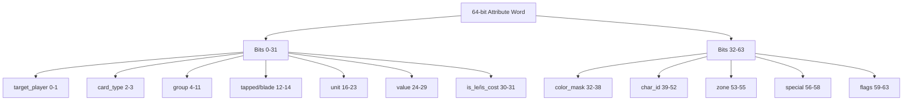

# Ability Bitpacking Analysis & Improvement Recommendations

## Executive Summary

This document analyzes the current ability bitpacking implementation across the codebase and provides recommendations for improving readability. The system uses a complex multi-layer bitpacking approach that is difficult to maintain and understand.

---

## Current Architecture Overview

### Data Flow
```
Pseudocode (consolidated_abilities.json)
    ↓
Compiler (ability.py - BytecodeEmitter)
    ↓
Packing (generated_packer.py - pack_* functions)
    ↓
Bytecode (cards_compiled.json - 5-word × 32-bit chunks)
    ↓
Decoder (bytecode_readable.py - unpack_* functions)
    ↓
Human-readable output
```

### Key Files Involved

| File | Purpose |
|------|---------|
| `engine/models/generated_packer.py` | Low-level pack/unpack functions with raw bit manipulation |
| `engine/models/ability.py` | High-level packing logic (`BytecodeEmitter._pack_filter_attr`) |
| `engine/models/bytecode_readable.py` | Decoding and formatting for human readability |
| `tools/sync_metadata.py` | Generates `generated_packer.py` from metadata |

---

## Current Bit Layouts

### 64-bit Attribute Word (Filter/Condition)

| Bit Range | Field Name | Bits | Mask | Description |
|-----------|------------|------|------|-------------|
| 0-1 | `target_player` | 2 | 0x3 | 0=self, 1=player, 2=opponent, 3=both |
| 2-3 | `card_type` | 2 | 0x3 | Card type filter |
| 4 | `group_enabled` | 1 | 0x1 | Enable group filtering |
| 5-11 | `group_id` | 7 | 0x7F | Group ID |
| 12 | `is_tapped` | 1 | 0x1 | Filter tapped units |
| 13 | `has_blade_heart` | 1 | 0x1 | Has blade heart |
| 14 | `not_has_blade_heart` | 1 | 0x1 | Does not have blade heart |
| 15 | `unique_names` | 1 | 0x1 | Unique names only |
| 16 | `unit_enabled` | 1 | 0x1 | Enable unit ID filter |
| 17-23 | `unit_id` | 7 | 0x7F | Unit ID to filter |
| 24 | `value_enabled` | 1 | 0x1 | Enable value threshold |
| 25-29 | `value_threshold` | 5 | 0x1F | Value comparison threshold |
| 30 | `is_le` | 1 | 0x1 | Less-than-or-equal comparison |
| 31 | `is_cost_type` | 1 | 0x1 | Cost-type filter |
| 32-38 | `color_mask` | 7 | 0x7F | Heart color mask |
| 39-45 | `char_id_1` | 7 | 0x7F | Character ID 1 |
| 46-52 | `char_id_2` | 7 | 0x7F | Character ID 2 |
| 53-55 | `zone_mask` | 3 | 0x7 | Zone mask |
| 56-58 | `special_id` | 3 | 0x7 | Special ID |
| 59 | `is_setsuna` | 1 | 0x1 | Setsuna filter |
| 60 | `compare_accumulated` | 1 | 0x1 | Compare accumulated value |
| 61 | `is_optional` | 1 | 0x1 | Optional filter |
| 62 | `keyword_energy` | 1 | 0x1 | Energy keyword |
| 63 | `keyword_member` | 1 | 0x1 | Member keyword |

### 32-bit Slot Word

| Bit Range | Field Name | Bits | Mask | Description |
|-----------|------------|------|------|-------------|
| 0-7 | `target_slot` | 8 | 0xFF | Target slot |
| 8-15 | `remainder_zone` | 8 | 0xFF | Remainder zone |
| 16-19 | `source_zone` | 4 | 0xF | Source zone |
| 20-23 | `dest_zone` | 4 | 0xF | Destination zone |
| 24 | `is_opponent` | 1 | 0x1 | Opponent flag |
| 25 | `is_reveal_until_live` | 1 | 0x1 | Reveal until live |
| 26 | `is_empty_slot` | 1 | 0x1 | Empty slot only |
| 27 | `is_wait` | 1 | 0x1 | Wait flag |
| 28 | `is_dynamic` | 1 | 0x1 | Dynamic target |
| 29-31 | `area_idx` | 3 | 0x7 | Area index (left/center/right) |

---

## Identified Issues

### Issue 1: Magic Numbers Everywhere (Critical)

**Location**: `generated_packer.py`, `ability.py`

**Problem**: Bit positions and masks are hardcoded as magic numbers throughout the codebase.

**Example**:
```python
# Current code - impossible to understand at a glance
res |= (target_player & 0x3) << 0
res |= (card_type & 0x3) << 2
res |= (group_enabled & 0x1) << 4
res |= (group_id & 0x7F) << 5
```

**Impact**: 
- Developers cannot understand the bit layout without extensive tracing
- Easy to introduce bugs when modifying bit positions
- No way to visualize the overall structure

### Issue 2: Duplication Between Pack/Unpack (High)

**Location**: `generated_packer.py`

**Problem**: Pack and unpack functions are separate but mirror each other exactly.

**Example**:
```python
# Pack function
res |= (target_player & 0x3) << 0

# Unpack function - exact inverse
"target_player": (val >> 0) & 0x3,
```

**Impact**:
- Twice as much code to maintain
- Easy for pack/unpack to get out of sync
- No single source of truth for the bit layout

### Issue 3: Scattered Bit Manipulation Logic (High)

**Location**: `ability.py` lines 1500-1700+, `bytecode_readable.py`

**Problem**: Bit manipulation is scattered across multiple files with no central definition.

**Example** - In `ability.py`:
```python
# Line 1507-1512
if "LEFT" in a_str:
    slot |= 1 << 29
elif "CENTER" in a_str:
    slot |= 2 << 29
elif "RIGHT" in a_str:
    slot |= 3 << 29
```

**Impact**:
- No single place to see the complete bit layout
- Hard to track all the different bit usages
- Risk of conflicts when adding new fields

### Issue 4: No Visual Documentation (Medium)

**Problem**: There is no visual representation of the 64-bit and 32-bit layouts.

**Impact**:
- Hard to understand the overall structure
- Difficult to onboard new developers
- No quick reference for debugging

### Issue 5: Inconsistent Naming (Medium)

**Problem**: Some fields use different names in different contexts.

**Example**:
- `target_player` vs `target` (in some Effect classes)
- `is_le` vs `compare_accumulated` - unclear what these actually do

### Issue 6: Generated Code Not Human-Editable (Medium)

**Location**: `generated_packer.py`

**Problem**: This file is auto-generated by `sync_metadata.py`, so any manual improvements will be overwritten.

**Impact**:
- Improvements must be made to the generator, not the generated file
- Need to coordinate changes across two levels

---

## Recommended Improvements

### Priority 1: Create Named Constants

Create a central constants file with well-named bit position and mask constants:

```python
# engine/models/bitfield_constants.py

class AttrBits:
    """64-bit Attribute word bit positions and masks."""
    
    # Target Player (bits 0-1)
    TARGET_PLAYER_SHIFT = 0
    TARGET_PLAYER_MASK = 0x3
    
    # Card Type (bits 2-3)
    CARD_TYPE_SHIFT = 2
    CARD_TYPE_MASK = 0x3
    
    # Group (bits 4-11)
    GROUP_ENABLED_SHIFT = 4
    GROUP_ENABLED_MASK = 0x1
    GROUP_ID_SHIFT = 5
    GROUP_ID_MASK = 0x7F
    
    # ... etc
```

### Priority 2: Add Visual Layout Diagrams

Add Mermaid diagrams to the documentation:



### Priority 3: Refactor Generator to Use Constants

Modify `tools/sync_metadata.py` to generate code using the constants:

```python
# Instead of generating:
res |= (target_player & 0x3) << 0

# Generate:
res |= (target_player & AttrBits.TARGET_PLAYER_MASK) << AttrBits.TARGET_PLAYER_SHIFT
```

### Priority 4: Create Specification-Driven Code Generation

Create a single specification that drives both pack and unpack generation:

```python
# Define layout once
ATTR_LAYOUT = [
    ("target_player", 2, 0),
    ("card_type", 2, 2),
    ("group_enabled", 1, 4),
    ("group_id", 7, 5),
    # ... etc
]

# Generate both pack and unpack from this
def generate_packer(layout):
    # Generate pack function
    pass

def generate_unpack(layout):
    # Generate unpack function  
    pass
```

### Priority 5: Add Self-Documenting Helper Functions

Instead of raw bit manipulation, use named helpers:

```python
def pack_field(value: int, shift: int, bits: int) -> int:
    """Pack a field value into a bit range."""
    mask = (1 << bits) - 1
    return (value & mask) << shift

def unpack_field(value: int, shift: int, bits: int) -> int:
    """Unpack a field value from a bit range."""
    mask = (1 << bits) - 1
    return (value >> shift) & mask

# Usage becomes:
res |= pack_field(target_player, TARGET_PLAYER_SHIFT, 2)
# Instead of:
res |= (target_player & 0x3) << 0
```

### Priority 6: Create Debug Visualization Tool

Add a tool to visualize any packed value:

```python
def visualize_packed_attr(value: int) -> str:
    """Return a visual representation of a packed attribute."""
    lines = ["64-bit Attribute Layout:"]
    lines.append("-" * 40)
    
    for field, _, _ in ATTR_LAYOUT:
        field_val = unpack_field(value, FIELD_SHIFTS[field], FIELD_BITS[field])
        lines.append(f"  {field:20} = {field_val:3}  (bits {shift}-{shift+bits-1})")
    
    return "\n".join(lines)
```

---

## Implementation Roadmap

### Phase 1: Constants Definition (Low Risk)
1. Create `engine/models/bitfield_constants.py` with all bit positions and masks
2. Update `generated_packer.py` to use constants (will be overwritten on next sync)
3. Update `ability.py` to use constants where possible

### Phase 2: Generator Enhancement (Medium Risk)
1. Modify `tools/sync_metadata.py` to use constants in generated code
2. Add visual diagram output to the generator
3. Test that generated code compiles correctly

### Phase 3: Documentation (No Risk)
1. Add comprehensive docstrings to constants file
2. Create visual layout diagrams in SKILL.md
3. Add examples of packed values

### Phase 4: Optional Advanced Improvements
1. Implement specification-driven code generation
2. Add debug visualization tools
3. Consider using Python's `dataclasses` with `__post_init__` for validation

---

## Risk Assessment

| Change | Risk Level | Reason |
|--------|------------|--------|
| Adding constants file | Low | Pure addition, no breaking changes |
| Updating ability.py | Medium | Existing logic may have edge cases |
| Modifying sync_metadata.py | Medium | Changes affect generated code |
| Refactoring packer generation | High | Could break existing bytecode compatibility |

**Recommendation**: Start with Phase 1 (constants) and Phase 3 (documentation). Avoid Phase 2 and 4 until the system is stable.

---

## Files to Modify

| File | Changes |
|------|---------|
| `plans/ability_bitpacking_analysis.md` | This document |
| `engine/models/bitfield_constants.py` | **NEW** - Central constants |
| `engine/models/ability.py` | Use constants where applicable |
| `tools/sync_metadata.py` | Generate using constants |
| `.agent/skills/ability_compilation_bytecode/SKILL.md` | Add visual diagrams |

---

## Conclusion

The current bitpacking implementation works but lacks readability. The main improvements should focus on:

1. **Named constants** - Replace magic numbers with named bit positions and masks
2. **Visual documentation** - Add diagrams showing the complete layout
3. **Generator improvements** - Make the code generator produce more readable output
4. **Debug tools** - Help developers visualize packed values

The highest-impact, lowest-risk approach is to create a central constants file and add comprehensive documentation. More ambitious changes (like refactoring the code generator) should be carefully tested.
