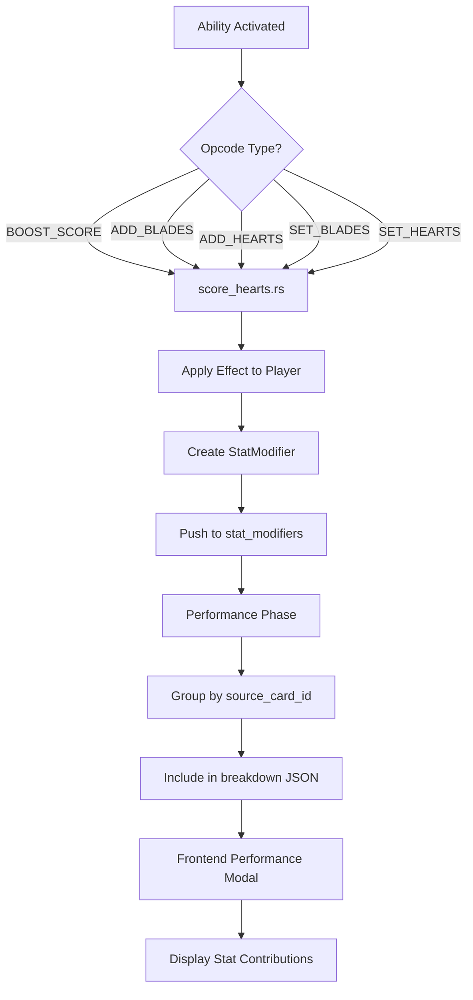

# アビリティエフェクト統一化計画

## 1. 現状分析

### スコア/ステータスに影響するアビリティの種類

#### EffectType (Python: engine/models/ability.py)

| タイプ | 値 | 説明 |
|--------|-----|------|
| BOOST_SCORE | 16 | ライブスコアをブースト |
| SET_SCORE | 37 | ライブスコアを設定 |
| REDUCE_SCORE | 92 | スコア減少 |
| MODIFY_SCORE_RULE | 49 | スコアルールを変更 |
| BUFF_POWER | 18 | パワーアップ (ブレード/ハート) |
| ADD_BLADES | 11 | ブレードを追加 |
| ADD_HEARTS | 12 | ハートを追加 |
| SET_BLADES | 24 | ブレードを設定 |
| SET_HEARTS | 25 | ハートを設定 |
| REDUCE_COST | 13 | コスト減少 |

#### 対応するOpcodes (Rust)

| Opcode | 定数名 | 処理ファイル |
|--------|--------|-------------|
| 16 | O_BOOST_SCORE | score_hearts.rs |
| 37 | O_SET_SCORE | score_hearts.rs |
| 92 | O_REDUCE_SCORE | score_hearts.rs |
| 49 | O_MODIFY_SCORE_RULE | (未実装) |
| 11 | O_ADD_BLADES | score_hearts.rs |
| 18 | O_BUFF_POWER | score_hearts.rs |
| 12 | O_ADD_HEARTS | score_hearts.rs |
| 24 | O_SET_BLADES | score_hearts.rs |
| 25 | O_SET_HEARTS | score_hearts.rs |

### 現在の問題点

1. **ログの不統一**: `live_score_bonus_logs`はスコアブーストのみを記録
2. **ブレード/ハートbuffのログ欠如**: 誰がどのカードからbuffを受け取ったか不明
3. **パフォーマンスモーダルの情報不足**: 哪个カードが哪个ステータスに貢献したか表示されない

## 2. 統一化のアプローチ

### アプローチA:  Logsフィールドの拡張 (推奨)

**PlayerStateに追加する統一ログ構造:**

```rust
// すべてのステータス変更を追跡する統合ログ
#[derive(Clone)]
pub struct StatModifier {
    pub source_card_id: i32,  // ソースカードID
    pub target_slot: i8,      // 対象スロット (-1 = プレイヤー全体)
    pub stat_type: StatType,   // 哪种ステータス
    pub amount: i32,           // 変更量
    pub is_additive: bool,     // 加算か設定か
}

pub enum StatType {
    LiveScore,    // O_BOOST_SCORE, O_REDUCE_SCORE
    BaseScore,    // O_SET_SCORE
    Blades,       // O_ADD_BLADES, O_BUFF_POWER, O_SET_BLADES
    Hearts,       // O_ADD_HEARTS, O_SET_HEARTS
    CostReduction, // O_REDUCE_COST
}

// PlayerStateに追加
pub stat_modifier_logs: SmallVec<[StatModifier; 8]>,
```

### アプローチB: パフォーマンス計算時の動的計算

パフォーマンス時にブーストカードをスキャンして計算:
- 実装が複雑
- 常時能力の再評価が必要
- 推奨しない

## 3. 実装計画

### Phase 1: データ構造の追加

**engine_rust_src/src/core/logic/player.rs:**
```rust
// 新しいStatType列挙型を追加
#[derive(Clone, Copy, Debug, PartialEq, Eq, Hash, Serialize, Deserialize)]
pub enum StatType {
    LiveScoreBoost = 0,
    LiveScoreReduce = 1,
    BaseScore = 2,
    Blades = 3,
    Hearts = 4,
    CostReduction = 5,
}

// StatModifier構造体を追加
#[derive(Clone, Debug, Serialize, Deserialize)]
pub struct StatModifier {
    pub source_card_id: i32,
    pub target_slot: i8,
    pub stat_type: StatType,
    pub amount: i32,
    pub is_set: bool,
}

// PlayerStateフィールドを追加
pub stat_modifiers: SmallVec<[StatModifier; 8]>,
```

### Phase 2: ハンドラの修正

**engine_rust_src/src/core/logic/interpreter/handlers/score_hearts.rs:**

各opcode処理時にStatModifierを記録:

```rust
O_BOOST_SCORE => {
    // 既存のコード...
    state.core.players[p_idx].live_score_bonus += final_v;

    // 新しいログ記録
    state.core.players[p_idx].stat_modifiers.push(StatModifier {
        source_card_id: ctx.source_card_id,
        target_slot: resolved_slot as i8,
        stat_type: StatType::LiveScoreBoost,
        amount: final_v,
        is_set: false,
    });
}

O_ADD_BLADES | O_BUFF_POWER => {
    // 既存のコード...
    state.core.players[p_idx].blade_buffs[slot] += v as i16;

    // 新しいログ記録
    state.core.players[p_idx].stat_modifiers.push(StatModifier {
        source_card_id: ctx.source_card_id,
        target_slot: slot as i8,
        stat_type: StatType::Blades,
        amount: v as i32,
        is_set: false,
    });
}

// O_ADD_HEARTS, O_SET_BLADES, O_SET_HEARTS etc. 同样...
```

### Phase 3: パフォーマンス結果への反映

**engine_rust_src/src/core/logic/performance.rs:**

stat_modifiersをパフォーマンス結果に含める:

```rust
// stat_modifiersをグループ化して追加
let mut stat_breakdown = std::collections::HashMap::new();
for &modifier in &state.core.players[p].stat_modifiers {
    let key = (modifier.source_card_id, modifier.stat_type);
    let entry = stat_breakdown.entry(key).or_insert(0);
    *entry += modifier.amount;
}

// パフォーマンスJSONに追加
score_breakdown.push(json!({
    "source": "Stat Modifiers",
    "modifiers": stat_breakdown,
    "type": "stat_modifiers"
}));
```

### Phase 4: フロントエンドの表示

**launcher/static_content/js/components/PerformanceRenderer.js:**

新しいstat_modifiersセクションを表示:

```javascript
// パフォーマンス結果の表示を更新
if (result.breakdown && result.breakdown.stat_modifiers) {
    const statsHtml = renderStatModifiers(result.breakdown.stat_modifiers);
    content += statsHtml;
}

function renderStatModifiers(modifiers) {
    // 各カードからのステータスメッセージを表示
    // 例: "Score +500 from カード名"
}
```

## 4. ファイルマッピング

### 変更が必要なファイル

| ファイル | 変更内容 |
|---------|---------|
| engine_rust_src/src/core/logic/player.rs | StatType, StatModifier構造体, フィールド追加 |
| engine_rust_src/src/core/logic/interpreter/handlers/score_hearts.rs | 各opcode処理にログ記録を追加 |
| engine_rust_src/src/core/logic/performance.rs | パフォーマンス結果にstat_modifiersを含める |
| launcher/static_content/js/components/PerformanceRenderer.js | 新しいセクションを表示 |

### 参照ファイル（変更不要）

- engine/models/ability.py - 既存のEffectTypeを使用
- engine_rust_src/src/core/logic/interpreter/handlers/member_state.rs - メンバーステート用

## 5. テスト計画

1. **O_BOOST_SCOREテスト**: stat_modifiersに正しく記録されるか
2. **O_ADD_BLADESテスト**: blade buffがログされるか
3. **O_ADD_HEARTSテスト**: heart buffがログされるか
4. **パフォーマンス結果テスト**: JSONにmodifiersが含まれるか
5. **フロントエンドテスト**: モーダルに正しく表示されるか

## 6. Mermaidダイアグラム



## 7. 優先順位

1. **高優先度**: Score boost (BOOST_SCORE) のログ統一 - 既にpartialに実装されている
2. **高優先度**: Blade/Heart buffのログ追加
3. **中優先度**: パフォーマンス結果JSONへの反映
4. **中優先度**: フロントエンド表示の実装

---

**作成日**: 2026-02-26
**ステータス**: 計画完了
