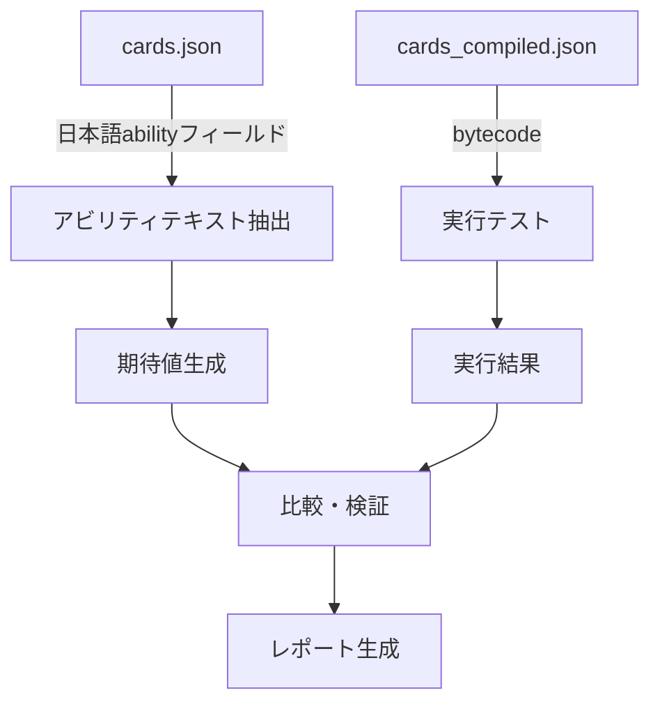

# アビリティテスト改善計画

## 1. 現状のテスト品質分析

### 1.1 テストファイル構成

| ファイル | 行数 | 目的 | 品質評価 |
|---------|------|------|----------|
| [`ability_tests.rs`](engine_rust_src/src/ability_tests.rs) | 147行 | 基本オペコードテスト | ⭐⭐⭐ 良好 |
| [`opcode_tests.rs`](engine_rust_src/src/opcode_tests.rs) | 263行 | 複雑オペコードテスト | ⭐⭐⭐⭐ 優秀 |
| [`comprehensive_tests.rs`](engine_rust_src/src/comprehensive_tests.rs) | 1000行+ | 包括的トリガーテスト | ⭐⭐⭐ 良好 |
| [`coverage_gap_tests.rs`](engine_rust_src/src/coverage_gap_tests.rs) | 500行+ | カバレッジギャップテスト | ⭐⭐⭐ 良好 |
| [`qa_verification_tests.rs`](engine_rust_src/src/qa_verification_tests.rs) | 400行+ | QA検証テスト | ⭐⭐⭐⭐ 優秀 |
| [`semantic_assertions.rs`](engine_rust_src/src/semantic_assertions.rs) | 800行+ | セマンティック検証 | ⭐⭐ 途中 |

### 1.2 現在のテストの良い点

1. **オペコードレベルのテストが充実**
   - `O_DRAW`, `O_MOVE_TO_DISCARD`, `O_ADD_BLADES` などの基本操作
   - `O_REVEAL_UNTIL`, `O_LOOK_AND_CHOOSE` などの複雑な操作

2. **トリガータイプの網羅的テスト**
   - `OnPlay`, `OnLeaves`, `OnReveal`, `TurnStart`, `TurnEnd` など

3. **条件チェックのテスト**
   - `C_COUNT_HAND`, `C_COUNT_STAGE`, `C_TURN_1` など

4. **実データベースを使用したテスト**
   - `load_real_db()` で実際のカードデータを使用

### 1.3 現在のテストの問題点

1. **日本語アビリティテキストとの整合性検証がない**
   - テストはbytecodeレベルで実装を検証
   - しかし「カードに書かれた日本語テキスト」との照合がない

2. **合成テストDBへの過度な依存**
   ```rust
   // 現在のアプローチ
   let db = create_test_db();  // 合成データ
   add_card(&mut db, 10, "M10", vec![], vec![]);  // ダミーカード
   ```
   - 実際のカードIDを使用していない
   - 実際のアビリティテキストと乖離している可能性

3. **アビリティごとの個別テストが不足**
   - 全カードのアビリティを体系的にテストする仕組みがない
   - `semantic_assertions.rs` は途中で実装が止まっている

4. **エッジケースのカバレッジ不足**
   - 複雑なフィルター条件（キャラ名、グループ名など）
   - 複数のアビリティが相互作用する場合

---

## 2. 日本語アビリティテキスト整合性テストの設計

### 2.1 データフロー



### 2.2 テストアプローチ

#### アプローチA: セマンティック真理値ベースのテスト

```rust
// 提案するテスト構造
struct AbilityTestCase {
    card_no: String,           // カード番号
    ability_text_ja: String,   // 日本語アビリティテキスト
    trigger: TriggerType,      // トリガータイプ
    expected_effects: Vec<ExpectedEffect>,  // 期待される効果
    setup_state: GameState,    // 初期状態
    expected_state: GameState, // 期待される最終状態
}

struct ExpectedEffect {
    effect_type: EffectType,
    target: TargetType,
    value: i32,
    filter: Option<String>,
}
```

#### アプローチB: 日本語テキストからの自動テスト生成

```rust
// 日本語テキストをパースしてテストケースを生成
fn parse_ability_text_ja(text: &str) -> Vec<ExpectedEffect> {
    // 例: "自分の控え室からメンバーカードを1枚手札に加える"
    // -> ExpectedEffect { type: RecoverMember, count: 1, target: Hand }
}
```

#### アプローチC: 全カード網羅テスト

```rust
#[test]
fn test_all_cards_ability_parity() {
    let db = load_real_db();
    let cards_json = load_cards_json();  // 日本語テキスト付き

    for (card_no, card_data) in cards_json {
        let ability_text = card_data["ability"].as_str();
        let card_id = db.card_no_to_id[card_no];

        // アビリティテキストから期待値を生成
        let expected = parse_ability_expectations(ability_text);

        // 実際のbytecodeを実行
        let result = execute_card_abilities(&db, card_id);

        // 比較
        assert_ability_parity(&expected, &result, card_no);
    }
}
```

---

## 3. 実装計画

### 3.1 フェーズ1: インフラ整備

- [ ] `AbilityTestCase` 構造体の定義
- [ ] 日本語テキストパーサーの実装
- [ ] テストヘルパー関数の拡張

### 3.2 フェーズ2: サンプルテスト作成

- [ ] 代表的なカード10枚のテストケース作成
- [ ] 各トリガータイプのテスト
- [ ] フィルター条件のテスト

### 3.3 フェーズ3: 全カード網羅テスト

- [ ] 全カードの自動テスト生成
- [ ] テスト結果レポート生成
- [ ] 失敗ケースの分析と修正

---

## 4. 具体的なテスト例

### 4.1 PL!-sd1-001-SD (高坂 穂乃果) のテスト

**日本語テキスト:**
```
登場:自分の成功ライブカード置き場にカードが2枚以上ある場合、
    自分の控え室からライブカードを1枚手札に加える。
常時:自分の成功ライブカード置き場にあるカード1枚につき、ブレードを得る。
```

**テストコード:**
```rust
#[test]
fn test_pl_sd1_001_honoka() {
    let db = load_real_db();
    let mut state = create_test_state();

    // カードID取得
    let card_id = db.card_no_to_id["PL!-sd1-001-SD"];

    // アビリティ1: 登場時効果
    // 条件: 成功ライブ2枚以上
    state.players[0].success_lives = vec![10001, 10002];
    state.players[0].discard = vec![15001];  // ライブカード

    // 実行
    let ctx = AbilityContext { player_id: 0, source_card_id: card_id, ..Default::default() };
    state.trigger_abilities(&db, TriggerType::OnPlay, &ctx);

    // 検証: 控え室から手札にライブカードが移動
    assert_eq!(state.players[0].hand.len(), 1);
    assert!(state.players[0].hand.contains(&15001));

    // アビリティ2: 常時効果
    // 成功ライブ2枚につきブレード+2
    let blades = state.calculate_blades(&db, 0);
    assert_eq!(blades, 2);  // 2枚 * 1ブレード
}
```

### 4.2 フィルター条件のテスト

**日本語テキスト例:**
```
自分の控え室から「歩夢/かのん/花帆」を含むメンバーカードを1枚手札に加える。
```

**テストコード:**
```rust
#[test]
fn test_filter_ayumu_kanon_kaho() {
    let db = load_real_db();
    let mut state = create_test_state();

    // 控え室に各キャラのカードを用意
    let ayumu_id = find_card_by_char_name(&db, "歩夢");
    let kanon_id = find_card_by_char_name(&db, "かのん");
    let other_id = find_card_by_char_name(&db, "その他");

    state.players[0].discard = vec![ayumu_id, kanon_id, other_id];

    // フィルター付き回復を実行
    // ...テスト実行...

    // 検証: 歩夢とかのんのみ選択可能
    let legal_actions = state.get_legal_action_ids(&db);
    assert!(legal_actions.contains(&ayumu_id));
    assert!(legal_actions.contains(&kanon_id));
    assert!(!legal_actions.contains(&other_id));
}
```

---

## 5. 推奨される次のステップ

1. **`semantic_assertions.rs` の完成**
   - 既存のフレームワークを拡張
   - 日本語テキストとの照合機能を追加

2. **テストケース生成スクリプトの作成**
   - `cards.json` から自動的にテストケースを生成
   - PythonまたはRustで実装

3. **CI/CDへの統合**
   - 全カードテストをCIに追加
   - 回帰テストとして機能

4. **レポート生成**
   - テスト結果をMarkdownまたはHTMLで出力
   - 失敗ケースの詳細分析

---

## 6. 結論

現在のRustテストは**オペコードレベルでは良好**ですが、**日本語アビリティテキストとの整合性検証が不足**しています。

改善により以下が期待できます:
- カード実装の正確性向上
- 日本語テキストと実装の乖離防止
- 新カード追加時の回帰テスト自動化
