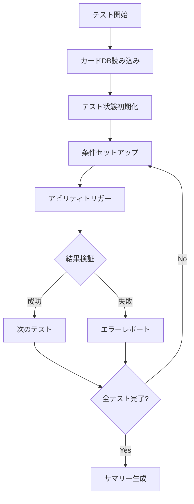

# カードアビリティテスト計画

## 概要

このドキュメントは、日本語アビリティテキストに基づいたカードテストの計画を示します。
各カードについて、日本語テキストの解析、期待される動作、テストケースを定義します。

---

## テスト対象カード一覧

### カテゴリ1: 基本的な登場時効果

#### PL!-sd1-001-SD: 高坂 穂乃果

**日本語テキスト:**
```
登場:自分の成功ライブカード置き場にカードが2枚以上ある場合、
    自分の控え室からライブカードを1枚手札に加える。
常時:自分の成功ライブカード置き場にあるカード1枚につき、ブレードを得る。
```

**テストケース:**

| ID | テスト名 | 条件 | 期待される結果 |
|----|---------|------|---------------|
| 1.1.1 | 登場時_成功ライブ2枚以上 | success_lives = [L1, L2], discard = [L3] | handにL3が追加 |
| 1.1.2 | 登場時_成功ライブ1枚 | success_lives = [L1], discard = [L3] | handにL3は追加されない |
| 1.1.3 | 登場時_成功ライブ0枚 | success_lives = [], discard = [L3] | handにL3は追加されない |
| 1.1.4 | 常時_ブレード計算 | success_lives = [L1, L2, L3] | blades += 3 |

---

#### PL!-sd1-002-SD: 絢瀬 絵里

**日本語テキスト:**
```
起動:このメンバーをステージから控え室に置く：
    自分の控え室からメンバーカードを1枚手札に加える。
```

**テストケース:**

| ID | テスト名 | 条件 | 期待される結果 |
|----|---------|------|---------------|
| 1.2.1 | 起動能力_基本 | stage[0] = Eri, discard = [M1, M2] | Eriがdiscardへ、handにM1またはM2を追加 |
| 1.2.2 | 起動能力_控え室が空 | stage[0] = Eri, discard = [] | アビリティは実行されない |
| 1.2.3 | 起動能力_ターン制限 | 同じターンに2回実行 | 2回目は実行不可（コスト不足） |

---

#### PL!-sd1-003-SD: 南 ことり

**日本語テキスト:**
```
登場:自分の控え室からコスト4以下の『μ's』のメンバーカードを1枚手札に加える。
ライブ開始時:手札を1枚控え室に置いてもよい：heart01かheart03かheart06のうち、
    1つを選ぶ。ライブ終了時まで、選んだハートを1つ得る。
```

**テストケース:**

| ID | テスト名 | 条件 | 期待される結果 |
|----|---------|------|---------------|
| 1.3.1 | 登場時_フィルター条件 | discard = [M1(cost=3, μ's), M2(cost=5, μ's), M3(cost=3, Aqours)] | M1のみ選択可能 |
| 1.3.2 | 登場時_該当なし | discard = [M2(cost=5, μ's), M3(cost=3, Aqours)] | 選択肢なし |
| 1.3.3 | ライブ開始時_ハート追加 | hand = [H1], color選択 = heart01 | heart_buffs[0] += 1 |
| 1.3.4 | ライブ開始時_スキップ可能 | hand = [H1] | スキップ可能（Optional） |

---

#### PL!-sd1-004-SD: 園田 海未

**日本語テキスト:**
```
登場:自分のデッキの上からカードを5枚見る。その中から『μ's』のライブカードを1枚公開して
    手札に加えてもよい。残りを控え室に置く。
```

**テストケース:**

| ID | テスト名 | 条件 | 期待される結果 |
|----|---------|------|---------------|
| 1.4.1 | 登場時_ライブカードあり | deck top 5 = [L1(μ's), M1, M2, M3, M4] | L1をhandに追加、他4枚をdiscardへ |
| 1.4.2 | 登場時_ライブカードなし | deck top 5 = [M1, M2, M3, M4, M5] | 全5枚をdiscardへ |
| 1.4.3 | 登場時_スキップ可能 | deck top 5 = [L1(μ's), ...] | スキップ可能（Optional） |
| 1.4.4 | 登場時_複数ライブカード | deck top 5 = [L1(μ's), L2(μ's), ...] | 1枚のみ選択可能 |

---

### カテゴリ2: ライブ開始時効果

#### PL!-sd1-005-SD: 星空 凛

**日本語テキスト:**
```
登場:自分のデッキの上からカードを3枚見る。その中から1枚を選んで手札に加え、
    残りを好きな順番でデッキの上に置く。
```

**テストケース:**

| ID | テスト名 | 条件 | 期待される結果 |
|----|---------|------|---------------|
| 2.1.1 | 登場時_基本 | deck top 3 = [C1, C2, C3] | 1枚をhandに、2枚をdeck topに戻す |
| 2.1.2 | 登場時_順序選択 | deck top 3 = [C1, C2, C3], 選択 = C2, 順序 = [C3, C1] | hand = [C2], deck top = [C3, C1] |

---

### カテゴリ3: 複雑なフィルター条件

#### PL!-sd1-011-SD: ミア・テイラー

**日本語テキスト:**
```
起動:このメンバーをステージから控え室に置く：
    自分の控え室からライブカードを1枚手札に加える。
```

**テストケース:**

| ID | テスト名 | 条件 | 期待される結果 |
|----|---------|------|---------------|
| 3.1.1 | 起動能力_ライブ回復 | stage[0] = Mia, discard = [L1, L2] | Miaがdiscardへ、handにL1またはL2を追加 |

---

### カテゴリ4: 条件付き効果

#### LL-bp1-001-R＋: 上原歩夢&澁谷かのん&日野下花帆

**日本語テキスト:**
```
登場:自分の控え室からメンバーカードを1枚手札に加える。

ライブ開始時:手札を3枚控え室に置いてもよい（フィルター: 歩夢/かのん/花帆）：
    自分のスコアを+3する。
```

**テストケース:**

| ID | テスト名 | 条件 | 期待される結果 |
|----|---------|------|---------------|
| 4.1.1 | 登場時_メンバー回復 | discard = [M1, M2] | handにM1またはM2を追加 |
| 4.1.2 | ライブ開始時_コスト支払い | hand = [Ayumu, Kanon, Kaho, M1] | 3枚をdiscardへ、score += 3 |
| 4.1.3 | ライブ開始時_フィルター条件 | hand = [Ayumu, M1, M2, M3] | コスト支払い不可（フィルター不一致） |
| 4.1.4 | ライブ開始時_オプショナル | hand = [Ayumu, Kanon, Kaho] | スキップ可能 |

---

### カテゴリ5: モーダル選択

#### LL-PR-004-PR: プロモカード

**日本語テキスト:**
```
ライブ開始時:以下の3つから1つを選ぶ。
  ・チョコミント/ストロベリー/クッキー＆クリーム：自分と相手はそれぞれ手札を1枚控え室に置く。
  ・あなた：自分と相手はそれぞれカードを1枚引く。
  ・その他：自分と相手はそれぞれブレードを1つ得る。
```

**テストケース:**

| ID | テスト名 | 条件 | 期待される結果 |
|----|---------|------|---------------|
| 5.1.1 | モーダル_選択肢1 | mode = 0 | P0とP1がそれぞれdiscardへ |
| 5.1.2 | モーダル_選択肢2 | mode = 1 | P0とP1がそれぞれdraw |
| 5.1.3 | モーダル_選択肢3 | mode = 2 | P0とP1がそれぞれblades += 1 |

---

## テスト実装構造

### Rustテストコードのテンプレート

```rust
/// カードテストのテンプレート
mod card_tests {
    use crate::core::logic::*;
    use crate::test_helpers::*;

    /// PL!-sd1-001-SD: 高坂 穂乃果
    mod pl_sd1_001 {
        use super::*;

        fn setup() -> (CardDatabase, GameState) {
            let db = load_real_db();
            let mut state = create_test_state();
            state.ui.silent = true;
            (db, state)
        }

        fn get_card_id(db: &CardDatabase) -> i32 {
            db.card_no_to_id.get("PL!-sd1-001-SD")
                .copied()
                .expect("Card not found")
        }

        #[test]
        fn test_on_play_success_lives_2_plus() {
            let (db, mut state) = setup();
            let card_id = get_card_id(&db);

            // Setup: 成功ライブ2枚、控え室にライブカード
            state.players[0].success_lives = vec![10001, 10002];
            state.players[0].discard = vec![15001];  // ライブカード

            // Execute: 登場時トリガー
            let ctx = AbilityContext {
                player_id: 0,
                source_card_id: card_id,
                ..Default::default()
            };
            state.trigger_abilities(&db, TriggerType::OnPlay, &ctx);

            // Assert: 控え室から手札にライブカードが移動
            assert!(state.players[0].hand.contains(&15001),
                "ライブカードが手札に追加されるべき");
            assert!(!state.players[0].discard.contains(&15001),
                "ライブカードが控え室から削除されるべき");
        }

        #[test]
        fn test_on_play_success_lives_1() {
            let (db, mut state) = setup();
            let card_id = get_card_id(&db);

            // Setup: 成功ライブ1枚のみ
            state.players[0].success_lives = vec![10001];
            state.players[0].discard = vec![15001];

            let ctx = AbilityContext {
                player_id: 0,
                source_card_id: card_id,
                ..Default::default()
            };
            state.trigger_abilities(&db, TriggerType::OnPlay, &ctx);

            // Assert: 条件不足で効果発動なし
            assert!(!state.players[0].hand.contains(&15001),
                "成功ライブが1枚の場合、効果は発動しない");
        }

        #[test]
        fn test_constant_blade_bonus() {
            let (db, mut state) = setup();

            // Setup: 成功ライブ3枚
            state.players[0].success_lives = vec![10001, 10002, 10003];

            // Execute: 常時効果の計算
            let blades = state.calculate_blades(&db, 0);

            // Assert: 成功ライブ3枚につきブレード+3
            assert!(blades >= 3,
                "成功ライブ3枚につきブレード+3されるべき");
        }
    }
}
```

---

## テスト実行フロー



---

## 優先順位

1. **高優先度**: スタートデッキの基本カード（PL!-sd1-001〜011）
2. **中優先度**: ブースターパックの主要カード
3. **低優先度**: プロモカード、レアカード

---

## 次のステップ

1. テストヘルパー関数の拡張
   - `find_card_by_char_name()` - キャラ名でカード検索
   - `setup_card_test()` - カードテスト用セットアップ
   - `assert_ability_triggered()` - アビリティ発動確認

2. テストファイルの作成
   - `engine_rust_src/src/card_ability_tests.rs`

3. CI/CDへの統合
   - 全カードテストの自動実行
