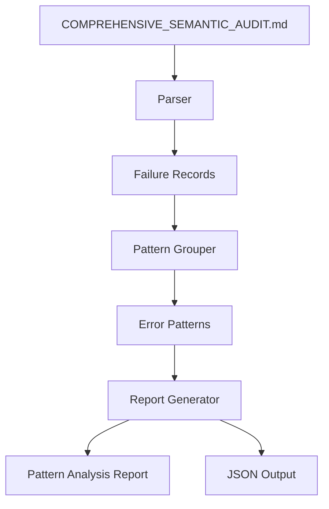

# Error Pattern Analyzer Design

## Overview

This document describes the design for a tool that analyzes semantic test failures and groups them by common bytecode/ability patterns for targeted debugging.

## Architecture



## Components

### 1. Parser Module

**Purpose**: Extract failure records from the audit report.

**Input**: `reports/COMPREHENSIVE_SEMANTIC_AUDIT.md`

**Output**: List of `FailureRecord` objects

**Data Structure**:
```rust
struct FailureRecord {
    card_no: String,
    ability_idx: usize,
    error_type: String,      // e.g., "HAND_DELTA", "ENERGY_DELTA"
    effect: String,          // e.g., "DRAW", "ACTIVATE_MEMBER"
    expected: String,
    actual: String,
    segment: usize,
    raw_message: String,
}
```

**Parsing Logic**:
1. Read markdown table rows
2. Extract card number, ability index, and failure details
3. Parse error type from "Mismatch X for Y" pattern
4. Extract expected/actual values

### 2. Pattern Grouper Module

**Purpose**: Group failures by common patterns.

**Grouping Strategy**:

| Pattern Key | Description |
|-------------|-------------|
| `{error_type}_{effect}` | Primary grouping (e.g., "HAND_DELTA_DRAW") |
| `{error_type}` | Secondary grouping by error type |
| `{effect}` | Tertiary grouping by effect |

**Opcode Mapping**:
```rust
const OPCODE_EFFECT_MAP: &[(&str, &[&str])] = &[
    ("DRAW", &["O_DRAW", "O_DRAW_UNTIL"]),
    ("HAND_DELTA", &["O_DRAW", "O_ADD_TO_HAND", "O_RECOVER_MEMBER"]),
    ("ENERGY_DELTA", &["O_ACTIVATE_MEMBER", "O_ACTIVATE_ENERGY"]),
    ("SCORE_DELTA", &["O_BOOST_SCORE", "O_SET_SCORE"]),
    ("HEART_DELTA", &["O_ADD_HEARTS", "O_SET_HEARTS"]),
    ("BLADE_DELTA", &["O_ADD_BLADES", "O_SET_BLADES"]),
    ("MEMBER_TAP_DELTA", &["O_TAP_MEMBER", "O_TAP_OPPONENT"]),
    ("DECK_SEARCH", &["O_LOOK_AND_CHOOSE", "O_LOOK_DECK"]),
];
```

### 3. Report Generator Module

**Purpose**: Generate human-readable and machine-readable reports.

**Output Formats**:
- Markdown report with pattern summary and details
- JSON output for programmatic use

## Error Pattern Categories

### Category 1: Resource Delta Mismatches

| Pattern | Typical Cause | Suggested Fix |
|---------|---------------|---------------|
| HAND_DELTA | Draw/discard not working | Check deck state and O_DRAW |
| ENERGY_DELTA | Energy tap not working | Check energy zone and O_ACTIVATE_* |
| SCORE_DELTA | Score boost not applying | Check live phase context |
| DISCARD_DELTA | Movement to discard failing | Check O_MOVE_TO_DISCARD |

### Category 2: Buff Application Failures

| Pattern | Typical Cause | Suggested Fix |
|---------|---------------|---------------|
| HEART_DELTA | Target selection issue | Check stage member selection |
| BLADE_DELTA | Target selection issue | Check stage member selection |

### Category 3: State Change Failures

| Pattern | Typical Cause | Suggested Fix |
|---------|---------------|---------------|
| MEMBER_TAP_DELTA | Tap effect not executing | Check O_TAP_MEMBER/O_TAP_OPPONENT |
| ACTION_PREVENTION | Prevention flag not set | Check O_PREVENT_* opcodes |
| TAP_ALL | Mass tap not iterating | Check loop over targets |

### Category 4: Interaction Failures

| Pattern | Typical Cause | Suggested Fix |
|---------|---------------|---------------|
| DECK_SEARCH | No cards revealed | Check deck state and filter |
| LOOK_AND_CHOOSE | Selection not resolving | Check interaction resolver |
| RECOVER_MEMBER | No valid target in discard | Check discard state |
| RECOVER_LIVE | No live in discard | Check discard for live cards |

## Implementation Plan

### Phase 1: Core Parser

Create `tools/verify/error_pattern_analyzer.py`:

```python
def parse_audit_report(filepath: str) -> Tuple[List[FailureRecord], int, int]:
    """Parse the audit report and extract failure records."""
    # Implementation here

def group_failures_by_pattern(failures: List[FailureRecord]) -> Dict[str, ErrorPattern]:
    """Group failures by error pattern."""
    # Implementation here

def generate_report(patterns: Dict[str, ErrorPattern]) -> str:
    """Generate markdown report."""
    # Implementation here
```

### Phase 2: Integration

Add to test workflow:

```bash
# Run after semantic audit
cargo test test_semantic_mass_verification
python tools/verify/error_pattern_analyzer.py
```

### Phase 3: Rust Integration

Create Rust module `engine_rust_src/src/error_patterns.rs`:

```rust
pub struct ErrorPatternAnalyzer {
    patterns: HashMap<String, ErrorPattern>,
}

impl ErrorPatternAnalyzer {
    pub fn analyze_failures(failures: &[TestFailure]) -> Vec<ErrorPattern> {
        // Implementation
    }
}
```

## Sample Output

### Pattern Summary Table

| Pattern | Count | Error Type | Effect | Suggested Fix |
|:--------|------:|:-----------|:-------|:---------------|
| HAND_DELTA_DRAW | 25 | HAND_DELTA | DRAW | Check O_DRAW and deck state |
| ENERGY_DELTA_ACTIVATE | 20 | ENERGY_DELTA | ACTIVATE_ENERGY | Check energy zone state |
| BLADE_DELTA_ADD | 15 | BLADE_DELTA | ADD_BLADES | Check target selection |

### Detailed Pattern Analysis

#### HAND_DELTA_DRAW

**Description**: Hand count change mismatch - draw effects not working as expected

**Affected Opcodes**: O_DRAW, O_DRAW_UNTIL

**Suggested Fix**: Check O_DRAW implementation and deck state. Ensure deck has cards.

**Failure Count**: 25

**Value Mismatches**:
- Exp: 1, Got: 0 (15 failures)
  - PL!-bp4-023-L (Ab0)
  - PL!-pb1-006-P＋ (Ab0)
  - ... and 13 more
- Exp: 2, Got: 0 (10 failures)
  - PL!HS-bp2-015-N (Ab0)
  - ... and 9 more

## Usage

```bash
# Basic usage
python tools/verify/error_pattern_analyzer.py

# With custom input/output
python tools/verify/error_pattern_analyzer.py \
    --input reports/COMPREHENSIVE_SEMANTIC_AUDIT.md \
    --output reports/error_pattern_analysis.md \
    --json

# Output
# - reports/error_pattern_analysis.md
# - reports/error_pattern_analysis.json (if --json flag)
```

## Benefits

1. **Targeted Debugging**: Focus on high-impact error patterns first
2. **Root Cause Analysis**: Identify common causes across multiple cards
3. **Progress Tracking**: Monitor pattern resolution over time
4. **Documentation**: Generate documentation for known issues

## Future Enhancements

1. **Bytecode Correlation**: Link errors to specific bytecode sequences
2. **Auto-Fix Suggestions**: Generate code patches for common issues
3. **Regression Detection**: Alert when new patterns emerge
4. **CI Integration**: Fail builds on critical pattern increases
