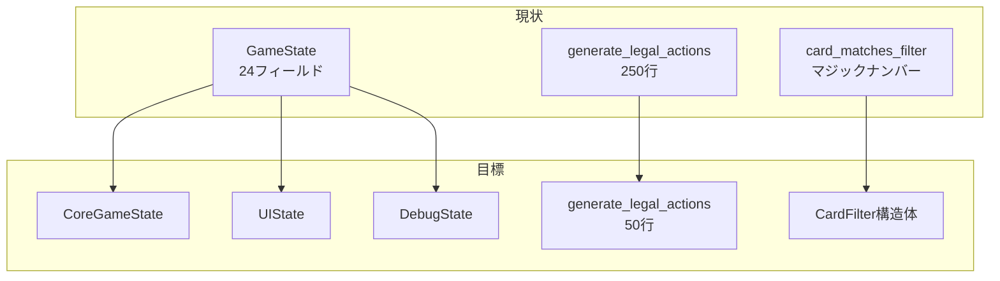
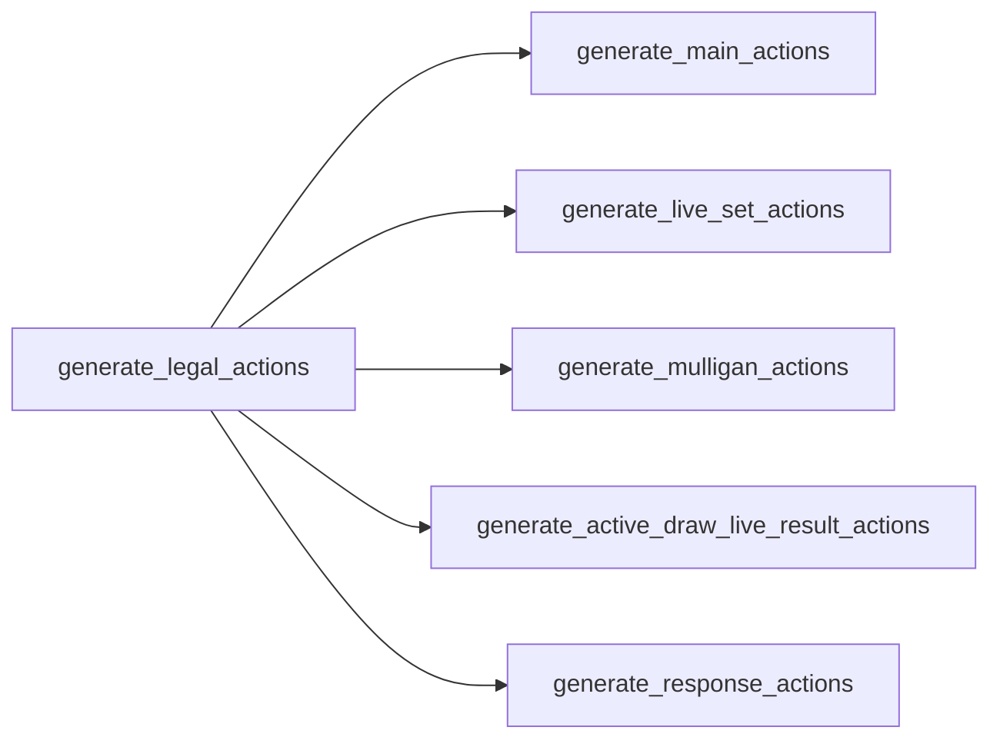
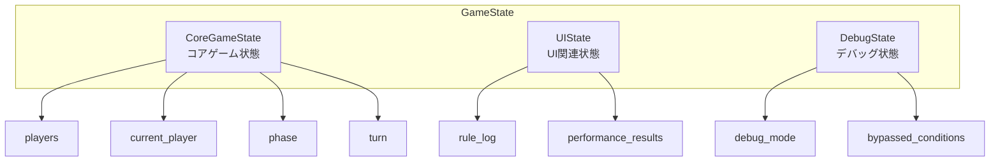
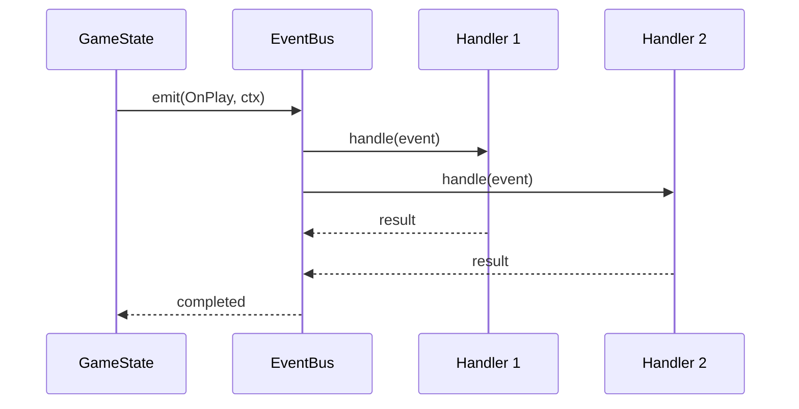

# game.rs リファクタリング計画書

## 概要

`engine_rust_src/src/core/logic/game.rs` (約2500行) の複雑さを軽減し、保守性を向上させるための段階的リファクタリング計画。

---

## 現状分析

### ファイル統計
| 指標 | 値 | 評価 | 修正後 |
|------|-----|------|--------|
| 総行数 | ~2500 | 🔴 過大 | ~2000 |
| GameState フィールド数 | 24 | 🔴 過多 | 分割 |
| impl ブロック行数 | 2235 | 🔴 過大 | 分割 |
| 最長関数 (generate_legal_actions) | ~250行 | 🔴 過大 | ~50行 |
| ネスト深度 | 最大 5-6 | 🟡 注意 | 最大 3-4 |

### アーキテクチャ概要



### 主要問題点

1. **GameState構造体の肥大化**
   - ゲーム状態、UI状態、デバッグ状態、AI状態が混在
   - 単一責任原則違反

2. **card_matches_filter() の複雑なビット演算**
   - 64ビットフィルタ属性の各ビットに分散したロジック
   - マジックナンバー多用 → ✅ **修正済み**

3. **generate_legal_actions() の巨大なmatch分岐**
   - 単一関数が250行以上 → ✅ **修正済み: 4関数に分割**

4. **println! デバッグ文の残存** → ✅ **修正済み**

---

## Phase 1: 小規模リファクタリング

### 1.1 デバッグprintln削除 ✅ 完了

**対象ファイル**: `game.rs`, `interpreter.rs`

**実施内容**:
- `game.rs`: 4箇所のprintlnを削除/条件付きに変更
- `interpreter.rs`: 6箇所のprintlnを`debug_mode`条件付きに変更

**検証**: `cargo test --lib` 165テスト成功

---

### 1.2 フィルタロジックの定数化 ✅ 完了

**対象**: `card_matches_filter()` のマジックナンバー

**実施内容**:
- [`generated_constants.rs:260-284`](engine_rust_src/src/core/generated_constants.rs:260) に約20個の定数を追加
- [`game.rs:700`](engine_rust_src/src/core/logic/game.rs:700) の`card_matches_filter()`を更新

**追加した定数**:
```rust
pub const FILTER_TYPE_SHIFT: u32 = 2;
pub const FILTER_GROUP_ENABLE: u64 = 0x10;
pub const FILTER_UNIT_ENABLE: u64 = 0x10000;
pub const FILTER_TAPPED: u64 = 0x1000;
pub const FILTER_COLOR_SHIFT: u32 = 32;
pub const FILTER_CHARACTER_ENABLE: u64 = 1 << 42;
pub const FILTER_SETSUNA: u64 = 1 << 7;
// ... 他
```

---

### 1.3 get_character_name() の外部化 ❌ 未実施

**現状**: [`game.rs:680-696`](engine_rust_src/src/core/logic/game.rs:680) にハードコード

**修正案**:
```rust
// card_db.rs に移動
pub const CHARACTER_NAMES: [&str; 70] = [
    "", "高坂 穂乃果", "絢瀬 絵里", "南 ことり", "園田 海未",
    "星空 凛", "西木野 真姫", "小泉 花陽", "矢澤 にこ", "東條 希",
    // ... 続く
];

pub fn get_character_name(id: u8) -> &'static str {
    CHARACTER_NAMES.get(id as usize).copied().unwrap_or("")
}
```

**影響範囲**: 
- `game.rs`: 17行削除
- `card_db.rs`: 定数配列追加

**リスク**: 低

---

## Phase 2: 中規模リファクタリング

### 2.1 generate_legal_actions() の分割 ✅ 完了

**実施内容**: 単一関数を4つの関数に分割



**分割後の関数**:
| 関数名 | 担当フェーズ | 行数 |
|--------|-------------|------|
| `generate_main_actions()` | Main | ~100 |
| `generate_live_set_actions()` | LiveSet | ~10 |
| `generate_mulligan_actions()` | MulliganP1/P2 | ~15 |
| `generate_active_draw_live_result_actions()` | Active/Draw/LiveResult | ~20 |
| `generate_response_actions()` | Response | ~100 (既存) |

**検証**: `cargo test --lib` 165テスト成功

---

### 2.2 CardFilter 構造体の導入 ✅ 完了

**実施内容**: 新規ファイル [`filter.rs`](engine_rust_src/src/core/logic/filter.rs) を作成

```rust
#[derive(Debug, Clone, Default, PartialEq, Eq, Serialize, Deserialize)]
pub struct CardFilter {
    pub card_type: Option<u8>,
    pub group_id: Option<u8>,
    pub unit_id: Option<u8>,
    pub color_mask: u8,
    pub character_ids: [Option<u8>; 3],
    pub is_tapped: Option<bool>,
    pub has_blade_heart: Option<bool>,
    pub cost_filter: Option<(i32, bool)>,
    pub special_id: u8,
    pub setsuna_filter: bool,
}

impl CardFilter {
    pub fn from_attr(filter_attr: u64) -> Self { ... }
    pub fn to_attr(&self) -> u64 { ... }
}
```

**テスト**: 2件追加 (`test_filter_roundtrip`, `test_character_filter`)

---

### 2.3 GameState の部分的分割 ❌ 未実施

**現状**: 24フィールドが単一構造体に集約

**修正案**:


**実装コード**:
```rust
#[derive(Debug, Clone, PartialEq, Eq, Serialize, Deserialize)]
pub struct GameState {
    pub core: CoreGameState,
    #[serde(default)]
    pub ui: UIState,
    #[serde(skip)]
    pub debug: DebugState,
}

#[derive(Debug, Clone, PartialEq, Eq, Serialize, Deserialize)]
pub struct CoreGameState {
    pub players: [PlayerState; 2],
    pub current_player: u8,
    pub first_player: u8,
    pub phase: Phase,
    pub prev_phase: Phase,
    pub turn: u16,
    pub trigger_depth: u16,
    pub interaction_stack: Vec<PendingInteraction>,
    pub trigger_queue: VecDeque<(i32, u16, AbilityContext, bool, TriggerType)>,
    pub rng: SmallRng,
}

#[derive(Debug, Clone, Default, Serialize, Deserialize)]
pub struct UIState {
    pub rule_log: Vec<String>,
    pub performance_results: HashMap<u8, serde_json::Value>,
    pub last_performance_results: HashMap<u8, serde_json::Value>,
    pub performance_history: Vec<serde_json::Value>,
    pub silent: bool,
}

#[derive(Debug, Clone, Default)]
pub struct DebugState {
    pub debug_mode: bool,
    pub debug_ignore_conditions: bool,
    pub bypassed_conditions: BypassLog,
}
```

**影響範囲**: 
- `game.rs`: 構造体定義
- `models.rs`: 新規構造体
- 全アクセサコードの更新 (例: `state.phase` → `state.core.phase`)

**リスク**: 高 (大規模なコード変更)

---

## Phase 3: 大規模リファクタリング

### 3.1 アクション生成のファクトリーパターン ❌ 未実施

**目的**: フェーズごとのアクション生成ロジックを完全に分離

```rust
pub trait PhaseActionGenerator: Send + Sync {
    fn generate(&self, state: &GameState, db: &CardDatabase, p_idx: usize, receiver: &mut dyn ActionReceiver);
}

pub struct MainPhaseGenerator;
pub struct LiveSetPhaseGenerator;
pub struct MulliganPhaseGenerator;
pub struct ResponsePhaseGenerator;

pub fn get_generator(phase: Phase) -> Box<dyn PhaseActionGenerator> {
    match phase {
        Phase::Main => Box::new(MainPhaseGenerator),
        Phase::LiveSet => Box::new(LiveSetPhaseGenerator),
        Phase::MulliganP1 | Phase::MulliganP2 => Box::new(MulliganPhaseGenerator),
        Phase::Response => Box::new(ResponsePhaseGenerator),
        _ => Box::new(DefaultPhaseGenerator),
    }
}
```

**メリット**:
- 各フェーズのロジックが独立したファイルに配置可能
- テストが容易
- 新しいフェーズの追加が簡単

---

### 3.2 イベント駆動トリガーシステム ❌ 未実施

**目的**: トリガー処理の柔軟性向上



**実装案**:
```rust
pub struct EventBus {
    listeners: HashMap<TriggerType, Vec<Box<dyn EventHandler>>>,
}

pub trait EventHandler: Send + Sync {
    fn handle(&self, event: &GameEvent, state: &mut GameState, db: &CardDatabase);
}

impl GameState {
    pub fn emit(&mut self, db: &CardDatabase, trigger: TriggerType, ctx: &AbilityContext) {
        let event = GameEvent::from_ctx(ctx);
        if let Some(handlers) = self.event_bus.listeners.get(&trigger) {
            for handler in handlers {
                handler.handle(&event, self, db);
            }
        }
    }
}
```

---

## 実装スケジュール

### Phase 1 (小規模)
- [x] 1.1 デバッグprintln削除
- [x] 1.2 フィルタロジックの定数化
- [ ] 1.3 get_character_name() の外部化

### Phase 2 (中規模)
- [x] 2.1 generate_legal_actions() の分割
- [x] 2.2 CardFilter 構造体の導入
- [ ] 2.3 GameState の部分的分割

### Phase 3 (大規模)
- [ ] 3.1 アクション生成のファクトリーパターン
- [ ] 3.2 イベント駆動トリガーシステム

---

## テスト計画

### 回帰テスト
各Phase完了後に以下を実施:
1. `cargo test --lib` で全テスト通過確認
2. 既存の再現テスト (repro_*.rs) が全て通ることを確認
3. AI対戦シミュレーションで異常がないことを確認

### 新規テスト
- [x] CardFilter 構造体のユニットテスト (2件追加)
- [ ] 各フェーズのアクション生成テスト
- [ ] GameState分割後のシリアライズ/デシリアライズテスト

---

## リスク評価

| 変更 | リスク | 影響範囲 | 軽減策 |
|------|--------|----------|--------|
| 定数化 | 低 | 1関数 | テスト済み |
| 関数分割 | 低 | 1関数 | テスト済み |
| CardFilter導入 | 低 | 新規ファイル | テスト済み |
| get_character_name外部化 | 低 | 2ファイル | 段階的移行 |
| GameState分割 | 高 | 全ファイル | 段階的移行、アクセサメソッド |
| ファクトリーパターン | 中 | アクション生成 | インターフェース維持 |
| イベント駆動 | 高 | トリガーシステム | 並行運用期間 |

---

## ロールバック計画

各Phaseは独立したコミットとして実装し、問題発生時にロールバック可能にする。

```bash
# Phase 1をロールバック
git revert <phase1-commit>

# Phase 2をロールバック
git revert <phase2-commit>
```

---

## 参照

- 関連ファイル: [`game.rs`](engine_rust_src/src/core/logic/game.rs)
- 関連ファイル: [`interpreter.rs`](engine_rust_src/src/core/logic/interpreter.rs)
- 関連ファイル: [`generated_constants.rs`](engine_rust_src/src/core/generated_constants.rs)
- 関連ファイル: [`filter.rs`](engine_rust_src/src/core/logic/filter.rs) (新規作成)
