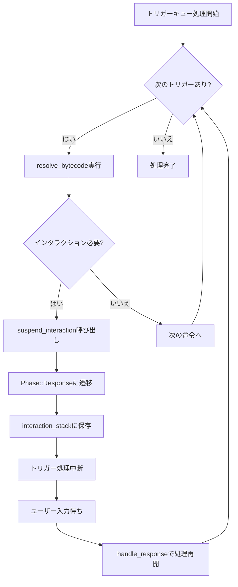
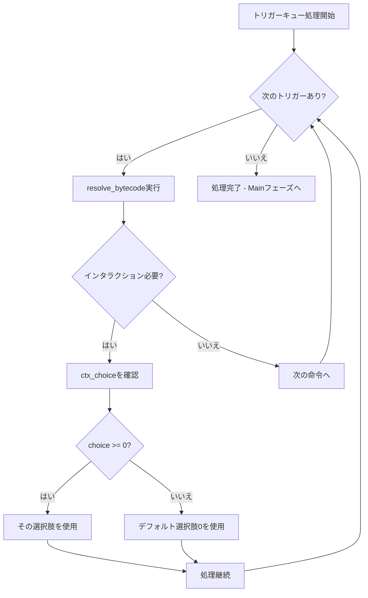

# CPU/GPU同期問題の分析と修正計画

## 現状の分析

### 達成されたこと
- Mulliganフェーズ同期 - 完全に同期（ステップ0-10）
- Main/LiveSetフェーズ同期 - 最初の25ステップまで同期
- 自動フェーズ進行の制御 - is_debugフラグで制御可能に
- Mulliganハンドラー修正 - カード選択トグルでフェーズを進めないように修正

### 残っている問題
- **Responseフェーズ遷移**: GPUがトリガー処理後にResponseフェーズに遷移していない
- **トリガーキュー処理**: GPUのprocess_trigger_queueが正しく動作していない可能性

## 根本原因の分析

### CPU側の処理フロー（正常動作）



**重要なコード箇所**:
- [`interpreter_legacy.rs:1946-1963`](engine_rust_src/src/core/logic/interpreter_legacy.rs:1946): `process_trigger_queue` - Responseフェーズでbreak
- [`interpreter_legacy.rs:225-227`](engine_rust_src/src/core/logic/interpreter_legacy.rs:225): `suspend_interaction` - Responseフェーズ遷移
- [`handlers.rs:354-385`](engine_rust_src/src/core/logic/handlers.rs:354): `resume_play_member` - インタラクション再開

### GPU側の処理フロー（問題あり）



**問題点**:
1. **Responseフェーズ遷移なし**: GPUは自動的にデフォルト選択を行い、Responseフェーズに入らない
2. **インタラクションスタックなし**: CPUの`interaction_stack`に相当するデータ構造がない
3. **処理中断なし**: トリガーキュー処理が中断されず、全て自動処理される

**該当コード**:
- [`shader_rules.wgsl:771-798`](engine_rust_src/src/core/shader_rules.wgsl:771): `O_LOOK_AND_CHOOSE` - 自動選択
- [`shader_rules.wgsl:859`](engine_rust_src/src/core/shader_rules.wgsl:859): `O_COLOR_SELECT` - choiceをそのまま使用
- [`shader_rules.wgsl:1616-1631`](engine_rust_src/src/core/shader_rules.wgsl:1616): `process_trigger_queue` - 中断なし

## 修正計画

### フェーズ1: GPU状態の拡張

#### 1.1 インタラクションスタックの追加
`shader_types.wgsl`の`GpuGameState`に以下を追加:

```wgsl
// Interaction state
struct GpuInteraction {
    card_id: u32,
    ability_index: u32,
    trigger_filter: i32,
    original_phase: i32,
    choice_type: u32,  // LOOK_AND_CHOOSE, COLOR_SELECT, etc.
    param_v: i32,
    param_a: u32,
    param_s: i32,
    ip_offset: u32,    // Resume point in bytecode
    _pad: u32,
}

// GpuGameStateに追加
interaction_stack: array<GpuInteraction, 4>,
interaction_depth: u32,
```

#### 1.2 定数の追加
```wgsl
const INTERACTION_LOOK_AND_CHOOSE: u32 = 1u;
const INTERACTION_COLOR_SELECT: u32 = 2u;
const INTERACTION_SELECT_DISCARD: u32 = 3u;
```

### フェーズ2: Responseフェーズ遷移の実装

#### 2.1 resolve_bytecodeの修正
インタラクションが必要なオペコードで、choiceが未指定の場合にResponseフェーズに遷移:

```wgsl
case O_LOOK_AND_CHOOSE: {
    let look_count = u32(v & 0xFFi);
    if (choice < 0i) {
        // 選択が必要 - Responseフェーズに遷移
        push_interaction(p_idx, card_id, ab_idx, trigger_filter,
                        INTERACTION_LOOK_AND_CHOOSE, v, a_lo, a_hi, s, ip);
        states[g_gid].phase = PHASE_RESPONSE;
        return;  // 処理を中断
    }
    // 既存の選択処理...
}
```

#### 2.2 process_trigger_queueの修正
Responseフェーズに入ったら処理を中断:

```wgsl
fn process_trigger_queue(p_idx: u32) {
    while (states[g_gid].queue_head < states[g_gid].queue_tail) {
        // Responseフェーズなら中断
        if (states[g_gid].phase == PHASE_RESPONSE) {
            return;  // キューを消費せずに戻る
        }

        let head = states[g_gid].queue_head;
        let req = states[g_gid].trigger_queue[head];
        states[g_gid].queue_head = head + 1u;

        let req_card_id = req.card_id;
        if (req_card_id < arrayLength(&card_stats)) {
            let req_stats = card_stats[req_card_id];
            resolve_bytecode(p_idx, req_card_id, req.slot_idx,
                           req.trigger_filter, req.ab_filter,
                           req_stats.bytecode_start, req_stats.bytecode_len,
                           req.choice);
        }
    }
    // キューが空ならリセット
    if (states[g_gid].queue_head >= states[g_gid].queue_tail) {
        states[g_gid].queue_head = 0u;
        states[g_gid].queue_tail = 0u;
    }
}
```

### フェーズ3: Responseフェーズ処理の実装

#### 3.1 step_stateのPHASE_RESPONSE処理
```wgsl
if (phase == PHASE_RESPONSE) {
    // アクションから選択を取得
    let choice = if (action == 0u) { -1i }  // Skip/Pass
                 else if (action >= 1000u) { i32(action - 1000u) }  // Hand card
                 else if (action >= 500u) { i32(action - 500u) }    // Mode choice
                 else { i32(action) };

    // インタラクションスタックから復元
    if (states[g_gid].interaction_depth > 0u) {
        resume_interaction(p_idx, choice);
    } else {
        // インタラクションがない場合はMainに戻る
        states[g_gid].phase = PHASE_MAIN;
    }
    recalculate_board_stats(p_idx);
    return 1u;
}
```

#### 3.2 resume_interaction関数
```wgsl
fn resume_interaction(p_idx: u32, choice: i32) {
    let depth = states[g_gid].interaction_depth - 1u;
    let interaction = states[g_gid].interaction_stack[depth];

    // 選択肢を使って処理を再開
    resolve_bytecode_from(p_idx, interaction.card_id, interaction.ip_offset,
                         interaction.trigger_filter, interaction.ability_index,
                         choice);

    // インタラクション完了
    states[g_gid].interaction_depth = depth;

    // スタックが空なら元のフェーズに戻る
    if (depth == 0u) {
        states[g_gid].phase = interaction.original_phase;
    }
}
```

### フェーズ4: CPU/GPU変換の更新

#### 4.1 GpuConversionsの更新
`gpu_conversions.rs`でインタラクションスタックを変換:

```rust
impl GpuGameState {
    pub fn from_game_state(state: &GameState, db: &CardDatabase) -> Self {
        // ... 既存の変換 ...

        // インタラクションスタックの変換
        let mut interaction_stack = [GpuInteraction::default(); 4];
        for (i, pi) in state.interaction_stack.iter().enumerate() {
            if i >= 4 { break; }
            interaction_stack[i] = GpuInteraction {
                card_id: pi.card_id as u32,
                ability_index: pi.ability_index as u32,
                // ... 他のフィールド ...
            };
        }

        Self {
            interaction_stack,
            interaction_depth: state.interaction_stack.len() as u32,
            // ... 他のフィールド ...
        }
    }
}
```

### フェーズ5: 同期テストの更新

#### 5.1 Responseフェーズでの同期チェック
```rust
// is_interactive_phaseにResponseを含める（既に含まれている）
const PHASE_RESPONSE: i32 = 10;

// 同期チェックでResponseフェーズの状態も比較
if is_interactive_phase(cpu_phase) && is_interactive_phase(gpu_state.phase) {
    // インタラクションスタックの比較も追加
    let cpu_interaction_depth = cpu_state.interaction_stack.len();
    let gpu_interaction_depth = gpu_state.interaction_depth as usize;

    if cpu_interaction_depth != gpu_interaction_depth {
        println!("  Interaction depth: CPU={} GPU={}",
                 cpu_interaction_depth, gpu_interaction_depth);
        mismatches += 1;
    }
}
```

## 実装の優先順位

1. **高優先度**: フェーズ1-3（GPU状態拡張、Response遷移、処理再開）
2. **中優先度**: フェーズ4（CPU/GPU変換）
3. **低優先度**: フェーズ5（テスト更新）

## リスクと考慮事項

1. **WGSLの制限**: 再帰関数が使えないため、インタラクションのネストには注意
2. **メモリ制限**: インタラクションスタックのサイズは固定（4レベル）
3. **パフォーマンス**: 追加の状態管理によるオーバーヘッド
4. **既存テスト**: 他のGPUテストへの影響を確認する必要がある

## 次のステップ

1. この計画のレビューと承認
2. フェーズ1から順次実装
3. 各フェーズでの同期テスト実行
4. 同期率の改善を確認
