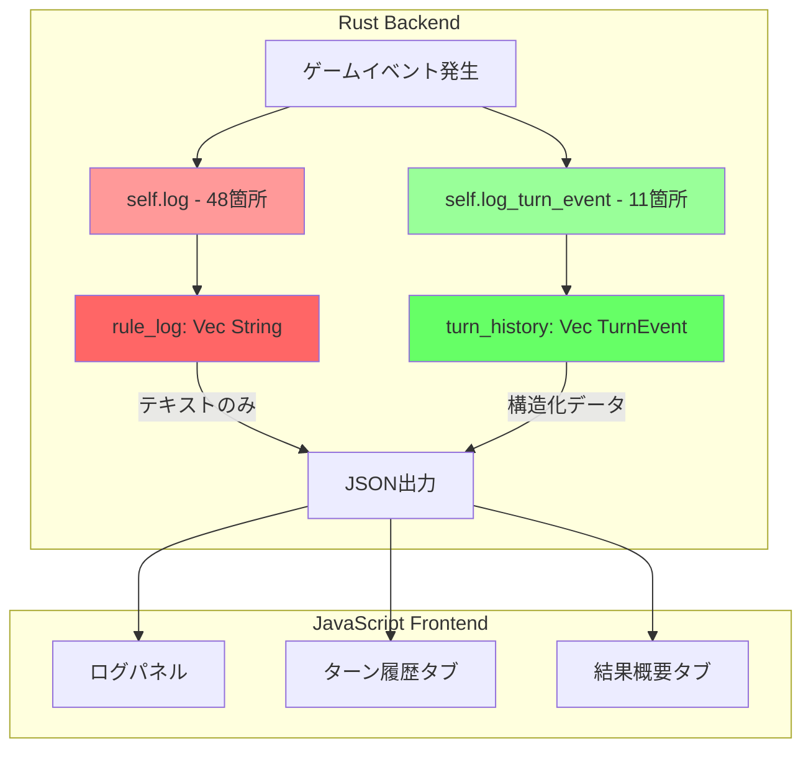
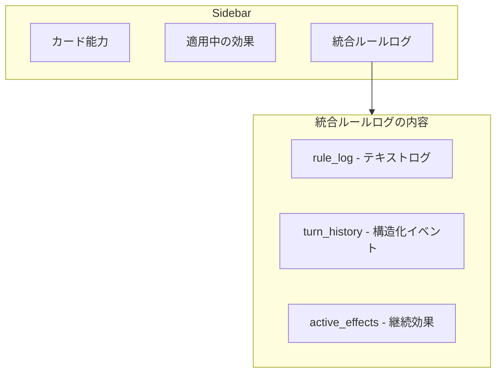

# 統合計画: 結果概要とターン履歴の統一

## 現状の分離状況

### データフローの可視化



### 重複記録の現状

| 場所 | log呼び出し | log_turn_event呼び出し | 状態 |
|------|------------|----------------------|------|
| handlers.rs:334-336 | ✅ PLAY | ✅ PLAY | **重複** |
| handlers.rs:399-401 | ✅ ACTIVATE | ✅ ACTIVATE | **重複** |
| game.rs:101-102 | ✅ RULE | ✅ RULE | **重複** |
| game.rs:688 | ❌ | ✅ TRIGGER | 分離 |
| performance.rs:247 | ❌ | ✅ YELL | 分離 |
| interpreter_legacy.rs:1119 | ❌ | ✅ EFFECT | 分離 |
| handlers.rs:60-69 | ✅ RPS | ❌ | 分離 |
| handlers.rs:141-163 | ✅ Live Set | ❌ | 分離 |
| performance.rs:224-422 | ✅ Performance | ❌ | 分離 |
| game.rs:221-228 | ✅ Setup | ❌ | 分離 |

### 呼び出しパターンの分類

#### パターンA: 両方呼び出し（3箇所のみ）
```rust
// handlers.rs:334-336
self.log(format!("Rule 7.7.2.2: Player {} plays {} to Slot {}", p_idx, card.name, slot_idx));
self.log_turn_event("PLAY", card_id, -1, p_idx as u8, &format!("Plays {} to Slot {}", card.name, slot_idx + 1));
```

#### パターンB: logのみ（45箇所）
```rust
// handlers.rs:60
self.log(format!("Rule 11.1.1: RPS Result: P0={}, P1={}", p0, p1));
// log_turn_eventは呼ばれない！
```

#### パターンC: log_turn_eventのみ（8箇所）
```rust
// game.rs:688
self.log_turn_event("TRIGGER", cid, ab_idx as i16, p_idx as u8, &format!("[{}] Triggered for {}{}", trigger_str, card_name, p_code));
// logは呼ばれない！
```

### 情報の非対称性

| 情報タイプ | rule_log | turn_history |
|-----------|----------|--------------|
| カードプレイ | ✅ テキスト | ✅ 構造化 |
| 能力発動 | ✅ テキスト | ✅ 構造化 |
| トリガー発動 | ❌ なし | ✅ 構造化 |
| RPS結果 | ✅ テキスト | ❌ なし |
| フェーズ遷移 | ✅ テキスト | ❌ なし |
| パフォーマンス詳細 | ✅ テキスト | ❌ なし |
| ドロー効果 | ❌ なし | ✅ 構造化 |
| Heart/Blade効果 | ❌ なし | ✅ 構造化 |

---

## 現状分析

### 1. データソースの概要

#### 1.1 `rule_log` (Vec<String>)
- **場所**: `UIState.rule_log` ([`state.rs:201`](engine_rust_src/src/core/logic/state.rs:201))
- **形式**: プレーンテキストのログエントリ
- **フォーマット**: `[Turn X] [ID: Y] message` または `[Rule] message`
- **用途**: ゲーム全体のログ記録
- **UI表示**: ログパネル

#### 1.2 `turn_history` (Vec<TurnEvent>)
- **場所**: `CoreGameState.turn_history` ([`state.rs:161`](engine_rust_src/src/core/logic/state.rs:161))
- **形式**: 構造化されたイベントデータ
- **構造**:
  ```rust
  pub struct TurnEvent {
      pub turn: u32,
      pub phase: Phase,
      pub player_id: u8,
      pub event_type: String,  // "PLAY", "ACTIVATE", "TRIGGER", "RULE", "PERFORMANCE", "YELL", "EFFECT"
      pub source_cid: i32,
      pub ability_idx: i16,
      pub description: String,
  }
  ```
- **UI表示**: 「ターン履歴」タブ

#### 1.3 `performance_results` / `last_performance_results`
- **場所**: `UIState.performance_results` ([`state.rs:203`](engine_rust_src/src/core/logic/state.rs:203))
- **形式**: JSON値のHashMap
- **UI表示**: 「結果概要」タブ

### 2. 現在の問題点

#### 2.1 根本的な設計問題: 2つの独立したログシステム

**`log()` システム (48箇所)**
- 目的: ゲーム全体の進行を人間が読める形式で記録
- 出力先: `rule_log: Vec<String>`
- 主な用途:
  - RPS結果、フェーズ遷移、セットアップ
  - パフォーマンス詳細、ライブ結果
  - エラー/警告メッセージ
  - デバッグ情報

**`log_turn_event()` システム (11箇所)**
- 目的: カード操作と能力発動を構造化データで記録
- 出力先: `turn_history: Vec<TurnEvent>`
- 主な用途:
  - カードプレイ、能力発動
  - トリガー発動、効果適用
  - Yell実行

#### 2.2 重複は3箇所のみ

| イベント | log() | log_turn_event() | 状態 |
|----------|-------|------------------|------|
| PLAY (handlers.rs:334-336) | ✅ | ✅ | **重複** |
| ACTIVATE (handlers.rs:399-401) | ✅ | ✅ | **重複** |
| RULE (game.rs:101-102) | ✅ | ✅ | **重複** |

#### 2.3 分離されている情報（これが問題！）

**`rule_log`のみに記録される重要な情報:**
- RPS結果と先行選択
- フェーズ遷移（Active, Energy, Draw, Main）
- マリガン処理
- パフォーマンス詳細（Blades, Hearts, Volume）
- ライブ成功/失敗判定
- ターン終了処理

**`turn_history`のみに記録される重要な情報:**
- トリガー発動の詳細
- 効果の適用（ドロー、Heart追加、Appeal追加）
- Yell実行

#### 2.4 UIでの表示分離
- 「結果概要」タブ: `performance_results` を表示（パフォーマンス結果のみ）
- 「ターン履歴」タブ: `turn_history` を表示（構造化イベントのみ）
- `rule_log`は別のログパネルに表示
- **ユーザーは3つの異なる場所を確認する必要がある**

### 3. コード上の記録箇所

#### 3.1 `log()` の呼び出し箇所 (51箇所)
- ゲームルール適用
- フェーズ遷移
- カード操作
- エラー/警告メッセージ

#### 3.2 `log_turn_event()` の呼び出し箇所 (11箇所)
| ファイル | イベントタイプ | 説明 |
|----------|---------------|------|
| [`handlers.rs:336`](engine_rust_src/src/core/logic/handlers.rs:336) | PLAY | カードプレイ |
| [`handlers.rs:401`](engine_rust_src/src/core/logic/handlers.rs:401) | ACTIVATE | 能力発動 |
| [`game.rs:102`](engine_rust_src/src/core/logic/game.rs:102) | RULE | ルール適用 |
| [`game.rs:688`](engine_rust_src/src/core/logic/game.rs:688) | TRIGGER | トリガー発動 |
| [`performance.rs:247`](engine_rust_src/src/core/logic/performance.rs:247) | YELL | Yell実行 |
| [`interpreter_legacy.rs:1119`](engine_rust_src/src/core/logic/interpreter_legacy.rs:1119) | EFFECT | ドロー効果 |
| [`interpreter_legacy.rs:1325`](engine_rust_src/src/core/logic/interpreter_legacy.rs:1325) | EFFECT | Appeal効果 |
| [`interpreter_legacy.rs:1361`](engine_rust_src/src/core/logic/interpreter_legacy.rs:1361) | EFFECT | Heart効果 |
| [`score_hearts.rs:37`](engine_rust_src/src/core/logic/interpreter/handlers/score_hearts.rs:37) | EFFECT | Appeal効果 |
| [`score_hearts.rs:63`](engine_rust_src/src/core/logic/interpreter/handlers/score_hearts.rs:63) | EFFECT | Heart効果 |
| [`draw_hand.rs:18`](engine_rust_src/src/core/logic/interpreter/handlers/draw_hand.rs:18) | EFFECT | ドロー効果 |

---

## 統合計画

### アプローチ: 段階的統合

現在の状況を整理すると:
- **重複は3箇所のみ** - 大部分は分離されている
- **各システムが異なる目的** - テキストログ vs 構造化データ
- **完全な統合は不要** - むしろ「相互運用性」の改善が必要

### Phase 1: 統一インターフェースの作成

#### 1.1 新しい統一ログ関数
```rust
impl GameState {
    /// 統一されたイベント記録関数
    /// - turn_historyに構造化データを追加
    /// - rule_logにも人間可読な形式で追加（オプション）
    pub fn log_event(
        &mut self,
        event_type: &str,
        description: &str,
        source: EventSource,
        log_to_rule_log: bool,  // rule_logにも追加するか
    ) {
        // 1. turn_historyに追加
        if self.turn_history.len() < 2000 {
            self.turn_history.push(TurnEvent {
                turn: self.turn as u32,
                phase: self.phase,
                player_id: self.current_player,
                event_type: event_type.to_string(),
                source_cid: source.card_id,
                ability_idx: source.ability_idx,
                description: description.to_string(),
            });
        }
        
        // 2. rule_logにも追加（必要な場合）
        if log_to_rule_log && !self.ui.silent {
            let turn_prefix = format!("[Turn {}]", self.turn);
            let full_msg = format!("{} {}", turn_prefix, description);
            self.ui.rule_log.push(full_msg);
        }
    }
}

/// イベントソース情報
pub struct EventSource {
    pub card_id: i32,
    pub ability_idx: i16,
    pub rule_ref: Option<&'static str>,  // 例: "Rule 7.7.2.1"
}
```

#### 1.2 既存関数のリファクタリング

**Before (重複コード):**
```rust
// handlers.rs:334-336
if !self.ui.silent { 
    self.log(format!("Rule 7.7.2.2: Player {} plays {} to Slot {}", p_idx, card.name, slot_idx));
    self.log_turn_event("PLAY", card_id, -1, p_idx as u8, &format!("Plays {} to Slot {}", card.name, slot_idx + 1));
}
```

**After (統一):**
```rust
// handlers.rs
self.log_event(
    "PLAY",
    &format!("Player {} plays {} to Slot {}", p_idx, card.name, slot_idx + 1),
    EventSource { card_id, ability_idx: -1, rule_ref: Some("Rule 7.7.2.2") },
    true,  // rule_logにも追加
);
```

### Phase 2: 分離されている情報の統合

#### 2.1 現在`rule_log`のみに記録されるイベントを`turn_history`にも追加

| イベント | 現在 | 変更後 |
|----------|------|--------|
| RPS結果 | logのみ | 両方 |
| フェーズ遷移 | logのみ | 両方 |
| パフォーマンス詳細 | logのみ | 両方 |
| ライブ成功/失敗 | logのみ | 両方 |

#### 2.2 現在`turn_history`のみに記録されるイベントを`rule_log`にも追加

| イベント | 現在 | 変更後 |
|----------|------|--------|
| トリガー発動 | turn_historyのみ | 両方 |
| 効果適用 | turn_historyのみ | 両方 |
| Yell実行 | turn_historyのみ | 両方 |

### Phase 3: UI統合

#### 3.1 統合ビューの設計

**新しいタブは作成しない** - 既存のルールログパネルに統合表示



#### 3.2 統合表示の実装

**ui_logs.jsの`renderRuleLog`関数を拡張:**

```javascript
renderRuleLog: (containerId = 'rule-log') => {
    const state = State.data;
    
    // 1. 適用中の効果を先頭に表示
    const activeEffects = state.active_effects || [];
    // 2. turn_historyから構造化イベントを取得
    const turnHistory = state.turn_history || [];
    // 3. rule_logからテキストログを取得
    const ruleLog = state.rule_log || [];
    
    // 統合表示: 適用中の効果 → ターン履歴 → ルールログ
    // または: ターン別にグループ化して表示
}
```

#### 3.3 表示形式

```
┌─────────────────────────────────────────┐
│ 適用中の効果                             │
│ ├─ [P0] 高坂穂乃果: +1 Heart (Pink)     │
│ └─ [P1] 南ことり: Draw on activate      │
├─────────────────────────────────────────┤
│ Turn 3 - Main Phase                     │
│ ├─ [PLAY] Player 0 plays 高坂穂乃果     │
│ ├─ [TRIGGER] [登場] triggered           │
│ │   └─ Effect: +1 Heart (Pink)          │
│ └─ [ACTIVATE] Player 0 activates...     │
├─────────────────────────────────────────┤
│ Turn 2 - Performance Phase              │
│ └─ [YELL] Yelled 2 card(s): ...         │
└─────────────────────────────────────────┘
```

---

## 実装優先順位

### 高優先度（Phase 1）
1. ✅ 現状分析（このドキュメント）
2. ⬜ `log_event()` 関数の実装
3. ⬜ 重複している3箇所のリファクタリング

### 中優先度（Phase 2）
4. ⬜ 分離されているイベントの統合
5. ⬜ UI統合タブの追加
6. ⬜ フィルタリング機能

### 低優先度（Phase 3）
7. ⬜ 後方互換性の維持
8. ⬜ パフォーマンス最適化

---

## 影響範囲

### 変更が必要なファイル
| ファイル | 変更内容 |
|----------|----------|
| `engine_rust_src/src/core/logic/game.rs` | `log_event()` 関数追加 |
| `engine_rust_src/src/core/logic/handlers.rs` | 重複コードの削除 |
| `engine_rust_src/src/core/logic/performance.rs` | イベント記録の統一 |
| `engine_rust_src/src/core/logic/interpreter/*.rs` | イベント記録の統一 |
| `launcher/static_content/js/ui_performance.js` | 統合ビュー追加 |
| `launcher/static_content/index.html` | タブ追加 |

### テスト項目
- 既存のリプレイシステムとの互換性
- JSON出力の後方互換性
- UIの表示整合性
