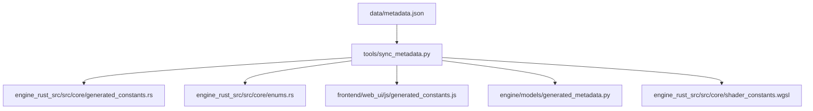
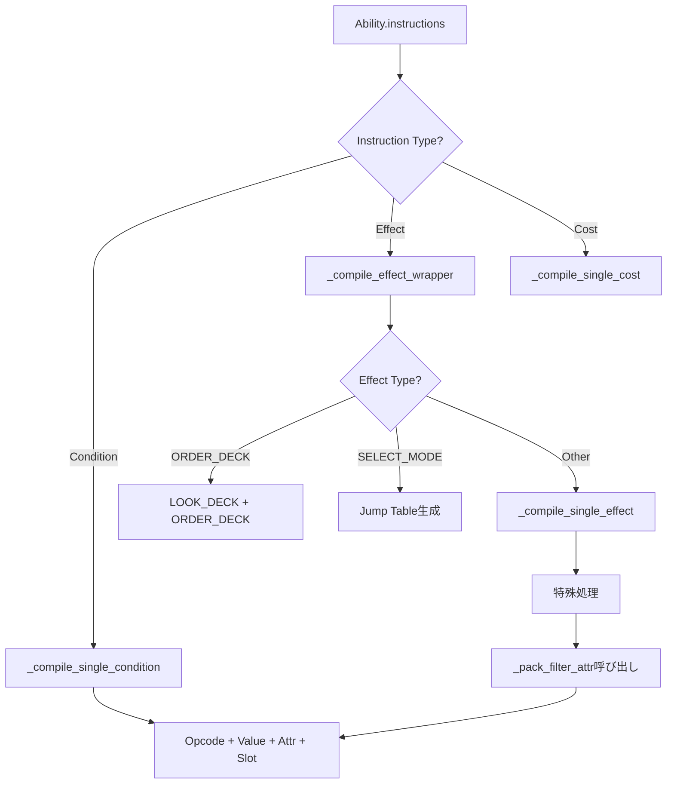

# metadata.json とバイトコード生成の分析レポート

## 概要

このレポートでは、`data/metadata.json` がバイトコード生成にどのように影響するか、またパーサーとビットマスク処理が過度に複雑かどうかを分析します。

---

## 1. metadata.json の構造

### 1.1 セクション一覧

| セクション | 用途 | エントリ数 |
|-----------|------|-----------|
| `triggers` | 能力の発動タイミング | 11 |
| `targets` | 効果の対象 | 14 |
| `opcodes` | バイトコード命令 | 67 |
| `action_bases` | アクションIDのベース値 | 13 |
| `phases` | ゲームフェーズ | 15 |
| `conditions` | 条件チェック命令 | 54 |
| `costs` | コスト種別 | 95 |
| `extra_constants` | ビットマスク定数 | 26 |
| `unused` | 未使用マーク | 0 (空) |

### 1.2 同期フロー



---

## 2. 問題点: 二重定義と不整合

### 2.1 Python側の二重定義問題

**重大な問題**: [`engine/models/ability.py`](engine/models/ability.py) には `metadata.json` とは**独立した** enum定義が存在します。

```python
# ability.py (行10-22) - metadata.json と独立
class TriggerType(IntEnum):
    NONE = 0
    ON_PLAY = 1
    ON_LIVE_START = 2
    # ...
```

これは [`engine/models/generated_metadata.py`](engine/models/generated_metadata.py) と**重複**しており、同期されていません。

### 2.2 具体的な不整合例

| 項目 | metadata.json | ability.py | 状態 |
|-----|---------------|------------|------|
| `SEARCH_DECK` | 22 | 22 | ✅ 一致 |
| `FORMATION_CHANGE` | 26 | 26 | ✅ 一致 |
| `SWAP_ZONE` | 38 | 38 | ✅ 一致 |
| `PREVENT_SET_TO_SUCCESS_PILE` | 80 | 80 | ✅ 一致 |
| `SET_HEART_COST` | 83 | 83 | ✅ 一致 |

**現在は値が一致していますが**、`ability.py`のenumは手動管理であり、将来的な不整合のリスクがあります。

### 2.3 AbilityCostType の爆発的増加

[`ability.py`](engine/models/ability.py:303-500) の `AbilityCostType` は **200以上のエントリ** を持ち、その多くが自動生成された「プレースホルダ」です:

```python
# 行410-500: 自動生成されたエントリの例
PLACE_ENERGY_FROM_DECK_TO_DISCARD = 110
PLACE_ENERGY_FROM_DECK_TO_HAND = 111
# ... 90行以上の自動生成エントリ
```

これらは `metadata.json` の `costs` セクション (95エントリ) と比較して**2倍以上の規模**です。

---

## 3. ビットマスク処理の複雑さ分析

### 3.1 _pack_filter_attr のビットレイアウト

[`ability.py`](engine/models/ability.py:1388-1595) の `_pack_filter_attr` メソッドは、64ビット整数に複数のフィルタ条件をパックします:

```
ビットレイアウト (64ビット):
┌─────────────────────────────────────────────────────────────────┐
│ Bits 2-3    : Type (0=Any, 1=Member, 2=Live)                    │
│ Bit  4      : Group Filter Enable                               │
│ Bits 5-11   : Group ID (7 bits)                                 │
│ Bit  12     : Tapped Filter                                     │
│ Bit  13     : Has Blade Heart                                   │
│ Bit  14     : Not Has Blade Heart                               │
│ Bit  15     : Unique Names                                      │
│ Bit  16     : Unit Filter Enable                                │
│ Bits 17-23  : Unit ID (7 bits)                                  │
│ Bit  24     : Cost Filter Enable  ←┐                            │
│ Bits 25-29 : Cost Threshold (5b)   │ 競合!                      │
│ Bit  30     : Cost Mode            │                            │
│ Bit  31     : Color Filter Enable ←┘                            │
│ Bits 32-38 : Character ID 1                                     │
│ Bit  42     : Character Filter Enable                           │
│ Bits 43-49 : Character ID 2                                     │
│ Bits 50-56 : Character ID 3                                     │
│ Bits 57-59 : Special Filter ID                                  │
└─────────────────────────────────────────────────────────────────┘
```

### 3.2 ビット競合の問題

**重大な設計欠陥**: Bits 24-30 が **Cost Filter** と **Color Filter** で競合しています:

```python
# Cost Filter (行1517-1536)
if c_min is not None:
    attr |= 1 << 24        # Cost Enable
    attr |= (val & 0x1F) << 25  # Cost Value

# Color Filter (行1538-1555) - 同じビット領域を使用!
if color_mask > 0:
    attr |= (color_mask & 0x7F) << 24  # ← Cost と重複!
    attr |= 1 << 31
```

これにより、Cost Filter と Color Filter は**同時に使用できません**。

### 3.3 Rust側の実装との整合性

[`engine_rust_src/src/core/logic/filter.rs`](engine_rust_src/src/core/logic/filter.rs:20-33) では、同じビットレイアウトを使用:

```rust
/// Bit layout (see generated_constants.rs):
/// - Bits 2-3: Card type (Member=1, Live=2)
/// - Bit 4: Group filter enable
/// - Bits 5-11: Group ID
/// - Bit 16: Unit filter enable
/// - Bits 17-23: Unit ID
/// - Bits 32-38: Color mask  ← 異なる! Pythonは24-30
/// - Bit 42: Character filter enable
```

**Rust側は Bits 32-38 を Color に使用**していますが、Python側は Bits 24-30 を使用しており、**不整合**があります。

---

## 4. バイトコードコンパイルの複雑さ

### 4.1 コンパイルフロー



### 4.2 特殊処理の分岐数

[`_compile_single_effect`](engine/models/ability.py:949-1386) メソッドには**15以上の特殊ケース分岐**があります:

| Effect Type | 特殊処理内容 | 行番号 |
|-------------|-------------|-------|
| `ORDER_DECK` | LOOK_DECK命令を先行 emit | 859-872 |
| `SELECT_MODE` | ジャンプテーブル生成 | 877-925 |
| `RECOVER_MEMBER/LIVE` | ゾーン再配置ビット処理 | 965-977 |
| `TAP_OPPONENT/TAP_MEMBER` | フィルタ属性パック | 981-986 |
| `PLACE_UNDER` | ソース属性設定 | 989-993 |
| `ENERGY_CHARGE` | ウェイト状態フラグ | 996-998 |
| `SELECT_MEMBER` | フィルタ属性パック | 1001-1002 |
| `PLAY_MEMBER_*` | フィルタ属性パック | 1005-1010 |
| `LOOK_AND_CHOOSE` | キャラクターID + ゾーン処理 | 1013-1099 |
| `SELECT_CARDS/MEMBER/LIVE` | 複雑なビットパッキング | 1102-1130 |
| `SET_HEART_COST` | 6色コスト + ユニットフィルタ | 1133-1194 |
| `META_RULE` | 13種類のルールタイプ | 1275-1302 |
| `REVEAL_UNTIL` | 条件タイプ別エンコード | 1305-1345 |

### 4.3 コードの複雑さ指標

| 指標 | 値 | 評価 |
|-----|-----|------|
| `_compile_single_effect` の行数 | 437行 | 🔴 過大 |
| `_pack_filter_attr` の行数 | 208行 | 🟡 中程度 |
| 特殊処理分岐数 | 15+ | 🔴 過多 |
| ビットシフト演算数 | 50+ | 🔴 過多 |
| ネスト深度 | 最大5レベル | 🟡 中程度 |

---

## 5. 推奨される改善策

### 5.1 短期的改善 (優先度: 高)

1. **二重定義の排除**
   - `ability.py` の enum を `generated_metadata.py` から import するよう変更
   - または、`sync_metadata.py` が `ability.py` も生成するよう拡張

2. **ビット競合の解消**
   - Color Filter を Bits 32-38 に移動 (Rust側に合わせる)
   - または、Cost Filter を Bits 8-14 に移動

### 5.2 中期的改善 (優先度: 中)

3. **フィルタ構造体の導入**
   ```python
   @dataclass
   class CardFilter:
       card_type: Optional[CardType]
       group_id: Optional[int]
       unit_id: Optional[int]
       cost_filter: Optional[tuple[int, bool]]  # (threshold, is_le)
       color_mask: int
       # ...

       def pack(self) -> int:
           """構造化されたフィルタをビット列に変換"""
   ```

4. **エフェクトコンパイラの分割**
   - `_compile_single_effect` を各エフェクトタイプ別のハンドラに分割
   - Visitor パターンまたは Strategy パターンの採用

### 5.3 長期的改善 (優先度: 低)

5. **バイトコード設計の再検討**
   - 現在: 4-int固定長 `[op, v, a, s]`
   - 提案: 可変長またはTLV (Type-Length-Value) 形式

6. **宣言的エフェクト定義**
   - YAML/JSON でエフェクトを定義し、コード生成

---

## 6. 結論

### 6.1 metadata.json のバイトコードへの影響

| 側面 | 評価 | 説明 |
|-----|------|------|
| Opcode値の定義 | ✅ 良好 | 自動同期されている |
| 条件/コスト値 | ✅ 良好 | 自動同期されている |
| Python enumとの整合性 | 🟡 リスクあり | 手動管理のため将来的に不整合の可能性 |
| ビットマスク定数 | 🔴 不整合あり | Python/Rustでビット位置が異なる |

### 6.2 複雑さの評価

| 側面 | 評価 | 理由 |
|-----|------|------|
| パーサー | 🟡 中程度 | 分岐は多いが構造は理解可能 |
| ビットマスク | 🔴 過度に複雑 | 競合あり、文書化不十分 |
| コンパイラ | 🔴 過度に複雑 | 400行の単一メソッド、15+分岐 |
| 保守性 | 🔴 低い | 二重定義、暗黙のビット操作 |

### 6.3 最優先すべき課題

1. **Color Filter のビット位置修正** (Rust側に合わせる)
2. **ability.py の enum を自動生成に切り替え**
3. **_compile_single_effect の分割リファクタリング**

---

## 付録: 関連ファイル一覧

| ファイル | 行数 | 役割 |
|---------|------|------|
| [`data/metadata.json`](data/metadata.json) | 323 | 定数定義のマスター |
| [`engine/models/ability.py`](engine/models/ability.py) | 1852 | 能力定義・コンパイル |
| [`tools/sync_metadata.py`](tools/sync_metadata.py) | 349 | 定数同期スクリプト |
| [`engine_rust_src/src/core/generated_constants.rs`](engine_rust_src/src/core/generated_constants.rs) | 275 | Rust定数 (自動生成) |
| [`engine_rust_src/src/core/logic/filter.rs`](engine_rust_src/src/core/logic/filter.rs) | 150+ | Rustフィルタロジック |
| [`tools/verify/bytecode_decoder.py`](tools/verify/bytecode_decoder.py) | 307 | バイトコードデコーダ |
