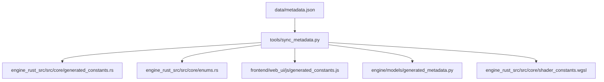

# metadata.json と Enumification 分析レポート

## 概要

このレポートでは、`data/metadata.json` がシステム全体にどのように供給されているか、そして「enumification」（列挙型化）がまだ必要な箇所を特定します。

---

## 1. metadata.json の構造

| セクション | 用途 | エントリ数 |
|-----------|------|-----------|
| `triggers` | 能力の発動タイミング | 11 |
| `targets` | 効果の対象 | 14 |
| `opcodes` | バイトコード命令 | 67 |
| `phases` | ゲームフェーズ | 15 |
| `conditions` | 条件チェック命令 | 54 |
| `costs` | コスト種別 | 95 |
| `choices` | 選択タイプ | 28 |
| `zones` | ゾーン識別 | 11 |
| `extra_constants` | ビットマスク定数 | 76+ |

---

## 2. metadata.json のフロー



---

## 3. 現在のEnumification状態

### ✅ 既にEnum化されている箇所

| ファイル | 内容 | 状態 |
|---------|------|------|
| [`engine/models/opcodes.py`](engine/models/opcodes.py) | `Opcode` enum | ✅ `generated_metadata.py` から自動生成 |
| [`engine/models/generated_metadata.py`](engine/models/generated_metadata.py) | 定数辞書 (OPCODES, TRIGGERS, etc.) | ✅ 自動生成 |
| [`engine/models/enums.py`](engine/models/enums.py) | `CardType`, `HeartColor`, `Area`, `Group`, `Unit` | ✅ 手動管理だが独立 |
| frontend JS | `TriggerType`, `EffectType`, `ActionBases` | ✅ `generated_constants.js` から import |

### ❌ Enumification がまだ必要な箇所

| ファイル | クラス | 問題点 |
|---------|-------|--------|
| [`engine/models/ability.py:27`](engine/models/ability.py) | `TriggerType` | `generated_metadata.py` 已有りの重複、手動管理 |
| [`engine/models/ability.py:42`](engine/models/ability.py) | `TargetType` | `generated_metadata.py` 已有りの重複、手動管理 |
| [`engine/models/ability.py:59`](engine/models/ability.py) | `EffectType` | `generated_metadata.py` 已有りの重複、手動管理 |
| [`engine/models/ability.py:347`](engine/models/ability.py) | `AbilityCostType` | **101+ エントリ**、手動管理、`generated_metadata.py` の COSTS と重複 |
| Rust engine | 各種 enum | `enums.rs` に重複定義の可能性 |

---

## 4. 具体的な重複例

### 4.1 TriggerType の重複

```python
# engine/models/ability.py (手動管理)
class TriggerType(IntEnum):
    NONE = 0
    ON_PLAY = 1
    # ...

# engine/models/generated_metadata.py (自動生成)
TRIGGERS = {
    "NONE": 0,
    "ON_PLAY": 1,
    # ...
}
```

### 4.2 AbilityCostType の問題

`metadata.json` の `costs` セクションには **95エントリ** がありますが、`ability.py` の `AbilityCostType` には **101+ エントリ** があり、値が重複或多すぎます。

```python
# ability.py からの例
class AbilityCostType(IntEnum):
    NONE = 0
    ENERGY = 1
    TAP_SELF = 2
    # ... 101+ entries
    # 多くは自動生成されたプレースホルダー
```

---

## 5. 推奨されるEnumification計画

### 5.1 短期 (高優先度)

1. **ability.py の enum を generated_metadata.py から import**
   - `TriggerType`, `TargetType`, `EffectType` を削除
   - `from .generated_metadata import TRIGGERS, TARGETS, OPCODES` を使用
   - または `generated_metadata.py` に IntEnum クラスを追加生成

2. **AbilityCostType の整理**
   - `metadata.json` の `costs` と 完全一致させる
   - 余分なエントリを削除
   - または `sync_metadata.py` を拡張して `AbilityCostType` enum を自動生成

### 5.2 中期 (中優先度)

3. **Rust engine の enum 統一**
   - `engine_rust_src/src/core/enums.rs` を `generated_constants.rs` から自動生成
   - 重複定義の排除

4. **Frontend JS の enum 統一**
   - `generated_constants.js` に IntEnum 相当のオブジェクトを追加

---

## 6. 関連ファイル一覧

| ファイル | 役割 |
|---------|------|
| [`data/metadata.json`](data/metadata.json) | マスターデータ |
| [`tools/sync_metadata.py`](tools/sync_metadata.py) | 同期スクリプト |
| [`engine/models/generated_metadata.py`](engine/models/generated_metadata.py) | 自動生成の定数 |
| [`engine/models/ability.py`](engine/models/ability.py) | 能力定義 (enum 重複問題) |
| [`engine/models/opcodes.py`](engine/models/opcodes.py) | Opcode enum (OK) |
| [`engine/models/enums.py`](engine/models/enums.py) | ゲーム基本enum |
| [`engine_rust_src/src/core/generated_constants.rs`](engine_rust_src/src/core/generated_constants.rs) | Rust定数 |
| [`frontend/web_ui/js/generated_constants.js`](frontend/web_ui/js/generated_constants.js) | Frontend定数 |

---

## 7. 結論

**enumification が最も必要な箇所:**

1. **`engine/models/ability.py`** - `TriggerType`, `TargetType`, `EffectType`, `AbilityCostType` の4つのenum
2. **Rust engine** - 手動管理されている enum の自動生成化

現在のシステムは **部分的に** enumification されていますが、`ability.py` には古い手動管理のenumが残っており、これらは `generated_metadata.py` と重複しています。将来的な一貫性のためには、これらのenumを自動生成システムに統合する必要があります。
