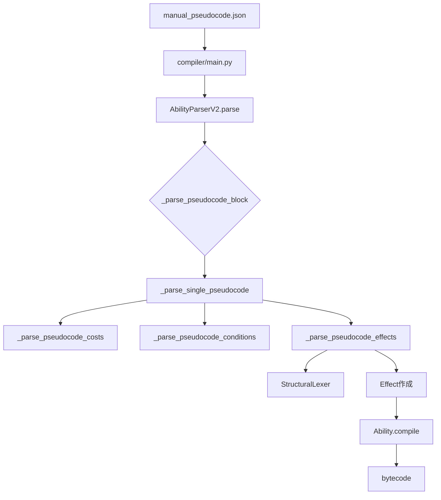
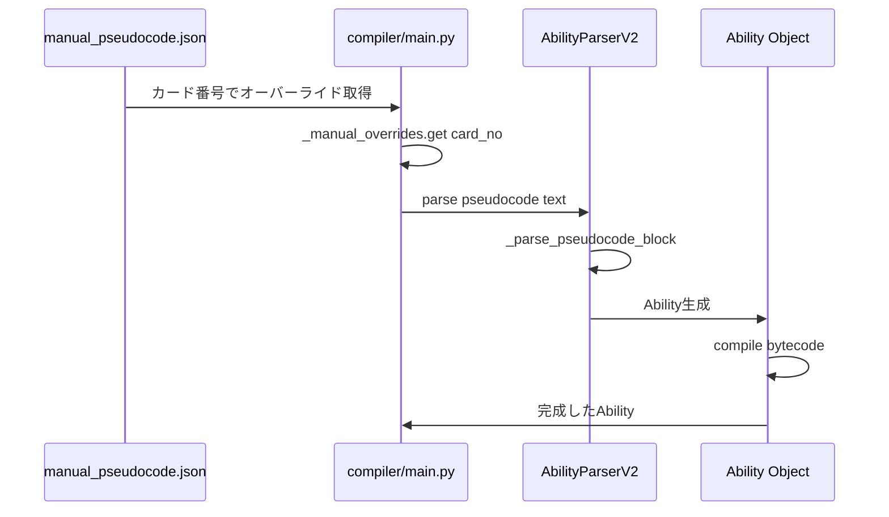

# parser_v2.py 分析レポート

## 概要

`parser_v2.py`は、カード能力テキストを解析し、構造化された`Ability`オブジェクトに変換するマルチパスパーサーです。`manual_pseudocode.json`からの擬似コード入力を処理する主要なコンポーネントです。

## アーキテクチャ



## 主要コンポーネント

### 1. StructuralLexer - 構造的レキサー
- **場所**: Lines 51-298
- **目的**: バランスブレーススキャンによる擬似コード解析
- **メソッド**:
  - `extract_balanced()`: ネストされた括弧/ブレースの抽出
  - `parse_effect()`: 単一エフェクトの構造解析
  - `split_effects()`: セミコロン区切りのエフェクト分割

### 2. AbilityParserV2 - メインパーサー
- **場所**: Lines 300-2077
- **目的**: 能力テキストの解析とAbilityオブジェクト生成
- **主要メソッド**:
  - `parse()`: エントリーポイント
  - `_parse_pseudocode_block()`: 擬似コードブロックの分割
  - `_parse_single_pseudocode()`: 単一能力の解析
  - `_parse_pseudocode_effects()`: エフェクト解析
  - `_parse_pseudocode_costs()`: コスト解析
  - `_parse_pseudocode_conditions()`: 条件解析

### 3. PatternRegistry - パターン管理
- **場所**: `compiler/patterns/registry.py`
- **目的**: 宣言的パターンマッチングシステム
- **フェーズ**: TRIGGER → CONDITION → EFFECT → MODIFIER

---

## 問題点の分析

### 問題1: エイリアス処理の分散・重複

**深刻度: 高**

エイリアスマッピングが複数の場所に分散しており、重複や不整合が発生しています。

**場所**:
- Lines 1064-1088: トリガーエイリアス
- Lines 1827-1949: エフェクトエイリアス
- Lines 1408-1600: 条件エイリアス

**例**:
```python
# Line 1064-1088
alias_map = {
    "ON_YELL": "ON_REVEAL",
    "ON_ACTIVATE": "ACTIVATED",
    ...
}

# Line 1827-1949
if name == "TAP_PLAYER":
    name = "TAP_MEMBER"
if name == "CHARGE_SELF":
    name = "ENERGY_CHARGE"
...
```

**推奨解決策**:
- エイリアスマッピングを一元管理する`aliases.py`モジュールを作成
- 辞書ベースの統一されたエイリアス解決

---

### 問題2: 複雑な正規表現パターン

**深刻度: 中**

エフェクト解析の正規表現が複雑で、エッジケースで失敗する可能性があります。

**場所**: Line 1793
```python
m = re.match(r"^([\w_]+)(?:\((.*?)\))?\s*(?:(\{.*?\})\s*)?(?:->\s*([\w, _]+))?(.*)$", p)
```

**問題点**:
- ネストされた`{}`を正しく処理しない可能性
- 複数のパラメータブロックがある場合の処理
- エラーハンドリングが不十分

**推奨解決策**:
- StructuralLexerをより積極的に活用
- 段階的な解析アプローチの採用

---

### 問題3: デバッグコードの残留

**深刻度: 低**

本番コードにデバッグ用print文が残っています。

**場所**:
- Line 2055: `print(f"DEBUG: Effect parsing - name={name}...")`
- Lines 506-513: 特定カードのデバッグ処理

**推奨解決策**:
- ログフレームワーク（logging）への移行
- デバッグコードの削除または条件付き化

---

### 問題4: パラメータ解析の不統一

**深刻度: 中**

同様のパラメータ解析が複数のメソッドで実装されています。

**場所**:
- `StructuralLexer._parse_params_content()` (Lines 201-258)
- `AbilityParserV2._parse_pseudocode_params()` (Lines 1229-1295)

**問題点**:
- 異なる処理ロジック
- 型変換の一貫性不足
- 特殊ケースの処理が分散

**推奨解決策**:
- 統一されたパラメータパーサーの作成
- 共通の型変換ユーティリティ

---

### 問題5: エラーハンドリングの不足

**深刻度: 中**

多くの場所でサイレントフェイルが発生しています。

**例**:
```python
# Line 1090-1093
try:
    trigger = TriggerType[t_name]
except (KeyError, ValueError):
    trigger = getattr(TriggerType, t_name, TriggerType.NONE)
```

**問題点**:
- 未知のタイプがNONEにフォールバック
- ログ出力なし
- デバッグが困難

**推奨解決策**:
- 警告ログの追加
- 厳格モードのオプション実装
- 未知タイプの追跡機能

---

### 問題6: OPTION解析の複雑性

**深刻度: 高**

SELECT_MODEのOPTION解析が複雑で、複数のフォーマットを処理しています。

**場所**: Lines 1115-1167

**対応フォーマット**:
1. `OPTION: Description | EFFECT: Effect1; Effect2 | COST: Cost1`
2. `Options:` + `N: EFFECT1, EFFECT2`

**問題点**:
- ネストしたオプションの処理
- 複雑なエフェクトチェーン
- エッジケースの処理不足

**推奨解決策**:
- 専用のOptionParserクラスの作成
- 再帰的解析の実装

---

### 問題7: ターゲット解決の問題

**深刻度: 中**

ターゲット解決ロジックが複雑で、`last_target`の追跡がエラーを引き起こす可能性があります。

**場所**: Lines 1800-1824, 1962-1983

**問題点**:
- デフォルトターゲットの推測
- コンテキスト依存のターゲット解決
- `last_target`の副作用

**推奨解決策**:
- 明示的なターゲット指定の推奨
- デフォルトターゲットの明確化

---

### 問題8: 条件タイプマッピングの不完全性

**深刻度: 中**

多くの特殊ケースマッピングがありますが、一部の条件が正しく処理されない可能性があります。

**場所**: Lines 1357-1700

**問題点**:
- 新しい条件タイプの追加が困難
- マッピングの優先順位が不明確
- 一部の条件がHAS_KEYWORDにフォールバック

**推奨解決策**:
- 条件マッピングの宣言的定義
- 自動テストによるカバレッジ確保

---

## manual_pseudocode.json との連携

### データフロー



### 現在の処理例

**入力** (manual_pseudocode.json):
```json
{
    "PL!-bp3-008-P": {
        "pseudocode": "TRIGGER: ACTIVATED\nCONDITION: Once per turn\nCOST: TAP_SELF\nEFFECT: RECOVER_LIVE(1) {FILTER=\"GROUP_ID=0\"} -> CARD_HAND"
    }
}
```

**処理フロー**:
1. `_parse_pseudocode_block`が`TRIGGER:`で分割
2. `_parse_single_pseudocode`が各行を解析
3. `TRIGGER: ACTIVATED` → `TriggerType.ACTIVATED`
4. `CONDITION: Once per turn` → `is_once_per_turn = True`
5. `COST: TAP_SELF` → `Cost(AbilityCostType.TAP_SELF, 0)`
6. `EFFECT: RECOVER_LIVE(1)...` → `Effect(EffectType.RECOVER_LIVE, 1, ...)`

---

## 推奨される改善計画

### フェーズ1: コード品質改善
1. デバッグコードの削除/ログ化
2. エイリアスの一元管理
3. パラメータ解析の統一

### フェーズ2: アーキテクチャ改善
1. 専用パーサークラスの分離
   - `CostParser`
   - `ConditionParser`
   - `EffectParser`
   - `OptionParser`
2. エラーハンドリングの強化

### フェーズ3: テスト・検証
1. 全manual_pseudocodeエントリのパーステスト
2. エッジケースのテストケース追加
3. パフォーマンス測定

---

## 結論

`parser_v2.py`は機能していますが、以下の点で改善が必要です:

1. **保守性**: エイリアスとマッピングが分散しており、新規追加や修正が困難
2. **堅牢性**: エラーハンドリングが不十分で、サイレントフェイルが多い
3. **可読性**: 長いメソッドと複雑な条件分岐

これらの問題を解決するために、段階的なリファクタリングを推奨します。

---

## 検証結果 (2026-02-24)

### ラウンドトリップ検証

`tools/verify_parser_roundtrip.py`を使用して、全カードのバイトコードが正しくデコンパイルできるかを検証しました。

#### 結果サマリー

| 項目 | 値 |
|------|-----|
| 総カード数 | 1,329 |
| 総アビリティ数 | 943 |
| 成功 | 930 |
| 失敗 | 13 |
| **成功率** | **98.6%** |

#### 残存する問題 (13件)

##### 1. ENERGY_CHARGE コスト問題 (2件)

**対象カード**: 331, 4427

**症状**: `COST: ENERGY_CHARGE(2) -> SELF (Optional)` がバイトコードに変換されない

**原因**: `ENERGY_CHARGE` がコストとして認識されていない可能性

**raw_text例**:
```
TRIGGER: ON_PLAY
COST: ENERGY_CHARGE(2) -> SELF (Optional)
```

**バイトコード**: `[1, 0, 0, 0]` (RETURNのみ)

##### 2. BOOST_SCORE 効果問題 (8件)

**対象カード**: 439, 4535, 8631, 12727, 498, 4594, 8690, 12786

**症状**: `BOOST_SCORE(1) -> PLAYER` がバイトコードに変換されない

**原因**: `CONSTANT` トリガー + `BOOST_SCORE` の組み合わせが処理されていない

**raw_text例**:
```
TRIGGER: CONSTANT
 BOOST_SCORE(1) -> PLAYER
```

**バイトコード**: `[1, 0, 0, 0]` (RETURNのみ)

##### 3. 日本語テキストのエンコーディング問題 (3件)

**対象カード**: 178, 383, 630

**症状**: 日本語テキストが文字化けしている

**原因**: UTF-8エンコーディングの問題

**raw_text例** (文字化け):
```
(エラーで出力{{icon_score.png|スコア}}1つにつき、あなたのライブのスコアの合計を1加算する。)
```

---

### 修正履歴

#### 2026-02-24: デコンパイラ修正

1. **条件オペコード逆引き辞書の使用**
   - `Opcode(op_val).name` から `CONDITION_REVERSE.get(op_val)` に変更
   - 動的に追加される条件タイプに対応

2. **エフェクトオペコード逆引き辞書の使用**
   - ループベースの検索から `OPCODE_REVERSE.get()` に変更
   - パフォーマンス向上

3. **ターゲット解決の修正**
   - `packed_slot & 0xF` で下位4ビットからターゲット値を取得
   - `TARGET_REVERSE` 辞書を使用

#### 2026-02-24: ability.py修正

1. **`re`モジュールのインポート追加**
   - 正規表現処理に必要

2. **ALL_AREAS/ALLフラグ処理の追加**
   - `_compile_single_condition` で `ALL_AREAS` と `ALL` フラグを処理
   - `val = 3` (全エリア) および `val |= 0x04` (全対象) を設定

---

### 次のステップ

1. **ENERGY_CHARGE コスト問題の調査**
   - `parser_v2.py` の `_parse_pseudocode_costs` メソッドを確認
   - `ENERGY_CHARGE` がコストタイプとして認識されているか確認

2. **BOOST_SCORE 効果問題の調査**
   - `CONSTANT` トリガーの処理を確認
   - `BOOST_SCORE` エフェクトのコンパイルを確認

3. **エンコーディング問題の修正**
   - `cards_compiled.json` の生成時のエンコーディング確認
   - UTF-8での一貫した処理を確保
