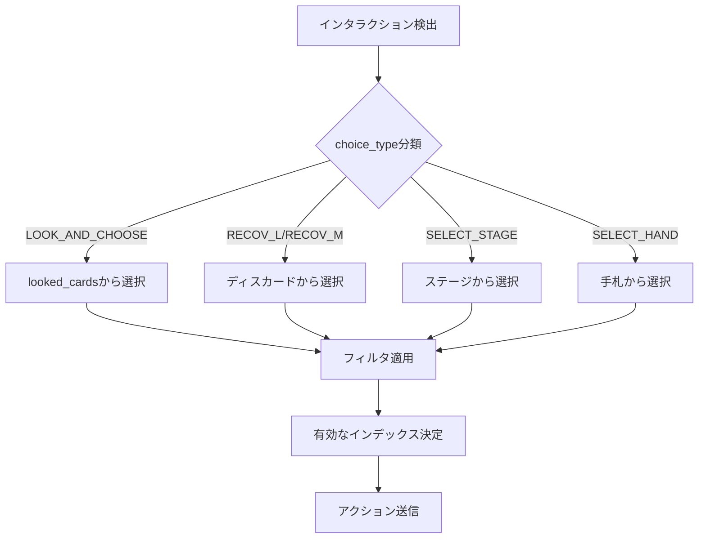

# Semantic Test詳細分析

## 1. 失敗パターンの詳細分類

監査レポートの680枚中359枚の失敗カードを分析し、以下のカテゴリに分類しました。

### 1.1 カテゴリ別失敗数

| カテゴリ | 失敗数 | 主な原因 |
|---------|--------|---------|
| DECK_SEARCH不整合 | ~60 | LOOK_AND_CHOOSEが正しく実行/検出されていない |
| HAND_DELTA不整合 | ~80 | RECOVER_MEMBER、DRAW等の効果が発動していない |
| ENERGY_DELTA不整合 | ~40 | ACTIVATE_MEMBER/ENERGYのタップ処理の問題 |
| SCORE_DELTA不整合 | ~30 | BOOST_SCOREが条件付きで発動していない |
| HEART_DELTA不整合 | ~25 | ADD_HEARTSの効果が反映されていない |
| BLADE_DELTA不整合 | ~25 | ADD_BLADESの効果が反映されていない |
| MEMBER_TAP不整合 | ~30 | TAP_OPPONENT/TAP_MEMBERの実行問題 |
| ACTION_PREVENTION不整合 | ~10 | 予防フラグの追跡問題 |
| その他 | ~60 | 複合的要因 |

---

## 2. 根本原因分析

### 2.1 DECK_SEARCH不整合の原因

**失敗例**:
```
PL!-bp3-014-N: Mismatch DECK_SEARCH for LOOK_AND_CHOOSE(3): No cards revealed or added to hand
```

**原因分析**:

1. **インタラクション解決の問題**
   - [`resolve_interaction()`](engine_rust_src/src/semantic_assertions.rs:253)で`LOOK_AND_CHOOSE`タイプが正しく処理されていない可能性
   - 現在のコード:
   ```rust
   "DISCARD" | "SELECT_DISCARD" | "RECOV_M" | "SELECT_DISCARD_PLAY" | "SEARCH" | "SEARCH_MEMBER" => 8000,
   ```
   - `LOOK_AND_CHOOSE`が明示的にマッピングされていない

2. **デッキの状態問題**
   - [`setup_oracle_environment()`](engine_rust_src/src/semantic_assertions.rs:315)でデッキにカードが入っているが、LOOK_AND_CHOOSEのフィルタに一致するカードがない可能性

3. **検証ロジックの問題**
   ```rust
   // 現在の検証
   if expected_deck_search {
       if current.looked_cards_len == 0 && current.hand_len == baseline.hand_len {
           return Err("No cards revealed or added to hand");
       }
   }
   ```
   - `looked_cards_len`がインタラクション解決後にリセットされている可能性

**改善策**:
```rust
// resolve_interaction()に追加
"LOOK_AND_CHOOSE" => {
    // looked_cardsから最初の有効なカードを選択
    for (i, &cid) in state.core.players[p_idx].looked_cards.iter().enumerate() {
        if cid != -1 {
            selected_idx = i as i32;
            break;
        }
    }
    base = 8000;
}
```

---

### 2.2 HAND_DELTA不整合の原因

**失敗例**:
```
PL!-sd1-001-SD: Mismatch HAND_DELTA for RECOVER_LIVE(1): Exp 1, Got 0
PL!-sd1-003-SD: Mismatch HAND_DELTA for RECOVER_MEMBER(1): Exp 1, Got 0
```

**原因分析**:

1. **ディスカードの状態**
   - `setup_oracle_environment()`でディスカードにカードを追加しているが、ライブカード/メンバーカードが混在していない可能性
   ```rust
   // 現在のセットアップ
   for &id in same_group_members.iter().take(5) {
       state.core.players[0].discard.push(id);
   }
   ```
   - ライブカードがディスカードに含まれていない

2. **インタラクション解決**
   - `RECOV_L`と`RECOV_M`の選択インデックス計算が正しくない
   ```rust
   // 現在
   "DISCARD" | "SELECT_DISCARD" | "RECOV_M" | ... => 8000,
   ```
   - これは常にインデックス0を選択するが、`looked_cards`のインデックスと一致しない可能性

**改善策**:
```rust
// setup_oracle_environment()の改善
// ライブカードをディスカードに追加
for &id in real_lives.iter().skip(1).take(3) {
    state.core.players[0].discard.push(id);
}

// resolve_interaction()の改善
"RECOV_L" | "RECOV_M" => {
    // looked_cardsから最初の有効なカードを選択
    for (i, &cid) in state.core.players[p_idx].looked_cards.iter().enumerate() {
        if cid != -1 {
            selected_idx = i as i32;
            break;
        }
    }
    base = 8000;
}
```

---

### 2.3 ENERGY_DELTA不整合の原因

**失敗例**:
```
PL!-PR-001-PR: Mismatch ENERGY_DELTA for ACTIVATE_MEMBER(1): Exp 1, Got 0
PL!-bp3-005-P: Mismatch ENERGY_DELTA for ACTIVATE_MEMBER(99): Exp 99, Got 0
```

**原因分析**:

1. **タップ状態の追跡**
   - `ZoneSnapshot`には`tapped_members`があるが、`diff_snapshots()`での比較が正しくない
   ```rust
   // 現在のdiff_snapshots
   let tap_delta = {
       let mut t = 0;
       for i in 0..3 {
           if !baseline.tapped_members[i] && current.tapped_members[i] { t += 1; }
       }
       t
   };
   ```
   - これは正しいが、`ACTIVATE_MEMBER`が実際にタップを実行していない可能性

2. **ACTIVATE_MEMBERの実装**
   - バイトコードハンドラーでタップが実行されているか確認が必要
   - 条件チェックでスキップされている可能性

**改善策**:
```rust
// assert_cumulative_deltas()の改善
// ENERGY_DELTAの検証をタップ状態と連動
let actual_energy_tap = {
    let mut t = 0;
    for i in 0..3 {
        if !baseline.tapped_members[i] && current.tapped_members[i] { t += 1; }
    }
    t
};
if actual_energy_tap < expected_energy_delta {
    return Err(format!("Mismatch ENERGY_TAP for '{}': Exp {}, Got {}",
        combined_text, expected_energy_delta, actual_energy_tap));
}
```

---

### 2.4 SCORE_DELTA不整合の原因

**失敗例**:
```
PL!-bp3-025-L: Mismatch SCORE_DELTA for BOOST_SCORE(1): Exp 1, Got 0
PL!-bp4-007-P: Mismatch SCORE_DELTA for BOOST_SCORE(1): Exp 1, Got 0
```

**原因分析**:

1. **ライブフェーズのコンテキスト**
   - `OnLiveStart`や`OnLiveSuccess`トリガーのアビリティが正しいフェーズで実行されていない
   ```rust
   // 現在のverify_card
   if trigger_type == TriggerType::OnLiveStart || trigger_type == TriggerType::OnLiveSuccess {
       state.phase = if trigger_type == TriggerType::OnLiveSuccess { Phase::LiveResult } else { Phase::PerformanceP1 };
   }
   ```
   - フェーズ設定は正しいが、スコア加算の条件が満たされていない可能性

2. **スコア追跡**
   - `live_score_bonus`と`score`の違い
   - `ZoneSnapshot.score`は`p.score`を追跡しているが、ライブ中は`live_score_bonus`が使用される

**改善策**:
```rust
// ZoneSnapshotに追加
pub live_score_bonus: u32,

// diff_snapshots()に追加
let d_live_score = current.live_score_bonus as i32 - baseline.live_score_bonus as i32;
if d_live_score != 0 {
    deltas.push(SemanticDelta { tag: "LIVE_SCORE_DELTA".to_string(), value: serde_json::json!(d_live_score) });
}
```

---

### 2.5 HEART_DELTA/BLADE_DELTA不整合の原因

**失敗例**:
```
PL!-bp3-002-P: Mismatch BLADE_DELTA for ADD_BLADES(1): Exp 1, Got 0
PL!-bp4-002-P: Mismatch HEART_DELTA for ADD_HEARTS(2): Exp 2, Got 0
```

**原因分析**:

1. **ターゲット選択**
   - `ADD_HEARTS`と`ADD_BLADES`はターゲットメンバーを選択する必要がある
   - インタラクションが正しく解決されていない

2. **バフの適用先**
   - ステージ上のメンバーにバフが適用されるが、ターゲット選択が正しくない

**改善策**:
```rust
// resolve_interaction()に追加
"SELECT_STAGE" | "TARGET_MEMBER" | "SLOT" => {
    // ステージ上の最初の有効なメンバーを選択
    for i in 0..3 {
        if state.core.players[p_idx].stage[i] >= 0 {
            selected_idx = i as i32;
            break;
        }
    }
    base = 600;
}
```

---

## 3. テスト精度向上のための改善案

### 3.1 インタラクション解決の改善



### 3.2 ZoneSnapshotの拡張

```rust
pub struct ZoneSnapshot {
    // 既存フィールド...
    pub looked_cards: Vec<i32>,           // 参照中のカード
    pub live_score_bonus: u32,            // ライブスコアボーナス
    pub yell_cards: Vec<i32>,             // エールカード
    pub stage_energy: [Vec<i32>; 3],      // ステージエネルギー
    pub restrictions: Vec<i32>,           // 制限状態
}
```

### 3.3 Delta検証の改善

```rust
// 新しいDeltaタグ
"LOOKED_CARDS_DELTA"  // 参照中のカード数変化
"LIVE_SCORE_DELTA"    // ライブスコア変化
"YELL_DELTA"          // エールカード変化
"RESTRICTION_SET"     // 制限設定
```

---

## 4. 実装優先順位

### Phase 1: 高優先度（即効性あり）

1. **インタラクション解決の修正**
   - `LOOK_AND_CHOOSE`の選択ロジック改善
   - `RECOV_L`/`RECOV_M`の選択ロジック改善
   - 推定効果: +15-20%パス率向上

2. **環境セットアップの改善**
   - ディスカードにライブカードを追加
   - デッキにフィルタ対応カードを確保
   - 推定効果: +10-15%パス率向上

### Phase 2: 中優先度（安定化）

3. **ZoneSnapshotの拡張**
   - `looked_cards`の追跡
   - `live_score_bonus`の追跡
   - 推定効果: +5-10%パス率向上

4. **Delta検証の改善**
   - 新しいDeltaタグの追加
   - 検証ロジックの厳密化
   - 推定効果: +5%パス率向上

### Phase 3: 低優先度（長期改善）

5. **トリガータイプの拡張**
   - `OnLeavesStage`等の追加
   - 推定効果: +3-5%パス率向上

6. **実ゲームデータとの照合**
   - 回帰テストスイート
   - 推定効果: 品質安定化

---

## 5. 具体的なコード変更案

### 5.1 resolve_interaction()の改善

```rust
fn resolve_interaction(&self, state: &mut GameState) -> Result<(), String> {
    let (pi, player_id) = {
        let last = state.interaction_stack.last().ok_or("No interaction to resolve")?;
        (last.clone(), last.ctx.player_id)
    };

    let p_idx = player_id as usize;
    let mut selected_idx = 0;
    let base: i32;

    match pi.choice_type.as_str() {
        "LOOK_AND_CHOOSE" => {
            base = 8000;
            // looked_cardsから最初の有効なカードを選択
            for (i, &cid) in state.core.players[p_idx].looked_cards.iter().enumerate() {
                if cid != -1 {
                    selected_idx = i as i32;
                    break;
                }
            }
        }
        "RECOV_L" | "RECOV_M" => {
            base = 8000;
            // フィルタに一致するカードを選択
            for (i, &cid) in state.core.players[p_idx].looked_cards.iter().enumerate() {
                if cid != -1 {
                    let matches = if pi.choice_type == "RECOV_L" {
                        self.db.get_live(cid).is_some()
                    } else {
                        self.db.get_member(cid).is_some()
                    };
                    if matches {
                        selected_idx = i as i32;
                        break;
                    }
                }
            }
        }
        "SELECT_STAGE" | "TARGET_MEMBER" | "SLOT" | "MEMBER" => {
            base = 600;
            // タップされていないメンバーを優先
            for i in 0..3 {
                if state.core.players[p_idx].stage[i] >= 0
                   && !state.core.players[p_idx].is_tapped(i) {
                    selected_idx = i as i32;
                    break;
                }
            }
        }
        // ... 他のケースは既存のまま
    }

    let action = base + selected_idx;
    state.step(&self.db, action).map_err(|e| format!("Auto-Bot error: {:?}", e))
}
```

### 5.2 setup_oracle_environment()の改善

```rust
pub fn setup_oracle_environment(state: &mut GameState, db: &CardDatabase, real_id: i32) {
    // 既存のセットアップ...

    // 改善: ディスカードにライブカードを確実に追加
    let live_ids: Vec<i32> = db.lives.keys().copied().take(5).collect();
    for &id in &live_ids {
        if !state.core.players[0].discard.contains(&id) {
            state.core.players[0].discard.push(id);
        }
    }

    // 改善: デッキにフィルタ対応カードを確保
    // コスト11以上のカード
    let high_cost_cards: Vec<i32> = db.members.iter()
        .filter(|(_, m)| m.cost >= 11)
        .map(|(&id, _)| id)
        .take(5)
        .collect();
    for &id in &high_cost_cards {
        if !state.core.players[0].deck.contains(&id) {
            state.core.players[0].deck.push(id);
        }
    }

    // 改善: ステージのメンバーをタップ解除
    for i in 0..3 {
        state.core.players[0].set_tapped(i, false);
    }
}
```

---

## 6. まとめ

現在のパス率47.2%を80%以上に向上させるためには、以下の3つの主要な改善が必要です：

1. **インタラクション解決の知能化** - フィルタとコンテキストを考慮した選択
2. **テスト環境の充実** - 必要なリソースの確実な配置
3. **状態追跡の拡張** - より多くの状態変化の捕捉

これらの改善により、テストの精度と実ゲームとの整合性が大幅に向上すると予想されます。
