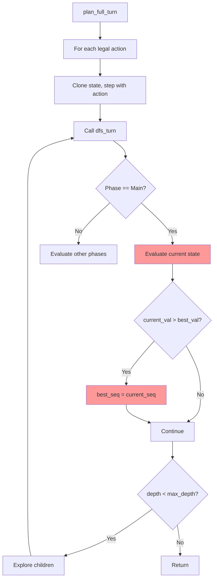

# Analysis: simple_game.rs Not Playing Cards

## Problem
The game gives a score but doesn't actually play any cards in sequence. Looking at the output:
- DFS explores nodes (41, 42, 193, etc.)
- But Main phase has no card plays - goes directly to LiveSet
- Score stays at P0=0 P1=0

## Root Cause

The issue is in `dfs_turn` function in [`turn_sequencer.rs`](engine_rust_src/src/core/logic/turn_sequencer.rs:536):

```rust
if state.phase == Phase::Main {
    // Option A: Stop Main and evaluate LiveSet result
    let (board_score, live_ev) = Self::evaluate_state(state, db);
    let current_val = board_score + live_ev;

    if current_val > *best_val {
        *best_val = current_val;
        *best_seq = current_seq.clone();  // <-- PROBLEM: Stores current sequence
        *best_breakdown = (board_score, live_ev);
    }
    // Option B continues to explore children...
}
```

### The Problem:
1. At each DFS node, it evaluates the **current state BEFORE exploring children**
2. The evaluation starts at `best_val = -1.0` (line 358 in `plan_full_turn`)
3. When the first evaluation happens (with empty or minimal sequence), if it's > -1.0, it becomes the best
4. When children are explored, if the evaluation doesn't improve (or is worse), the best_seq stays as the shorter sequence
5. **The heuristic `evaluate_state` doesn't properly reward playing member cards**, so playing more cards doesn't increase the score

### Why Score is 0:
- The score displayed is `state.players[0].score` - this is the persistent win condition (count of success lives)
- Since no cards are played, no lives are completed, score stays at 0
- The LiveSet phase still runs (shows "1 actions", "2 actions") because that's a separate search

## Solution Plan

1. **Fix the DFS evaluation order**: The DFS should explore children FIRST, then evaluate, rather than evaluating before exploring. OR, only update best_seq after exploring children.

2. **Improve the evaluation heuristic**: The `evaluate_state` function needs to better reward playing member cards. Currently it may be giving high scores even for empty boards.

3. **Add debug output**: Print the actual best_seq to see what actions are being returned.

## Files to Modify

1. `engine_rust_src/src/core/logic/turn_sequencer.rs`
   - Fix the dfs_turn function (lines 536-606)
   - Consider: Only update best_seq AFTER exploring children, not before
   - Or: Add a minimum sequence length requirement

2. `engine_rust_src/src/bin/simple_game.rs`
   - Add debug output to show the actual best_seq being executed

## Mermaid Diagram - Current Flow



The red boxes show where the bug occurs - it evaluates and updates best_seq BEFORE exploring children.
