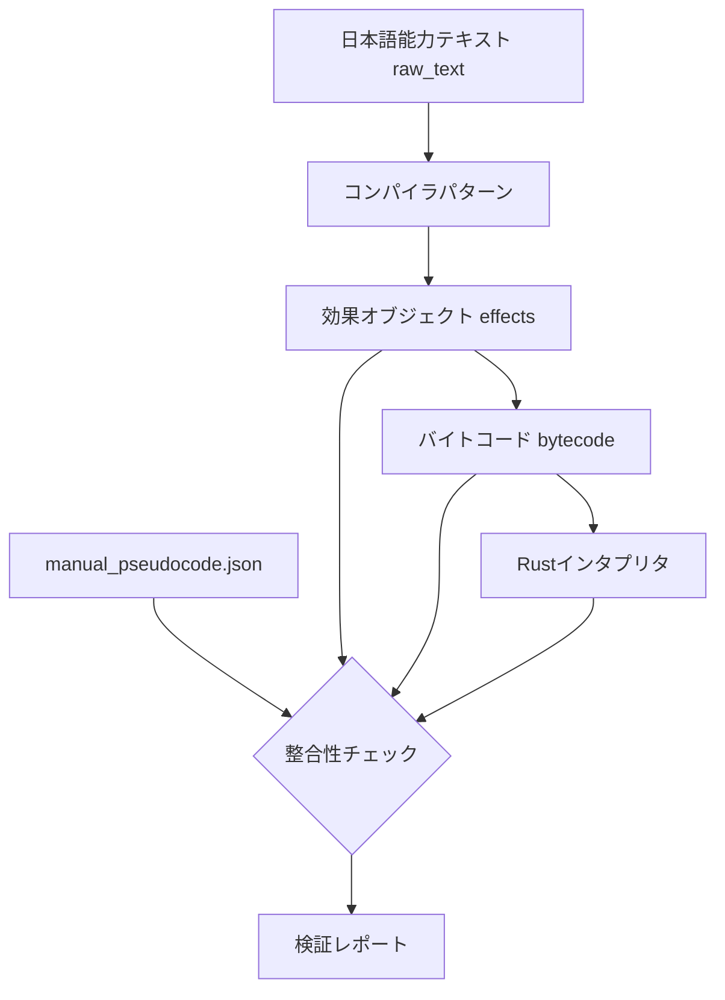

# アビリティ検証ワークフロー設計書

## 概要

このドキュメントは、カードの日本語能力テキスト、manual_pseudocode、バイトコード、Rust実装の整合性を検証するワークフローを定義します。

## データフロー



## 検証項目

### 1. 日本語テキスト → 疑似コード整合性

**目的**: コンパイラが正しく日本語テキストを解析できているか確認

**チェック内容**:
- トリガー（ON_PLAY, ON_LIVE_START等）の正確な抽出
- 効果（DRAW, ADD_BLADES等）の正確な抽出
- コスト（DISCARD_HAND, PAY_ENERGY等）の正確な抽出
- 条件（FILTER, COUNT等）の正確な抽出
- パラメータ（値、ターゲット、フィルター）の正確な抽出

**不一致パターン例**:
```
日本語: "カードを2枚引く"
期待: DRAW(2)
実際: DRAW(1)  ← 不一致
```

### 2. 疑似コード → 効果オブジェクト整合性

**目的**: 疑似コードが正しく効果オブジェクトに変換されているか確認

**チェック内容**:
- effect_typeの正確なマッピング
- value値の正確な設定
- targetの正確な設定
- paramsの正確な設定

**効果タイプマッピング**:
| effect_type | オペコード | 説明 |
|-------------|-----------|------|
| 10 | O_DRAW | カードを引く |
| 11 | O_ADD_BLADES | ブレード追加 |
| 12 | O_ADD_HEARTS | ハート追加 |
| 16 | O_BOOST_SCORE | スコアブースト |
| 17 | O_RECOVER_MEMBER | メンバー回収 |
| 23 | O_ENERGY_CHARGE | エネルギーチャージ |
| 32 | O_TAP_OPPONENT | 相手をウェイト |
| 43 | O_ACTIVATE_MEMBER | メンバーをアクティブに |

### 3. 効果オブジェクト → バイトコード整合性

**目的**: 効果オブジェクトが正しくバイトコードに変換されているか確認

**バイトコード形式**:
```
[op, v, a, s, ...]
op = オペコード
v  = 値（枚数、量など）
a  = 属性（色、フィルターなど）
s  = ターゲットスロット
```

**チェック内容**:
- オペコード番号の正確性
- 引数の順序と値の正確性
- 複数効果の結合順序

### 4. バイトコード → Rust実装整合性

**目的**: Rustハンドラーがバイトコードを正しく処理するか確認

**ハンドラーマッピング**:
| オペコード | ハンドラーファイル | 関数 |
|-----------|------------------|------|
| O_DRAW | draw_hand.rs | handle_draw |
| O_ADD_BLADES | score_hearts.rs | handle_score_hearts |
| O_ADD_HEARTS | score_hearts.rs | handle_score_hearts |
| O_BOOST_SCORE | score_hearts.rs | handle_score_hearts |
| O_ENERGY_CHARGE | energy.rs | handle_energy |
| O_TAP_OPPONENT | member_state.rs | handle_member_state |
| O_ACTIVATE_MEMBER | member_state.rs | handle_member_state |

**チェック内容**:
- ハンドラーがオペコードを正しく処理
- 引数の解釈が正しい
- ゲームステートへの反映が正しい

## 検証ワークフロー

### ステップ1: データ収集

```python
# 各カードについて以下を収集
card_data = {
    "card_no": "LL-bp1-001-R＋",
    "raw_text": "カードを1枚引く...",
    "manual_pseudocode": "TRIGGER: ON_PLAY\nEFFECT: DRAW(1)...",
    "effects": [...],  # cards_compiled.jsonから
    "bytecode": [...]   # cards_compiled.jsonから
}
```

### ステップ2: トリガー検証

```python
def verify_trigger(raw_text, pseudocode, compiled_trigger):
    # 日本語テキストからトリガーを抽出
    # manual_pseudocodeと比較
    # コンパイル済みトリガーと比較
    pass
```

### ステップ3: 効果検証

```python
def verify_effects(raw_text, pseudocode, compiled_effects, bytecode):
    # 各効果について:
    # 1. 日本語テキストから期待される効果を抽出
    # 2. manual_pseudocodeと比較
    # 3. コンパイル済み効果と比較
    # 4. バイトコードと比較
    pass
```

### ステップ4: Rust実装検証

```python
def verify_rust_implementation(opcode, handler_code):
    # オペコードに対応するハンドラーを確認
    # ハンドラーの実装ロジックを検証
    # エッジケースの処理を確認
    pass
```

### ステップ5: レポート生成

```python
def generate_report(results):
    report = {
        "total_cards": len(results),
        "passed": sum(1 for r in results if r["status"] == "PASS"),
        "warnings": sum(1 for r in results if r["status"] == "WARN"),
        "errors": sum(1 for r in results if r["status"] == "ERROR"),
        "details": results
    }
    return report
```

## レポート形式

### サマリーセクション

```markdown
# アビリティ検証レポート

## サマリー
- 総カード数: XXX
- 成功: XXX
- 警告: XXX
- エラー: XXX

## カテゴリ別結果
| カテゴリ | 成功 | 警告 | エラー |
|---------|------|------|--------|
| トリガー | XX | XX | XX |
| 効果 | XX | XX | XX |
| バイトコード | XX | XX | XX |
| Rust実装 | XX | XX | XX |
```

### 詳細セクション

```markdown
## エラー詳細

### LL-bp1-001-R＋
**ステータス**: ERROR

**不一致箇所**: 効果#2

| 項目 | 期待値 | 実際値 |
|------|--------|--------|
| 日本語 | カードを3枚引く | - |
| 疑似コード | DRAW(3) | DRAW(2) |
| バイトコード | [10, 3, ...] | [10, 2, ...] |

**推奨修正**: コンパイラパターン `draw_cards` の正規表現を確認
```

## 実装計画

### ファイル構成

```
tools/verify/
├── ability_verifier.py      # メイン検証スクリプト
├── verifiers/
│   ├── trigger_verifier.py  # トリガー検証
│   ├── effect_verifier.py   # 効果検証
│   ├── bytecode_verifier.py # バイトコード検証
│   └── rust_verifier.py     # Rust実装検証
├── data/
│   └── opcode_handlers.json # オペコードとハンドラーのマッピング
└── reports/
    └── ability_verification_report.md
```

### 実行コマンド

```bash
# 全カード検証
python tools/verify/ability_verifier.py --all

# 特定カード検証
python tools/verify/ability_verifier.py --card "LL-bp1-001-R＋"

# カテゴリ別検証
python tools/verify/ability_verifier.py --category triggers
```

## 注意事項

1. **manual_pseudocode.json**は手動で作成された参照データであり、正解として扱う
2. **日本語テキスト**は公式カードテキストであり、最終的な正解
3. **Rust実装**は実際のゲームロジックであり、仕様の最終実装
4. 警告は「動作するが改善推奨」レベル
5. エラーは「ゲームプレイに影響する可能性がある」レベル

## 次のステップ

1. 検証スクリプトの実装（Codeモード）
2. 全カードの検証実行
3. レポート生成
4. 不整合箇所の修正
