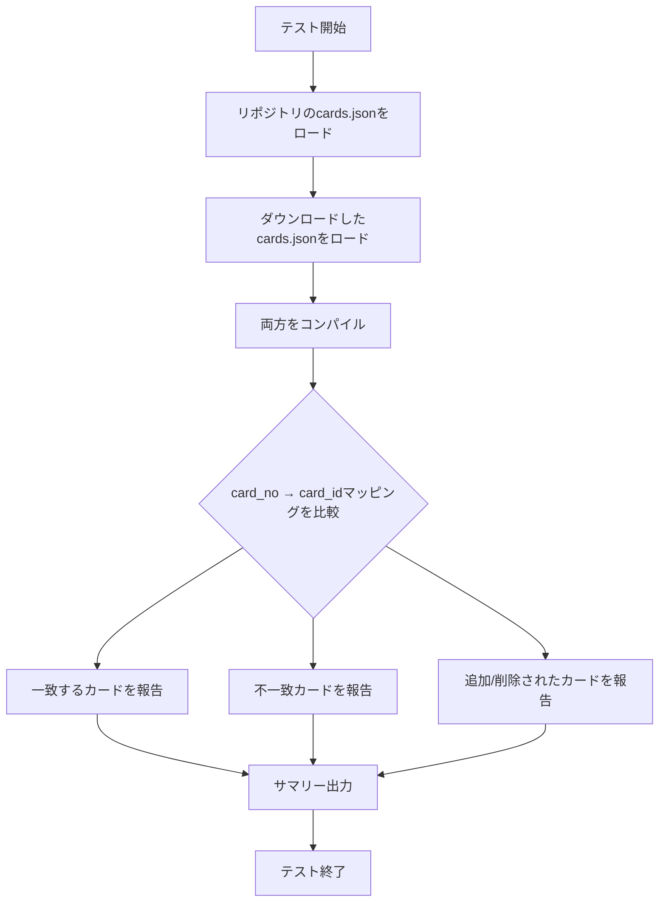

# Card ID Parity Test Plan

## 概要

ダウンロードした`cards.json`とリポジトリの`cards.json`をコンパイルし、生成される`card_id`が一致するかどうかを検証するテストを作成する。

## card_id生成ロジックの分析

[`compiler/main.py`](compiler/main.py:159-230)のコンパイル処理より:

```python
# ID生成の流れ
sorted_keys = sorted(raw_data.keys())  # card_noでソート
logic_key = (name, ability_text)       # 論理IDのキー
packed_id = (variant_idx << 12) | logic_id
```

### card_idが変わる条件

1. **カードの順序変更**: `sorted_keys`の順序が変わると`logic_id`の割り当て順が変わる
2. **名前の変更**: `logic_key = (name, ability)`の一部なので、名前が変わると新しい`logic_id`が割り当てられる
3. **アビリティテキストの変更**: 同様に`logic_key`の一部なので影響する
4. **新規カードの追加**: 順序によって既存カードの`logic_id`がシフトする可能性
5. **カードの削除**: 同様に順序に影響

## テスト設計

### テストファイル

`tests/test_card_id_parity.py`

### テストケース



### テスト関数

1. **`test_card_id_parity()`**
   - メインテスト関数
   - 両方のファイルをコンパイルしてcard_idを比較

2. **`compile_cards_to_mapping(cards_json_path)`**
   - ヘルパー関数
   - cards.jsonをコンパイルし、`card_no → card_id`のマッピングを返す

3. **`compare_mappings(old_mapping, new_mapping)`**
   - マッピングを比較し、差分を報告

### 出力形式

```
=== Card ID Parity Test ===
Repository cards: 1234 cards
Downloaded cards: 1250 cards

=== ID Match: 1200 cards ===
✓ PL!-sd1-001-SD: card_id=0
✓ PL!-sd1-002-SD: card_id=1
...

=== ID Mismatch: 15 cards ===
✗ PL!-bp1-001-R: old_id=100, new_id=102
  Reason: Ability text changed
✗ PL!-bp1-002-R: old_id=101, new_id=103
  Reason: Order shifted due to new card insertion
...

=== Added in Download: 20 cards ===
+ PL!-new-001-R: new_id=1300
...

=== Removed from Download: 5 cards ===
- PL!-old-001-R: old_id=500
...

=== Summary ===
Total cards tested: 1234
Matching IDs: 1200 (97.1%)
Mismatched IDs: 15 (1.2%)
Added: 20
Removed: 5
```

## 実装の詳細

### コンパイルロジックの再利用

[`compiler/main.py`](compiler/main.py:152)の`compile_cards()`関数を直接呼び出すか、
ID生成ロジックを抽出して再利用する。

```python
# 必要なインポート
from compiler.main import compile_cards
import json

def compile_cards_to_mapping(cards_path: str) -> dict[str, int]:
    """cards.jsonをコンパイルしてcard_no → card_idのマッピングを返す"""
    # コンパイル処理を実行
    # cards_compiled.jsonを生成
    # そこからマッピングを抽出
    ...
```

### テストの実行方法

```bash
# pytestで実行
pytest tests/test_card_id_parity.py -v

# または直接実行
python tests/test_card_id_parity.py
```

## 期待される結果

- **IDが一致する場合**: テストPASS、カードの置き換えが安全であることを確認
- **IDが不一致の場合**: テストFAIL（またはWARNING）、どのカードが影響を受けるかを詳細に報告

## 注意事項

1. テストはダウンロードした`cards.json`が存在する場合のみ実行
2. 大量のカードを処理するため、パフォーマンスに注意
3. コンパイルエラーが発生したカードは別途報告

## ファイル構成

```
tests/
├── test_card_id_parity.py    # メインテストファイル
└── integration/
    └── ...
```

## 次のステップ

1. [ ] テストファイルの作成
2. [ ] コンパイルロジックの抽出・再利用
3. [ ] 比較ロジックの実装
4. [ ] レポート出力の実装
5. [ ] テストの実行・検証
