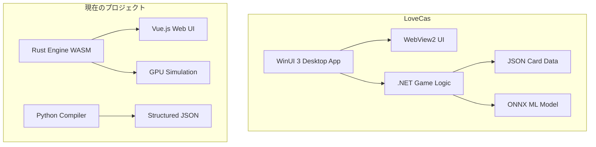

# LoveCas 1.0.1329.0 分析レポート

## 概要

LoveCasは.NET 9.0 / WinUI 3ベースのクローズドソースWindowsデスクトップアプリケーションです。本レポートでは、クローズドソースの程度、再利用可能性、および現在のプロジェクトとの比較を評価します。

---

## 1. クローズドソース状況の評価

### 1.1 技術スタック

| コンポーネント | 技術 |
|--------------|------|
| フレームワーク | .NET 9.0 / WinUI 3 |
| UI | WebView2 (Embedded browser) |
| アーキテクチャ | MVVM (ReactiveProperty) |
| ML推論 | Microsoft.ML.OnnxRuntime |
| ターゲット | Windows Desktop専用 |

### 1.2 コンパイル済みアセンブリ

| ファイル | サイズ | 内容 |
|---------|--------|------|
| LoveCas.exe | 196KB | メイン実行可能ファイル |
| LoveCas.dll | 440KB | アプリケーションロジック |
| LoveCasArch.dll | 53KB | アーキテクチャコンポーネント |

### 1.3 逆コンパイル可能性

**結論: 中程度の難易度**

- .NET DLLはILSpy、dnSpy、JetBrains dotPeekなどのツールで逆コンパイル可能
- 難読化の兆候は見当たらない（標準的な.NETアセンブリ）
- ただし、以下の制約がある：
  - WinUI 3のXAMLリソースは埋め込み形式
  - WebView2コンテンツは別途抽出が必要
  - 商用利用には法的制約がある可能性

**推奨アプローチ:**
1. ILSpyでDLLを解析し、クラス構造とAPIを把握
2. カードデータ処理ロジックを特定
3. アビリティ解析エンジンの実装を調査

---

## 2. 再利用可能なアセット

### 2.1 カードデータ (JSON)

#### LiveCardTable.json (93KB)
```
構造:
- SortID, Number, Name, Type, Group
- Score, Pink/Yellow/Purple/Red/Green/Blue/None (エネルギーコスト)
- BladeHeart 効果文字列
- Keyword, Ability, Text (アビリティ記述)
- CardSubInfo (画像パス)
```

#### MemberCardTable.json (388KB)
```
構造:
- SortID, Number, Name, Type, Group, Unit
- Cost, Blade
- Pink/Yellow/Purple/Red/Green/Blue (エネルギー)
- BladeHeart, Keyword, Ability, Text
- Constraint, LimitPoint
```

#### データフォーマット比較

| 項目 | LoveCas | 現在のプロジェクト |
|------|---------|------------------|
| エンコーディング | UTF-16 LE | UTF-8 |
| アビリティ表現 | 日本語テキスト | 構造化バイトコード |
| カードID形式 | PL!-sd1-001-SD | LL-bp1-001-R＋ |
| エネルギー表現 | 個別フィールド | 配列インデックス |

### 2.2 画像アセット

| ディレクトリ | 内容 | 数量 |
|-------------|------|------|
| Images/Icon/ | UI アイコン | ~40ファイル |
| Images/Member/ | メンバーカード画像 | ~100+ファイル |
| Images/Live/ | ライブカード画像 | ~100+ファイル |

**画像フォーマット:** PNG

### 2.3 フォント

- `rounded-x-mplus-2c-medium.ttf` (3.3MB) - 日本語フォント

---

## 3. 機能比較評価

### 3.1 アーキテクチャ比較



### 3.2 機能マトリックス

| 機能 | LoveCas | 現在のプロジェクト | 優位性 |
|------|---------|------------------|--------|
| プラットフォーム | Windows専用 | クロスプラットフォーム | **現在のプロジェクト** |
| UI技術 | ネイティブ + WebView2 | Web技術 | **現在のプロジェクト** |
| ゲームエンジン | .NET | Rust/WASM | **現在のプロジェクト** |
| アビリティ解析 | 日本語テキスト | 構造化バイトコード | **現在のプロジェクト** |
| ML推論 | ONNX | 未実装 | **LoveCas** |
| カードデータ量 | 約500枚 | 約500枚 | 同等 |
| 画像アセット | PNG | WebP | **LoveCas** (高品質) |
| デプロイ | インストーラー | Web/サーバー | **現在のプロジェクト** |

### 3.3 アビリティ表現の比較

#### LoveCas (テキストベース)
```json
{
  "Keyword": "登場時、回収",
  "Ability": "Salvage",
  "Text": ";登場時=場のカード2枚を山札の上に戻してよい。その後、山札の上から2枚引く。;回収=場のカード1枚を手札に戻してよい。"
}
```

#### 現在のプロジェクト (構造化)
```json
{
  "raw_text": "TRIGGER: ON_PLAY\nEFFECT: RECOVER_MEMBER(1) -> CARD_HAND",
  "trigger": 1,
  "effects": [
    {
      "effect_type": 17,
      "value": 1,
      "target": 6,
      "params": {"source": "discard"}
    }
  ],
  "bytecode": [17, 1, 0, 6, 1, 0, 0, 0]
}
```

**分析:**
- LoveCasは自然言語処理が必要
- 現在のプロジェクトは直接実行可能
- LoveCasのテキストは翻訳/理解に有用

---

## 4. 推奨事項

### 4.1 推奨: 限定的な再利用

#### 優先度: 高

1. **カードデータの統合**
   - LoveCasのJSONを変換スクリプトで現在の形式に変換
   - 日本語テキストをアビリティ検証の参照として使用
   - 新カードの追加に活用

2. **画像アセットの活用**
   - PNG画像をWebPに変換して使用
   - アイコンセットの再利用

#### 優先度: 中

3. **逆コンパイルによる知見獲得**
   - ゲームルールの実装詳細を確認
   - エッジケースの処理方法を学習
   - MLモデルの活用方法を調査

#### 優先度: 低

4. **コードの直接再利用**
   - .NETからRustへの移植は非効率
   - アーキテクチャの違いが大きい

### 4.2 非推奨事項

1. **コードの直接コピー** - 言語/アーキテクチャの違い
2. **DLLの直接使用** - Windows専用、配布制約
3. **UIコンポーネントの再利用** - 技術スタックの違い

---

## 5. 次のステップ

### 即時実施可能

- [ ] JSON変換スクリプトの作成 (UTF-16 → UTF-8、フィールドマッピング)
- [ ] 画像アセットの変換 (PNG → WebP)
- [ ] カードデータのマージ

### 追加調査が必要

- [ ] ILSpyによるDLL解析
- [ ] ONNXモデルの抽出と調査
- [ ] ライセンス/著作権の確認

---

## 6. 結論

**LoveCasは現在のプロジェクトより優れているか?**

**部分的にはい、全体的ではありません。**

| 側面 | 優位性 |
|------|--------|
| デスクトップ体験 | LoveCas |
| クロスプラットフォーム | 現在のプロジェクト |
| 実行性能 | 現在のプロジェクト (Rust) |
| ML/AI機能 | LoveCas |
| 拡張性 | 現在のプロジェクト |
| 開発速度 | 現在のプロジェクト (Web技術) |

**最終推奨:**
LoveCasからは**データとアセット**を抽出して活用し、コードベースは現在のプロジェクトを継続使用することを推奨します。LoveCasのML推論機能が重要な場合は、ONNXモデルを抽出してRustプロジェクトに統合することを検討してください。
