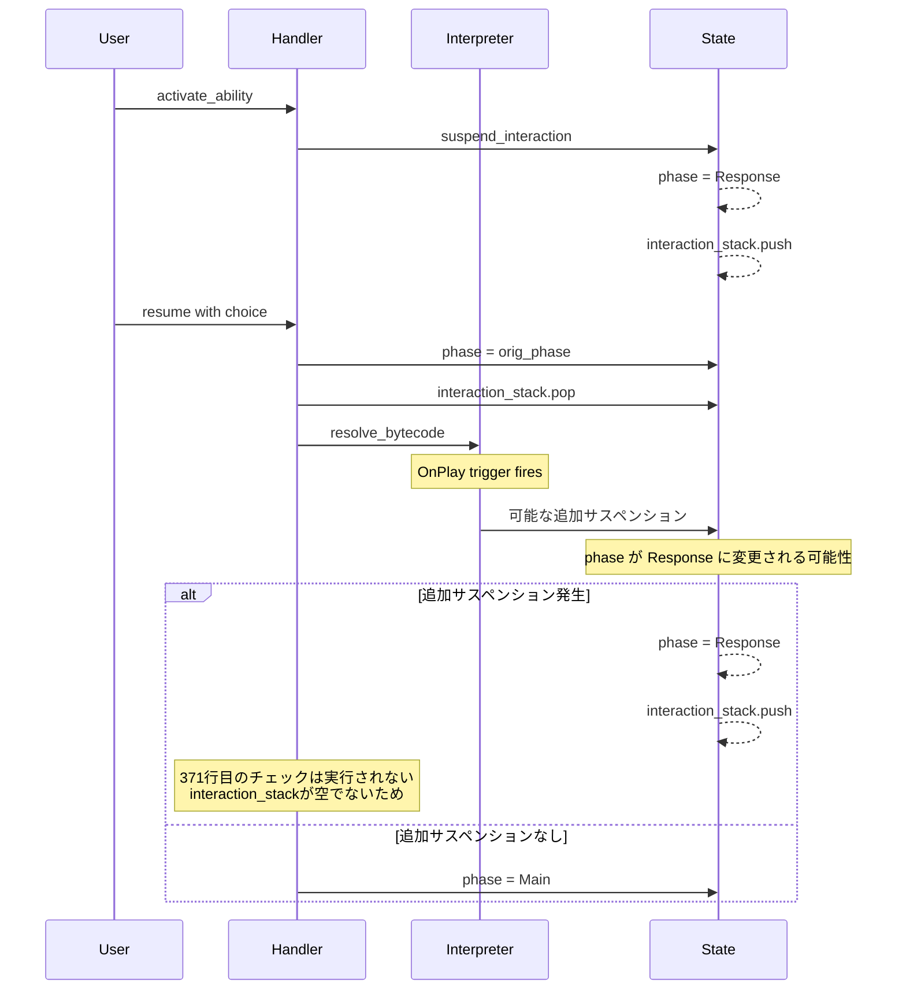
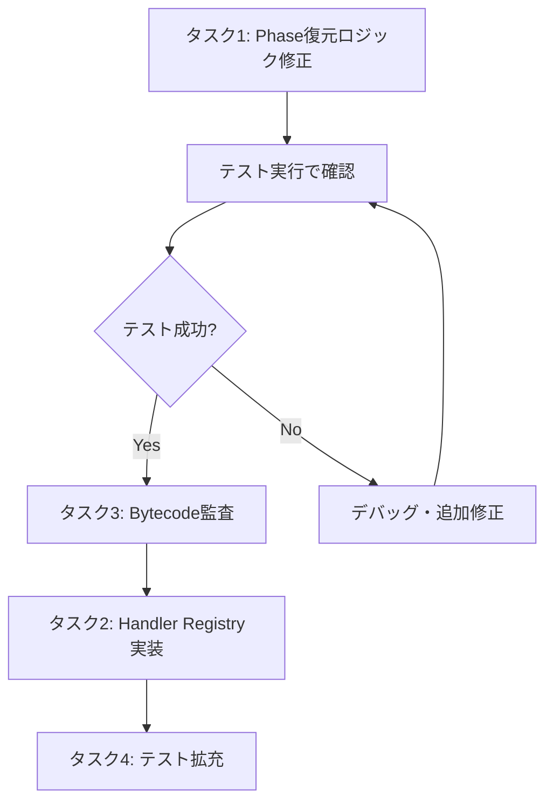
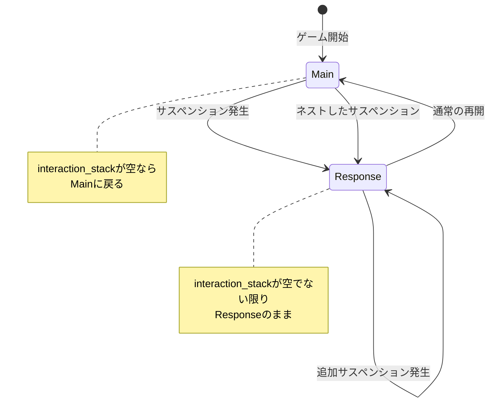
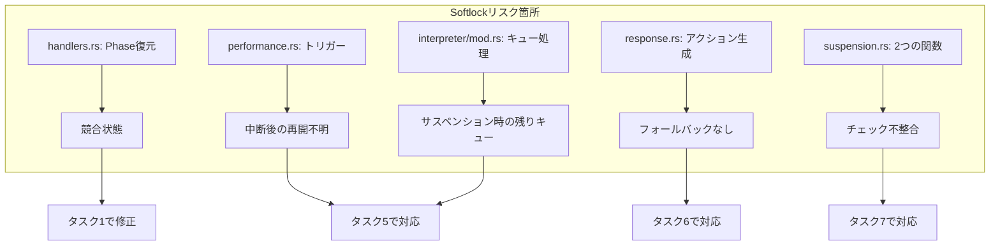

# Phase 4 改善計画 - 詳細レポート

## 概要

[`reports/phase4_refactor_report.md`](reports/phase4_refactor_report.md)の分析に基づき、残存する問題点と改善策を詳細に整理します。

**注記**: `interpreter.rs`は現在リファクタリング中で、新しいモジュール構造（`interpreter/`ディレクトリ）に移行しています。

---

## 現状のステータス

| カテゴリ | ステータス | 詳細 |
|:---|:---|:---|
| **Enforcement Logic** | ✅ 完了 | `once_per_turn`と`prevent_activate`チェックが[`handlers.rs:399-416`](engine_rust_src/src/core/logic/handlers.rs:399-416)で復元済み |
| **Name Normalization** | ✅ 完了 | キャラクター名の正規化が完了 |
| **Sequential Interaction** | ❌ 失敗 | `test_card_275`が失敗 - `Phase::Response`でスタック |

---

## アーキテクチャ現状

### Interpreter モジュール構造

リファクタリング中の新しい構造：

```
engine_rust_src/src/core/logic/interpreter/
├── mod.rs           # メインエントリポイント (200行)
├── conditions.rs    # 条件チェック (21KB)
├── costs.rs         # コスト処理 (13KB)
├── filter.rs        # フィルタリング (5KB)
├── suspension.rs    # サスペンション処理 (5KB)
└── handlers/
    └── mod.rs       # オペコードハンドラ (プレースホルダー)
```

**重要**: 新しい[`interpreter/mod.rs`](engine_rust_src/src/core/logic/interpreter/mod.rs)は基本的なフレームワークのみ実装済み。`HandlerRegistry::dispatch`はプレースホルダーで、実際のオペコード処理は未実装。

---

## 問題分析

### 1. Sequential Interaction Resumption (Softlock)

**現象**: カード275（せつ菜）のテストで、`O_PLAY_MEMBER_FROM_HAND`後にエンジンが`Phase::Response`でスタックする。

**テストケース**: [`repro_card_fixes.rs:85-118`](engine_rust_src/src/repro_card_fixes.rs:85-118)

```rust
#[test]
fn test_card_275_sequential_interaction_resumption() {
    // 1. 初期実行 - サスペンション発生
    state.activate_ability(&db, 0, 0).expect("Activation failed");
    assert_eq!(state.phase, Phase::Response);
    assert_eq!(state.interaction_stack.len(), 1);
    
    // 2. 再開 - プレイヤーが手札を選択
    state.activate_ability_with_choice(&db, 1000, 0, 0, -1).expect("Resumption failed");
    
    // 3. 検証 - ここで失敗
    assert_eq!(state.phase, Phase::Main, "Should HAVE returned to Main phase");
    assert!(state.interaction_stack.is_empty(), "Interaction stack should be cleared");
}
```

**根本原因**:

[`handlers.rs:342-376`](engine_rust_src/src/core/logic/handlers.rs:342-376)の`activate_ability_with_choice`関数にPhase復元の競合状態があります：



**問題のコードフロー**:

```rust
// handlers.rs:342-376 (簡略化)
fn activate_ability_with_choice(&mut self, db: &CardDatabase, ...) -> Result<(), String> {
    if self.phase == Phase::Response {
        // 1. コンテキスト取得
        let (cid, ctx, orig_phase) = self.interaction_stack.last()...;
        
        // 2. Phase復元 (早すぎる!)
        self.phase = orig_phase;
        if self.phase == Phase::Response || self.phase == Phase::Setup { 
            self.phase = Phase::Main; 
        }
        
        // 3. スタックから削除
        self.interaction_stack.pop();
        
        // 4. Bytecode実行 - ここで新しいサスペンションが発生する可能性
        self.resolve_bytecode(db, &bytecode, &ctx);
        self.process_rule_checks();
        
        // 5. 二重チェック (機能しない場合がある)
        if self.phase == Phase::Response && self.interaction_stack.is_empty() {
            self.phase = orig_phase;
            ...
        }
        return Ok(());
    }
    // ...
}
```

**問題点**:

1. **364-366行目**: Phase復元と`interaction_stack.pop()`が`resolve_bytecode`の前に実行される
2. **368行目**: `resolve_bytecode`内でOnPlayトリガーが発動し、新たなサスペンションが発生する可能性
3. **371-374行目**: チェック条件が`interaction_stack.is_empty()`を含むため、新たなサスペンションがある場合は実行されない

---

### 2. Interpreter Handler Registry の未実装

**現状**: [`interpreter/handlers/mod.rs`](engine_rust_src/src/core/logic/interpreter/handlers/mod.rs)はプレースホルダーのみ

```rust
pub fn dispatch(...) -> HandlerResult {
    // Placeholder for now. In Phase 2/3, we will implement actual dispatching.
    HandlerResult::Continue
}
```

**影響**: 新しいインタープリタ構造では、すべてのオペコードが`Continue`を返し、実際の処理がスキップされる。

---

## 改善タスク

### タスク1: Phase復元ロジックの修正 【優先度: 高】

**対象ファイル**: [`handlers.rs`](engine_rust_src/src/core/logic/handlers.rs)

**変更内容**:

`activate_ability_with_choice`関数のPhase復元ロジックを以下のように修正：

```rust
// 修正案: resolve_bytecode後にPhaseを確認・復元
fn activate_ability_with_choice(&mut self, db: &CardDatabase, slot_idx: usize, ab_idx: usize, choice_idx: i32, target_slot: i32) -> Result<(), String> {
    let p_idx = self.current_player as usize;
    if self.phase == Phase::Response {
        let (cid, ctx, orig_phase) = if let Some(pi) = self.interaction_stack.last() {
            let mut c = pi.ctx.clone();
            c.choice_index = choice_idx as i16;
            if target_slot >= 0 { c.target_slot = target_slot as i16; }
            (pi.card_id, c, pi.original_phase)
        } else { return Err("No pending interaction".to_string()); };

        // ... bytecode取得 ...

        // 変更点: popは実行するが、phaseはまだ変更しない
        self.interaction_stack.pop();

        self.resolve_bytecode(db, &bytecode, &ctx);
        self.process_rule_checks();

        // 変更点: resolve_bytecode後に、interaction_stackの状態に基づいてPhaseを決定
        if self.interaction_stack.is_empty() {
            self.phase = if orig_phase == Phase::Response || orig_phase == Phase::Setup {
                Phase::Main
            } else {
                orig_phase
            };
        }
        // else: 新たなサスペンションがあるのでPhase::Responseのままにする
        
        return Ok(());
    }
    // ...
}
```

---

### タスク2: Handler Registry の実装 【優先度: 高】

**対象ファイル**: [`interpreter/handlers/mod.rs`](engine_rust_src/src/core/logic/interpreter/handlers/mod.rs)

**必要な作業**:

1. 主要なオペコードのハンドラを実装:
   - `O_DRAW` - カードドロー
   - `O_PLAY_MEMBER_FROM_HAND` - メンバーのプレイ
   - `O_RECOVER_LIVE` / `O_RECOVER_MEMBER` - 回復
   - `O_ENERGY_CHARGE` - エネルギーチャージ
   - `O_SELECT_MODE` - 選択モード
   - その他

2. 各ハンドラは`HandlerResult`を返す:
   - `Continue` - 次の命令へ
   - `Suspend` - ユーザー入力待ち
   - `Return` - 現在のフレーム終了
   - `Branch(usize)` - 分岐

---

### タスク3: カード275のBytecode監査 【優先度: 中】

**内容**: カード275（せつ菜）のbytecodeに暗黙の`RETURN`オペコードが欠落していないか確認

**確認方法**:
1. [`data/cards_compiled.json`](data/cards_compiled.json)でカード275のbytecodeを確認
2. すべての分岐が`O_RETURN`で終了しているか検証

---

### タスク4: テストケースの拡充 【優先度: 低】

**内容**:
- ネストしたインタラクションのテストケースを追加
- Phase復元のエッジケースをカバーするテストを追加

---

## 実行順序



---

## 技術的詳細

### Phase遷移の正しいフロー



### Suspension 処理の流れ

[`suspension.rs:70-120`](engine_rust_src/src/core/logic/interpreter/suspension.rs:70-120)の`suspend_interaction_with_db`関数：

1. 現在のコンテキストを保存
2. `interaction_stack`に`PendingInteraction`をプッシュ
3. `phase = Phase::Response`に設定
4. Softlock防止チェック（有効な選択肢があるか確認）

---

## 次のステップ

1. **即座に実施**: タスク1のPhase復元ロジック修正
2. **並行実施可能**: タスク3のBytecode監査
3. **後続実施**: タスク2とタスク4

---

## 他の潜在的なSoftlock挙動の分析

### 2. Performance Phase中のトリガーサスペンション

**現象**: [`performance.rs`](engine_rust_src/src/core/logic/performance.rs)の複数の場所で、トリガーイベント後に`if state.phase == Phase::Response { return; }`というチェックがある。

**問題点**:
- パフォーマンスフェーズ中にトリガーがサスペンションを引き起こした場合、処理を中断する
- 再開後の処理フローが明確でない

**影響を受ける箇所**:
- [`performance.rs:149`](engine_rust_src/src/core/logic/performance.rs:149) - OnRevealトリガー
- [`performance.rs:171`](engine_rust_src/src/core/logic/performance.rs:171) - OnLiveStartトリガー
- [`performance.rs:250`](engine_rust_src/src/core/logic/performance.rs:250) - Yell後
- [`performance.rs:607`](engine_rust_src/src/core/logic/performance.rs:607) - OnLiveSuccessトリガー
- [`performance.rs:848`](engine_rust_src/src/core/logic/performance.rs:848) - TurnEndトリガー

---

### 3. Trigger Queue処理中のサスペンション

**現象**: [`interpreter/mod.rs:179-188`](engine_rust_src/src/core/logic/interpreter/mod.rs:179-188)の`process_trigger_queue`関数

```rust
pub fn process_trigger_queue(state: &mut GameState, db: &CardDatabase) {
    while let Some((cid, ab_idx, ctx, is_live, _trigger)) = state.core.trigger_queue.pop_front() {
        let bytecode = ...;
        resolve_bytecode(state, db, bytecode, &ctx);
    }
}
```

**問題点**:
- `resolve_bytecode`中にサスペンションが発生した場合、残りのトリガーキューが処理されない
- キューの処理が中断されたまま、再開メカニズムがない

**影響**: 複数のトリガーがキューにある場合、最初のトリガーでサスペンションすると残りが処理されない可能性

---

### 4. Response Generatorのフォールバック問題

**現象**: [`action_gen/response.rs:175-177`](engine_rust_src/src/core/logic/action_gen/response.rs:175-177)

```rust
if receiver.is_empty() {
    receiver.add_action(0);
}
```

**問題点**:
- 一部の`choice_type`では`allow_action_0 = false`に設定されている
- これらの場合、有効なアクションがないとsoftlockが発生する可能性

**影響を受けるchoice_type**:
- `REVEAL_HAND` - action 0が無効
- `SELECT_SWAP_SOURCE` - action 0が無効
- `SELECT_SWAP_TARGET` - action 0が無効
- `PAY_ENERGY` - action 0が無効

---

### 5. Softlock防止チェックの不整合

**現象**: [`suspension.rs`](engine_rust_src/src/core/logic/interpreter/suspension.rs)に2つの関数が存在

1. `suspend_interaction` - softlock防止チェックなし
2. `suspend_interaction_with_db` - softlock防止チェックあり

**問題点**:
- `suspend_interaction`はsoftlock防止チェックを行わない
- 呼び出し元がどちらを使用するかによって挙動が異なる

**推奨**: すべてのサスペンション呼び出しを`suspend_interaction_with_db`に統一

---

### 6. ネストしたインタラクションのPhase管理

**現象**: `interaction_stack`は`Vec<PendingInteraction>`で、複数のサスペンションをネストできる

**問題点**:
- 各`PendingInteraction`は独自の`original_phase`を持つ
- ネストしたサスペンションが解決される際、どの`original_phase`を使用すべきかが不明確

**シナリオ**:
```
1. Main Phase → Ability発動 → Response Phase (stack: [A])
2. Response Phase → OnPlayトリガー → Response Phase (stack: [A, B])
3. Bを解決 → どのPhaseに戻る？ (Aのoriginal_phase? Bのoriginal_phase?)
```

---

## 追加の改善タスク

### タスク5: Trigger Queue処理の堅牢化 【優先度: 中】

**内容**:
- `process_trigger_queue`でサスペンションが発生した場合、残りのキューを保持
- 再開時にキューの処理を継続するメカニズムを追加

---

### タスク6: Response GeneratorのSoftlock防止 【優先度: 中】

**内容**:
- すべての`choice_type`で、有効なアクションがない場合のフォールバックを追加
- または、サスペンション前に有効なアクションがあることを確認

---

### タスク7: サスペンション関数の統一 【優先度: 低】

**内容**:
- `suspend_interaction`を削除し、`suspend_interaction_with_db`に統一
- または、両方にsoftlock防止チェックを追加

---

## Softlock発生箇所のまとめ



---

## 関連ファイル

| ファイル | 役割 | 状態 |
|:---|:---|:---|
| [`handlers.rs`](engine_rust_src/src/core/logic/handlers.rs) | Phase復元ロジック | 修正必要 |
| [`interpreter/mod.rs`](engine_rust_src/src/core/logic/interpreter/mod.rs) | 新しいインタープリタ | フレームワークのみ |
| [`interpreter/handlers/mod.rs`](engine_rust_src/src/core/logic/interpreter/handlers/mod.rs) | オペコードハンドラ | プレースホルダー |
| [`interpreter/suspension.rs`](engine_rust_src/src/core/logic/interpreter/suspension.rs) | サスペンション処理 | 実装済み |
| [`performance.rs`](engine_rust_src/src/core/logic/performance.rs) | パフォーマンスフェーズ | 中断後の再開要確認 |
| [`action_gen/response.rs`](engine_rust_src/src/core/logic/action_gen/response.rs) | アクション生成 | フォールバック要確認 |
| [`repro_card_fixes.rs`](engine_rust_src/src/repro_card_fixes.rs) | テストケース | 失敗中 |
