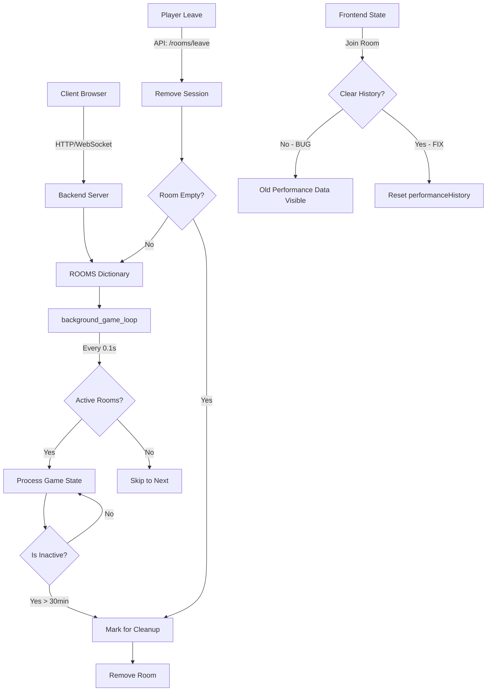

# Room Leakage & Performance Optimization Plan

## Issue Analysis Summary

### 1. Room Leakage (バックエンド)

**Root Cause:**
- `ROOMS`辞書 ([`backend/server.py:171`](backend/server.py:171)) に自动クリーナーがない
- `background_game_loop` ([`backend/server.py:958`](backend/server.py:958)) が0.1秒ごとに全ルームを反復処理
- `last_active`タイムスタンプは更新されるが、クリーンアップに使用されていない
- プレイヤー退出エンドポイントが存在しない

**Impact:**
- 退出したプレイヤーのルームがメモリに永久に残る
- 非アクティブルームでもバックグラウンドループがリソースを消費
- 長時間稼働でメモリリーク発生

### 2. パフォーマンスフェーズ情報が新しいゲームに引き継ぐ (フロントエンド)

**Root Cause:**
- [`frontend/web_ui/js/state.js:51-52`](frontend/web_ui/js/state.js:51:52) の `performanceHistory` と `performanceHistoryTurns` がルーム作成/参加時にクリアされない
- 新しいルームに参加しても、旧ゲームのパフォーマンスデータが画面に表示される

**Impact:**
- 新しいゲームで以前のパフォーマンス結果が見えてしまう
- ユーザー体験の混乱

### 3. フロントエンドレイテンシー/リソース使用

**Current State:**
- ポーリング: AI思考中250ms、ライブ500ms、それ以外1000ms
- DOMキャッシュ実装済み ([`frontend/web_ui/js/ui_rendering.js:18-62`](frontend/web_ui/js/ui_rendering.js:18:62))
- PerformanceMonitorユーティリティ存在 ([`frontend/web_ui/js/utils/PerformanceMonitor.js`](frontend/web_ui/js/utils/PerformanceMonitor.js))

---

## Implementation Plan

### Phase 1: Backend Room Cleanup System

#### 1.1 Implement automatic room cleanup
- Add cleanup logic in `background_game_loop`:
  - Check `last_active` timestamp
  - Remove rooms inactive for > X minutes (configurable)
  - Remove rooms where all players have left
- Add configurable timeout constant: `ROOM_INACTIVE_TIMEOUT_MINUTES = 30`

#### 1.2 Add leave room endpoint
- Create `/api/rooms/leave` endpoint
- Remove player session from room
- If room becomes empty, mark for cleanup

#### 1.3 Optimize background game loop
- Skip processing for inactive rooms (no active sessions)
- Add "paused" state for rooms where all players left

### Phase 2: Frontend State Reset

#### 2.1 Clear performance history on room change
- Modify `Network.joinRoom()` or room creation logic
- Reset `performanceHistory` and `performanceHistoryTurns` in State
- Add reset for `lastPerformanceData`

#### 2.2 Clear state on new game
- Ensure all relevant state fields are reset when:
  - Creating new room
  - Joining existing room
  - Resetting game

### Phase 3: Performance Optimization

#### 3.1 Review polling efficiency
- Current: 250ms (thinking), 500ms (live), 1000ms (idle)
- Consider WebSocket for real-time updates (future enhancement)

#### 3.2 Monitor performance metrics
- Use existing PerformanceMonitor for render time tracking
- Add network latency tracking

---

## Architecture Diagram

---

## Files to Modify

### Backend
1. `backend/server.py`
   - Add room cleanup logic in `background_game_loop()`
   - Add `/api/rooms/leave` endpoint
   - Add `ROOM_INACTIVE_TIMEOUT_MINUTES` constant

### Frontend  
2. `frontend/web_ui/js/state.js`
   - Add `resetGameState()` function to clear all game-related state
3. `frontend/web_ui/js/network.js`
   - Call state reset on room join/create

---

## Priority Order

1. **Critical**: Backend room cleanup (prevents memory leak)
2. **Critical**: Frontend state reset (fixes visible bug)
3. **High**: Add leave room endpoint
4. **Medium**: Optimize background loop to skip inactive rooms
5. **Low**: Future WebSocket implementation for real-time updates
